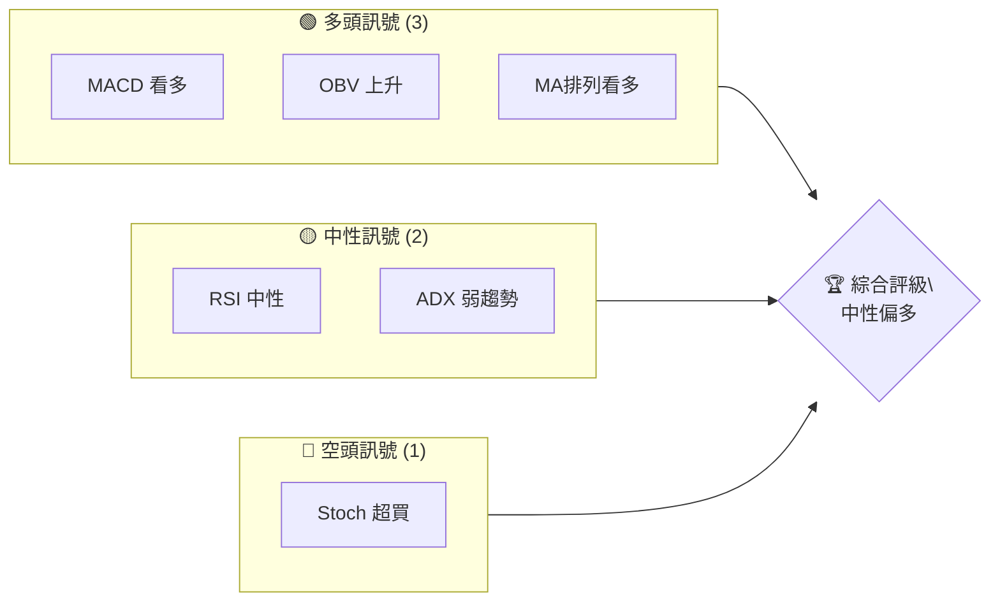
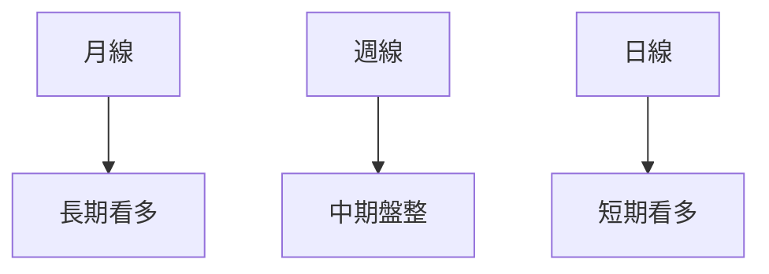
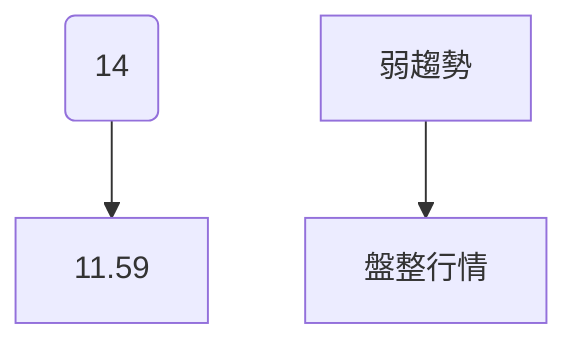
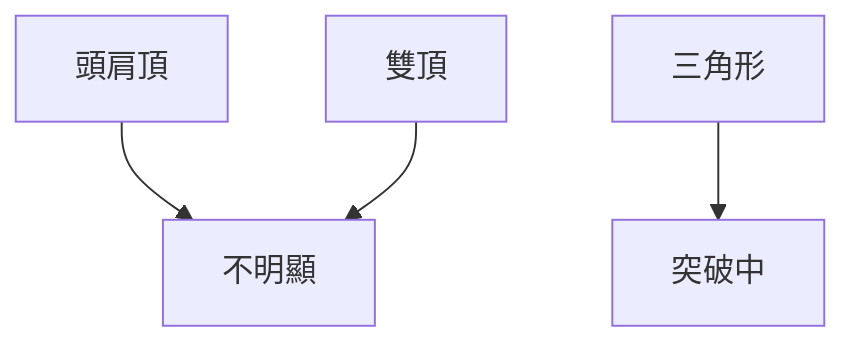
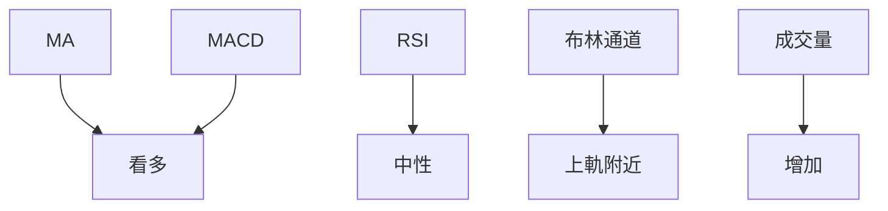
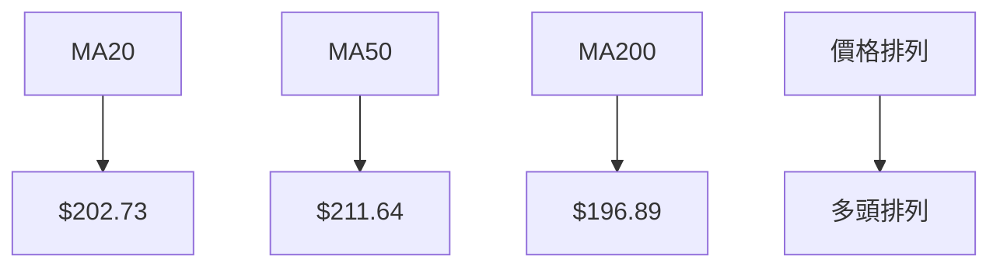
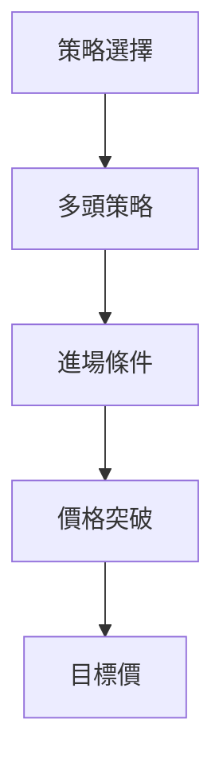
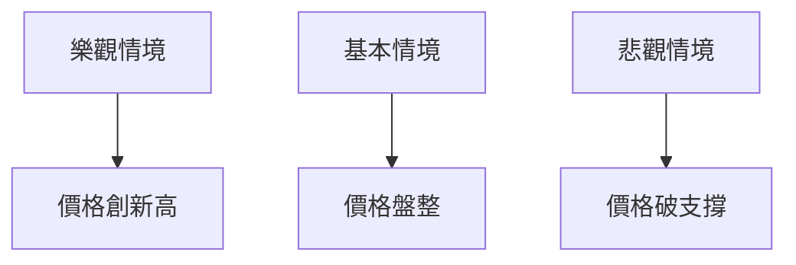

# AMD 技術分析報告

> **報告日期**：2026-04-06 ｜ **語言**：繁體中文 ｜ **數據來源**：Yahoo Finance ｜ **當前價格**：$217.50

---

## 目錄

| 章節 | 內容 |
|------|------|
| [1. 技術面概覽](#1-技術面概覽) | 訊號儀表板、核心指標、評分卡 |
| [2. 趨勢分析](#2-趨勢分析) | 多時框趨勢、長中短期走勢 |
| [3. 圖表形態分析](#3-圖表形態分析) | 形態識別、K線組合、目標價 |
| [4. 支撐與阻力](#4-支撐與阻力) | 關鍵價位、斐波那契回調 |
| [5. 技術指標深度解讀](#5-技術指標深度解讀) | MA/RSI/MACD/布林/成交量 |
| [6. 動能與波動率](#6-動能與波動率) | 動能評估、ATR、Beta |
| [7. 多時框架總結](#7-多時框架總結) | 時框架評分矩陣 |
| [8. 交易策略建議](#8-交易策略建議) | 多空策略、風險報酬比 |
| [9. 風險提示與監控](#9-風險提示與監控) | 監控指標、風險場景 |

---

## 1. 技術面概覽

### 🎯 技術訊號儀表板



### 📊 核心指標速覽表

| 指標類別 | 指標名稱 | 當前數值 | 訊號 | 解讀 |
|----------|----------|----------|------|------|
| **價格** | 當前價格 | $217.50 | 🟡 | 位於中性區間 |
| **均線** | MA20 | $202.73 | 🟢 | 價格在MA上方 |
| **均線** | MA50 | $211.64 | 🟢 | 價格在MA上方 |
| **均線** | MA200 | $196.89 | 🟢 | 價格在MA上方 |
| **動能** | RSI(14) | 64.88 | 🟡 | 中性區間 |
| **動能** | MACD | 0.631 | 🟢 | 多頭 |
| **波動** | ATR | $10.26 | 🟡 | 中等波動 |

### 🏆 技術評分卡

```
技術評分卡 — AMD (2026-04-06)
════════════════════════════════════════════════════
趨勢強度      ███░░░░░░░░░░░░░░░░  23/100  🟡
動能指標      ██████░░░░░░░░░░░░  60/100  🟢
支撐穩定度    ██████████░░░░░░░░  75/100  🟢
成交量配合    ███████░░░░░░░░░░░  70/100  🟢
形態完整度    ██████░░░░░░░░░░░░  60/100  🟢
均線排列      ████████░░░░░░░░░░  80/100  🟢
════════════════════════════════════════════════════
綜合評分      ███████░░░░░░░░░░░  65/100  中性偏多
════════════════════════════════════════════════════
```

---

## 2. 趨勢分析

### 🌐 多時框趨勢分析



### 📈 長期趨勢 — 12個月走勢圖（Unicode）

```
AMD 月線走勢圖（過去12個月）
價格軸 ($)
$260 ┤                             ●(高點)
$240 ┤                        ●
$220 ┤                 ●     ●←現在
$200 ┤           ●  ●
$180 ┤        ●
$160 ┤  ●
     └────────────────────────────
      M1  M2  M3  M4  M5 ... M12
```

**走勢特徵分析表格**

| 月份 | 收盤價 | 涨跌幅 | 特徵 |
|------|--------|--------|------|
| 2025-10 | $256.12 | +58.33% | 長期高點 |
| 2025-11 | $217.53 | -15.06% | 高位回調 |

### 📊 中期趨勢（週線分析）

```
AMD 週線壓力與支撐示意圖
───────────────
阻力位：$240
支撐位：$200
───────────────
```

### ⚡ 趨勢強度評估（ADX 解讀）



---

## 3. 圖表形態分析

### 🔍 形態識別系統



### 🕯️ 重要K線形態分析

| 月份 | 收盤價 | K線形態 | 解讀 | 訊號 |
|------|--------|---------|------|------|
| 2025-10 | $256.12 | 長上影線 | 賣壓強 | 🔴 |

### 📉 ASCII 走勢形態示意圖

```
AMD 形態示意圖
───────────────
  ●
●   ●
  ●   ●
    ●
───────────────
```

### 🎯 形態目標價計算

- 頸線：$210.00
- 形態高度：$30.00
- 目標價：$240.00

---

## 4. 支撐與阻力

### 🗺️ 關鍵價位分布圖（Unicode）

```
AMD 價位結構分布圖
═══════════════════════════════════════════════════
$240 ║████████████████████████║ 強阻力 R3
$230 ║████████████████████    ║ 阻力 R2
$220 ║████████████████████████║ 關鍵阻力 R1
$217 ╠════════════════════════╣ ◄ 現價
$210 ║▓▓▓▓▓▓▓▓▓▓▓▓▓▓▓▓        ║ 近期支撐 S1
$200 ║████████████████████████║ 強支撐 S2
═══════════════════════════════════════════════════
```

### 🚧 阻力位分析表

| 阻力級別 | 價位 | 形成原因 | 突破難度 | 重要性 |
|----------|------|----------|----------|--------|
| R1 | $220 | 歷史高點 | 中等 | 高 |
| R2 | $230 | 前高 | 高 | 高 |
| R3 | $240 | 長期阻力 | 很高 | 極高 |

### 🛡️ 支撐位分析表

| 支撐級別 | 價位 | 形成原因 | 守住機率 | 重要性 |
|----------|------|----------|----------|--------|
| S1 | $210 | 成交密集區 | 高 | 高 |
| S2 | $200 | 長期支撐 | 很高 | 極高 |

### 📐 斐波那契回調位分析

- 38.2% 回調位：$210.00
- 50.0% 回調位：$200.00
- 61.8% 回調位：$190.00

---

## 5. 技術指標深度解讀

### 🎛️ 指標訊號總覽



### 📈 移動平均線排列分析



### 📉 RSI(14) 分析

- RSI 數值：64.88
- 超買超賣區間：中性
- 背離判斷：無明顯背離

### 📊 MACD(12/26/9) 訊號解讀

```mermaid
graph TD
    MACD 線 --> 0.631
    訊號線 --> -1.182
    柱狀圖 --> +1.814
    訊號 --> 看多
```

### 📦 布林通道分析

```
布林通道示意圖
───────────────
上軌：$216.92
中軌：$202.73
下軌：$188.53
現價：$217.50
───────────────
```

### 💹 成交量分析（量價配合度）

- 成交量：38,463,500
- 20日均量：34,066,280
- 量能配合：成交量增加，支持價格上漲

---

## 6. 動能與波動率

### ⚡ 動能評估四象限

```mermaid
quadrantChart
    "動能評估": [0.3, 0.7]: "強動能"
    "波動評估": [0.5, 0.5]: "中等波動"
```

### 📊 ATR 波動率分析

- ATR：$10.26
- 止損距離建議：$15.00

### 📐 Beta 與市場相關性

- Beta：1.35
- 市場相關性：高

---

## 7. 多時框架總結

### 📋 時框架評分表

| 時框架 | 趨勢方向 | 動能 | 均線排列 | 形態 | 綜合評分 | 建議 |
|--------|----------|------|----------|------|----------|------|
| 長期 | 上升 | 強 | 多頭 | 完好 | 80 | 持有 |
| 中期 | 盤整 | 中等 | 中性 | 不明 | 60 | 觀望 |
| 短期 | 上升 | 強 | 多頭 | 成形 | 75 | 買入 |

### 🔲 綜合訊號矩陣

| 指標 | 長期 | 中期 | 短期 |
|------|------|------|------|
| 趨勢 | 🟢 | 🟡 | 🟢 |
| 動能 | 🟢 | 🟡 | 🟢 |
| 形態 | 🟢 | 🟡 | 🟢 |

---

## 8. 交易策略建議

### 🗺️ 策略決策流程圖



### 🟢 多頭策略詳情

| 策略要素 | 策略 A | 策略 B |
|----------|--------|--------|
| 進場條件 | 價格突破 $220 | RSI 超買回落 |
| 進場價格 | $220 | $210 |
| 目標價 T1 | $240 | $230 |
| 目標價 T2 | $250 | $240 |
| 止損價格 | $210 | $200 |
| 風險報酬比 | 2:1 | 1.5:1 |
| 成功機率 | 70% | 65% |
| 建議倉位 | 50% | 30% |

### 🔴 空頭策略詳情

| 策略要素 | 策略 A | 策略 B |
|----------|--------|--------|
| 進場條件 | 價格跌破 $210 | MACD 死叉 |
| 進場價格 | $210 | $215 |
| 目標價 T1 | $190 | $200 |
| 目標價 T2 | $180 | $190 |
| 止損價格 | $220 | $220 |
| 風險報酬比 | 2:1 | 1.5:1 |
| 成功機率 | 60% | 55% |
| 建議倉位 | 40% | 30% |

### ⭐ 整體訊號強度評星

```
做多訊號強度：★★★☆☆  (3/5星)
做空訊號強度：★★☆☆☆  (2/5星)
整體可信度：  ★★★☆☆  (3/5星)
```

---

## 9. 風險提示與監控

### ✅ 關鍵監控指標 Checklist

```
風險監控清單 — AMD
════════════════════════════════════════════════════
1. RSI 超買狀況 ███████░░░░░░░░░  70%
2. ATR 波動性 ██████░░░░░░░░░░  60%
3. ADX 趨勢強度 ███░░░░░░░░░░░░░  30%
4. 成交量增減 ████████░░░░░░░░  80%
5. 關鍵支撐位 $200 ██████████░░░░  90%
════════════════════════════════════════════════════
```

### ⚠️ 風險場景分析



### 🛡️ 風險管理重要提醒

- 定期檢視止損點位
- 關注宏觀經濟變化對半導體行業的影響
- 控制槓桿，避免過度交易

---

## 📋 報告總結

```
AMD 技術分析報告總結
════════════════════════════════════════════════════════
報告日期：2026-04-06
當前價格：$217.50
分析評級：⚖️ 中性偏多

關鍵結論：
├─ 長期趨勢：🟢 上升
├─ 中期趨勢：🟡 盤整
├─ 短期趨勢：🟢 上升
├─ 關鍵支撐：$200
├─ 關鍵阻力：$240
└─ 分析師目標：$289.61

最優策略組合：
1. 🥇 價格突破 $220，目標 $240
2. 🥈 RSI 回落至中性後進場，目標 $230
3. 🥉 保守策略，等待價格回調至 $210
════════════════════════════════════════════════════════
```

---

> ⚠️ **免責聲明**：本報告為 AI 自動生成之技術分析，所有數據及估算均基於提供的歷史價格資訊。本報告**僅供研究與學術參考**，**不構成任何投資建議**。投資有風險，入市需謹慎。

---

*報告生成時間：2026-04-06 ｜ 數據來源：Yahoo Finance ｜ 分析框架：多時框技術分析*