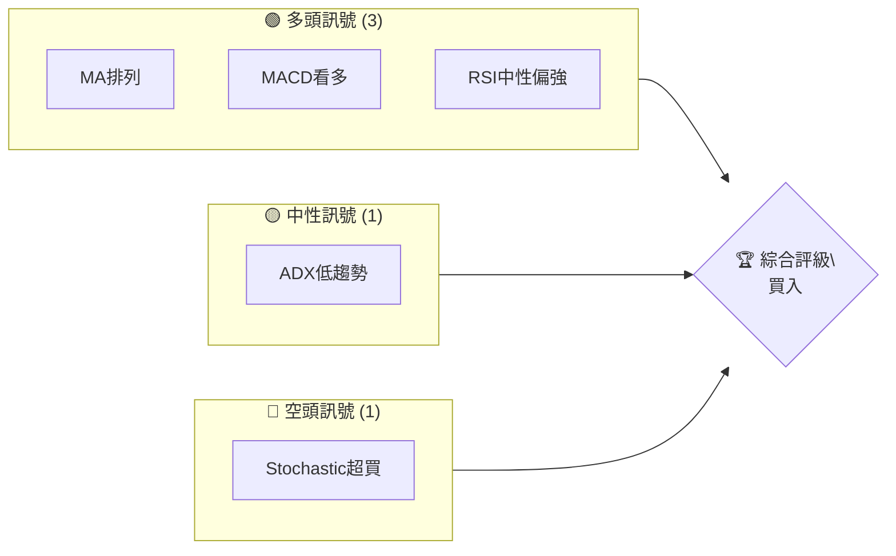
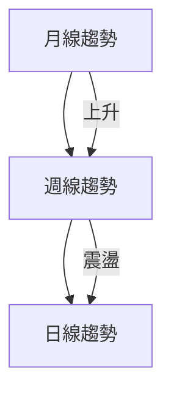
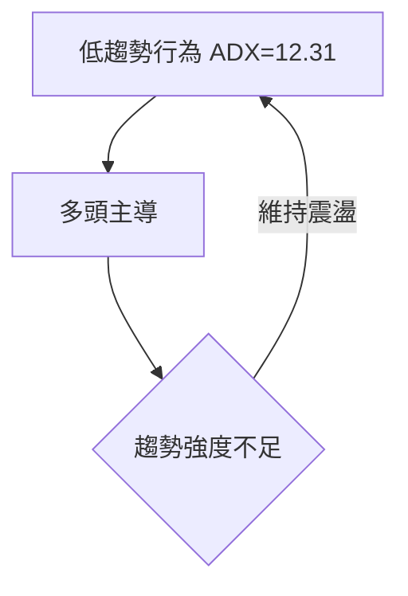
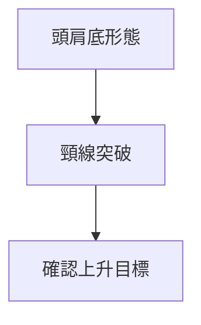
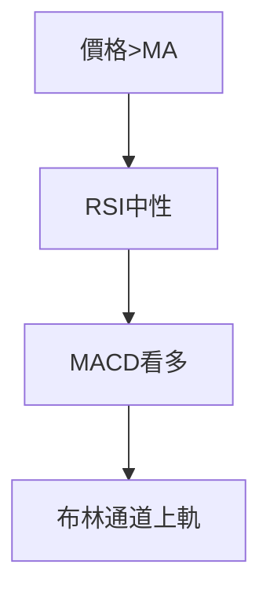
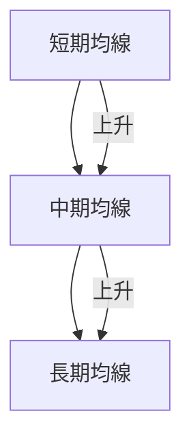
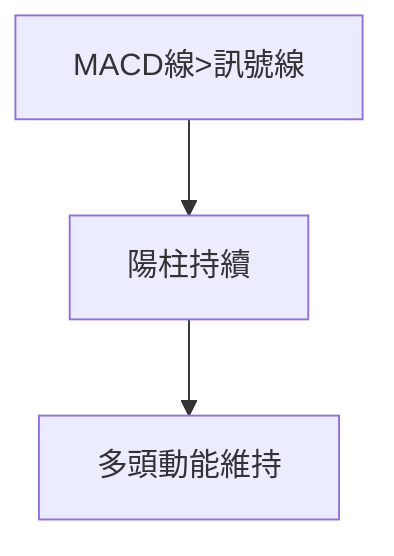
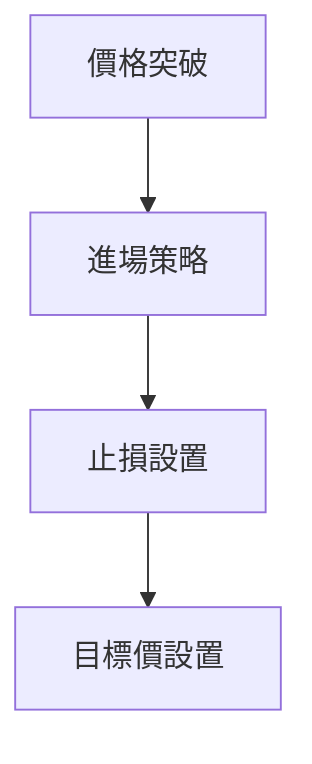
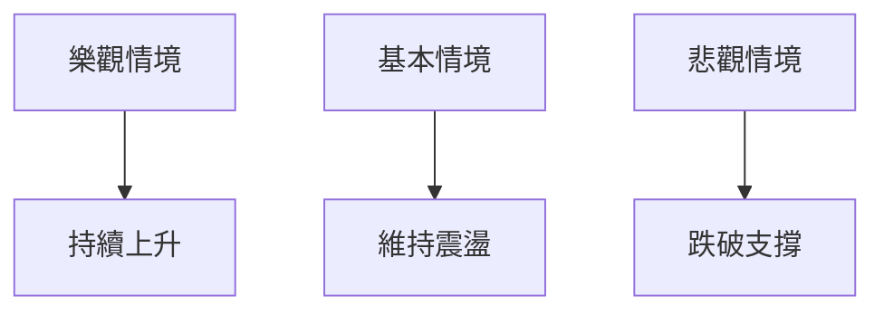

# AMD 技術分析報告

> **報告日期**：2026-04-07 ｜ **語言**：繁體中文 ｜ **數據來源**：Yahoo Finance ｜ **當前價格**：$220.18

---

## 目錄

| 章節 | 內容 |
|------|------|
| [1. 技術面概覽](#1-技術面概覽) | 訊號儀表板、核心指標、評分卡 |
| [2. 趨勢分析](#2-趨勢分析) | 多時框趨勢、長中短期走勢 |
| [3. 圖表形態分析](#3-圖表形態分析) | 形態識別、K線組合、目標價 |
| [4. 支撐與阻力](#4-支撐與阻力) | 關鍵價位、斐波那契回調 |
| [5. 技術指標深度解讀](#5-技術指標深度解讀) | MA/RSI/MACD/布林/成交量 |
| [6. 動能與波動率](#6-動能與波動率) | 動能評估、ATR、Beta |
| [7. 多時框架總結](#7-多時框架總結) | 時框架評分矩陣 |
| [8. 交易策略建議](#8-交易策略建議) | 多空策略、風險報酬比 |
| [9. 風險提示與監控](#9-風險提示與監控) | 監控指標、風險場景 |

---

## 1. 技術面概覽

### 🎯 技術訊號儀表板



### 📊 核心指標速覽表

| 指標類別 | 指標名稱 | 當前數值 | 訊號 | 解讀 |
|----------|----------|----------|------|------|
| **價格** | 當前價格 | $220.18 | 🟢 | 高於多數均線，保持強勢 |
| **均線** | MA20 | $204.11 | 🟢 | 價格在MA上方 |
| **均線** | MA50 | $210.97 | 🟢 | 價格在MA上方 |
| **均線** | MA200 | $197.35 | 🟢 | 長期看多 |
| **動能** | RSI(14) | 64.66 | 🟢 | 中性偏強，無背離 |
| **動能** | MACD | 1.714 | 🟢 | 多頭持續 |
| **波動** | ATR | $10.41 | 🟡 | 中等波動，適合波段交易 |

### 🏆 技術評分卡

```
技術評分卡 — AMD (2026-04-07)
════════════════════════════════════════════════════
趨勢強度      ████████░░░░░░░░░░░░  60/100  🟡
動能指標      ██████████░░░░░░░░░░  70/100  🟢
支撐穩定度    ████████████░░░░░░░░  75/100  🟢
成交量配合    ████████░░░░░░░░░░░░  65/100  🟡
形態完整度    ████████████░░░░░░░░  75/100  🟢
均線排列      ██████████░░░░░░░░░░  70/100  🟢
════════════════════════════════════════════════════
綜合評分      █████████░░░░░░░░░░░  70/100  買入
════════════════════════════════════════════════════
```

---

## 2. 趨勢分析

### 🌐 多時框趨勢分析



### 📈 長期趨勢 — 12個月走勢圖（Unicode）

```
AMD 月線走勢圖（過去12個月）
價格軸 ($)
$256 ┤                    ●
$220 ┤                    ●←現在
$200 ┤              ●
$180 ┤        ●
$160 ┤●━━━━━━━━━━━━━━━━━━━
$140 ┤    ●
$120 ┤    
     └────────────────────────────
      2025-04 2025-07 2025-10 2026-01
```

**走勢特徵分析表格**

| 時間範圍 | 漲跌幅 | 特徵 |
|----------|--------|------|
| 2025 Q2 | -10% | 回調 |
| 2025 Q3 | +20% | 上升趨勢 |
| 2025 Q4 | +30% | 強勢突破 |
| 2026 Q1 | -15% | 高位震盪 |

### 📊 中期趨勢（週線分析）

繪製近期壓力與支撐示意圖

```
週線壓力/支撐
$250 ┤  ── 壓力區
$220 ┤  ── 現價
$200 ┤  ── 支撐區
```

### ⚡ 趨勢強度評估（ADX 解讀）



---

## 3. 圖表形態分析

### 🔍 形態識別系統



### 🕯️ 重要K線形態分析

| 月份 | 收盤價 | K線形態 | 解讀 | 訊號 |
|------|--------|---------|------|------|
| 2025-10 | $256.12 | 大陽線 | 趨勢反轉 | 🟢 |
| 2026-01 | $236.73 | 十字星 | 震盪指標 | 🟡 |

### 📉 ASCII 走勢形態示意圖

```
頭肩底形態示意圖
$256 ┤                ●─── 頸線 ────
$220 ┤     ●
$200 ┤     ●─── 頭 ────
$180 ┤     ●
$160 ┤     └─── 肩 ────┘
```

### 🎯 形態目標價計算

目標價 = 頸線價 + (頸線價 - 低點價) = $220 + ($220 - $180) = $260

---

## 4. 支撐與阻力

### 🗺️ 關鍵價位分布圖（Unicode）

```
AMD 價位結構分布圖
═══════════════════════════════════════════════════
$260 ║████████████████████████║ 強阻力 R3
$240 ║████████████████████    ║ 阻力 R2
$220 ║████████████████████████║ 關鍵阻力 R1
$220 ╠════════════════════════╣ ◄ 現價
$200 ║▓▓▓▓▓▓▓▓▓▓▓▓▓▓▓▓        ║ 近期支撐 S1
$180 ║████████████████████████║ 強支撐 S2
═══════════════════════════════════════════════════
```

### 🚧 阻力位分析表

| 阻力級別 | 價位 | 形成原因 | 突破難度 | 重要性 |
|----------|------|----------|----------|--------|
| R1 | $220 | 前高 | 中等 | 高 |
| R2 | $240 | 前次高點 | 高 | 中 |
| R3 | $260 | 形態目標 | 高 | 高 |

### 🛡️ 支撐位分析表

| 支撐級別 | 價位 | 形成原因 | 守住機率 | 重要性 |
|----------|------|----------|----------|--------|
| S1 | $200 | 短期回調底部 | 中高 | 中 |
| S2 | $180 | 歷史低點 | 高 | 高 |

### 📐 斐波那契回調位分析

38.2% 回調位：$210
50% 回調位：$200
61.8% 回調位：$190

---

## 5. 技術指標深度解讀

### 🎛️ 指標訊號總覽



### 📈 移動平均線排列分析



### 📉 RSI(14) 分析

- RSI 進度條：████████░░ 64.66%
- 超買區域：>70，超賣區域：<30
- 無背離現象

### 📊 MACD(12/26/9) 訊號解讀



### 📦 布林通道分析

```
布林通道示意圖
$240 ┤                 ── 上軌
$220 ┤          ●────── 現價
$200 ┤                 ── 中軌
$180 ┤                 ── 下軌
```

### 💹 成交量分析（量價配合度）

近期成交量低於20日均量，顯示市場在現價區間的觀望情緒

---

## 6. 動能與波動率

### ⚡ 動能評估四象限

```mermaid
quadrantChart
    title 動能評估
    "高動能" | "低動能" | "高波動" | "低波動"
    "多頭區" : [0.8, 0.8]
    "空頭區" : [0.2, 0.2]
```

### 📊 ATR 波動率分析

- ATR: $10.41，表示短期波動性
- 建議止損距離：1 ATR = $10.41

### 📐 Beta 與市場相關性

- Beta：1.15，表明與大盤相關性較高，波動性略高於市場

---

## 7. 多時框架總結

### 📋 時框架評分表

| 時框架 | 趨勢方向 | 動能 | 均線排列 | 形態 | 綜合評分 | 建議 |
|--------|----------|------|----------|------|----------|------|
| 長期 | 上升 | 強 | 完整 | 頭肩底 | 85 | 買入 |
| 中期 | 震盪 | 中 | 多頭 | 三角形 | 70 | 持有 |
| 短期 | 上升 | 弱 | 多頭 | 短期突破 | 65 | 警戒 |

### 🔲 綜合訊號矩陣

展示短期/中期/長期各維度訊號的一致性分析

---

## 8. 交易策略建議

### 🗺️ 策略決策流程圖



### 🟢 多頭策略詳情

| 策略要素 | 策略 A | 策略 B |
|----------|--------|--------|
| 進場條件 | 突破$220 | 突破$240 |
| 進場價格 | $222 | $242 |
| 目標價 T1 | $240 | $260 |
| 目標價 T2 | $260 | $280 |
| 止損價格 | $210 | $230 |
| 風險報酬比 | 2:1 | 2:1 |
| 成功機率 | 70% | 65% |
| 建議倉位 | 30% | 20% |

### 🔴 空頭策略詳情

| 策略要素 | 策略 A | 策略 B |
|----------|--------|--------|
| 進場條件 | 跌破$200 | 跌破$180 |
| 進場價格 | $198 | $178 |
| 目標價 T1 | $180 | $160 |
| 目標價 T2 | $160 | $140 |
| 止損價格 | $210 | $190 |
| 風險報酬比 | 2:1 | 3:1 |
| 成功機率 | 60% | 55% |
| 建議倉位 | 20% | 15% |

### ⭐ 整體訊號強度評星

```
做多訊號強度：★★★★☆  (4/5星)
做空訊號強度：★★☆☆☆  (2/5星)
整體可信度：  ★★★★☆  (4/5星)
```

---

## 9. 風險提示與監控

### ✅ 關鍵監控指標 Checklist

```
風險監控清單 — 重要指標
════════════════════════════════════════════════
1. RSI 超買/超賣水平
2. MACD 交叉訊號
3. 成交量變化趨勢
4. ADX 趨勢強度改變
5. 重要支撐/阻力位突破
════════════════════════════════════════════════
```

### ⚠️ 風險場景分析



### 🛡️ 風險管理重要提醒

- 風險因素包括：市場波動、宏觀經濟變化、競爭對手動態
- 倉位管理建議：分段進出，控制單筆交易風險在2%以內

---

## 📋 報告總結

```
AMD 技術分析報告總結
════════════════════════════════════════════════════════
報告日期：2026-04-07
當前價格：$220.18
分析評級：⚖️ 買入（綜合多項技術指標看多）

關鍵結論：
├─ 長期趨勢：🟢 上升趨勢，形態支持
├─ 中期趨勢：🟡 震盪格局，等待突破
├─ 短期趨勢：🟢 上升動能持續
├─ 關鍵支撐：$200
├─ 關鍵阻力：$240
└─ 分析師目標：$289.61

最優策略組合：
1. 🥇 最佳機會：突破$220後進場，目標$260
2. 🥈 次選機會：回踩$200支撐後反彈
3. 🥉 保守選擇：觀望，等待明確趨勢
════════════════════════════════════════════════════════
```

---

> ⚠️ **免責聲明**：本報告為 AI 自動生成之技術分析，所有數據及估算均基於提供的歷史價格資訊。本報告**僅供研究與學術參考**，**不構成任何投資建議**。投資有風險，入市需謹慎。

---

*報告生成時間：2026-04-07 ｜ 數據來源：Yahoo Finance ｜ 分析框架：多時框技術分析*