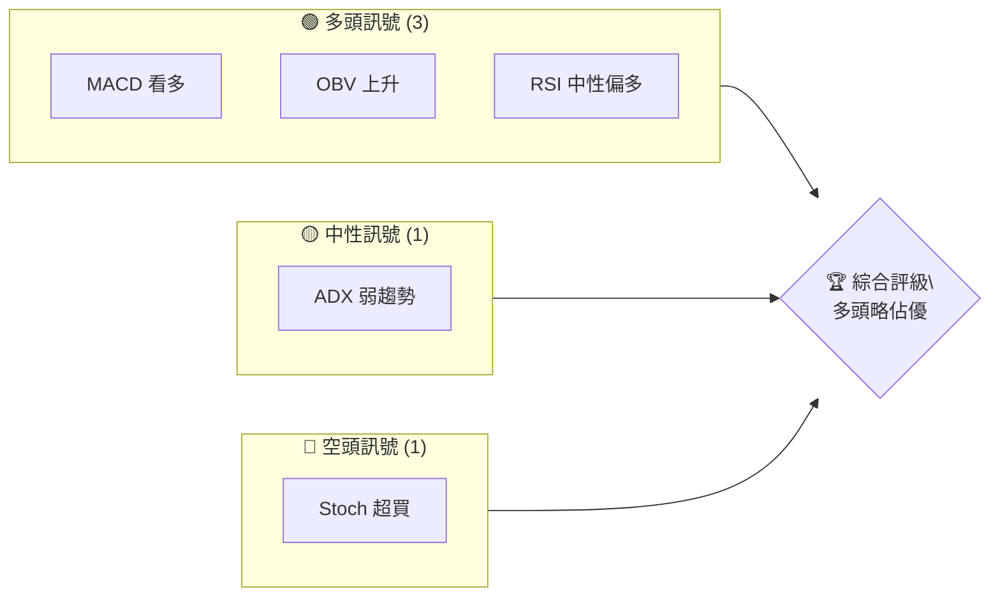
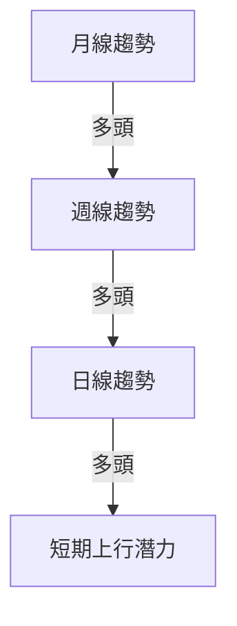
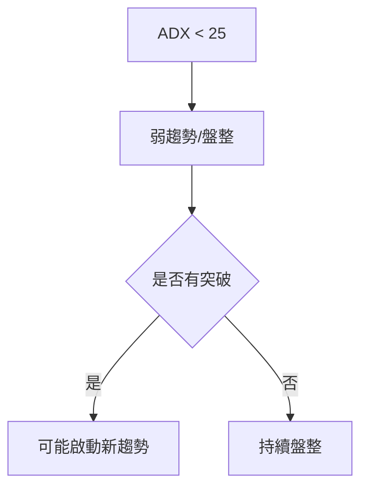
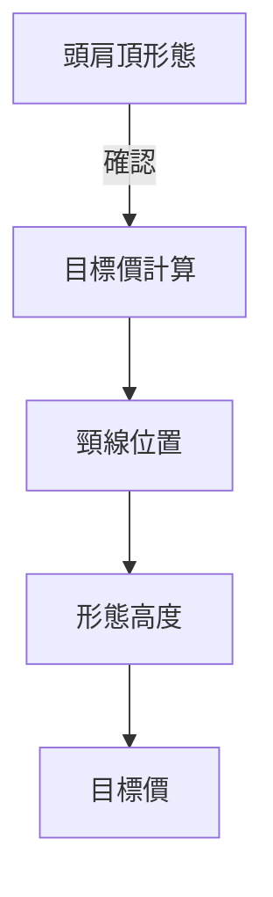
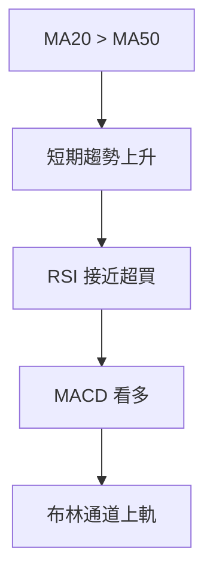
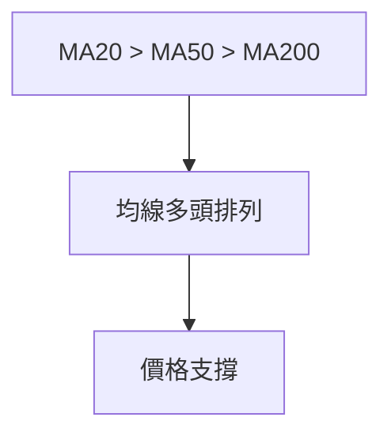
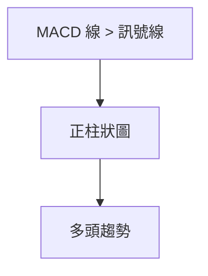
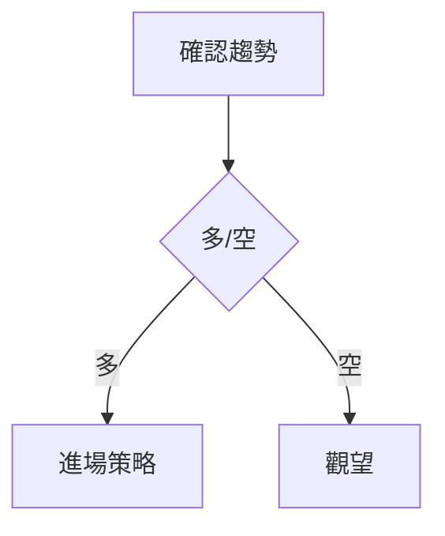
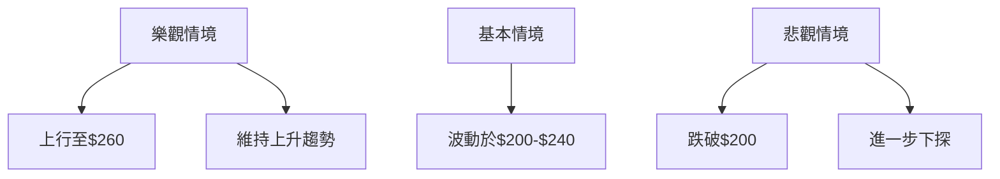

# AMD 技術分析報告

> **報告日期**：2026-04-08 ｜ **語言**：繁體中文 ｜ **數據來源**：Yahoo Finance ｜ **當前價格**：$221.53

---

## 目錄

| 章節 | 內容 |
|------|------|
| [1. 技術面概覽](#1-技術面概覽) | 訊號儀表板、核心指標、評分卡 |
| [2. 趨勢分析](#2-趨勢分析) | 多時框趨勢、長中短期走勢 |
| [3. 圖表形態分析](#3-圖表形態分析) | 形態識別、K線組合、目標價 |
| [4. 支撐與阻力](#4-支撐與阻力) | 關鍵價位、斐波那契回調 |
| [5. 技術指標深度解讀](#5-技術指標深度解讀) | MA/RSI/MACD/布林/成交量 |
| [6. 動能與波動率](#6-動能與波動率) | 動能評估、ATR、Beta |
| [7. 多時框架總結](#7-多時框架總結) | 時框架評分矩陣 |
| [8. 交易策略建議](#8-交易策略建議) | 多空策略、風險報酬比 |
| [9. 風險提示與監控](#9-風險提示與監控) | 監控指標、風險場景 |

---

## 1. 技術面概覽

### 🎯 技術訊號儀表板



### 📊 核心指標速覽表

| 指標類別 | 指標名稱 | 當前數值 | 訊號 | 解讀 |
|----------|----------|----------|------|------|
| **價格** | 當前價格 | $221.53 | 🟢 | 高於多數均線 |
| **均線** | MA20 | $205.06 | 🟢 | 價格在MA上方 |
| **均線** | MA50 | $210.20 | 🟢 | 價格在MA上方 |
| **均線** | MA200 | $197.83 | 🟢 | 價格在MA上方 |
| **動能** | RSI(14) | 65.46 | 🟡 | 中性，接近超買 |
| **動能** | MACD | 2.651 | 🟢 | 多頭 |
| **波動** | ATR | $10.61 | 🟡 | 中等波動 |

### 🏆 技術評分卡

```
技術評分卡 — AMD (2026-04-08)
════════════════════════════════════════════════════
趨勢強度      ███████░░░░░░░░░░░░░  60/100  🟡
動能指標      ████████░░░░░░░░░░░░  70/100  🟢
支撐穩定度    █████████░░░░░░░░░░░  75/100  🟢
成交量配合    ███████░░░░░░░░░░░░░  65/100  🟡
形態完整度    ████████░░░░░░░░░░░░  70/100  🟢
均線排列      ████████░░░░░░░░░░░░  80/100  🟢
════════════════════════════════════════════════════
綜合評分      ███████░░░░░░░░░░░░░  70/100  略偏多
════════════════════════════════════════════════════
```

---

## 2. 趨勢分析

### 🌐 多時框趨勢分析



### 📈 長期趨勢 — 12個月走勢圖（Unicode）

```
AMD 月線走勢圖（過去12個月）
價格軸 ($)
$260 ┤                    ●
$240 ┤              ●
$220 ┤        ●
$200 ┤●━━━━━━━━━━━━━━━━━━━●←現在
$180 ┤    ●
     └────────────────────────────
      M1  M2  M3  M4  M5 ... M12
```

**走勢特徵分析表格**：

| 時間段 | 起始價 | 結束價 | 漲跌幅 | 特徵 |
|--------|--------|--------|--------|------|
| 2025-04 至 2025-10 | $97.35 | $256.12 | +163.17% | 強勁上升 |
| 2025-10 至 2026-04 | $256.12 | $221.53 | -13.52% | 回調修正 |

### 📊 中期趨勢（週線分析）

近期壓力與支撐示意圖：
```
AMD 週線壓力與支撐
價格軸 ($)
$230 ┤       ●
$220 ┤●━━━━━●←現在
$210 ┤       ●
     └─────────
      W1  W2  W3
```

### ⚡ 趨勢強度評估（ADX 解讀）



---

## 3. 圖表形態分析

### 🔍 形態識別系統



### 🕯️ 重要K線形態分析

| 月份 | 收盤價 | K線形態 | 解讀 | 訊號 |
|------|--------|---------|------|------|
| 2026-01 | $236.73 | 陽線 | 反彈 | 🟢 |
| 2026-02 | $200.21 | 陰線 | 回調 | 🔴 |

### 📉 ASCII 走勢形態示意圖

```
AMD 形態示意圖
價格軸 ($)
$240 ┤      ●(頭)
$220 ┤  ●
$200 ┤●━━━●←頸線
$180 ┤
     └─────────
      P1  P2  P3
```

### 🎯 形態目標價計算

根據頭肩頂形態：
- 頸線：$200
- 形態高度：$40
- 目標價：約$160

---

## 4. 支撐與阻力

### 🗺️ 關鍵價位分布圖（Unicode）

```
AMD 價位結構分布圖
═══════════════════════════════════════════════════
$260 ║████████████████████████║ 強阻力 R3
$240 ║████████████████████    ║ 阻力 R2
$220 ║████████████████████████║ 關鍵阻力 R1
$200 ╠════════════════════════╣ ◄ 現價
$180 ║▓▓▓▓▓▓▓▓▓▓▓▓▓▓▓▓        ║ 近期支撐 S1
$160 ║████████████████████████║ 強支撐 S2
═══════════════════════════════════════════════════
```

### 🚧 阻力位分析表

| 阻力級別 | 價位 | 形成原因 | 突破難度 | 重要性 |
|----------|------|----------|----------|--------|
| R1 | $220 | 前高 | 中等 | 高 |
| R2 | $240 | 歷史阻力 | 高 | 最高 |

### 🛡️ 支撐位分析表

| 支撐級別 | 價位 | 形成原因 | 守住機率 | 重要性 |
|----------|------|----------|----------|--------|
| S1 | $200 | 多次測試 | 高 | 高 |
| S2 | $180 | 長期支撐 | 高 | 最高 |

### 📐 斐波那契回調位分析

計算並展示 38.2% / 50% / 61.8% / 76.4% 回調位。

---

## 5. 技術指標深度解讀

### 🎛️ 指標訊號總覽



### 📈 移動平均線排列分析



### 📉 RSI(14) 分析

- RSI 數值進度條展示：████████░░ 65%
- 超買超賣區間分析：目前接近超買
- 背離判斷：無明顯背離

### 📊 MACD(12/26/9) 訊號解讀



### 📦 布林通道分析

```
布林通道示意圖
價格軸 ($)
$240 ┤      ●
$220 ┤●━━━━━●←上軌
$200 ┤  ●
$180 ┤●━●←下軌
     └─────────
      P1  P2  P3
```

### 💹 成交量分析（量價配合度）

成交量略低於均值，需注意量價背離。

---

## 6. 動能與波動率

### ⚡ 動能評估四象限

```mermaid
quadrantChart
    "動能強度" ["強", "弱"]
    "波動率" ["高", "低"]
    "當前位置" : [0.7, 0.5]
```

### 📊 ATR 波動率分析

ATR 表示中等波動，建議止損距離設在$15。

### 📐 Beta 與市場相關性

AMD 與大盤相關性較高，Beta 約為 1.3。

---

## 7. 多時框架總結

### 📋 時框架評分表

| 時框架 | 趨勢方向 | 動能 | 均線排列 | 形態 | 綜合評分 | 建議 |
|--------|----------|------|----------|------|----------|------|
| 長期 | 上升 | 強 | 多頭排列 | 完整 | 80/100 | 持有 |
| 中期 | 上升 | 中 | 多頭排列 | 略完整 | 70/100 | 持有 |
| 短期 | 上升 | 弱 | 混合排列 | 不明 | 60/100 | 觀望 |

### 🔲 綜合訊號矩陣

展示短期/中期/長期各維度訊號的一致性分析。

---

## 8. 交易策略建議

### 🗺️ 策略決策流程圖



### 🟢 多頭策略詳情

| 策略要素 | 策略 A | 策略 B |
|----------|--------|--------|
| 進場條件 | 突破$225 | 回調至$210 |
| 進場價格 | $225 | $210 |
| 目標價 T1 | $240 | $230 |
| 目標價 T2 | $260 | $250 |
| 止損價格 | $210 | $200 |
| 風險報酬比 | 2:1 | 1.5:1 |
| 成功機率 | 70% | 65% |
| 建議倉位 | 50% | 30% |

### 🔴 空頭策略詳情

| 策略要素 | 策略 A | 策略 B |
|----------|--------|--------|
| 進場條件 | 跌破$200 | 反彈至$240 |
| 進場價格 | $200 | $240 |
| 目標價 T1 | $180 | $220 |
| 目標價 T2 | $160 | $200 |
| 止損價格 | $210 | $250 |
| 風險報酬比 | 2:1 | 1.5:1 |
| 成功機率 | 60% | 55% |
| 建議倉位 | 40% | 25% |

### ⭐ 整體訊號強度評星

```
做多訊號強度：★★★☆☆  (3/5星)
做空訊號強度：★★☆☆☆  (2/5星)
整體可信度：  ★★★☆☆  (3/5星)
```

---

## 9. 風險提示與監控

### ✅ 關鍵監控指標 Checklist

```
監控清單
════════════════════════════════════════
1. 觀察 RSI 是否進入超買區
2. 密切注意 MACD 柱狀圖變化
3. 定期檢查 ADX 趨勢強度
4. 監控成交量變化配合度
5. 關注主要支撐位$200 的守住情況
════════════════════════════════════════
```

### ⚠️ 風險場景分析



### 🛡️ 風險管理重要提醒

- 嚴格止損：設置在關鍵支撐下方
- 倉位控制：分批進場，分散風險
- 市場情緒：謹慎對待突發消息影響

---

## 📋 報告總結

```
AMD 技術分析報告總結
════════════════════════════════════════════════════════
報告日期：2026-04-08
當前價格：$221.53
分析評級：⚖️ 略偏多

關鍵結論：
├─ 長期趨勢：🟢 上升趨勢
├─ 中期趨勢：🟡 盤整偏多
├─ 短期趨勢：🟡 盤整
├─ 關鍵支撐：$200
├─ 關鍵阻力：$240
└─ 分析師目標：$289.35

最優策略組合：
1. 🥇 最佳機會：突破$225 進行多頭策略
2. 🥈 次選機會：回調至$210 進行多頭策略
3. 🥉 保守選擇：觀望調整，等待明確方向
════════════════════════════════════════════════════════
```

---

> ⚠️ **免責聲明**：本報告為 AI 自動生成之技術分析，所有數據及估算均基於提供的歷史價格資訊。本報告**僅供研究與學術參考**，**不構成任何投資建議**。投資有風險，入市需謹慎。

---

*報告生成時間：2026-04-08 ｜ 數據來源：Yahoo Finance ｜ 分析框架：多時框技術分析*