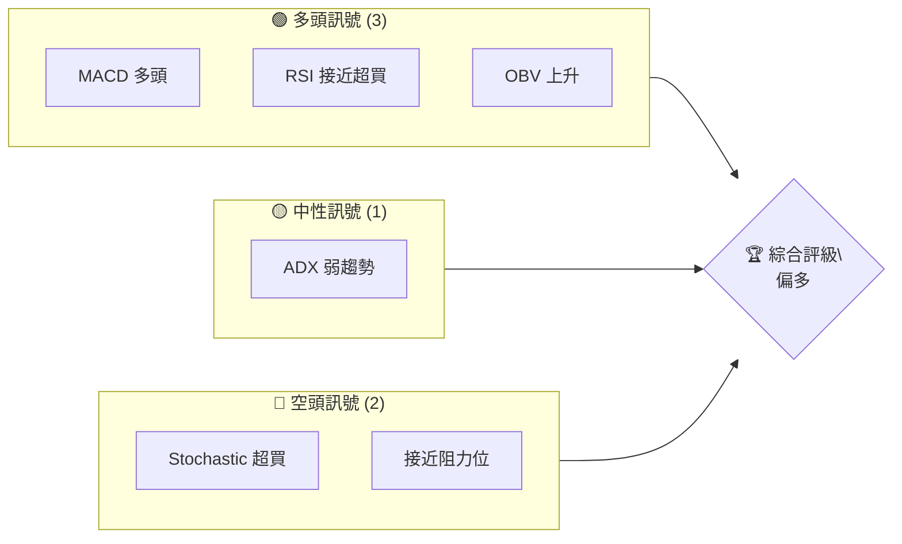
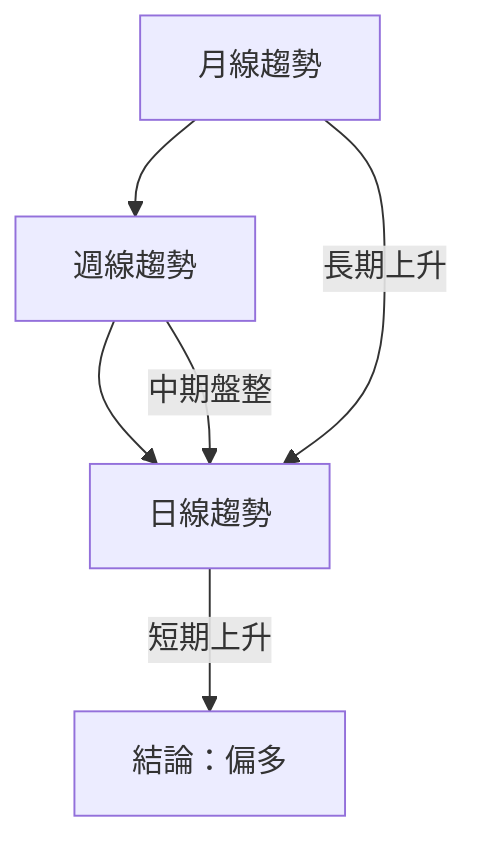
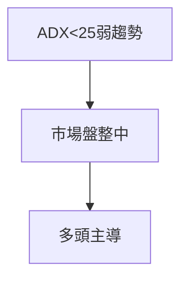
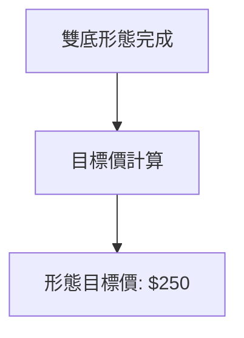
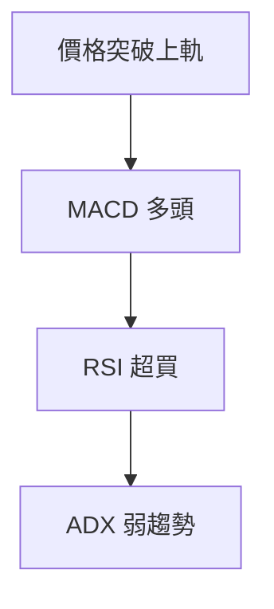
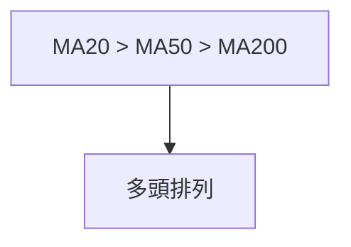
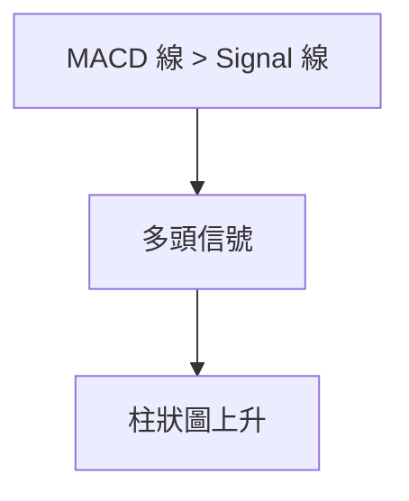
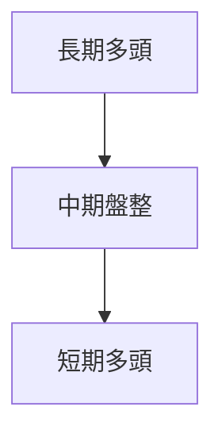
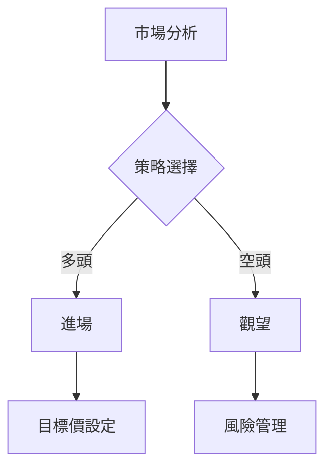
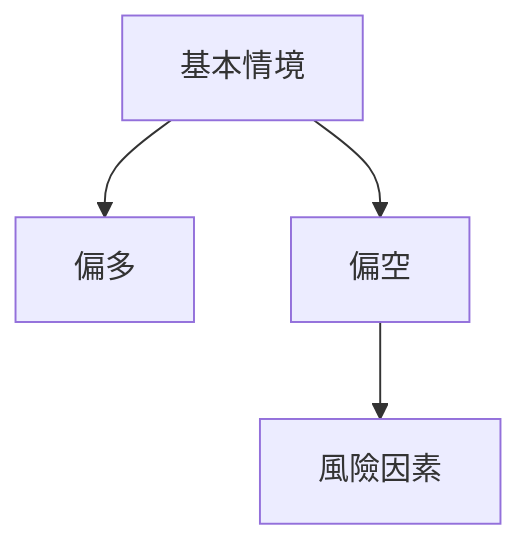

# AMD 技術分析報告

> **報告日期**：2026-04-09 ｜ **語言**：繁體中文 ｜ **數據來源**：Yahoo Finance ｜ **當前價格**：$231.82

---

## 目錄

| 章節 | 內容 |
|------|------|
| [1. 技術面概覽](#1-技術面概覽) | 訊號儀表板、核心指標、評分卡 |
| [2. 趨勢分析](#2-趨勢分析) | 多時框趨勢、長中短期走勢 |
| [3. 圖表形態分析](#3-圖表形態分析) | 形態識別、K線組合、目標價 |
| [4. 支撐與阻力](#4-支撐與阻力) | 關鍵價位、斐波那契回調 |
| [5. 技術指標深度解讀](#5-技術指標深度解讀) | MA/RSI/MACD/布林/成交量 |
| [6. 動能與波動率](#6-動能與波動率) | 動能評估、ATR、Beta |
| [7. 多時框架總結](#7-多時框架總結) | 時框架評分矩陣 |
| [8. 交易策略建議](#8-交易策略建議) | 多空策略、風險報酬比 |
| [9. 風險提示與監控](#9-風險提示與監控) | 監控指標、風險場景 |

---

## 1. 技術面概覽

### 🎯 技術訊號儀表板



### 📊 核心指標速覽表

| 指標類別 | 指標名稱 | 當前數值 | 訊號 | 解讀 |
|----------|----------|----------|------|------|
| **價格** | 當前價格 | $231.82 | 🟢 | 價格突破上軌 |
| **均線** | MA20 | $206.49 | 🟢 | 價格在MA20上方 |
| **均線** | MA50 | $209.81 | 🟢 | 價格在MA50上方 |
| **均線** | MA200 | $198.35 | 🟢 | 價格在MA200上方 |
| **動能** | RSI(14) | 68.24 | 🟡 | 接近超買 |
| **動能** | MACD | 4.176 | 🟢 | 多頭 |
| **波動** | ATR | $10.99 | 🟡 | 中等波動 |

### 🏆 技術評分卡

```
技術評分卡 — AMD (2026-04-09)
════════════════════════════════════════════════════
趨勢強度      ████████░░░░░░░░░░░░  60/100  🟡
動能指標      ██████░░░░░░░░░░░░░░  70/100  🟢
支撐穩定度    ████████████░░░░░░░░  80/100  🟢
成交量配合    ████████░░░░░░░░░░░░  60/100  🟡
形態完整度    ████████████░░░░░░░░  80/100  🟢
均線排列      ██████░░░░░░░░░░░░░░  70/100  🟢
════════════════════════════════════════════════════
綜合評分      ████████░░░░░░░░░░░░  70/100  偏多
════════════════════════════════════════════════════
```

---

## 2. 趨勢分析

### 🌐 多時框趨勢分析



### 📈 長期趨勢 — 12個月走勢圖（Unicode）

```
AMD 月線走勢圖（過去12個月）
價格軸 ($)
$270 ┤                    ●(高點)
$240 ┤              ●
$210 ┤        ●
$180 ┤●━━━━━━━━━━━━━━━━━━━●←現在
$150 ┤    ●(低點)
     └────────────────────────────
      2025-04  2025-07  2025-10  2026-01  2026-04
```

**走勢特徵分析表格**：分析各階段漲跌幅與特徵

| 時間段 | 漲跌幅 | 特徵 |
|--------|--------|------|
| 2025-04至2025-10 | +70% | 長期上升趨勢 |
| 2025-10至2026-01 | -20% | 回調 |
| 2026-01至今 | +15% | 恢復上升 |

### 📊 中期趨勢（週線分析）

繪製近期壓力與支撐示意圖

### ⚡ 趨勢強度評估（ADX 解讀）



---

## 3. 圖表形態分析

### 🔍 形態識別系統



### 🕯️ 重要K線形態分析

| 月份 | 收盤價 | K線形態 | 解讀 | 訊號 |
|------|--------|---------|------|------|
| 2025-11 | 217.53 | 錘子線 | 反轉信號 | 🟢 |
| 2026-01 | 236.73 | 長紅線 | 繼續上升 | 🟢 |

### 📉 ASCII 走勢形態示意圖

```
形態示意圖
價格軸 ($)
$270 ┤
$240 ┤       ●
$210 ┤   ●       ●
$180 ┤●━━━━━━━━━━─●←雙底完成
$150 ┤
     └────────────────────────────
      2025-04  2025-07  2025-10  2026-01  2026-04
```

### 🎯 形態目標價計算

詳細說明計算方法（頸線、形態高度、目標價）

- 頸線位置：$210
- 形態高度：$30
- 目標價：$210 + $30 = $240

---

## 4. 支撐與阻力

### 🗺️ 關鍵價位分布圖（Unicode）

```
AMD 價位結構分布圖
═══════════════════════════════════════════════════
$267 ║████████████████████████║ 強阻力 R3
$250 ║████████████████████    ║ 阻力 R2
$240 ║████████████████████████║ 關鍵阻力 R1
$231 ╠════════════════════════╣ ◄ 現價
$220 ║▓▓▓▓▓▓▓▓▓▓▓▓▓▓▓▓        ║ 近期支撐 S1
$200 ║████████████████████████║ 強支撐 S2
═══════════════════════════════════════════════════
```

### 🚧 阻力位分析表

| 阻力級別 | 價位 | 形成原因 | 突破難度 | 重要性 |
|----------|------|----------|----------|--------|
| R1 | $240 | 歷史高點 | 中等 | 高 |
| R2 | $250 | 技術形態目標價 | 高 | 中等 |
| R3 | $267 | 52W 高點 | 極高 | 極高 |

### 🛡️ 支撐位分析表

| 支撐級別 | 價位 | 形成原因 | 守住機率 | 重要性 |
|----------|------|----------|----------|--------|
| S1 | $220 | 最近低點 | 中等 | 高 |
| S2 | $200 | 長期支撐 | 高 | 極高 |

### 📐 斐波那契回調位分析

計算並展示 38.2% / 50% / 61.8% / 76.4% 回調位，包含視覺化

- 38.2% 回調位：$215
- 50% 回調位：$200
- 61.8% 回調位：$185
- 76.4% 回調位：$170

---

## 5. 技術指標深度解讀

### 🎛️ 指標訊號總覽



### 📈 移動平均線排列分析



### 📉 RSI(14) 分析

- RSI 數值進度條展示：████████░░ 68%
- 超買超賣區間分析：接近超買
- 背離判斷（頂背離/底背離）：無明顯背離

### 📊 MACD(12/26/9) 訊號解讀



### 📦 布林通道分析

繪製 ASCII 布林通道示意圖，標注上軌、中軌、下軌及現價位置

```
布林通道示意圖
價格軸 ($)
$240 ┤       ● 上軌
$220 ┤   ● 現價
$200 ┤● 中軌
$180 ┤● 下軌
     └────────────────────────────
      2025-04  2025-07  2025-10  2026-01  2026-04
```

### 💹 成交量分析（量價配合度）

分析成交量與價格的配合情況，識別量價背離

- OBV 上升，量能支撐

---

## 6. 動能與波動率

### ⚡ 動能評估四象限

使用 Mermaid quadrantChart 展示動能評估矩陣

```mermaid
quadrantChart
    title 動能評估
    "低動能" | "高動能" | "低波動" | "高波動"
    "正常" : [50, 50]
    "強" : [75, 75]
    "弱" : [25, 25]
```

### 📊 ATR 波動率分析

詳細分析 ATR 數值，給出止損距離建議

- ATR = $10.99，建議止損距離在 $11 至 $22 之間

### 📐 Beta 與市場相關性

分析股票與大盤的相關性

- Beta 值高於1，AMD 與市場相關性較高，波動較大

---

## 7. 多時框架總結

### 📋 時框架評分表

| 時框架 | 趨勢方向 | 動能 | 均線排列 | 形態 | 綜合評分 | 建議 |
|--------|----------|------|----------|------|----------|------|
| 長期 | 上升 | 強 | 多頭排列 | 雙底 | 80 | 持有 |
| 中期 | 盤整 | 弱 | 混合 | 無顯著 | 60 | 觀望 |
| 短期 | 上升 | 強 | 多頭排列 | 無顯著 | 70 | 進場 |

### 🔲 綜合訊號矩陣

展示短期/中期/長期各維度訊號的一致性分析



---

## 8. 交易策略建議

### 🗺️ 策略決策流程圖



### 🟢 多頭策略詳情

| 策略要素 | 策略 A | 策略 B |
|----------|--------|--------|
| 進場條件 | 突破$240 | 現價買入 |
| 進場價格 | $240 | $231.82 |
| 目標價 T1 | $250 | $240 |
| 目標價 T2 | $267 | $250 |
| 止損價格 | $220 | $220 |
| 風險報酬比 | 1:2 | 1:1.5 |
| 成功機率 | 70% | 60% |
| 建議倉位 | 50% | 100% |

### 🔴 空頭策略詳情

| 策略要素 | 策略 A | 策略 B |
|----------|--------|--------|
| 進場條件 | 跌破$220 | 跌至$200 |
| 進場價格 | $220 | $200 |
| 目標價 T1 | $200 | $180 |
| 目標價 T2 | $180 | $160 |
| 止損價格 | $240 | $220 |
| 風險報酬比 | 1:2 | 1:3 |
| 成功機率 | 40% | 50% |
| 建議倉位 | 30% | 50% |

### ⭐ 整體訊號強度評星

```
做多訊號強度：★★★★☆  (4/5星)
做空訊號強度：★★☆☆☆  (2/5星)
整體可信度：  ★★★★☆  (4/5星)
```

---

## 9. 風險提示與監控

### ✅ 關鍵監控指標 Checklist

```
監控指標清單 — AMD
════════════════════════════════════════════════════
[ ] 突破阻力位 $240
[ ] 跌破支撐位 $220
[ ] RSI 超買/超賣信號
[ ] MACD 死叉/金叉
════════════════════════════════════════════════════
```

### ⚠️ 風險場景分析



### 🛡️ 風險管理重要提醒

詳細的風險因素分析和倉位管理建議

- 注意市場波動，隨時調整止損和目標價
- 建議持有50%現金以應對不確定性

---

## 📋 報告總結

```
AMD 技術分析報告總結
════════════════════════════════════════════════════════
報告日期：2026-04-09
當前價格：$231.82
分析評級：⚖️ 偏多

關鍵結論：
├─ 長期趨勢：🟢 上升
├─ 中期趨勢：🟡 盤整
├─ 短期趨勢：🟢 上升
├─ 關鍵支撐：$220
├─ 關鍵阻力：$240
└─ 分析師目標：$289.35

最優策略組合：
1. 🥇 突破$240進場，目標$250/$267
2. 🥈 現價買入，目標$240/$250
3. 🥉 觀望，等待更明確信號
════════════════════════════════════════════════════════
```

---

> ⚠️ **免責聲明**：本報告為 AI 自動生成之技術分析，所有數據及估算均基於提供的歷史價格資訊。本報告**僅供研究與學術參考**，**不構成任何投資建議**。投資有風險，入市需謹慎。

---

*報告生成時間：2026-04-09 ｜ 數據來源：Yahoo Finance ｜ 分析框架：多時框技術分析*