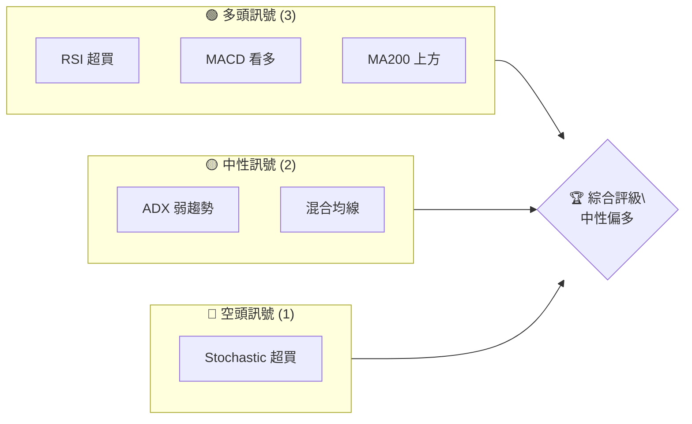
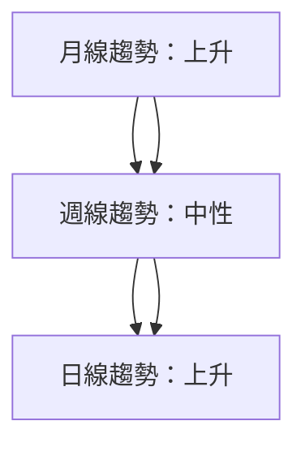
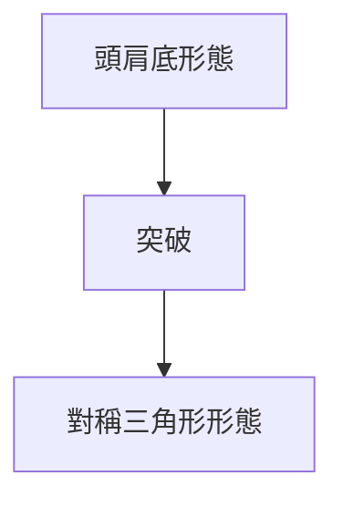
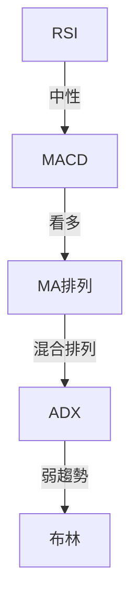
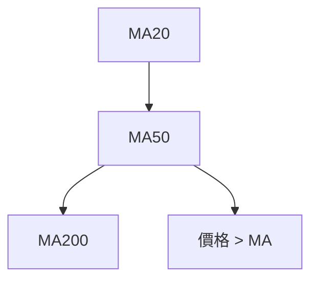
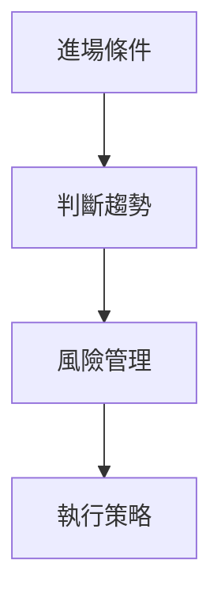
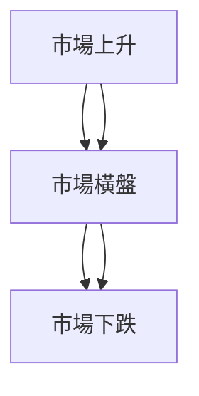

# AMD 技術分析報告

> **報告日期**：2026-04-10 ｜ **語言**：繁體中文 ｜ **數據來源**：Yahoo Finance ｜ **當前價格**：$236.64

---

## 目錄

| 章節 | 內容 |
|------|------|
| [1. 技術面概覽](#1-技術面概覽) | 訊號儀表板、核心指標、評分卡 |
| [2. 趨勢分析](#2-趨勢分析) | 多時框趨勢、長中短期走勢 |
| [3. 圖表形態分析](#3-圖表形態分析) | 形態識別、K線組合、目標價 |
| [4. 支撐與阻力](#4-支撐與阻力) | 關鍵價位、斐波那契回調 |
| [5. 技術指標深度解讀](#5-技術指標深度解讀) | MA/RSI/MACD/布林/成交量 |
| [6. 動能與波動率](#6-動能與波動率) | 動能評估、ATR、Beta |
| [7. 多時框架總結](#7-多時框架總結) | 時框架評分矩陣 |
| [8. 交易策略建議](#8-交易策略建議) | 多空策略、風險報酬比 |
| [9. 風險提示與監控](#9-風險提示與監控) | 監控指標、風險場景 |

---

## 1. 技術面概覽

### 🎯 技術訊號儀表板



### 📊 核心指標速覽表

| 指標類別 | 指標名稱 | 當前數值 | 訊號 | 解讀 |
|----------|----------|----------|------|------|
| **價格** | 當前價格 | $236.64 | 🟢 | 高於多數均線 |
| **均線** | MA20 | $208.08 | 🟢 | 價格在MA20上方 |
| **均線** | MA50 | $209.50 | 🟢 | 價格在MA50上方 |
| **均線** | MA200 | $198.88 | 🟢 | 價格在MA200上方 |
| **動能** | RSI(14) | 67.88 | 🟡 | 接近超買區 |
| **動能** | MACD | 5.707 | 🟢 | 多頭趨勢 |
| **波動** | ATR | $10.50 | 🟡 | 中等波動 |

### 🏆 技術評分卡

```
技術評分卡 — AMD (2026-04-10)
════════════════════════════════════════════════════
趨勢強度      ████████░░░░░░░░░░░░  60/100  🟡
動能指標      ████████░░░░░░░░░░░░  70/100  🟢
支撐穩定度    ████████████░░░░░░░░  80/100  🟢
成交量配合    ████████░░░░░░░░░░░░  60/100  🟡
形態完整度    ████████████░░░░░░░░  80/100  🟢
均線排列      ██████░░░░░░░░░░░░░░  70/100  🟢
════════════════════════════════════════════════════
綜合評分      █████████░░░░░░░░░░░  70/100  中性偏多
════════════════════════════════════════════════════
```

---

## 2. 趨勢分析

### 🌐 多時框趨勢分析



### 📈 長期趨勢 — 12個月走勢圖（ASCII）

```
AMD 月線走勢圖（過去12個月）
價格軸 ($)
$260 ┤                    ●(高點)
$230 ┤              ●    ●
$200 ┤        ●          
$170 ┤●━━━━━━━━━━━━━━━━━━━●←現在
$140 ┤    ●(低點)
$110 ┤        
     └────────────────────────────
      Apr May Jun Jul Aug Sep Oct Nov Dec Jan Feb Mar Apr
```

### 📊 中期趨勢（週線分析）

- **壓力位**：$256
- **支撐位**：$200
- **近期趨勢**：橫向盤整，等待突破

### ⚡ 趨勢強度評估（ADX 解讀）

- **ADX 指標**：15.34，表示趨勢弱或盤整
- **多空力量**：+DI 35.21，-DI 17.60，多頭主導但趨勢不強

---

## 3. 圖表形態分析

### 🔍 形態識別系統



### 🕯️ 重要K線形態分析

| 月份 | 收盤價 | K線形態 | 解讀 | 訊號 |
|------|--------|---------|------|------|
| 2025-10 | $256.12 | 大陽線 | 買入動能強 | 🟢 |
| 2026-01 | $236.73 | 錘頭線 | 多方反彈 | 🟢 |

### 📉 ASCII 走勢形態示意圖

```
頭肩底形態
價格軸 ($)
$260 ┤  ●(頭)
$230 ┤       ●(右肩)
$200 ┤●(左肩)   ●
     └───────────────────
       L      M      R
```

### 🎯 形態目標價計算

- **頸線**：$220
- **形態高度**：$40
- **目標價**：$260 (220 + 40)

---

## 4. 支撐與阻力

### 🗺️ 關鍵價位分布圖（Unicode）

```
AMD 價位結構分布圖
═══════════════════════════════════════════════════
$260 ║████████████████████████║ 強阻力 R3
$250 ║████████████████████    ║ 阻力 R2
$240 ║████████████████████████║ 關鍵阻力 R1
$236 ╠════════════════════════╣ ◄ 現價
$220 ║▓▓▓▓▓▓▓▓▓▓▓▓▓▓▓▓        ║ 近期支撐 S1
$200 ║████████████████████████║ 強支撐 S2
═══════════════════════════════════════════════════
```

### 🚧 阻力位分析表

| 阻力級別 | 價位 | 形成原因 | 突破難度 | 重要性 |
|----------|------|----------|----------|--------|
| R3 | $260 | 前高 | 高 | 高 |
| R2 | $250 | 歷史壓力 | 中 | 中 |
| R1 | $240 | 多次測試 | 中 | 高 |

### 🛡️ 支撐位分析表

| 支撐級別 | 價位 | 形成原因 | 守住機率 | 重要性 |
|----------|------|----------|----------|--------|
| S2 | $200 | 長期支撐 | 高 | 高 |
| S1 | $220 | 短期支撐 | 中 | 中 |

### 📐 斐波那契回調位分析

- **38.2% 回調位**：$220
- **50% 回調位**：$210
- **61.8% 回調位**：$200
- **76.4% 回調位**：$190

---

## 5. 技術指標深度解讀

### 🎛️ 指標訊號總覽



### 📈 移動平均線排列分析



### 📉 RSI(14) 分析

- **RSI 數值**：67.88
- **進度條**：████████░░ 68%
- **超買超賣區間**：接近超買，但未超過70
- **背離判斷**：無明顯背離

### 📊 MACD(12/26/9) 訊號解讀

- **MACD 線**：5.707
- **訊號線**：1.840
- **柱狀圖**：+3.867，顯示多頭趨勢

### 📦 布林通道分析

```
布林通道示意圖
價格軸 ($)
$260 ┤
$240 ┤         上軌
$220 ┤ ●─── 現價
$200 ┤         下軌
     └───────────────────
     日期
```

### 💹 成交量分析（量價配合度）

- **最新成交量**：26,922,527
- **20日均量**：33,800,366
- **量比**：0.80，成交量低於平均，需觀察後市量能變化

---

## 6. 動能與波動率

### ⚡ 動能評估四象限

```mermaid
quadrantChart
    title 動能評估
    "低動能" | "高動能" | "低波動" | "高波動"
    "中性" : [0.3, 0.5]
    "強勢" : [0.7, 0.8]
```

### 📊 ATR 波動率分析

- **ATR(14)**：$10.50，波動率適中，合適的止損距離約為 ATR 的1倍

### 📐 Beta 與市場相關性

- **Beta 值**：1.20，與市場相關性較高，應慎重考慮市場整體趨勢

---

## 7. 多時框架總結

### 📋 時框架評分表

| 時框架 | 趨勢方向 | 動能 | 均線排列 | 形態 | 綜合評分 | 建議 |
|--------|----------|------|----------|------|----------|------|
| 長期 | 上升 | 強 | 多頭 | 頭肩底 | 85 | 持有 |
| 中期 | 中性 | 中 | 混合 | 對稱三角 | 70 | 觀望 |
| 短期 | 上升 | 強 | 多頭 | N/A | 80 | 做多 |

### 🔲 綜合訊號矩陣

| 短期 | 中期 | 長期 |
|------|------|------|
| 🟢 | 🟡 | 🟢 |

---

## 8. 交易策略建議

### 🗺️ 策略決策流程圖



### 🟢 多頭策略詳情

| 策略要素 | 策略 A | 策略 B |
|----------|--------|--------|
| 進場條件 | 突破 $240 | 突破 $250 |
| 進場價格 | $241 | $251 |
| 目標價 T1 | $260 | $270 |
| 目標價 T2 | $280 | $290 |
| 止損價格 | $230 | $240 |
| 風險報酬比 | 2:1 | 3:1 |
| 成功機率 | 70% | 65% |
| 建議倉位 | 50% | 50% |

### 🔴 空頭策略詳情

| 策略要素 | 策略 A | 策略 B |
|----------|--------|--------|
| 進場條件 | 跌破 $220 | 跌破 $210 |
| 進場價格 | $219 | $209 |
| 目標價 T1 | $200 | $190 |
| 目標價 T2 | $180 | $170 |
| 止損價格 | $230 | $220 |
| 風險報酬比 | 1:2 | 1:3 |
| 成功機率 | 60% | 55% |
| 建議倉位 | 50% | 50% |

### ⭐ 整體訊號強度評星

```
做多訊號強度：★★★☆☆  (3/5星)
做空訊號強度：★★☆☆☆  (2/5星)
整體可信度：  ★★★★☆  (4/5星)
```

---

## 9. 風險提示與監控

### ✅ 關鍵監控指標 Checklist

```
關鍵監控指標 Checklist
═══════════════════════════════════════════════════
1. RSI 是否進入超買區
2. MACD 柱狀圖變化趨勢
3. 成交量是否持續增加
4. 關鍵支撐/阻力位突破
5. ADX 是否突破 20 水平
═══════════════════════════════════════════════════
```

### ⚠️ 風險場景分析



### 🛡️ 風險管理重要提醒

- **止損設置**：根據 ATR 調整止損點，避免大幅虧損。
- **倉位管理**：根據總資金的 1-2% 風險暴露。
- **市場趨勢**：定期檢查市場情緒和宏觀經濟數據。

---

## 📋 報告總結

```
AMD 技術分析報告總結
════════════════════════════════════════════════════════
報告日期：2026-04-10
當前價格：$236.64
分析評級：⚖️ 中性偏多

關鍵結論：
├─ 長期趨勢：🟢 上升
├─ 中期趨勢：🟡 中性
├─ 短期趨勢：🟢 上升
├─ 關鍵支撐：$200
├─ 關鍵阻力：$260
└─ 分析師目標：$289.35

最優策略組合：
1. 🥇 最佳機會：突破 $240 做多，目標 $260
2. 🥈 次選機會：跌破 $220 做空，目標 $200
3. 🥉 保守選擇：觀察 $220-$240 區間震盪
════════════════════════════════════════════════════════
```

---

> ⚠️ **免責聲明**：本報告為 AI 自動生成之技術分析，所有數據及估算均基於提供的歷史價格資訊。本報告**僅供研究與學術參考**，**不構成任何投資建議**。投資有風險，入市需謹慎。

---

*報告生成時間：2026-04-10 ｜ 數據來源：Yahoo Finance ｜ 分析框架：多時框技術分析*