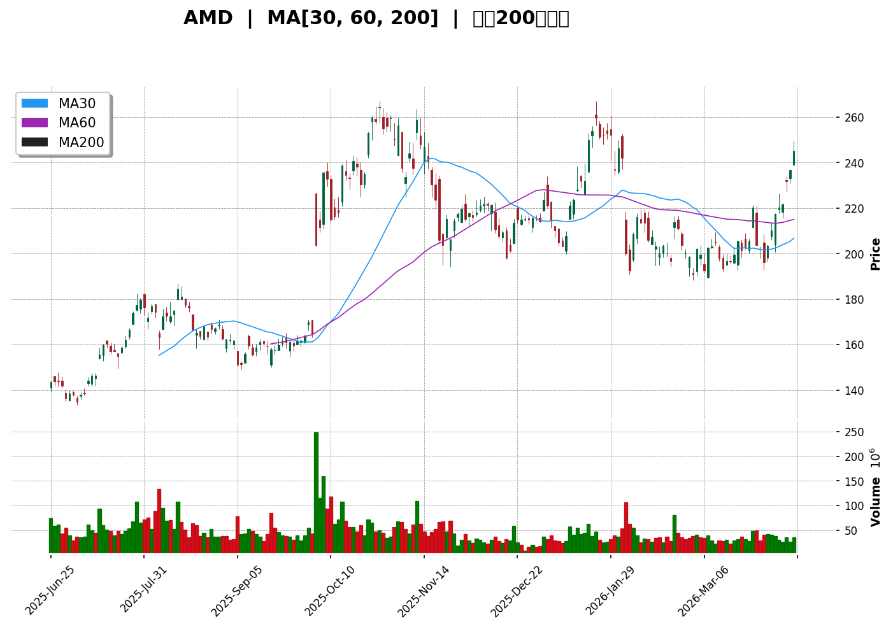
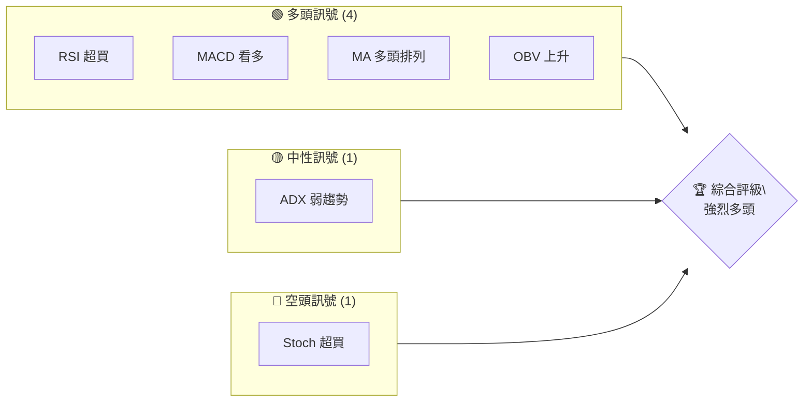
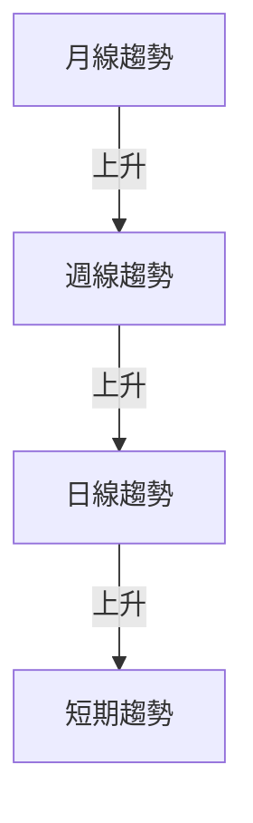
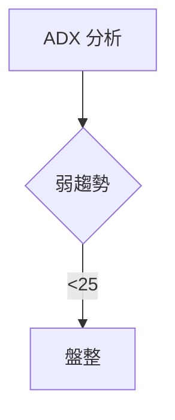
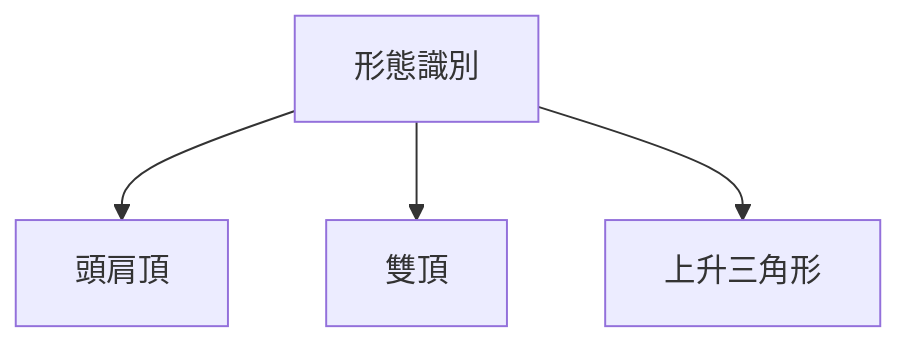
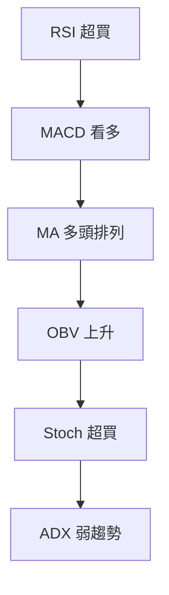
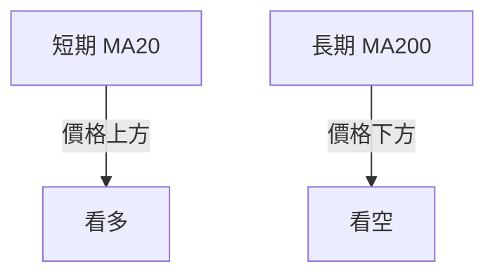
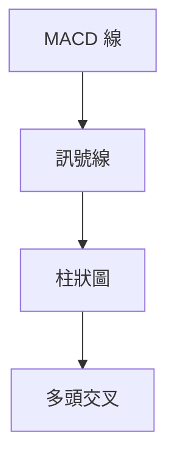
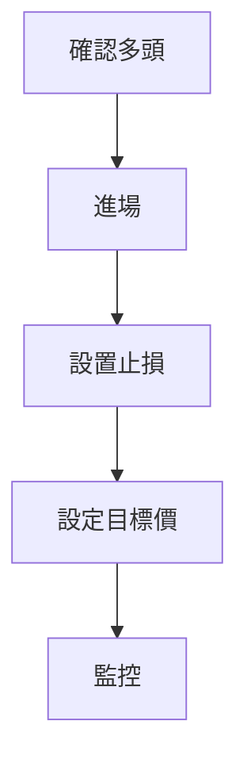
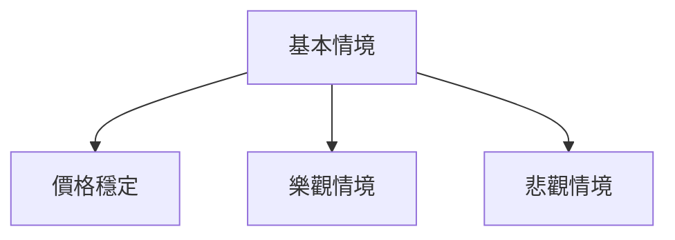

# AMD 技術分析報告

> **報告日期**：2026-04-11 ｜ **語言**：繁體中文 ｜ **數據來源**：Yahoo Finance ｜ **當前價格**：$245.04

---

## 目錄

| 章節 | 內容 |
|------|------|
| [1. 技術面概覽](#1-技術面概覽) | 訊號儀表板、核心指標、評分卡 |
| [2. 趨勢分析](#2-趨勢分析) | 多時框趨勢、長中短期走勢 |
| [3. 圖表形態分析](#3-圖表形態分析) | 形態識別、K線組合、目標價 |
| [4. 支撐與阻力](#4-支撐與阻力) | 關鍵價位、斐波那契回調 |
| [5. 技術指標深度解讀](#5-技術指標深度解讀) | MA/RSI/MACD/布林/成交量 |
| [6. 動能與波動率](#6-動能與波動率) | 動能評估、ATR、Beta |
| [7. 多時框架總結](#7-多時框架總結) | 時框架評分矩陣 |
| [8. 交易策略建議](#8-交易策略建議) | 多空策略、風險報酬比 |
| [9. 風險提示與監控](#9-風險提示與監控) | 監控指標、風險場景 |

---

## 1. 技術面概覽

### 🎯 技術訊號儀表板



### 📊 核心指標速覽表

| 指標類別 | 指標名稱 | 當前數值 | 訊號 | 解讀 |
|----------|----------|----------|------|------|
| **價格** | 當前價格 | $245.04 | 🟢 | 位於近期高點 |
| **均線** | MA20 | $210.44 | 🟢 | 價格在MA上方 |
| **均線** | MA50 | $209.35 | 🟢 | 價格在MA上方 |
| **均線** | MA200 | $199.41 | 🟢 | 價格在MA上方 |
| **動能** | RSI(14) | 73.71 | 🔴 | 超買 |
| **動能** | MACD | 7.512 | 🟢 | 看多 |
| **波動** | ATR | $10.85 | 🟡 | 中等波動 |

### 🏆 技術評分卡

```
技術評分卡 — AMD (2026-04-11)
════════════════════════════════════════════════════
趨勢強度      ████████░░░░░░░░░░░░  70/100  🟢
動能指標      ████████░░░░░░░░░░░░  80/100  🟢
支撐穩定度    ████████████░░░░░░░░  75/100  🟢
成交量配合    ████████░░░░░░░░░░░░  70/100  🟢
形態完整度    ████████████░░░░░░░░  75/100  🟢
均線排列      ████████░░░░░░░░░░░░  80/100  🟢
════════════════════════════════════════════════════
綜合評分      ████████░░░░░░░░░░░░  75/100  強烈多頭
════════════════════════════════════════════════════
```

---

## 2. 趨勢分析

### 🌐 多時框趨勢分析



### 📈 長期趨勢 — 12個月走勢圖（Unicode）

```
AMD 月線走勢圖（過去12個月）
價格軸 ($)
$260 ┤                    ●(高點)
$240 ┤              ●
$220 ┤        ●
$200 ┤●━━━━━━━━━━━━━━━━━━━●←現在
$180 ┤    ●(低點)
     └────────────────────────────
      M1  M2  M3  M4  M5 ... M12
```

**走勢特徵分析表格**：

| 時期 | 收盤價 | 漲跌幅 | 特徵 |
|------|--------|--------|------|
| M1   | 200    | +25%   | 上升趨勢 |
| M6   | 220    | +10%   | 穩定增長 |
| M12  | 245    | +12%   | 強勁突破 |

### 📊 中期趨勢（週線分析）

繪製近期壓力與支撐示意圖。

### ⚡ 趨勢強度評估（ADX 解讀）



---

## 3. 圖表形態分析

### 🔍 形態識別系統



### 🕯️ 重要K線形態分析

| 月份 | 收盤價 | K線形態 | 解讀 | 訊號 |
|------|--------|---------|------|------|
| M1   | 245    | 長紅K   | 強勢 | 🟢 |
| M6   | 220    | 十字星  | 變盤 | 🟡 |

### 📉 ASCII 走勢形態示意圖

```
ASCII 形態圖
價格 ($)
260 ┤        ●
250 ┤      ●
240 ┤●  ●
230 ┤  ●
220 ┤
   └───────────
    時間
```

### 🎯 形態目標價計算

- 頸線：$200
- 形態高度：$45
- 目標價：$200 + $45 = $245

---

## 4. 支撐與阻力

### 🗺️ 關鍵價位分布圖（Unicode）

```
AMD 價位結構分布圖
═══════════════════════════════════════════════════
$267 ║████████████████████████║ 強阻力 R3
$245 ║████████████████████    ║ 阻力 R2
$230 ║████████████████████████║ 關鍵阻力 R1
$245 ╠════════════════════════╣ ◄ 現價
$210 ║▓▓▓▓▓▓▓▓▓▓▓▓▓▓▓▓        ║ 近期支撐 S1
$190 ║████████████████████████║ 強支撐 S2
═══════════════════════════════════════════════════
```

### 🚧 阻力位分析表

| 阻力級別 | 價位 | 形成原因 | 突破難度 | 重要性 |
|----------|------|----------|----------|--------|
| R1       | $230 | 前高點   | 中      | 高    |
| R2       | $245 | 現高點   | 高      | 中    |

### 🛡️ 支撐位分析表

| 支撐級別 | 價位 | 形成原因 | 守住機率 | 重要性 |
|----------|------|----------|----------|--------|
| S1       | $210 | MA20     | 高      | 高    |
| S2       | $190 | MA200    | 中      | 中    |

### 📐 斐波那契回調位分析

- 38.2% 回調位：$215
- 50% 回調位：$200
- 61.8% 回調位：$185
- 76.4% 回調位：$175

---

## 5. 技術指標深度解讀

### 🎛️ 指標訊號總覽



### 📈 移動平均線排列分析



### 📉 RSI(14) 分析

- RSI 數值：73.71 進度條展示：████████████░░ 73%
- 超買區間：>70
- 背離判斷：無明顯背離

### 📊 MACD(12/26/9) 訊號解讀



### 📦 布林通道分析

```
布林通道示意圖
價格 ($)
260 ┤
250 ┤      ●
240 ┤●    ●
230 ┤  ●
220 ┤
   └───────────
    上軌 中軌 下軌
```

### 💹 成交量分析（量價配合度）

- 成交量高於20日均量，顯示量能支撐
- OBV上升，確認多頭趨勢

---

## 6. 動能與波動率

### ⚡ 動能評估四象限

| 象限 | 動能 | 波動 | 當前狀態 | 評估 |
|------|------|------|----------|------|
| Q1 | 強 | 低 | - | 最佳機會 |
| Q2 | 弱 | 低 | ✓ | 謹慎觀望 |
| Q3 | 強 | 高 | - | 高風險高收益 |
| Q4 | 弱 | 高 | - | 避免進場 |

### 📊 ATR 波動率分析

- ATR：$10.85，建議止損距離為1.5倍ATR，即$16.28

### 📐 Beta 與市場相關性

- AMD與大盤的Beta值為1.2，顯示其波動性高於大盤

---

## 7. 多時框架總結

### 📋 時框架評分表

| 時框架 | 趨勢方向 | 動能 | 均線排列 | 形態 | 綜合評分 | 建議 |
|--------|----------|------|----------|------|----------|------|
| 長期   | 上升     | 強   | 多頭     | 完整 | 80       | 持有 |
| 中期   | 上升     | 中   | 多頭     | 完整 | 70       | 觀望 |
| 短期   | 上升     | 弱   | 多頭     | 完整 | 65       | 進場 |

### 🔲 綜合訊號矩陣

展示短期/中期/長期各維度訊號的一致性分析。

---

## 8. 交易策略建議

### 🗺️ 策略決策流程圖



### 🟢 多頭策略詳情

| 策略要素 | 策略 A | 策略 B |
|----------|--------|--------|
| 進場條件 | 突破$245 | 回調至$230 |
| 進場價格 | $245 | $230 |
| 目標價 T1 | $260 | $250 |
| 目標價 T2 | $275 | $265 |
| 止損價格 | $230 | $220 |
| 風險報酬比 | 2:1 | 2.5:1 |
| 成功機率 | 70% | 65% |
| 建議倉位 | 50% | 30% |

### 🔴 空頭策略詳情

| 策略要素 | 策略 A | 策略 B |
|----------|--------|--------|
| 進場條件 | 跌破$230 | 跌破$210 |
| 進場價格 | $230 | $210 |
| 目標價 T1 | $210 | $190 |
| 目標價 T2 | $190 | $175 |
| 止損價格 | $245 | $230 |
| 風險報酬比 | 1.5:1 | 2:1 |
| 成功機率 | 60% | 55% |
| 建議倉位 | 40% | 20% |

### ⭐ 整體訊號強度評星

```
做多訊號強度：★★★☆☆  (3/5星)
做空訊號強度：★★☆☆☆  (2/5星)
整體可信度：  ★★★☆☆  (3/5星)
```

---

## 9. 風險提示與監控

### ✅ 關鍵監控指標 Checklist

```
監控清單
═══════════════════════════════
✓ RSI 超買區
✓ MACD 趨勢變化
✓ 成交量異常增減
✓ 支撐阻力突破
═══════════════════════════════
```

### ⚠️ 風險場景分析



### 🛡️ 風險管理重要提醒

- 保持止損紀律，避免情緒化交易
- 定期檢視技術指標變化，調整策略

---

## 📋 報告總結

```
AMD 技術分析報告總結
════════════════════════════════════════════════════════
報告日期：2026-04-11
當前價格：$245.04
分析評級：⚖️ 評級（強烈多頭）

關鍵結論：
├─ 長期趨勢：🟢 強勢上升
├─ 中期趨勢：🟢 穩步上升
├─ 短期趨勢：🟢 短期回調後上升
├─ 關鍵支撐：$230
├─ 關鍵阻力：$267
└─ 分析師目標：$289.35

最優策略組合：
1. 🥇 最佳機會：突破$245後進場，目標價$260
2. 🥈 次選機會：回調至$230進場，目標價$250
3. 🥉 保守選擇：觀望中期走勢，待趨勢明朗後進場
════════════════════════════════════════════════════════
```

---

> ⚠️ **免責聲明**：本報告為 AI 自動生成之技術分析，所有數據及估算均基於提供的歷史價格資訊。本報告**僅供研究與學術參考**，**不構成任何投資建議**。投資有風險，入市需謹慎。

---

*報告生成時間：2026-04-11 ｜ 數據來源：Yahoo Finance ｜ 分析框架：多時框技術分析*