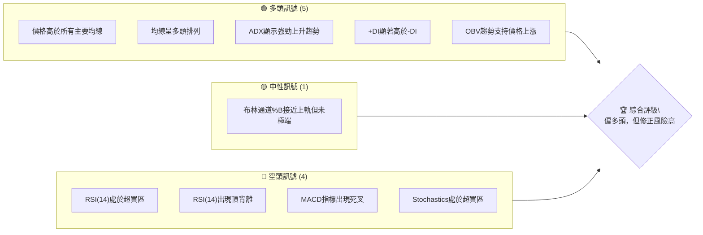
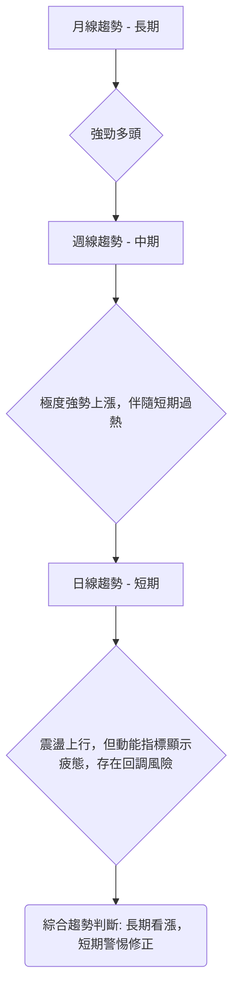
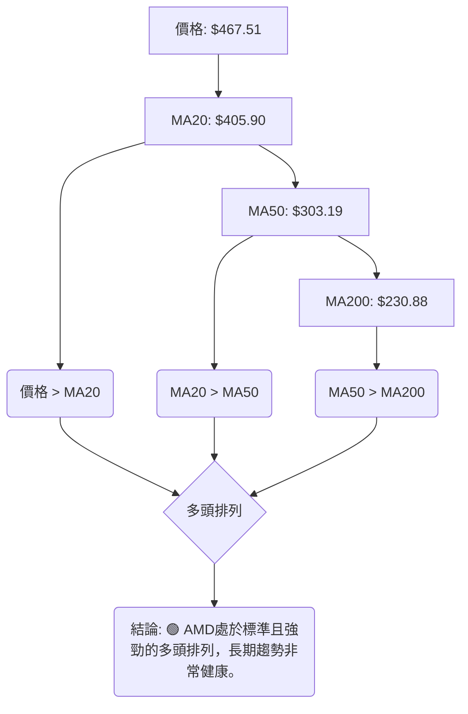

<details>
<summary>📊 靜態圖表 (點擊展開)</summary>

</details>

<html>
<head><meta charset="utf-8" /></head>
<body>
    <div>                        <script>window.PlotlyConfig = {MathJaxConfig: 'local'};</script>
        <script charset="utf-8" src="https://cdn.plot.ly/plotly-3.5.0.min.js" integrity="sha256-fHbNLP+GlIXN+efbQec78UkemUz3NJp7UmfGxC1tNxs=" crossorigin="anonymous"></script>                <div id="candlestick-chart" class="plotly-graph-div" style="height:500px; width:100%;"></div>            <script>                window.PLOTLYENV=window.PLOTLYENV || {};                                if (document.getElementById("candlestick-chart")) {                    Plotly.newPlot(                        "candlestick-chart",                        [{"close":{"dtype":"f8","bdata":"AAAAwMyMZUAAAADgUZhlQAAAAMD1iGVAAAAAYGbeZUAAAACgcA1nQAAAAGBmnmZAAAAA4FEwZkAAAADgegRmQAAAAKCZ0WRAAAAAYGamZEAAAABguHZkQAAAAOBR+GRAAAAAIIVrZEAAAAAA19NkQAAAAAAp5GRAAAAAYI8SZUAAAAAAKVRkQAAAAIA9SmRAAAAAAClEZEAAAACgRzlkQAAAAOB65GJAAAAAwB7tYkAAAACAPXpjQAAAAKBH8WNAAAAAoHB1Y0AAAACAPdJjQAAAAMAeJWRAAAAAYLgOZEAAAADAHuVjQAAAAKBwvWNAAAAA4HqsY0AAAACgR\u002fljQAAAAMDMHGRAAAAAACkcZEAAAADgoyhkQAAAAGC47mNAAAAAIIUrZEAAAACgRzlkQAAAAOBRgGRAAAAAIFw3ZUAAAACgcJVkQAAAAGC4dmlAAAAA4FFwakAAAACA63FtQAAAAOB6HG1AAAAAwMzcakAAAACgcA1rQAAAAEDhQmtAAAAAQDPTbUAAAACA61FtQAAAAGCPIm1AAAAAgOsRbkAAAADA9cBtQAAAACBcx2xAAAAAIK5fbUAAAACgcJ1vQAAAAGC4OnBAAAAAACkgcEAAAACgR4VwQAAAAEDh2m9AAAAAgOsBcEAAAABgZjpwQAAAAKCZQW9AAAAAoEcFcEAAAABgZrZtQAAAAKBHMW1AAAAAIFx\u002fbkAAAADgo7BtQAAAAIA9LnBAAAAAYLj+bkAAAACA69luQAAAAOCjEG5AAAAAoEfJbEAAAACgmfFrQAAAAOCjwGlAAAAAwPV4aUAAAACgmeFqQAAAAAApxGlAAAAAIK7HakAAAADA9TBrQAAAAOBReGtAAAAAIK7nakAAAABAMzNrQAAAACBc\u002f2pAAAAAQAo\u002fa0AAAAAghaNrQAAAAADXs2tAAAAAoHCta0AAAACAwq1rQAAAAMD1WGpAAAAAYI\u002fyaUAAAACgcCVqQAAAACCFw2hAAAAAgOshaUAAAACAwq1qQAAAAGBm3mpAAAAAwMzcakAAAACgR+FqQAAAACCu32pAAAAAIIXzakAAAABA4epqQAAAAMAexWpAAAAAQArva0AAAABgj6JrQAAAAEAzy2pAAAAA4KNAakAAAACAwpVpQAAAAKBwZWlAAAAAgBT2aUAAAABACp9rQAAAAEAz82tAAAAAoHB9bEAAAABgj\u002fpsQAAAAKBw\u002fWxAAAAAoJk5b0AAAAAgXLdvQAAAAEDhOnBAAAAAgOtpb0AAAADA9YBvQAAAACCul29AAAAAgMKFb0AAAAAgXJdtQAAAAOCjyG5AAAAAIIVDbkAAAACAFAZpQAAAAAAAEGhAAAAAgBQOakAAAAAAAABrQAAAAIA9smpAAAAAYI+yakAAAACAFL5pQAAAAIA96mlAAAAAYI9iaUAAAAAA1wNpQAAAAADXa2lAAAAAwMwEaUAAAABAM5NoQAAAAEDhumpAAAAAIIVbakAAAACAwnVpQAAAAGC4BmlAAAAAANfTaEAAAABgZt5nQAAAAIA9QmlAAAAAYGbuaEAAAACAwg1oQAAAAIDCVWlAAAAAIFxnaUAAAABgj5ppQAAAACCut2hAAAAA4HosaEAAAABgj5JoQAAAAIDriWhAAAAAYLjuaEAAAADgo6hpQAAAAGCPKmlAAAAAgMJVaUAAAAAA16tpQAAAAOCjiGtAAAAA4KN4aUAAAAAgrj9pQAAAAKBHgWhAAAAAgMJtaUAAAABguEZqQAAAAAAAMGtAAAAAgMKFa0AAAADA9bBrQAAAAIA9+mxAAAAA4HqUbUAAAACgR6FuQAAAAGCP2m5AAAAAgD3ib0AAAACA6yFwQAAAAAApZHFAAAAAgD1mcUAAAABAMy9xQAAAAADXx3FAAAAAIFz3ckAAAACgRxVzQAAAAMD1vHVAAAAAgBTqdEAAAAAgXDN0QAAAAIDCEXVAAAAAANcndkAAAADgo4h2QAAAAOCjWHVAAAAAACk0dkAAAACAPVZ6QAAAACBch3lAAAAAQApzfEAAAADgo6x8QAAAAOCjBHxAAAAAAADYe0AAAABAMxt8QAAAAKCZgXpAAAAAANdPekAAAADAzOB5QAAAAKBH+XtAAAAAoHAZfEAAAAAAKTh9QA=="},"high":{"dtype":"f8","bdata":"AAAAAAD4ZUAAAAAgXA9mQAAAAIA9WmZAAAAAwB7lZUAAAADAzFRnQAAAAIAULmdAAAAA4HqEZkAAAACgmVlmQAAAAKBwpWVAAAAAwMzUZEAAAAAAKbxkQAAAAMD1EGVAAAAAQOGyZEAAAADgozhlQAAAAIDC9WRAAAAAIK5fZUAAAACAPRJlQAAAAOB6TGRAAAAAAACYZEAAAACgmUFkQAAAAOB6pGNAAAAA4HoUY0AAAADAHpVjQAAAAMD1kGRAAAAAYLgGZEAAAADAHg1kQAAAAKCZSWRAAAAAYGY+ZEAAAAAAKTRkQAAAAOCj2GNAAAAAQOH6Y0AAAACAwlVkQAAAAOB6bGRAAAAAQDOjZEAAAAAAKTRkQAAAACCFQ2RAAAAAoJmJZEAAAADA9UhkQAAAAIDChWRAAAAAgOthZUAAAACAwlVlQAAAAGC4VmxAAAAAwMxca0AAAAAA13ttQAAAAEAzA25AAAAAQApHbUAAAACAFAZsQAAAACBcH2xAAAAAIK7nbUAAAABgZiZuQAAAAAApbG1AAAAAAClcbkAAAADgUUhuQAAAAAApBG5AAAAAwMx8bUAAAADgeqxvQAAAAGC4RnBAAAAAoEeJcEAAAACgR7FwQAAAAIAUfnBAAAAAgBRicEAAAABgj05wQAAAAIAUFnBAAAAAYGY6cEAAAADgUbBvQAAAAADXe21AAAAAwMwcb0AAAABguA5vQAAAAAApeHBAAAAAgBQ6cEAAAACAFK5vQAAAAOCjGG9AAAAAAADAbUAAAADA9WhtQAAAAAAASG1AAAAAYI8aakAAAAAAKSRrQAAAAGCP0mlAAAAAQOHyakAAAACgmUlrQAAAACBcn2tAAAAAIFw\u002fbEAAAABgZkZrQAAAAADXY2tAAAAA4Hr0a0AAAABguPZrQAAAAEDhGmxAAAAAIIXTa0AAAAAAALBrQAAAACCuz2tAAAAAIIXrakAAAABACkdqQAAAAAAAcGpAAAAAIIXLaUAAAACAwuVqQAAAAKBwhWtAAAAAwPUga0AAAACgRxFrQAAAAGCPGmtAAAAAoJkBa0AAAACAPRprQAAAAOB6NGtAAAAAwMxkbEAAAADgo0BtQAAAAKBw3WtAAAAAACmEakAAAACAFF5qQAAAAKCZ6WlAAAAAACk8akAAAAAgheNrQAAAAEDhAmxAAAAAQDPLbUAAAAAgrk9tQAAAAAAA8G1AAAAAwMycb0AAAACgRwFwQAAAACBcr3BAAAAA4KMkcEAAAACgmfFvQAAAAGBmFnBAAAAA4HpIcEAAAAAgrqduQAAAAEAKP29AAAAAwMyUb0AAAABgj1JrQAAAAKBHgWlAAAAA4KMoakAAAABAMzNrQAAAAOB6bGtAAAAAwMx0a0AAAABguE5rQAAAAKCZQWpAAAAAoJmpaUAAAABgZmZpQAAAAEAzg2lAAAAAANebaUAAAAAAKexoQAAAAGC4FmtAAAAAYGYWa0AAAACgRzlqQAAAAOB6PGlAAAAAIK7XaEAAAADgejRoQAAAAIAUTmlAAAAAoEd5aUAAAAAgrgdpQAAAAEAKX2lAAAAAQOHSaUAAAABguCZqQAAAAADXc2lAAAAAgML1aEAAAACgcAVpQAAAAGC45mhAAAAAIIVbaUAAAAAAKbxpQAAAAKCZyWlAAAAAIIUjakAAAACAws1pQAAAAGCPqmtAAAAAAACga0AAAADgo2hpQAAAAIDCDWpAAAAAAACAaUAAAABgj7pqQAAAAMD1OGtAAAAAgOtJbEAAAABAM8NrQAAAAAAAQG1AAAAAQDOjbUAAAABgjzJvQAAAAGCP6m5AAAAAYLjub0AAAABA4SJwQAAAAKBwdXFAAAAAwMyQcUAAAACAwvlxQAAAAEAz43FAAAAAAAAEc0AAAAAghWNzQAAAAADXD3ZAAAAAIFzTdUAAAAAAAHh0QAAAAGC4QnVAAAAAIFwvdkAAAADgo6x2QAAAAKCZnXZAAAAAwB55dkAAAACgmel6QAAAACBcW3pAAAAA4KOEfEAAAAAghVN9QAAAAMDMrHxAAAAAAAC4fEAAAADA9VR8QAAAAAAAcHtAAAAAwMxse0AAAAAAAMx6QAAAAIA9FnxAAAAAQDMzfEAAAABgjxZ+QA=="},"hovertemplate":"\u003cb\u003e%{x|%Y-%m-%d}\u003c\u002fb\u003e\u003cbr\u003e\u958b: $%{open:.2f}\u003cbr\u003e\u9ad8: $%{high:.2f}\u003cbr\u003e\u4f4e: $%{low:.2f}\u003cbr\u003e\u6536: $%{close:.2f}\u003cextra\u003e\u003c\u002fextra\u003e","low":{"dtype":"f8","bdata":"AAAAYGbWZEAAAADgo1BlQAAAAAApLGVAAAAAAAAQZUAAAAAAKWxmQAAAAIDrcWZAAAAAAAAIZkAAAAAghctlQAAAAEAzw2RAAAAAAADIY0AAAADgUUhkQAAAAKCZOWRAAAAAQAo3ZEAAAADAHp1kQAAAAMDMlGRAAAAAwMzUZEAAAADAzDxkQAAAAADXk2NAAAAAYI8SZEAAAACgR7ljQAAAAIDCxWJAAAAAQAqnYkAAAACAwv1iQAAAAAAAwGNAAAAAIK5fY0AAAACgcF1jQAAAAEAzs2NAAAAAQArnY0AAAADgUXhjQAAAAEAzu2JAAAAAwMx8Y0AAAACgcK1jQAAAAGC45mNAAAAAgMLNY0AAAADA9VhjQAAAAKCZoWNAAAAAwMz8Y0AAAABgj+pjQAAAACCuD2RAAAAAANfDZEAAAADgemRkQAAAAOBRYGlAAAAAwPUoakAAAABgZlZqQAAAAMD1sGxAAAAAYGamakAAAADAzNxqQAAAAMDM\u002fGpAAAAA4FGYa0AAAAAgrgdtQAAAAMAefWxAAAAAwMxMbUAAAADgo0BtQAAAAAApHGxAAAAAoEeRbEAAAABgZj5uQAAAAKCZOW9AAAAAAAAQcEAAAABgZhZwQAAAAIDriW9AAAAAwB6tb0AAAADgerxvQAAAAOB67G5AAAAAgOtZbkAAAAAgrndtQAAAAOB6FGxAAAAAAAAQbkAAAADgelRtQAAAAAAAQG9AAAAAgOvBbkAAAABgj2JtQAAAAMDMpG1AAAAAYLgWbEAAAABguHZrQAAAAMD1kGlAAAAAAABgaEAAAABAM7tpQAAAAMD1SGhAAAAAAADgaUAAAADgo8BqQAAAAAAAsGpAAAAA4HrMakAAAADgo3hqQAAAAOB6xGpAAAAAIK4Ha0AAAAAghUtrQAAAAMAePWtAAAAAoHBVa0AAAACAFEZqQAAAAIDrIWpAAAAAYI\u002fSaUAAAAAghaNpQAAAAMD1sGhAAAAAAAAQaUAAAABgZoZpQAAAAIDrqWpAAAAAwPWIakAAAABACr9qQAAAAMD1oGpAAAAAIK4nakAAAABgj8pqQAAAAKCZuWpAAAAAwMxca0AAAAAgXI9rQAAAAAAAaGpAAAAAoHDlaUAAAABgj2ppQAAAAIA9YmlAAAAAoJn5aEAAAAAgXN9qQAAAACCF42pAAAAAQApnbEAAAAAghZtsQAAAAMAeLWxAAAAAwPV4bUAAAAAAKdRuQAAAAAAABHBAAAAAoJlJb0AAAABguP5uQAAAAGC4Rm9AAAAAwB4dbkAAAACgmVFtQAAAAAAAYG1AAAAAoEehbUAAAADAzORoQAAAAEAK12dAAAAAgMKNaEAAAADAzIRpQAAAAAAppGpAAAAAYLgmakAAAADgeqRpQAAAAAApfGlAAAAAYI9aaEAAAAAAAGBoQAAAAKBHyWhAAAAAgOvRaEAAAADAzERoQAAAAAAA0GlAAAAAYI9KakAAAABguC5pQAAAACCut2hAAAAAAADAZ0AAAABACodnQAAAACCFu2dAAAAAAClcaEAAAAAAAOhnQAAAAOCjoGdAAAAAYGZGaUAAAAAAKXRpQAAAAKBwlWhAAAAA4KMIaEAAAACgmVloQAAAAOBRaGhAAAAAAAB4aEAAAABgjxpoQAAAAOBRyGhAAAAAYLg2aUAAAAAAKQRpQAAAAOBRcGpAAAAAgMJtaUAAAACAFLZoQAAAAADXG2hAAAAAwB6NaEAAAABA4bppQAAAAADXE2lAAAAAIFw3a0AAAAAAKexqQAAAAEDhYmxAAAAAwB7dbEAAAABguN5tQAAAAMD1QG5AAAAAYGa2bkAAAABAM3tvQAAAAAApWHBAAAAAgD0icUAAAAAAAABxQAAAAIDrSXFAAAAAgD3icUAAAAAAKbxyQAAAAOCj6HRAAAAAwPWMdEAAAAAAAGBzQAAAAIDC7XNAAAAAoJnJdEAAAAAAANR1QAAAAEAzK3VAAAAAgBSOdUAAAADgoyB5QAAAAKBHEXlAAAAA4KMkekAAAACAFC58QAAAAIDCoXpAAAAAYGYKe0AAAABA4Tp7QAAAAIDCdXpAAAAAIFyreUAAAACAwpV4QAAAAMDMoHpAAAAAoJn5ekAAAAAgXNt8QA=="},"name":"\u50f9\u683c","open":{"dtype":"f8","bdata":"AAAAQOHaZEAAAACgR8FlQAAAAKBHQWVAAAAAgD2qZUAAAADAHn1mQAAAAGCPemZAAAAAgOuBZkAAAADgURhmQAAAAEAzo2VAAAAAQDODZEAAAAAghbtkQAAAAKBwRWRAAAAAoJmxZEAAAADAzBRlQAAAAKBHwWRAAAAAAAAQZUAAAACA69lkQAAAAKBwzWNAAAAAgOs5ZEAAAACAFP5jQAAAAADXo2NAAAAAoJn5YkAAAAAgrv9iQAAAAKBHcWRAAAAAANfTY0AAAAAAAKBjQAAAAOBRAGRAAAAAANcrZEAAAADA9ehjQAAAAGC43mJAAAAAACmsY0AAAACgcK1jQAAAAOCjEGRAAAAAIFxfZEAAAADgeqRjQAAAAOCjEGRAAAAAANcDZEAAAACgRxlkQAAAAIDCHWRAAAAAgMIVZUAAAACAwlVlQAAAAGBmTmxAAAAAQDPbakAAAABgZp5qQAAAAKCZiW1AAAAA4KMYbUAAAABgZoZrQAAAAGBmZmtAAAAAYLjWa0AAAACgR4ltQAAAAOBRKG1AAAAAQAqPbUAAAADgeuxtQAAAAEAzm21AAAAAwB7FbEAAAAAghWtuQAAAAIAUHnBAAAAAgD0ycEAAAABACoNwQAAAAGC4PnBAAAAAoJk5cEAAAACgRzVwQAAAAEAzS29AAAAAIK5nbkAAAABACq9vQAAAAIAU3mxAAAAA4HpEbkAAAADAHjVuQAAAAAAppG9AAAAAwMx8b0AAAAAghQNuQAAAAAAAWG5AAAAAwPWYbUAAAADgUchsQAAAAGBmFm1AAAAAgOsZakAAAADAHuVpQAAAACBcL2lAAAAAoJlBakAAAADgegRrQAAAAAApvGpAAAAAoEe5a0AAAADgUQhrQAAAAAApHGtAAAAAoHAla0AAAABA4WJrQAAAAKBHoWtAAAAAAADAa0AAAACA6zlrQAAAAADXS2tAAAAAwPWIakAAAACgcN1pQAAAAKBHQWpAAAAAgD16aUAAAABAM5NpQAAAAAAAgGtAAAAAIIWbakAAAAAgXN9qQAAAAIDC7WpAAAAAYI9yakAAAAAA1\u002ftqQAAAAIA9+mpAAAAAwMxca0AAAAAAAMhsQAAAAGC41mtAAAAAACmEakAAAADAzFxqQAAAAEAKt2lAAAAAgMIlaUAAAABAM+NqQAAAAKBHMWtAAAAAwMx8bEAAAACgmUltQAAAAGCPQmxAAAAAIK5\u002fbUAAAAAAAHhvQAAAAEDhUnBAAAAAAAAMcEAAAADAHoVvQAAAAAApxG9AAAAAwB7Vb0AAAACAwp1tQAAAAOCjeG1AAAAAoJlxb0AAAAAAAOBqQAAAACCFO2lAAAAAACmkaEAAAADAzNxpQAAAAOB65GpAAAAAACk8a0AAAABgj\u002fpqQAAAAOCjgGlAAAAAwMxEaUAAAADAHs1oQAAAACCFA2lAAAAAANcDaUAAAABA4cJoQAAAAAApdGpAAAAAgD3aakAAAACgmRlqQAAAACCFA2lAAAAAQDM7aEAAAABguO5nQAAAAADXA2hAAAAA4KO4aEAAAADgo2hoQAAAACCFq2dAAAAA4FFQaUAAAAAghaNpQAAAAGCPWmlAAAAAIIXDaEAAAAAgXF9oQAAAAIDClWhAAAAAAACAaEAAAADA9WBoQAAAAOB6nGlAAAAAwMzMaUAAAADgeixpQAAAAOBRcGpAAAAAIFw\u002fa0AAAADgozhpQAAAAGBmnmlAAAAAoJnBaEAAAABA4fJpQAAAAKCZgWlAAAAAwPVoa0AAAADgUUhrQAAAAADXA21AAAAA4FEgbUAAAAAAAOBtQAAAAMD1oG5AAAAAoEc5b0AAAABguN5vQAAAAADXj3BAAAAAAACQcUAAAACgmYlxQAAAAKBHVXFAAAAAIIUzckAAAAAAKeByQAAAAAApDHVAAAAAwB6ldUAAAACAwn1zQAAAAKBHaXRAAAAAgMJVdUAAAACA6\u002f11QAAAAMD1hHZAAAAAACn4dUAAAAAA15d5QAAAAMAeEXpAAAAAoHApekAAAADAzMh8QAAAAAAAFHxAAAAA4KOQfEAAAACgmYl7QAAAAKBwFXtAAAAAAADYekAAAACgmcl5QAAAAOCjwHpAAAAAANefe0AAAACgcF19QA=="},"x":["2025-08-07T00:00:00-04:00","2025-08-08T00:00:00-04:00","2025-08-11T00:00:00-04:00","2025-08-12T00:00:00-04:00","2025-08-13T00:00:00-04:00","2025-08-14T00:00:00-04:00","2025-08-15T00:00:00-04:00","2025-08-18T00:00:00-04:00","2025-08-19T00:00:00-04:00","2025-08-20T00:00:00-04:00","2025-08-21T00:00:00-04:00","2025-08-22T00:00:00-04:00","2025-08-25T00:00:00-04:00","2025-08-26T00:00:00-04:00","2025-08-27T00:00:00-04:00","2025-08-28T00:00:00-04:00","2025-08-29T00:00:00-04:00","2025-09-02T00:00:00-04:00","2025-09-03T00:00:00-04:00","2025-09-04T00:00:00-04:00","2025-09-05T00:00:00-04:00","2025-09-08T00:00:00-04:00","2025-09-09T00:00:00-04:00","2025-09-10T00:00:00-04:00","2025-09-11T00:00:00-04:00","2025-09-12T00:00:00-04:00","2025-09-15T00:00:00-04:00","2025-09-16T00:00:00-04:00","2025-09-17T00:00:00-04:00","2025-09-18T00:00:00-04:00","2025-09-19T00:00:00-04:00","2025-09-22T00:00:00-04:00","2025-09-23T00:00:00-04:00","2025-09-24T00:00:00-04:00","2025-09-25T00:00:00-04:00","2025-09-26T00:00:00-04:00","2025-09-29T00:00:00-04:00","2025-09-30T00:00:00-04:00","2025-10-01T00:00:00-04:00","2025-10-02T00:00:00-04:00","2025-10-03T00:00:00-04:00","2025-10-06T00:00:00-04:00","2025-10-07T00:00:00-04:00","2025-10-08T00:00:00-04:00","2025-10-09T00:00:00-04:00","2025-10-10T00:00:00-04:00","2025-10-13T00:00:00-04:00","2025-10-14T00:00:00-04:00","2025-10-15T00:00:00-04:00","2025-10-16T00:00:00-04:00","2025-10-17T00:00:00-04:00","2025-10-20T00:00:00-04:00","2025-10-21T00:00:00-04:00","2025-10-22T00:00:00-04:00","2025-10-23T00:00:00-04:00","2025-10-24T00:00:00-04:00","2025-10-27T00:00:00-04:00","2025-10-28T00:00:00-04:00","2025-10-29T00:00:00-04:00","2025-10-30T00:00:00-04:00","2025-10-31T00:00:00-04:00","2025-11-03T00:00:00-05:00","2025-11-04T00:00:00-05:00","2025-11-05T00:00:00-05:00","2025-11-06T00:00:00-05:00","2025-11-07T00:00:00-05:00","2025-11-10T00:00:00-05:00","2025-11-11T00:00:00-05:00","2025-11-12T00:00:00-05:00","2025-11-13T00:00:00-05:00","2025-11-14T00:00:00-05:00","2025-11-17T00:00:00-05:00","2025-11-18T00:00:00-05:00","2025-11-19T00:00:00-05:00","2025-11-20T00:00:00-05:00","2025-11-21T00:00:00-05:00","2025-11-24T00:00:00-05:00","2025-11-25T00:00:00-05:00","2025-11-26T00:00:00-05:00","2025-11-28T00:00:00-05:00","2025-12-01T00:00:00-05:00","2025-12-02T00:00:00-05:00","2025-12-03T00:00:00-05:00","2025-12-04T00:00:00-05:00","2025-12-05T00:00:00-05:00","2025-12-08T00:00:00-05:00","2025-12-09T00:00:00-05:00","2025-12-10T00:00:00-05:00","2025-12-11T00:00:00-05:00","2025-12-12T00:00:00-05:00","2025-12-15T00:00:00-05:00","2025-12-16T00:00:00-05:00","2025-12-17T00:00:00-05:00","2025-12-18T00:00:00-05:00","2025-12-19T00:00:00-05:00","2025-12-22T00:00:00-05:00","2025-12-23T00:00:00-05:00","2025-12-24T00:00:00-05:00","2025-12-26T00:00:00-05:00","2025-12-29T00:00:00-05:00","2025-12-30T00:00:00-05:00","2025-12-31T00:00:00-05:00","2026-01-02T00:00:00-05:00","2026-01-05T00:00:00-05:00","2026-01-06T00:00:00-05:00","2026-01-07T00:00:00-05:00","2026-01-08T00:00:00-05:00","2026-01-09T00:00:00-05:00","2026-01-12T00:00:00-05:00","2026-01-13T00:00:00-05:00","2026-01-14T00:00:00-05:00","2026-01-15T00:00:00-05:00","2026-01-16T00:00:00-05:00","2026-01-20T00:00:00-05:00","2026-01-21T00:00:00-05:00","2026-01-22T00:00:00-05:00","2026-01-23T00:00:00-05:00","2026-01-26T00:00:00-05:00","2026-01-27T00:00:00-05:00","2026-01-28T00:00:00-05:00","2026-01-29T00:00:00-05:00","2026-01-30T00:00:00-05:00","2026-02-02T00:00:00-05:00","2026-02-03T00:00:00-05:00","2026-02-04T00:00:00-05:00","2026-02-05T00:00:00-05:00","2026-02-06T00:00:00-05:00","2026-02-09T00:00:00-05:00","2026-02-10T00:00:00-05:00","2026-02-11T00:00:00-05:00","2026-02-12T00:00:00-05:00","2026-02-13T00:00:00-05:00","2026-02-17T00:00:00-05:00","2026-02-18T00:00:00-05:00","2026-02-19T00:00:00-05:00","2026-02-20T00:00:00-05:00","2026-02-23T00:00:00-05:00","2026-02-24T00:00:00-05:00","2026-02-25T00:00:00-05:00","2026-02-26T00:00:00-05:00","2026-02-27T00:00:00-05:00","2026-03-02T00:00:00-05:00","2026-03-03T00:00:00-05:00","2026-03-04T00:00:00-05:00","2026-03-05T00:00:00-05:00","2026-03-06T00:00:00-05:00","2026-03-09T00:00:00-04:00","2026-03-10T00:00:00-04:00","2026-03-11T00:00:00-04:00","2026-03-12T00:00:00-04:00","2026-03-13T00:00:00-04:00","2026-03-16T00:00:00-04:00","2026-03-17T00:00:00-04:00","2026-03-18T00:00:00-04:00","2026-03-19T00:00:00-04:00","2026-03-20T00:00:00-04:00","2026-03-23T00:00:00-04:00","2026-03-24T00:00:00-04:00","2026-03-25T00:00:00-04:00","2026-03-26T00:00:00-04:00","2026-03-27T00:00:00-04:00","2026-03-30T00:00:00-04:00","2026-03-31T00:00:00-04:00","2026-04-01T00:00:00-04:00","2026-04-02T00:00:00-04:00","2026-04-06T00:00:00-04:00","2026-04-07T00:00:00-04:00","2026-04-08T00:00:00-04:00","2026-04-09T00:00:00-04:00","2026-04-10T00:00:00-04:00","2026-04-13T00:00:00-04:00","2026-04-14T00:00:00-04:00","2026-04-15T00:00:00-04:00","2026-04-16T00:00:00-04:00","2026-04-17T00:00:00-04:00","2026-04-20T00:00:00-04:00","2026-04-21T00:00:00-04:00","2026-04-22T00:00:00-04:00","2026-04-23T00:00:00-04:00","2026-04-24T00:00:00-04:00","2026-04-27T00:00:00-04:00","2026-04-28T00:00:00-04:00","2026-04-29T00:00:00-04:00","2026-04-30T00:00:00-04:00","2026-05-01T00:00:00-04:00","2026-05-04T00:00:00-04:00","2026-05-05T00:00:00-04:00","2026-05-06T00:00:00-04:00","2026-05-07T00:00:00-04:00","2026-05-08T00:00:00-04:00","2026-05-11T00:00:00-04:00","2026-05-12T00:00:00-04:00","2026-05-13T00:00:00-04:00","2026-05-14T00:00:00-04:00","2026-05-15T00:00:00-04:00","2026-05-18T00:00:00-04:00","2026-05-19T00:00:00-04:00","2026-05-20T00:00:00-04:00","2026-05-21T00:00:00-04:00","2026-05-22T00:00:00-04:00"],"type":"candlestick"},{"hovertemplate":"MA30: $%{y:.2f}\u003cextra\u003e\u003c\u002fextra\u003e","line":{"color":"#2196F3","dash":"dash","width":2},"mode":"lines","name":"MA30","x":["2025-08-07T00:00:00-04:00","2025-08-08T00:00:00-04:00","2025-08-11T00:00:00-04:00","2025-08-12T00:00:00-04:00","2025-08-13T00:00:00-04:00","2025-08-14T00:00:00-04:00","2025-08-15T00:00:00-04:00","2025-08-18T00:00:00-04:00","2025-08-19T00:00:00-04:00","2025-08-20T00:00:00-04:00","2025-08-21T00:00:00-04:00","2025-08-22T00:00:00-04:00","2025-08-25T00:00:00-04:00","2025-08-26T00:00:00-04:00","2025-08-27T00:00:00-04:00","2025-08-28T00:00:00-04:00","2025-08-29T00:00:00-04:00","2025-09-02T00:00:00-04:00","2025-09-03T00:00:00-04:00","2025-09-04T00:00:00-04:00","2025-09-05T00:00:00-04:00","2025-09-08T00:00:00-04:00","2025-09-09T00:00:00-04:00","2025-09-10T00:00:00-04:00","2025-09-11T00:00:00-04:00","2025-09-12T00:00:00-04:00","2025-09-15T00:00:00-04:00","2025-09-16T00:00:00-04:00","2025-09-17T00:00:00-04:00","2025-09-18T00:00:00-04:00","2025-09-19T00:00:00-04:00","2025-09-22T00:00:00-04:00","2025-09-23T00:00:00-04:00","2025-09-24T00:00:00-04:00","2025-09-25T00:00:00-04:00","2025-09-26T00:00:00-04:00","2025-09-29T00:00:00-04:00","2025-09-30T00:00:00-04:00","2025-10-01T00:00:00-04:00","2025-10-02T00:00:00-04:00","2025-10-03T00:00:00-04:00","2025-10-06T00:00:00-04:00","2025-10-07T00:00:00-04:00","2025-10-08T00:00:00-04:00","2025-10-09T00:00:00-04:00","2025-10-10T00:00:00-04:00","2025-10-13T00:00:00-04:00","2025-10-14T00:00:00-04:00","2025-10-15T00:00:00-04:00","2025-10-16T00:00:00-04:00","2025-10-17T00:00:00-04:00","2025-10-20T00:00:00-04:00","2025-10-21T00:00:00-04:00","2025-10-22T00:00:00-04:00","2025-10-23T00:00:00-04:00","2025-10-24T00:00:00-04:00","2025-10-27T00:00:00-04:00","2025-10-28T00:00:00-04:00","2025-10-29T00:00:00-04:00","2025-10-30T00:00:00-04:00","2025-10-31T00:00:00-04:00","2025-11-03T00:00:00-05:00","2025-11-04T00:00:00-05:00","2025-11-05T00:00:00-05:00","2025-11-06T00:00:00-05:00","2025-11-07T00:00:00-05:00","2025-11-10T00:00:00-05:00","2025-11-11T00:00:00-05:00","2025-11-12T00:00:00-05:00","2025-11-13T00:00:00-05:00","2025-11-14T00:00:00-05:00","2025-11-17T00:00:00-05:00","2025-11-18T00:00:00-05:00","2025-11-19T00:00:00-05:00","2025-11-20T00:00:00-05:00","2025-11-21T00:00:00-05:00","2025-11-24T00:00:00-05:00","2025-11-25T00:00:00-05:00","2025-11-26T00:00:00-05:00","2025-11-28T00:00:00-05:00","2025-12-01T00:00:00-05:00","2025-12-02T00:00:00-05:00","2025-12-03T00:00:00-05:00","2025-12-04T00:00:00-05:00","2025-12-05T00:00:00-05:00","2025-12-08T00:00:00-05:00","2025-12-09T00:00:00-05:00","2025-12-10T00:00:00-05:00","2025-12-11T00:00:00-05:00","2025-12-12T00:00:00-05:00","2025-12-15T00:00:00-05:00","2025-12-16T00:00:00-05:00","2025-12-17T00:00:00-05:00","2025-12-18T00:00:00-05:00","2025-12-19T00:00:00-05:00","2025-12-22T00:00:00-05:00","2025-12-23T00:00:00-05:00","2025-12-24T00:00:00-05:00","2025-12-26T00:00:00-05:00","2025-12-29T00:00:00-05:00","2025-12-30T00:00:00-05:00","2025-12-31T00:00:00-05:00","2026-01-02T00:00:00-05:00","2026-01-05T00:00:00-05:00","2026-01-06T00:00:00-05:00","2026-01-07T00:00:00-05:00","2026-01-08T00:00:00-05:00","2026-01-09T00:00:00-05:00","2026-01-12T00:00:00-05:00","2026-01-13T00:00:00-05:00","2026-01-14T00:00:00-05:00","2026-01-15T00:00:00-05:00","2026-01-16T00:00:00-05:00","2026-01-20T00:00:00-05:00","2026-01-21T00:00:00-05:00","2026-01-22T00:00:00-05:00","2026-01-23T00:00:00-05:00","2026-01-26T00:00:00-05:00","2026-01-27T00:00:00-05:00","2026-01-28T00:00:00-05:00","2026-01-29T00:00:00-05:00","2026-01-30T00:00:00-05:00","2026-02-02T00:00:00-05:00","2026-02-03T00:00:00-05:00","2026-02-04T00:00:00-05:00","2026-02-05T00:00:00-05:00","2026-02-06T00:00:00-05:00","2026-02-09T00:00:00-05:00","2026-02-10T00:00:00-05:00","2026-02-11T00:00:00-05:00","2026-02-12T00:00:00-05:00","2026-02-13T00:00:00-05:00","2026-02-17T00:00:00-05:00","2026-02-18T00:00:00-05:00","2026-02-19T00:00:00-05:00","2026-02-20T00:00:00-05:00","2026-02-23T00:00:00-05:00","2026-02-24T00:00:00-05:00","2026-02-25T00:00:00-05:00","2026-02-26T00:00:00-05:00","2026-02-27T00:00:00-05:00","2026-03-02T00:00:00-05:00","2026-03-03T00:00:00-05:00","2026-03-04T00:00:00-05:00","2026-03-05T00:00:00-05:00","2026-03-06T00:00:00-05:00","2026-03-09T00:00:00-04:00","2026-03-10T00:00:00-04:00","2026-03-11T00:00:00-04:00","2026-03-12T00:00:00-04:00","2026-03-13T00:00:00-04:00","2026-03-16T00:00:00-04:00","2026-03-17T00:00:00-04:00","2026-03-18T00:00:00-04:00","2026-03-19T00:00:00-04:00","2026-03-20T00:00:00-04:00","2026-03-23T00:00:00-04:00","2026-03-24T00:00:00-04:00","2026-03-25T00:00:00-04:00","2026-03-26T00:00:00-04:00","2026-03-27T00:00:00-04:00","2026-03-30T00:00:00-04:00","2026-03-31T00:00:00-04:00","2026-04-01T00:00:00-04:00","2026-04-02T00:00:00-04:00","2026-04-06T00:00:00-04:00","2026-04-07T00:00:00-04:00","2026-04-08T00:00:00-04:00","2026-04-09T00:00:00-04:00","2026-04-10T00:00:00-04:00","2026-04-13T00:00:00-04:00","2026-04-14T00:00:00-04:00","2026-04-15T00:00:00-04:00","2026-04-16T00:00:00-04:00","2026-04-17T00:00:00-04:00","2026-04-20T00:00:00-04:00","2026-04-21T00:00:00-04:00","2026-04-22T00:00:00-04:00","2026-04-23T00:00:00-04:00","2026-04-24T00:00:00-04:00","2026-04-27T00:00:00-04:00","2026-04-28T00:00:00-04:00","2026-04-29T00:00:00-04:00","2026-04-30T00:00:00-04:00","2026-05-01T00:00:00-04:00","2026-05-04T00:00:00-04:00","2026-05-05T00:00:00-04:00","2026-05-06T00:00:00-04:00","2026-05-07T00:00:00-04:00","2026-05-08T00:00:00-04:00","2026-05-11T00:00:00-04:00","2026-05-12T00:00:00-04:00","2026-05-13T00:00:00-04:00","2026-05-14T00:00:00-04:00","2026-05-15T00:00:00-04:00","2026-05-18T00:00:00-04:00","2026-05-19T00:00:00-04:00","2026-05-20T00:00:00-04:00","2026-05-21T00:00:00-04:00","2026-05-22T00:00:00-04:00"],"y":{"dtype":"f8","bdata":"AAAAAAAA+H8AAAAAAAD4fwAAAAAAAPh\u002fAAAAAAAA+H8AAAAAAAD4fwAAAAAAAPh\u002fAAAAAAAA+H8AAAAAAAD4fwAAAAAAAPh\u002fAAAAAAAA+H8AAAAAAAD4fwAAAAAAAPh\u002fAAAAAAAA+H8AAAAAAAD4fwAAAAAAAPh\u002fAAAAAAAA+H8AAAAAAAD4fwAAAAAAAPh\u002fAAAAAAAA+H8AAAAAAAD4fwAAAAAAAPh\u002fAAAAAAAA+H8AAAAAAAD4fwAAAAAAAPh\u002fAAAAAAAA+H8AAAAAAAD4fwAAAAAAAPh\u002fAAAAAAAA+H8AAAAAAAD4f3d3d5e1qmRAzczM3LKaZEAAAAAw3YxkQAAAALC5gGRAREREpLdxZEBmZmYmBllkQDMzM\u002fMZQmRAzczM7N8wZECrqqpqkSFkQDMzM9PbHmRAERER0bAjZEBVVVX1tiRkQFVVVbUPS2RA3t3d3Wt+ZEBVVVUV9cdkQCIiIvIZDmVAREREZII\u002fZUBVVVWl4nhlQCIiIpJftGVAq6qq+vAFZkCrqqoKkFNmQAAAACD3qmZAREREBA8KZ0AzMzPTv2FnQImIiOgmrWdA7+7ujsIBaEBVVVVlZmZoQCIiIjJ6z2hAmpmZ2Yc3aUBEREREtqdpQDMzM+MXD2pAIiIiwmd4akAiIiIy7OJqQHd3dxcEQmtAzczMTNSna0CJiIjIWvlrQO\u002fu7o5fSGxAMzMzU4CgbECrqqqqR\u002fFsQM3MzDx8Vm1A7+7uPu6pbUARERHxiwFuQGZmZobPKG5Ad3d3t9c8bkAAAAAwCDBuQDMzM+NeE25AMzMzY4IHbkCamZlJDAZuQJqZmWlK+W1AIiIigk7fbUDv7u4uJM1tQO\u002fu7u7uvm1AMzMz4+yjbUAzMzMjIo5tQAAAAPDufm1Ad3d3V8dsbUB3d3cX2UptQGZmZuZCIm1AMzMzYzv7bEBERETUeM1sQDMzM4N5nmxAvLu727JqbEBERER02jRsQO\u002fu7l5z\u002fWtAq6qq+n7Ca0BmZmamm6hrQHd3d1fHlGtAAAAAkMJ1a0BVVVUFyF1rQERERGT0LmtA7+7urnIMa0BmZmZG4epqQM3MzDzDzmpAzczM7HzHakAzMzNz2sRqQImIiBi9zWpAiYiICGXUakBERERUVclqQM3MzAwtxmpAZmZmdjC\u002fakAAAADQ28JqQERERGT0xmpAAAAA4HrUakDNzMycqONqQLy7u0up9GpAIiIiAp0Wa0ARERFxaDlrQLy7u1sBYmtAIiIiUuOBa0CamZkph6JrQKuqqgpJz2tAAAAA0Nv+a0B3d3eHQRxsQLy7u2ugT2xA7+7uzml7bECJiIhoSm1sQAAAABBYVWxA3t3dDXRObEAzMzMzek9sQCIiInL2TWxA7+7uHsxLbEC8u7tLxUFsQFVVVYV5OmxAERERsbkkbEBmZmY2Xg5sQAAAAPCnAmxARERExCD4a0BERERkgu9rQDMzMwPk+mtAIiIiokX+a0Dv7u5O1OtrQHd3d0fh0mtAzczMbKCza0BVVVV1BYhrQLy7u2suaGtAMzMzg3kya0BmZmaGFvFqQJqZmblJtGpA3t3drQCBakDv7u7up05qQERERET9E2pA3t3drUfVaUDe3d0NdKppQERERKQpdWlAmpmZWatHaUB3d3eHFk1pQFVVVbWBVmlAd3d311xQaUBEREQkBkVpQAAAALArTGlAd3d357RBaUCrqqpKfj1pQImIiBh2MWlAq6qqqtUxaUCamZnpmDxpQImIiFirS2lA7+7u3ghhaUC8u7troHtpQJqZmSnOjmlAIiIi0k2qaUC8u7vba9ZpQJqZmTkmCGpAd3d311xEakCrqqq6AoxqQN7d3a1H3WpAERERkXsxa0CJiIgIgYlrQN7d3Z3E4GtAZmZmFq5LbECJiIhI4bZsQFVVVWX0Vm1AVVVVVZztbUAzMzPDrnRuQLy7u4veCm9AERERETywb0CJiIiQ7SpwQHd3d+e0dXBAmpmZKRXHcECJiIgYSzpxQFVVVU2pnnFAMzMzg8AkckDe3d1Ftq1yQO\u002fu7s4+NHNA7+7ublm1c0BVVVXNEzV0QO\u002fu7pZDo3RAERER2VwOdUBmZmY+CnV1QERERKwc6HVAIiIicq9ZdkDNzMwEVtB2QA=="},"type":"scatter"},{"hovertemplate":"MA60: $%{y:.2f}\u003cextra\u003e\u003c\u002fextra\u003e","line":{"color":"#9C27B0","dash":"dash","width":2},"mode":"lines","name":"MA60","x":["2025-08-07T00:00:00-04:00","2025-08-08T00:00:00-04:00","2025-08-11T00:00:00-04:00","2025-08-12T00:00:00-04:00","2025-08-13T00:00:00-04:00","2025-08-14T00:00:00-04:00","2025-08-15T00:00:00-04:00","2025-08-18T00:00:00-04:00","2025-08-19T00:00:00-04:00","2025-08-20T00:00:00-04:00","2025-08-21T00:00:00-04:00","2025-08-22T00:00:00-04:00","2025-08-25T00:00:00-04:00","2025-08-26T00:00:00-04:00","2025-08-27T00:00:00-04:00","2025-08-28T00:00:00-04:00","2025-08-29T00:00:00-04:00","2025-09-02T00:00:00-04:00","2025-09-03T00:00:00-04:00","2025-09-04T00:00:00-04:00","2025-09-05T00:00:00-04:00","2025-09-08T00:00:00-04:00","2025-09-09T00:00:00-04:00","2025-09-10T00:00:00-04:00","2025-09-11T00:00:00-04:00","2025-09-12T00:00:00-04:00","2025-09-15T00:00:00-04:00","2025-09-16T00:00:00-04:00","2025-09-17T00:00:00-04:00","2025-09-18T00:00:00-04:00","2025-09-19T00:00:00-04:00","2025-09-22T00:00:00-04:00","2025-09-23T00:00:00-04:00","2025-09-24T00:00:00-04:00","2025-09-25T00:00:00-04:00","2025-09-26T00:00:00-04:00","2025-09-29T00:00:00-04:00","2025-09-30T00:00:00-04:00","2025-10-01T00:00:00-04:00","2025-10-02T00:00:00-04:00","2025-10-03T00:00:00-04:00","2025-10-06T00:00:00-04:00","2025-10-07T00:00:00-04:00","2025-10-08T00:00:00-04:00","2025-10-09T00:00:00-04:00","2025-10-10T00:00:00-04:00","2025-10-13T00:00:00-04:00","2025-10-14T00:00:00-04:00","2025-10-15T00:00:00-04:00","2025-10-16T00:00:00-04:00","2025-10-17T00:00:00-04:00","2025-10-20T00:00:00-04:00","2025-10-21T00:00:00-04:00","2025-10-22T00:00:00-04:00","2025-10-23T00:00:00-04:00","2025-10-24T00:00:00-04:00","2025-10-27T00:00:00-04:00","2025-10-28T00:00:00-04:00","2025-10-29T00:00:00-04:00","2025-10-30T00:00:00-04:00","2025-10-31T00:00:00-04:00","2025-11-03T00:00:00-05:00","2025-11-04T00:00:00-05:00","2025-11-05T00:00:00-05:00","2025-11-06T00:00:00-05:00","2025-11-07T00:00:00-05:00","2025-11-10T00:00:00-05:00","2025-11-11T00:00:00-05:00","2025-11-12T00:00:00-05:00","2025-11-13T00:00:00-05:00","2025-11-14T00:00:00-05:00","2025-11-17T00:00:00-05:00","2025-11-18T00:00:00-05:00","2025-11-19T00:00:00-05:00","2025-11-20T00:00:00-05:00","2025-11-21T00:00:00-05:00","2025-11-24T00:00:00-05:00","2025-11-25T00:00:00-05:00","2025-11-26T00:00:00-05:00","2025-11-28T00:00:00-05:00","2025-12-01T00:00:00-05:00","2025-12-02T00:00:00-05:00","2025-12-03T00:00:00-05:00","2025-12-04T00:00:00-05:00","2025-12-05T00:00:00-05:00","2025-12-08T00:00:00-05:00","2025-12-09T00:00:00-05:00","2025-12-10T00:00:00-05:00","2025-12-11T00:00:00-05:00","2025-12-12T00:00:00-05:00","2025-12-15T00:00:00-05:00","2025-12-16T00:00:00-05:00","2025-12-17T00:00:00-05:00","2025-12-18T00:00:00-05:00","2025-12-19T00:00:00-05:00","2025-12-22T00:00:00-05:00","2025-12-23T00:00:00-05:00","2025-12-24T00:00:00-05:00","2025-12-26T00:00:00-05:00","2025-12-29T00:00:00-05:00","2025-12-30T00:00:00-05:00","2025-12-31T00:00:00-05:00","2026-01-02T00:00:00-05:00","2026-01-05T00:00:00-05:00","2026-01-06T00:00:00-05:00","2026-01-07T00:00:00-05:00","2026-01-08T00:00:00-05:00","2026-01-09T00:00:00-05:00","2026-01-12T00:00:00-05:00","2026-01-13T00:00:00-05:00","2026-01-14T00:00:00-05:00","2026-01-15T00:00:00-05:00","2026-01-16T00:00:00-05:00","2026-01-20T00:00:00-05:00","2026-01-21T00:00:00-05:00","2026-01-22T00:00:00-05:00","2026-01-23T00:00:00-05:00","2026-01-26T00:00:00-05:00","2026-01-27T00:00:00-05:00","2026-01-28T00:00:00-05:00","2026-01-29T00:00:00-05:00","2026-01-30T00:00:00-05:00","2026-02-02T00:00:00-05:00","2026-02-03T00:00:00-05:00","2026-02-04T00:00:00-05:00","2026-02-05T00:00:00-05:00","2026-02-06T00:00:00-05:00","2026-02-09T00:00:00-05:00","2026-02-10T00:00:00-05:00","2026-02-11T00:00:00-05:00","2026-02-12T00:00:00-05:00","2026-02-13T00:00:00-05:00","2026-02-17T00:00:00-05:00","2026-02-18T00:00:00-05:00","2026-02-19T00:00:00-05:00","2026-02-20T00:00:00-05:00","2026-02-23T00:00:00-05:00","2026-02-24T00:00:00-05:00","2026-02-25T00:00:00-05:00","2026-02-26T00:00:00-05:00","2026-02-27T00:00:00-05:00","2026-03-02T00:00:00-05:00","2026-03-03T00:00:00-05:00","2026-03-04T00:00:00-05:00","2026-03-05T00:00:00-05:00","2026-03-06T00:00:00-05:00","2026-03-09T00:00:00-04:00","2026-03-10T00:00:00-04:00","2026-03-11T00:00:00-04:00","2026-03-12T00:00:00-04:00","2026-03-13T00:00:00-04:00","2026-03-16T00:00:00-04:00","2026-03-17T00:00:00-04:00","2026-03-18T00:00:00-04:00","2026-03-19T00:00:00-04:00","2026-03-20T00:00:00-04:00","2026-03-23T00:00:00-04:00","2026-03-24T00:00:00-04:00","2026-03-25T00:00:00-04:00","2026-03-26T00:00:00-04:00","2026-03-27T00:00:00-04:00","2026-03-30T00:00:00-04:00","2026-03-31T00:00:00-04:00","2026-04-01T00:00:00-04:00","2026-04-02T00:00:00-04:00","2026-04-06T00:00:00-04:00","2026-04-07T00:00:00-04:00","2026-04-08T00:00:00-04:00","2026-04-09T00:00:00-04:00","2026-04-10T00:00:00-04:00","2026-04-13T00:00:00-04:00","2026-04-14T00:00:00-04:00","2026-04-15T00:00:00-04:00","2026-04-16T00:00:00-04:00","2026-04-17T00:00:00-04:00","2026-04-20T00:00:00-04:00","2026-04-21T00:00:00-04:00","2026-04-22T00:00:00-04:00","2026-04-23T00:00:00-04:00","2026-04-24T00:00:00-04:00","2026-04-27T00:00:00-04:00","2026-04-28T00:00:00-04:00","2026-04-29T00:00:00-04:00","2026-04-30T00:00:00-04:00","2026-05-01T00:00:00-04:00","2026-05-04T00:00:00-04:00","2026-05-05T00:00:00-04:00","2026-05-06T00:00:00-04:00","2026-05-07T00:00:00-04:00","2026-05-08T00:00:00-04:00","2026-05-11T00:00:00-04:00","2026-05-12T00:00:00-04:00","2026-05-13T00:00:00-04:00","2026-05-14T00:00:00-04:00","2026-05-15T00:00:00-04:00","2026-05-18T00:00:00-04:00","2026-05-19T00:00:00-04:00","2026-05-20T00:00:00-04:00","2026-05-21T00:00:00-04:00","2026-05-22T00:00:00-04:00"],"y":{"dtype":"f8","bdata":"AAAAAAAA+H8AAAAAAAD4fwAAAAAAAPh\u002fAAAAAAAA+H8AAAAAAAD4fwAAAAAAAPh\u002fAAAAAAAA+H8AAAAAAAD4fwAAAAAAAPh\u002fAAAAAAAA+H8AAAAAAAD4fwAAAAAAAPh\u002fAAAAAAAA+H8AAAAAAAD4fwAAAAAAAPh\u002fAAAAAAAA+H8AAAAAAAD4fwAAAAAAAPh\u002fAAAAAAAA+H8AAAAAAAD4fwAAAAAAAPh\u002fAAAAAAAA+H8AAAAAAAD4fwAAAAAAAPh\u002fAAAAAAAA+H8AAAAAAAD4fwAAAAAAAPh\u002fAAAAAAAA+H8AAAAAAAD4fwAAAAAAAPh\u002fAAAAAAAA+H8AAAAAAAD4fwAAAAAAAPh\u002fAAAAAAAA+H8AAAAAAAD4fwAAAAAAAPh\u002fAAAAAAAA+H8AAAAAAAD4fwAAAAAAAPh\u002fAAAAAAAA+H8AAAAAAAD4fwAAAAAAAPh\u002fAAAAAAAA+H8AAAAAAAD4fwAAAAAAAPh\u002fAAAAAAAA+H8AAAAAAAD4fwAAAAAAAPh\u002fAAAAAAAA+H8AAAAAAAD4fwAAAAAAAPh\u002fAAAAAAAA+H8AAAAAAAD4fwAAAAAAAPh\u002fAAAAAAAA+H8AAAAAAAD4fwAAAAAAAPh\u002fAAAAAAAA+H8AAAAAAAD4f1VVVb3mXGdAd3d3T42JZ0ARERGx5LdnQLy7u+Ne4WdAiYiI+MUMaEB3d3d3MCloQBEREcE8RWhAAAAAILBoaECrqqqKbIloQAAAAAisumhAAAAAiM\u002fmaEAzMzNzIRNpQN7d3Z3vOWlAq6qqyqFdaUCrqqqi\u002fntpQKuqqmq8kGlAvLu7Y4KjaUB3d3d3d79pQN7d3f3U1mlAZmZmvp\u002fyaUDNzMwcWhBqQHd3dwfzNGpAvLu78\u002f1WakAzMzP78HdqQEREROwKlmpAMzMz80S3akBmZma+n9hqQERERIze+GpAZmZmnmEZa0BERESMlzprQDMzM7PIVmtA7+7uTo1xa0AzMzNT44trQDMzM7u7n2tAvLu7oym1a0B3d3c3+9BrQDMzM3OT7mtAmpmZcSELbEAAAADYhydsQImIiFC4QmxA7+7udjBbbEC8u7ubNnZsQJqZmWHJe2xAIiIiUiqCbECamZlRcXpsQN7d3f2NcGxA3t3dtfNtbEDv7u7OsGdsQDMzM7u7X2xAREREfD9PbEB3d3f\u002f\u002f0dsQJqZmanxQmxAmpmZ4TM8bEAAAABg5ThsQN7d3R3MOWxAzczMLLJBbEBERETEIEJsQBERESEiQmxAq6qqWo8+bEDv7u7+\u002fzdsQO\u002fu7kbhNmxA3t3dVcc0bEDe3d39jShsQFVVVeWJJmxAzczMZPQebEB3d3cH8wpsQLy7u7MP9WtA7+7uThvia0BEREQcodZrQDMzM2t1vmtA7+7uZh+sa0ARERFJU5ZrQBEREWGehGtA7+7uTht2a0DNzMxUnGlrQERERIQyaGtAZmZm5kJma0BERETca1xrQAAAAIiIYGtAREREDLtea0B3d3cPWFdrQN7d3dXqTGtAZmZmpg1Ea0AREREJ1zVrQLy7u9trLmtAq6qqQoska0C8u7t7PxVrQKuqqoolC2tAAAAAAHIBa0BERESMl\u002fhqQHd3dyej8WpA7+7uvhHqakCrqqrKWuNqQAAAAAhl4mpARERElIrhakAAAAB4MN1qQKuqquLs1WpAq6qqcmjPakC8u7srQMpqQBERERERzWpAMzMzg8DGakAzMzPLob9qQO\u002fu7s73tWpA3t3drUerakAAAACQe6VqQERERKQpp2pAmpmZ0ZSsakAAAABokbVqQGZmZhbZxGpAIiIiuknUakBVVVUVIOFqQImIiMCD7WpAIiIiov77akAAAAAYBAprQM3MzAy7ImtAIiIiivoxa0B3d3fHSz1rQLy7uyuHSmtAIiIiYldma0C8u7ubxIJrQM3MzNR4tWtAmpmZAXLha0CJiIhokQ9sQAAAABgEQGxAVVVVtfN7bEBERETUeNFsQCIiIsL1IG1AVVVVlUNvbUCrqqoqztxtQFVVVSW\u002fRG5A7+7u9prFbkAzMzNrdUxvQDMzM9v5zG9AIiIiIiIncEAREREhsGlwQJqZmaGMpHBAREREpHDfcEAiIiI6bRlxQImIiODBV3FAmpmZLWuXcUBVVVX5xd1xQA=="},"type":"scatter"},{"hovertemplate":"MA200: $%{y:.2f}\u003cextra\u003e\u003c\u002fextra\u003e","line":{"color":"#FF6F00","dash":"solid","width":2},"mode":"lines","name":"MA200","x":["2025-08-07T00:00:00-04:00","2025-08-08T00:00:00-04:00","2025-08-11T00:00:00-04:00","2025-08-12T00:00:00-04:00","2025-08-13T00:00:00-04:00","2025-08-14T00:00:00-04:00","2025-08-15T00:00:00-04:00","2025-08-18T00:00:00-04:00","2025-08-19T00:00:00-04:00","2025-08-20T00:00:00-04:00","2025-08-21T00:00:00-04:00","2025-08-22T00:00:00-04:00","2025-08-25T00:00:00-04:00","2025-08-26T00:00:00-04:00","2025-08-27T00:00:00-04:00","2025-08-28T00:00:00-04:00","2025-08-29T00:00:00-04:00","2025-09-02T00:00:00-04:00","2025-09-03T00:00:00-04:00","2025-09-04T00:00:00-04:00","2025-09-05T00:00:00-04:00","2025-09-08T00:00:00-04:00","2025-09-09T00:00:00-04:00","2025-09-10T00:00:00-04:00","2025-09-11T00:00:00-04:00","2025-09-12T00:00:00-04:00","2025-09-15T00:00:00-04:00","2025-09-16T00:00:00-04:00","2025-09-17T00:00:00-04:00","2025-09-18T00:00:00-04:00","2025-09-19T00:00:00-04:00","2025-09-22T00:00:00-04:00","2025-09-23T00:00:00-04:00","2025-09-24T00:00:00-04:00","2025-09-25T00:00:00-04:00","2025-09-26T00:00:00-04:00","2025-09-29T00:00:00-04:00","2025-09-30T00:00:00-04:00","2025-10-01T00:00:00-04:00","2025-10-02T00:00:00-04:00","2025-10-03T00:00:00-04:00","2025-10-06T00:00:00-04:00","2025-10-07T00:00:00-04:00","2025-10-08T00:00:00-04:00","2025-10-09T00:00:00-04:00","2025-10-10T00:00:00-04:00","2025-10-13T00:00:00-04:00","2025-10-14T00:00:00-04:00","2025-10-15T00:00:00-04:00","2025-10-16T00:00:00-04:00","2025-10-17T00:00:00-04:00","2025-10-20T00:00:00-04:00","2025-10-21T00:00:00-04:00","2025-10-22T00:00:00-04:00","2025-10-23T00:00:00-04:00","2025-10-24T00:00:00-04:00","2025-10-27T00:00:00-04:00","2025-10-28T00:00:00-04:00","2025-10-29T00:00:00-04:00","2025-10-30T00:00:00-04:00","2025-10-31T00:00:00-04:00","2025-11-03T00:00:00-05:00","2025-11-04T00:00:00-05:00","2025-11-05T00:00:00-05:00","2025-11-06T00:00:00-05:00","2025-11-07T00:00:00-05:00","2025-11-10T00:00:00-05:00","2025-11-11T00:00:00-05:00","2025-11-12T00:00:00-05:00","2025-11-13T00:00:00-05:00","2025-11-14T00:00:00-05:00","2025-11-17T00:00:00-05:00","2025-11-18T00:00:00-05:00","2025-11-19T00:00:00-05:00","2025-11-20T00:00:00-05:00","2025-11-21T00:00:00-05:00","2025-11-24T00:00:00-05:00","2025-11-25T00:00:00-05:00","2025-11-26T00:00:00-05:00","2025-11-28T00:00:00-05:00","2025-12-01T00:00:00-05:00","2025-12-02T00:00:00-05:00","2025-12-03T00:00:00-05:00","2025-12-04T00:00:00-05:00","2025-12-05T00:00:00-05:00","2025-12-08T00:00:00-05:00","2025-12-09T00:00:00-05:00","2025-12-10T00:00:00-05:00","2025-12-11T00:00:00-05:00","2025-12-12T00:00:00-05:00","2025-12-15T00:00:00-05:00","2025-12-16T00:00:00-05:00","2025-12-17T00:00:00-05:00","2025-12-18T00:00:00-05:00","2025-12-19T00:00:00-05:00","2025-12-22T00:00:00-05:00","2025-12-23T00:00:00-05:00","2025-12-24T00:00:00-05:00","2025-12-26T00:00:00-05:00","2025-12-29T00:00:00-05:00","2025-12-30T00:00:00-05:00","2025-12-31T00:00:00-05:00","2026-01-02T00:00:00-05:00","2026-01-05T00:00:00-05:00","2026-01-06T00:00:00-05:00","2026-01-07T00:00:00-05:00","2026-01-08T00:00:00-05:00","2026-01-09T00:00:00-05:00","2026-01-12T00:00:00-05:00","2026-01-13T00:00:00-05:00","2026-01-14T00:00:00-05:00","2026-01-15T00:00:00-05:00","2026-01-16T00:00:00-05:00","2026-01-20T00:00:00-05:00","2026-01-21T00:00:00-05:00","2026-01-22T00:00:00-05:00","2026-01-23T00:00:00-05:00","2026-01-26T00:00:00-05:00","2026-01-27T00:00:00-05:00","2026-01-28T00:00:00-05:00","2026-01-29T00:00:00-05:00","2026-01-30T00:00:00-05:00","2026-02-02T00:00:00-05:00","2026-02-03T00:00:00-05:00","2026-02-04T00:00:00-05:00","2026-02-05T00:00:00-05:00","2026-02-06T00:00:00-05:00","2026-02-09T00:00:00-05:00","2026-02-10T00:00:00-05:00","2026-02-11T00:00:00-05:00","2026-02-12T00:00:00-05:00","2026-02-13T00:00:00-05:00","2026-02-17T00:00:00-05:00","2026-02-18T00:00:00-05:00","2026-02-19T00:00:00-05:00","2026-02-20T00:00:00-05:00","2026-02-23T00:00:00-05:00","2026-02-24T00:00:00-05:00","2026-02-25T00:00:00-05:00","2026-02-26T00:00:00-05:00","2026-02-27T00:00:00-05:00","2026-03-02T00:00:00-05:00","2026-03-03T00:00:00-05:00","2026-03-04T00:00:00-05:00","2026-03-05T00:00:00-05:00","2026-03-06T00:00:00-05:00","2026-03-09T00:00:00-04:00","2026-03-10T00:00:00-04:00","2026-03-11T00:00:00-04:00","2026-03-12T00:00:00-04:00","2026-03-13T00:00:00-04:00","2026-03-16T00:00:00-04:00","2026-03-17T00:00:00-04:00","2026-03-18T00:00:00-04:00","2026-03-19T00:00:00-04:00","2026-03-20T00:00:00-04:00","2026-03-23T00:00:00-04:00","2026-03-24T00:00:00-04:00","2026-03-25T00:00:00-04:00","2026-03-26T00:00:00-04:00","2026-03-27T00:00:00-04:00","2026-03-30T00:00:00-04:00","2026-03-31T00:00:00-04:00","2026-04-01T00:00:00-04:00","2026-04-02T00:00:00-04:00","2026-04-06T00:00:00-04:00","2026-04-07T00:00:00-04:00","2026-04-08T00:00:00-04:00","2026-04-09T00:00:00-04:00","2026-04-10T00:00:00-04:00","2026-04-13T00:00:00-04:00","2026-04-14T00:00:00-04:00","2026-04-15T00:00:00-04:00","2026-04-16T00:00:00-04:00","2026-04-17T00:00:00-04:00","2026-04-20T00:00:00-04:00","2026-04-21T00:00:00-04:00","2026-04-22T00:00:00-04:00","2026-04-23T00:00:00-04:00","2026-04-24T00:00:00-04:00","2026-04-27T00:00:00-04:00","2026-04-28T00:00:00-04:00","2026-04-29T00:00:00-04:00","2026-04-30T00:00:00-04:00","2026-05-01T00:00:00-04:00","2026-05-04T00:00:00-04:00","2026-05-05T00:00:00-04:00","2026-05-06T00:00:00-04:00","2026-05-07T00:00:00-04:00","2026-05-08T00:00:00-04:00","2026-05-11T00:00:00-04:00","2026-05-12T00:00:00-04:00","2026-05-13T00:00:00-04:00","2026-05-14T00:00:00-04:00","2026-05-15T00:00:00-04:00","2026-05-18T00:00:00-04:00","2026-05-19T00:00:00-04:00","2026-05-20T00:00:00-04:00","2026-05-21T00:00:00-04:00","2026-05-22T00:00:00-04:00"],"y":{"dtype":"f8","bdata":"AAAAAAAA+H8AAAAAAAD4fwAAAAAAAPh\u002fAAAAAAAA+H8AAAAAAAD4fwAAAAAAAPh\u002fAAAAAAAA+H8AAAAAAAD4fwAAAAAAAPh\u002fAAAAAAAA+H8AAAAAAAD4fwAAAAAAAPh\u002fAAAAAAAA+H8AAAAAAAD4fwAAAAAAAPh\u002fAAAAAAAA+H8AAAAAAAD4fwAAAAAAAPh\u002fAAAAAAAA+H8AAAAAAAD4fwAAAAAAAPh\u002fAAAAAAAA+H8AAAAAAAD4fwAAAAAAAPh\u002fAAAAAAAA+H8AAAAAAAD4fwAAAAAAAPh\u002fAAAAAAAA+H8AAAAAAAD4fwAAAAAAAPh\u002fAAAAAAAA+H8AAAAAAAD4fwAAAAAAAPh\u002fAAAAAAAA+H8AAAAAAAD4fwAAAAAAAPh\u002fAAAAAAAA+H8AAAAAAAD4fwAAAAAAAPh\u002fAAAAAAAA+H8AAAAAAAD4fwAAAAAAAPh\u002fAAAAAAAA+H8AAAAAAAD4fwAAAAAAAPh\u002fAAAAAAAA+H8AAAAAAAD4fwAAAAAAAPh\u002fAAAAAAAA+H8AAAAAAAD4fwAAAAAAAPh\u002fAAAAAAAA+H8AAAAAAAD4fwAAAAAAAPh\u002fAAAAAAAA+H8AAAAAAAD4fwAAAAAAAPh\u002fAAAAAAAA+H8AAAAAAAD4fwAAAAAAAPh\u002fAAAAAAAA+H8AAAAAAAD4fwAAAAAAAPh\u002fAAAAAAAA+H8AAAAAAAD4fwAAAAAAAPh\u002fAAAAAAAA+H8AAAAAAAD4fwAAAAAAAPh\u002fAAAAAAAA+H8AAAAAAAD4fwAAAAAAAPh\u002fAAAAAAAA+H8AAAAAAAD4fwAAAAAAAPh\u002fAAAAAAAA+H8AAAAAAAD4fwAAAAAAAPh\u002fAAAAAAAA+H8AAAAAAAD4fwAAAAAAAPh\u002fAAAAAAAA+H8AAAAAAAD4fwAAAAAAAPh\u002fAAAAAAAA+H8AAAAAAAD4fwAAAAAAAPh\u002fAAAAAAAA+H8AAAAAAAD4fwAAAAAAAPh\u002fAAAAAAAA+H8AAAAAAAD4fwAAAAAAAPh\u002fAAAAAAAA+H8AAAAAAAD4fwAAAAAAAPh\u002fAAAAAAAA+H8AAAAAAAD4fwAAAAAAAPh\u002fAAAAAAAA+H8AAAAAAAD4fwAAAAAAAPh\u002fAAAAAAAA+H8AAAAAAAD4fwAAAAAAAPh\u002fAAAAAAAA+H8AAAAAAAD4fwAAAAAAAPh\u002fAAAAAAAA+H8AAAAAAAD4fwAAAAAAAPh\u002fAAAAAAAA+H8AAAAAAAD4fwAAAAAAAPh\u002fAAAAAAAA+H8AAAAAAAD4fwAAAAAAAPh\u002fAAAAAAAA+H8AAAAAAAD4fwAAAAAAAPh\u002fAAAAAAAA+H8AAAAAAAD4fwAAAAAAAPh\u002fAAAAAAAA+H8AAAAAAAD4fwAAAAAAAPh\u002fAAAAAAAA+H8AAAAAAAD4fwAAAAAAAPh\u002fAAAAAAAA+H8AAAAAAAD4fwAAAAAAAPh\u002fAAAAAAAA+H8AAAAAAAD4fwAAAAAAAPh\u002fAAAAAAAA+H8AAAAAAAD4fwAAAAAAAPh\u002fAAAAAAAA+H8AAAAAAAD4fwAAAAAAAPh\u002fAAAAAAAA+H8AAAAAAAD4fwAAAAAAAPh\u002fAAAAAAAA+H8AAAAAAAD4fwAAAAAAAPh\u002fAAAAAAAA+H8AAAAAAAD4fwAAAAAAAPh\u002fAAAAAAAA+H8AAAAAAAD4fwAAAAAAAPh\u002fAAAAAAAA+H8AAAAAAAD4fwAAAAAAAPh\u002fAAAAAAAA+H8AAAAAAAD4fwAAAAAAAPh\u002fAAAAAAAA+H8AAAAAAAD4fwAAAAAAAPh\u002fAAAAAAAA+H8AAAAAAAD4fwAAAAAAAPh\u002fAAAAAAAA+H8AAAAAAAD4fwAAAAAAAPh\u002fAAAAAAAA+H8AAAAAAAD4fwAAAAAAAPh\u002fAAAAAAAA+H8AAAAAAAD4fwAAAAAAAPh\u002fAAAAAAAA+H8AAAAAAAD4fwAAAAAAAPh\u002fAAAAAAAA+H8AAAAAAAD4fwAAAAAAAPh\u002fAAAAAAAA+H8AAAAAAAD4fwAAAAAAAPh\u002fAAAAAAAA+H8AAAAAAAD4fwAAAAAAAPh\u002fAAAAAAAA+H8AAAAAAAD4fwAAAAAAAPh\u002fAAAAAAAA+H8AAAAAAAD4fwAAAAAAAPh\u002fAAAAAAAA+H8AAAAAAAD4fwAAAAAAAPh\u002fAAAAAAAA+H8AAAAAAAD4fwAAAAAAAPh\u002fAAAAAAAA+H+uR+EOC9xsQA=="},"type":"scatter"}],                        {"template":{"data":{"barpolar":[{"marker":{"line":{"color":"rgb(17,17,17)","width":0.5},"pattern":{"fillmode":"overlay","size":10,"solidity":0.2}},"type":"barpolar"}],"bar":[{"error_x":{"color":"#f2f5fa"},"error_y":{"color":"#f2f5fa"},"marker":{"line":{"color":"rgb(17,17,17)","width":0.5},"pattern":{"fillmode":"overlay","size":10,"solidity":0.2}},"type":"bar"}],"carpet":[{"aaxis":{"endlinecolor":"#A2B1C6","gridcolor":"#506784","linecolor":"#506784","minorgridcolor":"#506784","startlinecolor":"#A2B1C6"},"baxis":{"endlinecolor":"#A2B1C6","gridcolor":"#506784","linecolor":"#506784","minorgridcolor":"#506784","startlinecolor":"#A2B1C6"},"type":"carpet"}],"choropleth":[{"colorbar":{"outlinewidth":0,"ticks":""},"type":"choropleth"}],"contourcarpet":[{"colorbar":{"outlinewidth":0,"ticks":""},"type":"contourcarpet"}],"contour":[{"colorbar":{"outlinewidth":0,"ticks":""},"colorscale":[[0.0,"#0d0887"],[0.1111111111111111,"#46039f"],[0.2222222222222222,"#7201a8"],[0.3333333333333333,"#9c179e"],[0.4444444444444444,"#bd3786"],[0.5555555555555556,"#d8576b"],[0.6666666666666666,"#ed7953"],[0.7777777777777778,"#fb9f3a"],[0.8888888888888888,"#fdca26"],[1.0,"#f0f921"]],"type":"contour"}],"heatmap":[{"colorbar":{"outlinewidth":0,"ticks":""},"colorscale":[[0.0,"#0d0887"],[0.1111111111111111,"#46039f"],[0.2222222222222222,"#7201a8"],[0.3333333333333333,"#9c179e"],[0.4444444444444444,"#bd3786"],[0.5555555555555556,"#d8576b"],[0.6666666666666666,"#ed7953"],[0.7777777777777778,"#fb9f3a"],[0.8888888888888888,"#fdca26"],[1.0,"#f0f921"]],"type":"heatmap"}],"histogram2dcontour":[{"colorbar":{"outlinewidth":0,"ticks":""},"colorscale":[[0.0,"#0d0887"],[0.1111111111111111,"#46039f"],[0.2222222222222222,"#7201a8"],[0.3333333333333333,"#9c179e"],[0.4444444444444444,"#bd3786"],[0.5555555555555556,"#d8576b"],[0.6666666666666666,"#ed7953"],[0.7777777777777778,"#fb9f3a"],[0.8888888888888888,"#fdca26"],[1.0,"#f0f921"]],"type":"histogram2dcontour"}],"histogram2d":[{"colorbar":{"outlinewidth":0,"ticks":""},"colorscale":[[0.0,"#0d0887"],[0.1111111111111111,"#46039f"],[0.2222222222222222,"#7201a8"],[0.3333333333333333,"#9c179e"],[0.4444444444444444,"#bd3786"],[0.5555555555555556,"#d8576b"],[0.6666666666666666,"#ed7953"],[0.7777777777777778,"#fb9f3a"],[0.8888888888888888,"#fdca26"],[1.0,"#f0f921"]],"type":"histogram2d"}],"histogram":[{"marker":{"pattern":{"fillmode":"overlay","size":10,"solidity":0.2}},"type":"histogram"}],"mesh3d":[{"colorbar":{"outlinewidth":0,"ticks":""},"type":"mesh3d"}],"parcoords":[{"line":{"colorbar":{"outlinewidth":0,"ticks":""}},"type":"parcoords"}],"pie":[{"automargin":true,"type":"pie"}],"scatter3d":[{"line":{"colorbar":{"outlinewidth":0,"ticks":""}},"marker":{"colorbar":{"outlinewidth":0,"ticks":""}},"type":"scatter3d"}],"scattercarpet":[{"marker":{"colorbar":{"outlinewidth":0,"ticks":""}},"type":"scattercarpet"}],"scattergeo":[{"marker":{"colorbar":{"outlinewidth":0,"ticks":""}},"type":"scattergeo"}],"scattergl":[{"marker":{"line":{"color":"#283442"}},"type":"scattergl"}],"scattermapbox":[{"marker":{"colorbar":{"outlinewidth":0,"ticks":""}},"type":"scattermapbox"}],"scattermap":[{"marker":{"colorbar":{"outlinewidth":0,"ticks":""}},"type":"scattermap"}],"scatterpolargl":[{"marker":{"colorbar":{"outlinewidth":0,"ticks":""}},"type":"scatterpolargl"}],"scatterpolar":[{"marker":{"colorbar":{"outlinewidth":0,"ticks":""}},"type":"scatterpolar"}],"scatter":[{"marker":{"line":{"color":"#283442"}},"type":"scatter"}],"scatterternary":[{"marker":{"colorbar":{"outlinewidth":0,"ticks":""}},"type":"scatterternary"}],"surface":[{"colorbar":{"outlinewidth":0,"ticks":""},"colorscale":[[0.0,"#0d0887"],[0.1111111111111111,"#46039f"],[0.2222222222222222,"#7201a8"],[0.3333333333333333,"#9c179e"],[0.4444444444444444,"#bd3786"],[0.5555555555555556,"#d8576b"],[0.6666666666666666,"#ed7953"],[0.7777777777777778,"#fb9f3a"],[0.8888888888888888,"#fdca26"],[1.0,"#f0f921"]],"type":"surface"}],"table":[{"cells":{"fill":{"color":"#506784"},"line":{"color":"rgb(17,17,17)"}},"header":{"fill":{"color":"#2a3f5f"},"line":{"color":"rgb(17,17,17)"}},"type":"table"}]},"layout":{"annotationdefaults":{"arrowcolor":"#f2f5fa","arrowhead":0,"arrowwidth":1},"autotypenumbers":"strict","coloraxis":{"colorbar":{"outlinewidth":0,"ticks":""}},"colorscale":{"diverging":[[0,"#8e0152"],[0.1,"#c51b7d"],[0.2,"#de77ae"],[0.3,"#f1b6da"],[0.4,"#fde0ef"],[0.5,"#f7f7f7"],[0.6,"#e6f5d0"],[0.7,"#b8e186"],[0.8,"#7fbc41"],[0.9,"#4d9221"],[1,"#276419"]],"sequential":[[0.0,"#0d0887"],[0.1111111111111111,"#46039f"],[0.2222222222222222,"#7201a8"],[0.3333333333333333,"#9c179e"],[0.4444444444444444,"#bd3786"],[0.5555555555555556,"#d8576b"],[0.6666666666666666,"#ed7953"],[0.7777777777777778,"#fb9f3a"],[0.8888888888888888,"#fdca26"],[1.0,"#f0f921"]],"sequentialminus":[[0.0,"#0d0887"],[0.1111111111111111,"#46039f"],[0.2222222222222222,"#7201a8"],[0.3333333333333333,"#9c179e"],[0.4444444444444444,"#bd3786"],[0.5555555555555556,"#d8576b"],[0.6666666666666666,"#ed7953"],[0.7777777777777778,"#fb9f3a"],[0.8888888888888888,"#fdca26"],[1.0,"#f0f921"]]},"colorway":["#636efa","#EF553B","#00cc96","#ab63fa","#FFA15A","#19d3f3","#FF6692","#B6E880","#FF97FF","#FECB52"],"font":{"color":"#f2f5fa"},"geo":{"bgcolor":"rgb(17,17,17)","lakecolor":"rgb(17,17,17)","landcolor":"rgb(17,17,17)","showlakes":true,"showland":true,"subunitcolor":"#506784"},"hoverlabel":{"align":"left"},"hovermode":"closest","mapbox":{"style":"dark"},"paper_bgcolor":"rgb(17,17,17)","plot_bgcolor":"rgb(17,17,17)","polar":{"angularaxis":{"gridcolor":"#506784","linecolor":"#506784","ticks":""},"bgcolor":"rgb(17,17,17)","radialaxis":{"gridcolor":"#506784","linecolor":"#506784","ticks":""}},"scene":{"xaxis":{"backgroundcolor":"rgb(17,17,17)","gridcolor":"#506784","gridwidth":2,"linecolor":"#506784","showbackground":true,"ticks":"","zerolinecolor":"#C8D4E3"},"yaxis":{"backgroundcolor":"rgb(17,17,17)","gridcolor":"#506784","gridwidth":2,"linecolor":"#506784","showbackground":true,"ticks":"","zerolinecolor":"#C8D4E3"},"zaxis":{"backgroundcolor":"rgb(17,17,17)","gridcolor":"#506784","gridwidth":2,"linecolor":"#506784","showbackground":true,"ticks":"","zerolinecolor":"#C8D4E3"}},"shapedefaults":{"line":{"color":"#f2f5fa"}},"sliderdefaults":{"bgcolor":"#C8D4E3","bordercolor":"rgb(17,17,17)","borderwidth":1,"tickwidth":0},"ternary":{"aaxis":{"gridcolor":"#506784","linecolor":"#506784","ticks":""},"baxis":{"gridcolor":"#506784","linecolor":"#506784","ticks":""},"bgcolor":"rgb(17,17,17)","caxis":{"gridcolor":"#506784","linecolor":"#506784","ticks":""}},"title":{"x":0.05},"updatemenudefaults":{"bgcolor":"#506784","borderwidth":0},"xaxis":{"automargin":true,"gridcolor":"#283442","linecolor":"#506784","ticks":"","title":{"standoff":15},"zerolinecolor":"#283442","zerolinewidth":2},"yaxis":{"automargin":true,"gridcolor":"#283442","linecolor":"#506784","ticks":"","title":{"standoff":15},"zerolinecolor":"#283442","zerolinewidth":2}}},"xaxis":{"rangeslider":{"visible":false},"title":{"text":"\u65e5\u671f"}},"font":{"size":11},"title":{"text":"AMD  |  MA(30\u002f60\u002f200)  |  \u6700\u8fd1200\u4ea4\u6613\u65e5"},"yaxis":{"title":{"text":"\u80a1\u50f9 (USD)"}},"hovermode":"x unified","height":500},                        {"responsive": true}                    )                };            </script>        </div>
</body>
</html>

# AMD 技術分析報告

> **報告日期**：2026-05-24 ｜ **語言**：繁體中文 ｜ **數據來源**：Yahoo Finance ｜ **當前價格**：$467.51

---

## 目錄

| 章節 | 內容 |
|------|------|
| [1. 技術面概覽](#1-技術面概覽) | 訊號儀表板、核心指標、評分卡 |
| [2. 趨勢分析](#2-趨勢分析) | 多時框趨勢、長中短期走勢 |
| [3. 圖表形態分析](#3-圖表形態分析) | 形態識別、K線組合、目標價 |
| [4. 支撐與阻力](#4-支撐與阻力) | 關鍵價位、斐波那契回調 |
| [5. 技術指標深度解讀](#5-技術指標深度解讀) | MA/RSI/MACD/布林/成交量 |
| [6. 動能與波動率](#6-動能與波動率) | 動能評估、ATR、Beta |
| [7. 多時框架總結](#7-多時框架總結) | 時框架評分矩陣 |
| [8. 交易策略建議](#8-交易策略建議) | 多空策略、風險報酬比 |
| [9. 風險提示與監控](#9-風險提示與監控) | 監控指標、風險場景 |

---

## 1. 技術面概覽

### 🎯 技術訊號儀表板

本節提供 AMD 當前技術面訊號的快速總覽，透過視覺化儀表板呈現多空力量的對比。



**解讀**：目前AMD的技術面呈現一種複雜的局面。長期和中期趨勢依舊強勁，價格明顯位於所有主要移動平均線之上，且均線呈現標準的多頭排列，ADX也確認了強勁的趨勢強度。然而，短期動能指標如RSI、MACD和Stochastics均發出超買或看空訊號，尤其是RSI的頂背離和MACD的死叉，預示著潛在的短期回調風險。成交量近期也略低於平均，未能完全支持最新的價格上漲。綜合來看，雖然大趨勢為多頭，但短期內需警惕修正。

### 📊 核心指標速覽表

以下表格匯總了AMD當前的關鍵技術指標數值及其訊號解讀。

| 指標類別 | 指標名稱 | 當前數值 | 訊號 | 解讀 |
|----------|----------|----------|------|------|
| **價格** | 當前價格 | $467.51 | 🟢 | 位於52週高點附近 ($481.41)，顯示強勁勢頭 |
| **均線** | MA20 | $405.90 | 🟢 | 價格遠高於MA20，短期趨勢強勁 |
| **均線** | MA50 | $303.19 | 🟢 | 價格遠高於MA50，中期趨勢強勁 |
| **均線** | MA200 | $230.88 | 🟢 | 價格遠高於MA200，長期牛市格局確立 |
| **動能** | RSI(14) | 75.22 | 🔴 | 處於超買區 (>70)，並存在頂背離，修正風險高 |
| **動能** | MACD | 43.335 | 🔴 | MACD線(43.335)低於Signal線(44.840)，且柱狀圖為負(-1.505)，形成死叉，看空 |
| **動能** | Stoch %K | 89.82 | 🔴 | 處於超買區 (>80)，並接近超買極限 |
| **趨勢** | ADX(14) | 46.62 | 🟢 | 趨勢非常強勁 (>25)，多頭佔主導 (+DI > -DI) |
| **波動** | ATR(14) | $30.99 | 🟡 | 相對於價格 ($467.51) 波動率較高 (6.63%) |
| **布林** | BB %B | 0.81 | 🟡 | 價格接近布林通道上軌 (1.0)，擴張中但未極端 |
| **成交量**| 量比 (vs 20D) | 0.82x | 🟡 | 當前成交量低於20日均量，上漲動能稍顯不足 |
| **成交量**| OBV趨勢 | OBV > MA | 🟢 | 累計成交量維持上升趨勢，支持多頭 |

### 🏆 技術評分卡

本評分卡綜合評估AMD當前技術面各項指標表現。

```
╔══════════════════════════════════════════════════════════════╗
║                技術評分卡 — AMD (2026-05-24)                 ║
╠══════════════════════════════════════════════════════════════╣
║ 趨勢強度      ████████████████░░░░  80/100  🟢              ║
║   (ADX強勁，多頭主導)                                        ║
║ 動能指標      ████░░░░░░░░░░░░░░░░  20/100  🔴              ║
║   (RSI/MACD/Stoch超買與背離，短期動能衰竭)                   ║
║ 支撐穩定度    ██████████████████░░  90/100  🟢              ║
║   (主要均線構成強大支撐，距離現價較遠)                       ║
║ 成交量配合    ████████░░░░░░░░░░░░  40/100  🟡              ║
║   (OBV支持，但近期量能不足，存在潛在背離)                   ║
║ 形態完整度    ██████████░░░░░░░░░░  50/100  🟡              ║
║   (無明確反轉或持續形態，價格快速拉升，形態不明顯)           ║
║ 均線排列      ████████████████████ 100/100  🟢              ║
║   (完美多頭排列，MA20>MA50>MA200，價格遠在所有均線之上)     ║
╠══════════════════════════════════════════════════════════════╣
║ 綜合評分      ██████████░░░░░░░░░░  65/100  🟡              ║
║   (長期強勢，短期過熱需警惕)                                 ║
╚══════════════════════════════════════════════════════════════╝
```

**評分總結**：AMD的長期趨勢和均線排列表現極為強勁，顯示出堅實的多頭基礎和支撐。然而，動能指標的過熱和背離，以及成交量在最新上漲中的不足，嚴重拖累了短期評分。這表明市場在經歷一輪快速上漲後，正面臨潛在的獲利了結和技術性修正壓力。綜合評分給予「中性偏多」，但強調短期風險，建議投資者謹慎操作。

---

## 2. 趨勢分析

### 🌐 多時框趨勢分析

多時框架分析是技術分析的核心，它幫助我們從宏觀到微觀理解股票的整體走勢，避免被單一時框架的噪音所誤導。AMD的趨勢分析將從月線、週線到日線層層遞進。



**月線趨勢 (長期)**：從過去24個月的數據來看，AMD展現出極為強勁的長期上升趨勢。尤其是在2025年下半年，股價從100美元區間迅速拉升至2026年4月的354美元和5月的467美元，漲幅驚人。這種趨勢的持續性表明了市場對AMD未來增長潛力的強烈信心。

**週線趨勢 (中期)**：從近20週的數據來看，AMD的中期趨勢同樣是極度強勢的上升。特別是從2026年3月開始，股價從200美元左右加速上漲，在4月和5月實現了爆炸性的增長。儘管最新一週收盤價為$467.51，較前一週的$424.10有所反彈，但RSI(14)和MACD柱狀圖顯示的疲態表明，中期上漲動能雖然巨大，但已顯露出過熱和衰竭的跡象。

**日線趨勢 (短期)**：雖然日線數據未直接提供，但從週線和均線系統的分析中可以推斷。價格目前遠離MA20 ($405.90)，且動能指標（RSI, Stoch）已嚴重超買，MACD也出現死叉，這些都是短期內可能面臨技術性修正的訊號。當前股價在$467.51，處於近期的上漲高點，但追高風險較大。

### 📈 長期趨勢 — 12個月走勢圖（Unicode）

以下ASCII圖表展示了AMD過去12個月的月線收盤價走勢，並標注了關鍵高低點。

```
AMD 月線走勢圖（過去12個月）
價格軸 ($)
$480 ┤                                                              ●(26/05: 467.51)
$440 ┤                                                       ●(26/04: 354.49)
$400 ┤
$360 ┤
$320 ┤
$280 ┤                                          ●(25/10: 256.12)
$240 ┤                                        ●(26/01: 236.73)
$200 ┤                              ●(25/11: 217.53)   ●(25/12: 214.16)
$160 ┤  ●(24/06: 162.21) ●(24/09: 164.08)
$120 ┤●(24/05: 166.90)                                    ●(25/06: 141.90)
$ 80 ┤                                                  ●(25/05: 110.73)
     └───────────────────────────────────────────────────────────
      24/05 24/07 24/09 24/11 25/01 25/03 25/05 25/07 25/09 25/11 26/01 26/03 26/05
```

**走勢特徵分析表格**：

| 階段 | 時間區間 | 價格範圍 | 漲跌幅 | 走勢特徵 | 評估 |
|------|----------|----------|--------|----------|------|
| **盤整期** | 2024-05 至 2025-04 | $97.35 - $166.90 | 波動 | 股價在約$100至$160區間內震盪盤整，尋找方向。 | 🟡 中性 |
| **啟動期** | 2025-05 至 2025-07 | $97.35 - $176.31 | +81% | 從2025年4月低點$97.35開始強勁反彈，突破盤整區間。 | 🟢 積極 |
| **加速期** | 2025-08 至 2026-02 | $161.79 - $236.73 | +46% | 股價在突破後經歷小幅回調，隨後在2025年10月再次加速上漲，突破前高。 | 🟢 積極 |
| **爆發期** | 2026-03 至 2026-05 | $192.43 - $467.51 | +143% | 股價從2026年3月的$192.43開始，進入極端快速拉升階段，創下歷史新高。 | 🟢 極度積極 |

**總結**：AMD在過去12個月的走勢呈現典型的牛市格局，從底部盤整蓄力，經歷啟動、加速，最終在近幾個月進入爆發式上漲。這種強勁的長期趨勢為後續分析奠定了多頭基礎，但爆發期的極端漲幅也暗示了短期修正的可能性。

### 📊 中期趨勢（週線分析）

中期趨勢主要關注過去數月至一年的走勢，通常以週線圖為分析依據。從提供的20週數據來看，AMD的中期趨勢無疑是極其強勁的上升趨勢。

**近期壓力與支撐示意圖**：

```
AMD 週線近期壓力與支撐示意圖 (2026-05-24)
價格軸 ($)
$500 ┤                                              R3: $505.24 (BB上軌)
$480 ┤                                               R2: $481.41 (52W高點)
$460 ┤─────────────────────────────────────────── 現價: $467.51
$440 ┤
$420 ┤                                               R1: $455.19 (前高點)
$400 ┤                                              S1: $405.90 (MA20)
$380 ┤
$360 ┤                                              S2: $371.09 (Fib 38.2%回調)
$340 ┤
$320 ┤
$300 ┤                                              S3: $303.19 (MA50)
     └───────────────────────────────────────────────────────────
```

**分析**：
*   **強勁上升通道**：自2026年3月以來，AMD股價呈現陡峭的上升通道。週線圖上，每次回調均在短期均線（如MA20或MA10）附近獲得支撐後繼續上行。
*   **近期波動**：在2026年5月10日達到$455.19的高點後，股價在5月17日回調至$424.10，隨後在5月24日再次反彈至$467.51。這種快速的漲跌顯示了近期市場波動性的增加，多空雙方力量的拉鋸。
*   **潛在形態**：雖然沒有明確的圖表形態，但快速拉升後的震盪可能預示著短期內進入高位整理或潛在的回調。若能有效突破$481.41的52週高點，則可能開啟新一輪上漲空間；若未能突破並跌破近期支撐，則可能確認短期回調。

### ⚡ 趨勢強度評估（ADX 解讀）

平均方向指數 (ADX) 用於衡量趨勢的強度，而非方向。+DI 和 -DI 則指示趨勢的方向。

```mermaid
graph TD
    A[ADX(14) 值: 46.62] --> B{趨勢強度判斷}
    B --> C{ADX > 25: 強趨勢}
    C --> D[+DI(14) 值: 39.55]
    C --> E[-DI(14) 值: 16.55]
    D --> F{+DI > -DI: 多頭主導}
    E --> F
    F --> G(結論: AMD目前處於非常強勁且由多頭主導的上升趨勢中。)
```

**ADX 強度對照表**：

| ADX 數值 | 趨勢強度 | 狀態 |
|----------|----------|------|
| 0-20 | 無趨勢或弱趨勢 | 盤整 |
| 20-25 | 趨勢形成中 | 趨勢啟動 |
| **25-50** | **強趨勢** | **趨勢行情** |
| 50-75 | 非常強趨勢 | 趨勢延續 |
| 75-100 | 極端強趨勢 | 趨勢極端，可能過熱 |

**ADX 解讀**：
AMD當前的ADX(14)數值為**46.62**，這遠高於25的閾值，表明市場正處於一個**非常強勁的趨勢行情**之中，而非盤整。
*   **+DI (39.55)** 顯著高於 **-DI (16.55)**，這明確指出當前的強勢趨勢是由**多頭主導**的上升趨勢。多頭力量佔據絕對優勢，空頭難以有效反擊。
*   儘管RSI和MACD等動能指標顯示超買和疲態，ADX依然確認了當前市場的趨勢結構是清晰且強大的。這意味著即使出現回調，也可能只是上升趨勢中的修正，而非趨勢反轉。然而，極高的ADX值也可能暗示趨勢過於陡峭，短期內面臨修正壓力以調整過快的漲幅。對於追隨趨勢的交易者來說，這種強度的趨勢是理想的，但需結合動能指標警惕短期風險。

---

## 3. 圖表形態分析

圖表形態是價格行為的視覺化表現，能預示價格的未來走向。然而，在極端快速的單邊行情中，經典的頭肩頂/底、雙頂/底等反轉形態往往難以形成或不清晰。

### 🔍 形態識別系統

在AMD的極端強勢上升趨勢中，主要的圖表形態識別將側重於潛在的持續形態或高位整理形態。

```mermaid
graph TD
    A[價格走勢分析] --> B{識別潛在形態}
    B --> C{上升趨勢通道? (否，過於陡峭)}
    B --> D{旗形/三角旗形? (未明確形成)}
    B --> E{擴散形態 (Broadening Top)?}
    E --> F{特徵: 價格波動幅度加大，高點更高，低點也更高}
    F --> G{判斷: 近期波動性增加，但未完全確認擴散形態}
    G --> H(結論: 目前無明確經典圖表形態，需警惕高位震盪風險)
```

**分析**：
*   **缺乏經典反轉形態**：在AMD的持續強勁上升過程中，沒有形成明顯的頭肩頂、雙頂等反轉形態。這也印證了ADX所顯示的強勁趨勢。
*   **潛在的高位整理或擴散**：從2026年4月以來，股價從$354.49迅速拉升至$467.51，期間伴隨著較大的週線波動（例如從$455.19回調至$424.10後再反彈）。這種在快速拉升後出現的寬幅震盪，雖然尚未形成明確的擴散形態（Broadening Top），但其波動性加大，高點更高而低點也可能更高的特性值得關注。如果這種寬幅震盪持續，且低點未能有效守住關鍵支撐，則需警惕形態轉向擴散形態的風險，這通常是市場頂部區域的表現。
*   **持續形態的缺席**：在如此強勁的趨勢中，旗形或三角旗形等持續形態是常見的，但AMD近期缺乏這些清晰的整理形態，顯示其上漲速度過快，缺乏充分的整理。

### 🕯️ 重要K線形態分析

我們將檢視近期的週K線數據，以識別任何具有預示意義的K線組合。

| 月份 | 收盤價 | K線形態 (週) | 解讀 | 訊號 |
|------|--------|---------------|------|------|
| 2026-04-19 | $278.39 | 大陽線 (Marubozu/Bullish Engulfing) | 強勢突破，多頭力量極強，確立上漲趨勢 | 🟢 強烈看多 |
| 2026-04-26 | $347.81 | 大陽線 (Marubozu) | 延續強勢，多頭完全主導，加速上漲 | 🟢 強烈看多 |
| 2026-05-03 | $360.54 | 實體較小陽線 | 漲勢放緩，多頭力量有所減弱，可能進入整理 | 🟡 中性偏多 |
| 2026-05-10 | $455.19 | 大陽線 (Marubozu) | 再次爆發式上漲，市場情緒極度高漲 | 🟢 強烈看多 |
| 2026-05-17 | $424.10 | 大陰線 (Bearish Engulfing / Dark Cloud Cover) | 顯著回調，空頭力量短暫佔優，可能預示短期頂部 | 🔴 強烈看空 |
| 2026-05-24 | $467.51 | 中陽線 (Hammer / Bullish Engulfing) | 從前週跌幅中強勁反彈，多頭再次奪回主導權，但上方壓力仍在 | 🟢 看多 |

**總結**：最近兩週的K線形態顯示了市場的劇烈波動。5月17日的大陰線發出了強烈的短期頂部訊號，但5月24日的中陽線又迅速吞噬了部分跌幅，表明多頭依然強勁，但在高位存在較大的獲利了結壓力。這種情況通常預示著股價可能進入高位震盪，尋找新的方向。

### 📉 ASCII 走勢形態示意圖

以下示意圖展示了AMD近期從快速拉升到高位震盪的走勢特徵，並標注了可能的形態趨勢。

```
AMD 近期走勢形態示意圖 (2026-05-24)
價格軸 ($)
$500 ┤                                        /\
$480 ┤                                       /  \
$460 ┤             /\                      /\/    \
$440 ┤            /  \                    /        \
$420 ┤           /    \                  /          \
$400 ┤          /      \                /            \
$380 ┤         /        \              /              \
$360 ┤        /          \            /                \
$340 ┤       /            \          /                  \
$320 ┤      /              \        /                    \
$300 ┤     /                \      /                      \
$280 ┤    /                  \    /                        \
$260 ┤   /                    \  /                          \
$240 ┤  /                      \/                            \
$220 ┤ /                                                     \
$200 ┤───────────────────────────────────────────────────────────
     └───────────────────────────────────────────────────────────
        (低點)  (拉升)  (高點)  (回調)  (高點)  (回調)  (現價)
        26/03    26/04    26/04    26/05    26/05    26/05    26/05
        $192.43  $347.81  $455.19  $424.10  $467.51 (現在)

形態分析：
- 價格從3月開始呈現陡峭的上升趨勢。
- 4月下旬至5月，漲勢加速，但波動幅度加大。
- 5月10日達高點後，出現一次較深的回調，隨後快速反彈。
- 當前走勢呈現高位寬幅震盪，但整體依然維持上行。
- 尚未形成明確的持續或反轉形態，需警惕快速拉升後的整理。
```

### 🎯 形態目標價計算

由於AMD近期走勢呈現極端快速的單邊上漲，且在頂部區域尚未形成清晰的經典圖表形態（如三角形、旗形等）來計算形態目標價，因此我們將主要依賴斐波那契擴展位和歷史高點作為潛在目標價的參考。

**當前狀況**：股價正處於歷史高點區域，52週高點為$481.41。在這種情況下，形態目標價的計算會比較困難，因為缺乏形態的「高度」來投射。

**替代目標價來源**：
1.  **斐波那契擴展位**：通常用於預測價格在突破後可能達到的目標。
    *   **基準波段**：我們將採用2026年3月低點$192.43作為起點，2026年5月10日高點$455.19作為波段高點，5月17日回調低點$424.10作為回調低點來計算斐波那契擴展位。
    *   **計算方法**：
        *   波段高度 = $455.19 - $192.43 = $262.76
        *   **100% 擴展 (AB=CD)**：回調低點 + 波段高度 = $424.10 + $262.76 = **$686.86**
        *   **161.8% 擴展**：回調低點 + (波段高度 * 1.618) = $424.10 + ($262.76 * 1.618) = $424.10 + $425.92 = **$850.02**
        *   **200% 擴展**：回調低點 + (波段高度 * 2.00) = $424.10 + ($262.76 * 2.00) = $424.10 + $525.52 = **$949.62**
2.  **心理關口**：整數關口如$500、$550、$600等，往往會成為價格的阻力或目標。

**結論**：
由於缺乏明確的圖表形態，依賴斐波那契擴展位，AMD的潛在目標價範圍可能非常廣闊。
*   **近期目標價**：首先需突破52週高點$481.41，然後挑戰心理關口**$500.00**。
*   **中期目標價 (斐波那契擴展)**：
    *   **目標價 T1**: **$520.00** (接近分析師高點$625，且為心理關口)
    *   **目標價 T2**: **$686.86** (斐波那契100%擴展位)
*   **長期目標價 (斐波那契擴展)**：
    *   **目標價 T3**: **$850.02** (斐波那契161.8%擴展位)

**風險提示**：這些高位的斐波那契擴展目標價僅為理論推算，且基於強勁的牛市趨勢持續。在股價已嚴重超買且出現頂背離的情況下，達成這些目標前很可能經歷顯著的回調。因此，應謹慎對待這些高位目標，並密切關注市場情緒和動能變化。

---

## 4. 支撐與阻力

識別關鍵的支撐與阻力位對於制定交易策略至關重要。它們是價格可能反轉或加速的關鍵區域。

### 🗺️ 關鍵價位分布圖（Unicode）

以下圖表展示了AMD當前價格附近的關鍵支撐與阻力位。

```
AMD 價位結構分布圖 (2026-05-24)
═══════════════════════════════════════════════════════════════
$505.24 ║█████████████████████████████████████████████████████████║ 強阻力 R3 (布林上軌)
$481.41 ║█████████████████████████████████████████████████████████║ 阻力 R2 (52週高點)
$467.51 ╠═══════════════════════════════════════════════════════╣ ◄ 現價
$455.19 ║▓▓▓▓▓▓▓▓▓▓▓▓▓▓▓▓▓▓▓▓▓▓▓▓▓▓▓▓▓▓▓▓▓▓▓▓▓▓▓▓▓▓▓▓▓▓▓▓▓▓▓▓▓▓▓▓▓║ 近期阻力 R1 (前高點)
$405.90 ║▓▓▓▓▓▓▓▓▓▓▓▓▓▓▓▓▓▓▓▓▓▓▓▓▓▓▓▓▓▓▓▓▓▓▓▓▓▓▓▓▓▓▓▓▓▓▓▓▓▓▓▓▓▓▓▓▓║ 近期支撐 S1 (MA20)
$371.09 ║█████████████████████████████████████████████████████████║ 支撐 S2 (斐波那契38.2%回調)
$336.92 ║█████████████████████████████████████████████████████████║ 支撐 S3 (斐波那契50%回調)
$306.55 ║█████████████████████████████████████████████████████████║ 強支撐 S4 (布林下軌)
$303.19 ║█████████████████████████████████████████████████████████║ 強支撐 S5 (MA50)
$230.88 ║█████████████████████████████████████████████████████████║ 超強支撐 S6 (MA200)
═══════════════════════════════════════════════════════════════
```

### 🚧 阻力位分析表

| 阻力級別 | 價位 | 形成原因 | 突破難度 | 重要性 | 訊號 |
|----------|------|----------|----------|--------|------|
| **R1**   | $455.19 | 2026年5月10日週線高點，短期賣壓區。 | 中等 | 高 | 🔴 |
| **R2**   | $481.41 | 52週最高點，歷史性阻力位，突破意味著新高。 | 較高 | 極高 | 🔴 |
| **R3**   | $505.24 | 布林通道上軌，通常是價格上漲的極限區域，可能引發技術性回調。 | 較高 | 中 | 🔴 |
| **R4**   | $520.00 | 心理關口，以及斐波那契擴展位潛在目標。 | 較高 | 中 | 🔴 |

**分析**：
AMD目前股價$467.51位於近期高點區域，上方阻力密集。
*   **R1 ($455.19)**：雖然股價已在最新一週突破此點，但該點位曾是上週反轉下跌的起點，仍需觀察是否能站穩。
*   **R2 ($481.41)**：這是52週高點，也是當前最直接且最重要的阻力。有效突破並站穩此位，將為股價開啟新的上漲空間。若未能突破，則可能形成雙頂或短期頭部。
*   **R3 ($505.24)**：布林通道上軌代表了短期價格波動的極限，在此處遇到阻力並回調是常見現象。
*   **整體而言**：當前股價距離重要阻力R2僅有約3%的空間，顯示短期上漲空間有限，突破需要極大的買盤動能。

### 🛡️ 支撐位分析表

| 支撐級別 | 價位 | 形成原因 | 守住機率 | 重要性 | 訊號 |
|----------|------|----------|----------|--------|------|
| **S1**   | $405.90 | 20日移動平均線 (MA20)，短期動態支撐。 | 中等 | 高 | 🟢 |
| **S2**   | $371.09 | 斐波那契38.2%回調位 (基於2026/03低點至52W高點)，潛在回調買入點。 | 中等 | 高 | 🟢 |
| **S3**   | $336.92 | 斐波那契50%回調位，重要心理和技術支撐。 | 較高 | 極高 | 🟢 |
| **S4**   | $306.55 | 布林通道下軌，通常是價格下跌的極限，強勁的技術支撐。 | 較高 | 中 | 🟢 |
| **S5**   | $303.19 | 50日移動平均線 (MA50)，中期動態支撐，牛市中的重要防線。 | 較高 | 極高 | 🟢 |
| **S6**   | $230.88 | 200日移動平均線 (MA200)，長期牛市的生命線，極強支撐。 | 極高 | 極高 | 🟢 |

**分析**：
AMD的支撐體系非常堅固，主要由移動平均線和斐波那契回調位構成。
*   **S1 ($405.90)**：MA20是短期趨勢的晴雨表，如果股價回調至此並獲得支撐，則表明短期強勢不變。
*   **S2 ($371.09) 與 S3 ($336.92)**：這兩個斐波那契回調位是股價在強勁上漲後可能尋求修正的合理區域。如果股價回調至此並企穩，將是較好的買入機會。
*   **S4 ($306.55) 與 S5 ($303.19)**：布林通道下軌和MA50構成了一個非常強勁的中期支撐區間。在牛市中，MA50通常是股價回調的極限。若此區被跌破，則可能預示中期趨勢的轉弱。
*   **S6 ($230.88)**：MA200是長期牛市的生命線。股價距離MA200非常遙遠，這也反映了其長期趨勢的極度強勁。

**整體而言**：AMD的支撐體系非常紮實，短期雖有修正風險，但只要主要支撐位不破，長期牛市格局不變。投資者應密切關注股價在這些關鍵支撐位的表現。

### 📐 斐波那契回調位分析

斐波那契回調位常用於判斷股價在趨勢運動中可能回調的潛在支撐區域。考慮到AMD從2026年3月低點$192.43到52週高點$481.41的這波強勁上漲，我們以此波段計算回調位。

*   **起點 (低點)**：$192.43 (2026-03)
*   **終點 (高點)**：$481.41 (52週高點)
*   **總漲幅**：$481.41 - $192.43 = $288.98

**斐波那契回調位計算**：

| 回調比例 | 價位 (高點 - 漲幅 * 比例) | 意義 | 訊號 |
|----------|----------------------------|------|------|
| **23.6%** | $481.41 - ($288.98 * 0.236) = $481.41 - $68.20 = **$413.21** | 淺層回調，若守住顯示極強勢。 | 🟢 |
| **38.2%** | $481.41 - ($288.98 * 0.382) = $481.41 - $110.32 = **$371.09** | 較常見的健康回調位，可能形成買點。 | 🟢 |
| **50%**  | $481.41 - ($288.98 * 0.500) = $481.41 - $144.49 = **$336.92** | 強勁回調位，通常是重要支撐。 | 🟢 |
| **61.8%** | $481.41 - ($288.98 * 0.618) = $481.41 - $178.68 = **$302.73** | 黃金分割位，若跌破可能預示趨勢轉弱。 | 🟢 |

**視覺化斐波那契回調位**：

```
AMD 斐波那契回調位示意圖
═════════════════════════════════════════════════════════════════════════════════
$481.41 ┤─────────────────────────────────────────────────────────────────── (高點 100%)
        │
$467.51 ┤─────────────────────────────────────────────── ◄ 現價
        │
$413.21 ┤─────── 斐波那契 23.6% 回調位
        │
$371.09 ┤─────────────── 斐波那契 38.2% 回調位
        │
$336.92 ┤─────────────────────── 斐波那契 50% 回調位
        │
$302.73 ┤─────────────────────────────── 斐波那契 61.8% 回調位
        │
$192.43 ┤─────────────────────────────────────────────────────────────────── (低點 0%)
═════════════════════════════════════════════════════════════════════════════════
```

**分析**：
*   目前AMD股價$467.51位於所有斐波那契回調位之上，顯示其依然處於強勁的上升趨勢中。
*   在短期動能指標超買和頂背離的背景下，如果股價出現回調，**$413.21 (23.6%)** 和 **$371.09 (38.2%)** 將是首先需要關注的支撐區域。其中$413.21接近MA20 ($405.90)，構成雙重支撐。
*   若回調更深，**$336.92 (50%)** 和 **$302.73 (61.8%)** 將是更為關鍵的中期支撐。特別是$302.73與MA50 ($303.19) 幾乎重合，形成極強的支撐區，守住此區對於維持中期牛市格局至關重要。
*   投資者可以將這些斐波那契回調位視為潛在的買入機會或止損參考點，尤其是在股價修正至這些區域並出現企穩訊號時。

---

## 5. 技術指標深度解讀

本章將對AMD的關鍵技術指標進行深入分析，並探討它們之間的相互確認或矛盾關係。

### 🎛️ 指標訊號總覽

以下Mermaid圖表展示了各主要技術指標當前發出的訊號及其相互關係。

```mermaid
graph TD
    A[當前價格: $467.51] --> B{趨勢指標}
    A --> C{動能指標}
    A --> D{波動率指標}
    A --> E{成交量指標}

    B --> B1[MA系統: 多頭排列]
    B --> B2[ADX: 46.62, 強趨勢]
    B --> B3[+DI(39.55) > -DI(16.55): 多頭主導]
    B1 --> F(趨勢: 🟢 強勁上升)
    B2 --> F
    B3 --> F

    C --> C1[RSI(14): 75.22, 超買]
    C --> C2[RSI 背離: 🔴 頂背離]
    C --> C3[MACD Hist: -1.505, 🔴 死叉]
    C --> C4[Stoch %K: 89.82, 超買]
    C1 --> G(動能: 🔴 短期過熱/轉弱)
    C2 --> G
    C3 --> G
    C4 --> G

    D --> D1[ATR(14): $30.99, 高波動]
    D --> D2[BB %B: 0.81, 接近上軌]
    D1 --> H(波動率: 🟡 高且擴張)
    D2 --> H

    E --> E1[最新成交量: 低於均量]
    E --> E2[OBV趨勢: 🟢 上升]
    E1 --> I(成交量: 🟡 潛在背離/不足)
    E2 --> I

    F --> J(綜合判斷: 大趨勢看漲，短期動能疲軟，修正風險高)
    G --> J
    H --> J
    I --> J
```

**分析**：
從訊號總覽圖可以看出，AMD的趨勢指標（MA、ADX、DI）都強烈支持多頭，顯示股價處於健康的上升通道。然而，動能指標（RSI、MACD、Stoch）則一致發出警告訊號，指示股價已嚴重超買，且出現頂背離和死叉，預示短期內存在強烈的回調需求。成交量方面，OBV趨勢是積極的，但近期成交量低於平均，未能完全支持最新的價格上漲。波動率ATR較高，布林通道擴張，顯示市場活躍度高，但價格接近上軌，也可能預示短期壓力。

這種趨勢與動能之間的矛盾是當前AMD技術面最值得關注的特點。長期投資者可能依然看好其趨勢，但短期交易者必須警惕動能指標所揭示的回調風險。

### 📈 移動平均線排列分析

移動平均線 (MA) 是判斷趨勢方向和強度的最基本工具。它們的排列方式可以清晰地揭示市場的整體傾向。



**當前排列狀態**：
| 移動平均線 | 數值 | 相對價格 | 相對其他MA | 訊號 |
|------------|------|----------|------------|------|
| **MA5**    | $439.94 | 價格上方 | 最短期MA | 🟢 |
| **MA10**   | $442.61 | 價格上方 | 短期MA | 🟢 |
| **MA20**   | $405.90 | 價格上方 | 短期MA | 🟢 |
| **MA50**   | $303.19 | 價格上方 | 中期MA | 🟢 |
| **MA200**  | $230.88 | 價格上方 | 長期MA | 🟢 |

**分析**：
AMD的移動平均線系統呈現出教科書般的**完美多頭排列**：MA20 ($405.90) > MA50 ($303.19) > MA200 ($230.88)。同時，當前價格 $467.51 遠遠高於所有這些主要移動平均線。
*   **短期均線 (MA5, MA10, MA20)**：價格位於這些短期均線之上，且這些均線呈現陡峭的上升趨勢，表明短期上漲動能非常強勁。MA20作為短期趨勢的支撐，目前距離現價有一定距離，顯示短期內有回調空間。
*   **中期均線 (MA50)**：MA50位於MA200上方，且距離現價較遠，為中期趨勢提供了堅實的支撐。在強勁的牛市中，MA50常被視為重要的回調買入點。
*   **長期均線 (MA200)**：MA200持續上揚，且遠在現價下方，是長期牛市的明確標誌。這表明AMD的長期基本面和市場預期非常樂觀。
**總結**：移動平均線系統發出了非常強烈的多頭訊號，確認了AMD的長期和中期上升趨勢的穩固性。即使股價短期回調，只要能守住主要均線（尤其是MA20和MA50），多頭格局就不會改變。

### 📉 RSI(14) 分析

相對強弱指數 (RSI) 是衡量股價上漲和下跌力量相對強度的動能指標。

**RSI 數值進度條展示**：

```
RSI(14) 強度：████████████████████░░░░░░░░░░░░░░░░░░░░░░░░░░░░░░░░░░░░░░░░░░░░░░░░░░░░░░░░░░░░░░░░░░░░░░░░░░░░░░░░ 75.22
```

**超買超賣區間分析**：
*   **RSI(14) = 75.22**：此數值顯著高於70的超買閾值，表明AMD股價已嚴重超買。這意味著在過去14個交易日內，上漲的動能遠大於下跌的動能，市場情緒過於樂觀，存在較大的獲利了結壓力。從歷史經驗來看，RSI進入超買區後，股價短期內往往會出現回調或盤整。
*   **超買區間持續**：從近20週的數據來看，AMD的RSI在2026年4月下旬 ($278.39) 曾高達93.3，隨後在$347.81達到97.4的極值。儘管近期RSI從高點回落至75.22，但仍處於超買區，表明市場仍在消化之前的快速上漲。

**背離判斷 (頂背離)**：
*   **RSI 背離狀態**：**⚠️ 頂背離 (Bearish Divergence)**
*   **詳細分析**：
    *   **價格走勢**：從2026年4月下旬以來，AMD的價格持續創出新高：
        *   2026-04-26: $347.81
        *   2026-05-03: $360.54 (較前高略高)
        *   2026-05-10: $