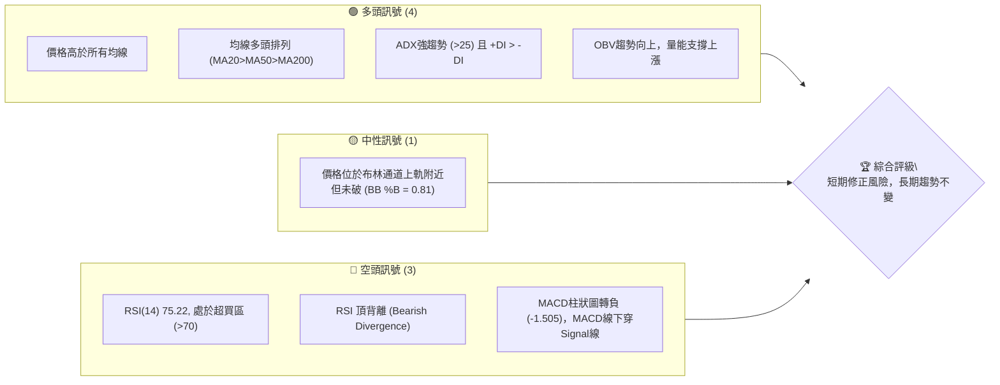
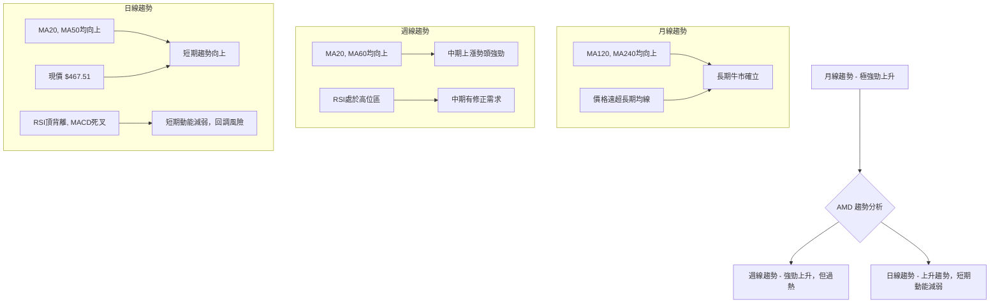

<details>
<summary>📊 靜態圖表 (點擊展開)</summary>

</details>

<html>
<head><meta charset="utf-8" /></head>
<body>
    <div>                        <script>window.PlotlyConfig = {MathJaxConfig: 'local'};</script>
        <script charset="utf-8" src="https://cdn.plot.ly/plotly-3.5.0.min.js" integrity="sha256-fHbNLP+GlIXN+efbQec78UkemUz3NJp7UmfGxC1tNxs=" crossorigin="anonymous"></script>                <div id="candlestick-chart" class="plotly-graph-div" style="height:500px; width:100%;"></div>            <script>                window.PLOTLYENV=window.PLOTLYENV || {};                                if (document.getElementById("candlestick-chart")) {                    Plotly.newPlot(                        "candlestick-chart",                        [{"close":{"dtype":"f8","bdata":"AAAAwMyMZUAAAADgUZhlQAAAAMD1iGVAAAAAYGbeZUAAAACgcA1nQAAAAGBmnmZAAAAA4FEwZkAAAADgegRmQAAAAKCZ0WRAAAAAYGamZEAAAABguHZkQAAAAOBR+GRAAAAAIIVrZEAAAAAA19NkQAAAAAAp5GRAAAAAYI8SZUAAAAAAKVRkQAAAAIA9SmRAAAAAAClEZEAAAACgRzlkQAAAAOB65GJAAAAAwB7tYkAAAACAPXpjQAAAAKBH8WNAAAAAoHB1Y0AAAACAPdJjQAAAAMAeJWRAAAAAYLgOZEAAAADAHuVjQAAAAKBwvWNAAAAA4HqsY0AAAACgR\u002fljQAAAAMDMHGRAAAAAACkcZEAAAADgoyhkQAAAAGC47mNAAAAAIIUrZEAAAACgRzlkQAAAAOBRgGRAAAAAIFw3ZUAAAACgcJVkQAAAAGC4dmlAAAAA4FFwakAAAACA63FtQAAAAOB6HG1AAAAAwMzcakAAAACgcA1rQAAAAEDhQmtAAAAAQDPTbUAAAACA61FtQAAAAGCPIm1AAAAAgOsRbkAAAADA9cBtQAAAACBcx2xAAAAAIK5fbUAAAACgcJ1vQAAAAGC4OnBAAAAAACkgcEAAAACgR4VwQAAAAEDh2m9AAAAAgOsBcEAAAABgZjpwQAAAAKCZQW9AAAAAoEcFcEAAAABgZrZtQAAAAKBHMW1AAAAAIFx\u002fbkAAAADgo7BtQAAAAIA9LnBAAAAAYLj+bkAAAACA69luQAAAAOCjEG5AAAAAoEfJbEAAAACgmfFrQAAAAOCjwGlAAAAAwPV4aUAAAACgmeFqQAAAAAApxGlAAAAAIK7HakAAAADA9TBrQAAAAOBReGtAAAAAIK7nakAAAABAMzNrQAAAACBc\u002f2pAAAAAQAo\u002fa0AAAAAghaNrQAAAAADXs2tAAAAAoHCta0AAAACAwq1rQAAAAMD1WGpAAAAAYI\u002fyaUAAAACgcCVqQAAAACCFw2hAAAAAgOshaUAAAACAwq1qQAAAAGBm3mpAAAAAwMzcakAAAACgR+FqQAAAACCu32pAAAAAIIXzakAAAABA4epqQAAAAMAexWpAAAAAQArva0AAAABgj6JrQAAAAEAzy2pAAAAA4KNAakAAAACAwpVpQAAAAKBwZWlAAAAAgBT2aUAAAABACp9rQAAAAEAz82tAAAAAoHB9bEAAAABgj\u002fpsQAAAAKBw\u002fWxAAAAAoJk5b0AAAAAgXLdvQAAAAEDhOnBAAAAAgOtpb0AAAADA9YBvQAAAACCul29AAAAAgMKFb0AAAAAgXJdtQAAAAOCjyG5AAAAAIIVDbkAAAACAFAZpQAAAAAAAEGhAAAAAgBQOakAAAAAAAABrQAAAAIA9smpAAAAAYI+yakAAAACAFL5pQAAAAIA96mlAAAAAYI9iaUAAAAAA1wNpQAAAAADXa2lAAAAAwMwEaUAAAABAM5NoQAAAAEDhumpAAAAAIIVbakAAAACAwnVpQAAAAGC4BmlAAAAAANfTaEAAAABgZt5nQAAAAIA9QmlAAAAAYGbuaEAAAACAwg1oQAAAAIDCVWlAAAAAIFxnaUAAAABgj5ppQAAAACCut2hAAAAA4HosaEAAAABgj5JoQAAAAIDriWhAAAAAYLjuaEAAAADgo6hpQAAAAGCPKmlAAAAAgMJVaUAAAAAA16tpQAAAAOCjiGtAAAAA4KN4aUAAAAAgrj9pQAAAAKBHgWhAAAAAgMJtaUAAAABguEZqQAAAAAAAMGtAAAAAgMKFa0AAAADA9bBrQAAAAIA9+mxAAAAA4HqUbUAAAACgR6FuQAAAAGCP2m5AAAAAgD3ib0AAAACA6yFwQAAAAAApZHFAAAAAgD1mcUAAAABAMy9xQAAAAADXx3FAAAAAIFz3ckAAAACgRxVzQAAAAMD1vHVAAAAAgBTqdEAAAAAgXDN0QAAAAIDCEXVAAAAAANcndkAAAADgo4h2QAAAAOCjWHVAAAAAACk0dkAAAACAPVZ6QAAAACBch3lAAAAAQApzfEAAAADgo6x8QAAAAOCjBHxAAAAAAADYe0AAAABAMxt8QAAAAKCZgXpAAAAAANdPekAAAADAzOB5QAAAAKBH+XtAAAAAoHAZfEAAAAAAKTh9QA=="},"high":{"dtype":"f8","bdata":"AAAAAAD4ZUAAAAAgXA9mQAAAAIA9WmZAAAAAwB7lZUAAAADAzFRnQAAAAIAULmdAAAAA4HqEZkAAAACgmVlmQAAAAKBwpWVAAAAAwMzUZEAAAAAAKbxkQAAAAMD1EGVAAAAAQOGyZEAAAADgozhlQAAAAIDC9WRAAAAAIK5fZUAAAACAPRJlQAAAAOB6TGRAAAAAAACYZEAAAACgmUFkQAAAAOB6pGNAAAAA4HoUY0AAAADAHpVjQAAAAMD1kGRAAAAAYLgGZEAAAADAHg1kQAAAAKCZSWRAAAAAYGY+ZEAAAAAAKTRkQAAAAOCj2GNAAAAAQOH6Y0AAAACAwlVkQAAAAOB6bGRAAAAAQDOjZEAAAAAAKTRkQAAAACCFQ2RAAAAAoJmJZEAAAADA9UhkQAAAAIDChWRAAAAAgOthZUAAAACAwlVlQAAAAGC4VmxAAAAAwMxca0AAAAAA13ttQAAAAEAzA25AAAAAQApHbUAAAACAFAZsQAAAACBcH2xAAAAAIK7nbUAAAABgZiZuQAAAAAApbG1AAAAAAClcbkAAAADgUUhuQAAAAAApBG5AAAAAwMx8bUAAAADgeqxvQAAAAGC4RnBAAAAAoEeJcEAAAACgR7FwQAAAAIAUfnBAAAAAgBRicEAAAABgj05wQAAAAIAUFnBAAAAAYGY6cEAAAADgUbBvQAAAAADXe21AAAAAwMwcb0AAAABguA5vQAAAAAApeHBAAAAAgBQ6cEAAAACAFK5vQAAAAOCjGG9AAAAAAADAbUAAAADA9WhtQAAAAAAASG1AAAAAYI8aakAAAAAAKSRrQAAAAGCP0mlAAAAAQOHyakAAAACgmUlrQAAAACBcn2tAAAAAIFw\u002fbEAAAABgZkZrQAAAAADXY2tAAAAA4Hr0a0AAAABguPZrQAAAAEDhGmxAAAAAIIXTa0AAAAAAALBrQAAAACCuz2tAAAAAIIXrakAAAABACkdqQAAAAAAAcGpAAAAAIIXLaUAAAACAwuVqQAAAAKBwhWtAAAAAwPUga0AAAACgRxFrQAAAAGCPGmtAAAAAoJkBa0AAAACAPRprQAAAAOB6NGtAAAAAwMxkbEAAAADgo0BtQAAAAKBw3WtAAAAAACmEakAAAACAFF5qQAAAAKCZ6WlAAAAAACk8akAAAAAgheNrQAAAAEDhAmxAAAAAQDPLbUAAAAAgrk9tQAAAAAAA8G1AAAAAwMycb0AAAACgRwFwQAAAACBcr3BAAAAA4KMkcEAAAACgmfFvQAAAAGBmFnBAAAAA4HpIcEAAAAAgrqduQAAAAEAKP29AAAAAwMyUb0AAAABgj1JrQAAAAKBHgWlAAAAA4KMoakAAAABAMzNrQAAAAOB6bGtAAAAAwMx0a0AAAABguE5rQAAAAKCZQWpAAAAAoJmpaUAAAABgZmZpQAAAAEAzg2lAAAAAANebaUAAAAAAKexoQAAAAGC4FmtAAAAAYGYWa0AAAACgRzlqQAAAAOB6PGlAAAAAIK7XaEAAAADgejRoQAAAAIAUTmlAAAAAoEd5aUAAAAAgrgdpQAAAAEAKX2lAAAAAQOHSaUAAAABguCZqQAAAAADXc2lAAAAAgML1aEAAAACgcAVpQAAAAGC45mhAAAAAIIVbaUAAAAAAKbxpQAAAAKCZyWlAAAAAIIUjakAAAACAws1pQAAAAGCPqmtAAAAAAACga0AAAADgo2hpQAAAAIDCDWpAAAAAAACAaUAAAABgj7pqQAAAAMD1OGtAAAAAgOtJbEAAAABAM8NrQAAAAAAAQG1AAAAAQDOjbUAAAABgjzJvQAAAAGCP6m5AAAAAYLjub0AAAABA4SJwQAAAAKBwdXFAAAAAwMyQcUAAAACAwvlxQAAAAEAz43FAAAAAAAAEc0AAAAAghWNzQAAAAADXD3ZAAAAAIFzTdUAAAAAAAHh0QAAAAGC4QnVAAAAAIFwvdkAAAADgo6x2QAAAAKCZnXZAAAAAwB55dkAAAACgmel6QAAAACBcW3pAAAAA4KOEfEAAAAAghVN9QAAAAMDMrHxAAAAAAAC4fEAAAADA9VR8QAAAAAAAcHtAAAAAwMxse0AAAAAAAMx6QAAAAIA9FnxAAAAAQDMzfEAAAABgjxZ+QA=="},"hovertemplate":"\u003cb\u003e%{x|%Y-%m-%d}\u003c\u002fb\u003e\u003cbr\u003e\u958b: $%{open:.2f}\u003cbr\u003e\u9ad8: $%{high:.2f}\u003cbr\u003e\u4f4e: $%{low:.2f}\u003cbr\u003e\u6536: $%{close:.2f}\u003cextra\u003e\u003c\u002fextra\u003e","low":{"dtype":"f8","bdata":"AAAAYGbWZEAAAADgo1BlQAAAAAApLGVAAAAAAAAQZUAAAAAAKWxmQAAAAIDrcWZAAAAAAAAIZkAAAAAghctlQAAAAEAzw2RAAAAAAADIY0AAAADgUUhkQAAAAKCZOWRAAAAAQAo3ZEAAAADAHp1kQAAAAMDMlGRAAAAAwMzUZEAAAADAzDxkQAAAAADXk2NAAAAAYI8SZEAAAACgR7ljQAAAAIDCxWJAAAAAQAqnYkAAAACAwv1iQAAAAAAAwGNAAAAAIK5fY0AAAACgcF1jQAAAAEAzs2NAAAAAQArnY0AAAADgUXhjQAAAAEAzu2JAAAAAwMx8Y0AAAACgcK1jQAAAAGC45mNAAAAAgMLNY0AAAADA9VhjQAAAAKCZoWNAAAAAwMz8Y0AAAABgj+pjQAAAACCuD2RAAAAAANfDZEAAAADgemRkQAAAAOBRYGlAAAAAwPUoakAAAABgZlZqQAAAAMD1sGxAAAAAYGamakAAAADAzNxqQAAAAMDM\u002fGpAAAAA4FGYa0AAAAAgrgdtQAAAAMAefWxAAAAAwMxMbUAAAADgo0BtQAAAAAApHGxAAAAAoEeRbEAAAABgZj5uQAAAAKCZOW9AAAAAAAAQcEAAAABgZhZwQAAAAIDriW9AAAAAwB6tb0AAAADgerxvQAAAAOB67G5AAAAAgOtZbkAAAAAgrndtQAAAAOB6FGxAAAAAAAAQbkAAAADgelRtQAAAAAAAQG9AAAAAgOvBbkAAAABgj2JtQAAAAMDMpG1AAAAAYLgWbEAAAABguHZrQAAAAMD1kGlAAAAAAABgaEAAAABAM7tpQAAAAMD1SGhAAAAAAADgaUAAAADgo8BqQAAAAAAAsGpAAAAA4HrMakAAAADgo3hqQAAAAOB6xGpAAAAAIK4Ha0AAAAAghUtrQAAAAMAePWtAAAAAoHBVa0AAAACAFEZqQAAAAIDrIWpAAAAAYI\u002fSaUAAAAAghaNpQAAAAMD1sGhAAAAAAAAQaUAAAABgZoZpQAAAAIDrqWpAAAAAwPWIakAAAABACr9qQAAAAMD1oGpAAAAAIK4nakAAAABgj8pqQAAAAKCZuWpAAAAAwMxca0AAAAAgXI9rQAAAAAAAaGpAAAAAoHDlaUAAAABgj2ppQAAAAIA9YmlAAAAAoJn5aEAAAAAgXN9qQAAAACCF42pAAAAAQApnbEAAAAAghZtsQAAAAMAeLWxAAAAAwPV4bUAAAAAAKdRuQAAAAAAABHBAAAAAoJlJb0AAAABguP5uQAAAAGC4Rm9AAAAAwB4dbkAAAACgmVFtQAAAAAAAYG1AAAAAoEehbUAAAADAzORoQAAAAEAK12dAAAAAgMKNaEAAAADAzIRpQAAAAAAppGpAAAAAYLgmakAAAADgeqRpQAAAAAApfGlAAAAAYI9aaEAAAAAAAGBoQAAAAKBHyWhAAAAAgOvRaEAAAADAzERoQAAAAAAA0GlAAAAAYI9KakAAAABguC5pQAAAACCut2hAAAAAAADAZ0AAAABACodnQAAAACCFu2dAAAAAAClcaEAAAAAAAOhnQAAAAOCjoGdAAAAAYGZGaUAAAAAAKXRpQAAAAKBwlWhAAAAA4KMIaEAAAACgmVloQAAAAOBRaGhAAAAAAAB4aEAAAABgjxpoQAAAAOBRyGhAAAAAYLg2aUAAAAAAKQRpQAAAAOBRcGpAAAAAgMJtaUAAAACAFLZoQAAAAADXG2hAAAAAwB6NaEAAAABA4bppQAAAAADXE2lAAAAAIFw3a0AAAAAAKexqQAAAAEDhYmxAAAAAwB7dbEAAAABguN5tQAAAAMD1QG5AAAAAYGa2bkAAAABAM3tvQAAAAAApWHBAAAAAgD0icUAAAAAAAABxQAAAAIDrSXFAAAAAgD3icUAAAAAAKbxyQAAAAOCj6HRAAAAAwPWMdEAAAAAAAGBzQAAAAIDC7XNAAAAAoJnJdEAAAAAAANR1QAAAAEAzK3VAAAAAgBSOdUAAAADgoyB5QAAAAKBHEXlAAAAA4KMkekAAAACAFC58QAAAAIDCoXpAAAAAYGYKe0AAAABA4Tp7QAAAAIDCdXpAAAAAIFyreUAAAACAwpV4QAAAAMDMoHpAAAAAoJn5ekAAAAAgXNt8QA=="},"name":"\u50f9\u683c","open":{"dtype":"f8","bdata":"AAAAQOHaZEAAAACgR8FlQAAAAKBHQWVAAAAAgD2qZUAAAADAHn1mQAAAAGCPemZAAAAAgOuBZkAAAADgURhmQAAAAEAzo2VAAAAAQDODZEAAAAAghbtkQAAAAKBwRWRAAAAAoJmxZEAAAADAzBRlQAAAAKBHwWRAAAAAAAAQZUAAAACA69lkQAAAAKBwzWNAAAAAgOs5ZEAAAACAFP5jQAAAAADXo2NAAAAAoJn5YkAAAAAgrv9iQAAAAKBHcWRAAAAAANfTY0AAAAAAAKBjQAAAAOBRAGRAAAAAANcrZEAAAADA9ehjQAAAAGC43mJAAAAAACmsY0AAAACgcK1jQAAAAOCjEGRAAAAAIFxfZEAAAADgeqRjQAAAAOCjEGRAAAAAANcDZEAAAACgRxlkQAAAAIDCHWRAAAAAgMIVZUAAAACAwlVlQAAAAGBmTmxAAAAAQDPbakAAAABgZp5qQAAAAKCZiW1AAAAA4KMYbUAAAABgZoZrQAAAAGBmZmtAAAAAYLjWa0AAAACgR4ltQAAAAOBRKG1AAAAAQAqPbUAAAADgeuxtQAAAAEAzm21AAAAAwB7FbEAAAAAghWtuQAAAAIAUHnBAAAAAgD0ycEAAAABACoNwQAAAAGC4PnBAAAAAoJk5cEAAAACgRzVwQAAAAEAzS29AAAAAIK5nbkAAAABACq9vQAAAAIAU3mxAAAAA4HpEbkAAAADAHjVuQAAAAAAppG9AAAAAwMx8b0AAAAAghQNuQAAAAAAAWG5AAAAAwPWYbUAAAADgUchsQAAAAGBmFm1AAAAAgOsZakAAAADAHuVpQAAAACBcL2lAAAAAoJlBakAAAADgegRrQAAAAAApvGpAAAAAoEe5a0AAAADgUQhrQAAAAAApHGtAAAAAoHAla0AAAABA4WJrQAAAAKBHoWtAAAAAAADAa0AAAACA6zlrQAAAAADXS2tAAAAAwPWIakAAAACgcN1pQAAAAKBHQWpAAAAAgD16aUAAAABAM5NpQAAAAAAAgGtAAAAAIIWbakAAAAAgXN9qQAAAAIDC7WpAAAAAYI9yakAAAAAA1\u002ftqQAAAAIA9+mpAAAAAwMxca0AAAAAAAMhsQAAAAGC41mtAAAAAACmEakAAAADAzFxqQAAAAEAKt2lAAAAAgMIlaUAAAABAM+NqQAAAAKBHMWtAAAAAwMx8bEAAAACgmUltQAAAAGCPQmxAAAAAIK5\u002fbUAAAAAAAHhvQAAAAEDhUnBAAAAAAAAMcEAAAADAHoVvQAAAAAApxG9AAAAAwB7Vb0AAAACAwp1tQAAAAOCjeG1AAAAAoJlxb0AAAAAAAOBqQAAAACCFO2lAAAAAACmkaEAAAADAzNxpQAAAAOB65GpAAAAAACk8a0AAAABgj\u002fpqQAAAAOCjgGlAAAAAwMxEaUAAAADAHs1oQAAAACCFA2lAAAAAANcDaUAAAABA4cJoQAAAAAApdGpAAAAAgD3aakAAAACgmRlqQAAAACCFA2lAAAAAQDM7aEAAAABguO5nQAAAAADXA2hAAAAA4KO4aEAAAADgo2hoQAAAACCFq2dAAAAA4FFQaUAAAAAghaNpQAAAAGCPWmlAAAAAIIXDaEAAAAAgXF9oQAAAAIDClWhAAAAAAACAaEAAAADA9WBoQAAAAOB6nGlAAAAAwMzMaUAAAADgeixpQAAAAOBRcGpAAAAAIFw\u002fa0AAAADgozhpQAAAAGBmnmlAAAAAoJnBaEAAAABA4fJpQAAAAKCZgWlAAAAAwPVoa0AAAADgUUhrQAAAAADXA21AAAAA4FEgbUAAAAAAAOBtQAAAAMD1oG5AAAAAoEc5b0AAAABguN5vQAAAAADXj3BAAAAAAACQcUAAAACgmYlxQAAAAKBHVXFAAAAAIIUzckAAAAAAKeByQAAAAAApDHVAAAAAwB6ldUAAAACAwn1zQAAAAKBHaXRAAAAAgMJVdUAAAACA6\u002f11QAAAAMD1hHZAAAAAACn4dUAAAAAA15d5QAAAAMAeEXpAAAAAoHApekAAAADAzMh8QAAAAAAAFHxAAAAA4KOQfEAAAACgmYl7QAAAAKBwFXtAAAAAAADYekAAAACgmcl5QAAAAOCjwHpAAAAAANefe0AAAACgcF19QA=="},"x":["2025-08-07T00:00:00-04:00","2025-08-08T00:00:00-04:00","2025-08-11T00:00:00-04:00","2025-08-12T00:00:00-04:00","2025-08-13T00:00:00-04:00","2025-08-14T00:00:00-04:00","2025-08-15T00:00:00-04:00","2025-08-18T00:00:00-04:00","2025-08-19T00:00:00-04:00","2025-08-20T00:00:00-04:00","2025-08-21T00:00:00-04:00","2025-08-22T00:00:00-04:00","2025-08-25T00:00:00-04:00","2025-08-26T00:00:00-04:00","2025-08-27T00:00:00-04:00","2025-08-28T00:00:00-04:00","2025-08-29T00:00:00-04:00","2025-09-02T00:00:00-04:00","2025-09-03T00:00:00-04:00","2025-09-04T00:00:00-04:00","2025-09-05T00:00:00-04:00","2025-09-08T00:00:00-04:00","2025-09-09T00:00:00-04:00","2025-09-10T00:00:00-04:00","2025-09-11T00:00:00-04:00","2025-09-12T00:00:00-04:00","2025-09-15T00:00:00-04:00","2025-09-16T00:00:00-04:00","2025-09-17T00:00:00-04:00","2025-09-18T00:00:00-04:00","2025-09-19T00:00:00-04:00","2025-09-22T00:00:00-04:00","2025-09-23T00:00:00-04:00","2025-09-24T00:00:00-04:00","2025-09-25T00:00:00-04:00","2025-09-26T00:00:00-04:00","2025-09-29T00:00:00-04:00","2025-09-30T00:00:00-04:00","2025-10-01T00:00:00-04:00","2025-10-02T00:00:00-04:00","2025-10-03T00:00:00-04:00","2025-10-06T00:00:00-04:00","2025-10-07T00:00:00-04:00","2025-10-08T00:00:00-04:00","2025-10-09T00:00:00-04:00","2025-10-10T00:00:00-04:00","2025-10-13T00:00:00-04:00","2025-10-14T00:00:00-04:00","2025-10-15T00:00:00-04:00","2025-10-16T00:00:00-04:00","2025-10-17T00:00:00-04:00","2025-10-20T00:00:00-04:00","2025-10-21T00:00:00-04:00","2025-10-22T00:00:00-04:00","2025-10-23T00:00:00-04:00","2025-10-24T00:00:00-04:00","2025-10-27T00:00:00-04:00","2025-10-28T00:00:00-04:00","2025-10-29T00:00:00-04:00","2025-10-30T00:00:00-04:00","2025-10-31T00:00:00-04:00","2025-11-03T00:00:00-05:00","2025-11-04T00:00:00-05:00","2025-11-05T00:00:00-05:00","2025-11-06T00:00:00-05:00","2025-11-07T00:00:00-05:00","2025-11-10T00:00:00-05:00","2025-11-11T00:00:00-05:00","2025-11-12T00:00:00-05:00","2025-11-13T00:00:00-05:00","2025-11-14T00:00:00-05:00","2025-11-17T00:00:00-05:00","2025-11-18T00:00:00-05:00","2025-11-19T00:00:00-05:00","2025-11-20T00:00:00-05:00","2025-11-21T00:00:00-05:00","2025-11-24T00:00:00-05:00","2025-11-25T00:00:00-05:00","2025-11-26T00:00:00-05:00","2025-11-28T00:00:00-05:00","2025-12-01T00:00:00-05:00","2025-12-02T00:00:00-05:00","2025-12-03T00:00:00-05:00","2025-12-04T00:00:00-05:00","2025-12-05T00:00:00-05:00","2025-12-08T00:00:00-05:00","2025-12-09T00:00:00-05:00","2025-12-10T00:00:00-05:00","2025-12-11T00:00:00-05:00","2025-12-12T00:00:00-05:00","2025-12-15T00:00:00-05:00","2025-12-16T00:00:00-05:00","2025-12-17T00:00:00-05:00","2025-12-18T00:00:00-05:00","2025-12-19T00:00:00-05:00","2025-12-22T00:00:00-05:00","2025-12-23T00:00:00-05:00","2025-12-24T00:00:00-05:00","2025-12-26T00:00:00-05:00","2025-12-29T00:00:00-05:00","2025-12-30T00:00:00-05:00","2025-12-31T00:00:00-05:00","2026-01-02T00:00:00-05:00","2026-01-05T00:00:00-05:00","2026-01-06T00:00:00-05:00","2026-01-07T00:00:00-05:00","2026-01-08T00:00:00-05:00","2026-01-09T00:00:00-05:00","2026-01-12T00:00:00-05:00","2026-01-13T00:00:00-05:00","2026-01-14T00:00:00-05:00","2026-01-15T00:00:00-05:00","2026-01-16T00:00:00-05:00","2026-01-20T00:00:00-05:00","2026-01-21T00:00:00-05:00","2026-01-22T00:00:00-05:00","2026-01-23T00:00:00-05:00","2026-01-26T00:00:00-05:00","2026-01-27T00:00:00-05:00","2026-01-28T00:00:00-05:00","2026-01-29T00:00:00-05:00","2026-01-30T00:00:00-05:00","2026-02-02T00:00:00-05:00","2026-02-03T00:00:00-05:00","2026-02-04T00:00:00-05:00","2026-02-05T00:00:00-05:00","2026-02-06T00:00:00-05:00","2026-02-09T00:00:00-05:00","2026-02-10T00:00:00-05:00","2026-02-11T00:00:00-05:00","2026-02-12T00:00:00-05:00","2026-02-13T00:00:00-05:00","2026-02-17T00:00:00-05:00","2026-02-18T00:00:00-05:00","2026-02-19T00:00:00-05:00","2026-02-20T00:00:00-05:00","2026-02-23T00:00:00-05:00","2026-02-24T00:00:00-05:00","2026-02-25T00:00:00-05:00","2026-02-26T00:00:00-05:00","2026-02-27T00:00:00-05:00","2026-03-02T00:00:00-05:00","2026-03-03T00:00:00-05:00","2026-03-04T00:00:00-05:00","2026-03-05T00:00:00-05:00","2026-03-06T00:00:00-05:00","2026-03-09T00:00:00-04:00","2026-03-10T00:00:00-04:00","2026-03-11T00:00:00-04:00","2026-03-12T00:00:00-04:00","2026-03-13T00:00:00-04:00","2026-03-16T00:00:00-04:00","2026-03-17T00:00:00-04:00","2026-03-18T00:00:00-04:00","2026-03-19T00:00:00-04:00","2026-03-20T00:00:00-04:00","2026-03-23T00:00:00-04:00","2026-03-24T00:00:00-04:00","2026-03-25T00:00:00-04:00","2026-03-26T00:00:00-04:00","2026-03-27T00:00:00-04:00","2026-03-30T00:00:00-04:00","2026-03-31T00:00:00-04:00","2026-04-01T00:00:00-04:00","2026-04-02T00:00:00-04:00","2026-04-06T00:00:00-04:00","2026-04-07T00:00:00-04:00","2026-04-08T00:00:00-04:00","2026-04-09T00:00:00-04:00","2026-04-10T00:00:00-04:00","2026-04-13T00:00:00-04:00","2026-04-14T00:00:00-04:00","2026-04-15T00:00:00-04:00","2026-04-16T00:00:00-04:00","2026-04-17T00:00:00-04:00","2026-04-20T00:00:00-04:00","2026-04-21T00:00:00-04:00","2026-04-22T00:00:00-04:00","2026-04-23T00:00:00-04:00","2026-04-24T00:00:00-04:00","2026-04-27T00:00:00-04:00","2026-04-28T00:00:00-04:00","2026-04-29T00:00:00-04:00","2026-04-30T00:00:00-04:00","2026-05-01T00:00:00-04:00","2026-05-04T00:00:00-04:00","2026-05-05T00:00:00-04:00","2026-05-06T00:00:00-04:00","2026-05-07T00:00:00-04:00","2026-05-08T00:00:00-04:00","2026-05-11T00:00:00-04:00","2026-05-12T00:00:00-04:00","2026-05-13T00:00:00-04:00","2026-05-14T00:00:00-04:00","2026-05-15T00:00:00-04:00","2026-05-18T00:00:00-04:00","2026-05-19T00:00:00-04:00","2026-05-20T00:00:00-04:00","2026-05-21T00:00:00-04:00","2026-05-22T00:00:00-04:00"],"type":"candlestick"},{"hovertemplate":"MA30: $%{y:.2f}\u003cextra\u003e\u003c\u002fextra\u003e","line":{"color":"#2196F3","dash":"dash","width":2},"mode":"lines","name":"MA30","x":["2025-08-07T00:00:00-04:00","2025-08-08T00:00:00-04:00","2025-08-11T00:00:00-04:00","2025-08-12T00:00:00-04:00","2025-08-13T00:00:00-04:00","2025-08-14T00:00:00-04:00","2025-08-15T00:00:00-04:00","2025-08-18T00:00:00-04:00","2025-08-19T00:00:00-04:00","2025-08-20T00:00:00-04:00","2025-08-21T00:00:00-04:00","2025-08-22T00:00:00-04:00","2025-08-25T00:00:00-04:00","2025-08-26T00:00:00-04:00","2025-08-27T00:00:00-04:00","2025-08-28T00:00:00-04:00","2025-08-29T00:00:00-04:00","2025-09-02T00:00:00-04:00","2025-09-03T00:00:00-04:00","2025-09-04T00:00:00-04:00","2025-09-05T00:00:00-04:00","2025-09-08T00:00:00-04:00","2025-09-09T00:00:00-04:00","2025-09-10T00:00:00-04:00","2025-09-11T00:00:00-04:00","2025-09-12T00:00:00-04:00","2025-09-15T00:00:00-04:00","2025-09-16T00:00:00-04:00","2025-09-17T00:00:00-04:00","2025-09-18T00:00:00-04:00","2025-09-19T00:00:00-04:00","2025-09-22T00:00:00-04:00","2025-09-23T00:00:00-04:00","2025-09-24T00:00:00-04:00","2025-09-25T00:00:00-04:00","2025-09-26T00:00:00-04:00","2025-09-29T00:00:00-04:00","2025-09-30T00:00:00-04:00","2025-10-01T00:00:00-04:00","2025-10-02T00:00:00-04:00","2025-10-03T00:00:00-04:00","2025-10-06T00:00:00-04:00","2025-10-07T00:00:00-04:00","2025-10-08T00:00:00-04:00","2025-10-09T00:00:00-04:00","2025-10-10T00:00:00-04:00","2025-10-13T00:00:00-04:00","2025-10-14T00:00:00-04:00","2025-10-15T00:00:00-04:00","2025-10-16T00:00:00-04:00","2025-10-17T00:00:00-04:00","2025-10-20T00:00:00-04:00","2025-10-21T00:00:00-04:00","2025-10-22T00:00:00-04:00","2025-10-23T00:00:00-04:00","2025-10-24T00:00:00-04:00","2025-10-27T00:00:00-04:00","2025-10-28T00:00:00-04:00","2025-10-29T00:00:00-04:00","2025-10-30T00:00:00-04:00","2025-10-31T00:00:00-04:00","2025-11-03T00:00:00-05:00","2025-11-04T00:00:00-05:00","2025-11-05T00:00:00-05:00","2025-11-06T00:00:00-05:00","2025-11-07T00:00:00-05:00","2025-11-10T00:00:00-05:00","2025-11-11T00:00:00-05:00","2025-11-12T00:00:00-05:00","2025-11-13T00:00:00-05:00","2025-11-14T00:00:00-05:00","2025-11-17T00:00:00-05:00","2025-11-18T00:00:00-05:00","2025-11-19T00:00:00-05:00","2025-11-20T00:00:00-05:00","2025-11-21T00:00:00-05:00","2025-11-24T00:00:00-05:00","2025-11-25T00:00:00-05:00","2025-11-26T00:00:00-05:00","2025-11-28T00:00:00-05:00","2025-12-01T00:00:00-05:00","2025-12-02T00:00:00-05:00","2025-12-03T00:00:00-05:00","2025-12-04T00:00:00-05:00","2025-12-05T00:00:00-05:00","2025-12-08T00:00:00-05:00","2025-12-09T00:00:00-05:00","2025-12-10T00:00:00-05:00","2025-12-11T00:00:00-05:00","2025-12-12T00:00:00-05:00","2025-12-15T00:00:00-05:00","2025-12-16T00:00:00-05:00","2025-12-17T00:00:00-05:00","2025-12-18T00:00:00-05:00","2025-12-19T00:00:00-05:00","2025-12-22T00:00:00-05:00","2025-12-23T00:00:00-05:00","2025-12-24T00:00:00-05:00","2025-12-26T00:00:00-05:00","2025-12-29T00:00:00-05:00","2025-12-30T00:00:00-05:00","2025-12-31T00:00:00-05:00","2026-01-02T00:00:00-05:00","2026-01-05T00:00:00-05:00","2026-01-06T00:00:00-05:00","2026-01-07T00:00:00-05:00","2026-01-08T00:00:00-05:00","2026-01-09T00:00:00-05:00","2026-01-12T00:00:00-05:00","2026-01-13T00:00:00-05:00","2026-01-14T00:00:00-05:00","2026-01-15T00:00:00-05:00","2026-01-16T00:00:00-05:00","2026-01-20T00:00:00-05:00","2026-01-21T00:00:00-05:00","2026-01-22T00:00:00-05:00","2026-01-23T00:00:00-05:00","2026-01-26T00:00:00-05:00","2026-01-27T00:00:00-05:00","2026-01-28T00:00:00-05:00","2026-01-29T00:00:00-05:00","2026-01-30T00:00:00-05:00","2026-02-02T00:00:00-05:00","2026-02-03T00:00:00-05:00","2026-02-04T00:00:00-05:00","2026-02-05T00:00:00-05:00","2026-02-06T00:00:00-05:00","2026-02-09T00:00:00-05:00","2026-02-10T00:00:00-05:00","2026-02-11T00:00:00-05:00","2026-02-12T00:00:00-05:00","2026-02-13T00:00:00-05:00","2026-02-17T00:00:00-05:00","2026-02-18T00:00:00-05:00","2026-02-19T00:00:00-05:00","2026-02-20T00:00:00-05:00","2026-02-23T00:00:00-05:00","2026-02-24T00:00:00-05:00","2026-02-25T00:00:00-05:00","2026-02-26T00:00:00-05:00","2026-02-27T00:00:00-05:00","2026-03-02T00:00:00-05:00","2026-03-03T00:00:00-05:00","2026-03-04T00:00:00-05:00","2026-03-05T00:00:00-05:00","2026-03-06T00:00:00-05:00","2026-03-09T00:00:00-04:00","2026-03-10T00:00:00-04:00","2026-03-11T00:00:00-04:00","2026-03-12T00:00:00-04:00","2026-03-13T00:00:00-04:00","2026-03-16T00:00:00-04:00","2026-03-17T00:00:00-04:00","2026-03-18T00:00:00-04:00","2026-03-19T00:00:00-04:00","2026-03-20T00:00:00-04:00","2026-03-23T00:00:00-04:00","2026-03-24T00:00:00-04:00","2026-03-25T00:00:00-04:00","2026-03-26T00:00:00-04:00","2026-03-27T00:00:00-04:00","2026-03-30T00:00:00-04:00","2026-03-31T00:00:00-04:00","2026-04-01T00:00:00-04:00","2026-04-02T00:00:00-04:00","2026-04-06T00:00:00-04:00","2026-04-07T00:00:00-04:00","2026-04-08T00:00:00-04:00","2026-04-09T00:00:00-04:00","2026-04-10T00:00:00-04:00","2026-04-13T00:00:00-04:00","2026-04-14T00:00:00-04:00","2026-04-15T00:00:00-04:00","2026-04-16T00:00:00-04:00","2026-04-17T00:00:00-04:00","2026-04-20T00:00:00-04:00","2026-04-21T00:00:00-04:00","2026-04-22T00:00:00-04:00","2026-04-23T00:00:00-04:00","2026-04-24T00:00:00-04:00","2026-04-27T00:00:00-04:00","2026-04-28T00:00:00-04:00","2026-04-29T00:00:00-04:00","2026-04-30T00:00:00-04:00","2026-05-01T00:00:00-04:00","2026-05-04T00:00:00-04:00","2026-05-05T00:00:00-04:00","2026-05-06T00:00:00-04:00","2026-05-07T00:00:00-04:00","2026-05-08T00:00:00-04:00","2026-05-11T00:00:00-04:00","2026-05-12T00:00:00-04:00","2026-05-13T00:00:00-04:00","2026-05-14T00:00:00-04:00","2026-05-15T00:00:00-04:00","2026-05-18T00:00:00-04:00","2026-05-19T00:00:00-04:00","2026-05-20T00:00:00-04:00","2026-05-21T00:00:00-04:00","2026-05-22T00:00:00-04:00"],"y":{"dtype":"f8","bdata":"AAAAAAAA+H8AAAAAAAD4fwAAAAAAAPh\u002fAAAAAAAA+H8AAAAAAAD4fwAAAAAAAPh\u002fAAAAAAAA+H8AAAAAAAD4fwAAAAAAAPh\u002fAAAAAAAA+H8AAAAAAAD4fwAAAAAAAPh\u002fAAAAAAAA+H8AAAAAAAD4fwAAAAAAAPh\u002fAAAAAAAA+H8AAAAAAAD4fwAAAAAAAPh\u002fAAAAAAAA+H8AAAAAAAD4fwAAAAAAAPh\u002fAAAAAAAA+H8AAAAAAAD4fwAAAAAAAPh\u002fAAAAAAAA+H8AAAAAAAD4fwAAAAAAAPh\u002fAAAAAAAA+H8AAAAAAAD4f3d3d5e1qmRAzczM3LKaZEAAAAAw3YxkQAAAALC5gGRAREREpLdxZEBmZmYmBllkQDMzM\u002fMZQmRAzczM7N8wZECrqqpqkSFkQDMzM9PbHmRAERER0bAjZEBVVVX1tiRkQFVVVbUPS2RA3t3d3Wt+ZEBVVVUV9cdkQCIiIvIZDmVAREREZII\u002fZUBVVVWl4nhlQCIiIpJftGVAq6qq+vAFZkCrqqoKkFNmQAAAACD3qmZAREREBA8KZ0AzMzPTv2FnQImIiOgmrWdA7+7ujsIBaEBVVVVlZmZoQCIiIjJ6z2hAmpmZ2Yc3aUBEREREtqdpQDMzM+MXD2pAIiIiwmd4akAiIiIy7OJqQHd3dxcEQmtAzczMTNSna0CJiIjIWvlrQO\u002fu7o5fSGxAMzMzU4CgbECrqqqqR\u002fFsQM3MzDx8Vm1A7+7uPu6pbUARERHxiwFuQGZmZobPKG5Ad3d3t9c8bkAAAAAwCDBuQDMzM+NeE25AMzMzY4IHbkCamZlJDAZuQJqZmWlK+W1AIiIigk7fbUDv7u4uJM1tQO\u002fu7u7uvm1AMzMz4+yjbUAzMzMjIo5tQAAAAPDufm1Ad3d3V8dsbUB3d3cX2UptQGZmZuZCIm1AMzMzYzv7bEBERETUeM1sQDMzM4N5nmxAvLu727JqbEBERER02jRsQO\u002fu7l5z\u002fWtAq6qq+n7Ca0BmZmamm6hrQHd3d1fHlGtAAAAAkMJ1a0BVVVUFyF1rQERERGT0LmtA7+7urnIMa0BmZmZG4epqQM3MzDzDzmpAzczM7HzHakAzMzNz2sRqQImIiBi9zWpAiYiICGXUakBERERUVclqQM3MzAwtxmpAZmZmdjC\u002fakAAAADQ28JqQERERGT0xmpAAAAA4HrUakDNzMycqONqQLy7u0up9GpAIiIiAp0Wa0ARERFxaDlrQLy7u1sBYmtAIiIiUuOBa0CamZkph6JrQKuqqgpJz2tAAAAA0Nv+a0B3d3eHQRxsQLy7u2ugT2xA7+7uzml7bECJiIhoSm1sQAAAABBYVWxA3t3dDXRObEAzMzMzek9sQCIiInL2TWxA7+7uHsxLbEC8u7tLxUFsQFVVVYV5OmxAERERsbkkbEBmZmY2Xg5sQAAAAPCnAmxARERExCD4a0BERERkgu9rQDMzMwPk+mtAIiIiokX+a0Dv7u5O1OtrQHd3d0fh0mtAzczMbKCza0BVVVV1BYhrQLy7u2suaGtAMzMzg3kya0BmZmaGFvFqQJqZmblJtGpA3t3drQCBakDv7u7up05qQERERET9E2pA3t3drUfVaUDe3d0NdKppQERERKQpdWlAmpmZWatHaUB3d3eHFk1pQFVVVbWBVmlAd3d311xQaUBEREQkBkVpQAAAALArTGlAd3d357RBaUCrqqpKfj1pQImIiBh2MWlAq6qqqtUxaUCamZnpmDxpQImIiFirS2lA7+7u3ghhaUC8u7troHtpQJqZmSnOjmlAIiIi0k2qaUC8u7vba9ZpQJqZmTkmCGpAd3d311xEakCrqqq6AoxqQN7d3a1H3WpAERERkXsxa0CJiIgIgYlrQN7d3Z3E4GtAZmZmFq5LbECJiIhI4bZsQFVVVWX0Vm1AVVVVVZztbUAzMzPDrnRuQLy7u4veCm9AERERETywb0CJiIiQ7SpwQHd3d+e0dXBAmpmZKRXHcECJiIgYSzpxQFVVVU2pnnFAMzMzg8AkckDe3d1Ftq1yQO\u002fu7s4+NHNA7+7ublm1c0BVVVXNEzV0QO\u002fu7pZDo3RAERER2VwOdUBmZmY+CnV1QERERKwc6HVAIiIicq9ZdkDNzMwEVtB2QA=="},"type":"scatter"},{"hovertemplate":"MA60: $%{y:.2f}\u003cextra\u003e\u003c\u002fextra\u003e","line":{"color":"#9C27B0","dash":"dash","width":2},"mode":"lines","name":"MA60","x":["2025-08-07T00:00:00-04:00","2025-08-08T00:00:00-04:00","2025-08-11T00:00:00-04:00","2025-08-12T00:00:00-04:00","2025-08-13T00:00:00-04:00","2025-08-14T00:00:00-04:00","2025-08-15T00:00:00-04:00","2025-08-18T00:00:00-04:00","2025-08-19T00:00:00-04:00","2025-08-20T00:00:00-04:00","2025-08-21T00:00:00-04:00","2025-08-22T00:00:00-04:00","2025-08-25T00:00:00-04:00","2025-08-26T00:00:00-04:00","2025-08-27T00:00:00-04:00","2025-08-28T00:00:00-04:00","2025-08-29T00:00:00-04:00","2025-09-02T00:00:00-04:00","2025-09-03T00:00:00-04:00","2025-09-04T00:00:00-04:00","2025-09-05T00:00:00-04:00","2025-09-08T00:00:00-04:00","2025-09-09T00:00:00-04:00","2025-09-10T00:00:00-04:00","2025-09-11T00:00:00-04:00","2025-09-12T00:00:00-04:00","2025-09-15T00:00:00-04:00","2025-09-16T00:00:00-04:00","2025-09-17T00:00:00-04:00","2025-09-18T00:00:00-04:00","2025-09-19T00:00:00-04:00","2025-09-22T00:00:00-04:00","2025-09-23T00:00:00-04:00","2025-09-24T00:00:00-04:00","2025-09-25T00:00:00-04:00","2025-09-26T00:00:00-04:00","2025-09-29T00:00:00-04:00","2025-09-30T00:00:00-04:00","2025-10-01T00:00:00-04:00","2025-10-02T00:00:00-04:00","2025-10-03T00:00:00-04:00","2025-10-06T00:00:00-04:00","2025-10-07T00:00:00-04:00","2025-10-08T00:00:00-04:00","2025-10-09T00:00:00-04:00","2025-10-10T00:00:00-04:00","2025-10-13T00:00:00-04:00","2025-10-14T00:00:00-04:00","2025-10-15T00:00:00-04:00","2025-10-16T00:00:00-04:00","2025-10-17T00:00:00-04:00","2025-10-20T00:00:00-04:00","2025-10-21T00:00:00-04:00","2025-10-22T00:00:00-04:00","2025-10-23T00:00:00-04:00","2025-10-24T00:00:00-04:00","2025-10-27T00:00:00-04:00","2025-10-28T00:00:00-04:00","2025-10-29T00:00:00-04:00","2025-10-30T00:00:00-04:00","2025-10-31T00:00:00-04:00","2025-11-03T00:00:00-05:00","2025-11-04T00:00:00-05:00","2025-11-05T00:00:00-05:00","2025-11-06T00:00:00-05:00","2025-11-07T00:00:00-05:00","2025-11-10T00:00:00-05:00","2025-11-11T00:00:00-05:00","2025-11-12T00:00:00-05:00","2025-11-13T00:00:00-05:00","2025-11-14T00:00:00-05:00","2025-11-17T00:00:00-05:00","2025-11-18T00:00:00-05:00","2025-11-19T00:00:00-05:00","2025-11-20T00:00:00-05:00","2025-11-21T00:00:00-05:00","2025-11-24T00:00:00-05:00","2025-11-25T00:00:00-05:00","2025-11-26T00:00:00-05:00","2025-11-28T00:00:00-05:00","2025-12-01T00:00:00-05:00","2025-12-02T00:00:00-05:00","2025-12-03T00:00:00-05:00","2025-12-04T00:00:00-05:00","2025-12-05T00:00:00-05:00","2025-12-08T00:00:00-05:00","2025-12-09T00:00:00-05:00","2025-12-10T00:00:00-05:00","2025-12-11T00:00:00-05:00","2025-12-12T00:00:00-05:00","2025-12-15T00:00:00-05:00","2025-12-16T00:00:00-05:00","2025-12-17T00:00:00-05:00","2025-12-18T00:00:00-05:00","2025-12-19T00:00:00-05:00","2025-12-22T00:00:00-05:00","2025-12-23T00:00:00-05:00","2025-12-24T00:00:00-05:00","2025-12-26T00:00:00-05:00","2025-12-29T00:00:00-05:00","2025-12-30T00:00:00-05:00","2025-12-31T00:00:00-05:00","2026-01-02T00:00:00-05:00","2026-01-05T00:00:00-05:00","2026-01-06T00:00:00-05:00","2026-01-07T00:00:00-05:00","2026-01-08T00:00:00-05:00","2026-01-09T00:00:00-05:00","2026-01-12T00:00:00-05:00","2026-01-13T00:00:00-05:00","2026-01-14T00:00:00-05:00","2026-01-15T00:00:00-05:00","2026-01-16T00:00:00-05:00","2026-01-20T00:00:00-05:00","2026-01-21T00:00:00-05:00","2026-01-22T00:00:00-05:00","2026-01-23T00:00:00-05:00","2026-01-26T00:00:00-05:00","2026-01-27T00:00:00-05:00","2026-01-28T00:00:00-05:00","2026-01-29T00:00:00-05:00","2026-01-30T00:00:00-05:00","2026-02-02T00:00:00-05:00","2026-02-03T00:00:00-05:00","2026-02-04T00:00:00-05:00","2026-02-05T00:00:00-05:00","2026-02-06T00:00:00-05:00","2026-02-09T00:00:00-05:00","2026-02-10T00:00:00-05:00","2026-02-11T00:00:00-05:00","2026-02-12T00:00:00-05:00","2026-02-13T00:00:00-05:00","2026-02-17T00:00:00-05:00","2026-02-18T00:00:00-05:00","2026-02-19T00:00:00-05:00","2026-02-20T00:00:00-05:00","2026-02-23T00:00:00-05:00","2026-02-24T00:00:00-05:00","2026-02-25T00:00:00-05:00","2026-02-26T00:00:00-05:00","2026-02-27T00:00:00-05:00","2026-03-02T00:00:00-05:00","2026-03-03T00:00:00-05:00","2026-03-04T00:00:00-05:00","2026-03-05T00:00:00-05:00","2026-03-06T00:00:00-05:00","2026-03-09T00:00:00-04:00","2026-03-10T00:00:00-04:00","2026-03-11T00:00:00-04:00","2026-03-12T00:00:00-04:00","2026-03-13T00:00:00-04:00","2026-03-16T00:00:00-04:00","2026-03-17T00:00:00-04:00","2026-03-18T00:00:00-04:00","2026-03-19T00:00:00-04:00","2026-03-20T00:00:00-04:00","2026-03-23T00:00:00-04:00","2026-03-24T00:00:00-04:00","2026-03-25T00:00:00-04:00","2026-03-26T00:00:00-04:00","2026-03-27T00:00:00-04:00","2026-03-30T00:00:00-04:00","2026-03-31T00:00:00-04:00","2026-04-01T00:00:00-04:00","2026-04-02T00:00:00-04:00","2026-04-06T00:00:00-04:00","2026-04-07T00:00:00-04:00","2026-04-08T00:00:00-04:00","2026-04-09T00:00:00-04:00","2026-04-10T00:00:00-04:00","2026-04-13T00:00:00-04:00","2026-04-14T00:00:00-04:00","2026-04-15T00:00:00-04:00","2026-04-16T00:00:00-04:00","2026-04-17T00:00:00-04:00","2026-04-20T00:00:00-04:00","2026-04-21T00:00:00-04:00","2026-04-22T00:00:00-04:00","2026-04-23T00:00:00-04:00","2026-04-24T00:00:00-04:00","2026-04-27T00:00:00-04:00","2026-04-28T00:00:00-04:00","2026-04-29T00:00:00-04:00","2026-04-30T00:00:00-04:00","2026-05-01T00:00:00-04:00","2026-05-04T00:00:00-04:00","2026-05-05T00:00:00-04:00","2026-05-06T00:00:00-04:00","2026-05-07T00:00:00-04:00","2026-05-08T00:00:00-04:00","2026-05-11T00:00:00-04:00","2026-05-12T00:00:00-04:00","2026-05-13T00:00:00-04:00","2026-05-14T00:00:00-04:00","2026-05-15T00:00:00-04:00","2026-05-18T00:00:00-04:00","2026-05-19T00:00:00-04:00","2026-05-20T00:00:00-04:00","2026-05-21T00:00:00-04:00","2026-05-22T00:00:00-04:00"],"y":{"dtype":"f8","bdata":"AAAAAAAA+H8AAAAAAAD4fwAAAAAAAPh\u002fAAAAAAAA+H8AAAAAAAD4fwAAAAAAAPh\u002fAAAAAAAA+H8AAAAAAAD4fwAAAAAAAPh\u002fAAAAAAAA+H8AAAAAAAD4fwAAAAAAAPh\u002fAAAAAAAA+H8AAAAAAAD4fwAAAAAAAPh\u002fAAAAAAAA+H8AAAAAAAD4fwAAAAAAAPh\u002fAAAAAAAA+H8AAAAAAAD4fwAAAAAAAPh\u002fAAAAAAAA+H8AAAAAAAD4fwAAAAAAAPh\u002fAAAAAAAA+H8AAAAAAAD4fwAAAAAAAPh\u002fAAAAAAAA+H8AAAAAAAD4fwAAAAAAAPh\u002fAAAAAAAA+H8AAAAAAAD4fwAAAAAAAPh\u002fAAAAAAAA+H8AAAAAAAD4fwAAAAAAAPh\u002fAAAAAAAA+H8AAAAAAAD4fwAAAAAAAPh\u002fAAAAAAAA+H8AAAAAAAD4fwAAAAAAAPh\u002fAAAAAAAA+H8AAAAAAAD4fwAAAAAAAPh\u002fAAAAAAAA+H8AAAAAAAD4fwAAAAAAAPh\u002fAAAAAAAA+H8AAAAAAAD4fwAAAAAAAPh\u002fAAAAAAAA+H8AAAAAAAD4fwAAAAAAAPh\u002fAAAAAAAA+H8AAAAAAAD4fwAAAAAAAPh\u002fAAAAAAAA+H8AAAAAAAD4f1VVVb3mXGdAd3d3T42JZ0ARERGx5LdnQLy7u+Ne4WdAiYiI+MUMaEB3d3d3MCloQBEREcE8RWhAAAAAILBoaECrqqqKbIloQAAAAAisumhAAAAAiM\u002fmaEAzMzNzIRNpQN7d3Z3vOWlAq6qqyqFdaUCrqqqi\u002fntpQKuqqmq8kGlAvLu7Y4KjaUB3d3d3d79pQN7d3f3U1mlAZmZmvp\u002fyaUDNzMwcWhBqQHd3dwfzNGpAvLu78\u002f1WakAzMzP78HdqQEREROwKlmpAMzMz80S3akBmZma+n9hqQERERIze+GpAZmZmnmEZa0BERESMlzprQDMzM7PIVmtA7+7uTo1xa0AzMzNT44trQDMzM7u7n2tAvLu7oym1a0B3d3c3+9BrQDMzM3OT7mtAmpmZcSELbEAAAADYhydsQImIiFC4QmxA7+7udjBbbEC8u7ubNnZsQJqZmWHJe2xAIiIiUiqCbECamZlRcXpsQN7d3f2NcGxA3t3dtfNtbEDv7u7OsGdsQDMzM7u7X2xAREREfD9PbEB3d3f\u002f\u002f0dsQJqZmanxQmxAmpmZ4TM8bEAAAABg5ThsQN7d3R3MOWxAzczMLLJBbEBERETEIEJsQBERESEiQmxAq6qqWo8+bEDv7u7+\u002fzdsQO\u002fu7kbhNmxA3t3dVcc0bEDe3d39jShsQFVVVeWJJmxAzczMZPQebEB3d3cH8wpsQLy7u7MP9WtA7+7uThvia0BEREQcodZrQDMzM2t1vmtA7+7uZh+sa0ARERFJU5ZrQBEREWGehGtA7+7uTht2a0DNzMxUnGlrQERERIQyaGtAZmZm5kJma0BERETca1xrQAAAAIiIYGtAREREDLtea0B3d3cPWFdrQN7d3dXqTGtAZmZmpg1Ea0AREREJ1zVrQLy7u9trLmtAq6qqQoska0C8u7t7PxVrQKuqqoolC2tAAAAAAHIBa0BERESMl\u002fhqQHd3dyej8WpA7+7uvhHqakCrqqrKWuNqQAAAAAhl4mpARERElIrhakAAAAB4MN1qQKuqquLs1WpAq6qqcmjPakC8u7srQMpqQBERERERzWpAMzMzg8DGakAzMzPLob9qQO\u002fu7s73tWpA3t3drUerakAAAACQe6VqQERERKQpp2pAmpmZ0ZSsakAAAABokbVqQGZmZhbZxGpAIiIiuknUakBVVVUVIOFqQImIiMCD7WpAIiIiov77akAAAAAYBAprQM3MzAy7ImtAIiIiivoxa0B3d3fHSz1rQLy7uyuHSmtAIiIiYldma0C8u7ubxIJrQM3MzNR4tWtAmpmZAXLha0CJiIhokQ9sQAAAABgEQGxAVVVVtfN7bEBERETUeNFsQCIiIsL1IG1AVVVVlUNvbUCrqqoqztxtQFVVVSW\u002fRG5A7+7u9prFbkAzMzNrdUxvQDMzM9v5zG9AIiIiIiIncEAREREhsGlwQJqZmaGMpHBAREREpHDfcEAiIiI6bRlxQImIiODBV3FAmpmZLWuXcUBVVVX5xd1xQA=="},"type":"scatter"},{"hovertemplate":"MA200: $%{y:.2f}\u003cextra\u003e\u003c\u002fextra\u003e","line":{"color":"#FF6F00","dash":"solid","width":2},"mode":"lines","name":"MA200","x":["2025-08-07T00:00:00-04:00","2025-08-08T00:00:00-04:00","2025-08-11T00:00:00-04:00","2025-08-12T00:00:00-04:00","2025-08-13T00:00:00-04:00","2025-08-14T00:00:00-04:00","2025-08-15T00:00:00-04:00","2025-08-18T00:00:00-04:00","2025-08-19T00:00:00-04:00","2025-08-20T00:00:00-04:00","2025-08-21T00:00:00-04:00","2025-08-22T00:00:00-04:00","2025-08-25T00:00:00-04:00","2025-08-26T00:00:00-04:00","2025-08-27T00:00:00-04:00","2025-08-28T00:00:00-04:00","2025-08-29T00:00:00-04:00","2025-09-02T00:00:00-04:00","2025-09-03T00:00:00-04:00","2025-09-04T00:00:00-04:00","2025-09-05T00:00:00-04:00","2025-09-08T00:00:00-04:00","2025-09-09T00:00:00-04:00","2025-09-10T00:00:00-04:00","2025-09-11T00:00:00-04:00","2025-09-12T00:00:00-04:00","2025-09-15T00:00:00-04:00","2025-09-16T00:00:00-04:00","2025-09-17T00:00:00-04:00","2025-09-18T00:00:00-04:00","2025-09-19T00:00:00-04:00","2025-09-22T00:00:00-04:00","2025-09-23T00:00:00-04:00","2025-09-24T00:00:00-04:00","2025-09-25T00:00:00-04:00","2025-09-26T00:00:00-04:00","2025-09-29T00:00:00-04:00","2025-09-30T00:00:00-04:00","2025-10-01T00:00:00-04:00","2025-10-02T00:00:00-04:00","2025-10-03T00:00:00-04:00","2025-10-06T00:00:00-04:00","2025-10-07T00:00:00-04:00","2025-10-08T00:00:00-04:00","2025-10-09T00:00:00-04:00","2025-10-10T00:00:00-04:00","2025-10-13T00:00:00-04:00","2025-10-14T00:00:00-04:00","2025-10-15T00:00:00-04:00","2025-10-16T00:00:00-04:00","2025-10-17T00:00:00-04:00","2025-10-20T00:00:00-04:00","2025-10-21T00:00:00-04:00","2025-10-22T00:00:00-04:00","2025-10-23T00:00:00-04:00","2025-10-24T00:00:00-04:00","2025-10-27T00:00:00-04:00","2025-10-28T00:00:00-04:00","2025-10-29T00:00:00-04:00","2025-10-30T00:00:00-04:00","2025-10-31T00:00:00-04:00","2025-11-03T00:00:00-05:00","2025-11-04T00:00:00-05:00","2025-11-05T00:00:00-05:00","2025-11-06T00:00:00-05:00","2025-11-07T00:00:00-05:00","2025-11-10T00:00:00-05:00","2025-11-11T00:00:00-05:00","2025-11-12T00:00:00-05:00","2025-11-13T00:00:00-05:00","2025-11-14T00:00:00-05:00","2025-11-17T00:00:00-05:00","2025-11-18T00:00:00-05:00","2025-11-19T00:00:00-05:00","2025-11-20T00:00:00-05:00","2025-11-21T00:00:00-05:00","2025-11-24T00:00:00-05:00","2025-11-25T00:00:00-05:00","2025-11-26T00:00:00-05:00","2025-11-28T00:00:00-05:00","2025-12-01T00:00:00-05:00","2025-12-02T00:00:00-05:00","2025-12-03T00:00:00-05:00","2025-12-04T00:00:00-05:00","2025-12-05T00:00:00-05:00","2025-12-08T00:00:00-05:00","2025-12-09T00:00:00-05:00","2025-12-10T00:00:00-05:00","2025-12-11T00:00:00-05:00","2025-12-12T00:00:00-05:00","2025-12-15T00:00:00-05:00","2025-12-16T00:00:00-05:00","2025-12-17T00:00:00-05:00","2025-12-18T00:00:00-05:00","2025-12-19T00:00:00-05:00","2025-12-22T00:00:00-05:00","2025-12-23T00:00:00-05:00","2025-12-24T00:00:00-05:00","2025-12-26T00:00:00-05:00","2025-12-29T00:00:00-05:00","2025-12-30T00:00:00-05:00","2025-12-31T00:00:00-05:00","2026-01-02T00:00:00-05:00","2026-01-05T00:00:00-05:00","2026-01-06T00:00:00-05:00","2026-01-07T00:00:00-05:00","2026-01-08T00:00:00-05:00","2026-01-09T00:00:00-05:00","2026-01-12T00:00:00-05:00","2026-01-13T00:00:00-05:00","2026-01-14T00:00:00-05:00","2026-01-15T00:00:00-05:00","2026-01-16T00:00:00-05:00","2026-01-20T00:00:00-05:00","2026-01-21T00:00:00-05:00","2026-01-22T00:00:00-05:00","2026-01-23T00:00:00-05:00","2026-01-26T00:00:00-05:00","2026-01-27T00:00:00-05:00","2026-01-28T00:00:00-05:00","2026-01-29T00:00:00-05:00","2026-01-30T00:00:00-05:00","2026-02-02T00:00:00-05:00","2026-02-03T00:00:00-05:00","2026-02-04T00:00:00-05:00","2026-02-05T00:00:00-05:00","2026-02-06T00:00:00-05:00","2026-02-09T00:00:00-05:00","2026-02-10T00:00:00-05:00","2026-02-11T00:00:00-05:00","2026-02-12T00:00:00-05:00","2026-02-13T00:00:00-05:00","2026-02-17T00:00:00-05:00","2026-02-18T00:00:00-05:00","2026-02-19T00:00:00-05:00","2026-02-20T00:00:00-05:00","2026-02-23T00:00:00-05:00","2026-02-24T00:00:00-05:00","2026-02-25T00:00:00-05:00","2026-02-26T00:00:00-05:00","2026-02-27T00:00:00-05:00","2026-03-02T00:00:00-05:00","2026-03-03T00:00:00-05:00","2026-03-04T00:00:00-05:00","2026-03-05T00:00:00-05:00","2026-03-06T00:00:00-05:00","2026-03-09T00:00:00-04:00","2026-03-10T00:00:00-04:00","2026-03-11T00:00:00-04:00","2026-03-12T00:00:00-04:00","2026-03-13T00:00:00-04:00","2026-03-16T00:00:00-04:00","2026-03-17T00:00:00-04:00","2026-03-18T00:00:00-04:00","2026-03-19T00:00:00-04:00","2026-03-20T00:00:00-04:00","2026-03-23T00:00:00-04:00","2026-03-24T00:00:00-04:00","2026-03-25T00:00:00-04:00","2026-03-26T00:00:00-04:00","2026-03-27T00:00:00-04:00","2026-03-30T00:00:00-04:00","2026-03-31T00:00:00-04:00","2026-04-01T00:00:00-04:00","2026-04-02T00:00:00-04:00","2026-04-06T00:00:00-04:00","2026-04-07T00:00:00-04:00","2026-04-08T00:00:00-04:00","2026-04-09T00:00:00-04:00","2026-04-10T00:00:00-04:00","2026-04-13T00:00:00-04:00","2026-04-14T00:00:00-04:00","2026-04-15T00:00:00-04:00","2026-04-16T00:00:00-04:00","2026-04-17T00:00:00-04:00","2026-04-20T00:00:00-04:00","2026-04-21T00:00:00-04:00","2026-04-22T00:00:00-04:00","2026-04-23T00:00:00-04:00","2026-04-24T00:00:00-04:00","2026-04-27T00:00:00-04:00","2026-04-28T00:00:00-04:00","2026-04-29T00:00:00-04:00","2026-04-30T00:00:00-04:00","2026-05-01T00:00:00-04:00","2026-05-04T00:00:00-04:00","2026-05-05T00:00:00-04:00","2026-05-06T00:00:00-04:00","2026-05-07T00:00:00-04:00","2026-05-08T00:00:00-04:00","2026-05-11T00:00:00-04:00","2026-05-12T00:00:00-04:00","2026-05-13T00:00:00-04:00","2026-05-14T00:00:00-04:00","2026-05-15T00:00:00-04:00","2026-05-18T00:00:00-04:00","2026-05-19T00:00:00-04:00","2026-05-20T00:00:00-04:00","2026-05-21T00:00:00-04:00","2026-05-22T00:00:00-04:00"],"y":{"dtype":"f8","bdata":"AAAAAAAA+H8AAAAAAAD4fwAAAAAAAPh\u002fAAAAAAAA+H8AAAAAAAD4fwAAAAAAAPh\u002fAAAAAAAA+H8AAAAAAAD4fwAAAAAAAPh\u002fAAAAAAAA+H8AAAAAAAD4fwAAAAAAAPh\u002fAAAAAAAA+H8AAAAAAAD4fwAAAAAAAPh\u002fAAAAAAAA+H8AAAAAAAD4fwAAAAAAAPh\u002fAAAAAAAA+H8AAAAAAAD4fwAAAAAAAPh\u002fAAAAAAAA+H8AAAAAAAD4fwAAAAAAAPh\u002fAAAAAAAA+H8AAAAAAAD4fwAAAAAAAPh\u002fAAAAAAAA+H8AAAAAAAD4fwAAAAAAAPh\u002fAAAAAAAA+H8AAAAAAAD4fwAAAAAAAPh\u002fAAAAAAAA+H8AAAAAAAD4fwAAAAAAAPh\u002fAAAAAAAA+H8AAAAAAAD4fwAAAAAAAPh\u002fAAAAAAAA+H8AAAAAAAD4fwAAAAAAAPh\u002fAAAAAAAA+H8AAAAAAAD4fwAAAAAAAPh\u002fAAAAAAAA+H8AAAAAAAD4fwAAAAAAAPh\u002fAAAAAAAA+H8AAAAAAAD4fwAAAAAAAPh\u002fAAAAAAAA+H8AAAAAAAD4fwAAAAAAAPh\u002fAAAAAAAA+H8AAAAAAAD4fwAAAAAAAPh\u002fAAAAAAAA+H8AAAAAAAD4fwAAAAAAAPh\u002fAAAAAAAA+H8AAAAAAAD4fwAAAAAAAPh\u002fAAAAAAAA+H8AAAAAAAD4fwAAAAAAAPh\u002fAAAAAAAA+H8AAAAAAAD4fwAAAAAAAPh\u002fAAAAAAAA+H8AAAAAAAD4fwAAAAAAAPh\u002fAAAAAAAA+H8AAAAAAAD4fwAAAAAAAPh\u002fAAAAAAAA+H8AAAAAAAD4fwAAAAAAAPh\u002fAAAAAAAA+H8AAAAAAAD4fwAAAAAAAPh\u002fAAAAAAAA+H8AAAAAAAD4fwAAAAAAAPh\u002fAAAAAAAA+H8AAAAAAAD4fwAAAAAAAPh\u002fAAAAAAAA+H8AAAAAAAD4fwAAAAAAAPh\u002fAAAAAAAA+H8AAAAAAAD4fwAAAAAAAPh\u002fAAAAAAAA+H8AAAAAAAD4fwAAAAAAAPh\u002fAAAAAAAA+H8AAAAAAAD4fwAAAAAAAPh\u002fAAAAAAAA+H8AAAAAAAD4fwAAAAAAAPh\u002fAAAAAAAA+H8AAAAAAAD4fwAAAAAAAPh\u002fAAAAAAAA+H8AAAAAAAD4fwAAAAAAAPh\u002fAAAAAAAA+H8AAAAAAAD4fwAAAAAAAPh\u002fAAAAAAAA+H8AAAAAAAD4fwAAAAAAAPh\u002fAAAAAAAA+H8AAAAAAAD4fwAAAAAAAPh\u002fAAAAAAAA+H8AAAAAAAD4fwAAAAAAAPh\u002fAAAAAAAA+H8AAAAAAAD4fwAAAAAAAPh\u002fAAAAAAAA+H8AAAAAAAD4fwAAAAAAAPh\u002fAAAAAAAA+H8AAAAAAAD4fwAAAAAAAPh\u002fAAAAAAAA+H8AAAAAAAD4fwAAAAAAAPh\u002fAAAAAAAA+H8AAAAAAAD4fwAAAAAAAPh\u002fAAAAAAAA+H8AAAAAAAD4fwAAAAAAAPh\u002fAAAAAAAA+H8AAAAAAAD4fwAAAAAAAPh\u002fAAAAAAAA+H8AAAAAAAD4fwAAAAAAAPh\u002fAAAAAAAA+H8AAAAAAAD4fwAAAAAAAPh\u002fAAAAAAAA+H8AAAAAAAD4fwAAAAAAAPh\u002fAAAAAAAA+H8AAAAAAAD4fwAAAAAAAPh\u002fAAAAAAAA+H8AAAAAAAD4fwAAAAAAAPh\u002fAAAAAAAA+H8AAAAAAAD4fwAAAAAAAPh\u002fAAAAAAAA+H8AAAAAAAD4fwAAAAAAAPh\u002fAAAAAAAA+H8AAAAAAAD4fwAAAAAAAPh\u002fAAAAAAAA+H8AAAAAAAD4fwAAAAAAAPh\u002fAAAAAAAA+H8AAAAAAAD4fwAAAAAAAPh\u002fAAAAAAAA+H8AAAAAAAD4fwAAAAAAAPh\u002fAAAAAAAA+H8AAAAAAAD4fwAAAAAAAPh\u002fAAAAAAAA+H8AAAAAAAD4fwAAAAAAAPh\u002fAAAAAAAA+H8AAAAAAAD4fwAAAAAAAPh\u002fAAAAAAAA+H8AAAAAAAD4fwAAAAAAAPh\u002fAAAAAAAA+H8AAAAAAAD4fwAAAAAAAPh\u002fAAAAAAAA+H8AAAAAAAD4fwAAAAAAAPh\u002fAAAAAAAA+H8AAAAAAAD4fwAAAAAAAPh\u002fAAAAAAAA+H8AAAAAAAD4fwAAAAAAAPh\u002fAAAAAAAA+H+uR+EOC9xsQA=="},"type":"scatter"}],                        {"template":{"data":{"barpolar":[{"marker":{"line":{"color":"rgb(17,17,17)","width":0.5},"pattern":{"fillmode":"overlay","size":10,"solidity":0.2}},"type":"barpolar"}],"bar":[{"error_x":{"color":"#f2f5fa"},"error_y":{"color":"#f2f5fa"},"marker":{"line":{"color":"rgb(17,17,17)","width":0.5},"pattern":{"fillmode":"overlay","size":10,"solidity":0.2}},"type":"bar"}],"carpet":[{"aaxis":{"endlinecolor":"#A2B1C6","gridcolor":"#506784","linecolor":"#506784","minorgridcolor":"#506784","startlinecolor":"#A2B1C6"},"baxis":{"endlinecolor":"#A2B1C6","gridcolor":"#506784","linecolor":"#506784","minorgridcolor":"#506784","startlinecolor":"#A2B1C6"},"type":"carpet"}],"choropleth":[{"colorbar":{"outlinewidth":0,"ticks":""},"type":"choropleth"}],"contourcarpet":[{"colorbar":{"outlinewidth":0,"ticks":""},"type":"contourcarpet"}],"contour":[{"colorbar":{"outlinewidth":0,"ticks":""},"colorscale":[[0.0,"#0d0887"],[0.1111111111111111,"#46039f"],[0.2222222222222222,"#7201a8"],[0.3333333333333333,"#9c179e"],[0.4444444444444444,"#bd3786"],[0.5555555555555556,"#d8576b"],[0.6666666666666666,"#ed7953"],[0.7777777777777778,"#fb9f3a"],[0.8888888888888888,"#fdca26"],[1.0,"#f0f921"]],"type":"contour"}],"heatmap":[{"colorbar":{"outlinewidth":0,"ticks":""},"colorscale":[[0.0,"#0d0887"],[0.1111111111111111,"#46039f"],[0.2222222222222222,"#7201a8"],[0.3333333333333333,"#9c179e"],[0.4444444444444444,"#bd3786"],[0.5555555555555556,"#d8576b"],[0.6666666666666666,"#ed7953"],[0.7777777777777778,"#fb9f3a"],[0.8888888888888888,"#fdca26"],[1.0,"#f0f921"]],"type":"heatmap"}],"histogram2dcontour":[{"colorbar":{"outlinewidth":0,"ticks":""},"colorscale":[[0.0,"#0d0887"],[0.1111111111111111,"#46039f"],[0.2222222222222222,"#7201a8"],[0.3333333333333333,"#9c179e"],[0.4444444444444444,"#bd3786"],[0.5555555555555556,"#d8576b"],[0.6666666666666666,"#ed7953"],[0.7777777777777778,"#fb9f3a"],[0.8888888888888888,"#fdca26"],[1.0,"#f0f921"]],"type":"histogram2dcontour"}],"histogram2d":[{"colorbar":{"outlinewidth":0,"ticks":""},"colorscale":[[0.0,"#0d0887"],[0.1111111111111111,"#46039f"],[0.2222222222222222,"#7201a8"],[0.3333333333333333,"#9c179e"],[0.4444444444444444,"#bd3786"],[0.5555555555555556,"#d8576b"],[0.6666666666666666,"#ed7953"],[0.7777777777777778,"#fb9f3a"],[0.8888888888888888,"#fdca26"],[1.0,"#f0f921"]],"type":"histogram2d"}],"histogram":[{"marker":{"pattern":{"fillmode":"overlay","size":10,"solidity":0.2}},"type":"histogram"}],"mesh3d":[{"colorbar":{"outlinewidth":0,"ticks":""},"type":"mesh3d"}],"parcoords":[{"line":{"colorbar":{"outlinewidth":0,"ticks":""}},"type":"parcoords"}],"pie":[{"automargin":true,"type":"pie"}],"scatter3d":[{"line":{"colorbar":{"outlinewidth":0,"ticks":""}},"marker":{"colorbar":{"outlinewidth":0,"ticks":""}},"type":"scatter3d"}],"scattercarpet":[{"marker":{"colorbar":{"outlinewidth":0,"ticks":""}},"type":"scattercarpet"}],"scattergeo":[{"marker":{"colorbar":{"outlinewidth":0,"ticks":""}},"type":"scattergeo"}],"scattergl":[{"marker":{"line":{"color":"#283442"}},"type":"scattergl"}],"scattermapbox":[{"marker":{"colorbar":{"outlinewidth":0,"ticks":""}},"type":"scattermapbox"}],"scattermap":[{"marker":{"colorbar":{"outlinewidth":0,"ticks":""}},"type":"scattermap"}],"scatterpolargl":[{"marker":{"colorbar":{"outlinewidth":0,"ticks":""}},"type":"scatterpolargl"}],"scatterpolar":[{"marker":{"colorbar":{"outlinewidth":0,"ticks":""}},"type":"scatterpolar"}],"scatter":[{"marker":{"line":{"color":"#283442"}},"type":"scatter"}],"scatterternary":[{"marker":{"colorbar":{"outlinewidth":0,"ticks":""}},"type":"scatterternary"}],"surface":[{"colorbar":{"outlinewidth":0,"ticks":""},"colorscale":[[0.0,"#0d0887"],[0.1111111111111111,"#46039f"],[0.2222222222222222,"#7201a8"],[0.3333333333333333,"#9c179e"],[0.4444444444444444,"#bd3786"],[0.5555555555555556,"#d8576b"],[0.6666666666666666,"#ed7953"],[0.7777777777777778,"#fb9f3a"],[0.8888888888888888,"#fdca26"],[1.0,"#f0f921"]],"type":"surface"}],"table":[{"cells":{"fill":{"color":"#506784"},"line":{"color":"rgb(17,17,17)"}},"header":{"fill":{"color":"#2a3f5f"},"line":{"color":"rgb(17,17,17)"}},"type":"table"}]},"layout":{"annotationdefaults":{"arrowcolor":"#f2f5fa","arrowhead":0,"arrowwidth":1},"autotypenumbers":"strict","coloraxis":{"colorbar":{"outlinewidth":0,"ticks":""}},"colorscale":{"diverging":[[0,"#8e0152"],[0.1,"#c51b7d"],[0.2,"#de77ae"],[0.3,"#f1b6da"],[0.4,"#fde0ef"],[0.5,"#f7f7f7"],[0.6,"#e6f5d0"],[0.7,"#b8e186"],[0.8,"#7fbc41"],[0.9,"#4d9221"],[1,"#276419"]],"sequential":[[0.0,"#0d0887"],[0.1111111111111111,"#46039f"],[0.2222222222222222,"#7201a8"],[0.3333333333333333,"#9c179e"],[0.4444444444444444,"#bd3786"],[0.5555555555555556,"#d8576b"],[0.6666666666666666,"#ed7953"],[0.7777777777777778,"#fb9f3a"],[0.8888888888888888,"#fdca26"],[1.0,"#f0f921"]],"sequentialminus":[[0.0,"#0d0887"],[0.1111111111111111,"#46039f"],[0.2222222222222222,"#7201a8"],[0.3333333333333333,"#9c179e"],[0.4444444444444444,"#bd3786"],[0.5555555555555556,"#d8576b"],[0.6666666666666666,"#ed7953"],[0.7777777777777778,"#fb9f3a"],[0.8888888888888888,"#fdca26"],[1.0,"#f0f921"]]},"colorway":["#636efa","#EF553B","#00cc96","#ab63fa","#FFA15A","#19d3f3","#FF6692","#B6E880","#FF97FF","#FECB52"],"font":{"color":"#f2f5fa"},"geo":{"bgcolor":"rgb(17,17,17)","lakecolor":"rgb(17,17,17)","landcolor":"rgb(17,17,17)","showlakes":true,"showland":true,"subunitcolor":"#506784"},"hoverlabel":{"align":"left"},"hovermode":"closest","mapbox":{"style":"dark"},"paper_bgcolor":"rgb(17,17,17)","plot_bgcolor":"rgb(17,17,17)","polar":{"angularaxis":{"gridcolor":"#506784","linecolor":"#506784","ticks":""},"bgcolor":"rgb(17,17,17)","radialaxis":{"gridcolor":"#506784","linecolor":"#506784","ticks":""}},"scene":{"xaxis":{"backgroundcolor":"rgb(17,17,17)","gridcolor":"#506784","gridwidth":2,"linecolor":"#506784","showbackground":true,"ticks":"","zerolinecolor":"#C8D4E3"},"yaxis":{"backgroundcolor":"rgb(17,17,17)","gridcolor":"#506784","gridwidth":2,"linecolor":"#506784","showbackground":true,"ticks":"","zerolinecolor":"#C8D4E3"},"zaxis":{"backgroundcolor":"rgb(17,17,17)","gridcolor":"#506784","gridwidth":2,"linecolor":"#506784","showbackground":true,"ticks":"","zerolinecolor":"#C8D4E3"}},"shapedefaults":{"line":{"color":"#f2f5fa"}},"sliderdefaults":{"bgcolor":"#C8D4E3","bordercolor":"rgb(17,17,17)","borderwidth":1,"tickwidth":0},"ternary":{"aaxis":{"gridcolor":"#506784","linecolor":"#506784","ticks":""},"baxis":{"gridcolor":"#506784","linecolor":"#506784","ticks":""},"bgcolor":"rgb(17,17,17)","caxis":{"gridcolor":"#506784","linecolor":"#506784","ticks":""}},"title":{"x":0.05},"updatemenudefaults":{"bgcolor":"#506784","borderwidth":0},"xaxis":{"automargin":true,"gridcolor":"#283442","linecolor":"#506784","ticks":"","title":{"standoff":15},"zerolinecolor":"#283442","zerolinewidth":2},"yaxis":{"automargin":true,"gridcolor":"#283442","linecolor":"#506784","ticks":"","title":{"standoff":15},"zerolinecolor":"#283442","zerolinewidth":2}}},"xaxis":{"rangeslider":{"visible":false},"title":{"text":"\u65e5\u671f"}},"font":{"size":11},"title":{"text":"AMD  |  MA(30\u002f60\u002f200)  |  \u6700\u8fd1200\u4ea4\u6613\u65e5"},"yaxis":{"title":{"text":"\u80a1\u50f9 (USD)"}},"hovermode":"x unified","height":500},                        {"responsive": true}                    )                };            </script>        </div>
</body>
</html>

# AMD 技術分析報告

> **報告日期**：2026-05-25 ｜ **語言**：繁體中文 ｜ **數據來源**：Yahoo Finance ｜ **當前價格**：$467.51

---

## 目錄

| 章節 | 內容 |
|------|------|
| [1. 技術面概覽](#1-技術面概覽) | 訊號儀表板、核心指標、評分卡 |
| [2. 趨勢分析](#2-趨勢分析) | 多時框趨勢、長中短期走勢 |
| [3. 圖表形態分析](#3-圖表形態分析) | 形態識別、K線組合、目標價 |
| [4. 支撐與阻力](#4-支撐與阻力) | 關鍵價位、斐波那契回調 |
| [5. 技術指標深度解讀](#5-技術指標深度解讀) | MA/RSI/MACD/布林/成交量 |
| [6. 動能與波動率](#6-動能與波動率) | 動能評估、ATR、Beta |
| [7. 多時框架總結](#7-多時框架總結) | 時框架評分矩陣 |
| [8. 交易策略建議](#8-交易策略建議) | 多空策略、風險報酬比 |
| [9. 風險提示與監控](#9-風險提示與監控) | 監控指標、風險場景 |
| [10. 報告總結](#10-報告總結) | 綜合結論與建議 |

---

## 1. 技術面概覽

### 🎯 技術訊號儀表板

AMD 目前技術面呈現複雜訊號，長期趨勢極為強勁，但短期動能指標出現過熱及背離警訊。多頭排列的均線系統提供堅實支撐，而RSI頂背離和MACD柱狀圖轉負則暗示短期修正風險。



**儀表板解讀**：
目前多頭訊號仍佔主導，主要體現在強勁的趨勢結構和量能配合上。價格遠超各週期均線，且均線呈完美多頭排列，顯示長期上漲動能強勁。ADX指標確認了當前趨勢的強度，且多頭力量(+DI)明顯強於空頭(-DI)。OBV的向上趨勢也表明買盤持續累積。

然而，空頭訊號不容忽視。RSI長期處於超買區，顯示市場情緒過熱，修正壓力累積。更為關鍵的是，RSI與價格之間出現明顯的頂背離，即價格創出新高，但RSI未能同步創出新高，這通常預示著上漲動能的減弱，甚至可能引發短期回調。MACD柱狀圖由正轉負，且MACD線下穿訊號線，也發出了短期的賣出訊號或動能減弱的警示。中性訊號則表明價格在高位震盪，尚未選擇明確的方向。

綜合來看，AMD正處於一個強勁的長期牛市中，但短期內面臨潛在的回調風險。投資者應密切關注動能指標的變化，並警惕過熱情緒帶來的修正。

### 📊 核心指標速覽表

| 指標類別 | 指標名稱 | 當前數值 | 訊號 | 解讀 |
|----------|----------|----------|------|------|
| **價格** | 當前價格 | $467.51 | 🟢 | 位於52週高點附近，強勁上漲趨勢 |
| **均線** | MA20 | $405.90 | 🟢 | 價格遠高於MA20，短期趨勢強勁 |
| **均線** | MA50 | $303.19 | 🟢 | 價格遠高於MA50，中期趨勢強勁 |
| **均線** | MA200 | $230.88 | 🟢 | 價格遠高於MA200，長期牛市確立 |
| **動能** | RSI(14) | 75.22 | 🔴 | 處於超買區，短期修正壓力大 |
| **動能** | MACD | 43.335 / 44.840 / -1.505 | 🔴 | MACD線下穿Signal線，柱狀圖轉負，短期動能減弱 |
| **波動** | ATR(14) | $30.99 | 🟡 | 波動率較高 (6.63%)，日內價格變動劇烈 |
| **趨勢** | ADX(14) | 46.62 | 🟢 | 強趨勢 (>25)，多頭主導 (+DI > -DI) |
| **成交量** | 量比 (vs 20日均量) | 0.82x | 🟡 | 最新成交量低於20日均量，上漲量能略顯不足 |

### 🏆 技術評分卡

這份評分卡綜合了AMD當前各項技術指標的表現，並給出了量化的評分與視覺化進度條。

╔════════════════════════════════════════════════════╗
║             技術評分卡 — AMD (2026-05-25)            ║
╠════════════════════════════════════════════════════╣
║ 趨勢強度      ████████████████░░░░  80/100  🟢      ║
║   * 解釋：ADX高於45，均線多頭排列，趨勢極為強勁。       ║
║ 動能指標      ██████░░░░░░░░░░░░░░  30/100  🔴      ║
║   * 解釋：RSI超買且頂背離，MACD柱狀圖轉負，動能顯著減弱。║
║ 支撐穩定度    ████████████░░░░░░░░  60/100  🟡      ║
║   * 解釋：主要均線提供強大支撐，但短期回調可能考驗這些支撐。║
║ 成交量配合    ████████░░░░░░░░░░░░  40/100  🟡      ║
║   * 解釋：OBV趨勢向上，但近期成交量低於均量，上漲缺乏量能確認。║
║ 形態完整度    ████████░░░░░░░░░░░░  40/100  🟡      ║
║   * 解釋：近期為急劇拉升，缺乏明顯的經典圖表形態，存在過度延伸風險。║
║ 均線排列      ██████████████████░░  90/100  🟢      ║
║   * 解釋：MA20 > MA50 > MA200 的完美多頭排列，極為看漲。║
╠════════════════════════════════════════════════════╣
║ 綜合評分      ██████████░░░░░░░░░░  57/100  🟡      ║
║   * 評級：在長期強勁趨勢下，短期修正壓力顯著，需謹慎。   ║
╚════════════════════════════════════════════════════╝

**評分卡解讀**：
AMD的技術評分顯示出一個兩極分化的局面。長期趨勢和均線排列得分極高，明確指出該股票處於一個強勁的牛市之中，這使得任何大幅下跌都可能被視為買入機會。然而，動能指標和成交量配合的低分則發出警示。RSI頂背離和MACD的空頭交叉是短期內最值得關注的風險訊號，它們暗示著當前的上漲可能難以為繼，或至少需要一段時間的盤整和修正。支撐穩定度為中等，因為雖然下方有強大均線支撐，但如果出現快速回調，這些支撐能否有效承接仍需觀察。形態完整度較低，表明近期走勢缺乏清晰的整理形態，更多是單邊拉升，這增加了技術分析的難度，也更容易出現急劇反轉。

綜合來看，AMD目前處於一個「強勢但潛藏風險」的階段。長期投資者可能仍會保持樂觀，但短期交易者則需要高度警惕潛在的回調風險。

---

## 2. 趨勢分析

### 🌐 多時框趨勢分析

AMD在不同時間框架下展現出強勁的趨勢，但短期內動能的減弱和修正跡象值得關注。



**多時框解讀**：
*   **月線趨勢**：從過去24個月的數據來看，AMD經歷了從2025年Q1的低谷（$97.35）到2026年Q2的爆發式增長（$467.51）。這是一個非常清晰且強勁的長期上升趨勢。月線級別的均線（MA120, MA240）毫無疑問地向上傾斜，且價格遠遠高於這些長期均線，確立了長期牛市的格局。
*   **週線趨勢**：基於近20週的數據，AMD同樣展現出強勁的上升趨勢。特別是從2026年3月低點$192.43開始，經歷了快速拉升，並在4月和5月達到新高。週線級別的MA20和MA60均向上，且價格在其上方運行。然而，從RSI數值來看，在4月26日達到97.4的極端超買水平，隨後雖有所回落至83.5和80.7，但在5月17日回調後又再度回升至75.2，這表明儘管短期有修正，但中期仍然處於超買狀態，潛在的修正壓力依然存在。
*   **日線趨勢**：日線圖上，AMD的價格目前仍位於所有短期和中期均線（MA5, MA10, MA20, MA60）之上，且均線呈多頭排列，表明短期趨勢依然向上。但從動能指標來看，RSI的頂背離和MACD的死叉（MACD線下穿Signal線，MACD柱狀圖轉負）是明確的短期看跌訊號，暗示短期上漲動能已顯著減弱，股價可能面臨調整或盤整。

**總結**： AMD的長期和中期趨勢非常強勁，處於明確的牛市之中。然而，短期內動能指標發出了警示，提示存在過熱和回調的風險。這是一個典型的「長期看漲，短期警惕」的局面。

### 📈 長期趨勢 — 12個月走勢圖（Unicode）

以下是AMD過去12個月的月線收盤價走勢圖，清晰展示了其長期上漲趨勢中的關鍵節點。

```
AMD 月線走勢圖（過去12個月）
價格軸 ($)
$500 ┤                                                               ● (2026-05: $467.51)
     │                                                     ●
     │                                            ●
$400 ┤                                            │
     │                                            │
$300 ┤                                    ●       │
     │                                ●    │      │
     │                      ●          │    │      │
$200 ┤                ●─────●          │    │      │
     │            ●   │     │          │    │      │
     │            │   │     │          │    │      │
$100 ┤●───────────●   │     │          │    │      │
     │            │   │     │          │    │      │
     └────────────────────────────────────────────────────────────────────────────────
      2025-05 06  07  08  09  10  11  12  2026-01 02  03  04  05

關鍵高低點與走勢摘要：
  低點區間: 2025-05 $110.73, 2026-02 $200.21, 2026-03 $203.43
  高點區間: 2025-10 $256.12, 2026-04 $354.49, 2026-05 $467.51 (歷史新高附近)
```

**走勢特徵分析表格**：

| 時間段 (月) | 起始價 | 結束價 | 漲跌幅 (%) | 走勢特徵 | 訊號 |
|-------------|--------|--------|------------|----------|------|
| 2025-05 ~ 2025-07 | $110.73 | $176.31 | +59.23% | **初期啟動**：從低點快速反彈，確認底部支撐。 | 🟢 |
| 2025-07 ~ 2025-09 | $176.31 | $161.79 | -8.24% | **短期回調/盤整**：消化前期漲幅，但未跌破重要支撐。 | 🟡 |
| 2025-09 ~ 2025-10 | $161.79 | $256.12 | +58.30% | **第一波加速**：強勢突破整理區間，量價齊升。 | 🟢 |
| 2025-10 ~ 2026-03 | $256.12 | $203.43 | -20.57% | **中期修正/築底**：回調幅度較大，形成新的平台整理區。 | 🟡 |
| 2026-03 ~ 2026-05 | $203.43 | $467.51 | +129.81% | **第二波爆發**：極其強勁的拉升，創歷史新高，斜率陡峭。 | 🟢 |

**長期趨勢總結**：
AMD在過去12個月中，經歷了兩次主要的爆發性上漲行情，中間穿插著健康的修正和盤整。最近一次（2026年3月至5月）的漲幅尤為驚人，顯示出市場對AMD未來發展（特別是AI領域）的極度樂觀預期。然而，如此陡峭的漲幅也伴隨著技術指標的過熱和背離，預示著短期內存在回調或至少是漲勢放緩的風險。長期而言，股價已脫離過去的交易區間，進入了一個全新的高位區域，每一次的回調都可能被視為牛市中的買入機會，前提是修正幅度不深且關鍵支撐位能有效守住。

### 📊 中期趨勢（週線分析）

中期趨勢主要觀察近20週的週線收盤價走勢，可以識別出更為細緻的支撐與壓力結構。

```
AMD 近期中期走勢示意圖 (週線)
價格軸 ($)
$470 ┤                                                          ● (現價 $467.51)
     │                                                          │
$450 ┤                                                    ●     │
     │                                                          │
$400 ┤                                           ┌───┐          │
     │                                           │   │          │
$350 ┤                                    ●─────┘   │          │
     │                                    │           │          │
$300 ┤                                    │           │          │
     │                                    │           │          │
$250 ┤                     ●──────────────┘           │          │
     │                   ┌─┘                          │          │
$200 ┤ ●───────●───────●───────────────────────────┐  │          │
     │ │       │       │                           │  │          │
$150 ┤ └───────┴───────┴───────────────────────────┴──┴──────────┴
     └────────────────────────────────────────────────────────────────────────
      2026-01-11  02-01  03-01  04-05  05-03  05-24

關鍵價位與結構：
  近期高點 (R): $467.51 (現價), $455.19 (2026-05-10)
  近期低點 (S): $200.15 (2026-02-22), $192.43 (2026-03-08)
  重要支撐區: $200.00 - $220.00 (前期盤整區)
  突破點: $259.68 (2026-01-25), $347.81 (2026-04-26)
```

**中期趨勢分析**：
從近20週的週線數據來看，AMD在2026年1月底達到$259.68的高點後，經歷了一波較深的回調，最低觸及$200.15 (2026-02-22) 和 $192.43 (2026-03-08)。這段時間形成了一個重要的中期底部區域，約在$190-$200之間。

隨後，自3月初開始，股價逐步回升，並在4月初重新突破$217.50，進入新一輪加速上漲。4月下旬，股價從$278.39直接跳空至$347.81，形成了一個強勁的突破。隨後的5月更是延續了這種強勁勢頭，從$360.54一路飆升至$467.51，創下歷史新高。

中期來看，AMD處於一個強勁的上升通道中。前期$190-$200的底部區域構成了堅實的長期支撐。而$250-$280的區間，以及$340-$360的區間，在被突破後，理論上已轉化為新的中期支撐。

**中期壓力與支撐**：
*   **關鍵中期阻力**：目前股價接近歷史高點，上方阻力主要來自心理關口及歷史高點壓力。52週高點 $481.41 是最近的阻力。
*   **關鍵中期支撐**：
    *   **$405.90** (MA20)：近期重要支撐，若跌破可能引發更深回調。
    *   **$360.54** (2026-05-03收盤價)：前期高點支撐。
    *   **$303.19** (MA50)：中期強勁支撐。
    *   **$285.86** (MA60)：更長期的週線級別支撐。

中期趨勢顯示，儘管短期有過熱跡象，但其上漲結構依然強勁，任何回調至主要均線或前期高點轉化為的支撐，都可能提供中期買入機會。

### ⚡ 趨勢強度評估（ADX 解讀）

ADX (Average Directional Index) 指標用於衡量趨勢的強度，而非方向。它通常與 +DI (Positive Directional Indicator) 和 -DI (Negative Directional Indicator) 結合使用，以判斷趨勢的方向和強度。

```mermaid
graph TD
    A[ADX(14) = 46.62] --> B{趨勢強度判斷}
    B -- ADX > 25 --> C[強趨勢行情]
    B -- ADX < 20 --> D[盤整或無趨勢]
    C --> E[+DI = 39.55]
    C --> F[-DI = 16.55]
    E -- +DI > -DI --> G[多頭趨勢主導]
    F -- +DI > -DI --> G
    G --> H[結論: AMD處於極強勁的多頭趨勢中]
```

**ADX 強度對照表**：

| ADX 值 | 趨勢強度 | 市場行為 |
|--------|----------|----------|
| 0-20   | 無趨勢或弱趨勢 | 盤整、震盪市 |
| 20-25  | 趨勢形成或中等強度 | 趨勢初形成，可關注 |
| 25-50  | 強趨勢       | 趨勢明確，可順勢操作 |
| 50-75  | 極強趨勢     | 趨勢非常強勁，可能過熱 |
| 75+    | 極端趨勢     | 趨勢異常強勁，反轉風險高 |

**ADX 解讀**：
AMD的ADX(14)當前數值為 **46.62**。根據ADX強度對照表，這明確表明AMD目前處於一個**強趨勢行情**中。ADX值遠高於25的門檻，確認了當前市場存在顯著的趨勢，而非盤整。

同時，我們觀察到+DI為**39.55**，而-DI為**16.55**。由於+DI明顯高於-DI，這進一步確認了當前的主導趨勢是**多頭趨勢**。換句話說，買方的力量遠超賣方，推動股價持續上漲。

**綜合結論**：ADX指標強烈支持AMD目前正處於一個**極其強勁的多頭上升趨勢**之中。這與多頭排列的均線系統相互印證，提供了強大的趨勢確認訊號。儘管其他動能指標顯示短期過熱和修正風險，但ADX的強勁表現提示我們不應輕易逆勢操作，而應在回調中尋找趨勢延續的機會。當ADX達到如此高的水平時，雖然趨勢強勁，但也需要留意其是否已接近「極強趨勢」的邊緣，可能會有短期耗盡的風險。

---

## 3. 圖表形態分析

### 🔍 形態識別系統

鑑於提供的數據主要是月度/週度收盤價，難以識別複雜的日線級別形態（如頭肩頂/底、雙頂/底、三角形等）。但從宏觀角度看，AMD近期呈現的是一個典型的**強勢趨勢延續形態**，更接近於拋物線式上漲，而非整理形態。在這種極端強勢的走勢中，形態往往呈現為小型整理或直接突破。

```mermaid
graph TD
    A[AMD 近期價格走勢] --> B{形態識別}
    B -- 主要觀察 --> C[趨勢延續形態]
    C -- 上漲中繼 --> D[小型旗形/三角形 (若有)]
    C -- 快速拉升 --> E[拋物線式上漲]

    subgraph 已識別形態
        F[拋物線式上漲] --> G["2026年3月至今的急劇拉升"]
    end

    subgraph 潛在形態 (需日線數據確認)
        H[旗形/矩形] --> I["短期整理後繼續上漲"]
        J[上升通道] --> K["在通道內震盪上行"]
    end

    G --> L{結論: 當前為強勢趨勢延續，短期或有整理}
    I --> L
    K --> L
```

**形態分析**：
從提供的24個月和20週的數據來看，AMD在2026年3月至5月期間的走勢，是一種非常陡峭且快速的拉升，形態上更接近於**拋物線式上漲 (Parabolic Advance)**。這種形態的特點是股價加速上漲，斜率越來越陡峭，通常伴隨著市場情緒的極度亢奮。

在這種形態下，股價可能會在沒有明顯整理的情況下，僅通過短暫的橫盤或小幅回調便繼續上漲。然而，拋物線式上漲的風險在於一旦動能耗盡，往往會出現快速且劇烈的修正。

基於20週的數據，我們可以看到在2026年3月8日低點$192.43之後，股價經歷了連續的強勁上漲，其中4月26日的收盤價$347.81到5月3日的$360.54，以及5月10日的$455.19，都顯示出強勁的突破。這些突破點之後，股價並未形成明顯的整理形態，而是直接向上。

**總結**：目前AMD的圖表形態顯示為強勢的趨勢延續，但缺乏典型的中繼整理形態，這增加了判斷短期頂部的難度。這種拋物線式上漲形態本身就帶有較高的風險，尤其是在RSI頂背離和MACD死叉的背景下，暗示短期內可能會有形態上的修正，例如形成一個較大的旗形、三角形或直接進入回調。

### 🕯️ 重要K線形態分析

由於提供的數據僅為週收盤價，無法繪製完整的K線形態（需要開盤價、最高價、最低價）。我們將根據收盤價的變化來推斷可能的K線行為和其代表的市場情緒。

| 月份/週次 | 收盤價 | K線形態 (推斷) | 解讀 | 訊號 |
|-----------|--------|-----------------|------|------|
| 2026-03-08 | $192.43 | **底部形成** | 經歷一波下跌後，股價在$190-$200區間獲得支撐，開始築底。 | 🟢 |
| 2026-04-19 | $278.39 | **大陽線/強力上漲** | 從$245.04 (前週) 快速拉升，顯示強勁買盤介入，突破前期壓力。 | 🟢 |
| 2026-04-26 | $347.81 | **巨量大陽線/跳空上漲** | 從$278.39直接跳升至$347.81，漲幅巨大，顯示極度樂觀情緒和強勁買盤。 | 🟢 |
| 2026-05-03 | $360.54 | **高位十字星/小幅上漲** | 漲幅放緩，RSI從97.4降至83.5，顯示多頭力量有所減弱，市場出現猶豫。 | 🟡 |
| 2026-05-10 | $455.19 | **巨量大陽線/加速上漲** | 再次大幅拉升，創出新高，買盤力量再次爆發。 | 🟢 |
| 2026-05-17 | $424.10 | **高位陰線/回調** | 從$455.19回落至$424.10，RSI從80.7降至67.6，顯示短期獲利回吐壓力。 | 🔴 |
| 2026-05-24 | $467.51 | **高位陽線/反彈** | 從回調中反彈並創出新高，但RSI未能同步創新高 (頂背離)。 | 🟡 |

**K線形態解讀**：
最近幾週的K線走勢揭示了市場情緒的劇烈變化。4月下旬和5月上旬出現的「巨量大陽線」或「跳空上漲」形態，顯示出AMD在AI熱潮下受到了極大的追捧，買盤情緒高漲。然而，5月3日和5月17日出現的「高位十字星」或「高位陰線」形態，則暗示著在高位多空雙方的激烈博弈，以及獲利回吐的壓力。

特別是5月24日的「高位陽線」雖然創出新高，但伴隨著RSI的頂背離和MACD的死叉，這是一個典型的**多頭陷阱 (Bull Trap)** 或**強弩之末**的訊號。這表明雖然價格仍在上漲，但上漲的質量已經下降，動能正在衰竭，隨時可能出現更深度的回調。投資者應對此保持高度警惕。

### 📉 ASCII 走勢形態示意圖

以下是AMD近期急劇拉升後的潛在形態發展示意圖，標注了關鍵點位和可能的走勢。

```
AMD 近期走勢與潛在修正形態
價格軸 ($)
$500 ┤                                                     (R3: $481.41)
     │                                     ● (現價 $467.51)
$450 ┤                                    / \
     │                                   /   \
     │                                  /     \
$400 ┤                                 /       ▼ (潛在回調起始點)
     │                                /        │
     │                               /         │
$350 ┤                              /          │
     │                             /           │
     │                            /            │
$300 ┤                           /             │
     │                          /              │
     │                         /               │
$250 ┤                        /                │ (S1: $405.90)
     │                       /                 │ (MA20)
     │                      /                  │
$200 ┤ ───────────────●───────────────────────● (S2: $303.19)
     │                   │                       (MA50)
     └───────────────────────────────────────────────────────────
      時間軸
      (築底)            (急拉升)          (高位震盪/修正)

關鍵點位：
  ●: 築底完成點 (約 $200.00)
  / : 急速拉升階段 (拋物線式上漲)
  ▼: 潛在短期高點或修正起始點
  ---: 潛在回調路徑
  R3: 52週高點阻力 $481.41
  S1: MA20 支撐 $405.90
  S2: MA50 支撐 $303.19
```

**形態示意圖解讀**：
圖中展示了AMD從$200附近的築底區域開始，經歷了一段非常陡峭的拋物線式拉升。這種形態的特點是市場情緒高度亢奮，價格在短時間內大幅上漲。當前價格$467.51已經非常接近52週高點$481.41，顯示出多頭力量的強勢。

然而，這種急劇的拉升往往難以持久，特別是在動能指標出現背離和超買的情況下。圖中的「▼」標誌著潛在的短期高點或修正的起始點。隨後可能出現的回調路徑將會考驗下方的多個支撐位，首先是短期MA20 ($405.90)，然後是中期MA50 ($303.19)。

這種形態的交易者需要密切關注價格行為，一旦出現明顯的轉弱訊號（如跌破短期趨勢線或關鍵支撐），則應考慮減倉或離場。反之，如果股價能夠在輕微回調後迅速企穩並再次突破，則可能預示著更強勁的上升動能。

### 🎯 形態目標價計算

由於當前AMD的走勢更接近於拋物線式上漲，而非典型的可測量形態（如雙底、頭肩底等），因此傳統的形態目標價計算方法在此可能不完全適用。我們將採用趨勢通道延伸和斐波那契擴展來估算潛在目標價。

**1. 趨勢通道延伸目標價 (基於近期陡峭上漲通道)**

假設自2026年3月8日低點$192.43開始的這波上漲形成一個較為陡峭的上升通道。
*   **通道底部**：約在$192.43 (2026-03-08) 和 $200.15 (2026-02-22) 附近。
*   **通道中部**：MA20 ($405.90) 或 MA10 ($442.61) 可視為通道中軸。
*   **通道頂部**：目前價格 $467.51 已接近通道頂部。

如果股價能夠沿著當前趨勢通道繼續上漲，並且突破52週高點 $481.41，那麼下一個心理關口可能是：
*   **目標價 T1 (心理關口)**：**$500.00**
    *   這是一個重要的心理整數關口，往往會吸引買盤和賣盤的關注。
*   **目標價 T2 (通道延伸)**：**$520.00 - $550.00**
    *   基於近期上升通道的斜率，若能突破 $500，通道頂部可能延伸至此區間。

**2. 斐波那契擴展目標價 (基於最近一波上漲)**

我們以2026年3月8日的低點 ($192.43) 作為波段起點 A，2026年5月10日的高點 ($455.19) 作為波段高點 B，以及2026年5月17日的回調低點 ($424.10) 作為波段回調點 C。

*   **100% 擴展 (AB=BC)**：
    *   目標價 = C + (B - A) = $424.10 + ($455.19 - $192.43) = $424.10 + $262.76 = **$686.86**
    *   這個目標價顯得非常激進，但對於拋物線式上漲來說並非不可能。
*   **161.8% 擴展 (基於 A-B 波段)**：
    *   目標價 = B + (B - A) * 0.618 = $455.19 + ($455.19 - $192.43) * 0.618 = $455.19 + $262.76 * 0.618 = $455.19 + $162.36 = **$617.55**
    *   這個目標價與分析師的最高目標價 ($625.00) 接近，具備一定的參考價值。

**綜合目標價評估**：
*   **短期目標價 T1 (基於突破52週高點)**：**$481.41 - $500.00**
    *   這是AMD當前最直接的挑戰，突破後將打開新的上漲空間。
*   **中期目標價 T2 (基於斐波那契擴展)**：**$550.00 - $620.00**
    *   若強勁趨勢得以延續，這個區間是可能的上漲目標。

**重要提示**：由於當前動能指標顯示過熱和背離，這些形態目標價的實現可能需要經歷一段時間的盤整或修正。任何目標價的達成都應伴隨健康量能和動能指標的配合。

---

## 4. 支撐與阻力

### 🗺️ 關鍵價位分布圖（Unicode）

以下是AMD當前的關鍵支撐與阻力價位分布圖，幫助識別潛在的轉折點和交易區間。

```
AMD 價位結構分布圖 (2026-05-25)
═══════════════════════════════════════════════════
$481.41 ║████████████████████████║ 強阻力 R3 (52週高點)
$475.00 ║████████████████████    ║ 阻力 R2 (心理關口/近期高點)
$467.51 ╠════════════════════════╣ ◄ 現價
$455.19 ║▓▓▓▓▓▓▓▓▓▓▓▓▓▓▓▓▓▓▓▓▓▓▓▓║ 近期支撐 S0 (前高點)
$440.00 ║▓▓▓▓▓▓▓▓▓▓▓▓▓▓▓▓        ║ 近期支撐 S1 (MA5/MA10/心理關口)
$405.90 ║████████████████████████║ 關鍵支撐 S2 (MA20/前期突破點)
$360.54 ║████████████████████    ║ 強支撐 S3 (前期高點/回調低點)
$303.19 ║████████████████████████║ 極強支撐 S4 (MA50/重要回調位)
$230.88 ║▓▓▓▓▓▓▓▓▓▓▓▓▓▓▓▓▓▓▓▓▓▓▓▓║ 長期支撐 S5 (MA200/牛市生命線)
═══════════════════════════════════════════════════
```

**價位結構解讀**：
AMD當前價格$467.51位於近期高點附近，上方最直接的挑戰是52週高點$481.41。若能有效突破並站穩，則上方空間將被打開。下方則有多重支撐位，其中MA20 ($405.90) 和MA50 ($303.19) 是最為關鍵的動態支撐。

### 🚧 阻力位分析表

| 阻力級別 | 價位 | 形成原因 | 突破難度 | 重要性 |
|----------|------|----------|----------|--------|
| **R3 (強)** | **$481.41** | 52週歷史高點。 | **高** | **極高**。突破此位將創歷史新高，打開上行空間。 |
| **R2 (中)** | **$475.00** | 心理整數關口，接近現價，可能形成短期獲利回吐壓力。 | **中** | **中等**。短期多空博弈點。 |
| **R1 (弱)** | **$455.19** | 2026-05-10的高點，現已是近期盤整區的上方壓力。 | **低** | **中等**。若回調後反彈，此處將是短期阻力。 |

**阻力位解讀**：
目前AMD的價格處於歷史高點區間，因此上方的阻力主要來自於52週高點以及心理關口。突破$481.41將是多頭的關鍵勝利，可能引發一波追漲情緒。然而，在接近歷史高點時，獲利回吐的壓力也會隨之增加，使得突破難度加大。

### 🛡️ 支撐位分析表

| 支撐級別 | 價位 | 形成原因 | 守住機率 | 重要性 |
|----------|------|----------|----------|--------|
| **S0 (近期)** | **$455.19** | 前期高點，若回調可提供短期支撐。 | **中** | **中等**。短期回調的首個觀察點。 |
| **S1 (短期)** | **$439.94 - $442.61** | MA5 和 MA10，短期移動平均線支撐。 | **中** | **中等**。若跌破，短期趨勢轉弱。 |
| **S2 (關鍵)** | **$405.90** | **MA20**，短期上升趨勢的生命線，也是前期突破後的整理平台。 | **高** | **高**。跌破此處將確認短期回調，可能考驗更深支撐。 |
| **S3 (強)** | **$360.54** | 2026-05-03收盤價，前期重要高點，突破後轉為強支撐。 | **高** | **高**。若回調至此，是重要的買入機會區間。 |
| **S4 (極強)** | **$303.19** | **MA50**，中期上升趨勢的關鍵支撐，歷史上多次發揮作用。 | **極高** | **極高**。跌破此處將預示中期趨勢轉弱。 |
| **S5 (長期)** | **$230.88** | **MA200**，長期牛市的生命線，通常是深層回調的最終支撐。 | **極高** | **極高**。若跌破，長期牛市格局可能改變。 |

**支撐位解讀**：
AMD下方擁有層層堅實的支撐。MA20 ($405.90) 是短期內最關鍵的支撐位，若能守住，則上漲趨勢有望延續。一旦跌破MA20，則可能回調至$360.54（前期高點）或MA50 ($303.19)。MA50是中期趨勢的關鍵分水嶺，守住此位則中期牛市格局不變。MA200 ($230.88) 則是長期牛市的最後防線，通常在極端市場情況下才會觸及。

**綜合判斷**：
當前AMD面臨的主要挑戰是突破52週高點$481.41。在動能指標過熱的情況下，預計會在此區間遇到較大阻力，甚至可能出現一波回調。下方$405.90 (MA20) 是短期重要的觀察點，若能在此處獲得有效支撐，則可考慮逢低介入。若跌破，則需警惕更深的回調，並關注$360.54和$303.19的強支撐作用。

### 📐 斐波那契回調位分析

斐波那契回調是判斷潛在支撐與阻力位的重要工具。我們將基於AMD近期最顯著的兩波上漲行情來計算回調位：

**情境一：短期上漲波段回調**
從2026年3月8日低點 ($192.43) 到2026年5月24日高點 ($467.51)。

*   **總漲幅**：$467.51 - $192.43 = $275.08

*   **斐波那契回調位計算**：
    *   **23.6% 回調**：$467.51 - ($275.08 * 0.236) = $467.51 - $64.92 = **$402.59**
        *   **解讀**：非常接近MA20 ($405.90)，這是短期回調可能觸及的第一個重要支撐。
    *   **38.2% 回調**：$467.51 - ($275.08 * 0.382) = $467.51 - $105.08 = **$362.43**
        *   **解讀**：與前期高點$360.54 (2026-05-03) 吻合，是較為強勁的支撐區。
    *   **50% 回調**：$467.51 - ($275.08 * 0.500) = $467.51 - $137.54 = **$329.97**
        *   **解讀**：重要的心理和技術支撐，通常是健康回調的極限。
    *   **61.8% 回調**：$467.51 - ($275.08 * 0.618) = $467.51 - $169.97 = **$297.54**
        *   **解讀**：非常接近MA50 ($303.19)，是中期趨勢的關鍵防線。

**情境二：長期上漲波段回調**
從2025年2月低點 ($99.86) 到2026年5月24日高點 ($467.51)。

*   **總漲幅**：$467.51 - $99.86 = $367.65

*   **斐波那契回調位計算**：
    *   **23.6% 回調**：$467.51 - ($367.65 * 0.236) = $467.51 - $86.77 = **$380.74**
        *   **解讀**：一個較淺的回調，仍屬於強勢區間。
    *   **38.2% 回調**：$467.51 - ($367.65 * 0.382) = $467.51 - $140.45 = **$327.06**
        *   **解讀**：與情境一的50%回調位接近，顯示此區間的重要性。
    *   **50% 回調**：$467.51 - ($367.65 * 0.500) = $467.51 - $183.83 = **$283.68**
        *   **解讀**：與MA60 ($285.86) 吻合，是長期牛市中較深但健康的修正。
    *   **61.8% 回調**：$467.51 - ($367.65 * 0.618) = $467.51 - $227.20 = **$240.31**
        *   **解讀**：接近MA200 ($230.88)，是極限回調的買入機會。

**斐波那契回調視覺化**：

```
AMD 斐波那契回調位示意圖 (基於短期波段 $192.43 -> $467.51)

高點: $467.51 ─────────────────────────────────────────────────── 100%
                                            ▲ 現價 $467.51
                                            │
23.6%回調: $402.59 ─────────────── MA20 ($405.90) ────────────
                                            │
38.2%回調: $362.43 ─────────────── 前高點 ($360.54) ────────────
                                            │
50.0%回調: $329.97 ───────────────────────────────────────────────────
                                            │
61.8%回調: $297.54 ─────────────── MA50 ($303.19) ────────────
                                            │
低點: $192.43 ───────────────────────────────────────────────────   0%
```

**斐波那契回調總結**：
*   **短期關鍵支撐區**：**$402.59 - $405.90** (23.6%回調與MA20吻合)。這是最直接的健康回調目標。
*   **中期強勁支撐區**：**$362.43 - $360.54** (38.2%回調與前期高點吻合)。若跌破MA20，此處是第二個重要的買入區間。
*   **中期關鍵防線**：**$297.54 - $303.19** (61.8%回調與MA50吻合)。這是中期趨勢的生命線，若回調至此並企穩，將是極佳的買入機會。

這些斐波那契回調位與移動平均線及前期關鍵價格點高度重合，增加了其作為支撐位的可靠性。在當前價格超買且動能減弱的情況下，這些回調位將是觀察潛在買入機會的重要參考。

---

## 5. 技術指標深度解讀

### 🎛️ 指標訊號總覽

以下Mermaid圖展示了AMD當前各主要技術指標的訊號及其相互關係。

```mermaid
graph TD
    A[AMD 技術指標總覽] --> B{價格行為: $467.51}

    subgraph 趨勢與動能
        C[MA系統: 多頭排列 MA20>MA50>MA200] --> |極強多頭| D[ADX: 46.62 強趨勢 (+DI > -DI)]
        C --> |趨勢確認| A
        D --> |趨勢確認| A
    end

    subgraph 超買與背離
        E[RSI(14): 75.22] --> |超買狀態| F[短期修正壓力]
        E --> |頂背離訊號| F
        F --> |看跌警示| A
    end

    subgraph 動能衰竭
        G[MACD: MACD線下穿Signal線] --> |短期看空| H[MACD Hist: -1.505 轉負]
        G --> |動能減弱| A
        H --> |動能減弱| A
    end

    subgraph 波動與通道
        I[ATR(14): $30.99] --> |高波動| J[日內波動劇烈]
        K[布林通道: BB %B = 0.81] --> |接近上軌| L[可能壓力/盤整]
        I --> |風險管理考量| A
        K --> |趨勢通道觀察| A
    end

    subgraph 量能配合
        M[OBV趨勢: 向上] --> |量能支撐上漲| N[近期成交量: 0.82x 20日均量]
        M --> |正面訊號| A
        N --> |量能略顯不足| A
    end
```

**指標訊號總覽解讀**：
AMD的技術指標呈現出一個複雜的圖景，多頭趨勢的強勁與短期動能的衰竭並存。
*   **趨勢方面**：移動平均線的完美多頭排列和ADX的強勁趨勢訊號，都強烈支持AMD處於一個堅實的長期上升趨勢中。這提供了強大的基本多頭支撐。
*   **動能方面**：RSI的超買狀態和明確的頂背離，以及MACD的死叉和柱狀圖轉負，都發出了短期動能減弱和潛在修正的強烈警示。這些訊號表明當前上漲的質量正在下降，市場可能需要時間來消化漲幅。
*   **波動與通道**：ATR顯示波動性較高，意味著價格變動劇烈。布林通道的價格接近上軌，也提示可能面臨短期壓力或