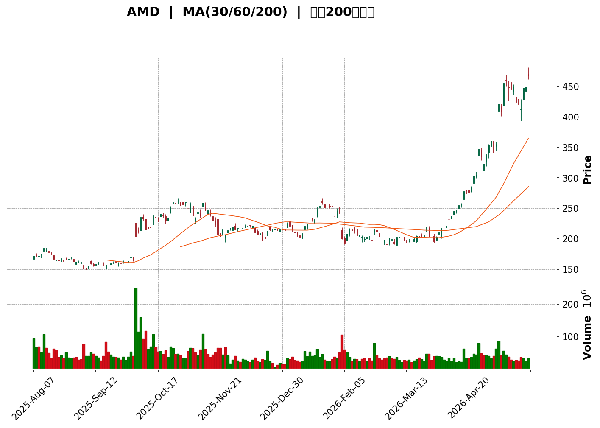
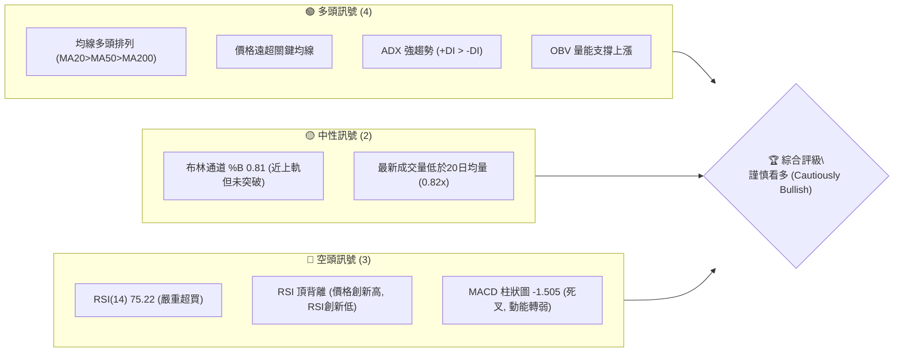
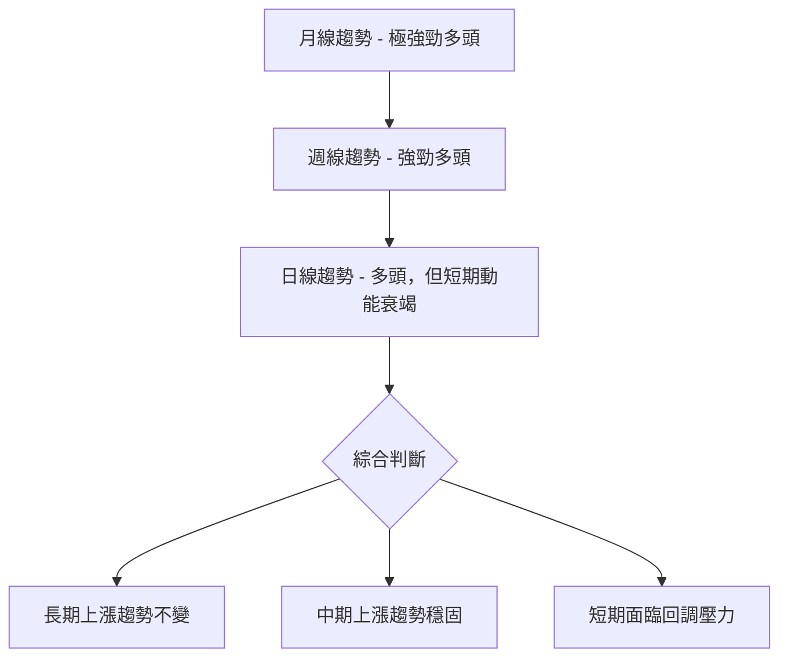
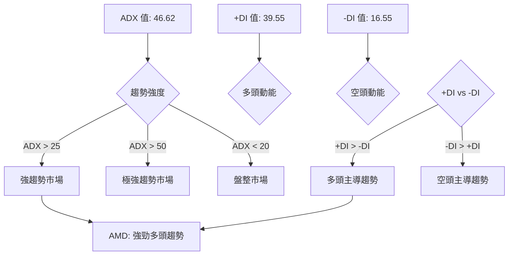
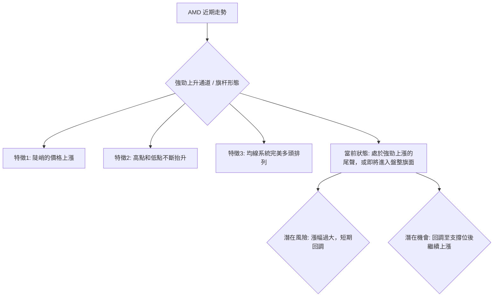

<details>
<summary>📊 靜態圖表 (點擊展開)</summary>

</details>

<html>
<head><meta charset="utf-8" /></head>
<body>
    <div>                        <script>window.PlotlyConfig = {MathJaxConfig: 'local'};</script>
        <script charset="utf-8" src="https://cdn.plot.ly/plotly-3.5.0.min.js" integrity="sha256-fHbNLP+GlIXN+efbQec78UkemUz3NJp7UmfGxC1tNxs=" crossorigin="anonymous"></script>                <div id="candlestick-chart" class="plotly-graph-div" style="height:500px; width:100%;"></div>            <script>                window.PLOTLYENV=window.PLOTLYENV || {};                                if (document.getElementById("candlestick-chart")) {                    Plotly.newPlot(                        "candlestick-chart",                        [{"close":{"dtype":"f8","bdata":"AAAAwMyMZUAAAADgUZhlQAAAAMD1iGVAAAAAYGbeZUAAAACgcA1nQAAAAGBmnmZAAAAA4FEwZkAAAADgegRmQAAAAKCZ0WRAAAAAYGamZEAAAABguHZkQAAAAOBR+GRAAAAAIIVrZEAAAAAA19NkQAAAAAAp5GRAAAAAYI8SZUAAAAAAKVRkQAAAAIA9SmRAAAAAAClEZEAAAACgRzlkQAAAAOB65GJAAAAAwB7tYkAAAACAPXpjQAAAAKBH8WNAAAAAoHB1Y0AAAACAPdJjQAAAAMAeJWRAAAAAYLgOZEAAAADAHuVjQAAAAKBwvWNAAAAA4HqsY0AAAACgR\u002fljQAAAAMDMHGRAAAAAACkcZEAAAADgoyhkQAAAAGC47mNAAAAAIIUrZEAAAACgRzlkQAAAAOBRgGRAAAAAIFw3ZUAAAACgcJVkQAAAAGC4dmlAAAAA4FFwakAAAACA63FtQAAAAOB6HG1AAAAAwMzcakAAAACgcA1rQAAAAEDhQmtAAAAAQDPTbUAAAACA61FtQAAAAGCPIm1AAAAAgOsRbkAAAADA9cBtQAAAACBcx2xAAAAAIK5fbUAAAACgcJ1vQAAAAGC4OnBAAAAAACkgcEAAAACgR4VwQAAAAEDh2m9AAAAAgOsBcEAAAABgZjpwQAAAAKCZQW9AAAAAoEcFcEAAAABgZrZtQAAAAKBHMW1AAAAAIFx\u002fbkAAAADgo7BtQAAAAIA9LnBAAAAAYLj+bkAAAACA69luQAAAAOCjEG5AAAAAoEfJbEAAAACgmfFrQAAAAOCjwGlAAAAAwPV4aUAAAACgmeFqQAAAAAApxGlAAAAAIK7HakAAAADA9TBrQAAAAOBReGtAAAAAIK7nakAAAABAMzNrQAAAACBc\u002f2pAAAAAQAo\u002fa0AAAAAghaNrQAAAAADXs2tAAAAAoHCta0AAAACAwq1rQAAAAMD1WGpAAAAAYI\u002fyaUAAAACgcCVqQAAAACCFw2hAAAAAgOshaUAAAACAwq1qQAAAAGBm3mpAAAAAwMzcakAAAACgR+FqQAAAACCu32pAAAAAIIXzakAAAABA4epqQAAAAMAexWpAAAAAQArva0AAAABgj6JrQAAAAEAzy2pAAAAA4KNAakAAAACAwpVpQAAAAKBwZWlAAAAAgBT2aUAAAABACp9rQAAAAEAz82tAAAAAoHB9bEAAAABgj\u002fpsQAAAAKBw\u002fWxAAAAAoJk5b0AAAAAgXLdvQAAAAEDhOnBAAAAAgOtpb0AAAADA9YBvQAAAACCul29AAAAAgMKFb0AAAAAgXJdtQAAAAOCjyG5AAAAAIIVDbkAAAACAFAZpQAAAAAAAEGhAAAAAgBQOakAAAAAAAABrQAAAAIA9smpAAAAAYI+yakAAAACAFL5pQAAAAIA96mlAAAAAYI9iaUAAAAAA1wNpQAAAAADXa2lAAAAAwMwEaUAAAABAM5NoQAAAAEDhumpAAAAAIIVbakAAAACAwnVpQAAAAGC4BmlAAAAAANfTaEAAAABgZt5nQAAAAIA9QmlAAAAAYGbuaEAAAACAwg1oQAAAAIDCVWlAAAAAIFxnaUAAAABgj5ppQAAAACCut2hAAAAA4HosaEAAAABgj5JoQAAAAIDriWhAAAAAYLjuaEAAAADgo6hpQAAAAGCPKmlAAAAAgMJVaUAAAAAA16tpQAAAAOCjiGtAAAAA4KN4aUAAAAAgrj9pQAAAAKBHgWhAAAAAgMJtaUAAAABguEZqQAAAAAAAMGtAAAAAgMKFa0AAAADA9bBrQAAAAIA9+mxAAAAA4HqUbUAAAACgR6FuQAAAAGCP2m5AAAAAgD3ib0AAAACA6yFwQAAAAAApZHFAAAAAgD1mcUAAAABAMy9xQAAAAADXx3FAAAAAIFz3ckAAAACgRxVzQAAAAMD1vHVAAAAAgBTqdEAAAAAgXDN0QAAAAIDCEXVAAAAAANcndkAAAADgo4h2QAAAAOCjWHVAAAAAACk0dkAAAACAPVZ6QAAAACBch3lAAAAAQApzfEAAAADgo6x8QAAAAOCjBHxAAAAAAADYe0AAAABAMxt8QAAAAKCZgXpAAAAAANdPekAAAADAzOB5QAAAAKBH+XtAAAAAoHAZfEAAAAAAKTh9QA=="},"high":{"dtype":"f8","bdata":"AAAAAAD4ZUAAAAAgXA9mQAAAAIA9WmZAAAAAwB7lZUAAAADAzFRnQAAAAIAULmdAAAAA4HqEZkAAAACgmVlmQAAAAKBwpWVAAAAAwMzUZEAAAAAAKbxkQAAAAMD1EGVAAAAAQOGyZEAAAADgozhlQAAAAIDC9WRAAAAAIK5fZUAAAACAPRJlQAAAAOB6TGRAAAAAAACYZEAAAACgmUFkQAAAAOB6pGNAAAAA4HoUY0AAAADAHpVjQAAAAMD1kGRAAAAAYLgGZEAAAADAHg1kQAAAAKCZSWRAAAAAYGY+ZEAAAAAAKTRkQAAAAOCj2GNAAAAAQOH6Y0AAAACAwlVkQAAAAOB6bGRAAAAAQDOjZEAAAAAAKTRkQAAAACCFQ2RAAAAAoJmJZEAAAADA9UhkQAAAAIDChWRAAAAAgOthZUAAAACAwlVlQAAAAGC4VmxAAAAAwMxca0AAAAAA13ttQAAAAEAzA25AAAAAQApHbUAAAACAFAZsQAAAACBcH2xAAAAAIK7nbUAAAABgZiZuQAAAAAApbG1AAAAAAClcbkAAAADgUUhuQAAAAAApBG5AAAAAwMx8bUAAAADgeqxvQAAAAGC4RnBAAAAAoEeJcEAAAACgR7FwQAAAAIAUfnBAAAAAgBRicEAAAABgj05wQAAAAIAUFnBAAAAAYGY6cEAAAADgUbBvQAAAAADXe21AAAAAwMwcb0AAAABguA5vQAAAAAApeHBAAAAAgBQ6cEAAAACAFK5vQAAAAOCjGG9AAAAAAADAbUAAAADA9WhtQAAAAAAASG1AAAAAYI8aakAAAAAAKSRrQAAAAGCP0mlAAAAAQOHyakAAAACgmUlrQAAAACBcn2tAAAAAIFw\u002fbEAAAABgZkZrQAAAAADXY2tAAAAA4Hr0a0AAAABguPZrQAAAAEDhGmxAAAAAIIXTa0AAAAAAALBrQAAAACCuz2tAAAAAIIXrakAAAABACkdqQAAAAAAAcGpAAAAAIIXLaUAAAACAwuVqQAAAAKBwhWtAAAAAwPUga0AAAACgRxFrQAAAAGCPGmtAAAAAoJkBa0AAAACAPRprQAAAAOB6NGtAAAAAwMxkbEAAAADgo0BtQAAAAKBw3WtAAAAAACmEakAAAACAFF5qQAAAAKCZ6WlAAAAAACk8akAAAAAgheNrQAAAAEDhAmxAAAAAQDPLbUAAAAAgrk9tQAAAAAAA8G1AAAAAwMycb0AAAACgRwFwQAAAACBcr3BAAAAA4KMkcEAAAACgmfFvQAAAAGBmFnBAAAAA4HpIcEAAAAAgrqduQAAAAEAKP29AAAAAwMyUb0AAAABgj1JrQAAAAKBHgWlAAAAA4KMoakAAAABAMzNrQAAAAOB6bGtAAAAAwMx0a0AAAABguE5rQAAAAKCZQWpAAAAAoJmpaUAAAABgZmZpQAAAAEAzg2lAAAAAANebaUAAAAAAKexoQAAAAGC4FmtAAAAAYGYWa0AAAACgRzlqQAAAAOB6PGlAAAAAIK7XaEAAAADgejRoQAAAAIAUTmlAAAAAoEd5aUAAAAAgrgdpQAAAAEAKX2lAAAAAQOHSaUAAAABguCZqQAAAAADXc2lAAAAAgML1aEAAAACgcAVpQAAAAGC45mhAAAAAIIVbaUAAAAAAKbxpQAAAAKCZyWlAAAAAIIUjakAAAACAws1pQAAAAGCPqmtAAAAAAACga0AAAADgo2hpQAAAAIDCDWpAAAAAAACAaUAAAABgj7pqQAAAAMD1OGtAAAAAgOtJbEAAAABAM8NrQAAAAAAAQG1AAAAAQDOjbUAAAABgjzJvQAAAAGCP6m5AAAAAYLjub0AAAABA4SJwQAAAAKBwdXFAAAAAwMyQcUAAAACAwvlxQAAAAEAz43FAAAAAAAAEc0AAAAAghWNzQAAAAADXD3ZAAAAAIFzTdUAAAAAAAHh0QAAAAGC4QnVAAAAAIFwvdkAAAADgo6x2QAAAAKCZnXZAAAAAwB55dkAAAACgmel6QAAAACBcW3pAAAAA4KOEfEAAAAAghVN9QAAAAMDMrHxAAAAAAAC4fEAAAADA9VR8QAAAAAAAcHtAAAAAwMxse0AAAAAAAMx6QAAAAIA9FnxAAAAAQDMzfEAAAABgjxZ+QA=="},"hovertemplate":"\u003cb\u003e%{x|%Y-%m-%d}\u003c\u002fb\u003e\u003cbr\u003e\u958b: $%{open:.2f}\u003cbr\u003e\u9ad8: $%{high:.2f}\u003cbr\u003e\u4f4e: $%{low:.2f}\u003cbr\u003e\u6536: $%{close:.2f}\u003cextra\u003e\u003c\u002fextra\u003e","low":{"dtype":"f8","bdata":"AAAAYGbWZEAAAADgo1BlQAAAAAApLGVAAAAAAAAQZUAAAAAAKWxmQAAAAIDrcWZAAAAAAAAIZkAAAAAghctlQAAAAEAzw2RAAAAAAADIY0AAAADgUUhkQAAAAKCZOWRAAAAAQAo3ZEAAAADAHp1kQAAAAMDMlGRAAAAAwMzUZEAAAADAzDxkQAAAAADXk2NAAAAAYI8SZEAAAACgR7ljQAAAAIDCxWJAAAAAQAqnYkAAAACAwv1iQAAAAAAAwGNAAAAAIK5fY0AAAACgcF1jQAAAAEAzs2NAAAAAQArnY0AAAADgUXhjQAAAAEAzu2JAAAAAwMx8Y0AAAACgcK1jQAAAAGC45mNAAAAAgMLNY0AAAADA9VhjQAAAAKCZoWNAAAAAwMz8Y0AAAABgj+pjQAAAACCuD2RAAAAAANfDZEAAAADgemRkQAAAAOBRYGlAAAAAwPUoakAAAABgZlZqQAAAAMD1sGxAAAAAYGamakAAAADAzNxqQAAAAMDM\u002fGpAAAAA4FGYa0AAAAAgrgdtQAAAAMAefWxAAAAAwMxMbUAAAADgo0BtQAAAAAApHGxAAAAAoEeRbEAAAABgZj5uQAAAAKCZOW9AAAAAAAAQcEAAAABgZhZwQAAAAIDriW9AAAAAwB6tb0AAAADgerxvQAAAAOB67G5AAAAAgOtZbkAAAAAgrndtQAAAAOB6FGxAAAAAAAAQbkAAAADgelRtQAAAAAAAQG9AAAAAgOvBbkAAAABgj2JtQAAAAMDMpG1AAAAAYLgWbEAAAABguHZrQAAAAMD1kGlAAAAAAABgaEAAAABAM7tpQAAAAMD1SGhAAAAAAADgaUAAAADgo8BqQAAAAAAAsGpAAAAA4HrMakAAAADgo3hqQAAAAOB6xGpAAAAAIK4Ha0AAAAAghUtrQAAAAMAePWtAAAAAoHBVa0AAAACAFEZqQAAAAIDrIWpAAAAAYI\u002fSaUAAAAAghaNpQAAAAMD1sGhAAAAAAAAQaUAAAABgZoZpQAAAAIDrqWpAAAAAwPWIakAAAABACr9qQAAAAMD1oGpAAAAAIK4nakAAAABgj8pqQAAAAKCZuWpAAAAAwMxca0AAAAAgXI9rQAAAAAAAaGpAAAAAoHDlaUAAAABgj2ppQAAAAIA9YmlAAAAAoJn5aEAAAAAgXN9qQAAAACCF42pAAAAAQApnbEAAAAAghZtsQAAAAMAeLWxAAAAAwPV4bUAAAAAAKdRuQAAAAAAABHBAAAAAoJlJb0AAAABguP5uQAAAAGC4Rm9AAAAAwB4dbkAAAACgmVFtQAAAAAAAYG1AAAAAoEehbUAAAADAzORoQAAAAEAK12dAAAAAgMKNaEAAAADAzIRpQAAAAAAppGpAAAAAYLgmakAAAADgeqRpQAAAAAApfGlAAAAAYI9aaEAAAAAAAGBoQAAAAKBHyWhAAAAAgOvRaEAAAADAzERoQAAAAAAA0GlAAAAAYI9KakAAAABguC5pQAAAACCut2hAAAAAAADAZ0AAAABACodnQAAAACCFu2dAAAAAAClcaEAAAAAAAOhnQAAAAOCjoGdAAAAAYGZGaUAAAAAAKXRpQAAAAKBwlWhAAAAA4KMIaEAAAACgmVloQAAAAOBRaGhAAAAAAAB4aEAAAABgjxpoQAAAAOBRyGhAAAAAYLg2aUAAAAAAKQRpQAAAAOBRcGpAAAAAgMJtaUAAAACAFLZoQAAAAADXG2hAAAAAwB6NaEAAAABA4bppQAAAAADXE2lAAAAAIFw3a0AAAAAAKexqQAAAAEDhYmxAAAAAwB7dbEAAAABguN5tQAAAAMD1QG5AAAAAYGa2bkAAAABAM3tvQAAAAAApWHBAAAAAgD0icUAAAAAAAABxQAAAAIDrSXFAAAAAgD3icUAAAAAAKbxyQAAAAOCj6HRAAAAAwPWMdEAAAAAAAGBzQAAAAIDC7XNAAAAAoJnJdEAAAAAAANR1QAAAAEAzK3VAAAAAgBSOdUAAAADgoyB5QAAAAKBHEXlAAAAA4KMkekAAAACAFC58QAAAAIDCoXpAAAAAYGYKe0AAAABA4Tp7QAAAAIDCdXpAAAAAIFyreUAAAACAwpV4QAAAAMDMoHpAAAAAoJn5ekAAAAAgXNt8QA=="},"name":"\u50f9\u683c","open":{"dtype":"f8","bdata":"AAAAQOHaZEAAAACgR8FlQAAAAKBHQWVAAAAAgD2qZUAAAADAHn1mQAAAAGCPemZAAAAAgOuBZkAAAADgURhmQAAAAEAzo2VAAAAAQDODZEAAAAAghbtkQAAAAKBwRWRAAAAAoJmxZEAAAADAzBRlQAAAAKBHwWRAAAAAAAAQZUAAAACA69lkQAAAAKBwzWNAAAAAgOs5ZEAAAACAFP5jQAAAAADXo2NAAAAAoJn5YkAAAAAgrv9iQAAAAKBHcWRAAAAAANfTY0AAAAAAAKBjQAAAAOBRAGRAAAAAANcrZEAAAADA9ehjQAAAAGC43mJAAAAAACmsY0AAAACgcK1jQAAAAOCjEGRAAAAAIFxfZEAAAADgeqRjQAAAAOCjEGRAAAAAANcDZEAAAACgRxlkQAAAAIDCHWRAAAAAgMIVZUAAAACAwlVlQAAAAGBmTmxAAAAAQDPbakAAAABgZp5qQAAAAKCZiW1AAAAA4KMYbUAAAABgZoZrQAAAAGBmZmtAAAAAYLjWa0AAAACgR4ltQAAAAOBRKG1AAAAAQAqPbUAAAADgeuxtQAAAAEAzm21AAAAAwB7FbEAAAAAghWtuQAAAAIAUHnBAAAAAgD0ycEAAAABACoNwQAAAAGC4PnBAAAAAoJk5cEAAAACgRzVwQAAAAEAzS29AAAAAIK5nbkAAAABACq9vQAAAAIAU3mxAAAAA4HpEbkAAAADAHjVuQAAAAAAppG9AAAAAwMx8b0AAAAAghQNuQAAAAAAAWG5AAAAAwPWYbUAAAADgUchsQAAAAGBmFm1AAAAAgOsZakAAAADAHuVpQAAAACBcL2lAAAAAoJlBakAAAADgegRrQAAAAAApvGpAAAAAoEe5a0AAAADgUQhrQAAAAAApHGtAAAAAoHAla0AAAABA4WJrQAAAAKBHoWtAAAAAAADAa0AAAACA6zlrQAAAAADXS2tAAAAAwPWIakAAAACgcN1pQAAAAKBHQWpAAAAAgD16aUAAAABAM5NpQAAAAAAAgGtAAAAAIIWbakAAAAAgXN9qQAAAAIDC7WpAAAAAYI9yakAAAAAA1\u002ftqQAAAAIA9+mpAAAAAwMxca0AAAAAAAMhsQAAAAGC41mtAAAAAACmEakAAAADAzFxqQAAAAEAKt2lAAAAAgMIlaUAAAABAM+NqQAAAAKBHMWtAAAAAwMx8bEAAAACgmUltQAAAAGCPQmxAAAAAIK5\u002fbUAAAAAAAHhvQAAAAEDhUnBAAAAAAAAMcEAAAADAHoVvQAAAAAApxG9AAAAAwB7Vb0AAAACAwp1tQAAAAOCjeG1AAAAAoJlxb0AAAAAAAOBqQAAAACCFO2lAAAAAACmkaEAAAADAzNxpQAAAAOB65GpAAAAAACk8a0AAAABgj\u002fpqQAAAAOCjgGlAAAAAwMxEaUAAAADAHs1oQAAAACCFA2lAAAAAANcDaUAAAABA4cJoQAAAAAApdGpAAAAAgD3aakAAAACgmRlqQAAAACCFA2lAAAAAQDM7aEAAAABguO5nQAAAAADXA2hAAAAA4KO4aEAAAADgo2hoQAAAACCFq2dAAAAA4FFQaUAAAAAghaNpQAAAAGCPWmlAAAAAIIXDaEAAAAAgXF9oQAAAAIDClWhAAAAAAACAaEAAAADA9WBoQAAAAOB6nGlAAAAAwMzMaUAAAADgeixpQAAAAOBRcGpAAAAAIFw\u002fa0AAAADgozhpQAAAAGBmnmlAAAAAoJnBaEAAAABA4fJpQAAAAKCZgWlAAAAAwPVoa0AAAADgUUhrQAAAAADXA21AAAAA4FEgbUAAAAAAAOBtQAAAAMD1oG5AAAAAoEc5b0AAAABguN5vQAAAAADXj3BAAAAAAACQcUAAAACgmYlxQAAAAKBHVXFAAAAAIIUzckAAAAAAKeByQAAAAAApDHVAAAAAwB6ldUAAAACAwn1zQAAAAKBHaXRAAAAAgMJVdUAAAACA6\u002f11QAAAAMD1hHZAAAAAACn4dUAAAAAA15d5QAAAAMAeEXpAAAAAoHApekAAAADAzMh8QAAAAAAAFHxAAAAA4KOQfEAAAACgmYl7QAAAAKBwFXtAAAAAAADYekAAAACgmcl5QAAAAOCjwHpAAAAAANefe0AAAACgcF19QA=="},"x":["2025-08-07T00:00:00-04:00","2025-08-08T00:00:00-04:00","2025-08-11T00:00:00-04:00","2025-08-12T00:00:00-04:00","2025-08-13T00:00:00-04:00","2025-08-14T00:00:00-04:00","2025-08-15T00:00:00-04:00","2025-08-18T00:00:00-04:00","2025-08-19T00:00:00-04:00","2025-08-20T00:00:00-04:00","2025-08-21T00:00:00-04:00","2025-08-22T00:00:00-04:00","2025-08-25T00:00:00-04:00","2025-08-26T00:00:00-04:00","2025-08-27T00:00:00-04:00","2025-08-28T00:00:00-04:00","2025-08-29T00:00:00-04:00","2025-09-02T00:00:00-04:00","2025-09-03T00:00:00-04:00","2025-09-04T00:00:00-04:00","2025-09-05T00:00:00-04:00","2025-09-08T00:00:00-04:00","2025-09-09T00:00:00-04:00","2025-09-10T00:00:00-04:00","2025-09-11T00:00:00-04:00","2025-09-12T00:00:00-04:00","2025-09-15T00:00:00-04:00","2025-09-16T00:00:00-04:00","2025-09-17T00:00:00-04:00","2025-09-18T00:00:00-04:00","2025-09-19T00:00:00-04:00","2025-09-22T00:00:00-04:00","2025-09-23T00:00:00-04:00","2025-09-24T00:00:00-04:00","2025-09-25T00:00:00-04:00","2025-09-26T00:00:00-04:00","2025-09-29T00:00:00-04:00","2025-09-30T00:00:00-04:00","2025-10-01T00:00:00-04:00","2025-10-02T00:00:00-04:00","2025-10-03T00:00:00-04:00","2025-10-06T00:00:00-04:00","2025-10-07T00:00:00-04:00","2025-10-08T00:00:00-04:00","2025-10-09T00:00:00-04:00","2025-10-10T00:00:00-04:00","2025-10-13T00:00:00-04:00","2025-10-14T00:00:00-04:00","2025-10-15T00:00:00-04:00","2025-10-16T00:00:00-04:00","2025-10-17T00:00:00-04:00","2025-10-20T00:00:00-04:00","2025-10-21T00:00:00-04:00","2025-10-22T00:00:00-04:00","2025-10-23T00:00:00-04:00","2025-10-24T00:00:00-04:00","2025-10-27T00:00:00-04:00","2025-10-28T00:00:00-04:00","2025-10-29T00:00:00-04:00","2025-10-30T00:00:00-04:00","2025-10-31T00:00:00-04:00","2025-11-03T00:00:00-05:00","2025-11-04T00:00:00-05:00","2025-11-05T00:00:00-05:00","2025-11-06T00:00:00-05:00","2025-11-07T00:00:00-05:00","2025-11-10T00:00:00-05:00","2025-11-11T00:00:00-05:00","2025-11-12T00:00:00-05:00","2025-11-13T00:00:00-05:00","2025-11-14T00:00:00-05:00","2025-11-17T00:00:00-05:00","2025-11-18T00:00:00-05:00","2025-11-19T00:00:00-05:00","2025-11-20T00:00:00-05:00","2025-11-21T00:00:00-05:00","2025-11-24T00:00:00-05:00","2025-11-25T00:00:00-05:00","2025-11-26T00:00:00-05:00","2025-11-28T00:00:00-05:00","2025-12-01T00:00:00-05:00","2025-12-02T00:00:00-05:00","2025-12-03T00:00:00-05:00","2025-12-04T00:00:00-05:00","2025-12-05T00:00:00-05:00","2025-12-08T00:00:00-05:00","2025-12-09T00:00:00-05:00","2025-12-10T00:00:00-05:00","2025-12-11T00:00:00-05:00","2025-12-12T00:00:00-05:00","2025-12-15T00:00:00-05:00","2025-12-16T00:00:00-05:00","2025-12-17T00:00:00-05:00","2025-12-18T00:00:00-05:00","2025-12-19T00:00:00-05:00","2025-12-22T00:00:00-05:00","2025-12-23T00:00:00-05:00","2025-12-24T00:00:00-05:00","2025-12-26T00:00:00-05:00","2025-12-29T00:00:00-05:00","2025-12-30T00:00:00-05:00","2025-12-31T00:00:00-05:00","2026-01-02T00:00:00-05:00","2026-01-05T00:00:00-05:00","2026-01-06T00:00:00-05:00","2026-01-07T00:00:00-05:00","2026-01-08T00:00:00-05:00","2026-01-09T00:00:00-05:00","2026-01-12T00:00:00-05:00","2026-01-13T00:00:00-05:00","2026-01-14T00:00:00-05:00","2026-01-15T00:00:00-05:00","2026-01-16T00:00:00-05:00","2026-01-20T00:00:00-05:00","2026-01-21T00:00:00-05:00","2026-01-22T00:00:00-05:00","2026-01-23T00:00:00-05:00","2026-01-26T00:00:00-05:00","2026-01-27T00:00:00-05:00","2026-01-28T00:00:00-05:00","2026-01-29T00:00:00-05:00","2026-01-30T00:00:00-05:00","2026-02-02T00:00:00-05:00","2026-02-03T00:00:00-05:00","2026-02-04T00:00:00-05:00","2026-02-05T00:00:00-05:00","2026-02-06T00:00:00-05:00","2026-02-09T00:00:00-05:00","2026-02-10T00:00:00-05:00","2026-02-11T00:00:00-05:00","2026-02-12T00:00:00-05:00","2026-02-13T00:00:00-05:00","2026-02-17T00:00:00-05:00","2026-02-18T00:00:00-05:00","2026-02-19T00:00:00-05:00","2026-02-20T00:00:00-05:00","2026-02-23T00:00:00-05:00","2026-02-24T00:00:00-05:00","2026-02-25T00:00:00-05:00","2026-02-26T00:00:00-05:00","2026-02-27T00:00:00-05:00","2026-03-02T00:00:00-05:00","2026-03-03T00:00:00-05:00","2026-03-04T00:00:00-05:00","2026-03-05T00:00:00-05:00","2026-03-06T00:00:00-05:00","2026-03-09T00:00:00-04:00","2026-03-10T00:00:00-04:00","2026-03-11T00:00:00-04:00","2026-03-12T00:00:00-04:00","2026-03-13T00:00:00-04:00","2026-03-16T00:00:00-04:00","2026-03-17T00:00:00-04:00","2026-03-18T00:00:00-04:00","2026-03-19T00:00:00-04:00","2026-03-20T00:00:00-04:00","2026-03-23T00:00:00-04:00","2026-03-24T00:00:00-04:00","2026-03-25T00:00:00-04:00","2026-03-26T00:00:00-04:00","2026-03-27T00:00:00-04:00","2026-03-30T00:00:00-04:00","2026-03-31T00:00:00-04:00","2026-04-01T00:00:00-04:00","2026-04-02T00:00:00-04:00","2026-04-06T00:00:00-04:00","2026-04-07T00:00:00-04:00","2026-04-08T00:00:00-04:00","2026-04-09T00:00:00-04:00","2026-04-10T00:00:00-04:00","2026-04-13T00:00:00-04:00","2026-04-14T00:00:00-04:00","2026-04-15T00:00:00-04:00","2026-04-16T00:00:00-04:00","2026-04-17T00:00:00-04:00","2026-04-20T00:00:00-04:00","2026-04-21T00:00:00-04:00","2026-04-22T00:00:00-04:00","2026-04-23T00:00:00-04:00","2026-04-24T00:00:00-04:00","2026-04-27T00:00:00-04:00","2026-04-28T00:00:00-04:00","2026-04-29T00:00:00-04:00","2026-04-30T00:00:00-04:00","2026-05-01T00:00:00-04:00","2026-05-04T00:00:00-04:00","2026-05-05T00:00:00-04:00","2026-05-06T00:00:00-04:00","2026-05-07T00:00:00-04:00","2026-05-08T00:00:00-04:00","2026-05-11T00:00:00-04:00","2026-05-12T00:00:00-04:00","2026-05-13T00:00:00-04:00","2026-05-14T00:00:00-04:00","2026-05-15T00:00:00-04:00","2026-05-18T00:00:00-04:00","2026-05-19T00:00:00-04:00","2026-05-20T00:00:00-04:00","2026-05-21T00:00:00-04:00","2026-05-22T00:00:00-04:00"],"type":"candlestick"},{"hovertemplate":"MA30: $%{y:.2f}\u003cextra\u003e\u003c\u002fextra\u003e","line":{"color":"#2196F3","dash":"dash","width":2},"mode":"lines","name":"MA30","x":["2025-08-07T00:00:00-04:00","2025-08-08T00:00:00-04:00","2025-08-11T00:00:00-04:00","2025-08-12T00:00:00-04:00","2025-08-13T00:00:00-04:00","2025-08-14T00:00:00-04:00","2025-08-15T00:00:00-04:00","2025-08-18T00:00:00-04:00","2025-08-19T00:00:00-04:00","2025-08-20T00:00:00-04:00","2025-08-21T00:00:00-04:00","2025-08-22T00:00:00-04:00","2025-08-25T00:00:00-04:00","2025-08-26T00:00:00-04:00","2025-08-27T00:00:00-04:00","2025-08-28T00:00:00-04:00","2025-08-29T00:00:00-04:00","2025-09-02T00:00:00-04:00","2025-09-03T00:00:00-04:00","2025-09-04T00:00:00-04:00","2025-09-05T00:00:00-04:00","2025-09-08T00:00:00-04:00","2025-09-09T00:00:00-04:00","2025-09-10T00:00:00-04:00","2025-09-11T00:00:00-04:00","2025-09-12T00:00:00-04:00","2025-09-15T00:00:00-04:00","2025-09-16T00:00:00-04:00","2025-09-17T00:00:00-04:00","2025-09-18T00:00:00-04:00","2025-09-19T00:00:00-04:00","2025-09-22T00:00:00-04:00","2025-09-23T00:00:00-04:00","2025-09-24T00:00:00-04:00","2025-09-25T00:00:00-04:00","2025-09-26T00:00:00-04:00","2025-09-29T00:00:00-04:00","2025-09-30T00:00:00-04:00","2025-10-01T00:00:00-04:00","2025-10-02T00:00:00-04:00","2025-10-03T00:00:00-04:00","2025-10-06T00:00:00-04:00","2025-10-07T00:00:00-04:00","2025-10-08T00:00:00-04:00","2025-10-09T00:00:00-04:00","2025-10-10T00:00:00-04:00","2025-10-13T00:00:00-04:00","2025-10-14T00:00:00-04:00","2025-10-15T00:00:00-04:00","2025-10-16T00:00:00-04:00","2025-10-17T00:00:00-04:00","2025-10-20T00:00:00-04:00","2025-10-21T00:00:00-04:00","2025-10-22T00:00:00-04:00","2025-10-23T00:00:00-04:00","2025-10-24T00:00:00-04:00","2025-10-27T00:00:00-04:00","2025-10-28T00:00:00-04:00","2025-10-29T00:00:00-04:00","2025-10-30T00:00:00-04:00","2025-10-31T00:00:00-04:00","2025-11-03T00:00:00-05:00","2025-11-04T00:00:00-05:00","2025-11-05T00:00:00-05:00","2025-11-06T00:00:00-05:00","2025-11-07T00:00:00-05:00","2025-11-10T00:00:00-05:00","2025-11-11T00:00:00-05:00","2025-11-12T00:00:00-05:00","2025-11-13T00:00:00-05:00","2025-11-14T00:00:00-05:00","2025-11-17T00:00:00-05:00","2025-11-18T00:00:00-05:00","2025-11-19T00:00:00-05:00","2025-11-20T00:00:00-05:00","2025-11-21T00:00:00-05:00","2025-11-24T00:00:00-05:00","2025-11-25T00:00:00-05:00","2025-11-26T00:00:00-05:00","2025-11-28T00:00:00-05:00","2025-12-01T00:00:00-05:00","2025-12-02T00:00:00-05:00","2025-12-03T00:00:00-05:00","2025-12-04T00:00:00-05:00","2025-12-05T00:00:00-05:00","2025-12-08T00:00:00-05:00","2025-12-09T00:00:00-05:00","2025-12-10T00:00:00-05:00","2025-12-11T00:00:00-05:00","2025-12-12T00:00:00-05:00","2025-12-15T00:00:00-05:00","2025-12-16T00:00:00-05:00","2025-12-17T00:00:00-05:00","2025-12-18T00:00:00-05:00","2025-12-19T00:00:00-05:00","2025-12-22T00:00:00-05:00","2025-12-23T00:00:00-05:00","2025-12-24T00:00:00-05:00","2025-12-26T00:00:00-05:00","2025-12-29T00:00:00-05:00","2025-12-30T00:00:00-05:00","2025-12-31T00:00:00-05:00","2026-01-02T00:00:00-05:00","2026-01-05T00:00:00-05:00","2026-01-06T00:00:00-05:00","2026-01-07T00:00:00-05:00","2026-01-08T00:00:00-05:00","2026-01-09T00:00:00-05:00","2026-01-12T00:00:00-05:00","2026-01-13T00:00:00-05:00","2026-01-14T00:00:00-05:00","2026-01-15T00:00:00-05:00","2026-01-16T00:00:00-05:00","2026-01-20T00:00:00-05:00","2026-01-21T00:00:00-05:00","2026-01-22T00:00:00-05:00","2026-01-23T00:00:00-05:00","2026-01-26T00:00:00-05:00","2026-01-27T00:00:00-05:00","2026-01-28T00:00:00-05:00","2026-01-29T00:00:00-05:00","2026-01-30T00:00:00-05:00","2026-02-02T00:00:00-05:00","2026-02-03T00:00:00-05:00","2026-02-04T00:00:00-05:00","2026-02-05T00:00:00-05:00","2026-02-06T00:00:00-05:00","2026-02-09T00:00:00-05:00","2026-02-10T00:00:00-05:00","2026-02-11T00:00:00-05:00","2026-02-12T00:00:00-05:00","2026-02-13T00:00:00-05:00","2026-02-17T00:00:00-05:00","2026-02-18T00:00:00-05:00","2026-02-19T00:00:00-05:00","2026-02-20T00:00:00-05:00","2026-02-23T00:00:00-05:00","2026-02-24T00:00:00-05:00","2026-02-25T00:00:00-05:00","2026-02-26T00:00:00-05:00","2026-02-27T00:00:00-05:00","2026-03-02T00:00:00-05:00","2026-03-03T00:00:00-05:00","2026-03-04T00:00:00-05:00","2026-03-05T00:00:00-05:00","2026-03-06T00:00:00-05:00","2026-03-09T00:00:00-04:00","2026-03-10T00:00:00-04:00","2026-03-11T00:00:00-04:00","2026-03-12T00:00:00-04:00","2026-03-13T00:00:00-04:00","2026-03-16T00:00:00-04:00","2026-03-17T00:00:00-04:00","2026-03-18T00:00:00-04:00","2026-03-19T00:00:00-04:00","2026-03-20T00:00:00-04:00","2026-03-23T00:00:00-04:00","2026-03-24T00:00:00-04:00","2026-03-25T00:00:00-04:00","2026-03-26T00:00:00-04:00","2026-03-27T00:00:00-04:00","2026-03-30T00:00:00-04:00","2026-03-31T00:00:00-04:00","2026-04-01T00:00:00-04:00","2026-04-02T00:00:00-04:00","2026-04-06T00:00:00-04:00","2026-04-07T00:00:00-04:00","2026-04-08T00:00:00-04:00","2026-04-09T00:00:00-04:00","2026-04-10T00:00:00-04:00","2026-04-13T00:00:00-04:00","2026-04-14T00:00:00-04:00","2026-04-15T00:00:00-04:00","2026-04-16T00:00:00-04:00","2026-04-17T00:00:00-04:00","2026-04-20T00:00:00-04:00","2026-04-21T00:00:00-04:00","2026-04-22T00:00:00-04:00","2026-04-23T00:00:00-04:00","2026-04-24T00:00:00-04:00","2026-04-27T00:00:00-04:00","2026-04-28T00:00:00-04:00","2026-04-29T00:00:00-04:00","2026-04-30T00:00:00-04:00","2026-05-01T00:00:00-04:00","2026-05-04T00:00:00-04:00","2026-05-05T00:00:00-04:00","2026-05-06T00:00:00-04:00","2026-05-07T00:00:00-04:00","2026-05-08T00:00:00-04:00","2026-05-11T00:00:00-04:00","2026-05-12T00:00:00-04:00","2026-05-13T00:00:00-04:00","2026-05-14T00:00:00-04:00","2026-05-15T00:00:00-04:00","2026-05-18T00:00:00-04:00","2026-05-19T00:00:00-04:00","2026-05-20T00:00:00-04:00","2026-05-21T00:00:00-04:00","2026-05-22T00:00:00-04:00"],"y":{"dtype":"f8","bdata":"AAAAAAAA+H8AAAAAAAD4fwAAAAAAAPh\u002fAAAAAAAA+H8AAAAAAAD4fwAAAAAAAPh\u002fAAAAAAAA+H8AAAAAAAD4fwAAAAAAAPh\u002fAAAAAAAA+H8AAAAAAAD4fwAAAAAAAPh\u002fAAAAAAAA+H8AAAAAAAD4fwAAAAAAAPh\u002fAAAAAAAA+H8AAAAAAAD4fwAAAAAAAPh\u002fAAAAAAAA+H8AAAAAAAD4fwAAAAAAAPh\u002fAAAAAAAA+H8AAAAAAAD4fwAAAAAAAPh\u002fAAAAAAAA+H8AAAAAAAD4fwAAAAAAAPh\u002fAAAAAAAA+H8AAAAAAAD4f3d3d5e1qmRAzczM3LKaZEAAAAAw3YxkQAAAALC5gGRAREREpLdxZEBmZmYmBllkQDMzM\u002fMZQmRAzczM7N8wZECrqqpqkSFkQDMzM9PbHmRAERER0bAjZEBVVVX1tiRkQFVVVbUPS2RA3t3d3Wt+ZEBVVVUV9cdkQCIiIvIZDmVAREREZII\u002fZUBVVVWl4nhlQCIiIpJftGVAq6qq+vAFZkCrqqoKkFNmQAAAACD3qmZAREREBA8KZ0AzMzPTv2FnQImIiOgmrWdA7+7ujsIBaEBVVVVlZmZoQCIiIjJ6z2hAmpmZ2Yc3aUBEREREtqdpQDMzM+MXD2pAIiIiwmd4akAiIiIy7OJqQHd3dxcEQmtAzczMTNSna0CJiIjIWvlrQO\u002fu7o5fSGxAMzMzU4CgbECrqqqqR\u002fFsQM3MzDx8Vm1A7+7uPu6pbUARERHxiwFuQGZmZobPKG5Ad3d3t9c8bkAAAAAwCDBuQDMzM+NeE25AMzMzY4IHbkCamZlJDAZuQJqZmWlK+W1AIiIigk7fbUDv7u4uJM1tQO\u002fu7u7uvm1AMzMz4+yjbUAzMzMjIo5tQAAAAPDufm1Ad3d3V8dsbUB3d3cX2UptQGZmZuZCIm1AMzMzYzv7bEBERETUeM1sQDMzM4N5nmxAvLu727JqbEBERER02jRsQO\u002fu7l5z\u002fWtAq6qq+n7Ca0BmZmamm6hrQHd3d1fHlGtAAAAAkMJ1a0BVVVUFyF1rQERERGT0LmtA7+7urnIMa0BmZmZG4epqQM3MzDzDzmpAzczM7HzHakAzMzNz2sRqQImIiBi9zWpAiYiICGXUakBERERUVclqQM3MzAwtxmpAZmZmdjC\u002fakAAAADQ28JqQERERGT0xmpAAAAA4HrUakDNzMycqONqQLy7u0up9GpAIiIiAp0Wa0ARERFxaDlrQLy7u1sBYmtAIiIiUuOBa0CamZkph6JrQKuqqgpJz2tAAAAA0Nv+a0B3d3eHQRxsQLy7u2ugT2xA7+7uzml7bECJiIhoSm1sQAAAABBYVWxA3t3dDXRObEAzMzMzek9sQCIiInL2TWxA7+7uHsxLbEC8u7tLxUFsQFVVVYV5OmxAERERsbkkbEBmZmY2Xg5sQAAAAPCnAmxARERExCD4a0BERERkgu9rQDMzMwPk+mtAIiIiokX+a0Dv7u5O1OtrQHd3d0fh0mtAzczMbKCza0BVVVV1BYhrQLy7u2suaGtAMzMzg3kya0BmZmaGFvFqQJqZmblJtGpA3t3drQCBakDv7u7up05qQERERET9E2pA3t3drUfVaUDe3d0NdKppQERERKQpdWlAmpmZWatHaUB3d3eHFk1pQFVVVbWBVmlAd3d311xQaUBEREQkBkVpQAAAALArTGlAd3d357RBaUCrqqpKfj1pQImIiBh2MWlAq6qqqtUxaUCamZnpmDxpQImIiFirS2lA7+7u3ghhaUC8u7troHtpQJqZmSnOjmlAIiIi0k2qaUC8u7vba9ZpQJqZmTkmCGpAd3d311xEakCrqqq6AoxqQN7d3a1H3WpAERERkXsxa0CJiIgIgYlrQN7d3Z3E4GtAZmZmFq5LbECJiIhI4bZsQFVVVWX0Vm1AVVVVVZztbUAzMzPDrnRuQLy7u4veCm9AERERETywb0CJiIiQ7SpwQHd3d+e0dXBAmpmZKRXHcECJiIgYSzpxQFVVVU2pnnFAMzMzg8AkckDe3d1Ftq1yQO\u002fu7s4+NHNA7+7ublm1c0BVVVXNEzV0QO\u002fu7pZDo3RAERER2VwOdUBmZmY+CnV1QERERKwc6HVAIiIicq9ZdkDNzMwEVtB2QA=="},"type":"scatter"},{"hovertemplate":"MA60: $%{y:.2f}\u003cextra\u003e\u003c\u002fextra\u003e","line":{"color":"#9C27B0","dash":"dash","width":2},"mode":"lines","name":"MA60","x":["2025-08-07T00:00:00-04:00","2025-08-08T00:00:00-04:00","2025-08-11T00:00:00-04:00","2025-08-12T00:00:00-04:00","2025-08-13T00:00:00-04:00","2025-08-14T00:00:00-04:00","2025-08-15T00:00:00-04:00","2025-08-18T00:00:00-04:00","2025-08-19T00:00:00-04:00","2025-08-20T00:00:00-04:00","2025-08-21T00:00:00-04:00","2025-08-22T00:00:00-04:00","2025-08-25T00:00:00-04:00","2025-08-26T00:00:00-04:00","2025-08-27T00:00:00-04:00","2025-08-28T00:00:00-04:00","2025-08-29T00:00:00-04:00","2025-09-02T00:00:00-04:00","2025-09-03T00:00:00-04:00","2025-09-04T00:00:00-04:00","2025-09-05T00:00:00-04:00","2025-09-08T00:00:00-04:00","2025-09-09T00:00:00-04:00","2025-09-10T00:00:00-04:00","2025-09-11T00:00:00-04:00","2025-09-12T00:00:00-04:00","2025-09-15T00:00:00-04:00","2025-09-16T00:00:00-04:00","2025-09-17T00:00:00-04:00","2025-09-18T00:00:00-04:00","2025-09-19T00:00:00-04:00","2025-09-22T00:00:00-04:00","2025-09-23T00:00:00-04:00","2025-09-24T00:00:00-04:00","2025-09-25T00:00:00-04:00","2025-09-26T00:00:00-04:00","2025-09-29T00:00:00-04:00","2025-09-30T00:00:00-04:00","2025-10-01T00:00:00-04:00","2025-10-02T00:00:00-04:00","2025-10-03T00:00:00-04:00","2025-10-06T00:00:00-04:00","2025-10-07T00:00:00-04:00","2025-10-08T00:00:00-04:00","2025-10-09T00:00:00-04:00","2025-10-10T00:00:00-04:00","2025-10-13T00:00:00-04:00","2025-10-14T00:00:00-04:00","2025-10-15T00:00:00-04:00","2025-10-16T00:00:00-04:00","2025-10-17T00:00:00-04:00","2025-10-20T00:00:00-04:00","2025-10-21T00:00:00-04:00","2025-10-22T00:00:00-04:00","2025-10-23T00:00:00-04:00","2025-10-24T00:00:00-04:00","2025-10-27T00:00:00-04:00","2025-10-28T00:00:00-04:00","2025-10-29T00:00:00-04:00","2025-10-30T00:00:00-04:00","2025-10-31T00:00:00-04:00","2025-11-03T00:00:00-05:00","2025-11-04T00:00:00-05:00","2025-11-05T00:00:00-05:00","2025-11-06T00:00:00-05:00","2025-11-07T00:00:00-05:00","2025-11-10T00:00:00-05:00","2025-11-11T00:00:00-05:00","2025-11-12T00:00:00-05:00","2025-11-13T00:00:00-05:00","2025-11-14T00:00:00-05:00","2025-11-17T00:00:00-05:00","2025-11-18T00:00:00-05:00","2025-11-19T00:00:00-05:00","2025-11-20T00:00:00-05:00","2025-11-21T00:00:00-05:00","2025-11-24T00:00:00-05:00","2025-11-25T00:00:00-05:00","2025-11-26T00:00:00-05:00","2025-11-28T00:00:00-05:00","2025-12-01T00:00:00-05:00","2025-12-02T00:00:00-05:00","2025-12-03T00:00:00-05:00","2025-12-04T00:00:00-05:00","2025-12-05T00:00:00-05:00","2025-12-08T00:00:00-05:00","2025-12-09T00:00:00-05:00","2025-12-10T00:00:00-05:00","2025-12-11T00:00:00-05:00","2025-12-12T00:00:00-05:00","2025-12-15T00:00:00-05:00","2025-12-16T00:00:00-05:00","2025-12-17T00:00:00-05:00","2025-12-18T00:00:00-05:00","2025-12-19T00:00:00-05:00","2025-12-22T00:00:00-05:00","2025-12-23T00:00:00-05:00","2025-12-24T00:00:00-05:00","2025-12-26T00:00:00-05:00","2025-12-29T00:00:00-05:00","2025-12-30T00:00:00-05:00","2025-12-31T00:00:00-05:00","2026-01-02T00:00:00-05:00","2026-01-05T00:00:00-05:00","2026-01-06T00:00:00-05:00","2026-01-07T00:00:00-05:00","2026-01-08T00:00:00-05:00","2026-01-09T00:00:00-05:00","2026-01-12T00:00:00-05:00","2026-01-13T00:00:00-05:00","2026-01-14T00:00:00-05:00","2026-01-15T00:00:00-05:00","2026-01-16T00:00:00-05:00","2026-01-20T00:00:00-05:00","2026-01-21T00:00:00-05:00","2026-01-22T00:00:00-05:00","2026-01-23T00:00:00-05:00","2026-01-26T00:00:00-05:00","2026-01-27T00:00:00-05:00","2026-01-28T00:00:00-05:00","2026-01-29T00:00:00-05:00","2026-01-30T00:00:00-05:00","2026-02-02T00:00:00-05:00","2026-02-03T00:00:00-05:00","2026-02-04T00:00:00-05:00","2026-02-05T00:00:00-05:00","2026-02-06T00:00:00-05:00","2026-02-09T00:00:00-05:00","2026-02-10T00:00:00-05:00","2026-02-11T00:00:00-05:00","2026-02-12T00:00:00-05:00","2026-02-13T00:00:00-05:00","2026-02-17T00:00:00-05:00","2026-02-18T00:00:00-05:00","2026-02-19T00:00:00-05:00","2026-02-20T00:00:00-05:00","2026-02-23T00:00:00-05:00","2026-02-24T00:00:00-05:00","2026-02-25T00:00:00-05:00","2026-02-26T00:00:00-05:00","2026-02-27T00:00:00-05:00","2026-03-02T00:00:00-05:00","2026-03-03T00:00:00-05:00","2026-03-04T00:00:00-05:00","2026-03-05T00:00:00-05:00","2026-03-06T00:00:00-05:00","2026-03-09T00:00:00-04:00","2026-03-10T00:00:00-04:00","2026-03-11T00:00:00-04:00","2026-03-12T00:00:00-04:00","2026-03-13T00:00:00-04:00","2026-03-16T00:00:00-04:00","2026-03-17T00:00:00-04:00","2026-03-18T00:00:00-04:00","2026-03-19T00:00:00-04:00","2026-03-20T00:00:00-04:00","2026-03-23T00:00:00-04:00","2026-03-24T00:00:00-04:00","2026-03-25T00:00:00-04:00","2026-03-26T00:00:00-04:00","2026-03-27T00:00:00-04:00","2026-03-30T00:00:00-04:00","2026-03-31T00:00:00-04:00","2026-04-01T00:00:00-04:00","2026-04-02T00:00:00-04:00","2026-04-06T00:00:00-04:00","2026-04-07T00:00:00-04:00","2026-04-08T00:00:00-04:00","2026-04-09T00:00:00-04:00","2026-04-10T00:00:00-04:00","2026-04-13T00:00:00-04:00","2026-04-14T00:00:00-04:00","2026-04-15T00:00:00-04:00","2026-04-16T00:00:00-04:00","2026-04-17T00:00:00-04:00","2026-04-20T00:00:00-04:00","2026-04-21T00:00:00-04:00","2026-04-22T00:00:00-04:00","2026-04-23T00:00:00-04:00","2026-04-24T00:00:00-04:00","2026-04-27T00:00:00-04:00","2026-04-28T00:00:00-04:00","2026-04-29T00:00:00-04:00","2026-04-30T00:00:00-04:00","2026-05-01T00:00:00-04:00","2026-05-04T00:00:00-04:00","2026-05-05T00:00:00-04:00","2026-05-06T00:00:00-04:00","2026-05-07T00:00:00-04:00","2026-05-08T00:00:00-04:00","2026-05-11T00:00:00-04:00","2026-05-12T00:00:00-04:00","2026-05-13T00:00:00-04:00","2026-05-14T00:00:00-04:00","2026-05-15T00:00:00-04:00","2026-05-18T00:00:00-04:00","2026-05-19T00:00:00-04:00","2026-05-20T00:00:00-04:00","2026-05-21T00:00:00-04:00","2026-05-22T00:00:00-04:00"],"y":{"dtype":"f8","bdata":"AAAAAAAA+H8AAAAAAAD4fwAAAAAAAPh\u002fAAAAAAAA+H8AAAAAAAD4fwAAAAAAAPh\u002fAAAAAAAA+H8AAAAAAAD4fwAAAAAAAPh\u002fAAAAAAAA+H8AAAAAAAD4fwAAAAAAAPh\u002fAAAAAAAA+H8AAAAAAAD4fwAAAAAAAPh\u002fAAAAAAAA+H8AAAAAAAD4fwAAAAAAAPh\u002fAAAAAAAA+H8AAAAAAAD4fwAAAAAAAPh\u002fAAAAAAAA+H8AAAAAAAD4fwAAAAAAAPh\u002fAAAAAAAA+H8AAAAAAAD4fwAAAAAAAPh\u002fAAAAAAAA+H8AAAAAAAD4fwAAAAAAAPh\u002fAAAAAAAA+H8AAAAAAAD4fwAAAAAAAPh\u002fAAAAAAAA+H8AAAAAAAD4fwAAAAAAAPh\u002fAAAAAAAA+H8AAAAAAAD4fwAAAAAAAPh\u002fAAAAAAAA+H8AAAAAAAD4fwAAAAAAAPh\u002fAAAAAAAA+H8AAAAAAAD4fwAAAAAAAPh\u002fAAAAAAAA+H8AAAAAAAD4fwAAAAAAAPh\u002fAAAAAAAA+H8AAAAAAAD4fwAAAAAAAPh\u002fAAAAAAAA+H8AAAAAAAD4fwAAAAAAAPh\u002fAAAAAAAA+H8AAAAAAAD4fwAAAAAAAPh\u002fAAAAAAAA+H8AAAAAAAD4f1VVVb3mXGdAd3d3T42JZ0ARERGx5LdnQLy7u+Ne4WdAiYiI+MUMaEB3d3d3MCloQBEREcE8RWhAAAAAILBoaECrqqqKbIloQAAAAAisumhAAAAAiM\u002fmaEAzMzNzIRNpQN7d3Z3vOWlAq6qqyqFdaUCrqqqi\u002fntpQKuqqmq8kGlAvLu7Y4KjaUB3d3d3d79pQN7d3f3U1mlAZmZmvp\u002fyaUDNzMwcWhBqQHd3dwfzNGpAvLu78\u002f1WakAzMzP78HdqQEREROwKlmpAMzMz80S3akBmZma+n9hqQERERIze+GpAZmZmnmEZa0BERESMlzprQDMzM7PIVmtA7+7uTo1xa0AzMzNT44trQDMzM7u7n2tAvLu7oym1a0B3d3c3+9BrQDMzM3OT7mtAmpmZcSELbEAAAADYhydsQImIiFC4QmxA7+7udjBbbEC8u7ubNnZsQJqZmWHJe2xAIiIiUiqCbECamZlRcXpsQN7d3f2NcGxA3t3dtfNtbEDv7u7OsGdsQDMzM7u7X2xAREREfD9PbEB3d3f\u002f\u002f0dsQJqZmanxQmxAmpmZ4TM8bEAAAABg5ThsQN7d3R3MOWxAzczMLLJBbEBERETEIEJsQBERESEiQmxAq6qqWo8+bEDv7u7+\u002fzdsQO\u002fu7kbhNmxA3t3dVcc0bEDe3d39jShsQFVVVeWJJmxAzczMZPQebEB3d3cH8wpsQLy7u7MP9WtA7+7uThvia0BEREQcodZrQDMzM2t1vmtA7+7uZh+sa0ARERFJU5ZrQBEREWGehGtA7+7uTht2a0DNzMxUnGlrQERERIQyaGtAZmZm5kJma0BERETca1xrQAAAAIiIYGtAREREDLtea0B3d3cPWFdrQN7d3dXqTGtAZmZmpg1Ea0AREREJ1zVrQLy7u9trLmtAq6qqQoska0C8u7t7PxVrQKuqqoolC2tAAAAAAHIBa0BERESMl\u002fhqQHd3dyej8WpA7+7uvhHqakCrqqrKWuNqQAAAAAhl4mpARERElIrhakAAAAB4MN1qQKuqquLs1WpAq6qqcmjPakC8u7srQMpqQBERERERzWpAMzMzg8DGakAzMzPLob9qQO\u002fu7s73tWpA3t3drUerakAAAACQe6VqQERERKQpp2pAmpmZ0ZSsakAAAABokbVqQGZmZhbZxGpAIiIiuknUakBVVVUVIOFqQImIiMCD7WpAIiIiov77akAAAAAYBAprQM3MzAy7ImtAIiIiivoxa0B3d3fHSz1rQLy7uyuHSmtAIiIiYldma0C8u7ubxIJrQM3MzNR4tWtAmpmZAXLha0CJiIhokQ9sQAAAABgEQGxAVVVVtfN7bEBERETUeNFsQCIiIsL1IG1AVVVVlUNvbUCrqqoqztxtQFVVVSW\u002fRG5A7+7u9prFbkAzMzNrdUxvQDMzM9v5zG9AIiIiIiIncEAREREhsGlwQJqZmaGMpHBAREREpHDfcEAiIiI6bRlxQImIiODBV3FAmpmZLWuXcUBVVVX5xd1xQA=="},"type":"scatter"},{"hovertemplate":"MA200: $%{y:.2f}\u003cextra\u003e\u003c\u002fextra\u003e","line":{"color":"#FF6F00","dash":"solid","width":2},"mode":"lines","name":"MA200","x":["2025-08-07T00:00:00-04:00","2025-08-08T00:00:00-04:00","2025-08-11T00:00:00-04:00","2025-08-12T00:00:00-04:00","2025-08-13T00:00:00-04:00","2025-08-14T00:00:00-04:00","2025-08-15T00:00:00-04:00","2025-08-18T00:00:00-04:00","2025-08-19T00:00:00-04:00","2025-08-20T00:00:00-04:00","2025-08-21T00:00:00-04:00","2025-08-22T00:00:00-04:00","2025-08-25T00:00:00-04:00","2025-08-26T00:00:00-04:00","2025-08-27T00:00:00-04:00","2025-08-28T00:00:00-04:00","2025-08-29T00:00:00-04:00","2025-09-02T00:00:00-04:00","2025-09-03T00:00:00-04:00","2025-09-04T00:00:00-04:00","2025-09-05T00:00:00-04:00","2025-09-08T00:00:00-04:00","2025-09-09T00:00:00-04:00","2025-09-10T00:00:00-04:00","2025-09-11T00:00:00-04:00","2025-09-12T00:00:00-04:00","2025-09-15T00:00:00-04:00","2025-09-16T00:00:00-04:00","2025-09-17T00:00:00-04:00","2025-09-18T00:00:00-04:00","2025-09-19T00:00:00-04:00","2025-09-22T00:00:00-04:00","2025-09-23T00:00:00-04:00","2025-09-24T00:00:00-04:00","2025-09-25T00:00:00-04:00","2025-09-26T00:00:00-04:00","2025-09-29T00:00:00-04:00","2025-09-30T00:00:00-04:00","2025-10-01T00:00:00-04:00","2025-10-02T00:00:00-04:00","2025-10-03T00:00:00-04:00","2025-10-06T00:00:00-04:00","2025-10-07T00:00:00-04:00","2025-10-08T00:00:00-04:00","2025-10-09T00:00:00-04:00","2025-10-10T00:00:00-04:00","2025-10-13T00:00:00-04:00","2025-10-14T00:00:00-04:00","2025-10-15T00:00:00-04:00","2025-10-16T00:00:00-04:00","2025-10-17T00:00:00-04:00","2025-10-20T00:00:00-04:00","2025-10-21T00:00:00-04:00","2025-10-22T00:00:00-04:00","2025-10-23T00:00:00-04:00","2025-10-24T00:00:00-04:00","2025-10-27T00:00:00-04:00","2025-10-28T00:00:00-04:00","2025-10-29T00:00:00-04:00","2025-10-30T00:00:00-04:00","2025-10-31T00:00:00-04:00","2025-11-03T00:00:00-05:00","2025-11-04T00:00:00-05:00","2025-11-05T00:00:00-05:00","2025-11-06T00:00:00-05:00","2025-11-07T00:00:00-05:00","2025-11-10T00:00:00-05:00","2025-11-11T00:00:00-05:00","2025-11-12T00:00:00-05:00","2025-11-13T00:00:00-05:00","2025-11-14T00:00:00-05:00","2025-11-17T00:00:00-05:00","2025-11-18T00:00:00-05:00","2025-11-19T00:00:00-05:00","2025-11-20T00:00:00-05:00","2025-11-21T00:00:00-05:00","2025-11-24T00:00:00-05:00","2025-11-25T00:00:00-05:00","2025-11-26T00:00:00-05:00","2025-11-28T00:00:00-05:00","2025-12-01T00:00:00-05:00","2025-12-02T00:00:00-05:00","2025-12-03T00:00:00-05:00","2025-12-04T00:00:00-05:00","2025-12-05T00:00:00-05:00","2025-12-08T00:00:00-05:00","2025-12-09T00:00:00-05:00","2025-12-10T00:00:00-05:00","2025-12-11T00:00:00-05:00","2025-12-12T00:00:00-05:00","2025-12-15T00:00:00-05:00","2025-12-16T00:00:00-05:00","2025-12-17T00:00:00-05:00","2025-12-18T00:00:00-05:00","2025-12-19T00:00:00-05:00","2025-12-22T00:00:00-05:00","2025-12-23T00:00:00-05:00","2025-12-24T00:00:00-05:00","2025-12-26T00:00:00-05:00","2025-12-29T00:00:00-05:00","2025-12-30T00:00:00-05:00","2025-12-31T00:00:00-05:00","2026-01-02T00:00:00-05:00","2026-01-05T00:00:00-05:00","2026-01-06T00:00:00-05:00","2026-01-07T00:00:00-05:00","2026-01-08T00:00:00-05:00","2026-01-09T00:00:00-05:00","2026-01-12T00:00:00-05:00","2026-01-13T00:00:00-05:00","2026-01-14T00:00:00-05:00","2026-01-15T00:00:00-05:00","2026-01-16T00:00:00-05:00","2026-01-20T00:00:00-05:00","2026-01-21T00:00:00-05:00","2026-01-22T00:00:00-05:00","2026-01-23T00:00:00-05:00","2026-01-26T00:00:00-05:00","2026-01-27T00:00:00-05:00","2026-01-28T00:00:00-05:00","2026-01-29T00:00:00-05:00","2026-01-30T00:00:00-05:00","2026-02-02T00:00:00-05:00","2026-02-03T00:00:00-05:00","2026-02-04T00:00:00-05:00","2026-02-05T00:00:00-05:00","2026-02-06T00:00:00-05:00","2026-02-09T00:00:00-05:00","2026-02-10T00:00:00-05:00","2026-02-11T00:00:00-05:00","2026-02-12T00:00:00-05:00","2026-02-13T00:00:00-05:00","2026-02-17T00:00:00-05:00","2026-02-18T00:00:00-05:00","2026-02-19T00:00:00-05:00","2026-02-20T00:00:00-05:00","2026-02-23T00:00:00-05:00","2026-02-24T00:00:00-05:00","2026-02-25T00:00:00-05:00","2026-02-26T00:00:00-05:00","2026-02-27T00:00:00-05:00","2026-03-02T00:00:00-05:00","2026-03-03T00:00:00-05:00","2026-03-04T00:00:00-05:00","2026-03-05T00:00:00-05:00","2026-03-06T00:00:00-05:00","2026-03-09T00:00:00-04:00","2026-03-10T00:00:00-04:00","2026-03-11T00:00:00-04:00","2026-03-12T00:00:00-04:00","2026-03-13T00:00:00-04:00","2026-03-16T00:00:00-04:00","2026-03-17T00:00:00-04:00","2026-03-18T00:00:00-04:00","2026-03-19T00:00:00-04:00","2026-03-20T00:00:00-04:00","2026-03-23T00:00:00-04:00","2026-03-24T00:00:00-04:00","2026-03-25T00:00:00-04:00","2026-03-26T00:00:00-04:00","2026-03-27T00:00:00-04:00","2026-03-30T00:00:00-04:00","2026-03-31T00:00:00-04:00","2026-04-01T00:00:00-04:00","2026-04-02T00:00:00-04:00","2026-04-06T00:00:00-04:00","2026-04-07T00:00:00-04:00","2026-04-08T00:00:00-04:00","2026-04-09T00:00:00-04:00","2026-04-10T00:00:00-04:00","2026-04-13T00:00:00-04:00","2026-04-14T00:00:00-04:00","2026-04-15T00:00:00-04:00","2026-04-16T00:00:00-04:00","2026-04-17T00:00:00-04:00","2026-04-20T00:00:00-04:00","2026-04-21T00:00:00-04:00","2026-04-22T00:00:00-04:00","2026-04-23T00:00:00-04:00","2026-04-24T00:00:00-04:00","2026-04-27T00:00:00-04:00","2026-04-28T00:00:00-04:00","2026-04-29T00:00:00-04:00","2026-04-30T00:00:00-04:00","2026-05-01T00:00:00-04:00","2026-05-04T00:00:00-04:00","2026-05-05T00:00:00-04:00","2026-05-06T00:00:00-04:00","2026-05-07T00:00:00-04:00","2026-05-08T00:00:00-04:00","2026-05-11T00:00:00-04:00","2026-05-12T00:00:00-04:00","2026-05-13T00:00:00-04:00","2026-05-14T00:00:00-04:00","2026-05-15T00:00:00-04:00","2026-05-18T00:00:00-04:00","2026-05-19T00:00:00-04:00","2026-05-20T00:00:00-04:00","2026-05-21T00:00:00-04:00","2026-05-22T00:00:00-04:00"],"y":{"dtype":"f8","bdata":"AAAAAAAA+H8AAAAAAAD4fwAAAAAAAPh\u002fAAAAAAAA+H8AAAAAAAD4fwAAAAAAAPh\u002fAAAAAAAA+H8AAAAAAAD4fwAAAAAAAPh\u002fAAAAAAAA+H8AAAAAAAD4fwAAAAAAAPh\u002fAAAAAAAA+H8AAAAAAAD4fwAAAAAAAPh\u002fAAAAAAAA+H8AAAAAAAD4fwAAAAAAAPh\u002fAAAAAAAA+H8AAAAAAAD4fwAAAAAAAPh\u002fAAAAAAAA+H8AAAAAAAD4fwAAAAAAAPh\u002fAAAAAAAA+H8AAAAAAAD4fwAAAAAAAPh\u002fAAAAAAAA+H8AAAAAAAD4fwAAAAAAAPh\u002fAAAAAAAA+H8AAAAAAAD4fwAAAAAAAPh\u002fAAAAAAAA+H8AAAAAAAD4fwAAAAAAAPh\u002fAAAAAAAA+H8AAAAAAAD4fwAAAAAAAPh\u002fAAAAAAAA+H8AAAAAAAD4fwAAAAAAAPh\u002fAAAAAAAA+H8AAAAAAAD4fwAAAAAAAPh\u002fAAAAAAAA+H8AAAAAAAD4fwAAAAAAAPh\u002fAAAAAAAA+H8AAAAAAAD4fwAAAAAAAPh\u002fAAAAAAAA+H8AAAAAAAD4fwAAAAAAAPh\u002fAAAAAAAA+H8AAAAAAAD4fwAAAAAAAPh\u002fAAAAAAAA+H8AAAAAAAD4fwAAAAAAAPh\u002fAAAAAAAA+H8AAAAAAAD4fwAAAAAAAPh\u002fAAAAAAAA+H8AAAAAAAD4fwAAAAAAAPh\u002fAAAAAAAA+H8AAAAAAAD4fwAAAAAAAPh\u002fAAAAAAAA+H8AAAAAAAD4fwAAAAAAAPh\u002fAAAAAAAA+H8AAAAAAAD4fwAAAAAAAPh\u002fAAAAAAAA+H8AAAAAAAD4fwAAAAAAAPh\u002fAAAAAAAA+H8AAAAAAAD4fwAAAAAAAPh\u002fAAAAAAAA+H8AAAAAAAD4fwAAAAAAAPh\u002fAAAAAAAA+H8AAAAAAAD4fwAAAAAAAPh\u002fAAAAAAAA+H8AAAAAAAD4fwAAAAAAAPh\u002fAAAAAAAA+H8AAAAAAAD4fwAAAAAAAPh\u002fAAAAAAAA+H8AAAAAAAD4fwAAAAAAAPh\u002fAAAAAAAA+H8AAAAAAAD4fwAAAAAAAPh\u002fAAAAAAAA+H8AAAAAAAD4fwAAAAAAAPh\u002fAAAAAAAA+H8AAAAAAAD4fwAAAAAAAPh\u002fAAAAAAAA+H8AAAAAAAD4fwAAAAAAAPh\u002fAAAAAAAA+H8AAAAAAAD4fwAAAAAAAPh\u002fAAAAAAAA+H8AAAAAAAD4fwAAAAAAAPh\u002fAAAAAAAA+H8AAAAAAAD4fwAAAAAAAPh\u002fAAAAAAAA+H8AAAAAAAD4fwAAAAAAAPh\u002fAAAAAAAA+H8AAAAAAAD4fwAAAAAAAPh\u002fAAAAAAAA+H8AAAAAAAD4fwAAAAAAAPh\u002fAAAAAAAA+H8AAAAAAAD4fwAAAAAAAPh\u002fAAAAAAAA+H8AAAAAAAD4fwAAAAAAAPh\u002fAAAAAAAA+H8AAAAAAAD4fwAAAAAAAPh\u002fAAAAAAAA+H8AAAAAAAD4fwAAAAAAAPh\u002fAAAAAAAA+H8AAAAAAAD4fwAAAAAAAPh\u002fAAAAAAAA+H8AAAAAAAD4fwAAAAAAAPh\u002fAAAAAAAA+H8AAAAAAAD4fwAAAAAAAPh\u002fAAAAAAAA+H8AAAAAAAD4fwAAAAAAAPh\u002fAAAAAAAA+H8AAAAAAAD4fwAAAAAAAPh\u002fAAAAAAAA+H8AAAAAAAD4fwAAAAAAAPh\u002fAAAAAAAA+H8AAAAAAAD4fwAAAAAAAPh\u002fAAAAAAAA+H8AAAAAAAD4fwAAAAAAAPh\u002fAAAAAAAA+H8AAAAAAAD4fwAAAAAAAPh\u002fAAAAAAAA+H8AAAAAAAD4fwAAAAAAAPh\u002fAAAAAAAA+H8AAAAAAAD4fwAAAAAAAPh\u002fAAAAAAAA+H8AAAAAAAD4fwAAAAAAAPh\u002fAAAAAAAA+H8AAAAAAAD4fwAAAAAAAPh\u002fAAAAAAAA+H8AAAAAAAD4fwAAAAAAAPh\u002fAAAAAAAA+H8AAAAAAAD4fwAAAAAAAPh\u002fAAAAAAAA+H8AAAAAAAD4fwAAAAAAAPh\u002fAAAAAAAA+H8AAAAAAAD4fwAAAAAAAPh\u002fAAAAAAAA+H8AAAAAAAD4fwAAAAAAAPh\u002fAAAAAAAA+H8AAAAAAAD4fwAAAAAAAPh\u002fAAAAAAAA+H8AAAAAAAD4fwAAAAAAAPh\u002fAAAAAAAA+H+uR+EOC9xsQA=="},"type":"scatter"}],                        {"template":{"data":{"barpolar":[{"marker":{"line":{"color":"rgb(17,17,17)","width":0.5},"pattern":{"fillmode":"overlay","size":10,"solidity":0.2}},"type":"barpolar"}],"bar":[{"error_x":{"color":"#f2f5fa"},"error_y":{"color":"#f2f5fa"},"marker":{"line":{"color":"rgb(17,17,17)","width":0.5},"pattern":{"fillmode":"overlay","size":10,"solidity":0.2}},"type":"bar"}],"carpet":[{"aaxis":{"endlinecolor":"#A2B1C6","gridcolor":"#506784","linecolor":"#506784","minorgridcolor":"#506784","startlinecolor":"#A2B1C6"},"baxis":{"endlinecolor":"#A2B1C6","gridcolor":"#506784","linecolor":"#506784","minorgridcolor":"#506784","startlinecolor":"#A2B1C6"},"type":"carpet"}],"choropleth":[{"colorbar":{"outlinewidth":0,"ticks":""},"type":"choropleth"}],"contourcarpet":[{"colorbar":{"outlinewidth":0,"ticks":""},"type":"contourcarpet"}],"contour":[{"colorbar":{"outlinewidth":0,"ticks":""},"colorscale":[[0.0,"#0d0887"],[0.1111111111111111,"#46039f"],[0.2222222222222222,"#7201a8"],[0.3333333333333333,"#9c179e"],[0.4444444444444444,"#bd3786"],[0.5555555555555556,"#d8576b"],[0.6666666666666666,"#ed7953"],[0.7777777777777778,"#fb9f3a"],[0.8888888888888888,"#fdca26"],[1.0,"#f0f921"]],"type":"contour"}],"heatmap":[{"colorbar":{"outlinewidth":0,"ticks":""},"colorscale":[[0.0,"#0d0887"],[0.1111111111111111,"#46039f"],[0.2222222222222222,"#7201a8"],[0.3333333333333333,"#9c179e"],[0.4444444444444444,"#bd3786"],[0.5555555555555556,"#d8576b"],[0.6666666666666666,"#ed7953"],[0.7777777777777778,"#fb9f3a"],[0.8888888888888888,"#fdca26"],[1.0,"#f0f921"]],"type":"heatmap"}],"histogram2dcontour":[{"colorbar":{"outlinewidth":0,"ticks":""},"colorscale":[[0.0,"#0d0887"],[0.1111111111111111,"#46039f"],[0.2222222222222222,"#7201a8"],[0.3333333333333333,"#9c179e"],[0.4444444444444444,"#bd3786"],[0.5555555555555556,"#d8576b"],[0.6666666666666666,"#ed7953"],[0.7777777777777778,"#fb9f3a"],[0.8888888888888888,"#fdca26"],[1.0,"#f0f921"]],"type":"histogram2dcontour"}],"histogram2d":[{"colorbar":{"outlinewidth":0,"ticks":""},"colorscale":[[0.0,"#0d0887"],[0.1111111111111111,"#46039f"],[0.2222222222222222,"#7201a8"],[0.3333333333333333,"#9c179e"],[0.4444444444444444,"#bd3786"],[0.5555555555555556,"#d8576b"],[0.6666666666666666,"#ed7953"],[0.7777777777777778,"#fb9f3a"],[0.8888888888888888,"#fdca26"],[1.0,"#f0f921"]],"type":"histogram2d"}],"histogram":[{"marker":{"pattern":{"fillmode":"overlay","size":10,"solidity":0.2}},"type":"histogram"}],"mesh3d":[{"colorbar":{"outlinewidth":0,"ticks":""},"type":"mesh3d"}],"parcoords":[{"line":{"colorbar":{"outlinewidth":0,"ticks":""}},"type":"parcoords"}],"pie":[{"automargin":true,"type":"pie"}],"scatter3d":[{"line":{"colorbar":{"outlinewidth":0,"ticks":""}},"marker":{"colorbar":{"outlinewidth":0,"ticks":""}},"type":"scatter3d"}],"scattercarpet":[{"marker":{"colorbar":{"outlinewidth":0,"ticks":""}},"type":"scattercarpet"}],"scattergeo":[{"marker":{"colorbar":{"outlinewidth":0,"ticks":""}},"type":"scattergeo"}],"scattergl":[{"marker":{"line":{"color":"#283442"}},"type":"scattergl"}],"scattermapbox":[{"marker":{"colorbar":{"outlinewidth":0,"ticks":""}},"type":"scattermapbox"}],"scattermap":[{"marker":{"colorbar":{"outlinewidth":0,"ticks":""}},"type":"scattermap"}],"scatterpolargl":[{"marker":{"colorbar":{"outlinewidth":0,"ticks":""}},"type":"scatterpolargl"}],"scatterpolar":[{"marker":{"colorbar":{"outlinewidth":0,"ticks":""}},"type":"scatterpolar"}],"scatter":[{"marker":{"line":{"color":"#283442"}},"type":"scatter"}],"scatterternary":[{"marker":{"colorbar":{"outlinewidth":0,"ticks":""}},"type":"scatterternary"}],"surface":[{"colorbar":{"outlinewidth":0,"ticks":""},"colorscale":[[0.0,"#0d0887"],[0.1111111111111111,"#46039f"],[0.2222222222222222,"#7201a8"],[0.3333333333333333,"#9c179e"],[0.4444444444444444,"#bd3786"],[0.5555555555555556,"#d8576b"],[0.6666666666666666,"#ed7953"],[0.7777777777777778,"#fb9f3a"],[0.8888888888888888,"#fdca26"],[1.0,"#f0f921"]],"type":"surface"}],"table":[{"cells":{"fill":{"color":"#506784"},"line":{"color":"rgb(17,17,17)"}},"header":{"fill":{"color":"#2a3f5f"},"line":{"color":"rgb(17,17,17)"}},"type":"table"}]},"layout":{"annotationdefaults":{"arrowcolor":"#f2f5fa","arrowhead":0,"arrowwidth":1},"autotypenumbers":"strict","coloraxis":{"colorbar":{"outlinewidth":0,"ticks":""}},"colorscale":{"diverging":[[0,"#8e0152"],[0.1,"#c51b7d"],[0.2,"#de77ae"],[0.3,"#f1b6da"],[0.4,"#fde0ef"],[0.5,"#f7f7f7"],[0.6,"#e6f5d0"],[0.7,"#b8e186"],[0.8,"#7fbc41"],[0.9,"#4d9221"],[1,"#276419"]],"sequential":[[0.0,"#0d0887"],[0.1111111111111111,"#46039f"],[0.2222222222222222,"#7201a8"],[0.3333333333333333,"#9c179e"],[0.4444444444444444,"#bd3786"],[0.5555555555555556,"#d8576b"],[0.6666666666666666,"#ed7953"],[0.7777777777777778,"#fb9f3a"],[0.8888888888888888,"#fdca26"],[1.0,"#f0f921"]],"sequentialminus":[[0.0,"#0d0887"],[0.1111111111111111,"#46039f"],[0.2222222222222222,"#7201a8"],[0.3333333333333333,"#9c179e"],[0.4444444444444444,"#bd3786"],[0.5555555555555556,"#d8576b"],[0.6666666666666666,"#ed7953"],[0.7777777777777778,"#fb9f3a"],[0.8888888888888888,"#fdca26"],[1.0,"#f0f921"]]},"colorway":["#636efa","#EF553B","#00cc96","#ab63fa","#FFA15A","#19d3f3","#FF6692","#B6E880","#FF97FF","#FECB52"],"font":{"color":"#f2f5fa"},"geo":{"bgcolor":"rgb(17,17,17)","lakecolor":"rgb(17,17,17)","landcolor":"rgb(17,17,17)","showlakes":true,"showland":true,"subunitcolor":"#506784"},"hoverlabel":{"align":"left"},"hovermode":"closest","mapbox":{"style":"dark"},"paper_bgcolor":"rgb(17,17,17)","plot_bgcolor":"rgb(17,17,17)","polar":{"angularaxis":{"gridcolor":"#506784","linecolor":"#506784","ticks":""},"bgcolor":"rgb(17,17,17)","radialaxis":{"gridcolor":"#506784","linecolor":"#506784","ticks":""}},"scene":{"xaxis":{"backgroundcolor":"rgb(17,17,17)","gridcolor":"#506784","gridwidth":2,"linecolor":"#506784","showbackground":true,"ticks":"","zerolinecolor":"#C8D4E3"},"yaxis":{"backgroundcolor":"rgb(17,17,17)","gridcolor":"#506784","gridwidth":2,"linecolor":"#506784","showbackground":true,"ticks":"","zerolinecolor":"#C8D4E3"},"zaxis":{"backgroundcolor":"rgb(17,17,17)","gridcolor":"#506784","gridwidth":2,"linecolor":"#506784","showbackground":true,"ticks":"","zerolinecolor":"#C8D4E3"}},"shapedefaults":{"line":{"color":"#f2f5fa"}},"sliderdefaults":{"bgcolor":"#C8D4E3","bordercolor":"rgb(17,17,17)","borderwidth":1,"tickwidth":0},"ternary":{"aaxis":{"gridcolor":"#506784","linecolor":"#506784","ticks":""},"baxis":{"gridcolor":"#506784","linecolor":"#506784","ticks":""},"bgcolor":"rgb(17,17,17)","caxis":{"gridcolor":"#506784","linecolor":"#506784","ticks":""}},"title":{"x":0.05},"updatemenudefaults":{"bgcolor":"#506784","borderwidth":0},"xaxis":{"automargin":true,"gridcolor":"#283442","linecolor":"#506784","ticks":"","title":{"standoff":15},"zerolinecolor":"#283442","zerolinewidth":2},"yaxis":{"automargin":true,"gridcolor":"#283442","linecolor":"#506784","ticks":"","title":{"standoff":15},"zerolinecolor":"#283442","zerolinewidth":2}}},"xaxis":{"rangeslider":{"visible":false},"title":{"text":"\u65e5\u671f"}},"font":{"size":11},"title":{"text":"AMD  |  MA(30\u002f60\u002f200)  |  \u6700\u8fd1200\u4ea4\u6613\u65e5"},"yaxis":{"title":{"text":"\u80a1\u50f9 (USD)"}},"hovermode":"x unified","height":500},                        {"responsive": true}                    )                };            </script>        </div>
</body>
</html>

# AMD 技術分析報告

> **報告日期**：2026-05-26 ｜ **語言**：繁體中文 ｜ **數據來源**：Yahoo Finance ｜ **當前價格**：$467.51

---

## 目錄

| 章節 | 內容 |
|------|------|
| [1. 技術面概覽](#1-技術面概覽) | 訊號儀表板、核心指標、評分卡 |
| [2. 趨勢分析](#2-趨勢分析) | 多時框趨勢、長中短期走勢 |
| [3. 圖表形態分析](#3-圖表形態分析) | 形態識別、K線組合、目標價 |
| [4. 支撐與阻力](#4-支撐與阻力) | 關鍵價位、斐波那契回調 |
| [5. 技術指標深度解讀](#5-技術指標深度解讀) | MA/RSI/MACD/布林/成交量 |
| [6. 動能與波動率](#6-動能與波動率) | 動能評估、ATR、Beta |
| [7. 多時框架總結](#7-多時框架總結) | 時框架評分矩陣 |
| [8. 交易策略建議](#8-交易策略建議) | 多空策略、風險報酬比 |
| [9. 風險提示與監控](#9-風險提示與監控) | 監控指標、風險場景 |

---

## 1. 技術面概覽

AMD 目前股價 $467.51，正處於歷史高點附近，顯示出極強的市場動能。然而，多項短期技術指標已發出超買和潛在背離警訊，值得投資者高度關注。本章將提供當前技術狀況的快速概覽。

### 🎯 技術訊號儀表板

以下儀表板綜合了 AMD 當前的技術訊號，為您提供多空力量的直觀理解。


**儀表板解讀**：
AMD 在長期和中期趨勢上呈現出壓倒性的多頭格局，主要體現在均線系統的完美多頭排列、ADX 指標所揭示的強勁趨勢，以及 OBV 所確認的量能支撐。這表明其基本面或市場情緒對其股價有著強大的推動作用。然而，短期內多項動能指標如 RSI 和 Stochastics 已進入嚴重超買區，並且 RSI 已經形成明顯的頂背離，MACD 也出現了死亡交叉且柱狀圖轉負，這些都是短期回調或盤整的強烈警訊。成交量在最新的漲幅中略顯不足，也為上漲的持續性帶來疑問。綜合來看，AMD 仍處於強勢上漲通道，但短期內回調風險極高，建議投資者謹慎操作。

### 📊 核心指標速覽表

下表彙整了 AMD 當前最重要的技術指標數值及其訊號解讀。

| 指標類別 | 指標名稱 | 當前數值 | 訊號 | 解讀 |
|----------|----------|----------|------|------|
| **價格** | 當前價格 | $467.51 | 🟢 | 處於52週高點附近，強勢上漲 |
| **均線** | MA20 | $405.90 | 🟢 | 價格遠高於短期均線，多頭強勁 |
| **均線** | MA50 | $303.19 | 🟢 | 價格遠高於中期均線，趨勢穩固 |
| **均線** | MA200 | $230.88 | 🟢 | 價格遠高於長期均線，大趨勢向上 |
| **動能** | RSI(14) | 75.22 | 🔴 | 嚴重超買，短期回調風險高，且存在頂背離 |
| **動能** | MACD | -1.505 (Hist) | 🔴 | MACD線已下穿訊號線，動能轉弱，看空 |
| **波動** | ATR | $30.99 | 🟡 | 每日波動較大 (6.63%)，高風險高收益 |
| **趨勢** | ADX(14) | 46.62 | 🟢 | 趨勢強度極高 (>25)，多頭主導 |
| **成交量**| 量比 (20日) | 0.82x | 🟡 | 最新成交量低於平均，上漲動能略顯不足 |

### 🏆 技術評分卡

這份評分卡將 AMD 的技術面表現量化，提供更客觀的評估。

╔══════════════════════════════════════════════════════════════╗
║                    技術評分卡 — AMD (2026-05-26)                     ║
╠══════════════════════════════════════════════════════════════╣
║ 趨勢強度      ████████████████░░░░  85/100  🟢 強勁上升趨勢，多頭主導      ║
║ 動能指標      ██████░░░░░░░░░░░░░░  30/100  🔴 嚴重超買，MACD死叉，RSI頂背離 ║
║ 支撐穩定度    ██████████████░░░░░░  70/100  🟢 關鍵均線支撐穩固，但價格偏離║
║ 成交量配合    ████████░░░░░░░░░░░░  40/100  🟡 OBV積極，但近期量能不足      ║
║ 形態完整度    ████████████░░░░░░░░  60/100  🟡 強勁上升通道，短期或有調整  ║
║ 均線排列      ██████████████████░░  90/100  🟢 完美多頭排列，趨勢明確      ║
╠══════════════════════════════════════════════════════════════╣
║ 綜合評分      ████████████░░░░░░░░  65/100  ⚖️ 謹慎看多 (Cautiously Bullish) ║
╚══════════════════════════════════════════════════════════════╝
**評分卡解讀**：
AMD 的趨勢和均線排列得分極高，反映出其強勁的長期多頭格局。然而，動能指標的低分和紅色訊號，以及成交量配合度的不足，都明確指出短期內存在巨大的回調風險。支撐穩定度雖高，但鑒於股價已大幅偏離主要均線，一旦回調，幅度可能較大。形態上，雖然是強勁的上升通道，但這種近乎垂直的拉升通常難以持久，短期調整在所難免。總體而言，AMD 仍處於牛市，但當前位置不宜追高，需等待健康回調或橫盤整理後再尋找介入機會。

---

## 2. 趨勢分析

AMD 在過去一年展現了驚人的漲幅，從低點 $97.35 上漲至 $467.51，漲幅超過 380%。這種強勁的上升趨勢是其技術面的核心特徵。

### 🌐 多時框趨勢分析

多時框架分析顯示 AMD 在不同時間維度上的趨勢一致性。


**多時框解讀**：
*   **月線趨勢 (長期)**：從過去12個月的數據來看，AMD 經歷了顯著的底部築底（2025年2月至5月）後，從2025年6月開始加速上漲，特別是在2025年10月和2026年4月出現了兩波爆發性上漲。最新的月線收盤價 $467.51 創下歷史新高，顯示長期趨勢極其強勁，是典型的牛市格局。
*   **週線趨勢 (中期)**：近20週的週線走勢圖也印證了強勁的多頭趨勢。雖然在2026年2月至3月間經歷了一段盤整，但隨後在4月再次突破前高，並在5月繼續上漲。週線圖上，股價穩居所有主要移動平均線之上，且均線呈多頭排列，表明中期趨勢非常健康。
*   **日線趨勢 (短期)**：根據最新的日線數據（雖然未直接提供，但可從週線和即時指標推斷），在經歷了4月份的暴漲和5月初的短暫回調後，近期股價再次創出新高。然而，RSI 的嚴重超買和 MACD 的死叉，以及成交量的不足，都預示著日線級別的短期上漲動能正在衰竭，存在較大的回調或盤整需求。

### 📈 長期趨勢 — 12個月走勢圖（Unicode）

以下是 AMD 過去12個月的收盤價走勢圖，標註了關鍵高低點。

```
AMD 月線走勢圖（過去12個月）
價格軸 ($)
$481.41 ┤                                                     ●(最高點: $481.41)
        │                                                    ╱
$400.00 ┤                                                  ╱
        │                                                ╱
$300.00 ┤                                              ╱
        │                                            ╱
$256.12 ┤                        ●                 ╱
        │                      ╱ ╲               ╱
$200.00 ┤                    ╱     ╲           ╱
        │                  ╱         ╲       ╱
$176.31 ┤          ●─────╱           ╲   ╱
        │        ╱                   ╲ ╱
$141.90 ┤      ●                       ●
        │    ╱
$110.73 ┤●
$97.35  ┤●(最低點: $97.35)
        └───────────────────────────────────────────────────────────
         2025-05  06  07  08  09  10  11  12  2026-01  02  03  04  05
         $110.73 $141.90 $176.31 $162.63 $161.79 $256.12 $217.53 $214.16 $236.73 $200.21 $203.43 $354.49 $467.51
```
**走勢特徵分析表格**：
下表詳細分析了 AMD 過去12個月的價格走勢特徵。

| 階段 | 時間段 | 收盤價範圍 | 漲跌幅 (月) | 主要特徵 |
|------|----------|------------|-------------|----------|
| 1 | 2025-05 | $97.35 - $110.73 | +13.75% | 從底部反彈，築底完成 |
| 2 | 2025-06 | $110.73 - $141.90 | +28.16% | 趨勢確立，開始加速上漲 |
| 3 | 2025-07 | $141.90 - $176.31 | +24.25% | 強勁上漲，突破前期壓力 |
| 4 | 2025-08至09 | $162.63 - $161.79 | -7.76% / -0.52% | 短暫回調與橫盤整理 |
| 5 | 2025-10 | $161.79 - $256.12 | +58.30% | 第一波爆發性上漲，動能強勁 |
| 6 | 2025-11至12 | $217.53 - $214.16 | -15.07% / -1.55% | 高位回調與盤整，消化漲幅 |
| 7 | 2026-01 | $214.16 - $236.73 | +10.54% | 再次發力上攻 |
| 8 | 2026-02至03 | $200.21 - $203.43 | -15.42% / +1.61% | 再次回調與盤整，形成新一輪支撐 |
| 9 | 2026-04 | $203.43 - $354.49 | +74.25% | 第二波爆發性上漲，創歷史新高 |
| 10 | 2026-05 | $354.49 - $467.51 | +31.89% | 持續強勁上漲，再次創歷史新高 |

**長期趨勢總結**：
AMD 在過去12個月的走勢呈現出清晰的「脈衝式上漲-盤整-再上漲」的牛市特徵。尤其是在2025年10月和2026年4月，經歷了兩次超過50%的月度漲幅，顯示出市場對其未來增長前景的極度樂觀。儘管期間伴隨數次超過10%的回調，但每次回調都提供了新的買入機會，且回調幅度並未跌破關鍵長期支撐，反而為後續上漲積蓄了動能。當前股價 $467.51 位於歷史最高區域，顯示長期上升趨勢依然強勁且未見反轉訊號。

### 📊 中期趨勢（週線分析）

從近20週的週線數據來看，AMD 的中期趨勢呈現為一個陡峭的上升通道。
```
AMD 近期週線壓力與支撐示意圖
價格軸 ($)
$500 ┤                                   ╲R (動態阻力線)
     │                                 ╱
$467.51 ● (現價)                      ╱
     │                               ╱
$450 ┤                             ╱
     │                           ╱
$405.90 ─ ─ ─ ─ ─ ─ ─ ─ ─ ─ ─ ─ ─ ─ ─ ─ ─ ─ S1 (MA20週線支撐)
     │                         ╱
$350 ┤                       ╱
     │                     ╱
$303.19 ─ ─ ─ ─ ─ ─ ─ ─ ─ S2 (MA50週線支撐)
     │                   ╱
$250 ┤                 ╱
     │               ╱
$200.21 ─ ─ ─ ─ ─ ─ S3 (近期低點/強支撐)
     │             ╱
$150 ┤           ╱
     └──────────────────────────────────
       2026-01   02   03   04   05
```
**中期趨勢解讀**：
AMD 的週線圖顯示股價在2026年2月至3月經歷了一次較為平緩的盤整，但隨後在4月份再次爆發，形成了一條非常陡峭的上升趨勢線。目前股價位於所有中期移動平均線（如MA20、MA50）之上，且這些均線均向上傾斜並呈多頭排列，進一步確認了中期趨勢的強勁。
*   **近期支撐**：MA20週線 ($405.90) 作為近期主要動態支撐，若股價回調，此處將提供較強的買盤支撐。
*   **關鍵支撐**：MA50週線 ($303.19) 則是更為關鍵的中期支撐，其與布林通道下軌 $306.55 接近，構成一個強大的支撐區間。
*   **近期阻力**：52週高點 $481.41 是當前最直接的心理和技術阻力。布林通道上軌 $505.24 則提供了進一步的潛在阻力。
儘管中期趨勢強勁，但股價短期內漲幅過大，與週線 MA20 之間的乖離率較大，增加了回調的風險。

### ⚡ 趨勢強度評估（ADX 解讀）

ADX (Average Directional Index) 指標用於衡量趨勢的強度，而非方向。它通常與 +DI (Positive Directional Indicator) 和 -DI (Negative Directional Indicator) 一起使用，以判斷趨勢的方向和主導方。



**ADX 強度對照表**：

| ADX 數值範圍 | 趨勢強度 | 市場判斷 |
|--------------|----------|----------|
| 0 - 20       | 弱       | 盤整或無趨勢 |
| 20 - 25      | 中等     | 趨勢形成或減弱 |
| **25 - 50**  | **強**   | **強勁趨勢市場** |
| 50 - 75      | 極強     | 趨勢非常強勁，可能過熱 |
| 75 - 100     | 超強     | 極端趨勢，可能面臨反轉 |

**ADX 解讀**：
*   **ADX(14) 數值為 46.62**：這明確表明 AMD 當前處於一個非常強勁的趨勢中。根據對照表，ADX 高於25代表趨勢強勁，而接近50則意味著趨勢強度極高。這證實了 AMD 股價的快速上漲並非偶然，而是由強大的市場動能推動。
*   **+DI 數值為 39.55，-DI 數值為 16.55**：+DI 顯著高於 -DI，這進一步確認了當前趨勢由多頭主導。多頭的買盤力量遠超空頭的賣壓，推動股價持續走高。
*   **綜合判斷**：ADX 指標系統一致性地發出強烈多頭趨勢訊號。這是一個趨勢型市場，而非盤整市場。投資者應順應趨勢操作，但在強趨勢市場中，動能指標的過熱訊號也需要警惕，因為極強的趨勢往往伴隨著高波動和短期回調風險。ADX 雖強，但若 +DI 開始向下彎曲，或 ADX 達到極高值後回落，則需警惕趨勢可能進入成熟期或面臨調整。

---

## 3. 圖表形態分析

AMD 近期的走勢呈現出強勁的上升通道形態，尤其在2026年4月和5月，股價經歷了兩波陡峭的拉升。這種形態通常被稱為「上升旗形」(Bullish Flag) 的旗杆部分，或直接視為強勁的趨勢延續。

### 🔍 形態識別系統


**形態識別解讀**：
AMD 的股價在過去幾個月中呈現出非常強勁的上升趨勢，尤其在2026年4月和5月，股價幾乎是垂直拉升。這種形態在技術分析中常被視為一個強勁的「旗杆」（Pole），預示著在短暫的盤整（旗面）之後，股價可能繼續向上突破。目前，我們處於這根旗杆的頂端，或者說，正處於旗杆的強勁延續階段。
然而，需要注意的是，這種過於陡峭的上升，往往難以維持，短期內市場可能會進行調整，形成一個旗面整理區間，以消化獲利盤並積蓄新的上漲動能。目前尚未形成明確的旗面，但動能指標的警訊提示這種調整即將到來。

### 🕯️ 重要K線形態分析

根據近20週的收盤數據，我們可以觀察到一些關鍵的K線形態及其所代表的市場情緒變化。

| 月份 | 收盤價 | K線形態 (推斷) | 解讀 | 訊號 |
|------|--------|-----------------|------|------|
| 2026-02-08 | $208.44 | 長陰線 | 快速下跌，空頭力量強勁 | 🔴 |
| 2026-02-15 | $207.32 | 紡錘線/小陰線 | 跌勢放緩，多空僵持 | 🟡 |
| 2026-03-01 | $200.21 | 錘頭線/十字星 | 底部支撐顯現，潛在反轉 | 🟢 |
| 2026-03-08 | $192.43 | 陰線 | 再次探底，但幅度不大 | 🔴 |
| 2026-03-15 | $193.39 | 陽線 | 底部確認，開始溫和反彈 | 🟢 |
| 2026-04-19 | $278.39 | 長陽線 | 強勁上漲，突破動能十足 | 🟢 |
| 2026-04-26 | $347.81 | 超長陽線 | 爆發性上漲，市場極度樂觀 | 🟢 |
| 2026-05-03 | $360.54 | 陽線 (高位十字星/紡錘線) | 上漲動能減弱，多空分歧增大 | 🟡 |
| 2026-05-10 | $455.19 | 長陽線 | 強勢拉升，創歷史新高 | 🟢 |
| 2026-05-17 | $424.10 | 長陰線 | 獲利回吐，短期回調壓力 | 🔴 |
| 2026-05-24 | $467.51 | 長陽線 (但帶有上影線的可能性) | 再次衝高，但超買嚴重，回調風險大 | 🔴 |

**K線形態解讀**：
從近20週的週線收盤數據來看，AMD 在2026年2月至3月形成了一個較為清晰的底部區域，期間出現了錘頭線和多根小實體K線，表明下方有較強的承接力。隨後，從3月中旬開始，連續出現多根長陽線，特別是4月和5月，顯示出市場強烈的買盤意願。
然而，在 $360.54 附近（2026-05-03）出現的陽線，其相對較小的實體或可能存在的上影線，暗示在高位多頭力量有所減弱。隨後的 $424.10 (2026-05-17) 的長陰線，更是明確的獲利回吐訊號。儘管最新一週 $467.51 再次以陽線收盤，但鑒於之前一周的長陰線以及RSI、MACD的背離和死叉，這根陽線更像是在超買區進行的最後衝刺，或者說，是空頭力量尚未完全佔據主導前的多頭慣性。這種K線組合在高位出現，往往預示著短期內調整的可能性極高。

### 📉 ASCII 走勢形態示意圖

以下是 AMD 近期強勁上升通道的示意圖，並標註了可能的調整區域。

```
AMD 強勁上升通道示意圖
═══════════════════════════════════════════════════════════════
$500 ┤              ╱╲
     │            ╱    ╲
$467.51 ●───────╱        ╲ (潛在回調或盤整區域)
     │        ╱            ╲
$450 ┤      ╱                ╲
     │    ╱                    ╲
$400 ┤  ╱                        ╲
     │╱                            ╲
$350 ┤                               ╲
     │                                 ╲
$300 ┤                                   ╲
     │                                     ╲
$250 ┤                                       ╲
     │                                         ╲
$200 ┤●─────────────────────────────────────────╲ (上升通道下軌)
     └───────────────────────────────────────────────────────────
       時間軸
```
**形態解讀**：
圖中所示的上升通道極其陡峭，顯示了 AMD 在短時間內積累了巨大的漲幅。當前價格 $467.51 處於通道的上半部分，但鑑於其與通道下軌的距離以及超買指標，短期內股價有可能向通道中線或下軌進行回調。這種回調並非趨勢反轉，而更可能是健康的回踩，為後續的上漲積蓄力量。若能回踩至通道下軌並獲得支撐，將是更為穩健的買入機會。

### 🎯 形態目標價計算

鑑於 AMD 近期的走勢更傾向於一個強勁的趨勢延續，而非典型的反轉形態，我們將主要基於「上升旗形」的旗杆理論來推算潛在目標價，同時結合斐波那契擴展位。

**假設形態**：強勁的上升旗形（Bullish Flag）
*   **旗杆起始點**：2026-02-08 低點 $208.44 (或更低點 $200.21 在 03-01)
*   **旗杆結束點**：2026-04-26 高點 $347.81 (第一波強勁拉升)
    *   **旗杆高度**：$347.81 - $200.21 = $147.60
*   **旗面開始點 (突破點)**：2026-04-26 高點後的盤整區域，或直接視為 $354.49 (2026-04) 突破後繼續上漲。我們將從最近的調整低點 $360.54 (2026-05-03) 後開始計算新的旗杆。
    *   **較新的旗杆起始點**：$360.54 (2026-05-03)
    *   **當前價格**：$467.51 (2026-05-26)
    *   **最新旗杆高度**：$467.51 - $360.54 = $106.97

**目標價計算**：
由於目前股價已在強勁上漲中，我們可將其視為旗杆的延續。若未來形成旗面整理後再次突破，目標價將是旗杆高度的等幅上漲。
1.  **基於第一波旗杆的等幅上漲**：
    *   若以 $200.21 為旗杆底部， $347.81 為旗杆頂部，旗杆高度為 $147.60。
    *   假設在 $360.54 處形成旗面底部並向上突破，則目標價為 $360.54 + $147.60 = **$508.14**。
2.  **基於斐波那契擴展位**：
    我們使用較近期的主要拉升波段來計算斐波那契擴展位，以預測潛在目標。
    *   波段1：從 2026-02-08 低點 $208.44 到 2026-04-26 高點 $347.81。
    *   波段2：回調至 2026-05-03 低點 $360.54 (雖然數據顯示是高點，但實際應是回調後的低點，我們用它作為參考點)。
    *   基於 2026-02-08 ($208.44) -> 2026-04-26 ($347.81) -> 2026-05-03 ($360.54)
        *   100% 擴展：$360.54 + ($347.81 - $208.44) = $360.54 + $139.37 = **$509.91**
        *   161.8% 擴展：$360.54 + ($347.81 - $208.44) * 1.618 = $360.54 + $225.43 = **$585.97**
        *   200% 擴展：$360.54 + ($347.81 - $208.44) * 2 = $360.54 + $278.74 = **$639.28**

**綜合形態目標價**：
*   **目標價 T1 (短期)**：$508.14 - $509.91 (結合旗形和100%擴展位，也接近布林上軌 $505.24 和分析師平均目標價 $472.17 的區間上方)。
*   **目標價 T2 (中期)**：$585.97 (161.8% 擴展位，符合分析師較高目標 $625.00 的下方)。
*   **目標價 T3 (長期)**：$639.28 (200% 擴展位，接近分析師最高目標 $625.00)。

**重要提示**：這些目標價是基於趨勢延續形態的推算。由於當前股價已處於超買狀態且存在背離，短期內更可能出現回調或盤整，而非直接達到這些目標。這些目標價應作為趨勢延續的潛在上限參考，而非短期必然實現的價格。

---

## 4. 支撐與阻力

識別關鍵的支撐與阻力位對於制定交易策略至關重要。AMD 當前處於歷史高位，上方的阻力相對較少，更多的是心理關口和斐波那契擴展位。下方的支撐則由多個移動平均線和歷史高點構成。

### 🗺️ 關鍵價位分布圖（Unicode）

以下是 AMD 關鍵價位結構的分布圖，清晰標示了當前價格與各級支撐阻力位的相對位置。

```
AMD 價位結構分布圖
════════════════════════════════════════════════════════════════════════
$625.00 ║████████████████████████████████████████████████████████████████████████████████████████████║ 極強阻力 R4 (分析師高目標)
$585.97 ║████████████████████████████████████████████████████████████████████████████████████████████║ 強阻力 R3 (斐波那契161.8%擴展)
$509.91 ║████████████████████████████████████████████████████████████████████████████████████████████║ 阻力 R2 (斐波那契100%擴展)
$505.24 ║████████████████████████████████████████████████████████████████████████████████████████████║ 阻力 R1 (布林通道上軌)
$481.41 ║████████████████████████████████████████████████████████████████████████████████████████████║ 關鍵阻力 R0 (52W 高點)
$467.51 ╠═════════════════════════════════════════════════════════════════════════════════════════════════╣ ◄ 現價
$405.90 ║▓▓▓▓▓▓▓▓▓▓▓▓▓▓▓▓▓▓▓▓▓▓▓▓▓▓▓▓▓▓▓▓▓▓▓▓▓▓▓▓▓▓▓▓▓▓▓▓▓▓▓▓▓▓▓▓▓▓▓▓▓▓▓▓▓▓▓▓▓▓▓▓▓▓▓▓▓▓▓▓▓▓▓▓▓▓▓▓▓▓▓▓▓▓▓▓▓▓▓▓▓▓▓▓▓▓▓▓▓▓▓▓▓▓▓▓▓▓▓▓▓▓▓▓▓▓▓▓▓▓▓▓▓▓▓▓▓▓▓▓▓▓▓▓▓▓▓▓▓▓▓▓▓▓▓▓▓▓▓▓▓▓▓▓▓▓▓▓▓▓▓▓▓▓▓▓▓▓▓▓▓▓▓▓▓▓▓▓▓▓▓▓▓▓▓▓▓▓▓▓▓▓▓▓▓▓▓▓▓▓▓▓▓▓▓▓▓▓▓▓▓▓▓▓▓▓▓▓▓▓▓▓▓▓▓▓▓▓▓▓▓▓▓▓▓▓▓▓▓▓▓▓▓▓▓▓▓▓▓▓▓▓▓▓▓▓▓▓▓▓▓▓▓▓▓▓▓▓▓▓▓▓▓▓▓▓▓▓▓▓▓▓▓▓▓▓▓▓▓▓▓▓▓▓▓▓▓▓▓▓▓▓▓▓▓▓▓▓▓▓▓▓▓▓▓▓▓▓▓▓▓▓▓▓▓▓▓▓▓▓▓▓▓▓▓▓▓▓▓▓▓▓▓▓▓▓▓▓▓▓▓▓▓▓▓▓▓▓▓▓▓▓▓▓▓▓▓▓▓▓▓▓▓▓▓▓▓▓▓▓▓▓▓▓▓▓▓▓▓▓▓▓▓▓▓▓▓▓▓▓▓▓▓▓▓▓▓▓▓▓▓▓▓▓▓▓▓▓▓▓▓▓▓▓▓▓▓▓▓▓▓▓▓▓▓▓▓▓▓▓▓▓▓▓▓▓▓▓▓▓▓▓▓▓▓▓▓▓▓▓▓▓▓▓▓▓▓▓▓▓▓▓▓▓▓▓▓▓▓▓▓▓▓▓▓▓▓▓▓▓▓▓▓▓▓▓▓▓▓▓▓▓▓▓▓▓▓▓▓▓▓▓▓▓▓▓▓▓▓▓▓▓▓▓▓▓▓▓▓▓▓▓▓▓▓▓▓▓▓▓▓▓▓▓▓▓▓▓▓▓▓▓▓▓▓▓▓▓▓▓▓▓▓▓▓▓▓▓▓▓▓▓▓▓▓▓▓▓▓▓▓▓▓▓▓▓▓▓▓▓▓▓▓▓▓▓▓▓▓▓▓▓▓▓▓▓▓▓▓▓▓▓▓▓▓▓▓▓▓▓▓▓▓▓▓▓▓▓▓▓▓▓▓▓▓▓▓▓▓▓▓▓▓▓▓▓▓▓▓▓▓▓▓▓▓▓▓▓▓▓▓▓▓▓▓▓▓▓▓▓▓▓▓▓▓▓▓▓▓▓▓▓▓▓▓▓▓▓▓▓▓▓▓▓▓▓▓▓▓▓▓▓▓▓▓▓▓▓▓▓▓▓▓▓▓▓▓▓▓▓▓▓▓▓▓▓▓▓▓▓▓▓▓▓▓▓▓▓▓▓▓▓▓▓▓▓▓▓▓▓▓▓▓▓▓▓▓▓▓▓▓▓▓▓▓▓▓▓▓▓▓▓▓▓▓▓▓▓▓▓▓▓▓▓▓▓▓▓▓▓▓▓▓▓▓▓▓▓▓▓▓▓▓▓▓▓▓▓▓▓▓▓▓▓▓▓▓▓▓▓▓▓▓▓▓▓▓▓▓▓▓▓▓▓▓▓▓▓▓▓▓▓▓▓▓▓▓▓▓▓▓▓▓▓▓▓▓▓▓▓▓▓▓▓▓▓▓▓▓▓▓▓▓▓▓▓▓▓▓▓▓▓▓▓▓▓▓▓▓▓▓▓▓▓▓▓▓▓▓▓▓▓▓▓▓▓▓▓▓▓▓▓▓▓▓▓▓▓▓▓▓▓▓▓▓▓▓▓▓▓▓▓▓▓▓▓▓▓▓▓▓▓▓▓▓▓▓▓▓▓▓▓▓▓▓▓▓▓▓▓▓▓▓▓▓▓▓▓▓▓▓▓▓▓▓▓▓▓▓▓▓▓▓▓▓▓▓▓▓▓▓▓▓▓▓▓▓▓▓▓▓▓▓▓▓▓▓▓▓▓▓▓▓▓▓▓▓▓▓▓▓▓▓▓▓▓▓▓▓▓▓▓▓▓▓▓▓▓▓▓▓▓▓▓▓▓▓▓▓▓▓▓▓▓▓▓▓▓▓▓▓▓▓▓▓▓▓▓▓▓▓▓▓▓▓▓▓▓▓▓▓▓▓▓▓▓▓▓▓▓▓▓▓▓▓▓▓▓▓▓▓▓▓▓▓▓▓▓▓▓▓▓▓▓▓▓▓▓▓▓▓▓▓▓▓▓▓▓▓▓▓▓▓▓▓▓▓▓▓▓▓▓▓▓▓▓▓▓▓▓▓▓▓▓▓▓▓▓▓▓▓▓▓▓▓▓▓▓▓▓▓▓▓▓▓▓▓▓▓▓▓▓▓▓▓▓▓▓▓▓▓▓▓▓▓▓▓▓▓▓▓▓▓▓▓▓▓▓▓▓▓▓▓▓▓▓▓▓▓▓▓▓▓▓▓▓▓▓▓▓▓▓▓▓▓▓▓▓▓▓▓▓▓▓▓▓▓▓▓▓▓▓▓▓▓▓▓▓▓▓▓▓▓▓▓▓▓▓▓▓▓▓▓▓▓▓▓▓▓▓▓▓▓▓▓▓▓▓▓▓▓▓▓▓▓▓▓▓▓▓▓▓▓▓▓▓▓▓▓▓▓▓▓▓▓▓▓▓▓▓▓▓▓▓▓▓▓▓▓▓▓▓▓▓▓▓▓▓▓▓▓▓▓▓▓▓▓▓▓▓▓▓▓▓▓▓▓▓▓▓▓▓▓▓▓▓▓▓▓▓▓▓▓▓▓▓▓▓▓▓▓▓▓▓▓▓▓▓▓▓▓▓▓▓▓▓▓▓▓▓▓▓▓▓▓▓▓▓▓▓▓▓▓▓▓▓▓▓▓▓▓▓▓▓▓▓▓▓▓▓▓▓▓▓▓▓▓▓▓▓▓▓▓▓▓▓▓▓▓▓▓▓▓▓▓▓▓▓▓▓▓▓▓▓▓▓▓▓▓▓▓▓▓▓▓▓▓▓▓▓▓▓▓▓▓▓▓▓▓▓▓▓▓▓▓▓▓▓▓▓▓▓▓▓▓▓▓▓▓▓▓▓▓▓▓▓▓▓▓▓▓▓▓▓▓▓▓▓▓▓▓▓▓▓▓▓▓▓▓▓▓▓▓▓▓▓▓▓▓▓▓▓▓▓▓▓▓▓▓▓▓▓▓▓▓▓▓▓▓▓▓▓▓▓▓▓▓▓▓▓▓▓▓▓▓▓▓▓▓▓▓▓▓▓▓▓▓▓▓▓▓▓▓▓▓▓▓▓▓▓▓▓▓▓▓▓▓▓▓▓▓▓▓▓▓▓▓▓▓▓▓▓▓▓▓▓▓▓▓▓▓▓▓▓▓▓▓▓▓▓▓▓▓▓▓▓▓▓▓▓▓▓▓▓▓▓▓▓▓▓▓▓▓▓▓▓▓▓▓▓▓▓▓▓▓▓▓▓▓▓▓▓▓▓▓▓▓▓▓▓▓▓▓▓▓▓▓▓▓▓▓▓▓▓▓▓▓▓▓▓▓▓▓▓▓▓▓▓▓▓▓▓▓▓▓▓▓▓▓▓▓▓▓▓▓▓▓▓▓▓▓▓▓▓▓▓▓▓▓▓▓▓▓▓▓▓▓▓▓▓▓▓▓▓▓▓▓▓▓▓▓▓▓▓▓▓▓▓▓▓▓▓▓▓▓▓▓▓▓▓▓▓▓▓▓▓▓▓▓▓▓▓▓▓▓▓▓▓▓▓▓▓▓▓▓▓▓▓▓▓▓▓▓▓▓▓▓▓▓▓▓▓▓▓▓▓▓▓▓▓▓▓▓▓▓▓▓▓▓▓▓▓▓▓▓▓▓▓▓▓▓▓▓▓▓▓▓▓▓▓▓▓▓▓▓▓▓▓▓▓▓▓▓▓▓▓▓▓▓▓▓▓▓▓▓▓▓▓▓▓▓▓▓▓▓▓▓▓▓▓▓▓▓▓▓▓▓▓▓▓▓▓▓▓▓▓▓▓▓▓▓▓▓▓▓▓▓▓▓▓▓▓▓▓▓▓▓▓▓▓▓▓▓▓▓▓▓▓▓▓▓▓▓▓▓▓▓▓▓▓▓▓▓▓▓▓▓▓▓▓▓▓▓▓▓▓▓▓▓▓▓▓▓▓▓▓▓▓▓▓▓▓▓▓▓▓▓▓▓▓▓▓▓▓▓▓▓▓▓▓▓▓▓▓▓▓▓▓▓▓▓▓▓▓▓▓▓▓▓▓▓▓▓▓▓▓▓▓▓▓▓▓▓▓▓▓▓▓▓▓▓▓▓▓▓▓▓▓▓▓▓▓▓▓▓▓▓▓▓▓▓▓▓▓▓▓▓▓▓▓▓▓▓▓▓▓▓▓▓▓▓▓▓▓▓▓▓▓▓▓▓▓▓▓▓▓▓▓▓▓▓▓▓▓▓▓▓▓▓▓▓▓▓▓▓▓▓▓▓▓▓▓▓▓▓▓▓▓▓▓▓▓▓▓▓▓▓▓▓▓▓▓▓▓▓▓▓▓▓▓▓▓▓▓▓▓▓▓▓▓▓▓▓▓▓▓▓▓▓▓▓▓▓▓▓▓▓▓▓▓▓▓▓▓▓▓▓▓▓▓▓▓▓▓▓▓▓▓▓▓▓▓▓▓▓▓▓▓▓▓▓▓▓▓▓▓▓▓▓▓▓▓▓▓▓▓▓▓▓▓▓▓▓▓▓▓▓▓▓▓▓▓▓▓▓▓▓▓▓▓▓▓▓▓▓▓▓▓▓▓▓▓▓▓▓▓▓▓▓▓▓▓▓▓▓▓▓▓▓▓▓▓▓▓▓▓▓▓▓▓▓▓▓▓▓▓▓▓▓▓▓▓▓▓▓▓▓▓▓▓▓▓▓▓▓▓▓▓▓▓▓▓▓▓▓▓▓▓▓▓▓▓▓▓▓▓▓▓▓▓▓▓▓▓▓▓▓▓▓▓▓▓▓▓▓▓▓▓▓▓▓▓▓▓▓▓▓▓▓▓▓▓▓▓▓▓▓▓▓▓▓▓▓▓▓▓▓▓▓▓▓▓▓▓▓▓▓▓▓▓▓▓▓▓▓▓▓▓▓▓▓▓▓▓▓▓▓▓▓▓▓▓▓▓▓▓▓▓▓▓▓▓▓▓▓▓▓▓▓▓▓▓▓▓▓▓▓▓▓▓▓▓▓▓▓▓▓▓▓▓▓▓▓▓▓▓▓▓▓▓▓▓▓▓▓▓▓▓▓▓▓▓▓▓▓▓▓▓▓▓▓▓▓▓▓▓▓▓▓▓▓▓▓▓▓▓▓▓▓▓▓▓▓▓▓▓▓▓▓▓▓▓▓▓▓▓▓▓▓▓▓▓▓▓▓▓▓▓▓▓▓▓▓▓▓▓▓▓▓▓▓▓▓▓▓▓▓▓▓▓▓▓▓▓▓▓▓▓▓▓▓▓▓▓▓▓▓▓▓▓▓▓▓▓▓▓▓▓▓▓▓▓▓▓▓▓▓▓▓▓▓▓▓▓▓▓▓▓▓▓▓▓▓▓▓▓▓▓▓▓▓▓▓▓▓▓▓▓▓▓▓▓▓▓▓▓▓▓▓▓▓▓▓▓▓▓▓▓▓▓▓▓▓▓▓▓▓▓▓▓▓▓▓▓▓▓▓▓▓▓▓▓▓▓▓▓▓▓▓▓▓▓▓▓▓▓▓▓▓▓▓▓▓▓▓▓▓▓▓▓▓▓▓▓▓▓▓▓▓▓▓▓▓▓▓▓▓▓▓▓▓▓▓▓▓▓▓▓▓▓▓▓▓▓▓▓▓▓▓▓▓▓▓▓▓▓▓▓▓▓▓▓▓▓▓▓▓▓▓▓▓▓▓▓▓▓▓▓▓▓▓▓▓▓▓▓▓▓▓▓▓▓▓▓▓▓▓▓▓▓▓▓▓▓▓▓▓▓▓▓▓▓▓▓▓▓▓▓▓▓▓▓▓▓▓▓▓▓▓▓▓▓▓▓▓▓▓▓▓▓▓▓▓▓▓▓▓▓▓▓▓▓▓▓▓▓▓▓▓▓▓▓▓▓▓▓▓▓▓▓▓▓▓▓▓▓▓▓▓▓▓▓▓▓▓▓▓▓▓▓▓▓▓▓▓▓▓▓▓▓▓▓▓▓▓▓▓▓▓▓▓▓▓▓▓▓▓▓▓▓▓▓▓▓▓▓▓▓▓▓▓▓▓▓▓▓▓▓▓▓▓▓▓▓▓▓▓▓▓▓▓▓▓▓▓▓▓▓▓▓▓▓▓▓▓▓▓▓▓▓▓▓▓▓▓▓▓▓▓▓▓▓▓▓▓▓▓▓▓▓▓▓▓▓▓▓▓▓▓▓▓▓▓▓▓▓▓▓▓▓▓▓▓▓▓▓▓▓▓▓▓▓▓▓▓▓▓▓▓▓▓▓▓▓▓▓▓▓▓▓▓▓▓▓▓▓▓▓▓▓▓▓▓▓▓▓▓▓▓▓▓▓▓▓▓▓▓▓▓▓▓▓▓▓▓▓▓▓▓▓▓▓▓▓▓▓▓▓▓▓▓▓▓▓▓▓▓▓▓▓▓▓▓▓▓▓▓▓▓▓▓▓▓▓▓▓▓▓▓▓▓▓▓▓▓▓▓▓▓▓▓▓▓▓▓▓▓▓▓▓▓▓▓▓▓▓▓▓▓▓▓▓▓▓▓▓▓▓▓▓▓▓▓▓▓▓▓▓▓▓▓▓▓▓▓▓▓▓▓▓▓▓▓▓▓▓▓▓▓▓▓▓▓▓▓▓▓▓▓▓▓▓▓▓▓▓▓▓▓▓▓▓▓▓▓▓▓▓▓▓▓▓▓▓▓▓▓▓▓▓▓▓▓▓▓▓▓▓▓▓▓▓▓▓▓▓▓▓▓▓▓▓▓▓▓▓▓▓▓▓▓▓▓▓▓▓▓▓▓▓▓▓▓▓▓▓▓▓▓▓▓▓▓▓▓▓▓▓▓▓▓▓▓▓▓▓▓▓▓▓▓▓▓▓▓▓▓▓▓▓▓▓▓▓▓▓▓▓▓▓▓▓▓▓▓▓▓▓▓▓▓▓▓▓▓▓▓▓▓▓▓▓▓▓▓▓▓▓▓▓▓▓▓▓▓▓▓▓▓▓▓▓▓▓▓▓▓▓▓▓▓▓▓▓▓▓▓▓▓▓▓▓▓▓▓▓▓▓▓▓▓▓▓▓▓▓▓▓▓▓▓▓▓▓▓▓▓▓▓▓▓▓▓▓▓▓▓▓▓▓▓▓▓▓▓▓▓▓▓▓▓▓▓▓▓▓▓▓▓▓▓▓▓▓▓▓▓▓▓▓▓▓▓▓▓▓▓▓▓▓▓▓▓▓▓▓▓▓▓▓▓▓▓▓▓▓▓▓▓▓▓▓▓▓▓▓▓▓▓▓▓▓▓▓▓▓▓▓▓▓▓▓▓▓▓▓▓▓▓▓▓▓▓▓▓▓▓▓▓▓▓▓▓▓▓▓▓▓▓▓▓▓▓▓▓▓▓▓▓▓▓▓▓▓▓▓▓▓▓▓▓▓▓▓▓▓▓▓▓▓▓▓▓▓▓▓▓▓▓▓▓▓▓▓▓▓▓▓▓▓▓▓▓▓▓▓▓▓▓▓▓▓▓▓▓▓▓▓▓▓▓▓▓▓▓▓▓▓▓▓▓▓▓▓▓▓▓▓▓▓▓▓▓▓▓▓▓▓▓▓▓▓▓▓▓▓▓▓▓▓▓▓▓▓▓▓▓▓▓▓▓▓▓▓▓▓▓▓▓▓▓▓▓▓▓▓▓▓▓▓▓▓▓▓▓▓▓▓▓▓▓▓▓▓▓▓▓▓▓▓▓▓▓▓▓▓▓▓▓▓▓▓▓▓▓▓▓▓▓▓▓▓▓▓▓▓▓▓▓▓▓▓▓▓▓▓▓▓▓▓▓▓▓▓▓▓▓▓▓▓▓▓▓▓▓▓▓▓▓▓▓▓▓▓▓▓▓▓▓▓▓▓▓▓▓▓▓▓▓▓▓▓▓▓▓▓▓▓▓▓▓▓▓▓▓▓▓▓▓▓▓▓▓▓▓▓▓▓▓▓▓▓▓▓▓▓▓▓▓▓▓▓▓▓▓▓▓▓▓▓▓▓▓▓▓▓▓▓▓▓▓▓▓▓▓▓▓▓▓▓▓▓▓▓▓▓▓▓▓▓▓▓▓▓▓▓▓▓▓▓▓▓▓▓▓▓▓▓▓