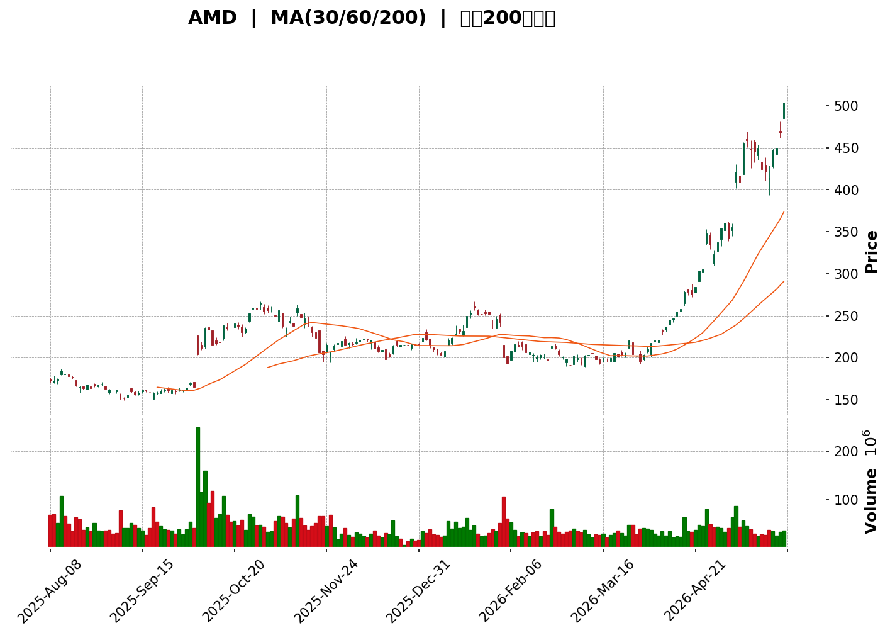
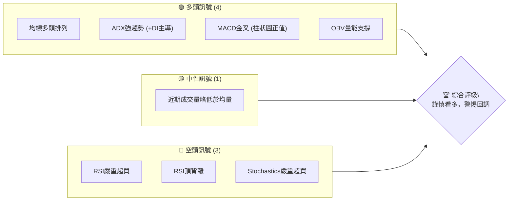
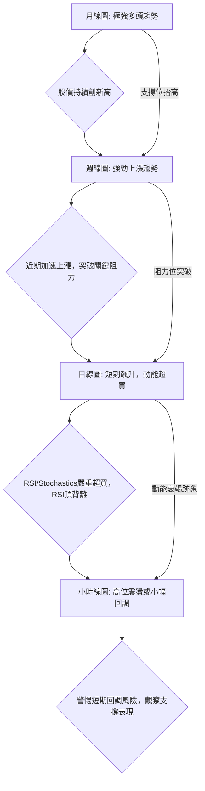
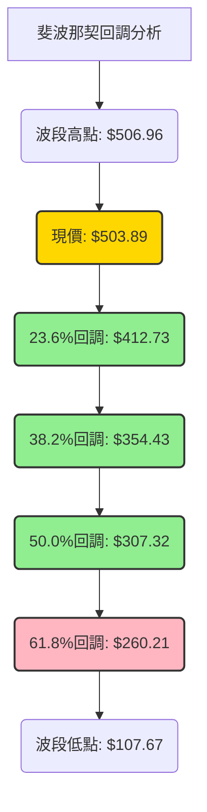
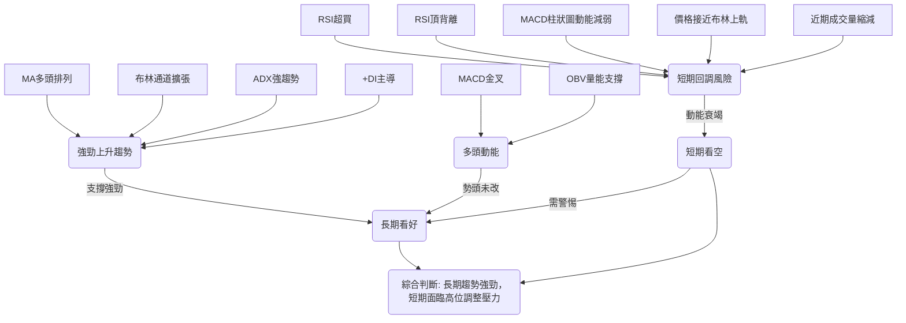
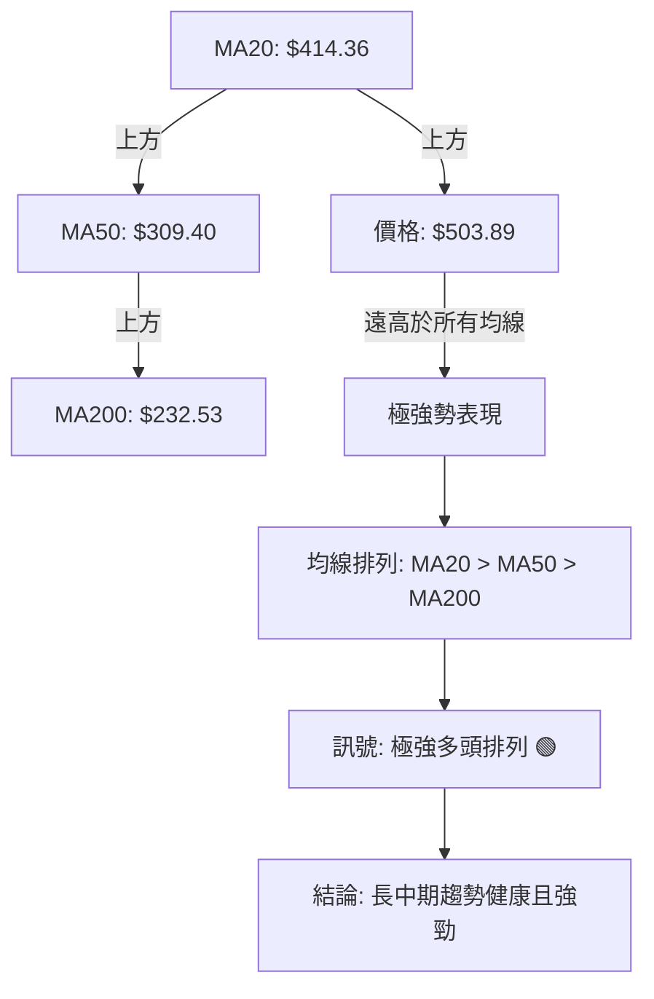

<details>
<summary>📊 靜態圖表 (點擊展開)</summary>

</details>

<html>
<head><meta charset="utf-8" /></head>
<body>
    <div>                        <script>window.PlotlyConfig = {MathJaxConfig: 'local'};</script>
        <script charset="utf-8" src="https://cdn.plot.ly/plotly-3.5.0.min.js" integrity="sha256-fHbNLP+GlIXN+efbQec78UkemUz3NJp7UmfGxC1tNxs=" crossorigin="anonymous"></script>                <div id="candlestick-chart" class="plotly-graph-div" style="height:500px; width:100%;"></div>            <script>                window.PLOTLYENV=window.PLOTLYENV || {};                                if (document.getElementById("candlestick-chart")) {                    Plotly.newPlot(                        "candlestick-chart",                        [{"close":{"dtype":"f8","bdata":"AAAA4FGYZUAAAADA9YhlQAAAAGBm3mVAAAAAoHANZ0AAAABgZp5mQAAAAOBRMGZAAAAA4HoEZkAAAACgmdFkQAAAAGBmpmRAAAAAYLh2ZEAAAADgUfhkQAAAACCFa2RAAAAAANfTZEAAAAAAKeRkQAAAAGCPEmVAAAAAAClUZEAAAACAPUpkQAAAAAApRGRAAAAAoEc5ZEAAAADgeuRiQAAAAMAe7WJAAAAAgD16Y0AAAACgR\u002fFjQAAAAKBwdWNAAAAAgD3SY0AAAADAHiVkQAAAAGC4DmRAAAAAwB7lY0AAAACgcL1jQAAAAOB6rGNAAAAAoEf5Y0AAAADAzBxkQAAAAAApHGRAAAAA4KMoZEAAAABguO5jQAAAACCFK2RAAAAAoEc5ZEAAAADgUYBkQAAAACBcN2VAAAAAoHCVZEAAAABguHZpQAAAAOBRcGpAAAAAgOtxbUAAAADgehxtQAAAAMDM3GpAAAAAoHANa0AAAABA4UJrQAAAAEAz021AAAAAgOtRbUAAAABgjyJtQAAAAIDrEW5AAAAAwPXAbUAAAAAgXMdsQAAAACCuX21AAAAAoHCdb0AAAABguDpwQAAAAAApIHBAAAAAoEeFcEAAAABA4dpvQAAAAIDrAXBAAAAAYGY6cEAAAACgmUFvQAAAAKBHBXBAAAAAYGa2bUAAAACgRzFtQAAAACBcf25AAAAA4KOwbUAAAACAPS5wQAAAAGC4\u002fm5AAAAAgOvZbkAAAADgoxBuQAAAAKBHyWxAAAAAoJnxa0AAAADgo8BpQAAAAMD1eGlAAAAAoJnhakAAAAAAKcRpQAAAACCux2pAAAAAwPUwa0AAAADgUXhrQAAAACCu52pAAAAAQDMza0AAAAAgXP9qQAAAAEAKP2tAAAAAIIWja0AAAAAA17NrQAAAAKBwrWtAAAAAgMKta0AAAADA9VhqQAAAAGCP8mlAAAAAoHAlakAAAAAghcNoQAAAAIDrIWlAAAAAgMKtakAAAABgZt5qQAAAAMDM3GpAAAAAoEfhakAAAAAgrt9qQAAAACCF82pAAAAAQOHqakAAAADAHsVqQAAAAEAK72tAAAAAYI+ia0AAAABAM8tqQAAAAOCjQGpAAAAAgMKVaUAAAACgcGVpQAAAAIAU9mlAAAAAQAqfa0AAAABAM\u002fNrQAAAAKBwfWxAAAAAYI\u002f6bEAAAACgcP1sQAAAAKCZOW9AAAAAIFy3b0AAAABA4TpwQAAAAIDraW9AAAAAwPWAb0AAAAAgrpdvQAAAAIDChW9AAAAAIFyXbUAAAADgo8huQAAAACCFQ25AAAAAgBQGaUAAAAAAABBoQAAAAIAUDmpAAAAAAAAAa0AAAACAPbJqQAAAAGCPsmpAAAAAgBS+aUAAAACAPeppQAAAAGCPYmlAAAAAANcDaUAAAAAA12tpQAAAAMDMBGlAAAAAQDOTaEAAAABA4bpqQAAAACCFW2pAAAAAgMJ1aUAAAABguAZpQAAAAADX02hAAAAAYGbeZ0AAAACAPUJpQAAAAGBm7mhAAAAAgMINaEAAAACAwlVpQAAAACBcZ2lAAAAAYI+aaUAAAAAgrrdoQAAAAOB6LGhAAAAAYI+SaEAAAACA64loQAAAAGC47mhAAAAA4KOoaUAAAABgjyppQAAAAIDCVWlAAAAAANeraUAAAADgo4hrQAAAAOCjeGlAAAAAIK4\u002faUAAAACgR4FoQAAAAIDCbWlAAAAAYLhGakAAAAAAADBrQAAAAIDChWtAAAAAwPWwa0AAAACAPfpsQAAAAOB6lG1AAAAAoEehbkAAAABgj9puQAAAAIA94m9AAAAAgOshcEAAAAAAKWRxQAAAAIA9ZnFAAAAAQDMvcUAAAAAA18dxQAAAACBc93JAAAAAoEcVc0AAAADA9bx1QAAAAIAU6nRAAAAAIFwzdEAAAACAwhF1QAAAAADXJ3ZAAAAA4KOIdkAAAADgo1h1QAAAAAApNHZAAAAAgD1WekAAAAAgXId5QAAAAEAKc3xAAAAA4KOsfEAAAADgowR8QAAAAAAA2HtAAAAAQDMbfEAAAACgmYF6QAAAAADXT3pAAAAAwMzgeUAAAACgR\u002fl7QAAAAKBwGXxAAAAAACk4fUAAAACAPX5\u002fQA=="},"high":{"dtype":"f8","bdata":"AAAAIFwPZkAAAACAPVpmQAAAAMAe5WVAAAAAwMxUZ0AAAACAFC5nQAAAAOB6hGZAAAAAoJlZZkAAAACgcKVlQAAAAMDM1GRAAAAAACm8ZEAAAADA9RBlQAAAAEDhsmRAAAAA4KM4ZUAAAACAwvVkQAAAACCuX2VAAAAAgD0SZUAAAADgekxkQAAAAAAAmGRAAAAAoJlBZEAAAADgeqRjQAAAAOB6FGNAAAAAwB6VY0AAAADA9ZBkQAAAAGC4BmRAAAAAwB4NZEAAAACgmUlkQAAAAGBmPmRAAAAAACk0ZEAAAADgo9hjQAAAAEDh+mNAAAAAgMJVZEAAAADgemxkQAAAAEAzo2RAAAAAACk0ZEAAAAAghUNkQAAAAKCZiWRAAAAAwPVIZEAAAACAwoVkQAAAAIDrYWVAAAAAgMJVZUAAAABguFZsQAAAAMDMXGtAAAAAANd7bUAAAABAMwNuQAAAAEAKR21AAAAAgBQGbEAAAAAgXB9sQAAAACCu521AAAAAYGYmbkAAAAAAKWxtQAAAAAApXG5AAAAA4FFIbkAAAAAAKQRuQAAAAMDMfG1AAAAA4Hqsb0AAAABguEZwQAAAAKBHiXBAAAAAoEexcEAAAACAFH5wQAAAAIAUYnBAAAAAYI9OcEAAAACAFBZwQAAAAGBmOnBAAAAA4FGwb0AAAAAA13ttQAAAAMDMHG9AAAAAYLgOb0AAAAAAKXhwQAAAAIAUOnBAAAAAgBSub0AAAADgoxhvQAAAAAAAwG1AAAAAwPVobUAAAAAAAEhtQAAAAGCPGmpAAAAAACkka0AAAABgj9JpQAAAAEDh8mpAAAAAoJlJa0AAAAAgXJ9rQAAAACBcP2xAAAAAYGZGa0AAAAAA12NrQAAAAOB69GtAAAAAYLj2a0AAAABA4RpsQAAAACCF02tAAAAAAACwa0AAAAAgrs9rQAAAACCF62pAAAAAQApHakAAAAAAAHBqQAAAACCFy2lAAAAAgMLlakAAAACgcIVrQAAAAMD1IGtAAAAAoEcRa0AAAABgjxprQAAAAKCZAWtAAAAAgD0aa0AAAADgejRrQAAAAMDMZGxAAAAA4KNAbUAAAACgcN1rQAAAAAAphGpAAAAAgBReakAAAACgmelpQAAAAAApPGpAAAAAIIXja0AAAABA4QJsQAAAAEAzy21AAAAAIK5PbUAAAAAAAPBtQAAAAMDMnG9AAAAAoEcBcEAAAAAgXK9wQAAAAOCjJHBAAAAAoJnxb0AAAABgZhZwQAAAAOB6SHBAAAAAIK6nbkAAAABACj9vQAAAAMDMlG9AAAAAYI9Sa0AAAACgR4FpQAAAAOCjKGpAAAAAQDMza0AAAADgemxrQAAAAMDMdGtAAAAAYLhOa0AAAACgmUFqQAAAAKCZqWlAAAAAYGZmaUAAAABAM4NpQAAAAADXm2lAAAAAACnsaEAAAABguBZrQAAAAGBmFmtAAAAAoEc5akAAAADgejxpQAAAACCu12hAAAAA4Ho0aEAAAACAFE5pQAAAAKBHeWlAAAAAIK4HaUAAAABACl9pQAAAAEDh0mlAAAAAYLgmakAAAAAA13NpQAAAAIDC9WhAAAAAoHAFaUAAAABguOZoQAAAACCFW2lAAAAAACm8aUAAAACgmclpQAAAACCFI2pAAAAAgMLNaUAAAABgj6prQAAAAAAAoGtAAAAA4KNoaUAAAACAwg1qQAAAAAAAgGlAAAAAYI+6akAAAADA9ThrQAAAAIDrSWxAAAAAQDPDa0AAAAAAAEBtQAAAAEAzo21AAAAAYI8yb0AAAABgj+puQAAAAGC47m9AAAAAQOEicEAAAACgcHVxQAAAAMDMkHFAAAAAgML5cUAAAABAM+NxQAAAAAAABHNAAAAAIIVjc0AAAAAA1w92QAAAACBc03VAAAAAAAB4dEAAAABguEJ1QAAAACBcL3ZAAAAA4KOsdkAAAACgmZ12QAAAAMAeeXZAAAAAoJnpekAAAAAgXFt6QAAAAOCjhHxAAAAAIIVTfUAAAADAzKx8QAAAAAAAuHxAAAAAwPVUfEAAAAAAAHB7QAAAAMDMbHtAAAAAAADMekAAAACAPRZ8QAAAAEAzM3xAAAAAYI8WfkAAAAAgXK9\u002fQA=="},"hovertemplate":"\u003cb\u003e%{x|%Y-%m-%d}\u003c\u002fb\u003e\u003cbr\u003e\u958b: $%{open:.2f}\u003cbr\u003e\u9ad8: $%{high:.2f}\u003cbr\u003e\u4f4e: $%{low:.2f}\u003cbr\u003e\u6536: $%{close:.2f}\u003cextra\u003e\u003c\u002fextra\u003e","low":{"dtype":"f8","bdata":"AAAA4KNQZUAAAAAAKSxlQAAAAAAAEGVAAAAAAClsZkAAAACA63FmQAAAAAAACGZAAAAAIIXLZUAAAABAM8NkQAAAAAAAyGNAAAAA4FFIZEAAAACgmTlkQAAAAEAKN2RAAAAAwB6dZEAAAADAzJRkQAAAAMDM1GRAAAAAwMw8ZEAAAAAA15NjQAAAAGCPEmRAAAAAoEe5Y0AAAACAwsViQAAAAEAKp2JAAAAAgML9YkAAAAAAAMBjQAAAACCuX2NAAAAAoHBdY0AAAABAM7NjQAAAAEAK52NAAAAA4FF4Y0AAAABAM7tiQAAAAMDMfGNAAAAAoHCtY0AAAABguOZjQAAAAIDCzWNAAAAAwPVYY0AAAACgmaFjQAAAAMDM\u002fGNAAAAAYI\u002fqY0AAAAAgrg9kQAAAAADXw2RAAAAA4HpkZEAAAADgUWBpQAAAAMD1KGpAAAAAYGZWakAAAADA9bBsQAAAAGBmpmpAAAAAwMzcakAAAADAzPxqQAAAAOBRmGtAAAAAIK4HbUAAAADAHn1sQAAAAMDMTG1AAAAA4KNAbUAAAAAAKRxsQAAAAKBHkWxAAAAAYGY+bkAAAACgmTlvQAAAAAAAEHBAAAAAYGYWcEAAAACA64lvQAAAAMAerW9AAAAA4Hq8b0AAAADgeuxuQAAAAIDrWW5AAAAAIK53bUAAAADgehRsQAAAAAAAEG5AAAAA4HpUbUAAAAAAAEBvQAAAAIDrwW5AAAAAYI9ibUAAAADAzKRtQAAAAGC4FmxAAAAAYLh2a0AAAADA9ZBpQAAAAAAAYGhAAAAAQDO7aUAAAADA9UhoQAAAAAAA4GlAAAAA4KPAakAAAAAAALBqQAAAAOB6zGpAAAAA4KN4akAAAADgesRqQAAAACCuB2tAAAAAIIVLa0AAAADAHj1rQAAAAKBwVWtAAAAAgBRGakAAAACA6yFqQAAAAGCP0mlAAAAAIIWjaUAAAADA9bBoQAAAAAAAEGlAAAAAYGaGaUAAAACA66lqQAAAAMD1iGpAAAAAQAq\u002fakAAAADA9aBqQAAAACCuJ2pAAAAAYI\u002fKakAAAACgmblqQAAAAMDMXGtAAAAAIFyPa0AAAAAAAGhqQAAAAKBw5WlAAAAAYI9qaUAAAACAPWJpQAAAAKCZ+WhAAAAAIFzfakAAAAAgheNqQAAAAEAKZ2xAAAAAIIWbbEAAAADAHi1sQAAAAMD1eG1AAAAAACnUbkAAAAAAAARwQAAAAKCZSW9AAAAAYLj+bkAAAABguEZvQAAAAMAeHW5AAAAAoJlRbUAAAAAAAGBtQAAAAKBHoW1AAAAAwMzkaEAAAABACtdnQAAAAIDCjWhAAAAAwMyEaUAAAAAAKaRqQAAAAGC4JmpAAAAA4HqkaUAAAAAAKXxpQAAAAGCPWmhAAAAAAABgaEAAAACgR8loQAAAAIDr0WhAAAAAwMxEaEAAAAAAANBpQAAAAGCPSmpAAAAAYLguaUAAAAAgrrdoQAAAAAAAwGdAAAAAQAqHZ0AAAAAghbtnQAAAAAApXGhAAAAAAADoZ0AAAADgo6BnQAAAAGBmRmlAAAAAACl0aUAAAACgcJVoQAAAAOCjCGhAAAAAoJlZaEAAAADgUWhoQAAAAAAAeGhAAAAAYI8aaEAAAADgUchoQAAAAGC4NmlAAAAAACkEaUAAAADgUXBqQAAAAIDCbWlAAAAAgBS2aEAAAAAA1xtoQAAAAMAejWhAAAAAQOG6aUAAAAAA1xNpQAAAACBcN2tAAAAAACnsakAAAABA4WJsQAAAAMAe3WxAAAAAYLjebUAAAADA9UBuQAAAAGBmtm5AAAAAQDN7b0AAAAAAKVhwQAAAAIA9InFAAAAAAAAAcUAAAACA60lxQAAAAIA94nFAAAAAACm8ckAAAADgo+h0QAAAAMD1jHRAAAAAAABgc0AAAACAwu1zQAAAAKCZyXRAAAAAAADUdUAAAABAMyt1QAAAAIAUjnVAAAAA4KMgeUAAAACgRxF5QAAAAOCjJHpAAAAAgBQufEAAAACAwqF6QAAAAGBmCntAAAAAQOE6e0AAAACAwnV6QAAAACBcq3lAAAAAgMKVeEAAAADAzKB6QAAAAKCZ+XpAAAAAIFzbfEAAAAAgrgN+QA=="},"name":"\u50f9\u683c","open":{"dtype":"f8","bdata":"AAAAoEfBZUAAAACgR0FlQAAAAIA9qmVAAAAAwB59ZkAAAABgj3pmQAAAAIDrgWZAAAAA4FEYZkAAAABAM6NlQAAAAEAzg2RAAAAAIIW7ZEAAAACgcEVkQAAAAKCZsWRAAAAAwMwUZUAAAACgR8FkQAAAAAAAEGVAAAAAgOvZZEAAAACgcM1jQAAAAIDrOWRAAAAAgBT+Y0AAAAAA16NjQAAAAKCZ+WJAAAAAIK7\u002fYkAAAACgR3FkQAAAAADX02NAAAAAAACgY0AAAADgUQBkQAAAAADXK2RAAAAAwPXoY0AAAABguN5iQAAAAAAprGNAAAAAoHCtY0AAAADgoxBkQAAAACBcX2RAAAAA4HqkY0AAAADgoxBkQAAAAADXA2RAAAAAoEcZZEAAAACAwh1kQAAAAIDCFWVAAAAAgMJVZUAAAABgZk5sQAAAAEAz22pAAAAAYGaeakAAAACgmYltQAAAAOCjGG1AAAAAYGaGa0AAAABgZmZrQAAAAGC41mtAAAAAoEeJbUAAAADgUShtQAAAAEAKj21AAAAA4HrsbUAAAABAM5ttQAAAAMAexWxAAAAAIIVrbkAAAACAFB5wQAAAAIA9MnBAAAAAQAqDcEAAAABguD5wQAAAAKCZOXBAAAAAoEc1cEAAAABAM0tvQAAAACCuZ25AAAAAQAqvb0AAAACAFN5sQAAAAOB6RG5AAAAAwB41bkAAAAAAKaRvQAAAAMDMfG9AAAAAIIUDbkAAAAAAAFhuQAAAAMD1mG1AAAAA4FHIbEAAAABgZhZtQAAAAIDrGWpAAAAAwB7laUAAAAAgXC9pQAAAAKCZQWpAAAAA4HoEa0AAAAAAKbxqQAAAAKBHuWtAAAAA4FEIa0AAAAAAKRxrQAAAAKBwJWtAAAAAQOFia0AAAACgR6FrQAAAAAAAwGtAAAAAgOs5a0AAAAAA10trQAAAAMD1iGpAAAAAoHDdaUAAAACgR0FqQAAAAIA9emlAAAAAQDOTaUAAAAAAAIBrQAAAACCFm2pAAAAAIFzfakAAAACAwu1qQAAAAGCPcmpAAAAAANf7akAAAACAPfpqQAAAAMDMXGtAAAAAAADIbEAAAABguNZrQAAAAAAphGpAAAAAwMxcakAAAABACrdpQAAAAIDCJWlAAAAAQDPjakAAAACgRzFrQAAAAMDMfGxAAAAAoJlJbUAAAABgj0JsQAAAACCuf21AAAAAAAB4b0AAAABA4VJwQAAAAAAADHBAAAAAwB6Fb0AAAAAAKcRvQAAAAMAe1W9AAAAAgMKdbUAAAADgo3htQAAAAKCZcW9AAAAAAADgakAAAAAghTtpQAAAAAAppGhAAAAAwMzcaUAAAADgeuRqQAAAAAApPGtAAAAAYI\u002f6akAAAADgo4BpQAAAAMDMRGlAAAAAwB7NaEAAAAAghQNpQAAAAADXA2lAAAAAQOHCaEAAAAAAKXRqQAAAAIA92mpAAAAAoJkZakAAAAAghQNpQAAAAEAzO2hAAAAAYLjuZ0AAAAAA1wNoQAAAAOCjuGhAAAAA4KNoaEAAAAAghatnQAAAAOBRUGlAAAAAIIWjaUAAAABgj1ppQAAAACCFw2hAAAAAIFxfaEAAAACAwpVoQAAAAAAAgGhAAAAAwPVgaEAAAADgepxpQAAAAMDMzGlAAAAA4HosaUAAAADgUXBqQAAAACBcP2tAAAAA4KM4aUAAAABgZp5pQAAAAKCZwWhAAAAAQOHyaUAAAACgmYFpQAAAAMD1aGtAAAAA4FFIa0AAAAAA1wNtQAAAAOBRIG1AAAAAAADgbUAAAADA9aBuQAAAAKBHOW9AAAAAYLjeb0AAAAAA149wQAAAAAAAkHFAAAAAoJmJcUAAAACgR1VxQAAAACCFM3JAAAAAACngckAAAAAAKQx1QAAAAMAepXVAAAAAgMJ9c0AAAACgR2l0QAAAAIDCVXVAAAAAgOv9dUAAAADA9YR2QAAAAAAp+HVAAAAAANeXeUAAAADAHhF6QAAAAKBwKXpAAAAAwMzIfEAAAAAAABR8QAAAAOCjkHxAAAAAoJmJe0AAAACgcBV7QAAAAAAA2HpAAAAAoJnJeUAAAADgo8B6QAAAAADXn3tAAAAAoHBdfUAAAADAS0t+QA=="},"x":["2025-08-08T00:00:00-04:00","2025-08-11T00:00:00-04:00","2025-08-12T00:00:00-04:00","2025-08-13T00:00:00-04:00","2025-08-14T00:00:00-04:00","2025-08-15T00:00:00-04:00","2025-08-18T00:00:00-04:00","2025-08-19T00:00:00-04:00","2025-08-20T00:00:00-04:00","2025-08-21T00:00:00-04:00","2025-08-22T00:00:00-04:00","2025-08-25T00:00:00-04:00","2025-08-26T00:00:00-04:00","2025-08-27T00:00:00-04:00","2025-08-28T00:00:00-04:00","2025-08-29T00:00:00-04:00","2025-09-02T00:00:00-04:00","2025-09-03T00:00:00-04:00","2025-09-04T00:00:00-04:00","2025-09-05T00:00:00-04:00","2025-09-08T00:00:00-04:00","2025-09-09T00:00:00-04:00","2025-09-10T00:00:00-04:00","2025-09-11T00:00:00-04:00","2025-09-12T00:00:00-04:00","2025-09-15T00:00:00-04:00","2025-09-16T00:00:00-04:00","2025-09-17T00:00:00-04:00","2025-09-18T00:00:00-04:00","2025-09-19T00:00:00-04:00","2025-09-22T00:00:00-04:00","2025-09-23T00:00:00-04:00","2025-09-24T00:00:00-04:00","2025-09-25T00:00:00-04:00","2025-09-26T00:00:00-04:00","2025-09-29T00:00:00-04:00","2025-09-30T00:00:00-04:00","2025-10-01T00:00:00-04:00","2025-10-02T00:00:00-04:00","2025-10-03T00:00:00-04:00","2025-10-06T00:00:00-04:00","2025-10-07T00:00:00-04:00","2025-10-08T00:00:00-04:00","2025-10-09T00:00:00-04:00","2025-10-10T00:00:00-04:00","2025-10-13T00:00:00-04:00","2025-10-14T00:00:00-04:00","2025-10-15T00:00:00-04:00","2025-10-16T00:00:00-04:00","2025-10-17T00:00:00-04:00","2025-10-20T00:00:00-04:00","2025-10-21T00:00:00-04:00","2025-10-22T00:00:00-04:00","2025-10-23T00:00:00-04:00","2025-10-24T00:00:00-04:00","2025-10-27T00:00:00-04:00","2025-10-28T00:00:00-04:00","2025-10-29T00:00:00-04:00","2025-10-30T00:00:00-04:00","2025-10-31T00:00:00-04:00","2025-11-03T00:00:00-05:00","2025-11-04T00:00:00-05:00","2025-11-05T00:00:00-05:00","2025-11-06T00:00:00-05:00","2025-11-07T00:00:00-05:00","2025-11-10T00:00:00-05:00","2025-11-11T00:00:00-05:00","2025-11-12T00:00:00-05:00","2025-11-13T00:00:00-05:00","2025-11-14T00:00:00-05:00","2025-11-17T00:00:00-05:00","2025-11-18T00:00:00-05:00","2025-11-19T00:00:00-05:00","2025-11-20T00:00:00-05:00","2025-11-21T00:00:00-05:00","2025-11-24T00:00:00-05:00","2025-11-25T00:00:00-05:00","2025-11-26T00:00:00-05:00","2025-11-28T00:00:00-05:00","2025-12-01T00:00:00-05:00","2025-12-02T00:00:00-05:00","2025-12-03T00:00:00-05:00","2025-12-04T00:00:00-05:00","2025-12-05T00:00:00-05:00","2025-12-08T00:00:00-05:00","2025-12-09T00:00:00-05:00","2025-12-10T00:00:00-05:00","2025-12-11T00:00:00-05:00","2025-12-12T00:00:00-05:00","2025-12-15T00:00:00-05:00","2025-12-16T00:00:00-05:00","2025-12-17T00:00:00-05:00","2025-12-18T00:00:00-05:00","2025-12-19T00:00:00-05:00","2025-12-22T00:00:00-05:00","2025-12-23T00:00:00-05:00","2025-12-24T00:00:00-05:00","2025-12-26T00:00:00-05:00","2025-12-29T00:00:00-05:00","2025-12-30T00:00:00-05:00","2025-12-31T00:00:00-05:00","2026-01-02T00:00:00-05:00","2026-01-05T00:00:00-05:00","2026-01-06T00:00:00-05:00","2026-01-07T00:00:00-05:00","2026-01-08T00:00:00-05:00","2026-01-09T00:00:00-05:00","2026-01-12T00:00:00-05:00","2026-01-13T00:00:00-05:00","2026-01-14T00:00:00-05:00","2026-01-15T00:00:00-05:00","2026-01-16T00:00:00-05:00","2026-01-20T00:00:00-05:00","2026-01-21T00:00:00-05:00","2026-01-22T00:00:00-05:00","2026-01-23T00:00:00-05:00","2026-01-26T00:00:00-05:00","2026-01-27T00:00:00-05:00","2026-01-28T00:00:00-05:00","2026-01-29T00:00:00-05:00","2026-01-30T00:00:00-05:00","2026-02-02T00:00:00-05:00","2026-02-03T00:00:00-05:00","2026-02-04T00:00:00-05:00","2026-02-05T00:00:00-05:00","2026-02-06T00:00:00-05:00","2026-02-09T00:00:00-05:00","2026-02-10T00:00:00-05:00","2026-02-11T00:00:00-05:00","2026-02-12T00:00:00-05:00","2026-02-13T00:00:00-05:00","2026-02-17T00:00:00-05:00","2026-02-18T00:00:00-05:00","2026-02-19T00:00:00-05:00","2026-02-20T00:00:00-05:00","2026-02-23T00:00:00-05:00","2026-02-24T00:00:00-05:00","2026-02-25T00:00:00-05:00","2026-02-26T00:00:00-05:00","2026-02-27T00:00:00-05:00","2026-03-02T00:00:00-05:00","2026-03-03T00:00:00-05:00","2026-03-04T00:00:00-05:00","2026-03-05T00:00:00-05:00","2026-03-06T00:00:00-05:00","2026-03-09T00:00:00-04:00","2026-03-10T00:00:00-04:00","2026-03-11T00:00:00-04:00","2026-03-12T00:00:00-04:00","2026-03-13T00:00:00-04:00","2026-03-16T00:00:00-04:00","2026-03-17T00:00:00-04:00","2026-03-18T00:00:00-04:00","2026-03-19T00:00:00-04:00","2026-03-20T00:00:00-04:00","2026-03-23T00:00:00-04:00","2026-03-24T00:00:00-04:00","2026-03-25T00:00:00-04:00","2026-03-26T00:00:00-04:00","2026-03-27T00:00:00-04:00","2026-03-30T00:00:00-04:00","2026-03-31T00:00:00-04:00","2026-04-01T00:00:00-04:00","2026-04-02T00:00:00-04:00","2026-04-06T00:00:00-04:00","2026-04-07T00:00:00-04:00","2026-04-08T00:00:00-04:00","2026-04-09T00:00:00-04:00","2026-04-10T00:00:00-04:00","2026-04-13T00:00:00-04:00","2026-04-14T00:00:00-04:00","2026-04-15T00:00:00-04:00","2026-04-16T00:00:00-04:00","2026-04-17T00:00:00-04:00","2026-04-20T00:00:00-04:00","2026-04-21T00:00:00-04:00","2026-04-22T00:00:00-04:00","2026-04-23T00:00:00-04:00","2026-04-24T00:00:00-04:00","2026-04-27T00:00:00-04:00","2026-04-28T00:00:00-04:00","2026-04-29T00:00:00-04:00","2026-04-30T00:00:00-04:00","2026-05-01T00:00:00-04:00","2026-05-04T00:00:00-04:00","2026-05-05T00:00:00-04:00","2026-05-06T00:00:00-04:00","2026-05-07T00:00:00-04:00","2026-05-08T00:00:00-04:00","2026-05-11T00:00:00-04:00","2026-05-12T00:00:00-04:00","2026-05-13T00:00:00-04:00","2026-05-14T00:00:00-04:00","2026-05-15T00:00:00-04:00","2026-05-18T00:00:00-04:00","2026-05-19T00:00:00-04:00","2026-05-20T00:00:00-04:00","2026-05-21T00:00:00-04:00","2026-05-22T00:00:00-04:00","2026-05-26T00:00:00-04:00"],"type":"candlestick"},{"hovertemplate":"MA30: $%{y:.2f}\u003cextra\u003e\u003c\u002fextra\u003e","line":{"color":"#2196F3","dash":"dash","width":2},"mode":"lines","name":"MA30","x":["2025-08-08T00:00:00-04:00","2025-08-11T00:00:00-04:00","2025-08-12T00:00:00-04:00","2025-08-13T00:00:00-04:00","2025-08-14T00:00:00-04:00","2025-08-15T00:00:00-04:00","2025-08-18T00:00:00-04:00","2025-08-19T00:00:00-04:00","2025-08-20T00:00:00-04:00","2025-08-21T00:00:00-04:00","2025-08-22T00:00:00-04:00","2025-08-25T00:00:00-04:00","2025-08-26T00:00:00-04:00","2025-08-27T00:00:00-04:00","2025-08-28T00:00:00-04:00","2025-08-29T00:00:00-04:00","2025-09-02T00:00:00-04:00","2025-09-03T00:00:00-04:00","2025-09-04T00:00:00-04:00","2025-09-05T00:00:00-04:00","2025-09-08T00:00:00-04:00","2025-09-09T00:00:00-04:00","2025-09-10T00:00:00-04:00","2025-09-11T00:00:00-04:00","2025-09-12T00:00:00-04:00","2025-09-15T00:00:00-04:00","2025-09-16T00:00:00-04:00","2025-09-17T00:00:00-04:00","2025-09-18T00:00:00-04:00","2025-09-19T00:00:00-04:00","2025-09-22T00:00:00-04:00","2025-09-23T00:00:00-04:00","2025-09-24T00:00:00-04:00","2025-09-25T00:00:00-04:00","2025-09-26T00:00:00-04:00","2025-09-29T00:00:00-04:00","2025-09-30T00:00:00-04:00","2025-10-01T00:00:00-04:00","2025-10-02T00:00:00-04:00","2025-10-03T00:00:00-04:00","2025-10-06T00:00:00-04:00","2025-10-07T00:00:00-04:00","2025-10-08T00:00:00-04:00","2025-10-09T00:00:00-04:00","2025-10-10T00:00:00-04:00","2025-10-13T00:00:00-04:00","2025-10-14T00:00:00-04:00","2025-10-15T00:00:00-04:00","2025-10-16T00:00:00-04:00","2025-10-17T00:00:00-04:00","2025-10-20T00:00:00-04:00","2025-10-21T00:00:00-04:00","2025-10-22T00:00:00-04:00","2025-10-23T00:00:00-04:00","2025-10-24T00:00:00-04:00","2025-10-27T00:00:00-04:00","2025-10-28T00:00:00-04:00","2025-10-29T00:00:00-04:00","2025-10-30T00:00:00-04:00","2025-10-31T00:00:00-04:00","2025-11-03T00:00:00-05:00","2025-11-04T00:00:00-05:00","2025-11-05T00:00:00-05:00","2025-11-06T00:00:00-05:00","2025-11-07T00:00:00-05:00","2025-11-10T00:00:00-05:00","2025-11-11T00:00:00-05:00","2025-11-12T00:00:00-05:00","2025-11-13T00:00:00-05:00","2025-11-14T00:00:00-05:00","2025-11-17T00:00:00-05:00","2025-11-18T00:00:00-05:00","2025-11-19T00:00:00-05:00","2025-11-20T00:00:00-05:00","2025-11-21T00:00:00-05:00","2025-11-24T00:00:00-05:00","2025-11-25T00:00:00-05:00","2025-11-26T00:00:00-05:00","2025-11-28T00:00:00-05:00","2025-12-01T00:00:00-05:00","2025-12-02T00:00:00-05:00","2025-12-03T00:00:00-05:00","2025-12-04T00:00:00-05:00","2025-12-05T00:00:00-05:00","2025-12-08T00:00:00-05:00","2025-12-09T00:00:00-05:00","2025-12-10T00:00:00-05:00","2025-12-11T00:00:00-05:00","2025-12-12T00:00:00-05:00","2025-12-15T00:00:00-05:00","2025-12-16T00:00:00-05:00","2025-12-17T00:00:00-05:00","2025-12-18T00:00:00-05:00","2025-12-19T00:00:00-05:00","2025-12-22T00:00:00-05:00","2025-12-23T00:00:00-05:00","2025-12-24T00:00:00-05:00","2025-12-26T00:00:00-05:00","2025-12-29T00:00:00-05:00","2025-12-30T00:00:00-05:00","2025-12-31T00:00:00-05:00","2026-01-02T00:00:00-05:00","2026-01-05T00:00:00-05:00","2026-01-06T00:00:00-05:00","2026-01-07T00:00:00-05:00","2026-01-08T00:00:00-05:00","2026-01-09T00:00:00-05:00","2026-01-12T00:00:00-05:00","2026-01-13T00:00:00-05:00","2026-01-14T00:00:00-05:00","2026-01-15T00:00:00-05:00","2026-01-16T00:00:00-05:00","2026-01-20T00:00:00-05:00","2026-01-21T00:00:00-05:00","2026-01-22T00:00:00-05:00","2026-01-23T00:00:00-05:00","2026-01-26T00:00:00-05:00","2026-01-27T00:00:00-05:00","2026-01-28T00:00:00-05:00","2026-01-29T00:00:00-05:00","2026-01-30T00:00:00-05:00","2026-02-02T00:00:00-05:00","2026-02-03T00:00:00-05:00","2026-02-04T00:00:00-05:00","2026-02-05T00:00:00-05:00","2026-02-06T00:00:00-05:00","2026-02-09T00:00:00-05:00","2026-02-10T00:00:00-05:00","2026-02-11T00:00:00-05:00","2026-02-12T00:00:00-05:00","2026-02-13T00:00:00-05:00","2026-02-17T00:00:00-05:00","2026-02-18T00:00:00-05:00","2026-02-19T00:00:00-05:00","2026-02-20T00:00:00-05:00","2026-02-23T00:00:00-05:00","2026-02-24T00:00:00-05:00","2026-02-25T00:00:00-05:00","2026-02-26T00:00:00-05:00","2026-02-27T00:00:00-05:00","2026-03-02T00:00:00-05:00","2026-03-03T00:00:00-05:00","2026-03-04T00:00:00-05:00","2026-03-05T00:00:00-05:00","2026-03-06T00:00:00-05:00","2026-03-09T00:00:00-04:00","2026-03-10T00:00:00-04:00","2026-03-11T00:00:00-04:00","2026-03-12T00:00:00-04:00","2026-03-13T00:00:00-04:00","2026-03-16T00:00:00-04:00","2026-03-17T00:00:00-04:00","2026-03-18T00:00:00-04:00","2026-03-19T00:00:00-04:00","2026-03-20T00:00:00-04:00","2026-03-23T00:00:00-04:00","2026-03-24T00:00:00-04:00","2026-03-25T00:00:00-04:00","2026-03-26T00:00:00-04:00","2026-03-27T00:00:00-04:00","2026-03-30T00:00:00-04:00","2026-03-31T00:00:00-04:00","2026-04-01T00:00:00-04:00","2026-04-02T00:00:00-04:00","2026-04-06T00:00:00-04:00","2026-04-07T00:00:00-04:00","2026-04-08T00:00:00-04:00","2026-04-09T00:00:00-04:00","2026-04-10T00:00:00-04:00","2026-04-13T00:00:00-04:00","2026-04-14T00:00:00-04:00","2026-04-15T00:00:00-04:00","2026-04-16T00:00:00-04:00","2026-04-17T00:00:00-04:00","2026-04-20T00:00:00-04:00","2026-04-21T00:00:00-04:00","2026-04-22T00:00:00-04:00","2026-04-23T00:00:00-04:00","2026-04-24T00:00:00-04:00","2026-04-27T00:00:00-04:00","2026-04-28T00:00:00-04:00","2026-04-29T00:00:00-04:00","2026-04-30T00:00:00-04:00","2026-05-01T00:00:00-04:00","2026-05-04T00:00:00-04:00","2026-05-05T00:00:00-04:00","2026-05-06T00:00:00-04:00","2026-05-07T00:00:00-04:00","2026-05-08T00:00:00-04:00","2026-05-11T00:00:00-04:00","2026-05-12T00:00:00-04:00","2026-05-13T00:00:00-04:00","2026-05-14T00:00:00-04:00","2026-05-15T00:00:00-04:00","2026-05-18T00:00:00-04:00","2026-05-19T00:00:00-04:00","2026-05-20T00:00:00-04:00","2026-05-21T00:00:00-04:00","2026-05-22T00:00:00-04:00","2026-05-26T00:00:00-04:00"],"y":{"dtype":"f8","bdata":"AAAAAAAA+H8AAAAAAAD4fwAAAAAAAPh\u002fAAAAAAAA+H8AAAAAAAD4fwAAAAAAAPh\u002fAAAAAAAA+H8AAAAAAAD4fwAAAAAAAPh\u002fAAAAAAAA+H8AAAAAAAD4fwAAAAAAAPh\u002fAAAAAAAA+H8AAAAAAAD4fwAAAAAAAPh\u002fAAAAAAAA+H8AAAAAAAD4fwAAAAAAAPh\u002fAAAAAAAA+H8AAAAAAAD4fwAAAAAAAPh\u002fAAAAAAAA+H8AAAAAAAD4fwAAAAAAAPh\u002fAAAAAAAA+H8AAAAAAAD4fwAAAAAAAPh\u002fAAAAAAAA+H8AAAAAAAD4f83MzNyymmRAAAAAMN2MZEAAAACwuYBkQERERKS3cWRAZmZmJgZZZEAzMzPzGUJkQM3MzOzfMGRAq6qqapEhZEAzMzPT2x5kQBEREdGwI2RAVVVV9bYkZEBVVVW1D0tkQN7d3d1rfmRAVVVVFfXHZEAiIiLyGQ5lQERERGSCP2VAVVVVpeJ4ZUAiIiKSX7RlQKuqqvrwBWZAq6qqCpBTZkAAAAAg96pmQERERAQPCmdAMzMz079hZ0CJiIjoJq1nQO\u002fu7o7CAWhAVVVVZWZmaEAiIiIyes9oQJqZmdmHN2lARERERLanaUAzMzPjFw9qQCIiIsJneGpAIiIiMuziakB3d3cXBEJrQM3MzEzUp2tAiYiIyFr5a0Dv7u6OX0hsQDMzM1OAoGxAq6qqqkfxbEDNzMw8fFZtQO\u002fu7j7uqW1AERER8YsBbkBmZmaGzyhuQHd3d7fXPG5AAAAAMAgwbkAzMzPjXhNuQDMzM2OCB25AmpmZSQwGbkCamZlpSvltQCIiIoJO321A7+7uLiTNbUDv7u7u7r5tQDMzM+Pso21AMzMzIyKObUAAAADw7n5tQHd3d1fHbG1Ad3d3F9lKbUBmZmbmQiJtQDMzM2M7+2xARERE1HjNbEAzMzODeZ5sQLy7u9uyamxAREREdNo0bEDv7u5ec\u002f1rQKuqqvp+wmtAZmZmppuoa0B3d3dXx5RrQAAAAJDCdWtAVVVVBchda0BERERk9C5rQO\u002fu7q5yDGtAZmZmRuHqakDNzMw8w85qQM3MzOx8x2pAMzMzc9rEakCJiIgYvc1qQImIiAhl1GpAREREVFXJakDNzMwMLcZqQGZmZnYwv2pAAAAA0NvCakBERERk9MZqQAAAAOB61GpAzczMnKjjakC8u7tLqfRqQCIiIgKdFmtAERERcWg5a0C8u7tbAWJrQCIiIlLjgWtAmpmZKYeia0CrqqoKSc9rQAAAANDb\u002fmtAd3d3h0EcbEC8u7troE9sQO\u002fu7s5pe2xAiYiIaEptbEAAAAAQWFVsQN7d3Q10TmxAMzMzM3pPbEAiIiJy9k1sQO\u002fu7h7MS2xAvLu7S8VBbEBVVVWFeTpsQBEREbG5JGxAZmZmNl4ObEAAAADwpwJsQERERMQg+GtAREREZILva0AzMzMD5PprQCIiIqJF\u002fmtA7+7uTtTra0B3d3dH4dJrQM3MzGygs2tAVVVVdQWIa0C8u7trLmhrQDMzM4N5MmtAZmZmhhbxakCamZm5SbRqQN7d3a0AgWpA7+7u7qdOakBERERE\u002fRNqQN7d3a1H1WlA3t3dDXSqaUBERESkKXVpQJqZmVmrR2lAd3d3hxZNaUBVVVW1gVZpQHd3d9dcUGlAREREJAZFaUAAAACwK0xpQHd3d+e0QWlAq6qqSn49aUCJiIgYdjFpQKuqqqrVMWlAmpmZ6Zg8aUCJiIhYq0tpQO\u002fu7t4IYWlAvLu7a6B7aUCamZkpzo5pQCIiItJNqmlAvLu722vWaUCamZk5JghqQHd3d9dcRGpAq6qqugKMakDe3d2tR91qQBEREZF7MWtAiYiICIGJa0De3d2dxOBrQGZmZhauS2xAiYiISOG2bEBVVVVl9FZtQFVVVVWc7W1AMzMzw650bkC8u7uL3gpvQBERERE8sG9AiYiIkO0qcEB3d3fntHVwQJqZmSkVx3BAiYiIGEs6cUBVVVVNqZ5xQDMzM4PAJHJA3t3dRbatckDv7u7OPjRzQO\u002fu7m5ZtXNAVVVVzRM1dEDv7u6WQ6N0QBEREdlcDnVAZmZmPgp1dUBERESsHOh1QCIiInKvWXZAzczMBFbQdkB3d3dHb1l3QA=="},"type":"scatter"},{"hovertemplate":"MA60: $%{y:.2f}\u003cextra\u003e\u003c\u002fextra\u003e","line":{"color":"#9C27B0","dash":"dash","width":2},"mode":"lines","name":"MA60","x":["2025-08-08T00:00:00-04:00","2025-08-11T00:00:00-04:00","2025-08-12T00:00:00-04:00","2025-08-13T00:00:00-04:00","2025-08-14T00:00:00-04:00","2025-08-15T00:00:00-04:00","2025-08-18T00:00:00-04:00","2025-08-19T00:00:00-04:00","2025-08-20T00:00:00-04:00","2025-08-21T00:00:00-04:00","2025-08-22T00:00:00-04:00","2025-08-25T00:00:00-04:00","2025-08-26T00:00:00-04:00","2025-08-27T00:00:00-04:00","2025-08-28T00:00:00-04:00","2025-08-29T00:00:00-04:00","2025-09-02T00:00:00-04:00","2025-09-03T00:00:00-04:00","2025-09-04T00:00:00-04:00","2025-09-05T00:00:00-04:00","2025-09-08T00:00:00-04:00","2025-09-09T00:00:00-04:00","2025-09-10T00:00:00-04:00","2025-09-11T00:00:00-04:00","2025-09-12T00:00:00-04:00","2025-09-15T00:00:00-04:00","2025-09-16T00:00:00-04:00","2025-09-17T00:00:00-04:00","2025-09-18T00:00:00-04:00","2025-09-19T00:00:00-04:00","2025-09-22T00:00:00-04:00","2025-09-23T00:00:00-04:00","2025-09-24T00:00:00-04:00","2025-09-25T00:00:00-04:00","2025-09-26T00:00:00-04:00","2025-09-29T00:00:00-04:00","2025-09-30T00:00:00-04:00","2025-10-01T00:00:00-04:00","2025-10-02T00:00:00-04:00","2025-10-03T00:00:00-04:00","2025-10-06T00:00:00-04:00","2025-10-07T00:00:00-04:00","2025-10-08T00:00:00-04:00","2025-10-09T00:00:00-04:00","2025-10-10T00:00:00-04:00","2025-10-13T00:00:00-04:00","2025-10-14T00:00:00-04:00","2025-10-15T00:00:00-04:00","2025-10-16T00:00:00-04:00","2025-10-17T00:00:00-04:00","2025-10-20T00:00:00-04:00","2025-10-21T00:00:00-04:00","2025-10-22T00:00:00-04:00","2025-10-23T00:00:00-04:00","2025-10-24T00:00:00-04:00","2025-10-27T00:00:00-04:00","2025-10-28T00:00:00-04:00","2025-10-29T00:00:00-04:00","2025-10-30T00:00:00-04:00","2025-10-31T00:00:00-04:00","2025-11-03T00:00:00-05:00","2025-11-04T00:00:00-05:00","2025-11-05T00:00:00-05:00","2025-11-06T00:00:00-05:00","2025-11-07T00:00:00-05:00","2025-11-10T00:00:00-05:00","2025-11-11T00:00:00-05:00","2025-11-12T00:00:00-05:00","2025-11-13T00:00:00-05:00","2025-11-14T00:00:00-05:00","2025-11-17T00:00:00-05:00","2025-11-18T00:00:00-05:00","2025-11-19T00:00:00-05:00","2025-11-20T00:00:00-05:00","2025-11-21T00:00:00-05:00","2025-11-24T00:00:00-05:00","2025-11-25T00:00:00-05:00","2025-11-26T00:00:00-05:00","2025-11-28T00:00:00-05:00","2025-12-01T00:00:00-05:00","2025-12-02T00:00:00-05:00","2025-12-03T00:00:00-05:00","2025-12-04T00:00:00-05:00","2025-12-05T00:00:00-05:00","2025-12-08T00:00:00-05:00","2025-12-09T00:00:00-05:00","2025-12-10T00:00:00-05:00","2025-12-11T00:00:00-05:00","2025-12-12T00:00:00-05:00","2025-12-15T00:00:00-05:00","2025-12-16T00:00:00-05:00","2025-12-17T00:00:00-05:00","2025-12-18T00:00:00-05:00","2025-12-19T00:00:00-05:00","2025-12-22T00:00:00-05:00","2025-12-23T00:00:00-05:00","2025-12-24T00:00:00-05:00","2025-12-26T00:00:00-05:00","2025-12-29T00:00:00-05:00","2025-12-30T00:00:00-05:00","2025-12-31T00:00:00-05:00","2026-01-02T00:00:00-05:00","2026-01-05T00:00:00-05:00","2026-01-06T00:00:00-05:00","2026-01-07T00:00:00-05:00","2026-01-08T00:00:00-05:00","2026-01-09T00:00:00-05:00","2026-01-12T00:00:00-05:00","2026-01-13T00:00:00-05:00","2026-01-14T00:00:00-05:00","2026-01-15T00:00:00-05:00","2026-01-16T00:00:00-05:00","2026-01-20T00:00:00-05:00","2026-01-21T00:00:00-05:00","2026-01-22T00:00:00-05:00","2026-01-23T00:00:00-05:00","2026-01-26T00:00:00-05:00","2026-01-27T00:00:00-05:00","2026-01-28T00:00:00-05:00","2026-01-29T00:00:00-05:00","2026-01-30T00:00:00-05:00","2026-02-02T00:00:00-05:00","2026-02-03T00:00:00-05:00","2026-02-04T00:00:00-05:00","2026-02-05T00:00:00-05:00","2026-02-06T00:00:00-05:00","2026-02-09T00:00:00-05:00","2026-02-10T00:00:00-05:00","2026-02-11T00:00:00-05:00","2026-02-12T00:00:00-05:00","2026-02-13T00:00:00-05:00","2026-02-17T00:00:00-05:00","2026-02-18T00:00:00-05:00","2026-02-19T00:00:00-05:00","2026-02-20T00:00:00-05:00","2026-02-23T00:00:00-05:00","2026-02-24T00:00:00-05:00","2026-02-25T00:00:00-05:00","2026-02-26T00:00:00-05:00","2026-02-27T00:00:00-05:00","2026-03-02T00:00:00-05:00","2026-03-03T00:00:00-05:00","2026-03-04T00:00:00-05:00","2026-03-05T00:00:00-05:00","2026-03-06T00:00:00-05:00","2026-03-09T00:00:00-04:00","2026-03-10T00:00:00-04:00","2026-03-11T00:00:00-04:00","2026-03-12T00:00:00-04:00","2026-03-13T00:00:00-04:00","2026-03-16T00:00:00-04:00","2026-03-17T00:00:00-04:00","2026-03-18T00:00:00-04:00","2026-03-19T00:00:00-04:00","2026-03-20T00:00:00-04:00","2026-03-23T00:00:00-04:00","2026-03-24T00:00:00-04:00","2026-03-25T00:00:00-04:00","2026-03-26T00:00:00-04:00","2026-03-27T00:00:00-04:00","2026-03-30T00:00:00-04:00","2026-03-31T00:00:00-04:00","2026-04-01T00:00:00-04:00","2026-04-02T00:00:00-04:00","2026-04-06T00:00:00-04:00","2026-04-07T00:00:00-04:00","2026-04-08T00:00:00-04:00","2026-04-09T00:00:00-04:00","2026-04-10T00:00:00-04:00","2026-04-13T00:00:00-04:00","2026-04-14T00:00:00-04:00","2026-04-15T00:00:00-04:00","2026-04-16T00:00:00-04:00","2026-04-17T00:00:00-04:00","2026-04-20T00:00:00-04:00","2026-04-21T00:00:00-04:00","2026-04-22T00:00:00-04:00","2026-04-23T00:00:00-04:00","2026-04-24T00:00:00-04:00","2026-04-27T00:00:00-04:00","2026-04-28T00:00:00-04:00","2026-04-29T00:00:00-04:00","2026-04-30T00:00:00-04:00","2026-05-01T00:00:00-04:00","2026-05-04T00:00:00-04:00","2026-05-05T00:00:00-04:00","2026-05-06T00:00:00-04:00","2026-05-07T00:00:00-04:00","2026-05-08T00:00:00-04:00","2026-05-11T00:00:00-04:00","2026-05-12T00:00:00-04:00","2026-05-13T00:00:00-04:00","2026-05-14T00:00:00-04:00","2026-05-15T00:00:00-04:00","2026-05-18T00:00:00-04:00","2026-05-19T00:00:00-04:00","2026-05-20T00:00:00-04:00","2026-05-21T00:00:00-04:00","2026-05-22T00:00:00-04:00","2026-05-26T00:00:00-04:00"],"y":{"dtype":"f8","bdata":"AAAAAAAA+H8AAAAAAAD4fwAAAAAAAPh\u002fAAAAAAAA+H8AAAAAAAD4fwAAAAAAAPh\u002fAAAAAAAA+H8AAAAAAAD4fwAAAAAAAPh\u002fAAAAAAAA+H8AAAAAAAD4fwAAAAAAAPh\u002fAAAAAAAA+H8AAAAAAAD4fwAAAAAAAPh\u002fAAAAAAAA+H8AAAAAAAD4fwAAAAAAAPh\u002fAAAAAAAA+H8AAAAAAAD4fwAAAAAAAPh\u002fAAAAAAAA+H8AAAAAAAD4fwAAAAAAAPh\u002fAAAAAAAA+H8AAAAAAAD4fwAAAAAAAPh\u002fAAAAAAAA+H8AAAAAAAD4fwAAAAAAAPh\u002fAAAAAAAA+H8AAAAAAAD4fwAAAAAAAPh\u002fAAAAAAAA+H8AAAAAAAD4fwAAAAAAAPh\u002fAAAAAAAA+H8AAAAAAAD4fwAAAAAAAPh\u002fAAAAAAAA+H8AAAAAAAD4fwAAAAAAAPh\u002fAAAAAAAA+H8AAAAAAAD4fwAAAAAAAPh\u002fAAAAAAAA+H8AAAAAAAD4fwAAAAAAAPh\u002fAAAAAAAA+H8AAAAAAAD4fwAAAAAAAPh\u002fAAAAAAAA+H8AAAAAAAD4fwAAAAAAAPh\u002fAAAAAAAA+H8AAAAAAAD4fwAAAAAAAPh\u002fAAAAAAAA+H8AAAAAAAD4f3d3d0+NiWdAERERseS3Z0C8u7vjXuFnQImIiPjFDGhAd3d3dzApaEARERHBPEVoQAAAACCwaGhAq6qqimyJaEAAAAAIrLpoQAAAAIjP5mhAMzMzcyETaUDe3d2d7zlpQKuqqsqhXWlAq6qqov57aUCrqqpqvJBpQLy7u2OCo2lAd3d3d3e\u002faUDe3d391NZpQGZmZr6f8mlAzczMHFoQakB3d3cH8zRqQLy7u\u002fP9VmpAMzMz+\u002fB3akBERETsCpZqQDMzM\u002fNEt2pAZmZmvp\u002fYakBERESM3vhqQGZmZp5hGWtAREREjJc6a0AzMzOzyFZrQO\u002fu7k6NcWtAMzMzU+OLa0AzMzO7u59rQLy7u6MptWtAd3d3N\u002fvQa0AzMzNzk+5rQJqZmXEhC2xAAAAA2IcnbECJiIhQuEJsQO\u002fu7nYwW2xAvLu7mzZ2bECamZlhyXtsQCIiIlIqgmxAmpmZUXF6bEDe3d39jXBsQN7d3bXzbWxA7+7uzrBnbEAzMzO7u19sQERERHw\u002fT2xAd3d3\u002f\u002f9HbECamZmp8UJsQJqZmeEzPGxAAAAAYOU4bEDe3d0dzDlsQM3MzCyyQWxARERExCBCbEAREREhIkJsQKuqqlqPPmxA7+7u\u002fv83bEDv7u5G4TZsQN7d3VXHNGxA3t3d\u002fY0obEBVVVXliSZsQM3MzGT0HmxAd3d3B\u002fMKbEC8u7uzD\u002fVrQO\u002fu7k4b4mtAREREHKHWa0AzMzNrdb5rQO\u002fu7mYfrGtAERERSVOWa0ARERFhnoRrQO\u002fu7k4bdmtAzczMVJxpa0BERESEMmhrQGZmZuZCZmtARERE3Gtca0AAAACIiGBrQERERAy7XmtAd3d3D1hXa0De3d3V6kxrQGZmZqYNRGtAERERCdc1a0C8u7vbay5rQKuqqkKLJGtAvLu7ez8Va0CrqqqKJQtrQAAAAAByAWtAREREjJf4akB3d3cno\u002fFqQO\u002fu7r4R6mpAq6qqylrjakAAAAAIZeJqQERERJSK4WpAAAAAeDDdakCrqqri7NVqQKuqqnJoz2pAvLu7K0DKakAREREREc1qQDMzM4PAxmpAMzMzy6G\u002fakDv7u7O97VqQN7d3a1Hq2pAAAAAkHulakBERESkKadqQJqZmdGUrGpAAAAAaJG1akBmZmYW2cRqQCIiIrpJ1GpAVVVVFSDhakCJiIjAg+1qQCIiIqL++2pAAAAAGAQKa0DNzMwMuyJrQCIiIor6MWtAd3d3x0s9a0C8u7srh0prQCIiImJXZmtAvLu7m8SCa0DNzMzUeLVrQJqZmQFy4WtAiYiIaJEPbEAAAAAYBEBsQFVVVbXze2xARERE1HjRbEAiIiLC9SBtQFVVVZVDb21Aq6qqKs7cbUBVVVUlv0RuQO\u002fu7vaaxW5AMzMza3VMb0AzMzPb+cxvQCIiIiIiJ3BAERERIbBpcECamZmhjKRwQERERKRw33BAIiIiOm0ZcUCJiIjgwVdxQJqZmS1rl3FAVVVV+cXdcUAiIiIywS5yQA=="},"type":"scatter"},{"hovertemplate":"MA200: $%{y:.2f}\u003cextra\u003e\u003c\u002fextra\u003e","line":{"color":"#FF6F00","dash":"solid","width":2},"mode":"lines","name":"MA200","x":["2025-08-08T00:00:00-04:00","2025-08-11T00:00:00-04:00","2025-08-12T00:00:00-04:00","2025-08-13T00:00:00-04:00","2025-08-14T00:00:00-04:00","2025-08-15T00:00:00-04:00","2025-08-18T00:00:00-04:00","2025-08-19T00:00:00-04:00","2025-08-20T00:00:00-04:00","2025-08-21T00:00:00-04:00","2025-08-22T00:00:00-04:00","2025-08-25T00:00:00-04:00","2025-08-26T00:00:00-04:00","2025-08-27T00:00:00-04:00","2025-08-28T00:00:00-04:00","2025-08-29T00:00:00-04:00","2025-09-02T00:00:00-04:00","2025-09-03T00:00:00-04:00","2025-09-04T00:00:00-04:00","2025-09-05T00:00:00-04:00","2025-09-08T00:00:00-04:00","2025-09-09T00:00:00-04:00","2025-09-10T00:00:00-04:00","2025-09-11T00:00:00-04:00","2025-09-12T00:00:00-04:00","2025-09-15T00:00:00-04:00","2025-09-16T00:00:00-04:00","2025-09-17T00:00:00-04:00","2025-09-18T00:00:00-04:00","2025-09-19T00:00:00-04:00","2025-09-22T00:00:00-04:00","2025-09-23T00:00:00-04:00","2025-09-24T00:00:00-04:00","2025-09-25T00:00:00-04:00","2025-09-26T00:00:00-04:00","2025-09-29T00:00:00-04:00","2025-09-30T00:00:00-04:00","2025-10-01T00:00:00-04:00","2025-10-02T00:00:00-04:00","2025-10-03T00:00:00-04:00","2025-10-06T00:00:00-04:00","2025-10-07T00:00:00-04:00","2025-10-08T00:00:00-04:00","2025-10-09T00:00:00-04:00","2025-10-10T00:00:00-04:00","2025-10-13T00:00:00-04:00","2025-10-14T00:00:00-04:00","2025-10-15T00:00:00-04:00","2025-10-16T00:00:00-04:00","2025-10-17T00:00:00-04:00","2025-10-20T00:00:00-04:00","2025-10-21T00:00:00-04:00","2025-10-22T00:00:00-04:00","2025-10-23T00:00:00-04:00","2025-10-24T00:00:00-04:00","2025-10-27T00:00:00-04:00","2025-10-28T00:00:00-04:00","2025-10-29T00:00:00-04:00","2025-10-30T00:00:00-04:00","2025-10-31T00:00:00-04:00","2025-11-03T00:00:00-05:00","2025-11-04T00:00:00-05:00","2025-11-05T00:00:00-05:00","2025-11-06T00:00:00-05:00","2025-11-07T00:00:00-05:00","2025-11-10T00:00:00-05:00","2025-11-11T00:00:00-05:00","2025-11-12T00:00:00-05:00","2025-11-13T00:00:00-05:00","2025-11-14T00:00:00-05:00","2025-11-17T00:00:00-05:00","2025-11-18T00:00:00-05:00","2025-11-19T00:00:00-05:00","2025-11-20T00:00:00-05:00","2025-11-21T00:00:00-05:00","2025-11-24T00:00:00-05:00","2025-11-25T00:00:00-05:00","2025-11-26T00:00:00-05:00","2025-11-28T00:00:00-05:00","2025-12-01T00:00:00-05:00","2025-12-02T00:00:00-05:00","2025-12-03T00:00:00-05:00","2025-12-04T00:00:00-05:00","2025-12-05T00:00:00-05:00","2025-12-08T00:00:00-05:00","2025-12-09T00:00:00-05:00","2025-12-10T00:00:00-05:00","2025-12-11T00:00:00-05:00","2025-12-12T00:00:00-05:00","2025-12-15T00:00:00-05:00","2025-12-16T00:00:00-05:00","2025-12-17T00:00:00-05:00","2025-12-18T00:00:00-05:00","2025-12-19T00:00:00-05:00","2025-12-22T00:00:00-05:00","2025-12-23T00:00:00-05:00","2025-12-24T00:00:00-05:00","2025-12-26T00:00:00-05:00","2025-12-29T00:00:00-05:00","2025-12-30T00:00:00-05:00","2025-12-31T00:00:00-05:00","2026-01-02T00:00:00-05:00","2026-01-05T00:00:00-05:00","2026-01-06T00:00:00-05:00","2026-01-07T00:00:00-05:00","2026-01-08T00:00:00-05:00","2026-01-09T00:00:00-05:00","2026-01-12T00:00:00-05:00","2026-01-13T00:00:00-05:00","2026-01-14T00:00:00-05:00","2026-01-15T00:00:00-05:00","2026-01-16T00:00:00-05:00","2026-01-20T00:00:00-05:00","2026-01-21T00:00:00-05:00","2026-01-22T00:00:00-05:00","2026-01-23T00:00:00-05:00","2026-01-26T00:00:00-05:00","2026-01-27T00:00:00-05:00","2026-01-28T00:00:00-05:00","2026-01-29T00:00:00-05:00","2026-01-30T00:00:00-05:00","2026-02-02T00:00:00-05:00","2026-02-03T00:00:00-05:00","2026-02-04T00:00:00-05:00","2026-02-05T00:00:00-05:00","2026-02-06T00:00:00-05:00","2026-02-09T00:00:00-05:00","2026-02-10T00:00:00-05:00","2026-02-11T00:00:00-05:00","2026-02-12T00:00:00-05:00","2026-02-13T00:00:00-05:00","2026-02-17T00:00:00-05:00","2026-02-18T00:00:00-05:00","2026-02-19T00:00:00-05:00","2026-02-20T00:00:00-05:00","2026-02-23T00:00:00-05:00","2026-02-24T00:00:00-05:00","2026-02-25T00:00:00-05:00","2026-02-26T00:00:00-05:00","2026-02-27T00:00:00-05:00","2026-03-02T00:00:00-05:00","2026-03-03T00:00:00-05:00","2026-03-04T00:00:00-05:00","2026-03-05T00:00:00-05:00","2026-03-06T00:00:00-05:00","2026-03-09T00:00:00-04:00","2026-03-10T00:00:00-04:00","2026-03-11T00:00:00-04:00","2026-03-12T00:00:00-04:00","2026-03-13T00:00:00-04:00","2026-03-16T00:00:00-04:00","2026-03-17T00:00:00-04:00","2026-03-18T00:00:00-04:00","2026-03-19T00:00:00-04:00","2026-03-20T00:00:00-04:00","2026-03-23T00:00:00-04:00","2026-03-24T00:00:00-04:00","2026-03-25T00:00:00-04:00","2026-03-26T00:00:00-04:00","2026-03-27T00:00:00-04:00","2026-03-30T00:00:00-04:00","2026-03-31T00:00:00-04:00","2026-04-01T00:00:00-04:00","2026-04-02T00:00:00-04:00","2026-04-06T00:00:00-04:00","2026-04-07T00:00:00-04:00","2026-04-08T00:00:00-04:00","2026-04-09T00:00:00-04:00","2026-04-10T00:00:00-04:00","2026-04-13T00:00:00-04:00","2026-04-14T00:00:00-04:00","2026-04-15T00:00:00-04:00","2026-04-16T00:00:00-04:00","2026-04-17T00:00:00-04:00","2026-04-20T00:00:00-04:00","2026-04-21T00:00:00-04:00","2026-04-22T00:00:00-04:00","2026-04-23T00:00:00-04:00","2026-04-24T00:00:00-04:00","2026-04-27T00:00:00-04:00","2026-04-28T00:00:00-04:00","2026-04-29T00:00:00-04:00","2026-04-30T00:00:00-04:00","2026-05-01T00:00:00-04:00","2026-05-04T00:00:00-04:00","2026-05-05T00:00:00-04:00","2026-05-06T00:00:00-04:00","2026-05-07T00:00:00-04:00","2026-05-08T00:00:00-04:00","2026-05-11T00:00:00-04:00","2026-05-12T00:00:00-04:00","2026-05-13T00:00:00-04:00","2026-05-14T00:00:00-04:00","2026-05-15T00:00:00-04:00","2026-05-18T00:00:00-04:00","2026-05-19T00:00:00-04:00","2026-05-20T00:00:00-04:00","2026-05-21T00:00:00-04:00","2026-05-22T00:00:00-04:00","2026-05-26T00:00:00-04:00"],"y":{"dtype":"f8","bdata":"AAAAAAAA+H8AAAAAAAD4fwAAAAAAAPh\u002fAAAAAAAA+H8AAAAAAAD4fwAAAAAAAPh\u002fAAAAAAAA+H8AAAAAAAD4fwAAAAAAAPh\u002fAAAAAAAA+H8AAAAAAAD4fwAAAAAAAPh\u002fAAAAAAAA+H8AAAAAAAD4fwAAAAAAAPh\u002fAAAAAAAA+H8AAAAAAAD4fwAAAAAAAPh\u002fAAAAAAAA+H8AAAAAAAD4fwAAAAAAAPh\u002fAAAAAAAA+H8AAAAAAAD4fwAAAAAAAPh\u002fAAAAAAAA+H8AAAAAAAD4fwAAAAAAAPh\u002fAAAAAAAA+H8AAAAAAAD4fwAAAAAAAPh\u002fAAAAAAAA+H8AAAAAAAD4fwAAAAAAAPh\u002fAAAAAAAA+H8AAAAAAAD4fwAAAAAAAPh\u002fAAAAAAAA+H8AAAAAAAD4fwAAAAAAAPh\u002fAAAAAAAA+H8AAAAAAAD4fwAAAAAAAPh\u002fAAAAAAAA+H8AAAAAAAD4fwAAAAAAAPh\u002fAAAAAAAA+H8AAAAAAAD4fwAAAAAAAPh\u002fAAAAAAAA+H8AAAAAAAD4fwAAAAAAAPh\u002fAAAAAAAA+H8AAAAAAAD4fwAAAAAAAPh\u002fAAAAAAAA+H8AAAAAAAD4fwAAAAAAAPh\u002fAAAAAAAA+H8AAAAAAAD4fwAAAAAAAPh\u002fAAAAAAAA+H8AAAAAAAD4fwAAAAAAAPh\u002fAAAAAAAA+H8AAAAAAAD4fwAAAAAAAPh\u002fAAAAAAAA+H8AAAAAAAD4fwAAAAAAAPh\u002fAAAAAAAA+H8AAAAAAAD4fwAAAAAAAPh\u002fAAAAAAAA+H8AAAAAAAD4fwAAAAAAAPh\u002fAAAAAAAA+H8AAAAAAAD4fwAAAAAAAPh\u002fAAAAAAAA+H8AAAAAAAD4fwAAAAAAAPh\u002fAAAAAAAA+H8AAAAAAAD4fwAAAAAAAPh\u002fAAAAAAAA+H8AAAAAAAD4fwAAAAAAAPh\u002fAAAAAAAA+H8AAAAAAAD4fwAAAAAAAPh\u002fAAAAAAAA+H8AAAAAAAD4fwAAAAAAAPh\u002fAAAAAAAA+H8AAAAAAAD4fwAAAAAAAPh\u002fAAAAAAAA+H8AAAAAAAD4fwAAAAAAAPh\u002fAAAAAAAA+H8AAAAAAAD4fwAAAAAAAPh\u002fAAAAAAAA+H8AAAAAAAD4fwAAAAAAAPh\u002fAAAAAAAA+H8AAAAAAAD4fwAAAAAAAPh\u002fAAAAAAAA+H8AAAAAAAD4fwAAAAAAAPh\u002fAAAAAAAA+H8AAAAAAAD4fwAAAAAAAPh\u002fAAAAAAAA+H8AAAAAAAD4fwAAAAAAAPh\u002fAAAAAAAA+H8AAAAAAAD4fwAAAAAAAPh\u002fAAAAAAAA+H8AAAAAAAD4fwAAAAAAAPh\u002fAAAAAAAA+H8AAAAAAAD4fwAAAAAAAPh\u002fAAAAAAAA+H8AAAAAAAD4fwAAAAAAAPh\u002fAAAAAAAA+H8AAAAAAAD4fwAAAAAAAPh\u002fAAAAAAAA+H8AAAAAAAD4fwAAAAAAAPh\u002fAAAAAAAA+H8AAAAAAAD4fwAAAAAAAPh\u002fAAAAAAAA+H8AAAAAAAD4fwAAAAAAAPh\u002fAAAAAAAA+H8AAAAAAAD4fwAAAAAAAPh\u002fAAAAAAAA+H8AAAAAAAD4fwAAAAAAAPh\u002fAAAAAAAA+H8AAAAAAAD4fwAAAAAAAPh\u002fAAAAAAAA+H8AAAAAAAD4fwAAAAAAAPh\u002fAAAAAAAA+H8AAAAAAAD4fwAAAAAAAPh\u002fAAAAAAAA+H8AAAAAAAD4fwAAAAAAAPh\u002fAAAAAAAA+H8AAAAAAAD4fwAAAAAAAPh\u002fAAAAAAAA+H8AAAAAAAD4fwAAAAAAAPh\u002fAAAAAAAA+H8AAAAAAAD4fwAAAAAAAPh\u002fAAAAAAAA+H8AAAAAAAD4fwAAAAAAAPh\u002fAAAAAAAA+H8AAAAAAAD4fwAAAAAAAPh\u002fAAAAAAAA+H8AAAAAAAD4fwAAAAAAAPh\u002fAAAAAAAA+H8AAAAAAAD4fwAAAAAAAPh\u002fAAAAAAAA+H8AAAAAAAD4fwAAAAAAAPh\u002fAAAAAAAA+H8AAAAAAAD4fwAAAAAAAPh\u002fAAAAAAAA+H8AAAAAAAD4fwAAAAAAAPh\u002fAAAAAAAA+H8AAAAAAAD4fwAAAAAAAPh\u002fAAAAAAAA+H8AAAAAAAD4fwAAAAAAAPh\u002fAAAAAAAA+H8AAAAAAAD4fwAAAAAAAPh\u002fAAAAAAAA+H97FK7jFBFtQA=="},"type":"scatter"}],                        {"template":{"data":{"barpolar":[{"marker":{"line":{"color":"rgb(17,17,17)","width":0.5},"pattern":{"fillmode":"overlay","size":10,"solidity":0.2}},"type":"barpolar"}],"bar":[{"error_x":{"color":"#f2f5fa"},"error_y":{"color":"#f2f5fa"},"marker":{"line":{"color":"rgb(17,17,17)","width":0.5},"pattern":{"fillmode":"overlay","size":10,"solidity":0.2}},"type":"bar"}],"carpet":[{"aaxis":{"endlinecolor":"#A2B1C6","gridcolor":"#506784","linecolor":"#506784","minorgridcolor":"#506784","startlinecolor":"#A2B1C6"},"baxis":{"endlinecolor":"#A2B1C6","gridcolor":"#506784","linecolor":"#506784","minorgridcolor":"#506784","startlinecolor":"#A2B1C6"},"type":"carpet"}],"choropleth":[{"colorbar":{"outlinewidth":0,"ticks":""},"type":"choropleth"}],"contourcarpet":[{"colorbar":{"outlinewidth":0,"ticks":""},"type":"contourcarpet"}],"contour":[{"colorbar":{"outlinewidth":0,"ticks":""},"colorscale":[[0.0,"#0d0887"],[0.1111111111111111,"#46039f"],[0.2222222222222222,"#7201a8"],[0.3333333333333333,"#9c179e"],[0.4444444444444444,"#bd3786"],[0.5555555555555556,"#d8576b"],[0.6666666666666666,"#ed7953"],[0.7777777777777778,"#fb9f3a"],[0.8888888888888888,"#fdca26"],[1.0,"#f0f921"]],"type":"contour"}],"heatmap":[{"colorbar":{"outlinewidth":0,"ticks":""},"colorscale":[[0.0,"#0d0887"],[0.1111111111111111,"#46039f"],[0.2222222222222222,"#7201a8"],[0.3333333333333333,"#9c179e"],[0.4444444444444444,"#bd3786"],[0.5555555555555556,"#d8576b"],[0.6666666666666666,"#ed7953"],[0.7777777777777778,"#fb9f3a"],[0.8888888888888888,"#fdca26"],[1.0,"#f0f921"]],"type":"heatmap"}],"histogram2dcontour":[{"colorbar":{"outlinewidth":0,"ticks":""},"colorscale":[[0.0,"#0d0887"],[0.1111111111111111,"#46039f"],[0.2222222222222222,"#7201a8"],[0.3333333333333333,"#9c179e"],[0.4444444444444444,"#bd3786"],[0.5555555555555556,"#d8576b"],[0.6666666666666666,"#ed7953"],[0.7777777777777778,"#fb9f3a"],[0.8888888888888888,"#fdca26"],[1.0,"#f0f921"]],"type":"histogram2dcontour"}],"histogram2d":[{"colorbar":{"outlinewidth":0,"ticks":""},"colorscale":[[0.0,"#0d0887"],[0.1111111111111111,"#46039f"],[0.2222222222222222,"#7201a8"],[0.3333333333333333,"#9c179e"],[0.4444444444444444,"#bd3786"],[0.5555555555555556,"#d8576b"],[0.6666666666666666,"#ed7953"],[0.7777777777777778,"#fb9f3a"],[0.8888888888888888,"#fdca26"],[1.0,"#f0f921"]],"type":"histogram2d"}],"histogram":[{"marker":{"pattern":{"fillmode":"overlay","size":10,"solidity":0.2}},"type":"histogram"}],"mesh3d":[{"colorbar":{"outlinewidth":0,"ticks":""},"type":"mesh3d"}],"parcoords":[{"line":{"colorbar":{"outlinewidth":0,"ticks":""}},"type":"parcoords"}],"pie":[{"automargin":true,"type":"pie"}],"scatter3d":[{"line":{"colorbar":{"outlinewidth":0,"ticks":""}},"marker":{"colorbar":{"outlinewidth":0,"ticks":""}},"type":"scatter3d"}],"scattercarpet":[{"marker":{"colorbar":{"outlinewidth":0,"ticks":""}},"type":"scattercarpet"}],"scattergeo":[{"marker":{"colorbar":{"outlinewidth":0,"ticks":""}},"type":"scattergeo"}],"scattergl":[{"marker":{"line":{"color":"#283442"}},"type":"scattergl"}],"scattermapbox":[{"marker":{"colorbar":{"outlinewidth":0,"ticks":""}},"type":"scattermapbox"}],"scattermap":[{"marker":{"colorbar":{"outlinewidth":0,"ticks":""}},"type":"scattermap"}],"scatterpolargl":[{"marker":{"colorbar":{"outlinewidth":0,"ticks":""}},"type":"scatterpolargl"}],"scatterpolar":[{"marker":{"colorbar":{"outlinewidth":0,"ticks":""}},"type":"scatterpolar"}],"scatter":[{"marker":{"line":{"color":"#283442"}},"type":"scatter"}],"scatterternary":[{"marker":{"colorbar":{"outlinewidth":0,"ticks":""}},"type":"scatterternary"}],"surface":[{"colorbar":{"outlinewidth":0,"ticks":""},"colorscale":[[0.0,"#0d0887"],[0.1111111111111111,"#46039f"],[0.2222222222222222,"#7201a8"],[0.3333333333333333,"#9c179e"],[0.4444444444444444,"#bd3786"],[0.5555555555555556,"#d8576b"],[0.6666666666666666,"#ed7953"],[0.7777777777777778,"#fb9f3a"],[0.8888888888888888,"#fdca26"],[1.0,"#f0f921"]],"type":"surface"}],"table":[{"cells":{"fill":{"color":"#506784"},"line":{"color":"rgb(17,17,17)"}},"header":{"fill":{"color":"#2a3f5f"},"line":{"color":"rgb(17,17,17)"}},"type":"table"}]},"layout":{"annotationdefaults":{"arrowcolor":"#f2f5fa","arrowhead":0,"arrowwidth":1},"autotypenumbers":"strict","coloraxis":{"colorbar":{"outlinewidth":0,"ticks":""}},"colorscale":{"diverging":[[0,"#8e0152"],[0.1,"#c51b7d"],[0.2,"#de77ae"],[0.3,"#f1b6da"],[0.4,"#fde0ef"],[0.5,"#f7f7f7"],[0.6,"#e6f5d0"],[0.7,"#b8e186"],[0.8,"#7fbc41"],[0.9,"#4d9221"],[1,"#276419"]],"sequential":[[0.0,"#0d0887"],[0.1111111111111111,"#46039f"],[0.2222222222222222,"#7201a8"],[0.3333333333333333,"#9c179e"],[0.4444444444444444,"#bd3786"],[0.5555555555555556,"#d8576b"],[0.6666666666666666,"#ed7953"],[0.7777777777777778,"#fb9f3a"],[0.8888888888888888,"#fdca26"],[1.0,"#f0f921"]],"sequentialminus":[[0.0,"#0d0887"],[0.1111111111111111,"#46039f"],[0.2222222222222222,"#7201a8"],[0.3333333333333333,"#9c179e"],[0.4444444444444444,"#bd3786"],[0.5555555555555556,"#d8576b"],[0.6666666666666666,"#ed7953"],[0.7777777777777778,"#fb9f3a"],[0.8888888888888888,"#fdca26"],[1.0,"#f0f921"]]},"colorway":["#636efa","#EF553B","#00cc96","#ab63fa","#FFA15A","#19d3f3","#FF6692","#B6E880","#FF97FF","#FECB52"],"font":{"color":"#f2f5fa"},"geo":{"bgcolor":"rgb(17,17,17)","lakecolor":"rgb(17,17,17)","landcolor":"rgb(17,17,17)","showlakes":true,"showland":true,"subunitcolor":"#506784"},"hoverlabel":{"align":"left"},"hovermode":"closest","mapbox":{"style":"dark"},"paper_bgcolor":"rgb(17,17,17)","plot_bgcolor":"rgb(17,17,17)","polar":{"angularaxis":{"gridcolor":"#506784","linecolor":"#506784","ticks":""},"bgcolor":"rgb(17,17,17)","radialaxis":{"gridcolor":"#506784","linecolor":"#506784","ticks":""}},"scene":{"xaxis":{"backgroundcolor":"rgb(17,17,17)","gridcolor":"#506784","gridwidth":2,"linecolor":"#506784","showbackground":true,"ticks":"","zerolinecolor":"#C8D4E3"},"yaxis":{"backgroundcolor":"rgb(17,17,17)","gridcolor":"#506784","gridwidth":2,"linecolor":"#506784","showbackground":true,"ticks":"","zerolinecolor":"#C8D4E3"},"zaxis":{"backgroundcolor":"rgb(17,17,17)","gridcolor":"#506784","gridwidth":2,"linecolor":"#506784","showbackground":true,"ticks":"","zerolinecolor":"#C8D4E3"}},"shapedefaults":{"line":{"color":"#f2f5fa"}},"sliderdefaults":{"bgcolor":"#C8D4E3","bordercolor":"rgb(17,17,17)","borderwidth":1,"tickwidth":0},"ternary":{"aaxis":{"gridcolor":"#506784","linecolor":"#506784","ticks":""},"baxis":{"gridcolor":"#506784","linecolor":"#506784","ticks":""},"bgcolor":"rgb(17,17,17)","caxis":{"gridcolor":"#506784","linecolor":"#506784","ticks":""}},"title":{"x":0.05},"updatemenudefaults":{"bgcolor":"#506784","borderwidth":0},"xaxis":{"automargin":true,"gridcolor":"#283442","linecolor":"#506784","ticks":"","title":{"standoff":15},"zerolinecolor":"#283442","zerolinewidth":2},"yaxis":{"automargin":true,"gridcolor":"#283442","linecolor":"#506784","ticks":"","title":{"standoff":15},"zerolinecolor":"#283442","zerolinewidth":2}}},"xaxis":{"rangeslider":{"visible":false},"title":{"text":"\u65e5\u671f"}},"font":{"size":11},"title":{"text":"AMD  |  MA(30\u002f60\u002f200)  |  \u6700\u8fd1200\u4ea4\u6613\u65e5"},"yaxis":{"title":{"text":"\u80a1\u50f9 (USD)"}},"hovermode":"x unified","height":500},                        {"responsive": true}                    )                };            </script>        </div>
</body>
</html>

# AMD 技術分析報告

> **報告日期**：2026-05-27 ｜ **語言**：繁體中文 ｜ **數據來源**：Yahoo Finance ｜ **當前價格**：$503.89

---

## 目錄

| 章節 | 內容 |
|------|------|
| [1. 技術面概覽](#1-技術面概覽) | 訊號儀表板、核心指標、評分卡 |
| [2. 趨勢分析](#2-趨勢分析) | 多時框趨勢、長中短期走勢 |
| [3. 圖表形態分析](#3-圖表形態分析) | 形態識別、K線組合、目標價 |
| [4. 支撐與阻力](#4-支撐與阻力) | 關鍵價位、斐波那契回調 |
| [5. 技術指標深度解讀](#5-技術指標深度解讀) | MA/RSI/MACD/布林/成交量 |
| [6. 動能與波動率](#6-動能與波動率) | 動能評估、ATR、Beta |
| [7. 多時框架總結](#7-多時框架總結) | 時框架評分矩陣 |
| [8. 交易策略建議](#8-交易策略建議) | 多空策略、風險報酬比 |
| [9. 風險提示與監控](#9-風險提示與監控) | 監控指標、風險場景 |

---

## 1. 技術面概覽

本章節將對 AMD (Advanced Micro Devices, Inc.) 的即時技術數據進行快速概覽，透過視覺化儀表板、核心指標速覽及綜合評分卡，為後續的深度分析奠定基礎。

### 🎯 技術訊號儀表板

以下儀表板展示了 AMD 目前技術指標的多空訊號分佈。



**儀表板解讀**：
AMD 目前呈現強勁的多頭趨勢，主要由均線的多頭排列、ADX 指示的強勁趨勢、MACD 的金叉及 OBV 的量能配合所支撐。這表明市場買盤力量強大，股價處於上升通道中。然而，多個動能指標（RSI 和 Stochastics）已進入嚴重超買區域，且 RSI 出現明確的頂背離訊號，這暗示當前上漲動能可能正在減弱，存在較高的回調風險。成交量方面，最新交易日成交量略低於平均水平，為中性訊號，需密切關注後續量能變化。綜合來看，儘管長期趨勢極為強勁，但短期內需要極度謹慎，警惕潛在的獲利了結或技術性回調。

### 📊 核心指標速覽表

下表列出了 AMD 當前的核心技術指標數值及其訊號解讀。

| 指標類別 | 指標名稱 | 當前數值 | 訊號 | 解讀 |
|----------|----------|----------|------|------|
| **價格** | 當前收盤價 | $503.89 | 🟢 | 接近52週高點，強勢表現 |
| **均線** | MA20 | $414.36 | 🟢 | 價格遠高於MA20，短期強勢 |
| **均線** | MA50 | $309.40 | 🟢 | 價格遠高於MA50，中期強勢 |
| **均線** | MA200 | $232.53 | 🟢 | 價格遠高於MA200，長期強勢 |
| **動能** | RSI(14) | 77.28 | 🔴 | 嚴重超買 (>70)，且存在頂背離 |
| **動能** | MACD | 46.062 | 🟢 | MACD線在訊號線上，柱狀圖為正，多頭動能 |
| **動能** | MACD Hist | +0.978 | 🟢 | 柱狀圖為正，但相比前期高點動能減弱，存在頂背離風險 |
| **波動** | ATR(14) | $32.52 | 🟡 | 波動率較高 (6.45%)，適合日內交易者，但風險較大 |
| **趨勢** | ADX(14) | 46.73 | 🟢 | 強趨勢 (>25)，多頭趨勢非常強勁 |
| **通道** | BB %B | 0.94 | 🔴 | 價格接近布林上軌，短期超漲 |
| **成交量** | 量比 (20日) | 0.89x | 🟡 | 最新成交量低於20日均量，短期量能略顯不足 |
| **成交量** | OBV趨勢 | OBV > MA | 🟢 | 累積成交量確認上漲趨勢 |

### 🏆 技術評分卡

本評分卡綜合評估 AMD 在各技術維度表現，並給出總體評級。

```
╔══════════════════════════════════════════════════════════════╗
║             技術評分卡 — AMD (2026-05-27)                    ║
╠══════════════════════════════════════════════════════════════╣
║ 趨勢強度      ███████████████░░░░░  85/100  🟢 (極強多頭趨勢)║
║ 動能指標      ██████░░░░░░░░░░░░░░  30/100  🔴 (嚴重超買與背離)║
║ 支撐穩定度    ██████████████░░░░░░  70/100  🟢 (多重均線支撐強勁)║
║ 成交量配合    █████████░░░░░░░░░░░  65/100  🟡 (OBV良好但近期量能略減)║
║ 形態完整度    ████████░░░░░░░░░░░░  40/100  🔴 (短期過於陡峭，缺乏健康形態)║
║ 均線排列      █████████████████░░░  90/100  🟢 (完美多頭排列)║
╠══════════════════════════════════════════════════════════════╣
║ 綜合評分      ██████████░░░░░░░░░░  65/100  🟡 (強勢但風險累積)║
╚══════════════════════════════════════════════════════════════╝
```

**評分卡總結**：
AMD 的技術面呈現兩極分化：長期和中期趨勢非常強勁，均線系統表現完美，ADX 指示趨勢強度極高。然而，短期動能指標已嚴重超買，RSI 頂背離的出現為市場敲響警鐘，暗示短期內上漲動能可能耗盡，回調風險極高。成交量方面，OBV 仍維持多頭，但近期量能略有縮減，需警惕無量上漲後的潛在風險。圖表形態上，股價呈現陡峭的拋物線式上漲，缺乏健康的調整與盤整，這本身就是一種潛在的風險訊號。因此，儘管總體評分尚可，但其構成顯示出強勁的趨勢與顯著的短期風險並存。投資者應採取謹慎的觀望態度，等待回調至關鍵支撐位後再考慮進場。

---

## 2. 趨勢分析

本章節將深入分析 AMD 在不同時間框架下的趨勢，從長期宏觀視角到短期微觀動態，以全面了解其市場走勢。

### 🌐 多時框趨勢分析

透過多時框架分析，我們能夠更清晰地識別 AMD 的市場結構和潛在轉折點。



**多時框趨勢解讀**：
AMD 在月線圖上展現出無可爭議的極強多頭趨勢，股價在過去一年中持續創下歷史新高。週線圖也印證了這一點，顯示出強勁且加速的上漲動能，特別是在最近幾週，股價突破了多個關鍵阻力位。然而，當我們聚焦到日線圖時，短期內股價呈現拋物線式飆升，導致動能指標（如 RSI 和 Stochastics）嚴重超買。更為關鍵的是，RSI 出現了明確的頂背離訊號，即價格創出新高，但 RSI 卻未能同步創出新高，這通常被視為短期動能衰竭和潛在回調的警告訊號。因此，儘管長期趨勢依然強勁，但在日線和更短的時間框架上，AMD 面臨著顯著的短期回調風險。

### 📈 長期趨勢 — 12個月走勢圖（Unicode）

以下是 AMD 過去12個月的月線收盤價走勢圖，展示了其長期增長軌跡。

```
AMD 月線走勢圖（過去12個月：2025年6月 - 2026年5月）
價格軸 ($)
$500 ┤                                                 ● (503.89)
     │                                                 │
$450 ┤                                           ● (455.19)
     │                                           │
$400 ┤                                           │
     │                                           │
$350 ┤                                    ● (354.49)
     │                                    │
$300 ┤                                    │
     │                                    │
$250 ┤                          ● (256.12)
     │                        ● (236.73)
$200 ┤              ● (176.31)│     ● (203.43)
     │            ● (162.63)  │   ● (200.21)
$150 ┤    ● (141.90)● (161.79)│     │
     │    │         │         │     │
$100 ┤● (110.73)     │         │     │
     └──────────────────────────────────────────────────
      25/06 25/07 25/08 25/09 25/10 25/11 25/12 26/01 26/02 26/03 26/04 26/05
                      月份 (年/月)
```

**走勢特徵分析表格**：
下表分析了 AMD 過去12個月的價格表現和關鍵特徵。

| 階段 | 時間區間 | 起始價 ($) | 結束價 ($) | 漲跌幅 (%) | 主要特徵 |
|------|------------|------------|------------|------------|----------|
| **1** | 2025/06-2025/09 | 110.73 | 161.79 | +46.10% | 從底部穩步反彈，建立上漲趨勢 |
| **2** | 2025/09-2025/10 | 161.79 | 256.12 | +58.30% | 首次加速上漲，突破前期高點，形成強勁動能 |
| **3** | 2025/10-2026/03 | 256.12 | 203.43 | -20.57% | 短期回調與盤整，消化前期漲幅，但未跌破關鍵長期支撐 |
| **4** | 2026/03-2026/05 | 203.43 | 503.89 | +147.70% | 極度強勁的拋物線式上漲，市場情緒極度樂觀，創歷史新高 |

**長期趨勢總結**：
從過去12個月的走勢來看，AMD 股價經歷了兩個主要的上漲階段。第一階段從2025年6月的 $110.73 穩步反彈至10月的 $256.12，漲幅接近一倍。隨後經歷了約5個月的盤整與小幅回調，將價格帶回 $200 區間。然而，自2026年3月以來，AMD 股價進入了第二個，也是更為猛烈的上漲階段，從 $203.43 一路飆升至當前的 $503.89，漲幅高達 147.70%。這種近乎垂直的漲勢顯示出市場對 AMD 的極度看好，尤其是在 AI 領域的潛力。但這種拋物線式的上漲往往不可持續，可能導致快速而劇烈的回調。儘管長期趨勢無疑是強勁的多頭，但其短期走勢已顯現出過熱的跡象。

### 📊 中期趨勢（週線分析）

AMD 的中期趨勢主要由過去幾個月的週線走勢所定義。從提供的近20週數據中可以看出，股價在2026年2月至3月期間經歷了一段盤整期，價格在 $190-$200 區間波動。然而，自2026年4月開始，股價突然發力，從 $217.50 (2026-04-05) 一路飆升至 $503.89 (2026-05-31)，在短短兩個月內實現了驚人的漲幅。

**近期壓力與支撐示意圖（週線視角）**：
```
AMD 週線近期關鍵價位示意圖
═══════════════════════════════════════════════════
$506.96 ║████████████████████████║ 歷史高點 (52W High)
$503.89 ╠════════════════════════╣ ◄ 現價
$455.19 ║▓▓▓▓▓▓▓▓▓▓▓▓▓▓▓▓        ║ 近期週線高點 / 潛在短期支撐
$414.36 ║████████████████████████║ MA20 (重要動態支撐)
$347.81 ║████████████████████    ║ 突破前阻力 / 潛在回調支撐
$309.40 ║████████████████████████║ MA50 (中期動態支撐)
$200.00 ║▓▓▓▓▓▓▓▓▓▓▓▓▓▓▓▓        ║ 前期盤整區間上沿 / 較強支撐
═══════════════════════════════════════════════════
```
**中期趨勢總結**：
週線圖顯示，AMD 在2026年4月和5月經歷了一次爆炸性的上漲。這段時間內，股價從約 $200 的盤整區間強勢突破，並連續創下新高。MA20 ($414.36) 和 MA50 ($309.40) 均呈現陡峭上升，且 MA20 遠高於 MA50，形成了強勁的多頭排列。這表明中期市場情緒極度樂觀，買盤力量持續主導。然而，股價與各期均線之間的距離已顯著拉開，這增加了回調修正的可能性，以使股價重新靠近均線。當前價格 $503.89 已經非常接近歷史高點 $506.96，顯示多頭力量仍在嘗試突破。

### ⚡ 趨勢強度評估（ADX 解讀）

平均方向性指數 (ADX) 用於衡量趨勢的強度，而非方向。+DI 和 -DI 則指示趨勢的方向。

```mermaid
graph TD
    A[ADX 指標分析] --> B{ADX(14) 數值: 46.73}
    B --> C{判斷: 趨勢極強 (>25)}
    C --> D[DI 指標分析]
    D --> E{+DI: 42.26}
    D --> F{-DI: 14.78}
    E --> G{判斷: +DI > -DI, 多頭主導}
    G --> H[綜合結論: AMD 處於非常強勁的多頭趨勢行情中]
    H --> I{市場類型: 趨勢行情，而非盤整行情}
```

**ADX 強度對照表**：
| ADX 數值範圍 | 趨勢強度 | 市場類型 |
|--------------|----------|----------|
| 0-20         | 無趨勢或弱趨勢 | 盤整行情 |
| 20-25        | 新興趨勢 | 趨勢初現 |
| 25-50        | 強趨勢 | 趨勢行情 |
| 50-75        | 非常強的趨勢 | 強趨勢行情 |
| 75-100       | 極端強的趨勢 | 極端趨勢行情 |

**ADX 解讀**：
AMD 當前的 ADX(14) 數值為 46.73，這明顯高於 25 的閾值，表明市場正處於一個非常強勁的趨勢之中。這確認了我們從價格走勢中觀察到的強勁多頭行情。同時，+DI 數值為 42.26，遠高於 -DI 數值 14.78，這明確指示當前趨勢由多頭力量主導。

**結論**：
綜合 ADX、+DI 和 -DI 的分析，AMD 目前正處於一個強勁的、由多頭主導的趨勢行情中。這是一個典型的「趨勢市場」，而非「盤整市場」。在這種市場環境下，順勢交易策略通常更為有效。然而，ADX 數值較高也可能意味著趨勢已發展到後期，需要警惕趨勢可能放緩或逆轉的風險，尤其是在動能指標出現超買和背離的情況下。

---

## 3. 圖表形態分析

本章節將識別 AMD 股價走勢中可能存在的圖表形態，分析其 K 線組合，並基於形態計算潛在的目標價。

### 🔍 形態識別系統

在 AMD 近期的走勢中，最顯著的並非傳統的頭肩頂/底、雙頂/底或三角形等經典形態，而是一種極為陡峭的「拋物線式上漲 (Parabolic Rise)」形態。這種形態通常發生在市場情緒極度狂熱、資金大量湧入的階段，股價在短時間內呈現加速上漲，走勢類似於拋物線的右側。

```mermaid
graph TD
    A[識別圖表形態] --> B{股價走勢特徵}
    B --> C[短期內呈現陡峭加速上漲]
    C --> D[缺乏健康的盤整與回調]
    C --> E[與傳統形態如頭肩頂、三角形不符]
    D --> F[判斷: 拋物線式上漲 (Parabolic Rise)]
    F --> G[形態含義: 市場過熱，短期內風險極高]
    F --> H[潛在結果: 快速且劇烈的回調]
    G --> I{策略影響: 謹慎追高，等待修正}
```

**形態含義**：
拋物線式上漲形態通常是趨勢末期的訊號，儘管趨勢本身非常強勁，但其可持續性受到嚴重質疑。這種形態的結束往往是突然且劇烈的，而非緩慢的轉向。一旦動能耗盡或有任何利空消息，股價可能在短時間內大幅回落，回吐大部分漲幅。目前 AMD 的 RSI 頂背離和 Stochastics 嚴重超買，正好印證了這種形態所帶來的風險。

### 🕯️ 重要K線形態分析

我們將分析近20週的週線K線數據，以識別任何重要的K線形態。

| 日期 | 收盤價 ($) | K線形態 (週線) | 解讀 | 訊號 |
|------|------------|----------------|------|------|
| 2026-04-19 | 278.39 | 大陽線 | 強勁上漲，多頭力量強盛 | 🟢 |
| 2026-04-26 | 347.81 | 大陽線 | 延續強勢，市場情緒極度樂觀 | 🟢 |
| 2026-05-03 | 360.54 | 小實體陽線 (高位十字星/紡錘線) | 上漲動能略有減弱，多空力量在高位拉鋸，警惕轉折 | 🟡 |
| 2026-05-10 | 455.19 | 大陽線 (突破新高) | 重新發力，強勢突破，但RSI已顯示背離 | 🟢 |
| 2026-05-17 | 424.10 | 長上影線陰線 (或高位倒錘線) | 觸及高位後遇阻回落，上方賣壓顯現，警示訊號 | 🔴 |
| 2026-05-24 | 467.51 | 中陽線 (反彈) | 嘗試反彈，但未能收復前週失地，量能略減 | 🟡 |
| 2026-05-31 | 503.89 | 大陽線 (創歷史新高) | 再次創歷史新高，但RSI持續背離，動能存疑 | 🟢⚠️ |

**K線形態總結**：
從週線 K 線來看，2026年4月下旬至5月上旬，AMD 股價連續出現強勁大陽線，顯示出強勁的買盤動能。然而，在 2026-05-03 和 2026-05-17 兩週，我們觀察到一些警示訊號：
*   **2026-05-03 的小實體陽線**：儘管收陽，但實體較小，且伴隨長上影線或十字星形態，暗示在高位多頭力量有所猶豫，多空開始均衡。
*   **2026-05-17 的長上影線陰線**：這是一個重要的看跌訊號，表明股價在嘗試上攻新高時遭遇強大阻力，並被賣壓打回，收盤價顯著低於開盤價。這通常預示著短期見頂的可能性。
*   **2026-05-31 的大陽線**：儘管本週再次創下歷史新高，但結合 RSI 的頂背離和 MACD 柱狀圖動能減弱，以及前週的長上影線陰線，這根陽線更像是強勢下的「竭盡式上漲」或「最後一波衝刺」，而非健康趨勢的延續。

### 📉 ASCII 走勢形態示意圖

以下示意圖描繪了 AMD 近期拋物線式上漲的形態，並標註了關鍵的風險點。

```
AMD 拋物線式上漲形態示意圖
═══════════════════════════════════════════════════
$506.96 ║                                  ▲ 歷史高點
        ║                                 /
        ║                                /
$503.89 ║                              ● ◄ 現價 (RSI頂背離)
        ║                             /
        ║                            /
$450    ║                           /
        ║                          /
        ║                         /
$350    ║                        /
        ║                       /
$250    ║                      /
        ║                     /
$150    ║                    /
        ║                   /
$100    ║                  /
        ╚───────────────────────────────────────────────
          時間軸 (加速上漲)
```
**形態示意圖解讀**：
圖中清晰地展示了 AMD 股價在近期呈現的拋物線式上漲。這種形態的特點是起初漲勢較緩，隨後加速，最終呈現幾乎垂直的上升。目前股價位於拋物線的頂端，非常接近歷史高點。然而，關鍵的警示訊號是 RSI 頂背離，這意味著儘管價格創出新高，但其內在的動能已經開始衰退。這種形態的風險在於，一旦多頭動能耗盡，股價可能以與上漲時類似的陡峭角度迅速回落。

### 🎯 形態目標價計算

由於 AMD 的近期走勢呈現拋物線式上漲，而非典型的圖表形態（如三角形、矩形等），因此無法套用傳統的形態測量目標價方法。在拋物線式上漲中，目標價的判斷更多依賴於回調的深度或關鍵支撐的失守。

**回調目標價基於斐波那契回調**：
基於 AMD 從 52 週低點 $107.67 到 52 週高點 $506.96 的整個波段，我們可以使用斐波那契回調來預測潛在的回調目標。
*   **斐波那契 23.6% 回調位**：$412.73
*   **斐波那契 38.2% 回調位**：$354.43
*   **斐波那契 50.0% 回調位**：$307.32

這些回調位將作為股價從高點回落時的潛在支撐區域。如果股價確認從當前高位開始回調，這些價位將是重要的觀察點。

**基於阻力位目標價**：
在極端強勢的情況下，如果股價能夠消化超買情緒並成功突破當前歷史高點，那麼下一個目標價位可能會參考分析師給出的高點目標。
*   **突破歷史高點後的短期目標**：$506.96 + ATR(14) = $506.96 + $32.52 = $539.48 (基於一個ATR的延伸)
*   **分析師高點目標**：$625.00

**總結**：
目前 AMD 的股價形態顯示出過熱和潛在的回調風險。因此，在當前階段，基於形態計算上漲目標價的可靠性較低。相反，關注潛在的回調支撐位以判斷回調深度，或在突破歷史高點後，以分析師目標價作為潛在的上限，是更為實際的方法。

---

## 4. 支撐與阻力

本章節將詳細分析 AMD 股價的關鍵支撐與阻力價位，這些價位對於判斷股價的潛在轉折點和交易決策至關重要。

### 🗺️ 關鍵價位分布圖（Unicode）

以下圖表展示了 AMD 股價當前的關鍵支撐與阻力結構。

```
AMD 價位結構分布圖 (2026-05-27)
═══════════════════════════════════════════════════
$625.00 ║████████████████████████║ 極強阻力 R4 (分析師高點目標)
$516.93 ║████████████████████    ║ 強阻力 R3 (布林通道上軌)
$506.96 ║████████████████████████║ 關鍵阻力 R2 (52週歷史高點)
$503.89 ╠════════════════════════╣ ◄ 現價
$480.00 ║▓▓▓▓▓▓▓▓▓▓▓▓▓▓▓▓        ║ 近期心理支撐 / 短期回調目標
$414.36 ║████████████████████████║ 關鍵支撐 S1 (MA20 / 布林中軌 / Fib 23.6%)
$354.43 ║▓▓▓▓▓▓▓▓▓▓▓▓▓▓▓▓        ║ 強支撐 S2 (Fib 38.2% / 前期突破阻力)
$309.40 ║████████████████████████║ 極強支撐 S3 (MA50 / Fib 50%)
$232.53 ║▓▓▓▓▓▓▓▓▓▓▓▓▓▓▓▓        ║ 終極支撐 S4 (MA200)
$107.67 ║████████████████████████║ 絕對支撐 S5 (52週歷史低點)
═══════════════════════════════════════════════════
```

### 🚧 阻力位分析表

下表詳細分析了 AMD 當前的關鍵阻力位。

| 阻力級別 | 價位 ($) | 形成原因 | 突破難度 | 重要性 |
|----------|----------|----------|----------|--------|
| **R1** | 506.96 | 52週歷史高點 | 極高 | 股價能否延續漲勢的關鍵考驗 |
| **R2** | 516.93 | 布林通道上軌 | 高 | 短期超買的自然壓力，可能引發回調 |
| **R3** | 625.00 | 分析師高點目標 | 中等 | 市場預期上限，若突破歷史高點後的潛在目標 |
| **R4** | 539.48 | 突破歷史高點後一個ATR延伸 | 中等 | 短期突破後的動態目標 |

**阻力位解讀**：
AMD 目前正處於歷史高點附近，最近的阻力就是其 52 週高點 $506.96。這是一個重要的心理和技術關口，過去的價格行為表明，突破新高需要強大的買盤動能。布林通道上軌 $516.93 提供了一個動態阻力，通常股價在觸及上軌後會有回調或盤整的需求。分析師的最高目標價 $625.00 則代表了市場對 AMD 長期潛力的樂觀預期，但短期內達到此目標的可能性較低。當前股價與 R1 及 R2 非常接近，表明短期內存在較大的上行壓力，但同時也面臨巨大的賣壓和獲利了結的風險。

### 🛡️ 支撐位分析表

下表詳細分析了 AMD 當前的關鍵支撐位。

| 支撐級別 | 價位 ($) | 形成原因 | 守住機率 | 重要性 |
|----------|----------|----------|----------|--------|
| **S1** | 414.36 | MA20 / 布林中軌 / Fib 23.6% 回調位 | 高 | 短期上漲趨勢的生命線，回調時的關鍵觀察點 |
| **S2** | 354.43 | Fib 38.2% 回調位 / 前期突破阻力 | 中高 | 若跌破 S1 後的第二道重要防線，也是前期重要高點 |
| **S3** | 309.40 | MA50 / Fib 50% 回調位 | 中高 | 中期上漲趨勢的關鍵支撐，對應較深度的回調 |
| **S4** | 232.53 | MA200 | 極高 | 長期上漲趨勢的最後防線，跌破則長期趨勢可能逆轉 |
| **S5** | 107.67 | 52週歷史低點 | 極高 | 絕對底部支撐，短期內難以觸及 |

**支撐位解讀**：
AMD 的支撐體系非常 robust。最重要的短期支撐位於 $414.36，這是 MA20、布林通道中軌以及斐波那契 23.6% 回調位的匯聚點，具有多重技術意義。如果股價從高位回調，此處將是強勁的買盤介入區域。如果 S1 失守，則 $354.43 (Fib 38.2% 回調位，也是前期突破的重要高點) 將成為下一道強支撐。MA50 ($309.40) 和斐波那契 50% 回調位 ($307.32) 則構成了中期趨勢的強大支撐，若股價回調至此，將被視為深度調整。MA200 ($232.53) 則是長期趨勢的最後一道防線，代表著極其強勁的長期買盤基礎，短期內跌破的可能性極低。

### 📐 斐波那契回調位分析

我們將以 AMD 過去 52 週的最低點 ($107.67) 作為起點，最高點 ($506.96) 作為終點，計算其斐波那契回調位，以預測潛在的回調支撐。

**計算基礎**：
*   波段低點 (0%)：$107.67
*   波段高點 (100%)：$506.96
*   波段總漲幅：$506.96 - $107.67 = $399.29

**斐波那契回調位列表**：

| 回調比例 | 價位 ($) | 意義 | 視覺化 |
|----------|----------|----------|--------|
| **23.6%** | $412.73 | 淺度回調，通常發生在強勢趨勢中，買盤積極 | ▓▓▓▓▓▓▓▓▓▓▓▓▓▓▓▓▓▓▓▓ |
| **38.2%** | $354.43 | 較常見的回調，若在此獲得支撐，趨勢仍健康 | ▓▓▓▓▓▓▓▓▓▓▓▓▓▓▓▓▓░░░ |
| **50.0%** | $307.32 | 深度回調，但仍被視為健康調整，趨勢仍存 | ▓▓▓▓▓▓▓▓▓▓▓▓░░░░░░░░ |
| **61.8%** | $260.21 | 黃金分割位，若跌至此處並反彈，趨勢仍可能持續 | ▓▓▓▓▓▓▓▓░░░░░░░░░░░░ |
| **76.4%** | $209.68 | 極深度回調，接近趨勢反轉的邊緣 | ▓▓▓▓░░░░░░░░░░░░░░░░ |

**斐波那契回調位視覺化**：


**斐波那契回調位解讀**：
當前 AMD 股價 $503.89 位於 52 週高點附近，遠高於所有斐波那契回調位。這表明股價在短期內已經大幅超漲。一旦回調發生，第一個關鍵支撐將是 $412.73，它與 MA20 和布林中軌重疊，形成強大的聚合支撐。如果此處未能守住，股價可能進一步回落至 $354.43 (38.2% 回調位)，這也是前期一個重要的突破高點，具有雙重支撐意義。最深但仍被視為健康回調的水平是 $307.32 (50% 回調位)，它與 MA50 接近。這些斐波那契回調位將是未來判斷回調深度和尋找潛在買入機會的重要參考。

---

## 5. 技術指標深度解讀

本章節將對 AMD 的主要技術指標進行深入分析，包括移動平均線、相對強弱指數 (RSI)、平滑異同移動平均線 (MACD)、布林通道和成交量，並探討它們之間的相互確認或矛盾。

### 🎛️ 指標訊號總覽

以下 Mermaid 圖展示了各主要技術指標的訊號關係及綜合影響。



**指標訊號總覽解讀**：
AMD 的技術指標呈現出一個複雜而矛盾的局面。移動平均線系統、ADX 趨勢強度指標和 OBV 都堅定地指向一個極其強勁的多頭趨勢，這提供了長期看好的基礎。然而，RSI、Stochastics 等動能指標的嚴重超買，以及更關鍵的 RSI 頂背離訊號，都發出了明確的短期回調警告。MACD 雖然仍處於金叉狀態，但其柱狀圖動能的減弱也與 RSI 的背離相互印證，暗示當前上漲動能的衰竭。布林通道的擴張顯示波動性增加，而價格緊貼上軌則表明短期超漲。近期成交量相對於均量有所縮減，這在某種程度上削弱了上漲的可靠性。總體而言，長期趨勢的穩固與短期調整壓力的累積形成鮮明對比，投資者應在享受強勁趨勢的同時，高度警惕潛在的短期風險。

### 📈 移動平均線排列分析

AMD 的移動平均線系統呈現出教科書般的多頭排列，這是強勁上升趨勢的典型特徵。



**移動平均線排列分析**：
*   **MA20 ($414.36)**：短期趨勢線，目前股價 $503.89 遠高於 MA20，表明短期買盤強勁。MA20 本身呈現陡峭的上升趨勢。
*   **MA50 ($309.40)**：中期趨勢線，股價遠高於 MA50，且 MA50 穩定上升，確認中期趨勢強勁。
*   **MA200 ($232.53)**：長期趨勢線，股價遠高於 MA200，MA200 也保持上升，表明長期牛市格局穩固。
*   **均線排列**：MA20 > MA50 > MA200，這是經典的「多頭排列」，是強勁上漲趨勢的明確訊號。
*   **乖離率**：當前股價與各期均線的乖離率較大 (例如，與 MA20 相差約 21.61%)，這暗示股價可能過度延伸，存在向均線回歸的需求，即潛在的回調。

**結論**：
移動平均線系統無疑地指示 AMD 處於一個極其健康且強勁的長期上升趨勢中。均線的多頭排列提供了堅實的基礎支撐。然而，股價與均線的巨大乖離也提醒我們，短期內市場可能需要進行調整，以消化過快的漲幅，讓股價與均線重新靠攏。

### 📉 RSI(14) 分析

相對強弱指數 (RSI) 用於衡量價格變動的速度和變化，以識別超買或超賣狀況。

*   **RSI 數值進度條展示**：
    RSI(14): 77.28
    強度：████████████████░░░░ 77.28% 🔴 (嚴重超買)

*   **超買超賣區間分析**：
    *   **當前 RSI(14) = 77.28**：該數值顯著高於 70 的超買閾值，表明 AMD 股價在過去 14 個交易日內的上漲動能過於強勁，市場情緒極度樂觀，已進入嚴重的超買區間。歷史經驗表明，當 RSI 長期處於超買區間時，通常預示著股價短期內有較高的回調風險。
    *   **Stochastics %K = 97.30, %D = 90.69**：隨機指標同樣顯示嚴重超買，兩條線均在 80 以上，與 RSI 的訊號相互印證，進一步確認了市場的過熱狀態。

*   **背離判斷 (頂背離)**：
    數據明確指出：「RSI 背離: ⚠️ 頂背離 (Bearish Divergence)」。
    **詳細分析**：
    我們觀察近期的週線數據：
    *   2026-04-26：收盤價 $347.81，RSI 97.4 (高點)
    *   2026-05-10：收盤價 $455.19，RSI 80.7
    *   2026-05-31：收盤價 $503.89，RSI 77.3 (當前)

    從上述數據可以看出：
    1.  **價格走勢**：股價從 $347.81 (4/26) 上漲到 $455.19 (5/10)，再上漲到 $503.89 (5/31)，創出了一系列更高的高點 (Higher Highs)。
    2.  **RSI 走勢**：RSI 卻從 97.4 (4/26) 下降到 80.7 (5/10)，再下降到 77.3 (5/31)，形成了一系列更低的高點 (Lower Highs)。

    這種「價格創新高，RSI 卻未能創新高反而走低」的現象，是典型的**頂背離 (Bearish Divergence)** 訊號。頂背離是重要的看跌警告，它表明儘管股價仍在上漲，但其內在的動能已經開始衰竭，買盤力量正在減弱。這通常預示著短期內上漲趨勢可能反轉或至少會出現較大幅度的回調。

**結論**：
RSI 指標發出了強烈的看跌警示。不僅數值嚴重超買，更出現了明確的頂背離。這與其強勁的價格走勢形成了鮮明對比，是當前 AMD 技術面最大的風險點。投資者應高度警惕，避免盲目追高，並準備應對潛在的價格回調。

### 📊 MACD(12/26/9) 訊號解讀

平滑異同移動平均線 (MACD) 是一個趨勢追蹤動量指標，用於識別新的趨勢、超買超賣以及動能變化。

```mermaid
graph TD
    A[MACD 指標分析] --> B{MACD Line: 46.062}
    A --> C{Signal Line: 45.084}
    A --> D{MACD Hist: +0.978}
    B -->|MACD > Signal| E[金叉訊號: 🟢 看多]
    E --> F[當前動能仍為正]
    D -->|正值但較前期峰值顯著降低| G[動能衰減: 🟡 警惕]
    F & G --> H[綜合判斷: 多頭趨勢仍存，但動能正在減弱]
    I[背離判斷] --> J{價格創新高}
    I --> K{MACD Hist峰值降低 (+10.403 -> +0.978)}
    J & K --> L[MACD頂背離: 🔴 潛在風險]
```

**MACD 訊號解讀**：
*   **MACD 線 (46.062) 與訊號線 (45.084)**：當前 MACD 線位於訊號線上方，形成「金叉」形態，且兩者均為正值。這通常被視為多頭訊號，表明短期動能強於中期動能，趨勢向上。
*   **MACD 柱狀圖 (+0.978)**：柱狀圖為正值，表示 MACD 線與訊號線之間的正向乖離，確認了多頭動能的存在。

*   **MACD 頂背離分析**：
    儘管 MACD 線仍處於金叉狀態，但我們需要關注 MACD 柱狀圖的變化。
    *   **價格走勢**：如前所述，股價從 $455.19 (2026-05-10) 上漲到 $503.89 (2026-05-31)，創出更高的高點。
    *   **MACD 柱狀圖走勢**：
        *   2026-05-10：MACD Hist = +10.403 (當時的峰值)
        *   2026-05-17：MACD Hist = +3.459
        *   2026-05-24：MACD Hist = -1.505 (轉為負值，動能大幅衰減)
        *   2026-05-31：MACD Hist = +0.978 (回升為正，但遠低於前峰值)

    這清晰地顯示，當價格創出新高時，MACD 柱狀圖的峰值卻在下降，甚至一度轉為負值。這種「價格創新高，MACD 柱狀圖峰值降低」的現象，是 MACD 