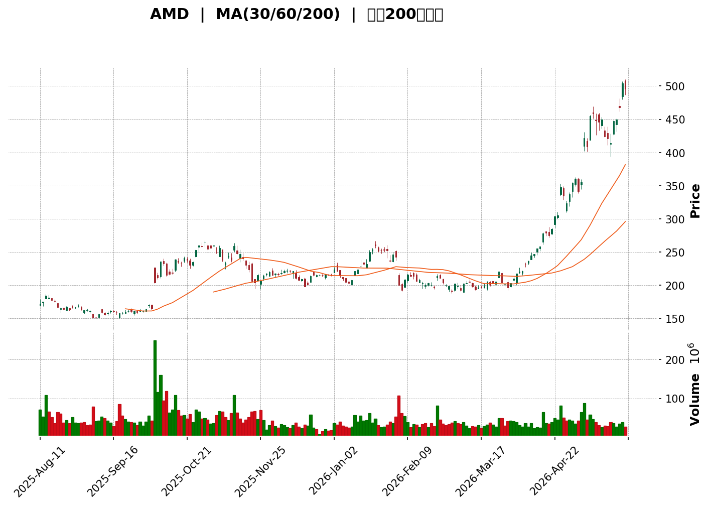
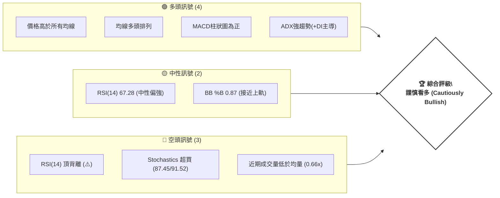
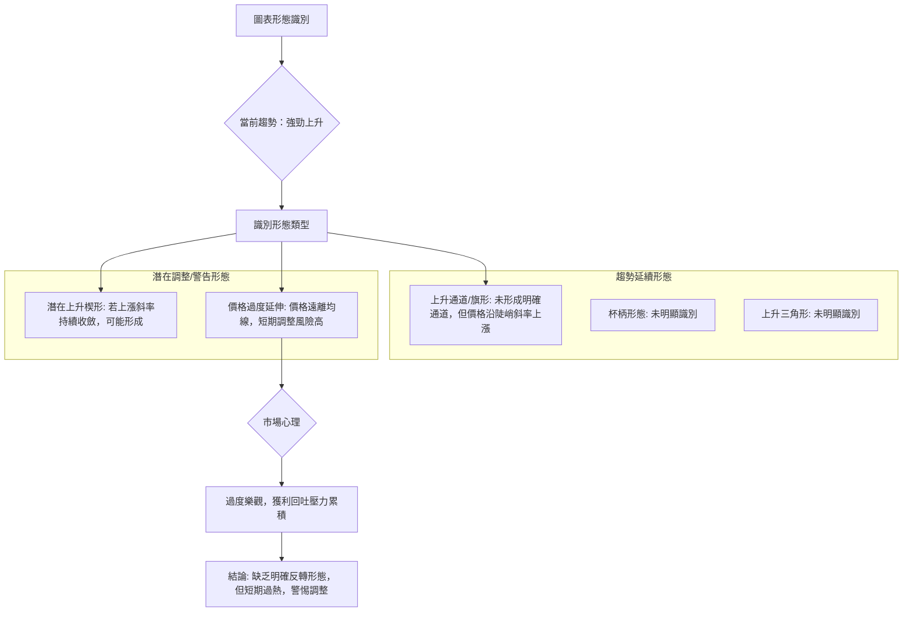

<details>
<summary>📊 靜態圖表 (點擊展開)</summary>

</details>

<html>
<head><meta charset="utf-8" /></head>
<body>
    <div>                        <script>window.PlotlyConfig = {MathJaxConfig: 'local'};</script>
        <script charset="utf-8" src="https://cdn.plot.ly/plotly-3.5.0.min.js" integrity="sha256-fHbNLP+GlIXN+efbQec78UkemUz3NJp7UmfGxC1tNxs=" crossorigin="anonymous"></script>                <div id="candlestick-chart" class="plotly-graph-div" style="height:500px; width:100%;"></div>            <script>                window.PLOTLYENV=window.PLOTLYENV || {};                                if (document.getElementById("candlestick-chart")) {                    Plotly.newPlot(                        "candlestick-chart",                        [{"close":{"dtype":"f8","bdata":"AAAAwPWIZUAAAABgZt5lQAAAAKBwDWdAAAAAYGaeZkAAAADgUTBmQAAAAOB6BGZAAAAAoJnRZEAAAABgZqZkQAAAAGC4dmRAAAAA4FH4ZEAAAAAghWtkQAAAAADX02RAAAAAACnkZEAAAABgjxJlQAAAAAApVGRAAAAAgD1KZEAAAAAAKURkQAAAAKBHOWRAAAAA4HrkYkAAAADAHu1iQAAAAIA9emNAAAAAoEfxY0AAAACgcHVjQAAAAIA90mNAAAAAwB4lZEAAAABguA5kQAAAAMAe5WNAAAAAoHC9Y0AAAADgeqxjQAAAAKBH+WNAAAAAwMwcZEAAAAAAKRxkQAAAAOCjKGRAAAAAYLjuY0AAAAAghStkQAAAAKBHOWRAAAAA4FGAZEAAAAAgXDdlQAAAAKBwlWRAAAAAYLh2aUAAAADgUXBqQAAAAIDrcW1AAAAA4HocbUAAAADAzNxqQAAAAKBwDWtAAAAAQOFCa0AAAABAM9NtQAAAAIDrUW1AAAAAYI8ibUAAAACA6xFuQAAAAMD1wG1AAAAAIFzHbEAAAAAgrl9tQAAAAKBwnW9AAAAAYLg6cEAAAAAAKSBwQAAAAKBHhXBAAAAAQOHab0AAAACA6wFwQAAAAGBmOnBAAAAAoJlBb0AAAACgRwVwQAAAAGBmtm1AAAAAoEcxbUAAAAAgXH9uQAAAAOCjsG1AAAAAgD0ucEAAAABguP5uQAAAAIDr2W5AAAAA4KMQbkAAAACgR8lsQAAAAKCZ8WtAAAAA4KPAaUAAAADA9XhpQAAAAKCZ4WpAAAAAACnEaUAAAAAgrsdqQAAAAMD1MGtAAAAA4FF4a0AAAAAgrudqQAAAAEAzM2tAAAAAIFz\u002fakAAAABACj9rQAAAACCFo2tAAAAAANeza0AAAACgcK1rQAAAAIDCrWtAAAAAwPVYakAAAABgj\u002fJpQAAAAKBwJWpAAAAAIIXDaEAAAACA6yFpQAAAAIDCrWpAAAAAYGbeakAAAADAzNxqQAAAAKBH4WpAAAAAIK7fakAAAAAghfNqQAAAAEDh6mpAAAAAwB7FakAAAABACu9rQAAAAGCPomtAAAAAQDPLakAAAADgo0BqQAAAAIDClWlAAAAAoHBlaUAAAACAFPZpQAAAAEAKn2tAAAAAQDPza0AAAACgcH1sQAAAAGCP+mxAAAAAoHD9bEAAAACgmTlvQAAAACBct29AAAAAQOE6cEAAAACA62lvQAAAAMD1gG9AAAAAIK6Xb0AAAACAwoVvQAAAACBcl21AAAAA4KPIbkAAAAAghUNuQAAAAIAUBmlAAAAAAAAQaEAAAACAFA5qQAAAAAAAAGtAAAAAgD2yakAAAABgj7JqQAAAAIAUvmlAAAAAgD3qaUAAAABgj2JpQAAAAADXA2lAAAAAANdraUAAAADAzARpQAAAAEAzk2hAAAAAQOG6akAAAAAghVtqQAAAAIDCdWlAAAAAYLgGaUAAAAAA19NoQAAAAGBm3mdAAAAAgD1CaUAAAABgZu5oQAAAAIDCDWhAAAAAgMJVaUAAAAAgXGdpQAAAAGCPmmlAAAAAIK63aEAAAADgeixoQAAAAGCPkmhAAAAAgOuJaEAAAABguO5oQAAAAOCjqGlAAAAAYI8qaUAAAACAwlVpQAAAAADXq2lAAAAA4KOIa0AAAADgo3hpQAAAACCuP2lAAAAAoEeBaEAAAACAwm1pQAAAAGC4RmpAAAAAAAAwa0AAAACAwoVrQAAAAMD1sGtAAAAAgD36bEAAAADgepRtQAAAAKBHoW5AAAAAYI\u002fabkAAAACAPeJvQAAAAIDrIXBAAAAAAClkcUAAAACAPWZxQAAAAEAzL3FAAAAAANfHcUAAAAAgXPdyQAAAAKBHFXNAAAAAwPW8dUAAAACAFOp0QAAAACBcM3RAAAAAgMIRdUAAAAAA1yd2QAAAAOCjiHZAAAAA4KNYdUAAAAAAKTR2QAAAAIA9VnpAAAAAIFyHeUAAAABACnN8QAAAAOCjrHxAAAAA4KMEfEAAAAAAANh7QAAAAEAzG3xAAAAAoJmBekAAAAAA1096QAAAAMDM4HlAAAAAoEf5e0AAAACgcBl8QAAAAAApOH1AAAAAgD1+f0AAAADgo\u002fh+QA=="},"high":{"dtype":"f8","bdata":"AAAAgD1aZkAAAADAHuVlQAAAAMDMVGdAAAAAgBQuZ0AAAADgeoRmQAAAAKCZWWZAAAAAoHClZUAAAADAzNRkQAAAAAApvGRAAAAAwPUQZUAAAABA4bJkQAAAAOCjOGVAAAAAgML1ZEAAAAAgrl9lQAAAAIA9EmVAAAAA4HpMZEAAAAAAAJhkQAAAAKCZQWRAAAAA4HqkY0AAAADgehRjQAAAAMAelWNAAAAAwPWQZEAAAABguAZkQAAAAMAeDWRAAAAAoJlJZEAAAABgZj5kQAAAAAApNGRAAAAA4KPYY0AAAABA4fpjQAAAAIDCVWRAAAAA4HpsZEAAAABAM6NkQAAAAAApNGRAAAAAIIVDZEAAAACgmYlkQAAAAMD1SGRAAAAAgMKFZEAAAACA62FlQAAAAIDCVWVAAAAAYLhWbEAAAADAzFxrQAAAAADXe21AAAAAQDMDbkAAAABACkdtQAAAAIAUBmxAAAAAIFwfbEAAAAAgrudtQAAAAGBmJm5AAAAAAClsbUAAAAAAKVxuQAAAAOBRSG5AAAAAACkEbkAAAADAzHxtQAAAAOB6rG9AAAAAYLhGcEAAAACgR4lwQAAAAKBHsXBAAAAAgBR+cEAAAACAFGJwQAAAAGCPTnBAAAAAgBQWcEAAAABgZjpwQAAAAOBRsG9AAAAAANd7bUAAAADAzBxvQAAAAGC4Dm9AAAAAACl4cEAAAACAFDpwQAAAAIAUrm9AAAAA4KMYb0AAAAAAAMBtQAAAAMD1aG1AAAAAAABIbUAAAABgjxpqQAAAAAApJGtAAAAAYI\u002fSaUAAAABA4fJqQAAAAKCZSWtAAAAAIFyfa0AAAAAgXD9sQAAAAGBmRmtAAAAAANdja0AAAADgevRrQAAAAGC49mtAAAAAQOEabEAAAAAghdNrQAAAAAAAsGtAAAAAIK7Pa0AAAAAghetqQAAAAEAKR2pAAAAAAABwakAAAAAghctpQAAAAIDC5WpAAAAAoHCFa0AAAADA9SBrQAAAAKBHEWtAAAAAYI8aa0AAAACgmQFrQAAAAIA9GmtAAAAA4Ho0a0AAAADAzGRsQAAAAOCjQG1AAAAAoHDda0AAAAAAKYRqQAAAAIAUXmpAAAAAoJnpaUAAAAAAKTxqQAAAACCF42tAAAAAQOECbEAAAABAM8ttQAAAACCuT21AAAAAAADwbUAAAADAzJxvQAAAAKBHAXBAAAAAIFyvcEAAAADgoyRwQAAAAKCZ8W9AAAAAYGYWcEAAAADgekhwQAAAACCup25AAAAAQAo\u002fb0AAAADAzJRvQAAAAGCPUmtAAAAAoEeBaUAAAADgoyhqQAAAAEAzM2tAAAAA4Hpsa0AAAADAzHRrQAAAAGC4TmtAAAAAoJlBakAAAACgmalpQAAAAGBmZmlAAAAAQDODaUAAAAAA15tpQAAAAAAp7GhAAAAAYLgWa0AAAABgZhZrQAAAAKBHOWpAAAAA4Ho8aUAAAAAgrtdoQAAAAOB6NGhAAAAAgBROaUAAAACgR3lpQAAAACCuB2lAAAAAQApfaUAAAABA4dJpQAAAAGC4JmpAAAAAANdzaUAAAACAwvVoQAAAAKBwBWlAAAAAYLjmaEAAAAAghVtpQAAAAAApvGlAAAAAoJnJaUAAAAAghSNqQAAAAIDCzWlAAAAAYI+qa0AAAAAAAKBrQAAAAOCjaGlAAAAAgMINakAAAAAAAIBpQAAAAGCPumpAAAAAwPU4a0AAAACA60lsQAAAAEAzw2tAAAAAAABAbUAAAABAM6NtQAAAAGCPMm9AAAAAYI\u002fqbkAAAABguO5vQAAAAEDhInBAAAAAoHB1cUAAAADAzJBxQAAAAIDC+XFAAAAAQDPjcUAAAAAAAARzQAAAACCFY3NAAAAAANcPdkAAAAAgXNN1QAAAAAAAeHRAAAAAYLhCdUAAAAAgXC92QAAAAOCjrHZAAAAAoJmddkAAAADAHnl2QAAAAKCZ6XpAAAAAIFxbekAAAADgo4R8QAAAACCFU31AAAAAwMysfEAAAAAAALh8QAAAAMD1VHxAAAAAAABwe0AAAADAzGx7QAAAAAAAzHpAAAAAgD0WfEAAAABAMzN8QAAAAGCPFn5AAAAAIFyvf0AAAAAgXON\u002fQA=="},"hovertemplate":"\u003cb\u003e%{x|%Y-%m-%d}\u003c\u002fb\u003e\u003cbr\u003e\u958b: $%{open:.2f}\u003cbr\u003e\u9ad8: $%{high:.2f}\u003cbr\u003e\u4f4e: $%{low:.2f}\u003cbr\u003e\u6536: $%{close:.2f}\u003cextra\u003e\u003c\u002fextra\u003e","low":{"dtype":"f8","bdata":"AAAAACksZUAAAAAAABBlQAAAAAApbGZAAAAAgOtxZkAAAAAAAAhmQAAAACCFy2VAAAAAQDPDZEAAAAAAAMhjQAAAAOBRSGRAAAAAoJk5ZEAAAABACjdkQAAAAMAenWRAAAAAwMyUZEAAAADAzNRkQAAAAMDMPGRAAAAAANeTY0AAAABgjxJkQAAAAKBHuWNAAAAAgMLFYkAAAABACqdiQAAAAIDC\u002fWJAAAAAAADAY0AAAAAgrl9jQAAAAKBwXWNAAAAAQDOzY0AAAABACudjQAAAAOBReGNAAAAAQDO7YkAAAADAzHxjQAAAAKBwrWNAAAAAYLjmY0AAAACAws1jQAAAAMD1WGNAAAAAoJmhY0AAAADAzPxjQAAAAGCP6mNAAAAAIK4PZEAAAAAA18NkQAAAAOB6ZGRAAAAA4FFgaUAAAADA9ShqQAAAAGBmVmpAAAAAwPWwbEAAAABgZqZqQAAAAMDM3GpAAAAAwMz8akAAAADgUZhrQAAAACCuB21AAAAAwB59bEAAAADAzExtQAAAAOCjQG1AAAAAACkcbEAAAACgR5FsQAAAAGBmPm5AAAAAoJk5b0AAAAAAABBwQAAAAGBmFnBAAAAAgOuJb0AAAADAHq1vQAAAAOB6vG9AAAAA4HrsbkAAAACA61luQAAAACCud21AAAAA4HoUbEAAAAAAABBuQAAAAOB6VG1AAAAAAABAb0AAAACA68FuQAAAAGCPYm1AAAAAwMykbUAAAABguBZsQAAAAGC4dmtAAAAAwPWQaUAAAAAAAGBoQAAAAEAzu2lAAAAAwPVIaEAAAAAAAOBpQAAAAOCjwGpAAAAAAACwakAAAADgesxqQAAAAOCjeGpAAAAA4HrEakAAAAAgrgdrQAAAACCFS2tAAAAAwB49a0AAAACgcFVrQAAAAIAURmpAAAAAgOshakAAAABgj9JpQAAAACCFo2lAAAAAwPWwaEAAAAAAABBpQAAAAGBmhmlAAAAAgOupakAAAADA9YhqQAAAAEAKv2pAAAAAwPWgakAAAAAgridqQAAAAGCPympAAAAAoJm5akAAAADAzFxrQAAAACBcj2tAAAAAAABoakAAAACgcOVpQAAAAGCPamlAAAAAgD1iaUAAAACgmfloQAAAACBc32pAAAAAIIXjakAAAABACmdsQAAAACCFm2xAAAAAwB4tbEAAAADA9XhtQAAAAAAp1G5AAAAAAAAEcEAAAACgmUlvQAAAAGC4\u002fm5AAAAAYLhGb0AAAADAHh1uQAAAAKCZUW1AAAAAAABgbUAAAACgR6FtQAAAAMDM5GhAAAAAQArXZ0AAAACAwo1oQAAAAMDMhGlAAAAAACmkakAAAABguCZqQAAAAOB6pGlAAAAAACl8aUAAAABgj1poQAAAAAAAYGhAAAAAoEfJaEAAAACA69FoQAAAAMDMRGhAAAAAAADQaUAAAABgj0pqQAAAAGC4LmlAAAAAIK63aEAAAAAAAMBnQAAAAEAKh2dAAAAAIIW7Z0AAAAAAKVxoQAAAAAAA6GdAAAAA4KOgZ0AAAABgZkZpQAAAAAApdGlAAAAAoHCVaEAAAADgowhoQAAAAKCZWWhAAAAA4FFoaEAAAAAAAHhoQAAAAGCPGmhAAAAA4FHIaEAAAABguDZpQAAAAAApBGlAAAAA4FFwakAAAACAwm1pQAAAAIAUtmhAAAAAANcbaEAAAADAHo1oQAAAAEDhumlAAAAAANcTaUAAAAAgXDdrQAAAAAAp7GpAAAAAQOFibEAAAADAHt1sQAAAAGC43m1AAAAAwPVAbkAAAABgZrZuQAAAAEAze29AAAAAAClYcEAAAACAPSJxQAAAAAAAAHFAAAAAgOtJcUAAAACAPeJxQAAAAAApvHJAAAAA4KPodEAAAADA9Yx0QAAAAAAAYHNAAAAAgMLtc0AAAACgmcl0QAAAAAAA1HVAAAAAQDMrdUAAAACAFI51QAAAAOCjIHlAAAAAoEcReUAAAADgoyR6QAAAAIAULnxAAAAAgMKhekAAAABgZgp7QAAAAEDhOntAAAAAgMJ1ekAAAAAgXKt5QAAAAIDClXhAAAAAwMygekAAAACgmfl6QAAAACBc23xAAAAAIK4DfkAAAACgkGp+QA=="},"name":"\u50f9\u683c","open":{"dtype":"f8","bdata":"AAAAoEdBZUAAAACAPaplQAAAAMAefWZAAAAAYI96ZkAAAACA64FmQAAAAOBRGGZAAAAAQDOjZUAAAABAM4NkQAAAACCFu2RAAAAAoHBFZEAAAACgmbFkQAAAAMDMFGVAAAAAoEfBZEAAAAAAABBlQAAAAIDr2WRAAAAAoHDNY0AAAACA6zlkQAAAAIAU\u002fmNAAAAAANejY0AAAACgmfliQAAAACCu\u002f2JAAAAAoEdxZEAAAAAA19NjQAAAAAAAoGNAAAAA4FEAZEAAAAAA1ytkQAAAAMD16GNAAAAAYLjeYkAAAAAAKaxjQAAAAKBwrWNAAAAA4KMQZEAAAAAgXF9kQAAAAOB6pGNAAAAA4KMQZEAAAAAA1wNkQAAAAKBHGWRAAAAAgMIdZEAAAACAwhVlQAAAAIDCVWVAAAAAYGZObEAAAABAM9tqQAAAAGBmnmpAAAAAoJmJbUAAAADgoxhtQAAAAGBmhmtAAAAAYGZma0AAAABguNZrQAAAAKBHiW1AAAAA4FEobUAAAABACo9tQAAAAOB67G1AAAAAQDObbUAAAADAHsVsQAAAACCFa25AAAAAgBQecEAAAACAPTJwQAAAAEAKg3BAAAAAYLg+cEAAAACgmTlwQAAAAKBHNXBAAAAAQDNLb0AAAAAgrmduQAAAAEAKr29AAAAAgBTebEAAAADgekRuQAAAAMAeNW5AAAAAACmkb0AAAADAzHxvQAAAACCFA25AAAAAAABYbkAAAADA9ZhtQAAAAOBRyGxAAAAAYGYWbUAAAACA6xlqQAAAAMAe5WlAAAAAIFwvaUAAAACgmUFqQAAAAOB6BGtAAAAAACm8akAAAACgR7lrQAAAAOBRCGtAAAAAACkca0AAAACgcCVrQAAAAEDhYmtAAAAAoEeha0AAAAAAAMBrQAAAAIDrOWtAAAAAANdLa0AAAADA9YhqQAAAAKBw3WlAAAAAoEdBakAAAACAPXppQAAAAEAzk2lAAAAAAACAa0AAAAAghZtqQAAAACBc32pAAAAAgMLtakAAAABgj3JqQAAAAADX+2pAAAAAgD36akAAAADAzFxrQAAAAAAAyGxAAAAAYLjWa0AAAAAAKYRqQAAAAMDMXGpAAAAAQAq3aUAAAACAwiVpQAAAAEAz42pAAAAAoEcxa0AAAADAzHxsQAAAAKCZSW1AAAAAYI9CbEAAAAAgrn9tQAAAAAAAeG9AAAAAQOFScEAAAAAAAAxwQAAAAMAehW9AAAAAACnEb0AAAADAHtVvQAAAAIDCnW1AAAAA4KN4bUAAAACgmXFvQAAAAAAA4GpAAAAAIIU7aUAAAAAAKaRoQAAAAMDM3GlAAAAA4HrkakAAAAAAKTxrQAAAAGCP+mpAAAAA4KOAaUAAAADAzERpQAAAAMAezWhAAAAAIIUDaUAAAAAA1wNpQAAAAEDhwmhAAAAAACl0akAAAACAPdpqQAAAAKCZGWpAAAAAIIUDaUAAAABAMztoQAAAAGC47mdAAAAAANcDaEAAAADgo7hoQAAAAOCjaGhAAAAAIIWrZ0AAAADgUVBpQAAAACCFo2lAAAAAYI9aaUAAAAAghcNoQAAAACBcX2hAAAAAgMKVaEAAAAAAAIBoQAAAAMD1YGhAAAAA4HqcaUAAAADAzMxpQAAAAOB6LGlAAAAA4FFwakAAAAAgXD9rQAAAAOCjOGlAAAAAYGaeaUAAAACgmcFoQAAAAEDh8mlAAAAAoJmBaUAAAADA9WhrQAAAAOBRSGtAAAAAANcDbUAAAADgUSBtQAAAAAAA4G1AAAAAwPWgbkAAAACgRzlvQAAAAGC43m9AAAAAANePcEAAAAAAAJBxQAAAAKCZiXFAAAAAoEdVcUAAAAAghTNyQAAAAAAp4HJAAAAAACkMdUAAAADAHqV1QAAAAIDCfXNAAAAAoEdpdEAAAACAwlV1QAAAAIDr\u002fXVAAAAAwPWEdkAAAAAAKfh1QAAAAADXl3lAAAAAwB4RekAAAACgcCl6QAAAAMDMyHxAAAAAAAAUfEAAAADgo5B8QAAAAKCZiXtAAAAAoHAVe0AAAAAAANh6QAAAAKCZyXlAAAAA4KPAekAAAAAA1597QAAAAKBwXX1AAAAAANdLfkAAAAAAAMB\u002fQA=="},"x":["2025-08-11T00:00:00-04:00","2025-08-12T00:00:00-04:00","2025-08-13T00:00:00-04:00","2025-08-14T00:00:00-04:00","2025-08-15T00:00:00-04:00","2025-08-18T00:00:00-04:00","2025-08-19T00:00:00-04:00","2025-08-20T00:00:00-04:00","2025-08-21T00:00:00-04:00","2025-08-22T00:00:00-04:00","2025-08-25T00:00:00-04:00","2025-08-26T00:00:00-04:00","2025-08-27T00:00:00-04:00","2025-08-28T00:00:00-04:00","2025-08-29T00:00:00-04:00","2025-09-02T00:00:00-04:00","2025-09-03T00:00:00-04:00","2025-09-04T00:00:00-04:00","2025-09-05T00:00:00-04:00","2025-09-08T00:00:00-04:00","2025-09-09T00:00:00-04:00","2025-09-10T00:00:00-04:00","2025-09-11T00:00:00-04:00","2025-09-12T00:00:00-04:00","2025-09-15T00:00:00-04:00","2025-09-16T00:00:00-04:00","2025-09-17T00:00:00-04:00","2025-09-18T00:00:00-04:00","2025-09-19T00:00:00-04:00","2025-09-22T00:00:00-04:00","2025-09-23T00:00:00-04:00","2025-09-24T00:00:00-04:00","2025-09-25T00:00:00-04:00","2025-09-26T00:00:00-04:00","2025-09-29T00:00:00-04:00","2025-09-30T00:00:00-04:00","2025-10-01T00:00:00-04:00","2025-10-02T00:00:00-04:00","2025-10-03T00:00:00-04:00","2025-10-06T00:00:00-04:00","2025-10-07T00:00:00-04:00","2025-10-08T00:00:00-04:00","2025-10-09T00:00:00-04:00","2025-10-10T00:00:00-04:00","2025-10-13T00:00:00-04:00","2025-10-14T00:00:00-04:00","2025-10-15T00:00:00-04:00","2025-10-16T00:00:00-04:00","2025-10-17T00:00:00-04:00","2025-10-20T00:00:00-04:00","2025-10-21T00:00:00-04:00","2025-10-22T00:00:00-04:00","2025-10-23T00:00:00-04:00","2025-10-24T00:00:00-04:00","2025-10-27T00:00:00-04:00","2025-10-28T00:00:00-04:00","2025-10-29T00:00:00-04:00","2025-10-30T00:00:00-04:00","2025-10-31T00:00:00-04:00","2025-11-03T00:00:00-05:00","2025-11-04T00:00:00-05:00","2025-11-05T00:00:00-05:00","2025-11-06T00:00:00-05:00","2025-11-07T00:00:00-05:00","2025-11-10T00:00:00-05:00","2025-11-11T00:00:00-05:00","2025-11-12T00:00:00-05:00","2025-11-13T00:00:00-05:00","2025-11-14T00:00:00-05:00","2025-11-17T00:00:00-05:00","2025-11-18T00:00:00-05:00","2025-11-19T00:00:00-05:00","2025-11-20T00:00:00-05:00","2025-11-21T00:00:00-05:00","2025-11-24T00:00:00-05:00","2025-11-25T00:00:00-05:00","2025-11-26T00:00:00-05:00","2025-11-28T00:00:00-05:00","2025-12-01T00:00:00-05:00","2025-12-02T00:00:00-05:00","2025-12-03T00:00:00-05:00","2025-12-04T00:00:00-05:00","2025-12-05T00:00:00-05:00","2025-12-08T00:00:00-05:00","2025-12-09T00:00:00-05:00","2025-12-10T00:00:00-05:00","2025-12-11T00:00:00-05:00","2025-12-12T00:00:00-05:00","2025-12-15T00:00:00-05:00","2025-12-16T00:00:00-05:00","2025-12-17T00:00:00-05:00","2025-12-18T00:00:00-05:00","2025-12-19T00:00:00-05:00","2025-12-22T00:00:00-05:00","2025-12-23T00:00:00-05:00","2025-12-24T00:00:00-05:00","2025-12-26T00:00:00-05:00","2025-12-29T00:00:00-05:00","2025-12-30T00:00:00-05:00","2025-12-31T00:00:00-05:00","2026-01-02T00:00:00-05:00","2026-01-05T00:00:00-05:00","2026-01-06T00:00:00-05:00","2026-01-07T00:00:00-05:00","2026-01-08T00:00:00-05:00","2026-01-09T00:00:00-05:00","2026-01-12T00:00:00-05:00","2026-01-13T00:00:00-05:00","2026-01-14T00:00:00-05:00","2026-01-15T00:00:00-05:00","2026-01-16T00:00:00-05:00","2026-01-20T00:00:00-05:00","2026-01-21T00:00:00-05:00","2026-01-22T00:00:00-05:00","2026-01-23T00:00:00-05:00","2026-01-26T00:00:00-05:00","2026-01-27T00:00:00-05:00","2026-01-28T00:00:00-05:00","2026-01-29T00:00:00-05:00","2026-01-30T00:00:00-05:00","2026-02-02T00:00:00-05:00","2026-02-03T00:00:00-05:00","2026-02-04T00:00:00-05:00","2026-02-05T00:00:00-05:00","2026-02-06T00:00:00-05:00","2026-02-09T00:00:00-05:00","2026-02-10T00:00:00-05:00","2026-02-11T00:00:00-05:00","2026-02-12T00:00:00-05:00","2026-02-13T00:00:00-05:00","2026-02-17T00:00:00-05:00","2026-02-18T00:00:00-05:00","2026-02-19T00:00:00-05:00","2026-02-20T00:00:00-05:00","2026-02-23T00:00:00-05:00","2026-02-24T00:00:00-05:00","2026-02-25T00:00:00-05:00","2026-02-26T00:00:00-05:00","2026-02-27T00:00:00-05:00","2026-03-02T00:00:00-05:00","2026-03-03T00:00:00-05:00","2026-03-04T00:00:00-05:00","2026-03-05T00:00:00-05:00","2026-03-06T00:00:00-05:00","2026-03-09T00:00:00-04:00","2026-03-10T00:00:00-04:00","2026-03-11T00:00:00-04:00","2026-03-12T00:00:00-04:00","2026-03-13T00:00:00-04:00","2026-03-16T00:00:00-04:00","2026-03-17T00:00:00-04:00","2026-03-18T00:00:00-04:00","2026-03-19T00:00:00-04:00","2026-03-20T00:00:00-04:00","2026-03-23T00:00:00-04:00","2026-03-24T00:00:00-04:00","2026-03-25T00:00:00-04:00","2026-03-26T00:00:00-04:00","2026-03-27T00:00:00-04:00","2026-03-30T00:00:00-04:00","2026-03-31T00:00:00-04:00","2026-04-01T00:00:00-04:00","2026-04-02T00:00:00-04:00","2026-04-06T00:00:00-04:00","2026-04-07T00:00:00-04:00","2026-04-08T00:00:00-04:00","2026-04-09T00:00:00-04:00","2026-04-10T00:00:00-04:00","2026-04-13T00:00:00-04:00","2026-04-14T00:00:00-04:00","2026-04-15T00:00:00-04:00","2026-04-16T00:00:00-04:00","2026-04-17T00:00:00-04:00","2026-04-20T00:00:00-04:00","2026-04-21T00:00:00-04:00","2026-04-22T00:00:00-04:00","2026-04-23T00:00:00-04:00","2026-04-24T00:00:00-04:00","2026-04-27T00:00:00-04:00","2026-04-28T00:00:00-04:00","2026-04-29T00:00:00-04:00","2026-04-30T00:00:00-04:00","2026-05-01T00:00:00-04:00","2026-05-04T00:00:00-04:00","2026-05-05T00:00:00-04:00","2026-05-06T00:00:00-04:00","2026-05-07T00:00:00-04:00","2026-05-08T00:00:00-04:00","2026-05-11T00:00:00-04:00","2026-05-12T00:00:00-04:00","2026-05-13T00:00:00-04:00","2026-05-14T00:00:00-04:00","2026-05-15T00:00:00-04:00","2026-05-18T00:00:00-04:00","2026-05-19T00:00:00-04:00","2026-05-20T00:00:00-04:00","2026-05-21T00:00:00-04:00","2026-05-22T00:00:00-04:00","2026-05-26T00:00:00-04:00","2026-05-27T00:00:00-04:00"],"type":"candlestick"},{"hovertemplate":"MA30: $%{y:.2f}\u003cextra\u003e\u003c\u002fextra\u003e","line":{"color":"#2196F3","dash":"dash","width":2},"mode":"lines","name":"MA30","x":["2025-08-11T00:00:00-04:00","2025-08-12T00:00:00-04:00","2025-08-13T00:00:00-04:00","2025-08-14T00:00:00-04:00","2025-08-15T00:00:00-04:00","2025-08-18T00:00:00-04:00","2025-08-19T00:00:00-04:00","2025-08-20T00:00:00-04:00","2025-08-21T00:00:00-04:00","2025-08-22T00:00:00-04:00","2025-08-25T00:00:00-04:00","2025-08-26T00:00:00-04:00","2025-08-27T00:00:00-04:00","2025-08-28T00:00:00-04:00","2025-08-29T00:00:00-04:00","2025-09-02T00:00:00-04:00","2025-09-03T00:00:00-04:00","2025-09-04T00:00:00-04:00","2025-09-05T00:00:00-04:00","2025-09-08T00:00:00-04:00","2025-09-09T00:00:00-04:00","2025-09-10T00:00:00-04:00","2025-09-11T00:00:00-04:00","2025-09-12T00:00:00-04:00","2025-09-15T00:00:00-04:00","2025-09-16T00:00:00-04:00","2025-09-17T00:00:00-04:00","2025-09-18T00:00:00-04:00","2025-09-19T00:00:00-04:00","2025-09-22T00:00:00-04:00","2025-09-23T00:00:00-04:00","2025-09-24T00:00:00-04:00","2025-09-25T00:00:00-04:00","2025-09-26T00:00:00-04:00","2025-09-29T00:00:00-04:00","2025-09-30T00:00:00-04:00","2025-10-01T00:00:00-04:00","2025-10-02T00:00:00-04:00","2025-10-03T00:00:00-04:00","2025-10-06T00:00:00-04:00","2025-10-07T00:00:00-04:00","2025-10-08T00:00:00-04:00","2025-10-09T00:00:00-04:00","2025-10-10T00:00:00-04:00","2025-10-13T00:00:00-04:00","2025-10-14T00:00:00-04:00","2025-10-15T00:00:00-04:00","2025-10-16T00:00:00-04:00","2025-10-17T00:00:00-04:00","2025-10-20T00:00:00-04:00","2025-10-21T00:00:00-04:00","2025-10-22T00:00:00-04:00","2025-10-23T00:00:00-04:00","2025-10-24T00:00:00-04:00","2025-10-27T00:00:00-04:00","2025-10-28T00:00:00-04:00","2025-10-29T00:00:00-04:00","2025-10-30T00:00:00-04:00","2025-10-31T00:00:00-04:00","2025-11-03T00:00:00-05:00","2025-11-04T00:00:00-05:00","2025-11-05T00:00:00-05:00","2025-11-06T00:00:00-05:00","2025-11-07T00:00:00-05:00","2025-11-10T00:00:00-05:00","2025-11-11T00:00:00-05:00","2025-11-12T00:00:00-05:00","2025-11-13T00:00:00-05:00","2025-11-14T00:00:00-05:00","2025-11-17T00:00:00-05:00","2025-11-18T00:00:00-05:00","2025-11-19T00:00:00-05:00","2025-11-20T00:00:00-05:00","2025-11-21T00:00:00-05:00","2025-11-24T00:00:00-05:00","2025-11-25T00:00:00-05:00","2025-11-26T00:00:00-05:00","2025-11-28T00:00:00-05:00","2025-12-01T00:00:00-05:00","2025-12-02T00:00:00-05:00","2025-12-03T00:00:00-05:00","2025-12-04T00:00:00-05:00","2025-12-05T00:00:00-05:00","2025-12-08T00:00:00-05:00","2025-12-09T00:00:00-05:00","2025-12-10T00:00:00-05:00","2025-12-11T00:00:00-05:00","2025-12-12T00:00:00-05:00","2025-12-15T00:00:00-05:00","2025-12-16T00:00:00-05:00","2025-12-17T00:00:00-05:00","2025-12-18T00:00:00-05:00","2025-12-19T00:00:00-05:00","2025-12-22T00:00:00-05:00","2025-12-23T00:00:00-05:00","2025-12-24T00:00:00-05:00","2025-12-26T00:00:00-05:00","2025-12-29T00:00:00-05:00","2025-12-30T00:00:00-05:00","2025-12-31T00:00:00-05:00","2026-01-02T00:00:00-05:00","2026-01-05T00:00:00-05:00","2026-01-06T00:00:00-05:00","2026-01-07T00:00:00-05:00","2026-01-08T00:00:00-05:00","2026-01-09T00:00:00-05:00","2026-01-12T00:00:00-05:00","2026-01-13T00:00:00-05:00","2026-01-14T00:00:00-05:00","2026-01-15T00:00:00-05:00","2026-01-16T00:00:00-05:00","2026-01-20T00:00:00-05:00","2026-01-21T00:00:00-05:00","2026-01-22T00:00:00-05:00","2026-01-23T00:00:00-05:00","2026-01-26T00:00:00-05:00","2026-01-27T00:00:00-05:00","2026-01-28T00:00:00-05:00","2026-01-29T00:00:00-05:00","2026-01-30T00:00:00-05:00","2026-02-02T00:00:00-05:00","2026-02-03T00:00:00-05:00","2026-02-04T00:00:00-05:00","2026-02-05T00:00:00-05:00","2026-02-06T00:00:00-05:00","2026-02-09T00:00:00-05:00","2026-02-10T00:00:00-05:00","2026-02-11T00:00:00-05:00","2026-02-12T00:00:00-05:00","2026-02-13T00:00:00-05:00","2026-02-17T00:00:00-05:00","2026-02-18T00:00:00-05:00","2026-02-19T00:00:00-05:00","2026-02-20T00:00:00-05:00","2026-02-23T00:00:00-05:00","2026-02-24T00:00:00-05:00","2026-02-25T00:00:00-05:00","2026-02-26T00:00:00-05:00","2026-02-27T00:00:00-05:00","2026-03-02T00:00:00-05:00","2026-03-03T00:00:00-05:00","2026-03-04T00:00:00-05:00","2026-03-05T00:00:00-05:00","2026-03-06T00:00:00-05:00","2026-03-09T00:00:00-04:00","2026-03-10T00:00:00-04:00","2026-03-11T00:00:00-04:00","2026-03-12T00:00:00-04:00","2026-03-13T00:00:00-04:00","2026-03-16T00:00:00-04:00","2026-03-17T00:00:00-04:00","2026-03-18T00:00:00-04:00","2026-03-19T00:00:00-04:00","2026-03-20T00:00:00-04:00","2026-03-23T00:00:00-04:00","2026-03-24T00:00:00-04:00","2026-03-25T00:00:00-04:00","2026-03-26T00:00:00-04:00","2026-03-27T00:00:00-04:00","2026-03-30T00:00:00-04:00","2026-03-31T00:00:00-04:00","2026-04-01T00:00:00-04:00","2026-04-02T00:00:00-04:00","2026-04-06T00:00:00-04:00","2026-04-07T00:00:00-04:00","2026-04-08T00:00:00-04:00","2026-04-09T00:00:00-04:00","2026-04-10T00:00:00-04:00","2026-04-13T00:00:00-04:00","2026-04-14T00:00:00-04:00","2026-04-15T00:00:00-04:00","2026-04-16T00:00:00-04:00","2026-04-17T00:00:00-04:00","2026-04-20T00:00:00-04:00","2026-04-21T00:00:00-04:00","2026-04-22T00:00:00-04:00","2026-04-23T00:00:00-04:00","2026-04-24T00:00:00-04:00","2026-04-27T00:00:00-04:00","2026-04-28T00:00:00-04:00","2026-04-29T00:00:00-04:00","2026-04-30T00:00:00-04:00","2026-05-01T00:00:00-04:00","2026-05-04T00:00:00-04:00","2026-05-05T00:00:00-04:00","2026-05-06T00:00:00-04:00","2026-05-07T00:00:00-04:00","2026-05-08T00:00:00-04:00","2026-05-11T00:00:00-04:00","2026-05-12T00:00:00-04:00","2026-05-13T00:00:00-04:00","2026-05-14T00:00:00-04:00","2026-05-15T00:00:00-04:00","2026-05-18T00:00:00-04:00","2026-05-19T00:00:00-04:00","2026-05-20T00:00:00-04:00","2026-05-21T00:00:00-04:00","2026-05-22T00:00:00-04:00","2026-05-26T00:00:00-04:00","2026-05-27T00:00:00-04:00"],"y":{"dtype":"f8","bdata":"AAAAAAAA+H8AAAAAAAD4fwAAAAAAAPh\u002fAAAAAAAA+H8AAAAAAAD4fwAAAAAAAPh\u002fAAAAAAAA+H8AAAAAAAD4fwAAAAAAAPh\u002fAAAAAAAA+H8AAAAAAAD4fwAAAAAAAPh\u002fAAAAAAAA+H8AAAAAAAD4fwAAAAAAAPh\u002fAAAAAAAA+H8AAAAAAAD4fwAAAAAAAPh\u002fAAAAAAAA+H8AAAAAAAD4fwAAAAAAAPh\u002fAAAAAAAA+H8AAAAAAAD4fwAAAAAAAPh\u002fAAAAAAAA+H8AAAAAAAD4fwAAAAAAAPh\u002fAAAAAAAA+H8AAAAAAAD4fwAAADDdjGRAAAAAsLmAZEBERESkt3FkQGZmZiYGWWRAMzMz8xlCZEDNzMzs3zBkQKuqqmqRIWRAMzMz09seZEARERHRsCNkQFVVVfW2JGRAVVVVtQ9LZEDe3d3da35kQFVVVRX1x2RAIiIi8hkOZUBERERkgj9lQFVVVaXieGVAIiIikl+0ZUCrqqr68AVmQKuqqgqQU2ZAAAAAIPeqZkBEREQEDwpnQDMzM9O\u002fYWdAiYiI6CatZ0Dv7u6OwgFoQFVVVWVmZmhAIiIiMnrPaECamZnZhzdpQERERES2p2lAMzMz4xcPakAiIiLCZ3hqQCIiIjLs4mpAd3d3FwRCa0DNzMxM1KdrQImIiMha+WtA7+7ujl9IbEAzMzNTgKBsQKuqqqpH8WxAzczMPHxWbUDv7u4+7qltQBEREfGLAW5AZmZmhs8obkB3d3e31zxuQAAAADAIMG5AMzMz414TbkAzMzNjggduQJqZmUkMBm5AmpmZaUr5bUAiIiKCTt9tQO\u002fu7i4kzW1A7+7u7u6+bUAzMzPj7KNtQDMzMyMijm1AAAAA8O5+bUB3d3dXx2xtQHd3dxfZSm1AZmZm5kIibUAzMzNjO\u002ftsQERERNR4zWxAMzMzg3mebEC8u7vbsmpsQERERHTaNGxA7+7uXnP9a0Crqqr6fsJrQGZmZqabqGtAd3d3V8eUa0AAAACQwnVrQFVVVQXIXWtAREREZPQua0Dv7u6ucgxrQGZmZkbh6mpAzczMPMPOakDNzMzsfMdqQDMzM3PaxGpAiYiIGL3NakCJiIgIZdRqQERERFRVyWpAzczMDC3GakBmZmZ2ML9qQAAAANDbwmpAREREZPTGakAAAADgetRqQM3MzJyo42pAvLu7S6n0akAiIiICnRZrQBEREXFoOWtAvLu7WwFia0AiIiJS44FrQJqZmSmHomtAq6qqCknPa0AAAADQ2\u002f5rQHd3d4dBHGxAvLu7a6BPbEDv7u7OaXtsQImIiGhKbWxAAAAAEFhVbEDe3d0NdE5sQDMzMzN6T2xAIiIicvZNbEDv7u4ezEtsQLy7u0vFQWxAVVVVhXk6bEARERGxuSRsQGZmZjZeDmxAAAAA8KcCbEBERETEIPhrQERERGSC72tAMzMzA+T6a0AiIiKiRf5rQO\u002fu7k7U62tAd3d3R+HSa0DNzMxsoLNrQFVVVXUFiGtAvLu7ay5oa0AzMzODeTJrQGZmZoYW8WpAmpmZuUm0akDe3d2tAIFqQO\u002fu7u6nTmpARERERP0TakDe3d2tR9VpQN7d3Q10qmlAREREpCl1aUCamZlZq0dpQHd3d4cWTWlAVVVVtYFWaUB3d3fXXFBpQERERCQGRWlAAAAAsCtMaUB3d3fntEFpQKuqqkp+PWlAiYiIGHYxaUCrqqqq1TFpQJqZmemYPGlAiYiIWKtLaUDv7u7eCGFpQLy7u2uge2lAmpmZKc6OaUAiIiLSTappQLy7u9tr1mlAmpmZOSYIakB3d3fXXERqQKuqqroCjGpA3t3drUfdakARERGRezFrQImIiAiBiWtA3t3dncTga0BmZmYWrktsQImIiEjhtmxAVVVVZfRWbUBVVVVVnO1tQDMzM8OudG5AvLu7i94Kb0ARERERPLBvQImIiJDtKnBAd3d357R1cECamZkpFcdwQImIiBhLOnFAVVVVTamecUAzMzODwCRyQN7d3UW2rXJA7+7uzj40c0Dv7u5uWbVzQFVVVc0TNXRA7+7ulkOjdEARERHZXA51QGZmZj4KdXVARERErBzodUAiIiJyr1l2QM3MzARW0HZAd3d3R29Zd0AzMzNzr9l3QA=="},"type":"scatter"},{"hovertemplate":"MA60: $%{y:.2f}\u003cextra\u003e\u003c\u002fextra\u003e","line":{"color":"#9C27B0","dash":"dash","width":2},"mode":"lines","name":"MA60","x":["2025-08-11T00:00:00-04:00","2025-08-12T00:00:00-04:00","2025-08-13T00:00:00-04:00","2025-08-14T00:00:00-04:00","2025-08-15T00:00:00-04:00","2025-08-18T00:00:00-04:00","2025-08-19T00:00:00-04:00","2025-08-20T00:00:00-04:00","2025-08-21T00:00:00-04:00","2025-08-22T00:00:00-04:00","2025-08-25T00:00:00-04:00","2025-08-26T00:00:00-04:00","2025-08-27T00:00:00-04:00","2025-08-28T00:00:00-04:00","2025-08-29T00:00:00-04:00","2025-09-02T00:00:00-04:00","2025-09-03T00:00:00-04:00","2025-09-04T00:00:00-04:00","2025-09-05T00:00:00-04:00","2025-09-08T00:00:00-04:00","2025-09-09T00:00:00-04:00","2025-09-10T00:00:00-04:00","2025-09-11T00:00:00-04:00","2025-09-12T00:00:00-04:00","2025-09-15T00:00:00-04:00","2025-09-16T00:00:00-04:00","2025-09-17T00:00:00-04:00","2025-09-18T00:00:00-04:00","2025-09-19T00:00:00-04:00","2025-09-22T00:00:00-04:00","2025-09-23T00:00:00-04:00","2025-09-24T00:00:00-04:00","2025-09-25T00:00:00-04:00","2025-09-26T00:00:00-04:00","2025-09-29T00:00:00-04:00","2025-09-30T00:00:00-04:00","2025-10-01T00:00:00-04:00","2025-10-02T00:00:00-04:00","2025-10-03T00:00:00-04:00","2025-10-06T00:00:00-04:00","2025-10-07T00:00:00-04:00","2025-10-08T00:00:00-04:00","2025-10-09T00:00:00-04:00","2025-10-10T00:00:00-04:00","2025-10-13T00:00:00-04:00","2025-10-14T00:00:00-04:00","2025-10-15T00:00:00-04:00","2025-10-16T00:00:00-04:00","2025-10-17T00:00:00-04:00","2025-10-20T00:00:00-04:00","2025-10-21T00:00:00-04:00","2025-10-22T00:00:00-04:00","2025-10-23T00:00:00-04:00","2025-10-24T00:00:00-04:00","2025-10-27T00:00:00-04:00","2025-10-28T00:00:00-04:00","2025-10-29T00:00:00-04:00","2025-10-30T00:00:00-04:00","2025-10-31T00:00:00-04:00","2025-11-03T00:00:00-05:00","2025-11-04T00:00:00-05:00","2025-11-05T00:00:00-05:00","2025-11-06T00:00:00-05:00","2025-11-07T00:00:00-05:00","2025-11-10T00:00:00-05:00","2025-11-11T00:00:00-05:00","2025-11-12T00:00:00-05:00","2025-11-13T00:00:00-05:00","2025-11-14T00:00:00-05:00","2025-11-17T00:00:00-05:00","2025-11-18T00:00:00-05:00","2025-11-19T00:00:00-05:00","2025-11-20T00:00:00-05:00","2025-11-21T00:00:00-05:00","2025-11-24T00:00:00-05:00","2025-11-25T00:00:00-05:00","2025-11-26T00:00:00-05:00","2025-11-28T00:00:00-05:00","2025-12-01T00:00:00-05:00","2025-12-02T00:00:00-05:00","2025-12-03T00:00:00-05:00","2025-12-04T00:00:00-05:00","2025-12-05T00:00:00-05:00","2025-12-08T00:00:00-05:00","2025-12-09T00:00:00-05:00","2025-12-10T00:00:00-05:00","2025-12-11T00:00:00-05:00","2025-12-12T00:00:00-05:00","2025-12-15T00:00:00-05:00","2025-12-16T00:00:00-05:00","2025-12-17T00:00:00-05:00","2025-12-18T00:00:00-05:00","2025-12-19T00:00:00-05:00","2025-12-22T00:00:00-05:00","2025-12-23T00:00:00-05:00","2025-12-24T00:00:00-05:00","2025-12-26T00:00:00-05:00","2025-12-29T00:00:00-05:00","2025-12-30T00:00:00-05:00","2025-12-31T00:00:00-05:00","2026-01-02T00:00:00-05:00","2026-01-05T00:00:00-05:00","2026-01-06T00:00:00-05:00","2026-01-07T00:00:00-05:00","2026-01-08T00:00:00-05:00","2026-01-09T00:00:00-05:00","2026-01-12T00:00:00-05:00","2026-01-13T00:00:00-05:00","2026-01-14T00:00:00-05:00","2026-01-15T00:00:00-05:00","2026-01-16T00:00:00-05:00","2026-01-20T00:00:00-05:00","2026-01-21T00:00:00-05:00","2026-01-22T00:00:00-05:00","2026-01-23T00:00:00-05:00","2026-01-26T00:00:00-05:00","2026-01-27T00:00:00-05:00","2026-01-28T00:00:00-05:00","2026-01-29T00:00:00-05:00","2026-01-30T00:00:00-05:00","2026-02-02T00:00:00-05:00","2026-02-03T00:00:00-05:00","2026-02-04T00:00:00-05:00","2026-02-05T00:00:00-05:00","2026-02-06T00:00:00-05:00","2026-02-09T00:00:00-05:00","2026-02-10T00:00:00-05:00","2026-02-11T00:00:00-05:00","2026-02-12T00:00:00-05:00","2026-02-13T00:00:00-05:00","2026-02-17T00:00:00-05:00","2026-02-18T00:00:00-05:00","2026-02-19T00:00:00-05:00","2026-02-20T00:00:00-05:00","2026-02-23T00:00:00-05:00","2026-02-24T00:00:00-05:00","2026-02-25T00:00:00-05:00","2026-02-26T00:00:00-05:00","2026-02-27T00:00:00-05:00","2026-03-02T00:00:00-05:00","2026-03-03T00:00:00-05:00","2026-03-04T00:00:00-05:00","2026-03-05T00:00:00-05:00","2026-03-06T00:00:00-05:00","2026-03-09T00:00:00-04:00","2026-03-10T00:00:00-04:00","2026-03-11T00:00:00-04:00","2026-03-12T00:00:00-04:00","2026-03-13T00:00:00-04:00","2026-03-16T00:00:00-04:00","2026-03-17T00:00:00-04:00","2026-03-18T00:00:00-04:00","2026-03-19T00:00:00-04:00","2026-03-20T00:00:00-04:00","2026-03-23T00:00:00-04:00","2026-03-24T00:00:00-04:00","2026-03-25T00:00:00-04:00","2026-03-26T00:00:00-04:00","2026-03-27T00:00:00-04:00","2026-03-30T00:00:00-04:00","2026-03-31T00:00:00-04:00","2026-04-01T00:00:00-04:00","2026-04-02T00:00:00-04:00","2026-04-06T00:00:00-04:00","2026-04-07T00:00:00-04:00","2026-04-08T00:00:00-04:00","2026-04-09T00:00:00-04:00","2026-04-10T00:00:00-04:00","2026-04-13T00:00:00-04:00","2026-04-14T00:00:00-04:00","2026-04-15T00:00:00-04:00","2026-04-16T00:00:00-04:00","2026-04-17T00:00:00-04:00","2026-04-20T00:00:00-04:00","2026-04-21T00:00:00-04:00","2026-04-22T00:00:00-04:00","2026-04-23T00:00:00-04:00","2026-04-24T00:00:00-04:00","2026-04-27T00:00:00-04:00","2026-04-28T00:00:00-04:00","2026-04-29T00:00:00-04:00","2026-04-30T00:00:00-04:00","2026-05-01T00:00:00-04:00","2026-05-04T00:00:00-04:00","2026-05-05T00:00:00-04:00","2026-05-06T00:00:00-04:00","2026-05-07T00:00:00-04:00","2026-05-08T00:00:00-04:00","2026-05-11T00:00:00-04:00","2026-05-12T00:00:00-04:00","2026-05-13T00:00:00-04:00","2026-05-14T00:00:00-04:00","2026-05-15T00:00:00-04:00","2026-05-18T00:00:00-04:00","2026-05-19T00:00:00-04:00","2026-05-20T00:00:00-04:00","2026-05-21T00:00:00-04:00","2026-05-22T00:00:00-04:00","2026-05-26T00:00:00-04:00","2026-05-27T00:00:00-04:00"],"y":{"dtype":"f8","bdata":"AAAAAAAA+H8AAAAAAAD4fwAAAAAAAPh\u002fAAAAAAAA+H8AAAAAAAD4fwAAAAAAAPh\u002fAAAAAAAA+H8AAAAAAAD4fwAAAAAAAPh\u002fAAAAAAAA+H8AAAAAAAD4fwAAAAAAAPh\u002fAAAAAAAA+H8AAAAAAAD4fwAAAAAAAPh\u002fAAAAAAAA+H8AAAAAAAD4fwAAAAAAAPh\u002fAAAAAAAA+H8AAAAAAAD4fwAAAAAAAPh\u002fAAAAAAAA+H8AAAAAAAD4fwAAAAAAAPh\u002fAAAAAAAA+H8AAAAAAAD4fwAAAAAAAPh\u002fAAAAAAAA+H8AAAAAAAD4fwAAAAAAAPh\u002fAAAAAAAA+H8AAAAAAAD4fwAAAAAAAPh\u002fAAAAAAAA+H8AAAAAAAD4fwAAAAAAAPh\u002fAAAAAAAA+H8AAAAAAAD4fwAAAAAAAPh\u002fAAAAAAAA+H8AAAAAAAD4fwAAAAAAAPh\u002fAAAAAAAA+H8AAAAAAAD4fwAAAAAAAPh\u002fAAAAAAAA+H8AAAAAAAD4fwAAAAAAAPh\u002fAAAAAAAA+H8AAAAAAAD4fwAAAAAAAPh\u002fAAAAAAAA+H8AAAAAAAD4fwAAAAAAAPh\u002fAAAAAAAA+H8AAAAAAAD4fwAAAAAAAPh\u002fAAAAAAAA+H8AAAAAAAD4fxEREbHkt2dAvLu7417hZ0CJiIj4xQxoQHd3d3cwKWhAERERwTxFaEAAAAAgsGhoQKuqqopsiWhAAAAACKy6aEAAAACIz+ZoQDMzM3MhE2lA3t3dne85aUCrqqrKoV1pQKuqqqL+e2lAq6qqaryQaUC8u7tjgqNpQHd3d3d3v2lA3t3d\u002fdTWaUBmZma+n\u002fJpQM3MzBxaEGpAd3d3B\u002fM0akC8u7vz\u002fVZqQDMzM\u002fvwd2pARERE7AqWakAzMzPzRLdqQGZmZr6f2GpAREREjN74akBmZmaeYRlrQERERIyXOmtAMzMzs8hWa0Dv7u5OjXFrQDMzM1Pji2tAMzMzu7ufa0C8u7ujKbVrQHd3dzf70GtAMzMzc5Pua0CamZlxIQtsQAAAANiHJ2xAiYiIULhCbEDv7u52MFtsQLy7u5s2dmxAmpmZYcl7bEAiIiJSKoJsQJqZmVFxemxA3t3d\u002fY1wbEDe3d21821sQO\u002fu7s6wZ2xAMzMzu7tfbEBERER8P09sQHd3d\u002f\u002f\u002fR2xAmpmZqfFCbECamZnhMzxsQAAAAGDlOGxA3t3dHcw5bEDNzMwsskFsQERERMQgQmxAERERISJCbECrqqpajz5sQO\u002fu7v7\u002fN2xA7+7uRuE2bEDe3d1VxzRsQN7d3f2NKGxAVVVV5YkmbEDNzMxk9B5sQHd3dwfzCmxAvLu7sw\u002f1a0Dv7u5OG+JrQERERByh1mtAMzMza3W+a0Dv7u5mH6xrQBEREUlTlmtAERERYZ6Ea0Dv7u5OG3ZrQM3MzFScaWtAREREhDJoa0BmZmbmQmZrQERERNxrXGtAAAAAiIhga0BEREQMu15rQHd3dw9YV2tA3t3d1epMa0BmZmamDURrQBEREQnXNWtAvLu722sua0CrqqpCiyRrQLy7u3s\u002fFWtAq6qqiiULa0AAAAAAcgFrQERERIyX+GpAd3d3J6PxakDv7u6+EepqQKuqqspa42pAAAAACGXiakBERESUiuFqQAAAAHgw3WpAq6qq4uzVakCrqqpyaM9qQLy7uytAympAERERERHNakAzMzODwMZqQDMzM8uhv2pA7+7uzve1akDe3d2tR6tqQAAAAJB7pWpAREREpCmnakCamZnRlKxqQAAAAGiRtWpAZmZmFtnEakAiIiK6SdRqQFVVVRUg4WpAiYiIwIPtakAiIiKi\u002fvtqQAAAABgECmtAzczMDLsia0AiIiKK+jFrQHd3d8dLPWtAvLu7K4dKa0AiIiJiV2ZrQLy7u5vEgmtAzczM1Hi1a0CamZkBcuFrQImIiGiRD2xAAAAAGARAbEBVVVW183tsQERERNR40WxAIiIiwvUgbUBVVVWVQ29tQKuqqirO3G1AVVVVJb9EbkDv7u72msVuQDMzM2t1TG9AMzMz2\u002fnMb0AiIiIiIidwQBERESGwaXBAmpmZoYykcEBERESkcN9wQCIiIjptGXFAiYiI4MFXcUCamZkta5dxQFVVVfnF3XFAIiIiMsEuckB3d3fv7n1yQA=="},"type":"scatter"},{"hovertemplate":"MA200: $%{y:.2f}\u003cextra\u003e\u003c\u002fextra\u003e","line":{"color":"#FF6F00","dash":"solid","width":2},"mode":"lines","name":"MA200","x":["2025-08-11T00:00:00-04:00","2025-08-12T00:00:00-04:00","2025-08-13T00:00:00-04:00","2025-08-14T00:00:00-04:00","2025-08-15T00:00:00-04:00","2025-08-18T00:00:00-04:00","2025-08-19T00:00:00-04:00","2025-08-20T00:00:00-04:00","2025-08-21T00:00:00-04:00","2025-08-22T00:00:00-04:00","2025-08-25T00:00:00-04:00","2025-08-26T00:00:00-04:00","2025-08-27T00:00:00-04:00","2025-08-28T00:00:00-04:00","2025-08-29T00:00:00-04:00","2025-09-02T00:00:00-04:00","2025-09-03T00:00:00-04:00","2025-09-04T00:00:00-04:00","2025-09-05T00:00:00-04:00","2025-09-08T00:00:00-04:00","2025-09-09T00:00:00-04:00","2025-09-10T00:00:00-04:00","2025-09-11T00:00:00-04:00","2025-09-12T00:00:00-04:00","2025-09-15T00:00:00-04:00","2025-09-16T00:00:00-04:00","2025-09-17T00:00:00-04:00","2025-09-18T00:00:00-04:00","2025-09-19T00:00:00-04:00","2025-09-22T00:00:00-04:00","2025-09-23T00:00:00-04:00","2025-09-24T00:00:00-04:00","2025-09-25T00:00:00-04:00","2025-09-26T00:00:00-04:00","2025-09-29T00:00:00-04:00","2025-09-30T00:00:00-04:00","2025-10-01T00:00:00-04:00","2025-10-02T00:00:00-04:00","2025-10-03T00:00:00-04:00","2025-10-06T00:00:00-04:00","2025-10-07T00:00:00-04:00","2025-10-08T00:00:00-04:00","2025-10-09T00:00:00-04:00","2025-10-10T00:00:00-04:00","2025-10-13T00:00:00-04:00","2025-10-14T00:00:00-04:00","2025-10-15T00:00:00-04:00","2025-10-16T00:00:00-04:00","2025-10-17T00:00:00-04:00","2025-10-20T00:00:00-04:00","2025-10-21T00:00:00-04:00","2025-10-22T00:00:00-04:00","2025-10-23T00:00:00-04:00","2025-10-24T00:00:00-04:00","2025-10-27T00:00:00-04:00","2025-10-28T00:00:00-04:00","2025-10-29T00:00:00-04:00","2025-10-30T00:00:00-04:00","2025-10-31T00:00:00-04:00","2025-11-03T00:00:00-05:00","2025-11-04T00:00:00-05:00","2025-11-05T00:00:00-05:00","2025-11-06T00:00:00-05:00","2025-11-07T00:00:00-05:00","2025-11-10T00:00:00-05:00","2025-11-11T00:00:00-05:00","2025-11-12T00:00:00-05:00","2025-11-13T00:00:00-05:00","2025-11-14T00:00:00-05:00","2025-11-17T00:00:00-05:00","2025-11-18T00:00:00-05:00","2025-11-19T00:00:00-05:00","2025-11-20T00:00:00-05:00","2025-11-21T00:00:00-05:00","2025-11-24T00:00:00-05:00","2025-11-25T00:00:00-05:00","2025-11-26T00:00:00-05:00","2025-11-28T00:00:00-05:00","2025-12-01T00:00:00-05:00","2025-12-02T00:00:00-05:00","2025-12-03T00:00:00-05:00","2025-12-04T00:00:00-05:00","2025-12-05T00:00:00-05:00","2025-12-08T00:00:00-05:00","2025-12-09T00:00:00-05:00","2025-12-10T00:00:00-05:00","2025-12-11T00:00:00-05:00","2025-12-12T00:00:00-05:00","2025-12-15T00:00:00-05:00","2025-12-16T00:00:00-05:00","2025-12-17T00:00:00-05:00","2025-12-18T00:00:00-05:00","2025-12-19T00:00:00-05:00","2025-12-22T00:00:00-05:00","2025-12-23T00:00:00-05:00","2025-12-24T00:00:00-05:00","2025-12-26T00:00:00-05:00","2025-12-29T00:00:00-05:00","2025-12-30T00:00:00-05:00","2025-12-31T00:00:00-05:00","2026-01-02T00:00:00-05:00","2026-01-05T00:00:00-05:00","2026-01-06T00:00:00-05:00","2026-01-07T00:00:00-05:00","2026-01-08T00:00:00-05:00","2026-01-09T00:00:00-05:00","2026-01-12T00:00:00-05:00","2026-01-13T00:00:00-05:00","2026-01-14T00:00:00-05:00","2026-01-15T00:00:00-05:00","2026-01-16T00:00:00-05:00","2026-01-20T00:00:00-05:00","2026-01-21T00:00:00-05:00","2026-01-22T00:00:00-05:00","2026-01-23T00:00:00-05:00","2026-01-26T00:00:00-05:00","2026-01-27T00:00:00-05:00","2026-01-28T00:00:00-05:00","2026-01-29T00:00:00-05:00","2026-01-30T00:00:00-05:00","2026-02-02T00:00:00-05:00","2026-02-03T00:00:00-05:00","2026-02-04T00:00:00-05:00","2026-02-05T00:00:00-05:00","2026-02-06T00:00:00-05:00","2026-02-09T00:00:00-05:00","2026-02-10T00:00:00-05:00","2026-02-11T00:00:00-05:00","2026-02-12T00:00:00-05:00","2026-02-13T00:00:00-05:00","2026-02-17T00:00:00-05:00","2026-02-18T00:00:00-05:00","2026-02-19T00:00:00-05:00","2026-02-20T00:00:00-05:00","2026-02-23T00:00:00-05:00","2026-02-24T00:00:00-05:00","2026-02-25T00:00:00-05:00","2026-02-26T00:00:00-05:00","2026-02-27T00:00:00-05:00","2026-03-02T00:00:00-05:00","2026-03-03T00:00:00-05:00","2026-03-04T00:00:00-05:00","2026-03-05T00:00:00-05:00","2026-03-06T00:00:00-05:00","2026-03-09T00:00:00-04:00","2026-03-10T00:00:00-04:00","2026-03-11T00:00:00-04:00","2026-03-12T00:00:00-04:00","2026-03-13T00:00:00-04:00","2026-03-16T00:00:00-04:00","2026-03-17T00:00:00-04:00","2026-03-18T00:00:00-04:00","2026-03-19T00:00:00-04:00","2026-03-20T00:00:00-04:00","2026-03-23T00:00:00-04:00","2026-03-24T00:00:00-04:00","2026-03-25T00:00:00-04:00","2026-03-26T00:00:00-04:00","2026-03-27T00:00:00-04:00","2026-03-30T00:00:00-04:00","2026-03-31T00:00:00-04:00","2026-04-01T00:00:00-04:00","2026-04-02T00:00:00-04:00","2026-04-06T00:00:00-04:00","2026-04-07T00:00:00-04:00","2026-04-08T00:00:00-04:00","2026-04-09T00:00:00-04:00","2026-04-10T00:00:00-04:00","2026-04-13T00:00:00-04:00","2026-04-14T00:00:00-04:00","2026-04-15T00:00:00-04:00","2026-04-16T00:00:00-04:00","2026-04-17T00:00:00-04:00","2026-04-20T00:00:00-04:00","2026-04-21T00:00:00-04:00","2026-04-22T00:00:00-04:00","2026-04-23T00:00:00-04:00","2026-04-24T00:00:00-04:00","2026-04-27T00:00:00-04:00","2026-04-28T00:00:00-04:00","2026-04-29T00:00:00-04:00","2026-04-30T00:00:00-04:00","2026-05-01T00:00:00-04:00","2026-05-04T00:00:00-04:00","2026-05-05T00:00:00-04:00","2026-05-06T00:00:00-04:00","2026-05-07T00:00:00-04:00","2026-05-08T00:00:00-04:00","2026-05-11T00:00:00-04:00","2026-05-12T00:00:00-04:00","2026-05-13T00:00:00-04:00","2026-05-14T00:00:00-04:00","2026-05-15T00:00:00-04:00","2026-05-18T00:00:00-04:00","2026-05-19T00:00:00-04:00","2026-05-20T00:00:00-04:00","2026-05-21T00:00:00-04:00","2026-05-22T00:00:00-04:00","2026-05-26T00:00:00-04:00","2026-05-27T00:00:00-04:00"],"y":{"dtype":"f8","bdata":"AAAAAAAA+H8AAAAAAAD4fwAAAAAAAPh\u002fAAAAAAAA+H8AAAAAAAD4fwAAAAAAAPh\u002fAAAAAAAA+H8AAAAAAAD4fwAAAAAAAPh\u002fAAAAAAAA+H8AAAAAAAD4fwAAAAAAAPh\u002fAAAAAAAA+H8AAAAAAAD4fwAAAAAAAPh\u002fAAAAAAAA+H8AAAAAAAD4fwAAAAAAAPh\u002fAAAAAAAA+H8AAAAAAAD4fwAAAAAAAPh\u002fAAAAAAAA+H8AAAAAAAD4fwAAAAAAAPh\u002fAAAAAAAA+H8AAAAAAAD4fwAAAAAAAPh\u002fAAAAAAAA+H8AAAAAAAD4fwAAAAAAAPh\u002fAAAAAAAA+H8AAAAAAAD4fwAAAAAAAPh\u002fAAAAAAAA+H8AAAAAAAD4fwAAAAAAAPh\u002fAAAAAAAA+H8AAAAAAAD4fwAAAAAAAPh\u002fAAAAAAAA+H8AAAAAAAD4fwAAAAAAAPh\u002fAAAAAAAA+H8AAAAAAAD4fwAAAAAAAPh\u002fAAAAAAAA+H8AAAAAAAD4fwAAAAAAAPh\u002fAAAAAAAA+H8AAAAAAAD4fwAAAAAAAPh\u002fAAAAAAAA+H8AAAAAAAD4fwAAAAAAAPh\u002fAAAAAAAA+H8AAAAAAAD4fwAAAAAAAPh\u002fAAAAAAAA+H8AAAAAAAD4fwAAAAAAAPh\u002fAAAAAAAA+H8AAAAAAAD4fwAAAAAAAPh\u002fAAAAAAAA+H8AAAAAAAD4fwAAAAAAAPh\u002fAAAAAAAA+H8AAAAAAAD4fwAAAAAAAPh\u002fAAAAAAAA+H8AAAAAAAD4fwAAAAAAAPh\u002fAAAAAAAA+H8AAAAAAAD4fwAAAAAAAPh\u002fAAAAAAAA+H8AAAAAAAD4fwAAAAAAAPh\u002fAAAAAAAA+H8AAAAAAAD4fwAAAAAAAPh\u002fAAAAAAAA+H8AAAAAAAD4fwAAAAAAAPh\u002fAAAAAAAA+H8AAAAAAAD4fwAAAAAAAPh\u002fAAAAAAAA+H8AAAAAAAD4fwAAAAAAAPh\u002fAAAAAAAA+H8AAAAAAAD4fwAAAAAAAPh\u002fAAAAAAAA+H8AAAAAAAD4fwAAAAAAAPh\u002fAAAAAAAA+H8AAAAAAAD4fwAAAAAAAPh\u002fAAAAAAAA+H8AAAAAAAD4fwAAAAAAAPh\u002fAAAAAAAA+H8AAAAAAAD4fwAAAAAAAPh\u002fAAAAAAAA+H8AAAAAAAD4fwAAAAAAAPh\u002fAAAAAAAA+H8AAAAAAAD4fwAAAAAAAPh\u002fAAAAAAAA+H8AAAAAAAD4fwAAAAAAAPh\u002fAAAAAAAA+H8AAAAAAAD4fwAAAAAAAPh\u002fAAAAAAAA+H8AAAAAAAD4fwAAAAAAAPh\u002fAAAAAAAA+H8AAAAAAAD4fwAAAAAAAPh\u002fAAAAAAAA+H8AAAAAAAD4fwAAAAAAAPh\u002fAAAAAAAA+H8AAAAAAAD4fwAAAAAAAPh\u002fAAAAAAAA+H8AAAAAAAD4fwAAAAAAAPh\u002fAAAAAAAA+H8AAAAAAAD4fwAAAAAAAPh\u002fAAAAAAAA+H8AAAAAAAD4fwAAAAAAAPh\u002fAAAAAAAA+H8AAAAAAAD4fwAAAAAAAPh\u002fAAAAAAAA+H8AAAAAAAD4fwAAAAAAAPh\u002fAAAAAAAA+H8AAAAAAAD4fwAAAAAAAPh\u002fAAAAAAAA+H8AAAAAAAD4fwAAAAAAAPh\u002fAAAAAAAA+H8AAAAAAAD4fwAAAAAAAPh\u002fAAAAAAAA+H8AAAAAAAD4fwAAAAAAAPh\u002fAAAAAAAA+H8AAAAAAAD4fwAAAAAAAPh\u002fAAAAAAAA+H8AAAAAAAD4fwAAAAAAAPh\u002fAAAAAAAA+H8AAAAAAAD4fwAAAAAAAPh\u002fAAAAAAAA+H8AAAAAAAD4fwAAAAAAAPh\u002fAAAAAAAA+H8AAAAAAAD4fwAAAAAAAPh\u002fAAAAAAAA+H8AAAAAAAD4fwAAAAAAAPh\u002fAAAAAAAA+H8AAAAAAAD4fwAAAAAAAPh\u002fAAAAAAAA+H8AAAAAAAD4fwAAAAAAAPh\u002fAAAAAAAA+H8AAAAAAAD4fwAAAAAAAPh\u002fAAAAAAAA+H8AAAAAAAD4fwAAAAAAAPh\u002fAAAAAAAA+H8AAAAAAAD4fwAAAAAAAPh\u002fAAAAAAAA+H8AAAAAAAD4fwAAAAAAAPh\u002fAAAAAAAA+H8AAAAAAAD4fwAAAAAAAPh\u002fAAAAAAAA+H8AAAAAAAD4fwAAAAAAAPh\u002fAAAAAAAA+H\u002fXo3D1uURtQA=="},"type":"scatter"}],                        {"template":{"data":{"barpolar":[{"marker":{"line":{"color":"rgb(17,17,17)","width":0.5},"pattern":{"fillmode":"overlay","size":10,"solidity":0.2}},"type":"barpolar"}],"bar":[{"error_x":{"color":"#f2f5fa"},"error_y":{"color":"#f2f5fa"},"marker":{"line":{"color":"rgb(17,17,17)","width":0.5},"pattern":{"fillmode":"overlay","size":10,"solidity":0.2}},"type":"bar"}],"carpet":[{"aaxis":{"endlinecolor":"#A2B1C6","gridcolor":"#506784","linecolor":"#506784","minorgridcolor":"#506784","startlinecolor":"#A2B1C6"},"baxis":{"endlinecolor":"#A2B1C6","gridcolor":"#506784","linecolor":"#506784","minorgridcolor":"#506784","startlinecolor":"#A2B1C6"},"type":"carpet"}],"choropleth":[{"colorbar":{"outlinewidth":0,"ticks":""},"type":"choropleth"}],"contourcarpet":[{"colorbar":{"outlinewidth":0,"ticks":""},"type":"contourcarpet"}],"contour":[{"colorbar":{"outlinewidth":0,"ticks":""},"colorscale":[[0.0,"#0d0887"],[0.1111111111111111,"#46039f"],[0.2222222222222222,"#7201a8"],[0.3333333333333333,"#9c179e"],[0.4444444444444444,"#bd3786"],[0.5555555555555556,"#d8576b"],[0.6666666666666666,"#ed7953"],[0.7777777777777778,"#fb9f3a"],[0.8888888888888888,"#fdca26"],[1.0,"#f0f921"]],"type":"contour"}],"heatmap":[{"colorbar":{"outlinewidth":0,"ticks":""},"colorscale":[[0.0,"#0d0887"],[0.1111111111111111,"#46039f"],[0.2222222222222222,"#7201a8"],[0.3333333333333333,"#9c179e"],[0.4444444444444444,"#bd3786"],[0.5555555555555556,"#d8576b"],[0.6666666666666666,"#ed7953"],[0.7777777777777778,"#fb9f3a"],[0.8888888888888888,"#fdca26"],[1.0,"#f0f921"]],"type":"heatmap"}],"histogram2dcontour":[{"colorbar":{"outlinewidth":0,"ticks":""},"colorscale":[[0.0,"#0d0887"],[0.1111111111111111,"#46039f"],[0.2222222222222222,"#7201a8"],[0.3333333333333333,"#9c179e"],[0.4444444444444444,"#bd3786"],[0.5555555555555556,"#d8576b"],[0.6666666666666666,"#ed7953"],[0.7777777777777778,"#fb9f3a"],[0.8888888888888888,"#fdca26"],[1.0,"#f0f921"]],"type":"histogram2dcontour"}],"histogram2d":[{"colorbar":{"outlinewidth":0,"ticks":""},"colorscale":[[0.0,"#0d0887"],[0.1111111111111111,"#46039f"],[0.2222222222222222,"#7201a8"],[0.3333333333333333,"#9c179e"],[0.4444444444444444,"#bd3786"],[0.5555555555555556,"#d8576b"],[0.6666666666666666,"#ed7953"],[0.7777777777777778,"#fb9f3a"],[0.8888888888888888,"#fdca26"],[1.0,"#f0f921"]],"type":"histogram2d"}],"histogram":[{"marker":{"pattern":{"fillmode":"overlay","size":10,"solidity":0.2}},"type":"histogram"}],"mesh3d":[{"colorbar":{"outlinewidth":0,"ticks":""},"type":"mesh3d"}],"parcoords":[{"line":{"colorbar":{"outlinewidth":0,"ticks":""}},"type":"parcoords"}],"pie":[{"automargin":true,"type":"pie"}],"scatter3d":[{"line":{"colorbar":{"outlinewidth":0,"ticks":""}},"marker":{"colorbar":{"outlinewidth":0,"ticks":""}},"type":"scatter3d"}],"scattercarpet":[{"marker":{"colorbar":{"outlinewidth":0,"ticks":""}},"type":"scattercarpet"}],"scattergeo":[{"marker":{"colorbar":{"outlinewidth":0,"ticks":""}},"type":"scattergeo"}],"scattergl":[{"marker":{"line":{"color":"#283442"}},"type":"scattergl"}],"scattermapbox":[{"marker":{"colorbar":{"outlinewidth":0,"ticks":""}},"type":"scattermapbox"}],"scattermap":[{"marker":{"colorbar":{"outlinewidth":0,"ticks":""}},"type":"scattermap"}],"scatterpolargl":[{"marker":{"colorbar":{"outlinewidth":0,"ticks":""}},"type":"scatterpolargl"}],"scatterpolar":[{"marker":{"colorbar":{"outlinewidth":0,"ticks":""}},"type":"scatterpolar"}],"scatter":[{"marker":{"line":{"color":"#283442"}},"type":"scatter"}],"scatterternary":[{"marker":{"colorbar":{"outlinewidth":0,"ticks":""}},"type":"scatterternary"}],"surface":[{"colorbar":{"outlinewidth":0,"ticks":""},"colorscale":[[0.0,"#0d0887"],[0.1111111111111111,"#46039f"],[0.2222222222222222,"#7201a8"],[0.3333333333333333,"#9c179e"],[0.4444444444444444,"#bd3786"],[0.5555555555555556,"#d8576b"],[0.6666666666666666,"#ed7953"],[0.7777777777777778,"#fb9f3a"],[0.8888888888888888,"#fdca26"],[1.0,"#f0f921"]],"type":"surface"}],"table":[{"cells":{"fill":{"color":"#506784"},"line":{"color":"rgb(17,17,17)"}},"header":{"fill":{"color":"#2a3f5f"},"line":{"color":"rgb(17,17,17)"}},"type":"table"}]},"layout":{"annotationdefaults":{"arrowcolor":"#f2f5fa","arrowhead":0,"arrowwidth":1},"autotypenumbers":"strict","coloraxis":{"colorbar":{"outlinewidth":0,"ticks":""}},"colorscale":{"diverging":[[0,"#8e0152"],[0.1,"#c51b7d"],[0.2,"#de77ae"],[0.3,"#f1b6da"],[0.4,"#fde0ef"],[0.5,"#f7f7f7"],[0.6,"#e6f5d0"],[0.7,"#b8e186"],[0.8,"#7fbc41"],[0.9,"#4d9221"],[1,"#276419"]],"sequential":[[0.0,"#0d0887"],[0.1111111111111111,"#46039f"],[0.2222222222222222,"#7201a8"],[0.3333333333333333,"#9c179e"],[0.4444444444444444,"#bd3786"],[0.5555555555555556,"#d8576b"],[0.6666666666666666,"#ed7953"],[0.7777777777777778,"#fb9f3a"],[0.8888888888888888,"#fdca26"],[1.0,"#f0f921"]],"sequentialminus":[[0.0,"#0d0887"],[0.1111111111111111,"#46039f"],[0.2222222222222222,"#7201a8"],[0.3333333333333333,"#9c179e"],[0.4444444444444444,"#bd3786"],[0.5555555555555556,"#d8576b"],[0.6666666666666666,"#ed7953"],[0.7777777777777778,"#fb9f3a"],[0.8888888888888888,"#fdca26"],[1.0,"#f0f921"]]},"colorway":["#636efa","#EF553B","#00cc96","#ab63fa","#FFA15A","#19d3f3","#FF6692","#B6E880","#FF97FF","#FECB52"],"font":{"color":"#f2f5fa"},"geo":{"bgcolor":"rgb(17,17,17)","lakecolor":"rgb(17,17,17)","landcolor":"rgb(17,17,17)","showlakes":true,"showland":true,"subunitcolor":"#506784"},"hoverlabel":{"align":"left"},"hovermode":"closest","mapbox":{"style":"dark"},"paper_bgcolor":"rgb(17,17,17)","plot_bgcolor":"rgb(17,17,17)","polar":{"angularaxis":{"gridcolor":"#506784","linecolor":"#506784","ticks":""},"bgcolor":"rgb(17,17,17)","radialaxis":{"gridcolor":"#506784","linecolor":"#506784","ticks":""}},"scene":{"xaxis":{"backgroundcolor":"rgb(17,17,17)","gridcolor":"#506784","gridwidth":2,"linecolor":"#506784","showbackground":true,"ticks":"","zerolinecolor":"#C8D4E3"},"yaxis":{"backgroundcolor":"rgb(17,17,17)","gridcolor":"#506784","gridwidth":2,"linecolor":"#506784","showbackground":true,"ticks":"","zerolinecolor":"#C8D4E3"},"zaxis":{"backgroundcolor":"rgb(17,17,17)","gridcolor":"#506784","gridwidth":2,"linecolor":"#506784","showbackground":true,"ticks":"","zerolinecolor":"#C8D4E3"}},"shapedefaults":{"line":{"color":"#f2f5fa"}},"sliderdefaults":{"bgcolor":"#C8D4E3","bordercolor":"rgb(17,17,17)","borderwidth":1,"tickwidth":0},"ternary":{"aaxis":{"gridcolor":"#506784","linecolor":"#506784","ticks":""},"baxis":{"gridcolor":"#506784","linecolor":"#506784","ticks":""},"bgcolor":"rgb(17,17,17)","caxis":{"gridcolor":"#506784","linecolor":"#506784","ticks":""}},"title":{"x":0.05},"updatemenudefaults":{"bgcolor":"#506784","borderwidth":0},"xaxis":{"automargin":true,"gridcolor":"#283442","linecolor":"#506784","ticks":"","title":{"standoff":15},"zerolinecolor":"#283442","zerolinewidth":2},"yaxis":{"automargin":true,"gridcolor":"#283442","linecolor":"#506784","ticks":"","title":{"standoff":15},"zerolinecolor":"#283442","zerolinewidth":2}}},"xaxis":{"rangeslider":{"visible":false},"title":{"text":"\u65e5\u671f"}},"font":{"size":11},"title":{"text":"AMD  |  MA(30\u002f60\u002f200)  |  \u6700\u8fd1200\u4ea4\u6613\u65e5"},"yaxis":{"title":{"text":"\u80a1\u50f9 (USD)"}},"hovermode":"x unified","height":500},                        {"responsive": true}                    )                };            </script>        </div>
</body>
</html>

# AMD 技術分析報告

> **報告日期**：2026-05-28 ｜ **語言**：繁體中文 ｜ **數據來源**：Yahoo Finance ｜ **當前價格**：$495.54

---

## 目錄

| 章節 | 內容 |
|------|------|
| [1. 技術面概覽](#1-技術面概覽) | 訊號儀表板、核心指標、評分卡 |
| [2. 趨勢分析](#2-趨勢分析) | 多時框趨勢、長中短期走勢 |
| [3. 圖表形態分析](#3-圖表形態分析) | 形態識別、K線組合、目標價 |
| [4. 支撐與阻力](#4-支撐與阻力) | 關鍵價位、斐波那契回調 |
| [5. 技術指標深度解讀](#5-技術指標深度解讀) | MA/RSI/MACD/布林/成交量 |
| [6. 動能與波動率](#6-動能與波動率) | 動能評估、ATR、Beta |
| [7. 多時框架總結](#7-多時框架總結) | 時框架評分矩陣 |
| [8. 交易策略建議](#8-交易策略建議) | 多空策略、風險報酬比 |
| [9. 風險提示與監控](#9-風險提示與監控) | 監控指標、風險場景 |

---

## 1. 技術面概覽

本章提供 AMD 當前技術狀況的全面概覽，透過視覺化儀表板、核心指標速覽及綜合評分卡，快速捕捉市場情緒與潛在交易訊號。

### 🎯 技術訊號儀表板

以下儀表板匯總了 AMD 當前技術指標的多空訊號，幫助我們快速判斷市場的傾向。


**儀表板解讀**：
AMD 目前呈現強勁的多頭趨勢，價格顯著高於所有關鍵移動平均線，且均線系統形成經典的多頭排列。MACD 柱狀圖為正，ADX 指示趨勢強勁且多頭佔優。這些訊號強烈支持看多觀點。然而，我們也觀察到一些重要的警示訊號：RSI 存在頂背離，Stochastics 處於嚴重超買區，且近期成交量明顯低於平均水平。這些空頭訊號表明當前漲勢可能面臨短期修正風險，或上漲動能正在減弱。綜合來看，市場仍處於多頭主導，但短期內需保持高度警惕，謹慎看多。

### 📊 核心指標速覽表

下表列出了 AMD 當前關鍵技術指標的數值與初步解讀。

| 指標類別 | 指標名稱 | 當前數值 | 訊號 | 解讀 |
|----------|----------|----------|------|------|
| **價格** | 當前收盤價 | $495.54 | 🟢 | 位於52週高點區間 (96.3%)，顯示強勁上漲動能。 |
| **均線** | MA20 | $422.98 | 🟢 | 價格遠高於MA20，短期趨勢強勁。 |
| **均線** | MA50 | $315.38 | 🟢 | 價格遠高於MA50，中期趨勢穩固。 |
| **均線** | MA200 | $234.15 | 🟢 | 價格遠高於MA200，長期趨勢非常強勁。 |
| **動能** | RSI(14) | 67.28 | 🟡 | 接近超買區 (70)，但尚未進入，需注意頂背離。 |
| **動能** | MACD | 47.007 (MACD) / 45.469 (Signal) | 🟢 | MACD線位於訊號線上方，且柱狀圖為正 (+1.538)，顯示多頭動能。 |
| **趨勢** | ADX(14) | 46.90 | 🟢 | ADX值高於25，表示趨勢非常強勁，且+DI遠高於-DI，確認多頭主導。 |
| **波動** | ATR(14) | $28.82 | 🟡 | 每日波動較大 (5.82%)，反映市場活躍度高，但也伴隨較高風險。 |
| **成交量**| 量比 (vs. 20日均量) | 0.66x | 🔴 | 最新成交量顯著低於20日均量，上漲動能的量能支撐不足。 |

### 🏆 技術評分卡

這張評分卡綜合了各項技術指標的表現，提供一個量化的總體評估。

```
╔══════════════════════════════════════════════════════════════╗
║              AMD 技術評分卡 (2026-05-28)                     ║
╠══════════════════════════════════════════════════════════════╣
║ 趨勢強度      █████████████████░░░  85/100  🟢 強勁多頭趨勢，ADX確認         ║
║ 動能指標      ██████████░░░░░░░░░░  50/100  🟡 MACD看多但RSI頂背離與Stoch超買║
║ 支撐穩定度    ███████████████░░░░░  75/100  🟢 多條均線提供強大動態支撐      ║
║ 成交量配合    ████░░░░░░░░░░░░░░░░  20/100  🔴 近期量能不足以支撐價格上漲    ║
║ 形態完整度    ██████████░░░░░░░░░░  50/100  🟡 無明確反轉形態，但上漲形態未經確認║
║ 均線排列      ███████████████████░  95/100  🟢 完美多頭排列，趨勢明確        ║
╠══════════════════════════════════════════════════════════════╣
║ 綜合評分      ████████████░░░░░░░░  65/100  🟡 趨勢強勁但短期動能與量能警示  ║
╚══════════════════════════════════════════════════════════════╝
```
**評分卡總結**：
AMD 在趨勢強度和均線排列方面表現極為出色，顯示出長期和中期趨勢的強勁多頭格局。多條移動平均線提供了堅實的動態支撐。然而，動能指標的矛盾訊號（MACD看多但RSI頂背離和Stoch超買）以及近期成交量不足，為當前的強勢上漲蒙上了一層陰影。形態方面，雖然沒有明確的反轉形態，但當前上漲速度過快，且量能不足，使得形態的健康性存在疑問。綜合來看，儘管長期趨勢強勁，但短期內潛在的修正風險不容忽視，因此給予「謹慎看多」的綜合評級。

---

## 2. 趨勢分析

對 AMD 進行多時框趨勢分析，從宏觀到微觀，全面掌握其股價走勢的脈絡。

### 🌐 多時框趨勢分析

以下 Mermaid 圖表展示了 AMD 在不同時間框架下的趨勢判斷。

```mermaid
graph TD
    A[月線趨勢 - 長期] --> |極度強勁多頭| B[週線趨勢 - 中期]
    B --> |強勁多頭| C[日線趨勢 - 短期]
    C --> |短期看多，但有修正壓力| D{綜合趨勢判斷}
    D --> E[整體：強勁上升趨勢，短期面臨回調風險]

    subgraph 長期趨勢 (月線)
        LT1[價格遠高於MA200]
        LT2[連續多月強勢上漲]
    end

    subgraph 中期趨勢 (週線)
        MT1[價格高於MA50/MA60]
        MT2[MA50/MA60向上傾斜]
        MT3[過去數月漲幅巨大]
    end

    subgraph 短期趨勢 (日線)
        ST1[價格高於MA20]
        ST2[MA20向上傾斜]
        ST3[RSI頂背離 & Stoch超買]
        ST4[近期成交量萎縮]
    end

    LT1 --> B
    LT2 --> B
    MT1 --> C
    MT2 --> C
    MT3 --> C
    ST1 --> D
    ST2 --> D
    ST3 --> D
    ST4 --> D
```
**多時框趨勢解讀**：
- **長期 (月線)**：AMD 股價從 2025 年 4 月的低點 $97.35 開始，經歷了驚人的漲幅，至 2026 年 5 月達到 $495.54，漲幅超過 400%。月線圖上，價格持續運行在所有長期移動平均線之上，且 MA200 呈現陡峭的上升趨勢。這表明 AMD 處於一個極度強勁的長期多頭趨勢中。
- **中期 (週線)**：週線圖顯示，自 2025 年下半年以來，AMD 股價持續創出新高。MA50 和 MA60 均呈現穩健的上升態勢，並作為動態支撐。儘管在 2026 年 2-3 月經歷了短暫的盤整和回調，但隨後在 4 月份再次爆發，顯示中期趨勢依然非常強勁。
- **短期 (日線)**：日線圖上，AMD 股價在 2026 年 4 月和 5 月經歷了極其快速的拉升，價格遠離短期移動平均線 MA20。這雖然是強勢的表現，但也導致了 RSI 出現頂背離和 Stochastics 進入超買區。此外，近期成交量未能配合價格上漲，顯示短期內上漲動能可能過度消耗，存在回調修正的風險。

### 📈 長期趨勢 — 12個月走勢圖（Unicode）

以下 ASCII 圖表展示了 AMD 過去 12 個月的收盤價走勢，並標註了關鍵高低點。

```
AMD 月線走勢圖 (2025年5月 - 2026年5月)
價格軸 ($)
$500 ┤                                                         ● $495.54 (2026-05)
$450 ┤                                                    ● $455.19 (2026-05-10)
$400 ┤
$350 ┤                                          ● $354.49 (2026-04)
$300 ┤
$250 ┤                       ● $256.12 (2025-10)
$200 ┤             ● $217.53 (2025-11)
$150 ┤     ● $141.90 (2025-06)
$100 ┤ ● $110.73 (2025-05)
     └───────────────────────────────────────────────────────────────────
      2025-05 06   07   08   09   10   11   12  2026-01  02   03   04   05

關鍵點位:
  最低點: $110.73 (2025年5月)
  最高點: $495.54 (2026年5月)
  中期高點: $256.12 (2025年10月)
  近期啟動點: $200.21 (2026年3月)
```

**走勢特徵分析表格**：
下表詳細分析了過去 12 個月 AMD 股價走勢的關鍵階段及特徵。

| 階段 | 起始月份 | 結束月份 | 起始價 ($) | 結束價 ($) | 漲跌幅 (%) | 走勢特徵 |
|------|----------|----------|------------|------------|------------|----------|
| **第一波上漲** | 2025-05 | 2025-07 | 110.73 | 176.31 | +59.23% | 從底部強勁反彈，突破關鍵阻力。 |
| **高位盤整** | 2025-08 | 2025-09 | 162.63 | 161.79 | -0.52% | 短期回調後維持高位震盪，蓄積動能。 |
| **第二波上漲** | 2025-09 | 2025-10 | 164.08 | 256.12 | +56.09% | 受利好消息刺激，股價加速上漲，創階段新高。 |
| **高位回調** | 2025-11 | 2026-01 | 217.53 | 236.73 | +8.86% | 獲利回吐導致股價回調，但在 MA50 附近獲得支撐。 |
| **築底盤整** | 2026-02 | 2026-03 | 200.21 | 203.43 | +1.61% | 股價在相對低位震盪築底，等待新的催化劑。 |
| **第三波上漲** | 2026-04 | 2026-05 | 354.49 | 495.54 | +39.79% | 在 AI 熱潮和強勁財報預期下，股價再次爆發，創歷史新高。 |

**長期趨勢總結**：
從過去 12 個月的走勢來看，AMD 股價經歷了三波主要的上漲行情，每次上漲都伴隨著顯著的漲幅，並在回調後迅速恢復上漲趨勢。這是一個典型的強勢成長股走勢，顯示出市場對其未來前景的高度樂觀。特別是 2026 年 4 月和 5 月的爆發性上漲，將股價推向歷史新高，確立了其極度強勁的長期多頭趨勢。

### 📊 中期趨勢（週線分析）

AMD 的中期趨勢由週線圖上的移動平均線和關鍵價格行為來定義。當前，股價 $495.54 遠高於 MA50 ($315.38)、MA60 ($295.87) 和 MA120 ($257.00)，所有這些中期均線都呈現陡峭的向上傾斜，且相互之間保持著多頭排列。這表明中期趨勢非常強勁且穩固。

**近期壓力與支撐示意圖**：
以下 ASCII 圖表展示了 AMD 近期的關鍵支撐與阻力水平，基於週線視角。

```
AMD 週線支撐與阻力示意圖
═══════════════════════════════════════════════════
$522.20 ║████████████████████████║ 布林上軌 / 潛在短期阻力 R1
$510.21 ║████████████████████    ║ 52週高點 / 歷史阻力 R0
$495.54 ╠════════════════════════╣ ◄ 現價 (2026-05-28)
$472.82 ║▓▓▓▓▓▓▓▓▓▓▓▓▓▓▓▓        ║ 短期動態支撐 (MA5) S0
$451.85 ║████████████████████████║ 短期動態支撐 (MA10) S1
$422.98 ║▓▓▓▓▓▓▓▓▓▓▓▓▓▓▓▓        ║ 關鍵動態支撐 (MA20) S2
$360.54 ║████████████████████    ║ 前期高點 / 心理支撐 S3
$315.38 ║▓▓▓▓▓▓▓▓▓▓▓▓▓▓▓▓        ║ 中期動態支撐 (MA50) S4
═══════════════════════════════════════════════════
```
**中期趨勢總結**：
中期來看，AMD 股價表現出強勁的上升通道。最近的價格行為顯示，儘管股價短期內快速拉升，但下方有多條上升中的移動平均線提供強大支撐，例如 MA20 ($422.98) 和 MA50 ($315.38)。這些均線在過去的回調中都成功地承接了賣壓，並引導股價繼續上行。當前股價接近 52 週高點 $510.21 和布林上軌 $522.20，這可能構成短期壓力，但中期趨勢依然堅定地偏向多頭。任何向這些中期均線的回調，都可能被視為買入機會。

### ⚡ 趨勢強度評估（ADX 解讀）

ADX (Average Directional Index) 是衡量趨勢強度的指標，而非方向。+DI 和 -DI 則指示多頭和空頭的力量。

```mermaid
graph TD
    A[ADX 指標分析] --> B{ADX 值}
    B -- ADX > 25 --> C[強趨勢]
    B -- ADX < 20 --> D[無趨勢/盤整]
    B -- 20 < ADX < 25 --> E[趨勢形成中]

    C --> F{+DI 與 -DI 比較}
    D --> G[盤整行情]
    E --> H[趨勢可能開始]

    F -- +DI > -DI --> I[多頭主導]
    F -- -DI > +DI --> J[空頭主導]

    I --> K[趨勢行情：強勁多頭]
    J --> L[趨勢行情：強勁空頭]

    subgraph AMD 當前狀態
        AMD_ADX[ADX(14): 46.90]
        AMD_PDI[+DI: 40.42]
        AMD_NDI[-DI: 13.82]
    end

    AMD_ADX --> C
    AMD_PDI --> I
    AMD_NDI --> I
    I --> K
```

**ADX 強度對照表**：

| ADX 數值範圍 | 趨勢強度 | 狀態 |
|----------------|----------|------|
| 0-20           | 弱趨勢/無趨勢 | 盤整 |
| 20-25          | 趨勢形成中 | 觀望 |
| 25-50          | 強趨勢     | 趨勢行情 |
| 50-75          | 非常強趨勢 | 趨勢行情 |
| 75-100         | 極度強趨勢 | 趨勢行情 |

**ADX 解讀**：
AMD 當前的 ADX(14) 數值為 46.90。這個數值遠高於 25，表明 AMD 處於一個**非常強勁的趨勢行情**中。這不是一個盤整行情，而是有明確方向的趨勢。
進一步分析方向指標：
- +DI (多頭方向指標) 為 40.42。
- -DI (空頭方向指標) 為 13.82。
由於 +DI 遠大於 -DI，這明確指示了當前強勁趨勢是由**多頭主導**。多頭力量顯著強於空頭力量，推動股價持續上漲。
**結論**：ADX 指標強烈確認 AMD 處於一個強勁且明確的多頭趨勢中，當前為趨勢行情，而非盤整。這為多頭提供了堅實的基礎，但也需留意趨勢是否過熱。

---

## 3. 圖表形態分析

圖表形態是價格行為的重要組成部分，它們能揭示市場心理和未來價格走勢的潛在方向。

### 🔍 形態識別系統

根據 AMD 過去 12 個月的價格走勢和近期數據，我們識別出以下圖表形態及其潛在影響。鑑於 AMD 股價處於強勁上升趨勢中，目前沒有識別到明確的反轉形態（如頭肩頂、雙頂等），而是更傾向於**趨勢延續形態**或**潛在的短期調整形態**。


**形態識別結論**：
AMD 目前的走勢呈現出極其陡峭的上升趨勢，尤其是在 2026 年 4 月和 5 月。這種快速拉升的形態，雖然是強勢的表現，但也使得識別傳統的趨勢延續形態變得困難，因為價格幾乎沒有進行顯著的盤整。
- **缺乏明確的趨勢延續形態**：如旗形、三角形等，這表示市場情緒極度亢奮，沒有給予充分的整理時間。
- **潛在的上升楔形**：如果未來幾週價格繼續以較窄的波動區間緩慢上升，且高點和低點的連線趨於收斂，則可能形成上升楔形，這通常是看跌的反轉形態，但目前尚未確認。
- **價格過度延伸**：最顯著的「形態」特徵是價格與其長期均線（如 MA50, MA200）之間的巨大乖離。這種過度延伸的狀態本身就是一種警示，暗示短期內可能需要向均線回歸，進行一定程度的回調或盤整來消化漲幅。

**總結**：目前 AMD 沒有明確的經典反轉或延續形態，其走勢主要由強勁的動能推動。然而，價格的過度延伸和與均線的巨大乖離是值得警惕的「形態」特徵，預示短期內存在修正風險。

### 🕯️ 重要K線形態分析

以下表格分析了近 20 週 AMD 股價走勢中可能出現的關鍵 K 線形態及其意義。由於數據為週收盤價，我們將著重分析週線級別的 K 線組合。

| 日期 | 收盤價 ($) | K線形態 (週線) | 解讀 | 訊號 |
|------|------------|-----------------|------|------|
| 2026-02-08 | 208.44 | 長陰線 (Large Bearish Candlestick) | 價格從高點回落，空頭力量一度增強，跌破短期支撐。 | 🔴 弱勢 |
| 2026-02-15 | 207.32 | 小陰線/十字星 (Doji-like) | 跌勢放緩，多空雙方力量均衡，可能預示短期趨勢轉折。 | 🟡 中性 |
| 2026-03-01 | 200.21 | 錘頭線 (Hammer-like) | 價格下探後收回，顯示下方有買盤支撐，為隨後上漲奠定基礎。 | 🟢 潛在轉強 |
| 2026-04-19 | 278.39 | 大陽線 (Large Bullish Candlestick) | 價格強勢突破，多頭力量主導，動能強勁。 | 🟢 強勢 |
| 2026-04-26 | 347.81 | 超級大陽線 (Marubozu-like) | 極度強勢的表現，幾乎沒有上影線，多頭完全掌控。 | 🟢 極強勢 |
| 2026-05-03 | 360.54 | 射擊之星 (Shooting Star-like) | 帶有長上影線的 K 線，可能預示上漲動能減弱，短期回調風險。 | 🔴 警示 |
| 2026-05-17 | 424.10 | 長陰線 (Large Bearish Candlestick) | 價格從高點回落，空頭力量增強，形成短期調整。 | 🔴 弱勢 |
| 2026-05-24 | 467.51 | 大陽線 (Large Bullish Candlestick) | 價格再次強勢反彈，收復失地，顯示多頭韌性。 | 🟢 強勢 |
| 2026-05-31 | 495.54 | 中陽線 (Medium Bullish Candlestick) | 價格繼續上漲，但上漲幅度有所減緩，結合量能不足需警惕。 | 🟡 中性偏強 |

**K線形態總結**：
從近期的週線 K 線形態來看，AMD 在 2026 年 4 月和 5 月初呈現出極其強勁的連續大陽線，顯示多頭力量的壓倒性優勢。特別是 4 月 26 日的超級大陽線，幾乎是無影線的實體，是極度看漲的訊號。然而，5 月 3 日的射擊之星形態，以及 5 月 17 日的長陰線，都曾暗示短期上漲動能可能耗盡，存在獲利回吐的壓力。儘管隨後價格再次強勢反彈，但最新的中陽線伴隨著成交量的萎縮，這表明多頭雖然仍在努力推高價格，但其力度已不如前期，市場內部可能存在分歧。

### 📉 ASCII 走勢形態示意圖

以下 ASCII 圖表展示了 AMD 近期強勁上升的走勢形態，並標註了潛在的趨勢線。

```
AMD 近期強勢上升形態示意圖 (週線)
價格軸 ($)
$520 ┤                                                ┌─R1 ($510.21)
$500 ┤                                            ↗───● $495.54 (現價)
$480 ┤                                        ↗
$460 ┤                                    ↗
$440 ┤                                  ↗
$420 ┤                              ↗
$400 ┤                            ↗
$380 ┤                          ↗
$360 ┤                        ↗
$340 ┤                      ↗
$320 ┤                    ↗
$300 ┤                  ↗
$280 ┤                ↗
$260 ┤              ↗
$240 ┤            ↗
$220 ┤          ↗
$200 ┤ ●───────↗───────────S1 ($200.21)
     └─────────────────────────────────────────────────────
      2026-02      2026-03      2026-04      2026-05

形態說明:
- **陡峭上升趨勢線**: 價格自2026年3月初的低點$200.21附近，以極其陡峭的斜率持續上漲。
- **無明顯整理**: 缺乏傳統的整理形態，顯示市場情緒極度亢奮。
- **潛在超買**: 價格快速拉升，遠離主要均線，暗示短期存在回調需求。
- **近期高點**: $510.21 (52週高點) 構成上行阻力。
```
**走勢形態總結**：
AMD 近期的走勢形態呈現出一個幾乎直線拉升的趨勢，這在技術分析中通常被稱為「拋物線式上漲」或「過熱上漲」。這種形態的特點是價格迅速脫離底部，並以越來越快的速度上漲，但這種上漲往往難以持續，一旦動能衰竭，回調的力度也會相對較大。目前價格已經接近 52 週高點 $510.21，這是一個重要的心理和技術阻力位。在缺乏有效整理和量能配合的情況下，這種形態的持續性存疑，短期內應警惕可能的獲利回吐和修正。

### 🎯 形態目標價計算

由於 AMD 目前並未形成明確的經典圖表形態（如頭肩頂/底、雙頂/底、三角形等），因此無法直接套用形態學的目標價計算方法。當前股價主要受強勁動能和基本面預期推動。在這種情況下，我們將轉向使用**斐波那契擴展 (Fibonacci Extension)** 和 **歷史高點突破** 作為目標價的參考。

我們選取最近一波主要上漲趨勢的起點和終點來計算斐波那契擴展。
**選取波段**：
- **波段低點 (A)**：2026年3月1日的築底點 $200.21 (或2025年4月低點 $97.35，但近期波段更具參考意義)
- **波段高點 (B)**：2026年5月10日的近期高點 $455.19 (在數據中是週收盤價，但我們用52W高點 $510.21 作為潛在波段高點更合理，因為這是當前價格上方的最強阻力)
- **回調低點 (C)**：2026年5月17日的短暫回調低點 $424.10

**斐波那契擴展目標價計算 (基於 A: $200.21, B: $510.21, C: $424.10)**：
1. **123.6% 擴展**：$510.21 + ($510.21 - $200.21) * 0.236 = $510.21 + $310 * 0.236 = $510.21 + $73.16 = **$583.37**
2. **138.2% 擴展**：$510.21 + ($510.21 - $200.21) * 0.382 = $510.21 + $310 * 0.382 = $510.21 + $118.42 = **$628.63**
3. **161.8% 擴展**：$510.21 + ($510.21 - $200.21) * 0.618 = $510.21 + $310 * 0.618 = $510.21 + $191.58 = **$701.79**

**歷史高點突破目標價**：
- 當前 52 週高點為 $510.21。如果股價能夠有效突破並站穩此高點，則將開啟新的上漲空間。突破後的目標通常會參考前一個波段的漲幅來推算。
- 假設從 2026 年 3 月低點 $200.21 到 52 週高點 $510.21 是一個完整的上漲波段，漲幅為 $310。
- 若突破 $510.21，則第一目標價可設定為 $510.21 + ($510.21 - $424.10) (近期回調幅度) = $510.21 + $86.11 = **$596.32** (此為較為激進的目標，基於當前回調後的反彈)

**目標價總結**：
由於缺乏經典形態，我們主要依賴斐波那契擴展和歷史高點突破來設定目標價：
- **短期目標 (T1)**：**$583.37** (斐波那契 123.6% 擴展)
- **中期目標 (T2)**：**$628.63** (斐波那契 138.2% 擴展，與分析師高目標 $625.00 相近)

**重要提示**：這些目標價是基於技術測量，並未考慮基本面因素。在當前價格過度延伸且存在背離的情況下，達到這些目標價可能需要更長時間的盤整或修正後才能實現。

---

## 4. 支撐與阻力

識別關鍵的支撐與阻力位對於制定交易策略至關重要，它們代表了多空力量的平衡點和潛在的價格轉折區。

### 🗺️ 關鍵價位分布圖（Unicode）

以下 ASCII 圖表展示了 AMD 當前股價周圍的關鍵支撐與阻力位，提供清晰的價位結構。

```
AMD 價位結構分布圖 (2026-05-28)
═══════════════════════════════════════════════════════════════════
$701.79 ║██████████████████████████████████████████████████████║ 斐波那契 161.8% 擴展 R4
$628.63 ║██████████████████████████████████████████████████████║ 斐波那契 138.2% 擴展 / 分析師高點 R3
$583.37 ║██████████████████████████████████████████████████████║ 斐波那契 123.6% 擴展 R2
$522.20 ║██████████████████████████████████████████████████████║ 布林通道上軌 R1 (強阻力)
$510.21 ║██████████████████████████████████████████████████████║ 52週高點 / 歷史高點 R0 (關鍵阻力)
$495.54 ╠═══════════════════════════════════════════════════════════════════╣ ◄ 現價
$472.82 ║▓▓▓▓▓▓▓▓▓▓▓▓▓▓▓▓▓▓▓▓▓▓▓▓▓▓▓▓▓▓▓▓▓▓▓▓▓▓▓▓▓▓▓▓▓▓▓▓▓▓▓▓║ MA5 (短期動態支撐) S0
$451.85 ║▓▓▓▓▓▓▓▓▓▓▓▓▓▓▓▓▓▓▓▓▓▓▓▓▓▓▓▓▓▓▓▓▓▓▓▓▓▓▓▓▓▓▓▓▓▓▓▓▓▓▓▓║ MA10 (短期動態支撐) S1
$424.10 ║▓▓▓▓▓▓▓▓▓▓▓▓▓▓▓▓▓▓▓▓▓▓▓▓▓▓▓▓▓▓▓▓▓▓▓▓▓▓▓▓▓▓▓▓▓▓▓▓▓▓▓▓║ 近期回調低點 / MA20 (關鍵動態支撐) S2
$360.54 ║▓▓▓▓▓▓▓▓▓▓▓▓▓▓▓▓▓▓▓▓▓▓▓▓▓▓▓▓▓▓▓▓▓▓▓▓▓▓▓▓▓▓▓▓▓▓▓▓▓▓▓▓║ 前期高點 / 心理支撐 S3
$323.75 ║▓▓▓▓▓▓▓▓▓▓▓▓▓▓▓▓▓▓▓▓▓▓▓▓▓▓▓▓▓▓▓▓▓▓▓▓▓▓▓▓▓▓▓▓▓▓▓▓▓▓▓▓║ 布林通道下軌 S4
$315.38 ║▓▓▓▓▓▓▓▓▓▓▓▓▓▓▓▓▓▓▓▓▓▓▓▓▓▓▓▓▓▓▓▓▓▓▓▓▓▓▓▓▓▓▓▓▓▓▓▓▓▓▓▓║ MA50 (中期動態支撐) S5
$295.87 ║▓▓▓▓▓▓▓▓▓▓▓▓▓▓▓▓▓▓▓▓▓▓▓▓▓▓▓▓▓▓▓▓▓▓▓▓▓▓▓▓▓▓▓▓▓▓▓▓▓▓▓▓║ MA60 (中期動態支撐) S6
$234.15 ║▓▓▓▓▓▓▓▓▓▓▓▓▓▓▓▓▓▓▓▓▓▓▓▓▓▓▓▓▓▓▓▓▓▓▓▓▓▓▓▓▓▓▓▓▓▓▓▓▓▓▓▓║ MA200 (長期動態支撐) S7
$225.00 ║▓▓▓▓▓▓▓▓▓▓▓▓▓▓▓▓▓▓▓▓▓▓▓▓▓▓▓▓▓▓▓▓▓▓▓▓▓▓▓▓▓▓▓▓▓▓▓▓▓▓▓▓║ 分析師低目標 S8
═══════════════════════════════════════════════════════════════════
```

### 🚧 阻力位分析表

| 阻力級別 | 價位 ($) | 形成原因 | 突破難度 | 重要性 |
|----------|----------|----------|----------|--------|
| **R0 (關鍵)** | **510.21** | **52週高點**：歷史新高，通常需要大量買盤才能有效突破。 | 極高 | **極高**：突破此位將開啟新的上漲空間。 |
| **R1 (強)** | **522.20** | **布林通道上軌**：短期超買區的技術上限，價格在此處常遇到回落壓力。 | 高 | **高**：短期阻力，可能導致價格回調。 |
| **R2 (中)** | **583.37** | **斐波那契 123.6% 擴展**：基於近期波段計算的潛在目標價。 | 中 | **中**：若突破 $510.21，此為下一潛在目標。 |
| **R3 (強)** | **628.63** | **斐波那契 138.2% 擴展 / 分析師高目標 ($625.00)**：多重技術和基本面目標匯聚點。 | 高 | **高**：長期上漲的關鍵目標區域。 |
| **R4 (潛在)** | **701.79** | **斐波那契 161.8% 擴展**：更激進的長期上漲目標。 | 較高 | **中**：極端牛市情境下的目標。 |

**阻力位總結**：
AMD 當前股價 $495.54 位於 $510.21 的 52 週高點附近，這是一個極為重要的關鍵阻力。歷史高點通常是市場多空力量的激烈交鋒區，需要強勁的買盤和成交量才能有效突破。布林通道上軌 $522.20 也構成短期阻力，暗示價格可能觸及短期上限。若能成功突破這些短期阻力，斐波那契擴展位 $583.37 和 $628.63 將成為潛在的上漲目標，其中 $628.63 與分析師的最高目標 $625.00 相近，增加了其參考價值。

### 🛡️ 支撐位分析表

| 支撐級別 | 價位 ($) | 形成原因 | 守住機率 | 重要性 |
|----------|----------|----------|----------|--------|
| **S0 (即時)** | **472.82** | **MA5 (短期動態支撐)**：短期均線，提供即時支撐。 | 中 | **中**：短期回調的初步考驗。 |
| **S1 (短期)** | **451.85** | **MA10 (短期動態支撐)**：較 MA5 穩固，短期回調的第二道防線。 | 較高 | **高**：若跌破 S0，此處是觀察點。 |
| **S2 (關鍵)** | **424.10** | **MA20 (關鍵動態支撐) / 近期回調低點**：短期趨勢的生命線，也是上一次成功反彈的起點。 | 極高 | **極高**：跌破此位可能預示短期趨勢逆轉。 |
| **S3 (強)** | **360.54** | **前期高點 / 心理支撐**：歷史交易密集區，具有較強的心理和技術支撐作用。 | 高 | **高**：中期回調的重要觀察位。 |
| **S4 (中)** | **323.75** | **布林通道下軌**：價格大幅回調後可能觸及的支撐，暗示超賣。 | 中 | **中**：極端短期回調的潛在止跌區。 |
| **S5 (中期)** | **315.38** | **MA50 (中期動態支撐)**：中期趨勢的關鍵支撐，是多頭趨勢的強大防線。 | 極高 | **極高**：若回調至此，是重要的買入機會。 |
| **S6 (中期)** | **295.87** | **MA60 (中期動態支撐)**：與 MA50 形成支撐區，增加支撐力度。 | 極高 | **高**：與 MA50 共同構築堅實支撐。 |
| **S7 (長期)** | **234.15** | **MA200 (長期動態支撐)**：長期趨勢的生命線，極少會被有效跌破。 | 極高 | **極高**：長期投資者關注的極限支撐。 |
| **S8 (極限)** | **225.00** | **分析師低目標**：市場悲觀情境下的技術與基本面匯聚點。 | 較高 | **中**：極端熊市情境下的支撐。 |

**支撐位總結**：
AMD 的支撐體系非常堅固，由多條上升中的移動平均線構成。最近的回調低點 $424.10 與 MA20 匯合，形成短期內最重要的動態支撐。只要此位不被有效跌破，短期上升趨勢仍將維持。中期來看，MA50 ($315.38) 和 MA60 ($295.87) 提供了強大的支撐區域，是潛在的優質買入區間。即使市場出現大幅修正，長期均線 MA200 ($234.15) 也能提供極限支撐。這些支撐位的存在，為 AMD 的長期多頭趨勢提供了堅實的基礎。

### 📐 斐波那契回調位分析

我們將從 AMD 最近一波重要的上漲波段來計算斐波那契回調位，以識別潛在的支撐區域。

**選取波段**：
- **波段低點 (A)**：2026年3月1日的築底點 $200.21
- **波段高點 (B)**：52週高點 $510.21

**斐波那契回調位計算**：
- **23.6% 回調**：$510.21 - ($510.21 - $200.21) * 0.236 = $510.21 - $310 * 0.236 = $510.21 - $73.16 = **$437.05**
- **38.2% 回調**：$510.21 - ($510.21 - $200.21) * 0.382 = $510.21 - $310 * 0.382 = $510.21 - $118.42 = **$391.79**
- **50% 回調**：$510.21 - ($510.21 - $200.21) * 0.500 = $510.21 - $310 * 0.500 = $510.21 - $155.00 = **$355.21**
- **61.8% 回調**：$510.21 - ($510.21 - $200.21) * 0.618 = $510.21 - $310 * 0.618 = $510.21 - $191.58 = **$318.63**
- **76.4% 回調**：$510.21 - ($510.21 - $200.21) * 0.764 = $510.21 - $310 * 0.764 = $510.21 - $236.84 = **$273.37**

**斐波那契回調位視覺化**：

```
AMD 斐波那契回調位示意圖
═══════════════════════════════════════════════════
$510.21 ║████████████████████████║ 100% (波段高點)
$495.54 ╠════════════════════════╣ ◄ 現價
$437.05 ║▓▓▓▓▓▓▓▓▓▓▓▓▓▓▓▓        ║ 23.6% 回調 (與S2 $424.10接近)
$391.79 ║████████████████████████║ 38.2% 回調
$355.21 ║▓▓▓▓▓▓▓▓▓▓▓▓▓▓▓▓        ║ 50% 回調 (與S3 $360.54接近)
$318.63 ║████████████████████████║ 61.8% 回調 (與S5 $315.38接近)
$273.37 ║▓▓▓▓▓▓▓▓▓▓▓▓▓▓▓▓        ║ 76.4% 回調
$200.21 ║████████████████████████║ 0% (波段低點)
═══════════════════════════════════════════════════
```
**斐波那契回調位總結**：
- **$437.05 (23.6% 回調)**：此價位與短期動態支撐 MA20 ($422.98) 及近期回調低點 $424.10 非常接近，形成一個強大的短期支撐區。若股價開始回調，此處將是第一個重要的考驗。
- **$391.79 (38.2% 回調)**：若 $437.05 區域失守，此價位將是下一個重要的支撐。
- **$355.21 (50% 回調)**：此價位接近前期高點 $360.54，同時也是心理上的重要關口，若股價回調至此，將是強勁的買入機會。
- **$318.63 (61.8% 回調)**：此黃金回調比例與中期動態支撐 MA50 ($315.38) 非常接近，構成一個極其強大的中期支撐區。在強勁的多頭趨勢中，通常不會跌破 61.8% 回調位。

斐波那契回調位與現有的動態支撐位高度重合，增強了這些價位作為潛在買入或止損參考點的可靠性。特別是 23.6%、50% 和 61.8% 的回調位，與關鍵均線和前期高點形成共振，值得密切關注。

---

## 5. 技術指標深度解讀

本章將對 AMD 的主要技術指標進行深入分析，探討它們如何共同描繪當前的市場圖景，並揭示潛在的交易機會與風險。

### 🎛️ 指標訊號總覽

以下 Mermaid 圖表展示了各項技術指標之間的相互關係和它們所發出的訊號。

```mermaid
graph TD
    A[價格行為: $495.54] --> B{趨勢指標}
    A --> C{動能指標}
    A --> D{波動率指標}
    A --> E{成交量指標}

    subgraph 趨勢指標
        B1[MA20: $422.98] --> B1_S(🟢 價格上方)
        B2[MA50: $315.38] --> B2_S(🟢 價格上方)
        B3[MA200: $234.15] --> B3_S(🟢 價格上方)
        B4[均線排列: MA20>MA50>MA200] --> B4_S(🟢 多頭排列)
        B5[ADX: 46.90] --> B5_S(🟢 強勁多頭趨勢)
        B6[+DI: 40.42 / -DI: 13.82] --> B6_S(🟢 多頭主導)
    end

    subgraph 動能指標
        C1[RSI(14): 67.28] --> C1_S(🟡 中性偏強，接近超買)
        C2[RSI 背離: ⚠️ 頂背離] --> C2_S(🔴 短期看空警示)
        C3[MACD: 47.007] --> C3_S(🟢 多頭動能)
        C4[MACD Signal: 45.469] --> C4_S(🟢 MACD線在Signal線上)
        C5[MACD Hist: +1.538] --> C5_S(🟢 動能增強)
        C6[Stoch %K: 87.45 / %D: 91.52]