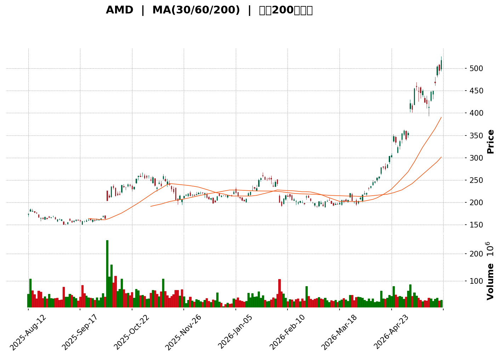
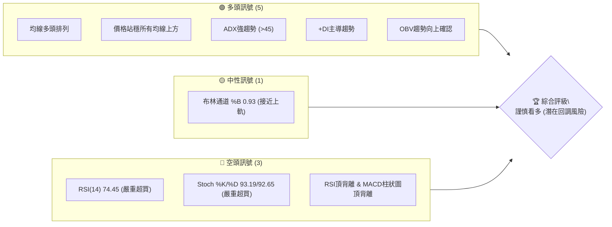
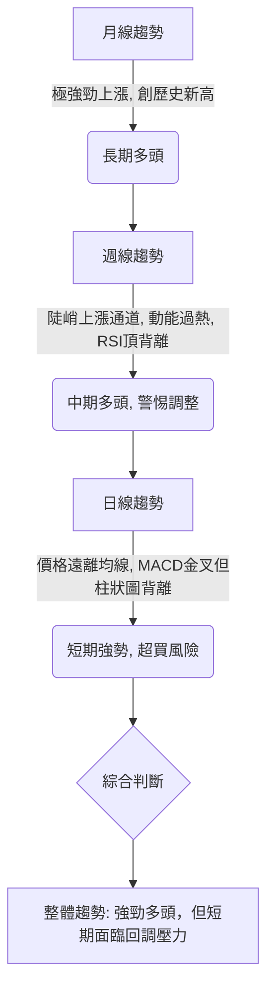
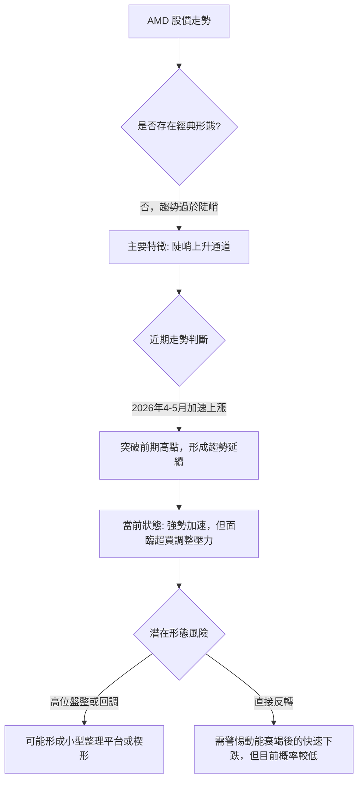
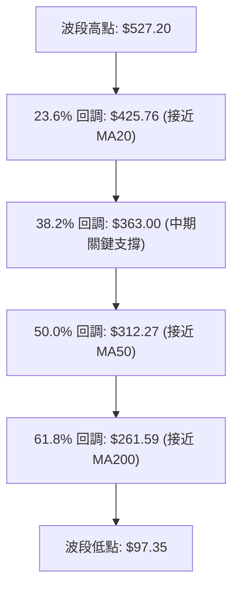
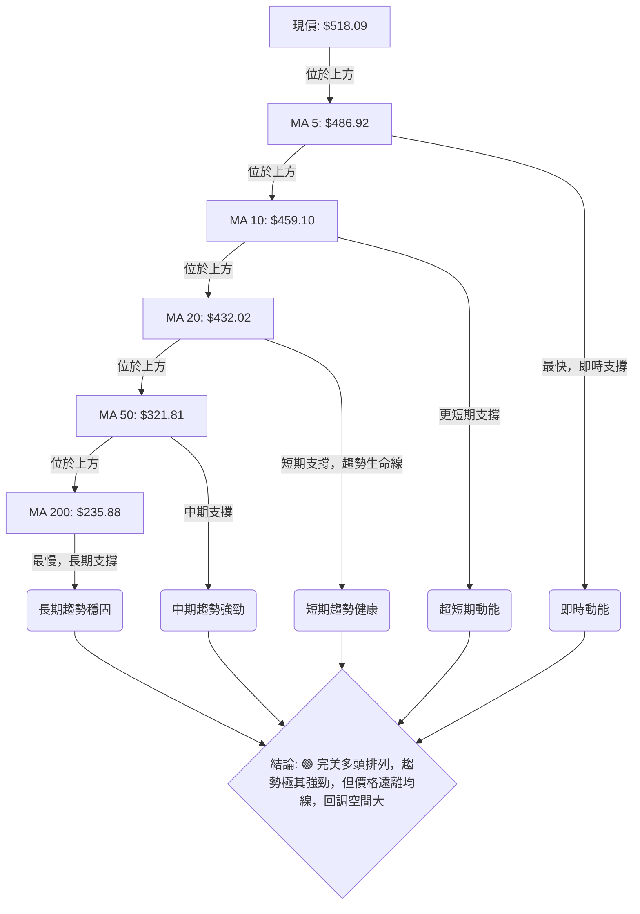

<details>
<summary>📊 靜態圖表 (點擊展開)</summary>

</details>

<html>
<head><meta charset="utf-8" /></head>
<body>
    <div>                        <script>window.PlotlyConfig = {MathJaxConfig: 'local'};</script>
        <script charset="utf-8" src="https://cdn.plot.ly/plotly-3.5.0.min.js" integrity="sha256-fHbNLP+GlIXN+efbQec78UkemUz3NJp7UmfGxC1tNxs=" crossorigin="anonymous"></script>                <div id="candlestick-chart" class="plotly-graph-div" style="height:500px; width:100%;"></div>            <script>                window.PLOTLYENV=window.PLOTLYENV || {};                                if (document.getElementById("candlestick-chart")) {                    Plotly.newPlot(                        "candlestick-chart",                        [{"close":{"dtype":"f8","bdata":"AAAAYGbeZUAAAACgcA1nQAAAAGBmnmZAAAAA4FEwZkAAAADgegRmQAAAAKCZ0WRAAAAAYGamZEAAAABguHZkQAAAAOBR+GRAAAAAIIVrZEAAAAAA19NkQAAAAAAp5GRAAAAAYI8SZUAAAAAAKVRkQAAAAIA9SmRAAAAAAClEZEAAAACgRzlkQAAAAOB65GJAAAAAwB7tYkAAAACAPXpjQAAAAKBH8WNAAAAAoHB1Y0AAAACAPdJjQAAAAMAeJWRAAAAAYLgOZEAAAADAHuVjQAAAAKBwvWNAAAAA4HqsY0AAAACgR\u002fljQAAAAMDMHGRAAAAAACkcZEAAAADgoyhkQAAAAGC47mNAAAAAIIUrZEAAAACgRzlkQAAAAOBRgGRAAAAAIFw3ZUAAAACgcJVkQAAAAGC4dmlAAAAA4FFwakAAAACA63FtQAAAAOB6HG1AAAAAwMzcakAAAACgcA1rQAAAAEDhQmtAAAAAQDPTbUAAAACA61FtQAAAAGCPIm1AAAAAgOsRbkAAAADA9cBtQAAAACBcx2xAAAAAIK5fbUAAAACgcJ1vQAAAAGC4OnBAAAAAACkgcEAAAACgR4VwQAAAAEDh2m9AAAAAgOsBcEAAAABgZjpwQAAAAKCZQW9AAAAAoEcFcEAAAABgZrZtQAAAAKBHMW1AAAAAIFx\u002fbkAAAADgo7BtQAAAAIA9LnBAAAAAYLj+bkAAAACA69luQAAAAOCjEG5AAAAAoEfJbEAAAACgmfFrQAAAAOCjwGlAAAAAwPV4aUAAAACgmeFqQAAAAAApxGlAAAAAIK7HakAAAADA9TBrQAAAAOBReGtAAAAAIK7nakAAAABAMzNrQAAAACBc\u002f2pAAAAAQAo\u002fa0AAAAAghaNrQAAAAADXs2tAAAAAoHCta0AAAACAwq1rQAAAAMD1WGpAAAAAYI\u002fyaUAAAACgcCVqQAAAACCFw2hAAAAAgOshaUAAAACAwq1qQAAAAGBm3mpAAAAAwMzcakAAAACgR+FqQAAAACCu32pAAAAAIIXzakAAAABA4epqQAAAAMAexWpAAAAAQArva0AAAABgj6JrQAAAAEAzy2pAAAAA4KNAakAAAACAwpVpQAAAAKBwZWlAAAAAgBT2aUAAAABACp9rQAAAAEAz82tAAAAAoHB9bEAAAABgj\u002fpsQAAAAKBw\u002fWxAAAAAoJk5b0AAAAAgXLdvQAAAAEDhOnBAAAAAgOtpb0AAAADA9YBvQAAAACCul29AAAAAgMKFb0AAAAAgXJdtQAAAAOCjyG5AAAAAIIVDbkAAAACAFAZpQAAAAAAAEGhAAAAAgBQOakAAAAAAAABrQAAAAIA9smpAAAAAYI+yakAAAACAFL5pQAAAAIA96mlAAAAAYI9iaUAAAAAA1wNpQAAAAADXa2lAAAAAwMwEaUAAAABAM5NoQAAAAEDhumpAAAAAIIVbakAAAACAwnVpQAAAAGC4BmlAAAAAANfTaEAAAABgZt5nQAAAAIA9QmlAAAAAYGbuaEAAAACAwg1oQAAAAIDCVWlAAAAAIFxnaUAAAABgj5ppQAAAACCut2hAAAAA4HosaEAAAABgj5JoQAAAAIDriWhAAAAAYLjuaEAAAADgo6hpQAAAAGCPKmlAAAAAgMJVaUAAAAAA16tpQAAAAOCjiGtAAAAA4KN4aUAAAAAgrj9pQAAAAKBHgWhAAAAAgMJtaUAAAABguEZqQAAAAAAAMGtAAAAAgMKFa0AAAADA9bBrQAAAAIA9+mxAAAAA4HqUbUAAAACgR6FuQAAAAGCP2m5AAAAAgD3ib0AAAACA6yFwQAAAAAApZHFAAAAAgD1mcUAAAABAMy9xQAAAAADXx3FAAAAAIFz3ckAAAACgRxVzQAAAAMD1vHVAAAAAgBTqdEAAAAAgXDN0QAAAAIDCEXVAAAAAANcndkAAAADgo4h2QAAAAOCjWHVAAAAAACk0dkAAAACAPVZ6QAAAACBch3lAAAAAQApzfEAAAADgo6x8QAAAAOCjBHxAAAAAAADYe0AAAABAMxt8QAAAAKCZgXpAAAAAANdPekAAAADAzOB5QAAAAKBH+XtAAAAAoHAZfEAAAAAAKTh9QAAAAIA9fn9AAAAA4KP4fkAAAABguDCAQA=="},"high":{"dtype":"f8","bdata":"AAAAwB7lZUAAAADAzFRnQAAAAIAULmdAAAAA4HqEZkAAAACgmVlmQAAAAKBwpWVAAAAAwMzUZEAAAAAAKbxkQAAAAMD1EGVAAAAAQOGyZEAAAADgozhlQAAAAIDC9WRAAAAAIK5fZUAAAACAPRJlQAAAAOB6TGRAAAAAAACYZEAAAACgmUFkQAAAAOB6pGNAAAAA4HoUY0AAAADAHpVjQAAAAMD1kGRAAAAAYLgGZEAAAADAHg1kQAAAAKCZSWRAAAAAYGY+ZEAAAAAAKTRkQAAAAOCj2GNAAAAAQOH6Y0AAAACAwlVkQAAAAOB6bGRAAAAAQDOjZEAAAAAAKTRkQAAAACCFQ2RAAAAAoJmJZEAAAADA9UhkQAAAAIDChWRAAAAAgOthZUAAAACAwlVlQAAAAGC4VmxAAAAAwMxca0AAAAAA13ttQAAAAEAzA25AAAAAQApHbUAAAACAFAZsQAAAACBcH2xAAAAAIK7nbUAAAABgZiZuQAAAAAApbG1AAAAAAClcbkAAAADgUUhuQAAAAAApBG5AAAAAwMx8bUAAAADgeqxvQAAAAGC4RnBAAAAAoEeJcEAAAACgR7FwQAAAAIAUfnBAAAAAgBRicEAAAABgj05wQAAAAIAUFnBAAAAAYGY6cEAAAADgUbBvQAAAAADXe21AAAAAwMwcb0AAAABguA5vQAAAAAApeHBAAAAAgBQ6cEAAAACAFK5vQAAAAOCjGG9AAAAAAADAbUAAAADA9WhtQAAAAAAASG1AAAAAYI8aakAAAAAAKSRrQAAAAGCP0mlAAAAAQOHyakAAAACgmUlrQAAAACBcn2tAAAAAIFw\u002fbEAAAABgZkZrQAAAAADXY2tAAAAA4Hr0a0AAAABguPZrQAAAAEDhGmxAAAAAIIXTa0AAAAAAALBrQAAAACCuz2tAAAAAIIXrakAAAABACkdqQAAAAAAAcGpAAAAAIIXLaUAAAACAwuVqQAAAAKBwhWtAAAAAwPUga0AAAACgRxFrQAAAAGCPGmtAAAAAoJkBa0AAAACAPRprQAAAAOB6NGtAAAAAwMxkbEAAAADgo0BtQAAAAKBw3WtAAAAAACmEakAAAACAFF5qQAAAAKCZ6WlAAAAAACk8akAAAAAgheNrQAAAAEDhAmxAAAAAQDPLbUAAAAAgrk9tQAAAAAAA8G1AAAAAwMycb0AAAACgRwFwQAAAACBcr3BAAAAA4KMkcEAAAACgmfFvQAAAAGBmFnBAAAAA4HpIcEAAAAAgrqduQAAAAEAKP29AAAAAwMyUb0AAAABgj1JrQAAAAKBHgWlAAAAA4KMoakAAAABAMzNrQAAAAOB6bGtAAAAAwMx0a0AAAABguE5rQAAAAKCZQWpAAAAAoJmpaUAAAABgZmZpQAAAAEAzg2lAAAAAANebaUAAAAAAKexoQAAAAGC4FmtAAAAAYGYWa0AAAACgRzlqQAAAAOB6PGlAAAAAIK7XaEAAAADgejRoQAAAAIAUTmlAAAAAoEd5aUAAAAAgrgdpQAAAAEAKX2lAAAAAQOHSaUAAAABguCZqQAAAAADXc2lAAAAAgML1aEAAAACgcAVpQAAAAGC45mhAAAAAIIVbaUAAAAAAKbxpQAAAAKCZyWlAAAAAIIUjakAAAACAws1pQAAAAGCPqmtAAAAAAACga0AAAADgo2hpQAAAAIDCDWpAAAAAAACAaUAAAABgj7pqQAAAAMD1OGtAAAAAgOtJbEAAAABAM8NrQAAAAAAAQG1AAAAAQDOjbUAAAABgjzJvQAAAAGCP6m5AAAAAYLjub0AAAABA4SJwQAAAAKBwdXFAAAAAwMyQcUAAAACAwvlxQAAAAEAz43FAAAAAAAAEc0AAAAAghWNzQAAAAADXD3ZAAAAAIFzTdUAAAAAAAHh0QAAAAGC4QnVAAAAAIFwvdkAAAADgo6x2QAAAAKCZnXZAAAAAwB55dkAAAACgmel6QAAAACBcW3pAAAAA4KOEfEAAAAAghVN9QAAAAMDMrHxAAAAAAAC4fEAAAADA9VR8QAAAAAAAcHtAAAAAwMxse0AAAAAAAMx6QAAAAIA9FnxAAAAAQDMzfEAAAABgjxZ+QAAAACBcr39AAAAAIFzjf0AAAABgmXmAQA=="},"hovertemplate":"\u003cb\u003e%{x|%Y-%m-%d}\u003c\u002fb\u003e\u003cbr\u003e\u958b: $%{open:.2f}\u003cbr\u003e\u9ad8: $%{high:.2f}\u003cbr\u003e\u4f4e: $%{low:.2f}\u003cbr\u003e\u6536: $%{close:.2f}\u003cextra\u003e\u003c\u002fextra\u003e","low":{"dtype":"f8","bdata":"AAAAAAAQZUAAAAAAKWxmQAAAAIDrcWZAAAAAAAAIZkAAAAAghctlQAAAAEAzw2RAAAAAAADIY0AAAADgUUhkQAAAAKCZOWRAAAAAQAo3ZEAAAADAHp1kQAAAAMDMlGRAAAAAwMzUZEAAAADAzDxkQAAAAADXk2NAAAAAYI8SZEAAAACgR7ljQAAAAIDCxWJAAAAAQAqnYkAAAACAwv1iQAAAAAAAwGNAAAAAIK5fY0AAAACgcF1jQAAAAEAzs2NAAAAAQArnY0AAAADgUXhjQAAAAEAzu2JAAAAAwMx8Y0AAAACgcK1jQAAAAGC45mNAAAAAgMLNY0AAAADA9VhjQAAAAKCZoWNAAAAAwMz8Y0AAAABgj+pjQAAAACCuD2RAAAAAANfDZEAAAADgemRkQAAAAOBRYGlAAAAAwPUoakAAAABgZlZqQAAAAMD1sGxAAAAAYGamakAAAADAzNxqQAAAAMDM\u002fGpAAAAA4FGYa0AAAAAgrgdtQAAAAMAefWxAAAAAwMxMbUAAAADgo0BtQAAAAAApHGxAAAAAoEeRbEAAAABgZj5uQAAAAKCZOW9AAAAAAAAQcEAAAABgZhZwQAAAAIDriW9AAAAAwB6tb0AAAADgerxvQAAAAOB67G5AAAAAgOtZbkAAAAAgrndtQAAAAOB6FGxAAAAAAAAQbkAAAADgelRtQAAAAAAAQG9AAAAAgOvBbkAAAABgj2JtQAAAAMDMpG1AAAAAYLgWbEAAAABguHZrQAAAAMD1kGlAAAAAAABgaEAAAABAM7tpQAAAAMD1SGhAAAAAAADgaUAAAADgo8BqQAAAAAAAsGpAAAAA4HrMakAAAADgo3hqQAAAAOB6xGpAAAAAIK4Ha0AAAAAghUtrQAAAAMAePWtAAAAAoHBVa0AAAACAFEZqQAAAAIDrIWpAAAAAYI\u002fSaUAAAAAghaNpQAAAAMD1sGhAAAAAAAAQaUAAAABgZoZpQAAAAIDrqWpAAAAAwPWIakAAAABACr9qQAAAAMD1oGpAAAAAIK4nakAAAABgj8pqQAAAAKCZuWpAAAAAwMxca0AAAAAgXI9rQAAAAAAAaGpAAAAAoHDlaUAAAABgj2ppQAAAAIA9YmlAAAAAoJn5aEAAAAAgXN9qQAAAACCF42pAAAAAQApnbEAAAAAghZtsQAAAAMAeLWxAAAAAwPV4bUAAAAAAKdRuQAAAAAAABHBAAAAAoJlJb0AAAABguP5uQAAAAGC4Rm9AAAAAwB4dbkAAAACgmVFtQAAAAAAAYG1AAAAAoEehbUAAAADAzORoQAAAAEAK12dAAAAAgMKNaEAAAADAzIRpQAAAAAAppGpAAAAAYLgmakAAAADgeqRpQAAAAAApfGlAAAAAYI9aaEAAAAAAAGBoQAAAAKBHyWhAAAAAgOvRaEAAAADAzERoQAAAAAAA0GlAAAAAYI9KakAAAABguC5pQAAAACCut2hAAAAAAADAZ0AAAABACodnQAAAACCFu2dAAAAAAClcaEAAAAAAAOhnQAAAAOCjoGdAAAAAYGZGaUAAAAAAKXRpQAAAAKBwlWhAAAAA4KMIaEAAAACgmVloQAAAAOBRaGhAAAAAAAB4aEAAAABgjxpoQAAAAOBRyGhAAAAAYLg2aUAAAAAAKQRpQAAAAOBRcGpAAAAAgMJtaUAAAACAFLZoQAAAAADXG2hAAAAAwB6NaEAAAABA4bppQAAAAADXE2lAAAAAIFw3a0AAAAAAKexqQAAAAEDhYmxAAAAAwB7dbEAAAABguN5tQAAAAMD1QG5AAAAAYGa2bkAAAABAM3tvQAAAAAApWHBAAAAAgD0icUAAAAAAAABxQAAAAIDrSXFAAAAAgD3icUAAAAAAKbxyQAAAAOCj6HRAAAAAwPWMdEAAAAAAAGBzQAAAAIDC7XNAAAAAoJnJdEAAAAAAANR1QAAAAEAzK3VAAAAAgBSOdUAAAADgoyB5QAAAAKBHEXlAAAAA4KMkekAAAACAFC58QAAAAIDCoXpAAAAAYGYKe0AAAABA4Tp7QAAAAIDCdXpAAAAAIFyreUAAAACAwpV4QAAAAMDMoHpAAAAAoJn5ekAAAAAgXNt8QAAAACCuA35AAAAAYI9qfkAAAADgUdh+QA=="},"name":"\u50f9\u683c","open":{"dtype":"f8","bdata":"AAAAgD2qZUAAAADAHn1mQAAAAGCPemZAAAAAgOuBZkAAAADgURhmQAAAAEAzo2VAAAAAQDODZEAAAAAghbtkQAAAAKBwRWRAAAAAoJmxZEAAAADAzBRlQAAAAKBHwWRAAAAAAAAQZUAAAACA69lkQAAAAKBwzWNAAAAAgOs5ZEAAAACAFP5jQAAAAADXo2NAAAAAoJn5YkAAAAAgrv9iQAAAAKBHcWRAAAAAANfTY0AAAAAAAKBjQAAAAOBRAGRAAAAAANcrZEAAAADA9ehjQAAAAGC43mJAAAAAACmsY0AAAACgcK1jQAAAAOCjEGRAAAAAIFxfZEAAAADgeqRjQAAAAOCjEGRAAAAAANcDZEAAAACgRxlkQAAAAIDCHWRAAAAAgMIVZUAAAACAwlVlQAAAAGBmTmxAAAAAQDPbakAAAABgZp5qQAAAAKCZiW1AAAAA4KMYbUAAAABgZoZrQAAAAGBmZmtAAAAAYLjWa0AAAACgR4ltQAAAAOBRKG1AAAAAQAqPbUAAAADgeuxtQAAAAEAzm21AAAAAwB7FbEAAAAAghWtuQAAAAIAUHnBAAAAAgD0ycEAAAABACoNwQAAAAGC4PnBAAAAAoJk5cEAAAACgRzVwQAAAAEAzS29AAAAAIK5nbkAAAABACq9vQAAAAIAU3mxAAAAA4HpEbkAAAADAHjVuQAAAAAAppG9AAAAAwMx8b0AAAAAghQNuQAAAAAAAWG5AAAAAwPWYbUAAAADgUchsQAAAAGBmFm1AAAAAgOsZakAAAADAHuVpQAAAACBcL2lAAAAAoJlBakAAAADgegRrQAAAAAApvGpAAAAAoEe5a0AAAADgUQhrQAAAAAApHGtAAAAAoHAla0AAAABA4WJrQAAAAKBHoWtAAAAAAADAa0AAAACA6zlrQAAAAADXS2tAAAAAwPWIakAAAACgcN1pQAAAAKBHQWpAAAAAgD16aUAAAABAM5NpQAAAAAAAgGtAAAAAIIWbakAAAAAgXN9qQAAAAIDC7WpAAAAAYI9yakAAAAAA1\u002ftqQAAAAIA9+mpAAAAAwMxca0AAAAAAAMhsQAAAAGC41mtAAAAAACmEakAAAADAzFxqQAAAAEAKt2lAAAAAgMIlaUAAAABAM+NqQAAAAKBHMWtAAAAAwMx8bEAAAACgmUltQAAAAGCPQmxAAAAAIK5\u002fbUAAAAAAAHhvQAAAAEDhUnBAAAAAAAAMcEAAAADAHoVvQAAAAAApxG9AAAAAwB7Vb0AAAACAwp1tQAAAAOCjeG1AAAAAoJlxb0AAAAAAAOBqQAAAACCFO2lAAAAAACmkaEAAAADAzNxpQAAAAOB65GpAAAAAACk8a0AAAABgj\u002fpqQAAAAOCjgGlAAAAAwMxEaUAAAADAHs1oQAAAACCFA2lAAAAAANcDaUAAAABA4cJoQAAAAAApdGpAAAAAgD3aakAAAACgmRlqQAAAACCFA2lAAAAAQDM7aEAAAABguO5nQAAAAADXA2hAAAAA4KO4aEAAAADgo2hoQAAAACCFq2dAAAAA4FFQaUAAAAAghaNpQAAAAGCPWmlAAAAAIIXDaEAAAAAgXF9oQAAAAIDClWhAAAAAAACAaEAAAADA9WBoQAAAAOB6nGlAAAAAwMzMaUAAAADgeixpQAAAAOBRcGpAAAAAIFw\u002fa0AAAADgozhpQAAAAGBmnmlAAAAAoJnBaEAAAABA4fJpQAAAAKCZgWlAAAAAwPVoa0AAAADgUUhrQAAAAADXA21AAAAA4FEgbUAAAAAAAOBtQAAAAMD1oG5AAAAAoEc5b0AAAABguN5vQAAAAADXj3BAAAAAAACQcUAAAACgmYlxQAAAAKBHVXFAAAAAIIUzckAAAAAAKeByQAAAAAApDHVAAAAAwB6ldUAAAACAwn1zQAAAAKBHaXRAAAAAgMJVdUAAAACA6\u002f11QAAAAMD1hHZAAAAAACn4dUAAAAAA15d5QAAAAMAeEXpAAAAAoHApekAAAADAzMh8QAAAAAAAFHxAAAAA4KOQfEAAAACgmYl7QAAAAKBwFXtAAAAAAADYekAAAACgmcl5QAAAAOCjwHpAAAAAANefe0AAAACgcF19QAAAAADXS35AAAAAAADAf0AAAABguCp\u002fQA=="},"x":["2025-08-12T00:00:00-04:00","2025-08-13T00:00:00-04:00","2025-08-14T00:00:00-04:00","2025-08-15T00:00:00-04:00","2025-08-18T00:00:00-04:00","2025-08-19T00:00:00-04:00","2025-08-20T00:00:00-04:00","2025-08-21T00:00:00-04:00","2025-08-22T00:00:00-04:00","2025-08-25T00:00:00-04:00","2025-08-26T00:00:00-04:00","2025-08-27T00:00:00-04:00","2025-08-28T00:00:00-04:00","2025-08-29T00:00:00-04:00","2025-09-02T00:00:00-04:00","2025-09-03T00:00:00-04:00","2025-09-04T00:00:00-04:00","2025-09-05T00:00:00-04:00","2025-09-08T00:00:00-04:00","2025-09-09T00:00:00-04:00","2025-09-10T00:00:00-04:00","2025-09-11T00:00:00-04:00","2025-09-12T00:00:00-04:00","2025-09-15T00:00:00-04:00","2025-09-16T00:00:00-04:00","2025-09-17T00:00:00-04:00","2025-09-18T00:00:00-04:00","2025-09-19T00:00:00-04:00","2025-09-22T00:00:00-04:00","2025-09-23T00:00:00-04:00","2025-09-24T00:00:00-04:00","2025-09-25T00:00:00-04:00","2025-09-26T00:00:00-04:00","2025-09-29T00:00:00-04:00","2025-09-30T00:00:00-04:00","2025-10-01T00:00:00-04:00","2025-10-02T00:00:00-04:00","2025-10-03T00:00:00-04:00","2025-10-06T00:00:00-04:00","2025-10-07T00:00:00-04:00","2025-10-08T00:00:00-04:00","2025-10-09T00:00:00-04:00","2025-10-10T00:00:00-04:00","2025-10-13T00:00:00-04:00","2025-10-14T00:00:00-04:00","2025-10-15T00:00:00-04:00","2025-10-16T00:00:00-04:00","2025-10-17T00:00:00-04:00","2025-10-20T00:00:00-04:00","2025-10-21T00:00:00-04:00","2025-10-22T00:00:00-04:00","2025-10-23T00:00:00-04:00","2025-10-24T00:00:00-04:00","2025-10-27T00:00:00-04:00","2025-10-28T00:00:00-04:00","2025-10-29T00:00:00-04:00","2025-10-30T00:00:00-04:00","2025-10-31T00:00:00-04:00","2025-11-03T00:00:00-05:00","2025-11-04T00:00:00-05:00","2025-11-05T00:00:00-05:00","2025-11-06T00:00:00-05:00","2025-11-07T00:00:00-05:00","2025-11-10T00:00:00-05:00","2025-11-11T00:00:00-05:00","2025-11-12T00:00:00-05:00","2025-11-13T00:00:00-05:00","2025-11-14T00:00:00-05:00","2025-11-17T00:00:00-05:00","2025-11-18T00:00:00-05:00","2025-11-19T00:00:00-05:00","2025-11-20T00:00:00-05:00","2025-11-21T00:00:00-05:00","2025-11-24T00:00:00-05:00","2025-11-25T00:00:00-05:00","2025-11-26T00:00:00-05:00","2025-11-28T00:00:00-05:00","2025-12-01T00:00:00-05:00","2025-12-02T00:00:00-05:00","2025-12-03T00:00:00-05:00","2025-12-04T00:00:00-05:00","2025-12-05T00:00:00-05:00","2025-12-08T00:00:00-05:00","2025-12-09T00:00:00-05:00","2025-12-10T00:00:00-05:00","2025-12-11T00:00:00-05:00","2025-12-12T00:00:00-05:00","2025-12-15T00:00:00-05:00","2025-12-16T00:00:00-05:00","2025-12-17T00:00:00-05:00","2025-12-18T00:00:00-05:00","2025-12-19T00:00:00-05:00","2025-12-22T00:00:00-05:00","2025-12-23T00:00:00-05:00","2025-12-24T00:00:00-05:00","2025-12-26T00:00:00-05:00","2025-12-29T00:00:00-05:00","2025-12-30T00:00:00-05:00","2025-12-31T00:00:00-05:00","2026-01-02T00:00:00-05:00","2026-01-05T00:00:00-05:00","2026-01-06T00:00:00-05:00","2026-01-07T00:00:00-05:00","2026-01-08T00:00:00-05:00","2026-01-09T00:00:00-05:00","2026-01-12T00:00:00-05:00","2026-01-13T00:00:00-05:00","2026-01-14T00:00:00-05:00","2026-01-15T00:00:00-05:00","2026-01-16T00:00:00-05:00","2026-01-20T00:00:00-05:00","2026-01-21T00:00:00-05:00","2026-01-22T00:00:00-05:00","2026-01-23T00:00:00-05:00","2026-01-26T00:00:00-05:00","2026-01-27T00:00:00-05:00","2026-01-28T00:00:00-05:00","2026-01-29T00:00:00-05:00","2026-01-30T00:00:00-05:00","2026-02-02T00:00:00-05:00","2026-02-03T00:00:00-05:00","2026-02-04T00:00:00-05:00","2026-02-05T00:00:00-05:00","2026-02-06T00:00:00-05:00","2026-02-09T00:00:00-05:00","2026-02-10T00:00:00-05:00","2026-02-11T00:00:00-05:00","2026-02-12T00:00:00-05:00","2026-02-13T00:00:00-05:00","2026-02-17T00:00:00-05:00","2026-02-18T00:00:00-05:00","2026-02-19T00:00:00-05:00","2026-02-20T00:00:00-05:00","2026-02-23T00:00:00-05:00","2026-02-24T00:00:00-05:00","2026-02-25T00:00:00-05:00","2026-02-26T00:00:00-05:00","2026-02-27T00:00:00-05:00","2026-03-02T00:00:00-05:00","2026-03-03T00:00:00-05:00","2026-03-04T00:00:00-05:00","2026-03-05T00:00:00-05:00","2026-03-06T00:00:00-05:00","2026-03-09T00:00:00-04:00","2026-03-10T00:00:00-04:00","2026-03-11T00:00:00-04:00","2026-03-12T00:00:00-04:00","2026-03-13T00:00:00-04:00","2026-03-16T00:00:00-04:00","2026-03-17T00:00:00-04:00","2026-03-18T00:00:00-04:00","2026-03-19T00:00:00-04:00","2026-03-20T00:00:00-04:00","2026-03-23T00:00:00-04:00","2026-03-24T00:00:00-04:00","2026-03-25T00:00:00-04:00","2026-03-26T00:00:00-04:00","2026-03-27T00:00:00-04:00","2026-03-30T00:00:00-04:00","2026-03-31T00:00:00-04:00","2026-04-01T00:00:00-04:00","2026-04-02T00:00:00-04:00","2026-04-06T00:00:00-04:00","2026-04-07T00:00:00-04:00","2026-04-08T00:00:00-04:00","2026-04-09T00:00:00-04:00","2026-04-10T00:00:00-04:00","2026-04-13T00:00:00-04:00","2026-04-14T00:00:00-04:00","2026-04-15T00:00:00-04:00","2026-04-16T00:00:00-04:00","2026-04-17T00:00:00-04:00","2026-04-20T00:00:00-04:00","2026-04-21T00:00:00-04:00","2026-04-22T00:00:00-04:00","2026-04-23T00:00:00-04:00","2026-04-24T00:00:00-04:00","2026-04-27T00:00:00-04:00","2026-04-28T00:00:00-04:00","2026-04-29T00:00:00-04:00","2026-04-30T00:00:00-04:00","2026-05-01T00:00:00-04:00","2026-05-04T00:00:00-04:00","2026-05-05T00:00:00-04:00","2026-05-06T00:00:00-04:00","2026-05-07T00:00:00-04:00","2026-05-08T00:00:00-04:00","2026-05-11T00:00:00-04:00","2026-05-12T00:00:00-04:00","2026-05-13T00:00:00-04:00","2026-05-14T00:00:00-04:00","2026-05-15T00:00:00-04:00","2026-05-18T00:00:00-04:00","2026-05-19T00:00:00-04:00","2026-05-20T00:00:00-04:00","2026-05-21T00:00:00-04:00","2026-05-22T00:00:00-04:00","2026-05-26T00:00:00-04:00","2026-05-27T00:00:00-04:00","2026-05-28T00:00:00-04:00"],"type":"candlestick"},{"hovertemplate":"MA30: $%{y:.2f}\u003cextra\u003e\u003c\u002fextra\u003e","line":{"color":"#2196F3","dash":"dash","width":2},"mode":"lines","name":"MA30","x":["2025-08-12T00:00:00-04:00","2025-08-13T00:00:00-04:00","2025-08-14T00:00:00-04:00","2025-08-15T00:00:00-04:00","2025-08-18T00:00:00-04:00","2025-08-19T00:00:00-04:00","2025-08-20T00:00:00-04:00","2025-08-21T00:00:00-04:00","2025-08-22T00:00:00-04:00","2025-08-25T00:00:00-04:00","2025-08-26T00:00:00-04:00","2025-08-27T00:00:00-04:00","2025-08-28T00:00:00-04:00","2025-08-29T00:00:00-04:00","2025-09-02T00:00:00-04:00","2025-09-03T00:00:00-04:00","2025-09-04T00:00:00-04:00","2025-09-05T00:00:00-04:00","2025-09-08T00:00:00-04:00","2025-09-09T00:00:00-04:00","2025-09-10T00:00:00-04:00","2025-09-11T00:00:00-04:00","2025-09-12T00:00:00-04:00","2025-09-15T00:00:00-04:00","2025-09-16T00:00:00-04:00","2025-09-17T00:00:00-04:00","2025-09-18T00:00:00-04:00","2025-09-19T00:00:00-04:00","2025-09-22T00:00:00-04:00","2025-09-23T00:00:00-04:00","2025-09-24T00:00:00-04:00","2025-09-25T00:00:00-04:00","2025-09-26T00:00:00-04:00","2025-09-29T00:00:00-04:00","2025-09-30T00:00:00-04:00","2025-10-01T00:00:00-04:00","2025-10-02T00:00:00-04:00","2025-10-03T00:00:00-04:00","2025-10-06T00:00:00-04:00","2025-10-07T00:00:00-04:00","2025-10-08T00:00:00-04:00","2025-10-09T00:00:00-04:00","2025-10-10T00:00:00-04:00","2025-10-13T00:00:00-04:00","2025-10-14T00:00:00-04:00","2025-10-15T00:00:00-04:00","2025-10-16T00:00:00-04:00","2025-10-17T00:00:00-04:00","2025-10-20T00:00:00-04:00","2025-10-21T00:00:00-04:00","2025-10-22T00:00:00-04:00","2025-10-23T00:00:00-04:00","2025-10-24T00:00:00-04:00","2025-10-27T00:00:00-04:00","2025-10-28T00:00:00-04:00","2025-10-29T00:00:00-04:00","2025-10-30T00:00:00-04:00","2025-10-31T00:00:00-04:00","2025-11-03T00:00:00-05:00","2025-11-04T00:00:00-05:00","2025-11-05T00:00:00-05:00","2025-11-06T00:00:00-05:00","2025-11-07T00:00:00-05:00","2025-11-10T00:00:00-05:00","2025-11-11T00:00:00-05:00","2025-11-12T00:00:00-05:00","2025-11-13T00:00:00-05:00","2025-11-14T00:00:00-05:00","2025-11-17T00:00:00-05:00","2025-11-18T00:00:00-05:00","2025-11-19T00:00:00-05:00","2025-11-20T00:00:00-05:00","2025-11-21T00:00:00-05:00","2025-11-24T00:00:00-05:00","2025-11-25T00:00:00-05:00","2025-11-26T00:00:00-05:00","2025-11-28T00:00:00-05:00","2025-12-01T00:00:00-05:00","2025-12-02T00:00:00-05:00","2025-12-03T00:00:00-05:00","2025-12-04T00:00:00-05:00","2025-12-05T00:00:00-05:00","2025-12-08T00:00:00-05:00","2025-12-09T00:00:00-05:00","2025-12-10T00:00:00-05:00","2025-12-11T00:00:00-05:00","2025-12-12T00:00:00-05:00","2025-12-15T00:00:00-05:00","2025-12-16T00:00:00-05:00","2025-12-17T00:00:00-05:00","2025-12-18T00:00:00-05:00","2025-12-19T00:00:00-05:00","2025-12-22T00:00:00-05:00","2025-12-23T00:00:00-05:00","2025-12-24T00:00:00-05:00","2025-12-26T00:00:00-05:00","2025-12-29T00:00:00-05:00","2025-12-30T00:00:00-05:00","2025-12-31T00:00:00-05:00","2026-01-02T00:00:00-05:00","2026-01-05T00:00:00-05:00","2026-01-06T00:00:00-05:00","2026-01-07T00:00:00-05:00","2026-01-08T00:00:00-05:00","2026-01-09T00:00:00-05:00","2026-01-12T00:00:00-05:00","2026-01-13T00:00:00-05:00","2026-01-14T00:00:00-05:00","2026-01-15T00:00:00-05:00","2026-01-16T00:00:00-05:00","2026-01-20T00:00:00-05:00","2026-01-21T00:00:00-05:00","2026-01-22T00:00:00-05:00","2026-01-23T00:00:00-05:00","2026-01-26T00:00:00-05:00","2026-01-27T00:00:00-05:00","2026-01-28T00:00:00-05:00","2026-01-29T00:00:00-05:00","2026-01-30T00:00:00-05:00","2026-02-02T00:00:00-05:00","2026-02-03T00:00:00-05:00","2026-02-04T00:00:00-05:00","2026-02-05T00:00:00-05:00","2026-02-06T00:00:00-05:00","2026-02-09T00:00:00-05:00","2026-02-10T00:00:00-05:00","2026-02-11T00:00:00-05:00","2026-02-12T00:00:00-05:00","2026-02-13T00:00:00-05:00","2026-02-17T00:00:00-05:00","2026-02-18T00:00:00-05:00","2026-02-19T00:00:00-05:00","2026-02-20T00:00:00-05:00","2026-02-23T00:00:00-05:00","2026-02-24T00:00:00-05:00","2026-02-25T00:00:00-05:00","2026-02-26T00:00:00-05:00","2026-02-27T00:00:00-05:00","2026-03-02T00:00:00-05:00","2026-03-03T00:00:00-05:00","2026-03-04T00:00:00-05:00","2026-03-05T00:00:00-05:00","2026-03-06T00:00:00-05:00","2026-03-09T00:00:00-04:00","2026-03-10T00:00:00-04:00","2026-03-11T00:00:00-04:00","2026-03-12T00:00:00-04:00","2026-03-13T00:00:00-04:00","2026-03-16T00:00:00-04:00","2026-03-17T00:00:00-04:00","2026-03-18T00:00:00-04:00","2026-03-19T00:00:00-04:00","2026-03-20T00:00:00-04:00","2026-03-23T00:00:00-04:00","2026-03-24T00:00:00-04:00","2026-03-25T00:00:00-04:00","2026-03-26T00:00:00-04:00","2026-03-27T00:00:00-04:00","2026-03-30T00:00:00-04:00","2026-03-31T00:00:00-04:00","2026-04-01T00:00:00-04:00","2026-04-02T00:00:00-04:00","2026-04-06T00:00:00-04:00","2026-04-07T00:00:00-04:00","2026-04-08T00:00:00-04:00","2026-04-09T00:00:00-04:00","2026-04-10T00:00:00-04:00","2026-04-13T00:00:00-04:00","2026-04-14T00:00:00-04:00","2026-04-15T00:00:00-04:00","2026-04-16T00:00:00-04:00","2026-04-17T00:00:00-04:00","2026-04-20T00:00:00-04:00","2026-04-21T00:00:00-04:00","2026-04-22T00:00:00-04:00","2026-04-23T00:00:00-04:00","2026-04-24T00:00:00-04:00","2026-04-27T00:00:00-04:00","2026-04-28T00:00:00-04:00","2026-04-29T00:00:00-04:00","2026-04-30T00:00:00-04:00","2026-05-01T00:00:00-04:00","2026-05-04T00:00:00-04:00","2026-05-05T00:00:00-04:00","2026-05-06T00:00:00-04:00","2026-05-07T00:00:00-04:00","2026-05-08T00:00:00-04:00","2026-05-11T00:00:00-04:00","2026-05-12T00:00:00-04:00","2026-05-13T00:00:00-04:00","2026-05-14T00:00:00-04:00","2026-05-15T00:00:00-04:00","2026-05-18T00:00:00-04:00","2026-05-19T00:00:00-04:00","2026-05-20T00:00:00-04:00","2026-05-21T00:00:00-04:00","2026-05-22T00:00:00-04:00","2026-05-26T00:00:00-04:00","2026-05-27T00:00:00-04:00","2026-05-28T00:00:00-04:00"],"y":{"dtype":"f8","bdata":"AAAAAAAA+H8AAAAAAAD4fwAAAAAAAPh\u002fAAAAAAAA+H8AAAAAAAD4fwAAAAAAAPh\u002fAAAAAAAA+H8AAAAAAAD4fwAAAAAAAPh\u002fAAAAAAAA+H8AAAAAAAD4fwAAAAAAAPh\u002fAAAAAAAA+H8AAAAAAAD4fwAAAAAAAPh\u002fAAAAAAAA+H8AAAAAAAD4fwAAAAAAAPh\u002fAAAAAAAA+H8AAAAAAAD4fwAAAAAAAPh\u002fAAAAAAAA+H8AAAAAAAD4fwAAAAAAAPh\u002fAAAAAAAA+H8AAAAAAAD4fwAAAAAAAPh\u002fAAAAAAAA+H8AAAAAAAD4fwAAALC5gGRAREREpLdxZEBmZmYmBllkQDMzM\u002fMZQmRAzczM7N8wZECrqqpqkSFkQDMzM9PbHmRAERER0bAjZEBVVVX1tiRkQFVVVbUPS2RA3t3d3Wt+ZEBVVVUV9cdkQCIiIvIZDmVAREREZII\u002fZUBVVVWl4nhlQCIiIpJftGVAq6qq+vAFZkCrqqoKkFNmQAAAACD3qmZAREREBA8KZ0AzMzPTv2FnQImIiOgmrWdA7+7ujsIBaEBVVVVlZmZoQCIiIjJ6z2hAmpmZ2Yc3aUBEREREtqdpQDMzM+MXD2pAIiIiwmd4akAiIiIy7OJqQHd3dxcEQmtAzczMTNSna0CJiIjIWvlrQO\u002fu7o5fSGxAMzMzU4CgbECrqqqqR\u002fFsQM3MzDx8Vm1A7+7uPu6pbUARERHxiwFuQGZmZobPKG5Ad3d3t9c8bkAAAAAwCDBuQDMzM+NeE25AMzMzY4IHbkCamZlJDAZuQJqZmWlK+W1AIiIigk7fbUDv7u4uJM1tQO\u002fu7u7uvm1AMzMz4+yjbUAzMzMjIo5tQAAAAPDufm1Ad3d3V8dsbUB3d3cX2UptQGZmZuZCIm1AMzMzYzv7bEBERETUeM1sQDMzM4N5nmxAvLu727JqbEBERER02jRsQO\u002fu7l5z\u002fWtAq6qq+n7Ca0BmZmamm6hrQHd3d1fHlGtAAAAAkMJ1a0BVVVUFyF1rQERERGT0LmtA7+7urnIMa0BmZmZG4epqQM3MzDzDzmpAzczM7HzHakAzMzNz2sRqQImIiBi9zWpAiYiICGXUakBERERUVclqQM3MzAwtxmpAZmZmdjC\u002fakAAAADQ28JqQERERGT0xmpAAAAA4HrUakDNzMycqONqQLy7u0up9GpAIiIiAp0Wa0ARERFxaDlrQLy7u1sBYmtAIiIiUuOBa0CamZkph6JrQKuqqgpJz2tAAAAA0Nv+a0B3d3eHQRxsQLy7u2ugT2xA7+7uzml7bECJiIhoSm1sQAAAABBYVWxA3t3dDXRObEAzMzMzek9sQCIiInL2TWxA7+7uHsxLbEC8u7tLxUFsQFVVVYV5OmxAERERsbkkbEBmZmY2Xg5sQAAAAPCnAmxARERExCD4a0BERERkgu9rQDMzMwPk+mtAIiIiokX+a0Dv7u5O1OtrQHd3d0fh0mtAzczMbKCza0BVVVV1BYhrQLy7u2suaGtAMzMzg3kya0BmZmaGFvFqQJqZmblJtGpA3t3drQCBakDv7u7up05qQERERET9E2pA3t3drUfVaUDe3d0NdKppQERERKQpdWlAmpmZWatHaUB3d3eHFk1pQFVVVbWBVmlAd3d311xQaUBEREQkBkVpQAAAALArTGlAd3d357RBaUCrqqpKfj1pQImIiBh2MWlAq6qqqtUxaUCamZnpmDxpQImIiFirS2lA7+7u3ghhaUC8u7troHtpQJqZmSnOjmlAIiIi0k2qaUC8u7vba9ZpQJqZmTkmCGpAd3d311xEakCrqqq6AoxqQN7d3a1H3WpAERERkXsxa0CJiIgIgYlrQN7d3Z3E4GtAZmZmFq5LbECJiIhI4bZsQFVVVWX0Vm1AVVVVVZztbUAzMzPDrnRuQLy7u4veCm9AERERETywb0CJiIiQ7SpwQHd3d+e0dXBAmpmZKRXHcECJiIgYSzpxQFVVVU2pnnFAMzMzg8AkckDe3d1Ftq1yQO\u002fu7s4+NHNA7+7ublm1c0BVVVXNEzV0QO\u002fu7pZDo3RAERER2VwOdUBmZmY+CnV1QERERKwc6HVAIiIicq9ZdkDNzMwEVtB2QHd3d0dvWXdAMzMzc6\u002fZd0BmZmYGVmR4QA=="},"type":"scatter"},{"hovertemplate":"MA60: $%{y:.2f}\u003cextra\u003e\u003c\u002fextra\u003e","line":{"color":"#9C27B0","dash":"dash","width":2},"mode":"lines","name":"MA60","x":["2025-08-12T00:00:00-04:00","2025-08-13T00:00:00-04:00","2025-08-14T00:00:00-04:00","2025-08-15T00:00:00-04:00","2025-08-18T00:00:00-04:00","2025-08-19T00:00:00-04:00","2025-08-20T00:00:00-04:00","2025-08-21T00:00:00-04:00","2025-08-22T00:00:00-04:00","2025-08-25T00:00:00-04:00","2025-08-26T00:00:00-04:00","2025-08-27T00:00:00-04:00","2025-08-28T00:00:00-04:00","2025-08-29T00:00:00-04:00","2025-09-02T00:00:00-04:00","2025-09-03T00:00:00-04:00","2025-09-04T00:00:00-04:00","2025-09-05T00:00:00-04:00","2025-09-08T00:00:00-04:00","2025-09-09T00:00:00-04:00","2025-09-10T00:00:00-04:00","2025-09-11T00:00:00-04:00","2025-09-12T00:00:00-04:00","2025-09-15T00:00:00-04:00","2025-09-16T00:00:00-04:00","2025-09-17T00:00:00-04:00","2025-09-18T00:00:00-04:00","2025-09-19T00:00:00-04:00","2025-09-22T00:00:00-04:00","2025-09-23T00:00:00-04:00","2025-09-24T00:00:00-04:00","2025-09-25T00:00:00-04:00","2025-09-26T00:00:00-04:00","2025-09-29T00:00:00-04:00","2025-09-30T00:00:00-04:00","2025-10-01T00:00:00-04:00","2025-10-02T00:00:00-04:00","2025-10-03T00:00:00-04:00","2025-10-06T00:00:00-04:00","2025-10-07T00:00:00-04:00","2025-10-08T00:00:00-04:00","2025-10-09T00:00:00-04:00","2025-10-10T00:00:00-04:00","2025-10-13T00:00:00-04:00","2025-10-14T00:00:00-04:00","2025-10-15T00:00:00-04:00","2025-10-16T00:00:00-04:00","2025-10-17T00:00:00-04:00","2025-10-20T00:00:00-04:00","2025-10-21T00:00:00-04:00","2025-10-22T00:00:00-04:00","2025-10-23T00:00:00-04:00","2025-10-24T00:00:00-04:00","2025-10-27T00:00:00-04:00","2025-10-28T00:00:00-04:00","2025-10-29T00:00:00-04:00","2025-10-30T00:00:00-04:00","2025-10-31T00:00:00-04:00","2025-11-03T00:00:00-05:00","2025-11-04T00:00:00-05:00","2025-11-05T00:00:00-05:00","2025-11-06T00:00:00-05:00","2025-11-07T00:00:00-05:00","2025-11-10T00:00:00-05:00","2025-11-11T00:00:00-05:00","2025-11-12T00:00:00-05:00","2025-11-13T00:00:00-05:00","2025-11-14T00:00:00-05:00","2025-11-17T00:00:00-05:00","2025-11-18T00:00:00-05:00","2025-11-19T00:00:00-05:00","2025-11-20T00:00:00-05:00","2025-11-21T00:00:00-05:00","2025-11-24T00:00:00-05:00","2025-11-25T00:00:00-05:00","2025-11-26T00:00:00-05:00","2025-11-28T00:00:00-05:00","2025-12-01T00:00:00-05:00","2025-12-02T00:00:00-05:00","2025-12-03T00:00:00-05:00","2025-12-04T00:00:00-05:00","2025-12-05T00:00:00-05:00","2025-12-08T00:00:00-05:00","2025-12-09T00:00:00-05:00","2025-12-10T00:00:00-05:00","2025-12-11T00:00:00-05:00","2025-12-12T00:00:00-05:00","2025-12-15T00:00:00-05:00","2025-12-16T00:00:00-05:00","2025-12-17T00:00:00-05:00","2025-12-18T00:00:00-05:00","2025-12-19T00:00:00-05:00","2025-12-22T00:00:00-05:00","2025-12-23T00:00:00-05:00","2025-12-24T00:00:00-05:00","2025-12-26T00:00:00-05:00","2025-12-29T00:00:00-05:00","2025-12-30T00:00:00-05:00","2025-12-31T00:00:00-05:00","2026-01-02T00:00:00-05:00","2026-01-05T00:00:00-05:00","2026-01-06T00:00:00-05:00","2026-01-07T00:00:00-05:00","2026-01-08T00:00:00-05:00","2026-01-09T00:00:00-05:00","2026-01-12T00:00:00-05:00","2026-01-13T00:00:00-05:00","2026-01-14T00:00:00-05:00","2026-01-15T00:00:00-05:00","2026-01-16T00:00:00-05:00","2026-01-20T00:00:00-05:00","2026-01-21T00:00:00-05:00","2026-01-22T00:00:00-05:00","2026-01-23T00:00:00-05:00","2026-01-26T00:00:00-05:00","2026-01-27T00:00:00-05:00","2026-01-28T00:00:00-05:00","2026-01-29T00:00:00-05:00","2026-01-30T00:00:00-05:00","2026-02-02T00:00:00-05:00","2026-02-03T00:00:00-05:00","2026-02-04T00:00:00-05:00","2026-02-05T00:00:00-05:00","2026-02-06T00:00:00-05:00","2026-02-09T00:00:00-05:00","2026-02-10T00:00:00-05:00","2026-02-11T00:00:00-05:00","2026-02-12T00:00:00-05:00","2026-02-13T00:00:00-05:00","2026-02-17T00:00:00-05:00","2026-02-18T00:00:00-05:00","2026-02-19T00:00:00-05:00","2026-02-20T00:00:00-05:00","2026-02-23T00:00:00-05:00","2026-02-24T00:00:00-05:00","2026-02-25T00:00:00-05:00","2026-02-26T00:00:00-05:00","2026-02-27T00:00:00-05:00","2026-03-02T00:00:00-05:00","2026-03-03T00:00:00-05:00","2026-03-04T00:00:00-05:00","2026-03-05T00:00:00-05:00","2026-03-06T00:00:00-05:00","2026-03-09T00:00:00-04:00","2026-03-10T00:00:00-04:00","2026-03-11T00:00:00-04:00","2026-03-12T00:00:00-04:00","2026-03-13T00:00:00-04:00","2026-03-16T00:00:00-04:00","2026-03-17T00:00:00-04:00","2026-03-18T00:00:00-04:00","2026-03-19T00:00:00-04:00","2026-03-20T00:00:00-04:00","2026-03-23T00:00:00-04:00","2026-03-24T00:00:00-04:00","2026-03-25T00:00:00-04:00","2026-03-26T00:00:00-04:00","2026-03-27T00:00:00-04:00","2026-03-30T00:00:00-04:00","2026-03-31T00:00:00-04:00","2026-04-01T00:00:00-04:00","2026-04-02T00:00:00-04:00","2026-04-06T00:00:00-04:00","2026-04-07T00:00:00-04:00","2026-04-08T00:00:00-04:00","2026-04-09T00:00:00-04:00","2026-04-10T00:00:00-04:00","2026-04-13T00:00:00-04:00","2026-04-14T00:00:00-04:00","2026-04-15T00:00:00-04:00","2026-04-16T00:00:00-04:00","2026-04-17T00:00:00-04:00","2026-04-20T00:00:00-04:00","2026-04-21T00:00:00-04:00","2026-04-22T00:00:00-04:00","2026-04-23T00:00:00-04:00","2026-04-24T00:00:00-04:00","2026-04-27T00:00:00-04:00","2026-04-28T00:00:00-04:00","2026-04-29T00:00:00-04:00","2026-04-30T00:00:00-04:00","2026-05-01T00:00:00-04:00","2026-05-04T00:00:00-04:00","2026-05-05T00:00:00-04:00","2026-05-06T00:00:00-04:00","2026-05-07T00:00:00-04:00","2026-05-08T00:00:00-04:00","2026-05-11T00:00:00-04:00","2026-05-12T00:00:00-04:00","2026-05-13T00:00:00-04:00","2026-05-14T00:00:00-04:00","2026-05-15T00:00:00-04:00","2026-05-18T00:00:00-04:00","2026-05-19T00:00:00-04:00","2026-05-20T00:00:00-04:00","2026-05-21T00:00:00-04:00","2026-05-22T00:00:00-04:00","2026-05-26T00:00:00-04:00","2026-05-27T00:00:00-04:00","2026-05-28T00:00:00-04:00"],"y":{"dtype":"f8","bdata":"AAAAAAAA+H8AAAAAAAD4fwAAAAAAAPh\u002fAAAAAAAA+H8AAAAAAAD4fwAAAAAAAPh\u002fAAAAAAAA+H8AAAAAAAD4fwAAAAAAAPh\u002fAAAAAAAA+H8AAAAAAAD4fwAAAAAAAPh\u002fAAAAAAAA+H8AAAAAAAD4fwAAAAAAAPh\u002fAAAAAAAA+H8AAAAAAAD4fwAAAAAAAPh\u002fAAAAAAAA+H8AAAAAAAD4fwAAAAAAAPh\u002fAAAAAAAA+H8AAAAAAAD4fwAAAAAAAPh\u002fAAAAAAAA+H8AAAAAAAD4fwAAAAAAAPh\u002fAAAAAAAA+H8AAAAAAAD4fwAAAAAAAPh\u002fAAAAAAAA+H8AAAAAAAD4fwAAAAAAAPh\u002fAAAAAAAA+H8AAAAAAAD4fwAAAAAAAPh\u002fAAAAAAAA+H8AAAAAAAD4fwAAAAAAAPh\u002fAAAAAAAA+H8AAAAAAAD4fwAAAAAAAPh\u002fAAAAAAAA+H8AAAAAAAD4fwAAAAAAAPh\u002fAAAAAAAA+H8AAAAAAAD4fwAAAAAAAPh\u002fAAAAAAAA+H8AAAAAAAD4fwAAAAAAAPh\u002fAAAAAAAA+H8AAAAAAAD4fwAAAAAAAPh\u002fAAAAAAAA+H8AAAAAAAD4fwAAAAAAAPh\u002fAAAAAAAA+H8AAAAAAAD4f7y7u+Ne4WdAiYiI+MUMaEB3d3d3MCloQBEREcE8RWhAAAAAILBoaECrqqqKbIloQAAAAAisumhAAAAAiM\u002fmaEAzMzNzIRNpQN7d3Z3vOWlAq6qqyqFdaUCrqqqi\u002fntpQKuqqmq8kGlAvLu7Y4KjaUB3d3d3d79pQN7d3f3U1mlAZmZmvp\u002fyaUDNzMwcWhBqQHd3dwfzNGpAvLu78\u002f1WakAzMzP78HdqQEREROwKlmpAMzMz80S3akBmZma+n9hqQERERIze+GpAZmZmnmEZa0BERESMlzprQDMzM7PIVmtA7+7uTo1xa0AzMzNT44trQDMzM7u7n2tAvLu7oym1a0B3d3c3+9BrQDMzM3OT7mtAmpmZcSELbEAAAADYhydsQImIiFC4QmxA7+7udjBbbEC8u7ubNnZsQJqZmWHJe2xAIiIiUiqCbECamZlRcXpsQN7d3f2NcGxA3t3dtfNtbEDv7u7OsGdsQDMzM7u7X2xAREREfD9PbEB3d3f\u002f\u002f0dsQJqZmanxQmxAmpmZ4TM8bEAAAABg5ThsQN7d3R3MOWxAzczMLLJBbEBERETEIEJsQBERESEiQmxAq6qqWo8+bEDv7u7+\u002fzdsQO\u002fu7kbhNmxA3t3dVcc0bEDe3d39jShsQFVVVeWJJmxAzczMZPQebEB3d3cH8wpsQLy7u7MP9WtA7+7uThvia0BEREQcodZrQDMzM2t1vmtA7+7uZh+sa0ARERFJU5ZrQBEREWGehGtA7+7uTht2a0DNzMxUnGlrQERERIQyaGtAZmZm5kJma0BERETca1xrQAAAAIiIYGtAREREDLtea0B3d3cPWFdrQN7d3dXqTGtAZmZmpg1Ea0AREREJ1zVrQLy7u9trLmtAq6qqQoska0C8u7t7PxVrQKuqqoolC2tAAAAAAHIBa0BERESMl\u002fhqQHd3dyej8WpA7+7uvhHqakCrqqrKWuNqQAAAAAhl4mpARERElIrhakAAAAB4MN1qQKuqquLs1WpAq6qqcmjPakC8u7srQMpqQBERERERzWpAMzMzg8DGakAzMzPLob9qQO\u002fu7s73tWpA3t3drUerakAAAACQe6VqQERERKQpp2pAmpmZ0ZSsakAAAABokbVqQGZmZhbZxGpAIiIiuknUakBVVVUVIOFqQImIiMCD7WpAIiIiov77akAAAAAYBAprQM3MzAy7ImtAIiIiivoxa0B3d3fHSz1rQLy7uyuHSmtAIiIiYldma0C8u7ubxIJrQM3MzNR4tWtAmpmZAXLha0CJiIhokQ9sQAAAABgEQGxAVVVVtfN7bEBERETUeNFsQCIiIsL1IG1AVVVVlUNvbUCrqqoqztxtQFVVVSW\u002fRG5A7+7u9prFbkAzMzNrdUxvQDMzM9v5zG9AIiIiIiIncEAREREhsGlwQJqZmaGMpHBAREREpHDfcEAiIiI6bRlxQImIiODBV3FAmpmZLWuXcUBVVVX5xd1xQCIiIjLBLnJAd3d37+59ckDe3d2xK9VyQA=="},"type":"scatter"},{"hovertemplate":"MA200: $%{y:.2f}\u003cextra\u003e\u003c\u002fextra\u003e","line":{"color":"#FF6F00","dash":"solid","width":2},"mode":"lines","name":"MA200","x":["2025-08-12T00:00:00-04:00","2025-08-13T00:00:00-04:00","2025-08-14T00:00:00-04:00","2025-08-15T00:00:00-04:00","2025-08-18T00:00:00-04:00","2025-08-19T00:00:00-04:00","2025-08-20T00:00:00-04:00","2025-08-21T00:00:00-04:00","2025-08-22T00:00:00-04:00","2025-08-25T00:00:00-04:00","2025-08-26T00:00:00-04:00","2025-08-27T00:00:00-04:00","2025-08-28T00:00:00-04:00","2025-08-29T00:00:00-04:00","2025-09-02T00:00:00-04:00","2025-09-03T00:00:00-04:00","2025-09-04T00:00:00-04:00","2025-09-05T00:00:00-04:00","2025-09-08T00:00:00-04:00","2025-09-09T00:00:00-04:00","2025-09-10T00:00:00-04:00","2025-09-11T00:00:00-04:00","2025-09-12T00:00:00-04:00","2025-09-15T00:00:00-04:00","2025-09-16T00:00:00-04:00","2025-09-17T00:00:00-04:00","2025-09-18T00:00:00-04:00","2025-09-19T00:00:00-04:00","2025-09-22T00:00:00-04:00","2025-09-23T00:00:00-04:00","2025-09-24T00:00:00-04:00","2025-09-25T00:00:00-04:00","2025-09-26T00:00:00-04:00","2025-09-29T00:00:00-04:00","2025-09-30T00:00:00-04:00","2025-10-01T00:00:00-04:00","2025-10-02T00:00:00-04:00","2025-10-03T00:00:00-04:00","2025-10-06T00:00:00-04:00","2025-10-07T00:00:00-04:00","2025-10-08T00:00:00-04:00","2025-10-09T00:00:00-04:00","2025-10-10T00:00:00-04:00","2025-10-13T00:00:00-04:00","2025-10-14T00:00:00-04:00","2025-10-15T00:00:00-04:00","2025-10-16T00:00:00-04:00","2025-10-17T00:00:00-04:00","2025-10-20T00:00:00-04:00","2025-10-21T00:00:00-04:00","2025-10-22T00:00:00-04:00","2025-10-23T00:00:00-04:00","2025-10-24T00:00:00-04:00","2025-10-27T00:00:00-04:00","2025-10-28T00:00:00-04:00","2025-10-29T00:00:00-04:00","2025-10-30T00:00:00-04:00","2025-10-31T00:00:00-04:00","2025-11-03T00:00:00-05:00","2025-11-04T00:00:00-05:00","2025-11-05T00:00:00-05:00","2025-11-06T00:00:00-05:00","2025-11-07T00:00:00-05:00","2025-11-10T00:00:00-05:00","2025-11-11T00:00:00-05:00","2025-11-12T00:00:00-05:00","2025-11-13T00:00:00-05:00","2025-11-14T00:00:00-05:00","2025-11-17T00:00:00-05:00","2025-11-18T00:00:00-05:00","2025-11-19T00:00:00-05:00","2025-11-20T00:00:00-05:00","2025-11-21T00:00:00-05:00","2025-11-24T00:00:00-05:00","2025-11-25T00:00:00-05:00","2025-11-26T00:00:00-05:00","2025-11-28T00:00:00-05:00","2025-12-01T00:00:00-05:00","2025-12-02T00:00:00-05:00","2025-12-03T00:00:00-05:00","2025-12-04T00:00:00-05:00","2025-12-05T00:00:00-05:00","2025-12-08T00:00:00-05:00","2025-12-09T00:00:00-05:00","2025-12-10T00:00:00-05:00","2025-12-11T00:00:00-05:00","2025-12-12T00:00:00-05:00","2025-12-15T00:00:00-05:00","2025-12-16T00:00:00-05:00","2025-12-17T00:00:00-05:00","2025-12-18T00:00:00-05:00","2025-12-19T00:00:00-05:00","2025-12-22T00:00:00-05:00","2025-12-23T00:00:00-05:00","2025-12-24T00:00:00-05:00","2025-12-26T00:00:00-05:00","2025-12-29T00:00:00-05:00","2025-12-30T00:00:00-05:00","2025-12-31T00:00:00-05:00","2026-01-02T00:00:00-05:00","2026-01-05T00:00:00-05:00","2026-01-06T00:00:00-05:00","2026-01-07T00:00:00-05:00","2026-01-08T00:00:00-05:00","2026-01-09T00:00:00-05:00","2026-01-12T00:00:00-05:00","2026-01-13T00:00:00-05:00","2026-01-14T00:00:00-05:00","2026-01-15T00:00:00-05:00","2026-01-16T00:00:00-05:00","2026-01-20T00:00:00-05:00","2026-01-21T00:00:00-05:00","2026-01-22T00:00:00-05:00","2026-01-23T00:00:00-05:00","2026-01-26T00:00:00-05:00","2026-01-27T00:00:00-05:00","2026-01-28T00:00:00-05:00","2026-01-29T00:00:00-05:00","2026-01-30T00:00:00-05:00","2026-02-02T00:00:00-05:00","2026-02-03T00:00:00-05:00","2026-02-04T00:00:00-05:00","2026-02-05T00:00:00-05:00","2026-02-06T00:00:00-05:00","2026-02-09T00:00:00-05:00","2026-02-10T00:00:00-05:00","2026-02-11T00:00:00-05:00","2026-02-12T00:00:00-05:00","2026-02-13T00:00:00-05:00","2026-02-17T00:00:00-05:00","2026-02-18T00:00:00-05:00","2026-02-19T00:00:00-05:00","2026-02-20T00:00:00-05:00","2026-02-23T00:00:00-05:00","2026-02-24T00:00:00-05:00","2026-02-25T00:00:00-05:00","2026-02-26T00:00:00-05:00","2026-02-27T00:00:00-05:00","2026-03-02T00:00:00-05:00","2026-03-03T00:00:00-05:00","2026-03-04T00:00:00-05:00","2026-03-05T00:00:00-05:00","2026-03-06T00:00:00-05:00","2026-03-09T00:00:00-04:00","2026-03-10T00:00:00-04:00","2026-03-11T00:00:00-04:00","2026-03-12T00:00:00-04:00","2026-03-13T00:00:00-04:00","2026-03-16T00:00:00-04:00","2026-03-17T00:00:00-04:00","2026-03-18T00:00:00-04:00","2026-03-19T00:00:00-04:00","2026-03-20T00:00:00-04:00","2026-03-23T00:00:00-04:00","2026-03-24T00:00:00-04:00","2026-03-25T00:00:00-04:00","2026-03-26T00:00:00-04:00","2026-03-27T00:00:00-04:00","2026-03-30T00:00:00-04:00","2026-03-31T00:00:00-04:00","2026-04-01T00:00:00-04:00","2026-04-02T00:00:00-04:00","2026-04-06T00:00:00-04:00","2026-04-07T00:00:00-04:00","2026-04-08T00:00:00-04:00","2026-04-09T00:00:00-04:00","2026-04-10T00:00:00-04:00","2026-04-13T00:00:00-04:00","2026-04-14T00:00:00-04:00","2026-04-15T00:00:00-04:00","2026-04-16T00:00:00-04:00","2026-04-17T00:00:00-04:00","2026-04-20T00:00:00-04:00","2026-04-21T00:00:00-04:00","2026-04-22T00:00:00-04:00","2026-04-23T00:00:00-04:00","2026-04-24T00:00:00-04:00","2026-04-27T00:00:00-04:00","2026-04-28T00:00:00-04:00","2026-04-29T00:00:00-04:00","2026-04-30T00:00:00-04:00","2026-05-01T00:00:00-04:00","2026-05-04T00:00:00-04:00","2026-05-05T00:00:00-04:00","2026-05-06T00:00:00-04:00","2026-05-07T00:00:00-04:00","2026-05-08T00:00:00-04:00","2026-05-11T00:00:00-04:00","2026-05-12T00:00:00-04:00","2026-05-13T00:00:00-04:00","2026-05-14T00:00:00-04:00","2026-05-15T00:00:00-04:00","2026-05-18T00:00:00-04:00","2026-05-19T00:00:00-04:00","2026-05-20T00:00:00-04:00","2026-05-21T00:00:00-04:00","2026-05-22T00:00:00-04:00","2026-05-26T00:00:00-04:00","2026-05-27T00:00:00-04:00","2026-05-28T00:00:00-04:00"],"y":{"dtype":"f8","bdata":"AAAAAAAA+H8AAAAAAAD4fwAAAAAAAPh\u002fAAAAAAAA+H8AAAAAAAD4fwAAAAAAAPh\u002fAAAAAAAA+H8AAAAAAAD4fwAAAAAAAPh\u002fAAAAAAAA+H8AAAAAAAD4fwAAAAAAAPh\u002fAAAAAAAA+H8AAAAAAAD4fwAAAAAAAPh\u002fAAAAAAAA+H8AAAAAAAD4fwAAAAAAAPh\u002fAAAAAAAA+H8AAAAAAAD4fwAAAAAAAPh\u002fAAAAAAAA+H8AAAAAAAD4fwAAAAAAAPh\u002fAAAAAAAA+H8AAAAAAAD4fwAAAAAAAPh\u002fAAAAAAAA+H8AAAAAAAD4fwAAAAAAAPh\u002fAAAAAAAA+H8AAAAAAAD4fwAAAAAAAPh\u002fAAAAAAAA+H8AAAAAAAD4fwAAAAAAAPh\u002fAAAAAAAA+H8AAAAAAAD4fwAAAAAAAPh\u002fAAAAAAAA+H8AAAAAAAD4fwAAAAAAAPh\u002fAAAAAAAA+H8AAAAAAAD4fwAAAAAAAPh\u002fAAAAAAAA+H8AAAAAAAD4fwAAAAAAAPh\u002fAAAAAAAA+H8AAAAAAAD4fwAAAAAAAPh\u002fAAAAAAAA+H8AAAAAAAD4fwAAAAAAAPh\u002fAAAAAAAA+H8AAAAAAAD4fwAAAAAAAPh\u002fAAAAAAAA+H8AAAAAAAD4fwAAAAAAAPh\u002fAAAAAAAA+H8AAAAAAAD4fwAAAAAAAPh\u002fAAAAAAAA+H8AAAAAAAD4fwAAAAAAAPh\u002fAAAAAAAA+H8AAAAAAAD4fwAAAAAAAPh\u002fAAAAAAAA+H8AAAAAAAD4fwAAAAAAAPh\u002fAAAAAAAA+H8AAAAAAAD4fwAAAAAAAPh\u002fAAAAAAAA+H8AAAAAAAD4fwAAAAAAAPh\u002fAAAAAAAA+H8AAAAAAAD4fwAAAAAAAPh\u002fAAAAAAAA+H8AAAAAAAD4fwAAAAAAAPh\u002fAAAAAAAA+H8AAAAAAAD4fwAAAAAAAPh\u002fAAAAAAAA+H8AAAAAAAD4fwAAAAAAAPh\u002fAAAAAAAA+H8AAAAAAAD4fwAAAAAAAPh\u002fAAAAAAAA+H8AAAAAAAD4fwAAAAAAAPh\u002fAAAAAAAA+H8AAAAAAAD4fwAAAAAAAPh\u002fAAAAAAAA+H8AAAAAAAD4fwAAAAAAAPh\u002fAAAAAAAA+H8AAAAAAAD4fwAAAAAAAPh\u002fAAAAAAAA+H8AAAAAAAD4fwAAAAAAAPh\u002fAAAAAAAA+H8AAAAAAAD4fwAAAAAAAPh\u002fAAAAAAAA+H8AAAAAAAD4fwAAAAAAAPh\u002fAAAAAAAA+H8AAAAAAAD4fwAAAAAAAPh\u002fAAAAAAAA+H8AAAAAAAD4fwAAAAAAAPh\u002fAAAAAAAA+H8AAAAAAAD4fwAAAAAAAPh\u002fAAAAAAAA+H8AAAAAAAD4fwAAAAAAAPh\u002fAAAAAAAA+H8AAAAAAAD4fwAAAAAAAPh\u002fAAAAAAAA+H8AAAAAAAD4fwAAAAAAAPh\u002fAAAAAAAA+H8AAAAAAAD4fwAAAAAAAPh\u002fAAAAAAAA+H8AAAAAAAD4fwAAAAAAAPh\u002fAAAAAAAA+H8AAAAAAAD4fwAAAAAAAPh\u002fAAAAAAAA+H8AAAAAAAD4fwAAAAAAAPh\u002fAAAAAAAA+H8AAAAAAAD4fwAAAAAAAPh\u002fAAAAAAAA+H8AAAAAAAD4fwAAAAAAAPh\u002fAAAAAAAA+H8AAAAAAAD4fwAAAAAAAPh\u002fAAAAAAAA+H8AAAAAAAD4fwAAAAAAAPh\u002fAAAAAAAA+H8AAAAAAAD4fwAAAAAAAPh\u002fAAAAAAAA+H8AAAAAAAD4fwAAAAAAAPh\u002fAAAAAAAA+H8AAAAAAAD4fwAAAAAAAPh\u002fAAAAAAAA+H8AAAAAAAD4fwAAAAAAAPh\u002fAAAAAAAA+H8AAAAAAAD4fwAAAAAAAPh\u002fAAAAAAAA+H8AAAAAAAD4fwAAAAAAAPh\u002fAAAAAAAA+H8AAAAAAAD4fwAAAAAAAPh\u002fAAAAAAAA+H8AAAAAAAD4fwAAAAAAAPh\u002fAAAAAAAA+H8AAAAAAAD4fwAAAAAAAPh\u002fAAAAAAAA+H8AAAAAAAD4fwAAAAAAAPh\u002fAAAAAAAA+H8AAAAAAAD4fwAAAAAAAPh\u002fAAAAAAAA+H8AAAAAAAD4fwAAAAAAAPh\u002fAAAAAAAA+H8AAAAAAAD4fwAAAAAAAPh\u002fAAAAAAAA+H8AAAAAAAD4fwAAAAAAAPh\u002fAAAAAAAA+H9mZmZWDnxtQA=="},"type":"scatter"}],                        {"template":{"data":{"barpolar":[{"marker":{"line":{"color":"rgb(17,17,17)","width":0.5},"pattern":{"fillmode":"overlay","size":10,"solidity":0.2}},"type":"barpolar"}],"bar":[{"error_x":{"color":"#f2f5fa"},"error_y":{"color":"#f2f5fa"},"marker":{"line":{"color":"rgb(17,17,17)","width":0.5},"pattern":{"fillmode":"overlay","size":10,"solidity":0.2}},"type":"bar"}],"carpet":[{"aaxis":{"endlinecolor":"#A2B1C6","gridcolor":"#506784","linecolor":"#506784","minorgridcolor":"#506784","startlinecolor":"#A2B1C6"},"baxis":{"endlinecolor":"#A2B1C6","gridcolor":"#506784","linecolor":"#506784","minorgridcolor":"#506784","startlinecolor":"#A2B1C6"},"type":"carpet"}],"choropleth":[{"colorbar":{"outlinewidth":0,"ticks":""},"type":"choropleth"}],"contourcarpet":[{"colorbar":{"outlinewidth":0,"ticks":""},"type":"contourcarpet"}],"contour":[{"colorbar":{"outlinewidth":0,"ticks":""},"colorscale":[[0.0,"#0d0887"],[0.1111111111111111,"#46039f"],[0.2222222222222222,"#7201a8"],[0.3333333333333333,"#9c179e"],[0.4444444444444444,"#bd3786"],[0.5555555555555556,"#d8576b"],[0.6666666666666666,"#ed7953"],[0.7777777777777778,"#fb9f3a"],[0.8888888888888888,"#fdca26"],[1.0,"#f0f921"]],"type":"contour"}],"heatmap":[{"colorbar":{"outlinewidth":0,"ticks":""},"colorscale":[[0.0,"#0d0887"],[0.1111111111111111,"#46039f"],[0.2222222222222222,"#7201a8"],[0.3333333333333333,"#9c179e"],[0.4444444444444444,"#bd3786"],[0.5555555555555556,"#d8576b"],[0.6666666666666666,"#ed7953"],[0.7777777777777778,"#fb9f3a"],[0.8888888888888888,"#fdca26"],[1.0,"#f0f921"]],"type":"heatmap"}],"histogram2dcontour":[{"colorbar":{"outlinewidth":0,"ticks":""},"colorscale":[[0.0,"#0d0887"],[0.1111111111111111,"#46039f"],[0.2222222222222222,"#7201a8"],[0.3333333333333333,"#9c179e"],[0.4444444444444444,"#bd3786"],[0.5555555555555556,"#d8576b"],[0.6666666666666666,"#ed7953"],[0.7777777777777778,"#fb9f3a"],[0.8888888888888888,"#fdca26"],[1.0,"#f0f921"]],"type":"histogram2dcontour"}],"histogram2d":[{"colorbar":{"outlinewidth":0,"ticks":""},"colorscale":[[0.0,"#0d0887"],[0.1111111111111111,"#46039f"],[0.2222222222222222,"#7201a8"],[0.3333333333333333,"#9c179e"],[0.4444444444444444,"#bd3786"],[0.5555555555555556,"#d8576b"],[0.6666666666666666,"#ed7953"],[0.7777777777777778,"#fb9f3a"],[0.8888888888888888,"#fdca26"],[1.0,"#f0f921"]],"type":"histogram2d"}],"histogram":[{"marker":{"pattern":{"fillmode":"overlay","size":10,"solidity":0.2}},"type":"histogram"}],"mesh3d":[{"colorbar":{"outlinewidth":0,"ticks":""},"type":"mesh3d"}],"parcoords":[{"line":{"colorbar":{"outlinewidth":0,"ticks":""}},"type":"parcoords"}],"pie":[{"automargin":true,"type":"pie"}],"scatter3d":[{"line":{"colorbar":{"outlinewidth":0,"ticks":""}},"marker":{"colorbar":{"outlinewidth":0,"ticks":""}},"type":"scatter3d"}],"scattercarpet":[{"marker":{"colorbar":{"outlinewidth":0,"ticks":""}},"type":"scattercarpet"}],"scattergeo":[{"marker":{"colorbar":{"outlinewidth":0,"ticks":""}},"type":"scattergeo"}],"scattergl":[{"marker":{"line":{"color":"#283442"}},"type":"scattergl"}],"scattermapbox":[{"marker":{"colorbar":{"outlinewidth":0,"ticks":""}},"type":"scattermapbox"}],"scattermap":[{"marker":{"colorbar":{"outlinewidth":0,"ticks":""}},"type":"scattermap"}],"scatterpolargl":[{"marker":{"colorbar":{"outlinewidth":0,"ticks":""}},"type":"scatterpolargl"}],"scatterpolar":[{"marker":{"colorbar":{"outlinewidth":0,"ticks":""}},"type":"scatterpolar"}],"scatter":[{"marker":{"line":{"color":"#283442"}},"type":"scatter"}],"scatterternary":[{"marker":{"colorbar":{"outlinewidth":0,"ticks":""}},"type":"scatterternary"}],"surface":[{"colorbar":{"outlinewidth":0,"ticks":""},"colorscale":[[0.0,"#0d0887"],[0.1111111111111111,"#46039f"],[0.2222222222222222,"#7201a8"],[0.3333333333333333,"#9c179e"],[0.4444444444444444,"#bd3786"],[0.5555555555555556,"#d8576b"],[0.6666666666666666,"#ed7953"],[0.7777777777777778,"#fb9f3a"],[0.8888888888888888,"#fdca26"],[1.0,"#f0f921"]],"type":"surface"}],"table":[{"cells":{"fill":{"color":"#506784"},"line":{"color":"rgb(17,17,17)"}},"header":{"fill":{"color":"#2a3f5f"},"line":{"color":"rgb(17,17,17)"}},"type":"table"}]},"layout":{"annotationdefaults":{"arrowcolor":"#f2f5fa","arrowhead":0,"arrowwidth":1},"autotypenumbers":"strict","coloraxis":{"colorbar":{"outlinewidth":0,"ticks":""}},"colorscale":{"diverging":[[0,"#8e0152"],[0.1,"#c51b7d"],[0.2,"#de77ae"],[0.3,"#f1b6da"],[0.4,"#fde0ef"],[0.5,"#f7f7f7"],[0.6,"#e6f5d0"],[0.7,"#b8e186"],[0.8,"#7fbc41"],[0.9,"#4d9221"],[1,"#276419"]],"sequential":[[0.0,"#0d0887"],[0.1111111111111111,"#46039f"],[0.2222222222222222,"#7201a8"],[0.3333333333333333,"#9c179e"],[0.4444444444444444,"#bd3786"],[0.5555555555555556,"#d8576b"],[0.6666666666666666,"#ed7953"],[0.7777777777777778,"#fb9f3a"],[0.8888888888888888,"#fdca26"],[1.0,"#f0f921"]],"sequentialminus":[[0.0,"#0d0887"],[0.1111111111111111,"#46039f"],[0.2222222222222222,"#7201a8"],[0.3333333333333333,"#9c179e"],[0.4444444444444444,"#bd3786"],[0.5555555555555556,"#d8576b"],[0.6666666666666666,"#ed7953"],[0.7777777777777778,"#fb9f3a"],[0.8888888888888888,"#fdca26"],[1.0,"#f0f921"]]},"colorway":["#636efa","#EF553B","#00cc96","#ab63fa","#FFA15A","#19d3f3","#FF6692","#B6E880","#FF97FF","#FECB52"],"font":{"color":"#f2f5fa"},"geo":{"bgcolor":"rgb(17,17,17)","lakecolor":"rgb(17,17,17)","landcolor":"rgb(17,17,17)","showlakes":true,"showland":true,"subunitcolor":"#506784"},"hoverlabel":{"align":"left"},"hovermode":"closest","mapbox":{"style":"dark"},"paper_bgcolor":"rgb(17,17,17)","plot_bgcolor":"rgb(17,17,17)","polar":{"angularaxis":{"gridcolor":"#506784","linecolor":"#506784","ticks":""},"bgcolor":"rgb(17,17,17)","radialaxis":{"gridcolor":"#506784","linecolor":"#506784","ticks":""}},"scene":{"xaxis":{"backgroundcolor":"rgb(17,17,17)","gridcolor":"#506784","gridwidth":2,"linecolor":"#506784","showbackground":true,"ticks":"","zerolinecolor":"#C8D4E3"},"yaxis":{"backgroundcolor":"rgb(17,17,17)","gridcolor":"#506784","gridwidth":2,"linecolor":"#506784","showbackground":true,"ticks":"","zerolinecolor":"#C8D4E3"},"zaxis":{"backgroundcolor":"rgb(17,17,17)","gridcolor":"#506784","gridwidth":2,"linecolor":"#506784","showbackground":true,"ticks":"","zerolinecolor":"#C8D4E3"}},"shapedefaults":{"line":{"color":"#f2f5fa"}},"sliderdefaults":{"bgcolor":"#C8D4E3","bordercolor":"rgb(17,17,17)","borderwidth":1,"tickwidth":0},"ternary":{"aaxis":{"gridcolor":"#506784","linecolor":"#506784","ticks":""},"baxis":{"gridcolor":"#506784","linecolor":"#506784","ticks":""},"bgcolor":"rgb(17,17,17)","caxis":{"gridcolor":"#506784","linecolor":"#506784","ticks":""}},"title":{"x":0.05},"updatemenudefaults":{"bgcolor":"#506784","borderwidth":0},"xaxis":{"automargin":true,"gridcolor":"#283442","linecolor":"#506784","ticks":"","title":{"standoff":15},"zerolinecolor":"#283442","zerolinewidth":2},"yaxis":{"automargin":true,"gridcolor":"#283442","linecolor":"#506784","ticks":"","title":{"standoff":15},"zerolinecolor":"#283442","zerolinewidth":2}}},"xaxis":{"rangeslider":{"visible":false},"title":{"text":"\u65e5\u671f"}},"font":{"size":11},"title":{"text":"AMD  |  MA(30\u002f60\u002f200)  |  \u6700\u8fd1200\u4ea4\u6613\u65e5"},"yaxis":{"title":{"text":"\u80a1\u50f9 (USD)"}},"hovermode":"x unified","height":500},                        {"responsive": true}                    )                };            </script>        </div>
</body>
</html>

# AMD 技術分析報告

> **報告日期**：2026-05-29 ｜ **語言**：繁體中文 ｜ **數據來源**：內部資料庫 ｜ **當前價格**：$518.09

---

## 目錄

| 章節 | 內容 |
|------|------|
| [1. 技術面概覽](#1-技術面概覽) | 訊號儀表板、核心指標、評分卡 |
| [2. 趨勢分析](#2-趨勢分析) | 多時框趨勢、長中短期走勢 |
| [3. 圖表形態分析](#3-圖表形態分析) | 形態識別、K線組合、目標價 |
| [4. 支撐與阻力](#4-支撐與阻力) | 關鍵價位、斐波那契回調 |
| [5. 技術指標深度解讀](#5-技術指標深度解讀) | MA/RSI/MACD/布林/成交量 |
| [6. 動能與波動率](#6-動能與波動率) | 動能評估、ATR、Beta |
| [7. 多時框架總結](#7-多時框架總結) | 時框架評分矩陣 |
| [8. 交易策略建議](#8-交易策略建議) | 多空策略、風險報酬比 |
| [9. 風險提示與監控](#9-風險提示與監控) | 監控指標、風險場景 |

---

## 1. 技術面概覽

本章節提供 AMD 當前技術面狀況的快速總覽，透過視覺化儀表板和核心指標速覽，讓投資者對其多空訊號有一個初步的判斷。

### 🎯 技術訊號儀表板

AMD 目前技術面呈現出強勁的多頭趨勢，但多項動能指標已進入嚴重超買區，並出現頂背離訊號，預示著潛在的回調風險。儘管多頭排列的均線系統和強勢的ADX指標仍支持上漲，但需高度警惕動能衰竭的跡象。



**解讀**：
當前AMD的多頭訊號主要來自其穩固的趨勢結構和均線系統，顯示市場對其長期增長前景的信心。然而，動能指標的極度超買和明顯的頂背離現象是不可忽視的紅色警示，暗示當前股價的上漲速度可能難以持續，短期內面臨技術性回調的壓力。投資者應當在享受強勁趨勢的同時，保持高度警惕，謹防動能衰竭帶來的風險。

### 📊 核心指標速覽表

下表列出了 AMD 當前關鍵技術指標的數值、訊號及簡要解讀，提供快速參考。

| 指標類別 | 指標名稱 | 當前數值 | 訊號 | 解讀 |
|----------|----------|----------|------|------|
| **價格** | 當前收盤價 | $518.09 | 🟢 | 處於歷史高位附近，顯示強勁上漲動能。 |
| **均線** | MA20 | $432.02 | 🟢 | 價格遠高於MA20，短期趨勢極強。 |
| **均線** | MA50 | $321.81 | 🟢 | 價格遠高於MA50，中期趨勢強勁。 |
| **均線** | MA200 | $235.88 | 🟢 | 價格遠高於MA200，長期趨勢非常健康。 |
| **動能** | RSI(14) | 74.45 | 🔴 | 進入超買區 (>70)，並存在頂背離，需警惕回調。 |
| **動能** | MACD | 49.011 (MACD線) | 🟢 | MACD線位於訊號線上方，柱狀圖為正，短期仍看多，但柱狀圖存在頂背離。 |
| **趨勢** | ADX(14) | 47.36 | 🟢 | 趨勢強度極高 (>40)，顯示強勁的多頭趨勢。 |
| **波動** | ATR(14) | $29.76 | 🟡 | 波動性較高 (5.74%)，交易風險與機會並存。 |
| **布林** | BB %B | 0.93 | 🟡 | 價格接近布林通道上軌，通常預示短期漲勢可能放緩。 |
| **成交量** | 量比 (vs 20MA) | 0.76x | 🟡 | 當日成交量低於20日均量，上漲動能未獲顯著量能支持。 |

### 🏆 技術評分卡

本評分卡綜合評估 AMD 在各技術維度上的表現，以百分制和視覺化進度條呈現，提供更直觀的評級。

```
╔══════════════════════════════════════════════════════════════╗
║                   技術評分卡 — AMD (2026-05-29)              ║
╠══════════════════════════════════════════════════════════════╣
║ 趨勢強度      ██████████████████░░  90/100  🟢 強勢多頭趨勢，ADX極高        ║
║ 動能指標      ████████░░░░░░░░░░░░  40/100  🔴 嚴重超買，RSI/MACD頂背離    ║
║ 支撐穩定度    ██████████████░░░░░░  70/100  🟡 均線支撐強勁，但距離現價遠   ║
║ 成交量配合    ████████░░░░░░░░░░░░  40/100  🟡 OBV支持，但近期量能略顯不足 ║
║ 形態完整度    ██████████████░░░░░░  70/100  🟢 缺乏經典反轉形態，趨勢延續  ║
║ 均線排列      ████████████████████  100/100 🟢 完美多頭排列，趨勢明確       ║
╠══════════════════════════════════════════════════════════════╣
║ 綜合評分      ████████████░░░░░░░░  67/100  🟡 謹慎看多 (強趨勢但動能過熱) ║
╚══════════════════════════════════════════════════════════════╝
```

**評分解讀**：
AMD 的趨勢強度和均線排列表現出極高的得分，反映出其穩固的長期上漲趨勢。然而，動能指標的低分則明確警示了市場的過熱狀態和潛在的回調風險，特別是RSI和MACD的頂背離現象。成交量配合度也顯示當前上漲缺乏足夠的量能支持，這使得支撐穩定度雖高但其有效性可能因價格距離過遠而打折扣。綜合來看，儘管AMD處於強勢多頭市場，但超買和背離訊號要求投資者保持高度警惕，謹慎操作。

---

## 2. 趨勢分析

本章將從多時框架深入分析 AMD 的價格趨勢，從長期月線到中期週線，再結合趨勢強度指標ADX，全面判斷其當前所處的趨勢階段。

### 🌐 多時框趨勢分析

AMD 在各個時間框架上呈現出一致的強勁多頭趨勢，但短期內動能指標的過熱和背離訊號，為這股強勁的趨勢帶來了潛在的短期調整風險。



**詳細解讀**：
*   **月線趨勢**：從過去24個月的數據來看，AMD在2025年4月觸底於$97.35後，便開啟了一輪波瀾壯闊的上漲行情。特別是從2025年10月的$256.12到2026年5月的$518.09，股價實現了翻倍以上的增長，且月線級別的MACD和RSI均保持強勢。這是典型的長期強勁多頭趨勢，吸引了大量資金流入。
*   **週線趨勢**：近期的週線圖顯示股價呈現陡峭的上升通道。特別是2026年4月從$201.99飆升至$354.49，以及5月從$360.54繼續拉升至$518.09，漲幅驚人。然而，週線RSI在價格創新高的同時未能同步創新高（如2026-04-26 RSI 97.4 vs 2026-05-31 RSI 74.4），形成了明顯的頂背離，這通常是中期調整的預警訊號。
*   **日線趨勢**：日線層面，股價目前運行在所有短期、中期、長期均線之上，且均線呈現完美的多頭排列，顯示短期上漲動能依然強勁。MACD指標金叉向上，但MACD柱狀圖在價格創新高的同時卻呈現縮量或背離跡象，表明上漲的內部動能可能正在衰減。

### 📈 長期趨勢 — 12個月走勢圖（Unicode）

以下是 AMD 過去12個月的月線收盤價走勢圖，清晰展示了其從中期低點到近期歷史高點的強勁上漲路徑。

```
AMD 月線走勢圖（過去12個月：2025-06 至 2026-05）
價格軸 ($)
$520 ┤                                        ●(518.09)
$470 ┤                                      ▲
$420 ┤                                    ▲
$370 ┤                                  ●(354.49)
$320 ┤                                ▲
$270 ┤                      ●(256.12)
$220 ┤              ●(236.73) ▲ ●(217.53) ●(214.16) ▲ ●(200.21) ●(203.43)
$170 ┤    ●(176.31) ▲ ●(162.63) ●(161.79)
$120 ┤●(141.90)
     └───────────────────────────────────────────────────────────
      25-06 25-07 25-08 25-09 25-10 25-11 25-12 26-01 26-02 26-03 26-04 26-05
```

**走勢特徵分析表格**：

| 階段日期 | 始末價格 | 漲跌幅 | 走勢特徵 | 量能配合 | 評估 |
|----------|----------|--------|----------|----------|------|
| 2025-06至2025-09 | $141.90 → $161.79 | +14.02% | 溫和上漲後盤整，為後續突破積蓄動能。 | 溫和放量 | 🟢 築底蓄勢 |
| 2025-10 | $161.79 → $256.12 | +58.31% | 首次爆發式上漲，突破關鍵阻力。 | 巨量推升 | 🟢 強勢突破 |
| 2025-11至2026-03 | $256.12 → $203.43 | -20.57% | 高位回調與盤整，消化前期漲幅，但未跌破重要支撐。 | 量能萎縮 | 🟡 中期調整 |
| 2026-04 | $203.43 → $354.49 | +74.25% | 第二次爆發式上漲，加速脫離盤整區。 | 顯著放量 | 🟢 強勁上攻 |
| 2026-05 | $354.49 → $518.09 | +46.16% | 延續強勢，再創新高，但動能指標已過熱。 | 量能略減 | 🟡 加速但動能存疑 |

### 📊 中期趨勢（週線分析）

AMD 的中期趨勢呈現典型的強勢多頭格局，價格沿著陡峭的上升通道運行。然而，在接近通道上沿時，多頭動能的持續性面臨考驗。

**近期壓力與支撐示意圖（週線視角）**

```
AMD 週線支撐阻力示意圖 (近期)
═══════════════════════════════════════════════════════════
$531.29 ║████████████████████████║ 布林上軌 / 潛在阻力區
$527.20 ║████████████████████████║ 52週高點 / 強阻力 R1
$518.09 ╠════════════════════════╣ ◄ 現價
$486.92 ║▓▓▓▓▓▓▓▓▓▓▓▓▓▓▓▓        ║ MA5 / 近期動態支撐 S1
$459.10 ║████████████████████████║ MA10 / 關鍵短期支撐 S2
$432.02 ║▓▓▓▓▓▓▓▓▓▓▓▓▓▓▓▓        ║ MA20 / 布林中軌 / 中期支撐 S3
$321.81 ║████████████████████████║ MA50 / 強力中期支撐 S4
═══════════════════════════════════════════════════════════
```

**解讀**：
週線圖顯示 AMD 股價自2026年4月以來呈現加速上漲的態勢，目前已逼近52週高點 $527.20 和布林通道上軌 $531.29。這些價位將構成短期內的強勁阻力。下方，MA5 ($486.92) 和 MA10 ($459.10) 提供了即時的動態支撐，而 MA20 ($432.02) 和 MA50 ($321.81) 則構成了更為穩固的中期支撐體系。中期來看，只要股價能守穩 MA20 上方，多頭趨勢將得以延續；若跌破 MA20，則可能進入更深層次的回調。

### ⚡ 趨勢強度評估（ADX 解讀）

ADX 指標是衡量趨勢強度而非方向的有效工具。

```mermaid
graph TD
    A[ADX(14) 值: 47.36] --> B{趨勢強度判斷}
    B --> |ADX > 40| C[極強趨勢: 多頭動能充沛]
    B --> |ADX > 25| D[強趨勢: 趨勢明確]
    B --> |ADX < 20| E[弱趨勢/盤整: 缺乏方向]

    F[+DI: 41.33] --> G{趨勢方向判斷}
    G --> |+DI > -DI| H[多頭主導: 買方力量強勁]
    I[-DI: 12.57] --> G

    C & H --> J{綜合結論: AMD 處於極強勁的多頭趨勢中}
```

**ADX 強度對照表**：

| ADX 數值範圍 | 趨勢強度 | 市場性質 | 建議策略 |
|--------------|----------|----------|----------|
| 0-20         | 弱趨勢   | 盤整行情 | 觀望或區間交易 |
| 20-25        | 趨勢啟動 | 趨勢形成 | 逢低佈局 |
| 25-40        | 強趨勢   | 明確趨勢 | 順勢交易，持有 |
| 40+          | 極強趨勢 | 趨勢加速 | 嚴格止盈止損，警惕過熱 |

**ADX 解讀**：
AMD 的 ADX(14) 數值高達 **47.36**，遠超40的門檻，這明確指出當前 AMD 股價正處於一個「極強勁的趨勢」之中。這意味著市場具有強烈的單邊動能，而非盤整行情。
此外，+DI 數值為 **41.33**，顯著高於 -DI 的 **12.57**。這表明當前市場由「多頭力量」主導，買方動能遠強於賣方動能。
**綜合判斷**：AMD 目前處於一個由多頭力量主導的極強勁上漲趨勢中。這種趨勢強度通常會吸引更多順勢資金的湧入。然而，極強的 ADX 也可能暗示趨勢已運行至後期，雖然短期內不易逆轉，但需警惕潛在的動能衰竭或過度延伸後的快速調整。

---

## 3. 圖表形態分析

本章將分析 AMD 股價走勢中是否存在可識別的圖表形態，並結合K線組合判斷市場情緒，進而計算潛在的形態目標價。

### 🔍 形態識別系統

在 AMD 近期的強勁上漲趨勢中，股價呈現出非常陡峭的上升通道。目前並未形成典型的反轉形態（如頭肩頂、雙重頂）或傳統的整理形態（如三角形、矩形）。相反，其走勢更像是一個「旗形」或「高位箱體」的快速突破與延續，或者說，是趨勢的線性加速。



**形態分析**：
儘管缺乏經典的頭肩頂或雙重頂等反轉形態，AMD 的走勢顯示出強烈的趨勢延續性。從2026年3月低點$192.43到4月底的$347.81，再到5月底的$518.09，這是一段連續加速的行情。這種陡峭的上升通道本身就具備一定的「形態特徵」，即「趨勢通道」。在強勢趨勢中，價格往往沿著通道上行，直到動能耗盡。目前，價格正運行在通道上沿附近，這通常是短期阻力位。

### 🕯️ 重要K線形態分析

分析近20週的收盤走勢，識別關鍵K線形態及其市場含義。

| 月份 (週數) | 收盤價 | K線形態 (週線級別推斷) | 解讀 | 訊號 |
|-------------|--------|--------------------------|----------------------------------------------------------|------|
| 2026-01-25 | $259.68 | 長陽線                     | 突破前期高點，買盤強勁，預示上漲延續。                   | 🟢 強勢買入 |
| 2026-02-08 | $208.44 | 長陰線                     | 獲利回吐，賣壓顯現，但未跌破重要支撐。                   | 🔴 賣壓增加 |
| 2026-03-01 | $200.21 | 紡錘線/小陽線              | 止跌企穩，多空平衡，可能為反彈積蓄力量。                 | 🟡 觀望企穩 |
| 2026-04-19 | $278.39 | 大陽線                     | 強勢突破，買盤加速湧入，確立新一輪上漲趨勢。             | 🟢 突破買入 |
| 2026-04-26 | $347.81 | 大陽線                     | 延續強勢，但RSI已達97.4，極度超買，需警惕。              | 🔴 超買警示 |
| 2026-05-10 | $455.19 | 大陽線                     | 強勢上攻，創出近期新高，市場情緒極度樂觀。               | 🟢 強勢上漲 |
| 2026-05-17 | $424.10 | 陰線 (帶下影線)            | 短期回調，但下方承接盤較強，顯示多頭仍具韌性。           | 🟡 短期調整 |
| 2026-05-31 | $518.09 | 長陽線 (目前為止)          | 強勢收復失地並創新高，多頭力量再度主導。                 | 🟢 強勢買入 |

**解讀**：
從K線形態來看，AMD 在2026年4月和5月出現了多個強勢的大陽線，表明買盤力量非常強勁，推動股價連續創出新高。儘管在2026年5月17日出現一根帶有下影線的陰線，顯示短期內有獲利回吐壓力，但隨後即被強勢陽線吞噬並創新高，這進一步確認了多頭的控制力。然而，在如此快速的拉升中，K線形態也應結合動能指標進行判斷，大陽線在超買區出現，往往需要警惕隨之而來的獲利回吐。

### 📉 ASCII 走勢形態示意圖

以下示意圖描繪了 AMD 近期從底部加速上漲的趨勢通道，以及當前價格接近通道上沿的狀態。

```
AMD 近期趨勢通道與形態示意圖
═════════════════════════════════════════════════════════════════════════
$518.09 ┤                                                      ● (現價)
        │                                                    /
        │                                                  /
        │                                                /
$450.00 ┤                                              /
        │                                            /
        │                                          /
$350.00 ┤                                        /
        │                                      /
        │                                    /
$250.00 ┤                                  /
        │                                /
        │                              /
$192.43 ┤●───────────────(低點)───────/
        └───────────────────────────────────────────────────────────────────
         2026-03-08                                                 2026-05-29

形態判斷：陡峭的上升趨勢通道，缺乏明確的經典反轉或整理形態。
          當前價格處於通道上沿，表明上漲動能強勁但短期可能面臨壓力。
```

### 🎯 形態目標價計算

由於 AMD 目前處於強勁的加速上漲趨勢中，並未形成典型的反轉或整理形態可供測量。因此，我們將採用斐波那契擴展 (Fibonacci Extension) 來推算潛在的目標價，基於最近一輪主要的上漲波段。

**測量區間選擇**：
*   **波段低點 (L1)**：2026-03-08 的低點 $192.43 (這是近期強勢拉升前的明顯底部)
*   **波段高點 (H1)**：2026-05-10 的高點 $455.19 (這是近期一個重要的波段高點，隨後有小幅回調)
*   **回調低點 (L2)**：2026-05-17 的回調低點 $424.10 (H1後的短期回調)

**斐波那契擴展目標價計算**：
*   波段幅度 (H1 - L1) = $455.19 - $192.43 = $262.76

1.  **123.6% 擴展目標**：L2 + (H1 - L1) * 1.236
    *   $424.10 + $262.76 * 0.236 = $424.10 + $62.01 = **$486.11**
    *   **解讀**：此目標價已於近期被突破，顯示多頭力量強勁。
2.  **138.2% 擴展目標**：L2 + (H1 - L1) * 1.382
    *   $424.10 + $262.76 * 0.382 = $424.10 + $100.38 = **$524.48**
    *   **解讀**：當前價格 $518.09 正處於此目標價附近，構成短期壓力區。若能有效突破並站穩，則上漲趨勢將進一步確認。
3.  **161.8% 擴展目標**：L2 + (H1 - L1) * 1.618
    *   $424.10 + $262.76 * 0.618 = $424.10 + $162.36 = **$586.46**
    *   **解讀**：這是下一個重要的潛在目標價，代表著強勢上漲趨勢的延續。
4.  **200% 擴展目標**：L2 + (H1 - L1) * 2.00
    *   $424.10 + $262.76 * 1.00 = $424.10 + $262.76 = **$686.86**
    *   **解讀**：此為更為激進的目標價，需要極強的市場動能和利好消息推動。

**總結**：
根據斐波那契擴展，AMD 在 **$524.48** 附近存在短期阻力。若能有效突破，則潛在目標價可上看至 **$586.46** 甚至 **$686.86**。然而，鑒於當前價格已接近138.2%擴展位，且動能指標顯示超買和背離，投資者應謹慎對待，關注突破的量能和持續性。

---

## 4. 支撐與阻力

識別關鍵的支撐與阻力位對於制定交易策略至關重要。本章將詳細分析 AMD 的價位結構。

### 🗺️ 關鍵價位分布圖（Unicode）

以下是 AMD 當前價位結構的分布圖，標示了重要的支撐與阻力區間。

```
AMD 價位結構分布圖 (2026-05-29)
═══════════════════════════════════════════════════════════════
$586.46 ║████████████████████████║ 斐波那契擴展 161.8% / 強阻力 R3
$531.29 ║████████████████████████║ 布林通道上軌 / 阻力 R2
$527.20 ║████████████████████████║ 52週高點 / 關鍵阻力 R1
$524.48 ║████████████████████████║ 斐波那契擴展 138.2% / R1 強化
$518.09 ╠════════════════════════╣ ◄ 現價
$486.92 ║▓▓▓▓▓▓▓▓▓▓▓▓▓▓▓▓        ║ MA5 / 近期動態支撐 S1
$459.10 ║████████████████████████║ MA10 / 關鍵短期支撐 S2
$432.02 ║▓▓▓▓▓▓▓▓▓▓▓▓▓▓▓▓        ║ MA20 / 布林中軌 / 中期支撐 S3
$362.87 ║████████████████████████║ 斐波那契回調 38.2% / 強支撐 S4
$321.81 ║▓▓▓▓▓▓▓▓▓▓▓▓▓▓▓▓        ║ MA50 / 重要中期支撐 S5
$261.68 ║████████████████████████║ 斐波那契回調 61.8% / 強支撐 S6
═══════════════════════════════════════════════════════════════
```

### 🚧 阻力位分析表

| 阻力級別 | 價位 | 形成原因 | 突破難度 | 重要性 |
|----------|------|----------|----------|--------|
| **R1**   | $527.20 | 52週高點 / 歷史新高附近 | 極高 | 🔴 心理關口與新高挑戰 |
| **R1'**  | $524.48 | 斐波那契擴展 138.2% | 高 | 🔴 技術測量目標，與R1重疊增強阻力 |
| **R2**   | $531.29 | 布林通道上軌 | 中高 | 🟡 短期超買與技術壓力 |
| **R3**   | $586.46 | 斐波那契擴展 161.8% | 極高 | 🟢 若突破R1/R2後的潛在目標 |

**解讀**：
AMD 目前正挑戰其52週高點 $527.20，此價位同時也是一個重要的心理關口和歷史阻力。斐波那契擴展138.2% ($524.48) 與其非常接近，兩者共同構成了一個強大的短期阻力區間。布林通道上軌 ($531.29) 則進一步強化了這一區域的阻力作用，通常股價在觸及上軌後會有短期回調或盤整的需求。只有在強勁的利好消息或持續的資金推動下，伴隨放量突破，才能有效站穩這些阻力位，並向更高的斐波那契擴展目標 $586.46 邁進。

### 🛡️ 支撐位分析表

| 支撐級別 | 價位 | 形成原因 | 守住機率 | 重要性 |
|----------|------|----------|----------|--------|
| **S1**   | $486.92 | MA5 (5日移動平均線) | 中 | 🟡 最直接的短期動態支撐，若跌破預示短期調整 |
| **S2**   | $459.10 | MA10 (10日移動平均線) | 中高 | 🟡 重要的短期趨勢線，跌破則短期走弱 |
| **S3**   | $432.02 | MA20 (20日移動平均線) / 布林通道中軌 | 高 | 🟢 中期趨勢生命線，守穩則中期看多 |
| **S4**   | $362.87 | 斐波那契回調 38.2% (從 $97.35 低點起算) | 高 | 🟢 趨勢健康回調的關鍵點位 |
| **S5**   | $321.81 | MA50 (50日移動平均線) | 極高 | 🟢 強大的中期支撐，通常是強勢股的回調極限 |
| **S6**   | $261.68 | 斐波那契回調 61.8% (從 $97.35 低點起算) | 極高 | 🟢 深度回調的最終防線，跌破則長期趨勢動搖 |

**解讀**：
AMD 的支撐體系非常堅固，主要由多條均線和斐波那契回調位構成。MA5 ($486.92) 是最直接的短期支撐，MA10 ($459.10) 則為更重要的短期趨勢線。中期而言，MA20 ($432.02) 和布林通道中軌是趨勢的生命線，只要價格能在此上方運行，中期多頭趨勢不變。更深層次的支撐則由斐波那契38.2%回調位 ($362.87) 和 MA50 ($321.81) 提供，這些是強勢股在經歷較大調整時的極限支撐。考慮到當前股價與這些支撐位距離較遠，一旦回調開始，跌幅可能較大，但這些支撐位也提供了逢低買入的潛在機會。

### 📐 斐波那契回調位分析

為了評估 AMD 在潛在回調中的支撐位，我們使用從過去24個月最低點到52週最高點的整個主要上漲波段來計算斐波那契回調位。
*   **波段低點 (L)**：$97.35 (2025-04)
*   **波段高點 (H)**：$527.20 (52週高點)
*   波段幅度 (H - L) = $527.20 - $97.35 = $429.85

**斐波那契回調位計算**：
1.  **23.6% 回調**：H - (H - L) * 0.236
    *   $527.20 - $429.85 * 0.236 = $527.20 - $101.44 = **$425.76**
    *   **解讀**：此價位接近 MA20 ($432.02)，是短期回調的重要關口。
2.  **38.2% 回調**：H - (H - L) * 0.382
    *   $527.20 - $429.85 * 0.382 = $527.20 - $164.20 = **$363.00**
    *   **解讀**：此價位是一個較為穩固的中期支撐，若回調至此，可視為健康的技術性調整。
3.  **50% 回調**：H - (H - L) * 0.50
    *   $527.20 - $429.85 * 0.50 = $527.20 - $214.93 = **$312.27**
    *   **解讀**：此價位接近 MA50 ($321.81)，是強勢股深度回調的常見止跌點。
4.  **61.8% 回調**：H - (H - L) * 0.618
    *   $527.20 - $429.85 * 0.618 = $527.20 - $265.61 = **$261.59**
    *   **解讀**：此價位接近 MA200 ($235.88)，若跌至此處，則表示趨勢可能已發生重大轉變，但仍處於長期多頭區間。

**斐波那契回調位視覺化**：



**結論**：
AMD 的斐波那契回調位提供了清晰的潛在支撐區域。在當前超買情況下，若發生回調，首先關注 $425.76 附近的支撐，然後是 $363.00 和 $312.27。這些價位不僅是技術上的回調點，也與重要的移動平均線形成共振，提升了其支撐的可靠性。

---

## 5. 技術指標深度解讀

本章將對 AMD 的關鍵技術指標進行詳盡解讀，包括移動平均線、RSI、MACD、布林通道和成交量，並分析它們之間的協同或矛盾。

### 🎛️ 指標訊號總覽

```mermaid
graph TD
    subgraph 趨勢指標
        MA["移動平均線 (MA)"]
        ADX["ADX趨勢強度"]
    end

    subgraph 動能指標
        RSI["RSI(14)"]
        MACD["MACD(12/26/9)"]
        Stoch["Stochastic %K/%D"]
    end

    subgraph 波動與量能
        BB["布林通道 (BB)"]
        VOL["成交量 (Volume)"]
        OBV["OBV (On-Balance Volume)"]
    end

    MA --> |多頭排列, 價格上方| 趨勢_強勁多頭
    ADX --> |ADX 47.36, +DI > -DI| 趨勢_極強勁多頭

    RSI --> |74.45, 超買區, 頂背離| 動能_超買警示
    MACD --> |金叉, 柱狀圖正, 但頂背離| 動能_短期看多但動能衰竭
    Stoch --> |93.19/92.65, 嚴重超買| 動能_嚴重超買警示

    BB --> |%B 0.93, 價格近上軌| 波動_高位運行, 漲勢放緩
    VOL --> |量比 0.76x, 低於均量| 量能_不足以支持加速上漲
    OBV --> |OBV > MA, 趨勢向上| 量能_累積買盤仍在, 但短期量能減弱

    趨勢_強勁多頭 --> 綜合判斷[綜合判斷: 🟢 強勢趨勢，但超買和背離帶來短期調整風險 🟡]
    動能_超買警示 --> 綜合判斷
    動能_短期看多但動能衰竭 --> 綜合判斷
    波動_高位運行, 漲勢放緩 --> 綜合判斷
    量能_不足以支持加速上漲 --> 綜合判斷
    量能_累積買盤仍在, 但短期量能減弱 --> 綜合判斷
```

### 📈 移動平均線排列分析

AMD 的移動平均線系統呈現出教科書般的多頭排列，這是強勁上漲趨勢的典型特徵。



**詳細解讀**：
AMD 的 MA20 ($432.02) > MA50 ($321.81) > MA200 ($235.88)，形成標準的多頭排列，且短期均線 MA5 ($4