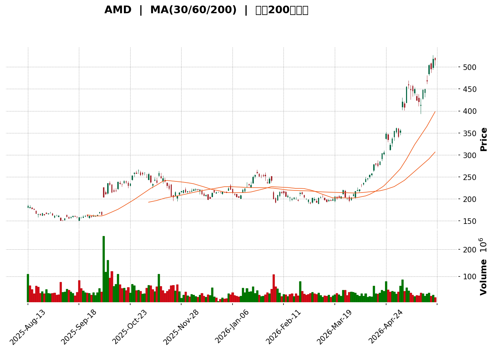
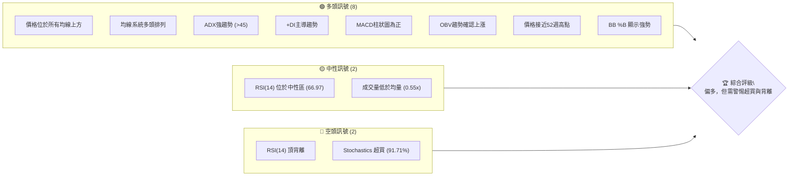
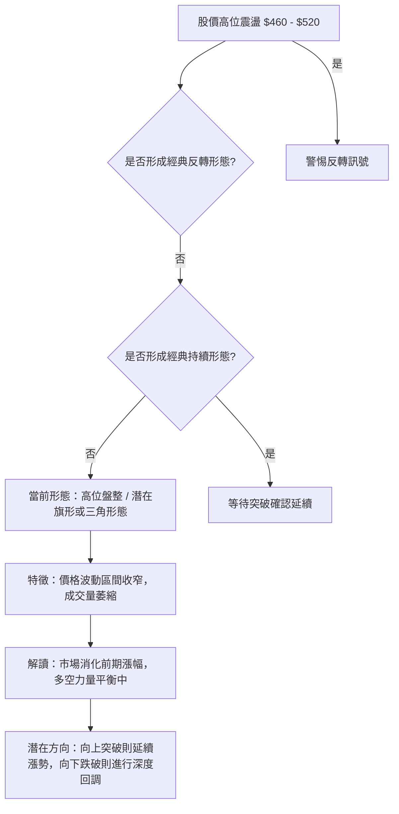

<details>
<summary>📊 靜態圖表 (點擊展開)</summary>

</details>

<html>
<head><meta charset="utf-8" /></head>
<body>
    <div>                        <script>window.PlotlyConfig = {MathJaxConfig: 'local'};</script>
        <script charset="utf-8" src="https://cdn.plot.ly/plotly-3.5.0.min.js" integrity="sha256-fHbNLP+GlIXN+efbQec78UkemUz3NJp7UmfGxC1tNxs=" crossorigin="anonymous"></script>                <div id="candlestick-chart" class="plotly-graph-div" style="height:500px; width:100%;"></div>            <script>                window.PLOTLYENV=window.PLOTLYENV || {};                                if (document.getElementById("candlestick-chart")) {                    Plotly.newPlot(                        "candlestick-chart",                        [{"close":{"dtype":"f8","bdata":"AAAAoHANZ0AAAABgZp5mQAAAAOBRMGZAAAAA4HoEZkAAAACgmdFkQAAAAGBmpmRAAAAAYLh2ZEAAAADgUfhkQAAAACCFa2RAAAAAANfTZEAAAAAAKeRkQAAAAGCPEmVAAAAAAClUZEAAAACAPUpkQAAAAAApRGRAAAAAoEc5ZEAAAADgeuRiQAAAAMAe7WJAAAAAgD16Y0AAAACgR\u002fFjQAAAAKBwdWNAAAAAgD3SY0AAAADAHiVkQAAAAGC4DmRAAAAAwB7lY0AAAACgcL1jQAAAAOB6rGNAAAAAoEf5Y0AAAADAzBxkQAAAAAApHGRAAAAA4KMoZEAAAABguO5jQAAAACCFK2RAAAAAoEc5ZEAAAADgUYBkQAAAACBcN2VAAAAAoHCVZEAAAABguHZpQAAAAOBRcGpAAAAAgOtxbUAAAADgehxtQAAAAMDM3GpAAAAAoHANa0AAAABA4UJrQAAAAEAz021AAAAAgOtRbUAAAABgjyJtQAAAAIDrEW5AAAAAwPXAbUAAAAAgXMdsQAAAACCuX21AAAAAoHCdb0AAAABguDpwQAAAAAApIHBAAAAAoEeFcEAAAABA4dpvQAAAAIDrAXBAAAAAYGY6cEAAAACgmUFvQAAAAKBHBXBAAAAAYGa2bUAAAACgRzFtQAAAACBcf25AAAAA4KOwbUAAAACAPS5wQAAAAGC4\u002fm5AAAAAgOvZbkAAAADgoxBuQAAAAKBHyWxAAAAAoJnxa0AAAADgo8BpQAAAAMD1eGlAAAAAoJnhakAAAAAAKcRpQAAAACCux2pAAAAAwPUwa0AAAADgUXhrQAAAACCu52pAAAAAQDMza0AAAAAgXP9qQAAAAEAKP2tAAAAAIIWja0AAAAAA17NrQAAAAKBwrWtAAAAAgMKta0AAAADA9VhqQAAAAGCP8mlAAAAAoHAlakAAAAAghcNoQAAAAIDrIWlAAAAAgMKtakAAAABgZt5qQAAAAMDM3GpAAAAAoEfhakAAAAAgrt9qQAAAACCF82pAAAAAQOHqakAAAADAHsVqQAAAAEAK72tAAAAAYI+ia0AAAABAM8tqQAAAAOCjQGpAAAAAgMKVaUAAAACgcGVpQAAAAIAU9mlAAAAAQAqfa0AAAABAM\u002fNrQAAAAKBwfWxAAAAAYI\u002f6bEAAAACgcP1sQAAAAKCZOW9AAAAAIFy3b0AAAABA4TpwQAAAAIDraW9AAAAAwPWAb0AAAAAgrpdvQAAAAIDChW9AAAAAIFyXbUAAAADgo8huQAAAACCFQ25AAAAAgBQGaUAAAAAAABBoQAAAAIAUDmpAAAAAAAAAa0AAAACAPbJqQAAAAGCPsmpAAAAAgBS+aUAAAACAPeppQAAAAGCPYmlAAAAAANcDaUAAAAAA12tpQAAAAMDMBGlAAAAAQDOTaEAAAABA4bpqQAAAACCFW2pAAAAAgMJ1aUAAAABguAZpQAAAAADX02hAAAAAYGbeZ0AAAACAPUJpQAAAAGBm7mhAAAAAgMINaEAAAACAwlVpQAAAACBcZ2lAAAAAYI+aaUAAAAAgrrdoQAAAAOB6LGhAAAAAYI+SaEAAAACA64loQAAAAGC47mhAAAAA4KOoaUAAAABgjyppQAAAAIDCVWlAAAAAANeraUAAAADgo4hrQAAAAOCjeGlAAAAAIK4\u002faUAAAACgR4FoQAAAAIDCbWlAAAAAYLhGakAAAAAAADBrQAAAAIDChWtAAAAAwPWwa0AAAACAPfpsQAAAAOB6lG1AAAAAoEehbkAAAABgj9puQAAAAIA94m9AAAAAgOshcEAAAAAAKWRxQAAAAIA9ZnFAAAAAQDMvcUAAAAAA18dxQAAAACBc93JAAAAAoEcVc0AAAADA9bx1QAAAAIAU6nRAAAAAIFwzdEAAAACAwhF1QAAAAADXJ3ZAAAAA4KOIdkAAAADgo1h1QAAAAAApNHZAAAAAgD1WekAAAAAgXId5QAAAAEAKc3xAAAAA4KOsfEAAAADgowR8QAAAAAAA2HtAAAAAQDMbfEAAAACgmYF6QAAAAADXT3pAAAAAwMzgeUAAAACgR\u002fl7QAAAAKBwGXxAAAAAACk4fUAAAACAPX5\u002fQAAAAOCj+H5AAAAAYLgwgEAAAADAzCCAQA=="},"high":{"dtype":"f8","bdata":"AAAAwMxUZ0AAAACAFC5nQAAAAOB6hGZAAAAAoJlZZkAAAACgcKVlQAAAAMDM1GRAAAAAACm8ZEAAAADA9RBlQAAAAEDhsmRAAAAA4KM4ZUAAAACAwvVkQAAAACCuX2VAAAAAgD0SZUAAAADgekxkQAAAAAAAmGRAAAAAoJlBZEAAAADgeqRjQAAAAOB6FGNAAAAAwB6VY0AAAADA9ZBkQAAAAGC4BmRAAAAAwB4NZEAAAACgmUlkQAAAAGBmPmRAAAAAACk0ZEAAAADgo9hjQAAAAEDh+mNAAAAAgMJVZEAAAADgemxkQAAAAEAzo2RAAAAAACk0ZEAAAAAghUNkQAAAAKCZiWRAAAAAwPVIZEAAAACAwoVkQAAAAIDrYWVAAAAAgMJVZUAAAABguFZsQAAAAMDMXGtAAAAAANd7bUAAAABAMwNuQAAAAEAKR21AAAAAgBQGbEAAAAAgXB9sQAAAACCu521AAAAAYGYmbkAAAAAAKWxtQAAAAAApXG5AAAAA4FFIbkAAAAAAKQRuQAAAAMDMfG1AAAAA4Hqsb0AAAABguEZwQAAAAKBHiXBAAAAAoEexcEAAAACAFH5wQAAAAIAUYnBAAAAAYI9OcEAAAACAFBZwQAAAAGBmOnBAAAAA4FGwb0AAAAAA13ttQAAAAMDMHG9AAAAAYLgOb0AAAAAAKXhwQAAAAIAUOnBAAAAAgBSub0AAAADgoxhvQAAAAAAAwG1AAAAAwPVobUAAAAAAAEhtQAAAAGCPGmpAAAAAACkka0AAAABgj9JpQAAAAEDh8mpAAAAAoJlJa0AAAAAgXJ9rQAAAACBcP2xAAAAAYGZGa0AAAAAA12NrQAAAAOB69GtAAAAAYLj2a0AAAABA4RpsQAAAACCF02tAAAAAAACwa0AAAAAgrs9rQAAAACCF62pAAAAAQApHakAAAAAAAHBqQAAAACCFy2lAAAAAgMLlakAAAACgcIVrQAAAAMD1IGtAAAAAoEcRa0AAAABgjxprQAAAAKCZAWtAAAAAgD0aa0AAAADgejRrQAAAAMDMZGxAAAAA4KNAbUAAAACgcN1rQAAAAAAphGpAAAAAgBReakAAAACgmelpQAAAAAApPGpAAAAAIIXja0AAAABA4QJsQAAAAEAzy21AAAAAIK5PbUAAAAAAAPBtQAAAAMDMnG9AAAAAoEcBcEAAAAAgXK9wQAAAAOCjJHBAAAAAoJnxb0AAAABgZhZwQAAAAOB6SHBAAAAAIK6nbkAAAABACj9vQAAAAMDMlG9AAAAAYI9Sa0AAAACgR4FpQAAAAOCjKGpAAAAAQDMza0AAAADgemxrQAAAAMDMdGtAAAAAYLhOa0AAAACgmUFqQAAAAKCZqWlAAAAAYGZmaUAAAABAM4NpQAAAAADXm2lAAAAAACnsaEAAAABguBZrQAAAAGBmFmtAAAAAoEc5akAAAADgejxpQAAAACCu12hAAAAA4Ho0aEAAAACAFE5pQAAAAKBHeWlAAAAAIK4HaUAAAABACl9pQAAAAEDh0mlAAAAAYLgmakAAAAAA13NpQAAAAIDC9WhAAAAAoHAFaUAAAABguOZoQAAAACCFW2lAAAAAACm8aUAAAACgmclpQAAAACCFI2pAAAAAgMLNaUAAAABgj6prQAAAAAAAoGtAAAAA4KNoaUAAAACAwg1qQAAAAAAAgGlAAAAAYI+6akAAAADA9ThrQAAAAIDrSWxAAAAAQDPDa0AAAAAAAEBtQAAAAEAzo21AAAAAYI8yb0AAAABgj+puQAAAAGC47m9AAAAAQOEicEAAAACgcHVxQAAAAMDMkHFAAAAAgML5cUAAAABAM+NxQAAAAAAABHNAAAAAIIVjc0AAAAAA1w92QAAAACBc03VAAAAAAAB4dEAAAABguEJ1QAAAACBcL3ZAAAAA4KOsdkAAAACgmZ12QAAAAMAeeXZAAAAAoJnpekAAAAAgXFt6QAAAAOCjhHxAAAAAIIVTfUAAAADAzKx8QAAAAAAAuHxAAAAAwPVUfEAAAAAAAHB7QAAAAMDMbHtAAAAAAADMekAAAACAPRZ8QAAAAEAzM3xAAAAAYI8WfkAAAAAgXK9\u002fQAAAACBc439AAAAAoJl5gEAAAAAAAFCAQA=="},"hovertemplate":"\u003cb\u003e%{x|%Y-%m-%d}\u003c\u002fb\u003e\u003cbr\u003e\u958b: $%{open:.2f}\u003cbr\u003e\u9ad8: $%{high:.2f}\u003cbr\u003e\u4f4e: $%{low:.2f}\u003cbr\u003e\u6536: $%{close:.2f}\u003cextra\u003e\u003c\u002fextra\u003e","low":{"dtype":"f8","bdata":"AAAAAClsZkAAAACA63FmQAAAAAAACGZAAAAAIIXLZUAAAABAM8NkQAAAAAAAyGNAAAAA4FFIZEAAAACgmTlkQAAAAEAKN2RAAAAAwB6dZEAAAADAzJRkQAAAAMDM1GRAAAAAwMw8ZEAAAAAA15NjQAAAAGCPEmRAAAAAoEe5Y0AAAACAwsViQAAAAEAKp2JAAAAAgML9YkAAAAAAAMBjQAAAACCuX2NAAAAAoHBdY0AAAABAM7NjQAAAAEAK52NAAAAA4FF4Y0AAAABAM7tiQAAAAMDMfGNAAAAAoHCtY0AAAABguOZjQAAAAIDCzWNAAAAAwPVYY0AAAACgmaFjQAAAAMDM\u002fGNAAAAAYI\u002fqY0AAAAAgrg9kQAAAAADXw2RAAAAA4HpkZEAAAADgUWBpQAAAAMD1KGpAAAAAYGZWakAAAADA9bBsQAAAAGBmpmpAAAAAwMzcakAAAADAzPxqQAAAAOBRmGtAAAAAIK4HbUAAAADAHn1sQAAAAMDMTG1AAAAA4KNAbUAAAAAAKRxsQAAAAKBHkWxAAAAAYGY+bkAAAACgmTlvQAAAAAAAEHBAAAAAYGYWcEAAAACA64lvQAAAAMAerW9AAAAA4Hq8b0AAAADgeuxuQAAAAIDrWW5AAAAAIK53bUAAAADgehRsQAAAAAAAEG5AAAAA4HpUbUAAAAAAAEBvQAAAAIDrwW5AAAAAYI9ibUAAAADAzKRtQAAAAGC4FmxAAAAAYLh2a0AAAADA9ZBpQAAAAAAAYGhAAAAAQDO7aUAAAADA9UhoQAAAAAAA4GlAAAAA4KPAakAAAAAAALBqQAAAAOB6zGpAAAAA4KN4akAAAADgesRqQAAAACCuB2tAAAAAIIVLa0AAAADAHj1rQAAAAKBwVWtAAAAAgBRGakAAAACA6yFqQAAAAGCP0mlAAAAAIIWjaUAAAADA9bBoQAAAAAAAEGlAAAAAYGaGaUAAAACA66lqQAAAAMD1iGpAAAAAQAq\u002fakAAAADA9aBqQAAAACCuJ2pAAAAAYI\u002fKakAAAACgmblqQAAAAMDMXGtAAAAAIFyPa0AAAAAAAGhqQAAAAKBw5WlAAAAAYI9qaUAAAACAPWJpQAAAAKCZ+WhAAAAAIFzfakAAAAAgheNqQAAAAEAKZ2xAAAAAIIWbbEAAAADAHi1sQAAAAMD1eG1AAAAAACnUbkAAAAAAAARwQAAAAKCZSW9AAAAAYLj+bkAAAABguEZvQAAAAMAeHW5AAAAAoJlRbUAAAAAAAGBtQAAAAKBHoW1AAAAAwMzkaEAAAABACtdnQAAAAIDCjWhAAAAAwMyEaUAAAAAAKaRqQAAAAGC4JmpAAAAA4HqkaUAAAAAAKXxpQAAAAGCPWmhAAAAAAABgaEAAAACgR8loQAAAAIDr0WhAAAAAwMxEaEAAAAAAANBpQAAAAGCPSmpAAAAAYLguaUAAAAAgrrdoQAAAAAAAwGdAAAAAQAqHZ0AAAAAghbtnQAAAAAApXGhAAAAAAADoZ0AAAADgo6BnQAAAAGBmRmlAAAAAACl0aUAAAACgcJVoQAAAAOCjCGhAAAAAoJlZaEAAAADgUWhoQAAAAAAAeGhAAAAAYI8aaEAAAADgUchoQAAAAGC4NmlAAAAAACkEaUAAAADgUXBqQAAAAIDCbWlAAAAAgBS2aEAAAAAA1xtoQAAAAMAejWhAAAAAQOG6aUAAAAAA1xNpQAAAACBcN2tAAAAAACnsakAAAABA4WJsQAAAAMAe3WxAAAAAYLjebUAAAADA9UBuQAAAAGBmtm5AAAAAQDN7b0AAAAAAKVhwQAAAAIA9InFAAAAAAAAAcUAAAACA60lxQAAAAIA94nFAAAAAACm8ckAAAADgo+h0QAAAAMD1jHRAAAAAAABgc0AAAACAwu1zQAAAAKCZyXRAAAAAAADUdUAAAABAMyt1QAAAAIAUjnVAAAAA4KMgeUAAAACgRxF5QAAAAOCjJHpAAAAAgBQufEAAAACAwqF6QAAAAGBmCntAAAAAQOE6e0AAAACAwnV6QAAAACBcq3lAAAAAgMKVeEAAAADAzKB6QAAAAKCZ+XpAAAAAIFzbfEAAAAAgrgN+QAAAAGCPan5AAAAA4FHYfkAAAABA4XZ\u002fQA=="},"name":"\u50f9\u683c","open":{"dtype":"f8","bdata":"AAAAwB59ZkAAAABgj3pmQAAAAIDrgWZAAAAA4FEYZkAAAABAM6NlQAAAAEAzg2RAAAAAIIW7ZEAAAACgcEVkQAAAAKCZsWRAAAAAwMwUZUAAAACgR8FkQAAAAAAAEGVAAAAAgOvZZEAAAACgcM1jQAAAAIDrOWRAAAAAgBT+Y0AAAAAA16NjQAAAAKCZ+WJAAAAAIK7\u002fYkAAAACgR3FkQAAAAADX02NAAAAAAACgY0AAAADgUQBkQAAAAADXK2RAAAAAwPXoY0AAAABguN5iQAAAAAAprGNAAAAAoHCtY0AAAADgoxBkQAAAACBcX2RAAAAA4HqkY0AAAADgoxBkQAAAAADXA2RAAAAAoEcZZEAAAACAwh1kQAAAAIDCFWVAAAAAgMJVZUAAAABgZk5sQAAAAEAz22pAAAAAYGaeakAAAACgmYltQAAAAOCjGG1AAAAAYGaGa0AAAABgZmZrQAAAAGC41mtAAAAAoEeJbUAAAADgUShtQAAAAEAKj21AAAAA4HrsbUAAAABAM5ttQAAAAMAexWxAAAAAIIVrbkAAAACAFB5wQAAAAIA9MnBAAAAAQAqDcEAAAABguD5wQAAAAKCZOXBAAAAAoEc1cEAAAABAM0tvQAAAACCuZ25AAAAAQAqvb0AAAACAFN5sQAAAAOB6RG5AAAAAwB41bkAAAAAAKaRvQAAAAMDMfG9AAAAAIIUDbkAAAAAAAFhuQAAAAMD1mG1AAAAA4FHIbEAAAABgZhZtQAAAAIDrGWpAAAAAwB7laUAAAAAgXC9pQAAAAKCZQWpAAAAA4HoEa0AAAAAAKbxqQAAAAKBHuWtAAAAA4FEIa0AAAAAAKRxrQAAAAKBwJWtAAAAAQOFia0AAAACgR6FrQAAAAAAAwGtAAAAAgOs5a0AAAAAA10trQAAAAMD1iGpAAAAAoHDdaUAAAACgR0FqQAAAAIA9emlAAAAAQDOTaUAAAAAAAIBrQAAAACCFm2pAAAAAIFzfakAAAACAwu1qQAAAAGCPcmpAAAAAANf7akAAAACAPfpqQAAAAMDMXGtAAAAAAADIbEAAAABguNZrQAAAAAAphGpAAAAAwMxcakAAAABACrdpQAAAAIDCJWlAAAAAQDPjakAAAACgRzFrQAAAAMDMfGxAAAAAoJlJbUAAAABgj0JsQAAAACCuf21AAAAAAAB4b0AAAABA4VJwQAAAAAAADHBAAAAAwB6Fb0AAAAAAKcRvQAAAAMAe1W9AAAAAgMKdbUAAAADgo3htQAAAAKCZcW9AAAAAAADgakAAAAAghTtpQAAAAAAppGhAAAAAwMzcaUAAAADgeuRqQAAAAAApPGtAAAAAYI\u002f6akAAAADgo4BpQAAAAMDMRGlAAAAAwB7NaEAAAAAghQNpQAAAAADXA2lAAAAAQOHCaEAAAAAAKXRqQAAAAIA92mpAAAAAoJkZakAAAAAghQNpQAAAAEAzO2hAAAAAYLjuZ0AAAAAA1wNoQAAAAOCjuGhAAAAA4KNoaEAAAAAghatnQAAAAOBRUGlAAAAAIIWjaUAAAABgj1ppQAAAACCFw2hAAAAAIFxfaEAAAACAwpVoQAAAAAAAgGhAAAAAwPVgaEAAAADgepxpQAAAAMDMzGlAAAAA4HosaUAAAADgUXBqQAAAACBcP2tAAAAA4KM4aUAAAABgZp5pQAAAAKCZwWhAAAAAQOHyaUAAAACgmYFpQAAAAMD1aGtAAAAA4FFIa0AAAAAA1wNtQAAAAOBRIG1AAAAAAADgbUAAAADA9aBuQAAAAKBHOW9AAAAAYLjeb0AAAAAA149wQAAAAAAAkHFAAAAAoJmJcUAAAACgR1VxQAAAACCFM3JAAAAAACngckAAAAAAKQx1QAAAAMAepXVAAAAAgMJ9c0AAAACgR2l0QAAAAIDCVXVAAAAAgOv9dUAAAADA9YR2QAAAAAAp+HVAAAAAANeXeUAAAADAHhF6QAAAAKBwKXpAAAAAwMzIfEAAAAAAABR8QAAAAOCjkHxAAAAAoJmJe0AAAACgcBV7QAAAAAAA2HpAAAAAoJnJeUAAAADgo8B6QAAAAADXn3tAAAAAoHBdfUAAAAAA10t+QAAAAAAAwH9AAAAAAAAwf0AAAACgcEOAQA=="},"x":["2025-08-13T00:00:00-04:00","2025-08-14T00:00:00-04:00","2025-08-15T00:00:00-04:00","2025-08-18T00:00:00-04:00","2025-08-19T00:00:00-04:00","2025-08-20T00:00:00-04:00","2025-08-21T00:00:00-04:00","2025-08-22T00:00:00-04:00","2025-08-25T00:00:00-04:00","2025-08-26T00:00:00-04:00","2025-08-27T00:00:00-04:00","2025-08-28T00:00:00-04:00","2025-08-29T00:00:00-04:00","2025-09-02T00:00:00-04:00","2025-09-03T00:00:00-04:00","2025-09-04T00:00:00-04:00","2025-09-05T00:00:00-04:00","2025-09-08T00:00:00-04:00","2025-09-09T00:00:00-04:00","2025-09-10T00:00:00-04:00","2025-09-11T00:00:00-04:00","2025-09-12T00:00:00-04:00","2025-09-15T00:00:00-04:00","2025-09-16T00:00:00-04:00","2025-09-17T00:00:00-04:00","2025-09-18T00:00:00-04:00","2025-09-19T00:00:00-04:00","2025-09-22T00:00:00-04:00","2025-09-23T00:00:00-04:00","2025-09-24T00:00:00-04:00","2025-09-25T00:00:00-04:00","2025-09-26T00:00:00-04:00","2025-09-29T00:00:00-04:00","2025-09-30T00:00:00-04:00","2025-10-01T00:00:00-04:00","2025-10-02T00:00:00-04:00","2025-10-03T00:00:00-04:00","2025-10-06T00:00:00-04:00","2025-10-07T00:00:00-04:00","2025-10-08T00:00:00-04:00","2025-10-09T00:00:00-04:00","2025-10-10T00:00:00-04:00","2025-10-13T00:00:00-04:00","2025-10-14T00:00:00-04:00","2025-10-15T00:00:00-04:00","2025-10-16T00:00:00-04:00","2025-10-17T00:00:00-04:00","2025-10-20T00:00:00-04:00","2025-10-21T00:00:00-04:00","2025-10-22T00:00:00-04:00","2025-10-23T00:00:00-04:00","2025-10-24T00:00:00-04:00","2025-10-27T00:00:00-04:00","2025-10-28T00:00:00-04:00","2025-10-29T00:00:00-04:00","2025-10-30T00:00:00-04:00","2025-10-31T00:00:00-04:00","2025-11-03T00:00:00-05:00","2025-11-04T00:00:00-05:00","2025-11-05T00:00:00-05:00","2025-11-06T00:00:00-05:00","2025-11-07T00:00:00-05:00","2025-11-10T00:00:00-05:00","2025-11-11T00:00:00-05:00","2025-11-12T00:00:00-05:00","2025-11-13T00:00:00-05:00","2025-11-14T00:00:00-05:00","2025-11-17T00:00:00-05:00","2025-11-18T00:00:00-05:00","2025-11-19T00:00:00-05:00","2025-11-20T00:00:00-05:00","2025-11-21T00:00:00-05:00","2025-11-24T00:00:00-05:00","2025-11-25T00:00:00-05:00","2025-11-26T00:00:00-05:00","2025-11-28T00:00:00-05:00","2025-12-01T00:00:00-05:00","2025-12-02T00:00:00-05:00","2025-12-03T00:00:00-05:00","2025-12-04T00:00:00-05:00","2025-12-05T00:00:00-05:00","2025-12-08T00:00:00-05:00","2025-12-09T00:00:00-05:00","2025-12-10T00:00:00-05:00","2025-12-11T00:00:00-05:00","2025-12-12T00:00:00-05:00","2025-12-15T00:00:00-05:00","2025-12-16T00:00:00-05:00","2025-12-17T00:00:00-05:00","2025-12-18T00:00:00-05:00","2025-12-19T00:00:00-05:00","2025-12-22T00:00:00-05:00","2025-12-23T00:00:00-05:00","2025-12-24T00:00:00-05:00","2025-12-26T00:00:00-05:00","2025-12-29T00:00:00-05:00","2025-12-30T00:00:00-05:00","2025-12-31T00:00:00-05:00","2026-01-02T00:00:00-05:00","2026-01-05T00:00:00-05:00","2026-01-06T00:00:00-05:00","2026-01-07T00:00:00-05:00","2026-01-08T00:00:00-05:00","2026-01-09T00:00:00-05:00","2026-01-12T00:00:00-05:00","2026-01-13T00:00:00-05:00","2026-01-14T00:00:00-05:00","2026-01-15T00:00:00-05:00","2026-01-16T00:00:00-05:00","2026-01-20T00:00:00-05:00","2026-01-21T00:00:00-05:00","2026-01-22T00:00:00-05:00","2026-01-23T00:00:00-05:00","2026-01-26T00:00:00-05:00","2026-01-27T00:00:00-05:00","2026-01-28T00:00:00-05:00","2026-01-29T00:00:00-05:00","2026-01-30T00:00:00-05:00","2026-02-02T00:00:00-05:00","2026-02-03T00:00:00-05:00","2026-02-04T00:00:00-05:00","2026-02-05T00:00:00-05:00","2026-02-06T00:00:00-05:00","2026-02-09T00:00:00-05:00","2026-02-10T00:00:00-05:00","2026-02-11T00:00:00-05:00","2026-02-12T00:00:00-05:00","2026-02-13T00:00:00-05:00","2026-02-17T00:00:00-05:00","2026-02-18T00:00:00-05:00","2026-02-19T00:00:00-05:00","2026-02-20T00:00:00-05:00","2026-02-23T00:00:00-05:00","2026-02-24T00:00:00-05:00","2026-02-25T00:00:00-05:00","2026-02-26T00:00:00-05:00","2026-02-27T00:00:00-05:00","2026-03-02T00:00:00-05:00","2026-03-03T00:00:00-05:00","2026-03-04T00:00:00-05:00","2026-03-05T00:00:00-05:00","2026-03-06T00:00:00-05:00","2026-03-09T00:00:00-04:00","2026-03-10T00:00:00-04:00","2026-03-11T00:00:00-04:00","2026-03-12T00:00:00-04:00","2026-03-13T00:00:00-04:00","2026-03-16T00:00:00-04:00","2026-03-17T00:00:00-04:00","2026-03-18T00:00:00-04:00","2026-03-19T00:00:00-04:00","2026-03-20T00:00:00-04:00","2026-03-23T00:00:00-04:00","2026-03-24T00:00:00-04:00","2026-03-25T00:00:00-04:00","2026-03-26T00:00:00-04:00","2026-03-27T00:00:00-04:00","2026-03-30T00:00:00-04:00","2026-03-31T00:00:00-04:00","2026-04-01T00:00:00-04:00","2026-04-02T00:00:00-04:00","2026-04-06T00:00:00-04:00","2026-04-07T00:00:00-04:00","2026-04-08T00:00:00-04:00","2026-04-09T00:00:00-04:00","2026-04-10T00:00:00-04:00","2026-04-13T00:00:00-04:00","2026-04-14T00:00:00-04:00","2026-04-15T00:00:00-04:00","2026-04-16T00:00:00-04:00","2026-04-17T00:00:00-04:00","2026-04-20T00:00:00-04:00","2026-04-21T00:00:00-04:00","2026-04-22T00:00:00-04:00","2026-04-23T00:00:00-04:00","2026-04-24T00:00:00-04:00","2026-04-27T00:00:00-04:00","2026-04-28T00:00:00-04:00","2026-04-29T00:00:00-04:00","2026-04-30T00:00:00-04:00","2026-05-01T00:00:00-04:00","2026-05-04T00:00:00-04:00","2026-05-05T00:00:00-04:00","2026-05-06T00:00:00-04:00","2026-05-07T00:00:00-04:00","2026-05-08T00:00:00-04:00","2026-05-11T00:00:00-04:00","2026-05-12T00:00:00-04:00","2026-05-13T00:00:00-04:00","2026-05-14T00:00:00-04:00","2026-05-15T00:00:00-04:00","2026-05-18T00:00:00-04:00","2026-05-19T00:00:00-04:00","2026-05-20T00:00:00-04:00","2026-05-21T00:00:00-04:00","2026-05-22T00:00:00-04:00","2026-05-26T00:00:00-04:00","2026-05-27T00:00:00-04:00","2026-05-28T00:00:00-04:00","2026-05-29T00:00:00-04:00"],"type":"candlestick"},{"hovertemplate":"MA30: $%{y:.2f}\u003cextra\u003e\u003c\u002fextra\u003e","line":{"color":"#2196F3","dash":"dash","width":2},"mode":"lines","name":"MA30","x":["2025-08-13T00:00:00-04:00","2025-08-14T00:00:00-04:00","2025-08-15T00:00:00-04:00","2025-08-18T00:00:00-04:00","2025-08-19T00:00:00-04:00","2025-08-20T00:00:00-04:00","2025-08-21T00:00:00-04:00","2025-08-22T00:00:00-04:00","2025-08-25T00:00:00-04:00","2025-08-26T00:00:00-04:00","2025-08-27T00:00:00-04:00","2025-08-28T00:00:00-04:00","2025-08-29T00:00:00-04:00","2025-09-02T00:00:00-04:00","2025-09-03T00:00:00-04:00","2025-09-04T00:00:00-04:00","2025-09-05T00:00:00-04:00","2025-09-08T00:00:00-04:00","2025-09-09T00:00:00-04:00","2025-09-10T00:00:00-04:00","2025-09-11T00:00:00-04:00","2025-09-12T00:00:00-04:00","2025-09-15T00:00:00-04:00","2025-09-16T00:00:00-04:00","2025-09-17T00:00:00-04:00","2025-09-18T00:00:00-04:00","2025-09-19T00:00:00-04:00","2025-09-22T00:00:00-04:00","2025-09-23T00:00:00-04:00","2025-09-24T00:00:00-04:00","2025-09-25T00:00:00-04:00","2025-09-26T00:00:00-04:00","2025-09-29T00:00:00-04:00","2025-09-30T00:00:00-04:00","2025-10-01T00:00:00-04:00","2025-10-02T00:00:00-04:00","2025-10-03T00:00:00-04:00","2025-10-06T00:00:00-04:00","2025-10-07T00:00:00-04:00","2025-10-08T00:00:00-04:00","2025-10-09T00:00:00-04:00","2025-10-10T00:00:00-04:00","2025-10-13T00:00:00-04:00","2025-10-14T00:00:00-04:00","2025-10-15T00:00:00-04:00","2025-10-16T00:00:00-04:00","2025-10-17T00:00:00-04:00","2025-10-20T00:00:00-04:00","2025-10-21T00:00:00-04:00","2025-10-22T00:00:00-04:00","2025-10-23T00:00:00-04:00","2025-10-24T00:00:00-04:00","2025-10-27T00:00:00-04:00","2025-10-28T00:00:00-04:00","2025-10-29T00:00:00-04:00","2025-10-30T00:00:00-04:00","2025-10-31T00:00:00-04:00","2025-11-03T00:00:00-05:00","2025-11-04T00:00:00-05:00","2025-11-05T00:00:00-05:00","2025-11-06T00:00:00-05:00","2025-11-07T00:00:00-05:00","2025-11-10T00:00:00-05:00","2025-11-11T00:00:00-05:00","2025-11-12T00:00:00-05:00","2025-11-13T00:00:00-05:00","2025-11-14T00:00:00-05:00","2025-11-17T00:00:00-05:00","2025-11-18T00:00:00-05:00","2025-11-19T00:00:00-05:00","2025-11-20T00:00:00-05:00","2025-11-21T00:00:00-05:00","2025-11-24T00:00:00-05:00","2025-11-25T00:00:00-05:00","2025-11-26T00:00:00-05:00","2025-11-28T00:00:00-05:00","2025-12-01T00:00:00-05:00","2025-12-02T00:00:00-05:00","2025-12-03T00:00:00-05:00","2025-12-04T00:00:00-05:00","2025-12-05T00:00:00-05:00","2025-12-08T00:00:00-05:00","2025-12-09T00:00:00-05:00","2025-12-10T00:00:00-05:00","2025-12-11T00:00:00-05:00","2025-12-12T00:00:00-05:00","2025-12-15T00:00:00-05:00","2025-12-16T00:00:00-05:00","2025-12-17T00:00:00-05:00","2025-12-18T00:00:00-05:00","2025-12-19T00:00:00-05:00","2025-12-22T00:00:00-05:00","2025-12-23T00:00:00-05:00","2025-12-24T00:00:00-05:00","2025-12-26T00:00:00-05:00","2025-12-29T00:00:00-05:00","2025-12-30T00:00:00-05:00","2025-12-31T00:00:00-05:00","2026-01-02T00:00:00-05:00","2026-01-05T00:00:00-05:00","2026-01-06T00:00:00-05:00","2026-01-07T00:00:00-05:00","2026-01-08T00:00:00-05:00","2026-01-09T00:00:00-05:00","2026-01-12T00:00:00-05:00","2026-01-13T00:00:00-05:00","2026-01-14T00:00:00-05:00","2026-01-15T00:00:00-05:00","2026-01-16T00:00:00-05:00","2026-01-20T00:00:00-05:00","2026-01-21T00:00:00-05:00","2026-01-22T00:00:00-05:00","2026-01-23T00:00:00-05:00","2026-01-26T00:00:00-05:00","2026-01-27T00:00:00-05:00","2026-01-28T00:00:00-05:00","2026-01-29T00:00:00-05:00","2026-01-30T00:00:00-05:00","2026-02-02T00:00:00-05:00","2026-02-03T00:00:00-05:00","2026-02-04T00:00:00-05:00","2026-02-05T00:00:00-05:00","2026-02-06T00:00:00-05:00","2026-02-09T00:00:00-05:00","2026-02-10T00:00:00-05:00","2026-02-11T00:00:00-05:00","2026-02-12T00:00:00-05:00","2026-02-13T00:00:00-05:00","2026-02-17T00:00:00-05:00","2026-02-18T00:00:00-05:00","2026-02-19T00:00:00-05:00","2026-02-20T00:00:00-05:00","2026-02-23T00:00:00-05:00","2026-02-24T00:00:00-05:00","2026-02-25T00:00:00-05:00","2026-02-26T00:00:00-05:00","2026-02-27T00:00:00-05:00","2026-03-02T00:00:00-05:00","2026-03-03T00:00:00-05:00","2026-03-04T00:00:00-05:00","2026-03-05T00:00:00-05:00","2026-03-06T00:00:00-05:00","2026-03-09T00:00:00-04:00","2026-03-10T00:00:00-04:00","2026-03-11T00:00:00-04:00","2026-03-12T00:00:00-04:00","2026-03-13T00:00:00-04:00","2026-03-16T00:00:00-04:00","2026-03-17T00:00:00-04:00","2026-03-18T00:00:00-04:00","2026-03-19T00:00:00-04:00","2026-03-20T00:00:00-04:00","2026-03-23T00:00:00-04:00","2026-03-24T00:00:00-04:00","2026-03-25T00:00:00-04:00","2026-03-26T00:00:00-04:00","2026-03-27T00:00:00-04:00","2026-03-30T00:00:00-04:00","2026-03-31T00:00:00-04:00","2026-04-01T00:00:00-04:00","2026-04-02T00:00:00-04:00","2026-04-06T00:00:00-04:00","2026-04-07T00:00:00-04:00","2026-04-08T00:00:00-04:00","2026-04-09T00:00:00-04:00","2026-04-10T00:00:00-04:00","2026-04-13T00:00:00-04:00","2026-04-14T00:00:00-04:00","2026-04-15T00:00:00-04:00","2026-04-16T00:00:00-04:00","2026-04-17T00:00:00-04:00","2026-04-20T00:00:00-04:00","2026-04-21T00:00:00-04:00","2026-04-22T00:00:00-04:00","2026-04-23T00:00:00-04:00","2026-04-24T00:00:00-04:00","2026-04-27T00:00:00-04:00","2026-04-28T00:00:00-04:00","2026-04-29T00:00:00-04:00","2026-04-30T00:00:00-04:00","2026-05-01T00:00:00-04:00","2026-05-04T00:00:00-04:00","2026-05-05T00:00:00-04:00","2026-05-06T00:00:00-04:00","2026-05-07T00:00:00-04:00","2026-05-08T00:00:00-04:00","2026-05-11T00:00:00-04:00","2026-05-12T00:00:00-04:00","2026-05-13T00:00:00-04:00","2026-05-14T00:00:00-04:00","2026-05-15T00:00:00-04:00","2026-05-18T00:00:00-04:00","2026-05-19T00:00:00-04:00","2026-05-20T00:00:00-04:00","2026-05-21T00:00:00-04:00","2026-05-22T00:00:00-04:00","2026-05-26T00:00:00-04:00","2026-05-27T00:00:00-04:00","2026-05-28T00:00:00-04:00","2026-05-29T00:00:00-04:00"],"y":{"dtype":"f8","bdata":"AAAAAAAA+H8AAAAAAAD4fwAAAAAAAPh\u002fAAAAAAAA+H8AAAAAAAD4fwAAAAAAAPh\u002fAAAAAAAA+H8AAAAAAAD4fwAAAAAAAPh\u002fAAAAAAAA+H8AAAAAAAD4fwAAAAAAAPh\u002fAAAAAAAA+H8AAAAAAAD4fwAAAAAAAPh\u002fAAAAAAAA+H8AAAAAAAD4fwAAAAAAAPh\u002fAAAAAAAA+H8AAAAAAAD4fwAAAAAAAPh\u002fAAAAAAAA+H8AAAAAAAD4fwAAAAAAAPh\u002fAAAAAAAA+H8AAAAAAAD4fwAAAAAAAPh\u002fAAAAAAAA+H8AAAAAAAD4f0RERKS3cWRAZmZmJgZZZEAzMzPzGUJkQM3MzOzfMGRAq6qqapEhZEAzMzPT2x5kQBEREdGwI2RAVVVV9bYkZEBVVVW1D0tkQN7d3d1rfmRAVVVVFfXHZEAiIiLyGQ5lQERERGSCP2VAVVVVpeJ4ZUAiIiKSX7RlQKuqqvrwBWZAq6qqCpBTZkAAAAAg96pmQERERAQPCmdAMzMz079hZ0CJiIjoJq1nQO\u002fu7o7CAWhAVVVVZWZmaEAiIiIyes9oQJqZmdmHN2lARERERLanaUAzMzPjFw9qQCIiIsJneGpAIiIiMuziakB3d3cXBEJrQM3MzEzUp2tAiYiIyFr5a0Dv7u6OX0hsQDMzM1OAoGxAq6qqqkfxbEDNzMw8fFZtQO\u002fu7j7uqW1AERER8YsBbkBmZmaGzyhuQHd3d7fXPG5AAAAAMAgwbkAzMzPjXhNuQDMzM2OCB25AmpmZSQwGbkCamZlpSvltQCIiIoJO321A7+7uLiTNbUDv7u7u7r5tQDMzM+Pso21AMzMzIyKObUAAAADw7n5tQHd3d1fHbG1Ad3d3F9lKbUBmZmbmQiJtQDMzM2M7+2xARERE1HjNbEAzMzODeZ5sQLy7u9uyamxAREREdNo0bEDv7u5ec\u002f1rQKuqqvp+wmtAZmZmppuoa0B3d3dXx5RrQAAAAJDCdWtAVVVVBchda0BERERk9C5rQO\u002fu7q5yDGtAZmZmRuHqakDNzMw8w85qQM3MzOx8x2pAMzMzc9rEakCJiIgYvc1qQImIiAhl1GpAREREVFXJakDNzMwMLcZqQGZmZnYwv2pAAAAA0NvCakBERERk9MZqQAAAAOB61GpAzczMnKjjakC8u7tLqfRqQCIiIgKdFmtAERERcWg5a0C8u7tbAWJrQCIiIlLjgWtAmpmZKYeia0CrqqoKSc9rQAAAANDb\u002fmtAd3d3h0EcbEC8u7troE9sQO\u002fu7s5pe2xAiYiIaEptbEAAAAAQWFVsQN7d3Q10TmxAMzMzM3pPbEAiIiJy9k1sQO\u002fu7h7MS2xAvLu7S8VBbEBVVVWFeTpsQBEREbG5JGxAZmZmNl4ObEAAAADwpwJsQERERMQg+GtAREREZILva0AzMzMD5PprQCIiIqJF\u002fmtA7+7uTtTra0B3d3dH4dJrQM3MzGygs2tAVVVVdQWIa0C8u7trLmhrQDMzM4N5MmtAZmZmhhbxakCamZm5SbRqQN7d3a0AgWpA7+7u7qdOakBERERE\u002fRNqQN7d3a1H1WlA3t3dDXSqaUBERESkKXVpQJqZmVmrR2lAd3d3hxZNaUBVVVW1gVZpQHd3d9dcUGlAREREJAZFaUAAAACwK0xpQHd3d+e0QWlAq6qqSn49aUCJiIgYdjFpQKuqqqrVMWlAmpmZ6Zg8aUCJiIhYq0tpQO\u002fu7t4IYWlAvLu7a6B7aUCamZkpzo5pQCIiItJNqmlAvLu722vWaUCamZk5JghqQHd3d9dcRGpAq6qqugKMakDe3d2tR91qQBEREZF7MWtAiYiICIGJa0De3d2dxOBrQGZmZhauS2xAiYiISOG2bEBVVVVl9FZtQFVVVVWc7W1AMzMzw650bkC8u7uL3gpvQBERERE8sG9AiYiIkO0qcEB3d3fntHVwQJqZmSkVx3BAiYiIGEs6cUBVVVVNqZ5xQDMzM4PAJHJA3t3dRbatckDv7u7OPjRzQO\u002fu7m5ZtXNAVVVVzRM1dEDv7u6WQ6N0QBEREdlcDnVAZmZmPgp1dUBERESsHOh1QCIiInKvWXZAzczMBFbQdkB3d3dHb1l3QDMzM3Ov2XdAZmZmBlZkeEC8u7sbL+N4QA=="},"type":"scatter"},{"hovertemplate":"MA60: $%{y:.2f}\u003cextra\u003e\u003c\u002fextra\u003e","line":{"color":"#9C27B0","dash":"dash","width":2},"mode":"lines","name":"MA60","x":["2025-08-13T00:00:00-04:00","2025-08-14T00:00:00-04:00","2025-08-15T00:00:00-04:00","2025-08-18T00:00:00-04:00","2025-08-19T00:00:00-04:00","2025-08-20T00:00:00-04:00","2025-08-21T00:00:00-04:00","2025-08-22T00:00:00-04:00","2025-08-25T00:00:00-04:00","2025-08-26T00:00:00-04:00","2025-08-27T00:00:00-04:00","2025-08-28T00:00:00-04:00","2025-08-29T00:00:00-04:00","2025-09-02T00:00:00-04:00","2025-09-03T00:00:00-04:00","2025-09-04T00:00:00-04:00","2025-09-05T00:00:00-04:00","2025-09-08T00:00:00-04:00","2025-09-09T00:00:00-04:00","2025-09-10T00:00:00-04:00","2025-09-11T00:00:00-04:00","2025-09-12T00:00:00-04:00","2025-09-15T00:00:00-04:00","2025-09-16T00:00:00-04:00","2025-09-17T00:00:00-04:00","2025-09-18T00:00:00-04:00","2025-09-19T00:00:00-04:00","2025-09-22T00:00:00-04:00","2025-09-23T00:00:00-04:00","2025-09-24T00:00:00-04:00","2025-09-25T00:00:00-04:00","2025-09-26T00:00:00-04:00","2025-09-29T00:00:00-04:00","2025-09-30T00:00:00-04:00","2025-10-01T00:00:00-04:00","2025-10-02T00:00:00-04:00","2025-10-03T00:00:00-04:00","2025-10-06T00:00:00-04:00","2025-10-07T00:00:00-04:00","2025-10-08T00:00:00-04:00","2025-10-09T00:00:00-04:00","2025-10-10T00:00:00-04:00","2025-10-13T00:00:00-04:00","2025-10-14T00:00:00-04:00","2025-10-15T00:00:00-04:00","2025-10-16T00:00:00-04:00","2025-10-17T00:00:00-04:00","2025-10-20T00:00:00-04:00","2025-10-21T00:00:00-04:00","2025-10-22T00:00:00-04:00","2025-10-23T00:00:00-04:00","2025-10-24T00:00:00-04:00","2025-10-27T00:00:00-04:00","2025-10-28T00:00:00-04:00","2025-10-29T00:00:00-04:00","2025-10-30T00:00:00-04:00","2025-10-31T00:00:00-04:00","2025-11-03T00:00:00-05:00","2025-11-04T00:00:00-05:00","2025-11-05T00:00:00-05:00","2025-11-06T00:00:00-05:00","2025-11-07T00:00:00-05:00","2025-11-10T00:00:00-05:00","2025-11-11T00:00:00-05:00","2025-11-12T00:00:00-05:00","2025-11-13T00:00:00-05:00","2025-11-14T00:00:00-05:00","2025-11-17T00:00:00-05:00","2025-11-18T00:00:00-05:00","2025-11-19T00:00:00-05:00","2025-11-20T00:00:00-05:00","2025-11-21T00:00:00-05:00","2025-11-24T00:00:00-05:00","2025-11-25T00:00:00-05:00","2025-11-26T00:00:00-05:00","2025-11-28T00:00:00-05:00","2025-12-01T00:00:00-05:00","2025-12-02T00:00:00-05:00","2025-12-03T00:00:00-05:00","2025-12-04T00:00:00-05:00","2025-12-05T00:00:00-05:00","2025-12-08T00:00:00-05:00","2025-12-09T00:00:00-05:00","2025-12-10T00:00:00-05:00","2025-12-11T00:00:00-05:00","2025-12-12T00:00:00-05:00","2025-12-15T00:00:00-05:00","2025-12-16T00:00:00-05:00","2025-12-17T00:00:00-05:00","2025-12-18T00:00:00-05:00","2025-12-19T00:00:00-05:00","2025-12-22T00:00:00-05:00","2025-12-23T00:00:00-05:00","2025-12-24T00:00:00-05:00","2025-12-26T00:00:00-05:00","2025-12-29T00:00:00-05:00","2025-12-30T00:00:00-05:00","2025-12-31T00:00:00-05:00","2026-01-02T00:00:00-05:00","2026-01-05T00:00:00-05:00","2026-01-06T00:00:00-05:00","2026-01-07T00:00:00-05:00","2026-01-08T00:00:00-05:00","2026-01-09T00:00:00-05:00","2026-01-12T00:00:00-05:00","2026-01-13T00:00:00-05:00","2026-01-14T00:00:00-05:00","2026-01-15T00:00:00-05:00","2026-01-16T00:00:00-05:00","2026-01-20T00:00:00-05:00","2026-01-21T00:00:00-05:00","2026-01-22T00:00:00-05:00","2026-01-23T00:00:00-05:00","2026-01-26T00:00:00-05:00","2026-01-27T00:00:00-05:00","2026-01-28T00:00:00-05:00","2026-01-29T00:00:00-05:00","2026-01-30T00:00:00-05:00","2026-02-02T00:00:00-05:00","2026-02-03T00:00:00-05:00","2026-02-04T00:00:00-05:00","2026-02-05T00:00:00-05:00","2026-02-06T00:00:00-05:00","2026-02-09T00:00:00-05:00","2026-02-10T00:00:00-05:00","2026-02-11T00:00:00-05:00","2026-02-12T00:00:00-05:00","2026-02-13T00:00:00-05:00","2026-02-17T00:00:00-05:00","2026-02-18T00:00:00-05:00","2026-02-19T00:00:00-05:00","2026-02-20T00:00:00-05:00","2026-02-23T00:00:00-05:00","2026-02-24T00:00:00-05:00","2026-02-25T00:00:00-05:00","2026-02-26T00:00:00-05:00","2026-02-27T00:00:00-05:00","2026-03-02T00:00:00-05:00","2026-03-03T00:00:00-05:00","2026-03-04T00:00:00-05:00","2026-03-05T00:00:00-05:00","2026-03-06T00:00:00-05:00","2026-03-09T00:00:00-04:00","2026-03-10T00:00:00-04:00","2026-03-11T00:00:00-04:00","2026-03-12T00:00:00-04:00","2026-03-13T00:00:00-04:00","2026-03-16T00:00:00-04:00","2026-03-17T00:00:00-04:00","2026-03-18T00:00:00-04:00","2026-03-19T00:00:00-04:00","2026-03-20T00:00:00-04:00","2026-03-23T00:00:00-04:00","2026-03-24T00:00:00-04:00","2026-03-25T00:00:00-04:00","2026-03-26T00:00:00-04:00","2026-03-27T00:00:00-04:00","2026-03-30T00:00:00-04:00","2026-03-31T00:00:00-04:00","2026-04-01T00:00:00-04:00","2026-04-02T00:00:00-04:00","2026-04-06T00:00:00-04:00","2026-04-07T00:00:00-04:00","2026-04-08T00:00:00-04:00","2026-04-09T00:00:00-04:00","2026-04-10T00:00:00-04:00","2026-04-13T00:00:00-04:00","2026-04-14T00:00:00-04:00","2026-04-15T00:00:00-04:00","2026-04-16T00:00:00-04:00","2026-04-17T00:00:00-04:00","2026-04-20T00:00:00-04:00","2026-04-21T00:00:00-04:00","2026-04-22T00:00:00-04:00","2026-04-23T00:00:00-04:00","2026-04-24T00:00:00-04:00","2026-04-27T00:00:00-04:00","2026-04-28T00:00:00-04:00","2026-04-29T00:00:00-04:00","2026-04-30T00:00:00-04:00","2026-05-01T00:00:00-04:00","2026-05-04T00:00:00-04:00","2026-05-05T00:00:00-04:00","2026-05-06T00:00:00-04:00","2026-05-07T00:00:00-04:00","2026-05-08T00:00:00-04:00","2026-05-11T00:00:00-04:00","2026-05-12T00:00:00-04:00","2026-05-13T00:00:00-04:00","2026-05-14T00:00:00-04:00","2026-05-15T00:00:00-04:00","2026-05-18T00:00:00-04:00","2026-05-19T00:00:00-04:00","2026-05-20T00:00:00-04:00","2026-05-21T00:00:00-04:00","2026-05-22T00:00:00-04:00","2026-05-26T00:00:00-04:00","2026-05-27T00:00:00-04:00","2026-05-28T00:00:00-04:00","2026-05-29T00:00:00-04:00"],"y":{"dtype":"f8","bdata":"AAAAAAAA+H8AAAAAAAD4fwAAAAAAAPh\u002fAAAAAAAA+H8AAAAAAAD4fwAAAAAAAPh\u002fAAAAAAAA+H8AAAAAAAD4fwAAAAAAAPh\u002fAAAAAAAA+H8AAAAAAAD4fwAAAAAAAPh\u002fAAAAAAAA+H8AAAAAAAD4fwAAAAAAAPh\u002fAAAAAAAA+H8AAAAAAAD4fwAAAAAAAPh\u002fAAAAAAAA+H8AAAAAAAD4fwAAAAAAAPh\u002fAAAAAAAA+H8AAAAAAAD4fwAAAAAAAPh\u002fAAAAAAAA+H8AAAAAAAD4fwAAAAAAAPh\u002fAAAAAAAA+H8AAAAAAAD4fwAAAAAAAPh\u002fAAAAAAAA+H8AAAAAAAD4fwAAAAAAAPh\u002fAAAAAAAA+H8AAAAAAAD4fwAAAAAAAPh\u002fAAAAAAAA+H8AAAAAAAD4fwAAAAAAAPh\u002fAAAAAAAA+H8AAAAAAAD4fwAAAAAAAPh\u002fAAAAAAAA+H8AAAAAAAD4fwAAAAAAAPh\u002fAAAAAAAA+H8AAAAAAAD4fwAAAAAAAPh\u002fAAAAAAAA+H8AAAAAAAD4fwAAAAAAAPh\u002fAAAAAAAA+H8AAAAAAAD4fwAAAAAAAPh\u002fAAAAAAAA+H8AAAAAAAD4fwAAAAAAAPh\u002fAAAAAAAA+H8AAAAAAAD4f4mIiPjFDGhAd3d3dzApaEARERHBPEVoQAAAACCwaGhAq6qqimyJaEAAAAAIrLpoQAAAAIjP5mhAMzMzcyETaUDe3d2d7zlpQKuqqsqhXWlAq6qqov57aUCrqqpqvJBpQLy7u2OCo2lAd3d3d3e\u002faUDe3d391NZpQGZmZr6f8mlAzczMHFoQakB3d3cH8zRqQLy7u\u002fP9VmpAMzMz+\u002fB3akBERETsCpZqQDMzM\u002fNEt2pAZmZmvp\u002fYakBERESM3vhqQGZmZp5hGWtAREREjJc6a0AzMzOzyFZrQO\u002fu7k6NcWtAMzMzU+OLa0AzMzO7u59rQLy7u6MptWtAd3d3N\u002fvQa0AzMzNzk+5rQJqZmXEhC2xAAAAA2IcnbECJiIhQuEJsQO\u002fu7nYwW2xAvLu7mzZ2bECamZlhyXtsQCIiIlIqgmxAmpmZUXF6bEDe3d39jXBsQN7d3bXzbWxA7+7uzrBnbEAzMzO7u19sQERERHw\u002fT2xAd3d3\u002f\u002f9HbECamZmp8UJsQJqZmeEzPGxAAAAAYOU4bEDe3d0dzDlsQM3MzCyyQWxARERExCBCbEAREREhIkJsQKuqqlqPPmxA7+7u\u002fv83bEDv7u5G4TZsQN7d3VXHNGxA3t3d\u002fY0obEBVVVXliSZsQM3MzGT0HmxAd3d3B\u002fMKbEC8u7uzD\u002fVrQO\u002fu7k4b4mtAREREHKHWa0AzMzNrdb5rQO\u002fu7mYfrGtAERERSVOWa0ARERFhnoRrQO\u002fu7k4bdmtAzczMVJxpa0BERESEMmhrQGZmZuZCZmtARERE3Gtca0AAAACIiGBrQERERAy7XmtAd3d3D1hXa0De3d3V6kxrQGZmZqYNRGtAERERCdc1a0C8u7vbay5rQKuqqkKLJGtAvLu7ez8Va0CrqqqKJQtrQAAAAAByAWtAREREjJf4akB3d3cno\u002fFqQO\u002fu7r4R6mpAq6qqylrjakAAAAAIZeJqQERERJSK4WpAAAAAeDDdakCrqqri7NVqQKuqqnJoz2pAvLu7K0DKakAREREREc1qQDMzM4PAxmpAMzMzy6G\u002fakDv7u7O97VqQN7d3a1Hq2pAAAAAkHulakBERESkKadqQJqZmdGUrGpAAAAAaJG1akBmZmYW2cRqQCIiIrpJ1GpAVVVVFSDhakCJiIjAg+1qQCIiIqL++2pAAAAAGAQKa0DNzMwMuyJrQCIiIor6MWtAd3d3x0s9a0C8u7srh0prQCIiImJXZmtAvLu7m8SCa0DNzMzUeLVrQJqZmQFy4WtAiYiIaJEPbEAAAAAYBEBsQFVVVbXze2xARERE1HjRbEAiIiLC9SBtQFVVVZVDb21Aq6qqKs7cbUBVVVUlv0RuQO\u002fu7vaaxW5AMzMza3VMb0AzMzPb+cxvQCIiIiIiJ3BAERERIbBpcECamZmhjKRwQERERKRw33BAIiIiOm0ZcUCJiIjgwVdxQJqZmS1rl3FAVVVV+cXdcUAiIiIywS5yQHd3d+\u002fufXJA3t3dsSvVckBVVVV56ShzQA=="},"type":"scatter"},{"hovertemplate":"MA200: $%{y:.2f}\u003cextra\u003e\u003c\u002fextra\u003e","line":{"color":"#FF6F00","dash":"solid","width":2},"mode":"lines","name":"MA200","x":["2025-08-13T00:00:00-04:00","2025-08-14T00:00:00-04:00","2025-08-15T00:00:00-04:00","2025-08-18T00:00:00-04:00","2025-08-19T00:00:00-04:00","2025-08-20T00:00:00-04:00","2025-08-21T00:00:00-04:00","2025-08-22T00:00:00-04:00","2025-08-25T00:00:00-04:00","2025-08-26T00:00:00-04:00","2025-08-27T00:00:00-04:00","2025-08-28T00:00:00-04:00","2025-08-29T00:00:00-04:00","2025-09-02T00:00:00-04:00","2025-09-03T00:00:00-04:00","2025-09-04T00:00:00-04:00","2025-09-05T00:00:00-04:00","2025-09-08T00:00:00-04:00","2025-09-09T00:00:00-04:00","2025-09-10T00:00:00-04:00","2025-09-11T00:00:00-04:00","2025-09-12T00:00:00-04:00","2025-09-15T00:00:00-04:00","2025-09-16T00:00:00-04:00","2025-09-17T00:00:00-04:00","2025-09-18T00:00:00-04:00","2025-09-19T00:00:00-04:00","2025-09-22T00:00:00-04:00","2025-09-23T00:00:00-04:00","2025-09-24T00:00:00-04:00","2025-09-25T00:00:00-04:00","2025-09-26T00:00:00-04:00","2025-09-29T00:00:00-04:00","2025-09-30T00:00:00-04:00","2025-10-01T00:00:00-04:00","2025-10-02T00:00:00-04:00","2025-10-03T00:00:00-04:00","2025-10-06T00:00:00-04:00","2025-10-07T00:00:00-04:00","2025-10-08T00:00:00-04:00","2025-10-09T00:00:00-04:00","2025-10-10T00:00:00-04:00","2025-10-13T00:00:00-04:00","2025-10-14T00:00:00-04:00","2025-10-15T00:00:00-04:00","2025-10-16T00:00:00-04:00","2025-10-17T00:00:00-04:00","2025-10-20T00:00:00-04:00","2025-10-21T00:00:00-04:00","2025-10-22T00:00:00-04:00","2025-10-23T00:00:00-04:00","2025-10-24T00:00:00-04:00","2025-10-27T00:00:00-04:00","2025-10-28T00:00:00-04:00","2025-10-29T00:00:00-04:00","2025-10-30T00:00:00-04:00","2025-10-31T00:00:00-04:00","2025-11-03T00:00:00-05:00","2025-11-04T00:00:00-05:00","2025-11-05T00:00:00-05:00","2025-11-06T00:00:00-05:00","2025-11-07T00:00:00-05:00","2025-11-10T00:00:00-05:00","2025-11-11T00:00:00-05:00","2025-11-12T00:00:00-05:00","2025-11-13T00:00:00-05:00","2025-11-14T00:00:00-05:00","2025-11-17T00:00:00-05:00","2025-11-18T00:00:00-05:00","2025-11-19T00:00:00-05:00","2025-11-20T00:00:00-05:00","2025-11-21T00:00:00-05:00","2025-11-24T00:00:00-05:00","2025-11-25T00:00:00-05:00","2025-11-26T00:00:00-05:00","2025-11-28T00:00:00-05:00","2025-12-01T00:00:00-05:00","2025-12-02T00:00:00-05:00","2025-12-03T00:00:00-05:00","2025-12-04T00:00:00-05:00","2025-12-05T00:00:00-05:00","2025-12-08T00:00:00-05:00","2025-12-09T00:00:00-05:00","2025-12-10T00:00:00-05:00","2025-12-11T00:00:00-05:00","2025-12-12T00:00:00-05:00","2025-12-15T00:00:00-05:00","2025-12-16T00:00:00-05:00","2025-12-17T00:00:00-05:00","2025-12-18T00:00:00-05:00","2025-12-19T00:00:00-05:00","2025-12-22T00:00:00-05:00","2025-12-23T00:00:00-05:00","2025-12-24T00:00:00-05:00","2025-12-26T00:00:00-05:00","2025-12-29T00:00:00-05:00","2025-12-30T00:00:00-05:00","2025-12-31T00:00:00-05:00","2026-01-02T00:00:00-05:00","2026-01-05T00:00:00-05:00","2026-01-06T00:00:00-05:00","2026-01-07T00:00:00-05:00","2026-01-08T00:00:00-05:00","2026-01-09T00:00:00-05:00","2026-01-12T00:00:00-05:00","2026-01-13T00:00:00-05:00","2026-01-14T00:00:00-05:00","2026-01-15T00:00:00-05:00","2026-01-16T00:00:00-05:00","2026-01-20T00:00:00-05:00","2026-01-21T00:00:00-05:00","2026-01-22T00:00:00-05:00","2026-01-23T00:00:00-05:00","2026-01-26T00:00:00-05:00","2026-01-27T00:00:00-05:00","2026-01-28T00:00:00-05:00","2026-01-29T00:00:00-05:00","2026-01-30T00:00:00-05:00","2026-02-02T00:00:00-05:00","2026-02-03T00:00:00-05:00","2026-02-04T00:00:00-05:00","2026-02-05T00:00:00-05:00","2026-02-06T00:00:00-05:00","2026-02-09T00:00:00-05:00","2026-02-10T00:00:00-05:00","2026-02-11T00:00:00-05:00","2026-02-12T00:00:00-05:00","2026-02-13T00:00:00-05:00","2026-02-17T00:00:00-05:00","2026-02-18T00:00:00-05:00","2026-02-19T00:00:00-05:00","2026-02-20T00:00:00-05:00","2026-02-23T00:00:00-05:00","2026-02-24T00:00:00-05:00","2026-02-25T00:00:00-05:00","2026-02-26T00:00:00-05:00","2026-02-27T00:00:00-05:00","2026-03-02T00:00:00-05:00","2026-03-03T00:00:00-05:00","2026-03-04T00:00:00-05:00","2026-03-05T00:00:00-05:00","2026-03-06T00:00:00-05:00","2026-03-09T00:00:00-04:00","2026-03-10T00:00:00-04:00","2026-03-11T00:00:00-04:00","2026-03-12T00:00:00-04:00","2026-03-13T00:00:00-04:00","2026-03-16T00:00:00-04:00","2026-03-17T00:00:00-04:00","2026-03-18T00:00:00-04:00","2026-03-19T00:00:00-04:00","2026-03-20T00:00:00-04:00","2026-03-23T00:00:00-04:00","2026-03-24T00:00:00-04:00","2026-03-25T00:00:00-04:00","2026-03-26T00:00:00-04:00","2026-03-27T00:00:00-04:00","2026-03-30T00:00:00-04:00","2026-03-31T00:00:00-04:00","2026-04-01T00:00:00-04:00","2026-04-02T00:00:00-04:00","2026-04-06T00:00:00-04:00","2026-04-07T00:00:00-04:00","2026-04-08T00:00:00-04:00","2026-04-09T00:00:00-04:00","2026-04-10T00:00:00-04:00","2026-04-13T00:00:00-04:00","2026-04-14T00:00:00-04:00","2026-04-15T00:00:00-04:00","2026-04-16T00:00:00-04:00","2026-04-17T00:00:00-04:00","2026-04-20T00:00:00-04:00","2026-04-21T00:00:00-04:00","2026-04-22T00:00:00-04:00","2026-04-23T00:00:00-04:00","2026-04-24T00:00:00-04:00","2026-04-27T00:00:00-04:00","2026-04-28T00:00:00-04:00","2026-04-29T00:00:00-04:00","2026-04-30T00:00:00-04:00","2026-05-01T00:00:00-04:00","2026-05-04T00:00:00-04:00","2026-05-05T00:00:00-04:00","2026-05-06T00:00:00-04:00","2026-05-07T00:00:00-04:00","2026-05-08T00:00:00-04:00","2026-05-11T00:00:00-04:00","2026-05-12T00:00:00-04:00","2026-05-13T00:00:00-04:00","2026-05-14T00:00:00-04:00","2026-05-15T00:00:00-04:00","2026-05-18T00:00:00-04:00","2026-05-19T00:00:00-04:00","2026-05-20T00:00:00-04:00","2026-05-21T00:00:00-04:00","2026-05-22T00:00:00-04:00","2026-05-26T00:00:00-04:00","2026-05-27T00:00:00-04:00","2026-05-28T00:00:00-04:00","2026-05-29T00:00:00-04:00"],"y":{"dtype":"f8","bdata":"AAAAAAAA+H8AAAAAAAD4fwAAAAAAAPh\u002fAAAAAAAA+H8AAAAAAAD4fwAAAAAAAPh\u002fAAAAAAAA+H8AAAAAAAD4fwAAAAAAAPh\u002fAAAAAAAA+H8AAAAAAAD4fwAAAAAAAPh\u002fAAAAAAAA+H8AAAAAAAD4fwAAAAAAAPh\u002fAAAAAAAA+H8AAAAAAAD4fwAAAAAAAPh\u002fAAAAAAAA+H8AAAAAAAD4fwAAAAAAAPh\u002fAAAAAAAA+H8AAAAAAAD4fwAAAAAAAPh\u002fAAAAAAAA+H8AAAAAAAD4fwAAAAAAAPh\u002fAAAAAAAA+H8AAAAAAAD4fwAAAAAAAPh\u002fAAAAAAAA+H8AAAAAAAD4fwAAAAAAAPh\u002fAAAAAAAA+H8AAAAAAAD4fwAAAAAAAPh\u002fAAAAAAAA+H8AAAAAAAD4fwAAAAAAAPh\u002fAAAAAAAA+H8AAAAAAAD4fwAAAAAAAPh\u002fAAAAAAAA+H8AAAAAAAD4fwAAAAAAAPh\u002fAAAAAAAA+H8AAAAAAAD4fwAAAAAAAPh\u002fAAAAAAAA+H8AAAAAAAD4fwAAAAAAAPh\u002fAAAAAAAA+H8AAAAAAAD4fwAAAAAAAPh\u002fAAAAAAAA+H8AAAAAAAD4fwAAAAAAAPh\u002fAAAAAAAA+H8AAAAAAAD4fwAAAAAAAPh\u002fAAAAAAAA+H8AAAAAAAD4fwAAAAAAAPh\u002fAAAAAAAA+H8AAAAAAAD4fwAAAAAAAPh\u002fAAAAAAAA+H8AAAAAAAD4fwAAAAAAAPh\u002fAAAAAAAA+H8AAAAAAAD4fwAAAAAAAPh\u002fAAAAAAAA+H8AAAAAAAD4fwAAAAAAAPh\u002fAAAAAAAA+H8AAAAAAAD4fwAAAAAAAPh\u002fAAAAAAAA+H8AAAAAAAD4fwAAAAAAAPh\u002fAAAAAAAA+H8AAAAAAAD4fwAAAAAAAPh\u002fAAAAAAAA+H8AAAAAAAD4fwAAAAAAAPh\u002fAAAAAAAA+H8AAAAAAAD4fwAAAAAAAPh\u002fAAAAAAAA+H8AAAAAAAD4fwAAAAAAAPh\u002fAAAAAAAA+H8AAAAAAAD4fwAAAAAAAPh\u002fAAAAAAAA+H8AAAAAAAD4fwAAAAAAAPh\u002fAAAAAAAA+H8AAAAAAAD4fwAAAAAAAPh\u002fAAAAAAAA+H8AAAAAAAD4fwAAAAAAAPh\u002fAAAAAAAA+H8AAAAAAAD4fwAAAAAAAPh\u002fAAAAAAAA+H8AAAAAAAD4fwAAAAAAAPh\u002fAAAAAAAA+H8AAAAAAAD4fwAAAAAAAPh\u002fAAAAAAAA+H8AAAAAAAD4fwAAAAAAAPh\u002fAAAAAAAA+H8AAAAAAAD4fwAAAAAAAPh\u002fAAAAAAAA+H8AAAAAAAD4fwAAAAAAAPh\u002fAAAAAAAA+H8AAAAAAAD4fwAAAAAAAPh\u002fAAAAAAAA+H8AAAAAAAD4fwAAAAAAAPh\u002fAAAAAAAA+H8AAAAAAAD4fwAAAAAAAPh\u002fAAAAAAAA+H8AAAAAAAD4fwAAAAAAAPh\u002fAAAAAAAA+H8AAAAAAAD4fwAAAAAAAPh\u002fAAAAAAAA+H8AAAAAAAD4fwAAAAAAAPh\u002fAAAAAAAA+H8AAAAAAAD4fwAAAAAAAPh\u002fAAAAAAAA+H8AAAAAAAD4fwAAAAAAAPh\u002fAAAAAAAA+H8AAAAAAAD4fwAAAAAAAPh\u002fAAAAAAAA+H8AAAAAAAD4fwAAAAAAAPh\u002fAAAAAAAA+H8AAAAAAAD4fwAAAAAAAPh\u002fAAAAAAAA+H8AAAAAAAD4fwAAAAAAAPh\u002fAAAAAAAA+H8AAAAAAAD4fwAAAAAAAPh\u002fAAAAAAAA+H8AAAAAAAD4fwAAAAAAAPh\u002fAAAAAAAA+H8AAAAAAAD4fwAAAAAAAPh\u002fAAAAAAAA+H8AAAAAAAD4fwAAAAAAAPh\u002fAAAAAAAA+H8AAAAAAAD4fwAAAAAAAPh\u002fAAAAAAAA+H8AAAAAAAD4fwAAAAAAAPh\u002fAAAAAAAA+H8AAAAAAAD4fwAAAAAAAPh\u002fAAAAAAAA+H8AAAAAAAD4fwAAAAAAAPh\u002fAAAAAAAA+H8AAAAAAAD4fwAAAAAAAPh\u002fAAAAAAAA+H8AAAAAAAD4fwAAAAAAAPh\u002fAAAAAAAA+H8AAAAAAAD4fwAAAAAAAPh\u002fAAAAAAAA+H8AAAAAAAD4fwAAAAAAAPh\u002fAAAAAAAA+H8AAAAAAAD4fwAAAAAAAPh\u002fAAAAAAAA+H8zMzPXo7JtQA=="},"type":"scatter"}],                        {"template":{"data":{"barpolar":[{"marker":{"line":{"color":"rgb(17,17,17)","width":0.5},"pattern":{"fillmode":"overlay","size":10,"solidity":0.2}},"type":"barpolar"}],"bar":[{"error_x":{"color":"#f2f5fa"},"error_y":{"color":"#f2f5fa"},"marker":{"line":{"color":"rgb(17,17,17)","width":0.5},"pattern":{"fillmode":"overlay","size":10,"solidity":0.2}},"type":"bar"}],"carpet":[{"aaxis":{"endlinecolor":"#A2B1C6","gridcolor":"#506784","linecolor":"#506784","minorgridcolor":"#506784","startlinecolor":"#A2B1C6"},"baxis":{"endlinecolor":"#A2B1C6","gridcolor":"#506784","linecolor":"#506784","minorgridcolor":"#506784","startlinecolor":"#A2B1C6"},"type":"carpet"}],"choropleth":[{"colorbar":{"outlinewidth":0,"ticks":""},"type":"choropleth"}],"contourcarpet":[{"colorbar":{"outlinewidth":0,"ticks":""},"type":"contourcarpet"}],"contour":[{"colorbar":{"outlinewidth":0,"ticks":""},"colorscale":[[0.0,"#0d0887"],[0.1111111111111111,"#46039f"],[0.2222222222222222,"#7201a8"],[0.3333333333333333,"#9c179e"],[0.4444444444444444,"#bd3786"],[0.5555555555555556,"#d8576b"],[0.6666666666666666,"#ed7953"],[0.7777777777777778,"#fb9f3a"],[0.8888888888888888,"#fdca26"],[1.0,"#f0f921"]],"type":"contour"}],"heatmap":[{"colorbar":{"outlinewidth":0,"ticks":""},"colorscale":[[0.0,"#0d0887"],[0.1111111111111111,"#46039f"],[0.2222222222222222,"#7201a8"],[0.3333333333333333,"#9c179e"],[0.4444444444444444,"#bd3786"],[0.5555555555555556,"#d8576b"],[0.6666666666666666,"#ed7953"],[0.7777777777777778,"#fb9f3a"],[0.8888888888888888,"#fdca26"],[1.0,"#f0f921"]],"type":"heatmap"}],"histogram2dcontour":[{"colorbar":{"outlinewidth":0,"ticks":""},"colorscale":[[0.0,"#0d0887"],[0.1111111111111111,"#46039f"],[0.2222222222222222,"#7201a8"],[0.3333333333333333,"#9c179e"],[0.4444444444444444,"#bd3786"],[0.5555555555555556,"#d8576b"],[0.6666666666666666,"#ed7953"],[0.7777777777777778,"#fb9f3a"],[0.8888888888888888,"#fdca26"],[1.0,"#f0f921"]],"type":"histogram2dcontour"}],"histogram2d":[{"colorbar":{"outlinewidth":0,"ticks":""},"colorscale":[[0.0,"#0d0887"],[0.1111111111111111,"#46039f"],[0.2222222222222222,"#7201a8"],[0.3333333333333333,"#9c179e"],[0.4444444444444444,"#bd3786"],[0.5555555555555556,"#d8576b"],[0.6666666666666666,"#ed7953"],[0.7777777777777778,"#fb9f3a"],[0.8888888888888888,"#fdca26"],[1.0,"#f0f921"]],"type":"histogram2d"}],"histogram":[{"marker":{"pattern":{"fillmode":"overlay","size":10,"solidity":0.2}},"type":"histogram"}],"mesh3d":[{"colorbar":{"outlinewidth":0,"ticks":""},"type":"mesh3d"}],"parcoords":[{"line":{"colorbar":{"outlinewidth":0,"ticks":""}},"type":"parcoords"}],"pie":[{"automargin":true,"type":"pie"}],"scatter3d":[{"line":{"colorbar":{"outlinewidth":0,"ticks":""}},"marker":{"colorbar":{"outlinewidth":0,"ticks":""}},"type":"scatter3d"}],"scattercarpet":[{"marker":{"colorbar":{"outlinewidth":0,"ticks":""}},"type":"scattercarpet"}],"scattergeo":[{"marker":{"colorbar":{"outlinewidth":0,"ticks":""}},"type":"scattergeo"}],"scattergl":[{"marker":{"line":{"color":"#283442"}},"type":"scattergl"}],"scattermapbox":[{"marker":{"colorbar":{"outlinewidth":0,"ticks":""}},"type":"scattermapbox"}],"scattermap":[{"marker":{"colorbar":{"outlinewidth":0,"ticks":""}},"type":"scattermap"}],"scatterpolargl":[{"marker":{"colorbar":{"outlinewidth":0,"ticks":""}},"type":"scatterpolargl"}],"scatterpolar":[{"marker":{"colorbar":{"outlinewidth":0,"ticks":""}},"type":"scatterpolar"}],"scatter":[{"marker":{"line":{"color":"#283442"}},"type":"scatter"}],"scatterternary":[{"marker":{"colorbar":{"outlinewidth":0,"ticks":""}},"type":"scatterternary"}],"surface":[{"colorbar":{"outlinewidth":0,"ticks":""},"colorscale":[[0.0,"#0d0887"],[0.1111111111111111,"#46039f"],[0.2222222222222222,"#7201a8"],[0.3333333333333333,"#9c179e"],[0.4444444444444444,"#bd3786"],[0.5555555555555556,"#d8576b"],[0.6666666666666666,"#ed7953"],[0.7777777777777778,"#fb9f3a"],[0.8888888888888888,"#fdca26"],[1.0,"#f0f921"]],"type":"surface"}],"table":[{"cells":{"fill":{"color":"#506784"},"line":{"color":"rgb(17,17,17)"}},"header":{"fill":{"color":"#2a3f5f"},"line":{"color":"rgb(17,17,17)"}},"type":"table"}]},"layout":{"annotationdefaults":{"arrowcolor":"#f2f5fa","arrowhead":0,"arrowwidth":1},"autotypenumbers":"strict","coloraxis":{"colorbar":{"outlinewidth":0,"ticks":""}},"colorscale":{"diverging":[[0,"#8e0152"],[0.1,"#c51b7d"],[0.2,"#de77ae"],[0.3,"#f1b6da"],[0.4,"#fde0ef"],[0.5,"#f7f7f7"],[0.6,"#e6f5d0"],[0.7,"#b8e186"],[0.8,"#7fbc41"],[0.9,"#4d9221"],[1,"#276419"]],"sequential":[[0.0,"#0d0887"],[0.1111111111111111,"#46039f"],[0.2222222222222222,"#7201a8"],[0.3333333333333333,"#9c179e"],[0.4444444444444444,"#bd3786"],[0.5555555555555556,"#d8576b"],[0.6666666666666666,"#ed7953"],[0.7777777777777778,"#fb9f3a"],[0.8888888888888888,"#fdca26"],[1.0,"#f0f921"]],"sequentialminus":[[0.0,"#0d0887"],[0.1111111111111111,"#46039f"],[0.2222222222222222,"#7201a8"],[0.3333333333333333,"#9c179e"],[0.4444444444444444,"#bd3786"],[0.5555555555555556,"#d8576b"],[0.6666666666666666,"#ed7953"],[0.7777777777777778,"#fb9f3a"],[0.8888888888888888,"#fdca26"],[1.0,"#f0f921"]]},"colorway":["#636efa","#EF553B","#00cc96","#ab63fa","#FFA15A","#19d3f3","#FF6692","#B6E880","#FF97FF","#FECB52"],"font":{"color":"#f2f5fa"},"geo":{"bgcolor":"rgb(17,17,17)","lakecolor":"rgb(17,17,17)","landcolor":"rgb(17,17,17)","showlakes":true,"showland":true,"subunitcolor":"#506784"},"hoverlabel":{"align":"left"},"hovermode":"closest","mapbox":{"style":"dark"},"paper_bgcolor":"rgb(17,17,17)","plot_bgcolor":"rgb(17,17,17)","polar":{"angularaxis":{"gridcolor":"#506784","linecolor":"#506784","ticks":""},"bgcolor":"rgb(17,17,17)","radialaxis":{"gridcolor":"#506784","linecolor":"#506784","ticks":""}},"scene":{"xaxis":{"backgroundcolor":"rgb(17,17,17)","gridcolor":"#506784","gridwidth":2,"linecolor":"#506784","showbackground":true,"ticks":"","zerolinecolor":"#C8D4E3"},"yaxis":{"backgroundcolor":"rgb(17,17,17)","gridcolor":"#506784","gridwidth":2,"linecolor":"#506784","showbackground":true,"ticks":"","zerolinecolor":"#C8D4E3"},"zaxis":{"backgroundcolor":"rgb(17,17,17)","gridcolor":"#506784","gridwidth":2,"linecolor":"#506784","showbackground":true,"ticks":"","zerolinecolor":"#C8D4E3"}},"shapedefaults":{"line":{"color":"#f2f5fa"}},"sliderdefaults":{"bgcolor":"#C8D4E3","bordercolor":"rgb(17,17,17)","borderwidth":1,"tickwidth":0},"ternary":{"aaxis":{"gridcolor":"#506784","linecolor":"#506784","ticks":""},"baxis":{"gridcolor":"#506784","linecolor":"#506784","ticks":""},"bgcolor":"rgb(17,17,17)","caxis":{"gridcolor":"#506784","linecolor":"#506784","ticks":""}},"title":{"x":0.05},"updatemenudefaults":{"bgcolor":"#506784","borderwidth":0},"xaxis":{"automargin":true,"gridcolor":"#283442","linecolor":"#506784","ticks":"","title":{"standoff":15},"zerolinecolor":"#283442","zerolinewidth":2},"yaxis":{"automargin":true,"gridcolor":"#283442","linecolor":"#506784","ticks":"","title":{"standoff":15},"zerolinecolor":"#283442","zerolinewidth":2}}},"xaxis":{"rangeslider":{"visible":false},"title":{"text":"\u65e5\u671f"}},"font":{"size":11},"title":{"text":"AMD  |  MA(30\u002f60\u002f200)  |  \u6700\u8fd1200\u4ea4\u6613\u65e5"},"yaxis":{"title":{"text":"\u80a1\u50f9 (USD)"}},"hovermode":"x unified","height":500},                        {"responsive": true}                    )                };            </script>        </div>
</body>
</html>

# AMD 技術分析報告

> **報告日期**：2026-05-30 ｜ **語言**：繁體中文 ｜ **數據來源**：Yahoo Finance ｜ **當前價格**：$516.10

---

## 目錄

| 章節 | 內容 |
|------|------|
| [1. 技術面概覽](#1-技術面概覽) | 訊號儀表板、核心指標、評分卡 |
| [2. 趨勢分析](#2-趨勢分析) | 多時框趨勢、長中短期走勢 |
| [3. 圖表形態分析](#3-圖表形態分析) | 形態識別、K線組合、目標價 |
| [4. 支撐與阻力](#4-支撐與阻力) | 關鍵價位、斐波那契回調 |
| [5. 技術指標深度解讀](#5-技術指標深度解讀) | MA/RSI/MACD/布林/成交量 |
| [6. 動能與波動率](#6-動能與波動率) | 動能評估、ATR、Beta |
| [7. 多時框架總結](#7-多時框架總結) | 時框架評分矩陣 |
| [8. 交易策略建議](#8-交易策略建議) | 多空策略、風險報酬比 |
| [9. 風險提示與監控](#9-風險提示與監控) | 監控指標、風險場景 |
| [📋 報告總結](#📋-報告總結) | 綜合結論與策略建議 |

---

## 1. 技術面概覽

本章節將對 AMD (Advanced Micro Devices, Inc.) 的技術面進行初步的快速掃描，透過訊號儀表板、核心指標速覽及技術評分卡，為後續的深度分析奠定基礎，幫助投資者快速掌握當前市場情緒與股價狀態。

### 🎯 技術訊號儀表板

以下儀表板以視覺化方式呈現當前 AMD 技術指標的多空訊號分佈，提供即時的市場情緒洞察。多數指標顯示強勁的多頭趨勢，但部分動能指標已進入超買區間並出現背離，需警惕潛在的回調風險。


**儀表板解讀**：
AMD 目前呈現強勁的多頭趨勢，價格穩居各週期移動平均線之上，且均線系統呈現完美的「多頭排列」，這是股價健康上漲的典型特徵。ADX 指標顯示趨勢強度極高，且 +DI 線遠高於 -DI 線，確認了多頭力量的絕對主導地位。MACD 柱狀圖為正，表明短期動能依然偏強。OBV 也支持價格的上漲，顯示資金流入。然而，RSI 頂背離和 Stochastics 指標嚴重超買是兩個重要的警示訊號，暗示當前漲勢可能面臨修正壓力，尤其是在成交量未能有效配合的情況下。

### 📊 核心指標速覽表

下表彙整 AMD 當前關鍵技術指標的數值與初步解讀，提供一目瞭然的市場狀態快照。

| 指標類別 | 指標名稱 | 當前數值 | 訊號 | 解讀 |
|----------|----------|----------|------|------|
| **價格** | 當前價格 | $516.10 | 🟢 | 接近52週高點，強勢表現 |
| **均線** | MA20 | $440.11 | 🟢 | 價格遠在MA20上方，短期趨勢強勁 |
| **均線** | MA50 | $328.15 | 🟢 | 價格遠在MA50上方，中期趨勢強勁 |
| **均線** | MA200 | $237.58 | 🟢 | 價格遠在MA200上方，長期趨勢強勁 |
| **動能** | RSI(14) | 66.97 | 🟡 | 位於中性偏強區，接近超買區，有頂背離 |
| **動能** | MACD | 49.864 | 🟢 | MACD線在訊號線上方，柱狀圖為正，動能偏多 |
| **波動** | ATR(14) | $27.67 | 🟡 | 每日平均波動約5.36%，屬於中高波動 |
| **趨勢** | ADX(14) | 47.79 | 🟢 | 強趨勢 (>45)，多頭主導 |
| **超買** | Stoch %K | 91.71 | 🔴 | 嚴重超買，短期回調風險高 |
| **布林** | BB %B | 0.88 | 🟢 | 價格接近布林通道上軌，強勢上漲 |
| **成交量** | 量比(20日) | 0.55x | 🟡 | 當前成交量顯著低於20日均量，上漲量能不足 |

### 🏆 技術評分卡

本評分卡綜合考量 AMD 各項技術指標表現，提供量化評估，幫助投資者快速了解整體技術面健康狀況。

```
╔══════════════════════════════════════════════════════════════╗
║             技術評分卡 — AMD (2026-05-30)                    ║
╠══════════════════════════════════════════════════════════════╣
║ 趨勢強度      ████████████████░░░░  85/100  🟢 (ADX強勢，多頭排列)   ║
║ 動能指標      ██████████░░░░░░░░░░  55/100  🟡 (MACD看多，RSI背離，Stoch超買) ║
║ 支撐穩定度    ██████████████████░░  90/100  🟢 (多重均線與前高提供強支撐) ║
║ 成交量配合    ██████░░░░░░░░░░░░░░  30/100  🔴 (成交量不足，上漲動能存疑) ║
║ 形態完整度    ████████░░░░░░░░░░░░  40/100  🟡 (無明確經典形態，處於高位震盪) ║
║ 均線排列      ████████████████████  100/100 🟢 (完美多頭排列，極其強勁) ║
╠══════════════════════════════════════════════════════════════╣
║ 綜合評分      ████████████░░░░░░░░  70/100  ⚖️ 偏多，但需警惕潛在回調║
╚══════════════════════════════════════════════════════════════╝
```
**評分卡總結**：
AMD 的趨勢強度和均線排列表現極為優異，顯示其長期和中期上升趨勢非常穩固，提供了強大的支撐。然而，動能指標的複雜性（MACD看多但RSI超買並背離，Stochastics嚴重超買）以及成交量未能配合價格上漲，是當前技術面最大的隱憂。形態上，目前股價處於歷史高位附近的震盪區間，尚未形成明確的經典圖表形態，增加了短期走勢的不確定性。綜合來看，雖然長期趨勢極為強勁，但短期內回調風險不容忽視，建議投資者謹慎操作。

---

## 2. 趨勢分析

趨勢分析是技術分析的核心，本章節將透過多時框架的視角，深入剖析 AMD 的股價走勢，從長期、中期到短期，層層遞進地揭示其趨勢方向、強度及潛在轉折點。

### 🌐 多時框趨勢分析

多時框分析有助於避免單一時框的盲點，提供更全面的市場視角。AMD 在不同時間框架下呈現出一致的強勁上升趨勢，但短期內動能的疲軟和超買訊號值得關注。

```mermaid
graph TD
    A[月線圖 (長期趨勢)] --> B{判斷：強勁上升趨勢 🟢}
    B --> B1[主要推動力：AI產業需求、數據中心業務成長]
    B1 --> B2[關鍵支撐：MA200 ($237.58)]

    B --> C[週線圖 (中期趨勢)]
    C --> C1{判斷：強勁上升趨勢，高位震盪 🟡}
    C1 --> C2[近期特徵：加速上漲後，動能有所放緩]
    C2 --> C3[關鍵支撐：MA50 ($328.15)]
    C3 --> C4[關鍵阻力：52週高點 ($527.20)]

    C --> D[日線圖 (短期趨勢)]
    D --> D1{判斷：高位盤整，動能背離 🔴}
    D1 --> D2[近期特徵：價格接近前高，但RSI頂背離，成交量萎縮]
    D2 --> D3[關鍵支撐：MA20 ($440.11)]
    D3 --> D4[關鍵阻力：歷史高點 ($527.20)]

    D --> E[綜合結論]
    E --> F{長期與中期趨勢強勁，短期面臨回調風險}
```
**多時框解讀**：
- **月線圖 (長期)**：AMD 股價自 2025 年初的低點 $97.35 (2025-04) 後，一路強勁攀升，特別是進入 2025 年下半年及 2026 年後，漲勢更是加速。目前價格 $516.10 遠高於所有長期均線，MA200 位於 $237.58，顯示出壓倒性的長期多頭趨勢。
- **週線圖 (中期)**：從週線圖來看，股價在 2026-04-26 達到 $347.81 後，繼續飆升至 $516.10，呈現明顯的加速上漲。雖然 MA50 (約 $328.15) 仍是強勁支撐，但近期漲勢的斜率過大，且在 $527.20 附近面臨 52 週高點阻力，顯示中期趨勢可能進入高位震盪或修正階段。
- **日線圖 (短期)**：短期來看，股價在創出新高後，雖然維持在高位，但動能指標（RSI）已出現頂背離，且成交量明顯萎縮。這表明短期內多頭力量正在減弱，股價上漲的持續性受到挑戰，存在較高的回調風險。MA20 ($440.11) 將是短期重要的動態支撐。

### 📈 長期趨勢 — 12個月走勢圖（Unicode）

以下 ASCII 走勢圖描繪了 AMD 過去 12 個月的股價變動，清晰展示了其從 2025 年 6 月開始的強勁上升趨勢，並在 2026 年 4 月和 5 月經歷了爆發式增長。

```
AMD 月線走勢圖（過去12個月）
價格軸 ($)
$527.20 ┤                                                        ● (2026-05 高點 $516.10, 52W高 $527.20)
$450.00 ┤                                                    ●
$350.00 ┤                                          ●
$250.00 ┤                             ●
$150.00 ┤             ●           ●       ●
$100.00 ┤ ● (2025-05 $110.73)
        └──────────────────────────────────────────────────────────────────────────────────────────────────
         2025-05 2025-06 2025-07 2025-08 2025-09 2025-10 2025-11 2025-12 2026-01 2026-02 2026-03 2026-04 2026-05

每月收盤價：
2025-05: $110.73
2025-06: $141.90
2025-07: $176.31
2025-08: $162.63
2025-09: $161.79
2025-10: $256.12
2025-11: $217.53
2025-12: $214.16
2026-01: $236.73
2026-02: $200.21
2026-03: $203.43
2026-04: $354.49
2026-05: $516.10

關鍵高低點：
- 2025-05 低點: $110.73 (起始點)
- 2025-07 高點: $176.31
- 2025-09 低點: $161.79 (階段性回調)
- 2025-10 爆發: $256.12 (首次突破重要阻力)
- 2026-02 低點: $200.21 (重要支撐位，後續加速上漲起點)
- 2026-04 爆發: $354.49 (AI利好推動)
- 2026-05 高點: $516.10 (當前價格，接近52週高點 $527.20)
```

**走勢特徵分析表格**：
| 階段 | 時間區間 | 價格區間 | 漲跌幅 | 走勢特徵 | 評估 |
|------|----------|----------|--------|----------|------|
| 1 | 2025-05 至 2025-09 | $110.73 - $176.31 | +59.23% | 溫和上升，伴隨小幅回調，築底過程 | 🟢 築底完成，開始上行 |
| 2 | 2025-10 至 2026-01 | $161.79 - $256.12 | +58.31% | 突破關鍵阻力，加速上漲，然後高位盤整 | 🟢 突破性上漲，確立多頭 |
| 3 | 2026-02 至 2026-03 | $200.21 - $203.43 | +1.61% | 窄幅震盪，短期回調，量能萎縮 | 🟡 整理階段，為下一波上漲蓄力 |
| 4 | 2026-04 至 2026-05 | $203.43 - $516.10 | +153.69% | 爆發式上漲，AI概念推動，創歷史新高 | 🟢 極度強勢，但漲幅過大，存在超買風險 |

### 📊 中期趨勢（週線分析）

從週線角度觀察，AMD 在 2026 年 2 月份觸及 $200.15 的低點後，展開了一輪令人驚嘆的超級反彈，尤其是在 4 月份和 5 月份，股價呈現近乎垂直的拉升。目前股價正挑戰前高，但上漲速度可能需要放緩。

**近期壓力與支撐示意圖 (週線)**
```
AMD 週線關鍵價位示意圖
══════════════════════════════════════════════════════════════════════════
$527.20 ║█████████████████████████████████████████████████████████║ 52W 高點 / 歷史阻力 R1
$516.10 ╠═════════════════════════════════════════════════════════════════╣ ◄ 現價
$500.23 ║▓▓▓▓▓▓▓▓▓▓▓▓▓▓▓▓▓▓▓▓▓▓▓▓▓▓▓▓▓▓▓▓▓▓▓▓▓▓▓▓▓▓▓▓▓▓▓▓▓▓▓▓▓▓▓▓▓▓▓▓▓▓▓▓▓▓▓▓▓▓▓▓▓▓▓▓▓▓▓▓▓▓▓▓▓▓▓▓▓▓▓▓▓▓▓▓▓▓▓▓▓▓▓▓▓▓▓▓▓▓▓▓▓▓▓▓▓▓▓▓▓▓▓▓▓▓▓▓▓▓▓▓▓▓▓▓▓▓▓▓▓▓▓▓▓▓▓▓▓▓▓▓▓▓▓▓▓▓▓▓▓▓▓▓▓▓▓▓▓▓▓▓▓▓▓▓▓▓▓▓▓▓▓▓▓▓▓▓▓▓▓▓▓▓▓▓▓▓▓▓▓▓▓▓▓▓▓▓▓▓▓▓▓▓▓▓▓▓▓▓▓▓▓▓▓▓▓▓▓▓▓▓▓▓▓▓▓▓▓▓▓▓▓▓▓▓▓▓▓▓▓▓▓▓▓▓▓▓▓▓▓▓▓▓▓▓▓▓▓▓▓▓▓▓▓▓▓▓▓▓▓▓▓▓▓▓▓▓▓▓▓▓▓▓▓▓▓▓▓▓▓▓▓▓▓▓▓▓▓▓▓▓▓▓▓▓▓▓▓▓▓▓▓▓▓▓▓▓▓▓▓▓▓▓▓▓▓▓▓▓▓▓▓▓▓▓▓▓▓▓▓▓▓▓▓▓▓▓▓▓▓▓▓▓▓▓▓▓▓▓▓▓▓▓▓▓▓▓▓▓▓▓▓▓▓▓▓▓▓▓▓▓▓▓▓▓▓▓▓▓▓▓▓▓▓▓▓▓▓▓▓▓▓▓▓▓▓▓▓▓▓▓▓▓▓▓▓▓▓▓▓▓▓▓▓▓▓▓▓▓▓▓▓▓▓▓▓▓▓▓▓▓▓▓▓▓▓▓▓▓▓▓▓▓▓▓▓▓▓▓▓▓▓▓▓▓▓▓▓▓▓▓▓▓▓▓▓▓▓▓▓▓▓▓▓▓▓▓▓▓▓▓▓▓▓▓▓▓▓▓▓▓▓▓▓▓▓▓▓▓▓▓▓▓▓▓▓▓▓▓▓▓▓▓▓▓▓▓▓▓▓▓▓▓▓▓▓▓▓▓▓▓▓▓▓▓▓▓▓▓▓▓▓▓▓▓▓▓▓▓▓▓▓▓▓▓▓▓▓▓▓▓▓▓▓▓▓▓▓▓▓▓▓▓▓▓▓▓▓▓▓▓▓▓▓▓▓▓▓▓▓▓▓▓▓▓▓▓▓▓▓▓▓▓▓▓▓▓▓▓▓▓▓▓▓▓▓▓▓▓▓▓▓▓▓▓▓▓▓▓▓▓▓▓▓▓▓▓▓▓▓▓▓▓▓▓▓▓▓▓▓▓▓▓▓▓▓▓▓▓▓▓▓▓▓▓▓▓▓▓▓▓▓▓▓▓▓▓▓▓▓▓▓▓▓▓▓▓▓▓▓▓▓▓▓▓▓▓▓▓▓▓▓▓▓▓▓▓▓▓▓▓▓▓▓▓▓▓▓▓▓▓▓▓▓▓▓▓▓▓▓▓▓▓▓▓▓▓▓▓▓▓▓▓▓▓▓▓▓▓▓▓▓▓▓▓▓▓▓▓▓▓▓▓▓▓▓▓▓▓▓▓▓▓▓▓▓▓▓▓▓▓▓▓▓▓▓▓▓▓▓▓▓▓▓▓▓▓▓▓▓▓▓▓▓▓▓▓▓▓▓▓▓▓▓▓▓▓▓▓▓▓▓▓▓▓▓▓▓▓▓▓▓▓▓▓▓▓▓▓▓▓▓▓▓▓▓▓▓▓▓▓▓▓▓▓▓▓▓▓▓▓▓▓▓▓▓▓▓▓▓▓▓▓▓▓▓▓▓▓▓▓▓▓▓▓▓▓▓▓▓▓▓▓▓▓▓▓▓▓▓▓▓▓▓▓▓▓▓▓▓▓▓▓▓▓▓▓▓▓▓▓▓▓▓▓▓▓▓▓▓▓▓▓▓▓▓▓▓▓▓▓▓▓▓▓▓▓▓▓▓▓▓▓▓▓▓▓▓▓▓▓▓▓▓▓▓▓▓▓▓▓▓▓▓▓▓▓▓▓▓▓▓▓▓▓▓▓▓▓▓▓▓▓▓▓▓▓▓▓▓▓▓▓▓▓▓▓▓▓▓▓▓▓▓▓▓▓▓▓▓▓▓▓▓▓▓▓▓▓▓▓▓▓▓▓▓▓▓▓▓▓▓▓▓▓▓▓▓▓▓▓▓▓▓▓▓▓▓▓▓▓▓▓▓▓▓▓▓▓▓▓▓▓▓▓▓▓▓▓▓▓▓▓▓▓▓▓▓▓▓▓▓▓▓▓▓▓▓▓▓▓▓▓▓▓▓▓▓▓▓▓▓▓▓▓▓▓▓▓▓▓▓▓▓▓▓▓▓▓▓▓▓▓▓▓▓▓▓▓▓▓▓▓▓▓▓▓▓▓▓▓▓▓▓▓▓▓▓▓▓▓▓▓▓▓▓▓▓▓▓▓▓▓▓▓▓▓▓▓▓▓▓▓▓▓▓▓▓▓▓▓▓▓▓▓▓▓▓▓▓▓▓▓▓▓▓▓▓▓▓▓▓▓▓▓▓▓▓▓▓▓▓▓▓▓▓▓▓▓▓▓▓▓▓▓▓▓▓▓▓▓▓▓▓▓▓▓▓▓▓▓▓▓▓▓▓▓▓▓▓▓▓▓▓▓▓▓▓▓▓▓▓▓▓▓▓▓▓▓▓▓▓▓▓▓▓▓▓▓▓▓▓▓▓▓▓▓▓▓▓▓▓▓▓▓▓▓▓▓▓▓▓▓▓▓▓▓▓▓▓▓▓▓▓▓▓▓▓▓▓▓▓▓▓▓▓▓▓▓▓▓▓▓▓▓▓▓▓▓▓▓▓▓▓▓▓▓▓▓▓▓▓▓▓▓▓▓▓▓▓▓▓▓▓▓▓▓▓▓▓▓▓▓▓▓▓▓▓▓▓▓▓▓▓▓▓▓▓▓▓▓▓▓▓▓▓▓▓▓▓▓▓▓▓▓▓▓▓▓▓▓▓▓▓▓▓▓▓▓▓▓▓▓▓▓▓▓▓▓▓▓▓▓▓▓▓▓▓▓▓▓▓▓▓▓▓▓▓▓▓▓▓▓▓▓▓▓▓▓▓▓▓▓▓▓▓▓▓▓▓▓▓▓▓▓▓▓▓▓▓▓▓▓▓▓▓▓▓▓▓▓▓▓▓▓▓▓▓▓▓▓▓▓▓▓▓▓▓▓▓▓▓▓▓▓▓▓▓▓▓▓▓▓▓▓▓▓▓▓▓▓▓▓▓▓▓▓▓▓▓▓▓▓▓▓▓▓▓▓▓▓▓▓▓▓▓▓▓▓▓▓▓▓▓▓▓▓▓▓▓▓▓▓▓▓▓▓▓▓▓▓▓▓▓▓▓▓▓▓▓▓▓▓▓▓▓▓▓▓▓▓▓▓▓▓▓▓▓▓▓▓▓▓▓▓▓▓▓▓▓▓▓▓▓▓▓▓▓▓▓▓▓▓▓▓▓▓▓▓▓▓▓▓▓▓▓▓▓▓▓▓▓▓▓▓▓▓▓▓▓▓▓▓▓▓▓▓▓▓▓▓▓▓▓▓▓▓▓▓▓▓▓▓▓▓▓▓▓▓▓▓▓▓▓▓▓▓▓▓▓▓▓▓▓▓▓▓▓▓▓▓▓▓▓▓▓▓▓▓▓▓▓▓▓▓▓▓▓▓▓▓▓▓▓▓▓▓▓▓▓▓▓▓▓▓▓▓▓▓▓▓▓▓▓▓▓▓▓▓▓▓▓▓▓▓▓▓▓▓▓▓▓▓▓▓▓▓▓▓▓▓▓▓▓▓▓▓▓▓▓▓▓▓▓▓▓▓▓▓▓▓▓▓▓▓▓▓▓▓▓▓▓▓▓▓▓▓▓▓▓▓▓▓▓▓▓▓▓▓▓▓▓▓▓▓▓▓▓▓▓▓▓▓▓▓▓▓▓▓▓▓▓▓▓▓▓▓▓▓▓▓▓▓▓▓▓▓▓▓▓▓▓▓▓▓▓▓▓▓▓▓▓▓▓▓▓▓▓▓▓▓▓▓▓▓▓▓▓▓▓▓▓▓▓▓▓▓▓▓▓▓▓▓▓▓▓▓▓▓▓▓▓▓▓▓▓▓▓▓▓▓▓▓▓▓▓▓▓▓▓▓▓▓▓▓▓▓▓▓▓▓▓▓▓▓▓▓▓▓▓▓▓▓▓▓▓▓▓▓▓▓▓▓▓▓▓▓▓▓▓▓▓▓▓▓▓▓▓▓▓▓▓▓▓▓▓▓▓▓▓▓▓▓▓▓▓▓▓▓▓▓▓▓▓▓▓▓▓▓▓▓▓▓▓▓▓▓▓▓▓▓▓▓▓▓▓▓▓▓▓▓▓▓▓▓▓▓▓▓▓▓▓▓▓▓▓▓▓▓▓▓▓▓▓▓▓▓▓▓▓▓▓▓▓▓▓▓▓▓▓▓▓▓▓▓▓▓▓▓▓▓▓▓▓▓▓▓▓▓▓▓▓▓▓▓▓▓▓▓▓▓▓▓▓▓▓▓▓▓▓▓▓▓▓▓▓▓▓▓▓▓▓▓▓▓▓▓▓▓▓▓▓▓▓▓▓▓▓▓▓▓▓▓▓▓▓▓▓▓▓▓▓▓▓▓▓▓▓▓▓▓▓▓▓▓▓▓▓▓▓▓▓▓▓▓▓▓▓▓▓▓▓▓▓▓▓▓▓▓▓▓▓▓▓▓▓▓▓▓▓▓▓▓▓▓▓▓▓▓▓▓▓▓▓▓▓▓▓▓▓▓▓▓▓▓▓▓▓▓▓▓▓▓▓▓▓▓▓▓▓▓▓▓▓▓▓▓▓▓▓▓▓▓▓▓▓▓▓▓▓▓▓▓▓▓▓▓▓▓▓▓▓▓▓▓▓▓▓▓▓▓▓▓▓▓▓▓▓▓▓▓▓▓▓▓▓▓▓▓▓▓▓▓▓▓▓▓▓▓▓▓▓▓▓▓▓▓▓▓▓▓▓▓▓▓▓▓▓▓▓▓▓▓▓▓▓▓▓▓▓▓▓▓▓▓▓▓▓▓▓▓▓▓▓▓▓▓▓▓▓▓▓▓▓▓▓▓▓▓▓▓▓▓▓▓▓▓▓▓▓▓▓▓▓▓▓▓▓▓▓▓▓▓▓▓▓▓▓▓▓▓▓▓▓▓▓▓▓▓▓▓▓▓▓▓▓▓▓▓▓▓▓▓▓▓▓▓▓▓▓▓▓▓▓▓▓▓▓▓▓▓
```

**中期趨勢解析**：
AMD 的中期走勢呈現出極度強勁的上升趨勢。從 2026 年 2 月份的低點 $200.15 附近，股價在短短三個月內飆升至 $516.10，漲幅超過 150%。這種陡峭的漲勢主要受惠於市場對 AI 晶片需求的樂觀預期，AMD 在 AI 領域的產品布局得到了投資者的認可。

- **關鍵支撐**：目前最近的強勁動態支撐位於 MA20 (約 $440.11)。中期來看，MA50 (約 $328.15) 提供了更為堅實的支撐，但距離現價較遠，短期內回調至此的可能性較小。
- **關鍵阻力**：當前股價 $516.10 距離 52 週高點 $527.20 僅一步之遙。突破 $527.20 將開啟新的上漲空間，但該點位可能形成短期心理阻力。分析師平均目標價 $472.17 已經被突破，顯示市場情緒極度樂觀，但同時也暗示股價可能已超出合理估值區間。
- **量價關係**：儘管價格大幅上漲，但近期成交量（21,772,067）顯著低於 20 日均量（39,338,598），量比僅為 0.55x。這是一個警示訊號，顯示價格上漲的動能並未得到充足的成交量支持，可能預示著短期內上漲動能的衰竭或潛在的回調。

### ⚡ 趨勢強度評估（ADX 解讀）

ADX (Average Directional Index) 指標用於衡量趨勢的強度，而非方向。當 ADX 值高於 25 時，通常表示趨勢強勁；高於 40 則表示趨勢極強。

```mermaid
graph TD
    A[ADX 指標分析] --> B{ADX(14) 數值：47.79}
    B --> C{判斷：趨勢極強 🟢}
    C --> C1[ADX > 40: 極強趨勢]
    C1 --> C2[當前為趨勢行情，而非盤整]

    B --> D[方向指標分析]
    D --> D1{+DI(14) 數值：39.22}
    D --> D2{−DI(14) 數值：11.93}
    D1 --> E{判斷：多頭主導 🟢}
    D2 --> E
    E --> E1[+DI >> -DI: 多頭力量遠超空頭]
    E1 --> E2[確認當前為強勁的多頭趨勢]

    C & E --> F[綜合結論：AMD 處於極其強勁且由多頭主導的上升趨勢中。]
```

**ADX 強度對照表**：
| ADX 數值範圍 | 趨勢強度 | 市場狀態 | 適用策略 |
|--------------|----------|----------|----------|
| 0-20         | 弱趨勢   | 盤整/無趨勢 | 區間交易 |
| 20-25        | 中等趨勢 | 趨勢形成中 | 觀望或輕倉 |
| 25-40        | 強趨勢   | 明顯趨勢行情 | 順勢交易 |
| **40-100**   | **極強趨勢** | **趨勢極度明確** | **順勢追蹤** |

**ADX 解讀結論**：
AMD 的 ADX(14) 數值高達 47.79，遠超 40 的極強趨勢門檻，這明確指出當前 AMD 股價處於一個極其強勁的趨勢之中，而非盤整行情。同時，+DI 數值為 39.22，而 -DI 數值僅為 11.93，+DI 遠高於 -DI，這進一步確認了當前趨勢是由多頭主導的強勁上升趨勢。

**綜合來看**：ADX 指標與均線系統的判斷高度一致，都指向 AMD 處於一個非常健康且強勁的多頭市場。然而，極強的趨勢也可能意味著短期內動能過熱，需要結合其他動能指標（如 RSI、Stochastics）來判斷是否存在短期回調的風險。當前 ADX 的高數值，結合 RSI 頂背離，暗示雖然長期趨勢堅固，但短期內市場可能需要消化過快的漲幅。

---

## 3. 圖表形態分析

圖表形態是價格行為在圖表上的視覺化表現，它們能夠提供市場心理的線索，並預示未來價格可能的走勢及目標價。在 AMD 當前強勁上漲的背景下，我們將仔細識別是否存在經典的圖表形態。

### 🔍 形態識別系統

在 AMD 股價經歷了爆發性上漲之後，目前在高位震盪，尚未形成典型的反轉或持續形態。然而，我們可以觀察到一些初步的盤整結構，這通常是市場消化前期漲幅的表現。



**形態識別結論**：
目前 AMD 的股價在 $460 至 $520 之間進行高位震盪，尚未形成明確的頭肩頂、雙頂等反轉形態，也未完全構成清晰的旗形、三角形等持續形態。這更像是一個在高位進行的盤整區間，市場正在消化前期巨大的漲幅。在這種情況下，突破盤整區間的上沿或下沿將決定其短期方向。若能有效突破 $527.20 的歷史高點，則可能形成一個較大的上升旗形或矩形整理後的突破，延續強勁漲勢；若跌破 $440.11 的 MA20 支撐，則可能形成潛在的頭部或更深的回調。

### 🕯️ 重要K線形態分析

由於僅提供週收盤價數據，難以精確繪製每日 K 線圖並識別複雜的 K 線組合。但我們可以根據近期的週收盤價變動，推斷出一些重要的 K 線行為和市場情緒。

| 月份 | 收盤價 | 價格行為暗示 | 解讀 | 訊號 |
|------|--------|--------------|------|------|
| 2026-04-12 | $245.04 | 強勁上漲 | 突破性走勢，多頭力量強勁 | 🟢 |
| 2026-04-19 | $278.39 | 強勁上漲 | 多頭延續，市場情緒高漲 | 🟢 |
| 2026-04-26 | $347.81 | 爆量長陽 | 加速上漲，市場極度亢奮 | 🟢 |
| 2026-05-03 | $360.54 | 漲勢放緩，高位整理 | 漲幅收窄，可能出現上影線或小實體 | 🟡 |
| 2026-05-10 | $455.19 | 大陽線突破 | 再次加速上漲，突破整理區間 | 🟢 |
| 2026-05-17 | $424.10 | 高位回調 | 可能形成陰線或帶下影線的K線，獲利了結 | 🔴 |
| 2026-05-24 | $467.51 | 反彈上漲 | 止跌回升，但未完全收復失地 | 🟡 |
| 2026-05-31 | $516.10 | 強勁收高 | 再次接近歷史高點，多頭嘗試上攻 | 🟢 |

**K線形態解讀**：
從近期的週收盤價來看，AMD 在 4 月底至 5 月初經歷了兩次爆發性上漲，特別是 2026-04-26 和 2026-05-10 這兩週，巨大的漲幅暗示了強勁的多頭動能。然而，在 2026-05-03 和 2026-05-17 這兩週，價格出現了漲勢放緩或明顯回調，這可能對應著帶有上影線的 K 線（表示上攻受阻）或實體陰線（表示獲利了結）。最近一週 $516.10 的收盤價，再次接近歷史高點，顯示多頭仍在努力推升價格，但結合成交量萎縮和動能指標背離來看，這種上漲的持續性存在疑問。

### 📉 ASCII 走勢形態示意圖

鑑於 AMD 目前處於高位震盪，我們可以將其視為一個潛在的「上升旗形」或「矩形整理」模式。這種模式通常發生在強勁上漲之後，股價在高位進行短暫的盤整，然後繼續原有的趨勢。

```
AMD 高位盤整/潛在旗形示意圖 (短期)

價格 ($)
$527.20 ┤          ┌───────R1───────┐
        │          │                │
$516.10 ┤          │                ● (現價)
        │          │                │
$490.00 ┤          │                │
        │          │                │
$460.00 ┤          └───────S1───────┘
        │          │                │
$440.11 ┤──────────S2─────────────────────────────── (MA20 強支撐)
        │
        └───────────────────────────────────────────────
          時間 (近期)

R1 (上沿阻力): 約 $527.20 (52週高點)
S1 (下沿支撐): 約 $460.00 (近期回調低點，例如 2026-05-24 的 $467.51 之前低點)
S2 (強支撐): $440.11 (MA20)
```
**形態解讀**：
上圖描繪了 AMD 股價在高位形成一個潛在的盤整區間。上沿阻力位於 $527.20 的 52 週高點，而下沿支撐大致在 $460.00 附近（參考 2026-05-17 的 $424.10 之後的反彈點，以及 MA20 附近）。如果股價能夠有效突破 $527.20 的上沿阻力，並伴隨放大的成交量，則該形態將被確認為看漲的持續形態，預示著新一輪的上漲。反之，如果股價跌破 $460.00 甚至 $440.11 的 MA20 支撐，則表明多頭力量衰竭，可能進入更深的回調。

### 🎯 形態目標價計算

由於當前形態尚未完全確認，我們將基於「潛在上升旗形」或「矩形整理」的假設來估算目標價。

**假設形態**：潛在的上升旗形/矩形整理。
- **旗桿高度 (Pole Height)**：我們將以 2026-02-01 的 $236.73 作為旗桿底部，2026-04-26 的 $347.81 作為旗桿頂部。
    - 旗桿高度 = $347.81 - $236.73 = $111.08
    - 或者，如果考慮更近期的加速，以 2026-02-22 的 $200.15 作為旗桿底部，2026-05-10 的 $455.19 作為旗桿頂部。
    - 旗桿高度 = $455.19 - $200.15 = $255.04 (此數據更符合近期漲勢)

**形態目標價計算方法**：
當股價突破旗形/矩形整理的上沿時，其目標價通常是將旗桿的高度加到突破點上。

1.  **突破點 (Breakout Point)**：我們暫定為 52 週高點 $527.20。
2.  **目標價 T1 (基於較保守旗桿)**：
    - 突破點 + 旗桿高度 (保守) = $527.20 + $111.08 = **$638.28**
3.  **目標價 T2 (基於較激進旗桿)**：
    - 突破點 + 旗桿高度 (激進) = $527.20 + $255.04 = **$782.24**

**形態目標價總結**：
- **突破 $527.20 後的潛在目標價區間為 $638.28 至 $782.24。**
- **重要提示**：這些目標價是基於形態假設的推算，實際走勢可能因市場環境變化而異。在突破發生時，需密切關注成交量的配合，放大的成交量將增加目標價實現的可能性。同時，由於目前存在 RSI 頂背離和 Stochastics 超買，形態目標價的實現可能需要經歷更長時間的盤整或短期回調。

---

## 4. 支撐與阻力

支撐與阻力位是技術分析的基石，它們代表了多空力量轉換的關鍵價格區間。精確識別這些價位對於制定交易策略至關重要。

### 🗺️ 關鍵價位分布圖（Unicode）

以下 ASCII 圖表展示了 AMD 當前股價周圍的關鍵支撐與阻力價位，幫助我們視覺化地理解其價格結構。

```
AMD 價位結構分布圖 (2026-05-30)
═══════════════════════════════════════════════════
$625.00 ║████████████████████████║ 極強阻力 R4 (分析師高目標價)
$539.11 ║████████████████████████║ 強阻力 R3 (布林通道上軌)
$527.20 ║████████████████████    ║ 阻力 R2 (52週高點 / 歷史高點)
$516.10 ╠════════════════════════╣ ◄ 現價
$500.23 ║▓▓▓▓▓▓▓▓▓▓▓▓▓▓▓▓        ║ 近期支撐 S1 (MA5)
$472.17 ║▓▓▓▓▓▓▓▓▓▓▓▓▓▓▓▓▓▓▓▓▓▓▓▓║ 關鍵支撐 S2 (分析師平均目標價)
$465.74 ║▓▓▓▓▓▓▓▓▓▓▓▓▓▓▓▓▓▓▓▓▓▓▓▓║ 近期支撐 S3 (MA10)
$440.11 ║████████████████████████║ 強支撐 S4 (MA20 / 布林通道中軌)
$341.10 ║████████████████████████║ 較強支撐 S5 (布林通道下軌)
$328.15 ║████████████████████████║ 強支撐 S6 (MA50)
$237.58 ║████████████████████████║ 極強支撐 S7 (MA200)
$225.00 ║████████████████████████║ 極強支撐 S8 (分析師低目標價)
$108.62 ║████████████████████████║ 歷史強支撐 S9 (52週低點)
═══════════════════════════════════════════════════
```

### 🚧 阻力位分析表

| 阻力級別 | 價位 | 形成原因 | 突破難度 | 重要性 |
|----------|------|----------|----------|--------|
| **R1**   | $527.20 | **52週高點 / 歷史高點**。這是市場對 AMD 股價的歷史最高估值點，心理阻力極強。 | 極高 | 🔴 極其重要 |
| **R2**   | $539.11 | **布林通道上軌**。短期內價格上漲的極限，通常在此處會遇到賣壓。 | 高 | 🟡 較為重要 |
| **R3**   | $625.00 | **分析師最高目標價**。雖然是分析師預期，但可能成為市場情緒的參考上限。 | 高 | 🟡 參考性阻力 |

**阻力位解析**：
AMD 目前正處於歷史高點附近，首要且最重要的阻力是其 52 週高點 $527.20。這個點位不僅是技術上的阻力，也代表著市場對其股價的歷史最高認可。突破此阻力需要極強的多頭動能和成交量配合。布林通道上軌 $539.11 提供了短期內上漲的動態上限，價格若觸及此處，通常會伴隨回調或盤整。分析師的最高目標價 $625.00 則提供了更長期的潛在阻力參考。

### 🛡️ 支撐位分析表

| 支撐級別 | 價位 | 形成原因 | 守住機率 | 重要性 |
|----------|------|----------|----------|--------|
| **S1**   | $500.23 | **MA5 (5日移動平均線)**。短期動態支撐，若跌破可能預示短期動能減弱。 | 中等 | 🟡 較為重要 |
| **S2**   | $472.17 | **分析師平均目標價**。此價位曾是市場普遍認可的合理估值，回調至此可能吸引買盤。 | 中高 | 🟡 較為重要 |
| **S3**   | $465.74 | **MA10 (10日移動平均線)**。短期第二道動態支撐。 | 中高 | 🟡 較為重要 |
| **S4**   | $440.11 | **MA20 (20日移動平均線) / 布林通道中軌**。中短期趨勢的關鍵支撐，跌破則趨勢可能轉弱。 | 高 | 🟢 極其重要 |
| **S5**   | $328.15 | **MA50 (50日移動平均線)**。中期趨勢的關鍵支撐，代表中期多頭防線。 | 極高 | 🟢 極其重要 |
| **S6**   | $237.58 | **MA200 (200日移動平均線)**。長期趨勢的生命線，極其強勁的長期支撐。 | 極高 | 🟢 極其重要 |

**支撐位解析**：
AMD 的支撐體系非常堅固，主要由其各週期移動平均線構成。MA5 ($500.23) 和 MA10 ($465.74) 是最直接的短期動態支撐，任何回調首先會測試這些水平。其中，MA20 ($440.11) 與布林通道中軌重合，是中短期趨勢的關鍵防線，其重要性不言而喻。如果股價跌破 MA20，則可能預示短期上漲趨勢的結束。MA50 ($328.15) 和 MA200 ($237.58) 提供了更為長期的強勁支撐，代表著中期和長期多頭的堅實防線，在正常市場回調下很難被有效跌破。分析師的平均目標價 $472.17 也是一個值得關注的心理支撐位，因為它代表了市場對合理估值的共識。

### 📐 斐波那契回調位分析

斐波那契回調是判斷潛在支撐與阻力位的有效工具。我們將以 2026-02-22 的週低點 $200.15 為起點，以 52 週高點 $527.20 為終點，計算其回調位。
（注：由於現價 $516.10 接近 52 週高點，斐波那契回調更適用於判斷潛在的回調支撐位。）

**計算基礎**：
- **起點 (Low)**：$200.15 (2026-02-22 週收盤價)
- **終點 (High)**：$527.20 (52週高點)
- **總漲幅**：$527.20 - $200.15 = $327.05

**斐波那契回調位**：
- **23.6% 回調位**：$527.20 - ($327.05 * 0.236) = $527.20 - $77.10 = **$450.10**
- **38.2% 回調位**：$527.20 - ($327.05 * 0.382) = $527.20 - $125.07 = **$402.13**
- **50.0% 回調位**：$527.20 - ($327.05 * 0.500) = $527.20 - $163.53 = **$363.67**
- **61.8% 回調位**：$527.20 - ($327.05 * 0.618) = $527.20 - $202.04 = **$325.16**

**斐波那契回調位視覺化**：
```
AMD 斐波那契回調位 (2026-02-22 低點至 52W 高點)
══════════════════════════════════════════════════════════════════════════
$527.20 ║█████████████████████████████████████████████████████████║ 100.0% (52W 高點)
$516.10 ╠═════════════════════════════════════════════════════════════════╣ ◄ 現價
$450.10 ║▓▓▓▓▓▓▓▓▓▓▓▓▓▓▓▓▓▓▓▓▓▓▓▓▓▓▓▓▓▓▓▓▓▓▓▓▓▓▓▓▓▓▓▓▓▓▓▓▓▓▓▓▓▓▓▓▓▓▓▓▓▓▓▓▓▓▓▓▓▓▓▓▓▓▓▓▓▓▓▓▓▓▓▓▓▓▓▓▓▓▓▓▓▓▓▓▓▓▓▓▓▓▓▓▓▓▓▓▓▓▓▓▓▓▓▓▓▓▓▓▓▓▓▓▓▓▓▓▓▓▓▓▓▓▓▓▓▓▓▓▓▓▓▓▓▓▓▓▓▓▓▓▓▓▓▓▓▓▓▓▓▓▓▓▓▓▓▓▓▓▓▓▓▓▓▓▓▓▓▓▓▓▓▓▓▓▓▓▓▓▓▓▓▓▓▓▓▓▓▓▓▓▓▓▓▓▓▓▓▓▓▓▓▓▓▓▓▓▓▓▓▓▓▓▓▓▓▓▓▓▓▓▓▓▓▓▓▓▓▓▓▓▓▓▓▓▓▓▓▓▓▓▓▓▓▓▓▓▓▓▓▓▓▓▓▓▓▓▓▓▓▓▓▓▓▓▓▓▓▓▓▓▓▓▓▓▓▓▓▓▓▓▓▓▓▓▓▓▓▓▓▓▓▓▓▓▓▓▓▓▓▓▓▓▓▓▓▓▓▓▓▓▓▓▓▓▓▓▓▓▓▓▓▓▓▓▓▓▓▓▓▓▓▓▓▓▓▓▓▓▓▓▓▓▓▓▓▓▓▓▓▓▓▓▓▓▓▓▓▓▓▓▓▓▓▓▓▓▓▓▓▓▓▓▓▓▓▓▓▓▓▓▓▓▓▓▓▓▓▓▓▓▓▓▓▓▓▓▓▓▓▓▓▓▓▓▓▓▓▓▓▓▓▓▓▓▓▓▓▓▓▓▓▓▓▓▓▓▓▓▓▓▓▓▓▓▓▓▓▓▓▓▓▓▓▓▓▓▓▓▓▓▓▓▓▓▓▓▓▓▓▓▓▓▓▓▓▓▓▓▓▓▓▓▓▓▓▓▓▓▓▓▓▓▓▓▓▓▓▓▓▓▓▓▓▓▓▓▓▓▓▓▓▓▓▓▓▓▓▓▓▓▓▓▓▓▓▓▓▓▓▓▓▓▓▓▓▓▓▓▓▓▓▓▓▓▓▓▓▓▓▓▓▓▓▓▓▓▓▓▓▓▓▓▓▓▓▓▓▓▓▓▓▓▓▓▓▓▓▓▓▓▓▓▓▓▓▓▓▓▓▓▓▓▓▓▓▓▓▓▓▓▓▓▓▓▓▓▓▓▓▓▓▓▓▓▓▓▓▓▓▓▓▓▓▓▓▓▓▓▓▓▓▓▓▓▓▓▓▓▓▓▓▓▓▓▓▓▓▓▓▓▓▓▓▓▓▓▓▓▓▓▓▓▓▓▓▓▓▓▓▓▓▓▓▓▓▓▓▓▓▓▓▓▓▓▓▓▓▓▓▓▓▓▓▓▓▓▓▓▓▓▓▓▓▓▓▓▓▓▓▓▓▓▓▓▓▓▓▓▓▓▓▓▓▓▓▓▓▓▓▓▓▓▓▓▓▓▓▓▓▓▓▓▓▓▓▓▓▓▓▓▓▓▓▓▓▓▓▓▓▓▓▓▓▓▓▓▓▓▓▓▓▓▓▓▓▓▓▓▓▓▓▓▓▓▓▓▓▓▓▓▓▓▓▓▓▓▓▓▓▓▓▓▓▓▓▓▓▓▓▓▓▓▓▓▓▓▓▓▓▓▓▓▓▓▓▓▓▓▓▓▓▓▓▓▓▓▓▓▓▓▓▓▓▓▓▓▓▓▓▓▓▓▓▓▓▓▓▓▓▓▓▓▓▓▓▓▓▓▓▓▓▓▓▓▓▓▓▓▓▓▓▓▓▓▓▓▓▓▓▓▓▓▓▓▓▓▓▓▓▓▓▓▓▓▓▓▓▓▓▓▓▓▓▓▓▓▓▓▓▓▓▓▓▓▓▓▓▓▓▓▓▓▓▓▓▓▓▓▓▓▓▓▓▓▓▓▓▓▓▓▓▓▓▓▓▓▓▓▓▓▓▓▓▓▓▓▓▓▓▓▓▓▓▓▓▓▓▓▓▓▓▓▓▓▓▓▓▓▓▓▓▓▓▓▓▓▓▓▓▓▓▓▓▓▓▓▓▓▓▓▓▓▓▓▓▓▓▓▓▓▓▓▓▓▓▓▓▓▓▓▓▓▓▓▓▓▓▓▓▓▓▓▓▓▓▓▓▓▓▓▓▓▓▓▓▓▓▓▓▓▓▓▓▓▓▓▓▓▓▓▓▓▓▓▓▓▓▓▓▓▓▓▓▓▓▓▓▓▓▓▓▓▓▓▓▓▓▓▓▓▓▓▓▓▓▓▓▓▓▓▓▓▓▓▓▓▓▓▓▓▓▓▓▓▓▓▓▓▓▓▓▓▓▓▓▓▓▓▓▓▓▓▓▓▓▓▓▓▓▓▓▓▓▓▓▓▓▓▓▓▓▓▓▓▓▓▓▓▓▓▓▓▓▓▓▓▓▓▓▓▓▓▓▓▓▓▓▓▓▓▓▓▓▓▓▓▓▓▓▓▓▓▓▓▓▓▓▓▓▓▓▓▓▓▓▓▓▓▓▓▓▓▓▓▓▓▓▓▓▓▓▓▓▓▓▓▓▓▓▓▓▓▓▓