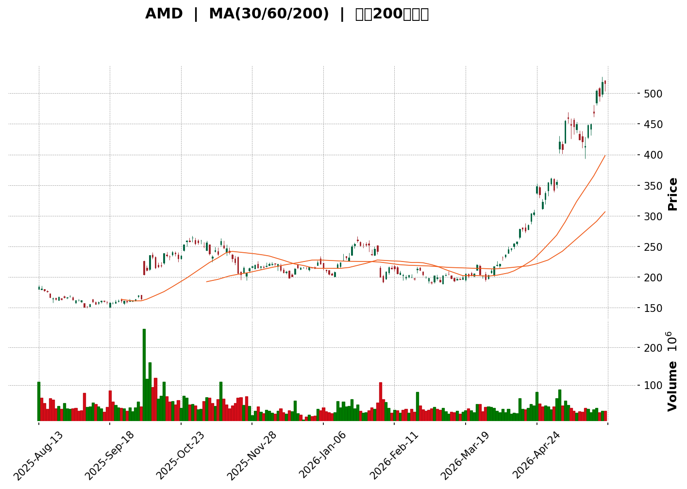
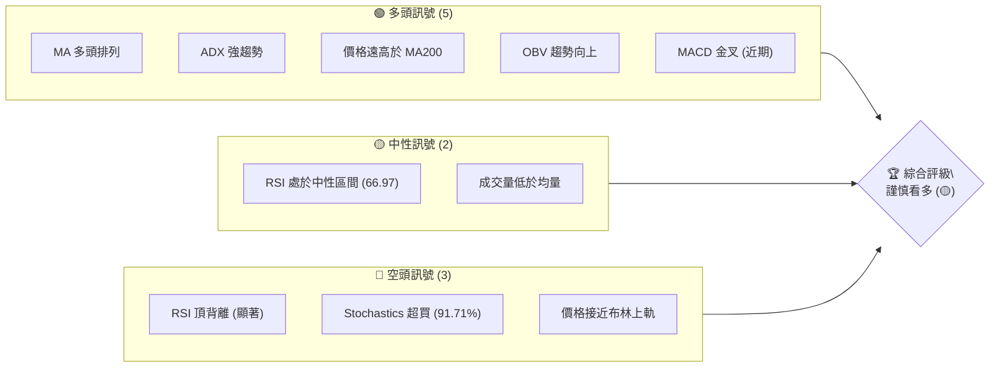
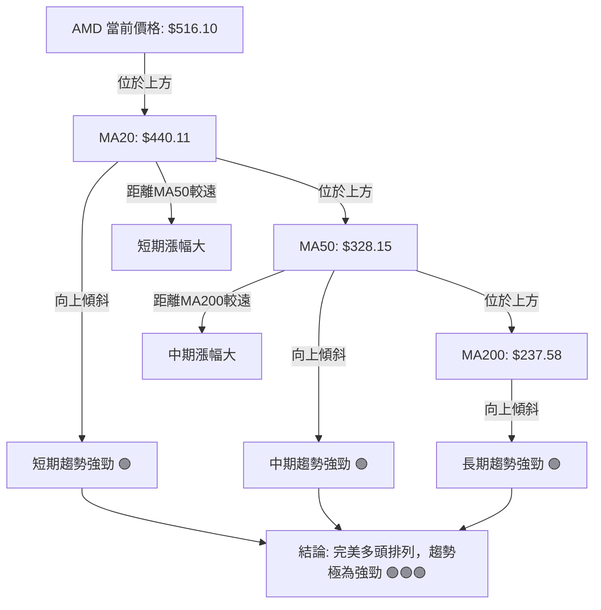

<details>
<summary>📊 靜態圖表 (點擊展開)</summary>

</details>

<html>
<head><meta charset="utf-8" /></head>
<body>
    <div>                        <script>window.PlotlyConfig = {MathJaxConfig: 'local'};</script>
        <script charset="utf-8" src="https://cdn.plot.ly/plotly-3.5.0.min.js" integrity="sha256-fHbNLP+GlIXN+efbQec78UkemUz3NJp7UmfGxC1tNxs=" crossorigin="anonymous"></script>                <div id="candlestick-chart" class="plotly-graph-div" style="height:500px; width:100%;"></div>            <script>                window.PLOTLYENV=window.PLOTLYENV || {};                                if (document.getElementById("candlestick-chart")) {                    Plotly.newPlot(                        "candlestick-chart",                        [{"close":{"dtype":"f8","bdata":"AAAAoHANZ0AAAABgZp5mQAAAAOBRMGZAAAAA4HoEZkAAAACgmdFkQAAAAGBmpmRAAAAAYLh2ZEAAAADgUfhkQAAAACCFa2RAAAAAANfTZEAAAAAAKeRkQAAAAGCPEmVAAAAAAClUZEAAAACAPUpkQAAAAAApRGRAAAAAoEc5ZEAAAADgeuRiQAAAAMAe7WJAAAAAgD16Y0AAAACgR\u002fFjQAAAAKBwdWNAAAAAgD3SY0AAAADAHiVkQAAAAGC4DmRAAAAAwB7lY0AAAACgcL1jQAAAAOB6rGNAAAAAoEf5Y0AAAADAzBxkQAAAAAApHGRAAAAA4KMoZEAAAABguO5jQAAAACCFK2RAAAAAoEc5ZEAAAADgUYBkQAAAACBcN2VAAAAAoHCVZEAAAABguHZpQAAAAOBRcGpAAAAAgOtxbUAAAADgehxtQAAAAMDM3GpAAAAAoHANa0AAAABA4UJrQAAAAEAz021AAAAAgOtRbUAAAABgjyJtQAAAAIDrEW5AAAAAwPXAbUAAAAAgXMdsQAAAACCuX21AAAAAoHCdb0AAAABguDpwQAAAAAApIHBAAAAAoEeFcEAAAABA4dpvQAAAAIDrAXBAAAAAYGY6cEAAAACgmUFvQAAAAKBHBXBAAAAAYGa2bUAAAACgRzFtQAAAACBcf25AAAAA4KOwbUAAAACAPS5wQAAAAGC4\u002fm5AAAAAgOvZbkAAAADgoxBuQAAAAKBHyWxAAAAAoJnxa0AAAADgo8BpQAAAAMD1eGlAAAAAoJnhakAAAAAAKcRpQAAAACCux2pAAAAAwPUwa0AAAADgUXhrQAAAACCu52pAAAAAQDMza0AAAAAgXP9qQAAAAEAKP2tAAAAAIIWja0AAAAAA17NrQAAAAKBwrWtAAAAAgMKta0AAAADA9VhqQAAAAGCP8mlAAAAAoHAlakAAAAAghcNoQAAAAIDrIWlAAAAAgMKtakAAAABgZt5qQAAAAMDM3GpAAAAAoEfhakAAAAAgrt9qQAAAACCF82pAAAAAQOHqakAAAADAHsVqQAAAAEAK72tAAAAAYI+ia0AAAABAM8tqQAAAAOCjQGpAAAAAgMKVaUAAAACgcGVpQAAAAIAU9mlAAAAAQAqfa0AAAABAM\u002fNrQAAAAKBwfWxAAAAAYI\u002f6bEAAAACgcP1sQAAAAKCZOW9AAAAAIFy3b0AAAABA4TpwQAAAAIDraW9AAAAAwPWAb0AAAAAgrpdvQAAAAIDChW9AAAAAIFyXbUAAAADgo8huQAAAACCFQ25AAAAAgBQGaUAAAAAAABBoQAAAAIAUDmpAAAAAAAAAa0AAAACAPbJqQAAAAGCPsmpAAAAAgBS+aUAAAACAPeppQAAAAGCPYmlAAAAAANcDaUAAAAAA12tpQAAAAMDMBGlAAAAAQDOTaEAAAABA4bpqQAAAACCFW2pAAAAAgMJ1aUAAAABguAZpQAAAAADX02hAAAAAYGbeZ0AAAACAPUJpQAAAAGBm7mhAAAAAgMINaEAAAACAwlVpQAAAACBcZ2lAAAAAYI+aaUAAAAAgrrdoQAAAAOB6LGhAAAAAYI+SaEAAAACA64loQAAAAGC47mhAAAAA4KOoaUAAAABgjyppQAAAAIDCVWlAAAAAANeraUAAAADgo4hrQAAAAOCjeGlAAAAAIK4\u002faUAAAACgR4FoQAAAAIDCbWlAAAAAYLhGakAAAAAAADBrQAAAAIDChWtAAAAAwPWwa0AAAACAPfpsQAAAAOB6lG1AAAAAoEehbkAAAABgj9puQAAAAIA94m9AAAAAgOshcEAAAAAAKWRxQAAAAIA9ZnFAAAAAQDMvcUAAAAAA18dxQAAAACBc93JAAAAAoEcVc0AAAADA9bx1QAAAAIAU6nRAAAAAIFwzdEAAAACAwhF1QAAAAADXJ3ZAAAAA4KOIdkAAAADgo1h1QAAAAAApNHZAAAAAgD1WekAAAAAgXId5QAAAAEAKc3xAAAAA4KOsfEAAAADgowR8QAAAAAAA2HtAAAAAQDMbfEAAAACgmYF6QAAAAADXT3pAAAAAwMzgeUAAAACgR\u002fl7QAAAAKBwGXxAAAAAACk4fUAAAACAPX5\u002fQAAAAOCj+H5AAAAAYLgwgEAAAADAzCCAQA=="},"high":{"dtype":"f8","bdata":"AAAAwMxUZ0AAAACAFC5nQAAAAOB6hGZAAAAAoJlZZkAAAACgcKVlQAAAAMDM1GRAAAAAACm8ZEAAAADA9RBlQAAAAEDhsmRAAAAA4KM4ZUAAAACAwvVkQAAAACCuX2VAAAAAgD0SZUAAAADgekxkQAAAAAAAmGRAAAAAoJlBZEAAAADgeqRjQAAAAOB6FGNAAAAAwB6VY0AAAADA9ZBkQAAAAGC4BmRAAAAAwB4NZEAAAACgmUlkQAAAAGBmPmRAAAAAACk0ZEAAAADgo9hjQAAAAEDh+mNAAAAAgMJVZEAAAADgemxkQAAAAEAzo2RAAAAAACk0ZEAAAAAghUNkQAAAAKCZiWRAAAAAwPVIZEAAAACAwoVkQAAAAIDrYWVAAAAAgMJVZUAAAABguFZsQAAAAMDMXGtAAAAAANd7bUAAAABAMwNuQAAAAEAKR21AAAAAgBQGbEAAAAAgXB9sQAAAACCu521AAAAAYGYmbkAAAAAAKWxtQAAAAAApXG5AAAAA4FFIbkAAAAAAKQRuQAAAAMDMfG1AAAAA4Hqsb0AAAABguEZwQAAAAKBHiXBAAAAAoEexcEAAAACAFH5wQAAAAIAUYnBAAAAAYI9OcEAAAACAFBZwQAAAAGBmOnBAAAAA4FGwb0AAAAAA13ttQAAAAMDMHG9AAAAAYLgOb0AAAAAAKXhwQAAAAIAUOnBAAAAAgBSub0AAAADgoxhvQAAAAAAAwG1AAAAAwPVobUAAAAAAAEhtQAAAAGCPGmpAAAAAACkka0AAAABgj9JpQAAAAEDh8mpAAAAAoJlJa0AAAAAgXJ9rQAAAACBcP2xAAAAAYGZGa0AAAAAA12NrQAAAAOB69GtAAAAAYLj2a0AAAABA4RpsQAAAACCF02tAAAAAAACwa0AAAAAgrs9rQAAAACCF62pAAAAAQApHakAAAAAAAHBqQAAAACCFy2lAAAAAgMLlakAAAACgcIVrQAAAAMD1IGtAAAAAoEcRa0AAAABgjxprQAAAAKCZAWtAAAAAgD0aa0AAAADgejRrQAAAAMDMZGxAAAAA4KNAbUAAAACgcN1rQAAAAAAphGpAAAAAgBReakAAAACgmelpQAAAAAApPGpAAAAAIIXja0AAAABA4QJsQAAAAEAzy21AAAAAIK5PbUAAAAAAAPBtQAAAAMDMnG9AAAAAoEcBcEAAAAAgXK9wQAAAAOCjJHBAAAAAoJnxb0AAAABgZhZwQAAAAOB6SHBAAAAAIK6nbkAAAABACj9vQAAAAMDMlG9AAAAAYI9Sa0AAAACgR4FpQAAAAOCjKGpAAAAAQDMza0AAAADgemxrQAAAAMDMdGtAAAAAYLhOa0AAAACgmUFqQAAAAKCZqWlAAAAAYGZmaUAAAABAM4NpQAAAAADXm2lAAAAAACnsaEAAAABguBZrQAAAAGBmFmtAAAAAoEc5akAAAADgejxpQAAAACCu12hAAAAA4Ho0aEAAAACAFE5pQAAAAKBHeWlAAAAAIK4HaUAAAABACl9pQAAAAEDh0mlAAAAAYLgmakAAAAAA13NpQAAAAIDC9WhAAAAAoHAFaUAAAABguOZoQAAAACCFW2lAAAAAACm8aUAAAACgmclpQAAAACCFI2pAAAAAgMLNaUAAAABgj6prQAAAAAAAoGtAAAAA4KNoaUAAAACAwg1qQAAAAAAAgGlAAAAAYI+6akAAAADA9ThrQAAAAIDrSWxAAAAAQDPDa0AAAAAAAEBtQAAAAEAzo21AAAAAYI8yb0AAAABgj+puQAAAAGC47m9AAAAAQOEicEAAAACgcHVxQAAAAMDMkHFAAAAAgML5cUAAAABAM+NxQAAAAAAABHNAAAAAIIVjc0AAAAAA1w92QAAAACBc03VAAAAAAAB4dEAAAABguEJ1QAAAACBcL3ZAAAAA4KOsdkAAAACgmZ12QAAAAMAeeXZAAAAAoJnpekAAAAAgXFt6QAAAAOCjhHxAAAAAIIVTfUAAAADAzKx8QAAAAAAAuHxAAAAAwPVUfEAAAAAAAHB7QAAAAMDMbHtAAAAAAADMekAAAACAPRZ8QAAAAEAzM3xAAAAAYI8WfkAAAAAgXK9\u002fQAAAACBc439AAAAAoJl5gEAAAAAAAFCAQA=="},"hovertemplate":"\u003cb\u003e%{x|%Y-%m-%d}\u003c\u002fb\u003e\u003cbr\u003e\u958b: $%{open:.2f}\u003cbr\u003e\u9ad8: $%{high:.2f}\u003cbr\u003e\u4f4e: $%{low:.2f}\u003cbr\u003e\u6536: $%{close:.2f}\u003cextra\u003e\u003c\u002fextra\u003e","low":{"dtype":"f8","bdata":"AAAAAClsZkAAAACA63FmQAAAAAAACGZAAAAAIIXLZUAAAABAM8NkQAAAAAAAyGNAAAAA4FFIZEAAAACgmTlkQAAAAEAKN2RAAAAAwB6dZEAAAADAzJRkQAAAAMDM1GRAAAAAwMw8ZEAAAAAA15NjQAAAAGCPEmRAAAAAoEe5Y0AAAACAwsViQAAAAEAKp2JAAAAAgML9YkAAAAAAAMBjQAAAACCuX2NAAAAAoHBdY0AAAABAM7NjQAAAAEAK52NAAAAA4FF4Y0AAAABAM7tiQAAAAMDMfGNAAAAAoHCtY0AAAABguOZjQAAAAIDCzWNAAAAAwPVYY0AAAACgmaFjQAAAAMDM\u002fGNAAAAAYI\u002fqY0AAAAAgrg9kQAAAAADXw2RAAAAA4HpkZEAAAADgUWBpQAAAAMD1KGpAAAAAYGZWakAAAADA9bBsQAAAAGBmpmpAAAAAwMzcakAAAADAzPxqQAAAAOBRmGtAAAAAIK4HbUAAAADAHn1sQAAAAMDMTG1AAAAA4KNAbUAAAAAAKRxsQAAAAKBHkWxAAAAAYGY+bkAAAACgmTlvQAAAAAAAEHBAAAAAYGYWcEAAAACA64lvQAAAAMAerW9AAAAA4Hq8b0AAAADgeuxuQAAAAIDrWW5AAAAAIK53bUAAAADgehRsQAAAAAAAEG5AAAAA4HpUbUAAAAAAAEBvQAAAAIDrwW5AAAAAYI9ibUAAAADAzKRtQAAAAGC4FmxAAAAAYLh2a0AAAADA9ZBpQAAAAAAAYGhAAAAAQDO7aUAAAADA9UhoQAAAAAAA4GlAAAAA4KPAakAAAAAAALBqQAAAAOB6zGpAAAAA4KN4akAAAADgesRqQAAAACCuB2tAAAAAIIVLa0AAAADAHj1rQAAAAKBwVWtAAAAAgBRGakAAAACA6yFqQAAAAGCP0mlAAAAAIIWjaUAAAADA9bBoQAAAAAAAEGlAAAAAYGaGaUAAAACA66lqQAAAAMD1iGpAAAAAQAq\u002fakAAAADA9aBqQAAAACCuJ2pAAAAAYI\u002fKakAAAACgmblqQAAAAMDMXGtAAAAAIFyPa0AAAAAAAGhqQAAAAKBw5WlAAAAAYI9qaUAAAACAPWJpQAAAAKCZ+WhAAAAAIFzfakAAAAAgheNqQAAAAEAKZ2xAAAAAIIWbbEAAAADAHi1sQAAAAMD1eG1AAAAAACnUbkAAAAAAAARwQAAAAKCZSW9AAAAAYLj+bkAAAABguEZvQAAAAMAeHW5AAAAAoJlRbUAAAAAAAGBtQAAAAKBHoW1AAAAAwMzkaEAAAABACtdnQAAAAIDCjWhAAAAAwMyEaUAAAAAAKaRqQAAAAGC4JmpAAAAA4HqkaUAAAAAAKXxpQAAAAGCPWmhAAAAAAABgaEAAAACgR8loQAAAAIDr0WhAAAAAwMxEaEAAAAAAANBpQAAAAGCPSmpAAAAAYLguaUAAAAAgrrdoQAAAAAAAwGdAAAAAQAqHZ0AAAAAghbtnQAAAAAApXGhAAAAAAADoZ0AAAADgo6BnQAAAAGBmRmlAAAAAACl0aUAAAACgcJVoQAAAAOCjCGhAAAAAoJlZaEAAAADgUWhoQAAAAAAAeGhAAAAAYI8aaEAAAADgUchoQAAAAGC4NmlAAAAAACkEaUAAAADgUXBqQAAAAIDCbWlAAAAAgBS2aEAAAAAA1xtoQAAAAMAejWhAAAAAQOG6aUAAAAAA1xNpQAAAACBcN2tAAAAAACnsakAAAABA4WJsQAAAAMAe3WxAAAAAYLjebUAAAADA9UBuQAAAAGBmtm5AAAAAQDN7b0AAAAAAKVhwQAAAAIA9InFAAAAAAAAAcUAAAACA60lxQAAAAIA94nFAAAAAACm8ckAAAADgo+h0QAAAAMD1jHRAAAAAAABgc0AAAACAwu1zQAAAAKCZyXRAAAAAAADUdUAAAABAMyt1QAAAAIAUjnVAAAAA4KMgeUAAAACgRxF5QAAAAOCjJHpAAAAAgBQufEAAAACAwqF6QAAAAGBmCntAAAAAQOE6e0AAAACAwnV6QAAAACBcq3lAAAAAgMKVeEAAAADAzKB6QAAAAKCZ+XpAAAAAIFzbfEAAAAAgrgN+QAAAAGCPan5AAAAA4FHYfkAAAABA4XZ\u002fQA=="},"name":"\u50f9\u683c","open":{"dtype":"f8","bdata":"AAAAwB59ZkAAAABgj3pmQAAAAIDrgWZAAAAA4FEYZkAAAABAM6NlQAAAAEAzg2RAAAAAIIW7ZEAAAACgcEVkQAAAAKCZsWRAAAAAwMwUZUAAAACgR8FkQAAAAAAAEGVAAAAAgOvZZEAAAACgcM1jQAAAAIDrOWRAAAAAgBT+Y0AAAAAA16NjQAAAAKCZ+WJAAAAAIK7\u002fYkAAAACgR3FkQAAAAADX02NAAAAAAACgY0AAAADgUQBkQAAAAADXK2RAAAAAwPXoY0AAAABguN5iQAAAAAAprGNAAAAAoHCtY0AAAADgoxBkQAAAACBcX2RAAAAA4HqkY0AAAADgoxBkQAAAAADXA2RAAAAAoEcZZEAAAACAwh1kQAAAAIDCFWVAAAAAgMJVZUAAAABgZk5sQAAAAEAz22pAAAAAYGaeakAAAACgmYltQAAAAOCjGG1AAAAAYGaGa0AAAABgZmZrQAAAAGC41mtAAAAAoEeJbUAAAADgUShtQAAAAEAKj21AAAAA4HrsbUAAAABAM5ttQAAAAMAexWxAAAAAIIVrbkAAAACAFB5wQAAAAIA9MnBAAAAAQAqDcEAAAABguD5wQAAAAKCZOXBAAAAAoEc1cEAAAABAM0tvQAAAACCuZ25AAAAAQAqvb0AAAACAFN5sQAAAAOB6RG5AAAAAwB41bkAAAAAAKaRvQAAAAMDMfG9AAAAAIIUDbkAAAAAAAFhuQAAAAMD1mG1AAAAA4FHIbEAAAABgZhZtQAAAAIDrGWpAAAAAwB7laUAAAAAgXC9pQAAAAKCZQWpAAAAA4HoEa0AAAAAAKbxqQAAAAKBHuWtAAAAA4FEIa0AAAAAAKRxrQAAAAKBwJWtAAAAAQOFia0AAAACgR6FrQAAAAAAAwGtAAAAAgOs5a0AAAAAA10trQAAAAMD1iGpAAAAAoHDdaUAAAACgR0FqQAAAAIA9emlAAAAAQDOTaUAAAAAAAIBrQAAAACCFm2pAAAAAIFzfakAAAACAwu1qQAAAAGCPcmpAAAAAANf7akAAAACAPfpqQAAAAMDMXGtAAAAAAADIbEAAAABguNZrQAAAAAAphGpAAAAAwMxcakAAAABACrdpQAAAAIDCJWlAAAAAQDPjakAAAACgRzFrQAAAAMDMfGxAAAAAoJlJbUAAAABgj0JsQAAAACCuf21AAAAAAAB4b0AAAABA4VJwQAAAAAAADHBAAAAAwB6Fb0AAAAAAKcRvQAAAAMAe1W9AAAAAgMKdbUAAAADgo3htQAAAAKCZcW9AAAAAAADgakAAAAAghTtpQAAAAAAppGhAAAAAwMzcaUAAAADgeuRqQAAAAAApPGtAAAAAYI\u002f6akAAAADgo4BpQAAAAMDMRGlAAAAAwB7NaEAAAAAghQNpQAAAAADXA2lAAAAAQOHCaEAAAAAAKXRqQAAAAIA92mpAAAAAoJkZakAAAAAghQNpQAAAAEAzO2hAAAAAYLjuZ0AAAAAA1wNoQAAAAOCjuGhAAAAA4KNoaEAAAAAghatnQAAAAOBRUGlAAAAAIIWjaUAAAABgj1ppQAAAACCFw2hAAAAAIFxfaEAAAACAwpVoQAAAAAAAgGhAAAAAwPVgaEAAAADgepxpQAAAAMDMzGlAAAAA4HosaUAAAADgUXBqQAAAACBcP2tAAAAA4KM4aUAAAABgZp5pQAAAAKCZwWhAAAAAQOHyaUAAAACgmYFpQAAAAMD1aGtAAAAA4FFIa0AAAAAA1wNtQAAAAOBRIG1AAAAAAADgbUAAAADA9aBuQAAAAKBHOW9AAAAAYLjeb0AAAAAA149wQAAAAAAAkHFAAAAAoJmJcUAAAACgR1VxQAAAACCFM3JAAAAAACngckAAAAAAKQx1QAAAAMAepXVAAAAAgMJ9c0AAAACgR2l0QAAAAIDCVXVAAAAAgOv9dUAAAADA9YR2QAAAAAAp+HVAAAAAANeXeUAAAADAHhF6QAAAAKBwKXpAAAAAwMzIfEAAAAAAABR8QAAAAOCjkHxAAAAAoJmJe0AAAACgcBV7QAAAAAAA2HpAAAAAoJnJeUAAAADgo8B6QAAAAADXn3tAAAAAoHBdfUAAAAAA10t+QAAAAAAAwH9AAAAAAAAwf0AAAABgZkaAQA=="},"x":["2025-08-13T00:00:00-04:00","2025-08-14T00:00:00-04:00","2025-08-15T00:00:00-04:00","2025-08-18T00:00:00-04:00","2025-08-19T00:00:00-04:00","2025-08-20T00:00:00-04:00","2025-08-21T00:00:00-04:00","2025-08-22T00:00:00-04:00","2025-08-25T00:00:00-04:00","2025-08-26T00:00:00-04:00","2025-08-27T00:00:00-04:00","2025-08-28T00:00:00-04:00","2025-08-29T00:00:00-04:00","2025-09-02T00:00:00-04:00","2025-09-03T00:00:00-04:00","2025-09-04T00:00:00-04:00","2025-09-05T00:00:00-04:00","2025-09-08T00:00:00-04:00","2025-09-09T00:00:00-04:00","2025-09-10T00:00:00-04:00","2025-09-11T00:00:00-04:00","2025-09-12T00:00:00-04:00","2025-09-15T00:00:00-04:00","2025-09-16T00:00:00-04:00","2025-09-17T00:00:00-04:00","2025-09-18T00:00:00-04:00","2025-09-19T00:00:00-04:00","2025-09-22T00:00:00-04:00","2025-09-23T00:00:00-04:00","2025-09-24T00:00:00-04:00","2025-09-25T00:00:00-04:00","2025-09-26T00:00:00-04:00","2025-09-29T00:00:00-04:00","2025-09-30T00:00:00-04:00","2025-10-01T00:00:00-04:00","2025-10-02T00:00:00-04:00","2025-10-03T00:00:00-04:00","2025-10-06T00:00:00-04:00","2025-10-07T00:00:00-04:00","2025-10-08T00:00:00-04:00","2025-10-09T00:00:00-04:00","2025-10-10T00:00:00-04:00","2025-10-13T00:00:00-04:00","2025-10-14T00:00:00-04:00","2025-10-15T00:00:00-04:00","2025-10-16T00:00:00-04:00","2025-10-17T00:00:00-04:00","2025-10-20T00:00:00-04:00","2025-10-21T00:00:00-04:00","2025-10-22T00:00:00-04:00","2025-10-23T00:00:00-04:00","2025-10-24T00:00:00-04:00","2025-10-27T00:00:00-04:00","2025-10-28T00:00:00-04:00","2025-10-29T00:00:00-04:00","2025-10-30T00:00:00-04:00","2025-10-31T00:00:00-04:00","2025-11-03T00:00:00-05:00","2025-11-04T00:00:00-05:00","2025-11-05T00:00:00-05:00","2025-11-06T00:00:00-05:00","2025-11-07T00:00:00-05:00","2025-11-10T00:00:00-05:00","2025-11-11T00:00:00-05:00","2025-11-12T00:00:00-05:00","2025-11-13T00:00:00-05:00","2025-11-14T00:00:00-05:00","2025-11-17T00:00:00-05:00","2025-11-18T00:00:00-05:00","2025-11-19T00:00:00-05:00","2025-11-20T00:00:00-05:00","2025-11-21T00:00:00-05:00","2025-11-24T00:00:00-05:00","2025-11-25T00:00:00-05:00","2025-11-26T00:00:00-05:00","2025-11-28T00:00:00-05:00","2025-12-01T00:00:00-05:00","2025-12-02T00:00:00-05:00","2025-12-03T00:00:00-05:00","2025-12-04T00:00:00-05:00","2025-12-05T00:00:00-05:00","2025-12-08T00:00:00-05:00","2025-12-09T00:00:00-05:00","2025-12-10T00:00:00-05:00","2025-12-11T00:00:00-05:00","2025-12-12T00:00:00-05:00","2025-12-15T00:00:00-05:00","2025-12-16T00:00:00-05:00","2025-12-17T00:00:00-05:00","2025-12-18T00:00:00-05:00","2025-12-19T00:00:00-05:00","2025-12-22T00:00:00-05:00","2025-12-23T00:00:00-05:00","2025-12-24T00:00:00-05:00","2025-12-26T00:00:00-05:00","2025-12-29T00:00:00-05:00","2025-12-30T00:00:00-05:00","2025-12-31T00:00:00-05:00","2026-01-02T00:00:00-05:00","2026-01-05T00:00:00-05:00","2026-01-06T00:00:00-05:00","2026-01-07T00:00:00-05:00","2026-01-08T00:00:00-05:00","2026-01-09T00:00:00-05:00","2026-01-12T00:00:00-05:00","2026-01-13T00:00:00-05:00","2026-01-14T00:00:00-05:00","2026-01-15T00:00:00-05:00","2026-01-16T00:00:00-05:00","2026-01-20T00:00:00-05:00","2026-01-21T00:00:00-05:00","2026-01-22T00:00:00-05:00","2026-01-23T00:00:00-05:00","2026-01-26T00:00:00-05:00","2026-01-27T00:00:00-05:00","2026-01-28T00:00:00-05:00","2026-01-29T00:00:00-05:00","2026-01-30T00:00:00-05:00","2026-02-02T00:00:00-05:00","2026-02-03T00:00:00-05:00","2026-02-04T00:00:00-05:00","2026-02-05T00:00:00-05:00","2026-02-06T00:00:00-05:00","2026-02-09T00:00:00-05:00","2026-02-10T00:00:00-05:00","2026-02-11T00:00:00-05:00","2026-02-12T00:00:00-05:00","2026-02-13T00:00:00-05:00","2026-02-17T00:00:00-05:00","2026-02-18T00:00:00-05:00","2026-02-19T00:00:00-05:00","2026-02-20T00:00:00-05:00","2026-02-23T00:00:00-05:00","2026-02-24T00:00:00-05:00","2026-02-25T00:00:00-05:00","2026-02-26T00:00:00-05:00","2026-02-27T00:00:00-05:00","2026-03-02T00:00:00-05:00","2026-03-03T00:00:00-05:00","2026-03-04T00:00:00-05:00","2026-03-05T00:00:00-05:00","2026-03-06T00:00:00-05:00","2026-03-09T00:00:00-04:00","2026-03-10T00:00:00-04:00","2026-03-11T00:00:00-04:00","2026-03-12T00:00:00-04:00","2026-03-13T00:00:00-04:00","2026-03-16T00:00:00-04:00","2026-03-17T00:00:00-04:00","2026-03-18T00:00:00-04:00","2026-03-19T00:00:00-04:00","2026-03-20T00:00:00-04:00","2026-03-23T00:00:00-04:00","2026-03-24T00:00:00-04:00","2026-03-25T00:00:00-04:00","2026-03-26T00:00:00-04:00","2026-03-27T00:00:00-04:00","2026-03-30T00:00:00-04:00","2026-03-31T00:00:00-04:00","2026-04-01T00:00:00-04:00","2026-04-02T00:00:00-04:00","2026-04-06T00:00:00-04:00","2026-04-07T00:00:00-04:00","2026-04-08T00:00:00-04:00","2026-04-09T00:00:00-04:00","2026-04-10T00:00:00-04:00","2026-04-13T00:00:00-04:00","2026-04-14T00:00:00-04:00","2026-04-15T00:00:00-04:00","2026-04-16T00:00:00-04:00","2026-04-17T00:00:00-04:00","2026-04-20T00:00:00-04:00","2026-04-21T00:00:00-04:00","2026-04-22T00:00:00-04:00","2026-04-23T00:00:00-04:00","2026-04-24T00:00:00-04:00","2026-04-27T00:00:00-04:00","2026-04-28T00:00:00-04:00","2026-04-29T00:00:00-04:00","2026-04-30T00:00:00-04:00","2026-05-01T00:00:00-04:00","2026-05-04T00:00:00-04:00","2026-05-05T00:00:00-04:00","2026-05-06T00:00:00-04:00","2026-05-07T00:00:00-04:00","2026-05-08T00:00:00-04:00","2026-05-11T00:00:00-04:00","2026-05-12T00:00:00-04:00","2026-05-13T00:00:00-04:00","2026-05-14T00:00:00-04:00","2026-05-15T00:00:00-04:00","2026-05-18T00:00:00-04:00","2026-05-19T00:00:00-04:00","2026-05-20T00:00:00-04:00","2026-05-21T00:00:00-04:00","2026-05-22T00:00:00-04:00","2026-05-26T00:00:00-04:00","2026-05-27T00:00:00-04:00","2026-05-28T00:00:00-04:00","2026-05-29T00:00:00-04:00"],"type":"candlestick"},{"hovertemplate":"MA30: $%{y:.2f}\u003cextra\u003e\u003c\u002fextra\u003e","line":{"color":"#2196F3","dash":"dash","width":2},"mode":"lines","name":"MA30","x":["2025-08-13T00:00:00-04:00","2025-08-14T00:00:00-04:00","2025-08-15T00:00:00-04:00","2025-08-18T00:00:00-04:00","2025-08-19T00:00:00-04:00","2025-08-20T00:00:00-04:00","2025-08-21T00:00:00-04:00","2025-08-22T00:00:00-04:00","2025-08-25T00:00:00-04:00","2025-08-26T00:00:00-04:00","2025-08-27T00:00:00-04:00","2025-08-28T00:00:00-04:00","2025-08-29T00:00:00-04:00","2025-09-02T00:00:00-04:00","2025-09-03T00:00:00-04:00","2025-09-04T00:00:00-04:00","2025-09-05T00:00:00-04:00","2025-09-08T00:00:00-04:00","2025-09-09T00:00:00-04:00","2025-09-10T00:00:00-04:00","2025-09-11T00:00:00-04:00","2025-09-12T00:00:00-04:00","2025-09-15T00:00:00-04:00","2025-09-16T00:00:00-04:00","2025-09-17T00:00:00-04:00","2025-09-18T00:00:00-04:00","2025-09-19T00:00:00-04:00","2025-09-22T00:00:00-04:00","2025-09-23T00:00:00-04:00","2025-09-24T00:00:00-04:00","2025-09-25T00:00:00-04:00","2025-09-26T00:00:00-04:00","2025-09-29T00:00:00-04:00","2025-09-30T00:00:00-04:00","2025-10-01T00:00:00-04:00","2025-10-02T00:00:00-04:00","2025-10-03T00:00:00-04:00","2025-10-06T00:00:00-04:00","2025-10-07T00:00:00-04:00","2025-10-08T00:00:00-04:00","2025-10-09T00:00:00-04:00","2025-10-10T00:00:00-04:00","2025-10-13T00:00:00-04:00","2025-10-14T00:00:00-04:00","2025-10-15T00:00:00-04:00","2025-10-16T00:00:00-04:00","2025-10-17T00:00:00-04:00","2025-10-20T00:00:00-04:00","2025-10-21T00:00:00-04:00","2025-10-22T00:00:00-04:00","2025-10-23T00:00:00-04:00","2025-10-24T00:00:00-04:00","2025-10-27T00:00:00-04:00","2025-10-28T00:00:00-04:00","2025-10-29T00:00:00-04:00","2025-10-30T00:00:00-04:00","2025-10-31T00:00:00-04:00","2025-11-03T00:00:00-05:00","2025-11-04T00:00:00-05:00","2025-11-05T00:00:00-05:00","2025-11-06T00:00:00-05:00","2025-11-07T00:00:00-05:00","2025-11-10T00:00:00-05:00","2025-11-11T00:00:00-05:00","2025-11-12T00:00:00-05:00","2025-11-13T00:00:00-05:00","2025-11-14T00:00:00-05:00","2025-11-17T00:00:00-05:00","2025-11-18T00:00:00-05:00","2025-11-19T00:00:00-05:00","2025-11-20T00:00:00-05:00","2025-11-21T00:00:00-05:00","2025-11-24T00:00:00-05:00","2025-11-25T00:00:00-05:00","2025-11-26T00:00:00-05:00","2025-11-28T00:00:00-05:00","2025-12-01T00:00:00-05:00","2025-12-02T00:00:00-05:00","2025-12-03T00:00:00-05:00","2025-12-04T00:00:00-05:00","2025-12-05T00:00:00-05:00","2025-12-08T00:00:00-05:00","2025-12-09T00:00:00-05:00","2025-12-10T00:00:00-05:00","2025-12-11T00:00:00-05:00","2025-12-12T00:00:00-05:00","2025-12-15T00:00:00-05:00","2025-12-16T00:00:00-05:00","2025-12-17T00:00:00-05:00","2025-12-18T00:00:00-05:00","2025-12-19T00:00:00-05:00","2025-12-22T00:00:00-05:00","2025-12-23T00:00:00-05:00","2025-12-24T00:00:00-05:00","2025-12-26T00:00:00-05:00","2025-12-29T00:00:00-05:00","2025-12-30T00:00:00-05:00","2025-12-31T00:00:00-05:00","2026-01-02T00:00:00-05:00","2026-01-05T00:00:00-05:00","2026-01-06T00:00:00-05:00","2026-01-07T00:00:00-05:00","2026-01-08T00:00:00-05:00","2026-01-09T00:00:00-05:00","2026-01-12T00:00:00-05:00","2026-01-13T00:00:00-05:00","2026-01-14T00:00:00-05:00","2026-01-15T00:00:00-05:00","2026-01-16T00:00:00-05:00","2026-01-20T00:00:00-05:00","2026-01-21T00:00:00-05:00","2026-01-22T00:00:00-05:00","2026-01-23T00:00:00-05:00","2026-01-26T00:00:00-05:00","2026-01-27T00:00:00-05:00","2026-01-28T00:00:00-05:00","2026-01-29T00:00:00-05:00","2026-01-30T00:00:00-05:00","2026-02-02T00:00:00-05:00","2026-02-03T00:00:00-05:00","2026-02-04T00:00:00-05:00","2026-02-05T00:00:00-05:00","2026-02-06T00:00:00-05:00","2026-02-09T00:00:00-05:00","2026-02-10T00:00:00-05:00","2026-02-11T00:00:00-05:00","2026-02-12T00:00:00-05:00","2026-02-13T00:00:00-05:00","2026-02-17T00:00:00-05:00","2026-02-18T00:00:00-05:00","2026-02-19T00:00:00-05:00","2026-02-20T00:00:00-05:00","2026-02-23T00:00:00-05:00","2026-02-24T00:00:00-05:00","2026-02-25T00:00:00-05:00","2026-02-26T00:00:00-05:00","2026-02-27T00:00:00-05:00","2026-03-02T00:00:00-05:00","2026-03-03T00:00:00-05:00","2026-03-04T00:00:00-05:00","2026-03-05T00:00:00-05:00","2026-03-06T00:00:00-05:00","2026-03-09T00:00:00-04:00","2026-03-10T00:00:00-04:00","2026-03-11T00:00:00-04:00","2026-03-12T00:00:00-04:00","2026-03-13T00:00:00-04:00","2026-03-16T00:00:00-04:00","2026-03-17T00:00:00-04:00","2026-03-18T00:00:00-04:00","2026-03-19T00:00:00-04:00","2026-03-20T00:00:00-04:00","2026-03-23T00:00:00-04:00","2026-03-24T00:00:00-04:00","2026-03-25T00:00:00-04:00","2026-03-26T00:00:00-04:00","2026-03-27T00:00:00-04:00","2026-03-30T00:00:00-04:00","2026-03-31T00:00:00-04:00","2026-04-01T00:00:00-04:00","2026-04-02T00:00:00-04:00","2026-04-06T00:00:00-04:00","2026-04-07T00:00:00-04:00","2026-04-08T00:00:00-04:00","2026-04-09T00:00:00-04:00","2026-04-10T00:00:00-04:00","2026-04-13T00:00:00-04:00","2026-04-14T00:00:00-04:00","2026-04-15T00:00:00-04:00","2026-04-16T00:00:00-04:00","2026-04-17T00:00:00-04:00","2026-04-20T00:00:00-04:00","2026-04-21T00:00:00-04:00","2026-04-22T00:00:00-04:00","2026-04-23T00:00:00-04:00","2026-04-24T00:00:00-04:00","2026-04-27T00:00:00-04:00","2026-04-28T00:00:00-04:00","2026-04-29T00:00:00-04:00","2026-04-30T00:00:00-04:00","2026-05-01T00:00:00-04:00","2026-05-04T00:00:00-04:00","2026-05-05T00:00:00-04:00","2026-05-06T00:00:00-04:00","2026-05-07T00:00:00-04:00","2026-05-08T00:00:00-04:00","2026-05-11T00:00:00-04:00","2026-05-12T00:00:00-04:00","2026-05-13T00:00:00-04:00","2026-05-14T00:00:00-04:00","2026-05-15T00:00:00-04:00","2026-05-18T00:00:00-04:00","2026-05-19T00:00:00-04:00","2026-05-20T00:00:00-04:00","2026-05-21T00:00:00-04:00","2026-05-22T00:00:00-04:00","2026-05-26T00:00:00-04:00","2026-05-27T00:00:00-04:00","2026-05-28T00:00:00-04:00","2026-05-29T00:00:00-04:00"],"y":{"dtype":"f8","bdata":"AAAAAAAA+H8AAAAAAAD4fwAAAAAAAPh\u002fAAAAAAAA+H8AAAAAAAD4fwAAAAAAAPh\u002fAAAAAAAA+H8AAAAAAAD4fwAAAAAAAPh\u002fAAAAAAAA+H8AAAAAAAD4fwAAAAAAAPh\u002fAAAAAAAA+H8AAAAAAAD4fwAAAAAAAPh\u002fAAAAAAAA+H8AAAAAAAD4fwAAAAAAAPh\u002fAAAAAAAA+H8AAAAAAAD4fwAAAAAAAPh\u002fAAAAAAAA+H8AAAAAAAD4fwAAAAAAAPh\u002fAAAAAAAA+H8AAAAAAAD4fwAAAAAAAPh\u002fAAAAAAAA+H8AAAAAAAD4f0RERKS3cWRAZmZmJgZZZEAzMzPzGUJkQM3MzOzfMGRAq6qqapEhZEAzMzPT2x5kQBEREdGwI2RAVVVV9bYkZEBVVVW1D0tkQN7d3d1rfmRAVVVVFfXHZEAiIiLyGQ5lQERERGSCP2VAVVVVpeJ4ZUAiIiKSX7RlQKuqqvrwBWZAq6qqCpBTZkAAAAAg96pmQERERAQPCmdAMzMz079hZ0CJiIjoJq1nQO\u002fu7o7CAWhAVVVVZWZmaEAiIiIyes9oQJqZmdmHN2lARERERLanaUAzMzPjFw9qQCIiIsJneGpAIiIiMuziakB3d3cXBEJrQM3MzEzUp2tAiYiIyFr5a0Dv7u6OX0hsQDMzM1OAoGxAq6qqqkfxbEDNzMw8fFZtQO\u002fu7j7uqW1AERER8YsBbkBmZmaGzyhuQHd3d7fXPG5AAAAAMAgwbkAzMzPjXhNuQDMzM2OCB25AmpmZSQwGbkCamZlpSvltQCIiIoJO321A7+7uLiTNbUDv7u7u7r5tQDMzM+Pso21AMzMzIyKObUAAAADw7n5tQHd3d1fHbG1Ad3d3F9lKbUBmZmbmQiJtQDMzM2M7+2xARERE1HjNbEAzMzODeZ5sQLy7u9uyamxAREREdNo0bEDv7u5ec\u002f1rQKuqqvp+wmtAZmZmppuoa0B3d3dXx5RrQAAAAJDCdWtAVVVVBchda0BERERk9C5rQO\u002fu7q5yDGtAZmZmRuHqakDNzMw8w85qQM3MzOx8x2pAMzMzc9rEakCJiIgYvc1qQImIiAhl1GpAREREVFXJakDNzMwMLcZqQGZmZnYwv2pAAAAA0NvCakBERERk9MZqQAAAAOB61GpAzczMnKjjakC8u7tLqfRqQCIiIgKdFmtAERERcWg5a0C8u7tbAWJrQCIiIlLjgWtAmpmZKYeia0CrqqoKSc9rQAAAANDb\u002fmtAd3d3h0EcbEC8u7troE9sQO\u002fu7s5pe2xAiYiIaEptbEAAAAAQWFVsQN7d3Q10TmxAMzMzM3pPbEAiIiJy9k1sQO\u002fu7h7MS2xAvLu7S8VBbEBVVVWFeTpsQBEREbG5JGxAZmZmNl4ObEAAAADwpwJsQERERMQg+GtAREREZILva0AzMzMD5PprQCIiIqJF\u002fmtA7+7uTtTra0B3d3dH4dJrQM3MzGygs2tAVVVVdQWIa0C8u7trLmhrQDMzM4N5MmtAZmZmhhbxakCamZm5SbRqQN7d3a0AgWpA7+7u7qdOakBERERE\u002fRNqQN7d3a1H1WlA3t3dDXSqaUBERESkKXVpQJqZmVmrR2lAd3d3hxZNaUBVVVW1gVZpQHd3d9dcUGlAREREJAZFaUAAAACwK0xpQHd3d+e0QWlAq6qqSn49aUCJiIgYdjFpQKuqqqrVMWlAmpmZ6Zg8aUCJiIhYq0tpQO\u002fu7t4IYWlAvLu7a6B7aUCamZkpzo5pQCIiItJNqmlAvLu722vWaUCamZk5JghqQHd3d9dcRGpAq6qqugKMakDe3d2tR91qQBEREZF7MWtAiYiICIGJa0De3d2dxOBrQGZmZhauS2xAiYiISOG2bEBVVVVl9FZtQFVVVVWc7W1AMzMzw650bkC8u7uL3gpvQBERERE8sG9AiYiIkO0qcEB3d3fntHVwQJqZmSkVx3BAiYiIGEs6cUBVVVVNqZ5xQDMzM4PAJHJA3t3dRbatckDv7u7OPjRzQO\u002fu7m5ZtXNAVVVVzRM1dEDv7u6WQ6N0QBEREdlcDnVAZmZmPgp1dUBERESsHOh1QCIiInKvWXZAzczMBFbQdkB3d3dHb1l3QDMzM3Ov2XdAZmZmBlZkeEC8u7sbL+N4QA=="},"type":"scatter"},{"hovertemplate":"MA60: $%{y:.2f}\u003cextra\u003e\u003c\u002fextra\u003e","line":{"color":"#9C27B0","dash":"dash","width":2},"mode":"lines","name":"MA60","x":["2025-08-13T00:00:00-04:00","2025-08-14T00:00:00-04:00","2025-08-15T00:00:00-04:00","2025-08-18T00:00:00-04:00","2025-08-19T00:00:00-04:00","2025-08-20T00:00:00-04:00","2025-08-21T00:00:00-04:00","2025-08-22T00:00:00-04:00","2025-08-25T00:00:00-04:00","2025-08-26T00:00:00-04:00","2025-08-27T00:00:00-04:00","2025-08-28T00:00:00-04:00","2025-08-29T00:00:00-04:00","2025-09-02T00:00:00-04:00","2025-09-03T00:00:00-04:00","2025-09-04T00:00:00-04:00","2025-09-05T00:00:00-04:00","2025-09-08T00:00:00-04:00","2025-09-09T00:00:00-04:00","2025-09-10T00:00:00-04:00","2025-09-11T00:00:00-04:00","2025-09-12T00:00:00-04:00","2025-09-15T00:00:00-04:00","2025-09-16T00:00:00-04:00","2025-09-17T00:00:00-04:00","2025-09-18T00:00:00-04:00","2025-09-19T00:00:00-04:00","2025-09-22T00:00:00-04:00","2025-09-23T00:00:00-04:00","2025-09-24T00:00:00-04:00","2025-09-25T00:00:00-04:00","2025-09-26T00:00:00-04:00","2025-09-29T00:00:00-04:00","2025-09-30T00:00:00-04:00","2025-10-01T00:00:00-04:00","2025-10-02T00:00:00-04:00","2025-10-03T00:00:00-04:00","2025-10-06T00:00:00-04:00","2025-10-07T00:00:00-04:00","2025-10-08T00:00:00-04:00","2025-10-09T00:00:00-04:00","2025-10-10T00:00:00-04:00","2025-10-13T00:00:00-04:00","2025-10-14T00:00:00-04:00","2025-10-15T00:00:00-04:00","2025-10-16T00:00:00-04:00","2025-10-17T00:00:00-04:00","2025-10-20T00:00:00-04:00","2025-10-21T00:00:00-04:00","2025-10-22T00:00:00-04:00","2025-10-23T00:00:00-04:00","2025-10-24T00:00:00-04:00","2025-10-27T00:00:00-04:00","2025-10-28T00:00:00-04:00","2025-10-29T00:00:00-04:00","2025-10-30T00:00:00-04:00","2025-10-31T00:00:00-04:00","2025-11-03T00:00:00-05:00","2025-11-04T00:00:00-05:00","2025-11-05T00:00:00-05:00","2025-11-06T00:00:00-05:00","2025-11-07T00:00:00-05:00","2025-11-10T00:00:00-05:00","2025-11-11T00:00:00-05:00","2025-11-12T00:00:00-05:00","2025-11-13T00:00:00-05:00","2025-11-14T00:00:00-05:00","2025-11-17T00:00:00-05:00","2025-11-18T00:00:00-05:00","2025-11-19T00:00:00-05:00","2025-11-20T00:00:00-05:00","2025-11-21T00:00:00-05:00","2025-11-24T00:00:00-05:00","2025-11-25T00:00:00-05:00","2025-11-26T00:00:00-05:00","2025-11-28T00:00:00-05:00","2025-12-01T00:00:00-05:00","2025-12-02T00:00:00-05:00","2025-12-03T00:00:00-05:00","2025-12-04T00:00:00-05:00","2025-12-05T00:00:00-05:00","2025-12-08T00:00:00-05:00","2025-12-09T00:00:00-05:00","2025-12-10T00:00:00-05:00","2025-12-11T00:00:00-05:00","2025-12-12T00:00:00-05:00","2025-12-15T00:00:00-05:00","2025-12-16T00:00:00-05:00","2025-12-17T00:00:00-05:00","2025-12-18T00:00:00-05:00","2025-12-19T00:00:00-05:00","2025-12-22T00:00:00-05:00","2025-12-23T00:00:00-05:00","2025-12-24T00:00:00-05:00","2025-12-26T00:00:00-05:00","2025-12-29T00:00:00-05:00","2025-12-30T00:00:00-05:00","2025-12-31T00:00:00-05:00","2026-01-02T00:00:00-05:00","2026-01-05T00:00:00-05:00","2026-01-06T00:00:00-05:00","2026-01-07T00:00:00-05:00","2026-01-08T00:00:00-05:00","2026-01-09T00:00:00-05:00","2026-01-12T00:00:00-05:00","2026-01-13T00:00:00-05:00","2026-01-14T00:00:00-05:00","2026-01-15T00:00:00-05:00","2026-01-16T00:00:00-05:00","2026-01-20T00:00:00-05:00","2026-01-21T00:00:00-05:00","2026-01-22T00:00:00-05:00","2026-01-23T00:00:00-05:00","2026-01-26T00:00:00-05:00","2026-01-27T00:00:00-05:00","2026-01-28T00:00:00-05:00","2026-01-29T00:00:00-05:00","2026-01-30T00:00:00-05:00","2026-02-02T00:00:00-05:00","2026-02-03T00:00:00-05:00","2026-02-04T00:00:00-05:00","2026-02-05T00:00:00-05:00","2026-02-06T00:00:00-05:00","2026-02-09T00:00:00-05:00","2026-02-10T00:00:00-05:00","2026-02-11T00:00:00-05:00","2026-02-12T00:00:00-05:00","2026-02-13T00:00:00-05:00","2026-02-17T00:00:00-05:00","2026-02-18T00:00:00-05:00","2026-02-19T00:00:00-05:00","2026-02-20T00:00:00-05:00","2026-02-23T00:00:00-05:00","2026-02-24T00:00:00-05:00","2026-02-25T00:00:00-05:00","2026-02-26T00:00:00-05:00","2026-02-27T00:00:00-05:00","2026-03-02T00:00:00-05:00","2026-03-03T00:00:00-05:00","2026-03-04T00:00:00-05:00","2026-03-05T00:00:00-05:00","2026-03-06T00:00:00-05:00","2026-03-09T00:00:00-04:00","2026-03-10T00:00:00-04:00","2026-03-11T00:00:00-04:00","2026-03-12T00:00:00-04:00","2026-03-13T00:00:00-04:00","2026-03-16T00:00:00-04:00","2026-03-17T00:00:00-04:00","2026-03-18T00:00:00-04:00","2026-03-19T00:00:00-04:00","2026-03-20T00:00:00-04:00","2026-03-23T00:00:00-04:00","2026-03-24T00:00:00-04:00","2026-03-25T00:00:00-04:00","2026-03-26T00:00:00-04:00","2026-03-27T00:00:00-04:00","2026-03-30T00:00:00-04:00","2026-03-31T00:00:00-04:00","2026-04-01T00:00:00-04:00","2026-04-02T00:00:00-04:00","2026-04-06T00:00:00-04:00","2026-04-07T00:00:00-04:00","2026-04-08T00:00:00-04:00","2026-04-09T00:00:00-04:00","2026-04-10T00:00:00-04:00","2026-04-13T00:00:00-04:00","2026-04-14T00:00:00-04:00","2026-04-15T00:00:00-04:00","2026-04-16T00:00:00-04:00","2026-04-17T00:00:00-04:00","2026-04-20T00:00:00-04:00","2026-04-21T00:00:00-04:00","2026-04-22T00:00:00-04:00","2026-04-23T00:00:00-04:00","2026-04-24T00:00:00-04:00","2026-04-27T00:00:00-04:00","2026-04-28T00:00:00-04:00","2026-04-29T00:00:00-04:00","2026-04-30T00:00:00-04:00","2026-05-01T00:00:00-04:00","2026-05-04T00:00:00-04:00","2026-05-05T00:00:00-04:00","2026-05-06T00:00:00-04:00","2026-05-07T00:00:00-04:00","2026-05-08T00:00:00-04:00","2026-05-11T00:00:00-04:00","2026-05-12T00:00:00-04:00","2026-05-13T00:00:00-04:00","2026-05-14T00:00:00-04:00","2026-05-15T00:00:00-04:00","2026-05-18T00:00:00-04:00","2026-05-19T00:00:00-04:00","2026-05-20T00:00:00-04:00","2026-05-21T00:00:00-04:00","2026-05-22T00:00:00-04:00","2026-05-26T00:00:00-04:00","2026-05-27T00:00:00-04:00","2026-05-28T00:00:00-04:00","2026-05-29T00:00:00-04:00"],"y":{"dtype":"f8","bdata":"AAAAAAAA+H8AAAAAAAD4fwAAAAAAAPh\u002fAAAAAAAA+H8AAAAAAAD4fwAAAAAAAPh\u002fAAAAAAAA+H8AAAAAAAD4fwAAAAAAAPh\u002fAAAAAAAA+H8AAAAAAAD4fwAAAAAAAPh\u002fAAAAAAAA+H8AAAAAAAD4fwAAAAAAAPh\u002fAAAAAAAA+H8AAAAAAAD4fwAAAAAAAPh\u002fAAAAAAAA+H8AAAAAAAD4fwAAAAAAAPh\u002fAAAAAAAA+H8AAAAAAAD4fwAAAAAAAPh\u002fAAAAAAAA+H8AAAAAAAD4fwAAAAAAAPh\u002fAAAAAAAA+H8AAAAAAAD4fwAAAAAAAPh\u002fAAAAAAAA+H8AAAAAAAD4fwAAAAAAAPh\u002fAAAAAAAA+H8AAAAAAAD4fwAAAAAAAPh\u002fAAAAAAAA+H8AAAAAAAD4fwAAAAAAAPh\u002fAAAAAAAA+H8AAAAAAAD4fwAAAAAAAPh\u002fAAAAAAAA+H8AAAAAAAD4fwAAAAAAAPh\u002fAAAAAAAA+H8AAAAAAAD4fwAAAAAAAPh\u002fAAAAAAAA+H8AAAAAAAD4fwAAAAAAAPh\u002fAAAAAAAA+H8AAAAAAAD4fwAAAAAAAPh\u002fAAAAAAAA+H8AAAAAAAD4fwAAAAAAAPh\u002fAAAAAAAA+H8AAAAAAAD4f4mIiPjFDGhAd3d3dzApaEARERHBPEVoQAAAACCwaGhAq6qqimyJaEAAAAAIrLpoQAAAAIjP5mhAMzMzcyETaUDe3d2d7zlpQKuqqsqhXWlAq6qqov57aUCrqqpqvJBpQLy7u2OCo2lAd3d3d3e\u002faUDe3d391NZpQGZmZr6f8mlAzczMHFoQakB3d3cH8zRqQLy7u\u002fP9VmpAMzMz+\u002fB3akBERETsCpZqQDMzM\u002fNEt2pAZmZmvp\u002fYakBERESM3vhqQGZmZp5hGWtAREREjJc6a0AzMzOzyFZrQO\u002fu7k6NcWtAMzMzU+OLa0AzMzO7u59rQLy7u6MptWtAd3d3N\u002fvQa0AzMzNzk+5rQJqZmXEhC2xAAAAA2IcnbECJiIhQuEJsQO\u002fu7nYwW2xAvLu7mzZ2bECamZlhyXtsQCIiIlIqgmxAmpmZUXF6bEDe3d39jXBsQN7d3bXzbWxA7+7uzrBnbEAzMzO7u19sQERERHw\u002fT2xAd3d3\u002f\u002f9HbECamZmp8UJsQJqZmeEzPGxAAAAAYOU4bEDe3d0dzDlsQM3MzCyyQWxARERExCBCbEAREREhIkJsQKuqqlqPPmxA7+7u\u002fv83bEDv7u5G4TZsQN7d3VXHNGxA3t3d\u002fY0obEBVVVXliSZsQM3MzGT0HmxAd3d3B\u002fMKbEC8u7uzD\u002fVrQO\u002fu7k4b4mtAREREHKHWa0AzMzNrdb5rQO\u002fu7mYfrGtAERERSVOWa0ARERFhnoRrQO\u002fu7k4bdmtAzczMVJxpa0BERESEMmhrQGZmZuZCZmtARERE3Gtca0AAAACIiGBrQERERAy7XmtAd3d3D1hXa0De3d3V6kxrQGZmZqYNRGtAERERCdc1a0C8u7vbay5rQKuqqkKLJGtAvLu7ez8Va0CrqqqKJQtrQAAAAAByAWtAREREjJf4akB3d3cno\u002fFqQO\u002fu7r4R6mpAq6qqylrjakAAAAAIZeJqQERERJSK4WpAAAAAeDDdakCrqqri7NVqQKuqqnJoz2pAvLu7K0DKakAREREREc1qQDMzM4PAxmpAMzMzy6G\u002fakDv7u7O97VqQN7d3a1Hq2pAAAAAkHulakBERESkKadqQJqZmdGUrGpAAAAAaJG1akBmZmYW2cRqQCIiIrpJ1GpAVVVVFSDhakCJiIjAg+1qQCIiIqL++2pAAAAAGAQKa0DNzMwMuyJrQCIiIor6MWtAd3d3x0s9a0C8u7srh0prQCIiImJXZmtAvLu7m8SCa0DNzMzUeLVrQJqZmQFy4WtAiYiIaJEPbEAAAAAYBEBsQFVVVbXze2xARERE1HjRbEAiIiLC9SBtQFVVVZVDb21Aq6qqKs7cbUBVVVUlv0RuQO\u002fu7vaaxW5AMzMza3VMb0AzMzPb+cxvQCIiIiIiJ3BAERERIbBpcECamZmhjKRwQERERKRw33BAIiIiOm0ZcUCJiIjgwVdxQJqZmS1rl3FAVVVV+cXdcUAiIiIywS5yQHd3d+\u002fufXJA3t3dsSvVckBVVVV56ShzQA=="},"type":"scatter"},{"hovertemplate":"MA200: $%{y:.2f}\u003cextra\u003e\u003c\u002fextra\u003e","line":{"color":"#FF6F00","dash":"solid","width":2},"mode":"lines","name":"MA200","x":["2025-08-13T00:00:00-04:00","2025-08-14T00:00:00-04:00","2025-08-15T00:00:00-04:00","2025-08-18T00:00:00-04:00","2025-08-19T00:00:00-04:00","2025-08-20T00:00:00-04:00","2025-08-21T00:00:00-04:00","2025-08-22T00:00:00-04:00","2025-08-25T00:00:00-04:00","2025-08-26T00:00:00-04:00","2025-08-27T00:00:00-04:00","2025-08-28T00:00:00-04:00","2025-08-29T00:00:00-04:00","2025-09-02T00:00:00-04:00","2025-09-03T00:00:00-04:00","2025-09-04T00:00:00-04:00","2025-09-05T00:00:00-04:00","2025-09-08T00:00:00-04:00","2025-09-09T00:00:00-04:00","2025-09-10T00:00:00-04:00","2025-09-11T00:00:00-04:00","2025-09-12T00:00:00-04:00","2025-09-15T00:00:00-04:00","2025-09-16T00:00:00-04:00","2025-09-17T00:00:00-04:00","2025-09-18T00:00:00-04:00","2025-09-19T00:00:00-04:00","2025-09-22T00:00:00-04:00","2025-09-23T00:00:00-04:00","2025-09-24T00:00:00-04:00","2025-09-25T00:00:00-04:00","2025-09-26T00:00:00-04:00","2025-09-29T00:00:00-04:00","2025-09-30T00:00:00-04:00","2025-10-01T00:00:00-04:00","2025-10-02T00:00:00-04:00","2025-10-03T00:00:00-04:00","2025-10-06T00:00:00-04:00","2025-10-07T00:00:00-04:00","2025-10-08T00:00:00-04:00","2025-10-09T00:00:00-04:00","2025-10-10T00:00:00-04:00","2025-10-13T00:00:00-04:00","2025-10-14T00:00:00-04:00","2025-10-15T00:00:00-04:00","2025-10-16T00:00:00-04:00","2025-10-17T00:00:00-04:00","2025-10-20T00:00:00-04:00","2025-10-21T00:00:00-04:00","2025-10-22T00:00:00-04:00","2025-10-23T00:00:00-04:00","2025-10-24T00:00:00-04:00","2025-10-27T00:00:00-04:00","2025-10-28T00:00:00-04:00","2025-10-29T00:00:00-04:00","2025-10-30T00:00:00-04:00","2025-10-31T00:00:00-04:00","2025-11-03T00:00:00-05:00","2025-11-04T00:00:00-05:00","2025-11-05T00:00:00-05:00","2025-11-06T00:00:00-05:00","2025-11-07T00:00:00-05:00","2025-11-10T00:00:00-05:00","2025-11-11T00:00:00-05:00","2025-11-12T00:00:00-05:00","2025-11-13T00:00:00-05:00","2025-11-14T00:00:00-05:00","2025-11-17T00:00:00-05:00","2025-11-18T00:00:00-05:00","2025-11-19T00:00:00-05:00","2025-11-20T00:00:00-05:00","2025-11-21T00:00:00-05:00","2025-11-24T00:00:00-05:00","2025-11-25T00:00:00-05:00","2025-11-26T00:00:00-05:00","2025-11-28T00:00:00-05:00","2025-12-01T00:00:00-05:00","2025-12-02T00:00:00-05:00","2025-12-03T00:00:00-05:00","2025-12-04T00:00:00-05:00","2025-12-05T00:00:00-05:00","2025-12-08T00:00:00-05:00","2025-12-09T00:00:00-05:00","2025-12-10T00:00:00-05:00","2025-12-11T00:00:00-05:00","2025-12-12T00:00:00-05:00","2025-12-15T00:00:00-05:00","2025-12-16T00:00:00-05:00","2025-12-17T00:00:00-05:00","2025-12-18T00:00:00-05:00","2025-12-19T00:00:00-05:00","2025-12-22T00:00:00-05:00","2025-12-23T00:00:00-05:00","2025-12-24T00:00:00-05:00","2025-12-26T00:00:00-05:00","2025-12-29T00:00:00-05:00","2025-12-30T00:00:00-05:00","2025-12-31T00:00:00-05:00","2026-01-02T00:00:00-05:00","2026-01-05T00:00:00-05:00","2026-01-06T00:00:00-05:00","2026-01-07T00:00:00-05:00","2026-01-08T00:00:00-05:00","2026-01-09T00:00:00-05:00","2026-01-12T00:00:00-05:00","2026-01-13T00:00:00-05:00","2026-01-14T00:00:00-05:00","2026-01-15T00:00:00-05:00","2026-01-16T00:00:00-05:00","2026-01-20T00:00:00-05:00","2026-01-21T00:00:00-05:00","2026-01-22T00:00:00-05:00","2026-01-23T00:00:00-05:00","2026-01-26T00:00:00-05:00","2026-01-27T00:00:00-05:00","2026-01-28T00:00:00-05:00","2026-01-29T00:00:00-05:00","2026-01-30T00:00:00-05:00","2026-02-02T00:00:00-05:00","2026-02-03T00:00:00-05:00","2026-02-04T00:00:00-05:00","2026-02-05T00:00:00-05:00","2026-02-06T00:00:00-05:00","2026-02-09T00:00:00-05:00","2026-02-10T00:00:00-05:00","2026-02-11T00:00:00-05:00","2026-02-12T00:00:00-05:00","2026-02-13T00:00:00-05:00","2026-02-17T00:00:00-05:00","2026-02-18T00:00:00-05:00","2026-02-19T00:00:00-05:00","2026-02-20T00:00:00-05:00","2026-02-23T00:00:00-05:00","2026-02-24T00:00:00-05:00","2026-02-25T00:00:00-05:00","2026-02-26T00:00:00-05:00","2026-02-27T00:00:00-05:00","2026-03-02T00:00:00-05:00","2026-03-03T00:00:00-05:00","2026-03-04T00:00:00-05:00","2026-03-05T00:00:00-05:00","2026-03-06T00:00:00-05:00","2026-03-09T00:00:00-04:00","2026-03-10T00:00:00-04:00","2026-03-11T00:00:00-04:00","2026-03-12T00:00:00-04:00","2026-03-13T00:00:00-04:00","2026-03-16T00:00:00-04:00","2026-03-17T00:00:00-04:00","2026-03-18T00:00:00-04:00","2026-03-19T00:00:00-04:00","2026-03-20T00:00:00-04:00","2026-03-23T00:00:00-04:00","2026-03-24T00:00:00-04:00","2026-03-25T00:00:00-04:00","2026-03-26T00:00:00-04:00","2026-03-27T00:00:00-04:00","2026-03-30T00:00:00-04:00","2026-03-31T00:00:00-04:00","2026-04-01T00:00:00-04:00","2026-04-02T00:00:00-04:00","2026-04-06T00:00:00-04:00","2026-04-07T00:00:00-04:00","2026-04-08T00:00:00-04:00","2026-04-09T00:00:00-04:00","2026-04-10T00:00:00-04:00","2026-04-13T00:00:00-04:00","2026-04-14T00:00:00-04:00","2026-04-15T00:00:00-04:00","2026-04-16T00:00:00-04:00","2026-04-17T00:00:00-04:00","2026-04-20T00:00:00-04:00","2026-04-21T00:00:00-04:00","2026-04-22T00:00:00-04:00","2026-04-23T00:00:00-04:00","2026-04-24T00:00:00-04:00","2026-04-27T00:00:00-04:00","2026-04-28T00:00:00-04:00","2026-04-29T00:00:00-04:00","2026-04-30T00:00:00-04:00","2026-05-01T00:00:00-04:00","2026-05-04T00:00:00-04:00","2026-05-05T00:00:00-04:00","2026-05-06T00:00:00-04:00","2026-05-07T00:00:00-04:00","2026-05-08T00:00:00-04:00","2026-05-11T00:00:00-04:00","2026-05-12T00:00:00-04:00","2026-05-13T00:00:00-04:00","2026-05-14T00:00:00-04:00","2026-05-15T00:00:00-04:00","2026-05-18T00:00:00-04:00","2026-05-19T00:00:00-04:00","2026-05-20T00:00:00-04:00","2026-05-21T00:00:00-04:00","2026-05-22T00:00:00-04:00","2026-05-26T00:00:00-04:00","2026-05-27T00:00:00-04:00","2026-05-28T00:00:00-04:00","2026-05-29T00:00:00-04:00"],"y":{"dtype":"f8","bdata":"AAAAAAAA+H8AAAAAAAD4fwAAAAAAAPh\u002fAAAAAAAA+H8AAAAAAAD4fwAAAAAAAPh\u002fAAAAAAAA+H8AAAAAAAD4fwAAAAAAAPh\u002fAAAAAAAA+H8AAAAAAAD4fwAAAAAAAPh\u002fAAAAAAAA+H8AAAAAAAD4fwAAAAAAAPh\u002fAAAAAAAA+H8AAAAAAAD4fwAAAAAAAPh\u002fAAAAAAAA+H8AAAAAAAD4fwAAAAAAAPh\u002fAAAAAAAA+H8AAAAAAAD4fwAAAAAAAPh\u002fAAAAAAAA+H8AAAAAAAD4fwAAAAAAAPh\u002fAAAAAAAA+H8AAAAAAAD4fwAAAAAAAPh\u002fAAAAAAAA+H8AAAAAAAD4fwAAAAAAAPh\u002fAAAAAAAA+H8AAAAAAAD4fwAAAAAAAPh\u002fAAAAAAAA+H8AAAAAAAD4fwAAAAAAAPh\u002fAAAAAAAA+H8AAAAAAAD4fwAAAAAAAPh\u002fAAAAAAAA+H8AAAAAAAD4fwAAAAAAAPh\u002fAAAAAAAA+H8AAAAAAAD4fwAAAAAAAPh\u002fAAAAAAAA+H8AAAAAAAD4fwAAAAAAAPh\u002fAAAAAAAA+H8AAAAAAAD4fwAAAAAAAPh\u002fAAAAAAAA+H8AAAAAAAD4fwAAAAAAAPh\u002fAAAAAAAA+H8AAAAAAAD4fwAAAAAAAPh\u002fAAAAAAAA+H8AAAAAAAD4fwAAAAAAAPh\u002fAAAAAAAA+H8AAAAAAAD4fwAAAAAAAPh\u002fAAAAAAAA+H8AAAAAAAD4fwAAAAAAAPh\u002fAAAAAAAA+H8AAAAAAAD4fwAAAAAAAPh\u002fAAAAAAAA+H8AAAAAAAD4fwAAAAAAAPh\u002fAAAAAAAA+H8AAAAAAAD4fwAAAAAAAPh\u002fAAAAAAAA+H8AAAAAAAD4fwAAAAAAAPh\u002fAAAAAAAA+H8AAAAAAAD4fwAAAAAAAPh\u002fAAAAAAAA+H8AAAAAAAD4fwAAAAAAAPh\u002fAAAAAAAA+H8AAAAAAAD4fwAAAAAAAPh\u002fAAAAAAAA+H8AAAAAAAD4fwAAAAAAAPh\u002fAAAAAAAA+H8AAAAAAAD4fwAAAAAAAPh\u002fAAAAAAAA+H8AAAAAAAD4fwAAAAAAAPh\u002fAAAAAAAA+H8AAAAAAAD4fwAAAAAAAPh\u002fAAAAAAAA+H8AAAAAAAD4fwAAAAAAAPh\u002fAAAAAAAA+H8AAAAAAAD4fwAAAAAAAPh\u002fAAAAAAAA+H8AAAAAAAD4fwAAAAAAAPh\u002fAAAAAAAA+H8AAAAAAAD4fwAAAAAAAPh\u002fAAAAAAAA+H8AAAAAAAD4fwAAAAAAAPh\u002fAAAAAAAA+H8AAAAAAAD4fwAAAAAAAPh\u002fAAAAAAAA+H8AAAAAAAD4fwAAAAAAAPh\u002fAAAAAAAA+H8AAAAAAAD4fwAAAAAAAPh\u002fAAAAAAAA+H8AAAAAAAD4fwAAAAAAAPh\u002fAAAAAAAA+H8AAAAAAAD4fwAAAAAAAPh\u002fAAAAAAAA+H8AAAAAAAD4fwAAAAAAAPh\u002fAAAAAAAA+H8AAAAAAAD4fwAAAAAAAPh\u002fAAAAAAAA+H8AAAAAAAD4fwAAAAAAAPh\u002fAAAAAAAA+H8AAAAAAAD4fwAAAAAAAPh\u002fAAAAAAAA+H8AAAAAAAD4fwAAAAAAAPh\u002fAAAAAAAA+H8AAAAAAAD4fwAAAAAAAPh\u002fAAAAAAAA+H8AAAAAAAD4fwAAAAAAAPh\u002fAAAAAAAA+H8AAAAAAAD4fwAAAAAAAPh\u002fAAAAAAAA+H8AAAAAAAD4fwAAAAAAAPh\u002fAAAAAAAA+H8AAAAAAAD4fwAAAAAAAPh\u002fAAAAAAAA+H8AAAAAAAD4fwAAAAAAAPh\u002fAAAAAAAA+H8AAAAAAAD4fwAAAAAAAPh\u002fAAAAAAAA+H8AAAAAAAD4fwAAAAAAAPh\u002fAAAAAAAA+H8AAAAAAAD4fwAAAAAAAPh\u002fAAAAAAAA+H8AAAAAAAD4fwAAAAAAAPh\u002fAAAAAAAA+H8AAAAAAAD4fwAAAAAAAPh\u002fAAAAAAAA+H8AAAAAAAD4fwAAAAAAAPh\u002fAAAAAAAA+H8AAAAAAAD4fwAAAAAAAPh\u002fAAAAAAAA+H8AAAAAAAD4fwAAAAAAAPh\u002fAAAAAAAA+H8AAAAAAAD4fwAAAAAAAPh\u002fAAAAAAAA+H8AAAAAAAD4fwAAAAAAAPh\u002fAAAAAAAA+H8AAAAAAAD4fwAAAAAAAPh\u002fAAAAAAAA+H8zMzPXo7JtQA=="},"type":"scatter"}],                        {"template":{"data":{"barpolar":[{"marker":{"line":{"color":"rgb(17,17,17)","width":0.5},"pattern":{"fillmode":"overlay","size":10,"solidity":0.2}},"type":"barpolar"}],"bar":[{"error_x":{"color":"#f2f5fa"},"error_y":{"color":"#f2f5fa"},"marker":{"line":{"color":"rgb(17,17,17)","width":0.5},"pattern":{"fillmode":"overlay","size":10,"solidity":0.2}},"type":"bar"}],"carpet":[{"aaxis":{"endlinecolor":"#A2B1C6","gridcolor":"#506784","linecolor":"#506784","minorgridcolor":"#506784","startlinecolor":"#A2B1C6"},"baxis":{"endlinecolor":"#A2B1C6","gridcolor":"#506784","linecolor":"#506784","minorgridcolor":"#506784","startlinecolor":"#A2B1C6"},"type":"carpet"}],"choropleth":[{"colorbar":{"outlinewidth":0,"ticks":""},"type":"choropleth"}],"contourcarpet":[{"colorbar":{"outlinewidth":0,"ticks":""},"type":"contourcarpet"}],"contour":[{"colorbar":{"outlinewidth":0,"ticks":""},"colorscale":[[0.0,"#0d0887"],[0.1111111111111111,"#46039f"],[0.2222222222222222,"#7201a8"],[0.3333333333333333,"#9c179e"],[0.4444444444444444,"#bd3786"],[0.5555555555555556,"#d8576b"],[0.6666666666666666,"#ed7953"],[0.7777777777777778,"#fb9f3a"],[0.8888888888888888,"#fdca26"],[1.0,"#f0f921"]],"type":"contour"}],"heatmap":[{"colorbar":{"outlinewidth":0,"ticks":""},"colorscale":[[0.0,"#0d0887"],[0.1111111111111111,"#46039f"],[0.2222222222222222,"#7201a8"],[0.3333333333333333,"#9c179e"],[0.4444444444444444,"#bd3786"],[0.5555555555555556,"#d8576b"],[0.6666666666666666,"#ed7953"],[0.7777777777777778,"#fb9f3a"],[0.8888888888888888,"#fdca26"],[1.0,"#f0f921"]],"type":"heatmap"}],"histogram2dcontour":[{"colorbar":{"outlinewidth":0,"ticks":""},"colorscale":[[0.0,"#0d0887"],[0.1111111111111111,"#46039f"],[0.2222222222222222,"#7201a8"],[0.3333333333333333,"#9c179e"],[0.4444444444444444,"#bd3786"],[0.5555555555555556,"#d8576b"],[0.6666666666666666,"#ed7953"],[0.7777777777777778,"#fb9f3a"],[0.8888888888888888,"#fdca26"],[1.0,"#f0f921"]],"type":"histogram2dcontour"}],"histogram2d":[{"colorbar":{"outlinewidth":0,"ticks":""},"colorscale":[[0.0,"#0d0887"],[0.1111111111111111,"#46039f"],[0.2222222222222222,"#7201a8"],[0.3333333333333333,"#9c179e"],[0.4444444444444444,"#bd3786"],[0.5555555555555556,"#d8576b"],[0.6666666666666666,"#ed7953"],[0.7777777777777778,"#fb9f3a"],[0.8888888888888888,"#fdca26"],[1.0,"#f0f921"]],"type":"histogram2d"}],"histogram":[{"marker":{"pattern":{"fillmode":"overlay","size":10,"solidity":0.2}},"type":"histogram"}],"mesh3d":[{"colorbar":{"outlinewidth":0,"ticks":""},"type":"mesh3d"}],"parcoords":[{"line":{"colorbar":{"outlinewidth":0,"ticks":""}},"type":"parcoords"}],"pie":[{"automargin":true,"type":"pie"}],"scatter3d":[{"line":{"colorbar":{"outlinewidth":0,"ticks":""}},"marker":{"colorbar":{"outlinewidth":0,"ticks":""}},"type":"scatter3d"}],"scattercarpet":[{"marker":{"colorbar":{"outlinewidth":0,"ticks":""}},"type":"scattercarpet"}],"scattergeo":[{"marker":{"colorbar":{"outlinewidth":0,"ticks":""}},"type":"scattergeo"}],"scattergl":[{"marker":{"line":{"color":"#283442"}},"type":"scattergl"}],"scattermapbox":[{"marker":{"colorbar":{"outlinewidth":0,"ticks":""}},"type":"scattermapbox"}],"scattermap":[{"marker":{"colorbar":{"outlinewidth":0,"ticks":""}},"type":"scattermap"}],"scatterpolargl":[{"marker":{"colorbar":{"outlinewidth":0,"ticks":""}},"type":"scatterpolargl"}],"scatterpolar":[{"marker":{"colorbar":{"outlinewidth":0,"ticks":""}},"type":"scatterpolar"}],"scatter":[{"marker":{"line":{"color":"#283442"}},"type":"scatter"}],"scatterternary":[{"marker":{"colorbar":{"outlinewidth":0,"ticks":""}},"type":"scatterternary"}],"surface":[{"colorbar":{"outlinewidth":0,"ticks":""},"colorscale":[[0.0,"#0d0887"],[0.1111111111111111,"#46039f"],[0.2222222222222222,"#7201a8"],[0.3333333333333333,"#9c179e"],[0.4444444444444444,"#bd3786"],[0.5555555555555556,"#d8576b"],[0.6666666666666666,"#ed7953"],[0.7777777777777778,"#fb9f3a"],[0.8888888888888888,"#fdca26"],[1.0,"#f0f921"]],"type":"surface"}],"table":[{"cells":{"fill":{"color":"#506784"},"line":{"color":"rgb(17,17,17)"}},"header":{"fill":{"color":"#2a3f5f"},"line":{"color":"rgb(17,17,17)"}},"type":"table"}]},"layout":{"annotationdefaults":{"arrowcolor":"#f2f5fa","arrowhead":0,"arrowwidth":1},"autotypenumbers":"strict","coloraxis":{"colorbar":{"outlinewidth":0,"ticks":""}},"colorscale":{"diverging":[[0,"#8e0152"],[0.1,"#c51b7d"],[0.2,"#de77ae"],[0.3,"#f1b6da"],[0.4,"#fde0ef"],[0.5,"#f7f7f7"],[0.6,"#e6f5d0"],[0.7,"#b8e186"],[0.8,"#7fbc41"],[0.9,"#4d9221"],[1,"#276419"]],"sequential":[[0.0,"#0d0887"],[0.1111111111111111,"#46039f"],[0.2222222222222222,"#7201a8"],[0.3333333333333333,"#9c179e"],[0.4444444444444444,"#bd3786"],[0.5555555555555556,"#d8576b"],[0.6666666666666666,"#ed7953"],[0.7777777777777778,"#fb9f3a"],[0.8888888888888888,"#fdca26"],[1.0,"#f0f921"]],"sequentialminus":[[0.0,"#0d0887"],[0.1111111111111111,"#46039f"],[0.2222222222222222,"#7201a8"],[0.3333333333333333,"#9c179e"],[0.4444444444444444,"#bd3786"],[0.5555555555555556,"#d8576b"],[0.6666666666666666,"#ed7953"],[0.7777777777777778,"#fb9f3a"],[0.8888888888888888,"#fdca26"],[1.0,"#f0f921"]]},"colorway":["#636efa","#EF553B","#00cc96","#ab63fa","#FFA15A","#19d3f3","#FF6692","#B6E880","#FF97FF","#FECB52"],"font":{"color":"#f2f5fa"},"geo":{"bgcolor":"rgb(17,17,17)","lakecolor":"rgb(17,17,17)","landcolor":"rgb(17,17,17)","showlakes":true,"showland":true,"subunitcolor":"#506784"},"hoverlabel":{"align":"left"},"hovermode":"closest","mapbox":{"style":"dark"},"paper_bgcolor":"rgb(17,17,17)","plot_bgcolor":"rgb(17,17,17)","polar":{"angularaxis":{"gridcolor":"#506784","linecolor":"#506784","ticks":""},"bgcolor":"rgb(17,17,17)","radialaxis":{"gridcolor":"#506784","linecolor":"#506784","ticks":""}},"scene":{"xaxis":{"backgroundcolor":"rgb(17,17,17)","gridcolor":"#506784","gridwidth":2,"linecolor":"#506784","showbackground":true,"ticks":"","zerolinecolor":"#C8D4E3"},"yaxis":{"backgroundcolor":"rgb(17,17,17)","gridcolor":"#506784","gridwidth":2,"linecolor":"#506784","showbackground":true,"ticks":"","zerolinecolor":"#C8D4E3"},"zaxis":{"backgroundcolor":"rgb(17,17,17)","gridcolor":"#506784","gridwidth":2,"linecolor":"#506784","showbackground":true,"ticks":"","zerolinecolor":"#C8D4E3"}},"shapedefaults":{"line":{"color":"#f2f5fa"}},"sliderdefaults":{"bgcolor":"#C8D4E3","bordercolor":"rgb(17,17,17)","borderwidth":1,"tickwidth":0},"ternary":{"aaxis":{"gridcolor":"#506784","linecolor":"#506784","ticks":""},"baxis":{"gridcolor":"#506784","linecolor":"#506784","ticks":""},"bgcolor":"rgb(17,17,17)","caxis":{"gridcolor":"#506784","linecolor":"#506784","ticks":""}},"title":{"x":0.05},"updatemenudefaults":{"bgcolor":"#506784","borderwidth":0},"xaxis":{"automargin":true,"gridcolor":"#283442","linecolor":"#506784","ticks":"","title":{"standoff":15},"zerolinecolor":"#283442","zerolinewidth":2},"yaxis":{"automargin":true,"gridcolor":"#283442","linecolor":"#506784","ticks":"","title":{"standoff":15},"zerolinecolor":"#283442","zerolinewidth":2}}},"xaxis":{"rangeslider":{"visible":false},"title":{"text":"\u65e5\u671f"}},"font":{"size":11},"title":{"text":"AMD  |  MA(30\u002f60\u002f200)  |  \u6700\u8fd1200\u4ea4\u6613\u65e5"},"yaxis":{"title":{"text":"\u80a1\u50f9 (USD)"}},"hovermode":"x unified","height":500},                        {"responsive": true}                    )                };            </script>        </div>
</body>
</html>

# AMD 技術分析報告

> **報告日期**：2026-05-31 ｜ **語言**：繁體中文 ｜ **數據來源**：Yahoo Finance ｜ **當前價格**：$516.10

---

## 目錄

| 章節 | 內容 |
|------|------|
| [1. 技術面概覽](#1-技術面概覽) | 訊號儀表板、核心指標、評分卡 |
| [2. 趨勢分析](#2-趨勢分析) | 多時框趨勢、長中短期走勢 |
| [3. 圖表形態分析](#3-圖表形態分析) | 形態識別、K線組合、目標價 |
| [4. 支撐與阻力](#4-支撐與阻力) | 關鍵價位、斐波那契回調 |
| [5. 技術指標深度解讀](#5-技術指標深度解讀) | MA/RSI/MACD/布林/成交量 |
| [6. 動能與波動率](#6-動能與波動率) | 動能評估、ATR、Beta |
| [7. 多時框架總結](#7-多時框架總結) | 時框架評分矩陣 |
| [8. 交易策略建議](#8-交易策略建議) | 多空策略、風險報酬比 |
| [9. 風險提示與監控](#9-風險提示與監控) | 監控指標、風險場景 |
| [10. 報告總結](#10-報告總結) | 報告總結與最終評級 |

---

## 1. 技術面概覽

本章節提供 AMD 技術面的高層次總覽，透過視覺化的儀表板、核心指標速覽及綜合評分卡，讓投資者迅速掌握當前市場訊號與股票健康狀況。

### 🎯 技術訊號儀表板

當前 AMD 的技術訊號呈現複雜局面，雖然長期趨勢極為強勁，但短期動能指標已出現警示訊號。以下儀表板視覺化呈現了多空訊號的分布情況。



**儀表板解讀**：
AMD 目前擁有強勁的長期多頭趨勢，主要體現在其完美的均線多頭排列、高 ADX 值顯示的強趨勢，以及 OBV 的健康走勢。這些是長期持有者信心的來源。然而，短期內出現了不容忽視的空頭警示。RSI 頂背離是一個重要的反轉訊號，表明儘管價格創出新高，但內在買盤動能已顯著減弱。Stochastics 的深度超買狀態也強化了短期回調的預期。此外，價格緊貼布林通道上軌，通常預示著短期內可能面臨壓力或回調。雖然 MACD 在近期給出金叉訊號，但其柱狀圖從高點回落後再次上揚，力度相對較弱，且與 RSI 的背離形成對比。成交量未能跟隨近期價格上漲，也為當前上漲的持續性打上了問號。綜合來看，市場處於一個長期強勢但短期風險積聚的階段，因此給予「謹慎看多」的綜合評級。

### 📊 核心指標速覽表

以下表格匯總了 AMD 當前的關鍵技術指標數值及其初步解讀。

| 指標類別 | 指標名稱 | 當前數值 | 訊號 | 解讀 |
|:---------|:---------|:---------|:-----|:-----|
| **價格** | 當前收盤價 | $516.10 | 🟢 | 處於 52 週高點附近，顯示強勁上漲趨勢。 |
| **均線** | 價格與 MA20 | 位於 $440.11 上方 | 🟢 | 短期趨勢強勁，買盤積極。 |
| **均線** | 均線排列 | MA20>MA50>MA200 | 🟢 | 完美多頭排列，長期趨勢非常健康。 |
| **動能** | RSI(14) | 66.97 | 🟡 | 位於中性區間偏高，但已出現頂背離。 |
| **動能** | MACD Hist | +2.949 | 🟢 | MACD 線位於訊號線上，短期動能偏多。 |
| **波動** | ATR(14) | $27.67 | 🔴 | 波動性高，每日價格變動幅度大，風險較高。 |
| **趨勢** | ADX(14) | 47.79 | 🟢 | 趨勢強度極高，多頭趨勢非常明確且強勁。 |
| **成交量** | 量比 (vs 20日均量) | 0.77x | 🟡 | 成交量低於近期均值，上漲動能需量能配合。 |
| **布林通道** | BB %B | 0.88 | 🔴 | 價格接近布林上軌，短期可能面臨回調壓力。 |
| **背離** | RSI 背離 | 頂背離 | 🔴 | 價格創新高但 RSI 創低高，潛在反轉訊號。 |
| **超買超賣** | Stoch %K/%D | 91.71 / 90.78 | 🔴 | 處於嚴重超買區，短期回調風險極高。 |

### 🏆 技術評分卡

本評分卡從多個維度對 AMD 的技術面進行量化評估，並以進度條和顏色訊號直觀展示。

```
╔══════════════════════════════════════════════════════════════╗
║              技術評分卡 — AMD (2026-05-31)                     ║
╠══════════════════════════════════════════════════════════════╣
║ 趨勢強度      ████████████████░░░░  85/100  🟢 (ADX極高，多頭趨勢堅定)     ║
║ 動能指標      ████████░░░░░░░░░░░░  40/100  🔴 (RSI背離, Stoch超買, MACD動能減弱) ║
║ 支撐穩定度    ████████████░░░░░░░░  60/100  🟡 (多條均線提供強支撐，但短期回調壓力大)║
║ 成交量配合    ████████░░░░░░░░░░░░  45/100  🟡 (近期量能萎縮，對上漲支撐不足)   ║
║ 形態完整度    ████████████░░░░░░░░  65/100  🟢 (無明顯反轉形態，但需警惕潛在頂部形態)║
║ 均線排列      ██████████████████░░  95/100  🟢 (完美多頭排列，顯示強勁長期趨勢) ║
╠══════════════════════════════════════════════════════════════╣
║ 綜合評分      ██████████░░░░░░░░░░  65/100  🟡 (長期趨勢強勁，短期風險積聚)   ║
╚══════════════════════════════════════════════════════════════╝
```

**評分卡總結**：
AMD 的長期趨勢面表現卓越，體現在極高的趨勢強度和完美的均線排列上，這為其提供了堅實的基礎。然而，動能指標的表現令人擔憂，RSI 頂背離和 Stochastics 超買是明確的短期風險訊號，導致動能指標評分較低。成交量未能有效配合近期價格上漲，也削弱了當前反彈的說服力。儘管目前尚未形成明確的圖表反轉形態，但動能的疲軟和價格接近關鍵阻力（布林上軌和 52 週高點）增加了形成頂部形態的風險。綜合來看，AMD 處於一個「長期健康，短期警惕」的狀態，建議投資者在當前價位謹慎追高，等待更佳的入場時機或回調。

---

## 2. 趨勢分析

對 AMD 進行多時框架的趨勢分析，可以幫助我們從宏觀到微觀全面理解其股價走勢，判斷其所處的市場階段。

### 🌐 多時框趨勢分析

透過月線、週線和日線等多個時間框架的分析，我們可以描繪出 AMD 股價的整體趨勢圖。

```mermaid
graph TD
    A[長期趨勢: 月線 (過去24個月)] --> B{2025年Q2後\\強勁上升趨勢}
    B --> C[中期趨勢: 週線 (過去12個月)]
    C --> D{2025年下半年起\\加速上漲，屢創新高}
    D --> E[短期趨勢: 日線 (過去3個月)]
    E --> F{2026年4月以來\\急劇拉升，短期動能過熱}
    F --> G[當前狀態: 價格處於歷史高位]
    G --> H[ADX: 強勁多頭趨勢]
    G --> I[MA: 完美多頭排列]
    G --> J[RSI: 頂背離，超買警告]
    G --> K[Stoch: 嚴重超買]
    H & I & J & K --> L{綜合判斷: 長期趨勢強勁，短期面臨回調壓力}
```

**多時框趨勢解讀**：
AMD 的股價在過去 24 個月呈現出令人矚目的成長。從 2025 年初的低點，股價開始穩步攀升，並在 2025 年下半年進入加速上漲階段，尤其是在 2025 年 10 月和 2026 年 4 月出現了兩波顯著的跳升。這種長期和中期趨勢無疑是強勁的「多頭」格局。然而，短期趨勢在 2026 年 4 月至 5 月間的急劇拉升，已經使得多項動能指標進入超買區，並且出現了 RSI 頂背離的訊號。這表明，儘管長期趨勢依然向上，但短期內股價上漲的動能已有所衰竭，回調的風險正在積聚。

### 📈 長期趨勢 — 12個月走勢圖（Unicode）

以下 ASCII 圖表展示了 AMD 過去 12 個月的月線收盤價走勢，清晰可見其強勁的上升趨勢。

```
AMD 月線走勢圖（過去12個月：2025-05 至 2026-05）
價格軸 ($)
$520 ┤                                                       ● (516.10, 2026-05)
$480 ┤                                                     ／
$440 ┤                                                   ／
$400 ┤                                                 ／
$360 ┤                                               ● (360.54, 2026-05-03)
$320 ┤                                             ／
$280 ┤                                           ／
$240 ┤                                         ● (236.73, 2026-01)
$200 ┤                                       ／
$160 ┤                      ● (176.31, 2025-07)
$120 ┤          ● (141.90, 2025-06)
$80  ┤● (110.73, 2025-05)
     └───────────────────────────────────────────────────────────────────
       2025-05  2025-06  2025-07  2025-08  2025-09  2025-10  2025-11  2025-12  2026-01  2026-02  2026-03  2026-04  2026-05

關鍵高點：$516.10 (2026-05), $354.49 (2026-04), $256.12 (2025-10)
關鍵低點：$110.73 (2025-05), $141.90 (2025-06), $97.35 (2025-04, 24個月最低點)
```

**走勢特徵分析表格**：
下表詳細分析了 AMD 在過去 12 個月中的股價走勢特徵。

| 階段 | 時間段 | 收盤價區間 | 漲跌幅 | 走勢特徵 | 訊號 |
|:-----|:---------|:-----------|:-------|:---------|:-----|
| 啟動期 | 2025-05 至 2025-06 | $110.73 - $141.90 | +28.16% | 從低點穩步回升，突破初步阻力。 | 🟢 |
| 調整期 | 2025-07 至 2025-09 | $176.31 - $161.79 | -8.24% | 階段性回調，但未跌破關鍵支撐，蓄勢待發。 | 🟡 |
| 第一波上漲 | 2025-10 | $161.79 - $256.12 | +58.31% | 首次爆發性上漲，突破多重阻力，量能放大。 | 🟢 |
| 盤整期 | 2025-11 至 2026-03 | $217.53 - $203.43 | -6.57% | 橫盤整理，消化漲幅，為後續上漲積蓄動能。 | 🟡 |
| 第二波上漲 | 2026-04 至 2026-05 | $354.49 - $516.10 | +45.59% | 再次爆發性上漲，創歷史新高，市場情緒極度樂觀。 | 🟢 |

**長期趨勢總結**：
AMD 的長期趨勢呈現出非常強勁的多頭格局。從 2025 年 5 月的 $110.73 開始，股價經歷了兩波主要的上漲行情，並在 2026 年 5 月達到 $516.10 的歷史高點。這期間雖然有短暫的盤整和回調，但整體上升通道保持完好，每次回調都為後續的上漲提供了健康的基礎。特別是 2026 年 4 月和 5 月的漲幅，顯示出市場對 AMD 未來前景的極度看好，尤其是在 AI 領域的潛力。

### 📊 中期趨勢（週線分析）

中期（週線）走勢顯示，AMD 在經歷了 2025 年底至 2026 年初的盤整後，於 2026 年 4 月開始了一波陡峭的漲勢。當前價格 $516.10 位於所有主要移動平均線之上，顯示出強勁的中期動能。

```
AMD 近期壓力與支撐示意圖 (週線視角)
價格軸 ($)
$540 ┤                                  R2 (539.11 - 布林上軌)
$520 ┤                                  R1 (527.20 - 52W高點)
$500 ┤                     ● 現價 (516.10)
$480 ┤                     │
$460 ┤                     │
$440 ┤                     S1 (440.11 - MA20)
$420 ┤                     │
$400 ┤                     │
$380 ┤                     │
$360 ┤                     S2 (360.54 - 前期高點 / Fib 38.2%)
$340 ┤                     │
$320 ┤                     S3 (328.15 - MA50)
     └──────────────────────────────────────────────────────────
      時間軸
```

**中期趨勢總結**：
從週線圖來看，AMD 的中期趨勢呈現出高度的看漲性。在 2026 年 4 月的跳空高開後，股價迅速脫離了之前的盤整區間，並在強勁的買盤推動下不斷創出新高。目前，股價雖然接近布林通道上軌和 52 週高點，可能面臨短期壓力，但其下方有 MA20 ($440.11) 和 MA50 ($328.15) 等多重動態支撐，這些支撐線均呈現向上傾斜，且相互之間保持良好距離，形成堅實的防線。這表明中期趨勢仍然非常健康，即使出現回調，也可能在這些動態支撐處獲得承接。

### ⚡ 趨勢強度評估（ADX 解讀）

ADX (Average Directional Index) 是衡量趨勢強度的重要指標。當 ADX 值高於 25 時，通常表示趨勢強勁；低於 20 則表示趨勢不明顯或處於盤整。

```mermaid
graph TD
    A[ADX 值: 47.79] --> B{ADX > 25?}
    B -- 是 --> C[趨勢非常強勁]
    B -- 否 --> D[趨勢不明顯或盤整]

    C --> E[判斷 +DI 和 -DI]
    E --> F{+DI (39.22) > -DI (11.93)?}
    F -- 是 --> G[多頭趨勢主導]
    F -- 否 --> H[空頭趨勢主導]

    G --> I[結論: AMD 處於非常強勁的多頭趨勢]
```

**ADX 強度對照表**：

| ADX 數值範圍 | 趨勢強度 | 市場狀態 | 建議 |
|:-------------|:---------|:---------|:-----|
| 0-20         | 弱趨勢   | 盤整     | 觀望/區間交易 |
| 20-25        | 中等趨勢 | 趨勢初現 | 謹慎跟隨趨勢 |
| 25-50        | 強趨勢   | 強勁趨勢 | 順勢交易 |
| 50-75        | 極強趨勢 | 趨勢加速 | 積極順勢交易 |
| 75-100       | 超強趨勢 | 趨勢過熱 | 警惕反轉 |

**ADX 解讀**：
當前 AMD 的 ADX(14) 數值為 47.79，遠高於 25 的強趨勢門檻，甚至接近 50 的極強趨勢區間。這明確指出 AMD 目前正處於一個非常強勁且明確的趨勢之中。進一步觀察方向指標，+DI (39.22) 顯著高於 -DI (11.93)，這表明當前的強趨勢是由多頭力量主導的。換言之，AMD 目前正處於一個勢不可擋的上升趨勢中，而非盤整行情。這種強勁的趨勢為順勢交易者提供了明確的方向，但極高的 ADX 也可能預示著短期內趨勢可能會過度延伸，需要警惕回調的風險。

---

## 3. 圖表形態分析

圖表形態是價格行為的視覺化表現，它們能夠提供潛在的價格目標和趨勢反轉或延續的訊號。

### 🔍 形態識別系統

在 AMD 強勁的長期上升趨勢中，主要的圖表形態傾向於延續形態或在階段性回調中形成底部形態。由於目前處於歷史高位，反轉形態（如頭肩頂）的形成需要更多時間和價格行為來確認。

```mermaid
graph TD
    A[觀察 AMD 價格走勢] --> B{是否存在主要反轉形態?}
    B -- 否 --> C{是否存在延續形態?}
    C -- 否 --> D{是否存在短期整理形態?}
    D -- 是 --> E[潛在形態: 旗形/三角形整理 (需進一步確認)]
    D -- 否 --> F[當前為強趨勢上漲，無明顯經典形態]
    A --> G{近期價格行為特點?}
    G --> H[急劇拉升後的短期盤整/回調]
    H --> I[結論: 主要為趨勢延續，短期或有盤整]
```

**形態識別解讀**：
根據 AMD 的 24 個月價格歷史，特別是從 2025 年 4 月開始的強勁上漲，股價主要呈現為趨勢延續的特徵。在 2025 年 10 月和 2026 年 4 月都出現了快速拉升，之後伴隨著一定程度的盤整或小幅回調。目前，股價在創下歷史新高 $516.10 後，尚未形成明確的頭肩頂、雙頂等大型反轉形態。然而，需要密切關注短期內是否會形成小型派發形態，例如下降三角形或雙頂，尤其是在動能指標已經發出警訊的情況下。從歷史數據來看，AMD 傾向於在強勁上漲後進行一段時間的橫盤整理（如 2025 年 11 月至 2026 年 3 月），然後再次突破。這可能預示著當前也可能進入類似的整理階段。

### 🕯️ 重要K線形態分析

分析近 20 週的收盤價和相關指標，可以幫助我們識別出潛在的 K 線形態。

| 月份 | 收盤價 | K線形態 (推測) | 解讀 | 訊號 |
|:-----|:-------|:---------------|:-----|:-----|
| 2026-04-19 | $278.39 | 大陽線 / 突破 | 強勁上漲，突破前期壓力區間，買盤強勁。 | 🟢 |
| 2026-04-26 | $347.81 | 大陽線 / 突破 | 延續強勢，市場情緒高漲，加速上漲。 | 🟢 |
| 2026-05-03 | $360.54 | 小陽線 / 紡錘線 | 漲勢放緩，多空力量開始平衡，可能出現短期整理。 | 🟡 |
| 2026-05-10 | $455.19 | 大陽線 / 實體飽滿 | 再次強勁上漲，顯示買盤動力恢復。 | 🟢 |
| 2026-05-17 | $424.10 | 大陰線 / 烏雲蓋頂 (局部) | 短期回調，賣壓增加，可能預示短期見頂。 | 🔴 |
| 2026-05-24 | $467.51 | 中陽線 / 反彈 | 股價反彈，試圖收復失地，但量能不足。 | 🟡 |
| 2026-05-31 | $516.10 | 大陽線 / 強勢拉升 | 再次強勁拉升，創出新高，但需警惕量價背離。 | 🟢 |

**K線形態解讀**：
在 2026 年 4 月中下旬，AMD 出現了連續的大陽線，表明強勁的買盤推動股價突破關鍵阻力，進入加速上漲階段。2026 年 5 月 3 日的 K 線形態可能是一個紡錘線或小實體陽線，這通常表示漲勢開始疲軟，多空力量進入膠著狀態。隨後 5 月 10 日再次出現大陽線，顯示多頭試圖維持強勢。然而，5 月 17 日出現的大陰線，特別是如果它覆蓋了前一週的陽線實體，可能構成一個局部的「烏雲蓋頂」形態，這是看跌反轉的潛在訊號。儘管隨後兩週股價反彈並創出新高，但 5 月 24 日的反彈量能不足，而 5 月 31 日的大陽線雖然強勢，但結合 RSI 頂背離和成交量萎縮，其持續性存疑。這表明市場內部可能存在分歧，短期內需警惕隨時可能出現的回調。

### 📉 ASCII 走勢形態示意圖

以下 ASCII 圖表展示了 AMD 近期從底部反彈並加速上漲的形態，以及潛在的頂部區域。

```
AMD 近期走勢形態示意圖
價格軸 ($)
$530 ┤                                        R1 (527.20 - 52W高點)
$500 ┤                                      ● (516.10, 現價)
$470 ┤                                     ／
$440 ┤                                   ／
$410 ┤                                 ／
$380 ┤                               ／
$350 ┤                             ● (360.54)
$320 ┤                           ／
$290 ┤                         ／
$260 ┤                       ● (259.68)
$230 ┤                     ／
$200 ┤                   ● (200.21)
$170 ┤                 ／
$140 ┤               ／
$110 ┤             ● (115.95)
$80  ┤           ／
     └─────────────────────────────────────────────
       時間軸 (約2025-01 至 2026-05)

關鍵形態：
  - 從 $115.95 (2025-01) 至 $259.68 (2026-01) 形成底部反轉和緩慢上升。
  - 從 $200.21 (2026-03) 至 $516.10 (2026-05) 形成快速上升通道 (旗形或楔形突破後加速)。
  - 目前價格位於上升通道的頂部區域，並接近歷史高點。
  - 潛在風險：RSI 頂背離，可能預示短期上漲動能衰竭。
```

**走勢形態解讀**：
AMD 在 2025 年初經歷了築底過程，隨後在 2025 年下半年開始穩步上漲。特別是在 2026 年 3 月中旬價格從 $200 左右突破後，形成了一個非常陡峭的上升通道，這通常被稱為「加速上漲」或「超買」階段。這種快速拉升的形態雖然顯示了強勁的買盤力量，但也往往是趨勢末端加速的特徵，容易導致價格在通道上沿遇到阻力並回調。目前價格 $516.10 正處於這個陡峭上升通道的頂部附近，且臨近 52 週高點 $527.20，上方空間有限。結合 RSI 頂背離的訊號，該形態提示短期內回調的風險正在增加，需要警惕可能出現的「竭盡缺口」或「射擊之星」等反轉 K 線形態。

### 🎯 形態目標價計算

由於 AMD 目前處於強勁的趨勢上漲中，且尚未形成明確的經典反轉形態，因此形態目標價的計算主要基於趨勢延續和歷史區間突破的邏輯。

**計算方法一：基於旗形/通道突破**
假設從 2026 年 3 月 $200.21 的低點到 2026 年 4 月 $354.49 的高點形成一個旗杆，之後是短暫的整理，然後再次突破。
旗杆高度 = $354.49 - $200.21 = $154.28
如果假設旗形整理後再次突破，且目標與旗杆等高，則從突破點（假設為 $300 左右）計算。
然而，目前價格已經遠超這個範圍。

**計算方法二：基於通道測量**
當前價格 $516.10 處於一個陡峭的上升通道中。如果通道的下軌是 MA20 (約 $440.11)，上軌是布林上軌 (約 $539.11)。則目標價的判斷更多是基於通道的延續或突破。
由於缺乏清晰的傳統圖表形態（如頭肩底、雙底）來計算精確的目標價，我們將主要依賴支撐阻力位和斐波那契擴展來判斷潛在的目標。

**當前階段無明確形態目標價**：
鑑於 AMD 處於歷史高位且動能指標發出警訊，目前更應關注潛在的短期頂部形態和回調風險，而非基於延續形態計算新的上漲目標價。分析師的平均目標價 $472.17 甚至低於現價，這也印證了短期超漲的觀點。最高目標價 $625.00 可能代表了長期樂觀情境下的潛在目標，但短期內達到需要更強勁的催化劑和市場情緒。因此，在當前情況下，我們不提供基於圖表形態的具體上漲目標價，而是將重點放在支撐阻力分析上。

---

## 4. 支撐與阻力

支撐與阻力是技術分析的核心概念，它們是價格在上升或下降過程中可能遇到買盤或賣壓的關鍵價位。

### 🗺️ 關鍵價位分布圖（Unicode）

以下 ASCII 圖表直觀地展示了 AMD 當前股價周圍的關鍵支撐與阻力價位。

```
AMD 價位結構分布圖
═══════════════════════════════════════════════════
$625.00 ║████████████████████████║ 強阻力 R3 (分析師高目標)
$539.11 ║████████████████████████║ 強阻力 R2 (布林上軌)
$527.20 ║████████████████████    ║ 關鍵阻力 R1 (52週高點)
$516.10 ╠════════════════════════╣ ◄ 現價
$440.11 ║▓▓▓▓▓▓▓▓▓▓▓▓▓▓▓▓        ║ 近期支撐 S1 (MA20 / 布林中軌)
$356.12 ║▓▓▓▓▓▓▓▓▓▓▓▓▓▓▓▓▓▓▓▓▓▓▓▓║ 關鍵支撐 S2 (斐波那契38.2% / 前期高點)
$328.15 ║████████████████████████║ 強支撐 S3 (MA50)
$306.73 ║████████████████████████║ 強支撐 S4 (斐波那契50% / 心理關口)
$237.58 ║████████████████████████║ 極強支撐 S5 (MA200)
═══════════════════════════════════════════════════
```

### 🚧 阻力位分析表

下表詳細列出了 AMD 的關鍵阻力價位、其形成原因、突破難度以及重要性。

| 阻力級別 | 價位 | 形成原因 | 突破難度 | 重要性 |
|:---------|:-----|:---------|:---------|:-------|
| **R1 (即時阻力)** | $527.20 | 52週高點，歷史價格的最高點，通常有獲利盤壓力。 | 中等 | 🟢 突破則打開上漲空間，🔴 未能突破可能形成雙頂。 |
| **R2 (短期阻力)** | $539.11 | 布林通道上軌，短期價格波動的上限，超買區壓力。 | 較高 | 🔴 價格超出此範圍可能預示短期超漲，隨後修正機率高。 |
| **R3 (強阻力)** | $625.00 | 分析師最高目標價，代表市場對長期樂觀預期。 | 極高 | 🟡 長期潛在目標，短期內難以觸及，但可作為極端樂觀情境的參考。 |

**阻力位解讀**：
AMD 目前正處於歷史高點區域，其面臨的首要阻力是 52 週高點 $527.20。這個價位代表了過去一年中所有買入者的最高成本，因此在該點位附近很可能遇到獲利了結的賣壓。如果股價能夠有效突破並站穩 $527.20，將為其打開新的上漲空間。緊隨其後的是布林通道上軌 $539.11，這是一個動態阻力位，通常表示股價在短期內已達到超買狀態，可能需要回調或盤整來消化漲幅。突破布林上軌往往預示著極端強勢，但也伴隨著更高的回調風險。分析師的最高目標價 $625.00 雖然是一個長期潛在目標，但在當前動能疲軟和超買的背景下，短期內實現的可能性較低，更多作為一個遠期參考。

### 🛡️ 支撐位分析表

下表詳述了 AMD 的關鍵支撐價位、其形成原因、守住機率以及重要性。

| 支撐級別 | 價位 | 形成原因 | 守住機率 | 重要性 |
|:---------|:-----|:---------|:---------|:-------|
| **S1 (即時支撐)** | $440.11 | MA20 (布林中軌)，短期趨勢線，多頭回調的首個重要支撐。 | 中等 | 🟢 若能守住，則短期趨勢保持強勁；🔴 若跌破，可能加速回調。 |
| **S2 (關鍵支撐)** | $356.12 | 斐波那契 38.2% 回調位 (基於 $97.35-$516.10 漲幅)，以及 2026-05-03 附近的階段性高點。 | 較高 | 🟢 中期趨勢的關鍵防線，跌破則可能引發更深回調。 |
| **S3 (強支撐)** | $328.15 | MA50，中期趨勢線，買盤力量較強的區域。 | 較高 | 🟢 中期趨勢的第二道防線，是判斷中期走勢強弱的重要參考。 |
| **S4 (重要支撐)** | $306.73 | 斐波那契 50% 回調位，心理關口，歷史上可能存在交易密集區。 | 較高 | 🟢 通常是強勢回調的極限，跌破則趨勢可能轉弱。 |
| **S5 (極強支撐)** | $237.58 | MA200，長期趨勢線，牛市的生命線，極強的心理支撐。 | 極高 | 🟢 牛市不破此線，若跌破則長期趨勢可能逆轉。 |

**支撐位解讀**：
AMD 的下方存在多重堅實的支撐。最近的支撐是短期移動平均線 MA20 (同時也是布林中軌) $440.11。在強勁的上升趨勢中，MA20 常常作為股價回調的買入點。如果股價回調至此並獲得支撐，則表明短期趨勢依然健康。如果 MA20 失守，下一個重要的支撐將是斐波那契 38.2% 回調位 $356.12，此價位與 2026 年 5 月初的階段性高點重合，具有雙重支撐效力。再往下是中期趨勢線 MA50 ($328.15) 和斐波那契 50% 回調位 $306.73，這些都是在健康回調中可能觸及並獲得強力支撐的區域。最後，MA200 ($237.58) 作為長期趨勢線，是 AMD 牛市的生命線，在極端情況下提供最後的防線。只要這些主要支撐位不被有效跌破，AMD 的長期多頭趨勢就依然保持完好。

### 📐 斐波那契回調位分析

斐波那契回調是衡量股價在一次主要趨勢運動後可能回調到哪些水平的常用工具。我們選取 2025 年 4 月的低點 $97.35 作為主要上漲波段的起點，2026 年 5 月的最高點 $516.10 作為終點來計算回調位。

**斐波那契回調位計算**：
*   **起始點 (Low)**：$97.35 (2025-04)
*   **終點 (High)**：$516.10 (2026-05)
*   **總漲幅**：$516.10 - $97.35 = $418.75

1.  **23.6% 回調位**：$516.10 - ($418.75 * 0.236) = $516.10 - $98.825 = **$417.275**
2.  **38.2% 回調位**：$516.10 - ($418.75 * 0.382) = $516.10 - $159.98 = **$356.12**
3.  **50.0% 回調位**：$516.10 - ($418.75 * 0.500) = $516.10 - $209.375 = **$306.725**
4.  **61.8% 回調位**：$516.10 - ($418.75 * 0.618) = $516.10 - $259.08 = **$257.02**
5.  **76.4% 回調位**：$516.10 - ($418.75 * 0.764) = $516.10 - $320.075 = **$196.025**

**斐波那契回調位視覺化**：

```
AMD 斐波那契回調位 (基於 2025-04 低點至 2026-05 高點)
價格軸 ($)
$516.10 ┤───────────────────────────────────────────◄ 現價/高點 (100%)
$417.28 ┤───────────────────────────────── 23.6% 回調位
$356.12 ┤─────────────────────────────── 38.2% 回調位 (S2)
$306.73 ┤───────────────────────────── 50.0% 回調位 (S4)
$257.02 ┤─────────────────────────── 61.8% 回調位
$196.03 ┤─────────────────────── 76.4% 回調位
$97.35  ┤───────────────────────────────────────────◄ 低點 (0%)
        └───────────────────────────────────────────
             價格區間
```

**斐波那契回調位解讀**：
這些斐波那契回調位為 AMD 在潛在回調中提供了重要的參考支撐。
*   **$417.28 (23.6%)**：這是淺層回調位，如果股價能夠在此獲得支撐並反彈，表明市場極度強勢。
*   **$356.12 (38.2%)**：這是一個非常關鍵的支撐位。它不僅是一個斐波那契水平，還與 2026 年 5 月初的階段性高點 $360.54 非常接近，形成了強大的共振支撐區。如果股價回調至此，很有可能吸引大量買盤。
*   **$306.73 (50%)**：這是股價回調的黃金中點，通常在強勢股票的健康回調中，價格會在此獲得有效支撐。此價位也接近 MA50 ($328.15) 和 MA60 ($306.56)，提供了多重確認。
*   **$257.02 (61.8%)**：如果股價跌破 50% 回調位，則 61.8% 是下一個重要的買入區域。跌破此位則可能表明中期趨勢開始轉弱。

綜合來看，在當前股價超買並出現頂背離的情況下，這些斐波那契回調位提供了潛在的健康回調買入點。特別是 $356.12 和 $306.73 區域，值得重點關注。

---

## 5. 技術指標深度解讀

本章節將對 AMD 的關鍵技術指標進行深入分析，探討它們如何相互確認或矛盾，以提供更全面的市場洞察。

### 🎛️ 指標訊號總覽

以下 Mermaid 圖表展示了各個主要技術指標之間的訊號關係和最終的綜合判斷。

```mermaid
graph TD
    A[當前價格: $516.10] --> B{均線系統}
    B -- MA20>MA50>MA200 --> C[多頭排列 🟢]

    A --> D{RSI(14): 66.97}
    D -- 頂背離 🔴 --> E[短期動能衰竭 🔴]
    D -- 超買區邊緣 🟡 --> F[回調風險增加 🟡]

    A --> G{MACD: +2.949}
    G -- MACD線 > Signal線 🟢 --> H[短期看多 🟢]
    G -- MACD柱狀圖動能減弱 🟡 --> I[上漲勢頭放緩 🟡]

    A --> J{ADX(14): 47.79}
    J -- 強趨勢 >25 🟢 --> K[趨勢強度高 🟢]
    J -- +DI > -DI 🟢 --> L[多頭主導 🟢]

    A --> M{布林通道: %B 0.88}
    M -- 接近上軌 🔴 --> N[短期超買 🔴]
    M -- 通道擴張 🟢 --> O[波動性增加 🟡]

    A --> P{成交量: 0.77x 均量}
    P -- 量能不足 🟡 --> Q[上漲缺乏確認 🟡]
    P -- OBV趨勢向上 🟢 --> R[長期量能支撐 🟢]

    C & E & F & H & I & K & L & N & O & Q & R --> S{綜合判斷: 長期強勁，短期風險高}
    S --> T[整體操作建議: 謹慎觀望，等待回調買入機會]
```

**指標訊號總覽解讀**：
AMD 的各項技術指標呈現出一個複雜的局面。均線系統和 ADX 指標明確地指向一個極其強勁的長期多頭趨勢，這為股價提供了堅實的基礎。然而，動能指標如 RSI 和 Stochastics 發出了強烈的短期回調警告，特別是 RSI 的頂背離訊號，這是不可忽視的潛在反轉跡象。MACD 雖然顯示短期動能偏多，但其柱狀圖的峰值已過，表明上漲勢頭正在減弱。布林通道則提示價格已進入超買區域。成交量未能跟隨近期價格上漲，也為當前的高位運行增添了不確定性。OBV 的上升趨勢則顯示長期而言，累積買盤依然強勁。總體而言，這種指標之間的矛盾性要求投資者在長期看好的同時，對短期風險保持高度警惕。

### 📈 移動平均線排列分析

移動平均線 (MA) 是判斷趨勢方向和強度的最基本工具。當前 AMD 的均線排列提供了清晰的多頭訊號。



**移動平均線排列分析**：
AMD 的移動平均線系統呈現出教科書般完美的「多頭排列」：MA20 ($440.11) > MA50 ($328.15) > MA200 ($237.58)。這是一個極其強勁的看漲訊號，表明各個時間框架的趨勢都向上，且短期趨勢領先於中期，中期趨勢領先於長期。
*   **價格遠高於所有均線**：當前價格 $516.10 顯著高於所有三條均線，這表明股價處於強勢上漲通道中。
*   **均線斜率向上**：所有均線都呈明顯的向上傾斜，進一步確認了上升趨勢的動能和強度。
*   **均線間距擴大**：短期均線 (MA20) 與中期均線 (MA50) 之間，以及中期均線 (MA50) 與長期均線 (MA200) 之間的距離較大，這通常發生在趨勢加速階段。雖然這顯示了市場的強勁動能，但也可能預示著短期內股價與均線的乖離過大，存在向均線回歸的需求。
*   **MA20 作為動態支撐**：在強勁的上升趨勢中，MA20 (目前 $440.11) 通常被視為第一道動態支撐線。如果股價出現回調，MA20 將是重要的觀察點。
**結論**：均線系統發出強烈的多頭訊號，是 AMD 長期趨勢健康的重要依據。然而，價格與均線的巨大乖離也提示短期內可能會有技術性回調。

### 📉 RSI(14) 分析

相對強弱指數 (RSI) 是衡量股價上漲和下跌動能的指標，其值介於 0 到 100 之間。

**RSI(14) 數值進度條**：
RSI(14): 66.97
██████████████░░░░░░░░ 67% (接近超買區)

**超買超賣區間分析**：
*   **RSI 數值**：66.97。這個數值雖然尚未進入傳統的超買區 (通常為 70 以上)，但已非常接近。在強勢市場中，RSI 經常會在 70-80 區間運行。
*   **市場解讀**：目前 RSI 處於中性偏高區間，表明買盤動能仍然