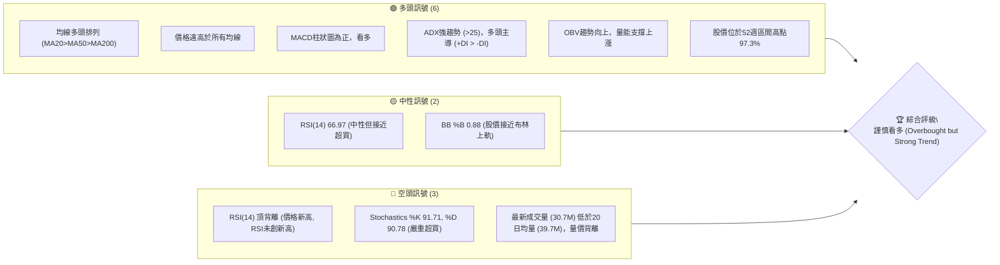
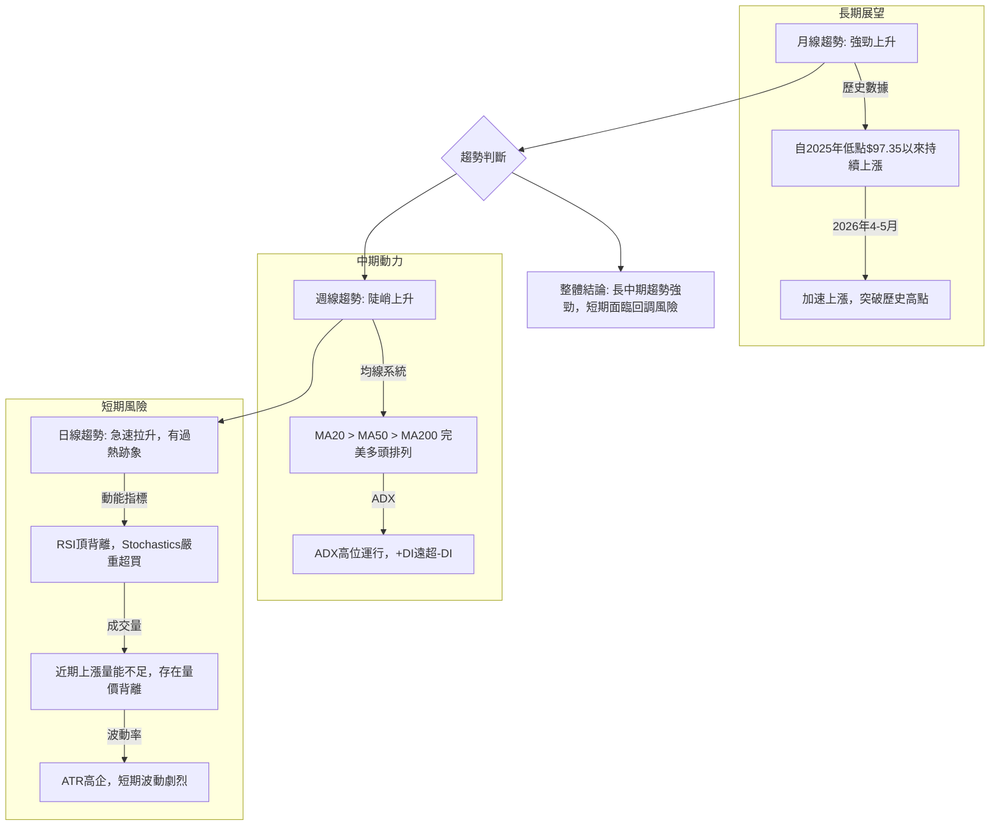
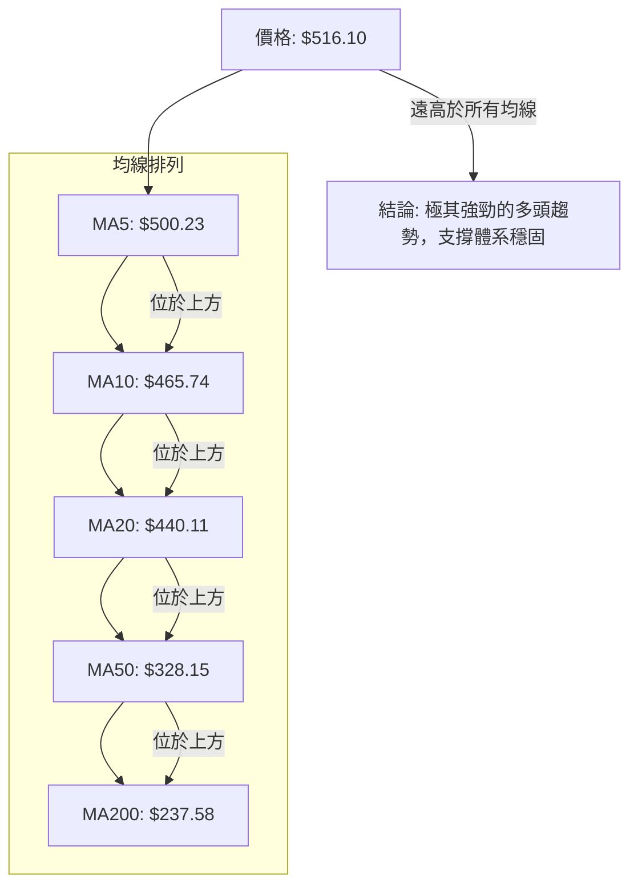

<details>
<summary>📊 靜態圖表 (點擊展開)</summary>

</details>

<html>
<head><meta charset="utf-8" /></head>
<body>
    <div>                        <script>window.PlotlyConfig = {MathJaxConfig: 'local'};</script>
        <script charset="utf-8" src="https://cdn.plot.ly/plotly-3.5.0.min.js" integrity="sha256-fHbNLP+GlIXN+efbQec78UkemUz3NJp7UmfGxC1tNxs=" crossorigin="anonymous"></script>                <div id="candlestick-chart" class="plotly-graph-div" style="height:500px; width:100%;"></div>            <script>                window.PLOTLYENV=window.PLOTLYENV || {};                                if (document.getElementById("candlestick-chart")) {                    Plotly.newPlot(                        "candlestick-chart",                        [{"close":{"dtype":"f8","bdata":"AAAAoHANZ0AAAABgZp5mQAAAAOBRMGZAAAAA4HoEZkAAAACgmdFkQAAAAGBmpmRAAAAAYLh2ZEAAAADgUfhkQAAAACCFa2RAAAAAANfTZEAAAAAAKeRkQAAAAGCPEmVAAAAAAClUZEAAAACAPUpkQAAAAAApRGRAAAAAoEc5ZEAAAADgeuRiQAAAAMAe7WJAAAAAgD16Y0AAAACgR\u002fFjQAAAAKBwdWNAAAAAgD3SY0AAAADAHiVkQAAAAGC4DmRAAAAAwB7lY0AAAACgcL1jQAAAAOB6rGNAAAAAoEf5Y0AAAADAzBxkQAAAAAApHGRAAAAA4KMoZEAAAABguO5jQAAAACCFK2RAAAAAoEc5ZEAAAADgUYBkQAAAACBcN2VAAAAAoHCVZEAAAABguHZpQAAAAOBRcGpAAAAAgOtxbUAAAADgehxtQAAAAMDM3GpAAAAAoHANa0AAAABA4UJrQAAAAEAz021AAAAAgOtRbUAAAABgjyJtQAAAAIDrEW5AAAAAwPXAbUAAAAAgXMdsQAAAACCuX21AAAAAoHCdb0AAAABguDpwQAAAAAApIHBAAAAAoEeFcEAAAABA4dpvQAAAAIDrAXBAAAAAYGY6cEAAAACgmUFvQAAAAKBHBXBAAAAAYGa2bUAAAACgRzFtQAAAACBcf25AAAAA4KOwbUAAAACAPS5wQAAAAGC4\u002fm5AAAAAgOvZbkAAAADgoxBuQAAAAKBHyWxAAAAAoJnxa0AAAADgo8BpQAAAAMD1eGlAAAAAoJnhakAAAAAAKcRpQAAAACCux2pAAAAAwPUwa0AAAADgUXhrQAAAACCu52pAAAAAQDMza0AAAAAgXP9qQAAAAEAKP2tAAAAAIIWja0AAAAAA17NrQAAAAKBwrWtAAAAAgMKta0AAAADA9VhqQAAAAGCP8mlAAAAAoHAlakAAAAAghcNoQAAAAIDrIWlAAAAAgMKtakAAAABgZt5qQAAAAMDM3GpAAAAAoEfhakAAAAAgrt9qQAAAACCF82pAAAAAQOHqakAAAADAHsVqQAAAAEAK72tAAAAAYI+ia0AAAABAM8tqQAAAAOCjQGpAAAAAgMKVaUAAAACgcGVpQAAAAIAU9mlAAAAAQAqfa0AAAABAM\u002fNrQAAAAKBwfWxAAAAAYI\u002f6bEAAAACgcP1sQAAAAKCZOW9AAAAAIFy3b0AAAABA4TpwQAAAAIDraW9AAAAAwPWAb0AAAAAgrpdvQAAAAIDChW9AAAAAIFyXbUAAAADgo8huQAAAACCFQ25AAAAAgBQGaUAAAAAAABBoQAAAAIAUDmpAAAAAAAAAa0AAAACAPbJqQAAAAGCPsmpAAAAAgBS+aUAAAACAPeppQAAAAGCPYmlAAAAAANcDaUAAAAAA12tpQAAAAMDMBGlAAAAAQDOTaEAAAABA4bpqQAAAACCFW2pAAAAAgMJ1aUAAAABguAZpQAAAAADX02hAAAAAYGbeZ0AAAACAPUJpQAAAAGBm7mhAAAAAgMINaEAAAACAwlVpQAAAACBcZ2lAAAAAYI+aaUAAAAAgrrdoQAAAAOB6LGhAAAAAYI+SaEAAAACA64loQAAAAGC47mhAAAAA4KOoaUAAAABgjyppQAAAAIDCVWlAAAAAANeraUAAAADgo4hrQAAAAOCjeGlAAAAAIK4\u002faUAAAACgR4FoQAAAAIDCbWlAAAAAYLhGakAAAAAAADBrQAAAAIDChWtAAAAAwPWwa0AAAACAPfpsQAAAAOB6lG1AAAAAoEehbkAAAABgj9puQAAAAIA94m9AAAAAgOshcEAAAAAAKWRxQAAAAIA9ZnFAAAAAQDMvcUAAAAAA18dxQAAAACBc93JAAAAAoEcVc0AAAADA9bx1QAAAAIAU6nRAAAAAIFwzdEAAAACAwhF1QAAAAADXJ3ZAAAAA4KOIdkAAAADgo1h1QAAAAAApNHZAAAAAgD1WekAAAAAgXId5QAAAAEAKc3xAAAAA4KOsfEAAAADgowR8QAAAAAAA2HtAAAAAQDMbfEAAAACgmYF6QAAAAADXT3pAAAAAwMzgeUAAAACgR\u002fl7QAAAAKBwGXxAAAAAACk4fUAAAACAPX5\u002fQAAAAOCj+H5AAAAAYLgwgEAAAADAzCCAQA=="},"high":{"dtype":"f8","bdata":"AAAAwMxUZ0AAAACAFC5nQAAAAOB6hGZAAAAAoJlZZkAAAACgcKVlQAAAAMDM1GRAAAAAACm8ZEAAAADA9RBlQAAAAEDhsmRAAAAA4KM4ZUAAAACAwvVkQAAAACCuX2VAAAAAgD0SZUAAAADgekxkQAAAAAAAmGRAAAAAoJlBZEAAAADgeqRjQAAAAOB6FGNAAAAAwB6VY0AAAADA9ZBkQAAAAGC4BmRAAAAAwB4NZEAAAACgmUlkQAAAAGBmPmRAAAAAACk0ZEAAAADgo9hjQAAAAEDh+mNAAAAAgMJVZEAAAADgemxkQAAAAEAzo2RAAAAAACk0ZEAAAAAghUNkQAAAAKCZiWRAAAAAwPVIZEAAAACAwoVkQAAAAIDrYWVAAAAAgMJVZUAAAABguFZsQAAAAMDMXGtAAAAAANd7bUAAAABAMwNuQAAAAEAKR21AAAAAgBQGbEAAAAAgXB9sQAAAACCu521AAAAAYGYmbkAAAAAAKWxtQAAAAAApXG5AAAAA4FFIbkAAAAAAKQRuQAAAAMDMfG1AAAAA4Hqsb0AAAABguEZwQAAAAKBHiXBAAAAAoEexcEAAAACAFH5wQAAAAIAUYnBAAAAAYI9OcEAAAACAFBZwQAAAAGBmOnBAAAAA4FGwb0AAAAAA13ttQAAAAMDMHG9AAAAAYLgOb0AAAAAAKXhwQAAAAIAUOnBAAAAAgBSub0AAAADgoxhvQAAAAAAAwG1AAAAAwPVobUAAAAAAAEhtQAAAAGCPGmpAAAAAACkka0AAAABgj9JpQAAAAEDh8mpAAAAAoJlJa0AAAAAgXJ9rQAAAACBcP2xAAAAAYGZGa0AAAAAA12NrQAAAAOB69GtAAAAAYLj2a0AAAABA4RpsQAAAACCF02tAAAAAAACwa0AAAAAgrs9rQAAAACCF62pAAAAAQApHakAAAAAAAHBqQAAAACCFy2lAAAAAgMLlakAAAACgcIVrQAAAAMD1IGtAAAAAoEcRa0AAAABgjxprQAAAAKCZAWtAAAAAgD0aa0AAAADgejRrQAAAAMDMZGxAAAAA4KNAbUAAAACgcN1rQAAAAAAphGpAAAAAgBReakAAAACgmelpQAAAAAApPGpAAAAAIIXja0AAAABA4QJsQAAAAEAzy21AAAAAIK5PbUAAAAAAAPBtQAAAAMDMnG9AAAAAoEcBcEAAAAAgXK9wQAAAAOCjJHBAAAAAoJnxb0AAAABgZhZwQAAAAOB6SHBAAAAAIK6nbkAAAABACj9vQAAAAMDMlG9AAAAAYI9Sa0AAAACgR4FpQAAAAOCjKGpAAAAAQDMza0AAAADgemxrQAAAAMDMdGtAAAAAYLhOa0AAAACgmUFqQAAAAKCZqWlAAAAAYGZmaUAAAABAM4NpQAAAAADXm2lAAAAAACnsaEAAAABguBZrQAAAAGBmFmtAAAAAoEc5akAAAADgejxpQAAAACCu12hAAAAA4Ho0aEAAAACAFE5pQAAAAKBHeWlAAAAAIK4HaUAAAABACl9pQAAAAEDh0mlAAAAAYLgmakAAAAAA13NpQAAAAIDC9WhAAAAAoHAFaUAAAABguOZoQAAAACCFW2lAAAAAACm8aUAAAACgmclpQAAAACCFI2pAAAAAgMLNaUAAAABgj6prQAAAAAAAoGtAAAAA4KNoaUAAAACAwg1qQAAAAAAAgGlAAAAAYI+6akAAAADA9ThrQAAAAIDrSWxAAAAAQDPDa0AAAAAAAEBtQAAAAEAzo21AAAAAYI8yb0AAAABgj+puQAAAAGC47m9AAAAAQOEicEAAAACgcHVxQAAAAMDMkHFAAAAAgML5cUAAAABAM+NxQAAAAAAABHNAAAAAIIVjc0AAAAAA1w92QAAAACBc03VAAAAAAAB4dEAAAABguEJ1QAAAACBcL3ZAAAAA4KOsdkAAAACgmZ12QAAAAMAeeXZAAAAAoJnpekAAAAAgXFt6QAAAAOCjhHxAAAAAIIVTfUAAAADAzKx8QAAAAAAAuHxAAAAAwPVUfEAAAAAAAHB7QAAAAMDMbHtAAAAAAADMekAAAACAPRZ8QAAAAEAzM3xAAAAAYI8WfkAAAAAgXK9\u002fQAAAACBc439AAAAAoJl5gEAAAAAAAFCAQA=="},"hovertemplate":"\u003cb\u003e%{x|%Y-%m-%d}\u003c\u002fb\u003e\u003cbr\u003e\u958b: $%{open:.2f}\u003cbr\u003e\u9ad8: $%{high:.2f}\u003cbr\u003e\u4f4e: $%{low:.2f}\u003cbr\u003e\u6536: $%{close:.2f}\u003cextra\u003e\u003c\u002fextra\u003e","low":{"dtype":"f8","bdata":"AAAAAClsZkAAAACA63FmQAAAAAAACGZAAAAAIIXLZUAAAABAM8NkQAAAAAAAyGNAAAAA4FFIZEAAAACgmTlkQAAAAEAKN2RAAAAAwB6dZEAAAADAzJRkQAAAAMDM1GRAAAAAwMw8ZEAAAAAA15NjQAAAAGCPEmRAAAAAoEe5Y0AAAACAwsViQAAAAEAKp2JAAAAAgML9YkAAAAAAAMBjQAAAACCuX2NAAAAAoHBdY0AAAABAM7NjQAAAAEAK52NAAAAA4FF4Y0AAAABAM7tiQAAAAMDMfGNAAAAAoHCtY0AAAABguOZjQAAAAIDCzWNAAAAAwPVYY0AAAACgmaFjQAAAAMDM\u002fGNAAAAAYI\u002fqY0AAAAAgrg9kQAAAAADXw2RAAAAA4HpkZEAAAADgUWBpQAAAAMD1KGpAAAAAYGZWakAAAADA9bBsQAAAAGBmpmpAAAAAwMzcakAAAADAzPxqQAAAAOBRmGtAAAAAIK4HbUAAAADAHn1sQAAAAMDMTG1AAAAA4KNAbUAAAAAAKRxsQAAAAKBHkWxAAAAAYGY+bkAAAACgmTlvQAAAAAAAEHBAAAAAYGYWcEAAAACA64lvQAAAAMAerW9AAAAA4Hq8b0AAAADgeuxuQAAAAIDrWW5AAAAAIK53bUAAAADgehRsQAAAAAAAEG5AAAAA4HpUbUAAAAAAAEBvQAAAAIDrwW5AAAAAYI9ibUAAAADAzKRtQAAAAGC4FmxAAAAAYLh2a0AAAADA9ZBpQAAAAAAAYGhAAAAAQDO7aUAAAADA9UhoQAAAAAAA4GlAAAAA4KPAakAAAAAAALBqQAAAAOB6zGpAAAAA4KN4akAAAADgesRqQAAAACCuB2tAAAAAIIVLa0AAAADAHj1rQAAAAKBwVWtAAAAAgBRGakAAAACA6yFqQAAAAGCP0mlAAAAAIIWjaUAAAADA9bBoQAAAAAAAEGlAAAAAYGaGaUAAAACA66lqQAAAAMD1iGpAAAAAQAq\u002fakAAAADA9aBqQAAAACCuJ2pAAAAAYI\u002fKakAAAACgmblqQAAAAMDMXGtAAAAAIFyPa0AAAAAAAGhqQAAAAKBw5WlAAAAAYI9qaUAAAACAPWJpQAAAAKCZ+WhAAAAAIFzfakAAAAAgheNqQAAAAEAKZ2xAAAAAIIWbbEAAAADAHi1sQAAAAMD1eG1AAAAAACnUbkAAAAAAAARwQAAAAKCZSW9AAAAAYLj+bkAAAABguEZvQAAAAMAeHW5AAAAAoJlRbUAAAAAAAGBtQAAAAKBHoW1AAAAAwMzkaEAAAABACtdnQAAAAIDCjWhAAAAAwMyEaUAAAAAAKaRqQAAAAGC4JmpAAAAA4HqkaUAAAAAAKXxpQAAAAGCPWmhAAAAAAABgaEAAAACgR8loQAAAAIDr0WhAAAAAwMxEaEAAAAAAANBpQAAAAGCPSmpAAAAAYLguaUAAAAAgrrdoQAAAAAAAwGdAAAAAQAqHZ0AAAAAghbtnQAAAAAApXGhAAAAAAADoZ0AAAADgo6BnQAAAAGBmRmlAAAAAACl0aUAAAACgcJVoQAAAAOCjCGhAAAAAoJlZaEAAAADgUWhoQAAAAAAAeGhAAAAAYI8aaEAAAADgUchoQAAAAGC4NmlAAAAAACkEaUAAAADgUXBqQAAAAIDCbWlAAAAAgBS2aEAAAAAA1xtoQAAAAMAejWhAAAAAQOG6aUAAAAAA1xNpQAAAACBcN2tAAAAAACnsakAAAABA4WJsQAAAAMAe3WxAAAAAYLjebUAAAADA9UBuQAAAAGBmtm5AAAAAQDN7b0AAAAAAKVhwQAAAAIA9InFAAAAAAAAAcUAAAACA60lxQAAAAIA94nFAAAAAACm8ckAAAADgo+h0QAAAAMD1jHRAAAAAAABgc0AAAACAwu1zQAAAAKCZyXRAAAAAAADUdUAAAABAMyt1QAAAAIAUjnVAAAAA4KMgeUAAAACgRxF5QAAAAOCjJHpAAAAAgBQufEAAAACAwqF6QAAAAGBmCntAAAAAQOE6e0AAAACAwnV6QAAAACBcq3lAAAAAgMKVeEAAAADAzKB6QAAAAKCZ+XpAAAAAIFzbfEAAAAAgrgN+QAAAAGCPan5AAAAA4FHYfkAAAABA4XZ\u002fQA=="},"name":"\u50f9\u683c","open":{"dtype":"f8","bdata":"AAAAwB59ZkAAAABgj3pmQAAAAIDrgWZAAAAA4FEYZkAAAABAM6NlQAAAAEAzg2RAAAAAIIW7ZEAAAACgcEVkQAAAAKCZsWRAAAAAwMwUZUAAAACgR8FkQAAAAAAAEGVAAAAAgOvZZEAAAACgcM1jQAAAAIDrOWRAAAAAgBT+Y0AAAAAA16NjQAAAAKCZ+WJAAAAAIK7\u002fYkAAAACgR3FkQAAAAADX02NAAAAAAACgY0AAAADgUQBkQAAAAADXK2RAAAAAwPXoY0AAAABguN5iQAAAAAAprGNAAAAAoHCtY0AAAADgoxBkQAAAACBcX2RAAAAA4HqkY0AAAADgoxBkQAAAAADXA2RAAAAAoEcZZEAAAACAwh1kQAAAAIDCFWVAAAAAgMJVZUAAAABgZk5sQAAAAEAz22pAAAAAYGaeakAAAACgmYltQAAAAOCjGG1AAAAAYGaGa0AAAABgZmZrQAAAAGC41mtAAAAAoEeJbUAAAADgUShtQAAAAEAKj21AAAAA4HrsbUAAAABAM5ttQAAAAMAexWxAAAAAIIVrbkAAAACAFB5wQAAAAIA9MnBAAAAAQAqDcEAAAABguD5wQAAAAKCZOXBAAAAAoEc1cEAAAABAM0tvQAAAACCuZ25AAAAAQAqvb0AAAACAFN5sQAAAAOB6RG5AAAAAwB41bkAAAAAAKaRvQAAAAMDMfG9AAAAAIIUDbkAAAAAAAFhuQAAAAMD1mG1AAAAA4FHIbEAAAABgZhZtQAAAAIDrGWpAAAAAwB7laUAAAAAgXC9pQAAAAKCZQWpAAAAA4HoEa0AAAAAAKbxqQAAAAKBHuWtAAAAA4FEIa0AAAAAAKRxrQAAAAKBwJWtAAAAAQOFia0AAAACgR6FrQAAAAAAAwGtAAAAAgOs5a0AAAAAA10trQAAAAMD1iGpAAAAAoHDdaUAAAACgR0FqQAAAAIA9emlAAAAAQDOTaUAAAAAAAIBrQAAAACCFm2pAAAAAIFzfakAAAACAwu1qQAAAAGCPcmpAAAAAANf7akAAAACAPfpqQAAAAMDMXGtAAAAAAADIbEAAAABguNZrQAAAAAAphGpAAAAAwMxcakAAAABACrdpQAAAAIDCJWlAAAAAQDPjakAAAACgRzFrQAAAAMDMfGxAAAAAoJlJbUAAAABgj0JsQAAAACCuf21AAAAAAAB4b0AAAABA4VJwQAAAAAAADHBAAAAAwB6Fb0AAAAAAKcRvQAAAAMAe1W9AAAAAgMKdbUAAAADgo3htQAAAAKCZcW9AAAAAAADgakAAAAAghTtpQAAAAAAppGhAAAAAwMzcaUAAAADgeuRqQAAAAAApPGtAAAAAYI\u002f6akAAAADgo4BpQAAAAMDMRGlAAAAAwB7NaEAAAAAghQNpQAAAAADXA2lAAAAAQOHCaEAAAAAAKXRqQAAAAIA92mpAAAAAoJkZakAAAAAghQNpQAAAAEAzO2hAAAAAYLjuZ0AAAAAA1wNoQAAAAOCjuGhAAAAA4KNoaEAAAAAghatnQAAAAOBRUGlAAAAAIIWjaUAAAABgj1ppQAAAACCFw2hAAAAAIFxfaEAAAACAwpVoQAAAAAAAgGhAAAAAwPVgaEAAAADgepxpQAAAAMDMzGlAAAAA4HosaUAAAADgUXBqQAAAACBcP2tAAAAA4KM4aUAAAABgZp5pQAAAAKCZwWhAAAAAQOHyaUAAAACgmYFpQAAAAMD1aGtAAAAA4FFIa0AAAAAA1wNtQAAAAOBRIG1AAAAAAADgbUAAAADA9aBuQAAAAKBHOW9AAAAAYLjeb0AAAAAA149wQAAAAAAAkHFAAAAAoJmJcUAAAACgR1VxQAAAACCFM3JAAAAAACngckAAAAAAKQx1QAAAAMAepXVAAAAAgMJ9c0AAAACgR2l0QAAAAIDCVXVAAAAAgOv9dUAAAADA9YR2QAAAAAAp+HVAAAAAANeXeUAAAADAHhF6QAAAAKBwKXpAAAAAwMzIfEAAAAAAABR8QAAAAOCjkHxAAAAAoJmJe0AAAACgcBV7QAAAAAAA2HpAAAAAoJnJeUAAAADgo8B6QAAAAADXn3tAAAAAoHBdfUAAAAAA10t+QAAAAAAAwH9AAAAAAAAwf0AAAABgZkaAQA=="},"x":["2025-08-13T00:00:00-04:00","2025-08-14T00:00:00-04:00","2025-08-15T00:00:00-04:00","2025-08-18T00:00:00-04:00","2025-08-19T00:00:00-04:00","2025-08-20T00:00:00-04:00","2025-08-21T00:00:00-04:00","2025-08-22T00:00:00-04:00","2025-08-25T00:00:00-04:00","2025-08-26T00:00:00-04:00","2025-08-27T00:00:00-04:00","2025-08-28T00:00:00-04:00","2025-08-29T00:00:00-04:00","2025-09-02T00:00:00-04:00","2025-09-03T00:00:00-04:00","2025-09-04T00:00:00-04:00","2025-09-05T00:00:00-04:00","2025-09-08T00:00:00-04:00","2025-09-09T00:00:00-04:00","2025-09-10T00:00:00-04:00","2025-09-11T00:00:00-04:00","2025-09-12T00:00:00-04:00","2025-09-15T00:00:00-04:00","2025-09-16T00:00:00-04:00","2025-09-17T00:00:00-04:00","2025-09-18T00:00:00-04:00","2025-09-19T00:00:00-04:00","2025-09-22T00:00:00-04:00","2025-09-23T00:00:00-04:00","2025-09-24T00:00:00-04:00","2025-09-25T00:00:00-04:00","2025-09-26T00:00:00-04:00","2025-09-29T00:00:00-04:00","2025-09-30T00:00:00-04:00","2025-10-01T00:00:00-04:00","2025-10-02T00:00:00-04:00","2025-10-03T00:00:00-04:00","2025-10-06T00:00:00-04:00","2025-10-07T00:00:00-04:00","2025-10-08T00:00:00-04:00","2025-10-09T00:00:00-04:00","2025-10-10T00:00:00-04:00","2025-10-13T00:00:00-04:00","2025-10-14T00:00:00-04:00","2025-10-15T00:00:00-04:00","2025-10-16T00:00:00-04:00","2025-10-17T00:00:00-04:00","2025-10-20T00:00:00-04:00","2025-10-21T00:00:00-04:00","2025-10-22T00:00:00-04:00","2025-10-23T00:00:00-04:00","2025-10-24T00:00:00-04:00","2025-10-27T00:00:00-04:00","2025-10-28T00:00:00-04:00","2025-10-29T00:00:00-04:00","2025-10-30T00:00:00-04:00","2025-10-31T00:00:00-04:00","2025-11-03T00:00:00-05:00","2025-11-04T00:00:00-05:00","2025-11-05T00:00:00-05:00","2025-11-06T00:00:00-05:00","2025-11-07T00:00:00-05:00","2025-11-10T00:00:00-05:00","2025-11-11T00:00:00-05:00","2025-11-12T00:00:00-05:00","2025-11-13T00:00:00-05:00","2025-11-14T00:00:00-05:00","2025-11-17T00:00:00-05:00","2025-11-18T00:00:00-05:00","2025-11-19T00:00:00-05:00","2025-11-20T00:00:00-05:00","2025-11-21T00:00:00-05:00","2025-11-24T00:00:00-05:00","2025-11-25T00:00:00-05:00","2025-11-26T00:00:00-05:00","2025-11-28T00:00:00-05:00","2025-12-01T00:00:00-05:00","2025-12-02T00:00:00-05:00","2025-12-03T00:00:00-05:00","2025-12-04T00:00:00-05:00","2025-12-05T00:00:00-05:00","2025-12-08T00:00:00-05:00","2025-12-09T00:00:00-05:00","2025-12-10T00:00:00-05:00","2025-12-11T00:00:00-05:00","2025-12-12T00:00:00-05:00","2025-12-15T00:00:00-05:00","2025-12-16T00:00:00-05:00","2025-12-17T00:00:00-05:00","2025-12-18T00:00:00-05:00","2025-12-19T00:00:00-05:00","2025-12-22T00:00:00-05:00","2025-12-23T00:00:00-05:00","2025-12-24T00:00:00-05:00","2025-12-26T00:00:00-05:00","2025-12-29T00:00:00-05:00","2025-12-30T00:00:00-05:00","2025-12-31T00:00:00-05:00","2026-01-02T00:00:00-05:00","2026-01-05T00:00:00-05:00","2026-01-06T00:00:00-05:00","2026-01-07T00:00:00-05:00","2026-01-08T00:00:00-05:00","2026-01-09T00:00:00-05:00","2026-01-12T00:00:00-05:00","2026-01-13T00:00:00-05:00","2026-01-14T00:00:00-05:00","2026-01-15T00:00:00-05:00","2026-01-16T00:00:00-05:00","2026-01-20T00:00:00-05:00","2026-01-21T00:00:00-05:00","2026-01-22T00:00:00-05:00","2026-01-23T00:00:00-05:00","2026-01-26T00:00:00-05:00","2026-01-27T00:00:00-05:00","2026-01-28T00:00:00-05:00","2026-01-29T00:00:00-05:00","2026-01-30T00:00:00-05:00","2026-02-02T00:00:00-05:00","2026-02-03T00:00:00-05:00","2026-02-04T00:00:00-05:00","2026-02-05T00:00:00-05:00","2026-02-06T00:00:00-05:00","2026-02-09T00:00:00-05:00","2026-02-10T00:00:00-05:00","2026-02-11T00:00:00-05:00","2026-02-12T00:00:00-05:00","2026-02-13T00:00:00-05:00","2026-02-17T00:00:00-05:00","2026-02-18T00:00:00-05:00","2026-02-19T00:00:00-05:00","2026-02-20T00:00:00-05:00","2026-02-23T00:00:00-05:00","2026-02-24T00:00:00-05:00","2026-02-25T00:00:00-05:00","2026-02-26T00:00:00-05:00","2026-02-27T00:00:00-05:00","2026-03-02T00:00:00-05:00","2026-03-03T00:00:00-05:00","2026-03-04T00:00:00-05:00","2026-03-05T00:00:00-05:00","2026-03-06T00:00:00-05:00","2026-03-09T00:00:00-04:00","2026-03-10T00:00:00-04:00","2026-03-11T00:00:00-04:00","2026-03-12T00:00:00-04:00","2026-03-13T00:00:00-04:00","2026-03-16T00:00:00-04:00","2026-03-17T00:00:00-04:00","2026-03-18T00:00:00-04:00","2026-03-19T00:00:00-04:00","2026-03-20T00:00:00-04:00","2026-03-23T00:00:00-04:00","2026-03-24T00:00:00-04:00","2026-03-25T00:00:00-04:00","2026-03-26T00:00:00-04:00","2026-03-27T00:00:00-04:00","2026-03-30T00:00:00-04:00","2026-03-31T00:00:00-04:00","2026-04-01T00:00:00-04:00","2026-04-02T00:00:00-04:00","2026-04-06T00:00:00-04:00","2026-04-07T00:00:00-04:00","2026-04-08T00:00:00-04:00","2026-04-09T00:00:00-04:00","2026-04-10T00:00:00-04:00","2026-04-13T00:00:00-04:00","2026-04-14T00:00:00-04:00","2026-04-15T00:00:00-04:00","2026-04-16T00:00:00-04:00","2026-04-17T00:00:00-04:00","2026-04-20T00:00:00-04:00","2026-04-21T00:00:00-04:00","2026-04-22T00:00:00-04:00","2026-04-23T00:00:00-04:00","2026-04-24T00:00:00-04:00","2026-04-27T00:00:00-04:00","2026-04-28T00:00:00-04:00","2026-04-29T00:00:00-04:00","2026-04-30T00:00:00-04:00","2026-05-01T00:00:00-04:00","2026-05-04T00:00:00-04:00","2026-05-05T00:00:00-04:00","2026-05-06T00:00:00-04:00","2026-05-07T00:00:00-04:00","2026-05-08T00:00:00-04:00","2026-05-11T00:00:00-04:00","2026-05-12T00:00:00-04:00","2026-05-13T00:00:00-04:00","2026-05-14T00:00:00-04:00","2026-05-15T00:00:00-04:00","2026-05-18T00:00:00-04:00","2026-05-19T00:00:00-04:00","2026-05-20T00:00:00-04:00","2026-05-21T00:00:00-04:00","2026-05-22T00:00:00-04:00","2026-05-26T00:00:00-04:00","2026-05-27T00:00:00-04:00","2026-05-28T00:00:00-04:00","2026-05-29T00:00:00-04:00"],"type":"candlestick"},{"hovertemplate":"MA30: $%{y:.2f}\u003cextra\u003e\u003c\u002fextra\u003e","line":{"color":"#2196F3","dash":"dash","width":2},"mode":"lines","name":"MA30","x":["2025-08-13T00:00:00-04:00","2025-08-14T00:00:00-04:00","2025-08-15T00:00:00-04:00","2025-08-18T00:00:00-04:00","2025-08-19T00:00:00-04:00","2025-08-20T00:00:00-04:00","2025-08-21T00:00:00-04:00","2025-08-22T00:00:00-04:00","2025-08-25T00:00:00-04:00","2025-08-26T00:00:00-04:00","2025-08-27T00:00:00-04:00","2025-08-28T00:00:00-04:00","2025-08-29T00:00:00-04:00","2025-09-02T00:00:00-04:00","2025-09-03T00:00:00-04:00","2025-09-04T00:00:00-04:00","2025-09-05T00:00:00-04:00","2025-09-08T00:00:00-04:00","2025-09-09T00:00:00-04:00","2025-09-10T00:00:00-04:00","2025-09-11T00:00:00-04:00","2025-09-12T00:00:00-04:00","2025-09-15T00:00:00-04:00","2025-09-16T00:00:00-04:00","2025-09-17T00:00:00-04:00","2025-09-18T00:00:00-04:00","2025-09-19T00:00:00-04:00","2025-09-22T00:00:00-04:00","2025-09-23T00:00:00-04:00","2025-09-24T00:00:00-04:00","2025-09-25T00:00:00-04:00","2025-09-26T00:00:00-04:00","2025-09-29T00:00:00-04:00","2025-09-30T00:00:00-04:00","2025-10-01T00:00:00-04:00","2025-10-02T00:00:00-04:00","2025-10-03T00:00:00-04:00","2025-10-06T00:00:00-04:00","2025-10-07T00:00:00-04:00","2025-10-08T00:00:00-04:00","2025-10-09T00:00:00-04:00","2025-10-10T00:00:00-04:00","2025-10-13T00:00:00-04:00","2025-10-14T00:00:00-04:00","2025-10-15T00:00:00-04:00","2025-10-16T00:00:00-04:00","2025-10-17T00:00:00-04:00","2025-10-20T00:00:00-04:00","2025-10-21T00:00:00-04:00","2025-10-22T00:00:00-04:00","2025-10-23T00:00:00-04:00","2025-10-24T00:00:00-04:00","2025-10-27T00:00:00-04:00","2025-10-28T00:00:00-04:00","2025-10-29T00:00:00-04:00","2025-10-30T00:00:00-04:00","2025-10-31T00:00:00-04:00","2025-11-03T00:00:00-05:00","2025-11-04T00:00:00-05:00","2025-11-05T00:00:00-05:00","2025-11-06T00:00:00-05:00","2025-11-07T00:00:00-05:00","2025-11-10T00:00:00-05:00","2025-11-11T00:00:00-05:00","2025-11-12T00:00:00-05:00","2025-11-13T00:00:00-05:00","2025-11-14T00:00:00-05:00","2025-11-17T00:00:00-05:00","2025-11-18T00:00:00-05:00","2025-11-19T00:00:00-05:00","2025-11-20T00:00:00-05:00","2025-11-21T00:00:00-05:00","2025-11-24T00:00:00-05:00","2025-11-25T00:00:00-05:00","2025-11-26T00:00:00-05:00","2025-11-28T00:00:00-05:00","2025-12-01T00:00:00-05:00","2025-12-02T00:00:00-05:00","2025-12-03T00:00:00-05:00","2025-12-04T00:00:00-05:00","2025-12-05T00:00:00-05:00","2025-12-08T00:00:00-05:00","2025-12-09T00:00:00-05:00","2025-12-10T00:00:00-05:00","2025-12-11T00:00:00-05:00","2025-12-12T00:00:00-05:00","2025-12-15T00:00:00-05:00","2025-12-16T00:00:00-05:00","2025-12-17T00:00:00-05:00","2025-12-18T00:00:00-05:00","2025-12-19T00:00:00-05:00","2025-12-22T00:00:00-05:00","2025-12-23T00:00:00-05:00","2025-12-24T00:00:00-05:00","2025-12-26T00:00:00-05:00","2025-12-29T00:00:00-05:00","2025-12-30T00:00:00-05:00","2025-12-31T00:00:00-05:00","2026-01-02T00:00:00-05:00","2026-01-05T00:00:00-05:00","2026-01-06T00:00:00-05:00","2026-01-07T00:00:00-05:00","2026-01-08T00:00:00-05:00","2026-01-09T00:00:00-05:00","2026-01-12T00:00:00-05:00","2026-01-13T00:00:00-05:00","2026-01-14T00:00:00-05:00","2026-01-15T00:00:00-05:00","2026-01-16T00:00:00-05:00","2026-01-20T00:00:00-05:00","2026-01-21T00:00:00-05:00","2026-01-22T00:00:00-05:00","2026-01-23T00:00:00-05:00","2026-01-26T00:00:00-05:00","2026-01-27T00:00:00-05:00","2026-01-28T00:00:00-05:00","2026-01-29T00:00:00-05:00","2026-01-30T00:00:00-05:00","2026-02-02T00:00:00-05:00","2026-02-03T00:00:00-05:00","2026-02-04T00:00:00-05:00","2026-02-05T00:00:00-05:00","2026-02-06T00:00:00-05:00","2026-02-09T00:00:00-05:00","2026-02-10T00:00:00-05:00","2026-02-11T00:00:00-05:00","2026-02-12T00:00:00-05:00","2026-02-13T00:00:00-05:00","2026-02-17T00:00:00-05:00","2026-02-18T00:00:00-05:00","2026-02-19T00:00:00-05:00","2026-02-20T00:00:00-05:00","2026-02-23T00:00:00-05:00","2026-02-24T00:00:00-05:00","2026-02-25T00:00:00-05:00","2026-02-26T00:00:00-05:00","2026-02-27T00:00:00-05:00","2026-03-02T00:00:00-05:00","2026-03-03T00:00:00-05:00","2026-03-04T00:00:00-05:00","2026-03-05T00:00:00-05:00","2026-03-06T00:00:00-05:00","2026-03-09T00:00:00-04:00","2026-03-10T00:00:00-04:00","2026-03-11T00:00:00-04:00","2026-03-12T00:00:00-04:00","2026-03-13T00:00:00-04:00","2026-03-16T00:00:00-04:00","2026-03-17T00:00:00-04:00","2026-03-18T00:00:00-04:00","2026-03-19T00:00:00-04:00","2026-03-20T00:00:00-04:00","2026-03-23T00:00:00-04:00","2026-03-24T00:00:00-04:00","2026-03-25T00:00:00-04:00","2026-03-26T00:00:00-04:00","2026-03-27T00:00:00-04:00","2026-03-30T00:00:00-04:00","2026-03-31T00:00:00-04:00","2026-04-01T00:00:00-04:00","2026-04-02T00:00:00-04:00","2026-04-06T00:00:00-04:00","2026-04-07T00:00:00-04:00","2026-04-08T00:00:00-04:00","2026-04-09T00:00:00-04:00","2026-04-10T00:00:00-04:00","2026-04-13T00:00:00-04:00","2026-04-14T00:00:00-04:00","2026-04-15T00:00:00-04:00","2026-04-16T00:00:00-04:00","2026-04-17T00:00:00-04:00","2026-04-20T00:00:00-04:00","2026-04-21T00:00:00-04:00","2026-04-22T00:00:00-04:00","2026-04-23T00:00:00-04:00","2026-04-24T00:00:00-04:00","2026-04-27T00:00:00-04:00","2026-04-28T00:00:00-04:00","2026-04-29T00:00:00-04:00","2026-04-30T00:00:00-04:00","2026-05-01T00:00:00-04:00","2026-05-04T00:00:00-04:00","2026-05-05T00:00:00-04:00","2026-05-06T00:00:00-04:00","2026-05-07T00:00:00-04:00","2026-05-08T00:00:00-04:00","2026-05-11T00:00:00-04:00","2026-05-12T00:00:00-04:00","2026-05-13T00:00:00-04:00","2026-05-14T00:00:00-04:00","2026-05-15T00:00:00-04:00","2026-05-18T00:00:00-04:00","2026-05-19T00:00:00-04:00","2026-05-20T00:00:00-04:00","2026-05-21T00:00:00-04:00","2026-05-22T00:00:00-04:00","2026-05-26T00:00:00-04:00","2026-05-27T00:00:00-04:00","2026-05-28T00:00:00-04:00","2026-05-29T00:00:00-04:00"],"y":{"dtype":"f8","bdata":"AAAAAAAA+H8AAAAAAAD4fwAAAAAAAPh\u002fAAAAAAAA+H8AAAAAAAD4fwAAAAAAAPh\u002fAAAAAAAA+H8AAAAAAAD4fwAAAAAAAPh\u002fAAAAAAAA+H8AAAAAAAD4fwAAAAAAAPh\u002fAAAAAAAA+H8AAAAAAAD4fwAAAAAAAPh\u002fAAAAAAAA+H8AAAAAAAD4fwAAAAAAAPh\u002fAAAAAAAA+H8AAAAAAAD4fwAAAAAAAPh\u002fAAAAAAAA+H8AAAAAAAD4fwAAAAAAAPh\u002fAAAAAAAA+H8AAAAAAAD4fwAAAAAAAPh\u002fAAAAAAAA+H8AAAAAAAD4f0RERKS3cWRAZmZmJgZZZEAzMzPzGUJkQM3MzOzfMGRAq6qqapEhZEAzMzPT2x5kQBEREdGwI2RAVVVV9bYkZEBVVVW1D0tkQN7d3d1rfmRAVVVVFfXHZEAiIiLyGQ5lQERERGSCP2VAVVVVpeJ4ZUAiIiKSX7RlQKuqqvrwBWZAq6qqCpBTZkAAAAAg96pmQERERAQPCmdAMzMz079hZ0CJiIjoJq1nQO\u002fu7o7CAWhAVVVVZWZmaEAiIiIyes9oQJqZmdmHN2lARERERLanaUAzMzPjFw9qQCIiIsJneGpAIiIiMuziakB3d3cXBEJrQM3MzEzUp2tAiYiIyFr5a0Dv7u6OX0hsQDMzM1OAoGxAq6qqqkfxbEDNzMw8fFZtQO\u002fu7j7uqW1AERER8YsBbkBmZmaGzyhuQHd3d7fXPG5AAAAAMAgwbkAzMzPjXhNuQDMzM2OCB25AmpmZSQwGbkCamZlpSvltQCIiIoJO321A7+7uLiTNbUDv7u7u7r5tQDMzM+Pso21AMzMzIyKObUAAAADw7n5tQHd3d1fHbG1Ad3d3F9lKbUBmZmbmQiJtQDMzM2M7+2xARERE1HjNbEAzMzODeZ5sQLy7u9uyamxAREREdNo0bEDv7u5ec\u002f1rQKuqqvp+wmtAZmZmppuoa0B3d3dXx5RrQAAAAJDCdWtAVVVVBchda0BERERk9C5rQO\u002fu7q5yDGtAZmZmRuHqakDNzMw8w85qQM3MzOx8x2pAMzMzc9rEakCJiIgYvc1qQImIiAhl1GpAREREVFXJakDNzMwMLcZqQGZmZnYwv2pAAAAA0NvCakBERERk9MZqQAAAAOB61GpAzczMnKjjakC8u7tLqfRqQCIiIgKdFmtAERERcWg5a0C8u7tbAWJrQCIiIlLjgWtAmpmZKYeia0CrqqoKSc9rQAAAANDb\u002fmtAd3d3h0EcbEC8u7troE9sQO\u002fu7s5pe2xAiYiIaEptbEAAAAAQWFVsQN7d3Q10TmxAMzMzM3pPbEAiIiJy9k1sQO\u002fu7h7MS2xAvLu7S8VBbEBVVVWFeTpsQBEREbG5JGxAZmZmNl4ObEAAAADwpwJsQERERMQg+GtAREREZILva0AzMzMD5PprQCIiIqJF\u002fmtA7+7uTtTra0B3d3dH4dJrQM3MzGygs2tAVVVVdQWIa0C8u7trLmhrQDMzM4N5MmtAZmZmhhbxakCamZm5SbRqQN7d3a0AgWpA7+7u7qdOakBERERE\u002fRNqQN7d3a1H1WlA3t3dDXSqaUBERESkKXVpQJqZmVmrR2lAd3d3hxZNaUBVVVW1gVZpQHd3d9dcUGlAREREJAZFaUAAAACwK0xpQHd3d+e0QWlAq6qqSn49aUCJiIgYdjFpQKuqqqrVMWlAmpmZ6Zg8aUCJiIhYq0tpQO\u002fu7t4IYWlAvLu7a6B7aUCamZkpzo5pQCIiItJNqmlAvLu722vWaUCamZk5JghqQHd3d9dcRGpAq6qqugKMakDe3d2tR91qQBEREZF7MWtAiYiICIGJa0De3d2dxOBrQGZmZhauS2xAiYiISOG2bEBVVVVl9FZtQFVVVVWc7W1AMzMzw650bkC8u7uL3gpvQBERERE8sG9AiYiIkO0qcEB3d3fntHVwQJqZmSkVx3BAiYiIGEs6cUBVVVVNqZ5xQDMzM4PAJHJA3t3dRbatckDv7u7OPjRzQO\u002fu7m5ZtXNAVVVVzRM1dEDv7u6WQ6N0QBEREdlcDnVAZmZmPgp1dUBERESsHOh1QCIiInKvWXZAzczMBFbQdkB3d3dHb1l3QDMzM3Ov2XdAZmZmBlZkeEC8u7sbL+N4QA=="},"type":"scatter"},{"hovertemplate":"MA60: $%{y:.2f}\u003cextra\u003e\u003c\u002fextra\u003e","line":{"color":"#9C27B0","dash":"dash","width":2},"mode":"lines","name":"MA60","x":["2025-08-13T00:00:00-04:00","2025-08-14T00:00:00-04:00","2025-08-15T00:00:00-04:00","2025-08-18T00:00:00-04:00","2025-08-19T00:00:00-04:00","2025-08-20T00:00:00-04:00","2025-08-21T00:00:00-04:00","2025-08-22T00:00:00-04:00","2025-08-25T00:00:00-04:00","2025-08-26T00:00:00-04:00","2025-08-27T00:00:00-04:00","2025-08-28T00:00:00-04:00","2025-08-29T00:00:00-04:00","2025-09-02T00:00:00-04:00","2025-09-03T00:00:00-04:00","2025-09-04T00:00:00-04:00","2025-09-05T00:00:00-04:00","2025-09-08T00:00:00-04:00","2025-09-09T00:00:00-04:00","2025-09-10T00:00:00-04:00","2025-09-11T00:00:00-04:00","2025-09-12T00:00:00-04:00","2025-09-15T00:00:00-04:00","2025-09-16T00:00:00-04:00","2025-09-17T00:00:00-04:00","2025-09-18T00:00:00-04:00","2025-09-19T00:00:00-04:00","2025-09-22T00:00:00-04:00","2025-09-23T00:00:00-04:00","2025-09-24T00:00:00-04:00","2025-09-25T00:00:00-04:00","2025-09-26T00:00:00-04:00","2025-09-29T00:00:00-04:00","2025-09-30T00:00:00-04:00","2025-10-01T00:00:00-04:00","2025-10-02T00:00:00-04:00","2025-10-03T00:00:00-04:00","2025-10-06T00:00:00-04:00","2025-10-07T00:00:00-04:00","2025-10-08T00:00:00-04:00","2025-10-09T00:00:00-04:00","2025-10-10T00:00:00-04:00","2025-10-13T00:00:00-04:00","2025-10-14T00:00:00-04:00","2025-10-15T00:00:00-04:00","2025-10-16T00:00:00-04:00","2025-10-17T00:00:00-04:00","2025-10-20T00:00:00-04:00","2025-10-21T00:00:00-04:00","2025-10-22T00:00:00-04:00","2025-10-23T00:00:00-04:00","2025-10-24T00:00:00-04:00","2025-10-27T00:00:00-04:00","2025-10-28T00:00:00-04:00","2025-10-29T00:00:00-04:00","2025-10-30T00:00:00-04:00","2025-10-31T00:00:00-04:00","2025-11-03T00:00:00-05:00","2025-11-04T00:00:00-05:00","2025-11-05T00:00:00-05:00","2025-11-06T00:00:00-05:00","2025-11-07T00:00:00-05:00","2025-11-10T00:00:00-05:00","2025-11-11T00:00:00-05:00","2025-11-12T00:00:00-05:00","2025-11-13T00:00:00-05:00","2025-11-14T00:00:00-05:00","2025-11-17T00:00:00-05:00","2025-11-18T00:00:00-05:00","2025-11-19T00:00:00-05:00","2025-11-20T00:00:00-05:00","2025-11-21T00:00:00-05:00","2025-11-24T00:00:00-05:00","2025-11-25T00:00:00-05:00","2025-11-26T00:00:00-05:00","2025-11-28T00:00:00-05:00","2025-12-01T00:00:00-05:00","2025-12-02T00:00:00-05:00","2025-12-03T00:00:00-05:00","2025-12-04T00:00:00-05:00","2025-12-05T00:00:00-05:00","2025-12-08T00:00:00-05:00","2025-12-09T00:00:00-05:00","2025-12-10T00:00:00-05:00","2025-12-11T00:00:00-05:00","2025-12-12T00:00:00-05:00","2025-12-15T00:00:00-05:00","2025-12-16T00:00:00-05:00","2025-12-17T00:00:00-05:00","2025-12-18T00:00:00-05:00","2025-12-19T00:00:00-05:00","2025-12-22T00:00:00-05:00","2025-12-23T00:00:00-05:00","2025-12-24T00:00:00-05:00","2025-12-26T00:00:00-05:00","2025-12-29T00:00:00-05:00","2025-12-30T00:00:00-05:00","2025-12-31T00:00:00-05:00","2026-01-02T00:00:00-05:00","2026-01-05T00:00:00-05:00","2026-01-06T00:00:00-05:00","2026-01-07T00:00:00-05:00","2026-01-08T00:00:00-05:00","2026-01-09T00:00:00-05:00","2026-01-12T00:00:00-05:00","2026-01-13T00:00:00-05:00","2026-01-14T00:00:00-05:00","2026-01-15T00:00:00-05:00","2026-01-16T00:00:00-05:00","2026-01-20T00:00:00-05:00","2026-01-21T00:00:00-05:00","2026-01-22T00:00:00-05:00","2026-01-23T00:00:00-05:00","2026-01-26T00:00:00-05:00","2026-01-27T00:00:00-05:00","2026-01-28T00:00:00-05:00","2026-01-29T00:00:00-05:00","2026-01-30T00:00:00-05:00","2026-02-02T00:00:00-05:00","2026-02-03T00:00:00-05:00","2026-02-04T00:00:00-05:00","2026-02-05T00:00:00-05:00","2026-02-06T00:00:00-05:00","2026-02-09T00:00:00-05:00","2026-02-10T00:00:00-05:00","2026-02-11T00:00:00-05:00","2026-02-12T00:00:00-05:00","2026-02-13T00:00:00-05:00","2026-02-17T00:00:00-05:00","2026-02-18T00:00:00-05:00","2026-02-19T00:00:00-05:00","2026-02-20T00:00:00-05:00","2026-02-23T00:00:00-05:00","2026-02-24T00:00:00-05:00","2026-02-25T00:00:00-05:00","2026-02-26T00:00:00-05:00","2026-02-27T00:00:00-05:00","2026-03-02T00:00:00-05:00","2026-03-03T00:00:00-05:00","2026-03-04T00:00:00-05:00","2026-03-05T00:00:00-05:00","2026-03-06T00:00:00-05:00","2026-03-09T00:00:00-04:00","2026-03-10T00:00:00-04:00","2026-03-11T00:00:00-04:00","2026-03-12T00:00:00-04:00","2026-03-13T00:00:00-04:00","2026-03-16T00:00:00-04:00","2026-03-17T00:00:00-04:00","2026-03-18T00:00:00-04:00","2026-03-19T00:00:00-04:00","2026-03-20T00:00:00-04:00","2026-03-23T00:00:00-04:00","2026-03-24T00:00:00-04:00","2026-03-25T00:00:00-04:00","2026-03-26T00:00:00-04:00","2026-03-27T00:00:00-04:00","2026-03-30T00:00:00-04:00","2026-03-31T00:00:00-04:00","2026-04-01T00:00:00-04:00","2026-04-02T00:00:00-04:00","2026-04-06T00:00:00-04:00","2026-04-07T00:00:00-04:00","2026-04-08T00:00:00-04:00","2026-04-09T00:00:00-04:00","2026-04-10T00:00:00-04:00","2026-04-13T00:00:00-04:00","2026-04-14T00:00:00-04:00","2026-04-15T00:00:00-04:00","2026-04-16T00:00:00-04:00","2026-04-17T00:00:00-04:00","2026-04-20T00:00:00-04:00","2026-04-21T00:00:00-04:00","2026-04-22T00:00:00-04:00","2026-04-23T00:00:00-04:00","2026-04-24T00:00:00-04:00","2026-04-27T00:00:00-04:00","2026-04-28T00:00:00-04:00","2026-04-29T00:00:00-04:00","2026-04-30T00:00:00-04:00","2026-05-01T00:00:00-04:00","2026-05-04T00:00:00-04:00","2026-05-05T00:00:00-04:00","2026-05-06T00:00:00-04:00","2026-05-07T00:00:00-04:00","2026-05-08T00:00:00-04:00","2026-05-11T00:00:00-04:00","2026-05-12T00:00:00-04:00","2026-05-13T00:00:00-04:00","2026-05-14T00:00:00-04:00","2026-05-15T00:00:00-04:00","2026-05-18T00:00:00-04:00","2026-05-19T00:00:00-04:00","2026-05-20T00:00:00-04:00","2026-05-21T00:00:00-04:00","2026-05-22T00:00:00-04:00","2026-05-26T00:00:00-04:00","2026-05-27T00:00:00-04:00","2026-05-28T00:00:00-04:00","2026-05-29T00:00:00-04:00"],"y":{"dtype":"f8","bdata":"AAAAAAAA+H8AAAAAAAD4fwAAAAAAAPh\u002fAAAAAAAA+H8AAAAAAAD4fwAAAAAAAPh\u002fAAAAAAAA+H8AAAAAAAD4fwAAAAAAAPh\u002fAAAAAAAA+H8AAAAAAAD4fwAAAAAAAPh\u002fAAAAAAAA+H8AAAAAAAD4fwAAAAAAAPh\u002fAAAAAAAA+H8AAAAAAAD4fwAAAAAAAPh\u002fAAAAAAAA+H8AAAAAAAD4fwAAAAAAAPh\u002fAAAAAAAA+H8AAAAAAAD4fwAAAAAAAPh\u002fAAAAAAAA+H8AAAAAAAD4fwAAAAAAAPh\u002fAAAAAAAA+H8AAAAAAAD4fwAAAAAAAPh\u002fAAAAAAAA+H8AAAAAAAD4fwAAAAAAAPh\u002fAAAAAAAA+H8AAAAAAAD4fwAAAAAAAPh\u002fAAAAAAAA+H8AAAAAAAD4fwAAAAAAAPh\u002fAAAAAAAA+H8AAAAAAAD4fwAAAAAAAPh\u002fAAAAAAAA+H8AAAAAAAD4fwAAAAAAAPh\u002fAAAAAAAA+H8AAAAAAAD4fwAAAAAAAPh\u002fAAAAAAAA+H8AAAAAAAD4fwAAAAAAAPh\u002fAAAAAAAA+H8AAAAAAAD4fwAAAAAAAPh\u002fAAAAAAAA+H8AAAAAAAD4fwAAAAAAAPh\u002fAAAAAAAA+H8AAAAAAAD4f4mIiPjFDGhAd3d3dzApaEARERHBPEVoQAAAACCwaGhAq6qqimyJaEAAAAAIrLpoQAAAAIjP5mhAMzMzcyETaUDe3d2d7zlpQKuqqsqhXWlAq6qqov57aUCrqqpqvJBpQLy7u2OCo2lAd3d3d3e\u002faUDe3d391NZpQGZmZr6f8mlAzczMHFoQakB3d3cH8zRqQLy7u\u002fP9VmpAMzMz+\u002fB3akBERETsCpZqQDMzM\u002fNEt2pAZmZmvp\u002fYakBERESM3vhqQGZmZp5hGWtAREREjJc6a0AzMzOzyFZrQO\u002fu7k6NcWtAMzMzU+OLa0AzMzO7u59rQLy7u6MptWtAd3d3N\u002fvQa0AzMzNzk+5rQJqZmXEhC2xAAAAA2IcnbECJiIhQuEJsQO\u002fu7nYwW2xAvLu7mzZ2bECamZlhyXtsQCIiIlIqgmxAmpmZUXF6bEDe3d39jXBsQN7d3bXzbWxA7+7uzrBnbEAzMzO7u19sQERERHw\u002fT2xAd3d3\u002f\u002f9HbECamZmp8UJsQJqZmeEzPGxAAAAAYOU4bEDe3d0dzDlsQM3MzCyyQWxARERExCBCbEAREREhIkJsQKuqqlqPPmxA7+7u\u002fv83bEDv7u5G4TZsQN7d3VXHNGxA3t3d\u002fY0obEBVVVXliSZsQM3MzGT0HmxAd3d3B\u002fMKbEC8u7uzD\u002fVrQO\u002fu7k4b4mtAREREHKHWa0AzMzNrdb5rQO\u002fu7mYfrGtAERERSVOWa0ARERFhnoRrQO\u002fu7k4bdmtAzczMVJxpa0BERESEMmhrQGZmZuZCZmtARERE3Gtca0AAAACIiGBrQERERAy7XmtAd3d3D1hXa0De3d3V6kxrQGZmZqYNRGtAERERCdc1a0C8u7vbay5rQKuqqkKLJGtAvLu7ez8Va0CrqqqKJQtrQAAAAAByAWtAREREjJf4akB3d3cno\u002fFqQO\u002fu7r4R6mpAq6qqylrjakAAAAAIZeJqQERERJSK4WpAAAAAeDDdakCrqqri7NVqQKuqqnJoz2pAvLu7K0DKakAREREREc1qQDMzM4PAxmpAMzMzy6G\u002fakDv7u7O97VqQN7d3a1Hq2pAAAAAkHulakBERESkKadqQJqZmdGUrGpAAAAAaJG1akBmZmYW2cRqQCIiIrpJ1GpAVVVVFSDhakCJiIjAg+1qQCIiIqL++2pAAAAAGAQKa0DNzMwMuyJrQCIiIor6MWtAd3d3x0s9a0C8u7srh0prQCIiImJXZmtAvLu7m8SCa0DNzMzUeLVrQJqZmQFy4WtAiYiIaJEPbEAAAAAYBEBsQFVVVbXze2xARERE1HjRbEAiIiLC9SBtQFVVVZVDb21Aq6qqKs7cbUBVVVUlv0RuQO\u002fu7vaaxW5AMzMza3VMb0AzMzPb+cxvQCIiIiIiJ3BAERERIbBpcECamZmhjKRwQERERKRw33BAIiIiOm0ZcUCJiIjgwVdxQJqZmS1rl3FAVVVV+cXdcUAiIiIywS5yQHd3d+\u002fufXJA3t3dsSvVckBVVVV56ShzQA=="},"type":"scatter"},{"hovertemplate":"MA200: $%{y:.2f}\u003cextra\u003e\u003c\u002fextra\u003e","line":{"color":"#FF6F00","dash":"solid","width":2},"mode":"lines","name":"MA200","x":["2025-08-13T00:00:00-04:00","2025-08-14T00:00:00-04:00","2025-08-15T00:00:00-04:00","2025-08-18T00:00:00-04:00","2025-08-19T00:00:00-04:00","2025-08-20T00:00:00-04:00","2025-08-21T00:00:00-04:00","2025-08-22T00:00:00-04:00","2025-08-25T00:00:00-04:00","2025-08-26T00:00:00-04:00","2025-08-27T00:00:00-04:00","2025-08-28T00:00:00-04:00","2025-08-29T00:00:00-04:00","2025-09-02T00:00:00-04:00","2025-09-03T00:00:00-04:00","2025-09-04T00:00:00-04:00","2025-09-05T00:00:00-04:00","2025-09-08T00:00:00-04:00","2025-09-09T00:00:00-04:00","2025-09-10T00:00:00-04:00","2025-09-11T00:00:00-04:00","2025-09-12T00:00:00-04:00","2025-09-15T00:00:00-04:00","2025-09-16T00:00:00-04:00","2025-09-17T00:00:00-04:00","2025-09-18T00:00:00-04:00","2025-09-19T00:00:00-04:00","2025-09-22T00:00:00-04:00","2025-09-23T00:00:00-04:00","2025-09-24T00:00:00-04:00","2025-09-25T00:00:00-04:00","2025-09-26T00:00:00-04:00","2025-09-29T00:00:00-04:00","2025-09-30T00:00:00-04:00","2025-10-01T00:00:00-04:00","2025-10-02T00:00:00-04:00","2025-10-03T00:00:00-04:00","2025-10-06T00:00:00-04:00","2025-10-07T00:00:00-04:00","2025-10-08T00:00:00-04:00","2025-10-09T00:00:00-04:00","2025-10-10T00:00:00-04:00","2025-10-13T00:00:00-04:00","2025-10-14T00:00:00-04:00","2025-10-15T00:00:00-04:00","2025-10-16T00:00:00-04:00","2025-10-17T00:00:00-04:00","2025-10-20T00:00:00-04:00","2025-10-21T00:00:00-04:00","2025-10-22T00:00:00-04:00","2025-10-23T00:00:00-04:00","2025-10-24T00:00:00-04:00","2025-10-27T00:00:00-04:00","2025-10-28T00:00:00-04:00","2025-10-29T00:00:00-04:00","2025-10-30T00:00:00-04:00","2025-10-31T00:00:00-04:00","2025-11-03T00:00:00-05:00","2025-11-04T00:00:00-05:00","2025-11-05T00:00:00-05:00","2025-11-06T00:00:00-05:00","2025-11-07T00:00:00-05:00","2025-11-10T00:00:00-05:00","2025-11-11T00:00:00-05:00","2025-11-12T00:00:00-05:00","2025-11-13T00:00:00-05:00","2025-11-14T00:00:00-05:00","2025-11-17T00:00:00-05:00","2025-11-18T00:00:00-05:00","2025-11-19T00:00:00-05:00","2025-11-20T00:00:00-05:00","2025-11-21T00:00:00-05:00","2025-11-24T00:00:00-05:00","2025-11-25T00:00:00-05:00","2025-11-26T00:00:00-05:00","2025-11-28T00:00:00-05:00","2025-12-01T00:00:00-05:00","2025-12-02T00:00:00-05:00","2025-12-03T00:00:00-05:00","2025-12-04T00:00:00-05:00","2025-12-05T00:00:00-05:00","2025-12-08T00:00:00-05:00","2025-12-09T00:00:00-05:00","2025-12-10T00:00:00-05:00","2025-12-11T00:00:00-05:00","2025-12-12T00:00:00-05:00","2025-12-15T00:00:00-05:00","2025-12-16T00:00:00-05:00","2025-12-17T00:00:00-05:00","2025-12-18T00:00:00-05:00","2025-12-19T00:00:00-05:00","2025-12-22T00:00:00-05:00","2025-12-23T00:00:00-05:00","2025-12-24T00:00:00-05:00","2025-12-26T00:00:00-05:00","2025-12-29T00:00:00-05:00","2025-12-30T00:00:00-05:00","2025-12-31T00:00:00-05:00","2026-01-02T00:00:00-05:00","2026-01-05T00:00:00-05:00","2026-01-06T00:00:00-05:00","2026-01-07T00:00:00-05:00","2026-01-08T00:00:00-05:00","2026-01-09T00:00:00-05:00","2026-01-12T00:00:00-05:00","2026-01-13T00:00:00-05:00","2026-01-14T00:00:00-05:00","2026-01-15T00:00:00-05:00","2026-01-16T00:00:00-05:00","2026-01-20T00:00:00-05:00","2026-01-21T00:00:00-05:00","2026-01-22T00:00:00-05:00","2026-01-23T00:00:00-05:00","2026-01-26T00:00:00-05:00","2026-01-27T00:00:00-05:00","2026-01-28T00:00:00-05:00","2026-01-29T00:00:00-05:00","2026-01-30T00:00:00-05:00","2026-02-02T00:00:00-05:00","2026-02-03T00:00:00-05:00","2026-02-04T00:00:00-05:00","2026-02-05T00:00:00-05:00","2026-02-06T00:00:00-05:00","2026-02-09T00:00:00-05:00","2026-02-10T00:00:00-05:00","2026-02-11T00:00:00-05:00","2026-02-12T00:00:00-05:00","2026-02-13T00:00:00-05:00","2026-02-17T00:00:00-05:00","2026-02-18T00:00:00-05:00","2026-02-19T00:00:00-05:00","2026-02-20T00:00:00-05:00","2026-02-23T00:00:00-05:00","2026-02-24T00:00:00-05:00","2026-02-25T00:00:00-05:00","2026-02-26T00:00:00-05:00","2026-02-27T00:00:00-05:00","2026-03-02T00:00:00-05:00","2026-03-03T00:00:00-05:00","2026-03-04T00:00:00-05:00","2026-03-05T00:00:00-05:00","2026-03-06T00:00:00-05:00","2026-03-09T00:00:00-04:00","2026-03-10T00:00:00-04:00","2026-03-11T00:00:00-04:00","2026-03-12T00:00:00-04:00","2026-03-13T00:00:00-04:00","2026-03-16T00:00:00-04:00","2026-03-17T00:00:00-04:00","2026-03-18T00:00:00-04:00","2026-03-19T00:00:00-04:00","2026-03-20T00:00:00-04:00","2026-03-23T00:00:00-04:00","2026-03-24T00:00:00-04:00","2026-03-25T00:00:00-04:00","2026-03-26T00:00:00-04:00","2026-03-27T00:00:00-04:00","2026-03-30T00:00:00-04:00","2026-03-31T00:00:00-04:00","2026-04-01T00:00:00-04:00","2026-04-02T00:00:00-04:00","2026-04-06T00:00:00-04:00","2026-04-07T00:00:00-04:00","2026-04-08T00:00:00-04:00","2026-04-09T00:00:00-04:00","2026-04-10T00:00:00-04:00","2026-04-13T00:00:00-04:00","2026-04-14T00:00:00-04:00","2026-04-15T00:00:00-04:00","2026-04-16T00:00:00-04:00","2026-04-17T00:00:00-04:00","2026-04-20T00:00:00-04:00","2026-04-21T00:00:00-04:00","2026-04-22T00:00:00-04:00","2026-04-23T00:00:00-04:00","2026-04-24T00:00:00-04:00","2026-04-27T00:00:00-04:00","2026-04-28T00:00:00-04:00","2026-04-29T00:00:00-04:00","2026-04-30T00:00:00-04:00","2026-05-01T00:00:00-04:00","2026-05-04T00:00:00-04:00","2026-05-05T00:00:00-04:00","2026-05-06T00:00:00-04:00","2026-05-07T00:00:00-04:00","2026-05-08T00:00:00-04:00","2026-05-11T00:00:00-04:00","2026-05-12T00:00:00-04:00","2026-05-13T00:00:00-04:00","2026-05-14T00:00:00-04:00","2026-05-15T00:00:00-04:00","2026-05-18T00:00:00-04:00","2026-05-19T00:00:00-04:00","2026-05-20T00:00:00-04:00","2026-05-21T00:00:00-04:00","2026-05-22T00:00:00-04:00","2026-05-26T00:00:00-04:00","2026-05-27T00:00:00-04:00","2026-05-28T00:00:00-04:00","2026-05-29T00:00:00-04:00"],"y":{"dtype":"f8","bdata":"AAAAAAAA+H8AAAAAAAD4fwAAAAAAAPh\u002fAAAAAAAA+H8AAAAAAAD4fwAAAAAAAPh\u002fAAAAAAAA+H8AAAAAAAD4fwAAAAAAAPh\u002fAAAAAAAA+H8AAAAAAAD4fwAAAAAAAPh\u002fAAAAAAAA+H8AAAAAAAD4fwAAAAAAAPh\u002fAAAAAAAA+H8AAAAAAAD4fwAAAAAAAPh\u002fAAAAAAAA+H8AAAAAAAD4fwAAAAAAAPh\u002fAAAAAAAA+H8AAAAAAAD4fwAAAAAAAPh\u002fAAAAAAAA+H8AAAAAAAD4fwAAAAAAAPh\u002fAAAAAAAA+H8AAAAAAAD4fwAAAAAAAPh\u002fAAAAAAAA+H8AAAAAAAD4fwAAAAAAAPh\u002fAAAAAAAA+H8AAAAAAAD4fwAAAAAAAPh\u002fAAAAAAAA+H8AAAAAAAD4fwAAAAAAAPh\u002fAAAAAAAA+H8AAAAAAAD4fwAAAAAAAPh\u002fAAAAAAAA+H8AAAAAAAD4fwAAAAAAAPh\u002fAAAAAAAA+H8AAAAAAAD4fwAAAAAAAPh\u002fAAAAAAAA+H8AAAAAAAD4fwAAAAAAAPh\u002fAAAAAAAA+H8AAAAAAAD4fwAAAAAAAPh\u002fAAAAAAAA+H8AAAAAAAD4fwAAAAAAAPh\u002fAAAAAAAA+H8AAAAAAAD4fwAAAAAAAPh\u002fAAAAAAAA+H8AAAAAAAD4fwAAAAAAAPh\u002fAAAAAAAA+H8AAAAAAAD4fwAAAAAAAPh\u002fAAAAAAAA+H8AAAAAAAD4fwAAAAAAAPh\u002fAAAAAAAA+H8AAAAAAAD4fwAAAAAAAPh\u002fAAAAAAAA+H8AAAAAAAD4fwAAAAAAAPh\u002fAAAAAAAA+H8AAAAAAAD4fwAAAAAAAPh\u002fAAAAAAAA+H8AAAAAAAD4fwAAAAAAAPh\u002fAAAAAAAA+H8AAAAAAAD4fwAAAAAAAPh\u002fAAAAAAAA+H8AAAAAAAD4fwAAAAAAAPh\u002fAAAAAAAA+H8AAAAAAAD4fwAAAAAAAPh\u002fAAAAAAAA+H8AAAAAAAD4fwAAAAAAAPh\u002fAAAAAAAA+H8AAAAAAAD4fwAAAAAAAPh\u002fAAAAAAAA+H8AAAAAAAD4fwAAAAAAAPh\u002fAAAAAAAA+H8AAAAAAAD4fwAAAAAAAPh\u002fAAAAAAAA+H8AAAAAAAD4fwAAAAAAAPh\u002fAAAAAAAA+H8AAAAAAAD4fwAAAAAAAPh\u002fAAAAAAAA+H8AAAAAAAD4fwAAAAAAAPh\u002fAAAAAAAA+H8AAAAAAAD4fwAAAAAAAPh\u002fAAAAAAAA+H8AAAAAAAD4fwAAAAAAAPh\u002fAAAAAAAA+H8AAAAAAAD4fwAAAAAAAPh\u002fAAAAAAAA+H8AAAAAAAD4fwAAAAAAAPh\u002fAAAAAAAA+H8AAAAAAAD4fwAAAAAAAPh\u002fAAAAAAAA+H8AAAAAAAD4fwAAAAAAAPh\u002fAAAAAAAA+H8AAAAAAAD4fwAAAAAAAPh\u002fAAAAAAAA+H8AAAAAAAD4fwAAAAAAAPh\u002fAAAAAAAA+H8AAAAAAAD4fwAAAAAAAPh\u002fAAAAAAAA+H8AAAAAAAD4fwAAAAAAAPh\u002fAAAAAAAA+H8AAAAAAAD4fwAAAAAAAPh\u002fAAAAAAAA+H8AAAAAAAD4fwAAAAAAAPh\u002fAAAAAAAA+H8AAAAAAAD4fwAAAAAAAPh\u002fAAAAAAAA+H8AAAAAAAD4fwAAAAAAAPh\u002fAAAAAAAA+H8AAAAAAAD4fwAAAAAAAPh\u002fAAAAAAAA+H8AAAAAAAD4fwAAAAAAAPh\u002fAAAAAAAA+H8AAAAAAAD4fwAAAAAAAPh\u002fAAAAAAAA+H8AAAAAAAD4fwAAAAAAAPh\u002fAAAAAAAA+H8AAAAAAAD4fwAAAAAAAPh\u002fAAAAAAAA+H8AAAAAAAD4fwAAAAAAAPh\u002fAAAAAAAA+H8AAAAAAAD4fwAAAAAAAPh\u002fAAAAAAAA+H8AAAAAAAD4fwAAAAAAAPh\u002fAAAAAAAA+H8AAAAAAAD4fwAAAAAAAPh\u002fAAAAAAAA+H8AAAAAAAD4fwAAAAAAAPh\u002fAAAAAAAA+H8AAAAAAAD4fwAAAAAAAPh\u002fAAAAAAAA+H8AAAAAAAD4fwAAAAAAAPh\u002fAAAAAAAA+H8AAAAAAAD4fwAAAAAAAPh\u002fAAAAAAAA+H8AAAAAAAD4fwAAAAAAAPh\u002fAAAAAAAA+H8AAAAAAAD4fwAAAAAAAPh\u002fAAAAAAAA+H8zMzPXo7JtQA=="},"type":"scatter"}],                        {"template":{"data":{"barpolar":[{"marker":{"line":{"color":"rgb(17,17,17)","width":0.5},"pattern":{"fillmode":"overlay","size":10,"solidity":0.2}},"type":"barpolar"}],"bar":[{"error_x":{"color":"#f2f5fa"},"error_y":{"color":"#f2f5fa"},"marker":{"line":{"color":"rgb(17,17,17)","width":0.5},"pattern":{"fillmode":"overlay","size":10,"solidity":0.2}},"type":"bar"}],"carpet":[{"aaxis":{"endlinecolor":"#A2B1C6","gridcolor":"#506784","linecolor":"#506784","minorgridcolor":"#506784","startlinecolor":"#A2B1C6"},"baxis":{"endlinecolor":"#A2B1C6","gridcolor":"#506784","linecolor":"#506784","minorgridcolor":"#506784","startlinecolor":"#A2B1C6"},"type":"carpet"}],"choropleth":[{"colorbar":{"outlinewidth":0,"ticks":""},"type":"choropleth"}],"contourcarpet":[{"colorbar":{"outlinewidth":0,"ticks":""},"type":"contourcarpet"}],"contour":[{"colorbar":{"outlinewidth":0,"ticks":""},"colorscale":[[0.0,"#0d0887"],[0.1111111111111111,"#46039f"],[0.2222222222222222,"#7201a8"],[0.3333333333333333,"#9c179e"],[0.4444444444444444,"#bd3786"],[0.5555555555555556,"#d8576b"],[0.6666666666666666,"#ed7953"],[0.7777777777777778,"#fb9f3a"],[0.8888888888888888,"#fdca26"],[1.0,"#f0f921"]],"type":"contour"}],"heatmap":[{"colorbar":{"outlinewidth":0,"ticks":""},"colorscale":[[0.0,"#0d0887"],[0.1111111111111111,"#46039f"],[0.2222222222222222,"#7201a8"],[0.3333333333333333,"#9c179e"],[0.4444444444444444,"#bd3786"],[0.5555555555555556,"#d8576b"],[0.6666666666666666,"#ed7953"],[0.7777777777777778,"#fb9f3a"],[0.8888888888888888,"#fdca26"],[1.0,"#f0f921"]],"type":"heatmap"}],"histogram2dcontour":[{"colorbar":{"outlinewidth":0,"ticks":""},"colorscale":[[0.0,"#0d0887"],[0.1111111111111111,"#46039f"],[0.2222222222222222,"#7201a8"],[0.3333333333333333,"#9c179e"],[0.4444444444444444,"#bd3786"],[0.5555555555555556,"#d8576b"],[0.6666666666666666,"#ed7953"],[0.7777777777777778,"#fb9f3a"],[0.8888888888888888,"#fdca26"],[1.0,"#f0f921"]],"type":"histogram2dcontour"}],"histogram2d":[{"colorbar":{"outlinewidth":0,"ticks":""},"colorscale":[[0.0,"#0d0887"],[0.1111111111111111,"#46039f"],[0.2222222222222222,"#7201a8"],[0.3333333333333333,"#9c179e"],[0.4444444444444444,"#bd3786"],[0.5555555555555556,"#d8576b"],[0.6666666666666666,"#ed7953"],[0.7777777777777778,"#fb9f3a"],[0.8888888888888888,"#fdca26"],[1.0,"#f0f921"]],"type":"histogram2d"}],"histogram":[{"marker":{"pattern":{"fillmode":"overlay","size":10,"solidity":0.2}},"type":"histogram"}],"mesh3d":[{"colorbar":{"outlinewidth":0,"ticks":""},"type":"mesh3d"}],"parcoords":[{"line":{"colorbar":{"outlinewidth":0,"ticks":""}},"type":"parcoords"}],"pie":[{"automargin":true,"type":"pie"}],"scatter3d":[{"line":{"colorbar":{"outlinewidth":0,"ticks":""}},"marker":{"colorbar":{"outlinewidth":0,"ticks":""}},"type":"scatter3d"}],"scattercarpet":[{"marker":{"colorbar":{"outlinewidth":0,"ticks":""}},"type":"scattercarpet"}],"scattergeo":[{"marker":{"colorbar":{"outlinewidth":0,"ticks":""}},"type":"scattergeo"}],"scattergl":[{"marker":{"line":{"color":"#283442"}},"type":"scattergl"}],"scattermapbox":[{"marker":{"colorbar":{"outlinewidth":0,"ticks":""}},"type":"scattermapbox"}],"scattermap":[{"marker":{"colorbar":{"outlinewidth":0,"ticks":""}},"type":"scattermap"}],"scatterpolargl":[{"marker":{"colorbar":{"outlinewidth":0,"ticks":""}},"type":"scatterpolargl"}],"scatterpolar":[{"marker":{"colorbar":{"outlinewidth":0,"ticks":""}},"type":"scatterpolar"}],"scatter":[{"marker":{"line":{"color":"#283442"}},"type":"scatter"}],"scatterternary":[{"marker":{"colorbar":{"outlinewidth":0,"ticks":""}},"type":"scatterternary"}],"surface":[{"colorbar":{"outlinewidth":0,"ticks":""},"colorscale":[[0.0,"#0d0887"],[0.1111111111111111,"#46039f"],[0.2222222222222222,"#7201a8"],[0.3333333333333333,"#9c179e"],[0.4444444444444444,"#bd3786"],[0.5555555555555556,"#d8576b"],[0.6666666666666666,"#ed7953"],[0.7777777777777778,"#fb9f3a"],[0.8888888888888888,"#fdca26"],[1.0,"#f0f921"]],"type":"surface"}],"table":[{"cells":{"fill":{"color":"#506784"},"line":{"color":"rgb(17,17,17)"}},"header":{"fill":{"color":"#2a3f5f"},"line":{"color":"rgb(17,17,17)"}},"type":"table"}]},"layout":{"annotationdefaults":{"arrowcolor":"#f2f5fa","arrowhead":0,"arrowwidth":1},"autotypenumbers":"strict","coloraxis":{"colorbar":{"outlinewidth":0,"ticks":""}},"colorscale":{"diverging":[[0,"#8e0152"],[0.1,"#c51b7d"],[0.2,"#de77ae"],[0.3,"#f1b6da"],[0.4,"#fde0ef"],[0.5,"#f7f7f7"],[0.6,"#e6f5d0"],[0.7,"#b8e186"],[0.8,"#7fbc41"],[0.9,"#4d9221"],[1,"#276419"]],"sequential":[[0.0,"#0d0887"],[0.1111111111111111,"#46039f"],[0.2222222222222222,"#7201a8"],[0.3333333333333333,"#9c179e"],[0.4444444444444444,"#bd3786"],[0.5555555555555556,"#d8576b"],[0.6666666666666666,"#ed7953"],[0.7777777777777778,"#fb9f3a"],[0.8888888888888888,"#fdca26"],[1.0,"#f0f921"]],"sequentialminus":[[0.0,"#0d0887"],[0.1111111111111111,"#46039f"],[0.2222222222222222,"#7201a8"],[0.3333333333333333,"#9c179e"],[0.4444444444444444,"#bd3786"],[0.5555555555555556,"#d8576b"],[0.6666666666666666,"#ed7953"],[0.7777777777777778,"#fb9f3a"],[0.8888888888888888,"#fdca26"],[1.0,"#f0f921"]]},"colorway":["#636efa","#EF553B","#00cc96","#ab63fa","#FFA15A","#19d3f3","#FF6692","#B6E880","#FF97FF","#FECB52"],"font":{"color":"#f2f5fa"},"geo":{"bgcolor":"rgb(17,17,17)","lakecolor":"rgb(17,17,17)","landcolor":"rgb(17,17,17)","showlakes":true,"showland":true,"subunitcolor":"#506784"},"hoverlabel":{"align":"left"},"hovermode":"closest","mapbox":{"style":"dark"},"paper_bgcolor":"rgb(17,17,17)","plot_bgcolor":"rgb(17,17,17)","polar":{"angularaxis":{"gridcolor":"#506784","linecolor":"#506784","ticks":""},"bgcolor":"rgb(17,17,17)","radialaxis":{"gridcolor":"#506784","linecolor":"#506784","ticks":""}},"scene":{"xaxis":{"backgroundcolor":"rgb(17,17,17)","gridcolor":"#506784","gridwidth":2,"linecolor":"#506784","showbackground":true,"ticks":"","zerolinecolor":"#C8D4E3"},"yaxis":{"backgroundcolor":"rgb(17,17,17)","gridcolor":"#506784","gridwidth":2,"linecolor":"#506784","showbackground":true,"ticks":"","zerolinecolor":"#C8D4E3"},"zaxis":{"backgroundcolor":"rgb(17,17,17)","gridcolor":"#506784","gridwidth":2,"linecolor":"#506784","showbackground":true,"ticks":"","zerolinecolor":"#C8D4E3"}},"shapedefaults":{"line":{"color":"#f2f5fa"}},"sliderdefaults":{"bgcolor":"#C8D4E3","bordercolor":"rgb(17,17,17)","borderwidth":1,"tickwidth":0},"ternary":{"aaxis":{"gridcolor":"#506784","linecolor":"#506784","ticks":""},"baxis":{"gridcolor":"#506784","linecolor":"#506784","ticks":""},"bgcolor":"rgb(17,17,17)","caxis":{"gridcolor":"#506784","linecolor":"#506784","ticks":""}},"title":{"x":0.05},"updatemenudefaults":{"bgcolor":"#506784","borderwidth":0},"xaxis":{"automargin":true,"gridcolor":"#283442","linecolor":"#506784","ticks":"","title":{"standoff":15},"zerolinecolor":"#283442","zerolinewidth":2},"yaxis":{"automargin":true,"gridcolor":"#283442","linecolor":"#506784","ticks":"","title":{"standoff":15},"zerolinecolor":"#283442","zerolinewidth":2}}},"xaxis":{"rangeslider":{"visible":false},"title":{"text":"\u65e5\u671f"}},"font":{"size":11},"title":{"text":"AMD  |  MA(30\u002f60\u002f200)  |  \u6700\u8fd1200\u4ea4\u6613\u65e5"},"yaxis":{"title":{"text":"\u80a1\u50f9 (USD)"}},"hovermode":"x unified","height":500},                        {"responsive": true}                    )                };            </script>        </div>
</body>
</html>

# AMD 技術分析報告

> **報告日期**：2026-06-01 ｜ **語言**：繁體中文 ｜ **數據來源**：Yahoo Finance ｜ **當前價格**：$516.10

---

## 目錄

| 章節 | 內容 |
|------|------|
| [1. 技術面概覽](#1-技術面概覽) | 訊號儀表板、核心指標、評分卡 |
| [2. 趨勢分析](#2-趨勢分析) | 多時框趨勢、長中短期走勢 |
| [3. 圖表形態分析](#3-圖表形態分析) | 形態識別、K線組合、目標價 |
| [4. 支撐與阻力](#4-支撐與阻力) | 關鍵價位、斐波那契回調 |
| [5. 技術指標深度解讀](#5-技術指標深度解讀) | MA/RSI/MACD/布林/成交量 |
| [6. 動能與波動率](#6-動能與波動率) | 動能評估、ATR、Beta |
| [7. 多時框架總結](#7-多時框架總結) | 時框架評分矩陣 |
| [8. 交易策略建議](#8-交易策略建議) | 多空策略、風險報酬比 |
| [9. 風險提示與監控](#9-風險提示與監控) | 監控指標、風險場景 |

---

## 1. 技術面概覽

AMD (Advanced Micro Devices, Inc.) 目前正處於一個極其強勁的上升趨勢中，股價在過去幾個月中經歷了爆炸性增長，尤其是在2026年4月和5月。然而，這種快速上漲也伴隨著一些過熱和潛在回調的技術訊號。本章將提供一個快速的技術面概覽，幫助投資者迅速掌握當前狀況。

### 🎯 技術訊號儀表板

以下儀表板匯總了當前AMD股價所呈現的多空技術訊號，為投資者提供一個直觀的判斷依據。


**解讀**：AMD目前呈現出非常強勁的多頭趨勢，主要趨勢指標（如均線系統、ADX）均指向多頭。然而，動能指標（RSI, Stochastics）顯示股價已嚴重超買，且RSI出現頂背離，成交量在近期上漲中也未有效放大，這些都是潛在的回調警訊。因此，綜合評級為「謹慎看多」，意味著在強勢趨勢中仍需警惕短期回調風險。

### 📊 核心指標速覽表

下表提供了AMD當前關鍵技術指標的快照，幫助快速了解市場狀況。

| 指標類別 | 指標名稱 | 當前數值 | 訊號 | 解讀 |
|----------|----------|----------|------|------|
| **價格** | 當前價格 | $516.10 | 🟢 | 股價位於52週高點附近，顯示強勁上漲動能。 |
| **均線** | MA20 | $440.11 | 🟢 | 價格遠高於短期均線，多頭強勢。 |
| **均線** | MA50 | $328.15 | 🟢 | 價格遠高於中期均線，中期趨勢強勁。 |
| **均線** | MA200 | $237.58 | 🟢 | 價格遠高於長期均線，長期趨勢非常健康。 |
| **動能** | RSI(14) | 66.97 | 🟡 | 接近超買區間 (70)，短期動能強勁但存在過熱風險。 |
| **動能** | MACD | +2.949 | 🟢 | MACD柱狀圖為正，顯示多頭動能仍在增強。 |
| **波動** | ATR(14) | $27.67 | 🔴 | 波動性高，ATR佔股價5.36%，意味著每日價格波動幅度較大。 |
| **趨勢** | ADX(14) | 47.79 | 🟢 | 趨勢強度極高 (>25)，多頭趨勢非常明確且強勁。 |
| **超買/超賣** | Stoch %K/%D | 91.71 / 90.78 | 🔴 | 嚴重超買，短期回調風險高。 |
| **成交量** | 量比 (vs 20MA) | 0.77x | 🔴 | 最新成交量低於均量，上漲缺乏量能支持，警惕量價背離。 |

### 🏆 技術評分卡

這份評分卡綜合了多個技術維度，以量化的方式評估AMD的技術面健康程度。

```
╔══════════════════════════════════════════════════════════════╗
║              技術評分卡 — AMD (2026-06-01)                   ║
╠══════════════════════════════════════════════════════════════╣
║ 趨勢強度      ████████████████░░░░  85/100  🟢 (ADX極強，均線多頭) ║
║ 動能指標      ████████░░░░░░░░░░░░  70/100  🟡 (MACD看多，RSI/Stoch超買) ║
║ 支撐穩定度    ██████████████░░░░░░  75/100  🟢 (均線密集支撐，但離現價遠) ║
║ 成交量配合    ██████░░░░░░░░░░░░░░  30/100  🔴 (近期量縮，RSI/價背離) ║
║ 形態完整度    ██████████░░░░░░░░░░  60/100  🟡 (強勢突破，但未見明確整理形態) ║
║ 均線排列      ██████████████████░░  90/100  🟢 (完美多頭排列，價格遠超均線) ║
╠══════════════════════════════════════════════════════════════╣
║ 綜合評分      ██████████░░░░░░░░░░  75/100  🟡 (強勢趨勢，但短期過熱且有背離風險) ║
╚══════════════════════════════════════════════════════════════╝
```
**評分解讀**：AMD在趨勢強度和均線排列方面表現卓越，這顯示了其長期和中期趨勢的穩固性。然而，動能指標的過熱和成交量配合度的不足，以及RSI頂背離的出現，大幅拉低了整體評分。這表明當前股價雖然在強勢上漲，但短期內面臨較高的回調風險，需要謹慎對待。

---

## 2. 趨勢分析

對AMD進行多時框架的趨勢分析是理解其股價行為的關鍵。我們將從月線、週線、日線三個層級深入探討其趨勢，並結合ADX指標評估趨勢的強度。

### 🌐 多時框趨勢分析

AMD的多時框趨勢分析顯示，該股目前處於一個非常強勁的長期和中期上升趨勢中，但在短期內出現了過熱的跡象。


**分析**：
- **月線趨勢**：從2025年2月低點$99.86以來，AMD股價呈現出顯著的長期上升趨勢。特別是自2025年5月($110.73)至2026年5月($516.10)，股價增長了近365%，顯示出極其強勁的長期多頭動能。最近兩個月（2026年4月和5月）的漲幅尤其驚人，從$203.43迅速攀升至$516.10，顯示出市場對其未來增長的高度預期。
- **週線趨勢**：週線圖同樣呈現陡峭的上升通道。股價持續運行在所有主要移動平均線之上，且均線呈現標準的多頭排列，MACD指標在週線層面也保持強勁的多頭訊號。這進一步確認了其中期趨勢的強勁性。
- **日線趨勢**：日線圖顯示近期股價經歷了急速的拉升，幾乎是垂直上漲。這種快速的漲幅導致了動能指標的嚴重超買，例如Stochastics已達90以上，RSI雖然在66.97，但與前期高點相比已出現頂背離，這通常是短期回調的預警訊號。同時，近期股價上漲的成交量未能有效放大，也為短期上漲的可持續性打上了問號。

### 📈 長期趨勢 — 12個月走勢圖（Unicode）

以下是AMD過去12個月的月線收盤價走勢圖，標註了關鍵的高低點，以視覺化方式呈現其長期趨勢。

```
AMD 月線走勢圖（過去12個月）
價格軸 ($)
$527.20 ┤                                        ● (2026-05 $516.10, 52W高點 $527.20)
$450.00 ┤                                  ●
$400.00 ┤                                  │
$350.00 ┤                        ●         │
$300.00 ┤              ●         │         │
$250.00 ┤            ● ●         │         │
$200.00 ┤        ●───● ●───────●───────●───────●
$150.00 ┤      ● ●
$100.00 ┤●─────●
$ 50.00 ┤
        └────────────────────────────────────────────────────────
         2025-05 06  07  08  09  10  11  12  2026-01 02  03  04  05

關鍵點位：
2025-05: $110.73 (近期低點起漲)
2025-07: $176.31 (中期高點)
2025-10: $256.12 (階段性高點)
2026-02: $200.21 (近期整理低點)
2026-04: $354.49 (強勢突破)
2026-05: $516.10 (當前收盤價，接近52W高點)
52W高點: $527.20
52W低點: $108.62
```

**走勢特徵分析表格**：
| 階段 | 時間區間 | 起始價 | 結束價 | 漲跌幅 | 主要特徵 |
|------|------------|--------|--------|--------|------------------------------------------------------------------------------------------------------------------|
| **起漲回升** | 2025-05 至 2025-07 | $110.73 | $176.31 | +59.23% | 從低點穩步回升，初步建立上升趨勢，成交量溫和放大。 |
| **高位整理** | 2025-08 至 2025-09 | $162.63 | $161.79 | -0.52% | 經歷短期回調與整理，在$160-$170區間盤整，為後續上漲積蓄動能。 |
| **第一波加速** | 2025-09 至 2025-10 | $161.79 | $256.12 | +58.30% | 突破整理區間，股價迅速拉升，成交量明顯放大，顯示市場信心增強。 |
| **短期回調** | 2025-11 至 2026-03 | $217.53 | $203.43 | -6.48% | 經歷一次較長時間的回調和盤整，股價從高點回落至$200附近尋求支撐，期間市場情緒較為謹慎。 |
| **第二波爆炸性上漲** | 2026-03 至 2026-05 | $203.43 | $516.10 | +153.69% | 股價經歷了前所未有的急速拉升，尤其是在4月和5月，從$200區間突破至$500以上，成交量在突破初期顯著放大，但近期上漲量能有所減弱，顯示出強烈的多頭動能和市場追捧，但也伴隨過熱風險。 |

### 📊 中期趨勢（週線分析）

從週線角度看，AMD的中期趨勢極為強勁，呈現典型的多頭排列。股價自2026年3月低點$192.43以來，以極快的速度拉升，幾乎沒有像樣的回調。

```mermaid
graph LR
    A[AMD 週線趨勢] --> B[均線多頭排列: MA20 > MA50 > MA200]
    B --> C[價格遠高於所有均線: $516.10 >> $440.11(MA20)]
    C --> D[MACD柱狀圖持續為正，動能強勁]
    D --> E[RSI雖高，但中期趨勢仍健康]
    E --> F[布林通道開口擴大，顯示波動加劇]
    F --> G[中期結論: 強勁上漲趨勢，但需警惕短期調整]
```

**近期壓力與支撐示意圖（週線視角）**
```
AMD 週線關鍵價位示意圖
═══════════════════════════════════════════════════
$625.00 ║████████████████████████║ 分析師高目標 (強阻力 R3)
$539.11 ║████████████████████    ║ 布林上軌 (阻力 R2)
$527.20 ║████████████████████████║ 52週高點 (關鍵阻力 R1)
$516.10 ╠════════════════════════╣ ◄ 現價
$467.51 ║▓▓▓▓▓▓▓▓▓▓▓▓▓▓▓▓        ║ 上週收盤 (近期支撐 S1)
$440.11 ║████████████████████████║ MA20 / 布林中軌 (強支撐 S2)
$354.49 ║████████████████████████║ 2026年4月高點 (重要支撐 S3)
$328.15 ║████████████████████████║ MA50 (關鍵支撐 S4)
═══════════════════════════════════════════════════
```
**分析**：週線圖顯示，AMD股價在過去幾週內呈現爆炸性增長，尤其是在4月和5月。這種強勁的上升趨勢得到了移動平均線系統的完美支持：MA20 ($440.11) 位於MA50 ($328.15) 之上，MA50又位於MA200 ($237.58) 之上，形成標準的多頭排列。股價遠高於所有主要均線，表明市場對其極度看好。布林通道開口大幅擴大，顯示出波動性顯著增加，這是強勁趨勢的特徵。然而，股價已非常接近布林通道上軌和52週高點，這也意味著短期內可能面臨壓力或回調。中期關鍵支撐位於MA20 ($440.11) 和MA50 ($328.15)。

### ⚡ 趨勢強度評估（ADX 解讀）

ADX (Average Directional Index) 指標用於衡量趨勢的強度，而非方向。當ADX值高於25時，通常被認為存在強勁趨勢。

```mermaid
graph TD
    A[ADX 指標分析] --> B{ADX(14) 數值: 47.79}
    B --> C[趨勢強度: 極強 (>25)]
    C --> D{方向指標}
    D --> D1[+DI: 39.22 (多頭力量)]
    D --> D2[-DI: 11.93 (空頭力量)]
    D1 -- 遠大於 --> D2
    C --> E[結論: 存在非常強勁的多頭趨勢]
```

**ADX 強度對照表**：
| ADX 數值範圍 | 趨勢強度 | 市場狀況 | 交易建議 |
|--------------|----------|----------|----------|
| 0-20         | 無趨勢或弱趨勢 | 盤整 | 觀望或區間操作 |
| 20-25        | 趨勢形成或中等強度 | 趨勢開始 | 謹慎順勢交易 |
| **25-50**    | **強勁趨勢** | **趨勢明確** | **積極順勢交易 (AMD: 47.79)** |
| 50-75        | 非常強勁趨勢 | 趨勢加速 | 順勢交易，注意獲利了結 |
| 75-100       | 極端趨勢 | 趨勢可能見頂 | 極度謹慎，反轉風險高 |

**解讀**：AMD目前的ADX(14)數值為47.79，這明確指出當前存在一個「非常強勁」的趨勢。同時，+DI (39.22) 遠高於-DI (11.93)，這表明當前的強勁趨勢是由多頭力量主導的。這與股價的強勁上漲走勢完美契合，確認了AMD目前處於一個明確且有力的上升趨勢中。然而，如此高的ADX值也提示，趨勢雖然強勁，但過於強勁的趨勢有時會導致短期內的耗盡或回調。總體而言，ADX的分析為多頭趨勢提供了堅實的基礎。

---

## 3. 圖表形態分析

圖表形態是技術分析的基石，它幫助我們識別價格行為中的重複模式，從而預測未來的價格走向和目標價位。

### 🔍 形態識別系統

鑑於AMD近期股價的快速拉升，目前圖表上尚未形成典型的反轉形態（如頭肩頂、雙頂）。相反，其走勢更傾向於強勢上漲後的**延續形態**或**突破形態**。

```mermaid
graph TD
    A[AMD 圖表形態分析] --> B{近期價格行為: 急速拉升}
    B --> C[形態類型: 延續形態 / 突破形態]
    C --> C1[識別潛在形態: 無明確反轉形態]
    C1 --> C2[觀察現有形態: 上升通道 / 旗形或三角整理 (若發生)]

    subgraph 當前主要觀察
        C2 --> D["強勢突破形態 (Breakout)"]
        D -- "2026年4月突破$256.12/高點" --> D1[形成新高，動能強勁]
        D -- "2026年5月突破$354.49/高點" --> D2[加速上漲，進入超買區間]
    end

    C --> E[未來潛在形態: 高位整理 (旗形/三角)]
    E -- "若發生回調" --> E1[尋找整理區間的支撐與阻力]
```
**分析**：AMD在2026年4月和5月經歷了兩次重要的強勢突破。
1.  **突破$256.12 (2025年10月高點)**：在2026年3月經過約5個月的盤整後，AMD股價在4月初開始突破$256.12的關鍵阻力位，並迅速拉升至$354.49。這是一個非常明確的看漲突破訊號，標誌著新一輪漲勢的開始。
2.  **突破$354.49 (2026年4月高點)**：緊接著，在5月份，股價繼續強勢上攻，突破了$354.49的高點，直接衝向$500以上，顯示出極其強勁的買盤力量。

目前股價處於歷史高位，尚未形成任何明確的整理形態（如旗形、三角收斂）或反轉形態。這表明市場情緒極度樂觀，但在沒有經過充分整理的情況下，持續的單邊上漲往往難以持久。

### 🕯️ 重要K線形態分析

近期AMD的月度K線形態，尤其是2026年4月和5月，呈現出非常強勢的看漲訊號。

| 月份 | 收盤價 | K線形態 | 解讀 | 訊號 |
|------|--------|---------|------|------|
| 2026-03 | $203.43 | 小實體陰線/十字星 | 經過前一個月的下跌後，市場在低位猶豫，多空力量平衡，為轉折點提供潛力。 | 🟡 |
| 2026-04 | $354.49 | **大陽線/看漲吞噬** | 股價從$203.43大幅拉升至$354.49，形成一根強勁的大陽線，吞噬了前幾個月的跌幅。這是一個非常強烈的看漲訊號，表明多頭力量佔據絕對主導。 | 🟢 |
| 2026-05 | $516.10 | **特大陽線/連續性陽線** | 股價從$354.49繼續爆炸性上漲至$516.10，形成一根更大的陽線。這顯示出極其強勁的買盤和市場對AI晶片前景的狂熱追捧。然而，連續出現如此巨大的陽線，也可能暗示短期內動能過度消耗，存在獲利了結壓力。 | 🟢 (但過熱) |

**分析**：2026年4月和5月的月度K線形態是極其看漲的，顯示了市場對AMD的強烈信心和巨大的買盤壓力。這兩根大陽線的連續出現，確認了股價的強勢突破和新一輪上升趨勢的形成。然而，這種幾乎沒有回調的垂直上漲，加上動能指標的過熱，也可能在短期內導致市場情緒的逆轉，形成“竭盡性缺口”或“射擊之星”等反轉K線，需要密切關注。

### 📉 ASCII 走勢形態示意圖

以下示意圖描繪了AMD從2026年3月低點以來的強勢上升通道形態。

```
AMD 強勢上升通道示意圖
════════════════════════════════════════════════════════════════════════════
$550 ┤                                                                R2 ($539.11)
     │                                                     ╱╱╱╱╱╱╱╱╱╱╱╱
$500 ┤                                                  ╱╱╱╱╱╱╱╱╱╱╱╱╱╱╱ ● 現價 ($516.10)
     │                                               ╱╱╱╱╱╱╱╱╱╱╱╱╱╱╱╱╱╱
$450 ┤                                            ╱╱╱╱╱╱╱╱╱╱╱╱╱╱╱╱╱╱╱╱╱
     │                                         ╱╱╱╱╱╱╱╱╱╱╱╱╱╱╱╱╱╱╱╱╱╱╱
$400 ┤                                      ╱╱╱╱╱╱╱╱╱╱╱╱╱╱╱╱╱╱╱╱╱╱╱╱╱
     │                                   ╱╱╱╱╱╱╱╱╱╱╱╱╱╱╱╱╱╱╱╱╱╱╱╱╱╱
$350 ┤                                ● ($354.49, 2026-04) ╱╱╱╱╱╱╱╱╱╱╱╱╱╱╱╱╱╱╱
     │                             ╱╱╱╱╱╱╱╱╱╱╱╱╱╱╱╱╱╱╱╱╱╱
$300 ┤                          ╱╱╱╱╱╱╱╱╱╱╱╱╱╱╱╱╱╱╱╱╱╱╱
     │                       ╱╱╱╱╱╱╱╱╱╱╱╱╱╱╱╱╱╱╱╱╱╱╱╱
$250 ┤                    ● ($256.12, 2025-10高點，突破點) ╱╱╱╱╱╱╱╱╱╱╱╱╱╱
     │                 ╱╱╱╱╱╱╱╱╱╱╱╱╱╱╱╱╱╱╱╱╱╱╱╱╱
$200 ┤              ● ($203.43, 2026-03低點) ╱╱╱╱╱╱╱╱╱╱╱╱╱
     │           ╱╱╱╱╱╱╱╱╱╱╱╱╱╱╱╱╱╱╱╱
$150 ┤        ╱╱╱╱╱╱╱╱╱╱╱╱╱╱╱╱╱╱
     │     ╱╱╱╱╱╱╱╱╱╱╱╱╱╱╱╱
$100 ┤  S1 ($97.35, 2025-04低點)
     └───────────────────────────────────────────────────────────────────
       時間軸 (簡化)
```
**形態分析**：AMD股價自2026年3月低點$203.43以來，呈現出一個非常陡峭的上升通道。這個通道的下軌由$203.43和隨後的回調低點（若有，但近期幾乎沒有）連接，上軌則平行於下軌，並觸及近期高點。目前股價位於通道上緣，顯示出強勁的上升動能。這種形態通常被稱為**趨勢延續形態**，但其陡峭程度也暗示了其短期內可能難以維繫，需要警惕通道上緣的壓力。

### 🎯 形態目標價計算

鑑於AMD近期走勢並未形成典型的整理形態（如三角收斂、旗形），而是呈現強勢突破後的直線拉升，其目標價的計算將主要基於**測量目標法**（Measurement Objective）和**斐波那契擴展**。

**1. 基於突破幅度測量目標價**：
- **第一次突破**：
    - 底部區間（2025-12至2026-03）：約在$200-$230區間。我們取$200作為底部支撐。
    - 突破點：約$256.12 (2025年10月高點)。
    - 突破前的漲幅：從$200到$256.12，幅度約為$56.12。
    - **目標價1**：突破後將此幅度疊加在突破點之上。$256.12 + $56.12 = **$312.24**。 (此目標已達成並大幅超越)

- **第二次突破 (更為激進)**：
    - 考慮到2026年3月至4月的快速上漲，我們可以將2026年3月低點約$200視為新一輪上漲的起點。
    - 第一次主要阻力突破點：約$256.12 (2025年10月高點)。
    - **突破幅度**：約$256.12 - $200 = $56.12。
    - **目標價2 (相對保守)**：$256.12 + $56.12 = **$312.24** (已達成)。

    - 考慮2026年4月的大幅拉升，從$203.43到$354.49，幅度為$151.06。
    - 若將此視為一個新的“旗桿”或“測量波”，將其疊加在$354.49之上：
    - **目標價3 (激進目標)**：$354.49 + $151.06 = **$505.55**。
    - **當前價格 $516.10 已經達到並略微超過此激進目標，顯示了市場的強勁程度。**

**2. 基於斐波那契擴展目標價**：
我們使用最近一波主要上漲作為基準。
- 起始點 (A): 2026年3月低點 ~$200.00
- 高點 (B): 2026年4月高點 ~$354.49
- 回調點 (C): 2026年4月底/5月初短暫回調低點 (數據未明確，但看K線走勢幾乎沒有回調，因此此方法可能不適用於如此陡峭的走勢，或需等待更明確的回調)

如果我們將2026年2月低點$200.21作為波段起點，2026年5月高點$516.10作為當前波段終點，尋找未來擴展目標。
- 波段漲幅：$516.10 - $200.21 = $315.89
- **斐波那契1.618擴展**：$516.10 + ($315.89 * 0.618) = $516.10 + $195.20 = **$711.30**
- **斐波那契2.000擴展**：$516.10 + ($315.89 * 1.000) = $516.10 + $315.89 = **$831.99**

**結論**：
AMD當前的價格$516.10已經達成了基於近期突破的激進目標$505.55。這表明股價已經完成了較為激進的短期上漲目標。
然而，在極端牛市情緒下，股價可能會進一步向斐波那契擴展目標邁進。
- **短期目標**：$527.20 (52W高點), $539.11 (布林上軌)。
- **中期潛在目標**：$625.00 (分析師高目標)。
- **長期激進目標**：若動能持續且市場情緒不減，斐波那契1.618擴展目標**$711.30**可能成為下一個重要參考點。

**重要提示**：在如此快速上漲的市場中，形態目標價的預測具有較高不確定性。一旦出現反轉訊號，這些目標價可能迅速失效。

---

## 4. 支撐與阻力

識別關鍵的支撐與阻力位是技術分析的核心，它們是價格可能反轉或暫停的重要區域。AMD目前的股價處於歷史高位，因此過去的阻力位大多已轉化為支撐位。

### 🗺️ 關鍵價位分布圖（Unicode）

以下是AMD當前股價周圍的關鍵支撐與阻力位分布圖。

```
AMD 價位結構分布圖
═══════════════════════════════════════════════════════════════════
$625.00 ║█████████████████████████████████████████████████████║ 強阻力 R3 (分析師最高目標)
$539.11 ║█████████████████████████████████████████████████████║ 阻力 R2 (布林通道上軌)
$527.20 ║█████████████████████████████████████████████████████║ 關鍵阻力 R1 (52週高點)
$516.10 ╠═════════════════════════════════════════════════════╣ ◄ 現價
$500.23 ║▓▓▓▓▓▓▓▓▓▓▓▓▓▓▓▓▓▓▓▓▓▓▓▓▓▓▓▓▓▓▓▓▓▓▓▓▓▓▓▓▓▓▓▓▓▓▓▓▓▓▓▓▓▓▓║ 近期支撐 S1 (MA5)
$465.74 ║█████████████████████████████████████████████████████║ 支撐 S2 (MA10)
$440.11 ║█████████████████████████████████████████████████████║ 強支撐 S3 (MA20 / 布林中軌)
$395.34 ║█████████████████████████████████████████████████████║ 重要支撐 S4 (斐波那契38.2%回調)
$358.05 ║█████████████████████████████████████████████████████║ 重要支撐 S5 (斐波那契50%回調)
$328.15 ║█████████████████████████████████████████████████████║ 強支撐 S6 (MA50)
$256.12 ║█████████████████████████████████████████████████████║ 關鍵支撐 S7 (前期高點，突破後轉支撐)
$237.58 ║█████████████████████████████████████████████████████║ 極強支撐 S8 (MA200)
═══════════════════════════════════════════════════════════════════
```

### 🚧 阻力位分析表

| 阻力級別 | 價位 | 形成原因 | 突破難度 | 重要性 |
|----------|------|----------|----------|--------|
| **R1** | $527.20 | **52週高點**：歷史新高，技術上無上方阻力，但心理壓力大。 | 中等偏高 | 極高 |
| **R2** | $539.11 | **布林通道上軌**：強勢上漲的邊界，短期內可能觸及並帶來獲利了結壓力。 | 中等偏高 | 高 |
| **R3** | $625.00 | **分析師最高目標價**：市場對AMD的樂觀預期上限，可能成為長期多頭的心理目標。 | 高 | 中等 |

**分析**：AMD目前正處於接近歷史高點的區間，技術上的阻力主要來自於52週高點和布林通道上軌。$527.20作為歷史新高，是多頭需要突破的心理關卡。一旦突破，上方空間將進一步打開，理論上無明確阻力，但布林通道上軌$539.11將提供動態阻力。分析師的最高目標價$625.00則代表了市場對其長期潛力的極度樂觀預期，但要達到此價位需要極強的基本面支撐和持續的市場熱情。

### 🛡️ 支撐位分析表

| 支撐級別 | 價位 | 形成原因 | 守住機率 | 重要性 |
|----------|------|----------|----------|--------|
| **S1** | $500.23 | **MA5**：短期均線支撐，若跌破可能預示短期動能減弱。 | 中等 | 中等 |
| **S2** | $465.74 | **MA10**：短期均線支撐，跌破可能導致更深回調。 | 中等偏高 | 中等 |
| **S3** | $440.11 | **MA20 / 布林中軌**：重要的短期趨勢線和動態支撐，跌破則短期趨勢可能逆轉。 | 高 | 極高 |
| **S4** | $395.34 | **斐波那契38.2%回調**：從$200-$516.10波段的黃金回調位，心理和技術上的重要支撐。 | 高 | 高 |
| **S5** | $358.05 | **斐波那契50%回調**：重要回調位，若跌破可能意味著強勢趨勢的終結。 | 高 | 高 |
| **S6** | $328.15 | **MA50**：中期趨勢線，對中期趨勢至關重要，跌破則中期多頭趨勢受威脅。 | 極高 | 極高 |
| **S7** | $256.12 | **前期高點轉化支撐**：2025年10月高點，突破後轉化為強勁支撐。 | 極高 | 極高 |
| **S8** | $237.58 | **MA200**：長期趨勢線，最終防線，跌破則長期趨勢可能轉空。 | 極高 | 極高 |

**分析**：AMD的支撐體系目前非常完善，主要移動平均線均構成強勁支撐。MA20 ($440.11) 和MA50 ($328.15) 是短期和中期趨勢的關鍵支撐。特別是MA20，它同時也是布林通道的中軌，其重要性不言而喻。斐波那契回調位$395.34和$358.05也提供了重要的心理和技術支撐。最為堅固的長期支撐則位於MA200 ($237.58) 和前期突破的高點$256.12，這些價位目前與現價距離較遠，顯示了股價的強勢。

### 📐 斐波那契回調位分析

我們將以2026年2月-3月的整理低點（約$200.00）作為起點，當前高點$516.10作為終點，計算斐波那契回調位。

- **波段低點 (A)**：$200.00 (近似2026年2-3月收盤價的最低點)
- **波段高點 (B)**：$516.10 (當前收盤價)
- **波段總漲幅**：$516.10 - $200.00 = $316.10

**斐波那契回調位計算**：
- **23.6% 回調**：$516.10 - ($316.10 * 0.236) = $516.10 - $74.50 = **$441.60**
- **38.2% 回調**：$516.10 - ($316.10 * 0.382) = $516.10 - $120.76 = **$395.34**
- **50% 回調**：$516.10 - ($316.10 * 0.500) = $516.10 - $158.05 = **$358.05**
- **61.8% 回調**：$516.10 - ($316.10 * 0.618) = $516.10 - $195.31 = **$320.79**
- **76.4% 回調**：$516.10 - ($316.10 * 0.764) = $516.10 - $241.49 = **$274.61**

**視覺化斐波那契回調**：
```
AMD 斐波那契回調位 (基於 $200.00 -> $516.10)
═══════════════════════════════════════════════════════════════════
$516.10 ║█████████████████████████████████████████████████████║ 100% (波段高點)
        ║                                                     ║
$441.60 ║▓▓▓▓▓▓▓▓▓▓▓▓▓▓▓▓▓▓▓▓▓▓▓▓▓▓▓▓▓▓▓▓▓▓▓▓▓▓▓▓▓▓▓▓▓▓▓▓▓▓▓▓▓▓▓║ 23.6% 回調
        ║                                                     ║
$395.34 ║█████████████████████████████████████████████████████║ 38.2% 回調 (重要支撐)
        ║                                                     ║
$358.05 ║▓▓▓▓▓▓▓▓▓▓▓▓▓▓▓▓▓▓▓▓▓▓▓▓▓▓▓▓▓▓▓▓▓▓▓▓▓▓▓▓▓▓▓▓▓▓▓▓▓▓▓▓▓▓▓║ 50% 回調 (重要支撐)
        ║                                                     ║
$320.79 ║█████████████████████████████████████████████████████║ 61.8% 回調 (黃金分割，強支撐)
        ║                                                     ║
$274.61 ║▓▓▓▓▓▓▓▓▓▓▓▓▓▓▓▓▓▓▓▓▓▓▓▓▓▓▓▓▓▓▓▓▓▓▓▓▓▓▓▓▓▓▓▓▓▓▓▓▓▓▓▓▓▓▓║ 76.4% 回調
        ║                                                     ║
$200.00 ║█████████████████████████████████████████████████████║ 0% (波段低點)
═══════════════════════════════════════════════════════════════════
```
**分析**：斐波那契回調位提供了一系列潛在的支撐區域，特別是在股價回調時。其中，38.2% ($395.34)、50% ($358.05) 和61.8% ($320.79) 是最受關注的回調位。
- 23.6%回調位$441.60與MA20 ($440.11) 以及布林中軌 ($440.11) 極為接近，形成了一個強大的短期支撐帶。這是一個非常關鍵的區域，如果股價能夠在此處獲得支撐並反彈，則強勢上漲趨勢有望延續。
- 38.2%回調位$395.34是一個重要的心理和技術支撐，如果跌破$440.11，股價很可能會測試此區域。
- 50%回調位$358.05和61.8%回調位$320.79是更深層次的支撐，其中61.8%通常被視為多頭趨勢能否保持的黃金分割線。如果股價跌破此處，將對中期多頭趨勢構成嚴重威脅。

---

## 5. 技術指標深度解讀

本章將對AMD的關鍵技術指標進行深入分析，包括移動平均線、RSI、MACD、布林通道和成交量，並探討它們之間的相互確認或矛盾。

### 🎛️ 指標訊號總覽

以下Mermaid圖表展示了各個技術指標當前的訊號及其相互關係。

```mermaid
graph TD
    A[當前價格: $516.10] --> B{趨勢指標}
    B --> B1[MA系統: MA20>MA50>MA200 🟢]
    B --> B2[ADX(14): 47.79, +DI> -DI 🟢]
    B1 -- 確認強勢 --> B2

    A --> C{動能指標}
    C --> C1[RSI(14): 66.97 🟡]
    C --> C2[MACD Hist: +2.949 🟢]
    C --> C3[Stoch %K/%D: 91.71/90.78 🔴]
    C1 -- 頂背離 --> C3
    C2 -- 動能仍在 --> C1

    A --> D{波動率指標}
    D --> D1[ATR(14): $27.67 (5.36%) 🔴]
    D --> D2[BB %B: 0.88 (接近上軌) 🟡]
    D1 -- 波動劇烈 --> D2

    A --> E{成交量指標}
    E --> E1[最新成交量: 30.7M < 20MA 39.7M 🔴]
    E --> E2[OBV趨勢: OBV > MA 🟢]
    E1 -- 矛盾 --> E2

    B -- 支撐 --> F[多頭趨勢強勁]
    C -- 警示 --> G[短期過熱與回調風險]
    E -- 潛在風險 --> G
    F & G --> H[綜合判斷: 強勢趨勢下的謹慎看多]
```
**分析**：
- **趨勢指標**：移動平均線和ADX均強烈支持多頭趨勢，顯示AMD處於一個非常健康且強勁的上升通道。這是整體看多的主要依據。
- **動能指標**：MACD柱狀圖為正，表明多頭動能仍在持續。然而，RSI已接近超買區間並出現頂背離，Stochastics則嚴重超買，這些都強烈暗示短期內股價動能過度消耗，回調風險正在積聚。
- **波動率指標**：ATR的高值和股價接近布林通道上軌，都表明股價波動劇烈，且短期內可能面臨上行壓力。
- **成交量指標**：最新成交量低於均量，與股價創新高形成量價背離，這是一個重要的空頭訊號。然而，OBV趨勢向上，表示長期而言量能仍支撐上漲。這兩者之間的矛盾需要仔細權衡。

綜合來看，AMD的長期和中期趨勢非常強勁，但短期動能過熱、RSI頂背離和成交量不足是需要高度警惕的風險。

### 📈 移動平均線排列分析

AMD的移動平均線系統呈現出教科書般的完美多頭排列，顯示了極其強勁的趨勢。


**分析**：
- **均線排列**：MA5 ($500.23) > MA10 ($465.74) > MA20 ($440.11) > MA50 ($328.15) > MA200 ($237.58)。這種從短到長、由上而下的排列被稱為「多頭排列」，是強勁上升趨勢的經典標誌。它表明在所有時間框架內，買方力量都佔據主導。
- **價格與均線的關係**：當前股價$516.10遠高於所有移動平均線，這進一步確認了強勁的多頭趨勢。短期均線（MA5, MA10,