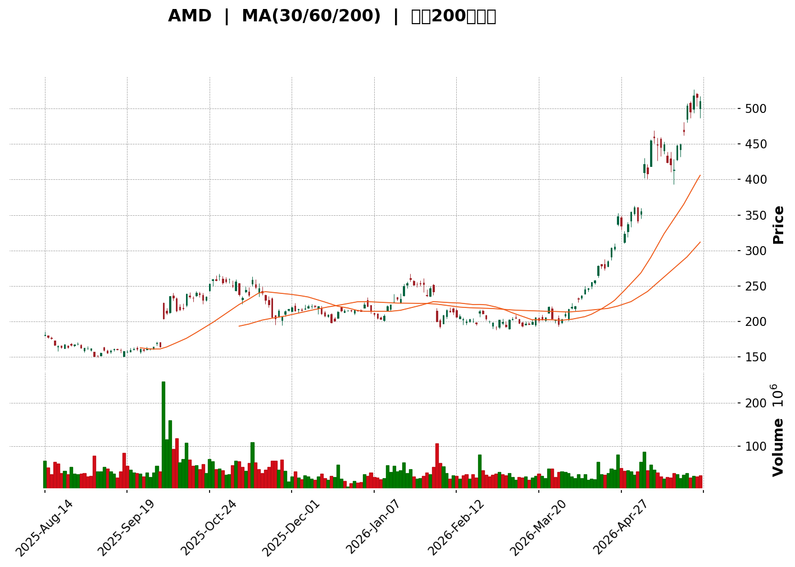
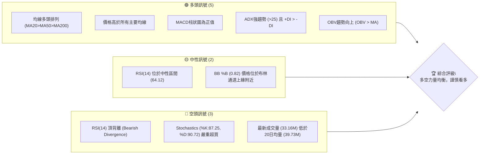

<details>
<summary>📊 靜態圖表 (點擊展開)</summary>

</details>

<html>
<head><meta charset="utf-8" /></head>
<body>
    <div>                        <script>window.PlotlyConfig = {MathJaxConfig: 'local'};</script>
        <script charset="utf-8" src="https://cdn.plot.ly/plotly-3.5.0.min.js" integrity="sha256-fHbNLP+GlIXN+efbQec78UkemUz3NJp7UmfGxC1tNxs=" crossorigin="anonymous"></script>                <div id="candlestick-chart" class="plotly-graph-div" style="height:500px; width:100%;"></div>            <script>                window.PLOTLYENV=window.PLOTLYENV || {};                                if (document.getElementById("candlestick-chart")) {                    Plotly.newPlot(                        "candlestick-chart",                        [{"close":{"dtype":"f8","bdata":"AAAAYGaeZkAAAADgUTBmQAAAAOB6BGZAAAAAoJnRZEAAAABgZqZkQAAAAGC4dmRAAAAA4FH4ZEAAAAAghWtkQAAAAADX02RAAAAAACnkZEAAAABgjxJlQAAAAAApVGRAAAAAgD1KZEAAAAAAKURkQAAAAKBHOWRAAAAA4HrkYkAAAADAHu1iQAAAAIA9emNAAAAAoEfxY0AAAACgcHVjQAAAAIA90mNAAAAAwB4lZEAAAABguA5kQAAAAMAe5WNAAAAAoHC9Y0AAAADgeqxjQAAAAKBH+WNAAAAAwMwcZEAAAAAAKRxkQAAAAOCjKGRAAAAAYLjuY0AAAAAghStkQAAAAKBHOWRAAAAA4FGAZEAAAAAgXDdlQAAAAKBwlWRAAAAAYLh2aUAAAADgUXBqQAAAAIDrcW1AAAAA4HocbUAAAADAzNxqQAAAAKBwDWtAAAAAQOFCa0AAAABAM9NtQAAAAIDrUW1AAAAAYI8ibUAAAACA6xFuQAAAAMD1wG1AAAAAIFzHbEAAAAAgrl9tQAAAAKBwnW9AAAAAYLg6cEAAAAAAKSBwQAAAAKBHhXBAAAAAQOHab0AAAACA6wFwQAAAAGBmOnBAAAAAoJlBb0AAAACgRwVwQAAAAGBmtm1AAAAAoEcxbUAAAAAgXH9uQAAAAOCjsG1AAAAAgD0ucEAAAABguP5uQAAAAIDr2W5AAAAA4KMQbkAAAACgR8lsQAAAAKCZ8WtAAAAA4KPAaUAAAADA9XhpQAAAAKCZ4WpAAAAAACnEaUAAAAAgrsdqQAAAAMD1MGtAAAAA4FF4a0AAAAAgrudqQAAAAEAzM2tAAAAAIFz\u002fakAAAABACj9rQAAAACCFo2tAAAAAANeza0AAAACgcK1rQAAAAIDCrWtAAAAAwPVYakAAAABgj\u002fJpQAAAAKBwJWpAAAAAIIXDaEAAAACA6yFpQAAAAIDCrWpAAAAAYGbeakAAAADAzNxqQAAAAKBH4WpAAAAAIK7fakAAAAAghfNqQAAAAEDh6mpAAAAAwB7FakAAAABACu9rQAAAAGCPomtAAAAAQDPLakAAAADgo0BqQAAAAIDClWlAAAAAoHBlaUAAAACAFPZpQAAAAEAKn2tAAAAAQDPza0AAAACgcH1sQAAAAGCP+mxAAAAAoHD9bEAAAACgmTlvQAAAACBct29AAAAAQOE6cEAAAACA62lvQAAAAMD1gG9AAAAAIK6Xb0AAAACAwoVvQAAAACBcl21AAAAA4KPIbkAAAAAghUNuQAAAAIAUBmlAAAAAAAAQaEAAAACAFA5qQAAAAAAAAGtAAAAAgD2yakAAAABgj7JqQAAAAIAUvmlAAAAAgD3qaUAAAABgj2JpQAAAAADXA2lAAAAAANdraUAAAADAzARpQAAAAEAzk2hAAAAAQOG6akAAAAAghVtqQAAAAIDCdWlAAAAAYLgGaUAAAAAA19NoQAAAAGBm3mdAAAAAgD1CaUAAAABgZu5oQAAAAIDCDWhAAAAAgMJVaUAAAAAgXGdpQAAAAGCPmmlAAAAAIK63aEAAAADgeixoQAAAAGCPkmhAAAAAgOuJaEAAAABguO5oQAAAAOCjqGlAAAAAYI8qaUAAAACAwlVpQAAAAADXq2lAAAAA4KOIa0AAAADgo3hpQAAAACCuP2lAAAAAoEeBaEAAAACAwm1pQAAAAGC4RmpAAAAAAAAwa0AAAACAwoVrQAAAAMD1sGtAAAAAgD36bEAAAADgepRtQAAAAKBHoW5AAAAAYI\u002fabkAAAACAPeJvQAAAAIDrIXBAAAAAAClkcUAAAACAPWZxQAAAAEAzL3FAAAAAANfHcUAAAAAgXPdyQAAAAKBHFXNAAAAAwPW8dUAAAACAFOp0QAAAACBcM3RAAAAAgMIRdUAAAAAA1yd2QAAAAOCjiHZAAAAA4KNYdUAAAAAAKTR2QAAAAIA9VnpAAAAAIFyHeUAAAABACnN8QAAAAOCjrHxAAAAA4KMEfEAAAAAAANh7QAAAAEAzG3xAAAAAoJmBekAAAAAA1096QAAAAMDM4HlAAAAAoEf5e0AAAACgcBl8QAAAAAApOH1AAAAAgD1+f0AAAADgo\u002fh+QAAAAGC4MIBAAAAAwMwggEAAAACAFOJ\u002fQA=="},"high":{"dtype":"f8","bdata":"AAAAgBQuZ0AAAADgeoRmQAAAAKCZWWZAAAAAoHClZUAAAADAzNRkQAAAAAApvGRAAAAAwPUQZUAAAABA4bJkQAAAAOCjOGVAAAAAgML1ZEAAAAAgrl9lQAAAAIA9EmVAAAAA4HpMZEAAAAAAAJhkQAAAAKCZQWRAAAAA4HqkY0AAAADgehRjQAAAAMAelWNAAAAAwPWQZEAAAABguAZkQAAAAMAeDWRAAAAAoJlJZEAAAABgZj5kQAAAAAApNGRAAAAA4KPYY0AAAABA4fpjQAAAAIDCVWRAAAAA4HpsZEAAAABAM6NkQAAAAAApNGRAAAAAIIVDZEAAAACgmYlkQAAAAMD1SGRAAAAAgMKFZEAAAACA62FlQAAAAIDCVWVAAAAAYLhWbEAAAADAzFxrQAAAAADXe21AAAAAQDMDbkAAAABACkdtQAAAAIAUBmxAAAAAIFwfbEAAAAAgrudtQAAAAGBmJm5AAAAAAClsbUAAAAAAKVxuQAAAAOBRSG5AAAAAACkEbkAAAADAzHxtQAAAAOB6rG9AAAAAYLhGcEAAAACgR4lwQAAAAKBHsXBAAAAAgBR+cEAAAACAFGJwQAAAAGCPTnBAAAAAgBQWcEAAAABgZjpwQAAAAOBRsG9AAAAAANd7bUAAAADAzBxvQAAAAGC4Dm9AAAAAACl4cEAAAACAFDpwQAAAAIAUrm9AAAAA4KMYb0AAAAAAAMBtQAAAAMD1aG1AAAAAAABIbUAAAABgjxpqQAAAAAApJGtAAAAAYI\u002fSaUAAAABA4fJqQAAAAKCZSWtAAAAAIFyfa0AAAAAgXD9sQAAAAGBmRmtAAAAAANdja0AAAADgevRrQAAAAGC49mtAAAAAQOEabEAAAAAghdNrQAAAAAAAsGtAAAAAIK7Pa0AAAAAghetqQAAAAEAKR2pAAAAAAABwakAAAAAghctpQAAAAIDC5WpAAAAAoHCFa0AAAADA9SBrQAAAAKBHEWtAAAAAYI8aa0AAAACgmQFrQAAAAIA9GmtAAAAA4Ho0a0AAAADAzGRsQAAAAOCjQG1AAAAAoHDda0AAAAAAKYRqQAAAAIAUXmpAAAAAoJnpaUAAAAAAKTxqQAAAACCF42tAAAAAQOECbEAAAABAM8ttQAAAACCuT21AAAAAAADwbUAAAADAzJxvQAAAAKBHAXBAAAAAIFyvcEAAAADgoyRwQAAAAKCZ8W9AAAAAYGYWcEAAAADgekhwQAAAACCup25AAAAAQAo\u002fb0AAAADAzJRvQAAAAGCPUmtAAAAAoEeBaUAAAADgoyhqQAAAAEAzM2tAAAAA4Hpsa0AAAADAzHRrQAAAAGC4TmtAAAAAoJlBakAAAACgmalpQAAAAGBmZmlAAAAAQDODaUAAAAAA15tpQAAAAAAp7GhAAAAAYLgWa0AAAABgZhZrQAAAAKBHOWpAAAAA4Ho8aUAAAAAgrtdoQAAAAOB6NGhAAAAAgBROaUAAAACgR3lpQAAAACCuB2lAAAAAQApfaUAAAABA4dJpQAAAAGC4JmpAAAAAANdzaUAAAACAwvVoQAAAAKBwBWlAAAAAYLjmaEAAAAAghVtpQAAAAAApvGlAAAAAoJnJaUAAAAAghSNqQAAAAIDCzWlAAAAAYI+qa0AAAAAAAKBrQAAAAOCjaGlAAAAAgMINakAAAAAAAIBpQAAAAGCPumpAAAAAwPU4a0AAAACA60lsQAAAAEAzw2tAAAAAAABAbUAAAABAM6NtQAAAAGCPMm9AAAAAYI\u002fqbkAAAABguO5vQAAAAEDhInBAAAAAoHB1cUAAAADAzJBxQAAAAIDC+XFAAAAAQDPjcUAAAAAAAARzQAAAACCFY3NAAAAAANcPdkAAAAAgXNN1QAAAAAAAeHRAAAAAYLhCdUAAAAAgXC92QAAAAOCjrHZAAAAAoJmddkAAAADAHnl2QAAAAKCZ6XpAAAAAIFxbekAAAADgo4R8QAAAACCFU31AAAAAwMysfEAAAAAAALh8QAAAAMD1VHxAAAAAAABwe0AAAADAzGx7QAAAAAAAzHpAAAAAgD0WfEAAAABAMzN8QAAAAGCPFn5AAAAAIFyvf0AAAAAgXON\u002fQAAAAKCZeYBAAAAAAABQgEAAAAAAACyAQA=="},"hovertemplate":"\u003cb\u003e%{x|%Y-%m-%d}\u003c\u002fb\u003e\u003cbr\u003e\u958b: $%{open:.2f}\u003cbr\u003e\u9ad8: $%{high:.2f}\u003cbr\u003e\u4f4e: $%{low:.2f}\u003cbr\u003e\u6536: $%{close:.2f}\u003cextra\u003e\u003c\u002fextra\u003e","low":{"dtype":"f8","bdata":"AAAAgOtxZkAAAAAAAAhmQAAAACCFy2VAAAAAQDPDZEAAAAAAAMhjQAAAAOBRSGRAAAAAoJk5ZEAAAABACjdkQAAAAMAenWRAAAAAwMyUZEAAAADAzNRkQAAAAMDMPGRAAAAAANeTY0AAAABgjxJkQAAAAKBHuWNAAAAAgMLFYkAAAABACqdiQAAAAIDC\u002fWJAAAAAAADAY0AAAAAgrl9jQAAAAKBwXWNAAAAAQDOzY0AAAABACudjQAAAAOBReGNAAAAAQDO7YkAAAADAzHxjQAAAAKBwrWNAAAAAYLjmY0AAAACAws1jQAAAAMD1WGNAAAAAoJmhY0AAAADAzPxjQAAAAGCP6mNAAAAAIK4PZEAAAAAA18NkQAAAAOB6ZGRAAAAA4FFgaUAAAADA9ShqQAAAAGBmVmpAAAAAwPWwbEAAAABgZqZqQAAAAMDM3GpAAAAAwMz8akAAAADgUZhrQAAAACCuB21AAAAAwB59bEAAAADAzExtQAAAAOCjQG1AAAAAACkcbEAAAACgR5FsQAAAAGBmPm5AAAAAoJk5b0AAAAAAABBwQAAAAGBmFnBAAAAAgOuJb0AAAADAHq1vQAAAAOB6vG9AAAAA4HrsbkAAAACA61luQAAAACCud21AAAAA4HoUbEAAAAAAABBuQAAAAOB6VG1AAAAAAABAb0AAAACA68FuQAAAAGCPYm1AAAAAwMykbUAAAABguBZsQAAAAGC4dmtAAAAAwPWQaUAAAAAAAGBoQAAAAEAzu2lAAAAAwPVIaEAAAAAAAOBpQAAAAOCjwGpAAAAAAACwakAAAADgesxqQAAAAOCjeGpAAAAA4HrEakAAAAAgrgdrQAAAACCFS2tAAAAAwB49a0AAAACgcFVrQAAAAIAURmpAAAAAgOshakAAAABgj9JpQAAAACCFo2lAAAAAwPWwaEAAAAAAABBpQAAAAGBmhmlAAAAAgOupakAAAADA9YhqQAAAAEAKv2pAAAAAwPWgakAAAAAgridqQAAAAGCPympAAAAAoJm5akAAAADAzFxrQAAAACBcj2tAAAAAAABoakAAAACgcOVpQAAAAGCPamlAAAAAgD1iaUAAAACgmfloQAAAACBc32pAAAAAIIXjakAAAABACmdsQAAAACCFm2xAAAAAwB4tbEAAAADA9XhtQAAAAAAp1G5AAAAAAAAEcEAAAACgmUlvQAAAAGC4\u002fm5AAAAAYLhGb0AAAADAHh1uQAAAAKCZUW1AAAAAAABgbUAAAACgR6FtQAAAAMDM5GhAAAAAQArXZ0AAAACAwo1oQAAAAMDMhGlAAAAAACmkakAAAABguCZqQAAAAOB6pGlAAAAAACl8aUAAAABgj1poQAAAAAAAYGhAAAAAoEfJaEAAAACA69FoQAAAAMDMRGhAAAAAAADQaUAAAABgj0pqQAAAAGC4LmlAAAAAIK63aEAAAAAAAMBnQAAAAEAKh2dAAAAAIIW7Z0AAAAAAKVxoQAAAAAAA6GdAAAAA4KOgZ0AAAABgZkZpQAAAAAApdGlAAAAAoHCVaEAAAADgowhoQAAAAKCZWWhAAAAA4FFoaEAAAAAAAHhoQAAAAGCPGmhAAAAA4FHIaEAAAABguDZpQAAAAAApBGlAAAAA4FFwakAAAACAwm1pQAAAAIAUtmhAAAAAANcbaEAAAADAHo1oQAAAAEDhumlAAAAAANcTaUAAAAAgXDdrQAAAAAAp7GpAAAAAQOFibEAAAADAHt1sQAAAAGC43m1AAAAAwPVAbkAAAABgZrZuQAAAAEAze29AAAAAAClYcEAAAACAPSJxQAAAAAAAAHFAAAAAgOtJcUAAAACAPeJxQAAAAAApvHJAAAAA4KPodEAAAADA9Yx0QAAAAAAAYHNAAAAAgMLtc0AAAACgmcl0QAAAAAAA1HVAAAAAQDMrdUAAAACAFI51QAAAAOCjIHlAAAAAoEcReUAAAADgoyR6QAAAAIAULnxAAAAAgMKhekAAAABgZgp7QAAAAEDhOntAAAAAgMJ1ekAAAAAgXKt5QAAAAIDClXhAAAAAwMygekAAAACgmfl6QAAAACBc23xAAAAAIK4DfkAAAABgj2p+QAAAAOBR2H5AAAAAQOF2f0AAAADAzGx+QA=="},"name":"\u50f9\u683c","open":{"dtype":"f8","bdata":"AAAAYI96ZkAAAACA64FmQAAAAOBRGGZAAAAAQDOjZUAAAABAM4NkQAAAACCFu2RAAAAAoHBFZEAAAACgmbFkQAAAAMDMFGVAAAAAoEfBZEAAAAAAABBlQAAAAIDr2WRAAAAAoHDNY0AAAACA6zlkQAAAAIAU\u002fmNAAAAAANejY0AAAACgmfliQAAAACCu\u002f2JAAAAAoEdxZEAAAAAA19NjQAAAAAAAoGNAAAAA4FEAZEAAAAAA1ytkQAAAAMD16GNAAAAAYLjeYkAAAAAAKaxjQAAAAKBwrWNAAAAA4KMQZEAAAAAgXF9kQAAAAOB6pGNAAAAA4KMQZEAAAAAA1wNkQAAAAKBHGWRAAAAAgMIdZEAAAACAwhVlQAAAAIDCVWVAAAAAYGZObEAAAABAM9tqQAAAAGBmnmpAAAAAoJmJbUAAAADgoxhtQAAAAGBmhmtAAAAAYGZma0AAAABguNZrQAAAAKBHiW1AAAAA4FEobUAAAABACo9tQAAAAOB67G1AAAAAQDObbUAAAADAHsVsQAAAACCFa25AAAAAgBQecEAAAACAPTJwQAAAAEAKg3BAAAAAYLg+cEAAAACgmTlwQAAAAKBHNXBAAAAAQDNLb0AAAAAgrmduQAAAAEAKr29AAAAAgBTebEAAAADgekRuQAAAAMAeNW5AAAAAACmkb0AAAADAzHxvQAAAACCFA25AAAAAAABYbkAAAADA9ZhtQAAAAOBRyGxAAAAAYGYWbUAAAACA6xlqQAAAAMAe5WlAAAAAIFwvaUAAAACgmUFqQAAAAOB6BGtAAAAAACm8akAAAACgR7lrQAAAAOBRCGtAAAAAACkca0AAAACgcCVrQAAAAEDhYmtAAAAAoEeha0AAAAAAAMBrQAAAAIDrOWtAAAAAANdLa0AAAADA9YhqQAAAAKBw3WlAAAAAoEdBakAAAACAPXppQAAAAEAzk2lAAAAAAACAa0AAAAAghZtqQAAAACBc32pAAAAAgMLtakAAAABgj3JqQAAAAADX+2pAAAAAgD36akAAAADAzFxrQAAAAAAAyGxAAAAAYLjWa0AAAAAAKYRqQAAAAMDMXGpAAAAAQAq3aUAAAACAwiVpQAAAAEAz42pAAAAAoEcxa0AAAADAzHxsQAAAAKCZSW1AAAAAYI9CbEAAAAAgrn9tQAAAAAAAeG9AAAAAQOFScEAAAAAAAAxwQAAAAMAehW9AAAAAACnEb0AAAADAHtVvQAAAAIDCnW1AAAAA4KN4bUAAAACgmXFvQAAAAAAA4GpAAAAAIIU7aUAAAAAAKaRoQAAAAMDM3GlAAAAA4HrkakAAAAAAKTxrQAAAAGCP+mpAAAAA4KOAaUAAAADAzERpQAAAAMAezWhAAAAAIIUDaUAAAAAA1wNpQAAAAEDhwmhAAAAAACl0akAAAACAPdpqQAAAAKCZGWpAAAAAIIUDaUAAAABAMztoQAAAAGC47mdAAAAAANcDaEAAAADgo7hoQAAAAOCjaGhAAAAAIIWrZ0AAAADgUVBpQAAAACCFo2lAAAAAYI9aaUAAAAAghcNoQAAAACBcX2hAAAAAgMKVaEAAAAAAAIBoQAAAAMD1YGhAAAAA4HqcaUAAAADAzMxpQAAAAOB6LGlAAAAA4FFwakAAAAAgXD9rQAAAAOCjOGlAAAAAYGaeaUAAAACgmcFoQAAAAEDh8mlAAAAAoJmBaUAAAADA9WhrQAAAAOBRSGtAAAAAANcDbUAAAADgUSBtQAAAAAAA4G1AAAAAwPWgbkAAAACgRzlvQAAAAGC43m9AAAAAANePcEAAAAAAAJBxQAAAAKCZiXFAAAAAoEdVcUAAAAAghTNyQAAAAAAp4HJAAAAAACkMdUAAAADAHqV1QAAAAIDCfXNAAAAAoEdpdEAAAACAwlV1QAAAAIDr\u002fXVAAAAAwPWEdkAAAAAAKfh1QAAAAADXl3lAAAAAwB4RekAAAACgcCl6QAAAAMDMyHxAAAAAAAAUfEAAAADgo5B8QAAAAKCZiXtAAAAAoHAVe0AAAAAAANh6QAAAAKCZyXlAAAAA4KPAekAAAAAA1597QAAAAKBwXX1AAAAAANdLfkAAAAAAAMB\u002fQAAAAAAAMH9AAAAAYGZGgEAAAAAgrkV\u002fQA=="},"x":["2025-08-14T00:00:00-04:00","2025-08-15T00:00:00-04:00","2025-08-18T00:00:00-04:00","2025-08-19T00:00:00-04:00","2025-08-20T00:00:00-04:00","2025-08-21T00:00:00-04:00","2025-08-22T00:00:00-04:00","2025-08-25T00:00:00-04:00","2025-08-26T00:00:00-04:00","2025-08-27T00:00:00-04:00","2025-08-28T00:00:00-04:00","2025-08-29T00:00:00-04:00","2025-09-02T00:00:00-04:00","2025-09-03T00:00:00-04:00","2025-09-04T00:00:00-04:00","2025-09-05T00:00:00-04:00","2025-09-08T00:00:00-04:00","2025-09-09T00:00:00-04:00","2025-09-10T00:00:00-04:00","2025-09-11T00:00:00-04:00","2025-09-12T00:00:00-04:00","2025-09-15T00:00:00-04:00","2025-09-16T00:00:00-04:00","2025-09-17T00:00:00-04:00","2025-09-18T00:00:00-04:00","2025-09-19T00:00:00-04:00","2025-09-22T00:00:00-04:00","2025-09-23T00:00:00-04:00","2025-09-24T00:00:00-04:00","2025-09-25T00:00:00-04:00","2025-09-26T00:00:00-04:00","2025-09-29T00:00:00-04:00","2025-09-30T00:00:00-04:00","2025-10-01T00:00:00-04:00","2025-10-02T00:00:00-04:00","2025-10-03T00:00:00-04:00","2025-10-06T00:00:00-04:00","2025-10-07T00:00:00-04:00","2025-10-08T00:00:00-04:00","2025-10-09T00:00:00-04:00","2025-10-10T00:00:00-04:00","2025-10-13T00:00:00-04:00","2025-10-14T00:00:00-04:00","2025-10-15T00:00:00-04:00","2025-10-16T00:00:00-04:00","2025-10-17T00:00:00-04:00","2025-10-20T00:00:00-04:00","2025-10-21T00:00:00-04:00","2025-10-22T00:00:00-04:00","2025-10-23T00:00:00-04:00","2025-10-24T00:00:00-04:00","2025-10-27T00:00:00-04:00","2025-10-28T00:00:00-04:00","2025-10-29T00:00:00-04:00","2025-10-30T00:00:00-04:00","2025-10-31T00:00:00-04:00","2025-11-03T00:00:00-05:00","2025-11-04T00:00:00-05:00","2025-11-05T00:00:00-05:00","2025-11-06T00:00:00-05:00","2025-11-07T00:00:00-05:00","2025-11-10T00:00:00-05:00","2025-11-11T00:00:00-05:00","2025-11-12T00:00:00-05:00","2025-11-13T00:00:00-05:00","2025-11-14T00:00:00-05:00","2025-11-17T00:00:00-05:00","2025-11-18T00:00:00-05:00","2025-11-19T00:00:00-05:00","2025-11-20T00:00:00-05:00","2025-11-21T00:00:00-05:00","2025-11-24T00:00:00-05:00","2025-11-25T00:00:00-05:00","2025-11-26T00:00:00-05:00","2025-11-28T00:00:00-05:00","2025-12-01T00:00:00-05:00","2025-12-02T00:00:00-05:00","2025-12-03T00:00:00-05:00","2025-12-04T00:00:00-05:00","2025-12-05T00:00:00-05:00","2025-12-08T00:00:00-05:00","2025-12-09T00:00:00-05:00","2025-12-10T00:00:00-05:00","2025-12-11T00:00:00-05:00","2025-12-12T00:00:00-05:00","2025-12-15T00:00:00-05:00","2025-12-16T00:00:00-05:00","2025-12-17T00:00:00-05:00","2025-12-18T00:00:00-05:00","2025-12-19T00:00:00-05:00","2025-12-22T00:00:00-05:00","2025-12-23T00:00:00-05:00","2025-12-24T00:00:00-05:00","2025-12-26T00:00:00-05:00","2025-12-29T00:00:00-05:00","2025-12-30T00:00:00-05:00","2025-12-31T00:00:00-05:00","2026-01-02T00:00:00-05:00","2026-01-05T00:00:00-05:00","2026-01-06T00:00:00-05:00","2026-01-07T00:00:00-05:00","2026-01-08T00:00:00-05:00","2026-01-09T00:00:00-05:00","2026-01-12T00:00:00-05:00","2026-01-13T00:00:00-05:00","2026-01-14T00:00:00-05:00","2026-01-15T00:00:00-05:00","2026-01-16T00:00:00-05:00","2026-01-20T00:00:00-05:00","2026-01-21T00:00:00-05:00","2026-01-22T00:00:00-05:00","2026-01-23T00:00:00-05:00","2026-01-26T00:00:00-05:00","2026-01-27T00:00:00-05:00","2026-01-28T00:00:00-05:00","2026-01-29T00:00:00-05:00","2026-01-30T00:00:00-05:00","2026-02-02T00:00:00-05:00","2026-02-03T00:00:00-05:00","2026-02-04T00:00:00-05:00","2026-02-05T00:00:00-05:00","2026-02-06T00:00:00-05:00","2026-02-09T00:00:00-05:00","2026-02-10T00:00:00-05:00","2026-02-11T00:00:00-05:00","2026-02-12T00:00:00-05:00","2026-02-13T00:00:00-05:00","2026-02-17T00:00:00-05:00","2026-02-18T00:00:00-05:00","2026-02-19T00:00:00-05:00","2026-02-20T00:00:00-05:00","2026-02-23T00:00:00-05:00","2026-02-24T00:00:00-05:00","2026-02-25T00:00:00-05:00","2026-02-26T00:00:00-05:00","2026-02-27T00:00:00-05:00","2026-03-02T00:00:00-05:00","2026-03-03T00:00:00-05:00","2026-03-04T00:00:00-05:00","2026-03-05T00:00:00-05:00","2026-03-06T00:00:00-05:00","2026-03-09T00:00:00-04:00","2026-03-10T00:00:00-04:00","2026-03-11T00:00:00-04:00","2026-03-12T00:00:00-04:00","2026-03-13T00:00:00-04:00","2026-03-16T00:00:00-04:00","2026-03-17T00:00:00-04:00","2026-03-18T00:00:00-04:00","2026-03-19T00:00:00-04:00","2026-03-20T00:00:00-04:00","2026-03-23T00:00:00-04:00","2026-03-24T00:00:00-04:00","2026-03-25T00:00:00-04:00","2026-03-26T00:00:00-04:00","2026-03-27T00:00:00-04:00","2026-03-30T00:00:00-04:00","2026-03-31T00:00:00-04:00","2026-04-01T00:00:00-04:00","2026-04-02T00:00:00-04:00","2026-04-06T00:00:00-04:00","2026-04-07T00:00:00-04:00","2026-04-08T00:00:00-04:00","2026-04-09T00:00:00-04:00","2026-04-10T00:00:00-04:00","2026-04-13T00:00:00-04:00","2026-04-14T00:00:00-04:00","2026-04-15T00:00:00-04:00","2026-04-16T00:00:00-04:00","2026-04-17T00:00:00-04:00","2026-04-20T00:00:00-04:00","2026-04-21T00:00:00-04:00","2026-04-22T00:00:00-04:00","2026-04-23T00:00:00-04:00","2026-04-24T00:00:00-04:00","2026-04-27T00:00:00-04:00","2026-04-28T00:00:00-04:00","2026-04-29T00:00:00-04:00","2026-04-30T00:00:00-04:00","2026-05-01T00:00:00-04:00","2026-05-04T00:00:00-04:00","2026-05-05T00:00:00-04:00","2026-05-06T00:00:00-04:00","2026-05-07T00:00:00-04:00","2026-05-08T00:00:00-04:00","2026-05-11T00:00:00-04:00","2026-05-12T00:00:00-04:00","2026-05-13T00:00:00-04:00","2026-05-14T00:00:00-04:00","2026-05-15T00:00:00-04:00","2026-05-18T00:00:00-04:00","2026-05-19T00:00:00-04:00","2026-05-20T00:00:00-04:00","2026-05-21T00:00:00-04:00","2026-05-22T00:00:00-04:00","2026-05-26T00:00:00-04:00","2026-05-27T00:00:00-04:00","2026-05-28T00:00:00-04:00","2026-05-29T00:00:00-04:00","2026-06-01T00:00:00-04:00"],"type":"candlestick"},{"hovertemplate":"MA30: $%{y:.2f}\u003cextra\u003e\u003c\u002fextra\u003e","line":{"color":"#2196F3","dash":"dash","width":2},"mode":"lines","name":"MA30","x":["2025-08-14T00:00:00-04:00","2025-08-15T00:00:00-04:00","2025-08-18T00:00:00-04:00","2025-08-19T00:00:00-04:00","2025-08-20T00:00:00-04:00","2025-08-21T00:00:00-04:00","2025-08-22T00:00:00-04:00","2025-08-25T00:00:00-04:00","2025-08-26T00:00:00-04:00","2025-08-27T00:00:00-04:00","2025-08-28T00:00:00-04:00","2025-08-29T00:00:00-04:00","2025-09-02T00:00:00-04:00","2025-09-03T00:00:00-04:00","2025-09-04T00:00:00-04:00","2025-09-05T00:00:00-04:00","2025-09-08T00:00:00-04:00","2025-09-09T00:00:00-04:00","2025-09-10T00:00:00-04:00","2025-09-11T00:00:00-04:00","2025-09-12T00:00:00-04:00","2025-09-15T00:00:00-04:00","2025-09-16T00:00:00-04:00","2025-09-17T00:00:00-04:00","2025-09-18T00:00:00-04:00","2025-09-19T00:00:00-04:00","2025-09-22T00:00:00-04:00","2025-09-23T00:00:00-04:00","2025-09-24T00:00:00-04:00","2025-09-25T00:00:00-04:00","2025-09-26T00:00:00-04:00","2025-09-29T00:00:00-04:00","2025-09-30T00:00:00-04:00","2025-10-01T00:00:00-04:00","2025-10-02T00:00:00-04:00","2025-10-03T00:00:00-04:00","2025-10-06T00:00:00-04:00","2025-10-07T00:00:00-04:00","2025-10-08T00:00:00-04:00","2025-10-09T00:00:00-04:00","2025-10-10T00:00:00-04:00","2025-10-13T00:00:00-04:00","2025-10-14T00:00:00-04:00","2025-10-15T00:00:00-04:00","2025-10-16T00:00:00-04:00","2025-10-17T00:00:00-04:00","2025-10-20T00:00:00-04:00","2025-10-21T00:00:00-04:00","2025-10-22T00:00:00-04:00","2025-10-23T00:00:00-04:00","2025-10-24T00:00:00-04:00","2025-10-27T00:00:00-04:00","2025-10-28T00:00:00-04:00","2025-10-29T00:00:00-04:00","2025-10-30T00:00:00-04:00","2025-10-31T00:00:00-04:00","2025-11-03T00:00:00-05:00","2025-11-04T00:00:00-05:00","2025-11-05T00:00:00-05:00","2025-11-06T00:00:00-05:00","2025-11-07T00:00:00-05:00","2025-11-10T00:00:00-05:00","2025-11-11T00:00:00-05:00","2025-11-12T00:00:00-05:00","2025-11-13T00:00:00-05:00","2025-11-14T00:00:00-05:00","2025-11-17T00:00:00-05:00","2025-11-18T00:00:00-05:00","2025-11-19T00:00:00-05:00","2025-11-20T00:00:00-05:00","2025-11-21T00:00:00-05:00","2025-11-24T00:00:00-05:00","2025-11-25T00:00:00-05:00","2025-11-26T00:00:00-05:00","2025-11-28T00:00:00-05:00","2025-12-01T00:00:00-05:00","2025-12-02T00:00:00-05:00","2025-12-03T00:00:00-05:00","2025-12-04T00:00:00-05:00","2025-12-05T00:00:00-05:00","2025-12-08T00:00:00-05:00","2025-12-09T00:00:00-05:00","2025-12-10T00:00:00-05:00","2025-12-11T00:00:00-05:00","2025-12-12T00:00:00-05:00","2025-12-15T00:00:00-05:00","2025-12-16T00:00:00-05:00","2025-12-17T00:00:00-05:00","2025-12-18T00:00:00-05:00","2025-12-19T00:00:00-05:00","2025-12-22T00:00:00-05:00","2025-12-23T00:00:00-05:00","2025-12-24T00:00:00-05:00","2025-12-26T00:00:00-05:00","2025-12-29T00:00:00-05:00","2025-12-30T00:00:00-05:00","2025-12-31T00:00:00-05:00","2026-01-02T00:00:00-05:00","2026-01-05T00:00:00-05:00","2026-01-06T00:00:00-05:00","2026-01-07T00:00:00-05:00","2026-01-08T00:00:00-05:00","2026-01-09T00:00:00-05:00","2026-01-12T00:00:00-05:00","2026-01-13T00:00:00-05:00","2026-01-14T00:00:00-05:00","2026-01-15T00:00:00-05:00","2026-01-16T00:00:00-05:00","2026-01-20T00:00:00-05:00","2026-01-21T00:00:00-05:00","2026-01-22T00:00:00-05:00","2026-01-23T00:00:00-05:00","2026-01-26T00:00:00-05:00","2026-01-27T00:00:00-05:00","2026-01-28T00:00:00-05:00","2026-01-29T00:00:00-05:00","2026-01-30T00:00:00-05:00","2026-02-02T00:00:00-05:00","2026-02-03T00:00:00-05:00","2026-02-04T00:00:00-05:00","2026-02-05T00:00:00-05:00","2026-02-06T00:00:00-05:00","2026-02-09T00:00:00-05:00","2026-02-10T00:00:00-05:00","2026-02-11T00:00:00-05:00","2026-02-12T00:00:00-05:00","2026-02-13T00:00:00-05:00","2026-02-17T00:00:00-05:00","2026-02-18T00:00:00-05:00","2026-02-19T00:00:00-05:00","2026-02-20T00:00:00-05:00","2026-02-23T00:00:00-05:00","2026-02-24T00:00:00-05:00","2026-02-25T00:00:00-05:00","2026-02-26T00:00:00-05:00","2026-02-27T00:00:00-05:00","2026-03-02T00:00:00-05:00","2026-03-03T00:00:00-05:00","2026-03-04T00:00:00-05:00","2026-03-05T00:00:00-05:00","2026-03-06T00:00:00-05:00","2026-03-09T00:00:00-04:00","2026-03-10T00:00:00-04:00","2026-03-11T00:00:00-04:00","2026-03-12T00:00:00-04:00","2026-03-13T00:00:00-04:00","2026-03-16T00:00:00-04:00","2026-03-17T00:00:00-04:00","2026-03-18T00:00:00-04:00","2026-03-19T00:00:00-04:00","2026-03-20T00:00:00-04:00","2026-03-23T00:00:00-04:00","2026-03-24T00:00:00-04:00","2026-03-25T00:00:00-04:00","2026-03-26T00:00:00-04:00","2026-03-27T00:00:00-04:00","2026-03-30T00:00:00-04:00","2026-03-31T00:00:00-04:00","2026-04-01T00:00:00-04:00","2026-04-02T00:00:00-04:00","2026-04-06T00:00:00-04:00","2026-04-07T00:00:00-04:00","2026-04-08T00:00:00-04:00","2026-04-09T00:00:00-04:00","2026-04-10T00:00:00-04:00","2026-04-13T00:00:00-04:00","2026-04-14T00:00:00-04:00","2026-04-15T00:00:00-04:00","2026-04-16T00:00:00-04:00","2026-04-17T00:00:00-04:00","2026-04-20T00:00:00-04:00","2026-04-21T00:00:00-04:00","2026-04-22T00:00:00-04:00","2026-04-23T00:00:00-04:00","2026-04-24T00:00:00-04:00","2026-04-27T00:00:00-04:00","2026-04-28T00:00:00-04:00","2026-04-29T00:00:00-04:00","2026-04-30T00:00:00-04:00","2026-05-01T00:00:00-04:00","2026-05-04T00:00:00-04:00","2026-05-05T00:00:00-04:00","2026-05-06T00:00:00-04:00","2026-05-07T00:00:00-04:00","2026-05-08T00:00:00-04:00","2026-05-11T00:00:00-04:00","2026-05-12T00:00:00-04:00","2026-05-13T00:00:00-04:00","2026-05-14T00:00:00-04:00","2026-05-15T00:00:00-04:00","2026-05-18T00:00:00-04:00","2026-05-19T00:00:00-04:00","2026-05-20T00:00:00-04:00","2026-05-21T00:00:00-04:00","2026-05-22T00:00:00-04:00","2026-05-26T00:00:00-04:00","2026-05-27T00:00:00-04:00","2026-05-28T00:00:00-04:00","2026-05-29T00:00:00-04:00","2026-06-01T00:00:00-04:00"],"y":{"dtype":"f8","bdata":"AAAAAAAA+H8AAAAAAAD4fwAAAAAAAPh\u002fAAAAAAAA+H8AAAAAAAD4fwAAAAAAAPh\u002fAAAAAAAA+H8AAAAAAAD4fwAAAAAAAPh\u002fAAAAAAAA+H8AAAAAAAD4fwAAAAAAAPh\u002fAAAAAAAA+H8AAAAAAAD4fwAAAAAAAPh\u002fAAAAAAAA+H8AAAAAAAD4fwAAAAAAAPh\u002fAAAAAAAA+H8AAAAAAAD4fwAAAAAAAPh\u002fAAAAAAAA+H8AAAAAAAD4fwAAAAAAAPh\u002fAAAAAAAA+H8AAAAAAAD4fwAAAAAAAPh\u002fAAAAAAAA+H8AAAAAAAD4f2ZmZiYGWWRAMzMz8xlCZEDNzMzs3zBkQKuqqmqRIWRAMzMz09seZEARERHRsCNkQFVVVfW2JGRAVVVVtQ9LZEDe3d3da35kQFVVVRX1x2RAIiIi8hkOZUBERERkgj9lQFVVVaXieGVAIiIikl+0ZUCrqqr68AVmQKuqqgqQU2ZAAAAAIPeqZkBEREQEDwpnQDMzM9O\u002fYWdAiYiI6CatZ0Dv7u6OwgFoQFVVVWVmZmhAIiIiMnrPaECamZnZhzdpQERERES2p2lAMzMz4xcPakAiIiLCZ3hqQCIiIjLs4mpAd3d3FwRCa0DNzMxM1KdrQImIiMha+WtA7+7ujl9IbEAzMzNTgKBsQKuqqqpH8WxAzczMPHxWbUDv7u4+7qltQBEREfGLAW5AZmZmhs8obkB3d3e31zxuQAAAADAIMG5AMzMz414TbkAzMzNjggduQJqZmUkMBm5AmpmZaUr5bUAiIiKCTt9tQO\u002fu7i4kzW1A7+7u7u6+bUAzMzPj7KNtQDMzMyMijm1AAAAA8O5+bUB3d3dXx2xtQHd3dxfZSm1AZmZm5kIibUAzMzNjO\u002ftsQERERNR4zWxAMzMzg3mebEC8u7vbsmpsQERERHTaNGxA7+7uXnP9a0Crqqr6fsJrQGZmZqabqGtAd3d3V8eUa0AAAACQwnVrQFVVVQXIXWtAREREZPQua0Dv7u6ucgxrQGZmZkbh6mpAzczMPMPOakDNzMzsfMdqQDMzM3PaxGpAiYiIGL3NakCJiIgIZdRqQERERFRVyWpAzczMDC3GakBmZmZ2ML9qQAAAANDbwmpAREREZPTGakAAAADgetRqQM3MzJyo42pAvLu7S6n0akAiIiICnRZrQBEREXFoOWtAvLu7WwFia0AiIiJS44FrQJqZmSmHomtAq6qqCknPa0AAAADQ2\u002f5rQHd3d4dBHGxAvLu7a6BPbEDv7u7OaXtsQImIiGhKbWxAAAAAEFhVbEDe3d0NdE5sQDMzMzN6T2xAIiIicvZNbEDv7u4ezEtsQLy7u0vFQWxAVVVVhXk6bEARERGxuSRsQGZmZjZeDmxAAAAA8KcCbEBERETEIPhrQERERGSC72tAMzMzA+T6a0AiIiKiRf5rQO\u002fu7k7U62tAd3d3R+HSa0DNzMxsoLNrQFVVVXUFiGtAvLu7ay5oa0AzMzODeTJrQGZmZoYW8WpAmpmZuUm0akDe3d2tAIFqQO\u002fu7u6nTmpARERERP0TakDe3d2tR9VpQN7d3Q10qmlAREREpCl1aUCamZlZq0dpQHd3d4cWTWlAVVVVtYFWaUB3d3fXXFBpQERERCQGRWlAAAAAsCtMaUB3d3fntEFpQKuqqkp+PWlAiYiIGHYxaUCrqqqq1TFpQJqZmemYPGlAiYiIWKtLaUDv7u7eCGFpQLy7u2uge2lAmpmZKc6OaUAiIiLSTappQLy7u9tr1mlAmpmZOSYIakB3d3fXXERqQKuqqroCjGpA3t3drUfdakARERGRezFrQImIiAiBiWtA3t3dncTga0BmZmYWrktsQImIiEjhtmxAVVVVZfRWbUBVVVVVnO1tQDMzM8OudG5AvLu7i94Kb0ARERERPLBvQImIiJDtKnBAd3d357R1cECamZkpFcdwQImIiBhLOnFAVVVVTamecUAzMzODwCRyQN7d3UW2rXJA7+7uzj40c0Dv7u5uWbVzQFVVVc0TNXRA7+7ulkOjdEARERHZXA51QGZmZj4KdXVARERErBzodUAiIiJyr1l2QM3MzARW0HZAd3d3R29Zd0AzMzNzr9l3QGZmZgZWZHhAvLu7Gy\u002fjeEB3d3dXx155QA=="},"type":"scatter"},{"hovertemplate":"MA60: $%{y:.2f}\u003cextra\u003e\u003c\u002fextra\u003e","line":{"color":"#9C27B0","dash":"dash","width":2},"mode":"lines","name":"MA60","x":["2025-08-14T00:00:00-04:00","2025-08-15T00:00:00-04:00","2025-08-18T00:00:00-04:00","2025-08-19T00:00:00-04:00","2025-08-20T00:00:00-04:00","2025-08-21T00:00:00-04:00","2025-08-22T00:00:00-04:00","2025-08-25T00:00:00-04:00","2025-08-26T00:00:00-04:00","2025-08-27T00:00:00-04:00","2025-08-28T00:00:00-04:00","2025-08-29T00:00:00-04:00","2025-09-02T00:00:00-04:00","2025-09-03T00:00:00-04:00","2025-09-04T00:00:00-04:00","2025-09-05T00:00:00-04:00","2025-09-08T00:00:00-04:00","2025-09-09T00:00:00-04:00","2025-09-10T00:00:00-04:00","2025-09-11T00:00:00-04:00","2025-09-12T00:00:00-04:00","2025-09-15T00:00:00-04:00","2025-09-16T00:00:00-04:00","2025-09-17T00:00:00-04:00","2025-09-18T00:00:00-04:00","2025-09-19T00:00:00-04:00","2025-09-22T00:00:00-04:00","2025-09-23T00:00:00-04:00","2025-09-24T00:00:00-04:00","2025-09-25T00:00:00-04:00","2025-09-26T00:00:00-04:00","2025-09-29T00:00:00-04:00","2025-09-30T00:00:00-04:00","2025-10-01T00:00:00-04:00","2025-10-02T00:00:00-04:00","2025-10-03T00:00:00-04:00","2025-10-06T00:00:00-04:00","2025-10-07T00:00:00-04:00","2025-10-08T00:00:00-04:00","2025-10-09T00:00:00-04:00","2025-10-10T00:00:00-04:00","2025-10-13T00:00:00-04:00","2025-10-14T00:00:00-04:00","2025-10-15T00:00:00-04:00","2025-10-16T00:00:00-04:00","2025-10-17T00:00:00-04:00","2025-10-20T00:00:00-04:00","2025-10-21T00:00:00-04:00","2025-10-22T00:00:00-04:00","2025-10-23T00:00:00-04:00","2025-10-24T00:00:00-04:00","2025-10-27T00:00:00-04:00","2025-10-28T00:00:00-04:00","2025-10-29T00:00:00-04:00","2025-10-30T00:00:00-04:00","2025-10-31T00:00:00-04:00","2025-11-03T00:00:00-05:00","2025-11-04T00:00:00-05:00","2025-11-05T00:00:00-05:00","2025-11-06T00:00:00-05:00","2025-11-07T00:00:00-05:00","2025-11-10T00:00:00-05:00","2025-11-11T00:00:00-05:00","2025-11-12T00:00:00-05:00","2025-11-13T00:00:00-05:00","2025-11-14T00:00:00-05:00","2025-11-17T00:00:00-05:00","2025-11-18T00:00:00-05:00","2025-11-19T00:00:00-05:00","2025-11-20T00:00:00-05:00","2025-11-21T00:00:00-05:00","2025-11-24T00:00:00-05:00","2025-11-25T00:00:00-05:00","2025-11-26T00:00:00-05:00","2025-11-28T00:00:00-05:00","2025-12-01T00:00:00-05:00","2025-12-02T00:00:00-05:00","2025-12-03T00:00:00-05:00","2025-12-04T00:00:00-05:00","2025-12-05T00:00:00-05:00","2025-12-08T00:00:00-05:00","2025-12-09T00:00:00-05:00","2025-12-10T00:00:00-05:00","2025-12-11T00:00:00-05:00","2025-12-12T00:00:00-05:00","2025-12-15T00:00:00-05:00","2025-12-16T00:00:00-05:00","2025-12-17T00:00:00-05:00","2025-12-18T00:00:00-05:00","2025-12-19T00:00:00-05:00","2025-12-22T00:00:00-05:00","2025-12-23T00:00:00-05:00","2025-12-24T00:00:00-05:00","2025-12-26T00:00:00-05:00","2025-12-29T00:00:00-05:00","2025-12-30T00:00:00-05:00","2025-12-31T00:00:00-05:00","2026-01-02T00:00:00-05:00","2026-01-05T00:00:00-05:00","2026-01-06T00:00:00-05:00","2026-01-07T00:00:00-05:00","2026-01-08T00:00:00-05:00","2026-01-09T00:00:00-05:00","2026-01-12T00:00:00-05:00","2026-01-13T00:00:00-05:00","2026-01-14T00:00:00-05:00","2026-01-15T00:00:00-05:00","2026-01-16T00:00:00-05:00","2026-01-20T00:00:00-05:00","2026-01-21T00:00:00-05:00","2026-01-22T00:00:00-05:00","2026-01-23T00:00:00-05:00","2026-01-26T00:00:00-05:00","2026-01-27T00:00:00-05:00","2026-01-28T00:00:00-05:00","2026-01-29T00:00:00-05:00","2026-01-30T00:00:00-05:00","2026-02-02T00:00:00-05:00","2026-02-03T00:00:00-05:00","2026-02-04T00:00:00-05:00","2026-02-05T00:00:00-05:00","2026-02-06T00:00:00-05:00","2026-02-09T00:00:00-05:00","2026-02-10T00:00:00-05:00","2026-02-11T00:00:00-05:00","2026-02-12T00:00:00-05:00","2026-02-13T00:00:00-05:00","2026-02-17T00:00:00-05:00","2026-02-18T00:00:00-05:00","2026-02-19T00:00:00-05:00","2026-02-20T00:00:00-05:00","2026-02-23T00:00:00-05:00","2026-02-24T00:00:00-05:00","2026-02-25T00:00:00-05:00","2026-02-26T00:00:00-05:00","2026-02-27T00:00:00-05:00","2026-03-02T00:00:00-05:00","2026-03-03T00:00:00-05:00","2026-03-04T00:00:00-05:00","2026-03-05T00:00:00-05:00","2026-03-06T00:00:00-05:00","2026-03-09T00:00:00-04:00","2026-03-10T00:00:00-04:00","2026-03-11T00:00:00-04:00","2026-03-12T00:00:00-04:00","2026-03-13T00:00:00-04:00","2026-03-16T00:00:00-04:00","2026-03-17T00:00:00-04:00","2026-03-18T00:00:00-04:00","2026-03-19T00:00:00-04:00","2026-03-20T00:00:00-04:00","2026-03-23T00:00:00-04:00","2026-03-24T00:00:00-04:00","2026-03-25T00:00:00-04:00","2026-03-26T00:00:00-04:00","2026-03-27T00:00:00-04:00","2026-03-30T00:00:00-04:00","2026-03-31T00:00:00-04:00","2026-04-01T00:00:00-04:00","2026-04-02T00:00:00-04:00","2026-04-06T00:00:00-04:00","2026-04-07T00:00:00-04:00","2026-04-08T00:00:00-04:00","2026-04-09T00:00:00-04:00","2026-04-10T00:00:00-04:00","2026-04-13T00:00:00-04:00","2026-04-14T00:00:00-04:00","2026-04-15T00:00:00-04:00","2026-04-16T00:00:00-04:00","2026-04-17T00:00:00-04:00","2026-04-20T00:00:00-04:00","2026-04-21T00:00:00-04:00","2026-04-22T00:00:00-04:00","2026-04-23T00:00:00-04:00","2026-04-24T00:00:00-04:00","2026-04-27T00:00:00-04:00","2026-04-28T00:00:00-04:00","2026-04-29T00:00:00-04:00","2026-04-30T00:00:00-04:00","2026-05-01T00:00:00-04:00","2026-05-04T00:00:00-04:00","2026-05-05T00:00:00-04:00","2026-05-06T00:00:00-04:00","2026-05-07T00:00:00-04:00","2026-05-08T00:00:00-04:00","2026-05-11T00:00:00-04:00","2026-05-12T00:00:00-04:00","2026-05-13T00:00:00-04:00","2026-05-14T00:00:00-04:00","2026-05-15T00:00:00-04:00","2026-05-18T00:00:00-04:00","2026-05-19T00:00:00-04:00","2026-05-20T00:00:00-04:00","2026-05-21T00:00:00-04:00","2026-05-22T00:00:00-04:00","2026-05-26T00:00:00-04:00","2026-05-27T00:00:00-04:00","2026-05-28T00:00:00-04:00","2026-05-29T00:00:00-04:00","2026-06-01T00:00:00-04:00"],"y":{"dtype":"f8","bdata":"AAAAAAAA+H8AAAAAAAD4fwAAAAAAAPh\u002fAAAAAAAA+H8AAAAAAAD4fwAAAAAAAPh\u002fAAAAAAAA+H8AAAAAAAD4fwAAAAAAAPh\u002fAAAAAAAA+H8AAAAAAAD4fwAAAAAAAPh\u002fAAAAAAAA+H8AAAAAAAD4fwAAAAAAAPh\u002fAAAAAAAA+H8AAAAAAAD4fwAAAAAAAPh\u002fAAAAAAAA+H8AAAAAAAD4fwAAAAAAAPh\u002fAAAAAAAA+H8AAAAAAAD4fwAAAAAAAPh\u002fAAAAAAAA+H8AAAAAAAD4fwAAAAAAAPh\u002fAAAAAAAA+H8AAAAAAAD4fwAAAAAAAPh\u002fAAAAAAAA+H8AAAAAAAD4fwAAAAAAAPh\u002fAAAAAAAA+H8AAAAAAAD4fwAAAAAAAPh\u002fAAAAAAAA+H8AAAAAAAD4fwAAAAAAAPh\u002fAAAAAAAA+H8AAAAAAAD4fwAAAAAAAPh\u002fAAAAAAAA+H8AAAAAAAD4fwAAAAAAAPh\u002fAAAAAAAA+H8AAAAAAAD4fwAAAAAAAPh\u002fAAAAAAAA+H8AAAAAAAD4fwAAAAAAAPh\u002fAAAAAAAA+H8AAAAAAAD4fwAAAAAAAPh\u002fAAAAAAAA+H8AAAAAAAD4fwAAAAAAAPh\u002fAAAAAAAA+H8AAAAAAAD4f3d3d3cwKWhAERERwTxFaEAAAAAgsGhoQKuqqopsiWhAAAAACKy6aEAAAACIz+ZoQDMzM3MhE2lA3t3dne85aUCrqqrKoV1pQKuqqqL+e2lAq6qqaryQaUC8u7tjgqNpQHd3d3d3v2lA3t3d\u002fdTWaUBmZma+n\u002fJpQM3MzBxaEGpAd3d3B\u002fM0akC8u7vz\u002fVZqQDMzM\u002fvwd2pARERE7AqWakAzMzPzRLdqQGZmZr6f2GpAREREjN74akBmZmaeYRlrQERERIyXOmtAMzMzs8hWa0Dv7u5OjXFrQDMzM1Pji2tAMzMzu7ufa0C8u7ujKbVrQHd3dzf70GtAMzMzc5Pua0CamZlxIQtsQAAAANiHJ2xAiYiIULhCbEDv7u52MFtsQLy7u5s2dmxAmpmZYcl7bEAiIiJSKoJsQJqZmVFxemxA3t3d\u002fY1wbEDe3d21821sQO\u002fu7s6wZ2xAMzMzu7tfbEBERER8P09sQHd3d\u002f\u002f\u002fR2xAmpmZqfFCbECamZnhMzxsQAAAAGDlOGxA3t3dHcw5bEDNzMwsskFsQERERMQgQmxAERERISJCbECrqqpajz5sQO\u002fu7v7\u002fN2xA7+7uRuE2bEDe3d1VxzRsQN7d3f2NKGxAVVVV5YkmbEDNzMxk9B5sQHd3dwfzCmxAvLu7sw\u002f1a0Dv7u5OG+JrQERERByh1mtAMzMza3W+a0Dv7u5mH6xrQBEREUlTlmtAERERYZ6Ea0Dv7u5OG3ZrQM3MzFScaWtAREREhDJoa0BmZmbmQmZrQERERNxrXGtAAAAAiIhga0BEREQMu15rQHd3dw9YV2tA3t3d1epMa0BmZmamDURrQBEREQnXNWtAvLu722sua0CrqqpCiyRrQLy7u3s\u002fFWtAq6qqiiULa0AAAAAAcgFrQERERIyX+GpAd3d3J6PxakDv7u6+EepqQKuqqspa42pAAAAACGXiakBERESUiuFqQAAAAHgw3WpAq6qq4uzVakCrqqpyaM9qQLy7uytAympAERERERHNakAzMzODwMZqQDMzM8uhv2pA7+7uzve1akDe3d2tR6tqQAAAAJB7pWpAREREpCmnakCamZnRlKxqQAAAAGiRtWpAZmZmFtnEakAiIiK6SdRqQFVVVRUg4WpAiYiIwIPtakAiIiKi\u002fvtqQAAAABgECmtAzczMDLsia0AiIiKK+jFrQHd3d8dLPWtAvLu7K4dKa0AiIiJiV2ZrQLy7u5vEgmtAzczM1Hi1a0CamZkBcuFrQImIiGiRD2xAAAAAGARAbEBVVVW183tsQERERNR40WxAIiIiwvUgbUBVVVWVQ29tQKuqqirO3G1AVVVVJb9EbkDv7u72msVuQDMzM2t1TG9AMzMz2\u002fnMb0AiIiIiIidwQBERESGwaXBAmpmZoYykcEBERESkcN9wQCIiIjptGXFAiYiI4MFXcUCamZkta5dxQFVVVfnF3XFAIiIiMsEuckB3d3fv7n1yQN7d3bEr1XJAVVVVeekoc0AAAACQwntzQA=="},"type":"scatter"},{"hovertemplate":"MA200: $%{y:.2f}\u003cextra\u003e\u003c\u002fextra\u003e","line":{"color":"#FF6F00","dash":"solid","width":2},"mode":"lines","name":"MA200","x":["2025-08-14T00:00:00-04:00","2025-08-15T00:00:00-04:00","2025-08-18T00:00:00-04:00","2025-08-19T00:00:00-04:00","2025-08-20T00:00:00-04:00","2025-08-21T00:00:00-04:00","2025-08-22T00:00:00-04:00","2025-08-25T00:00:00-04:00","2025-08-26T00:00:00-04:00","2025-08-27T00:00:00-04:00","2025-08-28T00:00:00-04:00","2025-08-29T00:00:00-04:00","2025-09-02T00:00:00-04:00","2025-09-03T00:00:00-04:00","2025-09-04T00:00:00-04:00","2025-09-05T00:00:00-04:00","2025-09-08T00:00:00-04:00","2025-09-09T00:00:00-04:00","2025-09-10T00:00:00-04:00","2025-09-11T00:00:00-04:00","2025-09-12T00:00:00-04:00","2025-09-15T00:00:00-04:00","2025-09-16T00:00:00-04:00","2025-09-17T00:00:00-04:00","2025-09-18T00:00:00-04:00","2025-09-19T00:00:00-04:00","2025-09-22T00:00:00-04:00","2025-09-23T00:00:00-04:00","2025-09-24T00:00:00-04:00","2025-09-25T00:00:00-04:00","2025-09-26T00:00:00-04:00","2025-09-29T00:00:00-04:00","2025-09-30T00:00:00-04:00","2025-10-01T00:00:00-04:00","2025-10-02T00:00:00-04:00","2025-10-03T00:00:00-04:00","2025-10-06T00:00:00-04:00","2025-10-07T00:00:00-04:00","2025-10-08T00:00:00-04:00","2025-10-09T00:00:00-04:00","2025-10-10T00:00:00-04:00","2025-10-13T00:00:00-04:00","2025-10-14T00:00:00-04:00","2025-10-15T00:00:00-04:00","2025-10-16T00:00:00-04:00","2025-10-17T00:00:00-04:00","2025-10-20T00:00:00-04:00","2025-10-21T00:00:00-04:00","2025-10-22T00:00:00-04:00","2025-10-23T00:00:00-04:00","2025-10-24T00:00:00-04:00","2025-10-27T00:00:00-04:00","2025-10-28T00:00:00-04:00","2025-10-29T00:00:00-04:00","2025-10-30T00:00:00-04:00","2025-10-31T00:00:00-04:00","2025-11-03T00:00:00-05:00","2025-11-04T00:00:00-05:00","2025-11-05T00:00:00-05:00","2025-11-06T00:00:00-05:00","2025-11-07T00:00:00-05:00","2025-11-10T00:00:00-05:00","2025-11-11T00:00:00-05:00","2025-11-12T00:00:00-05:00","2025-11-13T00:00:00-05:00","2025-11-14T00:00:00-05:00","2025-11-17T00:00:00-05:00","2025-11-18T00:00:00-05:00","2025-11-19T00:00:00-05:00","2025-11-20T00:00:00-05:00","2025-11-21T00:00:00-05:00","2025-11-24T00:00:00-05:00","2025-11-25T00:00:00-05:00","2025-11-26T00:00:00-05:00","2025-11-28T00:00:00-05:00","2025-12-01T00:00:00-05:00","2025-12-02T00:00:00-05:00","2025-12-03T00:00:00-05:00","2025-12-04T00:00:00-05:00","2025-12-05T00:00:00-05:00","2025-12-08T00:00:00-05:00","2025-12-09T00:00:00-05:00","2025-12-10T00:00:00-05:00","2025-12-11T00:00:00-05:00","2025-12-12T00:00:00-05:00","2025-12-15T00:00:00-05:00","2025-12-16T00:00:00-05:00","2025-12-17T00:00:00-05:00","2025-12-18T00:00:00-05:00","2025-12-19T00:00:00-05:00","2025-12-22T00:00:00-05:00","2025-12-23T00:00:00-05:00","2025-12-24T00:00:00-05:00","2025-12-26T00:00:00-05:00","2025-12-29T00:00:00-05:00","2025-12-30T00:00:00-05:00","2025-12-31T00:00:00-05:00","2026-01-02T00:00:00-05:00","2026-01-05T00:00:00-05:00","2026-01-06T00:00:00-05:00","2026-01-07T00:00:00-05:00","2026-01-08T00:00:00-05:00","2026-01-09T00:00:00-05:00","2026-01-12T00:00:00-05:00","2026-01-13T00:00:00-05:00","2026-01-14T00:00:00-05:00","2026-01-15T00:00:00-05:00","2026-01-16T00:00:00-05:00","2026-01-20T00:00:00-05:00","2026-01-21T00:00:00-05:00","2026-01-22T00:00:00-05:00","2026-01-23T00:00:00-05:00","2026-01-26T00:00:00-05:00","2026-01-27T00:00:00-05:00","2026-01-28T00:00:00-05:00","2026-01-29T00:00:00-05:00","2026-01-30T00:00:00-05:00","2026-02-02T00:00:00-05:00","2026-02-03T00:00:00-05:00","2026-02-04T00:00:00-05:00","2026-02-05T00:00:00-05:00","2026-02-06T00:00:00-05:00","2026-02-09T00:00:00-05:00","2026-02-10T00:00:00-05:00","2026-02-11T00:00:00-05:00","2026-02-12T00:00:00-05:00","2026-02-13T00:00:00-05:00","2026-02-17T00:00:00-05:00","2026-02-18T00:00:00-05:00","2026-02-19T00:00:00-05:00","2026-02-20T00:00:00-05:00","2026-02-23T00:00:00-05:00","2026-02-24T00:00:00-05:00","2026-02-25T00:00:00-05:00","2026-02-26T00:00:00-05:00","2026-02-27T00:00:00-05:00","2026-03-02T00:00:00-05:00","2026-03-03T00:00:00-05:00","2026-03-04T00:00:00-05:00","2026-03-05T00:00:00-05:00","2026-03-06T00:00:00-05:00","2026-03-09T00:00:00-04:00","2026-03-10T00:00:00-04:00","2026-03-11T00:00:00-04:00","2026-03-12T00:00:00-04:00","2026-03-13T00:00:00-04:00","2026-03-16T00:00:00-04:00","2026-03-17T00:00:00-04:00","2026-03-18T00:00:00-04:00","2026-03-19T00:00:00-04:00","2026-03-20T00:00:00-04:00","2026-03-23T00:00:00-04:00","2026-03-24T00:00:00-04:00","2026-03-25T00:00:00-04:00","2026-03-26T00:00:00-04:00","2026-03-27T00:00:00-04:00","2026-03-30T00:00:00-04:00","2026-03-31T00:00:00-04:00","2026-04-01T00:00:00-04:00","2026-04-02T00:00:00-04:00","2026-04-06T00:00:00-04:00","2026-04-07T00:00:00-04:00","2026-04-08T00:00:00-04:00","2026-04-09T00:00:00-04:00","2026-04-10T00:00:00-04:00","2026-04-13T00:00:00-04:00","2026-04-14T00:00:00-04:00","2026-04-15T00:00:00-04:00","2026-04-16T00:00:00-04:00","2026-04-17T00:00:00-04:00","2026-04-20T00:00:00-04:00","2026-04-21T00:00:00-04:00","2026-04-22T00:00:00-04:00","2026-04-23T00:00:00-04:00","2026-04-24T00:00:00-04:00","2026-04-27T00:00:00-04:00","2026-04-28T00:00:00-04:00","2026-04-29T00:00:00-04:00","2026-04-30T00:00:00-04:00","2026-05-01T00:00:00-04:00","2026-05-04T00:00:00-04:00","2026-05-05T00:00:00-04:00","2026-05-06T00:00:00-04:00","2026-05-07T00:00:00-04:00","2026-05-08T00:00:00-04:00","2026-05-11T00:00:00-04:00","2026-05-12T00:00:00-04:00","2026-05-13T00:00:00-04:00","2026-05-14T00:00:00-04:00","2026-05-15T00:00:00-04:00","2026-05-18T00:00:00-04:00","2026-05-19T00:00:00-04:00","2026-05-20T00:00:00-04:00","2026-05-21T00:00:00-04:00","2026-05-22T00:00:00-04:00","2026-05-26T00:00:00-04:00","2026-05-27T00:00:00-04:00","2026-05-28T00:00:00-04:00","2026-05-29T00:00:00-04:00","2026-06-01T00:00:00-04:00"],"y":{"dtype":"f8","bdata":"AAAAAAAA+H8AAAAAAAD4fwAAAAAAAPh\u002fAAAAAAAA+H8AAAAAAAD4fwAAAAAAAPh\u002fAAAAAAAA+H8AAAAAAAD4fwAAAAAAAPh\u002fAAAAAAAA+H8AAAAAAAD4fwAAAAAAAPh\u002fAAAAAAAA+H8AAAAAAAD4fwAAAAAAAPh\u002fAAAAAAAA+H8AAAAAAAD4fwAAAAAAAPh\u002fAAAAAAAA+H8AAAAAAAD4fwAAAAAAAPh\u002fAAAAAAAA+H8AAAAAAAD4fwAAAAAAAPh\u002fAAAAAAAA+H8AAAAAAAD4fwAAAAAAAPh\u002fAAAAAAAA+H8AAAAAAAD4fwAAAAAAAPh\u002fAAAAAAAA+H8AAAAAAAD4fwAAAAAAAPh\u002fAAAAAAAA+H8AAAAAAAD4fwAAAAAAAPh\u002fAAAAAAAA+H8AAAAAAAD4fwAAAAAAAPh\u002fAAAAAAAA+H8AAAAAAAD4fwAAAAAAAPh\u002fAAAAAAAA+H8AAAAAAAD4fwAAAAAAAPh\u002fAAAAAAAA+H8AAAAAAAD4fwAAAAAAAPh\u002fAAAAAAAA+H8AAAAAAAD4fwAAAAAAAPh\u002fAAAAAAAA+H8AAAAAAAD4fwAAAAAAAPh\u002fAAAAAAAA+H8AAAAAAAD4fwAAAAAAAPh\u002fAAAAAAAA+H8AAAAAAAD4fwAAAAAAAPh\u002fAAAAAAAA+H8AAAAAAAD4fwAAAAAAAPh\u002fAAAAAAAA+H8AAAAAAAD4fwAAAAAAAPh\u002fAAAAAAAA+H8AAAAAAAD4fwAAAAAAAPh\u002fAAAAAAAA+H8AAAAAAAD4fwAAAAAAAPh\u002fAAAAAAAA+H8AAAAAAAD4fwAAAAAAAPh\u002fAAAAAAAA+H8AAAAAAAD4fwAAAAAAAPh\u002fAAAAAAAA+H8AAAAAAAD4fwAAAAAAAPh\u002fAAAAAAAA+H8AAAAAAAD4fwAAAAAAAPh\u002fAAAAAAAA+H8AAAAAAAD4fwAAAAAAAPh\u002fAAAAAAAA+H8AAAAAAAD4fwAAAAAAAPh\u002fAAAAAAAA+H8AAAAAAAD4fwAAAAAAAPh\u002fAAAAAAAA+H8AAAAAAAD4fwAAAAAAAPh\u002fAAAAAAAA+H8AAAAAAAD4fwAAAAAAAPh\u002fAAAAAAAA+H8AAAAAAAD4fwAAAAAAAPh\u002fAAAAAAAA+H8AAAAAAAD4fwAAAAAAAPh\u002fAAAAAAAA+H8AAAAAAAD4fwAAAAAAAPh\u002fAAAAAAAA+H8AAAAAAAD4fwAAAAAAAPh\u002fAAAAAAAA+H8AAAAAAAD4fwAAAAAAAPh\u002fAAAAAAAA+H8AAAAAAAD4fwAAAAAAAPh\u002fAAAAAAAA+H8AAAAAAAD4fwAAAAAAAPh\u002fAAAAAAAA+H8AAAAAAAD4fwAAAAAAAPh\u002fAAAAAAAA+H8AAAAAAAD4fwAAAAAAAPh\u002fAAAAAAAA+H8AAAAAAAD4fwAAAAAAAPh\u002fAAAAAAAA+H8AAAAAAAD4fwAAAAAAAPh\u002fAAAAAAAA+H8AAAAAAAD4fwAAAAAAAPh\u002fAAAAAAAA+H8AAAAAAAD4fwAAAAAAAPh\u002fAAAAAAAA+H8AAAAAAAD4fwAAAAAAAPh\u002fAAAAAAAA+H8AAAAAAAD4fwAAAAAAAPh\u002fAAAAAAAA+H8AAAAAAAD4fwAAAAAAAPh\u002fAAAAAAAA+H8AAAAAAAD4fwAAAAAAAPh\u002fAAAAAAAA+H8AAAAAAAD4fwAAAAAAAPh\u002fAAAAAAAA+H8AAAAAAAD4fwAAAAAAAPh\u002fAAAAAAAA+H8AAAAAAAD4fwAAAAAAAPh\u002fAAAAAAAA+H8AAAAAAAD4fwAAAAAAAPh\u002fAAAAAAAA+H8AAAAAAAD4fwAAAAAAAPh\u002fAAAAAAAA+H8AAAAAAAD4fwAAAAAAAPh\u002fAAAAAAAA+H8AAAAAAAD4fwAAAAAAAPh\u002fAAAAAAAA+H8AAAAAAAD4fwAAAAAAAPh\u002fAAAAAAAA+H8AAAAAAAD4fwAAAAAAAPh\u002fAAAAAAAA+H8AAAAAAAD4fwAAAAAAAPh\u002fAAAAAAAA+H8AAAAAAAD4fwAAAAAAAPh\u002fAAAAAAAA+H8AAAAAAAD4fwAAAAAAAPh\u002fAAAAAAAA+H8AAAAAAAD4fwAAAAAAAPh\u002fAAAAAAAA+H8AAAAAAAD4fwAAAAAAAPh\u002fAAAAAAAA+H8AAAAAAAD4fwAAAAAAAPh\u002fAAAAAAAA+H8AAAAAAAD4fwAAAAAAAPh\u002fAAAAAAAA+H\u002fD9SjswOZtQA=="},"type":"scatter"}],                        {"template":{"data":{"barpolar":[{"marker":{"line":{"color":"rgb(17,17,17)","width":0.5},"pattern":{"fillmode":"overlay","size":10,"solidity":0.2}},"type":"barpolar"}],"bar":[{"error_x":{"color":"#f2f5fa"},"error_y":{"color":"#f2f5fa"},"marker":{"line":{"color":"rgb(17,17,17)","width":0.5},"pattern":{"fillmode":"overlay","size":10,"solidity":0.2}},"type":"bar"}],"carpet":[{"aaxis":{"endlinecolor":"#A2B1C6","gridcolor":"#506784","linecolor":"#506784","minorgridcolor":"#506784","startlinecolor":"#A2B1C6"},"baxis":{"endlinecolor":"#A2B1C6","gridcolor":"#506784","linecolor":"#506784","minorgridcolor":"#506784","startlinecolor":"#A2B1C6"},"type":"carpet"}],"choropleth":[{"colorbar":{"outlinewidth":0,"ticks":""},"type":"choropleth"}],"contourcarpet":[{"colorbar":{"outlinewidth":0,"ticks":""},"type":"contourcarpet"}],"contour":[{"colorbar":{"outlinewidth":0,"ticks":""},"colorscale":[[0.0,"#0d0887"],[0.1111111111111111,"#46039f"],[0.2222222222222222,"#7201a8"],[0.3333333333333333,"#9c179e"],[0.4444444444444444,"#bd3786"],[0.5555555555555556,"#d8576b"],[0.6666666666666666,"#ed7953"],[0.7777777777777778,"#fb9f3a"],[0.8888888888888888,"#fdca26"],[1.0,"#f0f921"]],"type":"contour"}],"heatmap":[{"colorbar":{"outlinewidth":0,"ticks":""},"colorscale":[[0.0,"#0d0887"],[0.1111111111111111,"#46039f"],[0.2222222222222222,"#7201a8"],[0.3333333333333333,"#9c179e"],[0.4444444444444444,"#bd3786"],[0.5555555555555556,"#d8576b"],[0.6666666666666666,"#ed7953"],[0.7777777777777778,"#fb9f3a"],[0.8888888888888888,"#fdca26"],[1.0,"#f0f921"]],"type":"heatmap"}],"histogram2dcontour":[{"colorbar":{"outlinewidth":0,"ticks":""},"colorscale":[[0.0,"#0d0887"],[0.1111111111111111,"#46039f"],[0.2222222222222222,"#7201a8"],[0.3333333333333333,"#9c179e"],[0.4444444444444444,"#bd3786"],[0.5555555555555556,"#d8576b"],[0.6666666666666666,"#ed7953"],[0.7777777777777778,"#fb9f3a"],[0.8888888888888888,"#fdca26"],[1.0,"#f0f921"]],"type":"histogram2dcontour"}],"histogram2d":[{"colorbar":{"outlinewidth":0,"ticks":""},"colorscale":[[0.0,"#0d0887"],[0.1111111111111111,"#46039f"],[0.2222222222222222,"#7201a8"],[0.3333333333333333,"#9c179e"],[0.4444444444444444,"#bd3786"],[0.5555555555555556,"#d8576b"],[0.6666666666666666,"#ed7953"],[0.7777777777777778,"#fb9f3a"],[0.8888888888888888,"#fdca26"],[1.0,"#f0f921"]],"type":"histogram2d"}],"histogram":[{"marker":{"pattern":{"fillmode":"overlay","size":10,"solidity":0.2}},"type":"histogram"}],"mesh3d":[{"colorbar":{"outlinewidth":0,"ticks":""},"type":"mesh3d"}],"parcoords":[{"line":{"colorbar":{"outlinewidth":0,"ticks":""}},"type":"parcoords"}],"pie":[{"automargin":true,"type":"pie"}],"scatter3d":[{"line":{"colorbar":{"outlinewidth":0,"ticks":""}},"marker":{"colorbar":{"outlinewidth":0,"ticks":""}},"type":"scatter3d"}],"scattercarpet":[{"marker":{"colorbar":{"outlinewidth":0,"ticks":""}},"type":"scattercarpet"}],"scattergeo":[{"marker":{"colorbar":{"outlinewidth":0,"ticks":""}},"type":"scattergeo"}],"scattergl":[{"marker":{"line":{"color":"#283442"}},"type":"scattergl"}],"scattermapbox":[{"marker":{"colorbar":{"outlinewidth":0,"ticks":""}},"type":"scattermapbox"}],"scattermap":[{"marker":{"colorbar":{"outlinewidth":0,"ticks":""}},"type":"scattermap"}],"scatterpolargl":[{"marker":{"colorbar":{"outlinewidth":0,"ticks":""}},"type":"scatterpolargl"}],"scatterpolar":[{"marker":{"colorbar":{"outlinewidth":0,"ticks":""}},"type":"scatterpolar"}],"scatter":[{"marker":{"line":{"color":"#283442"}},"type":"scatter"}],"scatterternary":[{"marker":{"colorbar":{"outlinewidth":0,"ticks":""}},"type":"scatterternary"}],"surface":[{"colorbar":{"outlinewidth":0,"ticks":""},"colorscale":[[0.0,"#0d0887"],[0.1111111111111111,"#46039f"],[0.2222222222222222,"#7201a8"],[0.3333333333333333,"#9c179e"],[0.4444444444444444,"#bd3786"],[0.5555555555555556,"#d8576b"],[0.6666666666666666,"#ed7953"],[0.7777777777777778,"#fb9f3a"],[0.8888888888888888,"#fdca26"],[1.0,"#f0f921"]],"type":"surface"}],"table":[{"cells":{"fill":{"color":"#506784"},"line":{"color":"rgb(17,17,17)"}},"header":{"fill":{"color":"#2a3f5f"},"line":{"color":"rgb(17,17,17)"}},"type":"table"}]},"layout":{"annotationdefaults":{"arrowcolor":"#f2f5fa","arrowhead":0,"arrowwidth":1},"autotypenumbers":"strict","coloraxis":{"colorbar":{"outlinewidth":0,"ticks":""}},"colorscale":{"diverging":[[0,"#8e0152"],[0.1,"#c51b7d"],[0.2,"#de77ae"],[0.3,"#f1b6da"],[0.4,"#fde0ef"],[0.5,"#f7f7f7"],[0.6,"#e6f5d0"],[0.7,"#b8e186"],[0.8,"#7fbc41"],[0.9,"#4d9221"],[1,"#276419"]],"sequential":[[0.0,"#0d0887"],[0.1111111111111111,"#46039f"],[0.2222222222222222,"#7201a8"],[0.3333333333333333,"#9c179e"],[0.4444444444444444,"#bd3786"],[0.5555555555555556,"#d8576b"],[0.6666666666666666,"#ed7953"],[0.7777777777777778,"#fb9f3a"],[0.8888888888888888,"#fdca26"],[1.0,"#f0f921"]],"sequentialminus":[[0.0,"#0d0887"],[0.1111111111111111,"#46039f"],[0.2222222222222222,"#7201a8"],[0.3333333333333333,"#9c179e"],[0.4444444444444444,"#bd3786"],[0.5555555555555556,"#d8576b"],[0.6666666666666666,"#ed7953"],[0.7777777777777778,"#fb9f3a"],[0.8888888888888888,"#fdca26"],[1.0,"#f0f921"]]},"colorway":["#636efa","#EF553B","#00cc96","#ab63fa","#FFA15A","#19d3f3","#FF6692","#B6E880","#FF97FF","#FECB52"],"font":{"color":"#f2f5fa"},"geo":{"bgcolor":"rgb(17,17,17)","lakecolor":"rgb(17,17,17)","landcolor":"rgb(17,17,17)","showlakes":true,"showland":true,"subunitcolor":"#506784"},"hoverlabel":{"align":"left"},"hovermode":"closest","mapbox":{"style":"dark"},"paper_bgcolor":"rgb(17,17,17)","plot_bgcolor":"rgb(17,17,17)","polar":{"angularaxis":{"gridcolor":"#506784","linecolor":"#506784","ticks":""},"bgcolor":"rgb(17,17,17)","radialaxis":{"gridcolor":"#506784","linecolor":"#506784","ticks":""}},"scene":{"xaxis":{"backgroundcolor":"rgb(17,17,17)","gridcolor":"#506784","gridwidth":2,"linecolor":"#506784","showbackground":true,"ticks":"","zerolinecolor":"#C8D4E3"},"yaxis":{"backgroundcolor":"rgb(17,17,17)","gridcolor":"#506784","gridwidth":2,"linecolor":"#506784","showbackground":true,"ticks":"","zerolinecolor":"#C8D4E3"},"zaxis":{"backgroundcolor":"rgb(17,17,17)","gridcolor":"#506784","gridwidth":2,"linecolor":"#506784","showbackground":true,"ticks":"","zerolinecolor":"#C8D4E3"}},"shapedefaults":{"line":{"color":"#f2f5fa"}},"sliderdefaults":{"bgcolor":"#C8D4E3","bordercolor":"rgb(17,17,17)","borderwidth":1,"tickwidth":0},"ternary":{"aaxis":{"gridcolor":"#506784","linecolor":"#506784","ticks":""},"baxis":{"gridcolor":"#506784","linecolor":"#506784","ticks":""},"bgcolor":"rgb(17,17,17)","caxis":{"gridcolor":"#506784","linecolor":"#506784","ticks":""}},"title":{"x":0.05},"updatemenudefaults":{"bgcolor":"#506784","borderwidth":0},"xaxis":{"automargin":true,"gridcolor":"#283442","linecolor":"#506784","ticks":"","title":{"standoff":15},"zerolinecolor":"#283442","zerolinewidth":2},"yaxis":{"automargin":true,"gridcolor":"#283442","linecolor":"#506784","ticks":"","title":{"standoff":15},"zerolinecolor":"#283442","zerolinewidth":2}}},"xaxis":{"rangeslider":{"visible":false},"title":{"text":"\u65e5\u671f"}},"font":{"size":11},"title":{"text":"AMD  |  MA(30\u002f60\u002f200)  |  \u6700\u8fd1200\u4ea4\u6613\u65e5"},"yaxis":{"title":{"text":"\u80a1\u50f9 (USD)"}},"hovermode":"x unified","height":500},                        {"responsive": true}                    )                };            </script>        </div>
</body>
</html>

# AMD 技術分析報告

> **報告日期**：2026-06-02 ｜ **語言**：繁體中文 ｜ **數據來源**：Yahoo Finance ｜ **當前價格**：$510.13

---

## 目錄

| 章節 | 內容 |
|------|------|
| [1. 技術面概覽](#1-技術面概覽) | 訊號儀表板、核心指標、評分卡 |
| [2. 趨勢分析](#2-趨勢分析) | 多時框趨勢、長中短期走勢 |
| [3. 圖表形態分析](#3-圖表形態分析) | 形態識別、K線組合、目標價 |
| [4. 支撐與阻力](#4-支撐與阻力) | 關鍵價位、斐波那契回調 |
| [5. 技術指標深度解讀](#5-技術指標深度解讀) | MA/RSI/MACD/布林/成交量 |
| [6. 動能與波動率](#6-動能與波動率) | 動能評估、ATR、Beta |
| [7. 多時框架總結](#7-多時框架總結) | 時框架評分矩陣 |
| [8. 交易策略建議](#8-交易策略建議) | 多空策略、風險報酬比 |
| [9. 風險提示與監控](#9-風險提示與監控) | 監控指標、風險場景 |
| [10. 報告總結](#10-報告總結) | 綜合結論與策略概覽 |

---

## 1. 技術面概覽

AMD 目前股價正處於一個強勁的長期上升趨勢中，但在短期內，動能指標顯示出一些疲軟和潛在的頂部背離訊號。儘管均線系統呈現完美的「多頭排列」，趨勢強度（ADX）也極高，但RSI的頂部背離和Stochastics指標的超買狀態，加上近期成交量略低於平均水平，暗示市場可能正在經歷一個動能放緩或潛在盤整的階段。

### 🎯 技術訊號儀表板

本儀表板匯總了 AMD 當前各項技術指標所發出的多空訊號，提供一個快速、直觀的市場情緒概覽。



**儀表板解讀**：
目前多頭訊號數量佔優，顯示AMD的整體趨勢依然強勁，尤其在長期和中期時間框架上。然而，空頭訊號的存在不容忽視，特別是RSI頂背離和Stochastics超買，這些是動能減弱和潛在回調的早期預警。成交量未能配合價格創高，也為當前的上漲動能增添了一絲不確定性。綜合來看，市場處於一個多空拉鋸的階段，需要密切關注短期走勢的變化。

### 📊 核心指標速覽表

以下表格匯總了 AMD 當前關鍵技術指標的數值與初步解讀。

| 指標類別 | 指標名稱 | 當前數值 | 訊號 | 解讀 |
|----------|----------|----------|------|------|
| **價格** | 當前價格 | $510.13 | 🟢 | 處於歷史高位區間，顯示強勁買盤 |
| **均線** | MA20 | $447.58 | 🟢 | 價格遠高於短期均線，多頭強勢 |
| **均線** | MA50 | $334.24 | 🟢 | 價格遠高於中期均線，趨勢穩固 |
| **均線** | MA200 | $239.21 | 🟢 | 價格遠高於長期均線，大趨勢向上 |
| **動能** | RSI(14) | 64.12 | 🟡 | 位於中性偏強區間，但存在頂背離風險 |
| **動能** | MACD | 49.488 | 🟢 | MACD線位於訊號線上方，柱狀圖為正，看多 |
| **波動** | ATR(14) | $28.55 | 🟡 | 波動性較高，反映近期價格劇烈波動 |
| **趨勢** | ADX(14) | 47.22 | 🟢 | 趨勢強度極強，多頭佔主導 |
| **超買超賣** | Stoch %K/%D | 87.25 / 90.72 | 🔴 | 嚴重超買，潛在回調風險高 |
| **量能** | 量比 (20日) | 0.83x | 🟡 | 成交量低於平均，動能支撐略顯不足 |

### 🏆 技術評分卡

這張評分卡從多個維度對 AMD 的技術面進行量化評估，提供一個綜合的健康度指標。

```
╔══════════════════════════════════════════════════════════════╗
║                 技術評分卡 — AMD (2026-06-02)                ║
╠══════════════════════════════════════════════════════════════╣
║ 趨勢強度      █████████████████░░░  90/100  🟢 (ADX極強，多頭排列)   ║
║ 動能指標      ██████████░░░░░░░░░░  65/100  🟡 (MACD看多，RSI頂背離/Stoch超買)║
║ 支撐穩定度    ██████████████░░░░░░  75/100  🟡 (價格遠離主要均線，回調空間大)║
║ 成交量配合    ████████░░░░░░░░░░░░  60/100  🟡 (OBV看多，但近期量縮價漲)║
║ 形態完整度    ██████████░░░░░░░░░░  65/100  🟡 (短期高位盤整，形態不明確)║
║ 均線排列      ███████████████████░  95/100  🟢 (完美多頭排列，趨勢明確)║
╠══════════════════════════════════════════════════════════════╣
║ 綜合評分      ████████████░░░░░░░░  75/100  ⚖️ 中性偏多 (需警惕短期回調)║
╚══════════════════════════════════════════════════════════════╝
```
**綜合評分解讀**：
AMD 的技術評分整體偏高，主要受惠於其極為強勁的長期趨勢和完美的均線排列。這表明其基本面驅動的長期上漲動能依然存在。然而，在動能指標和成交量配合方面得分較低，反映了短期內上漲動能的疲軟以及潛在的回調風險。投資者應在享受長期趨勢紅利的同時，密切關注短期動能變化，並做好風險管理。

---

## 2. 趨勢分析

AMD 在過去一年經歷了令人矚目的上漲行情，展現出半導體產業在AI浪潮下的巨大潛力。多時框架分析顯示，其長期和中期趨勢均極為強勁，但短期內已出現一些動能放緩的跡象。

### 🌐 多時框趨勢分析

本分析將從月線、週線、日線三個時間框架層層遞進，描繪 AMD 的整體趨勢圖景。

```mermaid
graph TD
    A[月線趨勢] --> B{強勁上升趨勢 🟢}
    B --> C[週線趨勢]
    C --> D{中期上升趨勢，動能減緩 🟡}
    D --> E[日線趨勢]
    E --> F{短期高位盤整，潛在回調 🔴}

    subgraph 月線分析 (長期)
        B1("自2025年2月低點$99.86以來，股價一路攀升，屢創歷史新高")
        B2("多頭排列明顯，MA200向上傾斜，顯示長期基礎穩固")
        B{強勁上升趨勢 🟢} --> B1
        B{強勁上升趨勢 🟢} --> B2
    end

    subgraph 週線分析 (中期)
        C1("2026年3月$200附近啟動新一輪加速上漲，形成拋物線走勢")
        C2("價格遠離所有主要均線，顯示買盤極度強勁")
        C3("RSI高位運行，Stochastics超買，動能有過熱跡象")
        D{中期上升趨勢，動能減緩 🟡} --> C1
        D{中期上升趨勢，動能減緩 🟡} --> C2
        D{中期上升趨勢，動能減緩 🟡} --> C3
    end

    subgraph 日線分析 (短期)
        E1("近期從$516.10高點小幅回落至$510.13，形成高位小幅盤整")
        E2("RSI出現頂背離訊號，MACD柱狀圖動能減弱")
        E3("成交量低於平均水平，未能有效支撐價格繼續上攻")
        F{短期高位盤整，潛在回調 🔴} --> E1
        F{短期高位盤整，潛在回調 🔴} --> E2
        F{短期高位盤整，潛在回調 🔴} --> E3
    end
```

### 📈 長期趨勢 — 12個月走勢圖（Unicode）

以下為 AMD 過去 12 個月的月線收盤價走勢圖，清晰展示了其長期上漲趨勢中的關鍵轉折點。

```
AMD 月線走勢圖（過去12個月：2025年6月 - 2026年6月）
價格軸 ($)
$520 ┤                                           ● $516.10 (2026-05)
$470 ┤                                           │
$420 ┤                                           │
$370 ┤                                        ● $354.49 (2026-04)
$320 ┤                                        │
$270 ┤                     ● $256.12 (2025-10) │
$220 ┤            ● $236.73 (2026-01) ● $217.53 (2025-11) ● $214.16 (2025-12) ● $203.43 (2026-03)
$170 ┤        ● $176.31 (2025-07) ● $162.63 (2025-08) ● $161.79 (2025-09)
$120 ┤● $141.90 (2025-06)                                ● $200.21 (2026-02)
$70  ┤
     └───────────────────────────────────────────────────────────────────
       25-06  25-07  25-08  25-09  25-10  25-11  25-12  26-01  26-02  26-03  26-04  26-05  26-06
```
**關鍵高低點標註**:
- **歷史高點**: $516.10 (2026年5月)
- **過去12個月低點**: $141.90 (2025年6月)
- **近期轉折低點**: $200.21 (2026年2月)
- **當前價格**: $510.13 (2026年6月)

**走勢特徵分析表格**：
| 階段 | 時間區間 | 價格區間 | 漲跌幅 | 走勢特徵 | 解讀 |
|------|----------|----------|--------|----------|------|
| **盤整蓄勢** | 2025-06 ~ 2025-09 | $141.90 ~ $176.31 | +24.25% | 區間震盪，量能溫和 | 底部區域籌碼交換，為後續上漲積蓄動能 |
| **第一波突破** | 2025-10 | $161.79 → $256.12 | +58.30% | 帶量突破，強勁上漲 | 市場對未來預期轉好，買盤積極湧入 |
| **高位整理** | 2025-11 ~ 2026-03 | $200.21 ~ $236.73 | -11.9% (回調) | 橫盤震盪，小幅回調 | 消化前期漲幅，等待新的催化劑 |
| **第二波加速** | 2026-04 ~ 2026-05 | $203.43 → $516.10 | +153.69% | 拋物線式暴漲，量價齊升 | AI熱潮帶動的爆發性增長，市場情緒極度樂觀 |
| **近期回調** | 2026-06 | $516.10 → $510.13 | -1.16% | 高位小幅回調/盤整 | 動能稍有減弱，潛在獲利了結壓力 |

### 📊 中期趨勢（週線分析）

從週線圖來看，AMD 在 2026 年 3 月底至 5 月期間呈現出令人驚嘆的拋物線式上漲，從約 $200 的水平一路飆升至 $516.10 的歷史新高。這種急劇的漲勢往往伴隨著市場的狂熱情緒，但也增加了潛在快速回調的風險。當前價格 $510.13 略低於 5 月份的高點，顯示出短期動能有所減弱，市場可能正在醞釀一次技術性回調或高位盤整。

**近期壓力與支撐示意圖**
```
AMD 週線結構示意圖 (2026年3月至今)
價格軸 ($)
$527.20 ┤                                  R1 (52W 高點)
$516.10 ┤                                  ● (歷史高點)
$510.13 ╠═══════════════════════════════╣ ◄ 現價
$480.00 ┤                                  │
$455.19 ┤                                  S1 (近期回調支撐)
$447.58 ┤                                  S2 (MA20週線)
$424.10 ┤                                  │
$360.54 ┤                               S3 (前高點支撐)
$334.24 ┤                             S4 (MA50週線)
$278.39 ┤                         S5 (強勁斐波那契回調支撐)
$200.21 ┤●────────────────────────────────S6 (中期上漲起點)
        └────────────────────────────────────────────────
          Mar 26     Apr 26     May 26     Jun 26
```
**解讀**：
- **R1 ($527.20)**: 52週高點，也是當前最直接的阻力位。
- **歷史高點 ($516.10)**: 5月31日的收盤高點，是短期內多頭需要突破的關鍵。
- **近期回調支撐 S1 ($455.19)**: 5月10日週的收盤價，若股價回落，此處可能提供初步支撐。
- **MA20週線 ($447.58)**: 短期趨勢線，對中期走勢具有重要參考意義。
- **前高點支撐 S3 ($360.54)**: 5月3日週的收盤價，是更強的心理和技術支撐。
- **中期上漲起點 S6 ($200.21)**: 2026年2月的低點，是本輪中期上漲的基礎。

### ⚡ 趨勢強度評估（ADX 解讀）

ADX (Average Directional Index) 是衡量趨勢強度而非方向的指標。ADX 值越高，表示趨勢越強。

```mermaid
graph TD
    A[ADX趨勢強度評估] --> B{ADX(14) = 47.22}
    B --> C{判斷趨勢強度}
    C --> D[ADX > 25: 強趨勢 🟢]
    C --> E[ADX 20-25: 趨勢形成中 🟡]
    C --> F[ADX < 20: 無趨勢/盤整 🔴]
    D --> G{判斷趨勢方向}
    G --> H[+DI (35.96) > -DI (15.44): 多頭主導 🟢]
    G --> I[-DI > +DI: 空頭主導 🔴]
    H --> J[結論: AMD 處於極強的多頭趨勢中]
```
**ADX 強度對照表**：
| ADX 值範圍 | 趨勢強度 | 市場性質 | 建議策略 |
|------------|----------|----------|----------|
| 0-20       | 無趨勢/弱 | 盤整行情 | 區間操作，避免追漲殺跌 |
| 20-25      | 趨勢形成中 | 趨勢初顯 | 尋找突破機會，輕倉試探 |
| **25-50**  | **強趨勢** | **趨勢行情** | **順勢操作，逢低做多** |
| 50-75      | 極強趨勢 | 趨勢加速 | 順勢操作，警惕過熱風險 |

**ADX 解讀**：
AMD 的 ADX(14) 數值為 **47.22**，遠高於 25 的閾值，這明確指出 AMD 目前正處於一個**極為強勁的趨勢行情**中。這是一個非常樂觀的訊號，表明市場對 AMD 的方向有高度共識。
進一步觀察方向線 +DI 和 -DI：
- **+DI (35.96)** 顯著高於 **-DI (15.44)**，這表明當前的強勢趨勢是由**多頭主導**的。多頭力量遠大於空頭力量，推動股價持續上漲。
- **結論**：ADX 指標強烈支持 AMD 處於一個穩固且有力的上漲趨勢中。儘管其他動能指標顯示超買，但只要 ADX 維持高位且 +DI 保持領先，趨勢的延續性仍值得期待。交易者應以順勢操作為主，但同時警惕由於長期高 ADX 值可能導致的短期回調。

---

## 3. 圖表形態分析

AMD 近期的價格走勢主要由其強勁的基本面和市場情緒驅動，形成了陡峭的上升趨勢。在如此快速的拉升之後，圖表形態的識別變得尤為關鍵，它可能預示著趨勢的延續、盤整或是潛在的反轉。

### 🔍 形態識別系統

根據近期的股價走勢，AMD 主要呈現出強勁的上升通道與潛在的高位整理形態。目前尚未形成明確的經典反轉形態，但多頭動能的減弱暗示需要警惕。

```mermaid
graph TD
    A[AMD 圖表形態分析] --> B{近期走勢特徵}
    B --> C[強勁上升通道]
    B --> D[高位盤整/旗形整理? (待確認)]
    B --> E[潛在拋物線頂部 (需警惕)]

    C --> C1("自2026年3月低點$200以來，股價沿陡峭通道上行")
    C --> C2("通道下軌提供動態支撐，但斜率過高")

    D --> D1("從$516.10高點小幅回落至$510.13，可能形成小型旗形或三角整理")
    D --> D2("若向下突破，則可能預示短期回調；若向上突破，則趨勢延續")

    E --> E1("2026年4月至5月的加速上漲，形態類似拋物線")
    E --> E2("拋物線走勢往往難以持續，通常伴隨急劇回調")

    subgraph 形態判斷流程
        F[觀察K線與量能] --> G{是否有明顯反轉訊號?}
        G -- 否 --> H{是否為整理形態?}
        H -- 是 --> I[識別旗形、三角、矩形]
        H -- 否 --> J[判斷趨勢延續或動能衰竭]
        G -- 是 --> K[識別頭肩頂、雙頂等]
    end
    A --> F
```
**當前判斷**：
目前 AMD 處於一個強勁上升後的**高位整理階段**。雖然沒有明確的頭肩頂或雙頂反轉形態，但股價在創歷史新高後未能持續上攻，且伴隨量能萎縮和動能指標的背離，這可能預示著短期內將出現**高位盤整**或**技術性回調**。若能有效整理並帶量突破整理區間，則趨勢有望延續；反之，若跌破關鍵支撐，則可能進入更深度的回調。

### 🕯️ 重要K線形態分析

我們將分析近期的週線K線形態，以揭示市場情緒和潛在的價格行為。

| 日期 (週收盤) | 收盤價 | K線形態 | 解讀 | 訊號 |
|---------------|--------|---------|------|------|
| 2026-04-19    | $278.39 | 大陽線 (Marubozu) | 強勁的實體陽線，表明買方力量極度強大，幾乎沒有上影線或下影線，預示後續漲勢強勁。 | 🟢 強烈看多 |
| 2026-04-26    | $347.81 | 大陽線 (Marubozu) | 延續上週的強勁，再次出現實體陽線，且成交量顯著放大，確認趨勢加速。 | 🟢 強烈看多 |
| 2026-05-03    | $360.54 | 小陽線/紡錘線 | 實體較小，上下影線都存在，顯示買賣雙方力量開始平衡，上漲動能有所減弱，但仍收陽。 | 🟡 中性偏多 |
| 2026-05-10    | $455.19 | 大陽線 (Marubozu) | 經過短暫整理後再次爆發，強勁實體陽線突破整理區間，帶動股價大幅上漲。 | 🟢 強烈看多 |
| 2026-05-17    | $424.10 | 大陰線 (Bearish Engulfing/Dark Cloud Cover) | 吞噬了前一周的大陽線實體（或覆蓋其大部分），伴隨較大成交量，顯示賣壓沉重，短期反轉訊號。 | 🔴 看空 |
| 2026-05-24    | $467.51 | 中陽線 | 在經歷大陰線回調後，股價企穩反彈，收出中陽線，顯示買盤介入，但力度不及前期。 | 🟡 中性偏多 |
| 2026-05-31    | $516.10 | 大陽線 (Long White Candle) | 再次收出長陽線，創歷史新高，顯示買盤強勁。但RSI頂背離，需警惕。 | 🟢 看多 (潛在陷阱) |
| 2026-06-07    | $510.13 | 小陰線/紡錘線 | 價格小幅回落，實體較小，顯示多空雙方在高位猶豫，動能減弱，可能進入盤整或回調。 | 🟡 中性偏空 |

**綜合K線解讀**：
AMD 在 4 月至 5 月初呈現連續大陽線的強勁上漲，但在 5 月中旬出現了一根大型陰線（$424.10），這是一個值得警惕的賣出訊號，顯示市場存在獲利了結的壓力。隨後的反彈雖然再次創高 ($516.10)，但本週 ($510.13) 卻收出小陰線，且伴隨RSI頂背離和成交量萎縮，這通常是上漲動能衰竭的跡象。當前K線形態暗示股價在高位面臨較大阻力，短期內可能難以繼續大幅上攻，甚至可能面臨回調。

### 📉 ASCII 走勢形態示意圖

以下示意圖展示了 AMD 近期從底部拉升至高位後，可能正在形成的整理形態。

```
AMD 近期走勢形態示意圖 (2026年3月 - 2026年6月)
價格軸 ($)
$527.20 ┤                                        R (高點阻力)
$516.10 ┤                                      ●
$510.13 ╠═════════════════════════════════════════╣ ◄ 現價
$490.00 ┤                                    ╱  ╲
$470.00 ┤                                   ╱    ╲
$450.00 ┤                                  ╱      ╲
$430.00 ┤                              ╱          ╲
$410.00 ┤                             ╱            ╲
$390.00 ┤                            ╱              ╲
$370.00 ┤                           ╱                ╲
$350.00 ┤                          ╱                  ╲
$330.00 ┤                         ╱                    ╲
$310.00 ┤                        ╱                      ╲
$290.00 ┤                       ╱                        ╲
$270.00 ┤                      ╱                          ╲
$250.00 ┤                     ╱                            ╲
$230.00 ┤                    ╱                              ╲
$210.00 ┤                   ╱                                ╲
$190.00 ┤●───────────────────────────────────────────────── S (中期支撐)
         └─────────────────────────────────────────────────────────────────
           2026-03       2026-04         2026-05           2026-06
```
**形態解讀**：
圖中顯示 AMD 從 $200.21 (2026年2月) 的低點開始了一波強勁的上升趨勢，在 $516.10 (2026年5月) 達到頂峰。目前股價正在高位形成一個潛在的**擴散形態 (Broadening Formation)** 或**三角形整理**。這種形態通常出現在大幅上漲之後，表明市場情緒波動劇烈，多空雙方力量不穩。擴散形態通常被視為反轉形態的一種，尤其是在牛市末期。如果股價繼續在擴大範圍內震盪，並最終跌破下方支撐，則可能預示著中期趨勢的結束。反之，若能收斂並帶量突破上方阻力，則趨勢仍有機會延續，但可能性較低。

### 🎯 形態目標價計算

鑑於 AMD 近期呈現的是拋物線式上漲後的潛在整理形態，我們將主要利用斐波那契擴展來預估潛在的目標價，而非傳統的形態目標價（因形態尚未明確且多為整理）。如果將 2026年2月低點 $200.21 至 2026年5月高點 $516.10 視為一個重要的波段。

**斐波那契擴展目標價（基於波段 $200.21 - $516.10）**：
- **波段長度 (100%)** = $516.10 - $200.21 = $315.89

假設回調後再次上攻，或在整理後突破，則潛在目標價可能為：
- **127.2% 擴展**: $516.10 + ($315.89 * 0.272) = $516.10 + $85.92 = **$602.02**
- **161.8% 擴展**: $516.10 + ($315.89 * 0.618) = $516.10 + $195.14 = **$711.24**

**形態目標價的局限性**：
目前 AMD 尚未形成明確的旗形、三角形等整理形態。如果未來形成清晰的整理形態，則可根據形態的「旗杆長度」或「形態高度」來計算目標價。但目前階段，應以斐波那契擴展作為參考。

**重要提示**：
鑑於 RSI 頂背離和 Stochastics 超買的訊號，以及拋物線走勢的風險，當前直接預測更高的形態目標價存在較高風險。在考慮這些擴展目標之前，股價需要先有效突破 $516.10 甚至 $527.20 的歷史高點，並伴隨健康放大的成交量。否則，短期內回調至斐波那契回調位（見下一章節）的可能性更大。

---

## 4. 支撐與阻力

識別關鍵的支撐與阻力位是技術分析的基石，它們幫助我們判斷價格的潛在轉折點和交易區間。AMD 在經歷大幅上漲後，其支撐與阻力結構變得尤為重要。

### 🗺️ 關鍵價位分布圖（Unicode）

以下圖表清晰展示了 AMD 當前股價 $510.13 周圍的關鍵支撐與阻力價位。

```
AMD 價位結構分布圖 (2026-06-02)
═══════════════════════════════════════════════════
$543.84 ║████████████████████████║ 強阻力 R4 (布林上軌)
$527.20 ║██████████████████████  ║ 歷史高點阻力 R3 (52W 高點)
$516.10 ║████████████████████████║ 關鍵阻力 R2 (5月底收盤高點)
$510.13 ╠════════════════════════╣ ◄ 現價
$500.00 ║▓▓▓▓▓▓▓▓▓▓▓▓▓▓▓▓        ║ 心理支撐/阻力 (整數關卡)
$474.35 ║▓▓▓▓▓▓▓▓▓▓▓▓▓▓▓▓▓▓▓▓▓▓▓▓║ 近期支撐 S1 (MA10)
$455.19 ║▓▓▓▓▓▓▓▓▓▓▓▓▓▓▓▓▓▓▓▓▓▓▓▓║ 近期支撐 S2 (上週低點附近)
$447.58 ║████████████████████████║ 強支撐 S3 (MA20 / 布林中軌)
$395.45 ║████████████████████████║ 關鍵支撐 S4 (斐波那契38.2%回調)
$360.54 ║████████████████████████║ 強支撐 S5 (5月初收盤高點 / 斐波那契50%回調附近)
$351.33 ║████████████████████████║ 強支撐 S6 (布林下軌)
$334.24 ║████████████████████████║ 主要支撐 S7 (MA50)
$320.96 ║████████████████████████║ 主要支撐 S8 (斐波那契61.8%回調)
$239.21 ║████████████████████████║ 長期支撐 S9 (MA200)
═══════════════════════════════════════════════════
```

### 🚧 阻力位分析表

| 阻力級別 | 價位 | 形成原因 | 突破難度 | 重要性 |
|----------|------|----------|----------|--------|
| **R1** | $516.10 | 2026年5月31日收盤價高點，短期賣壓集中區。 | 中等 | **高** (短期多頭能否延續的關鍵) |
| **R2** | $527.20 | 52週最高價，也是歷史高點，存在獲利了結壓力。 | 高 | **極高** (突破需極大買盤動能) |
| **R3** | $543.84 | 布林通道上軌，通常是價格上漲的極限區域，可能引發技術性回調。 | 高 | **高** (短期超買區域) |
| **R4** | $602.02 | 斐波那契127.2%擴展目標，若突破R2，則此處為潛在目標。 | 極高 | **中** (需配合基本面利好) |

**阻力位解讀**：
AMD 目前面臨多重阻力，最直接的是 $516.10 的近期高點。若能有效突破並站穩，則 $527.20 的歷史高點將是下一個挑戰。布林通道上軌 $543.84 則構成了短期上漲的上限。鑑於目前的超買訊號和動能減弱，突破這些阻力需要非常強勁的買盤和利好消息的配合。否則，股價在高位震盪或回調的可能性更大。

### 🛡️ 支撐位分析表

| 支撐級別 | 價位 | 形成原因 | 守住機率 | 重要性 |
|----------|------|----------|----------|--------|
| **S1** | $500.00 | 心理整數關卡，短期買盤可能介入。 | 中等 | **中** (短期情緒影響) |
| **S2** | $474.35 | MA10移動平均線，短期趨勢支撐。 | 中等 | **高** (短期多頭動態支撐) |
| **S3** | $447.58 | MA20移動平均線及布林通道中軌，中期趨勢核心支撐。 | 較高 | **極高** (中期趨勢的關鍵分水嶺) |
| **S4** | $395.45 | 斐波那契38.2%回調位，重要回調支撐。 | 較高 | **高** (若跌破S3，此為下一重要防線) |
| **S5** | $360.54 | 2026年5月初的收盤高點，形態支撐，與斐波那契50%回調位接近。 | 高 | **極高** (強勁的形態與心理支撐) |
| **S6** | $351.33 | 布林通道下軌，極端回調支撐。 | 較高 | **中** (極端超賣可能反彈) |
| **S7** | $334.24 | MA50移動平均線，長期趨勢的強大支撐。 | 極高 | **極高** (長期趨勢的最後防線) |
| **S8** | $320.96 | 斐波那契61.8%回調位，黃金分割回調，極強支撐。 | 極高 | **極高** (若回調至此，買盤可能強勁介入) |

**支撐位解讀**：
AMD 的支撐體系非常紮實，短期有 MA10 ($474.35) 和 $500 心理關卡。中期最重要的支撐是 MA20 ($447.58)，若跌破此處，則暗示短期上漲趨勢可能結束，進入更深度的回調。斐波那契回調位 $395.45 (38.2%)、$358.15 (50%) 和 $320.96 (61.8%) 則提供了重要的潛在買入區域。尤其是 $320.96 (61.8%回調位) 附近，與 MA50 ($334.24) 接近，將構成極為強勁的支撐區域。在當前高位，若出現回調，這些支撐位將是判斷回調深度和尋找買入機會的關鍵。

### 📐 斐波那契回調位分析

我們將基於 AMD 最近一波主要上漲行情，即從 2026年2月低點 $200.21 至 2026年5月高點 $516.10，計算其斐波那契回調位。這些回調位通常被視為潛在的支撐區域。

- **起點低點 (0%)**: $200.21 (2026-02-08週)
- **終點高點 (100%)**: $516.10 (2026-05-31週)
- **總漲幅**: $516.10 - $200.21 = $315.89

**斐波那契回調位計算**：
- **23.6% 回調**: $516.10 - ($315.89 * 0.236) = $516.10 - $74.55 = **$441.55** (與MA20 $447.58非常接近，構成重要支撐)
- **38.2% 回調**: $516.10 - ($315.89 * 0.382) = $516.10 - $120.65 = **$395.45**
- **50.0% 回調**: $516.10 - ($315.89 * 0.500) = $516.10 - $157.95 = **$358.15** (與2026-05-03收盤價 $360.54 接近，形態支撐)
- **61.8% 回調**: $516.10 - ($315.89 * 0.618) = $516.10 - $195.14 = **$320.96** (黃金分割位，與MA50 $334.24接近，極強支撐)
- **76.4% 回調**: $516.10 - ($315.89 * 0.764) = $516.10 - $241.14 = **$274.96**

**斐波那契回調位視覺化**：
```mermaid
graph TD
    A[AMD 斐波那契回調分析] --> B(當前價格: $510.13)
    B --> C(高點: $516.10)
    B --> D(低點: $200.21)

    C --> E[23.6%回調: $441.55 🟢]
    E --> F[38.2%回調: $395.45 🟡]
    F --> G[50.0%回調: $358.15 🟡]
    G --> H[61.8%回調: $320.96 🟢]
    H --> I[76.4%回調: $274.96 🟢]

    subgraph 斐波那契回調位
        direction LR
        P0[$516.10 (100%)] --- P1[$441.55 (23.6%)]
        P1 --- P2[$395.45 (38.2%)]
        P2 --- P3[$358.15 (50.0%)]
        P3 --- P4[$320.96 (61.8%)]
        P4 --- P5[$274.96 (76.4%)]
        P5 --- P6[$200.21 (0%)]
    end
    B --> P0
```
**分析與建議**：
目前 AMD 股價 $510.13 仍遠高於所有斐波那契回調位。這表示如果股價啟動回調，下方有充足的支撐。
- **$441.55 (23.6%回調)** 是一個重要的初步支撐，與 MA20 ($447.58) 和 MA10 ($474.35) 形成一個緊密的支撐區間。若股價回落至此，可能會有買盤介入。
- **$395.45 (38.2%回調)** 和 **$358.15 (50%回調)** 是更深度的回調支撐，若股價跌破 MA20，則可能回調至這些水平。尤其是 $358.15 附近有前高點 $360.54 作為形態支撐，意義重大。
- **$320.96 (61.8%回調)** 被視為黃金分割位，是這波強勁上漲趨勢的關鍵防線。如果股價回調至此並企穩，將是長期投資者尋找買入機會的理想區域，因為這代表趨勢的健康調整而非反轉。

投資者應密切關注股價在這些斐波那契回調位附近的表現，以判斷回調的深度和潛在的買入機會。

---

## 5. 技術指標深度解讀

本章將深入分析 AMD 的主要技術指標，包括移動平均線、RSI、MACD、布林通道和成交量，並探討它們之間的相互關係和訊號確認或矛盾。

### 🎛️ 指標訊號總覽

以下 Mermaid 圖表展示了各項技術指標當前所發出的多空訊號及其相互影響。

```mermaid
graph TD
    A[AMD 指標訊號總覽] --> B{價格行為: 高位盤整，動能減弱}

    subgraph 趨勢指標
        T1[MA排列: 多頭排列 🟢] --> T2{強勁上升趨勢}
        T2 --> T3[ADX: 47.22 極強趨勢 🟢]
        T3 --> T4[+DI > -DI: 多頭主導 🟢]
    end

    subgraph 動能指標
        M1[RSI(14): 64.12 🟡] --> M2{中性區間但存在頂背離 🔴}
        M3[MACD Hist: +2.058 🟢] --> M4{MACD線在訊號線上方，但柱狀圖動能減弱 🟡}
        M5[Stochastics: 87.25/90.72 🔴] --> M6{嚴重超買，潛在回調風險高}
    end

    subgraph 波動與量能
        V1[布林通道: 價格接近上軌 🟡] --> V2{BB %B: 0.82，短期上漲空間有限}
        V3[成交量: 33.16M (低於均量) 🔴] --> V4{量能萎縮，對價格上漲支撐不足}
        V5[OBV趨勢: OBV > MA 🟢] --> V6{長期量能支持上漲，但短期量縮需警惕}
    end

    T4 --> B
    M2 --> B
    M4 --> B
    M6 --> B
    V2 --> B
    V4 --> B
    V6 --> B

    B --> Z{綜合結論: 長期趨勢強勁，但短期動能衰竭與超買，回調風險增高}
```
**指標整合解讀**：
整體來看，AMD 呈現一個**長期強勁多頭趨勢**與**短期動能衰竭/超買**的矛盾局面。
- **趨勢指標** (MA, ADX) 強烈支持多頭，顯示大方向向上。
- **動能指標** (RSI, MACD, Stochastics) 則發出警示。RSI 的頂背離和 Stochastics 的超買是明確的短期看空訊號，MACD 柱狀圖的減弱也印證了動能的放緩。
- **波動與量能** (布林通道, 成交量, OBV) 則進一步強化了這種短期風險。價格接近布林通道上軌，且成交量低於平均，表明當前高位上漲缺乏足夠的買盤支撐。儘管 OBV 仍顯示長期量能支持，但短期量能不足是個問題。

**結論**：交易者應尊重長期趨勢，但絕對不能忽視短期指標發出的警告。在當前位置追漲風險極高，更穩健的做法是等待股價回調至關鍵支撐位並觀察動能指標是否改善後再考慮介入。

### 📈 移動平均線排列分析

移動平均線 (MA) 是判斷趨勢方向和強度的重要工具。AMD 的均線系統呈現出非常明確的多頭格局。

```mermaid
graph TD
    A[AMD 移動平均線分析] --> B{均線排列: 多頭排列 🟢}
    B --> C[MA20: $447.58 (短期趨勢)]
    B --> D[MA50: $334.24 (中期趨勢)]
    B --> E[MA200: $239.21 (長期趨勢)]

    C --> F{價格 ($510.13) > MA20}
    D --> G{價格 ($510.13) > MA50}
    E --> H{價格 ($510.13) > MA200}

    F & G & H --> I[所有均線向上傾斜]
    I --> J[結論: 強勁的長期、中期、短期上升趨勢，買盤主導]

    subgraph 均線關係
        direction LR
        MA20 >