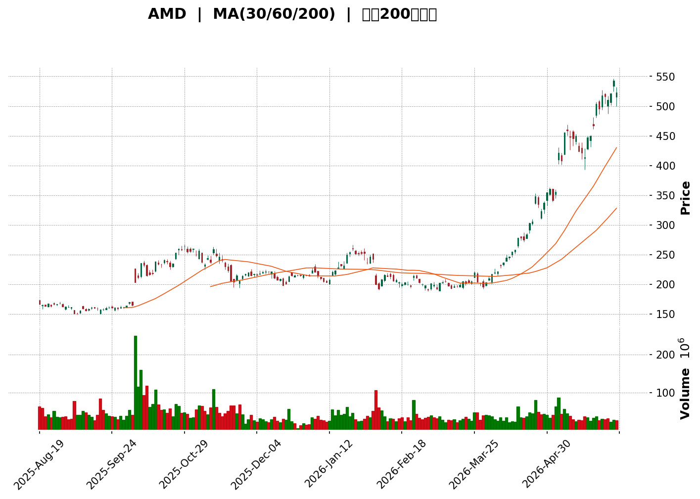
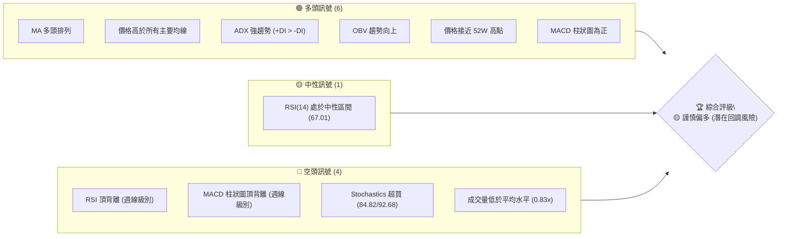
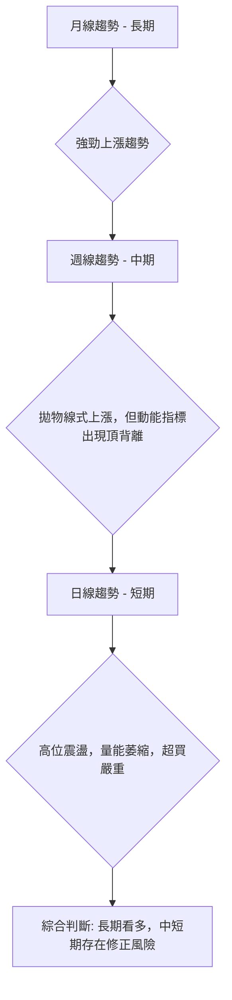
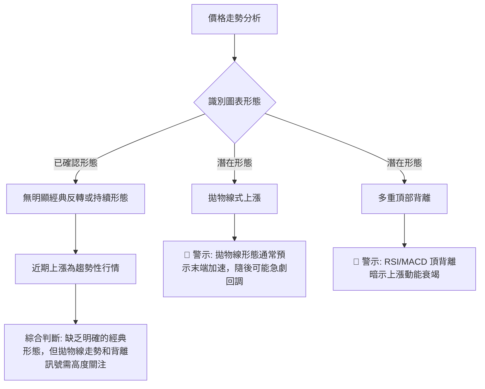
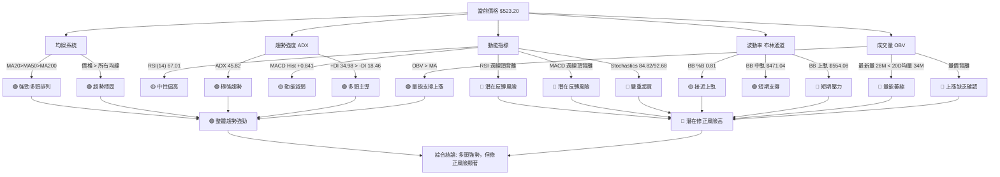

<details>
<summary>📊 靜態圖表 (點擊展開)</summary>

</details>

<html>
<head><meta charset="utf-8" /></head>
<body>
    <div style="height:500px; width:100%;">                        <script>window.PlotlyConfig = {MathJaxConfig: 'local'};</script>
        <script charset="utf-8" src="https://cdn.plot.ly/plotly-3.6.0.min.js" integrity="sha256-QaOVwtVY0T02VaHrr6pnoHLCwayMJp4O5n4YyaE3rJk=" crossorigin="anonymous"></script>                <div id="candlestick-chart" class="plotly-graph-div" style="height:100%; width:100%;"></div>            <script>                window.PLOTLYENV=window.PLOTLYENV || {};                                if (document.getElementById("candlestick-chart")) {                    Plotly.newPlot(                        "candlestick-chart",                        [{"close":{"dtype":"f8","bdata":"AAAAoJnRZEAAAABgZqZkQAAAAGC4dmRAAAAA4FH4ZEAAAAAghWtkQAAAAADX02RAAAAAACnkZEAAAABgjxJlQAAAAAApVGRAAAAAgD1KZEAAAAAAKURkQAAAAKBHOWRAAAAA4HrkYkAAAADAHu1iQAAAAIA9emNAAAAAoEfxY0AAAACgcHVjQAAAAIA90mNAAAAAwB4lZEAAAABguA5kQAAAAMAe5WNAAAAAoHC9Y0AAAADgeqxjQAAAAKBH+WNAAAAAwMwcZEAAAAAAKRxkQAAAAOCjKGRAAAAAYLjuY0AAAAAghStkQAAAAKBHOWRAAAAA4FGAZEAAAAAgXDdlQAAAAKBwlWRAAAAAYLh2aUAAAADgUXBqQAAAAIDrcW1AAAAA4HocbUAAAADAzNxqQAAAAKBwDWtAAAAAQOFCa0AAAABAM9NtQAAAAIDrUW1AAAAAYI8ibUAAAACA6xFuQAAAAMD1wG1AAAAAIFzHbEAAAAAgrl9tQAAAAKBwnW9AAAAAYLg6cEAAAAAAKSBwQAAAAKBHhXBAAAAAQOHab0AAAACA6wFwQAAAAGBmOnBAAAAAoJlBb0AAAACgRwVwQAAAAGBmtm1AAAAAoEcxbUAAAAAgXH9uQAAAAOCjsG1AAAAAgD0ucEAAAABguP5uQAAAAIDr2W5AAAAA4KMQbkAAAACgR8lsQAAAAKCZ8WtAAAAA4KPAaUAAAADA9XhpQAAAAKCZ4WpAAAAAACnEaUAAAAAgrsdqQAAAAMD1MGtAAAAA4FF4a0AAAAAgrudqQAAAAEAzM2tAAAAAIFz\u002fakAAAABACj9rQAAAACCFo2tAAAAAANeza0AAAACgcK1rQAAAAIDCrWtAAAAAwPVYakAAAABgj\u002fJpQAAAAKBwJWpAAAAAIIXDaEAAAACA6yFpQAAAAIDCrWpAAAAAYGbeakAAAADAzNxqQAAAAKBH4WpAAAAAIK7fakAAAAAghfNqQAAAAEDh6mpAAAAAwB7FakAAAABACu9rQAAAAGCPomtAAAAAQDPLakAAAADgo0BqQAAAAIDClWlAAAAAoHBlaUAAAACAFPZpQAAAAEAKn2tAAAAAQDPza0AAAACgcH1sQAAAAGCP+mxAAAAAoHD9bEAAAACgmTlvQAAAACBct29AAAAAQOE6cEAAAACA62lvQAAAAMD1gG9AAAAAIK6Xb0AAAACAwoVvQAAAACBcl21AAAAA4KPIbkAAAAAghUNuQAAAAIAUBmlAAAAAAAAQaEAAAACAFA5qQAAAAAAAAGtAAAAAgD2yakAAAABgj7JqQAAAAIAUvmlAAAAAgD3qaUAAAABgj2JpQAAAAADXA2lAAAAAANdraUAAAADAzARpQAAAAEAzk2hAAAAAQOG6akAAAAAghVtqQAAAAIDCdWlAAAAAYLgGaUAAAAAA19NoQAAAAGBm3mdAAAAAgD1CaUAAAABgZu5oQAAAAIDCDWhAAAAAgMJVaUAAAAAgXGdpQAAAAGCPmmlAAAAAIK63aEAAAADgeixoQAAAAGCPkmhAAAAAgOuJaEAAAABguO5oQAAAAOCjqGlAAAAAYI8qaUAAAACAwlVpQAAAAADXq2lAAAAA4KOIa0AAAADgo3hpQAAAACCuP2lAAAAAoEeBaEAAAACAwm1pQAAAAGC4RmpAAAAAAAAwa0AAAACAwoVrQAAAAMD1sGtAAAAAgD36bEAAAADgepRtQAAAAKBHoW5AAAAAYI\u002fabkAAAACAPeJvQAAAAIDrIXBAAAAAAClkcUAAAACAPWZxQAAAAEAzL3FAAAAAANfHcUAAAAAgXPdyQAAAAKBHFXNAAAAAwPW8dUAAAACAFOp0QAAAACBcM3RAAAAAgMIRdUAAAAAA1yd2QAAAAOCjiHZAAAAA4KNYdUAAAAAAKTR2QAAAAIA9VnpAAAAAIFyHeUAAAABACnN8QAAAAOCjrHxAAAAA4KMEfEAAAAAAANh7QAAAAEAzG3xAAAAAoJmBekAAAAAA1096QAAAAMDM4HlAAAAAoEf5e0AAAACgcBl8QAAAAAApOH1AAAAAgD1+f0AAAADgo\u002fh+QAAAAGC4MIBAAAAAwMwggEAAAACAFOJ\u002fQAAAAOBRTIBAAAAAACn0gEAAAACgmVmAQA=="},"high":{"dtype":"f8","bdata":"AAAAoHClZUAAAADAzNRkQAAAAAApvGRAAAAAwPUQZUAAAABA4bJkQAAAAOCjOGVAAAAAgML1ZEAAAAAgrl9lQAAAAIA9EmVAAAAA4HpMZEAAAAAAAJhkQAAAAKCZQWRAAAAA4HqkY0AAAADgehRjQAAAAMAelWNAAAAAwPWQZEAAAABguAZkQAAAAMAeDWRAAAAAoJlJZEAAAABgZj5kQAAAAAApNGRAAAAA4KPYY0AAAABA4fpjQAAAAIDCVWRAAAAA4HpsZEAAAABAM6NkQAAAAAApNGRAAAAAIIVDZEAAAACgmYlkQAAAAMD1SGRAAAAAgMKFZEAAAACA62FlQAAAAIDCVWVAAAAAYLhWbEAAAADAzFxrQAAAAADXe21AAAAAQDMDbkAAAABACkdtQAAAAIAUBmxAAAAAIFwfbEAAAAAgrudtQAAAAGBmJm5AAAAAAClsbUAAAAAAKVxuQAAAAOBRSG5AAAAAACkEbkAAAADAzHxtQAAAAOB6rG9AAAAAYLhGcEAAAACgR4lwQAAAAKBHsXBAAAAAgBR+cEAAAACAFGJwQAAAAGCPTnBAAAAAgBQWcEAAAABgZjpwQAAAAOBRsG9AAAAAANd7bUAAAADAzBxvQAAAAGC4Dm9AAAAAACl4cEAAAACAFDpwQAAAAIAUrm9AAAAA4KMYb0AAAAAAAMBtQAAAAMD1aG1AAAAAAABIbUAAAABgjxpqQAAAAAApJGtAAAAAYI\u002fSaUAAAABA4fJqQAAAAKCZSWtAAAAAIFyfa0AAAAAgXD9sQAAAAGBmRmtAAAAAANdja0AAAADgevRrQAAAAGC49mtAAAAAQOEabEAAAAAghdNrQAAAAAAAsGtAAAAAIK7Pa0AAAAAghetqQAAAAEAKR2pAAAAAAABwakAAAAAghctpQAAAAIDC5WpAAAAAoHCFa0AAAADA9SBrQAAAAKBHEWtAAAAAYI8aa0AAAACgmQFrQAAAAIA9GmtAAAAA4Ho0a0AAAADAzGRsQAAAAOCjQG1AAAAAoHDda0AAAAAAKYRqQAAAAIAUXmpAAAAAoJnpaUAAAAAAKTxqQAAAACCF42tAAAAAQOECbEAAAABAM8ttQAAAACCuT21AAAAAAADwbUAAAADAzJxvQAAAAKBHAXBAAAAAIFyvcEAAAADgoyRwQAAAAKCZ8W9AAAAAYGYWcEAAAADgekhwQAAAACCup25AAAAAQAo\u002fb0AAAADAzJRvQAAAAGCPUmtAAAAAoEeBaUAAAADgoyhqQAAAAEAzM2tAAAAA4Hpsa0AAAADAzHRrQAAAAGC4TmtAAAAAoJlBakAAAACgmalpQAAAAGBmZmlAAAAAQDODaUAAAAAA15tpQAAAAAAp7GhAAAAAYLgWa0AAAABgZhZrQAAAAKBHOWpAAAAA4Ho8aUAAAAAgrtdoQAAAAOB6NGhAAAAAgBROaUAAAACgR3lpQAAAACCuB2lAAAAAQApfaUAAAABA4dJpQAAAAGC4JmpAAAAAANdzaUAAAACAwvVoQAAAAKBwBWlAAAAAYLjmaEAAAAAghVtpQAAAAAApvGlAAAAAoJnJaUAAAAAghSNqQAAAAIDCzWlAAAAAYI+qa0AAAAAAAKBrQAAAAOCjaGlAAAAAgMINakAAAAAAAIBpQAAAAGCPumpAAAAAwPU4a0AAAACA60lsQAAAAEAzw2tAAAAAAABAbUAAAABAM6NtQAAAAGCPMm9AAAAAYI\u002fqbkAAAABguO5vQAAAAEDhInBAAAAAoHB1cUAAAADAzJBxQAAAAIDC+XFAAAAAQDPjcUAAAAAAAARzQAAAACCFY3NAAAAAANcPdkAAAAAgXNN1QAAAAAAAeHRAAAAAYLhCdUAAAAAgXC92QAAAAOCjrHZAAAAAoJmddkAAAADAHnl2QAAAAKCZ6XpAAAAAIFxbekAAAADgo4R8QAAAACCFU31AAAAAwMysfEAAAAAAALh8QAAAAMD1VHxAAAAAAABwe0AAAADAzGx7QAAAAAAAzHpAAAAAgD0WfEAAAABAMzN8QAAAAGCPFn5AAAAAIFyvf0AAAAAgXON\u002fQAAAAKCZeYBAAAAAAABQgEAAAAAAACyAQAAAAIDrU4BAAAAAIIUTgUAAAAAghaGAQA=="},"hovertemplate":"\u003cb\u003e%{x|%Y-%m-%d}\u003c\u002fb\u003e\u003cbr\u003e\u958b: $%{open:.2f}\u003cbr\u003e\u9ad8: $%{high:.2f}\u003cbr\u003e\u4f4e: $%{low:.2f}\u003cbr\u003e\u6536: $%{close:.2f}\u003cextra\u003e\u003c\u002fextra\u003e","low":{"dtype":"f8","bdata":"AAAAQDPDZEAAAAAAAMhjQAAAAOBRSGRAAAAAoJk5ZEAAAABACjdkQAAAAMAenWRAAAAAwMyUZEAAAADAzNRkQAAAAMDMPGRAAAAAANeTY0AAAABgjxJkQAAAAKBHuWNAAAAAgMLFYkAAAABACqdiQAAAAIDC\u002fWJAAAAAAADAY0AAAAAgrl9jQAAAAKBwXWNAAAAAQDOzY0AAAABACudjQAAAAOBReGNAAAAAQDO7YkAAAADAzHxjQAAAAKBwrWNAAAAAYLjmY0AAAACAws1jQAAAAMD1WGNAAAAAoJmhY0AAAADAzPxjQAAAAGCP6mNAAAAAIK4PZEAAAAAA18NkQAAAAOB6ZGRAAAAA4FFgaUAAAADA9ShqQAAAAGBmVmpAAAAAwPWwbEAAAABgZqZqQAAAAMDM3GpAAAAAwMz8akAAAADgUZhrQAAAACCuB21AAAAAwB59bEAAAADAzExtQAAAAOCjQG1AAAAAACkcbEAAAACgR5FsQAAAAGBmPm5AAAAAoJk5b0AAAAAAABBwQAAAAGBmFnBAAAAAgOuJb0AAAADAHq1vQAAAAOB6vG9AAAAA4HrsbkAAAACA61luQAAAACCud21AAAAA4HoUbEAAAAAAABBuQAAAAOB6VG1AAAAAAABAb0AAAACA68FuQAAAAGCPYm1AAAAAwMykbUAAAABguBZsQAAAAGC4dmtAAAAAwPWQaUAAAAAAAGBoQAAAAEAzu2lAAAAAwPVIaEAAAAAAAOBpQAAAAOCjwGpAAAAAAACwakAAAADgesxqQAAAAOCjeGpAAAAA4HrEakAAAAAgrgdrQAAAACCFS2tAAAAAwB49a0AAAACgcFVrQAAAAIAURmpAAAAAgOshakAAAABgj9JpQAAAACCFo2lAAAAAwPWwaEAAAAAAABBpQAAAAGBmhmlAAAAAgOupakAAAADA9YhqQAAAAEAKv2pAAAAAwPWgakAAAAAgridqQAAAAGCPympAAAAAoJm5akAAAADAzFxrQAAAACBcj2tAAAAAAABoakAAAACgcOVpQAAAAGCPamlAAAAAgD1iaUAAAACgmfloQAAAACBc32pAAAAAIIXjakAAAABACmdsQAAAACCFm2xAAAAAwB4tbEAAAADA9XhtQAAAAAAp1G5AAAAAAAAEcEAAAACgmUlvQAAAAGC4\u002fm5AAAAAYLhGb0AAAADAHh1uQAAAAKCZUW1AAAAAAABgbUAAAACgR6FtQAAAAMDM5GhAAAAAQArXZ0AAAACAwo1oQAAAAMDMhGlAAAAAACmkakAAAABguCZqQAAAAOB6pGlAAAAAACl8aUAAAABgj1poQAAAAAAAYGhAAAAAoEfJaEAAAACA69FoQAAAAMDMRGhAAAAAAADQaUAAAABgj0pqQAAAAGC4LmlAAAAAIK63aEAAAAAAAMBnQAAAAEAKh2dAAAAAIIW7Z0AAAAAAKVxoQAAAAAAA6GdAAAAA4KOgZ0AAAABgZkZpQAAAAAApdGlAAAAAoHCVaEAAAADgowhoQAAAAKCZWWhAAAAA4FFoaEAAAAAAAHhoQAAAAGCPGmhAAAAA4FHIaEAAAABguDZpQAAAAAApBGlAAAAA4FFwakAAAACAwm1pQAAAAIAUtmhAAAAAANcbaEAAAADAHo1oQAAAAEDhumlAAAAAANcTaUAAAAAgXDdrQAAAAAAp7GpAAAAAQOFibEAAAADAHt1sQAAAAGC43m1AAAAAwPVAbkAAAABgZrZuQAAAAEAze29AAAAAAClYcEAAAACAPSJxQAAAAAAAAHFAAAAAgOtJcUAAAACAPeJxQAAAAAApvHJAAAAA4KPodEAAAADA9Yx0QAAAAAAAYHNAAAAAgMLtc0AAAACgmcl0QAAAAAAA1HVAAAAAQDMrdUAAAACAFI51QAAAAOCjIHlAAAAAoEcReUAAAADgoyR6QAAAAIAULnxAAAAAgMKhekAAAABgZgp7QAAAAEDhOntAAAAAgMJ1ekAAAAAgXKt5QAAAAIDClXhAAAAAwMygekAAAACgmfl6QAAAACBc23xAAAAAIK4DfkAAAABgj2p+QAAAAOBR2H5AAAAAQOF2f0AAAADAzGx+QAAAACCFU39AAAAAYGZigEAAAADg6z1\u002fQA=="},"name":"\u50f9\u683c","open":{"dtype":"f8","bdata":"AAAAQDOjZUAAAABAM4NkQAAAACCFu2RAAAAAoHBFZEAAAACgmbFkQAAAAMDMFGVAAAAAoEfBZEAAAAAAABBlQAAAAIDr2WRAAAAAoHDNY0AAAACA6zlkQAAAAIAU\u002fmNAAAAAANejY0AAAACgmfliQAAAACCu\u002f2JAAAAAoEdxZEAAAAAA19NjQAAAAAAAoGNAAAAA4FEAZEAAAAAA1ytkQAAAAMD16GNAAAAAYLjeYkAAAAAAKaxjQAAAAKBwrWNAAAAA4KMQZEAAAAAgXF9kQAAAAOB6pGNAAAAA4KMQZEAAAAAA1wNkQAAAAKBHGWRAAAAAgMIdZEAAAACAwhVlQAAAAIDCVWVAAAAAYGZObEAAAABAM9tqQAAAAGBmnmpAAAAAoJmJbUAAAADgoxhtQAAAAGBmhmtAAAAAYGZma0AAAABguNZrQAAAAKBHiW1AAAAA4FEobUAAAABACo9tQAAAAOB67G1AAAAAQDObbUAAAADAHsVsQAAAACCFa25AAAAAgBQecEAAAACAPTJwQAAAAEAKg3BAAAAAYLg+cEAAAACgmTlwQAAAAKBHNXBAAAAAQDNLb0AAAAAgrmduQAAAAEAKr29AAAAAgBTebEAAAADgekRuQAAAAMAeNW5AAAAAACmkb0AAAADAzHxvQAAAACCFA25AAAAAAABYbkAAAADA9ZhtQAAAAOBRyGxAAAAAYGYWbUAAAACA6xlqQAAAAMAe5WlAAAAAIFwvaUAAAACgmUFqQAAAAOB6BGtAAAAAACm8akAAAACgR7lrQAAAAOBRCGtAAAAAACkca0AAAACgcCVrQAAAAEDhYmtAAAAAoEeha0AAAAAAAMBrQAAAAIDrOWtAAAAAANdLa0AAAADA9YhqQAAAAKBw3WlAAAAAoEdBakAAAACAPXppQAAAAEAzk2lAAAAAAACAa0AAAAAghZtqQAAAACBc32pAAAAAgMLtakAAAABgj3JqQAAAAADX+2pAAAAAgD36akAAAADAzFxrQAAAAAAAyGxAAAAAYLjWa0AAAAAAKYRqQAAAAMDMXGpAAAAAQAq3aUAAAACAwiVpQAAAAEAz42pAAAAAoEcxa0AAAADAzHxsQAAAAKCZSW1AAAAAYI9CbEAAAAAgrn9tQAAAAAAAeG9AAAAAQOFScEAAAAAAAAxwQAAAAMAehW9AAAAAACnEb0AAAADAHtVvQAAAAIDCnW1AAAAA4KN4bUAAAACgmXFvQAAAAAAA4GpAAAAAIIU7aUAAAAAAKaRoQAAAAMDM3GlAAAAA4HrkakAAAAAAKTxrQAAAAGCP+mpAAAAA4KOAaUAAAADAzERpQAAAAMAezWhAAAAAIIUDaUAAAAAA1wNpQAAAAEDhwmhAAAAAACl0akAAAACAPdpqQAAAAKCZGWpAAAAAIIUDaUAAAABAMztoQAAAAGC47mdAAAAAANcDaEAAAADgo7hoQAAAAOCjaGhAAAAAIIWrZ0AAAADgUVBpQAAAACCFo2lAAAAAYI9aaUAAAAAghcNoQAAAACBcX2hAAAAAgMKVaEAAAAAAAIBoQAAAAMD1YGhAAAAA4HqcaUAAAADAzMxpQAAAAOB6LGlAAAAA4FFwakAAAAAgXD9rQAAAAOCjOGlAAAAAYGaeaUAAAACgmcFoQAAAAEDh8mlAAAAAoJmBaUAAAADA9WhrQAAAAOBRSGtAAAAAANcDbUAAAADgUSBtQAAAAAAA4G1AAAAAwPWgbkAAAACgRzlvQAAAAGC43m9AAAAAANePcEAAAAAAAJBxQAAAAKCZiXFAAAAAoEdVcUAAAAAghTNyQAAAAAAp4HJAAAAAACkMdUAAAADAHqV1QAAAAIDCfXNAAAAAoEdpdEAAAACAwlV1QAAAAIDr\u002fXVAAAAAwPWEdkAAAAAAKfh1QAAAAADXl3lAAAAAwB4RekAAAACgcCl6QAAAAMDMyHxAAAAAAAAUfEAAAADgo5B8QAAAAKCZiXtAAAAAoHAVe0AAAAAAANh6QAAAAKCZyXlAAAAA4KPAekAAAAAA1597QAAAAKBwXX1AAAAAANdLfkAAAAAAAMB\u002fQAAAAAAAMH9AAAAAYGZGgEAAAABgj0J\u002fQAAAAMDMpH9AAAAAAACugEAAAABA4RiAQA=="},"x":["2025-08-19T00:00:00-04:00","2025-08-20T00:00:00-04:00","2025-08-21T00:00:00-04:00","2025-08-22T00:00:00-04:00","2025-08-25T00:00:00-04:00","2025-08-26T00:00:00-04:00","2025-08-27T00:00:00-04:00","2025-08-28T00:00:00-04:00","2025-08-29T00:00:00-04:00","2025-09-02T00:00:00-04:00","2025-09-03T00:00:00-04:00","2025-09-04T00:00:00-04:00","2025-09-05T00:00:00-04:00","2025-09-08T00:00:00-04:00","2025-09-09T00:00:00-04:00","2025-09-10T00:00:00-04:00","2025-09-11T00:00:00-04:00","2025-09-12T00:00:00-04:00","2025-09-15T00:00:00-04:00","2025-09-16T00:00:00-04:00","2025-09-17T00:00:00-04:00","2025-09-18T00:00:00-04:00","2025-09-19T00:00:00-04:00","2025-09-22T00:00:00-04:00","2025-09-23T00:00:00-04:00","2025-09-24T00:00:00-04:00","2025-09-25T00:00:00-04:00","2025-09-26T00:00:00-04:00","2025-09-29T00:00:00-04:00","2025-09-30T00:00:00-04:00","2025-10-01T00:00:00-04:00","2025-10-02T00:00:00-04:00","2025-10-03T00:00:00-04:00","2025-10-06T00:00:00-04:00","2025-10-07T00:00:00-04:00","2025-10-08T00:00:00-04:00","2025-10-09T00:00:00-04:00","2025-10-10T00:00:00-04:00","2025-10-13T00:00:00-04:00","2025-10-14T00:00:00-04:00","2025-10-15T00:00:00-04:00","2025-10-16T00:00:00-04:00","2025-10-17T00:00:00-04:00","2025-10-20T00:00:00-04:00","2025-10-21T00:00:00-04:00","2025-10-22T00:00:00-04:00","2025-10-23T00:00:00-04:00","2025-10-24T00:00:00-04:00","2025-10-27T00:00:00-04:00","2025-10-28T00:00:00-04:00","2025-10-29T00:00:00-04:00","2025-10-30T00:00:00-04:00","2025-10-31T00:00:00-04:00","2025-11-03T00:00:00-05:00","2025-11-04T00:00:00-05:00","2025-11-05T00:00:00-05:00","2025-11-06T00:00:00-05:00","2025-11-07T00:00:00-05:00","2025-11-10T00:00:00-05:00","2025-11-11T00:00:00-05:00","2025-11-12T00:00:00-05:00","2025-11-13T00:00:00-05:00","2025-11-14T00:00:00-05:00","2025-11-17T00:00:00-05:00","2025-11-18T00:00:00-05:00","2025-11-19T00:00:00-05:00","2025-11-20T00:00:00-05:00","2025-11-21T00:00:00-05:00","2025-11-24T00:00:00-05:00","2025-11-25T00:00:00-05:00","2025-11-26T00:00:00-05:00","2025-11-28T00:00:00-05:00","2025-12-01T00:00:00-05:00","2025-12-02T00:00:00-05:00","2025-12-03T00:00:00-05:00","2025-12-04T00:00:00-05:00","2025-12-05T00:00:00-05:00","2025-12-08T00:00:00-05:00","2025-12-09T00:00:00-05:00","2025-12-10T00:00:00-05:00","2025-12-11T00:00:00-05:00","2025-12-12T00:00:00-05:00","2025-12-15T00:00:00-05:00","2025-12-16T00:00:00-05:00","2025-12-17T00:00:00-05:00","2025-12-18T00:00:00-05:00","2025-12-19T00:00:00-05:00","2025-12-22T00:00:00-05:00","2025-12-23T00:00:00-05:00","2025-12-24T00:00:00-05:00","2025-12-26T00:00:00-05:00","2025-12-29T00:00:00-05:00","2025-12-30T00:00:00-05:00","2025-12-31T00:00:00-05:00","2026-01-02T00:00:00-05:00","2026-01-05T00:00:00-05:00","2026-01-06T00:00:00-05:00","2026-01-07T00:00:00-05:00","2026-01-08T00:00:00-05:00","2026-01-09T00:00:00-05:00","2026-01-12T00:00:00-05:00","2026-01-13T00:00:00-05:00","2026-01-14T00:00:00-05:00","2026-01-15T00:00:00-05:00","2026-01-16T00:00:00-05:00","2026-01-20T00:00:00-05:00","2026-01-21T00:00:00-05:00","2026-01-22T00:00:00-05:00","2026-01-23T00:00:00-05:00","2026-01-26T00:00:00-05:00","2026-01-27T00:00:00-05:00","2026-01-28T00:00:00-05:00","2026-01-29T00:00:00-05:00","2026-01-30T00:00:00-05:00","2026-02-02T00:00:00-05:00","2026-02-03T00:00:00-05:00","2026-02-04T00:00:00-05:00","2026-02-05T00:00:00-05:00","2026-02-06T00:00:00-05:00","2026-02-09T00:00:00-05:00","2026-02-10T00:00:00-05:00","2026-02-11T00:00:00-05:00","2026-02-12T00:00:00-05:00","2026-02-13T00:00:00-05:00","2026-02-17T00:00:00-05:00","2026-02-18T00:00:00-05:00","2026-02-19T00:00:00-05:00","2026-02-20T00:00:00-05:00","2026-02-23T00:00:00-05:00","2026-02-24T00:00:00-05:00","2026-02-25T00:00:00-05:00","2026-02-26T00:00:00-05:00","2026-02-27T00:00:00-05:00","2026-03-02T00:00:00-05:00","2026-03-03T00:00:00-05:00","2026-03-04T00:00:00-05:00","2026-03-05T00:00:00-05:00","2026-03-06T00:00:00-05:00","2026-03-09T00:00:00-04:00","2026-03-10T00:00:00-04:00","2026-03-11T00:00:00-04:00","2026-03-12T00:00:00-04:00","2026-03-13T00:00:00-04:00","2026-03-16T00:00:00-04:00","2026-03-17T00:00:00-04:00","2026-03-18T00:00:00-04:00","2026-03-19T00:00:00-04:00","2026-03-20T00:00:00-04:00","2026-03-23T00:00:00-04:00","2026-03-24T00:00:00-04:00","2026-03-25T00:00:00-04:00","2026-03-26T00:00:00-04:00","2026-03-27T00:00:00-04:00","2026-03-30T00:00:00-04:00","2026-03-31T00:00:00-04:00","2026-04-01T00:00:00-04:00","2026-04-02T00:00:00-04:00","2026-04-06T00:00:00-04:00","2026-04-07T00:00:00-04:00","2026-04-08T00:00:00-04:00","2026-04-09T00:00:00-04:00","2026-04-10T00:00:00-04:00","2026-04-13T00:00:00-04:00","2026-04-14T00:00:00-04:00","2026-04-15T00:00:00-04:00","2026-04-16T00:00:00-04:00","2026-04-17T00:00:00-04:00","2026-04-20T00:00:00-04:00","2026-04-21T00:00:00-04:00","2026-04-22T00:00:00-04:00","2026-04-23T00:00:00-04:00","2026-04-24T00:00:00-04:00","2026-04-27T00:00:00-04:00","2026-04-28T00:00:00-04:00","2026-04-29T00:00:00-04:00","2026-04-30T00:00:00-04:00","2026-05-01T00:00:00-04:00","2026-05-04T00:00:00-04:00","2026-05-05T00:00:00-04:00","2026-05-06T00:00:00-04:00","2026-05-07T00:00:00-04:00","2026-05-08T00:00:00-04:00","2026-05-11T00:00:00-04:00","2026-05-12T00:00:00-04:00","2026-05-13T00:00:00-04:00","2026-05-14T00:00:00-04:00","2026-05-15T00:00:00-04:00","2026-05-18T00:00:00-04:00","2026-05-19T00:00:00-04:00","2026-05-20T00:00:00-04:00","2026-05-21T00:00:00-04:00","2026-05-22T00:00:00-04:00","2026-05-26T00:00:00-04:00","2026-05-27T00:00:00-04:00","2026-05-28T00:00:00-04:00","2026-05-29T00:00:00-04:00","2026-06-01T00:00:00-04:00","2026-06-02T00:00:00-04:00","2026-06-03T00:00:00-04:00","2026-06-04T00:00:00-04:00"],"type":"candlestick"},{"hovertemplate":"MA30: $%{y:.2f}\u003cextra\u003e\u003c\u002fextra\u003e","line":{"color":"#2196F3","dash":"dash","width":2},"mode":"lines","name":"MA30","x":["2025-08-19T00:00:00-04:00","2025-08-20T00:00:00-04:00","2025-08-21T00:00:00-04:00","2025-08-22T00:00:00-04:00","2025-08-25T00:00:00-04:00","2025-08-26T00:00:00-04:00","2025-08-27T00:00:00-04:00","2025-08-28T00:00:00-04:00","2025-08-29T00:00:00-04:00","2025-09-02T00:00:00-04:00","2025-09-03T00:00:00-04:00","2025-09-04T00:00:00-04:00","2025-09-05T00:00:00-04:00","2025-09-08T00:00:00-04:00","2025-09-09T00:00:00-04:00","2025-09-10T00:00:00-04:00","2025-09-11T00:00:00-04:00","2025-09-12T00:00:00-04:00","2025-09-15T00:00:00-04:00","2025-09-16T00:00:00-04:00","2025-09-17T00:00:00-04:00","2025-09-18T00:00:00-04:00","2025-09-19T00:00:00-04:00","2025-09-22T00:00:00-04:00","2025-09-23T00:00:00-04:00","2025-09-24T00:00:00-04:00","2025-09-25T00:00:00-04:00","2025-09-26T00:00:00-04:00","2025-09-29T00:00:00-04:00","2025-09-30T00:00:00-04:00","2025-10-01T00:00:00-04:00","2025-10-02T00:00:00-04:00","2025-10-03T00:00:00-04:00","2025-10-06T00:00:00-04:00","2025-10-07T00:00:00-04:00","2025-10-08T00:00:00-04:00","2025-10-09T00:00:00-04:00","2025-10-10T00:00:00-04:00","2025-10-13T00:00:00-04:00","2025-10-14T00:00:00-04:00","2025-10-15T00:00:00-04:00","2025-10-16T00:00:00-04:00","2025-10-17T00:00:00-04:00","2025-10-20T00:00:00-04:00","2025-10-21T00:00:00-04:00","2025-10-22T00:00:00-04:00","2025-10-23T00:00:00-04:00","2025-10-24T00:00:00-04:00","2025-10-27T00:00:00-04:00","2025-10-28T00:00:00-04:00","2025-10-29T00:00:00-04:00","2025-10-30T00:00:00-04:00","2025-10-31T00:00:00-04:00","2025-11-03T00:00:00-05:00","2025-11-04T00:00:00-05:00","2025-11-05T00:00:00-05:00","2025-11-06T00:00:00-05:00","2025-11-07T00:00:00-05:00","2025-11-10T00:00:00-05:00","2025-11-11T00:00:00-05:00","2025-11-12T00:00:00-05:00","2025-11-13T00:00:00-05:00","2025-11-14T00:00:00-05:00","2025-11-17T00:00:00-05:00","2025-11-18T00:00:00-05:00","2025-11-19T00:00:00-05:00","2025-11-20T00:00:00-05:00","2025-11-21T00:00:00-05:00","2025-11-24T00:00:00-05:00","2025-11-25T00:00:00-05:00","2025-11-26T00:00:00-05:00","2025-11-28T00:00:00-05:00","2025-12-01T00:00:00-05:00","2025-12-02T00:00:00-05:00","2025-12-03T00:00:00-05:00","2025-12-04T00:00:00-05:00","2025-12-05T00:00:00-05:00","2025-12-08T00:00:00-05:00","2025-12-09T00:00:00-05:00","2025-12-10T00:00:00-05:00","2025-12-11T00:00:00-05:00","2025-12-12T00:00:00-05:00","2025-12-15T00:00:00-05:00","2025-12-16T00:00:00-05:00","2025-12-17T00:00:00-05:00","2025-12-18T00:00:00-05:00","2025-12-19T00:00:00-05:00","2025-12-22T00:00:00-05:00","2025-12-23T00:00:00-05:00","2025-12-24T00:00:00-05:00","2025-12-26T00:00:00-05:00","2025-12-29T00:00:00-05:00","2025-12-30T00:00:00-05:00","2025-12-31T00:00:00-05:00","2026-01-02T00:00:00-05:00","2026-01-05T00:00:00-05:00","2026-01-06T00:00:00-05:00","2026-01-07T00:00:00-05:00","2026-01-08T00:00:00-05:00","2026-01-09T00:00:00-05:00","2026-01-12T00:00:00-05:00","2026-01-13T00:00:00-05:00","2026-01-14T00:00:00-05:00","2026-01-15T00:00:00-05:00","2026-01-16T00:00:00-05:00","2026-01-20T00:00:00-05:00","2026-01-21T00:00:00-05:00","2026-01-22T00:00:00-05:00","2026-01-23T00:00:00-05:00","2026-01-26T00:00:00-05:00","2026-01-27T00:00:00-05:00","2026-01-28T00:00:00-05:00","2026-01-29T00:00:00-05:00","2026-01-30T00:00:00-05:00","2026-02-02T00:00:00-05:00","2026-02-03T00:00:00-05:00","2026-02-04T00:00:00-05:00","2026-02-05T00:00:00-05:00","2026-02-06T00:00:00-05:00","2026-02-09T00:00:00-05:00","2026-02-10T00:00:00-05:00","2026-02-11T00:00:00-05:00","2026-02-12T00:00:00-05:00","2026-02-13T00:00:00-05:00","2026-02-17T00:00:00-05:00","2026-02-18T00:00:00-05:00","2026-02-19T00:00:00-05:00","2026-02-20T00:00:00-05:00","2026-02-23T00:00:00-05:00","2026-02-24T00:00:00-05:00","2026-02-25T00:00:00-05:00","2026-02-26T00:00:00-05:00","2026-02-27T00:00:00-05:00","2026-03-02T00:00:00-05:00","2026-03-03T00:00:00-05:00","2026-03-04T00:00:00-05:00","2026-03-05T00:00:00-05:00","2026-03-06T00:00:00-05:00","2026-03-09T00:00:00-04:00","2026-03-10T00:00:00-04:00","2026-03-11T00:00:00-04:00","2026-03-12T00:00:00-04:00","2026-03-13T00:00:00-04:00","2026-03-16T00:00:00-04:00","2026-03-17T00:00:00-04:00","2026-03-18T00:00:00-04:00","2026-03-19T00:00:00-04:00","2026-03-20T00:00:00-04:00","2026-03-23T00:00:00-04:00","2026-03-24T00:00:00-04:00","2026-03-25T00:00:00-04:00","2026-03-26T00:00:00-04:00","2026-03-27T00:00:00-04:00","2026-03-30T00:00:00-04:00","2026-03-31T00:00:00-04:00","2026-04-01T00:00:00-04:00","2026-04-02T00:00:00-04:00","2026-04-06T00:00:00-04:00","2026-04-07T00:00:00-04:00","2026-04-08T00:00:00-04:00","2026-04-09T00:00:00-04:00","2026-04-10T00:00:00-04:00","2026-04-13T00:00:00-04:00","2026-04-14T00:00:00-04:00","2026-04-15T00:00:00-04:00","2026-04-16T00:00:00-04:00","2026-04-17T00:00:00-04:00","2026-04-20T00:00:00-04:00","2026-04-21T00:00:00-04:00","2026-04-22T00:00:00-04:00","2026-04-23T00:00:00-04:00","2026-04-24T00:00:00-04:00","2026-04-27T00:00:00-04:00","2026-04-28T00:00:00-04:00","2026-04-29T00:00:00-04:00","2026-04-30T00:00:00-04:00","2026-05-01T00:00:00-04:00","2026-05-04T00:00:00-04:00","2026-05-05T00:00:00-04:00","2026-05-06T00:00:00-04:00","2026-05-07T00:00:00-04:00","2026-05-08T00:00:00-04:00","2026-05-11T00:00:00-04:00","2026-05-12T00:00:00-04:00","2026-05-13T00:00:00-04:00","2026-05-14T00:00:00-04:00","2026-05-15T00:00:00-04:00","2026-05-18T00:00:00-04:00","2026-05-19T00:00:00-04:00","2026-05-20T00:00:00-04:00","2026-05-21T00:00:00-04:00","2026-05-22T00:00:00-04:00","2026-05-26T00:00:00-04:00","2026-05-27T00:00:00-04:00","2026-05-28T00:00:00-04:00","2026-05-29T00:00:00-04:00","2026-06-01T00:00:00-04:00","2026-06-02T00:00:00-04:00","2026-06-03T00:00:00-04:00","2026-06-04T00:00:00-04:00"],"y":{"dtype":"f8","bdata":"AAAAAAAA+H8AAAAAAAD4fwAAAAAAAPh\u002fAAAAAAAA+H8AAAAAAAD4fwAAAAAAAPh\u002fAAAAAAAA+H8AAAAAAAD4fwAAAAAAAPh\u002fAAAAAAAA+H8AAAAAAAD4fwAAAAAAAPh\u002fAAAAAAAA+H8AAAAAAAD4fwAAAAAAAPh\u002fAAAAAAAA+H8AAAAAAAD4fwAAAAAAAPh\u002fAAAAAAAA+H8AAAAAAAD4fwAAAAAAAPh\u002fAAAAAAAA+H8AAAAAAAD4fwAAAAAAAPh\u002fAAAAAAAA+H8AAAAAAAD4fwAAAAAAAPh\u002fAAAAAAAA+H8AAAAAAAD4f6uqqmqRIWRAMzMz09seZEARERHRsCNkQFVVVfW2JGRAVVVVtQ9LZEDe3d3da35kQFVVVRX1x2RAIiIi8hkOZUBERERkgj9lQFVVVaXieGVAIiIikl+0ZUCrqqr68AVmQKuqqgqQU2ZAAAAAIPeqZkBEREQEDwpnQDMzM9O\u002fYWdAiYiI6CatZ0Dv7u6OwgFoQFVVVWVmZmhAIiIiMnrPaECamZnZhzdpQERERES2p2lAMzMz4xcPakAiIiLCZ3hqQCIiIjLs4mpAd3d3FwRCa0DNzMxM1KdrQImIiMha+WtA7+7ujl9IbEAzMzNTgKBsQKuqqqpH8WxAzczMPHxWbUDv7u4+7qltQBEREfGLAW5AZmZmhs8obkB3d3e31zxuQAAAADAIMG5AMzMz414TbkAzMzNjggduQJqZmUkMBm5AmpmZaUr5bUAiIiKCTt9tQO\u002fu7i4kzW1A7+7u7u6+bUAzMzPj7KNtQDMzMyMijm1AAAAA8O5+bUB3d3dXx2xtQHd3dxfZSm1AZmZm5kIibUAzMzNjO\u002ftsQERERNR4zWxAMzMzg3mebEC8u7vbsmpsQERERHTaNGxA7+7uXnP9a0Crqqr6fsJrQGZmZqabqGtAd3d3V8eUa0AAAACQwnVrQFVVVQXIXWtAREREZPQua0Dv7u6ucgxrQGZmZkbh6mpAzczMPMPOakDNzMzsfMdqQDMzM3PaxGpAiYiIGL3NakCJiIgIZdRqQERERFRVyWpAzczMDC3GakBmZmZ2ML9qQAAAANDbwmpAREREZPTGakAAAADgetRqQM3MzJyo42pAvLu7S6n0akAiIiICnRZrQBEREXFoOWtAvLu7WwFia0AiIiJS44FrQJqZmSmHomtAq6qqCknPa0AAAADQ2\u002f5rQHd3d4dBHGxAvLu7a6BPbEDv7u7OaXtsQImIiGhKbWxAAAAAEFhVbEDe3d0NdE5sQDMzMzN6T2xAIiIicvZNbEDv7u4ezEtsQLy7u0vFQWxAVVVVhXk6bEARERGxuSRsQGZmZjZeDmxAAAAA8KcCbEBERETEIPhrQERERGSC72tAMzMzA+T6a0AiIiKiRf5rQO\u002fu7k7U62tAd3d3R+HSa0DNzMxsoLNrQFVVVXUFiGtAvLu7ay5oa0AzMzODeTJrQGZmZoYW8WpAmpmZuUm0akDe3d2tAIFqQO\u002fu7u6nTmpARERERP0TakDe3d2tR9VpQN7d3Q10qmlAREREpCl1aUCamZlZq0dpQHd3d4cWTWlAVVVVtYFWaUB3d3fXXFBpQERERCQGRWlAAAAAsCtMaUB3d3fntEFpQKuqqkp+PWlAiYiIGHYxaUCrqqqq1TFpQJqZmemYPGlAiYiIWKtLaUDv7u7eCGFpQLy7u2uge2lAmpmZKc6OaUAiIiLSTappQLy7u9tr1mlAmpmZOSYIakB3d3fXXERqQKuqqroCjGpA3t3drUfdakARERGRezFrQImIiAiBiWtA3t3dncTga0BmZmYWrktsQImIiEjhtmxAVVVVZfRWbUBVVVVVnO1tQDMzM8OudG5AvLu7i94Kb0ARERERPLBvQImIiJDtKnBAd3d357R1cECamZkpFcdwQImIiBhLOnFAVVVVTamecUAzMzODwCRyQN7d3UW2rXJA7+7uzj40c0Dv7u5uWbVzQFVVVc0TNXRA7+7ulkOjdEARERHZXA51QGZmZj4KdXVARERErBzodUAiIiJyr1l2QM3MzARW0HZAd3d3R29Zd0AzMzNzr9l3QGZmZgZWZHhAvLu7Gy\u002fjeEB3d3dXx155QHd3dxdL4nlAq6qqyuhrekARERGhGuF6QA=="},"type":"scatter"},{"hovertemplate":"MA60: $%{y:.2f}\u003cextra\u003e\u003c\u002fextra\u003e","line":{"color":"#9C27B0","dash":"dash","width":2},"mode":"lines","name":"MA60","x":["2025-08-19T00:00:00-04:00","2025-08-20T00:00:00-04:00","2025-08-21T00:00:00-04:00","2025-08-22T00:00:00-04:00","2025-08-25T00:00:00-04:00","2025-08-26T00:00:00-04:00","2025-08-27T00:00:00-04:00","2025-08-28T00:00:00-04:00","2025-08-29T00:00:00-04:00","2025-09-02T00:00:00-04:00","2025-09-03T00:00:00-04:00","2025-09-04T00:00:00-04:00","2025-09-05T00:00:00-04:00","2025-09-08T00:00:00-04:00","2025-09-09T00:00:00-04:00","2025-09-10T00:00:00-04:00","2025-09-11T00:00:00-04:00","2025-09-12T00:00:00-04:00","2025-09-15T00:00:00-04:00","2025-09-16T00:00:00-04:00","2025-09-17T00:00:00-04:00","2025-09-18T00:00:00-04:00","2025-09-19T00:00:00-04:00","2025-09-22T00:00:00-04:00","2025-09-23T00:00:00-04:00","2025-09-24T00:00:00-04:00","2025-09-25T00:00:00-04:00","2025-09-26T00:00:00-04:00","2025-09-29T00:00:00-04:00","2025-09-30T00:00:00-04:00","2025-10-01T00:00:00-04:00","2025-10-02T00:00:00-04:00","2025-10-03T00:00:00-04:00","2025-10-06T00:00:00-04:00","2025-10-07T00:00:00-04:00","2025-10-08T00:00:00-04:00","2025-10-09T00:00:00-04:00","2025-10-10T00:00:00-04:00","2025-10-13T00:00:00-04:00","2025-10-14T00:00:00-04:00","2025-10-15T00:00:00-04:00","2025-10-16T00:00:00-04:00","2025-10-17T00:00:00-04:00","2025-10-20T00:00:00-04:00","2025-10-21T00:00:00-04:00","2025-10-22T00:00:00-04:00","2025-10-23T00:00:00-04:00","2025-10-24T00:00:00-04:00","2025-10-27T00:00:00-04:00","2025-10-28T00:00:00-04:00","2025-10-29T00:00:00-04:00","2025-10-30T00:00:00-04:00","2025-10-31T00:00:00-04:00","2025-11-03T00:00:00-05:00","2025-11-04T00:00:00-05:00","2025-11-05T00:00:00-05:00","2025-11-06T00:00:00-05:00","2025-11-07T00:00:00-05:00","2025-11-10T00:00:00-05:00","2025-11-11T00:00:00-05:00","2025-11-12T00:00:00-05:00","2025-11-13T00:00:00-05:00","2025-11-14T00:00:00-05:00","2025-11-17T00:00:00-05:00","2025-11-18T00:00:00-05:00","2025-11-19T00:00:00-05:00","2025-11-20T00:00:00-05:00","2025-11-21T00:00:00-05:00","2025-11-24T00:00:00-05:00","2025-11-25T00:00:00-05:00","2025-11-26T00:00:00-05:00","2025-11-28T00:00:00-05:00","2025-12-01T00:00:00-05:00","2025-12-02T00:00:00-05:00","2025-12-03T00:00:00-05:00","2025-12-04T00:00:00-05:00","2025-12-05T00:00:00-05:00","2025-12-08T00:00:00-05:00","2025-12-09T00:00:00-05:00","2025-12-10T00:00:00-05:00","2025-12-11T00:00:00-05:00","2025-12-12T00:00:00-05:00","2025-12-15T00:00:00-05:00","2025-12-16T00:00:00-05:00","2025-12-17T00:00:00-05:00","2025-12-18T00:00:00-05:00","2025-12-19T00:00:00-05:00","2025-12-22T00:00:00-05:00","2025-12-23T00:00:00-05:00","2025-12-24T00:00:00-05:00","2025-12-26T00:00:00-05:00","2025-12-29T00:00:00-05:00","2025-12-30T00:00:00-05:00","2025-12-31T00:00:00-05:00","2026-01-02T00:00:00-05:00","2026-01-05T00:00:00-05:00","2026-01-06T00:00:00-05:00","2026-01-07T00:00:00-05:00","2026-01-08T00:00:00-05:00","2026-01-09T00:00:00-05:00","2026-01-12T00:00:00-05:00","2026-01-13T00:00:00-05:00","2026-01-14T00:00:00-05:00","2026-01-15T00:00:00-05:00","2026-01-16T00:00:00-05:00","2026-01-20T00:00:00-05:00","2026-01-21T00:00:00-05:00","2026-01-22T00:00:00-05:00","2026-01-23T00:00:00-05:00","2026-01-26T00:00:00-05:00","2026-01-27T00:00:00-05:00","2026-01-28T00:00:00-05:00","2026-01-29T00:00:00-05:00","2026-01-30T00:00:00-05:00","2026-02-02T00:00:00-05:00","2026-02-03T00:00:00-05:00","2026-02-04T00:00:00-05:00","2026-02-05T00:00:00-05:00","2026-02-06T00:00:00-05:00","2026-02-09T00:00:00-05:00","2026-02-10T00:00:00-05:00","2026-02-11T00:00:00-05:00","2026-02-12T00:00:00-05:00","2026-02-13T00:00:00-05:00","2026-02-17T00:00:00-05:00","2026-02-18T00:00:00-05:00","2026-02-19T00:00:00-05:00","2026-02-20T00:00:00-05:00","2026-02-23T00:00:00-05:00","2026-02-24T00:00:00-05:00","2026-02-25T00:00:00-05:00","2026-02-26T00:00:00-05:00","2026-02-27T00:00:00-05:00","2026-03-02T00:00:00-05:00","2026-03-03T00:00:00-05:00","2026-03-04T00:00:00-05:00","2026-03-05T00:00:00-05:00","2026-03-06T00:00:00-05:00","2026-03-09T00:00:00-04:00","2026-03-10T00:00:00-04:00","2026-03-11T00:00:00-04:00","2026-03-12T00:00:00-04:00","2026-03-13T00:00:00-04:00","2026-03-16T00:00:00-04:00","2026-03-17T00:00:00-04:00","2026-03-18T00:00:00-04:00","2026-03-19T00:00:00-04:00","2026-03-20T00:00:00-04:00","2026-03-23T00:00:00-04:00","2026-03-24T00:00:00-04:00","2026-03-25T00:00:00-04:00","2026-03-26T00:00:00-04:00","2026-03-27T00:00:00-04:00","2026-03-30T00:00:00-04:00","2026-03-31T00:00:00-04:00","2026-04-01T00:00:00-04:00","2026-04-02T00:00:00-04:00","2026-04-06T00:00:00-04:00","2026-04-07T00:00:00-04:00","2026-04-08T00:00:00-04:00","2026-04-09T00:00:00-04:00","2026-04-10T00:00:00-04:00","2026-04-13T00:00:00-04:00","2026-04-14T00:00:00-04:00","2026-04-15T00:00:00-04:00","2026-04-16T00:00:00-04:00","2026-04-17T00:00:00-04:00","2026-04-20T00:00:00-04:00","2026-04-21T00:00:00-04:00","2026-04-22T00:00:00-04:00","2026-04-23T00:00:00-04:00","2026-04-24T00:00:00-04:00","2026-04-27T00:00:00-04:00","2026-04-28T00:00:00-04:00","2026-04-29T00:00:00-04:00","2026-04-30T00:00:00-04:00","2026-05-01T00:00:00-04:00","2026-05-04T00:00:00-04:00","2026-05-05T00:00:00-04:00","2026-05-06T00:00:00-04:00","2026-05-07T00:00:00-04:00","2026-05-08T00:00:00-04:00","2026-05-11T00:00:00-04:00","2026-05-12T00:00:00-04:00","2026-05-13T00:00:00-04:00","2026-05-14T00:00:00-04:00","2026-05-15T00:00:00-04:00","2026-05-18T00:00:00-04:00","2026-05-19T00:00:00-04:00","2026-05-20T00:00:00-04:00","2026-05-21T00:00:00-04:00","2026-05-22T00:00:00-04:00","2026-05-26T00:00:00-04:00","2026-05-27T00:00:00-04:00","2026-05-28T00:00:00-04:00","2026-05-29T00:00:00-04:00","2026-06-01T00:00:00-04:00","2026-06-02T00:00:00-04:00","2026-06-03T00:00:00-04:00","2026-06-04T00:00:00-04:00"],"y":{"dtype":"f8","bdata":"AAAAAAAA+H8AAAAAAAD4fwAAAAAAAPh\u002fAAAAAAAA+H8AAAAAAAD4fwAAAAAAAPh\u002fAAAAAAAA+H8AAAAAAAD4fwAAAAAAAPh\u002fAAAAAAAA+H8AAAAAAAD4fwAAAAAAAPh\u002fAAAAAAAA+H8AAAAAAAD4fwAAAAAAAPh\u002fAAAAAAAA+H8AAAAAAAD4fwAAAAAAAPh\u002fAAAAAAAA+H8AAAAAAAD4fwAAAAAAAPh\u002fAAAAAAAA+H8AAAAAAAD4fwAAAAAAAPh\u002fAAAAAAAA+H8AAAAAAAD4fwAAAAAAAPh\u002fAAAAAAAA+H8AAAAAAAD4fwAAAAAAAPh\u002fAAAAAAAA+H8AAAAAAAD4fwAAAAAAAPh\u002fAAAAAAAA+H8AAAAAAAD4fwAAAAAAAPh\u002fAAAAAAAA+H8AAAAAAAD4fwAAAAAAAPh\u002fAAAAAAAA+H8AAAAAAAD4fwAAAAAAAPh\u002fAAAAAAAA+H8AAAAAAAD4fwAAAAAAAPh\u002fAAAAAAAA+H8AAAAAAAD4fwAAAAAAAPh\u002fAAAAAAAA+H8AAAAAAAD4fwAAAAAAAPh\u002fAAAAAAAA+H8AAAAAAAD4fwAAAAAAAPh\u002fAAAAAAAA+H8AAAAAAAD4fwAAAAAAAPh\u002fAAAAAAAA+H8AAAAAAAD4f6uqqopsiWhAAAAACKy6aEAAAACIz+ZoQDMzM3MhE2lA3t3dne85aUCrqqrKoV1pQKuqqqL+e2lAq6qqaryQaUC8u7tjgqNpQHd3d3d3v2lA3t3d\u002fdTWaUBmZma+n\u002fJpQM3MzBxaEGpAd3d3B\u002fM0akC8u7vz\u002fVZqQDMzM\u002fvwd2pARERE7AqWakAzMzPzRLdqQGZmZr6f2GpAREREjN74akBmZmaeYRlrQERERIyXOmtAMzMzs8hWa0Dv7u5OjXFrQDMzM1Pji2tAMzMzu7ufa0C8u7ujKbVrQHd3dzf70GtAMzMzc5Pua0CamZlxIQtsQAAAANiHJ2xAiYiIULhCbEDv7u52MFtsQLy7u5s2dmxAmpmZYcl7bEAiIiJSKoJsQJqZmVFxemxA3t3d\u002fY1wbEDe3d21821sQO\u002fu7s6wZ2xAMzMzu7tfbEBERER8P09sQHd3d\u002f\u002f\u002fR2xAmpmZqfFCbECamZnhMzxsQAAAAGDlOGxA3t3dHcw5bEDNzMwsskFsQERERMQgQmxAERERISJCbECrqqpajz5sQO\u002fu7v7\u002fN2xA7+7uRuE2bEDe3d1VxzRsQN7d3f2NKGxAVVVV5YkmbEDNzMxk9B5sQHd3dwfzCmxAvLu7sw\u002f1a0Dv7u5OG+JrQERERByh1mtAMzMza3W+a0Dv7u5mH6xrQBEREUlTlmtAERERYZ6Ea0Dv7u5OG3ZrQM3MzFScaWtAREREhDJoa0BmZmbmQmZrQERERNxrXGtAAAAAiIhga0BEREQMu15rQHd3dw9YV2tA3t3d1epMa0BmZmamDURrQBEREQnXNWtAvLu722sua0CrqqpCiyRrQLy7u3s\u002fFWtAq6qqiiULa0AAAAAAcgFrQERERIyX+GpAd3d3J6PxakDv7u6+EepqQKuqqspa42pAAAAACGXiakBERESUiuFqQAAAAHgw3WpAq6qq4uzVakCrqqpyaM9qQLy7uytAympAERERERHNakAzMzODwMZqQDMzM8uhv2pA7+7uzve1akDe3d2tR6tqQAAAAJB7pWpAREREpCmnakCamZnRlKxqQAAAAGiRtWpAZmZmFtnEakAiIiK6SdRqQFVVVRUg4WpAiYiIwIPtakAiIiKi\u002fvtqQAAAABgECmtAzczMDLsia0AiIiKK+jFrQHd3d8dLPWtAvLu7K4dKa0AiIiJiV2ZrQLy7u5vEgmtAzczM1Hi1a0CamZkBcuFrQImIiGiRD2xAAAAAGARAbEBVVVW183tsQERERNR40WxAIiIiwvUgbUBVVVWVQ29tQKuqqirO3G1AVVVVJb9EbkDv7u72msVuQDMzM2t1TG9AMzMz2\u002fnMb0AiIiIiIidwQBERESGwaXBAmpmZoYykcEBERESkcN9wQCIiIjptGXFAiYiI4MFXcUCamZkta5dxQFVVVfnF3XFAIiIiMsEuckB3d3fv7n1yQN7d3bEr1XJAVVVVeekoc0AAAACQwntzQN7d3c2F03NAzczMjCUudEAiIiLWeIN0QA=="},"type":"scatter"},{"hovertemplate":"MA200: $%{y:.2f}\u003cextra\u003e\u003c\u002fextra\u003e","line":{"color":"#FF6F00","dash":"solid","width":2},"mode":"lines","name":"MA200","x":["2025-08-19T00:00:00-04:00","2025-08-20T00:00:00-04:00","2025-08-21T00:00:00-04:00","2025-08-22T00:00:00-04:00","2025-08-25T00:00:00-04:00","2025-08-26T00:00:00-04:00","2025-08-27T00:00:00-04:00","2025-08-28T00:00:00-04:00","2025-08-29T00:00:00-04:00","2025-09-02T00:00:00-04:00","2025-09-03T00:00:00-04:00","2025-09-04T00:00:00-04:00","2025-09-05T00:00:00-04:00","2025-09-08T00:00:00-04:00","2025-09-09T00:00:00-04:00","2025-09-10T00:00:00-04:00","2025-09-11T00:00:00-04:00","2025-09-12T00:00:00-04:00","2025-09-15T00:00:00-04:00","2025-09-16T00:00:00-04:00","2025-09-17T00:00:00-04:00","2025-09-18T00:00:00-04:00","2025-09-19T00:00:00-04:00","2025-09-22T00:00:00-04:00","2025-09-23T00:00:00-04:00","2025-09-24T00:00:00-04:00","2025-09-25T00:00:00-04:00","2025-09-26T00:00:00-04:00","2025-09-29T00:00:00-04:00","2025-09-30T00:00:00-04:00","2025-10-01T00:00:00-04:00","2025-10-02T00:00:00-04:00","2025-10-03T00:00:00-04:00","2025-10-06T00:00:00-04:00","2025-10-07T00:00:00-04:00","2025-10-08T00:00:00-04:00","2025-10-09T00:00:00-04:00","2025-10-10T00:00:00-04:00","2025-10-13T00:00:00-04:00","2025-10-14T00:00:00-04:00","2025-10-15T00:00:00-04:00","2025-10-16T00:00:00-04:00","2025-10-17T00:00:00-04:00","2025-10-20T00:00:00-04:00","2025-10-21T00:00:00-04:00","2025-10-22T00:00:00-04:00","2025-10-23T00:00:00-04:00","2025-10-24T00:00:00-04:00","2025-10-27T00:00:00-04:00","2025-10-28T00:00:00-04:00","2025-10-29T00:00:00-04:00","2025-10-30T00:00:00-04:00","2025-10-31T00:00:00-04:00","2025-11-03T00:00:00-05:00","2025-11-04T00:00:00-05:00","2025-11-05T00:00:00-05:00","2025-11-06T00:00:00-05:00","2025-11-07T00:00:00-05:00","2025-11-10T00:00:00-05:00","2025-11-11T00:00:00-05:00","2025-11-12T00:00:00-05:00","2025-11-13T00:00:00-05:00","2025-11-14T00:00:00-05:00","2025-11-17T00:00:00-05:00","2025-11-18T00:00:00-05:00","2025-11-19T00:00:00-05:00","2025-11-20T00:00:00-05:00","2025-11-21T00:00:00-05:00","2025-11-24T00:00:00-05:00","2025-11-25T00:00:00-05:00","2025-11-26T00:00:00-05:00","2025-11-28T00:00:00-05:00","2025-12-01T00:00:00-05:00","2025-12-02T00:00:00-05:00","2025-12-03T00:00:00-05:00","2025-12-04T00:00:00-05:00","2025-12-05T00:00:00-05:00","2025-12-08T00:00:00-05:00","2025-12-09T00:00:00-05:00","2025-12-10T00:00:00-05:00","2025-12-11T00:00:00-05:00","2025-12-12T00:00:00-05:00","2025-12-15T00:00:00-05:00","2025-12-16T00:00:00-05:00","2025-12-17T00:00:00-05:00","2025-12-18T00:00:00-05:00","2025-12-19T00:00:00-05:00","2025-12-22T00:00:00-05:00","2025-12-23T00:00:00-05:00","2025-12-24T00:00:00-05:00","2025-12-26T00:00:00-05:00","2025-12-29T00:00:00-05:00","2025-12-30T00:00:00-05:00","2025-12-31T00:00:00-05:00","2026-01-02T00:00:00-05:00","2026-01-05T00:00:00-05:00","2026-01-06T00:00:00-05:00","2026-01-07T00:00:00-05:00","2026-01-08T00:00:00-05:00","2026-01-09T00:00:00-05:00","2026-01-12T00:00:00-05:00","2026-01-13T00:00:00-05:00","2026-01-14T00:00:00-05:00","2026-01-15T00:00:00-05:00","2026-01-16T00:00:00-05:00","2026-01-20T00:00:00-05:00","2026-01-21T00:00:00-05:00","2026-01-22T00:00:00-05:00","2026-01-23T00:00:00-05:00","2026-01-26T00:00:00-05:00","2026-01-27T00:00:00-05:00","2026-01-28T00:00:00-05:00","2026-01-29T00:00:00-05:00","2026-01-30T00:00:00-05:00","2026-02-02T00:00:00-05:00","2026-02-03T00:00:00-05:00","2026-02-04T00:00:00-05:00","2026-02-05T00:00:00-05:00","2026-02-06T00:00:00-05:00","2026-02-09T00:00:00-05:00","2026-02-10T00:00:00-05:00","2026-02-11T00:00:00-05:00","2026-02-12T00:00:00-05:00","2026-02-13T00:00:00-05:00","2026-02-17T00:00:00-05:00","2026-02-18T00:00:00-05:00","2026-02-19T00:00:00-05:00","2026-02-20T00:00:00-05:00","2026-02-23T00:00:00-05:00","2026-02-24T00:00:00-05:00","2026-02-25T00:00:00-05:00","2026-02-26T00:00:00-05:00","2026-02-27T00:00:00-05:00","2026-03-02T00:00:00-05:00","2026-03-03T00:00:00-05:00","2026-03-04T00:00:00-05:00","2026-03-05T00:00:00-05:00","2026-03-06T00:00:00-05:00","2026-03-09T00:00:00-04:00","2026-03-10T00:00:00-04:00","2026-03-11T00:00:00-04:00","2026-03-12T00:00:00-04:00","2026-03-13T00:00:00-04:00","2026-03-16T00:00:00-04:00","2026-03-17T00:00:00-04:00","2026-03-18T00:00:00-04:00","2026-03-19T00:00:00-04:00","2026-03-20T00:00:00-04:00","2026-03-23T00:00:00-04:00","2026-03-24T00:00:00-04:00","2026-03-25T00:00:00-04:00","2026-03-26T00:00:00-04:00","2026-03-27T00:00:00-04:00","2026-03-30T00:00:00-04:00","2026-03-31T00:00:00-04:00","2026-04-01T00:00:00-04:00","2026-04-02T00:00:00-04:00","2026-04-06T00:00:00-04:00","2026-04-07T00:00:00-04:00","2026-04-08T00:00:00-04:00","2026-04-09T00:00:00-04:00","2026-04-10T00:00:00-04:00","2026-04-13T00:00:00-04:00","2026-04-14T00:00:00-04:00","2026-04-15T00:00:00-04:00","2026-04-16T00:00:00-04:00","2026-04-17T00:00:00-04:00","2026-04-20T00:00:00-04:00","2026-04-21T00:00:00-04:00","2026-04-22T00:00:00-04:00","2026-04-23T00:00:00-04:00","2026-04-24T00:00:00-04:00","2026-04-27T00:00:00-04:00","2026-04-28T00:00:00-04:00","2026-04-29T00:00:00-04:00","2026-04-30T00:00:00-04:00","2026-05-01T00:00:00-04:00","2026-05-04T00:00:00-04:00","2026-05-05T00:00:00-04:00","2026-05-06T00:00:00-04:00","2026-05-07T00:00:00-04:00","2026-05-08T00:00:00-04:00","2026-05-11T00:00:00-04:00","2026-05-12T00:00:00-04:00","2026-05-13T00:00:00-04:00","2026-05-14T00:00:00-04:00","2026-05-15T00:00:00-04:00","2026-05-18T00:00:00-04:00","2026-05-19T00:00:00-04:00","2026-05-20T00:00:00-04:00","2026-05-21T00:00:00-04:00","2026-05-22T00:00:00-04:00","2026-05-26T00:00:00-04:00","2026-05-27T00:00:00-04:00","2026-05-28T00:00:00-04:00","2026-05-29T00:00:00-04:00","2026-06-01T00:00:00-04:00","2026-06-02T00:00:00-04:00","2026-06-03T00:00:00-04:00","2026-06-04T00:00:00-04:00"],"y":{"dtype":"f8","bdata":"AAAAAAAA+H8AAAAAAAD4fwAAAAAAAPh\u002fAAAAAAAA+H8AAAAAAAD4fwAAAAAAAPh\u002fAAAAAAAA+H8AAAAAAAD4fwAAAAAAAPh\u002fAAAAAAAA+H8AAAAAAAD4fwAAAAAAAPh\u002fAAAAAAAA+H8AAAAAAAD4fwAAAAAAAPh\u002fAAAAAAAA+H8AAAAAAAD4fwAAAAAAAPh\u002fAAAAAAAA+H8AAAAAAAD4fwAAAAAAAPh\u002fAAAAAAAA+H8AAAAAAAD4fwAAAAAAAPh\u002fAAAAAAAA+H8AAAAAAAD4fwAAAAAAAPh\u002fAAAAAAAA+H8AAAAAAAD4fwAAAAAAAPh\u002fAAAAAAAA+H8AAAAAAAD4fwAAAAAAAPh\u002fAAAAAAAA+H8AAAAAAAD4fwAAAAAAAPh\u002fAAAAAAAA+H8AAAAAAAD4fwAAAAAAAPh\u002fAAAAAAAA+H8AAAAAAAD4fwAAAAAAAPh\u002fAAAAAAAA+H8AAAAAAAD4fwAAAAAAAPh\u002fAAAAAAAA+H8AAAAAAAD4fwAAAAAAAPh\u002fAAAAAAAA+H8AAAAAAAD4fwAAAAAAAPh\u002fAAAAAAAA+H8AAAAAAAD4fwAAAAAAAPh\u002fAAAAAAAA+H8AAAAAAAD4fwAAAAAAAPh\u002fAAAAAAAA+H8AAAAAAAD4fwAAAAAAAPh\u002fAAAAAAAA+H8AAAAAAAD4fwAAAAAAAPh\u002fAAAAAAAA+H8AAAAAAAD4fwAAAAAAAPh\u002fAAAAAAAA+H8AAAAAAAD4fwAAAAAAAPh\u002fAAAAAAAA+H8AAAAAAAD4fwAAAAAAAPh\u002fAAAAAAAA+H8AAAAAAAD4fwAAAAAAAPh\u002fAAAAAAAA+H8AAAAAAAD4fwAAAAAAAPh\u002fAAAAAAAA+H8AAAAAAAD4fwAAAAAAAPh\u002fAAAAAAAA+H8AAAAAAAD4fwAAAAAAAPh\u002fAAAAAAAA+H8AAAAAAAD4fwAAAAAAAPh\u002fAAAAAAAA+H8AAAAAAAD4fwAAAAAAAPh\u002fAAAAAAAA+H8AAAAAAAD4fwAAAAAAAPh\u002fAAAAAAAA+H8AAAAAAAD4fwAAAAAAAPh\u002fAAAAAAAA+H8AAAAAAAD4fwAAAAAAAPh\u002fAAAAAAAA+H8AAAAAAAD4fwAAAAAAAPh\u002fAAAAAAAA+H8AAAAAAAD4fwAAAAAAAPh\u002fAAAAAAAA+H8AAAAAAAD4fwAAAAAAAPh\u002fAAAAAAAA+H8AAAAAAAD4fwAAAAAAAPh\u002fAAAAAAAA+H8AAAAAAAD4fwAAAAAAAPh\u002fAAAAAAAA+H8AAAAAAAD4fwAAAAAAAPh\u002fAAAAAAAA+H8AAAAAAAD4fwAAAAAAAPh\u002fAAAAAAAA+H8AAAAAAAD4fwAAAAAAAPh\u002fAAAAAAAA+H8AAAAAAAD4fwAAAAAAAPh\u002fAAAAAAAA+H8AAAAAAAD4fwAAAAAAAPh\u002fAAAAAAAA+H8AAAAAAAD4fwAAAAAAAPh\u002fAAAAAAAA+H8AAAAAAAD4fwAAAAAAAPh\u002fAAAAAAAA+H8AAAAAAAD4fwAAAAAAAPh\u002fAAAAAAAA+H8AAAAAAAD4fwAAAAAAAPh\u002fAAAAAAAA+H8AAAAAAAD4fwAAAAAAAPh\u002fAAAAAAAA+H8AAAAAAAD4fwAAAAAAAPh\u002fAAAAAAAA+H8AAAAAAAD4fwAAAAAAAPh\u002fAAAAAAAA+H8AAAAAAAD4fwAAAAAAAPh\u002fAAAAAAAA+H8AAAAAAAD4fwAAAAAAAPh\u002fAAAAAAAA+H8AAAAAAAD4fwAAAAAAAPh\u002fAAAAAAAA+H8AAAAAAAD4fwAAAAAAAPh\u002fAAAAAAAA+H8AAAAAAAD4fwAAAAAAAPh\u002fAAAAAAAA+H8AAAAAAAD4fwAAAAAAAPh\u002fAAAAAAAA+H8AAAAAAAD4fwAAAAAAAPh\u002fAAAAAAAA+H8AAAAAAAD4fwAAAAAAAPh\u002fAAAAAAAA+H8AAAAAAAD4fwAAAAAAAPh\u002fAAAAAAAA+H8AAAAAAAD4fwAAAAAAAPh\u002fAAAAAAAA+H8AAAAAAAD4fwAAAAAAAPh\u002fAAAAAAAA+H8AAAAAAAD4fwAAAAAAAPh\u002fAAAAAAAA+H8AAAAAAAD4fwAAAAAAAPh\u002fAAAAAAAA+H8AAAAAAAD4fwAAAAAAAPh\u002fAAAAAAAA+H8AAAAAAAD4fwAAAAAAAPh\u002fAAAAAAAA+H8AAAAAAAD4fwAAAAAAAPh\u002fAAAAAAAA+H9I4XrgLY9uQA=="},"type":"scatter"}],                        {"template":{"data":{"barpolar":[{"marker":{"line":{"color":"rgb(17,17,17)","width":0.5},"pattern":{"fillmode":"overlay","size":10,"solidity":0.2}},"type":"barpolar"}],"bar":[{"error_x":{"color":"#f2f5fa"},"error_y":{"color":"#f2f5fa"},"marker":{"line":{"color":"rgb(17,17,17)","width":0.5},"pattern":{"fillmode":"overlay","size":10,"solidity":0.2}},"type":"bar"}],"carpet":[{"aaxis":{"endlinecolor":"#A2B1C6","gridcolor":"#506784","linecolor":"#506784","minorgridcolor":"#506784","startlinecolor":"#A2B1C6"},"baxis":{"endlinecolor":"#A2B1C6","gridcolor":"#506784","linecolor":"#506784","minorgridcolor":"#506784","startlinecolor":"#A2B1C6"},"type":"carpet"}],"choropleth":[{"colorbar":{"outlinewidth":0,"ticks":""},"type":"choropleth"}],"contourcarpet":[{"colorbar":{"outlinewidth":0,"ticks":""},"type":"contourcarpet"}],"contour":[{"colorbar":{"outlinewidth":0,"ticks":""},"colorscale":[[0.0,"#0d0887"],[0.1111111111111111,"#46039f"],[0.2222222222222222,"#7201a8"],[0.3333333333333333,"#9c179e"],[0.4444444444444444,"#bd3786"],[0.5555555555555556,"#d8576b"],[0.6666666666666666,"#ed7953"],[0.7777777777777778,"#fb9f3a"],[0.8888888888888888,"#fdca26"],[1.0,"#f0f921"]],"type":"contour"}],"heatmap":[{"colorbar":{"outlinewidth":0,"ticks":""},"colorscale":[[0.0,"#0d0887"],[0.1111111111111111,"#46039f"],[0.2222222222222222,"#7201a8"],[0.3333333333333333,"#9c179e"],[0.4444444444444444,"#bd3786"],[0.5555555555555556,"#d8576b"],[0.6666666666666666,"#ed7953"],[0.7777777777777778,"#fb9f3a"],[0.8888888888888888,"#fdca26"],[1.0,"#f0f921"]],"type":"heatmap"}],"histogram2dcontour":[{"colorbar":{"outlinewidth":0,"ticks":""},"colorscale":[[0.0,"#0d0887"],[0.1111111111111111,"#46039f"],[0.2222222222222222,"#7201a8"],[0.3333333333333333,"#9c179e"],[0.4444444444444444,"#bd3786"],[0.5555555555555556,"#d8576b"],[0.6666666666666666,"#ed7953"],[0.7777777777777778,"#fb9f3a"],[0.8888888888888888,"#fdca26"],[1.0,"#f0f921"]],"type":"histogram2dcontour"}],"histogram2d":[{"colorbar":{"outlinewidth":0,"ticks":""},"colorscale":[[0.0,"#0d0887"],[0.1111111111111111,"#46039f"],[0.2222222222222222,"#7201a8"],[0.3333333333333333,"#9c179e"],[0.4444444444444444,"#bd3786"],[0.5555555555555556,"#d8576b"],[0.6666666666666666,"#ed7953"],[0.7777777777777778,"#fb9f3a"],[0.8888888888888888,"#fdca26"],[1.0,"#f0f921"]],"type":"histogram2d"}],"histogram":[{"marker":{"pattern":{"fillmode":"overlay","size":10,"solidity":0.2}},"type":"histogram"}],"mesh3d":[{"colorbar":{"outlinewidth":0,"ticks":""},"type":"mesh3d"}],"parcoords":[{"line":{"colorbar":{"outlinewidth":0,"ticks":""}},"type":"parcoords"}],"pie":[{"automargin":true,"type":"pie"}],"scatter3d":[{"line":{"colorbar":{"outlinewidth":0,"ticks":""}},"marker":{"colorbar":{"outlinewidth":0,"ticks":""}},"type":"scatter3d"}],"scattercarpet":[{"marker":{"colorbar":{"outlinewidth":0,"ticks":""}},"type":"scattercarpet"}],"scattergeo":[{"marker":{"colorbar":{"outlinewidth":0,"ticks":""}},"type":"scattergeo"}],"scattergl":[{"marker":{"line":{"color":"#283442"}},"type":"scattergl"}],"scattermapbox":[{"marker":{"colorbar":{"outlinewidth":0,"ticks":""}},"type":"scattermapbox"}],"scattermap":[{"marker":{"colorbar":{"outlinewidth":0,"ticks":""}},"type":"scattermap"}],"scatterpolargl":[{"marker":{"colorbar":{"outlinewidth":0,"ticks":""}},"type":"scatterpolargl"}],"scatterpolar":[{"marker":{"colorbar":{"outlinewidth":0,"ticks":""}},"type":"scatterpolar"}],"scatter":[{"marker":{"line":{"color":"#283442"}},"type":"scatter"}],"scatterternary":[{"marker":{"colorbar":{"outlinewidth":0,"ticks":""}},"type":"scatterternary"}],"surface":[{"colorbar":{"outlinewidth":0,"ticks":""},"colorscale":[[0.0,"#0d0887"],[0.1111111111111111,"#46039f"],[0.2222222222222222,"#7201a8"],[0.3333333333333333,"#9c179e"],[0.4444444444444444,"#bd3786"],[0.5555555555555556,"#d8576b"],[0.6666666666666666,"#ed7953"],[0.7777777777777778,"#fb9f3a"],[0.8888888888888888,"#fdca26"],[1.0,"#f0f921"]],"type":"surface"}],"table":[{"cells":{"fill":{"color":"#506784"},"line":{"color":"rgb(17,17,17)"}},"header":{"fill":{"color":"#2a3f5f"},"line":{"color":"rgb(17,17,17)"}},"type":"table"}]},"layout":{"annotationdefaults":{"arrowcolor":"#f2f5fa","arrowhead":0,"arrowwidth":1},"autotypenumbers":"strict","coloraxis":{"colorbar":{"outlinewidth":0,"ticks":""}},"colorscale":{"diverging":[[0,"#8e0152"],[0.1,"#c51b7d"],[0.2,"#de77ae"],[0.3,"#f1b6da"],[0.4,"#fde0ef"],[0.5,"#f7f7f7"],[0.6,"#e6f5d0"],[0.7,"#b8e186"],[0.8,"#7fbc41"],[0.9,"#4d9221"],[1,"#276419"]],"sequential":[[0.0,"#0d0887"],[0.1111111111111111,"#46039f"],[0.2222222222222222,"#7201a8"],[0.3333333333333333,"#9c179e"],[0.4444444444444444,"#bd3786"],[0.5555555555555556,"#d8576b"],[0.6666666666666666,"#ed7953"],[0.7777777777777778,"#fb9f3a"],[0.8888888888888888,"#fdca26"],[1.0,"#f0f921"]],"sequentialminus":[[0.0,"#0d0887"],[0.1111111111111111,"#46039f"],[0.2222222222222222,"#7201a8"],[0.3333333333333333,"#9c179e"],[0.4444444444444444,"#bd3786"],[0.5555555555555556,"#d8576b"],[0.6666666666666666,"#ed7953"],[0.7777777777777778,"#fb9f3a"],[0.8888888888888888,"#fdca26"],[1.0,"#f0f921"]]},"colorway":["#636efa","#EF553B","#00cc96","#ab63fa","#FFA15A","#19d3f3","#FF6692","#B6E880","#FF97FF","#FECB52"],"font":{"color":"#f2f5fa"},"geo":{"bgcolor":"rgb(17,17,17)","lakecolor":"rgb(17,17,17)","landcolor":"rgb(17,17,17)","showlakes":true,"showland":true,"subunitcolor":"#506784"},"hoverlabel":{"align":"left"},"hovermode":"closest","mapbox":{"style":"dark"},"paper_bgcolor":"rgb(17,17,17)","plot_bgcolor":"rgb(17,17,17)","polar":{"angularaxis":{"gridcolor":"#506784","linecolor":"#506784","ticks":""},"bgcolor":"rgb(17,17,17)","radialaxis":{"gridcolor":"#506784","linecolor":"#506784","ticks":""}},"scene":{"xaxis":{"backgroundcolor":"rgb(17,17,17)","gridcolor":"#506784","gridwidth":2,"linecolor":"#506784","showbackground":true,"ticks":"","zerolinecolor":"#C8D4E3"},"yaxis":{"backgroundcolor":"rgb(17,17,17)","gridcolor":"#506784","gridwidth":2,"linecolor":"#506784","showbackground":true,"ticks":"","zerolinecolor":"#C8D4E3"},"zaxis":{"backgroundcolor":"rgb(17,17,17)","gridcolor":"#506784","gridwidth":2,"linecolor":"#506784","showbackground":true,"ticks":"","zerolinecolor":"#C8D4E3"}},"shapedefaults":{"line":{"color":"#f2f5fa"}},"sliderdefaults":{"bgcolor":"#C8D4E3","bordercolor":"rgb(17,17,17)","borderwidth":1,"tickwidth":0},"ternary":{"aaxis":{"gridcolor":"#506784","linecolor":"#506784","ticks":""},"baxis":{"gridcolor":"#506784","linecolor":"#506784","ticks":""},"bgcolor":"rgb(17,17,17)","caxis":{"gridcolor":"#506784","linecolor":"#506784","ticks":""}},"title":{"x":0.05},"updatemenudefaults":{"bgcolor":"#506784","borderwidth":0},"xaxis":{"automargin":true,"gridcolor":"#283442","linecolor":"#506784","ticks":"","title":{"standoff":15},"zerolinecolor":"#283442","zerolinewidth":2},"yaxis":{"automargin":true,"gridcolor":"#283442","linecolor":"#506784","ticks":"","title":{"standoff":15},"zerolinecolor":"#283442","zerolinewidth":2}}},"xaxis":{"rangeslider":{"visible":false},"title":{"text":"\u65e5\u671f"}},"font":{"size":11},"title":{"text":"AMD  |  MA(30\u002f60\u002f200)  |  \u6700\u8fd1200\u4ea4\u6613\u65e5"},"yaxis":{"title":{"text":"\u80a1\u50f9 (USD)"}},"hovermode":"x unified","height":500},                        {"responsive": true}                    )                };            </script>        </div>
</body>
</html>

# AMD 技術分析報告

> **報告日期**：2026-06-05 ｜ **語言**：繁體中文 ｜ **數據來源**：Yahoo Finance ｜ **當前價格**：$523.20

---

## 目錄

| 章節 | 內容 |
|------|------|
| [1. 技術面概覽](#1-技術面概覽) | 訊號儀表板、核心指標、評分卡 |
| [2. 趨勢分析](#2-趨勢分析) | 多時框趨勢、長中短期走勢 |
| [3. 圖表形態分析](#3-圖表形態分析) | 形態識別、K線組合、目標價 |
| [4. 支撐與阻力](#4-支撐與阻力) | 關鍵價位、斐波那契回調 |
| [5. 技術指標深度解讀](#5-技術指標深度解讀) | MA/RSI/MACD/布林/成交量 |
| [6. 動能與波動率](#6-動能與波動率) | 動能評估、ATR、Beta |
| [7. 多時框架總結](#7-多時框架總結) | 時框架評分矩陣 |
| [8. 交易策略建議](#8-交易策略建議) | 多空策略、風險報酬比 |
| [9. 風險提示與監控](#9-風險提示與監控) | 監控指標、風險場景 |
| [📋 報告總結](#-報告總結) | 綜合結論與策略建議 |

---

## 1. 技術面概覽

### 🎯 技術訊號儀表板

本儀表板匯總了 AMD 當前技術分析中的多空訊號，提供一目了然的市場情緒與趨勢判斷。



**解讀**：AMD 目前呈現強勁的多頭趨勢，價格遠高於所有主要移動平均線，且 ADX 指示趨勢非常強勁。然而，週線級別的 RSI 和 MACD 頂背離訊號，以及 Stochastics 指標的嚴重超買，都發出了強烈的潛在回調警告。儘管 MACD 柱狀圖仍為正，但其動能已顯著減弱。成交量低於平均水平，也未能有效支持近期價格上漲，增加了潛在風險。綜合來看，市場仍處於多頭主導，但需要極度謹慎，因修正風險正在累積。

### 📊 核心指標速覽表

下表提供了 AMD 當前關鍵技術指標的快照，幫助快速了解其市場定位。

| 指標類別 | 指標名稱 | 當前數值 | 訊號 | 解讀 |
|----------|----------|----------|------|------|
| **價格** | 當前價格 | $523.20 | 🟢 | 價格處於高位，接近52週高點 $546.44 |
| **均線** | MA20 | $471.04 | 🟢 | 價格遠高於MA20，短期趨勢強勁 |
| **均線** | MA50 | $353.80 | 🟢 | 價格遠高於MA50，中期趨勢強勁 |
| **均線** | MA200 | $244.47 | 🟢 | 價格遠高於MA200，長期趨勢非常強勁 |
| **動能** | RSI(14) | 67.01 | 🟡 | 處於中性偏高區間，但週線存在頂背離風險 |
| **動能** | MACD | 49.470 (MACD線), 48.629 (訊號線) | 🟢 | MACD線位於訊號線上方，但柱狀圖動能減弱，週線存在頂背離 |
| **動能** | Stochastics | %K: 84.82, %D: 92.68 | 🔴 | 嚴重超買，顯示短期上漲動能過度 |
| **波動** | ATR(14) | $29.38 | 🟡 | 相對價格的 5.62%，波動性中等偏高 |
| **趨勢** | ADX(14) | 45.82 | 🟢 | 強趨勢，多頭主導 (+DI 34.98 > -DI 18.46) |
| **成交量** | 量比 (vs 20D Avg) | 0.83x | 🔴 | 成交量低於平均，上漲量能不足 |

### 🏆 技術評分卡

本評分卡從多個維度量化了 AMD 的技術面表現，並給出綜合評級。

```
╔══════════════════════════════════════════════════════════════╗
║              技術評分卡 — AMD (2026-06-05)                   ║
╠══════════════════════════════════════════════════════════════╣
║ 趨勢強度      ██████████████████░░  90/100  🟢 (強勁多頭趨勢)    ║
║ 動能指標      ████████░░░░░░░░░░░░  40/100  🔴 (背離與超買風險) ║
║ 支撐穩定度    ████████████████░░░░  80/100  🟢 (均線支撐強勁)    ║
║ 成交量配合    ██████████░░░░░░░░░░  50/100  🟡 (量能不足)       ║
║ 形態完整度    ██████░░░░░░░░░░░░░░  30/100  🔴 (潛在反轉形態)    ║
║ 均線排列      ████████████████████  100/100 🟢 (完美多頭排列)   ║
╠══════════════════════════════════════════════════════════════╣
║ 綜合評分      ████████████░░░░░░░░  65/100  🟡 (謹慎偏多)       ║
╚══════════════════════════════════════════════════════════════╝
```

**評分總結**：儘管 AMD 在趨勢強度和均線排列上表現出極其強勁的多頭訊號，但動能指標的背離、嚴重超買以及成交量的不配合，為其上漲帶來了顯著的隱憂。形態上，近期呈現的拋物線式上漲也增加了回調的風險。綜合評分顯示當前市場仍由多頭主導，但投資者應保持高度警惕，注意潛在的技術性回調。

---

## 2. 趨勢分析

### 🌐 多時框趨勢分析

多時框架分析有助於從宏觀到微觀全面理解 AMD 的價格走勢，避免單一時框架的誤導。



**月線趨勢 (長期)**：從過去 24 個月的數據來看，AMD 在經歷了 2025 年初的低點盤整後，自 2025 年 4 月的 $97.35 開始了一波強勁的長期上漲趨勢。特別是自 2025 年 9 月的 $161.79 之後，價格加速上揚，在 2026 年 4 月和 5 月出現了顯著的跳升，形成了一條陡峭的上升通道。MA200 始終保持向上，且價格遠高於 MA200，表明長期趨勢極為強勁，多頭格局穩固。

**週線趨勢 (中期)**：週線圖顯示，自 2026 年 3 月的低點 $192.43 以來，AMD 進入了一個快速拉升的階段，特別是 4 月份從 $201.99 飆升至 $347.81，5 月份更是從 $360.54 衝至 $516.10。這種走勢呈現出典型的拋物線式上漲。然而，正如在概覽中指出的，週線級別的 RSI 和 MACD 出現了明顯的頂背離訊號，這在中期趨勢中是一個重要的警示。儘管價格持續創出新高，但相對強度和動能卻在減弱，預示著中期修正的可能性正在增加。

**日線趨勢 (短期)**：日線圖上，AMD 在最近幾週內繼續在高位震盪並小幅上漲，但上漲幅度開始收窄。價格雖然仍在 MA20 之上，但與 MA20 的距離開始縮小。ATR 顯示每日波動性較大，表明市場情緒不穩定。成交量在近期上漲中出現萎縮，這是一個典型的量價背離現象，短期上漲動能不足。Stochastics 指標長期處於超買區，暗示短期內可能隨時發生回調。

### 📈 長期趨勢 — 12個月走勢圖（Unicode）

以下是 AMD 過去 12 個月的月線收盤價走勢圖，標註了關鍵的高低點。

```
AMD 月線走勢圖（過去12個月：2025-07 至 2026-06）
價格軸 ($)
$523.20 ┤                                                    ●(26-06)
$500.00 ┤                                                  ██
$450.00 ┤                                                ██
$400.00 ┤                                              ██
$350.00 ┤                                            ██(26-04)
$300.00 ┤                                          ██
$250.00 ┤                                        ██(26-01)
$200.00 ┤                                      ██
$176.31 ┤ ●(25-07)                            ██
$150.00 ┤   ●(25-08)  ●(25-09)              ██
$120.00 ┤           ●(25-12) ●(26-01)    ██
$100.00 ┤           ●(25-11)
$97.35  ┤           ●(25-10)
        └───────────────────────────────────────────────────────────
         25-07 25-08 25-09 25-10 25-11 25-12 26-01 26-02 26-03 26-04 26-05 26-06
```

**走勢特徵分析表格**：

| 階段日期 | 初始價 ($) | 結束價 ($) | 漲跌幅 (%) | 主要特徵 | 訊號 |
|----------|------------|------------|------------|----------|------|
| 2025-07 | 141.90 | 176.31 | +24.25% | 強勁反彈，突破前期阻力 | 🟢 |
| 2025-08至2025-09 | 176.31 | 161.79 | -8.24% | 短期回調，但保持高位震盪 | 🟡 |
| 2025-10至2025-12 | 161.79 | 214.16 | +32.37% | 再次啟動上漲，動能恢復 | 🟢 |
| 2026-01至2026-03 | 214.16 | 203.43 | -4.92% | 溫和回調，消化前期漲幅 | 🟡 |
| 2026-04至2026-06 | 203.43 | 523.20 | +157.19% | 極其強勁的拋物線式上漲，AI熱潮推動 | 🟢 |

### 📊 中期趨勢（週線分析）

AMD 週線圖近期呈現出急速拉升的態勢，目前正挑戰歷史高點。以下是近期壓力與支撐示意圖：

```
AMD 近期壓力與支撐示意圖
═══════════════════════════════════════════════════════════════
$546.44 ║█████████████████████████████║ 歷史高點 / 強阻力 R1
$535.00 ║█████████████████████████████║ 近期壓力區
$523.20 ╠═══════════════════════════════════════════════════════╣ ◄ 現價
$510.00 ║▓▓▓▓▓▓▓▓▓▓▓▓▓▓▓▓▓▓▓▓▓▓▓▓▓▓▓▓▓▓▓▓▓▓▓▓▓▓▓▓▓▓▓▓▓▓▓▓▓▓▓▓▓▓▓║ 近期支撐 S1 (心理關口)
$471.04 ║▓▓▓▓▓▓▓▓▓▓▓▓▓▓▓▓▓▓▓▓▓▓▓▓▓▓▓▓▓▓▓▓▓▓▓▓▓▓▓▓▓▓▓▓▓▓▓▓▓▓▓▓▓▓▓║ 週線 MA20 / 重要動態支撐 S2
$450.00 ║▓▓▓▓▓▓▓▓▓▓▓▓▓▓▓▓▓▓▓▓▓▓▓▓▓▓▓▓▓▓▓▓▓▓▓▓▓▓▓▓▓▓▓▓▓▓▓▓▓▓▓▓▓▓▓║ 心理支撐 S3
$424.10 ║▓▓▓▓▓▓▓▓▓▓▓▓▓▓▓▓▓▓▓▓▓▓▓▓▓▓▓▓▓▓▓▓▓▓▓▓▓▓▓▓▓▓▓▓▓▓▓▓▓▓▓▓▓▓▓║ 前期回調低點 / 強支撐 S4
═══════════════════════════════════════════════════════════════
```

**分析**：
*   **阻力**：當前價格 $523.20 已經非常接近其 52 週高點 $546.44，這將構成一個強大的心理和技術阻力 (R1)。如果能有效突破並站穩 $546.44，則上方空間將被打開。
*   **支撐**：近期最直接的支撐在 $510.00 附近，這是一個心理整數關口。更為關鍵的動態支撐位於週線的 MA20，目前約為 $471.04 (S2)。此價位也是布林通道中軌所在，具有雙重支撐效應。如果價格跌破 MA20，則可能進一步探測 $450.00 的心理關口 (S3)，甚至回測前期的回調低點 $424.10 (S4)，後者構成一個較強的技術支撐。

### ⚡ 趨勢強度評估（ADX 解讀）

ADX 指標用於衡量趨勢的強度，而非方向。結合 +DI 和 -DI 則可判斷趨勢方向。

```mermaid
graph TD
    A[ADX(14) 數值: 45.82] --> B{判斷趨勢強度}
    B -- ADX > 40 --> C[🟢 極強趨勢]
    B -- 25 < ADX <= 40 --> D[🟡 強趨勢]
    B -- 20 < ADX <= 25 --> E[🟡 中等趨勢]
    B -- ADX <= 20 --> F[🔴 弱趨勢/盤整]

    C --> G[+DI: 34.98]
    C --> H[-DI: 18.46]
    G -- +DI > -DI --> I[🟢 多頭主導]
    H -- -DI > +DI --> J[🔴 空頭主導]
    I --> K[綜合判斷: AMD 處於極強的多頭趨勢中]
```

**ADX 強度對照表**：

| ADX 數值範圍 | 趨勢強度 | 狀態 |
|--------------|----------|------|
| 0 - 20 | 弱勢/盤整 | 🔴 |
| 20 - 40 | 中等至強勢 | 🟡 |
| 40+ | 極強趨勢 | 🟢 |

**AMD ADX 分析**：
*   **ADX(14) 值為 45.82**：這遠高於 40 的閾值，明確指示 AMD 目前正處於一個**極其強勁的趨勢**之中。這種強度表明市場方向非常明確，不易改變。
*   **+DI 值為 34.98，-DI 值為 18.46**：由於 +DI 顯著高於 -DI，這進一步確認了當前極強的趨勢是一個**多頭趨勢**，買方力量遠大於賣方力量。
*   **綜合結論**：ADX 指標強烈支持 AMD 處於一個勢不可擋的上升趨勢中，這是非常積極的訊號。然而，極高的 ADX 值也可能預示著趨勢已經發展到晚期，需要警惕隨後可能出現的趨勢疲軟或反轉，尤其是在其他動能指標出現背離的情況下。

---

## 3. 圖表形態分析

### 🔍 形態識別系統

在 AMD 近期的走勢中，我們主要觀察到以下形態，並進行了潛在形態的識別。



**形態分析**：
AMD 在 2026 年 3 月底至 6 月初的漲勢呈現出明顯的**拋物線式上漲 (Parabolic Advance)**。這種形態的特點是價格在短期內急劇加速上漲，走勢陡峭，遠離長期均線。雖然它代表著極強的多頭動能，但歷史經驗表明，拋物線形態往往是趨勢末端加速的表現，隨後通常會伴隨著同樣急劇的修正或反轉。

目前沒有清晰的經典反轉形態（如頭肩頂、雙頂）或經典持續形態（如旗形、三角形）已完成。然而，動能指標的**多重頂部背離** (RSI 和 MACD) 則可以被視為一種潛在的頂部形態訊號，預示著當前上漲動能的衰竭。

### 🕯️ 重要K線形態分析

儘管整體趨勢強勁，但個別 K 線形態和組合可能提供短期市場情緒的線索。

| 月份 | 收盤價 | K線形態 | 解讀 | 訊號 |
|------|--------|---------|------|------|
| 2026-04 | 354.49 | 大陽線 | 強勁上漲，多頭主導，突破關鍵阻力 | 🟢 |
| 2026-05 | 516.10 | 大陽線 | 延續強勢上漲，但已出現動能背離 | 🟡 |
| 2026-06 | 523.20 | 小陽線/高位震盪 | 上漲動能減弱，高位整理，警惕回調 | 🔴 |

**近期 K 線組合分析**：
*   **2026-04**：AMD 在當月錄得驚人的漲幅，形成了一根巨大的月線級別陽線，從 $203.43 飆升至 $354.49。這表明市場對 AMD 的需求極為旺盛，多頭力量壓倒性。
*   **2026-05**：延續 4 月的強勢，再次收出大陽線，從 $354.49 漲至 $516.10。然而，儘管價格繼續創高，但週線級別的 RSI 和 MACD 已經發出頂背離訊號，暗示內在動能已開始衰退。
*   **2026-06 (截至目前)**：本月開盤後價格僅小幅上漲，收出小陽線。這表明在經歷前兩個月的瘋狂拉升後，買方力量有所減弱，市場在高位呈現猶豫和整理。這種在高位出現的 K 線收斂或小實體 K 線，結合動能背離，需要警惕潛在的短期調整。

### 📉 ASCII 走勢形態示意圖

以下示意圖展示了 AMD 近期拋物線式上漲的形態，並標註了潛在的頂部區域。

```
AMD 拋物線式上漲形態示意圖
═══════════════════════════════════════════════════════════════
價格軸 ($)

$550 ┤                                                    ● 52W高點 $546.44
$523 ┤                                                  ╱
$500 ┤                                                ╱  ◄ 現價 $523.20
$450 ┤                                              ╱
$400 ┤                                            ╱
$350 ┤                                          ╱ (26-04 巨量拉升)
$300 ┤                                        ╱
$250 ┤                                      ╱
$200 ┤                                    ╱ (26-03 底部啟動)
$150 ┤                                  ╱
     └───────────────────────────────────────────────────────────
      時間軸 (從2026年3月開始的加速上漲)

主要特徵:
  - 價格曲線呈 C 形向上彎曲，斜率越來越陡峭。
  - 遠離主要移動平均線，顯示超漲。
  - 伴隨動能指標的頂背離，預示上漲動能衰竭。
  - 這種形態通常難以持續，隨後可能出現快速且大幅度的回調。
```

### 🎯 形態目標價計算

由於當前形態並非經典的持續或反轉形態（如頭肩底或雙底），因此無法直接套用傳統的形態目標價計算公式。拋物線式上漲本身沒有明確的目標價，其結束往往是動能耗盡後的急劇下跌。

然而，我們可以從形態的潛在風險角度來評估修正目標：

1.  **斐波那契回調目標**：如果拋物線形態確認見頂並開始回調，常見的回調位將是潛在的支撐目標。
    *   假設近期高點 $523.20 (2026-06) 為波段高點，波段低點為 $97.35 (2025-04)。
    *   **38.2% 回調位**： $360.54。這是一個重要的回調目標，也接近前期的盤整區間。
    *   **50% 回調位**： $310.27。這通常是強勢股在大幅上漲後可能回調的區域。
    *   **61.8% 回調位**： $260.01。這是一個極強的支撐位，往往是趨勢反轉前的最後一道防線。

2.  **均線回歸目標**：價格在拋物線式上漲後，往往會回歸其長期均線。
    *   **MA20 (短期)**：$471.04。短期回調的第一個目標。
    *   **MA50 (中期)**：$353.80。如果跌破 MA20，則可能看向 MA50。
    *   **MA200 (長期)**：$244.47。極端情況下，可能回測長期均線，但這通常需要更嚴重的市場情緒惡化。

**結論**：由於當前為拋物線式上漲，目標價的計算更側重於潛在的回調點，而非進一步的上漲目標。投資者應密切關注價格是否能守住關鍵的斐波那契回調位和移動平均線。

---

## 4. 支撐與阻力

### 🗺️ 關鍵價位分布圖（Unicode）

以下是 AMD 當前價格周圍的關鍵支撐與阻力位分布圖，幫助識別重要轉折點。

```
AMD 價位結構分布圖
═══════════════════════════════════════════════════════════════
$546.44 ║█████████████████████████████║ 強阻力 R3 (52W 高點)
$554.08 ║█████████████████████████████║ 布林通道上軌 R4
$535.00 ║█████████████████████████████║ 阻力 R2 (心理關口)
$523.20 ╠═══════════════════════════════════════════════════════╣ ◄ 現價
$510.00 ║▓▓▓▓▓▓▓▓▓▓▓▓▓▓▓▓▓▓▓▓▓▓▓▓▓▓▓▓▓▓▓▓▓▓▓▓▓▓▓▓▓▓▓▓▓▓▓▓▓▓▓▓▓▓▓║ 近期支撐 S1 (心理關口)
$471.04 ║▓▓▓▓▓▓▓▓▓▓▓▓▓▓▓▓▓▓▓▓▓▓▓▓▓▓▓▓▓▓▓▓▓▓▓▓▓▓▓▓▓▓▓▓▓▓▓▓▓▓▓▓▓▓▓║ 關鍵支撐 S2 (MA20 / 布林中軌)
$424.10 ║▓▓▓▓▓▓▓▓▓▓▓▓▓▓▓▓▓▓▓▓▓▓▓▓▓▓▓▓▓▓▓▓▓▓▓▓▓▓▓▓▓▓▓▓▓▓▓▓▓▓▓▓▓▓▓║ 強支撐 S3 (前期回調低點)
$388.00 ║▓▓▓▓▓▓▓▓▓▓▓▓▓▓▓▓▓▓▓▓▓▓▓▓▓▓▓▓▓▓▓▓▓▓▓▓▓▓▓▓▓▓▓▓▓▓▓▓▓▓▓▓▓▓▓║ 布林通道下軌 S4
$360.54 ║▓▓▓▓▓▓▓▓▓▓▓▓▓▓▓▓▓▓▓▓▓▓▓▓▓▓▓▓▓▓▓▓▓▓▓▓▓▓▓▓▓▓▓▓▓▓▓▓▓▓▓▓▓▓▓║ 斐波那契 38.2% 回調位 S5
$353.80 ║▓▓▓▓▓▓▓▓▓▓▓▓▓▓▓▓▓▓▓▓▓▓▓▓▓▓▓▓▓▓▓▓▓▓▓▓▓▓▓▓▓▓▓▓▓▓▓▓▓▓▓▓▓▓▓║ 強支撐 S6 (MA50)
═══════════════════════════════════════════════════════════════
```

### 🚧 阻力位分析表

阻力位是價格上漲時可能遇到的障礙，突破這些價位通常需要強勁的買盤動能。

| 阻力級別 | 價位 ($) | 形成原因 | 突破難度 | 重要性 |
|----------|----------|----------|----------|--------|
| **R1** | $535.00 | 近期高點區域，心理關口 | 中等 | 股價能否繼續上攻的短期觀察點 |
| **R2** | $546.44 | 52週高點，歷史高點 | 高 | 突破此點將創歷史新高，打開上方空間 |
| **R3** | $554.08 | 布林通道上軌 | 高 | 價格短期超漲的極限，回調機率大 |
| **R4** | $665.00 | 分析師目標價上限 | 極高 | 長期目標，需極強基本面與市場情緒配合 |

**分析**：AMD 目前正處於歷史高位附近，最直接的阻力是 $535.00 的心理關口以及 $546.44 的 52 週高點。突破 $546.44 意味著進入未知領域，上方將缺乏歷史阻力，但同時也可能面臨獲利了結的壓力。布林通道上軌 $554.08 是短期價格的極限，通常在此處會遇到較強的回調壓力。

### 🛡️ 支撐位分析表

支撐位是價格下跌時可能獲得支撐的價位，守住這些價位對維持上漲趨勢至關重要。

| 支撐級別 | 價位 ($) | 形成原因 | 守住機率 | 重要性 |
|----------|----------|----------|----------|--------|
| **S1** | $510.00 | 近期震盪低點，心理關口 | 中等 | 短期調整能否止跌的觀察點 |
| **S2** | $471.04 | MA20 / 布林通道中軌 | 高 | 關鍵動態支撐，跌破可能引發較深回調 |
| **S3** | $424.10 | 前期回調低點 (2026-05-17) | 高 | 強勁技術支撐，測試買盤力道的關鍵 |
| **S4** | $388.00 | 布林通道下軌 | 中等 | 較深回調可能觸及，提供技術性反彈機會 |
| **S5** | $360.54 | 斐波那契 38.2% 回調位 | 極高 | 強勢上漲後常見的回調目標，具有強烈支撐作用 |
| **S6** | $353.80 | MA50 | 極高 | 中期趨勢的生命線，守住則中期趨勢不變 |

**分析**：AMD 的支撐體系層次分明。短期而言，$510.00 是一個心理支撐。更為關鍵的是 MA20 和布林通道中軌組成的 $471.04 區域，這是判斷短期趨勢是否改變的重要防線。若此處失守，則 $424.10 的前期低點和 $360.54 的斐波那契 38.2% 回調位將是接下來的重要考驗。MA50 ($353.80) 則是中期趨勢的強大支撐，只要價格不有效跌破此處，中期多頭格局仍將維持。

### 📐 斐波那契回調位分析

斐波那契回調位被廣泛用於預測回調的潛在支撐區域。我們將使用 2025 年 4 月的波段低點 $97.35 和當前高點 $523.20 作為計算基礎。

**計算基礎**：
*   波段低點 (Swing Low)：$97.35 (2025-04)
*   波段高點 (Swing High)：$523.20 (2026-06-05)
*   總漲幅：$523.20 - $97.35 = $425.85

**斐波那契回調位計算**：
*   **23.6% 回調位**：$523.20 - ($425.85 * 0.236) = $523.20 - $100.50 = **$422.70**
*   **38.2% 回調位**：$523.20 - ($425.85 * 0.382) = $523.20 - $162.66 = **$360.54**
*   **50% 回調位**：$523.20 - ($425.85 * 0.500) = $523.20 - $212.93 = **$310.27**
*   **61.8% 回調位**：$523.20 - ($425.85 * 0.618) = $523.20 - $263.19 = **$260.01**

**視覺化分析**：

```
AMD 斐波那契回調位示意圖
═══════════════════════════════════════════════════════════════
$523.20 ╠═══════════════════════════════════════════════════════╣ ◄ 波段高點 (現價)
        ║                                                       ║
$422.70 ║▓▓▓▓▓▓▓▓▓▓▓▓▓▓▓▓▓▓▓▓▓▓▓▓▓▓▓▓▓▓▓▓▓▓▓▓▓▓▓▓▓▓▓▓▓▓▓▓▓▓▓▓▓▓▓║ 23.6% 回調位 (S3 附近)
        ║                                                       ║
$360.54 ║▓▓▓▓▓▓▓▓▓▓▓▓▓▓▓▓▓▓▓▓▓▓▓▓▓▓▓▓▓▓▓▓▓▓▓▓▓▓▓▓▓▓▓▓▓▓▓▓▓▓▓▓▓▓▓║ 38.2% 回調位 (S5)
        ║                                                       ║
$310.27 ║▓▓▓▓▓▓▓▓▓▓▓▓▓▓▓▓▓▓▓▓▓▓▓▓▓▓▓▓▓▓▓▓▓▓▓▓▓▓▓▓▓▓▓▓▓▓▓▓▓▓▓▓▓▓▓║ 50% 回調位
        ║                                                       ║
$260.01 ║▓▓▓▓▓▓▓▓▓▓▓▓▓▓▓▓▓▓▓▓▓▓▓▓▓▓▓▓▓▓▓▓▓▓▓▓▓▓▓▓▓▓▓▓▓▓▓▓▓▓▓▓▓▓▓║ 61.8% 回調位
        ║                                                       ║
$97.35  ╠═══════════════════════════════════════════════════════╣ ◄ 波段低點 (2025-04)
═══════════════════════════════════════════════════════════════
```

**結論**：
*   **$422.70 (23.6%)**：與前期回調低點 $424.10 (S3) 高度重合，是短期回調的強力支撐區。
*   **$360.54 (38.2%)**：與 MA50 ($353.80) 接近，構成中期趨勢的重要防線。如果價格回調至此，將是考驗多頭決心的關鍵。
*   **$310.27 (50%)**：若市場情緒惡化，價格可能回調至此，這通常被視為強勢股健康回調的極限。
*   **$260.01 (61.8%)**：若價格跌破 50% 回調位，則趨勢可能面臨更嚴峻的考驗，甚至有反轉風險。

這些斐波那契回調位提供了潛在的買入或止損參考點，尤其是在價格出現回調時。

---

## 5. 技術指標深度解讀

### 🎛️ 指標訊號總覽

以下 Mermaid 圖表展示了各個技術指標之間的相互關係及其發出的訊號。



**總結**：儘管均線系統和 ADX 強烈支持 AMD 處於一個強勁的多頭趨勢中，但動能指標（RSI, MACD, Stochastics）發出的頂背離和超買訊號，以及成交量的萎縮，都構成了顯著的潛在修正風險。這是一個經典的「強勢股末端加速，但內部動能衰竭」的局面，需要投資者高度警惕。

### 📈 移動平均線排列分析

移動平均線 (MA) 是判斷趨勢方向和強度的重要工具。

```mermaid
graph TD
    A[價格 $523.20] --> B[MA 5: $522.70]
    B --> C[MA 10: $504.81]
    C --> D[MA 20: $471.04]
    D --> E[MA 60: $328.22]
    E --> F[MA 120: $272.13]
    F --> G[MA 240: $230.13]

    G -- 向上傾斜 --> H[🟢 長期多頭]
    F -- 向上傾斜 --> H
    E -- 向上傾斜 --> H
    D -- 向上傾斜 --> H
    C -- 向上傾斜 --> H
    B -- 向上傾斜 --> H

    H --> I[MA20 > MA50 > MA200]
    I --> J[🟢 完美多頭排列 (Golden Cross 型態)]
    J --> K[🟢 價格遠高於所有均線]
    K --> L[結論: AMD 處於極其強勁的長期上漲趨勢中]
```

**MA 排列狀態**：
*   **MA20 ($471.04) > MA50 ($353.80) > MA200 ($244.47)**：這是一個教科書般的**完美多頭排列**，又稱「黃金交叉系統」，表明短期、中期、長期趨勢均向上，且層次分明，多頭格局非常穩固。
*   **價格與均線關係**：當前價格 $523.20 遠高於所有列出的移動平均線。這顯示了市場對 AMD 的極度看好，買盤力量強勁。
*   **均線斜率**：所有短期至長期均線均呈現顯著的向上傾斜，特別是短期均線（MA5, MA10, MA20）的斜率非常陡峭，反映出近期價格的快速拉升。

**結論**：從移動平均線的角度來看，AMD 的技術面呈現極其強勁的多頭趨勢。均線系統完美支持價格上漲，且價格遠離均線，顯示了市場的強烈動能。然而，價格過度偏離均線也可能意味著短期內存在回歸均線的需求，即技術性回調的風險。

### 📉 RSI(14) 分析

相對強弱指數 (RSI) 用於衡量股價變動的速度與幅度，判斷超買或超賣狀態。

**RSI 數值進度條展示**：
RSI(14): 67.01
RSI 強度: ▓▓▓▓▓▓▓▓▓▓▓▓▓▓░░░░░░ 67.01%

**超買超賣區間分析**：
*   **RSI(14) 當前值為 67.01**：這位於傳統的 30-70 中性區間內，但已經非常接近 70 的超買區間。這表示 AMD 的買盤動能仍然強勁，但已接近過熱狀態。
*   **歷史超買狀態**：回顧數據，在 2026-04-19 (RSI 93.3) 和 2026-04-26 (RSI 97.4) 時，RSI 曾嚴重超買，隨後價格經歷了短暫的修正。儘管目前 RSI 回落至 67.01，但這是在價格持續上漲的背景下發生的，需要結合背離分析。

**背離判斷（頂背離/底背離）**：
*   **週線頂背離 (Bearish Divergence) ⚠️**：
    *   **價格走勢**：從 2026-04-26 的 $347.81 到 2026-05-10 的 $455.19，再到 2026-05-31 的 $516.10，以及 2026-06-07 的 $523.20，價格明顯創出更高的點位 (Higher Highs)。
    *   **RSI 走勢**：與此同時，RSI 在這些對應點位卻分別是 97.4 (26-Apr)、80.7 (10-May)、67.0 (31-May) 和 67.0 (07-Jun)。RSI 創出了明顯的更低點位 (Lower Highs)。
    *   **結論**：這是一個非常清晰且強烈的**週線級別頂背離訊號**。它表明儘管價格持續上漲，但其背後的上漲動能正在顯著衰竭。這通常是股價即將面臨回調或反轉的早期預警訊號。

**綜合結論**：RSI 指標發出了一個重要的警告。儘管日線 RSI 處於中性區間，但週線級別的頂背離是極其嚴重的空頭訊號，暗示當前股價的上漲缺乏實質動能的支撐，隨時可能出現大幅修正。

### 📊 MACD(12/26/9) 訊號解讀

平滑異同移動平均線 (MACD) 用於判斷趨勢的方向、強度和動能。

```mermaid
graph TD
    A[MACD 線: 49.470] --> B[訊號線: 48.629]
    B --> C[MACD 柱狀圖: +0.841]

    A -- MACD > 訊號線 --> D[🟢 看多訊號]
    C -- 柱狀圖為正 --> E[🟢 動能偏多]
    C -- 柱狀圖縮短 --> F[🟡 動能減弱]

    G[週線價格創更高點] --> H[週線 MACD 柱狀圖創更低峰值]
    H --> I[🔴 MACD 頂背離 (Bearish Divergence)]

    D & E & F & I --> J[綜合判斷: 短期仍為多頭，但動能減弱且存在嚴重頂背離風險]
```

**MACD 指標數值**：
*   MACD 線 (DIF)：49.470
*   訊號線 (DEA)：48.629
*   MACD 柱狀圖 (OSC)：+0.841

**訊號解讀**：
*   **MACD 線位於訊號線上方**：DIF (49.470) > DEA (48.629)，這通常被視為一個**多頭訊號**，表明短期動能強於中期動能。
*   **MACD 柱狀圖為正 (+0.841)**：柱狀圖為正也表明多頭動能佔優。然而，與前幾週相比，柱狀圖的值 ($+2.949 \to +0.841$) 已經明顯縮短，這暗示**多頭動能正在減弱**。

**背離判斷（頂背離/底背離）**：
*   **週線頂背離 (Bearish Divergence) ⚠️**：
    *   **價格走勢**：從 2026-04-26 的 $347.81 到 2026-05-10 的 $455.19，再到 2026-05-31 的 $516.10，以及 2026-06-07 的 $523.20，價格持續創出更高的點位 (Higher Highs)。
    *   **MACD 柱狀圖走勢**：與此同時，MACD 柱狀圖在這些對應點位分別是 +8.978 (26-Apr)、+10.403 (10-May)、+2.949 (31-May) 和 +0.841 (07-Jun)。柱狀圖的峰值在 5 月 10 日達到最高後，隨後儘管價格繼續上漲，但柱狀圖卻明顯走低，創出了更低的峰值 (Lower Highs)。
    *   **結論**：這與 RSI 頂背離相互確認，是一個非常強烈的**週線級別 MACD 頂背離訊號**。它明確指出當前股價的上漲缺乏持續的動能支持，市場內在的買盤力量正在衰竭，大幅回調或反轉的風險極高。

**綜合結論**：MACD 指標的分析結果與 RSI 一致，均發出了強烈的頂背離警告。儘管 MACD 線仍位於訊號線上方，但動能衰竭和背離訊號是更為重要的警示，投資者應視為極其重要的風險提示。

### 📦 布林通道分析

布林通道 (Bollinger Bands) 用於衡量價格的波動範圍和相對位置，判斷超買超賣。

**布林通道示意圖**：

```
AMD 布林通道示意圖
═══════════════════════════════════════════════════════════════
$554.08 ║█████████████████████████████████████████████████████║ ▲ 布林通道上軌
        ║                                                     ║
$523.20 ╠═════════════════════════════════════════════════════╣ ◄ 現價
        ║                                                     ║
$471.04 ║▓▓▓▓▓▓▓▓▓▓▓▓▓▓▓▓▓▓▓▓▓▓▓▓▓▓▓▓▓▓▓▓▓▓▓▓▓▓▓▓▓▓▓▓▓▓▓▓▓▓▓▓▓║ ─ 布林通道中軌 (MA20)
        ║                                                     ║
$388.00 ║▓▓▓▓▓▓▓▓▓▓▓▓▓▓▓▓▓▓▓▓▓▓▓▓▓▓▓▓▓▓▓▓▓▓▓▓▓▓▓▓▓▓▓▓▓▓▓▓▓▓▓▓▓║ ▼ 布林通道下軌
═══════════════════════════════════════════════════════════════
```

**布林通道數據**：
*   上軌 (Upper Band)：$554.08
*   中軌 (Middle Band / MA20)：$471.04
*   下軌 (Lower Band)：$388.00
*   當前價格：$523.20
*   %B 值：0.81 (0=下軌, 0.5=中軌, 1=上軌)

**分析**：
*   **價格相對位置**：當前價格 $523.20 位於布林通道中軌 ($471.04) 和上軌 ($554.08) 之間，且更靠近上軌。**%B 值為 0.81**，表明價格距離上軌不遠，顯示短期市場處於強勢區域。
*   **通道開口**：從數據中觀察，上軌、中軌、下軌之間的距離較大，表明**布林通道開口擴大**。這通常發生在趨勢強勁且波動性增加的時候，與 ADX 指示的強趨勢相符。
*   **中軌支撐**：布林通道中軌 (MA20) $471.04 為短期關鍵支撐。只要價格維持在中軌之上，短期上漲趨勢就保持完好。
*   **上軌壓力**：布林通道上軌 $554.08 構成短期價格上漲的壓力線。價格接近或觸及上軌後，