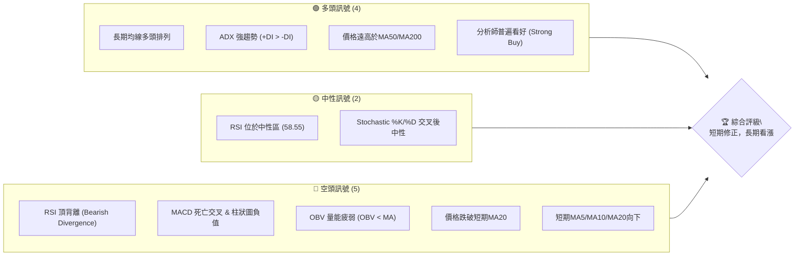
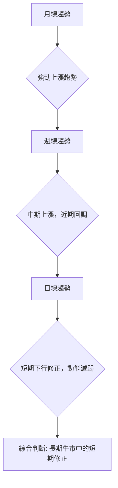
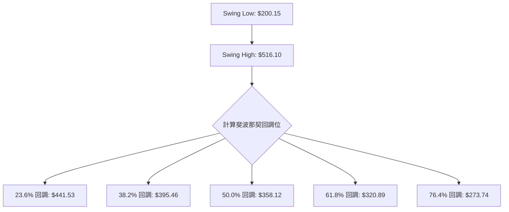
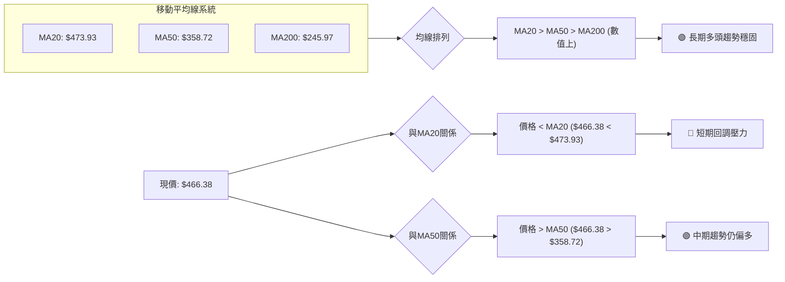

<details>
<summary>📊 靜態圖表 (點擊展開)</summary>

</details>

<html>
<head><meta charset="utf-8" /></head>
<body>
    <div style="height:500px; width:100%;">                        <script>window.PlotlyConfig = {MathJaxConfig: 'local'};</script>
        <script charset="utf-8" src="https://cdn.plot.ly/plotly-3.6.0.min.js" integrity="sha256-QaOVwtVY0T02VaHrr6pnoHLCwayMJp4O5n4YyaE3rJk=" crossorigin="anonymous"></script>                <div id="candlestick-chart" class="plotly-graph-div" style="height:100%; width:100%;"></div>            <script>                window.PLOTLYENV=window.PLOTLYENV || {};                                if (document.getElementById("candlestick-chart")) {                    Plotly.newPlot(                        "candlestick-chart",                        [{"close":{"dtype":"f8","bdata":"AAAAYGamZEAAAABguHZkQAAAAOBR+GRAAAAAIIVrZEAAAAAA19NkQAAAAAAp5GRAAAAAYI8SZUAAAAAAKVRkQAAAAIA9SmRAAAAAAClEZEAAAACgRzlkQAAAAOB65GJAAAAAwB7tYkAAAACAPXpjQAAAAKBH8WNAAAAAoHB1Y0AAAACAPdJjQAAAAMAeJWRAAAAAYLgOZEAAAADAHuVjQAAAAKBwvWNAAAAA4HqsY0AAAACgR\u002fljQAAAAMDMHGRAAAAAACkcZEAAAADgoyhkQAAAAGC47mNAAAAAIIUrZEAAAACgRzlkQAAAAOBRgGRAAAAAIFw3ZUAAAACgcJVkQAAAAGC4dmlAAAAA4FFwakAAAACA63FtQAAAAOB6HG1AAAAAwMzcakAAAACgcA1rQAAAAEDhQmtAAAAAQDPTbUAAAACA61FtQAAAAGCPIm1AAAAAgOsRbkAAAADA9cBtQAAAACBcx2xAAAAAIK5fbUAAAACgcJ1vQAAAAGC4OnBAAAAAACkgcEAAAACgR4VwQAAAAEDh2m9AAAAAgOsBcEAAAABgZjpwQAAAAKCZQW9AAAAAoEcFcEAAAABgZrZtQAAAAKBHMW1AAAAAIFx\u002fbkAAAADgo7BtQAAAAIA9LnBAAAAAYLj+bkAAAACA69luQAAAAOCjEG5AAAAAoEfJbEAAAACgmfFrQAAAAOCjwGlAAAAAwPV4aUAAAACgmeFqQAAAAAApxGlAAAAAIK7HakAAAADA9TBrQAAAAOBReGtAAAAAIK7nakAAAABAMzNrQAAAACBc\u002f2pAAAAAQAo\u002fa0AAAAAghaNrQAAAAADXs2tAAAAAoHCta0AAAACAwq1rQAAAAMD1WGpAAAAAYI\u002fyaUAAAACgcCVqQAAAACCFw2hAAAAAgOshaUAAAACAwq1qQAAAAGBm3mpAAAAAwMzcakAAAACgR+FqQAAAACCu32pAAAAAIIXzakAAAABA4epqQAAAAMAexWpAAAAAQArva0AAAABgj6JrQAAAAEAzy2pAAAAA4KNAakAAAACAwpVpQAAAAKBwZWlAAAAAgBT2aUAAAABACp9rQAAAAEAz82tAAAAAoHB9bEAAAABgj\u002fpsQAAAAKBw\u002fWxAAAAAoJk5b0AAAAAgXLdvQAAAAEDhOnBAAAAAgOtpb0AAAADA9YBvQAAAACCul29AAAAAgMKFb0AAAAAgXJdtQAAAAOCjyG5AAAAAIIVDbkAAAACAFAZpQAAAAAAAEGhAAAAAgBQOakAAAAAAAABrQAAAAIA9smpAAAAAYI+yakAAAACAFL5pQAAAAIA96mlAAAAAYI9iaUAAAAAA1wNpQAAAAADXa2lAAAAAwMwEaUAAAABAM5NoQAAAAEDhumpAAAAAIIVbakAAAACAwnVpQAAAAGC4BmlAAAAAANfTaEAAAABgZt5nQAAAAIA9QmlAAAAAYGbuaEAAAACAwg1oQAAAAIDCVWlAAAAAIFxnaUAAAABgj5ppQAAAACCut2hAAAAA4HosaEAAAABgj5JoQAAAAIDriWhAAAAAYLjuaEAAAADgo6hpQAAAAGCPKmlAAAAAgMJVaUAAAAAA16tpQAAAAOCjiGtAAAAA4KN4aUAAAAAgrj9pQAAAAKBHgWhAAAAAgMJtaUAAAABguEZqQAAAAAAAMGtAAAAAgMKFa0AAAADA9bBrQAAAAIA9+mxAAAAA4HqUbUAAAACgR6FuQAAAAGCP2m5AAAAAgD3ib0AAAACA6yFwQAAAAAApZHFAAAAAgD1mcUAAAABAMy9xQAAAAADXx3FAAAAAIFz3ckAAAACgRxVzQAAAAMD1vHVAAAAAgBTqdEAAAAAgXDN0QAAAAIDCEXVAAAAAANcndkAAAADgo4h2QAAAAOCjWHVAAAAAACk0dkAAAACAPVZ6QAAAACBch3lAAAAAQApzfEAAAADgo6x8QAAAAOCjBHxAAAAAAADYe0AAAABAMxt8QAAAAKCZgXpAAAAAANdPekAAAADAzOB5QAAAAKBH+XtAAAAAoHAZfEAAAAAAKTh9QAAAAIA9fn9AAAAA4KP4fkAAAABguDCAQAAAAMDMIIBAAAAAgBTif0AAAADgUUyAQAAAAAAp9IBAAAAAoJlZgEAAAACAFCZ9QA=="},"high":{"dtype":"f8","bdata":"AAAAwMzUZEAAAAAAKbxkQAAAAMD1EGVAAAAAQOGyZEAAAADgozhlQAAAAIDC9WRAAAAAIK5fZUAAAACAPRJlQAAAAOB6TGRAAAAAAACYZEAAAACgmUFkQAAAAOB6pGNAAAAA4HoUY0AAAADAHpVjQAAAAMD1kGRAAAAAYLgGZEAAAADAHg1kQAAAAKCZSWRAAAAAYGY+ZEAAAAAAKTRkQAAAAOCj2GNAAAAAQOH6Y0AAAACAwlVkQAAAAOB6bGRAAAAAQDOjZEAAAAAAKTRkQAAAACCFQ2RAAAAAoJmJZEAAAADA9UhkQAAAAIDChWRAAAAAgOthZUAAAACAwlVlQAAAAGC4VmxAAAAAwMxca0AAAAAA13ttQAAAAEAzA25AAAAAQApHbUAAAACAFAZsQAAAACBcH2xAAAAAIK7nbUAAAABgZiZuQAAAAAApbG1AAAAAAClcbkAAAADgUUhuQAAAAAApBG5AAAAAwMx8bUAAAADgeqxvQAAAAGC4RnBAAAAAoEeJcEAAAACgR7FwQAAAAIAUfnBAAAAAgBRicEAAAABgj05wQAAAAIAUFnBAAAAAYGY6cEAAAADgUbBvQAAAAADXe21AAAAAwMwcb0AAAABguA5vQAAAAAApeHBAAAAAgBQ6cEAAAACAFK5vQAAAAOCjGG9AAAAAAADAbUAAAADA9WhtQAAAAAAASG1AAAAAYI8aakAAAAAAKSRrQAAAAGCP0mlAAAAAQOHyakAAAACgmUlrQAAAACBcn2tAAAAAIFw\u002fbEAAAABgZkZrQAAAAADXY2tAAAAA4Hr0a0AAAABguPZrQAAAAEDhGmxAAAAAIIXTa0AAAAAAALBrQAAAACCuz2tAAAAAIIXrakAAAABACkdqQAAAAAAAcGpAAAAAIIXLaUAAAACAwuVqQAAAAKBwhWtAAAAAwPUga0AAAACgRxFrQAAAAGCPGmtAAAAAoJkBa0AAAACAPRprQAAAAOB6NGtAAAAAwMxkbEAAAADgo0BtQAAAAKBw3WtAAAAAACmEakAAAACAFF5qQAAAAKCZ6WlAAAAAACk8akAAAAAgheNrQAAAAEDhAmxAAAAAQDPLbUAAAAAgrk9tQAAAAAAA8G1AAAAAwMycb0AAAACgRwFwQAAAACBcr3BAAAAA4KMkcEAAAACgmfFvQAAAAGBmFnBAAAAA4HpIcEAAAAAgrqduQAAAAEAKP29AAAAAwMyUb0AAAABgj1JrQAAAAKBHgWlAAAAA4KMoakAAAABAMzNrQAAAAOB6bGtAAAAAwMx0a0AAAABguE5rQAAAAKCZQWpAAAAAoJmpaUAAAABgZmZpQAAAAEAzg2lAAAAAANebaUAAAAAAKexoQAAAAGC4FmtAAAAAYGYWa0AAAACgRzlqQAAAAOB6PGlAAAAAIK7XaEAAAADgejRoQAAAAIAUTmlAAAAAoEd5aUAAAAAgrgdpQAAAAEAKX2lAAAAAQOHSaUAAAABguCZqQAAAAADXc2lAAAAAgML1aEAAAACgcAVpQAAAAGC45mhAAAAAIIVbaUAAAAAAKbxpQAAAAKCZyWlAAAAAIIUjakAAAACAws1pQAAAAGCPqmtAAAAAAACga0AAAADgo2hpQAAAAIDCDWpAAAAAAACAaUAAAABgj7pqQAAAAMD1OGtAAAAAgOtJbEAAAABAM8NrQAAAAAAAQG1AAAAAQDOjbUAAAABgjzJvQAAAAGCP6m5AAAAAYLjub0AAAABA4SJwQAAAAKBwdXFAAAAAwMyQcUAAAACAwvlxQAAAAEAz43FAAAAAAAAEc0AAAAAghWNzQAAAAADXD3ZAAAAAIFzTdUAAAAAAAHh0QAAAAGC4QnVAAAAAIFwvdkAAAADgo6x2QAAAAKCZnXZAAAAAwB55dkAAAACgmel6QAAAACBcW3pAAAAA4KOEfEAAAAAghVN9QAAAAMDMrHxAAAAAAAC4fEAAAADA9VR8QAAAAAAAcHtAAAAAwMxse0AAAAAAAMx6QAAAAIA9FnxAAAAAQDMzfEAAAABgjxZ+QAAAACBcr39AAAAAIFzjf0AAAACgmXmAQAAAAAAAUIBAAAAAAAAsgEAAAACA61OAQAAAACCFE4FAAAAAIIWhgEAAAACA65l\u002fQA=="},"hovertemplate":"\u003cb\u003e%{x|%Y-%m-%d}\u003c\u002fb\u003e\u003cbr\u003e\u958b: $%{open:.2f}\u003cbr\u003e\u9ad8: $%{high:.2f}\u003cbr\u003e\u4f4e: $%{low:.2f}\u003cbr\u003e\u6536: $%{close:.2f}\u003cextra\u003e\u003c\u002fextra\u003e","low":{"dtype":"f8","bdata":"AAAAAADIY0AAAADgUUhkQAAAAKCZOWRAAAAAQAo3ZEAAAADAHp1kQAAAAMDMlGRAAAAAwMzUZEAAAADAzDxkQAAAAADXk2NAAAAAYI8SZEAAAACgR7ljQAAAAIDCxWJAAAAAQAqnYkAAAACAwv1iQAAAAAAAwGNAAAAAIK5fY0AAAACgcF1jQAAAAEAzs2NAAAAAQArnY0AAAADgUXhjQAAAAEAzu2JAAAAAwMx8Y0AAAACgcK1jQAAAAGC45mNAAAAAgMLNY0AAAADA9VhjQAAAAKCZoWNAAAAAwMz8Y0AAAABgj+pjQAAAACCuD2RAAAAAANfDZEAAAADgemRkQAAAAOBRYGlAAAAAwPUoakAAAABgZlZqQAAAAMD1sGxAAAAAYGamakAAAADAzNxqQAAAAMDM\u002fGpAAAAA4FGYa0AAAAAgrgdtQAAAAMAefWxAAAAAwMxMbUAAAADgo0BtQAAAAAApHGxAAAAAoEeRbEAAAABgZj5uQAAAAKCZOW9AAAAAAAAQcEAAAABgZhZwQAAAAIDriW9AAAAAwB6tb0AAAADgerxvQAAAAOB67G5AAAAAgOtZbkAAAAAgrndtQAAAAOB6FGxAAAAAAAAQbkAAAADgelRtQAAAAAAAQG9AAAAAgOvBbkAAAABgj2JtQAAAAMDMpG1AAAAAYLgWbEAAAABguHZrQAAAAMD1kGlAAAAAAABgaEAAAABAM7tpQAAAAMD1SGhAAAAAAADgaUAAAADgo8BqQAAAAAAAsGpAAAAA4HrMakAAAADgo3hqQAAAAOB6xGpAAAAAIK4Ha0AAAAAghUtrQAAAAMAePWtAAAAAoHBVa0AAAACAFEZqQAAAAIDrIWpAAAAAYI\u002fSaUAAAAAghaNpQAAAAMD1sGhAAAAAAAAQaUAAAABgZoZpQAAAAIDrqWpAAAAAwPWIakAAAABACr9qQAAAAMD1oGpAAAAAIK4nakAAAABgj8pqQAAAAKCZuWpAAAAAwMxca0AAAAAgXI9rQAAAAAAAaGpAAAAAoHDlaUAAAABgj2ppQAAAAIA9YmlAAAAAoJn5aEAAAAAgXN9qQAAAACCF42pAAAAAQApnbEAAAAAghZtsQAAAAMAeLWxAAAAAwPV4bUAAAAAAKdRuQAAAAAAABHBAAAAAoJlJb0AAAABguP5uQAAAAGC4Rm9AAAAAwB4dbkAAAACgmVFtQAAAAAAAYG1AAAAAoEehbUAAAADAzORoQAAAAEAK12dAAAAAgMKNaEAAAADAzIRpQAAAAAAppGpAAAAAYLgmakAAAADgeqRpQAAAAAApfGlAAAAAYI9aaEAAAAAAAGBoQAAAAKBHyWhAAAAAgOvRaEAAAADAzERoQAAAAAAA0GlAAAAAYI9KakAAAABguC5pQAAAACCut2hAAAAAAADAZ0AAAABACodnQAAAACCFu2dAAAAAAClcaEAAAAAAAOhnQAAAAOCjoGdAAAAAYGZGaUAAAAAAKXRpQAAAAKBwlWhAAAAA4KMIaEAAAACgmVloQAAAAOBRaGhAAAAAAAB4aEAAAABgjxpoQAAAAOBRyGhAAAAAYLg2aUAAAAAAKQRpQAAAAOBRcGpAAAAAgMJtaUAAAACAFLZoQAAAAADXG2hAAAAAwB6NaEAAAABA4bppQAAAAADXE2lAAAAAIFw3a0AAAAAAKexqQAAAAEDhYmxAAAAAwB7dbEAAAABguN5tQAAAAMD1QG5AAAAAYGa2bkAAAABAM3tvQAAAAAApWHBAAAAAgD0icUAAAAAAAABxQAAAAIDrSXFAAAAAgD3icUAAAAAAKbxyQAAAAOCj6HRAAAAAwPWMdEAAAAAAAGBzQAAAAIDC7XNAAAAAoJnJdEAAAAAAANR1QAAAAEAzK3VAAAAAgBSOdUAAAADgoyB5QAAAAKBHEXlAAAAA4KMkekAAAACAFC58QAAAAIDCoXpAAAAAYGYKe0AAAABA4Tp7QAAAAIDCdXpAAAAAIFyreUAAAACAwpV4QAAAAMDMoHpAAAAAoJn5ekAAAAAgXNt8QAAAACCuA35AAAAAYI9qfkAAAADgUdh+QAAAAEDhdn9AAAAAwMxsfkAAAAAghVN\u002fQAAAAGBmYoBAAAAAgOs9f0AAAABAM\u002f98QA=="},"name":"\u50f9\u683c","open":{"dtype":"f8","bdata":"AAAAQDODZEAAAAAghbtkQAAAAKBwRWRAAAAAoJmxZEAAAADAzBRlQAAAAKBHwWRAAAAAAAAQZUAAAACA69lkQAAAAKBwzWNAAAAAgOs5ZEAAAACAFP5jQAAAAADXo2NAAAAAoJn5YkAAAAAgrv9iQAAAAKBHcWRAAAAAANfTY0AAAAAAAKBjQAAAAOBRAGRAAAAAANcrZEAAAADA9ehjQAAAAGC43mJAAAAAACmsY0AAAACgcK1jQAAAAOCjEGRAAAAAIFxfZEAAAADgeqRjQAAAAOCjEGRAAAAAANcDZEAAAACgRxlkQAAAAIDCHWRAAAAAgMIVZUAAAACAwlVlQAAAAGBmTmxAAAAAQDPbakAAAABgZp5qQAAAAKCZiW1AAAAA4KMYbUAAAABgZoZrQAAAAGBmZmtAAAAAYLjWa0AAAACgR4ltQAAAAOBRKG1AAAAAQAqPbUAAAADgeuxtQAAAAEAzm21AAAAAwB7FbEAAAAAghWtuQAAAAIAUHnBAAAAAgD0ycEAAAABACoNwQAAAAGC4PnBAAAAAoJk5cEAAAACgRzVwQAAAAEAzS29AAAAAIK5nbkAAAABACq9vQAAAAIAU3mxAAAAA4HpEbkAAAADAHjVuQAAAAAAppG9AAAAAwMx8b0AAAAAghQNuQAAAAAAAWG5AAAAAwPWYbUAAAADgUchsQAAAAGBmFm1AAAAAgOsZakAAAADAHuVpQAAAACBcL2lAAAAAoJlBakAAAADgegRrQAAAAAApvGpAAAAAoEe5a0AAAADgUQhrQAAAAAApHGtAAAAAoHAla0AAAABA4WJrQAAAAKBHoWtAAAAAAADAa0AAAACA6zlrQAAAAADXS2tAAAAAwPWIakAAAACgcN1pQAAAAKBHQWpAAAAAgD16aUAAAABAM5NpQAAAAAAAgGtAAAAAIIWbakAAAAAgXN9qQAAAAIDC7WpAAAAAYI9yakAAAAAA1\u002ftqQAAAAIA9+mpAAAAAwMxca0AAAAAAAMhsQAAAAGC41mtAAAAAACmEakAAAADAzFxqQAAAAEAKt2lAAAAAgMIlaUAAAABAM+NqQAAAAKBHMWtAAAAAwMx8bEAAAACgmUltQAAAAGCPQmxAAAAAIK5\u002fbUAAAAAAAHhvQAAAAEDhUnBAAAAAAAAMcEAAAADAHoVvQAAAAAApxG9AAAAAwB7Vb0AAAACAwp1tQAAAAOCjeG1AAAAAoJlxb0AAAAAAAOBqQAAAACCFO2lAAAAAACmkaEAAAADAzNxpQAAAAOB65GpAAAAAACk8a0AAAABgj\u002fpqQAAAAOCjgGlAAAAAwMxEaUAAAADAHs1oQAAAACCFA2lAAAAAANcDaUAAAABA4cJoQAAAAAApdGpAAAAAgD3aakAAAACgmRlqQAAAACCFA2lAAAAAQDM7aEAAAABguO5nQAAAAADXA2hAAAAA4KO4aEAAAADgo2hoQAAAACCFq2dAAAAA4FFQaUAAAAAghaNpQAAAAGCPWmlAAAAAIIXDaEAAAAAgXF9oQAAAAIDClWhAAAAAAACAaEAAAADA9WBoQAAAAOB6nGlAAAAAwMzMaUAAAADgeixpQAAAAOBRcGpAAAAAIFw\u002fa0AAAADgozhpQAAAAGBmnmlAAAAAoJnBaEAAAABA4fJpQAAAAKCZgWlAAAAAwPVoa0AAAADgUUhrQAAAAADXA21AAAAA4FEgbUAAAAAAAOBtQAAAAMD1oG5AAAAAoEc5b0AAAABguN5vQAAAAADXj3BAAAAAAACQcUAAAACgmYlxQAAAAKBHVXFAAAAAIIUzckAAAAAAKeByQAAAAAApDHVAAAAAwB6ldUAAAACAwn1zQAAAAKBHaXRAAAAAgMJVdUAAAACA6\u002f11QAAAAMD1hHZAAAAAACn4dUAAAAAA15d5QAAAAMAeEXpAAAAAoHApekAAAADAzMh8QAAAAAAAFHxAAAAA4KOQfEAAAACgmYl7QAAAAKBwFXtAAAAAAADYekAAAACgmcl5QAAAAOCjwHpAAAAAANefe0AAAACgcF19QAAAAADXS35AAAAAAADAf0AAAAAAADB\u002fQAAAAGBmRoBAAAAAYI9Cf0AAAADAzKR\u002fQAAAAAAAroBAAAAAAAAWgEAAAADgejh\u002fQA=="},"x":["2025-08-20T00:00:00-04:00","2025-08-21T00:00:00-04:00","2025-08-22T00:00:00-04:00","2025-08-25T00:00:00-04:00","2025-08-26T00:00:00-04:00","2025-08-27T00:00:00-04:00","2025-08-28T00:00:00-04:00","2025-08-29T00:00:00-04:00","2025-09-02T00:00:00-04:00","2025-09-03T00:00:00-04:00","2025-09-04T00:00:00-04:00","2025-09-05T00:00:00-04:00","2025-09-08T00:00:00-04:00","2025-09-09T00:00:00-04:00","2025-09-10T00:00:00-04:00","2025-09-11T00:00:00-04:00","2025-09-12T00:00:00-04:00","2025-09-15T00:00:00-04:00","2025-09-16T00:00:00-04:00","2025-09-17T00:00:00-04:00","2025-09-18T00:00:00-04:00","2025-09-19T00:00:00-04:00","2025-09-22T00:00:00-04:00","2025-09-23T00:00:00-04:00","2025-09-24T00:00:00-04:00","2025-09-25T00:00:00-04:00","2025-09-26T00:00:00-04:00","2025-09-29T00:00:00-04:00","2025-09-30T00:00:00-04:00","2025-10-01T00:00:00-04:00","2025-10-02T00:00:00-04:00","2025-10-03T00:00:00-04:00","2025-10-06T00:00:00-04:00","2025-10-07T00:00:00-04:00","2025-10-08T00:00:00-04:00","2025-10-09T00:00:00-04:00","2025-10-10T00:00:00-04:00","2025-10-13T00:00:00-04:00","2025-10-14T00:00:00-04:00","2025-10-15T00:00:00-04:00","2025-10-16T00:00:00-04:00","2025-10-17T00:00:00-04:00","2025-10-20T00:00:00-04:00","2025-10-21T00:00:00-04:00","2025-10-22T00:00:00-04:00","2025-10-23T00:00:00-04:00","2025-10-24T00:00:00-04:00","2025-10-27T00:00:00-04:00","2025-10-28T00:00:00-04:00","2025-10-29T00:00:00-04:00","2025-10-30T00:00:00-04:00","2025-10-31T00:00:00-04:00","2025-11-03T00:00:00-05:00","2025-11-04T00:00:00-05:00","2025-11-05T00:00:00-05:00","2025-11-06T00:00:00-05:00","2025-11-07T00:00:00-05:00","2025-11-10T00:00:00-05:00","2025-11-11T00:00:00-05:00","2025-11-12T00:00:00-05:00","2025-11-13T00:00:00-05:00","2025-11-14T00:00:00-05:00","2025-11-17T00:00:00-05:00","2025-11-18T00:00:00-05:00","2025-11-19T00:00:00-05:00","2025-11-20T00:00:00-05:00","2025-11-21T00:00:00-05:00","2025-11-24T00:00:00-05:00","2025-11-25T00:00:00-05:00","2025-11-26T00:00:00-05:00","2025-11-28T00:00:00-05:00","2025-12-01T00:00:00-05:00","2025-12-02T00:00:00-05:00","2025-12-03T00:00:00-05:00","2025-12-04T00:00:00-05:00","2025-12-05T00:00:00-05:00","2025-12-08T00:00:00-05:00","2025-12-09T00:00:00-05:00","2025-12-10T00:00:00-05:00","2025-12-11T00:00:00-05:00","2025-12-12T00:00:00-05:00","2025-12-15T00:00:00-05:00","2025-12-16T00:00:00-05:00","2025-12-17T00:00:00-05:00","2025-12-18T00:00:00-05:00","2025-12-19T00:00:00-05:00","2025-12-22T00:00:00-05:00","2025-12-23T00:00:00-05:00","2025-12-24T00:00:00-05:00","2025-12-26T00:00:00-05:00","2025-12-29T00:00:00-05:00","2025-12-30T00:00:00-05:00","2025-12-31T00:00:00-05:00","2026-01-02T00:00:00-05:00","2026-01-05T00:00:00-05:00","2026-01-06T00:00:00-05:00","2026-01-07T00:00:00-05:00","2026-01-08T00:00:00-05:00","2026-01-09T00:00:00-05:00","2026-01-12T00:00:00-05:00","2026-01-13T00:00:00-05:00","2026-01-14T00:00:00-05:00","2026-01-15T00:00:00-05:00","2026-01-16T00:00:00-05:00","2026-01-20T00:00:00-05:00","2026-01-21T00:00:00-05:00","2026-01-22T00:00:00-05:00","2026-01-23T00:00:00-05:00","2026-01-26T00:00:00-05:00","2026-01-27T00:00:00-05:00","2026-01-28T00:00:00-05:00","2026-01-29T00:00:00-05:00","2026-01-30T00:00:00-05:00","2026-02-02T00:00:00-05:00","2026-02-03T00:00:00-05:00","2026-02-04T00:00:00-05:00","2026-02-05T00:00:00-05:00","2026-02-06T00:00:00-05:00","2026-02-09T00:00:00-05:00","2026-02-10T00:00:00-05:00","2026-02-11T00:00:00-05:00","2026-02-12T00:00:00-05:00","2026-02-13T00:00:00-05:00","2026-02-17T00:00:00-05:00","2026-02-18T00:00:00-05:00","2026-02-19T00:00:00-05:00","2026-02-20T00:00:00-05:00","2026-02-23T00:00:00-05:00","2026-02-24T00:00:00-05:00","2026-02-25T00:00:00-05:00","2026-02-26T00:00:00-05:00","2026-02-27T00:00:00-05:00","2026-03-02T00:00:00-05:00","2026-03-03T00:00:00-05:00","2026-03-04T00:00:00-05:00","2026-03-05T00:00:00-05:00","2026-03-06T00:00:00-05:00","2026-03-09T00:00:00-04:00","2026-03-10T00:00:00-04:00","2026-03-11T00:00:00-04:00","2026-03-12T00:00:00-04:00","2026-03-13T00:00:00-04:00","2026-03-16T00:00:00-04:00","2026-03-17T00:00:00-04:00","2026-03-18T00:00:00-04:00","2026-03-19T00:00:00-04:00","2026-03-20T00:00:00-04:00","2026-03-23T00:00:00-04:00","2026-03-24T00:00:00-04:00","2026-03-25T00:00:00-04:00","2026-03-26T00:00:00-04:00","2026-03-27T00:00:00-04:00","2026-03-30T00:00:00-04:00","2026-03-31T00:00:00-04:00","2026-04-01T00:00:00-04:00","2026-04-02T00:00:00-04:00","2026-04-06T00:00:00-04:00","2026-04-07T00:00:00-04:00","2026-04-08T00:00:00-04:00","2026-04-09T00:00:00-04:00","2026-04-10T00:00:00-04:00","2026-04-13T00:00:00-04:00","2026-04-14T00:00:00-04:00","2026-04-15T00:00:00-04:00","2026-04-16T00:00:00-04:00","2026-04-17T00:00:00-04:00","2026-04-20T00:00:00-04:00","2026-04-21T00:00:00-04:00","2026-04-22T00:00:00-04:00","2026-04-23T00:00:00-04:00","2026-04-24T00:00:00-04:00","2026-04-27T00:00:00-04:00","2026-04-28T00:00:00-04:00","2026-04-29T00:00:00-04:00","2026-04-30T00:00:00-04:00","2026-05-01T00:00:00-04:00","2026-05-04T00:00:00-04:00","2026-05-05T00:00:00-04:00","2026-05-06T00:00:00-04:00","2026-05-07T00:00:00-04:00","2026-05-08T00:00:00-04:00","2026-05-11T00:00:00-04:00","2026-05-12T00:00:00-04:00","2026-05-13T00:00:00-04:00","2026-05-14T00:00:00-04:00","2026-05-15T00:00:00-04:00","2026-05-18T00:00:00-04:00","2026-05-19T00:00:00-04:00","2026-05-20T00:00:00-04:00","2026-05-21T00:00:00-04:00","2026-05-22T00:00:00-04:00","2026-05-26T00:00:00-04:00","2026-05-27T00:00:00-04:00","2026-05-28T00:00:00-04:00","2026-05-29T00:00:00-04:00","2026-06-01T00:00:00-04:00","2026-06-02T00:00:00-04:00","2026-06-03T00:00:00-04:00","2026-06-04T00:00:00-04:00","2026-06-05T00:00:00-04:00"],"type":"candlestick"},{"hovertemplate":"MA30: $%{y:.2f}\u003cextra\u003e\u003c\u002fextra\u003e","line":{"color":"#2196F3","dash":"dash","width":2},"mode":"lines","name":"MA30","x":["2025-08-20T00:00:00-04:00","2025-08-21T00:00:00-04:00","2025-08-22T00:00:00-04:00","2025-08-25T00:00:00-04:00","2025-08-26T00:00:00-04:00","2025-08-27T00:00:00-04:00","2025-08-28T00:00:00-04:00","2025-08-29T00:00:00-04:00","2025-09-02T00:00:00-04:00","2025-09-03T00:00:00-04:00","2025-09-04T00:00:00-04:00","2025-09-05T00:00:00-04:00","2025-09-08T00:00:00-04:00","2025-09-09T00:00:00-04:00","2025-09-10T00:00:00-04:00","2025-09-11T00:00:00-04:00","2025-09-12T00:00:00-04:00","2025-09-15T00:00:00-04:00","2025-09-16T00:00:00-04:00","2025-09-17T00:00:00-04:00","2025-09-18T00:00:00-04:00","2025-09-19T00:00:00-04:00","2025-09-22T00:00:00-04:00","2025-09-23T00:00:00-04:00","2025-09-24T00:00:00-04:00","2025-09-25T00:00:00-04:00","2025-09-26T00:00:00-04:00","2025-09-29T00:00:00-04:00","2025-09-30T00:00:00-04:00","2025-10-01T00:00:00-04:00","2025-10-02T00:00:00-04:00","2025-10-03T00:00:00-04:00","2025-10-06T00:00:00-04:00","2025-10-07T00:00:00-04:00","2025-10-08T00:00:00-04:00","2025-10-09T00:00:00-04:00","2025-10-10T00:00:00-04:00","2025-10-13T00:00:00-04:00","2025-10-14T00:00:00-04:00","2025-10-15T00:00:00-04:00","2025-10-16T00:00:00-04:00","2025-10-17T00:00:00-04:00","2025-10-20T00:00:00-04:00","2025-10-21T00:00:00-04:00","2025-10-22T00:00:00-04:00","2025-10-23T00:00:00-04:00","2025-10-24T00:00:00-04:00","2025-10-27T00:00:00-04:00","2025-10-28T00:00:00-04:00","2025-10-29T00:00:00-04:00","2025-10-30T00:00:00-04:00","2025-10-31T00:00:00-04:00","2025-11-03T00:00:00-05:00","2025-11-04T00:00:00-05:00","2025-11-05T00:00:00-05:00","2025-11-06T00:00:00-05:00","2025-11-07T00:00:00-05:00","2025-11-10T00:00:00-05:00","2025-11-11T00:00:00-05:00","2025-11-12T00:00:00-05:00","2025-11-13T00:00:00-05:00","2025-11-14T00:00:00-05:00","2025-11-17T00:00:00-05:00","2025-11-18T00:00:00-05:00","2025-11-19T00:00:00-05:00","2025-11-20T00:00:00-05:00","2025-11-21T00:00:00-05:00","2025-11-24T00:00:00-05:00","2025-11-25T00:00:00-05:00","2025-11-26T00:00:00-05:00","2025-11-28T00:00:00-05:00","2025-12-01T00:00:00-05:00","2025-12-02T00:00:00-05:00","2025-12-03T00:00:00-05:00","2025-12-04T00:00:00-05:00","2025-12-05T00:00:00-05:00","2025-12-08T00:00:00-05:00","2025-12-09T00:00:00-05:00","2025-12-10T00:00:00-05:00","2025-12-11T00:00:00-05:00","2025-12-12T00:00:00-05:00","2025-12-15T00:00:00-05:00","2025-12-16T00:00:00-05:00","2025-12-17T00:00:00-05:00","2025-12-18T00:00:00-05:00","2025-12-19T00:00:00-05:00","2025-12-22T00:00:00-05:00","2025-12-23T00:00:00-05:00","2025-12-24T00:00:00-05:00","2025-12-26T00:00:00-05:00","2025-12-29T00:00:00-05:00","2025-12-30T00:00:00-05:00","2025-12-31T00:00:00-05:00","2026-01-02T00:00:00-05:00","2026-01-05T00:00:00-05:00","2026-01-06T00:00:00-05:00","2026-01-07T00:00:00-05:00","2026-01-08T00:00:00-05:00","2026-01-09T00:00:00-05:00","2026-01-12T00:00:00-05:00","2026-01-13T00:00:00-05:00","2026-01-14T00:00:00-05:00","2026-01-15T00:00:00-05:00","2026-01-16T00:00:00-05:00","2026-01-20T00:00:00-05:00","2026-01-21T00:00:00-05:00","2026-01-22T00:00:00-05:00","2026-01-23T00:00:00-05:00","2026-01-26T00:00:00-05:00","2026-01-27T00:00:00-05:00","2026-01-28T00:00:00-05:00","2026-01-29T00:00:00-05:00","2026-01-30T00:00:00-05:00","2026-02-02T00:00:00-05:00","2026-02-03T00:00:00-05:00","2026-02-04T00:00:00-05:00","2026-02-05T00:00:00-05:00","2026-02-06T00:00:00-05:00","2026-02-09T00:00:00-05:00","2026-02-10T00:00:00-05:00","2026-02-11T00:00:00-05:00","2026-02-12T00:00:00-05:00","2026-02-13T00:00:00-05:00","2026-02-17T00:00:00-05:00","2026-02-18T00:00:00-05:00","2026-02-19T00:00:00-05:00","2026-02-20T00:00:00-05:00","2026-02-23T00:00:00-05:00","2026-02-24T00:00:00-05:00","2026-02-25T00:00:00-05:00","2026-02-26T00:00:00-05:00","2026-02-27T00:00:00-05:00","2026-03-02T00:00:00-05:00","2026-03-03T00:00:00-05:00","2026-03-04T00:00:00-05:00","2026-03-05T00:00:00-05:00","2026-03-06T00:00:00-05:00","2026-03-09T00:00:00-04:00","2026-03-10T00:00:00-04:00","2026-03-11T00:00:00-04:00","2026-03-12T00:00:00-04:00","2026-03-13T00:00:00-04:00","2026-03-16T00:00:00-04:00","2026-03-17T00:00:00-04:00","2026-03-18T00:00:00-04:00","2026-03-19T00:00:00-04:00","2026-03-20T00:00:00-04:00","2026-03-23T00:00:00-04:00","2026-03-24T00:00:00-04:00","2026-03-25T00:00:00-04:00","2026-03-26T00:00:00-04:00","2026-03-27T00:00:00-04:00","2026-03-30T00:00:00-04:00","2026-03-31T00:00:00-04:00","2026-04-01T00:00:00-04:00","2026-04-02T00:00:00-04:00","2026-04-06T00:00:00-04:00","2026-04-07T00:00:00-04:00","2026-04-08T00:00:00-04:00","2026-04-09T00:00:00-04:00","2026-04-10T00:00:00-04:00","2026-04-13T00:00:00-04:00","2026-04-14T00:00:00-04:00","2026-04-15T00:00:00-04:00","2026-04-16T00:00:00-04:00","2026-04-17T00:00:00-04:00","2026-04-20T00:00:00-04:00","2026-04-21T00:00:00-04:00","2026-04-22T00:00:00-04:00","2026-04-23T00:00:00-04:00","2026-04-24T00:00:00-04:00","2026-04-27T00:00:00-04:00","2026-04-28T00:00:00-04:00","2026-04-29T00:00:00-04:00","2026-04-30T00:00:00-04:00","2026-05-01T00:00:00-04:00","2026-05-04T00:00:00-04:00","2026-05-05T00:00:00-04:00","2026-05-06T00:00:00-04:00","2026-05-07T00:00:00-04:00","2026-05-08T00:00:00-04:00","2026-05-11T00:00:00-04:00","2026-05-12T00:00:00-04:00","2026-05-13T00:00:00-04:00","2026-05-14T00:00:00-04:00","2026-05-15T00:00:00-04:00","2026-05-18T00:00:00-04:00","2026-05-19T00:00:00-04:00","2026-05-20T00:00:00-04:00","2026-05-21T00:00:00-04:00","2026-05-22T00:00:00-04:00","2026-05-26T00:00:00-04:00","2026-05-27T00:00:00-04:00","2026-05-28T00:00:00-04:00","2026-05-29T00:00:00-04:00","2026-06-01T00:00:00-04:00","2026-06-02T00:00:00-04:00","2026-06-03T00:00:00-04:00","2026-06-04T00:00:00-04:00","2026-06-05T00:00:00-04:00"],"y":{"dtype":"f8","bdata":"AAAAAAAA+H8AAAAAAAD4fwAAAAAAAPh\u002fAAAAAAAA+H8AAAAAAAD4fwAAAAAAAPh\u002fAAAAAAAA+H8AAAAAAAD4fwAAAAAAAPh\u002fAAAAAAAA+H8AAAAAAAD4fwAAAAAAAPh\u002fAAAAAAAA+H8AAAAAAAD4fwAAAAAAAPh\u002fAAAAAAAA+H8AAAAAAAD4fwAAAAAAAPh\u002fAAAAAAAA+H8AAAAAAAD4fwAAAAAAAPh\u002fAAAAAAAA+H8AAAAAAAD4fwAAAAAAAPh\u002fAAAAAAAA+H8AAAAAAAD4fwAAAAAAAPh\u002fAAAAAAAA+H8AAAAAAAD4fzMzM9PbHmRAERER0bAjZEBVVVX1tiRkQFVVVbUPS2RA3t3d3Wt+ZEBVVVUV9cdkQCIiIvIZDmVAREREZII\u002fZUBVVVWl4nhlQCIiIpJftGVAq6qq+vAFZkCrqqoKkFNmQAAAACD3qmZAREREBA8KZ0AzMzPTv2FnQImIiOgmrWdA7+7ujsIBaEBVVVVlZmZoQCIiIjJ6z2hAmpmZ2Yc3aUBEREREtqdpQDMzM+MXD2pAIiIiwmd4akAiIiIy7OJqQHd3dxcEQmtAzczMTNSna0CJiIjIWvlrQO\u002fu7o5fSGxAMzMzU4CgbECrqqqqR\u002fFsQM3MzDx8Vm1A7+7uPu6pbUARERHxiwFuQGZmZobPKG5Ad3d3t9c8bkAAAAAwCDBuQDMzM+NeE25AMzMzY4IHbkCamZlJDAZuQJqZmWlK+W1AIiIigk7fbUDv7u4uJM1tQO\u002fu7u7uvm1AMzMz4+yjbUAzMzMjIo5tQAAAAPDufm1Ad3d3V8dsbUB3d3cX2UptQGZmZuZCIm1AMzMzYzv7bEBERETUeM1sQDMzM4N5nmxAvLu727JqbEBERER02jRsQO\u002fu7l5z\u002fWtAq6qq+n7Ca0BmZmamm6hrQHd3d1fHlGtAAAAAkMJ1a0BVVVUFyF1rQERERGT0LmtA7+7urnIMa0BmZmZG4epqQM3MzDzDzmpAzczM7HzHakAzMzNz2sRqQImIiBi9zWpAiYiICGXUakBERERUVclqQM3MzAwtxmpAZmZmdjC\u002fakAAAADQ28JqQERERGT0xmpAAAAA4HrUakDNzMycqONqQLy7u0up9GpAIiIiAp0Wa0ARERFxaDlrQLy7u1sBYmtAIiIiUuOBa0CamZkph6JrQKuqqgpJz2tAAAAA0Nv+a0B3d3eHQRxsQLy7u2ugT2xA7+7uzml7bECJiIhoSm1sQAAAABBYVWxA3t3dDXRObEAzMzMzek9sQCIiInL2TWxA7+7uHsxLbEC8u7tLxUFsQFVVVYV5OmxAERERsbkkbEBmZmY2Xg5sQAAAAPCnAmxARERExCD4a0BERERkgu9rQDMzMwPk+mtAIiIiokX+a0Dv7u5O1OtrQHd3d0fh0mtAzczMbKCza0BVVVV1BYhrQLy7u2suaGtAMzMzg3kya0BmZmaGFvFqQJqZmblJtGpA3t3drQCBakDv7u7up05qQERERET9E2pA3t3drUfVaUDe3d0NdKppQERERKQpdWlAmpmZWatHaUB3d3eHFk1pQFVVVbWBVmlAd3d311xQaUBEREQkBkVpQAAAALArTGlAd3d357RBaUCrqqpKfj1pQImIiBh2MWlAq6qqqtUxaUCamZnpmDxpQImIiFirS2lA7+7u3ghhaUC8u7troHtpQJqZmSnOjmlAIiIi0k2qaUC8u7vba9ZpQJqZmTkmCGpAd3d311xEakCrqqq6AoxqQN7d3a1H3WpAERERkXsxa0CJiIgIgYlrQN7d3Z3E4GtAZmZmFq5LbECJiIhI4bZsQFVVVWX0Vm1AVVVVVZztbUAzMzPDrnRuQLy7u4veCm9AERERETywb0CJiIiQ7SpwQHd3d+e0dXBAmpmZKRXHcECJiIgYSzpxQFVVVU2pnnFAMzMzg8AkckDe3d1Ftq1yQO\u002fu7s4+NHNA7+7ublm1c0BVVVXNEzV0QO\u002fu7pZDo3RAERER2VwOdUBmZmY+CnV1QERERKwc6HVAIiIicq9ZdkDNzMwEVtB2QHd3d0dvWXdAMzMzc6\u002fZd0BmZmYGVmR4QLy7uxsv43hAd3d3V8deeUB3d3cXS+J5QKuqqsroa3pAERERoRrhekAzMzNT\u002fzZ7QA=="},"type":"scatter"},{"hovertemplate":"MA60: $%{y:.2f}\u003cextra\u003e\u003c\u002fextra\u003e","line":{"color":"#9C27B0","dash":"dash","width":2},"mode":"lines","name":"MA60","x":["2025-08-20T00:00:00-04:00","2025-08-21T00:00:00-04:00","2025-08-22T00:00:00-04:00","2025-08-25T00:00:00-04:00","2025-08-26T00:00:00-04:00","2025-08-27T00:00:00-04:00","2025-08-28T00:00:00-04:00","2025-08-29T00:00:00-04:00","2025-09-02T00:00:00-04:00","2025-09-03T00:00:00-04:00","2025-09-04T00:00:00-04:00","2025-09-05T00:00:00-04:00","2025-09-08T00:00:00-04:00","2025-09-09T00:00:00-04:00","2025-09-10T00:00:00-04:00","2025-09-11T00:00:00-04:00","2025-09-12T00:00:00-04:00","2025-09-15T00:00:00-04:00","2025-09-16T00:00:00-04:00","2025-09-17T00:00:00-04:00","2025-09-18T00:00:00-04:00","2025-09-19T00:00:00-04:00","2025-09-22T00:00:00-04:00","2025-09-23T00:00:00-04:00","2025-09-24T00:00:00-04:00","2025-09-25T00:00:00-04:00","2025-09-26T00:00:00-04:00","2025-09-29T00:00:00-04:00","2025-09-30T00:00:00-04:00","2025-10-01T00:00:00-04:00","2025-10-02T00:00:00-04:00","2025-10-03T00:00:00-04:00","2025-10-06T00:00:00-04:00","2025-10-07T00:00:00-04:00","2025-10-08T00:00:00-04:00","2025-10-09T00:00:00-04:00","2025-10-10T00:00:00-04:00","2025-10-13T00:00:00-04:00","2025-10-14T00:00:00-04:00","2025-10-15T00:00:00-04:00","2025-10-16T00:00:00-04:00","2025-10-17T00:00:00-04:00","2025-10-20T00:00:00-04:00","2025-10-21T00:00:00-04:00","2025-10-22T00:00:00-04:00","2025-10-23T00:00:00-04:00","2025-10-24T00:00:00-04:00","2025-10-27T00:00:00-04:00","2025-10-28T00:00:00-04:00","2025-10-29T00:00:00-04:00","2025-10-30T00:00:00-04:00","2025-10-31T00:00:00-04:00","2025-11-03T00:00:00-05:00","2025-11-04T00:00:00-05:00","2025-11-05T00:00:00-05:00","2025-11-06T00:00:00-05:00","2025-11-07T00:00:00-05:00","2025-11-10T00:00:00-05:00","2025-11-11T00:00:00-05:00","2025-11-12T00:00:00-05:00","2025-11-13T00:00:00-05:00","2025-11-14T00:00:00-05:00","2025-11-17T00:00:00-05:00","2025-11-18T00:00:00-05:00","2025-11-19T00:00:00-05:00","2025-11-20T00:00:00-05:00","2025-11-21T00:00:00-05:00","2025-11-24T00:00:00-05:00","2025-11-25T00:00:00-05:00","2025-11-26T00:00:00-05:00","2025-11-28T00:00:00-05:00","2025-12-01T00:00:00-05:00","2025-12-02T00:00:00-05:00","2025-12-03T00:00:00-05:00","2025-12-04T00:00:00-05:00","2025-12-05T00:00:00-05:00","2025-12-08T00:00:00-05:00","2025-12-09T00:00:00-05:00","2025-12-10T00:00:00-05:00","2025-12-11T00:00:00-05:00","2025-12-12T00:00:00-05:00","2025-12-15T00:00:00-05:00","2025-12-16T00:00:00-05:00","2025-12-17T00:00:00-05:00","2025-12-18T00:00:00-05:00","2025-12-19T00:00:00-05:00","2025-12-22T00:00:00-05:00","2025-12-23T00:00:00-05:00","2025-12-24T00:00:00-05:00","2025-12-26T00:00:00-05:00","2025-12-29T00:00:00-05:00","2025-12-30T00:00:00-05:00","2025-12-31T00:00:00-05:00","2026-01-02T00:00:00-05:00","2026-01-05T00:00:00-05:00","2026-01-06T00:00:00-05:00","2026-01-07T00:00:00-05:00","2026-01-08T00:00:00-05:00","2026-01-09T00:00:00-05:00","2026-01-12T00:00:00-05:00","2026-01-13T00:00:00-05:00","2026-01-14T00:00:00-05:00","2026-01-15T00:00:00-05:00","2026-01-16T00:00:00-05:00","2026-01-20T00:00:00-05:00","2026-01-21T00:00:00-05:00","2026-01-22T00:00:00-05:00","2026-01-23T00:00:00-05:00","2026-01-26T00:00:00-05:00","2026-01-27T00:00:00-05:00","2026-01-28T00:00:00-05:00","2026-01-29T00:00:00-05:00","2026-01-30T00:00:00-05:00","2026-02-02T00:00:00-05:00","2026-02-03T00:00:00-05:00","2026-02-04T00:00:00-05:00","2026-02-05T00:00:00-05:00","2026-02-06T00:00:00-05:00","2026-02-09T00:00:00-05:00","2026-02-10T00:00:00-05:00","2026-02-11T00:00:00-05:00","2026-02-12T00:00:00-05:00","2026-02-13T00:00:00-05:00","2026-02-17T00:00:00-05:00","2026-02-18T00:00:00-05:00","2026-02-19T00:00:00-05:00","2026-02-20T00:00:00-05:00","2026-02-23T00:00:00-05:00","2026-02-24T00:00:00-05:00","2026-02-25T00:00:00-05:00","2026-02-26T00:00:00-05:00","2026-02-27T00:00:00-05:00","2026-03-02T00:00:00-05:00","2026-03-03T00:00:00-05:00","2026-03-04T00:00:00-05:00","2026-03-05T00:00:00-05:00","2026-03-06T00:00:00-05:00","2026-03-09T00:00:00-04:00","2026-03-10T00:00:00-04:00","2026-03-11T00:00:00-04:00","2026-03-12T00:00:00-04:00","2026-03-13T00:00:00-04:00","2026-03-16T00:00:00-04:00","2026-03-17T00:00:00-04:00","2026-03-18T00:00:00-04:00","2026-03-19T00:00:00-04:00","2026-03-20T00:00:00-04:00","2026-03-23T00:00:00-04:00","2026-03-24T00:00:00-04:00","2026-03-25T00:00:00-04:00","2026-03-26T00:00:00-04:00","2026-03-27T00:00:00-04:00","2026-03-30T00:00:00-04:00","2026-03-31T00:00:00-04:00","2026-04-01T00:00:00-04:00","2026-04-02T00:00:00-04:00","2026-04-06T00:00:00-04:00","2026-04-07T00:00:00-04:00","2026-04-08T00:00:00-04:00","2026-04-09T00:00:00-04:00","2026-04-10T00:00:00-04:00","2026-04-13T00:00:00-04:00","2026-04-14T00:00:00-04:00","2026-04-15T00:00:00-04:00","2026-04-16T00:00:00-04:00","2026-04-17T00:00:00-04:00","2026-04-20T00:00:00-04:00","2026-04-21T00:00:00-04:00","2026-04-22T00:00:00-04:00","2026-04-23T00:00:00-04:00","2026-04-24T00:00:00-04:00","2026-04-27T00:00:00-04:00","2026-04-28T00:00:00-04:00","2026-04-29T00:00:00-04:00","2026-04-30T00:00:00-04:00","2026-05-01T00:00:00-04:00","2026-05-04T00:00:00-04:00","2026-05-05T00:00:00-04:00","2026-05-06T00:00:00-04:00","2026-05-07T00:00:00-04:00","2026-05-08T00:00:00-04:00","2026-05-11T00:00:00-04:00","2026-05-12T00:00:00-04:00","2026-05-13T00:00:00-04:00","2026-05-14T00:00:00-04:00","2026-05-15T00:00:00-04:00","2026-05-18T00:00:00-04:00","2026-05-19T00:00:00-04:00","2026-05-20T00:00:00-04:00","2026-05-21T00:00:00-04:00","2026-05-22T00:00:00-04:00","2026-05-26T00:00:00-04:00","2026-05-27T00:00:00-04:00","2026-05-28T00:00:00-04:00","2026-05-29T00:00:00-04:00","2026-06-01T00:00:00-04:00","2026-06-02T00:00:00-04:00","2026-06-03T00:00:00-04:00","2026-06-04T00:00:00-04:00","2026-06-05T00:00:00-04:00"],"y":{"dtype":"f8","bdata":"AAAAAAAA+H8AAAAAAAD4fwAAAAAAAPh\u002fAAAAAAAA+H8AAAAAAAD4fwAAAAAAAPh\u002fAAAAAAAA+H8AAAAAAAD4fwAAAAAAAPh\u002fAAAAAAAA+H8AAAAAAAD4fwAAAAAAAPh\u002fAAAAAAAA+H8AAAAAAAD4fwAAAAAAAPh\u002fAAAAAAAA+H8AAAAAAAD4fwAAAAAAAPh\u002fAAAAAAAA+H8AAAAAAAD4fwAAAAAAAPh\u002fAAAAAAAA+H8AAAAAAAD4fwAAAAAAAPh\u002fAAAAAAAA+H8AAAAAAAD4fwAAAAAAAPh\u002fAAAAAAAA+H8AAAAAAAD4fwAAAAAAAPh\u002fAAAAAAAA+H8AAAAAAAD4fwAAAAAAAPh\u002fAAAAAAAA+H8AAAAAAAD4fwAAAAAAAPh\u002fAAAAAAAA+H8AAAAAAAD4fwAAAAAAAPh\u002fAAAAAAAA+H8AAAAAAAD4fwAAAAAAAPh\u002fAAAAAAAA+H8AAAAAAAD4fwAAAAAAAPh\u002fAAAAAAAA+H8AAAAAAAD4fwAAAAAAAPh\u002fAAAAAAAA+H8AAAAAAAD4fwAAAAAAAPh\u002fAAAAAAAA+H8AAAAAAAD4fwAAAAAAAPh\u002fAAAAAAAA+H8AAAAAAAD4fwAAAAAAAPh\u002fAAAAAAAA+H8AAAAAAAD4fwAAAAisumhAAAAAiM\u002fmaEAzMzNzIRNpQN7d3Z3vOWlAq6qqyqFdaUCrqqqi\u002fntpQKuqqmq8kGlAvLu7Y4KjaUB3d3d3d79pQN7d3f3U1mlAZmZmvp\u002fyaUDNzMwcWhBqQHd3dwfzNGpAvLu78\u002f1WakAzMzP78HdqQEREROwKlmpAMzMz80S3akBmZma+n9hqQERERIze+GpAZmZmnmEZa0BERESMlzprQDMzM7PIVmtA7+7uTo1xa0AzMzNT44trQDMzM7u7n2tAvLu7oym1a0B3d3c3+9BrQDMzM3OT7mtAmpmZcSELbEAAAADYhydsQImIiFC4QmxA7+7udjBbbEC8u7ubNnZsQJqZmWHJe2xAIiIiUiqCbECamZlRcXpsQN7d3f2NcGxA3t3dtfNtbEDv7u7OsGdsQDMzM7u7X2xAREREfD9PbEB3d3f\u002f\u002f0dsQJqZmanxQmxAmpmZ4TM8bEAAAABg5ThsQN7d3R3MOWxAzczMLLJBbEBERETEIEJsQBERESEiQmxAq6qqWo8+bEDv7u7+\u002fzdsQO\u002fu7kbhNmxA3t3dVcc0bEDe3d39jShsQFVVVeWJJmxAzczMZPQebEB3d3cH8wpsQLy7u7MP9WtA7+7uThvia0BEREQcodZrQDMzM2t1vmtA7+7uZh+sa0ARERFJU5ZrQBEREWGehGtA7+7uTht2a0DNzMxUnGlrQERERIQyaGtAZmZm5kJma0BERETca1xrQAAAAIiIYGtAREREDLtea0B3d3cPWFdrQN7d3dXqTGtAZmZmpg1Ea0AREREJ1zVrQLy7u9trLmtAq6qqQoska0C8u7t7PxVrQKuqqoolC2tAAAAAAHIBa0BERESMl\u002fhqQHd3dyej8WpA7+7uvhHqakCrqqrKWuNqQAAAAAhl4mpARERElIrhakAAAAB4MN1qQKuqquLs1WpAq6qqcmjPakC8u7srQMpqQBERERERzWpAMzMzg8DGakAzMzPLob9qQO\u002fu7s73tWpA3t3drUerakAAAACQe6VqQERERKQpp2pAmpmZ0ZSsakAAAABokbVqQGZmZhbZxGpAIiIiuknUakBVVVUVIOFqQImIiMCD7WpAIiIiov77akAAAAAYBAprQM3MzAy7ImtAIiIiivoxa0B3d3fHSz1rQLy7uyuHSmtAIiIiYldma0C8u7ubxIJrQM3MzNR4tWtAmpmZAXLha0CJiIhokQ9sQAAAABgEQGxAVVVVtfN7bEBERETUeNFsQCIiIsL1IG1AVVVVlUNvbUCrqqoqztxtQFVVVSW\u002fRG5A7+7u9prFbkAzMzNrdUxvQDMzM9v5zG9AIiIiIiIncEAREREhsGlwQJqZmaGMpHBAREREpHDfcEAiIiI6bRlxQImIiODBV3FAmpmZLWuXcUBVVVX5xd1xQCIiIjLBLnJAd3d37+59ckDe3d2xK9VyQFVVVXnpKHNAAAAAkMJ7c0De3d3NhdNzQM3MzIwlLnRAIiIi1niDdEC8u7v7N8l0QA=="},"type":"scatter"},{"hovertemplate":"MA200: $%{y:.2f}\u003cextra\u003e\u003c\u002fextra\u003e","line":{"color":"#FF6F00","dash":"solid","width":2},"mode":"lines","name":"MA200","x":["2025-08-20T00:00:00-04:00","2025-08-21T00:00:00-04:00","2025-08-22T00:00:00-04:00","2025-08-25T00:00:00-04:00","2025-08-26T00:00:00-04:00","2025-08-27T00:00:00-04:00","2025-08-28T00:00:00-04:00","2025-08-29T00:00:00-04:00","2025-09-02T00:00:00-04:00","2025-09-03T00:00:00-04:00","2025-09-04T00:00:00-04:00","2025-09-05T00:00:00-04:00","2025-09-08T00:00:00-04:00","2025-09-09T00:00:00-04:00","2025-09-10T00:00:00-04:00","2025-09-11T00:00:00-04:00","2025-09-12T00:00:00-04:00","2025-09-15T00:00:00-04:00","2025-09-16T00:00:00-04:00","2025-09-17T00:00:00-04:00","2025-09-18T00:00:00-04:00","2025-09-19T00:00:00-04:00","2025-09-22T00:00:00-04:00","2025-09-23T00:00:00-04:00","2025-09-24T00:00:00-04:00","2025-09-25T00:00:00-04:00","2025-09-26T00:00:00-04:00","2025-09-29T00:00:00-04:00","2025-09-30T00:00:00-04:00","2025-10-01T00:00:00-04:00","2025-10-02T00:00:00-04:00","2025-10-03T00:00:00-04:00","2025-10-06T00:00:00-04:00","2025-10-07T00:00:00-04:00","2025-10-08T00:00:00-04:00","2025-10-09T00:00:00-04:00","2025-10-10T00:00:00-04:00","2025-10-13T00:00:00-04:00","2025-10-14T00:00:00-04:00","2025-10-15T00:00:00-04:00","2025-10-16T00:00:00-04:00","2025-10-17T00:00:00-04:00","2025-10-20T00:00:00-04:00","2025-10-21T00:00:00-04:00","2025-10-22T00:00:00-04:00","2025-10-23T00:00:00-04:00","2025-10-24T00:00:00-04:00","2025-10-27T00:00:00-04:00","2025-10-28T00:00:00-04:00","2025-10-29T00:00:00-04:00","2025-10-30T00:00:00-04:00","2025-10-31T00:00:00-04:00","2025-11-03T00:00:00-05:00","2025-11-04T00:00:00-05:00","2025-11-05T00:00:00-05:00","2025-11-06T00:00:00-05:00","2025-11-07T00:00:00-05:00","2025-11-10T00:00:00-05:00","2025-11-11T00:00:00-05:00","2025-11-12T00:00:00-05:00","2025-11-13T00:00:00-05:00","2025-11-14T00:00:00-05:00","2025-11-17T00:00:00-05:00","2025-11-18T00:00:00-05:00","2025-11-19T00:00:00-05:00","2025-11-20T00:00:00-05:00","2025-11-21T00:00:00-05:00","2025-11-24T00:00:00-05:00","2025-11-25T00:00:00-05:00","2025-11-26T00:00:00-05:00","2025-11-28T00:00:00-05:00","2025-12-01T00:00:00-05:00","2025-12-02T00:00:00-05:00","2025-12-03T00:00:00-05:00","2025-12-04T00:00:00-05:00","2025-12-05T00:00:00-05:00","2025-12-08T00:00:00-05:00","2025-12-09T00:00:00-05:00","2025-12-10T00:00:00-05:00","2025-12-11T00:00:00-05:00","2025-12-12T00:00:00-05:00","2025-12-15T00:00:00-05:00","2025-12-16T00:00:00-05:00","2025-12-17T00:00:00-05:00","2025-12-18T00:00:00-05:00","2025-12-19T00:00:00-05:00","2025-12-22T00:00:00-05:00","2025-12-23T00:00:00-05:00","2025-12-24T00:00:00-05:00","2025-12-26T00:00:00-05:00","2025-12-29T00:00:00-05:00","2025-12-30T00:00:00-05:00","2025-12-31T00:00:00-05:00","2026-01-02T00:00:00-05:00","2026-01-05T00:00:00-05:00","2026-01-06T00:00:00-05:00","2026-01-07T00:00:00-05:00","2026-01-08T00:00:00-05:00","2026-01-09T00:00:00-05:00","2026-01-12T00:00:00-05:00","2026-01-13T00:00:00-05:00","2026-01-14T00:00:00-05:00","2026-01-15T00:00:00-05:00","2026-01-16T00:00:00-05:00","2026-01-20T00:00:00-05:00","2026-01-21T00:00:00-05:00","2026-01-22T00:00:00-05:00","2026-01-23T00:00:00-05:00","2026-01-26T00:00:00-05:00","2026-01-27T00:00:00-05:00","2026-01-28T00:00:00-05:00","2026-01-29T00:00:00-05:00","2026-01-30T00:00:00-05:00","2026-02-02T00:00:00-05:00","2026-02-03T00:00:00-05:00","2026-02-04T00:00:00-05:00","2026-02-05T00:00:00-05:00","2026-02-06T00:00:00-05:00","2026-02-09T00:00:00-05:00","2026-02-10T00:00:00-05:00","2026-02-11T00:00:00-05:00","2026-02-12T00:00:00-05:00","2026-02-13T00:00:00-05:00","2026-02-17T00:00:00-05:00","2026-02-18T00:00:00-05:00","2026-02-19T00:00:00-05:00","2026-02-20T00:00:00-05:00","2026-02-23T00:00:00-05:00","2026-02-24T00:00:00-05:00","2026-02-25T00:00:00-05:00","2026-02-26T00:00:00-05:00","2026-02-27T00:00:00-05:00","2026-03-02T00:00:00-05:00","2026-03-03T00:00:00-05:00","2026-03-04T00:00:00-05:00","2026-03-05T00:00:00-05:00","2026-03-06T00:00:00-05:00","2026-03-09T00:00:00-04:00","2026-03-10T00:00:00-04:00","2026-03-11T00:00:00-04:00","2026-03-12T00:00:00-04:00","2026-03-13T00:00:00-04:00","2026-03-16T00:00:00-04:00","2026-03-17T00:00:00-04:00","2026-03-18T00:00:00-04:00","2026-03-19T00:00:00-04:00","2026-03-20T00:00:00-04:00","2026-03-23T00:00:00-04:00","2026-03-24T00:00:00-04:00","2026-03-25T00:00:00-04:00","2026-03-26T00:00:00-04:00","2026-03-27T00:00:00-04:00","2026-03-30T00:00:00-04:00","2026-03-31T00:00:00-04:00","2026-04-01T00:00:00-04:00","2026-04-02T00:00:00-04:00","2026-04-06T00:00:00-04:00","2026-04-07T00:00:00-04:00","2026-04-08T00:00:00-04:00","2026-04-09T00:00:00-04:00","2026-04-10T00:00:00-04:00","2026-04-13T00:00:00-04:00","2026-04-14T00:00:00-04:00","2026-04-15T00:00:00-04:00","2026-04-16T00:00:00-04:00","2026-04-17T00:00:00-04:00","2026-04-20T00:00:00-04:00","2026-04-21T00:00:00-04:00","2026-04-22T00:00:00-04:00","2026-04-23T00:00:00-04:00","2026-04-24T00:00:00-04:00","2026-04-27T00:00:00-04:00","2026-04-28T00:00:00-04:00","2026-04-29T00:00:00-04:00","2026-04-30T00:00:00-04:00","2026-05-01T00:00:00-04:00","2026-05-04T00:00:00-04:00","2026-05-05T00:00:00-04:00","2026-05-06T00:00:00-04:00","2026-05-07T00:00:00-04:00","2026-05-08T00:00:00-04:00","2026-05-11T00:00:00-04:00","2026-05-12T00:00:00-04:00","2026-05-13T00:00:00-04:00","2026-05-14T00:00:00-04:00","2026-05-15T00:00:00-04:00","2026-05-18T00:00:00-04:00","2026-05-19T00:00:00-04:00","2026-05-20T00:00:00-04:00","2026-05-21T00:00:00-04:00","2026-05-22T00:00:00-04:00","2026-05-26T00:00:00-04:00","2026-05-27T00:00:00-04:00","2026-05-28T00:00:00-04:00","2026-05-29T00:00:00-04:00","2026-06-01T00:00:00-04:00","2026-06-02T00:00:00-04:00","2026-06-03T00:00:00-04:00","2026-06-04T00:00:00-04:00","2026-06-05T00:00:00-04:00"],"y":{"dtype":"f8","bdata":"AAAAAAAA+H8AAAAAAAD4fwAAAAAAAPh\u002fAAAAAAAA+H8AAAAAAAD4fwAAAAAAAPh\u002fAAAAAAAA+H8AAAAAAAD4fwAAAAAAAPh\u002fAAAAAAAA+H8AAAAAAAD4fwAAAAAAAPh\u002fAAAAAAAA+H8AAAAAAAD4fwAAAAAAAPh\u002fAAAAAAAA+H8AAAAAAAD4fwAAAAAAAPh\u002fAAAAAAAA+H8AAAAAAAD4fwAAAAAAAPh\u002fAAAAAAAA+H8AAAAAAAD4fwAAAAAAAPh\u002fAAAAAAAA+H8AAAAAAAD4fwAAAAAAAPh\u002fAAAAAAAA+H8AAAAAAAD4fwAAAAAAAPh\u002fAAAAAAAA+H8AAAAAAAD4fwAAAAAAAPh\u002fAAAAAAAA+H8AAAAAAAD4fwAAAAAAAPh\u002fAAAAAAAA+H8AAAAAAAD4fwAAAAAAAPh\u002fAAAAAAAA+H8AAAAAAAD4fwAAAAAAAPh\u002fAAAAAAAA+H8AAAAAAAD4fwAAAAAAAPh\u002fAAAAAAAA+H8AAAAAAAD4fwAAAAAAAPh\u002fAAAAAAAA+H8AAAAAAAD4fwAAAAAAAPh\u002fAAAAAAAA+H8AAAAAAAD4fwAAAAAAAPh\u002fAAAAAAAA+H8AAAAAAAD4fwAAAAAAAPh\u002fAAAAAAAA+H8AAAAAAAD4fwAAAAAAAPh\u002fAAAAAAAA+H8AAAAAAAD4fwAAAAAAAPh\u002fAAAAAAAA+H8AAAAAAAD4fwAAAAAAAPh\u002fAAAAAAAA+H8AAAAAAAD4fwAAAAAAAPh\u002fAAAAAAAA+H8AAAAAAAD4fwAAAAAAAPh\u002fAAAAAAAA+H8AAAAAAAD4fwAAAAAAAPh\u002fAAAAAAAA+H8AAAAAAAD4fwAAAAAAAPh\u002fAAAAAAAA+H8AAAAAAAD4fwAAAAAAAPh\u002fAAAAAAAA+H8AAAAAAAD4fwAAAAAAAPh\u002fAAAAAAAA+H8AAAAAAAD4fwAAAAAAAPh\u002fAAAAAAAA+H8AAAAAAAD4fwAAAAAAAPh\u002fAAAAAAAA+H8AAAAAAAD4fwAAAAAAAPh\u002fAAAAAAAA+H8AAAAAAAD4fwAAAAAAAPh\u002fAAAAAAAA+H8AAAAAAAD4fwAAAAAAAPh\u002fAAAAAAAA+H8AAAAAAAD4fwAAAAAAAPh\u002fAAAAAAAA+H8AAAAAAAD4fwAAAAAAAPh\u002fAAAAAAAA+H8AAAAAAAD4fwAAAAAAAPh\u002fAAAAAAAA+H8AAAAAAAD4fwAAAAAAAPh\u002fAAAAAAAA+H8AAAAAAAD4fwAAAAAAAPh\u002fAAAAAAAA+H8AAAAAAAD4fwAAAAAAAPh\u002fAAAAAAAA+H8AAAAAAAD4fwAAAAAAAPh\u002fAAAAAAAA+H8AAAAAAAD4fwAAAAAAAPh\u002fAAAAAAAA+H8AAAAAAAD4fwAAAAAAAPh\u002fAAAAAAAA+H8AAAAAAAD4fwAAAAAAAPh\u002fAAAAAAAA+H8AAAAAAAD4fwAAAAAAAPh\u002fAAAAAAAA+H8AAAAAAAD4fwAAAAAAAPh\u002fAAAAAAAA+H8AAAAAAAD4fwAAAAAAAPh\u002fAAAAAAAA+H8AAAAAAAD4fwAAAAAAAPh\u002fAAAAAAAA+H8AAAAAAAD4fwAAAAAAAPh\u002fAAAAAAAA+H8AAAAAAAD4fwAAAAAAAPh\u002fAAAAAAAA+H8AAAAAAAD4fwAAAAAAAPh\u002fAAAAAAAA+H8AAAAAAAD4fwAAAAAAAPh\u002fAAAAAAAA+H8AAAAAAAD4fwAAAAAAAPh\u002fAAAAAAAA+H8AAAAAAAD4fwAAAAAAAPh\u002fAAAAAAAA+H8AAAAAAAD4fwAAAAAAAPh\u002fAAAAAAAA+H8AAAAAAAD4fwAAAAAAAPh\u002fAAAAAAAA+H8AAAAAAAD4fwAAAAAAAPh\u002fAAAAAAAA+H8AAAAAAAD4fwAAAAAAAPh\u002fAAAAAAAA+H8AAAAAAAD4fwAAAAAAAPh\u002fAAAAAAAA+H8AAAAAAAD4fwAAAAAAAPh\u002fAAAAAAAA+H8AAAAAAAD4fwAAAAAAAPh\u002fAAAAAAAA+H8AAAAAAAD4fwAAAAAAAPh\u002fAAAAAAAA+H8AAAAAAAD4fwAAAAAAAPh\u002fAAAAAAAA+H8AAAAAAAD4fwAAAAAAAPh\u002fAAAAAAAA+H8AAAAAAAD4fwAAAAAAAPh\u002fAAAAAAAA+H8AAAAAAAD4fwAAAAAAAPh\u002fAAAAAAAA+H8AAAAAAAD4fwAAAAAAAPh\u002fAAAAAAAA+H8fhevpJr9uQA=="},"type":"scatter"}],                        {"template":{"data":{"barpolar":[{"marker":{"line":{"color":"rgb(17,17,17)","width":0.5},"pattern":{"fillmode":"overlay","size":10,"solidity":0.2}},"type":"barpolar"}],"bar":[{"error_x":{"color":"#f2f5fa"},"error_y":{"color":"#f2f5fa"},"marker":{"line":{"color":"rgb(17,17,17)","width":0.5},"pattern":{"fillmode":"overlay","size":10,"solidity":0.2}},"type":"bar"}],"carpet":[{"aaxis":{"endlinecolor":"#A2B1C6","gridcolor":"#506784","linecolor":"#506784","minorgridcolor":"#506784","startlinecolor":"#A2B1C6"},"baxis":{"endlinecolor":"#A2B1C6","gridcolor":"#506784","linecolor":"#506784","minorgridcolor":"#506784","startlinecolor":"#A2B1C6"},"type":"carpet"}],"choropleth":[{"colorbar":{"outlinewidth":0,"ticks":""},"type":"choropleth"}],"contourcarpet":[{"colorbar":{"outlinewidth":0,"ticks":""},"type":"contourcarpet"}],"contour":[{"colorbar":{"outlinewidth":0,"ticks":""},"colorscale":[[0.0,"#0d0887"],[0.1111111111111111,"#46039f"],[0.2222222222222222,"#7201a8"],[0.3333333333333333,"#9c179e"],[0.4444444444444444,"#bd3786"],[0.5555555555555556,"#d8576b"],[0.6666666666666666,"#ed7953"],[0.7777777777777778,"#fb9f3a"],[0.8888888888888888,"#fdca26"],[1.0,"#f0f921"]],"type":"contour"}],"heatmap":[{"colorbar":{"outlinewidth":0,"ticks":""},"colorscale":[[0.0,"#0d0887"],[0.1111111111111111,"#46039f"],[0.2222222222222222,"#7201a8"],[0.3333333333333333,"#9c179e"],[0.4444444444444444,"#bd3786"],[0.5555555555555556,"#d8576b"],[0.6666666666666666,"#ed7953"],[0.7777777777777778,"#fb9f3a"],[0.8888888888888888,"#fdca26"],[1.0,"#f0f921"]],"type":"heatmap"}],"histogram2dcontour":[{"colorbar":{"outlinewidth":0,"ticks":""},"colorscale":[[0.0,"#0d0887"],[0.1111111111111111,"#46039f"],[0.2222222222222222,"#7201a8"],[0.3333333333333333,"#9c179e"],[0.4444444444444444,"#bd3786"],[0.5555555555555556,"#d8576b"],[0.6666666666666666,"#ed7953"],[0.7777777777777778,"#fb9f3a"],[0.8888888888888888,"#fdca26"],[1.0,"#f0f921"]],"type":"histogram2dcontour"}],"histogram2d":[{"colorbar":{"outlinewidth":0,"ticks":""},"colorscale":[[0.0,"#0d0887"],[0.1111111111111111,"#46039f"],[0.2222222222222222,"#7201a8"],[0.3333333333333333,"#9c179e"],[0.4444444444444444,"#bd3786"],[0.5555555555555556,"#d8576b"],[0.6666666666666666,"#ed7953"],[0.7777777777777778,"#fb9f3a"],[0.8888888888888888,"#fdca26"],[1.0,"#f0f921"]],"type":"histogram2d"}],"histogram":[{"marker":{"pattern":{"fillmode":"overlay","size":10,"solidity":0.2}},"type":"histogram"}],"mesh3d":[{"colorbar":{"outlinewidth":0,"ticks":""},"type":"mesh3d"}],"parcoords":[{"line":{"colorbar":{"outlinewidth":0,"ticks":""}},"type":"parcoords"}],"pie":[{"automargin":true,"type":"pie"}],"scatter3d":[{"line":{"colorbar":{"outlinewidth":0,"ticks":""}},"marker":{"colorbar":{"outlinewidth":0,"ticks":""}},"type":"scatter3d"}],"scattercarpet":[{"marker":{"colorbar":{"outlinewidth":0,"ticks":""}},"type":"scattercarpet"}],"scattergeo":[{"marker":{"colorbar":{"outlinewidth":0,"ticks":""}},"type":"scattergeo"}],"scattergl":[{"marker":{"line":{"color":"#283442"}},"type":"scattergl"}],"scattermapbox":[{"marker":{"colorbar":{"outlinewidth":0,"ticks":""}},"type":"scattermapbox"}],"scattermap":[{"marker":{"colorbar":{"outlinewidth":0,"ticks":""}},"type":"scattermap"}],"scatterpolargl":[{"marker":{"colorbar":{"outlinewidth":0,"ticks":""}},"type":"scatterpolargl"}],"scatterpolar":[{"marker":{"colorbar":{"outlinewidth":0,"ticks":""}},"type":"scatterpolar"}],"scatter":[{"marker":{"line":{"color":"#283442"}},"type":"scatter"}],"scatterternary":[{"marker":{"colorbar":{"outlinewidth":0,"ticks":""}},"type":"scatterternary"}],"surface":[{"colorbar":{"outlinewidth":0,"ticks":""},"colorscale":[[0.0,"#0d0887"],[0.1111111111111111,"#46039f"],[0.2222222222222222,"#7201a8"],[0.3333333333333333,"#9c179e"],[0.4444444444444444,"#bd3786"],[0.5555555555555556,"#d8576b"],[0.6666666666666666,"#ed7953"],[0.7777777777777778,"#fb9f3a"],[0.8888888888888888,"#fdca26"],[1.0,"#f0f921"]],"type":"surface"}],"table":[{"cells":{"fill":{"color":"#506784"},"line":{"color":"rgb(17,17,17)"}},"header":{"fill":{"color":"#2a3f5f"},"line":{"color":"rgb(17,17,17)"}},"type":"table"}]},"layout":{"annotationdefaults":{"arrowcolor":"#f2f5fa","arrowhead":0,"arrowwidth":1},"autotypenumbers":"strict","coloraxis":{"colorbar":{"outlinewidth":0,"ticks":""}},"colorscale":{"diverging":[[0,"#8e0152"],[0.1,"#c51b7d"],[0.2,"#de77ae"],[0.3,"#f1b6da"],[0.4,"#fde0ef"],[0.5,"#f7f7f7"],[0.6,"#e6f5d0"],[0.7,"#b8e186"],[0.8,"#7fbc41"],[0.9,"#4d9221"],[1,"#276419"]],"sequential":[[0.0,"#0d0887"],[0.1111111111111111,"#46039f"],[0.2222222222222222,"#7201a8"],[0.3333333333333333,"#9c179e"],[0.4444444444444444,"#bd3786"],[0.5555555555555556,"#d8576b"],[0.6666666666666666,"#ed7953"],[0.7777777777777778,"#fb9f3a"],[0.8888888888888888,"#fdca26"],[1.0,"#f0f921"]],"sequentialminus":[[0.0,"#0d0887"],[0.1111111111111111,"#46039f"],[0.2222222222222222,"#7201a8"],[0.3333333333333333,"#9c179e"],[0.4444444444444444,"#bd3786"],[0.5555555555555556,"#d8576b"],[0.6666666666666666,"#ed7953"],[0.7777777777777778,"#fb9f3a"],[0.8888888888888888,"#fdca26"],[1.0,"#f0f921"]]},"colorway":["#636efa","#EF553B","#00cc96","#ab63fa","#FFA15A","#19d3f3","#FF6692","#B6E880","#FF97FF","#FECB52"],"font":{"color":"#f2f5fa"},"geo":{"bgcolor":"rgb(17,17,17)","lakecolor":"rgb(17,17,17)","landcolor":"rgb(17,17,17)","showlakes":true,"showland":true,"subunitcolor":"#506784"},"hoverlabel":{"align":"left"},"hovermode":"closest","mapbox":{"style":"dark"},"paper_bgcolor":"rgb(17,17,17)","plot_bgcolor":"rgb(17,17,17)","polar":{"angularaxis":{"gridcolor":"#506784","linecolor":"#506784","ticks":""},"bgcolor":"rgb(17,17,17)","radialaxis":{"gridcolor":"#506784","linecolor":"#506784","ticks":""}},"scene":{"xaxis":{"backgroundcolor":"rgb(17,17,17)","gridcolor":"#506784","gridwidth":2,"linecolor":"#506784","showbackground":true,"ticks":"","zerolinecolor":"#C8D4E3"},"yaxis":{"backgroundcolor":"rgb(17,17,17)","gridcolor":"#506784","gridwidth":2,"linecolor":"#506784","showbackground":true,"ticks":"","zerolinecolor":"#C8D4E3"},"zaxis":{"backgroundcolor":"rgb(17,17,17)","gridcolor":"#506784","gridwidth":2,"linecolor":"#506784","showbackground":true,"ticks":"","zerolinecolor":"#C8D4E3"}},"shapedefaults":{"line":{"color":"#f2f5fa"}},"sliderdefaults":{"bgcolor":"#C8D4E3","bordercolor":"rgb(17,17,17)","borderwidth":1,"tickwidth":0},"ternary":{"aaxis":{"gridcolor":"#506784","linecolor":"#506784","ticks":""},"baxis":{"gridcolor":"#506784","linecolor":"#506784","ticks":""},"bgcolor":"rgb(17,17,17)","caxis":{"gridcolor":"#506784","linecolor":"#506784","ticks":""}},"title":{"x":0.05},"updatemenudefaults":{"bgcolor":"#506784","borderwidth":0},"xaxis":{"automargin":true,"gridcolor":"#283442","linecolor":"#506784","ticks":"","title":{"standoff":15},"zerolinecolor":"#283442","zerolinewidth":2},"yaxis":{"automargin":true,"gridcolor":"#283442","linecolor":"#506784","ticks":"","title":{"standoff":15},"zerolinecolor":"#283442","zerolinewidth":2}}},"xaxis":{"rangeslider":{"visible":false},"title":{"text":"\u65e5\u671f"}},"font":{"size":11},"title":{"text":"AMD  |  MA(30\u002f60\u002f200)  |  \u6700\u8fd1200\u4ea4\u6613\u65e5"},"yaxis":{"title":{"text":"\u80a1\u50f9 (USD)"}},"hovermode":"x unified","height":500},                        {"responsive": true}                    )                };            </script>        </div>
</body>
</html>

# AMD 技術分析報告

> **報告日期**：2026-06-07 ｜ **語言**：繁體中文 ｜ **數據來源**：Yahoo Finance ｜ **當前價格**：$466.38

---

## 目錄

| 章節 | 內容 |
|------|------|
| [1. 技術面概覽](#1-技術面概覽) | 訊號儀表板、核心指標、評分卡 |
| [2. 趨勢分析](#2-趨勢分析) | 多時框趨勢、長中短期走勢 |
| [3. 圖表形態分析](#3-圖表形態分析) | 形態識別、K線組合、目標價 |
| [4. 支撐與阻力](#4-支撐與阻力) | 關鍵價位、斐波那契回調 |
| [5. 技術指標深度解讀](#5-技術指標深度解讀) | MA/RSI/MACD/布林/成交量 |
| [6. 動能與波動率](#6-動能與波動率) | 動能評估、ATR、Beta |
| [7. 多時框架總結](#7-多時框架總結) | 時框架評分矩陣 |
| [8. 交易策略建議](#8-交易策略建議) | 多空策略、風險報酬比 |
| [9. 風險提示與監控](#9-風險提示與監控) | 監控指標、風險場景 |

---

## 1. 技術面概覽

### 🎯 技術訊號儀表板

本儀表板匯總了 AMD 當前技術分析中的多空訊號，提供一個宏觀的視覺化評估。



**儀表板解讀**：
AMD 的技術面呈現出複雜的訊號。長期趨勢依然由強勁的多頭排列均線和ADX趨勢強度所支撐，且分析師普遍給予「強買入」評級，顯示基本面樂觀。然而，短期內出現了多個顯著的空頭訊號，包括RSI和MACD的頂背離、MACD死亡交叉、價格跌破短期均線以及OBV的量能疲弱。這些訊號共同指向短期內股價面臨較大的修正壓力。中性訊號則表明市場情緒在超買/超賣之間尋求平衡。綜合來看，AMD正處於長期牛市中的短期回調階段，投資者需警惕短期風險。

### 📊 核心指標速覽表

| 指標類別 | 指標名稱 | 當前數值 | 訊號 | 解讀 |
|----------|----------|----------|------|------|
| **價格** | 當前價格 | $466.38 | 🟡 | 位於52週區間81.5%高位，但近期有明顯回調。 |
| **均線** | MA20 | $473.93 | 🔴 | 價格 ($466.38) 位於MA20下方，短期看空。 |
| **均線** | MA50 | $358.72 | 🟢 | 價格 ($466.38) 位於MA50上方，中期看多。 |
| **均線** | MA200 | $245.97 | 🟢 | 價格 ($466.38) 位於MA200上方，長期看多。 |
| **動能** | RSI(14) | 58.55 | 🟡 | 位於中性區間，但此前有頂背離。 |
| **動能** | MACD | -4.168 (柱狀圖) | 🔴 | MACD線下穿Signal線，柱狀圖為負，看空。 |
| **波動** | ATR(14) | $31.73 | 🟢 | 相對價格6.80%，波動性較高，但仍屬可控。 |

### 🏆 技術評分卡

本評分卡基於多項技術指標，對 AMD 當前的技術面進行量化評估。

```
技術評分卡 — AMD (2026-06-07)
════════════════════════════════════════════════════
趨勢強度      ██████████████░░░░░░  70/100  🟢 強趨勢
動能指標      ████░░░░░░░░░░░░░░░░  20/100  🔴 動能轉弱
支撐穩定度    ████████████░░░░░░░░  60/100  🟡 中期支撐強勁，短期有壓力
成交量配合    ████░░░░░░░░░░░░░░░░  20/100  🔴 量能疲弱
形態完整度    ██████░░░░░░░░░░░░░░  30/100  🟡 修正形態進行中，未見明確反轉或延續形態
均線排列      ██████████████░░░░░░  70/100  🟢 長期多頭排列
════════════════════════════════════════════════════
綜合評分      ██████░░░░░░░░░░░░░░  50/100  🟡 中性偏空 (短期修正)
════════════════════════════════════════════════════
```

**評分卡解讀**：
AMD 的趨勢強度和均線排列得分較高，反映了其強勁的長期上漲趨勢。然而，動能指標和成交量配合得分極低，這是由RSI和MACD的頂背離以及OBV的疲軟量能導致的，明確指出短期內動能嚴重不足且存在空頭訊號。支撐穩定度中等，因為主要長期支撐（MA50/MA200）仍遠在下方，但近期價格已跌破短期支撐。形態完整度得分不高，表明目前處於修正階段，尚未形成明確的底部反轉或新的上漲形態。綜合來看，儘管AMD長期趨勢健康，但短期技術面非常疲弱，綜合評分為「中性偏空」，預計將經歷一段時間的修正或盤整。

---

## 2. 趨勢分析

### 🌐 多時框趨勢分析

通過多時框架的趨勢分析，我們可以更全面地理解 AMD 股價的發展軌跡和當前所處階段。



**月線趨勢 (長期)**：
從提供的24個月歷史數據來看，AMD 在過去一年半中呈現出非常強勁的長期上漲趨勢。特別是從2025年2月的低點 $99.86 到2026年5月的高點 $516.10，漲幅超過400%。儘管2026年6月有所回調，但整體月線圖仍維持在長期上升通道中，遠高於MA200，顯示出強大的機構資金支持和市場看好情緒。長期均線MA120和MA240持續向上攀升，且MA240的增長率高達101.43%，表明長期上升趨勢非常穩固。

**週線趨勢 (中期)**：
週線圖顯示，AMD 在2026年4月和5月經歷了一次陡峭的加速上漲，從 $217.50 飆升至 $516.10，形成了一個拋物線式的上漲。這種急劇的漲勢通常伴隨著超買狀態和後續的回調。最近兩週的數據顯示，股價從 $516.10 回調至 $466.38，跌破了MA5和MA10週線，且RSI和MACD出現了頂背離。這表明中期上漲動能正在減弱，市場正在消化前期的巨大漲幅。然而，股價仍遠高於MA50週線（$358.72），顯示中期趨勢依然偏多，但修正的風險正在增加。

**日線趨勢 (短期)**：
日線層面，AMD 股價在達到 $516.10 的高點後，開始呈現短期下跌修正。當前價格 $466.38 已經跌破了MA20日線（$473.93），且短期均線MA5和MA10均已向下彎曲，並位於MA20下方，形成了短期的空頭排列。MACD柱狀圖轉負且RSI從超買區回落至中性區，同時伴隨著頂背離的確認，這些都強烈預示著短期內股價將繼續面臨下行壓力。近期成交量雖略高於20日均量，但OBV的疲弱趨勢表明這可能是伴隨著賣壓的放量下跌。

**綜合判斷**：
AMD 目前處於一個長期強勁牛市中的短期修正階段。長期投資者可能將此視為逢低買入的機會，但短期交易者則需警惕進一步的下跌風險。在修正結束並出現明確的底部反轉訊號之前，短期內股價可能會在關鍵支撐位附近盤整或繼續探底。

### 📈 長期趨勢 — 12個月走勢圖（Unicode）

以下為 AMD 過去12個月的月線收盤價走勢圖，標示了關鍵高低點。

```
AMD 月線走勢圖（過去12個月：2025年6月 - 2026年6月）
價格軸 ($)
$550 ┤                                                               ●(高點 $516.10, 2026-05)
$500 ┤                                                               ║
$450 ┤                                                               ║     ●(現價 $466.38, 2026-06)
$400 ┤                                                       ●     ●←現在
$350 ┤                                               ●───────●
$300 ┤                                       ●
$250 ┤                         ●       ●
$200 ┤              ●───────●
$150 ┤        ●
$100 ┤●───────────────────────────────────────────────────────────●(低點 $99.86, 2025-02)
     └────────────────────────────────────────────────────────────
      2025-06 2025-07 2025-08 2025-09 2025-10 2025-11 2025-12 2026-01 2026-02 2026-03 2026-04 2026-05 2026-06
```
**註**：圖中低點 $99.86 發生於2025年2月，為過去24個月數據中的最低點，故在此圖標註以提供長期參考。過去12個月的最低收盤價為2025年6月的 $141.90。

**走勢特徵分析表格**：

| 階段 | 時間區間 | 價格區間 | 漲跌幅 | 走勢特徵 | 評估 |
|------|----------|----------|--------|----------|------|
| **盤整蓄勢** | 2025-06 至 2025-09 | $141.90 - $161.79 | 約 +14% | 股價在低位區間震盪，積聚上漲動能。 | 🟡 中性 |
| **突破上漲** | 2025-10 | $161.79 -> $256.12 | 約 +58% | 一次性的強勁跳升，突破盤整區間。 | 🟢 強勁上漲 |
| **震盪整理** | 2025-11 至 2026-03 | $200.15 - $236.73 | 約 -15% | 消化前期漲幅，在較高平台進行整理。 | 🟡 盤整 |
| **加速上漲** | 2026-04 至 2026-05 | $201.99 -> $516.10 | 約 +155% | 突破整理區間，呈現極度陡峭的拋物線式上漲，市場情緒極度樂觀。 | 🟢 極強勁上漲 |
| **短期回調** | 2026-06 | $516.10 -> $466.38 | 約 -9.6% | 觸及高點後出現獲利回吐，股價回調。 | 🔴 短期下跌 |

### 📊 中期趨勢（週線分析）

AMD 在中期（週線）層面，經歷了從2026年3月 $193.39 開始的爆炸性上漲，至2026年5月達到 $516.10 的高峰。此期間，股價幾乎沒有像樣的回調，呈現出典型的拋物線式加速上漲。然而，這種快速的漲勢往往不可持續，並伴隨著技術指標的嚴重超買。最近兩週的回調，正是對前期過度上漲的修正。

以下是近期壓力與支撐示意圖，著重於最近幾週的價格行為：

```
AMD 近期週線壓力與支撐示意圖
價格軸 ($)
$550 ┤                                     (R) $546.44 (52W High)
$525 ┤                                  ● $516.10 (近期高點)
$500 ┤                                  ║
$475 ┤                                  ║    R1 $473.93 (MA20)
$450 ┤                                  ║    ● $466.38 (現價)
$425 ┤                                  ║
$400 ┤                                  ║    S1 $396.21 (BB下軌)
$375 ┤                                  ║
$350 ┤                                  ║    S2 $358.72 (MA50)
$325 ┤                                  ║
$300 ┤                                  ║
     └─────────────────────────────────────────────
       時間軸 (近期週線)
```

**近期壓力位分析**：
- **$473.93 (MA20)**：這是當前最直接的短期壓力位。價格已跌破MA20，MA20現在成為反彈的阻力。若能迅速站回MA20上方，則短期跌勢可能暫緩。
- **$516.10 (近期高點)**：這是AMD在2026年5月創下的歷史高點，構成強大的心理和技術阻力。在回調後，若要恢復上漲趨勢，必須突破此高點。
- **$546.44 (52週高點)**：這是過去一年內的最高點，也是一個重要的長期阻力區。

**近期支撐位分析**：
- **$396.21 (布林通道下軌)**：這是短期內可能提供的動態支撐，若價格繼續下跌，可能會在此處獲得暫時支撐。
- **$358.72 (MA50)**：這是中期趨勢的關鍵支撐。在強勁的上升趨勢中，MA50通常能提供可靠的支撐。若價格跌至此處並獲得支撐，則中期趨勢仍保持健康。
- **$320.89 (斐波那契61.8%回調位)**：從2月低點到5月高點的深層回調位，是潛在的強勁技術支撐。

### ⚡ 趨勢強度評估（ADX 解讀）

ADX (Average Directional Index) 用於衡量趨勢的強度，而非方向。當 ADX 值高於25時，通常表示趨勢強勁；當 ADX 值低於20時，則可能表示趨勢疲弱或處於盤整。

```mermaid
graph TD
    A[ADX(14) 值: 43.26] --> B{趨勢強度評估}
    B --> C{ADX > 25: 強勁趨勢}
    C --> D[DI+ (29.95) vs DI- (24.52)]
    D --> E{DI+ > DI-: 多頭主導}
    E --> F[綜合判斷: 🟢 強勁的多頭趨勢，但DI+與DI-差距縮小需警惕]
```

**ADX 強度對照表**：

| ADX 值 | 趨勢強度 | 市場狀態 |
|--------|----------|----------|
| 0-20   | 弱趨勢   | 盤整或無趨勢 |
| 20-25  | 趨勢萌芽 | 趨勢形成中 |
| 25-50  | 強趨勢   | 明確的趨勢行情 |
| 50-75  | 極強趨勢 | 快速上漲/下跌 |
| 75-100 | 超強趨勢 | 趨勢動能極強 |

**ADX 解讀**：
當前 AMD 的 ADX(14) 值為 **43.26**，這明確指示當前市場處於一個**強勁的趨勢行情**中，而不是盤整行情。這個高ADX值反映了過去一段時間 AMD 股價的大幅波動和單邊走勢。

進一步觀察方向指標：
- **+DI (多頭方向指標)**：29.95
- **-DI (空頭方向指標)**：24.52

由於 +DI (29.95) 仍然高於 -DI (24.52)，這表明**多頭力量在當前的強趨勢中仍佔據主導地位**。然而，值得注意的是，+DI 和 -DI 之間的差距正在縮小（29.95 - 24.52 = 5.43）。這表示儘管整體趨勢依然強勁且偏多，但空頭力量正在逐漸增強，多頭的優勢可能正在被侵蝕。這與短期價格回調和動能指標的疲軟訊號相互印證，暗示當前的強勢趨勢可能正在經歷一個重要的轉折或修正階段。投資者應密切關注 +DI 和 -DI 的後續走勢，若 -DI 繼續上升並上穿 +DI，則可能預示著趨勢方向的徹底逆轉。

---

## 3. 圖表形態分析

### 🔍 形態識別系統

在 AMD 經歷了一波強勁的加速上漲後，目前的價格行為正處於一個關鍵的轉折點。從提供的數據來看，尚未形成一個完整的、經典的圖表反轉或延續形態。然而，我們可以觀察到一些正在發展中的潛在形態，這些形態將在未來幾週內被確認。

```mermaid
graph TD
    A[價格高點: $516.10] --> B{近期回調}
    B --> C{潛在形態分析}
    C --> D{可能性1: 🔴 雙頂/M頭形態 (若無法突破$516.10並跌破關鍵支撐)}
    C --> E{可能性2: 🟡 熊旗/下降通道 (若在回調中形成旗形或通道，後續可能下跌)}
    C --> F{可能性3: 🟢 牛旗/上升三角形 (若在回調中形成整理，後續突破上漲)}
    C --> G[當前: 處於高位修正階段，形態待確認]
```

**當前觀察與潛在形態**：
1.  **頂背離後的修正 (🔴)**：RSI和MACD的頂背離是強烈的警告訊號，表明多頭動能耗盡。在這種情況下，股價通常會形成反轉形態（如雙頂、頭肩頂）或經歷較深度的修正。目前，股價從 $516.10 回落，若無法迅速突破並創新高，且跌破關鍵支撐位，則雙頂（M頭）形態的可能性將會增加。
2.  **潛在的熊旗或下降通道 (🟡)**：如果價格在 $516.10 高點之後，在較小的波動範圍內形成一個向下傾斜的整理區間（類似旗形），則可能是一個熊旗形態。這通常是下跌趨勢中的暫時整理，後續可能會有更深的下跌。
3.  **潛在的牛旗或上升三角形 (🟢)**：儘管短期有修正，但長期趨勢仍是多頭。如果股價在回調後能在較高位形成一個收斂的整理形態，並最終向上突破，則可能形成牛旗或上升三角形，預示著新一輪的上漲。

**結論**：目前 AMD 的價格走勢處於從高點回調的過程中，尚未形成一個明確的、可操作的圖表形態。交易者應密切關注股價在關鍵支撐和阻力位附近的表現，以確認最終形成的形態。頂背離的出現，使得形成看跌形態（如雙頂或熊旗）的風險顯著增高。

### 🕯️ 重要K線形態分析

由於提供的數據是週收盤價，我們無法分析每日K線形態。但可以根據週收盤價的變化來推斷週線級別的K線形態趨勢。

| 月份 (週末) | 收盤價 | RSI | MACD柱 | 週成交量 | K線形態趨勢 (週線級別) | 解讀 | 訊號 |
|-------------|--------|-----|--------|----------|-------------------------|------|------|
| 2026-04-26  | $347.81 | 97.4 | +8.978 | 250,075,400 | **巨量長陽**            | 突破整理區間，極度強勢，進入超買。 | 🟢 極強 |
| 2026-05-03  | $360.54 | 83.5 | +6.886 | 214,686,700 | **高位放量滯漲**        | 漲幅放緩，RSI背離初步顯現，動能減弱。 | 🟡 警惕 |
| 2026-05-10  | $455.19 | 80.7 | +10.403 | 296,987,900 | **巨量長陽**            | 再次加速上漲，創出新高，但RSI繼續背離。 | 🟢 強勢，⚠️背離 |
| 2026-05-17  | $424.10 | 67.6 | +3.459 | 170,894,100 | **高位長陰 (回調)**     | 創高後快速回落，顯示強大賣壓，RSI迅速下降。 | 🔴 轉弱 |
| 2026-05-24  | $467.51 | 75.2 | -1.505 | 165,337,100 | **反彈受阻，MACD轉負**  | 試圖反彈但MACD柱轉負，RSI再次背離高點。 | 🟡 趨勢不穩 |
| 2026-05-31  | $516.10 | 67.0 | +2.949 | 128,304,800 | **上影線較長陽線**      | 再次創高，但RSI進一步背離，且成交量縮小，顯示追高乏力。 | 🔴 頂部特徵 |
| 2026-06-07  | $466.38 | 58.5 | -4.168 | 162,859,400 | **實體長陰線**          | 從高點快速回落，跌破短期均線，MACD柱狀圖擴大負值。 | 🔴 確定回調 |

**分析**：
在4月底至5月初，AMD以巨量長陽突破，顯示出市場的極度熱情。然而，從5月開始，儘管股價創出新高，但RSI卻持續走低（從97.4 -> 83.5 -> 80.7 -> 75.2 -> 67.0），形成了典型的**頂背離**，MACD柱狀圖也未能維持創新高，甚至在5月24日轉負。5月31日股價雖創新高 $516.10，但RSI僅為67.0，且成交量顯著縮小，這是一個非常明顯的**量價背離**和**RSI頂背離**訊號，預示著上漲動能的嚴重衰竭。隨後的6月7日，股價以一根實體長陰線從高點大幅回落，確認了短期回調的開始。

### 📉 ASCII 走勢形態示意圖

以下示意圖描繪了 AMD 近期從加速上漲到回調的走勢，並標示了潛在的頂部形態。

```
AMD 近期走勢與潛在形態示意圖
價格軸 ($)
$550 ┤
$525 ┤                        ● (5/31 高點 $516.10)
$500 ┤                       /│
$475 ┤                      / ├───● (現價 $466.38)
$450 ┤                     /  │  /
$425 ┤                    /   │ /
$400 ┤                   /    │/
$375 ┤                  /     │
$350 ┤                 ● (4/26 $347.81)
$325 ┤                /
$300 ┤               /
$275 ┤              /
$250 ┤             ● (4/12 $245.04)
     └───────────────────────────────────
       2026-04   2026-05   2026-06
```
**形態解讀**：
從圖中可以看出，股價在4月下旬至5月下旬經歷了快速拉升，形成了一個陡峭的上升趨勢線。在5月底創下 $516.10 的高點後，隨即發生了明顯的回調。
- **潛在雙頂/M頭**：如果價格在反彈後無法突破 $516.10，並再次下跌跌破 $424.10 (5月17日低點) 或更低的支撐位，則可能形成一個雙頂或M頭形態。目前的數據顯示，價格在 $467.51 (5月24日) 之後再次衝高至 $516.10 (5月31日)，但RSI並未同步創新高，這已經是頂背離的表現，預示著頂部風險。
- **調整浪**：當前更傾向於認為是前期大幅上漲後的調整浪，屬於修正形態。

### 🎯 形態目標價計算

由於目前尚未形成一個完整的、可明確計算目標價的圖表形態，我們將基於最顯著的「頂背離」和「回調」現象來預估潛在的下跌目標。如果此後確認為雙頂形態，其頸線將是關鍵。

**基於斐波那契回調的潛在修正目標**：
我們將採用從2026年2月22日的低點 $200.15 到2026年5月31日的高點 $516.10 作為斐波那契回調的參考區間。

*   **斐波那契回調計算**：
    *   Swing Low (A): $200.15 (2026-02-22)
    *   Swing High (B): $516.10 (2026-05-31)
    *   總漲幅: $516.10 - $200.15 = $315.95

*   **回調位計算**：
    *   **23.6% 回調位**：$516.10 - ($315.95 * 0.236) = $516.10 - $74.57 = **$441.53**
        *   **解讀**：這是淺層回調位。如果價格在此獲得支撐並反彈，可能表明上升趨勢依然強勁，只是短期修正。目前價格 $466.38 仍在 $441.53 之上，但有向其靠近的趨勢。
    *   **38.2% 回調位**：$516.10 - ($315.95 * 0.382) = $516.10 - $120.64 = **$395.46**
        *   **解讀**：這是一個較為重要的回調位，通常被認為是健康回調的底部。此價位與布林通道下軌 $396.21 非常接近，形成雙重支撐。
    *   **50% 回調位**：$516.10 - ($315.95 * 0.50) = $516.10 - $157.98 = **$358.12**
        *   **解讀**：這是心理上的重要支撐位，也與MA50 $358.72 幾乎重合。若價格回調至此並守住，則中期趨勢仍保持樂觀。
    *   **61.8% 回調位**：$516.10 - ($315.95 * 0.618) = $516.10 - $195.21 = **$320.89**
        *   **解讀**：這是深層回調位，若價格跌破50%回調位並測試此處，則表示回調較為劇烈，可能對多頭信心造成打擊。

**潛在形態目標價總結**：
由於頂背離的存在，短期內股價有較大概率向下測試上述斐波那契回調位。
- **短期目標價 (看跌)**：若 $441.53 無法守住，下一個目標可能是 **$395.46**。
- **中期目標價 (看跌)**：若回調加深，$358.12 (50%回調位/MA50) 將是重要的觀察點。

目前沒有明確的形態給出精確的上漲目標價，因為價格剛從高點回落。若未來形成牛旗或突破前期高點，則目標價將重新計算。

---

## 4. 支撐與阻力

### 🗺️ 關鍵價位分布圖（Unicode）

AMD 股票當前價格 $466.38，以下是其關鍵支撐與阻力位的分布圖，提供清晰的價格結構視圖。

```
AMD 價位結構分布圖 (2026-06-07)
═══════════════════════════════════════════════════
$665.00 ║████████████████████████║ 極強阻力 R4 (分析師高標)
$546.44 ║████████████████████    ║ 強阻力 R3 (52週高點)
$516.10 ║████████████████████████║ 關鍵阻力 R2 (近期歷史高點)
$482.69 ║▓▓▓▓▓▓▓▓▓▓▓▓▓▓▓▓▓▓▓▓▓▓▓▓║ 阻力 R1 (分析師均值)
$473.93 ║▓▓▓▓▓▓▓▓▓▓▓▓▓▓▓▓▓▓▓▓▓▓▓▓║ 近期阻力 R0 (MA20)
$466.38 ╠════════════════════════╣ ◄ 現價
$441.53 ║████████████████████████║ 近期支撐 S0 (Fib 23.6%)
$396.21 ║████████████████████    ║ 強支撐 S1 (Fib 38.2% / BB下軌)
$358.72 ║████████████████████████║ 關鍵支撐 S2 (Fib 50% / MA50)
$320.89 ║▓▓▓▓▓▓▓▓▓▓▓▓▓▓▓▓        ║ 支撐 S3 (Fib 61.8%)
$245.97 ║████████████████████████║ 極強支撐 S4 (MA200)
$225.00 ║████████████████████████║ 極強支撐 S5 (分析師低標)
═══════════════════════════════════════════════════
```

### 🚧 阻力位分析表

阻力位是股價上漲時可能遇到賣壓的價位。突破阻力位通常被視為看漲訊號，反之則可能導致回調。

| 阻力級別 | 價位 | 形成原因 | 突破難度 | 重要性 |
|----------|------|----------|----------|--------|
| **近期阻力 R0** | $473.93 | MA20 (20日移動平均線) | 中等 | 價格剛跌破MA20，反彈時MA20將成為短期壓力，需快速站回。 |
| **阻力 R1** | $482.69 | 分析師平均目標價 | 中等 | 股價可能在此處遇到獲利回吐或預期壓力。 |
| **關鍵阻力 R2** | $516.10 | 近期歷史高點 (2026-05-31) | 高 | 這是前期多頭動能耗盡的頂部，若要恢復強勢，必須放量突破此點。 |
| **強阻力 R3** | $546.44 | 52週高點 | 高 | 過去一年來的最高價位，突破將意味著新的上升空間。 |
| **極強阻力 R4** | $665.00 | 分析師最高目標價 | 極高 | 長期目標，代表市場對AMD的極度樂觀預期，短期難以達到。 |

### 🛡️ 支撐位分析表

支撐位是股價下跌時可能獲得買盤支撐的價位。守住支撐位通常被視為看漲訊號，跌破則可能導致進一步下跌。

| 支撐級別 | 價位 | 形成原因 | 守住機率 | 重要性 |
|----------|------|----------|----------|--------|
| **近期支撐 S0** | $441.53 | 斐波那契23.6%回調位 (從2月低點至5月高點) | 中等 | 淺層回調支撐，若能守住，可能表明僅是輕微修正。 |
| **強支撐 S1** | $396.21 | 斐波那契38.2%回調位 / 布林通道下軌 | 中高 | 重要的技術支撐區，通常是健康回調的底部，也是動態支撐。 |
| **關鍵支撐 S2** | $358.72 | 斐波那契50%回調位 / MA50 (50日移動平均線) | 高 | 心理與技術雙重支撐，MA50是中期趨勢的生命線，守住則中期趨勢不變。 |
| **支撐 S3** | $320.89 | 斐波那契61.8%回調位 | 中高 | 深層回調支撐，若跌至此處，修正將較為劇烈。 |
| **極強支撐 S4** | $245.97 | MA200 (200日移動平均線) | 極高 | 長期趨勢的最後防線，通常在強勁牛市中不會輕易跌破。 |
| **極強支撐 S5** | $225.00 | 分析師最低目標價 | 極高 | 極端悲觀情境下的長期支撐，若跌破可能意味著基本面出現重大問題。 |

### 📐 斐波那契回調位分析

斐波那契回調位是技術分析中常用來預測股價回調或反彈潛在支撐阻力點的工具。我們將使用 AMD 從2026年2月22日的低點 $200.15 到2026年5月31日的高點 $516.10 這一波主要上漲趨勢來計算回調位。



**斐波那契回調位詳細計算與分析**：

1.  **23.6% 回調位：$441.53**
    *   計算：$516.10 - ($516.10 - $200.15) * 0.236 = $441.53
    *   **解讀**：這是最淺層的回調。目前股價 $466.38 仍在其上方，但正向此價位靠近。若能在此處獲得支撐並反彈，顯示市場情緒依然強烈，修正幅度輕微。但如果跌破，則可能預示更深的回調。

2.  **38.2% 回調位：$395.46**
    *   計算：$516.10 - ($516.10 - $200.15) * 0.382 = $395.46
    *   **解讀**：這是一個重要的健康回調目標位。它與布林通道下軌 $396.21 極為接近，形成了一個強大的潛在支撐區。若價格回調至此並築底，則可視為健康的技術性調整。

3.  **50% 回調位：$358.12**
    *   計算：$516.10 - ($516.10 - $200.15) * 0.50 = $358.12
    *   **解讀**：這是心理上和技術上都非常重要的支撐位。它幾乎與MA50 $358.72 重合。在強勁的上升趨勢中，50%回調和MA50通常能提供穩固的支撐。若此處被跌破，則中期上升趨勢的穩固性將受到嚴重考驗。

4.  **61.8% 回調位：$320.89**
    *   計算：$516.10 - ($516.10 - $200.15) * 0.618 = $320.89
    *   **解讀**：這是一個較深層的回調位，若股價跌至此處，則表明市場的修正力度較大，可能會引發投資者的擔憂。但如果能在這裡獲得支撐，仍可視為長期牛市中的一次深度洗盤。

5.  **76.4% 回調位：$273.74**
    *   計算：$516.10 - ($516.10 - $200.15) * 0.764 = $273.74
    *   **解讀**：這是一個極深的回調位，若股價跌至此處，則前期上漲的動能幾乎完全被抵消，甚至可能預示著趨勢的反轉。

**總結**：
當前 AMD 股價處於回調階段，斐波那契回調位提供了一系列潛在的支撐目標。目前最直接的考驗是 $441.53 和 $395.46 區域。如果這些支撐位被有效跌破，則 $358.12 (50%回調與MA50重合) 將是多頭必須守住的關鍵防線。

---

## 5. 技術指標深度解讀

### 🎛️ 指標訊號總覽

以下 Mermaid 圖表展示了各技術指標之間的關係及其當前訊號。

```mermaid
graph TD
    A[當前價格: $466.38] --> B{短期均線MA20下方}
    B --> C[🔴 短期看空]

    A --> D{長期均線MA50/MA200上方}
    D --> E[🟢 長期看多]

    F[RSI(14): 58.55] --> G{🟡 中性區間}
    F --> H[⚠️ 頂背離]
    H --> C

    I[MACD: Hist -4.168] --> J{🔴 死亡交叉 & 柱狀圖負值}
    J --> C

    K[ADX(14): 43.26] --> L{🟢 強趨勢}
    K --> M[+DI > -DI]
    M --> E

    N[布林通道: %B 0.45] --> O{🟡 價格位於中軌下方}
    O --> C

    P[OBV趨勢: OBV < MA] --> Q{🔴 量能疲弱}
    Q --> C

    C --> R[綜合: 短期修正壓力大]
    E --> R
```

**指標訊號整合解讀**：
AMD 的技術指標呈現出一個短期與長期訊號相互衝突的複雜局面。
- **長期趨勢訊號**：由價格遠高於MA50和MA200，以及強勁的ADX (+DI > -DI) 所指示，長期趨勢依然是健康的牛市。
- **短期修正訊號**：價格已跌破MA20，短期均線（MA5, MA10, MA20）均向下彎曲，MACD出現死亡交叉且柱狀圖轉負，RSI從超買區回落並確認了頂背離。OBV也顯示量能疲弱，未能有效支撐價格。這些短期訊號共同指向一個明確的短期修正或回調趨勢。

這種衝突表明，AMD 正在經歷一個從強勁上漲到短期修正的過渡期。長期投資者可能將此視為買入機會，但短期交易者則需警惕進一步的下跌風險。

### 📈 移動平均線排列分析

移動平均線 (MA) 是判斷趨勢方向和強度的重要工具。



**均線排列狀態**：
- **MA20** (短期): $473.93
- **MA50** (中期): $358.72
- **MA200** (長期): $245.97

從數值上看，MA20 ($473.93) > MA50 ($358.72) > MA200 ($245.97)，這符合經典的**多頭排列**，表明 AMD 股票的**長期趨勢非常強勁且健康**。這種排列通常是長期牛市的特徵。

**價格與均線的相對位置**：
- **價格 ($466.38) 與 MA20 ($473.93)**：當前價格位於MA20下方。這是一個**短期看跌訊號**，表明股價在短期內遭遇賣壓，正在經歷回調或修正。MA20現在成為股價反彈的短期阻力。
- **價格 ($466.38) 與 MA50 ($358.72)**：當前價格遠高於MA50。這是一個**中期看漲訊號**，說明儘管短期有回調，但中期上升趨勢依然保持完好。MA50將作為重要的中期支撐。
- **價格 ($466.38) 與 MA200 ($245.97)**：當前價格遠遠高於MA200。這是一個**長期看漲訊號**，強調了 AMD 股票的長期強勢。MA200是長期牛市的最後防線。

**綜合分析**：
儘管 AMD 的長期均線呈現出穩固的多頭排列，顯示其長期上升趨勢未變，但價格已跌破短期MA20，且短期均線MA5、MA10、MA20均已開始向下。這表明市場正在經歷一次**健康的回調或短期修正**，以消化前期的巨大漲幅和超買情緒。投資者應關注價格能否在MA50或斐波那契回調位等中期支撐處獲得支撐並重新站回MA20上方，以確認修正結束。

### 📉 RSI(14) 分析

RSI (Relative Strength Index) 是一種動量震盪指標，用於衡量價格變動的速度和變化，以識別超買或超賣狀況，以及可能的趨勢反轉。

**RSI 數值進度條展示**：
當前 RSI(14): 58.55
RSI 強度: ▓▓▓▓▓▓▓▓▓▓▓▓▓▓▓▓▓▓▓▓▓▓▓▓▓▓▓▓▓▓▓▓▓▓▓▓▓▓▓▓▓▓▓▓▓▓▓▓▓▓▓▓▓▓▓▓░░░░░░░░░░░░░░░░░░░░░░░░░░░░░░░░░░░░░░░░░░░░░░░░░░░░░░░░░░░░░░░░░░░░░░░░░░░░░░░░░░░░░░░░░░░░░░░░░░░░░░░░░░░░░░░░░░░░░░░░░░░░░░░░░░░░░░░░░░░░░░░░░░░░░░░░░░░░░░░░░