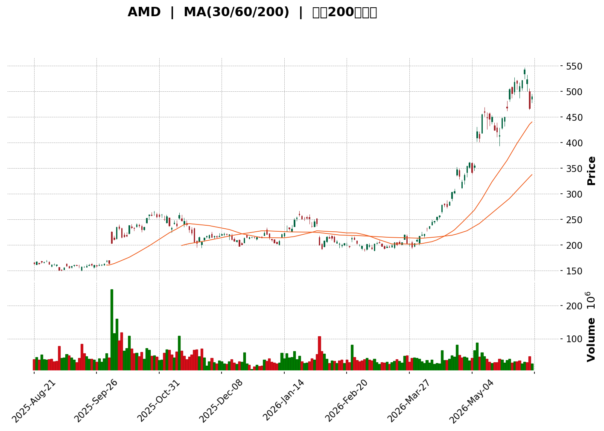
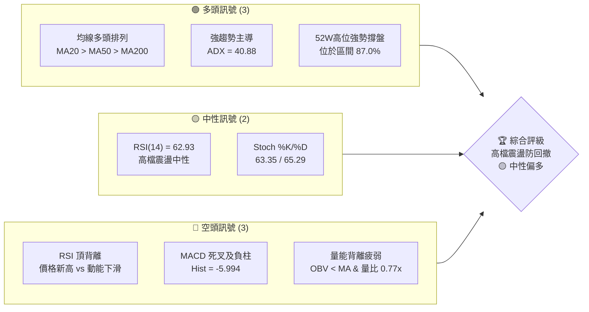
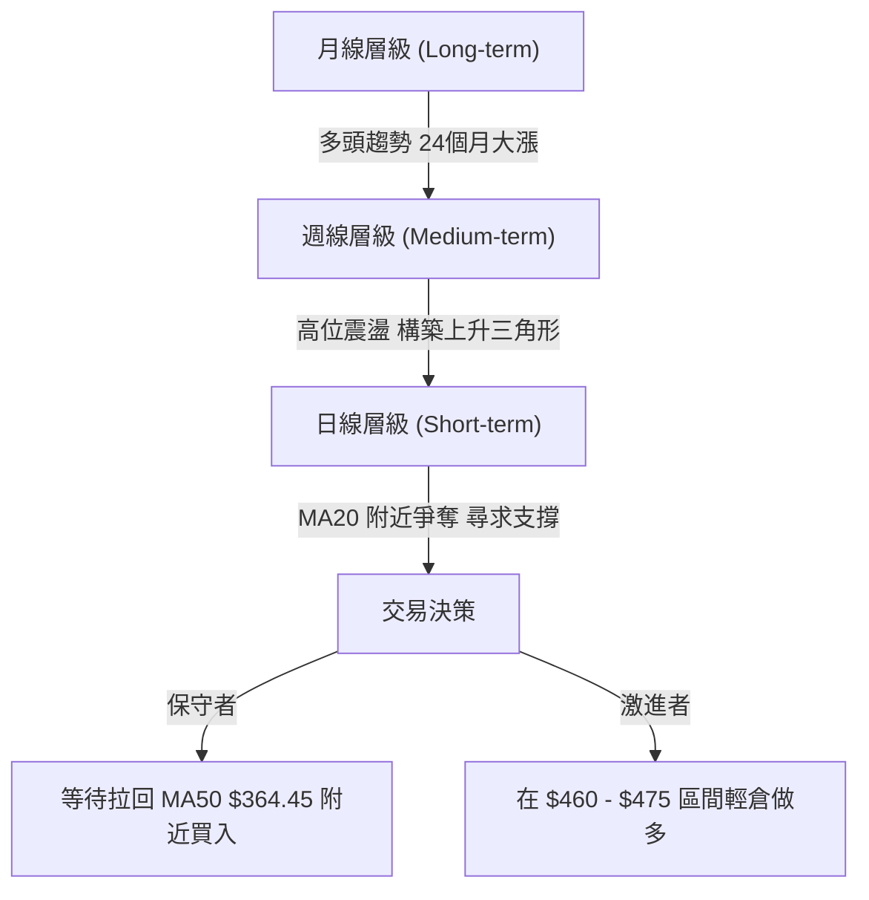
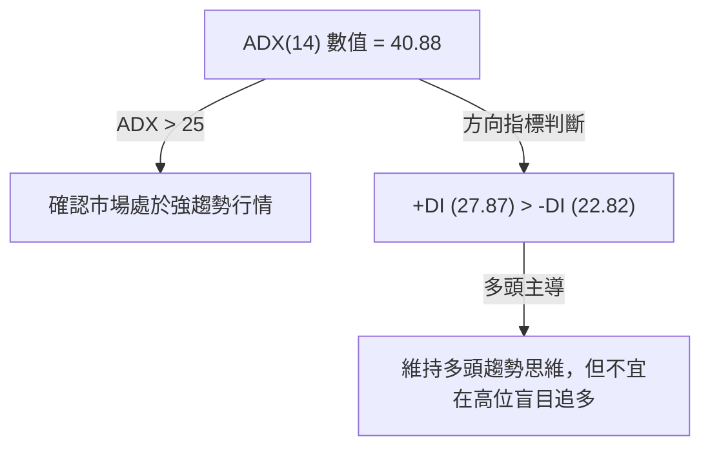

<details>
<summary>📊 靜態圖表 (點擊展開)</summary>

</details>

<html>
<head><meta charset="utf-8" /></head>
<body>
    <div style="height:500px; width:100%;">                        <script>window.PlotlyConfig = {MathJaxConfig: 'local'};</script>
        <script charset="utf-8" src="https://cdn.plot.ly/plotly-3.6.0.min.js" integrity="sha256-QaOVwtVY0T02VaHrr6pnoHLCwayMJp4O5n4YyaE3rJk=" crossorigin="anonymous"></script>                <div id="candlestick-chart" class="plotly-graph-div" style="height:100%; width:100%;"></div>            <script>                window.PLOTLYENV=window.PLOTLYENV || {};                                if (document.getElementById("candlestick-chart")) {                    Plotly.newPlot(                        "candlestick-chart",                        [{"close":{"dtype":"f8","bdata":"AAAAYLh2ZEAAAADgUfhkQAAAACCFa2RAAAAAANfTZEAAAAAAKeRkQAAAAGCPEmVAAAAAAClUZEAAAACAPUpkQAAAAAApRGRAAAAAoEc5ZEAAAADgeuRiQAAAAMAe7WJAAAAAgD16Y0AAAACgR\u002fFjQAAAAKBwdWNAAAAAgD3SY0AAAADAHiVkQAAAAGC4DmRAAAAAwB7lY0AAAACgcL1jQAAAAOB6rGNAAAAAoEf5Y0AAAADAzBxkQAAAAAApHGRAAAAA4KMoZEAAAABguO5jQAAAACCFK2RAAAAAoEc5ZEAAAADgUYBkQAAAACBcN2VAAAAAoHCVZEAAAABguHZpQAAAAOBRcGpAAAAAgOtxbUAAAADgehxtQAAAAMDM3GpAAAAAoHANa0AAAABA4UJrQAAAAEAz021AAAAAgOtRbUAAAABgjyJtQAAAAIDrEW5AAAAAwPXAbUAAAAAgXMdsQAAAACCuX21AAAAAoHCdb0AAAABguDpwQAAAAAApIHBAAAAAoEeFcEAAAABA4dpvQAAAAIDrAXBAAAAAYGY6cEAAAACgmUFvQAAAAKBHBXBAAAAAYGa2bUAAAACgRzFtQAAAACBcf25AAAAA4KOwbUAAAACAPS5wQAAAAGC4\u002fm5AAAAAgOvZbkAAAADgoxBuQAAAAKBHyWxAAAAAoJnxa0AAAADgo8BpQAAAAMD1eGlAAAAAoJnhakAAAAAAKcRpQAAAACCux2pAAAAAwPUwa0AAAADgUXhrQAAAACCu52pAAAAAQDMza0AAAAAgXP9qQAAAAEAKP2tAAAAAIIWja0AAAAAA17NrQAAAAKBwrWtAAAAAgMKta0AAAADA9VhqQAAAAGCP8mlAAAAAoHAlakAAAAAghcNoQAAAAIDrIWlAAAAAgMKtakAAAABgZt5qQAAAAMDM3GpAAAAAoEfhakAAAAAgrt9qQAAAACCF82pAAAAAQOHqakAAAADAHsVqQAAAAEAK72tAAAAAYI+ia0AAAABAM8tqQAAAAOCjQGpAAAAAgMKVaUAAAACgcGVpQAAAAIAU9mlAAAAAQAqfa0AAAABAM\u002fNrQAAAAKBwfWxAAAAAYI\u002f6bEAAAACgcP1sQAAAAKCZOW9AAAAAIFy3b0AAAABA4TpwQAAAAIDraW9AAAAAwPWAb0AAAAAgrpdvQAAAAIDChW9AAAAAIFyXbUAAAADgo8huQAAAACCFQ25AAAAAgBQGaUAAAAAAABBoQAAAAIAUDmpAAAAAAAAAa0AAAACAPbJqQAAAAGCPsmpAAAAAgBS+aUAAAACAPeppQAAAAGCPYmlAAAAAANcDaUAAAAAA12tpQAAAAMDMBGlAAAAAQDOTaEAAAABA4bpqQAAAACCFW2pAAAAAgMJ1aUAAAABguAZpQAAAAADX02hAAAAAYGbeZ0AAAACAPUJpQAAAAGBm7mhAAAAAgMINaEAAAACAwlVpQAAAACBcZ2lAAAAAYI+aaUAAAAAgrrdoQAAAAOB6LGhAAAAAYI+SaEAAAACA64loQAAAAGC47mhAAAAA4KOoaUAAAABgjyppQAAAAIDCVWlAAAAAANeraUAAAADgo4hrQAAAAOCjeGlAAAAAIK4\u002faUAAAACgR4FoQAAAAIDCbWlAAAAAYLhGakAAAAAAADBrQAAAAIDChWtAAAAAwPWwa0AAAACAPfpsQAAAAOB6lG1AAAAAoEehbkAAAABgj9puQAAAAIA94m9AAAAAgOshcEAAAAAAKWRxQAAAAIA9ZnFAAAAAQDMvcUAAAAAA18dxQAAAACBc93JAAAAAoEcVc0AAAADA9bx1QAAAAIAU6nRAAAAAIFwzdEAAAACAwhF1QAAAAADXJ3ZAAAAA4KOIdkAAAADgo1h1QAAAAAApNHZAAAAAgD1WekAAAAAgXId5QAAAAEAKc3xAAAAA4KOsfEAAAADgowR8QAAAAAAA2HtAAAAAQDMbfEAAAACgmYF6QAAAAADXT3pAAAAAwMzgeUAAAACgR\u002fl7QAAAAKBwGXxAAAAAACk4fUAAAACAPX5\u002fQAAAAOCj+H5AAAAAYLgwgEAAAADAzCCAQAAAAIAU4n9AAAAA4FFMgEAAAAAAKfSAQAAAAKCZWYBAAAAAgBQmfUAAAACgR6V+QA=="},"high":{"dtype":"f8","bdata":"AAAAACm8ZEAAAADA9RBlQAAAAEDhsmRAAAAA4KM4ZUAAAACAwvVkQAAAACCuX2VAAAAAgD0SZUAAAADgekxkQAAAAAAAmGRAAAAAoJlBZEAAAADgeqRjQAAAAOB6FGNAAAAAwB6VY0AAAADA9ZBkQAAAAGC4BmRAAAAAwB4NZEAAAACgmUlkQAAAAGBmPmRAAAAAACk0ZEAAAADgo9hjQAAAAEDh+mNAAAAAgMJVZEAAAADgemxkQAAAAEAzo2RAAAAAACk0ZEAAAAAghUNkQAAAAKCZiWRAAAAAwPVIZEAAAACAwoVkQAAAAIDrYWVAAAAAgMJVZUAAAABguFZsQAAAAMDMXGtAAAAAANd7bUAAAABAMwNuQAAAAEAKR21AAAAAgBQGbEAAAAAgXB9sQAAAACCu521AAAAAYGYmbkAAAAAAKWxtQAAAAAApXG5AAAAA4FFIbkAAAAAAKQRuQAAAAMDMfG1AAAAA4Hqsb0AAAABguEZwQAAAAKBHiXBAAAAAoEexcEAAAACAFH5wQAAAAIAUYnBAAAAAYI9OcEAAAACAFBZwQAAAAGBmOnBAAAAA4FGwb0AAAAAA13ttQAAAAMDMHG9AAAAAYLgOb0AAAAAAKXhwQAAAAIAUOnBAAAAAgBSub0AAAADgoxhvQAAAAAAAwG1AAAAAwPVobUAAAAAAAEhtQAAAAGCPGmpAAAAAACkka0AAAABgj9JpQAAAAEDh8mpAAAAAoJlJa0AAAAAgXJ9rQAAAACBcP2xAAAAAYGZGa0AAAAAA12NrQAAAAOB69GtAAAAAYLj2a0AAAABA4RpsQAAAACCF02tAAAAAAACwa0AAAAAgrs9rQAAAACCF62pAAAAAQApHakAAAAAAAHBqQAAAACCFy2lAAAAAgMLlakAAAACgcIVrQAAAAMD1IGtAAAAAoEcRa0AAAABgjxprQAAAAKCZAWtAAAAAgD0aa0AAAADgejRrQAAAAMDMZGxAAAAA4KNAbUAAAACgcN1rQAAAAAAphGpAAAAAgBReakAAAACgmelpQAAAAAApPGpAAAAAIIXja0AAAABA4QJsQAAAAEAzy21AAAAAIK5PbUAAAAAAAPBtQAAAAMDMnG9AAAAAoEcBcEAAAAAgXK9wQAAAAOCjJHBAAAAAoJnxb0AAAABgZhZwQAAAAOB6SHBAAAAAIK6nbkAAAABACj9vQAAAAMDMlG9AAAAAYI9Sa0AAAACgR4FpQAAAAOCjKGpAAAAAQDMza0AAAADgemxrQAAAAMDMdGtAAAAAYLhOa0AAAACgmUFqQAAAAKCZqWlAAAAAYGZmaUAAAABAM4NpQAAAAADXm2lAAAAAACnsaEAAAABguBZrQAAAAGBmFmtAAAAAoEc5akAAAADgejxpQAAAACCu12hAAAAA4Ho0aEAAAACAFE5pQAAAAKBHeWlAAAAAIK4HaUAAAABACl9pQAAAAEDh0mlAAAAAYLgmakAAAAAA13NpQAAAAIDC9WhAAAAAoHAFaUAAAABguOZoQAAAACCFW2lAAAAAACm8aUAAAACgmclpQAAAACCFI2pAAAAAgMLNaUAAAABgj6prQAAAAAAAoGtAAAAA4KNoaUAAAACAwg1qQAAAAAAAgGlAAAAAYI+6akAAAADA9ThrQAAAAIDrSWxAAAAAQDPDa0AAAAAAAEBtQAAAAEAzo21AAAAAYI8yb0AAAABgj+puQAAAAGC47m9AAAAAQOEicEAAAACgcHVxQAAAAMDMkHFAAAAAgML5cUAAAABAM+NxQAAAAAAABHNAAAAAIIVjc0AAAAAA1w92QAAAACBc03VAAAAAAAB4dEAAAABguEJ1QAAAACBcL3ZAAAAA4KOsdkAAAACgmZ12QAAAAMAeeXZAAAAAoJnpekAAAAAgXFt6QAAAAOCjhHxAAAAAIIVTfUAAAADAzKx8QAAAAAAAuHxAAAAAwPVUfEAAAAAAAHB7QAAAAMDMbHtAAAAAAADMekAAAACAPRZ8QAAAAEAzM3xAAAAAYI8WfkAAAAAgXK9\u002fQAAAACBc439AAAAAoJl5gEAAAAAAAFCAQAAAAAAALIBAAAAAgOtTgEAAAAAghROBQAAAACCFoYBAAAAAgOuZf0AAAAAghe9+QA=="},"hovertemplate":"\u003cb\u003e%{x|%Y-%m-%d}\u003c\u002fb\u003e\u003cbr\u003e\u958b: $%{open:.2f}\u003cbr\u003e\u9ad8: $%{high:.2f}\u003cbr\u003e\u4f4e: $%{low:.2f}\u003cbr\u003e\u6536: $%{close:.2f}\u003cextra\u003e\u003c\u002fextra\u003e","low":{"dtype":"f8","bdata":"AAAA4FFIZEAAAACgmTlkQAAAAEAKN2RAAAAAwB6dZEAAAADAzJRkQAAAAMDM1GRAAAAAwMw8ZEAAAAAA15NjQAAAAGCPEmRAAAAAoEe5Y0AAAACAwsViQAAAAEAKp2JAAAAAgML9YkAAAAAAAMBjQAAAACCuX2NAAAAAoHBdY0AAAABAM7NjQAAAAEAK52NAAAAA4FF4Y0AAAABAM7tiQAAAAMDMfGNAAAAAoHCtY0AAAABguOZjQAAAAIDCzWNAAAAAwPVYY0AAAACgmaFjQAAAAMDM\u002fGNAAAAAYI\u002fqY0AAAAAgrg9kQAAAAADXw2RAAAAA4HpkZEAAAADgUWBpQAAAAMD1KGpAAAAAYGZWakAAAADA9bBsQAAAAGBmpmpAAAAAwMzcakAAAADAzPxqQAAAAOBRmGtAAAAAIK4HbUAAAADAHn1sQAAAAMDMTG1AAAAA4KNAbUAAAAAAKRxsQAAAAKBHkWxAAAAAYGY+bkAAAACgmTlvQAAAAAAAEHBAAAAAYGYWcEAAAACA64lvQAAAAMAerW9AAAAA4Hq8b0AAAADgeuxuQAAAAIDrWW5AAAAAIK53bUAAAADgehRsQAAAAAAAEG5AAAAA4HpUbUAAAAAAAEBvQAAAAIDrwW5AAAAAYI9ibUAAAADAzKRtQAAAAGC4FmxAAAAAYLh2a0AAAADA9ZBpQAAAAAAAYGhAAAAAQDO7aUAAAADA9UhoQAAAAAAA4GlAAAAA4KPAakAAAAAAALBqQAAAAOB6zGpAAAAA4KN4akAAAADgesRqQAAAACCuB2tAAAAAIIVLa0AAAADAHj1rQAAAAKBwVWtAAAAAgBRGakAAAACA6yFqQAAAAGCP0mlAAAAAIIWjaUAAAADA9bBoQAAAAAAAEGlAAAAAYGaGaUAAAACA66lqQAAAAMD1iGpAAAAAQAq\u002fakAAAADA9aBqQAAAACCuJ2pAAAAAYI\u002fKakAAAACgmblqQAAAAMDMXGtAAAAAIFyPa0AAAAAAAGhqQAAAAKBw5WlAAAAAYI9qaUAAAACAPWJpQAAAAKCZ+WhAAAAAIFzfakAAAAAgheNqQAAAAEAKZ2xAAAAAIIWbbEAAAADAHi1sQAAAAMD1eG1AAAAAACnUbkAAAAAAAARwQAAAAKCZSW9AAAAAYLj+bkAAAABguEZvQAAAAMAeHW5AAAAAoJlRbUAAAAAAAGBtQAAAAKBHoW1AAAAAwMzkaEAAAABACtdnQAAAAIDCjWhAAAAAwMyEaUAAAAAAKaRqQAAAAGC4JmpAAAAA4HqkaUAAAAAAKXxpQAAAAGCPWmhAAAAAAABgaEAAAACgR8loQAAAAIDr0WhAAAAAwMxEaEAAAAAAANBpQAAAAGCPSmpAAAAAYLguaUAAAAAgrrdoQAAAAAAAwGdAAAAAQAqHZ0AAAAAghbtnQAAAAAApXGhAAAAAAADoZ0AAAADgo6BnQAAAAGBmRmlAAAAAACl0aUAAAACgcJVoQAAAAOCjCGhAAAAAoJlZaEAAAADgUWhoQAAAAAAAeGhAAAAAYI8aaEAAAADgUchoQAAAAGC4NmlAAAAAACkEaUAAAADgUXBqQAAAAIDCbWlAAAAAgBS2aEAAAAAA1xtoQAAAAMAejWhAAAAAQOG6aUAAAAAA1xNpQAAAACBcN2tAAAAAACnsakAAAABA4WJsQAAAAMAe3WxAAAAAYLjebUAAAADA9UBuQAAAAGBmtm5AAAAAQDN7b0AAAAAAKVhwQAAAAIA9InFAAAAAAAAAcUAAAACA60lxQAAAAIA94nFAAAAAACm8ckAAAADgo+h0QAAAAMD1jHRAAAAAAABgc0AAAACAwu1zQAAAAKCZyXRAAAAAAADUdUAAAABAMyt1QAAAAIAUjnVAAAAA4KMgeUAAAACgRxF5QAAAAOCjJHpAAAAAgBQufEAAAACAwqF6QAAAAGBmCntAAAAAQOE6e0AAAACAwnV6QAAAACBcq3lAAAAAgMKVeEAAAADAzKB6QAAAAKCZ+XpAAAAAIFzbfEAAAAAgrgN+QAAAAGCPan5AAAAA4FHYfkAAAABA4XZ\u002fQAAAAMDMbH5AAAAAIIVTf0AAAABgZmKAQAAAAIDrPX9AAAAAQDP\u002ffEAAAAAgXNt9QA=="},"name":"\u50f9\u683c","open":{"dtype":"f8","bdata":"AAAAIIW7ZEAAAACgcEVkQAAAAKCZsWRAAAAAwMwUZUAAAACgR8FkQAAAAAAAEGVAAAAAgOvZZEAAAACgcM1jQAAAAIDrOWRAAAAAgBT+Y0AAAAAA16NjQAAAAKCZ+WJAAAAAIK7\u002fYkAAAACgR3FkQAAAAADX02NAAAAAAACgY0AAAADgUQBkQAAAAADXK2RAAAAAwPXoY0AAAABguN5iQAAAAAAprGNAAAAAoHCtY0AAAADgoxBkQAAAACBcX2RAAAAA4HqkY0AAAADgoxBkQAAAAADXA2RAAAAAoEcZZEAAAACAwh1kQAAAAIDCFWVAAAAAgMJVZUAAAABgZk5sQAAAAEAz22pAAAAAYGaeakAAAACgmYltQAAAAOCjGG1AAAAAYGaGa0AAAABgZmZrQAAAAGC41mtAAAAAoEeJbUAAAADgUShtQAAAAEAKj21AAAAA4HrsbUAAAABAM5ttQAAAAMAexWxAAAAAIIVrbkAAAACAFB5wQAAAAIA9MnBAAAAAQAqDcEAAAABguD5wQAAAAKCZOXBAAAAAoEc1cEAAAABAM0tvQAAAACCuZ25AAAAAQAqvb0AAAACAFN5sQAAAAOB6RG5AAAAAwB41bkAAAAAAKaRvQAAAAMDMfG9AAAAAIIUDbkAAAAAAAFhuQAAAAMD1mG1AAAAA4FHIbEAAAABgZhZtQAAAAIDrGWpAAAAAwB7laUAAAAAgXC9pQAAAAKCZQWpAAAAA4HoEa0AAAAAAKbxqQAAAAKBHuWtAAAAA4FEIa0AAAAAAKRxrQAAAAKBwJWtAAAAAQOFia0AAAACgR6FrQAAAAAAAwGtAAAAAgOs5a0AAAAAA10trQAAAAMD1iGpAAAAAoHDdaUAAAACgR0FqQAAAAIA9emlAAAAAQDOTaUAAAAAAAIBrQAAAACCFm2pAAAAAIFzfakAAAACAwu1qQAAAAGCPcmpAAAAAANf7akAAAACAPfpqQAAAAMDMXGtAAAAAAADIbEAAAABguNZrQAAAAAAphGpAAAAAwMxcakAAAABACrdpQAAAAIDCJWlAAAAAQDPjakAAAACgRzFrQAAAAMDMfGxAAAAAoJlJbUAAAABgj0JsQAAAACCuf21AAAAAAAB4b0AAAABA4VJwQAAAAAAADHBAAAAAwB6Fb0AAAAAAKcRvQAAAAMAe1W9AAAAAgMKdbUAAAADgo3htQAAAAKCZcW9AAAAAAADgakAAAAAghTtpQAAAAAAppGhAAAAAwMzcaUAAAADgeuRqQAAAAAApPGtAAAAAYI\u002f6akAAAADgo4BpQAAAAMDMRGlAAAAAwB7NaEAAAAAghQNpQAAAAADXA2lAAAAAQOHCaEAAAAAAKXRqQAAAAIA92mpAAAAAoJkZakAAAAAghQNpQAAAAEAzO2hAAAAAYLjuZ0AAAAAA1wNoQAAAAOCjuGhAAAAA4KNoaEAAAAAghatnQAAAAOBRUGlAAAAAIIWjaUAAAABgj1ppQAAAACCFw2hAAAAAIFxfaEAAAACAwpVoQAAAAAAAgGhAAAAAwPVgaEAAAADgepxpQAAAAMDMzGlAAAAA4HosaUAAAADgUXBqQAAAACBcP2tAAAAA4KM4aUAAAABgZp5pQAAAAKCZwWhAAAAAQOHyaUAAAACgmYFpQAAAAMD1aGtAAAAA4FFIa0AAAAAA1wNtQAAAAOBRIG1AAAAAAADgbUAAAADA9aBuQAAAAKBHOW9AAAAAYLjeb0AAAAAA149wQAAAAAAAkHFAAAAAoJmJcUAAAACgR1VxQAAAACCFM3JAAAAAACngckAAAAAAKQx1QAAAAMAepXVAAAAAgMJ9c0AAAACgR2l0QAAAAIDCVXVAAAAAgOv9dUAAAADA9YR2QAAAAAAp+HVAAAAAANeXeUAAAADAHhF6QAAAAKBwKXpAAAAAwMzIfEAAAAAAABR8QAAAAOCjkHxAAAAAoJmJe0AAAACgcBV7QAAAAAAA2HpAAAAAoJnJeUAAAADgo8B6QAAAAADXn3tAAAAAoHBdfUAAAAAA10t+QAAAAAAAwH9AAAAAAAAwf0AAAABgZkaAQAAAAGCPQn9AAAAAwMykf0AAAAAAAK6AQAAAAAAAFoBAAAAA4Ho4f0AAAADgelB+QA=="},"x":["2025-08-21T00:00:00-04:00","2025-08-22T00:00:00-04:00","2025-08-25T00:00:00-04:00","2025-08-26T00:00:00-04:00","2025-08-27T00:00:00-04:00","2025-08-28T00:00:00-04:00","2025-08-29T00:00:00-04:00","2025-09-02T00:00:00-04:00","2025-09-03T00:00:00-04:00","2025-09-04T00:00:00-04:00","2025-09-05T00:00:00-04:00","2025-09-08T00:00:00-04:00","2025-09-09T00:00:00-04:00","2025-09-10T00:00:00-04:00","2025-09-11T00:00:00-04:00","2025-09-12T00:00:00-04:00","2025-09-15T00:00:00-04:00","2025-09-16T00:00:00-04:00","2025-09-17T00:00:00-04:00","2025-09-18T00:00:00-04:00","2025-09-19T00:00:00-04:00","2025-09-22T00:00:00-04:00","2025-09-23T00:00:00-04:00","2025-09-24T00:00:00-04:00","2025-09-25T00:00:00-04:00","2025-09-26T00:00:00-04:00","2025-09-29T00:00:00-04:00","2025-09-30T00:00:00-04:00","2025-10-01T00:00:00-04:00","2025-10-02T00:00:00-04:00","2025-10-03T00:00:00-04:00","2025-10-06T00:00:00-04:00","2025-10-07T00:00:00-04:00","2025-10-08T00:00:00-04:00","2025-10-09T00:00:00-04:00","2025-10-10T00:00:00-04:00","2025-10-13T00:00:00-04:00","2025-10-14T00:00:00-04:00","2025-10-15T00:00:00-04:00","2025-10-16T00:00:00-04:00","2025-10-17T00:00:00-04:00","2025-10-20T00:00:00-04:00","2025-10-21T00:00:00-04:00","2025-10-22T00:00:00-04:00","2025-10-23T00:00:00-04:00","2025-10-24T00:00:00-04:00","2025-10-27T00:00:00-04:00","2025-10-28T00:00:00-04:00","2025-10-29T00:00:00-04:00","2025-10-30T00:00:00-04:00","2025-10-31T00:00:00-04:00","2025-11-03T00:00:00-05:00","2025-11-04T00:00:00-05:00","2025-11-05T00:00:00-05:00","2025-11-06T00:00:00-05:00","2025-11-07T00:00:00-05:00","2025-11-10T00:00:00-05:00","2025-11-11T00:00:00-05:00","2025-11-12T00:00:00-05:00","2025-11-13T00:00:00-05:00","2025-11-14T00:00:00-05:00","2025-11-17T00:00:00-05:00","2025-11-18T00:00:00-05:00","2025-11-19T00:00:00-05:00","2025-11-20T00:00:00-05:00","2025-11-21T00:00:00-05:00","2025-11-24T00:00:00-05:00","2025-11-25T00:00:00-05:00","2025-11-26T00:00:00-05:00","2025-11-28T00:00:00-05:00","2025-12-01T00:00:00-05:00","2025-12-02T00:00:00-05:00","2025-12-03T00:00:00-05:00","2025-12-04T00:00:00-05:00","2025-12-05T00:00:00-05:00","2025-12-08T00:00:00-05:00","2025-12-09T00:00:00-05:00","2025-12-10T00:00:00-05:00","2025-12-11T00:00:00-05:00","2025-12-12T00:00:00-05:00","2025-12-15T00:00:00-05:00","2025-12-16T00:00:00-05:00","2025-12-17T00:00:00-05:00","2025-12-18T00:00:00-05:00","2025-12-19T00:00:00-05:00","2025-12-22T00:00:00-05:00","2025-12-23T00:00:00-05:00","2025-12-24T00:00:00-05:00","2025-12-26T00:00:00-05:00","2025-12-29T00:00:00-05:00","2025-12-30T00:00:00-05:00","2025-12-31T00:00:00-05:00","2026-01-02T00:00:00-05:00","2026-01-05T00:00:00-05:00","2026-01-06T00:00:00-05:00","2026-01-07T00:00:00-05:00","2026-01-08T00:00:00-05:00","2026-01-09T00:00:00-05:00","2026-01-12T00:00:00-05:00","2026-01-13T00:00:00-05:00","2026-01-14T00:00:00-05:00","2026-01-15T00:00:00-05:00","2026-01-16T00:00:00-05:00","2026-01-20T00:00:00-05:00","2026-01-21T00:00:00-05:00","2026-01-22T00:00:00-05:00","2026-01-23T00:00:00-05:00","2026-01-26T00:00:00-05:00","2026-01-27T00:00:00-05:00","2026-01-28T00:00:00-05:00","2026-01-29T00:00:00-05:00","2026-01-30T00:00:00-05:00","2026-02-02T00:00:00-05:00","2026-02-03T00:00:00-05:00","2026-02-04T00:00:00-05:00","2026-02-05T00:00:00-05:00","2026-02-06T00:00:00-05:00","2026-02-09T00:00:00-05:00","2026-02-10T00:00:00-05:00","2026-02-11T00:00:00-05:00","2026-02-12T00:00:00-05:00","2026-02-13T00:00:00-05:00","2026-02-17T00:00:00-05:00","2026-02-18T00:00:00-05:00","2026-02-19T00:00:00-05:00","2026-02-20T00:00:00-05:00","2026-02-23T00:00:00-05:00","2026-02-24T00:00:00-05:00","2026-02-25T00:00:00-05:00","2026-02-26T00:00:00-05:00","2026-02-27T00:00:00-05:00","2026-03-02T00:00:00-05:00","2026-03-03T00:00:00-05:00","2026-03-04T00:00:00-05:00","2026-03-05T00:00:00-05:00","2026-03-06T00:00:00-05:00","2026-03-09T00:00:00-04:00","2026-03-10T00:00:00-04:00","2026-03-11T00:00:00-04:00","2026-03-12T00:00:00-04:00","2026-03-13T00:00:00-04:00","2026-03-16T00:00:00-04:00","2026-03-17T00:00:00-04:00","2026-03-18T00:00:00-04:00","2026-03-19T00:00:00-04:00","2026-03-20T00:00:00-04:00","2026-03-23T00:00:00-04:00","2026-03-24T00:00:00-04:00","2026-03-25T00:00:00-04:00","2026-03-26T00:00:00-04:00","2026-03-27T00:00:00-04:00","2026-03-30T00:00:00-04:00","2026-03-31T00:00:00-04:00","2026-04-01T00:00:00-04:00","2026-04-02T00:00:00-04:00","2026-04-06T00:00:00-04:00","2026-04-07T00:00:00-04:00","2026-04-08T00:00:00-04:00","2026-04-09T00:00:00-04:00","2026-04-10T00:00:00-04:00","2026-04-13T00:00:00-04:00","2026-04-14T00:00:00-04:00","2026-04-15T00:00:00-04:00","2026-04-16T00:00:00-04:00","2026-04-17T00:00:00-04:00","2026-04-20T00:00:00-04:00","2026-04-21T00:00:00-04:00","2026-04-22T00:00:00-04:00","2026-04-23T00:00:00-04:00","2026-04-24T00:00:00-04:00","2026-04-27T00:00:00-04:00","2026-04-28T00:00:00-04:00","2026-04-29T00:00:00-04:00","2026-04-30T00:00:00-04:00","2026-05-01T00:00:00-04:00","2026-05-04T00:00:00-04:00","2026-05-05T00:00:00-04:00","2026-05-06T00:00:00-04:00","2026-05-07T00:00:00-04:00","2026-05-08T00:00:00-04:00","2026-05-11T00:00:00-04:00","2026-05-12T00:00:00-04:00","2026-05-13T00:00:00-04:00","2026-05-14T00:00:00-04:00","2026-05-15T00:00:00-04:00","2026-05-18T00:00:00-04:00","2026-05-19T00:00:00-04:00","2026-05-20T00:00:00-04:00","2026-05-21T00:00:00-04:00","2026-05-22T00:00:00-04:00","2026-05-26T00:00:00-04:00","2026-05-27T00:00:00-04:00","2026-05-28T00:00:00-04:00","2026-05-29T00:00:00-04:00","2026-06-01T00:00:00-04:00","2026-06-02T00:00:00-04:00","2026-06-03T00:00:00-04:00","2026-06-04T00:00:00-04:00","2026-06-05T00:00:00-04:00","2026-06-08T00:00:00-04:00"],"type":"candlestick"},{"hovertemplate":"MA30: $%{y:.2f}\u003cextra\u003e\u003c\u002fextra\u003e","line":{"color":"#2196F3","dash":"dash","width":2},"mode":"lines","name":"MA30","x":["2025-08-21T00:00:00-04:00","2025-08-22T00:00:00-04:00","2025-08-25T00:00:00-04:00","2025-08-26T00:00:00-04:00","2025-08-27T00:00:00-04:00","2025-08-28T00:00:00-04:00","2025-08-29T00:00:00-04:00","2025-09-02T00:00:00-04:00","2025-09-03T00:00:00-04:00","2025-09-04T00:00:00-04:00","2025-09-05T00:00:00-04:00","2025-09-08T00:00:00-04:00","2025-09-09T00:00:00-04:00","2025-09-10T00:00:00-04:00","2025-09-11T00:00:00-04:00","2025-09-12T00:00:00-04:00","2025-09-15T00:00:00-04:00","2025-09-16T00:00:00-04:00","2025-09-17T00:00:00-04:00","2025-09-18T00:00:00-04:00","2025-09-19T00:00:00-04:00","2025-09-22T00:00:00-04:00","2025-09-23T00:00:00-04:00","2025-09-24T00:00:00-04:00","2025-09-25T00:00:00-04:00","2025-09-26T00:00:00-04:00","2025-09-29T00:00:00-04:00","2025-09-30T00:00:00-04:00","2025-10-01T00:00:00-04:00","2025-10-02T00:00:00-04:00","2025-10-03T00:00:00-04:00","2025-10-06T00:00:00-04:00","2025-10-07T00:00:00-04:00","2025-10-08T00:00:00-04:00","2025-10-09T00:00:00-04:00","2025-10-10T00:00:00-04:00","2025-10-13T00:00:00-04:00","2025-10-14T00:00:00-04:00","2025-10-15T00:00:00-04:00","2025-10-16T00:00:00-04:00","2025-10-17T00:00:00-04:00","2025-10-20T00:00:00-04:00","2025-10-21T00:00:00-04:00","2025-10-22T00:00:00-04:00","2025-10-23T00:00:00-04:00","2025-10-24T00:00:00-04:00","2025-10-27T00:00:00-04:00","2025-10-28T00:00:00-04:00","2025-10-29T00:00:00-04:00","2025-10-30T00:00:00-04:00","2025-10-31T00:00:00-04:00","2025-11-03T00:00:00-05:00","2025-11-04T00:00:00-05:00","2025-11-05T00:00:00-05:00","2025-11-06T00:00:00-05:00","2025-11-07T00:00:00-05:00","2025-11-10T00:00:00-05:00","2025-11-11T00:00:00-05:00","2025-11-12T00:00:00-05:00","2025-11-13T00:00:00-05:00","2025-11-14T00:00:00-05:00","2025-11-17T00:00:00-05:00","2025-11-18T00:00:00-05:00","2025-11-19T00:00:00-05:00","2025-11-20T00:00:00-05:00","2025-11-21T00:00:00-05:00","2025-11-24T00:00:00-05:00","2025-11-25T00:00:00-05:00","2025-11-26T00:00:00-05:00","2025-11-28T00:00:00-05:00","2025-12-01T00:00:00-05:00","2025-12-02T00:00:00-05:00","2025-12-03T00:00:00-05:00","2025-12-04T00:00:00-05:00","2025-12-05T00:00:00-05:00","2025-12-08T00:00:00-05:00","2025-12-09T00:00:00-05:00","2025-12-10T00:00:00-05:00","2025-12-11T00:00:00-05:00","2025-12-12T00:00:00-05:00","2025-12-15T00:00:00-05:00","2025-12-16T00:00:00-05:00","2025-12-17T00:00:00-05:00","2025-12-18T00:00:00-05:00","2025-12-19T00:00:00-05:00","2025-12-22T00:00:00-05:00","2025-12-23T00:00:00-05:00","2025-12-24T00:00:00-05:00","2025-12-26T00:00:00-05:00","2025-12-29T00:00:00-05:00","2025-12-30T00:00:00-05:00","2025-12-31T00:00:00-05:00","2026-01-02T00:00:00-05:00","2026-01-05T00:00:00-05:00","2026-01-06T00:00:00-05:00","2026-01-07T00:00:00-05:00","2026-01-08T00:00:00-05:00","2026-01-09T00:00:00-05:00","2026-01-12T00:00:00-05:00","2026-01-13T00:00:00-05:00","2026-01-14T00:00:00-05:00","2026-01-15T00:00:00-05:00","2026-01-16T00:00:00-05:00","2026-01-20T00:00:00-05:00","2026-01-21T00:00:00-05:00","2026-01-22T00:00:00-05:00","2026-01-23T00:00:00-05:00","2026-01-26T00:00:00-05:00","2026-01-27T00:00:00-05:00","2026-01-28T00:00:00-05:00","2026-01-29T00:00:00-05:00","2026-01-30T00:00:00-05:00","2026-02-02T00:00:00-05:00","2026-02-03T00:00:00-05:00","2026-02-04T00:00:00-05:00","2026-02-05T00:00:00-05:00","2026-02-06T00:00:00-05:00","2026-02-09T00:00:00-05:00","2026-02-10T00:00:00-05:00","2026-02-11T00:00:00-05:00","2026-02-12T00:00:00-05:00","2026-02-13T00:00:00-05:00","2026-02-17T00:00:00-05:00","2026-02-18T00:00:00-05:00","2026-02-19T00:00:00-05:00","2026-02-20T00:00:00-05:00","2026-02-23T00:00:00-05:00","2026-02-24T00:00:00-05:00","2026-02-25T00:00:00-05:00","2026-02-26T00:00:00-05:00","2026-02-27T00:00:00-05:00","2026-03-02T00:00:00-05:00","2026-03-03T00:00:00-05:00","2026-03-04T00:00:00-05:00","2026-03-05T00:00:00-05:00","2026-03-06T00:00:00-05:00","2026-03-09T00:00:00-04:00","2026-03-10T00:00:00-04:00","2026-03-11T00:00:00-04:00","2026-03-12T00:00:00-04:00","2026-03-13T00:00:00-04:00","2026-03-16T00:00:00-04:00","2026-03-17T00:00:00-04:00","2026-03-18T00:00:00-04:00","2026-03-19T00:00:00-04:00","2026-03-20T00:00:00-04:00","2026-03-23T00:00:00-04:00","2026-03-24T00:00:00-04:00","2026-03-25T00:00:00-04:00","2026-03-26T00:00:00-04:00","2026-03-27T00:00:00-04:00","2026-03-30T00:00:00-04:00","2026-03-31T00:00:00-04:00","2026-04-01T00:00:00-04:00","2026-04-02T00:00:00-04:00","2026-04-06T00:00:00-04:00","2026-04-07T00:00:00-04:00","2026-04-08T00:00:00-04:00","2026-04-09T00:00:00-04:00","2026-04-10T00:00:00-04:00","2026-04-13T00:00:00-04:00","2026-04-14T00:00:00-04:00","2026-04-15T00:00:00-04:00","2026-04-16T00:00:00-04:00","2026-04-17T00:00:00-04:00","2026-04-20T00:00:00-04:00","2026-04-21T00:00:00-04:00","2026-04-22T00:00:00-04:00","2026-04-23T00:00:00-04:00","2026-04-24T00:00:00-04:00","2026-04-27T00:00:00-04:00","2026-04-28T00:00:00-04:00","2026-04-29T00:00:00-04:00","2026-04-30T00:00:00-04:00","2026-05-01T00:00:00-04:00","2026-05-04T00:00:00-04:00","2026-05-05T00:00:00-04:00","2026-05-06T00:00:00-04:00","2026-05-07T00:00:00-04:00","2026-05-08T00:00:00-04:00","2026-05-11T00:00:00-04:00","2026-05-12T00:00:00-04:00","2026-05-13T00:00:00-04:00","2026-05-14T00:00:00-04:00","2026-05-15T00:00:00-04:00","2026-05-18T00:00:00-04:00","2026-05-19T00:00:00-04:00","2026-05-20T00:00:00-04:00","2026-05-21T00:00:00-04:00","2026-05-22T00:00:00-04:00","2026-05-26T00:00:00-04:00","2026-05-27T00:00:00-04:00","2026-05-28T00:00:00-04:00","2026-05-29T00:00:00-04:00","2026-06-01T00:00:00-04:00","2026-06-02T00:00:00-04:00","2026-06-03T00:00:00-04:00","2026-06-04T00:00:00-04:00","2026-06-05T00:00:00-04:00","2026-06-08T00:00:00-04:00"],"y":{"dtype":"f8","bdata":"AAAAAAAA+H8AAAAAAAD4fwAAAAAAAPh\u002fAAAAAAAA+H8AAAAAAAD4fwAAAAAAAPh\u002fAAAAAAAA+H8AAAAAAAD4fwAAAAAAAPh\u002fAAAAAAAA+H8AAAAAAAD4fwAAAAAAAPh\u002fAAAAAAAA+H8AAAAAAAD4fwAAAAAAAPh\u002fAAAAAAAA+H8AAAAAAAD4fwAAAAAAAPh\u002fAAAAAAAA+H8AAAAAAAD4fwAAAAAAAPh\u002fAAAAAAAA+H8AAAAAAAD4fwAAAAAAAPh\u002fAAAAAAAA+H8AAAAAAAD4fwAAAAAAAPh\u002fAAAAAAAA+H8AAAAAAAD4fxEREdGwI2RAVVVV9bYkZEBVVVW1D0tkQN7d3d1rfmRAVVVVFfXHZEAiIiLyGQ5lQERERGSCP2VAVVVVpeJ4ZUAiIiKSX7RlQKuqqvrwBWZAq6qqCpBTZkAAAAAg96pmQERERAQPCmdAMzMz079hZ0CJiIjoJq1nQO\u002fu7o7CAWhAVVVVZWZmaEAiIiIyes9oQJqZmdmHN2lARERERLanaUAzMzPjFw9qQCIiIsJneGpAIiIiMuziakB3d3cXBEJrQM3MzEzUp2tAiYiIyFr5a0Dv7u6OX0hsQDMzM1OAoGxAq6qqqkfxbEDNzMw8fFZtQO\u002fu7j7uqW1AERER8YsBbkBmZmaGzyhuQHd3d7fXPG5AAAAAMAgwbkAzMzPjXhNuQDMzM2OCB25AmpmZSQwGbkCamZlpSvltQCIiIoJO321A7+7uLiTNbUDv7u7u7r5tQDMzM+Pso21AMzMzIyKObUAAAADw7n5tQHd3d1fHbG1Ad3d3F9lKbUBmZmbmQiJtQDMzM2M7+2xARERE1HjNbEAzMzODeZ5sQLy7u9uyamxAREREdNo0bEDv7u5ec\u002f1rQKuqqvp+wmtAZmZmppuoa0B3d3dXx5RrQAAAAJDCdWtAVVVVBchda0BERERk9C5rQO\u002fu7q5yDGtAZmZmRuHqakDNzMw8w85qQM3MzOx8x2pAMzMzc9rEakCJiIgYvc1qQImIiAhl1GpAREREVFXJakDNzMwMLcZqQGZmZnYwv2pAAAAA0NvCakBERERk9MZqQAAAAOB61GpAzczMnKjjakC8u7tLqfRqQCIiIgKdFmtAERERcWg5a0C8u7tbAWJrQCIiIlLjgWtAmpmZKYeia0CrqqoKSc9rQAAAANDb\u002fmtAd3d3h0EcbEC8u7troE9sQO\u002fu7s5pe2xAiYiIaEptbEAAAAAQWFVsQN7d3Q10TmxAMzMzM3pPbEAiIiJy9k1sQO\u002fu7h7MS2xAvLu7S8VBbEBVVVWFeTpsQBEREbG5JGxAZmZmNl4ObEAAAADwpwJsQERERMQg+GtAREREZILva0AzMzMD5PprQCIiIqJF\u002fmtA7+7uTtTra0B3d3dH4dJrQM3MzGygs2tAVVVVdQWIa0C8u7trLmhrQDMzM4N5MmtAZmZmhhbxakCamZm5SbRqQN7d3a0AgWpA7+7u7qdOakBERERE\u002fRNqQN7d3a1H1WlA3t3dDXSqaUBERESkKXVpQJqZmVmrR2lAd3d3hxZNaUBVVVW1gVZpQHd3d9dcUGlAREREJAZFaUAAAACwK0xpQHd3d+e0QWlAq6qqSn49aUCJiIgYdjFpQKuqqqrVMWlAmpmZ6Zg8aUCJiIhYq0tpQO\u002fu7t4IYWlAvLu7a6B7aUCamZkpzo5pQCIiItJNqmlAvLu722vWaUCamZk5JghqQHd3d9dcRGpAq6qqugKMakDe3d2tR91qQBEREZF7MWtAiYiICIGJa0De3d2dxOBrQGZmZhauS2xAiYiISOG2bEBVVVVl9FZtQFVVVVWc7W1AMzMzw650bkC8u7uL3gpvQBERERE8sG9AiYiIkO0qcEB3d3fntHVwQJqZmSkVx3BAiYiIGEs6cUBVVVVNqZ5xQDMzM4PAJHJA3t3dRbatckDv7u7OPjRzQO\u002fu7m5ZtXNAVVVVzRM1dEDv7u6WQ6N0QBEREdlcDnVAZmZmPgp1dUBERESsHOh1QCIiInKvWXZAzczMBFbQdkB3d3dHb1l3QDMzM3Ov2XdAZmZmBlZkeEC8u7sbL+N4QHd3d1fHXnlAd3d3F0vieUCrqqrK6Gt6QBEREaEa4XpAMzMzU\u002f82e0De3d0NAoN7QA=="},"type":"scatter"},{"hovertemplate":"MA60: $%{y:.2f}\u003cextra\u003e\u003c\u002fextra\u003e","line":{"color":"#9C27B0","dash":"dash","width":2},"mode":"lines","name":"MA60","x":["2025-08-21T00:00:00-04:00","2025-08-22T00:00:00-04:00","2025-08-25T00:00:00-04:00","2025-08-26T00:00:00-04:00","2025-08-27T00:00:00-04:00","2025-08-28T00:00:00-04:00","2025-08-29T00:00:00-04:00","2025-09-02T00:00:00-04:00","2025-09-03T00:00:00-04:00","2025-09-04T00:00:00-04:00","2025-09-05T00:00:00-04:00","2025-09-08T00:00:00-04:00","2025-09-09T00:00:00-04:00","2025-09-10T00:00:00-04:00","2025-09-11T00:00:00-04:00","2025-09-12T00:00:00-04:00","2025-09-15T00:00:00-04:00","2025-09-16T00:00:00-04:00","2025-09-17T00:00:00-04:00","2025-09-18T00:00:00-04:00","2025-09-19T00:00:00-04:00","2025-09-22T00:00:00-04:00","2025-09-23T00:00:00-04:00","2025-09-24T00:00:00-04:00","2025-09-25T00:00:00-04:00","2025-09-26T00:00:00-04:00","2025-09-29T00:00:00-04:00","2025-09-30T00:00:00-04:00","2025-10-01T00:00:00-04:00","2025-10-02T00:00:00-04:00","2025-10-03T00:00:00-04:00","2025-10-06T00:00:00-04:00","2025-10-07T00:00:00-04:00","2025-10-08T00:00:00-04:00","2025-10-09T00:00:00-04:00","2025-10-10T00:00:00-04:00","2025-10-13T00:00:00-04:00","2025-10-14T00:00:00-04:00","2025-10-15T00:00:00-04:00","2025-10-16T00:00:00-04:00","2025-10-17T00:00:00-04:00","2025-10-20T00:00:00-04:00","2025-10-21T00:00:00-04:00","2025-10-22T00:00:00-04:00","2025-10-23T00:00:00-04:00","2025-10-24T00:00:00-04:00","2025-10-27T00:00:00-04:00","2025-10-28T00:00:00-04:00","2025-10-29T00:00:00-04:00","2025-10-30T00:00:00-04:00","2025-10-31T00:00:00-04:00","2025-11-03T00:00:00-05:00","2025-11-04T00:00:00-05:00","2025-11-05T00:00:00-05:00","2025-11-06T00:00:00-05:00","2025-11-07T00:00:00-05:00","2025-11-10T00:00:00-05:00","2025-11-11T00:00:00-05:00","2025-11-12T00:00:00-05:00","2025-11-13T00:00:00-05:00","2025-11-14T00:00:00-05:00","2025-11-17T00:00:00-05:00","2025-11-18T00:00:00-05:00","2025-11-19T00:00:00-05:00","2025-11-20T00:00:00-05:00","2025-11-21T00:00:00-05:00","2025-11-24T00:00:00-05:00","2025-11-25T00:00:00-05:00","2025-11-26T00:00:00-05:00","2025-11-28T00:00:00-05:00","2025-12-01T00:00:00-05:00","2025-12-02T00:00:00-05:00","2025-12-03T00:00:00-05:00","2025-12-04T00:00:00-05:00","2025-12-05T00:00:00-05:00","2025-12-08T00:00:00-05:00","2025-12-09T00:00:00-05:00","2025-12-10T00:00:00-05:00","2025-12-11T00:00:00-05:00","2025-12-12T00:00:00-05:00","2025-12-15T00:00:00-05:00","2025-12-16T00:00:00-05:00","2025-12-17T00:00:00-05:00","2025-12-18T00:00:00-05:00","2025-12-19T00:00:00-05:00","2025-12-22T00:00:00-05:00","2025-12-23T00:00:00-05:00","2025-12-24T00:00:00-05:00","2025-12-26T00:00:00-05:00","2025-12-29T00:00:00-05:00","2025-12-30T00:00:00-05:00","2025-12-31T00:00:00-05:00","2026-01-02T00:00:00-05:00","2026-01-05T00:00:00-05:00","2026-01-06T00:00:00-05:00","2026-01-07T00:00:00-05:00","2026-01-08T00:00:00-05:00","2026-01-09T00:00:00-05:00","2026-01-12T00:00:00-05:00","2026-01-13T00:00:00-05:00","2026-01-14T00:00:00-05:00","2026-01-15T00:00:00-05:00","2026-01-16T00:00:00-05:00","2026-01-20T00:00:00-05:00","2026-01-21T00:00:00-05:00","2026-01-22T00:00:00-05:00","2026-01-23T00:00:00-05:00","2026-01-26T00:00:00-05:00","2026-01-27T00:00:00-05:00","2026-01-28T00:00:00-05:00","2026-01-29T00:00:00-05:00","2026-01-30T00:00:00-05:00","2026-02-02T00:00:00-05:00","2026-02-03T00:00:00-05:00","2026-02-04T00:00:00-05:00","2026-02-05T00:00:00-05:00","2026-02-06T00:00:00-05:00","2026-02-09T00:00:00-05:00","2026-02-10T00:00:00-05:00","2026-02-11T00:00:00-05:00","2026-02-12T00:00:00-05:00","2026-02-13T00:00:00-05:00","2026-02-17T00:00:00-05:00","2026-02-18T00:00:00-05:00","2026-02-19T00:00:00-05:00","2026-02-20T00:00:00-05:00","2026-02-23T00:00:00-05:00","2026-02-24T00:00:00-05:00","2026-02-25T00:00:00-05:00","2026-02-26T00:00:00-05:00","2026-02-27T00:00:00-05:00","2026-03-02T00:00:00-05:00","2026-03-03T00:00:00-05:00","2026-03-04T00:00:00-05:00","2026-03-05T00:00:00-05:00","2026-03-06T00:00:00-05:00","2026-03-09T00:00:00-04:00","2026-03-10T00:00:00-04:00","2026-03-11T00:00:00-04:00","2026-03-12T00:00:00-04:00","2026-03-13T00:00:00-04:00","2026-03-16T00:00:00-04:00","2026-03-17T00:00:00-04:00","2026-03-18T00:00:00-04:00","2026-03-19T00:00:00-04:00","2026-03-20T00:00:00-04:00","2026-03-23T00:00:00-04:00","2026-03-24T00:00:00-04:00","2026-03-25T00:00:00-04:00","2026-03-26T00:00:00-04:00","2026-03-27T00:00:00-04:00","2026-03-30T00:00:00-04:00","2026-03-31T00:00:00-04:00","2026-04-01T00:00:00-04:00","2026-04-02T00:00:00-04:00","2026-04-06T00:00:00-04:00","2026-04-07T00:00:00-04:00","2026-04-08T00:00:00-04:00","2026-04-09T00:00:00-04:00","2026-04-10T00:00:00-04:00","2026-04-13T00:00:00-04:00","2026-04-14T00:00:00-04:00","2026-04-15T00:00:00-04:00","2026-04-16T00:00:00-04:00","2026-04-17T00:00:00-04:00","2026-04-20T00:00:00-04:00","2026-04-21T00:00:00-04:00","2026-04-22T00:00:00-04:00","2026-04-23T00:00:00-04:00","2026-04-24T00:00:00-04:00","2026-04-27T00:00:00-04:00","2026-04-28T00:00:00-04:00","2026-04-29T00:00:00-04:00","2026-04-30T00:00:00-04:00","2026-05-01T00:00:00-04:00","2026-05-04T00:00:00-04:00","2026-05-05T00:00:00-04:00","2026-05-06T00:00:00-04:00","2026-05-07T00:00:00-04:00","2026-05-08T00:00:00-04:00","2026-05-11T00:00:00-04:00","2026-05-12T00:00:00-04:00","2026-05-13T00:00:00-04:00","2026-05-14T00:00:00-04:00","2026-05-15T00:00:00-04:00","2026-05-18T00:00:00-04:00","2026-05-19T00:00:00-04:00","2026-05-20T00:00:00-04:00","2026-05-21T00:00:00-04:00","2026-05-22T00:00:00-04:00","2026-05-26T00:00:00-04:00","2026-05-27T00:00:00-04:00","2026-05-28T00:00:00-04:00","2026-05-29T00:00:00-04:00","2026-06-01T00:00:00-04:00","2026-06-02T00:00:00-04:00","2026-06-03T00:00:00-04:00","2026-06-04T00:00:00-04:00","2026-06-05T00:00:00-04:00","2026-06-08T00:00:00-04:00"],"y":{"dtype":"f8","bdata":"AAAAAAAA+H8AAAAAAAD4fwAAAAAAAPh\u002fAAAAAAAA+H8AAAAAAAD4fwAAAAAAAPh\u002fAAAAAAAA+H8AAAAAAAD4fwAAAAAAAPh\u002fAAAAAAAA+H8AAAAAAAD4fwAAAAAAAPh\u002fAAAAAAAA+H8AAAAAAAD4fwAAAAAAAPh\u002fAAAAAAAA+H8AAAAAAAD4fwAAAAAAAPh\u002fAAAAAAAA+H8AAAAAAAD4fwAAAAAAAPh\u002fAAAAAAAA+H8AAAAAAAD4fwAAAAAAAPh\u002fAAAAAAAA+H8AAAAAAAD4fwAAAAAAAPh\u002fAAAAAAAA+H8AAAAAAAD4fwAAAAAAAPh\u002fAAAAAAAA+H8AAAAAAAD4fwAAAAAAAPh\u002fAAAAAAAA+H8AAAAAAAD4fwAAAAAAAPh\u002fAAAAAAAA+H8AAAAAAAD4fwAAAAAAAPh\u002fAAAAAAAA+H8AAAAAAAD4fwAAAAAAAPh\u002fAAAAAAAA+H8AAAAAAAD4fwAAAAAAAPh\u002fAAAAAAAA+H8AAAAAAAD4fwAAAAAAAPh\u002fAAAAAAAA+H8AAAAAAAD4fwAAAAAAAPh\u002fAAAAAAAA+H8AAAAAAAD4fwAAAAAAAPh\u002fAAAAAAAA+H8AAAAAAAD4fwAAAAAAAPh\u002fAAAAAAAA+H8AAAAAAAD4fwAAAIjP5mhAMzMzcyETaUDe3d2d7zlpQKuqqsqhXWlAq6qqov57aUCrqqpqvJBpQLy7u2OCo2lAd3d3d3e\u002faUDe3d391NZpQGZmZr6f8mlAzczMHFoQakB3d3cH8zRqQLy7u\u002fP9VmpAMzMz+\u002fB3akBERETsCpZqQDMzM\u002fNEt2pAZmZmvp\u002fYakBERESM3vhqQGZmZp5hGWtAREREjJc6a0AzMzOzyFZrQO\u002fu7k6NcWtAMzMzU+OLa0AzMzO7u59rQLy7u6MptWtAd3d3N\u002fvQa0AzMzNzk+5rQJqZmXEhC2xAAAAA2IcnbECJiIhQuEJsQO\u002fu7nYwW2xAvLu7mzZ2bECamZlhyXtsQCIiIlIqgmxAmpmZUXF6bEDe3d39jXBsQN7d3bXzbWxA7+7uzrBnbEAzMzO7u19sQERERHw\u002fT2xAd3d3\u002f\u002f9HbECamZmp8UJsQJqZmeEzPGxAAAAAYOU4bEDe3d0dzDlsQM3MzCyyQWxARERExCBCbEAREREhIkJsQKuqqlqPPmxA7+7u\u002fv83bEDv7u5G4TZsQN7d3VXHNGxA3t3d\u002fY0obEBVVVXliSZsQM3MzGT0HmxAd3d3B\u002fMKbEC8u7uzD\u002fVrQO\u002fu7k4b4mtAREREHKHWa0AzMzNrdb5rQO\u002fu7mYfrGtAERERSVOWa0ARERFhnoRrQO\u002fu7k4bdmtAzczMVJxpa0BERESEMmhrQGZmZuZCZmtARERE3Gtca0AAAACIiGBrQERERAy7XmtAd3d3D1hXa0De3d3V6kxrQGZmZqYNRGtAERERCdc1a0C8u7vbay5rQKuqqkKLJGtAvLu7ez8Va0CrqqqKJQtrQAAAAAByAWtAREREjJf4akB3d3cno\u002fFqQO\u002fu7r4R6mpAq6qqylrjakAAAAAIZeJqQERERJSK4WpAAAAAeDDdakCrqqri7NVqQKuqqnJoz2pAvLu7K0DKakAREREREc1qQDMzM4PAxmpAMzMzy6G\u002fakDv7u7O97VqQN7d3a1Hq2pAAAAAkHulakBERESkKadqQJqZmdGUrGpAAAAAaJG1akBmZmYW2cRqQCIiIrpJ1GpAVVVVFSDhakCJiIjAg+1qQCIiIqL++2pAAAAAGAQKa0DNzMwMuyJrQCIiIor6MWtAd3d3x0s9a0C8u7srh0prQCIiImJXZmtAvLu7m8SCa0DNzMzUeLVrQJqZmQFy4WtAiYiIaJEPbEAAAAAYBEBsQFVVVbXze2xARERE1HjRbEAiIiLC9SBtQFVVVZVDb21Aq6qqKs7cbUBVVVUlv0RuQO\u002fu7vaaxW5AMzMza3VMb0AzMzPb+cxvQCIiIiIiJ3BAERERIbBpcECamZmhjKRwQERERKRw33BAIiIiOm0ZcUCJiIjgwVdxQJqZmS1rl3FAVVVV+cXdcUAiIiIywS5yQHd3d+\u002fufXJA3t3dsSvVckBVVVV56ShzQAAAAJDCe3NA3t3dzYXTc0DNzMyMJS50QCIiItZ4g3RAvLu7+zfJdEBEREQgPhd1QA=="},"type":"scatter"},{"hovertemplate":"MA200: $%{y:.2f}\u003cextra\u003e\u003c\u002fextra\u003e","line":{"color":"#FF6F00","dash":"solid","width":2},"mode":"lines","name":"MA200","x":["2025-08-21T00:00:00-04:00","2025-08-22T00:00:00-04:00","2025-08-25T00:00:00-04:00","2025-08-26T00:00:00-04:00","2025-08-27T00:00:00-04:00","2025-08-28T00:00:00-04:00","2025-08-29T00:00:00-04:00","2025-09-02T00:00:00-04:00","2025-09-03T00:00:00-04:00","2025-09-04T00:00:00-04:00","2025-09-05T00:00:00-04:00","2025-09-08T00:00:00-04:00","2025-09-09T00:00:00-04:00","2025-09-10T00:00:00-04:00","2025-09-11T00:00:00-04:00","2025-09-12T00:00:00-04:00","2025-09-15T00:00:00-04:00","2025-09-16T00:00:00-04:00","2025-09-17T00:00:00-04:00","2025-09-18T00:00:00-04:00","2025-09-19T00:00:00-04:00","2025-09-22T00:00:00-04:00","2025-09-23T00:00:00-04:00","2025-09-24T00:00:00-04:00","2025-09-25T00:00:00-04:00","2025-09-26T00:00:00-04:00","2025-09-29T00:00:00-04:00","2025-09-30T00:00:00-04:00","2025-10-01T00:00:00-04:00","2025-10-02T00:00:00-04:00","2025-10-03T00:00:00-04:00","2025-10-06T00:00:00-04:00","2025-10-07T00:00:00-04:00","2025-10-08T00:00:00-04:00","2025-10-09T00:00:00-04:00","2025-10-10T00:00:00-04:00","2025-10-13T00:00:00-04:00","2025-10-14T00:00:00-04:00","2025-10-15T00:00:00-04:00","2025-10-16T00:00:00-04:00","2025-10-17T00:00:00-04:00","2025-10-20T00:00:00-04:00","2025-10-21T00:00:00-04:00","2025-10-22T00:00:00-04:00","2025-10-23T00:00:00-04:00","2025-10-24T00:00:00-04:00","2025-10-27T00:00:00-04:00","2025-10-28T00:00:00-04:00","2025-10-29T00:00:00-04:00","2025-10-30T00:00:00-04:00","2025-10-31T00:00:00-04:00","2025-11-03T00:00:00-05:00","2025-11-04T00:00:00-05:00","2025-11-05T00:00:00-05:00","2025-11-06T00:00:00-05:00","2025-11-07T00:00:00-05:00","2025-11-10T00:00:00-05:00","2025-11-11T00:00:00-05:00","2025-11-12T00:00:00-05:00","2025-11-13T00:00:00-05:00","2025-11-14T00:00:00-05:00","2025-11-17T00:00:00-05:00","2025-11-18T00:00:00-05:00","2025-11-19T00:00:00-05:00","2025-11-20T00:00:00-05:00","2025-11-21T00:00:00-05:00","2025-11-24T00:00:00-05:00","2025-11-25T00:00:00-05:00","2025-11-26T00:00:00-05:00","2025-11-28T00:00:00-05:00","2025-12-01T00:00:00-05:00","2025-12-02T00:00:00-05:00","2025-12-03T00:00:00-05:00","2025-12-04T00:00:00-05:00","2025-12-05T00:00:00-05:00","2025-12-08T00:00:00-05:00","2025-12-09T00:00:00-05:00","2025-12-10T00:00:00-05:00","2025-12-11T00:00:00-05:00","2025-12-12T00:00:00-05:00","2025-12-15T00:00:00-05:00","2025-12-16T00:00:00-05:00","2025-12-17T00:00:00-05:00","2025-12-18T00:00:00-05:00","2025-12-19T00:00:00-05:00","2025-12-22T00:00:00-05:00","2025-12-23T00:00:00-05:00","2025-12-24T00:00:00-05:00","2025-12-26T00:00:00-05:00","2025-12-29T00:00:00-05:00","2025-12-30T00:00:00-05:00","2025-12-31T00:00:00-05:00","2026-01-02T00:00:00-05:00","2026-01-05T00:00:00-05:00","2026-01-06T00:00:00-05:00","2026-01-07T00:00:00-05:00","2026-01-08T00:00:00-05:00","2026-01-09T00:00:00-05:00","2026-01-12T00:00:00-05:00","2026-01-13T00:00:00-05:00","2026-01-14T00:00:00-05:00","2026-01-15T00:00:00-05:00","2026-01-16T00:00:00-05:00","2026-01-20T00:00:00-05:00","2026-01-21T00:00:00-05:00","2026-01-22T00:00:00-05:00","2026-01-23T00:00:00-05:00","2026-01-26T00:00:00-05:00","2026-01-27T00:00:00-05:00","2026-01-28T00:00:00-05:00","2026-01-29T00:00:00-05:00","2026-01-30T00:00:00-05:00","2026-02-02T00:00:00-05:00","2026-02-03T00:00:00-05:00","2026-02-04T00:00:00-05:00","2026-02-05T00:00:00-05:00","2026-02-06T00:00:00-05:00","2026-02-09T00:00:00-05:00","2026-02-10T00:00:00-05:00","2026-02-11T00:00:00-05:00","2026-02-12T00:00:00-05:00","2026-02-13T00:00:00-05:00","2026-02-17T00:00:00-05:00","2026-02-18T00:00:00-05:00","2026-02-19T00:00:00-05:00","2026-02-20T00:00:00-05:00","2026-02-23T00:00:00-05:00","2026-02-24T00:00:00-05:00","2026-02-25T00:00:00-05:00","2026-02-26T00:00:00-05:00","2026-02-27T00:00:00-05:00","2026-03-02T00:00:00-05:00","2026-03-03T00:00:00-05:00","2026-03-04T00:00:00-05:00","2026-03-05T00:00:00-05:00","2026-03-06T00:00:00-05:00","2026-03-09T00:00:00-04:00","2026-03-10T00:00:00-04:00","2026-03-11T00:00:00-04:00","2026-03-12T00:00:00-04:00","2026-03-13T00:00:00-04:00","2026-03-16T00:00:00-04:00","2026-03-17T00:00:00-04:00","2026-03-18T00:00:00-04:00","2026-03-19T00:00:00-04:00","2026-03-20T00:00:00-04:00","2026-03-23T00:00:00-04:00","2026-03-24T00:00:00-04:00","2026-03-25T00:00:00-04:00","2026-03-26T00:00:00-04:00","2026-03-27T00:00:00-04:00","2026-03-30T00:00:00-04:00","2026-03-31T00:00:00-04:00","2026-04-01T00:00:00-04:00","2026-04-02T00:00:00-04:00","2026-04-06T00:00:00-04:00","2026-04-07T00:00:00-04:00","2026-04-08T00:00:00-04:00","2026-04-09T00:00:00-04:00","2026-04-10T00:00:00-04:00","2026-04-13T00:00:00-04:00","2026-04-14T00:00:00-04:00","2026-04-15T00:00:00-04:00","2026-04-16T00:00:00-04:00","2026-04-17T00:00:00-04:00","2026-04-20T00:00:00-04:00","2026-04-21T00:00:00-04:00","2026-04-22T00:00:00-04:00","2026-04-23T00:00:00-04:00","2026-04-24T00:00:00-04:00","2026-04-27T00:00:00-04:00","2026-04-28T00:00:00-04:00","2026-04-29T00:00:00-04:00","2026-04-30T00:00:00-04:00","2026-05-01T00:00:00-04:00","2026-05-04T00:00:00-04:00","2026-05-05T00:00:00-04:00","2026-05-06T00:00:00-04:00","2026-05-07T00:00:00-04:00","2026-05-08T00:00:00-04:00","2026-05-11T00:00:00-04:00","2026-05-12T00:00:00-04:00","2026-05-13T00:00:00-04:00","2026-05-14T00:00:00-04:00","2026-05-15T00:00:00-04:00","2026-05-18T00:00:00-04:00","2026-05-19T00:00:00-04:00","2026-05-20T00:00:00-04:00","2026-05-21T00:00:00-04:00","2026-05-22T00:00:00-04:00","2026-05-26T00:00:00-04:00","2026-05-27T00:00:00-04:00","2026-05-28T00:00:00-04:00","2026-05-29T00:00:00-04:00","2026-06-01T00:00:00-04:00","2026-06-02T00:00:00-04:00","2026-06-03T00:00:00-04:00","2026-06-04T00:00:00-04:00","2026-06-05T00:00:00-04:00","2026-06-08T00:00:00-04:00"],"y":{"dtype":"f8","bdata":"AAAAAAAA+H8AAAAAAAD4fwAAAAAAAPh\u002fAAAAAAAA+H8AAAAAAAD4fwAAAAAAAPh\u002fAAAAAAAA+H8AAAAAAAD4fwAAAAAAAPh\u002fAAAAAAAA+H8AAAAAAAD4fwAAAAAAAPh\u002fAAAAAAAA+H8AAAAAAAD4fwAAAAAAAPh\u002fAAAAAAAA+H8AAAAAAAD4fwAAAAAAAPh\u002fAAAAAAAA+H8AAAAAAAD4fwAAAAAAAPh\u002fAAAAAAAA+H8AAAAAAAD4fwAAAAAAAPh\u002fAAAAAAAA+H8AAAAAAAD4fwAAAAAAAPh\u002fAAAAAAAA+H8AAAAAAAD4fwAAAAAAAPh\u002fAAAAAAAA+H8AAAAAAAD4fwAAAAAAAPh\u002fAAAAAAAA+H8AAAAAAAD4fwAAAAAAAPh\u002fAAAAAAAA+H8AAAAAAAD4fwAAAAAAAPh\u002fAAAAAAAA+H8AAAAAAAD4fwAAAAAAAPh\u002fAAAAAAAA+H8AAAAAAAD4fwAAAAAAAPh\u002fAAAAAAAA+H8AAAAAAAD4fwAAAAAAAPh\u002fAAAAAAAA+H8AAAAAAAD4fwAAAAAAAPh\u002fAAAAAAAA+H8AAAAAAAD4fwAAAAAAAPh\u002fAAAAAAAA+H8AAAAAAAD4fwAAAAAAAPh\u002fAAAAAAAA+H8AAAAAAAD4fwAAAAAAAPh\u002fAAAAAAAA+H8AAAAAAAD4fwAAAAAAAPh\u002fAAAAAAAA+H8AAAAAAAD4fwAAAAAAAPh\u002fAAAAAAAA+H8AAAAAAAD4fwAAAAAAAPh\u002fAAAAAAAA+H8AAAAAAAD4fwAAAAAAAPh\u002fAAAAAAAA+H8AAAAAAAD4fwAAAAAAAPh\u002fAAAAAAAA+H8AAAAAAAD4fwAAAAAAAPh\u002fAAAAAAAA+H8AAAAAAAD4fwAAAAAAAPh\u002fAAAAAAAA+H8AAAAAAAD4fwAAAAAAAPh\u002fAAAAAAAA+H8AAAAAAAD4fwAAAAAAAPh\u002fAAAAAAAA+H8AAAAAAAD4fwAAAAAAAPh\u002fAAAAAAAA+H8AAAAAAAD4fwAAAAAAAPh\u002fAAAAAAAA+H8AAAAAAAD4fwAAAAAAAPh\u002fAAAAAAAA+H8AAAAAAAD4fwAAAAAAAPh\u002fAAAAAAAA+H8AAAAAAAD4fwAAAAAAAPh\u002fAAAAAAAA+H8AAAAAAAD4fwAAAAAAAPh\u002fAAAAAAAA+H8AAAAAAAD4fwAAAAAAAPh\u002fAAAAAAAA+H8AAAAAAAD4fwAAAAAAAPh\u002fAAAAAAAA+H8AAAAAAAD4fwAAAAAAAPh\u002fAAAAAAAA+H8AAAAAAAD4fwAAAAAAAPh\u002fAAAAAAAA+H8AAAAAAAD4fwAAAAAAAPh\u002fAAAAAAAA+H8AAAAAAAD4fwAAAAAAAPh\u002fAAAAAAAA+H8AAAAAAAD4fwAAAAAAAPh\u002fAAAAAAAA+H8AAAAAAAD4fwAAAAAAAPh\u002fAAAAAAAA+H8AAAAAAAD4fwAAAAAAAPh\u002fAAAAAAAA+H8AAAAAAAD4fwAAAAAAAPh\u002fAAAAAAAA+H8AAAAAAAD4fwAAAAAAAPh\u002fAAAAAAAA+H8AAAAAAAD4fwAAAAAAAPh\u002fAAAAAAAA+H8AAAAAAAD4fwAAAAAAAPh\u002fAAAAAAAA+H8AAAAAAAD4fwAAAAAAAPh\u002fAAAAAAAA+H8AAAAAAAD4fwAAAAAAAPh\u002fAAAAAAAA+H8AAAAAAAD4fwAAAAAAAPh\u002fAAAAAAAA+H8AAAAAAAD4fwAAAAAAAPh\u002fAAAAAAAA+H8AAAAAAAD4fwAAAAAAAPh\u002fAAAAAAAA+H8AAAAAAAD4fwAAAAAAAPh\u002fAAAAAAAA+H8AAAAAAAD4fwAAAAAAAPh\u002fAAAAAAAA+H8AAAAAAAD4fwAAAAAAAPh\u002fAAAAAAAA+H8AAAAAAAD4fwAAAAAAAPh\u002fAAAAAAAA+H8AAAAAAAD4fwAAAAAAAPh\u002fAAAAAAAA+H8AAAAAAAD4fwAAAAAAAPh\u002fAAAAAAAA+H8AAAAAAAD4fwAAAAAAAPh\u002fAAAAAAAA+H8AAAAAAAD4fwAAAAAAAPh\u002fAAAAAAAA+H8AAAAAAAD4fwAAAAAAAPh\u002fAAAAAAAA+H8AAAAAAAD4fwAAAAAAAPh\u002fAAAAAAAA+H8AAAAAAAD4fwAAAAAAAPh\u002fAAAAAAAA+H8AAAAAAAD4fwAAAAAAAPh\u002fAAAAAAAA+H8AAAAAAAD4fwAAAAAAAPh\u002fAAAAAAAA+H+PwvU8LPNuQA=="},"type":"scatter"}],                        {"template":{"data":{"barpolar":[{"marker":{"line":{"color":"rgb(17,17,17)","width":0.5},"pattern":{"fillmode":"overlay","size":10,"solidity":0.2}},"type":"barpolar"}],"bar":[{"error_x":{"color":"#f2f5fa"},"error_y":{"color":"#f2f5fa"},"marker":{"line":{"color":"rgb(17,17,17)","width":0.5},"pattern":{"fillmode":"overlay","size":10,"solidity":0.2}},"type":"bar"}],"carpet":[{"aaxis":{"endlinecolor":"#A2B1C6","gridcolor":"#506784","linecolor":"#506784","minorgridcolor":"#506784","startlinecolor":"#A2B1C6"},"baxis":{"endlinecolor":"#A2B1C6","gridcolor":"#506784","linecolor":"#506784","minorgridcolor":"#506784","startlinecolor":"#A2B1C6"},"type":"carpet"}],"choropleth":[{"colorbar":{"outlinewidth":0,"ticks":""},"type":"choropleth"}],"contourcarpet":[{"colorbar":{"outlinewidth":0,"ticks":""},"type":"contourcarpet"}],"contour":[{"colorbar":{"outlinewidth":0,"ticks":""},"colorscale":[[0.0,"#0d0887"],[0.1111111111111111,"#46039f"],[0.2222222222222222,"#7201a8"],[0.3333333333333333,"#9c179e"],[0.4444444444444444,"#bd3786"],[0.5555555555555556,"#d8576b"],[0.6666666666666666,"#ed7953"],[0.7777777777777778,"#fb9f3a"],[0.8888888888888888,"#fdca26"],[1.0,"#f0f921"]],"type":"contour"}],"heatmap":[{"colorbar":{"outlinewidth":0,"ticks":""},"colorscale":[[0.0,"#0d0887"],[0.1111111111111111,"#46039f"],[0.2222222222222222,"#7201a8"],[0.3333333333333333,"#9c179e"],[0.4444444444444444,"#bd3786"],[0.5555555555555556,"#d8576b"],[0.6666666666666666,"#ed7953"],[0.7777777777777778,"#fb9f3a"],[0.8888888888888888,"#fdca26"],[1.0,"#f0f921"]],"type":"heatmap"}],"histogram2dcontour":[{"colorbar":{"outlinewidth":0,"ticks":""},"colorscale":[[0.0,"#0d0887"],[0.1111111111111111,"#46039f"],[0.2222222222222222,"#7201a8"],[0.3333333333333333,"#9c179e"],[0.4444444444444444,"#bd3786"],[0.5555555555555556,"#d8576b"],[0.6666666666666666,"#ed7953"],[0.7777777777777778,"#fb9f3a"],[0.8888888888888888,"#fdca26"],[1.0,"#f0f921"]],"type":"histogram2dcontour"}],"histogram2d":[{"colorbar":{"outlinewidth":0,"ticks":""},"colorscale":[[0.0,"#0d0887"],[0.1111111111111111,"#46039f"],[0.2222222222222222,"#7201a8"],[0.3333333333333333,"#9c179e"],[0.4444444444444444,"#bd3786"],[0.5555555555555556,"#d8576b"],[0.6666666666666666,"#ed7953"],[0.7777777777777778,"#fb9f3a"],[0.8888888888888888,"#fdca26"],[1.0,"#f0f921"]],"type":"histogram2d"}],"histogram":[{"marker":{"pattern":{"fillmode":"overlay","size":10,"solidity":0.2}},"type":"histogram"}],"mesh3d":[{"colorbar":{"outlinewidth":0,"ticks":""},"type":"mesh3d"}],"parcoords":[{"line":{"colorbar":{"outlinewidth":0,"ticks":""}},"type":"parcoords"}],"pie":[{"automargin":true,"type":"pie"}],"scatter3d":[{"line":{"colorbar":{"outlinewidth":0,"ticks":""}},"marker":{"colorbar":{"outlinewidth":0,"ticks":""}},"type":"scatter3d"}],"scattercarpet":[{"marker":{"colorbar":{"outlinewidth":0,"ticks":""}},"type":"scattercarpet"}],"scattergeo":[{"marker":{"colorbar":{"outlinewidth":0,"ticks":""}},"type":"scattergeo"}],"scattergl":[{"marker":{"line":{"color":"#283442"}},"type":"scattergl"}],"scattermapbox":[{"marker":{"colorbar":{"outlinewidth":0,"ticks":""}},"type":"scattermapbox"}],"scattermap":[{"marker":{"colorbar":{"outlinewidth":0,"ticks":""}},"type":"scattermap"}],"scatterpolargl":[{"marker":{"colorbar":{"outlinewidth":0,"ticks":""}},"type":"scatterpolargl"}],"scatterpolar":[{"marker":{"colorbar":{"outlinewidth":0,"ticks":""}},"type":"scatterpolar"}],"scatter":[{"marker":{"line":{"color":"#283442"}},"type":"scatter"}],"scatterternary":[{"marker":{"colorbar":{"outlinewidth":0,"ticks":""}},"type":"scatterternary"}],"surface":[{"colorbar":{"outlinewidth":0,"ticks":""},"colorscale":[[0.0,"#0d0887"],[0.1111111111111111,"#46039f"],[0.2222222222222222,"#7201a8"],[0.3333333333333333,"#9c179e"],[0.4444444444444444,"#bd3786"],[0.5555555555555556,"#d8576b"],[0.6666666666666666,"#ed7953"],[0.7777777777777778,"#fb9f3a"],[0.8888888888888888,"#fdca26"],[1.0,"#f0f921"]],"type":"surface"}],"table":[{"cells":{"fill":{"color":"#506784"},"line":{"color":"rgb(17,17,17)"}},"header":{"fill":{"color":"#2a3f5f"},"line":{"color":"rgb(17,17,17)"}},"type":"table"}]},"layout":{"annotationdefaults":{"arrowcolor":"#f2f5fa","arrowhead":0,"arrowwidth":1},"autotypenumbers":"strict","coloraxis":{"colorbar":{"outlinewidth":0,"ticks":""}},"colorscale":{"diverging":[[0,"#8e0152"],[0.1,"#c51b7d"],[0.2,"#de77ae"],[0.3,"#f1b6da"],[0.4,"#fde0ef"],[0.5,"#f7f7f7"],[0.6,"#e6f5d0"],[0.7,"#b8e186"],[0.8,"#7fbc41"],[0.9,"#4d9221"],[1,"#276419"]],"sequential":[[0.0,"#0d0887"],[0.1111111111111111,"#46039f"],[0.2222222222222222,"#7201a8"],[0.3333333333333333,"#9c179e"],[0.4444444444444444,"#bd3786"],[0.5555555555555556,"#d8576b"],[0.6666666666666666,"#ed7953"],[0.7777777777777778,"#fb9f3a"],[0.8888888888888888,"#fdca26"],[1.0,"#f0f921"]],"sequentialminus":[[0.0,"#0d0887"],[0.1111111111111111,"#46039f"],[0.2222222222222222,"#7201a8"],[0.3333333333333333,"#9c179e"],[0.4444444444444444,"#bd3786"],[0.5555555555555556,"#d8576b"],[0.6666666666666666,"#ed7953"],[0.7777777777777778,"#fb9f3a"],[0.8888888888888888,"#fdca26"],[1.0,"#f0f921"]]},"colorway":["#636efa","#EF553B","#00cc96","#ab63fa","#FFA15A","#19d3f3","#FF6692","#B6E880","#FF97FF","#FECB52"],"font":{"color":"#f2f5fa"},"geo":{"bgcolor":"rgb(17,17,17)","lakecolor":"rgb(17,17,17)","landcolor":"rgb(17,17,17)","showlakes":true,"showland":true,"subunitcolor":"#506784"},"hoverlabel":{"align":"left"},"hovermode":"closest","mapbox":{"style":"dark"},"paper_bgcolor":"rgb(17,17,17)","plot_bgcolor":"rgb(17,17,17)","polar":{"angularaxis":{"gridcolor":"#506784","linecolor":"#506784","ticks":""},"bgcolor":"rgb(17,17,17)","radialaxis":{"gridcolor":"#506784","linecolor":"#506784","ticks":""}},"scene":{"xaxis":{"backgroundcolor":"rgb(17,17,17)","gridcolor":"#506784","gridwidth":2,"linecolor":"#506784","showbackground":true,"ticks":"","zerolinecolor":"#C8D4E3"},"yaxis":{"backgroundcolor":"rgb(17,17,17)","gridcolor":"#506784","gridwidth":2,"linecolor":"#506784","showbackground":true,"ticks":"","zerolinecolor":"#C8D4E3"},"zaxis":{"backgroundcolor":"rgb(17,17,17)","gridcolor":"#506784","gridwidth":2,"linecolor":"#506784","showbackground":true,"ticks":"","zerolinecolor":"#C8D4E3"}},"shapedefaults":{"line":{"color":"#f2f5fa"}},"sliderdefaults":{"bgcolor":"#C8D4E3","bordercolor":"rgb(17,17,17)","borderwidth":1,"tickwidth":0},"ternary":{"aaxis":{"gridcolor":"#506784","linecolor":"#506784","ticks":""},"baxis":{"gridcolor":"#506784","linecolor":"#506784","ticks":""},"bgcolor":"rgb(17,17,17)","caxis":{"gridcolor":"#506784","linecolor":"#506784","ticks":""}},"title":{"x":0.05},"updatemenudefaults":{"bgcolor":"#506784","borderwidth":0},"xaxis":{"automargin":true,"gridcolor":"#283442","linecolor":"#506784","ticks":"","title":{"standoff":15},"zerolinecolor":"#283442","zerolinewidth":2},"yaxis":{"automargin":true,"gridcolor":"#283442","linecolor":"#506784","ticks":"","title":{"standoff":15},"zerolinecolor":"#283442","zerolinewidth":2}}},"xaxis":{"rangeslider":{"visible":false},"title":{"text":"\u65e5\u671f"}},"font":{"size":11},"title":{"text":"AMD  |  MA(30\u002f60\u002f200)  |  \u6700\u8fd1200\u4ea4\u6613\u65e5"},"yaxis":{"title":{"text":"\u80a1\u50f9 (USD)"}},"hovermode":"x unified","height":500},                        {"responsive": true}                    )                };            </script>        </div>
</body>
</html>

# AMD 技術分析報告

> **報告日期**：2026-06-09 ｜ **語言**：繁體中文 ｜ **數據來源**：Yahoo Finance ｜ **當前價格**：$490.33

---

## 目錄

| 章節 | 內容 |
|------|------|
| [1. 技術面概覽](#1-技術面概覽) | 訊號儀表板、核心指標、評分卡 |
| [2. 趨勢分析](#2-趨勢分析) | 多時框趨勢、長中短期走勢 |
| [3. 圖表形態分析](#3-圖表形態分析) | 形態識別、K線組合、目標價 |
| [4. 支撐與阻力](#4-支撐與阻力) | 關鍵價位、斐波那契回調 |
| [5. 技術指標深度解讀](#5-技術指標深度解讀) | MA/RSI/MACD/布林/成交量 |
| [6. 動能與波動率](#6-動能與波動率) | 動能評估、ATR、Beta |
| [7. 多時框架總結](#7-多時框架總結) | 時框架評分矩陣 |
| [8. 交易策略建議](#8-交易策略建議) | 多空策略、風險報酬比 |
| [9. 風險提示與監控](#9-風險提示與監控) | 監控指標、風險場景 |

---

## 1. 技術面概覽

### 🎯 技術訊號儀表板



### 📊 核心指標速覽表

| 指標類別 | 指標名稱 | 當前數值 | 訊號 | 解讀 |
|----------|----------|----------|------|------|
| **價格** | 當前收盤價 | $490.33 | 🟡 中性 | 52週高點 $546.44 遇阻回落，目前位於高檔 87% 區間 |
| **均線** | MA20 | $475.69 | 🟢 多頭 | 價格位於 MA20 之上，短期支撐依然有效 |
| **均線** | MA50 | $364.45 | 🟢 多頭 | 中期均線向上陡峭攀升，多頭防線穩固 |
| **均線** | MA200 | $247.60 | 🟢 多頭 | 長期牛熊分界線遠低於現價，長期多頭趨勢不變 |
| **動能** | RSI(14) | 62.93 | 🟡 中性 | 雖處於強勢區，但日/週線級別出現明顯頂背離 |
| **動能** | MACD | 40.094 | 🔴 空頭 | MACD 跌破訊號線(46.088)，綠柱放大至 -5.994，動能轉弱 |
| **波動** | ATR(14) | $31.77 | 🔴 高波動 | 佔股價 6.48%，每日波幅大，需寬鬆止損空間 |
| **量能** | OBV 趨勢 | OBV < MA | 🔴 空頭 | 成交量（25M）低於20日均量（32M），量價出現背離 |

### 🏆 技術評分卡

```
╔══════════════════════════════════════════════════════════════╗
║                 技術評分卡 — AMD (2026-06-09)                ║
╠══════════════════════════════════════════════════════════════╣
║ 趨勢強度      ████████████████░░░░  81/100  🟢 強烈多頭      ║
║ 動能指標      ██████████░░░░░░░░░░  50/100  🟡 出現背離      ║
║ 支撐穩定度    ██████████████░░░░░░  70/100  🟢 均線支撐強    ║
║ 成交量配合    ████████░░░░░░░░░░░░  40/100  🔴 量能萎縮      ║
║ 形態完整度    ████████████░░░░░░░░  60/100  🟡 高檔箱體整理  ║
║ 均線排列      ██████████████████░░  90/100  🟢 完美多頭排列  ║
╠══════════════════════════════════════════════════════════════╣
║ 綜合評分      █████████████░░░░░░░  65/100  🟡 中性偏多      ║
╚══════════════════════════════════════════════════════════════╝
```

---

## 2. 趨勢分析

### 🌐 多時框趨勢分析



### 📈 長期趨勢 — 12個月走勢圖（Unicode）

以下為 AMD 自 2025 年 7 月至 2026 年 6 月之 12 個月收盤價走勢圖，清晰展示了股價從百元區間經歷盤整後，於 2026 年春季爆發式上漲的軌跡。

```
AMD 月線走勢圖（過去12個月）
價格軸 ($)
$520 ┤                                                ● (5月: 516.10)
$470 ┤                                                    ● (現在: 490.33)
$420 ┤
$370 ┤                                            ● (4月: 354.49)
$320 ┤
$270 ┤                    ● (10月: 256.12)
$220 ┤                        ●        ●    ● (1月: 236.73)
$170 ┤  ● (7月: 176.31)           ● (12月: 214.16)
$120 ┤      ●    ● (9月: 161.79)
$70  ┤
     └──────────────────────────────────────────────────────────────
       Jul  Aug  Sep  Oct  Nov  Dec  Jan  Feb  Mar  Apr  May  Jun
       25   25   25   25   25   25   26   26   26   26   26   26
```

**走勢特徵分析表格**：

| 階段 | 時間區間 | 收盤價變動 | 漲跌幅 | 走勢特徵與技術解讀 |
|------|----------|------------|--------|--------------------|
| **第一階段** | 2025-07 至 2025-09 | $176.31 → $161.79 | -8.24% | **高檔震盪蓄勢**：在經歷早期上漲後，於 $160-$180 區間進行籌碼沉澱。 |
| **第二階段** | 2025-10 至 2026-03 | $256.12 → $203.43 | -20.57%| **深幅洗盤**：10月脈衝式暴漲後，連續5個月在 $200-$230 區間進行箱體震盪洗盤，構築極其堅實的中期底部。 |
| **第三階段** | 2026-04 至 2026-05 | $354.49 → $516.10 | +153.7%| **主升浪爆發**：突破 $250 歷史阻力後，量能急遽放大，呈現 45 度角噴射暴漲，屬於典型的主升浪。 |
| **第四階段** | 2026-06 (至今) | $516.10 → $490.33 | -4.99% | **高檔滯漲回撤**：觸及歷史高點 $546.44 後出現獲利回吐，量能萎縮，進入高位盤整。 |

### 📊 中期趨勢（週線分析）

從近 20 週的收盤走勢來看，AMD 在 2026 年 2 月至 3 月中旬經歷了 $192 - $208 的底部整理，隨後在 4 月初發動攻勢。
週線阻力與支撐示意圖如下：

```
週線級別阻力與支撐結構
══════════════════════════════════════════════════════════════════
[阻力區]  $546.44 ─────────────────────────────────── (52W 歷史高點)
               \
                \  [目前股價: $490.33]
                 \
[支撐 A]  $466.38 ─────────────────────────────────── (近兩週關鍵低點)
[支撐 B]  $424.10 ─────────────────────────────────── (5月中旬回撤低點)
[支撐 C]  $360.54 ─────────────────────────────────── (5月初突破前高點)
══════════════════════════════════════════════════════════════════
```

### ⚡ 趨勢強度評估（ADX 解讀）



**ADX 趨勢強度對照表**：

| ADX 數值區間 | 趨勢強度 | AMD 當前狀態 (40.88) | 交易策略指導 |
|--------------|----------|----------------------|--------------|
| < 20 | 無趨勢 / 盤整 | | 適合網格交易、高拋低吸 |
| 20 - 25 | 趨勢形成中 | | 尋求突破進場機會 |
| **25 - 50** | **強趨勢** | **★ 落在本區間 (40.88)** | **順勢交易，以均線支撐做多為主，避免逆勢做空** |
| > 50 | 極強趨勢 | | 警惕趨勢過度延伸，隨時可能反轉 |

---

## 3. 圖表形態分析

### 🔍 形態識別系統

```mermaid
graph TD
    A["日線級別走勢"] --> B["高檔『雙重頂』潛在形態"]
    A --> C["上升楔形 (Rising Wedge)"]
    B -->|左頂 $546.44 (5/31盤中)| D["頸線位置 $466.38 (6/7收盤)"]
    B -->|右頂 $508.79 (MA5/10附近)| E["若跌破頸線 $466.38，將觸發形態確立"]
    C -->|上軌壓制 $530 / 下軌支撐 $475| F["目前正考驗楔形下軌支撐"]
```

### 🕯️ 重要K線形態分析

| 日期/週 | 收盤價 | K線形態 | 解讀 | 訊號 |
|------|--------|---------|------|------|
| **2026-04-26** | $347.81 | **大陽線突破** | 帶量突破 $300 關卡，奠定主升浪基礎，多頭極強。 | 🟢 強烈買入 |
| **2026-05-17** | $424.10 | **長下影線錘子線**| 股價下探至 $400 關卡後被強力拉回，顯示下方買盤極其強勁。 | 🟢 支撐確認 |
| **2026-05-31** | $516.10 | **高檔十字星 / 吊頸線**| 盤中創下 $546.44 歷史新高後大幅回落，收盤留長上影線，暗示高檔拋壓沉重。 | 🔴 警惕見頂 |
| **2026-06-07** | $466.38 | **中陰線吞噬** | 幾乎吞噬前一週漲幅，跌破短期 MA5/MA10，短期動能衰竭。 | 🔴 賣出/避險 |
| **2026-06-14** | $490.33 | **縮量小陽線** | 股價暫時在 MA20 ($475.69) 上方獲得支撐企穩，但成交量僅 25M，反彈動能不足。 | 🟡 弱勢反彈 |

### 📉 ASCII 走勢形態示意圖

```
AMD 高檔潛在「雙重頂」與「上升楔形」日線示意圖
價格 ($)
$546.44 ┤          ★ 左頂 (5/31)
        │         / \
$510.00 ┤        /   \     ★ 右頂 (預期反彈高點)
        │       /     \   / \
$490.33 ┤      /       \-●--- \  ◄ ─── 當前現價位置 ($490.33)
        │     /         /      \
$466.38 ┤────/─────────●────────\──── 頸線支撐位 (6/7低點)
        │   /                   \
$424.10 ┤  ● (5/17 支撐)         \
        │                         ▼ 形態確立後理論跌幅目標 ($386.32)
        └───────────────────────────────────────────────────
```

### 🎯 形態目標價計算

根據潛在的「雙重頂」形態進行量測：
*   **頂部最高點 (H)**：$546.44
*   **頸線支撐點 (N)**：$466.38
*   **形態高度 (Height)**：$546.44 - $466.38 = $80.06
*   **下行突破目標價 (T)**：
    $$\text{T} = \text{N} - \text{Height} = 466.38 - 80.06 = 386.32$$

> **技術結論**：若日線收盤價跌破頸線 **$466.38**，雙頂形態正式確立，其理論量測跌幅目標為 **$386.32**，該位置與 MA50 ($364.45) 形成的支撐帶高度重合。

---

## 4. 支撐與阻力

### 🗺️ 關鍵價位分布圖

```
AMD 價位結構分布圖
═══════════════════════════════════════════════════
$665.00 ║████████████████████████║ 極限阻力 R3 (分析師最高目標)
$546.44 ║████████████████████    ║ 歷史天花板 R2 (52W 高點)
$516.10 ║████████████████████████║ 波段收盤阻力 R1 (5月收盤價)
$490.33 ╠════════════════════════╣ ◄ 當前現價
$475.69 ║▓▓▓▓▓▓▓▓▓▓▓▓▓▓▓▓        ║ 短期生命線 S1 (MA20 / BB中軌)
$466.38 ║▓▓▓▓▓▓▓▓▓▓▓▓▓▓▓▓▓▓▓▓    ║ 關鍵頸線支撐 S2 (雙頂頸線)
$398.17 ║████████████████████████║ 中期護城河 S3 (BB下軌 / 近 $400 心理關卡)
$364.45 ║████████████████████████║ 長期趨勢底線 S4 (MA50 支撐)
═══════════════════════════════════════════════════
```

### 🚧 阻力位分析表

| 阻力級別 | 價位 | 形成原因 | 突破難度 | 重要性 |
|----------|------|----------|----------|--------|
| **R1** | **$516.10** | 5月份月線收盤高點，密集套牢區下沿 | 🟡 中等 | 短期多頭反彈的首要試金石，需帶量突破 |
| **R2** | **$546.44** | 52週歷史最高點，極端超買後的拋壓頂部 | 🔴 極高 | 歷史天花板，若無重大利多配合，短期難以逾越 |
| **R3** | **$665.00** | 外資分析師給出的最高目標價 | 🔴 極高 | 長期估值天花板，屬於長線多頭終極目標 |

### 🛡️ 支撐位分析表

| 支撐級別 | 價位 | 形成原因 | 守住機率 | 重要性 |
|----------|------|----------|----------|--------|
| **S1** | **$475.69** | 日線 MA20 與布林通道中軌重合處 | 🟡 中等 | 短期多空分水嶺，失守則宣告短期轉弱 |
| **S2** | **$466.38** | 近期週線收盤低點、雙頂頸線位置 | 🔴 高 | 絕對不容失守的防線，一旦失守將引發多頭踩踏 |
| **S3** | **$398.17** | 布林通道下軌與 $400 整數關卡雙重支撐 | 🟢 極高 | 中期強力支撐帶，極佳的左側買入點 |
| **S4** | **$364.45** | 日線 MA50 強支撐 | 🟢 極高 | 中期牛熊分界線，多頭的最後堡壘 |

### 📐 斐波那契回調位分析

以本輪波段起漲點（2026-03-08 低點 **$192.43**）至歷史高點（2026-05