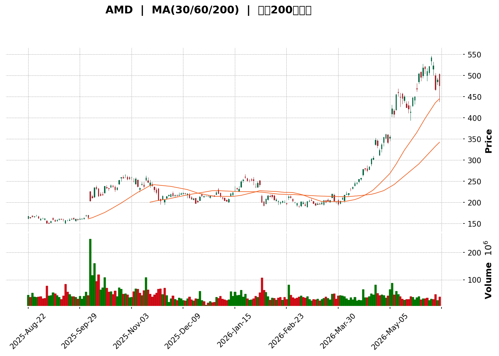
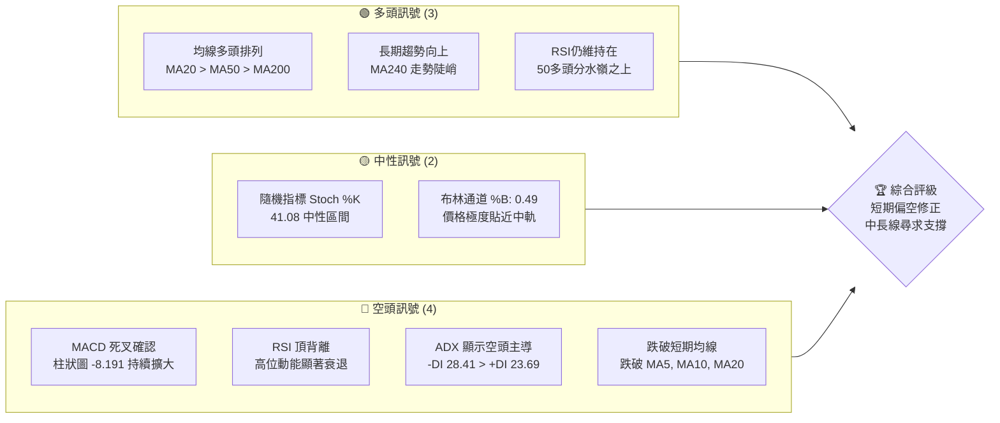
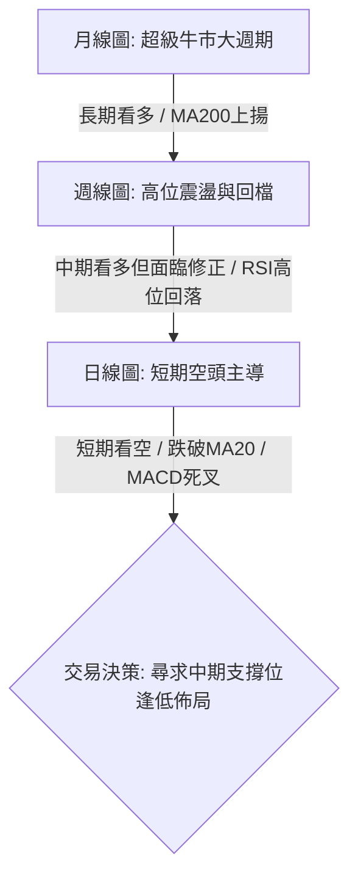
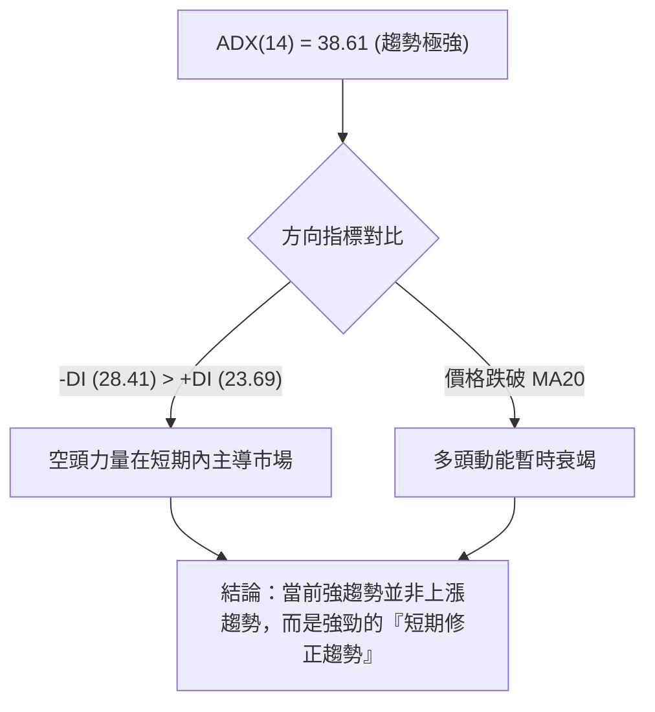
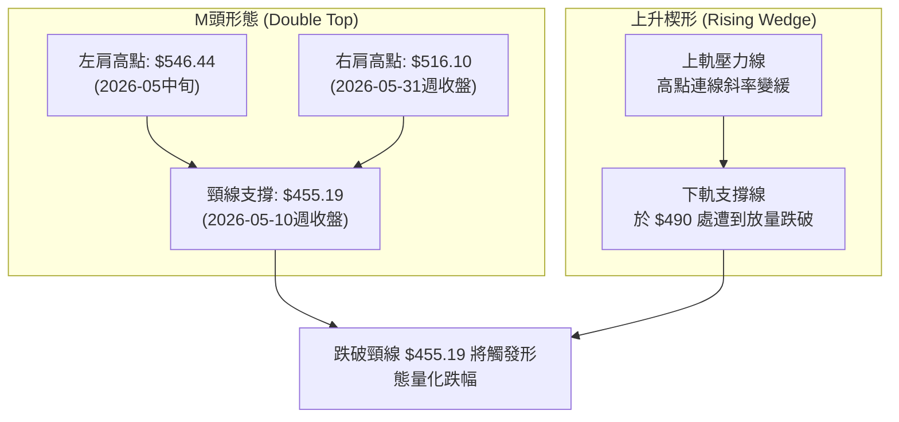

<details>
<summary>📊 靜態圖表 (點擊展開)</summary>

</details>

<html>
<head><meta charset="utf-8" /></head>
<body>
    <div style="height:500px; width:100%;">                        <script>window.PlotlyConfig = {MathJaxConfig: 'local'};</script>
        <script charset="utf-8" src="https://cdn.plot.ly/plotly-3.6.0.min.js" integrity="sha256-QaOVwtVY0T02VaHrr6pnoHLCwayMJp4O5n4YyaE3rJk=" crossorigin="anonymous"></script>                <div id="candlestick-chart" class="plotly-graph-div" style="height:100%; width:100%;"></div>            <script>                window.PLOTLYENV=window.PLOTLYENV || {};                                if (document.getElementById("candlestick-chart")) {                    Plotly.newPlot(                        "candlestick-chart",                        [{"close":{"dtype":"f8","bdata":"AAAA4FH4ZEAAAAAghWtkQAAAAADX02RAAAAAACnkZEAAAABgjxJlQAAAAAApVGRAAAAAgD1KZEAAAAAAKURkQAAAAKBHOWRAAAAA4HrkYkAAAADAHu1iQAAAAIA9emNAAAAAoEfxY0AAAACgcHVjQAAAAIA90mNAAAAAwB4lZEAAAABguA5kQAAAAMAe5WNAAAAAoHC9Y0AAAADgeqxjQAAAAKBH+WNAAAAAwMwcZEAAAAAAKRxkQAAAAOCjKGRAAAAAYLjuY0AAAAAghStkQAAAAKBHOWRAAAAA4FGAZEAAAAAgXDdlQAAAAKBwlWRAAAAAYLh2aUAAAADgUXBqQAAAAIDrcW1AAAAA4HocbUAAAADAzNxqQAAAAKBwDWtAAAAAQOFCa0AAAABAM9NtQAAAAIDrUW1AAAAAYI8ibUAAAACA6xFuQAAAAMD1wG1AAAAAIFzHbEAAAAAgrl9tQAAAAKBwnW9AAAAAYLg6cEAAAAAAKSBwQAAAAKBHhXBAAAAAQOHab0AAAACA6wFwQAAAAGBmOnBAAAAAoJlBb0AAAACgRwVwQAAAAGBmtm1AAAAAoEcxbUAAAAAgXH9uQAAAAOCjsG1AAAAAgD0ucEAAAABguP5uQAAAAIDr2W5AAAAA4KMQbkAAAACgR8lsQAAAAKCZ8WtAAAAA4KPAaUAAAADA9XhpQAAAAKCZ4WpAAAAAACnEaUAAAAAgrsdqQAAAAMD1MGtAAAAA4FF4a0AAAAAgrudqQAAAAEAzM2tAAAAAIFz\u002fakAAAABACj9rQAAAACCFo2tAAAAAANeza0AAAACgcK1rQAAAAIDCrWtAAAAAwPVYakAAAABgj\u002fJpQAAAAKBwJWpAAAAAIIXDaEAAAACA6yFpQAAAAIDCrWpAAAAAYGbeakAAAADAzNxqQAAAAKBH4WpAAAAAIK7fakAAAAAghfNqQAAAAEDh6mpAAAAAwB7FakAAAABACu9rQAAAAGCPomtAAAAAQDPLakAAAADgo0BqQAAAAIDClWlAAAAAoHBlaUAAAACAFPZpQAAAAEAKn2tAAAAAQDPza0AAAACgcH1sQAAAAGCP+mxAAAAAoHD9bEAAAACgmTlvQAAAACBct29AAAAAQOE6cEAAAACA62lvQAAAAMD1gG9AAAAAIK6Xb0AAAACAwoVvQAAAACBcl21AAAAA4KPIbkAAAAAghUNuQAAAAIAUBmlAAAAAAAAQaEAAAACAFA5qQAAAAAAAAGtAAAAAgD2yakAAAABgj7JqQAAAAIAUvmlAAAAAgD3qaUAAAABgj2JpQAAAAADXA2lAAAAAANdraUAAAADAzARpQAAAAEAzk2hAAAAAQOG6akAAAAAghVtqQAAAAIDCdWlAAAAAYLgGaUAAAAAA19NoQAAAAGBm3mdAAAAAgD1CaUAAAABgZu5oQAAAAIDCDWhAAAAAgMJVaUAAAAAgXGdpQAAAAGCPmmlAAAAAIK63aEAAAADgeixoQAAAAGCPkmhAAAAAgOuJaEAAAABguO5oQAAAAOCjqGlAAAAAYI8qaUAAAACAwlVpQAAAAADXq2lAAAAA4KOIa0AAAADgo3hpQAAAACCuP2lAAAAAoEeBaEAAAACAwm1pQAAAAGC4RmpAAAAAAAAwa0AAAACAwoVrQAAAAMD1sGtAAAAAgD36bEAAAADgepRtQAAAAKBHoW5AAAAAYI\u002fabkAAAACAPeJvQAAAAIDrIXBAAAAAAClkcUAAAACAPWZxQAAAAEAzL3FAAAAAANfHcUAAAAAgXPdyQAAAAKBHFXNAAAAAwPW8dUAAAACAFOp0QAAAACBcM3RAAAAAgMIRdUAAAAAA1yd2QAAAAOCjiHZAAAAA4KNYdUAAAAAAKTR2QAAAAIA9VnpAAAAAIFyHeUAAAABACnN8QAAAAOCjrHxAAAAA4KMEfEAAAAAAANh7QAAAAEAzG3xAAAAAoJmBekAAAAAA1096QAAAAMDM4HlAAAAAoEf5e0AAAACgcBl8QAAAAAApOH1AAAAAgD1+f0AAAADgo\u002fh+QAAAAGC4MIBAAAAAwMwggEAAAACAFOJ\u002fQAAAAOBRTIBAAAAAACn0gEAAAACgmVmAQAAAAIAUJn1AAAAAoEelfkAAAACAFLh9QA=="},"high":{"dtype":"f8","bdata":"AAAAwPUQZUAAAABA4bJkQAAAAOCjOGVAAAAAgML1ZEAAAAAgrl9lQAAAAIA9EmVAAAAA4HpMZEAAAAAAAJhkQAAAAKCZQWRAAAAA4HqkY0AAAADgehRjQAAAAMAelWNAAAAAwPWQZEAAAABguAZkQAAAAMAeDWRAAAAAoJlJZEAAAABgZj5kQAAAAAApNGRAAAAA4KPYY0AAAABA4fpjQAAAAIDCVWRAAAAA4HpsZEAAAABAM6NkQAAAAAApNGRAAAAAIIVDZEAAAACgmYlkQAAAAMD1SGRAAAAAgMKFZEAAAACA62FlQAAAAIDCVWVAAAAAYLhWbEAAAADAzFxrQAAAAADXe21AAAAAQDMDbkAAAABACkdtQAAAAIAUBmxAAAAAIFwfbEAAAAAgrudtQAAAAGBmJm5AAAAAAClsbUAAAAAAKVxuQAAAAOBRSG5AAAAAACkEbkAAAADAzHxtQAAAAOB6rG9AAAAAYLhGcEAAAACgR4lwQAAAAKBHsXBAAAAAgBR+cEAAAACAFGJwQAAAAGCPTnBAAAAAgBQWcEAAAABgZjpwQAAAAOBRsG9AAAAAANd7bUAAAADAzBxvQAAAAGC4Dm9AAAAAACl4cEAAAACAFDpwQAAAAIAUrm9AAAAA4KMYb0AAAAAAAMBtQAAAAMD1aG1AAAAAAABIbUAAAABgjxpqQAAAAAApJGtAAAAAYI\u002fSaUAAAABA4fJqQAAAAKCZSWtAAAAAIFyfa0AAAAAgXD9sQAAAAGBmRmtAAAAAANdja0AAAADgevRrQAAAAGC49mtAAAAAQOEabEAAAAAghdNrQAAAAAAAsGtAAAAAIK7Pa0AAAAAghetqQAAAAEAKR2pAAAAAAABwakAAAAAghctpQAAAAIDC5WpAAAAAoHCFa0AAAADA9SBrQAAAAKBHEWtAAAAAYI8aa0AAAACgmQFrQAAAAIA9GmtAAAAA4Ho0a0AAAADAzGRsQAAAAOCjQG1AAAAAoHDda0AAAAAAKYRqQAAAAIAUXmpAAAAAoJnpaUAAAAAAKTxqQAAAACCF42tAAAAAQOECbEAAAABAM8ttQAAAACCuT21AAAAAAADwbUAAAADAzJxvQAAAAKBHAXBAAAAAIFyvcEAAAADgoyRwQAAAAKCZ8W9AAAAAYGYWcEAAAADgekhwQAAAACCup25AAAAAQAo\u002fb0AAAADAzJRvQAAAAGCPUmtAAAAAoEeBaUAAAADgoyhqQAAAAEAzM2tAAAAA4Hpsa0AAAADAzHRrQAAAAGC4TmtAAAAAoJlBakAAAACgmalpQAAAAGBmZmlAAAAAQDODaUAAAAAA15tpQAAAAAAp7GhAAAAAYLgWa0AAAABgZhZrQAAAAKBHOWpAAAAA4Ho8aUAAAAAgrtdoQAAAAOB6NGhAAAAAgBROaUAAAACgR3lpQAAAACCuB2lAAAAAQApfaUAAAABA4dJpQAAAAGC4JmpAAAAAANdzaUAAAACAwvVoQAAAAKBwBWlAAAAAYLjmaEAAAAAghVtpQAAAAAApvGlAAAAAoJnJaUAAAAAghSNqQAAAAIDCzWlAAAAAYI+qa0AAAAAAAKBrQAAAAOCjaGlAAAAAgMINakAAAAAAAIBpQAAAAGCPumpAAAAAwPU4a0AAAACA60lsQAAAAEAzw2tAAAAAAABAbUAAAABAM6NtQAAAAGCPMm9AAAAAYI\u002fqbkAAAABguO5vQAAAAEDhInBAAAAAoHB1cUAAAADAzJBxQAAAAIDC+XFAAAAAQDPjcUAAAAAAAARzQAAAACCFY3NAAAAAANcPdkAAAAAgXNN1QAAAAAAAeHRAAAAAYLhCdUAAAAAgXC92QAAAAOCjrHZAAAAAoJmddkAAAADAHnl2QAAAAKCZ6XpAAAAAIFxbekAAAADgo4R8QAAAACCFU31AAAAAwMysfEAAAAAAALh8QAAAAMD1VHxAAAAAAABwe0AAAADAzGx7QAAAAAAAzHpAAAAAgD0WfEAAAABAMzN8QAAAAGCPFn5AAAAAIFyvf0AAAAAgXON\u002fQAAAAKCZeYBAAAAAAABQgEAAAAAAACyAQAAAAIDrU4BAAAAAIIUTgUAAAAAghaGAQAAAAIDrmX9AAAAAIIXvfkAAAADA9Yh\u002fQA=="},"hovertemplate":"\u003cb\u003e%{x|%Y-%m-%d}\u003c\u002fb\u003e\u003cbr\u003e\u958b: $%{open:.2f}\u003cbr\u003e\u9ad8: $%{high:.2f}\u003cbr\u003e\u4f4e: $%{low:.2f}\u003cbr\u003e\u6536: $%{close:.2f}\u003cextra\u003e\u003c\u002fextra\u003e","low":{"dtype":"f8","bdata":"AAAAoJk5ZEAAAABACjdkQAAAAMAenWRAAAAAwMyUZEAAAADAzNRkQAAAAMDMPGRAAAAAANeTY0AAAABgjxJkQAAAAKBHuWNAAAAAgMLFYkAAAABACqdiQAAAAIDC\u002fWJAAAAAAADAY0AAAAAgrl9jQAAAAKBwXWNAAAAAQDOzY0AAAABACudjQAAAAOBReGNAAAAAQDO7YkAAAADAzHxjQAAAAKBwrWNAAAAAYLjmY0AAAACAws1jQAAAAMD1WGNAAAAAoJmhY0AAAADAzPxjQAAAAGCP6mNAAAAAIK4PZEAAAAAA18NkQAAAAOB6ZGRAAAAA4FFgaUAAAADA9ShqQAAAAGBmVmpAAAAAwPWwbEAAAABgZqZqQAAAAMDM3GpAAAAAwMz8akAAAADgUZhrQAAAACCuB21AAAAAwB59bEAAAADAzExtQAAAAOCjQG1AAAAAACkcbEAAAACgR5FsQAAAAGBmPm5AAAAAoJk5b0AAAAAAABBwQAAAAGBmFnBAAAAAgOuJb0AAAADAHq1vQAAAAOB6vG9AAAAA4HrsbkAAAACA61luQAAAACCud21AAAAA4HoUbEAAAAAAABBuQAAAAOB6VG1AAAAAAABAb0AAAACA68FuQAAAAGCPYm1AAAAAwMykbUAAAABguBZsQAAAAGC4dmtAAAAAwPWQaUAAAAAAAGBoQAAAAEAzu2lAAAAAwPVIaEAAAAAAAOBpQAAAAOCjwGpAAAAAAACwakAAAADgesxqQAAAAOCjeGpAAAAA4HrEakAAAAAgrgdrQAAAACCFS2tAAAAAwB49a0AAAACgcFVrQAAAAIAURmpAAAAAgOshakAAAABgj9JpQAAAACCFo2lAAAAAwPWwaEAAAAAAABBpQAAAAGBmhmlAAAAAgOupakAAAADA9YhqQAAAAEAKv2pAAAAAwPWgakAAAAAgridqQAAAAGCPympAAAAAoJm5akAAAADAzFxrQAAAACBcj2tAAAAAAABoakAAAACgcOVpQAAAAGCPamlAAAAAgD1iaUAAAACgmfloQAAAACBc32pAAAAAIIXjakAAAABACmdsQAAAACCFm2xAAAAAwB4tbEAAAADA9XhtQAAAAAAp1G5AAAAAAAAEcEAAAACgmUlvQAAAAGC4\u002fm5AAAAAYLhGb0AAAADAHh1uQAAAAKCZUW1AAAAAAABgbUAAAACgR6FtQAAAAMDM5GhAAAAAQArXZ0AAAACAwo1oQAAAAMDMhGlAAAAAACmkakAAAABguCZqQAAAAOB6pGlAAAAAACl8aUAAAABgj1poQAAAAAAAYGhAAAAAoEfJaEAAAACA69FoQAAAAMDMRGhAAAAAAADQaUAAAABgj0pqQAAAAGC4LmlAAAAAIK63aEAAAAAAAMBnQAAAAEAKh2dAAAAAIIW7Z0AAAAAAKVxoQAAAAAAA6GdAAAAA4KOgZ0AAAABgZkZpQAAAAAApdGlAAAAAoHCVaEAAAADgowhoQAAAAKCZWWhAAAAA4FFoaEAAAAAAAHhoQAAAAGCPGmhAAAAA4FHIaEAAAABguDZpQAAAAAApBGlAAAAA4FFwakAAAACAwm1pQAAAAIAUtmhAAAAAANcbaEAAAADAHo1oQAAAAEDhumlAAAAAANcTaUAAAAAgXDdrQAAAAAAp7GpAAAAAQOFibEAAAADAHt1sQAAAAGC43m1AAAAAwPVAbkAAAABgZrZuQAAAAEAze29AAAAAAClYcEAAAACAPSJxQAAAAAAAAHFAAAAAgOtJcUAAAACAPeJxQAAAAAApvHJAAAAA4KPodEAAAADA9Yx0QAAAAAAAYHNAAAAAgMLtc0AAAACgmcl0QAAAAAAA1HVAAAAAQDMrdUAAAACAFI51QAAAAOCjIHlAAAAAoEcReUAAAADgoyR6QAAAAIAULnxAAAAAgMKhekAAAABgZgp7QAAAAEDhOntAAAAAgMJ1ekAAAAAgXKt5QAAAAIDClXhAAAAAwMygekAAAACgmfl6QAAAACBc23xAAAAAIK4DfkAAAABgj2p+QAAAAOBR2H5AAAAAQOF2f0AAAADAzGx+QAAAACCFU39AAAAAYGZigEAAAACA6z1\u002fQAAAAEAz\u002f3xAAAAAIFzbfUAAAAAgrlN7QA=="},"name":"\u50f9\u683c","open":{"dtype":"f8","bdata":"AAAAoHBFZEAAAACgmbFkQAAAAMDMFGVAAAAAoEfBZEAAAAAAABBlQAAAAIDr2WRAAAAAoHDNY0AAAACA6zlkQAAAAIAU\u002fmNAAAAAANejY0AAAACgmfliQAAAACCu\u002f2JAAAAAoEdxZEAAAAAA19NjQAAAAAAAoGNAAAAA4FEAZEAAAAAA1ytkQAAAAMD16GNAAAAAYLjeYkAAAAAAKaxjQAAAAKBwrWNAAAAA4KMQZEAAAAAgXF9kQAAAAOB6pGNAAAAA4KMQZEAAAAAA1wNkQAAAAKBHGWRAAAAAgMIdZEAAAACAwhVlQAAAAIDCVWVAAAAAYGZObEAAAABAM9tqQAAAAGBmnmpAAAAAoJmJbUAAAADgoxhtQAAAAGBmhmtAAAAAYGZma0AAAABguNZrQAAAAKBHiW1AAAAA4FEobUAAAABACo9tQAAAAOB67G1AAAAAQDObbUAAAADAHsVsQAAAACCFa25AAAAAgBQecEAAAACAPTJwQAAAAEAKg3BAAAAAYLg+cEAAAACgmTlwQAAAAKBHNXBAAAAAQDNLb0AAAAAgrmduQAAAAEAKr29AAAAAgBTebEAAAADgekRuQAAAAMAeNW5AAAAAACmkb0AAAADAzHxvQAAAACCFA25AAAAAAABYbkAAAADA9ZhtQAAAAOBRyGxAAAAAYGYWbUAAAACA6xlqQAAAAMAe5WlAAAAAIFwvaUAAAACgmUFqQAAAAOB6BGtAAAAAACm8akAAAACgR7lrQAAAAOBRCGtAAAAAACkca0AAAACgcCVrQAAAAEDhYmtAAAAAoEeha0AAAAAAAMBrQAAAAIDrOWtAAAAAANdLa0AAAADA9YhqQAAAAKBw3WlAAAAAoEdBakAAAACAPXppQAAAAEAzk2lAAAAAAACAa0AAAAAghZtqQAAAACBc32pAAAAAgMLtakAAAABgj3JqQAAAAADX+2pAAAAAgD36akAAAADAzFxrQAAAAAAAyGxAAAAAYLjWa0AAAAAAKYRqQAAAAMDMXGpAAAAAQAq3aUAAAACAwiVpQAAAAEAz42pAAAAAoEcxa0AAAADAzHxsQAAAAKCZSW1AAAAAYI9CbEAAAAAgrn9tQAAAAAAAeG9AAAAAQOFScEAAAAAAAAxwQAAAAMAehW9AAAAAACnEb0AAAADAHtVvQAAAAIDCnW1AAAAA4KN4bUAAAACgmXFvQAAAAAAA4GpAAAAAIIU7aUAAAAAAKaRoQAAAAMDM3GlAAAAA4HrkakAAAAAAKTxrQAAAAGCP+mpAAAAA4KOAaUAAAADAzERpQAAAAMAezWhAAAAAIIUDaUAAAAAA1wNpQAAAAEDhwmhAAAAAACl0akAAAACAPdpqQAAAAKCZGWpAAAAAIIUDaUAAAABAMztoQAAAAGC47mdAAAAAANcDaEAAAADgo7hoQAAAAOCjaGhAAAAAIIWrZ0AAAADgUVBpQAAAACCFo2lAAAAAYI9aaUAAAAAghcNoQAAAACBcX2hAAAAAgMKVaEAAAAAAAIBoQAAAAMD1YGhAAAAA4HqcaUAAAADAzMxpQAAAAOB6LGlAAAAA4FFwakAAAAAgXD9rQAAAAOCjOGlAAAAAYGaeaUAAAACgmcFoQAAAAEDh8mlAAAAAoJmBaUAAAADA9WhrQAAAAOBRSGtAAAAAANcDbUAAAADgUSBtQAAAAAAA4G1AAAAAwPWgbkAAAACgRzlvQAAAAGC43m9AAAAAANePcEAAAAAAAJBxQAAAAKCZiXFAAAAAoEdVcUAAAAAghTNyQAAAAAAp4HJAAAAAACkMdUAAAADAHqV1QAAAAIDCfXNAAAAAoEdpdEAAAACAwlV1QAAAAIDr\u002fXVAAAAAwPWEdkAAAAAAKfh1QAAAAADXl3lAAAAAwB4RekAAAACgcCl6QAAAAMDMyHxAAAAAAAAUfEAAAADgo5B8QAAAAKCZiXtAAAAAoHAVe0AAAAAAANh6QAAAAKCZyXlAAAAA4KPAekAAAAAA1597QAAAAKBwXX1AAAAAANdLfkAAAAAAAMB\u002fQAAAAAAAMH9AAAAAYGZGgEAAAABgj0J\u002fQAAAAMDMpH9AAAAAAACugEAAAAAAABaAQAAAAOB6OH9AAAAAAABQfkAAAADAHnd\u002fQA=="},"x":["2025-08-22T00:00:00-04:00","2025-08-25T00:00:00-04:00","2025-08-26T00:00:00-04:00","2025-08-27T00:00:00-04:00","2025-08-28T00:00:00-04:00","2025-08-29T00:00:00-04:00","2025-09-02T00:00:00-04:00","2025-09-03T00:00:00-04:00","2025-09-04T00:00:00-04:00","2025-09-05T00:00:00-04:00","2025-09-08T00:00:00-04:00","2025-09-09T00:00:00-04:00","2025-09-10T00:00:00-04:00","2025-09-11T00:00:00-04:00","2025-09-12T00:00:00-04:00","2025-09-15T00:00:00-04:00","2025-09-16T00:00:00-04:00","2025-09-17T00:00:00-04:00","2025-09-18T00:00:00-04:00","2025-09-19T00:00:00-04:00","2025-09-22T00:00:00-04:00","2025-09-23T00:00:00-04:00","2025-09-24T00:00:00-04:00","2025-09-25T00:00:00-04:00","2025-09-26T00:00:00-04:00","2025-09-29T00:00:00-04:00","2025-09-30T00:00:00-04:00","2025-10-01T00:00:00-04:00","2025-10-02T00:00:00-04:00","2025-10-03T00:00:00-04:00","2025-10-06T00:00:00-04:00","2025-10-07T00:00:00-04:00","2025-10-08T00:00:00-04:00","2025-10-09T00:00:00-04:00","2025-10-10T00:00:00-04:00","2025-10-13T00:00:00-04:00","2025-10-14T00:00:00-04:00","2025-10-15T00:00:00-04:00","2025-10-16T00:00:00-04:00","2025-10-17T00:00:00-04:00","2025-10-20T00:00:00-04:00","2025-10-21T00:00:00-04:00","2025-10-22T00:00:00-04:00","2025-10-23T00:00:00-04:00","2025-10-24T00:00:00-04:00","2025-10-27T00:00:00-04:00","2025-10-28T00:00:00-04:00","2025-10-29T00:00:00-04:00","2025-10-30T00:00:00-04:00","2025-10-31T00:00:00-04:00","2025-11-03T00:00:00-05:00","2025-11-04T00:00:00-05:00","2025-11-05T00:00:00-05:00","2025-11-06T00:00:00-05:00","2025-11-07T00:00:00-05:00","2025-11-10T00:00:00-05:00","2025-11-11T00:00:00-05:00","2025-11-12T00:00:00-05:00","2025-11-13T00:00:00-05:00","2025-11-14T00:00:00-05:00","2025-11-17T00:00:00-05:00","2025-11-18T00:00:00-05:00","2025-11-19T00:00:00-05:00","2025-11-20T00:00:00-05:00","2025-11-21T00:00:00-05:00","2025-11-24T00:00:00-05:00","2025-11-25T00:00:00-05:00","2025-11-26T00:00:00-05:00","2025-11-28T00:00:00-05:00","2025-12-01T00:00:00-05:00","2025-12-02T00:00:00-05:00","2025-12-03T00:00:00-05:00","2025-12-04T00:00:00-05:00","2025-12-05T00:00:00-05:00","2025-12-08T00:00:00-05:00","2025-12-09T00:00:00-05:00","2025-12-10T00:00:00-05:00","2025-12-11T00:00:00-05:00","2025-12-12T00:00:00-05:00","2025-12-15T00:00:00-05:00","2025-12-16T00:00:00-05:00","2025-12-17T00:00:00-05:00","2025-12-18T00:00:00-05:00","2025-12-19T00:00:00-05:00","2025-12-22T00:00:00-05:00","2025-12-23T00:00:00-05:00","2025-12-24T00:00:00-05:00","2025-12-26T00:00:00-05:00","2025-12-29T00:00:00-05:00","2025-12-30T00:00:00-05:00","2025-12-31T00:00:00-05:00","2026-01-02T00:00:00-05:00","2026-01-05T00:00:00-05:00","2026-01-06T00:00:00-05:00","2026-01-07T00:00:00-05:00","2026-01-08T00:00:00-05:00","2026-01-09T00:00:00-05:00","2026-01-12T00:00:00-05:00","2026-01-13T00:00:00-05:00","2026-01-14T00:00:00-05:00","2026-01-15T00:00:00-05:00","2026-01-16T00:00:00-05:00","2026-01-20T00:00:00-05:00","2026-01-21T00:00:00-05:00","2026-01-22T00:00:00-05:00","2026-01-23T00:00:00-05:00","2026-01-26T00:00:00-05:00","2026-01-27T00:00:00-05:00","2026-01-28T00:00:00-05:00","2026-01-29T00:00:00-05:00","2026-01-30T00:00:00-05:00","2026-02-02T00:00:00-05:00","2026-02-03T00:00:00-05:00","2026-02-04T00:00:00-05:00","2026-02-05T00:00:00-05:00","2026-02-06T00:00:00-05:00","2026-02-09T00:00:00-05:00","2026-02-10T00:00:00-05:00","2026-02-11T00:00:00-05:00","2026-02-12T00:00:00-05:00","2026-02-13T00:00:00-05:00","2026-02-17T00:00:00-05:00","2026-02-18T00:00:00-05:00","2026-02-19T00:00:00-05:00","2026-02-20T00:00:00-05:00","2026-02-23T00:00:00-05:00","2026-02-24T00:00:00-05:00","2026-02-25T00:00:00-05:00","2026-02-26T00:00:00-05:00","2026-02-27T00:00:00-05:00","2026-03-02T00:00:00-05:00","2026-03-03T00:00:00-05:00","2026-03-04T00:00:00-05:00","2026-03-05T00:00:00-05:00","2026-03-06T00:00:00-05:00","2026-03-09T00:00:00-04:00","2026-03-10T00:00:00-04:00","2026-03-11T00:00:00-04:00","2026-03-12T00:00:00-04:00","2026-03-13T00:00:00-04:00","2026-03-16T00:00:00-04:00","2026-03-17T00:00:00-04:00","2026-03-18T00:00:00-04:00","2026-03-19T00:00:00-04:00","2026-03-20T00:00:00-04:00","2026-03-23T00:00:00-04:00","2026-03-24T00:00:00-04:00","2026-03-25T00:00:00-04:00","2026-03-26T00:00:00-04:00","2026-03-27T00:00:00-04:00","2026-03-30T00:00:00-04:00","2026-03-31T00:00:00-04:00","2026-04-01T00:00:00-04:00","2026-04-02T00:00:00-04:00","2026-04-06T00:00:00-04:00","2026-04-07T00:00:00-04:00","2026-04-08T00:00:00-04:00","2026-04-09T00:00:00-04:00","2026-04-10T00:00:00-04:00","2026-04-13T00:00:00-04:00","2026-04-14T00:00:00-04:00","2026-04-15T00:00:00-04:00","2026-04-16T00:00:00-04:00","2026-04-17T00:00:00-04:00","2026-04-20T00:00:00-04:00","2026-04-21T00:00:00-04:00","2026-04-22T00:00:00-04:00","2026-04-23T00:00:00-04:00","2026-04-24T00:00:00-04:00","2026-04-27T00:00:00-04:00","2026-04-28T00:00:00-04:00","2026-04-29T00:00:00-04:00","2026-04-30T00:00:00-04:00","2026-05-01T00:00:00-04:00","2026-05-04T00:00:00-04:00","2026-05-05T00:00:00-04:00","2026-05-06T00:00:00-04:00","2026-05-07T00:00:00-04:00","2026-05-08T00:00:00-04:00","2026-05-11T00:00:00-04:00","2026-05-12T00:00:00-04:00","2026-05-13T00:00:00-04:00","2026-05-14T00:00:00-04:00","2026-05-15T00:00:00-04:00","2026-05-18T00:00:00-04:00","2026-05-19T00:00:00-04:00","2026-05-20T00:00:00-04:00","2026-05-21T00:00:00-04:00","2026-05-22T00:00:00-04:00","2026-05-26T00:00:00-04:00","2026-05-27T00:00:00-04:00","2026-05-28T00:00:00-04:00","2026-05-29T00:00:00-04:00","2026-06-01T00:00:00-04:00","2026-06-02T00:00:00-04:00","2026-06-03T00:00:00-04:00","2026-06-04T00:00:00-04:00","2026-06-05T00:00:00-04:00","2026-06-08T00:00:00-04:00","2026-06-09T00:00:00-04:00"],"type":"candlestick"},{"hovertemplate":"MA30: $%{y:.2f}\u003cextra\u003e\u003c\u002fextra\u003e","line":{"color":"#2196F3","dash":"dash","width":2},"mode":"lines","name":"MA30","x":["2025-08-22T00:00:00-04:00","2025-08-25T00:00:00-04:00","2025-08-26T00:00:00-04:00","2025-08-27T00:00:00-04:00","2025-08-28T00:00:00-04:00","2025-08-29T00:00:00-04:00","2025-09-02T00:00:00-04:00","2025-09-03T00:00:00-04:00","2025-09-04T00:00:00-04:00","2025-09-05T00:00:00-04:00","2025-09-08T00:00:00-04:00","2025-09-09T00:00:00-04:00","2025-09-10T00:00:00-04:00","2025-09-11T00:00:00-04:00","2025-09-12T00:00:00-04:00","2025-09-15T00:00:00-04:00","2025-09-16T00:00:00-04:00","2025-09-17T00:00:00-04:00","2025-09-18T00:00:00-04:00","2025-09-19T00:00:00-04:00","2025-09-22T00:00:00-04:00","2025-09-23T00:00:00-04:00","2025-09-24T00:00:00-04:00","2025-09-25T00:00:00-04:00","2025-09-26T00:00:00-04:00","2025-09-29T00:00:00-04:00","2025-09-30T00:00:00-04:00","2025-10-01T00:00:00-04:00","2025-10-02T00:00:00-04:00","2025-10-03T00:00:00-04:00","2025-10-06T00:00:00-04:00","2025-10-07T00:00:00-04:00","2025-10-08T00:00:00-04:00","2025-10-09T00:00:00-04:00","2025-10-10T00:00:00-04:00","2025-10-13T00:00:00-04:00","2025-10-14T00:00:00-04:00","2025-10-15T00:00:00-04:00","2025-10-16T00:00:00-04:00","2025-10-17T00:00:00-04:00","2025-10-20T00:00:00-04:00","2025-10-21T00:00:00-04:00","2025-10-22T00:00:00-04:00","2025-10-23T00:00:00-04:00","2025-10-24T00:00:00-04:00","2025-10-27T00:00:00-04:00","2025-10-28T00:00:00-04:00","2025-10-29T00:00:00-04:00","2025-10-30T00:00:00-04:00","2025-10-31T00:00:00-04:00","2025-11-03T00:00:00-05:00","2025-11-04T00:00:00-05:00","2025-11-05T00:00:00-05:00","2025-11-06T00:00:00-05:00","2025-11-07T00:00:00-05:00","2025-11-10T00:00:00-05:00","2025-11-11T00:00:00-05:00","2025-11-12T00:00:00-05:00","2025-11-13T00:00:00-05:00","2025-11-14T00:00:00-05:00","2025-11-17T00:00:00-05:00","2025-11-18T00:00:00-05:00","2025-11-19T00:00:00-05:00","2025-11-20T00:00:00-05:00","2025-11-21T00:00:00-05:00","2025-11-24T00:00:00-05:00","2025-11-25T00:00:00-05:00","2025-11-26T00:00:00-05:00","2025-11-28T00:00:00-05:00","2025-12-01T00:00:00-05:00","2025-12-02T00:00:00-05:00","2025-12-03T00:00:00-05:00","2025-12-04T00:00:00-05:00","2025-12-05T00:00:00-05:00","2025-12-08T00:00:00-05:00","2025-12-09T00:00:00-05:00","2025-12-10T00:00:00-05:00","2025-12-11T00:00:00-05:00","2025-12-12T00:00:00-05:00","2025-12-15T00:00:00-05:00","2025-12-16T00:00:00-05:00","2025-12-17T00:00:00-05:00","2025-12-18T00:00:00-05:00","2025-12-19T00:00:00-05:00","2025-12-22T00:00:00-05:00","2025-12-23T00:00:00-05:00","2025-12-24T00:00:00-05:00","2025-12-26T00:00:00-05:00","2025-12-29T00:00:00-05:00","2025-12-30T00:00:00-05:00","2025-12-31T00:00:00-05:00","2026-01-02T00:00:00-05:00","2026-01-05T00:00:00-05:00","2026-01-06T00:00:00-05:00","2026-01-07T00:00:00-05:00","2026-01-08T00:00:00-05:00","2026-01-09T00:00:00-05:00","2026-01-12T00:00:00-05:00","2026-01-13T00:00:00-05:00","2026-01-14T00:00:00-05:00","2026-01-15T00:00:00-05:00","2026-01-16T00:00:00-05:00","2026-01-20T00:00:00-05:00","2026-01-21T00:00:00-05:00","2026-01-22T00:00:00-05:00","2026-01-23T00:00:00-05:00","2026-01-26T00:00:00-05:00","2026-01-27T00:00:00-05:00","2026-01-28T00:00:00-05:00","2026-01-29T00:00:00-05:00","2026-01-30T00:00:00-05:00","2026-02-02T00:00:00-05:00","2026-02-03T00:00:00-05:00","2026-02-04T00:00:00-05:00","2026-02-05T00:00:00-05:00","2026-02-06T00:00:00-05:00","2026-02-09T00:00:00-05:00","2026-02-10T00:00:00-05:00","2026-02-11T00:00:00-05:00","2026-02-12T00:00:00-05:00","2026-02-13T00:00:00-05:00","2026-02-17T00:00:00-05:00","2026-02-18T00:00:00-05:00","2026-02-19T00:00:00-05:00","2026-02-20T00:00:00-05:00","2026-02-23T00:00:00-05:00","2026-02-24T00:00:00-05:00","2026-02-25T00:00:00-05:00","2026-02-26T00:00:00-05:00","2026-02-27T00:00:00-05:00","2026-03-02T00:00:00-05:00","2026-03-03T00:00:00-05:00","2026-03-04T00:00:00-05:00","2026-03-05T00:00:00-05:00","2026-03-06T00:00:00-05:00","2026-03-09T00:00:00-04:00","2026-03-10T00:00:00-04:00","2026-03-11T00:00:00-04:00","2026-03-12T00:00:00-04:00","2026-03-13T00:00:00-04:00","2026-03-16T00:00:00-04:00","2026-03-17T00:00:00-04:00","2026-03-18T00:00:00-04:00","2026-03-19T00:00:00-04:00","2026-03-20T00:00:00-04:00","2026-03-23T00:00:00-04:00","2026-03-24T00:00:00-04:00","2026-03-25T00:00:00-04:00","2026-03-26T00:00:00-04:00","2026-03-27T00:00:00-04:00","2026-03-30T00:00:00-04:00","2026-03-31T00:00:00-04:00","2026-04-01T00:00:00-04:00","2026-04-02T00:00:00-04:00","2026-04-06T00:00:00-04:00","2026-04-07T00:00:00-04:00","2026-04-08T00:00:00-04:00","2026-04-09T00:00:00-04:00","2026-04-10T00:00:00-04:00","2026-04-13T00:00:00-04:00","2026-04-14T00:00:00-04:00","2026-04-15T00:00:00-04:00","2026-04-16T00:00:00-04:00","2026-04-17T00:00:00-04:00","2026-04-20T00:00:00-04:00","2026-04-21T00:00:00-04:00","2026-04-22T00:00:00-04:00","2026-04-23T00:00:00-04:00","2026-04-24T00:00:00-04:00","2026-04-27T00:00:00-04:00","2026-04-28T00:00:00-04:00","2026-04-29T00:00:00-04:00","2026-04-30T00:00:00-04:00","2026-05-01T00:00:00-04:00","2026-05-04T00:00:00-04:00","2026-05-05T00:00:00-04:00","2026-05-06T00:00:00-04:00","2026-05-07T00:00:00-04:00","2026-05-08T00:00:00-04:00","2026-05-11T00:00:00-04:00","2026-05-12T00:00:00-04:00","2026-05-13T00:00:00-04:00","2026-05-14T00:00:00-04:00","2026-05-15T00:00:00-04:00","2026-05-18T00:00:00-04:00","2026-05-19T00:00:00-04:00","2026-05-20T00:00:00-04:00","2026-05-21T00:00:00-04:00","2026-05-22T00:00:00-04:00","2026-05-26T00:00:00-04:00","2026-05-27T00:00:00-04:00","2026-05-28T00:00:00-04:00","2026-05-29T00:00:00-04:00","2026-06-01T00:00:00-04:00","2026-06-02T00:00:00-04:00","2026-06-03T00:00:00-04:00","2026-06-04T00:00:00-04:00","2026-06-05T00:00:00-04:00","2026-06-08T00:00:00-04:00","2026-06-09T00:00:00-04:00"],"y":{"dtype":"f8","bdata":"AAAAAAAA+H8AAAAAAAD4fwAAAAAAAPh\u002fAAAAAAAA+H8AAAAAAAD4fwAAAAAAAPh\u002fAAAAAAAA+H8AAAAAAAD4fwAAAAAAAPh\u002fAAAAAAAA+H8AAAAAAAD4fwAAAAAAAPh\u002fAAAAAAAA+H8AAAAAAAD4fwAAAAAAAPh\u002fAAAAAAAA+H8AAAAAAAD4fwAAAAAAAPh\u002fAAAAAAAA+H8AAAAAAAD4fwAAAAAAAPh\u002fAAAAAAAA+H8AAAAAAAD4fwAAAAAAAPh\u002fAAAAAAAA+H8AAAAAAAD4fwAAAAAAAPh\u002fAAAAAAAA+H8AAAAAAAD4f1VVVfW2JGRAVVVVtQ9LZEDe3d3da35kQFVVVRX1x2RAIiIi8hkOZUBERERkgj9lQFVVVaXieGVAIiIikl+0ZUCrqqr68AVmQKuqqgqQU2ZAAAAAIPeqZkBEREQEDwpnQDMzM9O\u002fYWdAiYiI6CatZ0Dv7u6OwgFoQFVVVWVmZmhAIiIiMnrPaECamZnZhzdpQERERES2p2lAMzMz4xcPakAiIiLCZ3hqQCIiIjLs4mpAd3d3FwRCa0DNzMxM1KdrQImIiMha+WtA7+7ujl9IbEAzMzNTgKBsQKuqqqpH8WxAzczMPHxWbUDv7u4+7qltQBEREfGLAW5AZmZmhs8obkB3d3e31zxuQAAAADAIMG5AMzMz414TbkAzMzNjggduQJqZmUkMBm5AmpmZaUr5bUAiIiKCTt9tQO\u002fu7i4kzW1A7+7u7u6+bUAzMzPj7KNtQDMzMyMijm1AAAAA8O5+bUB3d3dXx2xtQHd3dxfZSm1AZmZm5kIibUAzMzNjO\u002ftsQERERNR4zWxAMzMzg3mebEC8u7vbsmpsQERERHTaNGxA7+7uXnP9a0Crqqr6fsJrQGZmZqabqGtAd3d3V8eUa0AAAACQwnVrQFVVVQXIXWtAREREZPQua0Dv7u6ucgxrQGZmZkbh6mpAzczMPMPOakDNzMzsfMdqQDMzM3PaxGpAiYiIGL3NakCJiIgIZdRqQERERFRVyWpAzczMDC3GakBmZmZ2ML9qQAAAANDbwmpAREREZPTGakAAAADgetRqQM3MzJyo42pAvLu7S6n0akAiIiICnRZrQBEREXFoOWtAvLu7WwFia0AiIiJS44FrQJqZmSmHomtAq6qqCknPa0AAAADQ2\u002f5rQHd3d4dBHGxAvLu7a6BPbEDv7u7OaXtsQImIiGhKbWxAAAAAEFhVbEDe3d0NdE5sQDMzMzN6T2xAIiIicvZNbEDv7u4ezEtsQLy7u0vFQWxAVVVVhXk6bEARERGxuSRsQGZmZjZeDmxAAAAA8KcCbEBERETEIPhrQERERGSC72tAMzMzA+T6a0AiIiKiRf5rQO\u002fu7k7U62tAd3d3R+HSa0DNzMxsoLNrQFVVVXUFiGtAvLu7ay5oa0AzMzODeTJrQGZmZoYW8WpAmpmZuUm0akDe3d2tAIFqQO\u002fu7u6nTmpARERERP0TakDe3d2tR9VpQN7d3Q10qmlAREREpCl1aUCamZlZq0dpQHd3d4cWTWlAVVVVtYFWaUB3d3fXXFBpQERERCQGRWlAAAAAsCtMaUB3d3fntEFpQKuqqkp+PWlAiYiIGHYxaUCrqqqq1TFpQJqZmemYPGlAiYiIWKtLaUDv7u7eCGFpQLy7u2uge2lAmpmZKc6OaUAiIiLSTappQLy7u9tr1mlAmpmZOSYIakB3d3fXXERqQKuqqroCjGpA3t3drUfdakARERGRezFrQImIiAiBiWtA3t3dncTga0BmZmYWrktsQImIiEjhtmxAVVVVZfRWbUBVVVVVnO1tQDMzM8OudG5AvLu7i94Kb0ARERERPLBvQImIiJDtKnBAd3d357R1cECamZkpFcdwQImIiBhLOnFAVVVVTamecUAzMzODwCRyQN7d3UW2rXJA7+7uzj40c0Dv7u5uWbVzQFVVVc0TNXRA7+7ulkOjdEARERHZXA51QGZmZj4KdXVARERErBzodUAiIiJyr1l2QM3MzARW0HZAd3d3R29Zd0AzMzNzr9l3QGZmZgZWZHhAvLu7Gy\u002fjeEB3d3dXx155QHd3dxdL4nlAq6qqyuhrekARERGhGuF6QDMzM1P\u002fNntA3t3dDQKDe0AAAAAwJM57QA=="},"type":"scatter"},{"hovertemplate":"MA60: $%{y:.2f}\u003cextra\u003e\u003c\u002fextra\u003e","line":{"color":"#9C27B0","dash":"dash","width":2},"mode":"lines","name":"MA60","x":["2025-08-22T00:00:00-04:00","2025-08-25T00:00:00-04:00","2025-08-26T00:00:00-04:00","2025-08-27T00:00:00-04:00","2025-08-28T00:00:00-04:00","2025-08-29T00:00:00-04:00","2025-09-02T00:00:00-04:00","2025-09-03T00:00:00-04:00","2025-09-04T00:00:00-04:00","2025-09-05T00:00:00-04:00","2025-09-08T00:00:00-04:00","2025-09-09T00:00:00-04:00","2025-09-10T00:00:00-04:00","2025-09-11T00:00:00-04:00","2025-09-12T00:00:00-04:00","2025-09-15T00:00:00-04:00","2025-09-16T00:00:00-04:00","2025-09-17T00:00:00-04:00","2025-09-18T00:00:00-04:00","2025-09-19T00:00:00-04:00","2025-09-22T00:00:00-04:00","2025-09-23T00:00:00-04:00","2025-09-24T00:00:00-04:00","2025-09-25T00:00:00-04:00","2025-09-26T00:00:00-04:00","2025-09-29T00:00:00-04:00","2025-09-30T00:00:00-04:00","2025-10-01T00:00:00-04:00","2025-10-02T00:00:00-04:00","2025-10-03T00:00:00-04:00","2025-10-06T00:00:00-04:00","2025-10-07T00:00:00-04:00","2025-10-08T00:00:00-04:00","2025-10-09T00:00:00-04:00","2025-10-10T00:00:00-04:00","2025-10-13T00:00:00-04:00","2025-10-14T00:00:00-04:00","2025-10-15T00:00:00-04:00","2025-10-16T00:00:00-04:00","2025-10-17T00:00:00-04:00","2025-10-20T00:00:00-04:00","2025-10-21T00:00:00-04:00","2025-10-22T00:00:00-04:00","2025-10-23T00:00:00-04:00","2025-10-24T00:00:00-04:00","2025-10-27T00:00:00-04:00","2025-10-28T00:00:00-04:00","2025-10-29T00:00:00-04:00","2025-10-30T00:00:00-04:00","2025-10-31T00:00:00-04:00","2025-11-03T00:00:00-05:00","2025-11-04T00:00:00-05:00","2025-11-05T00:00:00-05:00","2025-11-06T00:00:00-05:00","2025-11-07T00:00:00-05:00","2025-11-10T00:00:00-05:00","2025-11-11T00:00:00-05:00","2025-11-12T00:00:00-05:00","2025-11-13T00:00:00-05:00","2025-11-14T00:00:00-05:00","2025-11-17T00:00:00-05:00","2025-11-18T00:00:00-05:00","2025-11-19T00:00:00-05:00","2025-11-20T00:00:00-05:00","2025-11-21T00:00:00-05:00","2025-11-24T00:00:00-05:00","2025-11-25T00:00:00-05:00","2025-11-26T00:00:00-05:00","2025-11-28T00:00:00-05:00","2025-12-01T00:00:00-05:00","2025-12-02T00:00:00-05:00","2025-12-03T00:00:00-05:00","2025-12-04T00:00:00-05:00","2025-12-05T00:00:00-05:00","2025-12-08T00:00:00-05:00","2025-12-09T00:00:00-05:00","2025-12-10T00:00:00-05:00","2025-12-11T00:00:00-05:00","2025-12-12T00:00:00-05:00","2025-12-15T00:00:00-05:00","2025-12-16T00:00:00-05:00","2025-12-17T00:00:00-05:00","2025-12-18T00:00:00-05:00","2025-12-19T00:00:00-05:00","2025-12-22T00:00:00-05:00","2025-12-23T00:00:00-05:00","2025-12-24T00:00:00-05:00","2025-12-26T00:00:00-05:00","2025-12-29T00:00:00-05:00","2025-12-30T00:00:00-05:00","2025-12-31T00:00:00-05:00","2026-01-02T00:00:00-05:00","2026-01-05T00:00:00-05:00","2026-01-06T00:00:00-05:00","2026-01-07T00:00:00-05:00","2026-01-08T00:00:00-05:00","2026-01-09T00:00:00-05:00","2026-01-12T00:00:00-05:00","2026-01-13T00:00:00-05:00","2026-01-14T00:00:00-05:00","2026-01-15T00:00:00-05:00","2026-01-16T00:00:00-05:00","2026-01-20T00:00:00-05:00","2026-01-21T00:00:00-05:00","2026-01-22T00:00:00-05:00","2026-01-23T00:00:00-05:00","2026-01-26T00:00:00-05:00","2026-01-27T00:00:00-05:00","2026-01-28T00:00:00-05:00","2026-01-29T00:00:00-05:00","2026-01-30T00:00:00-05:00","2026-02-02T00:00:00-05:00","2026-02-03T00:00:00-05:00","2026-02-04T00:00:00-05:00","2026-02-05T00:00:00-05:00","2026-02-06T00:00:00-05:00","2026-02-09T00:00:00-05:00","2026-02-10T00:00:00-05:00","2026-02-11T00:00:00-05:00","2026-02-12T00:00:00-05:00","2026-02-13T00:00:00-05:00","2026-02-17T00:00:00-05:00","2026-02-18T00:00:00-05:00","2026-02-19T00:00:00-05:00","2026-02-20T00:00:00-05:00","2026-02-23T00:00:00-05:00","2026-02-24T00:00:00-05:00","2026-02-25T00:00:00-05:00","2026-02-26T00:00:00-05:00","2026-02-27T00:00:00-05:00","2026-03-02T00:00:00-05:00","2026-03-03T00:00:00-05:00","2026-03-04T00:00:00-05:00","2026-03-05T00:00:00-05:00","2026-03-06T00:00:00-05:00","2026-03-09T00:00:00-04:00","2026-03-10T00:00:00-04:00","2026-03-11T00:00:00-04:00","2026-03-12T00:00:00-04:00","2026-03-13T00:00:00-04:00","2026-03-16T00:00:00-04:00","2026-03-17T00:00:00-04:00","2026-03-18T00:00:00-04:00","2026-03-19T00:00:00-04:00","2026-03-20T00:00:00-04:00","2026-03-23T00:00:00-04:00","2026-03-24T00:00:00-04:00","2026-03-25T00:00:00-04:00","2026-03-26T00:00:00-04:00","2026-03-27T00:00:00-04:00","2026-03-30T00:00:00-04:00","2026-03-31T00:00:00-04:00","2026-04-01T00:00:00-04:00","2026-04-02T00:00:00-04:00","2026-04-06T00:00:00-04:00","2026-04-07T00:00:00-04:00","2026-04-08T00:00:00-04:00","2026-04-09T00:00:00-04:00","2026-04-10T00:00:00-04:00","2026-04-13T00:00:00-04:00","2026-04-14T00:00:00-04:00","2026-04-15T00:00:00-04:00","2026-04-16T00:00:00-04:00","2026-04-17T00:00:00-04:00","2026-04-20T00:00:00-04:00","2026-04-21T00:00:00-04:00","2026-04-22T00:00:00-04:00","2026-04-23T00:00:00-04:00","2026-04-24T00:00:00-04:00","2026-04-27T00:00:00-04:00","2026-04-28T00:00:00-04:00","2026-04-29T00:00:00-04:00","2026-04-30T00:00:00-04:00","2026-05-01T00:00:00-04:00","2026-05-04T00:00:00-04:00","2026-05-05T00:00:00-04:00","2026-05-06T00:00:00-04:00","2026-05-07T00:00:00-04:00","2026-05-08T00:00:00-04:00","2026-05-11T00:00:00-04:00","2026-05-12T00:00:00-04:00","2026-05-13T00:00:00-04:00","2026-05-14T00:00:00-04:00","2026-05-15T00:00:00-04:00","2026-05-18T00:00:00-04:00","2026-05-19T00:00:00-04:00","2026-05-20T00:00:00-04:00","2026-05-21T00:00:00-04:00","2026-05-22T00:00:00-04:00","2026-05-26T00:00:00-04:00","2026-05-27T00:00:00-04:00","2026-05-28T00:00:00-04:00","2026-05-29T00:00:00-04:00","2026-06-01T00:00:00-04:00","2026-06-02T00:00:00-04:00","2026-06-03T00:00:00-04:00","2026-06-04T00:00:00-04:00","2026-06-05T00:00:00-04:00","2026-06-08T00:00:00-04:00","2026-06-09T00:00:00-04:00"],"y":{"dtype":"f8","bdata":"AAAAAAAA+H8AAAAAAAD4fwAAAAAAAPh\u002fAAAAAAAA+H8AAAAAAAD4fwAAAAAAAPh\u002fAAAAAAAA+H8AAAAAAAD4fwAAAAAAAPh\u002fAAAAAAAA+H8AAAAAAAD4fwAAAAAAAPh\u002fAAAAAAAA+H8AAAAAAAD4fwAAAAAAAPh\u002fAAAAAAAA+H8AAAAAAAD4fwAAAAAAAPh\u002fAAAAAAAA+H8AAAAAAAD4fwAAAAAAAPh\u002fAAAAAAAA+H8AAAAAAAD4fwAAAAAAAPh\u002fAAAAAAAA+H8AAAAAAAD4fwAAAAAAAPh\u002fAAAAAAAA+H8AAAAAAAD4fwAAAAAAAPh\u002fAAAAAAAA+H8AAAAAAAD4fwAAAAAAAPh\u002fAAAAAAAA+H8AAAAAAAD4fwAAAAAAAPh\u002fAAAAAAAA+H8AAAAAAAD4fwAAAAAAAPh\u002fAAAAAAAA+H8AAAAAAAD4fwAAAAAAAPh\u002fAAAAAAAA+H8AAAAAAAD4fwAAAAAAAPh\u002fAAAAAAAA+H8AAAAAAAD4fwAAAAAAAPh\u002fAAAAAAAA+H8AAAAAAAD4fwAAAAAAAPh\u002fAAAAAAAA+H8AAAAAAAD4fwAAAAAAAPh\u002fAAAAAAAA+H8AAAAAAAD4fwAAAAAAAPh\u002fAAAAAAAA+H8AAAAAAAD4fzMzM3MhE2lA3t3dne85aUCrqqrKoV1pQKuqqqL+e2lAq6qqaryQaUC8u7tjgqNpQHd3d3d3v2lA3t3d\u002fdTWaUBmZma+n\u002fJpQM3MzBxaEGpAd3d3B\u002fM0akC8u7vz\u002fVZqQDMzM\u002fvwd2pARERE7AqWakAzMzPzRLdqQGZmZr6f2GpAREREjN74akBmZmaeYRlrQERERIyXOmtAMzMzs8hWa0Dv7u5OjXFrQDMzM1Pji2tAMzMzu7ufa0C8u7ujKbVrQHd3dzf70GtAMzMzc5Pua0CamZlxIQtsQAAAANiHJ2xAiYiIULhCbEDv7u52MFtsQLy7u5s2dmxAmpmZYcl7bEAiIiJSKoJsQJqZmVFxemxA3t3d\u002fY1wbEDe3d21821sQO\u002fu7s6wZ2xAMzMzu7tfbEBERER8P09sQHd3d\u002f\u002f\u002fR2xAmpmZqfFCbECamZnhMzxsQAAAAGDlOGxA3t3dHcw5bEDNzMwsskFsQERERMQgQmxAERERISJCbECrqqpajz5sQO\u002fu7v7\u002fN2xA7+7uRuE2bEDe3d1VxzRsQN7d3f2NKGxAVVVV5YkmbEDNzMxk9B5sQHd3dwfzCmxAvLu7sw\u002f1a0Dv7u5OG+JrQERERByh1mtAMzMza3W+a0Dv7u5mH6xrQBEREUlTlmtAERERYZ6Ea0Dv7u5OG3ZrQM3MzFScaWtAREREhDJoa0BmZmbmQmZrQERERNxrXGtAAAAAiIhga0BEREQMu15rQHd3dw9YV2tA3t3d1epMa0BmZmamDURrQBEREQnXNWtAvLu722sua0CrqqpCiyRrQLy7u3s\u002fFWtAq6qqiiULa0AAAAAAcgFrQERERIyX+GpAd3d3J6PxakDv7u6+EepqQKuqqspa42pAAAAACGXiakBERESUiuFqQAAAAHgw3WpAq6qq4uzVakCrqqpyaM9qQLy7uytAympAERERERHNakAzMzODwMZqQDMzM8uhv2pA7+7uzve1akDe3d2tR6tqQAAAAJB7pWpAREREpCmnakCamZnRlKxqQAAAAGiRtWpAZmZmFtnEakAiIiK6SdRqQFVVVRUg4WpAiYiIwIPtakAiIiKi\u002fvtqQAAAABgECmtAzczMDLsia0AiIiKK+jFrQHd3d8dLPWtAvLu7K4dKa0AiIiJiV2ZrQLy7u5vEgmtAzczM1Hi1a0CamZkBcuFrQImIiGiRD2xAAAAAGARAbEBVVVW183tsQERERNR40WxAIiIiwvUgbUBVVVWVQ29tQKuqqirO3G1AVVVVJb9EbkDv7u72msVuQDMzM2t1TG9AMzMz2\u002fnMb0AiIiIiIidwQBERESGwaXBAmpmZoYykcEBERESkcN9wQCIiIjptGXFAiYiI4MFXcUCamZkta5dxQFVVVfnF3XFAIiIiMsEuckB3d3fv7n1yQN7d3bEr1XJAVVVVeekoc0AAAACQwntzQN7d3c2F03NAzczMjCUudEAiIiLWeIN0QLy7u\u002fs3yXRAREREID4XdUBVVVUteWJ1QA=="},"type":"scatter"},{"hovertemplate":"MA200: $%{y:.2f}\u003cextra\u003e\u003c\u002fextra\u003e","line":{"color":"#FF6F00","dash":"solid","width":2},"mode":"lines","name":"MA200","x":["2025-08-22T00:00:00-04:00","2025-08-25T00:00:00-04:00","2025-08-26T00:00:00-04:00","2025-08-27T00:00:00-04:00","2025-08-28T00:00:00-04:00","2025-08-29T00:00:00-04:00","2025-09-02T00:00:00-04:00","2025-09-03T00:00:00-04:00","2025-09-04T00:00:00-04:00","2025-09-05T00:00:00-04:00","2025-09-08T00:00:00-04:00","2025-09-09T00:00:00-04:00","2025-09-10T00:00:00-04:00","2025-09-11T00:00:00-04:00","2025-09-12T00:00:00-04:00","2025-09-15T00:00:00-04:00","2025-09-16T00:00:00-04:00","2025-09-17T00:00:00-04:00","2025-09-18T00:00:00-04:00","2025-09-19T00:00:00-04:00","2025-09-22T00:00:00-04:00","2025-09-23T00:00:00-04:00","2025-09-24T00:00:00-04:00","2025-09-25T00:00:00-04:00","2025-09-26T00:00:00-04:00","2025-09-29T00:00:00-04:00","2025-09-30T00:00:00-04:00","2025-10-01T00:00:00-04:00","2025-10-02T00:00:00-04:00","2025-10-03T00:00:00-04:00","2025-10-06T00:00:00-04:00","2025-10-07T00:00:00-04:00","2025-10-08T00:00:00-04:00","2025-10-09T00:00:00-04:00","2025-10-10T00:00:00-04:00","2025-10-13T00:00:00-04:00","2025-10-14T00:00:00-04:00","2025-10-15T00:00:00-04:00","2025-10-16T00:00:00-04:00","2025-10-17T00:00:00-04:00","2025-10-20T00:00:00-04:00","2025-10-21T00:00:00-04:00","2025-10-22T00:00:00-04:00","2025-10-23T00:00:00-04:00","2025-10-24T00:00:00-04:00","2025-10-27T00:00:00-04:00","2025-10-28T00:00:00-04:00","2025-10-29T00:00:00-04:00","2025-10-30T00:00:00-04:00","2025-10-31T00:00:00-04:00","2025-11-03T00:00:00-05:00","2025-11-04T00:00:00-05:00","2025-11-05T00:00:00-05:00","2025-11-06T00:00:00-05:00","2025-11-07T00:00:00-05:00","2025-11-10T00:00:00-05:00","2025-11-11T00:00:00-05:00","2025-11-12T00:00:00-05:00","2025-11-13T00:00:00-05:00","2025-11-14T00:00:00-05:00","2025-11-17T00:00:00-05:00","2025-11-18T00:00:00-05:00","2025-11-19T00:00:00-05:00","2025-11-20T00:00:00-05:00","2025-11-21T00:00:00-05:00","2025-11-24T00:00:00-05:00","2025-11-25T00:00:00-05:00","2025-11-26T00:00:00-05:00","2025-11-28T00:00:00-05:00","2025-12-01T00:00:00-05:00","2025-12-02T00:00:00-05:00","2025-12-03T00:00:00-05:00","2025-12-04T00:00:00-05:00","2025-12-05T00:00:00-05:00","2025-12-08T00:00:00-05:00","2025-12-09T00:00:00-05:00","2025-12-10T00:00:00-05:00","2025-12-11T00:00:00-05:00","2025-12-12T00:00:00-05:00","2025-12-15T00:00:00-05:00","2025-12-16T00:00:00-05:00","2025-12-17T00:00:00-05:00","2025-12-18T00:00:00-05:00","2025-12-19T00:00:00-05:00","2025-12-22T00:00:00-05:00","2025-12-23T00:00:00-05:00","2025-12-24T00:00:00-05:00","2025-12-26T00:00:00-05:00","2025-12-29T00:00:00-05:00","2025-12-30T00:00:00-05:00","2025-12-31T00:00:00-05:00","2026-01-02T00:00:00-05:00","2026-01-05T00:00:00-05:00","2026-01-06T00:00:00-05:00","2026-01-07T00:00:00-05:00","2026-01-08T00:00:00-05:00","2026-01-09T00:00:00-05:00","2026-01-12T00:00:00-05:00","2026-01-13T00:00:00-05:00","2026-01-14T00:00:00-05:00","2026-01-15T00:00:00-05:00","2026-01-16T00:00:00-05:00","2026-01-20T00:00:00-05:00","2026-01-21T00:00:00-05:00","2026-01-22T00:00:00-05:00","2026-01-23T00:00:00-05:00","2026-01-26T00:00:00-05:00","2026-01-27T00:00:00-05:00","2026-01-28T00:00:00-05:00","2026-01-29T00:00:00-05:00","2026-01-30T00:00:00-05:00","2026-02-02T00:00:00-05:00","2026-02-03T00:00:00-05:00","2026-02-04T00:00:00-05:00","2026-02-05T00:00:00-05:00","2026-02-06T00:00:00-05:00","2026-02-09T00:00:00-05:00","2026-02-10T00:00:00-05:00","2026-02-11T00:00:00-05:00","2026-02-12T00:00:00-05:00","2026-02-13T00:00:00-05:00","2026-02-17T00:00:00-05:00","2026-02-18T00:00:00-05:00","2026-02-19T00:00:00-05:00","2026-02-20T00:00:00-05:00","2026-02-23T00:00:00-05:00","2026-02-24T00:00:00-05:00","2026-02-25T00:00:00-05:00","2026-02-26T00:00:00-05:00","2026-02-27T00:00:00-05:00","2026-03-02T00:00:00-05:00","2026-03-03T00:00:00-05:00","2026-03-04T00:00:00-05:00","2026-03-05T00:00:00-05:00","2026-03-06T00:00:00-05:00","2026-03-09T00:00:00-04:00","2026-03-10T00:00:00-04:00","2026-03-11T00:00:00-04:00","2026-03-12T00:00:00-04:00","2026-03-13T00:00:00-04:00","2026-03-16T00:00:00-04:00","2026-03-17T00:00:00-04:00","2026-03-18T00:00:00-04:00","2026-03-19T00:00:00-04:00","2026-03-20T00:00:00-04:00","2026-03-23T00:00:00-04:00","2026-03-24T00:00:00-04:00","2026-03-25T00:00:00-04:00","2026-03-26T00:00:00-04:00","2026-03-27T00:00:00-04:00","2026-03-30T00:00:00-04:00","2026-03-31T00:00:00-04:00","2026-04-01T00:00:00-04:00","2026-04-02T00:00:00-04:00","2026-04-06T00:00:00-04:00","2026-04-07T00:00:00-04:00","2026-04-08T00:00:00-04:00","2026-04-09T00:00:00-04:00","2026-04-10T00:00:00-04:00","2026-04-13T00:00:00-04:00","2026-04-14T00:00:00-04:00","2026-04-15T00:00:00-04:00","2026-04-16T00:00:00-04:00","2026-04-17T00:00:00-04:00","2026-04-20T00:00:00-04:00","2026-04-21T00:00:00-04:00","2026-04-22T00:00:00-04:00","2026-04-23T00:00:00-04:00","2026-04-24T00:00:00-04:00","2026-04-27T00:00:00-04:00","2026-04-28T00:00:00-04:00","2026-04-29T00:00:00-04:00","2026-04-30T00:00:00-04:00","2026-05-01T00:00:00-04:00","2026-05-04T00:00:00-04:00","2026-05-05T00:00:00-04:00","2026-05-06T00:00:00-04:00","2026-05-07T00:00:00-04:00","2026-05-08T00:00:00-04:00","2026-05-11T00:00:00-04:00","2026-05-12T00:00:00-04:00","2026-05-13T00:00:00-04:00","2026-05-14T00:00:00-04:00","2026-05-15T00:00:00-04:00","2026-05-18T00:00:00-04:00","2026-05-19T00:00:00-04:00","2026-05-20T00:00:00-04:00","2026-05-21T00:00:00-04:00","2026-05-22T00:00:00-04:00","2026-05-26T00:00:00-04:00","2026-05-27T00:00:00-04:00","2026-05-28T00:00:00-04:00","2026-05-29T00:00:00-04:00","2026-06-01T00:00:00-04:00","2026-06-02T00:00:00-04:00","2026-06-03T00:00:00-04:00","2026-06-04T00:00:00-04:00","2026-06-05T00:00:00-04:00","2026-06-08T00:00:00-04:00","2026-06-09T00:00:00-04:00"],"y":{"dtype":"f8","bdata":"AAAAAAAA+H8AAAAAAAD4fwAAAAAAAPh\u002fAAAAAAAA+H8AAAAAAAD4fwAAAAAAAPh\u002fAAAAAAAA+H8AAAAAAAD4fwAAAAAAAPh\u002fAAAAAAAA+H8AAAAAAAD4fwAAAAAAAPh\u002fAAAAAAAA+H8AAAAAAAD4fwAAAAAAAPh\u002fAAAAAAAA+H8AAAAAAAD4fwAAAAAAAPh\u002fAAAAAAAA+H8AAAAAAAD4fwAAAAAAAPh\u002fAAAAAAAA+H8AAAAAAAD4fwAAAAAAAPh\u002fAAAAAAAA+H8AAAAAAAD4fwAAAAAAAPh\u002fAAAAAAAA+H8AAAAAAAD4fwAAAAAAAPh\u002fAAAAAAAA+H8AAAAAAAD4fwAAAAAAAPh\u002fAAAAAAAA+H8AAAAAAAD4fwAAAAAAAPh\u002fAAAAAAAA+H8AAAAAAAD4fwAAAAAAAPh\u002fAAAAAAAA+H8AAAAAAAD4fwAAAAAAAPh\u002fAAAAAAAA+H8AAAAAAAD4fwAAAAAAAPh\u002fAAAAAAAA+H8AAAAAAAD4fwAAAAAAAPh\u002fAAAAAAAA+H8AAAAAAAD4fwAAAAAAAPh\u002fAAAAAAAA+H8AAAAAAAD4fwAAAAAAAPh\u002fAAAAAAAA+H8AAAAAAAD4fwAAAAAAAPh\u002fAAAAAAAA+H8AAAAAAAD4fwAAAAAAAPh\u002fAAAAAAAA+H8AAAAAAAD4fwAAAAAAAPh\u002fAAAAAAAA+H8AAAAAAAD4fwAAAAAAAPh\u002fAAAAAAAA+H8AAAAAAAD4fwAAAAAAAPh\u002fAAAAAAAA+H8AAAAAAAD4fwAAAAAAAPh\u002fAAAAAAAA+H8AAAAAAAD4fwAAAAAAAPh\u002fAAAAAAAA+H8AAAAAAAD4fwAAAAAAAPh\u002fAAAAAAAA+H8AAAAAAAD4fwAAAAAAAPh\u002fAAAAAAAA+H8AAAAAAAD4fwAAAAAAAPh\u002fAAAAAAAA+H8AAAAAAAD4fwAAAAAAAPh\u002fAAAAAAAA+H8AAAAAAAD4fwAAAAAAAPh\u002fAAAAAAAA+H8AAAAAAAD4fwAAAAAAAPh\u002fAAAAAAAA+H8AAAAAAAD4fwAAAAAAAPh\u002fAAAAAAAA+H8AAAAAAAD4fwAAAAAAAPh\u002fAAAAAAAA+H8AAAAAAAD4fwAAAAAAAPh\u002fAAAAAAAA+H8AAAAAAAD4fwAAAAAAAPh\u002fAAAAAAAA+H8AAAAAAAD4fwAAAAAAAPh\u002fAAAAAAAA+H8AAAAAAAD4fwAAAAAAAPh\u002fAAAAAAAA+H8AAAAAAAD4fwAAAAAAAPh\u002fAAAAAAAA+H8AAAAAAAD4fwAAAAAAAPh\u002fAAAAAAAA+H8AAAAAAAD4fwAAAAAAAPh\u002fAAAAAAAA+H8AAAAAAAD4fwAAAAAAAPh\u002fAAAAAAAA+H8AAAAAAAD4fwAAAAAAAPh\u002fAAAAAAAA+H8AAAAAAAD4fwAAAAAAAPh\u002fAAAAAAAA+H8AAAAAAAD4fwAAAAAAAPh\u002fAAAAAAAA+H8AAAAAAAD4fwAAAAAAAPh\u002fAAAAAAAA+H8AAAAAAAD4fwAAAAAAAPh\u002fAAAAAAAA+H8AAAAAAAD4fwAAAAAAAPh\u002fAAAAAAAA+H8AAAAAAAD4fwAAAAAAAPh\u002fAAAAAAAA+H8AAAAAAAD4fwAAAAAAAPh\u002fAAAAAAAA+H8AAAAAAAD4fwAAAAAAAPh\u002fAAAAAAAA+H8AAAAAAAD4fwAAAAAAAPh\u002fAAAAAAAA+H8AAAAAAAD4fwAAAAAAAPh\u002fAAAAAAAA+H8AAAAAAAD4fwAAAAAAAPh\u002fAAAAAAAA+H8AAAAAAAD4fwAAAAAAAPh\u002fAAAAAAAA+H8AAAAAAAD4fwAAAAAAAPh\u002fAAAAAAAA+H8AAAAAAAD4fwAAAAAAAPh\u002fAAAAAAAA+H8AAAAAAAD4fwAAAAAAAPh\u002fAAAAAAAA+H8AAAAAAAD4fwAAAAAAAPh\u002fAAAAAAAA+H8AAAAAAAD4fwAAAAAAAPh\u002fAAAAAAAA+H8AAAAAAAD4fwAAAAAAAPh\u002fAAAAAAAA+H8AAAAAAAD4fwAAAAAAAPh\u002fAAAAAAAA+H8AAAAAAAD4fwAAAAAAAPh\u002fAAAAAAAA+H8AAAAAAAD4fwAAAAAAAPh\u002fAAAAAAAA+H8AAAAAAAD4fwAAAAAAAPh\u002fAAAAAAAA+H8AAAAAAAD4fwAAAAAAAPh\u002fAAAAAAAA+H8AAAAAAAD4fwAAAAAAAPh\u002fAAAAAAAA+H9I4XpcDyVvQA=="},"type":"scatter"}],                        {"template":{"data":{"barpolar":[{"marker":{"line":{"color":"rgb(17,17,17)","width":0.5},"pattern":{"fillmode":"overlay","size":10,"solidity":0.2}},"type":"barpolar"}],"bar":[{"error_x":{"color":"#f2f5fa"},"error_y":{"color":"#f2f5fa"},"marker":{"line":{"color":"rgb(17,17,17)","width":0.5},"pattern":{"fillmode":"overlay","size":10,"solidity":0.2}},"type":"bar"}],"carpet":[{"aaxis":{"endlinecolor":"#A2B1C6","gridcolor":"#506784","linecolor":"#506784","minorgridcolor":"#506784","startlinecolor":"#A2B1C6"},"baxis":{"endlinecolor":"#A2B1C6","gridcolor":"#506784","linecolor":"#506784","minorgridcolor":"#506784","startlinecolor":"#A2B1C6"},"type":"carpet"}],"choropleth":[{"colorbar":{"outlinewidth":0,"ticks":""},"type":"choropleth"}],"contourcarpet":[{"colorbar":{"outlinewidth":0,"ticks":""},"type":"contourcarpet"}],"contour":[{"colorbar":{"outlinewidth":0,"ticks":""},"colorscale":[[0.0,"#0d0887"],[0.1111111111111111,"#46039f"],[0.2222222222222222,"#7201a8"],[0.3333333333333333,"#9c179e"],[0.4444444444444444,"#bd3786"],[0.5555555555555556,"#d8576b"],[0.6666666666666666,"#ed7953"],[0.7777777777777778,"#fb9f3a"],[0.8888888888888888,"#fdca26"],[1.0,"#f0f921"]],"type":"contour"}],"heatmap":[{"colorbar":{"outlinewidth":0,"ticks":""},"colorscale":[[0.0,"#0d0887"],[0.1111111111111111,"#46039f"],[0.2222222222222222,"#7201a8"],[0.3333333333333333,"#9c179e"],[0.4444444444444444,"#bd3786"],[0.5555555555555556,"#d8576b"],[0.6666666666666666,"#ed7953"],[0.7777777777777778,"#fb9f3a"],[0.8888888888888888,"#fdca26"],[1.0,"#f0f921"]],"type":"heatmap"}],"histogram2dcontour":[{"colorbar":{"outlinewidth":0,"ticks":""},"colorscale":[[0.0,"#0d0887"],[0.1111111111111111,"#46039f"],[0.2222222222222222,"#7201a8"],[0.3333333333333333,"#9c179e"],[0.4444444444444444,"#bd3786"],[0.5555555555555556,"#d8576b"],[0.6666666666666666,"#ed7953"],[0.7777777777777778,"#fb9f3a"],[0.8888888888888888,"#fdca26"],[1.0,"#f0f921"]],"type":"histogram2dcontour"}],"histogram2d":[{"colorbar":{"outlinewidth":0,"ticks":""},"colorscale":[[0.0,"#0d0887"],[0.1111111111111111,"#46039f"],[0.2222222222222222,"#7201a8"],[0.3333333333333333,"#9c179e"],[0.4444444444444444,"#bd3786"],[0.5555555555555556,"#d8576b"],[0.6666666666666666,"#ed7953"],[0.7777777777777778,"#fb9f3a"],[0.8888888888888888,"#fdca26"],[1.0,"#f0f921"]],"type":"histogram2d"}],"histogram":[{"marker":{"pattern":{"fillmode":"overlay","size":10,"solidity":0.2}},"type":"histogram"}],"mesh3d":[{"colorbar":{"outlinewidth":0,"ticks":""},"type":"mesh3d"}],"parcoords":[{"line":{"colorbar":{"outlinewidth":0,"ticks":""}},"type":"parcoords"}],"pie":[{"automargin":true,"type":"pie"}],"scatter3d":[{"line":{"colorbar":{"outlinewidth":0,"ticks":""}},"marker":{"colorbar":{"outlinewidth":0,"ticks":""}},"type":"scatter3d"}],"scattercarpet":[{"marker":{"colorbar":{"outlinewidth":0,"ticks":""}},"type":"scattercarpet"}],"scattergeo":[{"marker":{"colorbar":{"outlinewidth":0,"ticks":""}},"type":"scattergeo"}],"scattergl":[{"marker":{"line":{"color":"#283442"}},"type":"scattergl"}],"scattermapbox":[{"marker":{"colorbar":{"outlinewidth":0,"ticks":""}},"type":"scattermapbox"}],"scattermap":[{"marker":{"colorbar":{"outlinewidth":0,"ticks":""}},"type":"scattermap"}],"scatterpolargl":[{"marker":{"colorbar":{"outlinewidth":0,"ticks":""}},"type":"scatterpolargl"}],"scatterpolar":[{"marker":{"colorbar":{"outlinewidth":0,"ticks":""}},"type":"scatterpolar"}],"scatter":[{"marker":{"line":{"color":"#283442"}},"type":"scatter"}],"scatterternary":[{"marker":{"colorbar":{"outlinewidth":0,"ticks":""}},"type":"scatterternary"}],"surface":[{"colorbar":{"outlinewidth":0,"ticks":""},"colorscale":[[0.0,"#0d0887"],[0.1111111111111111,"#46039f"],[0.2222222222222222,"#7201a8"],[0.3333333333333333,"#9c179e"],[0.4444444444444444,"#bd3786"],[0.5555555555555556,"#d8576b"],[0.6666666666666666,"#ed7953"],[0.7777777777777778,"#fb9f3a"],[0.8888888888888888,"#fdca26"],[1.0,"#f0f921"]],"type":"surface"}],"table":[{"cells":{"fill":{"color":"#506784"},"line":{"color":"rgb(17,17,17)"}},"header":{"fill":{"color":"#2a3f5f"},"line":{"color":"rgb(17,17,17)"}},"type":"table"}]},"layout":{"annotationdefaults":{"arrowcolor":"#f2f5fa","arrowhead":0,"arrowwidth":1},"autotypenumbers":"strict","coloraxis":{"colorbar":{"outlinewidth":0,"ticks":""}},"colorscale":{"diverging":[[0,"#8e0152"],[0.1,"#c51b7d"],[0.2,"#de77ae"],[0.3,"#f1b6da"],[0.4,"#fde0ef"],[0.5,"#f7f7f7"],[0.6,"#e6f5d0"],[0.7,"#b8e186"],[0.8,"#7fbc41"],[0.9,"#4d9221"],[1,"#276419"]],"sequential":[[0.0,"#0d0887"],[0.1111111111111111,"#46039f"],[0.2222222222222222,"#7201a8"],[0.3333333333333333,"#9c179e"],[0.4444444444444444,"#bd3786"],[0.5555555555555556,"#d8576b"],[0.6666666666666666,"#ed7953"],[0.7777777777777778,"#fb9f3a"],[0.8888888888888888,"#fdca26"],[1.0,"#f0f921"]],"sequentialminus":[[0.0,"#0d0887"],[0.1111111111111111,"#46039f"],[0.2222222222222222,"#7201a8"],[0.3333333333333333,"#9c179e"],[0.4444444444444444,"#bd3786"],[0.5555555555555556,"#d8576b"],[0.6666666666666666,"#ed7953"],[0.7777777777777778,"#fb9f3a"],[0.8888888888888888,"#fdca26"],[1.0,"#f0f921"]]},"colorway":["#636efa","#EF553B","#00cc96","#ab63fa","#FFA15A","#19d3f3","#FF6692","#B6E880","#FF97FF","#FECB52"],"font":{"color":"#f2f5fa"},"geo":{"bgcolor":"rgb(17,17,17)","lakecolor":"rgb(17,17,17)","landcolor":"rgb(17,17,17)","showlakes":true,"showland":true,"subunitcolor":"#506784"},"hoverlabel":{"align":"left"},"hovermode":"closest","mapbox":{"style":"dark"},"paper_bgcolor":"rgb(17,17,17)","plot_bgcolor":"rgb(17,17,17)","polar":{"angularaxis":{"gridcolor":"#506784","linecolor":"#506784","ticks":""},"bgcolor":"rgb(17,17,17)","radialaxis":{"gridcolor":"#506784","linecolor":"#506784","ticks":""}},"scene":{"xaxis":{"backgroundcolor":"rgb(17,17,17)","gridcolor":"#506784","gridwidth":2,"linecolor":"#506784","showbackground":true,"ticks":"","zerolinecolor":"#C8D4E3"},"yaxis":{"backgroundcolor":"rgb(17,17,17)","gridcolor":"#506784","gridwidth":2,"linecolor":"#506784","showbackground":true,"ticks":"","zerolinecolor":"#C8D4E3"},"zaxis":{"backgroundcolor":"rgb(17,17,17)","gridcolor":"#506784","gridwidth":2,"linecolor":"#506784","showbackground":true,"ticks":"","zerolinecolor":"#C8D4E3"}},"shapedefaults":{"line":{"color":"#f2f5fa"}},"sliderdefaults":{"bgcolor":"#C8D4E3","bordercolor":"rgb(17,17,17)","borderwidth":1,"tickwidth":0},"ternary":{"aaxis":{"gridcolor":"#506784","linecolor":"#506784","ticks":""},"baxis":{"gridcolor":"#506784","linecolor":"#506784","ticks":""},"bgcolor":"rgb(17,17,17)","caxis":{"gridcolor":"#506784","linecolor":"#506784","ticks":""}},"title":{"x":0.05},"updatemenudefaults":{"bgcolor":"#506784","borderwidth":0},"xaxis":{"automargin":true,"gridcolor":"#283442","linecolor":"#506784","ticks":"","title":{"standoff":15},"zerolinecolor":"#283442","zerolinewidth":2},"yaxis":{"automargin":true,"gridcolor":"#283442","linecolor":"#506784","ticks":"","title":{"standoff":15},"zerolinecolor":"#283442","zerolinewidth":2}}},"xaxis":{"rangeslider":{"visible":false},"title":{"text":"\u65e5\u671f"}},"font":{"size":11},"title":{"text":"AMD  |  MA(30\u002f60\u002f200)  |  \u6700\u8fd1200\u4ea4\u6613\u65e5"},"yaxis":{"title":{"text":"\u80a1\u50f9 (USD)"}},"hovermode":"x unified","height":500},                        {"responsive": true}                    )                };            </script>        </div>
</body>
</html>

# AMD 技術分析報告

> **報告日期**：2026-06-10 ｜ **語言**：繁體中文 ｜ **數據來源**：Yahoo Finance ｜ **當前價格**：$475.51

---

## 目錄

| 章節 | 內容 |
|------|------|
| [1. 技術面概覽](#1-技術面概覽) | 訊號儀表板、核心指標、評分卡 |
| [2. 趨勢分析](#2-趨勢分析) | 多時框趨勢、長中短期走勢 |
| [3. 圖表形態分析](#3-圖表形態分析) | 形態識別、K線組合、目標價 |
| [4. 支撐與阻力](#4-支撐與阻力) | 關鍵價位、斐波那契回調 |
| [5. 技術指標深度解讀](#5-技術指標深度解讀) | MA/RSI/MACD/布林/成交量 |
| [6. 動能與波動率](#6-動能與波動率) | 動能評估、ATR、Beta |
| [7. 多時框架總結](#7-多時框架總結) | 時框架評分矩陣 |
| [8. 交易策略建議](#8-交易策略建議) | 多空策略、風險報酬比 |
| [9. 風險提示與監控](#9-風險提示與監控) | 監控指標、風險場景 |
| [10. 報告總結](#-報告總結) | 核心結論與最優策略組合 |

---

## 1. 技術面概覽

### 🎯 技術訊號儀表板

目前 AMD 的技術結構正處於**中期多頭趨勢下的短期關鍵修正節點**。下圖展示了當前市場多空訊號的分布與對立狀態：



### 📊 核心指標速覽表

| 指標類別 | 指標名稱 | 當前數值 | 訊號 | 解讀 |
|----------|----------|----------|------|------|
| **價格** | 當前收盤價 | $475.51 | 🟡 中性 | 位於52W高位區間（83.6%），短線面臨漲多回檔壓力。 |
| **均線** | MA20 | $476.53 | 🔴 空頭 | 股價已微幅跌破20日均線（-0.21%），短期防線失守。 |
| **均線** | MA50 | $369.92 | 🟢 多頭 | 股價遠高於50日均線（+28.5%），中期多頭架構完好。 |
| **均線** | MA200 | $249.16 | 🟢 多頭 | 遠高於200日均線（+90.8%），長期牛市基調極為穩固。 |
| **動能** | RSI(14) | 61.13 | 🟡 中性 | 雖維持在50以上，但存在顯著的**日線與週線級別頂背離**。 |
| **動能** | MACD | 35.849 | 🔴 空頭 | MACD 跌破 Signal 線（44.040），雙線高位死叉，柱狀圖走負。 |
| **動能** | ADX(14) | 38.61 | 🟢 多頭 | ADX > 25 顯示趨勢極強。但此時 -DI > +DI，顯示**修正趨勢動能強勁**。 |
| **波動** | ATR(14) | $34.05 | 🔴 高波動 | 波動率高達 7.16%，意味著短線洗盤與震盪幅度將維持高位。 |
| **量能** | OBV | 弱於均線 | 🔴 空頭 | OBV 跌破其移動平均線，量能無法配合價格高位推進，量價背離。 |

### 🏆 技術評分卡

```
╔══════════════════════════════════════════════════════════════╗
║                技術評分卡 — AMD (2026-06-10)                 ║
╠══════════════════════════════════════════════════════════════╣
║ 趨勢強度    ██████████████░░░░░░  70/100   🟡 中性偏強       ║
║ 動能指標    ████████░░░░░░░░░░░░  40/100   🔴 短期轉弱       ║
║ 支撐穩定度  ████████████████░░░░  80/100   🟢 支撐強勁       ║
║ 成交量配合  ██████████░░░░░░░░░░  50/100   🟡 量能不足       ║
║ 形態完整度  ████████████░░░░░░░░  60/100   🟡 頂部震盪       ║
║ 均線排列    ██████████████████░░  90/100   🟢 完美多頭       ║
╠══════════════════════════════════════════════════════════════╣
║ 綜合評分    ████████████░░░░░░░░  65/100   ⚖️ 中性偏空(短線)  ║
╚══════════════════════════════════════════════════════════════╝
```

---

## 2. 趨勢分析

### 🌐 多時框趨勢分析

技術分析的核心在於「大週期決定方向，小週期尋找買賣點」。以下為 AMD 的多時框結構剖析：



- **長期（月線）**：極度強勢。從 2025 年 5 月的 $110.73 一路飆升至 2026 年 5 月的 $516.10，基本面（AI 晶片需求）與技術面共振，MA200（$249.16）與 MA240（$234.39）以極陡峭的角度向上運行。
- **中期（週線）**：高位洗盤。近 4 週股價呈現高位滯漲，2026-05-31 創下收盤高點 $516.10 後，隨即在 6 月初出現顯著拉回，週線級別成交量在下跌時有所放大，顯示高位獲利了結賣壓湧現。
- **短期（日線）**：空頭修正。股價連續跌破 5 日均線（$499.59）、10 日均線（$505.93），並於今日正式失守 20 日均線（$476.53），日線級別進入由空頭主導的修正波段。

---

### 📈 長期趨勢 — 12個月走勢圖（Unicode）

以下為 AMD 過去 12 個月的收盤走勢圖，清晰展示了股價如何從 2025 年中旬的築底階段，演變為 2026 年上半年的爆發性主升段：

```
AMD 月線走勢圖（過去12個月）
價格軸 ($)
$520 ┤                                                 ● (2026-05: $516.1)
$480 ┤                                                     ● (現在: $475.5)
$440 ┤
$400 ┤
$360 ┤                                         ● (2026-04: $354.5)
$320 ┤
$280 ┤
$240 ┤                         ● (2025-10: $256.1)
$200 ┤                     ●       ●       ● (2026-01: $236.7)
$160 ┤ ● (2025-07: $176.3)             ●
$120 ┤     ● (2025-05: $110.7)
     └─┬───┬───┬───┬───┬───┬───┬───┬───┬───┬───┬───┬───┬───
      05  06  07  08  09  10  11  12  01  02  03  04  05  06  (月份)
```

#### 📅 歷史走勢特徵分析表

| 階段 | 時間區間 | 起訖價格 | 漲跌幅 | 走勢特徵與量能配合 |
|------|----------|----------|--------|-------------------|
| **第一階段：築底蓄勢** | 2025-05 至 2025-09 | $110.73 → $161.79 | +46.1% | 股價在 $100-$160 區間反覆築底，週均量縮小，籌碼進行沉澱。 |
| **第二階段：初次爆發** | 2025-10 至 2026-01 | $256.12 → $236.73 | -7.5% | 10月份單月暴漲至 $256.12，隨後進行為期三個月的高位箱型整理。 |
| **第三階段：主升狂飆** | 2026-02 至 2026-05 | $200.21 → $516.10 | +157.8%| 進入超級主升段，4月與5月連續拉出大陽線，成交量大幅釋放，RSI 達到 97.4 的極端超買區。 |
| **第四階段：高位修正** | 2026-06 至今 | $516.10 → $475.51 | -7.86% | 創下 $546.44 的歷史高點後，遭遇獲利回吐，跌破短期均線，進入修正期。 |

---

### ⚡ 趨勢強度評估（ADX 解讀）

AMD 目前的 ADX(14) 數值高達 **38.61**，這在技術分析中屬於**極強趨勢（Strong Trend）**的範疇。然而，我們必須透過方向性指標（+DI 與 -DI）來釐清這個強趨勢的本質：



| ADX 區間 | 趨勢強度 | AMD 當前狀態 (38.61) | 交易策略導向 |
|----------|----------|----------------------|--------------|
| < 20 | 趨勢微弱 / 盤整 | | 適合區間震盪、高拋低吸 |
| 20 - 25 | 趨勢形成中 | | 尋求突破方向順勢進場 |
| 25 - 50 | 強趨勢 | ████████████████████ 🟢 | **順勢交易（當前為短期回檔順勢做空，或等待回檔支撐做多）** |
| > 50 | 極強趨勢 | | 避免逆勢摸頂或抄底 |

---

## 3. 图表形态分析

### 🔍 形態識別系統

在日線與週線圖上，AMD 呈現出一個非常經典的**高位雙重頂（M頭）**雛形，並且伴隨著**上升楔形（Rising Wedge）**的向下破位。這兩個形態的共振，高度暗示了股價短期內仍有進一步下探尋求支撐的需求。



### 🕯️ 重要 K 線形態分析

觀察近 5 週的 K 線組合，可以發現高位籌碼鬆動的跡象極為明顯：

| 日期/週度 | 收盤價 | K線形態 | 技術解讀 | 訊號強度 |
|-----------|--------|---------|----------|----------|
| **2026-05-10** | $455.19 | 大陽突破線 | 放量突破前期高點，多頭氣勢如虹，奠定中期強支撐。 | 🟢🟢🟢 |
| **2026-05-17** | $424.10 | 高位長陰吞噬 | 創高後遭遇強烈獲利回吐，一舉吞噬前一週漲幅，警示頂部將近。 | 🔴🔴🔴 |
| **2026-05-24** | $467.51 | 孕線（Inside Bar）| 波動收窄，市場處於觀望狀態，多空雙方在 $460 附近拉鋸。 | 🟡 |
| **2026-05-31** | $516.10 | 倒錘頭線（Shooting Star）| 盤中創下高點但收盤大幅回落，留有極長上影線，顯示上方壓力沉重。 | 🔴🔴 |
| **2026-06-07** | $466.38 | 放量中陰線 | 吞噬前一週實體，確認 $516 以上為短期頭部，空頭掌控短期局面。 | 🔴🔴🔴 |

---

### 📉 ASCII 走勢形態示意圖

```
AMD 高位雙頂與楔形跌破示意圖
價格 ($)
$546 ┼───────────● (左頂: 5/17)
     │          / \
$516 ┼─────────/───\─────● (右頂: 5/31)
     │        /     \   / \
$490 ┼───────/───────\/───\───[楔形下軌跌破點]
     │      /             \
$475 ┼─────/───────────────\───★ (目前價格: $475.51)
     │    /                 \
$455 ┼───●───────────────────● [關鍵頸線支撐位]
     └─────────────────────────────────────────
```

### 🎯 形態目標價量化計算

1. **上升楔形跌破目標價**：
   * 楔形起點：約 $360.54（2026-05-03 週收盤）
   * 楔形最高點：$546.44
   * 跌破點：約 $490.00
   * **第一量化目標價**：通常為楔形的起點，即 **$369.92（重合 MA50）至 $360.54**。

2. **雙重頂（M頭）量化目標價**（若跌破頸線 $455.19）：
   * 雙頂平均高度 = $\frac{546.44 + 516.10}{2} = 531.27$
   * 頸線位置 = $455.19
   * 形態高度 (H) = $531.27 - $455.19 = $76.08
   * **M頭最小跌幅滿足點** = 頸線 $455.19 - H ($76.08) = **$379.11**。
   * 此目標價極度接近 **MA50（$369.92）**，形成了極強的技術面共振。

---

## 4. 支撐與阻力

### 🗺️ 關鍵價位分布圖（Unicode）

透過成交量密集區（Volume Profile）與歷史波段高低點，我們繪製出以下 AMD 的價位結構分布圖。這張圖是制定交易計畫的核心依據：

```
AMD 價位結構分布圖
══════════════════════════════════════════════════════════════════════════
$553.64 ║██████████████████████████████████║ 強阻力 R3 (布林上軌 / 歷史極限)
$516.10 ║██████████████████████████        ║ 中期阻力 R2 (右肩高點 / 密集套牢區)
$499.59 ║██████████████████                ║ 短期阻力 R1 (5日均線 / 心理關口)
$475.51 ╠══════════════════════════════════╣ ◄ 當前現價 (多空拉