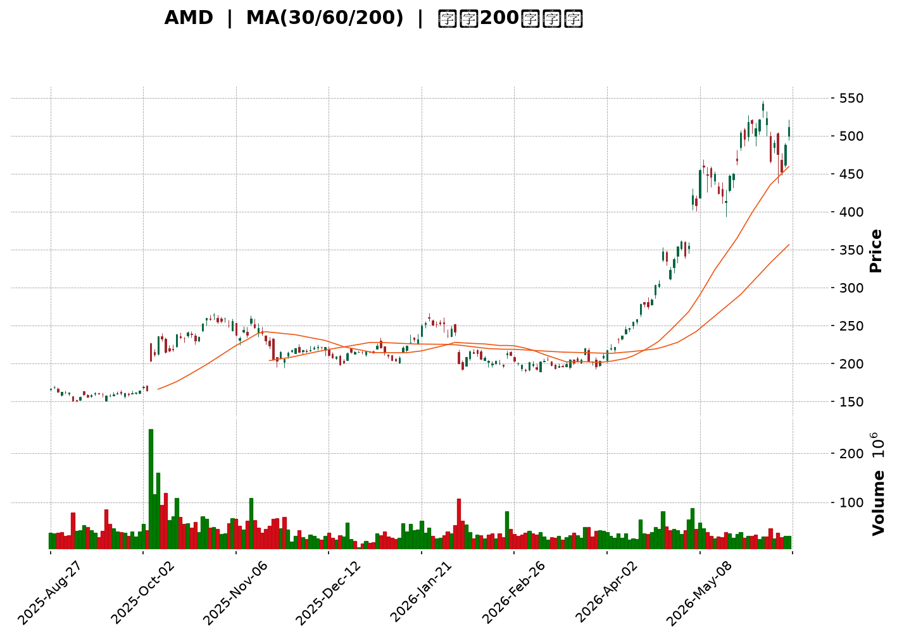
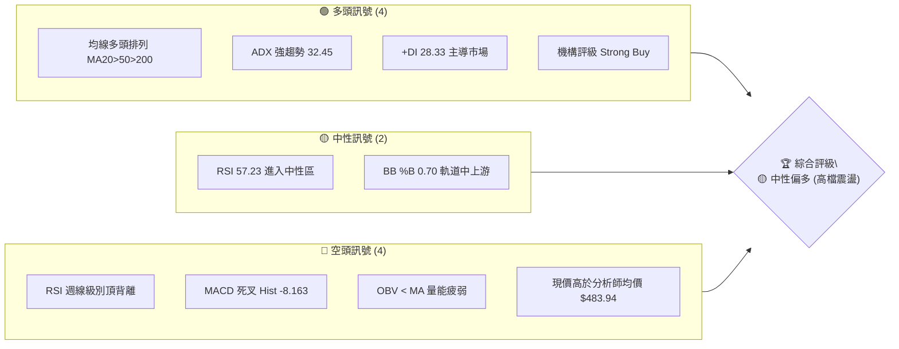
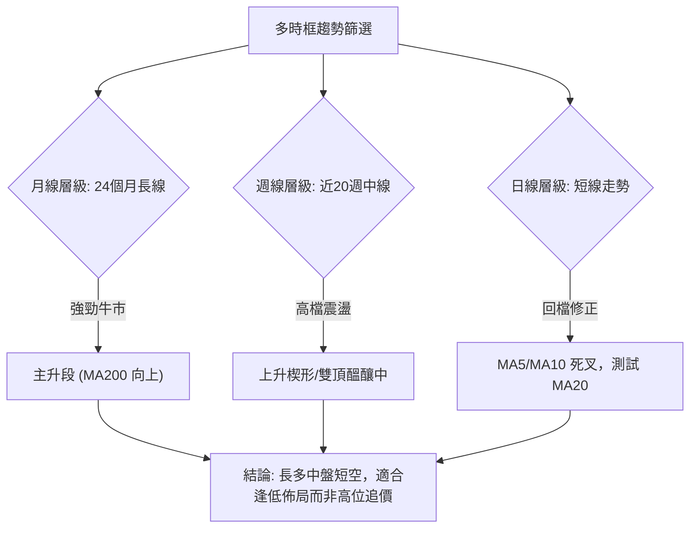

<details>
<summary>📊 靜態圖表 (點擊展開)</summary>

</details>

<html>
<head><meta charset="utf-8" /></head>
<body>
    <div style="height:500px; width:100%;">                        <script>window.PlotlyConfig = {MathJaxConfig: 'local'};</script>
        <script charset="utf-8" src="https://cdn.plot.ly/plotly-3.6.0.min.js" integrity="sha256-QaOVwtVY0T02VaHrr6pnoHLCwayMJp4O5n4YyaE3rJk=" crossorigin="anonymous"></script>                <div id="candlestick-chart" class="plotly-graph-div" style="height:100%; width:100%;"></div>            <script>                window.PLOTLYENV=window.PLOTLYENV || {};                                if (document.getElementById("candlestick-chart")) {                    Plotly.newPlot(                        "candlestick-chart",                        [{"close":{"dtype":"f8","bdata":"AAAAACnkZEAAAABgjxJlQAAAAAApVGRAAAAAgD1KZEAAAAAAKURkQAAAAKBHOWRAAAAA4HrkYkAAAADAHu1iQAAAAIA9emNAAAAAoEfxY0AAAACgcHVjQAAAAIA90mNAAAAAwB4lZEAAAABguA5kQAAAAMAe5WNAAAAAoHC9Y0AAAADgeqxjQAAAAKBH+WNAAAAAwMwcZEAAAAAAKRxkQAAAAOCjKGRAAAAAYLjuY0AAAAAghStkQAAAAKBHOWRAAAAA4FGAZEAAAAAgXDdlQAAAAKBwlWRAAAAAYLh2aUAAAADgUXBqQAAAAIDrcW1AAAAA4HocbUAAAADAzNxqQAAAAKBwDWtAAAAAQOFCa0AAAABAM9NtQAAAAIDrUW1AAAAAYI8ibUAAAACA6xFuQAAAAMD1wG1AAAAAIFzHbEAAAAAgrl9tQAAAAKBwnW9AAAAAYLg6cEAAAAAAKSBwQAAAAKBHhXBAAAAAQOHab0AAAACA6wFwQAAAAGBmOnBAAAAAoJlBb0AAAACgRwVwQAAAAGBmtm1AAAAAoEcxbUAAAAAgXH9uQAAAAOCjsG1AAAAAgD0ucEAAAABguP5uQAAAAIDr2W5AAAAA4KMQbkAAAACgR8lsQAAAAKCZ8WtAAAAA4KPAaUAAAADA9XhpQAAAAKCZ4WpAAAAAACnEaUAAAAAgrsdqQAAAAMD1MGtAAAAA4FF4a0AAAAAgrudqQAAAAEAzM2tAAAAAIFz\u002fakAAAABACj9rQAAAACCFo2tAAAAAANeza0AAAACgcK1rQAAAAIDCrWtAAAAAwPVYakAAAABgj\u002fJpQAAAAKBwJWpAAAAAIIXDaEAAAACA6yFpQAAAAIDCrWpAAAAAYGbeakAAAADAzNxqQAAAAKBH4WpAAAAAIK7fakAAAAAghfNqQAAAAEDh6mpAAAAAwB7FakAAAABACu9rQAAAAGCPomtAAAAAQDPLakAAAADgo0BqQAAAAIDClWlAAAAAoHBlaUAAAACAFPZpQAAAAEAKn2tAAAAAQDPza0AAAACgcH1sQAAAAGCP+mxAAAAAoHD9bEAAAACgmTlvQAAAACBct29AAAAAQOE6cEAAAACA62lvQAAAAMD1gG9AAAAAIK6Xb0AAAACAwoVvQAAAACBcl21AAAAA4KPIbkAAAAAghUNuQAAAAIAUBmlAAAAAAAAQaEAAAACAFA5qQAAAAAAAAGtAAAAAgD2yakAAAABgj7JqQAAAAIAUvmlAAAAAgD3qaUAAAABgj2JpQAAAAADXA2lAAAAAANdraUAAAADAzARpQAAAAEAzk2hAAAAAQOG6akAAAAAghVtqQAAAAIDCdWlAAAAAYLgGaUAAAAAA19NoQAAAAGBm3mdAAAAAgD1CaUAAAABgZu5oQAAAAIDCDWhAAAAAgMJVaUAAAAAgXGdpQAAAAGCPmmlAAAAAIK63aEAAAADgeixoQAAAAGCPkmhAAAAAgOuJaEAAAABguO5oQAAAAOCjqGlAAAAAYI8qaUAAAACAwlVpQAAAAADXq2lAAAAA4KOIa0AAAADgo3hpQAAAACCuP2lAAAAAoEeBaEAAAACAwm1pQAAAAGC4RmpAAAAAAAAwa0AAAACAwoVrQAAAAMD1sGtAAAAAgD36bEAAAADgepRtQAAAAKBHoW5AAAAAYI\u002fabkAAAACAPeJvQAAAAIDrIXBAAAAAAClkcUAAAACAPWZxQAAAAEAzL3FAAAAAANfHcUAAAAAgXPdyQAAAAKBHFXNAAAAAwPW8dUAAAACAFOp0QAAAACBcM3RAAAAAgMIRdUAAAAAA1yd2QAAAAOCjiHZAAAAA4KNYdUAAAAAAKTR2QAAAAIA9VnpAAAAAIFyHeUAAAABACnN8QAAAAOCjrHxAAAAA4KMEfEAAAAAAANh7QAAAAEAzG3xAAAAAoJmBekAAAAAA1096QAAAAMDM4HlAAAAAoEf5e0AAAACgcBl8QAAAAAApOH1AAAAAgD1+f0AAAADgo\u002fh+QAAAAGC4MIBAAAAAwMwggEAAAACAFOJ\u002fQAAAAOBRTIBAAAAAACn0gEAAAACgmVmAQAAAAIAUJn1AAAAAoEelfkAAAAAAKbh9QAAAAGBmRnxAAAAAQDOHfkAAAADAHvl\u002fQA=="},"high":{"dtype":"f8","bdata":"AAAAgML1ZEAAAAAgrl9lQAAAAIA9EmVAAAAA4HpMZEAAAAAAAJhkQAAAAKCZQWRAAAAA4HqkY0AAAADgehRjQAAAAMAelWNAAAAAwPWQZEAAAABguAZkQAAAAMAeDWRAAAAAoJlJZEAAAABgZj5kQAAAAAApNGRAAAAA4KPYY0AAAABA4fpjQAAAAIDCVWRAAAAA4HpsZEAAAABAM6NkQAAAAAApNGRAAAAAIIVDZEAAAACgmYlkQAAAAMD1SGRAAAAAgMKFZEAAAACA62FlQAAAAIDCVWVAAAAAYLhWbEAAAADAzFxrQAAAAADXe21AAAAAQDMDbkAAAABACkdtQAAAAIAUBmxAAAAAIFwfbEAAAAAgrudtQAAAAGBmJm5AAAAAAClsbUAAAAAAKVxuQAAAAOBRSG5AAAAAACkEbkAAAADAzHxtQAAAAOB6rG9AAAAAYLhGcEAAAACgR4lwQAAAAKBHsXBAAAAAgBR+cEAAAACAFGJwQAAAAGCPTnBAAAAAgBQWcEAAAABgZjpwQAAAAOBRsG9AAAAAANd7bUAAAADAzBxvQAAAAGC4Dm9AAAAAACl4cEAAAACAFDpwQAAAAIAUrm9AAAAA4KMYb0AAAAAAAMBtQAAAAMD1aG1AAAAAAABIbUAAAABgjxpqQAAAAAApJGtAAAAAYI\u002fSaUAAAABA4fJqQAAAAKCZSWtAAAAAIFyfa0AAAAAgXD9sQAAAAGBmRmtAAAAAANdja0AAAADgevRrQAAAAGC49mtAAAAAQOEabEAAAAAghdNrQAAAAAAAsGtAAAAAIK7Pa0AAAAAghetqQAAAAEAKR2pAAAAAAABwakAAAAAghctpQAAAAIDC5WpAAAAAoHCFa0AAAADA9SBrQAAAAKBHEWtAAAAAYI8aa0AAAACgmQFrQAAAAIA9GmtAAAAA4Ho0a0AAAADAzGRsQAAAAOCjQG1AAAAAoHDda0AAAAAAKYRqQAAAAIAUXmpAAAAAoJnpaUAAAAAAKTxqQAAAACCF42tAAAAAQOECbEAAAABAM8ttQAAAACCuT21AAAAAAADwbUAAAADAzJxvQAAAAKBHAXBAAAAAIFyvcEAAAADgoyRwQAAAAKCZ8W9AAAAAYGYWcEAAAADgekhwQAAAACCup25AAAAAQAo\u002fb0AAAADAzJRvQAAAAGCPUmtAAAAAoEeBaUAAAADgoyhqQAAAAEAzM2tAAAAA4Hpsa0AAAADAzHRrQAAAAGC4TmtAAAAAoJlBakAAAACgmalpQAAAAGBmZmlAAAAAQDODaUAAAAAA15tpQAAAAAAp7GhAAAAAYLgWa0AAAABgZhZrQAAAAKBHOWpAAAAA4Ho8aUAAAAAgrtdoQAAAAOB6NGhAAAAAgBROaUAAAACgR3lpQAAAACCuB2lAAAAAQApfaUAAAABA4dJpQAAAAGC4JmpAAAAAANdzaUAAAACAwvVoQAAAAKBwBWlAAAAAYLjmaEAAAAAghVtpQAAAAAApvGlAAAAAoJnJaUAAAAAghSNqQAAAAIDCzWlAAAAAYI+qa0AAAAAAAKBrQAAAAOCjaGlAAAAAgMINakAAAAAAAIBpQAAAAGCPumpAAAAAwPU4a0AAAACA60lsQAAAAEAzw2tAAAAAAABAbUAAAABAM6NtQAAAAGCPMm9AAAAAYI\u002fqbkAAAABguO5vQAAAAEDhInBAAAAAoHB1cUAAAADAzJBxQAAAAIDC+XFAAAAAQDPjcUAAAAAAAARzQAAAACCFY3NAAAAAANcPdkAAAAAgXNN1QAAAAAAAeHRAAAAAYLhCdUAAAAAgXC92QAAAAOCjrHZAAAAAoJmddkAAAADAHnl2QAAAAKCZ6XpAAAAAIFxbekAAAADgo4R8QAAAACCFU31AAAAAwMysfEAAAAAAALh8QAAAAMD1VHxAAAAAAABwe0AAAADAzGx7QAAAAAAAzHpAAAAAgD0WfEAAAABAMzN8QAAAAGCPFn5AAAAAIFyvf0AAAAAgXON\u002fQAAAAKCZeYBAAAAAAABQgEAAAAAAACyAQAAAAIDrU4BAAAAAIIUTgUAAAAAghaGAQAAAAIDrmX9AAAAAIIXvfkAAAAAAAJB\u002fQAAAAEAz131AAAAAIFynfkAAAAAghU2AQA=="},"hovertemplate":"\u003cb\u003e%{x|%Y-%m-%d}\u003c\u002fb\u003e\u003cbr\u003e\u958b: $%{open:.2f}\u003cbr\u003e\u9ad8: $%{high:.2f}\u003cbr\u003e\u4f4e: $%{low:.2f}\u003cbr\u003e\u6536: $%{close:.2f}\u003cextra\u003e\u003c\u002fextra\u003e","low":{"dtype":"f8","bdata":"AAAAwMyUZEAAAADAzNRkQAAAAMDMPGRAAAAAANeTY0AAAABgjxJkQAAAAKBHuWNAAAAAgMLFYkAAAABACqdiQAAAAIDC\u002fWJAAAAAAADAY0AAAAAgrl9jQAAAAKBwXWNAAAAAQDOzY0AAAABACudjQAAAAOBReGNAAAAAQDO7YkAAAADAzHxjQAAAAKBwrWNAAAAAYLjmY0AAAACAws1jQAAAAMD1WGNAAAAAoJmhY0AAAADAzPxjQAAAAGCP6mNAAAAAIK4PZEAAAAAA18NkQAAAAOB6ZGRAAAAA4FFgaUAAAADA9ShqQAAAAGBmVmpAAAAAwPWwbEAAAABgZqZqQAAAAMDM3GpAAAAAwMz8akAAAADgUZhrQAAAACCuB21AAAAAwB59bEAAAADAzExtQAAAAOCjQG1AAAAAACkcbEAAAACgR5FsQAAAAGBmPm5AAAAAoJk5b0AAAAAAABBwQAAAAGBmFnBAAAAAgOuJb0AAAADAHq1vQAAAAOB6vG9AAAAA4HrsbkAAAACA61luQAAAACCud21AAAAA4HoUbEAAAAAAABBuQAAAAOB6VG1AAAAAAABAb0AAAACA68FuQAAAAGCPYm1AAAAAwMykbUAAAABguBZsQAAAAGC4dmtAAAAAwPWQaUAAAAAAAGBoQAAAAEAzu2lAAAAAwPVIaEAAAAAAAOBpQAAAAOCjwGpAAAAAAACwakAAAADgesxqQAAAAOCjeGpAAAAA4HrEakAAAAAgrgdrQAAAACCFS2tAAAAAwB49a0AAAACgcFVrQAAAAIAURmpAAAAAgOshakAAAABgj9JpQAAAACCFo2lAAAAAwPWwaEAAAAAAABBpQAAAAGBmhmlAAAAAgOupakAAAADA9YhqQAAAAEAKv2pAAAAAwPWgakAAAAAgridqQAAAAGCPympAAAAAoJm5akAAAADAzFxrQAAAACBcj2tAAAAAAABoakAAAACgcOVpQAAAAGCPamlAAAAAgD1iaUAAAACgmfloQAAAACBc32pAAAAAIIXjakAAAABACmdsQAAAACCFm2xAAAAAwB4tbEAAAADA9XhtQAAAAAAp1G5AAAAAAAAEcEAAAACgmUlvQAAAAGC4\u002fm5AAAAAYLhGb0AAAADAHh1uQAAAAKCZUW1AAAAAAABgbUAAAACgR6FtQAAAAMDM5GhAAAAAQArXZ0AAAACAwo1oQAAAAMDMhGlAAAAAACmkakAAAABguCZqQAAAAOB6pGlAAAAAACl8aUAAAABgj1poQAAAAAAAYGhAAAAAoEfJaEAAAACA69FoQAAAAMDMRGhAAAAAAADQaUAAAABgj0pqQAAAAGC4LmlAAAAAIK63aEAAAAAAAMBnQAAAAEAKh2dAAAAAIIW7Z0AAAAAAKVxoQAAAAAAA6GdAAAAA4KOgZ0AAAABgZkZpQAAAAAApdGlAAAAAoHCVaEAAAADgowhoQAAAAKCZWWhAAAAA4FFoaEAAAAAAAHhoQAAAAGCPGmhAAAAA4FHIaEAAAABguDZpQAAAAAApBGlAAAAA4FFwakAAAACAwm1pQAAAAIAUtmhAAAAAANcbaEAAAADAHo1oQAAAAEDhumlAAAAAANcTaUAAAAAgXDdrQAAAAAAp7GpAAAAAQOFibEAAAADAHt1sQAAAAGC43m1AAAAAwPVAbkAAAABgZrZuQAAAAEAze29AAAAAAClYcEAAAACAPSJxQAAAAAAAAHFAAAAAgOtJcUAAAACAPeJxQAAAAAApvHJAAAAA4KPodEAAAADA9Yx0QAAAAAAAYHNAAAAAgMLtc0AAAACgmcl0QAAAAAAA1HVAAAAAQDMrdUAAAACAFI51QAAAAOCjIHlAAAAAoEcReUAAAADgoyR6QAAAAIAULnxAAAAAgMKhekAAAABgZgp7QAAAAEDhOntAAAAAgMJ1ekAAAAAgXKt5QAAAAIDClXhAAAAAwMygekAAAACgmfl6QAAAACBc23xAAAAAIK4DfkAAAABgj2p+QAAAAOBR2H5AAAAAQOF2f0AAAADAzGx+QAAAACCFU39AAAAAYGZigEAAAACA6z1\u002fQAAAAEAz\u002f3xAAAAAIFzbfUAAAAAgrlN7QAAAAKBHBXxAAAAA4FGgfEAAAAAAAOB+QA=="},"name":"\u50f9\u683c","open":{"dtype":"f8","bdata":"AAAAoEfBZEAAAAAAABBlQAAAAIDr2WRAAAAAoHDNY0AAAACA6zlkQAAAAIAU\u002fmNAAAAAANejY0AAAACgmfliQAAAACCu\u002f2JAAAAAoEdxZEAAAAAA19NjQAAAAAAAoGNAAAAA4FEAZEAAAAAA1ytkQAAAAMD16GNAAAAAYLjeYkAAAAAAKaxjQAAAAKBwrWNAAAAA4KMQZEAAAAAgXF9kQAAAAOB6pGNAAAAA4KMQZEAAAAAA1wNkQAAAAKBHGWRAAAAAgMIdZEAAAACAwhVlQAAAAIDCVWVAAAAAYGZObEAAAABAM9tqQAAAAGBmnmpAAAAAoJmJbUAAAADgoxhtQAAAAGBmhmtAAAAAYGZma0AAAABguNZrQAAAAKBHiW1AAAAA4FEobUAAAABACo9tQAAAAOB67G1AAAAAQDObbUAAAADAHsVsQAAAACCFa25AAAAAgBQecEAAAACAPTJwQAAAAEAKg3BAAAAAYLg+cEAAAACgmTlwQAAAAKBHNXBAAAAAQDNLb0AAAAAgrmduQAAAAEAKr29AAAAAgBTebEAAAADgekRuQAAAAMAeNW5AAAAAACmkb0AAAADAzHxvQAAAACCFA25AAAAAAABYbkAAAADA9ZhtQAAAAOBRyGxAAAAAYGYWbUAAAACA6xlqQAAAAMAe5WlAAAAAIFwvaUAAAACgmUFqQAAAAOB6BGtAAAAAACm8akAAAACgR7lrQAAAAOBRCGtAAAAAACkca0AAAACgcCVrQAAAAEDhYmtAAAAAoEeha0AAAAAAAMBrQAAAAIDrOWtAAAAAANdLa0AAAADA9YhqQAAAAKBw3WlAAAAAoEdBakAAAACAPXppQAAAAEAzk2lAAAAAAACAa0AAAAAghZtqQAAAACBc32pAAAAAgMLtakAAAABgj3JqQAAAAADX+2pAAAAAgD36akAAAADAzFxrQAAAAAAAyGxAAAAAYLjWa0AAAAAAKYRqQAAAAMDMXGpAAAAAQAq3aUAAAACAwiVpQAAAAEAz42pAAAAAoEcxa0AAAADAzHxsQAAAAKCZSW1AAAAAYI9CbEAAAAAgrn9tQAAAAAAAeG9AAAAAQOFScEAAAAAAAAxwQAAAAMAehW9AAAAAACnEb0AAAADAHtVvQAAAAIDCnW1AAAAA4KN4bUAAAACgmXFvQAAAAAAA4GpAAAAAIIU7aUAAAAAAKaRoQAAAAMDM3GlAAAAA4HrkakAAAAAAKTxrQAAAAGCP+mpAAAAA4KOAaUAAAADAzERpQAAAAMAezWhAAAAAIIUDaUAAAAAA1wNpQAAAAEDhwmhAAAAAACl0akAAAACAPdpqQAAAAKCZGWpAAAAAIIUDaUAAAABAMztoQAAAAGC47mdAAAAAANcDaEAAAADgo7hoQAAAAOCjaGhAAAAAIIWrZ0AAAADgUVBpQAAAACCFo2lAAAAAYI9aaUAAAAAghcNoQAAAACBcX2hAAAAAgMKVaEAAAAAAAIBoQAAAAMD1YGhAAAAA4HqcaUAAAADAzMxpQAAAAOB6LGlAAAAA4FFwakAAAAAgXD9rQAAAAOCjOGlAAAAAYGaeaUAAAACgmcFoQAAAAEDh8mlAAAAAoJmBaUAAAADA9WhrQAAAAOBRSGtAAAAAANcDbUAAAADgUSBtQAAAAAAA4G1AAAAAwPWgbkAAAACgRzlvQAAAAGC43m9AAAAAANePcEAAAAAAAJBxQAAAAKCZiXFAAAAAoEdVcUAAAAAghTNyQAAAAAAp4HJAAAAAACkMdUAAAADAHqV1QAAAAIDCfXNAAAAAoEdpdEAAAACAwlV1QAAAAIDr\u002fXVAAAAAwPWEdkAAAAAAKfh1QAAAAADXl3lAAAAAwB4RekAAAACgcCl6QAAAAMDMyHxAAAAAAAAUfEAAAADgo5B8QAAAAKCZiXtAAAAAoHAVe0AAAAAAANh6QAAAAKCZyXlAAAAA4KPAekAAAAAA1597QAAAAKBwXX1AAAAAANdLfkAAAAAAAMB\u002fQAAAAAAAMH9AAAAAYGZGgEAAAABgj0J\u002fQAAAAMDMpH9AAAAAAACugEAAAAAAABaAQAAAAOB6OH9AAAAAAABQfkAAAAAAAGx\u002fQAAAACCFP31AAAAAoJnZfEAAAADA9Tp\u002fQA=="},"x":["2025-08-27T00:00:00-04:00","2025-08-28T00:00:00-04:00","2025-08-29T00:00:00-04:00","2025-09-02T00:00:00-04:00","2025-09-03T00:00:00-04:00","2025-09-04T00:00:00-04:00","2025-09-05T00:00:00-04:00","2025-09-08T00:00:00-04:00","2025-09-09T00:00:00-04:00","2025-09-10T00:00:00-04:00","2025-09-11T00:00:00-04:00","2025-09-12T00:00:00-04:00","2025-09-15T00:00:00-04:00","2025-09-16T00:00:00-04:00","2025-09-17T00:00:00-04:00","2025-09-18T00:00:00-04:00","2025-09-19T00:00:00-04:00","2025-09-22T00:00:00-04:00","2025-09-23T00:00:00-04:00","2025-09-24T00:00:00-04:00","2025-09-25T00:00:00-04:00","2025-09-26T00:00:00-04:00","2025-09-29T00:00:00-04:00","2025-09-30T00:00:00-04:00","2025-10-01T00:00:00-04:00","2025-10-02T00:00:00-04:00","2025-10-03T00:00:00-04:00","2025-10-06T00:00:00-04:00","2025-10-07T00:00:00-04:00","2025-10-08T00:00:00-04:00","2025-10-09T00:00:00-04:00","2025-10-10T00:00:00-04:00","2025-10-13T00:00:00-04:00","2025-10-14T00:00:00-04:00","2025-10-15T00:00:00-04:00","2025-10-16T00:00:00-04:00","2025-10-17T00:00:00-04:00","2025-10-20T00:00:00-04:00","2025-10-21T00:00:00-04:00","2025-10-22T00:00:00-04:00","2025-10-23T00:00:00-04:00","2025-10-24T00:00:00-04:00","2025-10-27T00:00:00-04:00","2025-10-28T00:00:00-04:00","2025-10-29T00:00:00-04:00","2025-10-30T00:00:00-04:00","2025-10-31T00:00:00-04:00","2025-11-03T00:00:00-05:00","2025-11-04T00:00:00-05:00","2025-11-05T00:00:00-05:00","2025-11-06T00:00:00-05:00","2025-11-07T00:00:00-05:00","2025-11-10T00:00:00-05:00","2025-11-11T00:00:00-05:00","2025-11-12T00:00:00-05:00","2025-11-13T00:00:00-05:00","2025-11-14T00:00:00-05:00","2025-11-17T00:00:00-05:00","2025-11-18T00:00:00-05:00","2025-11-19T00:00:00-05:00","2025-11-20T00:00:00-05:00","2025-11-21T00:00:00-05:00","2025-11-24T00:00:00-05:00","2025-11-25T00:00:00-05:00","2025-11-26T00:00:00-05:00","2025-11-28T00:00:00-05:00","2025-12-01T00:00:00-05:00","2025-12-02T00:00:00-05:00","2025-12-03T00:00:00-05:00","2025-12-04T00:00:00-05:00","2025-12-05T00:00:00-05:00","2025-12-08T00:00:00-05:00","2025-12-09T00:00:00-05:00","2025-12-10T00:00:00-05:00","2025-12-11T00:00:00-05:00","2025-12-12T00:00:00-05:00","2025-12-15T00:00:00-05:00","2025-12-16T00:00:00-05:00","2025-12-17T00:00:00-05:00","2025-12-18T00:00:00-05:00","2025-12-19T00:00:00-05:00","2025-12-22T00:00:00-05:00","2025-12-23T00:00:00-05:00","2025-12-24T00:00:00-05:00","2025-12-26T00:00:00-05:00","2025-12-29T00:00:00-05:00","2025-12-30T00:00:00-05:00","2025-12-31T00:00:00-05:00","2026-01-02T00:00:00-05:00","2026-01-05T00:00:00-05:00","2026-01-06T00:00:00-05:00","2026-01-07T00:00:00-05:00","2026-01-08T00:00:00-05:00","2026-01-09T00:00:00-05:00","2026-01-12T00:00:00-05:00","2026-01-13T00:00:00-05:00","2026-01-14T00:00:00-05:00","2026-01-15T00:00:00-05:00","2026-01-16T00:00:00-05:00","2026-01-20T00:00:00-05:00","2026-01-21T00:00:00-05:00","2026-01-22T00:00:00-05:00","2026-01-23T00:00:00-05:00","2026-01-26T00:00:00-05:00","2026-01-27T00:00:00-05:00","2026-01-28T00:00:00-05:00","2026-01-29T00:00:00-05:00","2026-01-30T00:00:00-05:00","2026-02-02T00:00:00-05:00","2026-02-03T00:00:00-05:00","2026-02-04T00:00:00-05:00","2026-02-05T00:00:00-05:00","2026-02-06T00:00:00-05:00","2026-02-09T00:00:00-05:00","2026-02-10T00:00:00-05:00","2026-02-11T00:00:00-05:00","2026-02-12T00:00:00-05:00","2026-02-13T00:00:00-05:00","2026-02-17T00:00:00-05:00","2026-02-18T00:00:00-05:00","2026-02-19T00:00:00-05:00","2026-02-20T00:00:00-05:00","2026-02-23T00:00:00-05:00","2026-02-24T00:00:00-05:00","2026-02-25T00:00:00-05:00","2026-02-26T00:00:00-05:00","2026-02-27T00:00:00-05:00","2026-03-02T00:00:00-05:00","2026-03-03T00:00:00-05:00","2026-03-04T00:00:00-05:00","2026-03-05T00:00:00-05:00","2026-03-06T00:00:00-05:00","2026-03-09T00:00:00-04:00","2026-03-10T00:00:00-04:00","2026-03-11T00:00:00-04:00","2026-03-12T00:00:00-04:00","2026-03-13T00:00:00-04:00","2026-03-16T00:00:00-04:00","2026-03-17T00:00:00-04:00","2026-03-18T00:00:00-04:00","2026-03-19T00:00:00-04:00","2026-03-20T00:00:00-04:00","2026-03-23T00:00:00-04:00","2026-03-24T00:00:00-04:00","2026-03-25T00:00:00-04:00","2026-03-26T00:00:00-04:00","2026-03-27T00:00:00-04:00","2026-03-30T00:00:00-04:00","2026-03-31T00:00:00-04:00","2026-04-01T00:00:00-04:00","2026-04-02T00:00:00-04:00","2026-04-06T00:00:00-04:00","2026-04-07T00:00:00-04:00","2026-04-08T00:00:00-04:00","2026-04-09T00:00:00-04:00","2026-04-10T00:00:00-04:00","2026-04-13T00:00:00-04:00","2026-04-14T00:00:00-04:00","2026-04-15T00:00:00-04:00","2026-04-16T00:00:00-04:00","2026-04-17T00:00:00-04:00","2026-04-20T00:00:00-04:00","2026-04-21T00:00:00-04:00","2026-04-22T00:00:00-04:00","2026-04-23T00:00:00-04:00","2026-04-24T00:00:00-04:00","2026-04-27T00:00:00-04:00","2026-04-28T00:00:00-04:00","2026-04-29T00:00:00-04:00","2026-04-30T00:00:00-04:00","2026-05-01T00:00:00-04:00","2026-05-04T00:00:00-04:00","2026-05-05T00:00:00-04:00","2026-05-06T00:00:00-04:00","2026-05-07T00:00:00-04:00","2026-05-08T00:00:00-04:00","2026-05-11T00:00:00-04:00","2026-05-12T00:00:00-04:00","2026-05-13T00:00:00-04:00","2026-05-14T00:00:00-04:00","2026-05-15T00:00:00-04:00","2026-05-18T00:00:00-04:00","2026-05-19T00:00:00-04:00","2026-05-20T00:00:00-04:00","2026-05-21T00:00:00-04:00","2026-05-22T00:00:00-04:00","2026-05-26T00:00:00-04:00","2026-05-27T00:00:00-04:00","2026-05-28T00:00:00-04:00","2026-05-29T00:00:00-04:00","2026-06-01T00:00:00-04:00","2026-06-02T00:00:00-04:00","2026-06-03T00:00:00-04:00","2026-06-04T00:00:00-04:00","2026-06-05T00:00:00-04:00","2026-06-08T00:00:00-04:00","2026-06-09T00:00:00-04:00","2026-06-10T00:00:00-04:00","2026-06-11T00:00:00-04:00","2026-06-12T00:00:00-04:00"],"type":"candlestick"},{"hovertemplate":"MA30: $%{y:.2f}\u003cextra\u003e\u003c\u002fextra\u003e","line":{"color":"#2196F3","dash":"dash","width":2},"mode":"lines","name":"MA30","x":["2025-08-27T00:00:00-04:00","2025-08-28T00:00:00-04:00","2025-08-29T00:00:00-04:00","2025-09-02T00:00:00-04:00","2025-09-03T00:00:00-04:00","2025-09-04T00:00:00-04:00","2025-09-05T00:00:00-04:00","2025-09-08T00:00:00-04:00","2025-09-09T00:00:00-04:00","2025-09-10T00:00:00-04:00","2025-09-11T00:00:00-04:00","2025-09-12T00:00:00-04:00","2025-09-15T00:00:00-04:00","2025-09-16T00:00:00-04:00","2025-09-17T00:00:00-04:00","2025-09-18T00:00:00-04:00","2025-09-19T00:00:00-04:00","2025-09-22T00:00:00-04:00","2025-09-23T00:00:00-04:00","2025-09-24T00:00:00-04:00","2025-09-25T00:00:00-04:00","2025-09-26T00:00:00-04:00","2025-09-29T00:00:00-04:00","2025-09-30T00:00:00-04:00","2025-10-01T00:00:00-04:00","2025-10-02T00:00:00-04:00","2025-10-03T00:00:00-04:00","2025-10-06T00:00:00-04:00","2025-10-07T00:00:00-04:00","2025-10-08T00:00:00-04:00","2025-10-09T00:00:00-04:00","2025-10-10T00:00:00-04:00","2025-10-13T00:00:00-04:00","2025-10-14T00:00:00-04:00","2025-10-15T00:00:00-04:00","2025-10-16T00:00:00-04:00","2025-10-17T00:00:00-04:00","2025-10-20T00:00:00-04:00","2025-10-21T00:00:00-04:00","2025-10-22T00:00:00-04:00","2025-10-23T00:00:00-04:00","2025-10-24T00:00:00-04:00","2025-10-27T00:00:00-04:00","2025-10-28T00:00:00-04:00","2025-10-29T00:00:00-04:00","2025-10-30T00:00:00-04:00","2025-10-31T00:00:00-04:00","2025-11-03T00:00:00-05:00","2025-11-04T00:00:00-05:00","2025-11-05T00:00:00-05:00","2025-11-06T00:00:00-05:00","2025-11-07T00:00:00-05:00","2025-11-10T00:00:00-05:00","2025-11-11T00:00:00-05:00","2025-11-12T00:00:00-05:00","2025-11-13T00:00:00-05:00","2025-11-14T00:00:00-05:00","2025-11-17T00:00:00-05:00","2025-11-18T00:00:00-05:00","2025-11-19T00:00:00-05:00","2025-11-20T00:00:00-05:00","2025-11-21T00:00:00-05:00","2025-11-24T00:00:00-05:00","2025-11-25T00:00:00-05:00","2025-11-26T00:00:00-05:00","2025-11-28T00:00:00-05:00","2025-12-01T00:00:00-05:00","2025-12-02T00:00:00-05:00","2025-12-03T00:00:00-05:00","2025-12-04T00:00:00-05:00","2025-12-05T00:00:00-05:00","2025-12-08T00:00:00-05:00","2025-12-09T00:00:00-05:00","2025-12-10T00:00:00-05:00","2025-12-11T00:00:00-05:00","2025-12-12T00:00:00-05:00","2025-12-15T00:00:00-05:00","2025-12-16T00:00:00-05:00","2025-12-17T00:00:00-05:00","2025-12-18T00:00:00-05:00","2025-12-19T00:00:00-05:00","2025-12-22T00:00:00-05:00","2025-12-23T00:00:00-05:00","2025-12-24T00:00:00-05:00","2025-12-26T00:00:00-05:00","2025-12-29T00:00:00-05:00","2025-12-30T00:00:00-05:00","2025-12-31T00:00:00-05:00","2026-01-02T00:00:00-05:00","2026-01-05T00:00:00-05:00","2026-01-06T00:00:00-05:00","2026-01-07T00:00:00-05:00","2026-01-08T00:00:00-05:00","2026-01-09T00:00:00-05:00","2026-01-12T00:00:00-05:00","2026-01-13T00:00:00-05:00","2026-01-14T00:00:00-05:00","2026-01-15T00:00:00-05:00","2026-01-16T00:00:00-05:00","2026-01-20T00:00:00-05:00","2026-01-21T00:00:00-05:00","2026-01-22T00:00:00-05:00","2026-01-23T00:00:00-05:00","2026-01-26T00:00:00-05:00","2026-01-27T00:00:00-05:00","2026-01-28T00:00:00-05:00","2026-01-29T00:00:00-05:00","2026-01-30T00:00:00-05:00","2026-02-02T00:00:00-05:00","2026-02-03T00:00:00-05:00","2026-02-04T00:00:00-05:00","2026-02-05T00:00:00-05:00","2026-02-06T00:00:00-05:00","2026-02-09T00:00:00-05:00","2026-02-10T00:00:00-05:00","2026-02-11T00:00:00-05:00","2026-02-12T00:00:00-05:00","2026-02-13T00:00:00-05:00","2026-02-17T00:00:00-05:00","2026-02-18T00:00:00-05:00","2026-02-19T00:00:00-05:00","2026-02-20T00:00:00-05:00","2026-02-23T00:00:00-05:00","2026-02-24T00:00:00-05:00","2026-02-25T00:00:00-05:00","2026-02-26T00:00:00-05:00","2026-02-27T00:00:00-05:00","2026-03-02T00:00:00-05:00","2026-03-03T00:00:00-05:00","2026-03-04T00:00:00-05:00","2026-03-05T00:00:00-05:00","2026-03-06T00:00:00-05:00","2026-03-09T00:00:00-04:00","2026-03-10T00:00:00-04:00","2026-03-11T00:00:00-04:00","2026-03-12T00:00:00-04:00","2026-03-13T00:00:00-04:00","2026-03-16T00:00:00-04:00","2026-03-17T00:00:00-04:00","2026-03-18T00:00:00-04:00","2026-03-19T00:00:00-04:00","2026-03-20T00:00:00-04:00","2026-03-23T00:00:00-04:00","2026-03-24T00:00:00-04:00","2026-03-25T00:00:00-04:00","2026-03-26T00:00:00-04:00","2026-03-27T00:00:00-04:00","2026-03-30T00:00:00-04:00","2026-03-31T00:00:00-04:00","2026-04-01T00:00:00-04:00","2026-04-02T00:00:00-04:00","2026-04-06T00:00:00-04:00","2026-04-07T00:00:00-04:00","2026-04-08T00:00:00-04:00","2026-04-09T00:00:00-04:00","2026-04-10T00:00:00-04:00","2026-04-13T00:00:00-04:00","2026-04-14T00:00:00-04:00","2026-04-15T00:00:00-04:00","2026-04-16T00:00:00-04:00","2026-04-17T00:00:00-04:00","2026-04-20T00:00:00-04:00","2026-04-21T00:00:00-04:00","2026-04-22T00:00:00-04:00","2026-04-23T00:00:00-04:00","2026-04-24T00:00:00-04:00","2026-04-27T00:00:00-04:00","2026-04-28T00:00:00-04:00","2026-04-29T00:00:00-04:00","2026-04-30T00:00:00-04:00","2026-05-01T00:00:00-04:00","2026-05-04T00:00:00-04:00","2026-05-05T00:00:00-04:00","2026-05-06T00:00:00-04:00","2026-05-07T00:00:00-04:00","2026-05-08T00:00:00-04:00","2026-05-11T00:00:00-04:00","2026-05-12T00:00:00-04:00","2026-05-13T00:00:00-04:00","2026-05-14T00:00:00-04:00","2026-05-15T00:00:00-04:00","2026-05-18T00:00:00-04:00","2026-05-19T00:00:00-04:00","2026-05-20T00:00:00-04:00","2026-05-21T00:00:00-04:00","2026-05-22T00:00:00-04:00","2026-05-26T00:00:00-04:00","2026-05-27T00:00:00-04:00","2026-05-28T00:00:00-04:00","2026-05-29T00:00:00-04:00","2026-06-01T00:00:00-04:00","2026-06-02T00:00:00-04:00","2026-06-03T00:00:00-04:00","2026-06-04T00:00:00-04:00","2026-06-05T00:00:00-04:00","2026-06-08T00:00:00-04:00","2026-06-09T00:00:00-04:00","2026-06-10T00:00:00-04:00","2026-06-11T00:00:00-04:00","2026-06-12T00:00:00-04:00"],"y":{"dtype":"f8","bdata":"AAAAAAAA+H8AAAAAAAD4fwAAAAAAAPh\u002fAAAAAAAA+H8AAAAAAAD4fwAAAAAAAPh\u002fAAAAAAAA+H8AAAAAAAD4fwAAAAAAAPh\u002fAAAAAAAA+H8AAAAAAAD4fwAAAAAAAPh\u002fAAAAAAAA+H8AAAAAAAD4fwAAAAAAAPh\u002fAAAAAAAA+H8AAAAAAAD4fwAAAAAAAPh\u002fAAAAAAAA+H8AAAAAAAD4fwAAAAAAAPh\u002fAAAAAAAA+H8AAAAAAAD4fwAAAAAAAPh\u002fAAAAAAAA+H8AAAAAAAD4fwAAAAAAAPh\u002fAAAAAAAA+H8AAAAAAAD4f1VVVRX1x2RAIiIi8hkOZUBERERkgj9lQFVVVaXieGVAIiIikl+0ZUCrqqr68AVmQKuqqgqQU2ZAAAAAIPeqZkBEREQEDwpnQDMzM9O\u002fYWdAiYiI6CatZ0Dv7u6OwgFoQFVVVWVmZmhAIiIiMnrPaECamZnZhzdpQERERES2p2lAMzMz4xcPakAiIiLCZ3hqQCIiIjLs4mpAd3d3FwRCa0DNzMxM1KdrQImIiMha+WtA7+7ujl9IbEAzMzNTgKBsQKuqqqpH8WxAzczMPHxWbUDv7u4+7qltQBEREfGLAW5AZmZmhs8obkB3d3e31zxuQAAAADAIMG5AMzMz414TbkAzMzNjggduQJqZmUkMBm5AmpmZaUr5bUAiIiKCTt9tQO\u002fu7i4kzW1A7+7u7u6+bUAzMzPj7KNtQDMzMyMijm1AAAAA8O5+bUB3d3dXx2xtQHd3dxfZSm1AZmZm5kIibUAzMzNjO\u002ftsQERERNR4zWxAMzMzg3mebEC8u7vbsmpsQERERHTaNGxA7+7uXnP9a0Crqqr6fsJrQGZmZqabqGtAd3d3V8eUa0AAAACQwnVrQFVVVQXIXWtAREREZPQua0Dv7u6ucgxrQGZmZkbh6mpAzczMPMPOakDNzMzsfMdqQDMzM3PaxGpAiYiIGL3NakCJiIgIZdRqQERERFRVyWpAzczMDC3GakBmZmZ2ML9qQAAAANDbwmpAREREZPTGakAAAADgetRqQM3MzJyo42pAvLu7S6n0akAiIiICnRZrQBEREXFoOWtAvLu7WwFia0AiIiJS44FrQJqZmSmHomtAq6qqCknPa0AAAADQ2\u002f5rQHd3d4dBHGxAvLu7a6BPbEDv7u7OaXtsQImIiGhKbWxAAAAAEFhVbEDe3d0NdE5sQDMzMzN6T2xAIiIicvZNbEDv7u4ezEtsQLy7u0vFQWxAVVVVhXk6bEARERGxuSRsQGZmZjZeDmxAAAAA8KcCbEBERETEIPhrQERERGSC72tAMzMzA+T6a0AiIiKiRf5rQO\u002fu7k7U62tAd3d3R+HSa0DNzMxsoLNrQFVVVXUFiGtAvLu7ay5oa0AzMzODeTJrQGZmZoYW8WpAmpmZuUm0akDe3d2tAIFqQO\u002fu7u6nTmpARERERP0TakDe3d2tR9VpQN7d3Q10qmlAREREpCl1aUCamZlZq0dpQHd3d4cWTWlAVVVVtYFWaUB3d3fXXFBpQERERCQGRWlAAAAAsCtMaUB3d3fntEFpQKuqqkp+PWlAiYiIGHYxaUCrqqqq1TFpQJqZmemYPGlAiYiIWKtLaUDv7u7eCGFpQLy7u2uge2lAmpmZKc6OaUAiIiLSTappQLy7u9tr1mlAmpmZOSYIakB3d3fXXERqQKuqqroCjGpA3t3drUfdakARERGRezFrQImIiAiBiWtA3t3dncTga0BmZmYWrktsQImIiEjhtmxAVVVVZfRWbUBVVVVVnO1tQDMzM8OudG5AvLu7i94Kb0ARERERPLBvQImIiJDtKnBAd3d357R1cECamZkpFcdwQImIiBhLOnFAVVVVTamecUAzMzODwCRyQN7d3UW2rXJA7+7uzj40c0Dv7u5uWbVzQFVVVc0TNXRA7+7ulkOjdEARERHZXA51QGZmZj4KdXVARERErBzodUAiIiJyr1l2QM3MzARW0HZAd3d3R29Zd0AzMzNzr9l3QGZmZgZWZHhAvLu7Gy\u002fjeEB3d3dXx155QHd3dxdL4nlAq6qqyuhrekARERGhGuF6QDMzM1P\u002fNntA3t3dDQKDe0Dv7u7eJM57QM3MzJwLE3xAIiIiksJjfECrqqo6ibd8QA=="},"type":"scatter"},{"hovertemplate":"MA60: $%{y:.2f}\u003cextra\u003e\u003c\u002fextra\u003e","line":{"color":"#9C27B0","dash":"dash","width":2},"mode":"lines","name":"MA60","x":["2025-08-27T00:00:00-04:00","2025-08-28T00:00:00-04:00","2025-08-29T00:00:00-04:00","2025-09-02T00:00:00-04:00","2025-09-03T00:00:00-04:00","2025-09-04T00:00:00-04:00","2025-09-05T00:00:00-04:00","2025-09-08T00:00:00-04:00","2025-09-09T00:00:00-04:00","2025-09-10T00:00:00-04:00","2025-09-11T00:00:00-04:00","2025-09-12T00:00:00-04:00","2025-09-15T00:00:00-04:00","2025-09-16T00:00:00-04:00","2025-09-17T00:00:00-04:00","2025-09-18T00:00:00-04:00","2025-09-19T00:00:00-04:00","2025-09-22T00:00:00-04:00","2025-09-23T00:00:00-04:00","2025-09-24T00:00:00-04:00","2025-09-25T00:00:00-04:00","2025-09-26T00:00:00-04:00","2025-09-29T00:00:00-04:00","2025-09-30T00:00:00-04:00","2025-10-01T00:00:00-04:00","2025-10-02T00:00:00-04:00","2025-10-03T00:00:00-04:00","2025-10-06T00:00:00-04:00","2025-10-07T00:00:00-04:00","2025-10-08T00:00:00-04:00","2025-10-09T00:00:00-04:00","2025-10-10T00:00:00-04:00","2025-10-13T00:00:00-04:00","2025-10-14T00:00:00-04:00","2025-10-15T00:00:00-04:00","2025-10-16T00:00:00-04:00","2025-10-17T00:00:00-04:00","2025-10-20T00:00:00-04:00","2025-10-21T00:00:00-04:00","2025-10-22T00:00:00-04:00","2025-10-23T00:00:00-04:00","2025-10-24T00:00:00-04:00","2025-10-27T00:00:00-04:00","2025-10-28T00:00:00-04:00","2025-10-29T00:00:00-04:00","2025-10-30T00:00:00-04:00","2025-10-31T00:00:00-04:00","2025-11-03T00:00:00-05:00","2025-11-04T00:00:00-05:00","2025-11-05T00:00:00-05:00","2025-11-06T00:00:00-05:00","2025-11-07T00:00:00-05:00","2025-11-10T00:00:00-05:00","2025-11-11T00:00:00-05:00","2025-11-12T00:00:00-05:00","2025-11-13T00:00:00-05:00","2025-11-14T00:00:00-05:00","2025-11-17T00:00:00-05:00","2025-11-18T00:00:00-05:00","2025-11-19T00:00:00-05:00","2025-11-20T00:00:00-05:00","2025-11-21T00:00:00-05:00","2025-11-24T00:00:00-05:00","2025-11-25T00:00:00-05:00","2025-11-26T00:00:00-05:00","2025-11-28T00:00:00-05:00","2025-12-01T00:00:00-05:00","2025-12-02T00:00:00-05:00","2025-12-03T00:00:00-05:00","2025-12-04T00:00:00-05:00","2025-12-05T00:00:00-05:00","2025-12-08T00:00:00-05:00","2025-12-09T00:00:00-05:00","2025-12-10T00:00:00-05:00","2025-12-11T00:00:00-05:00","2025-12-12T00:00:00-05:00","2025-12-15T00:00:00-05:00","2025-12-16T00:00:00-05:00","2025-12-17T00:00:00-05:00","2025-12-18T00:00:00-05:00","2025-12-19T00:00:00-05:00","2025-12-22T00:00:00-05:00","2025-12-23T00:00:00-05:00","2025-12-24T00:00:00-05:00","2025-12-26T00:00:00-05:00","2025-12-29T00:00:00-05:00","2025-12-30T00:00:00-05:00","2025-12-31T00:00:00-05:00","2026-01-02T00:00:00-05:00","2026-01-05T00:00:00-05:00","2026-01-06T00:00:00-05:00","2026-01-07T00:00:00-05:00","2026-01-08T00:00:00-05:00","2026-01-09T00:00:00-05:00","2026-01-12T00:00:00-05:00","2026-01-13T00:00:00-05:00","2026-01-14T00:00:00-05:00","2026-01-15T00:00:00-05:00","2026-01-16T00:00:00-05:00","2026-01-20T00:00:00-05:00","2026-01-21T00:00:00-05:00","2026-01-22T00:00:00-05:00","2026-01-23T00:00:00-05:00","2026-01-26T00:00:00-05:00","2026-01-27T00:00:00-05:00","2026-01-28T00:00:00-05:00","2026-01-29T00:00:00-05:00","2026-01-30T00:00:00-05:00","2026-02-02T00:00:00-05:00","2026-02-03T00:00:00-05:00","2026-02-04T00:00:00-05:00","2026-02-05T00:00:00-05:00","2026-02-06T00:00:00-05:00","2026-02-09T00:00:00-05:00","2026-02-10T00:00:00-05:00","2026-02-11T00:00:00-05:00","2026-02-12T00:00:00-05:00","2026-02-13T00:00:00-05:00","2026-02-17T00:00:00-05:00","2026-02-18T00:00:00-05:00","2026-02-19T00:00:00-05:00","2026-02-20T00:00:00-05:00","2026-02-23T00:00:00-05:00","2026-02-24T00:00:00-05:00","2026-02-25T00:00:00-05:00","2026-02-26T00:00:00-05:00","2026-02-27T00:00:00-05:00","2026-03-02T00:00:00-05:00","2026-03-03T00:00:00-05:00","2026-03-04T00:00:00-05:00","2026-03-05T00:00:00-05:00","2026-03-06T00:00:00-05:00","2026-03-09T00:00:00-04:00","2026-03-10T00:00:00-04:00","2026-03-11T00:00:00-04:00","2026-03-12T00:00:00-04:00","2026-03-13T00:00:00-04:00","2026-03-16T00:00:00-04:00","2026-03-17T00:00:00-04:00","2026-03-18T00:00:00-04:00","2026-03-19T00:00:00-04:00","2026-03-20T00:00:00-04:00","2026-03-23T00:00:00-04:00","2026-03-24T00:00:00-04:00","2026-03-25T00:00:00-04:00","2026-03-26T00:00:00-04:00","2026-03-27T00:00:00-04:00","2026-03-30T00:00:00-04:00","2026-03-31T00:00:00-04:00","2026-04-01T00:00:00-04:00","2026-04-02T00:00:00-04:00","2026-04-06T00:00:00-04:00","2026-04-07T00:00:00-04:00","2026-04-08T00:00:00-04:00","2026-04-09T00:00:00-04:00","2026-04-10T00:00:00-04:00","2026-04-13T00:00:00-04:00","2026-04-14T00:00:00-04:00","2026-04-15T00:00:00-04:00","2026-04-16T00:00:00-04:00","2026-04-17T00:00:00-04:00","2026-04-20T00:00:00-04:00","2026-04-21T00:00:00-04:00","2026-04-22T00:00:00-04:00","2026-04-23T00:00:00-04:00","2026-04-24T00:00:00-04:00","2026-04-27T00:00:00-04:00","2026-04-28T00:00:00-04:00","2026-04-29T00:00:00-04:00","2026-04-30T00:00:00-04:00","2026-05-01T00:00:00-04:00","2026-05-04T00:00:00-04:00","2026-05-05T00:00:00-04:00","2026-05-06T00:00:00-04:00","2026-05-07T00:00:00-04:00","2026-05-08T00:00:00-04:00","2026-05-11T00:00:00-04:00","2026-05-12T00:00:00-04:00","2026-05-13T00:00:00-04:00","2026-05-14T00:00:00-04:00","2026-05-15T00:00:00-04:00","2026-05-18T00:00:00-04:00","2026-05-19T00:00:00-04:00","2026-05-20T00:00:00-04:00","2026-05-21T00:00:00-04:00","2026-05-22T00:00:00-04:00","2026-05-26T00:00:00-04:00","2026-05-27T00:00:00-04:00","2026-05-28T00:00:00-04:00","2026-05-29T00:00:00-04:00","2026-06-01T00:00:00-04:00","2026-06-02T00:00:00-04:00","2026-06-03T00:00:00-04:00","2026-06-04T00:00:00-04:00","2026-06-05T00:00:00-04:00","2026-06-08T00:00:00-04:00","2026-06-09T00:00:00-04:00","2026-06-10T00:00:00-04:00","2026-06-11T00:00:00-04:00","2026-06-12T00:00:00-04:00"],"y":{"dtype":"f8","bdata":"AAAAAAAA+H8AAAAAAAD4fwAAAAAAAPh\u002fAAAAAAAA+H8AAAAAAAD4fwAAAAAAAPh\u002fAAAAAAAA+H8AAAAAAAD4fwAAAAAAAPh\u002fAAAAAAAA+H8AAAAAAAD4fwAAAAAAAPh\u002fAAAAAAAA+H8AAAAAAAD4fwAAAAAAAPh\u002fAAAAAAAA+H8AAAAAAAD4fwAAAAAAAPh\u002fAAAAAAAA+H8AAAAAAAD4fwAAAAAAAPh\u002fAAAAAAAA+H8AAAAAAAD4fwAAAAAAAPh\u002fAAAAAAAA+H8AAAAAAAD4fwAAAAAAAPh\u002fAAAAAAAA+H8AAAAAAAD4fwAAAAAAAPh\u002fAAAAAAAA+H8AAAAAAAD4fwAAAAAAAPh\u002fAAAAAAAA+H8AAAAAAAD4fwAAAAAAAPh\u002fAAAAAAAA+H8AAAAAAAD4fwAAAAAAAPh\u002fAAAAAAAA+H8AAAAAAAD4fwAAAAAAAPh\u002fAAAAAAAA+H8AAAAAAAD4fwAAAAAAAPh\u002fAAAAAAAA+H8AAAAAAAD4fwAAAAAAAPh\u002fAAAAAAAA+H8AAAAAAAD4fwAAAAAAAPh\u002fAAAAAAAA+H8AAAAAAAD4fwAAAAAAAPh\u002fAAAAAAAA+H8AAAAAAAD4fwAAAAAAAPh\u002fAAAAAAAA+H8AAAAAAAD4f6uqqqL+e2lAq6qqaryQaUC8u7tjgqNpQHd3d3d3v2lA3t3d\u002fdTWaUBmZma+n\u002fJpQM3MzBxaEGpAd3d3B\u002fM0akC8u7vz\u002fVZqQDMzM\u002fvwd2pARERE7AqWakAzMzPzRLdqQGZmZr6f2GpAREREjN74akBmZmaeYRlrQERERIyXOmtAMzMzs8hWa0Dv7u5OjXFrQDMzM1Pji2tAMzMzu7ufa0C8u7ujKbVrQHd3dzf70GtAMzMzc5Pua0CamZlxIQtsQAAAANiHJ2xAiYiIULhCbEDv7u52MFtsQLy7u5s2dmxAmpmZYcl7bEAiIiJSKoJsQJqZmVFxemxA3t3d\u002fY1wbEDe3d21821sQO\u002fu7s6wZ2xAMzMzu7tfbEBERER8P09sQHd3d\u002f\u002f\u002fR2xAmpmZqfFCbECamZnhMzxsQAAAAGDlOGxA3t3dHcw5bEDNzMwsskFsQERERMQgQmxAERERISJCbECrqqpajz5sQO\u002fu7v7\u002fN2xA7+7uRuE2bEDe3d1VxzRsQN7d3f2NKGxAVVVV5YkmbEDNzMxk9B5sQHd3dwfzCmxAvLu7sw\u002f1a0Dv7u5OG+JrQERERByh1mtAMzMza3W+a0Dv7u5mH6xrQBEREUlTlmtAERERYZ6Ea0Dv7u5OG3ZrQM3MzFScaWtAREREhDJoa0BmZmbmQmZrQERERNxrXGtAAAAAiIhga0BEREQMu15rQHd3dw9YV2tA3t3d1epMa0BmZmamDURrQBEREQnXNWtAvLu722sua0CrqqpCiyRrQLy7u3s\u002fFWtAq6qqiiULa0AAAAAAcgFrQERERIyX+GpAd3d3J6PxakDv7u6+EepqQKuqqspa42pAAAAACGXiakBERESUiuFqQAAAAHgw3WpAq6qq4uzVakCrqqpyaM9qQLy7uytAympAERERERHNakAzMzODwMZqQDMzM8uhv2pA7+7uzve1akDe3d2tR6tqQAAAAJB7pWpAREREpCmnakCamZnRlKxqQAAAAGiRtWpAZmZmFtnEakAiIiK6SdRqQFVVVRUg4WpAiYiIwIPtakAiIiKi\u002fvtqQAAAABgECmtAzczMDLsia0AiIiKK+jFrQHd3d8dLPWtAvLu7K4dKa0AiIiJiV2ZrQLy7u5vEgmtAzczM1Hi1a0CamZkBcuFrQImIiGiRD2xAAAAAGARAbEBVVVW183tsQERERNR40WxAIiIiwvUgbUBVVVWVQ29tQKuqqirO3G1AVVVVJb9EbkDv7u72msVuQDMzM2t1TG9AMzMz2\u002fnMb0AiIiIiIidwQBERESGwaXBAmpmZoYykcEBERESkcN9wQCIiIjptGXFAiYiI4MFXcUCamZkta5dxQFVVVfnF3XFAIiIiMsEuckB3d3fv7n1yQN7d3bEr1XJAVVVVeekoc0AAAACQwntzQN7d3c2F03NAzczMjCUudEAiIiLWeIN0QLy7u\u002fs3yXRAREREID4XdUDNzMyEeWJ1QDMzM3+xpnVAAAAA7Jj0dUCamZmh00d2QA=="},"type":"scatter"},{"hovertemplate":"MA200: $%{y:.2f}\u003cextra\u003e\u003c\u002fextra\u003e","line":{"color":"#FF6F00","dash":"solid","width":2},"mode":"lines","name":"MA200","x":["2025-08-27T00:00:00-04:00","2025-08-28T00:00:00-04:00","2025-08-29T00:00:00-04:00","2025-09-02T00:00:00-04:00","2025-09-03T00:00:00-04:00","2025-09-04T00:00:00-04:00","2025-09-05T00:00:00-04:00","2025-09-08T00:00:00-04:00","2025-09-09T00:00:00-04:00","2025-09-10T00:00:00-04:00","2025-09-11T00:00:00-04:00","2025-09-12T00:00:00-04:00","2025-09-15T00:00:00-04:00","2025-09-16T00:00:00-04:00","2025-09-17T00:00:00-04:00","2025-09-18T00:00:00-04:00","2025-09-19T00:00:00-04:00","2025-09-22T00:00:00-04:00","2025-09-23T00:00:00-04:00","2025-09-24T00:00:00-04:00","2025-09-25T00:00:00-04:00","2025-09-26T00:00:00-04:00","2025-09-29T00:00:00-04:00","2025-09-30T00:00:00-04:00","2025-10-01T00:00:00-04:00","2025-10-02T00:00:00-04:00","2025-10-03T00:00:00-04:00","2025-10-06T00:00:00-04:00","2025-10-07T00:00:00-04:00","2025-10-08T00:00:00-04:00","2025-10-09T00:00:00-04:00","2025-10-10T00:00:00-04:00","2025-10-13T00:00:00-04:00","2025-10-14T00:00:00-04:00","2025-10-15T00:00:00-04:00","2025-10-16T00:00:00-04:00","2025-10-17T00:00:00-04:00","2025-10-20T00:00:00-04:00","2025-10-21T00:00:00-04:00","2025-10-22T00:00:00-04:00","2025-10-23T00:00:00-04:00","2025-10-24T00:00:00-04:00","2025-10-27T00:00:00-04:00","2025-10-28T00:00:00-04:00","2025-10-29T00:00:00-04:00","2025-10-30T00:00:00-04:00","2025-10-31T00:00:00-04:00","2025-11-03T00:00:00-05:00","2025-11-04T00:00:00-05:00","2025-11-05T00:00:00-05:00","2025-11-06T00:00:00-05:00","2025-11-07T00:00:00-05:00","2025-11-10T00:00:00-05:00","2025-11-11T00:00:00-05:00","2025-11-12T00:00:00-05:00","2025-11-13T00:00:00-05:00","2025-11-14T00:00:00-05:00","2025-11-17T00:00:00-05:00","2025-11-18T00:00:00-05:00","2025-11-19T00:00:00-05:00","2025-11-20T00:00:00-05:00","2025-11-21T00:00:00-05:00","2025-11-24T00:00:00-05:00","2025-11-25T00:00:00-05:00","2025-11-26T00:00:00-05:00","2025-11-28T00:00:00-05:00","2025-12-01T00:00:00-05:00","2025-12-02T00:00:00-05:00","2025-12-03T00:00:00-05:00","2025-12-04T00:00:00-05:00","2025-12-05T00:00:00-05:00","2025-12-08T00:00:00-05:00","2025-12-09T00:00:00-05:00","2025-12-10T00:00:00-05:00","2025-12-11T00:00:00-05:00","2025-12-12T00:00:00-05:00","2025-12-15T00:00:00-05:00","2025-12-16T00:00:00-05:00","2025-12-17T00:00:00-05:00","2025-12-18T00:00:00-05:00","2025-12-19T00:00:00-05:00","2025-12-22T00:00:00-05:00","2025-12-23T00:00:00-05:00","2025-12-24T00:00:00-05:00","2025-12-26T00:00:00-05:00","2025-12-29T00:00:00-05:00","2025-12-30T00:00:00-05:00","2025-12-31T00:00:00-05:00","2026-01-02T00:00:00-05:00","2026-01-05T00:00:00-05:00","2026-01-06T00:00:00-05:00","2026-01-07T00:00:00-05:00","2026-01-08T00:00:00-05:00","2026-01-09T00:00:00-05:00","2026-01-12T00:00:00-05:00","2026-01-13T00:00:00-05:00","2026-01-14T00:00:00-05:00","2026-01-15T00:00:00-05:00","2026-01-16T00:00:00-05:00","2026-01-20T00:00:00-05:00","2026-01-21T00:00:00-05:00","2026-01-22T00:00:00-05:00","2026-01-23T00:00:00-05:00","2026-01-26T00:00:00-05:00","2026-01-27T00:00:00-05:00","2026-01-28T00:00:00-05:00","2026-01-29T00:00:00-05:00","2026-01-30T00:00:00-05:00","2026-02-02T00:00:00-05:00","2026-02-03T00:00:00-05:00","2026-02-04T00:00:00-05:00","2026-02-05T00:00:00-05:00","2026-02-06T00:00:00-05:00","2026-02-09T00:00:00-05:00","2026-02-10T00:00:00-05:00","2026-02-11T00:00:00-05:00","2026-02-12T00:00:00-05:00","2026-02-13T00:00:00-05:00","2026-02-17T00:00:00-05:00","2026-02-18T00:00:00-05:00","2026-02-19T00:00:00-05:00","2026-02-20T00:00:00-05:00","2026-02-23T00:00:00-05:00","2026-02-24T00:00:00-05:00","2026-02-25T00:00:00-05:00","2026-02-26T00:00:00-05:00","2026-02-27T00:00:00-05:00","2026-03-02T00:00:00-05:00","2026-03-03T00:00:00-05:00","2026-03-04T00:00:00-05:00","2026-03-05T00:00:00-05:00","2026-03-06T00:00:00-05:00","2026-03-09T00:00:00-04:00","2026-03-10T00:00:00-04:00","2026-03-11T00:00:00-04:00","2026-03-12T00:00:00-04:00","2026-03-13T00:00:00-04:00","2026-03-16T00:00:00-04:00","2026-03-17T00:00:00-04:00","2026-03-18T00:00:00-04:00","2026-03-19T00:00:00-04:00","2026-03-20T00:00:00-04:00","2026-03-23T00:00:00-04:00","2026-03-24T00:00:00-04:00","2026-03-25T00:00:00-04:00","2026-03-26T00:00:00-04:00","2026-03-27T00:00:00-04:00","2026-03-30T00:00:00-04:00","2026-03-31T00:00:00-04:00","2026-04-01T00:00:00-04:00","2026-04-02T00:00:00-04:00","2026-04-06T00:00:00-04:00","2026-04-07T00:00:00-04:00","2026-04-08T00:00:00-04:00","2026-04-09T00:00:00-04:00","2026-04-10T00:00:00-04:00","2026-04-13T00:00:00-04:00","2026-04-14T00:00:00-04:00","2026-04-15T00:00:00-04:00","2026-04-16T00:00:00-04:00","2026-04-17T00:00:00-04:00","2026-04-20T00:00:00-04:00","2026-04-21T00:00:00-04:00","2026-04-22T00:00:00-04:00","2026-04-23T00:00:00-04:00","2026-04-24T00:00:00-04:00","2026-04-27T00:00:00-04:00","2026-04-28T00:00:00-04:00","2026-04-29T00:00:00-04:00","2026-04-30T00:00:00-04:00","2026-05-01T00:00:00-04:00","2026-05-04T00:00:00-04:00","2026-05-05T00:00:00-04:00","2026-05-06T00:00:00-04:00","2026-05-07T00:00:00-04:00","2026-05-08T00:00:00-04:00","2026-05-11T00:00:00-04:00","2026-05-12T00:00:00-04:00","2026-05-13T00:00:00-04:00","2026-05-14T00:00:00-04:00","2026-05-15T00:00:00-04:00","2026-05-18T00:00:00-04:00","2026-05-19T00:00:00-04:00","2026-05-20T00:00:00-04:00","2026-05-21T00:00:00-04:00","2026-05-22T00:00:00-04:00","2026-05-26T00:00:00-04:00","2026-05-27T00:00:00-04:00","2026-05-28T00:00:00-04:00","2026-05-29T00:00:00-04:00","2026-06-01T00:00:00-04:00","2026-06-02T00:00:00-04:00","2026-06-03T00:00:00-04:00","2026-06-04T00:00:00-04:00","2026-06-05T00:00:00-04:00","2026-06-08T00:00:00-04:00","2026-06-09T00:00:00-04:00","2026-06-10T00:00:00-04:00","2026-06-11T00:00:00-04:00","2026-06-12T00:00:00-04:00"],"y":{"dtype":"f8","bdata":"AAAAAAAA+H8AAAAAAAD4fwAAAAAAAPh\u002fAAAAAAAA+H8AAAAAAAD4fwAAAAAAAPh\u002fAAAAAAAA+H8AAAAAAAD4fwAAAAAAAPh\u002fAAAAAAAA+H8AAAAAAAD4fwAAAAAAAPh\u002fAAAAAAAA+H8AAAAAAAD4fwAAAAAAAPh\u002fAAAAAAAA+H8AAAAAAAD4fwAAAAAAAPh\u002fAAAAAAAA+H8AAAAAAAD4fwAAAAAAAPh\u002fAAAAAAAA+H8AAAAAAAD4fwAAAAAAAPh\u002fAAAAAAAA+H8AAAAAAAD4fwAAAAAAAPh\u002fAAAAAAAA+H8AAAAAAAD4fwAAAAAAAPh\u002fAAAAAAAA+H8AAAAAAAD4fwAAAAAAAPh\u002fAAAAAAAA+H8AAAAAAAD4fwAAAAAAAPh\u002fAAAAAAAA+H8AAAAAAAD4fwAAAAAAAPh\u002fAAAAAAAA+H8AAAAAAAD4fwAAAAAAAPh\u002fAAAAAAAA+H8AAAAAAAD4fwAAAAAAAPh\u002fAAAAAAAA+H8AAAAAAAD4fwAAAAAAAPh\u002fAAAAAAAA+H8AAAAAAAD4fwAAAAAAAPh\u002fAAAAAAAA+H8AAAAAAAD4fwAAAAAAAPh\u002fAAAAAAAA+H8AAAAAAAD4fwAAAAAAAPh\u002fAAAAAAAA+H8AAAAAAAD4fwAAAAAAAPh\u002fAAAAAAAA+H8AAAAAAAD4fwAAAAAAAPh\u002fAAAAAAAA+H8AAAAAAAD4fwAAAAAAAPh\u002fAAAAAAAA+H8AAAAAAAD4fwAAAAAAAPh\u002fAAAAAAAA+H8AAAAAAAD4fwAAAAAAAPh\u002fAAAAAAAA+H8AAAAAAAD4fwAAAAAAAPh\u002fAAAAAAAA+H8AAAAAAAD4fwAAAAAAAPh\u002fAAAAAAAA+H8AAAAAAAD4fwAAAAAAAPh\u002fAAAAAAAA+H8AAAAAAAD4fwAAAAAAAPh\u002fAAAAAAAA+H8AAAAAAAD4fwAAAAAAAPh\u002fAAAAAAAA+H8AAAAAAAD4fwAAAAAAAPh\u002fAAAAAAAA+H8AAAAAAAD4fwAAAAAAAPh\u002fAAAAAAAA+H8AAAAAAAD4fwAAAAAAAPh\u002fAAAAAAAA+H8AAAAAAAD4fwAAAAAAAPh\u002fAAAAAAAA+H8AAAAAAAD4fwAAAAAAAPh\u002fAAAAAAAA+H8AAAAAAAD4fwAAAAAAAPh\u002fAAAAAAAA+H8AAAAAAAD4fwAAAAAAAPh\u002fAAAAAAAA+H8AAAAAAAD4fwAAAAAAAPh\u002fAAAAAAAA+H8AAAAAAAD4fwAAAAAAAPh\u002fAAAAAAAA+H8AAAAAAAD4fwAAAAAAAPh\u002fAAAAAAAA+H8AAAAAAAD4fwAAAAAAAPh\u002fAAAAAAAA+H8AAAAAAAD4fwAAAAAAAPh\u002fAAAAAAAA+H8AAAAAAAD4fwAAAAAAAPh\u002fAAAAAAAA+H8AAAAAAAD4fwAAAAAAAPh\u002fAAAAAAAA+H8AAAAAAAD4fwAAAAAAAPh\u002fAAAAAAAA+H8AAAAAAAD4fwAAAAAAAPh\u002fAAAAAAAA+H8AAAAAAAD4fwAAAAAAAPh\u002fAAAAAAAA+H8AAAAAAAD4fwAAAAAAAPh\u002fAAAAAAAA+H8AAAAAAAD4fwAAAAAAAPh\u002fAAAAAAAA+H8AAAAAAAD4fwAAAAAAAPh\u002fAAAAAAAA+H8AAAAAAAD4fwAAAAAAAPh\u002fAAAAAAAA+H8AAAAAAAD4fwAAAAAAAPh\u002fAAAAAAAA+H8AAAAAAAD4fwAAAAAAAPh\u002fAAAAAAAA+H8AAAAAAAD4fwAAAAAAAPh\u002fAAAAAAAA+H8AAAAAAAD4fwAAAAAAAPh\u002fAAAAAAAA+H8AAAAAAAD4fwAAAAAAAPh\u002fAAAAAAAA+H8AAAAAAAD4fwAAAAAAAPh\u002fAAAAAAAA+H8AAAAAAAD4fwAAAAAAAPh\u002fAAAAAAAA+H8AAAAAAAD4fwAAAAAAAPh\u002fAAAAAAAA+H8AAAAAAAD4fwAAAAAAAPh\u002fAAAAAAAA+H8AAAAAAAD4fwAAAAAAAPh\u002fAAAAAAAA+H8AAAAAAAD4fwAAAAAAAPh\u002fAAAAAAAA+H8AAAAAAAD4fwAAAAAAAPh\u002fAAAAAAAA+H8AAAAAAAD4fwAAAAAAAPh\u002fAAAAAAAA+H8AAAAAAAD4fwAAAAAAAPh\u002fAAAAAAAA+H8AAAAAAAD4fwAAAAAAAPh\u002fAAAAAAAA+H8AAAAAAAD4fwAAAAAAAPh\u002fAAAAAAAA+H8pXI9Cz71vQA=="},"type":"scatter"}],                        {"template":{"data":{"barpolar":[{"marker":{"line":{"color":"rgb(17,17,17)","width":0.5},"pattern":{"fillmode":"overlay","size":10,"solidity":0.2}},"type":"barpolar"}],"bar":[{"error_x":{"color":"#f2f5fa"},"error_y":{"color":"#f2f5fa"},"marker":{"line":{"color":"rgb(17,17,17)","width":0.5},"pattern":{"fillmode":"overlay","size":10,"solidity":0.2}},"type":"bar"}],"carpet":[{"aaxis":{"endlinecolor":"#A2B1C6","gridcolor":"#506784","linecolor":"#506784","minorgridcolor":"#506784","startlinecolor":"#A2B1C6"},"baxis":{"endlinecolor":"#A2B1C6","gridcolor":"#506784","linecolor":"#506784","minorgridcolor":"#506784","startlinecolor":"#A2B1C6"},"type":"carpet"}],"choropleth":[{"colorbar":{"outlinewidth":0,"ticks":""},"type":"choropleth"}],"contourcarpet":[{"colorbar":{"outlinewidth":0,"ticks":""},"type":"contourcarpet"}],"contour":[{"colorbar":{"outlinewidth":0,"ticks":""},"colorscale":[[0.0,"#0d0887"],[0.1111111111111111,"#46039f"],[0.2222222222222222,"#7201a8"],[0.3333333333333333,"#9c179e"],[0.4444444444444444,"#bd3786"],[0.5555555555555556,"#d8576b"],[0.6666666666666666,"#ed7953"],[0.7777777777777778,"#fb9f3a"],[0.8888888888888888,"#fdca26"],[1.0,"#f0f921"]],"type":"contour"}],"heatmap":[{"colorbar":{"outlinewidth":0,"ticks":""},"colorscale":[[0.0,"#0d0887"],[0.1111111111111111,"#46039f"],[0.2222222222222222,"#7201a8"],[0.3333333333333333,"#9c179e"],[0.4444444444444444,"#bd3786"],[0.5555555555555556,"#d8576b"],[0.6666666666666666,"#ed7953"],[0.7777777777777778,"#fb9f3a"],[0.8888888888888888,"#fdca26"],[1.0,"#f0f921"]],"type":"heatmap"}],"histogram2dcontour":[{"colorbar":{"outlinewidth":0,"ticks":""},"colorscale":[[0.0,"#0d0887"],[0.1111111111111111,"#46039f"],[0.2222222222222222,"#7201a8"],[0.3333333333333333,"#9c179e"],[0.4444444444444444,"#bd3786"],[0.5555555555555556,"#d8576b"],[0.6666666666666666,"#ed7953"],[0.7777777777777778,"#fb9f3a"],[0.8888888888888888,"#fdca26"],[1.0,"#f0f921"]],"type":"histogram2dcontour"}],"histogram2d":[{"colorbar":{"outlinewidth":0,"ticks":""},"colorscale":[[0.0,"#0d0887"],[0.1111111111111111,"#46039f"],[0.2222222222222222,"#7201a8"],[0.3333333333333333,"#9c179e"],[0.4444444444444444,"#bd3786"],[0.5555555555555556,"#d8576b"],[0.6666666666666666,"#ed7953"],[0.7777777777777778,"#fb9f3a"],[0.8888888888888888,"#fdca26"],[1.0,"#f0f921"]],"type":"histogram2d"}],"histogram":[{"marker":{"pattern":{"fillmode":"overlay","size":10,"solidity":0.2}},"type":"histogram"}],"mesh3d":[{"colorbar":{"outlinewidth":0,"ticks":""},"type":"mesh3d"}],"parcoords":[{"line":{"colorbar":{"outlinewidth":0,"ticks":""}},"type":"parcoords"}],"pie":[{"automargin":true,"type":"pie"}],"scatter3d":[{"line":{"colorbar":{"outlinewidth":0,"ticks":""}},"marker":{"colorbar":{"outlinewidth":0,"ticks":""}},"type":"scatter3d"}],"scattercarpet":[{"marker":{"colorbar":{"outlinewidth":0,"ticks":""}},"type":"scattercarpet"}],"scattergeo":[{"marker":{"colorbar":{"outlinewidth":0,"ticks":""}},"type":"scattergeo"}],"scattergl":[{"marker":{"line":{"color":"#283442"}},"type":"scattergl"}],"scattermapbox":[{"marker":{"colorbar":{"outlinewidth":0,"ticks":""}},"type":"scattermapbox"}],"scattermap":[{"marker":{"colorbar":{"outlinewidth":0,"ticks":""}},"type":"scattermap"}],"scatterpolargl":[{"marker":{"colorbar":{"outlinewidth":0,"ticks":""}},"type":"scatterpolargl"}],"scatterpolar":[{"marker":{"colorbar":{"outlinewidth":0,"ticks":""}},"type":"scatterpolar"}],"scatter":[{"marker":{"line":{"color":"#283442"}},"type":"scatter"}],"scatterternary":[{"marker":{"colorbar":{"outlinewidth":0,"ticks":""}},"type":"scatterternary"}],"surface":[{"colorbar":{"outlinewidth":0,"ticks":""},"colorscale":[[0.0,"#0d0887"],[0.1111111111111111,"#46039f"],[0.2222222222222222,"#7201a8"],[0.3333333333333333,"#9c179e"],[0.4444444444444444,"#bd3786"],[0.5555555555555556,"#d8576b"],[0.6666666666666666,"#ed7953"],[0.7777777777777778,"#fb9f3a"],[0.8888888888888888,"#fdca26"],[1.0,"#f0f921"]],"type":"surface"}],"table":[{"cells":{"fill":{"color":"#506784"},"line":{"color":"rgb(17,17,17)"}},"header":{"fill":{"color":"#2a3f5f"},"line":{"color":"rgb(17,17,17)"}},"type":"table"}]},"layout":{"annotationdefaults":{"arrowcolor":"#f2f5fa","arrowhead":0,"arrowwidth":1},"autotypenumbers":"strict","coloraxis":{"colorbar":{"outlinewidth":0,"ticks":""}},"colorscale":{"diverging":[[0,"#8e0152"],[0.1,"#c51b7d"],[0.2,"#de77ae"],[0.3,"#f1b6da"],[0.4,"#fde0ef"],[0.5,"#f7f7f7"],[0.6,"#e6f5d0"],[0.7,"#b8e186"],[0.8,"#7fbc41"],[0.9,"#4d9221"],[1,"#276419"]],"sequential":[[0.0,"#0d0887"],[0.1111111111111111,"#46039f"],[0.2222222222222222,"#7201a8"],[0.3333333333333333,"#9c179e"],[0.4444444444444444,"#bd3786"],[0.5555555555555556,"#d8576b"],[0.6666666666666666,"#ed7953"],[0.7777777777777778,"#fb9f3a"],[0.8888888888888888,"#fdca26"],[1.0,"#f0f921"]],"sequentialminus":[[0.0,"#0d0887"],[0.1111111111111111,"#46039f"],[0.2222222222222222,"#7201a8"],[0.3333333333333333,"#9c179e"],[0.4444444444444444,"#bd3786"],[0.5555555555555556,"#d8576b"],[0.6666666666666666,"#ed7953"],[0.7777777777777778,"#fb9f3a"],[0.8888888888888888,"#fdca26"],[1.0,"#f0f921"]]},"colorway":["#636efa","#EF553B","#00cc96","#ab63fa","#FFA15A","#19d3f3","#FF6692","#B6E880","#FF97FF","#FECB52"],"font":{"color":"#f2f5fa"},"geo":{"bgcolor":"rgb(17,17,17)","lakecolor":"rgb(17,17,17)","landcolor":"rgb(17,17,17)","showlakes":true,"showland":true,"subunitcolor":"#506784"},"hoverlabel":{"align":"left"},"hovermode":"closest","mapbox":{"style":"dark"},"paper_bgcolor":"rgb(17,17,17)","plot_bgcolor":"rgb(17,17,17)","polar":{"angularaxis":{"gridcolor":"#506784","linecolor":"#506784","ticks":""},"bgcolor":"rgb(17,17,17)","radialaxis":{"gridcolor":"#506784","linecolor":"#506784","ticks":""}},"scene":{"xaxis":{"backgroundcolor":"rgb(17,17,17)","gridcolor":"#506784","gridwidth":2,"linecolor":"#506784","showbackground":true,"ticks":"","zerolinecolor":"#C8D4E3"},"yaxis":{"backgroundcolor":"rgb(17,17,17)","gridcolor":"#506784","gridwidth":2,"linecolor":"#506784","showbackground":true,"ticks":"","zerolinecolor":"#C8D4E3"},"zaxis":{"backgroundcolor":"rgb(17,17,17)","gridcolor":"#506784","gridwidth":2,"linecolor":"#506784","showbackground":true,"ticks":"","zerolinecolor":"#C8D4E3"}},"shapedefaults":{"line":{"color":"#f2f5fa"}},"sliderdefaults":{"bgcolor":"#C8D4E3","bordercolor":"rgb(17,17,17)","borderwidth":1,"tickwidth":0},"ternary":{"aaxis":{"gridcolor":"#506784","linecolor":"#506784","ticks":""},"baxis":{"gridcolor":"#506784","linecolor":"#506784","ticks":""},"bgcolor":"rgb(17,17,17)","caxis":{"gridcolor":"#506784","linecolor":"#506784","ticks":""}},"title":{"x":0.05},"updatemenudefaults":{"bgcolor":"#506784","borderwidth":0},"xaxis":{"automargin":true,"gridcolor":"#283442","linecolor":"#506784","ticks":"","title":{"standoff":15},"zerolinecolor":"#283442","zerolinewidth":2},"yaxis":{"automargin":true,"gridcolor":"#283442","linecolor":"#506784","ticks":"","title":{"standoff":15},"zerolinecolor":"#283442","zerolinewidth":2}}},"xaxis":{"rangeslider":{"visible":false},"title":{"text":"\u65e5\u671f"}},"font":{"size":11},"title":{"text":"AMD  |  MA(30\u002f60\u002f200)  |  \u6700\u8fd1200\u4ea4\u6613\u65e5"},"yaxis":{"title":{"text":"\u80a1\u50f9 (USD)"}},"hovermode":"x unified","height":500},                        {"responsive": true}                    )                };            </script>        </div>
</body>
</html>

# AMD 技術分析報告

> **報告日期**：2026-06-13 ｜ **語言**：繁體中文 ｜ **數據來源**：Yahoo Finance ｜ **當前價格**：$511.57

---

## 目錄

| 章節 | 內容 |
|------|------|
| [1. 技術面概覽](#1-技術面概覽) | 訊號儀表板、核心指標、評分卡 |
| [2. 趨勢分析](#2-趨勢分析) | 多時框趨勢、長中短期走勢 |
| [3. 圖表形態分析](#3-圖表形態分析) | 形態識別、K線組合、目標價 |
| [4. 支撐與阻力](#4-支撐與阻力) | 關鍵價位、斐波那契回調 |
| [5. 技術指標深度解讀](#5-技術指標深度解讀) | MA/RSI/MACD/布林/成交量 |
| [6. 動能與波動率](#6-動能與波動率) | 動能評估、ATR、Beta |
| [7. 多時框架總結](#7-多時框架總結) | 時框架評分矩陣 |
| [8. 交易策略建議](#8-交易策略建議) | 多空策略、風險報酬比 |
| [9. 風險提示與監控](#9-風險提示與監控) | 監控指標、風險場景 |

---

## 1. 技術面概覽

### 🎯 技術訊號儀表板



### 📊 核心指標速覽表

| 指標類別 | 指標名稱 | 當前數值 | 訊號 | 解讀 |
|----------|----------|----------|------|------|
| **價格** | 當前價格 | $511.57 | 🟡 中性 | 位於 52W 區間高點 (91.9%)，面臨獲利回吐壓力 |
| **均線** | MA20 | $481.97 | 🟢 多頭 | 價格維持在 MA20 上方，短期支撐強勁 |
| **均線** | MA50 | $386.78 | 🟢 多頭 | 中期生命線，多頭趨勢的強力防線 |
| **均線** | MA200 | $253.93 | 🟢 多頭 | 長期牛熊分界線，斜率向上，長線牛市確立 |
| **動能** | RSI(14) | 57.23 | 🟡 中性 | 從超買區回落至中性區，動能有所放緩 |
| **動能** | MACD柱 | -8.163 | 🔴 空頭 | 雙線死叉且綠柱持續放大，短期修正訊號明顯 |
| **波動** | ATR(14) | $35.06 | 🔴 高波動 | 佔股價 6.85%，暗示單日波動劇烈，需寬止損 |
| **量能** | OBV | 弱於均線 | 🔴 空頭 | 價升量縮，量能無法有效配合價格高點 |

### 🏆 技術評分卡

```
╔══════════════════════════════════════════════════════════════╗
║             技術評分卡 — AMD (2026-06-13)                  ║
╠══════════════════════════════════════════════════════════════╣
║ 趨勢強度      ██████████████░░░░░░  70/100   🟡 中性偏多    ║
║ 動能指標      ████████░░░░░░░░░░░░  40/100   🔴 看空        ║
║ 支撐穩定度    ████████████████░░░░  80/100   🟢 強力支撐    ║
║ 成交量配合    ██████░░░░░░░░░░░░░░  30/100   🔴 價量背離    ║
║ 形態完整度    ████████████░░░░░░░░  60/100   🟡 雙頂疑慮    ║
║ 均線排列      ██████████████████░░  90/100   🟢 完美多頭    ║
╠══════════════════════════════════════════════════════════════╣
║ 綜合評分      ████████████░░░░░░░░  61.6/100 ⚖️ 中性持股    ║
╚══════════════════════════════════════════════════════════════╝
```

---

## 2. 趨勢分析

### 🌐 多時框趨勢分析



### 📈 長期趨勢 — 12個月走勢圖（Unicode）

```
AMD 月線走勢圖（過去12個月）
價格軸 ($)
$520 ┤                               