<details>
<summary>📊 靜態圖表 (點擊展開)</summary>
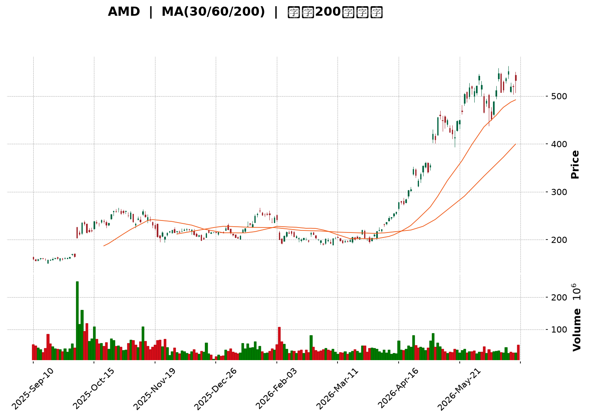
</details>

<html>
<head><meta charset="utf-8" /></head>
<body>
    <div style="height:500px; width:100%;">                        <script>window.PlotlyConfig = {MathJaxConfig: 'local'};</script>
        <script charset="utf-8" src="https://cdn.plot.ly/plotly-3.6.0.min.js" integrity="sha256-QaOVwtVY0T02VaHrr6pnoHLCwayMJp4O5n4YyaE3rJk=" crossorigin="anonymous"></script>                <div id="candlestick-chart" class="plotly-graph-div" style="height:100%; width:100%;"></div>            <script>                window.PLOTLYENV=window.PLOTLYENV || {};                                if (document.getElementById("candlestick-chart")) {                    Plotly.newPlot(                        "candlestick-chart",                        [{"close":{"dtype":"f8","bdata":"AAAAoEfxY0AAAACgcHVjQAAAAIA90mNAAAAAwB4lZEAAAABguA5kQAAAAMAe5WNAAAAAoHC9Y0AAAADgeqxjQAAAAKBH+WNAAAAAwMwcZEAAAAAAKRxkQAAAAOCjKGRAAAAAYLjuY0AAAAAghStkQAAAAKBHOWRAAAAA4FGAZEAAAAAgXDdlQAAAAKBwlWRAAAAAYLh2aUAAAADgUXBqQAAAAIDrcW1AAAAA4HocbUAAAADAzNxqQAAAAKBwDWtAAAAAQOFCa0AAAABAM9NtQAAAAIDrUW1AAAAAYI8ibUAAAACA6xFuQAAAAMD1wG1AAAAAIFzHbEAAAAAgrl9tQAAAAKBwnW9AAAAAYLg6cEAAAAAAKSBwQAAAAKBHhXBAAAAAQOHab0AAAACA6wFwQAAAAGBmOnBAAAAAoJlBb0AAAACgRwVwQAAAAGBmtm1AAAAAoEcxbUAAAAAgXH9uQAAAAOCjsG1AAAAAgD0ucEAAAABguP5uQAAAAIDr2W5AAAAA4KMQbkAAAACgR8lsQAAAAKCZ8WtAAAAA4KPAaUAAAADA9XhpQAAAAKCZ4WpAAAAAACnEaUAAAAAgrsdqQAAAAMD1MGtAAAAA4FF4a0AAAAAgrudqQAAAAEAzM2tAAAAAIFz\u002fakAAAABACj9rQAAAACCFo2tAAAAAANeza0AAAACgcK1rQAAAAIDCrWtAAAAAwPVYakAAAABgj\u002fJpQAAAAKBwJWpAAAAAIIXDaEAAAACA6yFpQAAAAIDCrWpAAAAAYGbeakAAAADAzNxqQAAAAKBH4WpAAAAAIK7fakAAAAAghfNqQAAAAEDh6mpAAAAAwB7FakAAAABACu9rQAAAAGCPomtAAAAAQDPLakAAAADgo0BqQAAAAIDClWlAAAAAoHBlaUAAAACAFPZpQAAAAEAKn2tAAAAAQDPza0AAAACgcH1sQAAAAGCP+mxAAAAAoHD9bEAAAACgmTlvQAAAACBct29AAAAAQOE6cEAAAACA62lvQAAAAMD1gG9AAAAAIK6Xb0AAAACAwoVvQAAAACBcl21AAAAA4KPIbkAAAAAghUNuQAAAAIAUBmlAAAAAAAAQaEAAAACAFA5qQAAAAAAAAGtAAAAAgD2yakAAAABgj7JqQAAAAIAUvmlAAAAAgD3qaUAAAABgj2JpQAAAAADXA2lAAAAAANdraUAAAADAzARpQAAAAEAzk2hAAAAAQOG6akAAAAAghVtqQAAAAIDCdWlAAAAAYLgGaUAAAAAA19NoQAAAAGBm3mdAAAAAgD1CaUAAAABgZu5oQAAAAIDCDWhAAAAAgMJVaUAAAAAgXGdpQAAAAGCPmmlAAAAAIK63aEAAAADgeixoQAAAAGCPkmhAAAAAgOuJaEAAAABguO5oQAAAAOCjqGlAAAAAYI8qaUAAAACAwlVpQAAAAADXq2lAAAAA4KOIa0AAAADgo3hpQAAAACCuP2lAAAAAoEeBaEAAAACAwm1pQAAAAGC4RmpAAAAAAAAwa0AAAACAwoVrQAAAAMD1sGtAAAAAgD36bEAAAADgepRtQAAAAKBHoW5AAAAAYI\u002fabkAAAACAPeJvQAAAAIDrIXBAAAAAAClkcUAAAACAPWZxQAAAAEAzL3FAAAAAANfHcUAAAAAgXPdyQAAAAKBHFXNAAAAAwPW8dUAAAACAFOp0QAAAACBcM3RAAAAAgMIRdUAAAAAA1yd2QAAAAOCjiHZAAAAA4KNYdUAAAAAAKTR2QAAAAIA9VnpAAAAAIFyHeUAAAABACnN8QAAAAOCjrHxAAAAA4KMEfEAAAAAAANh7QAAAAEAzG3xAAAAAoJmBekAAAAAA1096QAAAAMDM4HlAAAAAoEf5e0AAAACgcBl8QAAAAAApOH1AAAAAgD1+f0AAAADgo\u002fh+QAAAAGC4MIBAAAAAwMwggEAAAACAFOJ\u002fQAAAAOBRTIBAAAAAACn0gEAAAACgmVmAQAAAAIAUJn1AAAAAoEelfkAAAAAAKbh9QAAAAGBmRnxAAAAAQDOHfkAAAADAHvl\u002fQAAAAIAUGoFAAAAA4KO0f0AAAAAA1wOAQAAAAMD1yoBAAAAAQAo9gUAAAADAzD6AQAAAAIDrPYBAAAAAYI+kgEAAAAAAAAD4fw=="},"high":{"dtype":"f8","bdata":"AAAAwPWQZEAAAABguAZkQAAAAMAeDWRAAAAAoJlJZEAAAABgZj5kQAAAAAApNGRAAAAA4KPYY0AAAABA4fpjQAAAAIDCVWRAAAAA4HpsZEAAAABAM6NkQAAAAAApNGRAAAAAIIVDZEAAAACgmYlkQAAAAMD1SGRAAAAAgMKFZEAAAACA62FlQAAAAIDCVWVAAAAAYLhWbEAAAADAzFxrQAAAAADXe21AAAAAQDMDbkAAAABACkdtQAAAAIAUBmxAAAAAIFwfbEAAAAAgrudtQAAAAGBmJm5AAAAAAClsbUAAAAAAKVxuQAAAAOBRSG5AAAAAACkEbkAAAADAzHxtQAAAAOB6rG9AAAAAYLhGcEAAAACgR4lwQAAAAKBHsXBAAAAAgBR+cEAAAACAFGJwQAAAAGCPTnBAAAAAgBQWcEAAAABgZjpwQAAAAOBRsG9AAAAAANd7bUAAAADAzBxvQAAAAGC4Dm9AAAAAACl4cEAAAACAFDpwQAAAAIAUrm9AAAAA4KMYb0AAAAAAAMBtQAAAAMD1aG1AAAAAAABIbUAAAABgjxpqQAAAAAApJGtAAAAAYI\u002fSaUAAAABA4fJqQAAAAKCZSWtAAAAAIFyfa0AAAAAgXD9sQAAAAGBmRmtAAAAAANdja0AAAADgevRrQAAAAGC49mtAAAAAQOEabEAAAAAghdNrQAAAAAAAsGtAAAAAIK7Pa0AAAAAghetqQAAAAEAKR2pAAAAAAABwakAAAAAghctpQAAAAIDC5WpAAAAAoHCFa0AAAADA9SBrQAAAAKBHEWtAAAAAYI8aa0AAAACgmQFrQAAAAIA9GmtAAAAA4Ho0a0AAAADAzGRsQAAAAOCjQG1AAAAAoHDda0AAAAAAKYRqQAAAAIAUXmpAAAAAoJnpaUAAAAAAKTxqQAAAACCF42tAAAAAQOECbEAAAABAM8ttQAAAACCuT21AAAAAAADwbUAAAADAzJxvQAAAAKBHAXBAAAAAIFyvcEAAAADgoyRwQAAAAKCZ8W9AAAAAYGYWcEAAAADgekhwQAAAACCup25AAAAAQAo\u002fb0AAAADAzJRvQAAAAGCPUmtAAAAAoEeBaUAAAADgoyhqQAAAAEAzM2tAAAAA4Hpsa0AAAADAzHRrQAAAAGC4TmtAAAAAoJlBakAAAACgmalpQAAAAGBmZmlAAAAAQDODaUAAAAAA15tpQAAAAAAp7GhAAAAAYLgWa0AAAABgZhZrQAAAAKBHOWpAAAAA4Ho8aUAAAAAgrtdoQAAAAOB6NGhAAAAAgBROaUAAAACgR3lpQAAAACCuB2lAAAAAQApfaUAAAABA4dJpQAAAAGC4JmpAAAAAANdzaUAAAACAwvVoQAAAAKBwBWlAAAAAYLjmaEAAAAAghVtpQAAAAAApvGlAAAAAoJnJaUAAAAAghSNqQAAAAIDCzWlAAAAAYI+qa0AAAAAAAKBrQAAAAOCjaGlAAAAAgMINakAAAAAAAIBpQAAAAGCPumpAAAAAwPU4a0AAAACA60lsQAAAAEAzw2tAAAAAAABAbUAAAABAM6NtQAAAAGCPMm9AAAAAYI\u002fqbkAAAABguO5vQAAAAEDhInBAAAAAoHB1cUAAAADAzJBxQAAAAIDC+XFAAAAAQDPjcUAAAAAAAARzQAAAACCFY3NAAAAAANcPdkAAAAAgXNN1QAAAAAAAeHRAAAAAYLhCdUAAAAAgXC92QAAAAOCjrHZAAAAAoJmddkAAAADAHnl2QAAAAKCZ6XpAAAAAIFxbekAAAADgo4R8QAAAACCFU31AAAAAwMysfEAAAAAAALh8QAAAAMD1VHxAAAAAAABwe0AAAADAzGx7QAAAAAAAzHpAAAAAgD0WfEAAAABAMzN8QAAAAGCPFn5AAAAAIFyvf0AAAAAgXON\u002fQAAAAKCZeYBAAAAAAABQgEAAAAAAACyAQAAAAIDrU4BAAAAAIIUTgUAAAAAghaGAQAAAAIDrmX9AAAAAIIXvfkAAAAAAAJB\u002fQAAAAEAz131AAAAAIFynfkAAAAAgrk2AQAAAAMD1coFAAAAAoJkngUAAAAAAAKSAQAAAACCF3YBAAAAAgOuXgUAAAACA64OAQAAAACCuZ4BAAAAAQAo3gUAAAAAAAAD4fw=="},"hovertemplate":"\u003cb\u003e%{x|%Y-%m-%d}\u003c\u002fb\u003e\u003cbr\u003e\u958b: $%{open:.2f}\u003cbr\u003e\u9ad8: $%{high:.2f}\u003cbr\u003e\u4f4e: $%{low:.2f}\u003cbr\u003e\u6536: $%{close:.2f}\u003cextra\u003e\u003c\u002fextra\u003e","low":{"dtype":"f8","bdata":"AAAAAADAY0AAAAAgrl9jQAAAAKBwXWNAAAAAQDOzY0AAAABACudjQAAAAOBReGNAAAAAQDO7YkAAAADAzHxjQAAAAKBwrWNAAAAAYLjmY0AAAACAws1jQAAAAMD1WGNAAAAAoJmhY0AAAADAzPxjQAAAAGCP6mNAAAAAIK4PZEAAAAAA18NkQAAAAOB6ZGRAAAAA4FFgaUAAAADA9ShqQAAAAGBmVmpAAAAAwPWwbEAAAABgZqZqQAAAAMDM3GpAAAAAwMz8akAAAADgUZhrQAAAACCuB21AAAAAwB59bEAAAADAzExtQAAAAOCjQG1AAAAAACkcbEAAAACgR5FsQAAAAGBmPm5AAAAAoJk5b0AAAAAAABBwQAAAAGBmFnBAAAAAgOuJb0AAAADAHq1vQAAAAOB6vG9AAAAA4HrsbkAAAACA61luQAAAACCud21AAAAA4HoUbEAAAAAAABBuQAAAAOB6VG1AAAAAAABAb0AAAACA68FuQAAAAGCPYm1AAAAAwMykbUAAAABguBZsQAAAAGC4dmtAAAAAwPWQaUAAAAAAAGBoQAAAAEAzu2lAAAAAwPVIaEAAAAAAAOBpQAAAAOCjwGpAAAAAAACwakAAAADgesxqQAAAAOCjeGpAAAAA4HrEakAAAAAgrgdrQAAAACCFS2tAAAAAwB49a0AAAACgcFVrQAAAAIAURmpAAAAAgOshakAAAABgj9JpQAAAACCFo2lAAAAAwPWwaEAAAAAAABBpQAAAAGBmhmlAAAAAgOupakAAAADA9YhqQAAAAEAKv2pAAAAAwPWgakAAAAAgridqQAAAAGCPympAAAAAoJm5akAAAADAzFxrQAAAACBcj2tAAAAAAABoakAAAACgcOVpQAAAAGCPamlAAAAAgD1iaUAAAACgmfloQAAAACBc32pAAAAAIIXjakAAAABACmdsQAAAACCFm2xAAAAAwB4tbEAAAADA9XhtQAAAAAAp1G5AAAAAAAAEcEAAAACgmUlvQAAAAGC4\u002fm5AAAAAYLhGb0AAAADAHh1uQAAAAKCZUW1AAAAAAABgbUAAAACgR6FtQAAAAMDM5GhAAAAAQArXZ0AAAACAwo1oQAAAAMDMhGlAAAAAACmkakAAAABguCZqQAAAAOB6pGlAAAAAACl8aUAAAABgj1poQAAAAAAAYGhAAAAAoEfJaEAAAACA69FoQAAAAMDMRGhAAAAAAADQaUAAAABgj0pqQAAAAGC4LmlAAAAAIK63aEAAAAAAAMBnQAAAAEAKh2dAAAAAIIW7Z0AAAAAAKVxoQAAAAAAA6GdAAAAA4KOgZ0AAAABgZkZpQAAAAAApdGlAAAAAoHCVaEAAAADgowhoQAAAAKCZWWhAAAAA4FFoaEAAAAAAAHhoQAAAAGCPGmhAAAAA4FHIaEAAAABguDZpQAAAAAApBGlAAAAA4FFwakAAAACAwm1pQAAAAIAUtmhAAAAAANcbaEAAAADAHo1oQAAAAEDhumlAAAAAANcTaUAAAAAgXDdrQAAAAAAp7GpAAAAAQOFibEAAAADAHt1sQAAAAGC43m1AAAAAwPVAbkAAAABgZrZuQAAAAEAze29AAAAAAClYcEAAAACAPSJxQAAAAAAAAHFAAAAAgOtJcUAAAACAPeJxQAAAAAApvHJAAAAA4KPodEAAAADA9Yx0QAAAAAAAYHNAAAAAgMLtc0AAAACgmcl0QAAAAAAA1HVAAAAAQDMrdUAAAACAFI51QAAAAOCjIHlAAAAAoEcReUAAAADgoyR6QAAAAIAULnxAAAAAgMKhekAAAABgZgp7QAAAAEDhOntAAAAAgMJ1ekAAAAAgXKt5QAAAAIDClXhAAAAAwMygekAAAACgmfl6QAAAACBc23xAAAAAIK4DfkAAAABgj2p+QAAAAOBR2H5AAAAAQOF2f0AAAADAzGx+QAAAACCFU39AAAAAYGZigEAAAACA6z1\u002fQAAAAEAz\u002f3xAAAAAIFzbfUAAAAAgrlN7QAAAAKBHBXxAAAAA4FGgfEAAAAAAAOB+QAAAAAAAlIBAAAAAAAC0f0AAAADAzLR\u002fQAAAAGCPcoBAAAAAIK69gEAAAADA9ax\u002fQAAAAAAAeH9AAAAAAACwf0AAAAAAAAD4fw=="},"name":"\u50f9\u683c","open":{"dtype":"f8","bdata":"AAAAoEdxZEAAAAAA19NjQAAAAAAAoGNAAAAA4FEAZEAAAAAA1ytkQAAAAMD16GNAAAAAYLjeYkAAAAAAKaxjQAAAAKBwrWNAAAAA4KMQZEAAAAAgXF9kQAAAAOB6pGNAAAAA4KMQZEAAAAAA1wNkQAAAAKBHGWRAAAAAgMIdZEAAAACAwhVlQAAAAIDCVWVAAAAAYGZObEAAAABAM9tqQAAAAGBmnmpAAAAAoJmJbUAAAADgoxhtQAAAAGBmhmtAAAAAYGZma0AAAABguNZrQAAAAKBHiW1AAAAA4FEobUAAAABACo9tQAAAAOB67G1AAAAAQDObbUAAAADAHsVsQAAAACCFa25AAAAAgBQecEAAAACAPTJwQAAAAEAKg3BAAAAAYLg+cEAAAACgmTlwQAAAAKBHNXBAAAAAQDNLb0AAAAAgrmduQAAAAEAKr29AAAAAgBTebEAAAADgekRuQAAAAMAeNW5AAAAAACmkb0AAAADAzHxvQAAAACCFA25AAAAAAABYbkAAAADA9ZhtQAAAAOBRyGxAAAAAYGYWbUAAAACA6xlqQAAAAMAe5WlAAAAAIFwvaUAAAACgmUFqQAAAAOB6BGtAAAAAACm8akAAAACgR7lrQAAAAOBRCGtAAAAAACkca0AAAACgcCVrQAAAAEDhYmtAAAAAoEeha0AAAAAAAMBrQAAAAIDrOWtAAAAAANdLa0AAAADA9YhqQAAAAKBw3WlAAAAAoEdBakAAAACAPXppQAAAAEAzk2lAAAAAAACAa0AAAAAghZtqQAAAACBc32pAAAAAgMLtakAAAABgj3JqQAAAAADX+2pAAAAAgD36akAAAADAzFxrQAAAAAAAyGxAAAAAYLjWa0AAAAAAKYRqQAAAAMDMXGpAAAAAQAq3aUAAAACAwiVpQAAAAEAz42pAAAAAoEcxa0AAAADAzHxsQAAAAKCZSW1AAAAAYI9CbEAAAAAgrn9tQAAAAAAAeG9AAAAAQOFScEAAAAAAAAxwQAAAAMAehW9AAAAAACnEb0AAAADAHtVvQAAAAIDCnW1AAAAA4KN4bUAAAACgmXFvQAAAAAAA4GpAAAAAIIU7aUAAAAAAKaRoQAAAAMDM3GlAAAAA4HrkakAAAAAAKTxrQAAAAGCP+mpAAAAA4KOAaUAAAADAzERpQAAAAMAezWhAAAAAIIUDaUAAAAAA1wNpQAAAAEDhwmhAAAAAACl0akAAAACAPdpqQAAAAKCZGWpAAAAAIIUDaUAAAABAMztoQAAAAGC47mdAAAAAANcDaEAAAADgo7hoQAAAAOCjaGhAAAAAIIWrZ0AAAADgUVBpQAAAACCFo2lAAAAAYI9aaUAAAAAghcNoQAAAACBcX2hAAAAAgMKVaEAAAAAAAIBoQAAAAMD1YGhAAAAA4HqcaUAAAADAzMxpQAAAAOB6LGlAAAAA4FFwakAAAAAgXD9rQAAAAOCjOGlAAAAAYGaeaUAAAACgmcFoQAAAAEDh8mlAAAAAoJmBaUAAAADA9WhrQAAAAOBRSGtAAAAAANcDbUAAAADgUSBtQAAAAAAA4G1AAAAAwPWgbkAAAACgRzlvQAAAAGC43m9AAAAAANePcEAAAAAAAJBxQAAAAKCZiXFAAAAAoEdVcUAAAAAghTNyQAAAAAAp4HJAAAAAACkMdUAAAADAHqV1QAAAAIDCfXNAAAAAoEdpdEAAAACAwlV1QAAAAIDr\u002fXVAAAAAwPWEdkAAAAAAKfh1QAAAAADXl3lAAAAAwB4RekAAAACgcCl6QAAAAMDMyHxAAAAAAAAUfEAAAADgo5B8QAAAAKCZiXtAAAAAoHAVe0AAAAAAANh6QAAAAKCZyXlAAAAA4KPAekAAAAAA1597QAAAAKBwXX1AAAAAANdLfkAAAAAAAMB\u002fQAAAAAAAMH9AAAAAYGZGgEAAAABgj0J\u002fQAAAAMDMpH9AAAAAAACugEAAAAAAABaAQAAAAOB6OH9AAAAAAABQfkAAAAAAAGx\u002fQAAAACCFP31AAAAAoJnZfEAAAABACjt\u002fQAAAAAAAvoBAAAAAwB4XgUAAAACgR42AQAAAAOCjnIBAAAAAAAAMgUAAAACgR9F\u002fQAAAAGCPRoBAAAAAoHD\u002fgEAAAAAAAAD4fw=="},"x":["2025-09-10T00:00:00-04:00","2025-09-11T00:00:00-04:00","2025-09-12T00:00:00-04:00","2025-09-15T00:00:00-04:00","2025-09-16T00:00:00-04:00","2025-09-17T00:00:00-04:00","2025-09-18T00:00:00-04:00","2025-09-19T00:00:00-04:00","2025-09-22T00:00:00-04:00","2025-09-23T00:00:00-04:00","2025-09-24T00:00:00-04:00","2025-09-25T00:00:00-04:00","2025-09-26T00:00:00-04:00","2025-09-29T00:00:00-04:00","2025-09-30T00:00:00-04:00","2025-10-01T00:00:00-04:00","2025-10-02T00:00:00-04:00","2025-10-03T00:00:00-04:00","2025-10-06T00:00:00-04:00","2025-10-07T00:00:00-04:00","2025-10-08T00:00:00-04:00","2025-10-09T00:00:00-04:00","2025-10-10T00:00:00-04:00","2025-10-13T00:00:00-04:00","2025-10-14T00:00:00-04:00","2025-10-15T00:00:00-04:00","2025-10-16T00:00:00-04:00","2025-10-17T00:00:00-04:00","2025-10-20T00:00:00-04:00","2025-10-21T00:00:00-04:00","2025-10-22T00:00:00-04:00","2025-10-23T00:00:00-04:00","2025-10-24T00:00:00-04:00","2025-10-27T00:00:00-04:00","2025-10-28T00:00:00-04:00","2025-10-29T00:00:00-04:00","2025-10-30T00:00:00-04:00","2025-10-31T00:00:00-04:00","2025-11-03T00:00:00-05:00","2025-11-04T00:00:00-05:00","2025-11-05T00:00:00-05:00","2025-11-06T00:00:00-05:00","2025-11-07T00:00:00-05:00","2025-11-10T00:00:00-05:00","2025-11-11T00:00:00-05:00","2025-11-12T00:00:00-05:00","2025-11-13T00:00:00-05:00","2025-11-14T00:00:00-05:00","2025-11-17T00:00:00-05:00","2025-11-18T00:00:00-05:00","2025-11-19T00:00:00-05:00","2025-11-20T00:00:00-05:00","2025-11-21T00:00:00-05:00","2025-11-24T00:00:00-05:00","2025-11-25T00:00:00-05:00","2025-11-26T00:00:00-05:00","2025-11-28T00:00:00-05:00","2025-12-01T00:00:00-05:00","2025-12-02T00:00:00-05:00","2025-12-03T00:00:00-05:00","2025-12-04T00:00:00-05:00","2025-12-05T00:00:00-05:00","2025-12-08T00:00:00-05:00","2025-12-09T00:00:00-05:00","2025-12-10T00:00:00-05:00","2025-12-11T00:00:00-05:00","2025-12-12T00:00:00-05:00","2025-12-15T00:00:00-05:00","2025-12-16T00:00:00-05:00","2025-12-17T00:00:00-05:00","2025-12-18T00:00:00-05:00","2025-12-19T00:00:00-05:00","2025-12-22T00:00:00-05:00","2025-12-23T00:00:00-05:00","2025-12-24T00:00:00-05:00","2025-12-26T00:00:00-05:00","2025-12-29T00:00:00-05:00","2025-12-30T00:00:00-05:00","2025-12-31T00:00:00-05:00","2026-01-02T00:00:00-05:00","2026-01-05T00:00:00-05:00","2026-01-06T00:00:00-05:00","2026-01-07T00:00:00-05:00","2026-01-08T00:00:00-05:00","2026-01-09T00:00:00-05:00","2026-01-12T00:00:00-05:00","2026-01-13T00:00:00-05:00","2026-01-14T00:00:00-05:00","2026-01-15T00:00:00-05:00","2026-01-16T00:00:00-05:00","2026-01-20T00:00:00-05:00","2026-01-21T00:00:00-05:00","2026-01-22T00:00:00-05:00","2026-01-23T00:00:00-05:00","2026-01-26T00:00:00-05:00","2026-01-27T00:00:00-05:00","2026-01-28T00:00:00-05:00","2026-01-29T00:00:00-05:00","2026-01-30T00:00:00-05:00","2026-02-02T00:00:00-05:00","2026-02-03T00:00:00-05:00","2026-02-04T00:00:00-05:00","2026-02-05T00:00:00-05:00","2026-02-06T00:00:00-05:00","2026-02-09T00:00:00-05:00","2026-02-10T00:00:00-05:00","2026-02-11T00:00:00-05:00","2026-02-12T00:00:00-05:00","2026-02-13T00:00:00-05:00","2026-02-17T00:00:00-05:00","2026-02-18T00:00:00-05:00","2026-02-19T00:00:00-05:00","2026-02-20T00:00:00-05:00","2026-02-23T00:00:00-05:00","2026-02-24T00:00:00-05:00","2026-02-25T00:00:00-05:00","2026-02-26T00:00:00-05:00","2026-02-27T00:00:00-05:00","2026-03-02T00:00:00-05:00","2026-03-03T00:00:00-05:00","2026-03-04T00:00:00-05:00","2026-03-05T00:00:00-05:00","2026-03-06T00:00:00-05:00","2026-03-09T00:00:00-04:00","2026-03-10T00:00:00-04:00","2026-03-11T00:00:00-04:00","2026-03-12T00:00:00-04:00","2026-03-13T00:00:00-04:00","2026-03-16T00:00:00-04:00","2026-03-17T00:00:00-04:00","2026-03-18T00:00:00-04:00","2026-03-19T00:00:00-04:00","2026-03-20T00:00:00-04:00","2026-03-23T00:00:00-04:00","2026-03-24T00:00:00-04:00","2026-03-25T00:00:00-04:00","2026-03-26T00:00:00-04:00","2026-03-27T00:00:00-04:00","2026-03-30T00:00:00-04:00","2026-03-31T00:00:00-04:00","2026-04-01T00:00:00-04:00","2026-04-02T00:00:00-04:00","2026-04-06T00:00:00-04:00","2026-04-07T00:00:00-04:00","2026-04-08T00:00:00-04:00","2026-04-09T00:00:00-04:00","2026-04-10T00:00:00-04:00","2026-04-13T00:00:00-04:00","2026-04-14T00:00:00-04:00","2026-04-15T00:00:00-04:00","2026-04-16T00:00:00-04:00","2026-04-17T00:00:00-04:00","2026-04-20T00:00:00-04:00","2026-04-21T00:00:00-04:00","2026-04-22T00:00:00-04:00","2026-04-23T00:00:00-04:00","2026-04-24T00:00:00-04:00","2026-04-27T00:00:00-04:00","2026-04-28T00:00:00-04:00","2026-04-29T00:00:00-04:00","2026-04-30T00:00:00-04:00","2026-05-01T00:00:00-04:00","2026-05-04T00:00:00-04:00","2026-05-05T00:00:00-04:00","2026-05-06T00:00:00-04:00","2026-05-07T00:00:00-04:00","2026-05-08T00:00:00-04:00","2026-05-11T00:00:00-04:00","2026-05-12T00:00:00-04:00","2026-05-13T00:00:00-04:00","2026-05-14T00:00:00-04:00","2026-05-15T00:00:00-04:00","2026-05-18T00:00:00-04:00","2026-05-19T00:00:00-04:00","2026-05-20T00:00:00-04:00","2026-05-21T00:00:00-04:00","2026-05-22T00:00:00-04:00","2026-05-26T00:00:00-04:00","2026-05-27T00:00:00-04:00","2026-05-28T00:00:00-04:00","2026-05-29T00:00:00-04:00","2026-06-01T00:00:00-04:00","2026-06-02T00:00:00-04:00","2026-06-03T00:00:00-04:00","2026-06-04T00:00:00-04:00","2026-06-05T00:00:00-04:00","2026-06-08T00:00:00-04:00","2026-06-09T00:00:00-04:00","2026-06-10T00:00:00-04:00","2026-06-11T00:00:00-04:00","2026-06-12T00:00:00-04:00","2026-06-15T00:00:00-04:00","2026-06-16T00:00:00-04:00","2026-06-17T00:00:00-04:00","2026-06-18T00:00:00-04:00","2026-06-22T00:00:00-04:00","2026-06-23T00:00:00-04:00","2026-06-24T00:00:00-04:00","2026-06-25T00:00:00-04:00","2026-06-26T00:00:00-04:00"],"type":"candlestick"},{"hovertemplate":"MA30: $%{y:.2f}\u003cextra\u003e\u003c\u002fextra\u003e","line":{"color":"#2196F3","dash":"dash","width":2},"mode":"lines","name":"MA30","x":["2025-09-10T00:00:00-04:00","2025-09-11T00:00:00-04:00","2025-09-12T00:00:00-04:00","2025-09-15T00:00:00-04:00","2025-09-16T00:00:00-04:00","2025-09-17T00:00:00-04:00","2025-09-18T00:00:00-04:00","2025-09-19T00:00:00-04:00","2025-09-22T00:00:00-04:00","2025-09-23T00:00:00-04:00","2025-09-24T00:00:00-04:00","2025-09-25T00:00:00-04:00","2025-09-26T00:00:00-04:00","2025-09-29T00:00:00-04:00","2025-09-30T00:00:00-04:00","2025-10-01T00:00:00-04:00","2025-10-02T00:00:00-04:00","2025-10-03T00:00:00-04:00","2025-10-06T00:00:00-04:00","2025-10-07T00:00:00-04:00","2025-10-08T00:00:00-04:00","2025-10-09T00:00:00-04:00","2025-10-10T00:00:00-04:00","2025-10-13T00:00:00-04:00","2025-10-14T00:00:00-04:00","2025-10-15T00:00:00-04:00","2025-10-16T00:00:00-04:00","2025-10-17T00:00:00-04:00","2025-10-20T00:00:00-04:00","2025-10-21T00:00:00-04:00","2025-10-22T00:00:00-04:00","2025-10-23T00:00:00-04:00","2025-10-24T00:00:00-04:00","2025-10-27T00:00:00-04:00","2025-10-28T00:00:00-04:00","2025-10-29T00:00:00-04:00","2025-10-30T00:00:00-04:00","2025-10-31T00:00:00-04:00","2025-11-03T00:00:00-05:00","2025-11-04T00:00:00-05:00","2025-11-05T00:00:00-05:00","2025-11-06T00:00:00-05:00","2025-11-07T00:00:00-05:00","2025-11-10T00:00:00-05:00","2025-11-11T00:00:00-05:00","2025-11-12T00:00:00-05:00","2025-11-13T00:00:00-05:00","2025-11-14T00:00:00-05:00","2025-11-17T00:00:00-05:00","2025-11-18T00:00:00-05:00","2025-11-19T00:00:00-05:00","2025-11-20T00:00:00-05:00","2025-11-21T00:00:00-05:00","2025-11-24T00:00:00-05:00","2025-11-25T00:00:00-05:00","2025-11-26T00:00:00-05:00","2025-11-28T00:00:00-05:00","2025-12-01T00:00:00-05:00","2025-12-02T00:00:00-05:00","2025-12-03T00:00:00-05:00","2025-12-04T00:00:00-05:00","2025-12-05T00:00:00-05:00","2025-12-08T00:00:00-05:00","2025-12-09T00:00:00-05:00","2025-12-10T00:00:00-05:00","2025-12-11T00:00:00-05:00","2025-12-12T00:00:00-05:00","2025-12-15T00:00:00-05:00","2025-12-16T00:00:00-05:00","2025-12-17T00:00:00-05:00","2025-12-18T00:00:00-05:00","2025-12-19T00:00:00-05:00","2025-12-22T00:00:00-05:00","2025-12-23T00:00:00-05:00","2025-12-24T00:00:00-05:00","2025-12-26T00:00:00-05:00","2025-12-29T00:00:00-05:00","2025-12-30T00:00:00-05:00","2025-12-31T00:00:00-05:00","2026-01-02T00:00:00-05:00","2026-01-05T00:00:00-05:00","2026-01-06T00:00:00-05:00","2026-01-07T00:00:00-05:00","2026-01-08T00:00:00-05:00","2026-01-09T00:00:00-05:00","2026-01-12T00:00:00-05:00","2026-01-13T00:00:00-05:00","2026-01-14T00:00:00-05:00","2026-01-15T00:00:00-05:00","2026-01-16T00:00:00-05:00","2026-01-20T00:00:00-05:00","2026-01-21T00:00:00-05:00","2026-01-22T00:00:00-05:00","2026-01-23T00:00:00-05:00","2026-01-26T00:00:00-05:00","2026-01-27T00:00:00-05:00","2026-01-28T00:00:00-05:00","2026-01-29T00:00:00-05:00","2026-01-30T00:00:00-05:00","2026-02-02T00:00:00-05:00","2026-02-03T00:00:00-05:00","2026-02-04T00:00:00-05:00","2026-02-05T00:00:00-05:00","2026-02-06T00:00:00-05:00","2026-02-09T00:00:00-05:00","2026-02-10T00:00:00-05:00","2026-02-11T00:00:00-05:00","2026-02-12T00:00:00-05:00","2026-02-13T00:00:00-05:00","2026-02-17T00:00:00-05:00","2026-02-18T00:00:00-05:00","2026-02-19T00:00:00-05:00","2026-02-20T00:00:00-05:00","2026-02-23T00:00:00-05:00","2026-02-24T00:00:00-05:00","2026-02-25T00:00:00-05:00","2026-02-26T00:00:00-05:00","2026-02-27T00:00:00-05:00","2026-03-02T00:00:00-05:00","2026-03-03T00:00:00-05:00","2026-03-04T00:00:00-05:00","2026-03-05T00:00:00-05:00","2026-03-06T00:00:00-05:00","2026-03-09T00:00:00-04:00","2026-03-10T00:00:00-04:00","2026-03-11T00:00:00-04:00","2026-03-12T00:00:00-04:00","2026-03-13T00:00:00-04:00","2026-03-16T00:00:00-04:00","2026-03-17T00:00:00-04:00","2026-03-18T00:00:00-04:00","2026-03-19T00:00:00-04:00","2026-03-20T00:00:00-04:00","2026-03-23T00:00:00-04:00","2026-03-24T00:00:00-04:00","2026-03-25T00:00:00-04:00","2026-03-26T00:00:00-04:00","2026-03-27T00:00:00-04:00","2026-03-30T00:00:00-04:00","2026-03-31T00:00:00-04:00","2026-04-01T00:00:00-04:00","2026-04-02T00:00:00-04:00","2026-04-06T00:00:00-04:00","2026-04-07T00:00:00-04:00","2026-04-08T00:00:00-04:00","2026-04-09T00:00:00-04:00","2026-04-10T00:00:00-04:00","2026-04-13T00:00:00-04:00","2026-04-14T00:00:00-04:00","2026-04-15T00:00:00-04:00","2026-04-16T00:00:00-04:00","2026-04-17T00:00:00-04:00","2026-04-20T00:00:00-04:00","2026-04-21T00:00:00-04:00","2026-04-22T00:00:00-04:00","2026-04-23T00:00:00-04:00","2026-04-24T00:00:00-04:00","2026-04-27T00:00:00-04:00","2026-04-28T00:00:00-04:00","2026-04-29T00:00:00-04:00","2026-04-30T00:00:00-04:00","2026-05-01T00:00:00-04:00","2026-05-04T00:00:00-04:00","2026-05-05T00:00:00-04:00","2026-05-06T00:00:00-04:00","2026-05-07T00:00:00-04:00","2026-05-08T00:00:00-04:00","2026-05-11T00:00:00-04:00","2026-05-12T00:00:00-04:00","2026-05-13T00:00:00-04:00","2026-05-14T00:00:00-04:00","2026-05-15T00:00:00-04:00","2026-05-18T00:00:00-04:00","2026-05-19T00:00:00-04:00","2026-05-20T00:00:00-04:00","2026-05-21T00:00:00-04:00","2026-05-22T00:00:00-04:00","2026-05-26T00:00:00-04:00","2026-05-27T00:00:00-04:00","2026-05-28T00:00:00-04:00","2026-05-29T00:00:00-04:00","2026-06-01T00:00:00-04:00","2026-06-02T00:00:00-04:00","2026-06-03T00:00:00-04:00","2026-06-04T00:00:00-04:00","2026-06-05T00:00:00-04:00","2026-06-08T00:00:00-04:00","2026-06-09T00:00:00-04:00","2026-06-10T00:00:00-04:00","2026-06-11T00:00:00-04:00","2026-06-12T00:00:00-04:00","2026-06-15T00:00:00-04:00","2026-06-16T00:00:00-04:00","2026-06-17T00:00:00-04:00","2026-06-18T00:00:00-04:00","2026-06-22T00:00:00-04:00","2026-06-23T00:00:00-04:00","2026-06-24T00:00:00-04:00","2026-06-25T00:00:00-04:00","2026-06-26T00:00:00-04:00"],"y":{"dtype":"f8","bdata":"AAAAAAAA+H8AAAAAAAD4fwAAAAAAAPh\u002fAAAAAAAA+H8AAAAAAAD4fwAAAAAAAPh\u002fAAAAAAAA+H8AAAAAAAD4fwAAAAAAAPh\u002fAAAAAAAA+H8AAAAAAAD4fwAAAAAAAPh\u002fAAAAAAAA+H8AAAAAAAD4fwAAAAAAAPh\u002fAAAAAAAA+H8AAAAAAAD4fwAAAAAAAPh\u002fAAAAAAAA+H8AAAAAAAD4fwAAAAAAAPh\u002fAAAAAAAA+H8AAAAAAAD4fwAAAAAAAPh\u002fAAAAAAAA+H8AAAAAAAD4fwAAAAAAAPh\u002fAAAAAAAA+H8AAAAAAAD4fzMzM9O\u002fYWdAiYiI6CatZ0Dv7u6OwgFoQFVVVWVmZmhAIiIiMnrPaECamZnZhzdpQERERES2p2lAMzMz4xcPakAiIiLCZ3hqQCIiIjLs4mpAd3d3FwRCa0DNzMxM1KdrQImIiMha+WtA7+7ujl9IbEAzMzNTgKBsQKuqqqpH8WxAzczMPHxWbUDv7u4+7qltQBEREfGLAW5AZmZmhs8obkB3d3e31zxuQAAAADAIMG5AMzMz414TbkAzMzNjggduQJqZmUkMBm5AmpmZaUr5bUAiIiKCTt9tQO\u002fu7i4kzW1A7+7u7u6+bUAzMzPj7KNtQDMzMyMijm1AAAAA8O5+bUB3d3dXx2xtQHd3dxfZSm1AZmZm5kIibUAzMzNjO\u002ftsQERERNR4zWxAMzMzg3mebEC8u7vbsmpsQERERHTaNGxA7+7uXnP9a0Crqqr6fsJrQGZmZqabqGtAd3d3V8eUa0AAAACQwnVrQFVVVQXIXWtAREREZPQua0Dv7u6ucgxrQGZmZkbh6mpAzczMPMPOakDNzMzsfMdqQDMzM3PaxGpAiYiIGL3NakCJiIgIZdRqQERERFRVyWpAzczMDC3GakBmZmZ2ML9qQAAAANDbwmpAREREZPTGakAAAADgetRqQM3MzJyo42pAvLu7S6n0akAiIiICnRZrQBEREXFoOWtAvLu7WwFia0AiIiJS44FrQJqZmSmHomtAq6qqCknPa0AAAADQ2\u002f5rQHd3d4dBHGxAvLu7a6BPbEDv7u7OaXtsQImIiGhKbWxAAAAAEFhVbEDe3d0NdE5sQDMzMzN6T2xAIiIicvZNbEDv7u4ezEtsQLy7u0vFQWxAVVVVhXk6bEARERGxuSRsQGZmZjZeDmxAAAAA8KcCbEBERETEIPhrQERERGSC72tAMzMzA+T6a0AiIiKiRf5rQO\u002fu7k7U62tAd3d3R+HSa0DNzMxsoLNrQFVVVXUFiGtAvLu7ay5oa0AzMzODeTJrQGZmZoYW8WpAmpmZuUm0akDe3d2tAIFqQO\u002fu7u6nTmpARERERP0TakDe3d2tR9VpQN7d3Q10qmlAREREpCl1aUCamZlZq0dpQHd3d4cWTWlAVVVVtYFWaUB3d3fXXFBpQERERCQGRWlAAAAAsCtMaUB3d3fntEFpQKuqqkp+PWlAiYiIGHYxaUCrqqqq1TFpQJqZmemYPGlAiYiIWKtLaUDv7u7eCGFpQLy7u2uge2lAmpmZKc6OaUAiIiLSTappQLy7u9tr1mlAmpmZOSYIakB3d3fXXERqQKuqqroCjGpA3t3drUfdakARERGRezFrQImIiAiBiWtA3t3dncTga0BmZmYWrktsQImIiEjhtmxAVVVVZfRWbUBVVVVVnO1tQDMzM8OudG5AvLu7i94Kb0ARERERPLBvQImIiJDtKnBAd3d357R1cECamZkpFcdwQImIiBhLOnFAVVVVTamecUAzMzODwCRyQN7d3UW2rXJA7+7uzj40c0Dv7u5uWbVzQFVVVc0TNXRA7+7ulkOjdEARERHZXA51QGZmZj4KdXVARERErBzodUAiIiJyr1l2QM3MzARW0HZAd3d3R29Zd0AzMzNzr9l3QGZmZgZWZHhAvLu7Gy\u002fjeEB3d3dXx155QHd3dxdL4nlAq6qqyuhrekARERGhGuF6QDMzM1P\u002fNntA3t3dDQKDe0Dv7u7eJM57QM3MzJwLE3xAIiIiksJjfECrqqo6ibd8QLy7u7seG31AIiIiIoVzfUBmZmbmXsd9QImIiAg6BX5AMzMzg5VRfkARERHBEXR+QFVVVXWTlH5AzczMfIbBfkAAAAAAAAD4fw=="},"type":"scatter"},{"hovertemplate":"MA60: $%{y:.2f}\u003cextra\u003e\u003c\u002fextra\u003e","line":{"color":"#9C27B0","dash":"dash","width":2},"mode":"lines","name":"MA60","x":["2025-09-10T00:00:00-04:00","2025-09-11T00:00:00-04:00","2025-09-12T00:00:00-04:00","2025-09-15T00:00:00-04:00","2025-09-16T00:00:00-04:00","2025-09-17T00:00:00-04:00","2025-09-18T00:00:00-04:00","2025-09-19T00:00:00-04:00","2025-09-22T00:00:00-04:00","2025-09-23T00:00:00-04:00","2025-09-24T00:00:00-04:00","2025-09-25T00:00:00-04:00","2025-09-26T00:00:00-04:00","2025-09-29T00:00:00-04:00","2025-09-30T00:00:00-04:00","2025-10-01T00:00:00-04:00","2025-10-02T00:00:00-04:00","2025-10-03T00:00:00-04:00","2025-10-06T00:00:00-04:00","2025-10-07T00:00:00-04:00","2025-10-08T00:00:00-04:00","2025-10-09T00:00:00-04:00","2025-10-10T00:00:00-04:00","2025-10-13T00:00:00-04:00","2025-10-14T00:00:00-04:00","2025-10-15T00:00:00-04:00","2025-10-16T00:00:00-04:00","2025-10-17T00:00:00-04:00","2025-10-20T00:00:00-04:00","2025-10-21T00:00:00-04:00","2025-10-22T00:00:00-04:00","2025-10-23T00:00:00-04:00","2025-10-24T00:00:00-04:00","2025-10-27T00:00:00-04:00","2025-10-28T00:00:00-04:00","2025-10-29T00:00:00-04:00","2025-10-30T00:00:00-04:00","2025-10-31T00:00:00-04:00","2025-11-03T00:00:00-05:00","2025-11-04T00:00:00-05:00","2025-11-05T00:00:00-05:00","2025-11-06T00:00:00-05:00","2025-11-07T00:00:00-05:00","2025-11-10T00:00:00-05:00","2025-11-11T00:00:00-05:00","2025-11-12T00:00:00-05:00","2025-11-13T00:00:00-05:00","2025-11-14T00:00:00-05:00","2025-11-17T00:00:00-05:00","2025-11-18T00:00:00-05:00","2025-11-19T00:00:00-05:00","2025-11-20T00:00:00-05:00","2025-11-21T00:00:00-05:00","2025-11-24T00:00:00-05:00","2025-11-25T00:00:00-05:00","2025-11-26T00:00:00-05:00","2025-11-28T00:00:00-05:00","2025-12-01T00:00:00-05:00","2025-12-02T00:00:00-05:00","2025-12-03T00:00:00-05:00","2025-12-04T00:00:00-05:00","2025-12-05T00:00:00-05:00","2025-12-08T00:00:00-05:00","2025-12-09T00:00:00-05:00","2025-12-10T00:00:00-05:00","2025-12-11T00:00:00-05:00","2025-12-12T00:00:00-05:00","2025-12-15T00:00:00-05:00","2025-12-16T00:00:00-05:00","2025-12-17T00:00:00-05:00","2025-12-18T00:00:00-05:00","2025-12-19T00:00:00-05:00","2025-12-22T00:00:00-05:00","2025-12-23T00:00:00-05:00","2025-12-24T00:00:00-05:00","2025-12-26T00:00:00-05:00","2025-12-29T00:00:00-05:00","2025-12-30T00:00:00-05:00","2025-12-31T00:00:00-05:00","2026-01-02T00:00:00-05:00","2026-01-05T00:00:00-05:00","2026-01-06T00:00:00-05:00","2026-01-07T00:00:00-05:00","2026-01-08T00:00:00-05:00","2026-01-09T00:00:00-05:00","2026-01-12T00:00:00-05:00","2026-01-13T00:00:00-05:00","2026-01-14T00:00:00-05:00","2026-01-15T00:00:00-05:00","2026-01-16T00:00:00-05:00","2026-01-20T00:00:00-05:00","2026-01-21T00:00:00-05:00","2026-01-22T00:00:00-05:00","2026-01-23T00:00:00-05:00","2026-01-26T00:00:00-05:00","2026-01-27T00:00:00-05:00","2026-01-28T00:00:00-05:00","2026-01-29T00:00:00-05:00","2026-01-30T00:00:00-05:00","2026-02-02T00:00:00-05:00","2026-02-03T00:00:00-05:00","2026-02-04T00:00:00-05:00","2026-02-05T00:00:00-05:00","2026-02-06T00:00:00-05:00","2026-02-09T00:00:00-05:00","2026-02-10T00:00:00-05:00","2026-02-11T00:00:00-05:00","2026-02-12T00:00:00-05:00","2026-02-13T00:00:00-05:00","2026-02-17T00:00:00-05:00","2026-02-18T00:00:00-05:00","2026-02-19T00:00:00-05:00","2026-02-20T00:00:00-05:00","2026-02-23T00:00:00-05:00","2026-02-24T00:00:00-05:00","2026-02-25T00:00:00-05:00","2026-02-26T00:00:00-05:00","2026-02-27T00:00:00-05:00","2026-03-02T00:00:00-05:00","2026-03-03T00:00:00-05:00","2026-03-04T00:00:00-05:00","2026-03-05T00:00:00-05:00","2026-03-06T00:00:00-05:00","2026-03-09T00:00:00-04:00","2026-03-10T00:00:00-04:00","2026-03-11T00:00:00-04:00","2026-03-12T00:00:00-04:00","2026-03-13T00:00:00-04:00","2026-03-16T00:00:00-04:00","2026-03-17T00:00:00-04:00","2026-03-18T00:00:00-04:00","2026-03-19T00:00:00-04:00","2026-03-20T00:00:00-04:00","2026-03-23T00:00:00-04:00","2026-03-24T00:00:00-04:00","2026-03-25T00:00:00-04:00","2026-03-26T00:00:00-04:00","2026-03-27T00:00:00-04:00","2026-03-30T00:00:00-04:00","2026-03-31T00:00:00-04:00","2026-04-01T00:00:00-04:00","2026-04-02T00:00:00-04:00","2026-04-06T00:00:00-04:00","2026-04-07T00:00:00-04:00","2026-04-08T00:00:00-04:00","2026-04-09T00:00:00-04:00","2026-04-10T00:00:00-04:00","2026-04-13T00:00:00-04:00","2026-04-14T00:00:00-04:00","2026-04-15T00:00:00-04:00","2026-04-16T00:00:00-04:00","2026-04-17T00:00:00-04:00","2026-04-20T00:00:00-04:00","2026-04-21T00:00:00-04:00","2026-04-22T00:00:00-04:00","2026-04-23T00:00:00-04:00","2026-04-24T00:00:00-04:00","2026-04-27T00:00:00-04:00","2026-04-28T00:00:00-04:00","2026-04-29T00:00:00-04:00","2026-04-30T00:00:00-04:00","2026-05-01T00:00:00-04:00","2026-05-04T00:00:00-04:00","2026-05-05T00:00:00-04:00","2026-05-06T00:00:00-04:00","2026-05-07T00:00:00-04:00","2026-05-08T00:00:00-04:00","2026-05-11T00:00:00-04:00","2026-05-12T00:00:00-04:00","2026-05-13T00:00:00-04:00","2026-05-14T00:00:00-04:00","2026-05-15T00:00:00-04:00","2026-05-18T00:00:00-04:00","2026-05-19T00:00:00-04:00","2026-05-20T00:00:00-04:00","2026-05-21T00:00:00-04:00","2026-05-22T00:00:00-04:00","2026-05-26T00:00:00-04:00","2026-05-27T00:00:00-04:00","2026-05-28T00:00:00-04:00","2026-05-29T00:00:00-04:00","2026-06-01T00:00:00-04:00","2026-06-02T00:00:00-04:00","2026-06-03T00:00:00-04:00","2026-06-04T00:00:00-04:00","2026-06-05T00:00:00-04:00","2026-06-08T00:00:00-04:00","2026-06-09T00:00:00-04:00","2026-06-10T00:00:00-04:00","2026-06-11T00:00:00-04:00","2026-06-12T00:00:00-04:00","2026-06-15T00:00:00-04:00","2026-06-16T00:00:00-04:00","2026-06-17T00:00:00-04:00","2026-06-18T00:00:00-04:00","2026-06-22T00:00:00-04:00","2026-06-23T00:00:00-04:00","2026-06-24T00:00:00-04:00","2026-06-25T00:00:00-04:00","2026-06-26T00:00:00-04:00"],"y":{"dtype":"f8","bdata":"AAAAAAAA+H8AAAAAAAD4fwAAAAAAAPh\u002fAAAAAAAA+H8AAAAAAAD4fwAAAAAAAPh\u002fAAAAAAAA+H8AAAAAAAD4fwAAAAAAAPh\u002fAAAAAAAA+H8AAAAAAAD4fwAAAAAAAPh\u002fAAAAAAAA+H8AAAAAAAD4fwAAAAAAAPh\u002fAAAAAAAA+H8AAAAAAAD4fwAAAAAAAPh\u002fAAAAAAAA+H8AAAAAAAD4fwAAAAAAAPh\u002fAAAAAAAA+H8AAAAAAAD4fwAAAAAAAPh\u002fAAAAAAAA+H8AAAAAAAD4fwAAAAAAAPh\u002fAAAAAAAA+H8AAAAAAAD4fwAAAAAAAPh\u002fAAAAAAAA+H8AAAAAAAD4fwAAAAAAAPh\u002fAAAAAAAA+H8AAAAAAAD4fwAAAAAAAPh\u002fAAAAAAAA+H8AAAAAAAD4fwAAAAAAAPh\u002fAAAAAAAA+H8AAAAAAAD4fwAAAAAAAPh\u002fAAAAAAAA+H8AAAAAAAD4fwAAAAAAAPh\u002fAAAAAAAA+H8AAAAAAAD4fwAAAAAAAPh\u002fAAAAAAAA+H8AAAAAAAD4fwAAAAAAAPh\u002fAAAAAAAA+H8AAAAAAAD4fwAAAAAAAPh\u002fAAAAAAAA+H8AAAAAAAD4fwAAAAAAAPh\u002fAAAAAAAA+H8AAAAAAAD4fzMzM\u002fvwd2pARERE7AqWakAzMzPzRLdqQGZmZr6f2GpAREREjN74akBmZmaeYRlrQERERIyXOmtAMzMzs8hWa0Dv7u5OjXFrQDMzM1Pji2tAMzMzu7ufa0C8u7ujKbVrQHd3dzf70GtAMzMzc5Pua0CamZlxIQtsQAAAANiHJ2xAiYiIULhCbEDv7u52MFtsQLy7u5s2dmxAmpmZYcl7bEAiIiJSKoJsQJqZmVFxemxA3t3d\u002fY1wbEDe3d21821sQO\u002fu7s6wZ2xAMzMzu7tfbEBERER8P09sQHd3d\u002f\u002f\u002fR2xAmpmZqfFCbECamZnhMzxsQAAAAGDlOGxA3t3dHcw5bEDNzMwsskFsQERERMQgQmxAERERISJCbECrqqpajz5sQO\u002fu7v7\u002fN2xA7+7uRuE2bEDe3d1VxzRsQN7d3f2NKGxAVVVV5YkmbEDNzMxk9B5sQHd3dwfzCmxAvLu7sw\u002f1a0Dv7u5OG+JrQERERByh1mtAMzMza3W+a0Dv7u5mH6xrQBEREUlTlmtAERERYZ6Ea0Dv7u5OG3ZrQM3MzFScaWtAREREhDJoa0BmZmbmQmZrQERERNxrXGtAAAAAiIhga0BEREQMu15rQHd3dw9YV2tA3t3d1epMa0BmZmamDURrQBEREQnXNWtAvLu722sua0CrqqpCiyRrQLy7u3s\u002fFWtAq6qqiiULa0AAAAAAcgFrQERERIyX+GpAd3d3J6PxakDv7u6+EepqQKuqqspa42pAAAAACGXiakBERESUiuFqQAAAAHgw3WpAq6qq4uzVakCrqqpyaM9qQLy7uytAympAERERERHNakAzMzODwMZqQDMzM8uhv2pA7+7uzve1akDe3d2tR6tqQAAAAJB7pWpAREREpCmnakCamZnRlKxqQAAAAGiRtWpAZmZmFtnEakAiIiK6SdRqQFVVVRUg4WpAiYiIwIPtakAiIiKi\u002fvtqQAAAABgECmtAzczMDLsia0AiIiKK+jFrQHd3d8dLPWtAvLu7K4dKa0AiIiJiV2ZrQLy7u5vEgmtAzczM1Hi1a0CamZkBcuFrQImIiGiRD2xAAAAAGARAbEBVVVW183tsQERERNR40WxAIiIiwvUgbUBVVVWVQ29tQKuqqirO3G1AVVVVJb9EbkDv7u72msVuQDMzM2t1TG9AMzMz2\u002fnMb0AiIiIiIidwQBERESGwaXBAmpmZoYykcEBERESkcN9wQCIiIjptGXFAiYiI4MFXcUCamZkta5dxQFVVVfnF3XFAIiIiMsEuckB3d3fv7n1yQN7d3bEr1XJAVVVVeekoc0AAAACQwntzQN7d3c2F03NAzczMjCUudEAiIiLWeIN0QLy7u\u002fs3yXRAREREID4XdUDNzMyEeWJ1QDMzM3+xpnVAAAAA7Jj0dUCamZmh00d2QCIiIiYGo3ZAzczMBJ30dkAAAAAIOkd3QImIiJDCn3dAREREaB\u002f4d0AiIiIiaUx4QJqZmd0koXhA3t3dpeL6eEAAAAAAAAD4fw=="},"type":"scatter"},{"hovertemplate":"MA200: $%{y:.2f}\u003cextra\u003e\u003c\u002fextra\u003e","line":{"color":"#FF6F00","dash":"solid","width":2},"mode":"lines","name":"MA200","x":["2025-09-10T00:00:00-04:00","2025-09-11T00:00:00-04:00","2025-09-12T00:00:00-04:00","2025-09-15T00:00:00-04:00","2025-09-16T00:00:00-04:00","2025-09-17T00:00:00-04:00","2025-09-18T00:00:00-04:00","2025-09-19T00:00:00-04:00","2025-09-22T00:00:00-04:00","2025-09-23T00:00:00-04:00","2025-09-24T00:00:00-04:00","2025-09-25T00:00:00-04:00","2025-09-26T00:00:00-04:00","2025-09-29T00:00:00-04:00","2025-09-30T00:00:00-04:00","2025-10-01T00:00:00-04:00","2025-10-02T00:00:00-04:00","2025-10-03T00:00:00-04:00","2025-10-06T00:00:00-04:00","2025-10-07T00:00:00-04:00","2025-10-08T00:00:00-04:00","2025-10-09T00:00:00-04:00","2025-10-10T00:00:00-04:00","2025-10-13T00:00:00-04:00","2025-10-14T00:00:00-04:00","2025-10-15T00:00:00-04:00","2025-10-16T00:00:00-04:00","2025-10-17T00:00:00-04:00","2025-10-20T00:00:00-04:00","2025-10-21T00:00:00-04:00","2025-10-22T00:00:00-04:00","2025-10-23T00:00:00-04:00","2025-10-24T00:00:00-04:00","2025-10-27T00:00:00-04:00","2025-10-28T00:00:00-04:00","2025-10-29T00:00:00-04:00","2025-10-30T00:00:00-04:00","2025-10-31T00:00:00-04:00","2025-11-03T00:00:00-05:00","2025-11-04T00:00:00-05:00","2025-11-05T00:00:00-05:00","2025-11-06T00:00:00-05:00","2025-11-07T00:00:00-05:00","2025-11-10T00:00:00-05:00","2025-11-11T00:00:00-05:00","2025-11-12T00:00:00-05:00","2025-11-13T00:00:00-05:00","2025-11-14T00:00:00-05:00","2025-11-17T00:00:00-05:00","2025-11-18T00:00:00-05:00","2025-11-19T00:00:00-05:00","2025-11-20T00:00:00-05:00","2025-11-21T00:00:00-05:00","2025-11-24T00:00:00-05:00","2025-11-25T00:00:00-05:00","2025-11-26T00:00:00-05:00","2025-11-28T00:00:00-05:00","2025-12-01T00:00:00-05:00","2025-12-02T00:00:00-05:00","2025-12-03T00:00:00-05:00","2025-12-04T00:00:00-05:00","2025-12-05T00:00:00-05:00","2025-12-08T00:00:00-05:00","2025-12-09T00:00:00-05:00","2025-12-10T00:00:00-05:00","2025-12-11T00:00:00-05:00","2025-12-12T00:00:00-05:00","2025-12-15T00:00:00-05:00","2025-12-16T00:00:00-05:00","2025-12-17T00:00:00-05:00","2025-12-18T00:00:00-05:00","2025-12-19T00:00:00-05:00","2025-12-22T00:00:00-05:00","2025-12-23T00:00:00-05:00","2025-12-24T00:00:00-05:00","2025-12-26T00:00:00-05:00","2025-12-29T00:00:00-05:00","2025-12-30T00:00:00-05:00","2025-12-31T00:00:00-05:00","2026-01-02T00:00:00-05:00","2026-01-05T00:00:00-05:00","2026-01-06T00:00:00-05:00","2026-01-07T00:00:00-05:00","2026-01-08T00:00:00-05:00","2026-01-09T00:00:00-05:00","2026-01-12T00:00:00-05:00","2026-01-13T00:00:00-05:00","2026-01-14T00:00:00-05:00","2026-01-15T00:00:00-05:00","2026-01-16T00:00:00-05:00","2026-01-20T00:00:00-05:00","2026-01-21T00:00:00-05:00","2026-01-22T00:00:00-05:00","2026-01-23T00:00:00-05:00","2026-01-26T00:00:00-05:00","2026-01-27T00:00:00-05:00","2026-01-28T00:00:00-05:00","2026-01-29T00:00:00-05:00","2026-01-30T00:00:00-05:00","2026-02-02T00:00:00-05:00","2026-02-03T00:00:00-05:00","2026-02-04T00:00:00-05:00","2026-02-05T00:00:00-05:00","2026-02-06T00:00:00-05:00","2026-02-09T00:00:00-05:00","2026-02-10T00:00:00-05:00","2026-02-11T00:00:00-05:00","2026-02-12T00:00:00-05:00","2026-02-13T00:00:00-05:00","2026-02-17T00:00:00-05:00","2026-02-18T00:00:00-05:00","2026-02-19T00:00:00-05:00","2026-02-20T00:00:00-05:00","2026-02-23T00:00:00-05:00","2026-02-24T00:00:00-05:00","2026-02-25T00:00:00-05:00","2026-02-26T00:00:00-05:00","2026-02-27T00:00:00-05:00","2026-03-02T00:00:00-05:00","2026-03-03T00:00:00-05:00","2026-03-04T00:00:00-05:00","2026-03-05T00:00:00-05:00","2026-03-06T00:00:00-05:00","2026-03-09T00:00:00-04:00","2026-03-10T00:00:00-04:00","2026-03-11T00:00:00-04:00","2026-03-12T00:00:00-04:00","2026-03-13T00:00:00-04:00","2026-03-16T00:00:00-04:00","2026-03-17T00:00:00-04:00","2026-03-18T00:00:00-04:00","2026-03-19T00:00:00-04:00","2026-03-20T00:00:00-04:00","2026-03-23T00:00:00-04:00","2026-03-24T00:00:00-04:00","2026-03-25T00:00:00-04:00","2026-03-26T00:00:00-04:00","2026-03-27T00:00:00-04:00","2026-03-30T00:00:00-04:00","2026-03-31T00:00:00-04:00","2026-04-01T00:00:00-04:00","2026-04-02T00:00:00-04:00","2026-04-06T00:00:00-04:00","2026-04-07T00:00:00-04:00","2026-04-08T00:00:00-04:00","2026-04-09T00:00:00-04:00","2026-04-10T00:00:00-04:00","2026-04-13T00:00:00-04:00","2026-04-14T00:00:00-04:00","2026-04-15T00:00:00-04:00","2026-04-16T00:00:00-04:00","2026-04-17T00:00:00-04:00","2026-04-20T00:00:00-04:00","2026-04-21T00:00:00-04:00","2026-04-22T00:00:00-04:00","2026-04-23T00:00:00-04:00","2026-04-24T00:00:00-04:00","2026-04-27T00:00:00-04:00","2026-04-28T00:00:00-04:00","2026-04-29T00:00:00-04:00","2026-04-30T00:00:00-04:00","2026-05-01T00:00:00-04:00","2026-05-04T00:00:00-04:00","2026-05-05T00:00:00-04:00","2026-05-06T00:00:00-04:00","2026-05-07T00:00:00-04:00","2026-05-08T00:00:00-04:00","2026-05-11T00:00:00-04:00","2026-05-12T00:00:00-04:00","2026-05-13T00:00:00-04:00","2026-05-14T00:00:00-04:00","2026-05-15T00:00:00-04:00","2026-05-18T00:00:00-04:00","2026-05-19T00:00:00-04:00","2026-05-20T00:00:00-04:00","2026-05-21T00:00:00-04:00","2026-05-22T00:00:00-04:00","2026-05-26T00:00:00-04:00","2026-05-27T00:00:00-04:00","2026-05-28T00:00:00-04:00","2026-05-29T00:00:00-04:00","2026-06-01T00:00:00-04:00","2026-06-02T00:00:00-04:00","2026-06-03T00:00:00-04:00","2026-06-04T00:00:00-04:00","2026-06-05T00:00:00-04:00","2026-06-08T00:00:00-04:00","2026-06-09T00:00:00-04:00","2026-06-10T00:00:00-04:00","2026-06-11T00:00:00-04:00","2026-06-12T00:00:00-04:00","2026-06-15T00:00:00-04:00","2026-06-16T00:00:00-04:00","2026-06-17T00:00:00-04:00","2026-06-18T00:00:00-04:00","2026-06-22T00:00:00-04:00","2026-06-23T00:00:00-04:00","2026-06-24T00:00:00-04:00","2026-06-25T00:00:00-04:00","2026-06-26T00:00:00-04:00"],"y":{"dtype":"f8","bdata":"AAAAAAAA+H8AAAAAAAD4fwAAAAAAAPh\u002fAAAAAAAA+H8AAAAAAAD4fwAAAAAAAPh\u002fAAAAAAAA+H8AAAAAAAD4fwAAAAAAAPh\u002fAAAAAAAA+H8AAAAAAAD4fwAAAAAAAPh\u002fAAAAAAAA+H8AAAAAAAD4fwAAAAAAAPh\u002fAAAAAAAA+H8AAAAAAAD4fwAAAAAAAPh\u002fAAAAAAAA+H8AAAAAAAD4fwAAAAAAAPh\u002fAAAAAAAA+H8AAAAAAAD4fwAAAAAAAPh\u002fAAAAAAAA+H8AAAAAAAD4fwAAAAAAAPh\u002fAAAAAAAA+H8AAAAAAAD4fwAAAAAAAPh\u002fAAAAAAAA+H8AAAAAAAD4fwAAAAAAAPh\u002fAAAAAAAA+H8AAAAAAAD4fwAAAAAAAPh\u002fAAAAAAAA+H8AAAAAAAD4fwAAAAAAAPh\u002fAAAAAAAA+H8AAAAAAAD4fwAAAAAAAPh\u002fAAAAAAAA+H8AAAAAAAD4fwAAAAAAAPh\u002fAAAAAAAA+H8AAAAAAAD4fwAAAAAAAPh\u002fAAAAAAAA+H8AAAAAAAD4fwAAAAAAAPh\u002fAAAAAAAA+H8AAAAAAAD4fwAAAAAAAPh\u002fAAAAAAAA+H8AAAAAAAD4fwAAAAAAAPh\u002fAAAAAAAA+H8AAAAAAAD4fwAAAAAAAPh\u002fAAAAAAAA+H8AAAAAAAD4fwAAAAAAAPh\u002fAAAAAAAA+H8AAAAAAAD4fwAAAAAAAPh\u002fAAAAAAAA+H8AAAAAAAD4fwAAAAAAAPh\u002fAAAAAAAA+H8AAAAAAAD4fwAAAAAAAPh\u002fAAAAAAAA+H8AAAAAAAD4fwAAAAAAAPh\u002fAAAAAAAA+H8AAAAAAAD4fwAAAAAAAPh\u002fAAAAAAAA+H8AAAAAAAD4fwAAAAAAAPh\u002fAAAAAAAA+H8AAAAAAAD4fwAAAAAAAPh\u002fAAAAAAAA+H8AAAAAAAD4fwAAAAAAAPh\u002fAAAAAAAA+H8AAAAAAAD4fwAAAAAAAPh\u002fAAAAAAAA+H8AAAAAAAD4fwAAAAAAAPh\u002fAAAAAAAA+H8AAAAAAAD4fwAAAAAAAPh\u002fAAAAAAAA+H8AAAAAAAD4fwAAAAAAAPh\u002fAAAAAAAA+H8AAAAAAAD4fwAAAAAAAPh\u002fAAAAAAAA+H8AAAAAAAD4fwAAAAAAAPh\u002fAAAAAAAA+H8AAAAAAAD4fwAAAAAAAPh\u002fAAAAAAAA+H8AAAAAAAD4fwAAAAAAAPh\u002fAAAAAAAA+H8AAAAAAAD4fwAAAAAAAPh\u002fAAAAAAAA+H8AAAAAAAD4fwAAAAAAAPh\u002fAAAAAAAA+H8AAAAAAAD4fwAAAAAAAPh\u002fAAAAAAAA+H8AAAAAAAD4fwAAAAAAAPh\u002fAAAAAAAA+H8AAAAAAAD4fwAAAAAAAPh\u002fAAAAAAAA+H8AAAAAAAD4fwAAAAAAAPh\u002fAAAAAAAA+H8AAAAAAAD4fwAAAAAAAPh\u002fAAAAAAAA+H8AAAAAAAD4fwAAAAAAAPh\u002fAAAAAAAA+H8AAAAAAAD4fwAAAAAAAPh\u002fAAAAAAAA+H8AAAAAAAD4fwAAAAAAAPh\u002fAAAAAAAA+H8AAAAAAAD4fwAAAAAAAPh\u002fAAAAAAAA+H8AAAAAAAD4fwAAAAAAAPh\u002fAAAAAAAA+H8AAAAAAAD4fwAAAAAAAPh\u002fAAAAAAAA+H8AAAAAAAD4fwAAAAAAAPh\u002fAAAAAAAA+H8AAAAAAAD4fwAAAAAAAPh\u002fAAAAAAAA+H8AAAAAAAD4fwAAAAAAAPh\u002fAAAAAAAA+H8AAAAAAAD4fwAAAAAAAPh\u002fAAAAAAAA+H8AAAAAAAD4fwAAAAAAAPh\u002fAAAAAAAA+H8AAAAAAAD4fwAAAAAAAPh\u002fAAAAAAAA+H8AAAAAAAD4fwAAAAAAAPh\u002fAAAAAAAA+H8AAAAAAAD4fwAAAAAAAPh\u002fAAAAAAAA+H8AAAAAAAD4fwAAAAAAAPh\u002fAAAAAAAA+H8AAAAAAAD4fwAAAAAAAPh\u002fAAAAAAAA+H8AAAAAAAD4fwAAAAAAAPh\u002fAAAAAAAA+H8AAAAAAAD4fwAAAAAAAPh\u002fAAAAAAAA+H8AAAAAAAD4fwAAAAAAAPh\u002fAAAAAAAA+H8AAAAAAAD4fwAAAAAAAPh\u002fAAAAAAAA+H8AAAAAAAD4fwAAAAAAAPh\u002fAAAAAAAA+H8AAAAAAAD4fwAAAAAAAPh\u002fAAAAAAAA+H8AAAAAAAD4fw=="},"type":"scatter"}],                        {"template":{"data":{"barpolar":[{"marker":{"line":{"color":"rgb(17,17,17)","width":0.5},"pattern":{"fillmode":"overlay","size":10,"solidity":0.2}},"type":"barpolar"}],"bar":[{"error_x":{"color":"#f2f5fa"},"error_y":{"color":"#f2f5fa"},"marker":{"line":{"color":"rgb(17,17,17)","width":0.5},"pattern":{"fillmode":"overlay","size":10,"solidity":0.2}},"type":"bar"}],"carpet":[{"aaxis":{"endlinecolor":"#A2B1C6","gridcolor":"#506784","linecolor":"#506784","minorgridcolor":"#506784","startlinecolor":"#A2B1C6"},"baxis":{"endlinecolor":"#A2B1C6","gridcolor":"#506784","linecolor":"#506784","minorgridcolor":"#506784","startlinecolor":"#A2B1C6"},"type":"carpet"}],"choropleth":[{"colorbar":{"outlinewidth":0,"ticks":""},"type":"choropleth"}],"contourcarpet":[{"colorbar":{"outlinewidth":0,"ticks":""},"type":"contourcarpet"}],"contour":[{"colorbar":{"outlinewidth":0,"ticks":""},"colorscale":[[0.0,"#0d0887"],[0.1111111111111111,"#46039f"],[0.2222222222222222,"#7201a8"],[0.3333333333333333,"#9c179e"],[0.4444444444444444,"#bd3786"],[0.5555555555555556,"#d8576b"],[0.6666666666666666,"#ed7953"],[0.7777777777777778,"#fb9f3a"],[0.8888888888888888,"#fdca26"],[1.0,"#f0f921"]],"type":"contour"}],"heatmap":[{"colorbar":{"outlinewidth":0,"ticks":""},"colorscale":[[0.0,"#0d0887"],[0.1111111111111111,"#46039f"],[0.2222222222222222,"#7201a8"],[0.3333333333333333,"#9c179e"],[0.4444444444444444,"#bd3786"],[0.5555555555555556,"#d8576b"],[0.6666666666666666,"#ed7953"],[0.7777777777777778,"#fb9f3a"],[0.8888888888888888,"#fdca26"],[1.0,"#f0f921"]],"type":"heatmap"}],"histogram2dcontour":[{"colorbar":{"outlinewidth":0,"ticks":""},"colorscale":[[0.0,"#0d0887"],[0.1111111111111111,"#46039f"],[0.2222222222222222,"#7201a8"],[0.3333333333333333,"#9c179e"],[0.4444444444444444,"#bd3786"],[0.5555555555555556,"#d8576b"],[0.6666666666666666,"#ed7953"],[0.7777777777777778,"#fb9f3a"],[0.8888888888888888,"#fdca26"],[1.0,"#f0f921"]],"type":"histogram2dcontour"}],"histogram2d":[{"colorbar":{"outlinewidth":0,"ticks":""},"colorscale":[[0.0,"#0d0887"],[0.1111111111111111,"#46039f"],[0.2222222222222222,"#7201a8"],[0.3333333333333333,"#9c179e"],[0.4444444444444444,"#bd3786"],[0.5555555555555556,"#d8576b"],[0.6666666666666666,"#ed7953"],[0.7777777777777778,"#fb9f3a"],[0.8888888888888888,"#fdca26"],[1.0,"#f0f921"]],"type":"histogram2d"}],"histogram":[{"marker":{"pattern":{"fillmode":"overlay","size":10,"solidity":0.2}},"type":"histogram"}],"mesh3d":[{"colorbar":{"outlinewidth":0,"ticks":""},"type":"mesh3d"}],"parcoords":[{"line":{"colorbar":{"outlinewidth":0,"ticks":""}},"type":"parcoords"}],"pie":[{"automargin":true,"type":"pie"}],"scatter3d":[{"line":{"colorbar":{"outlinewidth":0,"ticks":""}},"marker":{"colorbar":{"outlinewidth":0,"ticks":""}},"type":"scatter3d"}],"scattercarpet":[{"marker":{"colorbar":{"outlinewidth":0,"ticks":""}},"type":"scattercarpet"}],"scattergeo":[{"marker":{"colorbar":{"outlinewidth":0,"ticks":""}},"type":"scattergeo"}],"scattergl":[{"marker":{"line":{"color":"#283442"}},"type":"scattergl"}],"scattermapbox":[{"marker":{"colorbar":{"outlinewidth":0,"ticks":""}},"type":"scattermapbox"}],"scattermap":[{"marker":{"colorbar":{"outlinewidth":0,"ticks":""}},"type":"scattermap"}],"scatterpolargl":[{"marker":{"colorbar":{"outlinewidth":0,"ticks":""}},"type":"scatterpolargl"}],"scatterpolar":[{"marker":{"colorbar":{"outlinewidth":0,"ticks":""}},"type":"scatterpolar"}],"scatter":[{"marker":{"line":{"color":"#283442"}},"type":"scatter"}],"scatterternary":[{"marker":{"colorbar":{"outlinewidth":0,"ticks":""}},"type":"scatterternary"}],"surface":[{"colorbar":{"outlinewidth":0,"ticks":""},"colorscale":[[0.0,"#0d0887"],[0.1111111111111111,"#46039f"],[0.2222222222222222,"#7201a8"],[0.3333333333333333,"#9c179e"],[0.4444444444444444,"#bd3786"],[0.5555555555555556,"#d8576b"],[0.6666666666666666,"#ed7953"],[0.7777777777777778,"#fb9f3a"],[0.8888888888888888,"#fdca26"],[1.0,"#f0f921"]],"type":"surface"}],"table":[{"cells":{"fill":{"color":"#506784"},"line":{"color":"rgb(17,17,17)"}},"header":{"fill":{"color":"#2a3f5f"},"line":{"color":"rgb(17,17,17)"}},"type":"table"}]},"layout":{"annotationdefaults":{"arrowcolor":"#f2f5fa","arrowhead":0,"arrowwidth":1},"autotypenumbers":"strict","coloraxis":{"colorbar":{"outlinewidth":0,"ticks":""}},"colorscale":{"diverging":[[0,"#8e0152"],[0.1,"#c51b7d"],[0.2,"#de77ae"],[0.3,"#f1b6da"],[0.4,"#fde0ef"],[0.5,"#f7f7f7"],[0.6,"#e6f5d0"],[0.7,"#b8e186"],[0.8,"#7fbc41"],[0.9,"#4d9221"],[1,"#276419"]],"sequential":[[0.0,"#0d0887"],[0.1111111111111111,"#46039f"],[0.2222222222222222,"#7201a8"],[0.3333333333333333,"#9c179e"],[0.4444444444444444,"#bd3786"],[0.5555555555555556,"#d8576b"],[0.6666666666666666,"#ed7953"],[0.7777777777777778,"#fb9f3a"],[0.8888888888888888,"#fdca26"],[1.0,"#f0f921"]],"sequentialminus":[[0.0,"#0d0887"],[0.1111111111111111,"#46039f"],[0.2222222222222222,"#7201a8"],[0.3333333333333333,"#9c179e"],[0.4444444444444444,"#bd3786"],[0.5555555555555556,"#d8576b"],[0.6666666666666666,"#ed7953"],[0.7777777777777778,"#fb9f3a"],[0.8888888888888888,"#fdca26"],[1.0,"#f0f921"]]},"colorway":["#636efa","#EF553B","#00cc96","#ab63fa","#FFA15A","#19d3f3","#FF6692","#B6E880","#FF97FF","#FECB52"],"font":{"color":"#f2f5fa"},"geo":{"bgcolor":"rgb(17,17,17)","lakecolor":"rgb(17,17,17)","landcolor":"rgb(17,17,17)","showlakes":true,"showland":true,"subunitcolor":"#506784"},"hoverlabel":{"align":"left"},"hovermode":"closest","mapbox":{"style":"dark"},"paper_bgcolor":"rgb(17,17,17)","plot_bgcolor":"rgb(17,17,17)","polar":{"angularaxis":{"gridcolor":"#506784","linecolor":"#506784","ticks":""},"bgcolor":"rgb(17,17,17)","radialaxis":{"gridcolor":"#506784","linecolor":"#506784","ticks":""}},"scene":{"xaxis":{"backgroundcolor":"rgb(17,17,17)","gridcolor":"#506784","gridwidth":2,"linecolor":"#506784","showbackground":true,"ticks":"","zerolinecolor":"#C8D4E3"},"yaxis":{"backgroundcolor":"rgb(17,17,17)","gridcolor":"#506784","gridwidth":2,"linecolor":"#506784","showbackground":true,"ticks":"","zerolinecolor":"#C8D4E3"},"zaxis":{"backgroundcolor":"rgb(17,17,17)","gridcolor":"#506784","gridwidth":2,"linecolor":"#506784","showbackground":true,"ticks":"","zerolinecolor":"#C8D4E3"}},"shapedefaults":{"line":{"color":"#f2f5fa"}},"sliderdefaults":{"bgcolor":"#C8D4E3","bordercolor":"rgb(17,17,17)","borderwidth":1,"tickwidth":0},"ternary":{"aaxis":{"gridcolor":"#506784","linecolor":"#506784","ticks":""},"baxis":{"gridcolor":"#506784","linecolor":"#506784","ticks":""},"bgcolor":"rgb(17,17,17)","caxis":{"gridcolor":"#506784","linecolor":"#506784","ticks":""}},"title":{"x":0.05},"updatemenudefaults":{"bgcolor":"#506784","borderwidth":0},"xaxis":{"automargin":true,"gridcolor":"#283442","linecolor":"#506784","ticks":"","title":{"standoff":15},"zerolinecolor":"#283442","zerolinewidth":2},"yaxis":{"automargin":true,"gridcolor":"#283442","linecolor":"#506784","ticks":"","title":{"standoff":15},"zerolinecolor":"#283442","zerolinewidth":2}}},"xaxis":{"rangeslider":{"visible":false},"title":{"text":"\u65e5\u671f"}},"font":{"size":11},"title":{"text":"AMD  |  MA(30\u002f60\u002f200)  |  \u6700\u8fd1200\u4ea4\u6613\u65e5"},"yaxis":{"title":{"text":"\u80a1\u50f9 (USD)"}},"hovermode":"x unified","height":500},                        {"responsive": true}                    )                };            </script>        </div>
</body>
</html>

# AMD 技術分析報告

> **報告日期**：2026-06-28 ｜ **語言**：繁體中文 ｜ **數據來源**：提供資料 ｜ **當前價格**：$532.57

---

## 目錄

| 章節 | 內容 |
|------|------|
| [1. 技術面概覽](#1-技術面概覽) | 訊號儀表板、核心指標、評分卡 |
| [2. 趨勢分析](#2-趨勢分析) | 多時框趨勢、長中短期走勢 |
| [3. 圖表形態分析](#3-圖表形態分析) | 形態識別、K線組合、目標價 |
| [4. 支撐與阻力](#4-支撐與阻力) | 關鍵價位、斐波那契回調 |
| [5. 技術指標深度解讀](#5-技術指標深度解讀) | MA/RSI/MACD/布林/成交量 |
| [6. 動能與波動率](#6-動能與波動率) | 動能評估、ATR、Beta |
| [7. 多時框架總結](#7-多時框架總結) | 時框架評分矩陣 |
| [8. 交易策略建議](#8-交易策略建議) | 多空策略、風險報酬比 |
| [9. 風險提示與監控](#9-風險提示與監控) | 監控指標、風險場景 |

---

## 1. 技術面概覽

AMD (Advanced Micro Devices, Inc.) 在半導體產業中扮演關鍵角色，特別是在資料中心、客戶端、遊戲和嵌入式領域。其產品組合包括 AI 加速器、微處理器和 GPU 等。從技術面來看，AMD 在過去一年經歷了顯著的成長，但在近期高點後出現了一些盤整與回調訊號。本報告將深入分析其當前技術狀態，並提供具體的交易策略建議。

### 🎯 技術訊號儀表板

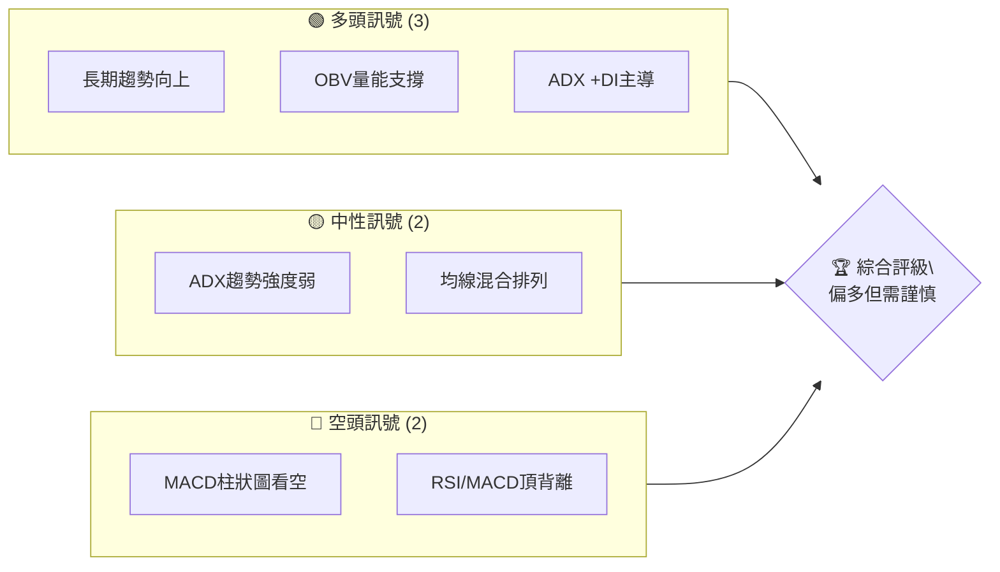
**解讀**: AMD 的長期趨勢依然強勁，且成交量指標顯示量能支撐價格上漲。然而，中期動能指標如 MACD 已發出賣出訊號，並與 RSI 共同形成頂背離，這暗示短中期上漲動能可能減弱，存在回調風險。ADX 顯示當前趨勢強度不足，市場處於盤整或弱勢趨勢中，而非強勢單邊行情。

### 📊 核心指標速覽表

| 指標類別 | 指標名稱 | 當前數值 | 訊號 | 解讀 |
|----------|----------|----------|------|------|
| **價格** | 當前價格 | $532.57 | 🟢 | 處於歷史高位附近，顯示強勁成長勢頭。 |
| **價格** | 52W 高/低 | $562.99 / $133.50 | 🟢 | 當前價格位於52週區間的 85.0% 處，接近高點。 |
| **均線** | MA20 | N/A | 🟡 | 數據未提供具體數值，但均線排列為「混合排列」，顯示短期可能震盪。 |
| **均線** | MA50 | N/A | 🟡 | 數據未提供具體數值，可能已形成多頭排列，但近期價格波動導致短期均線交叉。 |
| **均線** | MA200 | N/A | 🟢 | 數據未提供具體數值，但長期趨勢強勁，價格應遠高於此均線。 |
| **動能** | RSI(14) | 53.1 (上週) | 🟡 | 處於中性區間 (30-70)，從超買區回落，顯示動能減弱。 |
| **動能** | MACD | 26.546 | 🔴 | MACD 線 (26.546) 低於 Signal 線 (29.126)，形成死亡交叉，柱狀圖為負 (-2.580)。 |
| **波動** | ATR(14) | N/A | 🟡 | 數據未提供，但近期價格波動較大，預計波動率處於中高水平。 |

### 🏆 技術評分卡

```
技術評分卡 — AMD (2026-06-28)
════════════════════════════════════════════════════
趨勢強度      ████████░░░░░░░░░░░░  40/100  🟡
動能指標      ████░░░░░░░░░░░░░░░░  20/100  🔴
支撐穩定度    ████████████░░░░░░░░  60/100  🟡
成交量配合    ██████████████░░░░░░  70/100  🟢
形態完整度    ████████░░░░░░░░░░░░  40/100  🟡
均線排列      ██████░░░░░░░░░░░░░░  30/100  🟡
════════════════════════════════════════════════════
綜合評分      ██████░░░░░░░░░░░░░░  45/100  中性偏多
════════════════════════════════════════════════════
```
**評分解讀**：
- **趨勢強度 (40/100 🟡)**：ADX 數值為 24.36，處於弱趨勢/盤整區間 (<25)。儘管 +DI 高於 -DI (28.37 vs 19.75)，顯示多頭略佔優勢，但整體趨勢缺乏方向性強度。
- **動能指標 (20/100 🔴)**：RSI 從超買區回落至中性區，且與 MACD 均出現頂背離。MACD 柱狀圖為負，MACD 線已下穿 Signal 線，顯示短期動能轉弱，看空訊號明顯。
- **支撐穩定度 (60/100 🟡)**：近期價格從高點回落，下方存在多個歷史高點形成的支撐，如 $516.10、$466.38 等，提供一定支撐強度，但若跌破則可能加速下行。
- **成交量配合 (70/100 🟢)**：OBV 指標顯示 OBV > MA，量能支撐價格上漲。儘管近期成交量較前期高峰有所回落，但仍高於20日均量，顯示多頭方仍有活躍度。
- **形態完整度 (40/100 🟡)**：近期走勢呈現高位盤整或潛在回調形態，缺乏明確的看漲或看跌圖表形態。
- **均線排列 (30/100 🟡)**：數據顯示為「混合排列」，這通常發生在盤整或趨勢轉變初期，短期均線可能糾結，缺乏明確的多頭或空頭排列。

**綜合評級**：AMD 目前處於一個關鍵的轉折點。儘管長期上升趨勢未變，但短中期動能指標的疲軟和頂背離訊號預示著潛在的回調風險。投資者應密切關注關鍵支撐位的表現，並採取謹慎策略。

---

## 2. 趨勢分析

### 🌐 多時框趨勢分析

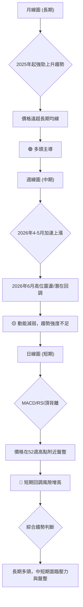
**解讀**：
- **長期趨勢 (月線)**：從2025年2月的低點 $99.86 開始，AMD 展現出驚人的成長動能，尤其在2026年4月和5月，價格從 $203.43 飆升至 $516.10，並在6月達到 $532.57。這是一個非常強勁的上升趨勢，價格遠高於所有長期移動平均線，顯示出強勁的多頭力量。
- **中期趨勢 (週線)**：過去20週的數據顯示，AMD 在2026年4月加速上漲，並在5月達到高峰。然而，進入2026年6月，儘管價格略創新高，但週線的RSI和MACD指標已顯示出動能減弱和背離現象，表明中期上漲勢頭可能正在放緩，市場進入高位震盪或潛在的回調階段。
- **短期趨勢 (日線)**：根據當前技術指標快照，MACD 柱狀圖為負，RSI 從高位回落。儘管 ADX 的 +DI 仍高於 -DI，但整體 ADX 數值偏低，表明短期趨勢不明顯，市場處於盤整狀態。結合動能指標的背離，短期存在較大的回調壓力。

### 📈 長期趨勢 — 12個月走勢圖（Unicode）

```
AMD 月線走勢圖（過去12個月：2025-07 至 2026-06）
價格軸 ($)
$560 ┤                                        ●(532.57)
$510 ┤                                    ●(516.10)
$460 ┤                                  ●
$410 ┤                                ●
$360 ┤                                ●(354.49)
$310 ┤                            ●
$260 ┤                    ●(256.12)
$210 ┤        ●           ● ● ●
$160 ┤● ● ●(176.31)
$110 ┤
     └────────────────────────────────────────────────────
      25-07 25-08 25-09 25-10 25-11 25-12 26-01 26-02 26-03 26-04 26-05 26-06
```
**走勢特徵分析表格**：
| 階段 | 時間區間 | 價格區間 | 漲跌幅 | 特徵分析 |
|------|----------|----------|--------|----------|
| **起漲階段** | 2025-07 ~ 2025-09 | $161.79 ~ $176.31 | +8.97% | 股價經歷初期上漲，但隨後進入橫盤整理，為後續突破蓄積能量。 |
| **首次突破** | 2025-10 | $161.79 → $256.12 | +58.30% | 經歷大幅度上漲，突破前期盤整區間，顯示強勁的多頭動能。 |
| **高位盤整** | 2025-11 ~ 2026-03 | $200.21 ~ $236.73 | -21.75% (高點算起) | 價格在 $200-$240 區間進行高位震盪整理，消化前期漲幅，為下一輪上漲做準備。 |
| **加速上漲** | 2026-04 ~ 2026-05 | $203.43 → $516.10 | +153.69% | 股價進入爆炸式成長，兩個月內翻倍，顯示市場對其前景極度樂觀，尤其是在 AI 領域的潛力。 |
| **近期高峰** | 2026-06 | $516.10 → $532.57 | +3.20% | 價格創歷史新高後，漲幅明顯收窄，顯示上漲動能有所減弱，可能進入盤整或潛在回調。 |

**結論**：AMD 在過去一年呈現出強勁的長期多頭趨勢，尤其是在2026年第二季度經歷了爆發式成長。然而，近期漲幅放緩，且動能指標顯示疲軟，預示著市場可能需要一段時間來消化巨大的漲幅。

### 📊 中期趨勢（週線分析）

中期週線圖顯示，自2026年3月從 $200 附近啟動的這一波漲勢非常陡峭。價格在4月和5月連續創下歷史新高，顯示出極強的買盤。然而，在2026年6月，儘管價格繼續小幅上漲，但漲勢明顯放緩，且週線級別的 K 線形態開始出現上影線較長或實體較小的蠟燭，這通常是上漲動能減弱的信號。

```
AMD 近期壓力與支撐示意圖 (週線)

高點區域 $562.99 (52W 高點)
          ▲
          │ 阻力區
$537.37 ──┼─────── (近期高點)
          │
$532.57 ──●─────── (當前價格)
          │
$516.10 ──┼─────── (前高點/第一支撐)
          │
$466.38 ──┼─────── (近期回調低點/第二支撐)
          │
$455.19 ──┼─────── (前一波高點/第三支撐)
          │ 支撐區
$405.51 ──┼─────── (斐波那契38.2%回調位)
          ▼
低點區域 $200.21 (本波漲勢起點)
```
**解讀**：目前價格 $532.57 位於近期高點 $537.37 之下，顯示短期承壓。上方 $562.99 的52週高點構成明顯阻力。下方 $516.10、$466.38 和 $455.19 是重要的潛在支撐位，這些都是前期漲勢中的高點或回調低點，具有較強的支撐作用。

### ⚡ 趨勢強度評估（ADX 解讀）

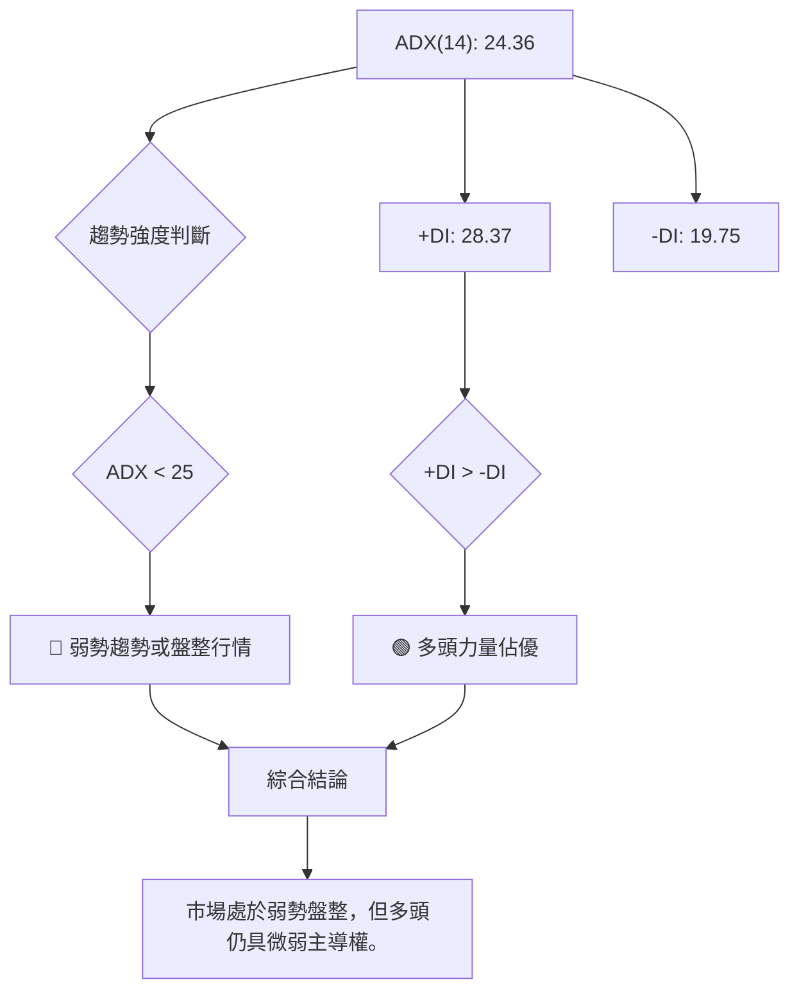
**ADX 強度對照表**：
| ADX 數值範圍 | 趨勢強度 | 訊號 |
|--------------|----------|------|
| 0-25         | 弱趨勢/盤整 | 🔴 |
| 25-50        | 中等趨勢   | 🟡 |
| 50-75        | 強趨勢     | 🟢 |
| 75-100       | 極強趨勢   | 🟢 |

**解讀**：AMD 的 ADX(14) 數值為 24.36，略低於 25，這明確指出當前市場處於一個**弱勢趨勢或盤整行情**。這與長期強勁上漲後的觀點一致，即市場正在消化前期漲幅。儘管如此，+DI (28.37) 明顯高於 -DI (19.75)，這表明在當前的弱勢行情中，**多頭力量仍然佔據主導地位**。這意味著雖然趨勢方向不明顯，但向上突破的可能性略大於向下突破，或者說，即使回調，也可能在關鍵支撐位獲得支撐。投資者應避免在此階段追漲殺跌，等待趨勢明確。

---

## 3. 圖表形態分析

### 🔍 形態識別系統

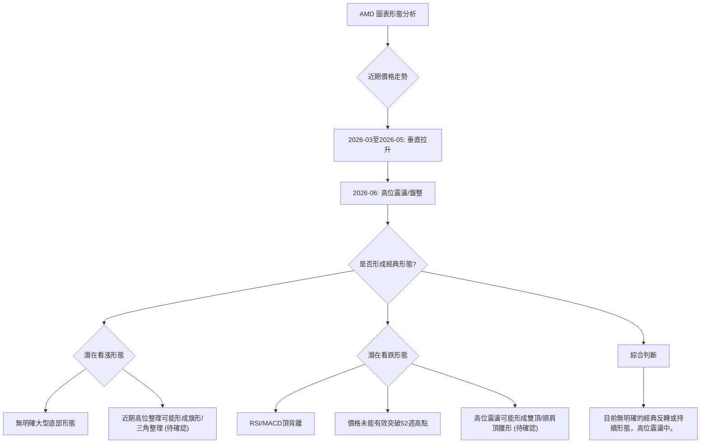
**解讀**：AMD 在2026年3月至5月經歷了強勁的垂直拉升，這本身不是一個形態，而是趨勢的表現。進入6月，價格在高位 $510-$540 區間震盪，未能有效突破52週高點 $562.99。目前尚未形成明確的經典圖表形態（如頭肩頂/底、雙頂/底或大型三角形）。然而，高位震盪結合動能指標的頂背離，暗示著兩種可能性：
1. **看漲持續形態 (潛在)**：如果股價能在關鍵支撐位上方穩住，並在成交量配合下向上突破，則可能形成旗形或上升三角形，預示著新一輪上漲。
2. **看跌反轉形態 (潛在)**：如果股價跌破關鍵支撐位，且成交量放大，則高位震盪可能演變成雙頂或頭肩頂的雛形，預示著較深的回調。
當前市場處於形態形成初期，需要更多 K 線確認。

### 🕯️ 重要K線形態分析

根據近20週的收盤價和成交量數據，我們可以觀察到一些重要的 K 線形態特徵：

| 月份 | 收盤價 | K線形態特徵 | 解讀 | 訊號 |
|------|--------|--------------|------|------|
| 2026-03 | $203.43 | **長陽線啟動** | 結束前期盤整，開啟新一輪上漲趨勢的信號。 | 🟢 |
| 2026-04 | $354.49 | **大陽線群** | 強勁的買盤，價格快速拉升，多頭完全主導市場。 | 🟢 |
| 2026-05 | $516.10 | **實體較長陽線** | 繼續保持強勢上漲，但RSI已處於極度超買區，暗示動能過度。 | 🟢🟡 |
| 2026-06-07 | $466.38 | **長陰線** | 從高點回落，實體較大，顯示賣盤壓力增加，短期回調開始。 | 🔴 |
| 2026-06-14 | $511.57 | **小陽線/十字星** | 價格反彈但未能有效突破前高，顯示多空力量均衡，上方阻力較強。 | 🟡 |
| 2026-06-21 | $537.37 | **長上影線/小實體** | 價格嘗試突破但未能成功，遇到較強賣壓，暗示上方阻力強勁。 | 🔴 |
| 2026-06-28 | $532.57 | **小陰線** | 延續上週回落趨勢，市場情緒謹慎，短期仍有下行壓力。 | 🔴 |

### 📉 ASCII 走勢形態示意圖

```
AMD 近期高位震盪示意圖
           $562.99 (52W 高點/主要阻力)
             ╲
              ╲
$537.37 ───────┐
              ╱│
             ╱ │
$532.57 ─────●─┤ (當前價格)
           ╱   │
          ╱    │
$516.10 ─┼──────┤ (關鍵支撐/前高點)
         │     │
         │     │
$466.38 ───┼───── (近期回調低點/次級支撐)
           │
           │
$455.19 ────┼──── (斐波那契38.2%回調位附近)

解讀：價格在高點 $537.37 附近形成一個小的 M 形或雙頂雛形，
      但尚未完全確認。目前處於 $516.10-$537.37 區間震盪。
      若跌破 $516.10，則可能確認回調。
```
**形態分析**：從上述 K 線和走勢圖來看，AMD 在 $537.37 附近形成了一個短期高點，隨後出現回調。雖然尚未形成明確的雙頂形態，但結合 MACD 和 RSI 的頂背離，這是一個值得警惕的訊號。如果價格在未來幾週內無法有效突破 $537.37 並站穩，且跌破 $516.10 的關鍵支撐，則雙頂形態的可能性將大大增加，並可能引發更深度的回調。

### 🎯 形態目標價計算

由於目前尚未形成明確的經典圖表形態（如頭肩頂/底、雙頂/底、三角形等），因此無法直接計算形態目標價。但我們可以根據潛在的雙頂形態來預估其回調目標：

**潛在雙頂形態目標價預估 (假設成立)**：
- **形態高點**: $537.37 (2026-06-21 週高點)
- **頸線位置**: 假設頸線為近期回調低點 $466.38 (2026-06-07 週低點)
- **形態高度**: $537.37 - $466.38 = $70.99

**目標價計算方法**:
若雙頂形態確認 (即價格有效跌破頸線 $466.38)，則理論下跌目標價為：
- **目標價 T1**: 頸線 - 形態高度 = $466.38 - $70.99 = **$395.39**
- **解讀**: 此目標價將指向斐波那契 38.2% 回調位 ($405.51) 附近，這是相當重要的支撐區域。

**重要提示**: 此目標價為**假設雙頂形態成立**且跌破頸線後的預估。在形態未完全確認前，應謹慎對待。

---

## 4. 支撐與阻力

### 🗺️ 關鍵價位分布圖（Unicode）

```
AMD 價位結構分布圖
═══════════════════════════════════════════════════
$670.00 ║████████████████████████║ 強阻力 R3 (分析師高目標)
$562.99 ║████████████████████    ║ 阻力 R2 (52週高點)
$537.37 ║████████████████████████║ 關鍵阻力 R1 (近期高點)
$532.57 ╠════════════════════════╣ ◄ 現價
$516.10 ║▓▓▓▓▓▓▓▓▓▓▓▓▓▓▓▓        ║ 近期支撐 S1 (前高點)
$466.38 ║████████████████████████║ 強支撐 S2 (近期回調低點/頸線)
$455.19 ║████████████████████████║ 支撐 S3 (前一波高點)
$405.51 ║████████████████████████║ 支撐 S4 (斐波那契38.2%回調位)
$366.39 ║████████████████████████║ 支撐 S5 (斐波那契50%回調位)
$320.00 ║████████████████████████║ 強支撐 S6 (分析師低目標)
═══════════════════════════════════════════════════
```

### 🚧 阻力位分析表

| 阻力級別 | 價位 | 形成原因 | 突破難度 | 重要性 |
|----------|------|----------|----------|--------|
| **R1 (關鍵阻力)** | $537.37 | 近期歷史高點，短期賣壓集中區。 | 中等 | 若能有效突破，則短期多頭動能可能恢復。 |
| **R2 (主要阻力)** | $562.99 | 過去52週最高點，強勁的心理和技術阻力。 | 較高 | 突破此位將創歷史新高，意義重大。 |
| **R3 (強阻力)** | $670.00 | 分析師最高目標價，代表市場對其最高預期。 | 很高 | 挑戰此位需極強基本面與市場情緒支持。 |

### 🛡️ 支撐位分析表

| 支撐級別 | 價位 | 形成原因 | 守住機率 | 重要性 |
|----------|------|----------|----------|--------|
| **S1 (近期支撐)** | $516.10 | 前期高點，多頭成本集中區，短期回調的初步防線。 | 中等 | 若跌破則可能加速回調，確認短期疲軟。 |
| **S2 (強支撐)** | $466.38 | 近期回調低點，也是潛在雙頂形態的頸線，具有極強的心理和技術意義。 | 較高 | 此位是判斷短期趨勢是否反轉的關鍵。 |
| **S3 (次級支撐)** | $455.19 | 前一波漲勢的高點，具有一定的支撐作用。 | 中等 | 在 S2 跌破後，此位將是重要的緩衝區。 |
| **S4 (斐波那契支撐)** | $405.51 | 本波漲勢 (從 $200.21 到 $537.37) 的 38.2% 斐波那契回調位，技術面重要支撐。 | 較高 | 若回調至此位並企穩，是潛在的買入機會。 |
| **S5 (斐波那契支撐)** | $366.39 | 本波漲勢的 50% 斐波那契回調位，強勁的心理支撐。 | 很高 | 若跌至此位，說明市場情緒極度悲觀。 |
| **S6 (強支撐)** | $320.00 | 分析師最低目標價，若跌破則市場信心將嚴重受損。 | 很高 | 極端情況下的最後防線。 |

### 📐 斐波那契回調位分析

我們將以 AMD 從2026年3月最低點 $200.21 到近期最高點 $537.37 的漲勢作為斐波那契回調的分析區間。

- **最低點 (0%)**: $200.21 (2026-03-01)
- **最高點 (100%)**: $537.37 (2026-06-21)
- **總漲幅**: $537.37 - $200.21 = $337.16

**斐波那契回調位計算**：
- **23.6% 回調**: $537.37 - ($337.16 * 0.236) = $537.37 - $79.50 = **$457.87**
- **38.2% 回調**: $537.37 - ($337.16 * 0.382) = $537.37 - $128.85 = **$408.52**
- **50.0% 回調**: $537.37 - ($337.16 * 0.500) = $537.37 - $168.58 = **$368.79**
- **61.8% 回調**: $537.37 - ($337.16 * 0.618) = $537.37 - $208.31 = **$329.06**

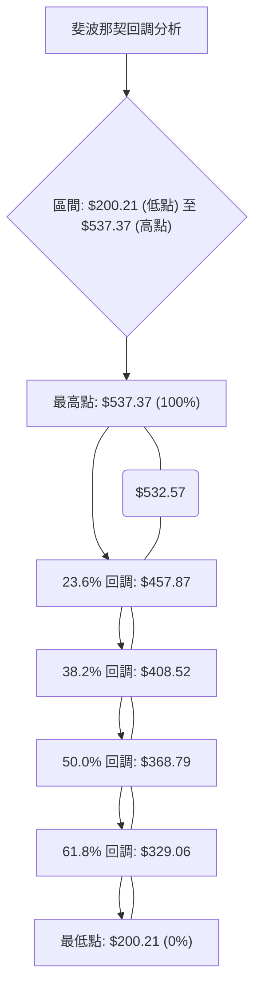
**解讀**：
當前價格 $532.57 仍在斐波那契回調區間之上，但非常接近最高點。
- **$457.87 (23.6% 回調)**：這是最近期的潛在支撐，與近期回調低點 $466.38 及前高點 $455.19 非常接近，形成一個強勁的支撐區。若價格回調至此區間並企穩，則表明市場情緒仍然偏強。
- **$408.52 (38.2% 回調)**：此位被視為健康回調的重要支撐。若價格跌破 $457.87，則 $408.52 將是下一個關鍵觀察點。
- **$368.79 (50% 回調)**：若價格回調至此，則表示多頭趨勢面臨較大挑戰，但仍屬於常見的回調範圍。
- **$329.06 (61.8% 回調)**：這是黃金分割位，通常被認為是趨勢反轉或深度回調的最後防線。若跌破此位，則本輪強勁漲勢可能終結。

當前價格 $532.57 距離第一個斐波那契回調位 $457.87 仍有約 $74 的空間。這暗示在當前動能不足的情況下，股價存在一定的回調空間。

---

## 5. 技術指標深度解讀

### 🎛️ 指標訊號總覽

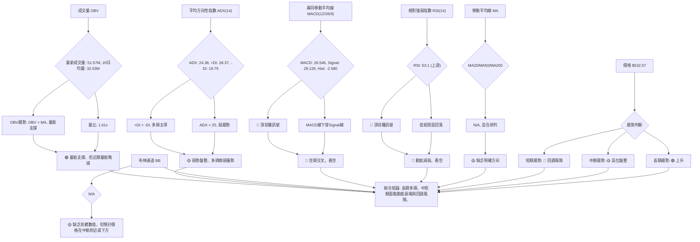

### 📈 移動平均線排列分析

儘管數據未提供具體的 MA 數值，但報告中指出「**均線排列: 混合排列**」。這是一個重要的線索，表明在經歷了長期上漲後，短期和中期移動平均線可能已經糾結在一起，甚至出現了交叉。

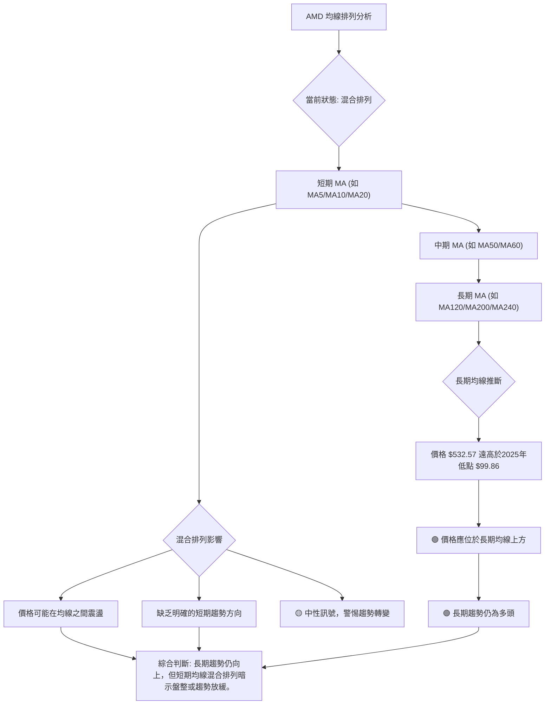
**解讀**：
- **混合排列**：表示短期均線（如 MA20、MA50）可能相互交叉，或者價格在這些均線上下波動，未能形成明確的多頭（MA 短>中>長）或空頭（MA 短<中<長）排列。這通常發生在市場從一個強勢趨勢轉向盤整，或者趨勢正在發生變化的時期。
- **長期均線推斷**：考慮到 AMD 在過去一年中的巨大漲幅，其長期移動平均線（如 MA200）應該是向上傾斜的，並且當前價格 $532.57 應遠高於這些長期均線。這確認了 AMD 的**長期上漲趨勢依然穩固**。
- **綜合分析**：混合排列的出現，結合近期價格在高位震盪，表明短期內市場正在消化漲幅，多空力量處於拉鋸狀態。儘管長期前景看好，但短期操作需要謹慎，避免在均線糾結時盲目追漲。

### 📉 RSI(14) 分析

**RSI 數值進度條展示**：
根據近20週數據，最近一個有效 RSI 值為 2026-06-21 的 53.1。
RSI (53.1): ▓▓▓▓▓▓▓▓▓▓▓░░░░░░░░░ 53.1% 🟡 中性

**超買超賣區間分析**：
- RSI 在 2026-04-19 達到 93.3，2026-04-26 達到 97.4，這顯示股價處於**極度超買**狀態，預示著回調風險極高。
- 隨後 RSI 從高位回落，在 2026-05-17 降至 67.6，2026-06-21 降至 53.1。這表明市場的超買情緒已得到大幅緩解，**動能正在減弱**，價格回調是健康的。
- 當前 RSI 處於中性區間 (30-70)，沒有立即的超買或超賣訊號。

**背離判斷 (頂背離/底背離)**：
- **價格走勢**：AMD 股價在 2026-05-31 達到 $516.10，隨後在 2026-06-21 達到 $537.37 (創下更高的高點)。
- **RSI 走勢**：
    - 2026-05-31 (價格 $516.10) 時 RSI 為 67.0。
    - 2026-06-21 (價格 $537.37) 時 RSI 為 53.1。
- **結論**：股價創出更高的高點 ($537.37 > $516.10)，而 RSI 卻創出更低的低點 (53.1 < 67.0)。這是一個典型的**頂背離 (Bearish Divergence)** 訊號。
- **訊號強度**：🔴 強烈看空。頂背離是重要的反轉訊號，暗示雖然價格仍在創新高，但其內在的上漲動能已經衰竭，預示著即將到來的回調或趨勢反轉。

### 📊 MACD(12/26/9) 訊號解讀

**MACD 線、訊號線、柱狀圖關係**：
- **當前 MACD 數值**：
    - MACD 線 (DIF): 26.546
    - Signal 線 (DEA): 29.126
    - MACD 柱狀圖 (OSC): -2.580
- **關係判斷**：
    - MACD 線 (26.546) 低於 Signal 線 (29.126)，形成**死亡交叉 (Bearish Crossover)**。
    - MACD 柱狀圖為負 (-2.580)，且持續擴大（從上週的 -3.142 到現在的 -2.580，雖然數值上看似縮小，但這可能是因為收盤價 $532.57 較 $537.37 略低，導致 MACD 線反彈，但整體仍在 Signal 線下方）。
    - 綜合來看，MACD 發出**看空訊號**。

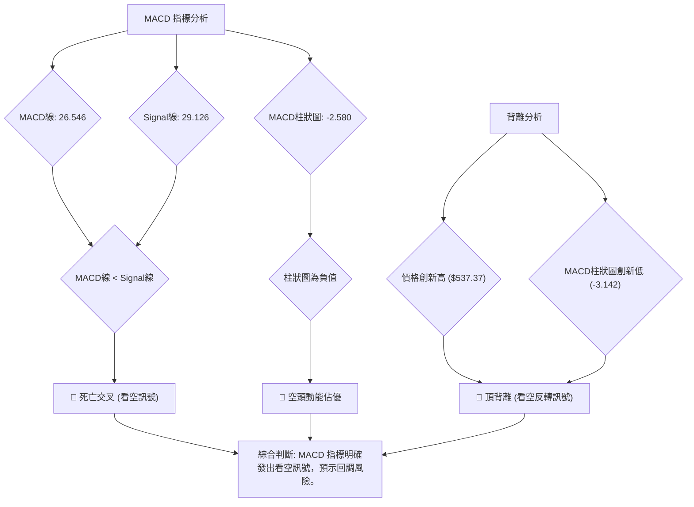
**背離判斷 (頂背離/底背離)**：
- **價格走勢**：如 RSI 分析，股價在 2026-05-31 達到 $516.10，隨後在 2026-06-21 達到 $537.37 (創下更高的高點)。
- **MACD 柱狀圖走勢**：
    - 2026-05-31 (價格 $516.10) 時 MACD 柱狀圖為 +2.949。
    - 2026-06-21 (價格 $537.37) 時 MACD 柱狀圖為 -3.142。
- **結論**：股價創出更高的高點 ($537.37 > $516.10)，而 MACD 柱狀圖卻創出更低的低點 (-3.142 < +2.949)，且由正轉負。這是一個非常強烈的**頂背離 (Bearish Divergence)** 訊號。
- **訊號強度**：🔴 強烈看空。MACD 的頂背離與 RSI 相互確認，大大增加了短期回調或趨勢反轉的可能性。

### 📦 布林通道分析

**布林通道數據未提供** (N/A)。儘管如此，我們可以根據價格行為和市場常識進行推斷。
- **當前價格 $532.57**：位於近期高點 $537.37 附近，但已從最高點回落。
- **推斷**：在強勁上漲後，價格通常會觸及布林通道上軌。而近期回調可能使價格回落至中軌附近，甚至跌破中軌。結合 MACD 和 RSI 的看空訊號，價格很可能已在中軌下方或正在測試中軌支撐。

```
AMD 布林通道示意圖 (推斷)

上軌 (BB_Upper)
$XXX ╔══════════════════════════════════╗
     ║                                  ║
$537.37 ║                  ▲(近期高點)       ║
$532.57 ║                  ●(現價)         ║
$XXX ║                                  ║
     ╠══════════════════════════════════╣ 中軌 (MA20) (N/A)
     ║                                  ║
$XXX ║                                  ║
$XXX ║                                  ║
$XXX ╚══════════════════════════════════╝ 下軌 (BB_Lower)

解讀：儘管數據缺失，但根據價格從高點回落的走勢，
      價格可能已跌破或正在測試布林通道中軌。
      若跌破中軌，則短期趨勢轉弱。
      若能守住中軌並反彈，則仍有機會維持震盪上行。
```
**解讀**：如果價格跌破布林通道中軌，將是一個明確的短期看空訊號，暗示短期趨勢轉為弱勢。若價格能在中軌之上運行，則多頭仍有機會。在當前數據缺失情況下，應將布林通道中軌視為一個重要的動態支撐/阻力位，並結合其他指標綜合判斷。

### 💹 成交量分析（量價配合度）

- **最新成交量**：51,570,759 股
- **20日均量**：32,034,743 股
- **量比 (Volume Ratio)**：1.61x (最新成交量 / 20日均量)
- **50日均量**：38,730,967 股
- **OBV 趨勢**：OBV > MA → 量能支撐上漲

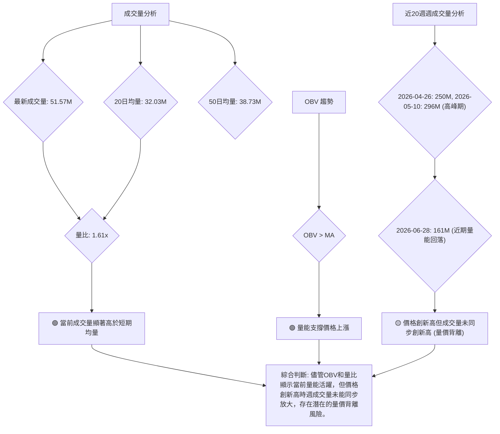
**解讀**：
- **高於均量**：當前成交量 (51.57M) 顯著高於 20 日均量 (32.03M) 和 50 日均量 (38.73M)，量比達到 1.61x，這表明市場交投活躍，有資金流入。
- **OBV 支撐上漲**：OBV 趨勢顯示「OBV > MA → 量能支撐上漲」，這是一個積極的訊號，表明累積性買盤強於賣盤，多頭仍佔據優勢。
- **潛在的量價背離**：然而，從近20週的週成交量數據來看，在價格從 $200 飆升至 $500 的過程中，成交量在 2026-04-26 達到 2.5 億股，2026-05-10 達到 2.9 億股的高峰。但在 2026-06-21 價格創出 $537.37 的高點時，週成交量為 1.3 億股，而當前週成交量為 1.6 億股，均明顯低於前期的高峰量。這形成了一個**量價背離**的潛在風險：價格創出更高的高點，但成交量未能同步放大。
- **綜合分析**：雖然 OBV 顯示量能總體偏多，但近期價格創新高時成交量未能有效放大，這削弱了上漲的可靠性，並可能加劇動能指標的頂背離所帶來的回調風險。投資者應警惕無量上漲後的潛在回調。

---

## 6. 動能與波動率

### ⚡ 動能評估四象限

由於 Mermaid 的 `quadrantChart` 可能無法直接輸出，我將使用表格和流程圖來呈現動能與波動率的評估。

| 象限 | 動能 (RSI/MACD) | 波動 (ATR) | 當前狀態 | 評估 |
|------|-----------------|------------|----------|------|
| Q1   | 強勁 (RSI > 70, MACD 金叉) | 低 (ATR 穩定) | - | 最佳機會 (強勢且穩定) |
| Q2   | 弱勢 (RSI < 50, MACD 死叉) | 低 (ATR 穩定) | - | 謹慎觀望 (缺乏動能) |
| Q3   | 強勁 (RSI > 70, MACD 金叉) | 高 (ATR 擴大) | - | 高風險高收益 (追漲需謹慎) |
| Q4   | 弱勢 (RSI < 50, MACD 死叉) | 高 (ATR 擴大) | ✓ | 避免進場 / 趨勢不明朗 |

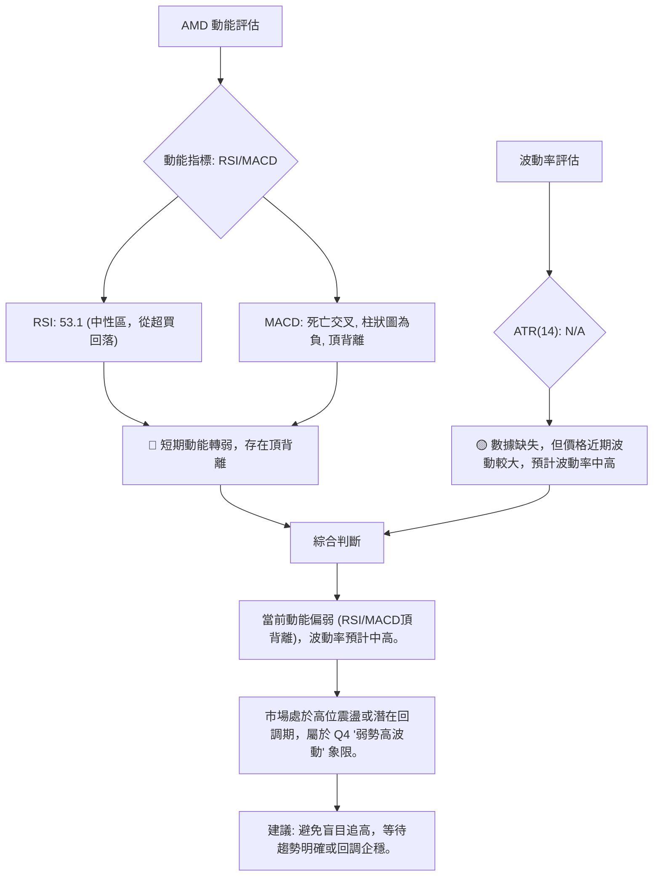
**解讀**：AMD 目前的動能指標顯示偏弱，RSI 從超買區回落至中性區，且與 MACD 共同形成頂背離，MACD 線也出現死亡交叉。這些都明確指向短期動能的衰竭和回調風險。儘管 ATR 數據缺失，但從近期價格從 $537.37 回落至 $532.57，以及之前從 $516.10 回調至 $466.38 的波動來看，AMD 的波動性預計處於中高水平。
因此，AMD 當前處於「**弱勢動能、中高波動**」的象限，屬於應謹慎觀望或避免盲目進場的階段。這表示市場缺乏明確的單邊趨勢，且價格波動較大，操作難度增加。

### 📊 ATR 波動率分析

**ATR(14) 數據未提供** (N/A)。儘管如此，我們可以根據過去幾週的價格波動來估計其大致的波動水平。
- 從 2026-05-17 的 $424.10 到 2026-05-31 的 $516.10，漲幅約 $92。
- 從 2026-05-31 的 $516.10 回調到 2026-06-07 的 $466.38，跌幅約 $50。
- 從 2026-06-07 的 $466.38 反彈到 2026-06-21 的 $537.37，漲幅約 $71。
- 從 2026-06-21 的 $537.37 回落到 2026-06-28 的 $532.57，跌幅約 $5。

**解讀**：
儘管缺乏具體 ATR 數值，但從上述價格波動來看，AMD 在過去一個月內的日/週波動幅度在 $5 到 $90 之間，這對於一個價格超過 $500 的股票來說，屬於**中高波動水平**。
- **止損距離建議**：在缺乏 ATR 具體數值的情況下，通常建議將止損距離設置為 ATR 的 1.5 到 3 倍。若假設 ATR 大約在 $15-$25 之間 (基於近期 $50-$90 的週波動，日波動會小一些)，那麼合理的止損距離可能在 $22.5 到 $75 之間。這意味著在波動性較高的市場中，止損點需要放寬，以避免被正常波動洗出。

### 📐 Beta 與市場相關性

**Beta 數據未提供**。
- **Beta 的意義**：Beta 值衡量一檔股票相對於整體市場（如 S&P 500 指數）的波動性。
    - Beta > 1：股票波動大於市場，通常在牛市中漲幅更大，熊市中跌幅也更大。
    - Beta < 1：股票波動小於市場，通常在牛市中漲幅較小，熊市中跌幅也較小。
    - Beta = 1：股票波動與市場同步。
- **行業特性推斷**：AMD 屬於半導體產業，通常是高成長、高波動的科技股。科技股的 Beta 值普遍較高，通常大於 1。
- **推斷結論**：預計 AMD 的 Beta 值可能**大於 1**，這意味著其股價波動性可能高於大盤。在當前市場整體偏多但個股面臨回調風險時，高 Beta 值可能導致 AMD 的回調幅度大於大盤，反之亦然。投資者應意識到其高波動特性，並據此調整倉位管理和風險承受能力。

---

## 7. 多時框架總結

### 📋 時框架評分表

| 時框架 | 趨勢方向 | 動能 | 均線排列 | 形態 | 綜合評分 | 建議 |
|--------|----------|------|----------|------|----------|------|
| **長期 (月線)** | 🟢 強勁上升 | 🟢 強勁 | 🟢 多頭排列 (推斷) | 🟡 無明確形態 | 8/10 | 長期持有 |
| **中期 (週線)** | 🟡 高位震盪 | 🔴 減弱 (頂背離) | 🟡 混合排列 (推斷) | 🟡 潛在雙頂 | 4/10 | 警惕回調 |
| **短期 (日線)** | 🔴 盤整/回調 | 🔴 減弱 (死叉/背離) | 🟡 混合排列 | 🟡 無明確形態 | 3/10 | 規避風險 |

**解讀**：
- **長期**：AMD 的長期趨勢依然非常強勁，價格遠高於長期均線，顯示出穩固的多頭格局。對於長期投資者而言，這是一個積極的信號。
- **中期**：中期週線圖顯示股價在高位震盪，雖然仍在歷史高點附近，但動能指標已顯著減弱並出現頂背離，潛在的雙頂形態也增加了回調風險。均線混合排列進一步確認了中期趨勢的模糊性。
- **短期**：短期日線指標發出強烈的看空訊號，MACD 死亡交叉和 RSI/MACD 頂背離均預示著短期內可能出現回調。ADX 顯示弱趨勢，進一步確認了短期缺乏明確的上漲動能。

### 🔲 綜合訊號矩陣

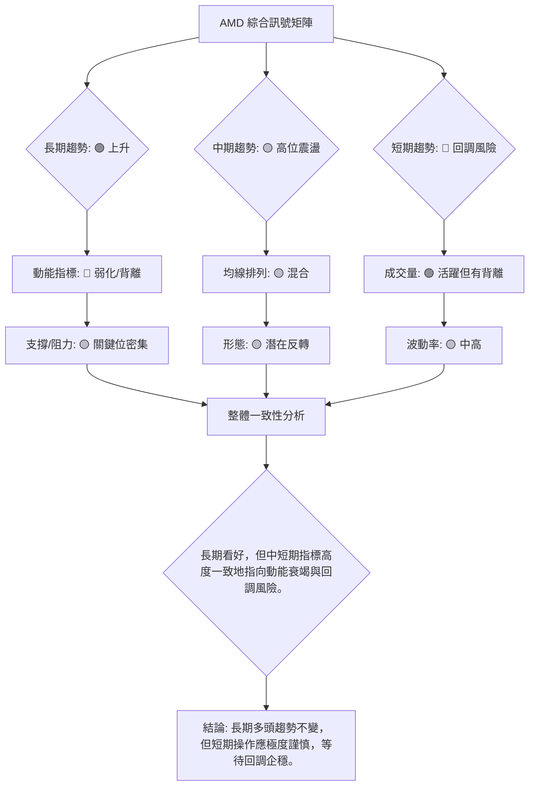
**一致性分析**：
- **長期與中短期訊號的矛盾**：長期趨勢的強勁與中短期動能指標的疲軟形成了鮮明對比。這是典型的「牛市中的調整」或「強勢股高位盤整」的表現。
- **動能指標的一致性**：RSI 和 MACD 在中短期框架中都發出明確的頂背離和看空交叉訊號，這種一致性增加了回調的可能性。
- **成交量與趨勢的矛盾**：儘管 OBV 趨勢仍偏多，但價格創新高時週成交量未能放大，這是一個隱憂，削弱了當前價格的堅實性。
- **均線與 ADX 的中性**：均線的混合排列和 ADX 的弱勢趨勢強度，都表明市場缺乏明確的短期方向，處於震盪整理階段。

**結論**：AMD 的長期成長潛力依然存在，但從純技術面來看，中短期面臨顯著的動能衰竭和回調風險。投資者應避免在當前高點追漲，建議採取觀望策略，或等待價格回調至關鍵支撐位後再考慮介入。

---

## 8. 交易策略建議

基於 AMD 的多時框架分析，我們看到長期趨勢依然強勁，但中短期動能指標顯示疲軟，且存在頂背離訊號，預示著潛在的回調。因此，交易策略應以**保守觀望**或**逢低買入**為主，並嚴格控制風險。

### 🗺️ 策略決策流程圖

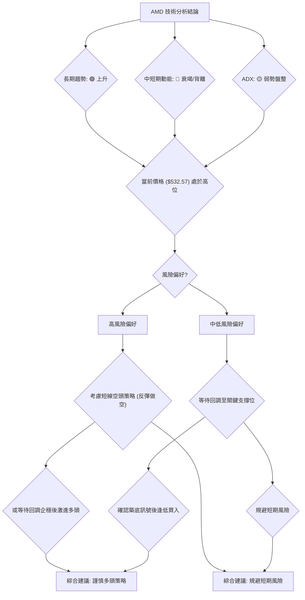

### 🟢 多頭策略詳情

鑑於長期趨勢依然向上，主要策略應為在回調後尋找買入機會。

| 策略要素 | 策略 A (逢低買入) | 策略 B (趨勢突破) |
|----------|--------------------|--------------------|
| **進場條件** | 價格回調至強支撐位，並出現止跌 K 線形態 (如錘子線、啟明星) 或 MACD 金叉。 | 價格有效突破關鍵阻力 R1 ($537.37) 並伴隨放量。 |
| **進場價格** | **$466.38 - $475.00** (接近強支撐 S2) | **$540.00 - $545.00** (突破 R1 後回踩確認) |
| **目標價 T1** | **$516.10** (測試前高點/近期支撐) | **$562.99** (挑戰52週高點 R2) |
| **目標價 T2** | **$537.37 - $540.00** (挑戰近期高點 R1) | **$600.00 - $620.00** (心理關口，新高區間) |
| **止損價格** | **$449.00** (略低於斐波那契 23.6% 回調位 $457.87) | **$525.00** (跌破 R1 反向支撐) |
| **風險報酬比** | (以進場 $470 計算) <br> T1: ($516-$470)/($470-$449) = $46/$21 = **2.19:1** <br> T2: ($537-$470)/($470-$449) = $67/$21 = **3.19:1** | (以進場 $540 計算) <br> T1: ($562-$540)/($540-$525) = $22/$15 = **1.47:1** <br> T2: ($600-$540)/($540-$525) = $60/$15 = **4.00:1** |
| **成功機率** | 60% (基於強支撐反彈) | 40% (突破阻力需強勁動能，當前動能不足) |
| **建議倉位** | 10-15% | 5-10% (風險較高) |

### 🔴 空頭策略詳情

考慮到 MACD 和 RSI 的頂背離以及死亡交叉，短期內存在做空機會，但由於長期趨勢仍為多頭，做空屬於逆勢操作，風險較高，應嚴格控制倉位和止損。

| 策略要素 | 策略 C (背離做空) | 策略 D (跌破支撐做空) |
|----------|--------------------|--------------------|
| **進場條件** | 價格在 $537.37 附近未能有效突破，且 MACD 柱狀圖持續負值擴大。 | 價格有效跌破強支撐 S1 ($516.10) 並伴隨放量。 |
| **進場價格** | **$530.00 - $535.00** (接近當前價格，確認阻力) | **$510.00 - $515.00** (跌破 S1 後回抽確認) |
| **目標價 T1** | **$516.10** (測試近期支撐 S1) | **$466.38** (測試強支撐 S2) |
| **目標價 T2** | **$466.38** (測試強支撐 S2) | **$408.52** (斐波那契 38.2% 回調位 S4) |
| **止損價格** | **$545.00** (突破近期高點 R1) | **$520.00** (收復 S1) |
| **風險報酬比** | (以進場 $532 計算) <br> T1: ($532-$516)/($545-$532) = $16/$13 = **1.23:1** <br> T2: ($532-$466)/($545-$532) = $66/$13 = **5.08:1** | (以進場 $512 計算) <br> T1: ($512-$466)/($520-$512) = $46/$8 = **5.75:1** <br> T2: ($512-$408)/($520-$512) = $104/$8 = **13.00:1** |
| **成功機率** | 50% (逆勢操作，但有背離支持) | 55% (順勢跌破，但下方支撐密集) |
| **建議倉位** | 5-10% (高度風險) | 5-10% (高度風險) |

### ⭐ 整體訊號強度評星

```
做多訊號強度：★★☆☆☆  (2/5星)
做空訊號強度：★★★☆☆  (3/5星)
整體可信度：  ★★★☆☆  (3/5星)
```
**評星解讀**：
- **做多訊號強度**：當前做多訊號較弱，主要是因為價格處於高位，且動能指標出現明顯的看空背離。追漲風險較高。等待回調至關鍵支撐位並確認企穩後，做多機會才更可靠。
- **做空訊號強度**：中短期指標的看空背離和死亡交叉，為做空提供了一定的技術依據。但由於長期趨勢仍為多頭，做空屬於逆勢操作，風險依然較高，需嚴格止損。
- **整體可信度**：市場目前處於多空拉鋸的關鍵時刻。技術指標發出的警示訊號具備一定可信度，但由於是高波動性股票且長期趨勢強勁，任何單邊操作都需謹慎。

---

## 9. 風險提示與監控

### ✅ 關鍵監控指標 Checklist

```
╔══════════════════════════════════════════════════════════════╗
║              AMD 關鍵監控指標清單                            ║
╠══════════════════════════════════════════════════════════════╣
║  [ ] 價格是否有效跌破 $516.10 (S1 支撐)                      ║
║  [ ] 價格是否有效跌破 $466.38 (S2 強支撐/潛在頸線)           ║
║  [ ] MACD 柱狀圖是否持續負值擴大，或出現金叉反轉              ║
║  [ ] RSI 是否跌破 50 中軸線，或進入超賣區 (30以下)            ║
║  [ ] 成交量在下跌時是否放大，或在反彈時是否縮量              ║
║  [ ] ADX 趨勢強度是否上升，表明趨勢正在形成 (無論向上或向下) ║
║  [ ] 52週高點 $562.99 是否被有效突破或形成雙頂                ║
║  [ ] 任何新的圖表形態 (如頭肩頂、大型三角形) 是否形成        ║
║  [ ] 分析師評級或目標價是否有重大調整 (基本面風險)           ║
║  ] 產業新聞或公司公告 (如 AI 晶片銷售、競爭格局變化)         ║
╚══════════════════════════════════════════════════════════════╝
```

### ⚠️ 風險場景分析

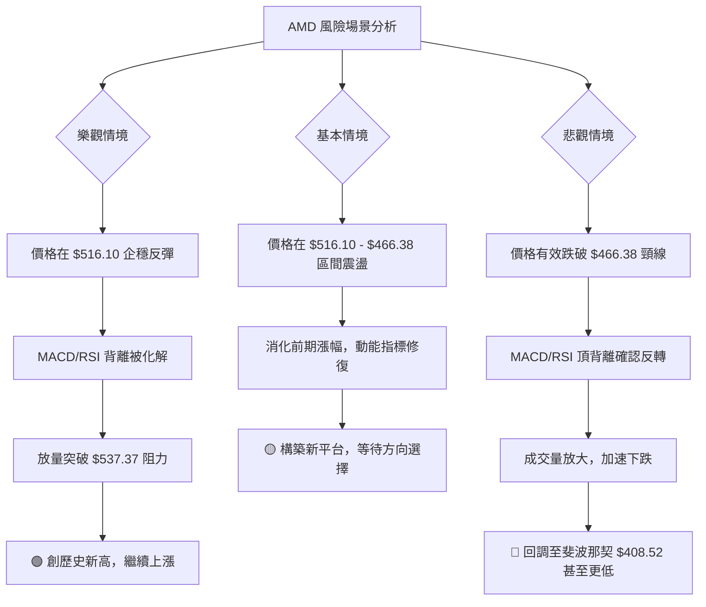
**解讀**：
- **樂觀情境 (低機率)**：儘管存在動能背離，但如果市場情緒極度樂觀，AMD 在短期回調後能夠迅速在 $516.10 甚至更高位企穩，並在新的利好消息（如強勁的 AI 晶片出貨數據）刺激下放量突破 $537.37 和 $562.99，則有可能繼續創歷史新高。
- **基本情境 (中機率)**：AMD 在 $516.10-$466.38 區間進行高位震盪整理，消化前期漲幅和動能背離。在此期間，動能指標可能會修復，市場在一段時間後重新選擇方向。這將是一個較長的盤整期。
- **悲觀情境 (中高機率)**：MACD 和 RSI 的頂背離確認，價格未能守住 $516.10，並最終有效跌破 $466.38 的強支撐（潛在雙頂頸線）。這將引發較深的回調，目標可能指向斐波那契 38.2% 回調位 $408.52，甚至 50% 回調位 $368.79。

### 🛡️ 風險管理重要提醒

1.  **嚴格止損**：鑑於 AMD 的高波動性以及當前動能指標的疲軟，無論採取何種策略，都必須設定並嚴格執行止損點。一旦價格觸及止損，應果斷離場，避免損失擴大。
2.  **倉位控制**：在高波動和不確定性高的市場環境下，應降低單一股票的倉位佔比，特別是對於逆勢操作或突破追漲的策略。建議將倉位控制在總資金的 5-15% 之間。
3.  **分批建倉/減倉**：避免一次性重倉買入或賣出。可以選擇在不同的支撐位分批建倉，或在達到目標價時分批減倉，以平攤風險並鎖定利潤。
4.  **關注成交量**：成交量是判斷趨勢可靠性的重要指標。在價格上漲時，如果成交量未能同步放大，應警惕虛假突破或上漲乏力。在價格下跌時，如果成交量急劇放大，則可能預示著加速下跌。
5.  **結合基本面**：雖然本報告是純技術分析，但長期的投資決策仍需結合 AMD 的基本面分析，包括其在 AI 晶片市場的競爭力、營收和利潤增長預期等。技術分析提供進出場時機，基本面則決定長期價值。
6.  **避免情緒化交易**：市場情緒在高波動時期容易受到影響。堅持自己的交易計劃，避免追漲殺跌，不受短期波動影響。

---

## 📋 報告總結

```
AMD 技術分析報告總結
════════════════════════════════════════════════════════
報告日期：2026-06-28
當前價格：$532.57
分析評級：⚖️ 中性偏空 (短期面臨回調風險，長期趨勢仍向上)

關鍵結論：
├─ 長期趨勢：🟢 強勁上升，多頭格局穩固。
├─ 中期趨勢：🟡 高位震盪，動能減弱，潛在雙頂形態。
├─ 短期趨勢：🔴 回調風險高，MACD死亡交叉與RSI/MACD頂背離明確。
├─ 關鍵支撐：$516.10 (S1), $466.38 (S2), $408.52 (S4 斐波那契38.2%)
└─ 關鍵阻力：$537.37 (R1), $562.99 (R2 52週高點)

最優策略組合：
1. 🥇 最佳機會：**等待價格回調至 $466.38 - $475.00 區間，確認止跌訊號後，逢低買入。** 目標價 $516.10 / $537.37，止損 $449.00。
2. 🥈 次選機會：**若價格有效突破 $537.37 阻力且伴隨放量，可考慮輕倉追高。** 目標價 $562.99 / $600.00，止損 $525.00。
3. 🥉 保守選擇：**目前觀望，規避短期回調風險。** 直到動能指標修復，或價格在強支撐位企穩，再考慮進場。
════════════════════════════════════════════════════════
```

---

> ⚠️ **免責聲明**：本報告為 AI 自動生成之技術分析，所有數據及估算均基於提供的歷史價格資訊。本報告**僅供研究與學術參考**，**不構成任何投資建議**。投資有風險，入市需謹慎。

---

*報告生成時間：2026-06-28 ｜ 數據來源：提供資料 ｜ 分析框架：多時框技術分析*