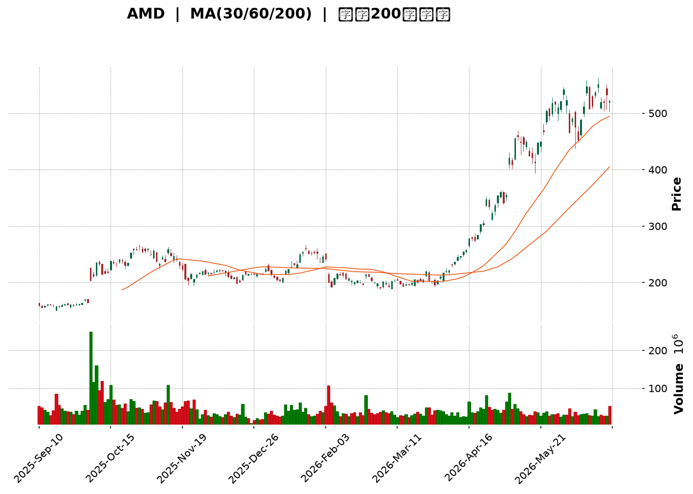
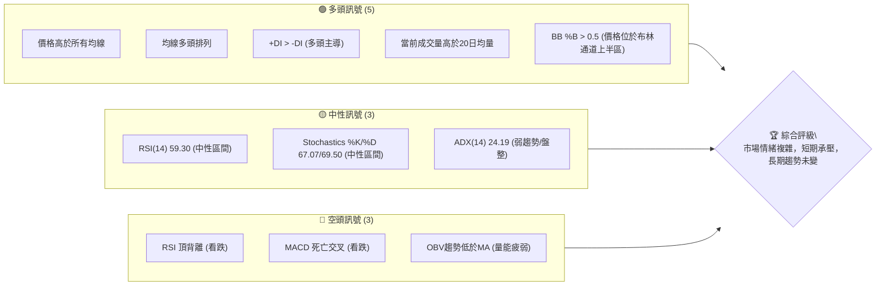
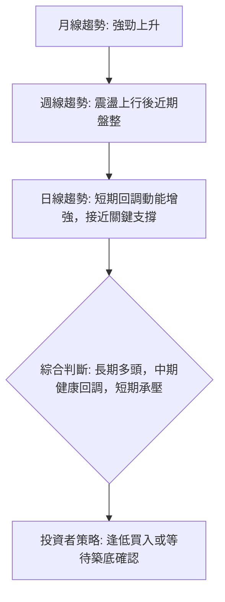
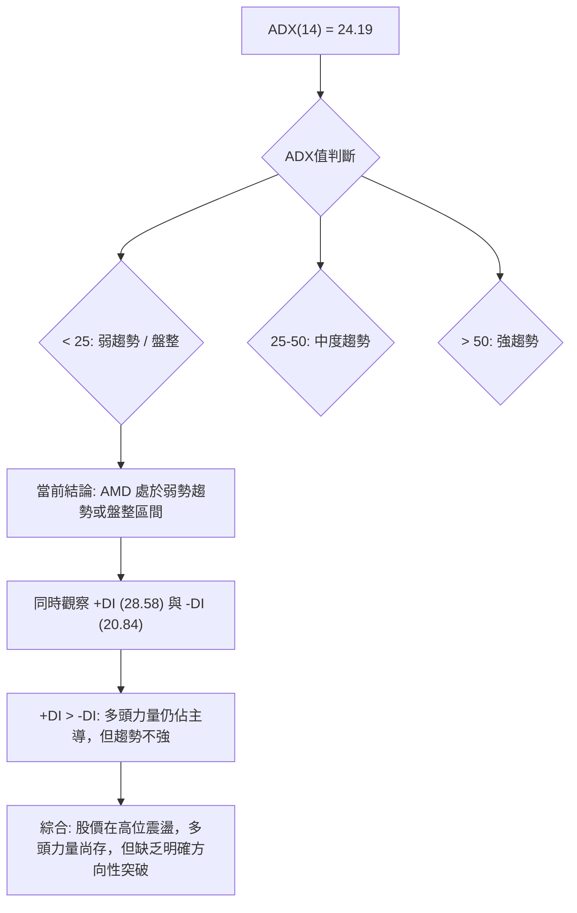
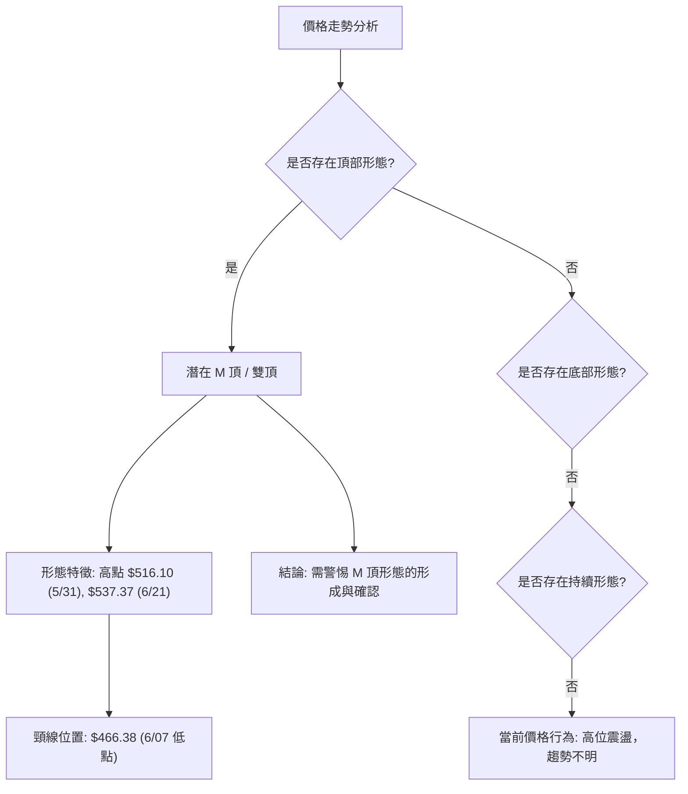
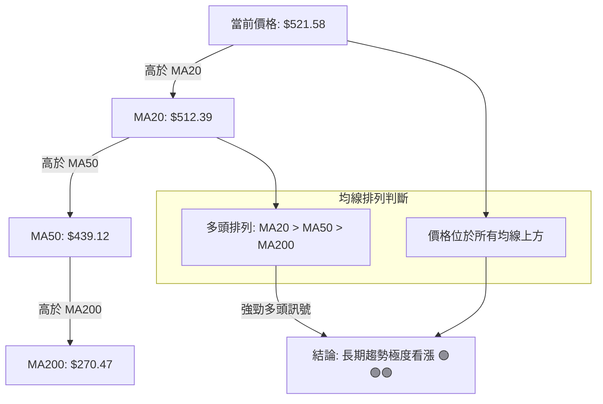
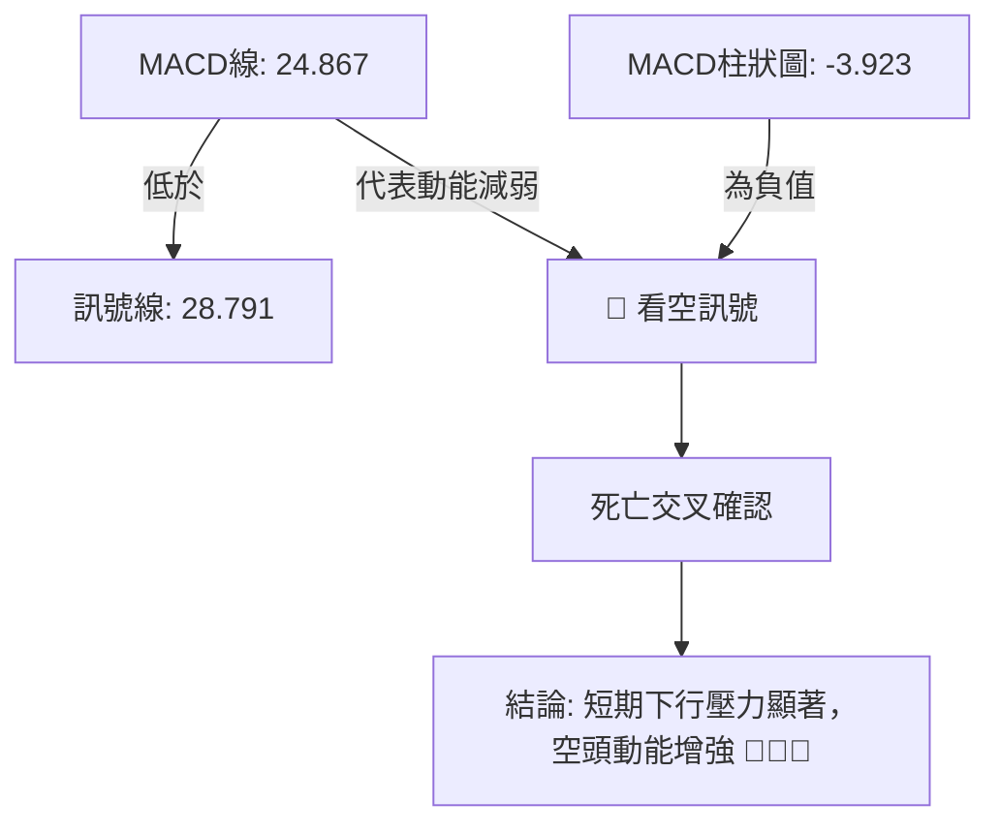
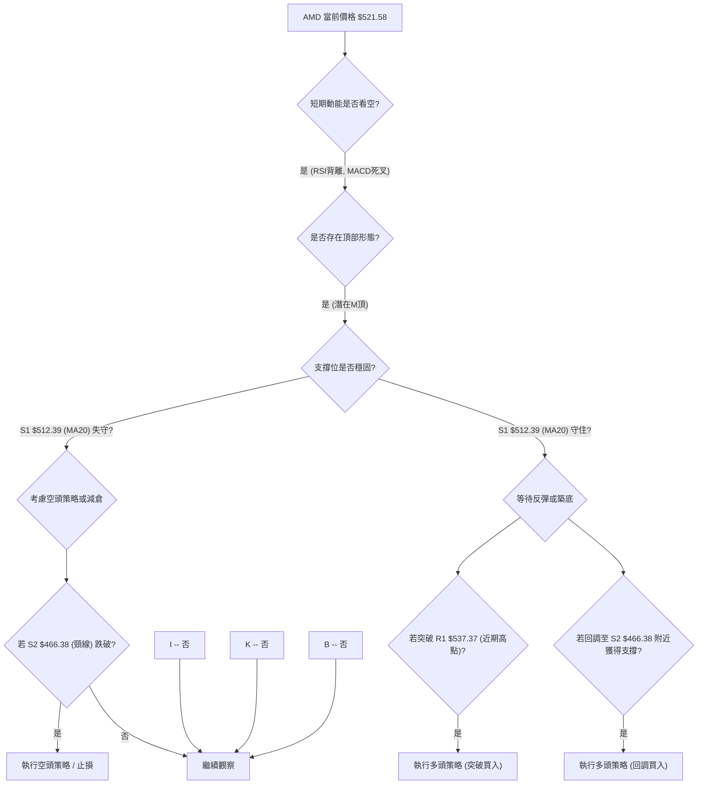
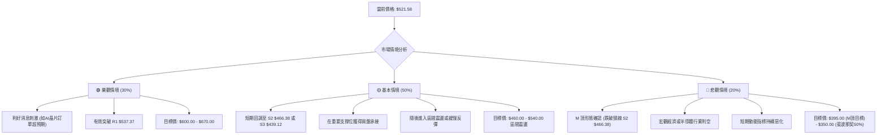

<details>
<summary>📊 靜態圖表 (點擊展開)</summary>

</details>

<html>
<head><meta charset="utf-8" /></head>
<body>
    <div style="height:500px; width:100%;">                        <script>window.PlotlyConfig = {MathJaxConfig: 'local'};</script>
        <script charset="utf-8" src="https://cdn.plot.ly/plotly-3.6.0.min.js" integrity="sha256-QaOVwtVY0T02VaHrr6pnoHLCwayMJp4O5n4YyaE3rJk=" crossorigin="anonymous"></script>                <div id="candlestick-chart" class="plotly-graph-div" style="height:100%; width:100%;"></div>            <script>                window.PLOTLYENV=window.PLOTLYENV || {};                                if (document.getElementById("candlestick-chart")) {                    Plotly.newPlot(                        "candlestick-chart",                        [{"close":{"dtype":"f8","bdata":"AAAAoEfxY0AAAACgcHVjQAAAAIA90mNAAAAAwB4lZEAAAABguA5kQAAAAMAe5WNAAAAAoHC9Y0AAAADgeqxjQAAAAKBH+WNAAAAAwMwcZEAAAAAAKRxkQAAAAOCjKGRAAAAAYLjuY0AAAAAghStkQAAAAKBHOWRAAAAA4FGAZEAAAAAgXDdlQAAAAKBwlWRAAAAAYLh2aUAAAADgUXBqQAAAAIDrcW1AAAAA4HocbUAAAADAzNxqQAAAAKBwDWtAAAAAQOFCa0AAAABAM9NtQAAAAIDrUW1AAAAAYI8ibUAAAACA6xFuQAAAAMD1wG1AAAAAIFzHbEAAAAAgrl9tQAAAAKBwnW9AAAAAYLg6cEAAAAAAKSBwQAAAAKBHhXBAAAAAQOHab0AAAACA6wFwQAAAAGBmOnBAAAAAoJlBb0AAAACgRwVwQAAAAGBmtm1AAAAAoEcxbUAAAAAgXH9uQAAAAOCjsG1AAAAAgD0ucEAAAABguP5uQAAAAIDr2W5AAAAA4KMQbkAAAACgR8lsQAAAAKCZ8WtAAAAA4KPAaUAAAADA9XhpQAAAAKCZ4WpAAAAAACnEaUAAAAAgrsdqQAAAAMD1MGtAAAAA4FF4a0AAAAAgrudqQAAAAEAzM2tAAAAAIFz\u002fakAAAABACj9rQAAAACCFo2tAAAAAANeza0AAAACgcK1rQAAAAIDCrWtAAAAAwPVYakAAAABgj\u002fJpQAAAAKBwJWpAAAAAIIXDaEAAAACA6yFpQAAAAIDCrWpAAAAAYGbeakAAAADAzNxqQAAAAKBH4WpAAAAAIK7fakAAAAAghfNqQAAAAEDh6mpAAAAAwB7FakAAAABACu9rQAAAAGCPomtAAAAAQDPLakAAAADgo0BqQAAAAIDClWlAAAAAoHBlaUAAAACAFPZpQAAAAEAKn2tAAAAAQDPza0AAAACgcH1sQAAAAGCP+mxAAAAAoHD9bEAAAACgmTlvQAAAACBct29AAAAAQOE6cEAAAACA62lvQAAAAMD1gG9AAAAAIK6Xb0AAAACAwoVvQAAAACBcl21AAAAA4KPIbkAAAAAghUNuQAAAAIAUBmlAAAAAAAAQaEAAAACAFA5qQAAAAAAAAGtAAAAAgD2yakAAAABgj7JqQAAAAIAUvmlAAAAAgD3qaUAAAABgj2JpQAAAAADXA2lAAAAAANdraUAAAADAzARpQAAAAEAzk2hAAAAAQOG6akAAAAAghVtqQAAAAIDCdWlAAAAAYLgGaUAAAAAA19NoQAAAAGBm3mdAAAAAgD1CaUAAAABgZu5oQAAAAIDCDWhAAAAAgMJVaUAAAAAgXGdpQAAAAGCPmmlAAAAAIK63aEAAAADgeixoQAAAAGCPkmhAAAAAgOuJaEAAAABguO5oQAAAAOCjqGlAAAAAYI8qaUAAAACAwlVpQAAAAADXq2lAAAAA4KOIa0AAAADgo3hpQAAAACCuP2lAAAAAoEeBaEAAAACAwm1pQAAAAGC4RmpAAAAAAAAwa0AAAACAwoVrQAAAAMD1sGtAAAAAgD36bEAAAADgepRtQAAAAKBHoW5AAAAAYI\u002fabkAAAACAPeJvQAAAAIDrIXBAAAAAAClkcUAAAACAPWZxQAAAAEAzL3FAAAAAANfHcUAAAAAgXPdyQAAAAKBHFXNAAAAAwPW8dUAAAACAFOp0QAAAACBcM3RAAAAAgMIRdUAAAAAA1yd2QAAAAOCjiHZAAAAA4KNYdUAAAAAAKTR2QAAAAIA9VnpAAAAAIFyHeUAAAABACnN8QAAAAOCjrHxAAAAA4KMEfEAAAAAAANh7QAAAAEAzG3xAAAAAoJmBekAAAAAA1096QAAAAMDM4HlAAAAAoEf5e0AAAACgcBl8QAAAAAApOH1AAAAAgD1+f0AAAADgo\u002fh+QAAAAGC4MIBAAAAAwMwggEAAAACAFOJ\u002fQAAAAOBRTIBAAAAAACn0gEAAAACgmVmAQAAAAIAUJn1AAAAAoEelfkAAAAAAKbh9QAAAAGBmRnxAAAAAQDOHfkAAAADAHvl\u002fQAAAAIAUGoFAAAAA4KO0f0AAAAAA1wOAQAAAAMD1yoBAAAAAQAo9gUAAAADAzD6AQAAAAIDrPYBAAAAAYI+kgEAAAADgo0yAQA=="},"high":{"dtype":"f8","bdata":"AAAAwPWQZEAAAABguAZkQAAAAMAeDWRAAAAAoJlJZEAAAABgZj5kQAAAAAApNGRAAAAA4KPYY0AAAABA4fpjQAAAAIDCVWRAAAAA4HpsZEAAAABAM6NkQAAAAAApNGRAAAAAIIVDZEAAAACgmYlkQAAAAMD1SGRAAAAAgMKFZEAAAACA62FlQAAAAIDCVWVAAAAAYLhWbEAAAADAzFxrQAAAAADXe21AAAAAQDMDbkAAAABACkdtQAAAAIAUBmxAAAAAIFwfbEAAAAAgrudtQAAAAGBmJm5AAAAAAClsbUAAAAAAKVxuQAAAAOBRSG5AAAAAACkEbkAAAADAzHxtQAAAAOB6rG9AAAAAYLhGcEAAAACgR4lwQAAAAKBHsXBAAAAAgBR+cEAAAACAFGJwQAAAAGCPTnBAAAAAgBQWcEAAAABgZjpwQAAAAOBRsG9AAAAAANd7bUAAAADAzBxvQAAAAGC4Dm9AAAAAACl4cEAAAACAFDpwQAAAAIAUrm9AAAAA4KMYb0AAAAAAAMBtQAAAAMD1aG1AAAAAAABIbUAAAABgjxpqQAAAAAApJGtAAAAAYI\u002fSaUAAAABA4fJqQAAAAKCZSWtAAAAAIFyfa0AAAAAgXD9sQAAAAGBmRmtAAAAAANdja0AAAADgevRrQAAAAGC49mtAAAAAQOEabEAAAAAghdNrQAAAAAAAsGtAAAAAIK7Pa0AAAAAghetqQAAAAEAKR2pAAAAAAABwakAAAAAghctpQAAAAIDC5WpAAAAAoHCFa0AAAADA9SBrQAAAAKBHEWtAAAAAYI8aa0AAAACgmQFrQAAAAIA9GmtAAAAA4Ho0a0AAAADAzGRsQAAAAOCjQG1AAAAAoHDda0AAAAAAKYRqQAAAAIAUXmpAAAAAoJnpaUAAAAAAKTxqQAAAACCF42tAAAAAQOECbEAAAABAM8ttQAAAACCuT21AAAAAAADwbUAAAADAzJxvQAAAAKBHAXBAAAAAIFyvcEAAAADgoyRwQAAAAKCZ8W9AAAAAYGYWcEAAAADgekhwQAAAACCup25AAAAAQAo\u002fb0AAAADAzJRvQAAAAGCPUmtAAAAAoEeBaUAAAADgoyhqQAAAAEAzM2tAAAAA4Hpsa0AAAADAzHRrQAAAAGC4TmtAAAAAoJlBakAAAACgmalpQAAAAGBmZmlAAAAAQDODaUAAAAAA15tpQAAAAAAp7GhAAAAAYLgWa0AAAABgZhZrQAAAAKBHOWpAAAAA4Ho8aUAAAAAgrtdoQAAAAOB6NGhAAAAAgBROaUAAAACgR3lpQAAAACCuB2lAAAAAQApfaUAAAABA4dJpQAAAAGC4JmpAAAAAANdzaUAAAACAwvVoQAAAAKBwBWlAAAAAYLjmaEAAAAAghVtpQAAAAAApvGlAAAAAoJnJaUAAAAAghSNqQAAAAIDCzWlAAAAAYI+qa0AAAAAAAKBrQAAAAOCjaGlAAAAAgMINakAAAAAAAIBpQAAAAGCPumpAAAAAwPU4a0AAAACA60lsQAAAAEAzw2tAAAAAAABAbUAAAABAM6NtQAAAAGCPMm9AAAAAYI\u002fqbkAAAABguO5vQAAAAEDhInBAAAAAoHB1cUAAAADAzJBxQAAAAIDC+XFAAAAAQDPjcUAAAAAAAARzQAAAACCFY3NAAAAAANcPdkAAAAAgXNN1QAAAAAAAeHRAAAAAYLhCdUAAAAAgXC92QAAAAOCjrHZAAAAAoJmddkAAAADAHnl2QAAAAKCZ6XpAAAAAIFxbekAAAADgo4R8QAAAACCFU31AAAAAwMysfEAAAAAAALh8QAAAAMD1VHxAAAAAAABwe0AAAADAzGx7QAAAAAAAzHpAAAAAgD0WfEAAAABAMzN8QAAAAGCPFn5AAAAAIFyvf0AAAAAgXON\u002fQAAAAKCZeYBAAAAAAABQgEAAAAAAACyAQAAAAIDrU4BAAAAAIIUTgUAAAAAghaGAQAAAAIDrmX9AAAAAIIXvfkAAAAAAAJB\u002fQAAAAEAz131AAAAAIFynfkAAAAAgrk2AQAAAAMD1coFAAAAAoJkngUAAAAAAAKSAQAAAACCF3YBAAAAAgOuXgUAAAACA64OAQAAAACCuZ4BAAAAAQAo3gUAAAABA4WiAQA=="},"hovertemplate":"\u003cb\u003e%{x|%Y-%m-%d}\u003c\u002fb\u003e\u003cbr\u003e\u958b: $%{open:.2f}\u003cbr\u003e\u9ad8: $%{high:.2f}\u003cbr\u003e\u4f4e: $%{low:.2f}\u003cbr\u003e\u6536: $%{close:.2f}\u003cextra\u003e\u003c\u002fextra\u003e","low":{"dtype":"f8","bdata":"AAAAAADAY0AAAAAgrl9jQAAAAKBwXWNAAAAAQDOzY0AAAABACudjQAAAAOBReGNAAAAAQDO7YkAAAADAzHxjQAAAAKBwrWNAAAAAYLjmY0AAAACAws1jQAAAAMD1WGNAAAAAoJmhY0AAAADAzPxjQAAAAGCP6mNAAAAAIK4PZEAAAAAA18NkQAAAAOB6ZGRAAAAA4FFgaUAAAADA9ShqQAAAAGBmVmpAAAAAwPWwbEAAAABgZqZqQAAAAMDM3GpAAAAAwMz8akAAAADgUZhrQAAAACCuB21AAAAAwB59bEAAAADAzExtQAAAAOCjQG1AAAAAACkcbEAAAACgR5FsQAAAAGBmPm5AAAAAoJk5b0AAAAAAABBwQAAAAGBmFnBAAAAAgOuJb0AAAADAHq1vQAAAAOB6vG9AAAAA4HrsbkAAAACA61luQAAAACCud21AAAAA4HoUbEAAAAAAABBuQAAAAOB6VG1AAAAAAABAb0AAAACA68FuQAAAAGCPYm1AAAAAwMykbUAAAABguBZsQAAAAGC4dmtAAAAAwPWQaUAAAAAAAGBoQAAAAEAzu2lAAAAAwPVIaEAAAAAAAOBpQAAAAOCjwGpAAAAAAACwakAAAADgesxqQAAAAOCjeGpAAAAA4HrEakAAAAAgrgdrQAAAACCFS2tAAAAAwB49a0AAAACgcFVrQAAAAIAURmpAAAAAgOshakAAAABgj9JpQAAAACCFo2lAAAAAwPWwaEAAAAAAABBpQAAAAGBmhmlAAAAAgOupakAAAADA9YhqQAAAAEAKv2pAAAAAwPWgakAAAAAgridqQAAAAGCPympAAAAAoJm5akAAAADAzFxrQAAAACBcj2tAAAAAAABoakAAAACgcOVpQAAAAGCPamlAAAAAgD1iaUAAAACgmfloQAAAACBc32pAAAAAIIXjakAAAABACmdsQAAAACCFm2xAAAAAwB4tbEAAAADA9XhtQAAAAAAp1G5AAAAAAAAEcEAAAACgmUlvQAAAAGC4\u002fm5AAAAAYLhGb0AAAADAHh1uQAAAAKCZUW1AAAAAAABgbUAAAACgR6FtQAAAAMDM5GhAAAAAQArXZ0AAAACAwo1oQAAAAMDMhGlAAAAAACmkakAAAABguCZqQAAAAOB6pGlAAAAAACl8aUAAAABgj1poQAAAAAAAYGhAAAAAoEfJaEAAAACA69FoQAAAAMDMRGhAAAAAAADQaUAAAABgj0pqQAAAAGC4LmlAAAAAIK63aEAAAAAAAMBnQAAAAEAKh2dAAAAAIIW7Z0AAAAAAKVxoQAAAAAAA6GdAAAAA4KOgZ0AAAABgZkZpQAAAAAApdGlAAAAAoHCVaEAAAADgowhoQAAAAKCZWWhAAAAA4FFoaEAAAAAAAHhoQAAAAGCPGmhAAAAA4FHIaEAAAABguDZpQAAAAAApBGlAAAAA4FFwakAAAACAwm1pQAAAAIAUtmhAAAAAANcbaEAAAADAHo1oQAAAAEDhumlAAAAAANcTaUAAAAAgXDdrQAAAAAAp7GpAAAAAQOFibEAAAADAHt1sQAAAAGC43m1AAAAAwPVAbkAAAABgZrZuQAAAAEAze29AAAAAAClYcEAAAACAPSJxQAAAAAAAAHFAAAAAgOtJcUAAAACAPeJxQAAAAAApvHJAAAAA4KPodEAAAADA9Yx0QAAAAAAAYHNAAAAAgMLtc0AAAACgmcl0QAAAAAAA1HVAAAAAQDMrdUAAAACAFI51QAAAAOCjIHlAAAAAoEcReUAAAADgoyR6QAAAAIAULnxAAAAAgMKhekAAAABgZgp7QAAAAEDhOntAAAAAgMJ1ekAAAAAgXKt5QAAAAIDClXhAAAAAwMygekAAAACgmfl6QAAAACBc23xAAAAAIK4DfkAAAABgj2p+QAAAAOBR2H5AAAAAQOF2f0AAAADAzGx+QAAAACCFU39AAAAAYGZigEAAAACA6z1\u002fQAAAAEAz\u002f3xAAAAAIFzbfUAAAAAgrlN7QAAAAKBHBXxAAAAA4FGgfEAAAAAAAOB+QAAAAAAAlIBAAAAAAAC0f0AAAADAzLR\u002fQAAAAGCPcoBAAAAAIK69gEAAAADA9ax\u002fQAAAAAAAeH9AAAAAAACwf0AAAACAwml\u002fQA=="},"name":"\u50f9\u683c","open":{"dtype":"f8","bdata":"AAAAoEdxZEAAAAAA19NjQAAAAAAAoGNAAAAA4FEAZEAAAAAA1ytkQAAAAMD16GNAAAAAYLjeYkAAAAAAKaxjQAAAAKBwrWNAAAAA4KMQZEAAAAAgXF9kQAAAAOB6pGNAAAAA4KMQZEAAAAAA1wNkQAAAAKBHGWRAAAAAgMIdZEAAAACAwhVlQAAAAIDCVWVAAAAAYGZObEAAAABAM9tqQAAAAGBmnmpAAAAAoJmJbUAAAADgoxhtQAAAAGBmhmtAAAAAYGZma0AAAABguNZrQAAAAKBHiW1AAAAA4FEobUAAAABACo9tQAAAAOB67G1AAAAAQDObbUAAAADAHsVsQAAAACCFa25AAAAAgBQecEAAAACAPTJwQAAAAEAKg3BAAAAAYLg+cEAAAACgmTlwQAAAAKBHNXBAAAAAQDNLb0AAAAAgrmduQAAAAEAKr29AAAAAgBTebEAAAADgekRuQAAAAMAeNW5AAAAAACmkb0AAAADAzHxvQAAAACCFA25AAAAAAABYbkAAAADA9ZhtQAAAAOBRyGxAAAAAYGYWbUAAAACA6xlqQAAAAMAe5WlAAAAAIFwvaUAAAACgmUFqQAAAAOB6BGtAAAAAACm8akAAAACgR7lrQAAAAOBRCGtAAAAAACkca0AAAACgcCVrQAAAAEDhYmtAAAAAoEeha0AAAAAAAMBrQAAAAIDrOWtAAAAAANdLa0AAAADA9YhqQAAAAKBw3WlAAAAAoEdBakAAAACAPXppQAAAAEAzk2lAAAAAAACAa0AAAAAghZtqQAAAACBc32pAAAAAgMLtakAAAABgj3JqQAAAAADX+2pAAAAAgD36akAAAADAzFxrQAAAAAAAyGxAAAAAYLjWa0AAAAAAKYRqQAAAAMDMXGpAAAAAQAq3aUAAAACAwiVpQAAAAEAz42pAAAAAoEcxa0AAAADAzHxsQAAAAKCZSW1AAAAAYI9CbEAAAAAgrn9tQAAAAAAAeG9AAAAAQOFScEAAAAAAAAxwQAAAAMAehW9AAAAAACnEb0AAAADAHtVvQAAAAIDCnW1AAAAA4KN4bUAAAACgmXFvQAAAAAAA4GpAAAAAIIU7aUAAAAAAKaRoQAAAAMDM3GlAAAAA4HrkakAAAAAAKTxrQAAAAGCP+mpAAAAA4KOAaUAAAADAzERpQAAAAMAezWhAAAAAIIUDaUAAAAAA1wNpQAAAAEDhwmhAAAAAACl0akAAAACAPdpqQAAAAKCZGWpAAAAAIIUDaUAAAABAMztoQAAAAGC47mdAAAAAANcDaEAAAADgo7hoQAAAAOCjaGhAAAAAIIWrZ0AAAADgUVBpQAAAACCFo2lAAAAAYI9aaUAAAAAghcNoQAAAACBcX2hAAAAAgMKVaEAAAAAAAIBoQAAAAMD1YGhAAAAA4HqcaUAAAADAzMxpQAAAAOB6LGlAAAAA4FFwakAAAAAgXD9rQAAAAOCjOGlAAAAAYGaeaUAAAACgmcFoQAAAAEDh8mlAAAAAoJmBaUAAAADA9WhrQAAAAOBRSGtAAAAAANcDbUAAAADgUSBtQAAAAAAA4G1AAAAAwPWgbkAAAACgRzlvQAAAAGC43m9AAAAAANePcEAAAAAAAJBxQAAAAKCZiXFAAAAAoEdVcUAAAAAghTNyQAAAAAAp4HJAAAAAACkMdUAAAADAHqV1QAAAAIDCfXNAAAAAoEdpdEAAAACAwlV1QAAAAIDr\u002fXVAAAAAwPWEdkAAAAAAKfh1QAAAAADXl3lAAAAAwB4RekAAAACgcCl6QAAAAMDMyHxAAAAAAAAUfEAAAADgo5B8QAAAAKCZiXtAAAAAoHAVe0AAAAAAANh6QAAAAKCZyXlAAAAA4KPAekAAAAAA1597QAAAAKBwXX1AAAAAANdLfkAAAAAAAMB\u002fQAAAAAAAMH9AAAAAYGZGgEAAAABgj0J\u002fQAAAAMDMpH9AAAAAAACugEAAAAAAABaAQAAAAOB6OH9AAAAAAABQfkAAAAAAAGx\u002fQAAAACCFP31AAAAAoJnZfEAAAABACjt\u002fQAAAAAAAvoBAAAAAwB4XgUAAAACgR42AQAAAAOCjnIBAAAAAAAAMgUAAAACgR9F\u002fQAAAAGCPRoBAAAAAoHD\u002fgEAAAABgZj6AQA=="},"x":["2025-09-10T00:00:00-04:00","2025-09-11T00:00:00-04:00","2025-09-12T00:00:00-04:00","2025-09-15T00:00:00-04:00","2025-09-16T00:00:00-04:00","2025-09-17T00:00:00-04:00","2025-09-18T00:00:00-04:00","2025-09-19T00:00:00-04:00","2025-09-22T00:00:00-04:00","2025-09-23T00:00:00-04:00","2025-09-24T00:00:00-04:00","2025-09-25T00:00:00-04:00","2025-09-26T00:00:00-04:00","2025-09-29T00:00:00-04:00","2025-09-30T00:00:00-04:00","2025-10-01T00:00:00-04:00","2025-10-02T00:00:00-04:00","2025-10-03T00:00:00-04:00","2025-10-06T00:00:00-04:00","2025-10-07T00:00:00-04:00","2025-10-08T00:00:00-04:00","2025-10-09T00:00:00-04:00","2025-10-10T00:00:00-04:00","2025-10-13T00:00:00-04:00","2025-10-14T00:00:00-04:00","2025-10-15T00:00:00-04:00","2025-10-16T00:00:00-04:00","2025-10-17T00:00:00-04:00","2025-10-20T00:00:00-04:00","2025-10-21T00:00:00-04:00","2025-10-22T00:00:00-04:00","2025-10-23T00:00:00-04:00","2025-10-24T00:00:00-04:00","2025-10-27T00:00:00-04:00","2025-10-28T00:00:00-04:00","2025-10-29T00:00:00-04:00","2025-10-30T00:00:00-04:00","2025-10-31T00:00:00-04:00","2025-11-03T00:00:00-05:00","2025-11-04T00:00:00-05:00","2025-11-05T00:00:00-05:00","2025-11-06T00:00:00-05:00","2025-11-07T00:00:00-05:00","2025-11-10T00:00:00-05:00","2025-11-11T00:00:00-05:00","2025-11-12T00:00:00-05:00","2025-11-13T00:00:00-05:00","2025-11-14T00:00:00-05:00","2025-11-17T00:00:00-05:00","2025-11-18T00:00:00-05:00","2025-11-19T00:00:00-05:00","2025-11-20T00:00:00-05:00","2025-11-21T00:00:00-05:00","2025-11-24T00:00:00-05:00","2025-11-25T00:00:00-05:00","2025-11-26T00:00:00-05:00","2025-11-28T00:00:00-05:00","2025-12-01T00:00:00-05:00","2025-12-02T00:00:00-05:00","2025-12-03T00:00:00-05:00","2025-12-04T00:00:00-05:00","2025-12-05T00:00:00-05:00","2025-12-08T00:00:00-05:00","2025-12-09T00:00:00-05:00","2025-12-10T00:00:00-05:00","2025-12-11T00:00:00-05:00","2025-12-12T00:00:00-05:00","2025-12-15T00:00:00-05:00","2025-12-16T00:00:00-05:00","2025-12-17T00:00:00-05:00","2025-12-18T00:00:00-05:00","2025-12-19T00:00:00-05:00","2025-12-22T00:00:00-05:00","2025-12-23T00:00:00-05:00","2025-12-24T00:00:00-05:00","2025-12-26T00:00:00-05:00","2025-12-29T00:00:00-05:00","2025-12-30T00:00:00-05:00","2025-12-31T00:00:00-05:00","2026-01-02T00:00:00-05:00","2026-01-05T00:00:00-05:00","2026-01-06T00:00:00-05:00","2026-01-07T00:00:00-05:00","2026-01-08T00:00:00-05:00","2026-01-09T00:00:00-05:00","2026-01-12T00:00:00-05:00","2026-01-13T00:00:00-05:00","2026-01-14T00:00:00-05:00","2026-01-15T00:00:00-05:00","2026-01-16T00:00:00-05:00","2026-01-20T00:00:00-05:00","2026-01-21T00:00:00-05:00","2026-01-22T00:00:00-05:00","2026-01-23T00:00:00-05:00","2026-01-26T00:00:00-05:00","2026-01-27T00:00:00-05:00","2026-01-28T00:00:00-05:00","2026-01-29T00:00:00-05:00","2026-01-30T00:00:00-05:00","2026-02-02T00:00:00-05:00","2026-02-03T00:00:00-05:00","2026-02-04T00:00:00-05:00","2026-02-05T00:00:00-05:00","2026-02-06T00:00:00-05:00","2026-02-09T00:00:00-05:00","2026-02-10T00:00:00-05:00","2026-02-11T00:00:00-05:00","2026-02-12T00:00:00-05:00","2026-02-13T00:00:00-05:00","2026-02-17T00:00:00-05:00","2026-02-18T00:00:00-05:00","2026-02-19T00:00:00-05:00","2026-02-20T00:00:00-05:00","2026-02-23T00:00:00-05:00","2026-02-24T00:00:00-05:00","2026-02-25T00:00:00-05:00","2026-02-26T00:00:00-05:00","2026-02-27T00:00:00-05:00","2026-03-02T00:00:00-05:00","2026-03-03T00:00:00-05:00","2026-03-04T00:00:00-05:00","2026-03-05T00:00:00-05:00","2026-03-06T00:00:00-05:00","2026-03-09T00:00:00-04:00","2026-03-10T00:00:00-04:00","2026-03-11T00:00:00-04:00","2026-03-12T00:00:00-04:00","2026-03-13T00:00:00-04:00","2026-03-16T00:00:00-04:00","2026-03-17T00:00:00-04:00","2026-03-18T00:00:00-04:00","2026-03-19T00:00:00-04:00","2026-03-20T00:00:00-04:00","2026-03-23T00:00:00-04:00","2026-03-24T00:00:00-04:00","2026-03-25T00:00:00-04:00","2026-03-26T00:00:00-04:00","2026-03-27T00:00:00-04:00","2026-03-30T00:00:00-04:00","2026-03-31T00:00:00-04:00","2026-04-01T00:00:00-04:00","2026-04-02T00:00:00-04:00","2026-04-06T00:00:00-04:00","2026-04-07T00:00:00-04:00","2026-04-08T00:00:00-04:00","2026-04-09T00:00:00-04:00","2026-04-10T00:00:00-04:00","2026-04-13T00:00:00-04:00","2026-04-14T00:00:00-04:00","2026-04-15T00:00:00-04:00","2026-04-16T00:00:00-04:00","2026-04-17T00:00:00-04:00","2026-04-20T00:00:00-04:00","2026-04-21T00:00:00-04:00","2026-04-22T00:00:00-04:00","2026-04-23T00:00:00-04:00","2026-04-24T00:00:00-04:00","2026-04-27T00:00:00-04:00","2026-04-28T00:00:00-04:00","2026-04-29T00:00:00-04:00","2026-04-30T00:00:00-04:00","2026-05-01T00:00:00-04:00","2026-05-04T00:00:00-04:00","2026-05-05T00:00:00-04:00","2026-05-06T00:00:00-04:00","2026-05-07T00:00:00-04:00","2026-05-08T00:00:00-04:00","2026-05-11T00:00:00-04:00","2026-05-12T00:00:00-04:00","2026-05-13T00:00:00-04:00","2026-05-14T00:00:00-04:00","2026-05-15T00:00:00-04:00","2026-05-18T00:00:00-04:00","2026-05-19T00:00:00-04:00","2026-05-20T00:00:00-04:00","2026-05-21T00:00:00-04:00","2026-05-22T00:00:00-04:00","2026-05-26T00:00:00-04:00","2026-05-27T00:00:00-04:00","2026-05-28T00:00:00-04:00","2026-05-29T00:00:00-04:00","2026-06-01T00:00:00-04:00","2026-06-02T00:00:00-04:00","2026-06-03T00:00:00-04:00","2026-06-04T00:00:00-04:00","2026-06-05T00:00:00-04:00","2026-06-08T00:00:00-04:00","2026-06-09T00:00:00-04:00","2026-06-10T00:00:00-04:00","2026-06-11T00:00:00-04:00","2026-06-12T00:00:00-04:00","2026-06-15T00:00:00-04:00","2026-06-16T00:00:00-04:00","2026-06-17T00:00:00-04:00","2026-06-18T00:00:00-04:00","2026-06-22T00:00:00-04:00","2026-06-23T00:00:00-04:00","2026-06-24T00:00:00-04:00","2026-06-25T00:00:00-04:00","2026-06-26T00:00:00-04:00"],"type":"candlestick"},{"hovertemplate":"MA30: $%{y:.2f}\u003cextra\u003e\u003c\u002fextra\u003e","line":{"color":"#2196F3","dash":"dash","width":2},"mode":"lines","name":"MA30","x":["2025-09-10T00:00:00-04:00","2025-09-11T00:00:00-04:00","2025-09-12T00:00:00-04:00","2025-09-15T00:00:00-04:00","2025-09-16T00:00:00-04:00","2025-09-17T00:00:00-04:00","2025-09-18T00:00:00-04:00","2025-09-19T00:00:00-04:00","2025-09-22T00:00:00-04:00","2025-09-23T00:00:00-04:00","2025-09-24T00:00:00-04:00","2025-09-25T00:00:00-04:00","2025-09-26T00:00:00-04:00","2025-09-29T00:00:00-04:00","2025-09-30T00:00:00-04:00","2025-10-01T00:00:00-04:00","2025-10-02T00:00:00-04:00","2025-10-03T00:00:00-04:00","2025-10-06T00:00:00-04:00","2025-10-07T00:00:00-04:00","2025-10-08T00:00:00-04:00","2025-10-09T00:00:00-04:00","2025-10-10T00:00:00-04:00","2025-10-13T00:00:00-04:00","2025-10-14T00:00:00-04:00","2025-10-15T00:00:00-04:00","2025-10-16T00:00:00-04:00","2025-10-17T00:00:00-04:00","2025-10-20T00:00:00-04:00","2025-10-21T00:00:00-04:00","2025-10-22T00:00:00-04:00","2025-10-23T00:00:00-04:00","2025-10-24T00:00:00-04:00","2025-10-27T00:00:00-04:00","2025-10-28T00:00:00-04:00","2025-10-29T00:00:00-04:00","2025-10-30T00:00:00-04:00","2025-10-31T00:00:00-04:00","2025-11-03T00:00:00-05:00","2025-11-04T00:00:00-05:00","2025-11-05T00:00:00-05:00","2025-11-06T00:00:00-05:00","2025-11-07T00:00:00-05:00","2025-11-10T00:00:00-05:00","2025-11-11T00:00:00-05:00","2025-11-12T00:00:00-05:00","2025-11-13T00:00:00-05:00","2025-11-14T00:00:00-05:00","2025-11-17T00:00:00-05:00","2025-11-18T00:00:00-05:00","2025-11-19T00:00:00-05:00","2025-11-20T00:00:00-05:00","2025-11-21T00:00:00-05:00","2025-11-24T00:00:00-05:00","2025-11-25T00:00:00-05:00","2025-11-26T00:00:00-05:00","2025-11-28T00:00:00-05:00","2025-12-01T00:00:00-05:00","2025-12-02T00:00:00-05:00","2025-12-03T00:00:00-05:00","2025-12-04T00:00:00-05:00","2025-12-05T00:00:00-05:00","2025-12-08T00:00:00-05:00","2025-12-09T00:00:00-05:00","2025-12-10T00:00:00-05:00","2025-12-11T00:00:00-05:00","2025-12-12T00:00:00-05:00","2025-12-15T00:00:00-05:00","2025-12-16T00:00:00-05:00","2025-12-17T00:00:00-05:00","2025-12-18T00:00:00-05:00","2025-12-19T00:00:00-05:00","2025-12-22T00:00:00-05:00","2025-12-23T00:00:00-05:00","2025-12-24T00:00:00-05:00","2025-12-26T00:00:00-05:00","2025-12-29T00:00:00-05:00","2025-12-30T00:00:00-05:00","2025-12-31T00:00:00-05:00","2026-01-02T00:00:00-05:00","2026-01-05T00:00:00-05:00","2026-01-06T00:00:00-05:00","2026-01-07T00:00:00-05:00","2026-01-08T00:00:00-05:00","2026-01-09T00:00:00-05:00","2026-01-12T00:00:00-05:00","2026-01-13T00:00:00-05:00","2026-01-14T00:00:00-05:00","2026-01-15T00:00:00-05:00","2026-01-16T00:00:00-05:00","2026-01-20T00:00:00-05:00","2026-01-21T00:00:00-05:00","2026-01-22T00:00:00-05:00","2026-01-23T00:00:00-05:00","2026-01-26T00:00:00-05:00","2026-01-27T00:00:00-05:00","2026-01-28T00:00:00-05:00","2026-01-29T00:00:00-05:00","2026-01-30T00:00:00-05:00","2026-02-02T00:00:00-05:00","2026-02-03T00:00:00-05:00","2026-02-04T00:00:00-05:00","2026-02-05T00:00:00-05:00","2026-02-06T00:00:00-05:00","2026-02-09T00:00:00-05:00","2026-02-10T00:00:00-05:00","2026-02-11T00:00:00-05:00","2026-02-12T00:00:00-05:00","2026-02-13T00:00:00-05:00","2026-02-17T00:00:00-05:00","2026-02-18T00:00:00-05:00","2026-02-19T00:00:00-05:00","2026-02-20T00:00:00-05:00","2026-02-23T00:00:00-05:00","2026-02-24T00:00:00-05:00","2026-02-25T00:00:00-05:00","2026-02-26T00:00:00-05:00","2026-02-27T00:00:00-05:00","2026-03-02T00:00:00-05:00","2026-03-03T00:00:00-05:00","2026-03-04T00:00:00-05:00","2026-03-05T00:00:00-05:00","2026-03-06T00:00:00-05:00","2026-03-09T00:00:00-04:00","2026-03-10T00:00:00-04:00","2026-03-11T00:00:00-04:00","2026-03-12T00:00:00-04:00","2026-03-13T00:00:00-04:00","2026-03-16T00:00:00-04:00","2026-03-17T00:00:00-04:00","2026-03-18T00:00:00-04:00","2026-03-19T00:00:00-04:00","2026-03-20T00:00:00-04:00","2026-03-23T00:00:00-04:00","2026-03-24T00:00:00-04:00","2026-03-25T00:00:00-04:00","2026-03-26T00:00:00-04:00","2026-03-27T00:00:00-04:00","2026-03-30T00:00:00-04:00","2026-03-31T00:00:00-04:00","2026-04-01T00:00:00-04:00","2026-04-02T00:00:00-04:00","2026-04-06T00:00:00-04:00","2026-04-07T00:00:00-04:00","2026-04-08T00:00:00-04:00","2026-04-09T00:00:00-04:00","2026-04-10T00:00:00-04:00","2026-04-13T00:00:00-04:00","2026-04-14T00:00:00-04:00","2026-04-15T00:00:00-04:00","2026-04-16T00:00:00-04:00","2026-04-17T00:00:00-04:00","2026-04-20T00:00:00-04:00","2026-04-21T00:00:00-04:00","2026-04-22T00:00:00-04:00","2026-04-23T00:00:00-04:00","2026-04-24T00:00:00-04:00","2026-04-27T00:00:00-04:00","2026-04-28T00:00:00-04:00","2026-04-29T00:00:00-04:00","2026-04-30T00:00:00-04:00","2026-05-01T00:00:00-04:00","2026-05-04T00:00:00-04:00","2026-05-05T00:00:00-04:00","2026-05-06T00:00:00-04:00","2026-05-07T00:00:00-04:00","2026-05-08T00:00:00-04:00","2026-05-11T00:00:00-04:00","2026-05-12T00:00:00-04:00","2026-05-13T00:00:00-04:00","2026-05-14T00:00:00-04:00","2026-05-15T00:00:00-04:00","2026-05-18T00:00:00-04:00","2026-05-19T00:00:00-04:00","2026-05-20T00:00:00-04:00","2026-05-21T00:00:00-04:00","2026-05-22T00:00:00-04:00","2026-05-26T00:00:00-04:00","2026-05-27T00:00:00-04:00","2026-05-28T00:00:00-04:00","2026-05-29T00:00:00-04:00","2026-06-01T00:00:00-04:00","2026-06-02T00:00:00-04:00","2026-06-03T00:00:00-04:00","2026-06-04T00:00:00-04:00","2026-06-05T00:00:00-04:00","2026-06-08T00:00:00-04:00","2026-06-09T00:00:00-04:00","2026-06-10T00:00:00-04:00","2026-06-11T00:00:00-04:00","2026-06-12T00:00:00-04:00","2026-06-15T00:00:00-04:00","2026-06-16T00:00:00-04:00","2026-06-17T00:00:00-04:00","2026-06-18T00:00:00-04:00","2026-06-22T00:00:00-04:00","2026-06-23T00:00:00-04:00","2026-06-24T00:00:00-04:00","2026-06-25T00:00:00-04:00","2026-06-26T00:00:00-04:00"],"y":{"dtype":"f8","bdata":"AAAAAAAA+H8AAAAAAAD4fwAAAAAAAPh\u002fAAAAAAAA+H8AAAAAAAD4fwAAAAAAAPh\u002fAAAAAAAA+H8AAAAAAAD4fwAAAAAAAPh\u002fAAAAAAAA+H8AAAAAAAD4fwAAAAAAAPh\u002fAAAAAAAA+H8AAAAAAAD4fwAAAAAAAPh\u002fAAAAAAAA+H8AAAAAAAD4fwAAAAAAAPh\u002fAAAAAAAA+H8AAAAAAAD4fwAAAAAAAPh\u002fAAAAAAAA+H8AAAAAAAD4fwAAAAAAAPh\u002fAAAAAAAA+H8AAAAAAAD4fwAAAAAAAPh\u002fAAAAAAAA+H8AAAAAAAD4fzMzM9O\u002fYWdAiYiI6CatZ0Dv7u6OwgFoQFVVVWVmZmhAIiIiMnrPaECamZnZhzdpQERERES2p2lAMzMz4xcPakAiIiLCZ3hqQCIiIjLs4mpAd3d3FwRCa0DNzMxM1KdrQImIiMha+WtA7+7ujl9IbEAzMzNTgKBsQKuqqqpH8WxAzczMPHxWbUDv7u4+7qltQBEREfGLAW5AZmZmhs8obkB3d3e31zxuQAAAADAIMG5AMzMz414TbkAzMzNjggduQJqZmUkMBm5AmpmZaUr5bUAiIiKCTt9tQO\u002fu7i4kzW1A7+7u7u6+bUAzMzPj7KNtQDMzMyMijm1AAAAA8O5+bUB3d3dXx2xtQHd3dxfZSm1AZmZm5kIibUAzMzNjO\u002ftsQERERNR4zWxAMzMzg3mebEC8u7vbsmpsQERERHTaNGxA7+7uXnP9a0Crqqr6fsJrQGZmZqabqGtAd3d3V8eUa0AAAACQwnVrQFVVVQXIXWtAREREZPQua0Dv7u6ucgxrQGZmZkbh6mpAzczMPMPOakDNzMzsfMdqQDMzM3PaxGpAiYiIGL3NakCJiIgIZdRqQERERFRVyWpAzczMDC3GakBmZmZ2ML9qQAAAANDbwmpAREREZPTGakAAAADgetRqQM3MzJyo42pAvLu7S6n0akAiIiICnRZrQBEREXFoOWtAvLu7WwFia0AiIiJS44FrQJqZmSmHomtAq6qqCknPa0AAAADQ2\u002f5rQHd3d4dBHGxAvLu7a6BPbEDv7u7OaXtsQImIiGhKbWxAAAAAEFhVbEDe3d0NdE5sQDMzMzN6T2xAIiIicvZNbEDv7u4ezEtsQLy7u0vFQWxAVVVVhXk6bEARERGxuSRsQGZmZjZeDmxAAAAA8KcCbEBERETEIPhrQERERGSC72tAMzMzA+T6a0AiIiKiRf5rQO\u002fu7k7U62tAd3d3R+HSa0DNzMxsoLNrQFVVVXUFiGtAvLu7ay5oa0AzMzODeTJrQGZmZoYW8WpAmpmZuUm0akDe3d2tAIFqQO\u002fu7u6nTmpARERERP0TakDe3d2tR9VpQN7d3Q10qmlAREREpCl1aUCamZlZq0dpQHd3d4cWTWlAVVVVtYFWaUB3d3fXXFBpQERERCQGRWlAAAAAsCtMaUB3d3fntEFpQKuqqkp+PWlAiYiIGHYxaUCrqqqq1TFpQJqZmemYPGlAiYiIWKtLaUDv7u7eCGFpQLy7u2uge2lAmpmZKc6OaUAiIiLSTappQLy7u9tr1mlAmpmZOSYIakB3d3fXXERqQKuqqroCjGpA3t3drUfdakARERGRezFrQImIiAiBiWtA3t3dncTga0BmZmYWrktsQImIiEjhtmxAVVVVZfRWbUBVVVVVnO1tQDMzM8OudG5AvLu7i94Kb0ARERERPLBvQImIiJDtKnBAd3d357R1cECamZkpFcdwQImIiBhLOnFAVVVVTamecUAzMzODwCRyQN7d3UW2rXJA7+7uzj40c0Dv7u5uWbVzQFVVVc0TNXRA7+7ulkOjdEARERHZXA51QGZmZj4KdXVARERErBzodUAiIiJyr1l2QM3MzARW0HZAd3d3R29Zd0AzMzNzr9l3QGZmZgZWZHhAvLu7Gy\u002fjeEB3d3dXx155QHd3dxdL4nlAq6qqyuhrekARERGhGuF6QDMzM1P\u002fNntA3t3dDQKDe0Dv7u7eJM57QM3MzJwLE3xAIiIiksJjfECrqqo6ibd8QLy7u7seG31AIiIiIoVzfUBmZmbmXsd9QImIiAg6BX5AMzMzg5VRfkARERHBEXR+QFVVVXWTlH5AzczMfIbBfkAiIiLyGep+QA=="},"type":"scatter"},{"hovertemplate":"MA60: $%{y:.2f}\u003cextra\u003e\u003c\u002fextra\u003e","line":{"color":"#9C27B0","dash":"dash","width":2},"mode":"lines","name":"MA60","x":["2025-09-10T00:00:00-04:00","2025-09-11T00:00:00-04:00","2025-09-12T00:00:00-04:00","2025-09-15T00:00:00-04:00","2025-09-16T00:00:00-04:00","2025-09-17T00:00:00-04:00","2025-09-18T00:00:00-04:00","2025-09-19T00:00:00-04:00","2025-09-22T00:00:00-04:00","2025-09-23T00:00:00-04:00","2025-09-24T00:00:00-04:00","2025-09-25T00:00:00-04:00","2025-09-26T00:00:00-04:00","2025-09-29T00:00:00-04:00","2025-09-30T00:00:00-04:00","2025-10-01T00:00:00-04:00","2025-10-02T00:00:00-04:00","2025-10-03T00:00:00-04:00","2025-10-06T00:00:00-04:00","2025-10-07T00:00:00-04:00","2025-10-08T00:00:00-04:00","2025-10-09T00:00:00-04:00","2025-10-10T00:00:00-04:00","2025-10-13T00:00:00-04:00","2025-10-14T00:00:00-04:00","2025-10-15T00:00:00-04:00","2025-10-16T00:00:00-04:00","2025-10-17T00:00:00-04:00","2025-10-20T00:00:00-04:00","2025-10-21T00:00:00-04:00","2025-10-22T00:00:00-04:00","2025-10-23T00:00:00-04:00","2025-10-24T00:00:00-04:00","2025-10-27T00:00:00-04:00","2025-10-28T00:00:00-04:00","2025-10-29T00:00:00-04:00","2025-10-30T00:00:00-04:00","2025-10-31T00:00:00-04:00","2025-11-03T00:00:00-05:00","2025-11-04T00:00:00-05:00","2025-11-05T00:00:00-05:00","2025-11-06T00:00:00-05:00","2025-11-07T00:00:00-05:00","2025-11-10T00:00:00-05:00","2025-11-11T00:00:00-05:00","2025-11-12T00:00:00-05:00","2025-11-13T00:00:00-05:00","2025-11-14T00:00:00-05:00","2025-11-17T00:00:00-05:00","2025-11-18T00:00:00-05:00","2025-11-19T00:00:00-05:00","2025-11-20T00:00:00-05:00","2025-11-21T00:00:00-05:00","2025-11-24T00:00:00-05:00","2025-11-25T00:00:00-05:00","2025-11-26T00:00:00-05:00","2025-11-28T00:00:00-05:00","2025-12-01T00:00:00-05:00","2025-12-02T00:00:00-05:00","2025-12-03T00:00:00-05:00","2025-12-04T00:00:00-05:00","2025-12-05T00:00:00-05:00","2025-12-08T00:00:00-05:00","2025-12-09T00:00:00-05:00","2025-12-10T00:00:00-05:00","2025-12-11T00:00:00-05:00","2025-12-12T00:00:00-05:00","2025-12-15T00:00:00-05:00","2025-12-16T00:00:00-05:00","2025-12-17T00:00:00-05:00","2025-12-18T00:00:00-05:00","2025-12-19T00:00:00-05:00","2025-12-22T00:00:00-05:00","2025-12-23T00:00:00-05:00","2025-12-24T00:00:00-05:00","2025-12-26T00:00:00-05:00","2025-12-29T00:00:00-05:00","2025-12-30T00:00:00-05:00","2025-12-31T00:00:00-05:00","2026-01-02T00:00:00-05:00","2026-01-05T00:00:00-05:00","2026-01-06T00:00:00-05:00","2026-01-07T00:00:00-05:00","2026-01-08T00:00:00-05:00","2026-01-09T00:00:00-05:00","2026-01-12T00:00:00-05:00","2026-01-13T00:00:00-05:00","2026-01-14T00:00:00-05:00","2026-01-15T00:00:00-05:00","2026-01-16T00:00:00-05:00","2026-01-20T00:00:00-05:00","2026-01-21T00:00:00-05:00","2026-01-22T00:00:00-05:00","2026-01-23T00:00:00-05:00","2026-01-26T00:00:00-05:00","2026-01-27T00:00:00-05:00","2026-01-28T00:00:00-05:00","2026-01-29T00:00:00-05:00","2026-01-30T00:00:00-05:00","2026-02-02T00:00:00-05:00","2026-02-03T00:00:00-05:00","2026-02-04T00:00:00-05:00","2026-02-05T00:00:00-05:00","2026-02-06T00:00:00-05:00","2026-02-09T00:00:00-05:00","2026-02-10T00:00:00-05:00","2026-02-11T00:00:00-05:00","2026-02-12T00:00:00-05:00","2026-02-13T00:00:00-05:00","2026-02-17T00:00:00-05:00","2026-02-18T00:00:00-05:00","2026-02-19T00:00:00-05:00","2026-02-20T00:00:00-05:00","2026-02-23T00:00:00-05:00","2026-02-24T00:00:00-05:00","2026-02-25T00:00:00-05:00","2026-02-26T00:00:00-05:00","2026-02-27T00:00:00-05:00","2026-03-02T00:00:00-05:00","2026-03-03T00:00:00-05:00","2026-03-04T00:00:00-05:00","2026-03-05T00:00:00-05:00","2026-03-06T00:00:00-05:00","2026-03-09T00:00:00-04:00","2026-03-10T00:00:00-04:00","2026-03-11T00:00:00-04:00","2026-03-12T00:00:00-04:00","2026-03-13T00:00:00-04:00","2026-03-16T00:00:00-04:00","2026-03-17T00:00:00-04:00","2026-03-18T00:00:00-04:00","2026-03-19T00:00:00-04:00","2026-03-20T00:00:00-04:00","2026-03-23T00:00:00-04:00","2026-03-24T00:00:00-04:00","2026-03-25T00:00:00-04:00","2026-03-26T00:00:00-04:00","2026-03-27T00:00:00-04:00","2026-03-30T00:00:00-04:00","2026-03-31T00:00:00-04:00","2026-04-01T00:00:00-04:00","2026-04-02T00:00:00-04:00","2026-04-06T00:00:00-04:00","2026-04-07T00:00:00-04:00","2026-04-08T00:00:00-04:00","2026-04-09T00:00:00-04:00","2026-04-10T00:00:00-04:00","2026-04-13T00:00:00-04:00","2026-04-14T00:00:00-04:00","2026-04-15T00:00:00-04:00","2026-04-16T00:00:00-04:00","2026-04-17T00:00:00-04:00","2026-04-20T00:00:00-04:00","2026-04-21T00:00:00-04:00","2026-04-22T00:00:00-04:00","2026-04-23T00:00:00-04:00","2026-04-24T00:00:00-04:00","2026-04-27T00:00:00-04:00","2026-04-28T00:00:00-04:00","2026-04-29T00:00:00-04:00","2026-04-30T00:00:00-04:00","2026-05-01T00:00:00-04:00","2026-05-04T00:00:00-04:00","2026-05-05T00:00:00-04:00","2026-05-06T00:00:00-04:00","2026-05-07T00:00:00-04:00","2026-05-08T00:00:00-04:00","2026-05-11T00:00:00-04:00","2026-05-12T00:00:00-04:00","2026-05-13T00:00:00-04:00","2026-05-14T00:00:00-04:00","2026-05-15T00:00:00-04:00","2026-05-18T00:00:00-04:00","2026-05-19T00:00:00-04:00","2026-05-20T00:00:00-04:00","2026-05-21T00:00:00-04:00","2026-05-22T00:00:00-04:00","2026-05-26T00:00:00-04:00","2026-05-27T00:00:00-04:00","2026-05-28T00:00:00-04:00","2026-05-29T00:00:00-04:00","2026-06-01T00:00:00-04:00","2026-06-02T00:00:00-04:00","2026-06-03T00:00:00-04:00","2026-06-04T00:00:00-04:00","2026-06-05T00:00:00-04:00","2026-06-08T00:00:00-04:00","2026-06-09T00:00:00-04:00","2026-06-10T00:00:00-04:00","2026-06-11T00:00:00-04:00","2026-06-12T00:00:00-04:00","2026-06-15T00:00:00-04:00","2026-06-16T00:00:00-04:00","2026-06-17T00:00:00-04:00","2026-06-18T00:00:00-04:00","2026-06-22T00:00:00-04:00","2026-06-23T00:00:00-04:00","2026-06-24T00:00:00-04:00","2026-06-25T00:00:00-04:00","2026-06-26T00:00:00-04:00"],"y":{"dtype":"f8","bdata":"AAAAAAAA+H8AAAAAAAD4fwAAAAAAAPh\u002fAAAAAAAA+H8AAAAAAAD4fwAAAAAAAPh\u002fAAAAAAAA+H8AAAAAAAD4fwAAAAAAAPh\u002fAAAAAAAA+H8AAAAAAAD4fwAAAAAAAPh\u002fAAAAAAAA+H8AAAAAAAD4fwAAAAAAAPh\u002fAAAAAAAA+H8AAAAAAAD4fwAAAAAAAPh\u002fAAAAAAAA+H8AAAAAAAD4fwAAAAAAAPh\u002fAAAAAAAA+H8AAAAAAAD4fwAAAAAAAPh\u002fAAAAAAAA+H8AAAAAAAD4fwAAAAAAAPh\u002fAAAAAAAA+H8AAAAAAAD4fwAAAAAAAPh\u002fAAAAAAAA+H8AAAAAAAD4fwAAAAAAAPh\u002fAAAAAAAA+H8AAAAAAAD4fwAAAAAAAPh\u002fAAAAAAAA+H8AAAAAAAD4fwAAAAAAAPh\u002fAAAAAAAA+H8AAAAAAAD4fwAAAAAAAPh\u002fAAAAAAAA+H8AAAAAAAD4fwAAAAAAAPh\u002fAAAAAAAA+H8AAAAAAAD4fwAAAAAAAPh\u002fAAAAAAAA+H8AAAAAAAD4fwAAAAAAAPh\u002fAAAAAAAA+H8AAAAAAAD4fwAAAAAAAPh\u002fAAAAAAAA+H8AAAAAAAD4fwAAAAAAAPh\u002fAAAAAAAA+H8AAAAAAAD4fzMzM\u002fvwd2pARERE7AqWakAzMzPzRLdqQGZmZr6f2GpAREREjN74akBmZmaeYRlrQERERIyXOmtAMzMzs8hWa0Dv7u5OjXFrQDMzM1Pji2tAMzMzu7ufa0C8u7ujKbVrQHd3dzf70GtAMzMzc5Pua0CamZlxIQtsQAAAANiHJ2xAiYiIULhCbEDv7u52MFtsQLy7u5s2dmxAmpmZYcl7bEAiIiJSKoJsQJqZmVFxemxA3t3d\u002fY1wbEDe3d21821sQO\u002fu7s6wZ2xAMzMzu7tfbEBERER8P09sQHd3d\u002f\u002f\u002fR2xAmpmZqfFCbECamZnhMzxsQAAAAGDlOGxA3t3dHcw5bEDNzMwsskFsQERERMQgQmxAERERISJCbECrqqpajz5sQO\u002fu7v7\u002fN2xA7+7uRuE2bEDe3d1VxzRsQN7d3f2NKGxAVVVV5YkmbEDNzMxk9B5sQHd3dwfzCmxAvLu7sw\u002f1a0Dv7u5OG+JrQERERByh1mtAMzMza3W+a0Dv7u5mH6xrQBEREUlTlmtAERERYZ6Ea0Dv7u5OG3ZrQM3MzFScaWtAREREhDJoa0BmZmbmQmZrQERERNxrXGtAAAAAiIhga0BEREQMu15rQHd3dw9YV2tA3t3d1epMa0BmZmamDURrQBEREQnXNWtAvLu722sua0CrqqpCiyRrQLy7u3s\u002fFWtAq6qqiiULa0AAAAAAcgFrQERERIyX+GpAd3d3J6PxakDv7u6+EepqQKuqqspa42pAAAAACGXiakBERESUiuFqQAAAAHgw3WpAq6qq4uzVakCrqqpyaM9qQLy7uytAympAERERERHNakAzMzODwMZqQDMzM8uhv2pA7+7uzve1akDe3d2tR6tqQAAAAJB7pWpAREREpCmnakCamZnRlKxqQAAAAGiRtWpAZmZmFtnEakAiIiK6SdRqQFVVVRUg4WpAiYiIwIPtakAiIiKi\u002fvtqQAAAABgECmtAzczMDLsia0AiIiKK+jFrQHd3d8dLPWtAvLu7K4dKa0AiIiJiV2ZrQLy7u5vEgmtAzczM1Hi1a0CamZkBcuFrQImIiGiRD2xAAAAAGARAbEBVVVW183tsQERERNR40WxAIiIiwvUgbUBVVVWVQ29tQKuqqirO3G1AVVVVJb9EbkDv7u72msVuQDMzM2t1TG9AMzMz2\u002fnMb0AiIiIiIidwQBERESGwaXBAmpmZoYykcEBERESkcN9wQCIiIjptGXFAiYiI4MFXcUCamZkta5dxQFVVVfnF3XFAIiIiMsEuckB3d3fv7n1yQN7d3bEr1XJAVVVVeekoc0AAAACQwntzQN7d3c2F03NAzczMjCUudEAiIiLWeIN0QLy7u\u002fs3yXRAREREID4XdUDNzMyEeWJ1QDMzM3+xpnVAAAAA7Jj0dUCamZmh00d2QCIiIiYGo3ZAzczMBJ30dkAAAAAIOkd3QImIiJDCn3dAREREaB\u002f4d0AiIiIiaUx4QJqZmd0koXhA3t3dpeL6eECJiIiwuU95QA=="},"type":"scatter"},{"hovertemplate":"MA200: $%{y:.2f}\u003cextra\u003e\u003c\u002fextra\u003e","line":{"color":"#FF6F00","dash":"solid","width":2},"mode":"lines","name":"MA200","x":["2025-09-10T00:00:00-04:00","2025-09-11T00:00:00-04:00","2025-09-12T00:00:00-04:00","2025-09-15T00:00:00-04:00","2025-09-16T00:00:00-04:00","2025-09-17T00:00:00-04:00","2025-09-18T00:00:00-04:00","2025-09-19T00:00:00-04:00","2025-09-22T00:00:00-04:00","2025-09-23T00:00:00-04:00","2025-09-24T00:00:00-04:00","2025-09-25T00:00:00-04:00","2025-09-26T00:00:00-04:00","2025-09-29T00:00:00-04:00","2025-09-30T00:00:00-04:00","2025-10-01T00:00:00-04:00","2025-10-02T00:00:00-04:00","2025-10-03T00:00:00-04:00","2025-10-06T00:00:00-04:00","2025-10-07T00:00:00-04:00","2025-10-08T00:00:00-04:00","2025-10-09T00:00:00-04:00","2025-10-10T00:00:00-04:00","2025-10-13T00:00:00-04:00","2025-10-14T00:00:00-04:00","2025-10-15T00:00:00-04:00","2025-10-16T00:00:00-04:00","2025-10-17T00:00:00-04:00","2025-10-20T00:00:00-04:00","2025-10-21T00:00:00-04:00","2025-10-22T00:00:00-04:00","2025-10-23T00:00:00-04:00","2025-10-24T00:00:00-04:00","2025-10-27T00:00:00-04:00","2025-10-28T00:00:00-04:00","2025-10-29T00:00:00-04:00","2025-10-30T00:00:00-04:00","2025-10-31T00:00:00-04:00","2025-11-03T00:00:00-05:00","2025-11-04T00:00:00-05:00","2025-11-05T00:00:00-05:00","2025-11-06T00:00:00-05:00","2025-11-07T00:00:00-05:00","2025-11-10T00:00:00-05:00","2025-11-11T00:00:00-05:00","2025-11-12T00:00:00-05:00","2025-11-13T00:00:00-05:00","2025-11-14T00:00:00-05:00","2025-11-17T00:00:00-05:00","2025-11-18T00:00:00-05:00","2025-11-19T00:00:00-05:00","2025-11-20T00:00:00-05:00","2025-11-21T00:00:00-05:00","2025-11-24T00:00:00-05:00","2025-11-25T00:00:00-05:00","2025-11-26T00:00:00-05:00","2025-11-28T00:00:00-05:00","2025-12-01T00:00:00-05:00","2025-12-02T00:00:00-05:00","2025-12-03T00:00:00-05:00","2025-12-04T00:00:00-05:00","2025-12-05T00:00:00-05:00","2025-12-08T00:00:00-05:00","2025-12-09T00:00:00-05:00","2025-12-10T00:00:00-05:00","2025-12-11T00:00:00-05:00","2025-12-12T00:00:00-05:00","2025-12-15T00:00:00-05:00","2025-12-16T00:00:00-05:00","2025-12-17T00:00:00-05:00","2025-12-18T00:00:00-05:00","2025-12-19T00:00:00-05:00","2025-12-22T00:00:00-05:00","2025-12-23T00:00:00-05:00","2025-12-24T00:00:00-05:00","2025-12-26T00:00:00-05:00","2025-12-29T00:00:00-05:00","2025-12-30T00:00:00-05:00","2025-12-31T00:00:00-05:00","2026-01-02T00:00:00-05:00","2026-01-05T00:00:00-05:00","2026-01-06T00:00:00-05:00","2026-01-07T00:00:00-05:00","2026-01-08T00:00:00-05:00","2026-01-09T00:00:00-05:00","2026-01-12T00:00:00-05:00","2026-01-13T00:00:00-05:00","2026-01-14T00:00:00-05:00","2026-01-15T00:00:00-05:00","2026-01-16T00:00:00-05:00","2026-01-20T00:00:00-05:00","2026-01-21T00:00:00-05:00","2026-01-22T00:00:00-05:00","2026-01-23T00:00:00-05:00","2026-01-26T00:00:00-05:00","2026-01-27T00:00:00-05:00","2026-01-28T00:00:00-05:00","2026-01-29T00:00:00-05:00","2026-01-30T00:00:00-05:00","2026-02-02T00:00:00-05:00","2026-02-03T00:00:00-05:00","2026-02-04T00:00:00-05:00","2026-02-05T00:00:00-05:00","2026-02-06T00:00:00-05:00","2026-02-09T00:00:00-05:00","2026-02-10T00:00:00-05:00","2026-02-11T00:00:00-05:00","2026-02-12T00:00:00-05:00","2026-02-13T00:00:00-05:00","2026-02-17T00:00:00-05:00","2026-02-18T00:00:00-05:00","2026-02-19T00:00:00-05:00","2026-02-20T00:00:00-05:00","2026-02-23T00:00:00-05:00","2026-02-24T00:00:00-05:00","2026-02-25T00:00:00-05:00","2026-02-26T00:00:00-05:00","2026-02-27T00:00:00-05:00","2026-03-02T00:00:00-05:00","2026-03-03T00:00:00-05:00","2026-03-04T00:00:00-05:00","2026-03-05T00:00:00-05:00","2026-03-06T00:00:00-05:00","2026-03-09T00:00:00-04:00","2026-03-10T00:00:00-04:00","2026-03-11T00:00:00-04:00","2026-03-12T00:00:00-04:00","2026-03-13T00:00:00-04:00","2026-03-16T00:00:00-04:00","2026-03-17T00:00:00-04:00","2026-03-18T00:00:00-04:00","2026-03-19T00:00:00-04:00","2026-03-20T00:00:00-04:00","2026-03-23T00:00:00-04:00","2026-03-24T00:00:00-04:00","2026-03-25T00:00:00-04:00","2026-03-26T00:00:00-04:00","2026-03-27T00:00:00-04:00","2026-03-30T00:00:00-04:00","2026-03-31T00:00:00-04:00","2026-04-01T00:00:00-04:00","2026-04-02T00:00:00-04:00","2026-04-06T00:00:00-04:00","2026-04-07T00:00:00-04:00","2026-04-08T00:00:00-04:00","2026-04-09T00:00:00-04:00","2026-04-10T00:00:00-04:00","2026-04-13T00:00:00-04:00","2026-04-14T00:00:00-04:00","2026-04-15T00:00:00-04:00","2026-04-16T00:00:00-04:00","2026-04-17T00:00:00-04:00","2026-04-20T00:00:00-04:00","2026-04-21T00:00:00-04:00","2026-04-22T00:00:00-04:00","2026-04-23T00:00:00-04:00","2026-04-24T00:00:00-04:00","2026-04-27T00:00:00-04:00","2026-04-28T00:00:00-04:00","2026-04-29T00:00:00-04:00","2026-04-30T00:00:00-04:00","2026-05-01T00:00:00-04:00","2026-05-04T00:00:00-04:00","2026-05-05T00:00:00-04:00","2026-05-06T00:00:00-04:00","2026-05-07T00:00:00-04:00","2026-05-08T00:00:00-04:00","2026-05-11T00:00:00-04:00","2026-05-12T00:00:00-04:00","2026-05-13T00:00:00-04:00","2026-05-14T00:00:00-04:00","2026-05-15T00:00:00-04:00","2026-05-18T00:00:00-04:00","2026-05-19T00:00:00-04:00","2026-05-20T00:00:00-04:00","2026-05-21T00:00:00-04:00","2026-05-22T00:00:00-04:00","2026-05-26T00:00:00-04:00","2026-05-27T00:00:00-04:00","2026-05-28T00:00:00-04:00","2026-05-29T00:00:00-04:00","2026-06-01T00:00:00-04:00","2026-06-02T00:00:00-04:00","2026-06-03T00:00:00-04:00","2026-06-04T00:00:00-04:00","2026-06-05T00:00:00-04:00","2026-06-08T00:00:00-04:00","2026-06-09T00:00:00-04:00","2026-06-10T00:00:00-04:00","2026-06-11T00:00:00-04:00","2026-06-12T00:00:00-04:00","2026-06-15T00:00:00-04:00","2026-06-16T00:00:00-04:00","2026-06-17T00:00:00-04:00","2026-06-18T00:00:00-04:00","2026-06-22T00:00:00-04:00","2026-06-23T00:00:00-04:00","2026-06-24T00:00:00-04:00","2026-06-25T00:00:00-04:00","2026-06-26T00:00:00-04:00"],"y":{"dtype":"f8","bdata":"AAAAAAAA+H8AAAAAAAD4fwAAAAAAAPh\u002fAAAAAAAA+H8AAAAAAAD4fwAAAAAAAPh\u002fAAAAAAAA+H8AAAAAAAD4fwAAAAAAAPh\u002fAAAAAAAA+H8AAAAAAAD4fwAAAAAAAPh\u002fAAAAAAAA+H8AAAAAAAD4fwAAAAAAAPh\u002fAAAAAAAA+H8AAAAAAAD4fwAAAAAAAPh\u002fAAAAAAAA+H8AAAAAAAD4fwAAAAAAAPh\u002fAAAAAAAA+H8AAAAAAAD4fwAAAAAAAPh\u002fAAAAAAAA+H8AAAAAAAD4fwAAAAAAAPh\u002fAAAAAAAA+H8AAAAAAAD4fwAAAAAAAPh\u002fAAAAAAAA+H8AAAAAAAD4fwAAAAAAAPh\u002fAAAAAAAA+H8AAAAAAAD4fwAAAAAAAPh\u002fAAAAAAAA+H8AAAAAAAD4fwAAAAAAAPh\u002fAAAAAAAA+H8AAAAAAAD4fwAAAAAAAPh\u002fAAAAAAAA+H8AAAAAAAD4fwAAAAAAAPh\u002fAAAAAAAA+H8AAAAAAAD4fwAAAAAAAPh\u002fAAAAAAAA+H8AAAAAAAD4fwAAAAAAAPh\u002fAAAAAAAA+H8AAAAAAAD4fwAAAAAAAPh\u002fAAAAAAAA+H8AAAAAAAD4fwAAAAAAAPh\u002fAAAAAAAA+H8AAAAAAAD4fwAAAAAAAPh\u002fAAAAAAAA+H8AAAAAAAD4fwAAAAAAAPh\u002fAAAAAAAA+H8AAAAAAAD4fwAAAAAAAPh\u002fAAAAAAAA+H8AAAAAAAD4fwAAAAAAAPh\u002fAAAAAAAA+H8AAAAAAAD4fwAAAAAAAPh\u002fAAAAAAAA+H8AAAAAAAD4fwAAAAAAAPh\u002fAAAAAAAA+H8AAAAAAAD4fwAAAAAAAPh\u002fAAAAAAAA+H8AAAAAAAD4fwAAAAAAAPh\u002fAAAAAAAA+H8AAAAAAAD4fwAAAAAAAPh\u002fAAAAAAAA+H8AAAAAAAD4fwAAAAAAAPh\u002fAAAAAAAA+H8AAAAAAAD4fwAAAAAAAPh\u002fAAAAAAAA+H8AAAAAAAD4fwAAAAAAAPh\u002fAAAAAAAA+H8AAAAAAAD4fwAAAAAAAPh\u002fAAAAAAAA+H8AAAAAAAD4fwAAAAAAAPh\u002fAAAAAAAA+H8AAAAAAAD4fwAAAAAAAPh\u002fAAAAAAAA+H8AAAAAAAD4fwAAAAAAAPh\u002fAAAAAAAA+H8AAAAAAAD4fwAAAAAAAPh\u002fAAAAAAAA+H8AAAAAAAD4fwAAAAAAAPh\u002fAAAAAAAA+H8AAAAAAAD4fwAAAAAAAPh\u002fAAAAAAAA+H8AAAAAAAD4fwAAAAAAAPh\u002fAAAAAAAA+H8AAAAAAAD4fwAAAAAAAPh\u002fAAAAAAAA+H8AAAAAAAD4fwAAAAAAAPh\u002fAAAAAAAA+H8AAAAAAAD4fwAAAAAAAPh\u002fAAAAAAAA+H8AAAAAAAD4fwAAAAAAAPh\u002fAAAAAAAA+H8AAAAAAAD4fwAAAAAAAPh\u002fAAAAAAAA+H8AAAAAAAD4fwAAAAAAAPh\u002fAAAAAAAA+H8AAAAAAAD4fwAAAAAAAPh\u002fAAAAAAAA+H8AAAAAAAD4fwAAAAAAAPh\u002fAAAAAAAA+H8AAAAAAAD4fwAAAAAAAPh\u002fAAAAAAAA+H8AAAAAAAD4fwAAAAAAAPh\u002fAAAAAAAA+H8AAAAAAAD4fwAAAAAAAPh\u002fAAAAAAAA+H8AAAAAAAD4fwAAAAAAAPh\u002fAAAAAAAA+H8AAAAAAAD4fwAAAAAAAPh\u002fAAAAAAAA+H8AAAAAAAD4fwAAAAAAAPh\u002fAAAAAAAA+H8AAAAAAAD4fwAAAAAAAPh\u002fAAAAAAAA+H8AAAAAAAD4fwAAAAAAAPh\u002fAAAAAAAA+H8AAAAAAAD4fwAAAAAAAPh\u002fAAAAAAAA+H8AAAAAAAD4fwAAAAAAAPh\u002fAAAAAAAA+H8AAAAAAAD4fwAAAAAAAPh\u002fAAAAAAAA+H8AAAAAAAD4fwAAAAAAAPh\u002fAAAAAAAA+H8AAAAAAAD4fwAAAAAAAPh\u002fAAAAAAAA+H8AAAAAAAD4fwAAAAAAAPh\u002fAAAAAAAA+H8AAAAAAAD4fwAAAAAAAPh\u002fAAAAAAAA+H8AAAAAAAD4fwAAAAAAAPh\u002fAAAAAAAA+H8AAAAAAAD4fwAAAAAAAPh\u002fAAAAAAAA+H8AAAAAAAD4fwAAAAAAAPh\u002fAAAAAAAA+H8AAAAAAAD4fwAAAAAAAPh\u002fAAAAAAAA+H+4HoVNc+dwQA=="},"type":"scatter"}],                        {"template":{"data":{"barpolar":[{"marker":{"line":{"color":"rgb(17,17,17)","width":0.5},"pattern":{"fillmode":"overlay","size":10,"solidity":0.2}},"type":"barpolar"}],"bar":[{"error_x":{"color":"#f2f5fa"},"error_y":{"color":"#f2f5fa"},"marker":{"line":{"color":"rgb(17,17,17)","width":0.5},"pattern":{"fillmode":"overlay","size":10,"solidity":0.2}},"type":"bar"}],"carpet":[{"aaxis":{"endlinecolor":"#A2B1C6","gridcolor":"#506784","linecolor":"#506784","minorgridcolor":"#506784","startlinecolor":"#A2B1C6"},"baxis":{"endlinecolor":"#A2B1C6","gridcolor":"#506784","linecolor":"#506784","minorgridcolor":"#506784","startlinecolor":"#A2B1C6"},"type":"carpet"}],"choropleth":[{"colorbar":{"outlinewidth":0,"ticks":""},"type":"choropleth"}],"contourcarpet":[{"colorbar":{"outlinewidth":0,"ticks":""},"type":"contourcarpet"}],"contour":[{"colorbar":{"outlinewidth":0,"ticks":""},"colorscale":[[0.0,"#0d0887"],[0.1111111111111111,"#46039f"],[0.2222222222222222,"#7201a8"],[0.3333333333333333,"#9c179e"],[0.4444444444444444,"#bd3786"],[0.5555555555555556,"#d8576b"],[0.6666666666666666,"#ed7953"],[0.7777777777777778,"#fb9f3a"],[0.8888888888888888,"#fdca26"],[1.0,"#f0f921"]],"type":"contour"}],"heatmap":[{"colorbar":{"outlinewidth":0,"ticks":""},"colorscale":[[0.0,"#0d0887"],[0.1111111111111111,"#46039f"],[0.2222222222222222,"#7201a8"],[0.3333333333333333,"#9c179e"],[0.4444444444444444,"#bd3786"],[0.5555555555555556,"#d8576b"],[0.6666666666666666,"#ed7953"],[0.7777777777777778,"#fb9f3a"],[0.8888888888888888,"#fdca26"],[1.0,"#f0f921"]],"type":"heatmap"}],"histogram2dcontour":[{"colorbar":{"outlinewidth":0,"ticks":""},"colorscale":[[0.0,"#0d0887"],[0.1111111111111111,"#46039f"],[0.2222222222222222,"#7201a8"],[0.3333333333333333,"#9c179e"],[0.4444444444444444,"#bd3786"],[0.5555555555555556,"#d8576b"],[0.6666666666666666,"#ed7953"],[0.7777777777777778,"#fb9f3a"],[0.8888888888888888,"#fdca26"],[1.0,"#f0f921"]],"type":"histogram2dcontour"}],"histogram2d":[{"colorbar":{"outlinewidth":0,"ticks":""},"colorscale":[[0.0,"#0d0887"],[0.1111111111111111,"#46039f"],[0.2222222222222222,"#7201a8"],[0.3333333333333333,"#9c179e"],[0.4444444444444444,"#bd3786"],[0.5555555555555556,"#d8576b"],[0.6666666666666666,"#ed7953"],[0.7777777777777778,"#fb9f3a"],[0.8888888888888888,"#fdca26"],[1.0,"#f0f921"]],"type":"histogram2d"}],"histogram":[{"marker":{"pattern":{"fillmode":"overlay","size":10,"solidity":0.2}},"type":"histogram"}],"mesh3d":[{"colorbar":{"outlinewidth":0,"ticks":""},"type":"mesh3d"}],"parcoords":[{"line":{"colorbar":{"outlinewidth":0,"ticks":""}},"type":"parcoords"}],"pie":[{"automargin":true,"type":"pie"}],"scatter3d":[{"line":{"colorbar":{"outlinewidth":0,"ticks":""}},"marker":{"colorbar":{"outlinewidth":0,"ticks":""}},"type":"scatter3d"}],"scattercarpet":[{"marker":{"colorbar":{"outlinewidth":0,"ticks":""}},"type":"scattercarpet"}],"scattergeo":[{"marker":{"colorbar":{"outlinewidth":0,"ticks":""}},"type":"scattergeo"}],"scattergl":[{"marker":{"line":{"color":"#283442"}},"type":"scattergl"}],"scattermapbox":[{"marker":{"colorbar":{"outlinewidth":0,"ticks":""}},"type":"scattermapbox"}],"scattermap":[{"marker":{"colorbar":{"outlinewidth":0,"ticks":""}},"type":"scattermap"}],"scatterpolargl":[{"marker":{"colorbar":{"outlinewidth":0,"ticks":""}},"type":"scatterpolargl"}],"scatterpolar":[{"marker":{"colorbar":{"outlinewidth":0,"ticks":""}},"type":"scatterpolar"}],"scatter":[{"marker":{"line":{"color":"#283442"}},"type":"scatter"}],"scatterternary":[{"marker":{"colorbar":{"outlinewidth":0,"ticks":""}},"type":"scatterternary"}],"surface":[{"colorbar":{"outlinewidth":0,"ticks":""},"colorscale":[[0.0,"#0d0887"],[0.1111111111111111,"#46039f"],[0.2222222222222222,"#7201a8"],[0.3333333333333333,"#9c179e"],[0.4444444444444444,"#bd3786"],[0.5555555555555556,"#d8576b"],[0.6666666666666666,"#ed7953"],[0.7777777777777778,"#fb9f3a"],[0.8888888888888888,"#fdca26"],[1.0,"#f0f921"]],"type":"surface"}],"table":[{"cells":{"fill":{"color":"#506784"},"line":{"color":"rgb(17,17,17)"}},"header":{"fill":{"color":"#2a3f5f"},"line":{"color":"rgb(17,17,17)"}},"type":"table"}]},"layout":{"annotationdefaults":{"arrowcolor":"#f2f5fa","arrowhead":0,"arrowwidth":1},"autotypenumbers":"strict","coloraxis":{"colorbar":{"outlinewidth":0,"ticks":""}},"colorscale":{"diverging":[[0,"#8e0152"],[0.1,"#c51b7d"],[0.2,"#de77ae"],[0.3,"#f1b6da"],[0.4,"#fde0ef"],[0.5,"#f7f7f7"],[0.6,"#e6f5d0"],[0.7,"#b8e186"],[0.8,"#7fbc41"],[0.9,"#4d9221"],[1,"#276419"]],"sequential":[[0.0,"#0d0887"],[0.1111111111111111,"#46039f"],[0.2222222222222222,"#7201a8"],[0.3333333333333333,"#9c179e"],[0.4444444444444444,"#bd3786"],[0.5555555555555556,"#d8576b"],[0.6666666666666666,"#ed7953"],[0.7777777777777778,"#fb9f3a"],[0.8888888888888888,"#fdca26"],[1.0,"#f0f921"]],"sequentialminus":[[0.0,"#0d0887"],[0.1111111111111111,"#46039f"],[0.2222222222222222,"#7201a8"],[0.3333333333333333,"#9c179e"],[0.4444444444444444,"#bd3786"],[0.5555555555555556,"#d8576b"],[0.6666666666666666,"#ed7953"],[0.7777777777777778,"#fb9f3a"],[0.8888888888888888,"#fdca26"],[1.0,"#f0f921"]]},"colorway":["#636efa","#EF553B","#00cc96","#ab63fa","#FFA15A","#19d3f3","#FF6692","#B6E880","#FF97FF","#FECB52"],"font":{"color":"#f2f5fa"},"geo":{"bgcolor":"rgb(17,17,17)","lakecolor":"rgb(17,17,17)","landcolor":"rgb(17,17,17)","showlakes":true,"showland":true,"subunitcolor":"#506784"},"hoverlabel":{"align":"left"},"hovermode":"closest","mapbox":{"style":"dark"},"paper_bgcolor":"rgb(17,17,17)","plot_bgcolor":"rgb(17,17,17)","polar":{"angularaxis":{"gridcolor":"#506784","linecolor":"#506784","ticks":""},"bgcolor":"rgb(17,17,17)","radialaxis":{"gridcolor":"#506784","linecolor":"#506784","ticks":""}},"scene":{"xaxis":{"backgroundcolor":"rgb(17,17,17)","gridcolor":"#506784","gridwidth":2,"linecolor":"#506784","showbackground":true,"ticks":"","zerolinecolor":"#C8D4E3"},"yaxis":{"backgroundcolor":"rgb(17,17,17)","gridcolor":"#506784","gridwidth":2,"linecolor":"#506784","showbackground":true,"ticks":"","zerolinecolor":"#C8D4E3"},"zaxis":{"backgroundcolor":"rgb(17,17,17)","gridcolor":"#506784","gridwidth":2,"linecolor":"#506784","showbackground":true,"ticks":"","zerolinecolor":"#C8D4E3"}},"shapedefaults":{"line":{"color":"#f2f5fa"}},"sliderdefaults":{"bgcolor":"#C8D4E3","bordercolor":"rgb(17,17,17)","borderwidth":1,"tickwidth":0},"ternary":{"aaxis":{"gridcolor":"#506784","linecolor":"#506784","ticks":""},"baxis":{"gridcolor":"#506784","linecolor":"#506784","ticks":""},"bgcolor":"rgb(17,17,17)","caxis":{"gridcolor":"#506784","linecolor":"#506784","ticks":""}},"title":{"x":0.05},"updatemenudefaults":{"bgcolor":"#506784","borderwidth":0},"xaxis":{"automargin":true,"gridcolor":"#283442","linecolor":"#506784","ticks":"","title":{"standoff":15},"zerolinecolor":"#283442","zerolinewidth":2},"yaxis":{"automargin":true,"gridcolor":"#283442","linecolor":"#506784","ticks":"","title":{"standoff":15},"zerolinecolor":"#283442","zerolinewidth":2}}},"xaxis":{"rangeslider":{"visible":false},"title":{"text":"\u65e5\u671f"}},"font":{"size":11},"title":{"text":"AMD  |  MA(30\u002f60\u002f200)  |  \u6700\u8fd1200\u4ea4\u6613\u65e5"},"yaxis":{"title":{"text":"\u80a1\u50f9 (USD)"}},"hovermode":"x unified","height":500},                        {"responsive": true}                    )                };            </script>        </div>
</body>
</html>

# AMD 技術分析報告

> **報告日期**：2026-06-29 ｜ **語言**：繁體中文 ｜ **數據來源**：提供數據 ｜ **當前價格**：$521.58

---

## 目錄

| 章節 | 內容 |
|------|------|
| [1. 技術面概覽](#1-技術面概覽) | 訊號儀表板、核心指標、評分卡 |
| [2. 趨勢分析](#2-趨勢分析) | 多時框趨勢、長中短期走勢 |
| [3. 圖表形態分析](#3-圖表形態分析) | 形態識別、K線組合、目標價 |
| [4. 支撐與阻力](#4-支撐與阻力) | 關鍵價位、斐波那契回調 |
| [5. 技術指標深度解讀](#5-技術指標深度解讀) | MA/RSI/MACD/布林/成交量 |
| [6. 動能與波動率](#6-動能與波動率) | 動能評估、ATR、Beta |
| [7. 多時框架總結](#7-多時框架總結) | 時框架評分矩陣 |
| [8. 交易策略建議](#8-交易策略建議) | 多空策略、風險報酬比 |
| [9. 風險提示與監控](#9-風險提示與監控) | 監控指標、風險場景 |

---

## 1. 技術面概覽

### 🎯 技術訊號儀表板

本儀表板綜合評估 AMD 當前技術面訊號，提供多空力量的直觀呈現。



**儀表板解讀**：
AMD 的技術面呈現複雜多變的訊號。長期趨勢指標如移動平均線系統，清晰地維持多頭排列，顯示長期上漲動能依然強勁，價格穩固地運行在主要均線上方。然而，短期動能指標如 RSI 和 MACD 則發出了明確的看空訊號，特別是 RSI 頂背離和 MACD 死亡交叉，暗示股價近期可能面臨回調壓力。ADX 指標處於弱勢趨勢區間，表明當前市場缺乏強勁的單邊動能，更可能處於盤整或震盪狀態。成交量方面，儘管今日成交量放大，但 OBV 趨勢的疲弱則提示需警惕背後的潛在出貨風險。整體而言，AMD 處於長期看多但短期面臨技術性修正的階段。

### 📊 核心指標速覽表

| 指標類別 | 指標名稱 | 當前數值 | 訊號 | 解讀 |
|----------|----------|----------|------|------|
| **價格** | 當前價格 | $521.58 | 🟡 | 位於52W高點下方，但仍處於歷史高位區間 |
| **均線** | MA20 | $512.39 | 🟢 | 價格位於短期均線上方，短期支撐 |
| **均線** | MA50 | $439.12 | 🟢 | 價格位於中期均線上方，中期強勁支撐 |
| **均線** | MA200 | $270.47 | 🟢 | 價格位於長期均線上方，長期趨勢極度看漲 |
| **動能** | RSI(14) | 59.30 | 🟡 | 處於中性區間，但存在頂背離風險 |
| **動能** | MACD | 24.867 | 🔴 | MACD線低於Signal線，柱狀圖為負，看空訊號 |
| **波動** | ATR(14) | $36.08 | 🟡 | 每日波動較大，達價格的6.92%，顯示高波動率 |

### 🏆 技術評分卡

本評分卡旨在量化 AMD 的技術健康狀況，滿分100分。

```
╔══════════════════════════════════════════════════════════════╗
║              技術評分卡 — AMD (2026-06-29)                   ║
╠══════════════════════════════════════════════════════════════╣
║ 趨勢強度      ███████████░░░░░░░░░  55/100  🟡 (ADX弱勢，但均線多頭)          ║
║ 動能指標      ██████░░░░░░░░░░░░░░  30/100  🔴 (RSI背離，MACD死亡交叉)      ║
║ 支撐穩定度    ██████████████░░░░░░  70/100  🟢 (關鍵均線提供強勁支撐)          ║
║ 成交量配合    ██████░░░░░░░░░░░░░░  30/100  🔴 (OBV疲弱，量價背離風險)      ║
║ 形態完整度    ████████░░░░░░░░░░░░  40/100  🟡 (潛在M頂形態，需確認)          ║
║ 均線排列      ████████████████████  95/100  🟢 (完美多頭排列)                ║
╠══════════════════════════════════════════════════════════════╣
║ 綜合評分      ████████░░░░░░░░░░░░  53/100  ⚖️ 中性偏弱                  ║
╚══════════════════════════════════════════════════════════════╝
```

**評分卡解讀**：
AMD 在均線排列上表現極為強勁，顯示出堅實的長期上升趨勢。然而，動能指標和成交量配合度得分較低，明確指出短期內存在動能衰竭和潛在出貨風險。趨勢強度因 ADX 弱勢而受到拖累，表明當前缺乏強勁的單邊趨勢。支撐穩定度較高，得益於下方多條上升均線的強力支撐。圖表形態方面，存在潛在的M頂形態，但尚未完全確認，因此形態完整度得分不高。綜合來看，AMD 的技術面處於一個關鍵的轉折點，長期看多但短期需警惕回調風險。

---

## 2. 趨勢分析

### 🌐 多時框趨勢分析

AMD 在不同時間框架下呈現出不同的趨勢特徵，理解這些差異對於制定全面的交易策略至關重要。



**多時框趨勢詳情**：
*   **月線趨勢 (長期)**：從過去12個月的數據來看，AMD 股價經歷了從 $141.90 (2025年6月) 到 $521.58 (2026年6月) 的驚人漲幅。月線圖呈現出明確且強勁的上升趨勢，每次回調都迅速被買盤消化，表明市場對其長期增長前景抱持高度信心。主要移動平均線（MA200）持續向上，且價格遠高於MA200，這是長期牛市的典型特徵。
*   **週線趨勢 (中期)**：在過去20週的數據中，AMD 從2026年2月的 $200.21 附近開始了一波爆發性上漲，至2026年5月達到 $516.10。這段期間週線表現出強勁的上升通道。然而，進入2026年6月，股價在 $516.10 至 $537.37 之間形成高點，隨後出現回調，表明中期漲勢有所放緩，進入了高位盤整或回調階段。週線仍運行在主要中期均線上方，但上升斜率有所減緩。
*   **日線趨勢 (短期)**：當前價格 $521.58 雖然仍在 MA20 ($512.39) 之上，但 MA5 ($529.07) 和 MA10 ($526.13) 均已呈現向下拐頭，且價格低於MA5和MA10。MACD 指標已形成死亡交叉，RSI 出現頂背離。這些訊號共同指向短期內的回調動能正在增強，股價面臨下行壓力。若未能守住 MA20 支撐，可能會進一步測試下方更強的支撐位。

### 📈 長期趨勢 — 12個月走勢圖（Unicode）

以下為 AMD 過去12個月的月線收盤價走勢圖，清晰展示了其長期上升趨勢。

```
AMD 月線走勢圖（過去12個月）
價格軸 ($)
$550 ┤                                      ▲ (26/06: 521.58)
$500 ┤                                    ● (26/05: 516.10)
$450 ┤
$400 ┤
$350 ┤                          ● (26/04: 354.49)
$300 ┤
$250 ┤          ● (25/10: 256.12)
$200 ┤      ●     ● ● (26/02: 200.21)
$150 ┤●   ● ● (25/06: 141.90)
$100 ┤
     └─────────────────────────────────────────────────────
      25/06 25/07 25/08 25/09 25/10 25/11 25/12 26/01 26/02 26/03 26/04 26/05 26/06
```

**走勢特徵分析表格**：
| 階段 | 時間範圍 | 起始價 | 結束價 | 漲跌幅 | 走勢特徵 |
|------|----------|--------|--------|--------|----------|
| 穩步上漲 | 2025-06 至 2025-09 | $141.90 | $164.08 | +15.6% | 緩慢但穩定的上升，築底盤整 |
| 震盪整理 | 2025-09 至 2026-02 | $164.08 | $200.21 | +22.0% | 經歷一次深度回調（至$115.95，數據未完全顯示在12個月圖上，但24個月數據有），隨後逐步恢復上漲，形成更高低點。此階段價格波動較大，但整體重心上移。 |
| 加速上漲 | 2026-02 至 2026-05 | $200.21 | $516.10 | +157.8% | 伴隨著 AI 熱潮，股價進入爆發性上漲階段，幾乎沒有像樣的回調，動能極為強勁。 |
| 高位盤整 | 2026-05 至 2026-06 | $516.10 | $521.58 | +1.1% | 股價在歷史高位附近震盪，漲勢明顯放緩，顯示出一定的壓力。 |

### 📊 中期趨勢（週線分析）

AMD 週線走勢在經歷了大幅上漲後，目前進入了高位橫向盤整的階段，需警惕潛在的頂部形態。

```
AMD 近期壓力與支撐示意圖 (週線)
價格 ($)
$562.99 ║             R2 (52W High)
        ║           /
$537.37 ║         ▲ R1 (近期高點)
$521.58 ╠═══════════ Current Price
$512.39 ║         ▼ S1 (MA20)
$466.38 ║       ● S2 (潛在M頂頸線 / 週線低點)
$439.12 ║     ═══ S3 (MA50)
$424.10 ║   ● S4 (前低)
        ║
$270.47 ║═══════════ S5 (MA200)
```
**中期趨勢解讀**：
從週線角度看，AMD 在2026年4月和5月經歷了驚人的漲幅，從約 $200 飆升至 $516.10。然而，自5月底以來，股價在高位呈現震盪。觀察20週數據，2026-05-31 達到 $516.10，隨後回落至 2026-06-07 的 $466.38，然後再次反彈至 2026-06-21 的 $537.37，並在最新一週回落至 $521.58。這種「高點-回落-更高點-回落」的走勢，配合 RSI 頂背離，暗示潛在的雙頂或 M 頂形態正在形成，其頸線可能位於 $466.38 附近。若此頸線被有效跌破，中期趨勢將面臨更深的回調風險。目前價格仍位於 MA20 ($512.39) 和 MA50 ($439.12) 之上，但短期內多頭力量已顯疲態。

### ⚡ 趨勢強度評估（ADX 解讀）

ADX 指標用於衡量趨勢的強度，而非方向。



**ADX 強度對照表**：
| ADX 值 | 趨勢強度 | 市場狀況 |
|--------|----------|----------|
| 0-25   | 弱趨勢   | 盤整、震盪、缺乏方向性 |
| 25-50  | 中度趨勢 | 趨勢形成、有明確方向性 |
| 50-75  | 強趨勢   | 趨勢確立、動能強勁 |
| 75-100 | 極強趨勢 | 趨勢加速、超強動能 |

**ADX 解讀**：
AMD 的 ADX(14) 值為 24.19，略低於 25 的閾值，這表明當前市場處於弱勢趨勢或盤整階段。這與其近期在高位震盪的價格行為相符，說明在經歷了之前的大幅上漲後，多頭動能有所減弱，市場正在尋找新的方向。然而，值得注意的是，+DI (28.58) 高於 -DI (20.84)，這顯示即使在弱勢趨勢中，多頭力量仍然佔據主導地位。這意味著股價雖然可能在盤整，但上漲的潛力仍大於下跌的潛力，或者說，回調的深度可能有限，只要多頭力量不被徹底打破。投資者應關注 ADX 是否能再次上升突破 25，以確認新的趨勢方向。

---

## 3. 圖表形態分析

### 🔍 形態識別系統

本系統旨在識別 AMD 股價走勢中潛在的關鍵圖表形態，以預測未來價格方向和目標。



**形態識別詳情**：
根據近期的週線數據，AMD 股價在經歷大幅上漲後，呈現出潛在的頂部形態。
*   **潛在 M 頂 (Double Top)**：
    *   **第一個高點 (M1)**：發生在 2026-05-31，收盤價 $516.10。
    *   **中間低點 (頸線)**：發生在 2026-06-07，收盤價 $466.38。這是判斷形態是否成立的關鍵支撐。
    *   **第二個高點 (M2)**：發生在 2026-06-21，收盤價 $537.37。此高點略高於第一個高點，但伴隨 RSI 頂背離，增加了其作為頂部形態的有效性。
    *   **當前價格**：$521.58，位於第二個高點之下，正在向頸線回調。
*   **形態意義**：M 頂形態是典型的反轉形態，預示著上漲趨勢可能結束，轉為下跌。其確認訊號是價格有效跌破頸線。

### 🕯️ 重要K線形態分析

以下表格列出了近期 AMD 週線圖上值得關注的 K 線形態及其市場意義。

| 日期 | 收盤價 | K線形態 | 解讀 | 訊號 |
|------|--------|---------|------|------|
| 2026-05-17 | $424.10 | 陰線包覆 (Bearish Engulfing) | 在高點區域出現，前一週 $455.19 陽線後，此週以大陰線吞噬前一週實體，顯示賣方力量強勁，有短期見頂回調風險。 | 🔴 |
| 2026-05-24 | $467.51 | 陽線反彈 (Bullish Reversal) | 經歷前一週大跌後，此週收陽線，顯示買方開始介入，止跌企穩。 | 🟡 |
| 2026-05-31 | $516.10 | 長上影線 (Long Upper Shadow) | 股價衝高回落，收盤價低於最高價較多，顯示上方賣壓沉重，上漲動能減弱。 | 🟡 |
| 2026-06-07 | $466.38 | 長陰線 (Large Bearish Candle) | 大幅下跌，實體較長，確認賣方主導，並觸及潛在M頂頸線。 | 🔴 |
| 2026-06-14 | $511.57 | 陽線反彈 (Bullish Reversal) | 在頸線附近企穩反彈，顯示買盤支撐，但漲幅有限。 | 🟡 |
| 2026-06-21 | $537.37 | 長上影線 (Long Upper Shadow) | 再次衝高回落，且伴隨 RSI 頂背離，確認上方阻力強勁，短期見頂風險極高。 | 🔴 |
| 2026-06-28 | $521.58 | 小陰線 (Small Bearish Candle) | 在高點回落後收小陰線，確認短期下行壓力，但尚未形成明確趨勢。 | 🟡 |

### 📉 ASCII 走勢形態示意圖

以下示意圖描繪了 AMD 股價近期形成的潛在 M 頂形態。

```
AMD 潛在 M 頂 (Double Top) 形態示意圖
價格 ($)
$550 ┤                                  ↗高點2 ($537.37)
$500 ┤                     ↗高點1 ($516.10)
$450 ┤                 ↘      ↙
$400 ┤                   頸線 ($466.38)
$350 ┤
     └───────────────────────────────────────────
      時間軸 (5/31) (6/07) (6/21) (6/28)
      (M1)   (頸線)   (M2)   (現價)
```
**形態解讀**：
圖中清晰可見兩個高點 $516.10 (M1) 和 $537.37 (M2)，以及連接兩個高點之間低點的頸線 $466.38。目前股價 $521.58 位於 M2 之後的回落階段。若股價有效跌破 $466.38 的頸線，則 M 頂形態將被確認，並預示著更深的下跌。

### 🎯 形態目標價計算

基於潛在 M 頂形態，我們可以計算其理論下跌目標價。

*   **高點 (M2)**：$537.37 (取第二個高點作為形態最高點)
*   **頸線 (Neckline)**：$466.38 (2026-06-07 的低點)

**計算方法**：形態的高度 = 高點 - 頸線
高度 = $537.37 - $466.38 = $70.99

**理論目標價**：頸線 - 形態高度
目標價 = $466.38 - $70.99 = $395.39

**解讀**：
如果 AMD 的股價有效跌破 $466.38 的頸線，則 M 頂形態將被確認，其理論下跌目標價約為 $395.39。這個目標價位接近斐波那契 38.2% 回調位 ($392.93) 和 MA50 ($439.12) 下方，顯示其作為潛在支撐的重要性。投資者應密切關注 $466.38 頸線的表現，一旦跌破，空頭力量可能將主導市場。

---

## 4. 支撐與阻力

### 🗺️ 關鍵價位分布圖（Unicode）

以下圖表展示了 AMD 當前股價周圍的關鍵支撐與阻力位。

```
AMD 價位結構分布圖
═══════════════════════════════════════════════════
$600.00 ║████████████████████████║ 強阻力 R3 (心理關口)
$562.99 ║████████████████████    ║ 阻力 R2 (52週高點)
$537.37 ║████████████████████████║ 關鍵阻力 R1 (近期高點 / 潛在M頂M2)
$521.58 ╠════════════════════════╣ ◄ 現價
$512.39 ║▓▓▓▓▓▓▓▓▓▓▓▓▓▓▓▓        ║ 近期支撐 S1 (MA20 / 前期低點)
$466.38 ║████████████████████████║ 強支撐 S2 (潛在M頂頸線 / 斐波那契回調位)
$439.12 ║▓▓▓▓▓▓▓▓▓▓▓▓▓▓▓▓        ║ 重要支撐 S3 (MA50)
$395.00 ║████████████████████████║ 強支撐 S4 (形態目標價 / 斐波那契回調位)
$270.47 ║▓▓▓▓▓▓▓▓▓▓▓▓▓▓▓▓        ║ 極強支撐 S5 (MA200)
═══════════════════════════════════════════════════
```

### 🚧 阻力位分析表

| 阻力級別 | 價位 | 形成原因 | 突破難度 | 重要性 |
|----------|------|----------|----------|--------|
| **R1**   | $537.37 | 近期高點 (2026-06-21) / 潛在 M 頂的第二個高點。此處存在較大賣壓，也是短期反彈的關鍵考驗。 | 中等偏高 | 極高 |
| **R2**   | $562.99 | 52週高點。歷史最高價位，突破需要極強的買盤動能和利好消息刺激。 | 高 | 極高 |
| **R3**   | $600.00 | 心理關口 / 整數關口。通常在整數價位附近會聚集大量的買賣盤。 | 高 | 中 |

### 🛡️ 支撐位分析表

| 支撐級別 | 價位 | 形成原因 | 守住機率 | 重要性 |
|----------|------|----------|----------|--------|
| **S1**   | $512.39 | MA20 (20日移動平均線) / 2026-06-14 低點 $511.57。短期動態支撐，若跌破可能加速回調。 | 中等 | 高 |
| **S2**   | $466.38 | 潛在 M 頂頸線 / 2026-06-07 低點。此為形態的關鍵支撐，一旦跌破 M 頂確認，趨勢將反轉。 | 中等 | 極高 |
| **S3**   | $439.12 | MA50 (50日移動平均線)。中期動態支撐，通常是健康回調的極限。 | 中等偏高 | 極高 |
| **S4**   | $395.39 | 潛在 M 頂理論目標價 / 斐波那契 38.2% 回調位 ($392.93)。較強的技術性支撐區間。 | 高 | 高 |
| **S5**   | $270.47 | MA200 (200日移動平均線)。長期牛市的最後防線，極少情況下會跌破，跌破則長期趨勢有變。 | 極高 | 極高 |

### 📐 斐波那契回調位分析

我們以 AMD 從 2026年2月低點 ($200.21) 到 2026年5月高點 ($516.10) 的主要上漲波段進行斐波那契回調分析。

*   **波段高點 (High)**：$516.10 (2026-05-31)
*   **波段低點 (Low)**：$200.21 (2026-02-01)
*   **波段幅度**：$516.10 - $200.21 = $315.89

| 斐波那契回調位 | 價位計算 ($) | 意義 | 視覺化 |
|----------------|--------------|------|--------|
| **23.6%**      | $516.10 - ($315.89 * 0.236) = $441.55 | 輕微回調，通常在強勢市場中被視為買入機會。 | ▓▓▓▓▓▓▓▓░░░░░░░░░░ |
| **38.2%**      | $516.10 - ($315.89 * 0.382) = $395.45 | 較常見的回調位，若此處獲得支撐，仍可視為健康調整。 | ▓▓▓▓▓▓▓▓▓▓▓▓░░░░░░ |
| **50.0%**      | $516.10 - ($315.89 * 0.500) = $358.15 | 強勢回調位，通常意味著多頭力量受到較大考驗。 | ▓▓▓▓▓▓▓▓▓▓▓▓▓▓▓▓░░ |
| **61.8%**      | $516.10 - ($315.89 * 0.618) = $320.85 | 黃金分割位，若跌破此處，則可能意味著趨勢反轉風險增加。 | ▓▓▓▓▓▓▓▓▓▓▓▓▓▓▓▓▓▓ |

**解讀**：
AMD 當前價格 $521.58 遠高於這些回調位，但若短期回調持續，這些斐波那契水平將提供重要的潛在支撐。特別是 38.2% 回調位 $395.45，與前述 M 頂形態的理論目標價 $395.39 極為接近，形成了一個強大的潛在支撐區間。這也表明，即使出現較深的回調，在 $395 附近仍有較強的買盤力量預期。

---

## 5. 技術指標深度解讀

### 🎛️ 指標訊號總覽

以下 Mermaid 圖表展示了各個技術指標之間的關係及其發出的訊號。

```mermaid
graph TD
    A["當前價格 $521.58"] --> B{"均線系統"}
    B --> B1["MA20: $512.39 ▲"]
    B --> B2["MA50: $439.12 ▲"]
    B --> B3["MA200: $270.47 ▲"]
    B --> B4["結論: 多頭排列，價格在所有均線上方 🟢"]

    A --> C{"動能指標"}
    C --> C1["RSI(14): 59.30 🟡"]
    C1 --> C1a["RSI頂背離 🔴"]
    C --> C2["MACD: 24.867"]
    C --> C3["MACD Signal: 28.791"]
    C --> C4["MACD Hist: -3.923 🔴"]
    C --> C5["結論: 短期動能轉弱，MACD死亡交叉，RSI頂背離 🔴"]

    A --> D{"趨勢強度"}
    D --> D1["ADX(14): 24.19 🟡"]
    D1 --> D1a["+DI: 28.58, -DI: 20.84 🟢"]
    D --> D2["結論: 趨勢弱勢/盤整，但多頭仍佔優勢 🟡"]

    A --> E{"波動與範圍"}
    E --> E1["ATR(14): $36.08"]
    E --> E2["BB上軌: $565.25"]
    E --> E3["BB中軌: $512.39"]
    E --> E4["BB下軌: $459.54"]
    E --> E5["BB %B: 0.59 🟡"]
    E --> E6["結論: 波動率高，價格在通道上半區，但有回調風險 🟡"]

    A --> F{"成交量"}
    F --> F1["最新成交量: 52.66M"]
    F --> F2["20日均量: 32.09M (量比 1.64x) 🟢"]
    F --> F3["OBV趨勢: OBV < MA 🔴"]
    F --> F4["結論: 當前放量，但OBV趨勢疲弱，量價背離風險 🔴"]
```



### 📈 移動平均線排列分析

AMD 的移動平均線系統呈現出極為強勁的多頭排列，這是長期上升趨勢的經典訊號。



**移動平均線解讀**：
AMD 的 MA20 ($512.39)、MA50 ($439.12) 和 MA200 ($270.47) 呈現完美的**多頭排列**，即短期均線高於中期均線，中期均線高於長期均線。這是一個非常強勁的長期看漲訊號，表明股價正處於一個健康且強勁的上升趨勢中。此外，當前股價 $521.58 位於所有這三條主要均線的上方，進一步確認了多頭的優勢。
然而，值得注意的是，MA5 ($529.07) 和 MA10 ($526.13) 均已呈現輕微的向下拐頭，並且當前價格 $521.58 已經跌破了 MA5 和 MA10。這暗示了在極短期內，上漲動能有所減弱，股價可能正在經歷一次技術性回調。儘管如此，只要價格能守住 MA20 甚至 MA50 等較長期的均線，長期多頭趨勢的結構就不會被破壞。

### 📉 RSI(14) 分析

相對強弱指數 (RSI) 用於衡量價格變化的速度和幅度，以識別超買或超賣狀況。

```
RSI(14) 強度進度條:
RSI 59.30: ▓▓▓▓▓▓▓▓▓▓▓▓░░░░░░░░  (中性偏強)
```

**RSI 數值解讀**：
AMD 的 RSI(14) 當前為 59.30，位於 30-70 的中性區間內，表示股價既非超買也非超賣。這本身是一個中性訊號，但更重要的是結合其歷史走勢進行分析。

**超買超賣區間分析**：
*   **超買區 (RSI > 70)**：在 2026-04-12 至 2026-05-10 期間，RSI 一度高達 97.4 (2026-04-26)，表明股價當時處於極度超買狀態，隨後出現了健康回調。
*   **超賣區 (RSI < 30)**：過去20週數據中未見 RSI 進入超賣區，反映了 AMD 股價的強勢。

**背離判斷 (頂背離)**：
*   **價格走勢**：2026-05-31 收盤價 $516.10，隨後在 2026-06-21 創出更高收盤價 $537.37。
*   **RSI 走勢**：對應 2026-05-31 的 RSI 為 67.0，而對應 2026-06-21 的 RSI 僅為 53.1。
*   **結論**：這是一個明確的 **⚠️ 頂背離 (Bearish Divergence)** 訊號。股價創出新高，但 RSI 未能同步創出新高，反而走低，這表明上漲動能正在衰竭，買盤力量減弱，預示著股價可能即將面臨回調或反轉。這是當前最值得警惕的空頭訊號之一。

### 📊 MACD(12/26/9) 訊號解讀

平滑異同移動平均線 (MACD) 用於識別趨勢的變化、方向和動能。



**MACD 解讀**：
*   **MACD 線 (24.867)**：當前 MACD 線數值為 24.867。
*   **訊號線 (28.791)**：當前訊號線數值為 28.791。
*   **MACD 柱狀圖 (-3.923)**：當前 MACD 柱狀圖為負值 (-3.923)。

**訊號判斷**：
1.  **MACD 死亡交叉**：MACD 線 (24.867) 已經跌破訊號線 (28.791)，形成死亡交叉。這是一個明確的短期看空訊號，表明股價的短期下跌動能正在增強，多頭力量開始讓位於空頭。
2.  **MACD 柱狀圖為負**：柱狀圖從正轉負，並且數值為 -3.923，這進一步確認了空頭力量的介入和下行動能的加劇。柱狀圖的絕對值越大，表示動能越強。

**綜合判斷**：
MACD 指標明確發出了看空訊號，與 RSI 頂背離相互印證，增強了短期內股價回調的可能性。這是當前技術面中一個非常重要的空頭指標。

### 📦 布林通道分析

布林通道 (Bollinger Bands) 用於衡量價格的波動範圍和相對高低。

```
AMD 布林通道示意圖
價格 ($)
$565.25 ║═══════════════════════════════════ 上軌 (BB Upper)
        ║                                   ▲
        ║                                   ║
$521.58 ╠═══════════════════════════════════ ◄ 現價
        ║           ▓▓▓▓▓▓▓▓▓▓▓▓▓▓▓▓▓▓▓▓▓▓▓▓
$512.39 ║═══════════════════════════════════ 中軌 (MA20)
        ║           ▓▓▓▓▓▓▓▓▓▓▓▓▓▓▓▓▓▓▓▓▓▓▓▓
        ║                                   ║
        ║                                   ▼
$459.54 ║═══════════════════════════════════ 下軌 (BB Lower)
```
**布林通道解讀**：
*   **上軌 (BB Upper)**：$565.25
*   **中軌 (MA20)**：$512.39
*   **下軌 (BB Lower)**：$459.54
*   **當前價格**：$521.58
*   **BB %B**：0.59

**訊號判斷**：
1.  **價格位置**：當前價格 $521.58 位於布林通道中軌 $512.39 和上軌 $565.25 之間，且略高於中軌。BB %B 為 0.59，表示價格位於通道的相對中間偏上位置。這本身是一個中性偏多的訊號，但結合 MACD 和 RSI 的看空訊號，意味著價格雖然還在中軌上方，但可能正朝中軌回歸。
2.  **通道寬度**：ATR(14) 為 $36.08，佔股價的 6.92%，表明布林通道較寬，顯示市場波動性較高。在強勢上漲後，高波動性可能意味著市場情緒不穩定，容易出現快速反轉。
3.  **潛在回調**：若短期動能持續減弱，股價很可能會測試中軌 $512.39 的支撐。如果中軌失守，則有可能進一步向布林通道下軌 $459.54 靠攏。

### 💹 成交量分析（量價配合度）

成交量是價格走勢的燃料，其變化對於確認趨勢至關重要。

*   **最新成交量**：52,661,800 股
*   **20日均量**：32,089,295 股
*   **50日均量**：38,752,788 股
*   **量比 (Volume Ratio)**：最新成交量 / 20日均量 = 1.64x

**量價配合度分析**：
1.  **當前成交量放大**：今日成交量達到 52.66M 股，顯著高於 20 日均量 (1.64 倍)。在價格回調的背景下，高成交量可能有多種解讀：
    *   **賣壓沉重**：如果價格下跌，放大的成交量可能表明賣方力量強勁，導致價格加速下跌。
    *   **承接買盤**：如果價格在關鍵支撐位附近獲得支撐並反彈，放大的成交量則可能表示有買盤介入。
    *   **換手率高**：在高位震盪時，高成交量可能表明多空雙方在此處激烈交鋒，換手率高。
    鑑於 MACD 死亡交叉和 RSI 頂背離，今日的放量更傾向於**賣壓增加或多空爭奪激烈**，而非強勁買盤推動上漲。
2.  **OBV 趨勢疲弱**：OBV (On-Balance Volume) 趨勢顯示 OBV < MA，這是一個重要的看空訊號。OBV 是一種累積性指標，當 OBV 低於其移動平均線時，表明累積的買盤壓力不足以推動股價上漲，或者說，在過去一段時間內，儘管價格上漲，但伴隨上漲的成交量並未有效累積，而下跌時的成交量則相對較大。這構成了**量價背離**，暗示當前價格上漲的基礎不夠堅實，存在出貨風險或上漲動能不足。

**綜合判斷**：
當前成交量放大，但 OBV 趨勢疲弱，形成量價背離。這是一個矛盾的訊號，但結合其他動能指標的看空表現，我們更傾向於認為當前高成交量可能伴隨著較大的賣壓，或者至少是多空在高位激烈爭奪，且累積買盤動能不足，增加了短期下跌的風險。

---

## 6. 動能與波動率

### ⚡ 動能評估四象限

本分析將 AMD 置於動能強度與波動率的矩陣中，以評估其當前的市場行為模式。

| 象限 | 動能 (Momentum) | 波動 (Volatility) | 當前狀態 (AMD) | 評估 |
|------|-----------------|-------------------|----------------|------|
| Q1   | 強 (Strong)     | 低 (Low)          | -              | **最佳機會**：趨勢強勁且穩定，風險較低。 |
| Q2   | 弱 (Weak)       | 低 (Low)          | -              | **謹慎觀望**：趨勢不明，缺乏交易機會。 |
| Q3   | 強 (Strong)     | 高 (High)         | -              | **高風險高收益**：趨勢強勁但波動劇烈，需嚴格風控。 |
| Q4   | 弱 (Weak)       | 高 (High)         | **✓**          | **避免進場**：趨勢不明且波動劇烈，風險極高。 |

**動能與波動率評估**：
*   **動能評估**：
    *   **短期動能**：RSI 頂背離，MACD 死亡交叉，MACD 柱狀圖為負。這些指標均指向短期動能正在顯著減弱。
    *   **中期動能**：ADX(14) 僅為 24.19，處於弱趨勢/盤整區間，表明當前缺乏強勁的單邊動能。
    *   **結論**：AMD 的動能評估為「**弱 (Weak)**」，儘管長期均線仍看漲，但短期和中期動能已顯疲態。
*   **波動率評估**：
    *   **ATR(14)**：$36.08，佔當前價格 $521.58 的 6.92%。對於一個大市值股票而言，這是一個相對較高的波動率。
    *   **價格區間**：近期價格在高位震盪，52週高點 $562.99 與當前價格 $521.58 之間仍有較大空間，且短期內價格回調幅度較大。
    *   **結論**：AMD 的波動率評估為「**高 (High)**」。

**綜合判斷**：
AMD 目前處於「**弱動能、高波動**」的第四象限 (Q4)。這是一個相對不理想的市場環境，意味著股價缺乏明確的方向性，同時又伴隨著較大的價格波動風險。在這種情況下，交易難度較大，容易出現假突破或假跌破，建議投資者應保持高度警惕，避免盲目進場。

### 📊 ATR 波動率分析

平均真實波幅 (ATR) 用於衡量資產價格的波動性，是設定止損和目標價的重要參考。

*   **ATR(14)**：$36.08
*   **佔當前價格比重**：($36.08 / $521.58) * 100% = 6.92%

**ATR 解讀**：
AMD 的 ATR(14) 為 $36.08，表示在過去 14 個交易日中，AMD 的平均每日波動範圍為 $36.08。這個數值佔當前價格的 6.92%，對於一個市值較大的半導體公司而言，這是一個相對較高的波動率。高 ATR 意味著股價在短期內可能出現較大的漲跌幅，這既帶來了潛在的快速獲利機會，也增加了交易風險。

**止損距離建議**：
在波動性較高的市場中，止損點應設置在足夠遠的地方，以避免被正常波動所觸發，但又不能太遠以致風險過大。
*   **保守止損**：建議設置為 1.5 倍 ATR。止損距離 = 1.5 * $36.08 = $54.12。
*   **激進止損**：建議設置為 1 倍 ATR。止損距離 = 1 * $36.08 = $36.08。
例如，如果進場價格是 $521.58，則一個保守的止損點會是 $521.58 - $54.12 = $467.46 (下方)。

高 ATR 也意味著交易者需要調整倉位大小，以確保單筆交易的風險在可承受範圍內。在波動率較高時，應適當減小倉位。

### 📐 Beta 與市場相關性

由於數據中未提供 AMD 的 Beta 值，我們將基於其所屬行業 (半導體) 和公司特性進行推斷。

**推斷分析**：
*   **行業特性**：半導體行業通常被認為是高成長、高風險的科技行業，其股價波動性普遍較大，且對經濟週期和技術創新敏感。
*   **公司特性**：AMD 作為領先的 CPU 和 GPU 製造商，特別是在 AI 領域的潛力，使其成為市場關注的焦點。這類公司通常具有較高的 Beta 值。
*   **預期 Beta 值**：預期 AMD 的 Beta 值應**大於 1**，可能在 1.2 至 1.8 之間。這意味著 AMD 的股價波動幅度通常會大於整體市場 (如 S&P 500)。
*   **市場相關性**：當市場整體上漲時，AMD 的漲幅可能更大；反之，當市場下跌時，AMD 的跌幅也可能更深。因此，投資 AMD 需要密切關注大盤走勢。如果市場出現調整，AMD 可能會受到更大的衝擊。

**結論**：
儘管缺乏具體數據，但可以合理推斷 AMD 具有較高的 Beta 值，其股價與大盤呈正相關且波動幅度更大。這要求投資者在配置 AMD 股票時，應考量其對整體投資組合波動性的影響，並在市場情緒不穩時保持謹慎。

---

## 7. 多時框架總結

### 📋 時框架評分表

本表格匯總了 AMD 在不同時間框架下的技術訊號，提供一個全面的視角。

| 時框架 | 趨勢方向 | 動能 | 均線排列 | 形態 | 綜合評分 (1-10) | 建議 |
|--------|----------|------|----------|------|-----------------|------|
| **長期 (月線)** | 🟢 強勁上升 | 🟢 強勁 | 🟢 多頭排列 | 🟡 無明確形態 | 9.0 | **看漲**：長期趨勢非常健康，適合長期持有。 |
| **中期 (週線)** | 🟡 震盪上行 | 🟡 減弱 | 🟢 多頭排列 | 🔴 潛在 M 頂 | 6.0 | **中性偏弱**：漲勢放緩，存在回調風險，需警惕形態確認。 |
| **短期 (日線)** | 🔴 回調壓力 | 🔴 減弱 | 🟡 混合 (MA5/10向下) | 🔴 潛在 M 頂 | 3.5 | **看跌**：動能指標發出明確空頭訊號，短期面臨較大下行壓力。 |

### 🔲 綜合訊號矩陣

此矩陣展示了 AMD 在不同時間框架和技術維度上的訊號一致性。

```
╔═══════════════════════════════════════════════════════════════════════╗
║                   AMD 綜合訊號矩陣 (2026-06-29)                         ║
╠═════════════════╦═══════════════╦═══════════════╦═══════════════╣
║ **技術維度**    ║ **短期 (日線)** ║ **中期 (週線)** ║ **長期 (月線)** ║
╠═════════════════╬═══════════════╬═══════════════╬═══════════════╣
║ **趨勢方向**    ║ 🔴 回調         ║ 🟡 震盪上行     ║ 🟢 強勁上升     ║
║ **動能指標**    ║ 🔴 減弱 (RSI/MACD)║ 🟡 減弱 (ADX)   ║ 🟢 強勁         ║
║ **均線排列**    ║ 🟡 混合         ║ 🟢 多頭排列     ║ 🟢 多頭排列     ║
║ **圖表形態**    ║ 🔴 潛在 M 頂    ║ 🔴 潛在 M 頂    ║ 🟡 無明確       ║
║ **支撐阻力**    ║ 🟡 接近阻力     ║ 🟡 接近支撐     ║ 🟢 遠離支撐     ║
║ **成交量**      ║ 🔴 量價背離     ║ 🟡 疲弱 (OBV)   ║ 🟢 健康         ║
╠═════════════════╩═══════════════╩═══════════════╩═══════════════╣
║ **整體一致性**：短期與中期訊號偏空，與長期強勁趨勢形成矛盾，提示風險。    ║
╚═══════════════════════════════════════════════════════════════════════╝
```

**綜合訊號矩陣解讀**：
AMD 的多時框架分析顯示出明顯的訊號分歧。
*   **長期來看**，均線系統和整體趨勢方向都極度健康，呈現強勁的多頭格局。這表明 AMD 的基本面和宏觀趨勢依然支持其長期增長。
*   **中期來看**，趨勢仍是震盪上行，但動能有所減弱，且出現了潛在的 M 頂形態，這是一個警示訊號。支撐位和阻力位的重要性在中期框架下顯得尤為突出。
*   **短期來看**，情況則相對悲觀。日線級別的動能指標 (RSI 頂背離、MACD 死亡交叉) 和成交量 (OBV 疲弱) 都發出了明確的看空訊號，加上潛在的 M 頂形態，短期內股價面臨較大的回調壓力。

**總結**：
這種訊號分歧意味著 AMD 正處於一個從強勁上漲到高位盤整/回調的過渡期。長期投資者可能無需過度擔憂，但短期交易者則需高度警惕。當前的市場環境對追高者不利，而對於尋求低吸機會的投資者，則需要耐心等待更明確的底部訊號和關鍵支撐位的確認。

---

## 8. 交易策略建議

### 🗺️ 策略決策流程圖

基於多時框架分析和綜合訊號，以下為 AMD 的交易策略決策流程。



### 🟢 多頭策略詳情

鑑於 AMD 的長期多頭趨勢，以下提供兩種潛在的多頭策略，分別針對突破和回調機會。

| 策略要素 | 策略 A: 突破買入 | 策略 B: 回調買入 |
|----------|------------------|------------------|
| **進場條件** | 股價有效突破近期阻力 R1 ($537.37)，並伴隨放量。 | 股價回調至 S2 ($466.38) 附近，獲得支撐並出現止跌 K 線形態 (如錘頭線、啟明星)，或在 S3 ($439.12) 附近企穩。 |
| **進場價格** | $538.00 (略高於 R1) | $467.00 (略高於 S2) 或 $440.00 (略高於 S3) |
| **目標價 T1** | $562.00 (接近 52W 高點 R2) | $520.00 (近期價格區間高點) |
| **目標價 T2** | $600.00 (心理關口 R3) | $560.00 (接近 52W 高點 R2) |
| **止損價格** | $510.00 (跌破 MA20 S1) | $430.00 (跌破 S3 MA50) |
| **風險報酬比** | T1: ($562-$538)/($538-$510) = $24/$28 = 0.86:1 <br> T2: ($600-$538)/($538-$510) = $62/$28 = 2.21:1 | T1: ($520-$467)/($467-$430) = $53/$37 = 1.43:1 <br> T2: ($560-$467)/($467-$430) = $93/$37 = 2.51:1 |
| **成功機率** | 30% (需要強勁動能突破) | 50% (若支撐有效) |
| **建議倉位** | 輕倉 (5%) | 中等倉位 (10-15%) |

### 🔴 空頭策略詳情

鑑於短期動能指標的看空訊號和潛在的 M 頂形態，以下提供空頭策略以捕捉回調機會。

| 策略要素 | 策略 C: 跌破頸線做空 |
|----------|----------------------|
| **進場條件** | 股價有效跌破潛在 M 頂的頸線 S2 ($466.38)，並伴隨放量。 |
| **進場價格** | $466.00 (略低於 S2 頸線) |
| **目標價 T1** | $439.00 (MA50 S3) |
| **目標價 T2** | $395.00 (M頂理論目標價 S4 / 斐波那契38.2%回調位) |
| **止損價格** | $480.00 (回到頸線上方，確認假跌破) |
| **風險報酬比** | T1: ($466-$439)/($480-$466) = $27/$14 = 1.93:1 <br> T2: ($466-$395)/($480-$466) = $71/$14 = 5.07:1 |
| **成功機率** | 40% (若形態確認) |
| **建議倉位** | 中等倉位 (10%) |

### ⭐ 整體訊號強度評星

基於當前技術分析的綜合評估：

```
做多訊號強度：★★☆☆☆  (2/5星)
做空訊號強度：★★★☆☆  (3/5星)
整體可信度：  ★★★☆☆  (3/5星)
```
**評星解讀**：
做多訊號強度較低，主要是因為短期動能減弱、MACD 死亡交叉和 RSI 頂背離等空頭訊號的存在，使得追高風險較大。做空訊號強度相對較高，因為這些動能指標明確指向下行風險，且潛在的 M 頂形態一旦確認，將提供較為清晰的做空機會。整體可信度為中等，因為長期趨勢依然強勁，與短期空頭訊號形成矛盾，市場可能在多空之間拉扯，需密切關注關鍵支撐阻力位的得失。

---

## 9. 風險提示與監控

### ✅ 關鍵監控指標 Checklist

以下為投資者在交易 AMD 時應密切關注的關鍵技術指標和價位清單。

```
╔══════════════════════════════════════════════════════════════╗
║                   AMD 關鍵監控指標 Checklist                   ║
╠══════════════════════════════════════════════════════════════╣
║ [ ] 股價是否有效跌破 MA20 ($512.39)？                       ║
║ [ ] 股價是否有效跌破潛在 M 頂頸線 ($466.38)？               ║
║ [ ] MACD 線是否持續位於訊號線下方，且柱狀圖為負並擴大？       ║
║ [ ] RSI(14) 是否跌破 50 中軸線？                              ║
║ [ ] ADX(14) 是否突破 25，確認新的趨勢方向？                   ║
║ [ ] +DI 和 -DI 的相對強弱變化？ (若-DI超越+DI則看空)         ║
║ [ ] OBV 趨勢是否能止跌回升，或持續疲弱？                     ║
║ [ ] 成交量在關鍵價位 (如頸線) 附近的變化？ (放量跌破則看空)   ║
║ [ ] 是否出現新的 K 線反轉形態 (如吞噬、啟明星、黃昏之星)？   ║
║ [ ] 52週高點 ($562.99) 和 52週低點 ($133.50) 的距離？      ║
╚══════════════════════════════════════════════════════════════╝
```

### ⚠️ 風險場景分析

針對 AMD 當前的技術面，我們構建三種情境分析。



**情境解讀**：
*   **樂觀情境**：AMD 能夠憑藉其基本面優勢（如 AI 晶片市場的強勁需求）和新的催化劑，在短期回調後迅速恢復上漲動能，並突破近期高點和 52 週高點，向 $600 甚至分析師最高目標 $670 邁進。
*   **基本情境**：在短期動能指標看空和潛在 M 頂形態的影響下，AMD 股價將面臨健康的回調，回測 $466.38 (頸線) 或 $439.12 (MA50) 等關鍵支撐位。若這些支撐位能有效守住，股價將在這些區間內築底盤整，等待新的上漲契機。這是目前最有可能發生的情境。
*   **悲觀情境**：若 AMD 股價未能守住關鍵支撐位，特別是 $466.38 的 M 頂頸線，且伴隨成交量放大，則 M 頂形態將被確認，股價可能加速下跌，目標指向 $395.39 (M 頂理論目標價) 甚至更低。此情境可能因宏觀經濟惡化或公司層面出現不利消息而加劇。

### 🛡️ 風險管理重要提醒

1.  **倉位管理**：在高波動且趨勢不明朗的時期，應嚴格控制倉位，避免重倉操作。建議將單一股票的風險敞口限制在總投資組合的合理比例內。
2.  **止損設定**：無論採取何種交易策略，都必須預設明確的止損點。一旦價格觸及止損位，應堅決執行，避免情緒化交易，以保護本金。ATR 可作為止損點設置的參考。
3.  **多時框確認**：在進場前，務必確保所選交易方向在至少兩個時間框架內得到確認。例如，若計劃做多，應確保日線和週線至少一個是看漲或中性偏漲的。
4.  **基本面監控**：雖然本報告側重技術分析，但基本面的變化（如 AI 晶片需求、競爭格局、財報發布）仍可能對股價產生重大影響。應持續關注公司新聞和分析師評級變化。
5.  **市場情緒**：半導體板塊受市場整體風險偏好影響較大。若大盤出現系統性風險，即使 AMD 基本面良好，也可能難以獨善其身。

---

## 📋 報告總結

```
╔══════════════════════════════════════════════════════════════════════╗
║                       AMD 技術分析報告總結                           ║
╠══════════════════════════════════════════════════════════════════════╣
║ 報告日期：2026-06-29                                                 ║
║ 當前價格：$521.58                                                    ║
║ 分析評級：⚖️ 中性偏弱 (短期承壓，長期趨勢未變)                       ║
╠══════════════════════════════════════════════════════════════════════╣
║ 關鍵結論：                                                           ║
║ ├─ 長期趨勢：🟢 強勁上升，均線呈現完美多頭排列。                  ║
║ ├─ 中期趨勢：🟡 震盪上行後進入高位盤整，動能減弱，存在潛在 M 頂形態。 ║
║ ├─ 短期趨勢：🔴 回調壓力顯著，RSI 頂背離，MACD 死亡交叉，量價背離。 ║
║ ├─ 關鍵支撐：$512.39 (MA20), $466.38 (潛在 M 頂頸線), $439.12 (MA50)。║
║ └─ 關鍵阻力：$537.37 (近期高點), $562.99 (52週高點)。               ║
╠══════════════════════════════════════════════════════════════════════╣
║ 最優策略組合：                                                       ║
║ 1. 🥇 **最佳機會 (觀望)**：鑑於短期訊號偏空，目前最佳策略是觀望，等待股價回調至關鍵支撐位 ($466.38 或 $439.12) 並出現明確止跌訊號後，再考慮回調買入策略。                                                      ║
║ 2. 🥈 **次選機會 (空頭策略)**：若股價有效跌破 $466.38 的 M 頂頸線，可考慮執行空頭策略，目標價 $395.00，止損價 $480.00。此策略風險報酬比具吸引力。                                                               ║
║ 3. 🥉 **保守選擇 (突破策略)**：若股價能逆勢而上，有效突破 $537.37 的近期阻力，並伴隨放量，可考慮輕倉追多，但此策略成功機率較低，需嚴格止損。                                                              ║
╚══════════════════════════════════════════════════════════════════════╝
```

---

> ⚠️ **免責聲明**：本報告為 AI 自動生成之技術分析，所有數據及估算均基於提供的歷史價格資訊。本報告**僅供研究與學術參考**，**不構成任何投資建議**。投資有風險，入市需謹慎。

---

*報告生成時間：2026-06-29 ｜ 數據來源：提供數據 ｜ 分析框架：多時框技術分析*