<details>
<summary>📊 靜態圖表 (點擊展開)</summary>
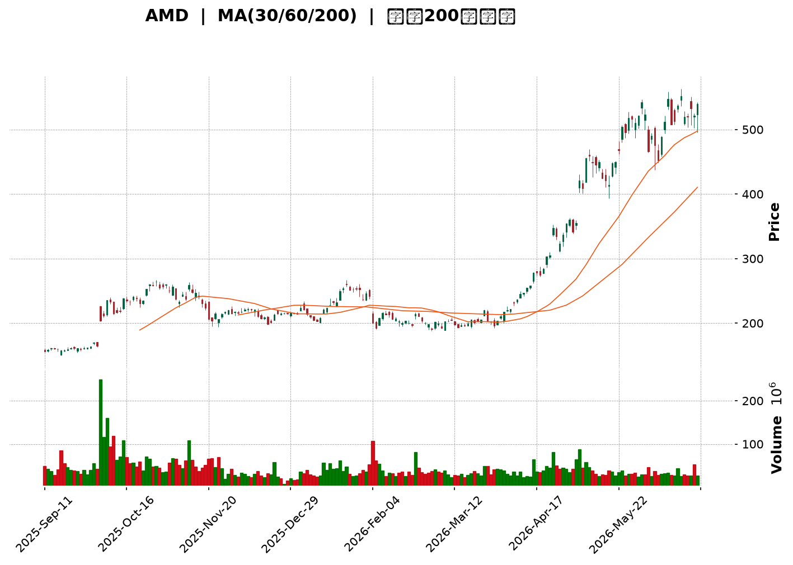
</details>

<html>
<head><meta charset="utf-8" /></head>
<body>
    <div style="height:500px; width:100%;">                        <script>window.PlotlyConfig = {MathJaxConfig: 'local'};</script>
        <script charset="utf-8" src="https://cdn.plot.ly/plotly-3.6.0.min.js" integrity="sha256-QaOVwtVY0T02VaHrr6pnoHLCwayMJp4O5n4YyaE3rJk=" crossorigin="anonymous"></script>                <div id="candlestick-chart" class="plotly-graph-div" style="height:100%; width:100%;"></div>            <script>                window.PLOTLYENV=window.PLOTLYENV || {};                                if (document.getElementById("candlestick-chart")) {                    Plotly.newPlot(                        "candlestick-chart",                        [{"close":{"dtype":"f8","bdata":"AAAAoHB1Y0AAAACAPdJjQAAAAMAeJWRAAAAAYLgOZEAAAADAHuVjQAAAAKBwvWNAAAAA4HqsY0AAAACgR\u002fljQAAAAMDMHGRAAAAAACkcZEAAAADgoyhkQAAAAGC47mNAAAAAIIUrZEAAAACgRzlkQAAAAOBRgGRAAAAAIFw3ZUAAAACgcJVkQAAAAGC4dmlAAAAA4FFwakAAAACA63FtQAAAAOB6HG1AAAAAwMzcakAAAACgcA1rQAAAAEDhQmtAAAAAQDPTbUAAAACA61FtQAAAAGCPIm1AAAAAgOsRbkAAAADA9cBtQAAAACBcx2xAAAAAIK5fbUAAAACgcJ1vQAAAAGC4OnBAAAAAACkgcEAAAACgR4VwQAAAAEDh2m9AAAAAgOsBcEAAAABgZjpwQAAAAKCZQW9AAAAAoEcFcEAAAABgZrZtQAAAAKBHMW1AAAAAIFx\u002fbkAAAADgo7BtQAAAAIA9LnBAAAAAYLj+bkAAAACA69luQAAAAOCjEG5AAAAAoEfJbEAAAACgmfFrQAAAAOCjwGlAAAAAwPV4aUAAAACgmeFqQAAAAAApxGlAAAAAIK7HakAAAADA9TBrQAAAAOBReGtAAAAAIK7nakAAAABAMzNrQAAAACBc\u002f2pAAAAAQAo\u002fa0AAAAAghaNrQAAAAADXs2tAAAAAoHCta0AAAACAwq1rQAAAAMD1WGpAAAAAYI\u002fyaUAAAACgcCVqQAAAACCFw2hAAAAAgOshaUAAAACAwq1qQAAAAGBm3mpAAAAAwMzcakAAAACgR+FqQAAAACCu32pAAAAAIIXzakAAAABA4epqQAAAAMAexWpAAAAAQArva0AAAABgj6JrQAAAAEAzy2pAAAAA4KNAakAAAACAwpVpQAAAAKBwZWlAAAAAgBT2aUAAAABACp9rQAAAAEAz82tAAAAAoHB9bEAAAABgj\u002fpsQAAAAKBw\u002fWxAAAAAoJk5b0AAAAAgXLdvQAAAAEDhOnBAAAAAgOtpb0AAAADA9YBvQAAAACCul29AAAAAgMKFb0AAAAAgXJdtQAAAAOCjyG5AAAAAIIVDbkAAAACAFAZpQAAAAAAAEGhAAAAAgBQOakAAAAAAAABrQAAAAIA9smpAAAAAYI+yakAAAACAFL5pQAAAAIA96mlAAAAAYI9iaUAAAAAA1wNpQAAAAADXa2lAAAAAwMwEaUAAAABAM5NoQAAAAEDhumpAAAAAIIVbakAAAACAwnVpQAAAAGC4BmlAAAAAANfTaEAAAABgZt5nQAAAAIA9QmlAAAAAYGbuaEAAAACAwg1oQAAAAIDCVWlAAAAAIFxnaUAAAABgj5ppQAAAACCut2hAAAAA4HosaEAAAABgj5JoQAAAAIDriWhAAAAAYLjuaEAAAADgo6hpQAAAAGCPKmlAAAAAgMJVaUAAAAAA16tpQAAAAOCjiGtAAAAA4KN4aUAAAAAgrj9pQAAAAKBHgWhAAAAAgMJtaUAAAABguEZqQAAAAAAAMGtAAAAAgMKFa0AAAADA9bBrQAAAAIA9+mxAAAAA4HqUbUAAAACgR6FuQAAAAGCP2m5AAAAAgD3ib0AAAACA6yFwQAAAAAApZHFAAAAAgD1mcUAAAABAMy9xQAAAAADXx3FAAAAAIFz3ckAAAACgRxVzQAAAAMD1vHVAAAAAgBTqdEAAAAAgXDN0QAAAAIDCEXVAAAAAANcndkAAAADgo4h2QAAAAOCjWHVAAAAAACk0dkAAAACAPVZ6QAAAACBch3lAAAAAQApzfEAAAADgo6x8QAAAAOCjBHxAAAAAAADYe0AAAABAMxt8QAAAAKCZgXpAAAAAANdPekAAAADAzOB5QAAAAKBH+XtAAAAAoHAZfEAAAAAAKTh9QAAAAIA9fn9AAAAA4KP4fkAAAABguDCAQAAAAMDMIIBAAAAAgBTif0AAAADgUUyAQAAAAAAp9IBAAAAAoJlZgEAAAACAFCZ9QAAAAKBHpX5AAAAAACm4fUAAAABgZkZ8QAAAAEAzh35AAAAAwB75f0AAAACAFBqBQAAAAOCjtH9AAAAAANcDgEAAAADA9cqAQAAAAEAKPYFAAAAAwMw+gEAAAACA6z2AQAAAAGCPpIBAAAAA4KNMgEAAAACA69uAQA=="},"high":{"dtype":"f8","bdata":"AAAAYLgGZEAAAADAHg1kQAAAAKCZSWRAAAAAYGY+ZEAAAAAAKTRkQAAAAOCj2GNAAAAAQOH6Y0AAAACAwlVkQAAAAOB6bGRAAAAAQDOjZEAAAAAAKTRkQAAAACCFQ2RAAAAAoJmJZEAAAADA9UhkQAAAAIDChWRAAAAAgOthZUAAAACAwlVlQAAAAGC4VmxAAAAAwMxca0AAAAAA13ttQAAAAEAzA25AAAAAQApHbUAAAACAFAZsQAAAACBcH2xAAAAAIK7nbUAAAABgZiZuQAAAAAApbG1AAAAAAClcbkAAAADgUUhuQAAAAAApBG5AAAAAwMx8bUAAAADgeqxvQAAAAGC4RnBAAAAAoEeJcEAAAACgR7FwQAAAAIAUfnBAAAAAgBRicEAAAABgj05wQAAAAIAUFnBAAAAAYGY6cEAAAADgUbBvQAAAAADXe21AAAAAwMwcb0AAAABguA5vQAAAAAApeHBAAAAAgBQ6cEAAAACAFK5vQAAAAOCjGG9AAAAAAADAbUAAAADA9WhtQAAAAAAASG1AAAAAYI8aakAAAAAAKSRrQAAAAGCP0mlAAAAAQOHyakAAAACgmUlrQAAAACBcn2tAAAAAIFw\u002fbEAAAABgZkZrQAAAAADXY2tAAAAA4Hr0a0AAAABguPZrQAAAAEDhGmxAAAAAIIXTa0AAAAAAALBrQAAAACCuz2tAAAAAIIXrakAAAABACkdqQAAAAAAAcGpAAAAAIIXLaUAAAACAwuVqQAAAAKBwhWtAAAAAwPUga0AAAACgRxFrQAAAAGCPGmtAAAAAoJkBa0AAAACAPRprQAAAAOB6NGtAAAAAwMxkbEAAAADgo0BtQAAAAKBw3WtAAAAAACmEakAAAACAFF5qQAAAAKCZ6WlAAAAAACk8akAAAAAgheNrQAAAAEDhAmxAAAAAQDPLbUAAAAAgrk9tQAAAAAAA8G1AAAAAwMycb0AAAACgRwFwQAAAACBcr3BAAAAA4KMkcEAAAACgmfFvQAAAAGBmFnBAAAAA4HpIcEAAAAAgrqduQAAAAEAKP29AAAAAwMyUb0AAAABgj1JrQAAAAKBHgWlAAAAA4KMoakAAAABAMzNrQAAAAOB6bGtAAAAAwMx0a0AAAABguE5rQAAAAKCZQWpAAAAAoJmpaUAAAABgZmZpQAAAAEAzg2lAAAAAANebaUAAAAAAKexoQAAAAGC4FmtAAAAAYGYWa0AAAACgRzlqQAAAAOB6PGlAAAAAIK7XaEAAAADgejRoQAAAAIAUTmlAAAAAoEd5aUAAAAAgrgdpQAAAAEAKX2lAAAAAQOHSaUAAAABguCZqQAAAAADXc2lAAAAAgML1aEAAAACgcAVpQAAAAGC45mhAAAAAIIVbaUAAAAAAKbxpQAAAAKCZyWlAAAAAIIUjakAAAACAws1pQAAAAGCPqmtAAAAAAACga0AAAADgo2hpQAAAAIDCDWpAAAAAAACAaUAAAABgj7pqQAAAAMD1OGtAAAAAgOtJbEAAAABAM8NrQAAAAAAAQG1AAAAAQDOjbUAAAABgjzJvQAAAAGCP6m5AAAAAYLjub0AAAABA4SJwQAAAAKBwdXFAAAAAwMyQcUAAAACAwvlxQAAAAEAz43FAAAAAAAAEc0AAAAAghWNzQAAAAADXD3ZAAAAAIFzTdUAAAAAAAHh0QAAAAGC4QnVAAAAAIFwvdkAAAADgo6x2QAAAAKCZnXZAAAAAwB55dkAAAACgmel6QAAAACBcW3pAAAAA4KOEfEAAAAAghVN9QAAAAMDMrHxAAAAAAAC4fEAAAADA9VR8QAAAAAAAcHtAAAAAwMxse0AAAAAAAMx6QAAAAIA9FnxAAAAAQDMzfEAAAABgjxZ+QAAAACBcr39AAAAAIFzjf0AAAACgmXmAQAAAAAAAUIBAAAAAAAAsgEAAAACA61OAQAAAACCFE4FAAAAAIIWhgEAAAACA65l\u002fQAAAACCF735AAAAAAACQf0AAAABAM9d9QAAAACBcp35AAAAAIK5NgEAAAADA9XKBQAAAAKCZJ4FAAAAAAACkgEAAAAAghd2AQAAAAIDrl4FAAAAAgOuDgEAAAAAgrmeAQAAAAEAKN4FAAAAAQOFogEAAAAAghfGAQA=="},"hovertemplate":"\u003cb\u003e%{x|%Y-%m-%d}\u003c\u002fb\u003e\u003cbr\u003e\u958b: $%{open:.2f}\u003cbr\u003e\u9ad8: $%{high:.2f}\u003cbr\u003e\u4f4e: $%{low:.2f}\u003cbr\u003e\u6536: $%{close:.2f}\u003cextra\u003e\u003c\u002fextra\u003e","low":{"dtype":"f8","bdata":"AAAAIK5fY0AAAACgcF1jQAAAAEAzs2NAAAAAQArnY0AAAADgUXhjQAAAAEAzu2JAAAAAwMx8Y0AAAACgcK1jQAAAAGC45mNAAAAAgMLNY0AAAADA9VhjQAAAAKCZoWNAAAAAwMz8Y0AAAABgj+pjQAAAACCuD2RAAAAAANfDZEAAAADgemRkQAAAAOBRYGlAAAAAwPUoakAAAABgZlZqQAAAAMD1sGxAAAAAYGamakAAAADAzNxqQAAAAMDM\u002fGpAAAAA4FGYa0AAAAAgrgdtQAAAAMAefWxAAAAAwMxMbUAAAADgo0BtQAAAAAApHGxAAAAAoEeRbEAAAABgZj5uQAAAAKCZOW9AAAAAAAAQcEAAAABgZhZwQAAAAIDriW9AAAAAwB6tb0AAAADgerxvQAAAAOB67G5AAAAAgOtZbkAAAAAgrndtQAAAAOB6FGxAAAAAAAAQbkAAAADgelRtQAAAAAAAQG9AAAAAgOvBbkAAAABgj2JtQAAAAMDMpG1AAAAAYLgWbEAAAABguHZrQAAAAMD1kGlAAAAAAABgaEAAAABAM7tpQAAAAMD1SGhAAAAAAADgaUAAAADgo8BqQAAAAAAAsGpAAAAA4HrMakAAAADgo3hqQAAAAOB6xGpAAAAAIK4Ha0AAAAAghUtrQAAAAMAePWtAAAAAoHBVa0AAAACAFEZqQAAAAIDrIWpAAAAAYI\u002fSaUAAAAAghaNpQAAAAMD1sGhAAAAAAAAQaUAAAABgZoZpQAAAAIDrqWpAAAAAwPWIakAAAABACr9qQAAAAMD1oGpAAAAAIK4nakAAAABgj8pqQAAAAKCZuWpAAAAAwMxca0AAAAAgXI9rQAAAAAAAaGpAAAAAoHDlaUAAAABgj2ppQAAAAIA9YmlAAAAAoJn5aEAAAAAgXN9qQAAAACCF42pAAAAAQApnbEAAAAAghZtsQAAAAMAeLWxAAAAAwPV4bUAAAAAAKdRuQAAAAAAABHBAAAAAoJlJb0AAAABguP5uQAAAAGC4Rm9AAAAAwB4dbkAAAACgmVFtQAAAAAAAYG1AAAAAoEehbUAAAADAzORoQAAAAEAK12dAAAAAgMKNaEAAAADAzIRpQAAAAAAppGpAAAAAYLgmakAAAADgeqRpQAAAAAApfGlAAAAAYI9aaEAAAAAAAGBoQAAAAKBHyWhAAAAAgOvRaEAAAADAzERoQAAAAAAA0GlAAAAAYI9KakAAAABguC5pQAAAACCut2hAAAAAAADAZ0AAAABACodnQAAAACCFu2dAAAAAAClcaEAAAAAAAOhnQAAAAOCjoGdAAAAAYGZGaUAAAAAAKXRpQAAAAKBwlWhAAAAA4KMIaEAAAACgmVloQAAAAOBRaGhAAAAAAAB4aEAAAABgjxpoQAAAAOBRyGhAAAAAYLg2aUAAAAAAKQRpQAAAAOBRcGpAAAAAgMJtaUAAAACAFLZoQAAAAADXG2hAAAAAwB6NaEAAAABA4bppQAAAAADXE2lAAAAAIFw3a0AAAAAAKexqQAAAAEDhYmxAAAAAwB7dbEAAAABguN5tQAAAAMD1QG5AAAAAYGa2bkAAAABAM3tvQAAAAAApWHBAAAAAgD0icUAAAAAAAABxQAAAAIDrSXFAAAAAgD3icUAAAAAAKbxyQAAAAOCj6HRAAAAAwPWMdEAAAAAAAGBzQAAAAIDC7XNAAAAAoJnJdEAAAAAAANR1QAAAAEAzK3VAAAAAgBSOdUAAAADgoyB5QAAAAKBHEXlAAAAA4KMkekAAAACAFC58QAAAAIDCoXpAAAAAYGYKe0AAAABA4Tp7QAAAAIDCdXpAAAAAIFyreUAAAACAwpV4QAAAAMDMoHpAAAAAoJn5ekAAAAAgXNt8QAAAACCuA35AAAAAYI9qfkAAAADgUdh+QAAAAEDhdn9AAAAAwMxsfkAAAAAghVN\u002fQAAAAGBmYoBAAAAAgOs9f0AAAABAM\u002f98QAAAACBc231AAAAAIK5Te0AAAACgRwV8QAAAAOBRoHxAAAAAAADgfkAAAAAAAJSAQAAAAAAAtH9AAAAAwMy0f0AAAABgj3KAQAAAACCuvYBAAAAAwPWsf0AAAAAAAHh\u002fQAAAAAAAsH9AAAAAgMJpf0AAAACgmfV+QA=="},"name":"\u50f9\u683c","open":{"dtype":"f8","bdata":"AAAAANfTY0AAAAAAAKBjQAAAAOBRAGRAAAAAANcrZEAAAADA9ehjQAAAAGC43mJAAAAAACmsY0AAAACgcK1jQAAAAOCjEGRAAAAAIFxfZEAAAADgeqRjQAAAAOCjEGRAAAAAANcDZEAAAACgRxlkQAAAAIDCHWRAAAAAgMIVZUAAAACAwlVlQAAAAGBmTmxAAAAAQDPbakAAAABgZp5qQAAAAKCZiW1AAAAA4KMYbUAAAABgZoZrQAAAAGBmZmtAAAAAYLjWa0AAAACgR4ltQAAAAOBRKG1AAAAAQAqPbUAAAADgeuxtQAAAAEAzm21AAAAAwB7FbEAAAAAghWtuQAAAAIAUHnBAAAAAgD0ycEAAAABACoNwQAAAAGC4PnBAAAAAoJk5cEAAAACgRzVwQAAAAEAzS29AAAAAIK5nbkAAAABACq9vQAAAAIAU3mxAAAAA4HpEbkAAAADAHjVuQAAAAAAppG9AAAAAwMx8b0AAAAAghQNuQAAAAAAAWG5AAAAAwPWYbUAAAADgUchsQAAAAGBmFm1AAAAAgOsZakAAAADAHuVpQAAAACBcL2lAAAAAoJlBakAAAADgegRrQAAAAAApvGpAAAAAoEe5a0AAAADgUQhrQAAAAAApHGtAAAAAoHAla0AAAABA4WJrQAAAAKBHoWtAAAAAAADAa0AAAACA6zlrQAAAAADXS2tAAAAAwPWIakAAAACgcN1pQAAAAKBHQWpAAAAAgD16aUAAAABAM5NpQAAAAAAAgGtAAAAAIIWbakAAAAAgXN9qQAAAAIDC7WpAAAAAYI9yakAAAAAA1\u002ftqQAAAAIA9+mpAAAAAwMxca0AAAAAAAMhsQAAAAGC41mtAAAAAACmEakAAAADAzFxqQAAAAEAKt2lAAAAAgMIlaUAAAABAM+NqQAAAAKBHMWtAAAAAwMx8bEAAAACgmUltQAAAAGCPQmxAAAAAIK5\u002fbUAAAAAAAHhvQAAAAEDhUnBAAAAAAAAMcEAAAADAHoVvQAAAAAApxG9AAAAAwB7Vb0AAAACAwp1tQAAAAOCjeG1AAAAAoJlxb0AAAAAAAOBqQAAAACCFO2lAAAAAACmkaEAAAADAzNxpQAAAAOB65GpAAAAAACk8a0AAAABgj\u002fpqQAAAAOCjgGlAAAAAwMxEaUAAAADAHs1oQAAAACCFA2lAAAAAANcDaUAAAABA4cJoQAAAAAApdGpAAAAAgD3aakAAAACgmRlqQAAAACCFA2lAAAAAQDM7aEAAAABguO5nQAAAAADXA2hAAAAA4KO4aEAAAADgo2hoQAAAACCFq2dAAAAA4FFQaUAAAAAghaNpQAAAAGCPWmlAAAAAIIXDaEAAAAAgXF9oQAAAAIDClWhAAAAAAACAaEAAAADA9WBoQAAAAOB6nGlAAAAAwMzMaUAAAADgeixpQAAAAOBRcGpAAAAAIFw\u002fa0AAAADgozhpQAAAAGBmnmlAAAAAoJnBaEAAAABA4fJpQAAAAKCZgWlAAAAAwPVoa0AAAADgUUhrQAAAAADXA21AAAAA4FEgbUAAAAAAAOBtQAAAAMD1oG5AAAAAoEc5b0AAAABguN5vQAAAAADXj3BAAAAAAACQcUAAAACgmYlxQAAAAKBHVXFAAAAAIIUzckAAAAAAKeByQAAAAAApDHVAAAAAwB6ldUAAAACAwn1zQAAAAKBHaXRAAAAAgMJVdUAAAACA6\u002f11QAAAAMD1hHZAAAAAACn4dUAAAAAA15d5QAAAAMAeEXpAAAAAoHApekAAAADAzMh8QAAAAAAAFHxAAAAA4KOQfEAAAACgmYl7QAAAAKBwFXtAAAAAAADYekAAAACgmcl5QAAAAOCjwHpAAAAAANefe0AAAACgcF19QAAAAADXS35AAAAAAADAf0AAAAAAADB\u002fQAAAAGBmRoBAAAAAYI9Cf0AAAADAzKR\u002fQAAAAAAAroBAAAAAAAAWgEAAAADgejh\u002fQAAAAAAAUH5AAAAAAABsf0AAAAAghT99QAAAAKCZ2XxAAAAAQAo7f0AAAAAAAL6AQAAAAMAeF4FAAAAAoEeNgEAAAADgo5yAQAAAAAAADIFAAAAAoEfRf0AAAABgj0aAQAAAAKBw\u002f4BAAAAAYGY+gEAAAABguFaAQA=="},"x":["2025-09-11T00:00:00-04:00","2025-09-12T00:00:00-04:00","2025-09-15T00:00:00-04:00","2025-09-16T00:00:00-04:00","2025-09-17T00:00:00-04:00","2025-09-18T00:00:00-04:00","2025-09-19T00:00:00-04:00","2025-09-22T00:00:00-04:00","2025-09-23T00:00:00-04:00","2025-09-24T00:00:00-04:00","2025-09-25T00:00:00-04:00","2025-09-26T00:00:00-04:00","2025-09-29T00:00:00-04:00","2025-09-30T00:00:00-04:00","2025-10-01T00:00:00-04:00","2025-10-02T00:00:00-04:00","2025-10-03T00:00:00-04:00","2025-10-06T00:00:00-04:00","2025-10-07T00:00:00-04:00","2025-10-08T00:00:00-04:00","2025-10-09T00:00:00-04:00","2025-10-10T00:00:00-04:00","2025-10-13T00:00:00-04:00","2025-10-14T00:00:00-04:00","2025-10-15T00:00:00-04:00","2025-10-16T00:00:00-04:00","2025-10-17T00:00:00-04:00","2025-10-20T00:00:00-04:00","2025-10-21T00:00:00-04:00","2025-10-22T00:00:00-04:00","2025-10-23T00:00:00-04:00","2025-10-24T00:00:00-04:00","2025-10-27T00:00:00-04:00","2025-10-28T00:00:00-04:00","2025-10-29T00:00:00-04:00","2025-10-30T00:00:00-04:00","2025-10-31T00:00:00-04:00","2025-11-03T00:00:00-05:00","2025-11-04T00:00:00-05:00","2025-11-05T00:00:00-05:00","2025-11-06T00:00:00-05:00","2025-11-07T00:00:00-05:00","2025-11-10T00:00:00-05:00","2025-11-11T00:00:00-05:00","2025-11-12T00:00:00-05:00","2025-11-13T00:00:00-05:00","2025-11-14T00:00:00-05:00","2025-11-17T00:00:00-05:00","2025-11-18T00:00:00-05:00","2025-11-19T00:00:00-05:00","2025-11-20T00:00:00-05:00","2025-11-21T00:00:00-05:00","2025-11-24T00:00:00-05:00","2025-11-25T00:00:00-05:00","2025-11-26T00:00:00-05:00","2025-11-28T00:00:00-05:00","2025-12-01T00:00:00-05:00","2025-12-02T00:00:00-05:00","2025-12-03T00:00:00-05:00","2025-12-04T00:00:00-05:00","2025-12-05T00:00:00-05:00","2025-12-08T00:00:00-05:00","2025-12-09T00:00:00-05:00","2025-12-10T00:00:00-05:00","2025-12-11T00:00:00-05:00","2025-12-12T00:00:00-05:00","2025-12-15T00:00:00-05:00","2025-12-16T00:00:00-05:00","2025-12-17T00:00:00-05:00","2025-12-18T00:00:00-05:00","2025-12-19T00:00:00-05:00","2025-12-22T00:00:00-05:00","2025-12-23T00:00:00-05:00","2025-12-24T00:00:00-05:00","2025-12-26T00:00:00-05:00","2025-12-29T00:00:00-05:00","2025-12-30T00:00:00-05:00","2025-12-31T00:00:00-05:00","2026-01-02T00:00:00-05:00","2026-01-05T00:00:00-05:00","2026-01-06T00:00:00-05:00","2026-01-07T00:00:00-05:00","2026-01-08T00:00:00-05:00","2026-01-09T00:00:00-05:00","2026-01-12T00:00:00-05:00","2026-01-13T00:00:00-05:00","2026-01-14T00:00:00-05:00","2026-01-15T00:00:00-05:00","2026-01-16T00:00:00-05:00","2026-01-20T00:00:00-05:00","2026-01-21T00:00:00-05:00","2026-01-22T00:00:00-05:00","2026-01-23T00:00:00-05:00","2026-01-26T00:00:00-05:00","2026-01-27T00:00:00-05:00","2026-01-28T00:00:00-05:00","2026-01-29T00:00:00-05:00","2026-01-30T00:00:00-05:00","2026-02-02T00:00:00-05:00","2026-02-03T00:00:00-05:00","2026-02-04T00:00:00-05:00","2026-02-05T00:00:00-05:00","2026-02-06T00:00:00-05:00","2026-02-09T00:00:00-05:00","2026-02-10T00:00:00-05:00","2026-02-11T00:00:00-05:00","2026-02-12T00:00:00-05:00","2026-02-13T00:00:00-05:00","2026-02-17T00:00:00-05:00","2026-02-18T00:00:00-05:00","2026-02-19T00:00:00-05:00","2026-02-20T00:00:00-05:00","2026-02-23T00:00:00-05:00","2026-02-24T00:00:00-05:00","2026-02-25T00:00:00-05:00","2026-02-26T00:00:00-05:00","2026-02-27T00:00:00-05:00","2026-03-02T00:00:00-05:00","2026-03-03T00:00:00-05:00","2026-03-04T00:00:00-05:00","2026-03-05T00:00:00-05:00","2026-03-06T00:00:00-05:00","2026-03-09T00:00:00-04:00","2026-03-10T00:00:00-04:00","2026-03-11T00:00:00-04:00","2026-03-12T00:00:00-04:00","2026-03-13T00:00:00-04:00","2026-03-16T00:00:00-04:00","2026-03-17T00:00:00-04:00","2026-03-18T00:00:00-04:00","2026-03-19T00:00:00-04:00","2026-03-20T00:00:00-04:00","2026-03-23T00:00:00-04:00","2026-03-24T00:00:00-04:00","2026-03-25T00:00:00-04:00","2026-03-26T00:00:00-04:00","2026-03-27T00:00:00-04:00","2026-03-30T00:00:00-04:00","2026-03-31T00:00:00-04:00","2026-04-01T00:00:00-04:00","2026-04-02T00:00:00-04:00","2026-04-06T00:00:00-04:00","2026-04-07T00:00:00-04:00","2026-04-08T00:00:00-04:00","2026-04-09T00:00:00-04:00","2026-04-10T00:00:00-04:00","2026-04-13T00:00:00-04:00","2026-04-14T00:00:00-04:00","2026-04-15T00:00:00-04:00","2026-04-16T00:00:00-04:00","2026-04-17T00:00:00-04:00","2026-04-20T00:00:00-04:00","2026-04-21T00:00:00-04:00","2026-04-22T00:00:00-04:00","2026-04-23T00:00:00-04:00","2026-04-24T00:00:00-04:00","2026-04-27T00:00:00-04:00","2026-04-28T00:00:00-04:00","2026-04-29T00:00:00-04:00","2026-04-30T00:00:00-04:00","2026-05-01T00:00:00-04:00","2026-05-04T00:00:00-04:00","2026-05-05T00:00:00-04:00","2026-05-06T00:00:00-04:00","2026-05-07T00:00:00-04:00","2026-05-08T00:00:00-04:00","2026-05-11T00:00:00-04:00","2026-05-12T00:00:00-04:00","2026-05-13T00:00:00-04:00","2026-05-14T00:00:00-04:00","2026-05-15T00:00:00-04:00","2026-05-18T00:00:00-04:00","2026-05-19T00:00:00-04:00","2026-05-20T00:00:00-04:00","2026-05-21T00:00:00-04:00","2026-05-22T00:00:00-04:00","2026-05-26T00:00:00-04:00","2026-05-27T00:00:00-04:00","2026-05-28T00:00:00-04:00","2026-05-29T00:00:00-04:00","2026-06-01T00:00:00-04:00","2026-06-02T00:00:00-04:00","2026-06-03T00:00:00-04:00","2026-06-04T00:00:00-04:00","2026-06-05T00:00:00-04:00","2026-06-08T00:00:00-04:00","2026-06-09T00:00:00-04:00","2026-06-10T00:00:00-04:00","2026-06-11T00:00:00-04:00","2026-06-12T00:00:00-04:00","2026-06-15T00:00:00-04:00","2026-06-16T00:00:00-04:00","2026-06-17T00:00:00-04:00","2026-06-18T00:00:00-04:00","2026-06-22T00:00:00-04:00","2026-06-23T00:00:00-04:00","2026-06-24T00:00:00-04:00","2026-06-25T00:00:00-04:00","2026-06-26T00:00:00-04:00","2026-06-29T00:00:00-04:00"],"type":"candlestick"},{"hovertemplate":"MA30: $%{y:.2f}\u003cextra\u003e\u003c\u002fextra\u003e","line":{"color":"#2196F3","dash":"dash","width":2},"mode":"lines","name":"MA30","x":["2025-09-11T00:00:00-04:00","2025-09-12T00:00:00-04:00","2025-09-15T00:00:00-04:00","2025-09-16T00:00:00-04:00","2025-09-17T00:00:00-04:00","2025-09-18T00:00:00-04:00","2025-09-19T00:00:00-04:00","2025-09-22T00:00:00-04:00","2025-09-23T00:00:00-04:00","2025-09-24T00:00:00-04:00","2025-09-25T00:00:00-04:00","2025-09-26T00:00:00-04:00","2025-09-29T00:00:00-04:00","2025-09-30T00:00:00-04:00","2025-10-01T00:00:00-04:00","2025-10-02T00:00:00-04:00","2025-10-03T00:00:00-04:00","2025-10-06T00:00:00-04:00","2025-10-07T00:00:00-04:00","2025-10-08T00:00:00-04:00","2025-10-09T00:00:00-04:00","2025-10-10T00:00:00-04:00","2025-10-13T00:00:00-04:00","2025-10-14T00:00:00-04:00","2025-10-15T00:00:00-04:00","2025-10-16T00:00:00-04:00","2025-10-17T00:00:00-04:00","2025-10-20T00:00:00-04:00","2025-10-21T00:00:00-04:00","2025-10-22T00:00:00-04:00","2025-10-23T00:00:00-04:00","2025-10-24T00:00:00-04:00","2025-10-27T00:00:00-04:00","2025-10-28T00:00:00-04:00","2025-10-29T00:00:00-04:00","2025-10-30T00:00:00-04:00","2025-10-31T00:00:00-04:00","2025-11-03T00:00:00-05:00","2025-11-04T00:00:00-05:00","2025-11-05T00:00:00-05:00","2025-11-06T00:00:00-05:00","2025-11-07T00:00:00-05:00","2025-11-10T00:00:00-05:00","2025-11-11T00:00:00-05:00","2025-11-12T00:00:00-05:00","2025-11-13T00:00:00-05:00","2025-11-14T00:00:00-05:00","2025-11-17T00:00:00-05:00","2025-11-18T00:00:00-05:00","2025-11-19T00:00:00-05:00","2025-11-20T00:00:00-05:00","2025-11-21T00:00:00-05:00","2025-11-24T00:00:00-05:00","2025-11-25T00:00:00-05:00","2025-11-26T00:00:00-05:00","2025-11-28T00:00:00-05:00","2025-12-01T00:00:00-05:00","2025-12-02T00:00:00-05:00","2025-12-03T00:00:00-05:00","2025-12-04T00:00:00-05:00","2025-12-05T00:00:00-05:00","2025-12-08T00:00:00-05:00","2025-12-09T00:00:00-05:00","2025-12-10T00:00:00-05:00","2025-12-11T00:00:00-05:00","2025-12-12T00:00:00-05:00","2025-12-15T00:00:00-05:00","2025-12-16T00:00:00-05:00","2025-12-17T00:00:00-05:00","2025-12-18T00:00:00-05:00","2025-12-19T00:00:00-05:00","2025-12-22T00:00:00-05:00","2025-12-23T00:00:00-05:00","2025-12-24T00:00:00-05:00","2025-12-26T00:00:00-05:00","2025-12-29T00:00:00-05:00","2025-12-30T00:00:00-05:00","2025-12-31T00:00:00-05:00","2026-01-02T00:00:00-05:00","2026-01-05T00:00:00-05:00","2026-01-06T00:00:00-05:00","2026-01-07T00:00:00-05:00","2026-01-08T00:00:00-05:00","2026-01-09T00:00:00-05:00","2026-01-12T00:00:00-05:00","2026-01-13T00:00:00-05:00","2026-01-14T00:00:00-05:00","2026-01-15T00:00:00-05:00","2026-01-16T00:00:00-05:00","2026-01-20T00:00:00-05:00","2026-01-21T00:00:00-05:00","2026-01-22T00:00:00-05:00","2026-01-23T00:00:00-05:00","2026-01-26T00:00:00-05:00","2026-01-27T00:00:00-05:00","2026-01-28T00:00:00-05:00","2026-01-29T00:00:00-05:00","2026-01-30T00:00:00-05:00","2026-02-02T00:00:00-05:00","2026-02-03T00:00:00-05:00","2026-02-04T00:00:00-05:00","2026-02-05T00:00:00-05:00","2026-02-06T00:00:00-05:00","2026-02-09T00:00:00-05:00","2026-02-10T00:00:00-05:00","2026-02-11T00:00:00-05:00","2026-02-12T00:00:00-05:00","2026-02-13T00:00:00-05:00","2026-02-17T00:00:00-05:00","2026-02-18T00:00:00-05:00","2026-02-19T00:00:00-05:00","2026-02-20T00:00:00-05:00","2026-02-23T00:00:00-05:00","2026-02-24T00:00:00-05:00","2026-02-25T00:00:00-05:00","2026-02-26T00:00:00-05:00","2026-02-27T00:00:00-05:00","2026-03-02T00:00:00-05:00","2026-03-03T00:00:00-05:00","2026-03-04T00:00:00-05:00","2026-03-05T00:00:00-05:00","2026-03-06T00:00:00-05:00","2026-03-09T00:00:00-04:00","2026-03-10T00:00:00-04:00","2026-03-11T00:00:00-04:00","2026-03-12T00:00:00-04:00","2026-03-13T00:00:00-04:00","2026-03-16T00:00:00-04:00","2026-03-17T00:00:00-04:00","2026-03-18T00:00:00-04:00","2026-03-19T00:00:00-04:00","2026-03-20T00:00:00-04:00","2026-03-23T00:00:00-04:00","2026-03-24T00:00:00-04:00","2026-03-25T00:00:00-04:00","2026-03-26T00:00:00-04:00","2026-03-27T00:00:00-04:00","2026-03-30T00:00:00-04:00","2026-03-31T00:00:00-04:00","2026-04-01T00:00:00-04:00","2026-04-02T00:00:00-04:00","2026-04-06T00:00:00-04:00","2026-04-07T00:00:00-04:00","2026-04-08T00:00:00-04:00","2026-04-09T00:00:00-04:00","2026-04-10T00:00:00-04:00","2026-04-13T00:00:00-04:00","2026-04-14T00:00:00-04:00","2026-04-15T00:00:00-04:00","2026-04-16T00:00:00-04:00","2026-04-17T00:00:00-04:00","2026-04-20T00:00:00-04:00","2026-04-21T00:00:00-04:00","2026-04-22T00:00:00-04:00","2026-04-23T00:00:00-04:00","2026-04-24T00:00:00-04:00","2026-04-27T00:00:00-04:00","2026-04-28T00:00:00-04:00","2026-04-29T00:00:00-04:00","2026-04-30T00:00:00-04:00","2026-05-01T00:00:00-04:00","2026-05-04T00:00:00-04:00","2026-05-05T00:00:00-04:00","2026-05-06T00:00:00-04:00","2026-05-07T00:00:00-04:00","2026-05-08T00:00:00-04:00","2026-05-11T00:00:00-04:00","2026-05-12T00:00:00-04:00","2026-05-13T00:00:00-04:00","2026-05-14T00:00:00-04:00","2026-05-15T00:00:00-04:00","2026-05-18T00:00:00-04:00","2026-05-19T00:00:00-04:00","2026-05-20T00:00:00-04:00","2026-05-21T00:00:00-04:00","2026-05-22T00:00:00-04:00","2026-05-26T00:00:00-04:00","2026-05-27T00:00:00-04:00","2026-05-28T00:00:00-04:00","2026-05-29T00:00:00-04:00","2026-06-01T00:00:00-04:00","2026-06-02T00:00:00-04:00","2026-06-03T00:00:00-04:00","2026-06-04T00:00:00-04:00","2026-06-05T00:00:00-04:00","2026-06-08T00:00:00-04:00","2026-06-09T00:00:00-04:00","2026-06-10T00:00:00-04:00","2026-06-11T00:00:00-04:00","2026-06-12T00:00:00-04:00","2026-06-15T00:00:00-04:00","2026-06-16T00:00:00-04:00","2026-06-17T00:00:00-04:00","2026-06-18T00:00:00-04:00","2026-06-22T00:00:00-04:00","2026-06-23T00:00:00-04:00","2026-06-24T00:00:00-04:00","2026-06-25T00:00:00-04:00","2026-06-26T00:00:00-04:00","2026-06-29T00:00:00-04:00"],"y":{"dtype":"f8","bdata":"AAAAAAAA+H8AAAAAAAD4fwAAAAAAAPh\u002fAAAAAAAA+H8AAAAAAAD4fwAAAAAAAPh\u002fAAAAAAAA+H8AAAAAAAD4fwAAAAAAAPh\u002fAAAAAAAA+H8AAAAAAAD4fwAAAAAAAPh\u002fAAAAAAAA+H8AAAAAAAD4fwAAAAAAAPh\u002fAAAAAAAA+H8AAAAAAAD4fwAAAAAAAPh\u002fAAAAAAAA+H8AAAAAAAD4fwAAAAAAAPh\u002fAAAAAAAA+H8AAAAAAAD4fwAAAAAAAPh\u002fAAAAAAAA+H8AAAAAAAD4fwAAAAAAAPh\u002fAAAAAAAA+H8AAAAAAAD4f4mIiOgmrWdA7+7ujsIBaEBVVVVlZmZoQCIiIjJ6z2hAmpmZ2Yc3aUBEREREtqdpQDMzM+MXD2pAIiIiwmd4akAiIiIy7OJqQHd3dxcEQmtAzczMTNSna0CJiIjIWvlrQO\u002fu7o5fSGxAMzMzU4CgbECrqqqqR\u002fFsQM3MzDx8Vm1A7+7uPu6pbUARERHxiwFuQGZmZobPKG5Ad3d3t9c8bkAAAAAwCDBuQDMzM+NeE25AMzMzY4IHbkCamZlJDAZuQJqZmWlK+W1AIiIigk7fbUDv7u4uJM1tQO\u002fu7u7uvm1AMzMz4+yjbUAzMzMjIo5tQAAAAPDufm1Ad3d3V8dsbUB3d3cX2UptQGZmZuZCIm1AMzMzYzv7bEBERETUeM1sQDMzM4N5nmxAvLu727JqbEBERER02jRsQO\u002fu7l5z\u002fWtAq6qq+n7Ca0BmZmamm6hrQHd3d1fHlGtAAAAAkMJ1a0BVVVUFyF1rQERERGT0LmtA7+7urnIMa0BmZmZG4epqQM3MzDzDzmpAzczM7HzHakAzMzNz2sRqQImIiBi9zWpAiYiICGXUakBERERUVclqQM3MzAwtxmpAZmZmdjC\u002fakAAAADQ28JqQERERGT0xmpAAAAA4HrUakDNzMycqONqQLy7u0up9GpAIiIiAp0Wa0ARERFxaDlrQLy7u1sBYmtAIiIiUuOBa0CamZkph6JrQKuqqgpJz2tAAAAA0Nv+a0B3d3eHQRxsQLy7u2ugT2xA7+7uzml7bECJiIhoSm1sQAAAABBYVWxA3t3dDXRObEAzMzMzek9sQCIiInL2TWxA7+7uHsxLbEC8u7tLxUFsQFVVVYV5OmxAERERsbkkbEBmZmY2Xg5sQAAAAPCnAmxARERExCD4a0BERERkgu9rQDMzMwPk+mtAIiIiokX+a0Dv7u5O1OtrQHd3d0fh0mtAzczMbKCza0BVVVV1BYhrQLy7u2suaGtAMzMzg3kya0BmZmaGFvFqQJqZmblJtGpA3t3drQCBakDv7u7up05qQERERET9E2pA3t3drUfVaUDe3d0NdKppQERERKQpdWlAmpmZWatHaUB3d3eHFk1pQFVVVbWBVmlAd3d311xQaUBEREQkBkVpQAAAALArTGlAd3d357RBaUCrqqpKfj1pQImIiBh2MWlAq6qqqtUxaUCamZnpmDxpQImIiFirS2lA7+7u3ghhaUC8u7troHtpQJqZmSnOjmlAIiIi0k2qaUC8u7vba9ZpQJqZmTkmCGpAd3d311xEakCrqqq6AoxqQN7d3a1H3WpAERERkXsxa0CJiIgIgYlrQN7d3Z3E4GtAZmZmFq5LbECJiIhI4bZsQFVVVWX0Vm1AVVVVVZztbUAzMzPDrnRuQLy7u4veCm9AERERETywb0CJiIiQ7SpwQHd3d+e0dXBAmpmZKRXHcECJiIgYSzpxQFVVVU2pnnFAMzMzg8AkckDe3d1Ftq1yQO\u002fu7s4+NHNA7+7ublm1c0BVVVXNEzV0QO\u002fu7pZDo3RAERER2VwOdUBmZmY+CnV1QERERKwc6HVAIiIicq9ZdkDNzMwEVtB2QHd3d0dvWXdAMzMzc6\u002fZd0BmZmYGVmR4QLy7uxsv43hAd3d3V8deeUB3d3cXS+J5QKuqqsroa3pAERERoRrhekAzMzNT\u002fzZ7QN7d3Q0Cg3tA7+7u3iTOe0DNzMycCxN8QCIiIpLCY3xAq6qqOom3fEC8u7u7Hht9QCIiIiKFc31AZmZm5l7HfUCJiIgIOgV+QDMzM4OVUX5AERERwRF0fkBVVVV1k5R+QM3MzHyGwX5AIiIi8hnqfkBVVVVF\u002fRl\u002fQA=="},"type":"scatter"},{"hovertemplate":"MA60: $%{y:.2f}\u003cextra\u003e\u003c\u002fextra\u003e","line":{"color":"#9C27B0","dash":"dash","width":2},"mode":"lines","name":"MA60","x":["2025-09-11T00:00:00-04:00","2025-09-12T00:00:00-04:00","2025-09-15T00:00:00-04:00","2025-09-16T00:00:00-04:00","2025-09-17T00:00:00-04:00","2025-09-18T00:00:00-04:00","2025-09-19T00:00:00-04:00","2025-09-22T00:00:00-04:00","2025-09-23T00:00:00-04:00","2025-09-24T00:00:00-04:00","2025-09-25T00:00:00-04:00","2025-09-26T00:00:00-04:00","2025-09-29T00:00:00-04:00","2025-09-30T00:00:00-04:00","2025-10-01T00:00:00-04:00","2025-10-02T00:00:00-04:00","2025-10-03T00:00:00-04:00","2025-10-06T00:00:00-04:00","2025-10-07T00:00:00-04:00","2025-10-08T00:00:00-04:00","2025-10-09T00:00:00-04:00","2025-10-10T00:00:00-04:00","2025-10-13T00:00:00-04:00","2025-10-14T00:00:00-04:00","2025-10-15T00:00:00-04:00","2025-10-16T00:00:00-04:00","2025-10-17T00:00:00-04:00","2025-10-20T00:00:00-04:00","2025-10-21T00:00:00-04:00","2025-10-22T00:00:00-04:00","2025-10-23T00:00:00-04:00","2025-10-24T00:00:00-04:00","2025-10-27T00:00:00-04:00","2025-10-28T00:00:00-04:00","2025-10-29T00:00:00-04:00","2025-10-30T00:00:00-04:00","2025-10-31T00:00:00-04:00","2025-11-03T00:00:00-05:00","2025-11-04T00:00:00-05:00","2025-11-05T00:00:00-05:00","2025-11-06T00:00:00-05:00","2025-11-07T00:00:00-05:00","2025-11-10T00:00:00-05:00","2025-11-11T00:00:00-05:00","2025-11-12T00:00:00-05:00","2025-11-13T00:00:00-05:00","2025-11-14T00:00:00-05:00","2025-11-17T00:00:00-05:00","2025-11-18T00:00:00-05:00","2025-11-19T00:00:00-05:00","2025-11-20T00:00:00-05:00","2025-11-21T00:00:00-05:00","2025-11-24T00:00:00-05:00","2025-11-25T00:00:00-05:00","2025-11-26T00:00:00-05:00","2025-11-28T00:00:00-05:00","2025-12-01T00:00:00-05:00","2025-12-02T00:00:00-05:00","2025-12-03T00:00:00-05:00","2025-12-04T00:00:00-05:00","2025-12-05T00:00:00-05:00","2025-12-08T00:00:00-05:00","2025-12-09T00:00:00-05:00","2025-12-10T00:00:00-05:00","2025-12-11T00:00:00-05:00","2025-12-12T00:00:00-05:00","2025-12-15T00:00:00-05:00","2025-12-16T00:00:00-05:00","2025-12-17T00:00:00-05:00","2025-12-18T00:00:00-05:00","2025-12-19T00:00:00-05:00","2025-12-22T00:00:00-05:00","2025-12-23T00:00:00-05:00","2025-12-24T00:00:00-05:00","2025-12-26T00:00:00-05:00","2025-12-29T00:00:00-05:00","2025-12-30T00:00:00-05:00","2025-12-31T00:00:00-05:00","2026-01-02T00:00:00-05:00","2026-01-05T00:00:00-05:00","2026-01-06T00:00:00-05:00","2026-01-07T00:00:00-05:00","2026-01-08T00:00:00-05:00","2026-01-09T00:00:00-05:00","2026-01-12T00:00:00-05:00","2026-01-13T00:00:00-05:00","2026-01-14T00:00:00-05:00","2026-01-15T00:00:00-05:00","2026-01-16T00:00:00-05:00","2026-01-20T00:00:00-05:00","2026-01-21T00:00:00-05:00","2026-01-22T00:00:00-05:00","2026-01-23T00:00:00-05:00","2026-01-26T00:00:00-05:00","2026-01-27T00:00:00-05:00","2026-01-28T00:00:00-05:00","2026-01-29T00:00:00-05:00","2026-01-30T00:00:00-05:00","2026-02-02T00:00:00-05:00","2026-02-03T00:00:00-05:00","2026-02-04T00:00:00-05:00","2026-02-05T00:00:00-05:00","2026-02-06T00:00:00-05:00","2026-02-09T00:00:00-05:00","2026-02-10T00:00:00-05:00","2026-02-11T00:00:00-05:00","2026-02-12T00:00:00-05:00","2026-02-13T00:00:00-05:00","2026-02-17T00:00:00-05:00","2026-02-18T00:00:00-05:00","2026-02-19T00:00:00-05:00","2026-02-20T00:00:00-05:00","2026-02-23T00:00:00-05:00","2026-02-24T00:00:00-05:00","2026-02-25T00:00:00-05:00","2026-02-26T00:00:00-05:00","2026-02-27T00:00:00-05:00","2026-03-02T00:00:00-05:00","2026-03-03T00:00:00-05:00","2026-03-04T00:00:00-05:00","2026-03-05T00:00:00-05:00","2026-03-06T00:00:00-05:00","2026-03-09T00:00:00-04:00","2026-03-10T00:00:00-04:00","2026-03-11T00:00:00-04:00","2026-03-12T00:00:00-04:00","2026-03-13T00:00:00-04:00","2026-03-16T00:00:00-04:00","2026-03-17T00:00:00-04:00","2026-03-18T00:00:00-04:00","2026-03-19T00:00:00-04:00","2026-03-20T00:00:00-04:00","2026-03-23T00:00:00-04:00","2026-03-24T00:00:00-04:00","2026-03-25T00:00:00-04:00","2026-03-26T00:00:00-04:00","2026-03-27T00:00:00-04:00","2026-03-30T00:00:00-04:00","2026-03-31T00:00:00-04:00","2026-04-01T00:00:00-04:00","2026-04-02T00:00:00-04:00","2026-04-06T00:00:00-04:00","2026-04-07T00:00:00-04:00","2026-04-08T00:00:00-04:00","2026-04-09T00:00:00-04:00","2026-04-10T00:00:00-04:00","2026-04-13T00:00:00-04:00","2026-04-14T00:00:00-04:00","2026-04-15T00:00:00-04:00","2026-04-16T00:00:00-04:00","2026-04-17T00:00:00-04:00","2026-04-20T00:00:00-04:00","2026-04-21T00:00:00-04:00","2026-04-22T00:00:00-04:00","2026-04-23T00:00:00-04:00","2026-04-24T00:00:00-04:00","2026-04-27T00:00:00-04:00","2026-04-28T00:00:00-04:00","2026-04-29T00:00:00-04:00","2026-04-30T00:00:00-04:00","2026-05-01T00:00:00-04:00","2026-05-04T00:00:00-04:00","2026-05-05T00:00:00-04:00","2026-05-06T00:00:00-04:00","2026-05-07T00:00:00-04:00","2026-05-08T00:00:00-04:00","2026-05-11T00:00:00-04:00","2026-05-12T00:00:00-04:00","2026-05-13T00:00:00-04:00","2026-05-14T00:00:00-04:00","2026-05-15T00:00:00-04:00","2026-05-18T00:00:00-04:00","2026-05-19T00:00:00-04:00","2026-05-20T00:00:00-04:00","2026-05-21T00:00:00-04:00","2026-05-22T00:00:00-04:00","2026-05-26T00:00:00-04:00","2026-05-27T00:00:00-04:00","2026-05-28T00:00:00-04:00","2026-05-29T00:00:00-04:00","2026-06-01T00:00:00-04:00","2026-06-02T00:00:00-04:00","2026-06-03T00:00:00-04:00","2026-06-04T00:00:00-04:00","2026-06-05T00:00:00-04:00","2026-06-08T00:00:00-04:00","2026-06-09T00:00:00-04:00","2026-06-10T00:00:00-04:00","2026-06-11T00:00:00-04:00","2026-06-12T00:00:00-04:00","2026-06-15T00:00:00-04:00","2026-06-16T00:00:00-04:00","2026-06-17T00:00:00-04:00","2026-06-18T00:00:00-04:00","2026-06-22T00:00:00-04:00","2026-06-23T00:00:00-04:00","2026-06-24T00:00:00-04:00","2026-06-25T00:00:00-04:00","2026-06-26T00:00:00-04:00","2026-06-29T00:00:00-04:00"],"y":{"dtype":"f8","bdata":"AAAAAAAA+H8AAAAAAAD4fwAAAAAAAPh\u002fAAAAAAAA+H8AAAAAAAD4fwAAAAAAAPh\u002fAAAAAAAA+H8AAAAAAAD4fwAAAAAAAPh\u002fAAAAAAAA+H8AAAAAAAD4fwAAAAAAAPh\u002fAAAAAAAA+H8AAAAAAAD4fwAAAAAAAPh\u002fAAAAAAAA+H8AAAAAAAD4fwAAAAAAAPh\u002fAAAAAAAA+H8AAAAAAAD4fwAAAAAAAPh\u002fAAAAAAAA+H8AAAAAAAD4fwAAAAAAAPh\u002fAAAAAAAA+H8AAAAAAAD4fwAAAAAAAPh\u002fAAAAAAAA+H8AAAAAAAD4fwAAAAAAAPh\u002fAAAAAAAA+H8AAAAAAAD4fwAAAAAAAPh\u002fAAAAAAAA+H8AAAAAAAD4fwAAAAAAAPh\u002fAAAAAAAA+H8AAAAAAAD4fwAAAAAAAPh\u002fAAAAAAAA+H8AAAAAAAD4fwAAAAAAAPh\u002fAAAAAAAA+H8AAAAAAAD4fwAAAAAAAPh\u002fAAAAAAAA+H8AAAAAAAD4fwAAAAAAAPh\u002fAAAAAAAA+H8AAAAAAAD4fwAAAAAAAPh\u002fAAAAAAAA+H8AAAAAAAD4fwAAAAAAAPh\u002fAAAAAAAA+H8AAAAAAAD4fwAAAAAAAPh\u002fAAAAAAAA+H8AAAAAAAD4f0REROwKlmpAMzMz80S3akBmZma+n9hqQERERIze+GpAZmZmnmEZa0BERESMlzprQDMzM7PIVmtA7+7uTo1xa0AzMzNT44trQDMzM7u7n2tAvLu7oym1a0B3d3c3+9BrQDMzM3OT7mtAmpmZcSELbEAAAADYhydsQImIiFC4QmxA7+7udjBbbEC8u7ubNnZsQJqZmWHJe2xAIiIiUiqCbECamZlRcXpsQN7d3f2NcGxA3t3dtfNtbEDv7u7OsGdsQDMzM7u7X2xAREREfD9PbEB3d3f\u002f\u002f0dsQJqZmanxQmxAmpmZ4TM8bEAAAABg5ThsQN7d3R3MOWxAzczMLLJBbEBERETEIEJsQBERESEiQmxAq6qqWo8+bEDv7u7+\u002fzdsQO\u002fu7kbhNmxA3t3dVcc0bEDe3d39jShsQFVVVeWJJmxAzczMZPQebEB3d3cH8wpsQLy7u7MP9WtA7+7uThvia0BEREQcodZrQDMzM2t1vmtA7+7uZh+sa0ARERFJU5ZrQBEREWGehGtA7+7uTht2a0DNzMxUnGlrQERERIQyaGtAZmZm5kJma0BERETca1xrQAAAAIiIYGtAREREDLtea0B3d3cPWFdrQN7d3dXqTGtAZmZmpg1Ea0AREREJ1zVrQLy7u9trLmtAq6qqQoska0C8u7t7PxVrQKuqqoolC2tAAAAAAHIBa0BERESMl\u002fhqQHd3dyej8WpA7+7uvhHqakCrqqrKWuNqQAAAAAhl4mpARERElIrhakAAAAB4MN1qQKuqquLs1WpAq6qqcmjPakC8u7srQMpqQBERERERzWpAMzMzg8DGakAzMzPLob9qQO\u002fu7s73tWpA3t3drUerakAAAACQe6VqQERERKQpp2pAmpmZ0ZSsakAAAABokbVqQGZmZhbZxGpAIiIiuknUakBVVVUVIOFqQImIiMCD7WpAIiIiov77akAAAAAYBAprQM3MzAy7ImtAIiIiivoxa0B3d3fHSz1rQLy7uyuHSmtAIiIiYldma0C8u7ubxIJrQM3MzNR4tWtAmpmZAXLha0CJiIhokQ9sQAAAABgEQGxAVVVVtfN7bEBERETUeNFsQCIiIsL1IG1AVVVVlUNvbUCrqqoqztxtQFVVVSW\u002fRG5A7+7u9prFbkAzMzNrdUxvQDMzM9v5zG9AIiIiIiIncEAREREhsGlwQJqZmaGMpHBAREREpHDfcEAiIiI6bRlxQImIiODBV3FAmpmZLWuXcUBVVVX5xd1xQCIiIjLBLnJAd3d37+59ckDe3d2xK9VyQFVVVXnpKHNAAAAAkMJ7c0De3d3NhdNzQM3MzIwlLnRAIiIi1niDdEC8u7v7N8l0QERERCA+F3VAzczMhHlidUAzMzN\u002fsaZ1QAAAAOyY9HVAmpmZodNHdkAiIiImBqN2QM3MzASd9HZAAAAACDpHd0CJiIiQwp93QERERGgf+HdAIiIiImlMeECamZndJKF4QN7d3aXi+nhAiYiIsLlPeUBVVVWJiKd5QA=="},"type":"scatter"},{"hovertemplate":"MA200: $%{y:.2f}\u003cextra\u003e\u003c\u002fextra\u003e","line":{"color":"#FF6F00","dash":"solid","width":2},"mode":"lines","name":"MA200","x":["2025-09-11T00:00:00-04:00","2025-09-12T00:00:00-04:00","2025-09-15T00:00:00-04:00","2025-09-16T00:00:00-04:00","2025-09-17T00:00:00-04:00","2025-09-18T00:00:00-04:00","2025-09-19T00:00:00-04:00","2025-09-22T00:00:00-04:00","2025-09-23T00:00:00-04:00","2025-09-24T00:00:00-04:00","2025-09-25T00:00:00-04:00","2025-09-26T00:00:00-04:00","2025-09-29T00:00:00-04:00","2025-09-30T00:00:00-04:00","2025-10-01T00:00:00-04:00","2025-10-02T00:00:00-04:00","2025-10-03T00:00:00-04:00","2025-10-06T00:00:00-04:00","2025-10-07T00:00:00-04:00","2025-10-08T00:00:00-04:00","2025-10-09T00:00:00-04:00","2025-10-10T00:00:00-04:00","2025-10-13T00:00:00-04:00","2025-10-14T00:00:00-04:00","2025-10-15T00:00:00-04:00","2025-10-16T00:00:00-04:00","2025-10-17T00:00:00-04:00","2025-10-20T00:00:00-04:00","2025-10-21T00:00:00-04:00","2025-10-22T00:00:00-04:00","2025-10-23T00:00:00-04:00","2025-10-24T00:00:00-04:00","2025-10-27T00:00:00-04:00","2025-10-28T00:00:00-04:00","2025-10-29T00:00:00-04:00","2025-10-30T00:00:00-04:00","2025-10-31T00:00:00-04:00","2025-11-03T00:00:00-05:00","2025-11-04T00:00:00-05:00","2025-11-05T00:00:00-05:00","2025-11-06T00:00:00-05:00","2025-11-07T00:00:00-05:00","2025-11-10T00:00:00-05:00","2025-11-11T00:00:00-05:00","2025-11-12T00:00:00-05:00","2025-11-13T00:00:00-05:00","2025-11-14T00:00:00-05:00","2025-11-17T00:00:00-05:00","2025-11-18T00:00:00-05:00","2025-11-19T00:00:00-05:00","2025-11-20T00:00:00-05:00","2025-11-21T00:00:00-05:00","2025-11-24T00:00:00-05:00","2025-11-25T00:00:00-05:00","2025-11-26T00:00:00-05:00","2025-11-28T00:00:00-05:00","2025-12-01T00:00:00-05:00","2025-12-02T00:00:00-05:00","2025-12-03T00:00:00-05:00","2025-12-04T00:00:00-05:00","2025-12-05T00:00:00-05:00","2025-12-08T00:00:00-05:00","2025-12-09T00:00:00-05:00","2025-12-10T00:00:00-05:00","2025-12-11T00:00:00-05:00","2025-12-12T00:00:00-05:00","2025-12-15T00:00:00-05:00","2025-12-16T00:00:00-05:00","2025-12-17T00:00:00-05:00","2025-12-18T00:00:00-05:00","2025-12-19T00:00:00-05:00","2025-12-22T00:00:00-05:00","2025-12-23T00:00:00-05:00","2025-12-24T00:00:00-05:00","2025-12-26T00:00:00-05:00","2025-12-29T00:00:00-05:00","2025-12-30T00:00:00-05:00","2025-12-31T00:00:00-05:00","2026-01-02T00:00:00-05:00","2026-01-05T00:00:00-05:00","2026-01-06T00:00:00-05:00","2026-01-07T00:00:00-05:00","2026-01-08T00:00:00-05:00","2026-01-09T00:00:00-05:00","2026-01-12T00:00:00-05:00","2026-01-13T00:00:00-05:00","2026-01-14T00:00:00-05:00","2026-01-15T00:00:00-05:00","2026-01-16T00:00:00-05:00","2026-01-20T00:00:00-05:00","2026-01-21T00:00:00-05:00","2026-01-22T00:00:00-05:00","2026-01-23T00:00:00-05:00","2026-01-26T00:00:00-05:00","2026-01-27T00:00:00-05:00","2026-01-28T00:00:00-05:00","2026-01-29T00:00:00-05:00","2026-01-30T00:00:00-05:00","2026-02-02T00:00:00-05:00","2026-02-03T00:00:00-05:00","2026-02-04T00:00:00-05:00","2026-02-05T00:00:00-05:00","2026-02-06T00:00:00-05:00","2026-02-09T00:00:00-05:00","2026-02-10T00:00:00-05:00","2026-02-11T00:00:00-05:00","2026-02-12T00:00:00-05:00","2026-02-13T00:00:00-05:00","2026-02-17T00:00:00-05:00","2026-02-18T00:00:00-05:00","2026-02-19T00:00:00-05:00","2026-02-20T00:00:00-05:00","2026-02-23T00:00:00-05:00","2026-02-24T00:00:00-05:00","2026-02-25T00:00:00-05:00","2026-02-26T00:00:00-05:00","2026-02-27T00:00:00-05:00","2026-03-02T00:00:00-05:00","2026-03-03T00:00:00-05:00","2026-03-04T00:00:00-05:00","2026-03-05T00:00:00-05:00","2026-03-06T00:00:00-05:00","2026-03-09T00:00:00-04:00","2026-03-10T00:00:00-04:00","2026-03-11T00:00:00-04:00","2026-03-12T00:00:00-04:00","2026-03-13T00:00:00-04:00","2026-03-16T00:00:00-04:00","2026-03-17T00:00:00-04:00","2026-03-18T00:00:00-04:00","2026-03-19T00:00:00-04:00","2026-03-20T00:00:00-04:00","2026-03-23T00:00:00-04:00","2026-03-24T00:00:00-04:00","2026-03-25T00:00:00-04:00","2026-03-26T00:00:00-04:00","2026-03-27T00:00:00-04:00","2026-03-30T00:00:00-04:00","2026-03-31T00:00:00-04:00","2026-04-01T00:00:00-04:00","2026-04-02T00:00:00-04:00","2026-04-06T00:00:00-04:00","2026-04-07T00:00:00-04:00","2026-04-08T00:00:00-04:00","2026-04-09T00:00:00-04:00","2026-04-10T00:00:00-04:00","2026-04-13T00:00:00-04:00","2026-04-14T00:00:00-04:00","2026-04-15T00:00:00-04:00","2026-04-16T00:00:00-04:00","2026-04-17T00:00:00-04:00","2026-04-20T00:00:00-04:00","2026-04-21T00:00:00-04:00","2026-04-22T00:00:00-04:00","2026-04-23T00:00:00-04:00","2026-04-24T00:00:00-04:00","2026-04-27T00:00:00-04:00","2026-04-28T00:00:00-04:00","2026-04-29T00:00:00-04:00","2026-04-30T00:00:00-04:00","2026-05-01T00:00:00-04:00","2026-05-04T00:00:00-04:00","2026-05-05T00:00:00-04:00","2026-05-06T00:00:00-04:00","2026-05-07T00:00:00-04:00","2026-05-08T00:00:00-04:00","2026-05-11T00:00:00-04:00","2026-05-12T00:00:00-04:00","2026-05-13T00:00:00-04:00","2026-05-14T00:00:00-04:00","2026-05-15T00:00:00-04:00","2026-05-18T00:00:00-04:00","2026-05-19T00:00:00-04:00","2026-05-20T00:00:00-04:00","2026-05-21T00:00:00-04:00","2026-05-22T00:00:00-04:00","2026-05-26T00:00:00-04:00","2026-05-27T00:00:00-04:00","2026-05-28T00:00:00-04:00","2026-05-29T00:00:00-04:00","2026-06-01T00:00:00-04:00","2026-06-02T00:00:00-04:00","2026-06-03T00:00:00-04:00","2026-06-04T00:00:00-04:00","2026-06-05T00:00:00-04:00","2026-06-08T00:00:00-04:00","2026-06-09T00:00:00-04:00","2026-06-10T00:00:00-04:00","2026-06-11T00:00:00-04:00","2026-06-12T00:00:00-04:00","2026-06-15T00:00:00-04:00","2026-06-16T00:00:00-04:00","2026-06-17T00:00:00-04:00","2026-06-18T00:00:00-04:00","2026-06-22T00:00:00-04:00","2026-06-23T00:00:00-04:00","2026-06-24T00:00:00-04:00","2026-06-25T00:00:00-04:00","2026-06-26T00:00:00-04:00","2026-06-29T00:00:00-04:00"],"y":{"dtype":"f8","bdata":"AAAAAAAA+H8AAAAAAAD4fwAAAAAAAPh\u002fAAAAAAAA+H8AAAAAAAD4fwAAAAAAAPh\u002fAAAAAAAA+H8AAAAAAAD4fwAAAAAAAPh\u002fAAAAAAAA+H8AAAAAAAD4fwAAAAAAAPh\u002fAAAAAAAA+H8AAAAAAAD4fwAAAAAAAPh\u002fAAAAAAAA+H8AAAAAAAD4fwAAAAAAAPh\u002fAAAAAAAA+H8AAAAAAAD4fwAAAAAAAPh\u002fAAAAAAAA+H8AAAAAAAD4fwAAAAAAAPh\u002fAAAAAAAA+H8AAAAAAAD4fwAAAAAAAPh\u002fAAAAAAAA+H8AAAAAAAD4fwAAAAAAAPh\u002fAAAAAAAA+H8AAAAAAAD4fwAAAAAAAPh\u002fAAAAAAAA+H8AAAAAAAD4fwAAAAAAAPh\u002fAAAAAAAA+H8AAAAAAAD4fwAAAAAAAPh\u002fAAAAAAAA+H8AAAAAAAD4fwAAAAAAAPh\u002fAAAAAAAA+H8AAAAAAAD4fwAAAAAAAPh\u002fAAAAAAAA+H8AAAAAAAD4fwAAAAAAAPh\u002fAAAAAAAA+H8AAAAAAAD4fwAAAAAAAPh\u002fAAAAAAAA+H8AAAAAAAD4fwAAAAAAAPh\u002fAAAAAAAA+H8AAAAAAAD4fwAAAAAAAPh\u002fAAAAAAAA+H8AAAAAAAD4fwAAAAAAAPh\u002fAAAAAAAA+H8AAAAAAAD4fwAAAAAAAPh\u002fAAAAAAAA+H8AAAAAAAD4fwAAAAAAAPh\u002fAAAAAAAA+H8AAAAAAAD4fwAAAAAAAPh\u002fAAAAAAAA+H8AAAAAAAD4fwAAAAAAAPh\u002fAAAAAAAA+H8AAAAAAAD4fwAAAAAAAPh\u002fAAAAAAAA+H8AAAAAAAD4fwAAAAAAAPh\u002fAAAAAAAA+H8AAAAAAAD4fwAAAAAAAPh\u002fAAAAAAAA+H8AAAAAAAD4fwAAAAAAAPh\u002fAAAAAAAA+H8AAAAAAAD4fwAAAAAAAPh\u002fAAAAAAAA+H8AAAAAAAD4fwAAAAAAAPh\u002fAAAAAAAA+H8AAAAAAAD4fwAAAAAAAPh\u002fAAAAAAAA+H8AAAAAAAD4fwAAAAAAAPh\u002fAAAAAAAA+H8AAAAAAAD4fwAAAAAAAPh\u002fAAAAAAAA+H8AAAAAAAD4fwAAAAAAAPh\u002fAAAAAAAA+H8AAAAAAAD4fwAAAAAAAPh\u002fAAAAAAAA+H8AAAAAAAD4fwAAAAAAAPh\u002fAAAAAAAA+H8AAAAAAAD4fwAAAAAAAPh\u002fAAAAAAAA+H8AAAAAAAD4fwAAAAAAAPh\u002fAAAAAAAA+H8AAAAAAAD4fwAAAAAAAPh\u002fAAAAAAAA+H8AAAAAAAD4fwAAAAAAAPh\u002fAAAAAAAA+H8AAAAAAAD4fwAAAAAAAPh\u002fAAAAAAAA+H8AAAAAAAD4fwAAAAAAAPh\u002fAAAAAAAA+H8AAAAAAAD4fwAAAAAAAPh\u002fAAAAAAAA+H8AAAAAAAD4fwAAAAAAAPh\u002fAAAAAAAA+H8AAAAAAAD4fwAAAAAAAPh\u002fAAAAAAAA+H8AAAAAAAD4fwAAAAAAAPh\u002fAAAAAAAA+H8AAAAAAAD4fwAAAAAAAPh\u002fAAAAAAAA+H8AAAAAAAD4fwAAAAAAAPh\u002fAAAAAAAA+H8AAAAAAAD4fwAAAAAAAPh\u002fAAAAAAAA+H8AAAAAAAD4fwAAAAAAAPh\u002fAAAAAAAA+H8AAAAAAAD4fwAAAAAAAPh\u002fAAAAAAAA+H8AAAAAAAD4fwAAAAAAAPh\u002fAAAAAAAA+H8AAAAAAAD4fwAAAAAAAPh\u002fAAAAAAAA+H8AAAAAAAD4fwAAAAAAAPh\u002fAAAAAAAA+H8AAAAAAAD4fwAAAAAAAPh\u002fAAAAAAAA+H8AAAAAAAD4fwAAAAAAAPh\u002fAAAAAAAA+H8AAAAAAAD4fwAAAAAAAPh\u002fAAAAAAAA+H8AAAAAAAD4fwAAAAAAAPh\u002fAAAAAAAA+H8AAAAAAAD4fwAAAAAAAPh\u002fAAAAAAAA+H8AAAAAAAD4fwAAAAAAAPh\u002fAAAAAAAA+H8AAAAAAAD4fwAAAAAAAPh\u002fAAAAAAAA+H8AAAAAAAD4fwAAAAAAAPh\u002fAAAAAAAA+H8AAAAAAAD4fwAAAAAAAPh\u002fAAAAAAAA+H8AAAAAAAD4fwAAAAAAAPh\u002fAAAAAAAA+H8AAAAAAAD4fwAAAAAAAPh\u002fAAAAAAAA+H8AAAAAAAD4fwAAAAAAAPh\u002fAAAAAAAA+H9cj8Kt2AVxQA=="},"type":"scatter"}],                        {"template":{"data":{"barpolar":[{"marker":{"line":{"color":"rgb(17,17,17)","width":0.5},"pattern":{"fillmode":"overlay","size":10,"solidity":0.2}},"type":"barpolar"}],"bar":[{"error_x":{"color":"#f2f5fa"},"error_y":{"color":"#f2f5fa"},"marker":{"line":{"color":"rgb(17,17,17)","width":0.5},"pattern":{"fillmode":"overlay","size":10,"solidity":0.2}},"type":"bar"}],"carpet":[{"aaxis":{"endlinecolor":"#A2B1C6","gridcolor":"#506784","linecolor":"#506784","minorgridcolor":"#506784","startlinecolor":"#A2B1C6"},"baxis":{"endlinecolor":"#A2B1C6","gridcolor":"#506784","linecolor":"#506784","minorgridcolor":"#506784","startlinecolor":"#A2B1C6"},"type":"carpet"}],"choropleth":[{"colorbar":{"outlinewidth":0,"ticks":""},"type":"choropleth"}],"contourcarpet":[{"colorbar":{"outlinewidth":0,"ticks":""},"type":"contourcarpet"}],"contour":[{"colorbar":{"outlinewidth":0,"ticks":""},"colorscale":[[0.0,"#0d0887"],[0.1111111111111111,"#46039f"],[0.2222222222222222,"#7201a8"],[0.3333333333333333,"#9c179e"],[0.4444444444444444,"#bd3786"],[0.5555555555555556,"#d8576b"],[0.6666666666666666,"#ed7953"],[0.7777777777777778,"#fb9f3a"],[0.8888888888888888,"#fdca26"],[1.0,"#f0f921"]],"type":"contour"}],"heatmap":[{"colorbar":{"outlinewidth":0,"ticks":""},"colorscale":[[0.0,"#0d0887"],[0.1111111111111111,"#46039f"],[0.2222222222222222,"#7201a8"],[0.3333333333333333,"#9c179e"],[0.4444444444444444,"#bd3786"],[0.5555555555555556,"#d8576b"],[0.6666666666666666,"#ed7953"],[0.7777777777777778,"#fb9f3a"],[0.8888888888888888,"#fdca26"],[1.0,"#f0f921"]],"type":"heatmap"}],"histogram2dcontour":[{"colorbar":{"outlinewidth":0,"ticks":""},"colorscale":[[0.0,"#0d0887"],[0.1111111111111111,"#46039f"],[0.2222222222222222,"#7201a8"],[0.3333333333333333,"#9c179e"],[0.4444444444444444,"#bd3786"],[0.5555555555555556,"#d8576b"],[0.6666666666666666,"#ed7953"],[0.7777777777777778,"#fb9f3a"],[0.8888888888888888,"#fdca26"],[1.0,"#f0f921"]],"type":"histogram2dcontour"}],"histogram2d":[{"colorbar":{"outlinewidth":0,"ticks":""},"colorscale":[[0.0,"#0d0887"],[0.1111111111111111,"#46039f"],[0.2222222222222222,"#7201a8"],[0.3333333333333333,"#9c179e"],[0.4444444444444444,"#bd3786"],[0.5555555555555556,"#d8576b"],[0.6666666666666666,"#ed7953"],[0.7777777777777778,"#fb9f3a"],[0.8888888888888888,"#fdca26"],[1.0,"#f0f921"]],"type":"histogram2d"}],"histogram":[{"marker":{"pattern":{"fillmode":"overlay","size":10,"solidity":0.2}},"type":"histogram"}],"mesh3d":[{"colorbar":{"outlinewidth":0,"ticks":""},"type":"mesh3d"}],"parcoords":[{"line":{"colorbar":{"outlinewidth":0,"ticks":""}},"type":"parcoords"}],"pie":[{"automargin":true,"type":"pie"}],"scatter3d":[{"line":{"colorbar":{"outlinewidth":0,"ticks":""}},"marker":{"colorbar":{"outlinewidth":0,"ticks":""}},"type":"scatter3d"}],"scattercarpet":[{"marker":{"colorbar":{"outlinewidth":0,"ticks":""}},"type":"scattercarpet"}],"scattergeo":[{"marker":{"colorbar":{"outlinewidth":0,"ticks":""}},"type":"scattergeo"}],"scattergl":[{"marker":{"line":{"color":"#283442"}},"type":"scattergl"}],"scattermapbox":[{"marker":{"colorbar":{"outlinewidth":0,"ticks":""}},"type":"scattermapbox"}],"scattermap":[{"marker":{"colorbar":{"outlinewidth":0,"ticks":""}},"type":"scattermap"}],"scatterpolargl":[{"marker":{"colorbar":{"outlinewidth":0,"ticks":""}},"type":"scatterpolargl"}],"scatterpolar":[{"marker":{"colorbar":{"outlinewidth":0,"ticks":""}},"type":"scatterpolar"}],"scatter":[{"marker":{"line":{"color":"#283442"}},"type":"scatter"}],"scatterternary":[{"marker":{"colorbar":{"outlinewidth":0,"ticks":""}},"type":"scatterternary"}],"surface":[{"colorbar":{"outlinewidth":0,"ticks":""},"colorscale":[[0.0,"#0d0887"],[0.1111111111111111,"#46039f"],[0.2222222222222222,"#7201a8"],[0.3333333333333333,"#9c179e"],[0.4444444444444444,"#bd3786"],[0.5555555555555556,"#d8576b"],[0.6666666666666666,"#ed7953"],[0.7777777777777778,"#fb9f3a"],[0.8888888888888888,"#fdca26"],[1.0,"#f0f921"]],"type":"surface"}],"table":[{"cells":{"fill":{"color":"#506784"},"line":{"color":"rgb(17,17,17)"}},"header":{"fill":{"color":"#2a3f5f"},"line":{"color":"rgb(17,17,17)"}},"type":"table"}]},"layout":{"annotationdefaults":{"arrowcolor":"#f2f5fa","arrowhead":0,"arrowwidth":1},"autotypenumbers":"strict","coloraxis":{"colorbar":{"outlinewidth":0,"ticks":""}},"colorscale":{"diverging":[[0,"#8e0152"],[0.1,"#c51b7d"],[0.2,"#de77ae"],[0.3,"#f1b6da"],[0.4,"#fde0ef"],[0.5,"#f7f7f7"],[0.6,"#e6f5d0"],[0.7,"#b8e186"],[0.8,"#7fbc41"],[0.9,"#4d9221"],[1,"#276419"]],"sequential":[[0.0,"#0d0887"],[0.1111111111111111,"#46039f"],[0.2222222222222222,"#7201a8"],[0.3333333333333333,"#9c179e"],[0.4444444444444444,"#bd3786"],[0.5555555555555556,"#d8576b"],[0.6666666666666666,"#ed7953"],[0.7777777777777778,"#fb9f3a"],[0.8888888888888888,"#fdca26"],[1.0,"#f0f921"]],"sequentialminus":[[0.0,"#0d0887"],[0.1111111111111111,"#46039f"],[0.2222222222222222,"#7201a8"],[0.3333333333333333,"#9c179e"],[0.4444444444444444,"#bd3786"],[0.5555555555555556,"#d8576b"],[0.6666666666666666,"#ed7953"],[0.7777777777777778,"#fb9f3a"],[0.8888888888888888,"#fdca26"],[1.0,"#f0f921"]]},"colorway":["#636efa","#EF553B","#00cc96","#ab63fa","#FFA15A","#19d3f3","#FF6692","#B6E880","#FF97FF","#FECB52"],"font":{"color":"#f2f5fa"},"geo":{"bgcolor":"rgb(17,17,17)","lakecolor":"rgb(17,17,17)","landcolor":"rgb(17,17,17)","showlakes":true,"showland":true,"subunitcolor":"#506784"},"hoverlabel":{"align":"left"},"hovermode":"closest","mapbox":{"style":"dark"},"paper_bgcolor":"rgb(17,17,17)","plot_bgcolor":"rgb(17,17,17)","polar":{"angularaxis":{"gridcolor":"#506784","linecolor":"#506784","ticks":""},"bgcolor":"rgb(17,17,17)","radialaxis":{"gridcolor":"#506784","linecolor":"#506784","ticks":""}},"scene":{"xaxis":{"backgroundcolor":"rgb(17,17,17)","gridcolor":"#506784","gridwidth":2,"linecolor":"#506784","showbackground":true,"ticks":"","zerolinecolor":"#C8D4E3"},"yaxis":{"backgroundcolor":"rgb(17,17,17)","gridcolor":"#506784","gridwidth":2,"linecolor":"#506784","showbackground":true,"ticks":"","zerolinecolor":"#C8D4E3"},"zaxis":{"backgroundcolor":"rgb(17,17,17)","gridcolor":"#506784","gridwidth":2,"linecolor":"#506784","showbackground":true,"ticks":"","zerolinecolor":"#C8D4E3"}},"shapedefaults":{"line":{"color":"#f2f5fa"}},"sliderdefaults":{"bgcolor":"#C8D4E3","bordercolor":"rgb(17,17,17)","borderwidth":1,"tickwidth":0},"ternary":{"aaxis":{"gridcolor":"#506784","linecolor":"#506784","ticks":""},"baxis":{"gridcolor":"#506784","linecolor":"#506784","ticks":""},"bgcolor":"rgb(17,17,17)","caxis":{"gridcolor":"#506784","linecolor":"#506784","ticks":""}},"title":{"x":0.05},"updatemenudefaults":{"bgcolor":"#506784","borderwidth":0},"xaxis":{"automargin":true,"gridcolor":"#283442","linecolor":"#506784","ticks":"","title":{"standoff":15},"zerolinecolor":"#283442","zerolinewidth":2},"yaxis":{"automargin":true,"gridcolor":"#283442","linecolor":"#506784","ticks":"","title":{"standoff":15},"zerolinecolor":"#283442","zerolinewidth":2}}},"xaxis":{"rangeslider":{"visible":false},"title":{"text":"\u65e5\u671f"}},"font":{"size":11},"title":{"text":"AMD  |  MA(30\u002f60\u002f200)  |  \u6700\u8fd1200\u4ea4\u6613\u65e5"},"yaxis":{"title":{"text":"\u80a1\u50f9 (USD)"}},"hovermode":"x unified","height":500},                        {"responsive": true}                    )                };            </script>        </div>
</body>
</html>

# AMD 技術分析報告

> **報告日期**：2026-06-30 ｜ **語言**：繁體中文 ｜ **數據來源**：Yahoo Finance ｜ **當前價格**：$539.49

---

## 目錄

| 章節 | 內容 |
|------|------|
| [1. 技術面概覽](#1-技術面概覽) | 訊號儀表板、核心指標、評分卡 |
| [2. 趨勢分析](#2-趨勢分析) | 多時框趨勢、長中短期走勢 |
| [3. 圖表形態分析](#3-圖表形態分析) | 形態識別、K線組合、目標價 |
| [4. 支撐與阻力](#4-支撐與阻力) | 關鍵價位、斐波那契回調 |
| [5. 技術指標深度解讀](#5-技術指標深度解讀) | MA/RSI/MACD/布林/成交量 |
| [6. 動能與波動率](#6-動能與波動率) | 動能評估、ATR、Beta |
| [7. 多時框架總結](#7-多時框架總結) | 時框架評分矩陣 |
| [8. 交易策略建議](#8-交易策略建議) | 多空策略、風險報酬比 |
| [9. 風險提示與監控](#9-風險提示與監控) | 監控指標、風險場景 |

---

## 1. 技術面概覽

### 🎯 技術訊號儀表板

本儀表板綜合呈現 AMD 當前技術面訊號，以視覺化方式快速掌握多空態勢。

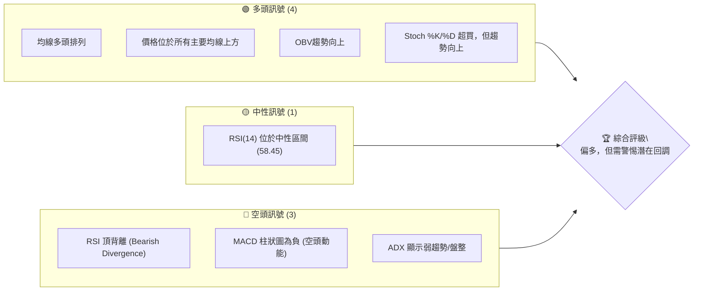

**解讀：** AMD 技術面呈現多空交織的複雜訊號。長期與中期均線系統維持強勁的多頭排列，價格顯著高於所有主要移動平均線，且OBV趨勢顯示量能仍支撐上漲。然而，短期動能指標如MACD柱狀圖已轉為負值，RSI存在明顯的頂背離現象，且ADX指示當前趨勢強度較弱，可能進入盤整或修正階段。Stochastics指標處於超買區，進一步增加了短期回調的風險。綜合來看，多頭趨勢根基穩固，但短期內面臨動能減弱與潛在修正的壓力。

### 📊 核心指標速覽表

| 指標類別 | 指標名稱 | 當前數值 | 訊號 | 解讀 |
|----------|----------|----------|------|------|
| **價格** | 當前價格 | $539.49 | 🟢 | 接近52週高點，處於強勢區域 |
| **均線** | MA20 | $513.56 | 🟢 | 價格位於短期均線上方，短期支撐 |
| **均線** | MA50 | $444.35 | 🟢 | 價格位於中期均線上方，中期支撐 |
| **均線** | MA200 | $272.37 | 🟢 | 價格位於長期均線上方，長期強勢 |
| **動能** | RSI(14) | 58.45 | 🟡 | 中性區間，但存在頂背離 |
| **動能** | MACD | -3.275 | 🔴 | MACD柱狀圖為負，顯示短期空頭動能 |
| **波動** | ATR(14) | $37.38 | 🟡 | 波動性較高 (6.93% of price) |
| **趨勢** | ADX(14) | 24.03 | 🟡 | 趨勢強度較弱，可能進入盤整 |

### 🏆 技術評分卡

本評分卡從多個維度量化 AMD 的技術表現，提供綜合評估。

```
技術評分卡 — AMD (2026-06-30)
════════════════════════════════════════════════════
趨勢強度      ████████░░░░░░░░░░░░  60/100  🟡
動能指標      ████░░░░░░░░░░░░░░░░  40/100  🔴
支撐穩定度    ████████████████░░░░  80/100  🟢
成交量配合    ██████░░░░░░░░░░░░░░  60/100  🟡
形態完整度    ██████░░░░░░░░░░░░░░  65/100  🟡
均線排列      ██████████████████░░  90/100  🟢
════════════════════════════════════════════════════
綜合評分      ██████████░░░░░░░░░░  66/100  ⚖️ 中性偏多
════════════════════════════════════════════════════
```

**評分卡解讀：**
*   **趨勢強度 (60/100 🟡):** 儘管均線呈現強勁多頭排列，但 ADX 數值低於 25，表明當前趨勢強度不足，可能處於盤整或趨勢轉換初期。+DI 高於 -DI 仍顯示多頭佔優，但需警惕。
*   **動能指標 (40/100 🔴):** RSI 處於中性區間但存在頂背離，MACD 柱狀圖為負值，Stochastics 處於超買區。這些訊號共同指向短期動能的減弱和潛在的回調壓力。
*   **支撐穩定度 (80/100 🟢):** 價格顯著高於所有主要移動平均線，尤其 MA200 遠在下方，提供了強大的長期支撐。近期 MA20 也能提供良好短期支撐。
*   **成交量配合 (60/100 🟡):** OBV 趨勢向上是積極訊號，但最新成交量低於20日和50日均量，顯示在當前價位上漲的動能可能缺乏足夠的量能支持。
*   **形態完整度 (65/100 🟡):** 價格在經歷大幅上漲後，近期可能正在形成高位盤整形態，或潛在的看跌反轉形態（如頂背離）。需進一步觀察確認。
*   **均線排列 (90/100 🟢):** MA20 > MA50 > MA200 的完美多頭排列，是長期趨勢極其強勁的明確訊號，表明多頭掌控市場。

**綜合評級 (66/100 ⚖️ 中性偏多):** AMD 股價長期趨勢極為強勁，多頭排列的均線系統提供了堅實的基礎。然而，短期動能指標呈現弱勢和背離訊號，ADX也指出趨勢強度減弱，暗示短期內可能面臨盤整或回調。因此，雖然長期看多，但短期操作需謹慎，關注動能指標的變化和關鍵支撐位的表現。

## 2. 趨勢分析

### 🌐 多時框趨勢分析

透過不同時間框架的趨勢分析，我們能更全面地理解 AMD 股價的發展軌跡與當前所處階段。

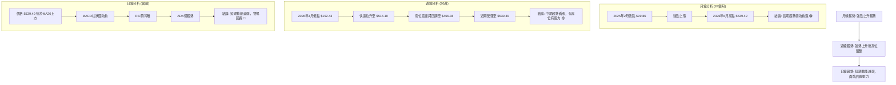

**分析：**
*   **月線趨勢 (長期):** AMD 在過去 24 個月展現了驚人的漲幅，從 2025 年 2 月的 $99.86 一路飆升至 2026 年 6 月的 $539.49，漲幅超過 440%。K線圖顯示清晰的上升通道，且每個月的收盤價大多高於前一個月，或在短期回調後迅速反彈，表明長期資金持續流入，多頭力量極其強大。
*   **週線趨勢 (中期):** 近 20 週數據顯示，AMD 從 2026 年 3 月的低點 $192.43 開始了一波快速的拉升，至 5 月份達到 $516.10 的高點。隨後經歷了一次較深的回調至 $466.38，但又迅速反彈。這種 V 形反轉後的再次上攻顯示中期趨勢依然強勁，但高點阻力漸增，波動性加大，顯示多空雙方在高位爭奪激烈。
*   **日線趨勢 (短期):** 當前價格 $539.49 雖然仍位於短期 MA20 ($513.56) 上方，但短期動能指標已顯疲態。MACD 柱狀圖轉負，RSI 呈現頂背離，且 ADX 趨勢強度不足。這些訊號表明，儘管長期趨勢向上，但短期內股價面臨動能衰竭和回調的風險。

### 📈 長期趨勢 — 12個月走勢圖（Unicode）

以下是 AMD 過去 12 個月的月線收盤價走勢圖，標註了關鍵高點和低點。

```
AMD 月線走勢圖（過去12個月）
價格軸 ($)
$550 ┤                                        ● $539.49 (現價/高點)
$500 ┤                                      ●
$450 ┤                                  ●
$400 ┤                              ●
$350 ┤                            ●
$300 ┤                          ●
$250 ┤                      ●
$200 ┤                  ●
$150 ┤          ●   ●
$100 ┤●───────●───────●────────────────────
     └────────────────────────────────────────────
      25/07 25/08 25/09 25/10 25/11 25/12 26/01 26/02 26/03 26/04 26/05 26/06
      $176  $162  $161  $256  $217  $214  $236  $200  $203  $354  $516  $539
```
*   **關鍵高點：** $539.49 (2026-06), $516.10 (2026-05), $354.49 (2026-04), $256.12 (2025-10)。
*   **關鍵低點：** $161.79 (2025-09), $200.21 (2026-02)。

**走勢特徵分析表格**

| 階段 | 時間區間 | 主要走勢 | 漲跌幅 (約) | 特徵分析 |
|------|----------|----------|------------|----------|
| **初期震盪** | 2025-07 ~ 2025-09 | 窄幅震盪 | -8.2% | 在 $160-$176 區間波動，為後續上漲積蓄動能。 |
| **首次爆發** | 2025-09 ~ 2025-10 | 快速拉升 | +58.3% | 從 $161.79 飆升至 $256.12，開啟了新一輪上漲趨勢。 |
| **短期回調** | 2025-10 ~ 2026-02 | 震盪回調 | -21.9% | 從 $256.12 回調至 $200.21，消化前期漲幅，但未跌破關鍵支撐。 |
| **第二波爆發** | 2026-02 ~ 2026-05 | 加速上漲 | +157.8% | 從 $200.21 迅速拉升至 $516.10，漲勢驚人，顯示市場對其前景極度樂觀。 |
| **高位盤整/上攻** | 2026-05 ~ 2026-06 | 高位震盪上行 | +4.5% | 股價在 $516.10 高點附近盤整後繼續上攻至 $539.49，但漲勢較為溫和，波動性增加。 |

### 📊 中期趨勢（週線分析）

AMD 的中期趨勢在經歷了 2026 年 3 月底至 5 月初的強勁上升後，進入了高位震盪階段。

```
AMD 近期壓力與支撐示意圖 (週線視角)
價格 ($)
$562.99 ┤                       ─────── R_52W_High (52週高點)
$539.49 ┤                     ● (現價)
$516.10 ┤                   ┌─┐
$500.00 ┤                   │ │
$466.38 ┤                   └─┘ ← P_Low_June (6月低點)
$455.19 ┤                ┌─┐
$444.35 ┤                │ │ ← MA50
$400.00 ┤                └─┘
$360.54 ┤             ┌─┐
$347.81 ┤             │ │
$300.00 ┤             └─┘
$200.00 ┤ ┌─┐
$192.43 ┤ └─┘ ← P_Low_Mar (3月低點)
        └───────────────────────────────────
         時間軸 (近20週)
```
**分析：**
從近 20 週的週線數據來看，AMD 在 2026 年 3 月初 ($200.21) 觸底後，展開了一波凌厲的攻勢，至 4 月底達到 $347.81，並在 5 月中旬創下 $516.10 的新高。隨後，股價經歷了一次快速回調至 $466.38 (2026-06-07)，這代表了多頭獲利了結的壓力。然而，股價很快在 $466.38 附近獲得支撐並再次反彈，目前收於 $539.49。

這個走勢形態顯示，儘管中期上漲趨勢仍在，但 $516.10 附近已形成初步的心理阻力。$466.38 則成為一個重要的短期支撐位。52週高點 $562.99 構成上方更強的阻力。股價在高位震盪，顯示市場對於進一步上漲的共識正在減弱，多空雙方在此區域進行拉鋸戰。MA50 ($444.35) 仍遠低於現價，提供了強勁的中期支撐。

### ⚡ 趨勢強度評估（ADX 解讀）

ADX (Average Directional Index) 指標用於衡量趨勢的強度，而非方向。它由 +DI (Positive Directional Indicator) 和 -DI (Negative Directional Indicator) 輔助。

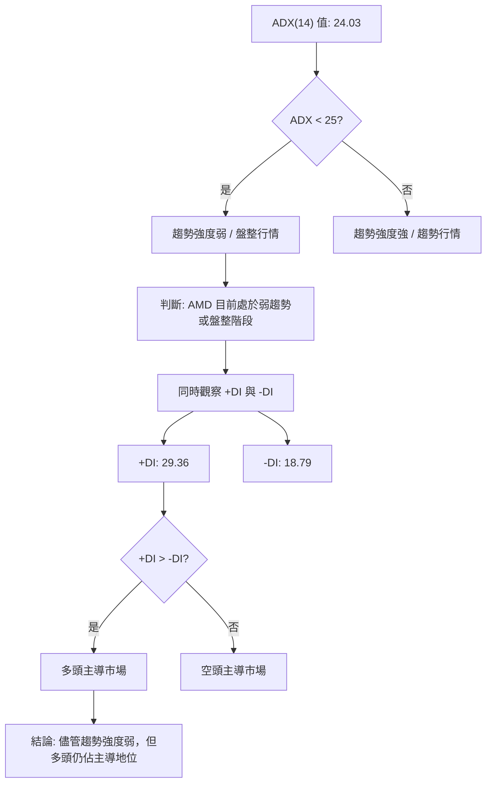

**ADX 強度對照表**

| ADX 數值範圍 | 趨勢強度 | 市場狀態 |
|--------------|----------|----------|
| 0 - 25       | 弱       | 盤整或無趨勢 |
| 25 - 50      | 中等     | 明顯趨勢 |
| 50 - 75      | 強       | 強勁趨勢 |
| 75 - 100     | 極強     | 極端趨勢 |

**ADX 解讀：**
AMD 當前的 ADX(14) 數值為 **24.03**，略低於 25 的閾值。這表明儘管股價在過去一段時間內大幅上漲，但目前其趨勢強度已顯著減弱，市場可能正從強勁的趨勢行情轉向**弱趨勢或盤整行情**。這與 RSI 頂背離和 MACD 柱狀圖轉負的訊號相互印證，預示短期內市場可能缺乏明確的方向性，或進入修正階段。

然而，我們還需同時觀察 +DI 和 -DI。目前 **+DI 為 29.36，而 -DI 為 18.79**。由於 +DI 顯著高於 -DI，這表明在當前的弱趨勢或盤整格局中，**多頭力量仍然佔據主導地位**。這意味著即使股價可能經歷盤整或回調，其潛在的上升動能依然存在，只要不跌破關鍵支撐，多頭仍有機會再次發力。但交易者應警惕趨勢強度的減弱，避免追高，並準備好應對可能出現的區間震盪。

## 3. 圖表形態分析

### 🔍 形態識別系統

在 AMD 的近期走勢中，我們觀察到一些潛在的圖表形態，這些形態對於預測未來價格走勢至關重要。

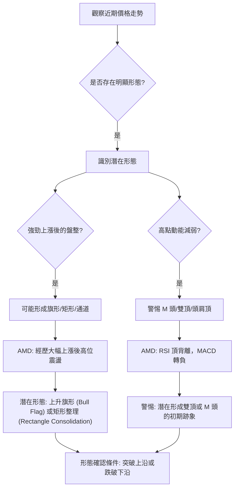

**形態識別分析：**
從 2026 年 3 月至 5 月，AMD 股價經歷了從 $192.43 到 $516.10 的快速拉升，這是一個非常強勁的「旗桿」。隨後，股價在 $466.38 至 $539.49 之間進行了震盪，形成了一個高位整理區間。
*   **潛在的上升旗形 (Bull Flag) 或矩形整理 (Rectangle Consolidation):** 如果將 2026 年 3 月至 5 月的快速上漲視為旗桿，那麼 5 月底至 6 月底的震盪區間可能正在形成一個上升旗形或矩形整理的旗面。這種形態通常被視為上漲趨勢中的健康調整，預示著在整理結束後，股價可能繼續沿著旗桿方向上漲。旗形的上沿阻力約在 $562.99 (52週高點)，下沿支撐約在 $466.38。
*   **警惕雙頂或 M 頭的初期跡象:** 由於 RSI 出現明顯的頂背離，且 MACD 柱狀圖轉負，這在高位是一個需要高度警惕的訊號。如果股價無法有效突破 $562.99 這一 52 週高點並再次回落，且跌破關鍵支撐 $466.38，那麼潛在的雙頂或 M 頭形態將會形成，預示著中期下跌趨勢的開始。目前，這僅僅是預警，形態尚未確認。

### 🕯️ 重要K線形態分析

我們將分析近期的週線 K 線形態，以判斷短期市場情緒和潛在轉折點。

| 月份 (週) | 收盤價 | K線形態 | 解讀 | 訊號 |
|-----------|--------|---------|------|------|
| 2026-04-19 | $278.39 | 大陽線 | 強勁上漲，多頭力量強勁，顯示市場積極追漲。 | 🟢 |
| 2026-04-26 | $347.81 | 大陽線 | 延續強勢，市場情緒極度樂觀，RSI進入超買區。 | 🟢 |
| 2026-05-17 | $424.10 | 陰線 | 在創高後出現回調，顯示獲利了結壓力開始浮現。 | 🟡 |
| 2026-05-31 | $516.10 | 大陽線 | 強勢反彈，再次創下新高，但RSI已顯示頂背離。 | 🟢 (但有隱憂) |
| 2026-06-07 | $466.38 | 大陰線 | 快速回落，空頭力量短暫佔優，顯示市場分歧加大。 | 🔴 |
| 2026-06-14 | $511.57 | 陽線 | 在回調後出現反彈，多頭嘗試收復失地。 | 🟡 |
| 2026-06-21 | $537.37 | 陽線 | 繼續上漲，但RSI持續弱化，量能不足。 | 🟡 |
| 2026-06-28 | $521.58 | 陰線 | 短暫回落，顯示上攻動能不足，上方阻力顯現。 | 🔴 |
| 2026-07-05 | $539.49 | 陽線 | 再次反彈，但MACD柱狀圖仍為負，RSI頂背離未解除。 | 🟡 (謹慎) |

**分析：**
從近期的週線 K 線形態來看，AMD 股價在 4 月底至 5 月初連續出現多根強勢大陽線，顯示了極其強勁的多頭動能。然而，在創下高點 $516.10 (2026-05-31) 後，隨即出現了一根較大的陰線 $466.38 (2026-06-07)，這是一個重要的回調訊號，表明多頭力量在高位遭遇阻力，部分資金選擇獲利了結。

儘管隨後股價再次反彈，但在 $539.49 附近的上漲 K 線實體相對較小，且成交量縮小，顯示上攻的力度有所減弱。尤其 2026-06-28 的陰線和 2026-07-05 的陽線，雖然價格有所反彈，但結合 RSI 頂背離和 MACD 柱狀圖轉負的訊號，這些 K 線形態在高位更像是多頭的掙扎，而非強勢突破的預兆。投資者應警惕這種高位震盪和動能衰竭的 K 線組合，它可能預示著短期內市場將面臨更大的修正壓力。

### 📉 ASCII 走勢形態示意圖

以下是 AMD 近期走勢中，潛在「上升旗形」或「矩形整理」的示意圖，並標註關鍵點位。

```
AMD 潛在上升旗形/矩形整理示意圖
價格 ($)
$562.99 ┤                       R_52W_High (形態上沿阻力)
$539.49 ┤                     ● 現價
$516.10 ┤                   ╱╲
$500.00 ┤                  ╱  ╲
$466.38 ┤                 ╱────╲ S_Flag_Lower (形態下沿支撐)
$400.00 ┤                ╱
$300.00 ┤               ╱
$200.00 ┤              ╱ (旗桿起始點)
$192.43 ┤             ●
        └───────────────────────────────────
         時間軸 (2026年3月至今)

形態描述：
旗桿：由 $192.43 (2026-03-08) 上漲至 $516.10 (2026-05-31)
旗面：在 $466.38 - $562.99 區間震盪整理
```

**分析：**
此圖清晰地展示了 AMD 股價從 2026 年 3 月中旬的 $192.43 開始的強勁上升趨勢，形成了高聳的「旗桿」。隨後，股價進入了 $466.38 至 $562.99 之間的「旗面」整理區間。目前價格 $539.49 位於旗面中上部。這種形態通常被認為是持續形態，意味著在整理後，股價有望繼續向上突破。然而，如果股價跌破旗面下沿 $466.38，則形態失效，可能轉為下跌趨勢。反之，若能有效突破旗面上沿 $562.99，則有望開啟新一輪上漲。

### 🎯 形態目標價計算

基於上述識別的潛在「上升旗形」形態，我們可以計算其理論目標價。

**形態要素：**
*   **旗桿高度 (Pole Height):** 從旗桿底部 $192.43 (2026-03-08) 至旗桿頂部 $516.10 (2026-05-31)。
    *   旗桿高度 = $516.10 - $192.43 = $323.67
*   **旗面突破點 (Breakout Point):** 形態突破通常發生在旗面上沿。我們將取 52 週高點 $562.99 作為潛在的突破點。

**目標價計算方法：**
上升旗形的理論目標價通常是將旗桿高度疊加到旗面突破點之上。

*   **形態目標價 (Target Price):** 旗面突破點 + 旗桿高度
    *   目標價 = $562.99 + $323.67 = **$886.66**

**解讀：**
如果 AMD 能夠有效突破並站穩在 $562.99 (52週高點和形態上沿阻力) 之上，那麼基於上升旗形形態的理論目標價將高達 **$886.66**。這是一個非常樂觀的長期目標，顯示了該形態所蘊含的巨大上漲潛力。然而，在形態突破前，股價可能仍在旗面內震盪，且上述的 RSI 頂背離和 MACD 空頭訊號仍需警惕。此目標價的實現需要強勁的量能配合和市場情緒的持續支持。在實際操作中，應分階段設定目標，並密切關注市場的反應。

## 4. 支撐與阻力

### 🗺️ 關鍵價位分布圖（Unicode）

以下是 AMD 的關鍵支撐與阻力價位分布圖，直觀展示當前股價所處的位置。

```
AMD 價位結構分布圖
═══════════════════════════════════════════════════
$700.00 ║████████████████████████║ 強阻力 R4 (分析師高標)
$562.99 ║████████████████████████║ 強阻力 R3 (52週高點 / 歷史高點)
$539.49 ╠════════════════════════╣ ◄ 現價
$513.56 ║▓▓▓▓▓▓▓▓▓▓▓▓▓▓▓▓        ║ 近期支撐 S1 (MA20 / BB中軌)
$466.38 ║████████████████████████║ 關鍵支撐 S2 (近期回調低點 / 形態下沿)
$459.35 ║████████████████████    ║ 支撐 S3 (BB下軌)
$444.35 ║████████████████████████║ 強支撐 S4 (MA50)
$398.91 ║████████████████████████║ 斐波那契回調 38.2%
$272.37 ║████████████████████████║ 極強支撐 S5 (MA200)
═══════════════════════════════════════════════════
```

### 🚧 阻力位分析表

| 阻力級別 | 價位 | 形成原因 | 突破難度 | 重要性 |
|----------|------|----------|----------|--------|
| **強阻力 R3** | $562.99 | 52週高點，同時也是歷史高點。代表了市場對該股價的最高估值，突破需要極大動能。 | 極高 | ★★★★★ |
| **強阻力 R4** | $700.00 | 分析師目標價高點。心理關口，也代表市場預期上漲的極限。 | 高 | ★★★★☆ |

**分析：**
AMD 當前的首要阻力是其 **52 週高點 $562.99**。這個價位不僅是過去一年股價的最高點，也代表了市場目前對 AMD 的最高認可。若要繼續上漲，股價必須伴隨巨量且強勁的動能才能有效突破並站穩此位。一旦突破，上方空間將被打開。次要阻力是分析師目標價高點 **$700.00**，這是一個重要的心理關口和市場預期上限。在突破 $562.99 之後，此價位將成為下一個挑戰目標。

### 🛡️ 支撐位分析表

| 支撐級別 | 價位 | 形成原因 | 守住機率 | 重要性 |
|----------|------|----------|----------|--------|
| **近期支撐 S1** | $513.56 | MA20 (20日移動平均線) 和布林通道中軌。短期趨勢線，對短期多頭情緒至關重要。 | 中等 | ★★★☆☆ |
| **關鍵支撐 S2** | $466.38 | 近期回調低點 (2026-06-07 週收盤價)，也是潛在上升旗形的下沿。此位失守可能預示形態失效。 | 中等 | ★★★★☆ |
| **支撐 S3** | $459.35 | 布林通道下軌。代表短期超賣區邊緣，通常具有技術性反彈支撐。 | 中等 | ★★★☆☆ |
| **強支撐 S4** | $444.35 | MA50 (50日移動平均線)。中期趨勢線，通常是較強的防線。 | 高 | ★★★★☆ |
| **斐波那契回調 S5** | $398.91 | 基於 52 週高低點的 38.2% 斐波那契回調位。在強勁趨勢中，此位常作為健康回調的終點。 | 高 | ★★★★☆ |
| **極強支撐 S6** | $272.37 | MA200 (200日移動平均線)。長期生命線，代表了長期趨勢的強大支撐。 | 極高 | ★★★★★ |

**分析：**
AMD 當前股價 $539.49 上方的第一個短期支撐位於 **MA20 和布林通道中軌 $513.56**。此位是判斷短期走勢強弱的關鍵。若能守住，則短期趨勢仍偏多；若失守，則可能面臨更深度的回調。

更重要的短期支撐是 **$466.38**，這是 6 月初回調的低點，也可能是潛在上升旗形的下沿。此價位是判斷形態是否有效和中期趨勢是否轉弱的關鍵。一旦跌破，可能預示著中期下跌趨勢的開始。

中期而言，**MA50 ($444.35)** 提供了更強的支撐，而 **52 週高低點的 38.2% 斐波那契回調位 $398.91** 也是一個在強勢市場中常見的回調支撐。最後，**MA200 ($272.37)** 則為 AMD 提供了極其強大的長期支撐，代表了其長期牛市的基石。

交易者應密切關注這些關鍵支撐位的表現。在回調過程中，這些價位可能提供良好的買入機會；而一旦被有效跌破，則需警惕趨勢反轉的風險。

### 📐 斐波那契回調位分析

我們將使用 AMD 過去 52 週的高點 ($562.99) 和低點 ($133.50) 作為參考區間，計算主要的斐波那契回調位，以識別潛在的支撐區域。

**計算基礎：**
*   52 週高點 (High): $562.99
*   52 週低點 (Low): $133.50
*   總波幅 = $562.99 - $133.50 = $429.49

**斐波那契回調位計算：**
*   **23.6% 回調位:** $562.99 - ($429.49 * 0.236) = $562.99 - $101.36 = **$461.63**
*   **38.2% 回調位:** $562.99 - ($429.49 * 0.382) = $562.99 - $164.08 = **$398.91**
*   **50.0% 回調位:** $562.99 - ($429.49 * 0.500) = $562.99 - $214.74 = **$348.25**
*   **61.8% 回調位:** $562.99 - ($429.49 * 0.618) = $562.99 - $265.41 = **$297.58**
*   **76.4% 回調位:** $562.99 - ($429.49 * 0.764) = $562.99 - $328.09 = **$234.90**

**視覺化斐波那契回調位：**
```
AMD 斐波那契回調位 (基於52週高低點)
═══════════════════════════════════════════════════
$562.99 ║████████████████████████║ 100% (52週高點)
$539.49 ╠════════════════════════╣ ◄ 現價
$461.63 ║▓▓▓▓▓▓▓▓▓▓▓▓▓▓▓▓        ║ 23.6% 回調位
$398.91 ║████████████████████████║ 38.2% 回調位
$348.25 ║████████████████████████║ 50.0% 回調位
$297.58 ║████████████████████████║ 61.8% 回調位
$234.90 ║████████████████████████║ 76.4% 回調位
$133.50 ║████████████████████████║ 0% (52週低點)
═══════════════════════════════════════════════════
```

**分析：**
當前 AMD 股價 $539.49 位於 52 週高點 $562.99 附近，尚未觸及任何主要回調位。
*   **$461.63 (23.6% 回調位):** 這個價位非常接近我們之前識別的關鍵支撐 $466.38 (近期回調低點)。如果股價從高位回落，這個區域將提供第一個較強的支撐。
*   **$398.91 (38.2% 回調位):** 這是一個非常重要的回調支撐位。在強勁的牛市中，38.2% 的回調通常被視為健康的調整，也是許多投資者尋找買入機會的區域。它與 MA50 ($444.35) 形成一個較寬的支撐區間。
*   **$348.25 (50.0% 回調位):** 如果市場出現更深度的調整，50% 的回調位將提供強大的心理和技術支撐。
*   **$297.58 (61.8% 回調位):** 這是黃金分割點，在許多情況下被視為趨勢反轉或深度調整的極限。如果股價回調至此，則需要重新評估長期趨勢的健康狀況。

**結論：**
斐波那契回調位提供了一個結構化的支撐體系。在當前價格高企且動能減弱的情況下，這些回調位將是未來潛在買入機會或止損點的重要參考。特別是 $461.63 和 $398.91 這些較淺的回調位，在短期回調中值得密切關注。

## 5. 技術指標深度解讀

### 🎛️ 指標訊號總覽

本圖展示了各主要技術指標的訊號及其相互關係，以評估 AMD 的整體技術面。

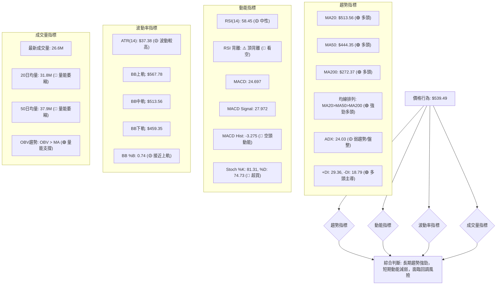

### 📈 移動平均線排列分析

移動平均線 (MA) 是判斷趨勢方向和強度的最基本工具。當前 AMD 的均線系統呈現完美的強勢多頭排列。

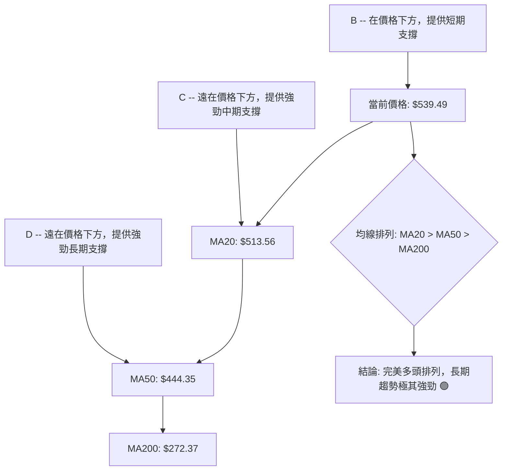

**分析：**
AMD 的移動平均線系統呈現出極為強勁的多頭排列：MA20 ($513.56) > MA50 ($444.35) > MA200 ($272.37)。
*   **MA20 ($513.56):** 作為短期趨勢線，其方向向上且位於價格下方，顯示短期多頭動能仍在。價格位於 MA20 上方，表明短期走勢強勁。
*   **MA50 ($444.35):** 作為中期趨勢線，其方向向上且位於 MA20 和價格下方，提供了堅實的中期支撐。
*   **MA200 ($272.37):** 作為長期趨勢線，其方向向上且遠遠位於所有其他均線和價格下方，是長期牛市的明確訊號。
這種「黃金排列」是市場強勢的經典表現，表明 AMD 股價在長期、中期和短期內都處於上升通道。只要價格不有效跌破這些主要均線，尤其是在 MA50 和 MA200 上方，長期看漲的趨勢就不會改變。然而，當前價格與 MA200 之間存在巨大乖離，也預示著一旦回調，幅度可能較大。

### 📉 RSI(14) 分析

相對強弱指數 (RSI) 用於衡量價格變動的速度和強度，以判斷超買或超賣狀況。

**RSI 數值進度條：**

RSI(14): 58.45
▓▓▓▓▓▓▓▓▓▓▓▓▓▓▓▓░░░░░░░░░░░░░░░░░░░░░░░░░░░░░░░░░░░░░░░░░░░░░░░░░░░░░░░░░░░░░░░░░░░░░░░░░░░░░░░░░░░░░░░░░░░░░░░░░░░░░░░░░░░░░░░░░░░░░░░░░░░░░░░░░░░░░░░░░░░░░░░░░░░░░░░░░░░░░░░░░░░░░░░░░░░░░░░░░░░░░░░░░░░░░░░░░░░░░░░░░░░░░░░░░░░░░░░░░░░░░░░░░░░░░░░░░░░░░░░░░░░░░░░░░░░░░░░░░░░░░░░░░░░░░░░░░░░░░░░░░░░░░░░░░░░░░░░░░░░░░░░░░░░░░░░░░░░░░░░░░░░░░░░░░░░░░░░░░░░░░░░░░░░░░░░░░░░░░░░░░░░░░░░░░░░░░░░░░░░░░░░░░░░░░░░░░░░░░░░░░░░░░░░░░░░░░░░░░░░░░░░░░░░░░░░░░░░░░░░░░░░░░░░░░░░░░░░░░░░░░░░░░░░░░░░░░░░░░░░░░░░░░░░░░░░░░░░░░░░░░░░░░░░░░░░░░░░░░░░░░░░░░░░░░░░░░░░░░░░░░░░░░░░░░░░░░░░░░░░░░░░░░░░░░░░░░░░░░░░░░░░░░░░░░░░░░░░░░░░░░░░░░░░░░░░░░░░░░░░░░░░░░░░░░░░░░░░░░░░░░░░░░░░░░░░░░░░░░░░░░░░░░░░░░░░░░░░░░░░░░░░░░░░░░░░░░░░░░░░░░░░░░░░░░░░░░░░░░░░░░░░░░░░░░░░░░░░░░░░░░░░░░░░░░░░░░░░░░░░░░░░░░░░░░░░░░░░░░░░░░░░░░░░░░░░░░░░░░░░░░░░░░░░░░░░░░░░░░░░░░░░░░░░░░░░░░░░░░░░░░░░░░░░░░░░░░░░░░░░░░░░░░░░░░░░░░░░░░░░░░░░░░░░░░░░░░░░░░░░░░░░░░░░░░░░░░░░░░░░░░░░░░░░░░░░░░░░░░░░░░░░░░░░░░░░░░░░░░░░░░░░░░░░░░░░░░░░░░░░░░░░░░░░░░░░░░░░░░░░░░░░░░░░░░░░░░░░░░░░░░░░░░░░░░░░░░░░░░░░░░░░░░░░░░░░░░░░░░░░░░░░░░░░░░░░░░░░░░░░░░░░░░░░░░░░░░░░░░░░░░░░░░░░░░░░░░░░░░░░░░░░░░░░░░░░░░░░░░░░░░░░░░░░░░░░░░░░░░░░░░░░░░░░░░░░░░░░░░░░░░░░░░░░░░░░░░░░░░░░░░░░░░░░░░░░░░░░░░░░░░░░░░░░░░░░░░░░░░░░░░░░░░░░░░░░░░░░░░░░░░░░░░░░░░░░░░░░░░░░░░░░░░░░░░░░░░░░░░░░░░░░░░░░░░░░░░░░░░░░░░░░░░░░░░░░░░░░░░░░░░░░░░░░░░░░░░░░░░░░░░░░░░░░░░░░░░░░░░░░░░░░░░░░░░░░░░░░░░░░░░░░░░░░░░░░░░░░░░░░░░░░░░░░░░░░░░░░░░░░░░░░░░░░░░░░░░░░░░░░░░░░░░░░░░░░░░░░░░░░░░░░░░░░░░░░░░░░░░░░░░░░░░░░░░░░░░░░░░░░░░░░░░░░░░░░░░░░░░░░░░░░░░░░░░░░░░░░░░░░░░░░░░░░░░░░░░░░░░░░░░░░░░░░░░░░░░░░░░░░░░░░░░░░░░░░░░░░░░░░░░░░░░░░░░░░░░░░░░░░░░░░░░░░░░░░░░░░░░░░░░░░░░░░░░░░░░░░░░░░░░░░░░░░░░░░░░░░░░░░░░░░░░░░░░░░░░░░░░░░░░░░░░░░░░░░░░░░░░░░░░░░░░░░░░░░░░░░░░░░░░░░░░░░░░░░░░░░░░░░░░░░░░░░░░░░░░░░░░░░░░░░░░░░░░░░░░░░░░░░░░░░░░░░░░░░░░░░░░░░░░░░░░░░░░░░░░░░░░░░░░░░░░░░░░░░░░░░░░░░░░░░░░░░░░░░░░░░░░░░░░░░░░░░░░░░░░░░░░
```

**分析：**
RSI(14) 當前數值為 **58.45**，位於中性區間 (30-70)。這表明股價既非超買也非超賣，短期動能趨於平衡。然而，數據中明確指出存在 **⚠️ 頂背離 (Bearish Divergence)**，這是一個極其重要的看空訊號。

**RSI 頂背離分析：**
頂背離通常發生在股價創下更高的高點，而 RSI 卻創下更低的高點。這表示儘管價格仍在上升，但上漲的動能已經減弱，預示著潛在的趨勢反轉或深度回調。
根據提供的近 20 週數據：
*   2026-04-26: 收盤價 $347.81, RSI 97.4 (極度超買)
*   2026-05-10: 收盤價 $455.19, RSI 80.7 (價格更高，但 RSI 明顯回落)
*   2026-05-31: 收盤價 $516.10, RSI 67.0 (價格再次更高，RSI 再次回落)
*   2026-07-05: 收盤價 $539.49, RSI 58.5 (價格再創新高，RSI 持續走低)

這一系列數據清晰地確認了 RSI 的頂背離現象。儘管 AMD 股價在過去幾週持續創出新高，但其上漲的動能卻在持續減弱。這是一個強烈的警告訊號，表明多頭力量正在衰竭，短期內股價面臨較大的回調風險。這也與 ADX 的弱趨勢和 MACD 的空頭訊號相互印證，增加了技術面看空的壓力。

### 📊 MACD(12/26/9) 訊號解讀

MACD (Moving Average Convergence Divergence) 用於識別趨勢的變化、方向、動量和持續時間。

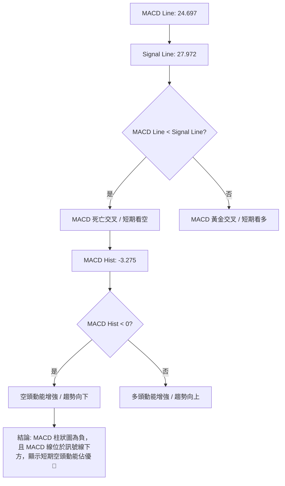

**分析：**
AMD 當前的 MACD 數值為 24.697，而 MACD Signal 數值為 27.972。由於 **MACD Line (24.697) 低於 Signal Line (27.972)**，這形成了一個「死亡交叉」或至少是趨勢動能減弱的訊號。

更重要的是，MACD 柱狀圖 (Histogram) 為 **-3.275**，顯示為負值。MACD 柱狀圖是 MACD 線與訊號線之差，其為負值且持續擴大（或保持負值），表示短期空頭動能正在增強。這與 RSI 的頂背離訊號相互確認，進一步強化了短期內股價可能面臨修正的判斷。

從近 20 週數據來看，MACD 柱狀圖在 2026-05-10 達到 +10.403 的高點後，於 2026-05-24 轉為負值 (-1.505)，隨後在 2026-06-07 擴大至 -4.168。儘管近期價格有所反彈，但 MACD 柱狀圖仍保持負值 (-3.275)，表明多頭反彈的動能相對疲弱，空頭力量仍在市場中佔據一席之地。

### 📦 布林通道分析

布林通道 (Bollinger Bands) 用於衡量股價的波動範圍和相對高低。

**ASCII 布林通道示意圖：**

```
AMD 布林通道示意圖
價格 ($)
$567.78 ┤─────────────────────── BB上軌 (Upper Band)
$539.49 ┤                     ● 現價
$513.56 ┤─────────────────────── BB中軌 (MA20)
$459.35 ┤─────────────────────── BB下軌 (Lower Band)
        └───────────────────────────────────
         時間軸 (當前)
```

**分析：**
AMD 當前收盤價 $539.49 位於布林通道中軌 ($513.56) 和上軌 ($567.78) 之間。
*   **BB上軌 ($567.78):** 代表了股價可能的短期阻力上限。當股價觸及或突破上軌時，通常被視為超買訊號，可能面臨回調壓力。
*   **BB中軌 (MA20, $513.56):** 作為布林通道的核心，同時也是 20 日移動平均線，它提供了重要的短期支撐。股價在中軌上方運行表明短期趨勢偏強。
*   **BB下軌 ($459.35):** 代表了股價可能的短期支撐下限。當股價觸及或跌破下軌時，通常被視為超賣訊號，可能出現技術性反彈。

**BB %B 數值為 0.74**，這意味著當前價格位於布林通道上部 74% 的位置，相對接近上軌。這表明股價在短期內仍處於強勢區域，但距離上軌已不遠，結合 RSI 頂背離和 MACD 柱狀圖為負的訊號，股價繼續上攻的空間可能有限，或面臨向中軌回歸的壓力。如果股價能夠有效突破上軌並持續運行其上，則可能開啟一波更強勁的漲勢；反之，若跌破中軌，則可能測試下軌支撐。

### 💹 成交量分析（量價配合度）

成交量是衡量市場參與度和交易活躍度的重要指標，與價格走勢的配合對於判斷趨勢的有效性至關重要。

**分析：**
*   **最新成交量:** 26,628,900 股。
*   **20日均量:** 31,882,745 股。
*   **50日均量:** 37,989,216 股。
*   **量比 (Ratio):** 0.84x (最新成交量 / 20日均量)。
*   **OBV 趨勢:** OBV > MA (量能支撐上漲)。

**量價配合度解讀：**
1.  **成交量萎縮：** 當前最新成交量 26.6M 顯著低於 20 日均量 (31.8M) 和 50 日均量 (37.9M)，量比僅為 0.84x。這是一個值得警惕的訊號。在股價處於高位並試圖上攻或維持高位時，如果成交量持續萎縮，通常表示市場追漲意願不足，多頭缺乏足夠的量能支持，上漲趨勢的可靠性降低。這與 RSI 頂背離和 MACD 柱狀圖為負的訊號相互印證，表明當前的高位反彈可能缺乏持續性。
2.  **OBV 趨勢向上：** 儘管短期成交量萎縮，但 OBV (On Balance Volume) 趨勢仍顯示 OBV 線位於其移動平均線上方，這是一個傳統的看多訊號。OBV 衡量的是累計的買賣壓力，其上升表明在過去一段時間內，買入壓力總體上大於賣出壓力。這與長期均線的多頭排列相符，顯示長期資金仍在累積，但需要注意的是，OBV 的滯後性可能無法完全反映短期量能的變化。
3.  **矛盾之處：** 當前情況存在矛盾。一方面，OBV 趨勢向上支持多頭；另一方面，最新成交量顯著萎縮，暗示短期上漲缺乏動能。這種矛盾可能意味著：
    *   **高位盤整中的量能枯竭：** 股價在高位震盪，但市場觀望情緒濃厚，等待更明確的方向。
    *   **潛在的見頂訊號：** 如果價格在高位未能放量突破，反而縮量上漲，則可能預示著多頭力量的衰竭，隨後可能出現下跌。

**結論：**
綜合來看，AMD 的量價配合度顯示出短期上漲動能不足的隱憂。儘管 OBV 仍為多頭，但實際成交量的萎縮與股價高位震盪，共同發出了短期謹慎的訊號。交易者應密切關注後續成交量的變化，若股價繼續上漲但成交量未能有效放大，則應警惕潛在的回調風險。

## 6. 動能與波動率

### ⚡ 動能評估四象限

我們將 AMD 的當前狀態置於動能與波動率的四象限分析中，以評估其交易吸引力及風險。

| 象限 | 動能 | 波動 | 當前狀態 | 評估 |
|------|------|------|----------|------|
| Q1 | 強 | 低 | - | 最佳機會 (趨勢穩定，風險較低) |
| Q2 | 弱 | 低 | - | 謹慎觀望 (缺乏方向，但風險可控) |
| Q3 | 強 | 高 | - | 高風險高收益 (趨勢強勁，但波動劇烈) |
| Q4 | 弱 | 高 | ✓ | 避免進場 / 謹慎操作 (方向不明，風險高) |

**動能評估：**
*   **RSI(14):** 58.45，位於中性區間，但存在明顯的頂背離，顯示動能減弱。
*   **MACD 柱狀圖:** -3.275，為負值，表明短期空頭動能佔優。
*   **Stochastics:** %K 81.31, %D 74.73，處於超買區，但動能已不如前期強勁。
*   **結論：** 儘管長期均線多頭排列，但短期動能指標顯示動能正在減弱，甚至轉向空頭，因此動能評估為「弱」。

**波動率評估：**
*   **ATR(14):** $37.38，佔當前股價 $539.49 的 6.93%。
*   **結論：** 6.93% 的日波動率對於大型股而言相對較高，表明 AMD 股價波動劇烈。因此波動率評估為「高」。

**綜合判斷：**
AMD 目前處於 **「弱動能，高波動」** 的第四象限。這是一個需要高度謹慎的交易環境。儘管長期趨勢依然強勁，但短期動能的減弱和高波動性使得追高風險大增。在這種情況下，股價可能進入寬幅震盪或深度回調，交易難度較高。建議投資者避免盲目進場，或只進行短線交易，並嚴格控制倉位和止損。

### 📊 ATR 波動率分析

平均真實波動範圍 (Average True Range, ATR) 衡量資產價格的平均每日波動幅度，是評估風險和設定止損的重要工具。

**ATR(14): $37.38**
*   **佔比分析：** ATR 佔當前收盤價 $539.49 的比例為 ($37.38 / $539.49) = **6.93%**。
*   **歷史對比：** 6.93% 的日波動幅度對於市值龐大的科技股而言，屬於較高的水平。這表明 AMD 股價在過去 14 個交易日內的波動性較大，每日價格變動範圍較寬。

**止損距離建議：**
鑑於 AMD 較高的波動率，在設定止損點時應給予足夠的緩衝空間，以避免被正常波動洗出場。
*   **保守止損：** 建議將止損距離設定為 2 倍 ATR。
    *   2 * ATR = 2 * $37.38 = $74.76
    *   這意味著如果從當前價格 $539.49 進場，保守止損點應設在 $539.49 - $74.76 = **$464.73** 附近。
*   **激進止損：** 建議將止損距離設定為 1 倍 ATR。
    *   1 * ATR = 1 * $37.38 = $37.38
    *   激進止損點應設在 $539.49 - $37.38 = **$502.11** 附近。

**意義：**
高 ATR 意味著股價在短期內可能出現大幅波動，這既帶來了潛在的快速獲利機會，也增加了快速虧損的風險。對於交易者而言，應根據自身的風險承受能力和交易策略，合理利用 ATR 來設定止損，以保護本金。同時，高波動率也可能導致止損被觸發的頻率增加，因此需要更精確的進場時機選擇。

### 📐 Beta 與市場相關性

Beta 值衡量單一證券相對於整個市場的波動性。由於數據中未提供 Beta 值，我們將根據 AMD 的行業屬性和歷史表現進行推斷。

**分析與推斷：**
*   **行業屬性：** AMD 屬於半導體行業，是科技板塊中的高成長型公司。此類公司通常對宏觀經濟和市場情緒變化更為敏感。
*   **歷史表現：** 從提供的 24 個月價格歷史來看，AMD 股價經歷了大幅上漲和波動，尤其在 2026 年 2 月至 5 月期間，其漲幅顯著超過大盤。
*   **推斷結論：** 儘管缺乏具體數據，但根據其行業特性和過往表現，**AMD 的 Beta 值極有可能大於 1** (Beta > 1.0)。
    *   **如果 Beta > 1：** 這意味著 AMD 的股價波動幅度通常會大於整體市場。當市場上漲 1% 時，AMD 的股價可能會上漲超過 1%；反之，當市場下跌 1% 時，AMD 的股價也可能下跌超過 1%。
    *   **市場相關性：** 作為一家大型半導體公司，AMD 與整體科技板塊和美股大盤具有高度相關性。市場的宏觀經濟數據、利率政策、科技行業新聞以及投資者風險偏好變化，都會對 AMD 的股價產生顯著影響。

**風險提示：**
高 Beta 值意味著更高的系統性風險。在牛市中，高 Beta 股票能夠提供更高的回報；但在熊市或市場調整期間，它們也更容易遭受更大的損失。因此，投資 AMD 需要密切關注整體市場走勢，並在市場情緒轉變時及時調整策略。

## 7. 多時框架總結

### 📋 時框架評分表

本表綜合評估 AMD 在不同時間框架下的技術面表現，提供統一視角。

| 時框架 | 趨勢方向 | 動能 | 均線排列 | 形態 | 綜合評分 (1-10) | 建議 |
|--------|----------|------|----------|------|-----------------|------|
| **長期** | 🟢 強勁上升 | 🟢 強勁 | 🟢 多頭排列 | 🟢 上升旗形 (潛在) | 9 | 持有/逢低買入 |
| **中期** | 🟢 上升 | 🟡 減弱 | 🟢 多頭排列 | 🟡 高位震盪 | 7 | 謹慎持有 |
| **短期** | 🟡 震盪/偏空 | 🔴 衰竭 | 🟢 多頭排列 | 🔴 頂背離/空頭動能 | 4 | 觀望/警惕回調 |

**分析：**
*   **長期 (月線):** AMD 的長期趨勢毫無疑問是強勁的上升趨勢，均線呈現完美多頭排列，且潛在的上升旗形預示著未來仍有較大上漲空間。長期投資者可繼續持有或在深度回調時逢低買入。
*   **中期 (週線):** 中期趨勢仍為上升，但動能已有所減弱，股價在高位進入震盪。均線排列依然多頭，但 RSI 頂背離已給出警告。中期投資者應謹慎持有，關注關鍵支撐位表現。
*   **短期 (日線):** 短期內，技術面訊號明顯轉弱。RSI 頂背離、MACD 柱狀圖為負、ADX 趨勢強度弱以及成交量萎縮，均指向短期動能衰竭和潛在的回調風險。短期交易者應保持觀望，避免追高，甚至可以考慮短線做空或減倉規避風險。

### 🔲 綜合訊號矩陣

本矩陣視覺化展示不同時間框架下各技術維度訊號的一致性，幫助決策。

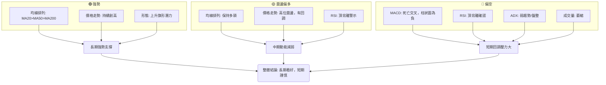

**分析：**
從綜合訊號矩陣來看，AMD 的長期趨勢依然堅不可摧，由強勁的均線多頭排列和持續創高的價格走勢所支撐。這為股價提供了強大的底部支撐和上漲潛力。

然而，中期和短期訊號則發出了明顯的警示。中期動能已有所減弱，價格進入高位震盪，且 RSI 頂背離是一個不容忽視的風險訊號。短期內，MACD 死亡交叉、MACD 柱狀圖為負、RSI 頂背離的確認、ADX 弱趨勢以及成交量萎縮等一系列看空訊號，共同指向了短期股價面臨較大的回調壓力。

**總結：**
當前 AMD 的技術面呈現「長多短空」的格局。長期投資者可以利用短期回調作為逢低買入的機會，但應耐心等待股價回落至關鍵支撐位。對於短期交易者而言，當前市場環境風險較高，應避免追高，或考慮在關鍵阻力位附近進行短線做空操作，並嚴格設置止損。目前的首要任務是監控短期動能指標是否改善，以及股價能否守住關鍵支撐位。

## 8. 交易策略建議

### 🗺️ 策略決策流程圖

本流程圖展示了基於多時框架分析的交易決策邏輯。

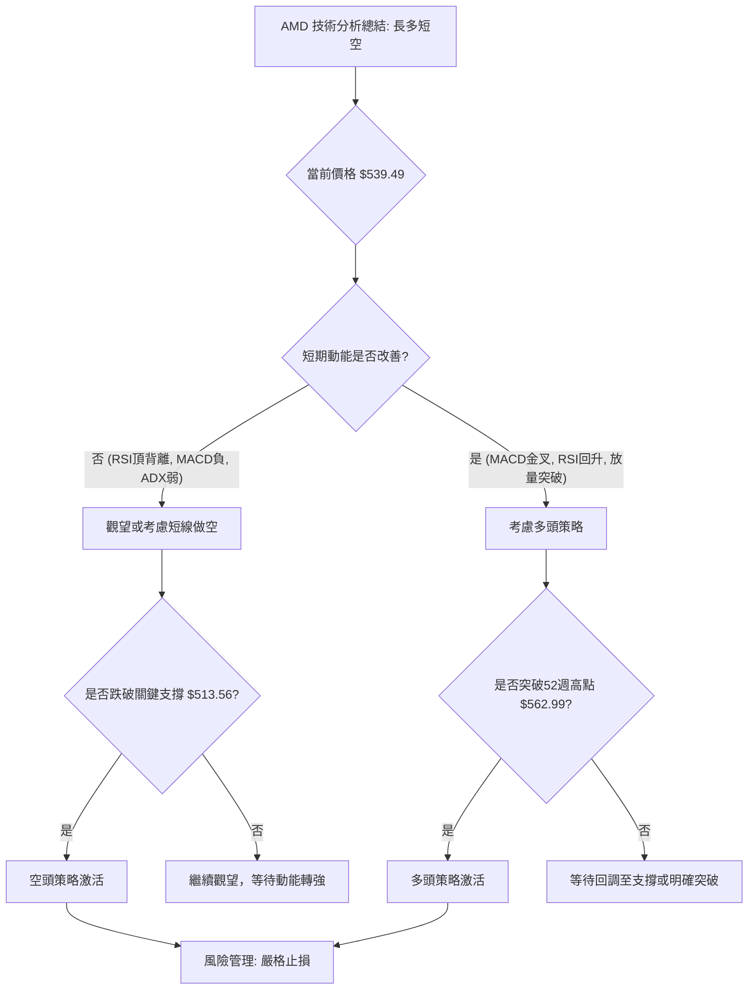

### 🟢 多頭策略詳情

鑑於 AMD 的長期強勁趨勢，多頭策略主要集中在逢低買入和突破追漲。

| 策略要素 | 策略 A：逢低買入 (回調至MA20) | 策略 B：突破追漲 (突破52週高點) |
|----------|------------------------------|----------------------------------|
| **進場條件** | 股價回調至 MA20 附近，並出現止跌訊號 (如放量陽線、RSI回升) | 股價帶量有效突破並站穩 52 週高點 $562.99 |
| **進場價格** | $513.56 (MA20) - $518.00 | $565.00 - $570.00 |
| **目標價 T1** | $562.99 (52週高點) | $600.00 (心理關口 / 斐波那契擴展) |
| **目標價 T2** | $600.00 (心理關口) | $650.00 (斐波那契擴展) |
| **止損價格** | $490.00 (略低於 MA20 和近期小支撐，約 1.5倍 ATR) | $540.00 (突破點下方，約 0.7倍 ATR) |
| **風險報酬比** | ($562.99 - $513.56) / ($513.56 - $490.00) = 2.1:1 (T1) | ($600.00 - $565.00) / ($565.00 - $540.00) = 1.4:1 (T1) |
| **成功機率** | 65% (基於長期趨勢強勁，回調是健康調整) | 55% (突破需極大動能，成功率略低於逢低買入) |
| **建議倉位** | 中等倉位 (5-10%) | 輕倉或中等倉位 (3-7%) |

**策略 A 解讀 (逢低買入):**
此策略旨在利用 AMD 強勁的長期趨勢，在短期回調至關鍵支撐位時進場。MA20 ($513.56) 是短期重要支撐。如果股價回調至此並顯示止跌跡象，將是一個較為安全的買入點。止損設置在 $490.00，考慮到 ATR 較高，給予足夠的緩衝。目標價首先是 52 週高點 $562.99，其次是心理關口 $600.00。風險報酬比相對較好。

**策略 B 解讀 (突破追漲):**
此策略是針對股價突破歷史高點後的順勢交易。如果 AMD 能夠帶量有效突破 $562.99，則可能開啟新一輪的強勁上漲。進場點設置在突破後確認站穩的價位。止損設置在突破點下方，一旦突破失敗則立即止損。此策略潛在收益較高，但風險也相對較大，需要密切監控量能和價格行為。

### 🔴 空頭策略詳情

鑑於 AMD 短期動能減弱和 RSI 頂背離，可以考慮短線空頭策略，但需嚴格控制風險，因為與長期趨勢相反。

| 策略要素 | 策略 C：高位承壓做空 (回調確認) | 策略 D：跌破關鍵支撐做空 (趨勢加速) |
|----------|--------------------------------|----------------------------------|
| **進場條件** | 股價在 $562.99 附近多次上攻失敗，並跌破 MA20 ($513.56) | 股價跌破 $466.38 (近期回調低點/形態下沿)，並伴隨放量 |
| **進場價格** | $510.00 - $513.00 (跌破MA20後確認) | $460.00 - $465.00 (跌破$466.38後確認) |
| **目標價 T1** | $466.38 (近期回調低點) | $444.35 (MA50) |
| **目標價 T2** | $444.35 (MA50) | $398.91 (斐波那契38.2%回調位) |
| **止損價格** | $530.00 (略高於 MA20，約 0.5倍 ATR) | $480.00 (跌破點上方，約 0.5倍 ATR) |
| **風險報酬比** | ($510.00 - $466.38) / ($530.00 - $510.00) = 2.18:1 (T1) | ($460.00 - $444.35) / ($480.00 - $460.00) = 0.78:1 (T1) |
| **成功機率** | 50% (短期動能弱，但長期趨勢強勁，反彈風險大) | 40% (逆勢操作，風險高，需嚴格控制) |
| **建議倉位** | 輕倉 (2-5%) | 極輕倉或不建議 (1-3%) |

**策略 C 解讀 (高位承壓做空):**
此策略利用短期動能衰竭和 RSI 頂背離的訊號。如果股價在測試 52 週高點失敗後回落，並跌破短期 MA20 ($513.56)，則可以考慮短線做空。止損設置在 MA20 上方，確保風險可控。目標價為近期低點 $466.38 和 MA50 $444.35。這是一個逆勢策略，需要非常謹慎。

**策略 D 解讀 (跌破關鍵支撐做空):**
如果 AMD 股價跌破 $466.38 這一關鍵支撐位 (近期回調低點和形態下沿)，則可能預示著中期趨勢的轉弱，甚至形態失效。此時可以考慮做空，以追求更大幅度的下跌。但該策略風險極高，因為它與長期趨勢背道而馳，且成功機率相對較低。建議非專業投資者避免此策略。

### ⭐ 整體訊號強度評星

綜合所有技術指標和策略評估，對 AMD 的交易訊號給予評星。

```
做多訊號強度：★★☆☆☆  (2/5星)
做空訊號強度：★★★☆☆  (3/5星)
整體可信度：  ★★★☆☆  (3/5星)
```

**評星解讀：**
*   **做多訊號強度 (2/5星):** 儘管長期均線多頭排列強勁，但短期動能衰竭、RSI 頂背離、MACD 柱狀圖為負以及成交量萎縮等訊號，使得當前追高風險極大。只有在股價經歷充分回調並出現明確止跌訊號後，做多機會才更具吸引力。
*   **做空訊號強度 (3/5星):** 短期技術指標的看空訊號較為明確，尤其是 RSI 頂背離，為短線做空提供了技術依據。然而，由於 AMD 的長期趨勢依然強勁，逆勢做空風險較高，需嚴格止損和倉位管理。
*   **整體可信度 (3/5星):** 當前 AMD 的技術面處於多空交織、方向不明的階段。長期趨勢的強勁與短期動能的疲軟形成鮮明對比。這種情況下，市場的不確定性較高，任何單一方向的交易都存在較大風險。建議投資者保持耐心，等待更明確的趨勢訊號出現，或在嚴格控制風險的前提下進行短線操作。

## 9. 風險提示與監控

### ✅ 關鍵監控指標 Checklist

以下是交易 AMD 時需要密切關注的關鍵技術指標和價位，以應對市場變化。

```
關鍵監控指標 Checklist — AMD (2026-06-30)
════════════════════════════════════════════════════
[ ] 股價是否有效突破 $562.99 (52週高點)
[ ] 股價是否跌破 $513.56 (MA20 / BB中軌)
[ ] 股價是否跌破 $466.38 (近期回調低點 / 形態下沿)
[ ] RSI(14) 是否持續回升並突破 50 中軸
[ ] MACD 柱狀圖是否轉正並擴大
[ ] 成交量是否在價格上漲時有效放大
[ ] ADX(14) 是否突破 25 並顯示明確趨勢
[ ] Stochastics 是否從超買區回落至中性區並再次上攻
[ ] 是否出現新的看漲/看跌 K 線形態 (如錘子線/射擊之星)
════════════════════════════════════════════════════
```

### ⚠️ 風險場景分析

我們將從樂觀、基本和悲觀三個情境來分析 AMD 未來的可能走勢。

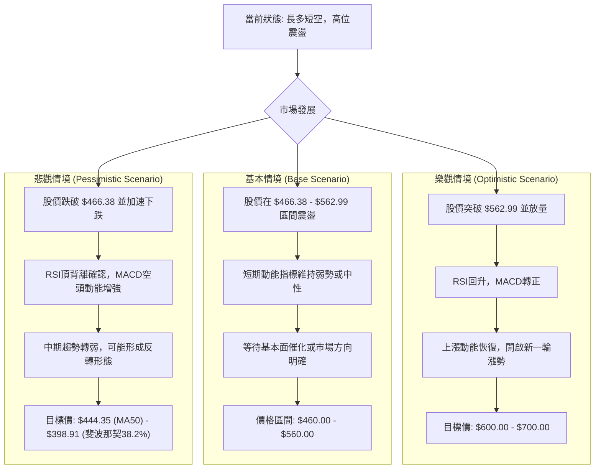

**風險場景分析：**
1.  **樂觀情境：** 在此情境下，AMD 能夠克服短期的動能疲軟，在未來幾週內積聚足夠的買盤力量，成功帶量突破其 52 週高點 $562.99。RSI 將隨之回升並解除頂背離，MACD 柱狀圖轉正並形成黃金交叉。一旦關鍵阻力被突破，市場信心將大增，股價有望開啟新一輪強勁上漲，目標可能指向 $600.00 甚至分析師高標 $700.00。
2.  **基本情境：** 這是目前最有可能發生的情境。AMD 股價在經歷大幅上漲後，將在高位 $466.38 - $562.99 區間內進行寬幅震盪整理。短期動能指標可能維持中性或弱勢，成交量保持萎縮。市場將等待新的基本面催化劑（如 AI 晶片需求超預期、業績報告利好）或整體市場方向的明確，才能選擇新的突破方向。
3.  **悲觀情境：** 在此情境下，短期動能的疲軟被放大，RSI 頂背離最終導致股價深度回調。如果股價未能守住 $466.38 這一關鍵支撐，並伴隨放量下跌，則可能預示著中期趨勢的轉弱，甚至形成反轉形態。下一個重要支撐將是 MA50 ($444.35) 和斐波那契 38.2% 回調位 ($398.91)。這將對多頭信心造成沉重打擊。

### 🛡️ 風險管理重要提醒

鑑於 AMD 目前複雜的技術面，以下風險管理原則至關重要：

1.  **嚴格止損：** 無論採用何種交易策略，都必須設定明確且嚴格的止損點。特別是逆勢操作（如短線做空）或追漲突破時，一旦價格行為不符合預期，應果斷離場，避免小虧變大虧。
2.  **倉位管理：** 根據交易策略的風險報酬比和成功機率，合理分配倉位。在不確定性較高或波動劇烈的市場中，應降低倉位，避免滿倉操作。對於逆勢策略，建議採用極輕倉。
3.  **分批建倉/減倉：** 避免一次性大筆買入或賣出。可以考慮在不同支撐位分批建倉，或在達到不同目標價時分批減倉，以降低平均成本/提高平均賣價，並鎖定部分利潤。
4.  **監控關鍵價位：** 密切關注 $562.99 (阻力)、$513.56 (短期支撐) 和 $466.38 (關鍵支撐)。這些價位的突破或跌破將是市場方向轉變的重要訊號。
5.  **多指標確認：** 不應依賴單一指標進行決策。當多個指標（如 RSI、MACD、成交量、K線形態）發出一致訊號時，交易決策的可靠性更高。當指標相互矛盾時，應保持謹慎。
6.  **關注基本面：** 技術分析是市場行為的反映，但基本面是股價長期驅動因素。密切關注 AMD 的財報、新產品發布、AI 晶片市場競爭格局等基本面消息，它們可能引發技術面的快速變化。
7.  **市場情緒：** AMD 所在的半導體行業受市場情緒影響較大。密切關注整體市場風險偏好、科技股走勢以及大盤指數的表現。

---

## 📋 報告總結

```
AMD 技術分析報告總結
════════════════════════════════════════════════════════
報告日期：2026-06-30
當前價格：$539.49
分析評級：⚖️ 中性偏多 (長期趨勢強勁，短期面臨回調壓力)

關鍵結論：
├─ 長期趨勢：🟢 強勁上升，均線完美多頭排列，潛在上升旗形。
├─ 中期趨勢：🟡 上升趨勢仍在，但高位震盪，動能減弱，警惕RSI頂背離。
├─ 短期趨勢：🔴 偏空，RSI頂背離、MACD柱狀圖為負、ADX弱勢，成交量萎縮。
├─ 關鍵支撐：$513.56 (MA20), $466.38 (近期低點/形態下沿), $444.35 (MA50)。
├─ 關鍵阻力：$562.99 (52週高點/歷史高點)。
└─ 分析師目標：$506.02 (平均), $700.00 (高標)。

最優策略組合：
1. 🥇 最佳機會：**逢低買入策略 A**。當股價回調至 $513.56 (MA20) 或 $466.38 (關鍵支撐) 附近，並出現明確止跌訊號時，結合長期趨勢進行佈局，風險報酬比優異。
2. 🥈 次選機會：**突破追漲策略 B**。若 AMD 能夠帶量有效突破 $562.99 (52週高點)，則可考慮輕倉追漲，但需嚴格止損 $540.00，並關注量能持續性。
3. 🥉 保守選擇：**觀望或短線操作**。在當前長多短空、波動率高、動能減弱的複雜格局下，保守投資者應保持觀望，等待短期回調結束和動能恢復的明確訊號。短線交易者可考慮在 $562.99 附近做空或在 $513.56 附近做多，但需極輕倉且嚴格止損。
════════════════════════════════════════════════════════
```

---

> ⚠️ **免責聲明**：本報告為 AI 自動生成之技術分析，所有數據及估算均基於提供的歷史價格資訊。本報告**僅供研究與學術參考**，**不構成任何投資建議**。投資有風險，入市需謹慎。

---

*報告生成時間：2026-06-30 ｜ 數據來源：Yahoo Finance ｜ 分析框架：多時框技術分析*