<details>
<summary>📊 靜態圖表 (點擊展開)</summary>
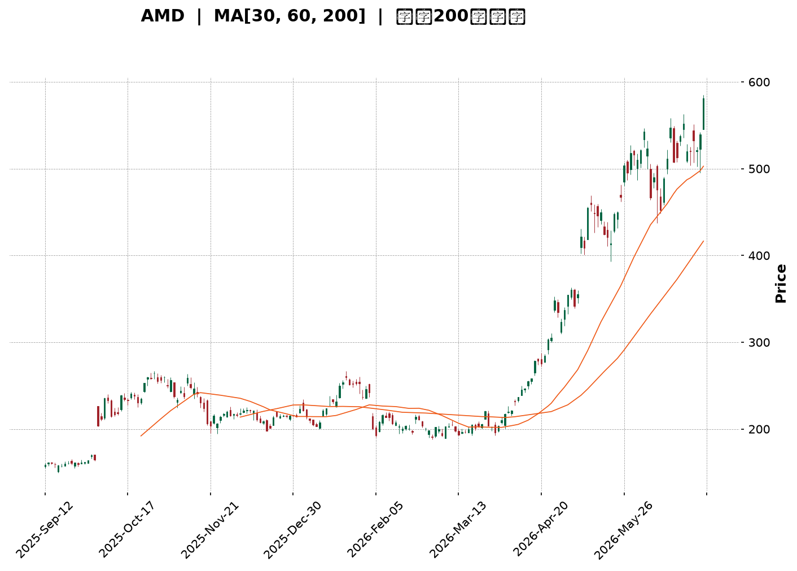
</details>

<html>
<head><meta charset="utf-8" /></head>
<body>
    <div style="height:500px; width:100%;">                        <script>window.PlotlyConfig = {MathJaxConfig: 'local'};</script>
        <script charset="utf-8" src="https://cdn.plot.ly/plotly-3.6.0.min.js" integrity="sha256-QaOVwtVY0T02VaHrr6pnoHLCwayMJp4O5n4YyaE3rJk=" crossorigin="anonymous"></script>                <div id="candlestick-chart" class="plotly-graph-div" style="height:100%; width:100%;"></div>            <script>                window.PLOTLYENV=window.PLOTLYENV || {};                                if (document.getElementById("candlestick-chart")) {                    Plotly.newPlot(                        "candlestick-chart",                        [{"close":{"dtype":"f8","bdata":"AAAAgD3SY0AAAADAHiVkQAAAAGC4DmRAAAAAwB7lY0AAAACgcL1jQAAAAOB6rGNAAAAAoEf5Y0AAAADAzBxkQAAAAAApHGRAAAAA4KMoZEAAAABguO5jQAAAACCFK2RAAAAAoEc5ZEAAAADgUYBkQAAAACBcN2VAAAAAoHCVZEAAAABguHZpQAAAAOBRcGpAAAAAgOtxbUAAAADgehxtQAAAAMDM3GpAAAAAoHANa0AAAABA4UJrQAAAAEAz021AAAAAgOtRbUAAAABgjyJtQAAAAIDrEW5AAAAAwPXAbUAAAAAgXMdsQAAAACCuX21AAAAAoHCdb0AAAABguDpwQAAAAAApIHBAAAAAoEeFcEAAAABA4dpvQAAAAIDrAXBAAAAAYGY6cEAAAACgmUFvQAAAAKBHBXBAAAAAYGa2bUAAAACgRzFtQAAAACBcf25AAAAA4KOwbUAAAACAPS5wQAAAAGC4\u002fm5AAAAAgOvZbkAAAADgoxBuQAAAAKBHyWxAAAAAoJnxa0AAAADgo8BpQAAAAMD1eGlAAAAAoJnhakAAAAAAKcRpQAAAACCux2pAAAAAwPUwa0AAAADgUXhrQAAAACCu52pAAAAAQDMza0AAAAAgXP9qQAAAAEAKP2tAAAAAIIWja0AAAAAA17NrQAAAAKBwrWtAAAAAgMKta0AAAADA9VhqQAAAAGCP8mlAAAAAoHAlakAAAAAghcNoQAAAAIDrIWlAAAAAgMKtakAAAABgZt5qQAAAAMDM3GpAAAAAoEfhakAAAAAgrt9qQAAAACCF82pAAAAAQOHqakAAAADAHsVqQAAAAEAK72tAAAAAYI+ia0AAAABAM8tqQAAAAOCjQGpAAAAAgMKVaUAAAACgcGVpQAAAAIAU9mlAAAAAQAqfa0AAAABAM\u002fNrQAAAAKBwfWxAAAAAYI\u002f6bEAAAACgcP1sQAAAAKCZOW9AAAAAIFy3b0AAAABA4TpwQAAAAIDraW9AAAAAwPWAb0AAAAAgrpdvQAAAAIDChW9AAAAAIFyXbUAAAADgo8huQAAAACCFQ25AAAAAgBQGaUAAAAAAABBoQAAAAIAUDmpAAAAAAAAAa0AAAACAPbJqQAAAAGCPsmpAAAAAgBS+aUAAAACAPeppQAAAAGCPYmlAAAAAANcDaUAAAAAA12tpQAAAAMDMBGlAAAAAQDOTaEAAAABA4bpqQAAAACCFW2pAAAAAgMJ1aUAAAABguAZpQAAAAADX02hAAAAAYGbeZ0AAAACAPUJpQAAAAGBm7mhAAAAAgMINaEAAAACAwlVpQAAAACBcZ2lAAAAAYI+aaUAAAAAgrrdoQAAAAOB6LGhAAAAAYI+SaEAAAACA64loQAAAAGC47mhAAAAA4KOoaUAAAABgjyppQAAAAIDCVWlAAAAAANeraUAAAADgo4hrQAAAAOCjeGlAAAAAIK4\u002faUAAAACgR4FoQAAAAIDCbWlAAAAAYLhGakAAAAAAADBrQAAAAIDChWtAAAAAwPWwa0AAAACAPfpsQAAAAOB6lG1AAAAAoEehbkAAAABgj9puQAAAAIA94m9AAAAAgOshcEAAAAAAKWRxQAAAAIA9ZnFAAAAAQDMvcUAAAAAA18dxQAAAACBc93JAAAAAoEcVc0AAAADA9bx1QAAAAIAU6nRAAAAAIFwzdEAAAACAwhF1QAAAAADXJ3ZAAAAA4KOIdkAAAADgo1h1QAAAAAApNHZAAAAAgD1WekAAAAAgXId5QAAAAEAKc3xAAAAA4KOsfEAAAADgowR8QAAAAAAA2HtAAAAAQDMbfEAAAACgmYF6QAAAAADXT3pAAAAAwMzgeUAAAACgR\u002fl7QAAAAKBwGXxAAAAAACk4fUAAAACAPX5\u002fQAAAAOCj+H5AAAAAYLgwgEAAAADAzCCAQAAAAIAU4n9AAAAA4FFMgEAAAAAAKfSAQAAAAKCZWYBAAAAAgBQmfUAAAACgR6V+QAAAAAApuH1AAAAAYGZGfEAAAABAM4d+QAAAAMAe+X9AAAAAgBQagUAAAADgo7R\u002fQAAAAADXA4BAAAAAwPXKgEAAAABACj2BQAAAAMDMPoBAAAAAgOs9gEAAAABgj6SAQAAAAOCjTIBAAAAAgOvbgEAAAACgRyeCQA=="},"high":{"dtype":"f8","bdata":"AAAAwB4NZEAAAACgmUlkQAAAAGBmPmRAAAAAACk0ZEAAAADgo9hjQAAAAEDh+mNAAAAAgMJVZEAAAADgemxkQAAAAEAzo2RAAAAAACk0ZEAAAAAghUNkQAAAAKCZiWRAAAAAwPVIZEAAAACAwoVkQAAAAIDrYWVAAAAAgMJVZUAAAABguFZsQAAAAMDMXGtAAAAAANd7bUAAAABAMwNuQAAAAEAKR21AAAAAgBQGbEAAAAAgXB9sQAAAACCu521AAAAAYGYmbkAAAAAAKWxtQAAAAAApXG5AAAAA4FFIbkAAAAAAKQRuQAAAAMDMfG1AAAAA4Hqsb0AAAABguEZwQAAAAKBHiXBAAAAAoEexcEAAAACAFH5wQAAAAIAUYnBAAAAAYI9OcEAAAACAFBZwQAAAAGBmOnBAAAAA4FGwb0AAAAAA13ttQAAAAMDMHG9AAAAAYLgOb0AAAAAAKXhwQAAAAIAUOnBAAAAAgBSub0AAAADgoxhvQAAAAAAAwG1AAAAAwPVobUAAAAAAAEhtQAAAAGCPGmpAAAAAACkka0AAAABgj9JpQAAAAEDh8mpAAAAAoJlJa0AAAAAgXJ9rQAAAACBcP2xAAAAAYGZGa0AAAAAA12NrQAAAAOB69GtAAAAAYLj2a0AAAABA4RpsQAAAACCF02tAAAAAAACwa0AAAAAgrs9rQAAAACCF62pAAAAAQApHakAAAAAAAHBqQAAAACCFy2lAAAAAgMLlakAAAACgcIVrQAAAAMD1IGtAAAAAoEcRa0AAAABgjxprQAAAAKCZAWtAAAAAgD0aa0AAAADgejRrQAAAAMDMZGxAAAAA4KNAbUAAAACgcN1rQAAAAAAphGpAAAAAgBReakAAAACgmelpQAAAAAApPGpAAAAAIIXja0AAAABA4QJsQAAAAEAzy21AAAAAIK5PbUAAAAAAAPBtQAAAAMDMnG9AAAAAoEcBcEAAAAAgXK9wQAAAAOCjJHBAAAAAoJnxb0AAAABgZhZwQAAAAOB6SHBAAAAAIK6nbkAAAABACj9vQAAAAMDMlG9AAAAAYI9Sa0AAAACgR4FpQAAAAOCjKGpAAAAAQDMza0AAAADgemxrQAAAAMDMdGtAAAAAYLhOa0AAAACgmUFqQAAAAKCZqWlAAAAAYGZmaUAAAABAM4NpQAAAAADXm2lAAAAAACnsaEAAAABguBZrQAAAAGBmFmtAAAAAoEc5akAAAADgejxpQAAAACCu12hAAAAA4Ho0aEAAAACAFE5pQAAAAKBHeWlAAAAAIK4HaUAAAABACl9pQAAAAEDh0mlAAAAAYLgmakAAAAAA13NpQAAAAIDC9WhAAAAAoHAFaUAAAABguOZoQAAAACCFW2lAAAAAACm8aUAAAACgmclpQAAAACCFI2pAAAAAgMLNaUAAAABgj6prQAAAAAAAoGtAAAAA4KNoaUAAAACAwg1qQAAAAAAAgGlAAAAAYI+6akAAAADA9ThrQAAAAIDrSWxAAAAAQDPDa0AAAAAAAEBtQAAAAEAzo21AAAAAYI8yb0AAAABgj+puQAAAAGC47m9AAAAAQOEicEAAAACgcHVxQAAAAMDMkHFAAAAAgML5cUAAAABAM+NxQAAAAAAABHNAAAAAIIVjc0AAAAAA1w92QAAAACBc03VAAAAAAAB4dEAAAABguEJ1QAAAACBcL3ZAAAAA4KOsdkAAAACgmZ12QAAAAMAeeXZAAAAAoJnpekAAAAAgXFt6QAAAAOCjhHxAAAAAIIVTfUAAAADAzKx8QAAAAAAAuHxAAAAAwPVUfEAAAAAAAHB7QAAAAMDMbHtAAAAAAADMekAAAACAPRZ8QAAAAEAzM3xAAAAAYI8WfkAAAAAgXK9\u002fQAAAACBc439AAAAAoJl5gEAAAAAAAFCAQAAAAAAALIBAAAAAgOtTgEAAAAAghROBQAAAACCFoYBAAAAAgOuZf0AAAAAghe9+QAAAAAAAkH9AAAAAQDPXfUAAAAAgXKd+QAAAACCuTYBAAAAAwPVygUAAAACgmSeBQAAAAAAApIBAAAAAIIXdgEAAAACA65eBQAAAAIDrg4BAAAAAIK5ngEAAAABACjeBQAAAAEDhaIBAAAAAIIXxgEAAAAAA10WCQA=="},"hovertemplate":"\u003cb\u003e%{x|%Y-%m-%d}\u003c\u002fb\u003e\u003cbr\u003e\u958b: $%{open:.2f}\u003cbr\u003e\u9ad8: $%{high:.2f}\u003cbr\u003e\u4f4e: $%{low:.2f}\u003cbr\u003e\u6536: $%{close:.2f}\u003cextra\u003e\u003c\u002fextra\u003e","low":{"dtype":"f8","bdata":"AAAAoHBdY0AAAABAM7NjQAAAAEAK52NAAAAA4FF4Y0AAAABAM7tiQAAAAMDMfGNAAAAAoHCtY0AAAABguOZjQAAAAIDCzWNAAAAAwPVYY0AAAACgmaFjQAAAAMDM\u002fGNAAAAAYI\u002fqY0AAAAAgrg9kQAAAAADXw2RAAAAA4HpkZEAAAADgUWBpQAAAAMD1KGpAAAAAYGZWakAAAADA9bBsQAAAAGBmpmpAAAAAwMzcakAAAADAzPxqQAAAAOBRmGtAAAAAIK4HbUAAAADAHn1sQAAAAMDMTG1AAAAA4KNAbUAAAAAAKRxsQAAAAKBHkWxAAAAAYGY+bkAAAACgmTlvQAAAAAAAEHBAAAAAYGYWcEAAAACA64lvQAAAAMAerW9AAAAA4Hq8b0AAAADgeuxuQAAAAIDrWW5AAAAAIK53bUAAAADgehRsQAAAAAAAEG5AAAAA4HpUbUAAAAAAAEBvQAAAAIDrwW5AAAAAYI9ibUAAAADAzKRtQAAAAGC4FmxAAAAAYLh2a0AAAADA9ZBpQAAAAAAAYGhAAAAAQDO7aUAAAADA9UhoQAAAAAAA4GlAAAAA4KPAakAAAAAAALBqQAAAAOB6zGpAAAAA4KN4akAAAADgesRqQAAAACCuB2tAAAAAIIVLa0AAAADAHj1rQAAAAKBwVWtAAAAAgBRGakAAAACA6yFqQAAAAGCP0mlAAAAAIIWjaUAAAADA9bBoQAAAAAAAEGlAAAAAYGaGaUAAAACA66lqQAAAAMD1iGpAAAAAQAq\u002fakAAAADA9aBqQAAAACCuJ2pAAAAAYI\u002fKakAAAACgmblqQAAAAMDMXGtAAAAAIFyPa0AAAAAAAGhqQAAAAKBw5WlAAAAAYI9qaUAAAACAPWJpQAAAAKCZ+WhAAAAAIFzfakAAAAAgheNqQAAAAEAKZ2xAAAAAIIWbbEAAAADAHi1sQAAAAMD1eG1AAAAAACnUbkAAAAAAAARwQAAAAKCZSW9AAAAAYLj+bkAAAABguEZvQAAAAMAeHW5AAAAAoJlRbUAAAAAAAGBtQAAAAKBHoW1AAAAAwMzkaEAAAABACtdnQAAAAIDCjWhAAAAAwMyEaUAAAAAAKaRqQAAAAGC4JmpAAAAA4HqkaUAAAAAAKXxpQAAAAGCPWmhAAAAAAABgaEAAAACgR8loQAAAAIDr0WhAAAAAwMxEaEAAAAAAANBpQAAAAGCPSmpAAAAAYLguaUAAAAAgrrdoQAAAAAAAwGdAAAAAQAqHZ0AAAAAghbtnQAAAAAApXGhAAAAAAADoZ0AAAADgo6BnQAAAAGBmRmlAAAAAACl0aUAAAACgcJVoQAAAAOCjCGhAAAAAoJlZaEAAAADgUWhoQAAAAAAAeGhAAAAAYI8aaEAAAADgUchoQAAAAGC4NmlAAAAAACkEaUAAAADgUXBqQAAAAIDCbWlAAAAAgBS2aEAAAAAA1xtoQAAAAMAejWhAAAAAQOG6aUAAAAAA1xNpQAAAACBcN2tAAAAAACnsakAAAABA4WJsQAAAAMAe3WxAAAAAYLjebUAAAADA9UBuQAAAAGBmtm5AAAAAQDN7b0AAAAAAKVhwQAAAAIA9InFAAAAAAAAAcUAAAACA60lxQAAAAIA94nFAAAAAACm8ckAAAADgo+h0QAAAAMD1jHRAAAAAAABgc0AAAACAwu1zQAAAAKCZyXRAAAAAAADUdUAAAABAMyt1QAAAAIAUjnVAAAAA4KMgeUAAAACgRxF5QAAAAOCjJHpAAAAAgBQufEAAAACAwqF6QAAAAGBmCntAAAAAQOE6e0AAAACAwnV6QAAAACBcq3lAAAAAgMKVeEAAAADAzKB6QAAAAKCZ+XpAAAAAIFzbfEAAAAAgrgN+QAAAAGCPan5AAAAA4FHYfkAAAABA4XZ\u002fQAAAAMDMbH5AAAAAIIVTf0AAAABgZmKAQAAAAIDrPX9AAAAAQDP\u002ffEAAAAAgXNt9QAAAACCuU3tAAAAAoEcFfEAAAADgUaB8QAAAAAAA4H5AAAAAAACUgEAAAAAAALR\u002fQAAAAMDMtH9AAAAAYI9ygEAAAAAgrr2AQAAAAMD1rH9AAAAAAAB4f0AAAAAAALB\u002fQAAAAIDCaX9AAAAAoJn1fkAAAABgjwyBQA=="},"name":"\u50f9\u683c","open":{"dtype":"f8","bdata":"AAAAAACgY0AAAADgUQBkQAAAAADXK2RAAAAAwPXoY0AAAABguN5iQAAAAAAprGNAAAAAoHCtY0AAAADgoxBkQAAAACBcX2RAAAAA4HqkY0AAAADgoxBkQAAAAADXA2RAAAAAoEcZZEAAAACAwh1kQAAAAIDCFWVAAAAAgMJVZUAAAABgZk5sQAAAAEAz22pAAAAAYGaeakAAAACgmYltQAAAAOCjGG1AAAAAYGaGa0AAAABgZmZrQAAAAGC41mtAAAAAoEeJbUAAAADgUShtQAAAAEAKj21AAAAA4HrsbUAAAABAM5ttQAAAAMAexWxAAAAAIIVrbkAAAACAFB5wQAAAAIA9MnBAAAAAQAqDcEAAAABguD5wQAAAAKCZOXBAAAAAoEc1cEAAAABAM0tvQAAAACCuZ25AAAAAQAqvb0AAAACAFN5sQAAAAOB6RG5AAAAAwB41bkAAAAAAKaRvQAAAAMDMfG9AAAAAIIUDbkAAAAAAAFhuQAAAAMD1mG1AAAAA4FHIbEAAAABgZhZtQAAAAIDrGWpAAAAAwB7laUAAAAAgXC9pQAAAAKCZQWpAAAAA4HoEa0AAAAAAKbxqQAAAAKBHuWtAAAAA4FEIa0AAAAAAKRxrQAAAAKBwJWtAAAAAQOFia0AAAACgR6FrQAAAAAAAwGtAAAAAgOs5a0AAAAAA10trQAAAAMD1iGpAAAAAoHDdaUAAAACgR0FqQAAAAIA9emlAAAAAQDOTaUAAAAAAAIBrQAAAACCFm2pAAAAAIFzfakAAAACAwu1qQAAAAGCPcmpAAAAAANf7akAAAACAPfpqQAAAAMDMXGtAAAAAAADIbEAAAABguNZrQAAAAAAphGpAAAAAwMxcakAAAABACrdpQAAAAIDCJWlAAAAAQDPjakAAAACgRzFrQAAAAMDMfGxAAAAAoJlJbUAAAABgj0JsQAAAACCuf21AAAAAAAB4b0AAAABA4VJwQAAAAAAADHBAAAAAwB6Fb0AAAAAAKcRvQAAAAMAe1W9AAAAAgMKdbUAAAADgo3htQAAAAKCZcW9AAAAAAADgakAAAAAghTtpQAAAAAAppGhAAAAAwMzcaUAAAADgeuRqQAAAAAApPGtAAAAAYI\u002f6akAAAADgo4BpQAAAAMDMRGlAAAAAwB7NaEAAAAAghQNpQAAAAADXA2lAAAAAQOHCaEAAAAAAKXRqQAAAAIA92mpAAAAAoJkZakAAAAAghQNpQAAAAEAzO2hAAAAAYLjuZ0AAAAAA1wNoQAAAAOCjuGhAAAAA4KNoaEAAAAAghatnQAAAAOBRUGlAAAAAIIWjaUAAAABgj1ppQAAAACCFw2hAAAAAIFxfaEAAAACAwpVoQAAAAAAAgGhAAAAAwPVgaEAAAADgepxpQAAAAMDMzGlAAAAA4HosaUAAAADgUXBqQAAAACBcP2tAAAAA4KM4aUAAAABgZp5pQAAAAKCZwWhAAAAAQOHyaUAAAACgmYFpQAAAAMD1aGtAAAAA4FFIa0AAAAAA1wNtQAAAAOBRIG1AAAAAAADgbUAAAADA9aBuQAAAAKBHOW9AAAAAYLjeb0AAAAAA149wQAAAAAAAkHFAAAAAoJmJcUAAAACgR1VxQAAAACCFM3JAAAAAACngckAAAAAAKQx1QAAAAMAepXVAAAAAgMJ9c0AAAACgR2l0QAAAAIDCVXVAAAAAgOv9dUAAAADA9YR2QAAAAAAp+HVAAAAAANeXeUAAAADAHhF6QAAAAKBwKXpAAAAAwMzIfEAAAAAAABR8QAAAAOCjkHxAAAAAoJmJe0AAAACgcBV7QAAAAAAA2HpAAAAAoJnJeUAAAADgo8B6QAAAAADXn3tAAAAAoHBdfUAAAAAA10t+QAAAAAAAwH9AAAAAAAAwf0AAAABgZkaAQAAAAGCPQn9AAAAAwMykf0AAAAAAAK6AQAAAAAAAFoBAAAAA4Ho4f0AAAAAAAFB+QAAAAAAAbH9AAAAAIIU\u002ffUAAAACgmdl8QAAAAEAKO39AAAAAAAC+gEAAAADAHheBQAAAAKBHjYBAAAAA4KOcgEAAAAAAAAyBQAAAAKBH0X9AAAAAYI9GgEAAAACgcP+AQAAAAGBmPoBAAAAAYLhWgEAAAABgjwyBQA=="},"x":["2025-09-12T00:00:00-04:00","2025-09-15T00:00:00-04:00","2025-09-16T00:00:00-04:00","2025-09-17T00:00:00-04:00","2025-09-18T00:00:00-04:00","2025-09-19T00:00:00-04:00","2025-09-22T00:00:00-04:00","2025-09-23T00:00:00-04:00","2025-09-24T00:00:00-04:00","2025-09-25T00:00:00-04:00","2025-09-26T00:00:00-04:00","2025-09-29T00:00:00-04:00","2025-09-30T00:00:00-04:00","2025-10-01T00:00:00-04:00","2025-10-02T00:00:00-04:00","2025-10-03T00:00:00-04:00","2025-10-06T00:00:00-04:00","2025-10-07T00:00:00-04:00","2025-10-08T00:00:00-04:00","2025-10-09T00:00:00-04:00","2025-10-10T00:00:00-04:00","2025-10-13T00:00:00-04:00","2025-10-14T00:00:00-04:00","2025-10-15T00:00:00-04:00","2025-10-16T00:00:00-04:00","2025-10-17T00:00:00-04:00","2025-10-20T00:00:00-04:00","2025-10-21T00:00:00-04:00","2025-10-22T00:00:00-04:00","2025-10-23T00:00:00-04:00","2025-10-24T00:00:00-04:00","2025-10-27T00:00:00-04:00","2025-10-28T00:00:00-04:00","2025-10-29T00:00:00-04:00","2025-10-30T00:00:00-04:00","2025-10-31T00:00:00-04:00","2025-11-03T00:00:00-05:00","2025-11-04T00:00:00-05:00","2025-11-05T00:00:00-05:00","2025-11-06T00:00:00-05:00","2025-11-07T00:00:00-05:00","2025-11-10T00:00:00-05:00","2025-11-11T00:00:00-05:00","2025-11-12T00:00:00-05:00","2025-11-13T00:00:00-05:00","2025-11-14T00:00:00-05:00","2025-11-17T00:00:00-05:00","2025-11-18T00:00:00-05:00","2025-11-19T00:00:00-05:00","2025-11-20T00:00:00-05:00","2025-11-21T00:00:00-05:00","2025-11-24T00:00:00-05:00","2025-11-25T00:00:00-05:00","2025-11-26T00:00:00-05:00","2025-11-28T00:00:00-05:00","2025-12-01T00:00:00-05:00","2025-12-02T00:00:00-05:00","2025-12-03T00:00:00-05:00","2025-12-04T00:00:00-05:00","2025-12-05T00:00:00-05:00","2025-12-08T00:00:00-05:00","2025-12-09T00:00:00-05:00","2025-12-10T00:00:00-05:00","2025-12-11T00:00:00-05:00","2025-12-12T00:00:00-05:00","2025-12-15T00:00:00-05:00","2025-12-16T00:00:00-05:00","2025-12-17T00:00:00-05:00","2025-12-18T00:00:00-05:00","2025-12-19T00:00:00-05:00","2025-12-22T00:00:00-05:00","2025-12-23T00:00:00-05:00","2025-12-24T00:00:00-05:00","2025-12-26T00:00:00-05:00","2025-12-29T00:00:00-05:00","2025-12-30T00:00:00-05:00","2025-12-31T00:00:00-05:00","2026-01-02T00:00:00-05:00","2026-01-05T00:00:00-05:00","2026-01-06T00:00:00-05:00","2026-01-07T00:00:00-05:00","2026-01-08T00:00:00-05:00","2026-01-09T00:00:00-05:00","2026-01-12T00:00:00-05:00","2026-01-13T00:00:00-05:00","2026-01-14T00:00:00-05:00","2026-01-15T00:00:00-05:00","2026-01-16T00:00:00-05:00","2026-01-20T00:00:00-05:00","2026-01-21T00:00:00-05:00","2026-01-22T00:00:00-05:00","2026-01-23T00:00:00-05:00","2026-01-26T00:00:00-05:00","2026-01-27T00:00:00-05:00","2026-01-28T00:00:00-05:00","2026-01-29T00:00:00-05:00","2026-01-30T00:00:00-05:00","2026-02-02T00:00:00-05:00","2026-02-03T00:00:00-05:00","2026-02-04T00:00:00-05:00","2026-02-05T00:00:00-05:00","2026-02-06T00:00:00-05:00","2026-02-09T00:00:00-05:00","2026-02-10T00:00:00-05:00","2026-02-11T00:00:00-05:00","2026-02-12T00:00:00-05:00","2026-02-13T00:00:00-05:00","2026-02-17T00:00:00-05:00","2026-02-18T00:00:00-05:00","2026-02-19T00:00:00-05:00","2026-02-20T00:00:00-05:00","2026-02-23T00:00:00-05:00","2026-02-24T00:00:00-05:00","2026-02-25T00:00:00-05:00","2026-02-26T00:00:00-05:00","2026-02-27T00:00:00-05:00","2026-03-02T00:00:00-05:00","2026-03-03T00:00:00-05:00","2026-03-04T00:00:00-05:00","2026-03-05T00:00:00-05:00","2026-03-06T00:00:00-05:00","2026-03-09T00:00:00-04:00","2026-03-10T00:00:00-04:00","2026-03-11T00:00:00-04:00","2026-03-12T00:00:00-04:00","2026-03-13T00:00:00-04:00","2026-03-16T00:00:00-04:00","2026-03-17T00:00:00-04:00","2026-03-18T00:00:00-04:00","2026-03-19T00:00:00-04:00","2026-03-20T00:00:00-04:00","2026-03-23T00:00:00-04:00","2026-03-24T00:00:00-04:00","2026-03-25T00:00:00-04:00","2026-03-26T00:00:00-04:00","2026-03-27T00:00:00-04:00","2026-03-30T00:00:00-04:00","2026-03-31T00:00:00-04:00","2026-04-01T00:00:00-04:00","2026-04-02T00:00:00-04:00","2026-04-06T00:00:00-04:00","2026-04-07T00:00:00-04:00","2026-04-08T00:00:00-04:00","2026-04-09T00:00:00-04:00","2026-04-10T00:00:00-04:00","2026-04-13T00:00:00-04:00","2026-04-14T00:00:00-04:00","2026-04-15T00:00:00-04:00","2026-04-16T00:00:00-04:00","2026-04-17T00:00:00-04:00","2026-04-20T00:00:00-04:00","2026-04-21T00:00:00-04:00","2026-04-22T00:00:00-04:00","2026-04-23T00:00:00-04:00","2026-04-24T00:00:00-04:00","2026-04-27T00:00:00-04:00","2026-04-28T00:00:00-04:00","2026-04-29T00:00:00-04:00","2026-04-30T00:00:00-04:00","2026-05-01T00:00:00-04:00","2026-05-04T00:00:00-04:00","2026-05-05T00:00:00-04:00","2026-05-06T00:00:00-04:00","2026-05-07T00:00:00-04:00","2026-05-08T00:00:00-04:00","2026-05-11T00:00:00-04:00","2026-05-12T00:00:00-04:00","2026-05-13T00:00:00-04:00","2026-05-14T00:00:00-04:00","2026-05-15T00:00:00-04:00","2026-05-18T00:00:00-04:00","2026-05-19T00:00:00-04:00","2026-05-20T00:00:00-04:00","2026-05-21T00:00:00-04:00","2026-05-22T00:00:00-04:00","2026-05-26T00:00:00-04:00","2026-05-27T00:00:00-04:00","2026-05-28T00:00:00-04:00","2026-05-29T00:00:00-04:00","2026-06-01T00:00:00-04:00","2026-06-02T00:00:00-04:00","2026-06-03T00:00:00-04:00","2026-06-04T00:00:00-04:00","2026-06-05T00:00:00-04:00","2026-06-08T00:00:00-04:00","2026-06-09T00:00:00-04:00","2026-06-10T00:00:00-04:00","2026-06-11T00:00:00-04:00","2026-06-12T00:00:00-04:00","2026-06-15T00:00:00-04:00","2026-06-16T00:00:00-04:00","2026-06-17T00:00:00-04:00","2026-06-18T00:00:00-04:00","2026-06-22T00:00:00-04:00","2026-06-23T00:00:00-04:00","2026-06-24T00:00:00-04:00","2026-06-25T00:00:00-04:00","2026-06-26T00:00:00-04:00","2026-06-29T00:00:00-04:00","2026-06-30T00:00:00-04:00"],"type":"candlestick"},{"hovertemplate":"MA30: $%{y:.2f}\u003cextra\u003e\u003c\u002fextra\u003e","line":{"color":"#2196F3","dash":"dash","width":2},"mode":"lines","name":"MA30","x":["2025-09-12T00:00:00-04:00","2025-09-15T00:00:00-04:00","2025-09-16T00:00:00-04:00","2025-09-17T00:00:00-04:00","2025-09-18T00:00:00-04:00","2025-09-19T00:00:00-04:00","2025-09-22T00:00:00-04:00","2025-09-23T00:00:00-04:00","2025-09-24T00:00:00-04:00","2025-09-25T00:00:00-04:00","2025-09-26T00:00:00-04:00","2025-09-29T00:00:00-04:00","2025-09-30T00:00:00-04:00","2025-10-01T00:00:00-04:00","2025-10-02T00:00:00-04:00","2025-10-03T00:00:00-04:00","2025-10-06T00:00:00-04:00","2025-10-07T00:00:00-04:00","2025-10-08T00:00:00-04:00","2025-10-09T00:00:00-04:00","2025-10-10T00:00:00-04:00","2025-10-13T00:00:00-04:00","2025-10-14T00:00:00-04:00","2025-10-15T00:00:00-04:00","2025-10-16T00:00:00-04:00","2025-10-17T00:00:00-04:00","2025-10-20T00:00:00-04:00","2025-10-21T00:00:00-04:00","2025-10-22T00:00:00-04:00","2025-10-23T00:00:00-04:00","2025-10-24T00:00:00-04:00","2025-10-27T00:00:00-04:00","2025-10-28T00:00:00-04:00","2025-10-29T00:00:00-04:00","2025-10-30T00:00:00-04:00","2025-10-31T00:00:00-04:00","2025-11-03T00:00:00-05:00","2025-11-04T00:00:00-05:00","2025-11-05T00:00:00-05:00","2025-11-06T00:00:00-05:00","2025-11-07T00:00:00-05:00","2025-11-10T00:00:00-05:00","2025-11-11T00:00:00-05:00","2025-11-12T00:00:00-05:00","2025-11-13T00:00:00-05:00","2025-11-14T00:00:00-05:00","2025-11-17T00:00:00-05:00","2025-11-18T00:00:00-05:00","2025-11-19T00:00:00-05:00","2025-11-20T00:00:00-05:00","2025-11-21T00:00:00-05:00","2025-11-24T00:00:00-05:00","2025-11-25T00:00:00-05:00","2025-11-26T00:00:00-05:00","2025-11-28T00:00:00-05:00","2025-12-01T00:00:00-05:00","2025-12-02T00:00:00-05:00","2025-12-03T00:00:00-05:00","2025-12-04T00:00:00-05:00","2025-12-05T00:00:00-05:00","2025-12-08T00:00:00-05:00","2025-12-09T00:00:00-05:00","2025-12-10T00:00:00-05:00","2025-12-11T00:00:00-05:00","2025-12-12T00:00:00-05:00","2025-12-15T00:00:00-05:00","2025-12-16T00:00:00-05:00","2025-12-17T00:00:00-05:00","2025-12-18T00:00:00-05:00","2025-12-19T00:00:00-05:00","2025-12-22T00:00:00-05:00","2025-12-23T00:00:00-05:00","2025-12-24T00:00:00-05:00","2025-12-26T00:00:00-05:00","2025-12-29T00:00:00-05:00","2025-12-30T00:00:00-05:00","2025-12-31T00:00:00-05:00","2026-01-02T00:00:00-05:00","2026-01-05T00:00:00-05:00","2026-01-06T00:00:00-05:00","2026-01-07T00:00:00-05:00","2026-01-08T00:00:00-05:00","2026-01-09T00:00:00-05:00","2026-01-12T00:00:00-05:00","2026-01-13T00:00:00-05:00","2026-01-14T00:00:00-05:00","2026-01-15T00:00:00-05:00","2026-01-16T00:00:00-05:00","2026-01-20T00:00:00-05:00","2026-01-21T00:00:00-05:00","2026-01-22T00:00:00-05:00","2026-01-23T00:00:00-05:00","2026-01-26T00:00:00-05:00","2026-01-27T00:00:00-05:00","2026-01-28T00:00:00-05:00","2026-01-29T00:00:00-05:00","2026-01-30T00:00:00-05:00","2026-02-02T00:00:00-05:00","2026-02-03T00:00:00-05:00","2026-02-04T00:00:00-05:00","2026-02-05T00:00:00-05:00","2026-02-06T00:00:00-05:00","2026-02-09T00:00:00-05:00","2026-02-10T00:00:00-05:00","2026-02-11T00:00:00-05:00","2026-02-12T00:00:00-05:00","2026-02-13T00:00:00-05:00","2026-02-17T00:00:00-05:00","2026-02-18T00:00:00-05:00","2026-02-19T00:00:00-05:00","2026-02-20T00:00:00-05:00","2026-02-23T00:00:00-05:00","2026-02-24T00:00:00-05:00","2026-02-25T00:00:00-05:00","2026-02-26T00:00:00-05:00","2026-02-27T00:00:00-05:00","2026-03-02T00:00:00-05:00","2026-03-03T00:00:00-05:00","2026-03-04T00:00:00-05:00","2026-03-05T00:00:00-05:00","2026-03-06T00:00:00-05:00","2026-03-09T00:00:00-04:00","2026-03-10T00:00:00-04:00","2026-03-11T00:00:00-04:00","2026-03-12T00:00:00-04:00","2026-03-13T00:00:00-04:00","2026-03-16T00:00:00-04:00","2026-03-17T00:00:00-04:00","2026-03-18T00:00:00-04:00","2026-03-19T00:00:00-04:00","2026-03-20T00:00:00-04:00","2026-03-23T00:00:00-04:00","2026-03-24T00:00:00-04:00","2026-03-25T00:00:00-04:00","2026-03-26T00:00:00-04:00","2026-03-27T00:00:00-04:00","2026-03-30T00:00:00-04:00","2026-03-31T00:00:00-04:00","2026-04-01T00:00:00-04:00","2026-04-02T00:00:00-04:00","2026-04-06T00:00:00-04:00","2026-04-07T00:00:00-04:00","2026-04-08T00:00:00-04:00","2026-04-09T00:00:00-04:00","2026-04-10T00:00:00-04:00","2026-04-13T00:00:00-04:00","2026-04-14T00:00:00-04:00","2026-04-15T00:00:00-04:00","2026-04-16T00:00:00-04:00","2026-04-17T00:00:00-04:00","2026-04-20T00:00:00-04:00","2026-04-21T00:00:00-04:00","2026-04-22T00:00:00-04:00","2026-04-23T00:00:00-04:00","2026-04-24T00:00:00-04:00","2026-04-27T00:00:00-04:00","2026-04-28T00:00:00-04:00","2026-04-29T00:00:00-04:00","2026-04-30T00:00:00-04:00","2026-05-01T00:00:00-04:00","2026-05-04T00:00:00-04:00","2026-05-05T00:00:00-04:00","2026-05-06T00:00:00-04:00","2026-05-07T00:00:00-04:00","2026-05-08T00:00:00-04:00","2026-05-11T00:00:00-04:00","2026-05-12T00:00:00-04:00","2026-05-13T00:00:00-04:00","2026-05-14T00:00:00-04:00","2026-05-15T00:00:00-04:00","2026-05-18T00:00:00-04:00","2026-05-19T00:00:00-04:00","2026-05-20T00:00:00-04:00","2026-05-21T00:00:00-04:00","2026-05-22T00:00:00-04:00","2026-05-26T00:00:00-04:00","2026-05-27T00:00:00-04:00","2026-05-28T00:00:00-04:00","2026-05-29T00:00:00-04:00","2026-06-01T00:00:00-04:00","2026-06-02T00:00:00-04:00","2026-06-03T00:00:00-04:00","2026-06-04T00:00:00-04:00","2026-06-05T00:00:00-04:00","2026-06-08T00:00:00-04:00","2026-06-09T00:00:00-04:00","2026-06-10T00:00:00-04:00","2026-06-11T00:00:00-04:00","2026-06-12T00:00:00-04:00","2026-06-15T00:00:00-04:00","2026-06-16T00:00:00-04:00","2026-06-17T00:00:00-04:00","2026-06-18T00:00:00-04:00","2026-06-22T00:00:00-04:00","2026-06-23T00:00:00-04:00","2026-06-24T00:00:00-04:00","2026-06-25T00:00:00-04:00","2026-06-26T00:00:00-04:00","2026-06-29T00:00:00-04:00","2026-06-30T00:00:00-04:00"],"y":{"dtype":"f8","bdata":"AAAAAAAA+H8AAAAAAAD4fwAAAAAAAPh\u002fAAAAAAAA+H8AAAAAAAD4fwAAAAAAAPh\u002fAAAAAAAA+H8AAAAAAAD4fwAAAAAAAPh\u002fAAAAAAAA+H8AAAAAAAD4fwAAAAAAAPh\u002fAAAAAAAA+H8AAAAAAAD4fwAAAAAAAPh\u002fAAAAAAAA+H8AAAAAAAD4fwAAAAAAAPh\u002fAAAAAAAA+H8AAAAAAAD4fwAAAAAAAPh\u002fAAAAAAAA+H8AAAAAAAD4fwAAAAAAAPh\u002fAAAAAAAA+H8AAAAAAAD4fwAAAAAAAPh\u002fAAAAAAAA+H8AAAAAAAD4f+\u002fu7o7CAWhAVVVVZWZmaEAiIiIyes9oQJqZmdmHN2lARERERLanaUAzMzPjFw9qQCIiIsJneGpAIiIiMuziakB3d3cXBEJrQM3MzEzUp2tAiYiIyFr5a0Dv7u6OX0hsQDMzM1OAoGxAq6qqqkfxbEDNzMw8fFZtQO\u002fu7j7uqW1AERER8YsBbkBmZmaGzyhuQHd3d7fXPG5AAAAAMAgwbkAzMzPjXhNuQDMzM2OCB25AmpmZSQwGbkCamZlpSvltQCIiIoJO321A7+7uLiTNbUDv7u7u7r5tQDMzM+Pso21AMzMzIyKObUAAAADw7n5tQHd3d1fHbG1Ad3d3F9lKbUBmZmbmQiJtQDMzM2M7+2xARERE1HjNbEAzMzODeZ5sQLy7u9uyamxAREREdNo0bEDv7u5ec\u002f1rQKuqqvp+wmtAZmZmppuoa0B3d3dXx5RrQAAAAJDCdWtAVVVVBchda0BERERk9C5rQO\u002fu7q5yDGtAZmZmRuHqakDNzMw8w85qQM3MzOx8x2pAMzMzc9rEakCJiIgYvc1qQImIiAhl1GpAREREVFXJakDNzMwMLcZqQGZmZnYwv2pAAAAA0NvCakBERERk9MZqQAAAAOB61GpAzczMnKjjakC8u7tLqfRqQCIiIgKdFmtAERERcWg5a0C8u7tbAWJrQCIiIlLjgWtAmpmZKYeia0CrqqoKSc9rQAAAANDb\u002fmtAd3d3h0EcbEC8u7troE9sQO\u002fu7s5pe2xAiYiIaEptbEAAAAAQWFVsQN7d3Q10TmxAMzMzM3pPbEAiIiJy9k1sQO\u002fu7h7MS2xAvLu7S8VBbEBVVVWFeTpsQBEREbG5JGxAZmZmNl4ObEAAAADwpwJsQERERMQg+GtAREREZILva0AzMzMD5PprQCIiIqJF\u002fmtA7+7uTtTra0B3d3dH4dJrQM3MzGygs2tAVVVVdQWIa0C8u7trLmhrQDMzM4N5MmtAZmZmhhbxakCamZm5SbRqQN7d3a0AgWpA7+7u7qdOakBERERE\u002fRNqQN7d3a1H1WlA3t3dDXSqaUBERESkKXVpQJqZmVmrR2lAd3d3hxZNaUBVVVW1gVZpQHd3d9dcUGlAREREJAZFaUAAAACwK0xpQHd3d+e0QWlAq6qqSn49aUCJiIgYdjFpQKuqqqrVMWlAmpmZ6Zg8aUCJiIhYq0tpQO\u002fu7t4IYWlAvLu7a6B7aUCamZkpzo5pQCIiItJNqmlAvLu722vWaUCamZk5JghqQHd3d9dcRGpAq6qqugKMakDe3d2tR91qQBEREZF7MWtAiYiICIGJa0De3d2dxOBrQGZmZhauS2xAiYiISOG2bEBVVVVl9FZtQFVVVVWc7W1AMzMzw650bkC8u7uL3gpvQBERERE8sG9AiYiIkO0qcEB3d3fntHVwQJqZmSkVx3BAiYiIGEs6cUBVVVVNqZ5xQDMzM4PAJHJA3t3dRbatckDv7u7OPjRzQO\u002fu7m5ZtXNAVVVVzRM1dEDv7u6WQ6N0QBEREdlcDnVAZmZmPgp1dUBERESsHOh1QCIiInKvWXZAzczMBFbQdkB3d3dHb1l3QDMzM3Ov2XdAZmZmBlZkeEC8u7sbL+N4QHd3d1fHXnlAd3d3F0vieUCrqqrK6Gt6QBEREaEa4XpAMzMzU\u002f82e0De3d0NAoN7QO\u002fu7t4kzntAzczMnAsTfEAiIiKSwmN8QKuqqjqJt3xAvLu7ux4bfUAiIiIihXN9QGZmZuZex31AiYiICDoFfkAzMzODlVF+QBEREcERdH5AVVVVdZOUfkDNzMx8hsF+QCIiIvIZ6n5AVVVVRf0Zf0Dv7u4On21\u002fQA=="},"type":"scatter"},{"hovertemplate":"MA60: $%{y:.2f}\u003cextra\u003e\u003c\u002fextra\u003e","line":{"color":"#9C27B0","dash":"dash","width":2},"mode":"lines","name":"MA60","x":["2025-09-12T00:00:00-04:00","2025-09-15T00:00:00-04:00","2025-09-16T00:00:00-04:00","2025-09-17T00:00:00-04:00","2025-09-18T00:00:00-04:00","2025-09-19T00:00:00-04:00","2025-09-22T00:00:00-04:00","2025-09-23T00:00:00-04:00","2025-09-24T00:00:00-04:00","2025-09-25T00:00:00-04:00","2025-09-26T00:00:00-04:00","2025-09-29T00:00:00-04:00","2025-09-30T00:00:00-04:00","2025-10-01T00:00:00-04:00","2025-10-02T00:00:00-04:00","2025-10-03T00:00:00-04:00","2025-10-06T00:00:00-04:00","2025-10-07T00:00:00-04:00","2025-10-08T00:00:00-04:00","2025-10-09T00:00:00-04:00","2025-10-10T00:00:00-04:00","2025-10-13T00:00:00-04:00","2025-10-14T00:00:00-04:00","2025-10-15T00:00:00-04:00","2025-10-16T00:00:00-04:00","2025-10-17T00:00:00-04:00","2025-10-20T00:00:00-04:00","2025-10-21T00:00:00-04:00","2025-10-22T00:00:00-04:00","2025-10-23T00:00:00-04:00","2025-10-24T00:00:00-04:00","2025-10-27T00:00:00-04:00","2025-10-28T00:00:00-04:00","2025-10-29T00:00:00-04:00","2025-10-30T00:00:00-04:00","2025-10-31T00:00:00-04:00","2025-11-03T00:00:00-05:00","2025-11-04T00:00:00-05:00","2025-11-05T00:00:00-05:00","2025-11-06T00:00:00-05:00","2025-11-07T00:00:00-05:00","2025-11-10T00:00:00-05:00","2025-11-11T00:00:00-05:00","2025-11-12T00:00:00-05:00","2025-11-13T00:00:00-05:00","2025-11-14T00:00:00-05:00","2025-11-17T00:00:00-05:00","2025-11-18T00:00:00-05:00","2025-11-19T00:00:00-05:00","2025-11-20T00:00:00-05:00","2025-11-21T00:00:00-05:00","2025-11-24T00:00:00-05:00","2025-11-25T00:00:00-05:00","2025-11-26T00:00:00-05:00","2025-11-28T00:00:00-05:00","2025-12-01T00:00:00-05:00","2025-12-02T00:00:00-05:00","2025-12-03T00:00:00-05:00","2025-12-04T00:00:00-05:00","2025-12-05T00:00:00-05:00","2025-12-08T00:00:00-05:00","2025-12-09T00:00:00-05:00","2025-12-10T00:00:00-05:00","2025-12-11T00:00:00-05:00","2025-12-12T00:00:00-05:00","2025-12-15T00:00:00-05:00","2025-12-16T00:00:00-05:00","2025-12-17T00:00:00-05:00","2025-12-18T00:00:00-05:00","2025-12-19T00:00:00-05:00","2025-12-22T00:00:00-05:00","2025-12-23T00:00:00-05:00","2025-12-24T00:00:00-05:00","2025-12-26T00:00:00-05:00","2025-12-29T00:00:00-05:00","2025-12-30T00:00:00-05:00","2025-12-31T00:00:00-05:00","2026-01-02T00:00:00-05:00","2026-01-05T00:00:00-05:00","2026-01-06T00:00:00-05:00","2026-01-07T00:00:00-05:00","2026-01-08T00:00:00-05:00","2026-01-09T00:00:00-05:00","2026-01-12T00:00:00-05:00","2026-01-13T00:00:00-05:00","2026-01-14T00:00:00-05:00","2026-01-15T00:00:00-05:00","2026-01-16T00:00:00-05:00","2026-01-20T00:00:00-05:00","2026-01-21T00:00:00-05:00","2026-01-22T00:00:00-05:00","2026-01-23T00:00:00-05:00","2026-01-26T00:00:00-05:00","2026-01-27T00:00:00-05:00","2026-01-28T00:00:00-05:00","2026-01-29T00:00:00-05:00","2026-01-30T00:00:00-05:00","2026-02-02T00:00:00-05:00","2026-02-03T00:00:00-05:00","2026-02-04T00:00:00-05:00","2026-02-05T00:00:00-05:00","2026-02-06T00:00:00-05:00","2026-02-09T00:00:00-05:00","2026-02-10T00:00:00-05:00","2026-02-11T00:00:00-05:00","2026-02-12T00:00:00-05:00","2026-02-13T00:00:00-05:00","2026-02-17T00:00:00-05:00","2026-02-18T00:00:00-05:00","2026-02-19T00:00:00-05:00","2026-02-20T00:00:00-05:00","2026-02-23T00:00:00-05:00","2026-02-24T00:00:00-05:00","2026-02-25T00:00:00-05:00","2026-02-26T00:00:00-05:00","2026-02-27T00:00:00-05:00","2026-03-02T00:00:00-05:00","2026-03-03T00:00:00-05:00","2026-03-04T00:00:00-05:00","2026-03-05T00:00:00-05:00","2026-03-06T00:00:00-05:00","2026-03-09T00:00:00-04:00","2026-03-10T00:00:00-04:00","2026-03-11T00:00:00-04:00","2026-03-12T00:00:00-04:00","2026-03-13T00:00:00-04:00","2026-03-16T00:00:00-04:00","2026-03-17T00:00:00-04:00","2026-03-18T00:00:00-04:00","2026-03-19T00:00:00-04:00","2026-03-20T00:00:00-04:00","2026-03-23T00:00:00-04:00","2026-03-24T00:00:00-04:00","2026-03-25T00:00:00-04:00","2026-03-26T00:00:00-04:00","2026-03-27T00:00:00-04:00","2026-03-30T00:00:00-04:00","2026-03-31T00:00:00-04:00","2026-04-01T00:00:00-04:00","2026-04-02T00:00:00-04:00","2026-04-06T00:00:00-04:00","2026-04-07T00:00:00-04:00","2026-04-08T00:00:00-04:00","2026-04-09T00:00:00-04:00","2026-04-10T00:00:00-04:00","2026-04-13T00:00:00-04:00","2026-04-14T00:00:00-04:00","2026-04-15T00:00:00-04:00","2026-04-16T00:00:00-04:00","2026-04-17T00:00:00-04:00","2026-04-20T00:00:00-04:00","2026-04-21T00:00:00-04:00","2026-04-22T00:00:00-04:00","2026-04-23T00:00:00-04:00","2026-04-24T00:00:00-04:00","2026-04-27T00:00:00-04:00","2026-04-28T00:00:00-04:00","2026-04-29T00:00:00-04:00","2026-04-30T00:00:00-04:00","2026-05-01T00:00:00-04:00","2026-05-04T00:00:00-04:00","2026-05-05T00:00:00-04:00","2026-05-06T00:00:00-04:00","2026-05-07T00:00:00-04:00","2026-05-08T00:00:00-04:00","2026-05-11T00:00:00-04:00","2026-05-12T00:00:00-04:00","2026-05-13T00:00:00-04:00","2026-05-14T00:00:00-04:00","2026-05-15T00:00:00-04:00","2026-05-18T00:00:00-04:00","2026-05-19T00:00:00-04:00","2026-05-20T00:00:00-04:00","2026-05-21T00:00:00-04:00","2026-05-22T00:00:00-04:00","2026-05-26T00:00:00-04:00","2026-05-27T00:00:00-04:00","2026-05-28T00:00:00-04:00","2026-05-29T00:00:00-04:00","2026-06-01T00:00:00-04:00","2026-06-02T00:00:00-04:00","2026-06-03T00:00:00-04:00","2026-06-04T00:00:00-04:00","2026-06-05T00:00:00-04:00","2026-06-08T00:00:00-04:00","2026-06-09T00:00:00-04:00","2026-06-10T00:00:00-04:00","2026-06-11T00:00:00-04:00","2026-06-12T00:00:00-04:00","2026-06-15T00:00:00-04:00","2026-06-16T00:00:00-04:00","2026-06-17T00:00:00-04:00","2026-06-18T00:00:00-04:00","2026-06-22T00:00:00-04:00","2026-06-23T00:00:00-04:00","2026-06-24T00:00:00-04:00","2026-06-25T00:00:00-04:00","2026-06-26T00:00:00-04:00","2026-06-29T00:00:00-04:00","2026-06-30T00:00:00-04:00"],"y":{"dtype":"f8","bdata":"AAAAAAAA+H8AAAAAAAD4fwAAAAAAAPh\u002fAAAAAAAA+H8AAAAAAAD4fwAAAAAAAPh\u002fAAAAAAAA+H8AAAAAAAD4fwAAAAAAAPh\u002fAAAAAAAA+H8AAAAAAAD4fwAAAAAAAPh\u002fAAAAAAAA+H8AAAAAAAD4fwAAAAAAAPh\u002fAAAAAAAA+H8AAAAAAAD4fwAAAAAAAPh\u002fAAAAAAAA+H8AAAAAAAD4fwAAAAAAAPh\u002fAAAAAAAA+H8AAAAAAAD4fwAAAAAAAPh\u002fAAAAAAAA+H8AAAAAAAD4fwAAAAAAAPh\u002fAAAAAAAA+H8AAAAAAAD4fwAAAAAAAPh\u002fAAAAAAAA+H8AAAAAAAD4fwAAAAAAAPh\u002fAAAAAAAA+H8AAAAAAAD4fwAAAAAAAPh\u002fAAAAAAAA+H8AAAAAAAD4fwAAAAAAAPh\u002fAAAAAAAA+H8AAAAAAAD4fwAAAAAAAPh\u002fAAAAAAAA+H8AAAAAAAD4fwAAAAAAAPh\u002fAAAAAAAA+H8AAAAAAAD4fwAAAAAAAPh\u002fAAAAAAAA+H8AAAAAAAD4fwAAAAAAAPh\u002fAAAAAAAA+H8AAAAAAAD4fwAAAAAAAPh\u002fAAAAAAAA+H8AAAAAAAD4fwAAAAAAAPh\u002fAAAAAAAA+H8AAAAAAAD4fzMzM\u002fNEt2pAZmZmvp\u002fYakBERESM3vhqQGZmZp5hGWtAREREjJc6a0AzMzOzyFZrQO\u002fu7k6NcWtAMzMzU+OLa0AzMzO7u59rQLy7u6MptWtAd3d3N\u002fvQa0AzMzNzk+5rQJqZmXEhC2xAAAAA2IcnbECJiIhQuEJsQO\u002fu7nYwW2xAvLu7mzZ2bECamZlhyXtsQCIiIlIqgmxAmpmZUXF6bEDe3d39jXBsQN7d3bXzbWxA7+7uzrBnbEAzMzO7u19sQERERHw\u002fT2xAd3d3\u002f\u002f9HbECamZmp8UJsQJqZmeEzPGxAAAAAYOU4bEDe3d0dzDlsQM3MzCyyQWxARERExCBCbEAREREhIkJsQKuqqlqPPmxA7+7u\u002fv83bEDv7u5G4TZsQN7d3VXHNGxA3t3d\u002fY0obEBVVVXliSZsQM3MzGT0HmxAd3d3B\u002fMKbEC8u7uzD\u002fVrQO\u002fu7k4b4mtAREREHKHWa0AzMzNrdb5rQO\u002fu7mYfrGtAERERSVOWa0ARERFhnoRrQO\u002fu7k4bdmtAzczMVJxpa0BERESEMmhrQGZmZuZCZmtARERE3Gtca0AAAACIiGBrQERERAy7XmtAd3d3D1hXa0De3d3V6kxrQGZmZqYNRGtAERERCdc1a0C8u7vbay5rQKuqqkKLJGtAvLu7ez8Va0CrqqqKJQtrQAAAAAByAWtAREREjJf4akB3d3cno\u002fFqQO\u002fu7r4R6mpAq6qqylrjakAAAAAIZeJqQERERJSK4WpAAAAAeDDdakCrqqri7NVqQKuqqnJoz2pAvLu7K0DKakAREREREc1qQDMzM4PAxmpAMzMzy6G\u002fakDv7u7O97VqQN7d3a1Hq2pAAAAAkHulakBERESkKadqQJqZmdGUrGpAAAAAaJG1akBmZmYW2cRqQCIiIrpJ1GpAVVVVFSDhakCJiIjAg+1qQCIiIqL++2pAAAAAGAQKa0DNzMwMuyJrQCIiIor6MWtAd3d3x0s9a0C8u7srh0prQCIiImJXZmtAvLu7m8SCa0DNzMzUeLVrQJqZmQFy4WtAiYiIaJEPbEAAAAAYBEBsQFVVVbXze2xARERE1HjRbEAiIiLC9SBtQFVVVZVDb21Aq6qqKs7cbUBVVVUlv0RuQO\u002fu7vaaxW5AMzMza3VMb0AzMzPb+cxvQCIiIiIiJ3BAERERIbBpcECamZmhjKRwQERERKRw33BAIiIiOm0ZcUCJiIjgwVdxQJqZmS1rl3FAVVVV+cXdcUAiIiIywS5yQHd3d+\u002fufXJA3t3dsSvVckBVVVV56ShzQAAAAJDCe3NA3t3dzYXTc0DNzMyMJS50QCIiItZ4g3RAvLu7+zfJdEBEREQgPhd1QM3MzIR5YnVAMzMzf7GmdUAAAADsmPR1QJqZmaHTR3ZAIiIiJgajdkDNzMwEnfR2QAAAAAg6R3dAiYiIkMKfd0BERERoH\u002fh3QCIiIiJpTHhAmpmZ3SSheEDe3d2l4vp4QImIiLC5T3lAVVVViYineUDv7u5ScQh6QA=="},"type":"scatter"},{"hovertemplate":"MA200: $%{y:.2f}\u003cextra\u003e\u003c\u002fextra\u003e","line":{"color":"#FF6F00","dash":"solid","width":2},"mode":"lines","name":"MA200","x":["2025-09-12T00:00:00-04:00","2025-09-15T00:00:00-04:00","2025-09-16T00:00:00-04:00","2025-09-17T00:00:00-04:00","2025-09-18T00:00:00-04:00","2025-09-19T00:00:00-04:00","2025-09-22T00:00:00-04:00","2025-09-23T00:00:00-04:00","2025-09-24T00:00:00-04:00","2025-09-25T00:00:00-04:00","2025-09-26T00:00:00-04:00","2025-09-29T00:00:00-04:00","2025-09-30T00:00:00-04:00","2025-10-01T00:00:00-04:00","2025-10-02T00:00:00-04:00","2025-10-03T00:00:00-04:00","2025-10-06T00:00:00-04:00","2025-10-07T00:00:00-04:00","2025-10-08T00:00:00-04:00","2025-10-09T00:00:00-04:00","2025-10-10T00:00:00-04:00","2025-10-13T00:00:00-04:00","2025-10-14T00:00:00-04:00","2025-10-15T00:00:00-04:00","2025-10-16T00:00:00-04:00","2025-10-17T00:00:00-04:00","2025-10-20T00:00:00-04:00","2025-10-21T00:00:00-04:00","2025-10-22T00:00:00-04:00","2025-10-23T00:00:00-04:00","2025-10-24T00:00:00-04:00","2025-10-27T00:00:00-04:00","2025-10-28T00:00:00-04:00","2025-10-29T00:00:00-04:00","2025-10-30T00:00:00-04:00","2025-10-31T00:00:00-04:00","2025-11-03T00:00:00-05:00","2025-11-04T00:00:00-05:00","2025-11-05T00:00:00-05:00","2025-11-06T00:00:00-05:00","2025-11-07T00:00:00-05:00","2025-11-10T00:00:00-05:00","2025-11-11T00:00:00-05:00","2025-11-12T00:00:00-05:00","2025-11-13T00:00:00-05:00","2025-11-14T00:00:00-05:00","2025-11-17T00:00:00-05:00","2025-11-18T00:00:00-05:00","2025-11-19T00:00:00-05:00","2025-11-20T00:00:00-05:00","2025-11-21T00:00:00-05:00","2025-11-24T00:00:00-05:00","2025-11-25T00:00:00-05:00","2025-11-26T00:00:00-05:00","2025-11-28T00:00:00-05:00","2025-12-01T00:00:00-05:00","2025-12-02T00:00:00-05:00","2025-12-03T00:00:00-05:00","2025-12-04T00:00:00-05:00","2025-12-05T00:00:00-05:00","2025-12-08T00:00:00-05:00","2025-12-09T00:00:00-05:00","2025-12-10T00:00:00-05:00","2025-12-11T00:00:00-05:00","2025-12-12T00:00:00-05:00","2025-12-15T00:00:00-05:00","2025-12-16T00:00:00-05:00","2025-12-17T00:00:00-05:00","2025-12-18T00:00:00-05:00","2025-12-19T00:00:00-05:00","2025-12-22T00:00:00-05:00","2025-12-23T00:00:00-05:00","2025-12-24T00:00:00-05:00","2025-12-26T00:00:00-05:00","2025-12-29T00:00:00-05:00","2025-12-30T00:00:00-05:00","2025-12-31T00:00:00-05:00","2026-01-02T00:00:00-05:00","2026-01-05T00:00:00-05:00","2026-01-06T00:00:00-05:00","2026-01-07T00:00:00-05:00","2026-01-08T00:00:00-05:00","2026-01-09T00:00:00-05:00","2026-01-12T00:00:00-05:00","2026-01-13T00:00:00-05:00","2026-01-14T00:00:00-05:00","2026-01-15T00:00:00-05:00","2026-01-16T00:00:00-05:00","2026-01-20T00:00:00-05:00","2026-01-21T00:00:00-05:00","2026-01-22T00:00:00-05:00","2026-01-23T00:00:00-05:00","2026-01-26T00:00:00-05:00","2026-01-27T00:00:00-05:00","2026-01-28T00:00:00-05:00","2026-01-29T00:00:00-05:00","2026-01-30T00:00:00-05:00","2026-02-02T00:00:00-05:00","2026-02-03T00:00:00-05:00","2026-02-04T00:00:00-05:00","2026-02-05T00:00:00-05:00","2026-02-06T00:00:00-05:00","2026-02-09T00:00:00-05:00","2026-02-10T00:00:00-05:00","2026-02-11T00:00:00-05:00","2026-02-12T00:00:00-05:00","2026-02-13T00:00:00-05:00","2026-02-17T00:00:00-05:00","2026-02-18T00:00:00-05:00","2026-02-19T00:00:00-05:00","2026-02-20T00:00:00-05:00","2026-02-23T00:00:00-05:00","2026-02-24T00:00:00-05:00","2026-02-25T00:00:00-05:00","2026-02-26T00:00:00-05:00","2026-02-27T00:00:00-05:00","2026-03-02T00:00:00-05:00","2026-03-03T00:00:00-05:00","2026-03-04T00:00:00-05:00","2026-03-05T00:00:00-05:00","2026-03-06T00:00:00-05:00","2026-03-09T00:00:00-04:00","2026-03-10T00:00:00-04:00","2026-03-11T00:00:00-04:00","2026-03-12T00:00:00-04:00","2026-03-13T00:00:00-04:00","2026-03-16T00:00:00-04:00","2026-03-17T00:00:00-04:00","2026-03-18T00:00:00-04:00","2026-03-19T00:00:00-04:00","2026-03-20T00:00:00-04:00","2026-03-23T00:00:00-04:00","2026-03-24T00:00:00-04:00","2026-03-25T00:00:00-04:00","2026-03-26T00:00:00-04:00","2026-03-27T00:00:00-04:00","2026-03-30T00:00:00-04:00","2026-03-31T00:00:00-04:00","2026-04-01T00:00:00-04:00","2026-04-02T00:00:00-04:00","2026-04-06T00:00:00-04:00","2026-04-07T00:00:00-04:00","2026-04-08T00:00:00-04:00","2026-04-09T00:00:00-04:00","2026-04-10T00:00:00-04:00","2026-04-13T00:00:00-04:00","2026-04-14T00:00:00-04:00","2026-04-15T00:00:00-04:00","2026-04-16T00:00:00-04:00","2026-04-17T00:00:00-04:00","2026-04-20T00:00:00-04:00","2026-04-21T00:00:00-04:00","2026-04-22T00:00:00-04:00","2026-04-23T00:00:00-04:00","2026-04-24T00:00:00-04:00","2026-04-27T00:00:00-04:00","2026-04-28T00:00:00-04:00","2026-04-29T00:00:00-04:00","2026-04-30T00:00:00-04:00","2026-05-01T00:00:00-04:00","2026-05-04T00:00:00-04:00","2026-05-05T00:00:00-04:00","2026-05-06T00:00:00-04:00","2026-05-07T00:00:00-04:00","2026-05-08T00:00:00-04:00","2026-05-11T00:00:00-04:00","2026-05-12T00:00:00-04:00","2026-05-13T00:00:00-04:00","2026-05-14T00:00:00-04:00","2026-05-15T00:00:00-04:00","2026-05-18T00:00:00-04:00","2026-05-19T00:00:00-04:00","2026-05-20T00:00:00-04:00","2026-05-21T00:00:00-04:00","2026-05-22T00:00:00-04:00","2026-05-26T00:00:00-04:00","2026-05-27T00:00:00-04:00","2026-05-28T00:00:00-04:00","2026-05-29T00:00:00-04:00","2026-06-01T00:00:00-04:00","2026-06-02T00:00:00-04:00","2026-06-03T00:00:00-04:00","2026-06-04T00:00:00-04:00","2026-06-05T00:00:00-04:00","2026-06-08T00:00:00-04:00","2026-06-09T00:00:00-04:00","2026-06-10T00:00:00-04:00","2026-06-11T00:00:00-04:00","2026-06-12T00:00:00-04:00","2026-06-15T00:00:00-04:00","2026-06-16T00:00:00-04:00","2026-06-17T00:00:00-04:00","2026-06-18T00:00:00-04:00","2026-06-22T00:00:00-04:00","2026-06-23T00:00:00-04:00","2026-06-24T00:00:00-04:00","2026-06-25T00:00:00-04:00","2026-06-26T00:00:00-04:00","2026-06-29T00:00:00-04:00","2026-06-30T00:00:00-04:00"],"y":{"dtype":"f8","bdata":"AAAAAAAA+H8AAAAAAAD4fwAAAAAAAPh\u002fAAAAAAAA+H8AAAAAAAD4fwAAAAAAAPh\u002fAAAAAAAA+H8AAAAAAAD4fwAAAAAAAPh\u002fAAAAAAAA+H8AAAAAAAD4fwAAAAAAAPh\u002fAAAAAAAA+H8AAAAAAAD4fwAAAAAAAPh\u002fAAAAAAAA+H8AAAAAAAD4fwAAAAAAAPh\u002fAAAAAAAA+H8AAAAAAAD4fwAAAAAAAPh\u002fAAAAAAAA+H8AAAAAAAD4fwAAAAAAAPh\u002fAAAAAAAA+H8AAAAAAAD4fwAAAAAAAPh\u002fAAAAAAAA+H8AAAAAAAD4fwAAAAAAAPh\u002fAAAAAAAA+H8AAAAAAAD4fwAAAAAAAPh\u002fAAAAAAAA+H8AAAAAAAD4fwAAAAAAAPh\u002fAAAAAAAA+H8AAAAAAAD4fwAAAAAAAPh\u002fAAAAAAAA+H8AAAAAAAD4fwAAAAAAAPh\u002fAAAAAAAA+H8AAAAAAAD4fwAAAAAAAPh\u002fAAAAAAAA+H8AAAAAAAD4fwAAAAAAAPh\u002fAAAAAAAA+H8AAAAAAAD4fwAAAAAAAPh\u002fAAAAAAAA+H8AAAAAAAD4fwAAAAAAAPh\u002fAAAAAAAA+H8AAAAAAAD4fwAAAAAAAPh\u002fAAAAAAAA+H8AAAAAAAD4fwAAAAAAAPh\u002fAAAAAAAA+H8AAAAAAAD4fwAAAAAAAPh\u002fAAAAAAAA+H8AAAAAAAD4fwAAAAAAAPh\u002fAAAAAAAA+H8AAAAAAAD4fwAAAAAAAPh\u002fAAAAAAAA+H8AAAAAAAD4fwAAAAAAAPh\u002fAAAAAAAA+H8AAAAAAAD4fwAAAAAAAPh\u002fAAAAAAAA+H8AAAAAAAD4fwAAAAAAAPh\u002fAAAAAAAA+H8AAAAAAAD4fwAAAAAAAPh\u002fAAAAAAAA+H8AAAAAAAD4fwAAAAAAAPh\u002fAAAAAAAA+H8AAAAAAAD4fwAAAAAAAPh\u002fAAAAAAAA+H8AAAAAAAD4fwAAAAAAAPh\u002fAAAAAAAA+H8AAAAAAAD4fwAAAAAAAPh\u002fAAAAAAAA+H8AAAAAAAD4fwAAAAAAAPh\u002fAAAAAAAA+H8AAAAAAAD4fwAAAAAAAPh\u002fAAAAAAAA+H8AAAAAAAD4fwAAAAAAAPh\u002fAAAAAAAA+H8AAAAAAAD4fwAAAAAAAPh\u002fAAAAAAAA+H8AAAAAAAD4fwAAAAAAAPh\u002fAAAAAAAA+H8AAAAAAAD4fwAAAAAAAPh\u002fAAAAAAAA+H8AAAAAAAD4fwAAAAAAAPh\u002fAAAAAAAA+H8AAAAAAAD4fwAAAAAAAPh\u002fAAAAAAAA+H8AAAAAAAD4fwAAAAAAAPh\u002fAAAAAAAA+H8AAAAAAAD4fwAAAAAAAPh\u002fAAAAAAAA+H8AAAAAAAD4fwAAAAAAAPh\u002fAAAAAAAA+H8AAAAAAAD4fwAAAAAAAPh\u002fAAAAAAAA+H8AAAAAAAD4fwAAAAAAAPh\u002fAAAAAAAA+H8AAAAAAAD4fwAAAAAAAPh\u002fAAAAAAAA+H8AAAAAAAD4fwAAAAAAAPh\u002fAAAAAAAA+H8AAAAAAAD4fwAAAAAAAPh\u002fAAAAAAAA+H8AAAAAAAD4fwAAAAAAAPh\u002fAAAAAAAA+H8AAAAAAAD4fwAAAAAAAPh\u002fAAAAAAAA+H8AAAAAAAD4fwAAAAAAAPh\u002fAAAAAAAA+H8AAAAAAAD4fwAAAAAAAPh\u002fAAAAAAAA+H8AAAAAAAD4fwAAAAAAAPh\u002fAAAAAAAA+H8AAAAAAAD4fwAAAAAAAPh\u002fAAAAAAAA+H8AAAAAAAD4fwAAAAAAAPh\u002fAAAAAAAA+H8AAAAAAAD4fwAAAAAAAPh\u002fAAAAAAAA+H8AAAAAAAD4fwAAAAAAAPh\u002fAAAAAAAA+H8AAAAAAAD4fwAAAAAAAPh\u002fAAAAAAAA+H8AAAAAAAD4fwAAAAAAAPh\u002fAAAAAAAA+H8AAAAAAAD4fwAAAAAAAPh\u002fAAAAAAAA+H8AAAAAAAD4fwAAAAAAAPh\u002fAAAAAAAA+H8AAAAAAAD4fwAAAAAAAPh\u002fAAAAAAAA+H8AAAAAAAD4fwAAAAAAAPh\u002fAAAAAAAA+H8AAAAAAAD4fwAAAAAAAPh\u002fAAAAAAAA+H8AAAAAAAD4fwAAAAAAAPh\u002fAAAAAAAA+H8AAAAAAAD4fwAAAAAAAPh\u002fAAAAAAAA+H8AAAAAAAD4fwAAAAAAAPh\u002fAAAAAAAA+H8fheuX3SdxQA=="},"type":"scatter"}],                        {"template":{"data":{"barpolar":[{"marker":{"line":{"color":"rgb(17,17,17)","width":0.5},"pattern":{"fillmode":"overlay","size":10,"solidity":0.2}},"type":"barpolar"}],"bar":[{"error_x":{"color":"#f2f5fa"},"error_y":{"color":"#f2f5fa"},"marker":{"line":{"color":"rgb(17,17,17)","width":0.5},"pattern":{"fillmode":"overlay","size":10,"solidity":0.2}},"type":"bar"}],"carpet":[{"aaxis":{"endlinecolor":"#A2B1C6","gridcolor":"#506784","linecolor":"#506784","minorgridcolor":"#506784","startlinecolor":"#A2B1C6"},"baxis":{"endlinecolor":"#A2B1C6","gridcolor":"#506784","linecolor":"#506784","minorgridcolor":"#506784","startlinecolor":"#A2B1C6"},"type":"carpet"}],"choropleth":[{"colorbar":{"outlinewidth":0,"ticks":""},"type":"choropleth"}],"contourcarpet":[{"colorbar":{"outlinewidth":0,"ticks":""},"type":"contourcarpet"}],"contour":[{"colorbar":{"outlinewidth":0,"ticks":""},"colorscale":[[0.0,"#0d0887"],[0.1111111111111111,"#46039f"],[0.2222222222222222,"#7201a8"],[0.3333333333333333,"#9c179e"],[0.4444444444444444,"#bd3786"],[0.5555555555555556,"#d8576b"],[0.6666666666666666,"#ed7953"],[0.7777777777777778,"#fb9f3a"],[0.8888888888888888,"#fdca26"],[1.0,"#f0f921"]],"type":"contour"}],"heatmap":[{"colorbar":{"outlinewidth":0,"ticks":""},"colorscale":[[0.0,"#0d0887"],[0.1111111111111111,"#46039f"],[0.2222222222222222,"#7201a8"],[0.3333333333333333,"#9c179e"],[0.4444444444444444,"#bd3786"],[0.5555555555555556,"#d8576b"],[0.6666666666666666,"#ed7953"],[0.7777777777777778,"#fb9f3a"],[0.8888888888888888,"#fdca26"],[1.0,"#f0f921"]],"type":"heatmap"}],"histogram2dcontour":[{"colorbar":{"outlinewidth":0,"ticks":""},"colorscale":[[0.0,"#0d0887"],[0.1111111111111111,"#46039f"],[0.2222222222222222,"#7201a8"],[0.3333333333333333,"#9c179e"],[0.4444444444444444,"#bd3786"],[0.5555555555555556,"#d8576b"],[0.6666666666666666,"#ed7953"],[0.7777777777777778,"#fb9f3a"],[0.8888888888888888,"#fdca26"],[1.0,"#f0f921"]],"type":"histogram2dcontour"}],"histogram2d":[{"colorbar":{"outlinewidth":0,"ticks":""},"colorscale":[[0.0,"#0d0887"],[0.1111111111111111,"#46039f"],[0.2222222222222222,"#7201a8"],[0.3333333333333333,"#9c179e"],[0.4444444444444444,"#bd3786"],[0.5555555555555556,"#d8576b"],[0.6666666666666666,"#ed7953"],[0.7777777777777778,"#fb9f3a"],[0.8888888888888888,"#fdca26"],[1.0,"#f0f921"]],"type":"histogram2d"}],"histogram":[{"marker":{"pattern":{"fillmode":"overlay","size":10,"solidity":0.2}},"type":"histogram"}],"mesh3d":[{"colorbar":{"outlinewidth":0,"ticks":""},"type":"mesh3d"}],"parcoords":[{"line":{"colorbar":{"outlinewidth":0,"ticks":""}},"type":"parcoords"}],"pie":[{"automargin":true,"type":"pie"}],"scatter3d":[{"line":{"colorbar":{"outlinewidth":0,"ticks":""}},"marker":{"colorbar":{"outlinewidth":0,"ticks":""}},"type":"scatter3d"}],"scattercarpet":[{"marker":{"colorbar":{"outlinewidth":0,"ticks":""}},"type":"scattercarpet"}],"scattergeo":[{"marker":{"colorbar":{"outlinewidth":0,"ticks":""}},"type":"scattergeo"}],"scattergl":[{"marker":{"line":{"color":"#283442"}},"type":"scattergl"}],"scattermapbox":[{"marker":{"colorbar":{"outlinewidth":0,"ticks":""}},"type":"scattermapbox"}],"scattermap":[{"marker":{"colorbar":{"outlinewidth":0,"ticks":""}},"type":"scattermap"}],"scatterpolargl":[{"marker":{"colorbar":{"outlinewidth":0,"ticks":""}},"type":"scatterpolargl"}],"scatterpolar":[{"marker":{"colorbar":{"outlinewidth":0,"ticks":""}},"type":"scatterpolar"}],"scatter":[{"marker":{"line":{"color":"#283442"}},"type":"scatter"}],"scatterternary":[{"marker":{"colorbar":{"outlinewidth":0,"ticks":""}},"type":"scatterternary"}],"surface":[{"colorbar":{"outlinewidth":0,"ticks":""},"colorscale":[[0.0,"#0d0887"],[0.1111111111111111,"#46039f"],[0.2222222222222222,"#7201a8"],[0.3333333333333333,"#9c179e"],[0.4444444444444444,"#bd3786"],[0.5555555555555556,"#d8576b"],[0.6666666666666666,"#ed7953"],[0.7777777777777778,"#fb9f3a"],[0.8888888888888888,"#fdca26"],[1.0,"#f0f921"]],"type":"surface"}],"table":[{"cells":{"fill":{"color":"#506784"},"line":{"color":"rgb(17,17,17)"}},"header":{"fill":{"color":"#2a3f5f"},"line":{"color":"rgb(17,17,17)"}},"type":"table"}]},"layout":{"annotationdefaults":{"arrowcolor":"#f2f5fa","arrowhead":0,"arrowwidth":1},"autotypenumbers":"strict","coloraxis":{"colorbar":{"outlinewidth":0,"ticks":""}},"colorscale":{"diverging":[[0,"#8e0152"],[0.1,"#c51b7d"],[0.2,"#de77ae"],[0.3,"#f1b6da"],[0.4,"#fde0ef"],[0.5,"#f7f7f7"],[0.6,"#e6f5d0"],[0.7,"#b8e186"],[0.8,"#7fbc41"],[0.9,"#4d9221"],[1,"#276419"]],"sequential":[[0.0,"#0d0887"],[0.1111111111111111,"#46039f"],[0.2222222222222222,"#7201a8"],[0.3333333333333333,"#9c179e"],[0.4444444444444444,"#bd3786"],[0.5555555555555556,"#d8576b"],[0.6666666666666666,"#ed7953"],[0.7777777777777778,"#fb9f3a"],[0.8888888888888888,"#fdca26"],[1.0,"#f0f921"]],"sequentialminus":[[0.0,"#0d0887"],[0.1111111111111111,"#46039f"],[0.2222222222222222,"#7201a8"],[0.3333333333333333,"#9c179e"],[0.4444444444444444,"#bd3786"],[0.5555555555555556,"#d8576b"],[0.6666666666666666,"#ed7953"],[0.7777777777777778,"#fb9f3a"],[0.8888888888888888,"#fdca26"],[1.0,"#f0f921"]]},"colorway":["#636efa","#EF553B","#00cc96","#ab63fa","#FFA15A","#19d3f3","#FF6692","#B6E880","#FF97FF","#FECB52"],"font":{"color":"#f2f5fa"},"geo":{"bgcolor":"rgb(17,17,17)","lakecolor":"rgb(17,17,17)","landcolor":"rgb(17,17,17)","showlakes":true,"showland":true,"subunitcolor":"#506784"},"hoverlabel":{"align":"left"},"hovermode":"closest","mapbox":{"style":"dark"},"paper_bgcolor":"rgb(17,17,17)","plot_bgcolor":"rgb(17,17,17)","polar":{"angularaxis":{"gridcolor":"#506784","linecolor":"#506784","ticks":""},"bgcolor":"rgb(17,17,17)","radialaxis":{"gridcolor":"#506784","linecolor":"#506784","ticks":""}},"scene":{"xaxis":{"backgroundcolor":"rgb(17,17,17)","gridcolor":"#506784","gridwidth":2,"linecolor":"#506784","showbackground":true,"ticks":"","zerolinecolor":"#C8D4E3"},"yaxis":{"backgroundcolor":"rgb(17,17,17)","gridcolor":"#506784","gridwidth":2,"linecolor":"#506784","showbackground":true,"ticks":"","zerolinecolor":"#C8D4E3"},"zaxis":{"backgroundcolor":"rgb(17,17,17)","gridcolor":"#506784","gridwidth":2,"linecolor":"#506784","showbackground":true,"ticks":"","zerolinecolor":"#C8D4E3"}},"shapedefaults":{"line":{"color":"#f2f5fa"}},"sliderdefaults":{"bgcolor":"#C8D4E3","bordercolor":"rgb(17,17,17)","borderwidth":1,"tickwidth":0},"ternary":{"aaxis":{"gridcolor":"#506784","linecolor":"#506784","ticks":""},"baxis":{"gridcolor":"#506784","linecolor":"#506784","ticks":""},"bgcolor":"rgb(17,17,17)","caxis":{"gridcolor":"#506784","linecolor":"#506784","ticks":""}},"title":{"x":0.05},"updatemenudefaults":{"bgcolor":"#506784","borderwidth":0},"xaxis":{"automargin":true,"gridcolor":"#283442","linecolor":"#506784","ticks":"","title":{"standoff":15},"zerolinecolor":"#283442","zerolinewidth":2},"yaxis":{"automargin":true,"gridcolor":"#283442","linecolor":"#506784","ticks":"","title":{"standoff":15},"zerolinecolor":"#283442","zerolinewidth":2}}},"xaxis":{"rangeslider":{"visible":false},"title":{"text":"\u65e5\u671f"}},"font":{"size":11},"title":{"text":"AMD  |  MA(30\u002f60\u002f200)  |  \u6700\u8fd1200\u4ea4\u6613\u65e5"},"yaxis":{"title":{"text":"\u80a1\u50f9 (USD)"}},"hovermode":"x unified","height":500},                        {"responsive": true}                    )                };            </script>        </div>
</body>
</html>

# AMD 技術分析報告

> **報告日期**：2026-07-01 ｜ **語言**：繁體中文 ｜ **數據來源**：提供數據 ｜ **當前價格**：$580.91

---

## 目錄

| 章節 | 內容 |
|------|------|
| [1. 技術面概覽](#1-技術面概覽) | 訊號儀表板、核心指標、評分卡 |
| [2. 趨勢分析](#2-趨勢分析) | 多時框趨勢、長中短期走勢 |
| [3. 圖表形態分析](#3-圖表形態分析) | 形態識別、K線組合、目標價 |
| [4. 支撐與阻力](#4-支撐與阻力) | 關鍵價位、斐波那契回調 |
| [5. 技術指標深度解讀](#5-技術指標深度解讀) | MA/RSI/MACD/布林/成交量 |
| [6. 動能與波動率](#6-動能與波動率) | 動能評估、ATR、Beta |
| [7. 多時框架總結](#7-多時框架總結) | 時框架評分矩陣 |
| [8. 交易策略建議](#8-交易策略建議) | 多空策略、風險報酬比 |
| [9. 風險提示與監控](#9-風險提示與監控) | 監控指標、風險場景 |

---

## 1. 技術面概覽

### 🎯 技術訊號儀表板

本儀表板綜合評估當前 AMD 的多空技術訊號，提供快速概覽。

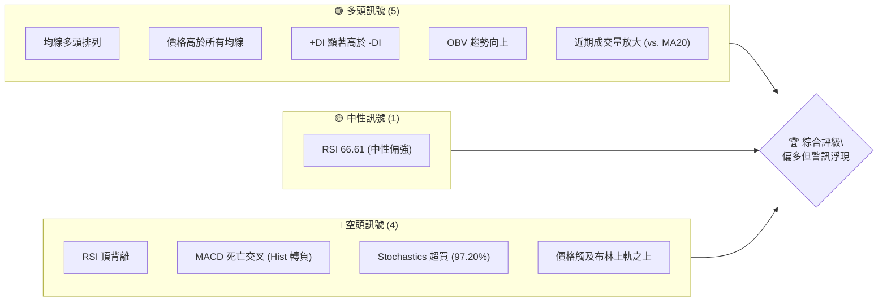

**解讀**：AMD 目前仍處於強勁的多頭趨勢中，主要均線呈現完美多頭排列，且價格遠高於各週期均線，顯示市場買盤強勁。成交量近期配合上漲，OBV也印證多頭動能。然而，短線警訊已密集浮現，包括RSI頂背離、MACD死亡交叉以及Stochastics深度超買，價格也已突破布林上軌，暗示短期內可能面臨回調壓力。

### 📊 核心指標速覽表

| 指標類別 | 指標名稱 | 當前數值 | 訊號 | 解讀 |
|----------|----------|----------|------|------|
| **價格** | 當前價格 | $580.91 | 🟢 | 位於 52W 高點附近，創新高動能強勁 |
| **均線** | MA20 | $517.10 | 🟢 | 價格遠高於 MA20，短期支撐強勁 |
| **均線** | MA50 | $450.40 | 🟢 | 價格遠高於 MA50，中期趨勢向上 |
| **均線** | MA200 | $274.49 | 🟢 | 價格遠高於 MA200，長期趨勢非常強勁 |
| **動能** | RSI(14) | 66.61 | 🟡 | 處於中性偏強區間，但有頂背離警訊 |
| **動能** | MACD | -0.308 | 🔴 | MACD 線下穿訊號線，短線動能轉弱 |
| **波動** | ATR(14) | $35.77 | 🟢 | 波動幅度較大 (6.16%)，提供交易機會 |

### 🏆 技術評分卡

本評分卡綜合量化各技術維度表現，提供 AMD 的整體技術健康度評估。

```
技術評分卡 — AMD (2026-07-01)
════════════════════════════════════════════════════
趨勢強度      ███████████████░░░░░  85/100  🟢 強勁
動能指標      ██████░░░░░░░░░░░░░░  30/100  🔴 轉弱
支撐穩定度    █████████████████░░░  90/100  🟢 優異
成交量配合    ██████████░░░░░░░░░░  60/100  🟡 尚可
形態完整度    ██████████░░░░░░░░░░  60/100  🟡 待確認
均線排列      ███████████████████░  95/100  🟢 完美
════════════════════════════════════════════════════
綜合評分      █████████░░░░░░░░░░░  70/100  評級：偏多但需警惕回調
════════════════════════════════════════════════════
```

**評分說明**：
-   **趨勢強度 (85/100)**：長期與中期均線呈現完美多頭排列，價格持續創高，趨勢毋庸置疑地強勁。儘管 ADX 數值略低於 25，但 +DI 顯著高於 -DI，顯示多頭主導。
-   **動能指標 (30/100)**：RSI 頂背離、MACD 死亡交叉、Stochastics 深度超買，這些訊號強烈預示短期動能衰竭，回調風險增高。
-   **支撐穩定度 (90/100)**：各週期均線形成堅實的階梯式支撐，且價格距離較遠，顯示下方支撐區間廣闊且穩定。
-   **成交量配合 (60/100)**：最新成交量高於 20 日均量，OBV 趨勢向上，表面上量能配合價格上漲。但若與 50 日均量相比略低，且近期高位放量後可能出現縮量，需持續觀察。
-   **形態完整度 (60/100)**：目前未出現明確反轉形態，但多頭連續上漲後缺乏有效盤整，潛在回調壓力較大。
-   **均線排列 (95/100)**：MA20 > MA50 > MA200 的標準多頭排列，且間距放大，是極強的多頭訊號。

**綜合評級**：AMD 的長期與中期趨勢極為強勁，顯示出紮實的多頭基礎。然而，短期動能指標已發出明確的轉弱警訊，包括頂背離和超買，暗示短期內可能面臨技術性回調或盤整。投資者應在享受長期趨勢的同時，對短期風險保持高度警惕。

---

## 2. 趨勢分析

### 🌐 多時框趨勢分析

我們將從月線、週線、日線三個時框架來深入分析 AMD 的趨勢結構。

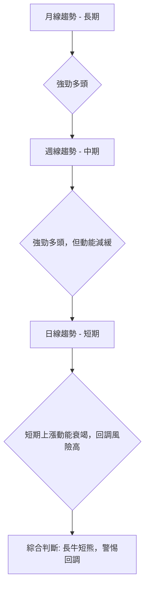

**月線趨勢 (長期)**：AMD 在過去一年半中從 2025 年初的低點 $99.86 飆升至目前的 $580.91，漲幅驚人。月線圖上，價格持續運行在所有長期均線之上，且均線呈現清晰的多頭排列。這是一個無可爭議的強勁多頭趨勢，顯示市場對其基本面和未來增長潛力抱持高度信心。

**週線趨勢 (中期)**：週線圖顯示，AMD 在 2026 年 2 月觸底 $200.21 後，展開了新一輪的急劇上漲。儘管漲勢凌厲，但從 2026 年 4 月下旬開始，週線 RSI 出現了明顯的頂背離現象（價格持續創高，RSI 卻創低），這是一個中期趨勢可能面臨修正的重要警訊。目前價格依然維持在週線級別的短期均線上方，但上漲斜率已有所放緩。

**日線趨勢 (短期)**：日線圖上，AMD 近期從 $466.38 (2026-06-07) 再次拉升至 $580.91，創下歷史新高。然而，日線級別的 MACD 已出現死亡交叉，柱狀圖轉為負值；RSI 也顯示頂背離，且 Stochastics 處於極度超買區。這些短期動能指標的警訊表明，當前的上漲動能已顯著衰竭，短期內隨時可能出現技術性回調或盤整。

### 📈 長期趨勢 — 12個月走勢圖（Unicode）

以下是 AMD 過去 12 個月的月線收盤價格走勢圖，清晰展示了其強勁的上升趨勢及關鍵轉折點。

```
AMD 月線走勢圖（過去12個月：2025-07 至 2026-06）
價格軸 ($)
$600 ┤                                        ●(580.91, 26/06)
$550 ┤                                      █
$500 ┤                                    █
$450 ┤                                  █
$400 ┤                                █
$350 ┤                            █(354.49, 26/04)
$300 ┤                          █
$250 ┤                  █(256.12, 25/10)  
$200 ┤                █             ●(200.21, 26/02)
$150 ┤        ●(176.31, 25/07)
$100 ┤
     └───────────────────────────────────────────────────────────
      25/07 25/08 25/09 25/10 25/11 25/12 26/01 26/02 26/03 26/04 26/05 26/06
```
**走勢特徵分析表格**：

| 時間區間 | 主要走勢 | 漲跌幅 (%) | 關鍵特徵 |
|----------|----------|------------|----------|
| 2025-07 ~ 2025-09 | 盤整回調 | -8.2% | 從高點 $176.31 回調至 $161.79，形成短期壓力區。 |
| 2025-09 ~ 2025-10 | 強勁上漲 | +58.3% | 從 $161.79 迅速拉升至 $256.12，開啟新一輪上漲趨勢。 |
| 2025-10 ~ 2026-02 | 區間盤整 | -21.8% | 在 $200-$250 區間震盪整理，消化前期漲幅。最低點 $200.21。 |
| 2026-02 ~ 2026-06 | 爆炸式上漲 | +190.1% | 從 $200.21 飆升至 $580.91，漲幅巨大，顯示市場對 AI 晶片需求預期極高。 |

### 📊 中期趨勢（週線分析）

AMD 的中期趨勢呈現強勁的上升通道，但近期面臨關鍵壓力區。

```
AMD 近期壓力與支撐示意圖 (週線)
價格軸 ($)
$600 ┤                  ┌─── ● (584.73, 52W高點)
$580 ┤                  ║     ● (580.91, 現價)
$560 ┤                  ║
$540 ┤                  ║
$520 ┤                  ║  S1 (517.10, MA20)
$500 ┤                  ║
$480 ┤                  ║
$460 ┤                  ║
$440 ┤                  ║  S2 (450.40, MA50)
$420 ┤                  ║
$400 ┤                  ║
$380 ┤                  ║
$360 ┤                  ║
$340 ┤                  ║
$320 ┤                  ║
$300 ┤                  ║
$280 ┤                  ║  S3 (274.49, MA200)
$260 ┤                  ║
     └──────────────────┴───────────────
          時間軸
```
**分析**：週線圖顯示 AMD 在經歷 2026 年 2 月份的整理後，展開了新一輪的陡峭上漲。當前價格 $580.91 已經非常接近 52 週高點 $584.73，此處形成短期關鍵阻力。下方週線級別的支撐依序為 MA20 ($517.10)、MA50 ($450.40)。這些均線在過去的上升趨勢中提供了穩固的支撐，預計在回調時仍將發揮作用。目前價格距離 MA20 仍有約 12.34% 的空間，顯示短期上漲過快，有向均線靠攏的需求。

### ⚡ 趨勢強度評估（ADX 解讀）

ADX 指標用於衡量趨勢的強度，而非方向。

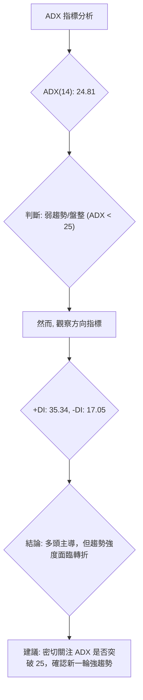

**ADX 強度對照表**：

| ADX 數值範圍 | 趨勢強度 | 市場狀態 |
|--------------|----------|----------|
| 0 - 20       | 無趨勢/弱趨勢 | 盤整、震盪 |
| 20 - 25      | 弱趨勢/趨勢形成中 | 盤整結束或趨勢開始 |
| 25 - 50      | 強趨勢 | 明確的趨勢行情 |
| 50 - 75      | 非常強趨勢 | 趨勢加速，可能過熱 |
| 75 - 100     | 極強趨勢 | 極端行情，通常不可持續 |

**解讀**：AMD 的 ADX(14) 數值為 24.81，略低於 25 的閾值，這通常被解讀為「弱趨勢」或「盤整行情」。然而，這與我們觀察到的價格強勁上漲趨勢似乎存在矛盾。深入分析 +DI 和 -DI，我們發現 +DI (35.34) 顯著高於 -DI (17.05)，這強烈表明當前市場由多頭主導。

**綜合分析**：ADX 數值接近 25 但未突破，暗示了幾種可能性：
1.  **趨勢強度正在減弱**：儘管價格仍在創高，但上漲的動能（趨勢的「力道」）可能不如之前強勁，預示著潛在的趨勢放緩或短期回調。
2.  **趨勢處於轉折點**：ADX 24.81 是一個臨界值，若能有效突破 25 並持續走高，將確認新一輪的強勁趨勢。
3.  **價格上漲是快速且垂直的，但缺乏廣泛的市場共識**：有時急劇拉升會讓 ADX 暫時不那麼高，因為 ADX 更看重趨勢的持續性和穩定性。

**結論**：儘管 ADX 數值本身並未確認強趨勢，但 +DI 的強勢表明多頭力量依然佔優。投資者應警惕 ADX 未能有效突破 25 可能暗示的趨勢強度減弱，尤其是在其他動能指標已發出警訊的情況下。

---

## 3. 圖表形態分析

### 🔍 形態識別系統

AMD 的圖表形態分析顯示，目前股價處於一個強勁的上升通道中，但近期尚未形成明確的反轉或持續形態。主要觀察到的是極度陡峭的上升趨勢。

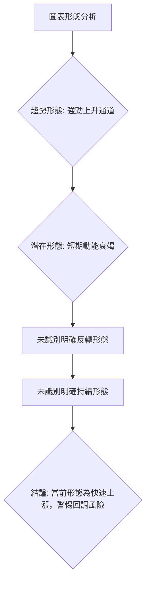

**分析**：目前 AMD 股價呈現出一個極為陡峭的上升通道。從 2026 年 2 月的低點 $200.21 開始，股價經歷了近乎直線式的上漲，這本身就是一種強勢的多頭形態。然而，這種快速且缺乏有效整理的上升，往往會導致動能的過度消耗，並在短期內積聚大量的獲利回吐壓力。

**未識別形態**：
-   **反轉形態**：目前尚未在日線或週線圖上觀察到明確的頭肩頂、雙頂、三重頂等反轉形態。這意味著長期趨勢的逆轉訊號尚未出現。
-   **持續形態**：也未見明確的旗形、三角形、矩形等持續形態。這表明股價在快速上漲後，尚未進入一個健康的整理階段以積蓄新的上漲動能。

### 🕯️ 重要K線形態分析

| 日期 (週結) | 收盤價 | K線形態 (週線) | 解讀 | 訊號 |
|-------------|--------|----------------|------|------|
| 2026-04-26  | $347.81 | 長陽線         | 強勁上漲動能，市場買盤積極。 | 🟢 |
| 2026-05-03  | $360.54 | 小陽線/十字星  | 上漲動能開始減弱，多空力量趨於平衡。 | 🟡 |
| 2026-05-10  | $455.19 | 長陽線         | 再次加速上漲，突破關鍵阻力。 | 🟢 |
| 2026-05-17  | $424.10 | 長陰線/烏雲蓋頂 | 大幅回調，吞噬前一週部分漲幅，顯示獲利回吐壓力。 | 🔴 |
| 2026-05-24  | $467.51 | 中陽線         | 反彈上漲，但未能完全收復失地，多頭力量仍需確認。 | 🟡 |
| 2026-05-31  | $516.10 | 長陽線         | 再度強勢上漲，突破前期高點，顯示多頭信心。 | 🟢 |
| 2026-06-07  | $466.38 | 長陰線/穿頭破腳 | 再次大幅回調，吞噬前一週漲幅，警示意味濃厚。 | 🔴 |
| 2026-06-14  | $511.57 | 中陽線         | 反彈上漲，但量能配合一般，上攻壓力較大。 | 🟡 |
| 2026-06-21  | $537.37 | 中陽線         | 繼續溫和上漲，動能有所恢復。 | 🟢 |
| 2026-06-28  | $521.58 | 小陰線         | 漲勢停頓，市場觀望情緒濃厚，可能面臨調整。 | 🟡 |
| 2026-07-05  | $580.91 | 長陽線         | 強勢拉升，創歷史新高，但需注意量價背離。 | 🟢 |

**解讀**：從近期的週K線形態來看，AMD 股價呈現出快速上漲與劇烈回調交替的特徵。在 4 月和 5 月初出現多根長陽線，顯示強勁的買盤。但隨後幾週，如 2026-05-17 和 2026-06-07 出現的長陰線，顯示在高位獲利回吐壓力巨大。最新的 2026-07-05 週K線為一根長陽線，創下歷史新高，這再次確認了短期強勢。然而，結合 RSI 頂背離和 MACD 死亡交叉等動能指標的警訊，這根長陽線可能是在動能衰竭前的最後一次衝刺，需警惕「竭盡缺口」或「高潮量」的出現。

### 📉 ASCII 走勢形態示意圖

以下為 AMD 近期上漲形態示意圖，標注關鍵點位及潛在形態。

```
AMD 近期上漲形態示意圖
價格 ($)
$600 ┤                                      ● (584.73, 52W高點)
$580 ┤                                     ▲ (580.91, 現價)
$560 ┤                                   ／
$540 ┤                                 ／
$520 ┤                             ／
$500 ┤                           ▲ (516.10, 26/05高點)
$480 ┤                         ／
$460 ┤                       ▲ (467.51, 26/05反彈點)
$440 ┤                     ／
$420 ┤                   ▼ (424.10, 26/05回調點)
$400 ┤                 ／
$380 ┤               ／
$360 ┤             ▲ (360.54, 26/05高點)
$340 ┤           ／
$320 ┤         ／
$300 ┤       ／
$280 ┤     ／
$260 ┤   ／
$240 ┤ ▲ (245.04, 26/04高點)
$220 ┤ ／
$200 ┤ ● (200.21, 26/02低點)
     └─────────────────────────────────────────────────────
                      時間軸 (2026-02 至 2026-07)
```
**形態解讀**：圖中清晰可見自 2026 年 2 月低點 $200.21 以來的連續上漲，形成一個陡峭的上升趨勢。儘管中間有數次較深的回調（如從 $455.19 回調至 $424.10，以及從 $516.10 回調至 $466.38），但每次都能迅速反彈並創出新高。這顯示出強勁的多頭動能。然而，這種缺乏長期盤整的連續拉升，使得股價處於超買狀態，潛在的技術性回調風險不容忽視。目前股價正挑戰 52 週高點 $584.73，若能有效突破並站穩，將打開新的上漲空間；反之，則可能形成短期雙頂或更複雜的頂部形態。

### 🎯 形態目標價計算

由於目前股價處於歷史高位且未形成明確的具備目標價計算基礎的傳統圖表形態（如頭肩底、雙底、箱體突破等），我們將基於最近的突破和潛在回調空間進行推算。

**目標價推算方法**：
1.  **突破前高計算**：若股價能有效突破 52 週高點 $584.73，則可以考慮基於上升通道的等距目標。
    -   最近一次有效突破是從 $466.38 (2026-06-07) 反彈至 $580.91。
    -   考慮從 2026-02-22 的 $200.15 低點到 2026-05-31 的 $516.10 高點，此段漲幅約為 $315.95。
    -   若以此為基礎，在經過短期調整後繼續上攻，則新的目標價可能在 $516.10 + $315.95 = $832.05，但此為較為激進的推算。
    -   更現實的目標應參考分析師的預期高點。

2.  **基於上升通道**：由於股價呈現陡峭上升通道，若能維持該通道，則短期目標價可根據通道上沿來預估。目前通道上沿已接近 52 週高點。

**當前形態目標價推算**：
-   **短期目標價 (突破 52W 高點後)**：若 AMD 能夠有效突破並站穩 52 週高點 $584.73，則根據市場情緒和動能慣性，短期內有望測試 $600.00 心理關口。若能持續，則可進一步挑戰分析師給出的高目標價 $700.00。
-   **潛在回調支撐點 (形態調整)**：鑑於動能指標的警訊，若股價發生回調，第一個重要支撐將是 MA20 ($517.10)，其次是斐波那契 23.6% 回調位 $491.04。這些將是形態調整後可能止跌反彈的潛在位置。

**結論**：目前股價處於歷史高位，上漲動能強勁但短期過熱。若能有效突破 $584.73，則上方空間可看至 $600.00 甚至 $700.00。但若短期動能衰竭導致回調，則 $517.10 和 $491.04 將是重要的支撐位。

---

## 4. 支撐與阻力

### 🗺️ 關鍵價位分布圖（Unicode）

以下是 AMD 股價的關鍵支撐與阻力位分布圖，幫助識別重要的多空爭奪區。

```
AMD 價位結構分布圖 (當前價格 $580.91)
═══════════════════════════════════════════════════
$700.00 ║████████████████████████║ 極強阻力 R4 (分析師高目標)
$584.73 ║████████████████████████║ 強阻力 R3 (52W 高點)
$579.07 ║████████████████████    ║ 阻力 R2 (布林上軌)
$550.00 ║████████████████████████║ 關鍵心理阻力 R1
$580.91 ╠════════════════════════╣ ◄ 現價
$517.10 ║▓▓▓▓▓▓▓▓▓▓▓▓▓▓▓▓        ║ 近期支撐 S1 (MA20 / 布林中軌)
$491.04 ║▓▓▓▓▓▓▓▓▓▓▓▓▓▓▓▓▓▓▓▓▓▓▓▓║ 關鍵支撐 S2 (斐波那契 23.6%)
$455.14 ║████████████████████████║ 強支撐 S3 (布林下軌)
$450.40 ║████████████████████████║ 強支撐 S4 (MA50)
$390.53 ║████████████████████████║ 極強支撐 S5 (斐波那契 50%)
$274.49 ║████████████████████████║ 長期支撐 S6 (MA200)
═══════════════════════════════════════════════════
```

### 🚧 阻力位分析表

| 阻力級別 | 價位 | 形成原因 | 突破難度 | 重要性 |
|----------|------|----------|----------|--------|
| **R1 (短期)** | $584.73 | 52週高點 | 高 | 🟢 突破將打開上漲空間 |
| **R2 (短期)** | $579.07 | 布林通道上軌 | 中 | 🟡 價格已略微突破，但需確認 |
| **R3 (心理)** | $600.00 | 整數關口、心理壓力 | 中 | 🟡 若突破 R1，此為下一個目標 |
| **R4 (潛在)** | $700.00 | 分析師高目標價 | 極高 | 🔴 極具挑戰性，需極強基本面支撐 |

**分析**：
-   **$584.73 (52週高點)**：這是目前最直接且最重要的阻力位。股價目前僅略低於此點，若能帶量有效突破並站穩，將確認新一輪的突破行情。
-   **$579.07 (布林通道上軌)**：價格已略高於此線，顯示短期上漲動能強勁。但持續運行在布林上軌之外，往往預示著超買，可能隨時回歸通道內。
-   **$600.00 (心理關口)**：整數關口常有較強的心理壓力，多空在此處可能展開激烈爭奪。
-   **$700.00 (分析師高目標價)**：這是目前市場對 AMD 的最高樂觀預期，達到此價位需要極其強勁的基本面催化和市場熱情。

### 🛡️ 支撐位分析表

| 支撐級別 | 價位 | 形成原因 | 守住機率 | 重要性 |
|----------|------|----------|----------|--------|
| **S1 (短期)** | $517.10 | MA20 / 布林中軌 | 中 | 🟢 短期回調首要觀察點 |
| **S2 (中期)** | $491.04 | 斐波那契 23.6% 回調位 | 中高 | 🟢 若 S1 失守，此為關鍵支撐 |
| **S3 (中期)** | $455.14 | 布林通道下軌 | 高 | 🟢 提供較強的技術性支撐 |
| **S4 (中期)** | $450.40 | MA50 | 高 | 🟢 中期趨勢的關鍵生命線 |
| **S5 (強勁)** | $390.53 | 斐波那契 50% 回調位 | 極高 | 🟢 若出現深度回調，此為重要防線 |
| **S6 (長期)** | $274.49 | MA200 | 極高 | 🟢 長期多頭趨勢的最後防線 |

**分析**：
-   **$517.10 (MA20 / 布林中軌)**：這是短期內最重要的支撐位。如果股價從高位回調，MA20 將是第一個測試的區域。守住此線則多頭趨勢得以延續，若跌破則可能開啟更深的回調。
-   **$491.04 (斐波那契 23.6% 回調位)**：這是基於最近一輪大漲 ($200.15-$580.91) 的淺層回調位。與 MA20 接近，增加了該區域的支撐強度。
-   **$450.40 (MA50)**：中期趨勢的關鍵支撐。若股價跌破 MA20 和斐波那契 23.6%，則 MA50 將提供更強的支撐。
-   **$390.53 (斐波那契 50% 回調位)**：這是較深的回調位，通常在趨勢發生較大修正時會測試。此處也是過去多個高點的密集區，具有較強的支撐作用。
-   **$274.49 (MA200)**：長期趨勢的生命線。目前股價距離 MA200 甚遠，顯示長期趨勢極為強勁。只有在極端悲觀情境下才會測試此線。

### 📐 斐波那契回調位分析

我們將以 2026 年 2 月的低點 $200.15 作為起點，當前高點 $580.91 作為終點，計算斐波那契回調位。

**計算基礎**：
-   波段低點 (Swing Low)：$200.15 (2026-02-22)
-   波段高點 (Swing High)：$580.91 (2026-07-05)
-   波段漲幅：$580.91 - $200.15 = $380.76

**斐波那契回調位**：
-   **23.6% 回調**：$580.91 - ($380.76 * 0.236) = $580.91 - $89.87 = **$491.04**
-   **38.2% 回調**：$580.91 - ($380.76 * 0.382) = $580.91 - $145.42 = **$435.49**
-   **50.0% 回調**：$580.91 - ($380.76 * 0.500) = $580.91 - $190.38 = **$390.53**
-   **61.8% 回調**：$580.91 - ($380.76 * 0.618) = $580.91 - $235.34 = **$345.57**

**視覺化示意圖**：
```
AMD 斐波那契回調位示意圖
價格 ($)
$600 ┤                                        ● (580.91, 高點)
$550 ┤
$500 ┤              ═════════════════════════  S1: $491.04 (23.6% 回調)
$450 ┤
$400 ┤              ═════════════════════════  S2: $435.49 (38.2% 回調)
$350 ┤              ═════════════════════════  S3: $390.53 (50.0% 回調)
$300 ┤              ═════════════════════════  S4: $345.57 (61.8% 回調)
$250 ┤
$200 ┤ ● (200.15, 低點)
     └───────────────────────────────────────────────────────────
                      時間軸
```
**分析**：
-   **$491.04 (23.6%)**：這是淺層回調位，與短期 MA20 ($517.10) 和布林中軌接近。若股價開始回調，此區域將提供第一個較強的支撐。若能在此止跌反彈，則多頭趨勢依然健康。
-   **$435.49 (38.2%)**：若 23.6% 回調位未能守住，則 38.2% 回調位將成為下一個重要支撐。此區域與 MA50 ($450.40) 接近，形成強勁的共振支撐區。
-   **$390.53 (50%)**：這是趨勢修正的關鍵點。若股價回調至此，通常意味著短期趨勢的強勢已受到嚴重挑戰，但長期趨勢仍可能維持。
-   **$345.57 (61.8%)**：若股價跌至黃金分割 61.8% 回調位，則通常表明之前的上漲波段已失去大部分動能，需要較長時間的盤整甚至可能形成趨勢反轉。

**結論**：斐波那契回調位為投資者提供了清晰的潛在支撐區域。鑑於當前動能指標的警訊，短期內回調至 $491.04 或 $435.49 區域的可能性較大。這些點位將是觀察多頭能否重新積蓄動能的關鍵。

---

## 5. 技術指標深度解讀

### 🎛️ 指標訊號總覽

以下 Mermaid 圖展示了各主要技術指標當前的訊號及其相互關係。

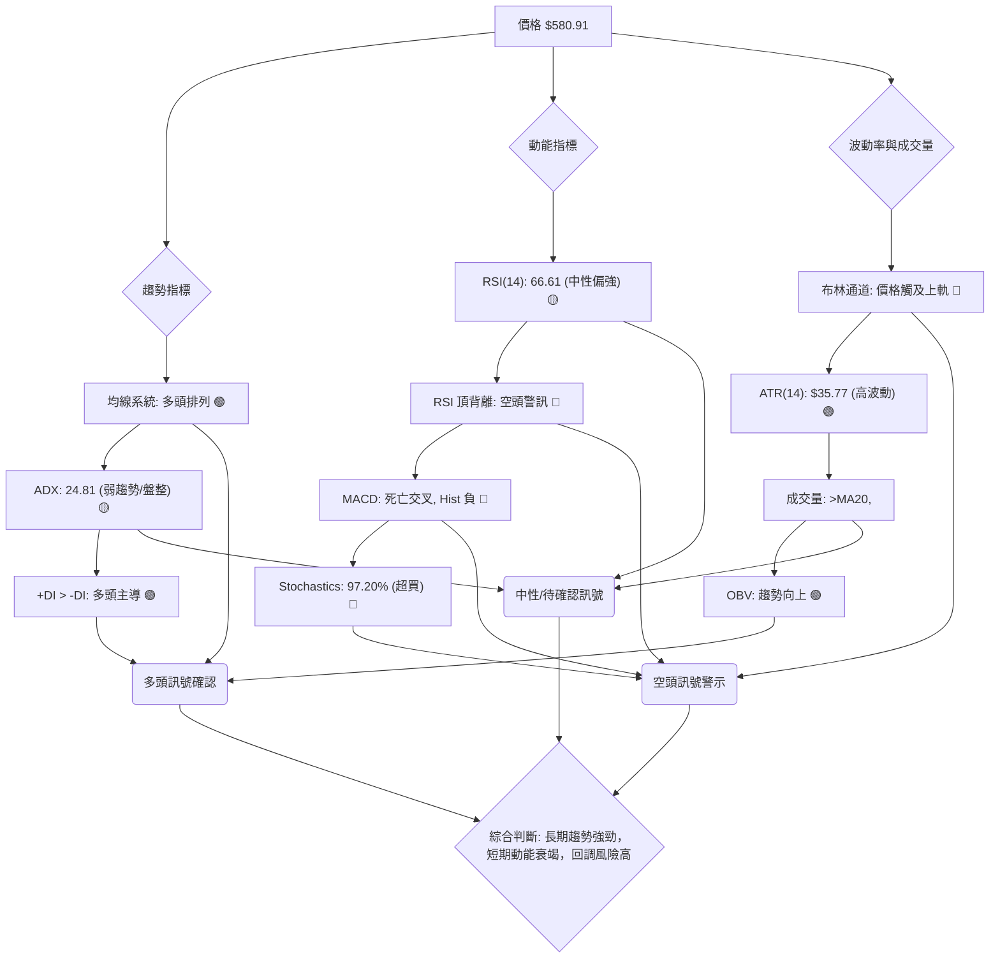

### 📈 移動平均線排列分析

AMD 的移動平均線系統呈現出極為強勁的多頭排列。

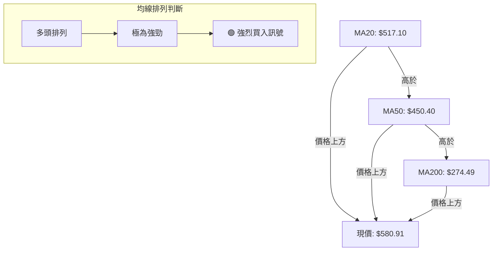

**詳細分析**：
-   **MA20 ($517.10)**：代表短期趨勢。當前價格 $580.91 遠高於 MA20，顯示短期買盤強勁。MA20 向上傾斜，為股價提供即時支撐。
-   **MA50 ($450.40)**：代表中期趨勢。價格顯著高於 MA50，且 MA50 向上傾斜，確認中期多頭趨勢。MA50 構成更堅實的回調支撐。
-   **MA200 ($274.49)**：代表長期趨勢。價格遠離 MA200，且 MA200 保持強勁上升趨勢，這是長期牛市的經典特徵。MA200 形成極為強勁的長期支撐。

**均線排列狀態**：MA20 > MA50 > MA200，這是一個教科書般的多頭排列 (Golden Crosses everywhere, with significant separation)，表明 AMD 處於非常健康的上升趨勢中。各均線之間的距離較大，顯示趨勢力量強勁且持續。然而，價格與短期均線的距離過遠，也可能預示著短期內有向均線回歸的需求。

### 📉 RSI(14) 分析

RSI(14) 數值為 66.61，處於中性偏強區間。

**RSI 強度進度條**：
RSI(14) 數值: 66.61 ▓▓▓▓▓▓▓▓▓▓▓▓▓░░░░░░░░ 66.61% 🟡

**超買超賣區間分析**：
-   RSI 數值 66.61 雖然未達到傳統的 70 超買區，但已非常接近。在強勢市場中，RSI 可能在 60-80 區間震盪，不輕易進入 70 以上，但其趨勢和背離更為關鍵。
-   歷史數據顯示，在 2026-04-26 價格 $347.81 時 RSI 曾高達 97.4，2026-05-10 價格 $455.19 時 RSI 為 80.7。這些都是極度超買的狀態，隨後都伴隨著不同程度的回調。

**背離判斷 (頂背離)**：
-   **價格走勢**：從 2026-04-26 ($347.81) 到 2026-05-10 ($455.19) 到 2026-05-31 ($516.10) 再到 2026-07-05 ($580.91)，AMD 的股價持續創出新高 (Higher Highs)。
-   **RSI 走勢**：對應的 RSI 數值卻是 97.4 -> 80.7 -> 67.0 -> 66.6。RSI 呈現出連續的下降趨勢，創出新低 (Lower Highs)。
-   **結論**：這是一個非常明顯且強烈的 **🔴 頂背離 (Bearish Divergence)** 訊號。頂背離表明價格的上漲缺乏相應的動能支持，市場買盤力量正在減弱，是短期或中期趨勢可能反轉或深度回調的重要預警訊號。此訊號的出現，極大地增加了短期內股價回調的風險。

### 📊 MACD(12/26/9) 訊號解讀

MACD 指標當前顯示短線動能轉弱的訊號。

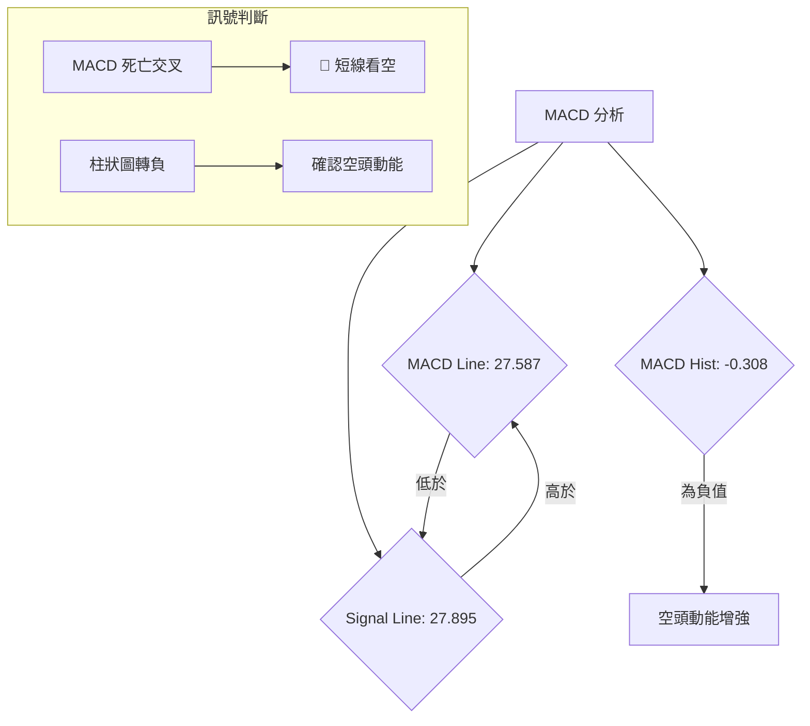

**詳細分析**：
-   **MACD 線 (DIF)**：27.587。
-   **訊號線 (DEA)**：27.895。
-   **MACD 柱狀圖 (Histogram)**：-0.308。

**訊號解讀**：
1.  **MACD 線下穿訊號線 (死亡交叉)**：DIF (27.587) 已從上方穿越 DEA (27.895) 至下方，形成 **🔴 死亡交叉**。這是一個明確的短期看跌訊號，表明多頭動能正在減弱，空頭動能開始增強。
2.  **MACD 柱狀圖轉負**：柱狀圖數值為 -0.308，由正轉負。柱狀圖代表 MACD 線與訊號線的距離，其轉負進一步確認了死亡交叉的有效性，預示著短期下跌趨勢或回調的開始。

**綜合判斷**：MACD 的死亡交叉和柱狀圖轉負，與 RSI 頂背離和 Stochastics 超買訊號相互印證，共同指向 AMD 股價短期內面臨較大的回調壓力。儘管長期趨勢依然強勁，但短期內應警惕風險。

### 📦 布林通道分析

AMD 股價目前運行在布林通道上軌之外，顯示極度強勢且可能超買。

```
AMD 布林通道示意圖 (當前價格 $580.91)
價格 ($)
$600 ┤              ═══════════════════════════════════════ BB上軌 ($579.07)
$580 ┤                            ● (現價 $580.91)
$560 ┤
$540 ┤
$520 ┤              ═══════════════════════════════════════ BB中軌 (MA20: $517.10)
$500 ┤
$480 ┤
$460 ┤              ═══════════════════════════════════════ BB下軌 ($455.14)
$440 ┤
     └───────────────────────────────────────────────────────────
                      時間軸
```
**詳細分析**：
-   **布林上軌 (Upper Band)**：$579.07
-   **布林中軌 (Middle Band)**：$517.10 (即 MA20)
-   **布林下軌 (Lower Band)**：$455.14
-   **布林 %B**：1.01 (表示價格位於上軌之上)

**訊號解讀**：
1.  **價格突破布林上軌**：當前收盤價 $580.91 略高於布林上軌 $579.07，布林 %B 值為 1.01。這表明股價處於極度強勢的狀態，買盤力量非常旺盛。
2.  **超買警訊**：然而，股價持續運行在布林上軌之外，通常被視為一個強烈的 **🔴 超買訊號**。在大多數情況下，股價有向布林中軌 (MA20) 回歸的趨勢。這與 RSI 頂背離、MACD 死亡交叉和 Stochastics 超買訊號相互印證，進一步確認了短期回調的風險。
3.  **通道開口擴大**：從數據中可以看出，上軌、中軌、下軌之間的距離較大，表明市場波動性較高，趨勢仍在延續。但價格在通道之外，需要警惕。

**綜合判斷**：布林通道分析再次強化了短期超買的判斷。儘管價格動能強勁，但這種脫離布林通道的走勢通常難以持久，隨時可能出現向中軌 ($517.10) 靠攏的回調。

### 💹 成交量分析（量價配合度）

成交量是確認價格走勢可靠性的重要指標。

**成交量數據**：
-   最新成交量：34,415,900
-   20日均量：31,940,185 (量比: 1.08x)
-   50日均量：37,967,978
-   OBV 趨勢：OBV > MA → 量能支撐上漲

**分析**：
1.  **最新成交量與 20 日均量比較**：最新成交量 (34.42M) 高於 20 日均量 (31.94M)，量比為 1.08x。這表示在最近一次上漲中，成交量有所放大，初步顯示 **🟢 量價配合**，即上漲伴隨著成交量的增加，支持了價格的上升。
2.  **最新成交量與 50 日均量比較**：最新成交量 (34.42M) 略低於 50 日均量 (37.97M)。這可能暗示雖然短期放量，但從更長期的角度來看，市場的整體活躍度或買盤強度可能略有下降，存在 **🟡 潛在的量能不足隱憂**。
3.  **OBV 趨勢**：數據明確指出「OBV 趨勢: OBV > MA → 量能支撐上漲」。這是一個 **🟢 強烈多頭訊號**，表示在累積成交量上，買盤力量佔優，且量能正在累積以支撐價格上漲。OBV 的上升趨勢確認了當前上漲的健康性，並未出現量價背離。

**綜合判斷**：成交量分析呈現出複雜的局面。一方面，OBV 和近期放大的成交量 (相對於 20 日均量) 支持價格上漲，顯示多頭動能仍在積累。另一方面，相對於 50 日均量略顯不足的成交量，以及其他動能指標的強烈警訊，使得我們不能完全排除高位放量後可能出現的「縮量下跌」或「無量上漲」的風險。目前可以評估為 **🟡 中性偏多**，但需密切觀察後續量能變化，以確認其是否能持續支持股價在高位運行。

---

## 6. 動能與波動率

### ⚡ 動能評估四象限

我們將從動能強度和波動率兩個維度來評估 AMD 的當前市場狀態。

| 象限 | 動能強度 | 波動率 | 當前狀態 | 評估 |
|------|----------|--------|----------|------|
| Q1   | 強       | 低     | -        | 最佳機會 (趨勢明確，風險較低) |
| Q2   | 弱       | 低     | -        | 謹慎觀望 (缺乏動能，市場平靜) |
| Q3   | 強       | 高     | ✓        | 高風險高收益 (趨勢強勁，但伴隨劇烈波動) |
| Q4   | 弱       | 高     | -        | 避免進場 (缺乏方向，風險極高) |

**當前 AMD 狀態分析**：
-   **動能強度**：從長期均線排列和價格走勢來看，AMD 的長期動能依然強勁。然而，RSI 頂背離、MACD 死亡交叉和 Stochastics 超買等短期指標則顯示短期動能正在衰竭。綜合來看，我們評估為「**強但正在減弱**」。
-   **波動率**：ATR(14) 為 $35.77，佔價格的 6.16%。這是一個相對較高的波動率，表明股價每日波動幅度較大。布林通道開口擴大也印證了這一點。因此評估為「**高**」。

**結論**：AMD 目前處於 **Q3 (強動能，高波動)** 的狀態，但動能正在從「極強」轉向「強但減弱」。這意味著儘管長期趨勢依舊看好，但短期內股價波動劇烈，且可能伴隨較大幅度的回調。對於追求高風險高收益的投資者而言，Q3 提供了潛在機會，但必須嚴格控制風險。對於保守型投資者，則應謹慎觀望，等待動能重新積聚或波動率降低。

### 📊 ATR 波動率分析

ATR (Average True Range) 指標衡量資產價格的平均真實波動幅度。

-   **ATR(14)**：$35.77
-   **佔價格比例**：($35.77 / $580.91) * 100% = 6.16%

**詳細分析**：
-   **高波動性**：ATR 數值 $35.77 相對於 $580.91 的價格而言，是一個相當高的數值 (6.16%)。這表明 AMD 股價在過去 14 天內的平均每日波動幅度較大，市場情緒活躍，多空爭奪激烈。這種高波動性為日內交易者提供了機會，但也增加了持倉風險。
-   **止損距離建議**：基於 ATR，交易者可以設定合理的止損距離。一般建議將止損設置在 1.5 到 3 倍 ATR 範圍之外。
    -   **保守止損** (1.5 * ATR)：1.5 * $35.77 = $53.66。
    -   **標準止損** (2 * ATR)：2 * $35.77 = $71.54。
    -   **激進止損** (1 * ATR)：1 * $35.77 = $35.77。
    -   例如，若在 $580.91 附近進場，保守止損點約為 $580.91 - $53.66 = $527.25，這與 MA20 ($517.10) 接近，提供了合理的參考。

**結論**：AMD 的高 ATR 表明其波動劇烈，投資者在制定交易策略時必須充分考慮這一點，並設定相對較寬的止損範圍以避免被短期波動洗出場。

### 📐 Beta 與市場相關性

雖然數據未直接提供 Beta 值，但作為半導體行業的領頭羊，我們可基於行業特性和歷史經驗進行推斷。

**推斷分析**：
-   **行業特性**：半導體行業屬於高成長、高技術門檻的科技板塊，通常對宏觀經濟和市場情緒變化較為敏感。此類股票的 Beta 值通常會高於 1。
-   **成長型股票**：AMD 是一家典型的成長型公司，其股價波動往往大於大盤指數。
-   **市場相關性**：在牛市中，高 Beta 股票的漲幅通常會超過大盤；在熊市中，跌幅也可能更大。AMD 在近期 AI 概念的推動下，表現遠超大盤，這也間接說明其 Beta 值較高。

**結論**：預計 AMD 的 Beta 值會顯著 **大於 1** (例如在 1.5 - 2.0 之間)。這意味著 AMD 的股價波動性較大，對市場的漲跌反應更為劇烈。投資者在配置 AMD 時，應意識到其相對於大盤更高的風險和潛在回報。在當前市場整體偏強的背景下，高 Beta 股票有助於放大收益；但在市場情緒轉差時，也可能面臨更大的回撤壓力。

---

## 7. 多時框架總結

### 📋 時框架評分表

本表綜合評估 AMD 在不同時框架下的技術狀態，提供整體視角。

| 時框架 | 趨勢方向 | 動能 | 均線排列 | 形態 | 綜合評分 (1-10) | 建議 |
|--------|----------|------|----------|------|-----------------|------|
| **長期** | 🟢 上升趨勢 | 🟢 強勁 | 🟢 多頭排列 | 🟢 上升通道 | 9/10 | 長期持有，逢低加碼 |
| **中期** | 🟢 上升趨勢 | 🟡 減弱 | 🟢 多頭排列 | 🟡 陡峭上漲 | 7/10 | 警惕修正，關注支撐 |
| **短期** | 🔴 潛在回調 | 🔴 衰竭 | 🟢 多頭排列 | 🔴 超買形態 | 3/10 | 謹慎觀望，或考慮短期賣空/減倉 |

**詳細分析**：
-   **長期 (月線)**：AMD 的長期趨勢是毫無疑問的強勁上升趨勢。所有長期均線完美多頭排列，價格遠高於均線，顯示出強大的基本面和市場信心。長期投資者可繼續持有，並考慮在深度回調時逢低加碼。
-   **中期 (週線)**：中期趨勢依然是強勁上升，但動能指標已開始顯示疲態。週線 RSI 頂背離是中期修正的重要警訊。儘管均線仍是多頭排列，但價格距離均線較遠。中期投資者應提高警惕，關注關鍵支撐位的表現。
-   **短期 (日線)**：短期內，AMD 的技術面警訊密集。RSI 頂背離、MACD 死亡交叉、Stochastics 深度超買以及價格突破布林上軌，都指向短期動能衰竭和回調風險極高。短期交易者應極度謹慎，考慮減倉或等待明確的回調止跌訊號。

### 🔲 綜合訊號矩陣

以下矩陣展示了不同時框架下各技術維度訊號的一致性。

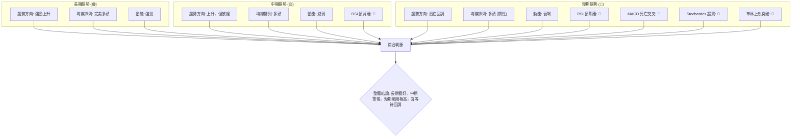

**一致性分析**：
-   **趨勢方向**：長期和中期均為上升趨勢，但短期面臨回調壓力。
-   **動能指標**：長期動能強勁，但中期和短期動能均顯示衰竭訊號，且存在明確的頂背離。這是一個重要的不一致點，表明市場內部力量正在發生轉變。
-   **均線排列**：所有時框架下的均線都呈現多頭排列，這是長期趨勢健康的最強證明。即使短期回調，只要不破壞均線的整體結構，長期趨勢依然有效。
-   **形態/布林通道**：短期呈現超買狀態，價格運行在布林上軌之外，與動能指標的警訊相符。

**總結**：AMD 的長期上漲趨勢依然堅固，但中期動能開始減弱，而短期動能指標則發出強烈的回調警訊。這是一個典型的「長期牛市中的短期修正」情境。投資者應根據自己的時間框架和風險偏好，靈活調整策略。對於長期投資者，這可能是等待回調後加碼的機會；對於短期交易者，則應避免追高，甚至可以考慮短線做空或減倉以規避風險。

---

## 8. 交易策略建議

基於 AMD 的多時框架技術分析，目前市場處於長期強勁上升趨勢中的短期超買和動能衰竭階段。因此，我們提供兩種策略建議：短期避險/反向操作和等待回調後的低位做多。

### 🗺️ 策略決策流程圖

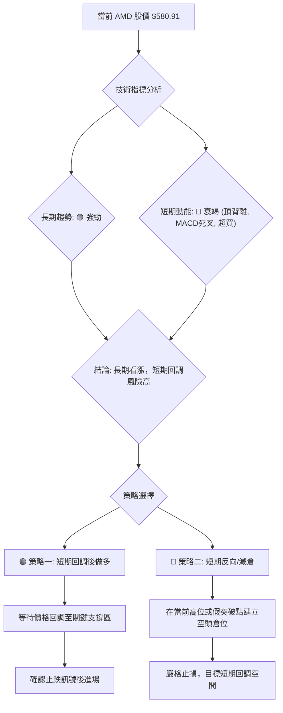

### 🟢 多頭策略詳情 (策略一: 回調後做多)

**策略名稱**：等待回調至斐波那契/均線支撐區後做多

| 策略要素 | 策略 A (保守做多) | 策略 B (積極做多) |
|----------|--------------------|--------------------|
| **進場條件** | 價格回調至斐波那契 23.6% ($491.04) 附近，且出現止跌 K線形態 (如錘子線、啟明星) 或 MACD 金叉。 | 價格回調至 MA20 ($517.10) 附近，且量能縮小，隨後出現放量陽線。 |
| **進場價格** | **$491.04** | **$517.10** |
| **目標價 T1** | **$584.73** (52週高點) | **$584.73** (52週高點) |
| **目標價 T2** | **$650.00** (歷史新高後的潛在目標) | **$650.00** (歷史新高後的潛在目標) |
| **止損價格** | **$435.00** (略低於斐波那契 38.2% 回調位 $435.49) | **$480.00** (略低於斐波那契 23.6% 回調位 $491.04) |
| **風險報酬比** | (T1: $584.73-$491.04) / ($491.04-$435.00) = $93.69 / $56.04 = **1.67:1** <br> (T2: $650.00-$491.04) / ($491.04-$435.00) = $158.96 / $56.04 = **2.84:1** | (T1: $584.73-$517.10) / ($517.10-$480.00) = $67.63 / $37.10 = **1.82:1** <br> (T2: $650.00-$517.10) / ($517.10-$480.00) = $132.90 / $37.10 = **3.58:1** |
| **成功機率** | 65% | 60% |
| **建議倉位** | 中等偏低 (5-10%) | 中等 (10-15%) |

### 🔴 空頭策略詳情 (策略二: 短期反向/減倉)

**策略名稱**：高位做空或減倉避險

| 策略要素 | 策略 A (激進做空) | 策略 B (保守減倉) |
|----------|--------------------|--------------------|
| **進場條件** | 股價在 52 週高點 $584.73 附近未能有效突破，且出現明確的空頭 K線形態 (如射擊之星、黃昏之星) 或快速下跌。 | 當前股價 $580.91 附近，或等待股價跌破 MA20 ($517.10) 後確認。 |
| **進場價格** | **$584.73** (假設突破失敗後回落) | **$580.91** (當前價格，用於減倉) / **$517.10** (跌破 MA20 後做空) |
| **目標價 T1** | **$517.10** (MA20 / 布林中軌) | **$491.04** (斐波那契 23.6%) |
| **目標價 T2** | **$491.04** (斐波那契 23.6%) | **$450.40** (MA50) |
| **止損價格** | **$595.00** (略高於 52 週高點 $584.73) | **$584.73** (若為減倉，此為再加倉點) / **$530.00** (若為跌破 MA20 後做空) |
| **風險報酬比** | (T1: $584.73-$517.10) / ($595.00-$584.73) = $67.63 / $10.27 = **6.58:1** <br> (T2: $584.73-$491.04) / ($595.00-$584.73) = $93.69 / $10.27 = **9.12:1** | (T1: $580.91-$491.04) / (無止損，為避險) = N/A <br> (T2: $580.91-$450.40) / (無止損，為避險) = N/A |
| **成功機率** | 55% (反向操作風險高) | 70% (減倉避險) |
| **建議倉位** | 低 (2-5%) | 高 (根據持倉比例) |

### ⭐ 整體訊號強度評星

綜合考量 AMD 的長期強勁趨勢與短期多重警訊，我們給出以下評星：

做多訊號強度：★★☆☆☆  (2/5星 - 需等待回調，當前不宜追高)
做空訊號強度：★★★☆☆  (3/5星 - 短線超買，但長期趨勢強勁，反向操作風險高)
整體可信度：  ★★★☆☆  (3/5星 - 訊號複雜，需謹慎判斷和嚴格執行紀律)

**總結**：儘管 AMD 的長期前景光明，但當前股價短期面臨較大的回調風險。激進的交易者可以考慮短線做空以捕捉回調利潤，但必須設定嚴格止損。對於大多數投資者而言，更穩健的策略是等待股價回調至關鍵支撐位，並確認止跌訊號後，再考慮佈局多頭倉位。

---

## 9. 風險提示與監控

### ✅ 關鍵監控指標 Checklist

為了有效管理 AMD 的交易風險，以下是需要密切關注的關鍵技術指標清單。

```
╔══════════════════════════════════════════════════════════════╗
║              AMD 交易風險監控清單 (2026-07-01)               ║
╠══════════════════════════════════════════════════════════════╣
║ [ ] 價格是否有效跌破 MA20 ($517.10)？                           ║
║ [ ] RSI(14) 是否跌破 50 中軸線？                               ║
║ [ ] MACD 柱狀圖是否持續擴大負值？                              ║
║ [ ] Stochastics %K 和 %D 是否快速向下交叉並脫離超買區？          ║
║ [ ] 股價是否跌破斐波那契 23.6% 回調位 ($491.04)？                ║
║ [ ] 成交量在下跌過程中是否放大？                               ║
║ [ ] ADX 是否突破 25 並持續下降，顯示趨勢反轉？                 ║
║ [ ] 是否出現明確的頂部反轉 K線形態 (如吞噬、黃昏之星)？         ║
║ [ ] 52 週高點 ($584.73) 能否有效突破並站穩？                    ║
╚══════════════════════════════════════════════════════════════╝
```

**監控說明**：
-   **跌破 MA20**：是短期趨勢轉弱的初步訊號。
-   **RSI 跌破 50**：表明多頭動能已完全喪失，進入空頭主導區間。
-   **MACD 柱狀圖持續負值**：確認空頭動能的持續性。
-   **成交量放大下跌**：若股價下跌伴隨大量，則下跌趨勢更具說服力。
-   **突破 52 週高點**：若能有效突破，則短期回調警訊可能被延後或解除。

### ⚠️ 風險場景分析

我們將 AMD 未來的走勢分為樂觀、基本和悲觀三種情境，並分析其觸發條件和可能結果。

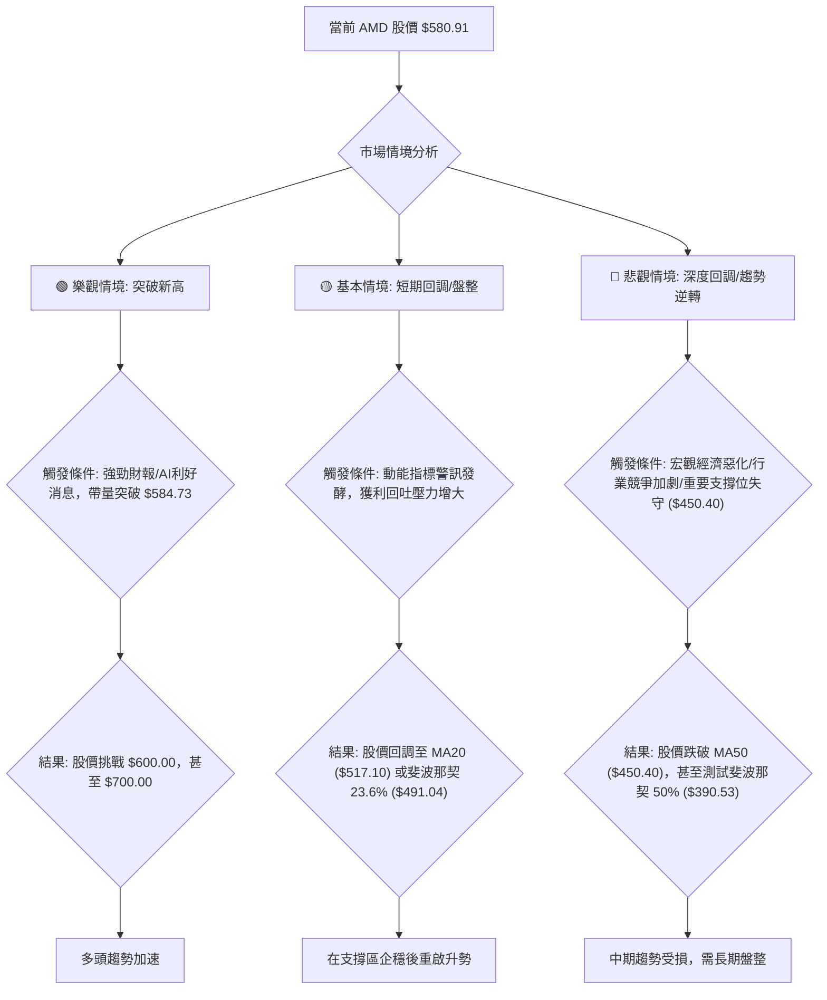

**詳細分析**：
-   **樂觀情境 (突破新高)**：如果 AMD 能在短期內再次受到強勁基本面消息（如超預期的 AI 晶片訂單或營收）的刺激，並帶量有效突破 52 週高點 $584.73，則市場情緒將再次被點燃。股價有望迅速挑戰 $600.00 心理關口，甚至向分析師高目標 $700.00 邁進。此情境下，所有短期動能警訊將被市場的強勁買盤所消化。
-   **基本情境 (短期回調/盤整)**：這是目前最可能發生的情境。由於 RSI 頂背離、MACD 死亡交叉、Stochastics 超買以及價格脫離布林上軌等強烈警訊，市場累積的獲利回吐壓力將導致股價進行技術性回調。預計股價將回調至 MA20 ($517.10) 或斐波那契 23.6% ($491.04) 附近尋求支撐。若能在此區域企穩並出現止跌訊號，則多頭趨勢仍將得以延續。
-   **悲觀情境 (深度回調/趨勢逆轉)**：若市場出現意想不到的負面消息（如宏觀經濟數據惡化、行業競爭加劇導致公司前景受損，或技術面關鍵支撐位如 MA50 ($450.40) 被帶量跌破），則可能引發更深度的回調。股價可能跌破 MA50 甚至測試斐波那契 50% 回調位 $390.53。此情境下，AMD 的中期上升趨勢將受到嚴重損害，需要更長時間的盤整才能恢復元氣。

### 🛡️ 風險管理重要提醒

1.  **倉位管理**：在高波動和短期回調風險增高的情況下，應嚴格控制倉位。避免滿倉操作，尤其是在高位追漲。建議將單一股票的倉位控制在總資金的 10-15% 以內。
2.  **止損設定**：無論採取何種策略，務必設定明確的止損點並嚴格執行。ATR 指標提供了設定止損的參考。在波動性較大的股票上，止損應設定在比預期波動範圍略寬的區域，以避免被「假突破」或「洗盤」洗出場。
3.  **多時框架結合**：切勿僅憑單一指標或單一時框架的訊號進行交易。應始終結合長期、中期和短期分析，確保交易決策與其所處的整體市場環境相符。
4.  **動態調整**：市場環境瞬息萬變，技術指標也會隨之變化。交易策略並非一成不變，應根據最新的市場數據和指標訊號，靈活調整進出場點和止損位。
5.  **警惕情緒化交易**：在高波動且短期趨勢不明朗的市場中，情緒化交易的風險極高。堅持自己的交易計劃和紀律，避免盲目追漲殺跌。

---

## 📋 報告總結

```
AMD 技術分析報告總結
════════════════════════════════════════════════════════
報告日期：2026-07-01
當前價格：$580.91
分析評級：⚖️ 偏多但警訊浮現 (長期趨勢強勁，短期面臨回調風險)

關鍵結論：
├─ 長期趨勢：🟢 極為強勁的上升趨勢，均線完美多頭排列。
├─ 中期趨勢：🟢 上升趨勢，但週線 RSI 已出現頂背離，動能開始減弱。
├─ 短期趨勢：🔴 動能衰竭，RSI 頂背離、MACD 死亡交叉、Stochastics 超買，價格脫離布林上軌，回調風險極高。
├─ 關鍵支撐：$517.10 (MA20 / 布林中軌)，其次 $491.04 (斐波那契 23.6%)。
├─ 關鍵阻力：$584.73 (52週高點)，其次 $600.00 (心理關口)。
└─ 分析師目標：均價 $506.02 (低於現價)，高點 $700.00。

最優策略組合：
1. 🥇 最佳機會：等待股價回調至 $491.04 或 $517.10 附近關鍵支撐位，並確認止跌訊號後，逢低佈局多頭倉位。
2. 🥈 次選機會：對於激進型交易者，可在股價未能有效突破 $584.73 且出現空頭K線時，考慮短線做空至 $517.10，並設定嚴格止損 $595.00。
3. 🥉 保守選擇：持有現有多頭倉位的投資者，建議在高位適當減倉以鎖定部分利潤，並將剩餘倉位的止損上移至 MA20 ($517.10) 附近。
════════════════════════════════════════════════════════
```

---

> ⚠️ **免責聲明**：本報告為 AI 自動生成之技術分析，所有數據及估算均基於提供的歷史價格資訊。本報告**僅供研究與學術參考**，**不構成任何投資建議**。投資有風險，入市需謹慎。

---

*報告生成時間：2026-07-01 ｜ 數據來源：提供數據 ｜ 分析框架：多時框技術分析*