<details>
<summary>📊 靜態圖表 (點擊展開)</summary>
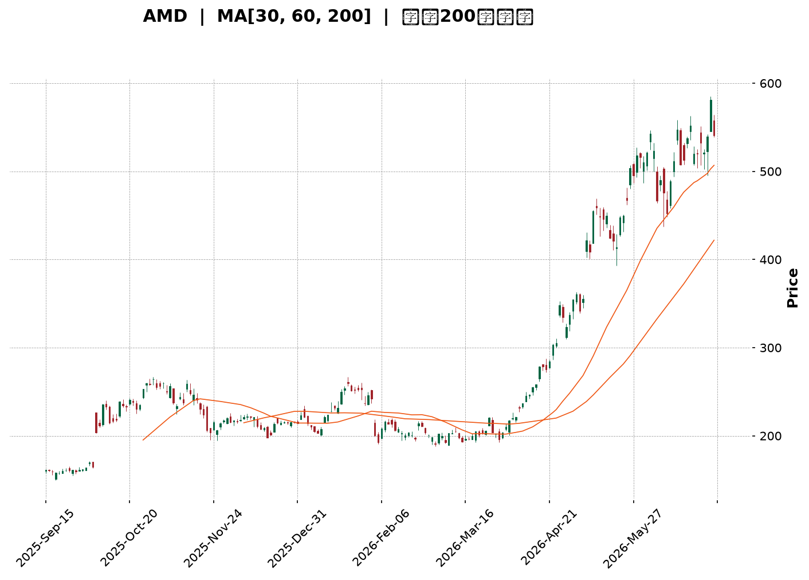
</details>

<html>
<head><meta charset="utf-8" /></head>
<body>
    <div style="height:500px; width:100%;">                        <script>window.PlotlyConfig = {MathJaxConfig: 'local'};</script>
        <script charset="utf-8" src="https://cdn.plot.ly/plotly-3.6.0.min.js" integrity="sha256-QaOVwtVY0T02VaHrr6pnoHLCwayMJp4O5n4YyaE3rJk=" crossorigin="anonymous"></script>                <div id="candlestick-chart" class="plotly-graph-div" style="height:100%; width:100%;"></div>            <script>                window.PLOTLYENV=window.PLOTLYENV || {};                                if (document.getElementById("candlestick-chart")) {                    Plotly.newPlot(                        "candlestick-chart",                        [{"close":{"dtype":"f8","bdata":"AAAAwB4lZEAAAABguA5kQAAAAMAe5WNAAAAAoHC9Y0AAAADgeqxjQAAAAKBH+WNAAAAAwMwcZEAAAAAAKRxkQAAAAOCjKGRAAAAAYLjuY0AAAAAghStkQAAAAKBHOWRAAAAA4FGAZEAAAAAgXDdlQAAAAKBwlWRAAAAAYLh2aUAAAADgUXBqQAAAAIDrcW1AAAAA4HocbUAAAADAzNxqQAAAAKBwDWtAAAAAQOFCa0AAAABAM9NtQAAAAIDrUW1AAAAAYI8ibUAAAACA6xFuQAAAAMD1wG1AAAAAIFzHbEAAAAAgrl9tQAAAAKBwnW9AAAAAYLg6cEAAAAAAKSBwQAAAAKBHhXBAAAAAQOHab0AAAACA6wFwQAAAAGBmOnBAAAAAoJlBb0AAAACgRwVwQAAAAGBmtm1AAAAAoEcxbUAAAAAgXH9uQAAAAOCjsG1AAAAAgD0ucEAAAABguP5uQAAAAIDr2W5AAAAA4KMQbkAAAACgR8lsQAAAAKCZ8WtAAAAA4KPAaUAAAADA9XhpQAAAAKCZ4WpAAAAAACnEaUAAAAAgrsdqQAAAAMD1MGtAAAAA4FF4a0AAAAAgrudqQAAAAEAzM2tAAAAAIFz\u002fakAAAABACj9rQAAAACCFo2tAAAAAANeza0AAAACgcK1rQAAAAIDCrWtAAAAAwPVYakAAAABgj\u002fJpQAAAAKBwJWpAAAAAIIXDaEAAAACA6yFpQAAAAIDCrWpAAAAAYGbeakAAAADAzNxqQAAAAKBH4WpAAAAAIK7fakAAAAAghfNqQAAAAEDh6mpAAAAAwB7FakAAAABACu9rQAAAAGCPomtAAAAAQDPLakAAAADgo0BqQAAAAIDClWlAAAAAoHBlaUAAAACAFPZpQAAAAEAKn2tAAAAAQDPza0AAAACgcH1sQAAAAGCP+mxAAAAAoHD9bEAAAACgmTlvQAAAACBct29AAAAAQOE6cEAAAACA62lvQAAAAMD1gG9AAAAAIK6Xb0AAAACAwoVvQAAAACBcl21AAAAA4KPIbkAAAAAghUNuQAAAAIAUBmlAAAAAAAAQaEAAAACAFA5qQAAAAAAAAGtAAAAAgD2yakAAAABgj7JqQAAAAIAUvmlAAAAAgD3qaUAAAABgj2JpQAAAAADXA2lAAAAAANdraUAAAADAzARpQAAAAEAzk2hAAAAAQOG6akAAAAAghVtqQAAAAIDCdWlAAAAAYLgGaUAAAAAA19NoQAAAAGBm3mdAAAAAgD1CaUAAAABgZu5oQAAAAIDCDWhAAAAAgMJVaUAAAAAgXGdpQAAAAGCPmmlAAAAAIK63aEAAAADgeixoQAAAAGCPkmhAAAAAgOuJaEAAAABguO5oQAAAAOCjqGlAAAAAYI8qaUAAAACAwlVpQAAAAADXq2lAAAAA4KOIa0AAAADgo3hpQAAAACCuP2lAAAAAoEeBaEAAAACAwm1pQAAAAGC4RmpAAAAAAAAwa0AAAACAwoVrQAAAAMD1sGtAAAAAgD36bEAAAADgepRtQAAAAKBHoW5AAAAAYI\u002fabkAAAACAPeJvQAAAAIDrIXBAAAAAAClkcUAAAACAPWZxQAAAAEAzL3FAAAAAANfHcUAAAAAgXPdyQAAAAKBHFXNAAAAAwPW8dUAAAACAFOp0QAAAACBcM3RAAAAAgMIRdUAAAAAA1yd2QAAAAOCjiHZAAAAA4KNYdUAAAAAAKTR2QAAAAIA9VnpAAAAAIFyHeUAAAABACnN8QAAAAOCjrHxAAAAA4KMEfEAAAAAAANh7QAAAAEAzG3xAAAAAoJmBekAAAAAA1096QAAAAMDM4HlAAAAAoEf5e0AAAACgcBl8QAAAAAApOH1AAAAAgD1+f0AAAADgo\u002fh+QAAAAGC4MIBAAAAAwMwggEAAAACAFOJ\u002fQAAAAOBRTIBAAAAAACn0gEAAAACgmVmAQAAAAIAUJn1AAAAAoEelfkAAAAAAKbh9QAAAAGBmRnxAAAAAQDOHfkAAAADAHvl\u002fQAAAAIAUGoFAAAAA4KO0f0AAAAAA1wOAQAAAAMD1yoBAAAAAQAo9gUAAAADAzD6AQAAAAIDrPYBAAAAAYI+kgEAAAADgo0yAQAAAAIDr24BAAAAAoEcngkAAAABACueAQA=="},"high":{"dtype":"f8","bdata":"AAAAoJlJZEAAAABgZj5kQAAAAAApNGRAAAAA4KPYY0AAAABA4fpjQAAAAIDCVWRAAAAA4HpsZEAAAABAM6NkQAAAAAApNGRAAAAAIIVDZEAAAACgmYlkQAAAAMD1SGRAAAAAgMKFZEAAAACA62FlQAAAAIDCVWVAAAAAYLhWbEAAAADAzFxrQAAAAADXe21AAAAAQDMDbkAAAABACkdtQAAAAIAUBmxAAAAAIFwfbEAAAAAgrudtQAAAAGBmJm5AAAAAAClsbUAAAAAAKVxuQAAAAOBRSG5AAAAAACkEbkAAAADAzHxtQAAAAOB6rG9AAAAAYLhGcEAAAACgR4lwQAAAAKBHsXBAAAAAgBR+cEAAAACAFGJwQAAAAGCPTnBAAAAAgBQWcEAAAABgZjpwQAAAAOBRsG9AAAAAANd7bUAAAADAzBxvQAAAAGC4Dm9AAAAAACl4cEAAAACAFDpwQAAAAIAUrm9AAAAA4KMYb0AAAAAAAMBtQAAAAMD1aG1AAAAAAABIbUAAAABgjxpqQAAAAAApJGtAAAAAYI\u002fSaUAAAABA4fJqQAAAAKCZSWtAAAAAIFyfa0AAAAAgXD9sQAAAAGBmRmtAAAAAANdja0AAAADgevRrQAAAAGC49mtAAAAAQOEabEAAAAAghdNrQAAAAAAAsGtAAAAAIK7Pa0AAAAAghetqQAAAAEAKR2pAAAAAAABwakAAAAAghctpQAAAAIDC5WpAAAAAoHCFa0AAAADA9SBrQAAAAKBHEWtAAAAAYI8aa0AAAACgmQFrQAAAAIA9GmtAAAAA4Ho0a0AAAADAzGRsQAAAAOCjQG1AAAAAoHDda0AAAAAAKYRqQAAAAIAUXmpAAAAAoJnpaUAAAAAAKTxqQAAAACCF42tAAAAAQOECbEAAAABAM8ttQAAAACCuT21AAAAAAADwbUAAAADAzJxvQAAAAKBHAXBAAAAAIFyvcEAAAADgoyRwQAAAAKCZ8W9AAAAAYGYWcEAAAADgekhwQAAAACCup25AAAAAQAo\u002fb0AAAADAzJRvQAAAAGCPUmtAAAAAoEeBaUAAAADgoyhqQAAAAEAzM2tAAAAA4Hpsa0AAAADAzHRrQAAAAGC4TmtAAAAAoJlBakAAAACgmalpQAAAAGBmZmlAAAAAQDODaUAAAAAA15tpQAAAAAAp7GhAAAAAYLgWa0AAAABgZhZrQAAAAKBHOWpAAAAA4Ho8aUAAAAAgrtdoQAAAAOB6NGhAAAAAgBROaUAAAACgR3lpQAAAACCuB2lAAAAAQApfaUAAAABA4dJpQAAAAGC4JmpAAAAAANdzaUAAAACAwvVoQAAAAKBwBWlAAAAAYLjmaEAAAAAghVtpQAAAAAApvGlAAAAAoJnJaUAAAAAghSNqQAAAAIDCzWlAAAAAYI+qa0AAAAAAAKBrQAAAAOCjaGlAAAAAgMINakAAAAAAAIBpQAAAAGCPumpAAAAAwPU4a0AAAACA60lsQAAAAEAzw2tAAAAAAABAbUAAAABAM6NtQAAAAGCPMm9AAAAAYI\u002fqbkAAAABguO5vQAAAAEDhInBAAAAAoHB1cUAAAADAzJBxQAAAAIDC+XFAAAAAQDPjcUAAAAAAAARzQAAAACCFY3NAAAAAANcPdkAAAAAgXNN1QAAAAAAAeHRAAAAAYLhCdUAAAAAgXC92QAAAAOCjrHZAAAAAoJmddkAAAADAHnl2QAAAAKCZ6XpAAAAAIFxbekAAAADgo4R8QAAAACCFU31AAAAAwMysfEAAAAAAALh8QAAAAMD1VHxAAAAAAABwe0AAAADAzGx7QAAAAAAAzHpAAAAAgD0WfEAAAABAMzN8QAAAAGCPFn5AAAAAIFyvf0AAAAAgXON\u002fQAAAAKCZeYBAAAAAAABQgEAAAAAAACyAQAAAAIDrU4BAAAAAIIUTgUAAAAAghaGAQAAAAIDrmX9AAAAAIIXvfkAAAAAAAJB\u002fQAAAAEAz131AAAAAIFynfkAAAAAgrk2AQAAAAMD1coFAAAAAoJkngUAAAAAAAKSAQAAAACCF3YBAAAAAgOuXgUAAAACA64OAQAAAACCuZ4BAAAAAQAo3gUAAAABA4WiAQAAAACCF8YBAAAAAANdFgkAAAABguKCBQA=="},"hovertemplate":"\u003cb\u003e%{x|%Y-%m-%d}\u003c\u002fb\u003e\u003cbr\u003e\u958b: $%{open:.2f}\u003cbr\u003e\u9ad8: $%{high:.2f}\u003cbr\u003e\u4f4e: $%{low:.2f}\u003cbr\u003e\u6536: $%{close:.2f}\u003cextra\u003e\u003c\u002fextra\u003e","low":{"dtype":"f8","bdata":"AAAAQDOzY0AAAABACudjQAAAAOBReGNAAAAAQDO7YkAAAADAzHxjQAAAAKBwrWNAAAAAYLjmY0AAAACAws1jQAAAAMD1WGNAAAAAoJmhY0AAAADAzPxjQAAAAGCP6mNAAAAAIK4PZEAAAAAA18NkQAAAAOB6ZGRAAAAA4FFgaUAAAADA9ShqQAAAAGBmVmpAAAAAwPWwbEAAAABgZqZqQAAAAMDM3GpAAAAAwMz8akAAAADgUZhrQAAAACCuB21AAAAAwB59bEAAAADAzExtQAAAAOCjQG1AAAAAACkcbEAAAACgR5FsQAAAAGBmPm5AAAAAoJk5b0AAAAAAABBwQAAAAGBmFnBAAAAAgOuJb0AAAADAHq1vQAAAAOB6vG9AAAAA4HrsbkAAAACA61luQAAAACCud21AAAAA4HoUbEAAAAAAABBuQAAAAOB6VG1AAAAAAABAb0AAAACA68FuQAAAAGCPYm1AAAAAwMykbUAAAABguBZsQAAAAGC4dmtAAAAAwPWQaUAAAAAAAGBoQAAAAEAzu2lAAAAAwPVIaEAAAAAAAOBpQAAAAOCjwGpAAAAAAACwakAAAADgesxqQAAAAOCjeGpAAAAA4HrEakAAAAAgrgdrQAAAACCFS2tAAAAAwB49a0AAAACgcFVrQAAAAIAURmpAAAAAgOshakAAAABgj9JpQAAAACCFo2lAAAAAwPWwaEAAAAAAABBpQAAAAGBmhmlAAAAAgOupakAAAADA9YhqQAAAAEAKv2pAAAAAwPWgakAAAAAgridqQAAAAGCPympAAAAAoJm5akAAAADAzFxrQAAAACBcj2tAAAAAAABoakAAAACgcOVpQAAAAGCPamlAAAAAgD1iaUAAAACgmfloQAAAACBc32pAAAAAIIXjakAAAABACmdsQAAAACCFm2xAAAAAwB4tbEAAAADA9XhtQAAAAAAp1G5AAAAAAAAEcEAAAACgmUlvQAAAAGC4\u002fm5AAAAAYLhGb0AAAADAHh1uQAAAAKCZUW1AAAAAAABgbUAAAACgR6FtQAAAAMDM5GhAAAAAQArXZ0AAAACAwo1oQAAAAMDMhGlAAAAAACmkakAAAABguCZqQAAAAOB6pGlAAAAAACl8aUAAAABgj1poQAAAAAAAYGhAAAAAoEfJaEAAAACA69FoQAAAAMDMRGhAAAAAAADQaUAAAABgj0pqQAAAAGC4LmlAAAAAIK63aEAAAAAAAMBnQAAAAEAKh2dAAAAAIIW7Z0AAAAAAKVxoQAAAAAAA6GdAAAAA4KOgZ0AAAABgZkZpQAAAAAApdGlAAAAAoHCVaEAAAADgowhoQAAAAKCZWWhAAAAA4FFoaEAAAAAAAHhoQAAAAGCPGmhAAAAA4FHIaEAAAABguDZpQAAAAAApBGlAAAAA4FFwakAAAACAwm1pQAAAAIAUtmhAAAAAANcbaEAAAADAHo1oQAAAAEDhumlAAAAAANcTaUAAAAAgXDdrQAAAAAAp7GpAAAAAQOFibEAAAADAHt1sQAAAAGC43m1AAAAAwPVAbkAAAABgZrZuQAAAAEAze29AAAAAAClYcEAAAACAPSJxQAAAAAAAAHFAAAAAgOtJcUAAAACAPeJxQAAAAAApvHJAAAAA4KPodEAAAADA9Yx0QAAAAAAAYHNAAAAAgMLtc0AAAACgmcl0QAAAAAAA1HVAAAAAQDMrdUAAAACAFI51QAAAAOCjIHlAAAAAoEcReUAAAADgoyR6QAAAAIAULnxAAAAAgMKhekAAAABgZgp7QAAAAEDhOntAAAAAgMJ1ekAAAAAgXKt5QAAAAIDClXhAAAAAwMygekAAAACgmfl6QAAAACBc23xAAAAAIK4DfkAAAABgj2p+QAAAAOBR2H5AAAAAQOF2f0AAAADAzGx+QAAAACCFU39AAAAAYGZigEAAAACA6z1\u002fQAAAAEAz\u002f3xAAAAAIFzbfUAAAAAgrlN7QAAAAKBHBXxAAAAA4FGgfEAAAAAAAOB+QAAAAAAAlIBAAAAAAAC0f0AAAADAzLR\u002fQAAAAGCPcoBAAAAAIK69gEAAAADA9ax\u002fQAAAAAAAeH9AAAAAAACwf0AAAACAwml\u002fQAAAAKCZ9X5AAAAAYI8MgUAAAACA69WAQA=="},"name":"\u50f9\u683c","open":{"dtype":"f8","bdata":"AAAA4FEAZEAAAAAA1ytkQAAAAMD16GNAAAAAYLjeYkAAAAAAKaxjQAAAAKBwrWNAAAAA4KMQZEAAAAAgXF9kQAAAAOB6pGNAAAAA4KMQZEAAAAAA1wNkQAAAAKBHGWRAAAAAgMIdZEAAAACAwhVlQAAAAIDCVWVAAAAAYGZObEAAAABAM9tqQAAAAGBmnmpAAAAAoJmJbUAAAADgoxhtQAAAAGBmhmtAAAAAYGZma0AAAABguNZrQAAAAKBHiW1AAAAA4FEobUAAAABACo9tQAAAAOB67G1AAAAAQDObbUAAAADAHsVsQAAAACCFa25AAAAAgBQecEAAAACAPTJwQAAAAEAKg3BAAAAAYLg+cEAAAACgmTlwQAAAAKBHNXBAAAAAQDNLb0AAAAAgrmduQAAAAEAKr29AAAAAgBTebEAAAADgekRuQAAAAMAeNW5AAAAAACmkb0AAAADAzHxvQAAAACCFA25AAAAAAABYbkAAAADA9ZhtQAAAAOBRyGxAAAAAYGYWbUAAAACA6xlqQAAAAMAe5WlAAAAAIFwvaUAAAACgmUFqQAAAAOB6BGtAAAAAACm8akAAAACgR7lrQAAAAOBRCGtAAAAAACkca0AAAACgcCVrQAAAAEDhYmtAAAAAoEeha0AAAAAAAMBrQAAAAIDrOWtAAAAAANdLa0AAAADA9YhqQAAAAKBw3WlAAAAAoEdBakAAAACAPXppQAAAAEAzk2lAAAAAAACAa0AAAAAghZtqQAAAACBc32pAAAAAgMLtakAAAABgj3JqQAAAAADX+2pAAAAAgD36akAAAADAzFxrQAAAAAAAyGxAAAAAYLjWa0AAAAAAKYRqQAAAAMDMXGpAAAAAQAq3aUAAAACAwiVpQAAAAEAz42pAAAAAoEcxa0AAAADAzHxsQAAAAKCZSW1AAAAAYI9CbEAAAAAgrn9tQAAAAAAAeG9AAAAAQOFScEAAAAAAAAxwQAAAAMAehW9AAAAAACnEb0AAAADAHtVvQAAAAIDCnW1AAAAA4KN4bUAAAACgmXFvQAAAAAAA4GpAAAAAIIU7aUAAAAAAKaRoQAAAAMDM3GlAAAAA4HrkakAAAAAAKTxrQAAAAGCP+mpAAAAA4KOAaUAAAADAzERpQAAAAMAezWhAAAAAIIUDaUAAAAAA1wNpQAAAAEDhwmhAAAAAACl0akAAAACAPdpqQAAAAKCZGWpAAAAAIIUDaUAAAABAMztoQAAAAGC47mdAAAAAANcDaEAAAADgo7hoQAAAAOCjaGhAAAAAIIWrZ0AAAADgUVBpQAAAACCFo2lAAAAAYI9aaUAAAAAghcNoQAAAACBcX2hAAAAAgMKVaEAAAAAAAIBoQAAAAMD1YGhAAAAA4HqcaUAAAADAzMxpQAAAAOB6LGlAAAAA4FFwakAAAAAgXD9rQAAAAOCjOGlAAAAAYGaeaUAAAACgmcFoQAAAAEDh8mlAAAAAoJmBaUAAAADA9WhrQAAAAOBRSGtAAAAAANcDbUAAAADgUSBtQAAAAAAA4G1AAAAAwPWgbkAAAACgRzlvQAAAAGC43m9AAAAAANePcEAAAAAAAJBxQAAAAKCZiXFAAAAAoEdVcUAAAAAghTNyQAAAAAAp4HJAAAAAACkMdUAAAADAHqV1QAAAAIDCfXNAAAAAoEdpdEAAAACAwlV1QAAAAIDr\u002fXVAAAAAwPWEdkAAAAAAKfh1QAAAAADXl3lAAAAAwB4RekAAAACgcCl6QAAAAMDMyHxAAAAAAAAUfEAAAADgo5B8QAAAAKCZiXtAAAAAoHAVe0AAAAAAANh6QAAAAKCZyXlAAAAA4KPAekAAAAAA1597QAAAAKBwXX1AAAAAANdLfkAAAAAAAMB\u002fQAAAAAAAMH9AAAAAYGZGgEAAAABgj0J\u002fQAAAAMDMpH9AAAAAAACugEAAAAAAABaAQAAAAOB6OH9AAAAAAABQfkAAAAAAAGx\u002fQAAAACCFP31AAAAAoJnZfEAAAABACjt\u002fQAAAAAAAvoBAAAAAwB4XgUAAAACgR42AQAAAAOCjnIBAAAAAAAAMgUAAAACgR9F\u002fQAAAAGCPRoBAAAAAoHD\u002fgEAAAABgZj6AQAAAAGC4VoBAAAAAYI8MgUAAAACAPWyBQA=="},"x":["2025-09-15T00:00:00-04:00","2025-09-16T00:00:00-04:00","2025-09-17T00:00:00-04:00","2025-09-18T00:00:00-04:00","2025-09-19T00:00:00-04:00","2025-09-22T00:00:00-04:00","2025-09-23T00:00:00-04:00","2025-09-24T00:00:00-04:00","2025-09-25T00:00:00-04:00","2025-09-26T00:00:00-04:00","2025-09-29T00:00:00-04:00","2025-09-30T00:00:00-04:00","2025-10-01T00:00:00-04:00","2025-10-02T00:00:00-04:00","2025-10-03T00:00:00-04:00","2025-10-06T00:00:00-04:00","2025-10-07T00:00:00-04:00","2025-10-08T00:00:00-04:00","2025-10-09T00:00:00-04:00","2025-10-10T00:00:00-04:00","2025-10-13T00:00:00-04:00","2025-10-14T00:00:00-04:00","2025-10-15T00:00:00-04:00","2025-10-16T00:00:00-04:00","2025-10-17T00:00:00-04:00","2025-10-20T00:00:00-04:00","2025-10-21T00:00:00-04:00","2025-10-22T00:00:00-04:00","2025-10-23T00:00:00-04:00","2025-10-24T00:00:00-04:00","2025-10-27T00:00:00-04:00","2025-10-28T00:00:00-04:00","2025-10-29T00:00:00-04:00","2025-10-30T00:00:00-04:00","2025-10-31T00:00:00-04:00","2025-11-03T00:00:00-05:00","2025-11-04T00:00:00-05:00","2025-11-05T00:00:00-05:00","2025-11-06T00:00:00-05:00","2025-11-07T00:00:00-05:00","2025-11-10T00:00:00-05:00","2025-11-11T00:00:00-05:00","2025-11-12T00:00:00-05:00","2025-11-13T00:00:00-05:00","2025-11-14T00:00:00-05:00","2025-11-17T00:00:00-05:00","2025-11-18T00:00:00-05:00","2025-11-19T00:00:00-05:00","2025-11-20T00:00:00-05:00","2025-11-21T00:00:00-05:00","2025-11-24T00:00:00-05:00","2025-11-25T00:00:00-05:00","2025-11-26T00:00:00-05:00","2025-11-28T00:00:00-05:00","2025-12-01T00:00:00-05:00","2025-12-02T00:00:00-05:00","2025-12-03T00:00:00-05:00","2025-12-04T00:00:00-05:00","2025-12-05T00:00:00-05:00","2025-12-08T00:00:00-05:00","2025-12-09T00:00:00-05:00","2025-12-10T00:00:00-05:00","2025-12-11T00:00:00-05:00","2025-12-12T00:00:00-05:00","2025-12-15T00:00:00-05:00","2025-12-16T00:00:00-05:00","2025-12-17T00:00:00-05:00","2025-12-18T00:00:00-05:00","2025-12-19T00:00:00-05:00","2025-12-22T00:00:00-05:00","2025-12-23T00:00:00-05:00","2025-12-24T00:00:00-05:00","2025-12-26T00:00:00-05:00","2025-12-29T00:00:00-05:00","2025-12-30T00:00:00-05:00","2025-12-31T00:00:00-05:00","2026-01-02T00:00:00-05:00","2026-01-05T00:00:00-05:00","2026-01-06T00:00:00-05:00","2026-01-07T00:00:00-05:00","2026-01-08T00:00:00-05:00","2026-01-09T00:00:00-05:00","2026-01-12T00:00:00-05:00","2026-01-13T00:00:00-05:00","2026-01-14T00:00:00-05:00","2026-01-15T00:00:00-05:00","2026-01-16T00:00:00-05:00","2026-01-20T00:00:00-05:00","2026-01-21T00:00:00-05:00","2026-01-22T00:00:00-05:00","2026-01-23T00:00:00-05:00","2026-01-26T00:00:00-05:00","2026-01-27T00:00:00-05:00","2026-01-28T00:00:00-05:00","2026-01-29T00:00:00-05:00","2026-01-30T00:00:00-05:00","2026-02-02T00:00:00-05:00","2026-02-03T00:00:00-05:00","2026-02-04T00:00:00-05:00","2026-02-05T00:00:00-05:00","2026-02-06T00:00:00-05:00","2026-02-09T00:00:00-05:00","2026-02-10T00:00:00-05:00","2026-02-11T00:00:00-05:00","2026-02-12T00:00:00-05:00","2026-02-13T00:00:00-05:00","2026-02-17T00:00:00-05:00","2026-02-18T00:00:00-05:00","2026-02-19T00:00:00-05:00","2026-02-20T00:00:00-05:00","2026-02-23T00:00:00-05:00","2026-02-24T00:00:00-05:00","2026-02-25T00:00:00-05:00","2026-02-26T00:00:00-05:00","2026-02-27T00:00:00-05:00","2026-03-02T00:00:00-05:00","2026-03-03T00:00:00-05:00","2026-03-04T00:00:00-05:00","2026-03-05T00:00:00-05:00","2026-03-06T00:00:00-05:00","2026-03-09T00:00:00-04:00","2026-03-10T00:00:00-04:00","2026-03-11T00:00:00-04:00","2026-03-12T00:00:00-04:00","2026-03-13T00:00:00-04:00","2026-03-16T00:00:00-04:00","2026-03-17T00:00:00-04:00","2026-03-18T00:00:00-04:00","2026-03-19T00:00:00-04:00","2026-03-20T00:00:00-04:00","2026-03-23T00:00:00-04:00","2026-03-24T00:00:00-04:00","2026-03-25T00:00:00-04:00","2026-03-26T00:00:00-04:00","2026-03-27T00:00:00-04:00","2026-03-30T00:00:00-04:00","2026-03-31T00:00:00-04:00","2026-04-01T00:00:00-04:00","2026-04-02T00:00:00-04:00","2026-04-06T00:00:00-04:00","2026-04-07T00:00:00-04:00","2026-04-08T00:00:00-04:00","2026-04-09T00:00:00-04:00","2026-04-10T00:00:00-04:00","2026-04-13T00:00:00-04:00","2026-04-14T00:00:00-04:00","2026-04-15T00:00:00-04:00","2026-04-16T00:00:00-04:00","2026-04-17T00:00:00-04:00","2026-04-20T00:00:00-04:00","2026-04-21T00:00:00-04:00","2026-04-22T00:00:00-04:00","2026-04-23T00:00:00-04:00","2026-04-24T00:00:00-04:00","2026-04-27T00:00:00-04:00","2026-04-28T00:00:00-04:00","2026-04-29T00:00:00-04:00","2026-04-30T00:00:00-04:00","2026-05-01T00:00:00-04:00","2026-05-04T00:00:00-04:00","2026-05-05T00:00:00-04:00","2026-05-06T00:00:00-04:00","2026-05-07T00:00:00-04:00","2026-05-08T00:00:00-04:00","2026-05-11T00:00:00-04:00","2026-05-12T00:00:00-04:00","2026-05-13T00:00:00-04:00","2026-05-14T00:00:00-04:00","2026-05-15T00:00:00-04:00","2026-05-18T00:00:00-04:00","2026-05-19T00:00:00-04:00","2026-05-20T00:00:00-04:00","2026-05-21T00:00:00-04:00","2026-05-22T00:00:00-04:00","2026-05-26T00:00:00-04:00","2026-05-27T00:00:00-04:00","2026-05-28T00:00:00-04:00","2026-05-29T00:00:00-04:00","2026-06-01T00:00:00-04:00","2026-06-02T00:00:00-04:00","2026-06-03T00:00:00-04:00","2026-06-04T00:00:00-04:00","2026-06-05T00:00:00-04:00","2026-06-08T00:00:00-04:00","2026-06-09T00:00:00-04:00","2026-06-10T00:00:00-04:00","2026-06-11T00:00:00-04:00","2026-06-12T00:00:00-04:00","2026-06-15T00:00:00-04:00","2026-06-16T00:00:00-04:00","2026-06-17T00:00:00-04:00","2026-06-18T00:00:00-04:00","2026-06-22T00:00:00-04:00","2026-06-23T00:00:00-04:00","2026-06-24T00:00:00-04:00","2026-06-25T00:00:00-04:00","2026-06-26T00:00:00-04:00","2026-06-29T00:00:00-04:00","2026-06-30T00:00:00-04:00","2026-07-01T00:00:00-04:00"],"type":"candlestick"},{"hovertemplate":"MA30: $%{y:.2f}\u003cextra\u003e\u003c\u002fextra\u003e","line":{"color":"#2196F3","dash":"dash","width":2},"mode":"lines","name":"MA30","x":["2025-09-15T00:00:00-04:00","2025-09-16T00:00:00-04:00","2025-09-17T00:00:00-04:00","2025-09-18T00:00:00-04:00","2025-09-19T00:00:00-04:00","2025-09-22T00:00:00-04:00","2025-09-23T00:00:00-04:00","2025-09-24T00:00:00-04:00","2025-09-25T00:00:00-04:00","2025-09-26T00:00:00-04:00","2025-09-29T00:00:00-04:00","2025-09-30T00:00:00-04:00","2025-10-01T00:00:00-04:00","2025-10-02T00:00:00-04:00","2025-10-03T00:00:00-04:00","2025-10-06T00:00:00-04:00","2025-10-07T00:00:00-04:00","2025-10-08T00:00:00-04:00","2025-10-09T00:00:00-04:00","2025-10-10T00:00:00-04:00","2025-10-13T00:00:00-04:00","2025-10-14T00:00:00-04:00","2025-10-15T00:00:00-04:00","2025-10-16T00:00:00-04:00","2025-10-17T00:00:00-04:00","2025-10-20T00:00:00-04:00","2025-10-21T00:00:00-04:00","2025-10-22T00:00:00-04:00","2025-10-23T00:00:00-04:00","2025-10-24T00:00:00-04:00","2025-10-27T00:00:00-04:00","2025-10-28T00:00:00-04:00","2025-10-29T00:00:00-04:00","2025-10-30T00:00:00-04:00","2025-10-31T00:00:00-04:00","2025-11-03T00:00:00-05:00","2025-11-04T00:00:00-05:00","2025-11-05T00:00:00-05:00","2025-11-06T00:00:00-05:00","2025-11-07T00:00:00-05:00","2025-11-10T00:00:00-05:00","2025-11-11T00:00:00-05:00","2025-11-12T00:00:00-05:00","2025-11-13T00:00:00-05:00","2025-11-14T00:00:00-05:00","2025-11-17T00:00:00-05:00","2025-11-18T00:00:00-05:00","2025-11-19T00:00:00-05:00","2025-11-20T00:00:00-05:00","2025-11-21T00:00:00-05:00","2025-11-24T00:00:00-05:00","2025-11-25T00:00:00-05:00","2025-11-26T00:00:00-05:00","2025-11-28T00:00:00-05:00","2025-12-01T00:00:00-05:00","2025-12-02T00:00:00-05:00","2025-12-03T00:00:00-05:00","2025-12-04T00:00:00-05:00","2025-12-05T00:00:00-05:00","2025-12-08T00:00:00-05:00","2025-12-09T00:00:00-05:00","2025-12-10T00:00:00-05:00","2025-12-11T00:00:00-05:00","2025-12-12T00:00:00-05:00","2025-12-15T00:00:00-05:00","2025-12-16T00:00:00-05:00","2025-12-17T00:00:00-05:00","2025-12-18T00:00:00-05:00","2025-12-19T00:00:00-05:00","2025-12-22T00:00:00-05:00","2025-12-23T00:00:00-05:00","2025-12-24T00:00:00-05:00","2025-12-26T00:00:00-05:00","2025-12-29T00:00:00-05:00","2025-12-30T00:00:00-05:00","2025-12-31T00:00:00-05:00","2026-01-02T00:00:00-05:00","2026-01-05T00:00:00-05:00","2026-01-06T00:00:00-05:00","2026-01-07T00:00:00-05:00","2026-01-08T00:00:00-05:00","2026-01-09T00:00:00-05:00","2026-01-12T00:00:00-05:00","2026-01-13T00:00:00-05:00","2026-01-14T00:00:00-05:00","2026-01-15T00:00:00-05:00","2026-01-16T00:00:00-05:00","2026-01-20T00:00:00-05:00","2026-01-21T00:00:00-05:00","2026-01-22T00:00:00-05:00","2026-01-23T00:00:00-05:00","2026-01-26T00:00:00-05:00","2026-01-27T00:00:00-05:00","2026-01-28T00:00:00-05:00","2026-01-29T00:00:00-05:00","2026-01-30T00:00:00-05:00","2026-02-02T00:00:00-05:00","2026-02-03T00:00:00-05:00","2026-02-04T00:00:00-05:00","2026-02-05T00:00:00-05:00","2026-02-06T00:00:00-05:00","2026-02-09T00:00:00-05:00","2026-02-10T00:00:00-05:00","2026-02-11T00:00:00-05:00","2026-02-12T00:00:00-05:00","2026-02-13T00:00:00-05:00","2026-02-17T00:00:00-05:00","2026-02-18T00:00:00-05:00","2026-02-19T00:00:00-05:00","2026-02-20T00:00:00-05:00","2026-02-23T00:00:00-05:00","2026-02-24T00:00:00-05:00","2026-02-25T00:00:00-05:00","2026-02-26T00:00:00-05:00","2026-02-27T00:00:00-05:00","2026-03-02T00:00:00-05:00","2026-03-03T00:00:00-05:00","2026-03-04T00:00:00-05:00","2026-03-05T00:00:00-05:00","2026-03-06T00:00:00-05:00","2026-03-09T00:00:00-04:00","2026-03-10T00:00:00-04:00","2026-03-11T00:00:00-04:00","2026-03-12T00:00:00-04:00","2026-03-13T00:00:00-04:00","2026-03-16T00:00:00-04:00","2026-03-17T00:00:00-04:00","2026-03-18T00:00:00-04:00","2026-03-19T00:00:00-04:00","2026-03-20T00:00:00-04:00","2026-03-23T00:00:00-04:00","2026-03-24T00:00:00-04:00","2026-03-25T00:00:00-04:00","2026-03-26T00:00:00-04:00","2026-03-27T00:00:00-04:00","2026-03-30T00:00:00-04:00","2026-03-31T00:00:00-04:00","2026-04-01T00:00:00-04:00","2026-04-02T00:00:00-04:00","2026-04-06T00:00:00-04:00","2026-04-07T00:00:00-04:00","2026-04-08T00:00:00-04:00","2026-04-09T00:00:00-04:00","2026-04-10T00:00:00-04:00","2026-04-13T00:00:00-04:00","2026-04-14T00:00:00-04:00","2026-04-15T00:00:00-04:00","2026-04-16T00:00:00-04:00","2026-04-17T00:00:00-04:00","2026-04-20T00:00:00-04:00","2026-04-21T00:00:00-04:00","2026-04-22T00:00:00-04:00","2026-04-23T00:00:00-04:00","2026-04-24T00:00:00-04:00","2026-04-27T00:00:00-04:00","2026-04-28T00:00:00-04:00","2026-04-29T00:00:00-04:00","2026-04-30T00:00:00-04:00","2026-05-01T00:00:00-04:00","2026-05-04T00:00:00-04:00","2026-05-05T00:00:00-04:00","2026-05-06T00:00:00-04:00","2026-05-07T00:00:00-04:00","2026-05-08T00:00:00-04:00","2026-05-11T00:00:00-04:00","2026-05-12T00:00:00-04:00","2026-05-13T00:00:00-04:00","2026-05-14T00:00:00-04:00","2026-05-15T00:00:00-04:00","2026-05-18T00:00:00-04:00","2026-05-19T00:00:00-04:00","2026-05-20T00:00:00-04:00","2026-05-21T00:00:00-04:00","2026-05-22T00:00:00-04:00","2026-05-26T00:00:00-04:00","2026-05-27T00:00:00-04:00","2026-05-28T00:00:00-04:00","2026-05-29T00:00:00-04:00","2026-06-01T00:00:00-04:00","2026-06-02T00:00:00-04:00","2026-06-03T00:00:00-04:00","2026-06-04T00:00:00-04:00","2026-06-05T00:00:00-04:00","2026-06-08T00:00:00-04:00","2026-06-09T00:00:00-04:00","2026-06-10T00:00:00-04:00","2026-06-11T00:00:00-04:00","2026-06-12T00:00:00-04:00","2026-06-15T00:00:00-04:00","2026-06-16T00:00:00-04:00","2026-06-17T00:00:00-04:00","2026-06-18T00:00:00-04:00","2026-06-22T00:00:00-04:00","2026-06-23T00:00:00-04:00","2026-06-24T00:00:00-04:00","2026-06-25T00:00:00-04:00","2026-06-26T00:00:00-04:00","2026-06-29T00:00:00-04:00","2026-06-30T00:00:00-04:00","2026-07-01T00:00:00-04:00"],"y":{"dtype":"f8","bdata":"AAAAAAAA+H8AAAAAAAD4fwAAAAAAAPh\u002fAAAAAAAA+H8AAAAAAAD4fwAAAAAAAPh\u002fAAAAAAAA+H8AAAAAAAD4fwAAAAAAAPh\u002fAAAAAAAA+H8AAAAAAAD4fwAAAAAAAPh\u002fAAAAAAAA+H8AAAAAAAD4fwAAAAAAAPh\u002fAAAAAAAA+H8AAAAAAAD4fwAAAAAAAPh\u002fAAAAAAAA+H8AAAAAAAD4fwAAAAAAAPh\u002fAAAAAAAA+H8AAAAAAAD4fwAAAAAAAPh\u002fAAAAAAAA+H8AAAAAAAD4fwAAAAAAAPh\u002fAAAAAAAA+H8AAAAAAAD4f1VVVWVmZmhAIiIiMnrPaECamZnZhzdpQERERES2p2lAMzMz4xcPakAiIiLCZ3hqQCIiIjLs4mpAd3d3FwRCa0DNzMxM1KdrQImIiMha+WtA7+7ujl9IbEAzMzNTgKBsQKuqqqpH8WxAzczMPHxWbUDv7u4+7qltQBEREfGLAW5AZmZmhs8obkB3d3e31zxuQAAAADAIMG5AMzMz414TbkAzMzNjggduQJqZmUkMBm5AmpmZaUr5bUAiIiKCTt9tQO\u002fu7i4kzW1A7+7u7u6+bUAzMzPj7KNtQDMzMyMijm1AAAAA8O5+bUB3d3dXx2xtQHd3dxfZSm1AZmZm5kIibUAzMzNjO\u002ftsQERERNR4zWxAMzMzg3mebEC8u7vbsmpsQERERHTaNGxA7+7uXnP9a0Crqqr6fsJrQGZmZqabqGtAd3d3V8eUa0AAAACQwnVrQFVVVQXIXWtAREREZPQua0Dv7u6ucgxrQGZmZkbh6mpAzczMPMPOakDNzMzsfMdqQDMzM3PaxGpAiYiIGL3NakCJiIgIZdRqQERERFRVyWpAzczMDC3GakBmZmZ2ML9qQAAAANDbwmpAREREZPTGakAAAADgetRqQM3MzJyo42pAvLu7S6n0akAiIiICnRZrQBEREXFoOWtAvLu7WwFia0AiIiJS44FrQJqZmSmHomtAq6qqCknPa0AAAADQ2\u002f5rQHd3d4dBHGxAvLu7a6BPbEDv7u7OaXtsQImIiGhKbWxAAAAAEFhVbEDe3d0NdE5sQDMzMzN6T2xAIiIicvZNbEDv7u4ezEtsQLy7u0vFQWxAVVVVhXk6bEARERGxuSRsQGZmZjZeDmxAAAAA8KcCbEBERETEIPhrQERERGSC72tAMzMzA+T6a0AiIiKiRf5rQO\u002fu7k7U62tAd3d3R+HSa0DNzMxsoLNrQFVVVXUFiGtAvLu7ay5oa0AzMzODeTJrQGZmZoYW8WpAmpmZuUm0akDe3d2tAIFqQO\u002fu7u6nTmpARERERP0TakDe3d2tR9VpQN7d3Q10qmlAREREpCl1aUCamZlZq0dpQHd3d4cWTWlAVVVVtYFWaUB3d3fXXFBpQERERCQGRWlAAAAAsCtMaUB3d3fntEFpQKuqqkp+PWlAiYiIGHYxaUCrqqqq1TFpQJqZmemYPGlAiYiIWKtLaUDv7u7eCGFpQLy7u2uge2lAmpmZKc6OaUAiIiLSTappQLy7u9tr1mlAmpmZOSYIakB3d3fXXERqQKuqqroCjGpA3t3drUfdakARERGRezFrQImIiAiBiWtA3t3dncTga0BmZmYWrktsQImIiEjhtmxAVVVVZfRWbUBVVVVVnO1tQDMzM8OudG5AvLu7i94Kb0ARERERPLBvQImIiJDtKnBAd3d357R1cECamZkpFcdwQImIiBhLOnFAVVVVTamecUAzMzODwCRyQN7d3UW2rXJA7+7uzj40c0Dv7u5uWbVzQFVVVc0TNXRA7+7ulkOjdEARERHZXA51QGZmZj4KdXVARERErBzodUAiIiJyr1l2QM3MzARW0HZAd3d3R29Zd0AzMzNzr9l3QGZmZgZWZHhAvLu7Gy\u002fjeEB3d3dXx155QHd3dxdL4nlAq6qqyuhrekARERGhGuF6QDMzM1P\u002fNntA3t3dDQKDe0Dv7u7eJM57QM3MzJwLE3xAIiIiksJjfECrqqo6ibd8QLy7u7seG31AIiIiIoVzfUBmZmbmXsd9QImIiAg6BX5AMzMzg5VRfkARERHBEXR+QFVVVXWTlH5AzczMfIbBfkAiIiLyGep+QFVVVUX9GX9A7+7uDp9tf0CrqqoKkK1\u002fQA=="},"type":"scatter"},{"hovertemplate":"MA60: $%{y:.2f}\u003cextra\u003e\u003c\u002fextra\u003e","line":{"color":"#9C27B0","dash":"dash","width":2},"mode":"lines","name":"MA60","x":["2025-09-15T00:00:00-04:00","2025-09-16T00:00:00-04:00","2025-09-17T00:00:00-04:00","2025-09-18T00:00:00-04:00","2025-09-19T00:00:00-04:00","2025-09-22T00:00:00-04:00","2025-09-23T00:00:00-04:00","2025-09-24T00:00:00-04:00","2025-09-25T00:00:00-04:00","2025-09-26T00:00:00-04:00","2025-09-29T00:00:00-04:00","2025-09-30T00:00:00-04:00","2025-10-01T00:00:00-04:00","2025-10-02T00:00:00-04:00","2025-10-03T00:00:00-04:00","2025-10-06T00:00:00-04:00","2025-10-07T00:00:00-04:00","2025-10-08T00:00:00-04:00","2025-10-09T00:00:00-04:00","2025-10-10T00:00:00-04:00","2025-10-13T00:00:00-04:00","2025-10-14T00:00:00-04:00","2025-10-15T00:00:00-04:00","2025-10-16T00:00:00-04:00","2025-10-17T00:00:00-04:00","2025-10-20T00:00:00-04:00","2025-10-21T00:00:00-04:00","2025-10-22T00:00:00-04:00","2025-10-23T00:00:00-04:00","2025-10-24T00:00:00-04:00","2025-10-27T00:00:00-04:00","2025-10-28T00:00:00-04:00","2025-10-29T00:00:00-04:00","2025-10-30T00:00:00-04:00","2025-10-31T00:00:00-04:00","2025-11-03T00:00:00-05:00","2025-11-04T00:00:00-05:00","2025-11-05T00:00:00-05:00","2025-11-06T00:00:00-05:00","2025-11-07T00:00:00-05:00","2025-11-10T00:00:00-05:00","2025-11-11T00:00:00-05:00","2025-11-12T00:00:00-05:00","2025-11-13T00:00:00-05:00","2025-11-14T00:00:00-05:00","2025-11-17T00:00:00-05:00","2025-11-18T00:00:00-05:00","2025-11-19T00:00:00-05:00","2025-11-20T00:00:00-05:00","2025-11-21T00:00:00-05:00","2025-11-24T00:00:00-05:00","2025-11-25T00:00:00-05:00","2025-11-26T00:00:00-05:00","2025-11-28T00:00:00-05:00","2025-12-01T00:00:00-05:00","2025-12-02T00:00:00-05:00","2025-12-03T00:00:00-05:00","2025-12-04T00:00:00-05:00","2025-12-05T00:00:00-05:00","2025-12-08T00:00:00-05:00","2025-12-09T00:00:00-05:00","2025-12-10T00:00:00-05:00","2025-12-11T00:00:00-05:00","2025-12-12T00:00:00-05:00","2025-12-15T00:00:00-05:00","2025-12-16T00:00:00-05:00","2025-12-17T00:00:00-05:00","2025-12-18T00:00:00-05:00","2025-12-19T00:00:00-05:00","2025-12-22T00:00:00-05:00","2025-12-23T00:00:00-05:00","2025-12-24T00:00:00-05:00","2025-12-26T00:00:00-05:00","2025-12-29T00:00:00-05:00","2025-12-30T00:00:00-05:00","2025-12-31T00:00:00-05:00","2026-01-02T00:00:00-05:00","2026-01-05T00:00:00-05:00","2026-01-06T00:00:00-05:00","2026-01-07T00:00:00-05:00","2026-01-08T00:00:00-05:00","2026-01-09T00:00:00-05:00","2026-01-12T00:00:00-05:00","2026-01-13T00:00:00-05:00","2026-01-14T00:00:00-05:00","2026-01-15T00:00:00-05:00","2026-01-16T00:00:00-05:00","2026-01-20T00:00:00-05:00","2026-01-21T00:00:00-05:00","2026-01-22T00:00:00-05:00","2026-01-23T00:00:00-05:00","2026-01-26T00:00:00-05:00","2026-01-27T00:00:00-05:00","2026-01-28T00:00:00-05:00","2026-01-29T00:00:00-05:00","2026-01-30T00:00:00-05:00","2026-02-02T00:00:00-05:00","2026-02-03T00:00:00-05:00","2026-02-04T00:00:00-05:00","2026-02-05T00:00:00-05:00","2026-02-06T00:00:00-05:00","2026-02-09T00:00:00-05:00","2026-02-10T00:00:00-05:00","2026-02-11T00:00:00-05:00","2026-02-12T00:00:00-05:00","2026-02-13T00:00:00-05:00","2026-02-17T00:00:00-05:00","2026-02-18T00:00:00-05:00","2026-02-19T00:00:00-05:00","2026-02-20T00:00:00-05:00","2026-02-23T00:00:00-05:00","2026-02-24T00:00:00-05:00","2026-02-25T00:00:00-05:00","2026-02-26T00:00:00-05:00","2026-02-27T00:00:00-05:00","2026-03-02T00:00:00-05:00","2026-03-03T00:00:00-05:00","2026-03-04T00:00:00-05:00","2026-03-05T00:00:00-05:00","2026-03-06T00:00:00-05:00","2026-03-09T00:00:00-04:00","2026-03-10T00:00:00-04:00","2026-03-11T00:00:00-04:00","2026-03-12T00:00:00-04:00","2026-03-13T00:00:00-04:00","2026-03-16T00:00:00-04:00","2026-03-17T00:00:00-04:00","2026-03-18T00:00:00-04:00","2026-03-19T00:00:00-04:00","2026-03-20T00:00:00-04:00","2026-03-23T00:00:00-04:00","2026-03-24T00:00:00-04:00","2026-03-25T00:00:00-04:00","2026-03-26T00:00:00-04:00","2026-03-27T00:00:00-04:00","2026-03-30T00:00:00-04:00","2026-03-31T00:00:00-04:00","2026-04-01T00:00:00-04:00","2026-04-02T00:00:00-04:00","2026-04-06T00:00:00-04:00","2026-04-07T00:00:00-04:00","2026-04-08T00:00:00-04:00","2026-04-09T00:00:00-04:00","2026-04-10T00:00:00-04:00","2026-04-13T00:00:00-04:00","2026-04-14T00:00:00-04:00","2026-04-15T00:00:00-04:00","2026-04-16T00:00:00-04:00","2026-04-17T00:00:00-04:00","2026-04-20T00:00:00-04:00","2026-04-21T00:00:00-04:00","2026-04-22T00:00:00-04:00","2026-04-23T00:00:00-04:00","2026-04-24T00:00:00-04:00","2026-04-27T00:00:00-04:00","2026-04-28T00:00:00-04:00","2026-04-29T00:00:00-04:00","2026-04-30T00:00:00-04:00","2026-05-01T00:00:00-04:00","2026-05-04T00:00:00-04:00","2026-05-05T00:00:00-04:00","2026-05-06T00:00:00-04:00","2026-05-07T00:00:00-04:00","2026-05-08T00:00:00-04:00","2026-05-11T00:00:00-04:00","2026-05-12T00:00:00-04:00","2026-05-13T00:00:00-04:00","2026-05-14T00:00:00-04:00","2026-05-15T00:00:00-04:00","2026-05-18T00:00:00-04:00","2026-05-19T00:00:00-04:00","2026-05-20T00:00:00-04:00","2026-05-21T00:00:00-04:00","2026-05-22T00:00:00-04:00","2026-05-26T00:00:00-04:00","2026-05-27T00:00:00-04:00","2026-05-28T00:00:00-04:00","2026-05-29T00:00:00-04:00","2026-06-01T00:00:00-04:00","2026-06-02T00:00:00-04:00","2026-06-03T00:00:00-04:00","2026-06-04T00:00:00-04:00","2026-06-05T00:00:00-04:00","2026-06-08T00:00:00-04:00","2026-06-09T00:00:00-04:00","2026-06-10T00:00:00-04:00","2026-06-11T00:00:00-04:00","2026-06-12T00:00:00-04:00","2026-06-15T00:00:00-04:00","2026-06-16T00:00:00-04:00","2026-06-17T00:00:00-04:00","2026-06-18T00:00:00-04:00","2026-06-22T00:00:00-04:00","2026-06-23T00:00:00-04:00","2026-06-24T00:00:00-04:00","2026-06-25T00:00:00-04:00","2026-06-26T00:00:00-04:00","2026-06-29T00:00:00-04:00","2026-06-30T00:00:00-04:00","2026-07-01T00:00:00-04:00"],"y":{"dtype":"f8","bdata":"AAAAAAAA+H8AAAAAAAD4fwAAAAAAAPh\u002fAAAAAAAA+H8AAAAAAAD4fwAAAAAAAPh\u002fAAAAAAAA+H8AAAAAAAD4fwAAAAAAAPh\u002fAAAAAAAA+H8AAAAAAAD4fwAAAAAAAPh\u002fAAAAAAAA+H8AAAAAAAD4fwAAAAAAAPh\u002fAAAAAAAA+H8AAAAAAAD4fwAAAAAAAPh\u002fAAAAAAAA+H8AAAAAAAD4fwAAAAAAAPh\u002fAAAAAAAA+H8AAAAAAAD4fwAAAAAAAPh\u002fAAAAAAAA+H8AAAAAAAD4fwAAAAAAAPh\u002fAAAAAAAA+H8AAAAAAAD4fwAAAAAAAPh\u002fAAAAAAAA+H8AAAAAAAD4fwAAAAAAAPh\u002fAAAAAAAA+H8AAAAAAAD4fwAAAAAAAPh\u002fAAAAAAAA+H8AAAAAAAD4fwAAAAAAAPh\u002fAAAAAAAA+H8AAAAAAAD4fwAAAAAAAPh\u002fAAAAAAAA+H8AAAAAAAD4fwAAAAAAAPh\u002fAAAAAAAA+H8AAAAAAAD4fwAAAAAAAPh\u002fAAAAAAAA+H8AAAAAAAD4fwAAAAAAAPh\u002fAAAAAAAA+H8AAAAAAAD4fwAAAAAAAPh\u002fAAAAAAAA+H8AAAAAAAD4fwAAAAAAAPh\u002fAAAAAAAA+H8AAAAAAAD4f2ZmZr6f2GpAREREjN74akBmZmaeYRlrQERERIyXOmtAMzMzs8hWa0Dv7u5OjXFrQDMzM1Pji2tAMzMzu7ufa0C8u7ujKbVrQHd3dzf70GtAMzMzc5Pua0CamZlxIQtsQAAAANiHJ2xAiYiIULhCbEDv7u52MFtsQLy7u5s2dmxAmpmZYcl7bEAiIiJSKoJsQJqZmVFxemxA3t3d\u002fY1wbEDe3d21821sQO\u002fu7s6wZ2xAMzMzu7tfbEBERER8P09sQHd3d\u002f\u002f\u002fR2xAmpmZqfFCbECamZnhMzxsQAAAAGDlOGxA3t3dHcw5bEDNzMwsskFsQERERMQgQmxAERERISJCbECrqqpajz5sQO\u002fu7v7\u002fN2xA7+7uRuE2bEDe3d1VxzRsQN7d3f2NKGxAVVVV5YkmbEDNzMxk9B5sQHd3dwfzCmxAvLu7sw\u002f1a0Dv7u5OG+JrQERERByh1mtAMzMza3W+a0Dv7u5mH6xrQBEREUlTlmtAERERYZ6Ea0Dv7u5OG3ZrQM3MzFScaWtAREREhDJoa0BmZmbmQmZrQERERNxrXGtAAAAAiIhga0BEREQMu15rQHd3dw9YV2tA3t3d1epMa0BmZmamDURrQBEREQnXNWtAvLu722sua0CrqqpCiyRrQLy7u3s\u002fFWtAq6qqiiULa0AAAAAAcgFrQERERIyX+GpAd3d3J6PxakDv7u6+EepqQKuqqspa42pAAAAACGXiakBERESUiuFqQAAAAHgw3WpAq6qq4uzVakCrqqpyaM9qQLy7uytAympAERERERHNakAzMzODwMZqQDMzM8uhv2pA7+7uzve1akDe3d2tR6tqQAAAAJB7pWpAREREpCmnakCamZnRlKxqQAAAAGiRtWpAZmZmFtnEakAiIiK6SdRqQFVVVRUg4WpAiYiIwIPtakAiIiKi\u002fvtqQAAAABgECmtAzczMDLsia0AiIiKK+jFrQHd3d8dLPWtAvLu7K4dKa0AiIiJiV2ZrQLy7u5vEgmtAzczM1Hi1a0CamZkBcuFrQImIiGiRD2xAAAAAGARAbEBVVVW183tsQERERNR40WxAIiIiwvUgbUBVVVWVQ29tQKuqqirO3G1AVVVVJb9EbkDv7u72msVuQDMzM2t1TG9AMzMz2\u002fnMb0AiIiIiIidwQBERESGwaXBAmpmZoYykcEBERESkcN9wQCIiIjptGXFAiYiI4MFXcUCamZkta5dxQFVVVfnF3XFAIiIiMsEuckB3d3fv7n1yQN7d3bEr1XJAVVVVeekoc0AAAACQwntzQN7d3c2F03NAzczMjCUudEAiIiLWeIN0QLy7u\u002fs3yXRAREREID4XdUDNzMyEeWJ1QDMzM3+xpnVAAAAA7Jj0dUCamZmh00d2QCIiIiYGo3ZAzczMBJ30dkAAAAAIOkd3QImIiJDCn3dAREREaB\u002f4d0AiIiIiaUx4QJqZmd0koXhA3t3dpeL6eECJiIiwuU95QFVVVYmIp3lA7+7uUnEIekDe3d1x9l16QA=="},"type":"scatter"},{"hovertemplate":"MA200: $%{y:.2f}\u003cextra\u003e\u003c\u002fextra\u003e","line":{"color":"#FF6F00","dash":"solid","width":2},"mode":"lines","name":"MA200","x":["2025-09-15T00:00:00-04:00","2025-09-16T00:00:00-04:00","2025-09-17T00:00:00-04:00","2025-09-18T00:00:00-04:00","2025-09-19T00:00:00-04:00","2025-09-22T00:00:00-04:00","2025-09-23T00:00:00-04:00","2025-09-24T00:00:00-04:00","2025-09-25T00:00:00-04:00","2025-09-26T00:00:00-04:00","2025-09-29T00:00:00-04:00","2025-09-30T00:00:00-04:00","2025-10-01T00:00:00-04:00","2025-10-02T00:00:00-04:00","2025-10-03T00:00:00-04:00","2025-10-06T00:00:00-04:00","2025-10-07T00:00:00-04:00","2025-10-08T00:00:00-04:00","2025-10-09T00:00:00-04:00","2025-10-10T00:00:00-04:00","2025-10-13T00:00:00-04:00","2025-10-14T00:00:00-04:00","2025-10-15T00:00:00-04:00","2025-10-16T00:00:00-04:00","2025-10-17T00:00:00-04:00","2025-10-20T00:00:00-04:00","2025-10-21T00:00:00-04:00","2025-10-22T00:00:00-04:00","2025-10-23T00:00:00-04:00","2025-10-24T00:00:00-04:00","2025-10-27T00:00:00-04:00","2025-10-28T00:00:00-04:00","2025-10-29T00:00:00-04:00","2025-10-30T00:00:00-04:00","2025-10-31T00:00:00-04:00","2025-11-03T00:00:00-05:00","2025-11-04T00:00:00-05:00","2025-11-05T00:00:00-05:00","2025-11-06T00:00:00-05:00","2025-11-07T00:00:00-05:00","2025-11-10T00:00:00-05:00","2025-11-11T00:00:00-05:00","2025-11-12T00:00:00-05:00","2025-11-13T00:00:00-05:00","2025-11-14T00:00:00-05:00","2025-11-17T00:00:00-05:00","2025-11-18T00:00:00-05:00","2025-11-19T00:00:00-05:00","2025-11-20T00:00:00-05:00","2025-11-21T00:00:00-05:00","2025-11-24T00:00:00-05:00","2025-11-25T00:00:00-05:00","2025-11-26T00:00:00-05:00","2025-11-28T00:00:00-05:00","2025-12-01T00:00:00-05:00","2025-12-02T00:00:00-05:00","2025-12-03T00:00:00-05:00","2025-12-04T00:00:00-05:00","2025-12-05T00:00:00-05:00","2025-12-08T00:00:00-05:00","2025-12-09T00:00:00-05:00","2025-12-10T00:00:00-05:00","2025-12-11T00:00:00-05:00","2025-12-12T00:00:00-05:00","2025-12-15T00:00:00-05:00","2025-12-16T00:00:00-05:00","2025-12-17T00:00:00-05:00","2025-12-18T00:00:00-05:00","2025-12-19T00:00:00-05:00","2025-12-22T00:00:00-05:00","2025-12-23T00:00:00-05:00","2025-12-24T00:00:00-05:00","2025-12-26T00:00:00-05:00","2025-12-29T00:00:00-05:00","2025-12-30T00:00:00-05:00","2025-12-31T00:00:00-05:00","2026-01-02T00:00:00-05:00","2026-01-05T00:00:00-05:00","2026-01-06T00:00:00-05:00","2026-01-07T00:00:00-05:00","2026-01-08T00:00:00-05:00","2026-01-09T00:00:00-05:00","2026-01-12T00:00:00-05:00","2026-01-13T00:00:00-05:00","2026-01-14T00:00:00-05:00","2026-01-15T00:00:00-05:00","2026-01-16T00:00:00-05:00","2026-01-20T00:00:00-05:00","2026-01-21T00:00:00-05:00","2026-01-22T00:00:00-05:00","2026-01-23T00:00:00-05:00","2026-01-26T00:00:00-05:00","2026-01-27T00:00:00-05:00","2026-01-28T00:00:00-05:00","2026-01-29T00:00:00-05:00","2026-01-30T00:00:00-05:00","2026-02-02T00:00:00-05:00","2026-02-03T00:00:00-05:00","2026-02-04T00:00:00-05:00","2026-02-05T00:00:00-05:00","2026-02-06T00:00:00-05:00","2026-02-09T00:00:00-05:00","2026-02-10T00:00:00-05:00","2026-02-11T00:00:00-05:00","2026-02-12T00:00:00-05:00","2026-02-13T00:00:00-05:00","2026-02-17T00:00:00-05:00","2026-02-18T00:00:00-05:00","2026-02-19T00:00:00-05:00","2026-02-20T00:00:00-05:00","2026-02-23T00:00:00-05:00","2026-02-24T00:00:00-05:00","2026-02-25T00:00:00-05:00","2026-02-26T00:00:00-05:00","2026-02-27T00:00:00-05:00","2026-03-02T00:00:00-05:00","2026-03-03T00:00:00-05:00","2026-03-04T00:00:00-05:00","2026-03-05T00:00:00-05:00","2026-03-06T00:00:00-05:00","2026-03-09T00:00:00-04:00","2026-03-10T00:00:00-04:00","2026-03-11T00:00:00-04:00","2026-03-12T00:00:00-04:00","2026-03-13T00:00:00-04:00","2026-03-16T00:00:00-04:00","2026-03-17T00:00:00-04:00","2026-03-18T00:00:00-04:00","2026-03-19T00:00:00-04:00","2026-03-20T00:00:00-04:00","2026-03-23T00:00:00-04:00","2026-03-24T00:00:00-04:00","2026-03-25T00:00:00-04:00","2026-03-26T00:00:00-04:00","2026-03-27T00:00:00-04:00","2026-03-30T00:00:00-04:00","2026-03-31T00:00:00-04:00","2026-04-01T00:00:00-04:00","2026-04-02T00:00:00-04:00","2026-04-06T00:00:00-04:00","2026-04-07T00:00:00-04:00","2026-04-08T00:00:00-04:00","2026-04-09T00:00:00-04:00","2026-04-10T00:00:00-04:00","2026-04-13T00:00:00-04:00","2026-04-14T00:00:00-04:00","2026-04-15T00:00:00-04:00","2026-04-16T00:00:00-04:00","2026-04-17T00:00:00-04:00","2026-04-20T00:00:00-04:00","2026-04-21T00:00:00-04:00","2026-04-22T00:00:00-04:00","2026-04-23T00:00:00-04:00","2026-04-24T00:00:00-04:00","2026-04-27T00:00:00-04:00","2026-04-28T00:00:00-04:00","2026-04-29T00:00:00-04:00","2026-04-30T00:00:00-04:00","2026-05-01T00:00:00-04:00","2026-05-04T00:00:00-04:00","2026-05-05T00:00:00-04:00","2026-05-06T00:00:00-04:00","2026-05-07T00:00:00-04:00","2026-05-08T00:00:00-04:00","2026-05-11T00:00:00-04:00","2026-05-12T00:00:00-04:00","2026-05-13T00:00:00-04:00","2026-05-14T00:00:00-04:00","2026-05-15T00:00:00-04:00","2026-05-18T00:00:00-04:00","2026-05-19T00:00:00-04:00","2026-05-20T00:00:00-04:00","2026-05-21T00:00:00-04:00","2026-05-22T00:00:00-04:00","2026-05-26T00:00:00-04:00","2026-05-27T00:00:00-04:00","2026-05-28T00:00:00-04:00","2026-05-29T00:00:00-04:00","2026-06-01T00:00:00-04:00","2026-06-02T00:00:00-04:00","2026-06-03T00:00:00-04:00","2026-06-04T00:00:00-04:00","2026-06-05T00:00:00-04:00","2026-06-08T00:00:00-04:00","2026-06-09T00:00:00-04:00","2026-06-10T00:00:00-04:00","2026-06-11T00:00:00-04:00","2026-06-12T00:00:00-04:00","2026-06-15T00:00:00-04:00","2026-06-16T00:00:00-04:00","2026-06-17T00:00:00-04:00","2026-06-18T00:00:00-04:00","2026-06-22T00:00:00-04:00","2026-06-23T00:00:00-04:00","2026-06-24T00:00:00-04:00","2026-06-25T00:00:00-04:00","2026-06-26T00:00:00-04:00","2026-06-29T00:00:00-04:00","2026-06-30T00:00:00-04:00","2026-07-01T00:00:00-04:00"],"y":{"dtype":"f8","bdata":"AAAAAAAA+H8AAAAAAAD4fwAAAAAAAPh\u002fAAAAAAAA+H8AAAAAAAD4fwAAAAAAAPh\u002fAAAAAAAA+H8AAAAAAAD4fwAAAAAAAPh\u002fAAAAAAAA+H8AAAAAAAD4fwAAAAAAAPh\u002fAAAAAAAA+H8AAAAAAAD4fwAAAAAAAPh\u002fAAAAAAAA+H8AAAAAAAD4fwAAAAAAAPh\u002fAAAAAAAA+H8AAAAAAAD4fwAAAAAAAPh\u002fAAAAAAAA+H8AAAAAAAD4fwAAAAAAAPh\u002fAAAAAAAA+H8AAAAAAAD4fwAAAAAAAPh\u002fAAAAAAAA+H8AAAAAAAD4fwAAAAAAAPh\u002fAAAAAAAA+H8AAAAAAAD4fwAAAAAAAPh\u002fAAAAAAAA+H8AAAAAAAD4fwAAAAAAAPh\u002fAAAAAAAA+H8AAAAAAAD4fwAAAAAAAPh\u002fAAAAAAAA+H8AAAAAAAD4fwAAAAAAAPh\u002fAAAAAAAA+H8AAAAAAAD4fwAAAAAAAPh\u002fAAAAAAAA+H8AAAAAAAD4fwAAAAAAAPh\u002fAAAAAAAA+H8AAAAAAAD4fwAAAAAAAPh\u002fAAAAAAAA+H8AAAAAAAD4fwAAAAAAAPh\u002fAAAAAAAA+H8AAAAAAAD4fwAAAAAAAPh\u002fAAAAAAAA+H8AAAAAAAD4fwAAAAAAAPh\u002fAAAAAAAA+H8AAAAAAAD4fwAAAAAAAPh\u002fAAAAAAAA+H8AAAAAAAD4fwAAAAAAAPh\u002fAAAAAAAA+H8AAAAAAAD4fwAAAAAAAPh\u002fAAAAAAAA+H8AAAAAAAD4fwAAAAAAAPh\u002fAAAAAAAA+H8AAAAAAAD4fwAAAAAAAPh\u002fAAAAAAAA+H8AAAAAAAD4fwAAAAAAAPh\u002fAAAAAAAA+H8AAAAAAAD4fwAAAAAAAPh\u002fAAAAAAAA+H8AAAAAAAD4fwAAAAAAAPh\u002fAAAAAAAA+H8AAAAAAAD4fwAAAAAAAPh\u002fAAAAAAAA+H8AAAAAAAD4fwAAAAAAAPh\u002fAAAAAAAA+H8AAAAAAAD4fwAAAAAAAPh\u002fAAAAAAAA+H8AAAAAAAD4fwAAAAAAAPh\u002fAAAAAAAA+H8AAAAAAAD4fwAAAAAAAPh\u002fAAAAAAAA+H8AAAAAAAD4fwAAAAAAAPh\u002fAAAAAAAA+H8AAAAAAAD4fwAAAAAAAPh\u002fAAAAAAAA+H8AAAAAAAD4fwAAAAAAAPh\u002fAAAAAAAA+H8AAAAAAAD4fwAAAAAAAPh\u002fAAAAAAAA+H8AAAAAAAD4fwAAAAAAAPh\u002fAAAAAAAA+H8AAAAAAAD4fwAAAAAAAPh\u002fAAAAAAAA+H8AAAAAAAD4fwAAAAAAAPh\u002fAAAAAAAA+H8AAAAAAAD4fwAAAAAAAPh\u002fAAAAAAAA+H8AAAAAAAD4fwAAAAAAAPh\u002fAAAAAAAA+H8AAAAAAAD4fwAAAAAAAPh\u002fAAAAAAAA+H8AAAAAAAD4fwAAAAAAAPh\u002fAAAAAAAA+H8AAAAAAAD4fwAAAAAAAPh\u002fAAAAAAAA+H8AAAAAAAD4fwAAAAAAAPh\u002fAAAAAAAA+H8AAAAAAAD4fwAAAAAAAPh\u002fAAAAAAAA+H8AAAAAAAD4fwAAAAAAAPh\u002fAAAAAAAA+H8AAAAAAAD4fwAAAAAAAPh\u002fAAAAAAAA+H8AAAAAAAD4fwAAAAAAAPh\u002fAAAAAAAA+H8AAAAAAAD4fwAAAAAAAPh\u002fAAAAAAAA+H8AAAAAAAD4fwAAAAAAAPh\u002fAAAAAAAA+H8AAAAAAAD4fwAAAAAAAPh\u002fAAAAAAAA+H8AAAAAAAD4fwAAAAAAAPh\u002fAAAAAAAA+H8AAAAAAAD4fwAAAAAAAPh\u002fAAAAAAAA+H8AAAAAAAD4fwAAAAAAAPh\u002fAAAAAAAA+H8AAAAAAAD4fwAAAAAAAPh\u002fAAAAAAAA+H8AAAAAAAD4fwAAAAAAAPh\u002fAAAAAAAA+H8AAAAAAAD4fwAAAAAAAPh\u002fAAAAAAAA+H8AAAAAAAD4fwAAAAAAAPh\u002fAAAAAAAA+H8AAAAAAAD4fwAAAAAAAPh\u002fAAAAAAAA+H8AAAAAAAD4fwAAAAAAAPh\u002fAAAAAAAA+H8AAAAAAAD4fwAAAAAAAPh\u002fAAAAAAAA+H8AAAAAAAD4fwAAAAAAAPh\u002fAAAAAAAA+H8AAAAAAAD4fwAAAAAAAPh\u002fAAAAAAAA+H8AAAAAAAD4fwAAAAAAAPh\u002fAAAAAAAA+H\u002f2KFxNc0ZxQA=="},"type":"scatter"}],                        {"template":{"data":{"barpolar":[{"marker":{"line":{"color":"rgb(17,17,17)","width":0.5},"pattern":{"fillmode":"overlay","size":10,"solidity":0.2}},"type":"barpolar"}],"bar":[{"error_x":{"color":"#f2f5fa"},"error_y":{"color":"#f2f5fa"},"marker":{"line":{"color":"rgb(17,17,17)","width":0.5},"pattern":{"fillmode":"overlay","size":10,"solidity":0.2}},"type":"bar"}],"carpet":[{"aaxis":{"endlinecolor":"#A2B1C6","gridcolor":"#506784","linecolor":"#506784","minorgridcolor":"#506784","startlinecolor":"#A2B1C6"},"baxis":{"endlinecolor":"#A2B1C6","gridcolor":"#506784","linecolor":"#506784","minorgridcolor":"#506784","startlinecolor":"#A2B1C6"},"type":"carpet"}],"choropleth":[{"colorbar":{"outlinewidth":0,"ticks":""},"type":"choropleth"}],"contourcarpet":[{"colorbar":{"outlinewidth":0,"ticks":""},"type":"contourcarpet"}],"contour":[{"colorbar":{"outlinewidth":0,"ticks":""},"colorscale":[[0.0,"#0d0887"],[0.1111111111111111,"#46039f"],[0.2222222222222222,"#7201a8"],[0.3333333333333333,"#9c179e"],[0.4444444444444444,"#bd3786"],[0.5555555555555556,"#d8576b"],[0.6666666666666666,"#ed7953"],[0.7777777777777778,"#fb9f3a"],[0.8888888888888888,"#fdca26"],[1.0,"#f0f921"]],"type":"contour"}],"heatmap":[{"colorbar":{"outlinewidth":0,"ticks":""},"colorscale":[[0.0,"#0d0887"],[0.1111111111111111,"#46039f"],[0.2222222222222222,"#7201a8"],[0.3333333333333333,"#9c179e"],[0.4444444444444444,"#bd3786"],[0.5555555555555556,"#d8576b"],[0.6666666666666666,"#ed7953"],[0.7777777777777778,"#fb9f3a"],[0.8888888888888888,"#fdca26"],[1.0,"#f0f921"]],"type":"heatmap"}],"histogram2dcontour":[{"colorbar":{"outlinewidth":0,"ticks":""},"colorscale":[[0.0,"#0d0887"],[0.1111111111111111,"#46039f"],[0.2222222222222222,"#7201a8"],[0.3333333333333333,"#9c179e"],[0.4444444444444444,"#bd3786"],[0.5555555555555556,"#d8576b"],[0.6666666666666666,"#ed7953"],[0.7777777777777778,"#fb9f3a"],[0.8888888888888888,"#fdca26"],[1.0,"#f0f921"]],"type":"histogram2dcontour"}],"histogram2d":[{"colorbar":{"outlinewidth":0,"ticks":""},"colorscale":[[0.0,"#0d0887"],[0.1111111111111111,"#46039f"],[0.2222222222222222,"#7201a8"],[0.3333333333333333,"#9c179e"],[0.4444444444444444,"#bd3786"],[0.5555555555555556,"#d8576b"],[0.6666666666666666,"#ed7953"],[0.7777777777777778,"#fb9f3a"],[0.8888888888888888,"#fdca26"],[1.0,"#f0f921"]],"type":"histogram2d"}],"histogram":[{"marker":{"pattern":{"fillmode":"overlay","size":10,"solidity":0.2}},"type":"histogram"}],"mesh3d":[{"colorbar":{"outlinewidth":0,"ticks":""},"type":"mesh3d"}],"parcoords":[{"line":{"colorbar":{"outlinewidth":0,"ticks":""}},"type":"parcoords"}],"pie":[{"automargin":true,"type":"pie"}],"scatter3d":[{"line":{"colorbar":{"outlinewidth":0,"ticks":""}},"marker":{"colorbar":{"outlinewidth":0,"ticks":""}},"type":"scatter3d"}],"scattercarpet":[{"marker":{"colorbar":{"outlinewidth":0,"ticks":""}},"type":"scattercarpet"}],"scattergeo":[{"marker":{"colorbar":{"outlinewidth":0,"ticks":""}},"type":"scattergeo"}],"scattergl":[{"marker":{"line":{"color":"#283442"}},"type":"scattergl"}],"scattermapbox":[{"marker":{"colorbar":{"outlinewidth":0,"ticks":""}},"type":"scattermapbox"}],"scattermap":[{"marker":{"colorbar":{"outlinewidth":0,"ticks":""}},"type":"scattermap"}],"scatterpolargl":[{"marker":{"colorbar":{"outlinewidth":0,"ticks":""}},"type":"scatterpolargl"}],"scatterpolar":[{"marker":{"colorbar":{"outlinewidth":0,"ticks":""}},"type":"scatterpolar"}],"scatter":[{"marker":{"line":{"color":"#283442"}},"type":"scatter"}],"scatterternary":[{"marker":{"colorbar":{"outlinewidth":0,"ticks":""}},"type":"scatterternary"}],"surface":[{"colorbar":{"outlinewidth":0,"ticks":""},"colorscale":[[0.0,"#0d0887"],[0.1111111111111111,"#46039f"],[0.2222222222222222,"#7201a8"],[0.3333333333333333,"#9c179e"],[0.4444444444444444,"#bd3786"],[0.5555555555555556,"#d8576b"],[0.6666666666666666,"#ed7953"],[0.7777777777777778,"#fb9f3a"],[0.8888888888888888,"#fdca26"],[1.0,"#f0f921"]],"type":"surface"}],"table":[{"cells":{"fill":{"color":"#506784"},"line":{"color":"rgb(17,17,17)"}},"header":{"fill":{"color":"#2a3f5f"},"line":{"color":"rgb(17,17,17)"}},"type":"table"}]},"layout":{"annotationdefaults":{"arrowcolor":"#f2f5fa","arrowhead":0,"arrowwidth":1},"autotypenumbers":"strict","coloraxis":{"colorbar":{"outlinewidth":0,"ticks":""}},"colorscale":{"diverging":[[0,"#8e0152"],[0.1,"#c51b7d"],[0.2,"#de77ae"],[0.3,"#f1b6da"],[0.4,"#fde0ef"],[0.5,"#f7f7f7"],[0.6,"#e6f5d0"],[0.7,"#b8e186"],[0.8,"#7fbc41"],[0.9,"#4d9221"],[1,"#276419"]],"sequential":[[0.0,"#0d0887"],[0.1111111111111111,"#46039f"],[0.2222222222222222,"#7201a8"],[0.3333333333333333,"#9c179e"],[0.4444444444444444,"#bd3786"],[0.5555555555555556,"#d8576b"],[0.6666666666666666,"#ed7953"],[0.7777777777777778,"#fb9f3a"],[0.8888888888888888,"#fdca26"],[1.0,"#f0f921"]],"sequentialminus":[[0.0,"#0d0887"],[0.1111111111111111,"#46039f"],[0.2222222222222222,"#7201a8"],[0.3333333333333333,"#9c179e"],[0.4444444444444444,"#bd3786"],[0.5555555555555556,"#d8576b"],[0.6666666666666666,"#ed7953"],[0.7777777777777778,"#fb9f3a"],[0.8888888888888888,"#fdca26"],[1.0,"#f0f921"]]},"colorway":["#636efa","#EF553B","#00cc96","#ab63fa","#FFA15A","#19d3f3","#FF6692","#B6E880","#FF97FF","#FECB52"],"font":{"color":"#f2f5fa"},"geo":{"bgcolor":"rgb(17,17,17)","lakecolor":"rgb(17,17,17)","landcolor":"rgb(17,17,17)","showlakes":true,"showland":true,"subunitcolor":"#506784"},"hoverlabel":{"align":"left"},"hovermode":"closest","mapbox":{"style":"dark"},"paper_bgcolor":"rgb(17,17,17)","plot_bgcolor":"rgb(17,17,17)","polar":{"angularaxis":{"gridcolor":"#506784","linecolor":"#506784","ticks":""},"bgcolor":"rgb(17,17,17)","radialaxis":{"gridcolor":"#506784","linecolor":"#506784","ticks":""}},"scene":{"xaxis":{"backgroundcolor":"rgb(17,17,17)","gridcolor":"#506784","gridwidth":2,"linecolor":"#506784","showbackground":true,"ticks":"","zerolinecolor":"#C8D4E3"},"yaxis":{"backgroundcolor":"rgb(17,17,17)","gridcolor":"#506784","gridwidth":2,"linecolor":"#506784","showbackground":true,"ticks":"","zerolinecolor":"#C8D4E3"},"zaxis":{"backgroundcolor":"rgb(17,17,17)","gridcolor":"#506784","gridwidth":2,"linecolor":"#506784","showbackground":true,"ticks":"","zerolinecolor":"#C8D4E3"}},"shapedefaults":{"line":{"color":"#f2f5fa"}},"sliderdefaults":{"bgcolor":"#C8D4E3","bordercolor":"rgb(17,17,17)","borderwidth":1,"tickwidth":0},"ternary":{"aaxis":{"gridcolor":"#506784","linecolor":"#506784","ticks":""},"baxis":{"gridcolor":"#506784","linecolor":"#506784","ticks":""},"bgcolor":"rgb(17,17,17)","caxis":{"gridcolor":"#506784","linecolor":"#506784","ticks":""}},"title":{"x":0.05},"updatemenudefaults":{"bgcolor":"#506784","borderwidth":0},"xaxis":{"automargin":true,"gridcolor":"#283442","linecolor":"#506784","ticks":"","title":{"standoff":15},"zerolinecolor":"#283442","zerolinewidth":2},"yaxis":{"automargin":true,"gridcolor":"#283442","linecolor":"#506784","ticks":"","title":{"standoff":15},"zerolinecolor":"#283442","zerolinewidth":2}}},"xaxis":{"rangeslider":{"visible":false},"title":{"text":"\u65e5\u671f"}},"font":{"size":11},"title":{"text":"AMD  |  MA(30\u002f60\u002f200)  |  \u6700\u8fd1200\u4ea4\u6613\u65e5"},"yaxis":{"title":{"text":"\u80a1\u50f9 (USD)"}},"hovermode":"x unified","height":500},                        {"responsive": true}                    )                };            </script>        </div>
</body>
</html>

# AMD 技術分析報告

> **報告日期**：2026-07-02 ｜ **語言**：繁體中文 ｜ **數據來源**：提供數據 ｜ **當前價格**：$540.88

---

## 目錄

| 章節 | 內容 |
|------|------|
| [1. 技術面概覽](#1-技術面概覽) | 訊號儀表板、核心指標、評分卡 |
| [2. 趨勢分析](#2-趨勢分析) | 多時框趨勢、長中短期走勢 |
| [3. 圖表形態分析](#3-圖表形態分析) | 形態識別、K線組合、目標價 |
| [4. 支撐與阻力](#4-支撐與阻力) | 關鍵價位、斐波那契回調 |
| [5. 技術指標深度解讀](#5-技術指標深度解讀) | MA/RSI/MACD/布林/成交量 |
| [6. 動能與波動率](#6-動能與波動率) | 動能評估、ATR、Beta |
| [7. 多時框架總結](#7-多時框架總結) | 時框架評分矩陣 |
| [8. 交易策略建議](#8-交易策略建議) | 多空策略、風險報酬比 |
| [9. 風險提示與監控](#9-風險提示與監控) | 監控指標、風險場景 |

---

## 1. 技術面概覽

### 🎯 技術訊號儀表板

AMD 目前技術面呈現多空交織的局面，長期趨勢強勁，但短期動能有所減弱，並伴隨成交量萎縮。

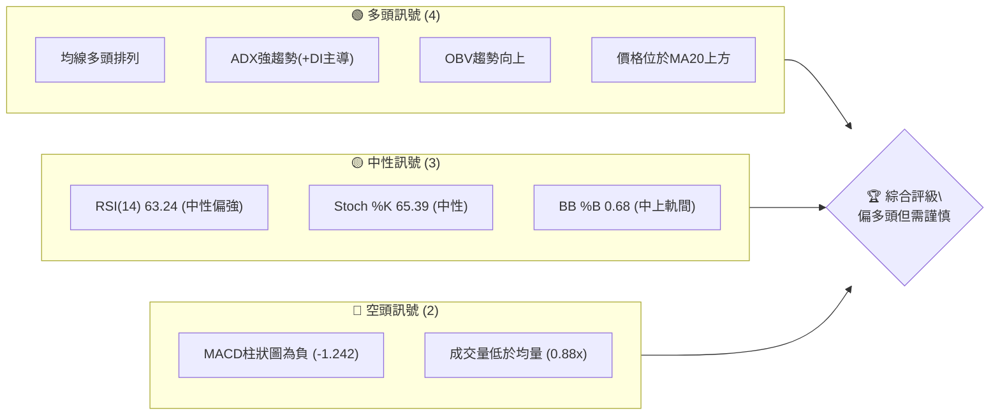

### 📊 核心指標速覽表

| 指標類別 | 指標名稱 | 當前數值 | 訊號 | 解讀 |
|----------|----------|----------|------|------|
| **價格** | 當前價格 | $540.88 | 🟢 | 位於 MA20/50/200 上方，接近 52W 高點 |
| **均線** | MA20 | $518.07 | 🟢 | 價格位於 MA20 上方，短期支撐 |
| **均線** | MA50 | $455.71 | 🟢 | 價格位於 MA50 上方，中期支撐 |
| **均線** | MA200 | $276.40 | 🟢 | 價格位於 MA200 上方，長期多頭趨勢確立 |
| **動能** | RSI(14) | 63.24 | 🟡 | 處於中性區間，從超買區回落後再次走強 |
| **動能** | MACD | -1.242 | 🔴 | MACD 線低於訊號線，柱狀圖為負，空頭動能減弱 |
| **波動** | ATR(14) | $36.71 | 🟢 | 相對較高的波動性，為價格的 6.79% |
| **趨勢** | ADX(14) | 25.26 | 🟢 | 趨勢強度強勁 (>25)，多頭主導 (+DI > -DI) |
| **量能** | 量比(20日) | 0.88x | 🔴 | 成交量低於20日均量，量能萎縮 |

### 🏆 技術評分卡

```
技術評分卡 — AMD (2026-07-02)
════════════════════════════════════════════════════
趨勢強度      ████████████████░░░░  85/100  🟢
動能指標      ████████░░░░░░░░░░░░  65/100  🟡
支撐穩定度    ██████████████░░░░░░  75/100  🟢
成交量配合    ██████░░░░░░░░░░░░░░  55/100  🟡
形態完整度    ██████████░░░░░░░░░░  70/100  🟢
均線排列      ██████████████████░░  90/100  🟢
════════════════════════════════════════════════════
綜合評分      ████████████░░░░░░░░  73/100  偏多頭
════════════════════════════════════════════════════
```
**評分理由：**
*   **趨勢強度 (85/100) 🟢：** ADX 數值高於 25 且 +DI 顯著高於 -DI，明確顯示強勁的多頭趨勢。均線系統呈現完美多頭排列。
*   **動能指標 (65/100) 🟡：** RSI 處於中性偏強區域，但 MACD 柱狀圖為負值，儘管空頭動能正在減弱，但尚未轉為金叉，顯示短期動能有所遲滯。
*   **支撐穩定度 (75/100) 🟢：** 價格遠高於所有主要移動平均線（MA20, MA50, MA200），且 MA20 提供即時支撐，支撐結構穩固。
*   **成交量配合 (55/100) 🟡：** OBV 趨勢向上，但最新成交量低於短期和中期均量，顯示價格反彈缺乏強勁的量能支持，量價配合度有待提升。
*   **形態完整度 (70/100) 🟢：** 整體為清晰的上升趨勢，雖有短期回調，但尚未形成明確的反轉形態。目前處於高位盤整或回調後的反彈階段。
*   **均線排列 (90/100) 🟢：** MA20 > MA50 > MA200 的標準多頭排列，是極其強勁的看漲訊號，表明各週期趨勢均向上。
*   **綜合評分 (73/100) 偏多頭：** 整體而言，AMD 仍處於強勁的多頭趨勢中，但短期動能和量能配合度需密切關注。價格在關鍵支撐上方運行，為多頭提供了操作空間。

---

## 2. 趨勢分析

### 🌐 多時框趨勢分析

AMD 在各時間框架下呈現出不同的趨勢特徵，但總體上仍以長期多頭為主要基調。

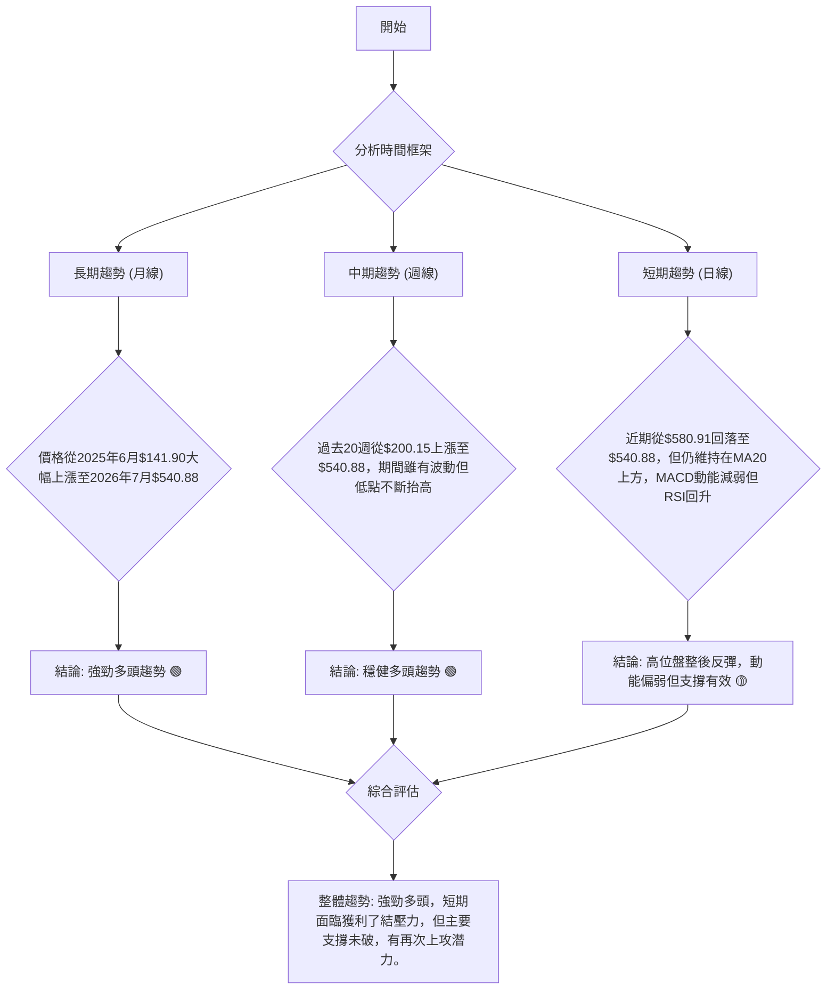

### 📈 長期趨勢 — 12個月走勢圖（Unicode）

以下是 AMD 過去 12 個月的月線收盤價走勢圖，清晰展示了其強勁的上升趨勢。

```
AMD 月線走勢圖（2025-07 至 2026-07）
價格軸 ($)
$600 ┤                                    ●($580.91, 2026-06 高點)
$550 ┤                                  ●($540.88, 現價)
$500 ┤                                ●
$450 ┤                          ●
$400 ┤                      ●
$350 ┤                  ●
$300 ┤              ●
$250 ┤          ●
$200 ┤      ●
$150 ┤●───────●($141.90, 2025-06 低點)
$100 ┤
     └───────────────────────────────────────────────────────────────────
      25-07 25-08 25-09 25-10 25-11 25-12 26-01 26-02 26-03 26-04 26-05 26-06 26-07
```

**走勢特徵分析表格**：

| 階段 | 時間區間 | 主要特徵 | 漲跌幅 (約) | 訊號 |
|------|----------|----------|--------------|------|
| **強勁上漲** | 2025-07 至 2025-10 | 經歷快速拉升，特別是 2025-10 月份，漲幅驚人。 | +45% (176.31 -> 256.12) | 🟢 |
| **高位盤整** | 2025-11 至 2026-03 | 在 $200-$250 區間進行震盪整理，消化前期漲幅。 | 波動區間內 | 🟡 |
| **再次爆發** | 2026-04 至 2026-06 | 再次啟動快速上漲模式，連創新高，動能極強。 | +185% (203.43 -> 580.91) | 🟢 |
| **短期回調** | 2026-06 至 2026-07 | 從歷史高點 $580.91 回落至 $540.88，但仍維持在高位。 | -6.9% | 🟡 |

**分析：** 從長期月線圖來看，AMD 呈現出清晰且強勁的上升趨勢。在過去 12 個月內，股價從 $141.90 飆升至 $580.91 的歷史高點，隨後在 $540.88 附近進行短期回調。這種走勢表明市場對 AMD 的未來預期非常樂觀，尤其是在 2026 年 4 月至 6 月期間，股價呈現加速上漲態勢，顯示出資金的強勁流入。

### 📊 中期趨勢（週線分析）

中期來看，AMD 股價自 2026 年 2 月底的低點 $200.15 後，開啟了一輪波瀾壯闊的上升行情，即使在快速上漲後，價格回調也多在關鍵支撐位獲得支撐。

```
AMD 近期週線壓力與支撐示意圖 (2026-02 ~ 2026-07)

         $580.91 (歷史高點 / 強阻力 R1)
           ▲
           │
           │
           │  ●  (當前價格 $540.88)
           │
$518.07 ───┼─── (MA20 / 短期支撐 S1)
           │
           │
           │
$466.38 ───┼─── (近期回調低點 / 中期支撐 S2)
           │
           │
$455.71 ───┼─── (MA50 / 強支撐 S3)
           │
           │
$276.40 ───┼─── (MA200 / 長期趨勢線)
           │
           ▼
```
**分析：** 價格在過去幾週從 $580.91 的高點回落，但目前已在 MA20 ($518.07) 上方站穩並開始反彈。這表明 MA20 作為短期趨勢線提供了有效的支撐。MA50 ($455.71) 和 MA200 ($276.40) 則提供更強大的中期和長期支撐，這些均線距離現價較遠，反映出中期趨勢依然非常強勁。近期從 $580.91 回調至 $466.38 的過程，可以視為牛市中的健康回調，而非趨勢反轉。目前價格已從 $466.38 反彈，並再次接近 $580.91 壓力位。

### ⚡ 趨勢強度評估（ADX 解讀）

ADX 指標用於衡量趨勢的強度，而非方向。AMD 的 ADX 讀數顯示當前趨勢非常強勁。

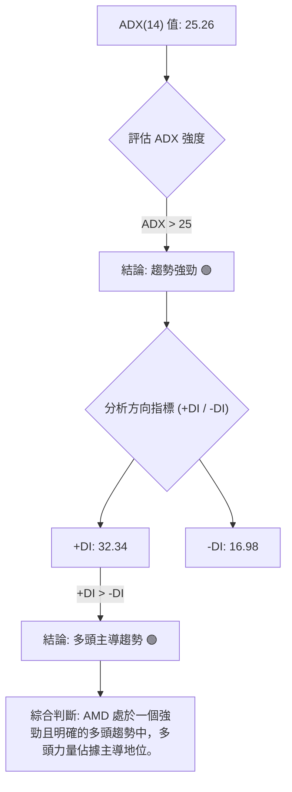

**ADX 強度對照表：**

| ADX 數值範圍 | 趨勢強度 | 市場狀態 |
|--------------|----------|----------|
| 0-20         | 無趨勢或弱趨勢 | 盤整行情 |
| 20-25        | 趨勢形成或中等強度 | 趨勢行情 |
| **25-50**    | **強趨勢**     | **強勁趨勢行情** |
| 50-75        | 極強趨勢 | 趨勢加速 |
| 75-100       | 超強趨勢 | 趨勢過熱 |

**分析：** AMD 的 ADX(14) 數值為 25.26，明確表明目前處於一個強勁的趨勢行情中，而非盤整。同時，+DI (32.34) 顯著高於 -DI (16.98)，這進一步確認了當前的強勢趨勢是由多頭力量主導的。這是一個強烈的多頭訊號，意味著當前的上升趨勢具有較高的可持續性，但考慮到股價已處於高位，仍需警惕短期波動。

---

## 3. 圖表形態分析

### 🔍 形態識別系統

根據提供的週線和月線數據，AMD 目前最顯著的形態是清晰的上升趨勢。近期則呈現高位震盪或回調後的反彈。

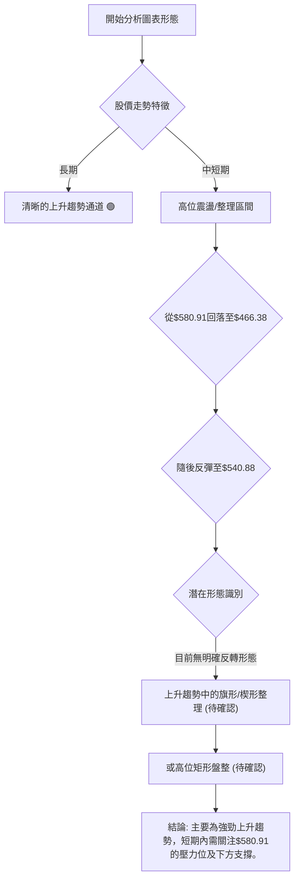
**分析：** AMD 的股價在過去一年中形成了一個非常陡峭且強勁的上升趨勢通道。近期從歷史高點 $580.91 回落至 $466.38，然後反彈至 $540.88。這段走勢可能構成一個「旗形」或「下降楔形」的整理形態，通常在強勁趨勢中出現，並預示著趨勢的延續。然而，由於數據粒度限制，無法精確判斷其完整性，目前更傾向於將其視為上升趨勢中的健康回調與高位盤整。如果股價能有效突破 $580.91，則上升趨勢將進一步確認。

### 🕯️ 重要K線形態分析

從近 20 週的收盤價和指標數據中，我們可以看到一些重要的 K 線行為和動能變化。

| 月份 (週) | 收盤價 | K線形態 (根據收盤價變化推斷) | 解讀 | 訊號 |
|-----------|--------|------------------------------|------|------|
| 2026-04-19 | $278.39 | 大陽線 (相對前週) | 快速上漲，RSI 進入極度超買區 (93.3)，動能極強。 | 🟢 |
| 2026-04-26 | $347.81 | 巨型陽線 (相對前週) | 股價加速上漲，RSI 達 97.4，市場情緒狂熱。 | 🟢 |
| 2026-05-03 | $360.54 | 陽線，漲幅收斂 | 漲勢放緩，RSI 從極高點回落，顯示上漲動能減弱。 | 🟡 |
| 2026-05-17 | $424.10 | 大陰線 | 快速回調，RSI 從 80.7 跌至 67.6，獲利了結壓力顯現。 | 🔴 |
| 2026-05-24 | $467.51 | 大陽線 (反彈) | 強勁反彈，RSI 再次升至 75.2，買盤介入。 | 🟢 |
| 2026-06-07 | $466.38 | 陰線 | 再次回調，未能守住前週漲幅，MACD 柱狀圖轉負。 | 🔴 |
| 2026-06-14 | $511.57 | 陽線 (反彈) | 再次反彈，但 RSI 僅 57.2，動能較弱。 | 🟡 |
| 2026-06-21 | $537.37 | 陽線 (持續反彈) | 繼續反彈，但 RSI 進一步下降至 53.1，顯示反彈量能不足。 | 🟡 |
| 2026-07-05 | $540.88 | 陽線 (小幅反彈) | 繼續小幅上漲，RSI 回升至 63.2，動能有恢復跡象。 | 🟡 |

**分析：** 在 4 月份出現了極度狂熱的加速上漲，RSI 觸及歷史高點，隨後在 5 月和 6 月經歷了數次大幅回調和反彈。這些回調可以被視為消化前期漲幅和清洗浮動籌碼的健康行為。值得注意的是，在 6 月份的反彈過程中，RSI 數值並未隨價格創新高而創新高，MACD 柱狀圖也持續為負，這是一個潛在的量價背離或動能減弱的訊號，需要警惕。然而，最新一週 RSI 回升，MACD 柱狀圖負值縮小，暗示短期動能可能正在恢復。

### 📉 ASCII 走勢形態示意圖

以下示意圖展示了 AMD 近期從高點回落後的反彈形態。

```
AMD 近期走勢形態示意圖 (高位整理/回調後反彈)

$580.91 ┌─────────────────────────┐ R1 (歷史高點)
        │                         │
        │                         │
        │                         │
$540.88 ┼───────●(現價)───────────┤
        │      ╱                  │
        │     ╱                   │
        │    ╱                    │
        │   ╱                     │
$518.07 ├───●─────────────────────┤ S1 (MA20)
        │  ╱                      │
        │ ╱                       │
        │╱                        │
$466.38 ●─────────────────────────┘ S2 (近期回調低點)
        └─────────────────────────┘
        時間軸
```
**分析：** 圖中顯示，股價在觸及歷史高點 $580.91 後出現回調，最低觸及 $466.38。隨後股價從該低點反彈，目前位於 $540.88，並成功站穩在 MA20 ($518.07) 上方。這是一個典型的上升趨勢中的回調修正，並在重要支撐位獲得支撐後反彈。如果能有效突破 $580.91，則有望開啟新一輪上漲。

### 🎯 形態目標價計算

由於目前沒有清晰的經典反轉或延續形態（如頭肩底/頂、雙頂/底），我們將基於當前上升趨勢的延續和斐波那契擴展來設定目標價。

**1. 基於歷史高點突破的目標價：**
*   **頸線/突破點：** $580.91 (歷史高點)
*   **計算方法：** 在強勁上升趨勢中，突破歷史高點通常會吸引更多買盤，目標價可參考斐波那契擴展或整數關口。
*   **目標價 T1：** $600.00 (心理關口)
*   **目標價 T2：** $650.00 (基於斐波那契 1.272 擴展或前一波段漲幅的等距目標，需更詳細數據計算)

**2. 基於近期回調反彈的目標價：**
*   **近期高點：** $580.91
*   **近期低點：** $466.38
*   **反彈計算：** 如果從 $466.38 的低點反彈，並突破 $580.91，則可以預期新的上漲波段。
*   **目標價 T1 (斐波那契 1.0 擴展)：** $580.91 + ($580.91 - $466.38) = $580.91 + $114.53 = $695.44
*   **目標價 T2 (斐波那契 1.618 擴展)：** $580.91 + ($114.53 * 1.618) = $580.91 + $185.32 = $766.23

**結論：** 綜合考量，如果 AMD 能夠有效突破 $580.91 的歷史高點，則其上漲潛力巨大。初步目標價可能落在 $600.00 - $650.00 區間，長期來看甚至可能挑戰 $700.00 以上。

---

## 4. 支撐與阻力

### 🗺️ 關鍵價位分布圖（Unicode）

以下是 AMD 股價在重要支撐與阻力位之間的分布示意圖。

```
AMD 價位結構分布圖 (2026-07-02)
═══════════════════════════════════════════════════
$700.00 ║████████████████████████║ 極強阻力 R3 (分析師高標/斐波那契擴展)
$600.00 ║████████████████████    ║ 強阻力 R2 (心理關口)
$580.91 ║████████████████████████║ 關鍵阻力 R1 (歷史高點)
$540.88 ╠════════════════════════╣ ◄ 現價
$518.07 ║▓▓▓▓▓▓▓▓▓▓▓▓▓▓▓▓        ║ 近期支撐 S1 (MA20)
$466.38 ║████████████████████████║ 強支撐 S2 (近期回調低點)
$455.71 ║████████████████████████║ 強支撐 S3 (MA50)
$276.40 ║████████████████████████║ 長期支撐 S4 (MA200)
═══════════════════════════════════════════════════
```

### 🚧 阻力位分析表

| 阻力級別 | 價位 | 形成原因 | 突破難度 | 重要性 |
|----------|------|----------|----------|--------|
| **R1**   | $580.91 | 歷史最高點 (2026年6月高點) | **高** | **極高**，突破將開啟新一輪上漲空間 |
| **R2**   | $600.00 | 心理關口，整數價格壓力 | **中** | 突破 R1 後的下一心理目標 |
| **R3**   | $700.00 | 分析師最高目標價，潛在斐波那契擴展位 | **中高** | 長期上漲潛力的參考目標 |

**分析：** 最直接且最重要的阻力位是 $580.91 的歷史最高點。這一點位代表著前期買盤的最高成本區，也是潛在的獲利了結壓力區。有效突破並站穩 $580.91 將是一個極其強勁的看漲訊號，意味著股價將進入一個新的價格探索區間。$600.00 作為一個重要的心理關口，在突破歷史高點後可能會形成短期的阻力。

### 🛡️ 支撐位分析表

| 支撐級別 | 價位 | 形成原因 | 守住機率 | 重要性 |
|----------|------|----------|----------|--------|
| **S1**   | $518.07 | MA20 (20日移動平均線) | **中高** | **高**，短期趨勢的生命線，多次驗證有效 |
| **S2**   | $466.38 | 近期回調低點 (2026-06-07 週收盤價) | **高** | **中高**，若跌破可能引發更深回調 |
| **S3**   | $455.71 | MA50 (50日移動平均線) | **高** | **高**，中期趨勢的關鍵支撐，與 S2 接近形成強支撐區 |
| **S4**   | $276.40 | MA200 (200日移動平均線) | **極高** | **極高**，長期牛市的最後防線，極少觸及 |

**分析：** 目前股價 $540.88 位於其短期移動平均線 MA20 ($518.07) 上方，這是一個重要的短期支撐位。如果股價回調，MA20 將提供第一道防線。更為關鍵的支撐區間在 $455.71 (MA50) 到 $466.38 (近期回調低點) 之間，這個區域由多重技術指標構成，預期將提供非常強勁的支撐。只要這些主要支撐位不被有效跌破，AMD 的多頭趨勢就保持完好。MA200 ($276.40) 則代表了長期牛市的基礎，距離現價甚遠，顯示長期趨勢極為穩固。

### 📐 斐波那契回調位分析

我們將基於最近一次重要的上升波段（從 52 週低點 $133.50 到 52 週高點 $584.73）和近期回調（從 $580.91 到 $466.38）來分析斐波那契回調位。

**1. 基於 52 週波段 ($133.50 - $584.73)：**
*   **總漲幅：** $584.73 - $133.50 = $451.23
*   **38.2% 回調：** $584.73 - ($451.23 * 0.382) = $412.25
*   **50% 回調：** $584.73 - ($451.23 * 0.500) = $359.12
*   **61.8% 回調：** $584.73 - ($451.23 * 0.618) = $305.87
**分析：** 目前價格 $540.88 遠高於這些主要斐波那契回調位，表明在長期趨勢中，目前的短期回調幅度相對較小，多頭力量依然強大。

**2. 基於近期高點回調 ($580.91 - $466.38)：**
*   **近期回調幅度：** $580.91 - $466.38 = $114.53
*   **38.2% 反彈位 (從低點 $466.38 算起)：** $466.38 + ($114.53 * 0.382) = $466.38 + $43.74 = $510.12
*   **50% 反彈位：** $466.38 + ($114.53 * 0.500) = $466.38 + $57.26 = $523.64
*   **61.8% 反彈位：** $466.38 + ($114.53 * 0.618) = $466.38 + $70.80 = $537.18
**分析：** 當前價格 $540.88 已經突破了 61.8% 的反彈位 ($537.18)，這是一個非常積極的訊號。這表明近期從 $580.91 的回調已經得到了強勁的修正，並有望繼續挑戰前高。

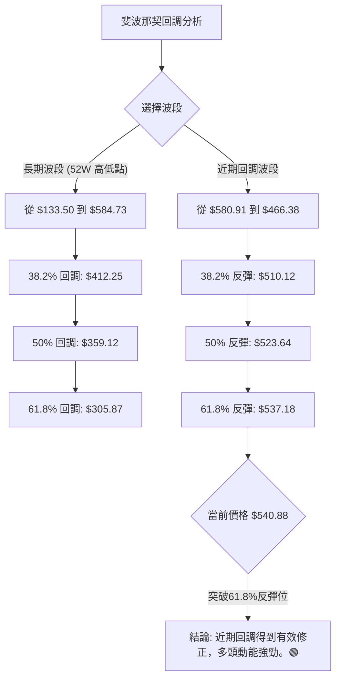

---

## 5. 技術指標深度解讀

### 🎛️ 指標訊號總覽

以下 Mermaid 圖表展示了各主要技術指標的訊號關係及其綜合判斷。

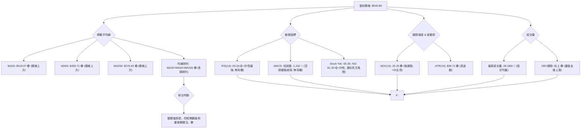

### 📈 移動平均線排列分析

AMD 的移動平均線系統呈現出極其強勁的多頭排列，這是長期上升趨勢的經典標誌。

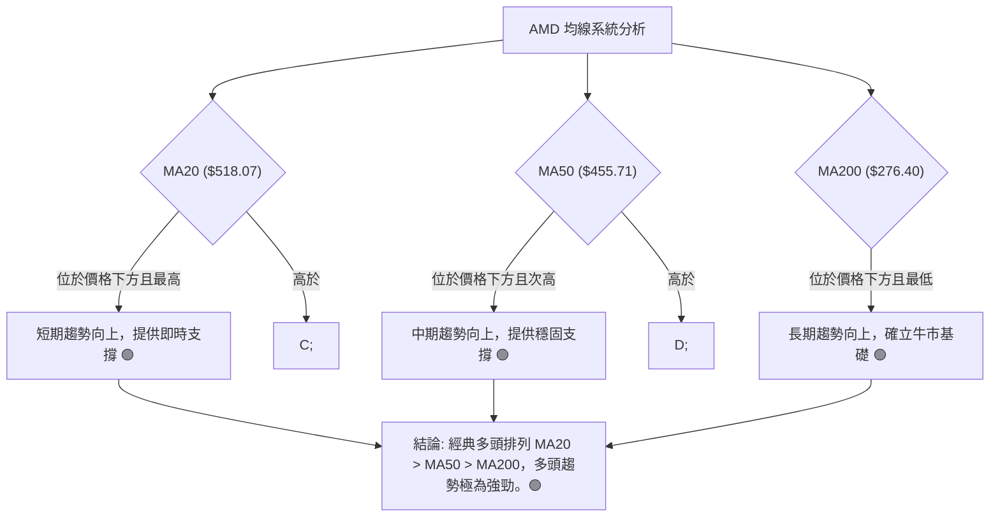
**分析：** 當前價格 $540.88 顯著高於所有主要移動平均線，並且 MA20 ($518.07) > MA50 ($455.71) > MA200 ($276.40)，形成完美的「多頭排列」。這是一個非常強勁的看漲訊號，表明各週期（短期、中期、長期）的趨勢都一致向上，市場信心堅定。MA20 作為短期支撐，MA50 作為中期支撐，MA200 作為長期趨勢線，都為股價提供了堅實的底部。

### 📉 RSI(14) 分析

RSI(14) 數值為 63.24，處於中性偏強的區域，顯示市場買盤力量佔優，但尚未過熱。

**RSI(14) 強度進度條：**
████████████░░░░░░░░░░░░░░ 63.24%

**超買超賣區間分析：**
*   **超買區 (RSI > 70)：** AMD 在 2026-04-12 至 2026-05-10 期間，RSI 一度高達 97.4，處於極度超買狀態，隨後出現大幅回調。
*   **超賣區 (RSI < 30)：** 在過去 20 週內未曾進入超賣區，表明市場整體強勢。
*   **當前狀態 (RSI 63.24)：** 位於中性區間，但從近期低點 53.1 (2026-06-21) 回升，顯示買盤動能正在恢復。

**背離判斷：**
*   **頂背離：** 在過去幾週中，價格從 $537.37 上漲至 $540.88，而 RSI 從 53.1 回升至 63.2。沒有出現價格創新高而 RSI 未創新高的頂背離現象。
*   **底背離：** 價格在 2026-06-07 曾回調至 $466.38，RSI 為 58.5。隨後價格反彈，RSI 也同步回升。沒有出現價格創新低而 RSI 未創新低的底背離現象。
**結論：** 目前 RSI 無明顯背離訊號，其走勢與價格趨勢基本一致。RSI 從中性區間的底部回升，是一個積極的動能恢復訊號。🟢

### 📊 MACD(12/26/9) 訊號解讀

MACD 目前呈現空頭排列，但 MACD 柱狀圖負值正在縮小，這是一個潛在的轉強訊號。

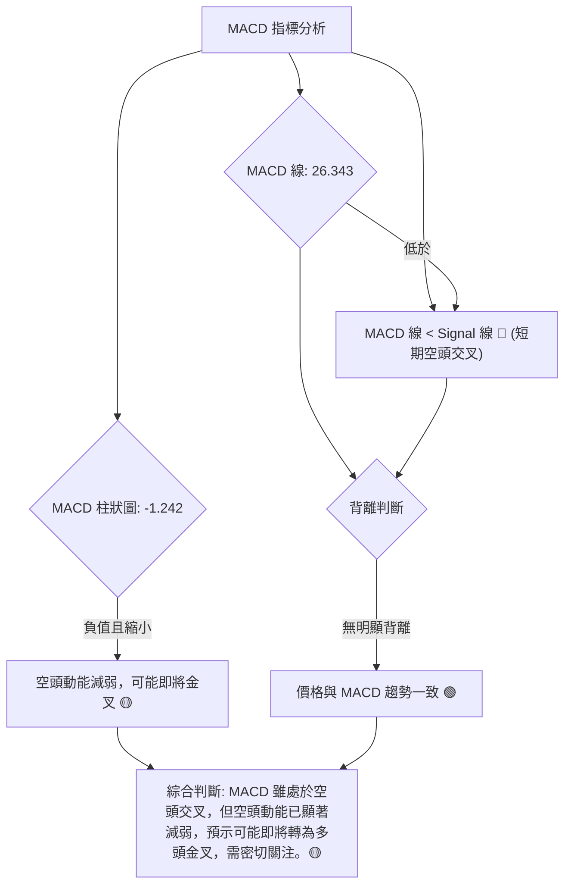
**分析：** MACD 線 (26.343) 目前位於 Signal 線 (27.584) 之下，形成「死叉」，這通常被視為短期看跌訊號。然而，MACD 柱狀圖的數值為 -1.242，且從前一週的 -3.923 顯著縮小。這表明空頭動能正在迅速減弱，多頭力量可能即將重新佔據主導地位，形成「金叉」。目前沒有觀察到 MACD 與價格走勢之間的明顯背離。MACD 的這種走勢預示著短期內股價有反彈或轉強的潛力。

### 📦 布林通道分析

布林通道顯示 AMD 股價在通道中上軌之間運行，通道擴張表明波動性增加。

```
AMD 布林通道示意圖

上軌: $580.92 ┌─────────────────────────┐
              │  現價 $540.88           │
              │       ●                 │
中軌: $518.07 ├─────────────────────────┤ (MA20)
              │                         │
              │                         │
下軌: $455.22 └─────────────────────────┘
```
**分析：** 當前價格 $540.88 位於布林通道的中軌 ($518.07) 和上軌 ($580.92) 之間。BB %B 值為 0.68，顯示價格偏向上軌，但從高點回落後，仍在通道上半部運行。布林通道目前呈現擴張狀態，這意味著市場波動性正在增加，可能預示著價格將有較大的波動。價格在中軌上方運行是強勢的表現，但若能有效突破上軌，則會被視為強勁的突破訊號。若跌破中軌，則可能測試下軌。

### 💹 成交量分析（量價配合度）

成交量是確認價格走勢的關鍵指標。AMD 的最新成交量低於均量，這是一個需要關注的訊號。

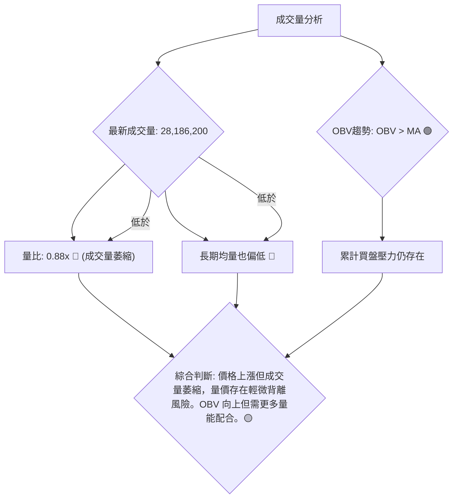
**分析：** 最新成交量為 28,186,200 股，顯著低於其 20 日均量 (32,138,465 股) 和 50 日均量 (37,836,476 股)。量比為 0.88x，表明近期市場交易活躍度有所下降。在股價從低點反彈的過程中，如果成交量未能有效放大，這可能是一個潛在的「量價背離」訊號，即價格上漲缺乏足夠的買盤支持，上漲的持續性可能存疑。

然而，OBV 趨勢仍然向上 (OBV > MA)，這表明儘管短期成交量萎縮，但累計的買盤壓力仍然存在，長期投資者仍在吸納籌碼。綜合來看，量能狀況呈現中性偏弱，需要密切關注後續成交量能否放大以確認上漲趨勢。

---

## 6. 動能與波動率

### ⚡ 動能評估四象限

根據 AMD 當前的動能和波動率表現，我們可以將其歸類。

| 象限 | 動能 (RSI, MACD) | 波動 (ATR) | 當前狀態 | 評估 |
|------|------------------|------------|----------|------|
| Q1   | 強               | 低         | -        | 最佳機會 (趨勢明確，風險較低) |
| Q2   | 弱               | 低         | -        | 謹慎觀望 (缺乏催化劑) |
| **Q3** | **中等偏強**     | **高**     | **✓**    | **高風險高收益 (趨勢強但波動大)** |
| Q4   | 弱               | 高         | -        | 避免進場 (不確定性高，風險大) |

**分析：** AMD 的 RSI 處於 63.24 (中性偏強)，MACD 柱狀圖負值縮小 (動能從弱轉強)。ATR 數值 $36.71 (佔股價 6.79%) 顯示其波動性較高。綜合來看，AMD 屬於「中等偏強動能，高波動」的 Q3 象限。這類股票通常在強勢趨勢中，但伴隨著較大的價格波動，適合風險承受能力較高且能有效管理倉位的投資者。

### 📊 ATR 波動率分析

ATR (Average True Range) 是衡量股價波動性的指標。AMD 的 ATR 值顯示其波動性較高。

**ATR(14) 數值：** $36.71

**ATR 佔股價比率：** ($36.71 / $540.88) * 100% = 6.79%

**分析：** 每日平均真實波幅為 $36.71，佔當前股價的 6.79%。這是一個相對較高的波動率，尤其對於大型股而言。高波動率意味著股價在短期內可能出現較大的漲跌幅，這既帶來了潛在的獲利機會，也增加了交易風險。

**止損距離建議：**
*   對於保守型交易者，建議將止損距離設置為 1 倍 ATR：$540.88 - $36.71 = $504.17。
*   對於激進型交易者或希望給予更大空間的，可設置為 1.5 倍 ATR：$540.88 - ($36.71 * 1.5) = $540.88 - $55.06 = $485.82。
*   對於長期投資者，應參考更廣泛的支撐位，如 MA50 ($455.71) 或近期回調低點 $466.38。

**結論：** 鑑於其高波動性，交易 AMD 需要更嚴格的風險控制和倉位管理。精確的止損設置對於保護資本至關重要。

### 📐 Beta 與市場相關性

提供的數據中未包含 AMD 的 Beta 值。
**一般分析：** 作為一家領先的半導體公司，AMD 通常被視為成長型股票，其 Beta 值預計會高於 1。高 Beta 值意味著 AMD 的股價波動幅度通常會大於整體市場（如 S&P 500 指數）。在牛市中，高 Beta 股票的漲幅可能超過大盤；在熊市中，其跌幅也可能超過大盤。因此，其股價表現與整體科技板塊和市場情緒高度相關。在當前強勁的牛市背景下，高 Beta 值有利於其表現，但一旦市場情緒轉差，其下行風險也會隨之放大。

---

## 7. 多時框架總結

### 📋 時框架評分表

| 時框架 | 趨勢方向 | 動能 | 均線排列 | 形態 | 綜合評分 | 建議 |
|--------|----------|------|----------|------|----------|------|
| **長期** | 強勁多頭 🟢 | 強勁 🟢 | 多頭排列 🟢 | 上升趨勢 🟢 | 9/10 🟢 | 長期看好，適合持有 |
| **中期** | 穩健多頭 🟢 | 中性偏強 🟡 | 多頭排列 🟢 | 回調後反彈 🟢 | 8/10 🟢 | 繼續持有，關注短期波動 |
| **短期** | 高位盤整後反彈 🟡 | 動能減弱後恢復 🟡 | 多頭排列 🟢 | 回調修正 🟡 | 6/10 🟡 | 短線偏多，但需謹慎追高 |

**分析：**
*   **長期來看**，AMD 處於一個毋庸置疑的強勁多頭市場，所有指標都指向看漲，是長期投資的優選標的。
*   **中期來看**，趨勢依然穩固，雖然有健康的回調，但支撐強勁，動能正在恢復。
*   **短期來看**，股價在高位經歷了一段盤整和回調，雖然近期有所反彈，但動能和量能仍需進一步確認，存在一定的波動性。

### 🔲 綜合訊號矩陣

以下矩陣展示了不同時間框架下各技術指標的一致性。

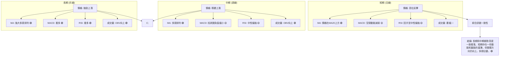
**分析：**
*   **趨勢指標 (MA, ADX)：** 在所有時間框架下都顯示為強勁的多頭趨勢，具有高度一致性。
*   **動能指標 (RSI, MACD)：** 長期和中期顯示多頭動能強勁。短期 MACD 雖為死叉，但空頭動能減弱，RSI 回升，顯示動能有轉強跡象，具有潛在一致性。
*   **量能指標 (OBV, 成交量)：** 長期 OBV 保持向上，但短期成交量萎縮，量價配合存在不一致，這是唯一的警惕訊號。

**總結：** AMD 的多時框架分析顯示出強烈的多頭傾向。長期和中期趨勢非常穩固，短期則在經歷健康回調後呈現反彈跡象。儘管短期量能有所不足，但核心趨勢指標的強勁一致性仍支撐其上漲潛力。

---

## 8. 交易策略建議

基於上述詳盡的技術分析，AMD 目前處於強勁上升趨勢中的短期整理後反彈階段。多頭訊號佔優，但需警惕短期量能不足及 MACD 死叉的影響。

### 🗺️ 策略決策流程圖

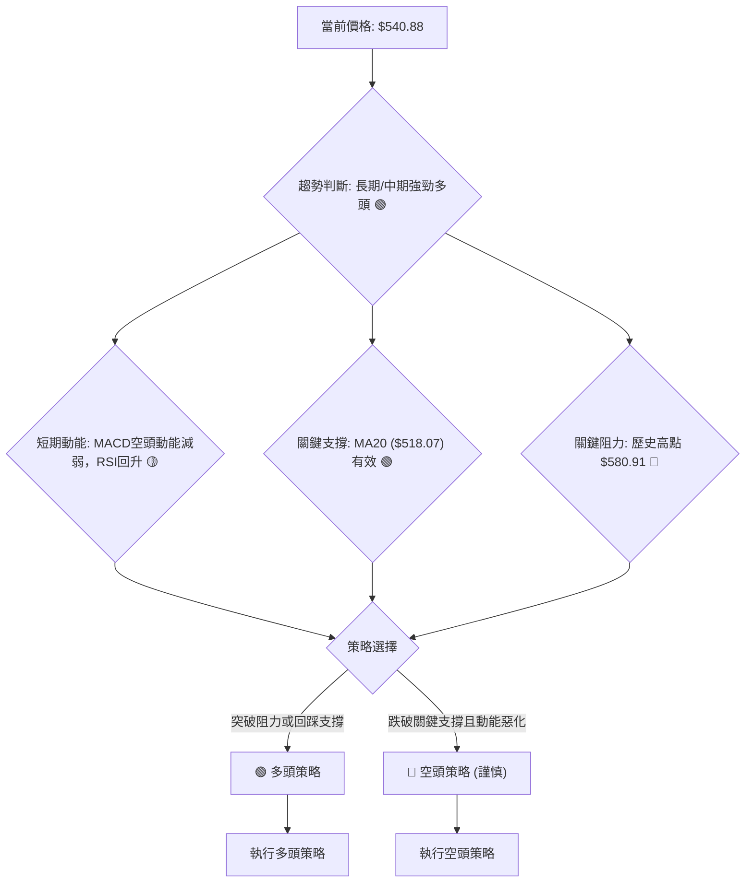

### 🟢 多頭策略詳情

**策略類型：** 順勢交易 - 回踩支撐買入 或 突破阻力追高

| 策略要素 | 策略 A (回踩支撐) | 策略 B (突破追高) |
|----------|--------------------|--------------------|
| **進場條件** | 股價回踩 MA20 並獲得支撐，或 MACD 金叉確認 | 股價有效突破歷史高點 $580.91 並站穩 |
| **進場價格** | $518.07 - $525.00 區間 | $585.00 (確認突破後) |
| **目標價 T1** | $580.91 (歷史高點) | $600.00 (心理關口) |
| **目標價 T2** | $600.00 (心理關口) | $650.00 (斐波那契擴展) |
| **止損價格** | $505.00 (略低於 MA20 和斐波那契38.2%反彈位 $510.12) | $575.00 (突破點下方) |
| **風險報酬比** | (T1: $580.91 - $525.00) / ($525.00 - $505.00) = 55.91 / 20 = **2.8:1** <br> (T2: $600.00 - $525.00) / ($525.00 - $505.00) = 75.00 / 20 = **3.75:1** | (T1: $600.00 - $585.00) / ($585.00 - $575.00) = 15.00 / 10 = **1.5:1** <br> (T2: $650.00 - $585.00) / ($585.00 - $575.00) = 65.00 / 10 = **6.5:1** |
| **成功機率** | 70% (順應中期趨勢) | 60% (突破通常伴隨假突破風險) |
| **建議倉位** | 中等倉位 (30%) | 小到中等倉位 (20%) |

### 🔴 空頭策略詳情

**策略類型：** 逆勢交易 - 跌破關鍵支撐

| 策略要素 | 策略 C (跌破支撐) |
|----------|--------------------|
| **進場條件** | 股價有效跌破 MA20 ($518.07) 和斐波那契 38.2% 反彈位，MACD 死叉確認 |
| **進場價格** | $510.00 (確認跌破 $518.07 後) |
| **目標價 T1** | $466.38 (近期回調低點) |
| **目標價 T2** | $455.71 (MA50) |
| **止損價格** | $525.00 (MA20 上方，防止假跌破) |
| **風險報酬比** | (T1: $510.00 - $466.38) / ($525.00 - $510.00) = 43.62 / 15 = **2.9:1** <br> (T2: $510.00 - $455.71) / ($525.00 - $510.00) = 54.29 / 15 = **3.6:1** |
| **成功機率** | 40% (逆勢交易風險高，長期趨勢為多頭) |
| **建議倉位** | 小倉位 (10-15%) 或避免 |

### ⭐ 整體訊號強度評星

```
做多訊號強度：★★★★☆  (4/5星)
做空訊號強度：★☆☆☆☆  (1/5星)
整體可信度：  ★★★☆☆  (3/5星)
```
**評星理由：**
*   **做多訊號強度：** 長期和中期趨勢極其強勁，均線多頭排列，ADX 確認強趨勢，RSI 和 MACD 顯示短期動能正在恢復。主要支撐位有效。唯一的顧慮是短期量能萎縮。
*   **做空訊號強度：** 由於 AMD 處於強勁的長期上升趨勢，逆勢做空風險極高，僅在關鍵支撐位被有效且帶量跌破時才可考慮，且需嚴格控制風險。
*   **整體可信度：** 報告基於全面技術分析，指標間多數相互確認。儘管短期量能和 MACD 柱狀圖存在一些不確定性，但長期趨勢的強勁性提供了較高的可信度。

---

## 9. 風險提示與監控

### ✅ 關鍵監控指標 Checklist

以下是交易 AMD 時需要密切關注的關鍵指標和價位清單。

```
╔══════════════════════════════════════════════════════════════╗
║             AMD 交易監控清單 (2026-07-02)                    ║
╠══════════════════════════════════════════════════════════════╣
║ [ ] 價格是否維持在 MA20 ($518.07) 上方？                      ║
║ [ ] 是否有效突破歷史高點 $580.91？突破時是否伴隨巨量？      ║
║ [ ] MACD 線是否形成金叉 (MACD > Signal)？                    ║
║ [ ] MACD 柱狀圖是否轉正且持續放大？                          ║
║ [ ] RSI(14) 是否持續向上並突破 70 進入超買區？               ║
║ [ ] 成交量是否恢復並超越 20 日均量 ($32.14M)？               ║
║ [ ] 股價是否跌破中期支撐 $466.38 (近期回調低點)？            ║
║ [ ] ADX 值是否維持在 25 以上，且 +DI 持續領先 -DI？          ║
║ [ ] 52 周高點 ($584.73) / 低點 ($133.50) 區間波動情況。     ║
║ [ ] 大盤走勢 (如 NASDAQ 100) 是否對科技股產生影響？         ║
╚══════════════════════════════════════════════════════════════╝
```

### ⚠️ 風險場景分析

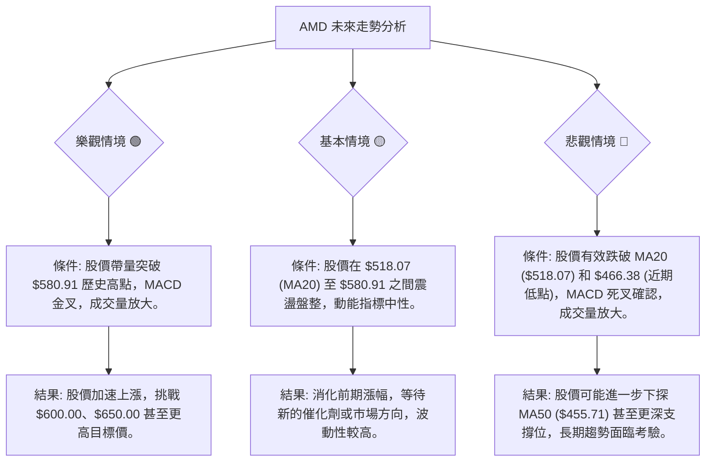
**分析：**
*   **樂觀情境：** 如果 AMD 能夠在未來幾週內，在量能配合下有效突破歷史高點 $580.91，並伴隨 MACD 金叉，則其強勁的上升趨勢將得以延續，並可能開啟新的漲勢。
*   **基本情境：** 股價在高位區間 ($518.07 - $580.91) 內震盪整理，消化前期獲利盤，並等待市場或公司層面的新消息。在此期間，波動性可能會較高。
*   **悲觀情境：** 若股價未能有效突破阻力，反而跌破了 MA20 和近期回調低點 $466.38，且伴隨著放量下跌和 MACD 惡化，則可能觸發更深的回調，甚至考驗 MA50 的支撐。

### 🛡️ 風險管理重要提醒

1.  **倉位管理：** 鑑於 AMD 的高波動性 (ATR $36.71)，應嚴格控制單一股票的倉位，避免過度集中，以降低潛在虧損對總體資產的影響。
2.  **嚴格止損：** 每次交易都必須設置明確的止損點。止損點應基於技術分析的關鍵支撐位或 ATR 倍數來設定，並嚴格執行，以防止小虧變大虧。
3.  **趨勢監控：** 密切關注 AMD 的長期和中期趨勢是否發生變化。儘管目前是強勁多頭，但市場環境隨時可能改變。一旦均線系統出現破壞性排列，或 ADX 顯示趨勢強度減弱，應及時調整策略。
4.  **量能確認：** 價格的上漲需要成交量的配合。若股價持續上漲但成交量萎縮，應視為潛在的量價背離，警惕隨之而來的回調風險。
5.  **宏觀風險：** 關注全球經濟形勢、利率政策、半導體產業供需變化以及地緣政治事件等宏觀因素，這些都可能對 AMD 股價產生重大影響。
6.  **基本面跟蹤：** 雖然本報告是技術分析，但仍需關注公司的基本面發展，如財報、新產品發布、市場份額變化等，這些因素最終會影響股價的長期走勢。

---

## 📋 報告總結

```
AMD 技術分析報告總結
════════════════════════════════════════════════════════
報告日期：2026-07-02
當前價格：$540.88
分析評級：⚖️ 偏多頭 (長期趨勢強勁，短期有回調後反彈跡象，但量能不足需警惕)

關鍵結論：
├─ 長期趨勢：🟢 強勁多頭，均線完美多頭排列，ADX 確認強趨勢。
├─ 中期趨勢：🟢 穩健多頭，價格在 MA50 上方運行，回調後積極反彈。
├─ 短期趨勢：🟡 高位盤整後反彈，MACD 空頭動能減弱，RSI 回升，但成交量萎縮。
├─ 關鍵支撐：$518.07 (MA20)，其次是 $466.38 (近期低點) 和 $455.71 (MA50)。
├─ 關鍵阻力：$580.91 (歷史高點)，其次是 $600.00 (心理關口)。
└─ 分析師目標：$508.31 (平均目標價，低於現價，需警惕基本面分析師的相對保守態度)。

最優策略組合：
1. 🥇 最佳機會：**回踩 MA20 附近買入**。進場點 $518.07 - $525.00，止損 $505.00，目標 $580.91/$600.00。風險報酬比約 2.8:1 - 3.75:1。
2. 🥈 次選機會：**帶量突破歷史高點追高**。進場點 $585.00，止損 $575.00，目標 $600.00/$650.00。風險報酬比約 1.5:1 - 6.5:1。
3. 🥉 保守選擇：**觀望，等待 MACD 金叉和成交量放大確認**。避免在量能不足時追高。
════════════════════════════════════════════════════════
```

---

> ⚠️ **免責聲明**：本報告為 AI 自動生成之技術分析，所有數據及估算均基於提供的歷史價格資訊。本報告**僅供研究與學術參考**，**不構成任何投資建議**。投資有風險，入市需謹慎。

---

*報告生成時間：2026-07-02 ｜ 數據來源：提供數據 ｜ 分析框架：多時框技術分析*