<details>
<summary>📊 靜態圖表 (點擊展開)</summary>

</details>

<html>
<head><meta charset="utf-8" /></head>
<body>
    <div style="height:500px; width:100%;">                        <script>window.PlotlyConfig = {MathJaxConfig: 'local'};</script>
        <script charset="utf-8" src="https://cdn.plot.ly/plotly-3.6.0.min.js" integrity="sha256-QaOVwtVY0T02VaHrr6pnoHLCwayMJp4O5n4YyaE3rJk=" crossorigin="anonymous"></script>                <div id="candlestick-chart" class="plotly-graph-div" style="height:100%; width:100%;"></div>            <script>                window.PLOTLYENV=window.PLOTLYENV || {};                                if (document.getElementById("candlestick-chart")) {                    Plotly.newPlot(                        "candlestick-chart",                        [{"close":{"dtype":"f8","bdata":"AAAAYLgOZEAAAADAHuVjQAAAAKBwvWNAAAAA4HqsY0AAAACgR\u002fljQAAAAMDMHGRAAAAAACkcZEAAAADgoyhkQAAAAGC47mNAAAAAIIUrZEAAAACgRzlkQAAAAOBRgGRAAAAAIFw3ZUAAAACgcJVkQAAAAGC4dmlAAAAA4FFwakAAAACA63FtQAAAAOB6HG1AAAAAwMzcakAAAACgcA1rQAAAAEDhQmtAAAAAQDPTbUAAAACA61FtQAAAAGCPIm1AAAAAgOsRbkAAAADA9cBtQAAAACBcx2xAAAAAIK5fbUAAAACgcJ1vQAAAAGC4OnBAAAAAACkgcEAAAACgR4VwQAAAAEDh2m9AAAAAgOsBcEAAAABgZjpwQAAAAKCZQW9AAAAAoEcFcEAAAABgZrZtQAAAAKBHMW1AAAAAIFx\u002fbkAAAADgo7BtQAAAAIA9LnBAAAAAYLj+bkAAAACA69luQAAAAOCjEG5AAAAAoEfJbEAAAACgmfFrQAAAAOCjwGlAAAAAwPV4aUAAAACgmeFqQAAAAAApxGlAAAAAIK7HakAAAADA9TBrQAAAAOBReGtAAAAAIK7nakAAAABAMzNrQAAAACBc\u002f2pAAAAAQAo\u002fa0AAAAAghaNrQAAAAADXs2tAAAAAoHCta0AAAACAwq1rQAAAAMD1WGpAAAAAYI\u002fyaUAAAACgcCVqQAAAACCFw2hAAAAAgOshaUAAAACAwq1qQAAAAGBm3mpAAAAAwMzcakAAAACgR+FqQAAAACCu32pAAAAAIIXzakAAAABA4epqQAAAAMAexWpAAAAAQArva0AAAABgj6JrQAAAAEAzy2pAAAAA4KNAakAAAACAwpVpQAAAAKBwZWlAAAAAgBT2aUAAAABACp9rQAAAAEAz82tAAAAAoHB9bEAAAABgj\u002fpsQAAAAKBw\u002fWxAAAAAoJk5b0AAAAAgXLdvQAAAAEDhOnBAAAAAgOtpb0AAAADA9YBvQAAAACCul29AAAAAgMKFb0AAAAAgXJdtQAAAAOCjyG5AAAAAIIVDbkAAAACAFAZpQAAAAAAAEGhAAAAAgBQOakAAAAAAAABrQAAAAIA9smpAAAAAYI+yakAAAACAFL5pQAAAAIA96mlAAAAAYI9iaUAAAAAA1wNpQAAAAADXa2lAAAAAwMwEaUAAAABAM5NoQAAAAEDhumpAAAAAIIVbakAAAACAwnVpQAAAAGC4BmlAAAAAANfTaEAAAABgZt5nQAAAAIA9QmlAAAAAYGbuaEAAAACAwg1oQAAAAIDCVWlAAAAAIFxnaUAAAABgj5ppQAAAACCut2hAAAAA4HosaEAAAABgj5JoQAAAAIDriWhAAAAAYLjuaEAAAADgo6hpQAAAAGCPKmlAAAAAgMJVaUAAAAAA16tpQAAAAOCjiGtAAAAA4KN4aUAAAAAgrj9pQAAAAKBHgWhAAAAAgMJtaUAAAABguEZqQAAAAAAAMGtAAAAAgMKFa0AAAADA9bBrQAAAAIA9+mxAAAAA4HqUbUAAAACgR6FuQAAAAGCP2m5AAAAAgD3ib0AAAACA6yFwQAAAAAApZHFAAAAAgD1mcUAAAABAMy9xQAAAAADXx3FAAAAAIFz3ckAAAACgRxVzQAAAAMD1vHVAAAAAgBTqdEAAAAAgXDN0QAAAAIDCEXVAAAAAANcndkAAAADgo4h2QAAAAOCjWHVAAAAAACk0dkAAAACAPVZ6QAAAACBch3lAAAAAQApzfEAAAADgo6x8QAAAAOCjBHxAAAAAAADYe0AAAABAMxt8QAAAAKCZgXpAAAAAANdPekAAAADAzOB5QAAAAKBH+XtAAAAAoHAZfEAAAAAAKTh9QAAAAIA9fn9AAAAA4KP4fkAAAABguDCAQAAAAMDMIIBAAAAAgBTif0AAAADgUUyAQAAAAAAp9IBAAAAAoJlZgEAAAACAFCZ9QAAAAKBHpX5AAAAAACm4fUAAAABgZkZ8QAAAAEAzh35AAAAAwB75f0AAAACAFBqBQAAAAOCjtH9AAAAAANcDgEAAAADA9cqAQAAAAEAKPYFAAAAAwMw+gEAAAACA6z2AQAAAAGCPpIBAAAAA4KNMgEAAAACA69uAQAAAAKBHJ4JAAAAAQArngEAAAABgjy6AQA=="},"high":{"dtype":"f8","bdata":"AAAAYGY+ZEAAAAAAKTRkQAAAAOCj2GNAAAAAQOH6Y0AAAACAwlVkQAAAAOB6bGRAAAAAQDOjZEAAAAAAKTRkQAAAACCFQ2RAAAAAoJmJZEAAAADA9UhkQAAAAIDChWRAAAAAgOthZUAAAACAwlVlQAAAAGC4VmxAAAAAwMxca0AAAAAA13ttQAAAAEAzA25AAAAAQApHbUAAAACAFAZsQAAAACBcH2xAAAAAIK7nbUAAAABgZiZuQAAAAAApbG1AAAAAAClcbkAAAADgUUhuQAAAAAApBG5AAAAAwMx8bUAAAADgeqxvQAAAAGC4RnBAAAAAoEeJcEAAAACgR7FwQAAAAIAUfnBAAAAAgBRicEAAAABgj05wQAAAAIAUFnBAAAAAYGY6cEAAAADgUbBvQAAAAADXe21AAAAAwMwcb0AAAABguA5vQAAAAAApeHBAAAAAgBQ6cEAAAACAFK5vQAAAAOCjGG9AAAAAAADAbUAAAADA9WhtQAAAAAAASG1AAAAAYI8aakAAAAAAKSRrQAAAAGCP0mlAAAAAQOHyakAAAACgmUlrQAAAACBcn2tAAAAAIFw\u002fbEAAAABgZkZrQAAAAADXY2tAAAAA4Hr0a0AAAABguPZrQAAAAEDhGmxAAAAAIIXTa0AAAAAAALBrQAAAACCuz2tAAAAAIIXrakAAAABACkdqQAAAAAAAcGpAAAAAIIXLaUAAAACAwuVqQAAAAKBwhWtAAAAAwPUga0AAAACgRxFrQAAAAGCPGmtAAAAAoJkBa0AAAACAPRprQAAAAOB6NGtAAAAAwMxkbEAAAADgo0BtQAAAAKBw3WtAAAAAACmEakAAAACAFF5qQAAAAKCZ6WlAAAAAACk8akAAAAAgheNrQAAAAEDhAmxAAAAAQDPLbUAAAAAgrk9tQAAAAAAA8G1AAAAAwMycb0AAAACgRwFwQAAAACBcr3BAAAAA4KMkcEAAAACgmfFvQAAAAGBmFnBAAAAA4HpIcEAAAAAgrqduQAAAAEAKP29AAAAAwMyUb0AAAABgj1JrQAAAAKBHgWlAAAAA4KMoakAAAABAMzNrQAAAAOB6bGtAAAAAwMx0a0AAAABguE5rQAAAAKCZQWpAAAAAoJmpaUAAAABgZmZpQAAAAEAzg2lAAAAAANebaUAAAAAAKexoQAAAAGC4FmtAAAAAYGYWa0AAAACgRzlqQAAAAOB6PGlAAAAAIK7XaEAAAADgejRoQAAAAIAUTmlAAAAAoEd5aUAAAAAgrgdpQAAAAEAKX2lAAAAAQOHSaUAAAABguCZqQAAAAADXc2lAAAAAgML1aEAAAACgcAVpQAAAAGC45mhAAAAAIIVbaUAAAAAAKbxpQAAAAKCZyWlAAAAAIIUjakAAAACAws1pQAAAAGCPqmtAAAAAAACga0AAAADgo2hpQAAAAIDCDWpAAAAAAACAaUAAAABgj7pqQAAAAMD1OGtAAAAAgOtJbEAAAABAM8NrQAAAAAAAQG1AAAAAQDOjbUAAAABgjzJvQAAAAGCP6m5AAAAAYLjub0AAAABA4SJwQAAAAKBwdXFAAAAAwMyQcUAAAACAwvlxQAAAAEAz43FAAAAAAAAEc0AAAAAghWNzQAAAAADXD3ZAAAAAIFzTdUAAAAAAAHh0QAAAAGC4QnVAAAAAIFwvdkAAAADgo6x2QAAAAKCZnXZAAAAAwB55dkAAAACgmel6QAAAACBcW3pAAAAA4KOEfEAAAAAghVN9QAAAAMDMrHxAAAAAAAC4fEAAAADA9VR8QAAAAAAAcHtAAAAAwMxse0AAAAAAAMx6QAAAAIA9FnxAAAAAQDMzfEAAAABgjxZ+QAAAACBcr39AAAAAIFzjf0AAAACgmXmAQAAAAAAAUIBAAAAAAAAsgEAAAACA61OAQAAAACCFE4FAAAAAIIWhgEAAAACA65l\u002fQAAAACCF735AAAAAAACQf0AAAABAM9d9QAAAACBcp35AAAAAIK5NgEAAAADA9XKBQAAAAKCZJ4FAAAAAAACkgEAAAAAghd2AQAAAAIDrl4FAAAAAgOuDgEAAAAAgrmeAQAAAAEAKN4FAAAAAQOFogEAAAAAghfGAQAAAAADXRYJAAAAAYLiggUAAAABAMx2BQA=="},"hovertemplate":"\u003cb\u003e%{x|%Y-%m-%d}\u003c\u002fb\u003e\u003cbr\u003e\u958b: $%{open:.2f}\u003cbr\u003e\u9ad8: $%{high:.2f}\u003cbr\u003e\u4f4e: $%{low:.2f}\u003cbr\u003e\u6536: $%{close:.2f}\u003cextra\u003e\u003c\u002fextra\u003e","low":{"dtype":"f8","bdata":"AAAAQArnY0AAAADgUXhjQAAAAEAzu2JAAAAAwMx8Y0AAAACgcK1jQAAAAGC45mNAAAAAgMLNY0AAAADA9VhjQAAAAKCZoWNAAAAAwMz8Y0AAAABgj+pjQAAAACCuD2RAAAAAANfDZEAAAADgemRkQAAAAOBRYGlAAAAAwPUoakAAAABgZlZqQAAAAMD1sGxAAAAAYGamakAAAADAzNxqQAAAAMDM\u002fGpAAAAA4FGYa0AAAAAgrgdtQAAAAMAefWxAAAAAwMxMbUAAAADgo0BtQAAAAAApHGxAAAAAoEeRbEAAAABgZj5uQAAAAKCZOW9AAAAAAAAQcEAAAABgZhZwQAAAAIDriW9AAAAAwB6tb0AAAADgerxvQAAAAOB67G5AAAAAgOtZbkAAAAAgrndtQAAAAOB6FGxAAAAAAAAQbkAAAADgelRtQAAAAAAAQG9AAAAAgOvBbkAAAABgj2JtQAAAAMDMpG1AAAAAYLgWbEAAAABguHZrQAAAAMD1kGlAAAAAAABgaEAAAABAM7tpQAAAAMD1SGhAAAAAAADgaUAAAADgo8BqQAAAAAAAsGpAAAAA4HrMakAAAADgo3hqQAAAAOB6xGpAAAAAIK4Ha0AAAAAghUtrQAAAAMAePWtAAAAAoHBVa0AAAACAFEZqQAAAAIDrIWpAAAAAYI\u002fSaUAAAAAghaNpQAAAAMD1sGhAAAAAAAAQaUAAAABgZoZpQAAAAIDrqWpAAAAAwPWIakAAAABACr9qQAAAAMD1oGpAAAAAIK4nakAAAABgj8pqQAAAAKCZuWpAAAAAwMxca0AAAAAgXI9rQAAAAAAAaGpAAAAAoHDlaUAAAABgj2ppQAAAAIA9YmlAAAAAoJn5aEAAAAAgXN9qQAAAACCF42pAAAAAQApnbEAAAAAghZtsQAAAAMAeLWxAAAAAwPV4bUAAAAAAKdRuQAAAAAAABHBAAAAAoJlJb0AAAABguP5uQAAAAGC4Rm9AAAAAwB4dbkAAAACgmVFtQAAAAAAAYG1AAAAAoEehbUAAAADAzORoQAAAAEAK12dAAAAAgMKNaEAAAADAzIRpQAAAAAAppGpAAAAAYLgmakAAAADgeqRpQAAAAAApfGlAAAAAYI9aaEAAAAAAAGBoQAAAAKBHyWhAAAAAgOvRaEAAAADAzERoQAAAAAAA0GlAAAAAYI9KakAAAABguC5pQAAAACCut2hAAAAAAADAZ0AAAABACodnQAAAACCFu2dAAAAAAClcaEAAAAAAAOhnQAAAAOCjoGdAAAAAYGZGaUAAAAAAKXRpQAAAAKBwlWhAAAAA4KMIaEAAAACgmVloQAAAAOBRaGhAAAAAAAB4aEAAAABgjxpoQAAAAOBRyGhAAAAAYLg2aUAAAAAAKQRpQAAAAOBRcGpAAAAAgMJtaUAAAACAFLZoQAAAAADXG2hAAAAAwB6NaEAAAABA4bppQAAAAADXE2lAAAAAIFw3a0AAAAAAKexqQAAAAEDhYmxAAAAAwB7dbEAAAABguN5tQAAAAMD1QG5AAAAAYGa2bkAAAABAM3tvQAAAAAApWHBAAAAAgD0icUAAAAAAAABxQAAAAIDrSXFAAAAAgD3icUAAAAAAKbxyQAAAAOCj6HRAAAAAwPWMdEAAAAAAAGBzQAAAAIDC7XNAAAAAoJnJdEAAAAAAANR1QAAAAEAzK3VAAAAAgBSOdUAAAADgoyB5QAAAAKBHEXlAAAAA4KMkekAAAACAFC58QAAAAIDCoXpAAAAAYGYKe0AAAABA4Tp7QAAAAIDCdXpAAAAAIFyreUAAAACAwpV4QAAAAMDMoHpAAAAAoJn5ekAAAAAgXNt8QAAAACCuA35AAAAAYI9qfkAAAADgUdh+QAAAAEDhdn9AAAAAwMxsfkAAAAAghVN\u002fQAAAAGBmYoBAAAAAgOs9f0AAAABAM\u002f98QAAAACBc231AAAAAIK5Te0AAAACgRwV8QAAAAOBRoHxAAAAAAADgfkAAAAAAAJSAQAAAAAAAtH9AAAAAwMy0f0AAAABgj3KAQAAAACCuvYBAAAAAwPWsf0AAAAAAAHh\u002fQAAAAAAAsH9AAAAAgMJpf0AAAACgmfV+QAAAAGCPDIFAAAAAgOvVgEAAAAAAAKB\u002fQA=="},"name":"\u50f9\u683c","open":{"dtype":"f8","bdata":"AAAAANcrZEAAAADA9ehjQAAAAGC43mJAAAAAACmsY0AAAACgcK1jQAAAAOCjEGRAAAAAIFxfZEAAAADgeqRjQAAAAOCjEGRAAAAAANcDZEAAAACgRxlkQAAAAIDCHWRAAAAAgMIVZUAAAACAwlVlQAAAAGBmTmxAAAAAQDPbakAAAABgZp5qQAAAAKCZiW1AAAAA4KMYbUAAAABgZoZrQAAAAGBmZmtAAAAAYLjWa0AAAACgR4ltQAAAAOBRKG1AAAAAQAqPbUAAAADgeuxtQAAAAEAzm21AAAAAwB7FbEAAAAAghWtuQAAAAIAUHnBAAAAAgD0ycEAAAABACoNwQAAAAGC4PnBAAAAAoJk5cEAAAACgRzVwQAAAAEAzS29AAAAAIK5nbkAAAABACq9vQAAAAIAU3mxAAAAA4HpEbkAAAADAHjVuQAAAAAAppG9AAAAAwMx8b0AAAAAghQNuQAAAAAAAWG5AAAAAwPWYbUAAAADgUchsQAAAAGBmFm1AAAAAgOsZakAAAADAHuVpQAAAACBcL2lAAAAAoJlBakAAAADgegRrQAAAAAApvGpAAAAAoEe5a0AAAADgUQhrQAAAAAApHGtAAAAAoHAla0AAAABA4WJrQAAAAKBHoWtAAAAAAADAa0AAAACA6zlrQAAAAADXS2tAAAAAwPWIakAAAACgcN1pQAAAAKBHQWpAAAAAgD16aUAAAABAM5NpQAAAAAAAgGtAAAAAIIWbakAAAAAgXN9qQAAAAIDC7WpAAAAAYI9yakAAAAAA1\u002ftqQAAAAIA9+mpAAAAAwMxca0AAAAAAAMhsQAAAAGC41mtAAAAAACmEakAAAADAzFxqQAAAAEAKt2lAAAAAgMIlaUAAAABAM+NqQAAAAKBHMWtAAAAAwMx8bEAAAACgmUltQAAAAGCPQmxAAAAAIK5\u002fbUAAAAAAAHhvQAAAAEDhUnBAAAAAAAAMcEAAAADAHoVvQAAAAAApxG9AAAAAwB7Vb0AAAACAwp1tQAAAAOCjeG1AAAAAoJlxb0AAAAAAAOBqQAAAACCFO2lAAAAAACmkaEAAAADAzNxpQAAAAOB65GpAAAAAACk8a0AAAABgj\u002fpqQAAAAOCjgGlAAAAAwMxEaUAAAADAHs1oQAAAACCFA2lAAAAAANcDaUAAAABA4cJoQAAAAAApdGpAAAAAgD3aakAAAACgmRlqQAAAACCFA2lAAAAAQDM7aEAAAABguO5nQAAAAADXA2hAAAAA4KO4aEAAAADgo2hoQAAAACCFq2dAAAAA4FFQaUAAAAAghaNpQAAAAGCPWmlAAAAAIIXDaEAAAAAgXF9oQAAAAIDClWhAAAAAAACAaEAAAADA9WBoQAAAAOB6nGlAAAAAwMzMaUAAAADgeixpQAAAAOBRcGpAAAAAIFw\u002fa0AAAADgozhpQAAAAGBmnmlAAAAAoJnBaEAAAABA4fJpQAAAAKCZgWlAAAAAwPVoa0AAAADgUUhrQAAAAADXA21AAAAA4FEgbUAAAAAAAOBtQAAAAMD1oG5AAAAAoEc5b0AAAABguN5vQAAAAADXj3BAAAAAAACQcUAAAACgmYlxQAAAAKBHVXFAAAAAIIUzckAAAAAAKeByQAAAAAApDHVAAAAAwB6ldUAAAACAwn1zQAAAAKBHaXRAAAAAgMJVdUAAAACA6\u002f11QAAAAMD1hHZAAAAAACn4dUAAAAAA15d5QAAAAMAeEXpAAAAAoHApekAAAADAzMh8QAAAAAAAFHxAAAAA4KOQfEAAAACgmYl7QAAAAKBwFXtAAAAAAADYekAAAACgmcl5QAAAAOCjwHpAAAAAANefe0AAAACgcF19QAAAAADXS35AAAAAAADAf0AAAAAAADB\u002fQAAAAGBmRoBAAAAAYI9Cf0AAAADAzKR\u002fQAAAAAAAroBAAAAAAAAWgEAAAADgejh\u002fQAAAAAAAUH5AAAAAAABsf0AAAAAghT99QAAAAKCZ2XxAAAAAQAo7f0AAAAAAAL6AQAAAAMAeF4FAAAAAoEeNgEAAAADgo5yAQAAAAAAADIFAAAAAoEfRf0AAAABgj0aAQAAAAKBw\u002f4BAAAAAYGY+gEAAAABguFaAQAAAAGCPDIFAAAAAgD1sgUAAAACgR9GAQA=="},"x":["2025-09-16T00:00:00-04:00","2025-09-17T00:00:00-04:00","2025-09-18T00:00:00-04:00","2025-09-19T00:00:00-04:00","2025-09-22T00:00:00-04:00","2025-09-23T00:00:00-04:00","2025-09-24T00:00:00-04:00","2025-09-25T00:00:00-04:00","2025-09-26T00:00:00-04:00","2025-09-29T00:00:00-04:00","2025-09-30T00:00:00-04:00","2025-10-01T00:00:00-04:00","2025-10-02T00:00:00-04:00","2025-10-03T00:00:00-04:00","2025-10-06T00:00:00-04:00","2025-10-07T00:00:00-04:00","2025-10-08T00:00:00-04:00","2025-10-09T00:00:00-04:00","2025-10-10T00:00:00-04:00","2025-10-13T00:00:00-04:00","2025-10-14T00:00:00-04:00","2025-10-15T00:00:00-04:00","2025-10-16T00:00:00-04:00","2025-10-17T00:00:00-04:00","2025-10-20T00:00:00-04:00","2025-10-21T00:00:00-04:00","2025-10-22T00:00:00-04:00","2025-10-23T00:00:00-04:00","2025-10-24T00:00:00-04:00","2025-10-27T00:00:00-04:00","2025-10-28T00:00:00-04:00","2025-10-29T00:00:00-04:00","2025-10-30T00:00:00-04:00","2025-10-31T00:00:00-04:00","2025-11-03T00:00:00-05:00","2025-11-04T00:00:00-05:00","2025-11-05T00:00:00-05:00","2025-11-06T00:00:00-05:00","2025-11-07T00:00:00-05:00","2025-11-10T00:00:00-05:00","2025-11-11T00:00:00-05:00","2025-11-12T00:00:00-05:00","2025-11-13T00:00:00-05:00","2025-11-14T00:00:00-05:00","2025-11-17T00:00:00-05:00","2025-11-18T00:00:00-05:00","2025-11-19T00:00:00-05:00","2025-11-20T00:00:00-05:00","2025-11-21T00:00:00-05:00","2025-11-24T00:00:00-05:00","2025-11-25T00:00:00-05:00","2025-11-26T00:00:00-05:00","2025-11-28T00:00:00-05:00","2025-12-01T00:00:00-05:00","2025-12-02T00:00:00-05:00","2025-12-03T00:00:00-05:00","2025-12-04T00:00:00-05:00","2025-12-05T00:00:00-05:00","2025-12-08T00:00:00-05:00","2025-12-09T00:00:00-05:00","2025-12-10T00:00:00-05:00","2025-12-11T00:00:00-05:00","2025-12-12T00:00:00-05:00","2025-12-15T00:00:00-05:00","2025-12-16T00:00:00-05:00","2025-12-17T00:00:00-05:00","2025-12-18T00:00:00-05:00","2025-12-19T00:00:00-05:00","2025-12-22T00:00:00-05:00","2025-12-23T00:00:00-05:00","2025-12-24T00:00:00-05:00","2025-12-26T00:00:00-05:00","2025-12-29T00:00:00-05:00","2025-12-30T00:00:00-05:00","2025-12-31T00:00:00-05:00","2026-01-02T00:00:00-05:00","2026-01-05T00:00:00-05:00","2026-01-06T00:00:00-05:00","2026-01-07T00:00:00-05:00","2026-01-08T00:00:00-05:00","2026-01-09T00:00:00-05:00","2026-01-12T00:00:00-05:00","2026-01-13T00:00:00-05:00","2026-01-14T00:00:00-05:00","2026-01-15T00:00:00-05:00","2026-01-16T00:00:00-05:00","2026-01-20T00:00:00-05:00","2026-01-21T00:00:00-05:00","2026-01-22T00:00:00-05:00","2026-01-23T00:00:00-05:00","2026-01-26T00:00:00-05:00","2026-01-27T00:00:00-05:00","2026-01-28T00:00:00-05:00","2026-01-29T00:00:00-05:00","2026-01-30T00:00:00-05:00","2026-02-02T00:00:00-05:00","2026-02-03T00:00:00-05:00","2026-02-04T00:00:00-05:00","2026-02-05T00:00:00-05:00","2026-02-06T00:00:00-05:00","2026-02-09T00:00:00-05:00","2026-02-10T00:00:00-05:00","2026-02-11T00:00:00-05:00","2026-02-12T00:00:00-05:00","2026-02-13T00:00:00-05:00","2026-02-17T00:00:00-05:00","2026-02-18T00:00:00-05:00","2026-02-19T00:00:00-05:00","2026-02-20T00:00:00-05:00","2026-02-23T00:00:00-05:00","2026-02-24T00:00:00-05:00","2026-02-25T00:00:00-05:00","2026-02-26T00:00:00-05:00","2026-02-27T00:00:00-05:00","2026-03-02T00:00:00-05:00","2026-03-03T00:00:00-05:00","2026-03-04T00:00:00-05:00","2026-03-05T00:00:00-05:00","2026-03-06T00:00:00-05:00","2026-03-09T00:00:00-04:00","2026-03-10T00:00:00-04:00","2026-03-11T00:00:00-04:00","2026-03-12T00:00:00-04:00","2026-03-13T00:00:00-04:00","2026-03-16T00:00:00-04:00","2026-03-17T00:00:00-04:00","2026-03-18T00:00:00-04:00","2026-03-19T00:00:00-04:00","2026-03-20T00:00:00-04:00","2026-03-23T00:00:00-04:00","2026-03-24T00:00:00-04:00","2026-03-25T00:00:00-04:00","2026-03-26T00:00:00-04:00","2026-03-27T00:00:00-04:00","2026-03-30T00:00:00-04:00","2026-03-31T00:00:00-04:00","2026-04-01T00:00:00-04:00","2026-04-02T00:00:00-04:00","2026-04-06T00:00:00-04:00","2026-04-07T00:00:00-04:00","2026-04-08T00:00:00-04:00","2026-04-09T00:00:00-04:00","2026-04-10T00:00:00-04:00","2026-04-13T00:00:00-04:00","2026-04-14T00:00:00-04:00","2026-04-15T00:00:00-04:00","2026-04-16T00:00:00-04:00","2026-04-17T00:00:00-04:00","2026-04-20T00:00:00-04:00","2026-04-21T00:00:00-04:00","2026-04-22T00:00:00-04:00","2026-04-23T00:00:00-04:00","2026-04-24T00:00:00-04:00","2026-04-27T00:00:00-04:00","2026-04-28T00:00:00-04:00","2026-04-29T00:00:00-04:00","2026-04-30T00:00:00-04:00","2026-05-01T00:00:00-04:00","2026-05-04T00:00:00-04:00","2026-05-05T00:00:00-04:00","2026-05-06T00:00:00-04:00","2026-05-07T00:00:00-04:00","2026-05-08T00:00:00-04:00","2026-05-11T00:00:00-04:00","2026-05-12T00:00:00-04:00","2026-05-13T00:00:00-04:00","2026-05-14T00:00:00-04:00","2026-05-15T00:00:00-04:00","2026-05-18T00:00:00-04:00","2026-05-19T00:00:00-04:00","2026-05-20T00:00:00-04:00","2026-05-21T00:00:00-04:00","2026-05-22T00:00:00-04:00","2026-05-26T00:00:00-04:00","2026-05-27T00:00:00-04:00","2026-05-28T00:00:00-04:00","2026-05-29T00:00:00-04:00","2026-06-01T00:00:00-04:00","2026-06-02T00:00:00-04:00","2026-06-03T00:00:00-04:00","2026-06-04T00:00:00-04:00","2026-06-05T00:00:00-04:00","2026-06-08T00:00:00-04:00","2026-06-09T00:00:00-04:00","2026-06-10T00:00:00-04:00","2026-06-11T00:00:00-04:00","2026-06-12T00:00:00-04:00","2026-06-15T00:00:00-04:00","2026-06-16T00:00:00-04:00","2026-06-17T00:00:00-04:00","2026-06-18T00:00:00-04:00","2026-06-22T00:00:00-04:00","2026-06-23T00:00:00-04:00","2026-06-24T00:00:00-04:00","2026-06-25T00:00:00-04:00","2026-06-26T00:00:00-04:00","2026-06-29T00:00:00-04:00","2026-06-30T00:00:00-04:00","2026-07-01T00:00:00-04:00","2026-07-02T00:00:00-04:00"],"type":"candlestick"},{"hovertemplate":"MA30: $%{y:.2f}\u003cextra\u003e\u003c\u002fextra\u003e","line":{"color":"#2196F3","dash":"dash","width":2},"mode":"lines","name":"MA30","x":["2025-09-16T00:00:00-04:00","2025-09-17T00:00:00-04:00","2025-09-18T00:00:00-04:00","2025-09-19T00:00:00-04:00","2025-09-22T00:00:00-04:00","2025-09-23T00:00:00-04:00","2025-09-24T00:00:00-04:00","2025-09-25T00:00:00-04:00","2025-09-26T00:00:00-04:00","2025-09-29T00:00:00-04:00","2025-09-30T00:00:00-04:00","2025-10-01T00:00:00-04:00","2025-10-02T00:00:00-04:00","2025-10-03T00:00:00-04:00","2025-10-06T00:00:00-04:00","2025-10-07T00:00:00-04:00","2025-10-08T00:00:00-04:00","2025-10-09T00:00:00-04:00","2025-10-10T00:00:00-04:00","2025-10-13T00:00:00-04:00","2025-10-14T00:00:00-04:00","2025-10-15T00:00:00-04:00","2025-10-16T00:00:00-04:00","2025-10-17T00:00:00-04:00","2025-10-20T00:00:00-04:00","2025-10-21T00:00:00-04:00","2025-10-22T00:00:00-04:00","2025-10-23T00:00:00-04:00","2025-10-24T00:00:00-04:00","2025-10-27T00:00:00-04:00","2025-10-28T00:00:00-04:00","2025-10-29T00:00:00-04:00","2025-10-30T00:00:00-04:00","2025-10-31T00:00:00-04:00","2025-11-03T00:00:00-05:00","2025-11-04T00:00:00-05:00","2025-11-05T00:00:00-05:00","2025-11-06T00:00:00-05:00","2025-11-07T00:00:00-05:00","2025-11-10T00:00:00-05:00","2025-11-11T00:00:00-05:00","2025-11-12T00:00:00-05:00","2025-11-13T00:00:00-05:00","2025-11-14T00:00:00-05:00","2025-11-17T00:00:00-05:00","2025-11-18T00:00:00-05:00","2025-11-19T00:00:00-05:00","2025-11-20T00:00:00-05:00","2025-11-21T00:00:00-05:00","2025-11-24T00:00:00-05:00","2025-11-25T00:00:00-05:00","2025-11-26T00:00:00-05:00","2025-11-28T00:00:00-05:00","2025-12-01T00:00:00-05:00","2025-12-02T00:00:00-05:00","2025-12-03T00:00:00-05:00","2025-12-04T00:00:00-05:00","2025-12-05T00:00:00-05:00","2025-12-08T00:00:00-05:00","2025-12-09T00:00:00-05:00","2025-12-10T00:00:00-05:00","2025-12-11T00:00:00-05:00","2025-12-12T00:00:00-05:00","2025-12-15T00:00:00-05:00","2025-12-16T00:00:00-05:00","2025-12-17T00:00:00-05:00","2025-12-18T00:00:00-05:00","2025-12-19T00:00:00-05:00","2025-12-22T00:00:00-05:00","2025-12-23T00:00:00-05:00","2025-12-24T00:00:00-05:00","2025-12-26T00:00:00-05:00","2025-12-29T00:00:00-05:00","2025-12-30T00:00:00-05:00","2025-12-31T00:00:00-05:00","2026-01-02T00:00:00-05:00","2026-01-05T00:00:00-05:00","2026-01-06T00:00:00-05:00","2026-01-07T00:00:00-05:00","2026-01-08T00:00:00-05:00","2026-01-09T00:00:00-05:00","2026-01-12T00:00:00-05:00","2026-01-13T00:00:00-05:00","2026-01-14T00:00:00-05:00","2026-01-15T00:00:00-05:00","2026-01-16T00:00:00-05:00","2026-01-20T00:00:00-05:00","2026-01-21T00:00:00-05:00","2026-01-22T00:00:00-05:00","2026-01-23T00:00:00-05:00","2026-01-26T00:00:00-05:00","2026-01-27T00:00:00-05:00","2026-01-28T00:00:00-05:00","2026-01-29T00:00:00-05:00","2026-01-30T00:00:00-05:00","2026-02-02T00:00:00-05:00","2026-02-03T00:00:00-05:00","2026-02-04T00:00:00-05:00","2026-02-05T00:00:00-05:00","2026-02-06T00:00:00-05:00","2026-02-09T00:00:00-05:00","2026-02-10T00:00:00-05:00","2026-02-11T00:00:00-05:00","2026-02-12T00:00:00-05:00","2026-02-13T00:00:00-05:00","2026-02-17T00:00:00-05:00","2026-02-18T00:00:00-05:00","2026-02-19T00:00:00-05:00","2026-02-20T00:00:00-05:00","2026-02-23T00:00:00-05:00","2026-02-24T00:00:00-05:00","2026-02-25T00:00:00-05:00","2026-02-26T00:00:00-05:00","2026-02-27T00:00:00-05:00","2026-03-02T00:00:00-05:00","2026-03-03T00:00:00-05:00","2026-03-04T00:00:00-05:00","2026-03-05T00:00:00-05:00","2026-03-06T00:00:00-05:00","2026-03-09T00:00:00-04:00","2026-03-10T00:00:00-04:00","2026-03-11T00:00:00-04:00","2026-03-12T00:00:00-04:00","2026-03-13T00:00:00-04:00","2026-03-16T00:00:00-04:00","2026-03-17T00:00:00-04:00","2026-03-18T00:00:00-04:00","2026-03-19T00:00:00-04:00","2026-03-20T00:00:00-04:00","2026-03-23T00:00:00-04:00","2026-03-24T00:00:00-04:00","2026-03-25T00:00:00-04:00","2026-03-26T00:00:00-04:00","2026-03-27T00:00:00-04:00","2026-03-30T00:00:00-04:00","2026-03-31T00:00:00-04:00","2026-04-01T00:00:00-04:00","2026-04-02T00:00:00-04:00","2026-04-06T00:00:00-04:00","2026-04-07T00:00:00-04:00","2026-04-08T00:00:00-04:00","2026-04-09T00:00:00-04:00","2026-04-10T00:00:00-04:00","2026-04-13T00:00:00-04:00","2026-04-14T00:00:00-04:00","2026-04-15T00:00:00-04:00","2026-04-16T00:00:00-04:00","2026-04-17T00:00:00-04:00","2026-04-20T00:00:00-04:00","2026-04-21T00:00:00-04:00","2026-04-22T00:00:00-04:00","2026-04-23T00:00:00-04:00","2026-04-24T00:00:00-04:00","2026-04-27T00:00:00-04:00","2026-04-28T00:00:00-04:00","2026-04-29T00:00:00-04:00","2026-04-30T00:00:00-04:00","2026-05-01T00:00:00-04:00","2026-05-04T00:00:00-04:00","2026-05-05T00:00:00-04:00","2026-05-06T00:00:00-04:00","2026-05-07T00:00:00-04:00","2026-05-08T00:00:00-04:00","2026-05-11T00:00:00-04:00","2026-05-12T00:00:00-04:00","2026-05-13T00:00:00-04:00","2026-05-14T00:00:00-04:00","2026-05-15T00:00:00-04:00","2026-05-18T00:00:00-04:00","2026-05-19T00:00:00-04:00","2026-05-20T00:00:00-04:00","2026-05-21T00:00:00-04:00","2026-05-22T00:00:00-04:00","2026-05-26T00:00:00-04:00","2026-05-27T00:00:00-04:00","2026-05-28T00:00:00-04:00","2026-05-29T00:00:00-04:00","2026-06-01T00:00:00-04:00","2026-06-02T00:00:00-04:00","2026-06-03T00:00:00-04:00","2026-06-04T00:00:00-04:00","2026-06-05T00:00:00-04:00","2026-06-08T00:00:00-04:00","2026-06-09T00:00:00-04:00","2026-06-10T00:00:00-04:00","2026-06-11T00:00:00-04:00","2026-06-12T00:00:00-04:00","2026-06-15T00:00:00-04:00","2026-06-16T00:00:00-04:00","2026-06-17T00:00:00-04:00","2026-06-18T00:00:00-04:00","2026-06-22T00:00:00-04:00","2026-06-23T00:00:00-04:00","2026-06-24T00:00:00-04:00","2026-06-25T00:00:00-04:00","2026-06-26T00:00:00-04:00","2026-06-29T00:00:00-04:00","2026-06-30T00:00:00-04:00","2026-07-01T00:00:00-04:00","2026-07-02T00:00:00-04:00"],"y":{"dtype":"f8","bdata":"AAAAAAAA+H8AAAAAAAD4fwAAAAAAAPh\u002fAAAAAAAA+H8AAAAAAAD4fwAAAAAAAPh\u002fAAAAAAAA+H8AAAAAAAD4fwAAAAAAAPh\u002fAAAAAAAA+H8AAAAAAAD4fwAAAAAAAPh\u002fAAAAAAAA+H8AAAAAAAD4fwAAAAAAAPh\u002fAAAAAAAA+H8AAAAAAAD4fwAAAAAAAPh\u002fAAAAAAAA+H8AAAAAAAD4fwAAAAAAAPh\u002fAAAAAAAA+H8AAAAAAAD4fwAAAAAAAPh\u002fAAAAAAAA+H8AAAAAAAD4fwAAAAAAAPh\u002fAAAAAAAA+H8AAAAAAAD4fyIiIjJ6z2hAmpmZ2Yc3aUBEREREtqdpQDMzM+MXD2pAIiIiwmd4akAiIiIy7OJqQHd3dxcEQmtAzczMTNSna0CJiIjIWvlrQO\u002fu7o5fSGxAMzMzU4CgbECrqqqqR\u002fFsQM3MzDx8Vm1A7+7uPu6pbUARERHxiwFuQGZmZobPKG5Ad3d3t9c8bkAAAAAwCDBuQDMzM+NeE25AMzMzY4IHbkCamZlJDAZuQJqZmWlK+W1AIiIigk7fbUDv7u4uJM1tQO\u002fu7u7uvm1AMzMz4+yjbUAzMzMjIo5tQAAAAPDufm1Ad3d3V8dsbUB3d3cX2UptQGZmZuZCIm1AMzMzYzv7bEBERETUeM1sQDMzM4N5nmxAvLu727JqbEBERER02jRsQO\u002fu7l5z\u002fWtAq6qq+n7Ca0BmZmamm6hrQHd3d1fHlGtAAAAAkMJ1a0BVVVUFyF1rQERERGT0LmtA7+7urnIMa0BmZmZG4epqQM3MzDzDzmpAzczM7HzHakAzMzNz2sRqQImIiBi9zWpAiYiICGXUakBERERUVclqQM3MzAwtxmpAZmZmdjC\u002fakAAAADQ28JqQERERGT0xmpAAAAA4HrUakDNzMycqONqQLy7u0up9GpAIiIiAp0Wa0ARERFxaDlrQLy7u1sBYmtAIiIiUuOBa0CamZkph6JrQKuqqgpJz2tAAAAA0Nv+a0B3d3eHQRxsQLy7u2ugT2xA7+7uzml7bECJiIhoSm1sQAAAABBYVWxA3t3dDXRObEAzMzMzek9sQCIiInL2TWxA7+7uHsxLbEC8u7tLxUFsQFVVVYV5OmxAERERsbkkbEBmZmY2Xg5sQAAAAPCnAmxARERExCD4a0BERERkgu9rQDMzMwPk+mtAIiIiokX+a0Dv7u5O1OtrQHd3d0fh0mtAzczMbKCza0BVVVV1BYhrQLy7u2suaGtAMzMzg3kya0BmZmaGFvFqQJqZmblJtGpA3t3drQCBakDv7u7up05qQERERET9E2pA3t3drUfVaUDe3d0NdKppQERERKQpdWlAmpmZWatHaUB3d3eHFk1pQFVVVbWBVmlAd3d311xQaUBEREQkBkVpQAAAALArTGlAd3d357RBaUCrqqpKfj1pQImIiBh2MWlAq6qqqtUxaUCamZnpmDxpQImIiFirS2lA7+7u3ghhaUC8u7troHtpQJqZmSnOjmlAIiIi0k2qaUC8u7vba9ZpQJqZmTkmCGpAd3d311xEakCrqqq6AoxqQN7d3a1H3WpAERERkXsxa0CJiIgIgYlrQN7d3Z3E4GtAZmZmFq5LbECJiIhI4bZsQFVVVWX0Vm1AVVVVVZztbUAzMzPDrnRuQLy7u4veCm9AERERETywb0CJiIiQ7SpwQHd3d+e0dXBAmpmZKRXHcECJiIgYSzpxQFVVVU2pnnFAMzMzg8AkckDe3d1Ftq1yQO\u002fu7s4+NHNA7+7ublm1c0BVVVXNEzV0QO\u002fu7pZDo3RAERER2VwOdUBmZmY+CnV1QERERKwc6HVAIiIicq9ZdkDNzMwEVtB2QHd3d0dvWXdAMzMzc6\u002fZd0BmZmYGVmR4QLy7uxsv43hAd3d3V8deeUB3d3cXS+J5QKuqqsroa3pAERERoRrhekAzMzNT\u002fzZ7QN7d3Q0Cg3tA7+7u3iTOe0DNzMycCxN8QCIiIpLCY3xAq6qqOom3fEC8u7u7Hht9QCIiIiKFc31AZmZm5l7HfUCJiIgIOgV+QDMzM4OVUX5AERERwRF0fkBVVVV1k5R+QM3MzHyGwX5AIiIi8hnqfkBVVVVF\u002fRl\u002fQO\u002fu7g6fbX9Aq6qqCpCtf0C8u7sb6OR\u002fQA=="},"type":"scatter"},{"hovertemplate":"MA60: $%{y:.2f}\u003cextra\u003e\u003c\u002fextra\u003e","line":{"color":"#9C27B0","dash":"dash","width":2},"mode":"lines","name":"MA60","x":["2025-09-16T00:00:00-04:00","2025-09-17T00:00:00-04:00","2025-09-18T00:00:00-04:00","2025-09-19T00:00:00-04:00","2025-09-22T00:00:00-04:00","2025-09-23T00:00:00-04:00","2025-09-24T00:00:00-04:00","2025-09-25T00:00:00-04:00","2025-09-26T00:00:00-04:00","2025-09-29T00:00:00-04:00","2025-09-30T00:00:00-04:00","2025-10-01T00:00:00-04:00","2025-10-02T00:00:00-04:00","2025-10-03T00:00:00-04:00","2025-10-06T00:00:00-04:00","2025-10-07T00:00:00-04:00","2025-10-08T00:00:00-04:00","2025-10-09T00:00:00-04:00","2025-10-10T00:00:00-04:00","2025-10-13T00:00:00-04:00","2025-10-14T00:00:00-04:00","2025-10-15T00:00:00-04:00","2025-10-16T00:00:00-04:00","2025-10-17T00:00:00-04:00","2025-10-20T00:00:00-04:00","2025-10-21T00:00:00-04:00","2025-10-22T00:00:00-04:00","2025-10-23T00:00:00-04:00","2025-10-24T00:00:00-04:00","2025-10-27T00:00:00-04:00","2025-10-28T00:00:00-04:00","2025-10-29T00:00:00-04:00","2025-10-30T00:00:00-04:00","2025-10-31T00:00:00-04:00","2025-11-03T00:00:00-05:00","2025-11-04T00:00:00-05:00","2025-11-05T00:00:00-05:00","2025-11-06T00:00:00-05:00","2025-11-07T00:00:00-05:00","2025-11-10T00:00:00-05:00","2025-11-11T00:00:00-05:00","2025-11-12T00:00:00-05:00","2025-11-13T00:00:00-05:00","2025-11-14T00:00:00-05:00","2025-11-17T00:00:00-05:00","2025-11-18T00:00:00-05:00","2025-11-19T00:00:00-05:00","2025-11-20T00:00:00-05:00","2025-11-21T00:00:00-05:00","2025-11-24T00:00:00-05:00","2025-11-25T00:00:00-05:00","2025-11-26T00:00:00-05:00","2025-11-28T00:00:00-05:00","2025-12-01T00:00:00-05:00","2025-12-02T00:00:00-05:00","2025-12-03T00:00:00-05:00","2025-12-04T00:00:00-05:00","2025-12-05T00:00:00-05:00","2025-12-08T00:00:00-05:00","2025-12-09T00:00:00-05:00","2025-12-10T00:00:00-05:00","2025-12-11T00:00:00-05:00","2025-12-12T00:00:00-05:00","2025-12-15T00:00:00-05:00","2025-12-16T00:00:00-05:00","2025-12-17T00:00:00-05:00","2025-12-18T00:00:00-05:00","2025-12-19T00:00:00-05:00","2025-12-22T00:00:00-05:00","2025-12-23T00:00:00-05:00","2025-12-24T00:00:00-05:00","2025-12-26T00:00:00-05:00","2025-12-29T00:00:00-05:00","2025-12-30T00:00:00-05:00","2025-12-31T00:00:00-05:00","2026-01-02T00:00:00-05:00","2026-01-05T00:00:00-05:00","2026-01-06T00:00:00-05:00","2026-01-07T00:00:00-05:00","2026-01-08T00:00:00-05:00","2026-01-09T00:00:00-05:00","2026-01-12T00:00:00-05:00","2026-01-13T00:00:00-05:00","2026-01-14T00:00:00-05:00","2026-01-15T00:00:00-05:00","2026-01-16T00:00:00-05:00","2026-01-20T00:00:00-05:00","2026-01-21T00:00:00-05:00","2026-01-22T00:00:00-05:00","2026-01-23T00:00:00-05:00","2026-01-26T00:00:00-05:00","2026-01-27T00:00:00-05:00","2026-01-28T00:00:00-05:00","2026-01-29T00:00:00-05:00","2026-01-30T00:00:00-05:00","2026-02-02T00:00:00-05:00","2026-02-03T00:00:00-05:00","2026-02-04T00:00:00-05:00","2026-02-05T00:00:00-05:00","2026-02-06T00:00:00-05:00","2026-02-09T00:00:00-05:00","2026-02-10T00:00:00-05:00","2026-02-11T00:00:00-05:00","2026-02-12T00:00:00-05:00","2026-02-13T00:00:00-05:00","2026-02-17T00:00:00-05:00","2026-02-18T00:00:00-05:00","2026-02-19T00:00:00-05:00","2026-02-20T00:00:00-05:00","2026-02-23T00:00:00-05:00","2026-02-24T00:00:00-05:00","2026-02-25T00:00:00-05:00","2026-02-26T00:00:00-05:00","2026-02-27T00:00:00-05:00","2026-03-02T00:00:00-05:00","2026-03-03T00:00:00-05:00","2026-03-04T00:00:00-05:00","2026-03-05T00:00:00-05:00","2026-03-06T00:00:00-05:00","2026-03-09T00:00:00-04:00","2026-03-10T00:00:00-04:00","2026-03-11T00:00:00-04:00","2026-03-12T00:00:00-04:00","2026-03-13T00:00:00-04:00","2026-03-16T00:00:00-04:00","2026-03-17T00:00:00-04:00","2026-03-18T00:00:00-04:00","2026-03-19T00:00:00-04:00","2026-03-20T00:00:00-04:00","2026-03-23T00:00:00-04:00","2026-03-24T00:00:00-04:00","2026-03-25T00:00:00-04:00","2026-03-26T00:00:00-04:00","2026-03-27T00:00:00-04:00","2026-03-30T00:00:00-04:00","2026-03-31T00:00:00-04:00","2026-04-01T00:00:00-04:00","2026-04-02T00:00:00-04:00","2026-04-06T00:00:00-04:00","2026-04-07T00:00:00-04:00","2026-04-08T00:00:00-04:00","2026-04-09T00:00:00-04:00","2026-04-10T00:00:00-04:00","2026-04-13T00:00:00-04:00","2026-04-14T00:00:00-04:00","2026-04-15T00:00:00-04:00","2026-04-16T00:00:00-04:00","2026-04-17T00:00:00-04:00","2026-04-20T00:00:00-04:00","2026-04-21T00:00:00-04:00","2026-04-22T00:00:00-04:00","2026-04-23T00:00:00-04:00","2026-04-24T00:00:00-04:00","2026-04-27T00:00:00-04:00","2026-04-28T00:00:00-04:00","2026-04-29T00:00:00-04:00","2026-04-30T00:00:00-04:00","2026-05-01T00:00:00-04:00","2026-05-04T00:00:00-04:00","2026-05-05T00:00:00-04:00","2026-05-06T00:00:00-04:00","2026-05-07T00:00:00-04:00","2026-05-08T00:00:00-04:00","2026-05-11T00:00:00-04:00","2026-05-12T00:00:00-04:00","2026-05-13T00:00:00-04:00","2026-05-14T00:00:00-04:00","2026-05-15T00:00:00-04:00","2026-05-18T00:00:00-04:00","2026-05-19T00:00:00-04:00","2026-05-20T00:00:00-04:00","2026-05-21T00:00:00-04:00","2026-05-22T00:00:00-04:00","2026-05-26T00:00:00-04:00","2026-05-27T00:00:00-04:00","2026-05-28T00:00:00-04:00","2026-05-29T00:00:00-04:00","2026-06-01T00:00:00-04:00","2026-06-02T00:00:00-04:00","2026-06-03T00:00:00-04:00","2026-06-04T00:00:00-04:00","2026-06-05T00:00:00-04:00","2026-06-08T00:00:00-04:00","2026-06-09T00:00:00-04:00","2026-06-10T00:00:00-04:00","2026-06-11T00:00:00-04:00","2026-06-12T00:00:00-04:00","2026-06-15T00:00:00-04:00","2026-06-16T00:00:00-04:00","2026-06-17T00:00:00-04:00","2026-06-18T00:00:00-04:00","2026-06-22T00:00:00-04:00","2026-06-23T00:00:00-04:00","2026-06-24T00:00:00-04:00","2026-06-25T00:00:00-04:00","2026-06-26T00:00:00-04:00","2026-06-29T00:00:00-04:00","2026-06-30T00:00:00-04:00","2026-07-01T00:00:00-04:00","2026-07-02T00:00:00-04:00"],"y":{"dtype":"f8","bdata":"AAAAAAAA+H8AAAAAAAD4fwAAAAAAAPh\u002fAAAAAAAA+H8AAAAAAAD4fwAAAAAAAPh\u002fAAAAAAAA+H8AAAAAAAD4fwAAAAAAAPh\u002fAAAAAAAA+H8AAAAAAAD4fwAAAAAAAPh\u002fAAAAAAAA+H8AAAAAAAD4fwAAAAAAAPh\u002fAAAAAAAA+H8AAAAAAAD4fwAAAAAAAPh\u002fAAAAAAAA+H8AAAAAAAD4fwAAAAAAAPh\u002fAAAAAAAA+H8AAAAAAAD4fwAAAAAAAPh\u002fAAAAAAAA+H8AAAAAAAD4fwAAAAAAAPh\u002fAAAAAAAA+H8AAAAAAAD4fwAAAAAAAPh\u002fAAAAAAAA+H8AAAAAAAD4fwAAAAAAAPh\u002fAAAAAAAA+H8AAAAAAAD4fwAAAAAAAPh\u002fAAAAAAAA+H8AAAAAAAD4fwAAAAAAAPh\u002fAAAAAAAA+H8AAAAAAAD4fwAAAAAAAPh\u002fAAAAAAAA+H8AAAAAAAD4fwAAAAAAAPh\u002fAAAAAAAA+H8AAAAAAAD4fwAAAAAAAPh\u002fAAAAAAAA+H8AAAAAAAD4fwAAAAAAAPh\u002fAAAAAAAA+H8AAAAAAAD4fwAAAAAAAPh\u002fAAAAAAAA+H8AAAAAAAD4fwAAAAAAAPh\u002fAAAAAAAA+H8AAAAAAAD4f0RERIze+GpAZmZmnmEZa0BERESMlzprQDMzM7PIVmtA7+7uTo1xa0AzMzNT44trQDMzM7u7n2tAvLu7oym1a0B3d3c3+9BrQDMzM3OT7mtAmpmZcSELbEAAAADYhydsQImIiFC4QmxA7+7udjBbbEC8u7ubNnZsQJqZmWHJe2xAIiIiUiqCbECamZlRcXpsQN7d3f2NcGxA3t3dtfNtbEDv7u7OsGdsQDMzM7u7X2xAREREfD9PbEB3d3f\u002f\u002f0dsQJqZmanxQmxAmpmZ4TM8bEAAAABg5ThsQN7d3R3MOWxAzczMLLJBbEBERETEIEJsQBERESEiQmxAq6qqWo8+bEDv7u7+\u002fzdsQO\u002fu7kbhNmxA3t3dVcc0bEDe3d39jShsQFVVVeWJJmxAzczMZPQebEB3d3cH8wpsQLy7u7MP9WtA7+7uThvia0BEREQcodZrQDMzM2t1vmtA7+7uZh+sa0ARERFJU5ZrQBEREWGehGtA7+7uTht2a0DNzMxUnGlrQERERIQyaGtAZmZm5kJma0BERETca1xrQAAAAIiIYGtAREREDLtea0B3d3cPWFdrQN7d3dXqTGtAZmZmpg1Ea0AREREJ1zVrQLy7u9trLmtAq6qqQoska0C8u7t7PxVrQKuqqoolC2tAAAAAAHIBa0BERESMl\u002fhqQHd3dyej8WpA7+7uvhHqakCrqqrKWuNqQAAAAAhl4mpARERElIrhakAAAAB4MN1qQKuqquLs1WpAq6qqcmjPakC8u7srQMpqQBERERERzWpAMzMzg8DGakAzMzPLob9qQO\u002fu7s73tWpA3t3drUerakAAAACQe6VqQERERKQpp2pAmpmZ0ZSsakAAAABokbVqQGZmZhbZxGpAIiIiuknUakBVVVUVIOFqQImIiMCD7WpAIiIiov77akAAAAAYBAprQM3MzAy7ImtAIiIiivoxa0B3d3fHSz1rQLy7uyuHSmtAIiIiYldma0C8u7ubxIJrQM3MzNR4tWtAmpmZAXLha0CJiIhokQ9sQAAAABgEQGxAVVVVtfN7bEBERETUeNFsQCIiIsL1IG1AVVVVlUNvbUCrqqoqztxtQFVVVSW\u002fRG5A7+7u9prFbkAzMzNrdUxvQDMzM9v5zG9AIiIiIiIncEAREREhsGlwQJqZmaGMpHBAREREpHDfcEAiIiI6bRlxQImIiODBV3FAmpmZLWuXcUBVVVX5xd1xQCIiIjLBLnJAd3d37+59ckDe3d2xK9VyQFVVVXnpKHNAAAAAkMJ7c0De3d3NhdNzQM3MzIwlLnRAIiIi1niDdEC8u7v7N8l0QERERCA+F3VAzczMhHlidUAzMzN\u002fsaZ1QAAAAOyY9HVAmpmZodNHdkAiIiImBqN2QM3MzASd9HZAAAAACDpHd0CJiIiQwp93QERERGgf+HdAIiIiImlMeECamZndJKF4QN7d3aXi+nhAiYiIsLlPeUBVVVWJiKd5QO\u002fu7lJxCHpA3t3dcfZdekAREREt+ax6QA=="},"type":"scatter"},{"hovertemplate":"MA200: $%{y:.2f}\u003cextra\u003e\u003c\u002fextra\u003e","line":{"color":"#FF6F00","dash":"solid","width":2},"mode":"lines","name":"MA200","x":["2025-09-16T00:00:00-04:00","2025-09-17T00:00:00-04:00","2025-09-18T00:00:00-04:00","2025-09-19T00:00:00-04:00","2025-09-22T00:00:00-04:00","2025-09-23T00:00:00-04:00","2025-09-24T00:00:00-04:00","2025-09-25T00:00:00-04:00","2025-09-26T00:00:00-04:00","2025-09-29T00:00:00-04:00","2025-09-30T00:00:00-04:00","2025-10-01T00:00:00-04:00","2025-10-02T00:00:00-04:00","2025-10-03T00:00:00-04:00","2025-10-06T00:00:00-04:00","2025-10-07T00:00:00-04:00","2025-10-08T00:00:00-04:00","2025-10-09T00:00:00-04:00","2025-10-10T00:00:00-04:00","2025-10-13T00:00:00-04:00","2025-10-14T00:00:00-04:00","2025-10-15T00:00:00-04:00","2025-10-16T00:00:00-04:00","2025-10-17T00:00:00-04:00","2025-10-20T00:00:00-04:00","2025-10-21T00:00:00-04:00","2025-10-22T00:00:00-04:00","2025-10-23T00:00:00-04:00","2025-10-24T00:00:00-04:00","2025-10-27T00:00:00-04:00","2025-10-28T00:00:00-04:00","2025-10-29T00:00:00-04:00","2025-10-30T00:00:00-04:00","2025-10-31T00:00:00-04:00","2025-11-03T00:00:00-05:00","2025-11-04T00:00:00-05:00","2025-11-05T00:00:00-05:00","2025-11-06T00:00:00-05:00","2025-11-07T00:00:00-05:00","2025-11-10T00:00:00-05:00","2025-11-11T00:00:00-05:00","2025-11-12T00:00:00-05:00","2025-11-13T00:00:00-05:00","2025-11-14T00:00:00-05:00","2025-11-17T00:00:00-05:00","2025-11-18T00:00:00-05:00","2025-11-19T00:00:00-05:00","2025-11-20T00:00:00-05:00","2025-11-21T00:00:00-05:00","2025-11-24T00:00:00-05:00","2025-11-25T00:00:00-05:00","2025-11-26T00:00:00-05:00","2025-11-28T00:00:00-05:00","2025-12-01T00:00:00-05:00","2025-12-02T00:00:00-05:00","2025-12-03T00:00:00-05:00","2025-12-04T00:00:00-05:00","2025-12-05T00:00:00-05:00","2025-12-08T00:00:00-05:00","2025-12-09T00:00:00-05:00","2025-12-10T00:00:00-05:00","2025-12-11T00:00:00-05:00","2025-12-12T00:00:00-05:00","2025-12-15T00:00:00-05:00","2025-12-16T00:00:00-05:00","2025-12-17T00:00:00-05:00","2025-12-18T00:00:00-05:00","2025-12-19T00:00:00-05:00","2025-12-22T00:00:00-05:00","2025-12-23T00:00:00-05:00","2025-12-24T00:00:00-05:00","2025-12-26T00:00:00-05:00","2025-12-29T00:00:00-05:00","2025-12-30T00:00:00-05:00","2025-12-31T00:00:00-05:00","2026-01-02T00:00:00-05:00","2026-01-05T00:00:00-05:00","2026-01-06T00:00:00-05:00","2026-01-07T00:00:00-05:00","2026-01-08T00:00:00-05:00","2026-01-09T00:00:00-05:00","2026-01-12T00:00:00-05:00","2026-01-13T00:00:00-05:00","2026-01-14T00:00:00-05:00","2026-01-15T00:00:00-05:00","2026-01-16T00:00:00-05:00","2026-01-20T00:00:00-05:00","2026-01-21T00:00:00-05:00","2026-01-22T00:00:00-05:00","2026-01-23T00:00:00-05:00","2026-01-26T00:00:00-05:00","2026-01-27T00:00:00-05:00","2026-01-28T00:00:00-05:00","2026-01-29T00:00:00-05:00","2026-01-30T00:00:00-05:00","2026-02-02T00:00:00-05:00","2026-02-03T00:00:00-05:00","2026-02-04T00:00:00-05:00","2026-02-05T00:00:00-05:00","2026-02-06T00:00:00-05:00","2026-02-09T00:00:00-05:00","2026-02-10T00:00:00-05:00","2026-02-11T00:00:00-05:00","2026-02-12T00:00:00-05:00","2026-02-13T00:00:00-05:00","2026-02-17T00:00:00-05:00","2026-02-18T00:00:00-05:00","2026-02-19T00:00:00-05:00","2026-02-20T00:00:00-05:00","2026-02-23T00:00:00-05:00","2026-02-24T00:00:00-05:00","2026-02-25T00:00:00-05:00","2026-02-26T00:00:00-05:00","2026-02-27T00:00:00-05:00","2026-03-02T00:00:00-05:00","2026-03-03T00:00:00-05:00","2026-03-04T00:00:00-05:00","2026-03-05T00:00:00-05:00","2026-03-06T00:00:00-05:00","2026-03-09T00:00:00-04:00","2026-03-10T00:00:00-04:00","2026-03-11T00:00:00-04:00","2026-03-12T00:00:00-04:00","2026-03-13T00:00:00-04:00","2026-03-16T00:00:00-04:00","2026-03-17T00:00:00-04:00","2026-03-18T00:00:00-04:00","2026-03-19T00:00:00-04:00","2026-03-20T00:00:00-04:00","2026-03-23T00:00:00-04:00","2026-03-24T00:00:00-04:00","2026-03-25T00:00:00-04:00","2026-03-26T00:00:00-04:00","2026-03-27T00:00:00-04:00","2026-03-30T00:00:00-04:00","2026-03-31T00:00:00-04:00","2026-04-01T00:00:00-04:00","2026-04-02T00:00:00-04:00","2026-04-06T00:00:00-04:00","2026-04-07T00:00:00-04:00","2026-04-08T00:00:00-04:00","2026-04-09T00:00:00-04:00","2026-04-10T00:00:00-04:00","2026-04-13T00:00:00-04:00","2026-04-14T00:00:00-04:00","2026-04-15T00:00:00-04:00","2026-04-16T00:00:00-04:00","2026-04-17T00:00:00-04:00","2026-04-20T00:00:00-04:00","2026-04-21T00:00:00-04:00","2026-04-22T00:00:00-04:00","2026-04-23T00:00:00-04:00","2026-04-24T00:00:00-04:00","2026-04-27T00:00:00-04:00","2026-04-28T00:00:00-04:00","2026-04-29T00:00:00-04:00","2026-04-30T00:00:00-04:00","2026-05-01T00:00:00-04:00","2026-05-04T00:00:00-04:00","2026-05-05T00:00:00-04:00","2026-05-06T00:00:00-04:00","2026-05-07T00:00:00-04:00","2026-05-08T00:00:00-04:00","2026-05-11T00:00:00-04:00","2026-05-12T00:00:00-04:00","2026-05-13T00:00:00-04:00","2026-05-14T00:00:00-04:00","2026-05-15T00:00:00-04:00","2026-05-18T00:00:00-04:00","2026-05-19T00:00:00-04:00","2026-05-20T00:00:00-04:00","2026-05-21T00:00:00-04:00","2026-05-22T00:00:00-04:00","2026-05-26T00:00:00-04:00","2026-05-27T00:00:00-04:00","2026-05-28T00:00:00-04:00","2026-05-29T00:00:00-04:00","2026-06-01T00:00:00-04:00","2026-06-02T00:00:00-04:00","2026-06-03T00:00:00-04:00","2026-06-04T00:00:00-04:00","2026-06-05T00:00:00-04:00","2026-06-08T00:00:00-04:00","2026-06-09T00:00:00-04:00","2026-06-10T00:00:00-04:00","2026-06-11T00:00:00-04:00","2026-06-12T00:00:00-04:00","2026-06-15T00:00:00-04:00","2026-06-16T00:00:00-04:00","2026-06-17T00:00:00-04:00","2026-06-18T00:00:00-04:00","2026-06-22T00:00:00-04:00","2026-06-23T00:00:00-04:00","2026-06-24T00:00:00-04:00","2026-06-25T00:00:00-04:00","2026-06-26T00:00:00-04:00","2026-06-29T00:00:00-04:00","2026-06-30T00:00:00-04:00","2026-07-01T00:00:00-04:00","2026-07-02T00:00:00-04:00"],"y":{"dtype":"f8","bdata":"AAAAAAAA+H8AAAAAAAD4fwAAAAAAAPh\u002fAAAAAAAA+H8AAAAAAAD4fwAAAAAAAPh\u002fAAAAAAAA+H8AAAAAAAD4fwAAAAAAAPh\u002fAAAAAAAA+H8AAAAAAAD4fwAAAAAAAPh\u002fAAAAAAAA+H8AAAAAAAD4fwAAAAAAAPh\u002fAAAAAAAA+H8AAAAAAAD4fwAAAAAAAPh\u002fAAAAAAAA+H8AAAAAAAD4fwAAAAAAAPh\u002fAAAAAAAA+H8AAAAAAAD4fwAAAAAAAPh\u002fAAAAAAAA+H8AAAAAAAD4fwAAAAAAAPh\u002fAAAAAAAA+H8AAAAAAAD4fwAAAAAAAPh\u002fAAAAAAAA+H8AAAAAAAD4fwAAAAAAAPh\u002fAAAAAAAA+H8AAAAAAAD4fwAAAAAAAPh\u002fAAAAAAAA+H8AAAAAAAD4fwAAAAAAAPh\u002fAAAAAAAA+H8AAAAAAAD4fwAAAAAAAPh\u002fAAAAAAAA+H8AAAAAAAD4fwAAAAAAAPh\u002fAAAAAAAA+H8AAAAAAAD4fwAAAAAAAPh\u002fAAAAAAAA+H8AAAAAAAD4fwAAAAAAAPh\u002fAAAAAAAA+H8AAAAAAAD4fwAAAAAAAPh\u002fAAAAAAAA+H8AAAAAAAD4fwAAAAAAAPh\u002fAAAAAAAA+H8AAAAAAAD4fwAAAAAAAPh\u002fAAAAAAAA+H8AAAAAAAD4fwAAAAAAAPh\u002fAAAAAAAA+H8AAAAAAAD4fwAAAAAAAPh\u002fAAAAAAAA+H8AAAAAAAD4fwAAAAAAAPh\u002fAAAAAAAA+H8AAAAAAAD4fwAAAAAAAPh\u002fAAAAAAAA+H8AAAAAAAD4fwAAAAAAAPh\u002fAAAAAAAA+H8AAAAAAAD4fwAAAAAAAPh\u002fAAAAAAAA+H8AAAAAAAD4fwAAAAAAAPh\u002fAAAAAAAA+H8AAAAAAAD4fwAAAAAAAPh\u002fAAAAAAAA+H8AAAAAAAD4fwAAAAAAAPh\u002fAAAAAAAA+H8AAAAAAAD4fwAAAAAAAPh\u002fAAAAAAAA+H8AAAAAAAD4fwAAAAAAAPh\u002fAAAAAAAA+H8AAAAAAAD4fwAAAAAAAPh\u002fAAAAAAAA+H8AAAAAAAD4fwAAAAAAAPh\u002fAAAAAAAA+H8AAAAAAAD4fwAAAAAAAPh\u002fAAAAAAAA+H8AAAAAAAD4fwAAAAAAAPh\u002fAAAAAAAA+H8AAAAAAAD4fwAAAAAAAPh\u002fAAAAAAAA+H8AAAAAAAD4fwAAAAAAAPh\u002fAAAAAAAA+H8AAAAAAAD4fwAAAAAAAPh\u002fAAAAAAAA+H8AAAAAAAD4fwAAAAAAAPh\u002fAAAAAAAA+H8AAAAAAAD4fwAAAAAAAPh\u002fAAAAAAAA+H8AAAAAAAD4fwAAAAAAAPh\u002fAAAAAAAA+H8AAAAAAAD4fwAAAAAAAPh\u002fAAAAAAAA+H8AAAAAAAD4fwAAAAAAAPh\u002fAAAAAAAA+H8AAAAAAAD4fwAAAAAAAPh\u002fAAAAAAAA+H8AAAAAAAD4fwAAAAAAAPh\u002fAAAAAAAA+H8AAAAAAAD4fwAAAAAAAPh\u002fAAAAAAAA+H8AAAAAAAD4fwAAAAAAAPh\u002fAAAAAAAA+H8AAAAAAAD4fwAAAAAAAPh\u002fAAAAAAAA+H8AAAAAAAD4fwAAAAAAAPh\u002fAAAAAAAA+H8AAAAAAAD4fwAAAAAAAPh\u002fAAAAAAAA+H8AAAAAAAD4fwAAAAAAAPh\u002fAAAAAAAA+H8AAAAAAAD4fwAAAAAAAPh\u002fAAAAAAAA+H8AAAAAAAD4fwAAAAAAAPh\u002fAAAAAAAA+H8AAAAAAAD4fwAAAAAAAPh\u002fAAAAAAAA+H8AAAAAAAD4fwAAAAAAAPh\u002fAAAAAAAA+H8AAAAAAAD4fwAAAAAAAPh\u002fAAAAAAAA+H8AAAAAAAD4fwAAAAAAAPh\u002fAAAAAAAA+H8AAAAAAAD4fwAAAAAAAPh\u002fAAAAAAAA+H8AAAAAAAD4fwAAAAAAAPh\u002fAAAAAAAA+H8AAAAAAAD4fwAAAAAAAPh\u002fAAAAAAAA+H8AAAAAAAD4fwAAAAAAAPh\u002fAAAAAAAA+H8AAAAAAAD4fwAAAAAAAPh\u002fAAAAAAAA+H8AAAAAAAD4fwAAAAAAAPh\u002fAAAAAAAA+H8AAAAAAAD4fwAAAAAAAPh\u002fAAAAAAAA+H8AAAAAAAD4fwAAAAAAAPh\u002fAAAAAAAA+H8AAAAAAAD4fwAAAAAAAPh\u002fAAAAAAAA+H+PwvWy+2JxQA=="},"type":"scatter"}],                        {"template":{"data":{"barpolar":[{"marker":{"line":{"color":"rgb(17,17,17)","width":0.5},"pattern":{"fillmode":"overlay","size":10,"solidity":0.2}},"type":"barpolar"}],"bar":[{"error_x":{"color":"#f2f5fa"},"error_y":{"color":"#f2f5fa"},"marker":{"line":{"color":"rgb(17,17,17)","width":0.5},"pattern":{"fillmode":"overlay","size":10,"solidity":0.2}},"type":"bar"}],"carpet":[{"aaxis":{"endlinecolor":"#A2B1C6","gridcolor":"#506784","linecolor":"#506784","minorgridcolor":"#506784","startlinecolor":"#A2B1C6"},"baxis":{"endlinecolor":"#A2B1C6","gridcolor":"#506784","linecolor":"#506784","minorgridcolor":"#506784","startlinecolor":"#A2B1C6"},"type":"carpet"}],"choropleth":[{"colorbar":{"outlinewidth":0,"ticks":""},"type":"choropleth"}],"contourcarpet":[{"colorbar":{"outlinewidth":0,"ticks":""},"type":"contourcarpet"}],"contour":[{"colorbar":{"outlinewidth":0,"ticks":""},"colorscale":[[0.0,"#0d0887"],[0.1111111111111111,"#46039f"],[0.2222222222222222,"#7201a8"],[0.3333333333333333,"#9c179e"],[0.4444444444444444,"#bd3786"],[0.5555555555555556,"#d8576b"],[0.6666666666666666,"#ed7953"],[0.7777777777777778,"#fb9f3a"],[0.8888888888888888,"#fdca26"],[1.0,"#f0f921"]],"type":"contour"}],"heatmap":[{"colorbar":{"outlinewidth":0,"ticks":""},"colorscale":[[0.0,"#0d0887"],[0.1111111111111111,"#46039f"],[0.2222222222222222,"#7201a8"],[0.3333333333333333,"#9c179e"],[0.4444444444444444,"#bd3786"],[0.5555555555555556,"#d8576b"],[0.6666666666666666,"#ed7953"],[0.7777777777777778,"#fb9f3a"],[0.8888888888888888,"#fdca26"],[1.0,"#f0f921"]],"type":"heatmap"}],"histogram2dcontour":[{"colorbar":{"outlinewidth":0,"ticks":""},"colorscale":[[0.0,"#0d0887"],[0.1111111111111111,"#46039f"],[0.2222222222222222,"#7201a8"],[0.3333333333333333,"#9c179e"],[0.4444444444444444,"#bd3786"],[0.5555555555555556,"#d8576b"],[0.6666666666666666,"#ed7953"],[0.7777777777777778,"#fb9f3a"],[0.8888888888888888,"#fdca26"],[1.0,"#f0f921"]],"type":"histogram2dcontour"}],"histogram2d":[{"colorbar":{"outlinewidth":0,"ticks":""},"colorscale":[[0.0,"#0d0887"],[0.1111111111111111,"#46039f"],[0.2222222222222222,"#7201a8"],[0.3333333333333333,"#9c179e"],[0.4444444444444444,"#bd3786"],[0.5555555555555556,"#d8576b"],[0.6666666666666666,"#ed7953"],[0.7777777777777778,"#fb9f3a"],[0.8888888888888888,"#fdca26"],[1.0,"#f0f921"]],"type":"histogram2d"}],"histogram":[{"marker":{"pattern":{"fillmode":"overlay","size":10,"solidity":0.2}},"type":"histogram"}],"mesh3d":[{"colorbar":{"outlinewidth":0,"ticks":""},"type":"mesh3d"}],"parcoords":[{"line":{"colorbar":{"outlinewidth":0,"ticks":""}},"type":"parcoords"}],"pie":[{"automargin":true,"type":"pie"}],"scatter3d":[{"line":{"colorbar":{"outlinewidth":0,"ticks":""}},"marker":{"colorbar":{"outlinewidth":0,"ticks":""}},"type":"scatter3d"}],"scattercarpet":[{"marker":{"colorbar":{"outlinewidth":0,"ticks":""}},"type":"scattercarpet"}],"scattergeo":[{"marker":{"colorbar":{"outlinewidth":0,"ticks":""}},"type":"scattergeo"}],"scattergl":[{"marker":{"line":{"color":"#283442"}},"type":"scattergl"}],"scattermapbox":[{"marker":{"colorbar":{"outlinewidth":0,"ticks":""}},"type":"scattermapbox"}],"scattermap":[{"marker":{"colorbar":{"outlinewidth":0,"ticks":""}},"type":"scattermap"}],"scatterpolargl":[{"marker":{"colorbar":{"outlinewidth":0,"ticks":""}},"type":"scatterpolargl"}],"scatterpolar":[{"marker":{"colorbar":{"outlinewidth":0,"ticks":""}},"type":"scatterpolar"}],"scatter":[{"marker":{"line":{"color":"#283442"}},"type":"scatter"}],"scatterternary":[{"marker":{"colorbar":{"outlinewidth":0,"ticks":""}},"type":"scatterternary"}],"surface":[{"colorbar":{"outlinewidth":0,"ticks":""},"colorscale":[[0.0,"#0d0887"],[0.1111111111111111,"#46039f"],[0.2222222222222222,"#7201a8"],[0.3333333333333333,"#9c179e"],[0.4444444444444444,"#bd3786"],[0.5555555555555556,"#d8576b"],[0.6666666666666666,"#ed7953"],[0.7777777777777778,"#fb9f3a"],[0.8888888888888888,"#fdca26"],[1.0,"#f0f921"]],"type":"surface"}],"table":[{"cells":{"fill":{"color":"#506784"},"line":{"color":"rgb(17,17,17)"}},"header":{"fill":{"color":"#2a3f5f"},"line":{"color":"rgb(17,17,17)"}},"type":"table"}]},"layout":{"annotationdefaults":{"arrowcolor":"#f2f5fa","arrowhead":0,"arrowwidth":1},"autotypenumbers":"strict","coloraxis":{"colorbar":{"outlinewidth":0,"ticks":""}},"colorscale":{"diverging":[[0,"#8e0152"],[0.1,"#c51b7d"],[0.2,"#de77ae"],[0.3,"#f1b6da"],[0.4,"#fde0ef"],[0.5,"#f7f7f7"],[0.6,"#e6f5d0"],[0.7,"#b8e186"],[0.8,"#7fbc41"],[0.9,"#4d9221"],[1,"#276419"]],"sequential":[[0.0,"#0d0887"],[0.1111111111111111,"#46039f"],[0.2222222222222222,"#7201a8"],[0.3333333333333333,"#9c179e"],[0.4444444444444444,"#bd3786"],[0.5555555555555556,"#d8576b"],[0.6666666666666666,"#ed7953"],[0.7777777777777778,"#fb9f3a"],[0.8888888888888888,"#fdca26"],[1.0,"#f0f921"]],"sequentialminus":[[0.0,"#0d0887"],[0.1111111111111111,"#46039f"],[0.2222222222222222,"#7201a8"],[0.3333333333333333,"#9c179e"],[0.4444444444444444,"#bd3786"],[0.5555555555555556,"#d8576b"],[0.6666666666666666,"#ed7953"],[0.7777777777777778,"#fb9f3a"],[0.8888888888888888,"#fdca26"],[1.0,"#f0f921"]]},"colorway":["#636efa","#EF553B","#00cc96","#ab63fa","#FFA15A","#19d3f3","#FF6692","#B6E880","#FF97FF","#FECB52"],"font":{"color":"#f2f5fa"},"geo":{"bgcolor":"rgb(17,17,17)","lakecolor":"rgb(17,17,17)","landcolor":"rgb(17,17,17)","showlakes":true,"showland":true,"subunitcolor":"#506784"},"hoverlabel":{"align":"left"},"hovermode":"closest","mapbox":{"style":"dark"},"paper_bgcolor":"rgb(17,17,17)","plot_bgcolor":"rgb(17,17,17)","polar":{"angularaxis":{"gridcolor":"#506784","linecolor":"#506784","ticks":""},"bgcolor":"rgb(17,17,17)","radialaxis":{"gridcolor":"#506784","linecolor":"#506784","ticks":""}},"scene":{"xaxis":{"backgroundcolor":"rgb(17,17,17)","gridcolor":"#506784","gridwidth":2,"linecolor":"#506784","showbackground":true,"ticks":"","zerolinecolor":"#C8D4E3"},"yaxis":{"backgroundcolor":"rgb(17,17,17)","gridcolor":"#506784","gridwidth":2,"linecolor":"#506784","showbackground":true,"ticks":"","zerolinecolor":"#C8D4E3"},"zaxis":{"backgroundcolor":"rgb(17,17,17)","gridcolor":"#506784","gridwidth":2,"linecolor":"#506784","showbackground":true,"ticks":"","zerolinecolor":"#C8D4E3"}},"shapedefaults":{"line":{"color":"#f2f5fa"}},"sliderdefaults":{"bgcolor":"#C8D4E3","bordercolor":"rgb(17,17,17)","borderwidth":1,"tickwidth":0},"ternary":{"aaxis":{"gridcolor":"#506784","linecolor":"#506784","ticks":""},"baxis":{"gridcolor":"#506784","linecolor":"#506784","ticks":""},"bgcolor":"rgb(17,17,17)","caxis":{"gridcolor":"#506784","linecolor":"#506784","ticks":""}},"title":{"x":0.05},"updatemenudefaults":{"bgcolor":"#506784","borderwidth":0},"xaxis":{"automargin":true,"gridcolor":"#283442","linecolor":"#506784","ticks":"","title":{"standoff":15},"zerolinecolor":"#283442","zerolinewidth":2},"yaxis":{"automargin":true,"gridcolor":"#283442","linecolor":"#506784","ticks":"","title":{"standoff":15},"zerolinecolor":"#283442","zerolinewidth":2}}},"xaxis":{"rangeslider":{"visible":false},"title":{"text":"\u65e5\u671f"}},"font":{"size":11},"title":{"text":"AMD  |  MA(30\u002f60\u002f200)  |  \u6700\u8fd1200\u4ea4\u6613\u65e5"},"yaxis":{"title":{"text":"\u80a1\u50f9 (USD)"}},"hovermode":"x unified","height":500},                        {"responsive": true}                    )                };            </script>        </div>
</body>
</html>

# AMD 技術分析報告

> **報告日期**：2026-07-03 ｜ **語言**：繁體中文 ｜ **數據來源**：提供數據 ｜ **當前價格**：$517.82

---

## 目錄

| 章節 | 內容 |
|------|------|
| [1. 技術面概覽](#1-技術面概覽) | 訊號儀表板、核心指標、評分卡 |
| [2. 趨勢分析](#2-趨勢分析) | 多時框趨勢、長中短期走勢 |
| [3. 圖表形態分析](#3-圖表形態分析) | 形態識別、K線組合、目標價 |
| [4. 支撐與阻力](#4-支撐與阻力) | 關鍵價位、斐波那契回調 |
| [5. 技術指標深度解讀](#5-技術指標深度解讀) | MA/RSI/MACD/布林/成交量 |
| [6. 動能與波動率](#6-動能與波動率) | 動能評估、ATR、Beta |
| [7. 多時框架總結](#7-多時框架總結) | 時框架評分矩陣 |
| [8. 交易策略建議](#8-交易策略建議) | 多空策略、風險報酬比 |
| [9. 風險提示與監控](#9-風險提示與監控) | 監控指標、風險場景 |
| [📋 報告總結](#-報告總結) | 綜合結論與建議 |

---

## 1. 技術面概覽

### 🎯 技術訊號儀表板

AMD 目前處於長期多頭趨勢中的短期回調階段。多數長期均線呈現多頭排列，顯示強勁的基礎支撐。然而，短期動能指標如MACD柱狀圖和RSI已轉弱，並出現明顯的頂背離訊號，暗示短期存在下行壓力或高位震盪。成交量配合度不佳，進一步確認短期買盤力道不足。

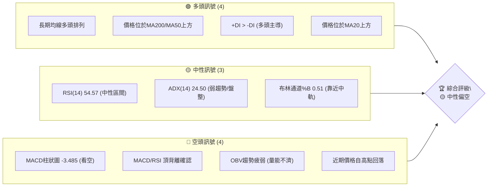

### 📊 核心指標速覽表

| 指標類別 | 指標名稱 | 當前數值 | 訊號 | 解讀 |
|----------|----------|----------|------|------|
| **價格** | 當前價格 | $517.82 | 🟡 | 位於52W高點下方，近期回調 |
| **均線** | MA20 | $516.84 | 🟢 | 價格略高於MA20，短期支撐 |
| **均線** | MA50 | $460.38 | 🟢 | 價格遠高於MA50，中期強勢 |
| **均線** | MA200 | $278.19 | 🟢 | 價格遠高於MA200，長期強勢 |
| **動能** | RSI(14) | 54.57 | 🟡 | 中性區間，但趨勢向下 |
| **動能** | MACD | 23.229 | 🔴 | MACD線下穿Signal線，看空 |
| **波動** | ATR | $36.96 | 🟡 | 波動性中等偏高 (7.14%) |
| **趨勢** | ADX(14) | 24.50 | 🟡 | 趨勢強度較弱，可能進入盤整 |
| **成交量**| 量比(20日) | 0.88x | 🔴 | 成交量低於均值，量能疲弱 |

### 🏆 技術評分卡

AMD的技術評分顯示，儘管長期趨勢依然強勁，但在動能指標和成交量配合方面表現不佳，短期內面臨較大的回調壓力。支撐穩定度尚可，但需警惕關鍵支撐位的失守。

╔══════════════════════════════════════════════════════════════╗
║                    技術評分卡 — AMD (2026-07-03)                 ║
╠══════════════════════════════════════════════════════════════╣
║ 趨勢強度      ████████░░░░░░░░░░░░  50/100  🟡                     ║
║               (ADX顯示弱勢趨勢，但多頭排列支撐)                    ║
║ 動能指標      ████░░░░░░░░░░░░░░░░  25/100  🔴                     ║
║               (RSI/MACD頂背離，MACD柱狀圖為負)                     ║
║ 支撐穩定度    ████████████░░░░░░░░  70/100  🟢                     ║
║               (MA20/MA50提供較強支撐，但需警惕跌破)                ║
║ 成交量配合    ████░░░░░░░░░░░░░░░░  20/100  🔴                     ║
║               (成交量萎縮，OBV疲弱，不利價格上漲)                  ║
║ 形態完整度    ██████░░░░░░░░░░░░░░  35/100  🔴                     ║
║               (近期高位回調，形態不明顯，需觀察)                   ║
║ 均線排列      ██████████████░░░░░░  80/100  🟢                     ║
║               (MA20>MA50>MA200，標準多頭排列)                      ║
╠══════════════════════════════════════════════════════════════╣
║ 綜合評分      ██████░░░░░░░░░░░░░░  47/100  🟡 中性偏空             ║
╚══════════════════════════════════════════════════════════════╝

---

## 2. 趨勢分析

### 🌐 多時框趨勢分析

AMD 在多個時間框架內呈現出複雜的趨勢結構。長期來看，得益於半導體產業的強勁需求和公司自身的創新，股價表現出顯著的成長。然而，中期和短期內，近期的高位回調和動能指標的轉弱，暗示著市場正在消化前期的漲幅，進入一個整理或調整階段。

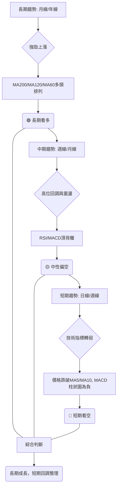

### 📈 長期趨勢 — 12個月走勢圖（Unicode）

過去12個月，AMD展現了令人印象深刻的漲勢，從2025年7月的$176.31一路飆升至2026年6月的$580.91高點，漲幅高達229%。近期股價從高點回落至$517.82，但整體仍處於明顯的上升通道中。

```
AMD 月線走勢圖（過去12個月）
價格軸 ($)
$600 ┤                                    ● (580.91)
$550 ┤                                    │
$500 ┤                           ●        ● (517.82, 現價)
$450 ┤                      ●    │
$400 ┤                      │    │
$350 ┤                ●     │    │
$300 ┤                │     │    │
$250 ┤          ●     │     │    │
$200 ┤● ● ● ●   ●     │     │    │
$150 ┤  ●       │     │     │    │
     └─────────────────────────────────────────────────────
      25-Jul 25-Aug 25-Sep 25-Oct 25-Nov 25-Dec 26-Jan 26-Feb 26-Mar 26-Apr 26-May 26-Jun 26-Jul

關鍵高點: $580.91 (2026年6月)
關鍵低點: $161.79 (2025年9月)
當前價格: $517.82 (2026年7月)
```

**走勢特徵分析表格**：

| 時間區間 | 主要走勢 | 漲跌幅 | 關鍵價位 | 特徵描述 | 訊號 |
|----------|----------|--------|----------|----------|------|
| 2025-07 ~ 2025-09 | 底部築底/盤整 | -8.21% | 高點 $176.31, 低點 $161.79 | 股價在相對低位震盪，尋找方向 | 🟡 |
| 2025-10 ~ 2026-01 | 強勁反彈 | +48.97% | 低點 $161.79, 高點 $236.73 | 隨著市場情緒好轉，股價加速上漲 | 🟢 |
| 2026-02 ~ 2026-03 | 小幅回調/盤整 | -14.07% | 高點 $236.73, 低點 $200.21 | 消化前期漲幅，但未能跌破關鍵支撐 | 🟡 |
| 2026-04 ~ 2026-06 | 飆升主升段 | +185.57% | 低點 $203.43, 高點 $580.91 | 受AI題材與強勁基本面推動，加速上漲 | 🟢 |
| 2026-07 (至今) | 高位回調 | -10.86% | 高點 $580.91, 現價 $517.82 | 觸及歷史高點後進行健康回調，測試支撐 | 🔴 |

### 📊 中期趨勢（週線分析）

中期來看，AMD在2026年4月至6月經歷了一波強勁的拉升，但隨後在6月觸及$580.91高點後，進入了明顯的回調階段。目前股價在$517.82，已跌破短期均線，並在MA20附近尋求支撐。這種高位回調伴隨著動能指標的轉弱，預示著中期可能進入一段時間的盤整或更深的回調。

```
近期壓力與支撐示意圖 (週線)
    $600.00 ║           ┌───┐ (近期高點 $580.91)
            ║           │   │
    $550.00 ║           │   │
            ║           │   │
現價 $517.82 ╠───────────┼───┼───────►  (MA20 $516.84 附近)
            ║           │   │
    $500.00 ║           │   │
            ║           │   │
    $450.00 ║           └─┬─┘ (MA50 $460.38)
            ║             │
    $400.00 ║             │
            ║             │
    $350.00 ║             │
            ║             │
    $300.00 ║             │
            ║             │
            ╚═══════════════════════════════
```
從週線圖來看，AMD近期的高點在$580.91，此為強勁阻力。下方的關鍵支撐首先是MA20 ($516.84)，其次是MA50 ($460.38)。若MA20失守，股價可能進一步測試MA50。目前股價正在MA20上方進行掙扎，顯示短期多空力量拉鋸。

### ⚡ 趨勢強度評估（ADX 解讀）

ADX指標用於評估趨勢的強度，而非方向。AMD目前的ADX(14)為24.50，略低於25的閾值，這表明當前趨勢強度較弱，市場可能處於盤整或震盪區間，而非強勢的單邊行情。

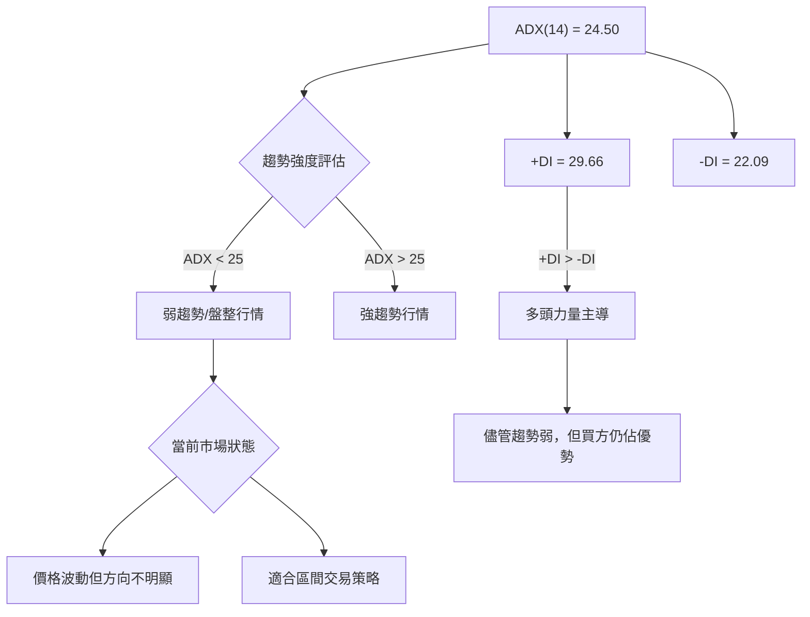

**ADX強度對照表**：

| ADX 數值範圍 | 趨勢強度 | 市場狀態 | 訊號 |
|--------------|----------|----------|------|
| 0-25         | 弱趨勢   | 盤整/震盪 | 🟡 |
| 25-50        | 中等趨勢 | 趨勢形成中 | 🟢 |
| 50-75        | 強趨勢   | 強勁上漲/下跌 | 🟢 |
| 75-100       | 極強趨勢 | 趨勢加速運行 | 🟢 |

**結論**：ADX(14)為24.50，表明AMD目前處於弱趨勢或盤整階段。雖然+DI (29.66) 仍高於-DI (22.09)，暗示多頭力量略佔優勢，但整體趨勢強度不足以支撐股價持續單邊上漲。這與RSI和MACD的短期看空訊號一致，預計股價將在高位區間震盪整理。

---

## 3. 圖表形態分析

### 🔍 形態識別系統

在AMD過去12個月的走勢中，我們觀察到一段長時間的強勁上升趨勢，尤其是在2026年4月至6月間的飆升。近期股價從$580.91高點回落，並在$517.82附近徘徊。由於數據點為月度收盤價和近期週度收盤價，難以識別典型的日線級別精確形態。然而，從宏觀角度看，這波從$200區間至$580區間的快速上漲後的回調，可能正在形成一個「高位整理平台」或「旗形回調」的初期階段，而非明確的反轉形態。這種形態通常發生在強勁上漲後，市場在消化獲利盤和等待新催化劑時，股價在一定區間內震盪。

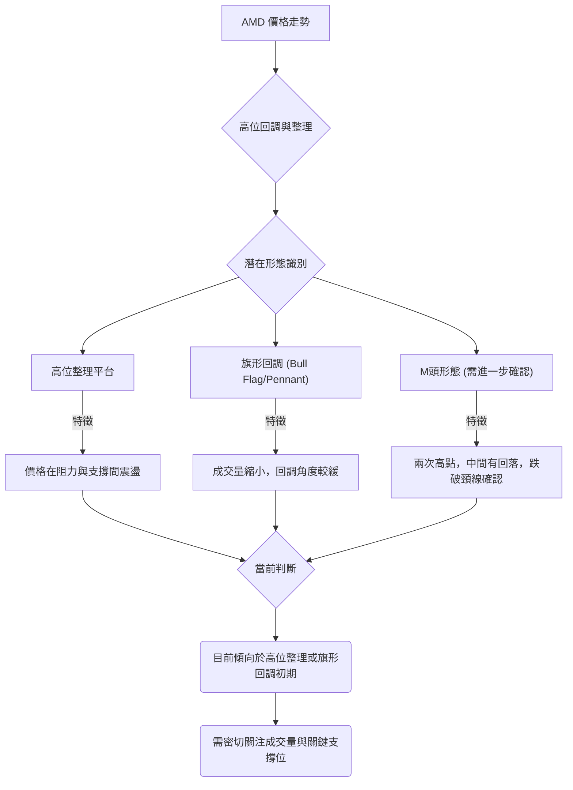

### 🕯️ 重要K線形態分析

由於提供的數據是週收盤價，我們將分析近期的週K線走勢，以推斷可能的形態意義。

| 日期      | 收盤價 | RSI  | MACD柱 | 週成交量  | K線形態 (週) | 解讀                                   | 訊號 |
|-----------|--------|------|--------|-----------|--------------|----------------------------------------|------|
| 2026-05-31 | 516.10 | 67.0 | +2.949 | 128,304,800 | 長陽線       | 強勢上漲，突破前期壓力。               | 🟢   |
| 2026-06-07 | 466.38 | 58.5 | -4.168 | 163,024,100 | 長陰線       | 遭遇賣壓，大幅回調，吞噬前期漲幅。     | 🔴   |
| 2026-06-14 | 511.57 | 57.2 | -8.163 | 152,752,200 | 中陽線       | 從低點反彈，但動能不足，MACD柱狀圖擴大 | 🟡   |
| 2026-06-21 | 537.37 | 53.1 | -3.142 | 132,785,000 | 中陽線       | 反彈動能減弱，MACD柱狀圖收斂但仍為負。 | 🟡   |
| 2026-06-28 | 521.58 | 59.3 | -3.923 | 162,464,700 | 中陰線       | 反彈受阻後回落，未能突破前高。         | 🔴   |
| 2026-07-05 | 517.82 | 54.6 | -3.485 | 117,628,800 | 小陰線       | 繼續小幅回調，成交量萎縮。             | 🔴   |

**分析**：
*   **2026-06-07的長陰線**：在創下新高後，出現一根實體巨大的陰線，伴隨著MACD柱狀圖轉負，這是非常強烈的看空訊號，顯示市場情緒急劇轉變，獲利了結盤湧出。
*   **隨後的幾根K線**：股價在$466.38至$537.37區間震盪，未能有效突破$537.37的反彈高點，並在近期再次回落。這組K線組合形成了一個潛在的「震盪下行」或「看跌旗形」的初期結構，表明多頭力量的反彈缺乏持續性，空頭壓力仍在。成交量在回調過程中逐漸萎縮，雖表明賣壓可能減輕，但也反映買盤意願不高。

### 📉 ASCII 走勢形態示意圖

以下是AMD近期價格走勢的示意圖，顯示從高點回落後的震盪區間。

```
AMD 近期走勢形態示意圖
價格軸 ($)
$580.91 ┤       ● (近期高點)
        │       │
$550.00 ┤       │  ╲
        │       │   ╲
$537.37 ┤───────●    ╲
        │       │     ╲
$517.82 ┤───────┼───────● (現價)
        │       │      ╱
$500.00 ┤       │     ╱
        │       │    ╱
$466.38 ┤       ●────┘ (近期低點)
        │      ╱
$450.00 ┤     ╱
        └───────────────────────────
         時間軸 (2026-05 ~ 2026-07)

形態解讀：
價格在突破高點後迅速回落，隨後在 $466.38 - $537.37 之間形成一個震盪區間，
目前正處於該區間的中下部。這可能是一個高位整理平台，
也可能是潛在的旗形回調。需要觀察價格能否在 $516.84 (MA20) 附近獲得有效支撐。
若跌破，則可能進一步下探 $460.38 (MA50)。
```

### 🎯 形態目標價計算

由於目前尚無清晰且完成的經典反轉或持續形態，我們將基於「高位整理平台」或「旗形回調」的潛在邏輯來預估目標價。

1.  **高位整理平台**：
    *   **平台頂部阻力**：近期高點 $580.91。
    *   **平台底部支撐**：近期回調低點 $466.38。
    *   **整理區間高度**：$580.91 - $466.38 = $114.53。
    *   **若向上突破**：目標價 = $580.91 + $114.53 = $695.44。
    *   **若向下跌破**：目標價 = $466.38 - $114.53 = $351.85。

2.  **旗形回調 (看漲旗形)**：
    *   **旗桿高度**：從2026年2月低點$200.21到2026年6月高點$580.91，旗桿高度約為 $380.70。
    *   **旗形回調區間**：目前在$466.38到$537.37之間震盪。
    *   **若向上突破旗形**：假設突破點為$530.00。目標價 = $530.00 + $380.70 = $910.70。
    *   *此目標價極高，僅作形態理論參考，實際操作需謹慎。*

**當前判斷**：目前股價正在高位震盪，更傾向於整理平台。由於MACD和RSI的頂背離訊號，短期內向上突破旗形的可能性較低，反而需要警惕平台下沿的支撐。因此，目前更應關注平台區間的波動，而非突破後的極致目標。

**近期形態目標價**：
*   **短期上行目標**：若能突破近期反彈高點 $537.37，則有望挑戰 $580.91。
*   **短期下行目標**：若跌破 MA20 ($516.84) 和 MA50 ($460.38)，則可能下探至 $435.48 (斐波那契38.2%回調位)，甚至 $390.56 (斐波那契50%回調位)。

---

## 4. 支撐與阻力

精確識別支撐與阻力位對於制定交易策略至關重要。AMD目前的股價$517.82正處於一個關鍵的交匯點，上方阻力重重，下方支撐亦有層次。

### 🗺️ 關鍵價位分布圖（Unicode）

```
AMD 價位結構分布圖 (2026-07-03)
═══════════════════════════════════════════════════
$700.00 ║████████████████████████║ 強阻力 R3 (分析師高點)
$584.73 ║████████████████████    ║ 阻力 R2 (52週高點)
$580.91 ║████████████████████████║ 關鍵阻力 R1 (近期歷史高點)
$537.37 ║▓▓▓▓▓▓▓▓▓▓▓▓▓▓▓▓▓▓▓▓▓▓▓▓║ 近期反彈阻力
現價 $517.82 ╠════════════════════════╣ ◄ 當前價格
$516.84 ║▓▓▓▓▓▓▓▓▓▓▓▓▓▓▓▓▓▓▓▓▓▓▓▓║ 近期支撐 S1 (MA20 / 布林中軌)
$460.38 ║████████████████████████║ 強支撐 S2 (MA50)
$455.05 ║████████████████████    ║ 支撐 S3 (布林下軌)
$435.48 ║████████████████████████║ 關鍵支撐 S4 (斐波那契38.2%回調)
$390.56 ║▓▓▓▓▓▓▓▓▓▓▓▓▓▓▓▓        ║ 強支撐 S5 (斐波那契50%回調)
$320.24 ║████████████████████████║ 參考支撐 S6 (MA120)
═══════════════════════════════════════════════════
```

### 🚧 阻力位分析表

| 阻力級別 | 價位     | 形成原因                 | 突破難度 | 重要性 |
|----------|----------|--------------------------|----------|--------|
| R1       | $580.91  | 近期歷史高點，大量獲利盤 | 高       | 極高   |
| R2       | $584.73  | 52週高點                 | 極高     | 高     |
| R3       | $700.00  | 分析師最高目標價         | 極高     | 中     |
| R_短期   | $537.37  | 近期反彈高點             | 中等     | 中     |

**分析**：AMD在$580.91附近形成了強勁的心理和技術阻力，這是近期漲勢的頂部。如果股價能夠突破這一水平，將意味著新的上漲趨勢的確立，但需要極大的買盤動能和成交量配合。短期內，近期反彈高點$537.37也構成阻力，未能突破此處則回調壓力持續。

### 🛡️ 支撐位分析表

| 支撐級別 | 價位     | 形成原因                     | 守住機率 | 重要性 |
|----------|----------|------------------------------|----------|--------|
| S1       | $516.84  | MA20 / 布林通道中軌          | 中等     | 高     |
| S2       | $460.38  | MA50                         | 高       | 極高   |
| S3       | $455.05  | 布林通道下軌                 | 中等     | 高     |
| S4       | $435.48  | 斐波那契38.2%回調位          | 高       | 極高   |
| S5       | $390.56  | 斐波那契50%回調位            | 高       | 極高   |
| S6       | $320.24  | MA120                        | 極高     | 中等   |

**分析**：目前股價$517.82僅略高於MA20和布林中軌，這是一個非常關鍵的短期支撐。一旦跌破，將可能加速下跌至$460.38 (MA50) 和 $455.05 (布林下軌)。斐波那契回調位$435.48和$390.56是更深層次的關鍵支撐，對判斷回調的深度至關重要。這些支撐位若能守住，則長期多頭趨勢仍能維持。

### 📐 斐波那契回調位分析

我們以2026年2月的低點 $200.21 作為主要波段的起點，2026年6月的高點 $580.91 作為主要波段的終點，計算斐波那契回調位。

*   **波段高點 (H)**: $580.91 (2026-06)
*   **波段低點 (L)**: $200.21 (2026-02)
*   **波段價差 (H-L)**: $580.91 - $200.21 = $380.70

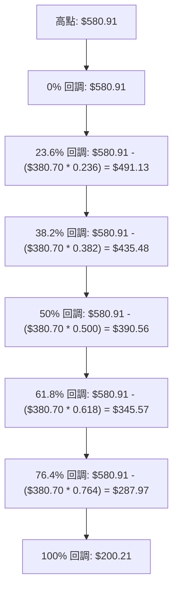

**斐波那契回調位詳情**：

| 回調比例 | 價位     | 說明                                     | 重要性 |
|----------|----------|------------------------------------------|--------|
| 23.6%    | $491.13  | 較淺回調，若守住則趨勢極強               | 中     |
| 38.2%    | $435.48  | 關鍵回調位，常為健康回調的終點           | 極高   |
| 50%      | $390.56  | 強支撐位，若跌破則顯示多頭力量顯著減弱   | 極高   |
| 61.8%    | $345.57  | 黃金分割位，若跌破則可能轉為中期空頭     | 高     |
| 76.4%    | $287.97  | 深度回調，幾乎回吐所有漲幅               | 中     |

**結論**：AMD目前已從$580.91高點回調至$517.82，尚未觸及任何主要斐波那契回調位。這表明當前回調仍處於早期階段，或者可能在MA20/MA50等動態支撐處企穩。然而，若跌破MA50 ($460.38)，則$435.48和$390.56將成為接下來的重要觀測點。

---

## 5. 技術指標深度解讀

### 🎛️ 指標訊號總覽

AMD的技術指標提供了一個複雜的訊號組合。長期均線和+DI顯示多頭趨勢的基礎仍然存在，但短期動能指標（RSI、MACD）和成交量卻發出明確的看空訊號，特別是頂背離的出現，值得高度警惕。

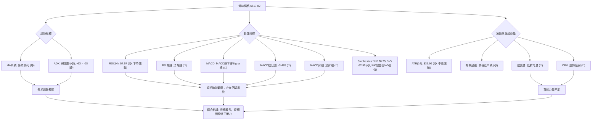

### 📈 移動平均線排列分析

AMD的移動平均線系統呈現出經典的多頭排列，這是長期趨勢強勁的明確訊號。然而，短期均線的走勢已經出現變化，預示著短期趨勢的轉弱。

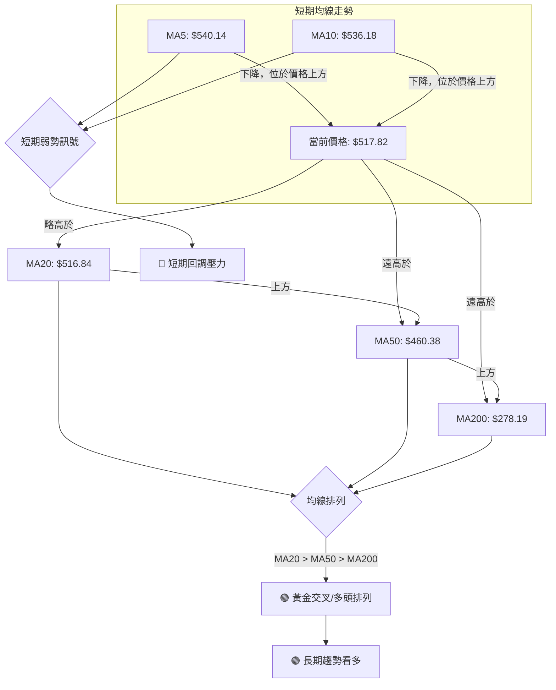

**均線排列狀態**：

| 均線      | 當前數值 | 價格關係 | 走勢     | 訊號 | 解讀                                   |
|-----------|----------|----------|----------|------|----------------------------------------|
| **MA5**   | $540.14  | 價格下方 | 下降     | 🔴   | 短期壓力，價格已跌破5日線              |
| **MA10**  | $536.18  | 價格下方 | 下降     | 🔴   | 短期壓力，價格已跌破10日線             |
| **MA20**  | $516.84  | 價格上方 | 上升     | 🟢   | 短期支撐，價格緊貼20日線，有企穩可能   |
| **MA50**  | $460.38  | 價格上方 | 上升     | 🟢   | 中期強勁支撐，維持中期上漲趨勢         |
| **MA200** | $278.19  | 價格上方 | 上升     | 🟢   | 長期強勁支撐，確立長期牛市格局         |

**綜合分析**：
*   **長期趨勢**：MA200、MA120、MA60均線持續向上，且MA20 > MA50 > MA200，呈現標準的多頭排列，表明AMD的長期上升趨勢依然非常穩固。
*   **中期趨勢**：MA50持續向上，對股價形成強勁支撐。
*   **短期趨勢**：MA5和MA10均已轉頭向下，且價格已跌破這兩條短期均線，顯示短期內買盤力量減弱，賣壓開始顯現。目前價格正在MA20 ($516.84) 附近尋求支撐，此處是短期多空爭奪的關鍵。若MA20失守，則可能引發更深的回調至MA50。

### 📉 RSI(14) 分析

RSI(14) 用於衡量價格變動的速度和變化，判斷超買或超賣狀況。

RSI(14) 數值: 54.57 🟡 (中性)

RSI 進度條: ▓▓▓▓▓▓▓▓▓▓▓░░░░░░░░░░ 54.57%

**超買超賣區間分析**：
*   RSI 54.57 位於30-70的中性區間，表明目前既非超買也非超賣。
*   然而，從歷史數據來看，AMD在2026年4月26日RSI曾高達97.4 (價格$347.81)，隨後在2026年5月10日RSI為80.7 (價格$455.19)，2026年6月21日RSI為53.1 (價格$537.37)。RSI從極度超買區回落，顯示上漲動能已大幅減弱。

**背離判斷 (頂背離/底背離)**：
*   **頂背離確認**：
    *   **價格走勢**：AMD在2026年4月26日價格為$347.81，隨後在2026年6月21日創下更高的價格 $537.37 (週收盤價，近期最高點 $580.91)。
    *   **RSI走勢**：與之對應，RSI在2026年4月26日達到97.4的峰值，但在2026年6月21日價格創新高時，RSI卻只有53.1。這形成了經典的**頂背離**形態 (價格創新高，RSI未創新高反而走低)。
*   **結論**：RSI頂背離是一個強烈的看空訊號，預示著股價上漲動能衰竭，可能面臨較大幅度的回調或反轉。這與股價近期從高點回落的走勢相符。

### 📊 MACD(12/26/9) 訊號解讀

MACD (Moving Average Convergence Divergence) 用於判斷趨勢的動能和方向。

*   MACD線: 23.229
*   MACD Signal線: 26.713
*   MACD柱狀圖: -3.485 🔴 (看空)

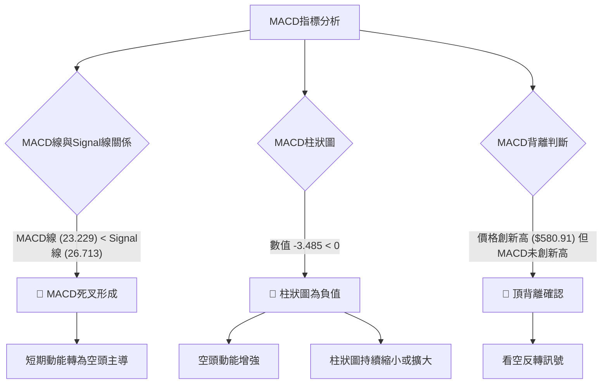

**MACD背離判斷 (頂背離/底背離)**：
*   **頂背離確認**：
    *   **價格走勢**：AMD在2026年5月10日週收盤價為$455.19，隨後在2026年6月21日創下更高的價格 $537.37 (近期最高點 $580.91)。
    *   **MACD柱狀圖走勢**：MACD柱狀圖在2026年5月10日達到+10.403的峰值，但在2026年6月21日價格創新高時，MACD柱狀圖僅為-3.142，且隨後持續為負值。這形成了明確的**頂背離**形態 (價格創新高，MACD動能卻在減弱甚至轉負)。
*   **結論**：MACD線已下穿Signal線形成死叉，且MACD柱狀圖持續為負值並存在頂背離，這與RSI的頂背離訊號互相確認，發出強烈的看空訊號。表明短期內股價面臨較大的下行風險，動能已轉為空頭主導。

### 📦 布林通道分析

布林通道由三條線組成：上軌、中軌(MA20)和下軌，用於衡量價格波動區間。

*   布林上軌: $578.63
*   布林中軌(MA20): $516.84
*   布林下軌: $455.05
*   BB %B: 0.51 (0=下軌, 0.5=中軌, 1=上軌)

```
AMD 布林通道示意圖
═══════════════════════════════════════════════════
$600.00 ║                                      ↑ 上軌 $578.63
        ║           ┌───┐ (近期高點 $580.91)
$550.00 ║           │   │
        ║           │   │
現價 $517.82 ╠───────────┼───┼───────►  (現價)
$516.84 ║═══════════════════════════════════════════╗ 中軌 $516.84 (MA20)
        ║           │   │
$455.05 ║           └─┬─┘                          ↓ 下軌 $455.05
        ║             │
$400.00 ║             │
        ╚═══════════════════════════════════════════
```

**分析**：
*   **價格位置**：當前價格$517.82僅略高於布林中軌 ($516.84)，BB %B為0.51也確認了這一點。這表明股價正圍繞20日均線進行盤整，多空力量在此處拉鋸。
*   **通道寬度**：布林通道的寬度 (上軌 $578.63 - 下軌 $455.05 = $123.58) 相對於價格 ($517.82) 較寬，反映出AMD近期波動性較高 (ATR 7.14%)。
*   **潛在走勢**：若股價能守穩中軌並向上突破，則有望再次測試上軌甚至挑戰近期高點。然而，若跌破中軌，則可能加速下跌至下軌$455.05，甚至更深的支撐位。目前來看，中軌是一個非常關鍵的短期支撐。

### 💹 成交量分析（量價配合度）

成交量是價格走勢的燃料，其變化能確認或否認價格趨勢。

*   最新成交量: 28,142,500
*   20日均量: 32,082,065 (量比: 0.88x)
*   50日均量: 37,623,120
*   OBV趨勢: OBV < MA → 量能疲弱 🔴

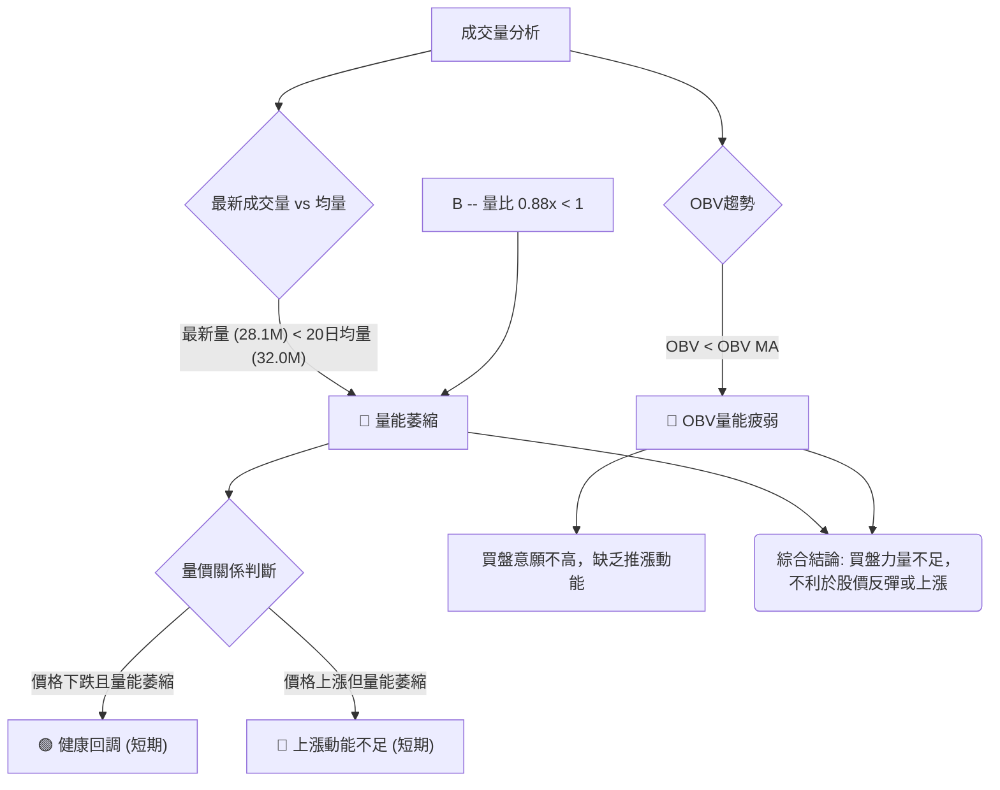

**分析**：
*   **量能萎縮**：AMD的最新成交量28,142,500股，顯著低於20日均量32,082,065股和50日均量37,623,120股，量比為0.88x。這表明市場交易活躍度下降，買賣雙方均趨於觀望。
*   **量價配合**：在股價從高點回落的過程中，成交量萎縮，這通常被解讀為**健康的回調**，即賣壓並非來自恐慌性拋售，而是獲利了結和觀望。然而，如果股價嘗試反彈而成交量未能有效放大，則說明買盤動能不足，反彈難以持續。
*   **OBV趨勢**：OBV (On-Balance Volume) 趨勢疲弱，且OBV線位於其移動平均線下方，這是一個明確的看空訊號。OBV疲弱表明在價格上漲時，累積的成交量不足，而在價格下跌時，則有較大的累積成交量，反映出市場缺乏實質性的買盤支持。
*   **結論**：儘管成交量萎縮在回調中可視為健康訊號，但OBV的疲弱和MACD/RSI的頂背離共同指出，當前市場缺乏足夠的買盤力量來推動股價再次上漲。量能的不足是AMD短期面臨的一個重要挑戰。

---

## 6. 動能與波動率

### ⚡ 動能評估四象限

動能評估四象限將股票在「動能強度」和「波動率」兩個維度上進行定位，以幫助判斷當前的市場狀態和交易機會。

| 象限 | 動能             | 波動       | 當前狀態 (AMD) | 評估                                         |
|------|------------------|------------|----------------|----------------------------------------------|
| Q1   | 強 (RSI > 70, MACD金叉) | 低 (ATR < 均值) | -              | **最佳機會**：強勢且穩定的上漲，風險相對較低。 |
| Q2   | 弱 (RSI < 50, MACD死叉) | 低 (ATR < 均值) | -              | **謹慎觀望**：市場缺乏方向，波動小，無明顯機會。 |
| Q3   | 強 (RSI > 70, MACD金叉) | 高 (ATR > 均值) | -              | **高風險高收益**：趨勢強勁但波動大，適合激進交易者。 |
| Q4   | 弱 (RSI < 50, MACD死叉) | 高 (ATR > 均值) | **✓**          | **避免進場**：市場混亂，方向不明，風險極高。     |

**AMD 當前狀態分析**：
1.  **動能評估**：
    *   RSI(14) 54.57 位於中性區間，但其下降趨勢和頂背離是負面訊號。
    *   MACD柱狀圖為-3.485，且MACD線已下穿Signal線，表明空頭動能佔優。
    *   ADX 24.50 顯示趨勢強度不足。
    *   綜合來看，AMD的短期動能評估為「弱動能」。
2.  **波動率評估**：
    *   ATR(14) 為 $36.96，佔當前價格 $517.82 的 7.14%。這是一個相對較高的波動率，表明股價每日波幅較大。
    *   布林通道寬度較大，也支持高波動的判斷。
    *   綜合來看，AMD的波動率評估為「高波動」。

**結論**：AMD目前處於**Q4 (弱動能, 高波動)** 象限。這是一個高風險的市場環境，股價缺乏明確的方向，但每日波動劇烈。對於大多數交易者來說，此時應保持謹慎，避免盲目進場。若要參與，則需要嚴格的風險控制和明確的交易策略。

### 📊 ATR 波動率分析

ATR (Average True Range) 衡量市場波動性，反映每日價格波幅的平均值。

*   ATR(14): $36.96
*   ATR佔當前價格比例: $36.96 / $517.82 = 7.14%

**分析**：
*   **高波動性**：ATR佔價格的7.14%，這是一個相對較高的比例，表明AMD的日常波動幅度相當大。這意味著交易者可能面臨較大的日內風險和機會。
*   **止損距離建議**：高ATR值要求交易者設定更寬鬆的止損距離，以避免被正常市場波動「洗出」。
    *   **保守止損**：建議止損距離為1.5倍ATR，即 $36.96 * 1.5 = $55.44。
    *   **激進止損**：建議止損距離為1倍ATR，即 $36.96。
    *   例如，若在 $517.82 附近進場，保守止損點應設在 $517.82 - $55.44 = $462.38 附近。這也與MA50 ($460.38) 支撐位接近，提供了技術上的確認。

### 📐 Beta 與市場相關性

Beta 值衡量單一證券或投資組合相對於整個市場的波動性。提供數據中沒有Beta值，但基於AMD作為半導體行業的龍頭企業，我們可以根據行業特性進行推斷。

*   **行業特性**：半導體行業通常被視為週期性行業，對經濟景氣度高度敏感。科技股，尤其是高成長的半導體公司，往往具有較高的Beta值。
*   **推斷**：AMD很可能具有**高於1.0的Beta值**，這意味著它對大盤的波動會更加敏感。當市場上漲時，AMD可能漲幅更大；而當市場下跌時，AMD也可能跌幅更深。
*   **相關性影響**：
    *   **牛市環境**：高Beta股在牛市中表現優於大盤，放大收益。
    *   **熊市環境**：高Beta股在熊市中跌幅更大，放大損失。
    *   **當前環境**：雖然長期趨勢看漲，但短期回調和市場波動性增加，高Beta特性會放大風險。交易者應密切關注大盤走勢 (如標普500指數或納斯達克100指數)，因為AMD的表現很可能與之高度相關並被放大。

---

## 7. 多時框架總結

多時框架分析有助於從宏觀到微觀全面理解AMD的股價走勢，並判斷不同時間維度訊號的一致性。

### 📋 時框架評分表

| 時框架 | 趨勢方向 | 動能 | 均線排列 | 形態           | 綜合評分 | 建議     |
|--------|----------|------|----------|----------------|----------|----------|
| **長期** | 🟢 上升   | 🟢 強 | 🟢 多頭排列 | 🟢 強勁上升趨勢 | 8/10     | 持有/逢低買入 |
| **中期** | 🟡 震盪   | 🔴 弱 | 🟢 多頭排列 | 🟡 高位整理    | 5/10     | 觀望/謹慎 |
| **短期** | 🔴 下跌   | 🔴 弱 | 🔴 均線承壓 | 🔴 回調/震盪下行 | 3/10     | 減倉/避險 |

**分析**：
*   **長期**：AMD的長期趨勢非常強勁，由MA200、MA120、MA60的清晰多頭排列和過去一年半的強勁漲幅所確認。儘管近期有所回調，但尚未改變長期上升通道。
*   **中期**：中期趨勢呈現高位震盪和回調的特徵。雖然MA50仍提供支撐，但動能指標已轉弱，MACD和RSI的頂背離是明確的警告訊號。市場正在消化前期漲幅，尋找新的平衡點。
*   **短期**：短期趨勢明顯轉弱，價格跌破MA5和MA10，MACD柱狀圖為負，RSI持續下降。動能指標的負面訊號預示著短期內下行壓力較大，可能進一步測試關鍵支撐。

### 🔲 綜合訊號矩陣

AMD的技術訊號在不同時間框架下存在明顯的矛盾。長期看漲的基礎依然堅固，但中期和短期則出現顯著的看空訊號，尤其是在動能和成交量方面。這種不一致性要求交易者在操作上保持高度謹慎。

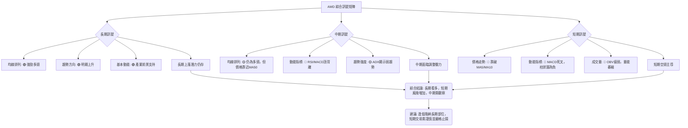

**綜合分析**：
*   **一致性分析**：長期來看，所有指標都指向多頭，顯示強勁的成長潛力。然而，中期和短期指標則出現了顯著的看空訊號，形成了**多空分歧**的局面。MACD和RSI的頂背離是當前最為顯著的負面訊號，它們共同警告市場可能正在經歷一個重要的調整階段。
*   **當前判斷**：AMD目前正處於一個關鍵的轉折點。長期投資者可以利用回調進行逢低吸納，但短期交易者應避免盲目抄底，因為短期內下行風險較大。在動能指標未轉強、成交量未放大之前，股價很可能繼續在高位震盪或進一步回調。

---

## 8. 交易策略建議

基於對AMD多時框架技術指標的深度分析，我們判斷其長期趨勢仍為多頭，但短期和中期面臨回調壓力，存在明確的頂背離訊號。因此，交易策略應側重於風險管理，並等待明確的入場訊號。

### 🗺️ 策略決策流程圖

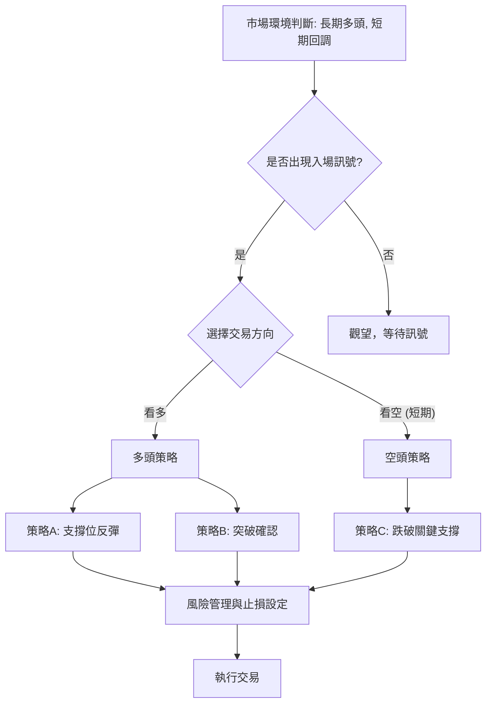

### 🟢 多頭策略詳情

考慮到長期趨勢依然看漲，多頭策略主要集中在回調後的逢低吸納或突破確認。由於短期動能疲弱，建議採取更為保守的入場方式。

| 策略要素   | 策略 A：支撐位反彈                                   | 策略 B：突破確認上漲                                 |
|------------|------------------------------------------------------|------------------------------------------------------|
| **策略名稱** | **MA50關鍵支撐位反彈**                               | **突破近期阻力確認上漲**                             |
| **進場條件** | 股價在MA50 ($460.38) 附近企穩，出現止跌K線形態，或MACD柱狀圖由負轉正。 | 股價有效突破近期反彈高點 $537.37，並伴隨成交量放大。 |
| **進場價格** | **$465.00** (略高於MA50，確認反彈)                 | **$540.00** (突破 $537.37 後追入)                  |
| **目標價 T1** | **$516.84** (MA20 / 布林中軌)                      | **$580.91** (近期歷史高點 R1)                       |
| **目標價 T2** | **$537.37** (近期反彈高點)                         | **$600.00** (心理關口 / 拓展目標)                   |
| **止損價格** | **$450.00** (跌破MA50並考量ATR波動)                  | **$510.00** (跌破MA20 / 止損於關鍵支撐下方)         |
| **風險報酬比** | (T1: $516.84-$465.00)/($465.00-$450.00) = $51.84/$15.00 = **3.46:1**<br>(T2: $537.37-$465.00)/($465.00-$450.00) = $72.37/$15.00 = **4.82:1** | (T1: $580.91-$540.00)/($540.00-$510.00) = $40.91/$30.00 = **1.36:1**<br>(T2: $600.00-$540.00)/($540.00-$510.00) = $60.00/$30.00 = **2.00:1** |
| **成功機率** | 60% (MA50為強支撐，但需市場情緒配合)                 | 40% (突破需強勁動能，目前動能不足)                   |
| **建議倉位** | 中等 (5-10%)                                         | 輕倉 (3-5%)                                          |

### 🔴 空頭策略詳情

鑑於短期動能轉弱和頂背離訊號，短期內存在做空或減持的機會。

| 策略要素   | 策略 C：跌破關鍵支撐                                 |
|------------|------------------------------------------------------|
| **策略名稱** | **跌破MA20 / 布林中軌**                              |
| **進場條件** | 股價有效跌破MA20 ($516.84) 及布林中軌，MACD柱狀圖擴大負值。 |
| **進場價格** | **$515.00** (跌破 $516.84 後確認)                  |
| **目標價 T1** | **$460.38** (MA50強支撐)                           |
| **目標價 T2** | **$435.48** (斐波那契38.2%回調位)                  |
| **止損價格** | **$525.00** (回到MA20上方，防止假跌破)              |
| **風險報酬比** | (T1: $515.00-$460.38)/($525.00-$515.00) = $54.62/$10.00 = **5.46:1**<br>(T2: $515.00-$435.48)/($525.00-$515.00) = $79.52/$10.00 = **7.95:1** |
| **成功機率** | 55% (頂背離和動能轉弱支持下跌)                       |
| **建議倉位** | 輕倉 (3-5%)                                          |

### ⭐ 整體訊號強度評星

```
做多訊號強度：★★☆☆☆  (2/5星)
  理由：長期趨勢雖好，但短期動能和成交量疲弱，頂背離風險高。
做空訊號強度：★★★☆☆  (3/5星)
  理由：RSI/MACD頂背離明確，MACD死叉，OBV疲弱，短期下行壓力較大。
整體可信度：  ★★★☆☆  (3/5星)
  理由：多空訊號複雜，短期風險高於機會，需謹慎選擇策略。
```

---

## 9. 風險提示與監控

在當前的市場環境下，AMD面臨著多重風險，尤其是在經歷了大幅上漲之後。有效的風險管理和持續監控是保護資本的關鍵。

### ✅ 關鍵監控指標 Checklist

以下是交易者應密切關注的關鍵技術指標和價位，以應對AMD股價的潛在變化：

╔══════════════════════════════════════════════════════════════╗
║                    AMD 關鍵監控指標 Checklist                    ║
╠══════════════════════════════════════════════════════════════╣
║ [ ] 價格是否跌破MA20 ($516.84)？ (短期趨勢轉弱訊號)           ║
║ [ ] 價格是否跌破MA50 ($460.38)？ (中期趨勢轉弱訊號)           ║
║ [ ] MACD柱狀圖是否由負轉正？ (短期買盤動能恢復訊號)           ║
║ [ ] RSI(14)是否從低位反彈並突破50？ (動能增強訊號)            ║
║ [ ] 成交量是否在價格上漲時明顯放大？ (買盤確認訊號)           ║
║ [ ] OBV趨勢是否轉強並突破其均線？ (量能確認訊勢)             ║
║ [ ] 價格是否有效突破近期反彈高點 $537.37？ (短期阻力突破訊號) ║
║ [ ] 價格是否跌破斐波那契38.2%回調位 $435.48？ (深度回調風險)   ║
║ [ ] ADX是否由低位回升並確認新的趨勢方向？ (趨勢確立訊號)      ║
║ [ ] 是否有新的利好/利空消息或分析師評級變動？ (基本面變化)    ║
╚══════════════════════════════════════════════════════════════╝

### ⚠️ 風險場景分析

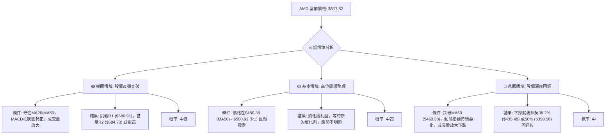

**分析**：
*   **樂觀情境**：若AMD能成功在MA20 ($516.84) 或MA50 ($460.38) 附近企穩，並在買盤動能恢復 (MACD柱狀圖轉正、RSI回升、成交量放大) 的推動下，有望再次挑戰近期高點 $580.91。但此情境發生的概率目前較低，需要強勁的市場催化劑。
*   **基本情境**：鑒於ADX顯示弱趨勢且動能指標轉弱，最有可能的情境是AMD在高位進行一段時間的震盪整理。股價可能在MA50 ($460.38) 和近期阻力 $580.91 之間徘徊，消化前期的漲幅和獲利盤。
*   **悲觀情境**：如果MA20 ($516.84) 和MA50 ($460.38) 關鍵支撐位相繼失守，且MACD、RSI等動能指標持續惡化，則股價可能加速下跌，回測斐波那契38.2%回調位 $435.48，甚至50%回調位 $390.56。頂背離的出現增加了這一情境發生的風險。

### 🛡️ 風險管理重要提醒

1.  **嚴格止損**：鑑於AMD的高波動性 (ATR 7.14%) 和短期趨勢不明朗，任何交易都必須設定明確的止損點。建議止損距離至少為1.5倍ATR，並根據實際情況靈活調整。
2.  **倉位控制**：在高風險、高波動的市場環境中，應採取輕倉策略，避免重倉操作。即使是看好的長期投資，也應分批建倉，不宜一次性all-in。
3.  **趨勢確認**：在趨勢不明朗時，避免逆勢操作。等待明確的趨勢訊號和動能恢復的確認，例如MACD金叉、RSI突破50、成交量放大等，再考慮入場。
4.  **關注基本面**：儘管本報告側重技術分析，但AMD作為半導體行業的龍頭，其基本面（如AI晶片需求、財報表現、競爭態勢）的變化將對股價產生深遠影響。技術分析應結合基本面分析進行綜合判斷。
5.  **多空平衡**：認識到短期內存在做空機會，但長期趨勢仍為多頭。對於長期投資者，回調可能是逢低吸納的機會，但對於短期交易者，則應謹慎對待。
6.  **市場情緒**：密切關注整體市場情緒，尤其是科技股板塊。如果大盤出現系統性風險，AMD作為高Beta股將承受更大的壓力。

---

## 📋 報告總結

```
AMD 技術分析報告總結
════════════════════════════════════════════════════════
報告日期：2026-07-03
當前價格：$517.82
分析評級：⚖️ 中性偏空 (長期看漲基礎穩固，短期面臨回調壓力與動能轉弱)

關鍵結論：
├─ 長期趨勢：🟢 強勁上升，均線呈現標準多頭排列。
├─ 中期趨勢：🟡 高位震盪整理，動能指標轉弱，存在回調風險。
├─ 短期趨勢：🔴 偏空，價格跌破短期均線，MACD/RSI出現頂背離。
├─ 關鍵支撐：$516.84 (MA20), $460.38 (MA50), $435.48 (斐波那契38.2%)
├─ 關鍵阻力：$537.37 (近期反彈高點), $580.91 (近期歷史高點)
└─ 分析師目標：$508.31 (平均), $700.00 (高點)

最優策略組合：
1. 🥇 最佳機會：**觀望，等待明確止跌訊號。** 當前市場環境動能疲弱且波動高，風險較大。
2. 🥈 次選機會：**MA50 ($460.38) 附近逢低吸納 (限長期投資者)。** 若股價回調至此強支撐位並出現反彈訊號，可考慮建立長期部位。
3. 🥉 保守選擇：**短期內考慮做空跌破MA20 ($516.84) 的機會。** 止損嚴格設於 $525.00，目標價為 $460.38 和 $435.48。此策略風險報酬比吸引人，但需要精準的入場時機和嚴格的風險控制。
════════════════════════════════════════════════════════
```

---

> ⚠️ **免責聲明**：本報告為 AI 自動生成之技術分析，所有數據及估算均基於提供的歷史價格資訊。本報告**僅供研究與學術參考**，**不構成任何投資建議**。投資有風險，入市需謹慎。

---

*報告生成時間：2026-07-03 ｜ 數據來源：提供數據 ｜ 分析框架：多時框技術分析*