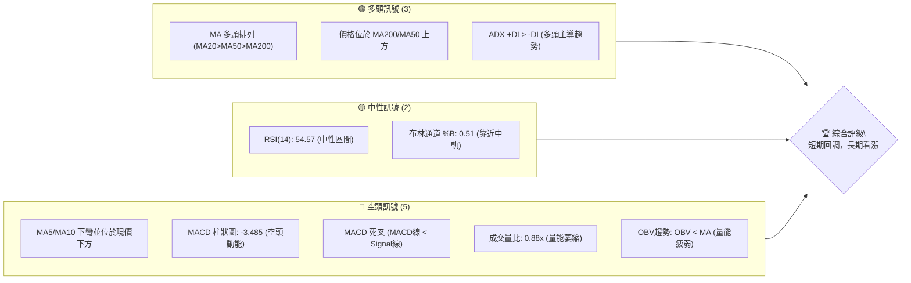
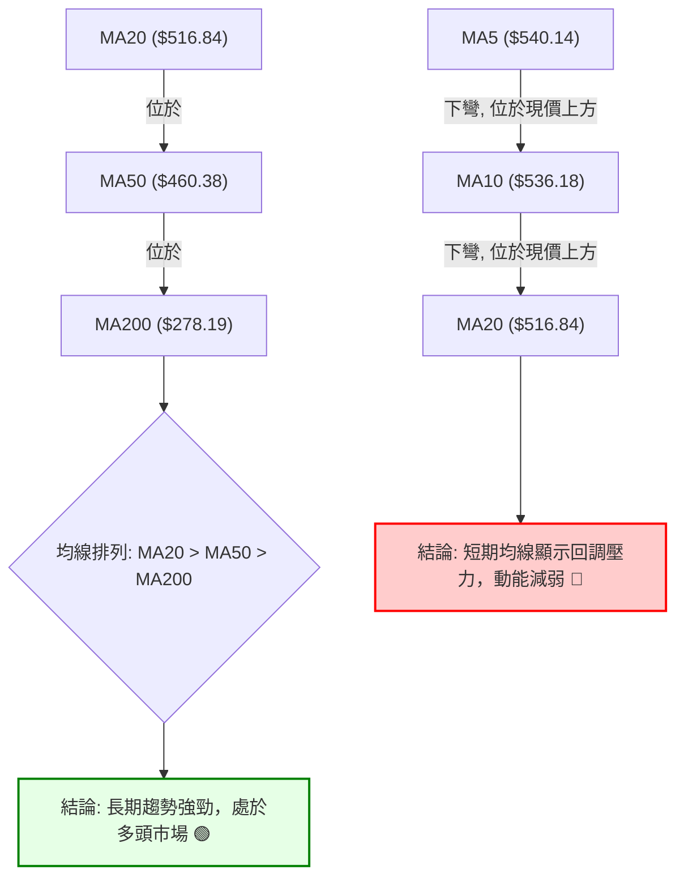
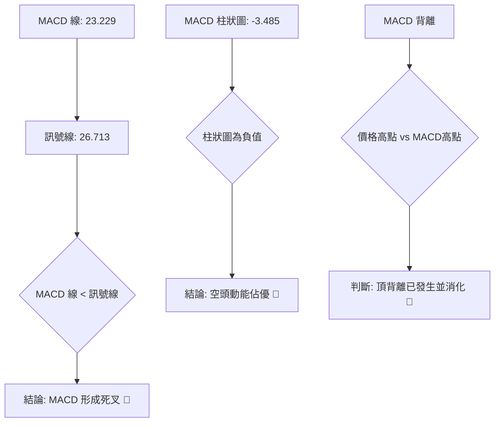
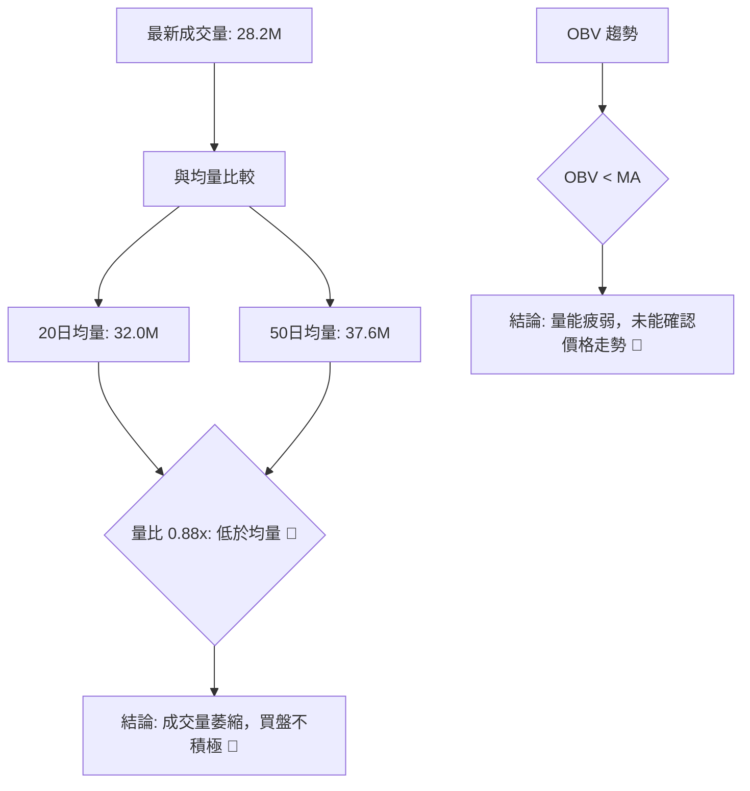
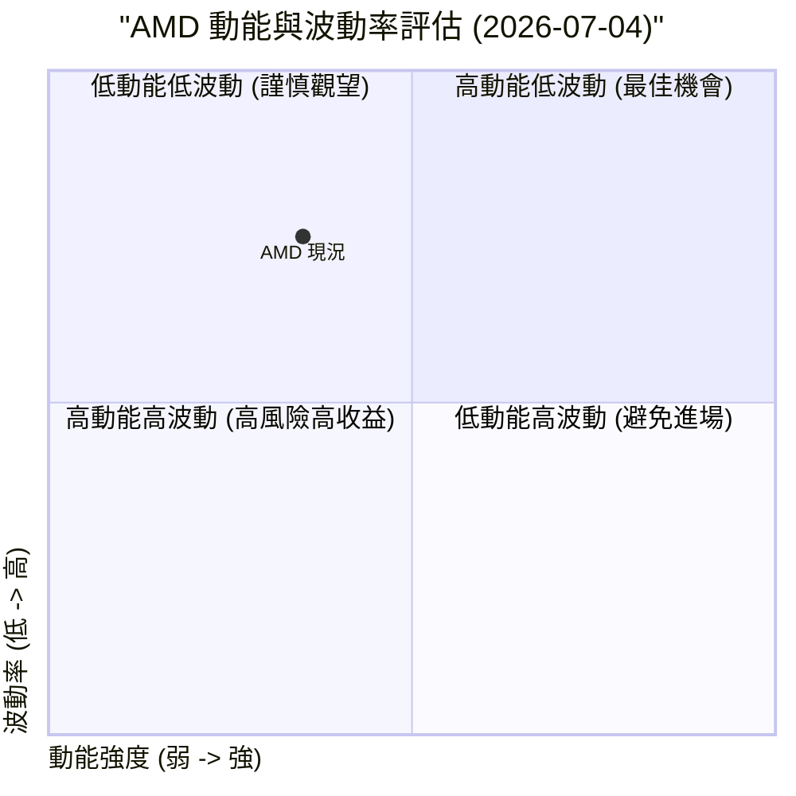
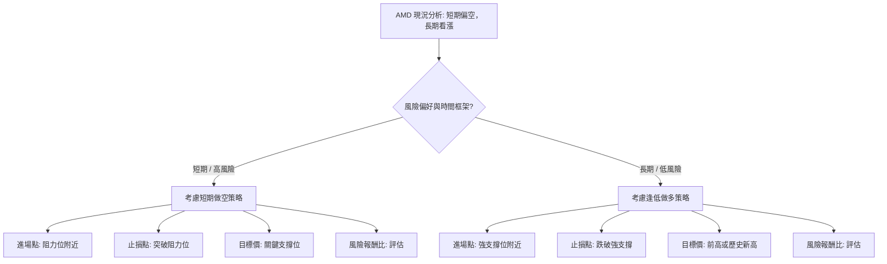

<details>
<summary>📊 靜態圖表 (點擊展開)</summary>

</details>

<html>
<head><meta charset="utf-8" /></head>
<body>
    <div style="height:500px; width:100%;">                        <script>window.PlotlyConfig = {MathJaxConfig: 'local'};</script>
        <script charset="utf-8" src="https://cdn.plot.ly/plotly-3.6.0.min.js" integrity="sha256-QaOVwtVY0T02VaHrr6pnoHLCwayMJp4O5n4YyaE3rJk=" crossorigin="anonymous"></script>                <div id="candlestick-chart" class="plotly-graph-div" style="height:100%; width:100%;"></div>            <script>                window.PLOTLYENV=window.PLOTLYENV || {};                                if (document.getElementById("candlestick-chart")) {                    Plotly.newPlot(                        "candlestick-chart",                        [{"close":{"dtype":"f8","bdata":"AAAAYLgOZEAAAADAHuVjQAAAAKBwvWNAAAAA4HqsY0AAAACgR\u002fljQAAAAMDMHGRAAAAAACkcZEAAAADgoyhkQAAAAGC47mNAAAAAIIUrZEAAAACgRzlkQAAAAOBRgGRAAAAAIFw3ZUAAAACgcJVkQAAAAGC4dmlAAAAA4FFwakAAAACA63FtQAAAAOB6HG1AAAAAwMzcakAAAACgcA1rQAAAAEDhQmtAAAAAQDPTbUAAAACA61FtQAAAAGCPIm1AAAAAgOsRbkAAAADA9cBtQAAAACBcx2xAAAAAIK5fbUAAAACgcJ1vQAAAAGC4OnBAAAAAACkgcEAAAACgR4VwQAAAAEDh2m9AAAAAgOsBcEAAAABgZjpwQAAAAKCZQW9AAAAAoEcFcEAAAABgZrZtQAAAAKBHMW1AAAAAIFx\u002fbkAAAADgo7BtQAAAAIA9LnBAAAAAYLj+bkAAAACA69luQAAAAOCjEG5AAAAAoEfJbEAAAACgmfFrQAAAAOCjwGlAAAAAwPV4aUAAAACgmeFqQAAAAAApxGlAAAAAIK7HakAAAADA9TBrQAAAAOBReGtAAAAAIK7nakAAAABAMzNrQAAAACBc\u002f2pAAAAAQAo\u002fa0AAAAAghaNrQAAAAADXs2tAAAAAoHCta0AAAACAwq1rQAAAAMD1WGpAAAAAYI\u002fyaUAAAACgcCVqQAAAACCFw2hAAAAAgOshaUAAAACAwq1qQAAAAGBm3mpAAAAAwMzcakAAAACgR+FqQAAAACCu32pAAAAAIIXzakAAAABA4epqQAAAAMAexWpAAAAAQArva0AAAABgj6JrQAAAAEAzy2pAAAAA4KNAakAAAACAwpVpQAAAAKBwZWlAAAAAgBT2aUAAAABACp9rQAAAAEAz82tAAAAAoHB9bEAAAABgj\u002fpsQAAAAKBw\u002fWxAAAAAoJk5b0AAAAAgXLdvQAAAAEDhOnBAAAAAgOtpb0AAAADA9YBvQAAAACCul29AAAAAgMKFb0AAAAAgXJdtQAAAAOCjyG5AAAAAIIVDbkAAAACAFAZpQAAAAAAAEGhAAAAAgBQOakAAAAAAAABrQAAAAIA9smpAAAAAYI+yakAAAACAFL5pQAAAAIA96mlAAAAAYI9iaUAAAAAA1wNpQAAAAADXa2lAAAAAwMwEaUAAAABAM5NoQAAAAEDhumpAAAAAIIVbakAAAACAwnVpQAAAAGC4BmlAAAAAANfTaEAAAABgZt5nQAAAAIA9QmlAAAAAYGbuaEAAAACAwg1oQAAAAIDCVWlAAAAAIFxnaUAAAABgj5ppQAAAACCut2hAAAAA4HosaEAAAABgj5JoQAAAAIDriWhAAAAAYLjuaEAAAADgo6hpQAAAAGCPKmlAAAAAgMJVaUAAAAAA16tpQAAAAOCjiGtAAAAA4KN4aUAAAAAgrj9pQAAAAKBHgWhAAAAAgMJtaUAAAABguEZqQAAAAAAAMGtAAAAAgMKFa0AAAADA9bBrQAAAAIA9+mxAAAAA4HqUbUAAAACgR6FuQAAAAGCP2m5AAAAAgD3ib0AAAACA6yFwQAAAAAApZHFAAAAAgD1mcUAAAABAMy9xQAAAAADXx3FAAAAAIFz3ckAAAACgRxVzQAAAAMD1vHVAAAAAgBTqdEAAAAAgXDN0QAAAAIDCEXVAAAAAANcndkAAAADgo4h2QAAAAOCjWHVAAAAAACk0dkAAAACAPVZ6QAAAACBch3lAAAAAQApzfEAAAADgo6x8QAAAAOCjBHxAAAAAAADYe0AAAABAMxt8QAAAAKCZgXpAAAAAANdPekAAAADAzOB5QAAAAKBH+XtAAAAAoHAZfEAAAAAAKTh9QAAAAIA9fn9AAAAA4KP4fkAAAABguDCAQAAAAMDMIIBAAAAAgBTif0AAAADgUUyAQAAAAAAp9IBAAAAAoJlZgEAAAACAFCZ9QAAAAKBHpX5AAAAAACm4fUAAAABgZkZ8QAAAAEAzh35AAAAAwB75f0AAAACAFBqBQAAAAOCjtH9AAAAAANcDgEAAAADA9cqAQAAAAEAKPYFAAAAAwMw+gEAAAACA6z2AQAAAAGCPpIBAAAAA4KNMgEAAAACA69uAQAAAAKBHJ4JAAAAAQArngEAAAABgjy6AQA=="},"high":{"dtype":"f8","bdata":"AAAAYGY+ZEAAAAAAKTRkQAAAAOCj2GNAAAAAQOH6Y0AAAACAwlVkQAAAAOB6bGRAAAAAQDOjZEAAAAAAKTRkQAAAACCFQ2RAAAAAoJmJZEAAAADA9UhkQAAAAIDChWRAAAAAgOthZUAAAACAwlVlQAAAAGC4VmxAAAAAwMxca0AAAAAA13ttQAAAAEAzA25AAAAAQApHbUAAAACAFAZsQAAAACBcH2xAAAAAIK7nbUAAAABgZiZuQAAAAAApbG1AAAAAAClcbkAAAADgUUhuQAAAAAApBG5AAAAAwMx8bUAAAADgeqxvQAAAAGC4RnBAAAAAoEeJcEAAAACgR7FwQAAAAIAUfnBAAAAAgBRicEAAAABgj05wQAAAAIAUFnBAAAAAYGY6cEAAAADgUbBvQAAAAADXe21AAAAAwMwcb0AAAABguA5vQAAAAAApeHBAAAAAgBQ6cEAAAACAFK5vQAAAAOCjGG9AAAAAAADAbUAAAADA9WhtQAAAAAAASG1AAAAAYI8aakAAAAAAKSRrQAAAAGCP0mlAAAAAQOHyakAAAACgmUlrQAAAACBcn2tAAAAAIFw\u002fbEAAAABgZkZrQAAAAADXY2tAAAAA4Hr0a0AAAABguPZrQAAAAEDhGmxAAAAAIIXTa0AAAAAAALBrQAAAACCuz2tAAAAAIIXrakAAAABACkdqQAAAAAAAcGpAAAAAIIXLaUAAAACAwuVqQAAAAKBwhWtAAAAAwPUga0AAAACgRxFrQAAAAGCPGmtAAAAAoJkBa0AAAACAPRprQAAAAOB6NGtAAAAAwMxkbEAAAADgo0BtQAAAAKBw3WtAAAAAACmEakAAAACAFF5qQAAAAKCZ6WlAAAAAACk8akAAAAAgheNrQAAAAEDhAmxAAAAAQDPLbUAAAAAgrk9tQAAAAAAA8G1AAAAAwMycb0AAAACgRwFwQAAAACBcr3BAAAAA4KMkcEAAAACgmfFvQAAAAGBmFnBAAAAA4HpIcEAAAAAgrqduQAAAAEAKP29AAAAAwMyUb0AAAABgj1JrQAAAAKBHgWlAAAAA4KMoakAAAABAMzNrQAAAAOB6bGtAAAAAwMx0a0AAAABguE5rQAAAAKCZQWpAAAAAoJmpaUAAAABgZmZpQAAAAEAzg2lAAAAAANebaUAAAAAAKexoQAAAAGC4FmtAAAAAYGYWa0AAAACgRzlqQAAAAOB6PGlAAAAAIK7XaEAAAADgejRoQAAAAIAUTmlAAAAAoEd5aUAAAAAgrgdpQAAAAEAKX2lAAAAAQOHSaUAAAABguCZqQAAAAADXc2lAAAAAgML1aEAAAACgcAVpQAAAAGC45mhAAAAAIIVbaUAAAAAAKbxpQAAAAKCZyWlAAAAAIIUjakAAAACAws1pQAAAAGCPqmtAAAAAAACga0AAAADgo2hpQAAAAIDCDWpAAAAAAACAaUAAAABgj7pqQAAAAMD1OGtAAAAAgOtJbEAAAABAM8NrQAAAAAAAQG1AAAAAQDOjbUAAAABgjzJvQAAAAGCP6m5AAAAAYLjub0AAAABA4SJwQAAAAKBwdXFAAAAAwMyQcUAAAACAwvlxQAAAAEAz43FAAAAAAAAEc0AAAAAghWNzQAAAAADXD3ZAAAAAIFzTdUAAAAAAAHh0QAAAAGC4QnVAAAAAIFwvdkAAAADgo6x2QAAAAKCZnXZAAAAAwB55dkAAAACgmel6QAAAACBcW3pAAAAA4KOEfEAAAAAghVN9QAAAAMDMrHxAAAAAAAC4fEAAAADA9VR8QAAAAAAAcHtAAAAAwMxse0AAAAAAAMx6QAAAAIA9FnxAAAAAQDMzfEAAAABgjxZ+QAAAACBcr39AAAAAIFzjf0AAAACgmXmAQAAAAAAAUIBAAAAAAAAsgEAAAACA61OAQAAAACCFE4FAAAAAIIWhgEAAAACA65l\u002fQAAAACCF735AAAAAAACQf0AAAABAM9d9QAAAACBcp35AAAAAIK5NgEAAAADA9XKBQAAAAKCZJ4FAAAAAAACkgEAAAAAghd2AQAAAAIDrl4FAAAAAgOuDgEAAAAAgrmeAQAAAAEAKN4FAAAAAQOFogEAAAAAghfGAQAAAAADXRYJAAAAAYLiggUAAAABAMx2BQA=="},"hovertemplate":"\u003cb\u003e%{x|%Y-%m-%d}\u003c\u002fb\u003e\u003cbr\u003e\u958b: $%{open:.2f}\u003cbr\u003e\u9ad8: $%{high:.2f}\u003cbr\u003e\u4f4e: $%{low:.2f}\u003cbr\u003e\u6536: $%{close:.2f}\u003cextra\u003e\u003c\u002fextra\u003e","low":{"dtype":"f8","bdata":"AAAAQArnY0AAAADgUXhjQAAAAEAzu2JAAAAAwMx8Y0AAAACgcK1jQAAAAGC45mNAAAAAgMLNY0AAAADA9VhjQAAAAKCZoWNAAAAAwMz8Y0AAAABgj+pjQAAAACCuD2RAAAAAANfDZEAAAADgemRkQAAAAOBRYGlAAAAAwPUoakAAAABgZlZqQAAAAMD1sGxAAAAAYGamakAAAADAzNxqQAAAAMDM\u002fGpAAAAA4FGYa0AAAAAgrgdtQAAAAMAefWxAAAAAwMxMbUAAAADgo0BtQAAAAAApHGxAAAAAoEeRbEAAAABgZj5uQAAAAKCZOW9AAAAAAAAQcEAAAABgZhZwQAAAAIDriW9AAAAAwB6tb0AAAADgerxvQAAAAOB67G5AAAAAgOtZbkAAAAAgrndtQAAAAOB6FGxAAAAAAAAQbkAAAADgelRtQAAAAAAAQG9AAAAAgOvBbkAAAABgj2JtQAAAAMDMpG1AAAAAYLgWbEAAAABguHZrQAAAAMD1kGlAAAAAAABgaEAAAABAM7tpQAAAAMD1SGhAAAAAAADgaUAAAADgo8BqQAAAAAAAsGpAAAAA4HrMakAAAADgo3hqQAAAAOB6xGpAAAAAIK4Ha0AAAAAghUtrQAAAAMAePWtAAAAAoHBVa0AAAACAFEZqQAAAAIDrIWpAAAAAYI\u002fSaUAAAAAghaNpQAAAAMD1sGhAAAAAAAAQaUAAAABgZoZpQAAAAIDrqWpAAAAAwPWIakAAAABACr9qQAAAAMD1oGpAAAAAIK4nakAAAABgj8pqQAAAAKCZuWpAAAAAwMxca0AAAAAgXI9rQAAAAAAAaGpAAAAAoHDlaUAAAABgj2ppQAAAAIA9YmlAAAAAoJn5aEAAAAAgXN9qQAAAACCF42pAAAAAQApnbEAAAAAghZtsQAAAAMAeLWxAAAAAwPV4bUAAAAAAKdRuQAAAAAAABHBAAAAAoJlJb0AAAABguP5uQAAAAGC4Rm9AAAAAwB4dbkAAAACgmVFtQAAAAAAAYG1AAAAAoEehbUAAAADAzORoQAAAAEAK12dAAAAAgMKNaEAAAADAzIRpQAAAAAAppGpAAAAAYLgmakAAAADgeqRpQAAAAAApfGlAAAAAYI9aaEAAAAAAAGBoQAAAAKBHyWhAAAAAgOvRaEAAAADAzERoQAAAAAAA0GlAAAAAYI9KakAAAABguC5pQAAAACCut2hAAAAAAADAZ0AAAABACodnQAAAACCFu2dAAAAAAClcaEAAAAAAAOhnQAAAAOCjoGdAAAAAYGZGaUAAAAAAKXRpQAAAAKBwlWhAAAAA4KMIaEAAAACgmVloQAAAAOBRaGhAAAAAAAB4aEAAAABgjxpoQAAAAOBRyGhAAAAAYLg2aUAAAAAAKQRpQAAAAOBRcGpAAAAAgMJtaUAAAACAFLZoQAAAAADXG2hAAAAAwB6NaEAAAABA4bppQAAAAADXE2lAAAAAIFw3a0AAAAAAKexqQAAAAEDhYmxAAAAAwB7dbEAAAABguN5tQAAAAMD1QG5AAAAAYGa2bkAAAABAM3tvQAAAAAApWHBAAAAAgD0icUAAAAAAAABxQAAAAIDrSXFAAAAAgD3icUAAAAAAKbxyQAAAAOCj6HRAAAAAwPWMdEAAAAAAAGBzQAAAAIDC7XNAAAAAoJnJdEAAAAAAANR1QAAAAEAzK3VAAAAAgBSOdUAAAADgoyB5QAAAAKBHEXlAAAAA4KMkekAAAACAFC58QAAAAIDCoXpAAAAAYGYKe0AAAABA4Tp7QAAAAIDCdXpAAAAAIFyreUAAAACAwpV4QAAAAMDMoHpAAAAAoJn5ekAAAAAgXNt8QAAAACCuA35AAAAAYI9qfkAAAADgUdh+QAAAAEDhdn9AAAAAwMxsfkAAAAAghVN\u002fQAAAAGBmYoBAAAAAgOs9f0AAAABAM\u002f98QAAAACBc231AAAAAIK5Te0AAAACgRwV8QAAAAOBRoHxAAAAAAADgfkAAAAAAAJSAQAAAAAAAtH9AAAAAwMy0f0AAAABgj3KAQAAAACCuvYBAAAAAwPWsf0AAAAAAAHh\u002fQAAAAAAAsH9AAAAAgMJpf0AAAACgmfV+QAAAAGCPDIFAAAAAgOvVgEAAAAAAAKB\u002fQA=="},"name":"\u50f9\u683c","open":{"dtype":"f8","bdata":"AAAAANcrZEAAAADA9ehjQAAAAGC43mJAAAAAACmsY0AAAACgcK1jQAAAAOCjEGRAAAAAIFxfZEAAAADgeqRjQAAAAOCjEGRAAAAAANcDZEAAAACgRxlkQAAAAIDCHWRAAAAAgMIVZUAAAACAwlVlQAAAAGBmTmxAAAAAQDPbakAAAABgZp5qQAAAAKCZiW1AAAAA4KMYbUAAAABgZoZrQAAAAGBmZmtAAAAAYLjWa0AAAACgR4ltQAAAAOBRKG1AAAAAQAqPbUAAAADgeuxtQAAAAEAzm21AAAAAwB7FbEAAAAAghWtuQAAAAIAUHnBAAAAAgD0ycEAAAABACoNwQAAAAGC4PnBAAAAAoJk5cEAAAACgRzVwQAAAAEAzS29AAAAAIK5nbkAAAABACq9vQAAAAIAU3mxAAAAA4HpEbkAAAADAHjVuQAAAAAAppG9AAAAAwMx8b0AAAAAghQNuQAAAAAAAWG5AAAAAwPWYbUAAAADgUchsQAAAAGBmFm1AAAAAgOsZakAAAADAHuVpQAAAACBcL2lAAAAAoJlBakAAAADgegRrQAAAAAApvGpAAAAAoEe5a0AAAADgUQhrQAAAAAApHGtAAAAAoHAla0AAAABA4WJrQAAAAKBHoWtAAAAAAADAa0AAAACA6zlrQAAAAADXS2tAAAAAwPWIakAAAACgcN1pQAAAAKBHQWpAAAAAgD16aUAAAABAM5NpQAAAAAAAgGtAAAAAIIWbakAAAAAgXN9qQAAAAIDC7WpAAAAAYI9yakAAAAAA1\u002ftqQAAAAIA9+mpAAAAAwMxca0AAAAAAAMhsQAAAAGC41mtAAAAAACmEakAAAADAzFxqQAAAAEAKt2lAAAAAgMIlaUAAAABAM+NqQAAAAKBHMWtAAAAAwMx8bEAAAACgmUltQAAAAGCPQmxAAAAAIK5\u002fbUAAAAAAAHhvQAAAAEDhUnBAAAAAAAAMcEAAAADAHoVvQAAAAAApxG9AAAAAwB7Vb0AAAACAwp1tQAAAAOCjeG1AAAAAoJlxb0AAAAAAAOBqQAAAACCFO2lAAAAAACmkaEAAAADAzNxpQAAAAOB65GpAAAAAACk8a0AAAABgj\u002fpqQAAAAOCjgGlAAAAAwMxEaUAAAADAHs1oQAAAACCFA2lAAAAAANcDaUAAAABA4cJoQAAAAAApdGpAAAAAgD3aakAAAACgmRlqQAAAACCFA2lAAAAAQDM7aEAAAABguO5nQAAAAADXA2hAAAAA4KO4aEAAAADgo2hoQAAAACCFq2dAAAAA4FFQaUAAAAAghaNpQAAAAGCPWmlAAAAAIIXDaEAAAAAgXF9oQAAAAIDClWhAAAAAAACAaEAAAADA9WBoQAAAAOB6nGlAAAAAwMzMaUAAAADgeixpQAAAAOBRcGpAAAAAIFw\u002fa0AAAADgozhpQAAAAGBmnmlAAAAAoJnBaEAAAABA4fJpQAAAAKCZgWlAAAAAwPVoa0AAAADgUUhrQAAAAADXA21AAAAA4FEgbUAAAAAAAOBtQAAAAMD1oG5AAAAAoEc5b0AAAABguN5vQAAAAADXj3BAAAAAAACQcUAAAACgmYlxQAAAAKBHVXFAAAAAIIUzckAAAAAAKeByQAAAAAApDHVAAAAAwB6ldUAAAACAwn1zQAAAAKBHaXRAAAAAgMJVdUAAAACA6\u002f11QAAAAMD1hHZAAAAAACn4dUAAAAAA15d5QAAAAMAeEXpAAAAAoHApekAAAADAzMh8QAAAAAAAFHxAAAAA4KOQfEAAAACgmYl7QAAAAKBwFXtAAAAAAADYekAAAACgmcl5QAAAAOCjwHpAAAAAANefe0AAAACgcF19QAAAAADXS35AAAAAAADAf0AAAAAAADB\u002fQAAAAGBmRoBAAAAAYI9Cf0AAAADAzKR\u002fQAAAAAAAroBAAAAAAAAWgEAAAADgejh\u002fQAAAAAAAUH5AAAAAAABsf0AAAAAghT99QAAAAKCZ2XxAAAAAQAo7f0AAAAAAAL6AQAAAAMAeF4FAAAAAoEeNgEAAAADgo5yAQAAAAAAADIFAAAAAoEfRf0AAAABgj0aAQAAAAKBw\u002f4BAAAAAYGY+gEAAAABguFaAQAAAAGCPDIFAAAAAgD1sgUAAAACgR9GAQA=="},"x":["2025-09-16T00:00:00-04:00","2025-09-17T00:00:00-04:00","2025-09-18T00:00:00-04:00","2025-09-19T00:00:00-04:00","2025-09-22T00:00:00-04:00","2025-09-23T00:00:00-04:00","2025-09-24T00:00:00-04:00","2025-09-25T00:00:00-04:00","2025-09-26T00:00:00-04:00","2025-09-29T00:00:00-04:00","2025-09-30T00:00:00-04:00","2025-10-01T00:00:00-04:00","2025-10-02T00:00:00-04:00","2025-10-03T00:00:00-04:00","2025-10-06T00:00:00-04:00","2025-10-07T00:00:00-04:00","2025-10-08T00:00:00-04:00","2025-10-09T00:00:00-04:00","2025-10-10T00:00:00-04:00","2025-10-13T00:00:00-04:00","2025-10-14T00:00:00-04:00","2025-10-15T00:00:00-04:00","2025-10-16T00:00:00-04:00","2025-10-17T00:00:00-04:00","2025-10-20T00:00:00-04:00","2025-10-21T00:00:00-04:00","2025-10-22T00:00:00-04:00","2025-10-23T00:00:00-04:00","2025-10-24T00:00:00-04:00","2025-10-27T00:00:00-04:00","2025-10-28T00:00:00-04:00","2025-10-29T00:00:00-04:00","2025-10-30T00:00:00-04:00","2025-10-31T00:00:00-04:00","2025-11-03T00:00:00-05:00","2025-11-04T00:00:00-05:00","2025-11-05T00:00:00-05:00","2025-11-06T00:00:00-05:00","2025-11-07T00:00:00-05:00","2025-11-10T00:00:00-05:00","2025-11-11T00:00:00-05:00","2025-11-12T00:00:00-05:00","2025-11-13T00:00:00-05:00","2025-11-14T00:00:00-05:00","2025-11-17T00:00:00-05:00","2025-11-18T00:00:00-05:00","2025-11-19T00:00:00-05:00","2025-11-20T00:00:00-05:00","2025-11-21T00:00:00-05:00","2025-11-24T00:00:00-05:00","2025-11-25T00:00:00-05:00","2025-11-26T00:00:00-05:00","2025-11-28T00:00:00-05:00","2025-12-01T00:00:00-05:00","2025-12-02T00:00:00-05:00","2025-12-03T00:00:00-05:00","2025-12-04T00:00:00-05:00","2025-12-05T00:00:00-05:00","2025-12-08T00:00:00-05:00","2025-12-09T00:00:00-05:00","2025-12-10T00:00:00-05:00","2025-12-11T00:00:00-05:00","2025-12-12T00:00:00-05:00","2025-12-15T00:00:00-05:00","2025-12-16T00:00:00-05:00","2025-12-17T00:00:00-05:00","2025-12-18T00:00:00-05:00","2025-12-19T00:00:00-05:00","2025-12-22T00:00:00-05:00","2025-12-23T00:00:00-05:00","2025-12-24T00:00:00-05:00","2025-12-26T00:00:00-05:00","2025-12-29T00:00:00-05:00","2025-12-30T00:00:00-05:00","2025-12-31T00:00:00-05:00","2026-01-02T00:00:00-05:00","2026-01-05T00:00:00-05:00","2026-01-06T00:00:00-05:00","2026-01-07T00:00:00-05:00","2026-01-08T00:00:00-05:00","2026-01-09T00:00:00-05:00","2026-01-12T00:00:00-05:00","2026-01-13T00:00:00-05:00","2026-01-14T00:00:00-05:00","2026-01-15T00:00:00-05:00","2026-01-16T00:00:00-05:00","2026-01-20T00:00:00-05:00","2026-01-21T00:00:00-05:00","2026-01-22T00:00:00-05:00","2026-01-23T00:00:00-05:00","2026-01-26T00:00:00-05:00","2026-01-27T00:00:00-05:00","2026-01-28T00:00:00-05:00","2026-01-29T00:00:00-05:00","2026-01-30T00:00:00-05:00","2026-02-02T00:00:00-05:00","2026-02-03T00:00:00-05:00","2026-02-04T00:00:00-05:00","2026-02-05T00:00:00-05:00","2026-02-06T00:00:00-05:00","2026-02-09T00:00:00-05:00","2026-02-10T00:00:00-05:00","2026-02-11T00:00:00-05:00","2026-02-12T00:00:00-05:00","2026-02-13T00:00:00-05:00","2026-02-17T00:00:00-05:00","2026-02-18T00:00:00-05:00","2026-02-19T00:00:00-05:00","2026-02-20T00:00:00-05:00","2026-02-23T00:00:00-05:00","2026-02-24T00:00:00-05:00","2026-02-25T00:00:00-05:00","2026-02-26T00:00:00-05:00","2026-02-27T00:00:00-05:00","2026-03-02T00:00:00-05:00","2026-03-03T00:00:00-05:00","2026-03-04T00:00:00-05:00","2026-03-05T00:00:00-05:00","2026-03-06T00:00:00-05:00","2026-03-09T00:00:00-04:00","2026-03-10T00:00:00-04:00","2026-03-11T00:00:00-04:00","2026-03-12T00:00:00-04:00","2026-03-13T00:00:00-04:00","2026-03-16T00:00:00-04:00","2026-03-17T00:00:00-04:00","2026-03-18T00:00:00-04:00","2026-03-19T00:00:00-04:00","2026-03-20T00:00:00-04:00","2026-03-23T00:00:00-04:00","2026-03-24T00:00:00-04:00","2026-03-25T00:00:00-04:00","2026-03-26T00:00:00-04:00","2026-03-27T00:00:00-04:00","2026-03-30T00:00:00-04:00","2026-03-31T00:00:00-04:00","2026-04-01T00:00:00-04:00","2026-04-02T00:00:00-04:00","2026-04-06T00:00:00-04:00","2026-04-07T00:00:00-04:00","2026-04-08T00:00:00-04:00","2026-04-09T00:00:00-04:00","2026-04-10T00:00:00-04:00","2026-04-13T00:00:00-04:00","2026-04-14T00:00:00-04:00","2026-04-15T00:00:00-04:00","2026-04-16T00:00:00-04:00","2026-04-17T00:00:00-04:00","2026-04-20T00:00:00-04:00","2026-04-21T00:00:00-04:00","2026-04-22T00:00:00-04:00","2026-04-23T00:00:00-04:00","2026-04-24T00:00:00-04:00","2026-04-27T00:00:00-04:00","2026-04-28T00:00:00-04:00","2026-04-29T00:00:00-04:00","2026-04-30T00:00:00-04:00","2026-05-01T00:00:00-04:00","2026-05-04T00:00:00-04:00","2026-05-05T00:00:00-04:00","2026-05-06T00:00:00-04:00","2026-05-07T00:00:00-04:00","2026-05-08T00:00:00-04:00","2026-05-11T00:00:00-04:00","2026-05-12T00:00:00-04:00","2026-05-13T00:00:00-04:00","2026-05-14T00:00:00-04:00","2026-05-15T00:00:00-04:00","2026-05-18T00:00:00-04:00","2026-05-19T00:00:00-04:00","2026-05-20T00:00:00-04:00","2026-05-21T00:00:00-04:00","2026-05-22T00:00:00-04:00","2026-05-26T00:00:00-04:00","2026-05-27T00:00:00-04:00","2026-05-28T00:00:00-04:00","2026-05-29T00:00:00-04:00","2026-06-01T00:00:00-04:00","2026-06-02T00:00:00-04:00","2026-06-03T00:00:00-04:00","2026-06-04T00:00:00-04:00","2026-06-05T00:00:00-04:00","2026-06-08T00:00:00-04:00","2026-06-09T00:00:00-04:00","2026-06-10T00:00:00-04:00","2026-06-11T00:00:00-04:00","2026-06-12T00:00:00-04:00","2026-06-15T00:00:00-04:00","2026-06-16T00:00:00-04:00","2026-06-17T00:00:00-04:00","2026-06-18T00:00:00-04:00","2026-06-22T00:00:00-04:00","2026-06-23T00:00:00-04:00","2026-06-24T00:00:00-04:00","2026-06-25T00:00:00-04:00","2026-06-26T00:00:00-04:00","2026-06-29T00:00:00-04:00","2026-06-30T00:00:00-04:00","2026-07-01T00:00:00-04:00","2026-07-02T00:00:00-04:00"],"type":"candlestick"},{"hovertemplate":"MA30: $%{y:.2f}\u003cextra\u003e\u003c\u002fextra\u003e","line":{"color":"#2196F3","dash":"dash","width":2},"mode":"lines","name":"MA30","x":["2025-09-16T00:00:00-04:00","2025-09-17T00:00:00-04:00","2025-09-18T00:00:00-04:00","2025-09-19T00:00:00-04:00","2025-09-22T00:00:00-04:00","2025-09-23T00:00:00-04:00","2025-09-24T00:00:00-04:00","2025-09-25T00:00:00-04:00","2025-09-26T00:00:00-04:00","2025-09-29T00:00:00-04:00","2025-09-30T00:00:00-04:00","2025-10-01T00:00:00-04:00","2025-10-02T00:00:00-04:00","2025-10-03T00:00:00-04:00","2025-10-06T00:00:00-04:00","2025-10-07T00:00:00-04:00","2025-10-08T00:00:00-04:00","2025-10-09T00:00:00-04:00","2025-10-10T00:00:00-04:00","2025-10-13T00:00:00-04:00","2025-10-14T00:00:00-04:00","2025-10-15T00:00:00-04:00","2025-10-16T00:00:00-04:00","2025-10-17T00:00:00-04:00","2025-10-20T00:00:00-04:00","2025-10-21T00:00:00-04:00","2025-10-22T00:00:00-04:00","2025-10-23T00:00:00-04:00","2025-10-24T00:00:00-04:00","2025-10-27T00:00:00-04:00","2025-10-28T00:00:00-04:00","2025-10-29T00:00:00-04:00","2025-10-30T00:00:00-04:00","2025-10-31T00:00:00-04:00","2025-11-03T00:00:00-05:00","2025-11-04T00:00:00-05:00","2025-11-05T00:00:00-05:00","2025-11-06T00:00:00-05:00","2025-11-07T00:00:00-05:00","2025-11-10T00:00:00-05:00","2025-11-11T00:00:00-05:00","2025-11-12T00:00:00-05:00","2025-11-13T00:00:00-05:00","2025-11-14T00:00:00-05:00","2025-11-17T00:00:00-05:00","2025-11-18T00:00:00-05:00","2025-11-19T00:00:00-05:00","2025-11-20T00:00:00-05:00","2025-11-21T00:00:00-05:00","2025-11-24T00:00:00-05:00","2025-11-25T00:00:00-05:00","2025-11-26T00:00:00-05:00","2025-11-28T00:00:00-05:00","2025-12-01T00:00:00-05:00","2025-12-02T00:00:00-05:00","2025-12-03T00:00:00-05:00","2025-12-04T00:00:00-05:00","2025-12-05T00:00:00-05:00","2025-12-08T00:00:00-05:00","2025-12-09T00:00:00-05:00","2025-12-10T00:00:00-05:00","2025-12-11T00:00:00-05:00","2025-12-12T00:00:00-05:00","2025-12-15T00:00:00-05:00","2025-12-16T00:00:00-05:00","2025-12-17T00:00:00-05:00","2025-12-18T00:00:00-05:00","2025-12-19T00:00:00-05:00","2025-12-22T00:00:00-05:00","2025-12-23T00:00:00-05:00","2025-12-24T00:00:00-05:00","2025-12-26T00:00:00-05:00","2025-12-29T00:00:00-05:00","2025-12-30T00:00:00-05:00","2025-12-31T00:00:00-05:00","2026-01-02T00:00:00-05:00","2026-01-05T00:00:00-05:00","2026-01-06T00:00:00-05:00","2026-01-07T00:00:00-05:00","2026-01-08T00:00:00-05:00","2026-01-09T00:00:00-05:00","2026-01-12T00:00:00-05:00","2026-01-13T00:00:00-05:00","2026-01-14T00:00:00-05:00","2026-01-15T00:00:00-05:00","2026-01-16T00:00:00-05:00","2026-01-20T00:00:00-05:00","2026-01-21T00:00:00-05:00","2026-01-22T00:00:00-05:00","2026-01-23T00:00:00-05:00","2026-01-26T00:00:00-05:00","2026-01-27T00:00:00-05:00","2026-01-28T00:00:00-05:00","2026-01-29T00:00:00-05:00","2026-01-30T00:00:00-05:00","2026-02-02T00:00:00-05:00","2026-02-03T00:00:00-05:00","2026-02-04T00:00:00-05:00","2026-02-05T00:00:00-05:00","2026-02-06T00:00:00-05:00","2026-02-09T00:00:00-05:00","2026-02-10T00:00:00-05:00","2026-02-11T00:00:00-05:00","2026-02-12T00:00:00-05:00","2026-02-13T00:00:00-05:00","2026-02-17T00:00:00-05:00","2026-02-18T00:00:00-05:00","2026-02-19T00:00:00-05:00","2026-02-20T00:00:00-05:00","2026-02-23T00:00:00-05:00","2026-02-24T00:00:00-05:00","2026-02-25T00:00:00-05:00","2026-02-26T00:00:00-05:00","2026-02-27T00:00:00-05:00","2026-03-02T00:00:00-05:00","2026-03-03T00:00:00-05:00","2026-03-04T00:00:00-05:00","2026-03-05T00:00:00-05:00","2026-03-06T00:00:00-05:00","2026-03-09T00:00:00-04:00","2026-03-10T00:00:00-04:00","2026-03-11T00:00:00-04:00","2026-03-12T00:00:00-04:00","2026-03-13T00:00:00-04:00","2026-03-16T00:00:00-04:00","2026-03-17T00:00:00-04:00","2026-03-18T00:00:00-04:00","2026-03-19T00:00:00-04:00","2026-03-20T00:00:00-04:00","2026-03-23T00:00:00-04:00","2026-03-24T00:00:00-04:00","2026-03-25T00:00:00-04:00","2026-03-26T00:00:00-04:00","2026-03-27T00:00:00-04:00","2026-03-30T00:00:00-04:00","2026-03-31T00:00:00-04:00","2026-04-01T00:00:00-04:00","2026-04-02T00:00:00-04:00","2026-04-06T00:00:00-04:00","2026-04-07T00:00:00-04:00","2026-04-08T00:00:00-04:00","2026-04-09T00:00:00-04:00","2026-04-10T00:00:00-04:00","2026-04-13T00:00:00-04:00","2026-04-14T00:00:00-04:00","2026-04-15T00:00:00-04:00","2026-04-16T00:00:00-04:00","2026-04-17T00:00:00-04:00","2026-04-20T00:00:00-04:00","2026-04-21T00:00:00-04:00","2026-04-22T00:00:00-04:00","2026-04-23T00:00:00-04:00","2026-04-24T00:00:00-04:00","2026-04-27T00:00:00-04:00","2026-04-28T00:00:00-04:00","2026-04-29T00:00:00-04:00","2026-04-30T00:00:00-04:00","2026-05-01T00:00:00-04:00","2026-05-04T00:00:00-04:00","2026-05-05T00:00:00-04:00","2026-05-06T00:00:00-04:00","2026-05-07T00:00:00-04:00","2026-05-08T00:00:00-04:00","2026-05-11T00:00:00-04:00","2026-05-12T00:00:00-04:00","2026-05-13T00:00:00-04:00","2026-05-14T00:00:00-04:00","2026-05-15T00:00:00-04:00","2026-05-18T00:00:00-04:00","2026-05-19T00:00:00-04:00","2026-05-20T00:00:00-04:00","2026-05-21T00:00:00-04:00","2026-05-22T00:00:00-04:00","2026-05-26T00:00:00-04:00","2026-05-27T00:00:00-04:00","2026-05-28T00:00:00-04:00","2026-05-29T00:00:00-04:00","2026-06-01T00:00:00-04:00","2026-06-02T00:00:00-04:00","2026-06-03T00:00:00-04:00","2026-06-04T00:00:00-04:00","2026-06-05T00:00:00-04:00","2026-06-08T00:00:00-04:00","2026-06-09T00:00:00-04:00","2026-06-10T00:00:00-04:00","2026-06-11T00:00:00-04:00","2026-06-12T00:00:00-04:00","2026-06-15T00:00:00-04:00","2026-06-16T00:00:00-04:00","2026-06-17T00:00:00-04:00","2026-06-18T00:00:00-04:00","2026-06-22T00:00:00-04:00","2026-06-23T00:00:00-04:00","2026-06-24T00:00:00-04:00","2026-06-25T00:00:00-04:00","2026-06-26T00:00:00-04:00","2026-06-29T00:00:00-04:00","2026-06-30T00:00:00-04:00","2026-07-01T00:00:00-04:00","2026-07-02T00:00:00-04:00"],"y":{"dtype":"f8","bdata":"AAAAAAAA+H8AAAAAAAD4fwAAAAAAAPh\u002fAAAAAAAA+H8AAAAAAAD4fwAAAAAAAPh\u002fAAAAAAAA+H8AAAAAAAD4fwAAAAAAAPh\u002fAAAAAAAA+H8AAAAAAAD4fwAAAAAAAPh\u002fAAAAAAAA+H8AAAAAAAD4fwAAAAAAAPh\u002fAAAAAAAA+H8AAAAAAAD4fwAAAAAAAPh\u002fAAAAAAAA+H8AAAAAAAD4fwAAAAAAAPh\u002fAAAAAAAA+H8AAAAAAAD4fwAAAAAAAPh\u002fAAAAAAAA+H8AAAAAAAD4fwAAAAAAAPh\u002fAAAAAAAA+H8AAAAAAAD4fyIiIjJ6z2hAmpmZ2Yc3aUBEREREtqdpQDMzM+MXD2pAIiIiwmd4akAiIiIy7OJqQHd3dxcEQmtAzczMTNSna0CJiIjIWvlrQO\u002fu7o5fSGxAMzMzU4CgbECrqqqqR\u002fFsQM3MzDx8Vm1A7+7uPu6pbUARERHxiwFuQGZmZobPKG5Ad3d3t9c8bkAAAAAwCDBuQDMzM+NeE25AMzMzY4IHbkCamZlJDAZuQJqZmWlK+W1AIiIigk7fbUDv7u4uJM1tQO\u002fu7u7uvm1AMzMz4+yjbUAzMzMjIo5tQAAAAPDufm1Ad3d3V8dsbUB3d3cX2UptQGZmZuZCIm1AMzMzYzv7bEBERETUeM1sQDMzM4N5nmxAvLu727JqbEBERER02jRsQO\u002fu7l5z\u002fWtAq6qq+n7Ca0BmZmamm6hrQHd3d1fHlGtAAAAAkMJ1a0BVVVUFyF1rQERERGT0LmtA7+7urnIMa0BmZmZG4epqQM3MzDzDzmpAzczM7HzHakAzMzNz2sRqQImIiBi9zWpAiYiICGXUakBERERUVclqQM3MzAwtxmpAZmZmdjC\u002fakAAAADQ28JqQERERGT0xmpAAAAA4HrUakDNzMycqONqQLy7u0up9GpAIiIiAp0Wa0ARERFxaDlrQLy7u1sBYmtAIiIiUuOBa0CamZkph6JrQKuqqgpJz2tAAAAA0Nv+a0B3d3eHQRxsQLy7u2ugT2xA7+7uzml7bECJiIhoSm1sQAAAABBYVWxA3t3dDXRObEAzMzMzek9sQCIiInL2TWxA7+7uHsxLbEC8u7tLxUFsQFVVVYV5OmxAERERsbkkbEBmZmY2Xg5sQAAAAPCnAmxARERExCD4a0BERERkgu9rQDMzMwPk+mtAIiIiokX+a0Dv7u5O1OtrQHd3d0fh0mtAzczMbKCza0BVVVV1BYhrQLy7u2suaGtAMzMzg3kya0BmZmaGFvFqQJqZmblJtGpA3t3drQCBakDv7u7up05qQERERET9E2pA3t3drUfVaUDe3d0NdKppQERERKQpdWlAmpmZWatHaUB3d3eHFk1pQFVVVbWBVmlAd3d311xQaUBEREQkBkVpQAAAALArTGlAd3d357RBaUCrqqpKfj1pQImIiBh2MWlAq6qqqtUxaUCamZnpmDxpQImIiFirS2lA7+7u3ghhaUC8u7troHtpQJqZmSnOjmlAIiIi0k2qaUC8u7vba9ZpQJqZmTkmCGpAd3d311xEakCrqqq6AoxqQN7d3a1H3WpAERERkXsxa0CJiIgIgYlrQN7d3Z3E4GtAZmZmFq5LbECJiIhI4bZsQFVVVWX0Vm1AVVVVVZztbUAzMzPDrnRuQLy7u4veCm9AERERETywb0CJiIiQ7SpwQHd3d+e0dXBAmpmZKRXHcECJiIgYSzpxQFVVVU2pnnFAMzMzg8AkckDe3d1Ftq1yQO\u002fu7s4+NHNA7+7ublm1c0BVVVXNEzV0QO\u002fu7pZDo3RAERER2VwOdUBmZmY+CnV1QERERKwc6HVAIiIicq9ZdkDNzMwEVtB2QHd3d0dvWXdAMzMzc6\u002fZd0BmZmYGVmR4QLy7uxsv43hAd3d3V8deeUB3d3cXS+J5QKuqqsroa3pAERERoRrhekAzMzNT\u002fzZ7QN7d3Q0Cg3tA7+7u3iTOe0DNzMycCxN8QCIiIpLCY3xAq6qqOom3fEC8u7u7Hht9QCIiIiKFc31AZmZm5l7HfUCJiIgIOgV+QDMzM4OVUX5AERERwRF0fkBVVVV1k5R+QM3MzHyGwX5AIiIi8hnqfkBVVVVF\u002fRl\u002fQO\u002fu7g6fbX9Aq6qqCpCtf0C8u7sb6OR\u002fQA=="},"type":"scatter"},{"hovertemplate":"MA60: $%{y:.2f}\u003cextra\u003e\u003c\u002fextra\u003e","line":{"color":"#9C27B0","dash":"dash","width":2},"mode":"lines","name":"MA60","x":["2025-09-16T00:00:00-04:00","2025-09-17T00:00:00-04:00","2025-09-18T00:00:00-04:00","2025-09-19T00:00:00-04:00","2025-09-22T00:00:00-04:00","2025-09-23T00:00:00-04:00","2025-09-24T00:00:00-04:00","2025-09-25T00:00:00-04:00","2025-09-26T00:00:00-04:00","2025-09-29T00:00:00-04:00","2025-09-30T00:00:00-04:00","2025-10-01T00:00:00-04:00","2025-10-02T00:00:00-04:00","2025-10-03T00:00:00-04:00","2025-10-06T00:00:00-04:00","2025-10-07T00:00:00-04:00","2025-10-08T00:00:00-04:00","2025-10-09T00:00:00-04:00","2025-10-10T00:00:00-04:00","2025-10-13T00:00:00-04:00","2025-10-14T00:00:00-04:00","2025-10-15T00:00:00-04:00","2025-10-16T00:00:00-04:00","2025-10-17T00:00:00-04:00","2025-10-20T00:00:00-04:00","2025-10-21T00:00:00-04:00","2025-10-22T00:00:00-04:00","2025-10-23T00:00:00-04:00","2025-10-24T00:00:00-04:00","2025-10-27T00:00:00-04:00","2025-10-28T00:00:00-04:00","2025-10-29T00:00:00-04:00","2025-10-30T00:00:00-04:00","2025-10-31T00:00:00-04:00","2025-11-03T00:00:00-05:00","2025-11-04T00:00:00-05:00","2025-11-05T00:00:00-05:00","2025-11-06T00:00:00-05:00","2025-11-07T00:00:00-05:00","2025-11-10T00:00:00-05:00","2025-11-11T00:00:00-05:00","2025-11-12T00:00:00-05:00","2025-11-13T00:00:00-05:00","2025-11-14T00:00:00-05:00","2025-11-17T00:00:00-05:00","2025-11-18T00:00:00-05:00","2025-11-19T00:00:00-05:00","2025-11-20T00:00:00-05:00","2025-11-21T00:00:00-05:00","2025-11-24T00:00:00-05:00","2025-11-25T00:00:00-05:00","2025-11-26T00:00:00-05:00","2025-11-28T00:00:00-05:00","2025-12-01T00:00:00-05:00","2025-12-02T00:00:00-05:00","2025-12-03T00:00:00-05:00","2025-12-04T00:00:00-05:00","2025-12-05T00:00:00-05:00","2025-12-08T00:00:00-05:00","2025-12-09T00:00:00-05:00","2025-12-10T00:00:00-05:00","2025-12-11T00:00:00-05:00","2025-12-12T00:00:00-05:00","2025-12-15T00:00:00-05:00","2025-12-16T00:00:00-05:00","2025-12-17T00:00:00-05:00","2025-12-18T00:00:00-05:00","2025-12-19T00:00:00-05:00","2025-12-22T00:00:00-05:00","2025-12-23T00:00:00-05:00","2025-12-24T00:00:00-05:00","2025-12-26T00:00:00-05:00","2025-12-29T00:00:00-05:00","2025-12-30T00:00:00-05:00","2025-12-31T00:00:00-05:00","2026-01-02T00:00:00-05:00","2026-01-05T00:00:00-05:00","2026-01-06T00:00:00-05:00","2026-01-07T00:00:00-05:00","2026-01-08T00:00:00-05:00","2026-01-09T00:00:00-05:00","2026-01-12T00:00:00-05:00","2026-01-13T00:00:00-05:00","2026-01-14T00:00:00-05:00","2026-01-15T00:00:00-05:00","2026-01-16T00:00:00-05:00","2026-01-20T00:00:00-05:00","2026-01-21T00:00:00-05:00","2026-01-22T00:00:00-05:00","2026-01-23T00:00:00-05:00","2026-01-26T00:00:00-05:00","2026-01-27T00:00:00-05:00","2026-01-28T00:00:00-05:00","2026-01-29T00:00:00-05:00","2026-01-30T00:00:00-05:00","2026-02-02T00:00:00-05:00","2026-02-03T00:00:00-05:00","2026-02-04T00:00:00-05:00","2026-02-05T00:00:00-05:00","2026-02-06T00:00:00-05:00","2026-02-09T00:00:00-05:00","2026-02-10T00:00:00-05:00","2026-02-11T00:00:00-05:00","2026-02-12T00:00:00-05:00","2026-02-13T00:00:00-05:00","2026-02-17T00:00:00-05:00","2026-02-18T00:00:00-05:00","2026-02-19T00:00:00-05:00","2026-02-20T00:00:00-05:00","2026-02-23T00:00:00-05:00","2026-02-24T00:00:00-05:00","2026-02-25T00:00:00-05:00","2026-02-26T00:00:00-05:00","2026-02-27T00:00:00-05:00","2026-03-02T00:00:00-05:00","2026-03-03T00:00:00-05:00","2026-03-04T00:00:00-05:00","2026-03-05T00:00:00-05:00","2026-03-06T00:00:00-05:00","2026-03-09T00:00:00-04:00","2026-03-10T00:00:00-04:00","2026-03-11T00:00:00-04:00","2026-03-12T00:00:00-04:00","2026-03-13T00:00:00-04:00","2026-03-16T00:00:00-04:00","2026-03-17T00:00:00-04:00","2026-03-18T00:00:00-04:00","2026-03-19T00:00:00-04:00","2026-03-20T00:00:00-04:00","2026-03-23T00:00:00-04:00","2026-03-24T00:00:00-04:00","2026-03-25T00:00:00-04:00","2026-03-26T00:00:00-04:00","2026-03-27T00:00:00-04:00","2026-03-30T00:00:00-04:00","2026-03-31T00:00:00-04:00","2026-04-01T00:00:00-04:00","2026-04-02T00:00:00-04:00","2026-04-06T00:00:00-04:00","2026-04-07T00:00:00-04:00","2026-04-08T00:00:00-04:00","2026-04-09T00:00:00-04:00","2026-04-10T00:00:00-04:00","2026-04-13T00:00:00-04:00","2026-04-14T00:00:00-04:00","2026-04-15T00:00:00-04:00","2026-04-16T00:00:00-04:00","2026-04-17T00:00:00-04:00","2026-04-20T00:00:00-04:00","2026-04-21T00:00:00-04:00","2026-04-22T00:00:00-04:00","2026-04-23T00:00:00-04:00","2026-04-24T00:00:00-04:00","2026-04-27T00:00:00-04:00","2026-04-28T00:00:00-04:00","2026-04-29T00:00:00-04:00","2026-04-30T00:00:00-04:00","2026-05-01T00:00:00-04:00","2026-05-04T00:00:00-04:00","2026-05-05T00:00:00-04:00","2026-05-06T00:00:00-04:00","2026-05-07T00:00:00-04:00","2026-05-08T00:00:00-04:00","2026-05-11T00:00:00-04:00","2026-05-12T00:00:00-04:00","2026-05-13T00:00:00-04:00","2026-05-14T00:00:00-04:00","2026-05-15T00:00:00-04:00","2026-05-18T00:00:00-04:00","2026-05-19T00:00:00-04:00","2026-05-20T00:00:00-04:00","2026-05-21T00:00:00-04:00","2026-05-22T00:00:00-04:00","2026-05-26T00:00:00-04:00","2026-05-27T00:00:00-04:00","2026-05-28T00:00:00-04:00","2026-05-29T00:00:00-04:00","2026-06-01T00:00:00-04:00","2026-06-02T00:00:00-04:00","2026-06-03T00:00:00-04:00","2026-06-04T00:00:00-04:00","2026-06-05T00:00:00-04:00","2026-06-08T00:00:00-04:00","2026-06-09T00:00:00-04:00","2026-06-10T00:00:00-04:00","2026-06-11T00:00:00-04:00","2026-06-12T00:00:00-04:00","2026-06-15T00:00:00-04:00","2026-06-16T00:00:00-04:00","2026-06-17T00:00:00-04:00","2026-06-18T00:00:00-04:00","2026-06-22T00:00:00-04:00","2026-06-23T00:00:00-04:00","2026-06-24T00:00:00-04:00","2026-06-25T00:00:00-04:00","2026-06-26T00:00:00-04:00","2026-06-29T00:00:00-04:00","2026-06-30T00:00:00-04:00","2026-07-01T00:00:00-04:00","2026-07-02T00:00:00-04:00"],"y":{"dtype":"f8","bdata":"AAAAAAAA+H8AAAAAAAD4fwAAAAAAAPh\u002fAAAAAAAA+H8AAAAAAAD4fwAAAAAAAPh\u002fAAAAAAAA+H8AAAAAAAD4fwAAAAAAAPh\u002fAAAAAAAA+H8AAAAAAAD4fwAAAAAAAPh\u002fAAAAAAAA+H8AAAAAAAD4fwAAAAAAAPh\u002fAAAAAAAA+H8AAAAAAAD4fwAAAAAAAPh\u002fAAAAAAAA+H8AAAAAAAD4fwAAAAAAAPh\u002fAAAAAAAA+H8AAAAAAAD4fwAAAAAAAPh\u002fAAAAAAAA+H8AAAAAAAD4fwAAAAAAAPh\u002fAAAAAAAA+H8AAAAAAAD4fwAAAAAAAPh\u002fAAAAAAAA+H8AAAAAAAD4fwAAAAAAAPh\u002fAAAAAAAA+H8AAAAAAAD4fwAAAAAAAPh\u002fAAAAAAAA+H8AAAAAAAD4fwAAAAAAAPh\u002fAAAAAAAA+H8AAAAAAAD4fwAAAAAAAPh\u002fAAAAAAAA+H8AAAAAAAD4fwAAAAAAAPh\u002fAAAAAAAA+H8AAAAAAAD4fwAAAAAAAPh\u002fAAAAAAAA+H8AAAAAAAD4fwAAAAAAAPh\u002fAAAAAAAA+H8AAAAAAAD4fwAAAAAAAPh\u002fAAAAAAAA+H8AAAAAAAD4fwAAAAAAAPh\u002fAAAAAAAA+H8AAAAAAAD4f0RERIze+GpAZmZmnmEZa0BERESMlzprQDMzM7PIVmtA7+7uTo1xa0AzMzNT44trQDMzM7u7n2tAvLu7oym1a0B3d3c3+9BrQDMzM3OT7mtAmpmZcSELbEAAAADYhydsQImIiFC4QmxA7+7udjBbbEC8u7ubNnZsQJqZmWHJe2xAIiIiUiqCbECamZlRcXpsQN7d3f2NcGxA3t3dtfNtbEDv7u7OsGdsQDMzM7u7X2xAREREfD9PbEB3d3f\u002f\u002f0dsQJqZmanxQmxAmpmZ4TM8bEAAAABg5ThsQN7d3R3MOWxAzczMLLJBbEBERETEIEJsQBERESEiQmxAq6qqWo8+bEDv7u7+\u002fzdsQO\u002fu7kbhNmxA3t3dVcc0bEDe3d39jShsQFVVVeWJJmxAzczMZPQebEB3d3cH8wpsQLy7u7MP9WtA7+7uThvia0BEREQcodZrQDMzM2t1vmtA7+7uZh+sa0ARERFJU5ZrQBEREWGehGtA7+7uTht2a0DNzMxUnGlrQERERIQyaGtAZmZm5kJma0BERETca1xrQAAAAIiIYGtAREREDLtea0B3d3cPWFdrQN7d3dXqTGtAZmZmpg1Ea0AREREJ1zVrQLy7u9trLmtAq6qqQoska0C8u7t7PxVrQKuqqoolC2tAAAAAAHIBa0BERESMl\u002fhqQHd3dyej8WpA7+7uvhHqakCrqqrKWuNqQAAAAAhl4mpARERElIrhakAAAAB4MN1qQKuqquLs1WpAq6qqcmjPakC8u7srQMpqQBERERERzWpAMzMzg8DGakAzMzPLob9qQO\u002fu7s73tWpA3t3drUerakAAAACQe6VqQERERKQpp2pAmpmZ0ZSsakAAAABokbVqQGZmZhbZxGpAIiIiuknUakBVVVUVIOFqQImIiMCD7WpAIiIiov77akAAAAAYBAprQM3MzAy7ImtAIiIiivoxa0B3d3fHSz1rQLy7uyuHSmtAIiIiYldma0C8u7ubxIJrQM3MzNR4tWtAmpmZAXLha0CJiIhokQ9sQAAAABgEQGxAVVVVtfN7bEBERETUeNFsQCIiIsL1IG1AVVVVlUNvbUCrqqoqztxtQFVVVSW\u002fRG5A7+7u9prFbkAzMzNrdUxvQDMzM9v5zG9AIiIiIiIncEAREREhsGlwQJqZmaGMpHBAREREpHDfcEAiIiI6bRlxQImIiODBV3FAmpmZLWuXcUBVVVX5xd1xQCIiIjLBLnJAd3d37+59ckDe3d2xK9VyQFVVVXnpKHNAAAAAkMJ7c0De3d3NhdNzQM3MzIwlLnRAIiIi1niDdEC8u7v7N8l0QERERCA+F3VAzczMhHlidUAzMzN\u002fsaZ1QAAAAOyY9HVAmpmZodNHdkAiIiImBqN2QM3MzASd9HZAAAAACDpHd0CJiIiQwp93QERERGgf+HdAIiIiImlMeECamZndJKF4QN7d3aXi+nhAiYiIsLlPeUBVVVWJiKd5QO\u002fu7lJxCHpA3t3dcfZdekAREREt+ax6QA=="},"type":"scatter"},{"hovertemplate":"MA200: $%{y:.2f}\u003cextra\u003e\u003c\u002fextra\u003e","line":{"color":"#FF6F00","dash":"solid","width":2},"mode":"lines","name":"MA200","x":["2025-09-16T00:00:00-04:00","2025-09-17T00:00:00-04:00","2025-09-18T00:00:00-04:00","2025-09-19T00:00:00-04:00","2025-09-22T00:00:00-04:00","2025-09-23T00:00:00-04:00","2025-09-24T00:00:00-04:00","2025-09-25T00:00:00-04:00","2025-09-26T00:00:00-04:00","2025-09-29T00:00:00-04:00","2025-09-30T00:00:00-04:00","2025-10-01T00:00:00-04:00","2025-10-02T00:00:00-04:00","2025-10-03T00:00:00-04:00","2025-10-06T00:00:00-04:00","2025-10-07T00:00:00-04:00","2025-10-08T00:00:00-04:00","2025-10-09T00:00:00-04:00","2025-10-10T00:00:00-04:00","2025-10-13T00:00:00-04:00","2025-10-14T00:00:00-04:00","2025-10-15T00:00:00-04:00","2025-10-16T00:00:00-04:00","2025-10-17T00:00:00-04:00","2025-10-20T00:00:00-04:00","2025-10-21T00:00:00-04:00","2025-10-22T00:00:00-04:00","2025-10-23T00:00:00-04:00","2025-10-24T00:00:00-04:00","2025-10-27T00:00:00-04:00","2025-10-28T00:00:00-04:00","2025-10-29T00:00:00-04:00","2025-10-30T00:00:00-04:00","2025-10-31T00:00:00-04:00","2025-11-03T00:00:00-05:00","2025-11-04T00:00:00-05:00","2025-11-05T00:00:00-05:00","2025-11-06T00:00:00-05:00","2025-11-07T00:00:00-05:00","2025-11-10T00:00:00-05:00","2025-11-11T00:00:00-05:00","2025-11-12T00:00:00-05:00","2025-11-13T00:00:00-05:00","2025-11-14T00:00:00-05:00","2025-11-17T00:00:00-05:00","2025-11-18T00:00:00-05:00","2025-11-19T00:00:00-05:00","2025-11-20T00:00:00-05:00","2025-11-21T00:00:00-05:00","2025-11-24T00:00:00-05:00","2025-11-25T00:00:00-05:00","2025-11-26T00:00:00-05:00","2025-11-28T00:00:00-05:00","2025-12-01T00:00:00-05:00","2025-12-02T00:00:00-05:00","2025-12-03T00:00:00-05:00","2025-12-04T00:00:00-05:00","2025-12-05T00:00:00-05:00","2025-12-08T00:00:00-05:00","2025-12-09T00:00:00-05:00","2025-12-10T00:00:00-05:00","2025-12-11T00:00:00-05:00","2025-12-12T00:00:00-05:00","2025-12-15T00:00:00-05:00","2025-12-16T00:00:00-05:00","2025-12-17T00:00:00-05:00","2025-12-18T00:00:00-05:00","2025-12-19T00:00:00-05:00","2025-12-22T00:00:00-05:00","2025-12-23T00:00:00-05:00","2025-12-24T00:00:00-05:00","2025-12-26T00:00:00-05:00","2025-12-29T00:00:00-05:00","2025-12-30T00:00:00-05:00","2025-12-31T00:00:00-05:00","2026-01-02T00:00:00-05:00","2026-01-05T00:00:00-05:00","2026-01-06T00:00:00-05:00","2026-01-07T00:00:00-05:00","2026-01-08T00:00:00-05:00","2026-01-09T00:00:00-05:00","2026-01-12T00:00:00-05:00","2026-01-13T00:00:00-05:00","2026-01-14T00:00:00-05:00","2026-01-15T00:00:00-05:00","2026-01-16T00:00:00-05:00","2026-01-20T00:00:00-05:00","2026-01-21T00:00:00-05:00","2026-01-22T00:00:00-05:00","2026-01-23T00:00:00-05:00","2026-01-26T00:00:00-05:00","2026-01-27T00:00:00-05:00","2026-01-28T00:00:00-05:00","2026-01-29T00:00:00-05:00","2026-01-30T00:00:00-05:00","2026-02-02T00:00:00-05:00","2026-02-03T00:00:00-05:00","2026-02-04T00:00:00-05:00","2026-02-05T00:00:00-05:00","2026-02-06T00:00:00-05:00","2026-02-09T00:00:00-05:00","2026-02-10T00:00:00-05:00","2026-02-11T00:00:00-05:00","2026-02-12T00:00:00-05:00","2026-02-13T00:00:00-05:00","2026-02-17T00:00:00-05:00","2026-02-18T00:00:00-05:00","2026-02-19T00:00:00-05:00","2026-02-20T00:00:00-05:00","2026-02-23T00:00:00-05:00","2026-02-24T00:00:00-05:00","2026-02-25T00:00:00-05:00","2026-02-26T00:00:00-05:00","2026-02-27T00:00:00-05:00","2026-03-02T00:00:00-05:00","2026-03-03T00:00:00-05:00","2026-03-04T00:00:00-05:00","2026-03-05T00:00:00-05:00","2026-03-06T00:00:00-05:00","2026-03-09T00:00:00-04:00","2026-03-10T00:00:00-04:00","2026-03-11T00:00:00-04:00","2026-03-12T00:00:00-04:00","2026-03-13T00:00:00-04:00","2026-03-16T00:00:00-04:00","2026-03-17T00:00:00-04:00","2026-03-18T00:00:00-04:00","2026-03-19T00:00:00-04:00","2026-03-20T00:00:00-04:00","2026-03-23T00:00:00-04:00","2026-03-24T00:00:00-04:00","2026-03-25T00:00:00-04:00","2026-03-26T00:00:00-04:00","2026-03-27T00:00:00-04:00","2026-03-30T00:00:00-04:00","2026-03-31T00:00:00-04:00","2026-04-01T00:00:00-04:00","2026-04-02T00:00:00-04:00","2026-04-06T00:00:00-04:00","2026-04-07T00:00:00-04:00","2026-04-08T00:00:00-04:00","2026-04-09T00:00:00-04:00","2026-04-10T00:00:00-04:00","2026-04-13T00:00:00-04:00","2026-04-14T00:00:00-04:00","2026-04-15T00:00:00-04:00","2026-04-16T00:00:00-04:00","2026-04-17T00:00:00-04:00","2026-04-20T00:00:00-04:00","2026-04-21T00:00:00-04:00","2026-04-22T00:00:00-04:00","2026-04-23T00:00:00-04:00","2026-04-24T00:00:00-04:00","2026-04-27T00:00:00-04:00","2026-04-28T00:00:00-04:00","2026-04-29T00:00:00-04:00","2026-04-30T00:00:00-04:00","2026-05-01T00:00:00-04:00","2026-05-04T00:00:00-04:00","2026-05-05T00:00:00-04:00","2026-05-06T00:00:00-04:00","2026-05-07T00:00:00-04:00","2026-05-08T00:00:00-04:00","2026-05-11T00:00:00-04:00","2026-05-12T00:00:00-04:00","2026-05-13T00:00:00-04:00","2026-05-14T00:00:00-04:00","2026-05-15T00:00:00-04:00","2026-05-18T00:00:00-04:00","2026-05-19T00:00:00-04:00","2026-05-20T00:00:00-04:00","2026-05-21T00:00:00-04:00","2026-05-22T00:00:00-04:00","2026-05-26T00:00:00-04:00","2026-05-27T00:00:00-04:00","2026-05-28T00:00:00-04:00","2026-05-29T00:00:00-04:00","2026-06-01T00:00:00-04:00","2026-06-02T00:00:00-04:00","2026-06-03T00:00:00-04:00","2026-06-04T00:00:00-04:00","2026-06-05T00:00:00-04:00","2026-06-08T00:00:00-04:00","2026-06-09T00:00:00-04:00","2026-06-10T00:00:00-04:00","2026-06-11T00:00:00-04:00","2026-06-12T00:00:00-04:00","2026-06-15T00:00:00-04:00","2026-06-16T00:00:00-04:00","2026-06-17T00:00:00-04:00","2026-06-18T00:00:00-04:00","2026-06-22T00:00:00-04:00","2026-06-23T00:00:00-04:00","2026-06-24T00:00:00-04:00","2026-06-25T00:00:00-04:00","2026-06-26T00:00:00-04:00","2026-06-29T00:00:00-04:00","2026-06-30T00:00:00-04:00","2026-07-01T00:00:00-04:00","2026-07-02T00:00:00-04:00"],"y":{"dtype":"f8","bdata":"AAAAAAAA+H8AAAAAAAD4fwAAAAAAAPh\u002fAAAAAAAA+H8AAAAAAAD4fwAAAAAAAPh\u002fAAAAAAAA+H8AAAAAAAD4fwAAAAAAAPh\u002fAAAAAAAA+H8AAAAAAAD4fwAAAAAAAPh\u002fAAAAAAAA+H8AAAAAAAD4fwAAAAAAAPh\u002fAAAAAAAA+H8AAAAAAAD4fwAAAAAAAPh\u002fAAAAAAAA+H8AAAAAAAD4fwAAAAAAAPh\u002fAAAAAAAA+H8AAAAAAAD4fwAAAAAAAPh\u002fAAAAAAAA+H8AAAAAAAD4fwAAAAAAAPh\u002fAAAAAAAA+H8AAAAAAAD4fwAAAAAAAPh\u002fAAAAAAAA+H8AAAAAAAD4fwAAAAAAAPh\u002fAAAAAAAA+H8AAAAAAAD4fwAAAAAAAPh\u002fAAAAAAAA+H8AAAAAAAD4fwAAAAAAAPh\u002fAAAAAAAA+H8AAAAAAAD4fwAAAAAAAPh\u002fAAAAAAAA+H8AAAAAAAD4fwAAAAAAAPh\u002fAAAAAAAA+H8AAAAAAAD4fwAAAAAAAPh\u002fAAAAAAAA+H8AAAAAAAD4fwAAAAAAAPh\u002fAAAAAAAA+H8AAAAAAAD4fwAAAAAAAPh\u002fAAAAAAAA+H8AAAAAAAD4fwAAAAAAAPh\u002fAAAAAAAA+H8AAAAAAAD4fwAAAAAAAPh\u002fAAAAAAAA+H8AAAAAAAD4fwAAAAAAAPh\u002fAAAAAAAA+H8AAAAAAAD4fwAAAAAAAPh\u002fAAAAAAAA+H8AAAAAAAD4fwAAAAAAAPh\u002fAAAAAAAA+H8AAAAAAAD4fwAAAAAAAPh\u002fAAAAAAAA+H8AAAAAAAD4fwAAAAAAAPh\u002fAAAAAAAA+H8AAAAAAAD4fwAAAAAAAPh\u002fAAAAAAAA+H8AAAAAAAD4fwAAAAAAAPh\u002fAAAAAAAA+H8AAAAAAAD4fwAAAAAAAPh\u002fAAAAAAAA+H8AAAAAAAD4fwAAAAAAAPh\u002fAAAAAAAA+H8AAAAAAAD4fwAAAAAAAPh\u002fAAAAAAAA+H8AAAAAAAD4fwAAAAAAAPh\u002fAAAAAAAA+H8AAAAAAAD4fwAAAAAAAPh\u002fAAAAAAAA+H8AAAAAAAD4fwAAAAAAAPh\u002fAAAAAAAA+H8AAAAAAAD4fwAAAAAAAPh\u002fAAAAAAAA+H8AAAAAAAD4fwAAAAAAAPh\u002fAAAAAAAA+H8AAAAAAAD4fwAAAAAAAPh\u002fAAAAAAAA+H8AAAAAAAD4fwAAAAAAAPh\u002fAAAAAAAA+H8AAAAAAAD4fwAAAAAAAPh\u002fAAAAAAAA+H8AAAAAAAD4fwAAAAAAAPh\u002fAAAAAAAA+H8AAAAAAAD4fwAAAAAAAPh\u002fAAAAAAAA+H8AAAAAAAD4fwAAAAAAAPh\u002fAAAAAAAA+H8AAAAAAAD4fwAAAAAAAPh\u002fAAAAAAAA+H8AAAAAAAD4fwAAAAAAAPh\u002fAAAAAAAA+H8AAAAAAAD4fwAAAAAAAPh\u002fAAAAAAAA+H8AAAAAAAD4fwAAAAAAAPh\u002fAAAAAAAA+H8AAAAAAAD4fwAAAAAAAPh\u002fAAAAAAAA+H8AAAAAAAD4fwAAAAAAAPh\u002fAAAAAAAA+H8AAAAAAAD4fwAAAAAAAPh\u002fAAAAAAAA+H8AAAAAAAD4fwAAAAAAAPh\u002fAAAAAAAA+H8AAAAAAAD4fwAAAAAAAPh\u002fAAAAAAAA+H8AAAAAAAD4fwAAAAAAAPh\u002fAAAAAAAA+H8AAAAAAAD4fwAAAAAAAPh\u002fAAAAAAAA+H8AAAAAAAD4fwAAAAAAAPh\u002fAAAAAAAA+H8AAAAAAAD4fwAAAAAAAPh\u002fAAAAAAAA+H8AAAAAAAD4fwAAAAAAAPh\u002fAAAAAAAA+H8AAAAAAAD4fwAAAAAAAPh\u002fAAAAAAAA+H8AAAAAAAD4fwAAAAAAAPh\u002fAAAAAAAA+H8AAAAAAAD4fwAAAAAAAPh\u002fAAAAAAAA+H8AAAAAAAD4fwAAAAAAAPh\u002fAAAAAAAA+H8AAAAAAAD4fwAAAAAAAPh\u002fAAAAAAAA+H8AAAAAAAD4fwAAAAAAAPh\u002fAAAAAAAA+H8AAAAAAAD4fwAAAAAAAPh\u002fAAAAAAAA+H8AAAAAAAD4fwAAAAAAAPh\u002fAAAAAAAA+H8AAAAAAAD4fwAAAAAAAPh\u002fAAAAAAAA+H8AAAAAAAD4fwAAAAAAAPh\u002fAAAAAAAA+H8AAAAAAAD4fwAAAAAAAPh\u002fAAAAAAAA+H+PwvWy+2JxQA=="},"type":"scatter"}],                        {"template":{"data":{"barpolar":[{"marker":{"line":{"color":"rgb(17,17,17)","width":0.5},"pattern":{"fillmode":"overlay","size":10,"solidity":0.2}},"type":"barpolar"}],"bar":[{"error_x":{"color":"#f2f5fa"},"error_y":{"color":"#f2f5fa"},"marker":{"line":{"color":"rgb(17,17,17)","width":0.5},"pattern":{"fillmode":"overlay","size":10,"solidity":0.2}},"type":"bar"}],"carpet":[{"aaxis":{"endlinecolor":"#A2B1C6","gridcolor":"#506784","linecolor":"#506784","minorgridcolor":"#506784","startlinecolor":"#A2B1C6"},"baxis":{"endlinecolor":"#A2B1C6","gridcolor":"#506784","linecolor":"#506784","minorgridcolor":"#506784","startlinecolor":"#A2B1C6"},"type":"carpet"}],"choropleth":[{"colorbar":{"outlinewidth":0,"ticks":""},"type":"choropleth"}],"contourcarpet":[{"colorbar":{"outlinewidth":0,"ticks":""},"type":"contourcarpet"}],"contour":[{"colorbar":{"outlinewidth":0,"ticks":""},"colorscale":[[0.0,"#0d0887"],[0.1111111111111111,"#46039f"],[0.2222222222222222,"#7201a8"],[0.3333333333333333,"#9c179e"],[0.4444444444444444,"#bd3786"],[0.5555555555555556,"#d8576b"],[0.6666666666666666,"#ed7953"],[0.7777777777777778,"#fb9f3a"],[0.8888888888888888,"#fdca26"],[1.0,"#f0f921"]],"type":"contour"}],"heatmap":[{"colorbar":{"outlinewidth":0,"ticks":""},"colorscale":[[0.0,"#0d0887"],[0.1111111111111111,"#46039f"],[0.2222222222222222,"#7201a8"],[0.3333333333333333,"#9c179e"],[0.4444444444444444,"#bd3786"],[0.5555555555555556,"#d8576b"],[0.6666666666666666,"#ed7953"],[0.7777777777777778,"#fb9f3a"],[0.8888888888888888,"#fdca26"],[1.0,"#f0f921"]],"type":"heatmap"}],"histogram2dcontour":[{"colorbar":{"outlinewidth":0,"ticks":""},"colorscale":[[0.0,"#0d0887"],[0.1111111111111111,"#46039f"],[0.2222222222222222,"#7201a8"],[0.3333333333333333,"#9c179e"],[0.4444444444444444,"#bd3786"],[0.5555555555555556,"#d8576b"],[0.6666666666666666,"#ed7953"],[0.7777777777777778,"#fb9f3a"],[0.8888888888888888,"#fdca26"],[1.0,"#f0f921"]],"type":"histogram2dcontour"}],"histogram2d":[{"colorbar":{"outlinewidth":0,"ticks":""},"colorscale":[[0.0,"#0d0887"],[0.1111111111111111,"#46039f"],[0.2222222222222222,"#7201a8"],[0.3333333333333333,"#9c179e"],[0.4444444444444444,"#bd3786"],[0.5555555555555556,"#d8576b"],[0.6666666666666666,"#ed7953"],[0.7777777777777778,"#fb9f3a"],[0.8888888888888888,"#fdca26"],[1.0,"#f0f921"]],"type":"histogram2d"}],"histogram":[{"marker":{"pattern":{"fillmode":"overlay","size":10,"solidity":0.2}},"type":"histogram"}],"mesh3d":[{"colorbar":{"outlinewidth":0,"ticks":""},"type":"mesh3d"}],"parcoords":[{"line":{"colorbar":{"outlinewidth":0,"ticks":""}},"type":"parcoords"}],"pie":[{"automargin":true,"type":"pie"}],"scatter3d":[{"line":{"colorbar":{"outlinewidth":0,"ticks":""}},"marker":{"colorbar":{"outlinewidth":0,"ticks":""}},"type":"scatter3d"}],"scattercarpet":[{"marker":{"colorbar":{"outlinewidth":0,"ticks":""}},"type":"scattercarpet"}],"scattergeo":[{"marker":{"colorbar":{"outlinewidth":0,"ticks":""}},"type":"scattergeo"}],"scattergl":[{"marker":{"line":{"color":"#283442"}},"type":"scattergl"}],"scattermapbox":[{"marker":{"colorbar":{"outlinewidth":0,"ticks":""}},"type":"scattermapbox"}],"scattermap":[{"marker":{"colorbar":{"outlinewidth":0,"ticks":""}},"type":"scattermap"}],"scatterpolargl":[{"marker":{"colorbar":{"outlinewidth":0,"ticks":""}},"type":"scatterpolargl"}],"scatterpolar":[{"marker":{"colorbar":{"outlinewidth":0,"ticks":""}},"type":"scatterpolar"}],"scatter":[{"marker":{"line":{"color":"#283442"}},"type":"scatter"}],"scatterternary":[{"marker":{"colorbar":{"outlinewidth":0,"ticks":""}},"type":"scatterternary"}],"surface":[{"colorbar":{"outlinewidth":0,"ticks":""},"colorscale":[[0.0,"#0d0887"],[0.1111111111111111,"#46039f"],[0.2222222222222222,"#7201a8"],[0.3333333333333333,"#9c179e"],[0.4444444444444444,"#bd3786"],[0.5555555555555556,"#d8576b"],[0.6666666666666666,"#ed7953"],[0.7777777777777778,"#fb9f3a"],[0.8888888888888888,"#fdca26"],[1.0,"#f0f921"]],"type":"surface"}],"table":[{"cells":{"fill":{"color":"#506784"},"line":{"color":"rgb(17,17,17)"}},"header":{"fill":{"color":"#2a3f5f"},"line":{"color":"rgb(17,17,17)"}},"type":"table"}]},"layout":{"annotationdefaults":{"arrowcolor":"#f2f5fa","arrowhead":0,"arrowwidth":1},"autotypenumbers":"strict","coloraxis":{"colorbar":{"outlinewidth":0,"ticks":""}},"colorscale":{"diverging":[[0,"#8e0152"],[0.1,"#c51b7d"],[0.2,"#de77ae"],[0.3,"#f1b6da"],[0.4,"#fde0ef"],[0.5,"#f7f7f7"],[0.6,"#e6f5d0"],[0.7,"#b8e186"],[0.8,"#7fbc41"],[0.9,"#4d9221"],[1,"#276419"]],"sequential":[[0.0,"#0d0887"],[0.1111111111111111,"#46039f"],[0.2222222222222222,"#7201a8"],[0.3333333333333333,"#9c179e"],[0.4444444444444444,"#bd3786"],[0.5555555555555556,"#d8576b"],[0.6666666666666666,"#ed7953"],[0.7777777777777778,"#fb9f3a"],[0.8888888888888888,"#fdca26"],[1.0,"#f0f921"]],"sequentialminus":[[0.0,"#0d0887"],[0.1111111111111111,"#46039f"],[0.2222222222222222,"#7201a8"],[0.3333333333333333,"#9c179e"],[0.4444444444444444,"#bd3786"],[0.5555555555555556,"#d8576b"],[0.6666666666666666,"#ed7953"],[0.7777777777777778,"#fb9f3a"],[0.8888888888888888,"#fdca26"],[1.0,"#f0f921"]]},"colorway":["#636efa","#EF553B","#00cc96","#ab63fa","#FFA15A","#19d3f3","#FF6692","#B6E880","#FF97FF","#FECB52"],"font":{"color":"#f2f5fa"},"geo":{"bgcolor":"rgb(17,17,17)","lakecolor":"rgb(17,17,17)","landcolor":"rgb(17,17,17)","showlakes":true,"showland":true,"subunitcolor":"#506784"},"hoverlabel":{"align":"left"},"hovermode":"closest","mapbox":{"style":"dark"},"paper_bgcolor":"rgb(17,17,17)","plot_bgcolor":"rgb(17,17,17)","polar":{"angularaxis":{"gridcolor":"#506784","linecolor":"#506784","ticks":""},"bgcolor":"rgb(17,17,17)","radialaxis":{"gridcolor":"#506784","linecolor":"#506784","ticks":""}},"scene":{"xaxis":{"backgroundcolor":"rgb(17,17,17)","gridcolor":"#506784","gridwidth":2,"linecolor":"#506784","showbackground":true,"ticks":"","zerolinecolor":"#C8D4E3"},"yaxis":{"backgroundcolor":"rgb(17,17,17)","gridcolor":"#506784","gridwidth":2,"linecolor":"#506784","showbackground":true,"ticks":"","zerolinecolor":"#C8D4E3"},"zaxis":{"backgroundcolor":"rgb(17,17,17)","gridcolor":"#506784","gridwidth":2,"linecolor":"#506784","showbackground":true,"ticks":"","zerolinecolor":"#C8D4E3"}},"shapedefaults":{"line":{"color":"#f2f5fa"}},"sliderdefaults":{"bgcolor":"#C8D4E3","bordercolor":"rgb(17,17,17)","borderwidth":1,"tickwidth":0},"ternary":{"aaxis":{"gridcolor":"#506784","linecolor":"#506784","ticks":""},"baxis":{"gridcolor":"#506784","linecolor":"#506784","ticks":""},"bgcolor":"rgb(17,17,17)","caxis":{"gridcolor":"#506784","linecolor":"#506784","ticks":""}},"title":{"x":0.05},"updatemenudefaults":{"bgcolor":"#506784","borderwidth":0},"xaxis":{"automargin":true,"gridcolor":"#283442","linecolor":"#506784","ticks":"","title":{"standoff":15},"zerolinecolor":"#283442","zerolinewidth":2},"yaxis":{"automargin":true,"gridcolor":"#283442","linecolor":"#506784","ticks":"","title":{"standoff":15},"zerolinecolor":"#283442","zerolinewidth":2}}},"xaxis":{"rangeslider":{"visible":false},"title":{"text":"\u65e5\u671f"}},"font":{"size":11},"title":{"text":"AMD  |  MA(30\u002f60\u002f200)  |  \u6700\u8fd1200\u4ea4\u6613\u65e5"},"yaxis":{"title":{"text":"\u80a1\u50f9 (USD)"}},"hovermode":"x unified","height":500},                        {"responsive": true}                    )                };            </script>        </div>
</body>
</html>

# AMD 技術分析報告

> **報告日期**：2026-07-04 ｜ **語言**：繁體中文 ｜ **數據來源**：Yahoo Finance ｜ **當前價格**：$517.82

---

## 目錄

| 章節 | 內容 |
|------|------|
| [1. 技術面概覽](#1-技術面概覽) | 訊號儀表板、核心指標、評分卡 |
| [2. 趨勢分析](#2-趨勢分析) | 多時框趨勢、長中短期走勢 |
| [3. 圖表形態分析](#3-圖表形態分析) | 形態識別、K線組合、目標價 |
| [4. 支撐與阻力](#4-支撐與阻力) | 關鍵價位、斐波那契回調 |
| [5. 技術指標深度解讀](#5-技術指標深度解讀) | MA/RSI/MACD/布林/成交量 |
| [6. 動能與波動率](#6-動能與波動率) | 動能評估、ATR、Beta |
| [7. 多時框架總結](#7-多時框架總結) | 時框架評分矩陣 |
| [8. 交易策略建議](#8-交易策略建議) | 多空策略、風險報酬比 |
| [9. 風險提示與監控](#9-風險提示與監控) | 監控指標、風險場景 |

---

## 1. 技術面概覽

本章節旨在提供 AMD 當前技術狀況的快速總覽，透過儀表板、核心指標速覽及評分卡，讓投資者對其多空訊號有一個初步的判斷。

### 🎯 技術訊號儀表板

AMD 目前的技術訊號呈現多空交織的複雜局面。長期趨勢依然強勁，但短期動能和量能顯示出明顯的疲軟和回調壓力。



**分析說明**：
多頭訊號主要來自於長期均線的良好排列，顯示 AMD 仍處於一個強勁的上升趨勢中。價格顯著高於長期均線，且 ADX 的 +DI 高於 -DI，表明即便趨勢強度不高，買方仍佔據主導地位。然而，短期訊號則明顯偏空。MA5 和 MA10 的下彎及 MACD 的死叉與負值柱狀圖，都清晰地指示了短期動能的衰退。成交量的萎縮和 OBV 的疲弱進一步確認了目前市場缺乏買盤支撐，股票正處於回調或盤整階段。

### 📊 核心指標速覽表

| 指標類別 | 指標名稱 | 當前數值 | 訊號 | 解讀 |
|----------|----------|----------|------|------|
| **價格** | 當前價格 | $517.82 | 🟡 | 位於52週高點下方，但仍處於高位區間 |
| **均線** | MA20 | $516.84 | 🟢 | 價格略高於短期支撐，但MA20開始走平 |
| **均線** | MA50 | $460.38 | 🟢 | 價格遠高於中期支撐，中期趨勢強勁 |
| **均線** | MA200 | $278.19 | 🟢 | 價格顯著高於長期支撐，長期趨勢非常強勁 |
| **動能** | RSI(14) | 54.57 | 🟡 | 位於中性區間，無超買超賣，但顯示動能減弱 |
| **動能** | MACD | -3.485 | 🔴 | MACD線位於訊號線下方，柱狀圖為負，空頭動能佔優 |
| **波動** | ATR(14) | $36.96 | 🟡 | 每日波動約 7.14%，屬於中高波動股票 |

### 🏆 技術評分卡

```
╔══════════════════════════════════════════════════════════════╗
║             技術評分卡 — AMD (2026-07-04)                    ║
╠══════════════════════════════════════════════════════════════╣
║ 趨勢強度      █████░░░░░░░░░░░░░░░░  25/100  🟡 (ADX 24.50, 弱趨勢)  ║
║ 動能指標      ████░░░░░░░░░░░░░░░░░  20/100  🔴 (MACD空頭，RSI中性) ║
║ 支撐穩定度    █████████████░░░░░░░  70/100  🟢 (多重均線支撐)      ║
║ 成交量配合    ████░░░░░░░░░░░░░░░░░  20/100  🔴 (量能萎縮，OBV疲弱) ║
║ 形態完整度    ██████░░░░░░░░░░░░░░░  30/100  🟡 (近期盤整，無明確形態)║
║ 均線排列      █████████████████░░░░  85/100  🟢 (標準多頭排列)      ║
╠══════════════════════════════════════════════════════════════╣
║ 綜合評分      ████████░░░░░░░░░░░░░  48/100  🟡 (短期承壓，長期穩固)║
╚══════════════════════════════════════════════════════════════╝
```
**評分說明**：
- **趨勢強度**：ADX 數值 24.50 顯示趨勢強度較弱，介於盤整與趨勢之間，因此評分較低。
- **動能指標**：MACD 呈現空頭訊號且 RSI 處於中性區間，顯示短期動能不足，評分偏低。
- **支撐穩定度**：價格上方有 MA20 支撐，下方有 MA50、MA200 等多重強勁均線支撐，因此支撐穩定度高。
- **成交量配合**：最新成交量低於均量，OBV 趨勢疲弱，量價配合不佳，評分偏低。
- **形態完整度**：近期價格處於高位盤整，尚未形成明確的經典圖表形態，給予中性偏低的評分。
- **均線排列**：MA20 > MA50 > MA200 的標準多頭排列是極為強勁的多頭訊號，評分非常高。
**綜合評分**：整體而言，長期基本面和趨勢依然樂觀，但短期技術面顯示出明顯的疲軟和回調壓力。評級為「短期承壓，長期穩固」，建議投資者短期謹慎，等待回調結束或有效突破後再考慮進場。

---

## 2. 趨勢分析

本章節將從多個時間框架深入分析 AMD 的價格趨勢，從長期宏觀視角到短期微觀波動，以全面評估其當前市場定位。

### 🌐 多時框趨勢分析

AMD 在不同時間框架下呈現出不同的趨勢特徵，這對於制定綜合交易策略至關重要。

```mermaid
graph TD
    A[長期趨勢 (月線/MA200)] --> B{強勁上升趨勢 🟢}
    B --> C[中期趨勢 (週線/MA50)]
    C --> D{高位盤整/溫和回調 🟡}
    D --> E[短期趨勢 (日線/MA20)]
    E --> F{短期偏空/動能減弱 🔴}

    style A fill:#DDF,stroke:#333,stroke-width:2px
    style B fill:#E6FFE6,stroke:#008000,stroke-width:2px
    style C fill:#DDF,stroke:#333,stroke-width:2px
    style D fill:#FFFFCC,stroke:#FFA500,stroke-width:2px
    style E fill:#DDF,stroke:#333,stroke-width:2px
    style F fill:#FFCCCC,stroke:#FF0000,stroke-width:2px
```

**詳細分析**：
- **長期趨勢**：從過去 24 個月的數據來看，AMD 股價經歷了從 $99.86 (2025-02) 到 $580.91 (2026-06) 的大幅增長，MA200 位於 $278.19，價格遠高於此，且均線呈現清晰的多頭排列。這表明 AMD 處於一個非常強勁的長期牛市中，其核心業務成長動能強勁。
- **中期趨勢**：MA50 位於 $460.38，價格仍顯著位於其上方。然而，從 2026 年 5 月和 6 月的高點 $580.91 之後，價格開始出現高位回調，目前穩定在 $517.82 附近。這顯示中期趨勢由之前的快速拉升轉變為高位盤整或溫和調整階段，但整體上升結構尚未被破壞。
- **短期趨勢**：MA20 位於 $516.84，當前價格 $517.82 僅略高於 MA20。更短期的 MA5 ($540.14) 和 MA10 ($536.18) 均已下彎並位於現價上方，形成短期壓力。MACD 柱狀圖為負且 MACD 線已死叉訊號線，RSI 也從高位回落至中性區間，這些都明確指示短期動能減弱，價格面臨回調壓力。

### 📈 長期趨勢 — 12個月走勢圖（Unicode）

以下是 AMD 過去 12 個月的月線收盤價走勢圖，清晰展示了其強勁的上升趨勢及關鍵高低點。

```
AMD 月線走勢圖（過去12個月）
價格軸 ($)
$600 ┤                                    ●(580.91, 26-06)
$550 ┤                                  ╱
$500 ┤                                 ╱   ●(517.82, 26-07)
$450 ┤                              ╱      
$400 ┤                            ╱
$350 ┤                          ●(354.49, 26-04)
$300 ┤                        ╱
$250 ┤                    ●(256.12, 25-10)
$200 ┤          ●(176.31, 25-07)╱●(200.21, 26-02)
$150 ┤        ●(162.63, 25-08)
$100 ┤      ●(161.79, 25-09)
     └─────────────────────────────────────────────────────
      25-07  25-08  25-09  25-10  25-11  25-12  26-01  26-02  26-03  26-04  26-05  26-06  26-07
                                                                      月份
```

**走勢特徵分析表格**：

| 階段 | 時間區間 | 價格區間 | 漲跌幅 | 主要特徵 |
|------|------------|------------|--------|------------------------------------------|
| **初期拉升** | 2025-07 ~ 2025-10 | $176.31 ~ $256.12 | +45.26% | 從底部啟動，經歷小幅回調後加速上漲。 |
| **高位盤整** | 2025-11 ~ 2026-03 | $200.21 ~ $236.73 | 波動 | 突破後在高位進行震盪整理，積蓄動能。 |
| **加速上漲** | 2026-04 ~ 2026-06 | $354.49 ~ $580.91 | +64.03% | 受市場熱點推動，股價呈現爆發式增長。 |
| **近期回調** | 2026-06 ~ 2026-07 | $517.82 ~ $580.91 | -10.86% | 觸及歷史高點後開始回調，動能減弱。 |

**結論**：AMD 在過去一年中呈現出驚人的增長，尤其是在 2026 年春季經歷了爆發式上漲。儘管近期從歷史高點回調，但整體長期上升趨勢依然非常穩固，表明市場對其未來前景持樂觀態度。

### 📊 中期趨勢（週線分析）

AMD 的中期趨勢在經歷了大幅上漲後，目前正處於一個高位盤整和溫和回調的階段。價格仍位於 MA50 ($460.38) 上方，顯示中期支撐穩固。然而，近期價格未能突破前高，並出現連續陰線，表明買盤動力減弱。

```
AMD 週線近期壓力與支撐示意圖
價格軸 ($)
$580.91 ┤─────────────────────── R1 (歷史高點阻力)
        │                       ▲
        │                       │ 賣壓
$537.37 ┤─────────────────────── R2 (近期高點阻力)
        │                       │
$517.82 ┼────────── 現價 ($517.82)
        │                       │
$516.84 ┤─────────────────────── S1 (MA20 動態支撐 / 布林中軌)
        │                       │
$460.38 ┤─────────────────────── S2 (MA50 動態支撐 / 布林下軌附近)
        │                       │
$424.10 ┤─────────────────────── S3 (前波段低點支撐)
        │                       ▼
        │                       買盤
```

**分析**：
- **近期阻力**：$537.37 (2026-06-21 週收盤價) 構成近期重要阻力，若無法突破，股價將繼續承壓。歷史高點 $580.91 則是更強勁的上方阻力。
- **近期支撐**：MA20 ($516.84) 和布林中軌目前提供即時支撐。若跌破此處，下一重要支撐將是 MA50 ($460.38) 和布林下軌 ($455.05) 附近，以及 2026-05-17 的週收盤價 $424.10。

### ⚡ 趨勢強度評估（ADX 解讀）

ADX 指標用於衡量趨勢的強度，而非方向。AMD 的 ADX 讀數提供了關於當前市場狀態的關鍵見解。

```mermaid
graph TD
    A[ADX(14) 值: 24.50] --> B{評估趨勢強度}
    B --> C{ADX < 25: 弱趨勢/盤整 🟡}
    C --> D[+DI: 29.66]
    C --> E[-DI: 22.09]
    D --> F{+DI > -DI: 多頭主導趨勢方向 🟢}
    E --> F
    F --> G{結論: 儘管趨勢強度偏弱，但買方仍佔據主導地位，預示可能為上漲途中的盤整階段。}

    style A fill:#DDF,stroke:#333,stroke-width:2px
    style C fill:#FFFFCC,stroke:#FFA500,stroke-width:2px
    style F fill:#E6FFE6,stroke:#008000,stroke-width:2px
    style G fill:#E0E0FF,stroke:#6495ED,stroke-width:2px
```

**ADX 強度對照表**：

| ADX 數值 | 趨勢強度 | 市場狀態 |
|----------|----------|----------|
| 0-25     | 弱趨勢   | 盤整/震盪 |
| 25-50    | 中等趨勢 | 趨勢形成中 |
| 50-75    | 強趨勢   | 強勁趨勢 |
| 75-100   | 極強趨勢 | 趨勢極強 |

**分析**：
AMD 的 ADX(14) 數值為 24.50，略低於 25 的閾值，這表明當前市場處於弱趨勢或盤整狀態。這與我們在短期和中期趨勢分析中觀察到的高位盤整相符。然而，值得注意的是，+DI (29.66) 高於 -DI (22.09)，這意味著在目前的弱勢趨勢中，多頭力量仍然佔據主導地位。這暗示 AMD 的價格可能正在進行一段上漲途中的調整或休息，而非趨勢反轉。投資者應警惕，一旦 ADX 重新上升並突破 25，且 +DI 維持在 -DI 之上，則可能預示新的上漲趨勢即將啟動。

---

## 3. 圖表形態分析

本章節將檢視 AMD 的價格走勢，以識別是否存在任何經典圖表形態或 K 線組合，並據此推導潛在的價格目標。

### 🔍 形態識別系統

根據提供的歷史數據，AMD 近期價格走勢主要呈現為強勁上漲後的**高位盤整/回調**。目前尚未形成明確的經典反轉或持續形態（如頭肩頂/底、雙頂/底、三角形整理等）。這段盤整期可視為消化前期漲幅、積蓄動能的過程。

```mermaid
graph TD
    A[觀察價格走勢] --> B{是否存在經典圖表形態?}
    B -- 否 --> C[近期為高位盤整/回調階段]
    B -- 是 --> D[識別形態類型 (例如: 頭肩頂)]
    C --> E[特徵: 價格波動收斂, 成交量縮減]
    E --> F[潛在意義: 消化前期漲幅, 積蓄動能]
    F --> G{結論: 無明確形態，但高位盤整後可能向上或向下突破}
```

**詳細分析**：
從 2026 年 5 月底至 6 月初，AMD 股價達到歷史高點 $580.91，隨後進入回調階段，目前在 $517.82 附近震盪。這段時間內，價格在一個相對較寬的區間內波動，但尚未形成可以明確定義為「頭肩頂」、「雙頂」或「旗形/三角形」等經典形態。當前階段更像是牛市中的調整，市場正在重新評估其價值。

### 🕯️ 重要K線形態分析

分析近期的週線收盤數據，以識別重要的 K 線組合。

| 月份 | 收盤價 | K線形態 (週線) | 解讀 | 訊號 |
|------|--------|-----------------|------|------|
| 2026-05-31 | $516.10 | 長上影線/倒錘線 | 顯示上方賣壓沉重，上漲動能減弱 | 🔴 |
| 2026-06-07 | $466.38 | 長陰線 | 賣方強勢，確認回調趨勢 | 🔴 |
| 2026-06-14 | $511.57 | 長陽線 | 買盤嘗試反攻，但未能突破前期高點 | 🟡 |
| 2026-06-21 | $537.37 | 紡錘線/小實體 | 多空力量均衡，市場猶豫不決 | 🟡 |
| 2026-06-28 | $521.58 | 小陰線 | 買盤動能衰退，未能維持上漲勢頭 | 🔴 |
| 2026-07-05 | $517.82 | 小陰線 | 延續疲軟，短期趨勢繼續向下調整 | 🔴 |

**分析**：
在 2026 年 5 月底股價衝高至 $580.91 後，隨後的週線 K 線形態顯示出明顯的賣壓和動能減弱。2026-05-31 的週線收盤價為 $516.10，但盤中曾觸及更高點，形成長上影線，表明買盤未能守住高位。隨後 2026-06-07 出現長陰線，確認了回調的啟動。儘管 2026-06-14 嘗試反彈，但未能持續，隨後的 K 線多以小陰線或紡錘線收盤，表明多頭力量不足以推動股價有效突破。目前的 K 線形態組合顯示短期內空頭佔據優勢，價格可能繼續向下尋求支撐。

### 📉 ASCII 走勢形態示意圖

目前 AMD 的價格走勢呈現出一個高位震盪回調的格局，可視為一個潛在的**矩形整理區間**。

```
AMD 近期高位整理示意圖
價格軸 ($)
$580.91 ┤──────────────────────────────── R (歷史高點阻力)
        │       ┌─────────────┐
        │       │             │
$537.37 ┤───────┤             │
        │       │             │
$517.82 ┼───────●─────────────┘ ← 現價
        │       │             │
$460.38 ┤───────┴───────────── S (MA50 動態支撐)
        │
$424.10 ┤──────────────────────────────── S' (前波段低點支撐)
        └────────────────────────────────────────────
          時間軸
```
**分析**：
AMD 在達到 $580.91 的歷史高點後，未能繼續上行，而是進入了一個大致介於 $460.38 (MA50) 到 $537.37 (近期高點) 之間的整理區間。目前價格 $517.82 位於該區間的中間偏上位置。這種矩形整理形態通常是趨勢中繼的表現，後續可能向上突破延續原趨勢，也可能向下突破改變短期趨勢。當前形態表明市場在等待新的催化劑或方向選擇。

### 🎯 形態目標價計算

由於目前並未形成明確的經典圖表形態，我們將基於當前高位盤整區間的潛在突破來估算目標價。

**假設情境一：向上突破矩形整理區間**
- **整理區間高點**：約 $537.37 (2026-06-21 週收盤價)
- **整理區間低點**：約 $460.38 (MA50，作為潛在的強支撐)
- **形態高度**：$537.37 - $460.38 = $76.99
- **突破目標價**：
    - **目標價 T1**：$537.37 + $76.99 = $614.36 (基於形態高度等距原則)
    - **目標價 T2**：$580.91 (歷史高點) + ($580.91 - $537.37) = $624.45 (基於突破歷史高點後的延伸)
    - **分析師高目標**：$700.00 (分析師共識最高目標價)

**假設情境二：向下突破矩形整理區間**
- **整理區間高點**：約 $537.37
- **整理區間低點**：約 $460.38
- **形態高度**：$76.99
- **突破目標價**：
    - **目標價 T1**：$460.38 - $76.99 = $383.39 (基於形態高度等距原則)
    - **目標價 T2**：$340.39 (斐波那契 50% 回調位)
    - **分析師低目標**：$320.00 (分析師共識最低目標價)

**結論**：
由於目前仍在盤整區間內，這些目標價僅為潛在參考。實際走勢需觀察價格對區間邊界的突破情況以及成交量的配合。向上突破需要放量，向下突破則可能伴隨恐慌性拋售。

---

## 4. 支撐與阻力

精確識別關鍵的支撐與阻力位是技術分析的核心，它們是潛在的買賣點和風險管理的重要參考。本章節將詳細分析 AMD 的價位結構。

### 🗺️ 關鍵價位分布圖（Unicode）

以下是 AMD 的關鍵價位結構分布圖，標示了現價附近的支撐和阻力。

```
AMD 價位結構分布圖
═══════════════════════════════════════════════════════════
$700.00 ║██████████████████████████████████████████████║ 極強阻力 R4 (分析師高目標)
$580.91 ║██████████████████████████████████████████████║ 強阻力 R3 (歷史最高點)
$578.63 ║██████████████████████████████████████████████║ 阻力 R2 (布林上軌)
$537.37 ║██████████████████████████████████████████████║ 關鍵阻力 R1 (近期高點)
$517.82 ╠══════════════════════════════════════════════════════════════╣ ◄ 現價
$516.84 ║▓▓▓▓▓▓▓▓▓▓▓▓▓▓▓▓▓▓▓▓▓▓▓▓▓▓▓▓▓▓▓▓▓▓▓▓▓▓▓▓▓▓▓▓▓▓▓▓║ 近期支撐 S1 (MA20 / 布林中軌)
$467.38 ║██████████████████████████████████████████████║ 強支撐 S2 (斐波那契 23.6% 回調)
$460.38 ║██████████████████████████████████████████████║ 強支撐 S3 (MA50)
$455.05 ║██████████████████████████████████████████████║ 強支撐 S4 (布林下軌)
$424.10 ║██████████████████████████████████████████████║ 強支撐 S5 (前波段低點)
$397.17 ║██████████████████████████████████████████████║ 極強支撐 S6 (斐波那契 38.2% 回調)
$278.19 ║██████████████████████████████████████████████║ 極強支撐 S7 (MA200)
═══════════════════════════════════════════════════════════
```

### 🚧 阻力位分析表

| 阻力級別 | 價位 | 形成原因 | 突破難度 | 重要性 |
|----------|------|----------|----------|--------|
| **R1**   | $537.37 | 近期週線高點 (2026-06-21) | 中等 | 突破此處將緩解短期賣壓，重拾上漲動能 |
| **R2**   | $578.63 | 布林通道上軌 | 中高 | 突破上軌可能引發加速上漲，進入超買區 |
| **R3**   | $580.91 | 歷史最高點 (2026-06-07) | 高 | 心理與技術雙重阻力，突破需極大買盤 |
| **R4**   | $700.00 | 分析師共識最高目標價 | 極高 | 長期目標，突破需基本面超預期表現 |

### 🛡️ 支撐位分析表

| 支撐級別 | 價位 | 形成原因 | 守住機率 | 重要性 |
|----------|------|----------|----------|--------|
| **S1**   | $516.84 | MA20 / 布林中軌 | 中等 | 短期關鍵支撐，跌破可能加速回調 |
| **S2**   | $467.38 | 斐波那契 23.6% 回調位 | 中高 | 重要回調位，守住則長期趨勢健康 |
| **S3**   | $460.38 | MA50 | 高 | 中期趨勢生命線，提供強勁動態支撐 |
| **S4**   | $455.05 | 布林通道下軌 | 中高 | 跌至此處可能引發技術性反彈 |
| **S5**   | $424.10 | 前波段低點 (2026-05-17 週收盤價) | 高 | 心理與技術雙重支撐，跌破則中期趨勢堪憂 |
| **S6**   | $397.17 | 斐波那契 38.2% 回調位 | 極高 | 若跌至此處，將是長期買入的極佳機會 |
| **S7**   | $278.19 | MA200 | 極高 | 長期牛市防線，跌破預示趨勢反轉風險 |

### 📐 斐波那契回調位分析

我們將以 2025 年 2 月的最低點 $99.86 作為波動起點，2026 年 6 月的最高點 $580.91 作為波動終點，計算其主要回調位。

```mermaid
graph TD
    A[斐波那契回調分析] --> B{波動區間: $99.86 (低點) 至 $580.91 (高點)}
    B --> C[計算回調位]
    C --> D1{23.6% 回調: $467.38 🟢}
    C --> D2{38.2% 回調: $397.17 🟢}
    C --> D3{50.0% 回調: $340.39 🟡}
    C --> D4{61.8% 回調: $283.60 🟡}
    C --> D5{76.4% 回調: $213.38 🔴}
    D1 -- 現價 $517.82 --> E{價格目前位於 23.6% 上方，顯示強勢回調}
```

**斐波那契回調位列表**：

| 回調比例 | 價位 | 解讀 | 訊號 |
|----------|------|------|------|
| **23.6%** | $467.38 | 最淺回調位，若能守住此處，表明上升趨勢極為強勁。 | 🟢 |
| **38.2%** | $397.17 | 健康回調位，通常為強勢股在牛市中的理想買入點。 | 🟢 |
| **50.0%** | $340.39 | 中度回調位，若跌至此處，需關注基本面變化。 | 🟡 |
| **61.8%** | $283.60 | 深度回調位，若跌破此處，則牛市結構可能受損。 | 🟡 |
| **76.4%** | $213.38 | 極深度回調位，通常預示趨勢可能反轉。 | 🔴 |

**分析**：
當前價格 $517.82 位於 $580.91 高點之上，且遠高於 23.6% 回調位 $467.38。這表明 AMD 雖然正在經歷回調，但其長期上升趨勢依然強勁，尚未觸及重要的斐波那契支撐位。若價格能在此附近止跌反彈，將確認其強勢地位。若跌破 $467.38，則 $397.17 (38.2% 回調位) 將是下一個重要的觀察點，通常被視為健康牛市回調的理想買入區間。

---

## 5. 技術指標深度解讀

技術指標是量化市場行為的重要工具。本章節將對 AMD 的主要技術指標進行深入分析，並探討它們之間的相互印證或矛盾之處。

### 🎛️ 指標訊號總覽

```mermaid
graph TD
    A[當前價格: $517.82] --> B[均線系統]
    B --> B1[MA20/50/200: 多頭排列 🟢]
    B1 --> B2[MA5/10: 下彎, 價格下方 🔴]
    A --> C[動能指標]
    C --> C1[RSI(14): 54.57 (中性) 🟡]
    C1 --> C2[RSI 背離: 頂背離已發生並消化 🔴]
    C --> C3[MACD: 死叉, 柱狀圖為負 🔴]
    C3 --> C4[MACD 背離: 頂背離已發生並消化 🔴]
    A --> D[波動率指標]
    D --> D1[布林通道: 價格位於中軌附近 🟡]
    D1 --> D2[BB %B: 0.51 (中性) 🟡]
    A --> E[趨勢強度/量能]
    E --> E1[ADX(14): 24.50 (弱趨勢/盤整) 🟡]
    E1 --> E2[+DI > -DI (多頭主導) 🟢]
    E --> E3[成交量: 0.88x 均量 (量能萎縮) 🔴]
    E --> E4[OBV: OBV < MA (量能疲弱) 🔴]

    style B1 fill:#E6FFE6,stroke:#008000,stroke-width:1px
    style B2 fill:#FFCCCC,stroke:#FF0000,stroke-width:1px
    style C1 fill:#FFFFCC,stroke:#FFA500,stroke-width:1px
    style C2 fill:#FFCCCC,stroke:#FF0000,stroke-width:1px
    style C3 fill:#FFCCCC,stroke:#FF0000,stroke-width:1px
    style C4 fill:#FFCCCC,stroke:#FF0000,stroke-width:1px
    style D1 fill:#FFFFCC,stroke:#FFA500,stroke-width:1px
    style D2 fill:#FFFFCC,stroke:#FFA500,stroke-width:1px
    style E1 fill:#FFFFCC,stroke:#FFA500,stroke-width:1px
    style E2 fill:#E6FFE6,stroke:#008000,stroke-width:1px
    style E3 fill:#FFCCCC,stroke:#FF0000,stroke-width:1px
    style E4 fill:#FFCCCC,stroke:#FF0000,stroke-width:1px
```

### 📈 移動平均線排列分析

AMD 的移動平均線系統呈現典型的多頭排列，但短期均線已顯示疲軟。



**分析**：
- **多頭排列**：MA20 ($516.84) > MA50 ($460.38) > MA200 ($278.19) 構成標準的多頭排列，這是長期強勁上升趨勢的明確訊號。當前價格 $517.82 位於 MA20、MA50 和 MA200 之上，進一步確認了長期趨勢的穩固性。
- **短期均線壓力**：然而，MA5 ($540.14) 和 MA10 ($536.18) 均已下彎，並位於當前價格上方，形成短期阻力。這表明短期內賣壓較重，股價正在經歷一個調整或盤整階段。雖然長期趨勢保持強勁，但短期內上漲動能已顯著放緩。

### 📉 RSI(14) 分析

相對強弱指數 (RSI) 用於衡量價格變動的速度和變化，以識別超買或超賣狀況。

**RSI(14) 數值進度條**：

RSI(14): 54.57 ▓▓▓▓▓▓▓▓▓▓░░░░░░░░░░░░░░░░░░░░░░░░░░░░░░░░░░░░░░░░░░░░░░░░░░░░░░░░░░░░░░░░░░░░░░░░░░░░░░░░░░░░░░░░░░░░░░░░░░░░░░░░░░░░░░░░░░░░░░░░░░░░░░░░░░░░░░░░░░░░░░░░░░░░░░░░░░░░░░░░░░░░░░░░░░░░░░░░░░░░░░░░░░░░░░░░░░░░░░░░░░░░░░░░░░░░░░░░░░░░░░░░░░░░░░░░░░░░░░░░░░░░░░░░░░░░░░░░░░░░░░░░░░░░░░░░░░░░░░░░░░░░░░░░░░░░░░░░░░░░░░░░░░░░░░░░░░░░░░░░░░░░░░░░░░░░░░░░░░░░░░░░░░░░░░░░░░░░░░░░░░░░░░░░░░░░░░░░░░░░░░░░░░░░░░░░░░░░░░░░░░░░░░░░░░░░░░░░░░░░░░░░░░░░░░░░░░░░░░░░░░░░░░░░░░░░░░░░░░░░░░░░░░░░░░░░░░░░░░░░░░░░░░░░░░░░░░░░░░░░░░░░░░░░░░░░░░░░░░░░░░░░░░░░░░░░░░░░░░░░░░░░░░░░░░░░░░░░░░░░░░░░░░░░░░░░░░░░░░░░░░░░░░░░░░░░░░░░░░░░░░░░░░░░░░░░░░░░░░░░░░░░░░░░░░░░░░░░░░░░░░░░░░░░░░░░░░░░░░░░░░░░░░░░░░░░░░░░░░░░░░░░░░░░░░░░░░░░░░░░░░░░░░░░░░░░░░░░░░░░░░░░░░░░░░░░░░░░░░░░░░░░░░░░░░░░░░░░░░░░░░░░░░░░░░░░░░░░░░░░░░░░░░░░░░░░░░░░░░░░░░░░░░░░░░░░░░░░░░░░░░░░░░░░░░░░░░░░░░░░░░░░░░░░░░░░░░░░░░░░░░░░░░░░░░░░░░░░░░░░░░░░░░░░░░░░░░░░░░░░░░░░░░░░░░░░░░░░░░░░░░░░░░░░░░░░░░░░░░░░░░░░░░░░░░░░░░░░░░░░░░░░░░░░░░░░░░░░░░░░░░░░░░░░░░░░░░░░░░░░░░░░░░░░░░░░░░░░░░░░░░░░░░░░░░░░░░░░░░░░░░░░░░░░░░░░░░░░░░░░░░░░░░░░░░░░░░░░░░░░░░░░░░░░░░░░░░░░░░░░░░░░░░░░░░░░░░░░░░░░░░░░░░░░░░░░░░░░░░░░░░░░░░░░░░░░░░░░░░░░░░░░░░░░░░░░░░░░░░░░░░░░░░░░░░░░░░░░░░░░░░░░░░░░░░░░░░░░░░░░░░░░░░░░░░░░░░░░░░░░░░░░░░░░░░░░░░░░░░░░░░░░░░░░░░░░░░░░░░░░░░░░░░░░░░░░░░░░░░░░░░░░░░░░░░░░░░░░░░░░░░░░░░░░░░░░░░░░░░░░░░░░░░░░░░░░░░░░░░░░░░░░░░░░░░░░░░░░░░░░░░░░░░░░░░░░░░░░░░░░░░░░░░░░░░░░░░░░░░░░░░░░░░░░░░░░░░░░░░░░░░░░░░░░░░░░░░░░░░░░░░░░░░░░░░░░░░░░░░░░░░░░░░░░░░░
```
**R分析**：
- **RSI(14)**: 當前讀數為 54.57，位於 30-70 的中性區間。這表示 AMD 既不是超買也不是超賣。然而，其從 5 月份高點 (RSI 80+) 的回落，顯示了上漲動能的顯著減弱。
- **RSI 背離**：
    - **頂背離**：從 2026-05-31 (收盤 $516.10, RSI 67.0) 到 2026-06-21 (收盤 $537.37, RSI 53.1)。在這一期間，AMD 的股價創出更高的高點，但 RSI 卻創出更低的高點。這是一個明顯的**頂背離訊號 (Bearish Divergence) 🔴**，預示著上漲動能的衰竭和潛在的回調。此背離已經在隨後的價格下跌中得到確認和消化。
    - **底背離**：目前沒有觀察到明顯的底背離訊號。
**結論**：RSI 的中性讀數和之前頂背離的出現及消化，都支持了 AMD 目前處於調整期的判斷。市場正在重新尋找平衡點。

### 📊 MACD(12/26/9) 訊號解讀

MACD (移動平均收斂/發散指標) 是衡量趨勢強度、方向和動能的指標。



**分析**：
- **MACD 線與訊號線**：MACD 線 (23.229) 位於訊號線 (26.713) 下方，這是一個明確的**死叉訊號 (Bearish Crossover) 🔴**，表明短期動能已轉為向下。
- **MACD 柱狀圖**：MACD 柱狀圖為 -3.485，為負值。這表示空頭動能正在增強，且距離零軸較遠，預示價格可能進一步下跌。
- **MACD 背離**：
    - **頂背離**：觀察 2026-05-10 (收盤 $455.19, MACD Hist +10.403)、2026-05-31 (收盤 $516.10, MACD Hist +2.949) 到 2026-06-21 (收盤 $537.37, MACD Hist -3.142)。在這一時期，股價創出更高的高點，但 MACD 柱狀圖卻創出更低的高點，甚至轉為負值。這是一個強烈的**頂背離訊號 (Bearish Divergence) 🔴**，預示著強勁的上漲動能正在衰竭，隨後價格也出現了明顯的回調。此背離也已得到確認和消化。
    - **底背離**：目前沒有觀察到明顯的底背離訊號。
**結論**：MACD 指標的死叉和負值柱狀圖，以及之前明確的頂背離訊號，都強烈指向 AMD 短期內的空頭動能佔優，價格仍面臨下行壓力。

### 📦 布林通道分析

布林通道 (Bollinger Bands) 反映價格波動的範圍，其寬度代表波動率。

```
AMD 布林通道示意圖
價格軸 ($)
$578.63 ┤─────────────────────── BB上軌 (阻力)
        │                       ▲
        │                       │
$517.82 ┼────────── 現價 ($517.82)
$516.84 ┤─────────────────────── BB中軌 (MA20, 支撐/阻力轉換)
        │                       │
        │                       ▼
$455.05 ┤─────────────────────── BB下軌 (支撐)
        └───────────────────────────────
          時間軸
```

**分析**：
- **價格與中軌**：當前價格 $517.82 位於布林中軌 (MA20) $516.84 略上方。這表示價格正在中軌附近盤整，多空力量在此處拉鋸。
- **BB %B**：BB %B 為 0.51，精確地表明價格位於布林通道的中間位置。
- **通道寬度**：雖然數據未直接提供布林通道的寬度變化，但從價格從高點回落到中軌的行為來看，通道可能正在收斂，這通常預示著波動率的降低，並可能在未來醞釀一次新的價格突破。
**結論**：布林通道顯示 AMD 目前處於一個中性區域，價格在中軌附近震盪。這與其他指標顯示的盤整或回調狀態一致。若價格能有效站穩中軌之上，則可能再次測試上軌；若跌破中軌，則下軌 $455.05 將提供重要支撐。

### 💹 成交量分析（量價配合度）

成交量是價格走勢的燃料，量價配合關係對於判斷趨勢的可靠性至關重要。

**成交量數據**：
- 最新成交量：28,228,900
- 20日均量：32,086,385
- 50日均量：37,624,848
- 量比：0.88x (最新成交量 / 20日均量)
- OBV趨勢：OBV < MA → 量能疲弱



**分析**：
- **成交量萎縮**：最新成交量 28,228,900 顯著低於 20 日均量 (32,086,385) 和 50 日均量 (37,624,848)，量比僅為 0.88x。這表明在當前的價格水平上，市場的交易活躍度不高，買盤力量相對不足。
- **量價配合**：在價格從高點回調的過程中，如果成交量萎縮，通常被視為健康的調整，因為這表明拋售壓力不大。然而，如果價格在回調後嘗試反彈但成交量未能放大，則反彈的可靠性會降低。目前成交量的萎縮與股價的盤整回調相符，但若要形成有效反彈，必須伴隨成交量的顯著放大。
- **OBV 趨勢**：OBV (On Balance Volume) 趨勢顯示「OBV < MA → 量能疲弱」。這是一個明確的**空頭訊號 🔴**。OBV 下降通常意味著在下跌的日子裡成交量更大，或者在上漲的日子裡成交量更小，無論哪種情況，都反映出市場的買盤力量不足以推動股價。這與成交量萎縮的觀察相互印證，表明市場缺乏買盤支撐。
**結論**：成交量指標與價格回調/盤整的判斷一致，顯示市場缺乏強勁的買盤動能。在沒有放量突破或放量止跌之前，價格可能繼續維持疲軟。

---

## 6. 動能與波動率

本章節將評估 AMD 的動能強度和波動率，這對於理解其風險收益特徵和選擇合適的交易策略至關重要。

### ⚡ 動能評估四象限

我們將 AMD 的當前狀態定位在「動能強度」和「波動率」的四象限圖中。



**象限評估**：

| 象限 | 動能 | 波動 | 當前狀態 | 評估 |
|------|------|------|----------|------|
| Q1 | 強 | 低 | -        | 最佳機會，趨勢明確且風險可控 |
| Q2 | 弱 | 低 | -        | 謹慎觀望，市場缺乏方向，波動小 |
| Q3 | 強 | 高 | -        | 高風險高收益，趨勢強勁但波動劇烈 |
| **Q4** | **弱** | **高** | **✓**    | **避免進場，市場不確定性高，風險大** |

**分析**：
- **動能強度**：從 RSI 處於中性區間、MACD 柱狀圖為負、MACD 死叉、以及成交量萎縮和 OBV 疲弱來看，AMD 的短期動能明顯偏弱。雖然長期趨勢強勁，但短期缺乏上漲的推動力，因此動能強度評估為「弱」。
- **波動率**：ATR(14) 為 $36.96，佔當前價格 $517.82 的 7.14%。這是一個相對較高的波動率，表明 AMD 每日價格波動幅度較大。從 $580.91 的高點回調至 $517.82，幅度超過 10%，也印證了其高波動特性。
- **結論**：AMD 目前位於「**低動能高波動**」的第四象限。這是一個高風險、低確定性的市場狀態，通常建議投資者避免在此時建立新的交易頭寸，或僅進行小倉位、短線的交易。此時市場方向不明，且價格波動劇烈，容易造成止損。

### 📊 ATR 波動率分析

平均真實波幅 (ATR) 衡量資產價格的波動性，是設定止損和目標價的重要參考。

**當前 ATR(14)**：$36.96
**ATR 佔價格比**：$36.96 / $517.82 = 7.14%

```mermaid
graph TD
    A[ATR(14) 值: $36.96] --> B{衡量每日波動幅度}
    B --> C[ATR佔價格比: 7.14%]
    C --> D{評估: 相對較高的波動率 🟡}
    D --> E[交易策略考量]
    E --> F[止損距離建議: 1-2 倍 ATR]
    E --> G[目標價設定: 依據波動調整，避免過於激進]
```

**分析**：
- **高波動性**：AMD 的 ATR(14) 為 $36.96，佔其股價的 7.14%。這表明 AMD 的日均波動幅度較大，屬於波動性較高的股票。高波動性意味著潛在的利潤空間較大，但也伴隨著更高的風險。
- **止損距離建議**：對於高波動性股票，止損點應設定得相對寬鬆，以避免被正常波動洗出。建議將止損距離設定為 1 倍至 2 倍 ATR。
    - **1 倍 ATR 止損**：約 $36.96
    - **2 倍 ATR 止損**：約 $73.92
    例如，如果考慮做多，止損點可以設定在入場價下方 $36.96 或 $73.92 處。若考慮做空，止損點則設定在入場價上方相應距離。
**結論**：AMD 的高波動性要求投資者在制定交易策略時，必須預留足夠的止損空間，並對潛在的價格大幅波動有所準備。

### 📐 Beta 與市場相關性

Beta 值衡量單一證券相對於整個市場的波動性。由於數據中未直接提供 AMD 的 Beta 值，我們將基於其所屬行業和歷史表現進行推斷。

```mermaid
graph TD
    A[AMD 所屬行業: 半導體] --> B[行業特性: 高成長, 高科技]
    B --> C[推斷 Beta 值: 通常 > 1.0 (高於市場平均)]
    C --> D[市場相關性: 與大盤 (如 S&P 500) 呈正相關，但波動更大]
    D --> E[投資考量: 在牛市中表現可能優於大盤，但在熊市中跌幅可能更大]
```

**分析**：
- **行業特性**：AMD 屬於半導體行業，該行業是高科技、高成長且資本密集型的行業。此類公司通常對宏觀經濟變化和技術趨勢高度敏感。
- **推斷 Beta**：基於半導體行業的典型特徵，AMD 的 Beta 值很可能大於 1.0，甚至可能在 1.5 到 2.0 之間。這意味著當市場上漲 1% 時，AMD 的股價可能上漲超過 1%；反之，當市場下跌 1% 時，AMD 的股價跌幅也可能超過 1%。
- **投資影響**：高 Beta 股票在牛市中具有較高的潛在收益，但在熊市或市場回調時，其風險也會顯著增加。因此，在當前市場整體波動加劇的情況下，AMD 的高 Beta 特性意味著其股價可能會有更劇烈的表現。投資者應密切關注大盤走勢，並將其納入風險管理考量。

---

## 7. 多時框架總結

本章節將彙總前面各時間框架和指標的分析結果，提供一個整合性的視角，以評估 AMD 的整體技術面狀況。

### 📋 時框架評分表

| 時框架 | 趨勢方向 | 動能 | 均線排列 | 形態 | 綜合評分 (1-10) | 建議 |
|--------|----------|------|----------|------|-----------------|------|
| **長期** | 🟢 上升 | 🟢 強勁 | 🟢 多頭排列 | 🟢 強勢上漲 | 9/10 | 長期持有，逢低增持 |
| **中期** | 🟡 盤整 | 🟡 減弱 | 🟢 多頭排列 | 🟡 高位整理 | 6/10 | 觀望，等待方向確立 |
| **短期** | 🔴 回調 | 🔴 偏空 | 🔴 短期承壓 | 🔴 震盪下行 | 3/10 | 謹慎，避免追高，或考慮短空 |

**詳細分析**：
- **長期**：AMD 的長期趨勢非常強勁，由 MA200 的斜率和價格遠離長期均線所證實。即便近期有所回調，也未動搖其長期牛市格局。動能強勁，均線呈標準多頭排列，顯示長期投資價值。
- **中期**：中期趨勢從快速上漲轉為高位盤整或溫和回調。雖然均線排列仍為多頭，但動能指標已顯著減弱，價格正在消化前期漲幅。目前處於方向選擇期。
- **短期**：短期內，多數指標顯示空頭訊號。MA5/MA10 下彎、MACD 死叉且柱狀圖為負、RSI 從高位回落、成交量萎縮，以及已消化完成的頂背離訊號，都表明短期內股價面臨下行壓力。

### 🔲 綜合訊號矩陣

此矩陣展示了不同時間框架下各技術維度訊號的一致性。

```mermaid
graph TD
    subgraph 短期 (日線)
        A1[趨勢方向: 🔴回調]
        A2[動能指標: 🔴偏空]
        A3[均線排列: 🔴短期承壓]
        A4[量能狀況: 🔴疲弱]
        A5[形態特徵: 🔴震盪下行]
    end

    subgraph 中期 (週線)
        B1[趨勢方向: 🟡盤整]
        B2[動能指標: 🟡減弱]
        B3[均線排列: 🟢多頭排列]
        B4[量能狀況: 🟡中性偏弱]
        B5[形態特徵: 🟡高位整理]
    end

    subgraph 長期 (月線)
        C1[趨勢方向: 🟢上升]
        C2[動能指標: 🟢強勁]
        C3[均線排列: 🟢多頭排列]
        C4[量能狀況: 🟢健康]
        C5[形態特徵: 🟢強勢上漲]
    end

    短期 -- 傾向 --> 綜合結論["短期風險，長期機會"]
    中期 -- 傾向 --> 綜合結論
    長期 -- 傾向 --> 綜合結論

    style 綜合結論 fill:#E0E0FF,stroke:#6495ED,stroke-width:2px
    style A1 fill:#FFCCCC,stroke:#FF0000
    style A2 fill:#FFCCCC,stroke:#FF0000
    style A3 fill:#FFCCCC,stroke:#FF0000
    style A4 fill:#FFCCCC,stroke:#FF0000
    style A5 fill:#FFCCCC,stroke:#FF0000
    style B1 fill:#FFFFCC,stroke:#FFA500
    style B2 fill:#FFFFCC,stroke:#FFA500
    style B3 fill:#E6FFE6,stroke:#008000
    style B4 fill:#FFFFCC,stroke:#FFA500
    style B5 fill:#FFFFCC,stroke:#FFA500
    style C1 fill:#E6FFE6,stroke:#008000
    style C2 fill:#E6FFE6,stroke:#008000
    style C3 fill:#E6FFE6,stroke:#008000
    style C4 fill:#E6FFE6,stroke:#008000
    style C5 fill:#E6FFE6,stroke:#008000
```

**結論**：
AMD 的多時框架分析顯示出明顯的衝突。長期和部分中期指標仍維持強勁的多頭趨勢，這為股票提供了堅實的底部支撐。然而，短期指標幾乎全面指向回調和動能減弱，顯示當前價格面臨較大的下行壓力。這種情況通常意味著股價正處於長期牛市中的一次健康調整。對於投資者而言，這既是短期風險，也可能是長期投資者逢低吸納的機會。關鍵在於判斷回調的深度和持續時間。

---

## 8. 交易策略建議

基於 AMD 的多時框架分析，我們將提供兩種主要的交易策略建議：針對短期回調的保守做空策略，以及針對長期趨勢的逢低做多策略。

### 🗺️ 策略決策流程圖



### 🟢 多頭策略詳情 (逢低買入)

此策略適合長期看好 AMD，並希望在健康回調中建立頭寸的投資者。

| 策略要素 | 策略 A (穩健型) | 策略 B (激進型) |
|----------|-----------------|-----------------|
| **進場條件** | 價格跌至 MA50 或斐波那契 23.6% 回調位附近，且出現止跌K線 (如錘子線、啟明星) 或放量陽線。 | 價格跌至 MA20 或布林下軌附近，且MACD柱狀圖縮短或RSI從低位反彈。 |
| **進場價格** | $460.00 (靠近 MA50 $460.38) | $500.00 (跌破 MA20 後反彈) |
| **目標價 T1** | $537.37 (近期高點阻力) | $580.91 (歷史最高點) |
| **目標價 T2** | $580.91 (歷史最高點) | $614.36 (形態突破目標 T1) |
| **止損價格** | $420.00 (略低於前波段低點 $424.10 和 1x ATR $36.96) | $460.00 (靠近 MA50 $460.38) |
| **風險報酬比 (T1)** | ($537.37 - $460.00) / ($460.00 - $420.00) = $77.37 / $40.00 = **1.93 : 1** | ($580.91 - $500.00) / ($500.00 - $460.00) = $80.91 / $40.00 = **2.02 : 1** |
| **風險報酬比 (T2)** | ($580.91 - $460.00) / ($460.00 - $420.00) = $120.91 / $40.00 = **3.02 : 1** | ($614.36 - $500.00) / ($500.00 - $460.00) = $114.36 / $40.00 = **2.86 : 1** |
| **成功機率** | 70% (基於長期趨勢強勁和MA50的強支撐作用) | 55% (需要短期動能迅速扭轉，風險較高) |
| **建議倉位** | 中等倉位 (5-10%) | 小倉位 (2-5%) |

### 🔴 空頭策略詳情 (反彈做空)

此策略適用於認為短期回調將持續，並希望從中獲利的激進型交易者。

| 策略要素 | 策略 A (穩健型) | 策略 B (激進型) |
|----------|-----------------|-----------------|
| **進場條件** | 價格反彈至 MA20 或近期阻力位附近，但未能有效突破，且出現長上影線或陰線。 | 價格反彈至近期高點阻力 $537.37 附近，MACD 死叉持續，RSI 無力上行。 |
| **進場價格** | $530.00 (靠近 MA5/MA10) | $535.00 (靠近近期阻力 $537.37) |
| **目標價 T1** | $460.38 (MA50) | $460.38 (MA50) |
| **目標價 T2** | $397.17 (斐波那契 38.2% 回調位) | $397.17 (斐波那契 38.2% 回調位) |
| **止損價格** | $550.00 (略高於 MA5/MA10 和 1x ATR) | $585.00 (略高於歷史高點 $580.91) |
| **風險報酬比 (T1)** | ($530.00 - $460.38) / ($550.00 - $530.00) = $69.62 / $20.00 = **3.48 : 1** | ($535.00 - $460.38) / ($585.00 - $535.00) = $74.62 / $50.00 = **1.49 : 1** |
| **風險報酬比 (T2)** | ($530.00 - $397.17) / ($550.00 - $530.00) = $132.83 / $20.00 = **6.64 : 1** | ($535.00 - $397.17) / ($585.00 - $535.00) = $137.83 / $50.00 = **2.75 : 1** |
| **成功機率** | 60% (基於短期動能偏空和阻力位作用) | 45% (突破阻力位的風險較高，需嚴格止損) |
| **建議倉位** | 小倉位 (2-5%) | 極小倉位 (1-2%) 或不建議 |

### ⭐ 整體訊號強度評星

```
做多訊號強度：★★☆☆☆  (2/5星) (需等待更明確的止跌訊號和更好的入場價位)
做空訊號強度：★★★☆☆  (3/5星) (短期動能偏空，但長期趨勢強勁，做空需謹慎)
整體可信度：  ★★★☆☆  (3/5星) (短期趨勢明確，但與長期趨勢衝突，需多方確認)
```
**分析**：
當前市場環境下，AMD 的短期走勢偏空，做空策略在短期內有一定機會，但由於長期趨勢仍為上漲，逆勢操作風險較高，應嚴格控制倉位和止損。做多策略則需要等待更深的回調至關鍵支撐位，並觀察止跌訊號出現後再考慮入場，以獲得更好的風險報酬比。

---

## 9. 風險提示與監控

在複雜的市場環境中，風險管理是成功投資的基石。本章節將列出關鍵監控指標，分析潛在風險場景，並提供風險管理建議。

### ✅ 關鍵監控指標 Checklist

以下是交易者應密切關注的 AMD 關鍵技術指標清單，以動態調整策略。

```
╔══════════════════════════════════════════════════════════════╗
║              AMD 關鍵監控指標清單                            ║
╠══════════════════════════════════════════════════════════════╣
║ [ ] 價格是否有效跌破 MA20 ($516.84) 或 MA50 ($460.38)？      ║
║ [ ] MACD 是否從死叉轉為金叉，或柱狀圖是否轉正？              ║
║ [ ] RSI 是否從中性區間跌入超賣區 (RSI < 30) 後反彈？         ║
║ [ ] 成交量是否在價格突破阻力或跌破支撐時放大？               ║
║ [ ] OBV 趨勢是否從疲弱轉為上升，確認買盤回歸？               ║
║ [ ] ADX 是否重新上升並突破 25，指示新趨勢啟動？              ║
║ [ ] 價格是否有效突破近期阻力 $537.37 或歷史高點 $580.91？    ║
║ [ ] 關鍵支撐位 $460.38 (MA50) 和 $397.17 (斐波那契 38.2%) 是否守住？║
║ [ ] 大盤指數 (如 SPY, QQQ) 走勢是否支持 AMD 的方向？         ║
╚══════════════════════════════════════════════════════════════╝
```

### ⚠️ 風險場景分析

針對 AMD 當前的技術面狀況，我們預設三種可能的未來情境：

```mermaid
graph TD
    A[AMD 當前價格: $517.82] --> B{市場情境分析}

    B --> C[樂觀情境 🟢]
    C --> C1[情境描述: 價格在 MA50 ($460.38) 附近獲得強勁支撐，隨後放量反彈，突破近期阻力 $537.37，並挑戰歷史高點 $580.91。動能指標如 MACD 轉為金叉，RSI 重回強勢區間。]
    C --> C2[觸發條件: 宏觀經濟數據改善，半導體行業利好消息，AMD 新產品或 AI 業務超預期。]
    C --> C3[應對策略: 逢低做多，突破阻力後加倉，目標價 $614.36 - $700.00。]

    B --> D[基本情境 🟡]
    D --> D1[情境描述: 價格在 $460.38 (MA50) 至 $537.37 (近期阻力) 之間繼續高位盤整。動能指標維持中性或弱勢，成交量保持萎縮。市場等待新的方向指引。]
    D --> D2[觸發條件: 市場對半導體前景持觀望態度，無重大消息刺激，宏觀經濟數據中性。]
    D --> D3[應對策略: 觀望為主，或在區間內高拋低吸，但需嚴格止損。]

    B --> E[悲觀情境 🔴]
    E --> E1[情境描述: 價格跌破 MA50 ($460.38) 和斐波那契 38.2% 回調位 ($397.17)，甚至測試 MA200 ($278.19)。MACD 死叉擴大，RSI 進入超賣區，成交量伴隨恐慌性拋售而放大。]
    E --> E2[觸發條件: 宏觀經濟惡化，全球衰退風險，半導體行業景氣度大幅下滑，AMD 業績不及預期或競爭加劇。]
    E --> E3[應對策略: 嚴格止損，離場觀望，待市場情緒穩定並出現築底訊號後再考慮。]
```

### 🛡️ 風險管理重要提醒

1.  **倉位管理**：在高波動和不確定性較高的市場環境中，嚴格控制倉位大小至關重要。建議初學者或風險承受能力較低的投資者，將單一股票的倉位控制在總資金的 5% 以下。
2.  **嚴格止損**：無論採取何種策略，都必須設定明確的止損點並嚴格執行。ATR ($36.96) 可作為設定止損距離的參考。一旦價格觸及止損位，應果斷平倉，避免情緒化操作。
3.  **多樣化投資**：不要將所有資金集中於單一股票，透過投資多種資產類別和行業來分散風險。
4.  **關注基本面**：技術分析僅是市場觀察的一部分。AMD 的長期走勢最終仍受其基本面（如 AI 業務發展、數據中心表現、競爭格局、財報數據）的驅動。應密切關注公司新聞和產業動態。
5.  **市場情緒**：半導體行業是市場情緒的風向標之一。市場對 AI 和科技股的熱情變化，將直接影響 AMD 的股價。
6.  **耐心等待**：在當前多空交織、方向不明朗的情況下，耐心等待更明確的入場或離場訊號，是最好的風險管理方式。避免盲目追漲殺跌。

---

## 📋 報告總結

```
AMD 技術分析報告總結
════════════════════════════════════════════════════════
報告日期：2026-07-04
當前價格：$517.82
分析評級：⚖️ 短期回調，長期看漲 (AMD 處於強勁長期牛市中的高位盤整/回調階段)

關鍵結論：
├─ 長期趨勢：🟢 強勁上升，MA200 穩固支撐。
├─ 中期趨勢：🟡 高位盤整，MA50 構成重要動態支撐。
├─ 短期趨勢：🔴 偏空回調，MACD 死叉，RSI 動能減弱，成交量萎縮。
├─ 關鍵支撐：$516.84 (MA20/布林中軌)，$467.38 (斐波那契 23.6%)，$460.38 (MA50)。
├─ 關鍵阻力：$537.37 (近期高點)，$580.91 (歷史最高點)。
└─ 分析師目標：均價 $508.31 (略低於現價，顯示短期調整預期)，高 $700.00，低 $320.00。

最優策略組合：
1. 🥇 **最佳機會 (長期)**：待價格回調至 $460.00 (MA50 附近) 或 $397.17 (斐波那契 38.2% 附近) 且出現明確止跌訊號時，逢低吸納做多，目標價 $580.91 - $614.36。
2. 🥈 **次選機會 (短期)**：若價格反彈至 $530.00 - $535.00 附近未能突破，且空頭訊號持續，可考慮小倉位做空，目標價 $460.38。
3. 🥉 **保守選擇**：在當前方向不明朗的盤整區間內，保持觀望，等待價格有效突破關鍵阻力或跌破關鍵支撐，並伴隨成交量放大，再考慮順勢操作。
════════════════════════════════════════════════════════
```

---

> ⚠️ **免責聲明**：本報告為 AI 自動生成之技術分析，所有數據及估算均基於提供的歷史價格資訊。本報告**僅供研究與學術參考**，**不構成任何投資建議**。投資有風險，入市需謹慎。

---

*報告生成時間：2026-07-04 ｜ 數據來源：Yahoo Finance ｜ 分析框架：多時框技術分析*