<details>
<summary>📊 靜態圖表 (點擊展開)</summary>
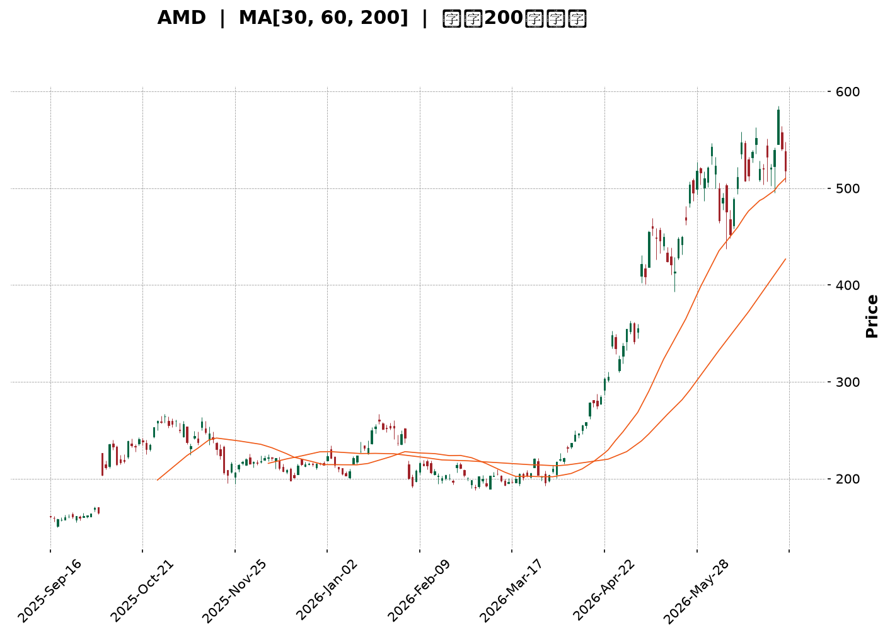
</details>

<html>
<head><meta charset="utf-8" /></head>
<body>
    <div style="height:500px; width:100%;">                        <script>window.PlotlyConfig = {MathJaxConfig: 'local'};</script>
        <script charset="utf-8" src="https://cdn.plot.ly/plotly-3.6.0.min.js" integrity="sha256-QaOVwtVY0T02VaHrr6pnoHLCwayMJp4O5n4YyaE3rJk=" crossorigin="anonymous"></script>                <div id="candlestick-chart" class="plotly-graph-div" style="height:100%; width:100%;"></div>            <script>                window.PLOTLYENV=window.PLOTLYENV || {};                                if (document.getElementById("candlestick-chart")) {                    Plotly.newPlot(                        "candlestick-chart",                        [{"close":{"dtype":"f8","bdata":"AAAAYLgOZEAAAADAHuVjQAAAAKBwvWNAAAAA4HqsY0AAAACgR\u002fljQAAAAMDMHGRAAAAAACkcZEAAAADgoyhkQAAAAGC47mNAAAAAIIUrZEAAAACgRzlkQAAAAOBRgGRAAAAAIFw3ZUAAAACgcJVkQAAAAGC4dmlAAAAA4FFwakAAAACA63FtQAAAAOB6HG1AAAAAwMzcakAAAACgcA1rQAAAAEDhQmtAAAAAQDPTbUAAAACA61FtQAAAAGCPIm1AAAAAgOsRbkAAAADA9cBtQAAAACBcx2xAAAAAIK5fbUAAAACgcJ1vQAAAAGC4OnBAAAAAACkgcEAAAACgR4VwQAAAAEDh2m9AAAAAgOsBcEAAAABgZjpwQAAAAKCZQW9AAAAAoEcFcEAAAABgZrZtQAAAAKBHMW1AAAAAIFx\u002fbkAAAADgo7BtQAAAAIA9LnBAAAAAYLj+bkAAAACA69luQAAAAOCjEG5AAAAAoEfJbEAAAACgmfFrQAAAAOCjwGlAAAAAwPV4aUAAAACgmeFqQAAAAAApxGlAAAAAIK7HakAAAADA9TBrQAAAAOBReGtAAAAAIK7nakAAAABAMzNrQAAAACBc\u002f2pAAAAAQAo\u002fa0AAAAAghaNrQAAAAADXs2tAAAAAoHCta0AAAACAwq1rQAAAAMD1WGpAAAAAYI\u002fyaUAAAACgcCVqQAAAACCFw2hAAAAAgOshaUAAAACAwq1qQAAAAGBm3mpAAAAAwMzcakAAAACgR+FqQAAAACCu32pAAAAAIIXzakAAAABA4epqQAAAAMAexWpAAAAAQArva0AAAABgj6JrQAAAAEAzy2pAAAAA4KNAakAAAACAwpVpQAAAAKBwZWlAAAAAgBT2aUAAAABACp9rQAAAAEAz82tAAAAAoHB9bEAAAABgj\u002fpsQAAAAKBw\u002fWxAAAAAoJk5b0AAAAAgXLdvQAAAAEDhOnBAAAAAgOtpb0AAAADA9YBvQAAAACCul29AAAAAgMKFb0AAAAAgXJdtQAAAAOCjyG5AAAAAIIVDbkAAAACAFAZpQAAAAAAAEGhAAAAAgBQOakAAAAAAAABrQAAAAIA9smpAAAAAYI+yakAAAACAFL5pQAAAAIA96mlAAAAAYI9iaUAAAAAA1wNpQAAAAADXa2lAAAAAwMwEaUAAAABAM5NoQAAAAEDhumpAAAAAIIVbakAAAACAwnVpQAAAAGC4BmlAAAAAANfTaEAAAABgZt5nQAAAAIA9QmlAAAAAYGbuaEAAAACAwg1oQAAAAIDCVWlAAAAAIFxnaUAAAABgj5ppQAAAACCut2hAAAAA4HosaEAAAABgj5JoQAAAAIDriWhAAAAAYLjuaEAAAADgo6hpQAAAAGCPKmlAAAAAgMJVaUAAAAAA16tpQAAAAOCjiGtAAAAA4KN4aUAAAAAgrj9pQAAAAKBHgWhAAAAAgMJtaUAAAABguEZqQAAAAAAAMGtAAAAAgMKFa0AAAADA9bBrQAAAAIA9+mxAAAAA4HqUbUAAAACgR6FuQAAAAGCP2m5AAAAAgD3ib0AAAACA6yFwQAAAAAApZHFAAAAAgD1mcUAAAABAMy9xQAAAAADXx3FAAAAAIFz3ckAAAACgRxVzQAAAAMD1vHVAAAAAgBTqdEAAAAAgXDN0QAAAAIDCEXVAAAAAANcndkAAAADgo4h2QAAAAOCjWHVAAAAAACk0dkAAAACAPVZ6QAAAACBch3lAAAAAQApzfEAAAADgo6x8QAAAAOCjBHxAAAAAAADYe0AAAABAMxt8QAAAAKCZgXpAAAAAANdPekAAAADAzOB5QAAAAKBH+XtAAAAAoHAZfEAAAAAAKTh9QAAAAIA9fn9AAAAA4KP4fkAAAABguDCAQAAAAMDMIIBAAAAAgBTif0AAAADgUUyAQAAAAAAp9IBAAAAAoJlZgEAAAACAFCZ9QAAAAKBHpX5AAAAAACm4fUAAAABgZkZ8QAAAAEAzh35AAAAAwB75f0AAAACAFBqBQAAAAOCjtH9AAAAAANcDgEAAAADA9cqAQAAAAEAKPYFAAAAAwMw+gEAAAACA6z2AQAAAAGCPpIBAAAAA4KNMgEAAAACA69uAQAAAAKBHJ4JAAAAAQArngEAAAABgjy6AQA=="},"high":{"dtype":"f8","bdata":"AAAAYGY+ZEAAAAAAKTRkQAAAAOCj2GNAAAAAQOH6Y0AAAACAwlVkQAAAAOB6bGRAAAAAQDOjZEAAAAAAKTRkQAAAACCFQ2RAAAAAoJmJZEAAAADA9UhkQAAAAIDChWRAAAAAgOthZUAAAACAwlVlQAAAAGC4VmxAAAAAwMxca0AAAAAA13ttQAAAAEAzA25AAAAAQApHbUAAAACAFAZsQAAAACBcH2xAAAAAIK7nbUAAAABgZiZuQAAAAAApbG1AAAAAAClcbkAAAADgUUhuQAAAAAApBG5AAAAAwMx8bUAAAADgeqxvQAAAAGC4RnBAAAAAoEeJcEAAAACgR7FwQAAAAIAUfnBAAAAAgBRicEAAAABgj05wQAAAAIAUFnBAAAAAYGY6cEAAAADgUbBvQAAAAADXe21AAAAAwMwcb0AAAABguA5vQAAAAAApeHBAAAAAgBQ6cEAAAACAFK5vQAAAAOCjGG9AAAAAAADAbUAAAADA9WhtQAAAAAAASG1AAAAAYI8aakAAAAAAKSRrQAAAAGCP0mlAAAAAQOHyakAAAACgmUlrQAAAACBcn2tAAAAAIFw\u002fbEAAAABgZkZrQAAAAADXY2tAAAAA4Hr0a0AAAABguPZrQAAAAEDhGmxAAAAAIIXTa0AAAAAAALBrQAAAACCuz2tAAAAAIIXrakAAAABACkdqQAAAAAAAcGpAAAAAIIXLaUAAAACAwuVqQAAAAKBwhWtAAAAAwPUga0AAAACgRxFrQAAAAGCPGmtAAAAAoJkBa0AAAACAPRprQAAAAOB6NGtAAAAAwMxkbEAAAADgo0BtQAAAAKBw3WtAAAAAACmEakAAAACAFF5qQAAAAKCZ6WlAAAAAACk8akAAAAAgheNrQAAAAEDhAmxAAAAAQDPLbUAAAAAgrk9tQAAAAAAA8G1AAAAAwMycb0AAAACgRwFwQAAAACBcr3BAAAAA4KMkcEAAAACgmfFvQAAAAGBmFnBAAAAA4HpIcEAAAAAgrqduQAAAAEAKP29AAAAAwMyUb0AAAABgj1JrQAAAAKBHgWlAAAAA4KMoakAAAABAMzNrQAAAAOB6bGtAAAAAwMx0a0AAAABguE5rQAAAAKCZQWpAAAAAoJmpaUAAAABgZmZpQAAAAEAzg2lAAAAAANebaUAAAAAAKexoQAAAAGC4FmtAAAAAYGYWa0AAAACgRzlqQAAAAOB6PGlAAAAAIK7XaEAAAADgejRoQAAAAIAUTmlAAAAAoEd5aUAAAAAgrgdpQAAAAEAKX2lAAAAAQOHSaUAAAABguCZqQAAAAADXc2lAAAAAgML1aEAAAACgcAVpQAAAAGC45mhAAAAAIIVbaUAAAAAAKbxpQAAAAKCZyWlAAAAAIIUjakAAAACAws1pQAAAAGCPqmtAAAAAAACga0AAAADgo2hpQAAAAIDCDWpAAAAAAACAaUAAAABgj7pqQAAAAMD1OGtAAAAAgOtJbEAAAABAM8NrQAAAAAAAQG1AAAAAQDOjbUAAAABgjzJvQAAAAGCP6m5AAAAAYLjub0AAAABA4SJwQAAAAKBwdXFAAAAAwMyQcUAAAACAwvlxQAAAAEAz43FAAAAAAAAEc0AAAAAghWNzQAAAAADXD3ZAAAAAIFzTdUAAAAAAAHh0QAAAAGC4QnVAAAAAIFwvdkAAAADgo6x2QAAAAKCZnXZAAAAAwB55dkAAAACgmel6QAAAACBcW3pAAAAA4KOEfEAAAAAghVN9QAAAAMDMrHxAAAAAAAC4fEAAAADA9VR8QAAAAAAAcHtAAAAAwMxse0AAAAAAAMx6QAAAAIA9FnxAAAAAQDMzfEAAAABgjxZ+QAAAACBcr39AAAAAIFzjf0AAAACgmXmAQAAAAAAAUIBAAAAAAAAsgEAAAACA61OAQAAAACCFE4FAAAAAIIWhgEAAAACA65l\u002fQAAAACCF735AAAAAAACQf0AAAABAM9d9QAAAACBcp35AAAAAIK5NgEAAAADA9XKBQAAAAKCZJ4FAAAAAAACkgEAAAAAghd2AQAAAAIDrl4FAAAAAgOuDgEAAAAAgrmeAQAAAAEAKN4FAAAAAQOFogEAAAAAghfGAQAAAAADXRYJAAAAAYLiggUAAAABAMx2BQA=="},"hovertemplate":"\u003cb\u003e%{x|%Y-%m-%d}\u003c\u002fb\u003e\u003cbr\u003e\u958b: $%{open:.2f}\u003cbr\u003e\u9ad8: $%{high:.2f}\u003cbr\u003e\u4f4e: $%{low:.2f}\u003cbr\u003e\u6536: $%{close:.2f}\u003cextra\u003e\u003c\u002fextra\u003e","low":{"dtype":"f8","bdata":"AAAAQArnY0AAAADgUXhjQAAAAEAzu2JAAAAAwMx8Y0AAAACgcK1jQAAAAGC45mNAAAAAgMLNY0AAAADA9VhjQAAAAKCZoWNAAAAAwMz8Y0AAAABgj+pjQAAAACCuD2RAAAAAANfDZEAAAADgemRkQAAAAOBRYGlAAAAAwPUoakAAAABgZlZqQAAAAMD1sGxAAAAAYGamakAAAADAzNxqQAAAAMDM\u002fGpAAAAA4FGYa0AAAAAgrgdtQAAAAMAefWxAAAAAwMxMbUAAAADgo0BtQAAAAAApHGxAAAAAoEeRbEAAAABgZj5uQAAAAKCZOW9AAAAAAAAQcEAAAABgZhZwQAAAAIDriW9AAAAAwB6tb0AAAADgerxvQAAAAOB67G5AAAAAgOtZbkAAAAAgrndtQAAAAOB6FGxAAAAAAAAQbkAAAADgelRtQAAAAAAAQG9AAAAAgOvBbkAAAABgj2JtQAAAAMDMpG1AAAAAYLgWbEAAAABguHZrQAAAAMD1kGlAAAAAAABgaEAAAABAM7tpQAAAAMD1SGhAAAAAAADgaUAAAADgo8BqQAAAAAAAsGpAAAAA4HrMakAAAADgo3hqQAAAAOB6xGpAAAAAIK4Ha0AAAAAghUtrQAAAAMAePWtAAAAAoHBVa0AAAACAFEZqQAAAAIDrIWpAAAAAYI\u002fSaUAAAAAghaNpQAAAAMD1sGhAAAAAAAAQaUAAAABgZoZpQAAAAIDrqWpAAAAAwPWIakAAAABACr9qQAAAAMD1oGpAAAAAIK4nakAAAABgj8pqQAAAAKCZuWpAAAAAwMxca0AAAAAgXI9rQAAAAAAAaGpAAAAAoHDlaUAAAABgj2ppQAAAAIA9YmlAAAAAoJn5aEAAAAAgXN9qQAAAACCF42pAAAAAQApnbEAAAAAghZtsQAAAAMAeLWxAAAAAwPV4bUAAAAAAKdRuQAAAAAAABHBAAAAAoJlJb0AAAABguP5uQAAAAGC4Rm9AAAAAwB4dbkAAAACgmVFtQAAAAAAAYG1AAAAAoEehbUAAAADAzORoQAAAAEAK12dAAAAAgMKNaEAAAADAzIRpQAAAAAAppGpAAAAAYLgmakAAAADgeqRpQAAAAAApfGlAAAAAYI9aaEAAAAAAAGBoQAAAAKBHyWhAAAAAgOvRaEAAAADAzERoQAAAAAAA0GlAAAAAYI9KakAAAABguC5pQAAAACCut2hAAAAAAADAZ0AAAABACodnQAAAACCFu2dAAAAAAClcaEAAAAAAAOhnQAAAAOCjoGdAAAAAYGZGaUAAAAAAKXRpQAAAAKBwlWhAAAAA4KMIaEAAAACgmVloQAAAAOBRaGhAAAAAAAB4aEAAAABgjxpoQAAAAOBRyGhAAAAAYLg2aUAAAAAAKQRpQAAAAOBRcGpAAAAAgMJtaUAAAACAFLZoQAAAAADXG2hAAAAAwB6NaEAAAABA4bppQAAAAADXE2lAAAAAIFw3a0AAAAAAKexqQAAAAEDhYmxAAAAAwB7dbEAAAABguN5tQAAAAMD1QG5AAAAAYGa2bkAAAABAM3tvQAAAAAApWHBAAAAAgD0icUAAAAAAAABxQAAAAIDrSXFAAAAAgD3icUAAAAAAKbxyQAAAAOCj6HRAAAAAwPWMdEAAAAAAAGBzQAAAAIDC7XNAAAAAoJnJdEAAAAAAANR1QAAAAEAzK3VAAAAAgBSOdUAAAADgoyB5QAAAAKBHEXlAAAAA4KMkekAAAACAFC58QAAAAIDCoXpAAAAAYGYKe0AAAABA4Tp7QAAAAIDCdXpAAAAAIFyreUAAAACAwpV4QAAAAMDMoHpAAAAAoJn5ekAAAAAgXNt8QAAAACCuA35AAAAAYI9qfkAAAADgUdh+QAAAAEDhdn9AAAAAwMxsfkAAAAAghVN\u002fQAAAAGBmYoBAAAAAgOs9f0AAAABAM\u002f98QAAAACBc231AAAAAIK5Te0AAAACgRwV8QAAAAOBRoHxAAAAAAADgfkAAAAAAAJSAQAAAAAAAtH9AAAAAwMy0f0AAAABgj3KAQAAAACCuvYBAAAAAwPWsf0AAAAAAAHh\u002fQAAAAAAAsH9AAAAAgMJpf0AAAACgmfV+QAAAAGCPDIFAAAAAgOvVgEAAAAAAAKB\u002fQA=="},"name":"\u50f9\u683c","open":{"dtype":"f8","bdata":"AAAAANcrZEAAAADA9ehjQAAAAGC43mJAAAAAACmsY0AAAACgcK1jQAAAAOCjEGRAAAAAIFxfZEAAAADgeqRjQAAAAOCjEGRAAAAAANcDZEAAAACgRxlkQAAAAIDCHWRAAAAAgMIVZUAAAACAwlVlQAAAAGBmTmxAAAAAQDPbakAAAABgZp5qQAAAAKCZiW1AAAAA4KMYbUAAAABgZoZrQAAAAGBmZmtAAAAAYLjWa0AAAACgR4ltQAAAAOBRKG1AAAAAQAqPbUAAAADgeuxtQAAAAEAzm21AAAAAwB7FbEAAAAAghWtuQAAAAIAUHnBAAAAAgD0ycEAAAABACoNwQAAAAGC4PnBAAAAAoJk5cEAAAACgRzVwQAAAAEAzS29AAAAAIK5nbkAAAABACq9vQAAAAIAU3mxAAAAA4HpEbkAAAADAHjVuQAAAAAAppG9AAAAAwMx8b0AAAAAghQNuQAAAAAAAWG5AAAAAwPWYbUAAAADgUchsQAAAAGBmFm1AAAAAgOsZakAAAADAHuVpQAAAACBcL2lAAAAAoJlBakAAAADgegRrQAAAAAApvGpAAAAAoEe5a0AAAADgUQhrQAAAAAApHGtAAAAAoHAla0AAAABA4WJrQAAAAKBHoWtAAAAAAADAa0AAAACA6zlrQAAAAADXS2tAAAAAwPWIakAAAACgcN1pQAAAAKBHQWpAAAAAgD16aUAAAABAM5NpQAAAAAAAgGtAAAAAIIWbakAAAAAgXN9qQAAAAIDC7WpAAAAAYI9yakAAAAAA1\u002ftqQAAAAIA9+mpAAAAAwMxca0AAAAAAAMhsQAAAAGC41mtAAAAAACmEakAAAADAzFxqQAAAAEAKt2lAAAAAgMIlaUAAAABAM+NqQAAAAKBHMWtAAAAAwMx8bEAAAACgmUltQAAAAGCPQmxAAAAAIK5\u002fbUAAAAAAAHhvQAAAAEDhUnBAAAAAAAAMcEAAAADAHoVvQAAAAAApxG9AAAAAwB7Vb0AAAACAwp1tQAAAAOCjeG1AAAAAoJlxb0AAAAAAAOBqQAAAACCFO2lAAAAAACmkaEAAAADAzNxpQAAAAOB65GpAAAAAACk8a0AAAABgj\u002fpqQAAAAOCjgGlAAAAAwMxEaUAAAADAHs1oQAAAACCFA2lAAAAAANcDaUAAAABA4cJoQAAAAAApdGpAAAAAgD3aakAAAACgmRlqQAAAACCFA2lAAAAAQDM7aEAAAABguO5nQAAAAADXA2hAAAAA4KO4aEAAAADgo2hoQAAAACCFq2dAAAAA4FFQaUAAAAAghaNpQAAAAGCPWmlAAAAAIIXDaEAAAAAgXF9oQAAAAIDClWhAAAAAAACAaEAAAADA9WBoQAAAAOB6nGlAAAAAwMzMaUAAAADgeixpQAAAAOBRcGpAAAAAIFw\u002fa0AAAADgozhpQAAAAGBmnmlAAAAAoJnBaEAAAABA4fJpQAAAAKCZgWlAAAAAwPVoa0AAAADgUUhrQAAAAADXA21AAAAA4FEgbUAAAAAAAOBtQAAAAMD1oG5AAAAAoEc5b0AAAABguN5vQAAAAADXj3BAAAAAAACQcUAAAACgmYlxQAAAAKBHVXFAAAAAIIUzckAAAAAAKeByQAAAAAApDHVAAAAAwB6ldUAAAACAwn1zQAAAAKBHaXRAAAAAgMJVdUAAAACA6\u002f11QAAAAMD1hHZAAAAAACn4dUAAAAAA15d5QAAAAMAeEXpAAAAAoHApekAAAADAzMh8QAAAAAAAFHxAAAAA4KOQfEAAAACgmYl7QAAAAKBwFXtAAAAAAADYekAAAACgmcl5QAAAAOCjwHpAAAAAANefe0AAAACgcF19QAAAAADXS35AAAAAAADAf0AAAAAAADB\u002fQAAAAGBmRoBAAAAAYI9Cf0AAAADAzKR\u002fQAAAAAAAroBAAAAAAAAWgEAAAADgejh\u002fQAAAAAAAUH5AAAAAAABsf0AAAAAghT99QAAAAKCZ2XxAAAAAQAo7f0AAAAAAAL6AQAAAAMAeF4FAAAAAoEeNgEAAAADgo5yAQAAAAAAADIFAAAAAoEfRf0AAAABgj0aAQAAAAKBw\u002f4BAAAAAYGY+gEAAAABguFaAQAAAAGCPDIFAAAAAgD1sgUAAAACgR9GAQA=="},"x":["2025-09-16T00:00:00-04:00","2025-09-17T00:00:00-04:00","2025-09-18T00:00:00-04:00","2025-09-19T00:00:00-04:00","2025-09-22T00:00:00-04:00","2025-09-23T00:00:00-04:00","2025-09-24T00:00:00-04:00","2025-09-25T00:00:00-04:00","2025-09-26T00:00:00-04:00","2025-09-29T00:00:00-04:00","2025-09-30T00:00:00-04:00","2025-10-01T00:00:00-04:00","2025-10-02T00:00:00-04:00","2025-10-03T00:00:00-04:00","2025-10-06T00:00:00-04:00","2025-10-07T00:00:00-04:00","2025-10-08T00:00:00-04:00","2025-10-09T00:00:00-04:00","2025-10-10T00:00:00-04:00","2025-10-13T00:00:00-04:00","2025-10-14T00:00:00-04:00","2025-10-15T00:00:00-04:00","2025-10-16T00:00:00-04:00","2025-10-17T00:00:00-04:00","2025-10-20T00:00:00-04:00","2025-10-21T00:00:00-04:00","2025-10-22T00:00:00-04:00","2025-10-23T00:00:00-04:00","2025-10-24T00:00:00-04:00","2025-10-27T00:00:00-04:00","2025-10-28T00:00:00-04:00","2025-10-29T00:00:00-04:00","2025-10-30T00:00:00-04:00","2025-10-31T00:00:00-04:00","2025-11-03T00:00:00-05:00","2025-11-04T00:00:00-05:00","2025-11-05T00:00:00-05:00","2025-11-06T00:00:00-05:00","2025-11-07T00:00:00-05:00","2025-11-10T00:00:00-05:00","2025-11-11T00:00:00-05:00","2025-11-12T00:00:00-05:00","2025-11-13T00:00:00-05:00","2025-11-14T00:00:00-05:00","2025-11-17T00:00:00-05:00","2025-11-18T00:00:00-05:00","2025-11-19T00:00:00-05:00","2025-11-20T00:00:00-05:00","2025-11-21T00:00:00-05:00","2025-11-24T00:00:00-05:00","2025-11-25T00:00:00-05:00","2025-11-26T00:00:00-05:00","2025-11-28T00:00:00-05:00","2025-12-01T00:00:00-05:00","2025-12-02T00:00:00-05:00","2025-12-03T00:00:00-05:00","2025-12-04T00:00:00-05:00","2025-12-05T00:00:00-05:00","2025-12-08T00:00:00-05:00","2025-12-09T00:00:00-05:00","2025-12-10T00:00:00-05:00","2025-12-11T00:00:00-05:00","2025-12-12T00:00:00-05:00","2025-12-15T00:00:00-05:00","2025-12-16T00:00:00-05:00","2025-12-17T00:00:00-05:00","2025-12-18T00:00:00-05:00","2025-12-19T00:00:00-05:00","2025-12-22T00:00:00-05:00","2025-12-23T00:00:00-05:00","2025-12-24T00:00:00-05:00","2025-12-26T00:00:00-05:00","2025-12-29T00:00:00-05:00","2025-12-30T00:00:00-05:00","2025-12-31T00:00:00-05:00","2026-01-02T00:00:00-05:00","2026-01-05T00:00:00-05:00","2026-01-06T00:00:00-05:00","2026-01-07T00:00:00-05:00","2026-01-08T00:00:00-05:00","2026-01-09T00:00:00-05:00","2026-01-12T00:00:00-05:00","2026-01-13T00:00:00-05:00","2026-01-14T00:00:00-05:00","2026-01-15T00:00:00-05:00","2026-01-16T00:00:00-05:00","2026-01-20T00:00:00-05:00","2026-01-21T00:00:00-05:00","2026-01-22T00:00:00-05:00","2026-01-23T00:00:00-05:00","2026-01-26T00:00:00-05:00","2026-01-27T00:00:00-05:00","2026-01-28T00:00:00-05:00","2026-01-29T00:00:00-05:00","2026-01-30T00:00:00-05:00","2026-02-02T00:00:00-05:00","2026-02-03T00:00:00-05:00","2026-02-04T00:00:00-05:00","2026-02-05T00:00:00-05:00","2026-02-06T00:00:00-05:00","2026-02-09T00:00:00-05:00","2026-02-10T00:00:00-05:00","2026-02-11T00:00:00-05:00","2026-02-12T00:00:00-05:00","2026-02-13T00:00:00-05:00","2026-02-17T00:00:00-05:00","2026-02-18T00:00:00-05:00","2026-02-19T00:00:00-05:00","2026-02-20T00:00:00-05:00","2026-02-23T00:00:00-05:00","2026-02-24T00:00:00-05:00","2026-02-25T00:00:00-05:00","2026-02-26T00:00:00-05:00","2026-02-27T00:00:00-05:00","2026-03-02T00:00:00-05:00","2026-03-03T00:00:00-05:00","2026-03-04T00:00:00-05:00","2026-03-05T00:00:00-05:00","2026-03-06T00:00:00-05:00","2026-03-09T00:00:00-04:00","2026-03-10T00:00:00-04:00","2026-03-11T00:00:00-04:00","2026-03-12T00:00:00-04:00","2026-03-13T00:00:00-04:00","2026-03-16T00:00:00-04:00","2026-03-17T00:00:00-04:00","2026-03-18T00:00:00-04:00","2026-03-19T00:00:00-04:00","2026-03-20T00:00:00-04:00","2026-03-23T00:00:00-04:00","2026-03-24T00:00:00-04:00","2026-03-25T00:00:00-04:00","2026-03-26T00:00:00-04:00","2026-03-27T00:00:00-04:00","2026-03-30T00:00:00-04:00","2026-03-31T00:00:00-04:00","2026-04-01T00:00:00-04:00","2026-04-02T00:00:00-04:00","2026-04-06T00:00:00-04:00","2026-04-07T00:00:00-04:00","2026-04-08T00:00:00-04:00","2026-04-09T00:00:00-04:00","2026-04-10T00:00:00-04:00","2026-04-13T00:00:00-04:00","2026-04-14T00:00:00-04:00","2026-04-15T00:00:00-04:00","2026-04-16T00:00:00-04:00","2026-04-17T00:00:00-04:00","2026-04-20T00:00:00-04:00","2026-04-21T00:00:00-04:00","2026-04-22T00:00:00-04:00","2026-04-23T00:00:00-04:00","2026-04-24T00:00:00-04:00","2026-04-27T00:00:00-04:00","2026-04-28T00:00:00-04:00","2026-04-29T00:00:00-04:00","2026-04-30T00:00:00-04:00","2026-05-01T00:00:00-04:00","2026-05-04T00:00:00-04:00","2026-05-05T00:00:00-04:00","2026-05-06T00:00:00-04:00","2026-05-07T00:00:00-04:00","2026-05-08T00:00:00-04:00","2026-05-11T00:00:00-04:00","2026-05-12T00:00:00-04:00","2026-05-13T00:00:00-04:00","2026-05-14T00:00:00-04:00","2026-05-15T00:00:00-04:00","2026-05-18T00:00:00-04:00","2026-05-19T00:00:00-04:00","2026-05-20T00:00:00-04:00","2026-05-21T00:00:00-04:00","2026-05-22T00:00:00-04:00","2026-05-26T00:00:00-04:00","2026-05-27T00:00:00-04:00","2026-05-28T00:00:00-04:00","2026-05-29T00:00:00-04:00","2026-06-01T00:00:00-04:00","2026-06-02T00:00:00-04:00","2026-06-03T00:00:00-04:00","2026-06-04T00:00:00-04:00","2026-06-05T00:00:00-04:00","2026-06-08T00:00:00-04:00","2026-06-09T00:00:00-04:00","2026-06-10T00:00:00-04:00","2026-06-11T00:00:00-04:00","2026-06-12T00:00:00-04:00","2026-06-15T00:00:00-04:00","2026-06-16T00:00:00-04:00","2026-06-17T00:00:00-04:00","2026-06-18T00:00:00-04:00","2026-06-22T00:00:00-04:00","2026-06-23T00:00:00-04:00","2026-06-24T00:00:00-04:00","2026-06-25T00:00:00-04:00","2026-06-26T00:00:00-04:00","2026-06-29T00:00:00-04:00","2026-06-30T00:00:00-04:00","2026-07-01T00:00:00-04:00","2026-07-02T00:00:00-04:00"],"type":"candlestick"},{"hovertemplate":"MA30: $%{y:.2f}\u003cextra\u003e\u003c\u002fextra\u003e","line":{"color":"#2196F3","dash":"dash","width":2},"mode":"lines","name":"MA30","x":["2025-09-16T00:00:00-04:00","2025-09-17T00:00:00-04:00","2025-09-18T00:00:00-04:00","2025-09-19T00:00:00-04:00","2025-09-22T00:00:00-04:00","2025-09-23T00:00:00-04:00","2025-09-24T00:00:00-04:00","2025-09-25T00:00:00-04:00","2025-09-26T00:00:00-04:00","2025-09-29T00:00:00-04:00","2025-09-30T00:00:00-04:00","2025-10-01T00:00:00-04:00","2025-10-02T00:00:00-04:00","2025-10-03T00:00:00-04:00","2025-10-06T00:00:00-04:00","2025-10-07T00:00:00-04:00","2025-10-08T00:00:00-04:00","2025-10-09T00:00:00-04:00","2025-10-10T00:00:00-04:00","2025-10-13T00:00:00-04:00","2025-10-14T00:00:00-04:00","2025-10-15T00:00:00-04:00","2025-10-16T00:00:00-04:00","2025-10-17T00:00:00-04:00","2025-10-20T00:00:00-04:00","2025-10-21T00:00:00-04:00","2025-10-22T00:00:00-04:00","2025-10-23T00:00:00-04:00","2025-10-24T00:00:00-04:00","2025-10-27T00:00:00-04:00","2025-10-28T00:00:00-04:00","2025-10-29T00:00:00-04:00","2025-10-30T00:00:00-04:00","2025-10-31T00:00:00-04:00","2025-11-03T00:00:00-05:00","2025-11-04T00:00:00-05:00","2025-11-05T00:00:00-05:00","2025-11-06T00:00:00-05:00","2025-11-07T00:00:00-05:00","2025-11-10T00:00:00-05:00","2025-11-11T00:00:00-05:00","2025-11-12T00:00:00-05:00","2025-11-13T00:00:00-05:00","2025-11-14T00:00:00-05:00","2025-11-17T00:00:00-05:00","2025-11-18T00:00:00-05:00","2025-11-19T00:00:00-05:00","2025-11-20T00:00:00-05:00","2025-11-21T00:00:00-05:00","2025-11-24T00:00:00-05:00","2025-11-25T00:00:00-05:00","2025-11-26T00:00:00-05:00","2025-11-28T00:00:00-05:00","2025-12-01T00:00:00-05:00","2025-12-02T00:00:00-05:00","2025-12-03T00:00:00-05:00","2025-12-04T00:00:00-05:00","2025-12-05T00:00:00-05:00","2025-12-08T00:00:00-05:00","2025-12-09T00:00:00-05:00","2025-12-10T00:00:00-05:00","2025-12-11T00:00:00-05:00","2025-12-12T00:00:00-05:00","2025-12-15T00:00:00-05:00","2025-12-16T00:00:00-05:00","2025-12-17T00:00:00-05:00","2025-12-18T00:00:00-05:00","2025-12-19T00:00:00-05:00","2025-12-22T00:00:00-05:00","2025-12-23T00:00:00-05:00","2025-12-24T00:00:00-05:00","2025-12-26T00:00:00-05:00","2025-12-29T00:00:00-05:00","2025-12-30T00:00:00-05:00","2025-12-31T00:00:00-05:00","2026-01-02T00:00:00-05:00","2026-01-05T00:00:00-05:00","2026-01-06T00:00:00-05:00","2026-01-07T00:00:00-05:00","2026-01-08T00:00:00-05:00","2026-01-09T00:00:00-05:00","2026-01-12T00:00:00-05:00","2026-01-13T00:00:00-05:00","2026-01-14T00:00:00-05:00","2026-01-15T00:00:00-05:00","2026-01-16T00:00:00-05:00","2026-01-20T00:00:00-05:00","2026-01-21T00:00:00-05:00","2026-01-22T00:00:00-05:00","2026-01-23T00:00:00-05:00","2026-01-26T00:00:00-05:00","2026-01-27T00:00:00-05:00","2026-01-28T00:00:00-05:00","2026-01-29T00:00:00-05:00","2026-01-30T00:00:00-05:00","2026-02-02T00:00:00-05:00","2026-02-03T00:00:00-05:00","2026-02-04T00:00:00-05:00","2026-02-05T00:00:00-05:00","2026-02-06T00:00:00-05:00","2026-02-09T00:00:00-05:00","2026-02-10T00:00:00-05:00","2026-02-11T00:00:00-05:00","2026-02-12T00:00:00-05:00","2026-02-13T00:00:00-05:00","2026-02-17T00:00:00-05:00","2026-02-18T00:00:00-05:00","2026-02-19T00:00:00-05:00","2026-02-20T00:00:00-05:00","2026-02-23T00:00:00-05:00","2026-02-24T00:00:00-05:00","2026-02-25T00:00:00-05:00","2026-02-26T00:00:00-05:00","2026-02-27T00:00:00-05:00","2026-03-02T00:00:00-05:00","2026-03-03T00:00:00-05:00","2026-03-04T00:00:00-05:00","2026-03-05T00:00:00-05:00","2026-03-06T00:00:00-05:00","2026-03-09T00:00:00-04:00","2026-03-10T00:00:00-04:00","2026-03-11T00:00:00-04:00","2026-03-12T00:00:00-04:00","2026-03-13T00:00:00-04:00","2026-03-16T00:00:00-04:00","2026-03-17T00:00:00-04:00","2026-03-18T00:00:00-04:00","2026-03-19T00:00:00-04:00","2026-03-20T00:00:00-04:00","2026-03-23T00:00:00-04:00","2026-03-24T00:00:00-04:00","2026-03-25T00:00:00-04:00","2026-03-26T00:00:00-04:00","2026-03-27T00:00:00-04:00","2026-03-30T00:00:00-04:00","2026-03-31T00:00:00-04:00","2026-04-01T00:00:00-04:00","2026-04-02T00:00:00-04:00","2026-04-06T00:00:00-04:00","2026-04-07T00:00:00-04:00","2026-04-08T00:00:00-04:00","2026-04-09T00:00:00-04:00","2026-04-10T00:00:00-04:00","2026-04-13T00:00:00-04:00","2026-04-14T00:00:00-04:00","2026-04-15T00:00:00-04:00","2026-04-16T00:00:00-04:00","2026-04-17T00:00:00-04:00","2026-04-20T00:00:00-04:00","2026-04-21T00:00:00-04:00","2026-04-22T00:00:00-04:00","2026-04-23T00:00:00-04:00","2026-04-24T00:00:00-04:00","2026-04-27T00:00:00-04:00","2026-04-28T00:00:00-04:00","2026-04-29T00:00:00-04:00","2026-04-30T00:00:00-04:00","2026-05-01T00:00:00-04:00","2026-05-04T00:00:00-04:00","2026-05-05T00:00:00-04:00","2026-05-06T00:00:00-04:00","2026-05-07T00:00:00-04:00","2026-05-08T00:00:00-04:00","2026-05-11T00:00:00-04:00","2026-05-12T00:00:00-04:00","2026-05-13T00:00:00-04:00","2026-05-14T00:00:00-04:00","2026-05-15T00:00:00-04:00","2026-05-18T00:00:00-04:00","2026-05-19T00:00:00-04:00","2026-05-20T00:00:00-04:00","2026-05-21T00:00:00-04:00","2026-05-22T00:00:00-04:00","2026-05-26T00:00:00-04:00","2026-05-27T00:00:00-04:00","2026-05-28T00:00:00-04:00","2026-05-29T00:00:00-04:00","2026-06-01T00:00:00-04:00","2026-06-02T00:00:00-04:00","2026-06-03T00:00:00-04:00","2026-06-04T00:00:00-04:00","2026-06-05T00:00:00-04:00","2026-06-08T00:00:00-04:00","2026-06-09T00:00:00-04:00","2026-06-10T00:00:00-04:00","2026-06-11T00:00:00-04:00","2026-06-12T00:00:00-04:00","2026-06-15T00:00:00-04:00","2026-06-16T00:00:00-04:00","2026-06-17T00:00:00-04:00","2026-06-18T00:00:00-04:00","2026-06-22T00:00:00-04:00","2026-06-23T00:00:00-04:00","2026-06-24T00:00:00-04:00","2026-06-25T00:00:00-04:00","2026-06-26T00:00:00-04:00","2026-06-29T00:00:00-04:00","2026-06-30T00:00:00-04:00","2026-07-01T00:00:00-04:00","2026-07-02T00:00:00-04:00"],"y":{"dtype":"f8","bdata":"AAAAAAAA+H8AAAAAAAD4fwAAAAAAAPh\u002fAAAAAAAA+H8AAAAAAAD4fwAAAAAAAPh\u002fAAAAAAAA+H8AAAAAAAD4fwAAAAAAAPh\u002fAAAAAAAA+H8AAAAAAAD4fwAAAAAAAPh\u002fAAAAAAAA+H8AAAAAAAD4fwAAAAAAAPh\u002fAAAAAAAA+H8AAAAAAAD4fwAAAAAAAPh\u002fAAAAAAAA+H8AAAAAAAD4fwAAAAAAAPh\u002fAAAAAAAA+H8AAAAAAAD4fwAAAAAAAPh\u002fAAAAAAAA+H8AAAAAAAD4fwAAAAAAAPh\u002fAAAAAAAA+H8AAAAAAAD4fyIiIjJ6z2hAmpmZ2Yc3aUBEREREtqdpQDMzM+MXD2pAIiIiwmd4akAiIiIy7OJqQHd3dxcEQmtAzczMTNSna0CJiIjIWvlrQO\u002fu7o5fSGxAMzMzU4CgbECrqqqqR\u002fFsQM3MzDx8Vm1A7+7uPu6pbUARERHxiwFuQGZmZobPKG5Ad3d3t9c8bkAAAAAwCDBuQDMzM+NeE25AMzMzY4IHbkCamZlJDAZuQJqZmWlK+W1AIiIigk7fbUDv7u4uJM1tQO\u002fu7u7uvm1AMzMz4+yjbUAzMzMjIo5tQAAAAPDufm1Ad3d3V8dsbUB3d3cX2UptQGZmZuZCIm1AMzMzYzv7bEBERETUeM1sQDMzM4N5nmxAvLu727JqbEBERER02jRsQO\u002fu7l5z\u002fWtAq6qq+n7Ca0BmZmamm6hrQHd3d1fHlGtAAAAAkMJ1a0BVVVUFyF1rQERERGT0LmtA7+7urnIMa0BmZmZG4epqQM3MzDzDzmpAzczM7HzHakAzMzNz2sRqQImIiBi9zWpAiYiICGXUakBERERUVclqQM3MzAwtxmpAZmZmdjC\u002fakAAAADQ28JqQERERGT0xmpAAAAA4HrUakDNzMycqONqQLy7u0up9GpAIiIiAp0Wa0ARERFxaDlrQLy7u1sBYmtAIiIiUuOBa0CamZkph6JrQKuqqgpJz2tAAAAA0Nv+a0B3d3eHQRxsQLy7u2ugT2xA7+7uzml7bECJiIhoSm1sQAAAABBYVWxA3t3dDXRObEAzMzMzek9sQCIiInL2TWxA7+7uHsxLbEC8u7tLxUFsQFVVVYV5OmxAERERsbkkbEBmZmY2Xg5sQAAAAPCnAmxARERExCD4a0BERERkgu9rQDMzMwPk+mtAIiIiokX+a0Dv7u5O1OtrQHd3d0fh0mtAzczMbKCza0BVVVV1BYhrQLy7u2suaGtAMzMzg3kya0BmZmaGFvFqQJqZmblJtGpA3t3drQCBakDv7u7up05qQERERET9E2pA3t3drUfVaUDe3d0NdKppQERERKQpdWlAmpmZWatHaUB3d3eHFk1pQFVVVbWBVmlAd3d311xQaUBEREQkBkVpQAAAALArTGlAd3d357RBaUCrqqpKfj1pQImIiBh2MWlAq6qqqtUxaUCamZnpmDxpQImIiFirS2lA7+7u3ghhaUC8u7troHtpQJqZmSnOjmlAIiIi0k2qaUC8u7vba9ZpQJqZmTkmCGpAd3d311xEakCrqqq6AoxqQN7d3a1H3WpAERERkXsxa0CJiIgIgYlrQN7d3Z3E4GtAZmZmFq5LbECJiIhI4bZsQFVVVWX0Vm1AVVVVVZztbUAzMzPDrnRuQLy7u4veCm9AERERETywb0CJiIiQ7SpwQHd3d+e0dXBAmpmZKRXHcECJiIgYSzpxQFVVVU2pnnFAMzMzg8AkckDe3d1Ftq1yQO\u002fu7s4+NHNA7+7ublm1c0BVVVXNEzV0QO\u002fu7pZDo3RAERER2VwOdUBmZmY+CnV1QERERKwc6HVAIiIicq9ZdkDNzMwEVtB2QHd3d0dvWXdAMzMzc6\u002fZd0BmZmYGVmR4QLy7uxsv43hAd3d3V8deeUB3d3cXS+J5QKuqqsroa3pAERERoRrhekAzMzNT\u002fzZ7QN7d3Q0Cg3tA7+7u3iTOe0DNzMycCxN8QCIiIpLCY3xAq6qqOom3fEC8u7u7Hht9QCIiIiKFc31AZmZm5l7HfUCJiIgIOgV+QDMzM4OVUX5AERERwRF0fkBVVVV1k5R+QM3MzHyGwX5AIiIi8hnqfkBVVVVF\u002fRl\u002fQO\u002fu7g6fbX9Aq6qqCpCtf0C8u7sb6OR\u002fQA=="},"type":"scatter"},{"hovertemplate":"MA60: $%{y:.2f}\u003cextra\u003e\u003c\u002fextra\u003e","line":{"color":"#9C27B0","dash":"dash","width":2},"mode":"lines","name":"MA60","x":["2025-09-16T00:00:00-04:00","2025-09-17T00:00:00-04:00","2025-09-18T00:00:00-04:00","2025-09-19T00:00:00-04:00","2025-09-22T00:00:00-04:00","2025-09-23T00:00:00-04:00","2025-09-24T00:00:00-04:00","2025-09-25T00:00:00-04:00","2025-09-26T00:00:00-04:00","2025-09-29T00:00:00-04:00","2025-09-30T00:00:00-04:00","2025-10-01T00:00:00-04:00","2025-10-02T00:00:00-04:00","2025-10-03T00:00:00-04:00","2025-10-06T00:00:00-04:00","2025-10-07T00:00:00-04:00","2025-10-08T00:00:00-04:00","2025-10-09T00:00:00-04:00","2025-10-10T00:00:00-04:00","2025-10-13T00:00:00-04:00","2025-10-14T00:00:00-04:00","2025-10-15T00:00:00-04:00","2025-10-16T00:00:00-04:00","2025-10-17T00:00:00-04:00","2025-10-20T00:00:00-04:00","2025-10-21T00:00:00-04:00","2025-10-22T00:00:00-04:00","2025-10-23T00:00:00-04:00","2025-10-24T00:00:00-04:00","2025-10-27T00:00:00-04:00","2025-10-28T00:00:00-04:00","2025-10-29T00:00:00-04:00","2025-10-30T00:00:00-04:00","2025-10-31T00:00:00-04:00","2025-11-03T00:00:00-05:00","2025-11-04T00:00:00-05:00","2025-11-05T00:00:00-05:00","2025-11-06T00:00:00-05:00","2025-11-07T00:00:00-05:00","2025-11-10T00:00:00-05:00","2025-11-11T00:00:00-05:00","2025-11-12T00:00:00-05:00","2025-11-13T00:00:00-05:00","2025-11-14T00:00:00-05:00","2025-11-17T00:00:00-05:00","2025-11-18T00:00:00-05:00","2025-11-19T00:00:00-05:00","2025-11-20T00:00:00-05:00","2025-11-21T00:00:00-05:00","2025-11-24T00:00:00-05:00","2025-11-25T00:00:00-05:00","2025-11-26T00:00:00-05:00","2025-11-28T00:00:00-05:00","2025-12-01T00:00:00-05:00","2025-12-02T00:00:00-05:00","2025-12-03T00:00:00-05:00","2025-12-04T00:00:00-05:00","2025-12-05T00:00:00-05:00","2025-12-08T00:00:00-05:00","2025-12-09T00:00:00-05:00","2025-12-10T00:00:00-05:00","2025-12-11T00:00:00-05:00","2025-12-12T00:00:00-05:00","2025-12-15T00:00:00-05:00","2025-12-16T00:00:00-05:00","2025-12-17T00:00:00-05:00","2025-12-18T00:00:00-05:00","2025-12-19T00:00:00-05:00","2025-12-22T00:00:00-05:00","2025-12-23T00:00:00-05:00","2025-12-24T00:00:00-05:00","2025-12-26T00:00:00-05:00","2025-12-29T00:00:00-05:00","2025-12-30T00:00:00-05:00","2025-12-31T00:00:00-05:00","2026-01-02T00:00:00-05:00","2026-01-05T00:00:00-05:00","2026-01-06T00:00:00-05:00","2026-01-07T00:00:00-05:00","2026-01-08T00:00:00-05:00","2026-01-09T00:00:00-05:00","2026-01-12T00:00:00-05:00","2026-01-13T00:00:00-05:00","2026-01-14T00:00:00-05:00","2026-01-15T00:00:00-05:00","2026-01-16T00:00:00-05:00","2026-01-20T00:00:00-05:00","2026-01-21T00:00:00-05:00","2026-01-22T00:00:00-05:00","2026-01-23T00:00:00-05:00","2026-01-26T00:00:00-05:00","2026-01-27T00:00:00-05:00","2026-01-28T00:00:00-05:00","2026-01-29T00:00:00-05:00","2026-01-30T00:00:00-05:00","2026-02-02T00:00:00-05:00","2026-02-03T00:00:00-05:00","2026-02-04T00:00:00-05:00","2026-02-05T00:00:00-05:00","2026-02-06T00:00:00-05:00","2026-02-09T00:00:00-05:00","2026-02-10T00:00:00-05:00","2026-02-11T00:00:00-05:00","2026-02-12T00:00:00-05:00","2026-02-13T00:00:00-05:00","2026-02-17T00:00:00-05:00","2026-02-18T00:00:00-05:00","2026-02-19T00:00:00-05:00","2026-02-20T00:00:00-05:00","2026-02-23T00:00:00-05:00","2026-02-24T00:00:00-05:00","2026-02-25T00:00:00-05:00","2026-02-26T00:00:00-05:00","2026-02-27T00:00:00-05:00","2026-03-02T00:00:00-05:00","2026-03-03T00:00:00-05:00","2026-03-04T00:00:00-05:00","2026-03-05T00:00:00-05:00","2026-03-06T00:00:00-05:00","2026-03-09T00:00:00-04:00","2026-03-10T00:00:00-04:00","2026-03-11T00:00:00-04:00","2026-03-12T00:00:00-04:00","2026-03-13T00:00:00-04:00","2026-03-16T00:00:00-04:00","2026-03-17T00:00:00-04:00","2026-03-18T00:00:00-04:00","2026-03-19T00:00:00-04:00","2026-03-20T00:00:00-04:00","2026-03-23T00:00:00-04:00","2026-03-24T00:00:00-04:00","2026-03-25T00:00:00-04:00","2026-03-26T00:00:00-04:00","2026-03-27T00:00:00-04:00","2026-03-30T00:00:00-04:00","2026-03-31T00:00:00-04:00","2026-04-01T00:00:00-04:00","2026-04-02T00:00:00-04:00","2026-04-06T00:00:00-04:00","2026-04-07T00:00:00-04:00","2026-04-08T00:00:00-04:00","2026-04-09T00:00:00-04:00","2026-04-10T00:00:00-04:00","2026-04-13T00:00:00-04:00","2026-04-14T00:00:00-04:00","2026-04-15T00:00:00-04:00","2026-04-16T00:00:00-04:00","2026-04-17T00:00:00-04:00","2026-04-20T00:00:00-04:00","2026-04-21T00:00:00-04:00","2026-04-22T00:00:00-04:00","2026-04-23T00:00:00-04:00","2026-04-24T00:00:00-04:00","2026-04-27T00:00:00-04:00","2026-04-28T00:00:00-04:00","2026-04-29T00:00:00-04:00","2026-04-30T00:00:00-04:00","2026-05-01T00:00:00-04:00","2026-05-04T00:00:00-04:00","2026-05-05T00:00:00-04:00","2026-05-06T00:00:00-04:00","2026-05-07T00:00:00-04:00","2026-05-08T00:00:00-04:00","2026-05-11T00:00:00-04:00","2026-05-12T00:00:00-04:00","2026-05-13T00:00:00-04:00","2026-05-14T00:00:00-04:00","2026-05-15T00:00:00-04:00","2026-05-18T00:00:00-04:00","2026-05-19T00:00:00-04:00","2026-05-20T00:00:00-04:00","2026-05-21T00:00:00-04:00","2026-05-22T00:00:00-04:00","2026-05-26T00:00:00-04:00","2026-05-27T00:00:00-04:00","2026-05-28T00:00:00-04:00","2026-05-29T00:00:00-04:00","2026-06-01T00:00:00-04:00","2026-06-02T00:00:00-04:00","2026-06-03T00:00:00-04:00","2026-06-04T00:00:00-04:00","2026-06-05T00:00:00-04:00","2026-06-08T00:00:00-04:00","2026-06-09T00:00:00-04:00","2026-06-10T00:00:00-04:00","2026-06-11T00:00:00-04:00","2026-06-12T00:00:00-04:00","2026-06-15T00:00:00-04:00","2026-06-16T00:00:00-04:00","2026-06-17T00:00:00-04:00","2026-06-18T00:00:00-04:00","2026-06-22T00:00:00-04:00","2026-06-23T00:00:00-04:00","2026-06-24T00:00:00-04:00","2026-06-25T00:00:00-04:00","2026-06-26T00:00:00-04:00","2026-06-29T00:00:00-04:00","2026-06-30T00:00:00-04:00","2026-07-01T00:00:00-04:00","2026-07-02T00:00:00-04:00"],"y":{"dtype":"f8","bdata":"AAAAAAAA+H8AAAAAAAD4fwAAAAAAAPh\u002fAAAAAAAA+H8AAAAAAAD4fwAAAAAAAPh\u002fAAAAAAAA+H8AAAAAAAD4fwAAAAAAAPh\u002fAAAAAAAA+H8AAAAAAAD4fwAAAAAAAPh\u002fAAAAAAAA+H8AAAAAAAD4fwAAAAAAAPh\u002fAAAAAAAA+H8AAAAAAAD4fwAAAAAAAPh\u002fAAAAAAAA+H8AAAAAAAD4fwAAAAAAAPh\u002fAAAAAAAA+H8AAAAAAAD4fwAAAAAAAPh\u002fAAAAAAAA+H8AAAAAAAD4fwAAAAAAAPh\u002fAAAAAAAA+H8AAAAAAAD4fwAAAAAAAPh\u002fAAAAAAAA+H8AAAAAAAD4fwAAAAAAAPh\u002fAAAAAAAA+H8AAAAAAAD4fwAAAAAAAPh\u002fAAAAAAAA+H8AAAAAAAD4fwAAAAAAAPh\u002fAAAAAAAA+H8AAAAAAAD4fwAAAAAAAPh\u002fAAAAAAAA+H8AAAAAAAD4fwAAAAAAAPh\u002fAAAAAAAA+H8AAAAAAAD4fwAAAAAAAPh\u002fAAAAAAAA+H8AAAAAAAD4fwAAAAAAAPh\u002fAAAAAAAA+H8AAAAAAAD4fwAAAAAAAPh\u002fAAAAAAAA+H8AAAAAAAD4fwAAAAAAAPh\u002fAAAAAAAA+H8AAAAAAAD4f0RERIze+GpAZmZmnmEZa0BERESMlzprQDMzM7PIVmtA7+7uTo1xa0AzMzNT44trQDMzM7u7n2tAvLu7oym1a0B3d3c3+9BrQDMzM3OT7mtAmpmZcSELbEAAAADYhydsQImIiFC4QmxA7+7udjBbbEC8u7ubNnZsQJqZmWHJe2xAIiIiUiqCbECamZlRcXpsQN7d3f2NcGxA3t3dtfNtbEDv7u7OsGdsQDMzM7u7X2xAREREfD9PbEB3d3f\u002f\u002f0dsQJqZmanxQmxAmpmZ4TM8bEAAAABg5ThsQN7d3R3MOWxAzczMLLJBbEBERETEIEJsQBERESEiQmxAq6qqWo8+bEDv7u7+\u002fzdsQO\u002fu7kbhNmxA3t3dVcc0bEDe3d39jShsQFVVVeWJJmxAzczMZPQebEB3d3cH8wpsQLy7u7MP9WtA7+7uThvia0BEREQcodZrQDMzM2t1vmtA7+7uZh+sa0ARERFJU5ZrQBEREWGehGtA7+7uTht2a0DNzMxUnGlrQERERIQyaGtAZmZm5kJma0BERETca1xrQAAAAIiIYGtAREREDLtea0B3d3cPWFdrQN7d3dXqTGtAZmZmpg1Ea0AREREJ1zVrQLy7u9trLmtAq6qqQoska0C8u7t7PxVrQKuqqoolC2tAAAAAAHIBa0BERESMl\u002fhqQHd3dyej8WpA7+7uvhHqakCrqqrKWuNqQAAAAAhl4mpARERElIrhakAAAAB4MN1qQKuqquLs1WpAq6qqcmjPakC8u7srQMpqQBERERERzWpAMzMzg8DGakAzMzPLob9qQO\u002fu7s73tWpA3t3drUerakAAAACQe6VqQERERKQpp2pAmpmZ0ZSsakAAAABokbVqQGZmZhbZxGpAIiIiuknUakBVVVUVIOFqQImIiMCD7WpAIiIiov77akAAAAAYBAprQM3MzAy7ImtAIiIiivoxa0B3d3fHSz1rQLy7uyuHSmtAIiIiYldma0C8u7ubxIJrQM3MzNR4tWtAmpmZAXLha0CJiIhokQ9sQAAAABgEQGxAVVVVtfN7bEBERETUeNFsQCIiIsL1IG1AVVVVlUNvbUCrqqoqztxtQFVVVSW\u002fRG5A7+7u9prFbkAzMzNrdUxvQDMzM9v5zG9AIiIiIiIncEAREREhsGlwQJqZmaGMpHBAREREpHDfcEAiIiI6bRlxQImIiODBV3FAmpmZLWuXcUBVVVX5xd1xQCIiIjLBLnJAd3d37+59ckDe3d2xK9VyQFVVVXnpKHNAAAAAkMJ7c0De3d3NhdNzQM3MzIwlLnRAIiIi1niDdEC8u7v7N8l0QERERCA+F3VAzczMhHlidUAzMzN\u002fsaZ1QAAAAOyY9HVAmpmZodNHdkAiIiImBqN2QM3MzASd9HZAAAAACDpHd0CJiIiQwp93QERERGgf+HdAIiIiImlMeECamZndJKF4QN7d3aXi+nhAiYiIsLlPeUBVVVWJiKd5QO\u002fu7lJxCHpA3t3dcfZdekAREREt+ax6QA=="},"type":"scatter"},{"hovertemplate":"MA200: $%{y:.2f}\u003cextra\u003e\u003c\u002fextra\u003e","line":{"color":"#FF6F00","dash":"solid","width":2},"mode":"lines","name":"MA200","x":["2025-09-16T00:00:00-04:00","2025-09-17T00:00:00-04:00","2025-09-18T00:00:00-04:00","2025-09-19T00:00:00-04:00","2025-09-22T00:00:00-04:00","2025-09-23T00:00:00-04:00","2025-09-24T00:00:00-04:00","2025-09-25T00:00:00-04:00","2025-09-26T00:00:00-04:00","2025-09-29T00:00:00-04:00","2025-09-30T00:00:00-04:00","2025-10-01T00:00:00-04:00","2025-10-02T00:00:00-04:00","2025-10-03T00:00:00-04:00","2025-10-06T00:00:00-04:00","2025-10-07T00:00:00-04:00","2025-10-08T00:00:00-04:00","2025-10-09T00:00:00-04:00","2025-10-10T00:00:00-04:00","2025-10-13T00:00:00-04:00","2025-10-14T00:00:00-04:00","2025-10-15T00:00:00-04:00","2025-10-16T00:00:00-04:00","2025-10-17T00:00:00-04:00","2025-10-20T00:00:00-04:00","2025-10-21T00:00:00-04:00","2025-10-22T00:00:00-04:00","2025-10-23T00:00:00-04:00","2025-10-24T00:00:00-04:00","2025-10-27T00:00:00-04:00","2025-10-28T00:00:00-04:00","2025-10-29T00:00:00-04:00","2025-10-30T00:00:00-04:00","2025-10-31T00:00:00-04:00","2025-11-03T00:00:00-05:00","2025-11-04T00:00:00-05:00","2025-11-05T00:00:00-05:00","2025-11-06T00:00:00-05:00","2025-11-07T00:00:00-05:00","2025-11-10T00:00:00-05:00","2025-11-11T00:00:00-05:00","2025-11-12T00:00:00-05:00","2025-11-13T00:00:00-05:00","2025-11-14T00:00:00-05:00","2025-11-17T00:00:00-05:00","2025-11-18T00:00:00-05:00","2025-11-19T00:00:00-05:00","2025-11-20T00:00:00-05:00","2025-11-21T00:00:00-05:00","2025-11-24T00:00:00-05:00","2025-11-25T00:00:00-05:00","2025-11-26T00:00:00-05:00","2025-11-28T00:00:00-05:00","2025-12-01T00:00:00-05:00","2025-12-02T00:00:00-05:00","2025-12-03T00:00:00-05:00","2025-12-04T00:00:00-05:00","2025-12-05T00:00:00-05:00","2025-12-08T00:00:00-05:00","2025-12-09T00:00:00-05:00","2025-12-10T00:00:00-05:00","2025-12-11T00:00:00-05:00","2025-12-12T00:00:00-05:00","2025-12-15T00:00:00-05:00","2025-12-16T00:00:00-05:00","2025-12-17T00:00:00-05:00","2025-12-18T00:00:00-05:00","2025-12-19T00:00:00-05:00","2025-12-22T00:00:00-05:00","2025-12-23T00:00:00-05:00","2025-12-24T00:00:00-05:00","2025-12-26T00:00:00-05:00","2025-12-29T00:00:00-05:00","2025-12-30T00:00:00-05:00","2025-12-31T00:00:00-05:00","2026-01-02T00:00:00-05:00","2026-01-05T00:00:00-05:00","2026-01-06T00:00:00-05:00","2026-01-07T00:00:00-05:00","2026-01-08T00:00:00-05:00","2026-01-09T00:00:00-05:00","2026-01-12T00:00:00-05:00","2026-01-13T00:00:00-05:00","2026-01-14T00:00:00-05:00","2026-01-15T00:00:00-05:00","2026-01-16T00:00:00-05:00","2026-01-20T00:00:00-05:00","2026-01-21T00:00:00-05:00","2026-01-22T00:00:00-05:00","2026-01-23T00:00:00-05:00","2026-01-26T00:00:00-05:00","2026-01-27T00:00:00-05:00","2026-01-28T00:00:00-05:00","2026-01-29T00:00:00-05:00","2026-01-30T00:00:00-05:00","2026-02-02T00:00:00-05:00","2026-02-03T00:00:00-05:00","2026-02-04T00:00:00-05:00","2026-02-05T00:00:00-05:00","2026-02-06T00:00:00-05:00","2026-02-09T00:00:00-05:00","2026-02-10T00:00:00-05:00","2026-02-11T00:00:00-05:00","2026-02-12T00:00:00-05:00","2026-02-13T00:00:00-05:00","2026-02-17T00:00:00-05:00","2026-02-18T00:00:00-05:00","2026-02-19T00:00:00-05:00","2026-02-20T00:00:00-05:00","2026-02-23T00:00:00-05:00","2026-02-24T00:00:00-05:00","2026-02-25T00:00:00-05:00","2026-02-26T00:00:00-05:00","2026-02-27T00:00:00-05:00","2026-03-02T00:00:00-05:00","2026-03-03T00:00:00-05:00","2026-03-04T00:00:00-05:00","2026-03-05T00:00:00-05:00","2026-03-06T00:00:00-05:00","2026-03-09T00:00:00-04:00","2026-03-10T00:00:00-04:00","2026-03-11T00:00:00-04:00","2026-03-12T00:00:00-04:00","2026-03-13T00:00:00-04:00","2026-03-16T00:00:00-04:00","2026-03-17T00:00:00-04:00","2026-03-18T00:00:00-04:00","2026-03-19T00:00:00-04:00","2026-03-20T00:00:00-04:00","2026-03-23T00:00:00-04:00","2026-03-24T00:00:00-04:00","2026-03-25T00:00:00-04:00","2026-03-26T00:00:00-04:00","2026-03-27T00:00:00-04:00","2026-03-30T00:00:00-04:00","2026-03-31T00:00:00-04:00","2026-04-01T00:00:00-04:00","2026-04-02T00:00:00-04:00","2026-04-06T00:00:00-04:00","2026-04-07T00:00:00-04:00","2026-04-08T00:00:00-04:00","2026-04-09T00:00:00-04:00","2026-04-10T00:00:00-04:00","2026-04-13T00:00:00-04:00","2026-04-14T00:00:00-04:00","2026-04-15T00:00:00-04:00","2026-04-16T00:00:00-04:00","2026-04-17T00:00:00-04:00","2026-04-20T00:00:00-04:00","2026-04-21T00:00:00-04:00","2026-04-22T00:00:00-04:00","2026-04-23T00:00:00-04:00","2026-04-24T00:00:00-04:00","2026-04-27T00:00:00-04:00","2026-04-28T00:00:00-04:00","2026-04-29T00:00:00-04:00","2026-04-30T00:00:00-04:00","2026-05-01T00:00:00-04:00","2026-05-04T00:00:00-04:00","2026-05-05T00:00:00-04:00","2026-05-06T00:00:00-04:00","2026-05-07T00:00:00-04:00","2026-05-08T00:00:00-04:00","2026-05-11T00:00:00-04:00","2026-05-12T00:00:00-04:00","2026-05-13T00:00:00-04:00","2026-05-14T00:00:00-04:00","2026-05-15T00:00:00-04:00","2026-05-18T00:00:00-04:00","2026-05-19T00:00:00-04:00","2026-05-20T00:00:00-04:00","2026-05-21T00:00:00-04:00","2026-05-22T00:00:00-04:00","2026-05-26T00:00:00-04:00","2026-05-27T00:00:00-04:00","2026-05-28T00:00:00-04:00","2026-05-29T00:00:00-04:00","2026-06-01T00:00:00-04:00","2026-06-02T00:00:00-04:00","2026-06-03T00:00:00-04:00","2026-06-04T00:00:00-04:00","2026-06-05T00:00:00-04:00","2026-06-08T00:00:00-04:00","2026-06-09T00:00:00-04:00","2026-06-10T00:00:00-04:00","2026-06-11T00:00:00-04:00","2026-06-12T00:00:00-04:00","2026-06-15T00:00:00-04:00","2026-06-16T00:00:00-04:00","2026-06-17T00:00:00-04:00","2026-06-18T00:00:00-04:00","2026-06-22T00:00:00-04:00","2026-06-23T00:00:00-04:00","2026-06-24T00:00:00-04:00","2026-06-25T00:00:00-04:00","2026-06-26T00:00:00-04:00","2026-06-29T00:00:00-04:00","2026-06-30T00:00:00-04:00","2026-07-01T00:00:00-04:00","2026-07-02T00:00:00-04:00"],"y":{"dtype":"f8","bdata":"AAAAAAAA+H8AAAAAAAD4fwAAAAAAAPh\u002fAAAAAAAA+H8AAAAAAAD4fwAAAAAAAPh\u002fAAAAAAAA+H8AAAAAAAD4fwAAAAAAAPh\u002fAAAAAAAA+H8AAAAAAAD4fwAAAAAAAPh\u002fAAAAAAAA+H8AAAAAAAD4fwAAAAAAAPh\u002fAAAAAAAA+H8AAAAAAAD4fwAAAAAAAPh\u002fAAAAAAAA+H8AAAAAAAD4fwAAAAAAAPh\u002fAAAAAAAA+H8AAAAAAAD4fwAAAAAAAPh\u002fAAAAAAAA+H8AAAAAAAD4fwAAAAAAAPh\u002fAAAAAAAA+H8AAAAAAAD4fwAAAAAAAPh\u002fAAAAAAAA+H8AAAAAAAD4fwAAAAAAAPh\u002fAAAAAAAA+H8AAAAAAAD4fwAAAAAAAPh\u002fAAAAAAAA+H8AAAAAAAD4fwAAAAAAAPh\u002fAAAAAAAA+H8AAAAAAAD4fwAAAAAAAPh\u002fAAAAAAAA+H8AAAAAAAD4fwAAAAAAAPh\u002fAAAAAAAA+H8AAAAAAAD4fwAAAAAAAPh\u002fAAAAAAAA+H8AAAAAAAD4fwAAAAAAAPh\u002fAAAAAAAA+H8AAAAAAAD4fwAAAAAAAPh\u002fAAAAAAAA+H8AAAAAAAD4fwAAAAAAAPh\u002fAAAAAAAA+H8AAAAAAAD4fwAAAAAAAPh\u002fAAAAAAAA+H8AAAAAAAD4fwAAAAAAAPh\u002fAAAAAAAA+H8AAAAAAAD4fwAAAAAAAPh\u002fAAAAAAAA+H8AAAAAAAD4fwAAAAAAAPh\u002fAAAAAAAA+H8AAAAAAAD4fwAAAAAAAPh\u002fAAAAAAAA+H8AAAAAAAD4fwAAAAAAAPh\u002fAAAAAAAA+H8AAAAAAAD4fwAAAAAAAPh\u002fAAAAAAAA+H8AAAAAAAD4fwAAAAAAAPh\u002fAAAAAAAA+H8AAAAAAAD4fwAAAAAAAPh\u002fAAAAAAAA+H8AAAAAAAD4fwAAAAAAAPh\u002fAAAAAAAA+H8AAAAAAAD4fwAAAAAAAPh\u002fAAAAAAAA+H8AAAAAAAD4fwAAAAAAAPh\u002fAAAAAAAA+H8AAAAAAAD4fwAAAAAAAPh\u002fAAAAAAAA+H8AAAAAAAD4fwAAAAAAAPh\u002fAAAAAAAA+H8AAAAAAAD4fwAAAAAAAPh\u002fAAAAAAAA+H8AAAAAAAD4fwAAAAAAAPh\u002fAAAAAAAA+H8AAAAAAAD4fwAAAAAAAPh\u002fAAAAAAAA+H8AAAAAAAD4fwAAAAAAAPh\u002fAAAAAAAA+H8AAAAAAAD4fwAAAAAAAPh\u002fAAAAAAAA+H8AAAAAAAD4fwAAAAAAAPh\u002fAAAAAAAA+H8AAAAAAAD4fwAAAAAAAPh\u002fAAAAAAAA+H8AAAAAAAD4fwAAAAAAAPh\u002fAAAAAAAA+H8AAAAAAAD4fwAAAAAAAPh\u002fAAAAAAAA+H8AAAAAAAD4fwAAAAAAAPh\u002fAAAAAAAA+H8AAAAAAAD4fwAAAAAAAPh\u002fAAAAAAAA+H8AAAAAAAD4fwAAAAAAAPh\u002fAAAAAAAA+H8AAAAAAAD4fwAAAAAAAPh\u002fAAAAAAAA+H8AAAAAAAD4fwAAAAAAAPh\u002fAAAAAAAA+H8AAAAAAAD4fwAAAAAAAPh\u002fAAAAAAAA+H8AAAAAAAD4fwAAAAAAAPh\u002fAAAAAAAA+H8AAAAAAAD4fwAAAAAAAPh\u002fAAAAAAAA+H8AAAAAAAD4fwAAAAAAAPh\u002fAAAAAAAA+H8AAAAAAAD4fwAAAAAAAPh\u002fAAAAAAAA+H8AAAAAAAD4fwAAAAAAAPh\u002fAAAAAAAA+H8AAAAAAAD4fwAAAAAAAPh\u002fAAAAAAAA+H8AAAAAAAD4fwAAAAAAAPh\u002fAAAAAAAA+H8AAAAAAAD4fwAAAAAAAPh\u002fAAAAAAAA+H8AAAAAAAD4fwAAAAAAAPh\u002fAAAAAAAA+H8AAAAAAAD4fwAAAAAAAPh\u002fAAAAAAAA+H8AAAAAAAD4fwAAAAAAAPh\u002fAAAAAAAA+H8AAAAAAAD4fwAAAAAAAPh\u002fAAAAAAAA+H8AAAAAAAD4fwAAAAAAAPh\u002fAAAAAAAA+H8AAAAAAAD4fwAAAAAAAPh\u002fAAAAAAAA+H8AAAAAAAD4fwAAAAAAAPh\u002fAAAAAAAA+H8AAAAAAAD4fwAAAAAAAPh\u002fAAAAAAAA+H8AAAAAAAD4fwAAAAAAAPh\u002fAAAAAAAA+H8AAAAAAAD4fwAAAAAAAPh\u002fAAAAAAAA+H+PwvWy+2JxQA=="},"type":"scatter"}],                        {"template":{"data":{"barpolar":[{"marker":{"line":{"color":"rgb(17,17,17)","width":0.5},"pattern":{"fillmode":"overlay","size":10,"solidity":0.2}},"type":"barpolar"}],"bar":[{"error_x":{"color":"#f2f5fa"},"error_y":{"color":"#f2f5fa"},"marker":{"line":{"color":"rgb(17,17,17)","width":0.5},"pattern":{"fillmode":"overlay","size":10,"solidity":0.2}},"type":"bar"}],"carpet":[{"aaxis":{"endlinecolor":"#A2B1C6","gridcolor":"#506784","linecolor":"#506784","minorgridcolor":"#506784","startlinecolor":"#A2B1C6"},"baxis":{"endlinecolor":"#A2B1C6","gridcolor":"#506784","linecolor":"#506784","minorgridcolor":"#506784","startlinecolor":"#A2B1C6"},"type":"carpet"}],"choropleth":[{"colorbar":{"outlinewidth":0,"ticks":""},"type":"choropleth"}],"contourcarpet":[{"colorbar":{"outlinewidth":0,"ticks":""},"type":"contourcarpet"}],"contour":[{"colorbar":{"outlinewidth":0,"ticks":""},"colorscale":[[0.0,"#0d0887"],[0.1111111111111111,"#46039f"],[0.2222222222222222,"#7201a8"],[0.3333333333333333,"#9c179e"],[0.4444444444444444,"#bd3786"],[0.5555555555555556,"#d8576b"],[0.6666666666666666,"#ed7953"],[0.7777777777777778,"#fb9f3a"],[0.8888888888888888,"#fdca26"],[1.0,"#f0f921"]],"type":"contour"}],"heatmap":[{"colorbar":{"outlinewidth":0,"ticks":""},"colorscale":[[0.0,"#0d0887"],[0.1111111111111111,"#46039f"],[0.2222222222222222,"#7201a8"],[0.3333333333333333,"#9c179e"],[0.4444444444444444,"#bd3786"],[0.5555555555555556,"#d8576b"],[0.6666666666666666,"#ed7953"],[0.7777777777777778,"#fb9f3a"],[0.8888888888888888,"#fdca26"],[1.0,"#f0f921"]],"type":"heatmap"}],"histogram2dcontour":[{"colorbar":{"outlinewidth":0,"ticks":""},"colorscale":[[0.0,"#0d0887"],[0.1111111111111111,"#46039f"],[0.2222222222222222,"#7201a8"],[0.3333333333333333,"#9c179e"],[0.4444444444444444,"#bd3786"],[0.5555555555555556,"#d8576b"],[0.6666666666666666,"#ed7953"],[0.7777777777777778,"#fb9f3a"],[0.8888888888888888,"#fdca26"],[1.0,"#f0f921"]],"type":"histogram2dcontour"}],"histogram2d":[{"colorbar":{"outlinewidth":0,"ticks":""},"colorscale":[[0.0,"#0d0887"],[0.1111111111111111,"#46039f"],[0.2222222222222222,"#7201a8"],[0.3333333333333333,"#9c179e"],[0.4444444444444444,"#bd3786"],[0.5555555555555556,"#d8576b"],[0.6666666666666666,"#ed7953"],[0.7777777777777778,"#fb9f3a"],[0.8888888888888888,"#fdca26"],[1.0,"#f0f921"]],"type":"histogram2d"}],"histogram":[{"marker":{"pattern":{"fillmode":"overlay","size":10,"solidity":0.2}},"type":"histogram"}],"mesh3d":[{"colorbar":{"outlinewidth":0,"ticks":""},"type":"mesh3d"}],"parcoords":[{"line":{"colorbar":{"outlinewidth":0,"ticks":""}},"type":"parcoords"}],"pie":[{"automargin":true,"type":"pie"}],"scatter3d":[{"line":{"colorbar":{"outlinewidth":0,"ticks":""}},"marker":{"colorbar":{"outlinewidth":0,"ticks":""}},"type":"scatter3d"}],"scattercarpet":[{"marker":{"colorbar":{"outlinewidth":0,"ticks":""}},"type":"scattercarpet"}],"scattergeo":[{"marker":{"colorbar":{"outlinewidth":0,"ticks":""}},"type":"scattergeo"}],"scattergl":[{"marker":{"line":{"color":"#283442"}},"type":"scattergl"}],"scattermapbox":[{"marker":{"colorbar":{"outlinewidth":0,"ticks":""}},"type":"scattermapbox"}],"scattermap":[{"marker":{"colorbar":{"outlinewidth":0,"ticks":""}},"type":"scattermap"}],"scatterpolargl":[{"marker":{"colorbar":{"outlinewidth":0,"ticks":""}},"type":"scatterpolargl"}],"scatterpolar":[{"marker":{"colorbar":{"outlinewidth":0,"ticks":""}},"type":"scatterpolar"}],"scatter":[{"marker":{"line":{"color":"#283442"}},"type":"scatter"}],"scatterternary":[{"marker":{"colorbar":{"outlinewidth":0,"ticks":""}},"type":"scatterternary"}],"surface":[{"colorbar":{"outlinewidth":0,"ticks":""},"colorscale":[[0.0,"#0d0887"],[0.1111111111111111,"#46039f"],[0.2222222222222222,"#7201a8"],[0.3333333333333333,"#9c179e"],[0.4444444444444444,"#bd3786"],[0.5555555555555556,"#d8576b"],[0.6666666666666666,"#ed7953"],[0.7777777777777778,"#fb9f3a"],[0.8888888888888888,"#fdca26"],[1.0,"#f0f921"]],"type":"surface"}],"table":[{"cells":{"fill":{"color":"#506784"},"line":{"color":"rgb(17,17,17)"}},"header":{"fill":{"color":"#2a3f5f"},"line":{"color":"rgb(17,17,17)"}},"type":"table"}]},"layout":{"annotationdefaults":{"arrowcolor":"#f2f5fa","arrowhead":0,"arrowwidth":1},"autotypenumbers":"strict","coloraxis":{"colorbar":{"outlinewidth":0,"ticks":""}},"colorscale":{"diverging":[[0,"#8e0152"],[0.1,"#c51b7d"],[0.2,"#de77ae"],[0.3,"#f1b6da"],[0.4,"#fde0ef"],[0.5,"#f7f7f7"],[0.6,"#e6f5d0"],[0.7,"#b8e186"],[0.8,"#7fbc41"],[0.9,"#4d9221"],[1,"#276419"]],"sequential":[[0.0,"#0d0887"],[0.1111111111111111,"#46039f"],[0.2222222222222222,"#7201a8"],[0.3333333333333333,"#9c179e"],[0.4444444444444444,"#bd3786"],[0.5555555555555556,"#d8576b"],[0.6666666666666666,"#ed7953"],[0.7777777777777778,"#fb9f3a"],[0.8888888888888888,"#fdca26"],[1.0,"#f0f921"]],"sequentialminus":[[0.0,"#0d0887"],[0.1111111111111111,"#46039f"],[0.2222222222222222,"#7201a8"],[0.3333333333333333,"#9c179e"],[0.4444444444444444,"#bd3786"],[0.5555555555555556,"#d8576b"],[0.6666666666666666,"#ed7953"],[0.7777777777777778,"#fb9f3a"],[0.8888888888888888,"#fdca26"],[1.0,"#f0f921"]]},"colorway":["#636efa","#EF553B","#00cc96","#ab63fa","#FFA15A","#19d3f3","#FF6692","#B6E880","#FF97FF","#FECB52"],"font":{"color":"#f2f5fa"},"geo":{"bgcolor":"rgb(17,17,17)","lakecolor":"rgb(17,17,17)","landcolor":"rgb(17,17,17)","showlakes":true,"showland":true,"subunitcolor":"#506784"},"hoverlabel":{"align":"left"},"hovermode":"closest","mapbox":{"style":"dark"},"paper_bgcolor":"rgb(17,17,17)","plot_bgcolor":"rgb(17,17,17)","polar":{"angularaxis":{"gridcolor":"#506784","linecolor":"#506784","ticks":""},"bgcolor":"rgb(17,17,17)","radialaxis":{"gridcolor":"#506784","linecolor":"#506784","ticks":""}},"scene":{"xaxis":{"backgroundcolor":"rgb(17,17,17)","gridcolor":"#506784","gridwidth":2,"linecolor":"#506784","showbackground":true,"ticks":"","zerolinecolor":"#C8D4E3"},"yaxis":{"backgroundcolor":"rgb(17,17,17)","gridcolor":"#506784","gridwidth":2,"linecolor":"#506784","showbackground":true,"ticks":"","zerolinecolor":"#C8D4E3"},"zaxis":{"backgroundcolor":"rgb(17,17,17)","gridcolor":"#506784","gridwidth":2,"linecolor":"#506784","showbackground":true,"ticks":"","zerolinecolor":"#C8D4E3"}},"shapedefaults":{"line":{"color":"#f2f5fa"}},"sliderdefaults":{"bgcolor":"#C8D4E3","bordercolor":"rgb(17,17,17)","borderwidth":1,"tickwidth":0},"ternary":{"aaxis":{"gridcolor":"#506784","linecolor":"#506784","ticks":""},"baxis":{"gridcolor":"#506784","linecolor":"#506784","ticks":""},"bgcolor":"rgb(17,17,17)","caxis":{"gridcolor":"#506784","linecolor":"#506784","ticks":""}},"title":{"x":0.05},"updatemenudefaults":{"bgcolor":"#506784","borderwidth":0},"xaxis":{"automargin":true,"gridcolor":"#283442","linecolor":"#506784","ticks":"","title":{"standoff":15},"zerolinecolor":"#283442","zerolinewidth":2},"yaxis":{"automargin":true,"gridcolor":"#283442","linecolor":"#506784","ticks":"","title":{"standoff":15},"zerolinecolor":"#283442","zerolinewidth":2}}},"xaxis":{"rangeslider":{"visible":false},"title":{"text":"\u65e5\u671f"}},"font":{"size":11},"title":{"text":"AMD  |  MA(30\u002f60\u002f200)  |  \u6700\u8fd1200\u4ea4\u6613\u65e5"},"yaxis":{"title":{"text":"\u80a1\u50f9 (USD)"}},"hovermode":"x unified","height":500},                        {"responsive": true}                    )                };            </script>        </div>
</body>
</html>

# AMD 技術分析報告

> **報告日期**：2026-07-05 ｜ **語言**：繁體中文 ｜ **數據來源**：Provided Data Package ｜ **當前價格**：$517.82

---

## 目錄

| 章節 | 內容 |
|------|------|
| [1. 技術面概覽](#1-技術面概覽) | 訊號儀表板、核心指標、評分卡 |
| [2. 趨勢分析](#2-趨勢分析) | 多時框趨勢、長中短期走勢 |
| [3. 圖表形態分析](#3-圖表形態分析) | 形態識別、K線組合、目標價 |
| [4. 支撐與阻力](#4-支撐與阻力) | 關鍵價位、斐波那契回調 |
| [5. 技術指標深度解讀](#5-技術指標深度解讀) | MA/RSI/MACD/布林/成交量 |
| [6. 動能與波動率](#6-動能與波動率) | 動能評估、ATR、Beta |
| [7. 多時框架總結](#7-多時框架總結) | 時框架評分矩陣 |
| [8. 交易策略建議](#8-交易策略建議) | 多空策略、風險報酬比 |
| [9. 風險提示與監控](#9-風險提示與監控) | 監控指標、風險場景 |

---

## 1. 技術面概覽

AMD目前股價在經歷了數月的強勁上漲後，正處於一個關鍵的技術修正階段。儘管長期均線保持多頭排列，但短期價格動能顯著減弱，多項短期指標顯示空頭訊號。

### 🎯 技術訊號儀表板

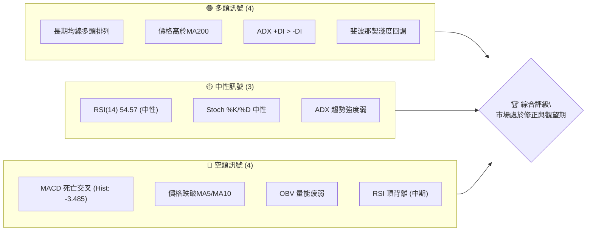
**解讀**：目前多空訊號數量接近，顯示市場對AMD的短期方向存在分歧。長期而言，多頭結構仍穩固，但短期修正壓力顯著。

### 📊 核心指標速覽表

| 指標類別 | 指標名稱 | 當前數值 | 訊號 | 解讀 |
|----------|----------|----------|------|------|
| **價格** | 當前價格 | $517.82 | 🟡 | 位於52週高點下方約11.4%，短期承壓 |
| **均線** | MA20 | $516.84 | 🟡 | 價格僅略高於MA20，短期支撐岌岌可危 |
| **均線** | MA50 | $460.38 | 🟢 | 價格遠高於MA50，中期趨勢強勁 |
| **均線** | MA200 | $278.19 | 🟢 | 價格遠高於MA200，長期趨勢極為強勁 |
| **動能** | RSI(14) | 54.57 | 🟡 | 處於中性區間，無超買/超賣，但從高位回落 |
| **動能** | MACD | 23.229 | 🔴 | MACD線位於訊號線下方，柱狀圖為負，顯示空頭動能 |
| **波動** | ATR | $36.96 | 🔴 | 佔股價7.14%，波動劇烈，交易風險較高 |

### 🏆 技術評分卡

```
╔══════════════════════════════════════════════════════════════════╗
║                   技術評分卡 — AMD (2026-07-05)                    ║
╠══════════════════════════════════════════════════════════════════╣
║ 趨勢強度      ████████████░░░░░░░░  60/100  🟡 (ADX弱勢，但多頭主導)   ║
║ 動能指標      ██████░░░░░░░░░░░░░░  30/100  🔴 (MACD空頭，RSI回落)    ║
║ 支撐穩定度    ██████████████░░░░░░  70/100  🟡 (長期支撐穩固，短期脆弱) ║
║ 成交量配合    ████░░░░░░░░░░░░░░░░  20/100  🔴 (量能疲弱，OBV下降)    ║
║ 形態完整度    ████████░░░░░░░░░░░░  40/100  🔴 (短期修正形態不明顯)   ║
║ 均線排列      ██████████████████░░  90/100  🟢 (完美多頭排列)        ║
╠══════════════════════════════════════════════════════════════════╣
║ 綜合評分      ████████░░░░░░░░░░░░  53/100  🟡 (中性偏弱，修正進行中) ║
╚══════════════════════════════════════════════════════════════════╝
```
**評級結論**：AMD的技術面評分顯示其長期趨勢依然強勁，但在短期內面臨明顯的修正壓力。動能指標和成交量配合度較差，支撐穩定度也因短期均線被跌破而受到考驗。綜合而言，目前處於修正與觀望期。

---

## 2. 趨勢分析

### 🌐 多時框趨勢分析

AMD在過去一年中展現了驚人的漲幅，但近期正經歷明顯的修正。多時框分析顯示了長期與短期趨勢之間的潛在衝突。

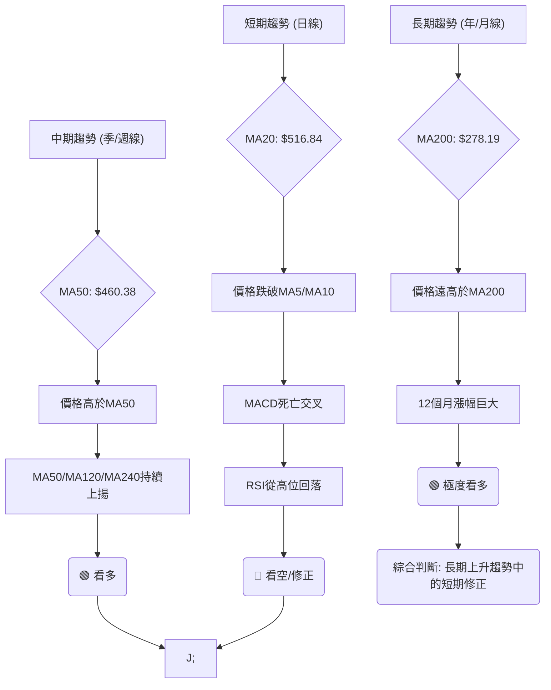
**解讀**：從長期和中期來看，AMD的上升趨勢依然非常強勁，價格遠高於主要長期移動平均線。然而，短期內市場動能已顯著轉弱，價格跌破了短期均線，MACD也發出空頭訊號，表明目前正處於一個健康的（或潛在的）修正階段。

### 📈 長期趨勢 — 12個月走勢圖（Unicode）

以下為AMD過去12個月的月線收盤價走勢圖，標示了關鍵的高低點。

```
AMD 月線走勢圖（過去12個月）
價格軸 ($)
$600 ┤                                    ●(580.91, 2026-06)
$500 ┤                                  ●
$400 ┤                                ●
$300 ┤                      ●
$200 ┤●━━━━━━━●━━━━━●━━━●━━━━━●━━━●━━━━━●━━━●━━━●━━━●←現在 (517.82, 2026-07)
$100 ┤        ●(161.79, 2025-09)
     └─────────────────────────────────────────────────────
      2025-07 08 09 10 11 12 2026-01 02 03 04 05 06 07
```

**走勢特徵分析表格**：
| 階段 | 月份區間 | 價格區間 | 漲跌幅 | 主要特徵 | 訊號 |
|------|----------|----------|--------|----------|------|
| **初期盤整** | 2025-07 ~ 2025-09 | $161.79 - $176.31 | -8.2% | 股價在此區間內小幅波動，未形成明確趨勢。 | 🟡 |
| **第一波漲勢** | 2025-10 | $161.79 → $256.12 | +58.3% | 一次性爆發式上漲，突破盤整區間，動能強勁。 | 🟢 |
| **中期盤整** | 2025-11 ~ 2026-03 | $200.21 - $236.73 | -21.7% | 股價在高位進行盤整，消化前期漲幅，但未跌破關鍵支撐。 | 🟡 |
| **第二波漲勢** | 2026-04 ~ 2026-06 | $203.43 → $580.91 | +185.5% | 再次發力，股價加速上漲，創下歷史新高，動能極強。 | 🟢 |
| **近期修正** | 22026-07 | $580.91 → $517.82 | -10.8% | 達到歷史高點後開始回調，短期動能減弱，修正進行中。 | 🔴 |

**長期趨勢總結**：過去12個月，AMD呈現出「盤整-上漲-盤整-上漲-修正」的清晰週期。整體而言，這是一個極其強勁的長期上升趨勢，但目前正經歷一次幅度較大的短期修正。歷史高點 $580.91 (2026-06) 和最近的低點 $161.79 (2025-09) 界定了過去一年的波動範圍。

### 📊 中期趨勢（週線分析）

中期趨勢主要由MA50及MA120等指標決定。目前MA50 ($460.38) 和MA120 ($320.24) 均保持向上傾斜，且價格遠高於這些均線，顯示中期趨勢依然穩固向上。然而，從20週數據來看，近期的高點 $580.91 後的回落，使得股價從布林通道上軌回歸中軌，並跌破了MA5和MA10，這預示著中期上升動能的減緩，可能進入盤整或更深度的修正。

**近期壓力與支撐示意圖**
```
AMD 週線近期價位示意圖
$580.91 ┤█████████████████████████████←歷史高點 / 強阻力
$537.37 ┤█████████████████████████████←近期阻力 (2026-06-21)
$517.82 ╠═════════════════════════════╣←現價
$516.84 ┤▓▓▓▓▓▓▓▓▓▓▓▓▓▓▓▓▓▓▓▓▓▓▓▓▓▓▓▓▓←MA20 / 短期支撐
$491.04 ┤▓▓▓▓▓▓▓▓▓▓▓▓▓▓▓▓▓▓▓▓▓▓▓▓▓▓▓▓▓←斐波那契23.6%回調
$460.38 ┤█████████████████████████████←MA50 / 中期強支撐
$455.05 ┤█████████████████████████████←布林通道下軌
```
**解讀**：目前股價在MA20附近獲得初步支撐，但上方阻力重重，尤其是歷史高點 $580.91。下方的MA50和斐波那契回調位 $435.48 形成了較強的中期支撐區間。

### ⚡ 趨勢強度評估（ADX 解讀）

ADX (Average Directional Index) 用於衡量趨勢的強度，而非方向。

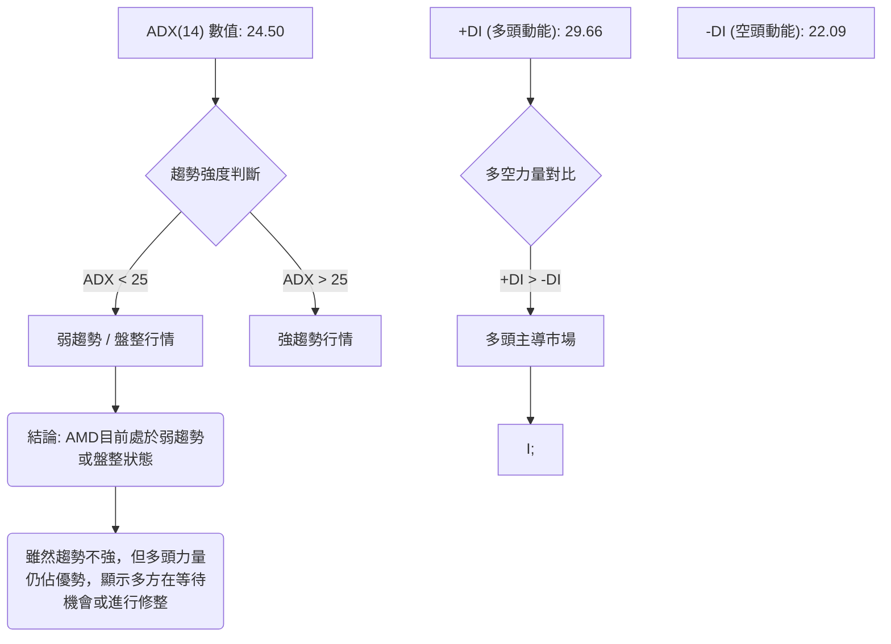
**ADX 強度對照表**：
| ADX 數值 | 趨勢強度 | 建議 |
|----------|----------|------|
| 0-25     | 弱趨勢/盤整 | 觀望或區間操作 |
| 25-50    | 中等趨勢 | 順勢操作 |
| 50-75    | 強趨勢 | 順勢操作 |
| 75-100   | 極強趨勢 | 順勢操作 |

**解讀**：AMD的ADX(14)為24.50，略低於25的閾值，這表明當前的趨勢強度較弱，市場可能處於盤整或修正階段，而非明確的強勢上漲或下跌趨勢。然而，+DI (29.66) 高於 -DI (22.09)，這說明在當前弱勢趨勢中，多頭力量依然佔據主導地位。這是一個關鍵的矛盾點：趨勢本身不強，但多方仍掌握控制權。這可能暗示著股價在等待新的催化劑或在消化前期漲幅後準備再次發力，但也可能只是在緩慢築頂。

---

## 3. 圖表形態分析

### 🔍 形態識別系統

在過去幾個月的急劇上漲後，AMD的股價目前處於一個關鍵的修正階段。從提供的週線數據觀察，股價在達到歷史高點 $580.91 後，出現了明顯的回落。目前尚未形成教科書式的經典反轉形態（如頭肩頂、雙頂），但可以識別出潛在的整理或修正形態。

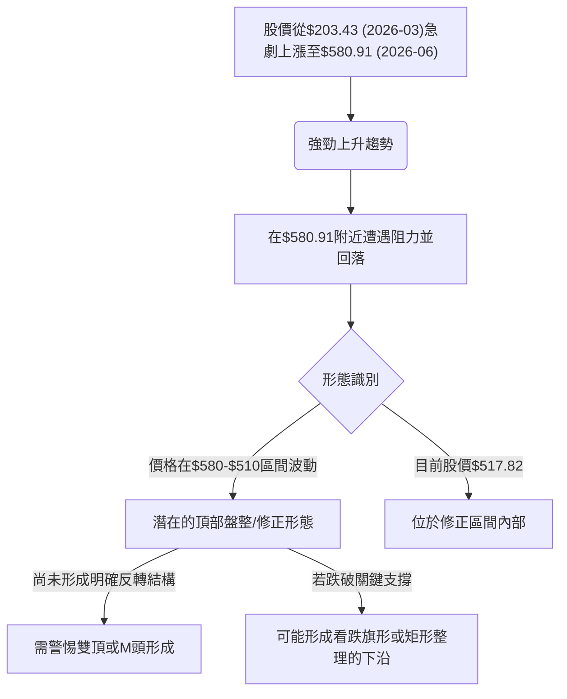
**解讀**：AMD在經歷了巨幅上漲後，目前正處於一個高位的修正階段。儘管尚未形成明確的看跌反轉形態，但股價在高點附近徘徊並出現回落，需要警惕潛在的雙頂或M頭形態。若股價進一步跌破關鍵支撐，則可能確認為看跌旗形或矩形整理的下沿，暗示更深度的回調。

### 🕯️ 重要K線形態分析

根據近20週的收盤價數據，我們可以觀察到一些重要的K線組合和形態：

| 月份 | 收盤價 | K線形態 (週線) | 解讀 | 訊號 |
|------|--------|-----------------|------|------|
| 2026-04-26 | $347.81 | **巨量長陽線** | 股價加速上漲，伴隨巨量，顯示多頭力量極其強勁，市場情緒高漲。 | 🟢 |
| 2026-05-10 | $455.19 | **高位放量長陽線** | 股價持續拉升，但RSI已處於極度超買區，暗示潛在的買盤枯竭風險。 | 🟡 |
| 2026-05-17 | $424.10 | **放量陰線** | 股價從高位回落，伴隨較大成交量，顯示多頭獲利了結壓力。 | 🔴 |
| 2026-05-31 | $516.10 | **陽線，但量能萎縮** | 股價反彈至高位，但成交量未能有效放大，反彈動能存疑。 | 🟡 |
| 2026-06-07 | $466.38 | **長陰線** | 股價再次大幅回落，顯示空頭力量重新佔據上風，短期趨勢轉弱。 | 🔴 |
| 2026-06-28 | $521.58 | **高位小陰線** | 反彈至高位後再次收陰，且收盤價低於前一週高點，顯示上方壓力沉重。 | 🔴 |
| 2026-07-05 | $517.82 | **小陰線** | 繼續收陰，且收盤價接近MA20，動能持續減弱，短期支撐受考驗。 | 🔴 |

**總結**：從K線形態來看，AMD在4月和5月初經歷了極其強勁的拉升，但進入5月中下旬後，出現了高位放量陰線和連續的回落，顯示多頭動能衰竭，空頭開始測試支撐。近期連續的小陰線，尤其是在反彈受阻後出現，表明市場短期看跌情緒濃厚。

### 📉 ASCII 走勢形態示意圖

以下示意圖描繪了AMD從2026年3月低點到6月高點，再到近期修正的走勢，呈現出一個「上升旗形」或「矩形整理」的潛在修正形態。

```
AMD 近期走勢形態示意圖（高位修正）

價格軸 ($)
$580.91 ┤                     █ (高點)
        │                   █
        │                 █
        │               █
        │             █
        │           █
        │         █
        │       █
        │     █
        │   █
$517.82 ╠═══█═══════════════════════════════════════════════════╣ ← 現價
        │   █         █
        │   █           █
        │   █             █
        │   █               █
        │   █                 █
        │   █                   █
        │   █                     █
        │   █                       █
        │   █                         █
$460.38 ┤ █                           █ (MA50/強支撐)
        │ █                             █
        │ █                               █
        │ █                                 █
        │ █                                   █
        │ █                                     █
        │ █                                       █
        │ █                                         █
$203.43 ┤ █                                           █ (3月低點)
        └─────────────────────────────────────────────────────────
                  時間軸 (從3月到7月)

**形態特徵**：
- 在3月至6月間形成一個陡峭的「旗桿」，代表快速上漲。
- 6月高點 $580.91 後開始回落，形成一個向下傾斜或橫向整理的通道，類似「旗面」或「矩形」。
- 目前股價 $517.82 處於這個修正通道的上沿附近，但短期動能向下。
```
**解讀**：目前股價在高位進行修正，形成一個類似「旗形」或「矩形」的整理區間。若股價能在此區間內築底並向上突破，則可能預示著新一輪的漲勢。反之，若跌破整理區間的下沿（例如 $460.38 附近），則可能啟動更深度的回調。這個形態的形成，正是在消化前期巨大漲幅的過程。

### 🎯 形態目標價計算

由於目前形態尚未完全確立為經典的突破或反轉形態，我們將基於「高位整理區間」進行目標價的初步估算。

**假設形態**：高位矩形整理（或下降旗形，但目前更偏向整理）
*   **整理區間上沿（阻力）**：約 $580.91 (歷史高點) 至 $537.37 (近期反彈高點)
*   **整理區間下沿（支撐）**：約 $466.38 (6月低點) 至 $455.05 (布林下軌)
*   **平均區間高度**：約 $580.91 - $460.38 (MA50) = $120.53

**形態目標價 (基於矩形整理突破)**：

1.  **向上突破目標價**：
    *   若股價向上突破 $537.37 (近期阻力)，則第一個目標為 $580.91 (歷史高點)。
    *   若能有效突破 $580.91，則可將矩形高度 $120.53 加到突破點。
    *   **目標價 T1 (突破 $537.37)**：$537.37 + ($537.37 - $460.38) = $537.37 + $76.99 = $614.36
    *   **目標價 T2 (突破 $580.91)**：$580.91 + $120.53 = $701.44 (接近分析師高目標價 $700)
    **計算方法**：突破點 + 形態高度。此為較為樂觀的目標，需強勁買盤確認。

2.  **向下突破目標價**：
    *   若股價向下突破 $460.38 (MA50/強支撐)，則可將矩形高度 $120.53 從跌破點減去。
    *   **目標價 T1 (跌破 $460.38)**：$460.38 - ($537.37 - $460.38) = $460.38 - $76.99 = $383.39
    *   **目標價 T2 (跌破 $460.38)**：$460.38 - $120.53 = $339.85 (接近分析師低目標價 $320)
    **計算方法**：跌破點 - 形態高度。此為較為悲觀的目標，需放量下跌確認。

**總結**：目前股價正處於這個形態的內部，方向未明。多頭需要突破 $537.37 及 $580.91 才能繼續上攻，而空頭則需跌破 $460.38 的強勁支撐。

---

## 4. 支撐與阻力

識別關鍵的支撐與阻力位對於制定交易策略至關重要。AMD在經歷大幅上漲後，這些價位將是判斷其修正深度和未來走勢的關鍵。

### 🗺️ 關鍵價位分布圖（Unicode）

```
AMD 價位結構分布圖 (2026-07-05)
═══════════════════════════════════════════════════════════════
$584.73 ║██████████████████████████████████████████████████████║ 強阻力 R3 (52週高點)
$580.91 ║██████████████████████████████████████████████████████║ 阻力 R2 (歷史高點)
$578.63 ║██████████████████████████████████████████████████████║ 阻力 R1 (布林通道上軌)
$540.14 ║▓▓▓▓▓▓▓▓▓▓▓▓▓▓▓▓▓▓▓▓▓▓▓▓▓▓▓▓▓▓▓▓▓▓▓▓▓▓▓▓▓▓▓▓▓▓▓▓▓▓▓▓▓▓▓▓▓▓║ 近期阻力 (MA5)
$536.18 ║▓▓▓▓▓▓▓▓▓▓▓▓▓▓▓▓▓▓▓▓▓▓▓▓▓▓▓▓▓▓▓▓▓▓▓▓▓▓▓▓▓▓▓▓▓▓▓▓▓▓▓▓▓▓▓▓▓▓║ 近期阻力 (MA10)
$517.82 ╠═══════════════════════════════════════════════════════════════╣ ◄ 現價
$516.84 ║▓▓▓▓▓▓▓▓▓▓▓▓▓▓▓▓▓▓▓▓▓▓▓▓▓▓▓▓▓▓▓▓▓▓▓▓▓▓▓▓▓▓▓▓▓▓▓▓▓▓▓▓▓▓▓▓▓▓║ 近期支撐 S1 (MA20 / 布林通道中軌)
$491.04 ║██████████████████████████████████████████████████████║ 支撐 S2 (斐波那契23.6%回調)
$460.38 ║██████████████████████████████████████████████████████║ 強支撐 S3 (MA50)
$455.05 ║██████████████████████████████████████████████████████║ 強支撐 S4 (布林通道下軌)
$435.48 ║██████████████████████████████████████████████████████║ 強支撐 S5 (斐波那契38.2%回調)
$390.56 ║██████████████████████████████████████████████████████║ 強支撐 S6 (斐波那契50%回調)
$345.57 ║██████████████████████████████████████████████████████║ 強支撐 S7 (斐波那契61.8%回調)
$278.19 ║██████████████████████████████████████████████████████║ 極強支撐 S8 (MA200)
═══════════════════════════════════════════════════════════════
```
**解讀**：AMD目前正處於一個關鍵的價格點，MA20和布林中軌提供了即時支撐。上方阻力密集，需要較大的買盤動能才能突破。下方支撐區間較為寬廣，尤其是MA50和斐波那契回調位，將是判斷修正深度的重要參考。

### 🚧 阻力位分析表

| 阻力級別 | 價位 | 形成原因 | 突破難度 | 重要性 | 訊號 |
|----------|------|----------|----------|--------|------|
| **R3**   | $584.73 | 52週高點 | 極高     | 極高   | 🔴   |
| **R2**   | $580.91 | 歷史高點 (2026-06) | 極高     | 極高   | 🔴   |
| **R1**   | $578.63 | 布林通道上軌 | 高       | 高     | 🔴   |
| **R0.5** | $540.14 | MA5 | 中等     | 中等   | 🟡   |
| **R0.4** | $536.18 | MA10 | 中等     | 中等   | 🟡   |

**解讀**：AMD上方阻力層層疊疊，從短期的MA5/MA10到歷史高點 $580.91，均對股價構成壓力。尤其是 $580.91 附近的歷史高點，需要極其強勁的買盤動能和利好消息才能有效突破。目前股價位於MA5和MA10下方，顯示短期趨勢偏弱，反彈將首先面臨這些短期均線的考驗。

### 🛡️ 支撐位分析表

| 支撐級別 | 價位 | 形成原因 | 守住機率 | 重要性 | 訊號 |
|----------|------|----------|----------|--------|------|
| **S1**   | $516.84 | MA20 / 布林中軌 | 中等     | 高     | 🟡   |
| **S2**   | $491.04 | 斐波那契23.6%回調 | 中等     | 中等   | 🟡   |
| **S3**   | $460.38 | MA50 | 高       | 極高   | 🟢   |
| **S4**   | $455.05 | 布林通道下軌 | 高       | 高     | 🟢   |
| **S5**   | $435.48 | 斐波那契38.2%回調 | 較高     | 極高   | 🟢   |
| **S6**   | $390.56 | 斐波那契50%回調 | 較高     | 極高   | 🟢   |
| **S7**   | $345.57 | 斐波那契61.8%回調 | 較高     | 極高   | 🟢   |
| **S8**   | $278.19 | MA200 | 極高     | 極高   | 🟢   |

**解讀**：AMD目前的第一道支撐位於MA20和布林中軌 $516.84 附近，這是短期多頭能否穩住陣腳的關鍵。若此處失守，股價可能回探 $491.04 (斐波那契23.6%)。更為關鍵的強支撐區間位於 $460.38 (MA50) 至 $435.48 (斐波那契38.2%)。如果股價回落到這個區間，將是長期投資者考慮進場的機會，因為這些價位是中期上升趨勢的重要防線。MA200 ($278.19) 則代表了極其強勁的長期支撐，預計難以跌破。

### 📐 斐波那契回調位分析

我們以AMD從2026年3月低點 $200.21 到2026年6月高點 $580.91 的主要上漲波段進行斐波那契回調分析，以識別潛在的支撐位。

*   **波段低點 (0%)**：$200.21 (2026-03-01 週收盤價)
*   **波段高點 (100%)**：$580.91 (2026-06-07 週收盤價)
*   **總漲幅**：$580.91 - $200.21 = $380.70

**斐波那契回調位計算**：

*   **23.6% 回調位**：$580.91 - ($380.70 * 0.236) = $580.91 - $89.87 = **$491.04**
*   **38.2% 回調位**：$580.91 - ($380.70 * 0.382) = $580.91 - $145.43 = **$435.48**
*   **50.0% 回調位**：$580.91 - ($380.70 * 0.500) = $580.91 - $190.35 = **$390.56**
*   **61.8% 回調位**：$580.91 - ($380.70 * 0.618) = $580.91 - $235.34 = **$345.57**

**視覺化與解讀**：
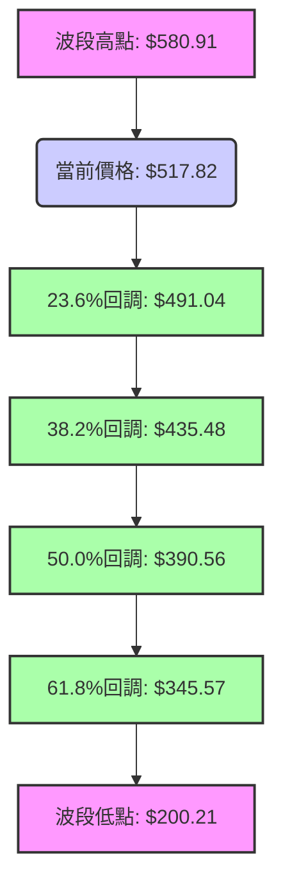
**分析**：目前AMD的股價 $517.82 位於23.6%回調位 $491.04 之上，顯示本次修正相對較淺。這是一個積極信號，表明多頭力量仍在努力維持漲勢。然而，如果 $491.04 失守，則 $435.48 (38.2%回調位，接近MA50) 將成為下一個關鍵支撐。這個區間對於判斷修正的性質至關重要。若股價能夠在 $491.04 或 $435.48 附近獲得有效支撐並反彈，則其長期上升趨勢有望延續。反之，若跌破38.2%回調位，則可能面臨更深度的修正，回探 $390.56 (50%) 甚至 $345.57 (61.8%)。

---

## 5. 技術指標深度解讀

### 🎛️ 指標訊號總覽

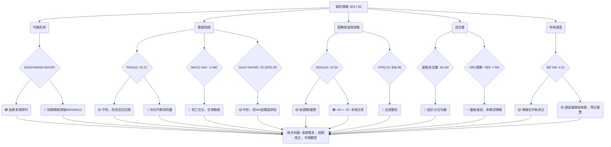
**解讀**：整體而言，AMD的技術指標呈現出長期趨勢與短期動能之間的明顯分歧。長期均線強烈看漲，但短期價格表現、動能指標（MACD、RSI頂背離）和成交量均發出看跌訊號，顯示股價正在經歷一個動能減弱且波動較大的修正期。ADX指出目前趨勢不強，但多頭仍佔據主導，這為修正後的潛在反彈留下了希望。

### 📈 移動平均線排列分析

AMD的移動平均線系統展現出非常典型的多頭排列，但短期均線已出現頹勢。

```mermaid
graph TD
    MA200["MA200: $278.19"]
    MA120["MA120: $320.24"]
    MA60["MA60: $426.81"]
    MA50["MA50: $460.38"]
    MA20["MA20: $516.84"]
    MA10["MA10: $536.18"]
    MA5["MA5: $540.14"]
    Price["現價: $517.82"]

    MA5 > MA10
    MA10 > MA20
    MA20 > MA50
    MA50 > MA60
    MA60 > MA120
    MA120 > MA200

    subgraph 均線排列判斷
        Direction["MA20 > MA50 > MA200"] --> Bullish["🟢 長期多頭排列確立"];
        Price < MA5 & Price < MA10 --> ShortTermBearish["🔴 短期價格跌破MA5/MA10"];
        Price > MA20 & Price > MA50 & Price > MA200 --> OverallPosition["🟢 價格仍在主要均線之上"];
    end

    Bullish --> nb1["Conclusion;"]
    ShortTermBearish --> nb1["Conclusion;"]
    OverallPosition --> nb1["Conclusion;"]

    Conclusion["總結: 長期趨勢強勁，短期修正壓力大"]
```
**當前均線排列狀態**：
| 均線 | 數值 | 與現價關係 | 趨勢 | 訊號 |
|------|--------|------------|------|------|
| MA5  | $540.14 | 價格下方   | ⬇️   | 🔴   |
| MA10 | $536.18 | 價格下方   | ⬇️   | 🔴   |
| MA20 | $516.84 | 價格上方   | ⬆️   | 🟡   |
| MA50 | $460.38 | 價格上方   | ⬆️   | 🟢   |
| MA200| $278.19 | 價格上方   | ⬆️   | 🟢   |

**解讀**：AMD的MA20 ($516.84) > MA50 ($460.38) > MA200 ($278.19)，這是一個標準且強勁的**多頭排列**，表明其長期和中期趨勢非常健康。然而，當前股價 $517.82 已經跌破了MA5 ($540.14) 和MA10 ($536.18)，這是一個明確的短期看跌訊號，顯示短期動能正在迅速流失。目前股價僅略高於MA20，MA20的支撐作用正在受到考驗。一旦MA20失守，股價可能進一步回探MA50，屆時MA50將成為中期趨勢的關鍵防線。

### 📉 RSI(14) 分析

RSI(14) 用於衡量股價的相對強弱，判斷超買超賣情況及動能變化。

*   **RSI(14) 當前數值**：54.57

**RSI 強度進度條**：
RSI(14) 強度: ▓▓▓▓▓▓▓▓▓▓▓▓░░░░░░░░░░░░░░░░ 54.57/100 🟡 (中性)

**超買超賣區間分析**：
*   **超買區 (RSI > 70)**：RSI在2026-04-12達到73.7，2026-04-19達到93.3，2026-04-26達到97.4，2026-05-03達到83.5，2026-05-10達到80.7。這些極度超買的讀數發生在股價從 $245.04 飆升至 $455.19 的過程中，顯示當時市場情緒極度狂熱。
*   **超賣區 (RSI < 30)**：過去20週RSI最低為2026-02-22的33.7，未進入超賣區，表明在修正過程中，尚未出現恐慌性拋售。
*   **中性區 (30 < RSI < 70)**：當前RSI 54.57 處於中性區間，但其從高位（4月97.4，5月80.7）持續回落，顯示多頭動能正在減弱，股價進入修正。

**背離判斷 (頂背離/底背離)**：
*   **中期頂背離**：
    *   **價格高點1**：2026-04-26 收盤價 $347.81，對應RSI 97.4。
    *   **價格高點2**：2026-06-07 歷史高點 $580.91 (週線數據在2026-05-31收盤 $516.10 後，2026-06-07收盤 $466.38，但最高價可能更高，以提供的52W高點 $584.73 和 2026-06月線 $580.91 為參考)。假設在6月初創出 $580.91 的歷史高點時，RSI數據為2026-05-31的67.0或2026-06-07的58.5。
    *   **結論**：價格在2026年4月底 $347.81 時RSI高達97.4，而當股價在2026年6月初創下 $580.91 的歷史新高時，RSI卻僅在50-60區間徘徊（2026-05-31為67.0，2026-06-07為58.5）。這是一個非常明顯的**中期看跌頂背離訊號**。價格創新高，但RSI未能同步創高，反而大幅下降，顯示上漲動能已顯著衰竭，買盤追價意願不足，預示著隨後可能出現修正或反轉。此背離已在6月後的修正中得到初步確認。

### 📊 MACD(12/26/9) 訊號解讀

MACD (Moving Average Convergence Divergence) 用於判斷趨勢方向和動能。

*   **MACD 線**：23.229
*   **MACD Signal 線**：26.713
*   **MACD Histogram 柱狀圖**：-3.485

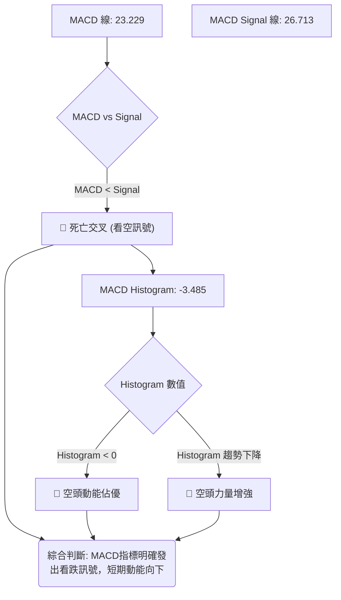
**解讀**：
1.  **MACD線與Signal線**：MACD線 (23.229) 位於Signal線 (26.713) 下方，這形成了**死亡交叉**，是一個明確的看跌訊號，表明短期平均成本已跌破中期平均成本，賣壓正在增加。
2.  **MACD柱狀圖**：柱狀圖值為 -3.485，為負值，且從2026-05-10的高點 +10.403 持續下降，表明空頭動能正在增強，多頭力量正在減弱。
**總結**：MACD指標的死亡交叉和負值柱狀圖，與RSI的頂背離相互確認，共同發出了強烈的短期看跌訊號，預示著AMD的修正可能尚未結束。

### 📦 布林通道分析

布林通道 (Bollinger Bands) 用於衡量股價的波動範圍。

*   **布林上軌**：$578.63
*   **布林中軌 (MA20)**：$516.84
*   **布林下軌**：$455.05
*   **BB %B**：0.51 (0=下軌, 0.5=中軌, 1=上軌)

**ASCII 布林通道示意圖**：
```
AMD 布林通道示意圖
──────────────────────────────────────────────────────────
$578.63 ║██████████████████████████████████████████████████████║ ← 上軌 (BB Upper)
        ║                                                        ║
        ║                                                        ║
        ║                                                        ║
$517.82 ╠═══════════════════════════════════════════════════════════════╣ ← 現價
$516.84 ║▓▓▓▓▓▓▓▓▓▓▓▓▓▓▓▓▓▓▓▓▓▓▓▓▓▓▓▓▓▓▓▓▓▓▓▓▓▓▓▓▓▓▓▓▓▓▓▓▓▓▓▓▓▓▓▓▓▓║ ← 中軌 (BB Middle / MA20)
        ║                                                        ║
        ║                                                        ║
        ║                                                        ║
$455.05 ║██████████████████████████████████████████████████████║ ← 下軌 (BB Lower)
──────────────────────────────────────────────────────────
```
**解讀**：
1.  **BB %B**：0.51，表示當前價格幾乎正好位於布林通道的中軌 (MA20) 附近。這通常意味著股價處於一個平衡點，或者正在從上軌回落至中軌，或從下軌反彈至中軌。
2.  **通道寬度**：從數據看，布林通道在過去幾個月的急劇上漲中經歷了擴張，而近期股價在中軌附近徘徊，可能預示著通道將開始收斂，進入盤整期。
3.  **訊號**：股價從上軌回落至中軌是一個看跌訊號，但中軌提供了初步支撐。如果中軌 $516.84 失守，則股價可能進一步測試下軌 $455.05。反之，若能守住中軌並反彈，則有機會再次挑戰上軌。

### 💹 成交量分析（量價配合度）

成交量是判斷價格走勢真實性的重要輔助指標。

*   **最新成交量**：28,142,500
*   **20日均量**：32,082,065
*   **50日均量**：37,623,120
*   **量比 (最新/20日均量)**：0.88x (最新成交量低於平均水平)
*   **OBV趨勢**：OBV < MA → 量能疲弱

**成交量與價格配合度分析**：
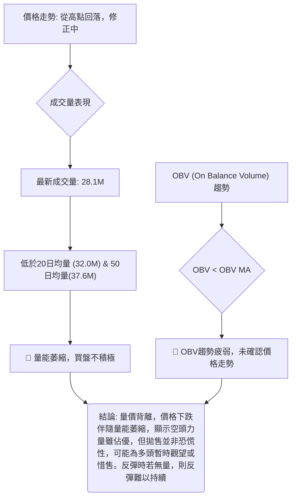
**解讀**：
1.  **量比**：最新成交量 (28.1M) 低於20日均量 (32.0M) 和50日均量 (37.6M)，量比為0.88x。這表示當前市場交投清淡，多空雙方均不活躍，或者說買盤意願不足。在價格下跌或盤整期間，量能萎縮可能意味著拋售壓力並非極度恐慌，但也表明缺乏買盤支撐。
2.  **OBV趨勢**：OBV指標顯示「OBV < MA → 量能疲弱」。這是一個看跌訊號，表明在價格回調的同時，成交量的累積動能不足，未能有效支撐價格。通常，健康的上升趨勢需要OBV同步上升，而下跌趨勢中OBV下降則確認了賣壓。目前OBV疲弱，與價格的修正走勢相符，確認了市場的弱勢。
**總結**：成交量指標與價格修正走勢相互印證，顯示當前市場缺乏買盤動能，短期內難以形成有力反彈。任何反彈若無量能配合，都可能只是短暫的技術性修正。

---

## 6. 動能與波動率

### ⚡ 動能評估四象限

動能評估四象限分析幫助我們理解AMD在動能強度和波動率兩個關鍵維度上的位置，從而判斷其當前的市場屬性。

| 象限 | 動能 | 波動 | 當前狀態 | 評估 | 訊號 |
|------|------|------|----------|------|------|
| Q1   | 強   | 低   | -        | 最佳機會 (趨勢啟動初期) | 🟢 |
| Q2   | 弱   | 低   | -        | 謹慎觀望 (盤整築底) | 🟡 |
| Q3   | 強   | 高   | -        | 高風險高收益 (趨勢加速期) | 🟡 |
| **Q4**   | **弱**   | **高**   | **✓**    | **避免進場 (修正/反轉期)** | 🔴 |

**AMD 當前狀態評估**：
*   **動能 (MACD, RSI)**：MACD死亡交叉，柱狀圖為負，RSI從高位回落至中性區並存在頂背離。綜合判斷為**弱動能**。
*   **波動 (ATR)**：ATR為 $36.96，佔股價的7.14%，這是一個相對較高的波動率。綜合判斷為**高波動**。

**結論**：AMD目前處於**Q4象限 (弱動能，高波動)**。這是一個通常建議避免進場的區域，因為股價波動劇烈但方向不明確，且缺乏上漲動能。這類股票往往處於修正或潛在反轉的階段，市場風險較高。

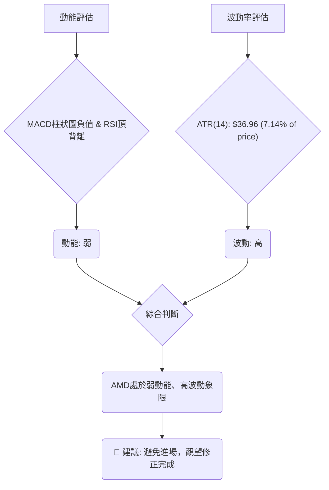

### 📊 ATR 波動率分析

ATR (Average True Range) 用於衡量股價的日均波動幅度，是設定止損和判斷市場活躍度的重要指標。

*   **ATR(14)**：$36.96
*   **佔收盤價比例**：$36.96 / $517.82 = 7.14%

**解讀**：
1.  **波動幅度**：AMD的ATR高達 $36.96，這意味著該股在過去14個交易日中，平均每日的波動範圍約為 $36.96。相對於 $517.82 的股價而言，7.14% 的波動比例非常高，顯示AMD是一隻波動劇烈的股票。
2.  **交易風險**：高ATR意味著日內價格變動大，可能帶來快速的盈利機會，但也伴隨著更高的風險。對於短線交易者而言，需要更大的資金承受能力和更精確的進出場點。對於長線投資者，則需將其納入風險評估，避免因短期劇烈波動而被洗出場。
3.  **止損距離建議**：由於波動性高，傳統的固定止損百分比可能過於狹窄，容易被市場噪音觸發。建議止損距離至少設定為1倍ATR，甚至1.5倍至2倍ATR，以給予股價足夠的波動空間。
    *   **1倍ATR止損**：約 $36.96
    *   **1.5倍ATR止損**：約 $55.44
    *   **2倍ATR止損**：約 $73.92
    例如，若進場點為 $517.82，1.5倍ATR的止損點約為 $517.82 - $55.44 = $462.38。這與MA50 ($460.38) 和布林下軌 ($455.05) 形成一個重要的支撐區間，具有較好的參考價值。

### 📐 Beta 與市場相關性

雖然數據包中未直接提供Beta值，但基於AMD作為半導體行業的龍頭企業，其股票特性通常具有以下特點：
*   **行業屬性**：半導體行業屬於科技成長型板塊，通常對經濟週期和市場情緒高度敏感。
*   **市場相關性**：高科技成長股通常具有較高的Beta值，意味著其股價波動幅度會大於整體市場（如標普500指數）。當市場上漲時，高Beta股漲幅更大；當市場下跌時，跌幅也更大。
*   **推斷Beta**：預計AMD的Beta值會大於1.0，可能在1.2到1.8之間，甚至更高。這表明AMD的股價波動性較大，與市場的同向性較強。
**解讀**：AMD的高波動性 (ATR) 與其作為高Beta科技股的特性相符。這意味著在當前市場修正階段，AMD可能經歷比大盤更劇烈的跌幅。投資者在配置時應充分考慮其與市場的高度相關性，並注意整體市場風險對AMD的影響。

---

## 7. 多時框架總結

多時框架分析有助於綜合判斷不同時間維度上的趨勢和動能，從而形成更全面的交易視角。

### 📋 時框架評分表

| 時框架 | 趨勢方向 | 動能 | 均線排列 | 形態 | 綜合評分 (1-10) | 建議 | 訊號 |
|--------|----------|------|----------|------|-----------------|------|------|
| **長期** | 上升趨勢 | 強勁 | 多頭排列 | 上升通道 | 9               | 逢低買入 | 🟢   |
| **中期** | 上升趨勢 | 減弱 | 多頭排列 | 修正/盤整 | 6               | 觀望/區間操作 | 🟡   |
| **短期** | 修正/下跌 | 疲弱 | 死亡交叉 | 修正/盤整 | 3               | 謹慎看空/等待築底 | 🔴   |

**解讀**：
*   **長期**：AMD的長期趨勢依然非常強勁，得益於其穩固的多頭均線排列和過去一年的巨大漲幅。對於長期投資者而言，目前的修正提供了潛在的逢低買入機會。
*   **中期**：中期趨勢仍為上升，但動能已顯著減弱，股價進入修正或盤整階段。此時不宜盲目追高，需等待明確的反彈訊號。
*   **短期**：短期趨勢明顯偏弱，MACD死亡交叉、RSI頂背離、價格跌破短期均線以及量能萎縮均指向下跌修正。短期交易者應保持謹慎，或考慮做空策略。

### 🔲 綜合訊號矩陣

以下矩陣展示了不同時框架下各技術分析維度的一致性。

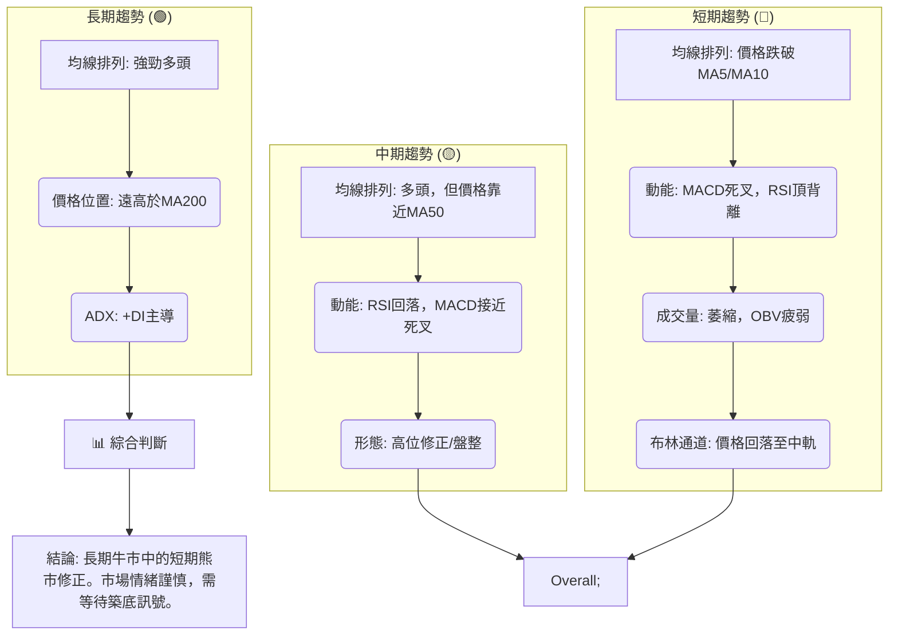
**一致性分析**：
*   **長期與中期**：長中期趨勢保持一致的看多立場，均線系統和價格位置都支持這一點。這提供了市場的基礎支撐。
*   **短期與長中期**：短期趨勢與長中期趨勢存在明顯的背離。短期的動能減弱、均線破位、成交量萎縮和MACD死亡交叉，都與長中期的強勁上升趨勢形成對比。這表明當前市場正在消化前期的巨大漲幅，進行一次較為深度的修正。
*   **結論**：AMD目前處於一個複雜的局面，長期上升趨勢的根基依然穩固，但短期內面臨強大的修正壓力。這種修正可能為長期投資者帶來更好的進場點，但短期內風險較高。投資者應根據自己的時間框架和風險偏好，謹慎制定策略。

---

## 8. 交易策略建議

基於AMD的多時框架技術分析，我們建議以下交易策略。當前市場處於長期上升趨勢中的短期修正階段，因此策略應偏向於逢低買入或在修正結束後入場。

### 🗺️ 策略決策流程圖

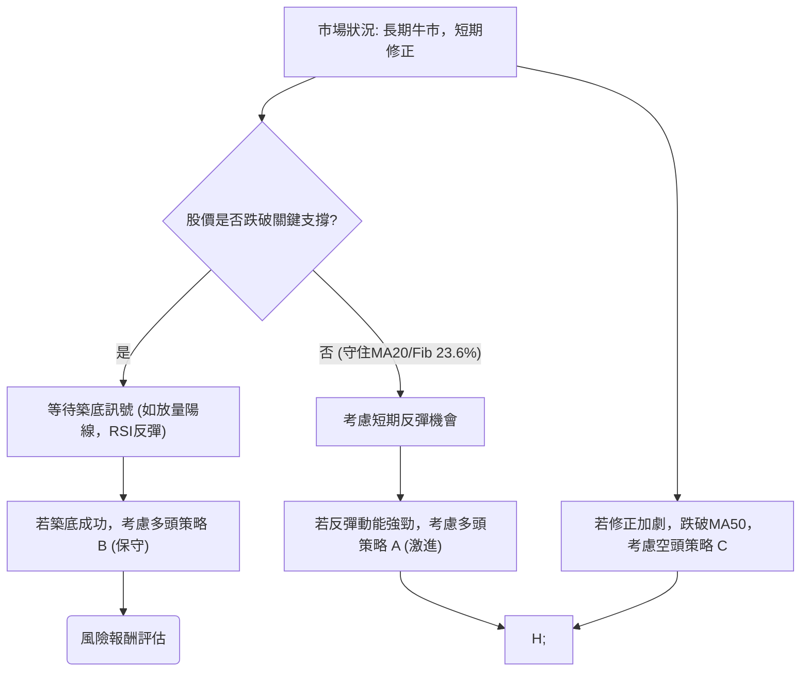

### 🟢 多頭策略詳情

考慮到AMD的長期上漲趨勢，我們建議在回調至關鍵支撐位時逢低買入。

| 策略要素 | 策略 A (激進，短期反彈) | 策略 B (保守，中期支撐買入) |
|----------|--------------------------|------------------------------|
| 進場條件 | 股價站穩MA20 ($516.84) 之上，並出現放量陽線或RSI止跌反彈訊號。 | 股價回落至MA50 ($460.38) 或斐波那契38.2% ($435.48) 附近，並出現止跌訊號。 |
| 進場價格 | $525.00 (確認站穩MA20上方) | $440.00 (在 $435.48-$460.38 區間內) |
| 目標價 T1 | $550.00 (測試MA5/MA10阻力) | $490.00 (回補23.6% Fib回調位) |
| 目標價 T2 | $580.00 (挑戰歷史高點) | $550.00 (測試近期阻力) |
| 止損價格 | $490.00 (跌破23.6% Fib回調位 $491.04) | $410.00 (跌破38.2% Fib回調位 $435.48 之下) |
| 風險報酬比 | T1: (550-525)/(525-490) = 25/35 = 0.71:1 <br> T2: (580-525)/(525-490) = 55/35 = 1.57:1 | T1: (490-440)/(440-410) = 50/30 = 1.67:1 <br> T2: (550-440)/(440-410) = 110/30 = 3.67:1 |
| 成功機率 | 50% (短期反彈動能不確定) | 65% (強支撐區間買入，風險較低) |
| 建議倉位 | 5% (高波動，小倉位試水) | 10% (長期趨勢支持，但仍需控制風險) |

### 🔴 空頭策略詳情

考慮到短期動能疲弱和MACD死亡交叉，短期內可考慮做空策略，但需注意逆勢操作風險。

| 策略要素 | 策略 C (短期看空，跌破支撐) |
|----------|--------------------------------|
| 進場條件 | 股價跌破MA20 ($516.84) 和23.6%斐波那契回調位 $491.04，且伴隨放量下跌。 |
| 進場價格 | $490.00 (確認跌破 $491.04) |
| 目標價 T1 | $460.00 (回探MA50 / 布林下軌) |
| 目標價 T2 | $435.00 (回探38.2%斐波那契回調位) |
| 止損價格 | $518.00 (站回MA20上方) |
| 風險報酬比 | T1: (490-460)/(518-490) = 30/28 = 1.07:1 <br> T2: (490-435)/(518-490) = 55/28 = 1.96:1 |
| 成功機率 | 45% (逆長期趨勢，風險較高) |
| 建議倉位 | 5% (嚴格控制風險，僅限短線操作) |

### ⭐ 整體訊號強度評星

```
做多訊號強度：★★★☆☆  (3/5星) (長期趨勢強勁，但短期修正未結束，需等待更好進場點)
做空訊號強度：★★☆☆☆  (2/5星) (短期有機會，但逆長期趨勢，風險較大，不適合新手)
整體可信度：  ★★★☆☆  (3/5星) (市場處於修正階段，方向選擇性強，但需嚴格風控)
```

---

## 9. 風險提示與監控

AMD目前處於關鍵的修正階段，儘管長期前景看好，但短期風險不容忽視。

### ✅ 關鍵監控指標 Checklist

```
╔══════════════════════════════════════════════════════════════╗
║                   AMD 關鍵監控指標清單                         ║
╠══════════════════════════════════════════════════════════════╣
║ [ ] 價格是否能守住MA20 ($516.84)？                           ║
║ [ ] 若跌破MA20，能否在斐波那契23.6% ($491.04) 獲得支撐？      ║
║ [ ] MA50 ($460.38) 的支撐是否穩固？這是中期趨勢的關鍵防線。   ║
║ [ ] MACD是否出現黃金交叉？MACD柱狀圖是否轉正？               ║
║ [ ] RSI是否從中性區間向上突破60？                            ║
║ [ ] 成交量是否在反彈時顯著放大？                             ║
║ [ ] OBV趨勢是否由弱轉強？                                    ║
║ [ ] ADX趨勢強度是否回升至25以上，並維持+DI主導？             ║
║ [ ] 是否有新的利好消息或產業催化劑出現？                     ║
║ [ ] 52週高點 $584.73 是否有被挑戰的跡象？                    ║
╚══════════════════════════════════════════════════════════════╝
```

### ⚠️ 風險場景分析

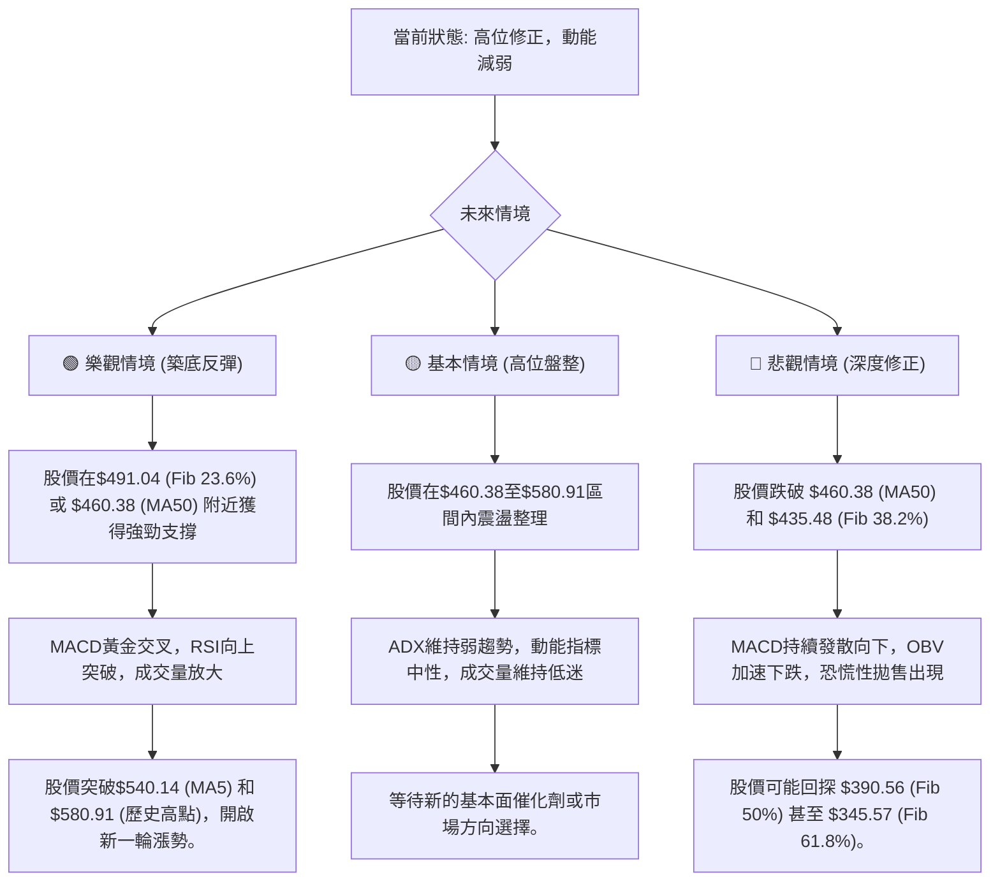

### 🛡️ 風險管理重要提醒

1.  **倉位管理**：鑑於AMD的高波動性 (ATR $36.96) 和短期趨勢的修正，建議投資者謹慎控制倉位。在趨勢不明朗或風險較高時，應降低倉位比例。
2.  **嚴格止損**：無論採取何種策略，都必須設定並嚴格執行止損點。尤其在波動劇烈的市場中，止損是保護資本的關鍵。建議止損點應考慮ATR的幅度，避免因短期波動被洗出場。
3.  **多樣化投資**：不要將所有資金集中在單一股票上，即使是像AMD這樣具有潛力的公司。通過投資組合的多樣化來分散風險。
4.  **市場情緒監控**：AMD作為科技股，容易受整體市場情緒和宏觀經濟數據的影響。持續關注大盤走勢、行業新聞以及美聯儲的貨幣政策，這些都可能對股價產生重大影響。
5.  **耐心等待**：在修正或盤整階段，最忌諱盲目追漲殺跌。耐心等待明確的築底訊號或突破訊號，並在風險報酬比有利時才進場。

---

## 📋 報告總結

```
AMD 技術分析報告總結
══════════════════════════════════════════════════════════════════
報告日期：2026-07-05
當前價格：$517.82
分析評級：⚖️ 中性偏弱 (長期趨勢良好，但短期修正壓力顯著，需警惕風險)

關鍵結論：
├─ 長期趨勢：🟢 極度看多。MA200等長期均線呈現完美多頭排列，股價遠高於主要長期支撐。
├─ 中期趨勢：🟢 看多。MA50等中期均線持續向上，但股價從高點回落，動能減弱，進入修正。
├─ 短期趨勢：🔴 看空/修正。價格跌破MA5/MA10，MACD死亡交叉，RSI出現頂背離，成交量疲弱。
├─ 關鍵支撐：$516.84 (MA20/布林中軌), $491.04 (斐波那契23.6%), $460.38 (MA50), $435.48 (斐波那契38.2%)。
├─ 關鍵阻力：$540.14 (MA5), $580.91 (歷史高點), $584.73 (52週高點)。
└─ 分析師目標：平均 $508.31 (當前價格已高於平均目標，需警惕潛在壓力)。

最優策略組合：
1. 🥇 **最佳機會**：在股價回落至 $435.48 - $460.38 (Fib 38.2% / MA50) 強支撐區間時，若出現明確止跌訊號 (如放量陽線、RSI低位反彈、MACD轉強)，可考慮保守性多頭策略，目標 $550.00 - $580.00。
2. 🥈 **次選機會**：若股價能站穩 $516.84 (MA20) 之上，並伴隨量能回升，可考慮短期激進性多頭策略，目標 $550.00 - $580.00，但需嚴格止損 $490.00。
3. 🥉 **保守選擇**：在當前 $517.82 附近保持觀望，等待市場方向更加明確。若跌破 $491.04 且量能放大，可考慮短期做空至 $460.00 - $435.00，但務必嚴格控制倉位與止損，因其逆長期趨勢。
══════════════════════════════════════════════════════════════════
```

---

> ⚠️ **免責聲明**：本報告為 AI 自動生成之技術分析，所有數據及估算均基於提供的歷史價格資訊。本報告**僅供研究與學術參考**，**不構成任何投資建議**。投資有風險，入市需謹慎。

---

*報告生成時間：2026-07-05 ｜ 數據來源：Provided Data Package ｜ 分析框架：多時框技術分析*