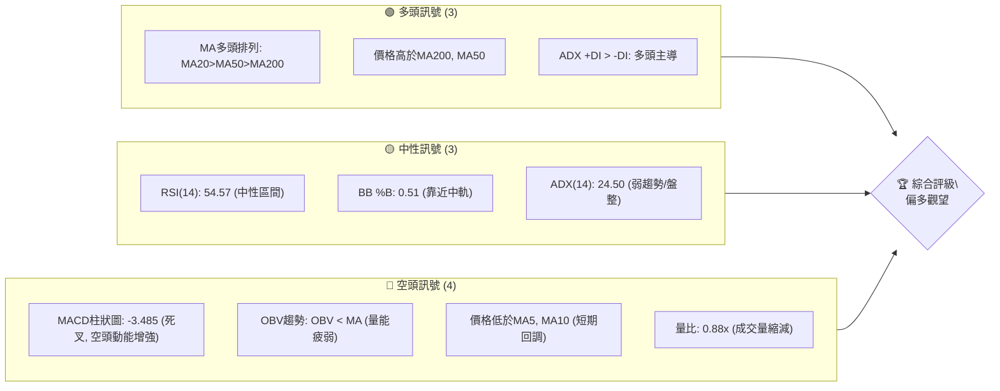
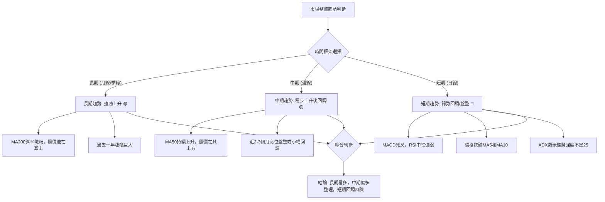
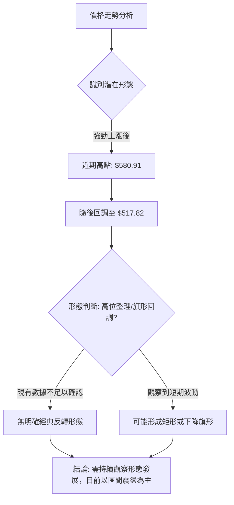
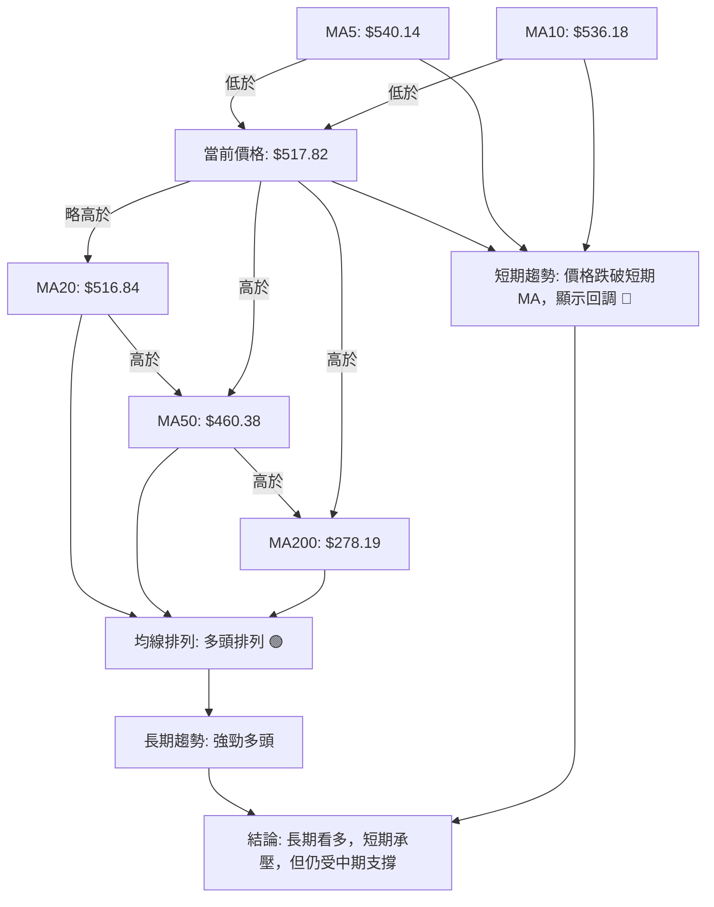
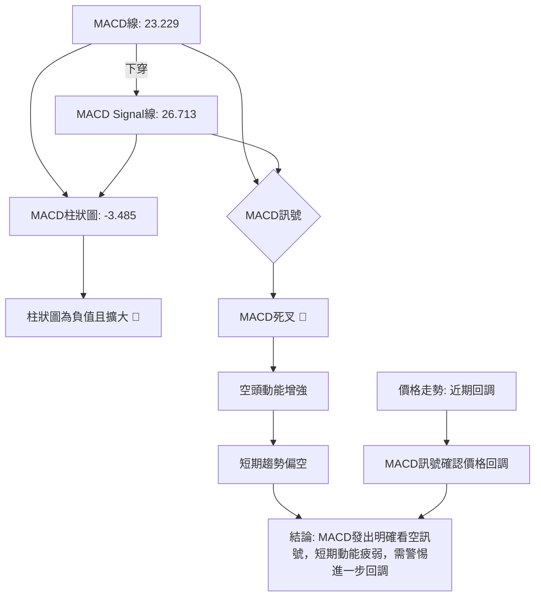

<details>
<summary>📊 靜態圖表 (點擊展開)</summary>

</details>

<html>
<head><meta charset="utf-8" /></head>
<body>
    <div style="height:500px; width:100%;">                        <script>window.PlotlyConfig = {MathJaxConfig: 'local'};</script>
        <script charset="utf-8" src="https://cdn.plot.ly/plotly-3.6.0.min.js" integrity="sha256-QaOVwtVY0T02VaHrr6pnoHLCwayMJp4O5n4YyaE3rJk=" crossorigin="anonymous"></script>                <div id="candlestick-chart" class="plotly-graph-div" style="height:100%; width:100%;"></div>            <script>                window.PLOTLYENV=window.PLOTLYENV || {};                                if (document.getElementById("candlestick-chart")) {                    Plotly.newPlot(                        "candlestick-chart",                        [{"close":{"dtype":"f8","bdata":"AAAAYLgOZEAAAADAHuVjQAAAAKBwvWNAAAAA4HqsY0AAAACgR\u002fljQAAAAMDMHGRAAAAAACkcZEAAAADgoyhkQAAAAGC47mNAAAAAIIUrZEAAAACgRzlkQAAAAOBRgGRAAAAAIFw3ZUAAAACgcJVkQAAAAGC4dmlAAAAA4FFwakAAAACA63FtQAAAAOB6HG1AAAAAwMzcakAAAACgcA1rQAAAAEDhQmtAAAAAQDPTbUAAAACA61FtQAAAAGCPIm1AAAAAgOsRbkAAAADA9cBtQAAAACBcx2xAAAAAIK5fbUAAAACgcJ1vQAAAAGC4OnBAAAAAACkgcEAAAACgR4VwQAAAAEDh2m9AAAAAgOsBcEAAAABgZjpwQAAAAKCZQW9AAAAAoEcFcEAAAABgZrZtQAAAAKBHMW1AAAAAIFx\u002fbkAAAADgo7BtQAAAAIA9LnBAAAAAYLj+bkAAAACA69luQAAAAOCjEG5AAAAAoEfJbEAAAACgmfFrQAAAAOCjwGlAAAAAwPV4aUAAAACgmeFqQAAAAAApxGlAAAAAIK7HakAAAADA9TBrQAAAAOBReGtAAAAAIK7nakAAAABAMzNrQAAAACBc\u002f2pAAAAAQAo\u002fa0AAAAAghaNrQAAAAADXs2tAAAAAoHCta0AAAACAwq1rQAAAAMD1WGpAAAAAYI\u002fyaUAAAACgcCVqQAAAACCFw2hAAAAAgOshaUAAAACAwq1qQAAAAGBm3mpAAAAAwMzcakAAAACgR+FqQAAAACCu32pAAAAAIIXzakAAAABA4epqQAAAAMAexWpAAAAAQArva0AAAABgj6JrQAAAAEAzy2pAAAAA4KNAakAAAACAwpVpQAAAAKBwZWlAAAAAgBT2aUAAAABACp9rQAAAAEAz82tAAAAAoHB9bEAAAABgj\u002fpsQAAAAKBw\u002fWxAAAAAoJk5b0AAAAAgXLdvQAAAAEDhOnBAAAAAgOtpb0AAAADA9YBvQAAAACCul29AAAAAgMKFb0AAAAAgXJdtQAAAAOCjyG5AAAAAIIVDbkAAAACAFAZpQAAAAAAAEGhAAAAAgBQOakAAAAAAAABrQAAAAIA9smpAAAAAYI+yakAAAACAFL5pQAAAAIA96mlAAAAAYI9iaUAAAAAA1wNpQAAAAADXa2lAAAAAwMwEaUAAAABAM5NoQAAAAEDhumpAAAAAIIVbakAAAACAwnVpQAAAAGC4BmlAAAAAANfTaEAAAABgZt5nQAAAAIA9QmlAAAAAYGbuaEAAAACAwg1oQAAAAIDCVWlAAAAAIFxnaUAAAABgj5ppQAAAACCut2hAAAAA4HosaEAAAABgj5JoQAAAAIDriWhAAAAAYLjuaEAAAADgo6hpQAAAAGCPKmlAAAAAgMJVaUAAAAAA16tpQAAAAOCjiGtAAAAA4KN4aUAAAAAgrj9pQAAAAKBHgWhAAAAAgMJtaUAAAABguEZqQAAAAAAAMGtAAAAAgMKFa0AAAADA9bBrQAAAAIA9+mxAAAAA4HqUbUAAAACgR6FuQAAAAGCP2m5AAAAAgD3ib0AAAACA6yFwQAAAAAApZHFAAAAAgD1mcUAAAABAMy9xQAAAAADXx3FAAAAAIFz3ckAAAACgRxVzQAAAAMD1vHVAAAAAgBTqdEAAAAAgXDN0QAAAAIDCEXVAAAAAANcndkAAAADgo4h2QAAAAOCjWHVAAAAAACk0dkAAAACAPVZ6QAAAACBch3lAAAAAQApzfEAAAADgo6x8QAAAAOCjBHxAAAAAAADYe0AAAABAMxt8QAAAAKCZgXpAAAAAANdPekAAAADAzOB5QAAAAKBH+XtAAAAAoHAZfEAAAAAAKTh9QAAAAIA9fn9AAAAA4KP4fkAAAABguDCAQAAAAMDMIIBAAAAAgBTif0AAAADgUUyAQAAAAAAp9IBAAAAAoJlZgEAAAACAFCZ9QAAAAKBHpX5AAAAAACm4fUAAAABgZkZ8QAAAAEAzh35AAAAAwB75f0AAAACAFBqBQAAAAOCjtH9AAAAAANcDgEAAAADA9cqAQAAAAEAKPYFAAAAAwMw+gEAAAACA6z2AQAAAAGCPpIBAAAAA4KNMgEAAAACA69uAQAAAAKBHJ4JAAAAAQArngEAAAABgjy6AQA=="},"high":{"dtype":"f8","bdata":"AAAAYGY+ZEAAAAAAKTRkQAAAAOCj2GNAAAAAQOH6Y0AAAACAwlVkQAAAAOB6bGRAAAAAQDOjZEAAAAAAKTRkQAAAACCFQ2RAAAAAoJmJZEAAAADA9UhkQAAAAIDChWRAAAAAgOthZUAAAACAwlVlQAAAAGC4VmxAAAAAwMxca0AAAAAA13ttQAAAAEAzA25AAAAAQApHbUAAAACAFAZsQAAAACBcH2xAAAAAIK7nbUAAAABgZiZuQAAAAAApbG1AAAAAAClcbkAAAADgUUhuQAAAAAApBG5AAAAAwMx8bUAAAADgeqxvQAAAAGC4RnBAAAAAoEeJcEAAAACgR7FwQAAAAIAUfnBAAAAAgBRicEAAAABgj05wQAAAAIAUFnBAAAAAYGY6cEAAAADgUbBvQAAAAADXe21AAAAAwMwcb0AAAABguA5vQAAAAAApeHBAAAAAgBQ6cEAAAACAFK5vQAAAAOCjGG9AAAAAAADAbUAAAADA9WhtQAAAAAAASG1AAAAAYI8aakAAAAAAKSRrQAAAAGCP0mlAAAAAQOHyakAAAACgmUlrQAAAACBcn2tAAAAAIFw\u002fbEAAAABgZkZrQAAAAADXY2tAAAAA4Hr0a0AAAABguPZrQAAAAEDhGmxAAAAAIIXTa0AAAAAAALBrQAAAACCuz2tAAAAAIIXrakAAAABACkdqQAAAAAAAcGpAAAAAIIXLaUAAAACAwuVqQAAAAKBwhWtAAAAAwPUga0AAAACgRxFrQAAAAGCPGmtAAAAAoJkBa0AAAACAPRprQAAAAOB6NGtAAAAAwMxkbEAAAADgo0BtQAAAAKBw3WtAAAAAACmEakAAAACAFF5qQAAAAKCZ6WlAAAAAACk8akAAAAAgheNrQAAAAEDhAmxAAAAAQDPLbUAAAAAgrk9tQAAAAAAA8G1AAAAAwMycb0AAAACgRwFwQAAAACBcr3BAAAAA4KMkcEAAAACgmfFvQAAAAGBmFnBAAAAA4HpIcEAAAAAgrqduQAAAAEAKP29AAAAAwMyUb0AAAABgj1JrQAAAAKBHgWlAAAAA4KMoakAAAABAMzNrQAAAAOB6bGtAAAAAwMx0a0AAAABguE5rQAAAAKCZQWpAAAAAoJmpaUAAAABgZmZpQAAAAEAzg2lAAAAAANebaUAAAAAAKexoQAAAAGC4FmtAAAAAYGYWa0AAAACgRzlqQAAAAOB6PGlAAAAAIK7XaEAAAADgejRoQAAAAIAUTmlAAAAAoEd5aUAAAAAgrgdpQAAAAEAKX2lAAAAAQOHSaUAAAABguCZqQAAAAADXc2lAAAAAgML1aEAAAACgcAVpQAAAAGC45mhAAAAAIIVbaUAAAAAAKbxpQAAAAKCZyWlAAAAAIIUjakAAAACAws1pQAAAAGCPqmtAAAAAAACga0AAAADgo2hpQAAAAIDCDWpAAAAAAACAaUAAAABgj7pqQAAAAMD1OGtAAAAAgOtJbEAAAABAM8NrQAAAAAAAQG1AAAAAQDOjbUAAAABgjzJvQAAAAGCP6m5AAAAAYLjub0AAAABA4SJwQAAAAKBwdXFAAAAAwMyQcUAAAACAwvlxQAAAAEAz43FAAAAAAAAEc0AAAAAghWNzQAAAAADXD3ZAAAAAIFzTdUAAAAAAAHh0QAAAAGC4QnVAAAAAIFwvdkAAAADgo6x2QAAAAKCZnXZAAAAAwB55dkAAAACgmel6QAAAACBcW3pAAAAA4KOEfEAAAAAghVN9QAAAAMDMrHxAAAAAAAC4fEAAAADA9VR8QAAAAAAAcHtAAAAAwMxse0AAAAAAAMx6QAAAAIA9FnxAAAAAQDMzfEAAAABgjxZ+QAAAACBcr39AAAAAIFzjf0AAAACgmXmAQAAAAAAAUIBAAAAAAAAsgEAAAACA61OAQAAAACCFE4FAAAAAIIWhgEAAAACA65l\u002fQAAAACCF735AAAAAAACQf0AAAABAM9d9QAAAACBcp35AAAAAIK5NgEAAAADA9XKBQAAAAKCZJ4FAAAAAAACkgEAAAAAghd2AQAAAAIDrl4FAAAAAgOuDgEAAAAAgrmeAQAAAAEAKN4FAAAAAQOFogEAAAAAghfGAQAAAAADXRYJAAAAAYLiggUAAAABAMx2BQA=="},"hovertemplate":"\u003cb\u003e%{x|%Y-%m-%d}\u003c\u002fb\u003e\u003cbr\u003e\u958b: $%{open:.2f}\u003cbr\u003e\u9ad8: $%{high:.2f}\u003cbr\u003e\u4f4e: $%{low:.2f}\u003cbr\u003e\u6536: $%{close:.2f}\u003cextra\u003e\u003c\u002fextra\u003e","low":{"dtype":"f8","bdata":"AAAAQArnY0AAAADgUXhjQAAAAEAzu2JAAAAAwMx8Y0AAAACgcK1jQAAAAGC45mNAAAAAgMLNY0AAAADA9VhjQAAAAKCZoWNAAAAAwMz8Y0AAAABgj+pjQAAAACCuD2RAAAAAANfDZEAAAADgemRkQAAAAOBRYGlAAAAAwPUoakAAAABgZlZqQAAAAMD1sGxAAAAAYGamakAAAADAzNxqQAAAAMDM\u002fGpAAAAA4FGYa0AAAAAgrgdtQAAAAMAefWxAAAAAwMxMbUAAAADgo0BtQAAAAAApHGxAAAAAoEeRbEAAAABgZj5uQAAAAKCZOW9AAAAAAAAQcEAAAABgZhZwQAAAAIDriW9AAAAAwB6tb0AAAADgerxvQAAAAOB67G5AAAAAgOtZbkAAAAAgrndtQAAAAOB6FGxAAAAAAAAQbkAAAADgelRtQAAAAAAAQG9AAAAAgOvBbkAAAABgj2JtQAAAAMDMpG1AAAAAYLgWbEAAAABguHZrQAAAAMD1kGlAAAAAAABgaEAAAABAM7tpQAAAAMD1SGhAAAAAAADgaUAAAADgo8BqQAAAAAAAsGpAAAAA4HrMakAAAADgo3hqQAAAAOB6xGpAAAAAIK4Ha0AAAAAghUtrQAAAAMAePWtAAAAAoHBVa0AAAACAFEZqQAAAAIDrIWpAAAAAYI\u002fSaUAAAAAghaNpQAAAAMD1sGhAAAAAAAAQaUAAAABgZoZpQAAAAIDrqWpAAAAAwPWIakAAAABACr9qQAAAAMD1oGpAAAAAIK4nakAAAABgj8pqQAAAAKCZuWpAAAAAwMxca0AAAAAgXI9rQAAAAAAAaGpAAAAAoHDlaUAAAABgj2ppQAAAAIA9YmlAAAAAoJn5aEAAAAAgXN9qQAAAACCF42pAAAAAQApnbEAAAAAghZtsQAAAAMAeLWxAAAAAwPV4bUAAAAAAKdRuQAAAAAAABHBAAAAAoJlJb0AAAABguP5uQAAAAGC4Rm9AAAAAwB4dbkAAAACgmVFtQAAAAAAAYG1AAAAAoEehbUAAAADAzORoQAAAAEAK12dAAAAAgMKNaEAAAADAzIRpQAAAAAAppGpAAAAAYLgmakAAAADgeqRpQAAAAAApfGlAAAAAYI9aaEAAAAAAAGBoQAAAAKBHyWhAAAAAgOvRaEAAAADAzERoQAAAAAAA0GlAAAAAYI9KakAAAABguC5pQAAAACCut2hAAAAAAADAZ0AAAABACodnQAAAACCFu2dAAAAAAClcaEAAAAAAAOhnQAAAAOCjoGdAAAAAYGZGaUAAAAAAKXRpQAAAAKBwlWhAAAAA4KMIaEAAAACgmVloQAAAAOBRaGhAAAAAAAB4aEAAAABgjxpoQAAAAOBRyGhAAAAAYLg2aUAAAAAAKQRpQAAAAOBRcGpAAAAAgMJtaUAAAACAFLZoQAAAAADXG2hAAAAAwB6NaEAAAABA4bppQAAAAADXE2lAAAAAIFw3a0AAAAAAKexqQAAAAEDhYmxAAAAAwB7dbEAAAABguN5tQAAAAMD1QG5AAAAAYGa2bkAAAABAM3tvQAAAAAApWHBAAAAAgD0icUAAAAAAAABxQAAAAIDrSXFAAAAAgD3icUAAAAAAKbxyQAAAAOCj6HRAAAAAwPWMdEAAAAAAAGBzQAAAAIDC7XNAAAAAoJnJdEAAAAAAANR1QAAAAEAzK3VAAAAAgBSOdUAAAADgoyB5QAAAAKBHEXlAAAAA4KMkekAAAACAFC58QAAAAIDCoXpAAAAAYGYKe0AAAABA4Tp7QAAAAIDCdXpAAAAAIFyreUAAAACAwpV4QAAAAMDMoHpAAAAAoJn5ekAAAAAgXNt8QAAAACCuA35AAAAAYI9qfkAAAADgUdh+QAAAAEDhdn9AAAAAwMxsfkAAAAAghVN\u002fQAAAAGBmYoBAAAAAgOs9f0AAAABAM\u002f98QAAAACBc231AAAAAIK5Te0AAAACgRwV8QAAAAOBRoHxAAAAAAADgfkAAAAAAAJSAQAAAAAAAtH9AAAAAwMy0f0AAAABgj3KAQAAAACCuvYBAAAAAwPWsf0AAAAAAAHh\u002fQAAAAAAAsH9AAAAAgMJpf0AAAACgmfV+QAAAAGCPDIFAAAAAgOvVgEAAAAAAAKB\u002fQA=="},"name":"\u50f9\u683c","open":{"dtype":"f8","bdata":"AAAAANcrZEAAAADA9ehjQAAAAGC43mJAAAAAACmsY0AAAACgcK1jQAAAAOCjEGRAAAAAIFxfZEAAAADgeqRjQAAAAOCjEGRAAAAAANcDZEAAAACgRxlkQAAAAIDCHWRAAAAAgMIVZUAAAACAwlVlQAAAAGBmTmxAAAAAQDPbakAAAABgZp5qQAAAAKCZiW1AAAAA4KMYbUAAAABgZoZrQAAAAGBmZmtAAAAAYLjWa0AAAACgR4ltQAAAAOBRKG1AAAAAQAqPbUAAAADgeuxtQAAAAEAzm21AAAAAwB7FbEAAAAAghWtuQAAAAIAUHnBAAAAAgD0ycEAAAABACoNwQAAAAGC4PnBAAAAAoJk5cEAAAACgRzVwQAAAAEAzS29AAAAAIK5nbkAAAABACq9vQAAAAIAU3mxAAAAA4HpEbkAAAADAHjVuQAAAAAAppG9AAAAAwMx8b0AAAAAghQNuQAAAAAAAWG5AAAAAwPWYbUAAAADgUchsQAAAAGBmFm1AAAAAgOsZakAAAADAHuVpQAAAACBcL2lAAAAAoJlBakAAAADgegRrQAAAAAApvGpAAAAAoEe5a0AAAADgUQhrQAAAAAApHGtAAAAAoHAla0AAAABA4WJrQAAAAKBHoWtAAAAAAADAa0AAAACA6zlrQAAAAADXS2tAAAAAwPWIakAAAACgcN1pQAAAAKBHQWpAAAAAgD16aUAAAABAM5NpQAAAAAAAgGtAAAAAIIWbakAAAAAgXN9qQAAAAIDC7WpAAAAAYI9yakAAAAAA1\u002ftqQAAAAIA9+mpAAAAAwMxca0AAAAAAAMhsQAAAAGC41mtAAAAAACmEakAAAADAzFxqQAAAAEAKt2lAAAAAgMIlaUAAAABAM+NqQAAAAKBHMWtAAAAAwMx8bEAAAACgmUltQAAAAGCPQmxAAAAAIK5\u002fbUAAAAAAAHhvQAAAAEDhUnBAAAAAAAAMcEAAAADAHoVvQAAAAAApxG9AAAAAwB7Vb0AAAACAwp1tQAAAAOCjeG1AAAAAoJlxb0AAAAAAAOBqQAAAACCFO2lAAAAAACmkaEAAAADAzNxpQAAAAOB65GpAAAAAACk8a0AAAABgj\u002fpqQAAAAOCjgGlAAAAAwMxEaUAAAADAHs1oQAAAACCFA2lAAAAAANcDaUAAAABA4cJoQAAAAAApdGpAAAAAgD3aakAAAACgmRlqQAAAACCFA2lAAAAAQDM7aEAAAABguO5nQAAAAADXA2hAAAAA4KO4aEAAAADgo2hoQAAAACCFq2dAAAAA4FFQaUAAAAAghaNpQAAAAGCPWmlAAAAAIIXDaEAAAAAgXF9oQAAAAIDClWhAAAAAAACAaEAAAADA9WBoQAAAAOB6nGlAAAAAwMzMaUAAAADgeixpQAAAAOBRcGpAAAAAIFw\u002fa0AAAADgozhpQAAAAGBmnmlAAAAAoJnBaEAAAABA4fJpQAAAAKCZgWlAAAAAwPVoa0AAAADgUUhrQAAAAADXA21AAAAA4FEgbUAAAAAAAOBtQAAAAMD1oG5AAAAAoEc5b0AAAABguN5vQAAAAADXj3BAAAAAAACQcUAAAACgmYlxQAAAAKBHVXFAAAAAIIUzckAAAAAAKeByQAAAAAApDHVAAAAAwB6ldUAAAACAwn1zQAAAAKBHaXRAAAAAgMJVdUAAAACA6\u002f11QAAAAMD1hHZAAAAAACn4dUAAAAAA15d5QAAAAMAeEXpAAAAAoHApekAAAADAzMh8QAAAAAAAFHxAAAAA4KOQfEAAAACgmYl7QAAAAKBwFXtAAAAAAADYekAAAACgmcl5QAAAAOCjwHpAAAAAANefe0AAAACgcF19QAAAAADXS35AAAAAAADAf0AAAAAAADB\u002fQAAAAGBmRoBAAAAAYI9Cf0AAAADAzKR\u002fQAAAAAAAroBAAAAAAAAWgEAAAADgejh\u002fQAAAAAAAUH5AAAAAAABsf0AAAAAghT99QAAAAKCZ2XxAAAAAQAo7f0AAAAAAAL6AQAAAAMAeF4FAAAAAoEeNgEAAAADgo5yAQAAAAAAADIFAAAAAoEfRf0AAAABgj0aAQAAAAKBw\u002f4BAAAAAYGY+gEAAAABguFaAQAAAAGCPDIFAAAAAgD1sgUAAAACgR9GAQA=="},"x":["2025-09-16T00:00:00-04:00","2025-09-17T00:00:00-04:00","2025-09-18T00:00:00-04:00","2025-09-19T00:00:00-04:00","2025-09-22T00:00:00-04:00","2025-09-23T00:00:00-04:00","2025-09-24T00:00:00-04:00","2025-09-25T00:00:00-04:00","2025-09-26T00:00:00-04:00","2025-09-29T00:00:00-04:00","2025-09-30T00:00:00-04:00","2025-10-01T00:00:00-04:00","2025-10-02T00:00:00-04:00","2025-10-03T00:00:00-04:00","2025-10-06T00:00:00-04:00","2025-10-07T00:00:00-04:00","2025-10-08T00:00:00-04:00","2025-10-09T00:00:00-04:00","2025-10-10T00:00:00-04:00","2025-10-13T00:00:00-04:00","2025-10-14T00:00:00-04:00","2025-10-15T00:00:00-04:00","2025-10-16T00:00:00-04:00","2025-10-17T00:00:00-04:00","2025-10-20T00:00:00-04:00","2025-10-21T00:00:00-04:00","2025-10-22T00:00:00-04:00","2025-10-23T00:00:00-04:00","2025-10-24T00:00:00-04:00","2025-10-27T00:00:00-04:00","2025-10-28T00:00:00-04:00","2025-10-29T00:00:00-04:00","2025-10-30T00:00:00-04:00","2025-10-31T00:00:00-04:00","2025-11-03T00:00:00-05:00","2025-11-04T00:00:00-05:00","2025-11-05T00:00:00-05:00","2025-11-06T00:00:00-05:00","2025-11-07T00:00:00-05:00","2025-11-10T00:00:00-05:00","2025-11-11T00:00:00-05:00","2025-11-12T00:00:00-05:00","2025-11-13T00:00:00-05:00","2025-11-14T00:00:00-05:00","2025-11-17T00:00:00-05:00","2025-11-18T00:00:00-05:00","2025-11-19T00:00:00-05:00","2025-11-20T00:00:00-05:00","2025-11-21T00:00:00-05:00","2025-11-24T00:00:00-05:00","2025-11-25T00:00:00-05:00","2025-11-26T00:00:00-05:00","2025-11-28T00:00:00-05:00","2025-12-01T00:00:00-05:00","2025-12-02T00:00:00-05:00","2025-12-03T00:00:00-05:00","2025-12-04T00:00:00-05:00","2025-12-05T00:00:00-05:00","2025-12-08T00:00:00-05:00","2025-12-09T00:00:00-05:00","2025-12-10T00:00:00-05:00","2025-12-11T00:00:00-05:00","2025-12-12T00:00:00-05:00","2025-12-15T00:00:00-05:00","2025-12-16T00:00:00-05:00","2025-12-17T00:00:00-05:00","2025-12-18T00:00:00-05:00","2025-12-19T00:00:00-05:00","2025-12-22T00:00:00-05:00","2025-12-23T00:00:00-05:00","2025-12-24T00:00:00-05:00","2025-12-26T00:00:00-05:00","2025-12-29T00:00:00-05:00","2025-12-30T00:00:00-05:00","2025-12-31T00:00:00-05:00","2026-01-02T00:00:00-05:00","2026-01-05T00:00:00-05:00","2026-01-06T00:00:00-05:00","2026-01-07T00:00:00-05:00","2026-01-08T00:00:00-05:00","2026-01-09T00:00:00-05:00","2026-01-12T00:00:00-05:00","2026-01-13T00:00:00-05:00","2026-01-14T00:00:00-05:00","2026-01-15T00:00:00-05:00","2026-01-16T00:00:00-05:00","2026-01-20T00:00:00-05:00","2026-01-21T00:00:00-05:00","2026-01-22T00:00:00-05:00","2026-01-23T00:00:00-05:00","2026-01-26T00:00:00-05:00","2026-01-27T00:00:00-05:00","2026-01-28T00:00:00-05:00","2026-01-29T00:00:00-05:00","2026-01-30T00:00:00-05:00","2026-02-02T00:00:00-05:00","2026-02-03T00:00:00-05:00","2026-02-04T00:00:00-05:00","2026-02-05T00:00:00-05:00","2026-02-06T00:00:00-05:00","2026-02-09T00:00:00-05:00","2026-02-10T00:00:00-05:00","2026-02-11T00:00:00-05:00","2026-02-12T00:00:00-05:00","2026-02-13T00:00:00-05:00","2026-02-17T00:00:00-05:00","2026-02-18T00:00:00-05:00","2026-02-19T00:00:00-05:00","2026-02-20T00:00:00-05:00","2026-02-23T00:00:00-05:00","2026-02-24T00:00:00-05:00","2026-02-25T00:00:00-05:00","2026-02-26T00:00:00-05:00","2026-02-27T00:00:00-05:00","2026-03-02T00:00:00-05:00","2026-03-03T00:00:00-05:00","2026-03-04T00:00:00-05:00","2026-03-05T00:00:00-05:00","2026-03-06T00:00:00-05:00","2026-03-09T00:00:00-04:00","2026-03-10T00:00:00-04:00","2026-03-11T00:00:00-04:00","2026-03-12T00:00:00-04:00","2026-03-13T00:00:00-04:00","2026-03-16T00:00:00-04:00","2026-03-17T00:00:00-04:00","2026-03-18T00:00:00-04:00","2026-03-19T00:00:00-04:00","2026-03-20T00:00:00-04:00","2026-03-23T00:00:00-04:00","2026-03-24T00:00:00-04:00","2026-03-25T00:00:00-04:00","2026-03-26T00:00:00-04:00","2026-03-27T00:00:00-04:00","2026-03-30T00:00:00-04:00","2026-03-31T00:00:00-04:00","2026-04-01T00:00:00-04:00","2026-04-02T00:00:00-04:00","2026-04-06T00:00:00-04:00","2026-04-07T00:00:00-04:00","2026-04-08T00:00:00-04:00","2026-04-09T00:00:00-04:00","2026-04-10T00:00:00-04:00","2026-04-13T00:00:00-04:00","2026-04-14T00:00:00-04:00","2026-04-15T00:00:00-04:00","2026-04-16T00:00:00-04:00","2026-04-17T00:00:00-04:00","2026-04-20T00:00:00-04:00","2026-04-21T00:00:00-04:00","2026-04-22T00:00:00-04:00","2026-04-23T00:00:00-04:00","2026-04-24T00:00:00-04:00","2026-04-27T00:00:00-04:00","2026-04-28T00:00:00-04:00","2026-04-29T00:00:00-04:00","2026-04-30T00:00:00-04:00","2026-05-01T00:00:00-04:00","2026-05-04T00:00:00-04:00","2026-05-05T00:00:00-04:00","2026-05-06T00:00:00-04:00","2026-05-07T00:00:00-04:00","2026-05-08T00:00:00-04:00","2026-05-11T00:00:00-04:00","2026-05-12T00:00:00-04:00","2026-05-13T00:00:00-04:00","2026-05-14T00:00:00-04:00","2026-05-15T00:00:00-04:00","2026-05-18T00:00:00-04:00","2026-05-19T00:00:00-04:00","2026-05-20T00:00:00-04:00","2026-05-21T00:00:00-04:00","2026-05-22T00:00:00-04:00","2026-05-26T00:00:00-04:00","2026-05-27T00:00:00-04:00","2026-05-28T00:00:00-04:00","2026-05-29T00:00:00-04:00","2026-06-01T00:00:00-04:00","2026-06-02T00:00:00-04:00","2026-06-03T00:00:00-04:00","2026-06-04T00:00:00-04:00","2026-06-05T00:00:00-04:00","2026-06-08T00:00:00-04:00","2026-06-09T00:00:00-04:00","2026-06-10T00:00:00-04:00","2026-06-11T00:00:00-04:00","2026-06-12T00:00:00-04:00","2026-06-15T00:00:00-04:00","2026-06-16T00:00:00-04:00","2026-06-17T00:00:00-04:00","2026-06-18T00:00:00-04:00","2026-06-22T00:00:00-04:00","2026-06-23T00:00:00-04:00","2026-06-24T00:00:00-04:00","2026-06-25T00:00:00-04:00","2026-06-26T00:00:00-04:00","2026-06-29T00:00:00-04:00","2026-06-30T00:00:00-04:00","2026-07-01T00:00:00-04:00","2026-07-02T00:00:00-04:00"],"type":"candlestick"},{"hovertemplate":"MA30: $%{y:.2f}\u003cextra\u003e\u003c\u002fextra\u003e","line":{"color":"#2196F3","dash":"dash","width":2},"mode":"lines","name":"MA30","x":["2025-09-16T00:00:00-04:00","2025-09-17T00:00:00-04:00","2025-09-18T00:00:00-04:00","2025-09-19T00:00:00-04:00","2025-09-22T00:00:00-04:00","2025-09-23T00:00:00-04:00","2025-09-24T00:00:00-04:00","2025-09-25T00:00:00-04:00","2025-09-26T00:00:00-04:00","2025-09-29T00:00:00-04:00","2025-09-30T00:00:00-04:00","2025-10-01T00:00:00-04:00","2025-10-02T00:00:00-04:00","2025-10-03T00:00:00-04:00","2025-10-06T00:00:00-04:00","2025-10-07T00:00:00-04:00","2025-10-08T00:00:00-04:00","2025-10-09T00:00:00-04:00","2025-10-10T00:00:00-04:00","2025-10-13T00:00:00-04:00","2025-10-14T00:00:00-04:00","2025-10-15T00:00:00-04:00","2025-10-16T00:00:00-04:00","2025-10-17T00:00:00-04:00","2025-10-20T00:00:00-04:00","2025-10-21T00:00:00-04:00","2025-10-22T00:00:00-04:00","2025-10-23T00:00:00-04:00","2025-10-24T00:00:00-04:00","2025-10-27T00:00:00-04:00","2025-10-28T00:00:00-04:00","2025-10-29T00:00:00-04:00","2025-10-30T00:00:00-04:00","2025-10-31T00:00:00-04:00","2025-11-03T00:00:00-05:00","2025-11-04T00:00:00-05:00","2025-11-05T00:00:00-05:00","2025-11-06T00:00:00-05:00","2025-11-07T00:00:00-05:00","2025-11-10T00:00:00-05:00","2025-11-11T00:00:00-05:00","2025-11-12T00:00:00-05:00","2025-11-13T00:00:00-05:00","2025-11-14T00:00:00-05:00","2025-11-17T00:00:00-05:00","2025-11-18T00:00:00-05:00","2025-11-19T00:00:00-05:00","2025-11-20T00:00:00-05:00","2025-11-21T00:00:00-05:00","2025-11-24T00:00:00-05:00","2025-11-25T00:00:00-05:00","2025-11-26T00:00:00-05:00","2025-11-28T00:00:00-05:00","2025-12-01T00:00:00-05:00","2025-12-02T00:00:00-05:00","2025-12-03T00:00:00-05:00","2025-12-04T00:00:00-05:00","2025-12-05T00:00:00-05:00","2025-12-08T00:00:00-05:00","2025-12-09T00:00:00-05:00","2025-12-10T00:00:00-05:00","2025-12-11T00:00:00-05:00","2025-12-12T00:00:00-05:00","2025-12-15T00:00:00-05:00","2025-12-16T00:00:00-05:00","2025-12-17T00:00:00-05:00","2025-12-18T00:00:00-05:00","2025-12-19T00:00:00-05:00","2025-12-22T00:00:00-05:00","2025-12-23T00:00:00-05:00","2025-12-24T00:00:00-05:00","2025-12-26T00:00:00-05:00","2025-12-29T00:00:00-05:00","2025-12-30T00:00:00-05:00","2025-12-31T00:00:00-05:00","2026-01-02T00:00:00-05:00","2026-01-05T00:00:00-05:00","2026-01-06T00:00:00-05:00","2026-01-07T00:00:00-05:00","2026-01-08T00:00:00-05:00","2026-01-09T00:00:00-05:00","2026-01-12T00:00:00-05:00","2026-01-13T00:00:00-05:00","2026-01-14T00:00:00-05:00","2026-01-15T00:00:00-05:00","2026-01-16T00:00:00-05:00","2026-01-20T00:00:00-05:00","2026-01-21T00:00:00-05:00","2026-01-22T00:00:00-05:00","2026-01-23T00:00:00-05:00","2026-01-26T00:00:00-05:00","2026-01-27T00:00:00-05:00","2026-01-28T00:00:00-05:00","2026-01-29T00:00:00-05:00","2026-01-30T00:00:00-05:00","2026-02-02T00:00:00-05:00","2026-02-03T00:00:00-05:00","2026-02-04T00:00:00-05:00","2026-02-05T00:00:00-05:00","2026-02-06T00:00:00-05:00","2026-02-09T00:00:00-05:00","2026-02-10T00:00:00-05:00","2026-02-11T00:00:00-05:00","2026-02-12T00:00:00-05:00","2026-02-13T00:00:00-05:00","2026-02-17T00:00:00-05:00","2026-02-18T00:00:00-05:00","2026-02-19T00:00:00-05:00","2026-02-20T00:00:00-05:00","2026-02-23T00:00:00-05:00","2026-02-24T00:00:00-05:00","2026-02-25T00:00:00-05:00","2026-02-26T00:00:00-05:00","2026-02-27T00:00:00-05:00","2026-03-02T00:00:00-05:00","2026-03-03T00:00:00-05:00","2026-03-04T00:00:00-05:00","2026-03-05T00:00:00-05:00","2026-03-06T00:00:00-05:00","2026-03-09T00:00:00-04:00","2026-03-10T00:00:00-04:00","2026-03-11T00:00:00-04:00","2026-03-12T00:00:00-04:00","2026-03-13T00:00:00-04:00","2026-03-16T00:00:00-04:00","2026-03-17T00:00:00-04:00","2026-03-18T00:00:00-04:00","2026-03-19T00:00:00-04:00","2026-03-20T00:00:00-04:00","2026-03-23T00:00:00-04:00","2026-03-24T00:00:00-04:00","2026-03-25T00:00:00-04:00","2026-03-26T00:00:00-04:00","2026-03-27T00:00:00-04:00","2026-03-30T00:00:00-04:00","2026-03-31T00:00:00-04:00","2026-04-01T00:00:00-04:00","2026-04-02T00:00:00-04:00","2026-04-06T00:00:00-04:00","2026-04-07T00:00:00-04:00","2026-04-08T00:00:00-04:00","2026-04-09T00:00:00-04:00","2026-04-10T00:00:00-04:00","2026-04-13T00:00:00-04:00","2026-04-14T00:00:00-04:00","2026-04-15T00:00:00-04:00","2026-04-16T00:00:00-04:00","2026-04-17T00:00:00-04:00","2026-04-20T00:00:00-04:00","2026-04-21T00:00:00-04:00","2026-04-22T00:00:00-04:00","2026-04-23T00:00:00-04:00","2026-04-24T00:00:00-04:00","2026-04-27T00:00:00-04:00","2026-04-28T00:00:00-04:00","2026-04-29T00:00:00-04:00","2026-04-30T00:00:00-04:00","2026-05-01T00:00:00-04:00","2026-05-04T00:00:00-04:00","2026-05-05T00:00:00-04:00","2026-05-06T00:00:00-04:00","2026-05-07T00:00:00-04:00","2026-05-08T00:00:00-04:00","2026-05-11T00:00:00-04:00","2026-05-12T00:00:00-04:00","2026-05-13T00:00:00-04:00","2026-05-14T00:00:00-04:00","2026-05-15T00:00:00-04:00","2026-05-18T00:00:00-04:00","2026-05-19T00:00:00-04:00","2026-05-20T00:00:00-04:00","2026-05-21T00:00:00-04:00","2026-05-22T00:00:00-04:00","2026-05-26T00:00:00-04:00","2026-05-27T00:00:00-04:00","2026-05-28T00:00:00-04:00","2026-05-29T00:00:00-04:00","2026-06-01T00:00:00-04:00","2026-06-02T00:00:00-04:00","2026-06-03T00:00:00-04:00","2026-06-04T00:00:00-04:00","2026-06-05T00:00:00-04:00","2026-06-08T00:00:00-04:00","2026-06-09T00:00:00-04:00","2026-06-10T00:00:00-04:00","2026-06-11T00:00:00-04:00","2026-06-12T00:00:00-04:00","2026-06-15T00:00:00-04:00","2026-06-16T00:00:00-04:00","2026-06-17T00:00:00-04:00","2026-06-18T00:00:00-04:00","2026-06-22T00:00:00-04:00","2026-06-23T00:00:00-04:00","2026-06-24T00:00:00-04:00","2026-06-25T00:00:00-04:00","2026-06-26T00:00:00-04:00","2026-06-29T00:00:00-04:00","2026-06-30T00:00:00-04:00","2026-07-01T00:00:00-04:00","2026-07-02T00:00:00-04:00"],"y":{"dtype":"f8","bdata":"AAAAAAAA+H8AAAAAAAD4fwAAAAAAAPh\u002fAAAAAAAA+H8AAAAAAAD4fwAAAAAAAPh\u002fAAAAAAAA+H8AAAAAAAD4fwAAAAAAAPh\u002fAAAAAAAA+H8AAAAAAAD4fwAAAAAAAPh\u002fAAAAAAAA+H8AAAAAAAD4fwAAAAAAAPh\u002fAAAAAAAA+H8AAAAAAAD4fwAAAAAAAPh\u002fAAAAAAAA+H8AAAAAAAD4fwAAAAAAAPh\u002fAAAAAAAA+H8AAAAAAAD4fwAAAAAAAPh\u002fAAAAAAAA+H8AAAAAAAD4fwAAAAAAAPh\u002fAAAAAAAA+H8AAAAAAAD4fyIiIjJ6z2hAmpmZ2Yc3aUBEREREtqdpQDMzM+MXD2pAIiIiwmd4akAiIiIy7OJqQHd3dxcEQmtAzczMTNSna0CJiIjIWvlrQO\u002fu7o5fSGxAMzMzU4CgbECrqqqqR\u002fFsQM3MzDx8Vm1A7+7uPu6pbUARERHxiwFuQGZmZobPKG5Ad3d3t9c8bkAAAAAwCDBuQDMzM+NeE25AMzMzY4IHbkCamZlJDAZuQJqZmWlK+W1AIiIigk7fbUDv7u4uJM1tQO\u002fu7u7uvm1AMzMz4+yjbUAzMzMjIo5tQAAAAPDufm1Ad3d3V8dsbUB3d3cX2UptQGZmZuZCIm1AMzMzYzv7bEBERETUeM1sQDMzM4N5nmxAvLu727JqbEBERER02jRsQO\u002fu7l5z\u002fWtAq6qq+n7Ca0BmZmamm6hrQHd3d1fHlGtAAAAAkMJ1a0BVVVUFyF1rQERERGT0LmtA7+7urnIMa0BmZmZG4epqQM3MzDzDzmpAzczM7HzHakAzMzNz2sRqQImIiBi9zWpAiYiICGXUakBERERUVclqQM3MzAwtxmpAZmZmdjC\u002fakAAAADQ28JqQERERGT0xmpAAAAA4HrUakDNzMycqONqQLy7u0up9GpAIiIiAp0Wa0ARERFxaDlrQLy7u1sBYmtAIiIiUuOBa0CamZkph6JrQKuqqgpJz2tAAAAA0Nv+a0B3d3eHQRxsQLy7u2ugT2xA7+7uzml7bECJiIhoSm1sQAAAABBYVWxA3t3dDXRObEAzMzMzek9sQCIiInL2TWxA7+7uHsxLbEC8u7tLxUFsQFVVVYV5OmxAERERsbkkbEBmZmY2Xg5sQAAAAPCnAmxARERExCD4a0BERERkgu9rQDMzMwPk+mtAIiIiokX+a0Dv7u5O1OtrQHd3d0fh0mtAzczMbKCza0BVVVV1BYhrQLy7u2suaGtAMzMzg3kya0BmZmaGFvFqQJqZmblJtGpA3t3drQCBakDv7u7up05qQERERET9E2pA3t3drUfVaUDe3d0NdKppQERERKQpdWlAmpmZWatHaUB3d3eHFk1pQFVVVbWBVmlAd3d311xQaUBEREQkBkVpQAAAALArTGlAd3d357RBaUCrqqpKfj1pQImIiBh2MWlAq6qqqtUxaUCamZnpmDxpQImIiFirS2lA7+7u3ghhaUC8u7troHtpQJqZmSnOjmlAIiIi0k2qaUC8u7vba9ZpQJqZmTkmCGpAd3d311xEakCrqqq6AoxqQN7d3a1H3WpAERERkXsxa0CJiIgIgYlrQN7d3Z3E4GtAZmZmFq5LbECJiIhI4bZsQFVVVWX0Vm1AVVVVVZztbUAzMzPDrnRuQLy7u4veCm9AERERETywb0CJiIiQ7SpwQHd3d+e0dXBAmpmZKRXHcECJiIgYSzpxQFVVVU2pnnFAMzMzg8AkckDe3d1Ftq1yQO\u002fu7s4+NHNA7+7ublm1c0BVVVXNEzV0QO\u002fu7pZDo3RAERER2VwOdUBmZmY+CnV1QERERKwc6HVAIiIicq9ZdkDNzMwEVtB2QHd3d0dvWXdAMzMzc6\u002fZd0BmZmYGVmR4QLy7uxsv43hAd3d3V8deeUB3d3cXS+J5QKuqqsroa3pAERERoRrhekAzMzNT\u002fzZ7QN7d3Q0Cg3tA7+7u3iTOe0DNzMycCxN8QCIiIpLCY3xAq6qqOom3fEC8u7u7Hht9QCIiIiKFc31AZmZm5l7HfUCJiIgIOgV+QDMzM4OVUX5AERERwRF0fkBVVVV1k5R+QM3MzHyGwX5AIiIi8hnqfkBVVVVF\u002fRl\u002fQO\u002fu7g6fbX9Aq6qqCpCtf0C8u7sb6OR\u002fQA=="},"type":"scatter"},{"hovertemplate":"MA60: $%{y:.2f}\u003cextra\u003e\u003c\u002fextra\u003e","line":{"color":"#9C27B0","dash":"dash","width":2},"mode":"lines","name":"MA60","x":["2025-09-16T00:00:00-04:00","2025-09-17T00:00:00-04:00","2025-09-18T00:00:00-04:00","2025-09-19T00:00:00-04:00","2025-09-22T00:00:00-04:00","2025-09-23T00:00:00-04:00","2025-09-24T00:00:00-04:00","2025-09-25T00:00:00-04:00","2025-09-26T00:00:00-04:00","2025-09-29T00:00:00-04:00","2025-09-30T00:00:00-04:00","2025-10-01T00:00:00-04:00","2025-10-02T00:00:00-04:00","2025-10-03T00:00:00-04:00","2025-10-06T00:00:00-04:00","2025-10-07T00:00:00-04:00","2025-10-08T00:00:00-04:00","2025-10-09T00:00:00-04:00","2025-10-10T00:00:00-04:00","2025-10-13T00:00:00-04:00","2025-10-14T00:00:00-04:00","2025-10-15T00:00:00-04:00","2025-10-16T00:00:00-04:00","2025-10-17T00:00:00-04:00","2025-10-20T00:00:00-04:00","2025-10-21T00:00:00-04:00","2025-10-22T00:00:00-04:00","2025-10-23T00:00:00-04:00","2025-10-24T00:00:00-04:00","2025-10-27T00:00:00-04:00","2025-10-28T00:00:00-04:00","2025-10-29T00:00:00-04:00","2025-10-30T00:00:00-04:00","2025-10-31T00:00:00-04:00","2025-11-03T00:00:00-05:00","2025-11-04T00:00:00-05:00","2025-11-05T00:00:00-05:00","2025-11-06T00:00:00-05:00","2025-11-07T00:00:00-05:00","2025-11-10T00:00:00-05:00","2025-11-11T00:00:00-05:00","2025-11-12T00:00:00-05:00","2025-11-13T00:00:00-05:00","2025-11-14T00:00:00-05:00","2025-11-17T00:00:00-05:00","2025-11-18T00:00:00-05:00","2025-11-19T00:00:00-05:00","2025-11-20T00:00:00-05:00","2025-11-21T00:00:00-05:00","2025-11-24T00:00:00-05:00","2025-11-25T00:00:00-05:00","2025-11-26T00:00:00-05:00","2025-11-28T00:00:00-05:00","2025-12-01T00:00:00-05:00","2025-12-02T00:00:00-05:00","2025-12-03T00:00:00-05:00","2025-12-04T00:00:00-05:00","2025-12-05T00:00:00-05:00","2025-12-08T00:00:00-05:00","2025-12-09T00:00:00-05:00","2025-12-10T00:00:00-05:00","2025-12-11T00:00:00-05:00","2025-12-12T00:00:00-05:00","2025-12-15T00:00:00-05:00","2025-12-16T00:00:00-05:00","2025-12-17T00:00:00-05:00","2025-12-18T00:00:00-05:00","2025-12-19T00:00:00-05:00","2025-12-22T00:00:00-05:00","2025-12-23T00:00:00-05:00","2025-12-24T00:00:00-05:00","2025-12-26T00:00:00-05:00","2025-12-29T00:00:00-05:00","2025-12-30T00:00:00-05:00","2025-12-31T00:00:00-05:00","2026-01-02T00:00:00-05:00","2026-01-05T00:00:00-05:00","2026-01-06T00:00:00-05:00","2026-01-07T00:00:00-05:00","2026-01-08T00:00:00-05:00","2026-01-09T00:00:00-05:00","2026-01-12T00:00:00-05:00","2026-01-13T00:00:00-05:00","2026-01-14T00:00:00-05:00","2026-01-15T00:00:00-05:00","2026-01-16T00:00:00-05:00","2026-01-20T00:00:00-05:00","2026-01-21T00:00:00-05:00","2026-01-22T00:00:00-05:00","2026-01-23T00:00:00-05:00","2026-01-26T00:00:00-05:00","2026-01-27T00:00:00-05:00","2026-01-28T00:00:00-05:00","2026-01-29T00:00:00-05:00","2026-01-30T00:00:00-05:00","2026-02-02T00:00:00-05:00","2026-02-03T00:00:00-05:00","2026-02-04T00:00:00-05:00","2026-02-05T00:00:00-05:00","2026-02-06T00:00:00-05:00","2026-02-09T00:00:00-05:00","2026-02-10T00:00:00-05:00","2026-02-11T00:00:00-05:00","2026-02-12T00:00:00-05:00","2026-02-13T00:00:00-05:00","2026-02-17T00:00:00-05:00","2026-02-18T00:00:00-05:00","2026-02-19T00:00:00-05:00","2026-02-20T00:00:00-05:00","2026-02-23T00:00:00-05:00","2026-02-24T00:00:00-05:00","2026-02-25T00:00:00-05:00","2026-02-26T00:00:00-05:00","2026-02-27T00:00:00-05:00","2026-03-02T00:00:00-05:00","2026-03-03T00:00:00-05:00","2026-03-04T00:00:00-05:00","2026-03-05T00:00:00-05:00","2026-03-06T00:00:00-05:00","2026-03-09T00:00:00-04:00","2026-03-10T00:00:00-04:00","2026-03-11T00:00:00-04:00","2026-03-12T00:00:00-04:00","2026-03-13T00:00:00-04:00","2026-03-16T00:00:00-04:00","2026-03-17T00:00:00-04:00","2026-03-18T00:00:00-04:00","2026-03-19T00:00:00-04:00","2026-03-20T00:00:00-04:00","2026-03-23T00:00:00-04:00","2026-03-24T00:00:00-04:00","2026-03-25T00:00:00-04:00","2026-03-26T00:00:00-04:00","2026-03-27T00:00:00-04:00","2026-03-30T00:00:00-04:00","2026-03-31T00:00:00-04:00","2026-04-01T00:00:00-04:00","2026-04-02T00:00:00-04:00","2026-04-06T00:00:00-04:00","2026-04-07T00:00:00-04:00","2026-04-08T00:00:00-04:00","2026-04-09T00:00:00-04:00","2026-04-10T00:00:00-04:00","2026-04-13T00:00:00-04:00","2026-04-14T00:00:00-04:00","2026-04-15T00:00:00-04:00","2026-04-16T00:00:00-04:00","2026-04-17T00:00:00-04:00","2026-04-20T00:00:00-04:00","2026-04-21T00:00:00-04:00","2026-04-22T00:00:00-04:00","2026-04-23T00:00:00-04:00","2026-04-24T00:00:00-04:00","2026-04-27T00:00:00-04:00","2026-04-28T00:00:00-04:00","2026-04-29T00:00:00-04:00","2026-04-30T00:00:00-04:00","2026-05-01T00:00:00-04:00","2026-05-04T00:00:00-04:00","2026-05-05T00:00:00-04:00","2026-05-06T00:00:00-04:00","2026-05-07T00:00:00-04:00","2026-05-08T00:00:00-04:00","2026-05-11T00:00:00-04:00","2026-05-12T00:00:00-04:00","2026-05-13T00:00:00-04:00","2026-05-14T00:00:00-04:00","2026-05-15T00:00:00-04:00","2026-05-18T00:00:00-04:00","2026-05-19T00:00:00-04:00","2026-05-20T00:00:00-04:00","2026-05-21T00:00:00-04:00","2026-05-22T00:00:00-04:00","2026-05-26T00:00:00-04:00","2026-05-27T00:00:00-04:00","2026-05-28T00:00:00-04:00","2026-05-29T00:00:00-04:00","2026-06-01T00:00:00-04:00","2026-06-02T00:00:00-04:00","2026-06-03T00:00:00-04:00","2026-06-04T00:00:00-04:00","2026-06-05T00:00:00-04:00","2026-06-08T00:00:00-04:00","2026-06-09T00:00:00-04:00","2026-06-10T00:00:00-04:00","2026-06-11T00:00:00-04:00","2026-06-12T00:00:00-04:00","2026-06-15T00:00:00-04:00","2026-06-16T00:00:00-04:00","2026-06-17T00:00:00-04:00","2026-06-18T00:00:00-04:00","2026-06-22T00:00:00-04:00","2026-06-23T00:00:00-04:00","2026-06-24T00:00:00-04:00","2026-06-25T00:00:00-04:00","2026-06-26T00:00:00-04:00","2026-06-29T00:00:00-04:00","2026-06-30T00:00:00-04:00","2026-07-01T00:00:00-04:00","2026-07-02T00:00:00-04:00"],"y":{"dtype":"f8","bdata":"AAAAAAAA+H8AAAAAAAD4fwAAAAAAAPh\u002fAAAAAAAA+H8AAAAAAAD4fwAAAAAAAPh\u002fAAAAAAAA+H8AAAAAAAD4fwAAAAAAAPh\u002fAAAAAAAA+H8AAAAAAAD4fwAAAAAAAPh\u002fAAAAAAAA+H8AAAAAAAD4fwAAAAAAAPh\u002fAAAAAAAA+H8AAAAAAAD4fwAAAAAAAPh\u002fAAAAAAAA+H8AAAAAAAD4fwAAAAAAAPh\u002fAAAAAAAA+H8AAAAAAAD4fwAAAAAAAPh\u002fAAAAAAAA+H8AAAAAAAD4fwAAAAAAAPh\u002fAAAAAAAA+H8AAAAAAAD4fwAAAAAAAPh\u002fAAAAAAAA+H8AAAAAAAD4fwAAAAAAAPh\u002fAAAAAAAA+H8AAAAAAAD4fwAAAAAAAPh\u002fAAAAAAAA+H8AAAAAAAD4fwAAAAAAAPh\u002fAAAAAAAA+H8AAAAAAAD4fwAAAAAAAPh\u002fAAAAAAAA+H8AAAAAAAD4fwAAAAAAAPh\u002fAAAAAAAA+H8AAAAAAAD4fwAAAAAAAPh\u002fAAAAAAAA+H8AAAAAAAD4fwAAAAAAAPh\u002fAAAAAAAA+H8AAAAAAAD4fwAAAAAAAPh\u002fAAAAAAAA+H8AAAAAAAD4fwAAAAAAAPh\u002fAAAAAAAA+H8AAAAAAAD4f0RERIze+GpAZmZmnmEZa0BERESMlzprQDMzM7PIVmtA7+7uTo1xa0AzMzNT44trQDMzM7u7n2tAvLu7oym1a0B3d3c3+9BrQDMzM3OT7mtAmpmZcSELbEAAAADYhydsQImIiFC4QmxA7+7udjBbbEC8u7ubNnZsQJqZmWHJe2xAIiIiUiqCbECamZlRcXpsQN7d3f2NcGxA3t3dtfNtbEDv7u7OsGdsQDMzM7u7X2xAREREfD9PbEB3d3f\u002f\u002f0dsQJqZmanxQmxAmpmZ4TM8bEAAAABg5ThsQN7d3R3MOWxAzczMLLJBbEBERETEIEJsQBERESEiQmxAq6qqWo8+bEDv7u7+\u002fzdsQO\u002fu7kbhNmxA3t3dVcc0bEDe3d39jShsQFVVVeWJJmxAzczMZPQebEB3d3cH8wpsQLy7u7MP9WtA7+7uThvia0BEREQcodZrQDMzM2t1vmtA7+7uZh+sa0ARERFJU5ZrQBEREWGehGtA7+7uTht2a0DNzMxUnGlrQERERIQyaGtAZmZm5kJma0BERETca1xrQAAAAIiIYGtAREREDLtea0B3d3cPWFdrQN7d3dXqTGtAZmZmpg1Ea0AREREJ1zVrQLy7u9trLmtAq6qqQoska0C8u7t7PxVrQKuqqoolC2tAAAAAAHIBa0BERESMl\u002fhqQHd3dyej8WpA7+7uvhHqakCrqqrKWuNqQAAAAAhl4mpARERElIrhakAAAAB4MN1qQKuqquLs1WpAq6qqcmjPakC8u7srQMpqQBERERERzWpAMzMzg8DGakAzMzPLob9qQO\u002fu7s73tWpA3t3drUerakAAAACQe6VqQERERKQpp2pAmpmZ0ZSsakAAAABokbVqQGZmZhbZxGpAIiIiuknUakBVVVUVIOFqQImIiMCD7WpAIiIiov77akAAAAAYBAprQM3MzAy7ImtAIiIiivoxa0B3d3fHSz1rQLy7uyuHSmtAIiIiYldma0C8u7ubxIJrQM3MzNR4tWtAmpmZAXLha0CJiIhokQ9sQAAAABgEQGxAVVVVtfN7bEBERETUeNFsQCIiIsL1IG1AVVVVlUNvbUCrqqoqztxtQFVVVSW\u002fRG5A7+7u9prFbkAzMzNrdUxvQDMzM9v5zG9AIiIiIiIncEAREREhsGlwQJqZmaGMpHBAREREpHDfcEAiIiI6bRlxQImIiODBV3FAmpmZLWuXcUBVVVX5xd1xQCIiIjLBLnJAd3d37+59ckDe3d2xK9VyQFVVVXnpKHNAAAAAkMJ7c0De3d3NhdNzQM3MzIwlLnRAIiIi1niDdEC8u7v7N8l0QERERCA+F3VAzczMhHlidUAzMzN\u002fsaZ1QAAAAOyY9HVAmpmZodNHdkAiIiImBqN2QM3MzASd9HZAAAAACDpHd0CJiIiQwp93QERERGgf+HdAIiIiImlMeECamZndJKF4QN7d3aXi+nhAiYiIsLlPeUBVVVWJiKd5QO\u002fu7lJxCHpA3t3dcfZdekAREREt+ax6QA=="},"type":"scatter"},{"hovertemplate":"MA200: $%{y:.2f}\u003cextra\u003e\u003c\u002fextra\u003e","line":{"color":"#FF6F00","dash":"solid","width":2},"mode":"lines","name":"MA200","x":["2025-09-16T00:00:00-04:00","2025-09-17T00:00:00-04:00","2025-09-18T00:00:00-04:00","2025-09-19T00:00:00-04:00","2025-09-22T00:00:00-04:00","2025-09-23T00:00:00-04:00","2025-09-24T00:00:00-04:00","2025-09-25T00:00:00-04:00","2025-09-26T00:00:00-04:00","2025-09-29T00:00:00-04:00","2025-09-30T00:00:00-04:00","2025-10-01T00:00:00-04:00","2025-10-02T00:00:00-04:00","2025-10-03T00:00:00-04:00","2025-10-06T00:00:00-04:00","2025-10-07T00:00:00-04:00","2025-10-08T00:00:00-04:00","2025-10-09T00:00:00-04:00","2025-10-10T00:00:00-04:00","2025-10-13T00:00:00-04:00","2025-10-14T00:00:00-04:00","2025-10-15T00:00:00-04:00","2025-10-16T00:00:00-04:00","2025-10-17T00:00:00-04:00","2025-10-20T00:00:00-04:00","2025-10-21T00:00:00-04:00","2025-10-22T00:00:00-04:00","2025-10-23T00:00:00-04:00","2025-10-24T00:00:00-04:00","2025-10-27T00:00:00-04:00","2025-10-28T00:00:00-04:00","2025-10-29T00:00:00-04:00","2025-10-30T00:00:00-04:00","2025-10-31T00:00:00-04:00","2025-11-03T00:00:00-05:00","2025-11-04T00:00:00-05:00","2025-11-05T00:00:00-05:00","2025-11-06T00:00:00-05:00","2025-11-07T00:00:00-05:00","2025-11-10T00:00:00-05:00","2025-11-11T00:00:00-05:00","2025-11-12T00:00:00-05:00","2025-11-13T00:00:00-05:00","2025-11-14T00:00:00-05:00","2025-11-17T00:00:00-05:00","2025-11-18T00:00:00-05:00","2025-11-19T00:00:00-05:00","2025-11-20T00:00:00-05:00","2025-11-21T00:00:00-05:00","2025-11-24T00:00:00-05:00","2025-11-25T00:00:00-05:00","2025-11-26T00:00:00-05:00","2025-11-28T00:00:00-05:00","2025-12-01T00:00:00-05:00","2025-12-02T00:00:00-05:00","2025-12-03T00:00:00-05:00","2025-12-04T00:00:00-05:00","2025-12-05T00:00:00-05:00","2025-12-08T00:00:00-05:00","2025-12-09T00:00:00-05:00","2025-12-10T00:00:00-05:00","2025-12-11T00:00:00-05:00","2025-12-12T00:00:00-05:00","2025-12-15T00:00:00-05:00","2025-12-16T00:00:00-05:00","2025-12-17T00:00:00-05:00","2025-12-18T00:00:00-05:00","2025-12-19T00:00:00-05:00","2025-12-22T00:00:00-05:00","2025-12-23T00:00:00-05:00","2025-12-24T00:00:00-05:00","2025-12-26T00:00:00-05:00","2025-12-29T00:00:00-05:00","2025-12-30T00:00:00-05:00","2025-12-31T00:00:00-05:00","2026-01-02T00:00:00-05:00","2026-01-05T00:00:00-05:00","2026-01-06T00:00:00-05:00","2026-01-07T00:00:00-05:00","2026-01-08T00:00:00-05:00","2026-01-09T00:00:00-05:00","2026-01-12T00:00:00-05:00","2026-01-13T00:00:00-05:00","2026-01-14T00:00:00-05:00","2026-01-15T00:00:00-05:00","2026-01-16T00:00:00-05:00","2026-01-20T00:00:00-05:00","2026-01-21T00:00:00-05:00","2026-01-22T00:00:00-05:00","2026-01-23T00:00:00-05:00","2026-01-26T00:00:00-05:00","2026-01-27T00:00:00-05:00","2026-01-28T00:00:00-05:00","2026-01-29T00:00:00-05:00","2026-01-30T00:00:00-05:00","2026-02-02T00:00:00-05:00","2026-02-03T00:00:00-05:00","2026-02-04T00:00:00-05:00","2026-02-05T00:00:00-05:00","2026-02-06T00:00:00-05:00","2026-02-09T00:00:00-05:00","2026-02-10T00:00:00-05:00","2026-02-11T00:00:00-05:00","2026-02-12T00:00:00-05:00","2026-02-13T00:00:00-05:00","2026-02-17T00:00:00-05:00","2026-02-18T00:00:00-05:00","2026-02-19T00:00:00-05:00","2026-02-20T00:00:00-05:00","2026-02-23T00:00:00-05:00","2026-02-24T00:00:00-05:00","2026-02-25T00:00:00-05:00","2026-02-26T00:00:00-05:00","2026-02-27T00:00:00-05:00","2026-03-02T00:00:00-05:00","2026-03-03T00:00:00-05:00","2026-03-04T00:00:00-05:00","2026-03-05T00:00:00-05:00","2026-03-06T00:00:00-05:00","2026-03-09T00:00:00-04:00","2026-03-10T00:00:00-04:00","2026-03-11T00:00:00-04:00","2026-03-12T00:00:00-04:00","2026-03-13T00:00:00-04:00","2026-03-16T00:00:00-04:00","2026-03-17T00:00:00-04:00","2026-03-18T00:00:00-04:00","2026-03-19T00:00:00-04:00","2026-03-20T00:00:00-04:00","2026-03-23T00:00:00-04:00","2026-03-24T00:00:00-04:00","2026-03-25T00:00:00-04:00","2026-03-26T00:00:00-04:00","2026-03-27T00:00:00-04:00","2026-03-30T00:00:00-04:00","2026-03-31T00:00:00-04:00","2026-04-01T00:00:00-04:00","2026-04-02T00:00:00-04:00","2026-04-06T00:00:00-04:00","2026-04-07T00:00:00-04:00","2026-04-08T00:00:00-04:00","2026-04-09T00:00:00-04:00","2026-04-10T00:00:00-04:00","2026-04-13T00:00:00-04:00","2026-04-14T00:00:00-04:00","2026-04-15T00:00:00-04:00","2026-04-16T00:00:00-04:00","2026-04-17T00:00:00-04:00","2026-04-20T00:00:00-04:00","2026-04-21T00:00:00-04:00","2026-04-22T00:00:00-04:00","2026-04-23T00:00:00-04:00","2026-04-24T00:00:00-04:00","2026-04-27T00:00:00-04:00","2026-04-28T00:00:00-04:00","2026-04-29T00:00:00-04:00","2026-04-30T00:00:00-04:00","2026-05-01T00:00:00-04:00","2026-05-04T00:00:00-04:00","2026-05-05T00:00:00-04:00","2026-05-06T00:00:00-04:00","2026-05-07T00:00:00-04:00","2026-05-08T00:00:00-04:00","2026-05-11T00:00:00-04:00","2026-05-12T00:00:00-04:00","2026-05-13T00:00:00-04:00","2026-05-14T00:00:00-04:00","2026-05-15T00:00:00-04:00","2026-05-18T00:00:00-04:00","2026-05-19T00:00:00-04:00","2026-05-20T00:00:00-04:00","2026-05-21T00:00:00-04:00","2026-05-22T00:00:00-04:00","2026-05-26T00:00:00-04:00","2026-05-27T00:00:00-04:00","2026-05-28T00:00:00-04:00","2026-05-29T00:00:00-04:00","2026-06-01T00:00:00-04:00","2026-06-02T00:00:00-04:00","2026-06-03T00:00:00-04:00","2026-06-04T00:00:00-04:00","2026-06-05T00:00:00-04:00","2026-06-08T00:00:00-04:00","2026-06-09T00:00:00-04:00","2026-06-10T00:00:00-04:00","2026-06-11T00:00:00-04:00","2026-06-12T00:00:00-04:00","2026-06-15T00:00:00-04:00","2026-06-16T00:00:00-04:00","2026-06-17T00:00:00-04:00","2026-06-18T00:00:00-04:00","2026-06-22T00:00:00-04:00","2026-06-23T00:00:00-04:00","2026-06-24T00:00:00-04:00","2026-06-25T00:00:00-04:00","2026-06-26T00:00:00-04:00","2026-06-29T00:00:00-04:00","2026-06-30T00:00:00-04:00","2026-07-01T00:00:00-04:00","2026-07-02T00:00:00-04:00"],"y":{"dtype":"f8","bdata":"AAAAAAAA+H8AAAAAAAD4fwAAAAAAAPh\u002fAAAAAAAA+H8AAAAAAAD4fwAAAAAAAPh\u002fAAAAAAAA+H8AAAAAAAD4fwAAAAAAAPh\u002fAAAAAAAA+H8AAAAAAAD4fwAAAAAAAPh\u002fAAAAAAAA+H8AAAAAAAD4fwAAAAAAAPh\u002fAAAAAAAA+H8AAAAAAAD4fwAAAAAAAPh\u002fAAAAAAAA+H8AAAAAAAD4fwAAAAAAAPh\u002fAAAAAAAA+H8AAAAAAAD4fwAAAAAAAPh\u002fAAAAAAAA+H8AAAAAAAD4fwAAAAAAAPh\u002fAAAAAAAA+H8AAAAAAAD4fwAAAAAAAPh\u002fAAAAAAAA+H8AAAAAAAD4fwAAAAAAAPh\u002fAAAAAAAA+H8AAAAAAAD4fwAAAAAAAPh\u002fAAAAAAAA+H8AAAAAAAD4fwAAAAAAAPh\u002fAAAAAAAA+H8AAAAAAAD4fwAAAAAAAPh\u002fAAAAAAAA+H8AAAAAAAD4fwAAAAAAAPh\u002fAAAAAAAA+H8AAAAAAAD4fwAAAAAAAPh\u002fAAAAAAAA+H8AAAAAAAD4fwAAAAAAAPh\u002fAAAAAAAA+H8AAAAAAAD4fwAAAAAAAPh\u002fAAAAAAAA+H8AAAAAAAD4fwAAAAAAAPh\u002fAAAAAAAA+H8AAAAAAAD4fwAAAAAAAPh\u002fAAAAAAAA+H8AAAAAAAD4fwAAAAAAAPh\u002fAAAAAAAA+H8AAAAAAAD4fwAAAAAAAPh\u002fAAAAAAAA+H8AAAAAAAD4fwAAAAAAAPh\u002fAAAAAAAA+H8AAAAAAAD4fwAAAAAAAPh\u002fAAAAAAAA+H8AAAAAAAD4fwAAAAAAAPh\u002fAAAAAAAA+H8AAAAAAAD4fwAAAAAAAPh\u002fAAAAAAAA+H8AAAAAAAD4fwAAAAAAAPh\u002fAAAAAAAA+H8AAAAAAAD4fwAAAAAAAPh\u002fAAAAAAAA+H8AAAAAAAD4fwAAAAAAAPh\u002fAAAAAAAA+H8AAAAAAAD4fwAAAAAAAPh\u002fAAAAAAAA+H8AAAAAAAD4fwAAAAAAAPh\u002fAAAAAAAA+H8AAAAAAAD4fwAAAAAAAPh\u002fAAAAAAAA+H8AAAAAAAD4fwAAAAAAAPh\u002fAAAAAAAA+H8AAAAAAAD4fwAAAAAAAPh\u002fAAAAAAAA+H8AAAAAAAD4fwAAAAAAAPh\u002fAAAAAAAA+H8AAAAAAAD4fwAAAAAAAPh\u002fAAAAAAAA+H8AAAAAAAD4fwAAAAAAAPh\u002fAAAAAAAA+H8AAAAAAAD4fwAAAAAAAPh\u002fAAAAAAAA+H8AAAAAAAD4fwAAAAAAAPh\u002fAAAAAAAA+H8AAAAAAAD4fwAAAAAAAPh\u002fAAAAAAAA+H8AAAAAAAD4fwAAAAAAAPh\u002fAAAAAAAA+H8AAAAAAAD4fwAAAAAAAPh\u002fAAAAAAAA+H8AAAAAAAD4fwAAAAAAAPh\u002fAAAAAAAA+H8AAAAAAAD4fwAAAAAAAPh\u002fAAAAAAAA+H8AAAAAAAD4fwAAAAAAAPh\u002fAAAAAAAA+H8AAAAAAAD4fwAAAAAAAPh\u002fAAAAAAAA+H8AAAAAAAD4fwAAAAAAAPh\u002fAAAAAAAA+H8AAAAAAAD4fwAAAAAAAPh\u002fAAAAAAAA+H8AAAAAAAD4fwAAAAAAAPh\u002fAAAAAAAA+H8AAAAAAAD4fwAAAAAAAPh\u002fAAAAAAAA+H8AAAAAAAD4fwAAAAAAAPh\u002fAAAAAAAA+H8AAAAAAAD4fwAAAAAAAPh\u002fAAAAAAAA+H8AAAAAAAD4fwAAAAAAAPh\u002fAAAAAAAA+H8AAAAAAAD4fwAAAAAAAPh\u002fAAAAAAAA+H8AAAAAAAD4fwAAAAAAAPh\u002fAAAAAAAA+H8AAAAAAAD4fwAAAAAAAPh\u002fAAAAAAAA+H8AAAAAAAD4fwAAAAAAAPh\u002fAAAAAAAA+H8AAAAAAAD4fwAAAAAAAPh\u002fAAAAAAAA+H8AAAAAAAD4fwAAAAAAAPh\u002fAAAAAAAA+H8AAAAAAAD4fwAAAAAAAPh\u002fAAAAAAAA+H8AAAAAAAD4fwAAAAAAAPh\u002fAAAAAAAA+H8AAAAAAAD4fwAAAAAAAPh\u002fAAAAAAAA+H8AAAAAAAD4fwAAAAAAAPh\u002fAAAAAAAA+H8AAAAAAAD4fwAAAAAAAPh\u002fAAAAAAAA+H8AAAAAAAD4fwAAAAAAAPh\u002fAAAAAAAA+H8AAAAAAAD4fwAAAAAAAPh\u002fAAAAAAAA+H+PwvWy+2JxQA=="},"type":"scatter"}],                        {"template":{"data":{"barpolar":[{"marker":{"line":{"color":"rgb(17,17,17)","width":0.5},"pattern":{"fillmode":"overlay","size":10,"solidity":0.2}},"type":"barpolar"}],"bar":[{"error_x":{"color":"#f2f5fa"},"error_y":{"color":"#f2f5fa"},"marker":{"line":{"color":"rgb(17,17,17)","width":0.5},"pattern":{"fillmode":"overlay","size":10,"solidity":0.2}},"type":"bar"}],"carpet":[{"aaxis":{"endlinecolor":"#A2B1C6","gridcolor":"#506784","linecolor":"#506784","minorgridcolor":"#506784","startlinecolor":"#A2B1C6"},"baxis":{"endlinecolor":"#A2B1C6","gridcolor":"#506784","linecolor":"#506784","minorgridcolor":"#506784","startlinecolor":"#A2B1C6"},"type":"carpet"}],"choropleth":[{"colorbar":{"outlinewidth":0,"ticks":""},"type":"choropleth"}],"contourcarpet":[{"colorbar":{"outlinewidth":0,"ticks":""},"type":"contourcarpet"}],"contour":[{"colorbar":{"outlinewidth":0,"ticks":""},"colorscale":[[0.0,"#0d0887"],[0.1111111111111111,"#46039f"],[0.2222222222222222,"#7201a8"],[0.3333333333333333,"#9c179e"],[0.4444444444444444,"#bd3786"],[0.5555555555555556,"#d8576b"],[0.6666666666666666,"#ed7953"],[0.7777777777777778,"#fb9f3a"],[0.8888888888888888,"#fdca26"],[1.0,"#f0f921"]],"type":"contour"}],"heatmap":[{"colorbar":{"outlinewidth":0,"ticks":""},"colorscale":[[0.0,"#0d0887"],[0.1111111111111111,"#46039f"],[0.2222222222222222,"#7201a8"],[0.3333333333333333,"#9c179e"],[0.4444444444444444,"#bd3786"],[0.5555555555555556,"#d8576b"],[0.6666666666666666,"#ed7953"],[0.7777777777777778,"#fb9f3a"],[0.8888888888888888,"#fdca26"],[1.0,"#f0f921"]],"type":"heatmap"}],"histogram2dcontour":[{"colorbar":{"outlinewidth":0,"ticks":""},"colorscale":[[0.0,"#0d0887"],[0.1111111111111111,"#46039f"],[0.2222222222222222,"#7201a8"],[0.3333333333333333,"#9c179e"],[0.4444444444444444,"#bd3786"],[0.5555555555555556,"#d8576b"],[0.6666666666666666,"#ed7953"],[0.7777777777777778,"#fb9f3a"],[0.8888888888888888,"#fdca26"],[1.0,"#f0f921"]],"type":"histogram2dcontour"}],"histogram2d":[{"colorbar":{"outlinewidth":0,"ticks":""},"colorscale":[[0.0,"#0d0887"],[0.1111111111111111,"#46039f"],[0.2222222222222222,"#7201a8"],[0.3333333333333333,"#9c179e"],[0.4444444444444444,"#bd3786"],[0.5555555555555556,"#d8576b"],[0.6666666666666666,"#ed7953"],[0.7777777777777778,"#fb9f3a"],[0.8888888888888888,"#fdca26"],[1.0,"#f0f921"]],"type":"histogram2d"}],"histogram":[{"marker":{"pattern":{"fillmode":"overlay","size":10,"solidity":0.2}},"type":"histogram"}],"mesh3d":[{"colorbar":{"outlinewidth":0,"ticks":""},"type":"mesh3d"}],"parcoords":[{"line":{"colorbar":{"outlinewidth":0,"ticks":""}},"type":"parcoords"}],"pie":[{"automargin":true,"type":"pie"}],"scatter3d":[{"line":{"colorbar":{"outlinewidth":0,"ticks":""}},"marker":{"colorbar":{"outlinewidth":0,"ticks":""}},"type":"scatter3d"}],"scattercarpet":[{"marker":{"colorbar":{"outlinewidth":0,"ticks":""}},"type":"scattercarpet"}],"scattergeo":[{"marker":{"colorbar":{"outlinewidth":0,"ticks":""}},"type":"scattergeo"}],"scattergl":[{"marker":{"line":{"color":"#283442"}},"type":"scattergl"}],"scattermapbox":[{"marker":{"colorbar":{"outlinewidth":0,"ticks":""}},"type":"scattermapbox"}],"scattermap":[{"marker":{"colorbar":{"outlinewidth":0,"ticks":""}},"type":"scattermap"}],"scatterpolargl":[{"marker":{"colorbar":{"outlinewidth":0,"ticks":""}},"type":"scatterpolargl"}],"scatterpolar":[{"marker":{"colorbar":{"outlinewidth":0,"ticks":""}},"type":"scatterpolar"}],"scatter":[{"marker":{"line":{"color":"#283442"}},"type":"scatter"}],"scatterternary":[{"marker":{"colorbar":{"outlinewidth":0,"ticks":""}},"type":"scatterternary"}],"surface":[{"colorbar":{"outlinewidth":0,"ticks":""},"colorscale":[[0.0,"#0d0887"],[0.1111111111111111,"#46039f"],[0.2222222222222222,"#7201a8"],[0.3333333333333333,"#9c179e"],[0.4444444444444444,"#bd3786"],[0.5555555555555556,"#d8576b"],[0.6666666666666666,"#ed7953"],[0.7777777777777778,"#fb9f3a"],[0.8888888888888888,"#fdca26"],[1.0,"#f0f921"]],"type":"surface"}],"table":[{"cells":{"fill":{"color":"#506784"},"line":{"color":"rgb(17,17,17)"}},"header":{"fill":{"color":"#2a3f5f"},"line":{"color":"rgb(17,17,17)"}},"type":"table"}]},"layout":{"annotationdefaults":{"arrowcolor":"#f2f5fa","arrowhead":0,"arrowwidth":1},"autotypenumbers":"strict","coloraxis":{"colorbar":{"outlinewidth":0,"ticks":""}},"colorscale":{"diverging":[[0,"#8e0152"],[0.1,"#c51b7d"],[0.2,"#de77ae"],[0.3,"#f1b6da"],[0.4,"#fde0ef"],[0.5,"#f7f7f7"],[0.6,"#e6f5d0"],[0.7,"#b8e186"],[0.8,"#7fbc41"],[0.9,"#4d9221"],[1,"#276419"]],"sequential":[[0.0,"#0d0887"],[0.1111111111111111,"#46039f"],[0.2222222222222222,"#7201a8"],[0.3333333333333333,"#9c179e"],[0.4444444444444444,"#bd3786"],[0.5555555555555556,"#d8576b"],[0.6666666666666666,"#ed7953"],[0.7777777777777778,"#fb9f3a"],[0.8888888888888888,"#fdca26"],[1.0,"#f0f921"]],"sequentialminus":[[0.0,"#0d0887"],[0.1111111111111111,"#46039f"],[0.2222222222222222,"#7201a8"],[0.3333333333333333,"#9c179e"],[0.4444444444444444,"#bd3786"],[0.5555555555555556,"#d8576b"],[0.6666666666666666,"#ed7953"],[0.7777777777777778,"#fb9f3a"],[0.8888888888888888,"#fdca26"],[1.0,"#f0f921"]]},"colorway":["#636efa","#EF553B","#00cc96","#ab63fa","#FFA15A","#19d3f3","#FF6692","#B6E880","#FF97FF","#FECB52"],"font":{"color":"#f2f5fa"},"geo":{"bgcolor":"rgb(17,17,17)","lakecolor":"rgb(17,17,17)","landcolor":"rgb(17,17,17)","showlakes":true,"showland":true,"subunitcolor":"#506784"},"hoverlabel":{"align":"left"},"hovermode":"closest","mapbox":{"style":"dark"},"paper_bgcolor":"rgb(17,17,17)","plot_bgcolor":"rgb(17,17,17)","polar":{"angularaxis":{"gridcolor":"#506784","linecolor":"#506784","ticks":""},"bgcolor":"rgb(17,17,17)","radialaxis":{"gridcolor":"#506784","linecolor":"#506784","ticks":""}},"scene":{"xaxis":{"backgroundcolor":"rgb(17,17,17)","gridcolor":"#506784","gridwidth":2,"linecolor":"#506784","showbackground":true,"ticks":"","zerolinecolor":"#C8D4E3"},"yaxis":{"backgroundcolor":"rgb(17,17,17)","gridcolor":"#506784","gridwidth":2,"linecolor":"#506784","showbackground":true,"ticks":"","zerolinecolor":"#C8D4E3"},"zaxis":{"backgroundcolor":"rgb(17,17,17)","gridcolor":"#506784","gridwidth":2,"linecolor":"#506784","showbackground":true,"ticks":"","zerolinecolor":"#C8D4E3"}},"shapedefaults":{"line":{"color":"#f2f5fa"}},"sliderdefaults":{"bgcolor":"#C8D4E3","bordercolor":"rgb(17,17,17)","borderwidth":1,"tickwidth":0},"ternary":{"aaxis":{"gridcolor":"#506784","linecolor":"#506784","ticks":""},"baxis":{"gridcolor":"#506784","linecolor":"#506784","ticks":""},"bgcolor":"rgb(17,17,17)","caxis":{"gridcolor":"#506784","linecolor":"#506784","ticks":""}},"title":{"x":0.05},"updatemenudefaults":{"bgcolor":"#506784","borderwidth":0},"xaxis":{"automargin":true,"gridcolor":"#283442","linecolor":"#506784","ticks":"","title":{"standoff":15},"zerolinecolor":"#283442","zerolinewidth":2},"yaxis":{"automargin":true,"gridcolor":"#283442","linecolor":"#506784","ticks":"","title":{"standoff":15},"zerolinecolor":"#283442","zerolinewidth":2}}},"xaxis":{"rangeslider":{"visible":false},"title":{"text":"\u65e5\u671f"}},"font":{"size":11},"title":{"text":"AMD  |  MA(30\u002f60\u002f200)  |  \u6700\u8fd1200\u4ea4\u6613\u65e5"},"yaxis":{"title":{"text":"\u80a1\u50f9 (USD)"}},"hovermode":"x unified","height":500},                        {"responsive": true}                    )                };            </script>        </div>
</body>
</html>

# AMD 技術分析報告

> **報告日期**：2026-07-06 ｜ **語言**：繁體中文 ｜ **數據來源**：Yahoo Finance ｜ **當前價格**：$517.82

---

## 目錄

| 章節 | 內容 |
|------|------|
| [1. 技術面概覽](#1-技術面概覽) | 訊號儀表板、核心指標、評分卡 |
| [2. 趨勢分析](#2-趨勢分析) | 多時框趨勢、長中短期走勢 |
| [3. 圖表形態分析](#3-圖表形態分析) | 形態識別、K線組合、目標價 |
| [4. 支撐與阻力](#4-支撐與阻力) | 關鍵價位、斐波那契回調 |
| [5. 技術指標深度解讀](#5-技術指標深度解讀) | MA/RSI/MACD/布林/成交量 |
| [6. 動能與波動率](#6-動能與波動率) | 動能評估、ATR、Beta |
| [7. 多時框架總結](#7-多時框架總結) | 時框架評分矩陣 |
| [8. 交易策略建議](#8-交易策略建議) | 多空策略、風險報酬比 |
| [9. 風險提示與監控](#9-風險提示與監控) | 監控指標、風險場景 |

---

## 1. 技術面概覽

本章節提供 AMD 當前技術狀況的快速總覽，透過儀表板、核心指標速覽及綜合評分卡，讓讀者迅速掌握其多空訊號分佈與整體技術強度。

### 🎯 技術訊號儀表板

當前 AMD 的技術訊號呈現多空交織的局面。長期趨勢依然強勁，但在經歷大幅上漲後，短期內出現回調與動能減弱的跡象。



**解讀**：
多頭訊號主要來自於長期均線的強勁支撐與多頭排列，以及 ADX 中 +DI 對 -DI 的壓制，顯示長期上升趨勢未變。然而，空頭訊號則集中在短期動能指標（MACD死叉、RSI從高位回落）和量能表現（OBV疲弱、成交量縮減），這表明近期股價處於回調或整理階段。中性訊號則確認了目前股價正處於一個方向不明的盤整區間。綜合來看，長期趨勢依然看好，但短期需警惕回調風險，建議偏多觀望。

### 📊 核心指標速覽表

以下表格匯總了 AMD 當前的關鍵技術指標數據，提供快速參考。

| 指標類別 | 指標名稱 | 當前數值 | 訊號 | 解讀 |
|----------|----------|----------|------|------|
| **價格** | 當前價格 | $517.82 | 🟡 | 位於52週高點下方，但遠高於52週低點 |
| **均線** | MA20 | $516.84 | 🟢 | 價格略高於MA20，短期支撐位 |
| **均線** | MA50 | $460.38 | 🟢 | 價格遠高於MA50，中期強勁支撐 |
| **均線** | MA200 | $278.19 | 🟢 | 價格遠高於MA200，長期趨勢極度看好 |
| **動能** | RSI(14) | 54.57 | 🟡 | 處於中性區間，無超買超賣，動能平衡 |
| **動能** | MACD | 23.229 (MACD) / 26.713 (Signal) | 🔴 | MACD線下穿Signal線，形成死叉，空頭動能佔優 |
| **波動** | ATR(14) | $36.96 | 🟡 | 相對於股價(7.14%)，波動性較高 |
| **趨勢** | ADX(14) | 24.50 | 🟡 | 趨勢強度較弱，市場處於盤整或弱趨勢 |
| **量能** | OBV趨勢 | OBV < MA | 🔴 | 量能疲弱，未確認價格走勢，回調風險增高 |

### 🏆 技術評分卡

本評分卡從多個維度量化 AMD 的技術面狀況，提供綜合評估。

```
╔══════════════════════════════════════════════════════════════╗
║             技術評分卡 — AMD (2026-07-06)                      ║
╠══════════════════════════════════════════════════════════════╣
║ 趨勢強度      ████████████░░░░░░░░  60/100  🟡 (ADX弱趨勢但多頭主導) ║
║ 動能指標      ██████░░░░░░░░░░░░░░  30/100  🔴 (MACD死叉，RSI中性偏弱) ║
║ 支撐穩定度    ████████████████░░░░  80/100  🟢 (MA200/MA50提供強勁支撐) ║
║ 成交量配合    ████░░░░░░░░░░░░░░░░  20/100  🔴 (OBV疲弱，量比低)    ║
║ 形態完整度    ████████░░░░░░░░░░░░  40/100  🟡 (短期回調，無明確反轉或持續形態) ║
║ 均線排列      ██████████████████░░  90/100  🟢 (完美多頭排列)      ║
╠══════════════════════════════════════════════════════════════╣
║ 綜合評分      ██████████░░░░░░░░░░  53/100  🟡 偏多觀望              ║
╚══════════════════════════════════════════════════════════════╝
```

**評分解讀**：
AMD 的長期均線排列極為強勁，顯示出長期上升趨勢的穩定性，這給予了高分。然而，短期動能指標的疲軟（MACD死叉）、成交量的萎縮以及 ADX 指示的弱趨勢，均顯示當前股價處於回調或盤整階段，動能不足，因此動能指標和成交量配合得分較低。支撐穩定度較高，因下方有層層移動平均線提供保護。形態完整度因缺乏明確的短期趨勢形態而得分中等。綜合評分為 53/100，處於中等偏上水平，反映出長期潛力與短期風險並存的現狀，建議採取偏多觀望的策略。

---

## 2. 趨勢分析

本章節將透過多時框架分析，深入探討 AMD 在不同時間尺度下的價格趨勢，並評估其趨勢強度。

### 🌐 多時框趨勢分析

AMD 的股價在不同時間框架下呈現出不同的趨勢特徵，這對於理解其整體市場行為至關重要。



**詳細解讀**：
- **長期趨勢 (月線/季線)**：從過去兩年的價格走勢來看，AMD 股價呈現出非常強勁的上升趨勢。特別是從 2025 年 4 月的 $97.35 上漲至 2026 年 6 月的 $580.91，漲幅驚人。MA200（$278.19）持續向上，且股價遠高於此線，形成一個穩固的長期多頭格局。這表明 AMD 在其所屬產業中具有強大的基本面支持和成長潛力。
- **中期趨勢 (週線)**：觀察近 20 週的數據，股價在 2026 年 4 月和 5 月經歷了一波快速拉升，從 $200 區間飆升至 $500 區間。雖然近期（2026 年 6 月至 7 月）從高點 $580.91 回調至 $517.82，但 MA50 ($460.38) 仍保持上揚，且股價在其上方運行，顯示中期趨勢依然偏多，回調更像是上升途中的健康調整。
- **短期趨勢 (日線)**：在日線層面，AMD 股價自 2026 年 6 月高點 $580.91 以來，表現出明顯的回調壓力。MACD 出現死叉，RSI 進入中性區間並從高位回落，價格也跌破了短期移動平均線 MA5 和 MA10。ADX 指標顯示趨勢強度不足 25，表明短期市場處於盤整或弱勢回調狀態。這意味著短期內多頭動能減弱，可能需要時間進行修復或進一步回調。

### 📈 長期趨勢 — 12個月走勢圖（Unicode）

以下為 AMD 過去 12 個月的月線收盤價走勢圖，標註了關鍵的高點與低點，以視覺化方式呈現其強勁的上升趨勢。

```
AMD 月線走勢圖（過去12個月）
價格軸 ($)
$600 ┤                                    ●(580.91)
$500 ┤                                  ●(517.82)
$400 ┤                             ●
$300 ┤                         ●
$200 ┤           ●     ● ● ●
$100 ┤● ● ●(161.79)
     └─────────────────────────────────────────────────────
      25/07 25/08 25/09 25/10 25/11 25/12 26/01 26/02 26/03 26/04 26/05 26/06 26/07
      (176) (162) (161) (256) (217) (214) (236) (200) (203) (354) (516) (580) (517)
```
*註：圖中括號內數字為當月收盤價取整，方便視覺化對應。*

**走勢特徵分析表格**：

| 階段 | 時間區間 | 始價 ($) | 終價 ($) | 漲跌幅 (%) | 特徵描述 |
|------|----------|----------|----------|------------|----------------------------------------------------------|
| **1** | 2025-07至2025-09 | 176.31 | 161.79 | -8.24% | 短期回調，形成過去12個月低點，為後續上漲積蓄動能。 |
| **2** | 2025-09至2025-10 | 161.79 | 256.12 | +58.31% | 強勁反彈，突破前期阻力，進入快速上升通道。 |
| **3** | 2025-10至2026-03 | 256.12 | 203.43 | -20.57% | 震盪整理階段，消化前期漲幅，但整體趨勢仍偏多。 |
| **4** | 2026-03至2026-06 | 203.43 | 580.91 | +185.56% | 主升浪，股價加速上漲，創下歷史新高點。這波漲勢可能與市場對AI業務的樂觀預期有關。 |
| **5** | 2026-06至2026-07 | 580.91 | 517.82 | -10.86% | 近期高位回調，消化獲利籌碼，短期動能減弱。 |

**結論**：AMD 在過去 12 個月經歷了劇烈的上漲，其中以 2026 年 3 月至 6 月的主升浪最為顯著。儘管近期出現回調，但整體長期趨勢依然是強勁的多頭。

### 📊 中期趨勢（週線分析）

中期趨勢主要關注 AMD 在過去數月的表現。從提供的近 20 週數據來看，AMD 股價在 2026 年 3 月至 5 月經歷了爆發性增長，隨後在 6 月份達到頂峰 $580.91，並在 7 月份開始回調。

**近期壓力與支撐示意圖**：
```
AMD 週線走勢示意圖 (近5個月)
價格軸 ($)
$600 ┤                                 ● (580.91) <- 近期高點/阻力
$550 ┤                                ╱
$500 ┤                          ● (517.82) <- 現價
$450 ┤                        ╱  ╲
$400 ┤                      ╱      ╲
$350 ┤                    ●          ╲
$300 ┤                  ╱
$250 ┤                ╱
$200 ┤●───────────────●───────────
     └─────────────────────────────────────────────────────
      26/03           26/04           26/05           26/06           26/07
      (203.43)        (354.49)        (516.10)        (580.91)        (517.82)
```
**解讀**：
從週線圖來看，AMD 在經歷了 2026 年 3 月底至 5 月底的快速拉升後，於 6 月初達到歷史新高 $580.91。隨後，股價進入高位盤整並伴隨回調。目前的價格 $517.82 位於近期高點下方，顯示出中期上漲動能有所減緩。關鍵的中期支撐位可以參考 MA50 ($460.38) 和布林通道下軌 ($455.05)，這些價位在過去的趨勢中多次提供有效支撐。上方的阻力則位於 $580.91 的歷史高點和 $578.63 的布林通道上軌。

### ⚡ 趨勢強度評估（ADX 解讀）

ADX 指標用於衡量趨勢的強度，而非方向。+DI 和 -DI 則指示趨勢的方向性。

```mermaid
graph TD
    A[ADX(14) 數值: 24.50] --> B{趨勢強度判斷}
    B -- ADX < 25 --> C[弱趨勢/盤整行情 🟡]
    B -- ADX > 25 --> D[有趨勢行情]
    D -- ADX > 50 --> E[強趨勢]

    F[+DI: 29.66] --> G{趨勢方向判斷}
    H[-DI: 22.09] --> G
    G -- +DI > -DI --> I[多頭主導 🟢]
    G -- -DI > +DI --> J[空頭主導]

    C & I --> K[綜合結論: 市場處於弱趨勢或盤整，但多頭仍佔主導地位]
```

**ADX 強度對照表**：

| ADX 數值範圍 | 趨勢強度 | 市場判斷 |
|--------------|----------|----------|
| 0-25         | 弱趨勢   | 盤整或震盪行情，方向不明顯 |
| 25-50        | 中等趨勢 | 趨勢開始形成或正在延續 |
| 50-75        | 強趨勢   | 趨勢非常明顯且強勁 |
| 75-100       | 極強趨勢 | 趨勢極端強勁，可能面臨超漲/超跌 |

**解讀**：
AMD 當前的 ADX(14) 數值為 24.50，略低於 25 的閾值。這表明目前市場處於一個相對弱勢的趨勢或盤整行情中。換言之，股價在短期內缺乏明確的方向性，可能在一個區間內震盪。
然而，值得注意的是，+DI (29.66) 顯著高於 -DI (22.09)。這意味著儘管整體趨勢強度不高，但在現有市場力量中，多頭仍然佔據主導地位。這是一個重要的細節，它暗示了在盤整結束後，市場可能更傾向於向上突破，或者說，目前的下跌壓力並未完全轉變為強勁的空頭趨勢，而更像是多頭力量的暫時喘息。投資者應警惕 ADX 數值未來是否會突破 25 並向上，以確認新的趨勢方向。

---

## 3. 圖表形態分析

圖表形態分析旨在識別價格走勢中重複出現的模式，這些模式有助於預測未來價格的潛在方向和目標價。

### 🔍 形態識別系統

從提供的月度及近期週度數據來看，AMD 的股價在過去一年內呈現出強勁的上升趨勢，但在近期高點 $580.91 之後，股價進入了回調或橫向整理階段。目前並未形成典型的、清晰的頭肩頂/底、雙頂/底或大型三角形等反轉或持續形態。更多的是在強勢上漲後的**高位整理或旗形回調**的潛在跡象。


**解讀**：
鑑於 AMD 股價在 2026 年 6 月創下 $580.91 的高點後，於 7 月回落至 $517.82，這可能預示著兩種情況：
1.  **高位整理 (Rectangle/Box Formation)**：股價在一個相對較小的區間內震盪，消化前期的漲幅。如果形成矩形整理，則其突破方向將決定後市。
2.  **旗形回調 (Flag/Pennant Pattern)**：在強勁上漲後，股價以與趨勢相反的小幅傾斜或收斂形態回調。這種形態通常被視為趨勢的暫時性停頓，一旦突破，趨勢將恢復。
目前數據不足以明確判斷是哪種形態，但都指向短期內的盤整而非立即的反轉。需要等待更明確的突破訊號。

### 🕯️ 重要K線形態分析

在最近 20 週的收盤價數據中，我們可以觀察到一些 K 線形態的變化，這些變化反映了市場情緒的轉變。

| 月份 | 收盤價 | K線形態 (週) | 解讀 | 訊號 |
|------|--------|---------------|------|------|
| 2026-04-19 | 278.39 | 大陽線伴隨高RSI | 強勁上漲，動能充沛，但RSI過高 (93.3) 預示超買。 | 🟢 |
| 2026-04-26 | 347.81 | 再次大陽線 | 延續強勢，RSI達97.4極端超買，市場狂熱。 | 🟢 (警惕過熱) |
| 2026-05-03 | 360.54 | 陽線但漲幅縮小 | 上漲動能開始減弱，RSI從高位回落。 | 🟡 |
| 2026-05-17 | 424.10 | 陰線 (高位回調) | 股價從高點回落，顯示獲利了結壓力。 | 🔴 |
| 2026-05-31 | 516.10 | 大陽線 | 強勢反彈，重拾部分漲幅，但RSI未創新高。 | 🟢 |
| 2026-06-07 | 466.38 | 大陰線 | 再次大幅回落，MACD死叉，顯示空頭壓力加大。 | 🔴 |
| 2026-06-21 | 537.37 | 陽線 (反彈) | 嘗試反彈，但量能不足，RSI仍處中性。 | 🟡 |
| 2026-07-05 | 517.82 | 陰線 (回落) | 再次回落，確認短期壓力，MACD柱狀圖負值擴大。 | 🔴 |

**總結**：
在 2026 年 4 月下旬，AMD 股價經歷了極端超買的狂熱期，連續出現大陽線。進入 5 月後，雖然仍有上漲，但動能開始減弱，並出現高位回調的陰線。6 月初的大陰線和 MACD 死叉是重要的看跌訊號，表明短期趨勢轉弱。儘管 6 月中下旬有所反彈，但最新的 7 月份 K 線再次回落，確認了短期內的回調壓力。當前 K 線形態顯示多頭力量正在衰退，空頭力量逐漸增強，但尚未形成明確的反轉形態。

### 📉 ASCII 走勢形態示意圖

以下示意圖描繪了 AMD 近期從高點回落的走勢，這可以被視為一個潛在的「圓頂」或「高位盤整」的早期階段，而非尖銳的反轉形態。

```
AMD 近期走勢形態示意圖 (高位回調)

價格軸 ($)
$580.91 ┤      ╱╲     ← 2026-06 高點
$550.00 ┤     ╱  ╲
$517.82 ┤────●────← 現價
$480.00 ┤   ╱    ╲
$450.00 ┤  ╱      ╲
$420.00 ┤ ╱        ╲
        └───────────────────────────
         時間軸 (近期)

形態特徵：
- 股價在達到高點後，未能有效突破，開始緩慢回落。
- 波動性增加，但整體方向偏下。
- 尚未形成明確的頸線或突破點，但動能指標已轉弱。
```

**解讀**：
從示意圖中可以看出，AMD 股價在經歷一波快速上漲後，於 $580.91 附近達到頂峰。隨後，股價未能維持強勁的上升勢頭，而是呈現出高位震盪並逐漸回落的趨勢。這種形態，若持續發展並跌破關鍵支撐位，可能演變為圓頂反轉形態。目前，它更像是對前期漲幅的消化，市場在尋找新的平衡點。

### 🎯 形態目標價計算

由於目前 AMD 尚未形成明確的經典圖表形態（如頭肩頂、雙頂等），因此無法根據這些形態來精確計算反轉目標價。然而，我們可以基於潛在的「高位盤整區間」或「旗形回調」來推導可能的目標價。

**情境一：潛在的矩形盤整 (Rectangle Consolidation)**
如果股價在 $580.91 (高點) 和 $460.38 (MA50/中期支撐) 之間形成一個矩形盤整區間，則：
- **盤整區間高點**：約 $580.00
- **盤整區間低點**：約 $460.00
- **形態高度**：$580.00 - $460.00 = $120.00

1.  **向上突破目標價**：
    如果股價向上突破 $580.00，則目標價為 $580.00 + $120.00 = **$700.00**。
    *計算方法：突破點 + 形態高度。*
    *這與分析師的高目標價 $700.00 一致，表明一旦突破盤整區間，上漲潛力巨大。*

2.  **向下突破目標價**：
    如果股價向下突破 $460.00，則目標價為 $460.00 - $120.00 = **$340.00**。
    *計算方法：跌破點 - 形態高度。*
    *此目標價接近 2026 年 4 月的收盤價 $354.49，顯示若跌破中期支撐，可能會有較深的回調。*

**情境二：潛在的下降旗形 (Bearish Flag)**
如果股價從 $580.91 高點回落，形成一個向下的旗形通道，通常在跌破通道下沿後，會繼續下跌。
- **旗杆長度**：從 $203.43 (2026-03) 到 $580.91 (2026-06) 的上漲，$580.91 - $203.43 = $377.48。
- **向下突破目標價**：
    假設旗形下沿跌破點為 $500.00 (僅為假設)，則目標價為 $500.00 - $377.48 = **$122.52**。
    *計算方法：突破點 - 旗杆長度。*
    *此目標價過於悲觀，且需要非常強烈的空頭力量才能實現，目前可能性較低，更多作為極端情況參考。*

**綜合判斷**：
由於目前形態尚不明確，最現實的判斷是 AMD 正在進行高位整理。因此，上述矩形盤整的目標價具有較高的參考價值。投資者應密切關注股價是否能守住 $460.00 附近的中期支撐，以及能否有效突破 $580.00 的近期高點。

---

## 4. 支撐與阻力

支撐與阻力位是技術分析的基石，它們標誌著買賣雙方力量平衡的關鍵價位。

### 🗺️ 關鍵價位分布圖（Unicode）

以下圖表清晰展示了 AMD 當前股價周圍的關鍵支撐與阻力價位。

```
AMD 價位結構分布圖
═══════════════════════════════════════════════════
$700.00 ║████████████████████████║ 強阻力 R3 (分析師高目標)
$584.73 ║████████████████████    ║ 阻力 R2 (52W高點)
$580.91 ║████████████████████████║ 關鍵阻力 R1 (歷史高點)
$517.82 ╠════════════════════════╣ ◄ 現價
$516.84 ║▓▓▓▓▓▓▓▓▓▓▓▓▓▓▓▓        ║ 近期支撐 S1 (MA20 / BB中軌)
$460.38 ║████████████████████████║ 強支撐 S2 (MA50 / BB下軌附近)
$420.81 ║████████████████████████║ 關鍵支撐 S3 (Fib 38.2% 回調)
$278.19 ║████████████████████████║ 極強支撐 S4 (MA200)
═══════════════════════════════════════════════════
```

### 🚧 阻力位分析表

| 阻力級別 | 價位 ($) | 形成原因 | 突破難度 | 重要性 |
|----------|----------|----------|----------|--------|
| **R1**   | 580.91   | 2026-06 歷史高點，大量獲利籌碼壓力 | 較高     | 極高 (決定短期趨勢方向) |
| **R2**   | 584.73   | 52週最高價，心理關口 | 較高     | 高 (突破意味著創新高) |
| **R3**   | 700.00   | 分析師最高目標價，心理整數關口 | 極高     | 中 (長期潛在目標) |
| **R4**   | 578.63   | 布林通道上軌 (BB Upper) | 中等     | 中 (短期波動區間上限) |

**解讀**：
AMD 當前股價 $517.82 距離其歷史高點 $580.91 還有約 12% 的空間。突破 R1 和 R2 將需要強勁的買盤動能和利好消息的配合。R1 是當前最直接且重要的阻力，若能有效突破並站穩，則預示著新的上升趨勢將開啟。

### 🛡️ 支撐位分析表

| 支撐級別 | 價位 ($) | 形成原因 | 守住機率 | 重要性 |
|----------|----------|----------|----------|--------|
| **S1**   | 516.84   | MA20，短期多空分界線，布林通道中軌 | 中等     | 高 (短期趨勢關鍵) |
| **S2**   | 460.38   | MA50，中期趨勢線，布林通道下軌附近 | 較高     | 極高 (中期趨勢關鍵) |
| **S3**   | 455.05   | 布林通道下軌 (BB Lower) | 中等     | 中 (短期波動區間下限) |
| **S4**   | 420.81   | 斐波那契 38.2% 回調位 | 較高     | 高 (健康回調的關鍵點) |
| **S5**   | 278.19   | MA200，長期趨勢線 | 極高     | 極高 (長期趨勢的最後防線) |

**解讀**：
AMD 的主要支撐位層層疊疊，顯示出較強的支撐穩定度。當前股價 $517.82 緊貼 MA20 ($516.84)，這個位置是短期多空爭奪的焦點。更為重要的中期支撐位於 MA50 ($460.38) 和布林通道下軌 ($455.05) 附近，這些價位是判斷中期趨勢是否轉弱的關鍵。若股價能在此區域獲得有效支撐並反彈，則其長期上升趨勢將得以延續。斐波那契 38.2% 回調位 $420.81 也是一個重要的觀察點，通常健康的回調不會跌破此位。

### 📐 斐波那契回調位分析

斐波那契回調位是衡量價格回調幅度的重要工具，常用於識別潛在的支撐區域。我們將選擇 AMD 過去一年中最顯著的上升波段進行分析。

- **波段起點 (Swing Low)**：2025-09 收盤價 $161.79
- **波段終點 (Swing High)**：2026-06 收盤價 $580.91

**計算結果**：
- **總漲幅**：$580.91 - $161.79 = $419.12

| 回調比例 | 回調幅度 ($) | 斐波那契回調位 ($) | 意義 |
|----------|--------------|--------------------|------|
| 23.6%    | $419.12 * 0.236 = $98.88 | $580.91 - $98.88 = **$482.03** | 淺層回調，顯示強勢多頭 |
| 38.2%    | $419.12 * 0.382 = $160.10 | $580.91 - $160.10 = **$420.81** | 健康回調的關鍵支撐 |
| 50.0%    | $419.12 * 0.500 = $209.56 | $580.91 - $209.56 = **$371.35** | 重要心理支撐，趨勢可能轉弱 |
| 61.8%    | $419.12 * 0.618 = $259.08 | $580.91 - $259.08 = **$321.83** | 深層回調，趨勢反轉風險高 |

**斐波那契回調位示意圖**：
```
AMD 斐波那契回調位示意圖
═══════════════════════════════════════════════════════════════
$580.91 ┤█████████████████████████████████████████████████████████████████████████████████← 波段高點
        ║
        ║                                                            ◄ 現價 $517.82
$482.03 ┤█████████████████████████████████████████████████████████████████████████████████← 23.6% 回調
        ║
$420.81 ┤█████████████████████████████████████████████████████████████████████████████████← 38.2% 回調 (重要支撐)
        ║
$371.35 ┤█████████████████████████████████████████████████████████████████████████████████← 50.0% 回調
        ║
$321.83 ┤█████████████████████████████████████████████████████████████████████████████████← 61.8% 回調
        ║
$161.79 ┤█████████████████████████████████████████████████████████████████████████████████← 波段低點
═══════════════════════════════════════════════════════════════
```
**解讀**：
當前價格 $517.82 位於 23.6% 回調位 $482.03 之上，顯示目前的調整幅度相對較淺。
- **$482.03 (23.6% 回調)**：這是最近一次回調的初步支撐位，如果能在此處止跌反彈，表明多頭依然非常強勢。
- **$420.81 (38.2% 回調)**：這是衡量健康回調的黃金比例。如果股價回落到此區域並獲得支撐，則視為正常的技術性調整，長期上升趨勢仍有望延續。此價位與 MA50 ($460.38) 不遠，共同構成一個重要的支撐區間。
- **$371.35 (50% 回調)**：若股價跌破 38.2% 回調位，則 50% 回調位將成為下一個重要支撐。跌破此位可能預示著中期趨勢的轉弱。
- **$321.83 (61.8% 回調)**：跌破此位將是一個強烈的看跌訊號，可能意味著長期趨勢的逆轉或進入深度熊市。

綜合來看，AMD 應密切關注 $482.03 和 $420.81 這兩個斐波那契回調位，它們將是判斷當前回調性質和未來走勢的關鍵。

---

## 5. 技術指標深度解讀

本章節將對 AMD 的關鍵技術指標進行深入分析，探討它們之間的相互關係以及對股價的影響。

### 🎛️ 指標訊號總覽

以下 Mermaid 圖展示了各項技術指標當前的訊號方向及其相互作用。

```mermaid
graph TD
    A[當前價格: $517.82] --> B{趨勢指標}
    B --> B1[MA20: $516.84]
    B --> B2[MA50: $460.38]
    B --> B3[MA200: $278.19]

    C{動能指標}
    C --> C1[RSI(14): 54.57]
    C --> C2[MACD: 23.229]
    C --> C3[MACD Signal: 26.713]
    C --> C4[MACD Hist: -3.485]

    D{波動率/趨勢強度}
    D --> D1[ATR(14): $36.96]
    D --> D2[ADX(14): 24.50]
    D --> D3[+DI: 29.66]
    D --> D4[-DI: 22.09]

    E{成交量指標}
    E --> E1[最新成交量: 28.1M]
    E --> E2[20日均量: 32.1M]
    E --> E3[OBV趨勢: OBV < MA]

    B1 & B2 & B3 --> F[均線排列: 多頭排列 🟢]
    A --> G{布林通道}
    G --> G1[BB上軌: $578.63]
    G --> G2[BB中軌: $516.84]
    G --> G3[BB下軌: $455.05]
    G --> G4[BB %B: 0.51]

    F --> H[長期趨勢: 強勁上升 🟢]
    C1 --> I[RSI: 中性 🟡]
    C2 & C3 & C4 --> J[MACD: 死叉, 空頭動能增強 🔴]
    D2 & D3 & D4 --> K[ADX: 弱趨勢但多頭主導 🟡]
    E1 & E2 & E3 --> L[成交量: 量縮價跌, OBV疲弱 🔴]
    G4 --> M[價格: 靠近布林中軌 🟡]

    H & I & J & K & L & M --> N[綜合分析: 長期看多，短期回調，動能和量能疲弱]
```

### 📈 移動平均線排列分析

AMD 的移動平均線（MA）系統提供了一個非常清晰的長期看漲訊號，但在短期內則顯示出回調的跡象。



**詳細解讀**：
AMD 的 MA20 ($516.84) > MA50 ($460.38) > MA200 ($278.19)，這是一個標準的**多頭排列 (Golden Cross)** 結構，強烈指示著股票處於一個強勁的長期上升趨勢中。MA200 作為長期趨勢的基石，其陡峭的上升斜率 (MA240 +99.44%) 進一步確認了這一點。
當前價格 $517.82 位於 MA20、MA50 和 MA200 之上，這在整體上是一個看漲的訊號。然而，需要注意的是，股價已經跌破了 MA5 ($540.14) 和 MA10 ($536.18)，這表明在非常短期的時間框架內，賣壓正在顯現，股價處於回調階段。
MA5 和 MA10 的下行趨勢 (MA5 -4.13%, MA10 -3.42%) 確認了短期動能的減弱。MA20 則幾乎持平 (+0.19%)，顯示短期趨勢正在從上升轉為盤整。儘管如此，MA60、MA120 和 MA240 仍保持強勁的上升勢頭，為股價提供了堅實的中長期支撐。
**綜合判斷**：均線系統顯示 AMD 處於健康的長期上升趨勢中，但短期內正在經歷技術性回調。MA20 ($516.84) 將作為近期關鍵支撐，若能守住，則回調有望結束；若跌破，則可能進一步測試 MA50 ($460.38)。

### 📉 RSI(14) 分析

RSI (Relative Strength Index) 是衡量價格變動速度和變化的動量震盪指標。

**RSI(14) 數值進度條**：
RSI(14): 54.57 ▓▓▓▓▓▓▓▓▓▓░░░░░░░░░░ 54.57%

**RSI 數值解讀**：
- **超買區間 (70-100)**：RSI 在此區間表示資產可能被高估，潛在回調風險高。
- **中性區間 (30-70)**：RSI 在此區間表示市場多空力量相對平衡，無明顯超買超賣。
- **超賣區間 (0-30)**：RSI 在此區間表示資產可能被低估，潛在反彈機會高。

**當前分析**：
AMD 當前的 RSI(14) 數值為 54.57，位於中性區間。這表示股價既沒有處於超買狀態，也沒有處於超賣狀態。與 2026 年 4 月下旬 RSI 曾達到 97.4 的極端超買水平相比，目前的 RSI 已經大幅回落，顯示市場的狂熱情緒已消退，獲利了結壓力得到釋放。
RSI 位於 50 附近，通常被認為是多空力量的平衡點。雖然它沒有提供明確的買入或賣出訊號，但從高位回落至此，表明短期動能正在減弱，股價可能進入盤整或溫和回調階段。

**RSI 背離判斷**：
根據提供的數據，「RSI 背離: 無明顯背離」。
- **頂背離 (Bearish Divergence)**：當股價創出新高，但 RSI 未能創出新高時，預示著上漲動能減弱，可能出現頂部反轉。
- **底背離 (Bullish Divergence)**：當股價創出新低，但 RSI 未能創出新低時，預示著下跌動能減弱，可能出現底部反轉。
由於數據明確指出無明顯背離，這意味著當前的價格走勢與動能指標相對一致，沒有發出強烈的反轉訊號。但短期內 RSI 從高位回落本身就是一個動能減弱的訊號。

### 📊 MACD(12/26/9) 訊號解讀

MACD (Moving Average Convergence Divergence) 指標用於識別趨勢的動能、方向、強度和持續時間。



**詳細解讀**：
- **MACD 線 (23.229) 低於 MACD Signal 線 (26.713)**：這形成了 MACD 的「死叉 (Death Cross)」訊號，這是一個明確的看跌訊號 🔴。死叉表明短期平均價格動能已轉向下方，開始弱於長期平均價格動能，預示著股價可能進入下跌或調整階段。
- **MACD 柱狀圖 (Histogram) 為 -3.485**：柱狀圖從正值轉為負值，並且數值為負，這進一步確認了空頭動能的增強。負值且擴大，表示空頭力量正在累積，股價面臨較大的下行壓力。
- **MACD 背離判斷**：數據中未明確指出 MACD 存在背離。如果 MACD 在股價創出新高時未能創出新高 (頂背離)，或在股價創出新低時未能創出新低 (底背離)，則會發出更強烈的反轉訊號。目前沒有這樣的背離，但死叉本身已是重要的看跌訊號。

**綜合判斷**：MACD 指標發出了明確的看空訊號。死叉和負值的柱狀圖都表明 AMD 的短期動能已經轉弱，空頭力量佔據上風。這與價格的近期回調走勢相互印證，提示投資者短期內應保持謹慎。

### 📦 布林通道分析

布林通道 (Bollinger Bands) 是一個衡量波動率的指標，由中軌（移動平均線）、上軌和下軌組成。

**ASCII 布林通道示意圖**：
```
AMD 布林通道示意圖
═══════════════════════════════════════════════════════════════
$578.63 ║█████████████████████████████████████████████████████████████████████████████████← BB上軌 (阻力)
        ║                                   ╱
        ║                                  ╱
        ║                                 ╱
$517.82 ╠═════════════════════════════════════════════════════════════════════════════════╣ ← 現價
$516.84 ║▓▓▓▓▓▓▓▓▓▓▓▓▓▓▓▓▓▓▓▓▓▓▓▓▓▓▓▓▓▓▓▓▓▓▓▓▓▓▓▓▓▓▓▓▓▓▓▓▓▓▓▓▓▓▓▓▓▓▓▓▓▓▓▓▓▓▓▓▓▓▓▓▓▓▓▓▓▓▓▓▓▓▓▓▓▓▓▓▓▓▓▓▓▓▓▓▓▓▓▓▓▓▓▓▓▓▓▓▓▓▓▓▓▓▓▓▓▓▓▓▓▓▓▓▓▓▓▓▓▓▓▓▓▓▓▓▓▓▓▓▓▓▓▓▓▓▓▓▓▓▓▓▓▓▓▓▓▓▓▓▓▓▓▓▓▓▓▓▓▓▓▓▓▓▓▓▓▓▓▓▓▓▓▓▓▓▓▓▓▓▓▓▓▓▓▓▓▓▓▓▓▓▓▓▓▓▓▓▓▓▓▓▓▓▓▓▓▓▓▓▓▓▓▓▓▓▓▓▓▓▓▓▓▓▓▓▓▓▓▓▓▓▓▓▓▓▓▓▓▓▓▓▓▓▓▓▓▓▓▓▓▓▓▓▓▓▓▓▓▓▓▓▓▓▓▓▓▓▓▓▓▓▓▓▓▓▓▓▓▓▓▓▓▓▓▓▓▓▓▓▓▓▓▓▓▓▓▓▓▓▓▓▓▓▓▓▓▓▓▓▓▓▓▓▓▓▓▓▓▓▓▓▓▓▓▓▓▓▓▓▓▓▓▓▓▓▓▓▓▓▓▓▓▓▓▓▓▓▓▓▓▓▓▓▓▓▓▓▓▓▓▓▓▓▓▓▓▓▓▓▓▓▓▓▓▓▓▓▓▓▓▓▓▓▓▓▓▓▓▓▓▓▓▓▓▓▓▓▓▓▓▓▓▓▓▓▓▓▓▓▓▓▓▓▓▓▓▓▓▓▓▓▓▓▓▓▓▓▓▓▓▓▓▓▓▓▓▓▓▓▓▓▓▓▓▓▓▓▓▓▓▓▓▓▓▓▓▓▓▓▓▓▓▓▓▓▓▓▓▓▓▓▓▓▓▓▓▓▓▓▓▓▓▓▓▓▓▓▓▓▓▓▓▓▓▓▓▓▓▓▓▓▓▓▓▓▓▓▓▓▓▓▓▓▓▓▓▓▓▓▓▓▓▓▓▓▓▓▓▓▓▓▓▓▓▓▓▓▓▓▓▓▓▓▓▓▓▓▓▓▓▓▓▓▓▓▓▓▓▓▓▓▓▓▓▓▓▓▓▓▓▓▓▓▓▓▓▓▓▓▓▓▓▓▓▓▓▓▓▓▓▓▓▓▓▓▓▓▓▓▓▓▓▓▓▓▓▓▓▓▓▓▓▓▓▓▓▓▓▓▓▓▓▓▓▓▓▓▓▓▓▓▓▓▓▓▓▓▓▓▓▓▓▓▓▓▓▓▓▓▓▓▓▓▓▓▓▓▓▓▓▓▓▓▓▓▓▓▓▓▓▓▓▓▓▓▓▓▓▓▓▓▓▓▓▓▓▓▓▓▓▓▓▓▓▓▓▓▓▓▓▓▓▓▓▓▓▓▓▓▓▓▓▓▓▓▓▓▓▓▓▓▓▓▓▓▓▓▓▓▓▓▓▓▓▓▓▓▓▓▓▓▓▓▓▓▓▓▓▓▓▓▓▓▓▓▓▓▓▓▓▓▓▓▓▓▓▓▓▓▓▓▓▓▓▓▓▓▓▓▓▓▓▓▓▓▓▓▓▓▓▓▓▓▓▓▓▓▓▓▓▓▓▓▓▓▓▓▓▓▓▓▓▓▓▓▓▓▓▓▓▓▓▓▓▓▓▓▓▓▓▓▓▓▓▓▓▓▓▓▓▓▓▓▓▓▓▓▓▓▓▓▓▓▓▓▓▓▓▓▓▓▓▓▓▓▓▓▓▓▓▓▓▓▓▓▓▓▓▓▓▓▓▓▓▓▓▓▓▓▓▓▓▓▓▓▓▓▓▓▓▓▓▓▓▓▓▓▓▓▓▓▓▓▓▓▓▓▓▓▓▓▓▓▓▓▓▓▓▓▓▓▓▓▓▓▓▓▓▓▓▓▓▓▓▓▓▓▓▓▓▓▓▓▓▓▓▓▓▓▓▓▓▓▓▓▓▓▓▓▓▓▓▓▓▓▓▓▓▓▓▓▓▓▓▓▓▓▓▓▓▓▓▓▓▓▓▓▓▓▓▓▓▓▓▓▓▓▓▓▓▓▓▓▓▓▓▓▓▓▓▓▓▓▓▓▓▓▓▓▓▓▓▓▓▓▓▓▓▓▓▓▓▓▓▓▓▓▓▓▓▓▓▓▓▓▓▓▓▓▓▓▓▓▓▓▓▓▓▓▓▓▓▓▓▓▓▓▓▓▓▓▓▓▓▓▓▓▓▓▓▓▓▓▓▓▓▓▓▓▓▓▓▓▓▓▓▓▓▓▓▓▓▓▓▓▓▓▓▓▓▓▓▓▓▓▓▓▓▓▓▓▓▓▓▓▓▓▓▓▓▓▓▓▓▓▓▓▓▓▓▓▓▓▓▓▓▓▓▓▓▓▓▓▓▓▓▓▓▓▓▓▓▓▓▓▓▓▓▓▓▓▓▓▓▓▓▓▓▓▓▓▓▓▓▓▓▓▓▓▓▓▓▓▓▓▓▓▓▓▓▓▓▓▓▓▓▓▓▓▓▓▓▓▓▓▓▓▓▓▓▓▓▓▓▓▓▓▓▓▓▓▓▓▓▓▓▓▓▓▓▓▓▓▓▓▓▓▓▓▓▓▓▓▓▓▓▓▓▓▓▓▓▓▓▓▓▓▓▓▓▓▓▓▓▓▓▓▓▓▓▓▓▓▓▓▓▓▓▓▓▓▓▓▓▓▓▓▓▓▓▓▓▓▓▓▓▓▓▓▓▓▓▓▓▓▓▓▓▓▓▓▓▓▓▓▓▓▓▓▓▓▓▓▓▓▓▓▓▓▓▓▓▓▓▓▓▓▓▓▓▓▓▓▓▓▓▓▓▓▓▓▓▓▓▓▓▓▓▓▓▓▓▓▓▓▓▓▓▓▓▓▓▓▓▓▓▓▓▓▓▓▓▓▓▓▓▓▓▓▓▓▓▓▓▓▓▓▓▓▓▓▓▓▓▓▓▓▓▓▓▓▓▓▓▓▓▓▓▓▓▓▓▓▓▓▓▓▓▓▓▓▓▓▓▓▓▓▓▓▓▓▓▓▓▓▓▓▓▓▓▓▓▓▓▓▓▓▓▓▓▓▓▓▓▓▓▓▓▓▓▓▓▓▓▓▓▓▓▓▓▓▓▓▓▓▓▓▓▓▓▓▓▓▓▓▓▓▓▓▓▓▓▓▓▓▓▓▓▓▓▓▓▓▓▓▓▓▓▓▓▓▓▓▓▓▓▓▓▓▓▓▓▓▓▓▓▓▓▓▓▓▓▓▓▓▓▓▓▓▓▓▓▓▓▓▓▓▓▓▓▓▓▓▓▓▓▓▓▓▓▓▓▓▓▓▓▓▓▓▓▓▓▓▓▓▓▓▓▓▓▓▓▓▓▓▓▓▓▓▓▓▓▓▓▓▓▓▓▓▓▓▓▓▓▓▓▓▓▓▓▓▓▓▓▓▓▓▓▓▓▓▓▓▓▓▓▓▓▓▓▓▓▓▓▓▓▓▓▓▓▓▓▓▓▓▓▓▓▓▓▓▓▓▓▓▓▓▓▓▓▓▓▓▓▓▓▓▓▓▓▓▓▓▓▓▓▓▓▓▓▓▓▓▓▓▓▓▓▓▓▓▓▓▓▓▓▓▓▓▓▓▓▓▓▓▓▓▓▓▓▓▓▓▓▓▓▓▓▓▓▓▓▓▓▓▓▓▓▓▓▓▓▓▓▓▓▓▓▓▓▓▓▓▓▓▓▓▓▓▓▓▓▓▓▓▓▓▓▓▓▓▓▓▓▓▓▓▓▓▓▓▓▓▓▓▓▓▓▓▓▓▓▓▓▓▓▓▓▓▓▓▓▓▓▓▓▓▓▓▓▓▓▓▓▓▓▓▓▓▓▓▓▓▓▓▓▓▓▓▓▓▓▓▓▓▓▓▓▓▓▓▓▓▓▓▓▓▓▓▓▓▓▓▓▓▓▓▓▓▓▓▓▓▓▓▓▓▓▓▓▓▓▓▓▓▓▓▓▓▓▓▓▓▓▓▓▓▓▓▓▓▓▓▓▓▓▓▓▓▓▓▓▓▓▓▓▓▓▓▓▓▓▓▓▓▓▓▓▓▓▓▓▓▓▓▓▓▓▓▓▓▓▓▓▓▓▓▓▓▓▓▓▓▓▓▓▓▓▓▓▓▓▓▓▓▓▓▓▓▓▓▓▓▓▓▓▓▓▓▓▓▓▓▓▓▓▓▓▓▓▓▓▓▓▓▓▓▓▓▓▓▓▓▓▓▓▓▓▓▓▓▓▓▓▓▓▓▓▓▓▓▓▓▓▓▓▓▓▓▓▓▓▓▓▓▓▓▓▓▓▓▓▓▓▓▓▓▓▓▓▓▓▓▓▓▓▓▓▓▓▓▓▓▓▓▓▓▓▓▓▓▓▓▓▓▓▓▓▓▓▓▓▓▓▓▓▓▓▓▓▓▓▓▓▓▓▓▓▓▓▓▓▓▓▓▓▓▓▓▓▓▓▓▓▓▓▓▓▓▓▓▓▓▓▓▓▓▓▓▓▓▓▓▓▓▓▓▓▓▓▓▓▓▓▓▓▓▓▓▓▓▓▓▓▓▓▓▓▓▓▓▓▓▓▓▓▓▓▓▓▓▓▓▓▓▓▓▓▓▓▓▓▓▓▓▓▓▓▓▓▓▓▓▓▓▓▓▓▓▓▓▓▓▓▓▓▓▓▓▓▓▓▓▓▓▓▓▓▓▓▓▓▓▓▓▓▓▓▓▓▓▓▓▓▓▓▓▓▓▓▓▓▓▓▓▓▓▓▓▓▓▓▓▓▓▓▓▓▓▓▓▓▓▓▓▓▓▓▓▓▓▓▓▓▓▓▓▓▓▓▓▓▓▓▓▓▓▓▓▓▓▓▓▓▓▓▓▓▓▓▓▓▓▓▓▓▓▓▓▓▓▓▓▓▓▓▓▓▓▓▓▓▓▓▓▓▓▓▓▓▓▓▓▓▓▓▓▓▓▓▓▓▓▓▓▓▓▓▓▓▓▓▓▓▓▓▓▓▓▓▓▓▓▓▓▓▓▓▓▓▓▓▓▓▓▓▓▓▓▓▓▓▓▓▓▓▓▓▓▓▓▓▓▓▓▓▓▓▓▓▓▓▓▓▓▓▓▓▓▓▓▓▓▓▓▓▓▓▓▓▓▓▓▓▓▓▓▓▓▓▓▓▓▓▓▓▓▓▓▓▓▓▓▓▓▓▓▓▓▓▓▓▓▓▓▓▓▓▓▓▓▓▓▓▓▓▓▓▓▓▓▓▓▓▓▓▓▓▓▓▓▓▓▓▓▓▓▓▓▓▓▓▓▓▓▓▓▓▓▓▓▓▓▓▓▓▓▓▓▓▓▓▓▓▓▓▓▓▓▓▓▓▓▓▓▓▓▓▓▓▓▓▓▓▓▓▓▓▓▓▓▓▓▓▓▓▓▓▓▓▓▓▓▓▓▓▓▓▓▓▓▓▓▓▓▓▓▓▓▓▓▓▓▓▓▓▓▓▓▓▓▓▓▓▓▓▓▓▓▓▓▓▓▓▓▓▓▓▓▓▓▓▓▓▓▓▓▓▓▓▓▓▓▓▓▓▓▓▓▓▓▓▓▓▓▓▓▓▓▓▓▓▓▓▓▓▓▓▓▓▓▓▓▓▓▓▓▓▓▓▓▓▓▓▓▓▓▓▓▓▓▓▓▓▓▓▓▓▓▓▓▓▓▓▓▓▓▓▓▓▓▓▓▓▓▓▓▓▓▓▓▓▓▓▓▓▓▓▓▓▓▓▓▓▓▓▓▓▓▓▓▓▓▓▓▓▓▓▓▓▓▓▓▓▓▓▓▓▓▓▓▓▓▓▓▓▓▓▓▓▓▓▓▓▓▓▓▓▓▓▓▓▓▓▓▓▓▓▓▓▓▓▓▓▓▓▓▓▓▓▓▓▓▓▓▓▓▓▓▓▓▓▓▓▓▓▓▓▓▓▓▓▓▓▓▓▓▓▓▓▓▓▓▓▓▓▓▓▓▓▓▓▓▓▓▓▓▓▓▓▓▓▓▓▓▓▓▓▓▓▓▓▓▓▓▓▓▓▓▓▓▓▓▓▓▓▓▓▓▓▓▓▓▓▓▓▓▓▓▓▓▓▓▓▓▓▓▓▓▓▓▓▓▓▓▓▓▓▓▓▓▓▓▓▓▓▓▓▓▓▓▓▓▓▓▓▓▓▓▓▓▓▓▓▓▓▓▓▓▓▓▓▓▓▓▓▓▓▓▓▓▓▓▓▓▓▓▓▓▓▓▓▓▓▓▓▓▓▓▓▓▓▓▓▓▓▓▓▓▓▓▓▓▓▓▓▓▓▓▓▓▓▓▓▓▓▓▓▓▓▓▓▓▓▓▓▓▓▓▓▓▓▓▓▓▓▓▓▓▓▓▓▓▓▓▓▓▓▓▓▓▓▓▓▓▓▓▓▓▓▓▓▓▓▓▓▓▓▓▓▓▓▓▓▓▓▓▓▓▓▓▓▓▓▓▓▓▓▓▓▓▓▓▓▓▓▓▓▓▓▓▓▓▓▓▓▓▓▓▓▓▓▓▓▓▓▓▓▓▓▓▓▓▓▓▓▓▓▓▓▓▓▓▓▓▓▓▓▓▓▓▓▓▓▓▓▓▓▓▓▓▓▓▓▓▓▓▓▓▓▓▓▓▓▓▓▓▓▓▓▓▓▓▓▓▓▓▓▓▓▓▓▓▓▓▓▓▓▓▓▓▓▓▓▓▓▓▓▓▓▓▓▓▓▓▓▓▓▓▓▓▓▓▓▓▓▓▓▓▓▓▓▓▓▓▓▓▓▓▓▓▓▓▓▓▓▓▓▓▓▓▓▓▓▓▓▓▓▓▓▓▓▓▓▓▓▓▓▓▓▓▓▓▓▓▓▓▓▓▓▓
```

### 💹 成交量分析（量價配合度）

成交量是價格走勢的血液，量價配合是判斷趨勢可靠性的重要依據。

```mermaid
graph TD
    A[最新成交量: 28.1M] --> B{與均量比較}
    B --> C[20日均量: 32.1M]
    B --> D[50日均量: 37.6M]
    C & D --> E[量比: 0.88x (低於均量) 🔴]

    F[價格走勢: 近期回調] --> G{量價配合判斷}
    E & F --> H[量縮價跌 (回調中)]

    I[OBV趨勢: OBV < MA] --> J[量能疲弱 🔴]
    J --> K[OBV未能確認價格走勢]

    H & K --> L[結論: 成交量未確認短期回調，OBV疲弱，顯示市場追漲意願不足或觀望情緒濃]
```

**詳細解讀**：
- **成交量萎縮**：AMD 最新成交量為 28,142,500 股，顯著低於 20 日均量 32,082,065 股 (量比 0.88x) 和 50 日均量 37,623,120 股。這是一個重要的看跌訊號，表明在近期股價回調的過程中，市場的交投活躍度有所下降。
- **量縮價跌**：在價格下跌或盤整時，如果成交量萎縮，通常被解讀為賣壓並未大幅增加，可能只是獲利了結或短期調整。這在一定程度上可以緩解對深度下跌的擔憂。然而，如果後續反彈時量能未能有效放大，則反彈的持續性將受到質疑。
- **OBV (On-Balance Volume) 疲弱**：OBV 趨勢顯示「OBV < MA → 量能疲弱」。OBV 是一種累積成交量指標，其趨勢應與價格趨勢相互印證。當 OBV 下降而價格上升時（頂背離），是看跌訊號；當 OBV 上升而價格下降時（底背離），是看漲訊號。目前 OBV 疲弱，未能確認價格走勢，這表明買盤力量不足以推動股價有效上漲，且在回調中，累積買盤壓力正在減少。這與 MACD 的空頭訊號相互印證，加強了短期謹慎的觀點。

**綜合判斷**：成交量分析顯示 AMD 的短期動能不足，且在回調過程中量能萎縮。OBV 的疲弱也未能為股價提供上漲的支撐。這是一個偏向謹慎的訊號，表明市場在等待更明確的方向，或者說，目前的下跌尚未遇到強勁的買盤支撐。如果未來股價要恢復上漲，必須伴隨著成交量的放大。

---

## 6. 動能與波動率

本章節將評估 AMD 的動能狀態和價格波動性，這對於理解其交易特性和風險管理至關重要。

### ⚡ 動能評估四象限

我們將 AMD 的當前狀態置於「動能強度」與「波動率」的四象限分析中，以提供交易決策的參考。

| 象限 | 動能 | 波動 | 當前狀態 (AMD) | 評估 |
|------|------|------|----------------|------|
| Q1   | 強 | 低 | -              | **最佳機會**：趨勢明確，風險相對可控，適合趨勢追蹤策略。 |
| Q2   | 弱 | 低 | -              | **謹慎觀望**：市場缺乏方向，波動性低，等待突破。 |
| Q3   | 強 | 高 | -              | **高風險高收益**：趨勢強勁但波動大，適合高風險偏好者。 |
| Q4   | 弱 | 高 | ✓ (當前狀態)   | **避免進場/謹慎操作**：市場方向不明，波動性大，不確定性高。 |

**動能評估流程圖**：
```mermaid
graph TD
    A[AMD 當前狀態評估] --> B{動能強度?}
    B -- MACD死叉, OBV疲弱, RSI中性 --> C[動能評估: 弱勢 🔴]

    C --> D{波動率?}
    D -- ATR(14): $36.96 (7.14% of price) --> E[波動率評估: 高波動 🟡]

    C & E --> F[綜合判斷: 弱動能，高波動率]
    F --> G[所處象限: Q4 (避免進場/謹慎操作)]
    G --> H[建議: 觀望為主，等待動能恢復或波動率降低]
```

**解讀**：
AMD 目前處於 **「弱動能、高波動率」** 的第四象限。
- **動能評估 (弱勢)**：MACD 死叉且柱狀圖為負值，OBV 趨勢疲弱，RSI 位於中性區間且從高位回落。這些指標共同指向短期動能的顯著減弱。股價在近期高點回調，顯示市場缺乏足夠的買盤力量來推動股價持續上漲。
- **波動率評估 (高波動)**：ATR(14) 數值高達 $36.96，佔當前股價 $517.82 的 7.14%。這是一個相對較高的波動率，表明 AMD 股價在短期內可能出現較大的日間或週間價格變動。

**結論**：AMD 目前的技術狀態屬於高風險、高不確定性的區間。弱勢動能意味著上漲缺乏支撐，而高波動率則增加了交易的不確定性和潛在損失。對於大多數投資者而言，此時應避免激進操作，保持觀望，等待動能恢復或波動率下降，形成更清晰的趨勢後再考慮進場。若必須交易，則需嚴格控制倉位和止損。

### 📊 ATR 波動率分析

ATR (Average True Range) 是衡量資產波動性的指標，它反映了在特定時間段內價格變動的平均範圍。

**ATR 數值進度條**：
ATR(14): $36.96 ▓▓▓▓▓▓▓▓▓▓▓▓▓▓░░░░░░ 71.4% (相對於ATR歷史區間，非絕對值)

**詳細解讀**：
AMD 當前的 ATR(14) 為 $36.96。這意味著在過去 14 天裡，AMD 的平均每日價格波動範圍約為 $36.96。相對於當前 $517.82 的股價，這個波動率高達 7.14% ($36.96 / $517.82)。
- **高波動性**：7.14% 的日波動率對於大型科技股而言屬於較高水平。這可能反映出市場對 AMD 未來業績，特別是其 AI 相關業務，存在較大的預期差異和情緒波動。高波動性也意味著投資者在交易時面臨更大的風險，因為價格可能在短時間內大幅波動。
- **止損距離建議**：ATR 是設定止損點的實用工具。
    - **保守止損**：可將止損點設置在當前價格下方 1.5 倍 ATR 距離，即 $517.82 - (1.5 * $36.96) = $517.82 - $55.44 = **$462.38**。此點接近 MA50 和布林通道下軌，提供較為穩固的支撐。
    - **激進止損**：可將止損點設置在當前價格下方 1 倍 ATR 距離，即 $517.82 - (1 * $36.96) = $517.82 - $36.96 = **$480.86**。此點接近斐波那契 23.6% 回調位，適合短期交易者。
- **交易策略影響**：高波動性意味著趨勢交易者需要更大的止損空間來避免被洗出場，而區間交易者則可能在上下軌之間找到更多的交易機會。然而，結合弱動能的判斷，當前高波動可能更多是無方向性的震盪，而非強趨勢下的波動。

### 📐 Beta 與市場相關性

Beta 值衡量股票相對於整體市場（如 S&P 500 指數）的波動性。由於提供的數據中未包含 AMD 的 Beta 值，我們將基於其行業特性進行推斷。

**推斷與分析**：
- **行業特性**：AMD 屬於半導體行業，是科技板塊中的高成長、高技術密集型公司。此類公司通常對宏觀經濟變化和市場情緒較為敏感。
- **預期 Beta 值**：基於其行業特性，預期 AMD 的 Beta 值會**高於 1.0**。通常，高成長的科技公司 Beta 值可能在 1.2 到 2.0 甚至更高。
- **市場相關性**：
    - **高 Beta (>1.0)** 意味著當市場上漲 1% 時，AMD 的股價可能上漲超過 1%；當市場下跌 1% 時，AMD 的股價也可能下跌超過 1%。
    - 這表示 AMD 股價與大盤的相關性較高，且波動幅度更大。在牛市中，它往往能跑贏大盤；但在熊市或市場回調時，其跌幅也可能超過大盤。
- **投資啟示**：投資 AMD 意味著承擔較高的市場系統性風險。投資者在構建投資組合時，應考慮到其對市場波動的放大效應。在市場情緒樂觀時，高 Beta 股票能夠帶來更高的收益；但在市場情緒悲觀或不確定時，則會帶來更大的下行風險。因此，在當前動能減弱、波動率較高的階段，若市場整體出現回調，AMD 的股價可能會面臨更大的壓力。

---

## 7. 多時框架總結

本章節將彙整各時框架的分析結果，提供一個全面的技術面評估。

### 📋 時框架評分表

| 時框架 | 趨勢方向 | 動能 | 均線排列 | 形態 | 綜合評分 | 建議 |
|--------|----------|------|----------|------|----------|------|
| **長期** | 強勁上升 🟢 | 強勁   🟢 | 多頭排列 🟢 | 無明確形態，歷史新高後整理 🟡 | 8/10     | 長期看好，逢低配置 |
| **中期** | 穩步上升後回調 🟡 | 減弱   🟡 | 多頭排列 🟢 | 高位盤整 🟡 | 6/10     | 偏多觀望，關注支撐 |
| **短期** | 弱勢回調/盤整 🔴 | 疲弱   🔴 | 價格跌破短期MA 🔴 | 潛在圓頂/下降旗形初期 🔴 | 3/10     | 謹慎操作，規避風險 |

**解讀**：
- **長期**：AMD 處於非常強勁的長期上升趨勢中，均線呈完美多頭排列，顯示出巨大的成長潛力。這是一個明確的買入訊號，適合長期投資者逢低介入。
- **中期**：中期趨勢在經歷大幅上漲後進入回調階段，動能有所減弱，但均線仍維持多頭排列，支撐穩固。這表明中期仍偏多，但需要消化前期漲幅。
- **短期**：短期內，AMD 面臨較大的回調壓力。MACD 死叉、OBV 疲弱、成交量萎縮以及價格跌破短期均線，均發出明確的看空訊號。形態上呈現高位回調，風險較高。短期交易者應保持高度謹慎。

### 🔲 綜合訊號矩陣

以下矩陣圖展示了 AMD 在不同時間框架下的技術訊號一致性。

```mermaid
graph TD
    subgraph 長期趨勢 (🟢)
        LT1["MA200: 強勁上升"]
        LT2["價格: 遠高於MA200"]
        LT3["12月漲幅: 巨大"]
    end

    subgraph 中期趨勢 (🟡)
        MT1["MA50: 穩步上升"]
        MT2["價格: 高於MA50"]
        MT3["ADX: 弱趨勢但多頭主導 (+DI > -DI)"]
    end

    subgraph 短期趨勢 (🔴)
        ST1["MACD: 死叉, 柱狀圖為負"]
        ST2["RSI: 從高位回落至中性"]
        ST3["OBV: 疲弱"]
        ST4["成交量: 萎縮"]
        ST5["價格: 低於MA5/MA10"]
    end

    LT1 & LT2 & LT3 --> A[長期看多基礎穩固]
    MT1 & MT2 & MT3 --> B[中期偏多，但動能減弱]
    ST1 & ST2 & ST3 & ST4 & ST5 --> C[短期回調風險高]

    A --> D{訊號一致性分析}
    B --> D
    C --> D

    D -- 長期與短期矛盾 --> E[結論: 長期趨勢強勁，但短期面臨技術性回調，市場處於消化階段。]
    D -- 中期與短期一致性低 --> F[建議: 尋找長期買入機會，但短期需謹慎規避風險。]
```

**一致性分析**：
AMD 的長期趨勢與短期趨勢存在明顯的矛盾。長期來看，股價在強勁的多頭市場中運行，有堅實的均線支撐。然而，短期內的多項指標（MACD、OBV、短期均線位置）均發出看跌訊號，顯示出市場正在經歷一個技術性回調。中期趨勢則介於兩者之間，MA50 依然向上提供支撐，但價格已從高點回落。
這種矛盾表明，AMD 並非處於單一方向的強勢趨勢中，而是從一個強勁的上升趨勢轉向短期調整。這為長期投資者提供了逢低買入的潛在機會，但短期交易者則需要謹慎，因為股價可能在找到新的平衡點之前繼續震盪或回調。

---

## 8. 交易策略建議

基於上述多時框架的技術分析，我們為 AMD 制定以下交易策略，涵蓋多頭和空頭情境，並強調風險報酬比。

### 🗺️ 策略決策流程圖

```mermaid
graph TD
    A[AMD 當前技術狀態] --> B{長期趨勢: 強勁多頭 🟢}
    A --> C{短期趨勢: 弱勢回調 🔴}
    A --> D{動能/量能: 疲弱 🔴}
    A --> E{波動率: 高 🟡}

    B & C & D & E --> F{綜合判斷: 長期看好，短期回調提供機會}

    F --> G{風險偏好評估}
    G -- 積極型 --> H[策略 A: 回調買入 (MA50或Fib 38.2%)]
    G -- 保守型 --> I[策略 B: 等待趨勢確認後再進場]
    G -- 短線交易者/逆勢 --> J[策略 C: 反彈做空 (高風險)]

    H --> K[多頭策略詳情]
    I --> K
    J --> L[空頭策略詳情]
```

### 🟢 多頭策略詳情

鑑於 AMD 的長期趨勢依然強勁，但在短期內面臨回調，最佳的多頭策略是等待回調至關鍵支撐位後再考慮進場。

| 策略要素 | 策略 A (保守回調買入) | 策略 B (激進反彈追高) |
|----------|------------------------|------------------------|
| **進場條件** | 價格回測 MA50 或 Fib 38.2% 回調位，並出現止跌 K 線形態（如錘子線、啟明星）。 | 價格突破短期阻力（如 MA5 或 MA10），並伴隨量能放大，確認短期反彈趨勢。 |
| **進場價格** | **$465.00** (接近 MA50 $460.38) | **$545.00** (突破 MA5 $540.14 後確認) |
| **目標價 T1** | **$580.00** (前高點/R1 阻力) | **$580.00** (前高點/R1 阻力) |
| **目標價 T2** | **$650.00** (更高阻力，或分析師高目標價區間) | **$650.00** (更高阻力) |
| **止損價格** | **$410.00** (略低於 Fib 38.2% $420.81，跌破則趨勢轉弱) | **$500.00** (略低於 MA20 $516.84，跌破則短期趨勢仍弱) |
| **風險報酬比** | **T1: 2.09:1** ((580-465)/(465-410)) <br> **T2: 3.36:1** ((650-465)/(465-410)) | **T1: 0.78:1** ((580-545)/(545-500)) <br> **T2: 2.33:1** ((650-545)/(545-500)) |
| **成功機率** | **60%** (順應長期趨勢，等待支撐) | **45%** (短期動能不足，容易假突破) |
| **建議倉位** | **15%** (中等倉位) | **10%** (較低倉位) |

**策略解析**：
- **策略 A (保守回調買入)**：這是基於 AMD 強勁長期趨勢的最佳策略。股價回調至 MA50 或 Fib 38.2% 附近，提供了較好的風險報酬比和較高的成功率。這些區域是重要的中期支撐，有望吸引買盤。
- **策略 B (激進反彈追高)**：此策略風險較高，因為短期動能偏弱，追高容易被套。僅適合對短期波動把握較好的激進型交易者，且必須嚴格止損。其 T1 目標風險報酬比較低，需要達到 T2 才能獲得較好的回報。

### 🔴 空頭策略詳情

儘管 AMD 長期趨勢看漲，但短期回調提供了潛在的做空機會。然而，逆勢操作風險極高，僅建議短線激進型交易者小倉位參與。

| 策略要素 | 策略 C (反彈做空) |
|----------|--------------------|
| **進場條件** | 價格反彈至關鍵阻力位（如前高點或布林通道上軌），未能有效突破並出現看跌 K 線形態（如射擊之星、烏雲蓋頂）。 |
| **進場價格** | **$575.00** (接近 R1 $580.91 阻力) |
| **目標價 T1** | **$516.84** (MA20 / BB中軌支撐) |
| **目標價 T2** | **$460.38** (MA50 / BB下軌支撐) |
| **止損價格** | **$585.00** (略高於 R2 $584.73，突破則空頭失效) |
| **風險報酬比** | **T1: 5.82:1** ((575-516.84)/(585-575)) <br> **T2: 11.46:1** ((575-460.38)/(585-575)) |
| **成功機率** | **35%** (逆勢操作，長期趨勢為阻力) |
| **建議倉位** | **5%** (極低倉位，高風險) |

**策略解析**：
- **策略 C (反彈做空)**：這是一個高風險的逆勢策略，僅適用於對短期波動有極高把握的交易者。目標是利用股價在強阻力位（如前高點）受阻回落的機會。由於長期趨勢仍為多頭，股價隨時可能反轉，因此嚴格的止損和極小的倉位管理至關重要。

### ⭐ 整體訊號強度評星

基於多時框架分析和策略建議，對 AMD 的整體訊號強度進行評星：

```
做多訊號強度：★★★★☆  (4/5星)
  理由：長期趨勢極度強勁，均線多頭排列，回調提供健康買入機會，風險報酬比優良。
做空訊號強度：★★☆☆☆  (2/5星)
  理由：短期動能疲弱，但逆勢操作，長期趨勢為阻力，風險極高，不建議普通投資者。
整體可信度：  ★★★☆☆  (3/5星)
  理由：長期趨勢明確，但短期指標分歧且波動性高，增加了短期判斷的複雜性。
```

---

## 9. 風險提示與監控

投資 AMD 雖然長期前景看好，但在當前短期回調階段，仍需密切關注風險並採取適當的風險管理措施。

### ✅ 關鍵監控指標 Checklist

以下清單列出了投資 AMD 時需要持續監控的關鍵技術指標和價位：

```
╔══════════════════════════════════════════════════════════════╗
║             AMD 關鍵監控指標 Checklist                         ║
╠══════════════════════════════════════════════════════════════╣
║ [ ] 價格是否跌破 MA20 ($516.84)？ (短期支撐)                  ║
║ [ ] 價格是否跌破 MA50 ($460.38)？ (中期趨勢關鍵)              ║
║ [ ] 價格是否跌破 斐波那契 38.2% 回調位 ($420.81)？ (健康回調底線)║
║ [ ] MACD 是否形成金叉？ (多頭動能恢復訊號)                     ║
║ [ ] MACD 柱狀圖是否轉正並放大？ (多頭動能確認)                 ║
║ [ ] RSI(14) 是否回到 70 以上？ (可能超買)                      ║
║ [ ] RSI(14) 是否跌破 30 以下？ (可能超賣)                      ║
║ [ ] ADX 是否突破 25 並向上？ (趨勢強度確認)                    ║
║ [ ] 成交量在下跌時是否放大？ (賣壓增加)                        ║
║ [ ] 成交量在反彈時是否放大？ (買盤確認)                        ║
║ [ ] OBV 趨勢是否轉為上升並突破其均線？ (量能確認)              ║
║ [ ] 價格是否有效突破歷史高點 $580.91？ (上漲趨勢確認)          ║
║ [ ] 是否出現明確的反轉 K 線形態？ (止跌或止漲訊號)             ║
╚══════════════════════════════════════════════════════════════╝
```

### ⚠️ 風險場景分析

針對 AMD 當前的技術狀態，我們分析三種可能的情境：

```mermaid
graph TD
    A[AMD 當前價格: $517.82] --> B{市場情境分析}

    B -- 樂觀情境 (🟢) --> C[情境1: 健康回調後恢復上漲]
    C --> C1[價格在MA50 ($460.38) 或 Fib 38.2% ($420.81) 獲得強勁支撐。]
    C --> C2[MACD 形成金叉，RSI 企穩回升。]
    C --> C3[成交量在反彈時顯著放大，OBV 趨勢逆轉向上。]
    C --> C4[突破前高 $580.91，目標價 $700.00。]

    B -- 基本情境 (🟡) --> D[情境2: 高位盤整，等待方向]
    D --> D1[價格在 $460.00 - $580.00 區間內震盪。]
    D --> D2[MACD 柱狀圖在零軸附近波動，RSI 保持中性。]
    D --> D3[成交量維持低迷或無明顯方向。]
    D --> D4[等待基本面催化劑或技術面突破，維持偏多觀望。]

    B -- 悲觀情境 (🔴) --> E[情境3: 回調演變為深度調整]
    E --> E1[價格跌破 MA50 ($460.38) 和 Fib 38.2% ($420.81)。]
    E --> E2[MACD 死叉持續擴大，RSI 跌破 40 甚至 30。]
    E --> E3[下跌伴隨成交量放大，OBV 持續下降。]
    E --> E4[可能測試 Fib 50% ($371.35) 或更低的支撐，甚至 MA200 ($278.19)。]
```

### 🛡️ 風險管理重要提醒

1.  **嚴格止損**：鑑於 AMD 波動性較高，務必設定並嚴格執行止損點。一旦價格跌破預設止損位，應果斷離場，避免損失擴大。
2.  **倉位管理**：避免重倉單一股票，尤其是在市場不確定性高或股票波動性大的情況下。建議採用分批建倉策略，將資金分散到多個支撐位，以降低平均成本和風險。
3.  **多樣化投資**：將資金分散投資於不同行業和資產類別，以降低單一股票或行業的風險。
4.  **避免情緒化交易**：市場的短期波動容易引發恐慌或貪婪情緒。應堅持自己的交易計畫，不盲目追漲殺跌。
5.  **密切關注基本面**：雖然本報告側重技術分析，但 AMD 作為一家高成長科技公司，其基本面（如 AI 產品進展、財報表現、市場份額變化）將對長期趨勢產生決定性影響。技術分析應與基本面分析相結合。
6.  **耐心等待訊號確認**：在當前短期趨調階段，市場缺乏明確方向。建議耐心等待股價在關鍵支撐位止跌反彈，或有效突破阻力位後再考慮進場，提高交易成功率。

---

## 📋 報告總結

```
╔════════════════════════════════════════════════════════════════════════════════╗
║                   AMD 技術分析報告總結                                           ║
╠════════════════════════════════════════════════════════════════════════════════╣
║ 報告日期：2026-07-06                                                               ║
║ 當前價格：$517.82                                                                  ║
║ 分析評級：⚖️ 偏多觀望 (長期潛力巨大，短期面臨回調，需耐心等待入場機會)            ║
║                                                                                    ║
║ 關鍵結論：                                                                         ║
║ ├─ 長期趨勢：🟢 強勁上升趨勢，均線呈完美多頭排列，基本面潛力巨大。               ║
║ ├─ 中期趨勢：🟡 穩步上升後進入高位回調，MA50提供堅實支撐，趨勢未變。             ║
║ ├─ 短期趨勢：🔴 弱勢回調/盤整，MACD死叉、OBV疲弱、成交量萎縮，動能不足。         ║
║ ├─ 關鍵支撐：$516.84 (MA20), $460.38 (MA50), $420.81 (Fib 38.2%)                   ║
║ ├─ 關鍵阻力：$580.91 (歷史高點), $584.73 (52W高點)                                 ║
║ └─ 分析師目標：$508.31 (均值)，$700.00 (高值)                                     ║
║                                                                                    ║
║ 最優策略組合：                                                                     ║
║ 1. 🥇 最佳機會：**保守回調買入策略**。在價格回測 $465.00 (MA50附近) 或 $420.81 (Fib 38.2%回調位) 附近，並出現止跌K線時進場。目標價 $580.00 / $650.00，止損 $410.00。風險報酬比優良。 ║
║ 2. 🥈 次選機會：**等待趨勢確認策略**。觀望股價在 $460.00 - $580.00 區間的盤整，等待MACD金叉、OBV放量，或明確突破 $580.91 阻力後再考慮進場。此策略更為穩健。                 ║
║ 3. 🥉 保守選擇：**規避短期風險**。在短期動能疲弱、高波動率的背景下，對於風險厭惡型投資者，建議暫時規避，等待市場情緒穩定或趨勢明確後再考慮。                             ║
╚════════════════════════════════════════════════════════════════════════════════╝
```

---

> ⚠️ **免責聲明**：本報告為 AI 自動生成之技術分析，所有數據及估算均基於提供的歷史價格資訊。本報告**僅供研究與學術參考**，**不構成任何投資建議**。投資有風險，入市需謹慎。

---

*報告生成時間：2026-07-06 ｜ 數據來源：Yahoo Finance ｜ 分析框架：多時框技術分析*