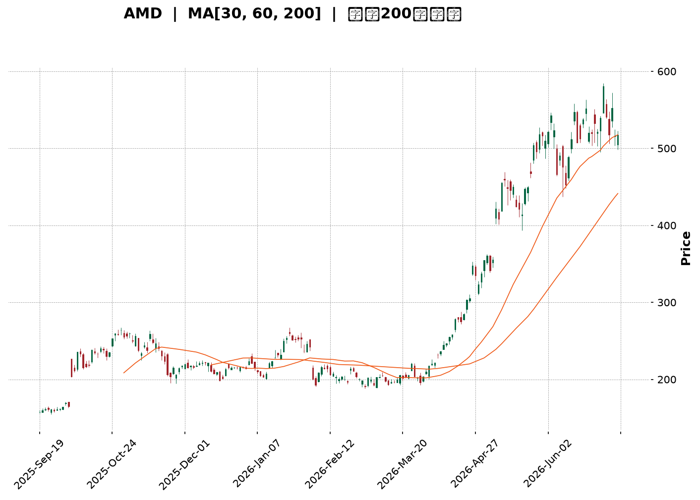
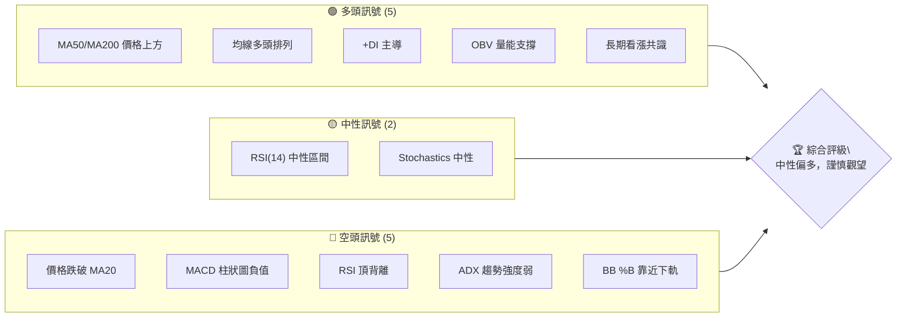
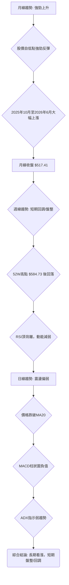
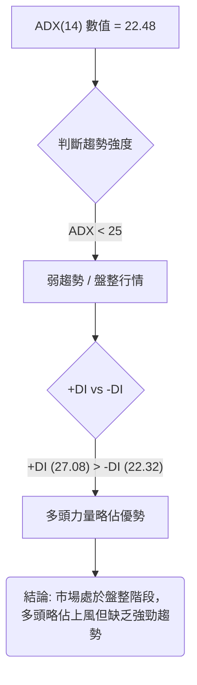
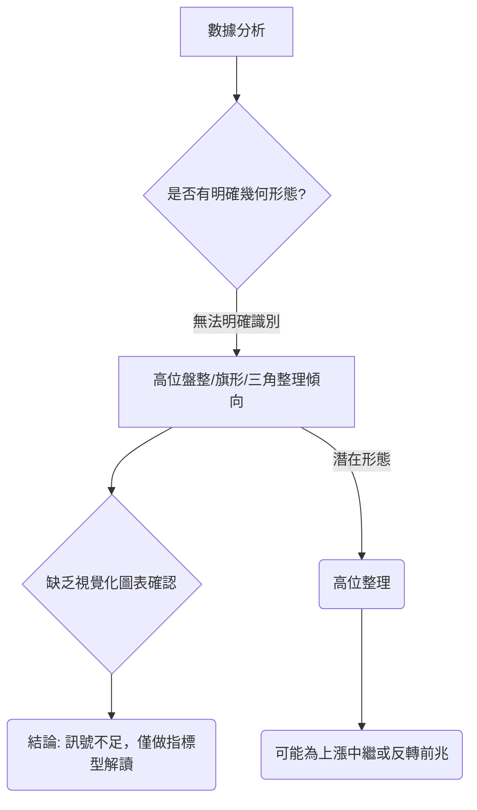
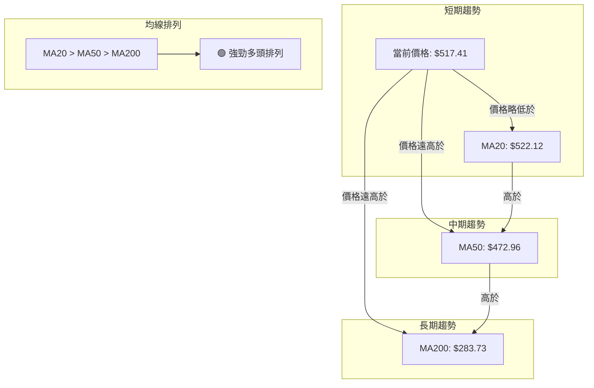
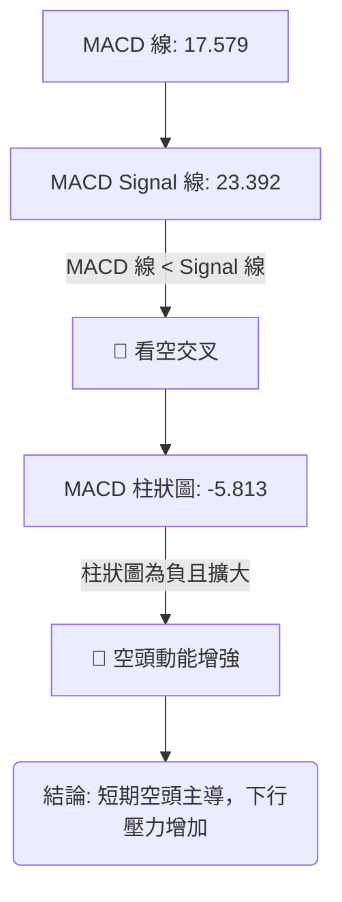
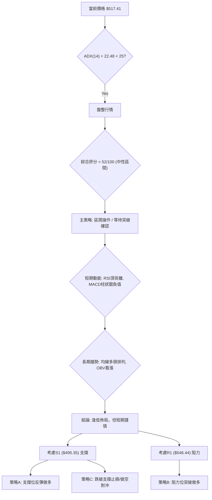
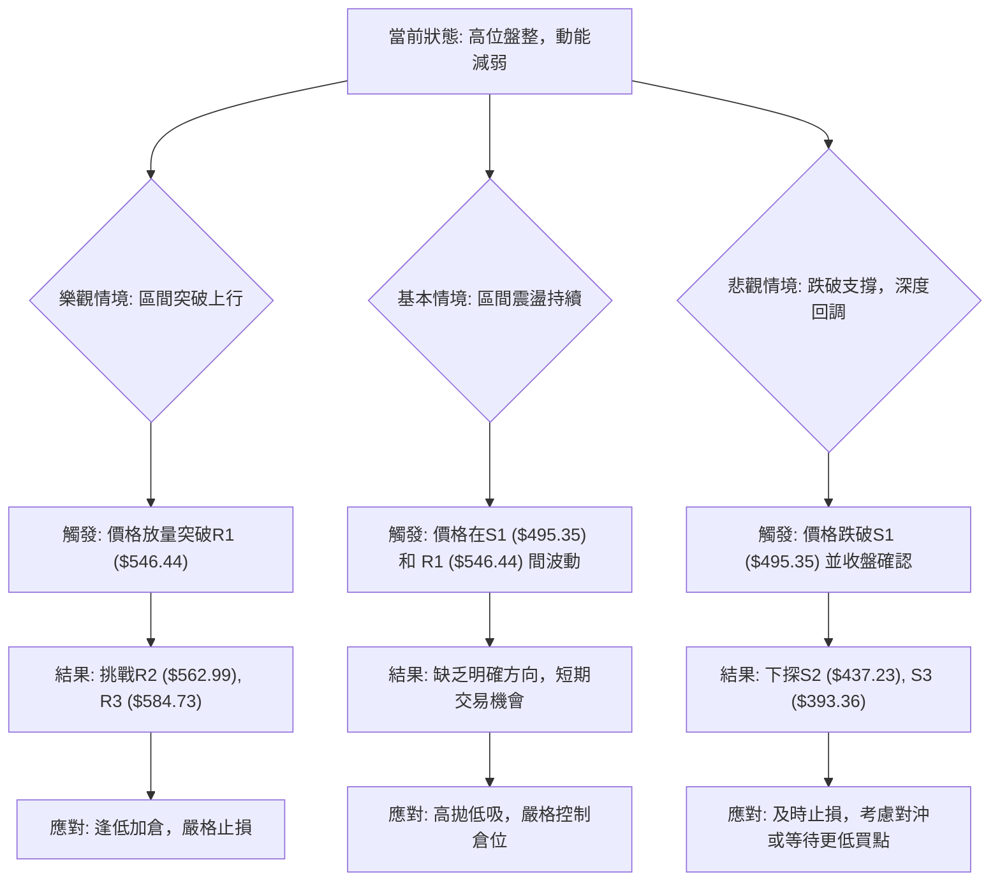

<details>
<summary>📊 靜態圖表 (點擊展開)</summary>

</details>

<html>
<head><meta charset="utf-8" /></head>
<body>
    <div style="height:500px; width:100%;">                        <script>window.PlotlyConfig = {MathJaxConfig: 'local'};</script>
        <script charset="utf-8" src="https://cdn.plot.ly/plotly-3.6.0.min.js" integrity="sha256-QaOVwtVY0T02VaHrr6pnoHLCwayMJp4O5n4YyaE3rJk=" crossorigin="anonymous"></script>                <div id="candlestick-chart" class="plotly-graph-div" style="height:100%; width:100%;"></div>            <script>                window.PLOTLYENV=window.PLOTLYENV || {};                                if (document.getElementById("candlestick-chart")) {                    Plotly.newPlot(                        "candlestick-chart",                        [{"close":{"dtype":"f8","bdata":"AAAA4HqsY0AAAACgR\u002fljQAAAAMDMHGRAAAAAACkcZEAAAADgoyhkQAAAAGC47mNAAAAAIIUrZEAAAACgRzlkQAAAAOBRgGRAAAAAIFw3ZUAAAACgcJVkQAAAAGC4dmlAAAAA4FFwakAAAACA63FtQAAAAOB6HG1AAAAAwMzcakAAAACgcA1rQAAAAEDhQmtAAAAAQDPTbUAAAACA61FtQAAAAGCPIm1AAAAAgOsRbkAAAADA9cBtQAAAACBcx2xAAAAAIK5fbUAAAACgcJ1vQAAAAGC4OnBAAAAAACkgcEAAAACgR4VwQAAAAEDh2m9AAAAAgOsBcEAAAABgZjpwQAAAAKCZQW9AAAAAoEcFcEAAAABgZrZtQAAAAKBHMW1AAAAAIFx\u002fbkAAAADgo7BtQAAAAIA9LnBAAAAAYLj+bkAAAACA69luQAAAAOCjEG5AAAAAoEfJbEAAAACgmfFrQAAAAOCjwGlAAAAAwPV4aUAAAACgmeFqQAAAAAApxGlAAAAAIK7HakAAAADA9TBrQAAAAOBReGtAAAAAIK7nakAAAABAMzNrQAAAACBc\u002f2pAAAAAQAo\u002fa0AAAAAghaNrQAAAAADXs2tAAAAAoHCta0AAAACAwq1rQAAAAMD1WGpAAAAAYI\u002fyaUAAAACgcCVqQAAAACCFw2hAAAAAgOshaUAAAACAwq1qQAAAAGBm3mpAAAAAwMzcakAAAACgR+FqQAAAACCu32pAAAAAIIXzakAAAABA4epqQAAAAMAexWpAAAAAQArva0AAAABgj6JrQAAAAEAzy2pAAAAA4KNAakAAAACAwpVpQAAAAKBwZWlAAAAAgBT2aUAAAABACp9rQAAAAEAz82tAAAAAoHB9bEAAAABgj\u002fpsQAAAAKBw\u002fWxAAAAAoJk5b0AAAAAgXLdvQAAAAEDhOnBAAAAAgOtpb0AAAADA9YBvQAAAACCul29AAAAAgMKFb0AAAAAgXJdtQAAAAOCjyG5AAAAAIIVDbkAAAACAFAZpQAAAAAAAEGhAAAAAgBQOakAAAAAAAABrQAAAAIA9smpAAAAAYI+yakAAAACAFL5pQAAAAIA96mlAAAAAYI9iaUAAAAAA1wNpQAAAAADXa2lAAAAAwMwEaUAAAABAM5NoQAAAAEDhumpAAAAAIIVbakAAAACAwnVpQAAAAGC4BmlAAAAAANfTaEAAAABgZt5nQAAAAIA9QmlAAAAAYGbuaEAAAACAwg1oQAAAAIDCVWlAAAAAIFxnaUAAAABgj5ppQAAAACCut2hAAAAA4HosaEAAAABgj5JoQAAAAIDriWhAAAAAYLjuaEAAAADgo6hpQAAAAGCPKmlAAAAAgMJVaUAAAAAA16tpQAAAAOCjiGtAAAAA4KN4aUAAAAAgrj9pQAAAAKBHgWhAAAAAgMJtaUAAAABguEZqQAAAAAAAMGtAAAAAgMKFa0AAAADA9bBrQAAAAIA9+mxAAAAA4HqUbUAAAACgR6FuQAAAAGCP2m5AAAAAgD3ib0AAAACA6yFwQAAAAAApZHFAAAAAgD1mcUAAAABAMy9xQAAAAADXx3FAAAAAIFz3ckAAAACgRxVzQAAAAMD1vHVAAAAAgBTqdEAAAAAgXDN0QAAAAIDCEXVAAAAAANcndkAAAADgo4h2QAAAAOCjWHVAAAAAACk0dkAAAACAPVZ6QAAAACBch3lAAAAAQApzfEAAAADgo6x8QAAAAOCjBHxAAAAAAADYe0AAAABAMxt8QAAAAKCZgXpAAAAAANdPekAAAADAzOB5QAAAAKBH+XtAAAAAoHAZfEAAAAAAKTh9QAAAAIA9fn9AAAAA4KP4fkAAAABguDCAQAAAAMDMIIBAAAAAgBTif0AAAADgUUyAQAAAAAAp9IBAAAAAoJlZgEAAAACAFCZ9QAAAAKBHpX5AAAAAACm4fUAAAABgZkZ8QAAAAEAzh35AAAAAwB75f0AAAACAFBqBQAAAAOCjtH9AAAAAANcDgEAAAADA9cqAQAAAAEAKPYFAAAAAwMw+gEAAAACA6z2AQAAAAGCPpIBAAAAA4KNMgEAAAACA69uAQAAAAKBHJ4JAAAAAQArngEAAAABgjy6AQAAAAGBmQIFAAAAAQOEggEAAAACgRyuAQA=="},"high":{"dtype":"f8","bdata":"AAAAQOH6Y0AAAACAwlVkQAAAAOB6bGRAAAAAQDOjZEAAAAAAKTRkQAAAACCFQ2RAAAAAoJmJZEAAAADA9UhkQAAAAIDChWRAAAAAgOthZUAAAACAwlVlQAAAAGC4VmxAAAAAwMxca0AAAAAA13ttQAAAAEAzA25AAAAAQApHbUAAAACAFAZsQAAAACBcH2xAAAAAIK7nbUAAAABgZiZuQAAAAAApbG1AAAAAAClcbkAAAADgUUhuQAAAAAApBG5AAAAAwMx8bUAAAADgeqxvQAAAAGC4RnBAAAAAoEeJcEAAAACgR7FwQAAAAIAUfnBAAAAAgBRicEAAAABgj05wQAAAAIAUFnBAAAAAYGY6cEAAAADgUbBvQAAAAADXe21AAAAAwMwcb0AAAABguA5vQAAAAAApeHBAAAAAgBQ6cEAAAACAFK5vQAAAAOCjGG9AAAAAAADAbUAAAADA9WhtQAAAAAAASG1AAAAAYI8aakAAAAAAKSRrQAAAAGCP0mlAAAAAQOHyakAAAACgmUlrQAAAACBcn2tAAAAAIFw\u002fbEAAAABgZkZrQAAAAADXY2tAAAAA4Hr0a0AAAABguPZrQAAAAEDhGmxAAAAAIIXTa0AAAAAAALBrQAAAACCuz2tAAAAAIIXrakAAAABACkdqQAAAAAAAcGpAAAAAIIXLaUAAAACAwuVqQAAAAKBwhWtAAAAAwPUga0AAAACgRxFrQAAAAGCPGmtAAAAAoJkBa0AAAACAPRprQAAAAOB6NGtAAAAAwMxkbEAAAADgo0BtQAAAAKBw3WtAAAAAACmEakAAAACAFF5qQAAAAKCZ6WlAAAAAACk8akAAAAAgheNrQAAAAEDhAmxAAAAAQDPLbUAAAAAgrk9tQAAAAAAA8G1AAAAAwMycb0AAAACgRwFwQAAAACBcr3BAAAAA4KMkcEAAAACgmfFvQAAAAGBmFnBAAAAA4HpIcEAAAAAgrqduQAAAAEAKP29AAAAAwMyUb0AAAABgj1JrQAAAAKBHgWlAAAAA4KMoakAAAABAMzNrQAAAAOB6bGtAAAAAwMx0a0AAAABguE5rQAAAAKCZQWpAAAAAoJmpaUAAAABgZmZpQAAAAEAzg2lAAAAAANebaUAAAAAAKexoQAAAAGC4FmtAAAAAYGYWa0AAAACgRzlqQAAAAOB6PGlAAAAAIK7XaEAAAADgejRoQAAAAIAUTmlAAAAAoEd5aUAAAAAgrgdpQAAAAEAKX2lAAAAAQOHSaUAAAABguCZqQAAAAADXc2lAAAAAgML1aEAAAACgcAVpQAAAAGC45mhAAAAAIIVbaUAAAAAAKbxpQAAAAKCZyWlAAAAAIIUjakAAAACAws1pQAAAAGCPqmtAAAAAAACga0AAAADgo2hpQAAAAIDCDWpAAAAAAACAaUAAAABgj7pqQAAAAMD1OGtAAAAAgOtJbEAAAABAM8NrQAAAAAAAQG1AAAAAQDOjbUAAAABgjzJvQAAAAGCP6m5AAAAAYLjub0AAAABA4SJwQAAAAKBwdXFAAAAAwMyQcUAAAACAwvlxQAAAAEAz43FAAAAAAAAEc0AAAAAghWNzQAAAAADXD3ZAAAAAIFzTdUAAAAAAAHh0QAAAAGC4QnVAAAAAIFwvdkAAAADgo6x2QAAAAKCZnXZAAAAAwB55dkAAAACgmel6QAAAACBcW3pAAAAA4KOEfEAAAAAghVN9QAAAAMDMrHxAAAAAAAC4fEAAAADA9VR8QAAAAAAAcHtAAAAAwMxse0AAAAAAAMx6QAAAAIA9FnxAAAAAQDMzfEAAAABgjxZ+QAAAACBcr39AAAAAIFzjf0AAAACgmXmAQAAAAAAAUIBAAAAAAAAsgEAAAACA61OAQAAAACCFE4FAAAAAIIWhgEAAAACA65l\u002fQAAAACCF735AAAAAAACQf0AAAABAM9d9QAAAACBcp35AAAAAIK5NgEAAAADA9XKBQAAAAKCZJ4FAAAAAAACkgEAAAAAghd2AQAAAAIDrl4FAAAAAgOuDgEAAAAAgrmeAQAAAAEAKN4FAAAAAQOFogEAAAAAghfGAQAAAAADXRYJAAAAAYLiggUAAAABAMx2BQAAAAAAA5IFAAAAAgMJngEAAAAAA11eAQA=="},"hovertemplate":"\u003cb\u003e%{x|%Y-%m-%d}\u003c\u002fb\u003e\u003cbr\u003e\u958b: $%{open:.2f}\u003cbr\u003e\u9ad8: $%{high:.2f}\u003cbr\u003e\u4f4e: $%{low:.2f}\u003cbr\u003e\u6536: $%{close:.2f}\u003cextra\u003e\u003c\u002fextra\u003e","low":{"dtype":"f8","bdata":"AAAAwMx8Y0AAAACgcK1jQAAAAGC45mNAAAAAgMLNY0AAAADA9VhjQAAAAKCZoWNAAAAAwMz8Y0AAAABgj+pjQAAAACCuD2RAAAAAANfDZEAAAADgemRkQAAAAOBRYGlAAAAAwPUoakAAAABgZlZqQAAAAMD1sGxAAAAAYGamakAAAADAzNxqQAAAAMDM\u002fGpAAAAA4FGYa0AAAAAgrgdtQAAAAMAefWxAAAAAwMxMbUAAAADgo0BtQAAAAAApHGxAAAAAoEeRbEAAAABgZj5uQAAAAKCZOW9AAAAAAAAQcEAAAABgZhZwQAAAAIDriW9AAAAAwB6tb0AAAADgerxvQAAAAOB67G5AAAAAgOtZbkAAAAAgrndtQAAAAOB6FGxAAAAAAAAQbkAAAADgelRtQAAAAAAAQG9AAAAAgOvBbkAAAABgj2JtQAAAAMDMpG1AAAAAYLgWbEAAAABguHZrQAAAAMD1kGlAAAAAAABgaEAAAABAM7tpQAAAAMD1SGhAAAAAAADgaUAAAADgo8BqQAAAAAAAsGpAAAAA4HrMakAAAADgo3hqQAAAAOB6xGpAAAAAIK4Ha0AAAAAghUtrQAAAAMAePWtAAAAAoHBVa0AAAACAFEZqQAAAAIDrIWpAAAAAYI\u002fSaUAAAAAghaNpQAAAAMD1sGhAAAAAAAAQaUAAAABgZoZpQAAAAIDrqWpAAAAAwPWIakAAAABACr9qQAAAAMD1oGpAAAAAIK4nakAAAABgj8pqQAAAAKCZuWpAAAAAwMxca0AAAAAgXI9rQAAAAAAAaGpAAAAAoHDlaUAAAABgj2ppQAAAAIA9YmlAAAAAoJn5aEAAAAAgXN9qQAAAACCF42pAAAAAQApnbEAAAAAghZtsQAAAAMAeLWxAAAAAwPV4bUAAAAAAKdRuQAAAAAAABHBAAAAAoJlJb0AAAABguP5uQAAAAGC4Rm9AAAAAwB4dbkAAAACgmVFtQAAAAAAAYG1AAAAAoEehbUAAAADAzORoQAAAAEAK12dAAAAAgMKNaEAAAADAzIRpQAAAAAAppGpAAAAAYLgmakAAAADgeqRpQAAAAAApfGlAAAAAYI9aaEAAAAAAAGBoQAAAAKBHyWhAAAAAgOvRaEAAAADAzERoQAAAAAAA0GlAAAAAYI9KakAAAABguC5pQAAAACCut2hAAAAAAADAZ0AAAABACodnQAAAACCFu2dAAAAAAClcaEAAAAAAAOhnQAAAAOCjoGdAAAAAYGZGaUAAAAAAKXRpQAAAAKBwlWhAAAAA4KMIaEAAAACgmVloQAAAAOBRaGhAAAAAAAB4aEAAAABgjxpoQAAAAOBRyGhAAAAAYLg2aUAAAAAAKQRpQAAAAOBRcGpAAAAAgMJtaUAAAACAFLZoQAAAAADXG2hAAAAAwB6NaEAAAABA4bppQAAAAADXE2lAAAAAIFw3a0AAAAAAKexqQAAAAEDhYmxAAAAAwB7dbEAAAABguN5tQAAAAMD1QG5AAAAAYGa2bkAAAABAM3tvQAAAAAApWHBAAAAAgD0icUAAAAAAAABxQAAAAIDrSXFAAAAAgD3icUAAAAAAKbxyQAAAAOCj6HRAAAAAwPWMdEAAAAAAAGBzQAAAAIDC7XNAAAAAoJnJdEAAAAAAANR1QAAAAEAzK3VAAAAAgBSOdUAAAADgoyB5QAAAAKBHEXlAAAAA4KMkekAAAACAFC58QAAAAIDCoXpAAAAAYGYKe0AAAABA4Tp7QAAAAIDCdXpAAAAAIFyreUAAAACAwpV4QAAAAMDMoHpAAAAAoJn5ekAAAAAgXNt8QAAAACCuA35AAAAAYI9qfkAAAADgUdh+QAAAAEDhdn9AAAAAwMxsfkAAAAAghVN\u002fQAAAAGBmYoBAAAAAgOs9f0AAAABAM\u002f98QAAAACBc231AAAAAIK5Te0AAAACgRwV8QAAAAOBRoHxAAAAAAADgfkAAAAAAAJSAQAAAAAAAtH9AAAAAwMy0f0AAAABgj3KAQAAAACCuvYBAAAAAwPWsf0AAAAAAAHh\u002fQAAAAAAAsH9AAAAAgMJpf0AAAACgmfV+QAAAAGCPDIFAAAAAgOvVgEAAAAAAAKB\u002fQAAAAAAAeIBAAAAAgMJxf0AAAABgZiJ\u002fQA=="},"name":"\u50f9\u683c","open":{"dtype":"f8","bdata":"AAAAACmsY0AAAACgcK1jQAAAAOCjEGRAAAAAIFxfZEAAAADgeqRjQAAAAOCjEGRAAAAAANcDZEAAAACgRxlkQAAAAIDCHWRAAAAAgMIVZUAAAACAwlVlQAAAAGBmTmxAAAAAQDPbakAAAABgZp5qQAAAAKCZiW1AAAAA4KMYbUAAAABgZoZrQAAAAGBmZmtAAAAAYLjWa0AAAACgR4ltQAAAAOBRKG1AAAAAQAqPbUAAAADgeuxtQAAAAEAzm21AAAAAwB7FbEAAAAAghWtuQAAAAIAUHnBAAAAAgD0ycEAAAABACoNwQAAAAGC4PnBAAAAAoJk5cEAAAACgRzVwQAAAAEAzS29AAAAAIK5nbkAAAABACq9vQAAAAIAU3mxAAAAA4HpEbkAAAADAHjVuQAAAAAAppG9AAAAAwMx8b0AAAAAghQNuQAAAAAAAWG5AAAAAwPWYbUAAAADgUchsQAAAAGBmFm1AAAAAgOsZakAAAADAHuVpQAAAACBcL2lAAAAAoJlBakAAAADgegRrQAAAAAApvGpAAAAAoEe5a0AAAADgUQhrQAAAAAApHGtAAAAAoHAla0AAAABA4WJrQAAAAKBHoWtAAAAAAADAa0AAAACA6zlrQAAAAADXS2tAAAAAwPWIakAAAACgcN1pQAAAAKBHQWpAAAAAgD16aUAAAABAM5NpQAAAAAAAgGtAAAAAIIWbakAAAAAgXN9qQAAAAIDC7WpAAAAAYI9yakAAAAAA1\u002ftqQAAAAIA9+mpAAAAAwMxca0AAAAAAAMhsQAAAAGC41mtAAAAAACmEakAAAADAzFxqQAAAAEAKt2lAAAAAgMIlaUAAAABAM+NqQAAAAKBHMWtAAAAAwMx8bEAAAACgmUltQAAAAGCPQmxAAAAAIK5\u002fbUAAAAAAAHhvQAAAAEDhUnBAAAAAAAAMcEAAAADAHoVvQAAAAAApxG9AAAAAwB7Vb0AAAACAwp1tQAAAAOCjeG1AAAAAoJlxb0AAAAAAAOBqQAAAACCFO2lAAAAAACmkaEAAAADAzNxpQAAAAOB65GpAAAAAACk8a0AAAABgj\u002fpqQAAAAOCjgGlAAAAAwMxEaUAAAADAHs1oQAAAACCFA2lAAAAAANcDaUAAAABA4cJoQAAAAAApdGpAAAAAgD3aakAAAACgmRlqQAAAACCFA2lAAAAAQDM7aEAAAABguO5nQAAAAADXA2hAAAAA4KO4aEAAAADgo2hoQAAAACCFq2dAAAAA4FFQaUAAAAAghaNpQAAAAGCPWmlAAAAAIIXDaEAAAAAgXF9oQAAAAIDClWhAAAAAAACAaEAAAADA9WBoQAAAAOB6nGlAAAAAwMzMaUAAAADgeixpQAAAAOBRcGpAAAAAIFw\u002fa0AAAADgozhpQAAAAGBmnmlAAAAAoJnBaEAAAABA4fJpQAAAAKCZgWlAAAAAwPVoa0AAAADgUUhrQAAAAADXA21AAAAA4FEgbUAAAAAAAOBtQAAAAMD1oG5AAAAAoEc5b0AAAABguN5vQAAAAADXj3BAAAAAAACQcUAAAACgmYlxQAAAAKBHVXFAAAAAIIUzckAAAAAAKeByQAAAAAApDHVAAAAAwB6ldUAAAACAwn1zQAAAAKBHaXRAAAAAgMJVdUAAAACA6\u002f11QAAAAMD1hHZAAAAAACn4dUAAAAAA15d5QAAAAMAeEXpAAAAAoHApekAAAADAzMh8QAAAAAAAFHxAAAAA4KOQfEAAAACgmYl7QAAAAKBwFXtAAAAAAADYekAAAACgmcl5QAAAAOCjwHpAAAAAANefe0AAAACgcF19QAAAAADXS35AAAAAAADAf0AAAAAAADB\u002fQAAAAGBmRoBAAAAAYI9Cf0AAAADAzKR\u002fQAAAAAAAroBAAAAAAAAWgEAAAADgejh\u002fQAAAAAAAUH5AAAAAAABsf0AAAAAghT99QAAAAKCZ2XxAAAAAQAo7f0AAAAAAAL6AQAAAAMAeF4FAAAAAoEeNgEAAAADgo5yAQAAAAAAADIFAAAAAoEfRf0AAAABgj0aAQAAAAKBw\u002f4BAAAAAYGY+gEAAAABguFaAQAAAAGCPDIFAAAAAgD1sgUAAAACgR9GAQAAAAMDMuoBAAAAAoEcfgEAAAADA9Yx\u002fQA=="},"x":["2025-09-19T00:00:00-04:00","2025-09-22T00:00:00-04:00","2025-09-23T00:00:00-04:00","2025-09-24T00:00:00-04:00","2025-09-25T00:00:00-04:00","2025-09-26T00:00:00-04:00","2025-09-29T00:00:00-04:00","2025-09-30T00:00:00-04:00","2025-10-01T00:00:00-04:00","2025-10-02T00:00:00-04:00","2025-10-03T00:00:00-04:00","2025-10-06T00:00:00-04:00","2025-10-07T00:00:00-04:00","2025-10-08T00:00:00-04:00","2025-10-09T00:00:00-04:00","2025-10-10T00:00:00-04:00","2025-10-13T00:00:00-04:00","2025-10-14T00:00:00-04:00","2025-10-15T00:00:00-04:00","2025-10-16T00:00:00-04:00","2025-10-17T00:00:00-04:00","2025-10-20T00:00:00-04:00","2025-10-21T00:00:00-04:00","2025-10-22T00:00:00-04:00","2025-10-23T00:00:00-04:00","2025-10-24T00:00:00-04:00","2025-10-27T00:00:00-04:00","2025-10-28T00:00:00-04:00","2025-10-29T00:00:00-04:00","2025-10-30T00:00:00-04:00","2025-10-31T00:00:00-04:00","2025-11-03T00:00:00-05:00","2025-11-04T00:00:00-05:00","2025-11-05T00:00:00-05:00","2025-11-06T00:00:00-05:00","2025-11-07T00:00:00-05:00","2025-11-10T00:00:00-05:00","2025-11-11T00:00:00-05:00","2025-11-12T00:00:00-05:00","2025-11-13T00:00:00-05:00","2025-11-14T00:00:00-05:00","2025-11-17T00:00:00-05:00","2025-11-18T00:00:00-05:00","2025-11-19T00:00:00-05:00","2025-11-20T00:00:00-05:00","2025-11-21T00:00:00-05:00","2025-11-24T00:00:00-05:00","2025-11-25T00:00:00-05:00","2025-11-26T00:00:00-05:00","2025-11-28T00:00:00-05:00","2025-12-01T00:00:00-05:00","2025-12-02T00:00:00-05:00","2025-12-03T00:00:00-05:00","2025-12-04T00:00:00-05:00","2025-12-05T00:00:00-05:00","2025-12-08T00:00:00-05:00","2025-12-09T00:00:00-05:00","2025-12-10T00:00:00-05:00","2025-12-11T00:00:00-05:00","2025-12-12T00:00:00-05:00","2025-12-15T00:00:00-05:00","2025-12-16T00:00:00-05:00","2025-12-17T00:00:00-05:00","2025-12-18T00:00:00-05:00","2025-12-19T00:00:00-05:00","2025-12-22T00:00:00-05:00","2025-12-23T00:00:00-05:00","2025-12-24T00:00:00-05:00","2025-12-26T00:00:00-05:00","2025-12-29T00:00:00-05:00","2025-12-30T00:00:00-05:00","2025-12-31T00:00:00-05:00","2026-01-02T00:00:00-05:00","2026-01-05T00:00:00-05:00","2026-01-06T00:00:00-05:00","2026-01-07T00:00:00-05:00","2026-01-08T00:00:00-05:00","2026-01-09T00:00:00-05:00","2026-01-12T00:00:00-05:00","2026-01-13T00:00:00-05:00","2026-01-14T00:00:00-05:00","2026-01-15T00:00:00-05:00","2026-01-16T00:00:00-05:00","2026-01-20T00:00:00-05:00","2026-01-21T00:00:00-05:00","2026-01-22T00:00:00-05:00","2026-01-23T00:00:00-05:00","2026-01-26T00:00:00-05:00","2026-01-27T00:00:00-05:00","2026-01-28T00:00:00-05:00","2026-01-29T00:00:00-05:00","2026-01-30T00:00:00-05:00","2026-02-02T00:00:00-05:00","2026-02-03T00:00:00-05:00","2026-02-04T00:00:00-05:00","2026-02-05T00:00:00-05:00","2026-02-06T00:00:00-05:00","2026-02-09T00:00:00-05:00","2026-02-10T00:00:00-05:00","2026-02-11T00:00:00-05:00","2026-02-12T00:00:00-05:00","2026-02-13T00:00:00-05:00","2026-02-17T00:00:00-05:00","2026-02-18T00:00:00-05:00","2026-02-19T00:00:00-05:00","2026-02-20T00:00:00-05:00","2026-02-23T00:00:00-05:00","2026-02-24T00:00:00-05:00","2026-02-25T00:00:00-05:00","2026-02-26T00:00:00-05:00","2026-02-27T00:00:00-05:00","2026-03-02T00:00:00-05:00","2026-03-03T00:00:00-05:00","2026-03-04T00:00:00-05:00","2026-03-05T00:00:00-05:00","2026-03-06T00:00:00-05:00","2026-03-09T00:00:00-04:00","2026-03-10T00:00:00-04:00","2026-03-11T00:00:00-04:00","2026-03-12T00:00:00-04:00","2026-03-13T00:00:00-04:00","2026-03-16T00:00:00-04:00","2026-03-17T00:00:00-04:00","2026-03-18T00:00:00-04:00","2026-03-19T00:00:00-04:00","2026-03-20T00:00:00-04:00","2026-03-23T00:00:00-04:00","2026-03-24T00:00:00-04:00","2026-03-25T00:00:00-04:00","2026-03-26T00:00:00-04:00","2026-03-27T00:00:00-04:00","2026-03-30T00:00:00-04:00","2026-03-31T00:00:00-04:00","2026-04-01T00:00:00-04:00","2026-04-02T00:00:00-04:00","2026-04-06T00:00:00-04:00","2026-04-07T00:00:00-04:00","2026-04-08T00:00:00-04:00","2026-04-09T00:00:00-04:00","2026-04-10T00:00:00-04:00","2026-04-13T00:00:00-04:00","2026-04-14T00:00:00-04:00","2026-04-15T00:00:00-04:00","2026-04-16T00:00:00-04:00","2026-04-17T00:00:00-04:00","2026-04-20T00:00:00-04:00","2026-04-21T00:00:00-04:00","2026-04-22T00:00:00-04:00","2026-04-23T00:00:00-04:00","2026-04-24T00:00:00-04:00","2026-04-27T00:00:00-04:00","2026-04-28T00:00:00-04:00","2026-04-29T00:00:00-04:00","2026-04-30T00:00:00-04:00","2026-05-01T00:00:00-04:00","2026-05-04T00:00:00-04:00","2026-05-05T00:00:00-04:00","2026-05-06T00:00:00-04:00","2026-05-07T00:00:00-04:00","2026-05-08T00:00:00-04:00","2026-05-11T00:00:00-04:00","2026-05-12T00:00:00-04:00","2026-05-13T00:00:00-04:00","2026-05-14T00:00:00-04:00","2026-05-15T00:00:00-04:00","2026-05-18T00:00:00-04:00","2026-05-19T00:00:00-04:00","2026-05-20T00:00:00-04:00","2026-05-21T00:00:00-04:00","2026-05-22T00:00:00-04:00","2026-05-26T00:00:00-04:00","2026-05-27T00:00:00-04:00","2026-05-28T00:00:00-04:00","2026-05-29T00:00:00-04:00","2026-06-01T00:00:00-04:00","2026-06-02T00:00:00-04:00","2026-06-03T00:00:00-04:00","2026-06-04T00:00:00-04:00","2026-06-05T00:00:00-04:00","2026-06-08T00:00:00-04:00","2026-06-09T00:00:00-04:00","2026-06-10T00:00:00-04:00","2026-06-11T00:00:00-04:00","2026-06-12T00:00:00-04:00","2026-06-15T00:00:00-04:00","2026-06-16T00:00:00-04:00","2026-06-17T00:00:00-04:00","2026-06-18T00:00:00-04:00","2026-06-22T00:00:00-04:00","2026-06-23T00:00:00-04:00","2026-06-24T00:00:00-04:00","2026-06-25T00:00:00-04:00","2026-06-26T00:00:00-04:00","2026-06-29T00:00:00-04:00","2026-06-30T00:00:00-04:00","2026-07-01T00:00:00-04:00","2026-07-02T00:00:00-04:00","2026-07-06T00:00:00-04:00","2026-07-07T00:00:00-04:00","2026-07-08T00:00:00-04:00"],"type":"candlestick"},{"hovertemplate":"MA30: $%{y:.2f}\u003cextra\u003e\u003c\u002fextra\u003e","line":{"color":"#2196F3","dash":"dash","width":2},"mode":"lines","name":"MA30","x":["2025-09-19T00:00:00-04:00","2025-09-22T00:00:00-04:00","2025-09-23T00:00:00-04:00","2025-09-24T00:00:00-04:00","2025-09-25T00:00:00-04:00","2025-09-26T00:00:00-04:00","2025-09-29T00:00:00-04:00","2025-09-30T00:00:00-04:00","2025-10-01T00:00:00-04:00","2025-10-02T00:00:00-04:00","2025-10-03T00:00:00-04:00","2025-10-06T00:00:00-04:00","2025-10-07T00:00:00-04:00","2025-10-08T00:00:00-04:00","2025-10-09T00:00:00-04:00","2025-10-10T00:00:00-04:00","2025-10-13T00:00:00-04:00","2025-10-14T00:00:00-04:00","2025-10-15T00:00:00-04:00","2025-10-16T00:00:00-04:00","2025-10-17T00:00:00-04:00","2025-10-20T00:00:00-04:00","2025-10-21T00:00:00-04:00","2025-10-22T00:00:00-04:00","2025-10-23T00:00:00-04:00","2025-10-24T00:00:00-04:00","2025-10-27T00:00:00-04:00","2025-10-28T00:00:00-04:00","2025-10-29T00:00:00-04:00","2025-10-30T00:00:00-04:00","2025-10-31T00:00:00-04:00","2025-11-03T00:00:00-05:00","2025-11-04T00:00:00-05:00","2025-11-05T00:00:00-05:00","2025-11-06T00:00:00-05:00","2025-11-07T00:00:00-05:00","2025-11-10T00:00:00-05:00","2025-11-11T00:00:00-05:00","2025-11-12T00:00:00-05:00","2025-11-13T00:00:00-05:00","2025-11-14T00:00:00-05:00","2025-11-17T00:00:00-05:00","2025-11-18T00:00:00-05:00","2025-11-19T00:00:00-05:00","2025-11-20T00:00:00-05:00","2025-11-21T00:00:00-05:00","2025-11-24T00:00:00-05:00","2025-11-25T00:00:00-05:00","2025-11-26T00:00:00-05:00","2025-11-28T00:00:00-05:00","2025-12-01T00:00:00-05:00","2025-12-02T00:00:00-05:00","2025-12-03T00:00:00-05:00","2025-12-04T00:00:00-05:00","2025-12-05T00:00:00-05:00","2025-12-08T00:00:00-05:00","2025-12-09T00:00:00-05:00","2025-12-10T00:00:00-05:00","2025-12-11T00:00:00-05:00","2025-12-12T00:00:00-05:00","2025-12-15T00:00:00-05:00","2025-12-16T00:00:00-05:00","2025-12-17T00:00:00-05:00","2025-12-18T00:00:00-05:00","2025-12-19T00:00:00-05:00","2025-12-22T00:00:00-05:00","2025-12-23T00:00:00-05:00","2025-12-24T00:00:00-05:00","2025-12-26T00:00:00-05:00","2025-12-29T00:00:00-05:00","2025-12-30T00:00:00-05:00","2025-12-31T00:00:00-05:00","2026-01-02T00:00:00-05:00","2026-01-05T00:00:00-05:00","2026-01-06T00:00:00-05:00","2026-01-07T00:00:00-05:00","2026-01-08T00:00:00-05:00","2026-01-09T00:00:00-05:00","2026-01-12T00:00:00-05:00","2026-01-13T00:00:00-05:00","2026-01-14T00:00:00-05:00","2026-01-15T00:00:00-05:00","2026-01-16T00:00:00-05:00","2026-01-20T00:00:00-05:00","2026-01-21T00:00:00-05:00","2026-01-22T00:00:00-05:00","2026-01-23T00:00:00-05:00","2026-01-26T00:00:00-05:00","2026-01-27T00:00:00-05:00","2026-01-28T00:00:00-05:00","2026-01-29T00:00:00-05:00","2026-01-30T00:00:00-05:00","2026-02-02T00:00:00-05:00","2026-02-03T00:00:00-05:00","2026-02-04T00:00:00-05:00","2026-02-05T00:00:00-05:00","2026-02-06T00:00:00-05:00","2026-02-09T00:00:00-05:00","2026-02-10T00:00:00-05:00","2026-02-11T00:00:00-05:00","2026-02-12T00:00:00-05:00","2026-02-13T00:00:00-05:00","2026-02-17T00:00:00-05:00","2026-02-18T00:00:00-05:00","2026-02-19T00:00:00-05:00","2026-02-20T00:00:00-05:00","2026-02-23T00:00:00-05:00","2026-02-24T00:00:00-05:00","2026-02-25T00:00:00-05:00","2026-02-26T00:00:00-05:00","2026-02-27T00:00:00-05:00","2026-03-02T00:00:00-05:00","2026-03-03T00:00:00-05:00","2026-03-04T00:00:00-05:00","2026-03-05T00:00:00-05:00","2026-03-06T00:00:00-05:00","2026-03-09T00:00:00-04:00","2026-03-10T00:00:00-04:00","2026-03-11T00:00:00-04:00","2026-03-12T00:00:00-04:00","2026-03-13T00:00:00-04:00","2026-03-16T00:00:00-04:00","2026-03-17T00:00:00-04:00","2026-03-18T00:00:00-04:00","2026-03-19T00:00:00-04:00","2026-03-20T00:00:00-04:00","2026-03-23T00:00:00-04:00","2026-03-24T00:00:00-04:00","2026-03-25T00:00:00-04:00","2026-03-26T00:00:00-04:00","2026-03-27T00:00:00-04:00","2026-03-30T00:00:00-04:00","2026-03-31T00:00:00-04:00","2026-04-01T00:00:00-04:00","2026-04-02T00:00:00-04:00","2026-04-06T00:00:00-04:00","2026-04-07T00:00:00-04:00","2026-04-08T00:00:00-04:00","2026-04-09T00:00:00-04:00","2026-04-10T00:00:00-04:00","2026-04-13T00:00:00-04:00","2026-04-14T00:00:00-04:00","2026-04-15T00:00:00-04:00","2026-04-16T00:00:00-04:00","2026-04-17T00:00:00-04:00","2026-04-20T00:00:00-04:00","2026-04-21T00:00:00-04:00","2026-04-22T00:00:00-04:00","2026-04-23T00:00:00-04:00","2026-04-24T00:00:00-04:00","2026-04-27T00:00:00-04:00","2026-04-28T00:00:00-04:00","2026-04-29T00:00:00-04:00","2026-04-30T00:00:00-04:00","2026-05-01T00:00:00-04:00","2026-05-04T00:00:00-04:00","2026-05-05T00:00:00-04:00","2026-05-06T00:00:00-04:00","2026-05-07T00:00:00-04:00","2026-05-08T00:00:00-04:00","2026-05-11T00:00:00-04:00","2026-05-12T00:00:00-04:00","2026-05-13T00:00:00-04:00","2026-05-14T00:00:00-04:00","2026-05-15T00:00:00-04:00","2026-05-18T00:00:00-04:00","2026-05-19T00:00:00-04:00","2026-05-20T00:00:00-04:00","2026-05-21T00:00:00-04:00","2026-05-22T00:00:00-04:00","2026-05-26T00:00:00-04:00","2026-05-27T00:00:00-04:00","2026-05-28T00:00:00-04:00","2026-05-29T00:00:00-04:00","2026-06-01T00:00:00-04:00","2026-06-02T00:00:00-04:00","2026-06-03T00:00:00-04:00","2026-06-04T00:00:00-04:00","2026-06-05T00:00:00-04:00","2026-06-08T00:00:00-04:00","2026-06-09T00:00:00-04:00","2026-06-10T00:00:00-04:00","2026-06-11T00:00:00-04:00","2026-06-12T00:00:00-04:00","2026-06-15T00:00:00-04:00","2026-06-16T00:00:00-04:00","2026-06-17T00:00:00-04:00","2026-06-18T00:00:00-04:00","2026-06-22T00:00:00-04:00","2026-06-23T00:00:00-04:00","2026-06-24T00:00:00-04:00","2026-06-25T00:00:00-04:00","2026-06-26T00:00:00-04:00","2026-06-29T00:00:00-04:00","2026-06-30T00:00:00-04:00","2026-07-01T00:00:00-04:00","2026-07-02T00:00:00-04:00","2026-07-06T00:00:00-04:00","2026-07-07T00:00:00-04:00","2026-07-08T00:00:00-04:00"],"y":{"dtype":"f8","bdata":"AAAAAAAA+H8AAAAAAAD4fwAAAAAAAPh\u002fAAAAAAAA+H8AAAAAAAD4fwAAAAAAAPh\u002fAAAAAAAA+H8AAAAAAAD4fwAAAAAAAPh\u002fAAAAAAAA+H8AAAAAAAD4fwAAAAAAAPh\u002fAAAAAAAA+H8AAAAAAAD4fwAAAAAAAPh\u002fAAAAAAAA+H8AAAAAAAD4fwAAAAAAAPh\u002fAAAAAAAA+H8AAAAAAAD4fwAAAAAAAPh\u002fAAAAAAAA+H8AAAAAAAD4fwAAAAAAAPh\u002fAAAAAAAA+H8AAAAAAAD4fwAAAAAAAPh\u002fAAAAAAAA+H8AAAAAAAD4fzMzM+MXD2pAIiIiwmd4akAiIiIy7OJqQHd3dxcEQmtAzczMTNSna0CJiIjIWvlrQO\u002fu7o5fSGxAMzMzU4CgbECrqqqqR\u002fFsQM3MzDx8Vm1A7+7uPu6pbUARERHxiwFuQGZmZobPKG5Ad3d3t9c8bkAAAAAwCDBuQDMzM+NeE25AMzMzY4IHbkCamZlJDAZuQJqZmWlK+W1AIiIigk7fbUDv7u4uJM1tQO\u002fu7u7uvm1AMzMz4+yjbUAzMzMjIo5tQAAAAPDufm1Ad3d3V8dsbUB3d3cX2UptQGZmZuZCIm1AMzMzYzv7bEBERETUeM1sQDMzM4N5nmxAvLu727JqbEBERER02jRsQO\u002fu7l5z\u002fWtAq6qq+n7Ca0BmZmamm6hrQHd3d1fHlGtAAAAAkMJ1a0BVVVUFyF1rQERERGT0LmtA7+7urnIMa0BmZmZG4epqQM3MzDzDzmpAzczM7HzHakAzMzNz2sRqQImIiBi9zWpAiYiICGXUakBERERUVclqQM3MzAwtxmpAZmZmdjC\u002fakAAAADQ28JqQERERGT0xmpAAAAA4HrUakDNzMycqONqQLy7u0up9GpAIiIiAp0Wa0ARERFxaDlrQLy7u1sBYmtAIiIiUuOBa0CamZkph6JrQKuqqgpJz2tAAAAA0Nv+a0B3d3eHQRxsQLy7u2ugT2xA7+7uzml7bECJiIhoSm1sQAAAABBYVWxA3t3dDXRObEAzMzMzek9sQCIiInL2TWxA7+7uHsxLbEC8u7tLxUFsQFVVVYV5OmxAERERsbkkbEBmZmY2Xg5sQAAAAPCnAmxARERExCD4a0BERERkgu9rQDMzMwPk+mtAIiIiokX+a0Dv7u5O1OtrQHd3d0fh0mtAzczMbKCza0BVVVV1BYhrQLy7u2suaGtAMzMzg3kya0BmZmaGFvFqQJqZmblJtGpA3t3drQCBakDv7u7up05qQERERET9E2pA3t3drUfVaUDe3d0NdKppQERERKQpdWlAmpmZWatHaUB3d3eHFk1pQFVVVbWBVmlAd3d311xQaUBEREQkBkVpQAAAALArTGlAd3d357RBaUCrqqpKfj1pQImIiBh2MWlAq6qqqtUxaUCamZnpmDxpQImIiFirS2lA7+7u3ghhaUC8u7troHtpQJqZmSnOjmlAIiIi0k2qaUC8u7vba9ZpQJqZmTkmCGpAd3d311xEakCrqqq6AoxqQN7d3a1H3WpAERERkXsxa0CJiIgIgYlrQN7d3Z3E4GtAZmZmFq5LbECJiIhI4bZsQFVVVWX0Vm1AVVVVVZztbUAzMzPDrnRuQLy7u4veCm9AERERETywb0CJiIiQ7SpwQHd3d+e0dXBAmpmZKRXHcECJiIgYSzpxQFVVVU2pnnFAMzMzg8AkckDe3d1Ftq1yQO\u002fu7s4+NHNA7+7ublm1c0BVVVXNEzV0QO\u002fu7pZDo3RAERER2VwOdUBmZmY+CnV1QERERKwc6HVAIiIicq9ZdkDNzMwEVtB2QHd3d0dvWXdAMzMzc6\u002fZd0BmZmYGVmR4QLy7uxsv43hAd3d3V8deeUB3d3cXS+J5QKuqqsroa3pAERERoRrhekAzMzNT\u002fzZ7QN7d3Q0Cg3tA7+7u3iTOe0DNzMycCxN8QCIiIpLCY3xAq6qqOom3fEC8u7u7Hht9QCIiIiKFc31AZmZm5l7HfUCJiIgIOgV+QDMzM4OVUX5AERERwRF0fkBVVVV1k5R+QM3MzHyGwX5AIiIi8hnqfkBVVVVF\u002fRl\u002fQO\u002fu7g6fbX9Aq6qqCpCtf0C8u7sb6OR\u002fQHd3d99PDoBAiYiI+AwggECamZl5Wy2AQA=="},"type":"scatter"},{"hovertemplate":"MA60: $%{y:.2f}\u003cextra\u003e\u003c\u002fextra\u003e","line":{"color":"#9C27B0","dash":"dash","width":2},"mode":"lines","name":"MA60","x":["2025-09-19T00:00:00-04:00","2025-09-22T00:00:00-04:00","2025-09-23T00:00:00-04:00","2025-09-24T00:00:00-04:00","2025-09-25T00:00:00-04:00","2025-09-26T00:00:00-04:00","2025-09-29T00:00:00-04:00","2025-09-30T00:00:00-04:00","2025-10-01T00:00:00-04:00","2025-10-02T00:00:00-04:00","2025-10-03T00:00:00-04:00","2025-10-06T00:00:00-04:00","2025-10-07T00:00:00-04:00","2025-10-08T00:00:00-04:00","2025-10-09T00:00:00-04:00","2025-10-10T00:00:00-04:00","2025-10-13T00:00:00-04:00","2025-10-14T00:00:00-04:00","2025-10-15T00:00:00-04:00","2025-10-16T00:00:00-04:00","2025-10-17T00:00:00-04:00","2025-10-20T00:00:00-04:00","2025-10-21T00:00:00-04:00","2025-10-22T00:00:00-04:00","2025-10-23T00:00:00-04:00","2025-10-24T00:00:00-04:00","2025-10-27T00:00:00-04:00","2025-10-28T00:00:00-04:00","2025-10-29T00:00:00-04:00","2025-10-30T00:00:00-04:00","2025-10-31T00:00:00-04:00","2025-11-03T00:00:00-05:00","2025-11-04T00:00:00-05:00","2025-11-05T00:00:00-05:00","2025-11-06T00:00:00-05:00","2025-11-07T00:00:00-05:00","2025-11-10T00:00:00-05:00","2025-11-11T00:00:00-05:00","2025-11-12T00:00:00-05:00","2025-11-13T00:00:00-05:00","2025-11-14T00:00:00-05:00","2025-11-17T00:00:00-05:00","2025-11-18T00:00:00-05:00","2025-11-19T00:00:00-05:00","2025-11-20T00:00:00-05:00","2025-11-21T00:00:00-05:00","2025-11-24T00:00:00-05:00","2025-11-25T00:00:00-05:00","2025-11-26T00:00:00-05:00","2025-11-28T00:00:00-05:00","2025-12-01T00:00:00-05:00","2025-12-02T00:00:00-05:00","2025-12-03T00:00:00-05:00","2025-12-04T00:00:00-05:00","2025-12-05T00:00:00-05:00","2025-12-08T00:00:00-05:00","2025-12-09T00:00:00-05:00","2025-12-10T00:00:00-05:00","2025-12-11T00:00:00-05:00","2025-12-12T00:00:00-05:00","2025-12-15T00:00:00-05:00","2025-12-16T00:00:00-05:00","2025-12-17T00:00:00-05:00","2025-12-18T00:00:00-05:00","2025-12-19T00:00:00-05:00","2025-12-22T00:00:00-05:00","2025-12-23T00:00:00-05:00","2025-12-24T00:00:00-05:00","2025-12-26T00:00:00-05:00","2025-12-29T00:00:00-05:00","2025-12-30T00:00:00-05:00","2025-12-31T00:00:00-05:00","2026-01-02T00:00:00-05:00","2026-01-05T00:00:00-05:00","2026-01-06T00:00:00-05:00","2026-01-07T00:00:00-05:00","2026-01-08T00:00:00-05:00","2026-01-09T00:00:00-05:00","2026-01-12T00:00:00-05:00","2026-01-13T00:00:00-05:00","2026-01-14T00:00:00-05:00","2026-01-15T00:00:00-05:00","2026-01-16T00:00:00-05:00","2026-01-20T00:00:00-05:00","2026-01-21T00:00:00-05:00","2026-01-22T00:00:00-05:00","2026-01-23T00:00:00-05:00","2026-01-26T00:00:00-05:00","2026-01-27T00:00:00-05:00","2026-01-28T00:00:00-05:00","2026-01-29T00:00:00-05:00","2026-01-30T00:00:00-05:00","2026-02-02T00:00:00-05:00","2026-02-03T00:00:00-05:00","2026-02-04T00:00:00-05:00","2026-02-05T00:00:00-05:00","2026-02-06T00:00:00-05:00","2026-02-09T00:00:00-05:00","2026-02-10T00:00:00-05:00","2026-02-11T00:00:00-05:00","2026-02-12T00:00:00-05:00","2026-02-13T00:00:00-05:00","2026-02-17T00:00:00-05:00","2026-02-18T00:00:00-05:00","2026-02-19T00:00:00-05:00","2026-02-20T00:00:00-05:00","2026-02-23T00:00:00-05:00","2026-02-24T00:00:00-05:00","2026-02-25T00:00:00-05:00","2026-02-26T00:00:00-05:00","2026-02-27T00:00:00-05:00","2026-03-02T00:00:00-05:00","2026-03-03T00:00:00-05:00","2026-03-04T00:00:00-05:00","2026-03-05T00:00:00-05:00","2026-03-06T00:00:00-05:00","2026-03-09T00:00:00-04:00","2026-03-10T00:00:00-04:00","2026-03-11T00:00:00-04:00","2026-03-12T00:00:00-04:00","2026-03-13T00:00:00-04:00","2026-03-16T00:00:00-04:00","2026-03-17T00:00:00-04:00","2026-03-18T00:00:00-04:00","2026-03-19T00:00:00-04:00","2026-03-20T00:00:00-04:00","2026-03-23T00:00:00-04:00","2026-03-24T00:00:00-04:00","2026-03-25T00:00:00-04:00","2026-03-26T00:00:00-04:00","2026-03-27T00:00:00-04:00","2026-03-30T00:00:00-04:00","2026-03-31T00:00:00-04:00","2026-04-01T00:00:00-04:00","2026-04-02T00:00:00-04:00","2026-04-06T00:00:00-04:00","2026-04-07T00:00:00-04:00","2026-04-08T00:00:00-04:00","2026-04-09T00:00:00-04:00","2026-04-10T00:00:00-04:00","2026-04-13T00:00:00-04:00","2026-04-14T00:00:00-04:00","2026-04-15T00:00:00-04:00","2026-04-16T00:00:00-04:00","2026-04-17T00:00:00-04:00","2026-04-20T00:00:00-04:00","2026-04-21T00:00:00-04:00","2026-04-22T00:00:00-04:00","2026-04-23T00:00:00-04:00","2026-04-24T00:00:00-04:00","2026-04-27T00:00:00-04:00","2026-04-28T00:00:00-04:00","2026-04-29T00:00:00-04:00","2026-04-30T00:00:00-04:00","2026-05-01T00:00:00-04:00","2026-05-04T00:00:00-04:00","2026-05-05T00:00:00-04:00","2026-05-06T00:00:00-04:00","2026-05-07T00:00:00-04:00","2026-05-08T00:00:00-04:00","2026-05-11T00:00:00-04:00","2026-05-12T00:00:00-04:00","2026-05-13T00:00:00-04:00","2026-05-14T00:00:00-04:00","2026-05-15T00:00:00-04:00","2026-05-18T00:00:00-04:00","2026-05-19T00:00:00-04:00","2026-05-20T00:00:00-04:00","2026-05-21T00:00:00-04:00","2026-05-22T00:00:00-04:00","2026-05-26T00:00:00-04:00","2026-05-27T00:00:00-04:00","2026-05-28T00:00:00-04:00","2026-05-29T00:00:00-04:00","2026-06-01T00:00:00-04:00","2026-06-02T00:00:00-04:00","2026-06-03T00:00:00-04:00","2026-06-04T00:00:00-04:00","2026-06-05T00:00:00-04:00","2026-06-08T00:00:00-04:00","2026-06-09T00:00:00-04:00","2026-06-10T00:00:00-04:00","2026-06-11T00:00:00-04:00","2026-06-12T00:00:00-04:00","2026-06-15T00:00:00-04:00","2026-06-16T00:00:00-04:00","2026-06-17T00:00:00-04:00","2026-06-18T00:00:00-04:00","2026-06-22T00:00:00-04:00","2026-06-23T00:00:00-04:00","2026-06-24T00:00:00-04:00","2026-06-25T00:00:00-04:00","2026-06-26T00:00:00-04:00","2026-06-29T00:00:00-04:00","2026-06-30T00:00:00-04:00","2026-07-01T00:00:00-04:00","2026-07-02T00:00:00-04:00","2026-07-06T00:00:00-04:00","2026-07-07T00:00:00-04:00","2026-07-08T00:00:00-04:00"],"y":{"dtype":"f8","bdata":"AAAAAAAA+H8AAAAAAAD4fwAAAAAAAPh\u002fAAAAAAAA+H8AAAAAAAD4fwAAAAAAAPh\u002fAAAAAAAA+H8AAAAAAAD4fwAAAAAAAPh\u002fAAAAAAAA+H8AAAAAAAD4fwAAAAAAAPh\u002fAAAAAAAA+H8AAAAAAAD4fwAAAAAAAPh\u002fAAAAAAAA+H8AAAAAAAD4fwAAAAAAAPh\u002fAAAAAAAA+H8AAAAAAAD4fwAAAAAAAPh\u002fAAAAAAAA+H8AAAAAAAD4fwAAAAAAAPh\u002fAAAAAAAA+H8AAAAAAAD4fwAAAAAAAPh\u002fAAAAAAAA+H8AAAAAAAD4fwAAAAAAAPh\u002fAAAAAAAA+H8AAAAAAAD4fwAAAAAAAPh\u002fAAAAAAAA+H8AAAAAAAD4fwAAAAAAAPh\u002fAAAAAAAA+H8AAAAAAAD4fwAAAAAAAPh\u002fAAAAAAAA+H8AAAAAAAD4fwAAAAAAAPh\u002fAAAAAAAA+H8AAAAAAAD4fwAAAAAAAPh\u002fAAAAAAAA+H8AAAAAAAD4fwAAAAAAAPh\u002fAAAAAAAA+H8AAAAAAAD4fwAAAAAAAPh\u002fAAAAAAAA+H8AAAAAAAD4fwAAAAAAAPh\u002fAAAAAAAA+H8AAAAAAAD4fwAAAAAAAPh\u002fAAAAAAAA+H8AAAAAAAD4fzMzM7PIVmtA7+7uTo1xa0AzMzNT44trQDMzM7u7n2tAvLu7oym1a0B3d3c3+9BrQDMzM3OT7mtAmpmZcSELbEAAAADYhydsQImIiFC4QmxA7+7udjBbbEC8u7ubNnZsQJqZmWHJe2xAIiIiUiqCbECamZlRcXpsQN7d3f2NcGxA3t3dtfNtbEDv7u7OsGdsQDMzM7u7X2xAREREfD9PbEB3d3f\u002f\u002f0dsQJqZmanxQmxAmpmZ4TM8bEAAAABg5ThsQN7d3R3MOWxAzczMLLJBbEBERETEIEJsQBERESEiQmxAq6qqWo8+bEDv7u7+\u002fzdsQO\u002fu7kbhNmxA3t3dVcc0bEDe3d39jShsQFVVVeWJJmxAzczMZPQebEB3d3cH8wpsQLy7u7MP9WtA7+7uThvia0BEREQcodZrQDMzM2t1vmtA7+7uZh+sa0ARERFJU5ZrQBEREWGehGtA7+7uTht2a0DNzMxUnGlrQERERIQyaGtAZmZm5kJma0BERETca1xrQAAAAIiIYGtAREREDLtea0B3d3cPWFdrQN7d3dXqTGtAZmZmpg1Ea0AREREJ1zVrQLy7u9trLmtAq6qqQoska0C8u7t7PxVrQKuqqoolC2tAAAAAAHIBa0BERESMl\u002fhqQHd3dyej8WpA7+7uvhHqakCrqqrKWuNqQAAAAAhl4mpARERElIrhakAAAAB4MN1qQKuqquLs1WpAq6qqcmjPakC8u7srQMpqQBERERERzWpAMzMzg8DGakAzMzPLob9qQO\u002fu7s73tWpA3t3drUerakAAAACQe6VqQERERKQpp2pAmpmZ0ZSsakAAAABokbVqQGZmZhbZxGpAIiIiuknUakBVVVUVIOFqQImIiMCD7WpAIiIiov77akAAAAAYBAprQM3MzAy7ImtAIiIiivoxa0B3d3fHSz1rQLy7uyuHSmtAIiIiYldma0C8u7ubxIJrQM3MzNR4tWtAmpmZAXLha0CJiIhokQ9sQAAAABgEQGxAVVVVtfN7bEBERETUeNFsQCIiIsL1IG1AVVVVlUNvbUCrqqoqztxtQFVVVSW\u002fRG5A7+7u9prFbkAzMzNrdUxvQDMzM9v5zG9AIiIiIiIncEAREREhsGlwQJqZmaGMpHBAREREpHDfcEAiIiI6bRlxQImIiODBV3FAmpmZLWuXcUBVVVX5xd1xQCIiIjLBLnJAd3d37+59ckDe3d2xK9VyQFVVVXnpKHNAAAAAkMJ7c0De3d3NhdNzQM3MzIwlLnRAIiIi1niDdEC8u7v7N8l0QERERCA+F3VAzczMhHlidUAzMzN\u002fsaZ1QAAAAOyY9HVAmpmZodNHdkAiIiImBqN2QM3MzASd9HZAAAAACDpHd0CJiIiQwp93QERERGgf+HdAIiIiImlMeECamZndJKF4QN7d3aXi+nhAiYiIsLlPeUBVVVWJiKd5QO\u002fu7lJxCHpA3t3dcfZdekAREREt+ax6QJqZmTVeAntAmpmZseRMe0AAAAB8hpV7QA=="},"type":"scatter"},{"hovertemplate":"MA200: $%{y:.2f}\u003cextra\u003e\u003c\u002fextra\u003e","line":{"color":"#FF6F00","dash":"solid","width":2},"mode":"lines","name":"MA200","x":["2025-09-19T00:00:00-04:00","2025-09-22T00:00:00-04:00","2025-09-23T00:00:00-04:00","2025-09-24T00:00:00-04:00","2025-09-25T00:00:00-04:00","2025-09-26T00:00:00-04:00","2025-09-29T00:00:00-04:00","2025-09-30T00:00:00-04:00","2025-10-01T00:00:00-04:00","2025-10-02T00:00:00-04:00","2025-10-03T00:00:00-04:00","2025-10-06T00:00:00-04:00","2025-10-07T00:00:00-04:00","2025-10-08T00:00:00-04:00","2025-10-09T00:00:00-04:00","2025-10-10T00:00:00-04:00","2025-10-13T00:00:00-04:00","2025-10-14T00:00:00-04:00","2025-10-15T00:00:00-04:00","2025-10-16T00:00:00-04:00","2025-10-17T00:00:00-04:00","2025-10-20T00:00:00-04:00","2025-10-21T00:00:00-04:00","2025-10-22T00:00:00-04:00","2025-10-23T00:00:00-04:00","2025-10-24T00:00:00-04:00","2025-10-27T00:00:00-04:00","2025-10-28T00:00:00-04:00","2025-10-29T00:00:00-04:00","2025-10-30T00:00:00-04:00","2025-10-31T00:00:00-04:00","2025-11-03T00:00:00-05:00","2025-11-04T00:00:00-05:00","2025-11-05T00:00:00-05:00","2025-11-06T00:00:00-05:00","2025-11-07T00:00:00-05:00","2025-11-10T00:00:00-05:00","2025-11-11T00:00:00-05:00","2025-11-12T00:00:00-05:00","2025-11-13T00:00:00-05:00","2025-11-14T00:00:00-05:00","2025-11-17T00:00:00-05:00","2025-11-18T00:00:00-05:00","2025-11-19T00:00:00-05:00","2025-11-20T00:00:00-05:00","2025-11-21T00:00:00-05:00","2025-11-24T00:00:00-05:00","2025-11-25T00:00:00-05:00","2025-11-26T00:00:00-05:00","2025-11-28T00:00:00-05:00","2025-12-01T00:00:00-05:00","2025-12-02T00:00:00-05:00","2025-12-03T00:00:00-05:00","2025-12-04T00:00:00-05:00","2025-12-05T00:00:00-05:00","2025-12-08T00:00:00-05:00","2025-12-09T00:00:00-05:00","2025-12-10T00:00:00-05:00","2025-12-11T00:00:00-05:00","2025-12-12T00:00:00-05:00","2025-12-15T00:00:00-05:00","2025-12-16T00:00:00-05:00","2025-12-17T00:00:00-05:00","2025-12-18T00:00:00-05:00","2025-12-19T00:00:00-05:00","2025-12-22T00:00:00-05:00","2025-12-23T00:00:00-05:00","2025-12-24T00:00:00-05:00","2025-12-26T00:00:00-05:00","2025-12-29T00:00:00-05:00","2025-12-30T00:00:00-05:00","2025-12-31T00:00:00-05:00","2026-01-02T00:00:00-05:00","2026-01-05T00:00:00-05:00","2026-01-06T00:00:00-05:00","2026-01-07T00:00:00-05:00","2026-01-08T00:00:00-05:00","2026-01-09T00:00:00-05:00","2026-01-12T00:00:00-05:00","2026-01-13T00:00:00-05:00","2026-01-14T00:00:00-05:00","2026-01-15T00:00:00-05:00","2026-01-16T00:00:00-05:00","2026-01-20T00:00:00-05:00","2026-01-21T00:00:00-05:00","2026-01-22T00:00:00-05:00","2026-01-23T00:00:00-05:00","2026-01-26T00:00:00-05:00","2026-01-27T00:00:00-05:00","2026-01-28T00:00:00-05:00","2026-01-29T00:00:00-05:00","2026-01-30T00:00:00-05:00","2026-02-02T00:00:00-05:00","2026-02-03T00:00:00-05:00","2026-02-04T00:00:00-05:00","2026-02-05T00:00:00-05:00","2026-02-06T00:00:00-05:00","2026-02-09T00:00:00-05:00","2026-02-10T00:00:00-05:00","2026-02-11T00:00:00-05:00","2026-02-12T00:00:00-05:00","2026-02-13T00:00:00-05:00","2026-02-17T00:00:00-05:00","2026-02-18T00:00:00-05:00","2026-02-19T00:00:00-05:00","2026-02-20T00:00:00-05:00","2026-02-23T00:00:00-05:00","2026-02-24T00:00:00-05:00","2026-02-25T00:00:00-05:00","2026-02-26T00:00:00-05:00","2026-02-27T00:00:00-05:00","2026-03-02T00:00:00-05:00","2026-03-03T00:00:00-05:00","2026-03-04T00:00:00-05:00","2026-03-05T00:00:00-05:00","2026-03-06T00:00:00-05:00","2026-03-09T00:00:00-04:00","2026-03-10T00:00:00-04:00","2026-03-11T00:00:00-04:00","2026-03-12T00:00:00-04:00","2026-03-13T00:00:00-04:00","2026-03-16T00:00:00-04:00","2026-03-17T00:00:00-04:00","2026-03-18T00:00:00-04:00","2026-03-19T00:00:00-04:00","2026-03-20T00:00:00-04:00","2026-03-23T00:00:00-04:00","2026-03-24T00:00:00-04:00","2026-03-25T00:00:00-04:00","2026-03-26T00:00:00-04:00","2026-03-27T00:00:00-04:00","2026-03-30T00:00:00-04:00","2026-03-31T00:00:00-04:00","2026-04-01T00:00:00-04:00","2026-04-02T00:00:00-04:00","2026-04-06T00:00:00-04:00","2026-04-07T00:00:00-04:00","2026-04-08T00:00:00-04:00","2026-04-09T00:00:00-04:00","2026-04-10T00:00:00-04:00","2026-04-13T00:00:00-04:00","2026-04-14T00:00:00-04:00","2026-04-15T00:00:00-04:00","2026-04-16T00:00:00-04:00","2026-04-17T00:00:00-04:00","2026-04-20T00:00:00-04:00","2026-04-21T00:00:00-04:00","2026-04-22T00:00:00-04:00","2026-04-23T00:00:00-04:00","2026-04-24T00:00:00-04:00","2026-04-27T00:00:00-04:00","2026-04-28T00:00:00-04:00","2026-04-29T00:00:00-04:00","2026-04-30T00:00:00-04:00","2026-05-01T00:00:00-04:00","2026-05-04T00:00:00-04:00","2026-05-05T00:00:00-04:00","2026-05-06T00:00:00-04:00","2026-05-07T00:00:00-04:00","2026-05-08T00:00:00-04:00","2026-05-11T00:00:00-04:00","2026-05-12T00:00:00-04:00","2026-05-13T00:00:00-04:00","2026-05-14T00:00:00-04:00","2026-05-15T00:00:00-04:00","2026-05-18T00:00:00-04:00","2026-05-19T00:00:00-04:00","2026-05-20T00:00:00-04:00","2026-05-21T00:00:00-04:00","2026-05-22T00:00:00-04:00","2026-05-26T00:00:00-04:00","2026-05-27T00:00:00-04:00","2026-05-28T00:00:00-04:00","2026-05-29T00:00:00-04:00","2026-06-01T00:00:00-04:00","2026-06-02T00:00:00-04:00","2026-06-03T00:00:00-04:00","2026-06-04T00:00:00-04:00","2026-06-05T00:00:00-04:00","2026-06-08T00:00:00-04:00","2026-06-09T00:00:00-04:00","2026-06-10T00:00:00-04:00","2026-06-11T00:00:00-04:00","2026-06-12T00:00:00-04:00","2026-06-15T00:00:00-04:00","2026-06-16T00:00:00-04:00","2026-06-17T00:00:00-04:00","2026-06-18T00:00:00-04:00","2026-06-22T00:00:00-04:00","2026-06-23T00:00:00-04:00","2026-06-24T00:00:00-04:00","2026-06-25T00:00:00-04:00","2026-06-26T00:00:00-04:00","2026-06-29T00:00:00-04:00","2026-06-30T00:00:00-04:00","2026-07-01T00:00:00-04:00","2026-07-02T00:00:00-04:00","2026-07-06T00:00:00-04:00","2026-07-07T00:00:00-04:00","2026-07-08T00:00:00-04:00"],"y":{"dtype":"f8","bdata":"AAAAAAAA+H8AAAAAAAD4fwAAAAAAAPh\u002fAAAAAAAA+H8AAAAAAAD4fwAAAAAAAPh\u002fAAAAAAAA+H8AAAAAAAD4fwAAAAAAAPh\u002fAAAAAAAA+H8AAAAAAAD4fwAAAAAAAPh\u002fAAAAAAAA+H8AAAAAAAD4fwAAAAAAAPh\u002fAAAAAAAA+H8AAAAAAAD4fwAAAAAAAPh\u002fAAAAAAAA+H8AAAAAAAD4fwAAAAAAAPh\u002fAAAAAAAA+H8AAAAAAAD4fwAAAAAAAPh\u002fAAAAAAAA+H8AAAAAAAD4fwAAAAAAAPh\u002fAAAAAAAA+H8AAAAAAAD4fwAAAAAAAPh\u002fAAAAAAAA+H8AAAAAAAD4fwAAAAAAAPh\u002fAAAAAAAA+H8AAAAAAAD4fwAAAAAAAPh\u002fAAAAAAAA+H8AAAAAAAD4fwAAAAAAAPh\u002fAAAAAAAA+H8AAAAAAAD4fwAAAAAAAPh\u002fAAAAAAAA+H8AAAAAAAD4fwAAAAAAAPh\u002fAAAAAAAA+H8AAAAAAAD4fwAAAAAAAPh\u002fAAAAAAAA+H8AAAAAAAD4fwAAAAAAAPh\u002fAAAAAAAA+H8AAAAAAAD4fwAAAAAAAPh\u002fAAAAAAAA+H8AAAAAAAD4fwAAAAAAAPh\u002fAAAAAAAA+H8AAAAAAAD4fwAAAAAAAPh\u002fAAAAAAAA+H8AAAAAAAD4fwAAAAAAAPh\u002fAAAAAAAA+H8AAAAAAAD4fwAAAAAAAPh\u002fAAAAAAAA+H8AAAAAAAD4fwAAAAAAAPh\u002fAAAAAAAA+H8AAAAAAAD4fwAAAAAAAPh\u002fAAAAAAAA+H8AAAAAAAD4fwAAAAAAAPh\u002fAAAAAAAA+H8AAAAAAAD4fwAAAAAAAPh\u002fAAAAAAAA+H8AAAAAAAD4fwAAAAAAAPh\u002fAAAAAAAA+H8AAAAAAAD4fwAAAAAAAPh\u002fAAAAAAAA+H8AAAAAAAD4fwAAAAAAAPh\u002fAAAAAAAA+H8AAAAAAAD4fwAAAAAAAPh\u002fAAAAAAAA+H8AAAAAAAD4fwAAAAAAAPh\u002fAAAAAAAA+H8AAAAAAAD4fwAAAAAAAPh\u002fAAAAAAAA+H8AAAAAAAD4fwAAAAAAAPh\u002fAAAAAAAA+H8AAAAAAAD4fwAAAAAAAPh\u002fAAAAAAAA+H8AAAAAAAD4fwAAAAAAAPh\u002fAAAAAAAA+H8AAAAAAAD4fwAAAAAAAPh\u002fAAAAAAAA+H8AAAAAAAD4fwAAAAAAAPh\u002fAAAAAAAA+H8AAAAAAAD4fwAAAAAAAPh\u002fAAAAAAAA+H8AAAAAAAD4fwAAAAAAAPh\u002fAAAAAAAA+H8AAAAAAAD4fwAAAAAAAPh\u002fAAAAAAAA+H8AAAAAAAD4fwAAAAAAAPh\u002fAAAAAAAA+H8AAAAAAAD4fwAAAAAAAPh\u002fAAAAAAAA+H8AAAAAAAD4fwAAAAAAAPh\u002fAAAAAAAA+H8AAAAAAAD4fwAAAAAAAPh\u002fAAAAAAAA+H8AAAAAAAD4fwAAAAAAAPh\u002fAAAAAAAA+H8AAAAAAAD4fwAAAAAAAPh\u002fAAAAAAAA+H8AAAAAAAD4fwAAAAAAAPh\u002fAAAAAAAA+H8AAAAAAAD4fwAAAAAAAPh\u002fAAAAAAAA+H8AAAAAAAD4fwAAAAAAAPh\u002fAAAAAAAA+H8AAAAAAAD4fwAAAAAAAPh\u002fAAAAAAAA+H8AAAAAAAD4fwAAAAAAAPh\u002fAAAAAAAA+H8AAAAAAAD4fwAAAAAAAPh\u002fAAAAAAAA+H8AAAAAAAD4fwAAAAAAAPh\u002fAAAAAAAA+H8AAAAAAAD4fwAAAAAAAPh\u002fAAAAAAAA+H8AAAAAAAD4fwAAAAAAAPh\u002fAAAAAAAA+H8AAAAAAAD4fwAAAAAAAPh\u002fAAAAAAAA+H8AAAAAAAD4fwAAAAAAAPh\u002fAAAAAAAA+H8AAAAAAAD4fwAAAAAAAPh\u002fAAAAAAAA+H8AAAAAAAD4fwAAAAAAAPh\u002fAAAAAAAA+H8AAAAAAAD4fwAAAAAAAPh\u002fAAAAAAAA+H8AAAAAAAD4fwAAAAAAAPh\u002fAAAAAAAA+H8AAAAAAAD4fwAAAAAAAPh\u002fAAAAAAAA+H8AAAAAAAD4fwAAAAAAAPh\u002fAAAAAAAA+H8AAAAAAAD4fwAAAAAAAPh\u002fAAAAAAAA+H8AAAAAAAD4fwAAAAAAAPh\u002fAAAAAAAA+H8AAAAAAAD4fwAAAAAAAPh\u002fAAAAAAAA+H+PwvUmoLtxQA=="},"type":"scatter"}],                        {"template":{"data":{"barpolar":[{"marker":{"line":{"color":"rgb(17,17,17)","width":0.5},"pattern":{"fillmode":"overlay","size":10,"solidity":0.2}},"type":"barpolar"}],"bar":[{"error_x":{"color":"#f2f5fa"},"error_y":{"color":"#f2f5fa"},"marker":{"line":{"color":"rgb(17,17,17)","width":0.5},"pattern":{"fillmode":"overlay","size":10,"solidity":0.2}},"type":"bar"}],"carpet":[{"aaxis":{"endlinecolor":"#A2B1C6","gridcolor":"#506784","linecolor":"#506784","minorgridcolor":"#506784","startlinecolor":"#A2B1C6"},"baxis":{"endlinecolor":"#A2B1C6","gridcolor":"#506784","linecolor":"#506784","minorgridcolor":"#506784","startlinecolor":"#A2B1C6"},"type":"carpet"}],"choropleth":[{"colorbar":{"outlinewidth":0,"ticks":""},"type":"choropleth"}],"contourcarpet":[{"colorbar":{"outlinewidth":0,"ticks":""},"type":"contourcarpet"}],"contour":[{"colorbar":{"outlinewidth":0,"ticks":""},"colorscale":[[0.0,"#0d0887"],[0.1111111111111111,"#46039f"],[0.2222222222222222,"#7201a8"],[0.3333333333333333,"#9c179e"],[0.4444444444444444,"#bd3786"],[0.5555555555555556,"#d8576b"],[0.6666666666666666,"#ed7953"],[0.7777777777777778,"#fb9f3a"],[0.8888888888888888,"#fdca26"],[1.0,"#f0f921"]],"type":"contour"}],"heatmap":[{"colorbar":{"outlinewidth":0,"ticks":""},"colorscale":[[0.0,"#0d0887"],[0.1111111111111111,"#46039f"],[0.2222222222222222,"#7201a8"],[0.3333333333333333,"#9c179e"],[0.4444444444444444,"#bd3786"],[0.5555555555555556,"#d8576b"],[0.6666666666666666,"#ed7953"],[0.7777777777777778,"#fb9f3a"],[0.8888888888888888,"#fdca26"],[1.0,"#f0f921"]],"type":"heatmap"}],"histogram2dcontour":[{"colorbar":{"outlinewidth":0,"ticks":""},"colorscale":[[0.0,"#0d0887"],[0.1111111111111111,"#46039f"],[0.2222222222222222,"#7201a8"],[0.3333333333333333,"#9c179e"],[0.4444444444444444,"#bd3786"],[0.5555555555555556,"#d8576b"],[0.6666666666666666,"#ed7953"],[0.7777777777777778,"#fb9f3a"],[0.8888888888888888,"#fdca26"],[1.0,"#f0f921"]],"type":"histogram2dcontour"}],"histogram2d":[{"colorbar":{"outlinewidth":0,"ticks":""},"colorscale":[[0.0,"#0d0887"],[0.1111111111111111,"#46039f"],[0.2222222222222222,"#7201a8"],[0.3333333333333333,"#9c179e"],[0.4444444444444444,"#bd3786"],[0.5555555555555556,"#d8576b"],[0.6666666666666666,"#ed7953"],[0.7777777777777778,"#fb9f3a"],[0.8888888888888888,"#fdca26"],[1.0,"#f0f921"]],"type":"histogram2d"}],"histogram":[{"marker":{"pattern":{"fillmode":"overlay","size":10,"solidity":0.2}},"type":"histogram"}],"mesh3d":[{"colorbar":{"outlinewidth":0,"ticks":""},"type":"mesh3d"}],"parcoords":[{"line":{"colorbar":{"outlinewidth":0,"ticks":""}},"type":"parcoords"}],"pie":[{"automargin":true,"type":"pie"}],"scatter3d":[{"line":{"colorbar":{"outlinewidth":0,"ticks":""}},"marker":{"colorbar":{"outlinewidth":0,"ticks":""}},"type":"scatter3d"}],"scattercarpet":[{"marker":{"colorbar":{"outlinewidth":0,"ticks":""}},"type":"scattercarpet"}],"scattergeo":[{"marker":{"colorbar":{"outlinewidth":0,"ticks":""}},"type":"scattergeo"}],"scattergl":[{"marker":{"line":{"color":"#283442"}},"type":"scattergl"}],"scattermapbox":[{"marker":{"colorbar":{"outlinewidth":0,"ticks":""}},"type":"scattermapbox"}],"scattermap":[{"marker":{"colorbar":{"outlinewidth":0,"ticks":""}},"type":"scattermap"}],"scatterpolargl":[{"marker":{"colorbar":{"outlinewidth":0,"ticks":""}},"type":"scatterpolargl"}],"scatterpolar":[{"marker":{"colorbar":{"outlinewidth":0,"ticks":""}},"type":"scatterpolar"}],"scatter":[{"marker":{"line":{"color":"#283442"}},"type":"scatter"}],"scatterternary":[{"marker":{"colorbar":{"outlinewidth":0,"ticks":""}},"type":"scatterternary"}],"surface":[{"colorbar":{"outlinewidth":0,"ticks":""},"colorscale":[[0.0,"#0d0887"],[0.1111111111111111,"#46039f"],[0.2222222222222222,"#7201a8"],[0.3333333333333333,"#9c179e"],[0.4444444444444444,"#bd3786"],[0.5555555555555556,"#d8576b"],[0.6666666666666666,"#ed7953"],[0.7777777777777778,"#fb9f3a"],[0.8888888888888888,"#fdca26"],[1.0,"#f0f921"]],"type":"surface"}],"table":[{"cells":{"fill":{"color":"#506784"},"line":{"color":"rgb(17,17,17)"}},"header":{"fill":{"color":"#2a3f5f"},"line":{"color":"rgb(17,17,17)"}},"type":"table"}]},"layout":{"annotationdefaults":{"arrowcolor":"#f2f5fa","arrowhead":0,"arrowwidth":1},"autotypenumbers":"strict","coloraxis":{"colorbar":{"outlinewidth":0,"ticks":""}},"colorscale":{"diverging":[[0,"#8e0152"],[0.1,"#c51b7d"],[0.2,"#de77ae"],[0.3,"#f1b6da"],[0.4,"#fde0ef"],[0.5,"#f7f7f7"],[0.6,"#e6f5d0"],[0.7,"#b8e186"],[0.8,"#7fbc41"],[0.9,"#4d9221"],[1,"#276419"]],"sequential":[[0.0,"#0d0887"],[0.1111111111111111,"#46039f"],[0.2222222222222222,"#7201a8"],[0.3333333333333333,"#9c179e"],[0.4444444444444444,"#bd3786"],[0.5555555555555556,"#d8576b"],[0.6666666666666666,"#ed7953"],[0.7777777777777778,"#fb9f3a"],[0.8888888888888888,"#fdca26"],[1.0,"#f0f921"]],"sequentialminus":[[0.0,"#0d0887"],[0.1111111111111111,"#46039f"],[0.2222222222222222,"#7201a8"],[0.3333333333333333,"#9c179e"],[0.4444444444444444,"#bd3786"],[0.5555555555555556,"#d8576b"],[0.6666666666666666,"#ed7953"],[0.7777777777777778,"#fb9f3a"],[0.8888888888888888,"#fdca26"],[1.0,"#f0f921"]]},"colorway":["#636efa","#EF553B","#00cc96","#ab63fa","#FFA15A","#19d3f3","#FF6692","#B6E880","#FF97FF","#FECB52"],"font":{"color":"#f2f5fa"},"geo":{"bgcolor":"rgb(17,17,17)","lakecolor":"rgb(17,17,17)","landcolor":"rgb(17,17,17)","showlakes":true,"showland":true,"subunitcolor":"#506784"},"hoverlabel":{"align":"left"},"hovermode":"closest","mapbox":{"style":"dark"},"paper_bgcolor":"rgb(17,17,17)","plot_bgcolor":"rgb(17,17,17)","polar":{"angularaxis":{"gridcolor":"#506784","linecolor":"#506784","ticks":""},"bgcolor":"rgb(17,17,17)","radialaxis":{"gridcolor":"#506784","linecolor":"#506784","ticks":""}},"scene":{"xaxis":{"backgroundcolor":"rgb(17,17,17)","gridcolor":"#506784","gridwidth":2,"linecolor":"#506784","showbackground":true,"ticks":"","zerolinecolor":"#C8D4E3"},"yaxis":{"backgroundcolor":"rgb(17,17,17)","gridcolor":"#506784","gridwidth":2,"linecolor":"#506784","showbackground":true,"ticks":"","zerolinecolor":"#C8D4E3"},"zaxis":{"backgroundcolor":"rgb(17,17,17)","gridcolor":"#506784","gridwidth":2,"linecolor":"#506784","showbackground":true,"ticks":"","zerolinecolor":"#C8D4E3"}},"shapedefaults":{"line":{"color":"#f2f5fa"}},"sliderdefaults":{"bgcolor":"#C8D4E3","bordercolor":"rgb(17,17,17)","borderwidth":1,"tickwidth":0},"ternary":{"aaxis":{"gridcolor":"#506784","linecolor":"#506784","ticks":""},"baxis":{"gridcolor":"#506784","linecolor":"#506784","ticks":""},"bgcolor":"rgb(17,17,17)","caxis":{"gridcolor":"#506784","linecolor":"#506784","ticks":""}},"title":{"x":0.05},"updatemenudefaults":{"bgcolor":"#506784","borderwidth":0},"xaxis":{"automargin":true,"gridcolor":"#283442","linecolor":"#506784","ticks":"","title":{"standoff":15},"zerolinecolor":"#283442","zerolinewidth":2},"yaxis":{"automargin":true,"gridcolor":"#283442","linecolor":"#506784","ticks":"","title":{"standoff":15},"zerolinecolor":"#283442","zerolinewidth":2}}},"xaxis":{"rangeslider":{"visible":false},"title":{"text":"\u65e5\u671f"}},"font":{"size":11},"title":{"text":"AMD  |  MA(30\u002f60\u002f200)  |  \u6700\u8fd1200\u4ea4\u6613\u65e5"},"yaxis":{"title":{"text":"\u80a1\u50f9 (USD)"}},"hovermode":"x unified","height":500},                        {"responsive": true}                    )                };            </script>        </div>
</body>
</html>

# AMD 技術分析報告

> **報告日期**：2026-07-09 ｜ **語言**：繁體中文 ｜ **數據來源**：Yahoo Finance ｜ **當前價格**：$517.41

---

## 目錄

| 章節 | 內容 |
|------|------|
| [1. 技術面概覽](#1-技術面概覽) | 訊號儀表板、核心指標、評分卡 |
| [2. 趨勢分析](#2-趨勢分析) | 多時框趨勢、長中短期走勢 |
| [3. 圖表形態分析](#3-圖表形態分析) | 形態識別、K線組合、目標價 |
| [4. 支撐與阻力](#4-支撐與阻力) | 關鍵價位、斐波那契回調 |
| [5. 技術指標深度解讀](#5-技術指標深度解讀) | MA/RSI/MACD/布林/成交量 |
| [6. 動能與波動率](#6-動能與波動率) | 動能評估、ATR、Beta |
| [7. 多時框架總結](#7-多時框架總結) | 時框架評分矩陣 |
| [8. 交易策略建議](#8-交易策略建議) | 多空策略、風險報酬比 |
| [9. 風險提示與監控](#9-風險提示與監控) | 監控指標、風險場景 |

---

## 1. 技術面概覽

### 🎯 技術訊號儀表板

AMD 目前技術訊號呈現多空交織的局面，長期趨勢仍偏多，但短期動能明顯減弱，且處於盤整區間。



**解讀**：多頭訊號主要來自於長期均線的支撐和排列，顯示長期上漲趨勢的結構性完整。然而，空頭訊號則集中在短期動能指標的惡化，特別是 RSI 頂背離和 MACD 柱狀圖的負值，以及趨勢強度 ADX 的低下，這表明短期內市場動能不足，股價面臨調整壓力或進入盤整期。中性訊號則確認了目前缺乏明確的方向性突破。

### 📊 核心指標速覽表

| 指標類別 | 指標名稱 | 當前數值 | 訊號 | 解讀 |
|----------|----------|----------|------|------|
| **價格** | 當前價格 | $517.41 | 🟡 | 位於 MA20 ($522.12) 下方，但仍遠高於 MA50/MA200。 |
| **均線** | MA20 | $522.12 | 🔴 | 價格 ($517.41) 位於 MA20 下方，顯示短期壓力。 |
| **均線** | MA50 | $472.96 | 🟢 | 價格 ($517.41) 位於 MA50 上方，中期趨勢仍偏多。 |
| **均線** | MA200 | $283.73 | 🟢 | 價格 ($517.41) 位於 MA200 上方，長期趨勢強勁。 |
| **動能** | RSI(14) | 51.72 | 🟡 | 處於中性區間 (30-70)，未超買也未超賣，但存在頂背離。 |
| **動能** | MACD | 17.579 | 🔴 | MACD 線 ($17.579) 低於 Signal 線 ($23.392)，且柱狀圖為負 (-5.813)，顯示空頭動能。 |
| **波動** | ATR(14) | $37.44 | 🟡 | 7.24% 的價格波動，屬中高波動，需注意風險。 |

### 🏆 技術評分卡

```
技術評分卡 — AMD (2026-07-09)
════════════════════════════════════════════════════
趨勢強度      █████░░░░░░░░░░░░░░░░  50/100  🟡 (ADX弱但均線多頭)
動能指標      ████░░░░░░░░░░░░░░░░░  40/100  🔴 (RSI背離, MACD柱負)
支撐穩定度    ██████░░░░░░░░░░░░░░░  60/100  🟡 (下方支撐強勁)
成交量配合    █████░░░░░░░░░░░░░░░░  50/100  🟡 (OBV看多但近期量縮)
形態完整度    ███░░░░░░░░░░░░░░░░░░  30/100  🔴 (無明確幾何形態)
均線排列      ████████░░░░░░░░░░░░░  80/100  🟢 (標準多頭排列)
════════════════════════════════════════════════════
綜合評分      █████░░░░░░░░░░░░░░░░  52/100  🟡 中性偏多，謹慎觀望
════════════════════════════════════════════════════
```
**評分說明**：
*   **趨勢強度**：ADX 數值低於 25 顯示趨勢強度不足，但長期均線仍維持多頭排列，故給予中性評分。
*   **動能指標**：RSI 雖然在中性區間，但明確的頂背離訊號和 MACD 柱狀圖轉負是主要的看空動能指標。
*   **支撐穩定度**：股價目前位於 MA50 和 MA200 等長期重要支撐之上，且關鍵支撐位距離仍有一定空間，顯示下方支撐較為穩定。
*   **成交量配合**：OBV 趨勢仍向上，但近期成交量低於平均，顯示買盤動能有所減弱，量價配合度中性。
*   **形態完整度**：目前數據中未偵測到明確的複雜幾何形態，因此評分較低。
*   **均線排列**：MA20 > MA50 > MA200 的標準多頭排列，是極為強勁的長期多頭訊號。
**綜合評級**：總體評分 52/100，落入中性區間。這表明 AMD 目前處於一個多空拉鋸、方向不明的階段，儘管長期趨勢偏多，但短期內需要謹慎觀察，等待更明確的突破訊號。

---

## 2. 趨勢分析

### 🌐 多時框趨勢分析

AMD 在不同時間框架下呈現出複雜的趨勢圖景。儘管長期來看仍處於強勁上升通道，但中短期已顯現出盤整與回調的跡象。


**分析**：
*   **月線趨勢**：從過去24個月的數據來看，AMD 在 2025 年 2 月觸及低點 $99.86 後開始強勁反彈，特別是從 2025 年 10 月至 2026 年 6 月經歷了一輪驚人的漲幅，從 $256.12 飆升至 $580.91，展現出極為強勁的長期多頭趨勢。即便 2026 年 7 月收盤價 $517.41 較上月有所回落，但整體上漲結構仍未被破壞。
*   **週線趨勢**：近 20 週數據顯示，股價在 2026 年 5 月達到高點 $516.10，隨後在 6 月份創下 52 週新高 $584.73，但近期則呈現高位回落與震盪。特別是 2026 年 6 月中旬以來，股價在高位區間進行盤整，且動能指標出現疲態，RSI 呈現頂背離，預示著中期上漲動能正在衰退。
*   **日線趨勢**：當前日線價格 $517.41 位於 MA20 ($522.12) 之下，短期均線壓力顯現。MACD 柱狀圖為負，RSI 存在頂背離，ADX 數值低於 25，均指向短期趨勢偏弱，市場處於盤整或小幅回調狀態。

### 📈 長期趨勢 — 12個月走勢圖（Unicode）

AMD 過去 12 個月的月線走勢圖清晰展現了其從底部強勁反彈，並在近期達到高點後進行調整的過程。

```
AMD 月線走勢圖（過去12個月）
價格軸 ($)
$600 ┤                                    ●($580.91)
$550 ┤                                   ╱
$500 ┤                          ●($516.10) ●($517.41)←現在
$450 ┤                        ╱
$400 ┤                      ●($360.54)
$350 ┤                  ●($354.49)
$300 ┤                ╱
$250 ┤            ●($256.12)
$200 ┤          ●($200.21)
$150 ┤●($144.48) 
$100 ┤           ●($115.95)
     └──────────────────────────────────────────────────────────
      2024-07  2024-11  2025-03  2025-07  2025-11  2026-03  2026-07
```
**走勢特徵分析表格**：
| 期間 | 起始價 | 結束價 | 漲跌幅 | 主要特徵 | 趨勢判斷 |
|------|--------|--------|--------|----------|----------|
| 2024-07 ~ 2025-02 | $144.48 | $99.86 | -30.90% | 筑底下跌階段 | 🔴 下降趨勢 |
| 2025-02 ~ 2025-07 | $99.86 | $176.31 | +76.56% | 強勁反彈，突破前期高點 | 🟢 上升趨勢 |
| 2025-07 ~ 2025-10 | $176.31 | $256.12 | +45.27% | 震盪上行，加速期前兆 | 🟢 上升趨勢 |
| 2025-10 ~ 2026-06 | $256.12 | $580.91 | +126.89% | 爆發性上漲，創歷史新高 | 🟢 強勁上升趨勢 |
| 2026-06 ~ 2026-07 | $580.91 | $517.41 | -10.89% | 高位回調，獲利了結壓力 | 🟡 盤整回調 |

### 📊 中期趨勢（週線分析）

AMD 的中期趨勢在經歷了強勁的上升後，目前進入了一個高位盤整與回調的階段。從 2026 年 4 月初開始，股價從 $217.50 快速拉升至 2026 年 6 月的 $580.91，隨後在 $584.73 (52W High) 附近遇阻，並開始在高位區間震盪回落。

```
AMD 週線壓力與支撐示意圖 (近3個月)
價格軸 ($)
$600 ┤                                 R3 ($584.73)
$550 ┤                                    R2 ($562.99)
$520 ┤          Current Price ($517.41)      R1 ($546.44)
$470 ┤                                    S1 ($495.35)
$420 ┤                                    S2 ($437.23)
$370 ┤                                    S3 ($393.36)
     └────────────────────────────────────────────────
      時間軸
```
**分析**：
*   **近期走勢**：在 2026 年 5 月底至 6 月初，股價曾衝至 $516.10，隨後短暫回調至 $466.38，但很快又反彈至 $537.37。最近一周收盤價 $517.41，顯示股價仍處於回調後的震盪區間。
*   **均線結構**：週線級別上，股價雖然跌破了短期週均線（例如週 MA10 或 MA20），但仍遠高於中期週均線，例如數據中日線 MA50 ($472.96) 和 MA200 ($283.73) 在週線圖上仍構成堅實支撐。
*   **量能表現**：近幾週的週成交量有所萎縮，從 2026 年 5 月 10 日的 $296,987,900 逐漸下降至 2026 年 7 月 12 日的 $83,570,700。量能的萎縮通常伴隨著價格的盤整或回調，表明市場觀望情緒濃厚，買盤動能不足以推動股價繼續創新高。

### ⚡ 趨勢強度評估（ADX 解讀）

ADX 指標用於衡量趨勢的強度，而非方向。


**ADX 強度對照表**：
| ADX 數值 | 趨勢強度 | 市場階段 | 建議策略 |
|----------|----------|----------|----------|
| 0-25     | 弱趨勢   | 盤整行情 | 區間操作 / 觀望 |
| 25-50    | 中度趨勢 | 趨勢行情 | 順勢交易 |
| 50-75    | 強趨勢   | 趨勢行情 | 順勢交易 |
| 75-100   | 極強趨勢 | 趨勢行情 | 順勢交易 |

**解讀**：
AMD 的 ADX(14) 數值為 22.48，**低於 25**。這明確指示當前市場處於**弱趨勢或盤整行情**。這意味著股價缺乏一個清晰、強勁的單一方向性走勢，而是可能在一個較小的價格區間內震盪。
儘管趨勢強度較弱，但 +DI 數值為 27.08，而 -DI 數值為 22.32。由於 **+DI > -DI**，這表明在當前的盤整格局中，多頭力量略佔上風，或者說，多頭仍試圖推動股價上漲，但未能形成強勁的趨勢。
**結論**：投資者應避免在這種情況下追漲殺跌，而應考慮區間操作策略，或等待 ADX 數值上升並伴隨 +DI 或 -DI 明顯佔優，以確認新的趨勢形成。

---

## 3. 圖表形態分析

### 🔍 形態識別系統

根據提供的歷史價格數據，AMD 在近期經歷了大幅上漲後的調整。由於僅有文字數據，難以識別複雜的幾何形態如頭肩頂、雙頂/底等。目前更傾向於將其視為一輪急漲後的**高位盤整或旗形/三角整理**，但缺乏足夠的視覺化數據來給予高信心度。



**形態信心度表格**：
| 形態 | 信心度 | 判斷依據（引用數據） | 完成度 | 目標價（附計算式） |
|------|--------|----------------------|--------|--------------------|
| 高位盤整/旗形 | 45% | 股價從 $584.73 回落至 $517.41，並在 $546.44 (R1) 和 $495.35 (S1) 之間震盪，近期成交量萎縮。 | 進行中 | 若突破 R1 ($546.44)，形態高度（約 $584.73 - $495.35 = $89.38）可推算目標 $546.44 + $89.38 = $635.82。若跌破 S1 ($495.35)，則目標 $495.35 - $89.38 = $405.97。 |
| **總結** | **訊號不足，僅做指標型解讀** | 數據中未偵測到明顯的幾何形態，無法給出高信心度的判斷。 | N/A | N/A |

**說明**：由於缺乏完整的 K 線圖，對於複雜的圖表形態判斷信心度較低。目前只能根據價格波動和成交量變化，推測股價可能在高位進行整理。這種整理可能是多頭在積蓄力量準備再次上攻（如旗形整理），也可能是上漲動能耗盡的前兆。需要更多 K 線細節和成交量分布來確認。

### 🕯️ 重要K線形態分析

根據提供的近 20 週收盤走勢，我們觀察到一些 K 線形態的暗示，但由於缺乏開盤價、最高價和最低價，無法進行精確的 K 線形態識別，只能基於收盤價和動能指標進行推斷。

| 月份 | 收盤價 | K線形態 (推斷) | 解讀 | 訊號 |
|------|--------|-----------------|------|------|
| 2026-04-26 | $347.81 | 強勢上漲 | 股價快速拉升，RSI達 97.4，市場極度亢奮。 | 🟢 極強多頭 |
| 2026-05-03 | $360.54 | 上漲動能減弱 | RSI從高點回落至 83.5，漲幅放緩，可能出現長上影線。 | 🟡 多頭疲軟 |
| 2026-05-17 | $424.10 | 獲利了結 | 股價從 $455.19 (5/10) 回落，RSI從 80.7 降至 67.6，MACD柱狀圖大幅縮小。 | 🔴 短期空頭 |
| 2026-05-31 | $516.10 | 反彈/整理 | 股價再次上攻，但RSI未創新高，可能為震盪區間內的反彈。 | 🟡 中性震盪 |
| 2026-06-07 | $466.38 | 下跌確立 | 股價大幅下跌，MACD柱狀圖轉負 (-4.168)，RSI跌破 60。 | 🔴 短期空頭 |
| 2026-07-12 | $517.41 | 小幅震盪 | 股價在關鍵支撐阻力間徘徊，RSI 51.72，MACD柱狀圖持續為負且擴大。 | 🟡 中性偏空 |

**總結**：從收盤價和指標變化來看，AMD 在 4-5 月經歷了極端強勢的拉升，隨後在 5 月中旬和 6 月初出現了明顯的獲利了結和回調。近期 K 線（根據收盤價推斷）顯示股價在高位區間震盪，買賣雙方力量均衡，但空頭動能略佔優勢。

### 📉 ASCII 走勢形態示意圖

鑑於數據限制，我們繪製一個簡化的近期高位盤整示意圖，而非複雜的幾何形態。這更符合 ADX 指示的弱趨勢。

```
AMD 近期高位盤整示意圖
價格 ($)
$584.73 (52W High) ╔═════════════════════╗
                     ║                     ║
                     ║       ╱╲          ║
$546.44 (R1)         ╠══════╱  ╲═════════╣
                     ║     ╱    ╲         ║
$517.41 (Current)    ║    ╱      ╲        ║
                     ║   ╱        ╲       ║
$495.35 (S1)         ╠═══╱════════╲══════╣
                     ║  ╱          ╲     ║
                     ║╱            ╲    ║
$437.23 (S2)         ╚═════════════════════╝
                      ◄───────────────────►
                           時間 (近期)
```
**解讀**：此示意圖反映了 AMD 股價在觸及 52 週高點 $584.73 後，開始在 R1 ($546.44) 和 S1 ($495.35) 之間進行震盪整理。當前價格 $517.41 位於此區間中部偏下，接近 S1。這種形態在強勁上漲後出現，可能是多頭的暫時休息，也可能預示著趨勢的轉變。需要觀察其對 S1 和 R1 的突破情況來判斷後續方向。

### 🎯 形態目標價計算

由於未識別出具備高信心度的幾何形態，我們將基於上述推斷的「高位盤整」形態，結合關鍵支撐阻力位來推算潛在目標價。
*   **盤整區間**：初步可將 $495.35 (S1) 視為下邊界，將 $546.44 (R1) 視為上邊界。
*   **形態高度**：$546.44 - $495.35 = $51.09。

1.  **向上突破目標**：
    *   若股價能夠有效突破並站穩 R1 ($546.44)，則預計將向上挑戰盤整形態的高度。
    *   **目標價 T1 (突破 R1)**：$546.44 + $51.09 = **$597.53**。此目標價已超過 52 週高點 $584.73，屆時將面臨新的歷史阻力。
    *   **目標價 T2 (突破 52W High)**：若能突破 $584.73，下一個目標可能落在 $562.99 (R2) 或更高。根據形態推算，突破 $584.73 後的延伸目標可能為 $584.73 + ($584.73 - $517.41) = $651.05 (此為基於近期波動的粗略推算，非嚴格形態目標)。

2.  **向下突破目標**：
    *   若股價跌破並未能守住 S1 ($495.35)，則形態可能向下發展。
    *   **目標價 T1 (跌破 S1)**：$495.35 - $51.09 = **$444.26**。此目標價接近 S2 ($437.23)。
    *   **目標價 T2 (跌破 S2)**：若跌破 S2 ($437.23)，則可能進一步下探至 S3 ($393.36)，甚至斐波那契 38.2% 回調位 ($413.28)。

**重要提示**：這些目標價均基於對盤整形態的推測，且信心度不高，投資者應密切關注實際價格行為和成交量配合，以確認形態的真實突破方向。

---

## 4. 支撐與阻力

### 🗺️ 關鍵價位分布圖（Unicode）

AMD 的當前價格 $517.41 位於近期阻力 R1 ($546.44) 和近期支撐 S1 ($495.35) 之間，顯示市場正處於關鍵的震盪區間。

```
AMD 價位結構分布圖
═══════════════════════════════════════════════════
$584.73 ║████████████████████████║ 強阻力 R3 (52W High)
$562.99 ║████████████████████    ║ 阻力 R2
$546.44 ║████████████████████████║ 關鍵阻力 R1
$517.41 ╠════════════════════════╣ ◄ 現價
$495.35 ║▓▓▓▓▓▓▓▓▓▓▓▓▓▓▓▓        ║ 近期支撐 S1
$437.23 ║████████████████████████║ 強支撐 S2
$393.36 ║████████████████████████║ 較強支撐 S3
═══════════════════════════════════════════════════
```

### 🚧 阻力位分析表

這些阻力位是根據過去一年的波段高點聚類形成的，代表了股價上漲時可能遇到的賣壓區間。

| 阻力級別 | 價位 | 形成原因 | 突破難度 | 重要性 |
|----------|------|----------|----------|--------|
| R1       | $546.44 | 近期波段高點，多次上攻受阻形成。 | 中等 | 短期上漲動能恢復的關鍵點。 |
| R2       | $562.99 | 歷史成交密集區，前期高點壓力。 | 較高 | 突破 R1 後的下一挑戰，考驗多頭強度。 |
| R3       | $584.73 | 52 週最高點，歷史新高，套牢盤與獲利了結壓力巨大。 | 極高 | 突破此點意味著開啟新的上漲空間，極具里程碑意義。 |

**解讀**：當前價格 $517.41 距離 R1 ($546.44) 約有 5.61% 的上漲空間。R1 是短期內多頭需要攻克的第一道關卡。一旦突破，R2 和 R3 將是更具挑戰性的目標，特別是 R3 ($584.73) 作為 52 週高點，其突破將需要極大的買盤動能和成交量配合。

### 🛡️ 支撐位分析表

這些支撐位是根據過去一年的波段低點聚類形成的，代表了股價下跌時可能獲得支撐的區域。

| 支撐級別 | 價位 | 形成原因 | 守住機率 | 重要性 |
|----------|------|----------|----------|--------|
| S1       | $495.35 | 近期波段低點，多頭嘗試守住的防線。 | 中等 | 短期多頭止跌企穩的關鍵，跌破則短期趨勢轉弱。 |
| S2       | $437.23 | 歷史成交密集區，前期重要支撐平台。 | 較高 | 跌破 S1 後的下一道防線，與斐波那契回調位接近。 |
| S3       | $393.36 | 較遠期波段低點，長期上升通道下沿。 | 極高 | 股價若回落至此，將是中期趨勢的重大考驗，也是長期買入機會。 |

**解讀**：當前價格 $517.41 距離 S1 ($495.35) 約有 4.26% 的下跌空間。S1 是短期內多頭必須堅守的防線，若跌破，則可能引發進一步的賣壓，並向下測試 S2 ($437.23) 和 S3 ($393.36)。S2 和 S3 均是較為堅實的支撐，尤其 S3 接近斐波那契 38.2% 回調位，具有較強的技術意義。

### 📐 斐波那契回調位分析

斐波那契回調位是衡量股價從高點回落後可能找到支撐的潛在區域，基於 AMD 過去 52 週的波動區間 ($135.91 → $584.73)。

| 斐波那契級別 | 價位 | 意義 |
|--------------|------|------|
| 0.0% (52W High) | $584.73 | 52 週最高點，回調的起點。 |
| 23.6%        | $478.81 | 初步回調支撐，若跌破可能繼續探底。 |
| 38.2%        | $413.28 | 較強的回調支撐，通常是健康回調的極限。 |
| 50.0%        | $360.32 | 強勁的回調支撐，市場心理重要關口。 |
| 61.8%        | $307.36 | 黃金分割點，極強的回調支撐。 |
| 78.6%        | $231.96 | 深度回調支撐。 |
| 100.0% (52W Low)| $135.91 | 52 週最低點，回調的終點。 |

**解讀**：
當前價格 $517.41 位於 0.0% ($584.73) 和 23.6% ($478.81) 斐波那契回調位之間。這意味著股價自 52 週高點 $584.73 以來，已經經歷了約 11.5% 的回調，但尚未觸及第一個重要的斐波那契回調支撐 $478.81。
*   **短期風險**：如果股價繼續下跌並跌破 $478.81 (23.6% 回調位)，則可能加速下跌，下一個重要的支撐將是 $413.28 (38.2% 回調位)，這個價位也與我們計算出的 S2 ($437.23) 和 S3 ($393.36) 區域相近，形成一個潛在的強支撐區。
*   **中期展望**：只要股價能夠在 $478.81 或 $413.28 附近獲得有效支撐並反彈，則可以認為當前的回調是健康且正常的，仍處於長期上升趨勢中。若跌破 50% 回調位 $360.32，則中期趨勢將面臨嚴重考驗。

---

## 5. 技術指標深度解讀

### 🎛️ 指標訊號總覽

AMD 的技術指標呈現出多空交織的複雜局面。長期均線和 OBV 保持多頭訊號，但短期價格行為、動能指標（RSI、MACD）和趨勢強度（ADX）均發出謹慎或看空訊號。

```mermaid
graph TD
    A["當前價格: $517.41"] --> B{"均線系統"}
    B --> B1["MA20: $522.12 (價格下方) 🔴"]
    B --> B2["MA50: $472.96 (價格上方) 🟢"]
    B --> B3["MA200: $283.73 (價格上方) 🟢"]
    B --> B4["均線排列: MA20>MA50>MA200 🟢"]

    A --> C{"動能指標"}
    C --> C1["RSI(14): 51.72 (中性) 🟡"]
    C --> C2["RSI 背離: 頂背離 🔴"]
    C --> C3["MACD: 17.579 (線下穿信號線) 🔴"]
    C --> C4["MACD Signal: 23.392"]
    C --> C5["MACD Hist: -5.813 (負值) 🔴"]
    C --> C6["Stoch %K: 24.68, %D: 37.11 (中性) 🟡"]

    A --> D{"趨勢強度 & 波動率"}
    D --> D1["ADX(14): 22.48 (弱趨勢/盤整) 🟡"]
    D --> D2["+DI: 27.08 > -DI: 22.32 (多頭略優) 🟢"]
    D --> D3["ATR(14): $37.44 (中高波動) 🟡"]

    A --> E{"布林通道"}
    E --> E1["BB上軌: $579.30"]
    E --> E2["BB中軌(MA20): $522.12"]
    E --> E3["BB下軌: $464.94"]
    E --> E4["BB %B: 0.46 (接近中軌下方) 🟡"]

    A --> F{"成交量"}
    F --> F1["最新成交量: 23.7M (低於均量) 🔴"]
    F --> F2["20日均量: 31.2M"]
    F --> F3["OBV趨勢: OBV > MA (量能支撐上漲) 🟢"]

    B4 & C2 & C5 & D1 & E4 & F1 --> G("綜合判斷: 長期多頭，短期回調/盤整，動能減弱")
```



### 📈 移動平均線排列分析

移動平均線 (MA) 系統是判斷趨勢方向和強度的重要工具。


**分析**：
*   **均線排列**：AMD 的 MA20 ($522.12) > MA50 ($472.96) > MA200 ($283.73)，這是一個典型的**多頭排列**，表明股票處於強勁的長期上升趨勢中。這是最堅實的多頭訊號之一。
*   **價格與均線關係**：
    *   當前價格 $517.41 略低於 MA20 ($522.12)，這表示短期內股價面臨壓力，短期趨勢偏弱，可能正在進行回調。
    *   然而，價格遠高於 MA50 ($472.96) 和 MA200 ($283.73)，這兩條中長期均線對股價形成強有力的支撐。只要股價不跌破這些關鍵中長期均線，長期上漲趨勢的結構就保持不變。
**結論**：儘管短期有回調壓力，但 AMD 的均線系統依然顯示出強勁的長期多頭趨勢。MA50 和 MA200 將是重要的支撐位。

### 📉 RSI(14) 分析

相對強弱指數 (RSI) 用於衡量價格變動的速度和變化，以判斷超買或超賣狀態。

```
RSI(14) 強度：█████████░░░░░░░░░░░░ 51.72 (中性)
```
**分析**：
*   **當前數值**：AMD 的 RSI(14) 為 51.72，位於 30-70 的中性區間。這表明股價既未處於超買狀態（通常RSI > 70），也未處於超賣狀態（通常RSI < 30），市場動能相對平衡。
*   **超買/超賣區間**：RSI 在 2026-04-19 達到 93.3，2026-04-26 達到 97.4 的極端超買水平，隨後股價經歷了大幅回調。目前 RSI 回歸中性區間，顯示前期過熱情緒已經降溫。
*   **背離判斷**：數據明確指出「**RSI 背離: ⚠️ 頂背離 (Bearish Divergence)**」。
    *   **頂背離**的形成通常是股價創出新高（或更高的高點），而 RSI 卻未能創出新高（或創出較低的高點）。這是一個重要的**看空訊號**，表明儘管價格表面上仍在上漲，但其內在的買盤動能已經減弱，預示著潛在的趨勢反轉或深度回調。
    *   結合 20 週收盤走勢，股價在 5 月底至 6 月初曾創下新高 (例如 $516.10 甚至更高到 52W High $584.73)，但同時期的 RSI 數值 (2026-05-31 為 67.0，2026-07-12 為 51.72) 遠低於 4 月底的極高點 (97.4)。這確認了在股價創出更高點的過程中，RSI 並未同步走高，形成了明確的頂背離，對短期趨勢構成嚴重的警示。

**結論**：RSI 數值中性，但其明確的頂背離訊號是當前最值得關注的空頭動能提示，預示著股價在高位面臨較大的下行風險，或至少需要一段時間的深度調整。

### 📊 MACD(12/26/9) 訊號解讀

MACD (Moving Average Convergence Divergence) 指標用於識別趨勢的變化、方向和動能。


**分析**：
*   **MACD 線與 Signal 線**：當前 MACD 線 ($17.579) 低於 Signal 線 ($23.392)。這通常被解讀為一個**看空交叉訊號**，表明短期動能已經轉弱，並開始主導中期動能。
*   **MACD 柱狀圖**：MACD 柱狀圖的數值為 -5.813，且根據近 20 週數據，其在 2026-05-10 達到 +10.403 的高峰後，迅速轉負並持續擴大負值。
    *   柱狀圖為負值，表示 MACD 線位於 Signal 線下方，確認了空頭動能的存在。
    *   柱狀圖從正值轉為負值，且負值持續擴大，表明空頭力量正在增強，下行壓力不斷加大。

**結論**：MACD 指標發出明確的**空頭訊號**。MACD 線下穿 Signal 線，以及持續擴大的負值柱狀圖，均指示短期空頭動能強勁，股價面臨進一步下跌的風險。這與 RSI 頂背離的看空訊號相互印證。

### 📦 布林通道分析

布林通道 (Bollinger Bands) 用於衡量價格的波動區間，並判斷價格是否處於相對高點或低點。

```
AMD 布林通道示意圖
價格軸 ($)
$579.30 ╔════════════════════════════════╗ BB上軌
         ║                                ║
         ║                                ║
$522.12 ╠════════════════════════════════╣ BB中軌 (MA20)
         ║          ● ($517.41)          ║ ◄ 現價
         ║                                ║
         ║                                ║
$464.94 ╚════════════════════════════════╝ BB下軌
```
**分析**：
*   **通道位置**：當前價格 $517.41 位於布林通道中軌 (MA20 $522.12) 略下方，並向布林下軌 ($464.94) 移動。
*   **BB %B**：BB %B 數值為 0.46。這個數值小於 0.5，表示價格位於中軌下方。這再次確認了短期價格趨勢偏弱，股價正在測試布林通道中軌的支撐，並可能向布林下軌靠攏。
*   **通道寬度**：數據中未提供布林通道寬度，但從上軌 $579.30 和下軌 $464.94 的距離 ($114.36) 來看，通道寬度較大，表明市場波動性較高，這與 ATR ($37.44) 的高波動性判斷一致。
*   **趨勢判斷**：當價格跌破中軌時，通常被視為短期趨勢由強轉弱的訊號。若價格持續在中軌下方運行，則可能預示著短期下跌趨勢的確立。

**結論**：布林通道分析顯示 AMD 股價短期偏弱，正測試中軌支撐。若跌破布林下軌，則可能引發更深度的回調。在 ADX 指示弱趨勢的背景下，布林通道的上下軌將成為重要的區間操作參考點。

### 💹 成交量分析（量價配合度）

成交量是反映市場參與度和買賣意願的重要指標，其與價格的配合關係能揭示趨勢的可靠性。

**分析**：
*   **最新成交量**：23,719,700 股。
*   **均量比較**：最新成交量明顯低於 20 日均量 (31,202,130 股) 和 50 日均量 (35,768,722 股)，量比僅為 0.76x。這表明近期市場交投清淡，買賣雙方參與度均有所下降。
*   **量價關係**：
    *   在股價從高點回落或盤整時，成交量萎縮通常被視為健康的調整，表明賣壓並非極度恐慌，買方也處於觀望狀態。
    *   然而，若價格下跌伴隨著成交量萎縮，可能會讓反彈的動能不足。
    *   若價格在關鍵支撐位附近成交量持續低迷，則可能暗示缺乏足夠的買盤來阻止進一步下跌。
*   **OBV 趨勢**：數據顯示「OBV趨勢: OBV > MA → 量能支撐上漲」。這是一個**多頭訊號**。OBV (On Balance Volume) 是一種累積性指標，OBV 線位於其均線之上，表明總體資金流入量大於流出量，買盤力量仍然佔據優勢，對股價的長期上漲趨勢形成支撐。
    *   **矛盾點**：近期成交量萎縮（日線級別）與 OBV 趨勢向上（可能為更長週期）形成一定程度的矛盾。這可能意味著，儘管短期交易活動減少，但從中長期來看，累積的買盤力量仍占主導地位。

**結論**：成交量分析顯示短期交易活動清淡，但 OBV 的長期趨勢依然看漲，表明潛在的買盤力量仍在支撐股價。當前量價配合的狀況是：價格在高位盤整，成交量萎縮，OBV 保持上升，這可能預示著在回調結束後，股價仍有機會上漲。但短期內，量能不足可能導致反彈乏力。

---

## 6. 動能與波動率

### ⚡ 動能評估四象限

動能評估四象限分析，根據當前 AMD 的動能指標和波動率狀況進行判斷。

| 象限 | 動能 (RSI/MACD) | 波動 (ATR) | 當前狀態 | 評估 |
|------|-----------------|------------|----------|------|
| Q1   | 強            | 低         | -        | 最佳機會 (強勁上漲，風險低) |
| Q2   | 弱            | 低         | -        | 謹慎觀望 (缺乏方向，風險低) |
| Q3   | 強            | 高         | -        | 高風險高收益 (快速上漲或下跌，風險高) |
| Q4   | 弱            | 高         | ✓        | **避免進場 / 謹慎區間操作** (方向不明，風險高) |

**當前狀態分析**：
*   **動能**：RSI(14) 處於中性區間 (51.72)，但 MACD 柱狀圖為負 (-5.813) 且 MACD 線下穿 Signal 線，更重要的是 RSI 存在明確的**頂背離**。這些訊號綜合判斷，當前動能為「**弱**」或至少是「減弱中」。
*   **波動**：ATR(14) 為 $37.44，佔當前價格 $517.41 的 7.24%。這個比例相對較高，表明 AMD 是一支波動性較大的股票。因此，波動性為「**高**」。

**結論**：AMD 目前處於「**弱動能、高波動**」的 Q4 象限。這是一個高風險的交易環境，股價缺乏明確的方向性動能，但日內波動劇烈。在此象限下，投資者應極度謹慎，避免盲目追漲殺跌，更適合採取保守的區間操作策略，或等待動能和趨勢清晰化。

### 📊 ATR 波動率分析

平均真實波幅 (ATR) 用於衡量資產的波動性，是設定止損和目標價的重要參考。

**分析**：
*   **ATR(14) 數值**：$37.44。這意味著在過去 14 天中，AMD 的平均每日價格波動範圍為 $37.44。
*   **波動率百分比**：$37.44 / $517.41 = 7.24%。這是一個相對較高的百分比，表明 AMD 具有較高的日波動性。高波動性意味著潛在的收益空間大，但同時也伴隨著較高的風險。
*   **止損距離建議**：對於高波動性股票，止損點的設置需要給予足夠的空間，以避免被日常波動震出局。
    *   **保守止損**：可考慮 1.5 倍 ATR，即 $37.44 * 1.5 = $56.16。若從當前價格 $517.41 計算，止損點約為 $517.41 - $56.16 = $461.25。
    *   **激進止損**：可考慮 1 倍 ATR，即 $37.44。止損點約為 $517.41 - $37.44 = $479.97。
    *   **結合支撐位**：更為實際的止損設置應結合關鍵支撐位。例如，若進場點為 $500 附近，則止損點可考慮設置在 S1 ($495.35) 之下，如 $490.00。

**結論**：AMD 的高 ATR 數值提醒交易者，在制定交易策略時必須考慮其較高的波動性。止損點的設置應留有足夠的緩衝空間，並結合關鍵支撐阻力位進行綜合判斷，以有效管理風險。

### 📐 Beta 與市場相關性

Beta 值衡量的是單一股票相對於整個市場（通常是大盤指數如 S&P 500）的波動性。

**分析**：
*   **Beta 數值**：2.469。
*   **市場相關性解讀**：
    *   Beta > 1.0 表示該股票的波動性高於市場。AMD 的 Beta 值 2.469 遠大於 1，這意味著當市場上漲 1% 時，AMD 理論上會上漲約 2.469%；當市場下跌 1% 時，AMD 理論上會下跌約 2.469%。
    *   這說明 AMD 是一支**高波動性、高風險高報酬**的成長型股票，對市場情緒和整體經濟環境的敏感度非常高。
    *   作為科技股和半導體行業的領頭羊，AMD 的高 Beta 值也反映了其所處行業的成長潛力與創新風險。

**結論**：AMD 的高 Beta 值強調了其投資的風險性。在牛市中，AMD 可能帶來超額回報；但在熊市或市場調整中，其跌幅也可能遠超大盤。投資者在配置 AMD 時，應充分考慮其高 Beta 特性，並結合市場整體走勢進行判斷，尤其在當前市場不確定性增加時，其高波動性會放大風險。

---

## 7. 多時框架總結

### 📋 時框架評分表

| 時框架 | 趨勢方向 | 動能 | 均線排列 | 形態 | 綜合評分 | 建議 |
|--------|----------|------|----------|------|----------|------|
| 日線   | 🔴 偏空 | 🔴 偏空 | 🟡 中性偏多 | 🔴 無明確 | 40/100 | 謹慎觀望 |
| 週線   | 🟡 盤整 | 🔴 減弱 | 🟢 強勁多頭 | 🟡 高位整理 | 55/100 | 區間操作 |
| 月線   | 🟢 強勁多頭 | 🟢 趨勢向上 | 🟢 強勁多頭 | 🟢 趨勢延續 | 80/100 | 長期持有 |

**評分說明**：
*   **日線**：價格跌破 MA20，MACD 柱狀圖為負，RSI 有頂背離，ADX 弱趨勢。短期看空訊號較多。
*   **週線**：股價在高位盤整，動能減弱 (RSI 頂背離)，但仍遠高於中長期均線，整體均線排列保持多頭。
*   **月線**：從 24 個月歷史看，股價經歷大幅上漲，月線級別的 MA 仍呈現強勁多頭排列，儘管最新月線略有回調，不改長期趨勢。

### 🔲 綜合訊號矩陣

| 指標 / 時框架 | 短期 (日線) | 中期 (週線) | 長期 (月線) | 訊號一致性 |
|---------------|-------------|-------------|-------------|------------|
| **趨勢方向**  | 🔴 偏空     | 🟡 盤整     | 🟢 強勁多頭 | 衝突顯著    |
| **動能指標**  | 🔴 減弱/頂背離 | 🔴 減弱     | 🟢 趨勢向上 | 短中期與長期衝突 |
| **均線排列**  | 🟡 中性偏多 | 🟢 強勁多頭 | 🟢 強勁多頭 | 中長期一致，短期偏弱 |
| **成交量**    | 🔴 萎縮     | 🟡 萎縮     | 🟢 OBV支持  | 短期與中長期衝突 |
| **波動性**    | 🟡 高波動   | 🟡 高波動   | 🟡 高波動   | 一致       |
| **ADX**       | 🟡 弱趨勢   | 🟡 弱趨勢   | 🟡 弱趨勢   | 一致       |

**分析**：
AMD 的多時框架訊號存在明顯衝突。長期來看，均線排列和 OBV 趨勢都指向強勁的多頭市場。然而，短期和中期則呈現出動能減弱、價格盤整或回調的跡象，RSI 頂背離和 MACD 柱狀圖負值是顯著的看空訊號。這種衝突使得整體判斷複雜化。

### ⚖️ 多時框收斂結論

根據「嚴格要求 14」的多時框收斂規則：

1.  **判斷趨勢行情或盤整行情**：ADX(14) 數值為 22.48，**低於 25**。這明確指示當前 AMD 處於**弱趨勢或盤整行情**。

2.  **確定主導時框與策略**：由於 ADX < 25，我們將以日線的布林通道上下軌作為主要交易區間。然而，我們必須充分考慮到中長期（週線、月線、MA50、MA200）的**強烈多頭傾向**，這意味著任何短期的下跌回調都可能在強支撐位獲得反彈。

3.  **收斂結論**：
    AMD 目前處於**長期強勁多頭趨勢中的短期盤整/回調階段**。儘管月線和長期均線（MA50、MA200）保持強勁的多頭排列，且 OBV 顯示累積買盤力量仍佔優勢，但日線級別的動能指標（RSI 頂背離、MACD 柱狀圖負值）明確發出短期看空訊號。同時，ADX 指示趨勢強度不足，市場缺乏明確方向，處於震盪區間。

    因此，**主要的交易方向應是等待短期回調結束後，在關鍵支撐位附近尋找做多機會**。在當前盤整行情下，不宜追高，而應以區間操作為主，並密切關注價格對關鍵支撐位 S1 ($495.35) 和斐波那契 23.6% 回調位 ($478.81) 的測試情況。若股價能有效守住這些支撐並出現止跌訊號，則可考慮逢低佈局。反之，若跌破這些關鍵支撐，則短期下行風險將大幅增加。

    **總體而言，當前市場訊號偏向中性，短期需謹慎觀望，等待更明確的買入訊號，但長期潛力仍被看好。**

---

## 8. 交易策略建議

### 🗺️ 策略決策流程圖



### 🧭 策略路由（依評分卡分流，不得兩頭下注）

**當前主策略方向 = 🟡 區間操作 / 等待突破確認 （依評分 52/100）**

根據技術評分卡綜合評分 52/100，AMD 目前處於中性區間，且 ADX 指示為盤整行情。因此，主策略應為**區間操作，並密切關注關鍵支撐與阻力的突破方向**。由於長期均線仍保持多頭排列，我們傾向於在回調至強支撐位時尋找做多機會，而非追高或激進做空。

### 🎯 價格情境階梯（Price Scenarios）

| 觸發條件 | 下一目標 (短期) | 後續延伸 (中期) | 情境含義 |
|----------|-----------------|-----------------|----------|
| 突破 R1 $546.44 | R2 $562.99 | R3 $584.73 | 短線轉強，有望重拾上升趨勢。 |
| 站穩現價區間 $495.35 - $546.44 | — | — | 區間震盪，等待方向選擇。 |
| 跌破 S1 $495.35 | S2 $437.23 | S3 $393.36 | 短期轉弱，可能進一步深度回調。 |

### 📊 情境機率分佈

| 情境 | 機率 | 主要依據 |
|------|------|----------|
| 繼續上行 / 反彈 | 35% | 長期均線多頭排列，OBV趨勢向上，+DI略大於-DI。 |
| 區間震盪 | 45% | ADX弱趨勢 (<25)，RSI中性區間，價格位於S1與R1之間。 |
| 回落 / 再探底 | 20% | RSI頂背離，MACD柱狀圖為負，價格跌破MA20，近期成交量萎縮。 |

**說明**：目前最有可能的情境是區間震盪，其次是反彈上行（基於長期多頭趨勢），但回落風險也需警惕（基於短期動能指標的惡化）。

### 🟢 主策略詳情（區間操作，偏多佈局）

鑒於 ADX < 25 且綜合評分中性偏多，主策略為在關鍵支撐位附近尋找做多機會，並在阻力位減倉或觀望。

| 策略要素 | 策略 A：支撐位反彈做多 (保守) | 策略 B：突破阻力追多 (激進) |
|----------|------------------------------|----------------------------|
| 進場條件 | 股價回調至 S1 附近並出現止跌訊號，如陽線吞噬、長下影線等。 | 股價放量突破 R1 ($546.44) 並站穩。 |
| 進場價格 | 區間 $495.35 - $500.00 | $547.00 - $550.00 |
| 目標價 T1 | $546.44 (R1) | $562.99 (R2) |
| 目標價 T2 | $562.99 (R2) | $584.73 (R3, 52W High) |
| 止損價格 | $485.00 (跌破 S1 $495.35 後的緩衝) | $535.00 (跌破 R1 $546.44) |
| 風險報酬比 | 約 1:4 (假設進場 $498.00, 止損 $485.00, T1 $546.44) | 約 1:2 (假設進場 $548.00, 止損 $535.00, T1 $562.99) |
| 成功機率 | 60% (基於長期多頭趨勢，逢低買入) | 45% (突破需要強勁動能配合) |
| 建議倉位 | 20% - 30% | 10% - 15% (需嚴格控制) |

### 🔴 反向風險觸發點（對沖提示）

以下情況可能導致主策略失效，並需要考慮對沖或止損：

*   **跌破 S1 ($495.35) 並收盤確認**：這是短期趨勢轉弱的關鍵訊號，可能引發進一步下跌至 S2 ($437.23) 或斐波那契回調位 $478.81。
*   **MACD 柱狀圖負值持續擴大，且 MACD 線與 Signal 線距離拉大**：確認空頭動能持續增強。
*   **RSI 跌破 40，並持續在弱勢區間運行**：顯示賣壓持續，買盤力量不足。
*   **ADX 繼續走低，且 -DI 上穿 +DI**：表明空頭趨勢強度開始建立。

### ⭐ 整體訊號強度評星

```
做多訊號強度：★★★☆☆  (3/5星) (長期趨勢支撐，但短期動能減弱)
做空訊號強度：★★★★☆  (4/5星) (RSI頂背離，MACD看空，但ADX弱趨勢限制)
整體可信度：  ★★★☆☆  (3/5星) (多空交織，需謹慎判斷和嚴格執行策略)
```

---

## 9. 風險提示與監控

### ✅ 關鍵監控指標 Checklist

以下是交易者應密切監控的關鍵技術指標，以確保及時調整策略：

```
╔══════════════════════════════════════════════════════════════╗
║                AMD 關鍵監控指標清單                          ║
╠══════════════════════════════════════════════════════════════╣
║ [ ] 價格是否跌破 S1 ($495.35) 並收盤確認？ 🔴                ║
║ [ ] 價格是否突破 R1 ($546.44) 並收盤確認？ 🟢                ║
║ [ ] RSI(14) 是否跌破 40 或回升至 60 以上？ 🟡                ║
║ [ ] MACD 柱狀圖是否轉正或負值持續擴大？ 🔴/🟢                ║
║ [ ] ADX(14) 是否突破 25 並確認趨勢方向？ 🟡/🟢/🔴            ║
║ [ ] 成交量是否在關鍵突破或跌破時顯著放大？ 🟡/🟢/🔴          ║
║ [ ] 股價是否跌破 MA50 ($472.96)？ 🔴                         ║
║ [ ] 布林通道 %B 是否持續在中軌下方運行？ 🔴                  ║
╚══════════════════════════════════════════════════════════════╝
```

### ⚠️ 風險場景分析

在當前的市場環境下，AMD 面臨多種潛在風險，投資者應為不同情境做好準備。


**分析**：
*   **樂觀情境**：如果 AMD 能夠在當前盤整後積蓄足夠的動能，並在放量情況下突破 R1 ($546.44)，則有望再次挑戰前期高點，甚至創出新高。這將確認長期多頭趨勢的延續。
*   **基本情境**：在 ADX 指示弱趨勢的情況下，AMD 最有可能在 S1 ($495.35) 和 R1 ($546.44) 之間繼續震盪。這為喜歡區間操作的交易者提供了機會，但需要嚴格控制風險。
*   **悲觀情境**：RSI 頂背離和 MACD 的看空訊號是主要風險。如果股價跌破 S1 ($495.35) 這一關鍵短期支撐，則可能引發連鎖止損，加速下跌至 S2 ($437.23) 甚至更深的回調位。

### 🛡️ 風險管理重要提醒

1.  **止損紀律**：鑑於 AMD 的高波動性和當前的複雜訊號，**嚴格執行止損**是保護資本的基石。在任何交易中，應預先設定好止損點，並在觸發時堅決執行，避免情緒化操作。
2.  **倉位管理**：避免重倉單一股票，尤其是在市場不確定性較高時。對於 AMD 這種高 Beta 股票，建議採取分批建倉、逐步加碼的策略，並將單一股票的倉位控制在總投資組合的合理範圍內。
3.  **多時框驗證**：在做出交易決策前，始終結合日線、週線、月線等多個時間框架進行驗證，確保主要的交易方向與更高時間框架的趨勢保持一致。
4.  **關注市場情緒與消息面**：雖然本報告專注於技術分析，但 AMD 作為半導體龍頭，其基本面、產業新聞（如 AI 晶片進展、競爭格局變化）以及大盤走勢，都會對其股價產生重大影響。技術分析應與基本面分析和市場情緒相結合。
5.  **波動性考量**：AMD 的 ATR 較高，意味著每日波動較大。這對止損設置和目標價判斷提出了更高的要求。過於緊密的止損可能會被日常波動觸發，而過於寬鬆的止損則會放大虧損。建議使用 ATR 倍數結合關鍵支撐阻力位來設置止損。

---

## 📋 報告總結

```
AMD 技術分析報告總結
════════════════════════════════════════════════════════
報告日期：2026-07-09
當前價格：$517.41
分析評級：⚖️ 中性偏多，謹慎觀望

關鍵結論：
├─ 長期趨勢：🟢 強勁多頭，均線排列良好，OBV支持。
├─ 中期趨勢：🟡 高位盤整，動能減弱，RSI頂背離。
├─ 短期趨勢：🔴 偏空，價格跌破MA20，MACD柱狀圖負值，ADX弱趨勢。
├─ 關鍵支撐：S1 $495.35，斐波那契23.6% $478.81，S2 $437.23。
├─ 關鍵阻力：R1 $546.44，R2 $562.99，R3 $584.73 (52W High)。
└─ 分析師目標：均價 $512.27 (與現價接近，顯示市場對短期走勢看法分歧)

最優策略組合：
1. 🥇 最佳機會：股價回調至 S1 ($495.35) 或斐波那契 23.6% ($478.81) 附近，並出現止跌訊號時，可考慮逢低做多，目標 R1 ($546.44)。
2. 🥈 次選機會：若股價放量突破 R1 ($546.44) 並站穩，可適度追多，目標 R2 ($562.99) 及 R3 ($584.73)。
3. 🥉 保守選擇：在當前區間震盪行情中，可採取高拋低吸的策略，嚴格控制倉位與止損。若跌破 S1 ($495.35) 則應及時止損觀望。
════════════════════════════════════════════════════════
```

---

> ⚠️ **免責聲明**：本報告為 AI 自動生成之技術分析，所有數據及估算均基於提供的歷史價格資訊。本報告**僅供研究與學術參考**，**不構成任何投資建議**。投資有風險，入市需謹慎。

---

*報告生成時間：2026-07-09 ｜ 數據來源：Yahoo Finance ｜ 分析框架：多時框技術分析*