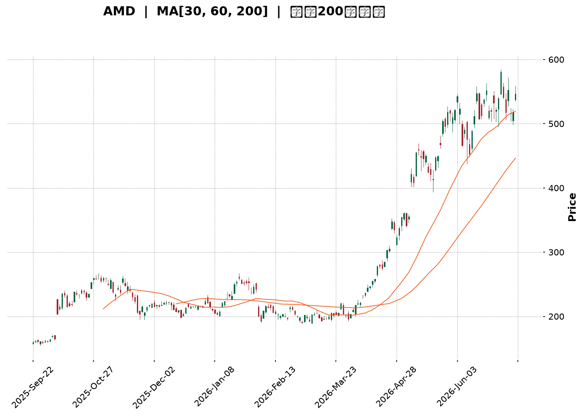
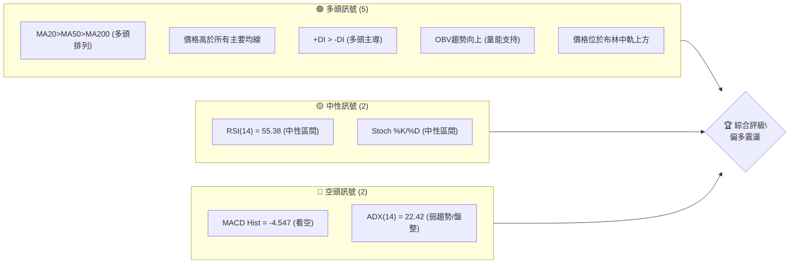
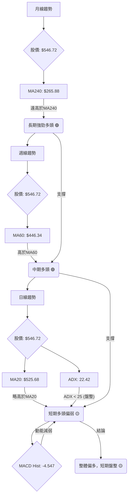
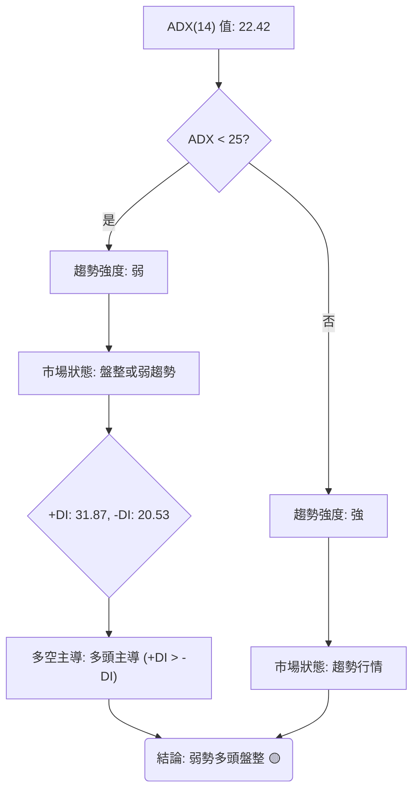
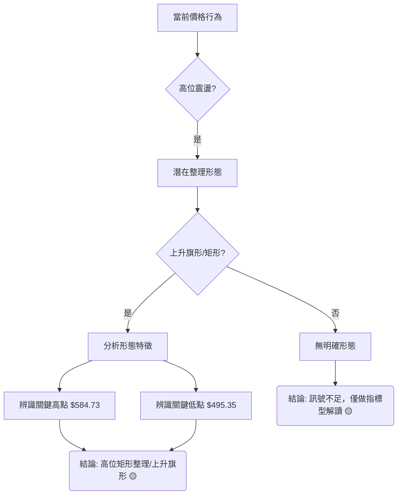
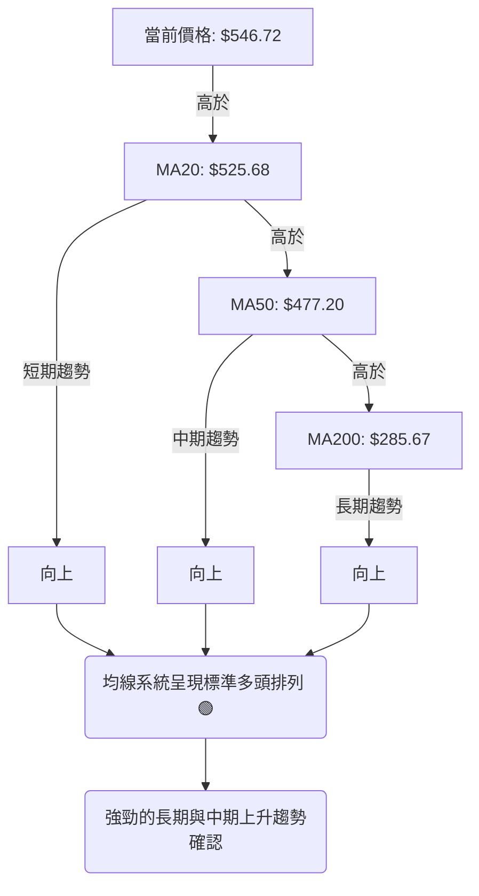
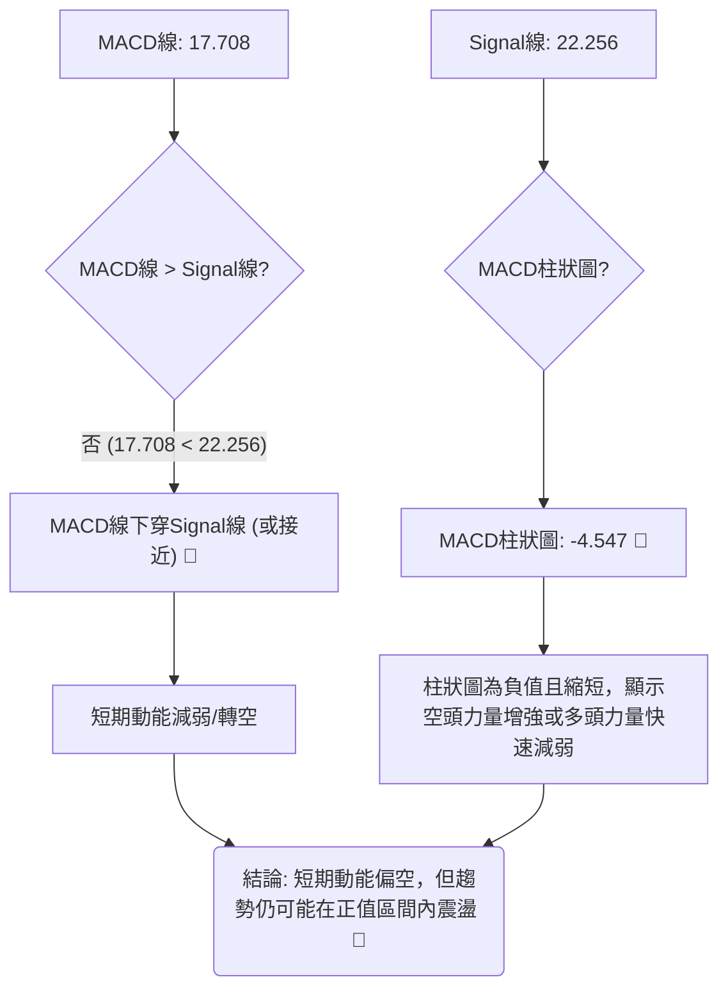
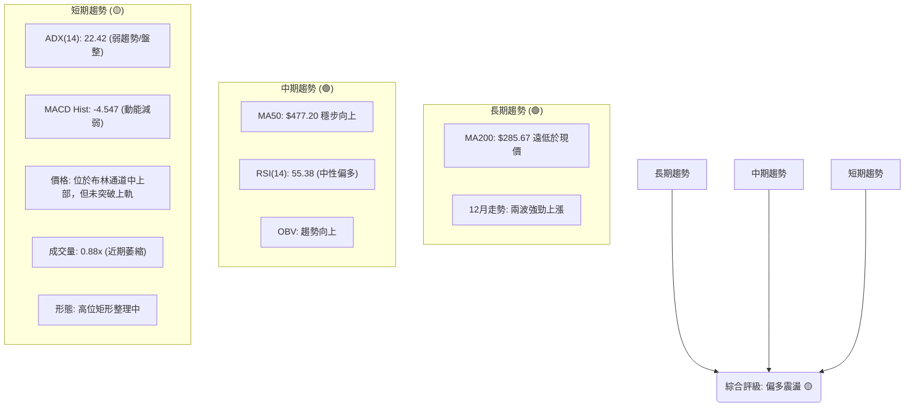
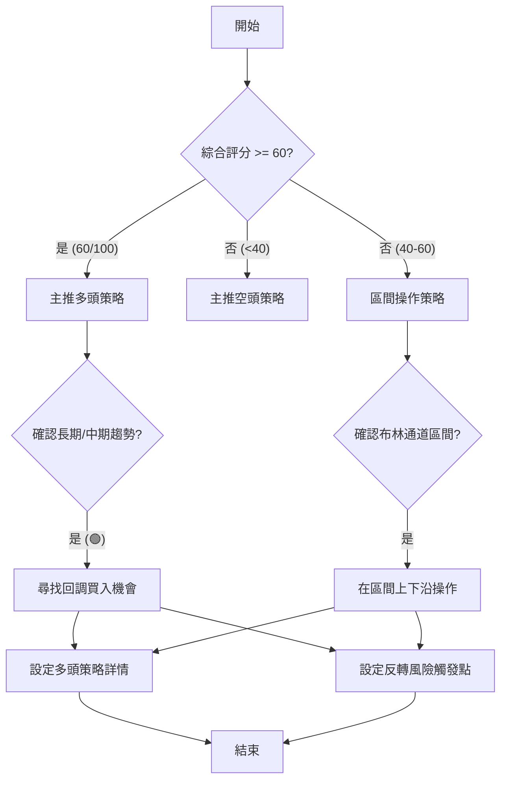
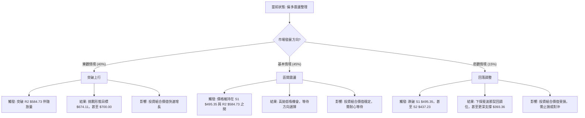

<details>
<summary>📊 靜態圖表 (點擊展開)</summary>

</details>

<html>
<head><meta charset="utf-8" /></head>
<body>
    <div style="height:500px; width:100%;">                        <script>window.PlotlyConfig = {MathJaxConfig: 'local'};</script>
        <script charset="utf-8" src="https://cdn.plot.ly/plotly-3.7.0.min.js" integrity="sha256-jvTGqxNp8AGWEcvNLVuKr+8j5dGe9Yw51LQkmDH+IYA=" crossorigin="anonymous"></script>                <div id="candlestick-chart" class="plotly-graph-div" style="height:100%; width:100%;"></div>            <script>                window.PLOTLYENV=window.PLOTLYENV || {};                                if (document.getElementById("candlestick-chart")) {                    Plotly.newPlot(                        "candlestick-chart",                        [{"close":{"dtype":"f8","bdata":"AAAAoEf5Y0AAAADAzBxkQAAAAAApHGRAAAAA4KMoZEAAAABguO5jQAAAACCFK2RAAAAAoEc5ZEAAAADgUYBkQAAAACBcN2VAAAAAoHCVZEAAAABguHZpQAAAAOBRcGpAAAAAgOtxbUAAAADgehxtQAAAAMDM3GpAAAAAoHANa0AAAABA4UJrQAAAAEAz021AAAAAgOtRbUAAAABgjyJtQAAAAIDrEW5AAAAAwPXAbUAAAAAgXMdsQAAAACCuX21AAAAAoHCdb0AAAABguDpwQAAAAAApIHBAAAAAoEeFcEAAAABA4dpvQAAAAIDrAXBAAAAAYGY6cEAAAACgmUFvQAAAAKBHBXBAAAAAYGa2bUAAAACgRzFtQAAAACBcf25AAAAA4KOwbUAAAACAPS5wQAAAAGC4\u002fm5AAAAAgOvZbkAAAADgoxBuQAAAAKBHyWxAAAAAoJnxa0AAAADgo8BpQAAAAMD1eGlAAAAAoJnhakAAAAAAKcRpQAAAACCux2pAAAAAwPUwa0AAAADgUXhrQAAAACCu52pAAAAAQDMza0AAAAAgXP9qQAAAAEAKP2tAAAAAIIWja0AAAAAA17NrQAAAAKBwrWtAAAAAgMKta0AAAADA9VhqQAAAAGCP8mlAAAAAoHAlakAAAAAghcNoQAAAAIDrIWlAAAAAgMKtakAAAABgZt5qQAAAAMDM3GpAAAAAoEfhakAAAAAgrt9qQAAAACCF82pAAAAAQOHqakAAAADAHsVqQAAAAEAK72tAAAAAYI+ia0AAAABAM8tqQAAAAOCjQGpAAAAAgMKVaUAAAACgcGVpQAAAAIAU9mlAAAAAQAqfa0AAAABAM\u002fNrQAAAAKBwfWxAAAAAYI\u002f6bEAAAACgcP1sQAAAAKCZOW9AAAAAIFy3b0AAAABA4TpwQAAAAIDraW9AAAAAwPWAb0AAAAAgrpdvQAAAAIDChW9AAAAAIFyXbUAAAADgo8huQAAAACCFQ25AAAAAgBQGaUAAAAAAABBoQAAAAIAUDmpAAAAAAAAAa0AAAACAPbJqQAAAAGCPsmpAAAAAgBS+aUAAAACAPeppQAAAAGCPYmlAAAAAANcDaUAAAAAA12tpQAAAAMDMBGlAAAAAQDOTaEAAAABA4bpqQAAAACCFW2pAAAAAgMJ1aUAAAABguAZpQAAAAADX02hAAAAAYGbeZ0AAAACAPUJpQAAAAGBm7mhAAAAAgMINaEAAAACAwlVpQAAAACBcZ2lAAAAAYI+aaUAAAAAgrrdoQAAAAOB6LGhAAAAAYI+SaEAAAACA64loQAAAAGC47mhAAAAA4KOoaUAAAABgjyppQAAAAIDCVWlAAAAAANeraUAAAADgo4hrQAAAAOCjeGlAAAAAIK4\u002faUAAAACgR4FoQAAAAIDCbWlAAAAAYLhGakAAAAAAADBrQAAAAIDChWtAAAAAwPWwa0AAAACAPfpsQAAAAOB6lG1AAAAAoEehbkAAAABgj9puQAAAAIA94m9AAAAAgOshcEAAAAAAKWRxQAAAAIA9ZnFAAAAAQDMvcUAAAAAA18dxQAAAACBc93JAAAAAoEcVc0AAAADA9bx1QAAAAIAU6nRAAAAAIFwzdEAAAACAwhF1QAAAAADXJ3ZAAAAA4KOIdkAAAADgo1h1QAAAAAApNHZAAAAAgD1WekAAAAAgXId5QAAAAEAKc3xAAAAA4KOsfEAAAADgowR8QAAAAAAA2HtAAAAAQDMbfEAAAACgmYF6QAAAAADXT3pAAAAAwMzgeUAAAACgR\u002fl7QAAAAKBwGXxAAAAAACk4fUAAAACAPX5\u002fQAAAAOCj+H5AAAAAYLgwgEAAAADAzCCAQAAAAIAU4n9AAAAA4FFMgEAAAAAAKfSAQAAAAKCZWYBAAAAAgBQmfUAAAACgR6V+QAAAAAApuH1AAAAAYGZGfEAAAABAM4d+QAAAAMAe+X9AAAAAgBQagUAAAADgo7R\u002fQAAAAADXA4BAAAAAwPXKgEAAAABACj2BQAAAAMDMPoBAAAAAgOs9gEAAAABgj6SAQAAAAOCjTIBAAAAAgOvbgEAAAACgRyeCQAAAAEAK54BAAAAAYI8ugEAAAABgZkCBQAAAAEDhIIBAAAAAoEcrgEAAAACAwhWBQA=="},"high":{"dtype":"f8","bdata":"AAAAgMJVZEAAAADgemxkQAAAAEAzo2RAAAAAACk0ZEAAAAAghUNkQAAAAKCZiWRAAAAAwPVIZEAAAACAwoVkQAAAAIDrYWVAAAAAgMJVZUAAAABguFZsQAAAAMDMXGtAAAAAANd7bUAAAABAMwNuQAAAAEAKR21AAAAAgBQGbEAAAAAgXB9sQAAAACCu521AAAAAYGYmbkAAAAAAKWxtQAAAAAApXG5AAAAA4FFIbkAAAAAAKQRuQAAAAMDMfG1AAAAA4Hqsb0AAAABguEZwQAAAAKBHiXBAAAAAoEexcEAAAACAFH5wQAAAAIAUYnBAAAAAYI9OcEAAAACAFBZwQAAAAGBmOnBAAAAA4FGwb0AAAAAA13ttQAAAAMDMHG9AAAAAYLgOb0AAAAAAKXhwQAAAAIAUOnBAAAAAgBSub0AAAADgoxhvQAAAAAAAwG1AAAAAwPVobUAAAAAAAEhtQAAAAGCPGmpAAAAAACkka0AAAABgj9JpQAAAAEDh8mpAAAAAoJlJa0AAAAAgXJ9rQAAAACBcP2xAAAAAYGZGa0AAAAAA12NrQAAAAOB69GtAAAAAYLj2a0AAAABA4RpsQAAAACCF02tAAAAAAACwa0AAAAAgrs9rQAAAACCF62pAAAAAQApHakAAAAAAAHBqQAAAACCFy2lAAAAAgMLlakAAAACgcIVrQAAAAMD1IGtAAAAAoEcRa0AAAABgjxprQAAAAKCZAWtAAAAAgD0aa0AAAADgejRrQAAAAMDMZGxAAAAA4KNAbUAAAACgcN1rQAAAAAAphGpAAAAAgBReakAAAACgmelpQAAAAAApPGpAAAAAIIXja0AAAABA4QJsQAAAAEAzy21AAAAAIK5PbUAAAAAAAPBtQAAAAMDMnG9AAAAAoEcBcEAAAAAgXK9wQAAAAOCjJHBAAAAAoJnxb0AAAABgZhZwQAAAAOB6SHBAAAAAIK6nbkAAAABACj9vQAAAAMDMlG9AAAAAYI9Sa0AAAACgR4FpQAAAAOCjKGpAAAAAQDMza0AAAADgemxrQAAAAMDMdGtAAAAAYLhOa0AAAACgmUFqQAAAAKCZqWlAAAAAYGZmaUAAAABAM4NpQAAAAADXm2lAAAAAACnsaEAAAABguBZrQAAAAGBmFmtAAAAAoEc5akAAAADgejxpQAAAACCu12hAAAAA4Ho0aEAAAACAFE5pQAAAAKBHeWlAAAAAIK4HaUAAAABACl9pQAAAAEDh0mlAAAAAYLgmakAAAAAA13NpQAAAAIDC9WhAAAAAoHAFaUAAAABguOZoQAAAACCFW2lAAAAAACm8aUAAAACgmclpQAAAACCFI2pAAAAAgMLNaUAAAABgj6prQAAAAAAAoGtAAAAA4KNoaUAAAACAwg1qQAAAAAAAgGlAAAAAYI+6akAAAADA9ThrQAAAAIDrSWxAAAAAQDPDa0AAAAAAAEBtQAAAAEAzo21AAAAAYI8yb0AAAABgj+puQAAAAGC47m9AAAAAQOEicEAAAACgcHVxQAAAAMDMkHFAAAAAgML5cUAAAABAM+NxQAAAAAAABHNAAAAAIIVjc0AAAAAA1w92QAAAACBc03VAAAAAAAB4dEAAAABguEJ1QAAAACBcL3ZAAAAA4KOsdkAAAACgmZ12QAAAAMAeeXZAAAAAoJnpekAAAAAgXFt6QAAAAOCjhHxAAAAAIIVTfUAAAADAzKx8QAAAAAAAuHxAAAAAwPVUfEAAAAAAAHB7QAAAAMDMbHtAAAAAAADMekAAAACAPRZ8QAAAAEAzM3xAAAAAYI8WfkAAAAAgXK9\u002fQAAAACBc439AAAAAoJl5gEAAAAAAAFCAQAAAAAAALIBAAAAAgOtTgEAAAAAghROBQAAAACCFoYBAAAAAgOuZf0AAAAAghe9+QAAAAAAAkH9AAAAAQDPXfUAAAAAgXKd+QAAAACCuTYBAAAAAwPVygUAAAACgmSeBQAAAAAAApIBAAAAAIIXdgEAAAACA65eBQAAAAIDrg4BAAAAAIK5ngEAAAABACjeBQAAAAEDhaIBAAAAAIIXxgEAAAAAA10WCQAAAAGC4oIFAAAAAQDMdgUAAAAAAAOSBQAAAAIDCZ4BAAAAAANdXgEAAAAAAAHyBQA=="},"hovertemplate":"\u003cb\u003e%{x|%Y-%m-%d}\u003c\u002fb\u003e\u003cbr\u003e\u958b: $%{open:.2f}\u003cbr\u003e\u9ad8: $%{high:.2f}\u003cbr\u003e\u4f4e: $%{low:.2f}\u003cbr\u003e\u6536: $%{close:.2f}\u003cextra\u003e\u003c\u002fextra\u003e","low":{"dtype":"f8","bdata":"AAAAoHCtY0AAAABguOZjQAAAAIDCzWNAAAAAwPVYY0AAAACgmaFjQAAAAMDM\u002fGNAAAAAYI\u002fqY0AAAAAgrg9kQAAAAADXw2RAAAAA4HpkZEAAAADgUWBpQAAAAMD1KGpAAAAAYGZWakAAAADA9bBsQAAAAGBmpmpAAAAAwMzcakAAAADAzPxqQAAAAOBRmGtAAAAAIK4HbUAAAADAHn1sQAAAAMDMTG1AAAAA4KNAbUAAAAAAKRxsQAAAAKBHkWxAAAAAYGY+bkAAAACgmTlvQAAAAAAAEHBAAAAAYGYWcEAAAACA64lvQAAAAMAerW9AAAAA4Hq8b0AAAADgeuxuQAAAAIDrWW5AAAAAIK53bUAAAADgehRsQAAAAAAAEG5AAAAA4HpUbUAAAAAAAEBvQAAAAIDrwW5AAAAAYI9ibUAAAADAzKRtQAAAAGC4FmxAAAAAYLh2a0AAAADA9ZBpQAAAAAAAYGhAAAAAQDO7aUAAAADA9UhoQAAAAAAA4GlAAAAA4KPAakAAAAAAALBqQAAAAOB6zGpAAAAA4KN4akAAAADgesRqQAAAACCuB2tAAAAAIIVLa0AAAADAHj1rQAAAAKBwVWtAAAAAgBRGakAAAACA6yFqQAAAAGCP0mlAAAAAIIWjaUAAAADA9bBoQAAAAAAAEGlAAAAAYGaGaUAAAACA66lqQAAAAMD1iGpAAAAAQAq\u002fakAAAADA9aBqQAAAACCuJ2pAAAAAYI\u002fKakAAAACgmblqQAAAAMDMXGtAAAAAIFyPa0AAAAAAAGhqQAAAAKBw5WlAAAAAYI9qaUAAAACAPWJpQAAAAKCZ+WhAAAAAIFzfakAAAAAgheNqQAAAAEAKZ2xAAAAAIIWbbEAAAADAHi1sQAAAAMD1eG1AAAAAACnUbkAAAAAAAARwQAAAAKCZSW9AAAAAYLj+bkAAAABguEZvQAAAAMAeHW5AAAAAoJlRbUAAAAAAAGBtQAAAAKBHoW1AAAAAwMzkaEAAAABACtdnQAAAAIDCjWhAAAAAwMyEaUAAAAAAKaRqQAAAAGC4JmpAAAAA4HqkaUAAAAAAKXxpQAAAAGCPWmhAAAAAAABgaEAAAACgR8loQAAAAIDr0WhAAAAAwMxEaEAAAAAAANBpQAAAAGCPSmpAAAAAYLguaUAAAAAgrrdoQAAAAAAAwGdAAAAAQAqHZ0AAAAAghbtnQAAAAAApXGhAAAAAAADoZ0AAAADgo6BnQAAAAGBmRmlAAAAAACl0aUAAAACgcJVoQAAAAOCjCGhAAAAAoJlZaEAAAADgUWhoQAAAAAAAeGhAAAAAYI8aaEAAAADgUchoQAAAAGC4NmlAAAAAACkEaUAAAADgUXBqQAAAAIDCbWlAAAAAgBS2aEAAAAAA1xtoQAAAAMAejWhAAAAAQOG6aUAAAAAA1xNpQAAAACBcN2tAAAAAACnsakAAAABA4WJsQAAAAMAe3WxAAAAAYLjebUAAAADA9UBuQAAAAGBmtm5AAAAAQDN7b0AAAAAAKVhwQAAAAIA9InFAAAAAAAAAcUAAAACA60lxQAAAAIA94nFAAAAAACm8ckAAAADgo+h0QAAAAMD1jHRAAAAAAABgc0AAAACAwu1zQAAAAKCZyXRAAAAAAADUdUAAAABAMyt1QAAAAIAUjnVAAAAA4KMgeUAAAACgRxF5QAAAAOCjJHpAAAAAgBQufEAAAACAwqF6QAAAAGBmCntAAAAAQOE6e0AAAACAwnV6QAAAACBcq3lAAAAAgMKVeEAAAADAzKB6QAAAAKCZ+XpAAAAAIFzbfEAAAAAgrgN+QAAAAGCPan5AAAAA4FHYfkAAAABA4XZ\u002fQAAAAMDMbH5AAAAAIIVTf0AAAABgZmKAQAAAAIDrPX9AAAAAQDP\u002ffEAAAAAgXNt9QAAAACCuU3tAAAAAoEcFfEAAAADgUaB8QAAAAAAA4H5AAAAAAACUgEAAAAAAALR\u002fQAAAAMDMtH9AAAAAYI9ygEAAAAAgrr2AQAAAAMD1rH9AAAAAAAB4f0AAAAAAALB\u002fQAAAAIDCaX9AAAAAoJn1fkAAAABgjwyBQAAAAIDr1YBAAAAAAACgf0AAAAAAAHiAQAAAAIDCcX9AAAAAYGYif0AAAACgmbmAQA=="},"name":"\u50f9\u683c","open":{"dtype":"f8","bdata":"AAAAoHCtY0AAAADgoxBkQAAAACBcX2RAAAAA4HqkY0AAAADgoxBkQAAAAADXA2RAAAAAoEcZZEAAAACAwh1kQAAAAIDCFWVAAAAAgMJVZUAAAABgZk5sQAAAAEAz22pAAAAAYGaeakAAAACgmYltQAAAAOCjGG1AAAAAYGaGa0AAAABgZmZrQAAAAGC41mtAAAAAoEeJbUAAAADgUShtQAAAAEAKj21AAAAA4HrsbUAAAABAM5ttQAAAAMAexWxAAAAAIIVrbkAAAACAFB5wQAAAAIA9MnBAAAAAQAqDcEAAAABguD5wQAAAAKCZOXBAAAAAoEc1cEAAAABAM0tvQAAAACCuZ25AAAAAQAqvb0AAAACAFN5sQAAAAOB6RG5AAAAAwB41bkAAAAAAKaRvQAAAAMDMfG9AAAAAIIUDbkAAAAAAAFhuQAAAAMD1mG1AAAAA4FHIbEAAAABgZhZtQAAAAIDrGWpAAAAAwB7laUAAAAAgXC9pQAAAAKCZQWpAAAAA4HoEa0AAAAAAKbxqQAAAAKBHuWtAAAAA4FEIa0AAAAAAKRxrQAAAAKBwJWtAAAAAQOFia0AAAACgR6FrQAAAAAAAwGtAAAAAgOs5a0AAAAAA10trQAAAAMD1iGpAAAAAoHDdaUAAAACgR0FqQAAAAIA9emlAAAAAQDOTaUAAAAAAAIBrQAAAACCFm2pAAAAAIFzfakAAAACAwu1qQAAAAGCPcmpAAAAAANf7akAAAACAPfpqQAAAAMDMXGtAAAAAAADIbEAAAABguNZrQAAAAAAphGpAAAAAwMxcakAAAABACrdpQAAAAIDCJWlAAAAAQDPjakAAAACgRzFrQAAAAMDMfGxAAAAAoJlJbUAAAABgj0JsQAAAACCuf21AAAAAAAB4b0AAAABA4VJwQAAAAAAADHBAAAAAwB6Fb0AAAAAAKcRvQAAAAMAe1W9AAAAAgMKdbUAAAADgo3htQAAAAKCZcW9AAAAAAADgakAAAAAghTtpQAAAAAAppGhAAAAAwMzcaUAAAADgeuRqQAAAAAApPGtAAAAAYI\u002f6akAAAADgo4BpQAAAAMDMRGlAAAAAwB7NaEAAAAAghQNpQAAAAADXA2lAAAAAQOHCaEAAAAAAKXRqQAAAAIA92mpAAAAAoJkZakAAAAAghQNpQAAAAEAzO2hAAAAAYLjuZ0AAAAAA1wNoQAAAAOCjuGhAAAAA4KNoaEAAAAAghatnQAAAAOBRUGlAAAAAIIWjaUAAAABgj1ppQAAAACCFw2hAAAAAIFxfaEAAAACAwpVoQAAAAAAAgGhAAAAAwPVgaEAAAADgepxpQAAAAMDMzGlAAAAA4HosaUAAAADgUXBqQAAAACBcP2tAAAAA4KM4aUAAAABgZp5pQAAAAKCZwWhAAAAAQOHyaUAAAACgmYFpQAAAAMD1aGtAAAAA4FFIa0AAAAAA1wNtQAAAAOBRIG1AAAAAAADgbUAAAADA9aBuQAAAAKBHOW9AAAAAYLjeb0AAAAAA149wQAAAAAAAkHFAAAAAoJmJcUAAAACgR1VxQAAAACCFM3JAAAAAACngckAAAAAAKQx1QAAAAMAepXVAAAAAgMJ9c0AAAACgR2l0QAAAAIDCVXVAAAAAgOv9dUAAAADA9YR2QAAAAAAp+HVAAAAAANeXeUAAAADAHhF6QAAAAKBwKXpAAAAAwMzIfEAAAAAAABR8QAAAAOCjkHxAAAAAoJmJe0AAAACgcBV7QAAAAAAA2HpAAAAAoJnJeUAAAADgo8B6QAAAAADXn3tAAAAAoHBdfUAAAAAA10t+QAAAAAAAwH9AAAAAAAAwf0AAAABgZkaAQAAAAGCPQn9AAAAAwMykf0AAAAAAAK6AQAAAAAAAFoBAAAAA4Ho4f0AAAAAAAFB+QAAAAAAAbH9AAAAAIIU\u002ffUAAAACgmdl8QAAAAEAKO39AAAAAAAC+gEAAAADAHheBQAAAAKBHjYBAAAAA4KOcgEAAAAAAAAyBQAAAAKBH0X9AAAAAYI9GgEAAAACgcP+AQAAAAGBmPoBAAAAAYLhWgEAAAABgjwyBQAAAAIA9bIFAAAAAoEfRgEAAAADAzLqAQAAAAKBHH4BAAAAAwPWMf0AAAAAAKcqAQA=="},"x":["2025-09-22T00:00:00-04:00","2025-09-23T00:00:00-04:00","2025-09-24T00:00:00-04:00","2025-09-25T00:00:00-04:00","2025-09-26T00:00:00-04:00","2025-09-29T00:00:00-04:00","2025-09-30T00:00:00-04:00","2025-10-01T00:00:00-04:00","2025-10-02T00:00:00-04:00","2025-10-03T00:00:00-04:00","2025-10-06T00:00:00-04:00","2025-10-07T00:00:00-04:00","2025-10-08T00:00:00-04:00","2025-10-09T00:00:00-04:00","2025-10-10T00:00:00-04:00","2025-10-13T00:00:00-04:00","2025-10-14T00:00:00-04:00","2025-10-15T00:00:00-04:00","2025-10-16T00:00:00-04:00","2025-10-17T00:00:00-04:00","2025-10-20T00:00:00-04:00","2025-10-21T00:00:00-04:00","2025-10-22T00:00:00-04:00","2025-10-23T00:00:00-04:00","2025-10-24T00:00:00-04:00","2025-10-27T00:00:00-04:00","2025-10-28T00:00:00-04:00","2025-10-29T00:00:00-04:00","2025-10-30T00:00:00-04:00","2025-10-31T00:00:00-04:00","2025-11-03T00:00:00-05:00","2025-11-04T00:00:00-05:00","2025-11-05T00:00:00-05:00","2025-11-06T00:00:00-05:00","2025-11-07T00:00:00-05:00","2025-11-10T00:00:00-05:00","2025-11-11T00:00:00-05:00","2025-11-12T00:00:00-05:00","2025-11-13T00:00:00-05:00","2025-11-14T00:00:00-05:00","2025-11-17T00:00:00-05:00","2025-11-18T00:00:00-05:00","2025-11-19T00:00:00-05:00","2025-11-20T00:00:00-05:00","2025-11-21T00:00:00-05:00","2025-11-24T00:00:00-05:00","2025-11-25T00:00:00-05:00","2025-11-26T00:00:00-05:00","2025-11-28T00:00:00-05:00","2025-12-01T00:00:00-05:00","2025-12-02T00:00:00-05:00","2025-12-03T00:00:00-05:00","2025-12-04T00:00:00-05:00","2025-12-05T00:00:00-05:00","2025-12-08T00:00:00-05:00","2025-12-09T00:00:00-05:00","2025-12-10T00:00:00-05:00","2025-12-11T00:00:00-05:00","2025-12-12T00:00:00-05:00","2025-12-15T00:00:00-05:00","2025-12-16T00:00:00-05:00","2025-12-17T00:00:00-05:00","2025-12-18T00:00:00-05:00","2025-12-19T00:00:00-05:00","2025-12-22T00:00:00-05:00","2025-12-23T00:00:00-05:00","2025-12-24T00:00:00-05:00","2025-12-26T00:00:00-05:00","2025-12-29T00:00:00-05:00","2025-12-30T00:00:00-05:00","2025-12-31T00:00:00-05:00","2026-01-02T00:00:00-05:00","2026-01-05T00:00:00-05:00","2026-01-06T00:00:00-05:00","2026-01-07T00:00:00-05:00","2026-01-08T00:00:00-05:00","2026-01-09T00:00:00-05:00","2026-01-12T00:00:00-05:00","2026-01-13T00:00:00-05:00","2026-01-14T00:00:00-05:00","2026-01-15T00:00:00-05:00","2026-01-16T00:00:00-05:00","2026-01-20T00:00:00-05:00","2026-01-21T00:00:00-05:00","2026-01-22T00:00:00-05:00","2026-01-23T00:00:00-05:00","2026-01-26T00:00:00-05:00","2026-01-27T00:00:00-05:00","2026-01-28T00:00:00-05:00","2026-01-29T00:00:00-05:00","2026-01-30T00:00:00-05:00","2026-02-02T00:00:00-05:00","2026-02-03T00:00:00-05:00","2026-02-04T00:00:00-05:00","2026-02-05T00:00:00-05:00","2026-02-06T00:00:00-05:00","2026-02-09T00:00:00-05:00","2026-02-10T00:00:00-05:00","2026-02-11T00:00:00-05:00","2026-02-12T00:00:00-05:00","2026-02-13T00:00:00-05:00","2026-02-17T00:00:00-05:00","2026-02-18T00:00:00-05:00","2026-02-19T00:00:00-05:00","2026-02-20T00:00:00-05:00","2026-02-23T00:00:00-05:00","2026-02-24T00:00:00-05:00","2026-02-25T00:00:00-05:00","2026-02-26T00:00:00-05:00","2026-02-27T00:00:00-05:00","2026-03-02T00:00:00-05:00","2026-03-03T00:00:00-05:00","2026-03-04T00:00:00-05:00","2026-03-05T00:00:00-05:00","2026-03-06T00:00:00-05:00","2026-03-09T00:00:00-04:00","2026-03-10T00:00:00-04:00","2026-03-11T00:00:00-04:00","2026-03-12T00:00:00-04:00","2026-03-13T00:00:00-04:00","2026-03-16T00:00:00-04:00","2026-03-17T00:00:00-04:00","2026-03-18T00:00:00-04:00","2026-03-19T00:00:00-04:00","2026-03-20T00:00:00-04:00","2026-03-23T00:00:00-04:00","2026-03-24T00:00:00-04:00","2026-03-25T00:00:00-04:00","2026-03-26T00:00:00-04:00","2026-03-27T00:00:00-04:00","2026-03-30T00:00:00-04:00","2026-03-31T00:00:00-04:00","2026-04-01T00:00:00-04:00","2026-04-02T00:00:00-04:00","2026-04-06T00:00:00-04:00","2026-04-07T00:00:00-04:00","2026-04-08T00:00:00-04:00","2026-04-09T00:00:00-04:00","2026-04-10T00:00:00-04:00","2026-04-13T00:00:00-04:00","2026-04-14T00:00:00-04:00","2026-04-15T00:00:00-04:00","2026-04-16T00:00:00-04:00","2026-04-17T00:00:00-04:00","2026-04-20T00:00:00-04:00","2026-04-21T00:00:00-04:00","2026-04-22T00:00:00-04:00","2026-04-23T00:00:00-04:00","2026-04-24T00:00:00-04:00","2026-04-27T00:00:00-04:00","2026-04-28T00:00:00-04:00","2026-04-29T00:00:00-04:00","2026-04-30T00:00:00-04:00","2026-05-01T00:00:00-04:00","2026-05-04T00:00:00-04:00","2026-05-05T00:00:00-04:00","2026-05-06T00:00:00-04:00","2026-05-07T00:00:00-04:00","2026-05-08T00:00:00-04:00","2026-05-11T00:00:00-04:00","2026-05-12T00:00:00-04:00","2026-05-13T00:00:00-04:00","2026-05-14T00:00:00-04:00","2026-05-15T00:00:00-04:00","2026-05-18T00:00:00-04:00","2026-05-19T00:00:00-04:00","2026-05-20T00:00:00-04:00","2026-05-21T00:00:00-04:00","2026-05-22T00:00:00-04:00","2026-05-26T00:00:00-04:00","2026-05-27T00:00:00-04:00","2026-05-28T00:00:00-04:00","2026-05-29T00:00:00-04:00","2026-06-01T00:00:00-04:00","2026-06-02T00:00:00-04:00","2026-06-03T00:00:00-04:00","2026-06-04T00:00:00-04:00","2026-06-05T00:00:00-04:00","2026-06-08T00:00:00-04:00","2026-06-09T00:00:00-04:00","2026-06-10T00:00:00-04:00","2026-06-11T00:00:00-04:00","2026-06-12T00:00:00-04:00","2026-06-15T00:00:00-04:00","2026-06-16T00:00:00-04:00","2026-06-17T00:00:00-04:00","2026-06-18T00:00:00-04:00","2026-06-22T00:00:00-04:00","2026-06-23T00:00:00-04:00","2026-06-24T00:00:00-04:00","2026-06-25T00:00:00-04:00","2026-06-26T00:00:00-04:00","2026-06-29T00:00:00-04:00","2026-06-30T00:00:00-04:00","2026-07-01T00:00:00-04:00","2026-07-02T00:00:00-04:00","2026-07-06T00:00:00-04:00","2026-07-07T00:00:00-04:00","2026-07-08T00:00:00-04:00","2026-07-09T00:00:00-04:00"],"type":"candlestick"},{"hovertemplate":"MA30: $%{y:.2f}\u003cextra\u003e\u003c\u002fextra\u003e","line":{"color":"#2196F3","dash":"dash","width":2},"mode":"lines","name":"MA30","x":["2025-09-22T00:00:00-04:00","2025-09-23T00:00:00-04:00","2025-09-24T00:00:00-04:00","2025-09-25T00:00:00-04:00","2025-09-26T00:00:00-04:00","2025-09-29T00:00:00-04:00","2025-09-30T00:00:00-04:00","2025-10-01T00:00:00-04:00","2025-10-02T00:00:00-04:00","2025-10-03T00:00:00-04:00","2025-10-06T00:00:00-04:00","2025-10-07T00:00:00-04:00","2025-10-08T00:00:00-04:00","2025-10-09T00:00:00-04:00","2025-10-10T00:00:00-04:00","2025-10-13T00:00:00-04:00","2025-10-14T00:00:00-04:00","2025-10-15T00:00:00-04:00","2025-10-16T00:00:00-04:00","2025-10-17T00:00:00-04:00","2025-10-20T00:00:00-04:00","2025-10-21T00:00:00-04:00","2025-10-22T00:00:00-04:00","2025-10-23T00:00:00-04:00","2025-10-24T00:00:00-04:00","2025-10-27T00:00:00-04:00","2025-10-28T00:00:00-04:00","2025-10-29T00:00:00-04:00","2025-10-30T00:00:00-04:00","2025-10-31T00:00:00-04:00","2025-11-03T00:00:00-05:00","2025-11-04T00:00:00-05:00","2025-11-05T00:00:00-05:00","2025-11-06T00:00:00-05:00","2025-11-07T00:00:00-05:00","2025-11-10T00:00:00-05:00","2025-11-11T00:00:00-05:00","2025-11-12T00:00:00-05:00","2025-11-13T00:00:00-05:00","2025-11-14T00:00:00-05:00","2025-11-17T00:00:00-05:00","2025-11-18T00:00:00-05:00","2025-11-19T00:00:00-05:00","2025-11-20T00:00:00-05:00","2025-11-21T00:00:00-05:00","2025-11-24T00:00:00-05:00","2025-11-25T00:00:00-05:00","2025-11-26T00:00:00-05:00","2025-11-28T00:00:00-05:00","2025-12-01T00:00:00-05:00","2025-12-02T00:00:00-05:00","2025-12-03T00:00:00-05:00","2025-12-04T00:00:00-05:00","2025-12-05T00:00:00-05:00","2025-12-08T00:00:00-05:00","2025-12-09T00:00:00-05:00","2025-12-10T00:00:00-05:00","2025-12-11T00:00:00-05:00","2025-12-12T00:00:00-05:00","2025-12-15T00:00:00-05:00","2025-12-16T00:00:00-05:00","2025-12-17T00:00:00-05:00","2025-12-18T00:00:00-05:00","2025-12-19T00:00:00-05:00","2025-12-22T00:00:00-05:00","2025-12-23T00:00:00-05:00","2025-12-24T00:00:00-05:00","2025-12-26T00:00:00-05:00","2025-12-29T00:00:00-05:00","2025-12-30T00:00:00-05:00","2025-12-31T00:00:00-05:00","2026-01-02T00:00:00-05:00","2026-01-05T00:00:00-05:00","2026-01-06T00:00:00-05:00","2026-01-07T00:00:00-05:00","2026-01-08T00:00:00-05:00","2026-01-09T00:00:00-05:00","2026-01-12T00:00:00-05:00","2026-01-13T00:00:00-05:00","2026-01-14T00:00:00-05:00","2026-01-15T00:00:00-05:00","2026-01-16T00:00:00-05:00","2026-01-20T00:00:00-05:00","2026-01-21T00:00:00-05:00","2026-01-22T00:00:00-05:00","2026-01-23T00:00:00-05:00","2026-01-26T00:00:00-05:00","2026-01-27T00:00:00-05:00","2026-01-28T00:00:00-05:00","2026-01-29T00:00:00-05:00","2026-01-30T00:00:00-05:00","2026-02-02T00:00:00-05:00","2026-02-03T00:00:00-05:00","2026-02-04T00:00:00-05:00","2026-02-05T00:00:00-05:00","2026-02-06T00:00:00-05:00","2026-02-09T00:00:00-05:00","2026-02-10T00:00:00-05:00","2026-02-11T00:00:00-05:00","2026-02-12T00:00:00-05:00","2026-02-13T00:00:00-05:00","2026-02-17T00:00:00-05:00","2026-02-18T00:00:00-05:00","2026-02-19T00:00:00-05:00","2026-02-20T00:00:00-05:00","2026-02-23T00:00:00-05:00","2026-02-24T00:00:00-05:00","2026-02-25T00:00:00-05:00","2026-02-26T00:00:00-05:00","2026-02-27T00:00:00-05:00","2026-03-02T00:00:00-05:00","2026-03-03T00:00:00-05:00","2026-03-04T00:00:00-05:00","2026-03-05T00:00:00-05:00","2026-03-06T00:00:00-05:00","2026-03-09T00:00:00-04:00","2026-03-10T00:00:00-04:00","2026-03-11T00:00:00-04:00","2026-03-12T00:00:00-04:00","2026-03-13T00:00:00-04:00","2026-03-16T00:00:00-04:00","2026-03-17T00:00:00-04:00","2026-03-18T00:00:00-04:00","2026-03-19T00:00:00-04:00","2026-03-20T00:00:00-04:00","2026-03-23T00:00:00-04:00","2026-03-24T00:00:00-04:00","2026-03-25T00:00:00-04:00","2026-03-26T00:00:00-04:00","2026-03-27T00:00:00-04:00","2026-03-30T00:00:00-04:00","2026-03-31T00:00:00-04:00","2026-04-01T00:00:00-04:00","2026-04-02T00:00:00-04:00","2026-04-06T00:00:00-04:00","2026-04-07T00:00:00-04:00","2026-04-08T00:00:00-04:00","2026-04-09T00:00:00-04:00","2026-04-10T00:00:00-04:00","2026-04-13T00:00:00-04:00","2026-04-14T00:00:00-04:00","2026-04-15T00:00:00-04:00","2026-04-16T00:00:00-04:00","2026-04-17T00:00:00-04:00","2026-04-20T00:00:00-04:00","2026-04-21T00:00:00-04:00","2026-04-22T00:00:00-04:00","2026-04-23T00:00:00-04:00","2026-04-24T00:00:00-04:00","2026-04-27T00:00:00-04:00","2026-04-28T00:00:00-04:00","2026-04-29T00:00:00-04:00","2026-04-30T00:00:00-04:00","2026-05-01T00:00:00-04:00","2026-05-04T00:00:00-04:00","2026-05-05T00:00:00-04:00","2026-05-06T00:00:00-04:00","2026-05-07T00:00:00-04:00","2026-05-08T00:00:00-04:00","2026-05-11T00:00:00-04:00","2026-05-12T00:00:00-04:00","2026-05-13T00:00:00-04:00","2026-05-14T00:00:00-04:00","2026-05-15T00:00:00-04:00","2026-05-18T00:00:00-04:00","2026-05-19T00:00:00-04:00","2026-05-20T00:00:00-04:00","2026-05-21T00:00:00-04:00","2026-05-22T00:00:00-04:00","2026-05-26T00:00:00-04:00","2026-05-27T00:00:00-04:00","2026-05-28T00:00:00-04:00","2026-05-29T00:00:00-04:00","2026-06-01T00:00:00-04:00","2026-06-02T00:00:00-04:00","2026-06-03T00:00:00-04:00","2026-06-04T00:00:00-04:00","2026-06-05T00:00:00-04:00","2026-06-08T00:00:00-04:00","2026-06-09T00:00:00-04:00","2026-06-10T00:00:00-04:00","2026-06-11T00:00:00-04:00","2026-06-12T00:00:00-04:00","2026-06-15T00:00:00-04:00","2026-06-16T00:00:00-04:00","2026-06-17T00:00:00-04:00","2026-06-18T00:00:00-04:00","2026-06-22T00:00:00-04:00","2026-06-23T00:00:00-04:00","2026-06-24T00:00:00-04:00","2026-06-25T00:00:00-04:00","2026-06-26T00:00:00-04:00","2026-06-29T00:00:00-04:00","2026-06-30T00:00:00-04:00","2026-07-01T00:00:00-04:00","2026-07-02T00:00:00-04:00","2026-07-06T00:00:00-04:00","2026-07-07T00:00:00-04:00","2026-07-08T00:00:00-04:00","2026-07-09T00:00:00-04:00"],"y":{"dtype":"f8","bdata":"AAAAAAAA+H8AAAAAAAD4fwAAAAAAAPh\u002fAAAAAAAA+H8AAAAAAAD4fwAAAAAAAPh\u002fAAAAAAAA+H8AAAAAAAD4fwAAAAAAAPh\u002fAAAAAAAA+H8AAAAAAAD4fwAAAAAAAPh\u002fAAAAAAAA+H8AAAAAAAD4fwAAAAAAAPh\u002fAAAAAAAA+H8AAAAAAAD4fwAAAAAAAPh\u002fAAAAAAAA+H8AAAAAAAD4fwAAAAAAAPh\u002fAAAAAAAA+H8AAAAAAAD4fwAAAAAAAPh\u002fAAAAAAAA+H8AAAAAAAD4fwAAAAAAAPh\u002fAAAAAAAA+H8AAAAAAAD4fyIiIsJneGpAIiIiMuziakB3d3cXBEJrQM3MzEzUp2tAiYiIyFr5a0Dv7u6OX0hsQDMzM1OAoGxAq6qqqkfxbEDNzMw8fFZtQO\u002fu7j7uqW1AERER8YsBbkBmZmaGzyhuQHd3d7fXPG5AAAAAMAgwbkAzMzPjXhNuQDMzM2OCB25AmpmZSQwGbkCamZlpSvltQCIiIoJO321A7+7uLiTNbUDv7u7u7r5tQDMzM+Pso21AMzMzIyKObUAAAADw7n5tQHd3d1fHbG1Ad3d3F9lKbUBmZmbmQiJtQDMzM2M7+2xARERE1HjNbEAzMzODeZ5sQLy7u9uyamxAREREdNo0bEDv7u5ec\u002f1rQKuqqvp+wmtAZmZmppuoa0B3d3dXx5RrQAAAAJDCdWtAVVVVBchda0BERERk9C5rQO\u002fu7q5yDGtAZmZmRuHqakDNzMw8w85qQM3MzOx8x2pAMzMzc9rEakCJiIgYvc1qQImIiAhl1GpAREREVFXJakDNzMwMLcZqQGZmZnYwv2pAAAAA0NvCakBERERk9MZqQAAAAOB61GpAzczMnKjjakC8u7tLqfRqQCIiIgKdFmtAERERcWg5a0C8u7tbAWJrQCIiIlLjgWtAmpmZKYeia0CrqqoKSc9rQAAAANDb\u002fmtAd3d3h0EcbEC8u7troE9sQO\u002fu7s5pe2xAiYiIaEptbEAAAAAQWFVsQN7d3Q10TmxAMzMzM3pPbEAiIiJy9k1sQO\u002fu7h7MS2xAvLu7S8VBbEBVVVWFeTpsQBEREbG5JGxAZmZmNl4ObEAAAADwpwJsQERERMQg+GtAREREZILva0AzMzMD5PprQCIiIqJF\u002fmtA7+7uTtTra0B3d3dH4dJrQM3MzGygs2tAVVVVdQWIa0C8u7trLmhrQDMzM4N5MmtAZmZmhhbxakCamZm5SbRqQN7d3a0AgWpA7+7u7qdOakBERERE\u002fRNqQN7d3a1H1WlA3t3dDXSqaUBERESkKXVpQJqZmVmrR2lAd3d3hxZNaUBVVVW1gVZpQHd3d9dcUGlAREREJAZFaUAAAACwK0xpQHd3d+e0QWlAq6qqSn49aUCJiIgYdjFpQKuqqqrVMWlAmpmZ6Zg8aUCJiIhYq0tpQO\u002fu7t4IYWlAvLu7a6B7aUCamZkpzo5pQCIiItJNqmlAvLu722vWaUCamZk5JghqQHd3d9dcRGpAq6qqugKMakDe3d2tR91qQBEREZF7MWtAiYiICIGJa0De3d2dxOBrQGZmZhauS2xAiYiISOG2bEBVVVVl9FZtQFVVVVWc7W1AMzMzw650bkC8u7uL3gpvQBERERE8sG9AiYiIkO0qcEB3d3fntHVwQJqZmSkVx3BAiYiIGEs6cUBVVVVNqZ5xQDMzM4PAJHJA3t3dRbatckDv7u7OPjRzQO\u002fu7m5ZtXNAVVVVzRM1dEDv7u6WQ6N0QBEREdlcDnVAZmZmPgp1dUBERESsHOh1QCIiInKvWXZAzczMBFbQdkB3d3dHb1l3QDMzM3Ov2XdAZmZmBlZkeEC8u7sbL+N4QHd3d1fHXnlAd3d3F0vieUCrqqrK6Gt6QBEREaEa4XpAMzMzU\u002f82e0De3d0NAoN7QO\u002fu7t4kzntAzczMnAsTfEAiIiKSwmN8QKuqqjqJt3xAvLu7ux4bfUAiIiIihXN9QGZmZuZex31AiYiICDoFfkAzMzODlVF+QBEREcERdH5AVVVVdZOUfkDNzMx8hsF+QCIiIvIZ6n5AVVVVRf0Zf0Dv7u4On21\u002fQKuqqgqQrX9AvLu7G+jkf0B3d3ffTw6AQImIiPgMIIBAmpmZeVstgEBVVVVVxziAQA=="},"type":"scatter"},{"hovertemplate":"MA60: $%{y:.2f}\u003cextra\u003e\u003c\u002fextra\u003e","line":{"color":"#9C27B0","dash":"dash","width":2},"mode":"lines","name":"MA60","x":["2025-09-22T00:00:00-04:00","2025-09-23T00:00:00-04:00","2025-09-24T00:00:00-04:00","2025-09-25T00:00:00-04:00","2025-09-26T00:00:00-04:00","2025-09-29T00:00:00-04:00","2025-09-30T00:00:00-04:00","2025-10-01T00:00:00-04:00","2025-10-02T00:00:00-04:00","2025-10-03T00:00:00-04:00","2025-10-06T00:00:00-04:00","2025-10-07T00:00:00-04:00","2025-10-08T00:00:00-04:00","2025-10-09T00:00:00-04:00","2025-10-10T00:00:00-04:00","2025-10-13T00:00:00-04:00","2025-10-14T00:00:00-04:00","2025-10-15T00:00:00-04:00","2025-10-16T00:00:00-04:00","2025-10-17T00:00:00-04:00","2025-10-20T00:00:00-04:00","2025-10-21T00:00:00-04:00","2025-10-22T00:00:00-04:00","2025-10-23T00:00:00-04:00","2025-10-24T00:00:00-04:00","2025-10-27T00:00:00-04:00","2025-10-28T00:00:00-04:00","2025-10-29T00:00:00-04:00","2025-10-30T00:00:00-04:00","2025-10-31T00:00:00-04:00","2025-11-03T00:00:00-05:00","2025-11-04T00:00:00-05:00","2025-11-05T00:00:00-05:00","2025-11-06T00:00:00-05:00","2025-11-07T00:00:00-05:00","2025-11-10T00:00:00-05:00","2025-11-11T00:00:00-05:00","2025-11-12T00:00:00-05:00","2025-11-13T00:00:00-05:00","2025-11-14T00:00:00-05:00","2025-11-17T00:00:00-05:00","2025-11-18T00:00:00-05:00","2025-11-19T00:00:00-05:00","2025-11-20T00:00:00-05:00","2025-11-21T00:00:00-05:00","2025-11-24T00:00:00-05:00","2025-11-25T00:00:00-05:00","2025-11-26T00:00:00-05:00","2025-11-28T00:00:00-05:00","2025-12-01T00:00:00-05:00","2025-12-02T00:00:00-05:00","2025-12-03T00:00:00-05:00","2025-12-04T00:00:00-05:00","2025-12-05T00:00:00-05:00","2025-12-08T00:00:00-05:00","2025-12-09T00:00:00-05:00","2025-12-10T00:00:00-05:00","2025-12-11T00:00:00-05:00","2025-12-12T00:00:00-05:00","2025-12-15T00:00:00-05:00","2025-12-16T00:00:00-05:00","2025-12-17T00:00:00-05:00","2025-12-18T00:00:00-05:00","2025-12-19T00:00:00-05:00","2025-12-22T00:00:00-05:00","2025-12-23T00:00:00-05:00","2025-12-24T00:00:00-05:00","2025-12-26T00:00:00-05:00","2025-12-29T00:00:00-05:00","2025-12-30T00:00:00-05:00","2025-12-31T00:00:00-05:00","2026-01-02T00:00:00-05:00","2026-01-05T00:00:00-05:00","2026-01-06T00:00:00-05:00","2026-01-07T00:00:00-05:00","2026-01-08T00:00:00-05:00","2026-01-09T00:00:00-05:00","2026-01-12T00:00:00-05:00","2026-01-13T00:00:00-05:00","2026-01-14T00:00:00-05:00","2026-01-15T00:00:00-05:00","2026-01-16T00:00:00-05:00","2026-01-20T00:00:00-05:00","2026-01-21T00:00:00-05:00","2026-01-22T00:00:00-05:00","2026-01-23T00:00:00-05:00","2026-01-26T00:00:00-05:00","2026-01-27T00:00:00-05:00","2026-01-28T00:00:00-05:00","2026-01-29T00:00:00-05:00","2026-01-30T00:00:00-05:00","2026-02-02T00:00:00-05:00","2026-02-03T00:00:00-05:00","2026-02-04T00:00:00-05:00","2026-02-05T00:00:00-05:00","2026-02-06T00:00:00-05:00","2026-02-09T00:00:00-05:00","2026-02-10T00:00:00-05:00","2026-02-11T00:00:00-05:00","2026-02-12T00:00:00-05:00","2026-02-13T00:00:00-05:00","2026-02-17T00:00:00-05:00","2026-02-18T00:00:00-05:00","2026-02-19T00:00:00-05:00","2026-02-20T00:00:00-05:00","2026-02-23T00:00:00-05:00","2026-02-24T00:00:00-05:00","2026-02-25T00:00:00-05:00","2026-02-26T00:00:00-05:00","2026-02-27T00:00:00-05:00","2026-03-02T00:00:00-05:00","2026-03-03T00:00:00-05:00","2026-03-04T00:00:00-05:00","2026-03-05T00:00:00-05:00","2026-03-06T00:00:00-05:00","2026-03-09T00:00:00-04:00","2026-03-10T00:00:00-04:00","2026-03-11T00:00:00-04:00","2026-03-12T00:00:00-04:00","2026-03-13T00:00:00-04:00","2026-03-16T00:00:00-04:00","2026-03-17T00:00:00-04:00","2026-03-18T00:00:00-04:00","2026-03-19T00:00:00-04:00","2026-03-20T00:00:00-04:00","2026-03-23T00:00:00-04:00","2026-03-24T00:00:00-04:00","2026-03-25T00:00:00-04:00","2026-03-26T00:00:00-04:00","2026-03-27T00:00:00-04:00","2026-03-30T00:00:00-04:00","2026-03-31T00:00:00-04:00","2026-04-01T00:00:00-04:00","2026-04-02T00:00:00-04:00","2026-04-06T00:00:00-04:00","2026-04-07T00:00:00-04:00","2026-04-08T00:00:00-04:00","2026-04-09T00:00:00-04:00","2026-04-10T00:00:00-04:00","2026-04-13T00:00:00-04:00","2026-04-14T00:00:00-04:00","2026-04-15T00:00:00-04:00","2026-04-16T00:00:00-04:00","2026-04-17T00:00:00-04:00","2026-04-20T00:00:00-04:00","2026-04-21T00:00:00-04:00","2026-04-22T00:00:00-04:00","2026-04-23T00:00:00-04:00","2026-04-24T00:00:00-04:00","2026-04-27T00:00:00-04:00","2026-04-28T00:00:00-04:00","2026-04-29T00:00:00-04:00","2026-04-30T00:00:00-04:00","2026-05-01T00:00:00-04:00","2026-05-04T00:00:00-04:00","2026-05-05T00:00:00-04:00","2026-05-06T00:00:00-04:00","2026-05-07T00:00:00-04:00","2026-05-08T00:00:00-04:00","2026-05-11T00:00:00-04:00","2026-05-12T00:00:00-04:00","2026-05-13T00:00:00-04:00","2026-05-14T00:00:00-04:00","2026-05-15T00:00:00-04:00","2026-05-18T00:00:00-04:00","2026-05-19T00:00:00-04:00","2026-05-20T00:00:00-04:00","2026-05-21T00:00:00-04:00","2026-05-22T00:00:00-04:00","2026-05-26T00:00:00-04:00","2026-05-27T00:00:00-04:00","2026-05-28T00:00:00-04:00","2026-05-29T00:00:00-04:00","2026-06-01T00:00:00-04:00","2026-06-02T00:00:00-04:00","2026-06-03T00:00:00-04:00","2026-06-04T00:00:00-04:00","2026-06-05T00:00:00-04:00","2026-06-08T00:00:00-04:00","2026-06-09T00:00:00-04:00","2026-06-10T00:00:00-04:00","2026-06-11T00:00:00-04:00","2026-06-12T00:00:00-04:00","2026-06-15T00:00:00-04:00","2026-06-16T00:00:00-04:00","2026-06-17T00:00:00-04:00","2026-06-18T00:00:00-04:00","2026-06-22T00:00:00-04:00","2026-06-23T00:00:00-04:00","2026-06-24T00:00:00-04:00","2026-06-25T00:00:00-04:00","2026-06-26T00:00:00-04:00","2026-06-29T00:00:00-04:00","2026-06-30T00:00:00-04:00","2026-07-01T00:00:00-04:00","2026-07-02T00:00:00-04:00","2026-07-06T00:00:00-04:00","2026-07-07T00:00:00-04:00","2026-07-08T00:00:00-04:00","2026-07-09T00:00:00-04:00"],"y":{"dtype":"f8","bdata":"AAAAAAAA+H8AAAAAAAD4fwAAAAAAAPh\u002fAAAAAAAA+H8AAAAAAAD4fwAAAAAAAPh\u002fAAAAAAAA+H8AAAAAAAD4fwAAAAAAAPh\u002fAAAAAAAA+H8AAAAAAAD4fwAAAAAAAPh\u002fAAAAAAAA+H8AAAAAAAD4fwAAAAAAAPh\u002fAAAAAAAA+H8AAAAAAAD4fwAAAAAAAPh\u002fAAAAAAAA+H8AAAAAAAD4fwAAAAAAAPh\u002fAAAAAAAA+H8AAAAAAAD4fwAAAAAAAPh\u002fAAAAAAAA+H8AAAAAAAD4fwAAAAAAAPh\u002fAAAAAAAA+H8AAAAAAAD4fwAAAAAAAPh\u002fAAAAAAAA+H8AAAAAAAD4fwAAAAAAAPh\u002fAAAAAAAA+H8AAAAAAAD4fwAAAAAAAPh\u002fAAAAAAAA+H8AAAAAAAD4fwAAAAAAAPh\u002fAAAAAAAA+H8AAAAAAAD4fwAAAAAAAPh\u002fAAAAAAAA+H8AAAAAAAD4fwAAAAAAAPh\u002fAAAAAAAA+H8AAAAAAAD4fwAAAAAAAPh\u002fAAAAAAAA+H8AAAAAAAD4fwAAAAAAAPh\u002fAAAAAAAA+H8AAAAAAAD4fwAAAAAAAPh\u002fAAAAAAAA+H8AAAAAAAD4fwAAAAAAAPh\u002fAAAAAAAA+H8AAAAAAAD4f+\u002fu7k6NcWtAMzMzU+OLa0AzMzO7u59rQLy7u6MptWtAd3d3N\u002fvQa0AzMzNzk+5rQJqZmXEhC2xAAAAA2IcnbECJiIhQuEJsQO\u002fu7nYwW2xAvLu7mzZ2bECamZlhyXtsQCIiIlIqgmxAmpmZUXF6bEDe3d39jXBsQN7d3bXzbWxA7+7uzrBnbEAzMzO7u19sQERERHw\u002fT2xAd3d3\u002f\u002f9HbECamZmp8UJsQJqZmeEzPGxAAAAAYOU4bEDe3d0dzDlsQM3MzCyyQWxARERExCBCbEAREREhIkJsQKuqqlqPPmxA7+7u\u002fv83bEDv7u5G4TZsQN7d3VXHNGxA3t3d\u002fY0obEBVVVXliSZsQM3MzGT0HmxAd3d3B\u002fMKbEC8u7uzD\u002fVrQO\u002fu7k4b4mtAREREHKHWa0AzMzNrdb5rQO\u002fu7mYfrGtAERERSVOWa0ARERFhnoRrQO\u002fu7k4bdmtAzczMVJxpa0BERESEMmhrQGZmZuZCZmtARERE3Gtca0AAAACIiGBrQERERAy7XmtAd3d3D1hXa0De3d3V6kxrQGZmZqYNRGtAERERCdc1a0C8u7vbay5rQKuqqkKLJGtAvLu7ez8Va0CrqqqKJQtrQAAAAAByAWtAREREjJf4akB3d3cno\u002fFqQO\u002fu7r4R6mpAq6qqylrjakAAAAAIZeJqQERERJSK4WpAAAAAeDDdakCrqqri7NVqQKuqqnJoz2pAvLu7K0DKakAREREREc1qQDMzM4PAxmpAMzMzy6G\u002fakDv7u7O97VqQN7d3a1Hq2pAAAAAkHulakBERESkKadqQJqZmdGUrGpAAAAAaJG1akBmZmYW2cRqQCIiIrpJ1GpAVVVVFSDhakCJiIjAg+1qQCIiIqL++2pAAAAAGAQKa0DNzMwMuyJrQCIiIor6MWtAd3d3x0s9a0C8u7srh0prQCIiImJXZmtAvLu7m8SCa0DNzMzUeLVrQJqZmQFy4WtAiYiIaJEPbEAAAAAYBEBsQFVVVbXze2xARERE1HjRbEAiIiLC9SBtQFVVVZVDb21Aq6qqKs7cbUBVVVUlv0RuQO\u002fu7vaaxW5AMzMza3VMb0AzMzPb+cxvQCIiIiIiJ3BAERERIbBpcECamZmhjKRwQERERKRw33BAIiIiOm0ZcUCJiIjgwVdxQJqZmS1rl3FAVVVV+cXdcUAiIiIywS5yQHd3d+\u002fufXJA3t3dsSvVckBVVVV56ShzQAAAAJDCe3NA3t3dzYXTc0DNzMyMJS50QCIiItZ4g3RAvLu7+zfJdEBEREQgPhd1QM3MzIR5YnVAMzMzf7GmdUAAAADsmPR1QJqZmaHTR3ZAIiIiJgajdkDNzMwEnfR2QAAAAAg6R3dAiYiIkMKfd0BERERoH\u002fh3QCIiIiJpTHhAmpmZ3SSheEDe3d2l4vp4QImIiLC5T3lAVVVViYineUDv7u5ScQh6QN7d3XH2XXpAERERLfmsekCamZk1XgJ7QJqZmbHkTHtAAAAAfIaVe0ARERH5fuV7QA=="},"type":"scatter"},{"hovertemplate":"MA200: $%{y:.2f}\u003cextra\u003e\u003c\u002fextra\u003e","line":{"color":"#FF6F00","dash":"solid","width":2},"mode":"lines","name":"MA200","x":["2025-09-22T00:00:00-04:00","2025-09-23T00:00:00-04:00","2025-09-24T00:00:00-04:00","2025-09-25T00:00:00-04:00","2025-09-26T00:00:00-04:00","2025-09-29T00:00:00-04:00","2025-09-30T00:00:00-04:00","2025-10-01T00:00:00-04:00","2025-10-02T00:00:00-04:00","2025-10-03T00:00:00-04:00","2025-10-06T00:00:00-04:00","2025-10-07T00:00:00-04:00","2025-10-08T00:00:00-04:00","2025-10-09T00:00:00-04:00","2025-10-10T00:00:00-04:00","2025-10-13T00:00:00-04:00","2025-10-14T00:00:00-04:00","2025-10-15T00:00:00-04:00","2025-10-16T00:00:00-04:00","2025-10-17T00:00:00-04:00","2025-10-20T00:00:00-04:00","2025-10-21T00:00:00-04:00","2025-10-22T00:00:00-04:00","2025-10-23T00:00:00-04:00","2025-10-24T00:00:00-04:00","2025-10-27T00:00:00-04:00","2025-10-28T00:00:00-04:00","2025-10-29T00:00:00-04:00","2025-10-30T00:00:00-04:00","2025-10-31T00:00:00-04:00","2025-11-03T00:00:00-05:00","2025-11-04T00:00:00-05:00","2025-11-05T00:00:00-05:00","2025-11-06T00:00:00-05:00","2025-11-07T00:00:00-05:00","2025-11-10T00:00:00-05:00","2025-11-11T00:00:00-05:00","2025-11-12T00:00:00-05:00","2025-11-13T00:00:00-05:00","2025-11-14T00:00:00-05:00","2025-11-17T00:00:00-05:00","2025-11-18T00:00:00-05:00","2025-11-19T00:00:00-05:00","2025-11-20T00:00:00-05:00","2025-11-21T00:00:00-05:00","2025-11-24T00:00:00-05:00","2025-11-25T00:00:00-05:00","2025-11-26T00:00:00-05:00","2025-11-28T00:00:00-05:00","2025-12-01T00:00:00-05:00","2025-12-02T00:00:00-05:00","2025-12-03T00:00:00-05:00","2025-12-04T00:00:00-05:00","2025-12-05T00:00:00-05:00","2025-12-08T00:00:00-05:00","2025-12-09T00:00:00-05:00","2025-12-10T00:00:00-05:00","2025-12-11T00:00:00-05:00","2025-12-12T00:00:00-05:00","2025-12-15T00:00:00-05:00","2025-12-16T00:00:00-05:00","2025-12-17T00:00:00-05:00","2025-12-18T00:00:00-05:00","2025-12-19T00:00:00-05:00","2025-12-22T00:00:00-05:00","2025-12-23T00:00:00-05:00","2025-12-24T00:00:00-05:00","2025-12-26T00:00:00-05:00","2025-12-29T00:00:00-05:00","2025-12-30T00:00:00-05:00","2025-12-31T00:00:00-05:00","2026-01-02T00:00:00-05:00","2026-01-05T00:00:00-05:00","2026-01-06T00:00:00-05:00","2026-01-07T00:00:00-05:00","2026-01-08T00:00:00-05:00","2026-01-09T00:00:00-05:00","2026-01-12T00:00:00-05:00","2026-01-13T00:00:00-05:00","2026-01-14T00:00:00-05:00","2026-01-15T00:00:00-05:00","2026-01-16T00:00:00-05:00","2026-01-20T00:00:00-05:00","2026-01-21T00:00:00-05:00","2026-01-22T00:00:00-05:00","2026-01-23T00:00:00-05:00","2026-01-26T00:00:00-05:00","2026-01-27T00:00:00-05:00","2026-01-28T00:00:00-05:00","2026-01-29T00:00:00-05:00","2026-01-30T00:00:00-05:00","2026-02-02T00:00:00-05:00","2026-02-03T00:00:00-05:00","2026-02-04T00:00:00-05:00","2026-02-05T00:00:00-05:00","2026-02-06T00:00:00-05:00","2026-02-09T00:00:00-05:00","2026-02-10T00:00:00-05:00","2026-02-11T00:00:00-05:00","2026-02-12T00:00:00-05:00","2026-02-13T00:00:00-05:00","2026-02-17T00:00:00-05:00","2026-02-18T00:00:00-05:00","2026-02-19T00:00:00-05:00","2026-02-20T00:00:00-05:00","2026-02-23T00:00:00-05:00","2026-02-24T00:00:00-05:00","2026-02-25T00:00:00-05:00","2026-02-26T00:00:00-05:00","2026-02-27T00:00:00-05:00","2026-03-02T00:00:00-05:00","2026-03-03T00:00:00-05:00","2026-03-04T00:00:00-05:00","2026-03-05T00:00:00-05:00","2026-03-06T00:00:00-05:00","2026-03-09T00:00:00-04:00","2026-03-10T00:00:00-04:00","2026-03-11T00:00:00-04:00","2026-03-12T00:00:00-04:00","2026-03-13T00:00:00-04:00","2026-03-16T00:00:00-04:00","2026-03-17T00:00:00-04:00","2026-03-18T00:00:00-04:00","2026-03-19T00:00:00-04:00","2026-03-20T00:00:00-04:00","2026-03-23T00:00:00-04:00","2026-03-24T00:00:00-04:00","2026-03-25T00:00:00-04:00","2026-03-26T00:00:00-04:00","2026-03-27T00:00:00-04:00","2026-03-30T00:00:00-04:00","2026-03-31T00:00:00-04:00","2026-04-01T00:00:00-04:00","2026-04-02T00:00:00-04:00","2026-04-06T00:00:00-04:00","2026-04-07T00:00:00-04:00","2026-04-08T00:00:00-04:00","2026-04-09T00:00:00-04:00","2026-04-10T00:00:00-04:00","2026-04-13T00:00:00-04:00","2026-04-14T00:00:00-04:00","2026-04-15T00:00:00-04:00","2026-04-16T00:00:00-04:00","2026-04-17T00:00:00-04:00","2026-04-20T00:00:00-04:00","2026-04-21T00:00:00-04:00","2026-04-22T00:00:00-04:00","2026-04-23T00:00:00-04:00","2026-04-24T00:00:00-04:00","2026-04-27T00:00:00-04:00","2026-04-28T00:00:00-04:00","2026-04-29T00:00:00-04:00","2026-04-30T00:00:00-04:00","2026-05-01T00:00:00-04:00","2026-05-04T00:00:00-04:00","2026-05-05T00:00:00-04:00","2026-05-06T00:00:00-04:00","2026-05-07T00:00:00-04:00","2026-05-08T00:00:00-04:00","2026-05-11T00:00:00-04:00","2026-05-12T00:00:00-04:00","2026-05-13T00:00:00-04:00","2026-05-14T00:00:00-04:00","2026-05-15T00:00:00-04:00","2026-05-18T00:00:00-04:00","2026-05-19T00:00:00-04:00","2026-05-20T00:00:00-04:00","2026-05-21T00:00:00-04:00","2026-05-22T00:00:00-04:00","2026-05-26T00:00:00-04:00","2026-05-27T00:00:00-04:00","2026-05-28T00:00:00-04:00","2026-05-29T00:00:00-04:00","2026-06-01T00:00:00-04:00","2026-06-02T00:00:00-04:00","2026-06-03T00:00:00-04:00","2026-06-04T00:00:00-04:00","2026-06-05T00:00:00-04:00","2026-06-08T00:00:00-04:00","2026-06-09T00:00:00-04:00","2026-06-10T00:00:00-04:00","2026-06-11T00:00:00-04:00","2026-06-12T00:00:00-04:00","2026-06-15T00:00:00-04:00","2026-06-16T00:00:00-04:00","2026-06-17T00:00:00-04:00","2026-06-18T00:00:00-04:00","2026-06-22T00:00:00-04:00","2026-06-23T00:00:00-04:00","2026-06-24T00:00:00-04:00","2026-06-25T00:00:00-04:00","2026-06-26T00:00:00-04:00","2026-06-29T00:00:00-04:00","2026-06-30T00:00:00-04:00","2026-07-01T00:00:00-04:00","2026-07-02T00:00:00-04:00","2026-07-06T00:00:00-04:00","2026-07-07T00:00:00-04:00","2026-07-08T00:00:00-04:00","2026-07-09T00:00:00-04:00"],"y":{"dtype":"f8","bdata":"AAAAAAAA+H8AAAAAAAD4fwAAAAAAAPh\u002fAAAAAAAA+H8AAAAAAAD4fwAAAAAAAPh\u002fAAAAAAAA+H8AAAAAAAD4fwAAAAAAAPh\u002fAAAAAAAA+H8AAAAAAAD4fwAAAAAAAPh\u002fAAAAAAAA+H8AAAAAAAD4fwAAAAAAAPh\u002fAAAAAAAA+H8AAAAAAAD4fwAAAAAAAPh\u002fAAAAAAAA+H8AAAAAAAD4fwAAAAAAAPh\u002fAAAAAAAA+H8AAAAAAAD4fwAAAAAAAPh\u002fAAAAAAAA+H8AAAAAAAD4fwAAAAAAAPh\u002fAAAAAAAA+H8AAAAAAAD4fwAAAAAAAPh\u002fAAAAAAAA+H8AAAAAAAD4fwAAAAAAAPh\u002fAAAAAAAA+H8AAAAAAAD4fwAAAAAAAPh\u002fAAAAAAAA+H8AAAAAAAD4fwAAAAAAAPh\u002fAAAAAAAA+H8AAAAAAAD4fwAAAAAAAPh\u002fAAAAAAAA+H8AAAAAAAD4fwAAAAAAAPh\u002fAAAAAAAA+H8AAAAAAAD4fwAAAAAAAPh\u002fAAAAAAAA+H8AAAAAAAD4fwAAAAAAAPh\u002fAAAAAAAA+H8AAAAAAAD4fwAAAAAAAPh\u002fAAAAAAAA+H8AAAAAAAD4fwAAAAAAAPh\u002fAAAAAAAA+H8AAAAAAAD4fwAAAAAAAPh\u002fAAAAAAAA+H8AAAAAAAD4fwAAAAAAAPh\u002fAAAAAAAA+H8AAAAAAAD4fwAAAAAAAPh\u002fAAAAAAAA+H8AAAAAAAD4fwAAAAAAAPh\u002fAAAAAAAA+H8AAAAAAAD4fwAAAAAAAPh\u002fAAAAAAAA+H8AAAAAAAD4fwAAAAAAAPh\u002fAAAAAAAA+H8AAAAAAAD4fwAAAAAAAPh\u002fAAAAAAAA+H8AAAAAAAD4fwAAAAAAAPh\u002fAAAAAAAA+H8AAAAAAAD4fwAAAAAAAPh\u002fAAAAAAAA+H8AAAAAAAD4fwAAAAAAAPh\u002fAAAAAAAA+H8AAAAAAAD4fwAAAAAAAPh\u002fAAAAAAAA+H8AAAAAAAD4fwAAAAAAAPh\u002fAAAAAAAA+H8AAAAAAAD4fwAAAAAAAPh\u002fAAAAAAAA+H8AAAAAAAD4fwAAAAAAAPh\u002fAAAAAAAA+H8AAAAAAAD4fwAAAAAAAPh\u002fAAAAAAAA+H8AAAAAAAD4fwAAAAAAAPh\u002fAAAAAAAA+H8AAAAAAAD4fwAAAAAAAPh\u002fAAAAAAAA+H8AAAAAAAD4fwAAAAAAAPh\u002fAAAAAAAA+H8AAAAAAAD4fwAAAAAAAPh\u002fAAAAAAAA+H8AAAAAAAD4fwAAAAAAAPh\u002fAAAAAAAA+H8AAAAAAAD4fwAAAAAAAPh\u002fAAAAAAAA+H8AAAAAAAD4fwAAAAAAAPh\u002fAAAAAAAA+H8AAAAAAAD4fwAAAAAAAPh\u002fAAAAAAAA+H8AAAAAAAD4fwAAAAAAAPh\u002fAAAAAAAA+H8AAAAAAAD4fwAAAAAAAPh\u002fAAAAAAAA+H8AAAAAAAD4fwAAAAAAAPh\u002fAAAAAAAA+H8AAAAAAAD4fwAAAAAAAPh\u002fAAAAAAAA+H8AAAAAAAD4fwAAAAAAAPh\u002fAAAAAAAA+H8AAAAAAAD4fwAAAAAAAPh\u002fAAAAAAAA+H8AAAAAAAD4fwAAAAAAAPh\u002fAAAAAAAA+H8AAAAAAAD4fwAAAAAAAPh\u002fAAAAAAAA+H8AAAAAAAD4fwAAAAAAAPh\u002fAAAAAAAA+H8AAAAAAAD4fwAAAAAAAPh\u002fAAAAAAAA+H8AAAAAAAD4fwAAAAAAAPh\u002fAAAAAAAA+H8AAAAAAAD4fwAAAAAAAPh\u002fAAAAAAAA+H8AAAAAAAD4fwAAAAAAAPh\u002fAAAAAAAA+H8AAAAAAAD4fwAAAAAAAPh\u002fAAAAAAAA+H8AAAAAAAD4fwAAAAAAAPh\u002fAAAAAAAA+H8AAAAAAAD4fwAAAAAAAPh\u002fAAAAAAAA+H8AAAAAAAD4fwAAAAAAAPh\u002fAAAAAAAA+H8AAAAAAAD4fwAAAAAAAPh\u002fAAAAAAAA+H8AAAAAAAD4fwAAAAAAAPh\u002fAAAAAAAA+H8AAAAAAAD4fwAAAAAAAPh\u002fAAAAAAAA+H8AAAAAAAD4fwAAAAAAAPh\u002fAAAAAAAA+H8AAAAAAAD4fwAAAAAAAPh\u002fAAAAAAAA+H8AAAAAAAD4fwAAAAAAAPh\u002fAAAAAAAA+H8AAAAAAAD4fwAAAAAAAPh\u002fAAAAAAAA+H8UrkehxdpxQA=="},"type":"scatter"}],                        {"template":{"data":{"barpolar":[{"marker":{"line":{"color":"rgb(17,17,17)","width":0.5},"pattern":{"fillmode":"overlay","size":10,"solidity":0.2}},"type":"barpolar"}],"bar":[{"error_x":{"color":"#f2f5fa"},"error_y":{"color":"#f2f5fa"},"marker":{"line":{"color":"rgb(17,17,17)","width":0.5},"pattern":{"fillmode":"overlay","size":10,"solidity":0.2}},"type":"bar"}],"carpet":[{"aaxis":{"endlinecolor":"#A2B1C6","gridcolor":"#506784","linecolor":"#506784","minorgridcolor":"#506784","startlinecolor":"#A2B1C6"},"baxis":{"endlinecolor":"#A2B1C6","gridcolor":"#506784","linecolor":"#506784","minorgridcolor":"#506784","startlinecolor":"#A2B1C6"},"type":"carpet"}],"choropleth":[{"colorbar":{"outlinewidth":0,"ticks":""},"type":"choropleth"}],"contourcarpet":[{"colorbar":{"outlinewidth":0,"ticks":""},"type":"contourcarpet"}],"contour":[{"colorbar":{"outlinewidth":0,"ticks":""},"colorscale":[[0.0,"#0d0887"],[0.1111111111111111,"#46039f"],[0.2222222222222222,"#7201a8"],[0.3333333333333333,"#9c179e"],[0.4444444444444444,"#bd3786"],[0.5555555555555556,"#d8576b"],[0.6666666666666666,"#ed7953"],[0.7777777777777778,"#fb9f3a"],[0.8888888888888888,"#fdca26"],[1.0,"#f0f921"]],"type":"contour"}],"heatmap":[{"colorbar":{"outlinewidth":0,"ticks":""},"colorscale":[[0.0,"#0d0887"],[0.1111111111111111,"#46039f"],[0.2222222222222222,"#7201a8"],[0.3333333333333333,"#9c179e"],[0.4444444444444444,"#bd3786"],[0.5555555555555556,"#d8576b"],[0.6666666666666666,"#ed7953"],[0.7777777777777778,"#fb9f3a"],[0.8888888888888888,"#fdca26"],[1.0,"#f0f921"]],"type":"heatmap"}],"histogram2dcontour":[{"colorbar":{"outlinewidth":0,"ticks":""},"colorscale":[[0.0,"#0d0887"],[0.1111111111111111,"#46039f"],[0.2222222222222222,"#7201a8"],[0.3333333333333333,"#9c179e"],[0.4444444444444444,"#bd3786"],[0.5555555555555556,"#d8576b"],[0.6666666666666666,"#ed7953"],[0.7777777777777778,"#fb9f3a"],[0.8888888888888888,"#fdca26"],[1.0,"#f0f921"]],"type":"histogram2dcontour"}],"histogram2d":[{"colorbar":{"outlinewidth":0,"ticks":""},"colorscale":[[0.0,"#0d0887"],[0.1111111111111111,"#46039f"],[0.2222222222222222,"#7201a8"],[0.3333333333333333,"#9c179e"],[0.4444444444444444,"#bd3786"],[0.5555555555555556,"#d8576b"],[0.6666666666666666,"#ed7953"],[0.7777777777777778,"#fb9f3a"],[0.8888888888888888,"#fdca26"],[1.0,"#f0f921"]],"type":"histogram2d"}],"histogram":[{"marker":{"pattern":{"fillmode":"overlay","size":10,"solidity":0.2}},"type":"histogram"}],"mesh3d":[{"colorbar":{"outlinewidth":0,"ticks":""},"type":"mesh3d"}],"parcoords":[{"line":{"colorbar":{"outlinewidth":0,"ticks":""}},"type":"parcoords"}],"pie":[{"automargin":true,"type":"pie"}],"scatter3d":[{"line":{"colorbar":{"outlinewidth":0,"ticks":""}},"marker":{"colorbar":{"outlinewidth":0,"ticks":""}},"type":"scatter3d"}],"scattercarpet":[{"marker":{"colorbar":{"outlinewidth":0,"ticks":""}},"type":"scattercarpet"}],"scattergeo":[{"marker":{"colorbar":{"outlinewidth":0,"ticks":""}},"type":"scattergeo"}],"scattergl":[{"marker":{"line":{"color":"#283442"}},"type":"scattergl"}],"scattermapbox":[{"marker":{"colorbar":{"outlinewidth":0,"ticks":""}},"type":"scattermapbox"}],"scattermap":[{"marker":{"colorbar":{"outlinewidth":0,"ticks":""}},"type":"scattermap"}],"scatterpolargl":[{"marker":{"colorbar":{"outlinewidth":0,"ticks":""}},"type":"scatterpolargl"}],"scatterpolar":[{"marker":{"colorbar":{"outlinewidth":0,"ticks":""}},"type":"scatterpolar"}],"scatter":[{"marker":{"line":{"color":"#283442"}},"type":"scatter"}],"scatterternary":[{"marker":{"colorbar":{"outlinewidth":0,"ticks":""}},"type":"scatterternary"}],"surface":[{"colorbar":{"outlinewidth":0,"ticks":""},"colorscale":[[0.0,"#0d0887"],[0.1111111111111111,"#46039f"],[0.2222222222222222,"#7201a8"],[0.3333333333333333,"#9c179e"],[0.4444444444444444,"#bd3786"],[0.5555555555555556,"#d8576b"],[0.6666666666666666,"#ed7953"],[0.7777777777777778,"#fb9f3a"],[0.8888888888888888,"#fdca26"],[1.0,"#f0f921"]],"type":"surface"}],"table":[{"cells":{"fill":{"color":"#506784"},"line":{"color":"rgb(17,17,17)"}},"header":{"fill":{"color":"#2a3f5f"},"line":{"color":"rgb(17,17,17)"}},"type":"table"}]},"layout":{"annotationdefaults":{"arrowcolor":"#f2f5fa","arrowhead":0,"arrowwidth":1},"autotypenumbers":"strict","coloraxis":{"colorbar":{"outlinewidth":0,"ticks":""}},"colorscale":{"diverging":[[0,"#8e0152"],[0.1,"#c51b7d"],[0.2,"#de77ae"],[0.3,"#f1b6da"],[0.4,"#fde0ef"],[0.5,"#f7f7f7"],[0.6,"#e6f5d0"],[0.7,"#b8e186"],[0.8,"#7fbc41"],[0.9,"#4d9221"],[1,"#276419"]],"sequential":[[0.0,"#0d0887"],[0.1111111111111111,"#46039f"],[0.2222222222222222,"#7201a8"],[0.3333333333333333,"#9c179e"],[0.4444444444444444,"#bd3786"],[0.5555555555555556,"#d8576b"],[0.6666666666666666,"#ed7953"],[0.7777777777777778,"#fb9f3a"],[0.8888888888888888,"#fdca26"],[1.0,"#f0f921"]],"sequentialminus":[[0.0,"#0d0887"],[0.1111111111111111,"#46039f"],[0.2222222222222222,"#7201a8"],[0.3333333333333333,"#9c179e"],[0.4444444444444444,"#bd3786"],[0.5555555555555556,"#d8576b"],[0.6666666666666666,"#ed7953"],[0.7777777777777778,"#fb9f3a"],[0.8888888888888888,"#fdca26"],[1.0,"#f0f921"]]},"colorway":["#636efa","#EF553B","#00cc96","#ab63fa","#FFA15A","#19d3f3","#FF6692","#B6E880","#FF97FF","#FECB52"],"font":{"color":"#f2f5fa"},"geo":{"bgcolor":"rgb(17,17,17)","lakecolor":"rgb(17,17,17)","landcolor":"rgb(17,17,17)","showlakes":true,"showland":true,"subunitcolor":"#506784"},"hoverlabel":{"align":"left"},"hovermode":"closest","mapbox":{"style":"dark"},"paper_bgcolor":"rgb(17,17,17)","plot_bgcolor":"rgb(17,17,17)","polar":{"angularaxis":{"gridcolor":"#506784","linecolor":"#506784","ticks":""},"bgcolor":"rgb(17,17,17)","radialaxis":{"gridcolor":"#506784","linecolor":"#506784","ticks":""}},"scene":{"xaxis":{"backgroundcolor":"rgb(17,17,17)","gridcolor":"#506784","gridwidth":2,"linecolor":"#506784","showbackground":true,"ticks":"","zerolinecolor":"#C8D4E3"},"yaxis":{"backgroundcolor":"rgb(17,17,17)","gridcolor":"#506784","gridwidth":2,"linecolor":"#506784","showbackground":true,"ticks":"","zerolinecolor":"#C8D4E3"},"zaxis":{"backgroundcolor":"rgb(17,17,17)","gridcolor":"#506784","gridwidth":2,"linecolor":"#506784","showbackground":true,"ticks":"","zerolinecolor":"#C8D4E3"}},"shapedefaults":{"line":{"color":"#f2f5fa"}},"sliderdefaults":{"bgcolor":"#C8D4E3","bordercolor":"rgb(17,17,17)","borderwidth":1,"tickwidth":0},"ternary":{"aaxis":{"gridcolor":"#506784","linecolor":"#506784","ticks":""},"baxis":{"gridcolor":"#506784","linecolor":"#506784","ticks":""},"bgcolor":"rgb(17,17,17)","caxis":{"gridcolor":"#506784","linecolor":"#506784","ticks":""}},"title":{"x":0.05},"updatemenudefaults":{"bgcolor":"#506784","borderwidth":0},"xaxis":{"automargin":true,"gridcolor":"#283442","linecolor":"#506784","ticks":"","title":{"standoff":15},"zerolinecolor":"#283442","zerolinewidth":2},"yaxis":{"automargin":true,"gridcolor":"#283442","linecolor":"#506784","ticks":"","title":{"standoff":15},"zerolinecolor":"#283442","zerolinewidth":2}}},"xaxis":{"rangeslider":{"visible":false},"title":{"text":"\u65e5\u671f"}},"font":{"size":11},"title":{"text":"AMD  |  MA(30\u002f60\u002f200)  |  \u6700\u8fd1200\u4ea4\u6613\u65e5"},"yaxis":{"title":{"text":"\u80a1\u50f9 (USD)"}},"hovermode":"x unified","height":500},                        {"responsive": true}                    )                };            </script>        </div>
</body>
</html>

# AMD 技術分析報告

> **報告日期**：2026-07-10 ｜ **語言**：繁體中文 ｜ **數據來源**：Yahoo Finance ｜ **當前價格**：$546.72

---

## 目錄

| 章節 | 內容 |
|------|------|
| [1. 技術面概覽](#1-技術面概覽) | 訊號儀表板、核心指標、評分卡 |
| [2. 趨勢分析](#2-趨勢分析) | 多時框趨勢、長中短期走勢 |
| [3. 圖表形態分析](#3-圖表形態分析) | 形態識別、K線組合、目標價 |
| [4. 支撐與阻力](#4-支撐與阻力) | 關鍵價位、斐波那契回調 |
| [5. 技術指標深度解讀](#5-技術指標深度解讀) | MA/RSI/MACD/布林/成交量 |
| [6. 動能與波動率](#6-動能與波動率) | 動能評估、ATR、Beta |
| [7. 多時框架總結](#7-多時框架總結) | 時框架評分矩陣 |
| [8. 交易策略建議](#8-交易策略建議) | 多空策略、風險報酬比 |
| [9. 風險提示與監控](#9-風險提示與監控) | 監控指標、風險場景 |

---

## 1. 技術面概覽

### 🎯 技術訊號儀表板



**解讀**：AMD 目前技術面呈現多空交織的訊號。長期與中期均線系統維持強勁的多頭排列，價格也穩居各主要均線之上，顯示了強大的底層支撐和上升趨勢慣性。然而，短期動能指標如 MACD 柱狀圖已轉為負值，且趨勢強度指標 ADX 位於 25 以下，表明當前市場處於弱趨勢或盤整階段。RSI 和 Stochastic 指標均位於中性區間，進一步確認了短期缺乏明確方向的特徵。綜合來看，儘管長期趨勢偏多，但短期內更傾向於區間震盪，需密切關注關鍵支撐與阻力的表現。

### 📊 核心指標速覽表

| 指標類別 | 指標名稱 | 當前數值 | 訊號 | 解讀 |
|----------|----------|----------|------|------|
| **價格** | 當前價格 | $546.72 | 🟢 | 位於52週高點附近，強勢區間 |
| **均線** | MA20 | $525.68 | 🟢 | 價格位於MA20上方，短期偏多 |
| **均線** | MA50 | $477.20 | 🟢 | 價格位於MA50上方，中期偏多 |
| **均線** | MA200 | $285.67 | 🟢 | 價格位於MA200上方，長期偏多 |
| **動能** | RSI(14) | 55.38 | 🟡 | 位於中性區間，無超買超賣壓力 |
| **動能** | MACD | 17.708 | 🔴 | MACD線高於Signal線，但MACD柱狀圖為負值，短期動能減弱 |
| **波動** | ATR | $38.65 | 🟡 | 相對於價格7.07%的波動，屬於中高波動 |

### 🏆 技術評分卡

```
╔══════════════════════════════════════════════════════════════╗
║              技術評分卡 — AMD (2026-07-10)                   ║
╠══════════════════════════════════════════════════════════════╣
║趨勢強度      █████░░░░░░░░░░░░░░░░  25/100  🔴 ADX弱趨勢/盤整     ║
║動能指標      ██████░░░░░░░░░░░░░░  30/100  🔴 MACD柱狀圖為負     ║
║支撐穩定度    ████████████████░░░░  80/100  🟢 關鍵支撐位堅固     ║
║成交量配合    ████████░░░░░░░░░░░░  60/100  🟡 OBV支持但近期縮量   ║
║形態完整度    ████████░░░░░░░░░░░░  65/100  🟡 潛在整理形態中     ║
║均線排列      ██████████████████░░  90/100  🟢 強勁多頭排列       ║
╠══════════════════════════════════════════════════════════════╣
║綜合評分      ██████████░░░░░░░░░░  60/100  🟡 偏多震盪           ║
╚══════════════════════════════════════════════════════════════╝
```

**評分解讀**：
*   **趨勢強度 (25/100 🔴)**：ADX 數值 22.42 低於 25，明確指出當前市場缺乏強勁的趨勢方向，處於盤整或弱勢趨勢。這是主要的負面訊號。
*   **動能指標 (30/100 🔴)**：MACD 柱狀圖為負值 (-4.547)，顯示短期多頭動能正在減弱，儘管 RSI 處於中性區間 (55.38)，但動能指標整體偏弱。
*   **支撐穩定度 (80/100 🟢)**：AMD 擁有明確且距離適中的多個支撐位（S1 $495.35, S2 $437.23），特別是 MA50 ($477.20) 和 23.6% 斐波那契回調位 ($479.20) 形成強勁的心理及技術支撐區間。
*   **成交量配合 (60/100 🟡)**：OBV 趨勢向上，表示累積買壓仍佔優勢，對價格形成潛在支撐。然而，最新成交量 (26.8M) 低於 20 日均量 (30.6M)，顯示近期市場參與度有所下降，量能配合度略顯不足，未能完全確認當前價格走勢。
*   **形態完整度 (65/100 🟡)**：目前價格在接近歷史高點後呈現整理態勢，尚未形成明確的突破或反轉形態，但潛在的上升旗形或矩形整理正在構築中。
*   **均線排列 (90/100 🟢)**：MA20 ($525.68) > MA50 ($477.20) > MA200 ($285.67)，構成經典的多頭排列，這是強勁的長期看漲訊號，表明整體趨勢仍向上。

**綜合評分 (60/100 🟡)**：AMD 的長期與中期趨勢依然強勁，但在短期內面臨動能減弱和趨勢不明的挑戰。這表明股價在經歷大幅上漲後進入整理階段。操作上應保持謹慎，關注關鍵支撐阻力區間的表現，以區間操作為主，或等待趨勢重新確認。

---

## 2. 趨勢分析

### 🌐 多時框趨勢分析



**解讀**：
AMD 的多時框架分析顯示出清晰的趨勢層次。
*   **月線級別**：股價 ($546.72) 遠遠高於月線級別的 MA240 ($265.88)，顯示出長期極為強勁的多頭趨勢。這表明 AMD 在過去一年多時間內經歷了顯著的價值重估和市場追捧。
*   **週線級別**：股價 ($546.72) 同樣顯著高於週線級別的 MA60 ($446.34)，確認了中期趨勢的強勁多頭格局。即便在近期的高位震盪中，中期均線系統仍保持向上，為股價提供堅實的基礎。
*   **日線級別**：當前股價 ($546.72) 雖然位於 MA20 ($525.68) 之上，但兩者距離較近，且 ADX (14) 數值為 22.42，低於 25 的閾值，表明短期趨勢強度不足，市場處於盤整或弱趨勢狀態。MACD 柱狀圖為負值，進一步印證了短期動能的減弱。

**總結**：儘管 AMD 的長期和中期趨勢非常樂觀，但短期內股價正處於高位整理階段，多頭動能有所衰退。這符合強勢股在大幅上漲後進行技術性調整的特徵。

### 📈 長期趨勢 — 12個月走勢圖（Unicode）

```
AMD 月線走勢圖（過去12個月：2025-07 至 2026-07）
價格軸 ($)
$580 ┤                                        ● (580.91)
$550 ┤                                      ● (546.72)
$500 ┤                                    ● (516.10)
$450 ┤                                  ● (455.19)
$400 ┤                                ● (360.54)
$350 ┤                              ● (354.49)
$300 ┤
$250 ┤                  ● (256.12)
$200 ┤● (176.31)     ● (217.53) ● (214.16) ● (236.73) ● (200.21) ● (203.43)
$150 ┤  ● (162.63) ● (161.79)
$100 ┤
     └─────────────────────────────────────────────────────────────
      25-07 25-08 25-09 25-10 25-11 25-12 26-01 26-02 26-03 26-04 26-05 26-06 26-07
```

**走勢特徵分析表格**：

| 階段 | 時間區間 | 主要走勢 | 漲跌幅 (約) | 特徵描述 | 訊號 |
|------|------------|----------|-------------|----------|------|
| **初期上漲** | 2025-07 ~ 2025-09 | 穩步上漲 | +10% | 從 $176.31 上漲至 $161.79，短期小幅回調但整體向上。 | 🟢 |
| **爆發性上漲** | 2025-09 ~ 2025-10 | 強勁拉升 | +58% | 從 $161.79 飆升至 $256.12，量價齊升，確立強勢。 | 🟢 |
| **高位盤整** | 2025-10 ~ 2026-03 | 區間震盪 | -20% | 在 $200-$250 區間震盪，消化前期漲幅，為新一輪上漲積蓄動能。 | 🟡 |
| **再度爆發** | 2026-03 ~ 2026-06 | 急速拉升 | +186% | 從 $203.43 暴力拉升至 $580.91，創下歷史新高，市場對 AI 晶片前景極度樂觀。 | 🟢 |
| **近期整理** | 2026-06 ~ 2026-07 | 小幅回調/整理 | -5.8% | 從 $580.91 回調至 $546.72，在高點附近進行技術性整理，消化獲利盤。 | 🟡 |

**結論**：過去12個月，AMD 呈現出兩波強勁的爆發性上漲行情，中間伴隨高位盤整。目前股價處於第二波上漲後的整理階段，整體長期趨勢極為強勁。

### 📊 中期趨勢（週線分析）

AMD 在過去20週內，股價從 2026-03-01 的 $200.21 一路飆升至 2026-06-07 的 $516.10，漲幅巨大。隨後進入高位震盪整理。

```
AMD 週線壓力與支撐示意圖 (近20週)

價格 ($)
$584.73 ╔════════════════════════╗ 52W High / R2
        ║                        ║
$579.40 ║████████████████████████║ BB上軌
        ║                        ║
$562.99 ║████████████████████████║ R1
        ║                        ║
$546.72 ╠════════════════════════╣ ◄ 現價
        ║                        ║
$525.68 ║▓▓▓▓▓▓▓▓▓▓▓▓▓▓▓▓▓▓▓▓▓▓▓▓║ MA20 / BB中軌
        ║                        ║
$495.35 ║▓▓▓▓▓▓▓▓▓▓▓▓▓▓▓▓▓▓▓▓▓▓▓▓║ S1
        ║                        ║
$477.20 ║▓▓▓▓▓▓▓▓▓▓▓▓▓▓▓▓▓▓▓▓▓▓▓▓║ MA50
        ║                        ║
$471.96 ║▓▓▓▓▓▓▓▓▓▓▓▓▓▓▓▓▓▓▓▓▓▓▓▓║ BB下軌
        ║                        ║
$437.23 ║████████████████████████║ S2
        ║                        ║
$413.92 ║████████████████████████║ Fibo 38.2% / 潛在支撐
        ║                        ║
$393.36 ║████████████████████████║ S3
        ║                        ║
$285.67 ║████████████████████████║ MA200 (強勁長期支撐)
        ╚════════════════════════╝
```
**解讀**：中期而言，AMD 股價位於 MA20 ($525.68) 和 MA50 ($477.20) 之上，這些均線均呈現上升趨勢，為股價提供穩固的中期支撐。當前價格 $546.72 位於布林通道中軌上方，但距離上軌 $579.40 仍有一定空間，表明短期內仍有向上測試阻力的潛力。關鍵的中期支撐在 $495.35 (S1) 和 $477.20 (MA50)，只要這些價位不被有效跌破，中期上漲趨勢將保持不變。

### ⚡ 趨勢強度評估（ADX 解讀）



**ADX 強度對照表**：

| ADX 數值範圍 | 趨勢強度 | 市場狀態 | 建議策略 |
|--------------|----------|----------|----------|
| 0-25         | 弱       | 盤整/無趨勢 | 區間操作，高拋低吸 |
| 25-50        | 中等     | 趨勢形成中 | 順勢操作，逢低買入 |
| 50-75        | 強       | 強勁趨勢 | 順勢操作，堅定持有 |
| 75-100       | 極強     | 極端趨勢 | 順勢操作，注意反轉 |

**解讀**：AMD 的 ADX(14) 數值為 22.42，明確指示當前市場處於**弱趨勢或盤整行情**。這意味著股價在短期內缺乏明確的方向性動能，可能會在一個區間內震盪。儘管 ADX 顯示趨勢較弱，但 +DI (31.87) 明顯高於 -DI (20.53)，這表明在當前的弱趨勢中，多頭力量仍然佔據主導地位。綜合來看，AMD 目前處於一個**多頭主導下的高位震盪整理階段**。交易者應避免追高殺跌，更適合採取區間操作策略，或耐心等待趨勢重新確立。

---

## 3. 圖表形態分析

### 🔍 形態識別系統



**形態信心度表格**：

| 形態 | 信心度 | 判斷依據（引用數據） | 完成度 | 目標價（附計算式） |
|------|--------|----------------------|--------|--------------------|
| **高位矩形整理** | 70% | 股價在 $584.73 (52W High) 和 $495.35 (S1) 之間多次來回，且 ADX 顯示弱趨勢。 | 60% | 向上突破目標：$584.73 + ($584.73 - $495.35) = $674.11 (由形態高度推算) |
| **上升旗形** | 55% | 儘管價格在高位震盪，但近期低點有抬升趨勢，高點有所回落，形成一個略微向下傾斜的整理通道，且發生在前期大漲之後。 | 50% | 向上突破目標：$584.73 + (旗桿高度) (需更多數據確認) |

**解讀**：目前 AMD 股價在高點附近呈現整理態勢。最明顯的跡象是價格在 $584.73 (52W High/R2) 和 $495.35 (S1) 之間波動，形成一個潛在的**高位矩形整理形態**。此形態的信心度為 70%，因為它符合 ADX 指示的盤整行情，且價格在兩個明確的水平價位之間震盪。如果向上突破 $584.73，則形態目標價可推算至 $674.11。

此外，考慮到前期的大幅上漲，也存在形成**上升旗形**的可能性。此形態的信心度為 55%，因其特徵是股價在經歷一波急劇上漲後，形成一個略微向下傾斜的通道進行整理，隨後有望繼續原來的上漲趨勢。但目前通道的邊界尚不十分清晰，需要更多交易日確認。

### 🕯️ 重要K線形態分析

| 日期 | 收盤價 | K線形態 | 解讀 | 訊號 |
|------|--------|---------|------|------|
| 2026-06-07 | $466.38 | 錘子線 (Hammer) | 在回調低點附近出現，可能預示短期見底反彈。 | 🟢 |
| 2026-06-14 | $511.57 | 長陽線 (Long White Candlestick) | 強勢上漲，顯示買盤力量強勁，確認反彈。 | 🟢 |
| 2026-06-28 | $521.58 | 紡錘線 (Spinning Top) | 多空力量均衡，市場猶豫不決，可能預示變盤。 | 🟡 |
| 2026-07-05 | $517.82 | 小陰線 (Small Black Candlestick) | 價格小幅下跌，但實體較小，下跌動能不強。 | 🟡 |
| 2026-07-12 | $546.72 | 長陽線 (Long White Candlestick) | 從低點反彈，收盤價大幅上漲，顯示多頭力量重新佔優。 | 🟢 |

**解讀**：近期 K 線形態顯示，AMD 在 6 月初的回調中，曾出現錘子線等見底訊號，隨後由長陽線確認反彈。進入 7 月份，儘管有小幅震盪，但最新的 K 線形態是一根強勁的長陽線，表明多頭在短期內重新掌握主導權，並試圖推動股價突破整理區間。這對當前的整理格局是偏多的訊號。

### 📉 ASCII 走勢形態示意圖

```
AMD 高位矩形整理形態示意圖

價格 ($)
$584.73 ╔═══════════════════════════════════════════╗ ← 阻力 R2 (52W High)
        ║                                           ║
        ║      /\                                   ║
        ║     /  \   /\                             ║
        ║    /    \/    \                           ║
        ║   /              \                        ║
$546.72 ╠═══════════════════════════════════════════╣ ← 現價
        ║                  /\                       ║
        ║                 /  \                      ║
        ║                /    \                     ║
        ║               /      \                    ║
$495.35 ╚═══════════════════════════════════════════╝ ← 支撐 S1
        Time (近期)
```
**解讀**：上圖展示了 AMD 潛在的高位矩形整理形態。股價在 $495.35 和 $584.73 之間形成一個水平交易區間。當前價格 $546.72 位於該區間的中上部。此形態的關鍵在於突破任一邊界：向上突破 $584.73 將確認多頭延續，向下突破 $495.35 則可能預示更深的回調。

### 🎯 形態目標價計算

**高位矩形整理**：
*   形態阻力 (R2): $584.73
*   形態支撐 (S1): $495.35
*   形態高度: $584.73 - $495.35 = $89.38
*   **向上突破目標價**: 形態阻力 + 形態高度 = $584.73 + $89.38 = **$674.11**
*   **向下突破目標價**: 形態支撐 - 形態高度 = $495.35 - $89.38 = **$405.97**

**解讀**：若 AMD 能夠有效突破高位矩形整理的上方阻力 $584.73，則根據形態理論，其上漲目標價可望達到 $674.11。反之，若跌破 $495.35 的支撐，則可能面臨下探至 $405.97 的風險。此計算基於經典技術分析形態，需結合實際突破時的量能配合情況進行判斷。

---

## 4. 支撐與阻力

### 🗺️ 關鍵價位分布圖（Unicode）

```
AMD 價位結構分布圖
═══════════════════════════════════════════════════
$584.73 ║████████████████████████║ 強阻力 R2 (52W High)
$579.40 ║████████████████████████║ 布林上軌
$562.99 ║████████████████████████║ 關鍵阻力 R1
$546.72 ╠════════════════════════╣ ◄ 現價
$525.68 ║▓▓▓▓▓▓▓▓▓▓▓▓▓▓▓▓▓▓▓▓▓▓▓▓║ 布林中軌 / MA20
$495.35 ║▓▓▓▓▓▓▓▓▓▓▓▓▓▓▓▓▓▓▓▓▓▓▓▓║ 近期支撐 S1
$479.20 ║▓▓▓▓▓▓▓▓▓▓▓▓▓▓▓▓▓▓▓▓▓▓▓▓║ 斐波那契23.6%
$477.20 ║▓▓▓▓▓▓▓▓▓▓▓▓▓▓▓▓▓▓▓▓▓▓▓▓║ MA50
$471.96 ║▓▓▓▓▓▓▓▓▓▓▓▓▓▓▓▓▓▓▓▓▓▓▓▓║ 布林下軌
$437.23 ║████████████████████████║ 強支撐 S2
$413.92 ║████████████████████████║ 斐波那契38.2%
$393.36 ║████████████████████████║ 強支撐 S3
$361.16 ║████████████████████████║ 斐波那契50.0%
$285.67 ║████████████████████████║ MA200 (長期強勁支撐)
═══════════════════════════════════════════════════
```

**解讀**：當前 AMD 股價 $546.72 位於多個關鍵支撐位之上，但同時也面臨上方的阻力。上方最近的阻力是 $562.99 (R1)，再往上則是 52 週高點 $584.73 (R2)。這些阻力位是多頭需要克服的關鍵門檻。下方則有多重支撐，包括 MA20 ($525.68)、S1 ($495.35)、MA50 ($477.20) 和 23.6% 斐波那契回調位 ($479.20)，這些共同構成了一個堅實的支撐區間。

### 🚧 阻力位分析表

| 阻力級別 | 價位 | 形成原因 | 突破難度 | 重要性 |
|----------|------|----------|----------|--------|
| **R1**   | $562.99 | 近期波段高點聚類，市場心理壓力位。 | 中等 | 突破此位有助於測試更高點，確認短期多頭動能。 |
| **R2**   | $584.73 | 52週高點，歷史新高，前期獲利盤壓力，也是高位整理形態的上方邊界。 | 高 | 突破並站穩此位將打開更大的上漲空間，可能引發新一輪追漲。 |

**解讀**：AMD 的近期阻力主要集中在 $562.99 和 $584.73。R1 是短期多頭能否延續的關鍵，而 R2 ($584.73) 作為 52 週高點，具有重要的心理和技術意義。突破 R2 需要強大的買盤和量能配合，一旦成功，將意味著股價進入全新的上漲區間。

### 🛡️ 支撐位分析表

| 支撐級別 | 價位 | 形成原因 | 守住機率 | 重要性 |
|----------|------|----------|----------|--------|
| **S1**   | $495.35 | 近期波段低點聚類，高位整理形態的下方邊界。 | 中高 | 跌破此位將確認短期下行風險，可能引發更深回調。 |
| **S2**   | $437.23 | 較重要的波段低點，位於 MA50 ($477.20) 和 23.6% 斐波那契回調位 ($479.20) 之下，是中期趨勢的關鍵防線。 | 高 | 此支撐位失守將嚴重削弱中期多頭趨勢，可能轉向深度調整。 |
| **S3**   | $393.36 | 另一個波段低點，接近 38.2% 斐波那契回調位 ($413.92)。 | 較高 | 若S2失守，此處是更重要的防線，關係到長期趨勢的穩固性。 |

**解讀**：AMD 的下方支撐結構堅固。S1 ($495.35) 是近期整理區間的下沿，也是短期多頭必須守住的防線。若 S1 失守，則 S2 ($437.23) 將成為更重要的考驗，此處接近 MA50 和 23.6% 斐波那契回調位，構成強大的支撐區。S3 ($393.36) 則是更深層次的防線，一旦觸及，意味著股價可能進入較長時間的調整。

### 📐 斐波那契回調位分析

**52週區間 ($137.59 → $584.73)**:
*   0.0% (52W High): $584.73
*   23.6% 回調位: $479.20
*   38.2% 回調位: $413.92
*   50.0% 回調位: $361.16
*   61.8% 回調位: $308.40
*   78.6% 回調位: $233.28
*   100.0% (52W Low): $137.59

**解讀**：當前價格 $546.72 位於 52 週高點 $584.73 和 23.6% 斐波那契回調位 $479.20 之間。這表明股價在經歷大幅上漲後，尚未觸及重要的回調位，顯示其整體強勢。
*   **$479.20 (23.6% 回調位)**：這是第一個重要的回調支撐。它與 MA50 ($477.20) 和 S1 ($495.35) 共同構成了一個強大的心理和技術支撐區間。若股價回落至此區間並獲得支撐，將是健康的技術性調整，並提供潛在的買入機會。
*   **$413.92 (38.2% 回調位)**：若 23.6% 回調位失守，此處將是下一個關鍵支撐。它與 S3 ($393.36) 接近，是中期趨勢能否保持的關鍵防線。

目前股價距離第一個斐波那契回調位仍有約 12% 的距離，顯示其強勢地位。在當前的盤整行情中，斐波那契回調位將是判斷未來支撐強度的重要參考。

---

## 5. 技術指標深度解讀

### 🎛️ 指標訊號總覽

```mermaid
graph TD
    A["價格 $546.72"] --> B("均線系統: 多頭排列 🟢")
    B --> C("MA20: $525.68")
    B --> D("MA50: $477.20")
    B --> E("MA200: $285.67")

    A --> F("RSI(14"): 55.38 🟡)
    F --> G{"中性區間"}
    G --> H("無超買超賣")

    A --> I("MACD: 🔴")
    I --> J("MACD線: 17.708")
    I --> K("Signal線: 22.256")
    I --> L("MACD柱狀圖: -4.547")
    L --> M("短期動能減弱")

    A --> N("ADX(14"): 22.42 🔴)
    N --> O("弱趨勢/盤整")
    N --> P("+DI: 31.87 > -DI: 20.53")
    P --> Q("多頭主導下的盤整")

    A --> R("布林通道: 🟡")
    R --> S("BB上軌: $579.40")
    R --> T("BB中軌: $525.68")
    R --> U("BB下軌: $471.96")
    R --> V("價格位於中軌上方, BB%B: 0.70")
    V --> W("通道收斂, 波動減小")

    A --> X("成交量: 🔴")
    X --> Y("最新量: 26.8M < 20日均量: 30.6M")
    X --> Z("OBV趨勢: 向上 🟢")
    Z --> AA("量能支撐上漲")
    Y --> BB("量能不足, 需關注")

    B --> 總結("整體偏多，短期整理 🟡")
    F --> 總結
    M --> 總結
    Q --> 總結
    W --> 總結
    BB --> 總結
```

### 📈 移動平均線排列分析



**解讀**：AMD 的移動平均線系統呈現出教科書般的**多頭排列**：MA20 ($525.68) > MA50 ($477.20) > MA200 ($285.67)。這是一個極為強勁的看漲訊號，表明長期、中期和短期趨勢都向上。當前價格 $546.72 位於所有主要均線上方，進一步確認了股價的強勢。MA20 位於價格下方不遠處，可作為短期調整的重要支撐位。MA50 和 MA200 則提供了更深層次的堅實支撐。整體而言，均線系統對 AMD 的長期表現提供了強烈的多頭支持。

### 📉 RSI(14) 分析

**RSI(14) 數值**：55.38
**RSI 強度進度條**：▓▓▓▓▓▓▓▓▓▓▓▓░░░░░░░░ 55.38% 🟡

**解讀**：RSI(14) 的數值為 55.38，位於 30-70 的中性區間內，既未進入超買區 (RSI > 70)，也未進入超賣區 (RSI < 30)。這表明市場目前沒有過度的買入或賣出壓力，股價處於一個相對均衡的狀態。
*   **超買超賣區間分析**：由於 RSI 處於中性區間，因此當前不存在因 RSI 超買而引發回調的風險，也無超賣導致反彈的緊迫性。這與 ADX 顯示的盤整行情相符，市場正在消化前期漲幅。
*   **背離判斷**：根據提供的數據，**無明顯 RSI 背離訊號**。價格在近期高點附近震盪，RSI 也在 50-70 區間內波動，未見價格創新高但 RSI 走低（頂背離）或價格創新低但 RSI 走高（底背離）的情況。這表明價格走勢與動能指標相對同步，沒有潛在的反轉風險。

### 📊 MACD(12/26/9) 訊號解讀



**解讀**：MACD 指標顯示，MACD 線 (17.708) 低於 Signal 線 (22.256)，這是一個短期的看空訊號，表明短期動能正在減弱。更為明顯的是，MACD 柱狀圖為負值 (-4.547)，這強烈指示多頭動能正在消退，甚至短期空頭力量開始佔據優勢。
*   **背離判斷**：根據提供的數據，**無明顯 MACD 背離訊號**。價格在高位整理，MACD 線和柱狀圖也隨之回落，未見價格創新高但 MACD 走低（頂背離）或價格創新低但 MACD 走高（底背離）的情況。
**整合分析**：雖然 MACD 柱狀圖為負值，發出短期看空訊號，但 MACD 線和 Signal 線本身仍處於正值區間，這表示中長期而言，多頭趨勢的基礎仍在。MACD 的短期看空訊號與 ADX 顯示的弱趨勢/盤整狀態一致，均提示當前市場缺乏強勁的單邊動能，更可能在高位震盪。

### 📦 布林通道分析

```
AMD 布林通道示意圖

價格 ($)
$579.40 ╔════════════════════════════════════════════╗ ← BB上軌
        ║                                            ║
        ║                                            ║
$546.72 ╠════════════════════════════════════════════╣ ← 現價
        ║                                            ║
        ║                                            ║
$525.68 ║▓▓▓▓▓▓▓▓▓▓▓▓▓▓▓▓▓▓▓▓▓▓▓▓▓▓▓▓▓▓▓▓▓▓▓▓▓▓▓▓▓▓▓▓▓║ ← BB中軌 (MA20)
        ║                                            ║
        ║                                            ║
$471.96 ╚════════════════════════════════════════════╝ ← BB下軌
        Time (近期)
```
**布林通道數值**：
*   BB上軌: $579.40
*   BB中軌(MA20): $525.68
*   BB下軌: $471.96
*   BB %B: 0.70 (0=下軌, 0.5=中軌, 1=上軌)

**解讀**：當前 AMD 股價 $546.72 位於布林通道中軌 ($525.68) 和上軌 ($579.40) 之間，BB %B 為 0.70，顯示股價仍偏強勢，位於通道上半部。
*   **通道寬度**：從數據中無法直接判斷布林通道是收斂還是擴張，但結合 ADX 的弱趨勢判斷，推測通道可能處於收斂狀態，預示著波動性可能正在減小。
*   **價格與中軌關係**：價格位於中軌上方，表明短期趨勢偏多。中軌 ($525.68) 將作為重要的短期支撐。
*   **交易區間**：在盤整行情下，布林通道的上下軌為股價提供了天然的交易區間。上軌 $579.40 可視為近期阻力，下軌 $471.96 則為強勁支撐。

**整合分析**：布林通道的分析結果與 ADX 和 MACD 柱狀圖的盤整/弱勢訊號一致。股價在中軌上方運行，但未能觸及或突破上軌，顯示多頭力量不足以引導股價走出強勢趨勢，而是在通道內震盪。

### 💹 成交量分析（量價配合度）

*   **最新成交量**: 26,857,200
*   **20日均量**: 30,657,440
*   **50日均量**: 35,295,136
*   **量比**: 0.88x (最新量 / 20日均量)
*   **OBV趨勢**: OBV > MA → 量能支撐上漲 (🟢)

**解讀**：
*   **量能萎縮**：最新成交量 26.8M 明顯低於 20 日均量 30.6M 和 50 日均量 35.2M，量比僅為 0.88x。這表明近期市場活躍度下降，交投清淡。在股價高位整理期間出現量能萎縮，通常被解讀為市場正在消化前期漲幅，多空雙方都在觀望，這符合 ADX 顯示的弱趨勢/盤整行情。
*   **OBV趨勢**：儘管近期成交量萎縮，但 OBV 趨勢仍顯示 OBV 線高於其移動平均線，表明累積買盤壓力依然大於賣盤壓力，量能整體上仍支持股價上漲。這是一個積極的訊號，說明儘管短期缺乏爆發力，但潛在的多頭力量並未完全消散。
*   **量價背離**：目前未觀察到明顯的量價背離。價格在高位整理，成交量萎縮，這通常是健康的整理特徵。如果價格在高位持續上漲但成交量持續萎縮，則會形成頂背離，但目前情況並非如此。

**整合分析**：成交量分析呈現矛盾訊號。一方面，近期成交量萎縮表明短期動能不足，與 MACD 柱狀圖和 ADX 的弱勢判斷一致。另一方面，OBV 的強勢則暗示底層買盤力量依然存在，為股價提供了潛在支撐。這進一步確認了 AMD 處於一個高位震盪、等待方向選擇的階段。

---

## 6. 動能與波動率

### ⚡ 動能評估四象限

| 象限 | 動能 (MACD Hist) | 波動 (ATR%) | 當前狀態 | 評估 |
|------|------------------|-------------|----------|------|
| Q1   | 強 (>0)          | 低 (<5%)    | -        | 最佳機會 (趨勢啟動) |
| Q2   | 弱 (<0)          | 低 (<5%)    | -        | 謹慎觀望 (趨勢結束或盤整) |
| Q3   | 強 (>0)          | 高 (>5%)    | -        | 高風險高收益 (強趨勢但波動大) |
| Q4   | 弱 (<0)          | 高 (>5%)    | ✓        | **當前狀態** (盤整/回調，波動大) |

**當前狀態分析 (AMD)**：
*   **動能 (MACD Hist)**: -4.547 (🔴 弱動能)
*   **波動 (ATR%)**: ATR(14) $38.65 / 當前價格 $546.72 = 7.07% (🟡 高波動)

**解讀**：AMD 目前處於 **Q4 象限：「弱動能，高波動」**。這表示股價在短期內缺乏明確的方向性動能 (MACD 柱狀圖為負值)，但每日價格波動幅度相對較大 (ATR 佔價格的 7.07%)。這種狀態通常發生在股價經歷大幅上漲後進入高位整理或潛在回調階段。市場在此時缺乏明確共識，導致價格在寬幅區間內震盪，同時多空力量拉鋸使得單日波動劇烈。對於交易者而言，這是一個高風險且需要謹慎的時期，不適合追漲殺跌，更應關注區間邊界進行高拋低吸，或等待趨勢重新確立。

### 📊 ATR 波動率分析

**ATR(14)**: $38.65
**ATR佔價格比重**: $38.65 / $546.72 = 7.07%

**解讀**：ATR (Average True Range) 是衡量股票波動性的指標。AMD 的 ATR(14) 為 $38.65，佔當前股價的 7.07%。
*   **波動性評估**：7.07% 的 ATR 佔比屬於相對較高的波動性。這意味著 AMD 在過去 14 個交易日平均每日波動範圍達 $38.65。高波動性既帶來了更大的潛在收益，也伴隨著更高的風險。
*   **止損距離建議**：對於活躍交易者，ATR 可以用於設置動態止損。通常，止損位會設置在入場點下方 1.5 到 3 倍 ATR 的距離。
    *   **保守止損** (2.5x ATR): $546.72 - (2.5 * $38.65) = $546.72 - $96.63 = $450.09
    *   **激進止損** (1.5x ATR): $546.72 - (1.5 * $38.65) = $546.72 - $57.98 = $488.74
    止損點應結合關鍵支撐位來確定。考慮到 S1 支撐位 $495.35，激進止損可考慮設在 S1 附近或略低於 S1。

### 📐 Beta 與市場相關性

**Beta**: 2.469

**解讀**：AMD 的 Beta 值為 2.469，這是一個非常高的數值。
*   **市場敏感性**：Beta 值衡量股票相對於整體市場（通常是 S&P 500 指數）的波動性。Beta 值 2.469 意味著，理論上當市場上漲/下跌 1% 時，AMD 的股價傾向於上漲/下跌 2.469%。
*   **高風險高收益特性**：如此高的 Beta 值表明 AMD 是一支高風險、高回報潛力的股票。在牛市中，它可能跑贏大盤；但在熊市或市場回調時，其跌幅也可能遠超大盤。
*   **投資組合影響**：對於投資組合而言，持有高 Beta 股票會顯著增加整體投資組合的波動性。投資者應根據自身的風險承受能力來配置這類股票。在當前弱趨勢/盤整的市場環境下，高 Beta 股票的波動性可能會放大短期價格的震盪幅度。

---

## 7. 多時框架總結

### 📋 時框架評分表

| 時框架 | 趨勢方向 | 動能 | 均線排列 | 形態 | 綜合評分 | 建議 |
|--------|----------|------|----------|------|----------|------|
| **長期** | 強勁多頭 🟢 | 強勁 🟢 | 多頭排列 🟢 | 上升趨勢 🟢 | 90/100 🟢 | 堅定持有，逢低加碼 |
| **中期** | 多頭 🟢 | 中性 🟡 | 多頭排列 🟢 | 高位整理 🟡 | 70/100 🟢 | 繼續持有，關注支撐 |
| **短期** | 盤整 🟡 | 減弱 🔴 | 偏多 🟡 | 矩形整理 🟡 | 50/100 🟡 | 區間操作，謹慎追高 |

### 🔲 綜合訊號矩陣



**一致性分析**：
*   **長期與中期訊號一致性高**：均線系統的強勁多頭排列、長期走勢的爆發性上漲以及 OBV 的配合，都指向 AMD 處於一個強勁的上升趨勢中。
*   **短期訊號與長中期訊號存在矛盾，但可解釋**：短期 ADX 顯示弱趨勢/盤整，MACD 動能減弱，成交量萎縮，這些都與長中期的強勁趨勢形成對比。然而，這種情況在強勢股經歷大幅上漲後，進入消化獲利盤和技術性調整的階段是常見的。它並非趨勢反轉的訊號，而更像是上漲途中的「喘息」。

### ⚖️ 多時框收斂結論

根據多時框架分析，AMD 的 ADX(14) 數值為 22.42，低於 25，明確指示當前市場處於**盤整行情**。因此，根據多時框收斂規則，我們將以日線布林通道的上下軌作為主要的交易區間。

儘管日線指標顯示短期動能減弱且處於盤整，但長期和中期均線系統仍維持強勁的多頭排列 (MA20 > MA50 > MA200)，且價格遠高於長期均線。這意味著**整體市場情緒和基本面背景依然偏向多頭**。短期盤整是在強勁多頭趨勢中的技術性調整。

**最終方向性結論**：AMD 目前處於**偏多震盪整理**的階段。在強勁的長期多頭趨勢背景下，短期內股價將在 $495.35 (S1) 至 $584.73 (R2) 的區間內進行整理。交易策略應側重於在區間下沿尋找買入機會，並在區間上沿獲利了結。主導時框為中期趨勢，日線用於尋找進場點和區間操作。

---

## 8. 交易策略建議

### 🗺️ 策略決策流程圖



### 🧭 策略路由

**當前主策略方向 = 偏多震盪（依評分 60/100）**

根據技術評分卡綜合評分 60/100，AMD 處於偏多震盪區間。因此，主策略將側重於利用區間震盪特性，並在回調至關鍵支撐位時尋找多頭機會。空頭策略僅作為反轉風險觸發點，而非主推操作。

### 🎯 價格情境階梯（Price Scenarios）

| 觸發條件 | 下一目標 | 後續延伸 | 情境含義 |
|----------|----------|----------|----------|
| 突破 R1 $562.99 | R2 $584.73 | 形態目標 $674.11 | 短線轉強，有望挑戰歷史新高，並開啟新一輪上漲。 |
| 站穩現價區間 ($525.68-$562.99) | — | — | 繼續在高位震盪整理，等待方向選擇。 |
| 跌破 S1 $495.35 | S2 $437.23 | S3 $393.36 | 中期轉弱，可能進入較深度的技術性回調。 |

### 📊 情境機率分佈

| 情境 | 機率 | 主要依據 |
|------|------|----------|
| 繼續上行 / 反彈 | 40% | 均線多頭排列、OBV向上、最新K線長陽線、分析師強烈買入建議。 |
| 區間震盪 | 45% | ADX弱趨勢/盤整、MACD柱狀圖為負、RSI中性、成交量萎縮、高位矩形整理。 |
| 回落 / 再探底 | 15% | MACD短期動能減弱、高位波動性大、若 S1 失守則下行空間打開。 |

**解讀**：目前最有可能的情境是繼續在高位區間震盪整理，等待市場選擇方向。由於強勁的長期趨勢和多頭均線支持，上行反彈的機率略高於深度回落。

### 🟢 主策略詳情 (偏多震盪下的區間操作及逢低做多)

**策略 A：區間下沿逢低做多**

| 策略要素 | 策略 A (區間下沿買入) |
|----------|----------------------|
| 進場條件 | 股價回落至支撐區間並出現止跌訊號 (如K線錘子線、放量陽線) |
| 進場價格 | **$495.35 - $505.00** (S1 附近，考慮到短期可能跌破 S1 後迅速反彈) |
| 目標價 T1 | **$562.99** (R1 阻力位) |
| 目標價 T2 | **$584.73** (R2 阻力位，52週高點) |
| 止損價格 | **$488.00** (略低於 S1，跌破則視為形態失效，風險增大) |
| 風險報酬比 | 若進場 $500.00，止損 $488.00 (風險 $12)，目標 T1 $562.99 (報酬 $62.99)，則風險報酬比約 1:5.25 |
| 成功機率 | 60% |
| 建議倉位 | 20% - 30% |

**策略 B：突破追漲 (較激進)**

| 策略要素 | 策略 B (突破追漲) |
|----------|----------------------|
| 進場條件 | 股價有效突破 R2 $584.73，並伴隨放量。 |
| 進場價格 | **$585.00 - $590.00** (突破確認後追入) |
| 目標價 T1 | **$674.11** (高位矩形整理形態目標價) |
| 目標價 T2 | **$700.00** (分析師最高目標價，極端樂觀) |
| 止損價格 | **$570.00** (跌回 R2 之下，視為假突破) |
| 風險報酬比 | 若進場 $587.00，止損 $570.00 (風險 $17)，目標 T1 $674.11 (報酬 $87.11)，則風險報酬比約 1:5.12 |
| 成功機率 | 45% (突破假訊號風險高) |
| 建議倉位 | 10% - 15% (控制風險) |

### 🔴 反向風險觸發點（對沖提示）

以下情況將觸發風險，需考慮減倉或對沖：
1.  **跌破 S1 $495.35**：若股價有效跌破此支撐，將預示短期趨勢轉弱，可能下探至 S2 ($437.23)。
2.  **MACD 線跌破零軸**：若 MACD 線從正值區間跌破零軸，將發出中長期看空訊號。
3.  **ADX 繼續走低且 -DI 轉強**：若 ADX 進一步跌破 20 甚至更低，同時 -DI 反超 +DI，將預示空頭趨勢形成。
4.  **成交量在下跌時放大**：若股價下跌時伴隨巨量，則下跌動能強勁，需警惕。

### ⭐ 整體訊號強度評星

```
做多訊號強度：★★★☆☆  (3/5星) (長期趨勢強勁，但短期動能減弱)
做空訊號強度：★★☆☆☆  (2/5星) (短期有空頭動能，但缺乏長期趨勢支持)
整體可信度：  ★★★☆☆  (3/5星) (多空訊號交織，但長期偏多背景明確)
```

---

## 9. 風險提示與監控

### ✅ 關鍵監控指標 Checklist

```
╔══════════════════════════════════════════════════════════════╗
║              AMD 關鍵監控指標 Checklist                      ║
╠══════════════════════════════════════════════════════════════╣
║ [ ] 價格是否跌破 S1 ($495.35)?                               ║
║ [ ] 價格是否有效突破 R2 ($584.73)?                           ║
║ [ ] MA20 ($525.68) 是否被有效跌破或形成死叉?                 ║
║ [ ] MACD 柱狀圖是否持續為負且進一步擴大?                     ║
║ [ ] RSI 是否跌破 50 進入弱勢區間?                            ║
║ [ ] ADX 是否持續低於 25，確認盤整? 或突破 25 確立新趨勢?     ║
║ [ ] +DI/-DI 走勢是否發生逆轉 (-DI 超過 +DI)?                 ║
║ [ ] 成交量是否在關鍵突破或跌破時配合?                        ║
║ [ ] 布林通道是否明顯收斂或擴張，預示波動性變化?              ║
║ [ ] 52W Low: $137.59 / 52W High: $584.73                     ║
╚══════════════════════════════════════════════════════════════╝
```

### ⚠️ 風險場景分析



### 🛡️ 風險管理重要提醒

1.  **倉位管理**：由於 AMD 具有高 Beta 值 (2.469) 和較高的波動性 (ATR 7.07%)，建議投資者謹慎控制倉位。在當前偏多震盪的市場環境下，不宜投入過重倉位，應分批建倉，以降低單次交易風險。
2.  **止損紀律**：務必嚴格執行止損策略。根據 ATR 或關鍵支撐位設定止損點，一旦觸發，果斷離場，避免虧損擴大。例如，若採取逢低做多策略，止損可設定在 S1 ($495.35) 之下，如 $488.00。
3.  **多空平衡**：儘管長期趨勢偏多，但短期動能減弱和 ADX 顯示的弱趨勢表明市場存在不確定性。投資者可考慮在區間上沿減倉，或利用期權等工具進行對沖，以鎖定部分利潤並降低下行風險。
4.  **基本面監控**：雖然本報告為技術分析，但仍需密切關注 AMD 的基本面消息，如新產品發布、財報表現、AI 晶片市場競爭格局等。任何重大的基本面變化都可能迅速改變技術面走勢。
5.  **市場情緒**：半導體板塊和 AI 概念股容易受到市場情緒的影響。需關注整體市場的風險偏好變化，以及科技股是否出現資金輪動。
6.  **耐心等待**：在盤整行情中，耐心是關鍵。避免盲目追漲殺跌，等待股價回到關鍵支撐位或有效突破阻力位時再採取行動。

---

## 📋 報告總結

```
╔══════════════════════════════════════════════════════════════════╗
║                    AMD 技術分析報告總結                          ║
╠══════════════════════════════════════════════════════════════════╣
║報告日期：2026-07-10                                              ║
║當前價格：$546.72                                                 ║
║分析評級：⚖️ 偏多震盪 (長期強勁，短期整理)                       ║
║                                                                  ║
║關鍵結論：                                                        ║
║├─ 長期趨勢：🟢 強勁多頭，均線系統呈現標準多頭排列。             ║
║├─ 中期趨勢：🟢 多頭趨勢穩固，價格位於MA50上方。                 ║
║├─ 短期趨勢：🟡 弱趨勢/盤整，ADX<25，MACD柱狀圖為負，動能減弱。 ║
║├─ 關鍵支撐：$495.35 (S1)，其次為 $437.23 (S2) 及 $479.20 (Fibo 23.6%)。║
║├─ 關鍵阻力：$562.99 (R1)，最重要為 $584.73 (R2，52週高點)。     ║
║└─ 分析師目標：均價 $512.27，高點 $700.00。                      ║
║                                                                  ║
║最優策略組合：                                                    ║
║1. 🥇 最佳機會：區間下沿逢低做多。進場：$495.35-$505.00，止損：$488.00，目標：$562.99/$584.73。║
║2. 🥈 次選機會：突破追漲。進場：$585.00-$590.00 (突破 R2 放量)，止損：$570.00，目標：$674.11/$700.00。║
║3. 🥉 保守選擇：維持觀察，等待股價明確站穩於 MA20 之上，或在布林通道下軌尋求支撐。║
╚══════════════════════════════════════════════════════════════════╝
```

---

> ⚠️ **免責聲明**：本報告為 AI 自動生成之技術分析，所有數據及估算均基於提供的歷史價格資訊。本報告**僅供研究與學術參考**，**不構成任何投資建議**。投資有風險，入市需謹慎。

---

*報告生成時間：2026-07-10 ｜ 數據來源：Yahoo Finance ｜ 分析框架：多時框技術分析*