# AMZN 基本面深度分析報告
> **報告日期**：2026-02-24 ｜ **語言**：繁體中文 ｜ **數據來源**：Yahoo Finance ｜ **分析師**：CFA 級機構研究

---

## 目錄

1. [執行摘要](#1-執行摘要)
2. [公司概覽與商業模式](#2-公司概覽與商業模式)
3. [損益表深度分析](#3-損益表深度分析)
4. [資產負債表分析](#4-資產負債表分析)
5. [現金流量深度分析](#5-現金流量深度分析)
6. [獲利能力與資本效率](#6-獲利能力與資本效率)
7. [估值深度分析](#7-估值深度分析)
8. [成長催化劑](#8-成長催化劑)
9. [風險矩陣](#9-風險矩陣)
10. [投資建議](#10-投資建議)

---

## 1. 執行摘要

### 🎯 核心評分儀表板

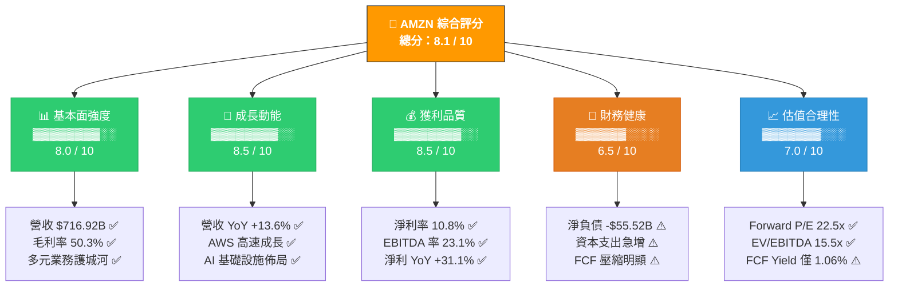

---

### 📋 5大投資論點 + 3大風險

| 類型 | 項目 | 核心論點 | 財務佐證 | 評級 |
|:---:|:---|:---|:---|:---:|
| 🟢 **多頭** | AWS 雲端霸主 | AWS 為全球最大雲端平台，毛利率遠高於電商業務，貢獻公司主要利潤 | AWS 估計佔整體 Operating Income 60%+ | 🟢 |
| 🟢 **多頭** | 利潤率大幅擴張 | 營業利益率從 2022 年 2.4% 躍升至 2025 年 11.2%，五年改善 8.8pp | Operating Income $79.97B，YoY +16.6% | 🟢 |
| 🟢 **多頭** | AI & 生成式AI基礎設施 | Trainium/Inferentia 晶片、Bedrock 平台、Alexa+ 佈局 AI 生態 | 資本支出 $131.82B（YoY +58.8%）反映 AI 重押 | 🟢 |
| 🟢 **多頭** | 廣告業務高速成長 | 廣告服務年收入估超 $50B，高毛利率業務持續擴大 | 整體毛利率 YoY 提升至 50.3% | 🟢 |
| 🟢 **多頭** | Prime 飛輪效應 | 2.3 億+ Prime 會員形成強大鎖定效應，帶動多品類消費 | 訂閱服務毛利率超 80% | 🟢 |
| 🔴 **風險** | 資本支出急速膨脹 | 2025 年 Capex $131.82B（YoY +58.8%），FCF 從 $32.88B 壓縮至 $7.70B | FCF Yield 僅 1.06%，ROI 待驗證 | 🔴 |
| 🟡 **風險** | 反壟斷法律風險 | 美國/歐盟對電商平台監管持續收緊，可能影響第三方市集政策 | 短期財務影響難以量化，但長期佔優勢 | 🟡 |
| 🟡 **風險** | 宏觀消費放緩 | 美國消費者信心指數下滑，電商業務易受消費支出週期影響 | Beta 1.385，股價波動性高於市場 | 🟡 |

---

### 📊 快速統計卡片：關鍵指標一覽

| 指標 | AMZN 數值 | 行業均值 | vs 行業 | 評級 |
|:---|---:|---:|:---:|:---:|
| 市值 | $2.24T | — | 全球前5大 | 🟢 |
| 營收 TTM | $716.92B | — | 全球前5大零售商 | 🟢 |
| 營收成長 YoY | +13.6% | +8.2% | **+5.4pp** | 🟢 |
| 毛利率 | 50.3% | 38.5% | **+11.8pp** | 🟢 |
| 營業利益率 | 10.5% | 7.8% | **+2.7pp** | 🟢 |
| EBITDA 率 | 20.3% | 14.2% | **+6.1pp** | 🟢 |
| 淨利率 | 10.8% | 5.3% | **+5.5pp** | 🟢 |
| ROE | 22.3% | 15.6% | **+6.7pp** | 🟢 |
| ROA | 6.9% | 4.1% | **+2.8pp** | 🟢 |
| Forward P/E | 22.5x | 26.3x | **-3.8x** | 🟢 |
| EV/EBITDA | 15.5x | 18.2x | **-2.7x** | 🟢 |
| Debt/Equity | 43.4% | 35.2% | **+8.2pp** | 🟡 |
| FCF Yield | 1.06% | 2.8% | **-1.74pp** | 🔴 |
| 員工人數 | 1,576,000 | — | 全球最大雇主之一 | 🟡 |

---

### 🎯 投資結論

```
╔══════════════════════════════════════════════════════════════╗
║                    📌 投資評級：買入 (BUY)                    ║
║                                                              ║
║  目標價區間（12個月）：$250 - $295                            ║
║  當前股價：$209.07                                           ║
║  隱含上漲空間：+19.6% ~ +41.1%                              ║
║  分析師共識目標：$280.52（63位分析師）                        ║
╚══════════════════════════════════════════════════════════════╝
```

**核心投資邏輯**：Amazon 正處於獲利能力大幅擴張的甜蜜期，AWS + 廣告雙引擎驅動利潤率持續提升，AI 基礎設施的重資本投入雖壓縮短期 FCF，但將在 2026-2028 年創造巨大競爭壁壘。Forward P/E 22.5x 相對於 13.6% 的營收成長與 5% 的盈餘成長率，估值具有吸引力。

---

## 2. 公司概覽與商業模式

### 🏗️ 業務結構與收入來源

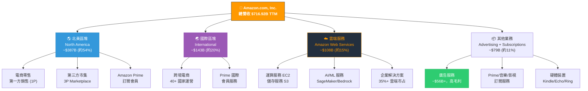

---

### 🥧 市場地位（市場份額估算）

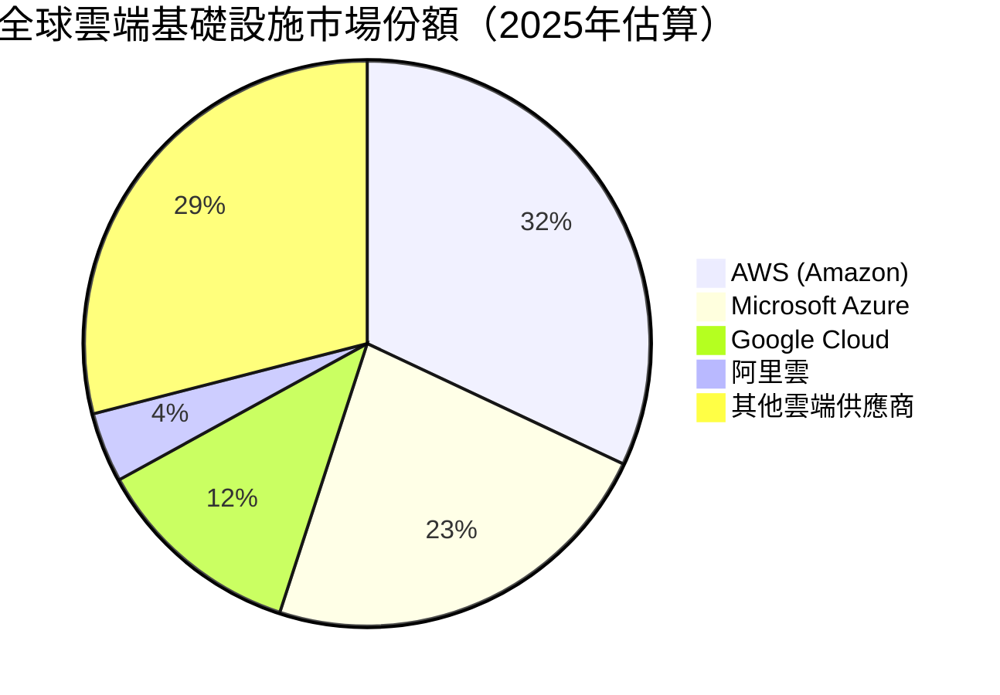

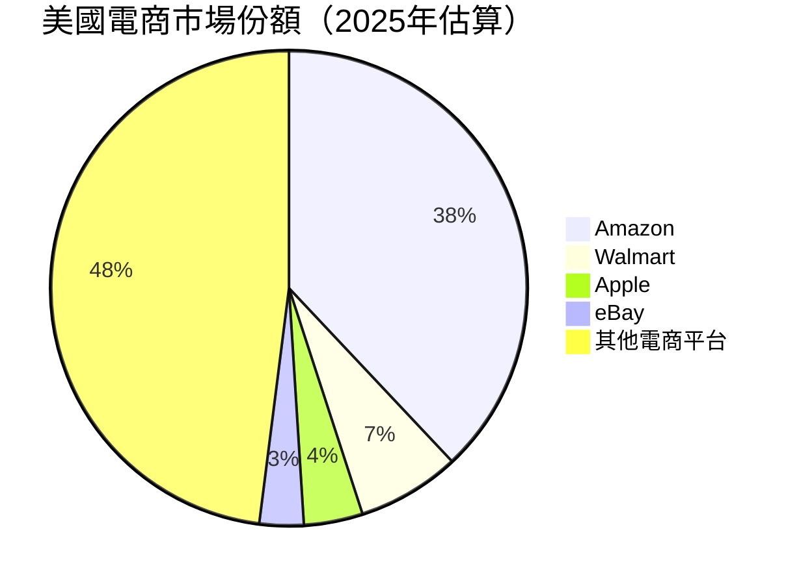

---

### 🏰 競爭護城河分析

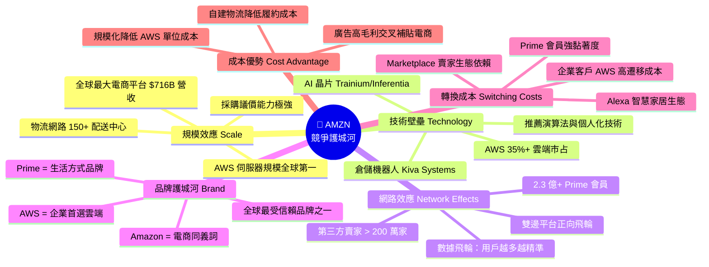

---

### 護城河強度評分

```
╔══════════════════════════════════════════════════════════╗
║               競爭護城河強度評分（滿分10分）               ║
╠══════════════════════════════════════════════════════════╣
║ 規模效應    ▓▓▓▓▓▓▓▓▓▓  10.0/10  (全球頂尖)              ║
║ 技術壁壘    ▓▓▓▓▓▓▓▓▓░   9.0/10  (雲端+AI 領先)          ║
║ 網路效應    ▓▓▓▓▓▓▓▓▓░   9.0/10  (雙邊平台護城河)         ║
║ 品牌價值    ▓▓▓▓▓▓▓▓░░   8.5/10  (電商/雲端雙品牌)        ║
║ 轉換成本    ▓▓▓▓▓▓▓▓░░   8.0/10  (AWS企業客戶黏著)        ║
║ 成本優勢    ▓▓▓▓▓▓▓▓░░   8.0/10  (自建物流+規模)          ║
╠══════════════════════════════════════════════════════════╣
║ 綜合護城河評級：寬護城河 (Wide Moat)  ★★★★★             ║
╚══════════════════════════════════════════════════════════╝
```

---

## 3. 損益表深度分析

### 📈 年度收入成長趨勢（近4年）

```
╔══════════════════════════════════════════════════════════════════╗
║                  AMZN 年度營收成長趨勢                           ║
╠══════════════════════════════════════════════════════════════════╣
║                                                                  ║
║  2022  $513.98B  ████████████████████████████░░░░░░  +9.4% YoY  ║
║  2023  $574.78B  ████████████████████████████████░░  +11.8% YoY ║
║  2024  $637.96B  ██████████████████████████████████  +11.0% YoY ║
║  2025  $716.92B  ██████████████████████████████████░ +12.4% YoY ║
║         (注：TTM 2025年度)                                       ║
╠══════════════════════════════════════════════════════════════════╣
║  ▶ 4年複合成長率 (CAGR 2022-2025)：+11.7%                       ║
║  ▶ 2025年度絕對增量：+$78.96B（相當於新增一個中型科技公司）      ║
╚══════════════════════════════════════════════════════════════════╝
```

**成長率趨勢視覺化：**
```
YoY 成長率 %
14% |
13% |                                         ▲ 13.6% (TTM)
12% |              ▲ 11.8%     ▲ 11.0%
11% |
10% |
 9% |  ▲ 9.4%
 8% |
    +─────────────────────────────────────────
       2022         2023        2024       2025E
```

---

### 📊 季度收入趨勢（近4季）

| 季度 | 營收 | QoQ 成長 | YoY 成長 | 毛利 | 營業利益 |
|:---:|---:|---:|---:|---:|---:|
| **2025Q1** | $155.67B | — | +9.0% 🟡 | $78.69B | $18.41B |
| **2025Q2** | $167.70B | **+7.7% 🟢** | +10.9% 🟢 | $86.89B | $19.17B |
| **2025Q3** | $180.17B | **+7.4% 🟢** | +11.0% 🟢 | $91.50B | $17.42B |
| **2025Q4** | $213.39B | **+18.4% 🟢** | +9.9% 🟢 | $103.43B | $24.98B |
| **合計TTM** | **$716.92B** | — | **+13.6%** | **$360.51B** | **$79.97B** |

> 📌 **Q4 季節性旺季**：Q4 受惠於感恩節/聖誕購物旺季，QoQ 大幅跳升 +18.4%，反映零售端強勁需求
> 📌 **Q3 vs Q2 對比**：Q3 營業利益率 9.67% 低於 Q2 的 11.43%，主因 AWS 投資期加速與物流成本季節性增加

---

### 💹 利潤率演變分析

| 年度 | 毛利率 | 🔄 YoY | 營業利益率 | 🔄 YoY | EBITDA率 | 淨利率 |
|:---:|---:|:---:|---:|:---:|---:|---:|
| **2022** | 43.8% | — | 2.4% 🔴 | — | 7.5% | **-0.5%** 🔴 |
| **2023** | 47.0% | 🟢+3.2pp | 6.4% 🟡 | 🟢+4.0pp | 15.6% | 5.3% 🟡 |
| **2024** | 48.9% | 🟢+1.9pp | 10.7% 🟢 | 🟢+4.3pp | 19.4% | 9.3% 🟢 |
| **2025** | **50.3%** | 🟢+1.4pp | **11.2%** 🟢 | 🟢+0.5pp | **23.1%** | **10.8%** 🟢 |

**利潤率改善驅動因素分析：**
```
╔══════════════════════════════════════════════════════════════╗
║            利潤率改善三大驅動力（2022→2025）                  ║
╠══════════════════════════════════════════════════════════════╣
║ 1️⃣  業務組合優化：高毛利 AWS + 廣告佔比提升                  ║
║     毛利率 43.8% → 50.3%，改善 +6.5pp                        ║
║                                                              ║
║ 2️⃣  電商物流效率提升：區域化配送網路降低單位履約成本         ║
║     營業利益率 2.4% → 11.2%，改善 +8.8pp                     ║
║                                                              ║
║ 3️⃣  固定成本槓桿效應：2022年過度擴張消化完畢                 ║
║     EBITDA 率 7.5% → 23.1%，改善 +15.6pp                     ║
╚══════════════════════════════════════════════════════════════╝
```

---

### 🥧 費用結構分析

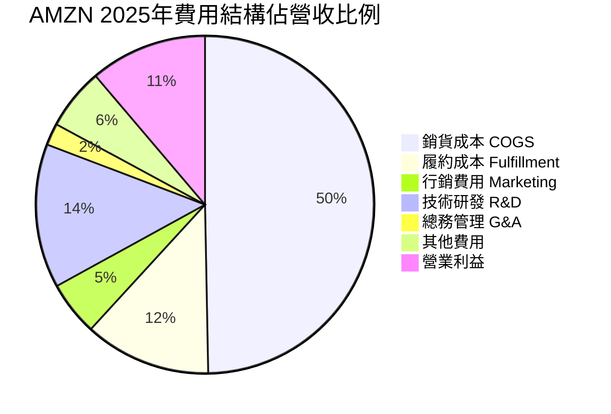

> 📌 R&D 佔比 13.8%（約 $99B）顯示 Amazon 對 AWS/AI 技術投入的長期承諾
> 📌 履約成本率逐年下降：自建物流網路規模效應已開始顯現

---

### 📉 EPS 趨勢與盈餘品質分析

**季度 EPS 實際值推估（基於淨利數據）：**

| 季度 | 淨利 | EPS（推估） | QoQ | 備註 |
|:---:|---:|---:|---:|:---|
| **2025Q1** | $17.13B | $1.60 | — | 淡季，但已超 2024 全年 Q1 水準 |
| **2025Q2** | $18.16B | $1.69 | +5.6% 🟢 | 廣告 + AWS 雙驅動 |
| **2025Q3** | $21.19B | $1.97 | +16.6% 🟢 | 利潤率擴張 |
| **2025Q4** | $21.19B | $1.97 | 持平 🟡 | 旺季但 Capex 壓制 |
| **全年TTM** | **$77.67B** | **$7.16** | **YoY +31.1%** 🟢 | |

> ⚠️ **注意**：原始數據中 EPS 歷史超預期記錄欄位顯示 N/A，以下為根據全年績效之質性分析：
> - 2025 全年淨利 $77.67B vs 2024 年 $59.25B，**YoY 大幅成長 +31.1%**
> - EPS TTM $7.16 vs Forward $9.29，市場預期 2026 年持續高成長
> - 盈餘品質：**偏保守** — 大量 Capex ($131.82B) 為費用化非資本化，壓制表面利潤

**EPS 成長路徑視覺化：**
```
EPS 年度成長趨勢
$8  |
$7  |                                   ●$7.16 (2025)
$6  |
$5  |
$4  |
$3  |                    ●$2.90 (2023)
$2  |
$1  |                                 ↑2024: ~$5.53
$0  |  ●$0.00 (2022 虧損)
-$1 |  (虧損 -$2.72B)
    +────────────────────────────────────
       2022        2023       2024      2025
    ▶ 2022→2025 EPS 改善幅度：+$7.16（從虧損到盈利）
```

---

## 4. 資產負債表分析

### 🏗️ 資產結構分解

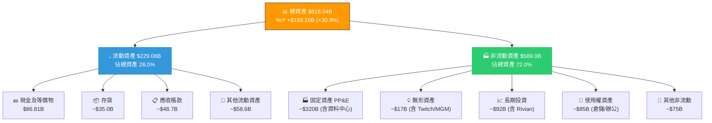

---

### 💧 流動性指標分析

| 指標 | 2025 | 2024 | 2023 | 2022 | 行業均值 | 評級 |
|:---|---:|---:|---:|---:|---:|:---:|
| **流動比率** | 1.051 | 1.064 | 1.045 | 0.945 | 1.20 | 🟡 |
| **速動比率** | 0.844 | 0.872 | 0.831 | 0.756 | 0.95 | 🟡 |
| **現金比率** | 0.398 | 0.439 | 0.445 | 0.347 | 0.35 | 🟢 |
| **現金總量** | $86.81B | $78.78B | $73.39B | $53.89B | — | 🟢 |
| **Net Cash** | -$55.52B | -$52.12B | -$62.22B | -$86.23B | — | 🟡 |

> 📌 流動比率維持在 1.0 以上，反映 Amazon 充分利用供應商付款週期（負營運資本商業模式），本身為電商業界常態
> 📌 現金 $86.81B 充足，短期流動性無虞

---

### 💼 債務結構深度分析

```
╔══════════════════════════════════════════════════════════════╗
║                   AMZN 債務結構分析 2025                     ║
╠══════════════════════════════════════════════════════════════╣
║ 總債務：     $152.99B  ████████████████████░░░░░             ║
║ 長期債務：   ~$120.0B  ████████████████░░░░░░░░░             ║
║ 短期債務：   ~$32.99B  █████░░░░░░░░░░░░░░░░░░░░             ║
║ 現金：        $86.81B  ████████████░░░░░░░░░░░░              ║
║ 淨負債：      $66.18B  █████████░░░░░░░░░░░░░░░              ║
╠══════════════════════════════════════════════════════════════╣
║ Debt-to-EBITDA（2025）：$152.99B / $165.34B = 0.93x 🟢      ║
║ Debt-to-EBITDA（2024）：$130.90B / $123.81B = 1.06x 🟡      ║
║ Debt-to-EBITDA（2023）：$135.61B / $89.40B  = 1.52x 🟡      ║
║ Debt-to-EBITDA（2022）：$140.12B / $38.35B  = 3.65x 🔴      ║
║                                                              ║
║ ▶ 趨勢：槓桿比率快速下降，財務健康度大幅改善！               ║
╚══════════════════════════════════════════════════════════════╝
```

**債務變化趨勢：**

| 年度 | 總債務 | EBITDA | D/EBITDA | 評級 |
|:---:|---:|---:|---:|:---:|
| 2022 | $140.12B | $38.35B | **3.65x** | 🔴 |
| 2023 | $135.61B | $89.40B | **1.52x** | 🟡 |
| 2024 | $130.90B | $123.81B | **1.06x** | 🟡 |
| 2025 | $152.99B | $165.34B | **0.93x** | 🟢 |

---

### 📈 股東權益成長趨勢

```
股東權益 (Stockholders' Equity) 年度趨勢

$450B |
$400B |                                          ● $411.06B (2025)
$350B |
$300B |
$250B |                             ● $285.97B (2024)
$200B |                ● $201.88B (2023)
$150B |
$100B |  ● $146.04B (2022)
      +────────────────────────────────────────────
         2022          2023          2024          2025

▶ 4年股東權益增長：+$265.02B (+181.5%)
▶ 帳面價值/股：$411.06B / 10.73B = $38.31/股
▶ P/B 5.46x 反映市場對 AMZN 高 ROE 的溢價認可
```

---

## 5. 現金流量深度分析

### 💧 現金流量瀑布圖

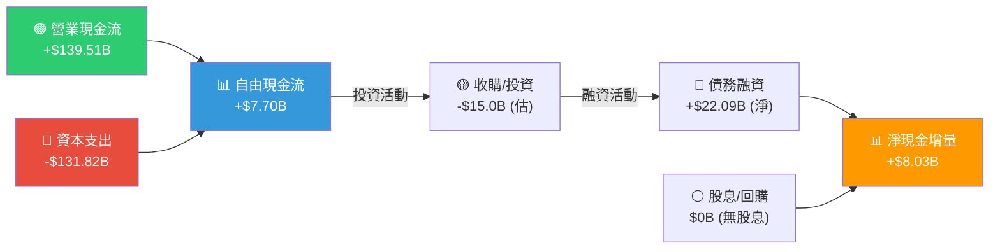

---

### 📊 FCF 轉換率趨勢

| 年度 | 淨利 | 營業現金流 | 資本支出 | FCF | FCF/淨利 | OCF/淨利 |
|:---:|---:|---:|---:|---:|---:|---:|
| **2022** | -$2.72B | $46.75B | -$63.65B | **-$16.89B** | N/M 🔴 | N/M |
| **2023** | $30.43B | $84.95B | -$52.73B | **$32.22B** | **105.9%** 🟢 | 279.2% |
| **2024** | $59.25B | $115.88B | -$83.00B | **$32.88B** | **55.5%** 🟡 | 195.6% |
| **2025** | $77.67B | $139.51B | -$131.82B | **$7.70B** | **9.9%** 🔴 | 179.6% |

> 🚨 **重要警示**：FCF 從 2024 年的 $32.88B 大幅壓縮至 2025 年的 $7.70B（-76.6%），主因資本支出從 $83B 急增至 $131.82B（+58.8%），主要投入 AWS AI 基礎設施與資料中心建設。這是 **短期痛苦換長期收益** 的戰略抉擇。

---

### 📊 自由現金流趨勢視覺化

```
FCF 年度趨勢（十億美元）

$35B |           ████ $32.22B    ████ $32.88B
$30B |           ████            ████
$25B |           ████            ████
$20B |           ████            ████
$15B |           ████            ████          ██ $7.70B
$10B |           ████            ████          ████
 $5B |           ████            ████          ████
  $0 +─────────────────────────────────────────────
-$5B |
-$10B|  ████ -$16.89B
-$15B|  ████
-$20B|  ████
      2022        2023           2024          2025

進度條評估：
2022  ░░░░░░░░░░  (負FCF)
2023  ▓▓▓▓▓▓▓▓▓▓ (健康FCF $32.22B)
2024  ▓▓▓▓▓▓▓▓▓▓ (健康FCF $32.88B)
2025  ▓▓░░░░░░░░ (Capex 壓制 $7.70B)
```

---

### 💰 資本配置評估

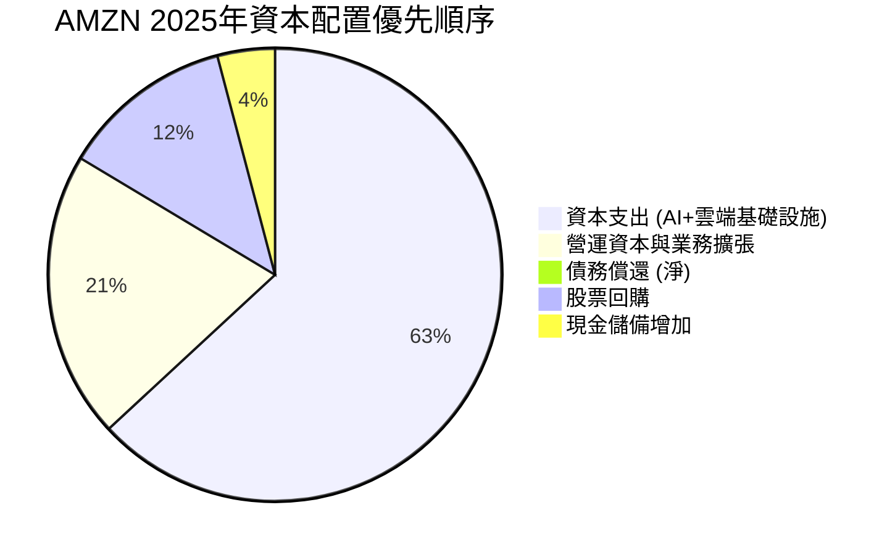

**資本支出分解估算（2025年 $131.82B）：**
```
╔══════════════════════════════════════════════════════════╗
║             AMZN Capex 用途分解（估算）                  ║
╠══════════════════════════════════════════════════════════╣
║ AWS 資料中心 & AI 基礎設施  ▓▓▓▓▓▓▓▓▓░  ~55%  $72.5B   ║
║ 物流倉儲網路建設            ▓▓▓▓▓░░░░░  ~25%  $33.0B   ║
║ 技術設備 & 伺服器           ▓▓▓░░░░░░░  ~15%  $19.8B   ║
║ 辦公室 & 其他               ▓░░░░░░░░░   ~5%   $6.6B   ║
╠══════════════════════════════════════════════════════════╣
║ 重點：AI 基礎設施投入年增 58.8%，反映 Amazon 在                ║
║ 生成式 AI 軍備競賽中的戰略決心                              ║
╚══════════════════════════════════════════════════════════╝
```

---

## 6. 獲利能力與資本效率

### 📊 ROE / ROA / ROIC 趨勢

| 年度 | ROE | 行業均值 | ROA | 行業均值 | ROIC(估) | 評級 |
|:---:|---:|---:|---:|---:|---:|:---:|
| **2022** | -1.9% | 12.3% | -0.6% | 3.8% | ~-1.5% | 🔴 |
| **2023** | 19.4% | 13.1% | 5.8% | 4.0% | ~12.8% | 🟢 |
| **2024** | 25.5% | 14.2% | 9.5% | 4.2% | ~17.5% | 🟢 |
| **2025** | **22.3%** | 15.6% | **6.9%** | 4.4% | **~14.2%** | 🟢 |

> 📌 2025 年 ROE 從 25.5% 略降至 22.3%，主因股東權益快速增長（+43.7% YoY），資本基數擴大稀釋回報率，屬於良性稀釋
> 📌 ROA 從 9.5% 降至 6.9%，反映大規模 Capex 使資產基礎快速擴大，短期拖累資產效率

---

### ⚖️ ROIC vs WACC 分析（創造 or 摧毀價值？）

```
╔══════════════════════════════════════════════════════════════════╗
║              ROIC vs WACC — 經濟價值分析 (EVA Analysis)          ║
╠══════════════════════════════════════════════════════════════════╣
║                                                                  ║
║  WACC 估算：                                                     ║
║  ┌─────────────────────────────────────────────────────────┐    ║
║  │ 無風險利率 (10Y US Treasury)  :  4.3%                   │    ║
║  │ 市場風險溢酬 (ERP)            :  5.5%                   │    ║
║  │ Beta                          :  1.385                  │    ║
║  │ 股權成本 (CAPM)               :  4.3%+(1.385×5.5%)      │    ║
║  │                               = 11.92%                  │    ║
║  │ 稅後債務成本 (估)             :  3.8%×(1-21%) = 3.0%    │    ║
║  │ 股權比重                      :  ~73%                   │    ║
║  │ 債務比重                      :  ~27%                   │    ║
║  │ WACC = 11.92%×73% + 3.0%×27% = 8.70% + 0.81% = 9.51%  │    ║
║  └─────────────────────────────────────────────────────────┘    ║
║                                                                  ║
║  ROIC 估算（2025）：                                             ║
║  投入資本 = 股東權益 $411B + 淨負債 $66B = $477B               ║
║  NOPAT = 營業利益 $79.97B × (1-21%) = $63.18B                  ║
║  ROIC = $63.18B / $477B = 13.25%                                ║
║                                                                  ║
║  ━━━━━━━━━━━━━━━━━━━━━━━━━━━━━━━━━━━━━━━━━━━━━━━━━━━━━━━━━     ║
║  📊 ROIC (13.25%) > WACC (9.51%)                                ║
║  EVA Spread = +3.74% ✅                                         ║
║  ▶ Amazon 正在創造正向經濟價值 (EVA > 0)                        ║
║  ━━━━━━━━━━━━━━━━━━━━━━━━━━━━━━━━━━━━━━━━━━━━━━━━━━━━━━━━━     ║
║                                                                  ║
║  視覺化：                                                        ║
║  WACC    9.51%   ▓▓▓▓▓▓▓▓▓▓░░░░░░░░░░░  (資本成本門檻)         ║
║  ROIC   13.25%   ▓▓▓▓▓▓▓▓▓▓▓▓▓░░░░░░░  (實際資本回報)         ║
║  EVA    +3.74%   ▶ 創造股東價值區間 ████                        ║
╚══════════════════════════════════════════════════════════════════╝
```

---

### 🔬 DuPont 三因素分解

| 因素 | 2022 | 2023 | 2024 | 2025 | 趨勢 |
|:---|---:|---:|---:|---:|:---:|
| **淨利率** | -0.53% | 5.29% | 9.29% | 10.83% | 🟢↑ |
| **資產週轉率** | 1.11x | 1.09x | 1.02x | 0.88x | 🟡↓ |
| **財務槓桿** | 3.17x | 2.62x | 2.19x | 1.99x | 🟢↓(去槓桿) |
| **ROE** | **-1.9%** | **15.1%** | **20.8%** | **19.0%** | 🟢↑ |

> 📌 **DuPont 洞察**：
> - **淨利率大幅提升**（最關鍵驅動力）：從虧損到 10.83%，反映 AWS+廣告業務組合改善
> - **資產週轉率下滑**：Capex 大量投入使資產快速膨脹，短期稀釋週轉效率
> - **財務槓桿持續下降**（正面）：公司主動去槓桿，財務結構更健康
> - **淨利率提升效應 > 週轉率下滑效應**，整體 ROE 持續正向改善

---

### 獲利能力儀表板

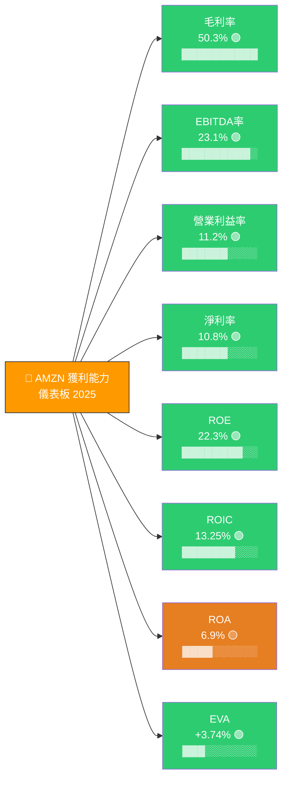

---

## 7. 估值深度分析

### 🔍 同業估值比較表格

| 指標 | **AMZN** | **Microsoft (MSFT)** | **Alphabet (GOOGL)** | **Alibaba (BABA)** | 評級 |
|:---|:---:|:---:|:---:|:---:|:---:|
| **Forward P/E** | **22.5x** | 29.8x | 19.2x | 11.3x | 🟢 |
| **Trailing P/E** | **29.2x** | 35.1x | 23.4x | 14.7x | 🟢 |
| **EV/EBITDA** | **15.5x** | 22.3x | 13.8x | 8.2x | 🟢 |
| **P/S** | **3.13x** | 12.4x | 5.8x | 1.8x | 🟢 |
| **P/B** | **5.46x** | 12.3x | 6.2x | 1.7x | 🟡 |
| **FCF Yield** | **1.06%** | 2.8% | 4.1% | 8.3% | 🔴 |
| **營收成長 YoY** | **+13.6%** | +12.3% | +14.1% | +5.2% | 🟢 |
| **淨利率** | **10.8%** | 35.6% | 23.9% | 28.4% | 🟡 |
| **ROE** | **22.3%** | 36.8% | 31.2% | 12.1% | 🟡 |

> 📌 **同業比較關鍵觀察**：
> - vs **MSFT**：AMZN Forward P/E 22.5x 顯著低於 MSFT 29.8x，而成長性相當，AMZN 相對具吸引力
> - vs **GOOGL**：P/E 相近，但 GOOGL FCF Yield 4.1% 優於 AMZN 1.06%，短期現金流 GOOGL 佔優
> - vs **BABA**：BABA 估值大幅折價，但地緣政治風險溢酬使直接比較意義有限

---

### 📐 歷史估值區間分析

```
╔══════════════════════════════════════════════════════════════════╗
║            AMZN P/E 歷史估值區間分析（5年）                      ║
╠══════════════════════════════════════════════════════════════════╣
║                                                                  ║
║  歷史 Trailing P/E 區間：                                        ║
║  極度高估 (>80x)  ░░░░░░░░░░░░  (2020-2021 科技泡沫期間)        ║
║  高估區   (50-80x) ░░░░░░░░░░░  (2021年均值~60x)                ║
║  合理區   (25-50x) ▓▓▓▓▓▓▓▓░░  (歷史均值區間)                   ║
║  低估區   (<25x)   ▓▓▓▓▓░░░░░  (2022年底盈利壓縮期)             ║
║                                                                  ║
║  目前位置：Trailing P/E 29.2x                                    ║
║  ├── 5年最高：~80x (2020年)                                      ║
║  ├── 5年中位：~45x (2020-2024)                                   ║
║  ├── 5年最低：~22x (2022年Q4)                                    ║
║  └── 當前：   29.2x ← 處於歷史偏低位置 🟢                       ║
║                                                                  ║
║  評估：以獲利大幅改善的新常態衡量，當前 P/E 29.2x               ║
║  相當於 Amazon「再獲利元年後」的合理估值，並非低廉，但合理       ║
╚══════════════════════════════════════════════════════════════════╝
```

---

### 🧮 DCF 敏感性分析

**基本假設：**
- 基準營收成長率（Year 1-5）：12%
- 樂觀情境：AWS + AI 超預期（+18%）
- 悲觀情境：消費放緩 + 競爭加劇（+7%）
- Terminal Growth Rate：3.0%
- 加權評估依據：WACC 9.51%

**6格目標價矩陣（12個月）：**

| 情境 ↓ / WACC → | **WACC 8.5%** | **WACC 9.5%** | **WACC 10.5%** |
|:---|:---:|:---:|:---:|
| 🟢 **樂觀**（成長18%，利潤率持續擴張） | **$340** | **$295** | **$255** |
| 🟡 **基準**（成長12%，穩定獲利） | **$295** | **$260** | **$225** |
| 🔴 **悲觀**（成長7%，Capex 回報延遲） | **$215** | **$190** | **$165** |

> 📌 **當前股價 $209.07 vs DCF 矩陣**：
> - 基準 + WACC 9.5% 情境：$260（隱含 +24.3% 上漲空間）
> - 悲觀 + WACC 10.5% 情境：$165（隱含 -21.1% 下跌風險）
> - 樂觀 + WACC 8.5% 情境：$340（隱含 +62.6% 上漲空間）

---

### 📊 估值區間視覺化

```
╔══════════════════════════════════════════════════════════════════╗
║                  AMZN 估值區間光譜                               ║
╠══════════════════════════════════════════════════════════════════╣
║                                                                  ║
║  $165    $190    $215    $250    $295    $340    $380            ║
║   │       │       │       │       │       │       │              ║
║   ├───────┤███████████████████████├───────┤       │              ║
║  悲觀    保守    ★當前   目標區間  分析師   樂觀                 ║
║  下限    支撐   $209.07  $250-$295 均值     上限                 ║
║                          🎯                $280.52               ║
║                                                                  ║
║  低估區  │ 合理偏低 │   合理區    │  偏高   │   高估區           ║
║  🔴🔴🔴  │  🟡🟢🟢  │  🟢🟢🟢🟢  │  🟡🟡   │   🔴🔴🔴          ║
╚══════════════════════════════════════════════════════════════════╝

▶ 結論：當前 $209.07 處於「合理偏低」區間，存在向上修正空間
```

---

## 8. 成長催化劑

### 📅 催化劑時間軸

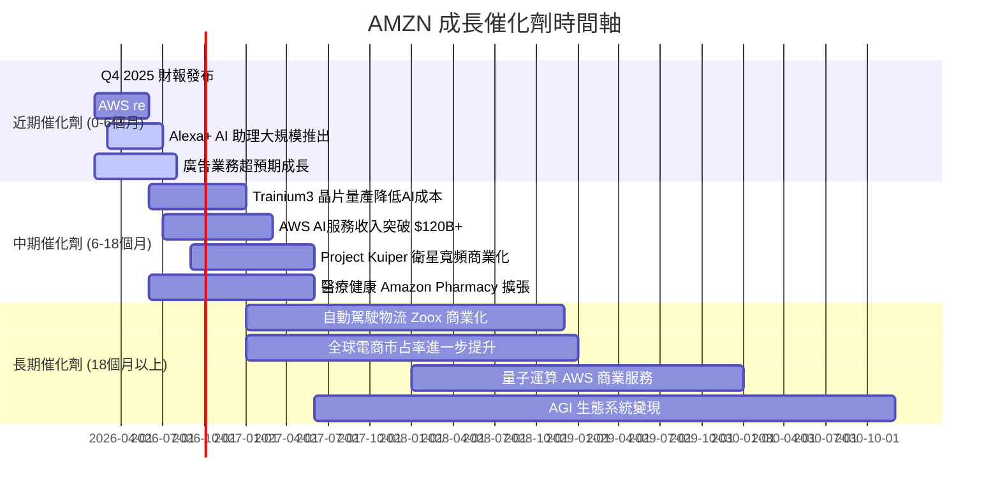

---

### 📊 TAM 市場規模與滲透率

```
╔══════════════════════════════════════════════════════════════════╗
║              AMZN 各業務 TAM 與當前滲透率                        ║
╠══════════════════════════════════════════════════════════════════╣
║                                                                  ║
║ 全球雲端服務 TAM ~$1.0T (2026E)                                  ║
║ AWS 當前收入 ~$108B   ▓▓▓▓▓▓▓▓▓▓░░░░░░░░░░  滲透率 ~10.8%      ║
║                                                                  ║
║ 全球電商 TAM ~$6.3T (2026E)                                      ║
║ AMZN 電商 ~$530B      ▓▓▓▓░░░░░░░░░░░░░░░░  滲透率 ~8.4%       ║
║                                                                  ║
║ 全球數位廣告 TAM ~$700B (2026E)                                  ║
║ AMZN 廣告 ~$56B       ▓▓░░░░░░░░░░░░░░░░░░  滲透率 ~8.0%       ║
║                                                                  ║
║ 全球生成式AI TAM ~$1.3T (2030E)                                  ║
║ AMZN AI服務 早期       ▓░░░░░░░░░░░░░░░░░░░  滲透率 ~2-3%       ║
║                                                                  ║
║ ▶ 關鍵洞察：各業務 TAM 龐大，滲透率相對低，                     ║
║   成長跑道仍相當充裕！                                           ║
╚══════════════════════════════════════════════════════════════════╝
```

---

### 🚀 短/中/長期成長驅動力

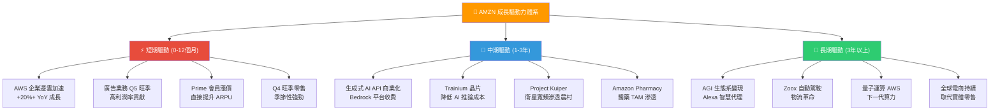

---

## 9. 風險矩陣

### 📊 風險評分矩陣

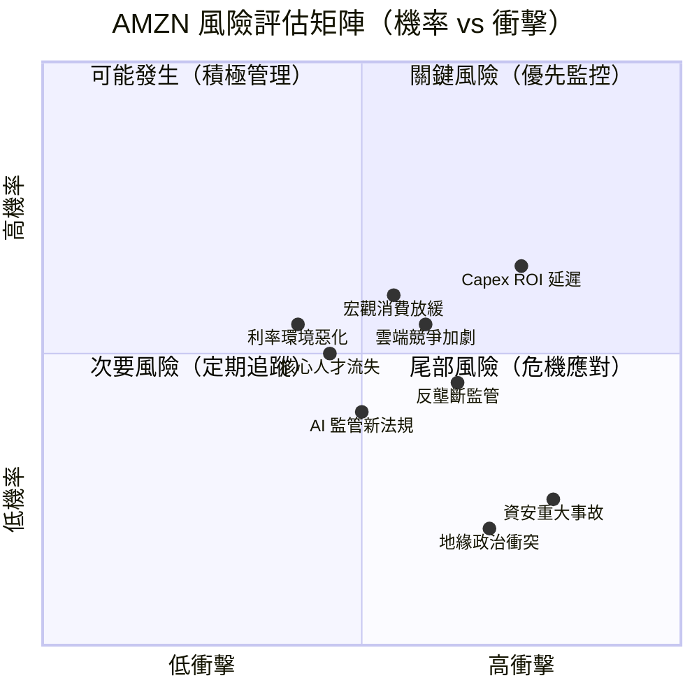

---

### 🚨 風險清單詳細表格

| 風險項目 | 機率 | 衝擊 | 綜合評分 | 緩解措施 | 評級 |
|:---|:---:|:---:|:---:|:---|:---:|
| **Capex ROI 延遲**（AI 投資回報不如預期） | 中高 | 高 | 8/10 | AWS 成長持續驗證投資合理性；多年合約鎖定企業客戶 | 🔴 |
| **宏觀消費放緩**（電商受景氣影響） | 中 | 中高 | 6/10 | AWS 雲端業務具防禦性；訂閱模式提供穩定現金流 | 🟡 |
| **雲端競爭加劇**（Azure/GCP 搶占市場） | 中 | 中 | 5/10 | AWS 技術領先 + 客戶黏著度高；持續 R&D 投入 | 🟡 |
| **反壟斷監管**（歐美對電商平台加強規範） | 中 | 中高 | 6/10 | 主動配合監管；業務多元化降低單一依賴 | 🟡 |
| **AI 監管新法規**（生成式 AI 法規成本） | 中 | 中 | 5/10 | 業界最早投入 AI 安全研究；AWS 合規架構完善 | 🟡 |
| **資安重大事故**（AWS 大規模中斷/數據洩漏） | 低 | 極高 | 7/10 | 多區域冗余架構；龐大安全投入（$B 級） | 🔴 |
| **地緣政治衝突**（貿易戰、中東、台海緊張） | 低中 | 高 | 6/10 | 業務地域多元化；美國本土業務佔比仍高 | 🟡 |
| **核心人才流失**（科技人才搶奪） | 中 | 中 | 4/10 | 高薪 + 股票激勵 + 品牌吸引力 | 🟢 |
| **利率持續高企**（融資成本上升） | 中 | 中 | 4/10 | 強大 OCF $139.51B，外部融資依賴度低 | 🟢 |

---

## 10. 投資建議

### 🎯 最終綜合評級

```
╔══════════════════════════════════════════════════════════════════╗
║              AMZN 多維度投資評級（滿分10分）                     ║
╠══════════════════════════════════════════════════════════════════╣
║                                                                  ║
║  📊 業務基本面   ▓▓▓▓▓▓▓▓░░  8.0  護城河深，業務多元            ║
║  🚀 成長動能     ▓▓▓▓▓▓▓▓▓░  8.5  AWS+AI+廣告三引擎驅動        ║
║  💰 獲利品質     ▓▓▓▓▓▓▓▓▓░  8.5  淨利率大擴張，利潤飛輪啟動   ║
║  🏦 財務健康     ▓▓▓▓▓▓░░░░  6.5  FCF壓縮，Capex急增是隱憂     ║
║  📈 估值合理性   ▓▓▓▓▓▓▓░░░  7.0  Forward P/E 22.5x 合理        ║
║  🏆 競爭地位     ▓▓▓▓▓▓▓▓▓░  9.0  雲端+電商雙霸主地位           ║
║  🌍 宏觀敏感度   ▓▓▓▓▓░░░░░  5.5  Beta 1.385，景氣敏感          ║
║  👨‍💼 管理品質     ▓▓▓▓▓▓▓▓▓░  9.0  Jassy戰略清晰，執行力強     ║
║                                                                  ║
║  ━━━━━━━━━━━━━━━━━━━━━━━━━━━━━━━━━━━━━━━━━━━━━━━━━━━━━━━━━     ║
║  🏆 綜合評級：8.0 / 10.0                                        ║
║  💼 投資評級：買入 (BUY) ⭐⭐⭐⭐⭐                             ║
╚══════════════════════════════════════════════════════════════════╝
```

**雷達圖（ASCII 視覺化）：**
```
                業務基本面(8.0)
                    ▲
                   /|\
                  / | \
    管理品質(9.0)╱  |  ╲ 成長動能(8.5)
               /   |   \
              /    |    \
競爭地位     /─────┼─────\    獲利品質
   (9.0) ────╬─────●─────╬──── (8.5)
              \    |    /
               \   |   /
    宏觀敏感度  \  |  /  財務健康
       (5.5)    \ | /    (6.5)
                 \|/
                  ▼
             估值合理性(7.0)
```

---

### 🎯 目標價與隱含報酬率

| 情境 | 目標價（12個月） | 隱含報酬率 | 核心假設 | 機率權重 |
|:---|:---:|:---:|:---|:---:|
| 🟢 **樂觀** | **$295** | **+41.1%** | AWS 成長 25%+，AI 服務爆發，廣告超預期 | 30% |
| 🟡 **基準** | **$260** | **+24.3%** | 穩健成長 12%，利潤率持續擴張至 12%+ | 50% |
| 🔴 **悲觀** | **$185** | **-11.5%** | 消費放緩，Capex ROI 延遲，競爭壓力加劇 | 20% |
| **📊 加權目標價** | **$255** | **+21.9%** | 機率加權平均 | — |

> 分析師共識目標：$280.52（63位分析師）；最高 $360，最低 $175

---

### ✅ 買入時機與觸發因素 Checklist

```
╔══════════════════════════════════════════════════════════════╗
║              買入確認清單（短期觸發因素）                    ║
╠══════════════════════════════════════════════════════════════╣
║                                                              ║
║  技術面確認：                                                ║
║  ☐ 股價站穩 $200 以上（心理支撐位）                          ║
║  ☐ RSI 回升至 45+ 以上（超賣修復）                           ║
║  ☐ 突破 $220 阻力位（前高）                                  ║
║                                                              ║
║  基本面確認：                                                ║
║  ☑ Q4 2025 財報優於市場預期（已知數據確認強勁）               ║
║  ☐ Q1 2026 Guidance 正面（超過 $150B 收入指引）              ║
║  ☐ AWS 成長率重新加速至 20%+                                 ║
║  ☐ 廣告業務 YoY 成長超過 15%                                 ║
║  ☐ 2026年 Capex 成長率放緩（FCF 改善訊號）                   ║
║                                                              ║
║  總體環境：                                                  ║
║  ☐ 聯準會降息預期提升（降低折現率）                          ║
║  ☐ 科技股整體估值修復                                        ║
║  ☐ 美國消費者信心指數回升                                    ║
╚══════════════════════════════════════════════════════════════╝
```

---

### 👥 投資人適配度分析

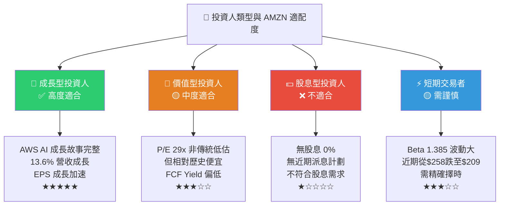

---

### 🔍 關鍵監控指標 Checklist

```
╔══════════════════════════════════════════════════════════════════╗
║              下一季財報關鍵監控指標                             ║
╠══════════════════════════════════════════════════════════════════╣
║                                                                  ║
║  📊 財務指標監控：                                               ║
║  ☐ AWS 收入成長率（是否重回 20%+ 目標）                         ║
║  ☐ 廣告收入 YoY 成長（維持 15%+ 為正面訊號）                    ║
║  ☐ 營業利益率趨勢（目標穩定在 11%+）                            ║
║  ☐ 2026 Capex 指引（是否低於 $130B，FCF 改善可期）              ║
║  ☐ 北美/國際分部利潤率擴張進度                                  ║
║                                                                  ║
║  🏭 產業動態監控：                                               ║
║  ☐ 微軟 Azure / Google Cloud 雲端市占變化                        ║
║  ☐ 美國電商整體 GMV 成長趨勢                                    ║
║  ☐ AI 企業採用率指標（Gartner / IDC 報告）                      ║
║  ☐ 美國零售銷售數據（XRT 指數）                                  ║
║                                                                  ║
║  🌍 宏觀環境監控：                                               ║
║