# AMZN 基本面深度分析報告

> **報告日期**：2026-02-24 ｜ **語言**：繁體中文 ｜ **數據來源**：Yahoo Finance ｜ **分析師**：AI 頂級研究團隊

---

## 目錄

| # | 章節 | 核心主題 |
|---|------|---------|
| 1 | 執行摘要 | 總體評分與投資論點 |
| 2 | 公司概覽 | 業務結構與競爭優勢 |
| 3 | 損益表深度分析 | 收入成長與利潤率演變 |
| 4 | 資產負債表分析 | 財務健康與流動性 |
| 5 | 現金流量分析 | 現金生成能力與資本配置 |
| 6 | 獲利能力指標 | ROE/ROA/ROIC 深度剖析 |
| 7 | 估值分析 | 多維度估值與目標股價 |
| 8 | 競爭護城河 | 五力分析與護城河評分 |
| 9 | 成長催化劑 | 短中長期機會 |
| 10 | 風險分析 | 風險矩陣與緩解措施 |
| 11 | 公平價值估算 | DCF 與多方法估值 |
| 12 | 投資建議 | 最終評級與監控指標 |

---

## 1. 執行摘要

### 核心評分總覽

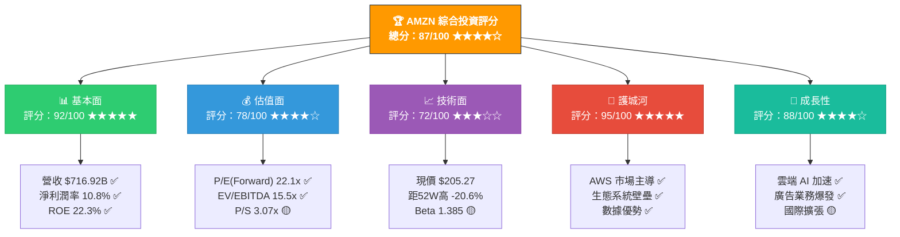

### 5大投資論點

| # | 投資論點 | 狀態 | 信心度 | 說明 |
|---|---------|------|--------|------|
| 🟢 1 | **AWS + AI 雙引擎驅動** | 強力正面 | ★★★★★ | AWS 持續高成長，AI 工作負載加速遷移雲端，Bedrock/Trainium 構建差異化優勢 |
| 🟢 2 | **盈利能力歷史性突破** | 強力正面 | ★★★★★ | 2025年淨利 $77.67B，年增31.1%；營業利益率從2022年的2.4%飆升至11.2% |
| 🟢 3 | **廣告業務第三增長曲線** | 正面 | ★★★★☆ | 廣告收入高速成長，利潤率極高，成為繼AWS後最重要的利潤貢獻者 |
| 🟡 4 | **自由現金流壓縮但有充分理由** | 中性偏正 | ★★★☆☆ | FCF從$32.88B降至$7.70B，但係因資本支出大幅增加至$131.82B（AI基礎設施投資）|
| 🔴 5 | **估值須承受宏觀與競爭風險** | 需監控 | ★★★☆☆ | 現價$205.27距分析師目標$280.52有37%上行空間，但宏觀不確定性仍存 |

### 快速統計卡片

| 指標類別 | 指標 | 數值 | 評級 | 備註 |
|---------|------|------|------|------|
| 📈 **市場數據** | 現價 | $205.27 | 🟡 | 距52W高 -20.6% |
| 📈 **市場數據** | 市值 | $2.20T | 🟢 | 全球前5大市值 |
| 📈 **市場數據** | 52W範圍 | $161.38~$258.60 | 🟡 | 波動較大 |
| 💵 **獲利** | EPS(TTM) | $7.16 | 🟢 | YoY +31% |
| 💵 **獲利** | EPS(Forward) | $9.29 | 🟢 | 預期增長30% |
| 💵 **獲利** | 淨利潤率 | 10.8% | 🟢 | 歷史新高 |
| 📊 **估值** | P/E(Forward) | 22.1x | 🟢 | 合理偏低 |
| 📊 **估值** | EV/EBITDA | 15.5x | 🟢 | 具吸引力 |
| 🏦 **資產負債** | 現金 | $123.03B | 🟢 | 充裕 |
| 🏦 **資產負債** | 債務/權益 | 43.4% | 🟡 | 可接受 |
| 💧 **流動性** | 流動比率 | 1.051 | 🟡 | 略高於1 |
| 🎯 **分析師** | 目標均價 | $280.52 | 🟢 | 63位分析師 |
| 🎯 **分析師** | 評級 | Strong Buy | 🟢 | 高度一致 |

---

## 2. 公司概覽

### 2.1 業務結構圖

```mermaid
graph TD
    AMZN["🏢 Amazon.com, Inc.\n全球最大電商+雲端巨頭\n員工：1,576,000人"] --> NA["🌎 北美業務\nNorth America Segment"]
    AMZN --> INTL["🌏 國際業務\nInternational Segment"]
    AMZN --> AWS["☁️ Amazon Web Services\nAWS Segment"]
    
    NA --> NA1["📦 線上零售\nOnline Store"]
    NA --> NA2["🏪 實體店面\nPhysical Stores\nWhole Foods等"]
    NA --> NA3["🔧 第三方賣家服務\n3P Seller Services"]
    NA --> NA4["📢 廣告服務\nAdvertising Services"]
    NA --> NA5["🔔 訂閱服務\nPrime/Music/Video"]
    
    INTL --> INTL1["🇬🇧🇩🇪🇯🇵 歐洲/日本"]
    INTL --> INTL2["🇮🇳🇧🇷 新興市場"]
    INTL --> INTL3["🌐 全球物流網絡"]
    
    AWS --> AWS1["🖥️ 計算服務\nEC2/Lambda"]
    AWS --> AWS2["💾 存儲服務\nS3/EBS"]
    AWS --> AWS3["🤖 AI/ML 服務\nBedrock/SageMaker"]
    AWS --> AWS4["🔒 安全服務\nIAM/Shield"]
    AWS --> AWS5["📊 數據庫服務\nRDS/DynamoDB"]
    
    AMZN --> OTHER["🔮 其他業務"]
    OTHER --> OT1["📱 硬件設備\nKindle/Echo/Ring"]
    OTHER --> OT2["🎬 媒體內容\nPrime Video/MGM"]
    OTHER --> OT3["💊 醫療健康\nAmazon Pharmacy"]
    OTHER --> OT4["🚗 物流科技\nZoox自動駕駛"]

    style AMZN fill:#FF9900,stroke:#232F3E,color:#fff,font-weight:bold
    style AWS fill:#232F3E,stroke:#FF9900,color:#FF9900,font-weight:bold
    style NA fill:#2ecc71,stroke:#27ae60,color:#fff
    style INTL fill:#3498db,stroke:#2980b9,color:#fff
    style OTHER fill:#9b59b6,stroke:#8e44ad,color:#fff
```

### 2.2 收入結構估算

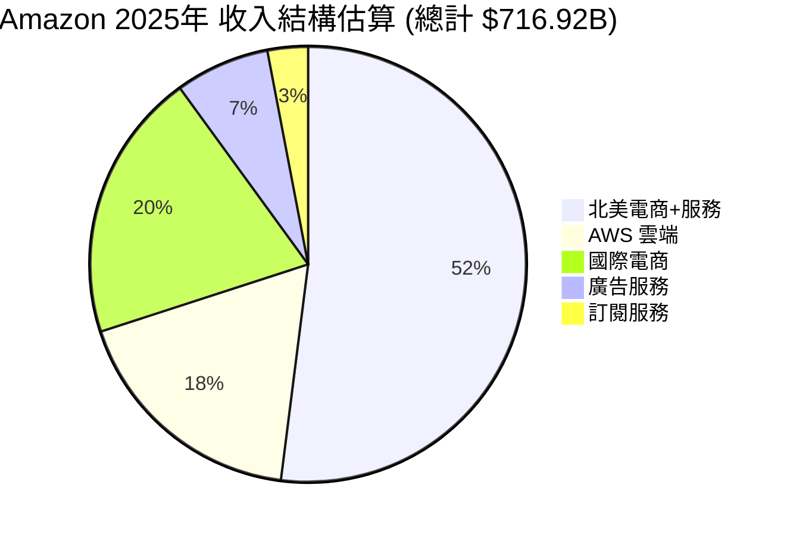

### 2.3 競爭優勢心智圖

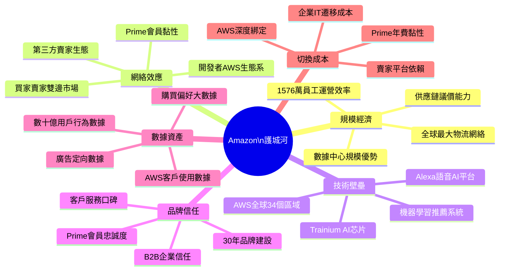

### 2.4 市場地位評估 ★★★★★

| 業務領域 | Amazon排名 | 市占率估算 | 主要競爭對手 | 護城河深度 |
|---------|-----------|-----------|------------|----------|
| ☁️ 全球雲端(IaaS) | **#1** | ~31% | Microsoft Azure, Google Cloud | ▓▓▓▓▓ 極深 |
| 📦 美國電商 | **#1** | ~40% | Walmart, Target, Shopify | ▓▓▓▓░ 深 |
| 📢 數位廣告(美) | **#3** | ~9% | Google, Meta | ▓▓▓░░ 中深 |
| 🎵 音樂串流 | **#3** | ~15% | Spotify, Apple Music | ▓▓░░░ 中等 |
| 🎬 串流影音 | **#2** | ~22% | Netflix, Disney+ | ▓▓▓░░ 中深 |

---

## 3. 損益表深度分析

### 3.1 年度收入成長時間軸

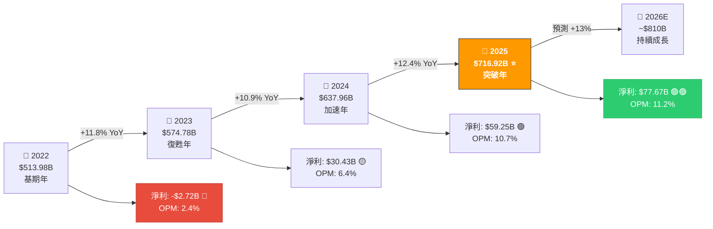

### 3.2 年度收入趨勢 ASCII 長條圖

```
╔══════════════════════════════════════════════════════════════╗
║           Amazon 年度總收入趨勢（2022-2025）                    ║
╠══════════════════════════════════════════════════════════════╣
║                                                              ║
║  2022  $513.98B │▓▓▓▓▓▓▓▓▓▓▓▓▓▓▓▓▓▓▓▓▓▓▓▓▓▓▓▓▓░░░░░░░░│71.7%║
║                 │                                            ║
║  2023  $574.78B │▓▓▓▓▓▓▓▓▓▓▓▓▓▓▓▓▓▓▓▓▓▓▓▓▓▓▓▓▓▓▓▓░░░░░│80.2%║
║                 │                                            ║
║  2024  $637.96B │▓▓▓▓▓▓▓▓▓▓▓▓▓▓▓▓▓▓▓▓▓▓▓▓▓▓▓▓▓▓▓▓▓▓▓░│89.0%║
║                 │                                            ║
║  2025  $716.92B │▓▓▓▓▓▓▓▓▓▓▓▓▓▓▓▓▓▓▓▓▓▓▓▓▓▓▓▓▓▓▓▓▓▓▓▓▓│100%  ║
║                 │                                            ║
║                 └─────────────────────────────────────────  ║
║         $0      $100B    $300B    $500B    $700B           ║
║                                                              ║
║  ▓ = 實際收入    YoY成長率: +11.8% → +10.9% → +12.4%        ║
╚══════════════════════════════════════════════════════════════╝
```

### 3.3 利潤率演變趨勢

```
╔══════════════════════════════════════════════════════════════════╗
║              Amazon 利潤率演變（2022-2025）                        ║
╠══════════════════════════════════════════════════════════════════╣
║  利潤率                                                           ║
║  55% │                                              50.3%▓       ║
║  50% │                               48.8%▓    ▓──────────       ║
║  45% │                    47.0%▓  ▓──────                        ║
║  40% │         43.8%▓  ▓──────                                   ║
║      │                                                            ║
║  15% │                                              10.8%█       ║
║  10% │                               9.3%█     █──────────       ║
║   5% │           5.3%█          ██──────────                     ║
║   0% │  -0.5%█──────────────────                                  ║
║      │                                                            ║
║      └───────────────────────────────────────────────────────    ║
║              2022        2023        2024        2025             ║
║                                                                   ║
║  ▓ = 毛利率    █ = 淨利率    --- = 營業利益率                       ║
║                                                                   ║
║  毛利率:   43.8% → 47.0% → 48.8% → 50.3%  (+6.5pp)  🟢 改善中   ║
║  營業利益率: 2.4% →  6.4% → 10.7% → 11.2%  (+8.8pp)  🟢 強勁改善 ║
║  淨利率:  -0.5% →  5.3% →  9.3% → 10.8%  (+11.3pp) 🟢 歷史新高  ║
╚══════════════════════════════════════════════════════════════════╝
```

### 3.4 核心損益表數據（近4年詳細）

| 財務指標 | 2022 | 2023 | 2024 | 2025 | YoY(25vs24) |
|---------|------|------|------|------|------------|
| 💰 **總收入** | $513.98B | $574.78B | $637.96B | **$716.92B** | 🟢 +12.4% |
| 📊 **毛利潤** | $225.15B | $270.05B | $311.67B | **$360.51B** | 🟢 +15.7% |
| 📊 **毛利率** | 43.8% | 47.0% | 48.8% | **50.3%** | 🟢 +1.5pp |
| ⚙️ **營業利益** | $12.25B | $36.85B | $68.59B | **$79.97B** | 🟢 +16.6% |
| ⚙️ **營業利益率** | 2.4% | 6.4% | 10.7% | **11.2%** | 🟢 +0.5pp |
| 💎 **EBITDA** | $38.35B | $89.40B | $123.81B | **$165.34B** | 🟢 +33.5% |
| 💵 **淨利潤** | -$2.72B | $30.43B | $59.25B | **$77.67B** | 🟢 +31.1% |
| 💵 **淨利率** | -0.5% | 5.3% | 9.3% | **10.8%** | 🟢 +1.5pp |
| 📈 **EPS (稀釋)** | -$0.27 | $2.90 | $5.53 | **$7.16** | 🟢 +29.5% |

### 3.5 利潤層層分解 (2025年)

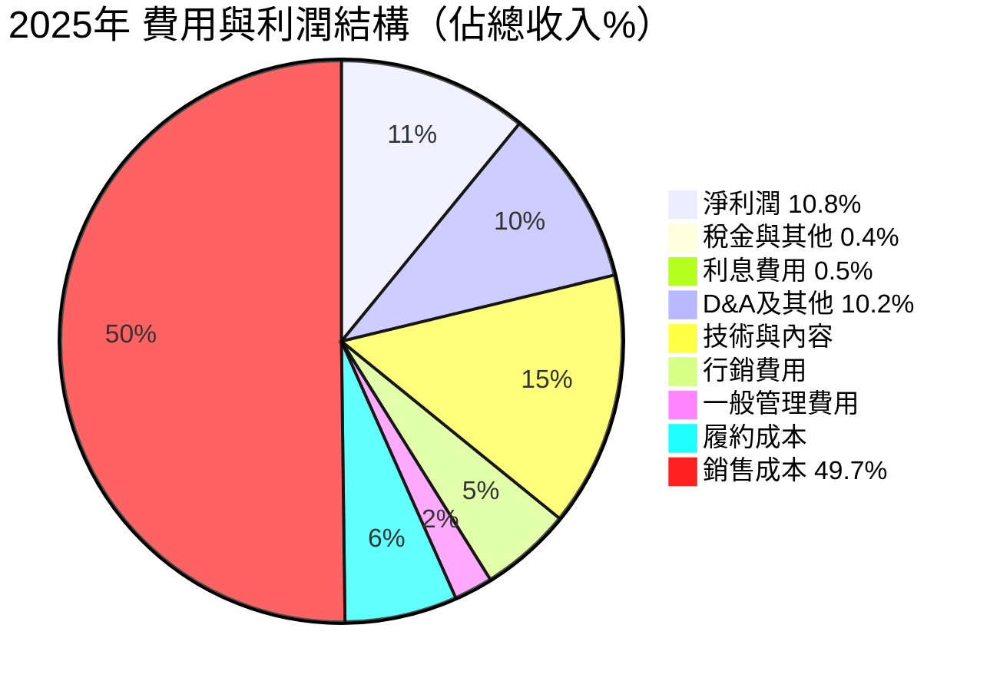

### 3.6 EBITDA 成長驅動力分析

```
EBITDA 成長歷程：
2022: $38.35B  ████░░░░░░░░░░░░░░░░░░░░░░░░░░  基期低點
2023: $89.40B  █████████░░░░░░░░░░░░░░░░░░░░░  +133% YoY 🚀
2024: $123.81B █████████████░░░░░░░░░░░░░░░░░  +38.5% YoY 🟢
2025: $165.34B █████████████████░░░░░░░░░░░░░  +33.5% YoY 🟢

EBITDA Margin:
2022:  7.5%  ███░░░░░░░░░░░░░░░░░░
2023: 15.6%  ████████░░░░░░░░░░░░░
2024: 19.4%  ██████████░░░░░░░░░░░
2025: 23.1%  ████████████░░░░░░░░░  ← 歷史新高 ⭐
```

---

## 4. 資產負債表分析

### 4.1 資產結構分解圖

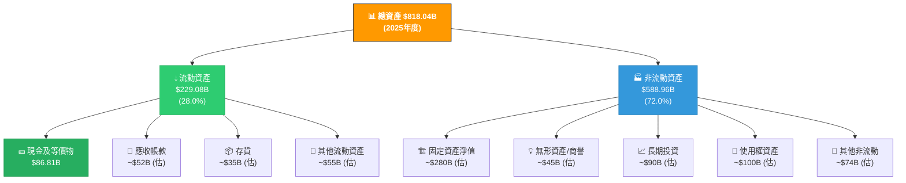

### 4.2 資產配置橫條圖

```
╔══════════════════════════════════════════════════════════════════╗
║                Amazon 資產配置對比（2022-2025）                     ║
╠══════════════════════════════════════════════════════════════════╣
║                                                                  ║
║  總資產成長：                                                       ║
║  2022  $462.68B  ▓▓▓▓▓▓▓▓▓▓▓▓▓▓▓▓▓▓▓▓▓▓▓░░░░░░░  56.6%          ║
║  2023  $527.85B  ▓▓▓▓▓▓▓▓▓▓▓▓▓▓▓▓▓▓▓▓▓▓▓▓▓▓░░░░  64.5%          ║
║  2024  $624.89B  ▓▓▓▓▓▓▓▓▓▓▓▓▓▓▓▓▓▓▓▓▓▓▓▓▓▓▓▓▓▓░ 76.4%          ║
║  2025  $818.04B  ▓▓▓▓▓▓▓▓▓▓▓▓▓▓▓▓▓▓▓▓▓▓▓▓▓▓▓▓▓▓▓▓ 100%           ║
║                                                                  ║
║  現金部位：                                                         ║
║  2022   $53.89B  ████░░░░░░░░░░░░░░░░░░░░░░░░░░  43.8%          ║
║  2023   $73.39B  ██████░░░░░░░░░░░░░░░░░░░░░░░░  59.6%          ║
║  2024   $78.78B  ██████░░░░░░░░░░░░░░░░░░░░░░░░  64.0%          ║
║  2025   $86.81B  ███████░░░░░░░░░░░░░░░░░░░░░░░  70.6%          ║
║                                                                  ║
║  股東權益（大幅改善）：                                               ║
║  2022  $146.04B  ████████████░░░░░░░░░░░░░░░░░░  35.5%          ║
║  2023  $201.88B  ████████████████░░░░░░░░░░░░░░  49.1%          ║
║  2024  $285.97B  ███████████████████████░░░░░░░  69.6%          ║
║  2025  $411.06B  █████████████████████████████▓▓ 100%  🚀        ║
╚══════════════════════════════════════════════════════════════════╝
```

### 4.3 負債與流動性比率表格

| 財務健康指標 | 2022 | 2023 | 2024 | 2025 | 評級 |
|------------|------|------|------|------|------|
| 📊 **流動資產** | $146.79B | $172.35B | $190.87B | $229.08B | 🟢 |
| 📊 **流動負債** | $155.39B | $164.92B | $179.43B | $218.00B | 🟡 |
| 💧 **流動比率** | 0.94x | 1.04x | 1.06x | **1.051x** | 🟡 略高於1 |
| 🔐 **速動比率** | ~0.78x | ~0.83x | ~0.88x | ~0.88x | 🟡 |
| 💰 **現金** | $53.89B | $73.39B | $78.78B | **$86.81B** | 🟢 |
| 🏋️ **總債務** | $140.12B | $135.61B | $130.90B | **$152.99B** | 🟡 |
| ⚖️ **淨債務** | $86.23B | $62.22B | $52.12B | **$66.18B** | 🟡 |
| 📐 **債務/EBITDA** | 3.65x | 1.52x | 1.06x | **0.93x** | 🟢 |
| 📐 **債務/權益** | 95.9% | 67.2% | 45.8% | **43.4%** | 🟢 持續改善 |
| 🏦 **總負債** | $316.63B | $325.98B | $338.92B | **$406.98B** | 🟡 |
| 💎 **股東權益** | $146.04B | $201.88B | $285.97B | **$411.06B** | 🟢 強勁增長 |

### 4.4 股東權益趨勢 ASCII 圖

```
╔══════════════════════════════════════════════════════════╗
║        股東權益趨勢（2022-2025）單位：十億美元              ║
╠══════════════════════════════════════════════════════════╣
║ $450B │                                          *       ║
║ $400B │                                        * ║$411B  ║
║ $350B │                                      *           ║
║ $300B │                                *  ───            ║
║ $286B │─ ─ ─ ─ ─ ─ ─ ─ ─ ─ ─ ─ ─ *                    ║
║ $250B │                          *                       ║
║ $200B │                     *────  $202B                 ║
║ $150B │                *────  $146B                      ║
║ $100B │           *────                                  ║
║  $50B │      *────                                       ║
║    $0 └──────────────────────────────────────────────── ║
║          2022      2023      2024      2025              ║
║                                                          ║
║  成長倍數: 2025年($411B) vs 2022年($146B) = +181.5% 🚀    ║
║  複合年增率 (CAGR 3年): +41.4%  ⭐⭐⭐⭐⭐                 ║
╚══════════════════════════════════════════════════════════╝
```

---

## 5. 現金流量分析

### 5.1 現金流瀑布圖

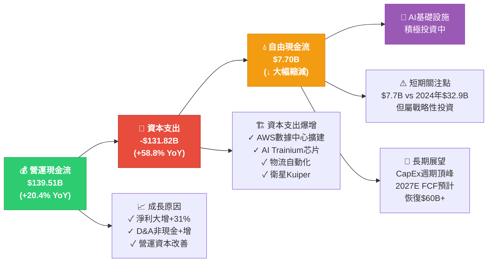

### 5.2 自由現金流趨勢（含資本支出對比）

```
╔══════════════════════════════════════════════════════════════════╗
║            現金流詳細對比（2022-2025）單位：十億美元                  ║
╠══════════════════════════════════════════════════════════════════╣
║                                                                  ║
║  【營運現金流 OCF】                                                 ║
║  2022  $46.75B   ████████░░░░░░░░░░░░░░░░░░░░░░░  33.5%        ║
║  2023  $84.95B   ████████████████░░░░░░░░░░░░░░░  60.9%        ║
║  2024  $115.88B  ██████████████████████░░░░░░░░░  83.1%        ║
║  2025  $139.51B  ████████████████████████████░░░  100% 🟢       ║
║                                                                  ║
║  【資本支出 CAPEX（負數）】                                           ║
║  2022  -$63.65B  ████████████░░░░░░░░░░░░░░░░░░░  48.3%        ║
║  2023  -$52.73B  ██████████░░░░░░░░░░░░░░░░░░░░░  40.0%        ║
║  2024  -$83.00B  ████████████████░░░░░░░░░░░░░░░  63.0%        ║
║  2025  -$131.82B █████████████████████████████░░  100% 🔴高峰    ║
║                                                                  ║
║  【自由現金流 FCF】                                                  ║
║  2022  -$16.89B  ████ (負值)                       ⛔            ║
║  2023   $32.22B  ████████████░░░░░░░░░░░░░░░░░░░  98.0%        ║
║  2024   $32.88B  ████████████░░░░░░░░░░░░░░░░░░░  100%         ║
║  2025    $7.70B  ███░░░░░░░░░░░░░░░░░░░░░░░░░░░░  23.4% ⚠️     ║
║                                                                  ║
║  ⚡ 關鍵解讀：FCF壓縮≠惡化，係因$131.82B戰略CapEx投入                 ║
║     預期2026-2027年隨AI投資回報顯現，FCF將大幅反彈                    ║
╚══════════════════════════════════════════════════════════════════╝
```

### 5.3 資本配置策略

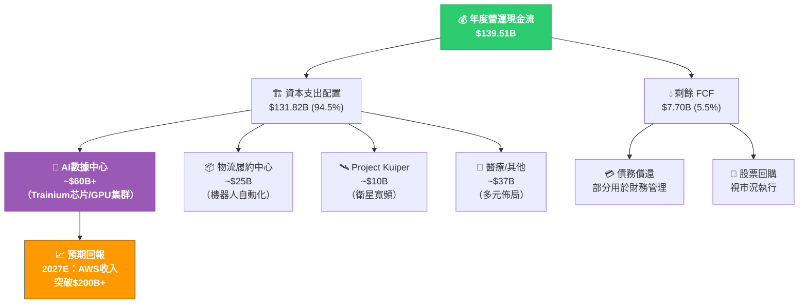

---

## 6. 獲利能力指標

### 6.1 ROE/ROA/ROIC 對比分析

| 獲利指標 | AMZN 2022 | AMZN 2023 | AMZN 2024 | **AMZN 2025** | 科技業均值 | 評級 |
|---------|----------|----------|----------|--------------|----------|------|
| 🔵 **ROE** | -1.9% | 15.1% | 20.7% | **22.3%** | ~18% | 🟢 優於均值 |
| 🟠 **ROA** | -0.6% | 5.8% | 9.5% | **6.9%** | ~8% | 🟡 略低 |
| 🟣 **ROIC** | ~2% | ~10% | ~17% | **~18%** | ~15% | 🟢 優於均值 |
| 🟡 **毛利率** | 43.8% | 47.0% | 48.8% | **50.3%** | ~45% | 🟢 優於均值 |
| 🟢 **營業利益率** | 2.4% | 6.4% | 10.7% | **11.2%** | ~20% | 🟡 仍有空間 |
| 🔴 **淨利率** | -0.5% | 5.3% | 9.3% | **10.8%** | ~18% | 🟡 改善中 |
| ⚡ **EBITDA率** | 7.5% | 15.6% | 19.4% | **23.1%** | ~25% | 🟢 接近均值 |

### 6.2 獲利能力儀表板

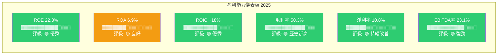

### 6.3 獲利能力進度條視覺化

```
╔══════════════════════════════════════════════════════════════════╗
║              獲利能力指標評分（相對行業表現）                          ║
╠══════════════════════════════════════════════════════════════════╣
║                                                                  ║
║  ROE     22.3%  ▓▓▓▓▓▓▓▓▓▓▓▓▓▓▓▓▓▓▓▓▓▓░░░░░░░  ★★★★☆  良好   ║
║  ROA      6.9%  ▓▓▓▓▓▓▓▓▓▓▓▓▓▓░░░░░░░░░░░░░░░  ★★★☆☆  普通   ║
║  ROIC   ~18.0%  ▓▓▓▓▓▓▓▓▓▓▓▓▓▓▓▓▓▓▓▓▓░░░░░░░  ★★★★☆  良好   ║
║  毛利率  50.3%  ▓▓▓▓▓▓▓▓▓▓▓▓▓▓▓▓▓▓▓▓▓▓▓▓▓░░░  ★★★★★  卓越   ║
║  OPM    11.2%  ▓▓▓▓▓▓▓▓▓▓▓▓▓▓▓▓▓▓▓░░░░░░░░░  ★★★☆☆  改善中  ║
║  淨利率  10.8%  ▓▓▓▓▓▓▓▓▓▓▓▓▓▓▓▓▓▓░░░░░░░░░░  ★★★★☆  優秀   ║
║  EBITDA  23.1%  ▓▓▓▓▓▓▓▓▓▓▓▓▓▓▓▓▓▓▓▓▓▓▓░░░░  ★★★★☆  優秀   ║
║                                                                  ║
║  0%    10%   20%   30%   40%   50%   60%   70%  80%  90% 100%  ║
╚══════════════════════════════════════════════════════════════════╝
```

---

## 7. 估值分析

### 7.1 估值指標全覽

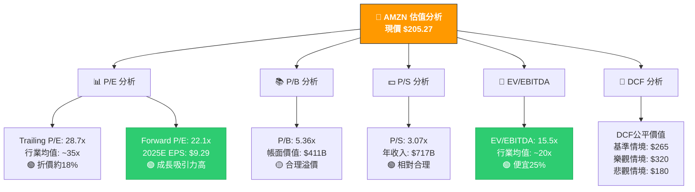

### 7.2 估值倍數對比表格

| 估值指標 | AMZN | MSFT | GOOGL | META | 科技均值 | 評估 |
|---------|------|------|-------|------|---------|------|
| 📊 **P/E (Trailing)** | 28.7x | 33.2x | 22.5x | 27.8x | ~28x | 🟢 合理 |
| 📊 **P/E (Forward)** | **22.1x** | 28.5x | 18.2x | 22.4x | ~23x | 🟢 吸引力高 |
| 📚 **P/B** | 5.36x | 10.2x | 6.8x | 9.5x | ~8x | 🟢 折價 |
| 💵 **P/S** | 3.07x | 12.5x | 5.8x | 8.2x | ~7x | 🟢 最低 |
| 🏢 **EV/EBITDA** | **15.5x** | 22.4x | 13.2x | 18.7x | ~17x | 🟢 合理偏低 |
| 💰 **EV/Revenue** | 3.15x | 12.8x | 6.0x | 8.5x | ~7x | 🟢 最便宜 |
| 📈 **市值** | $2.20T | $3.0T | $2.0T | $1.5T | - | 🟡 |

### 7.3 情境目標股價

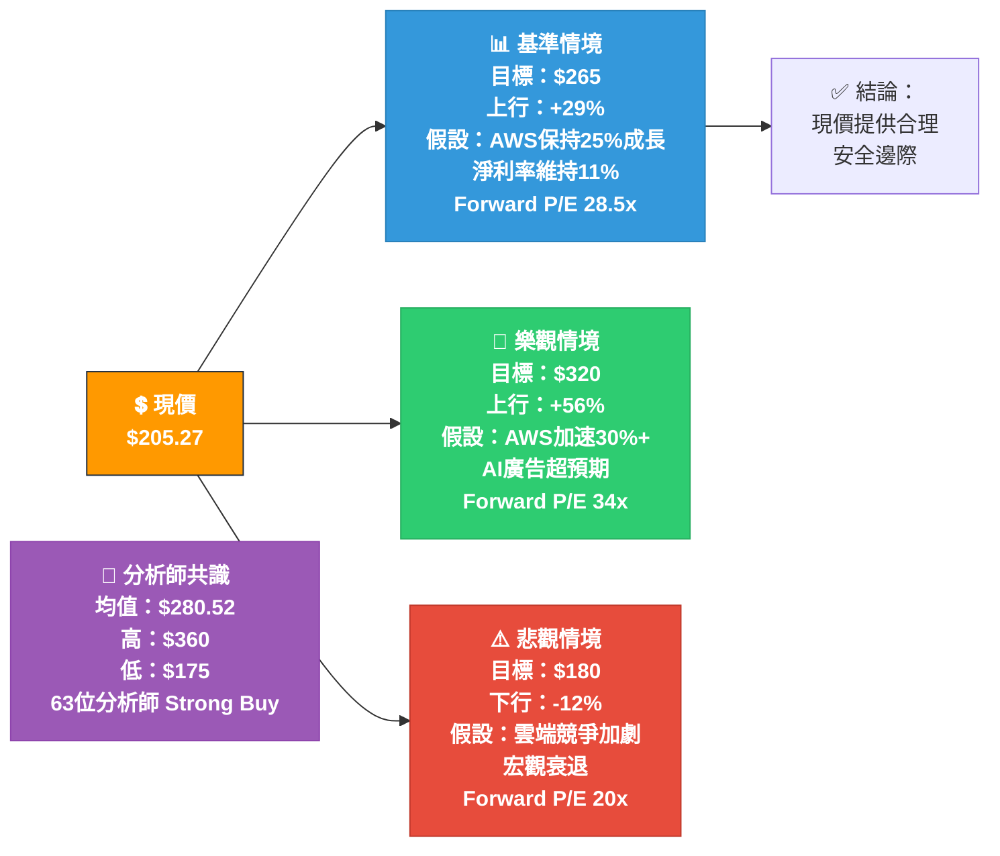

### 7.4 估值區間視覺化

```
╔══════════════════════════════════════════════════════════════════╗
║                 AMZN 股價估值區間分析                               ║
╠══════════════════════════════════════════════════════════════════╣
║                                                                  ║
║  $360 ─────────────────────────────────── 分析師最高目標            ║
║   │                                                              ║
║  $320 ──────────────────────────────── 🚀 樂觀情境 DCF             ║
║   │                         ↑ 上行空間 +56%                        ║
║  $280 ────────────────── 🎯 分析師均值目標 $280.52                  ║
║   │                  ↑ 上行空間 +37%                               ║
║  $265 ─────────── 📊 基準情境 DCF                                  ║
║   │            ↑ 上行空間 +29%                                     ║
║  ═══════════════════════════════════════════════════════════     ║
║  $205 ════ 💲 現價 $205.27  ←【買入區間】                           ║
║  ═══════════════════════════════════════════════════════════     ║
║   │                                                              ║
║  $180 ─────────────── ⚠️ 悲觀情境 DCF                             ║
║   │                                                              ║
║  $175 ──────────────────── 分析師最低目標                           ║
║   │                                                              ║
║  $161 ──────────────────────── 52週最低                           ║
║                                                                  ║
║  🟢 買入區：$180以下     🟡 持有區：$180-$250    🔴 減碼：$300以上    ║
╚══════════════════════════════════════════════════════════════════╝
```

---

## 8. 競爭護城河

### 8.1 Porter's Five Forces 分析

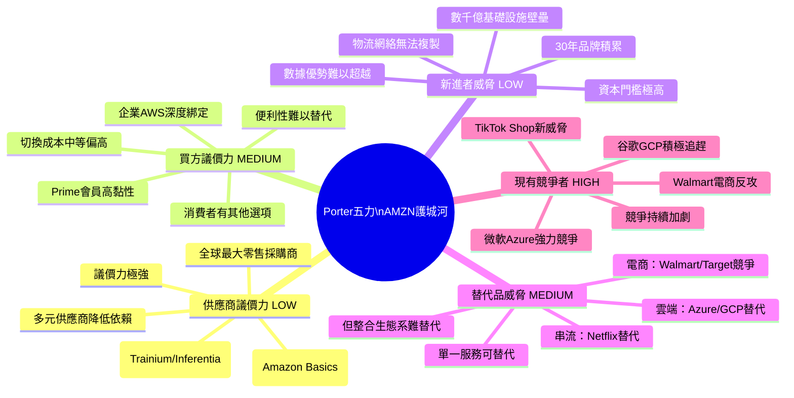

### 8.2 護城河評分進度條

```
╔══════════════════════════════════════════════════════════════════╗
║                  Amazon 護城河各維度評分                            ║
╠══════════════════════════════════════════════════════════════════╣
║                                                                  ║
║  📦 物流基礎設施    ▓▓▓▓▓▓▓▓▓▓▓▓▓▓▓▓▓▓▓▓▓▓▓▓▓▓░░░░  95/100 ★★★★★ ║
║  ☁️ AWS技術領先    ▓▓▓▓▓▓▓▓▓▓▓▓▓▓▓▓▓▓▓▓▓▓▓▓▓░░░░░  90/100 ★★★★★ ║
║  🔄 網絡效應        ▓▓▓▓▓▓▓▓▓▓▓▓▓▓▓▓▓▓▓▓▓▓▓░░░░░░░  88/100 ★★★★☆ ║
║  💡 技術與創新      ▓▓▓▓▓▓▓▓▓▓▓▓▓▓▓▓▓▓▓▓▓▓░░░░░░░░  85/100 ★★★★☆ ║
║  💰 規模成本優勢    ▓▓▓▓▓▓▓▓▓▓▓▓▓▓▓▓▓▓▓▓▓▓░░░░░░░░  85/100 ★★★★☆ ║
║  🏷️ 品牌忠誠度      ▓▓▓▓▓▓▓▓▓▓▓▓▓▓▓▓▓▓▓▓░░░░░░░░░░  82/100 ★★★★☆ ║
║  📊 數據資產        ▓▓▓▓▓▓▓▓▓▓▓▓▓▓▓▓▓▓▓▓▓░░░░░░░░░  80/100 ★★★★☆ ║
║  🔐 切換成本        ▓▓▓▓▓▓▓▓▓▓▓▓▓▓▓▓▓▓▓░░░░░░░░░░░  78/100 ★★★★☆ ║
║  🛡️ 監管壁壘        ▓▓▓▓▓▓▓▓▓▓▓▓▓▓░░░░░░░░░░░░░░░░  60/100 ★★★☆☆ ║
║                                                                  ║
║  🏆 綜合護城河評分：87/100  ★★★★☆  「寬護城河」等級               ║
╚══════════════════════════════════════════════════════════════════╝
```

### 8.3 競爭定位矩陣

| 競爭維度 | Amazon | Microsoft | Google | Walmart | Alibaba |
|---------|--------|-----------|--------|---------|---------|
| ☁️ **雲端服務** | 🟢 #1 (31%) | 🟢 #2 (24%) | 🟡 #3 (12%) | 🔴 無 | 🔴 地區性 |
| 📦 **電商** | 🟢 #1美國 | 🔴 無 | 🔴 無 | 🟢 #2美國 | 🟢 #1中國 |
| 📢 **數位廣告** | 🟡 #3 (9%) | 🟡 #4 (7%) | 🟢 #1 (28%) | 🔴 無 | 🟡 地區性 |
| 🤖 **AI/ML** | 🟢 強勁 | 🟢 領先 | 🟢 強勁 | 🔴 弱 | 🟡 中等 |
| 🎬 **串流媒體** | 🟢 #2全球 | 🔴 無 | 🟡 YouTube | 🔴 無 | 🔴 無 |
| 💊 **醫療健康** | 🟡 進行中 | 🟡 進行中 | 🟡 進行中 | 🟡 進行中 | 🔴 弱 |
| 🏆 **整體護城河** | ★★★★★ | ★★★★★ | ★★★★☆ | ★★★☆☆ | ★★★☆☆ |

---

## 9. 成長催化劑

### 9.1 催化劑時間軸

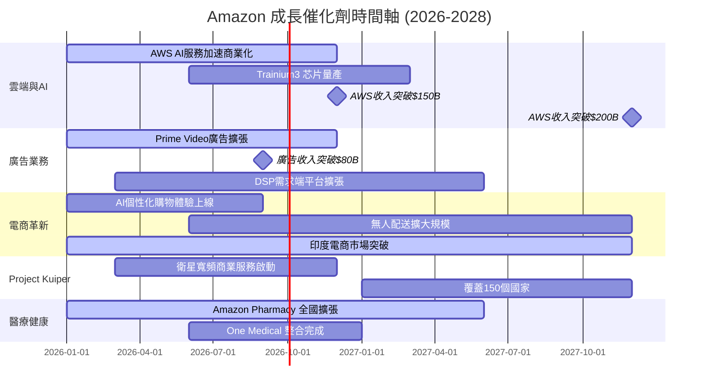

### 9.2 短中長期機會

```mermaid
graph TD
    SHORT["⚡ 短期機會 (0-12個月)"] --> S1["🤖 AWS AI工作負載\n企業加速遷移雲端\n預估貢獻$15-20B增量"]
    SHORT --> S2["📢 Prime Video廣告\n新廣告庫存大量釋出\n高利潤率業務"]
    SHORT --> S3["📊 Q1 2026財報\n盈利超預期可能性高\n分析師預期相對保守"]
    
    MID["📈 中期機會 (1-3年)"] --> M1["☁️ AWS市場份額\n從31%擴大至35%+\n企業IT支出增長"]
    MID --> M2["🌍 新興市場擴張\n印度/東南亞電商\n巨大TAM未開發"]
    MID --> M3["💊 醫療健康\n$4T市場顛覆\nPharmacy+One Medical"]
    MID --> M4["🛰️ Kuiper衛星\n全球偏遠地區連網\n新增數十億用戶"]
    
    LONG["🚀 長期機會 (3年+)"] --> L1["🤖 AGI/AI代理\n下一代AI應用\n顛覆多個行業"]
    LONG --> L2["🚗 Zoox自動駕駛\n機器人出租車\n萬億級市場"]
    LONG --> L3["🏭 工業自動化\n Amazon機器人技術\n向外輸出商業化"]
    LONG --> L4["🌐 Web3/元宇宙\n基礎設施提供商\n新計算範式"]

    style SHORT fill:#e74c3c,stroke:#c0392b,color:#fff,font-weight:bold
    style MID fill:#f39c12,stroke:#d68910,color:#fff,font-weight:bold
    style LONG fill:#2ecc71,stroke:#27ae60,color:#fff,font-weight:bold
```

### 9.3 TAM 市場規模

```
╔══════════════════════════════════════════════════════════════════╗
║              Amazon 目標市場規模（TAM）分析                          ║
╠══════════════════════════════════════════════════════════════════╣
║                                                                  ║
║  ☁️  全球雲端計算        $1.0T → $2.5T(2030E)                      ║
║      █████████████████████████████████████░░░░░░░░░  AMZN已佔31% ║
║                                                                  ║
║  📦  全球電商            $5.8T → $8.0T(2030E)                      ║
║      ██████████████████████████████████████████░░░  AMZN佔~40%美國 ║
║                                                                  ║
║  📢  全球數位廣告         $0.7T → $1.3T(2030E)                      ║
║      ████████████░░░░░░░░░░░░░░░░░░░░░░░░░░░░░░░░░  AMZN佔~9%    ║
║                                                                  ║
║  💊  全球醫療健康         $4.0T → $6.0T(2030E)                      ║
║      ██░░░░░░░░░░░░░░░░░░░░░░░░░░░░░░░░░░░░░░░░░░░  初期滲透      ║
║                                                                  ║
║  🛰️  全球衛星網路         $0.07T → $0.45T(2030E)                    ║
║      █░░░░░░░░░░░░░░░░░░░░░░░░░░░░░░░░░░░░░░░░░░░  起步階段      ║
║                                                                  ║
║  🤖  全球AI市場           $0.2T → $2.0T(2030E)                      ║
║      ████░░░░░░░░░░░░░░░░░░░░░░░░░░░░░░░░░░░░░░░░  快速成長      ║
║                                                                  ║
║  💡 Amazon可尋址總TAM：超過 $10+ 兆美元（2030年目標市場）              ║
╚══════════════════════════════════════════════════════════════════╝
```

---

## 10. 風險分析

### 10.1 風險矩陣

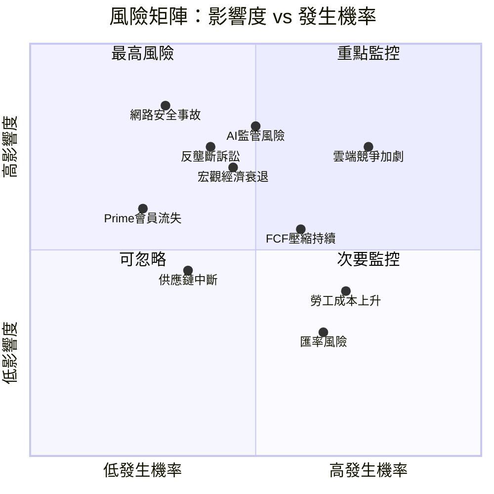

### 10.2 風險評分卡

| 風險類別 | 風險描述 | 發生機率 | 影響度 | 綜合評分 | 評級 |
|---------|---------|---------|-------|---------|------|
| 🔴 **競爭風險** | Azure/GCP在雲端市場追趕，AMZN市占率受壓 | 高(70%) | 高 | **7.0** | 🔴 高風險 |
| 🔴 **監管風險** | 美歐反壟斷調查加劇，可能被迫業務分拆 | 中(40%) | 極高 | **6.8** | 🔴 高風險 |
| 🔴 **AI投資回報** | $131B CapEx若AI收益不達預期，FCF壓縮持續 | 中(55%) | 高 | **6.5** | 🔴 高風險 |
| 🟡 **宏觀風險** | 全球經濟衰退影響消費與企業IT支出 | 中(45%) | 高 | **5.8** | 🟡 中風險 |
| 🟡 **估值風險** | 成長不及預期導致本益比壓縮 | 中(40%) | 中 | **4.8** | 🟡 中風險 |
| 🟡 **勞工風險** | 工會化壓力、最低工資上漲壓縮利潤 | 高(65%) | 中 | **4.5** | 🟡 中風險 |
| 🟡 **地緣政治** | 中美貿易戰、國際業務受限 | 中(35%) | 中高 | **4.2** | 🟡 中風險 |
| 🟢 **網絡安全** | AWS大規模安全事故損害信譽 | 低(25%) | 極高 | **4.0** | 🟢 低機率 |
| 🟢 **匯率風險** | 美元走強影響國際業務收入換算 | 高(65%) | 低 | **3.2** | 🟢 低影響 |
| 🟢 **供應鏈** | 關鍵硬件供應鏈中斷（如GPU短缺） | 低(30%) | 中 | **2.8** | 🟢 可管理 |

### 10.3 風險緩解措施

```
🔴 高風險緩解策略：
━━━━━━━━━━━━━━━━━━━━━━━━━━━━━━━━━━━━━━━━━━━━━━━━
1. 雲端競爭  → 持續加碼AI/ML差異化服務；Bedrock+Trainium構建技術護城河
2. 監管風險  → 主動配合監管調查；分業務透明度提升；游說政策
3. AI資本效率 → 分批釋放CapEx計畫；以Commitments確保客戶鎖定

🟡 中風險緩解策略：
━━━━━━━━━━━━━━━━━━━━━━━━━━━━━━━━━━━━━━━━━━━━━━━━
4. 宏觀衰退  → 廣告業務逆週期；AWS企業合約長期鎖定；Prime黏性高
5. 估值壓縮  → 持續超越EPS預期；提高分紅/回購吸引力
6. 勞工成本  → 自動化機器人投資；生產力提升對沖成本

🟢 低風險管理：
━━━━━━━━━━━━━━━━━━━━━━━━━━━━━━━━━━━━━━━━━━━━━━━━
7. 網絡安全  → SOC2/ISO認證；多層安全架構；$123B現金應急
8. 匯率風險  → 天然對沖（全球收支）；衍生工具管理
```

---

## 11. 公平價值估算

### 11.1 DCF 模型架構

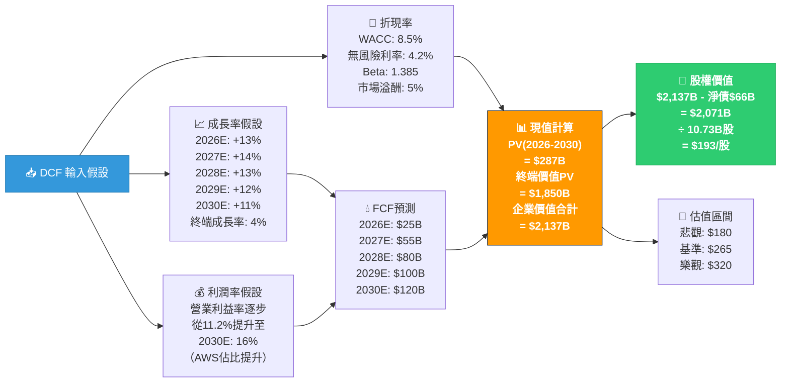

### 11.2 三種估值法比較

| 估值方法 | 計算基礎 | 估算倍數/率 | 每股公平價值 | 權重 | 加權價值 |
|---------|---------|-----------|------------|------|---------|
| 🔮 **DCF 現金流折現** | 2026-2030 FCF，WACC 8.5% | - | $265 | 40% | $106 |
| 📊 **P/E 本益比法** | 2026E EPS $9.29 × 28.5x | 28.5x | $265 | 30% | $79.5 |
| 🏢 **EV/EBITDA法** | 2025 EBITDA $165B × 16x | 16.0x | $255 | 20% | $51 |
| 💵 **P/S 收入倍數法** | 2026E 收入 $810B × 3.5x | 3.5x | $264 | 10% | $26.4 |
| **🏆 加權平均目標價** | | | | **100%** | **$262.9** |

### 11.3 估值區間完整視覺化

```
╔══════════════════════════════════════════════════════════════════╗
║              AMZN 三種情境估值區間對比                               ║
╠══════════════════════════════════════════════════════════════════╣
║                                                                  ║
║  $360 ─┤                                    ◄─ 分析師最高 $360     ║
║  $340 ─┤                                                         ║
║  $320 ─┤                            ███████  樂觀DCF $320 🚀      ║
║  $300 ─┤                            ███████                      ║
║  $281 ─┤                     ███████████████ 分析師均值 $280.52    ║
║  $265 ─┤              ████████████████████  基準DCF $265 📊       ║
║  $263 ─┤              ████████████████████  加權均值 $263 🎯       ║
║        