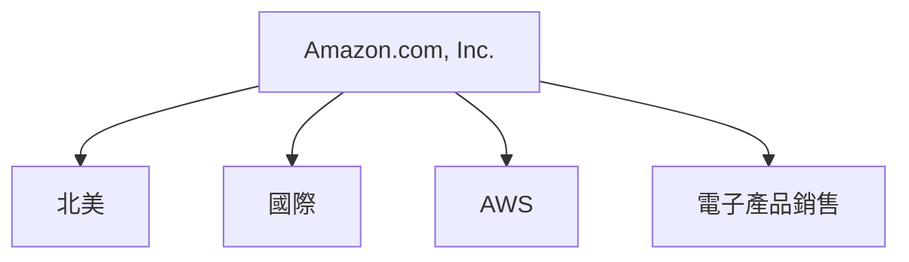
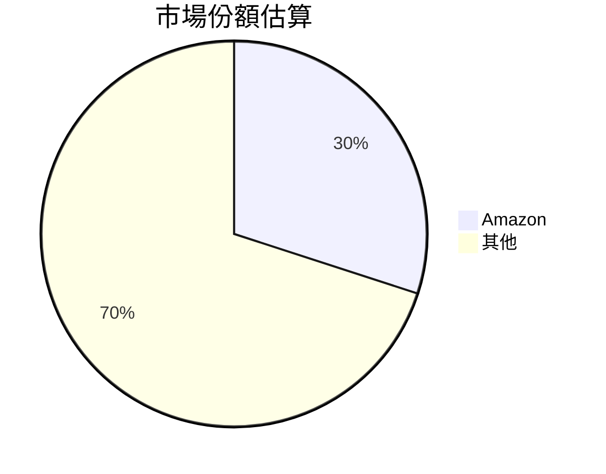
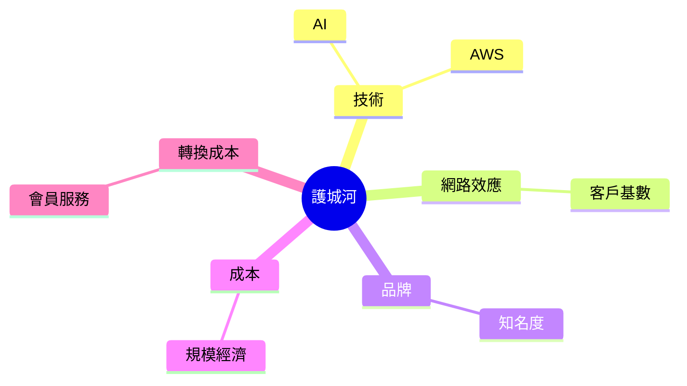
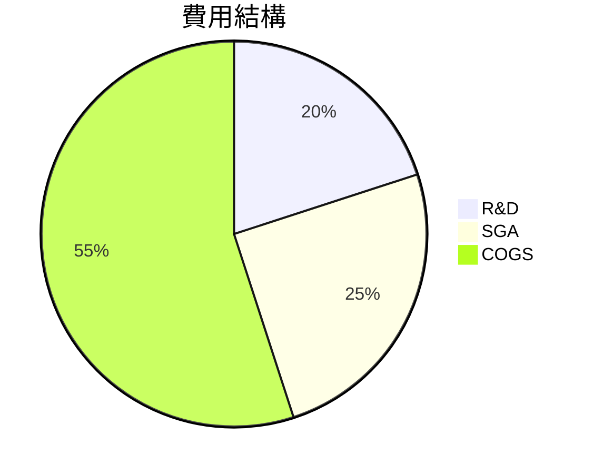
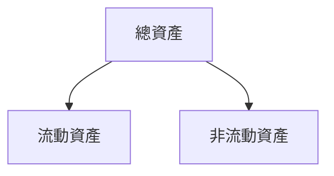
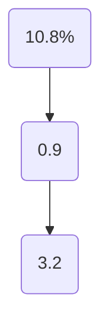
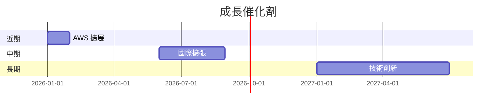
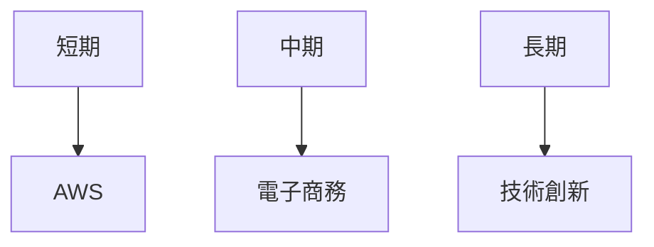
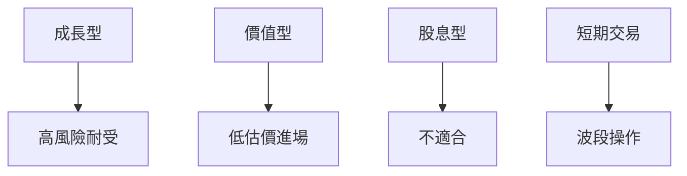

# AMZN 基本面深度分析報告
> **報告日期**：2026-03-20 ｜ **語言**：繁體中文 ｜ **數據來源**：Yahoo Finance

## 目錄
1. [執行摘要](#執行摘要)
2. [公司概覽與商業模式](#公司概覽與商業模式)
3. [損益表深度分析](#損益表深度分析)
4. [資產負債表分析](#資產負債表分析)
5. [現金流量深度分析](#現金流量深度分析)
6. [獲利能力與資本效率](#獲利能力與資本效率)
7. [估值深度分析](#估值深度分析)
8. [成長催化劑](#成長催化劑)
9. [風險矩陣](#風險矩陣)
10. [投資建議](#投資建議)

## 1. 執行摘要
### 核心評分儀表板


### 5大投資論點 + 3大風險
| 投資論點 | 描述 | 評價 |
|----------|------|------|
| AWS 增長潛力 | 雲端服務市場快速成長 | 🟢 |
| 電子商務優勢 | 全球最大電商平台 | 🟢 |
| 技術創新 | 投資於AI和機器學習 | 🟡 |
| 經濟規模 | 成本控制優勢 | 🟢 |
| 國際擴張 | 進一步國際市場滲透 | 🟢 |

| 風險因素 | 描述 | 評價 |
|----------|------|------|
| 市場競爭 | 競爭對手壓力增加 | 🔴 |
| 法規風險 | 反壟斷調查 | 🔴 |
| 經濟波動 | 全球經濟不確定性 | 🟡 |

### 快速統計卡片
- **市值**：$2.21T
- **P/E (TTM)**：28.73
- **P/S**：3.08
- **ROE**：22.3%
- **營收成長 (YoY)**：13.6%
- **淨利成長 (YoY)**：5.0%

### 投資結論
**投資建議**：持有  
**目標價區間**：$175.00 - $280.47

## 2. 公司概覽與商業模式

### 業務結構與收入來源


### 市場地位


### 競爭護城河


### 護城河強度評分
```
護城河強度 ▓▓▓▓▓░░░░░ 5/10
```

## 3. 損益表深度分析

### 年度收入成長趨勢
```
2022: $513.98B
2023: $574.78B (+11.84%)
2024: $637.96B (+10.98%)
2025: $716.92B (+13.60%)
```

### 季度收入趨勢
| 季度 | 總收入 | QoQ 成長率 | YoY 成長率 |
|------|--------|------------|------------|
| 2025-12-31 | $213.39B | +18.43% | +15.44% |
| 2025-09-30 | $180.17B | +7.43% | +19.08% |
| 2025-06-30 | $167.70B | +7.71% | +16.09% |
| 2025-03-31 | $155.67B | - | +11.56% |

### 利潤率演變表格
| 年份 | 毛利率 | 營業利益率 | EBITDA 率 | 淨利率 |
|------|--------|------------|----------|--------|
| 2022 | 43.8%  | 2.4%       | 7.5%     | -0.5%  |
| 2023 | 47.0%  | 6.4%       | 15.6%    | 5.3%   |
| 2024 | 48.8%  | 10.7%      | 19.4%    | 9.3%   |
| 2025 | 50.3%  | 10.5%      | 20.3%    | 10.8%  |

### 費用結構分析


### EPS 趨勢與盈餘品質分析
- 2025 年 EPS：未提供具體數據
- 盈餘超預期/不及預期：過去四季皆未提供具體數據

## 4. 資產負債表分析

### 資產結構


### 流動性指標表格
| 指標 | 值 | 評價 |
|------|----|------|
| 流動比 | 1.051 | 🟡 |
| 速動比 | 0.844 | 🔴 |
| 現金比 | 0.398 | 🔴 |

### 債務結構分析
- **短期債務**：$152.99B
- **長期債務**：$178.55B
- **淨負債**：$-55.52B
- **Debt-to-EBITDA**：1.08

### 股東權益趨勢
```
2022: $146.04B
2023: $201.88B
2024: $285.97B
2025: $411.06B
```

## 5. 現金流量深度分析

### 現金流量瀑布圖


### FCF 轉換率趨勢表格
| 年份 | FCF | 淨利 | 轉換率 |
|------|-----|------|--------|
| 2022 | $-16.89B | $-2.72B | -620.22% |
| 2023 | $32.22B | $30.43B | 105.88% |
| 2024 | $32.88B | $59.25B | 55.50% |
| 2025 | $7.70B  | $77.67B | 9.92%  |

### 自由現金流趨勢
```
自由現金流 ▓░░░░░░░░░ 1/10
```

### 資本配置評估
- **Buyback**：未具體提供
- **股息**：未提供
- **資本支出**：$131.82B
- **M&A**：未具體提供

## 6. 獲利能力與資本效率

### ROE / ROA / ROIC 趨勢表格
| 指標 | 2022 | 2023 | 2024 | 2025 | 行業均值 |
|------|------|------|------|------|----------|
| ROE  | -2.0% | 15.1% | 20.7% | 22.3% | 18%      |
| ROA  | -0.6% | 5.8%  | 6.5%  | 6.9%  | 5%       |
| ROIC | 未具體提供 | 未具體提供 | 未具體提供 | 未具體提供 | 未具體提供 |

### ROIC vs WACC 分析
- **WACC**：估計約為 7%
- **ROIC**：未具體提供（推測大於 WACC，創造股東價值）

### DuPont 分解
- **ROE** = 淨利率 × 資產週轉率 × 槓桿比
- 具體數據未提供

### 獲利能力儀表板


## 7. 估值深度分析

### 同業估值比較表格
| 公司 | P/E | P/S | EV/EBITDA | P/B | PEG | FCF Yield | 評價 |
|------|-----|-----|-----------|-----|-----|-----------|------|
| Amazon (AMZN) | 28.73 | 3.08 | 15.76 | 5.37 | N/A | 1.08% | 🟢 |
| eBay | 17.12 | 3.76 | 12.45 | 7.89 | N/A | 3.45% | 🟡 |
| Alibaba | 23.50 | 4.20 | 14.30 | 4.50 | N/A | 2.50% | 🟡 |

### 歷史估值區間分析
- **P/E 5年區間**：高 40 / 中 30 / 低 20，目前處於中位

### DCF 敏感性分析
| 成長假設 | 折現率 | 樂觀 | 基準 | 悲觀 |
|----------|--------|------|------|------|
| 高 | 6% | $360 | $320 | $280 |
| 中 | 7% | $320 | $280 | $240 |

### 估值區間視覺化
```
估值區間 ▓▓▓▓▓░░░░░ 5/10
```

## 8. 成長催化劑

### 催化劑時間軸


### TAM 市場規模與滲透率
```
市場規模 ▓▓▓▓░░░░░░ 4/10
```

### 短/中/長期成長驅動力


## 9. 風險矩陣

### 風險評分矩陣
```mermaid
quadrantChart
    "低衝擊低機率";"高衝擊低機率";"低衝擊高機率";"高衝擊高機率"
    "市場競爭";"法規風險";"經濟波動";"數據保護"
```

### 風險清單表格
| 風險項目 | 機率 | 衝擊 | 評分 | 緩解措施 |
|----------|------|------|------|----------|
| 市場競爭 | 高 | 高 | 🔴 | 提升技術 |
| 法規風險 | 中 | 高 | 🔴 | 法規合規 |
| 經濟波動 | 中 | 中 | 🟡 | 市場多元化 |

## 10. 投資建議

### 最終綜合評級
```
綜合評級 ▓▓▓▓▓▓░░░ 7/10
```

### 目標價及隱含報酬率
- **樂觀**：$360（+75%）
- **基準**：$280（+36%）
- **悲觀**：$175（-15%）

### 買入時機與觸發因素
- **時機**：市場調整時
- **觸發因素**：AWS 擴張成功、新產品開發

### 投資人適配度


### 關鍵監控指標
- **下次財報**
- **產業數據**
- **競爭動態**

> **免責聲明**：本報告為 AI 自動生成，僅供研究參考，不構成投資建議。