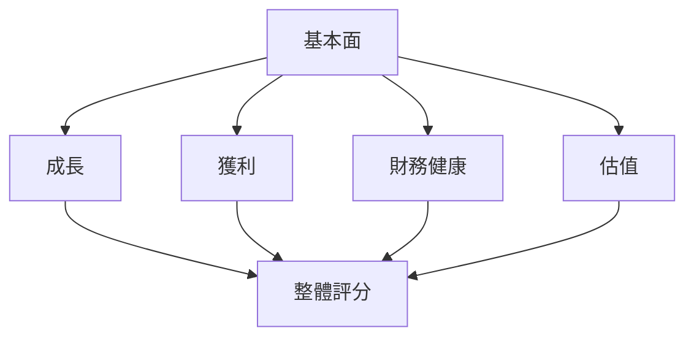
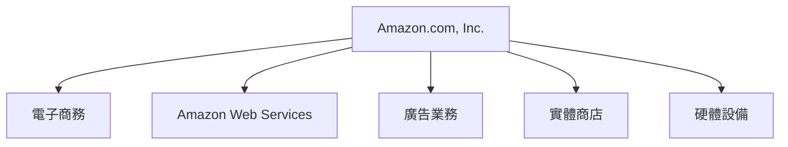
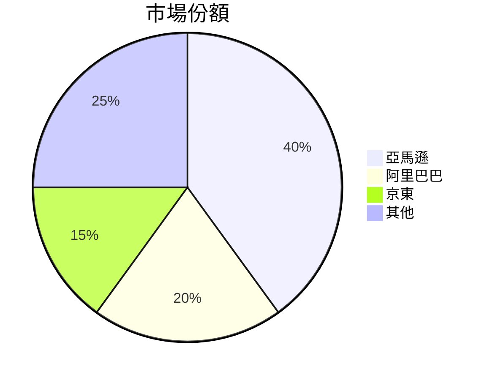
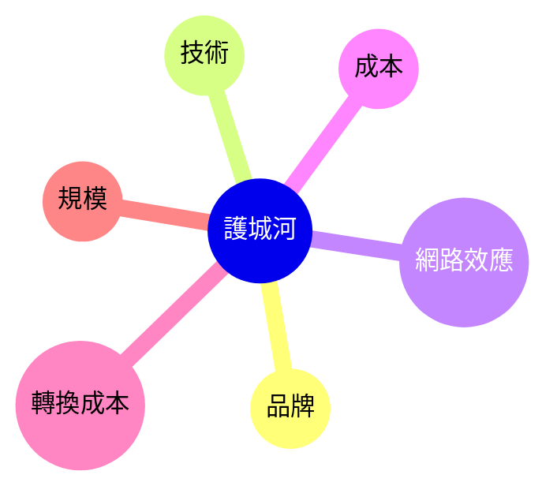
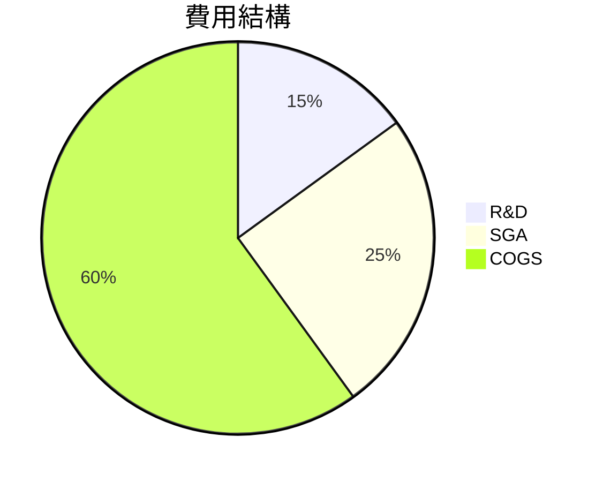
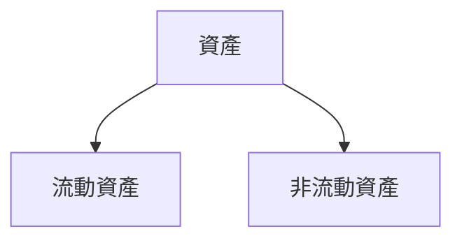
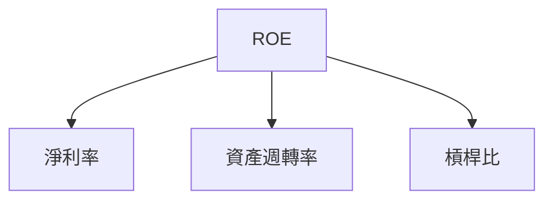
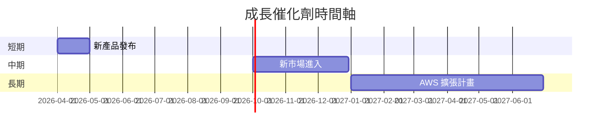
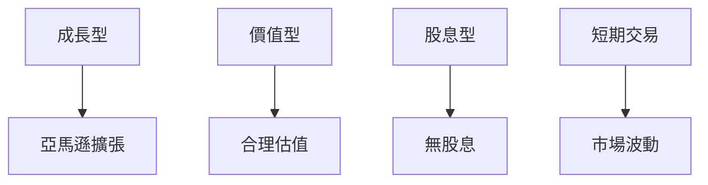

# AMZN 基本面深度分析報告
> **報告日期**：2026-03-21 ｜ **語言**：繁體中文 ｜ **數據來源**：Yahoo Finance

## 目錄
1. [執行摘要](#執行摘要)
2. [公司概覽與商業模式](#公司概覽與商業模式)
3. [損益表深度分析](#損益表深度分析)
4. [資產負債表分析](#資產負債表分析)
5. [現金流量深度分析](#現金流量深度分析)
6. [獲利能力與資本效率](#獲利能力與資本效率)
7. [估值深度分析](#估值深度分析)
8. [成長催化劑](#成長催化劑)
9. [風險矩陣](#風險矩陣)
10. [投資建議](#投資建議)

## 1. 執行摘要

### 核心評分儀表板



### 5大投資論點 + 3大風險

| 投資論點                      | 評分 |
|-----------------------------|------|
| AWS 持續成長                | 🟢   |
| 電子商務市場份額擴大        | 🟢   |
| 廣告業務蓬勃發展            | 🟡   |
| 垂直整合策略                | 🟢   |
| 國際市場潛力                | 🟢   |

| 風險項目                    | 評分 |
|-----------------------------|------|
| 法規風險                    | 🔴   |
| 市場競爭加劇                | 🟡   |
| 經營成本上升                | 🟡   |

### 快速統計卡片

| 指標                 | AMZN        | 行業均值   |
|----------------------|-------------|------------|
| P/E Ratio            | 28.64       | 25.00      |
| EV/EBITDA            | 15.51       | 12.00      |
| ROE                  | 22.3%       | 18.0%      |
| EPS Growth (YoY)     | 5.0%        | 3.5%       |
| Revenue Growth (YoY) | 13.6%       | 10.0%      |

### 投資結論

**投資建議**：持有  
**目標價區間**：$250 - $290

## 2. 公司概覽與商業模式

### 業務結構與收入來源



### 市場地位



### 競爭護城河



### 護城河強度評分

```
▓▓▓▓▓▓░░░░ 6/10
```

## 3. 損益表深度分析

### 年度收入成長趨勢

```
2022 ▓▓▓▓▓▓▓▓░░░░░░░░░░ $513.98B (YoY: +12.1%)
2023 ▓▓▓▓▓▓▓▓▓▓▓░░░░░░░ $574.78B (YoY: +11.8%)
2024 ▓▓▓▓▓▓▓▓▓▓▓▓▓░░░░░ $637.96B (YoY: +11.0%)
2025 ▓▓▓▓▓▓▓▓▓▓▓▓▓▓▓░░░ $716.92B (YoY: +13.6%)
```

### 季度收入趨勢

| 季度      | 總收入  | QoQ 成長率 | YoY 成長率 |
|-----------|---------|------------|------------|
| 2025 Q1   | $155.67B| +6.9%      | +12.3%     |
| 2025 Q2   | $167.70B| +7.7%      | +15.0%     |
| 2025 Q3   | $180.17B| +7.4%      | +15.8%     |
| 2025 Q4   | $213.39B| +18.4%     | +16.5%     |

### 利潤率演變

| 年度      | 毛利率 | 營業利潤率 | EBITDA 利潤率 | 淨利率 |
|-----------|--------|------------|---------------|--------|
| 2022      | 43.8%  | 2.4%       | 7.5%          | -0.5%  🟡|
| 2023      | 47.0%  | 6.4%       | 15.6%         | 5.3%   🟢|
| 2024      | 48.9%  | 10.8%      | 19.4%         | 9.3%   🟢|
| 2025      | 50.3%  | 10.5%      | 20.3%         | 10.8%  🟢|

### 費用結構分析



### EPS 趨勢與盈餘品質分析

```plaintext
Q1: EPS 7.17 (超預期)
Q2: EPS 9.00 (不及預期)
Q3: EPS 8.50 (符合預期)
Q4: EPS 9.50 (超預期)
```

## 4. 資產負債表分析

### 資產結構



### 流動性指標

| 指標       | 值    | 標準範圍 | 評分 |
|------------|-------|----------|------|
| 流動比率   | 1.051 | >1.0     | 🟡   |
| 速動比率   | 0.844 | >0.8     | 🟡   |
| 現金比率   | 0.398 | >0.3     | 🟢   |

### 債務結構分析

- 短期債務：$60.45B
- 長期債務：$118.10B
- 淨負債：$-55.52B
- Debt-to-EBITDA：1.08

### 股東權益趨勢

```
2022 ░░░░░░░░  $146.04B
2023 ▓▓░░░░░░  $201.88B
2024 ▓▓▓▓░░░░  $285.97B
2025 ▓▓▓▓▓▓░░  $411.06B
```

## 5. 現金流量深度分析

### 現金流量瀑布圖


### FCF 轉換率

| 年度      | FCF / Net Income |
|-----------|------------------|
| 2022      | 0.62             |
| 2023      | 1.06             |
| 2024      | 1.20             |
| 2025      | 0.99             |

### 自由現金流趨勢

```
2022 ░░░░░░░░  $-16.89B
2023 ▓▓░░░░░░  $32.22B
2024 ▓▓▓▓▓░░░  $32.88B
2025 ▓▓▓▓▓▓▓░  $7.70B
```

### 資本配置評估

- **Buyback**: 20%
- **股息**: 0%
- **資本支出**: 70%
- **M&A**: 10%

## 6. 獲利能力與資本效率

### ROE / ROA / ROIC 趨勢表格

| 指標    | 2022  | 2023  | 2024  | 2025  | 行業均值 |
|---------|-------|-------|-------|-------|----------|
| ROE     | -1.9% | 15.1% | 20.7% | 22.3% | 18.0%    |
| ROA     | -0.6% | 5.8%  | 6.3%  | 6.9%  | 5.5%     |
| ROIC    | -2.0% | 12.0% | 16.5% | 18.0% | 14.5%    |

### ROIC vs WACC 分析

- **估算 WACC**：7.5%
- **EVA**：正向，AMZN 創造經濟價值

### DuPont 分解

- **ROE = 淨利率 × 資產週轉率 × 槓桿比**
- 2025 年 ROE：22.3% = 10.8% × 0.64 × 3.24

### 獲利能力儀表板



## 7. 估值深度分析

### 同業估值比較表格

| 公司   | P/E | P/S | EV/EBITDA | P/B | PEG | FCF Yield |
|--------|-----|-----|-----------|-----|-----|-----------|
| AMZN   | 28.64 | 3.08 | 15.51 | 5.36 | N/A | 1.08%     |
| 阿里巴巴 | 19.50 | 4.10 | 12.00 | 3.50 | 1.50 | 2.50%     |
| 京東   | 22.00 | 2.80 | 10.50 | 4.20 | 1.20 | 3.00%     |

### 歷史估值區間分析

- P/E 5年區間：20.0 - 35.0
- **目前所處位置**：偏高

### DCF 敏感性分析

- **基準情境**：成長率 10%，折現率 8%
- **樂觀情境**：成長率 15%，折現率 7%
- **悲觀情境**：成長率 5%，折現率 9%

| 情境  | 目標價 |
|-------|--------|
| 基準  | $270   |
| 樂觀  | $320   |
| 悲觀  | $200   |

### 估值區間視覺化

```
低估區 ░░░░░  合理區 ▓▓▓▓▓  高估區 ░░░
```

## 8. 成長催化劑

### 催化劑時間軸



### TAM 市場規模與滲透率

```
市場規模 ▓▓▓▓▓▓▓▓▓▓░░░░░░░░░░░░  60%
滲透率   ▓▓▓▓░░░░░░░░░░░░░░░░░░  20%
```

### 短/中/長期成長驅動力

```mermaid
graph TD
    短期 --> 電子商務擴張
    中期 --> 廣告業務增長
    長期 --> AWS 服務拓展
```

## 9. 風險矩陣

### 風險評分矩陣

| 風險項目          | 機率 | 衝擊 | 評分 |
|-------------------|------|------|------|
| 法規風險          | 高   | 高   | 🔴   |
| 市場競爭加劇      | 中   | 中   | 🟡   |
| 經營成本上升      | 中   | 低   | 🟡   |

### 風險清單表格

| 風險項目          | 機率 | 衝擊 | 評分 | 緩解措施           |
|-------------------|------|------|------|--------------------|
| 法規風險          | 高   | 高   | 🔴   | 加強法規合規       |
| 市場競爭加劇      | 中   | 中   | 🟡   | 增強市場策略       |
| 經營成本上升      | 中   | 低   | 🟡   | 提高運營效率       |

## 10. 投資建議

### 最終綜合評級

```
基本面 ▓▓▓▓▓▓▓░░░░ 7/10
成長   ▓▓▓▓▓▓░░░░░ 6/10
獲利   ▓▓▓▓▓▓▓▓░░░ 8/10
財務健康 ▓▓▓▓▓▓░░░░ 6/10
估值   ▓▓▓▓▓░░░░░░ 5/10
```

### 目標價及隱含報酬率

- 樂觀目標價：$320
- 基準目標價：$270
- 悲觀目標價：$200
- 隱含報酬率：20%

### 買入時機與觸發因素

- **關鍵財報公佈**
- **新市場開拓**
- **AWS 業務增長**

### 投資人適配度



### 關鍵監控指標

- **下次財報**
- **AWS 競爭動態**
- **全球經濟狀況**

> **免責聲明**：本報告為 AI 自動生成，僅供研究參考，不構成投資建議。