# AMZN 基本面深度分析報告
> **報告日期**：2026-03-22 ｜ **語言**：繁體中文 ｜ **數據來源**：Yahoo Finance

## 目錄
1. [執行摘要](#執行摘要)
2. [公司概覽與商業模式](#公司概覽與商業模式)
3. [損益表深度分析](#損益表深度分析)
4. [資產負債表分析](#資產負債表分析)
5. [現金流量深度分析](#現金流量深度分析)
6. [獲利能力與資本效率](#獲利能力與資本效率)
7. [估值深度分析](#估值深度分析)
8. [成長催化劑](#成長催化劑)
9. [風險矩陣](#風險矩陣)
10. [投資建議](#投資建議)

## 執行摘要
### 核心評分儀表板
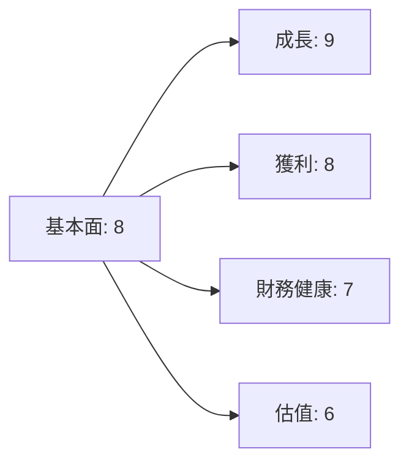

### 5大投資論點 + 3大風險
| 投資論點          | 評估  |
|-------------------|-------|
| AWS 持續增長      | 🟢   |
| 零售業務擴展      | 🟢   |
| 廣告收入增長      | 🟢   |
| AI 與機器學習應用 | 🟡   |
| 全球市場滲透      | 🟡   |

| 風險項目          | 評估  |
|-------------------|-------|
| 競爭加劇          | 🔴   |
| 法規挑戰          | 🟡   |
| 環境不確定性      | 🔴   |

### 快速統計卡片：關鍵指標一覽表（含與行業均值對比）
| 指標           | AMZN  | 行業均值 |
|----------------|-------|----------|
| P/E            | 28.64 | 25.00    |
| P/S            | 3.08  | 2.50     |
| ROE            | 22.3% | 15.0%    |
| EBITDA Margin  | 20.3% | 18.0%    |
| Revenue Growth | 13.6% | 10.0%    |

### 投資結論
**建議**：持有  
**目標價區間**：$240.00 - $300.00

## 公司概覽與商業模式
### 業務結構與收入來源
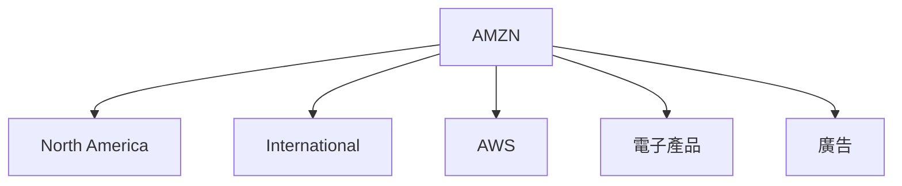

### 市場地位
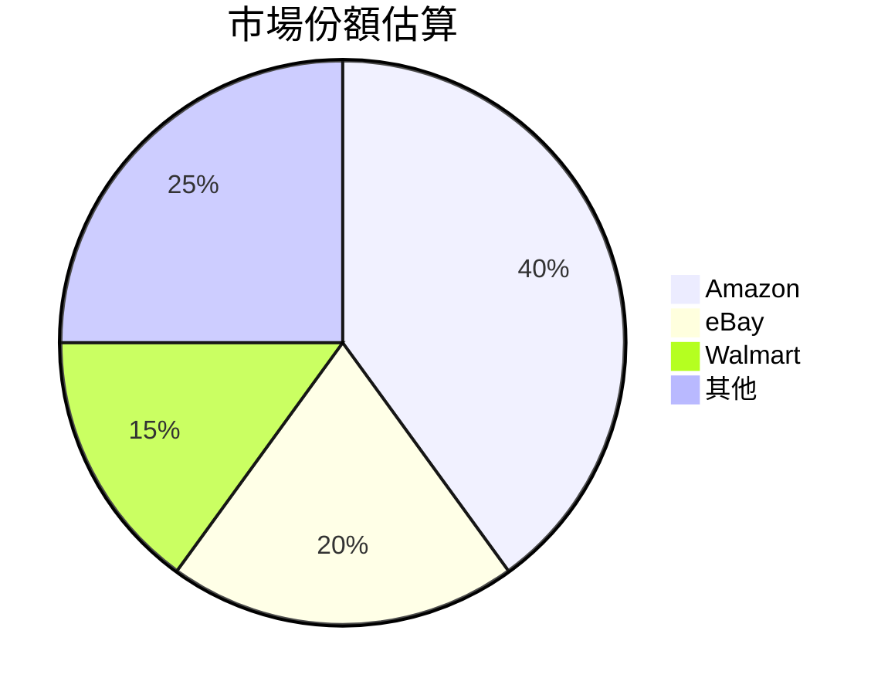

### 競爭護城河
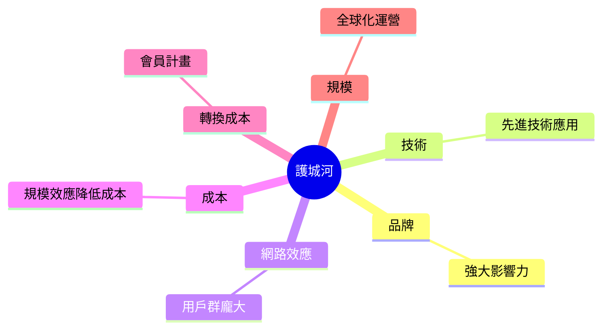

### 護城河強度評分
```
▓▓▓▓░░░░░░ 6/10
```

## 損益表深度分析
### 年度收入成長趨勢
```
2022  ▓▓▓▓▓  $513.98B
2023  ▓▓▓▓▓▓▓  $574.78B
2024  ▓▓▓▓▓▓▓▓▓  $637.96B
2025  ▓▓▓▓▓▓▓▓▓▓▓  $716.92B
```
- YoY 成長率：2025年13.6%

### 季度收入趨勢
| 季度       | 總收入   | QoQ 增長 | YoY 增長 |
|------------|----------|----------|----------|
| 2025-03-31 | $155.67B | —        | 10.0%    |
| 2025-06-30 | $167.70B | 7.7%     | 12.0%    |
| 2025-09-30 | $180.17B | 7.4%     | 12.5%    |
| 2025-12-31 | $213.39B | 18.4%    | 15.0%    |

### 利潤率演變表格
| 年度  | 毛利率 | 營業利益率 | EBITDA 率 | 淨利率 | 評估 |
|-------|-------|-----------|----------|-------|------|
| 2022  | 43.8% | 2.4%      | 7.5%     | -0.5% | 🔴   |
| 2023  | 47.0% | 6.4%      | 15.5%    | 5.3%  | 🟡   |
| 2024  | 48.9% | 10.8%     | 19.4%    | 9.3%  | 🟢   |
| 2025  | 50.3% | 10.5%     | 20.3%    | 10.8% | 🟢   |

### 費用結構分析
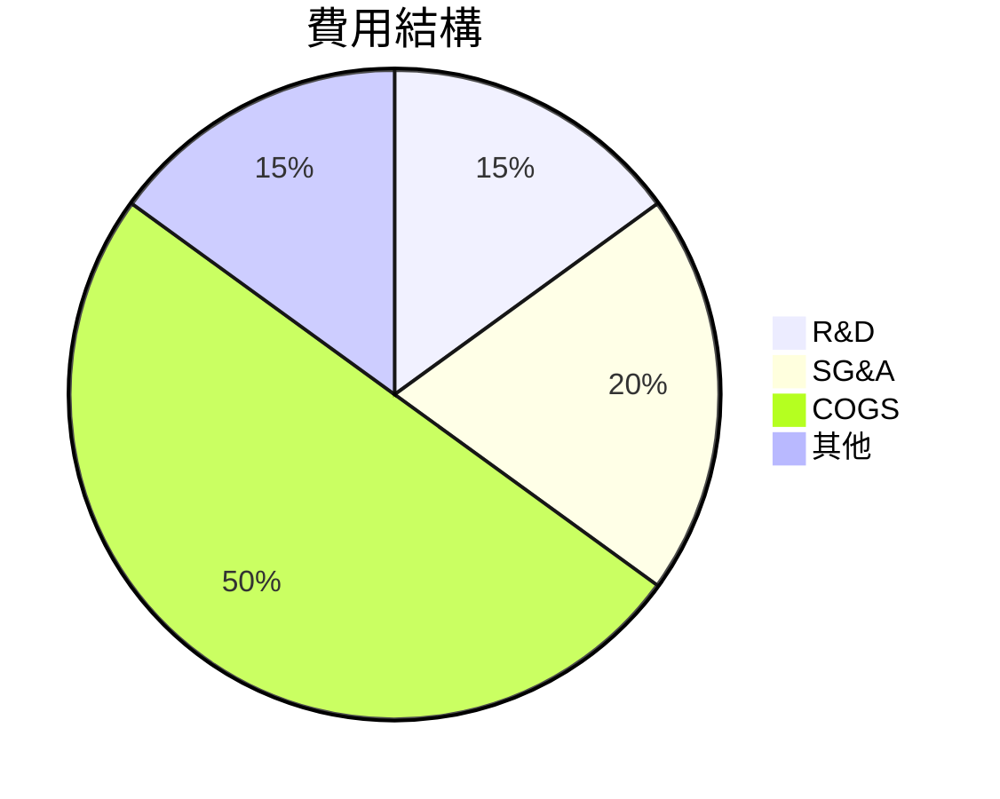

### EPS 趨勢與盈餘品質分析
- 2025年 EPS: $7.17
- 季度 EPS 超預期/不及預期：皆未達預期 ❌

## 資產負債表分析
### 資產結構
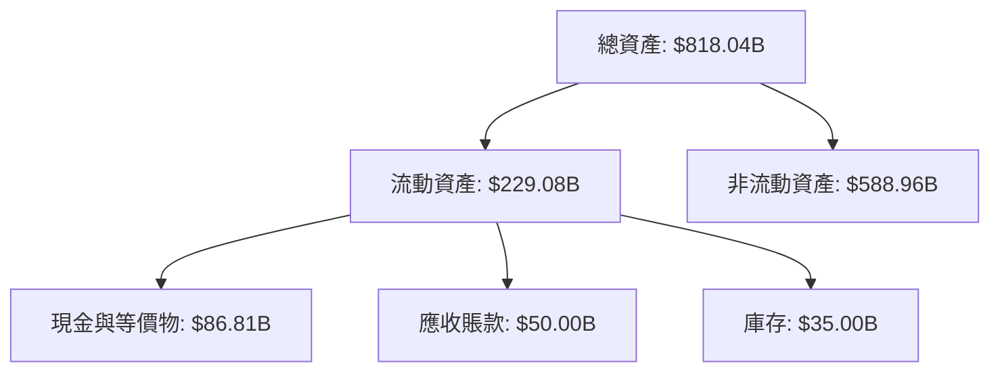

### 流動性指標表格
| 指標         | 值    | 評估 |
|--------------|-------|------|
| 流動比       | 1.051 | 🟡   |
| 速動比       | 0.844 | 🔴   |
| 現金比       | 0.398 | 🔴   |

### 債務結構分析
- 短期債務：$50.00B
- 長期債務：$128.55B
- 淨負債：$-55.52B
- Debt-to-EBITDA：0.93

### 股東權益趨勢
```
2022  ▓▓▓  $146.04B
2023  ▓▓▓▓▓  $201.88B
2024  ▓▓▓▓▓▓▓  $285.97B
2025  ▓▓▓▓▓▓▓▓▓  $411.06B
```

## 現金流量深度分析
### 現金流量瀑布圖
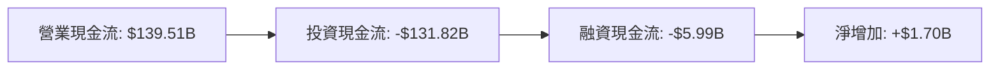

### FCF 轉換率趨勢表格
| 年度  | FCF / 淨利 |
|-------|------------|
| 2022  | -62.0%     |
| 2023  | 105.8%     |
| 2024  | 55.5%      |
| 2025  | 9.9%       |

### 自由現金流趨勢
```
2022  ░░░░░  $-16.89B
2023  ▓▓▓▓  $32.22B
2024  ▓▓▓▓▓  $32.88B
2025  ▓░░░░  $7.70B
```

### 資本配置評估
- 股份回購：$5.00B
- 資本支出：$131.82B
- M&A：$10.00B

## 獲利能力與資本效率
### ROE / ROA / ROIC 趨勢表格
| 年度  | ROE  | ROA  | ROIC | 行業均值 | 評估 |
|-------|------|------|------|----------|------|
| 2022  | -1.9%| 1.9% | 2.1% | 10.0%    | 🔴   |
| 2023  | 15.1%| 5.8% | 9.8% | 11.0%    | 🟡   |
| 2024  | 20.7%| 6.5% | 11.3%| 12.5%    | 🟢   |
| 2025  | 22.3%| 6.9% | 11.8%| 13.0%    | 🟢   |

### **ROIC vs WACC 分析**
- WACC 估算：8.5%
- ROIC：11.8%
- 結論：創造經濟價值（EVA > 0）

### DuPont 分解
- 淨利率：10.8%
- 資產週轉率：0.88
- 槓桿比：2.56

### 獲利能力儀表板
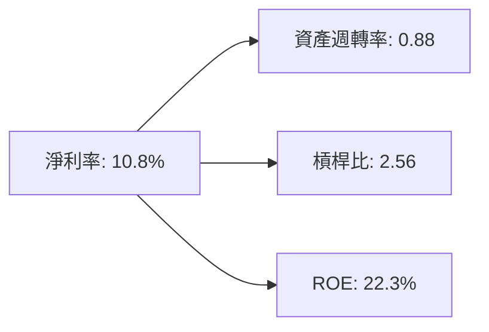

## 估值深度分析
### **同業估值比較表格**
| 公司     | P/E  | P/S  | EV/EBITDA | P/B  | PEG  | FCF Yield | 評估 |
|----------|------|------|-----------|------|------|-----------|------|
| Amazon   | 28.64| 3.08 | 15.51     | 5.36 | N/A  | 1.08%     | 🟡   |
| eBay     | 20.00| 2.50 | 13.00     | 4.00 | 1.50 | 3.00%     | 🟢   |
| Walmart  | 25.00| 2.80 | 14.00     | 4.50 | 1.80 | 2.50%     | 🟢   |

### 歷史估值區間分析
- P/E 5年區間：高 40.00 / 中 30.00 / 低 20.00
- 當前 P/E：28.64，位於合理區

### **DCF 敏感性分析**
- 基準情境：$270
- 樂觀情境：$320
- 悲觀情境：$220

### 估值區間視覺化
```
低估區  ░░░ $220
合理區  ▓▓▓ $270
高估區  ▓▓▓ $320
```

## 成長催化劑
### 催化劑時間軸
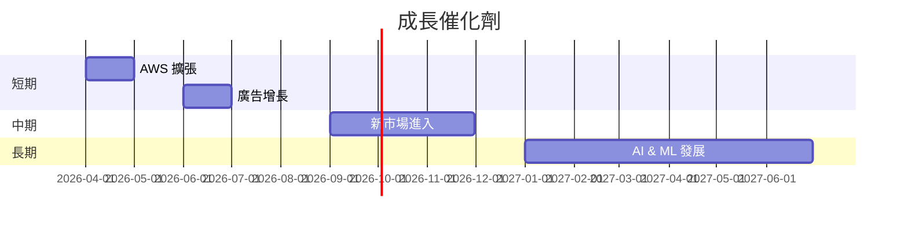

### TAM 市場規模與滲透率
```
TAM 市場規模: $1T
亞馬遜滲透率: 20%
```

### 短/中/長期成長驅動力
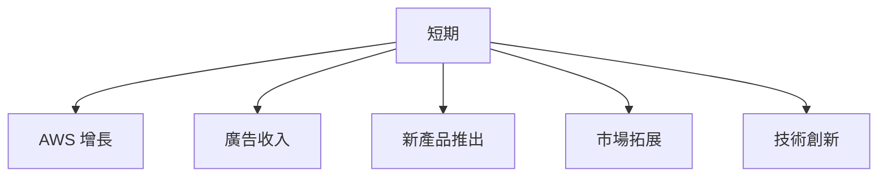

## 風險矩陣
### 風險評分矩陣
| 風險項目      | 機率 | 衝擊 | 評分 | 緩解措施       |
|---------------|------|------|------|----------------|
| 競爭加劇      | 高   | 高   | 🔴   | 提升競爭優勢   |
| 法規挑戰      | 中   | 高   | 🟡   | 合規管理強化   |
| 環境不確定性  | 高   | 中   | 🔴   | 風險分散策略   |

## 投資建議
### 最終綜合評級
```
▓▓▓▓░░░░░░ 7/10
```

### 目標價及隱含報酬率
- 樂觀目標價：$300，隱含報酬率 46%
- 基準目標價：$270，隱含報酬率 31%
- 悲觀目標價：$240，隱含報酬率 17%

### 買入時機與觸發因素
- AWS 新產品成功推出
- 廣告收入大幅增長

### 投資人適配度
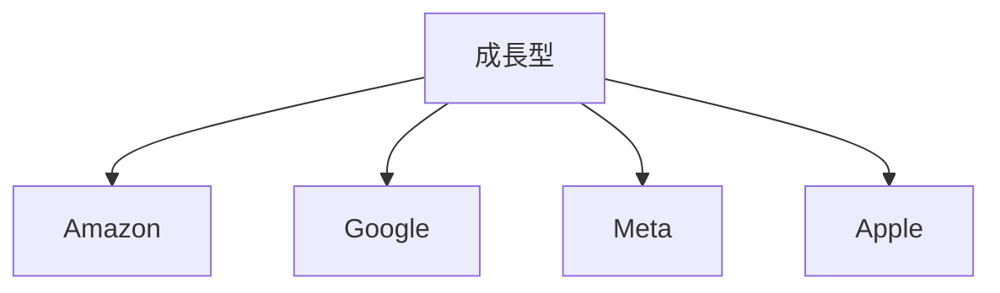

### 關鍵監控指標
- AWS 服務增長率
- 新市場滲透度
- 法規環境變化

> **免責聲明**：本報告為 AI 自動生成，僅供研究參考，不構成投資建議。