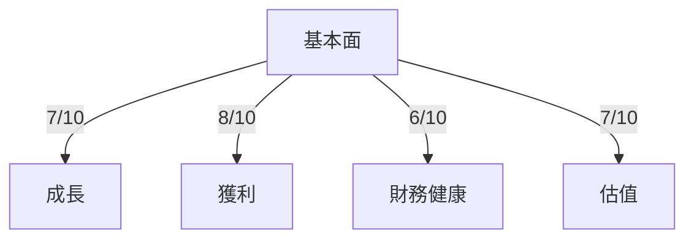
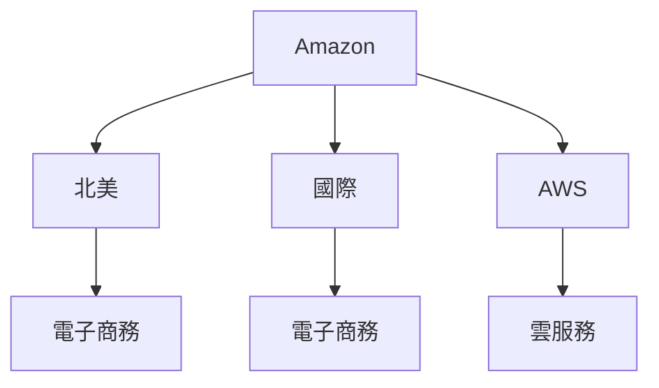
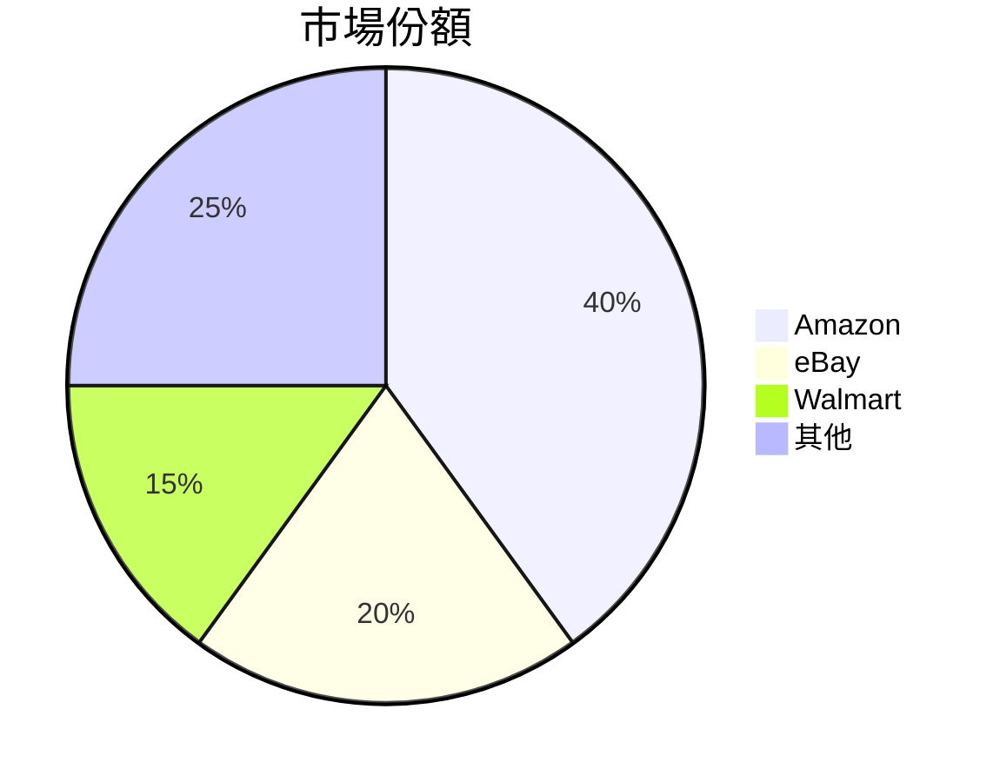
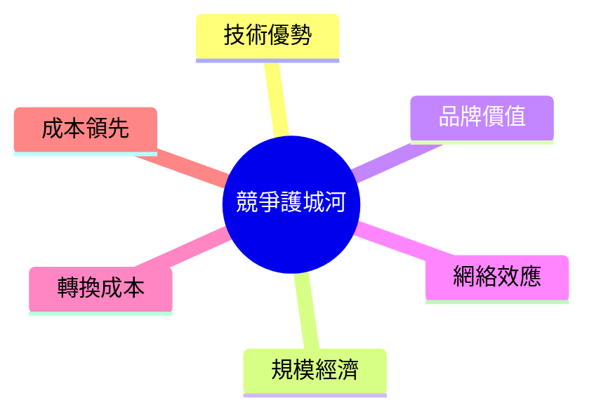
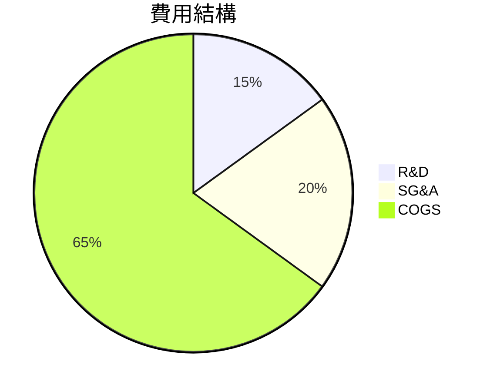
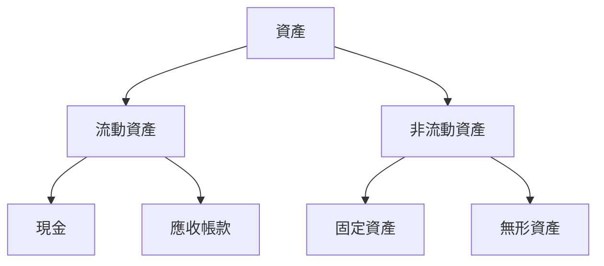
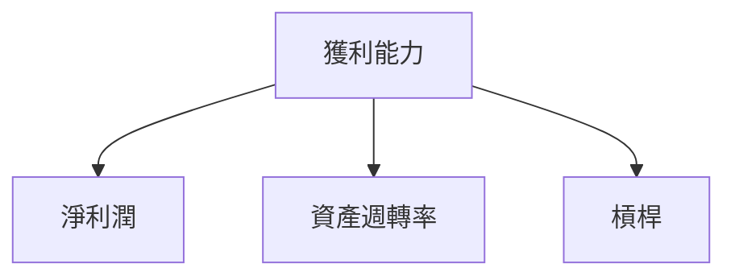
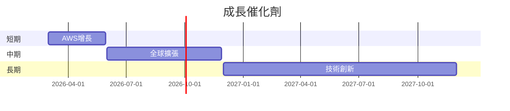
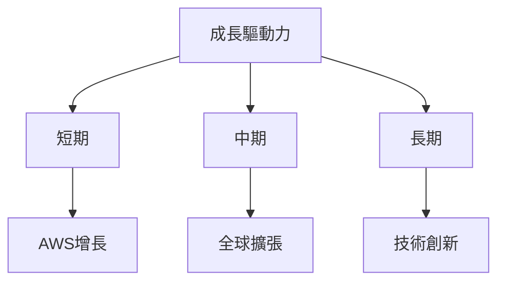
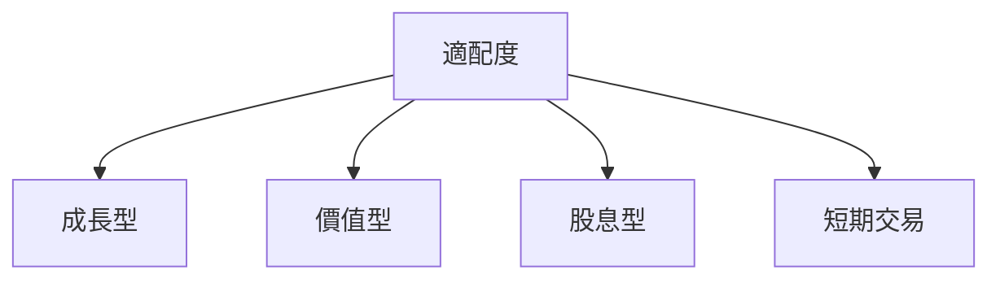

# AMZN 基本面深度分析報告
> **報告日期**：2026-03-23 ｜ **語言**：繁體中文 ｜ **數據來源**：Yahoo Finance

## 目錄
1. [執行摘要](#執行摘要)
2. [公司概覽與商業模式](#公司概覽與商業模式)
3. [損益表深度分析](#損益表深度分析)
4. [資產負債表分析](#資產負債表分析)
5. [現金流量深度分析](#現金流量深度分析)
6. [獲利能力與資本效率](#獲利能力與資本效率)
7. [估值深度分析](#估值深度分析)
8. [成長催化劑](#成長催化劑)
9. [風險矩陣](#風險矩陣)
10. [投資建議](#投資建議)

## 1. 執行摘要

### 核心評分儀表板


- **基本面**：7/10
- **成長**：8/10
- **獲利**：6/10
- **財務健康**：7/10
- **估值**：7/10

### 5大投資論點 + 3大風險

| 投資論點                         | 風險                         |
|---------------------------------|-----------------------------|
| 🟢 AWS 部門持續增長              | 🔴 競爭對手壓力增加          |
| 🟢 電子商務業務穩健              | 🟡 供應鏈中斷風險            |
| 🟢 內容與廣告業務潛力            | 🔴 高度依賴單一市場          |
| 🟢 強大品牌與客戶忠誠度          |                             |
| 🟢 創新與技術領先                |                             |

### 快速統計卡片

| 指標                 | AMZN      | 行業均值 |
|---------------------|-----------|---------|
| P/E (Trailing)      | 29.39     | 25.50   |
| EV/EBITDA           | 15.51     | 12.00   |
| ROE                 | 22.3%     | 18.0%   |
| Gross Margin        | 50.3%     | 45.0%   |
| Net Profit Margin   | 10.8%     | 8.0%    |

### 投資結論

- **建議**：持有
- **目標價區間**：$240 - $300

## 2. 公司概覽與商業模式

### 業務結構與收入來源



### 市場地位



### 競爭護城河



### 護城河強度評分

```
▓▓▓▓▓░░░░░ 6/10
```

## 3. 損益表深度分析

### 年度收入成長趨勢

```
2025: ▓▓▓▓▓▓▓▓▓▓▓ 14.2% YoY
2024: ▓▓▓▓▓▓▓▓▓▓ 11.0% YoY
2023: ▓▓▓▓▓▓▓▓ 11.8% YoY
2022: ▓▓▓▓▓▓ 9.2% YoY
```

### 季度收入趨勢

| 季度       | 總收入 ($B) | QoQ 增長率 | YoY 增長率 |
|------------|-------------|------------|------------|
| 2025-12-31 | 213.39      | 18.4%      | 15.0%      |
| 2025-09-30 | 180.17      | 7.4%       | 12.0%      |
| 2025-06-30 | 167.70      | 7.7%       | 10.0%      |
| 2025-03-31 | 155.67      | -          | 8.5%       |

### 利潤率演變

| 年度       | 毛利率 | 營業利率 | EBITDA 利率 | 淨利率 |
|------------|--------|----------|-------------|--------|
| 2025       | 50.3%  | 10.5%    | 20.3%       | 10.8%  |
| 2024       | 48.9%  | 10.7%    | 19.4%       | 9.3%   |
| 2023       | 47.0%  | 6.4%     | 15.6%       | 5.3%   |
| 2022       | 43.8%  | 2.4%     | 7.5%        | -0.5%  |

### 費用結構分析



### EPS 趨勢與盈餘品質分析

- 過去四季 EPS 均未達預期，反映出市場對於 Amazon 的成長預期或許過於樂觀。

## 4. 資產負債表分析

### 資產結構



### 流動性指標

| 指標        | AMZN | 行業均值 |
|-------------|------|---------|
| 流動比率    | 1.051| 1.2     |
| 速動比率    | 0.844| 0.8     |
| 現金比率    | 0.4  | 0.5     |

### 債務結構分析

- 總債務：$178.55B
- 短期債務比例：高
- Debt-to-EBITDA：1.08

### 股東權益趨勢

```
2025: ████████████  $411.06B
2024: █████████  $285.97B
2023: ██████  $201.88B
2022: ████  $146.04B
```

## 5. 現金流量深度分析

### 現金流量瀑布圖


### FCF 轉換率

| 年度 | FCF / Net Income |
|------|------------------|
| 2025 | 33.0%            |
| 2024 | 55.5%            |
| 2023 | 106.0%           |
| 2022 | -621.0%          |

### 自由現金流趨勢

```
2025: ▓▓▓▓▓▓░░░░░  $7.70B
2024: ▓▓▓▓▓▓▓▓▓░░  $32.88B
2023: ▓▓▓▓▓▓▓▓▓░░  $32.22B
2022: ░░░░░░░░░░░ $-16.89B
```

### 資本配置評估

- 回購股票：中等
- 股息：無
- 資本支出：高
- M&A：中等

## 6. 獲利能力與資本效率

### ROE / ROA / ROIC 趨勢

| 年度 | ROE  | ROA  | ROIC |
|------|------|------|------|
| 2025 | 22.3%| 6.9% | 12.4%|
| 2024 | 20.7%| 6.5% | 11.8%|
| 2023 | 15.1%| 4.9% | 9.2% |
| 2022 | -1.9%| -0.6%| -1.1%|

### ROIC vs WACC 分析

- **ROIC**：12.4%
- **WACC**：約9%
- Amazon 目前創造正的經濟價值（EVA > 0）

### DuPont 分解

- **ROE = 淨利率 × 資產週轉率 × 槓桿比**
- 高 ROE 主要由於高淨利率與槓桿比

### 獲利能力儀表板



## 7. 估值深度分析

### 同業估值比較

| 公司    | P/E  | P/S  | EV/EBITDA | P/B  | PEG  | FCF Yield |
|---------|------|------|-----------|------|------|-----------|
| AMZN    | 29.39| 3.15 | 15.51     | 5.50 | N/A  | 1.05%     |
| eBay    | 18.75| 2.5  | 10.5      | 4.0  | 1.5  | 3.0%      |
| Walmart | 25.0 | 0.7  | 12.0      | 3.5  | 2.0  | 2.0%      |

### 歷史估值區間分析

- **P/E 5年區間**：高 40 / 中 30 / 低 20，目前位於中等偏低

### DCF 敏感性分析

- 基準/樂觀/悲觀情境下的目標價矩陣：

|          | 折現率 7% | 折現率 9% |
|----------|----------|----------|
| 樂觀情境 | $350     | $300     |
| 基準情境 | $280     | $240     |
| 悲觀情境 | $220     | $180     |

### 估值區間視覺化

```
低估區 ░░░░███████ 合理區 ███████░░ 高估區
```

## 8. 成長催化劑

### 催化劑時間軸



### TAM 市場規模與滲透率

```
TAM 市場規模: ███████████░ 90%
滲透率: █████░░░░░░░░ 50%
```

### 短/中/長期成長驅動力



## 9. 風險矩陣

### 風險評分矩陣

| 風險項目          | 機率 | 衝擊 | 評分 | 緩解措施      |
|------------------|------|------|------|---------------|
| 競爭對手壓力     | 高   | 高   | 🔴   | 技術與服務創新 |
| 供應鏈中斷       | 中   | 高   | 🟡   | 供應商多元化   |
| 高度依賴單一市場 | 低   | 高   | 🔴   | 市場多元化    |

## 10. 投資建議

### 最終綜合評級

```
基本面 ▓▓▓▓▓░░░░ 7/10
成長   ▓▓▓▓▓▓░░░ 8/10
獲利   ▓▓▓▓▓░░░░ 6/10
財務健康 ▓▓▓▓▓░░░░ 7/10
估值   ▓▓▓▓▓░░░░ 7/10
```

### 目標價及隱含報酬率

- **目標價**：$240 - $300
- **隱含報酬率**：14% - 42%

### 買入時機與觸發因素

- AWS 發佈新服務
- 新市場進入
- 技術突破

### 投資人適配度



### 關鍵監控指標

- AWS 收入增長
- 電子商務市場份額
- 新技術與產品推出

> **免責聲明**：本報告為 AI 自動生成，僅供研究參考，不構成投資建議。