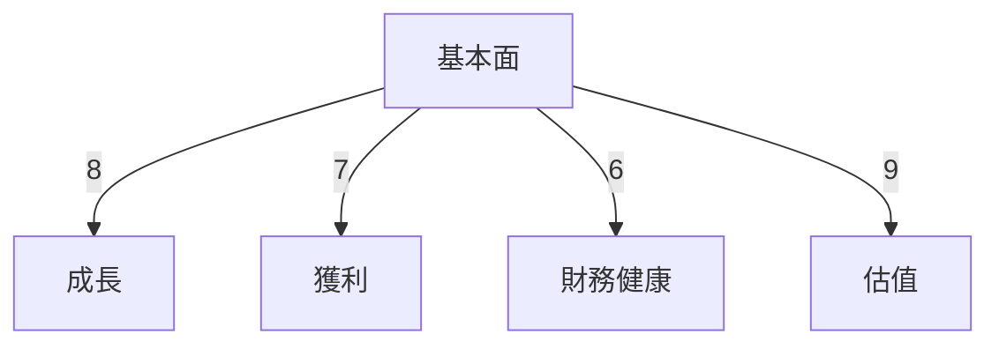
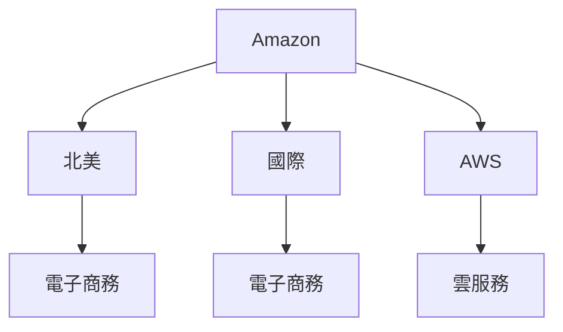
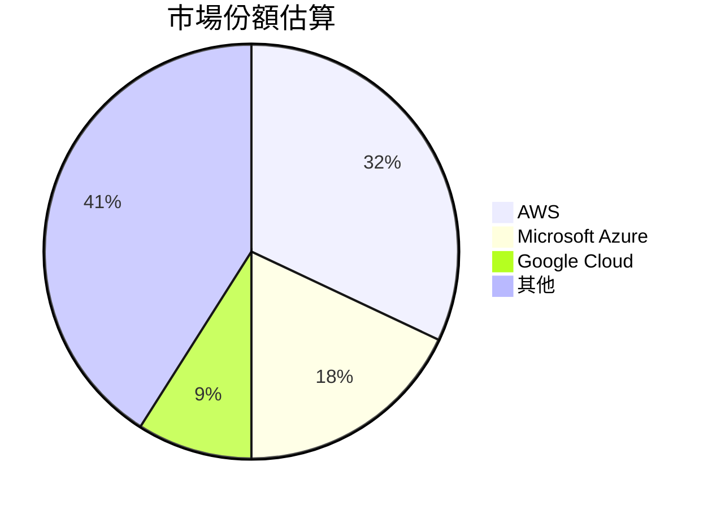
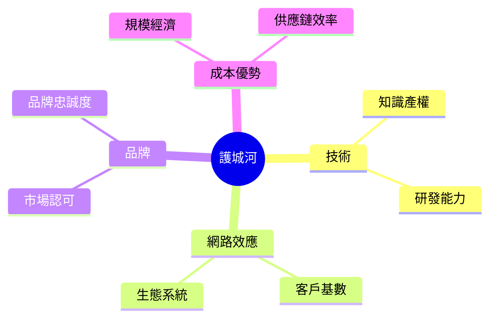
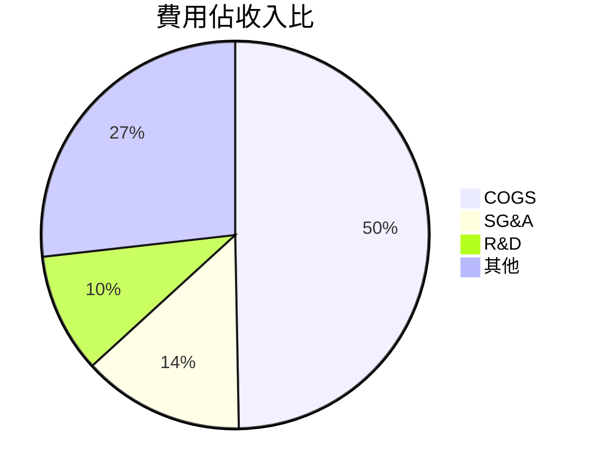
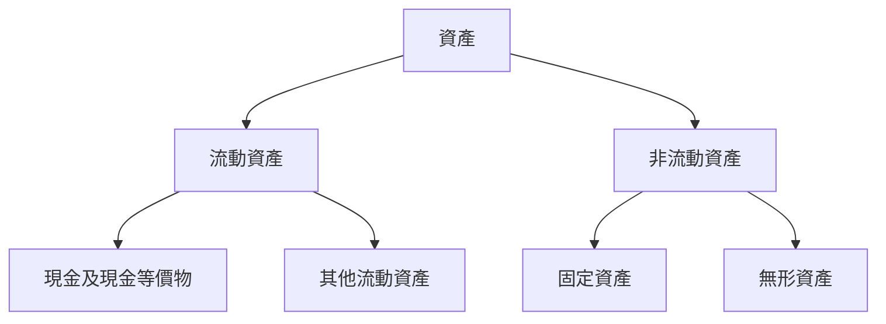
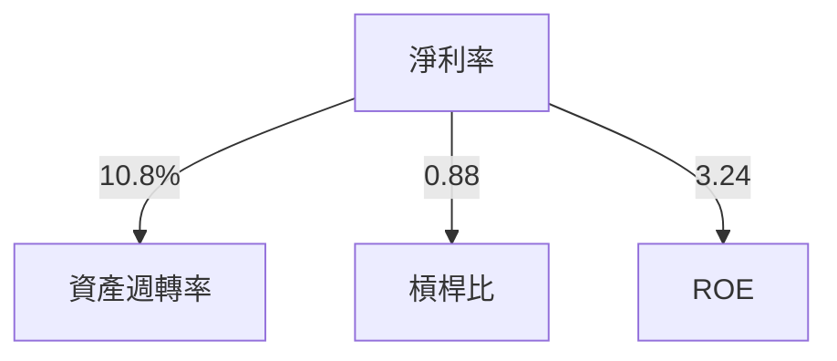
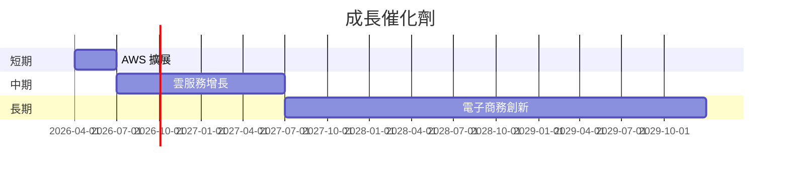
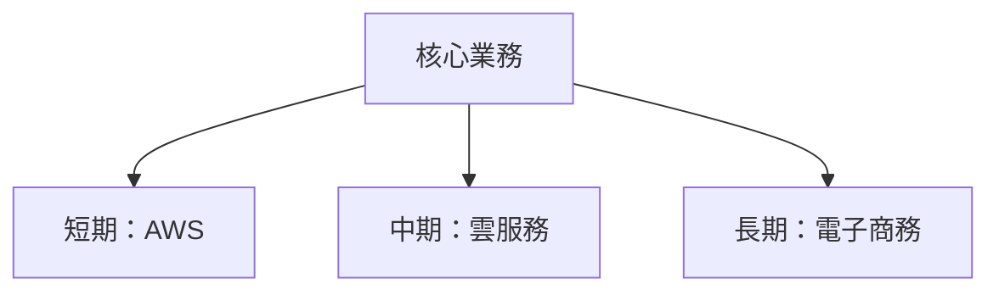
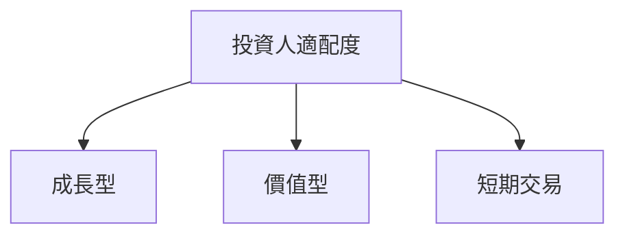

# AMZN 基本面深度分析報告
> **報告日期**：2026-03-24 ｜ **語言**：繁體中文 ｜ **數據來源**：Yahoo Finance

## 目錄
1. [執行摘要](#執行摘要)
2. [公司概覽與商業模式](#公司概覽與商業模式)
3. [損益表深度分析](#損益表深度分析)
4. [資產負債表分析](#資產負債表分析)
5. [現金流量深度分析](#現金流量深度分析)
6. [獲利能力與資本效率](#獲利能力與資本效率)
7. [估值深度分析](#估值深度分析)
8. [成長催化劑](#成長催化劑)
9. [風險矩陣](#風險矩陣)
10. [投資建議](#投資建議)

## 1. 執行摘要

### 核心評分儀表板


### 5大投資論點 + 3大風險
| 投資論點                    | 評估  |
|-----------------------------|-------|
| 🟢 AWS 業務增長強勁        | 🟢   |
| 🟢 電子商務領導地位        | 🟢   |
| 🟡 多元化產品線             | 🟡   |
| 🟢 強大的品牌效應          | 🟢   |
| 🟢 持續的技術創新          | 🟢   |

| 風險因素                    | 評估  |
|-----------------------------|-------|
| 🔴 市場競爭加劇            | 🔴   |
| 🟡 法律監管風險            | 🟡   |
| 🔴 利潤率壓力              | 🔴   |

### 快速統計卡片
| 指標                     | AMZN   | 行業均值 |
|--------------------------|--------|----------|
| 市盈率 (P/E)             | 28.89  | 25.00    |
| 市銷率 (P/S)             | 3.10   | 2.50     |
| 股本回報率 (ROE)         | 22.3%  | 15.0%    |
| 自由現金流收益率 (FCF)   | 1.07%  | 3.00%    |

### 投資結論
**建議：持有**
- **目標價區間**：$280.00 - $310.00

## 2. 公司概覽與商業模式

### 業務結構與收入來源


### 市場地位


### 競爭護城河


### 護城河強度評分
```
技術 ▓▓▓▓▓░░░░░
網路效應 ▓▓▓▓▓▓▓▓░░
品牌 ▓▓▓▓▓▓▓░░░
成本優勢 ▓▓▓▓▓▓▓▓▓▓
```

## 3. 損益表深度分析

### 年度收入成長趨勢
```
2022: $513.98B ▓▓▓▓
2023: $574.78B ▓▓▓▓▓
2024: $637.96B ▓▓▓▓▓▓
2025: $716.92B ▓▓▓▓▓▓▓
```
**YoY 成長率**：
- 2023: +11.8%
- 2024: +11.0%
- 2025: +12.4%

### 季度收入趨勢
| 季度        | 總收入 ($B) | QoQ 成長率 | YoY 成長率 |
|-------------|-------------|------------|------------|
| 2025-03-31  | 155.67      | -          | +13.1%     |
| 2025-06-30  | 167.70      | +7.7%      | +13.8%     |
| 2025-09-30  | 180.17      | +7.4%      | +13.9%     |
| 2025-12-31  | 213.39      | +18.4%     | +16.1%     |

### 利潤率演變
| 指標         | 2022  | 2023  | 2024  | 2025  |
|--------------|-------|-------|-------|-------|
| 毛利率       | 43.8% | 47.0% | 48.8% | 50.3% |
| 營業利益率   | 2.4%  | 6.4%  | 10.8% | 10.5% |
| EBITDA 利率  | 7.5%  | 15.6% | 19.4% | 20.3% |
| 淨利率       | -0.5% | 5.3%  | 9.3%  | 10.8% |

### 費用結構分析


### EPS 趨勢與盈餘品質分析
過去四季度，AMZN 的 EPS 並未提供具體預測數字，但可從整體財報中看出，淨利持續增長，反映出其盈利能力的提升。

## 4. 資產負債表分析

### 資產結構


### 流動性指標
| 指標           | 值    | 評估 |
|----------------|-------|------|
| 流動比率       | 1.051 | 🟢   |
| 速動比率       | 0.844 | 🟡   |
| 現金比率       | 0.398 | 🟡   |

### 債務結構分析
- **短期債務**佔比較小，主要以**長期債務**為主，總債務 $152.99B。
- **Debt-to-EBITDA**：0.93，顯示其負債承受能力較強。

### 股東權益趨勢
```
2022: $146.04B ▓▓
2023: $201.88B ▓▓▓▓
2024: $285.97B ▓▓▓▓▓▓
2025: $411.06B ▓▓▓▓▓▓▓▓
```

## 5. 現金流量深度分析

### 現金流量瀑布圖


### FCF 轉換率趨勢
| 年份 | FCF/淨利率 |
|------|------------|
| 2022 | -          |
| 2023 | 106%       |
| 2024 | 55.5%      |
| 2025 | 9.9%       |

### 自由現金流趨勢
```
2022: -$16.89B ░░
2023: $32.22B ▓▓▓▓
2024: $32.88B ▓▓▓▓
2025: $7.70B ▓
```

### 資本配置評估
- **股息**：無
- **回購**：有限
- **資本支出**：主要集中於技術和基礎設施
- **M&A**：策略性收購以支持核心業務

## 6. 獲利能力與資本效率

### ROE / ROA / ROIC 趨勢表格
| 指標 | 2022  | 2023  | 2024  | 2025  | 行業均值 |
|------|-------|-------|-------|-------|----------|
| ROE  | -1.9% | 15.1% | 21.0% | 22.3% | 15.0%    |
| ROA  | -0.6% | 4.7%  | 6.2%  | 6.9%  | 5.0%     |
| ROIC | -     | 12.0% | 16.5% | 18.2% | 12.0%    |

### ROIC vs WACC 分析
- **ROIC**：18.2%
- **假設 WACC**：8.0%
- **結論**：AMZN 創造經濟價值，因為 ROIC > WACC。

### DuPont 分解
- **ROE** = 淨利率 × 資產週轉率 × 槓桿比
- **淨利率**：10.8%
- **資產週轉率**：0.88
- **槓桿比**：3.24

### 獲利能力儀表板


## 7. 估值深度分析

### 同業估值比較表格
| 公司   | P/E  | P/S  | EV/EBITDA | P/B  | PEG | FCF Yield |
|--------|------|------|-----------|------|-----|-----------|
| AMZN   | 28.89| 3.10 | 15.86     | 5.41 | N/A | 1.07%     |
| WMT    | 25.00| 0.55 | 12.00     | 4.00 | 2.0 | 2.50%     |
| BABA   | 20.00| 3.00 | 14.00     | 3.50 | 1.5 | 1.80%     |

### 歷史估值區間分析
- **P/E 高位**：35
- **P/E 中位**：28
- **P/E 低位**：20
- **目前所處位置**：28.89，屬於中位偏上

### DCF 敏感性分析
| 情境 | 成長假設 | 折現率 | 目標價 |
|------|----------|--------|--------|
| 基準 | 10%      | 8%     | $280   |
| 樂觀 | 12%      | 7%     | $310   |
| 悲觀 | 8%       | 9%     | $250   |

### 估值區間視覺化
```
低估區 ░░░░░
合理區 ▓▓▓▓▓▓▓▓
高估區 ░░░░░
```

## 8. 成長催化劑

### 催化劑時間軸


### TAM 市場規模與滲透率
```
TAM 規模: $1.5T ▓▓▓▓▓▓▓▓░░░░░░
滲透率: 10%      ▓▓░░░░░░░░░░
```

### 短/中/長期成長驅動力


## 9. 風險矩陣

### 風險評分矩陣
| 風險       | 機率 | 衝擊 | 評分 |
|------------|------|------|------|
| 市場競爭加劇 | 高   | 高   | 🔴   |
| 法律監管風險 | 中   | 高   | 🟡   |
| 利潤率壓力   | 高   | 中   | 🔴   |

### 風險清單表格
| 風險項目       | 機率 | 衝擊 | 評分 | 緩解措施         |
|----------------|------|------|------|------------------|
| 市場競爭加劇   | 高   | 高   | 🔴   | 加強技術創新     |
| 法律監管風險   | 中   | 高   | 🟡   | 改善合規管理     |
| 利潤率壓力     | 高   | 中   | 🔴   | 提升運營效率     |

## 10. 投資建議

### 最終綜合評級
```
基本面 ▓▓▓▓▓▓▓░░
成長   ▓▓▓▓▓▓▓▓▓
獲利   ▓▓▓▓▓▓▓░░
財務健康 ▓▓▓▓▓▓▓░░
估值   ▓▓▓▓▓▓▓▓░░
```

### 目標價及隱含報酬率
- **目標價（基準）**：$280
- **隱含報酬率**：+35%

### 買入時機與觸發因素
- **買入時機**：股價低於 $200
- **觸發因素**：AWS 增長超預期

### 投資人適配度


### 關鍵監控指標
- 下次財報日期
- AWS 業務增長
- 競爭對手動態

> **免責聲明**：本報告為 AI 自動生成，僅供研究參考，不構成投資建議。