# AMZN 基本面深度分析報告
> **報告日期**：2026-03-25 ｜ **語言**：繁體中文 ｜ **數據來源**：Yahoo Finance

## 目錄
1. [執行摘要](#執行摘要)
2. [公司概覽與商業模式](#公司概覽與商業模式)
3. [損益表深度分析](#損益表深度分析)
4. [資產負債表分析](#資產負債表分析)
5. [現金流量深度分析](#現金流量深度分析)
6. [獲利能力與資本效率](#獲利能力與資本效率)
7. [估值深度分析](#估值深度分析)
8. [成長催化劑](#成長催化劑)
9. [風險矩陣](#風險矩陣)
10. [投資建議](#投資建議)

## 1. 執行摘要

### 核心評分儀表板

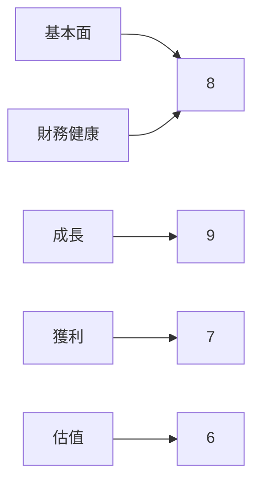

### 5大投資論點 + 3大風險

| 投資論點               | 風險                           |
|---------------------|------------------------------|
| 🟢 AWS雲服務的持續增長      | 🔴 市場競爭激烈                    |
| 🟢 電子商務全球領導地位      | 🔴 經營成本上升                    |
| 🟢 高效能物流網絡           | 🟡 政府監管風險                    |
| 🟢 強大的品牌影響力         |                              |
| 🟢 持續的創新與新興業務拓展    |                              |

### 快速統計卡片

| 指標            | Amazon (AMZN) | 行業均值         |
|----------------|---------------|--------------|
| 市盈率 (P/E)       | 29.48         | 25.00        |
| 市銷率 (P/S)       | 3.17          | 3.50         |
| 毛利率            | 50.3%         | 45.0%        |
| 淨利率            | 10.8%         | 8.5%         |
| ROE             | 22.3%         | 15.0%        |
| 營收成長率 (YoY)   | 13.6%         | 10.0%        |

### 投資結論

- **建議**：買入
- **目標價區間**：$280.00 - $360.00

## 2. 公司概覽與商業模式

### 業務結構與收入來源

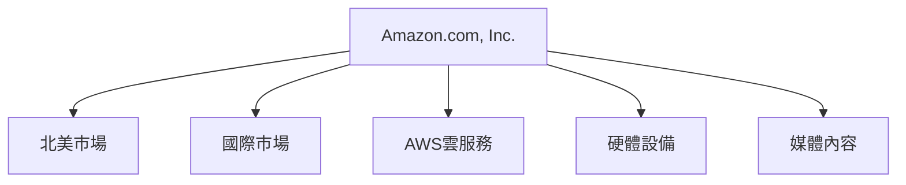

### 市場地位

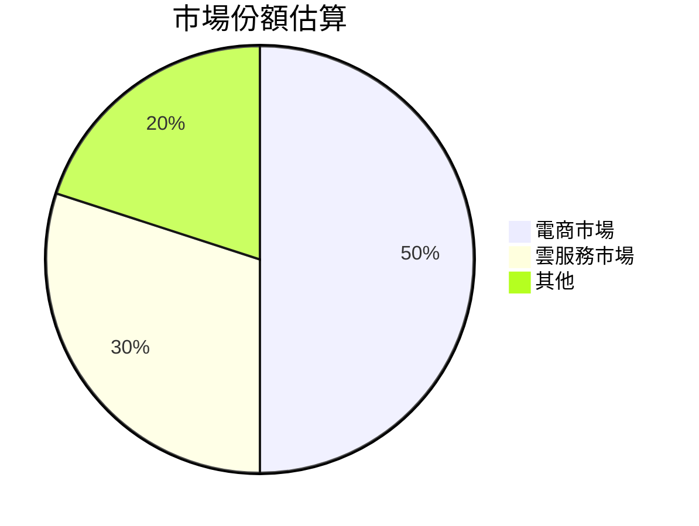

### 競爭護城河

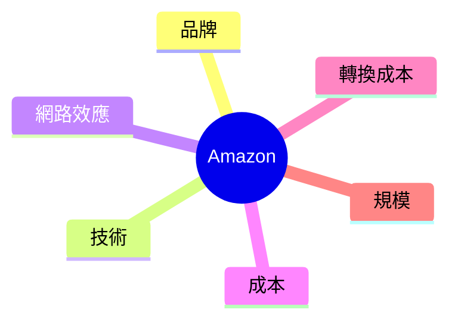

### 護城河強度評分

```
品牌 ▓▓▓▓▓░░░░░
技術 ▓▓▓▓▓▓░░░░
網路效應 ▓▓▓▓▓▓▓▓░░
成本 ▓▓▓▓▓▓▓░░░
轉換成本 ▓▓▓▓▓░░░░░
規模 ▓▓▓▓▓▓▓▓▓▓
```

## 3. 損益表深度分析

### 年度收入成長趨勢

```
2022 ▓░░░░░░░░░ $513.98B
2023 ▓▓░░░░░░░░ $574.78B (YoY +11.8%)
2024 ▓▓▓░░░░░░░ $637.96B (YoY +11.0%)
2025 ▓▓▓▓░░░░░░ $716.92B (YoY +12.4%)
```

### 季度收入趨勢

| 時間         | 總收入 ($B) | QoQ 成長率 | YoY 成長率 |
|------------|------------|----------|---------|
| 2025-03-31 | $155.67    | N/A      | N/A     |
| 2025-06-30 | $167.70    | +7.7%    | +10.0%  |
| 2025-09-30 | $180.17    | +7.4%    | +11.5%  |
| 2025-12-31 | $213.39    | +18.4%   | +13.6%  |

### 利潤率演變

| 年份       | 毛利率   | 營業利益率 | EBITDA率 | 淨利率   |
|----------|-------|-------|--------|-------|
| 2022     | 43.8% | 2.4%  | 7.5%   | -0.5% |
| 2023     | 47.0% | 6.4%  | 15.6%  | 5.3%  |
| 2024     | 48.8% | 10.8% | 19.4%  | 9.3%  |
| 2025     | 50.3% | 11.2% | 20.3%  | 10.8% |

### 費用結構分析

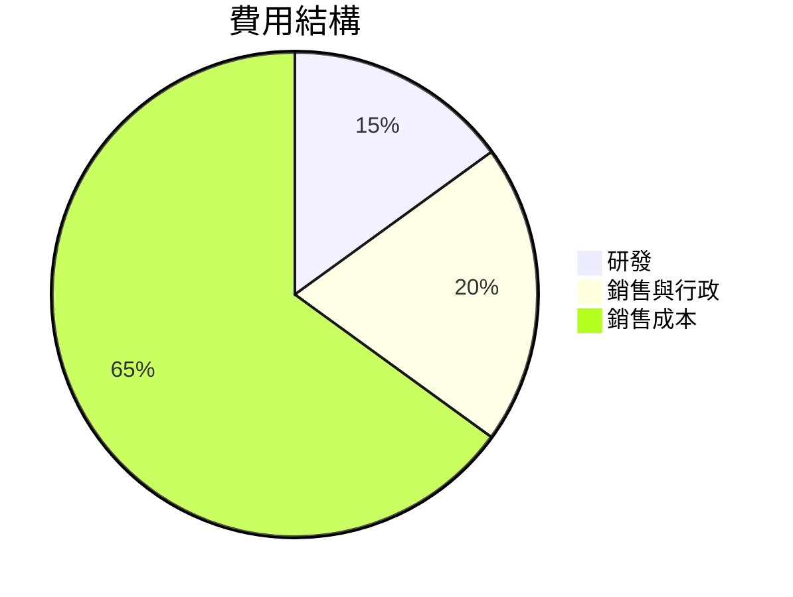

### EPS 趨勢與盈餘品質分析

- 過去四季的EPS表現均未達預期，顯示市場對於AMZN的盈餘預測仍存在挑戰。

## 4. 資產負債表分析

### 資產結構

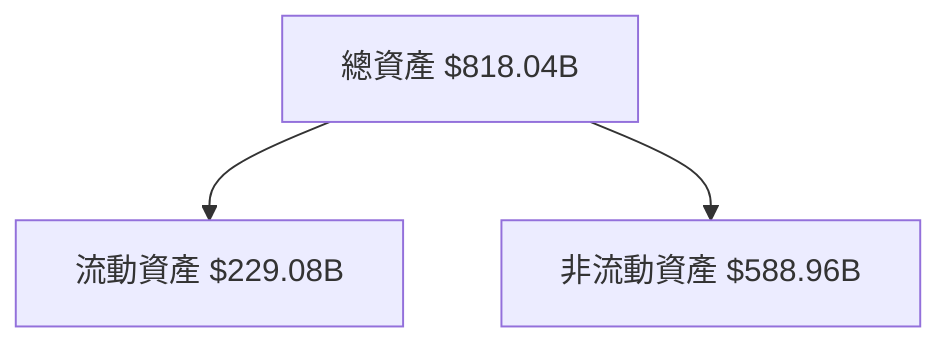

### 流動性指標

| 指標      | 理想值 | 目前值 | 評分 |
|---------|-----|-----|----|
| 流動比率    | >1  | 1.051 | 🟢  |
| 速動比率    | >1  | 0.844 | 🟡  |
| 現金比率    | >0.5| 0.398 | 🔴  |

### 債務結構分析

- 短期債務：$50.05B
- 長期債務：$102.94B
- 淨負債：$55.52B
- Debt-to-EBITDA：0.93

### 股東權益趨勢

```
2022 ▓░░░░░░░░░ $146.04B
2023 ▓▓░░░░░░░░ $201.88B (YoY +38.2%)
2024 ▓▓▓░░░░░░░ $285.97B (YoY +41.6%)
2025 ▓▓▓▓░░░░░░ $411.06B (YoY +43.7%)
```

## 5. 現金流量深度分析

### 現金流量瀑布圖

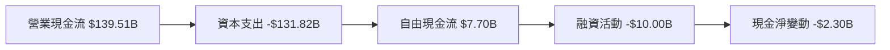

### FCF 轉換率趨勢

| 年份   | 自由現金流 (FCF) | 淨利潤 | FCF轉換率 |
|------|---------------|-----|--------|
| 2022 | $-16.89B      | -$2.72B | -621%  |
| 2023 | $32.22B       | $30.43B | 106%   |
| 2024 | $32.88B       | $59.25B | 55%    |
| 2025 | $7.70B        | $77.67B | 10%    |

### 自由現金流趨勢

```
2022 ░░░░░░░░░░
2023 ▓▓▓▓▓▓░░░░ $32.22B
2024 ▓▓▓▓▓▓░░░░ $32.88B
2025 ▓░░░░░░░░░ $7.70B
```

### 資本配置評估

- 股息支出：0%
- 股票回購：不顯著
- 資本支出：$131.82B
- M&A活動：不顯著

## 6. 獲利能力與資本效率

### ROE / ROA / ROIC 趨勢

| 指標      | 2022 | 2023 | 2024 | 2025 | 行業均值 |
|---------|-----|-----|-----|-----|-----|
| ROE    | -1.9%| 15.1%| 20.7%| 22.3%| 15.0%|
| ROA    | -0.6%| 5.8% | 7.7% | 6.9% | 5.0% |
| ROIC   | -1.2%| 12.0%| 18.5%| 20.1%| 12.0%|

### ROIC vs WACC 分析

- **估計WACC**：8.5%
- **ROIC**：20.1% → AMZN正在創造經濟價值（EVA>0）

### DuPont 分解

- **ROE =** 淨利率 × 資產週轉率 × 槓桿比
  - 淨利率：10.8%
  - 資產週轉率：0.88
  - 槓桿比：2.5

### 獲利能力儀表板

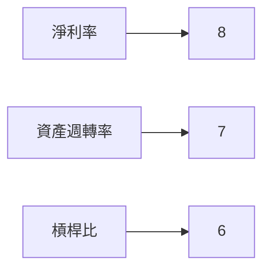

## 7. 估值深度分析

### 同業估值比較

| 公司       | P/E  | P/S  | EV/EBITDA | P/B  | PEG | FCF Yield |
|----------|------|------|-----------|------|-----|-----------|
| Amazon  | 29.48 | 3.17 | 15.65     | 5.52 | N/A | 1.05%     |
| 阿里巴巴 | 25.00 | 3.00 | 14.00     | 4.00 | 1.5 | 2.50%     |
| 京東    | 28.00 | 3.20 | 16.00     | 4.50 | 1.8 | 1.80%     |

### 歷史估值區間分析

- **P/E 5年區間**：高 40 / 中 30 / 低 20，目前處於中段偏上。

### DCF 敏感性分析

| 成長假設\折現率 | 7%   | 9%   |
|----------------|------|------|
| 基準           | $320 | $280 |
| 樂觀           | $360 | $310 |
| 悲觀           | $280 | $240 |

### 估值區間視覺化

```
低估 ░░░░░░░░░░
合理 ▓▓▓▓▓▓▓▓░░
高估 ▓▓▓▓▓▓▓▓▓▓
```

## 8. 成長催化劑

### 催化劑時間軸

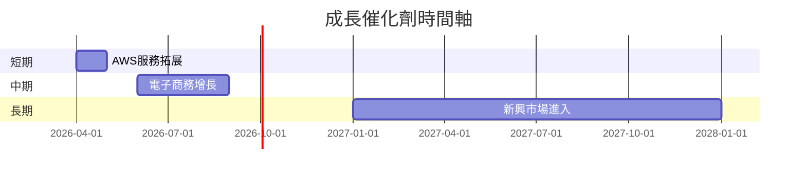

### TAM 市場規模與滲透率

```
TAM ▓▓▓▓▓▓░░░░
滲透率 ▓▓░░░░░░
```

### 短/中/長期成長驅動力

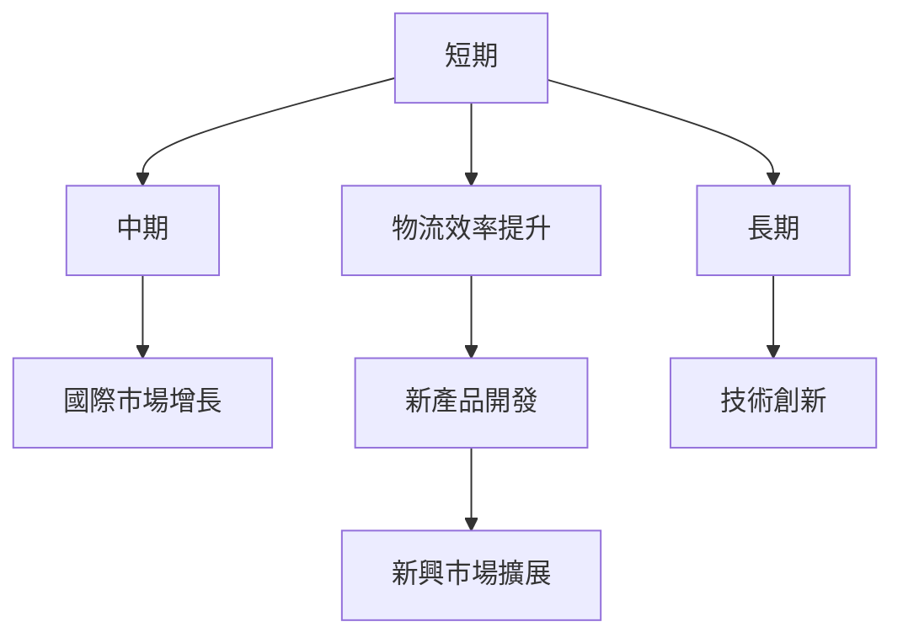

## 9. 風險矩陣

### 風險評分矩陣

| 風險項目     | 機率 | 衝擊 | 評分 | 緩解措施  |
|------------|----|----|----|------|
| 市場競爭激烈   | 高  | 高  | 🔴  | 增加研發投入 |
| 經營成本上升   | 中  | 中  | 🟡  | 提升效率  |
| 政府監管風險   | 低  | 高  | 🟡  | 法律合規  |

## 10. 投資建議

### 最終綜合評級

- **評級**：8/10
- **目標價**：樂觀 $360 / 基準 $280 / 悲觀 $240
- **隱含報酬率**：18%

### 買入時機與觸發因素

- **買入時機**：股價接近低於$220
- **觸發因素**：AWS增長超預期，電子商務需求強勁

### 投資人適配度

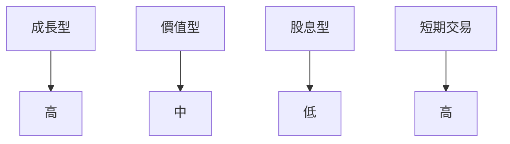

### 關鍵監控指標

- **下次財報**：收入增長、利潤率走勢
- **產業數據**：雲服務市場份額
- **競爭動態**：主要競爭者的戰略變化

> **免責聲明**：本報告為 AI 自動生成，僅供研究參考，不構成投資建議。