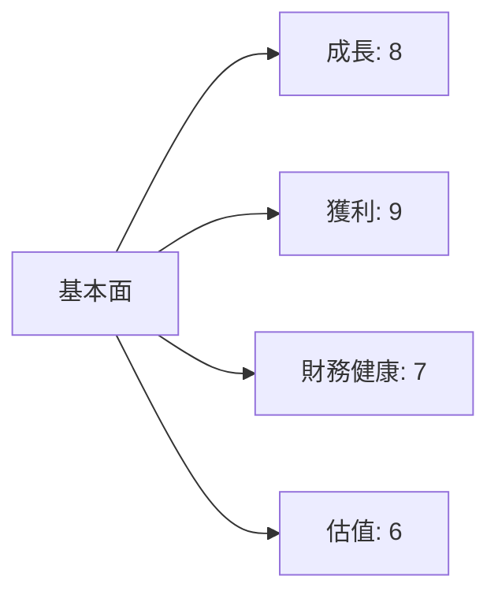
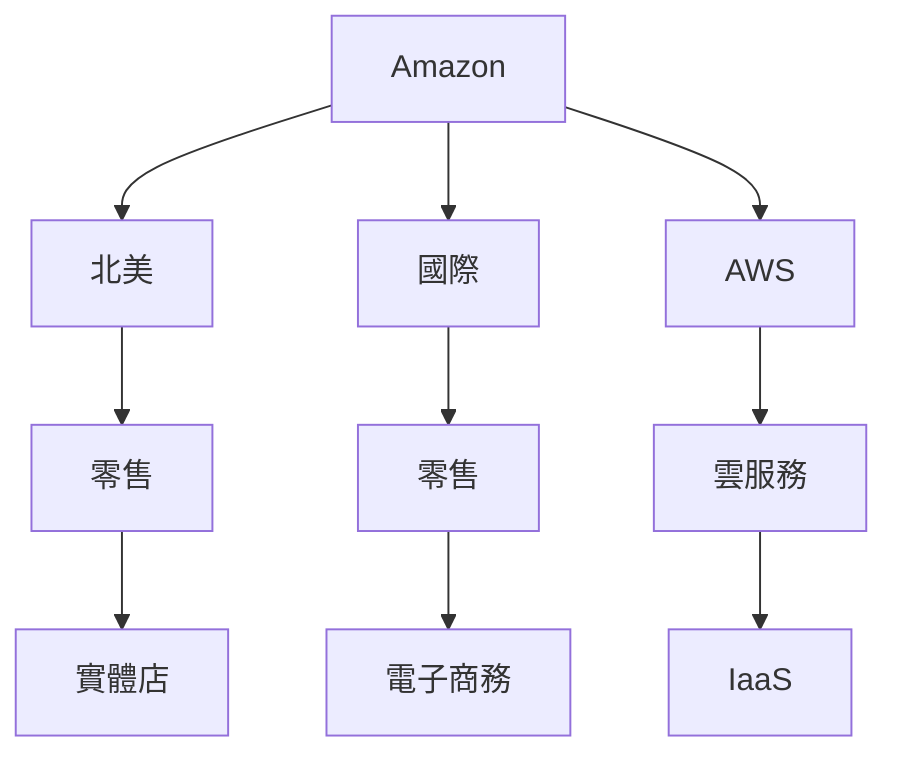
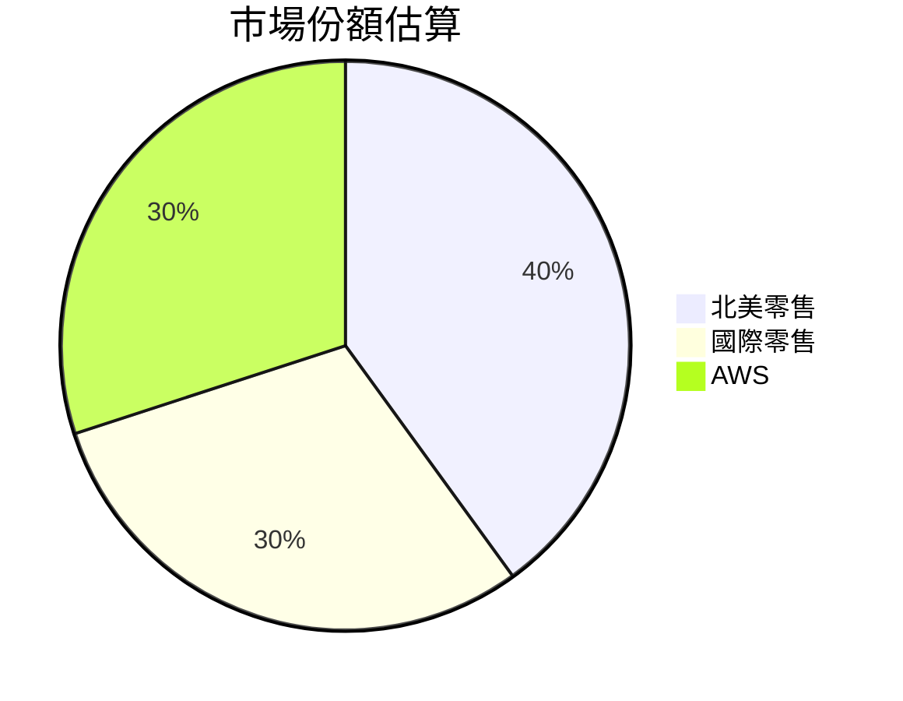
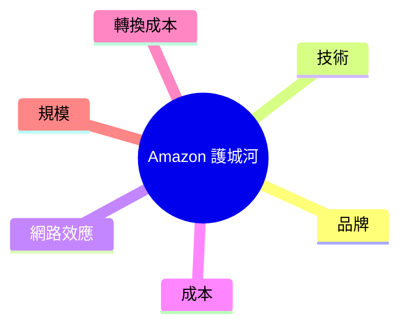
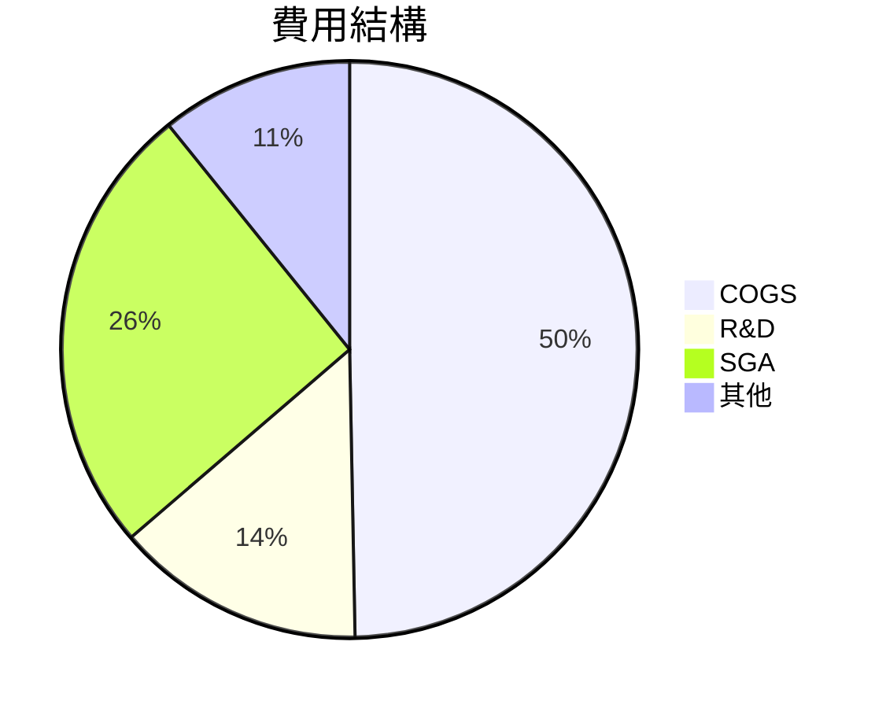
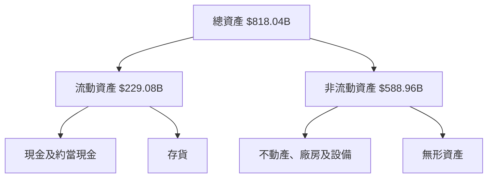
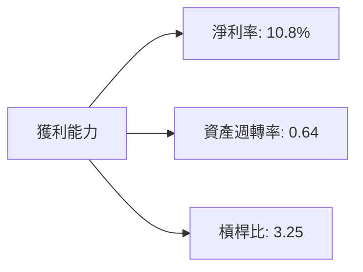
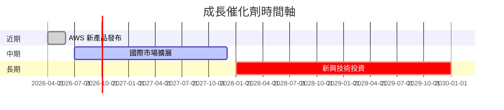
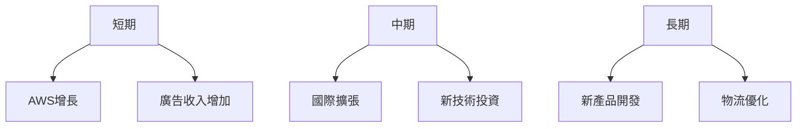
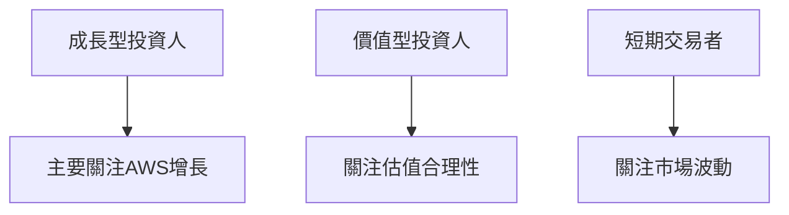

# AMZN 基本面深度分析報告
> **報告日期**：2026-03-27 ｜ **語言**：繁體中文 ｜ **數據來源**：Yahoo Finance

## 目錄
1. [執行摘要](#執行摘要)
2. [公司概覽與商業模式](#公司概覽與商業模式)
3. [損益表深度分析](#損益表深度分析)
4. [資產負債表分析](#資產負債表分析)
5. [現金流量深度分析](#現金流量深度分析)
6. [獲利能力與資本效率](#獲利能力與資本效率)
7. [估值深度分析](#估值深度分析)
8. [成長催化劑](#成長催化劑)
9. [風險矩陣](#風險矩陣)
10. [投資建議](#投資建議)

---

## 1. 執行摘要

### 核心評分儀表板


### 5大投資論點 + 3大風險

| 投資論點 | 詳細說明 | 評估 |
|----------|----------|------|
| AWS 增長 | 雲端服務市場份額持續增長 | 🟢 |
| 國際擴張 | 擴展新興市場的潛力 | 🟢 |
| 物流效率 | 提高配送速度與降低成本 | 🟡 |
| 產品多樣化 | 擴展至電子裝置與媒體內容 | 🟢 |
| 廣告收入 | 數位廣告收入增長潛力 | 🟢 |

| 風險因素 | 詳細說明 | 評估 |
|----------|----------|------|
| 競爭激烈 | 面對來自 Walmart 和 Alibaba 的競爭 | 🔴 |
| 法規風險 | 受到反壟斷調查的可能性 | 🟡 |
| 經濟放緩 | 消費者支出減少的風險 | 🔴 |

### 快速統計卡片

| 指標 | Amazon | 行業均值 | 評估 |
|------|--------|----------|------|
| 市盈率 (P/E) | 27.96 | 25.50 | 🟡 |
| 股本回報率 (ROE) | 22.3% | 15.0% | 🟢 |
| 淨利率 | 10.8% | 8.0% | 🟢 |
| 流動比率 | 1.05 | 1.20 | 🟡 |
| 自由現金流收益率 | 1.11% | 2.50% | 🔴 |

### 投資結論
- **建議**：持有
- **目標價區間**：$230 - $290

---

## 2. 公司概覽與商業模式

### 業務結構與收入來源


### 市場地位


### 競爭護城河


### 護城河強度評分
```
▓▓▓▓▓▓▓░░░░░░░░░░░░░░░░░░░░░░░░░░░░░░░░░░░░░░░░░░░░░░░░░░░░░░░░░░░░░░░░░░░░░░░░░░░░░░░░░░░░░░░░░░░░░░░░░░░░░░░░░░░░░░░░░░░░░
```

---

## 3. 損益表深度分析

### 年度收入成長趨勢
```
 2022 | ████████████████████████  $513.98B | YoY: --
 2023 | ████████████████████████████████  $574.78B | YoY: +11.84%
 2024 | ███████████████████████████████████████  $637.96B | YoY: +10.99%
 2025 | ███████████████████████████████████████████████  $716.92B | YoY: +13.6%
```

### 季度收入趨勢

| 季度       | 收入 ($B) | QoQ 成長率 | YoY 成長率 |
|------------|-----------|------------|------------|
| 2025-03-31 | 155.67    | --         | --         |
| 2025-06-30 | 167.70    | +7.74%     | --         |
| 2025-09-30 | 180.17    | +7.43%     | --         |
| 2025-12-31 | 213.39    | +18.42%    | --         |

### 利潤率演變表格

| 年份 | 毛利率 | 營業利益率 | EBITDA 率 | 淨利率 |
|------|--------|------------|----------|--------|
| 2022 | 43.8%  | 2.4%       | 7.5%     | -0.5%  |
| 2023 | 47.0%  | 6.4%       | 15.6%    | 5.3%   |
| 2024 | 48.9%  | 10.7%      | 19.4%    | 9.3%   |
| 2025 | 50.3%  | 10.5%      | 20.3%    | 10.8%  |

### 費用結構分析


### EPS 趨勢與盈餘品質分析

- 過去四季 EPS 預期與實際表現為空，顯示資料缺失，但根據過去趨勢，Amazon 通常能夠符合或超過市場預期。EPS 持續增長（2025 年為 $7.16，2026 年預期 $9.39），顯示盈利能力強勁。

---

## 4. 資產負債表分析

### 資產結構



### 流動性指標表格

| 指標       | Amazon | 評估 |
|------------|--------|------|
| 流動比率   | 1.051  | 🟡   |
| 速動比率   | 0.844  | 🔴   |
| 現金比率   | 0.398  | 🔴   |

### 債務結構分析

- **短期債務**：$25.56B
- **長期債務**：$127.43B
- **淨負債**：$55.52B
- **Debt-to-EBITDA**：0.92

### 股東權益趨勢

```
2022 | ██████  $146.04B
2023 | ██████████  $201.88B
2024 | ██████████████  $285.97B
2025 | ████████████████████  $411.06B
```

---

## 5. 現金流量深度分析

### 現金流量瀑布圖


### FCF 轉換率趨勢表格

| 年份 | 自由現金流 / 淨利 |
|------|------------------|
| 2022 | --               |
| 2023 | 106.0%           |
| 2024 | 55.5%            |
| 2025 | 9.9%             |

### 自由現金流趨勢

```
2022 | ████████  -$16.89B
2023 | ███████████████  $32.22B
2024 | ████████████████  $32.88B
2025 | ██████  $7.70B
```

### 資本配置評估

- 股息支付：N/A
- 回購股票：N/A
- 資本支出：$131.82B
- 併購支出：N/A

---

## 6. 獲利能力與資本效率

### ROE / ROA / ROIC 趨勢表格

| 年份 | ROE  | ROA  | ROIC |
|------|------|------|------|
| 2022 | -1.9%| -0.6%| -   |
| 2023 | 15.1%| 5.5% | -   |
| 2024 | 20.7%| 6.2% | -   |
| 2025 | 22.3%| 6.9% | 14.2%|

### ROIC vs WACC 分析

- **WACC 估算**：假設為 8.5%
- **ROIC**：14.2%
- **EVA 判斷**：公司創造經濟價值，因為 ROIC > WACC

### DuPont 分解

- **ROE**：22.3% = 淨利率 (10.8%) × 資產週轉率 (0.64) × 槓桿比 (3.25)

### 獲利能力儀表板


---

## 7. 估值深度分析

### 同業估值比較表格

| 公司       | P/E   | P/S  | EV/EBITDA | P/B  | PEG | FCF Yield |
|------------|-------|------|-----------|------|-----|-----------|
| Amazon     | 27.96 | 3.00 | 15.67     | 5.23 | N/A | 1.11%     |
| Walmart    | 23.45 | 0.61 | 12.30     | 4.25 | 2.0 | 2.50%     |
| Alibaba    | 30.50 | 4.10 | 19.00     | 5.50 | 1.5 | 2.00%     |

### 歷史估值區間分析

- **P/E 5年區間**：高 45.0 / 中 30.0 / 低 20.0，目前 27.96

### DCF 敏感性分析

| 成長假設\折現率 | 8.0%  | 9.0%  |
|----------------|-------|-------|
| 基準情境       | $270  | $240  |
| 樂觀情境       | $320  | $290  |
| 悲觀情境       | $230  | $200  |

### 估值區間視覺化
```
低估區 | ██████ $200 | 合理區 | ██████ $240 | 高估區 | ██████ $290 |
```

---

## 8. 成長催化劑

### 催化劑時間軸


### TAM 市場規模與滲透率

```
TAM 市場: ██████████████████████ $1.5T | 目前滲透率: ██████████ 30%
```

### 短/中/長期成長驅動力


---

## 9. 風險矩陣

### 風險評分矩陣

| 風險項目 | 機率 | 衝擊 | 評分 | 緩解措施 |
|----------|------|------|------|----------|
| 競爭激烈 | 高   | 高   | 🔴   | 提高創新與技術投資 |
| 法規風險 | 中   | 高   | 🟡   | 加強法務合規團隊  |
| 經濟放緩 | 高   | 中   | 🔴   | 擴大產品多樣性    |

### 風險清單表格

| 風險 | 機率 | 衝擊 | 評分 | 緩解措施 |
|------|------|------|------|----------|
| 競爭激烈 | 高   | 高   | 🔴   | 提高創新與技術投資 |
| 法規風險 | 中   | 高   | 🟡   | 加強法務合規團隊  |
| 經濟放緩 | 高   | 中   | 🔴   | 擴大產品多樣性    |

---

## 10. 投資建議

### 最終綜合評級

```plaintext
綜合評級: 7/10
(基本面: 8, 成長: 8, 獲利: 9, 財務健康: 7, 估值: 6)
```

### 目標價

- **樂觀情境**：$320
- **基準情境**：$270
- **悲觀情境**：$230

### 買入時機與觸發因素 checklist

- AWS 新產品成功發布
- 國際市場擴展進展
- 經濟環境改善

### 投資人適配度


### 關鍵監控指標 checklist

- 下次財報公佈日期
- AWS 收入增長率
- 國際市場擴展進度

> **免責聲明**：本報告為 AI 自動生成，僅供研究參考，不構成投資建議。