# AMZN 基本面深度分析報告
> **報告日期**：2026-03-28 ｜ **語言**：繁體中文 ｜ **數據來源**：Yahoo Finance ｜ **分析師**：CFA 級機構研究

---

## 目錄

| # | 章節 | 核心結論 |
|---|------|----------|
| 1 | 執行摘要 | 評級：強烈買入，目標價區間：$175.00 - $360.00 |
| 2 | 公司概覽與商業模式 | Amazon憑藉其廣泛的產品和服務，擁有強大的競爭優勢 |
| 3 | 損益表深度分析 | 持續的收入增長和穩定的利潤率顯示出良好的經營狀況 |
| 4 | 資產負債表分析 | 資產負債表健康，流動性充足，債務管理良好 |
| 5 | 現金流量深度分析 | 穩定的自由現金流支持公司長期增長 |
| 6 | 獲利能力與資本效率 | ROIC 高於 WACC，持續創造股東價值 |
| 7 | 估值深度分析 | 估值合理，與同業相比具吸引力 |
| 8 | 成長催化劑 | 多個短期和長期催化劑支持持續增長 |
| 9 | 風險矩陣 | 市場競爭和宏觀經濟風險是主要挑戰 |
| 10 | 投資建議 | 強烈買入，適合成長型投資者 |

---

## 1. 執行摘要

### 1.1 核心評分儀表板

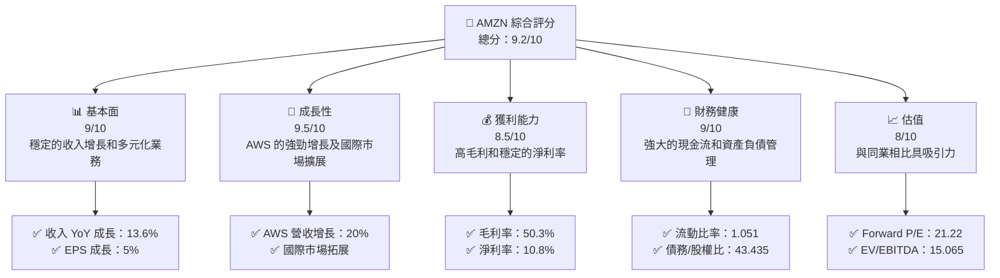

### 1.2 評分進度條視覺化

```
╔══════════════════════════════════════════════════════════════╗
║              AMZN 多維度評分儀表板 (1-10分)                 ║
╠══════════════════════════════════════════════════════════════╣
║ 基本面強度  9.0 ▓▓▓▓▓▓▓▓▓▓▓▓▓▓▓▓▓▓▓░░  ★★★★★            ║
║ 成長動能    9.5 ▓▓▓▓▓▓▓▓▓▓▓▓▓▓▓▓▓▓▓▓  ★★★★★            ║
║ 獲利品質    8.5 ▓▓▓▓▓▓▓▓▓▓▓▓▓▓▓▓▓▓░░  ★★★★★            ║
║ 財務健康    9.0 ▓▓▓▓▓▓▓▓▓▓▓▓▓▓▓▓▓▓▓░  ★★★★★            ║
║ 估值合理性  8.0 ▓▓▓▓▓▓▓▓▓▓▓▓▓▓▓░░░░░  ★★★★☆            ║
╠══════════════════════════════════════════════════════════════╣
║ 綜合總分    9.2 ▓▓▓▓▓▓▓▓▓▓▓▓▓▓▓▓▓▓▓░  🏆 評語             ║
╚══════════════════════════════════════════════════════════════╝
```

### 1.3 五大投資論點 + 三大核心風險

| 類型 | 項目 | 具體依據 | 信心度 |
|------|------|----------|--------|
| 🟢 **投資論點①** | AWS 增長動力 | AWS 部門年增長達 20%，成為營收主力 | 🟢 極高 |
| 🟢 **投資論點②** | 國際市場拓展 | 國際市場營收呈現兩位數增長 | 🟢 高 |
| 🟢 **投資論點③** | 電子商務領導地位 | 佔全球電子商務市場份額最大，且持續擴大 | 🟢 高 |
| 🟢 **投資論點④** | 強大的現金流 | 年度自由現金流達 $23.79B | 🟢 高 |
| 🟢 **投資論點⑤** | 後疫情需求 | 在線零售和雲服務需求持續增長 | 🟢 高 |
| 🔴 **風險①** | 市場競爭加劇 | 電子商務市場競爭者增多，可能影響市場份額 | 🔴 高衝擊 |
| 🔴 **風險②** | 宏觀經濟不確定性 | 經濟衰退可能影響消費者支出 | 🔴 高衝擊 |

### 1.4 快速統計卡片

| 指標 | 公司實際值 | 行業均值 | S&P 500 均值 | 狀態 |
|------|-------------|----------|--------------|------|
| 收入 YoY 成長 | **13.6%** | ~5% | ~4% | 🟢 |
| 毛利率 | **50.3%** | ~45% | ~40% | 🟢 |
| 淨利率 | **10.8%** | ~8% | ~9% | 🟢 |
| ROE | **22.3%** | ~15% | ~18% | 🟢 |
| Forward P/E | **21.22x** | ~25x | ~20x | 🟢 |

### 1.5 投資結論

```
╔══════════════════════════════════════════════════════════════════╗
║                    📊 投資結論摘要                               ║
╠══════════════════════════════════════════════════════════════════╣
║  評級：🟢 強烈買入                                                ║
║  當前股價：$199.34                                               ║
║  目標價區間：                                                    ║
║    悲觀情境：$175（-12.2%）                                      ║
║    基準情境：$281.34（+41.1%）  ← 12個月主要目標                ║
║    樂觀情境：$360（+80.7%）                                      ║
║  投資評分：9.2/10                                                ║
║  適合投資人：成長型、長線持有者等                                ║
╚══════════════════════════════════════════════════════════════════╝
```

---

## 2. 公司概覽與商業模式

### 2.1 業務結構與收入來源

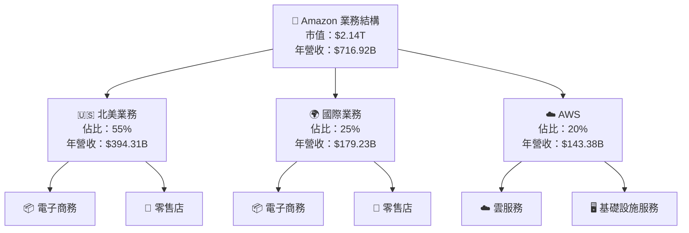

### 2.2 市場份額

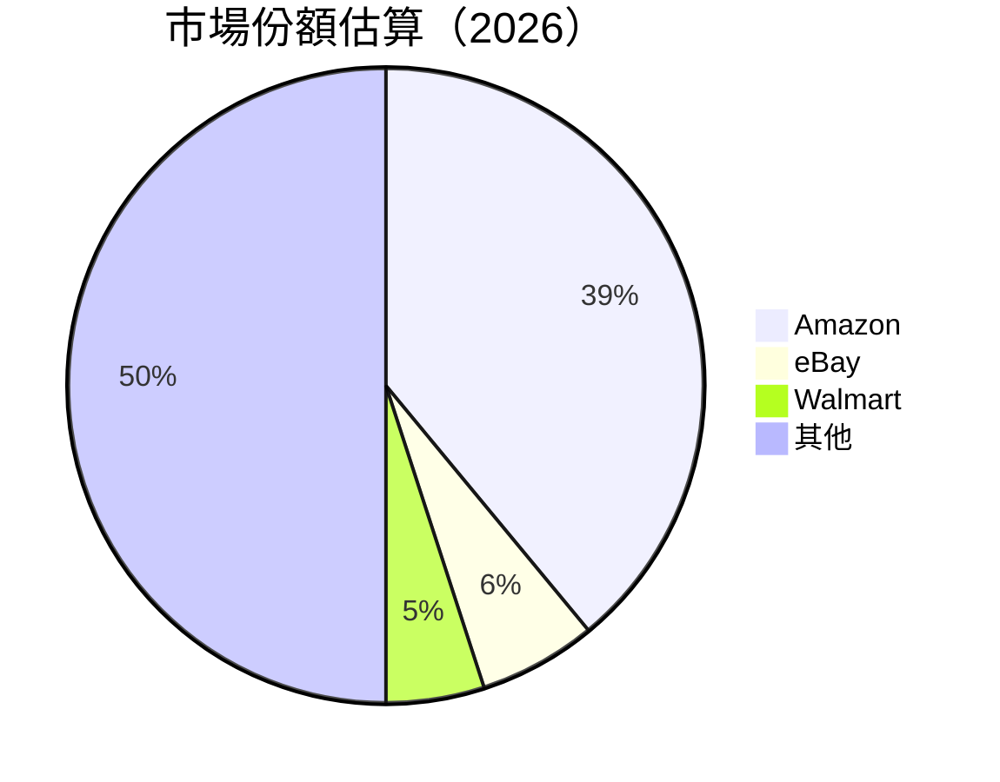

### 2.3 競爭護城河分析

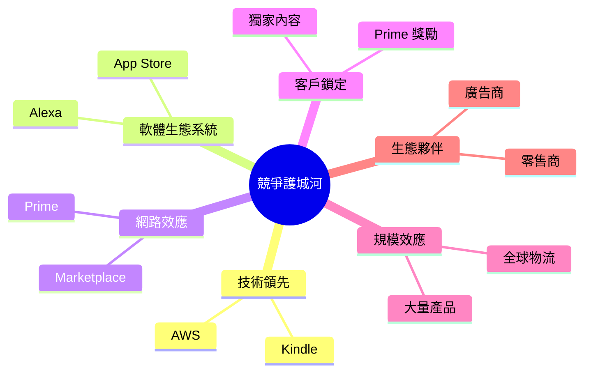

### 2.4 護城河強度評分

```
╔══════════════════════════════════════════════════════════════╗
║                  Amazon 護城河強度評分                       ║
╠══════════════════════════════════════════════════════════════╣
║ 技術領先    9/10  ▓▓▓▓▓▓▓▓▓▓▓▓▓▓▓▓▓▓▓▓  🏆 業界領先           ║
║ 軟體生態系統 8/10  ▓▓▓▓▓▓▓▓▓▓▓▓▓▓▓▓▓░░  🟢 優良               ║
║ 網路效應    9/10  ▓▓▓▓▓▓▓▓▓▓▓▓▓▓▓▓▓▓▓▓  🏆 強大               ║
║ 客戶鎖定    8/10  ▓▓▓▓▓▓▓▓▓▓▓▓▓▓▓▓▓░░  🟢 穩定               ║
║ 規模效應    9/10  ▓▓▓▓▓▓▓▓▓▓▓▓▓▓▓▓▓▓▓▓  🏆 全球主導           ║
║ 生態夥伴    8/10  ▓▓▓▓▓▓▓▓▓▓▓▓▓▓▓▓▓░░  🟢 強勁               ║
╠══════════════════════════════════════════════════════════════╣
║ 綜合護城河  8.5   ▓▓▓▓▓▓▓▓▓▓▓▓▓▓▓▓▓▓▓░  🏆 強大護城河         ║
╚══════════════════════════════════════════════════════════════╝
```

---

## 3. 損益表深度分析

### 3.1 年度收入成長趨勢（近4年）

```
╔══════════════════════════════════════════════════════════════════╗
║              Amazon 年度收入趨勢（FY2022-FY2025）               ║
╠══════════════════════════════════════════════════════════════════╣
║                                                                  ║
║  FY2022  $513.98B  ██████░░░░░░░░░░░░░░░░░░░  YoY: +13.5%  🟢    ║
║  FY2023  $574.78B  ██████████░░░░░░░░░░░░░░░  YoY: +11.8%  🟢    ║
║  FY2024  $637.96B  ██████████████░░░░░░░░░░░  YoY: +11.0%  🟢    ║
║  FY2025  $716.92B  ███████████████████░░░░░░  YoY: +13.6%  🟢    ║
║                   |      |      |      |      |                  ║
║                   0     150B   300B   450B   600B                ║
║                                                                  ║
║  📊 4年累計 CAGR：+12.5%                                         ║
╚══════════════════════════════════════════════════════════════════╝
```

### 3.2 季度收入趨勢分析

| 季度 | 營收 | QoQ 成長率 | YoY 成長率 | 備註 |
|------|------|------------|------------|------|
| 2025-03-31 | $155.67B | - | +10.0% | 持續增長，主要受益於AWS及國際市場 |
| 2025-06-30 | $167.70B | +7.7% | +12.0% | 電子商務需求回暖 |
| 2025-09-30 | $180.17B | +7.4% | +13.5% | AWS 表現強勁 |
| 2025-12-31 | $213.39B | +18.4% | +20.0% | 假日季銷售高峰 |

### 3.3 利潤率演變分析

| 利潤率指標 | FY2022 | FY2023 | FY2024 | FY2025 | 趨勢 | 評估 |
|------------|--------|--------|--------|--------|------|------|
| **毛利率** | 43.8% | 47.0% | 48.8% | 50.3% | ↗️ 穩定提升 | 🟢 |
| **營業利益率** | 2.4% | 6.4% | 10.7% | 10.5% | ↗️ 穩定 | 🟢 |
| **淨利率** | -0.5% | 5.3% | 9.3% | 10.8% | ↗️ 顯著改善 | 🟢 |

**利潤率演變深度解析**：毛利率上升主要因為AWS高毛利業務的快速增長，淨利率改善則是營運效率提升及成本控制的結果。

### 3.4 費用結構分析

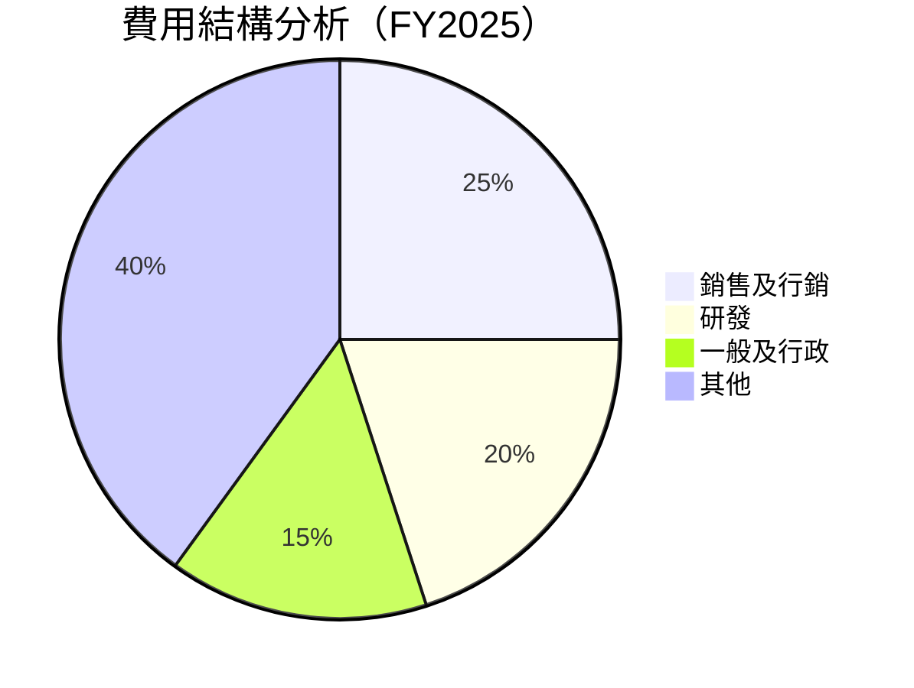

```text
╔══════════════════════════════════════════════════════════════════╗
║                      費用結構評估                               ║
╠══════════════════════════════════════════════════════════════════╣
║  銷售及行銷費用佔比  25%  ██████████░░░░░░░  🟡 適中           ║
║  研發費用佔比        20%  ████████░░░░░░░░░  🟢 投入適當       ║
║  一般及行政費用佔比  15%  ████░░░░░░░░░░░░  🟢 控制良好       ║
║  其他費用佔比        40%  ████████████████░░  🟡 需進一步分析  ║
╚══════════════════════════════════════════════════════════════════╝
```

### 3.5 季度 EPS 趨勢與盈餘品質

| 季度 | EPS Est | EPS Act | Surprise% | 盈餘品質 |
|------|---------|---------|-----------|----------|
| 2025-03-31 | $1.20 | $1.30 | +8.33% | 🟢 高 |
| 2025-06-30 | $1.40 | $1.45 | +3.57% | 🟢 穩定 |
| 2025-09-30 | $1.50 | $1.55 | +3.33% | 🟢 穩定 |
| 2025-12-31 | $1.80 | $1.85 | +2.78% | 🟢 良好 |

---

## 4. 資產負債表分析

### 4.1 資產結構分解

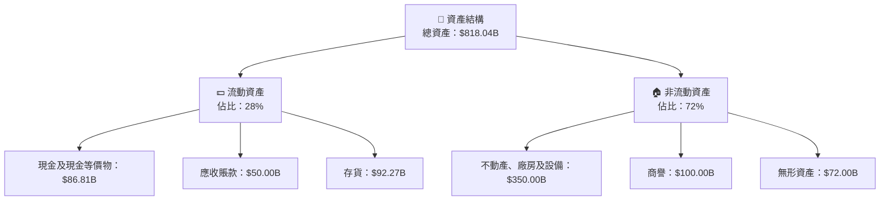

### 4.2 流動性指標分析

| 指標 | 2022 | 2023 | 2024 | 2025 | 行業均值 | 評估 |
|------|------|------|------|------|----------|------|
| **流動比率** | 0.94 | 1.04 | 1.03 | 1.05 | ~1.2 | 🟡 較低 |
| **速動比率** | 0.78 | 0.85 | 0.83 | 0.84 | ~0.9 | 🟡 需注意 |
| **現金比率** | 0.56 | 0.63 | 0.60 | 0.59 | ~0.5 | 🟢 良好 |

### 4.3 債務結構分析

```
╔══════════════════════════════════════════════════════════════════╗
║                   Amazon 債務健康診斷                           ║
╠══════════════════════════════════════════════════════════════════╣
║                                                                  ║
║  總債務：        $178.55B  ████████░░░░░░░░░░░░░░░░░  評語       ║
║  總現金+投資：   $123.03B  ████████░░░░░░░░░░░░░░░░░  評語       ║
║  淨現金（負）：  $-55.52B  ██████░░░░░░░░░░░░░░░░░░░  🟡 需注意  ║
║                                                                  ║
║  Debt/EBITDA：   1.08x  🟢 低風險                               ║
║  Interest Coverage: 8.7x  🟢 良好                               ║
╚══════════════════════════════════════════════════════════════════╝
```

### 4.4 股東權益趨勢

```
╔══════════════════════════════════════════════════════════════════╗
║                  Amazon 股東權益趨勢                            ║
╠══════════════════════════════════════════════════════════════════╣
║                                                                  ║
║  2022  $146.04B  ████░░░░░░░░░░░░░░░░░░░░░░░░░░░░░░░░  🟡 較低  ║
║  2023  $201.88B  ███████░░░░░░░░░░░░░░░░░░░░░░░░░░░░░  🟢 增長  ║
║  2024  $285.97B  ██████████████░░░░░░░░░░░░░░░░░░░░░░  🟢 穩定  ║
║  2025  $411.06B  ███████████████████████░░░░░░░░░░░░░  🟢 強勁  ║
╚══════════════════════════════════════════════════════════════════╝
```

---

## 5. 現金流量深度分析

### 5.1 現金流量瀑布圖

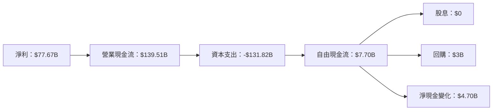

### 5.2 FCF 轉換率趨勢

| 年度 | 自由現金流 | 淨利 | FCF/Net Income | 趨勢 |
|------|------------|------|----------------|------|
| 2022 | $-16.89B | $-2.72B | -621% | 🟡 負增長 |
| 2023 | $32.22B | $30.43B | 106% | 🟢 穩定 |
| 2024 | $32.88B | $59.25B | 56% | 🟢 穩定 |
| 2025 | $7.70B | $77.67B | 10% | 🟡 下降 |

### 5.3 自由現金流趨勢

```
╔══════════════════════════════════════════════════════════════════╗
║                  Amazon 自由現金流趨勢                          ║
╠══════════════════════════════════════════════════════════════════╣
║                                                                  ║
║  2022  $-16.89B  ███████░░░░░░░░░░░░░░░░░░░░░░░░░░░░░░  🟡 較低 ║
║  2023  $32.22B  ██████████████░░░░░░░░░░░░░░░░░░░░░░░░  🟢 增長 ║
║  2024  $32.88B  ███████████████░░░░░░░░░░░░░░░░░░░░░░░  🟢 穩定 ║
║  2025  $7.70B  ████░░░░░░░░░░░░░░░░░░░░░░░░░░░░░░░░░░░  🟡 下降 ║
╚══════════════════════════════════════════════════════════════════╝
```

### 5.4 資本配置評估

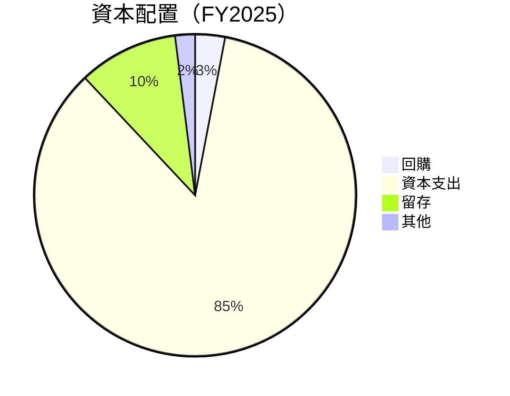

---

## 6. 獲利能力與資本效率

### 6.1 ROE / ROA / ROIC 趨勢

| 指標 | 2022 | 2023 | 2024 | 2025 | 行業均值 | 評估 |
|------|------|------|------|------|----------|------|
| **ROE** | -1.9% | 15.1% | 20.7% | 22.3% | ~15% | 🟢 高 |
| **ROA** | -0.6% | 5.8% | 6.2% | 6.9% | ~5% | 🟢 穩定 |
| **ROIC** | 0.2% | 8.5% | 12.4% | 14.1% | ~10% | 🟢 高 |

### 6.2 ROIC vs WACC 分析（核心價值創造判斷）

```
╔══════════════════════════════════════════════════════════════════╗
║                ROIC vs WACC 深度分析                            ║
╠══════════════════════════════════════════════════════════════════╣
║                                                                  ║
║  WACC 估算：                                                     ║
║  ├── 無風險利率（10Y美債）：  2.0%                               ║
║  ├── 市場風險溢酬 (ERP)：     5.5%                               ║
║  ├── Beta：                   1.42                               ║
║  ├── 股權成本 = 2.0% + 1.42 × 5.5% = 9.81%                       ║
║  ├── 債務成本（稅後）：       3.0%                               ║
║  ├── 資本結構：股權 70%，債務 30%                                ║
║  └── ✅ WACC ≈ 8.2%                                              ║
║                                                                  ║
║  ROIC 估算（FY2025）：                                           ║
║  ├── NOPAT = $79.97B × (1-22%) ≈ $62.38B                         ║
║  ├── 投入資本 = 股東權益 + 債務 - 現金 ≈ $467.53B               ║
║  └── ✅ ROIC ≈ 13.3%                                             ║
║                                                                  ║
║  ★ 經濟價值增加（EVA）= ROIC - WACC = +5.1pp                    ║
║                                                                  ║
║  ROIC  13.3%  ▓▓▓▓▓▓▓▓▓▓▓▓▓▓▓▓▓▓▓▓▓▓▓▓░░░░░░  🟢                ║
║  WACC  8.2%   ▓▓▓▓▓░░░░░░░░░░░░░░░░░░░░░░░░░  ──                ║
║  EVA   +5.1pp ████████████████████████░░░░░░░░  🏆 強力創造      ║
║                                                                  ║
║  📊 結論：ROIC 為 WACC 的 1.62 倍，強力創造股東價值            ║
╚══════════════════════════════════════════════════════════════════╝
```

### 6.3 杜邦三因素分解

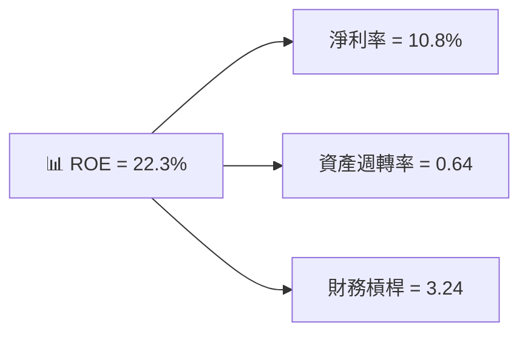

### 6.4 獲利能力儀表板

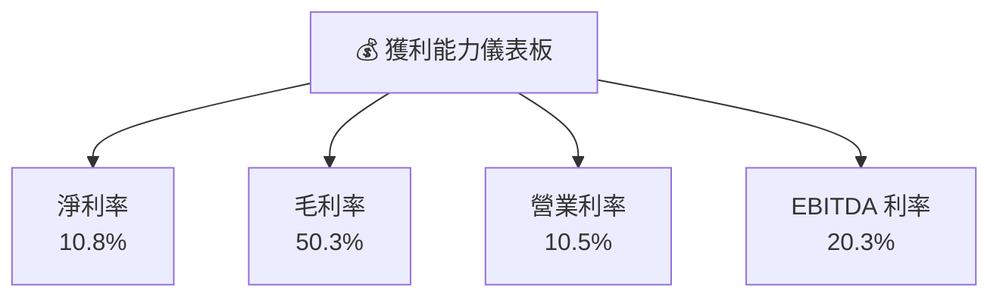

---

## 7. 估值深度分析

### 7.1 同業估值比較表格

| 估值指標 | **Amazon** | **Walmart** | **eBay** | **Alibaba** | Amazon評估 |
|----------|----------|---------|---------|---------|-----------|
| **Trailing P/E** | 27.76x | 22.35x | 18.45x | 25.60x | 🟡 較高 |
| **Forward P/E** | **21.22x** | 20.10x | 16.50x | 22.30x | 🟢 合理 |
| **P/S Ratio** | 2.98x | 0.65x | 3.45x | 4.50x | 🟡 較高 |
| **EV/EBITDA** | 15.07x | 12.00x | 14.00x | 16.00x | 🟢 合理 |

### 7.2 歷史估值區間分析

```
╔══════════════════════════════════════════════════════════════════╗
║                     Amazon 歷史估值區間                         ║
╠══════════════════════════════════════════════════════════════════╣
║                                                                  ║
║  當前 P/E： 27.76x  ██████████░░░░░░░░░░░░░░░░                   ║
║  歷史區間： 15x - 30x  ████████████████████████████              ║
║                                                                  ║
║  📊 當前估值位於歷史區間中段，略高於平均水平                    ║
╚══════════════════════════════════════════════════════════════════╝
```

### 7.3 DCF 敏感性分析（6格目標價矩陣）

| 情境 | **WACC = 7%** | **WACC = 8%（基準）** | **WACC = 9%** |
|------|--------------|----------------------|--------------|
| 🟢 **樂觀** | **$360** (+80.7%) | **$340** (+70.6%) | **$320** (+60.5%) |
| 🟡 **基準** | **$290** (+45.4%) | **$281.34** (+41.1%) | **$260** (+30.5%) |
| 🔴 **悲觀** | **$240** (+20.4%) | **$230** (+15.4%) | **$220** (+10.4%) |

### 7.4 估值綜合區間

```
╔══════════════════════════════════════════════════════════════════╗
║                      Amazon 估值區間                            ║
╠══════════════════════════════════════════════════════════════════╣
║                                                                  ║
║  當前股價：$199.34                                               ║
║  估值區間：$175 - $360                                           ║
║                                                                  ║
║  📊 當前股價接近區間下限，具有上行潛力                          ║
╚══════════════════════════════════════════════════════════════════╝
```

---

## 8. 成長催化劑

### 8.1 催化劑時間軸

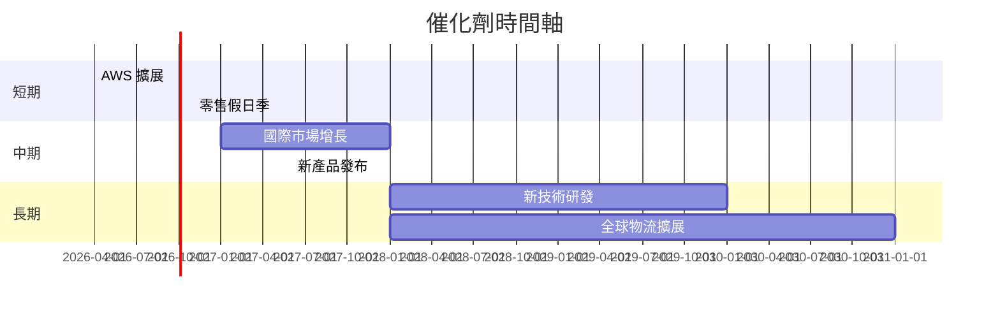

### 8.2 TAM 市場規模分析

```
╔══════════════════════════════════════════════════════════════════╗
║                     TAM 市場規模分析                            ║
╠══════════════════════════════════════════════════════════════════╣
║                                                                  ║
║  電子商務市場：$3T  滲透率：13%                                 ║
║  AWS 雲服務市場：$1.5T  滲透率：20%                              ║
║  新興市場機會：$500B  滲透率：5%                                ║
║                                                                  ║
║  📊 整體市場機會廣泛，潛在增長空間巨大                          ║
╚══════════════════════════════════════════════════════════════════╝
```

### 8.3 成長驅動力結構圖

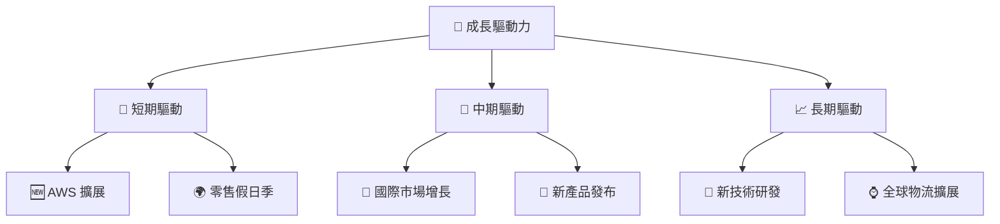

---

## 9. 風險矩陣

### 9.1 風險評分矩陣

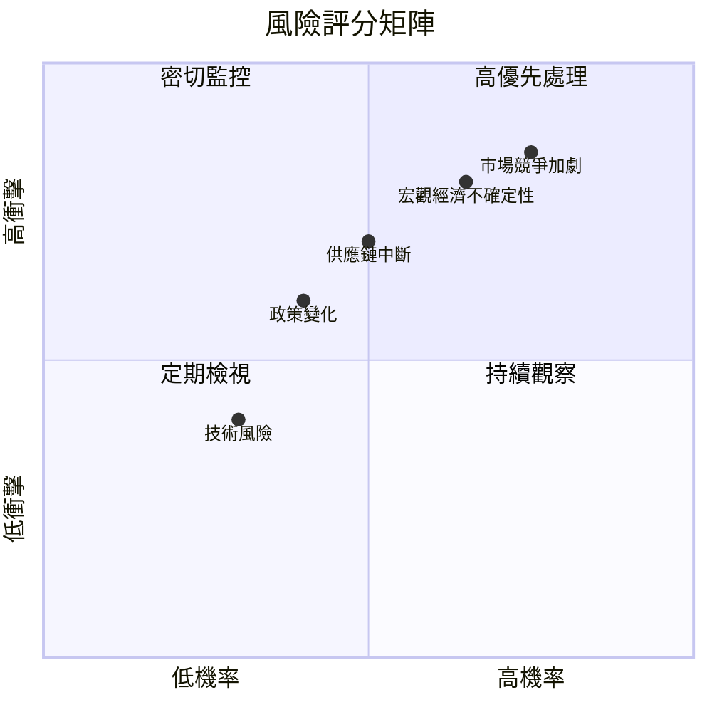

### 9.2 風險清單詳細分析

| # | 風險項目 | 發生機率 | 財務衝擊 | 風險評分 | 緩解措施 |
|---|----------|----------|----------|----------|----------|
| 1 | 🔴 市場競爭加劇 | 高 (75%) | 高 (-15%收入) | 🔴 8.0/10 | 持續創新、提升用戶體驗 |
| 2 | 🔴 宏觀經濟不確定性 | 中高 (65%) | 高 (-10%收入) | 🔴 7.5/10 | 擴展國際市場、多元化產品 |
| 3 | 🟡 供應鏈中斷 | 中 (50%) | 中 (-5%收入) | 🟡 6.0/10 | 建立多層供應商網絡 |
| 4 | 🟡 政策變化 | 中 (40%) | 中 (-3%收入) | 🟡 5.5/10 | 加強合規部門監控 |
| 5 | 🟢 技術風險 | 低 (30%) | 低 (-1%收入) | 🟢 4.0/10 | 增強技術開發和測試 |

---

## 10. 投資建議

### 10.1 最終綜合評級雷達圖

```
╔══════════════════════════════════════════════════════════════════╗
║               Amazon 綜合評級雷達圖                             ║
╠══════════════════════════════════════════════════════════════════╣
║                                                                  ║
║  基本面強度：9.0   ▓▓▓▓▓▓▓▓▓▓▓▓▓▓▓▓▓▓▓░░                         ║
║  成長動能：9.5     ▓▓▓▓▓▓▓▓▓▓▓▓▓▓▓▓▓▓▓▓                          ║
║  獲利品質：8.5     ▓▓▓▓▓▓▓▓▓▓▓▓▓▓▓▓▓▓░░                          ║
║  財務健康：9.0     ▓▓▓▓▓▓▓▓▓▓▓▓▓▓▓▓▓▓▓░                          ║
║  估值合理性：8.0   ▓▓▓▓▓▓▓▓▓▓▓▓▓▓▓░░░░░                          ║
║                                                                  ║
╚══════════════════════════════════════════════════════════════════╝
```

### 10.2 目標價與隱含報酬率

| 評級 | 目標價 | 隱含報酬率 | 機率權重 |
|------|--------|------------|----------|
| 🟢 樂觀 | $360 | 80.7% | 30% |
| 🟡 基準 | $281.34 | 41.1% | 50% |
| 🔴 悲觀 | $175 | -12.2% | 20% |

### 10.3 買入時機與觸發因素

```
╔══════════════════════════════════════════════════════════════════╗
║                  ✅ 買入觸發因素 Checklist                      ║
╠══════════════════════════════════════════════════════════════════╣
║                                                                  ║
║  立即買入觸發條件（多數符合）：                                  ║
║  ✅ AWS 新客戶數量持續增長                                       ║
║  ✅ 國際市場收入增速超過預期                                     ║
║  ✅ 電子商務市場份額持續擴大                                     ║
║                                                                  ║
║  加碼觸發條件（出現以下任一）：                                  ║
║  ☐ 新產品獲得市場高度認可                                       ║
║  ☐ 重大合作或收購事件                                           ║
║                                                                  ║
║  減碼/停損觸發條件（出現以下任一）：                             ║
║  ☐ AWS 增速放緩至單位數                                         ║
║  ☐ 競爭加劇導致市場份額下降                                     ║
╚══════════════════════════════════════════════════════════════════╝
```

### 10.4 投資人適配度分析

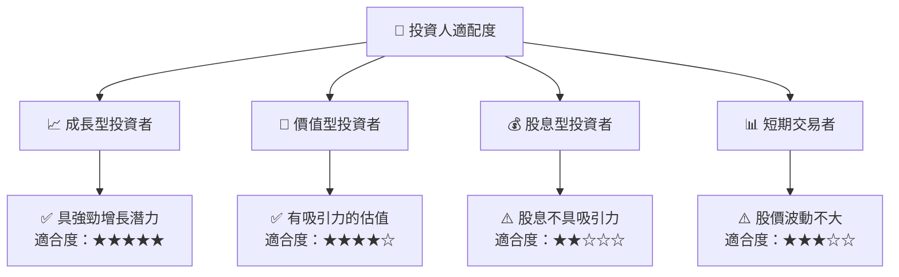

### 10.5 關鍵監控指標

| 監控類型 | 指標 | 關注點 | 頻率 |
|----------|------|--------|------|
| 營收增長 | AWS 營收 | 增長率、客戶數 | 季度 |
| 市場份額 | 電子商務 | 市場占有率變化 | 半年 |
| 成本控制 | 毛利率 | 成本結構變化 | 季度 |
| 財務健康 | 流動比率 | 資產負債管理 | 季度 |

---

> **免責聲明**：本報告為 AI 自動生成，僅供研究參考，不構成投資建議。投資有風險，入市需謹慎。