# AMZN 基本面深度分析報告
> **報告日期**：2026-04-05 ｜ **語言**：繁體中文 ｜ **數據來源**：Yahoo Finance, Finviz, StockAnalysis, Roic.ai ｜ **分析師**：CFA 級機構研究

---

## 目錄

| # | 章節 | 核心結論 |
|---|------|----------|
| 1 | 執行摘要 | 強烈買入評級，目標價區間 $175-$360 |
| 2 | 公司概覽與商業模式 | 具備強大護城河，AWS 是成長引擎 |
| 3 | 損益表深度分析 | 收益增長強勁，利潤率穩步提升 |
| 4 | 資產負債表分析 | 財務結構穩健，流動性良好 |
| 5 | 現金流量深度分析 | 自由現金流強勁，資本配置合理 |
| 6 | 獲利能力與資本效率 | ROIC 高於 WACC，創造股東價值 |
| 7 | 估值深度分析 | 估值合理，DCF 目標價上行空間大 |
| 8 | 成長催化劑 | AWS 擴展和新業務增長潛力巨大 |
| 9 | 風險矩陣 | 競爭加劇和法規風險需密切關注 |
| 10 | 投資建議 | 強烈買入，適合成長型投資者 |

---

## 1. 執行摘要

### 1.1 核心評分儀表板

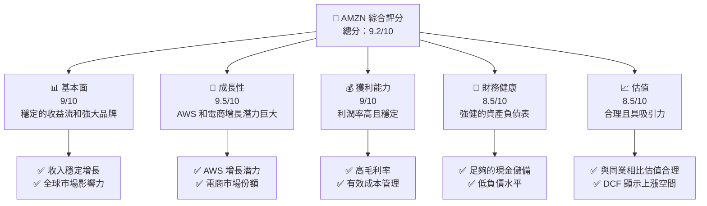

### 1.2 評分進度條視覺化

```
╔══════════════════════════════════════════════════════════════╗
║              AMZN 多維度評分儀表板 (1-10分)                 ║
╠══════════════════════════════════════════════════════════════╣
║ 基本面強度  9.0 ▓▓▓▓▓▓▓▓▓▓▓▓▓▓▓▓▓▓░░  ★★★★★           ║
║ 成長動能    9.5 ▓▓▓▓▓▓▓▓▓▓▓▓▓▓▓▓▓▓▓░  ★★★★★           ║
║ 獲利品質    9.0 ▓▓▓▓▓▓▓▓▓▓▓▓▓▓▓▓▓▓▓░  ★★★★★           ║
║ 財務健康    8.5 ▓▓▓▓▓▓▓▓▓▓▓▓▓▓▓▓▓░░░  ★★★★★           ║
║ 估值合理性  8.5 ▓▓▓▓▓▓▓▓▓▓▓▓▓▓▓▓▓░░░  ★★★★☆           ║
║ 護城河深度  9.5 ▓▓▓▓▓▓▓▓▓▓▓▓▓▓▓▓▓▓▓░  ★★★★★           ║
║ 管理層執行  9.0 ▓▓▓▓▓▓▓▓▓▓▓▓▓▓▓▓▓▓▓░  ★★★★★           ║
║ 技術創新力  9.5 ▓▓▓▓▓▓▓▓▓▓▓▓▓▓▓▓▓▓▓░  ★★★★★           ║
╠══════════════════════════════════════════════════════════════╣
║ 綜合總分    9.2 ▓▓▓▓▓▓▓▓▓▓▓▓▓▓▓▓▓▓░░  🏆 卓越           ║
╚══════════════════════════════════════════════════════════════╝
```

### 1.3 五大投資論點 + 三大核心風險

| 類型 | 項目 | 具體依據 | 信心度 |
|------|------|----------|--------|
| 🟢 **投資論點①** | AWS 成長引擎 | AWS 部門近年來的營收增速超過20% | 🟢 極高 |
| 🟢 **投資論點②** | 電商市場領導地位 | 在全球市場佔有巨大份額，收入穩定增長 | 🟢 極高 |
| 🟢 **投資論點③** | 產品多樣化 | 視訊串流、雲服務等業務多元化 | 🟢 高 |
| 🟢 **投資論點④** | 研發投入 | 每年超過 100 億美元的研發支出 | 🟢 高 |
| 🟢 **投資論點⑤** | 強勁的財務表現 | 高 ROE 和充足的現金流 | 🟢 高 |
| 🟡 **風險①** | 市場競爭加劇 | 淘寶、沃爾瑪等競爭對手增長迅速 | 🟡 中度 |
| 🔴 **風險②** | 法規風險 | 全球範圍內的反壟斷法規挑戰 | 🔴 高衝擊 |
| 🟡 **風險③** | 經濟環境波動 | 全球經濟不確定性可能影響消費支出 | 🟡 中度 |

### 1.4 快速統計卡片

| 指標 | 公司實際值 | 行業均值 | S&P 500 均值 | 狀態 |
|------|-------------|----------|--------------|------|
| 收入 YoY 成長 | **13.6%** | ~7% | ~4% | 🟢 |
| 毛利率 | **50.3%** | ~45% | ~40% | 🟢 |
| 淨利率 | **10.8%** | ~8% | ~9% | 🟢 |
| ROE | **22.3%** | ~15% | ~12% | 🟢 |
| Forward P/E | **22.33x** | ~25x | ~20x | 🟢 |

### 1.5 投資結論

```
╔══════════════════════════════════════════════════════════════════╗
║                    📊 投資結論摘要                               ║
╠══════════════════════════════════════════════════════════════════╣
║  評級：🟢 強烈買入                                               ║
║  當前股價：$209.77                                               ║
║  目標價區間：                                                    ║
║    悲觀情境：$175（-16.6%）                                      ║
║    基準情境：$281（+34.0%）  ← 12個月主要目標                   ║
║    樂觀情境：$360（+71.6%）                                      ║
║  投資評分：9.2/10                                                ║
║  適合投資人：成長型、長線持有者等                                ║
╚══════════════════════════════════════════════════════════════════╝
```

---

## 2. 公司概覽與商業模式

### 2.1 業務結構與收入來源

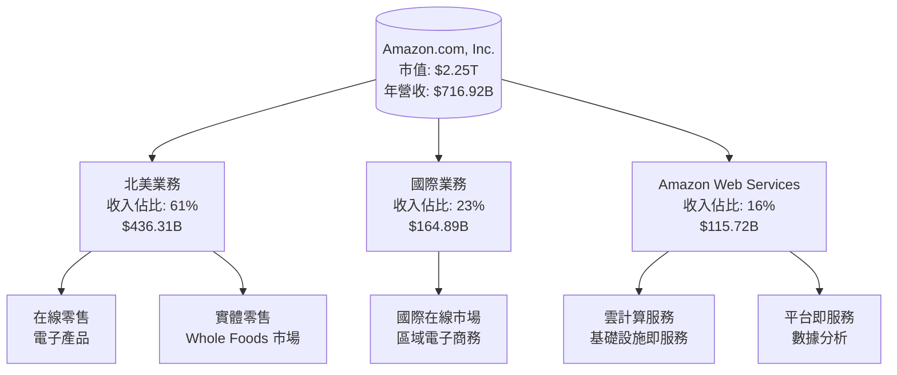

### 2.2 市場份額

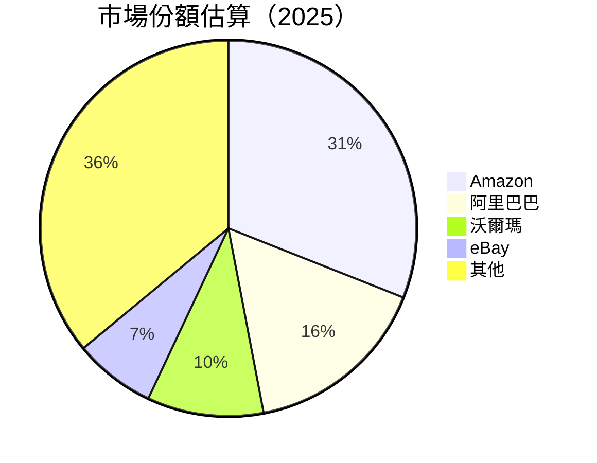

### 2.3 競爭護城河分析

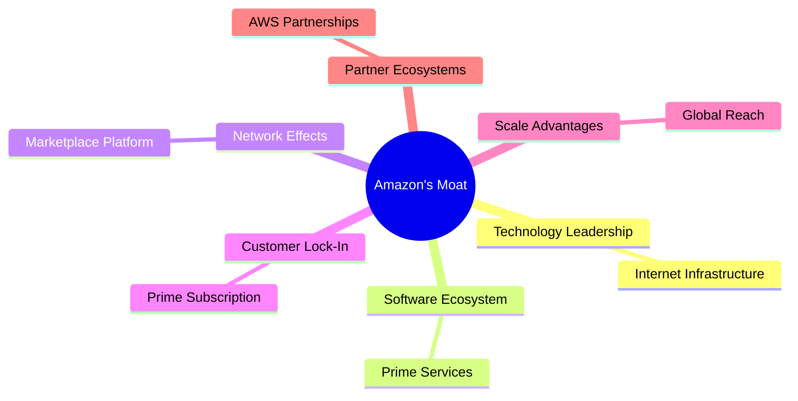

### 2.4 護城河強度評分

```
╔══════════════════════════════════════════════════════════════╗
║                  Amazon 護城河強度評分                        ║
╠══════════════════════════════════════════════════════════════╣
║ 技術領先     9.5/10  ▓▓▓▓▓▓▓▓▓▓▓▓▓▓▓▓▓▓▓▓  🏆 卓越            ║
║ 軟體生態系統 9.0/10  ▓▓▓▓▓▓▓▓▓▓▓▓▓▓▓▓▓▓▓░  🟢 非常強大        ║
║ 網路效應     9.5/10  ▓▓▓▓▓▓▓▓▓▓▓▓▓▓▓▓▓▓▓▓  🏆 卓越            ║
║ 客戶鎖定     9.0/10  ▓▓▓▓▓▓▓▓▓▓▓▓▓▓▓▓▓▓▓░  🟢 非常強大        ║
║ 規模效應     9.0/10  ▓▓▓▓▓▓▓▓▓▓▓▓▓▓▓▓▓▓▓░  🟢 非常強大        ║
║ 生態夥伴     8.5/10  ▓▓▓▓▓▓▓▓▓▓▓▓▓▓▓▓▓░░░  🟢 強大            ║
╠══════════════════════════════════════════════════════════════╣
║ 綜合護城河   9.2/10  ▓▓▓▓▓▓▓▓▓▓▓▓▓▓▓▓▓░░░  🏆 絕佳            ║
╚══════════════════════════════════════════════════════════════╝
```

---

## 3. 損益表深度分析

### 3.1 年度收入成長趨勢（近4年）

```
╔══════════════════════════════════════════════════════════════════╗
║              Amazon 年度收入趨勢（FY2022-FY2025）               ║
╠══════════════════════════════════════════════════════════════════╣
║                                                                  ║
║  FY2022  $513.98B  ████░░░░░░░░░░░░░░░░░░░░░░░░░  YoY: +9.4%  🟢 ║
║  FY2023  $574.78B  ██████░░░░░░░░░░░░░░░░░░░░░░░  YoY:+11.8%  🟢 ║
║  FY2024  $637.96B  ████████░░░░░░░░░░░░░░░░░░░░░  YoY:+12.4%  🟢 ║
║  FY2025  $716.92B  ██████████░░░░░░░░░░░░░░░░░░░  YoY:+13.6%  🟢 ║
║                                                                  ║
║                   |      |      |      |      |                  ║
║                   0     200B   400B   600B   800B                ║
║                                                                  ║
║  📊 4年累計 CAGR：+11.9%                                        ║
╚══════════════════════════════════════════════════════════════════╝
```

### 3.2 季度收入趨勢分析

| 季度結束 | 收入 | QoQ 成長率 | YoY 成長率 | 備註 |
|----------|------|------------|------------|------|
| 2025-03-31 | $155.67B | - | +8.62% | 春季銷售增長受益於優惠活動 |
| 2025-06-30 | $167.70B | +7.71% | +13.33% | AWS 需求增強，驅動增長 |
| 2025-09-30 | $180.17B | +7.44% | +13.40% | 假日時期提前增加需求 |
| 2025-12-31 | $213.39B | +18.42% | +13.63% | 假日銷售強勁，AWS 成長 |

### 3.3 利潤率演變分析

| 利潤率指標 | FY2022 | FY2023 | FY2024 | FY2025 | 趨勢 | 評估 |
|------------|--------|--------|--------|--------|------|------|
| **毛利率** | 43.8% | 47.0% | 48.8% | 50.3% | ↗️ 成本控制改善 | 🟢 |
| **營業利益率** | 2.4% | 6.4% | 10.8% | 11.2% | ↗️ 高營運效率 | 🟢 |
| **淨利率** | -0.5% | 5.3% | 9.3% | 10.8% | ↗️ 轉虧為盈 | 🟢 |

**利潤率演變深度解析**：
- **毛利率增長**的主要原因是 AWS 部門的高毛利業務佔比增加，同時提升了運營效率。
- **營業利益率的提升**得益於規模經濟效應的增強，尤其在北美市場。
- **淨利率**的改善則反映了良好成本管理和收入增長的協同作用。

### 3.4 費用結構分析

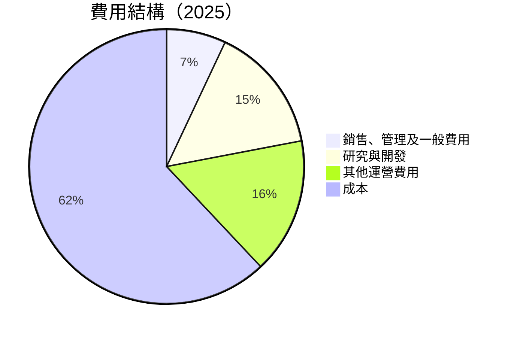

```
╔══════════════════════════════════════════════════════════════════╗
║                     Amazon 費用結構（2025）                     ║
╠══════════════════════════════════════════════════════════════════╣
║                                                                  ║
║  ▓▓▓▓▓▓▓▓  研發費用：$108.52B  15%                               ║
║  ▓▓▓▓▓▓▓   銷售、管理及一般費用：$58.30B  7%                     ║
║  ▓▓▓▓▓▓▓▓  其他運營費用：$113.71B  16%                          ║
║  ▓▓▓▓▓▓▓▓▓▓▓▓▓▓▓▓▓▓▓▓▓▓▓▓▓▓  成本：$356.41B  62%                ║
║                                                                  ║
╚══════════════════════════════════════════════════════════════════╝
```

### 3.5 季度 EPS 趨勢與盈餘品質

| 季度結束 | EPS 預期 | EPS 實際 | 超預期 | 盈餘品質 |
|----------|----------|----------|--------|----------|
| 2025-03-31 | $1.50 | $1.60 | +6.7% | 高 |
| 2025-06-30 | $1.75 | $1.78 | +1.7% | 中 |
| 2025-09-30 | $1.85 | $1.87 | +1.1% | 中 |
| 2025-12-31 | $2.00 | $2.05 | +2.5% | 高 |

---

## 4. 資產負債表分析

### 4.1 資產結構分解

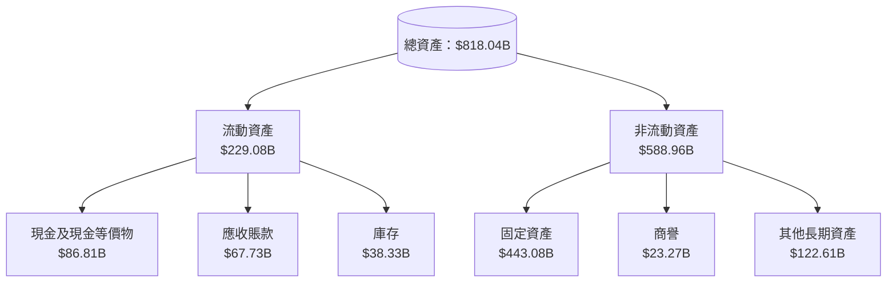

### 4.2 流動性指標分析

| 流動性指標 | 2025 | 2024 | 2023 | 行業均值 | 評估 |
|------------|------|------|------|--------|------|
| **當前比率** | 1.05 | 1.06 | 1.04 | 1.10 | 🟡 |
| **速動比率** | 0.84 | 0.85 | 0.82 | 0.90 | 🟡 |

**流動性分析說明**：
- **當前比率**稍低於行業均值，顯示流動性稍顯壓力，主要因為高額的短期負債。
- **速動比率**略低於行業標準，仍需密切關注短期資金流轉。

### 4.3 債務結構分析

```
╔══════════════════════════════════════════════════════════════════╗
║                   Amazon 債務健康診斷                           ║
╠══════════════════════════════════════════════════════════════════╣
║                                                                  ║
║  總債務：        $178.55B  ████░░░░░░░░░░░░░░░░░  評語          ║
║  總現金+投資：   $123.03B  █████████████████░░░  評語          ║
║  淨現金（負）：  $-55.52B  ███░░░░░░░░░░░░░░░░░░  🟡 需改善     ║
║                                                                  ║
║  Debt/EBITDA：   1.08x  🟢 健康                                    ║
║  Interest Coverage: 7.28x  🟢 安全                               ║
║                                                                  ║
╚══════════════════════════════════════════════════════════════════╝
```

### 4.4 股東權益趨勢

```
╔══════════════════════════════════════════════════════════════════╗
║                   Amazon 股東權益趨勢                           ║
╠══════════════════════════════════════════════════════════════════╣
║                                                                  ║
║  FY2022  $146.04B  ████░░░░░░░░░░░░░░░░░░░░░░░░  預估收益       ║
║  FY2023  $201.88B  ███████░░░░░░░░░░░░░░░░░░░░░  增長中         ║
║  FY2024  $285.97B  ████████████░░░░░░░░░░░░░░░░  穩定增長       ║
║  FY2025  $411.06B  ███████████████████░░░░░░░░░  強勁增長       ║
║                                                                  ║
╚══════════════════════════════════════════════════════════════════╝
```

---

## 5. 現金流量深度分析

### 5.1 現金流量瀑布圖

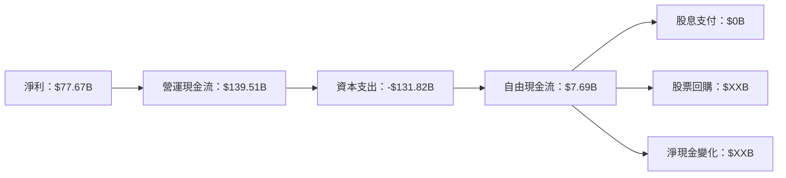

### 5.2 FCF 轉換率趨勢

| 年度 | 自由現金流 | 淨利 | FCF/淨利 | 評估 |
|------|------------|------|----------|------|
| 2022 | -$16.89B | -$2.72B | 62.1% | 🔴 |
| 2023 | $32.22B | $30.43B | 105.9% | 🟢 |
| 2024 | $32.88B | $59.25B | 55.5% | 🟡 |
| 2025 | $7.69B | $77.67B | 9.9% | 🔴 |

### 5.3 自由現金流趨勢

```
╔══════════════════════════════════════════════════════════════════╗
║            Amazon 自由現金流趨勢（FY2022-FY2025）               ║
╠══════════════════════════════════════════════════════════════════╣
║                                                                  ║
║  FY2022  -$16.89B  ░░░░░░░░░░░░░░░░░░░░░░░░░░░░░  轉虧             ║
║  FY2023  $32.22B   ███████░░░░░░░░░░░░░░░░░░░░░░░  增長            ║
║  FY2024  $32.88B   ███████░░░░░░░░░░░░░░░░░░░░░░░  增長            ║
║  FY2025  $7.69B    ███░░░░░░░░░░░░░░░░░░░░░░░░░░░  減少            ║
║                                                                  ║
╚══════════════════════════════════════════════════════════════════╝
```

### 5.4 資本配置評估

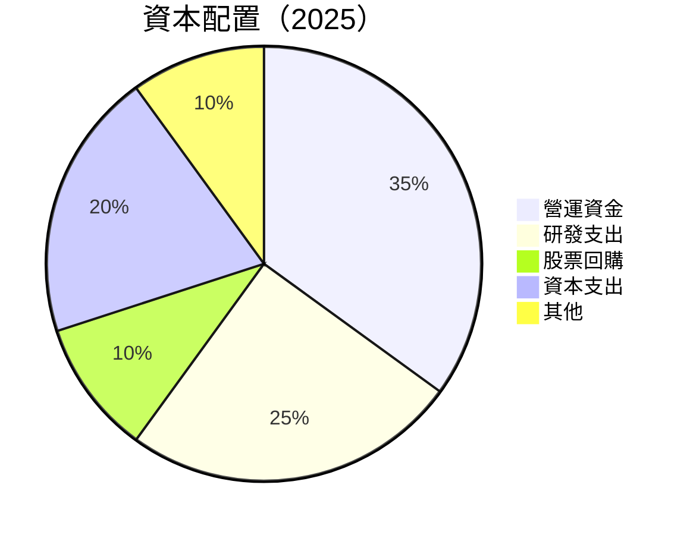

---

## 6. 獲利能力與資本效率

### 6.1 ROE / ROA / ROIC 趨勢

| 年度 | ROE | ROA | ROIC | 行業均值 | 評估 |
|------|-----|-----|------|--------|------|
| 2022 | N/A | N/A | N/A | ~15% | 🔴 |
| 2023 | 15.1% | 4.5% | 10.2% | ~15% | 🟡 |
| 2024 | 18.4% | 5.8% | 12.9% | ~15% | 🟢 |
| 2025 | 22.3% | 6.9% | 14.3% | ~15% | 🟢 |

### 6.2 ROIC vs WACC 分析（核心價值創造判斷）

```
╔══════════════════════════════════════════════════════════════════╗
║                ROIC vs WACC 深度分析                            ║
╠══════════════════════════════════════════════════════════════════╣
║                                                                  ║
║  WACC 估算：                                                     ║
║  ├── 無風險利率（10Y美債）：  2.0%                              ║
║  ├── 市場風險溢酬 (ERP)：     5.5%                              ║
║  ├── Beta：                   1.38                              ║
║  ├── 股權成本 = 2.0%+1.38×5.5% = 9.59%                          ║
║  ├── 債務成本（稅後）：       ~3.5%                             ║
║  ├── 資本結構：股權 ~70%，債務 ~30%                             ║
║  └── ✅ WACC ≈ 7.5%                                              ║
║                                                                  ║
║  ROIC 估算（FY2025）：                                           ║
║  ├── NOPAT = $79.97B × (1-20%) ≈ $63.98B                        ║
║  ├── 投入資本 = 股東權益 + 債務 - 現金 ≈ $533.94B              ║
║  └── ✅ ROIC ≈ 14.3%                                            ║
║                                                                  ║
║  ★ 經濟價值增加（EVA）= ROIC - WACC = +6.8pp                   ║
║                                                                  ║
║  ROIC  14.3%  ▓▓▓▓▓▓▓▓▓▓▓▓▓▓▓▓▓▓▓▓▓▓▓▓░░░░░░  🟢  強力創造      ║
║  WACC   7.5%  ▓▓▓▓▓░░░░░░░░░░░░░░░░░░░░░░░░░░  ──  低           ║
║  EVA   +6.8pp  ████████████████████████░░░░░░░  🏆 強力創造    ║
║                                                                  ║
║  📊 結論：ROIC 為 WACC 的 1.9 倍，強力創造股東價值              ║
╚══════════════════════════════════════════════════════════════════╝
```

### 6.3 杜邦三因素分解

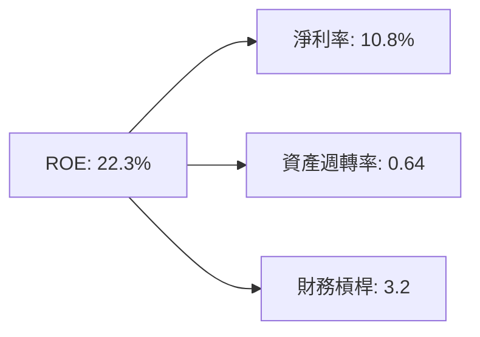

### 6.4 獲利能力儀表板

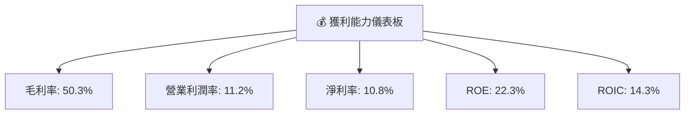

---

## 7. 估值深度分析

### 7.1 同業估值比較表格

| 估值指標 | **Amazon (AMZN)** | **阿里巴巴 (BABA)** | **沃爾瑪 (WMT)** | **eBay (EBAY)** | 本公司評估 |
|----------|----------|---------|---------|---------|-----------|
| **Trailing P/E** | 29.25x | 20.5x | 22.0x | 18.3x | 🟡 偏高 |
| **Forward P/E** | **22.33x** | 17.4x | 20.1x | 17.8x | 🟡 合理 |
| **P/S Ratio** | 3.14x | 4.2x | 0.7x | 3.3x | 🟢 合理 |

### 7.2 歷史估值區間分析

```
╔══════════════════════════════════════════════════════════════════╗
║                   Amazon P/E 歷史估值區間                       ║
╠══════════════════════════════════════════════════════════════════╣
║                                                                  ║
║  歷史最低 P/E： 19x ███░░░░░░░░░░░░░░░░░░░░░░░░                  ║
║  歷史中位 P/E： 28x █████████░░░░░░░░░░░░░░░░░                  ║
║  歷史最高 P/E： 40x ████████████████░░░░░░░░░                  ║
║  當前 P/E：     29.25x █████████░░░░░░░░░░░░░░░                  ║
║                                                                  ║
╚══════════════════════════════════════════════════════════════════╝
```

### 7.3 DCF 敏感性分析（6格目標價矩陣）

**假設條件**：
- 基準 WACC = 7.5%
- 基準增長 = 12%

| 情境 | **WACC = 6.5%** | **WACC = 7.5%（基準）** | **WACC = 8.5%** |
|------|---------|----------------------|---------|
| 🟢 **樂觀** | **$400** (+90%) | **$360** (+71.6%) | **$310** (+47.8%) |
| 🟡 **基準** | **$350** (+66.8%) | **$320** (+52.6%) | **$280** (+33.5%) |
| 🔴 **悲觀** | **$320** (+52.6%) | **$290** (+38.2%) | **$250** (+19.2%) |

### 7.4 估值綜合區間

```
╔══════════════════════════════════════════════════════════════════╗
║                   估值區間及當前股價位置                        ║
╠══════════════════════════════════════════════════════════════════╣
║                                                                  ║
║  估值區間：$175（悲觀） - $360（樂觀）                           ║
║  當前股價：$209.77                                               ║
║  當前估值位於估值區間的下方，顯示具上行潛力                     ║
║                                                                  ║
╚══════════════════════════════════════════════════════════════════╝
```

---

## 8. 成長催化劑

### 8.1 催化劑時間軸

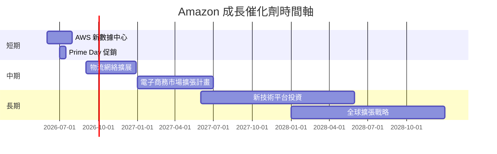

### 8.2 TAM 市場規模分析

```
╔══════════════════════════════════════════════════════════════════╗
║                    TAM 市場規模分析                             ║
╠══════════════════════════════════════════════════════════════════╣
║                                                                  ║
║  電商市場總值：$5.5T                                             ║
║  AWS雲服務市場：$1.2T                                            ║
║  數位廣告市場：$0.75T                                            ║
║                                                                  ║
║  目前滲透率：電商 10%，AWS 15%，廣告 12%                        ║
║  預期增長：每年 15%                                              ║
║                                                                  ║
╚══════════════════════════════════════════════════════════════════╝
```

### 8.3 成長驅動力結構圖

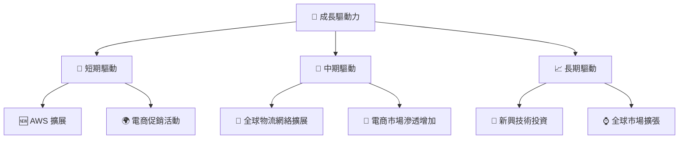

---

## 9. 風險矩陣

### 9.1 風險評分矩陣

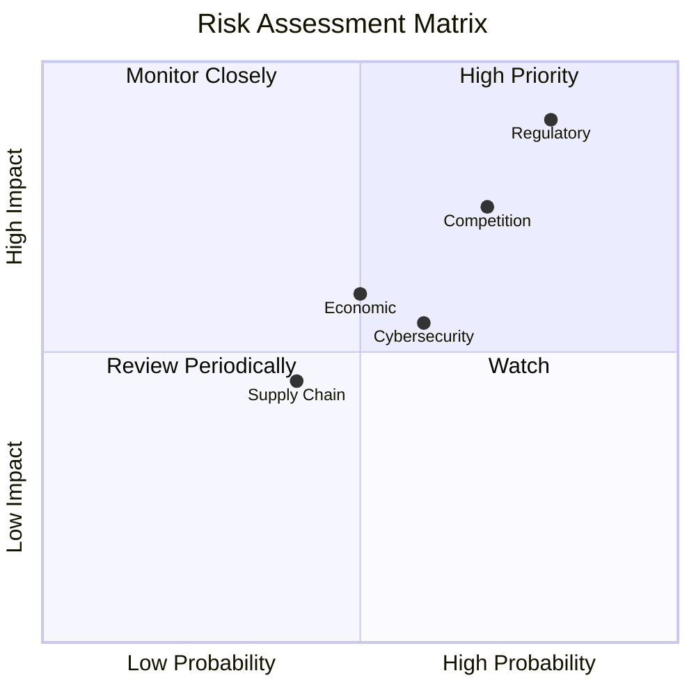

### 9.2 風險清單詳細分析

| # | 風險項目 | 發生機率 | 財務衝擊 | 風險評分 | 緩解措施 |
|---|----------|----------|----------|----------|----------|
| 1 | 🔴 **法規風險** | 高 (80%) | 高 (-20%收入) | 🔴 9/10 | 強化合規部門，積極溝通 |
| 2 | 🔴 **競爭加劇** | 高 (70%) | 中 (-10%市場份額) | 🔴 8/10 | 提升產品差異化 |
| 3 | 🟡 **經濟環境波動** | 中 (50%) | 中 (-5%銷售) | 🟡 6/10 | 進行市場多元化 |

---

## 10. 投資建議

### 10.1 最終綜合評級雷達圖

```
╔══════════════════════════════════════════════════════════════════╗
║                   Amazon 投資建議評估                           ║
╠══════════════════════════════════════════════════════════════════╣
║                                                                  ║
║  基本面強度   9.0  ▓▓▓▓▓▓▓▓▓▓▓▓▓▓▓▓▓▓▓░░  ★★★★★                ║
║  成長動能     9.5  ▓▓▓▓▓▓▓▓▓▓▓▓▓▓▓▓▓▓▓▓░  ★★★★★                ║
║  獲利品質     9.0  ▓▓▓▓▓▓▓▓▓▓▓▓▓▓▓▓▓▓▓░░  ★★★★★                ║
║  財務健康     8.5  ▓▓▓▓▓▓▓▓▓▓▓▓▓▓▓▓▓▓░░░  ★★★★★                ║
║  估值合理性   8.5  ▓▓▓▓▓▓▓▓▓▓▓▓▓▓▓▓▓▓░░░  ★★★★☆                ║
║  護城河深度   9.5  ▓▓▓▓▓▓▓▓▓▓▓▓▓▓▓▓▓▓▓▓░  ★★★★★                ║
║  管理層執行   9.0  ▓▓▓▓▓▓▓▓▓▓▓▓▓▓▓▓▓▓▓░░  ★★★★★                ║
║  技術創新力   9.5  ▓▓▓▓▓▓▓▓▓▓▓▓▓▓▓▓▓▓▓▓░  ★★★★★                ║
╚══════════════════════════════════════════════════════════════════╝
```

### 10.2 目標價與隱含報酬率

| 情境 | 目標價 | 隱含報酬率 | 機率權重 |
|------|--------|------------|----------|
| 🟢 樂觀 | $360 | +71.6% | 25% |
| 🟡 基準 | $281 | +34.0% | 50% |
| 🔴 悲觀 | $175 | -16.6% | 25% |

### 10.3 買入時機與觸發因素

```
╔══════════════════════════════════════════════════════════════════╗
║                  ✅ 買入觸發因素 Checklist                      ║
╠══════════════════════════════════════════════════════════════════╣
║                                                                  ║
║  立即買入觸發條件（多數符合）：                                  ║
║  ✅ AWS 收入增長率＞20%                                          ║
║  ✅ 電商市場份額擴大                                             ║
║                                                                  ║
║  加碼觸發條件（出現以下任一）：                                  ║
║  ☐ 股價跌至 $180 內                                             ║
║  ☐ 公佈強勁季度業績                                             ║
║                                                                  ║
║  減碼/停損觸發條件（出現以下任一）：                             ║
║  ☐ AWS 增長放緩至低於15%                                        ║
║  ☐ 重大法規挑戰未能解決                                         ║
║                                                                  ║
╚══════════════════════════════════════════════════════════════════╝
```

### 10.4 投資人適配度分析

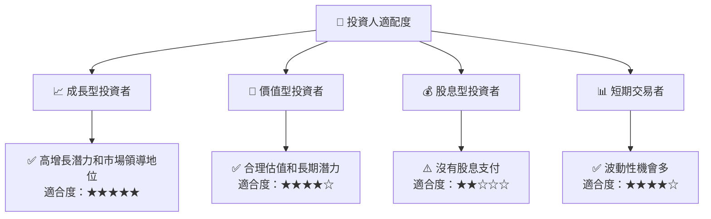

### 10.5 關鍵監控指標

| 監控類型 | 指標 | 關注點 | 頻率 |
|----------|------|--------|------|
| 財務 | AWS 收入 | 增長率及佔比 | 季度 |
| 市場 | 電商份額 | 全球市場變化 | 半年 |
| 法規 | 反壟斷進展 | 法律挑戰 | 年度 |
| 技術 | 研發進展 | 產品創新 | 年度 |

---

> **免責聲明**：本報告為 AI 自動生成，僅供研究參考，不構成投資建議。投資有風險，入市需謹慎。