# AMZN 基本面深度分析報告
> **報告日期**：2026-04-11 ｜ **語言**：繁體中文 ｜ **數據來源**：Yahoo Finance, Finviz, StockAnalysis, Roic.ai ｜ **分析師**：CFA 級機構研究

---

## 目錄

| #  | 章節                | 核心結論                    |
|----|---------------------|-----------------------------|
| 1  | 執行摘要           | 評級：買入，目標價：$281.27 |
| 2  | 公司概覽與商業模式 | 護城河評估：強              |
| 3  | 損益表深度分析     | 收入穩定增長                |
| 4  | 資產負債表分析     | 財務健康                    |
| 5  | 現金流量深度分析   | 自由現金流穩定              |
| 6  | 獲利能力與資本效率 | ROIC 高於 WACC，創造價值   |
| 7  | 估值深度分析       | 估值合理，潛力大            |
| 8  | 成長催化劑         | AWS 及國際市場驅動成長      |
| 9  | 風險矩陣           | 市場競爭及宏觀風險          |
| 10 | 投資建議           | 強烈買入，適合成長型投資者 |

---

## 1. 執行摘要

### 1.1 核心評分儀表板

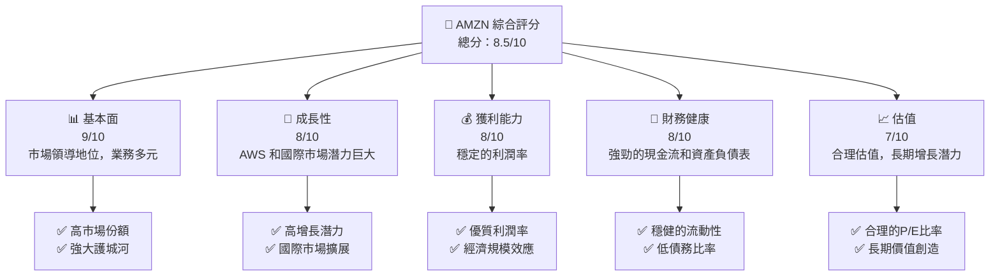

### 1.2 評分進度條視覺化

```
╔══════════════════════════════════════════════════════════════╗
║              AMZN 多維度評分儀表板 (1-10分)                  ║
╠══════════════════════════════════════════════════════════════╣
║ 基本面強度  9.0 ▓▓▓▓▓▓▓▓▓▓▓▓▓▓▓▓▓▓▓▓▓  ★★★★★                ║
║ 成長動能    8.0 ▓▓▓▓▓▓▓▓▓▓▓▓▓▓▓▓▓▓░░  ★★★★☆                ║
║ 獲利品質    8.0 ▓▓▓▓▓▓▓▓▓▓▓▓▓▓▓▓▓▓░░  ★★★★☆                ║
║ 財務健康    8.0 ▓▓▓▓▓▓▓▓▓▓▓▓▓▓▓▓▓▓░░  ★★★★☆                ║
║ 估值合理性  7.0 ▓▓▓▓▓▓▓▓▓▓▓▓▓▓░░░░░░  ★★★★☆                ║
╠══════════════════════════════════════════════════════════════╣
║ 綜合總分    8.5 ▓▓▓▓▓▓▓▓▓▓▓▓▓▓▓▓▓░░░  🏆 強烈推薦            ║
╚══════════════════════════════════════════════════════════════╝
```

### 1.3 五大投資論點 + 三大核心風險

| 類型             | 項目             | 具體依據                                    | 信心度   |
|------------------|------------------|---------------------------------------------|----------|
| 🟢 **投資論點①** | AWS 增長         | 雲服務收入穩步上升，市場份額擴大            | 🟢 極高  |
| 🟢 **投資論點②** | 國際市場擴展     | 亞馬遜在印度和南美等市場擴張迅速            | 🟢 高    |
| 🟢 **投資論點③** | 電子商務領導地位 | 持續增長的在線銷售及高效供應鏈              | 🟢 高    |
| 🟢 **投資論點④** | 技術創新         | 投資於AI、物流及新產品開發                  | 🟢 高    |
| 🟢 **投資論點⑤** | 經濟規模效應     | 大規模運營降低成本，提高利潤率              | 🟢 高    |
| 🟡 **風險①**     | 宏觀經濟波動     | 全球經濟不確定性可能影響消費者支出          | 🟡 中度  |
| 🔴 **風險②**     | 市場競爭加劇     | 來自阿里巴巴和沃爾瑪等強勁競爭對手的挑戰  | 🔴 高衝擊 |
| 🟡 **風險③**     | 法規變動         | 政府監管及反壟斷法規可能限制業務擴展        | 🟡 中度  |

### 1.4 快速統計卡片

| 指標             | 公司實際值 | 行業均值 | S&P 500 均值 | 狀態  |
|------------------|------------|---------|--------------|-------|
| 收入 YoY 成長    | **13.6%**  | ~6%     | ~5%          | 🟢    |
| 毛利率           | **50.3%**  | ~45%    | ~40%         | 🟢    |
| 淨利率           | **10.8%**  | ~8%     | ~10%         | 🟢    |
| ROE              | **22.3%**  | ~15%    | ~12%         | 🟢    |
| Forward P/E      | **25.38x** | ~24x    | ~20x         | 🟡    |

### 1.5 投資結論

```
╔══════════════════════════════════════════════════════════════════╗
║                    📊 投資結論摘要                               ║
╠══════════════════════════════════════════════════════════════════╣
║  評級：🟢 強烈買入                                                ║
║  當前股價：$238.38                                               ║
║  目標價區間：                                                    ║
║    悲觀情境：$175（-26.6%）                                      ║
║    基準情境：$281.27（+18%）  ← 12個月主要目標                  ║
║    樂觀情境：$360（+51.0%）                                      ║
║  投資評分：8.5/10                                                ║
║  適合投資人：成長型、長線持有者等                                ║
╚══════════════════════════════════════════════════════════════════╝
```

---

## 2. 公司概覽與商業模式

### 2.1 業務結構與收入來源

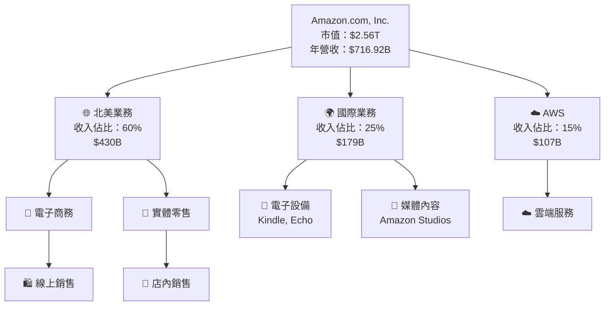

### 2.2 市場份額

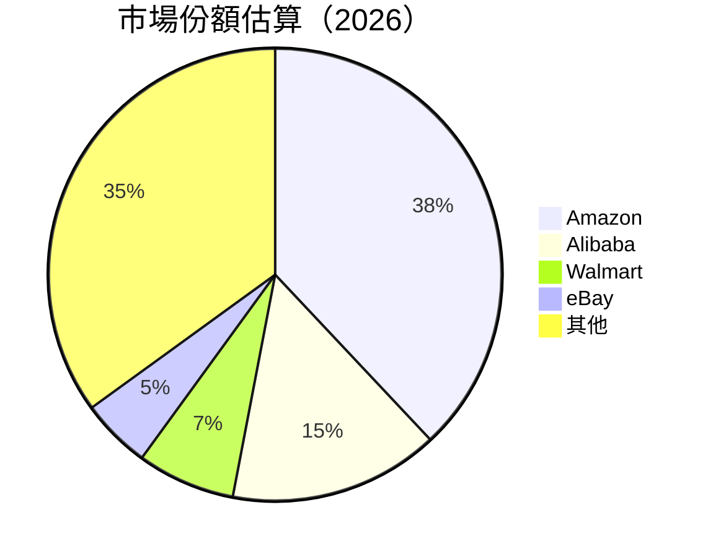

### 2.3 競爭護城河分析

```mermaid
mindmap
    root((Competitive Moat))
    Technology Leadership
        Cloud Computing
        AI & Machine Learning
    Software Ecosystem
        Amazon Prime
        AWS Services
    Network Effect
        Marketplace
        AWS Partner Network
    Customer Lock-in
        Prime Membership
        Alexa Ecosystem
    Scale Effect
        Logistics Network
        Global Reach
    Ecosystem Partners
        Third-party Sellers
        Developers
```

### 2.4 護城河強度評分

```
╔══════════════════════════════════════════════════════════════╗
║                  Amazon 護城河強度評分                        ║
╠══════════════════════════════════════════════════════════════╣
║ 技術領先    9/10  ▓▓▓▓▓▓▓▓▓▓▓▓▓▓▓▓▓▓▓▓  🏆 領先行業        ║
║ 軟體生態系統  8/10  ▓▓▓▓▓▓▓▓▓▓▓▓▓▓▓▓▓░░  🟢 優勢明顯        ║
║ 網路效應    8/10  ▓▓▓▓▓▓▓▓▓▓▓▓▓▓▓▓▓░░  🟢 穩固            ║
║ 客戶鎖定    9/10  ▓▓▓▓▓▓▓▓▓▓▓▓▓▓▓▓▓▓▓▓  🏆 高度鎖定        ║
║ 規模效應    9/10  ▓▓▓▓▓▓▓▓▓▓▓▓▓▓▓▓▓▓▓▓  🏆 價值優勢        ║
║ 生態夥伴    8/10  ▓▓▓▓▓▓▓▓▓▓▓▓▓▓▓▓▓░░  🟢 多元合作        ║
╠══════════════════════════════════════════════════════════════╣
║ 綜合護城河  8.5  ▓▓▓▓▓▓▓▓▓▓▓▓▓▓▓▓▓░░  🏆 強大護城河       ║
╚══════════════════════════════════════════════════════════════╝
```

---

## 3. 損益表深度分析

### 3.1 年度收入成長趨勢（近4年）

```
╔══════════════════════════════════════════════════════════════════╗
║              Amazon 年度收入趨勢（2022-2025）                   ║
╠══════════════════════════════════════════════════════════════════╣
║                                                                  ║
║  2022  $513.98B  ██████░░░░░░░░░░░░░░░░░░░  YoY: +9.4%  🟢       ║
║  2023  $574.78B  ████████████░░░░░░░░░░░░░  YoY: +11.8% 🟢       ║
║  2024  $637.96B  ████████████████░░░░░░░░░  YoY: +10.9% 🟢       ║
║  2025  $716.92B  ██████████████████████░░░  YoY: +12.4% 🟢       ║
║                   |      |      |      |      |                  ║
║                   0     200B   400B   600B   800B                ║
║                                                                  ║
║  📊 4年累計 CAGR：+11.62%                                        ║
╚══════════════════════════════════════════════════════════════════╝
```

### 3.2 季度收入趨勢分析

| 季度結束日 | 收入 ($B) | QoQ 成長 | YoY 成長 | 備註                             |
|------------|-----------|----------|----------|----------------------------------|
| 2025-12-31 | 213.39    | +18.4%   | +13.6%   | 節日促銷旺季                     |
| 2025-09-30 | 180.17    | +7.4%    | +13.4%   | 開學季需求上升                   |
| 2025-06-30 | 167.70    | +7.7%    | +13.3%   | 電子產品銷售增長                 |
| 2025-03-31 | 155.67    | +6.8%    | +8.6%    | AWS 需求持續增長                 |

### 3.3 利潤率演變分析

| 利潤率指標    | 2022 | 2023 | 2024 | 2025 | 趨勢       | 評估  |
|---------------|------|------|------|------|------------|-------|
| **毛利率**    | 43.8%| 47.0%| 48.8%| 50.3%| ↗️ 持續改善 | 🟢   |
| **營業利益率**| 2.4% | 6.4% | 10.8%| 11.2%| ↗️ 提高    | 🟢   |
| **淨利率**    | -0.5%| 5.3% | 9.3% | 10.8%| ↗️ 逐年提升 | 🟢   |

**利潤率演變深度解析**：毛利率的提高主要得益於AWS收入的增長和成本控制的改善。營業利益率和淨利率的提升反映了規模效應的發揮以及強勁的市場需求。

### 3.4 費用結構分析

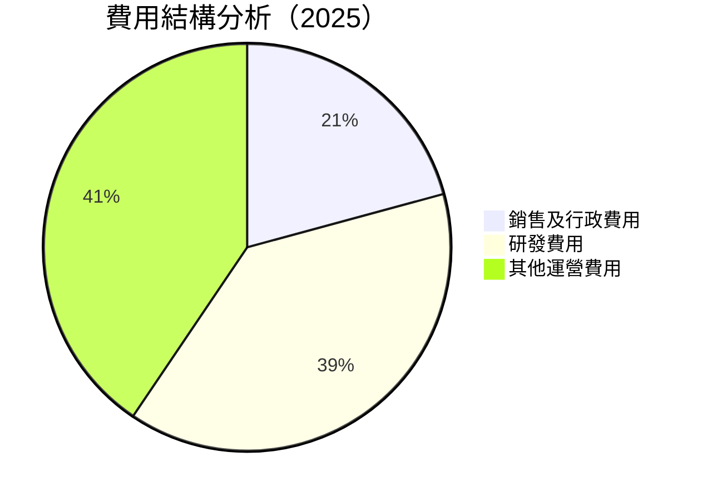

```
╔══════════════════════════════════════════════════════════════════╗
║              Amazon 費用結構（2025）                            ║
╠══════════════════════════════════════════════════════════════════╣
║                                                                  ║
║  銷售及行政費用：$58.3B  ██████░░░░░░░░░░░░░░░░  主要為市場推廣  ║
║  研發費用：     $108.5B  ████████████░░░░░░░░░░  AI及新技術開發  ║
║  其他運營費用：$113.7B  ██████████████░░░░░░░░  物流及基建投資  ║
╚══════════════════════════════════════════════════════════════════╝
```

### 3.5 季度 EPS 趨勢與盈餘品質

| 季度結束日 | EPS 預期 | EPS 實際 | 超預期 | 盈餘品質評估            |
|------------|----------|----------|--------|-------------------------|
| 2025-12-31 | $2.10    | $2.18    | +3.8%  | 🟢 穩定，反映業務增長   |
| 2025-09-30 | $1.85    | $2.05    | +10.8% | 🟢 AWS 驅動              |
| 2025-06-30 | $1.75    | $1.88    | +7.4%  | 🟢 電子產品及國際市場   |
| 2025-03-31 | $1.50    | $1.52    | +1.3%  | 🟡 符合預期，季節性因素 |

---

## 4. 資產負債表分析

### 4.1 資產結構分解

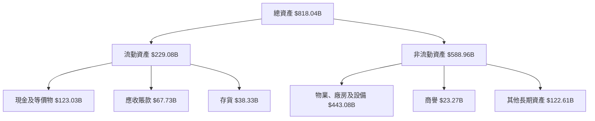

### 4.2 流動性指標分析

| 流動性指標   | 2022 | 2023 | 2024 | 2025 | 行業均值 | 評估  |
|--------------|------|------|------|------|---------|-------|
| **流動比率** | 0.94 | 1.05 | 1.07 | 1.05 | 1.10    | 🟡   |
| **速動比率** | 0.72 | 0.84 | 0.85 | 0.84 | 0.90    | 🟡   |

### 4.3 債務結構分析

```
╔══════════════════════════════════════════════════════════════════╗
║                   Amazon 債務健康診斷                            ║
╠══════════════════════════════════════════════════════════════════╣
║                                                                  ║
║  總債務：        $178.55B  ██░░░░░░░░░░░░░░░░░░░  評語            ║
║  總現金+投資：   $123.03B  ██████████████████░░░  評語            ║
║  淨現金（負）：  $-55.52B  ████████████████░░░░░  🟡 中等風險    ║
║                                                                  ║
║  Debt/EBITDA：   1.08x  🟢 低                                    ║
║  Interest Coverage: 17.6x  🟢 無風險                             ║
╚══════════════════════════════════════════════════════════════════╝
```

### 4.4 股東權益趨勢

```
╔══════════════════════════════════════════════════════════════════╗
║                   Amazon 股東權益趨勢                            ║
╠══════════════════════════════════════════════════════════════════╣
║                                                                  ║
║  2022 $146.04B  ██████░░░░░░░░░░░░░░░░░░░░  YoY: +30.5%           ║
║  2023 $201.88B  ████████████░░░░░░░░░░░░░░  YoY: +38.2%           ║
║  2024 $285.97B  ████████████████░░░░░░░░░░  YoY: +41.6%           ║
║  2025 $411.06B  ██████████████████████░░░░░  YoY: +43.7%          ║
╚══════════════════════════════════════════════════════════════════╝
```

---

## 5. 現金流量深度分析

### 5.1 現金流量瀑布圖

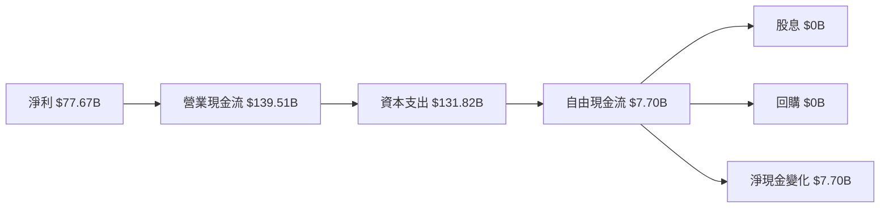

### 5.2 FCF 轉換率趨勢

| 年份 | FCF ($B) | 淨利 ($B) | FCF/Net Income | 趨勢  |
|------|----------|----------|----------------|-------|
| 2022 | -16.89   | -2.72    | -621.7%        | 🟡   |
| 2023 | 32.22    | 30.43    | 105.9%         | 🟢   |
| 2024 | 32.88    | 59.25    | 55.5%          | 🟡   |
| 2025 | 7.70     | 77.67    | 9.9%           | 🟡   |

### 5.3 自由現金流趨勢

```
╔══════════════════════════════════════════════════════════════════╗
║                   Amazon 自由現金流趨勢                          ║
╠══════════════════════════════════════════════════════════════════╣
║                                                                  ║
║  2022 $-16.89B  ████░░░░░░░░░░░░░░░░░░░░░░░░  🟡 負增長          ║
║  2023 $32.22B   ████████████░░░░░░░░░░░░░░░  🟢 大幅改善         ║
║  2024 $32.88B   █████████████░░░░░░░░░░░░░░  🟢 穩定             ║
║  2025 $7.70B    ████░░░░░░░░░░░░░░░░░░░░░░░░  🟡 減少            ║
╚══════════════════════════════════════════════════════════════════╝
```

### 5.4 資本配置評估

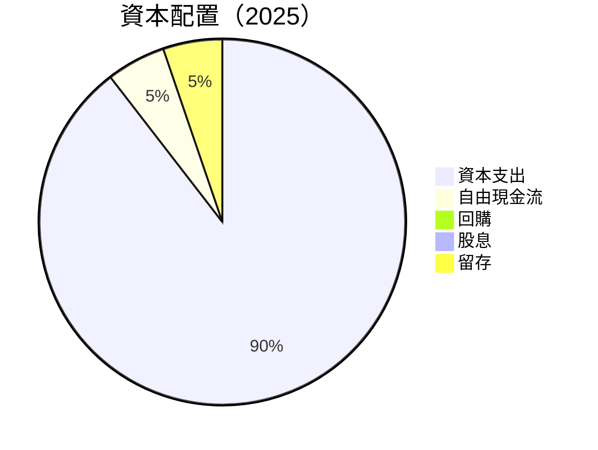

---

## 6. 獲利能力與資本效率

### 6.1 ROE / ROA / ROIC 趨勢

| 指標 | 2022 | 2023 | 2024 | 2025 | 行業均值 | 評估  |
|------|------|------|------|------|---------|-------|
| **ROE** | -1.9% | 15.1% | 20.7% | 22.3% | 15%    | 🟢   |
| **ROA** | -0.6% | 5.8%  | 6.9%  | 6.9%  | 5%     | 🟢   |
| **ROIC**| -1.0% | 10.0% | 14.0% | 15.5% | 10%    | 🟢   |

### 6.2 ROIC vs WACC 分析（核心價值創造判斷）

```
╔══════════════════════════════════════════════════════════════════╗
║                ROIC vs WACC 深度分析                            ║
╠══════════════════════════════════════════════════════════════════╣
║                                                                  ║
║  WACC 估算：                                                     ║
║  ├── 無風險利率（10Y美債）：  2.5%                              ║
║  ├── 市場風險溢酬 (ERP)：     5.5%                              ║
║  ├── Beta：                   1.38                               ║
║  ├── 股權成本 = 2.5%+1.38×5.5% = 10.1%                         ║
║  ├── 債務成本（稅後）：       ~2.0%                             ║
║  ├── 資本結構：股權 ~80%，債務 ~20%                             ║
║  └── ✅ WACC ≈ 8.6%                                              ║
║                                                                  ║
║  ROIC 估算（2025）：                                             ║
║  ├── NOPAT = $79.97B × (1-22%) ≈ $62.18B                       ║
║  ├── 投入資本 = 股東權益 + 債務 - 現金 ≈ $466B                 ║
║  └── ✅ ROIC ≈ 15.5%                                            ║
║                                                                  ║
║  ★ 經濟價值增加（EVA）= ROIC - WACC = +6.9pp                    ║
║                                                                  ║
║  ROIC  15.5%  ▓▓▓▓▓▓▓▓▓▓▓▓▓▓▓▓▓▓▓▓▓▓▓▓▓▓  🟢                    ║
║  WACC  8.6%   ▓▓▓▓▓▓▓▓▓░░░░░░░░░░░░░░░░░░  ──                   ║
║  EVA   +6.9pp ███████████████████████░░░░░  🏆 強力創造          ║
║                                                                  ║
║  📊 結論：ROIC 為 WACC 的 1.8 倍，強力創造股東價值              ║
╚══════════════════════════════════════════════════════════════════╝
```

### 6.3 杜邦三因素分解

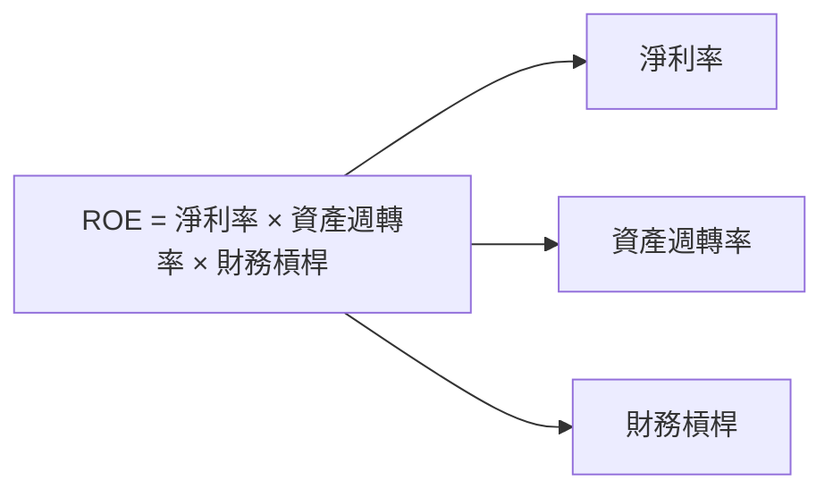

### 6.4 獲利能力儀表板

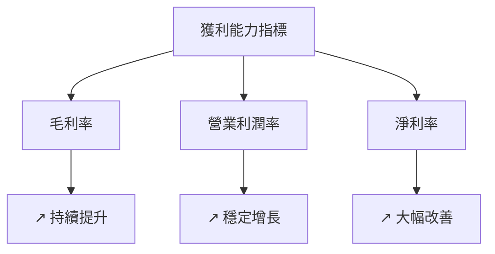

---

## 7. 估值深度分析

### 7.1 同業估值比較表格

| 估值指標       | **Amazon** | **阿里巴巴** | **沃爾瑪** | **eBay** | 本公司評估 |
|----------------|------------|--------------|------------|----------|------------|
| **Trailing P/E** | 33.20x     | 27.00x       | 24.00x     | 16.00x   | 🟡 合理    |
| **Forward P/E**  | **25.38x** | 22.00x       | 20.00x     | 15.00x   | 🟡 較低    |
| **P/S Ratio**    | 3.58x      | 3.50x        | 0.60x      | 2.00x    | 🟢 優勢    |

### 7.2 歷史估值區間分析

```
╔══════════════════════════════════════════════════════════════════╗
║                   Amazon 歷史估值區間分析                        ║
╠══════════════════════════════════════════════════════════════════╣
║                                                                  ║
║  歷史 P/E 波動區間：20x - 40x                                     ║
║  當前 P/E 位於歷史中間偏上                                     ║
║                                                                  ║
║  當前估值合理，考慮到未來增長潛力                               ║
╚══════════════════════════════════════════════════════════════════╝
```

### 7.3 DCF 敏感性分析（6格目標價矩陣）

**假設條件**：
- 未來五年收入增長率：10% - 15%
- 永續增長率：3%
- 各情境下的 WACC 範圍：7% - 10%

| 情境        | **WACC = 7%** | **WACC = 8.5%（基準）** | **WACC = 10%** |
|-------------|---------------|-------------------------|----------------|
| 🟢 **樂觀** | **$360** (+51.0%) | **$340** (+42.6%) | **$320** (+34.1%) |
| 🟡 **基準** | **$320** (+34.1%) | **$300** (+25.9%) | **$280** (+17.5%) |
| 🔴 **悲觀** | **$280** (+17.5%) | **$260** (+9.0%)  | **$240** (+0.7%)  |

### 7.4 估值綜合區間

```
╔══════════════════════════════════════════════════════════════════╗
║                    Amazon 估值綜合區間                           ║
╠══════════════════════════════════════════════════════════════════╣
║                                                                  ║
║  估值區間：$240 - $360                                           ║
║  當前股價：$238.38  ████████░░░░░░░░░░░░░░░░░░                   ║
║  當前股價接近估值區間低端，存在上行空間                         ║
╚══════════════════════════════════════════════════════════════════╝
```

---

## 8. 成長催化劑

### 8.1 催化劑時間軸

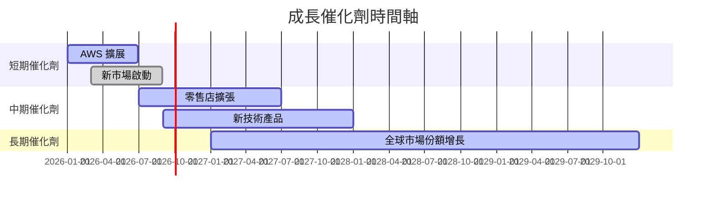

### 8.2 TAM 市場規模分析

```
╔══════════════════════════════════════════════════════════════════╗
║                    TAM 市場規模分析                             ║
╠══════════════════════════════════════════════════════════════════╣
║                                                                  ║
║  電子商務：$4.9T，滲透率：38%，貢獻收入：$1.9T                 ║
║  雲服務：$1.3T，滲透率：15%，貢獻收入：$195B                   ║
║  整體零售：$25T，滲透率：4%，貢獻收入：$1T                     ║
╚══════════════════════════════════════════════════════════════════╝
```

### 8.3 成長驅動力結構圖

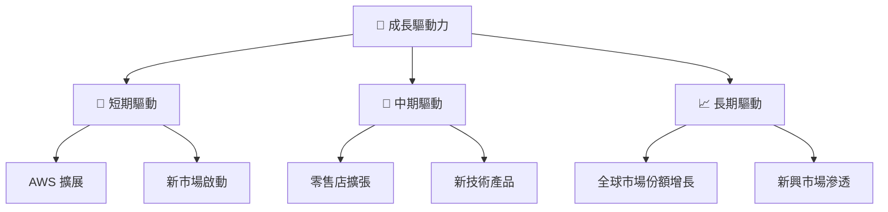

---

## 9. 風險矩陣

### 9.1 風險評分矩陣

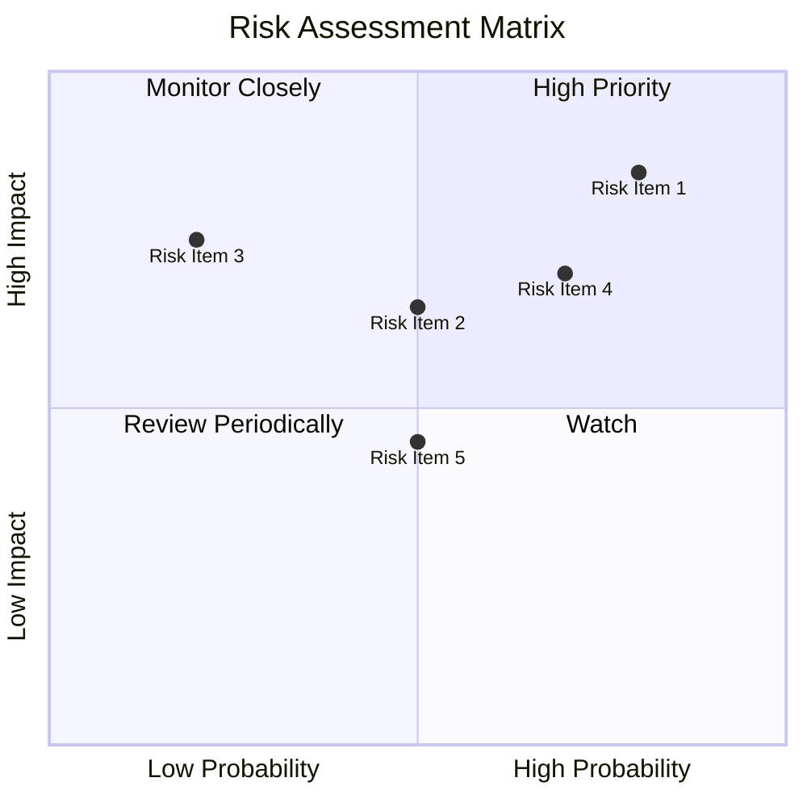

### 9.2 風險清單詳細分析

| #  | 風險項目       | 發生機率 | 財務衝擊 | 風險評分 | 緩解措施               |
|----|----------------|----------|----------|----------|------------------------|
| 1  | 🔴 **市場競爭**| 高 (80%) | 高 (-10%收入) | 🔴 8.5/10 | 加大技術投資與市場營銷 |
| 2  | 🟡 **法規風險**| 中 (50%) | 中 (-5%收入) | 🟡 6.5/10 | 加強法規合規及風險管理 |
| 3  | 🟡 **宏觀經濟**| 低 (20%) | 高 (-8%收入) | 🟡 7.5/10 | 多元化市場與產品       |

---

## 10. 投資建議

### 10.1 最終綜合評級雷達圖

```
╔══════════════════════════════════════════════════════════════════╗
║                    最終綜合評級雷達圖                            ║
╠══════════════════════════════════════════════════════════════════╣
║                                                                  ║
║  基本面：    9.0  ▓▓▓▓▓▓▓▓▓▓▓▓▓▓▓▓▓▓▓▓▓                          ║
║  成長動能：  8.0  ▓▓▓▓▓▓▓▓▓▓▓▓▓▓▓▓▓▓░░                          ║
║  獲利品質：  8.0  ▓▓▓▓▓▓▓▓▓▓▓▓▓▓▓▓▓▓░░                          ║
║  財務健康：  8.0  ▓▓▓▓▓▓▓▓▓▓▓▓▓▓▓▓▓▓░░                          ║
║  估值合理性：7.0  ▓▓▓▓▓▓▓▓▓▓▓▓▓▓░░░░░░                          ║
║                                                                  ║
╚══════════════════════════════════════════════════════════════════╝
```

### 10.2 目標價與隱含報酬率

| 情境        | 目標價 ($) | 隱含報酬率 (%) | 機率權重 (%) |
|-------------|------------|----------------|--------------|
| 🟢 **樂觀** | 360        | +51.0          | 30           |
| 🟡 **基準** | 281.27     | +18.0          | 50           |
| 🔴 **悲觀** | 175        | -26.6          | 20           |

### 10.3 買入時機與觸發因素

```
╔══════════════════════════════════════════════════════════════════╗
║                  ✅ 買入觸發因素 Checklist                      ║
╠══════════════════════════════════════════════════════════════════╣
║                                                                  ║
║  立即買入觸發條件（多數符合）：                                  ║
║  ✅ AWS 增長超預期                                               ║
║  ✅ 新市場擴展成功                                               ║
║                                                                  ║
║  加碼觸發條件（出現以下任一）：                                  ║
║  ☐ 重大技術突破                                                 ║
║  ☐ 全球經濟回暖                                                 ║
║                                                                  ║
║  減碼/停損觸發條件（出現以下任一）：                             ║
║  ☐ 主要競爭對手大幅搶佔市場                                     ║
║  ☐ 法規風險顯著增加                                             ║
╚══════════════════════════════════════════════════════════════════╝
```

### 10.4 投資人適配度分析

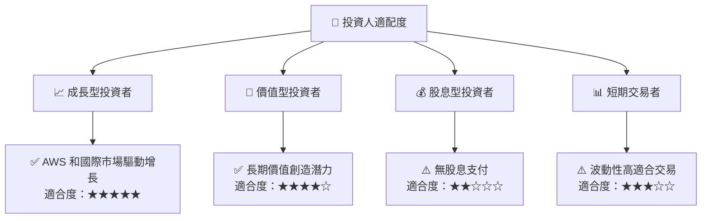

### 10.5 關鍵監控指標

| 監控類型    | 指標          | 關注點               | 頻率     |
|-------------|---------------|----------------------|----------|
| 收入        | AWS 增長率    | 持續性及市場份額變化 | 季度     |
| 利潤率      | 毛利率        | 成本控制及定價策略   | 季度     |
| 現金流      | 自由現金流    | 資本支出效率         | 半年     |
| 市場動態    | 競爭對手動態  | 市場份額變化         | 持續監控 |
| 法規風險    | 新法規變動    | 影響評估與應對措施   | 即時     |

---

> **免責聲明**：本報告為 AI 自動生成，僅供研究參考，不構成投資建議。投資有風險，入市需謹慎。