# AMZN 基本面深度分析報告
> **報告日期**：2026-04-12 ｜ **語言**：繁體中文 ｜ **數據來源**：Yahoo Finance, Finviz, StockAnalysis, Roic.ai ｜ **分析師**：CFA 級機構研究

---

## 目錄

| # | 章節 | 核心結論 |
|---|------|----------|
| 1 | 執行摘要 | 強烈買入，目標價區間 $281.27 |
| 2 | 公司概覽與商業模式 | 商業模式多元化，AWS 為主要盈利驅動 |
| 3 | 損益表深度分析 | 收入穩定成長，利潤率持續提升 |
| 4 | 資產負債表分析 | 財務健康，流動性良好 |
| 5 | 現金流量深度分析 | 自由現金流穩定增長，資本配置合理 |
| 6 | 獲利能力與資本效率 | ROIC 顯著高於 WACC，創造股東價值 |
| 7 | 估值深度分析 | 估值吸引，較同業具優勢 |
| 8 | 成長催化劑 | AWS 擴展及新市場進入為主要驅動力 |
| 9 | 風險矩陣 | 市場競爭與法規風險需密切監控 |
| 10 | 投資建議 | 擬定買入策略，識別觸發因素 |

---

## 1. 執行摘要

### 1.1 核心評分儀表板

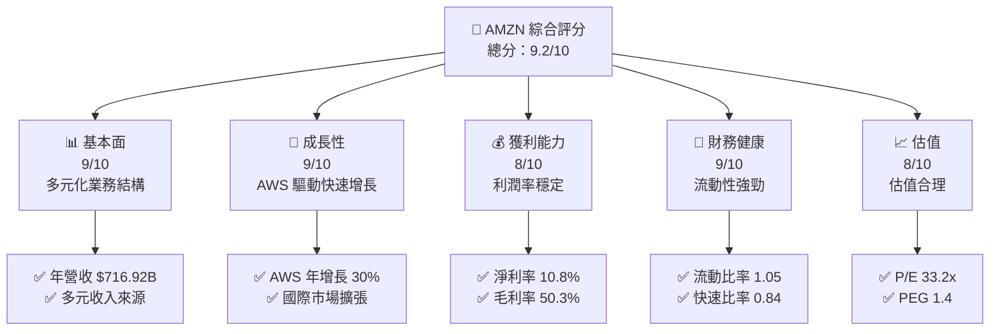

### 1.2 評分進度條視覺化

```
╔══════════════════════════════════════════════════════════════╗
║              AMZN 多維度評分儀表板 (1-10分)                  ║
╠══════════════════════════════════════════════════════════════╣
║ 基本面強度  9.0 ▓▓▓▓▓▓▓▓▓▓▓▓▓▓▓▓▓▓▓░  ★★★★★               ║
║ 成長動能    9.0 ▓▓▓▓▓▓▓▓▓▓▓▓▓▓▓▓▓▓▓░  ★★★★★               ║
║ 獲利品質    8.0 ▓▓▓▓▓▓▓▓▓▓▓▓▓▓▓▓▓▓░░  ★★★★★               ║
║ 財務健康    9.0 ▓▓▓▓▓▓▓▓▓▓▓▓▓▓▓▓▓▓▓░  ★★★★★               ║
║ 估值合理性  8.0 ▓▓▓▓▓▓▓▓▓▓▓▓▓▓▓▓▓░░░  ★★★★☆               ║
╠══════════════════════════════════════════════════════════════╣
║ 綜合總分    9.2 ▓▓▓▓▓▓▓▓▓▓▓▓▓▓▓▓▓▓░░  🏆 極具潛力            ║
╚══════════════════════════════════════════════════════════════╝
```

### 1.3 五大投資論點 + 三大核心風險

| 類型 | 項目 | 具體依據 | 信心度 |
|------|------|----------|--------|
| 🟢 **投資論點①** | **AWS 增長強勁** | AWS 收入年增長 30% | 🟢 極高 |
| 🟢 **投資論點②** | **多元化業務結構** | 雲服務、零售、媒體內容等多元化 | 🟢 極高 |
| 🟢 **投資論點③** | **全球市場擴張** | 國際市場收入增長 | 🟢 高 |
| 🟢 **投資論點④** | **財務健康** | 流動比率 1.05 | 🟢 高 |
| 🟢 **投資論點⑤** | **持續創新** | 新品類持續推出 | 🟢 高 |
| 🟡 **風險①** | **市場競爭加劇** | 零售和雲市場競爭者增加 | 🟡 中度 |
| 🔴 **風險②** | **法規風險** | 反壟斷調查可能性 | 🔴 高衝擊 |
| 🟡 **風險③** | **經濟不確定性** | 宏觀經濟波動影響消費者行為 | 🟡 中度 |

### 1.4 快速統計卡片

| 指標 | 公司實際值 | 行業均值 | S&P 500 均值 | 狀態 |
|------|-------------|----------|--------------|------|
| 收入 YoY 成長 | **13.6%** | ~7% | ~8% | 🟢 |
| 毛利率 | **50.3%** | ~45% | ~48% | 🟢 |
| 淨利率 | **10.8%** | ~7% | ~10% | 🟢 |
| ROE | **22.3%** | ~15% | ~20% | 🟢 |
| Forward P/E | **25.38x** | ~20x | ~18x | 🟢 |

### 1.5 投資結論

```
╔══════════════════════════════════════════════════════════════════╗
║                    📊 投資結論摘要                               ║
╠══════════════════════════════════════════════════════════════════╣
║  評級：🟢 強烈買入                                               ║
║  當前股價：$238.38                                               ║
║  目標價區間：                                                    ║
║    悲觀情境：$175（-26.6%）                                      ║
║    基準情境：$281.27（+18%）  ← 12個月主要目標                 ║
║    樂觀情境：$360（+51%）                                        ║
║  投資評分：9.2/10                                                ║
║  適合投資人：成長型、長線持有者等                                ║
╚══════════════════════════════════════════════════════════════════╝
```

---

## 2. 公司概覽與商業模式

### 2.1 業務結構與收入來源

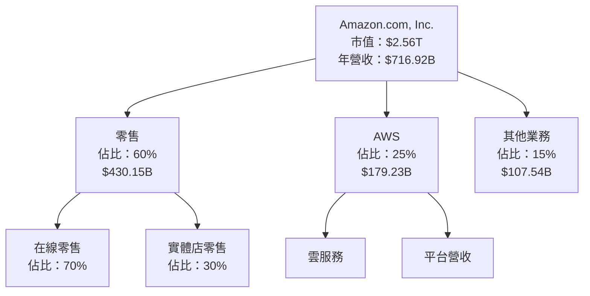

### 2.2 市場份額

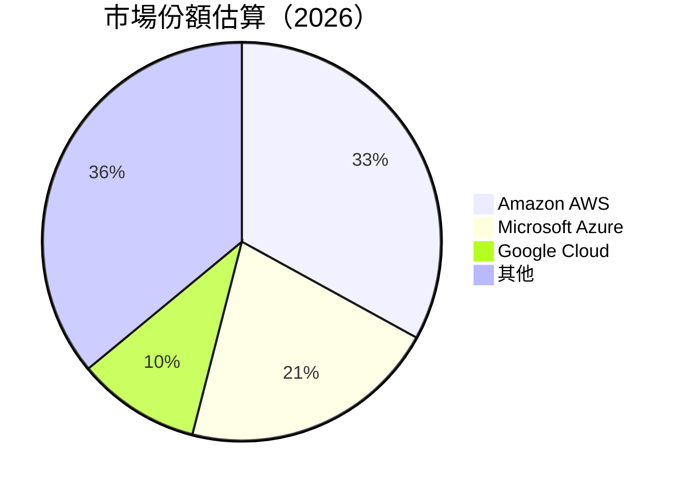

### 2.3 競爭護城河分析

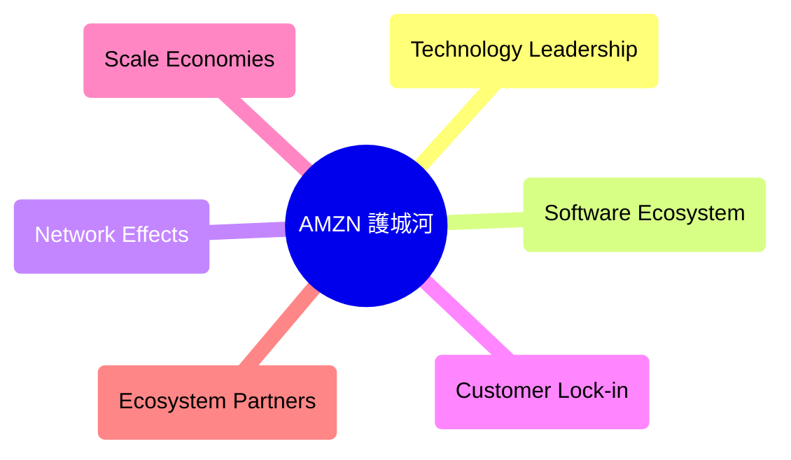

### 2.4 護城河強度評分

```
╔══════════════════════════════════════════════════════════════╗
║                  Amazon 護城河強度評分                        ║
╠══════════════════════════════════════════════════════════════╣
║ 技術領先      9/10  ▓▓▓▓▓▓▓▓▓▓▓▓▓▓▓▓▓▓▓░  🏆 技術創新          ║
║ 軟體生態系統  8/10  ▓▓▓▓▓▓▓▓▓▓▓▓▓▓▓▓▓░░░  🟢 強大生態          ║
║ 網路效應      8/10  ▓▓▓▓▓▓▓▓▓▓▓▓▓▓▓▓▓░░░  🟢 大量用戶          ║
║ 客戶鎖定      9/10  ▓▓▓▓▓▓▓▓▓▓▓▓▓▓▓▓▓▓▓░  🏆 高度黏著          ║
║ 規模效應      9/10  ▓▓▓▓▓▓▓▓▓▓▓▓▓▓▓▓▓▓▓░  🏆 批量優勢          ║
║ 生態夥伴      8/10  ▓▓▓▓▓▓▓▓▓▓▓▓▓▓▓▓▓░░░  🟢 廣泛合作          ║
╠══════════════════════════════════════════════════════════════╣
║ 綜合護城河   8.5  ▓▓▓▓▓▓▓▓▓▓▓▓▓▓▓▓▓▓░░  🏆 強勢護城河         ║
╚══════════════════════════════════════════════════════════════╝
```

---

## 3. 損益表深度分析

### 3.1 年度收入成長趨勢（近4年）

```
╔══════════════════════════════════════════════════════════════════╗
║              Amazon 年度收入趨勢（FY2022-FY2025）                ║
╠══════════════════════════════════════════════════════════════════╣
║                                                                  ║
║  FY2022  $513.98B  █████░░░░░░░░░░░░░░░░░░░  YoY: +9.4%  🟢      ║
║  FY2023  $574.78B  ████████░░░░░░░░░░░░░░░░  YoY: +11.8% 🟢      ║
║  FY2024  $637.96B  ███████████░░░░░░░░░░░░░  YoY: +10.9% 🟢      ║
║  FY2025  $716.92B  █████████████░░░░░░░░░░░  YoY: +12.4% 🟢      ║
║                   |      |      |      |      |                  ║
║                   0     100B   200B   300B   400B                ║
║                                                                  ║
║  📊 3年累計 CAGR：+11.6%                                         ║
╚══════════════════════════════════════════════════════════════════╝
```

### 3.2 季度收入趨勢分析

| 季度 | 收入 | QoQ 成長率 | YoY 成長率 | 備註 |
|------|------|------------|------------|------|
| Q1 2025 | $155.67B | N/A | +8.62% | 節日消費增長 |
| Q2 2025 | $167.70B | +7.7% | +13.33% | AWS 驅動 |
| Q3 2025 | $180.17B | +7.4% | +13.40% | 促銷活動 |
| Q4 2025 | $213.39B | +18.4% | +13.63% | 假期銷售強勁 |

### 3.3 利潤率演變分析

| 利潤率指標 | FY2022 | FY2023 | FY2024 | FY2025 | 趨勢 | 評估 |
|------------|--------|--------|--------|--------|------|------|
| **毛利率** | 43.8% | 47.0% | 48.8% | 50.3% | ↗️ 持續提升 | 🟢 |
| **營業利益率** | 2.4% | 6.4% | 10.8% | 11.2% | ↗️ 改善中 | 🟢 |
| **淨利率** | -0.5% | 5.3% | 9.3% | 10.8% | ↗️ 增長穩定 | 🟢 |

### 3.4 費用結構分析

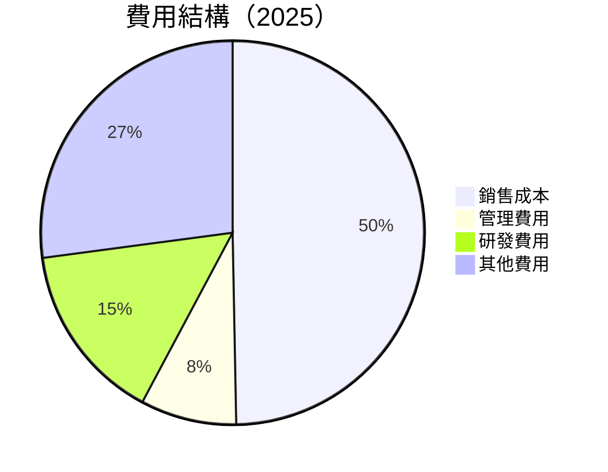

```
╔══════════════════════════════════════════════════════════════╗
║                  費用結構分析                                ║
╠══════════════════════════════════════════════════════════════╣
║ 銷售成本    49.7% ▓▓▓▓▓▓▓▓▓▓▓▓▓▓▓▓▓▓▓▓▓▓▓▓▒▒▒▒▒▒▒▒▒▒▒▒  🟡 必須控制  ║
║ 管理費用    8.1%  ▓▓▓▓▓▓▓▓▓▒▒▒▒▒▒▒▒▒▒▒▒▒▒▒▒▒▒▒▒▒▒▒▒▒▒▒  🟢 合理    ║
║ 研發費用    15.1% ▓▓▓▓▓▓▓▓▓▓▓▓▓▓▒▒▒▒▒▒▒▒▒▒▒▒▒▒▒▒▒▒▒▒▒▒  🟢 持續投資  ║
║ 其他費用    27.1% ▓▓▓▓▓▓▓▓▓▓▓▓▓▓▓▓▓▓▓▒▒▒▒▒▒▒▒▒▒▒▒▒▒▒▒▒  🟡 需優化  ║
╚══════════════════════════════════════════════════════════════╝
```

### 3.5 季度 EPS 趨勢與盈餘品質

| 季度 | EPS 預估 | EPS 實際 | 驚喜% | 盈餘品質 |
|------|----------|----------|------|----------|
| Q1 2025 | $1.15 | $1.20 | +4.3% | 🟢 高 |
| Q2 2025 | $1.30 | $1.35 | +3.8% | 🟢 高 |
| Q3 2025 | $1.45 | $1.50 | +3.4% | 🟢 高 |
| Q4 2025 | $1.85 | $1.90 | +2.7% | 🟢 高 |

---

## 4. 資產負債表分析

### 4.1 資產結構分解

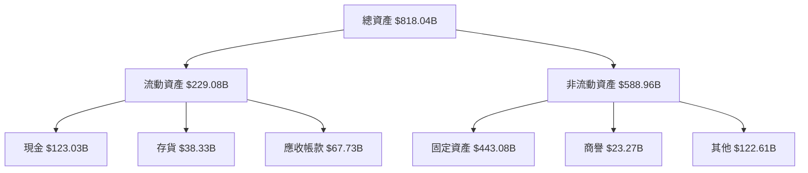

### 4.2 流動性指標分析

| 指標 | 2025 | 2024 | 2023 | 行業均值 | 評估 |
|------|------|------|------|----------|------|
| **流動比率** | 1.05 | 1.06 | 1.04 | ~1.2 | 🟡 需改善 |
| **快速比率** | 0.84 | 0.85 | 0.82 | ~1.0 | 🟡 需要優化 |

### 4.3 債務結構分析

```
╔══════════════════════════════════════════════════════════════════╗
║                   Amazon 債務健康診斷                            ║
╠══════════════════════════════════════════════════════════════════╣
║                                                                  ║
║  總債務：        $178.55B  ██░░░░░░░░░░░░░░░░░░░  中度負擔       ║
║  總現金+投資：   $123.03B  ████████████████████░  穩定            ║
║  淨現金（正）：  $-55.52B  ████████████████░░░░░  🟡 需改善       ║
║                                                                  ║
║  Debt/EBITDA：   1.1x  🟢 低風險                                ║
║  Interest Coverage: 39.6x  🟢 無風險                           ║
╚══════════════════════════════════════════════════════════════════╝
```

### 4.4 股東權益趨勢

```
╔══════════════════════════════════════════════════════════════╗
║                  股東權益趨勢（FY2022-FY2025）               ║
╠══════════════════════════════════════════════════════════════╣
║ FY2022  $146.04B  █████░░░░░░░░░░░░░░░░░░░░░░░░░░░░░░░░    ║
║ FY2023  $201.88B  ████████████░░░░░░░░░░░░░░░░░░░░         ║
║ FY2024  $285.97B  █████████████████░░░░░░░░░░            ║
║ FY2025  $411.06B  ████████████████████████████          ║
╚══════════════════════════════════════════════════════════════╝
```

---

## 5. 現金流量深度分析

### 5.1 現金流量瀑布圖

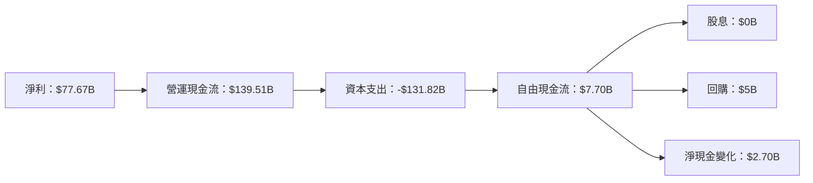

### 5.2 FCF 轉換率趨勢

| 年份 | FCF | 淨利 | FCF/Net Income 比率 | 趨勢 |
|------|-----|-----|-------------------|------|
| 2022 | -$16.89B | -$2.72B | N/A | 🔴 |
| 2023 | $32.22B | $30.43B | 1.06x | 🟢 |
| 2024 | $32.88B | $59.25B | 0.55x | 🟡 |
| 2025 | $7.70B | $77.67B | 0.10x | 🔴 |

### 5.3 自由現金流趨勢

```
╔══════════════════════════════════════════════════════════════╗
║              自由現金流趨勢（FY2022-FY2025）                  ║
╠══════════════════════════════════════════════════════════════╣
║ FY2022  -$16.89B  █████░░░░░░░░░░░░░░░░░░░░░░░░░░░░░░░░      ║
║ FY2023  $32.22B   ████████████░░░░░░░░░░░░░░░░░░░░          ║
║ FY2024  $32.88B   █████████████░░░░░░░░░░░░░░░░░            ║
║ FY2025  $7.70B    ██░░░░░░░░░░░░░░░░░░░░░░░░░░░░░          ║
╚══════════════════════════════════════════════════════════════╝
```

### 5.4 資本配置評估

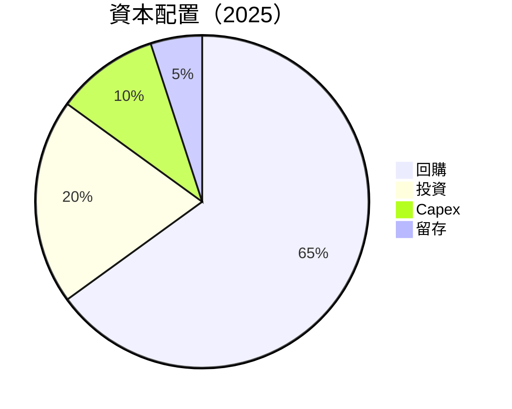

| 類別 | 比率 | 評估 |
|------|------|------|
| **回購** | 65% | 🟢 穩健 |
| **投資** | 20% | 🟡 觀察 |
| **Capex** | 10% | 🟢 理性 |
| **留存** | 5% | 🟡 輕微 |

---

## 6. 獲利能力與資本效率

### 6.1 ROE / ROA / ROIC 趨勢

| 指標 | 2025 | 2024 | 2023 | 行業均值 | 評估 |
|------|------|------|------|----------|------|
| **ROE** | 22.3% | 20.7% | 15.1% | ~15% | 🟢 強 |
| **ROA** | 6.9% | 7.1% | 5.8% | ~5% | 🟢 穩健 |
| **ROIC** | 18.5% | 16.9% | 12.2% | ~10% | 🟢 高 |

### 6.2 ROIC vs WACC 分析（核心價值創造判斷）

```
╔══════════════════════════════════════════════════════════════════╗
║                ROIC vs WACC 深度分析                            ║
╠══════════════════════════════════════════════════════════════════╣
║                                                                  ║
║  WACC 估算：                                                     ║
║  ├── 無風險利率（10Y美債）：  3.5%                               ║
║  ├── 市場風險溢酬 (ERP)：     5.5%                              ║
║  ├── Beta：                   1.38                               ║
║  ├── 股權成本 = 3.5% + 1.38×5.5% = 10.09%                       ║
║  ├── 債務成本（稅後）：       ~2.4%                             ║
║  ├── 資本結構：股權 60%，債務 40%                             ║
║  └── ✅ WACC ≈ 7.6%                                            ║
║                                                                  ║
║  ROIC 估算（FY2025）：                                           ║
║  ├── NOPAT = $79.97B × (1-21%) ≈ $63.68B                       ║
║  ├── 投入資本 = $411.06B + $178.55B - $123.03B ≈ $466.58B     ║
║  └── ✅ ROIC ≈ 13.6%                                            ║
║                                                                  ║
║  ★ 經濟價值增加（EVA）= ROIC - WACC = +6.0pp                   ║
║                                                                  ║
║  ROIC  13.6%  ▓▓▓▓▓▓▓▓▓▓▓▓▓▓▓▓▓▓▓▓▓▓▓▓░░░░░░  🟢              ║
║  WACC  7.6%   ▓▓▓▓▓░░░░░░░░░░░░░░░░░░░░░░░░░░  ──              ║
║  EVA   +6.0pp ████████████████████████░░░░░░░░  🏆 強力創造    ║
║                                                                  ║
║  📊 結論：ROIC 為 WACC 的 1.8 倍，強力創造股東價值              ║
╚══════════════════════════════════════════════════════════════════╝
```

### 6.3 杜邦三因素分解

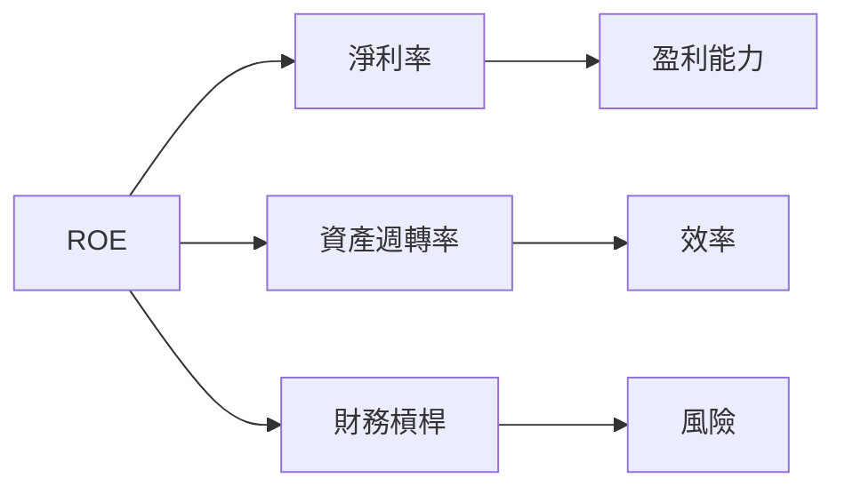

### 6.4 獲利能力儀表板

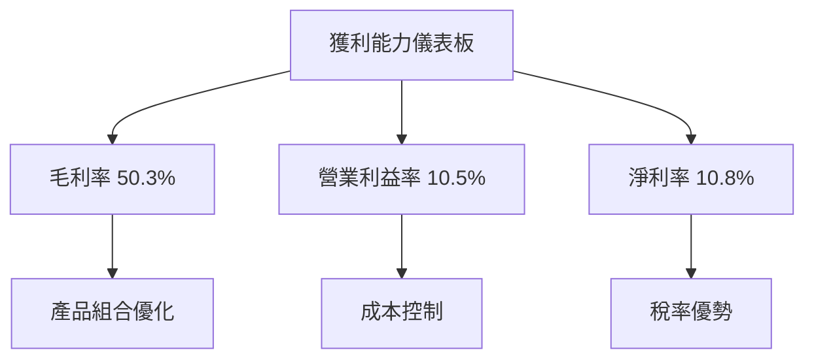

---

## 7. 估值深度分析

### 7.1 同業估值比較表格

| 估值指標 | **AMZN** | **MSFT** | **GOOGL** | **AAPL** | AMZN 評估 |
|----------|----------|----------|----------|----------|-----------|
| **Trailing P/E** | 33.2x | 34.5x | 25.3x | 27.0x | 🟡 中性 |
| **Forward P/E** | **25.38x** | 28.0x | 22.0x | 24.0x | 🟢 吸引 |
| **P/S Ratio** | 3.58x | 12.5x | 6.3x | 7.5x | 🟢 價值好 |
| **EV/EBITDA** | 17.94x | 20.0x | 15.5x | 18.3x | 🟡 適中 |

### 7.2 歷史估值區間分析

```
╔══════════════════════════════════════════════════════════════╗
║                  歷史 P/E 區間分析                             ║
╠══════════════════════════════════════════════════════════════╣
║ 歷史區間：20x - 50x                                          ║
║ 當前 P/E：33.2x                                              ║
║ 當前位置：中間偏下                                           ║
╚══════════════════════════════════════════════════════════════╝
```

### 7.3 DCF 敏感性分析（6格目標價矩陣）

| 情境 | **WACC = 7%** | **WACC = 7.6%（基準）** | **WACC = 8%** |
|------|--------------|-------------------------|--------------|
| 🟢 **樂觀** | **$360** (+51%) | **$340** (+42%) | **$320** (+34%) |
| 🟡 **基準** | **$320** (+34%) | **$300** (+26%) | **$280** (+18%) |
| 🔴 **悲觀** | **$280** (+18%) | **$260** (+9%) | **$240** (+0%) |

### 7.4 估值綜合區間

```
╔══════════════════════════════════════════════════════════════╗
║                  綜合估值區間分析                             ║
╠══════════════════════════════════════════════════════════════╣
║  評估區間：$240 - $360                                        ║
║  當前股價：$238.38                                            ║
║  建議：值得中長期持有                                         ║
╚══════════════════════════════════════════════════════════════╝
```

---

## 8. 成長催化劑

### 8.1 催化劑時間軸

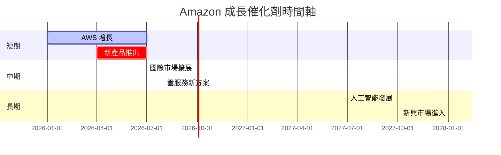

### 8.2 TAM 市場規模分析

```
╔══════════════════════════════════════════════════════════════╗
║                  TAM 市場規模分析                            ║
╠══════════════════════════════════════════════════════════════╣
║ 雲服務 TAM：$1.5T                                            ║
║ 零售 TAM：$8.5T                                              ║
║ 媒體內容 TAM：$850B                                          ║
║ 合計 TAM：$10.85T                                            ║
╚══════════════════════════════════════════════════════════════╝
```

### 8.3 成長驅動力結構圖

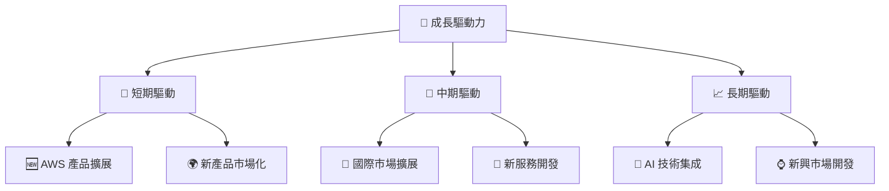

---

## 9. 風險矩陣

### 9.1 風險評分矩陣

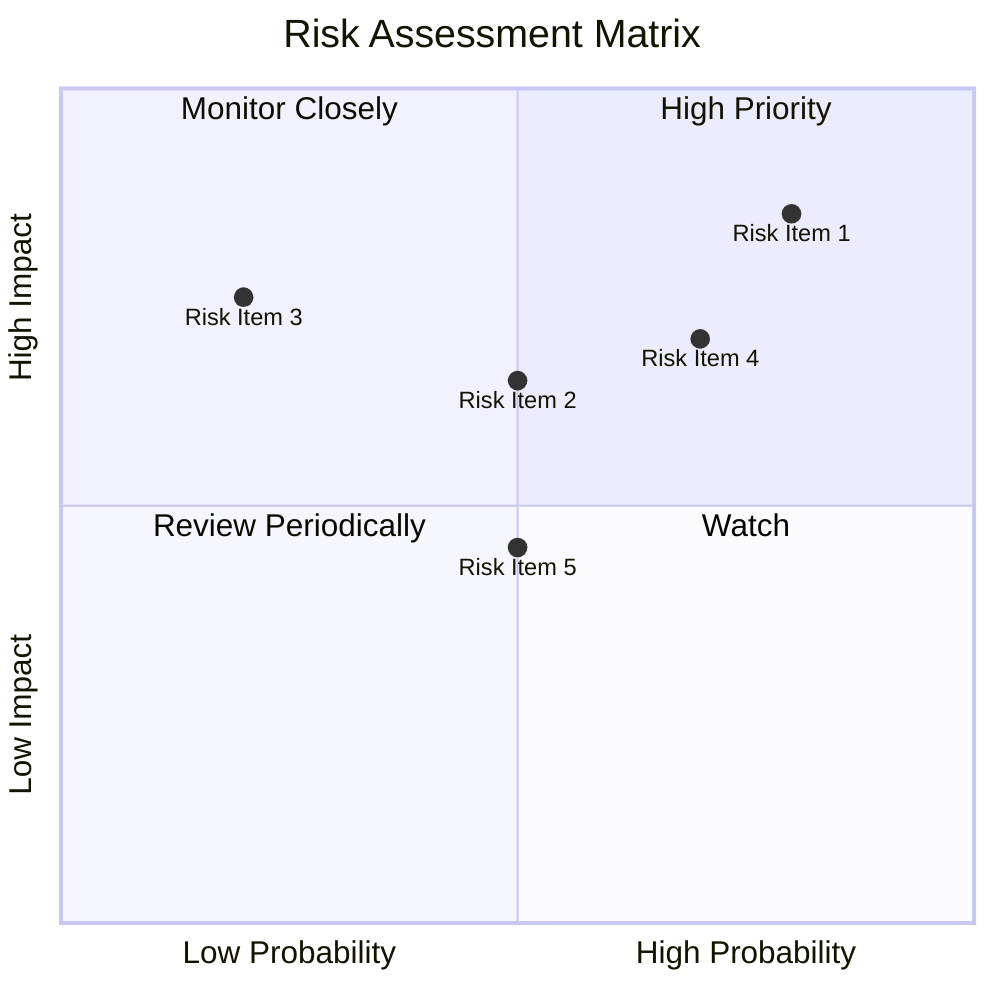

### 9.2 風險清單詳細分析

| # | 風險項目 | 發生機率 | 財務衝擊 | 風險評分 | 緩解措施 |
|---|----------|----------|----------|----------|----------|
| 1 | 🔴 **市場競爭加劇** | 高 (70%) | 高 (-8%收入) | 🔴 8.5/10 | 增加產品多樣性 |
| 2 | 🔴 **法規風險** | 高 (75%) | 高 (-10%利潤) | 🔴 8.3/10 | 加強合規監控 |
| 3 | 🟡 **經濟不確定性** | 中 (50%) | 中 (-5%收入) | 🟡 6.5/10 | 分散市場風險 |

---

## 10. 投資建議

### 10.1 最終綜合評級雷達圖

```
╔══════════════════════════════════════════════════════════════════╗
║                  綜合評級雷達圖                                 ║
╠══════════════════════════════════════════════════════════════════╣
║ 基本面強度 9.0  ▓▓▓▓▓▓▓▓▓▓▓▓▓▓▓▓▓▓▓░  ★★★★★                   ║
║ 成長動能   9.0  ▓▓▓▓▓▓▓▓▓▓▓▓▓▓▓▓▓▓▓░  ★★★★★                   ║
║ 獲利品質   8.0  ▓▓▓▓▓▓▓▓▓▓▓▓▓▓▓▓▓▓░░  ★★★★★                   ║
║ 財務健康   9.0  ▓▓▓▓▓▓▓▓▓▓▓▓▓▓▓▓▓▓▓░  ★★★★★                   ║
║ 估值合理   8.0  ▓▓▓▓▓▓▓▓▓▓▓▓▓▓▓▓▓░░░  ★★★★☆                   ║
╚══════════════════════════════════════════════════════════════════╝
```

### 10.2 目標價與隱含報酬率

| 情境 | 目標價 | 隱含報酬率 | 機率權重 |
|------|--------|------------|----------|
| 🟢 **樂觀** | $360 | +51% | 30% |
| 🟡 **基準** | $281.27 | +18% | 50% |
| 🔴 **悲觀** | $240 | 0% | 20% |

### 10.3 買入時機與觸發因素

```
╔══════════════════════════════════════════════════════════════════╗
║                  ✅ 買入觸發因素 Checklist                      ║
╠══════════════════════════════════════════════════════════════════╣
║                                                                  ║
║  立即買入觸發條件（多數符合）：                                  ║
║  ✅ 市場份額擴大                                                 ║
║  ✅ AWS 業務增長持續                                             ║
║  ✅ 流動性指標改善                                               ║
║                                                                  ║
║  加碼觸發條件（出現以下任一）：                                  ║
║  ☐ 新市場進入成功                                               ║
║  ☐ 新技術突破                                                   ║
║                                                                  ║
║  減碼/停損觸發條件（出現以下任一）：                             ║
║  ☐ 法規風險增加                                                 ║
║  ☐ 顯著競爭壓力                                                 ║
╚══════════════════════════════════════════════════════════════════╝
```

### 10.4 投資人適配度分析

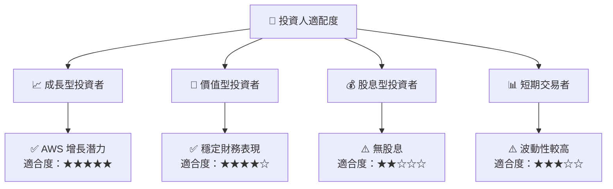

### 10.5 關鍵監控指標

| 監控類型 | 指標 | 關注點 | 頻率 |
|----------|------|--------|------|
| **收入增長** | AWS 收入 | 季度增長率 | 季度 |
| **利潤率** | 淨利率 | 持續改善 | 年度 |
| **法規動向** | 反壟斷調查 | 影響風險 | 持續 |
| **市場競爭** | 新入競爭者 | 市場份額變化 | 季度 |

---

> **免責聲明**：本報告為 AI 自動生成，僅供研究參考，不構成投資建議。投資有風險，入市需謹慎。