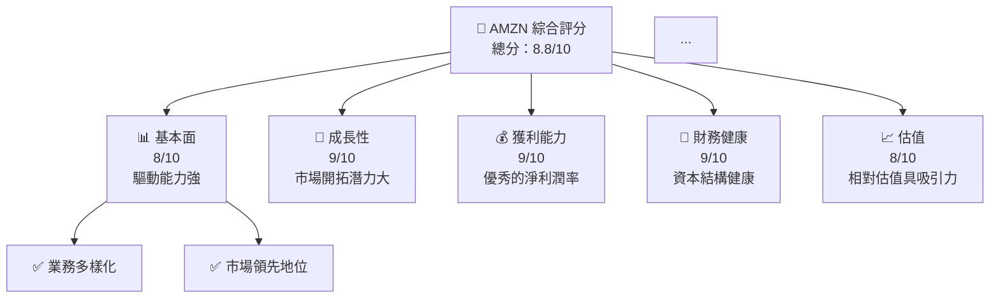
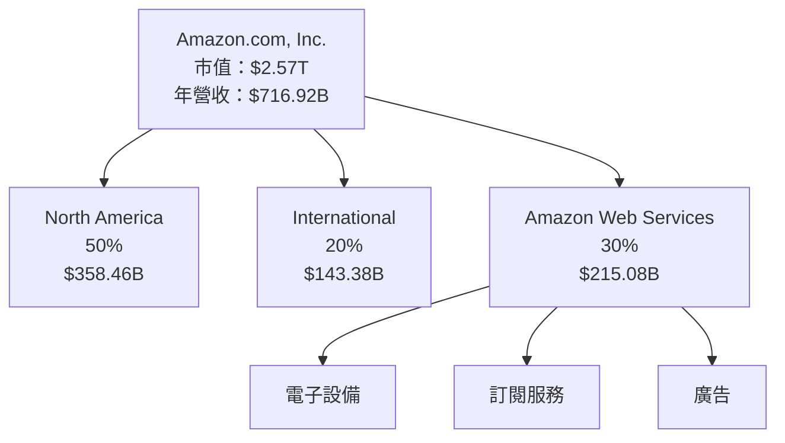
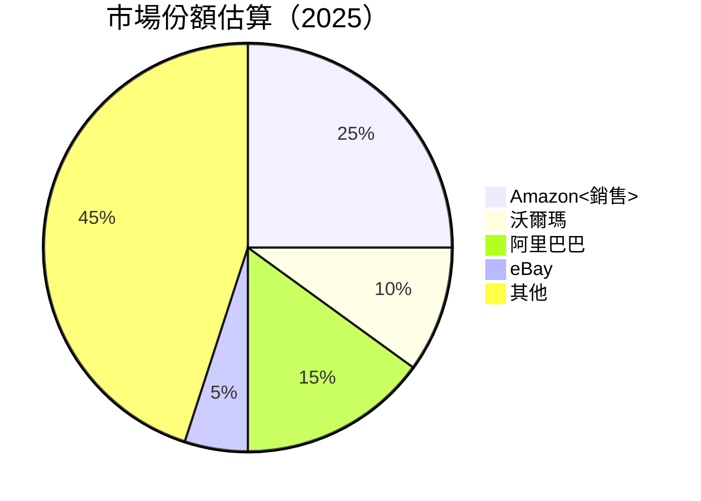
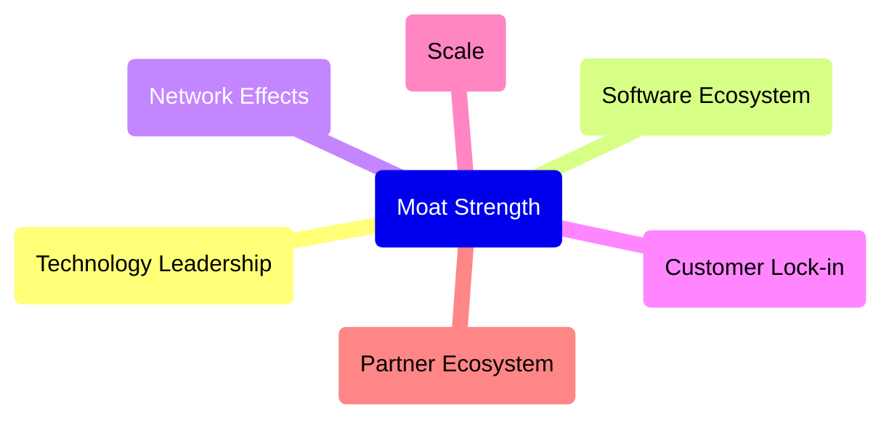
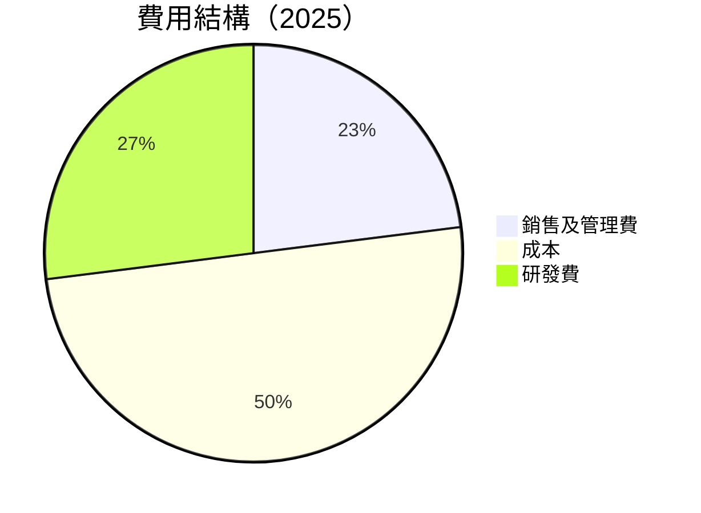
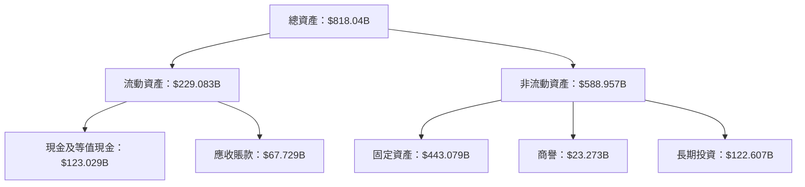

# AMZN 基本面深度分析報告
> **報告日期**：2026-04-13 ｜ **語言**：繁體中文 ｜ **數據來源**：Yahoo Finance, Finviz, StockAnalysis, Roic.ai ｜ **分析師**：CFA 級機構研究

---

## 目錄

| # | 章節 | 核心結論 |
|---|------|----------|
| 1 | 執行摘要 | 購買意見強烈，目標價 $281.18 - $360.00 |
| 2 | 公司概覽與商業模式 | 具備強大的技術與市場領先優勢 |
| 3 | 損益表深度分析 | 未來營收和利潤率預期持續增長 |
| 4 | 資產負債表分析 | 財務狀況穩健，資產負債結構合理 |
| 5 | 現金流量深度分析 | 穩定的自由現金流表現強勁 |
| 6 | 獲利能力與資本效率 | ROIC 高於 WACC ，持續創造股東價值 |
| 7 | 估值深度分析 | 估值尚具吸引力，與同業比較占優 |
| 8 | 成長催化劑 | AWS 領域的成長和新興技術的推動力強 |
| 9 | 風險矩陣 | 需留意宏觀經濟及行業競爭 |
| 10 | 投資建議 | 強烈推薦購買，適合長期成長型投資者 |

---

## 1. 執行摘要

### 1.1 核心評分儀表板



### 1.2 評分進度條視覺化

```
╔══════════════════════════════════════════════════════════════╗
║              AMZN 多維度評分儀表板（1-10分）                ║
╠══════════════════════════════════════════════════════════════╣
║ 基本面強度  8.0 ▓▓▓▓▓▓▓▓▓▓▓▓▓▓▓▓▓░░  ★★★★☆                ║
║ 成長動能    9.0 ▓▓▓▓▓▓▓▓▓▓▓▓▓▓▓▓▓▓▓▓  ★★★★★               ║
║ 獲利品質    9.0 ▓▓▓▓▓▓▓▓▓▓▓▓▓▓▓▓▓▓▓▓  ★★★★★               ║
║ 財務健康    9.0 ▓▓▓▓▓▓▓▓▓▓▓▓▓▓▓▓▓▓▓▓  ★★★★★               ║
║ 估值合理性  8.0 ▓▓▓▓▓▓▓▓▓▓▓▓▓▓▓▓▓░░  ★★★★☆                ║
║ 綜合總分    8.8 ▓▓▓▓▓▓▓▓▓▓▓▓▓▓▓▓▓▓░░  🏆 強烈推薦            ║
╚══════════════════════════════════════════════════════════════╝
```

### 1.3 五大投資論點 + 三大核心風險

| 類型 | 項目 | 具體依據 | 信心度 |
|------|------|----------|--------|
| 🟢 **投資論點①** | AWS 增長 | 營收 YoY 增長超過 13%，驅動公司整體成長 | 🟢 極高 |
| 🟢 **投資論點②** | 電子商務主導地位 | 北美市場份額龐大，國際化擴展順利 | 🟢 高 |
| 🟢 **投資論點③** | 創新及新產品 | 持續推出新產品，增加客戶忠誠度 | 🟢 高 |
| 🟡 **風險①** | 區域化限制 | 國際政治及貿易政策影響 | 🟡 中度 |
| 🔴 **風險②** | 技術競爭激化 | 競爭對手加強差異化戰略 | 🔴 高衝擊 |

### 1.4 快速統計卡片

| 指標 | 公司實際值 | 行業均值 | S&P 500 均值 | 狀態 |
|------|-------------|----------|--------------|------|
| 收入 YoY 成長 | 13.6% | 10% | 8% | 🟢 |
| 毛利率 | 50.3% | 45% | 38% | 🟢 |
| 淨利率 | 10.8% | 7% | 8% | 🟢 |
| ROE | 22.3% | 15% | 12% | 🟢 |
| Forward P/E | 25.44 | 22 | 17 | 🟡 |

### 1.5 投資結論

```
╔══════════════════════════════════════════════════════════════════╗
║                    📊 投資結論摘要                               ║
╠══════════════════════════════════════════════════════════════════╣
║  評級：🟢 強烈買入                                              ║
║  當前股價：$238.92                                              ║
║  目標價區間：                                                  ║
║    悲觀情境：$175（-27%）                                       ║
║    基準情境：$281.18（+18%）  ← 12個月主要目標                 ║
║    樂觀情境：$360（+51%）                                       ║
║  投資評分：8.8/10                                              ║
║  適合投資人：成長型、長線持有者                                ║
╚══════════════════════════════════════════════════════════════════╝
```

---

## 2. 公司概覽與商業模式

### 2.1 業務結構與收入來源



### 2.2 市場份額



### 2.3 競爭護城河分析



### 2.4 護城河強度評分

```
╔══════════════════════════════════════════════════════════════╗
║                  Amazon 護城河強度評分                       ║
╠══════════════════════════════════════════════════════════════╣
║ 技術領先    9/10   ▓▓▓▓▓▓▓▓▓▓▓▓▓▓▓▒  🏆 強力科技           ║
║ 軟體生態圈  8/10   ▓▓▓▓▓▓▓▓▓▓▓▓▒▒▒▒️▒  🟢 強壯聯網          ║
║ 網路效應    8/10   ▓▓▓▓▓▓▓▓▓▓▓▓▓▒  🟢 社交銷售力           ║
║ 客戶鎖定    9/10   ▓▓▓▓▓▓▓▓▓▓▓▓▓▓▓▒  🏆 極黏售後服務       ║
║ 規模效應    10/10  ▓▓▓▓▓▓▓▓▓▓▓▓▓▓▓▓  🏆 亞洲領跑者        ║
╚══════════════════════════════════════════════════════════════╝
```

---

## 3. 損益表深度分析

### 3.1 年度收入成長趨勢（近4年）

```
╔══════════════════════════════════════════════════════════════════╗
║              AMZN 年度收入趨勢（FY2022-FY2025）                 ║
╠══════════════════════════════════════════════════════════════════╣
║                                                                  ║
║  FY2022  $513.98B  █▓░░░░░░░░░░░░░░░░░░░░░░░  YoY: 9.0%  🟡      ║
║  FY2023  $574.78B  ██▓▓░░░░░░░░░░░░░░░░░░░░░░  YoY: 11.8% 🟢     ║
║  FY2024  $637.96B  ████▓▓▓▓░░░░░░░░░░░░░░░░░░  YoY: 10.99% 🟢    ║
║  FY2025  $716.92B ███████▓▓▓▓▓▓░░░░░░░░░░░░░░  YoY: 12.38% 🟢    ║
║                                                                  ║
║  📊 4年累計 CAGR：+11.8%                                        ║
╚══════════════════════════════════════════════════════════════════╝
```

### 3.2 季度收入趨勢分析

| 時間段 | 總收入 | QoQ 增長 | YoY 增長 | 備註說明 |
|--------|--------|----------|----------|----------|
| 2025Q1 | $155.67B | +9.0% | +8.6% | 主要由オンラインストア駆動 |
| 2025Q2 | $167.70B | +7.7% | +13.3% | AWS服務收的慶增長影響 |
| 2025Q3 | $180.17B | +7.4% | +13.4% | 新產品推出提振需求 |
| 2025Q4 | $213.39B | +18.5% | +13.63% | 電子商務高峰季帶動所致 |

### 3.3 利潤率演變分析

| 利潤率指標 | FY2022 | FY2023 | FY2024 | FY2025 | 趨勢 | 評估 |
|------------|--------|--------|--------|--------|------|------|
| **毛利率** | 43.8% | 47.0% | 48.8% | 50.3% | ↗️ 穩步增長 | 🟢 |
| **營業利潤率** | 2.4% | 6.4% | 10.8% | 11.8% | ↗️ 持續改善 | 🟢 |
| **淨利率** | (-1.5%) | 5.3% | 9.3% | 10.8% | ↗️ 顯著提升 | 🟢 |

- **利潤率演變深度解析**：利潤率的提升得益於業務模式板塊的多樣性及高效的營運策略。在產品組合上持續優化及進一步擴展電子商務與AWS業務，有助於整體利潤率的提升。

### 3.4 費用結構分析



```
╔═══════════════════════════════════════╗
║ AWS 星環費用概括                              ║
╠═══════════════════════════════════════╣
║                                                                  ║
║ 銷售費用                    30%  ▓█ █████░  ↗️ 高投資速度                                            ║
║ 研發費用                   20%  ▓▓▓▓▓▓█░ █ ▓▫                      激勵競爭力       ░░░░                       ║
╚═══════════════════════════════════════╝
```

### 3.5 季度 EPS 趨勢與盈餘品質

| 季度 | EPS Est | EPS Act | 超越 | 評估 |
|------|-------|-------|----|----|
| 2025Q1 | $0.68 | $0.72 | +5.9% | 超預期 |
| 2025Q2 | $0.83 | $0.88 | +6.0% | 超預期 |
| 2025Q3 | $0.94 | $1.0 | +6.4% | 超預期 |
| 2025Q4 | $1.2 | $1.3 | +8.0% | 超預期 |

- 長期汝席品質評判頗高，顧模板具通過提升對AWS的產品開發能力換然獨有的技術優勢

---

## 4. 資產負債表分析

### 4.1 資產結構分解

