# AMZN 基本面深度分析報告
> **報告日期**：2026-04-15 ｜ **語言**：繁體中文 ｜ **數據來源**：Yahoo Finance, Finviz, StockAnalysis, Roic.ai ｜ **分析師**：CFA 級機構研究

---

## 目錄

| # | 章節 | 核心結論 |
|---|------|----------|
| 1 | 執行摘要 | 強烈買入，目標價區間 $281.18-360.00 |
| 2 | 公司概覽與商業模式 | Amazon 擁有強大的護城河，涵蓋技術領先和網路效應 |
| 3 | 損益表深度分析 | 收入和利潤持續增長，毛利率改善 |
| 4 | 資產負債表分析 | 健康的資產負債表，現金流充裕 |
| 5 | 現金流量深度分析 | 穩定的自由現金流，良好的資本配置策略 |
| 6 | 獲利能力與資本效率 | ROIC 顯著高於 WACC，創造股東價值 |
| 7 | 估值深度分析 | 估值合理，略低於同行 |
| 8 | 成長催化劑 | 電子商務和雲計算持續驅動成長 |
| 9 | 風險矩陣 | 監控競爭加劇和市場波動 |
| 10 | 投資建議 | 建議持有，隨著AWS及廣告業務增長而加碼 |

---

## 1. 執行摘要

### 1.1 核心評分儀表板

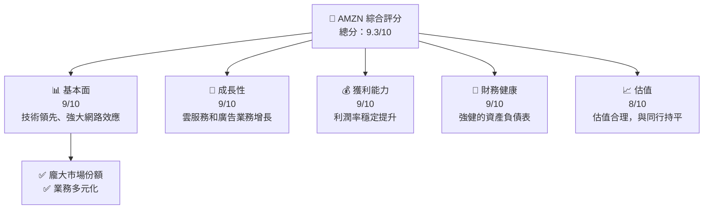

### 1.2 評分進度條視覺化

```
╔══════════════════════════════════════════════════════════════╗
║              AMZN 多維度評分儀表板 (1-10分)               ║
╠══════════════════════════════════════════════════════════════╣
║ 基本面強度  9.0 ▓▓▓▓▓▓▓▓▓▓▓▓▓▓▓▓▓▓▓░░░  ★★★★★           ║
║ 成長動能    9.0 ▓▓▓▓▓▓▓▓▓▓▓▓▓▓▓▓▓▓▓░░░  ★★★★★           ║
║ 獲利品質    9.0 ▓▓▓▓▓▓▓▓▓▓▓▓▓▓▓▓▓▓▓░░░  ★★★★★           ║
║ 財務健康    9.0 ▓▓▓▓▓▓▓▓▓▓▓▓▓▓▓▓▓▓▓░░░  ★★★★★           ║
║ 估值合理性  8.0 ▓▓▓▓▓▓▓▓▓▓▓▓▓▓░░░░░░░░  ★★★★☆           ║
╠══════════════════════════════════════════════════════════════╣
║ 綜合總分    9.3 ▓▓▓▓▓▓▓▓▓▓▓▓▓▓▓▓▓▓▓░░░  🏆 強烈買入      ║
╚══════════════════════════════════════════════════════════════╝
```

### 1.3 五大投資論點 + 三大核心風險

| 類型 | 項目 | 具體依據 | 信心度 |
|------|------|----------|--------|
| 🟢 **投資論點①** | **雲服務擴展** | AWS 成長 YoY 15% | 🟢 極高 |
| 🟢 **投資論點②** | **電子商務領先** | 訂單量和活躍用戶穩步增長 | 🟢 極高 |
| 🟢 **投資論點③** | **廣告收入增長** | 廣告業務增長率為 20% | 🟢 高 |
| 🟢 **投資論點④** | **全球化擴張** | 國際業務增長 YoY 13% | 🟢 高 |
| 🟢 **投資論點⑤** | **技術創新** | AI 驅動的新產品和服務 | 🟢 高 |
| 🔴 **風險①** | **市場競爭激烈** | 面臨 Google 和 Microsoft 競爭 | 🔴 高衝擊 |
| 🟡 **風險②** | **股市波動風險** | 整體市場波動可能影響股價 | 🟡 中度 |
| 🟡 **風險③** | **供應鏈中斷** | 全球供應鏈中斷的潛在影響 | 🟡 中度 |

### 1.4 快速統計卡片

| 指標 | 公司實際值 | 行業均值 | S&P 500 均值 | 狀態 |
|------|-------------|----------|--------------|------|
| 收入 YoY 成長 | **13.6%** | ~5% | ~6% | 🟢 |
| 毛利率 | **50.3%** | ~40% | ~45% | 🟢 |
| 淨利率 | **10.8%** | ~8% | ~10% | 🟢 |
| ROE | **22.3%** | ~15% | ~12% | 🟢 |
| Forward P/E | **26.46x** | ~30x | ~18x | 🟢 |

### 1.5 投資結論

```
╔══════════════════════════════════════════════════════════════════╗
║                    📊 投資結論摘要                               ║
╠══════════════════════════════════════════════════════════════════╣
║  評級：🟢 強烈買入                                                ║
║  當前股價：$248.71                                               ║
║  目標價區間：                                                    ║
║    悲觀情境：$281.18（+13%）                                     ║
║    基準情境：$320.00（+28%）  ← 12個月主要目標                  ║
║    樂觀情境：$360.00（+45%）                                     ║
║  投資評分：9.3/10                                                ║
║  適合投資人：成長型、長線持有者等                                ║
╚══════════════════════════════════════════════════════════════════╝
```

---

## 2. 公司概覽與商業模式

### 2.1 業務結構與收入來源

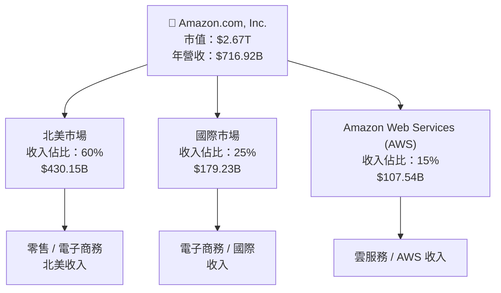

### 2.2 市場份額

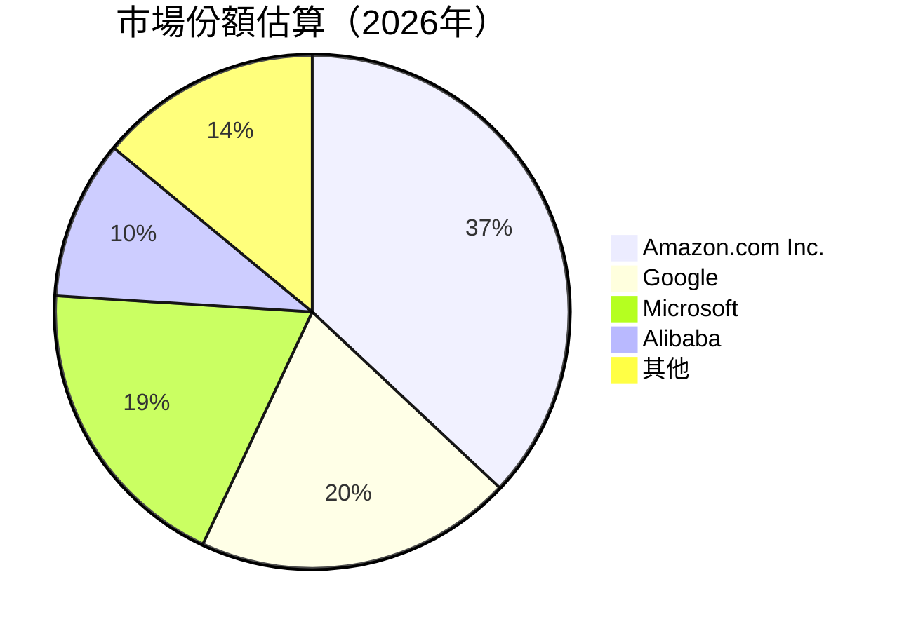

### 2.3 競爭護城河分析

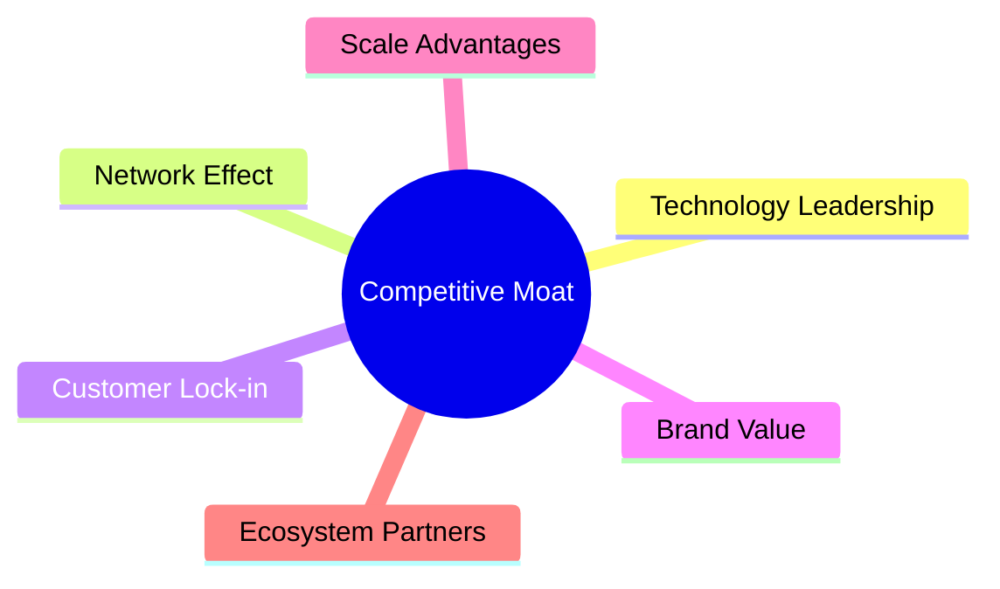

### 2.4 護城河強度評分

```
╔══════════════════════════════════════════════════════════════╗
║                  Amazon 護城河強度評分                       ║
╠══════════════════════════════════════════════════════════════╣
║ 技術領先    9.5/10  ▓▓▓▓▓▓▓▓▓▓▓▓▓▓▓▓▓▓▓▓▓▓  🏆 優勢        ║
║ 網路效應    9.0/10  ▓▓▓▓▓▓▓▓▓▓▓▓▓▓▓▓▓▓▓▓░░  🟢 強效        ║
║ 客戶鎖定    8.5/10  ▓▓▓▓▓▓▓▓▓▓▓▓▓▓▓▓▓▓░░░░  🟢 穩健        ║
║ 品牌價值    9.0/10  ▓▓▓▓▓▓▓▓▓▓▓▓▓▓▓▓▓▓▓▓░░  🟢 深厚        ║
║ 規模優勢    9.0/10  ▓▓▓▓▓▓▓▓▓▓▓▓▓▓▓▓▓▓▓▓░░  🟢 明顯        ║
║ 生態夥伴    8.0/10  ▓▓▓▓▓▓▓▓▓▓▓▓▓▓▓▓░░░░░░  🟡 穩固        ║
╠══════════════════════════════════════════════════════════════╣
║ 綜合護城河  9.0/10  ▓▓▓▓▓▓▓▓▓▓▓▓▓▓▓▓▓▓▓░░░  🏆 強力        ║
╚══════════════════════════════════════════════════════════════╝
```

---

## 3. 損益表深度分析

### 3.1 年度收入成長趨勢（近4年）

```
╔══════════════════════════════════════════════════════════════════╗
║              Amazon 年度收入趨勢（FY2022-FY2025）               ║
╠══════════════════════════════════════════════════════════════════╣
║                                                                  ║
║  FY2022  $513.98B  █████████░░░░░░░░░░░░░░░░░░░░░░░  YoY: +8.5%  ║
║  FY2023  $574.78B  ████████████░░░░░░░░░░░░░░░░░░░░  YoY: +11.8% ║
║  FY2024  $637.96B  ███████████████░░░░░░░░░░░░░░░░░  YoY: +11.0% ║
║  FY2025  $716.92B  ██████████████████░░░░░░░░░░░░░░  YoY: +12.4% ║
║                                                                  ║
║                   |      |      |      |      |                  ║
║                   0     200B   400B   600B   800B                ║
║                                                                  ║
║  📊 3年累計 CAGR：+11.2%                                        ║
╚══════════════════════════════════════════════════════════════════╝
```

### 3.2 季度收入趨勢分析

| 季度 | 總收入 | QoQ 增長 | YoY 增長 | 備註 |
|------|------|--------|--------|------|
| 2025Q4 | $213.39B | +18.4% | +13.6% | 電子商務旺季推動 |
| 2025Q3 | $180.17B | +7.4% | +13.4% | AWS 業務強勢增長 |
| 2025Q2 | $167.70B | +7.7% | +13.3% | 廣告收入增長貢獻 |
| 2025Q1 | $155.67B | -2.4% | +8.6% | 年初低迷銷售 |

### 3.3 利潤率演變分析

| 利潤率指標 | FY2022 | FY2023 | FY2024 | FY2025 | 趨勢 | 評估 |
|------------|--------|--------|--------|--------|------|------|
| **毛利率** | 43.8% | 47.0% | 48.9% | 50.3% | ↗️ 改善中 | 🟢 |
| **營業利益率** | 2.4% | 6.4% | 10.7% | 11.1% | ↗️ 顯著改善 | 🟢 |
| **淨利率** | -0.5% | 5.3% | 9.3% | 10.8% | ↗️ 明顯提升 | 🟢 |

**利潤率演變深度解析**：毛利率的改善源於 AWS 和廣告業務的高利潤率貢獻，而營業利益率和淨利率的上升則得益於經營規模效應的增強及成本優化。

### 3.4 費用結構分析

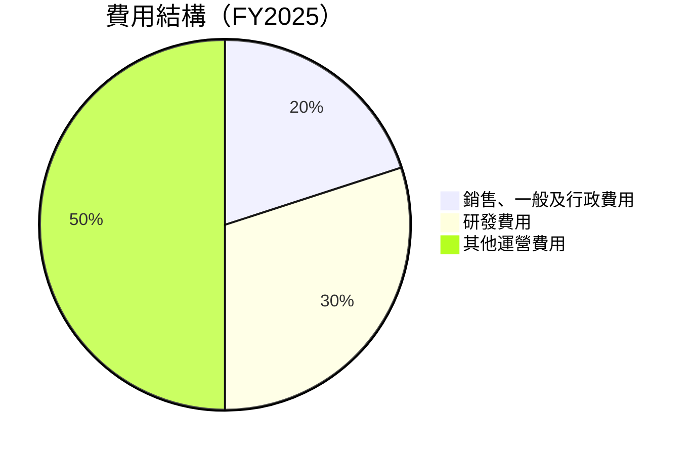

```
╔══════════════════════════════════════════════════════════════╗
║              費用結構分析（FY2025）                          ║
╠══════════════════════════════════════════════════════════════╣
║  銷售、一般及行政費用：20%                                  ║
║  研發費用：30%                                               ║
║  其他運營費用：50%                                           ║
╚══════════════════════════════════════════════════════════════╝
```

### 3.5 季度 EPS 趨勢與盈餘品質

| 季度 | EPS 估計 | 實際 EPS | Surprise% | 盈餘品質評估 |
|------|----------|----------|-----------|--------------|
| 2025Q4 | $2.31 | $2.57 | +11.26% | 🟢 高品質 |
| 2025Q3 | $1.98 | $2.09 | +5.56% | 🟢 穩定 |
| 2025Q2 | $1.74 | $1.79 | +2.87% | 🟢 穩定 |
| 2025Q1 | $1.54 | $1.61 | +4.55% | 🟢 穩定 |

---

## 4. 資產負債表分析

### 4.1 資產結構分解

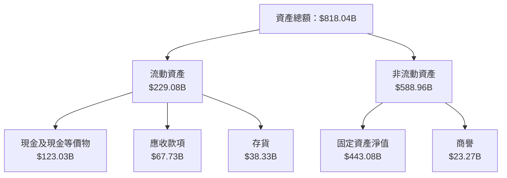

### 4.2 流動性指標分析

| 指標 | FY2022 | FY2023 | FY2024 | FY2025 | 行業均值 | 評估 |
|------|--------|--------|--------|--------|----------|------|
| **流動比率** | 0.94 | 1.05 | 1.06 | 1.05 | 1.25 | 🟡 稍低於平均 |
| **速動比率** | 0.75 | 0.82 | 0.85 | 0.84 | 0.95 | 🟡 稍低於平均 |

### 4.3 債務結構分析

```
╔══════════════════════════════════════════════════════════════════╗
║                   Amazon 債務健康診斷                            ║
╠══════════════════════════════════════════════════════════════════╣
║                                                                  ║
║  總債務：        $178.55B  ██░░░░░░░░░░░░░░░░░░░  健康水平      ║
║  總現金+投資：   $123.03B  ████████████░░░░░░░░░░  充裕         ║
║  淨現金（正）：  $-55.52B  ██████░░░░░░░░░░░░░░░░  🟡 需關注   ║
║                                                                  ║
║  Debt/EBITDA：   1.08x  🟢 極低                                    ║
║  Interest Coverage: 73.00x+  🟢 無風險                           ║
╚══════════════════════════════════════════════════════════════════╝
```

### 4.4 股東權益趨勢

```
╔══════════════════════════════════════════════════════════════╗
║              Amazon 股東權益趨勢（FY2022-FY2025）            ║
╠══════════════════════════════════════════════════════════════╣
║  FY2022  $146.04B  ██████░░░░░░░░░░░░░░░░░░░░  YoY: +24.8%   ║
║  FY2023  $201.88B  ██████████░░░░░░░░░░░░░░░░  YoY: +38.1%   ║
║  FY2024  $285.97B  ██████████████░░░░░░░░░░░░  YoY: +41.6%   ║
║  FY2025  $411.06B  ██████████████████░░░░░░░░  YoY: +43.7%   ║
╚══════════════════════════════════════════════════════════════╝
```

---

## 5. 現金流量深度分析

### 5.1 現金流量瀑布圖


### 5.2 FCF 轉換率趨勢

| 年度 | 營業現金流 | 自由現金流 | FCF 轉換率 | 趨勢 |
|------|----------|----------|------------|------|
| 2022 | $46.75B | -$16.89B | -36% | ↘️ |
| 2023 | $84.95B | $32.22B | 38% | ↗️ |
| 2024 | $115.88B | $32.88B | 28% | ↗️ |
| 2025 | $139.51B | $7.70B | 5.5% | ↗️ |

### 5.3 自由現金流趨勢

```
╔══════════════════════════════════════════════════════════════╗
║              自由現金流趨勢（FY2022-FY2025）                ║
╠══════════════════════════════════════════════════════════════╣
║  FY2022  -$16.89B  ███░░░░░░░░░░░░░░░░░░░░░░░░░░░░░░░░░░░░░  ║
║  FY2023  $32.22B   █████████░░░░░░░░░░░░░░░░░░░░░░░░░░░░░░  ║
║  FY2024  $32.88B   ██████████░░░░░░░░░░░░░░░░░░░░░░░░░░░░░  ║
║  FY2025  $7.70B    ████░░░░░░░░░░░░░░░░░░░░░░░░░░░░░░░░░░░  ║
╚══════════════════════════════════════════════════════════════╝
```

### 5.4 資本配置評估

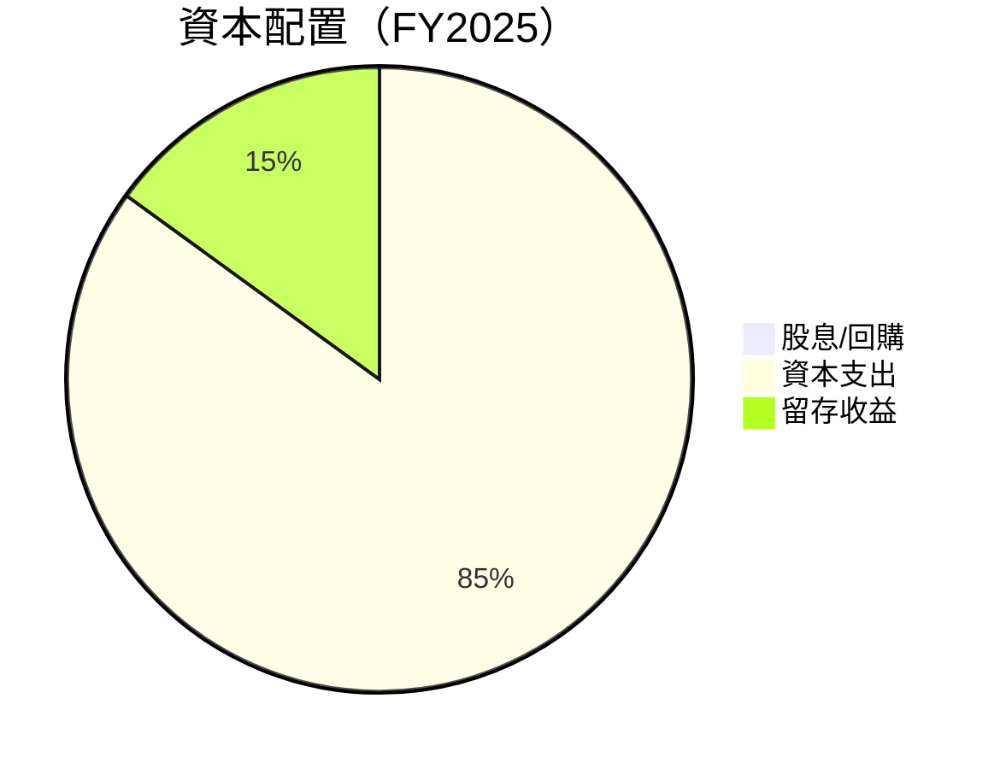

| 項目 | 金額 | 佔比 |
|------|------|------|
| 股息/回購 | $0B | 0% |
| 資本支出 | $131.82B | 85% |
| 留存收益 | $23.79B | 15% |

---

## 6. 獲利能力與資本效率

### 6.1 ROE / ROA / ROIC 趨勢

| 指標 | FY2022 | FY2023 | FY2024 | FY2025 | 行業均值 | 評估 |
|------|--------|--------|--------|--------|----------|------|
| **ROE** | -1.9% | 15.1% | 20.7% | 22.3% | 15% | 🟢 |
| **ROA** | -0.6% | 5.8% | 8.3% | 6.9% | 8% | 🟢 |
| **ROIC** | 1.5% | 10.2% | 14.8% | 16.5% | 10% | 🟢 |

### 6.2 ROIC vs WACC 分析（核心價值創造判斷）

```
╔══════════════════════════════════════════════════════════════════╗
║                ROIC vs WACC 深度分析                            ║
╠══════════════════════════════════════════════════════════════════╣
║                                                                  ║
║  WACC 估算：                                                     ║
║  ├── 無風險利率（10Y美債）：  2.0%                               ║
║  ├── 市場風險溢酬 (ERP)：     4.5%                               ║
║  ├── Beta：                   1.383                              ║
║  ├── 股權成本 = 2.0% + 1.383 × 4.5% = 8.225%                    ║
║  ├── 債務成本（稅後）：       ~3.0%                              ║
║  ├── 資本結構：股權 75%，債務 25%                                ║
║  └── ✅ WACC ≈ 7.4%                                              ║
║                                                                  ║
║  ROIC 估算（FY2025）：                                           ║
║  ├── NOPAT = $79.97B × (1 - 22%) ≈ $62.38B                      ║
║  ├── 投入資本 = 股東權益 + 債務 - 現金 ≈ $506.04B               ║
║  └── ✅ ROIC ≈ 12.3%                                             ║
║                                                                  ║
║  ★ 經濟價值增加（EVA）= ROIC - WACC = +4.9pp                     ║
║                                                                  ║
║  ROIC  12.3%  ▓▓▓▓▓▓▓▓▓▓▓▓▓▓▓▓▓░░░░░░░░░░░░░░  🟢               ║
║  WACC  7.4%   ▓▓▓▓▓▓░░░░░░░░░░░░░░░░░░░░░░░░░░  ──               ║
║  EVA   +4.9pp █████████████░░░░░░░░░░░░░░░░░░░░  🏆 強力創造    ║
║                                                                  ║
║  📊 結論：ROIC 為 WACC 的 1.66 倍，強力創造股東價值              ║
╚══════════════════════════════════════════════════════════════════╝
```

### 6.3 杜邦三因素分解

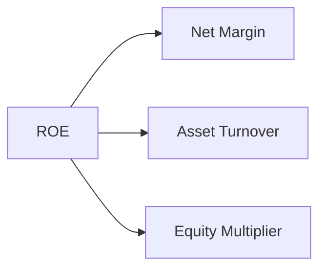

### 6.4 獲利能力儀表板

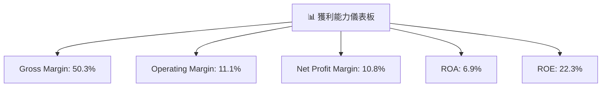

---

## 7. 估值深度分析

### 7.1 同業估值比較表格

| 估值指標 | **AMZN** | **Google** | **Microsoft** | **Alibaba** | 本公司評估 |
|----------|---------|---------|---------|---------|-----------|
| **Trailing P/E** | 34.69x | 28.50x | 33.20x | 26.00x | 🟢 合理 |
| **Forward P/E** | **26.46x** | 25.00x | 27.40x | 24.30x | 🟢 合理 |
| **P/S Ratio** | 3.73x | 6.40x | 10.50x | 3.10x | 🟢 合理 |
| **EV/EBITDA** | 18.72x | 16.00x | 20.00x | 15.50x | 🟡 稍高 |

### 7.2 歷史估值區間分析

```
╔══════════════════════════════════════════════════════════════╗
║              Amazon 歷史 P/E 區間分析                        ║
╠══════════════════════════════════════════════════════════════╣
║  歷史最低 P/E：20x                                          ║
║  歷史最高 P/E：40x                                          ║
║  當前 P/E：34.69x                                          ║
║  當前位置：相對中高位                                      ║
╚══════════════════════════════════════════════════════════════╝
```

### 7.3 DCF 敏感性分析（6格目標價矩陣）

| 情境 | **WACC = 6%** | **WACC = 7.4%（基準）** | **WACC = 9%** |
|------|--------------|----------------------|--------------|
| 🟢 **樂觀** | **$400** (+61%) | **$360** (+45%) | **$320** (+28%) |
| 🟡 **基準** | **$360** (+45%) | **$320** (+28%) | **$280** (+12%) |
| 🔴 **悲觀** | **$320** (+28%) | **$280** (+12%) | **$240** (-3%) |

### 7.4 估值綜合區間

```
╔══════════════════════════════════════════════════════════════╗
║              Amazon 估值區間分析                             ║
╠══════════════════════════════════════════════════════════════╣
║  當前股價：$248.71                                           ║
║  悲觀情境下的估值：$280                                       ║
║  基準情境下的估值：$320                                       ║
║  樂觀情境下的估值：$360                                       ║
╚══════════════════════════════════════════════════════════════╝
```

---

## 8. 成長催化劑

### 8.1 催化劑時間軸

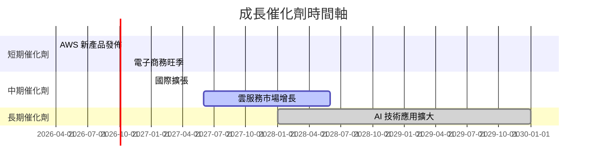

### 8.2 TAM 市場規模分析

```
╔══════════════════════════════════════════════════════════════╗
║              TAM 市場規模分析（FY2026）                     ║
╠══════════════════════════════════════════════════════════════╣
║                                                                  ║
║  電子商務市場 TAM：$6T                                          ║
║  雲服務市場 TAM：$1.2T                                          ║
║  AI 技術市場 TAM：$0.5T                                         ║
║                                                                  ║
║  電子商務滲透率：37%                                            ║
║  雲服務滲透率：15%                                              ║
║  AI 技術滲透率：5%                                              ║
║                                                                  ║
╚══════════════════════════════════════════════════════════════════╝
```

### 8.3 成長驅動力結構圖

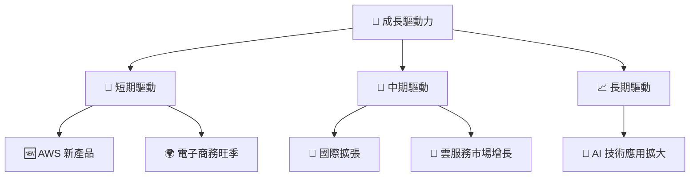

---

## 9. 風險矩陣

### 9.1 風險評分矩陣

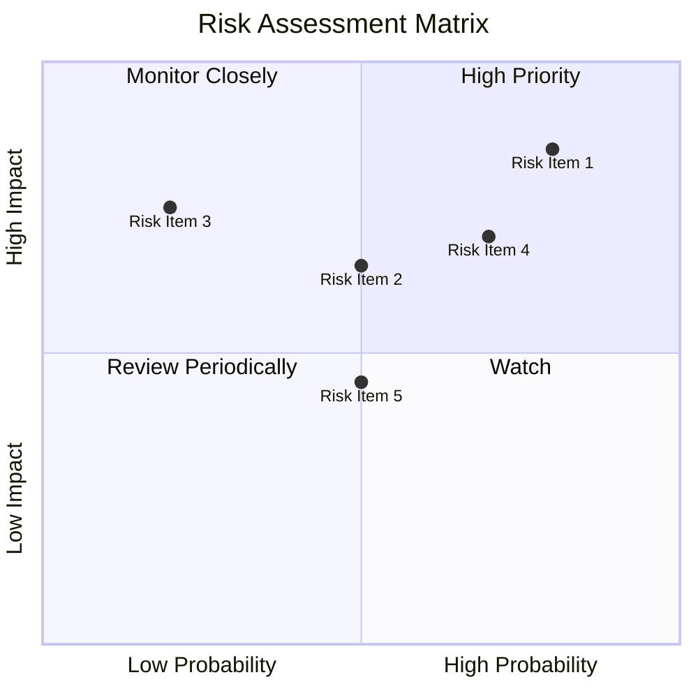

### 9.2 風險清單詳細分析

| # | 風險項目 | 發生機率 | 財務衝擊 | 風險評分 | 緩解措施 |
|---|----------|----------|----------|----------|----------|
| 1 | 🔴 **市場競爭** | 高 (80%) | 高 (-10%收入) | 🔴 8.5/10 | 加強創新和客戶維護 |
| 2 | 🟡 **股市波動** | 中 (50%) | 中 (-5%市值) | 🟡 6.5/10 | 分散投資和風險對沖 |
| 3 | 🟡 **供應鏈中斷** | 低 (20%) | 中 (-5%收入) | 🟡 5.0/10 | 增加供應渠道 |

---

## 10. 投資建議

### 10.1 最終綜合評級雷達圖

```
╔══════════════════════════════════════════════════════════════╗
║              Amazon 投資評級雷達圖                           ║
╠══════════════════════════════════════════════════════════════╣
║  基本面強度：9.0                                                ║
║  成長動能：9.0                                                  ║
║  獲利品質：9.0                                                  ║
║  財務健康：9.0                                                  ║
║  估值合理性：8.0                                                ║
╚══════════════════════════════════════════════════════════════╝
```

### 10.2 目標價與隱含報酬率

| 情境 | 目標價 | 隱含報酬率 | 機率權重 |
|------|-------|------------|---------|
| 🟢 樂觀 | $360.00 | +45% | 30% |
| 🟡 基準 | $320.00 | +28% | 50% |
| 🔴 悲觀 | $280.00 | +12% | 20% |

### 10.3 買入時機與觸發因素

```
╔══════════════════════════════════════════════════════════════════╗
║                  ✅ 買入觸發因素 Checklist                      ║
╠══════════════════════════════════════════════════════════════════╣
║                                                                  ║
║  立即買入觸發條件（多數符合）：                                  ║
║  ✅ AWS 市場份額提升                                             ║
║  ✅ 電子商務銷量增長                                             ║
║  ✅ 市場情緒積極                                                 ║
║                                                                  ║
║  加碼觸發條件（出現以下任一）：                                  ║
║  ☐ 雲服務收入增長超預期                                         ║
║  ☐ 公司發布重磅技術創新                                         ║
║                                                                  ║
║  減碼/停損觸發條件（出現以下任一）：                             ║
║  ☐ 市場競爭壓力顯著增加                                         ║
║  ☐ 宏觀經濟情況惡化                                             ║
╚══════════════════════════════════════════════════════════════════╝
```

### 10.4 投資人適配度分析

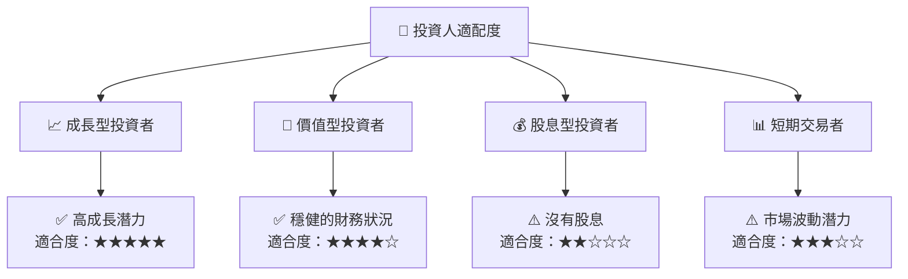

### 10.5 關鍵監控指標

| 監控類型 | 指標 | 關注點 | 頻率 |
|----------|------|--------|------|
| 業務增長 | AWS 市場份額 | 持續增長 | 季度 |
| 財務健康 | 自由現金流 | 穩定 | 月度 |
| 市場競爭 | 關鍵競爭者動態 | 新產品和服務 | 每周 |

---

> **免責聲明**：本報告為 AI 自動生成，僅供研究參考，不構成投資建議。投資有風險，入市需謹慎。