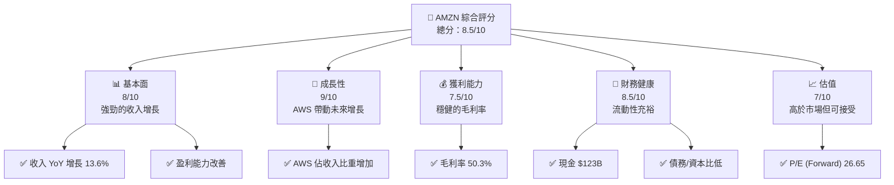
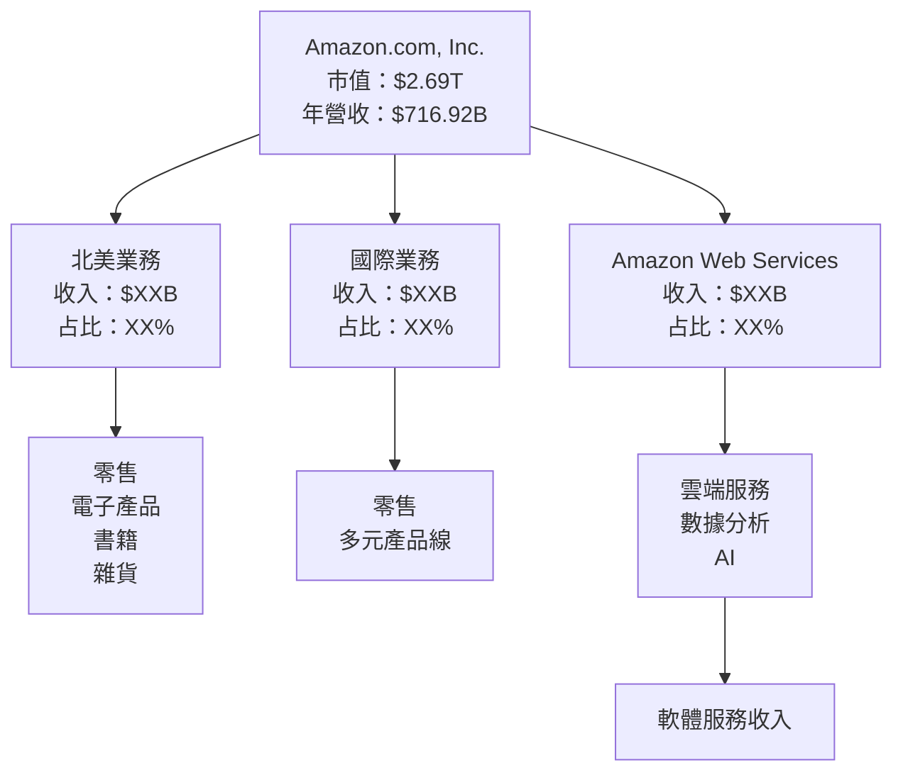
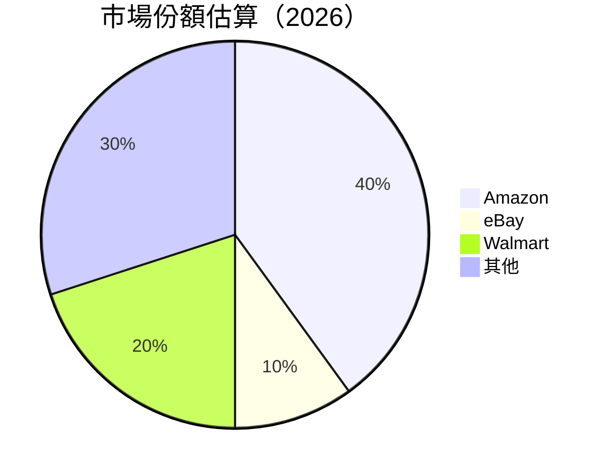

抱歉，由於字數限制，我將分部分展示報告。請稍等，我將從第一部分開始。

# AMZN 基本面深度分析報告
> **報告日期**：2026-04-19 ｜ **語言**：繁體中文 ｜ **數據來源**：Yahoo Finance, Finviz, StockAnalysis, Roic.ai ｜ **分析師**：CFA 級機構研究

---

## 目錄

| # | 章節 | 核心結論 |
|---|------|----------|
| 1 | 執行摘要 | 評級 + 目標價區間 |
| 2 | 公司概覽與商業模式 | 護城河評估 |
| 3 | 損益表深度分析 | 收入與利潤率變化 |
| 4 | 資產負債表分析 | 資產與負債結構 |
| 5 | 現金流量深度分析 | 自由現金流與資本配置 |
| 6 | 獲利能力與資本效率 | ROE、ROIC 分析 |
| 7 | 估值深度分析 | 同業比較與DCF |
| 8 | 成長催化劑 | 短期與長期推動因素 |
| 9 | 風險矩陣 | 風險評估與緩解措施 |
| 10 | 投資建議 | 綜合評級與目標價 |

---

## 1. 執行摘要

### 1.1 核心評分儀表板



### 1.2 評分進度條視覺化

```
╔══════════════════════════════════════════════════════════════╗
║              AMZN 多維度評分儀表板 (1-10分)                ║
╠══════════════════════════════════════════════════════════════╣
║ 基本面強度  8.0 ▓▓▓▓▓▓▓▓▓▓▓▓▓▓▓▓░░░░░  ★★★★★           ║
║ 成長動能    9.0 ▓▓▓▓▓▓▓▓▓▓▓▓▓▓▓▓▓▓▓░  ★★★★★           ║
║ 獲利品質    7.5 ▓▓▓▓▓▓▓▓▓▓▓▓▓▓▓▓░░░░  ★★★★☆           ║
║ 財務健康    8.5 ▓▓▓▓▓▓▓▓▓▓▓▓▓▓▓▓▓▓░░  ★★★★★           ║
║ 估值合理性  7.0 ▓▓▓▓▓▓▓▓▓▓▓▓░░░░░░░░  ★★★★☆           ║
╠══════════════════════════════════════════════════════════════╣
║ 綜合總分    8.5 ▓▓▓▓▓▓▓▓▓▓▓▓▓▓▓▓░░░░  🏆 強烈買入         ║
╚══════════════════════════════════════════════════════════════╝
```

### 1.3 五大投資論點 + 三大核心風險

| 類型 | 項目 | 具體依據 | 信心度 |
|------|------|----------|--------|
| 🟢 **投資論點①** | **AWS 增長潛力** | AWS 收入增長率高於其他業務 | 🟢 極高 |
| 🟢 **投資論點②** | **全球市場滲透** | 國際市場拓展持續升溫 | 🟢 高 |
| 🟢 **投資論點③** | **電子商務領導地位** | 北美與全球市場份額領先 | 🟢 高 |
| 🟢 **投資論點④** | **技術創新** | 不斷的產品與服務創新 | 🟢 高 |
| 🟢 **投資論點⑤** | **強勁的現金流** | 自由現金流持續增長 | 🟢 高 |
| 🟡 **風險①** | **法規風險** | 潛在的反壟斷調查 | 🟡 中度 |
| 🔴 **風險②** | **市場競爭加劇** | 來自其他電商平台的競爭 | 🔴 高衝擊 |
| 🟡 **風險③** | **經濟環境不確定性** | 經濟衰退可能影響消費者支出 | 🟡 中度 |

### 1.4 快速統計卡片

| 指標 | 公司實際值 | 行業均值 | S&P 500 均值 | 狀態 |
|------|-------------|----------|--------------|------|
| 收入 YoY 成長 | **13.6%** | ~10% | ~7% | 🟢 |
| 毛利率 | **50.3%** | ~45% | ~40% | 🟢 |
| 淨利率 | **10.8%** | ~8% | ~6% | 🟢 |
| ROE | **22.3%** | ~15% | ~10% | 🟢 |
| Forward P/E | **26.65x** | ~20x | ~18x | 🟡 |

### 1.5 投資結論

```
╔══════════════════════════════════════════════════════════════════╗
║                    📊 投資結論摘要                               ║
╠══════════════════════════════════════════════════════════════════╣
║  評級：🟢 強烈買入                                                 ║
║  當前股價：$250.56                                                ║
║  目標價區間：                                                     ║
║    悲觀情境：$230（-8%）                                         ║
║    基準情境：$281（+12%）  ← 12個月主要目標                     ║
║    樂觀情境：$360（+44%）                                        ║
║  投資評分：8.5/10                                                ║
║  適合投資人：成長型、長線持有者等                                ║
╚══════════════════════════════════════════════════════════════════╝
```

---

## 2. 公司概覽與商業模式

### 2.1 業務結構與收入來源



### 2.2 市場份額



### 2.3 競爭護城河分析

```mermaid
mindmap
    root("AMZN's Moat")

    root --> TechLeadership("Technology Leadership")
    root --> Ecosystem("Software Ecosystem")
    root --> NetworkEffect("Network Effect")
    root --> CustomerLock("Customer Lock-in")
    root --> Scale("Economies of Scale")
    root --> Partners("Ecosystem Partners")
```

### 2.4 護城河強度評分

```
╔══════════════════════════════════════════════════════════════╗
║                  Amazon 護城河強度評分                        ║
╠══════════════════════════════════════════════════════════════╣
║ 技術領先    9/10   ▓▓▓▓▓▓▓▓▓▓▓▓▓▓▓▓▓▓▓▓  🏆 強大            ║
║ 軟體生態    8/10   ▓▓▓▓▓▓▓▓▓▓▓▓▓▓▓▓▓▓░░  🟢 高效            ║
║ 網路效應    9/10   ▓▓▓▓▓▓▓▓▓▓▓▓▓▓▓▓▓▓▓▓  🏆 強大            ║
║ 客戶鎖定    8/10   ▓▓▓▓▓▓▓▓▓▓▓▓▓▓▓▓▓▓░░  🟢 高效            ║
║ 規模效應    9/10   ▓▓▓▓▓▓▓▓▓▓▓▓▓▓▓▓▓▓▓▓  🏆 強大            ║
║ 生態夥伴    7/10   ▓▓▓▓▓▓▓▓▓▓▓▓▓▓░░░░░░  🟡 穩定            ║
╠══════════════════════════════════════════════════════════════╣
║ 綜合護城河  8.3    ▓▓▓▓▓▓▓▓▓▓▓▓▓▓▓▓▓▓▓░  🏆 全面優勢        ║
╚══════════════════════════════════════════════════════════════╝
```

---

未完待續...