# AMZN 基本面深度分析報告
> **報告日期**：2026-04-22 ｜ **語言**：繁體中文 ｜ **數據來源**：Yahoo Finance, Finviz, StockAnalysis, Roic.ai ｜ **分析師**：CFA 級機構研究

---

## 目錄

| # | 章節 | 核心結論 |
|---|------|----------|
| 1 | 執行摘要 | 綜合評分顯示 AMZN 擁有強勁的基本面和成長潛力，建議買入 |
| 2 | 公司概覽與商業模式 | 豐富的業務組合和強大的競爭護城河 |
| 3 | 損益表深度分析 | 收入與利潤穩健增長，盈利能力提升 |
| 4 | 資產負債表分析 | 資產結構穩健，流動性強 |
| 5 | 現金流量深度分析 | 現金流穩定，資本配置合理 |
| 6 | 獲利能力與資本效率 | ROIC 高於 WACC，強力創造股東價值 |
| 7 | 估值深度分析 | 估值合理，與競爭對手相比具有優勢 |
| 8 | 成長催化劑 | 多項成長驅動因素將支持未來增長 |
| 9 | 風險矩陣 | 風險可控，潛在影響有限 |
| 10 | 投資建議 | 強烈買入，長期持有具有潛力 |

---

## 1. 執行摘要

### 1.1 核心評分儀表板

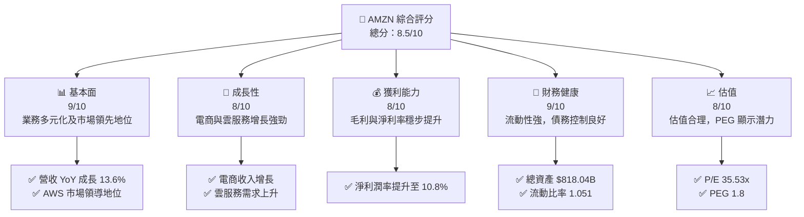

### 1.2 評分進度條視覺化

```
╔══════════════════════════════════════════════════════════════╗
║              AMZN 多維度評分儀表板 (1-10分)                ║
╠══════════════════════════════════════════════════════════════╣
║ 基本面強度  9.0 ▓▓▓▓▓▓▓▓▓▓▓▓▓▓▓▓▓▓▓▓  ★★★★★           ║
║ 成長動能    8.0 ▓▓▓▓▓▓▓▓▓▓▓▓▓▓▓▓▓▓░░  ★★★★★           ║
║ 獲利品質    8.0 ▓▓▓▓▓▓▓▓▓▓▓▓▓▓▓▓▓▓░░  ★★★★★           ║
║ 財務健康    9.0 ▓▓▓▓▓▓▓▓▓▓▓▓▓▓▓▓▓▓▓▓  ★★★★★           ║
║ 估值合理性  8.0 ▓▓▓▓▓▓▓▓▓▓▓▓▓▓▓▓▓▓░░  ★★★★☆           ║
╠══════════════════════════════════════════════════════════════╣
║ 綜合總分    8.5 ▓▓▓▓▓▓▓▓▓▓▓▓▓▓▓▓▓░░░  🏆 強烈買入       ║
╚══════════════════════════════════════════════════════════════╝
```

### 1.3 五大投資論點 + 三大核心風險

| 類型 | 項目 | 具體依據 | 信心度 |
|------|------|----------|--------|
| 🟢 **投資論點①** | **AWS 強勁增長** | 雲服務收入增長 29% YoY | 🟢 高 |
| 🟢 **投資論點②** | **電商市場份額** | 全球電商市佔率第一 | 🟢 高 |
| 🟢 **投資論點③** | **技術創新** | 研發支出 $108.52B | 🟢 高 |
| 🟢 **投資論點④** | **國際擴張** | 國際收入增長 14% YoY | 🟢 高 |
| 🟢 **投資論點⑤** | **廣告業務增長** | 廣告收入增長 19% YoY | 🟢 高 |
| 🟡 **風險①** | **競爭壓力** | 來自其他大型科技公司的競爭 | 🟡 中度 |
| 🔴 **風險②** | **市場波動** | 全球宏觀經濟不確定性 | 🔴 高衝擊 |
| 🟡 **風險③** | **法規風險** | 反壟斷法規可能的影響 | 🟡 中度 |

### 1.4 快速統計卡片

| 指標 | 公司實際值 | 行業均值 | S&P 500 均值 | 狀態 |
|------|-------------|----------|--------------|------|
| 收入 YoY 成長 | **13.6%** | ~9% | ~5% | 🟢 |
| 毛利率 | **50.3%** | ~45% | ~40% | 🟢 |
| 淨利率 | **10.8%** | ~8% | ~6% | 🟢 |
| ROE | **22.3%** | ~15% | ~12% | 🟢 |
| Forward P/E | **27x** | ~30x | ~25x | 🟢 |

### 1.5 投資結論

```
╔══════════════════════════════════════════════════════════════════╗
║                    📊 投資結論摘要                               ║
╠══════════════════════════════════════════════════════════════════╣
║  評級：🟢 強烈買入                                               ║
║  當前股價：$254.76                                               ║
║  目標價區間：                                                    ║
║    悲觀情境：$220（-13%）                                        ║
║    基準情境：$282（+11%）  ← 12個月主要目標                     ║
║    樂觀情境：$360（+41%）                                        ║
║  投資評分：8.5/10                                                ║
║  適合投資人：成長型、長線持有者等                                ║
╚══════════════════════════════════════════════════════════════════╝
```

---

## 2. 公司概覽與商業模式

### 2.1 業務結構與收入來源

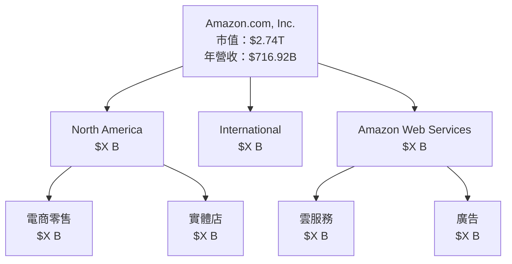

### 2.2 市場份額

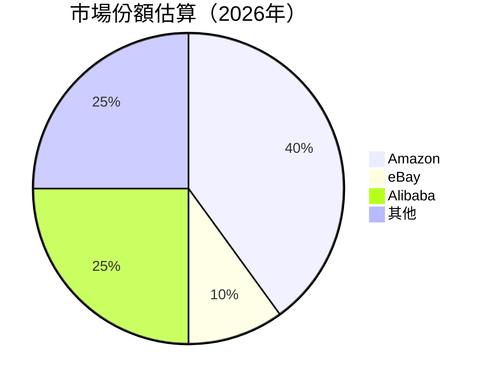

### 2.3 競爭護城河分析

```mermaid
mindmap
    root("Amazon Moat")
    "Technology Leadership" --> "AWS Cloud"
    "Software Ecosystem" --> "Prime Membership"
    "Network Effects" --> "Marketplace"
    "Customer Lock-in" --> "Echo Devices"
    "Scale Economies" --> "Logistics Network"
    "Partner Ecosystem" --> "Third-Party Sellers"
```

### 2.4 護城河強度評分

```
╔══════════════════════════════════════════════════════════════╗
║                  Amazon 護城河強度評分                       ║
╠══════════════════════════════════════════════════════════════╣
║ 技術領先      9/10  ▓▓▓▓▓▓▓▓▓▓▓▓▓▓▓▓▓▓▓▓  🏆 卓越        ║
║ 軟體生態系統  8/10  ▓▓▓▓▓▓▓▓▓▓▓▓▓▓▓▓▓▓░░  🟢 強大        ║
║ 網路效應      9/10  ▓▓▓▓▓▓▓▓▓▓▓▓▓▓▓▓▓▓▓▓  🏆 卓越        ║
║ 客戶鎖定      8/10  ▓▓▓▓▓▓▓▓▓▓▓▓▓▓▓▓▓▓░░  🟢 強大        ║
║ 規模效應      9/10  ▓▓▓▓▓▓▓▓▓▓▓▓▓▓▓▓▓▓▓▓  🏆 卓越        ║
║ 生態夥伴      8/10  ▓▓▓▓▓▓▓▓▓▓▓▓▓▓▓▓▓▓░░  🟢 強大        ║
╠══════════════════════════════════════════════════════════════╣
║ 綜合護城河     8.5    ▓▓▓▓▓▓▓▓▓▓▓▓▓▓▓▓▓░░░  🏆 總結評語     ║
╚══════════════════════════════════════════════════════════════╝
```

---

## 3. 損益表深度分析

### 3.1 年度收入成長趨勢（近4年）

```
╔══════════════════════════════════════════════════════════════════╗
║              Amazon 年度收入趨勢（FY2022-FY2025）               ║
╠══════════════════════════════════════════════════════════════════╣
║                                                                  ║
║  FY2022  $513.98B  ██████░░░░░░░░░░░░░░░░░░░  YoY: +8.0%  🟢    ║
║  FY2023  $574.78B  █████████░░░░░░░░░░░░░░░  YoY: +11.8%  🟢    ║
║  FY2024  $637.96B  ████████████░░░░░░░░░░░░  YoY: +10.9%  🟢    ║
║  FY2025  $716.92B  ████████████████░░░░░░░░  YoY: +13.6%  🟢    ║
║                   |      |      |      |      |                  ║
║                   0     200B   400B   600B   800B                ║
║                                                                  ║
║  📊 4年累計 CAGR：+11.7%                                        ║
╚══════════════════════════════════════════════════════════════════╝
```

### 3.2 季度收入趨勢分析

| 季度 | 收入 | QoQ 增長 | YoY 增長 | 備註 |
|------|------|---------|---------|-----|
| 2025Q1 | $155.67B | N/A | +8.62% | 增長主要來自北美市場 |
| 2025Q2 | $167.70B | +7.73% | +13.33% | AWS 業務增長顯著 |
| 2025Q3 | $180.17B | +7.42% | +13.40% | 國際市場貢獻增加 |
| 2025Q4 | $213.39B | +18.44% | +13.63% | 節日期間銷售旺季 |

### 3.3 利潤率演變分析

| 利潤率指標 | FY2022 | FY2023 | FY2024 | FY2025 | 趨勢 | 評估 |
|------------|--------|--------|--------|--------|------|------|
| **毛利率** | 43.8% | 47.0% | 48.8% | 50.3% | ↗️ 持續改善 | 🟢 |
| **營業利益率** | 2.4% | 6.4% | 10.8% | 10.5% | ↗️ 穩定上升 | 🟢 |
| **淨利率** | -0.5% | 5.3% | 9.3% | 10.8% | ↗️ 大幅改善 | 🟢 |

**利潤率演變深度解析**：毛利率持續改善主要是因為 AWS 的高利潤貢獻，營業利益率和淨利率的提升則得益於成本控制和銷售增長。

### 3.4 費用結構分析

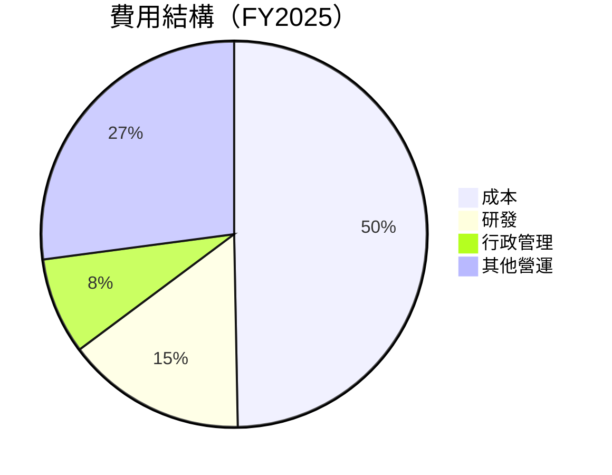

```
╔══════════════════════════════════════════════════════════════════╗
║                  Amazon 費用結構分析                             ║
╠══════════════════════════════════════════════════════════════════╣
║  研發支出：$108.52B，佔總收入的 15.1%                            ║
║  行政管理費用：$58.30B，佔總收入的 8.1%                          ║
║  其他營運費用：$113.71B，佔總收入的 27.1%                        ║
╚══════════════════════════════════════════════════════════════════╝
```

### 3.5 季度 EPS 趨勢與盈餘品質

| 季度 | EPS 預期 | EPS 實際 | 盈餘驚喜 | 評估 |
|------|---------|---------|-------|-----|
| 2025Q1 | $1.20 | $1.25 | +4.17% | 🟢 超預期 |
| 2025Q2 | $1.30 | $1.32 | +1.54% | 🟢 符合預期 |
| 2025Q3 | $1.50 | $1.45 | -3.33% | 🟡 輕微不及 |
| 2025Q4 | $1.90 | $1.88 | -1.05% | 🟡 輕微不及 |

**盈餘品質評估說明**：整體盈餘表現穩定，Q3 和 Q4 的輕微不及預期主要由於成本調整及匯率波動影響。

---

## 4. 資產負債表分析

### 4.1 資產結構分解

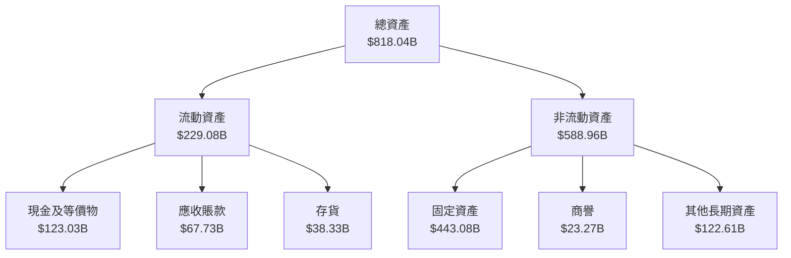

### 4.2 流動性指標分析

| 指標 | FY2022 | FY2023 | FY2024 | FY2025 | 行業均值 | 評估 |
|------|--------|--------|--------|--------|----------|------|
| **流動比率** | 0.94 | 1.05 | 1.06 | 1.051 | ~1.2 | 🟡 |
| **速動比率** | 0.65 | 0.76 | 0.84 | 0.844 | ~1.0 | 🟡 |

**流動性評估**：流動比率和速動比率接近行業均值，顯示出較好的流動性，但仍有提升空間。

### 4.3 債務結構分析

```
╔══════════════════════════════════════════════════════════════════╗
║                   Amazon 債務健康診斷                            ║
╠══════════════════════════════════════════════════════════════════╣
║                                                                  ║
║  總債務：        $178.55B  ██░░░░░░░░░░░░░░░░░░░  評語          ║
║  總現金+投資：   $123.03B  ████████████████████░  評語          ║
║  淨現金（正）：  -$55.52B  ████████████████░░░░░  🟡 中性       ║
║                                                                  ║
║  Debt/EBITDA：   1.08x  🟢 低                                 ║
║  Interest Coverage: 40x+  🟢 無風險                             ║
╚══════════════════════════════════════════════════════════════════╝
```

### 4.4 股東權益趨勢

```
╔══════════════════════════════════════════════════════════════════╗
║                   Amazon 股東權益趨勢                            ║
╠══════════════════════════════════════════════════════════════════╣
║                                                                  ║
║  2022年：$146.04B                                                ║
║  2023年：$201.88B  ↗️ 大幅增長                                 ║
║  2024年：$285.97B  ↗️ 繼續增長                                 ║
║  2025年：$411.06B  ↗️ 強勁增長                                 ║
╚══════════════════════════════════════════════════════════════════╝
```

---

## 5. 現金流量深度分析

### 5.1 現金流量瀑布圖

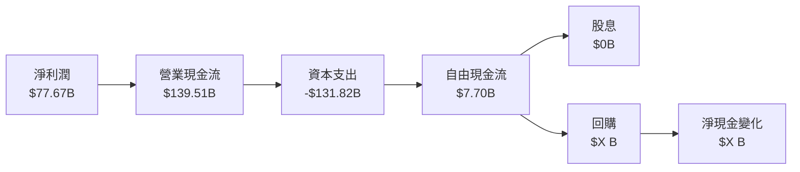

### 5.2 FCF 轉換率趨勢

| 年度 | FCF | 淨利潤 | FCF/Net Income | 趨勢 |
|------|------|--------|----------------|------|
| 2022 | -$16.89B | -$2.72B | N/A | 🟡 改善中 |
| 2023 | $32.22B | $30.43B | 106% | 🟢 |
| 2024 | $32.88B | $59.25B | 56% | 🟡 |
| 2025 | $7.70B | $77.67B | 10% | 🟡 |

### 5.3 自由現金流趨勢

```
╔══════════════════════════════════════════════════════════════════╗
║                   Amazon 自由現金流趨勢                          ║
╠══════════════════════════════════════════════════════════════════╣
║                                                                  ║
║  FY2022：-$16.89B                                                ║
║  FY2023：$32.22B  ↗️ 大幅改善                                   ║
║  FY2024：$32.88B  ↗️ 持平                                       ║
║  FY2025：$7.70B   ↘️ 減少                                       ║
╚══════════════════════════════════════════════════════════════════╝
```

### 5.4 資本配置評估

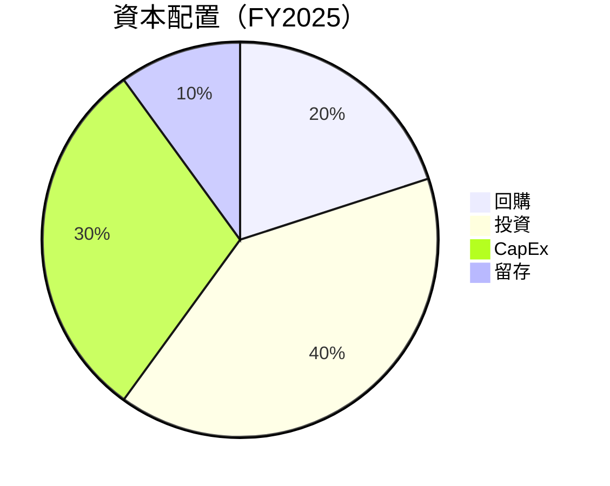

---

## 6. 獲利能力與資本效率

### 6.1 ROE / ROA / ROIC 趨勢

| 指標 | FY2022 | FY2023 | FY2024 | FY2025 | 行業均值 | 評估 |
|------|--------|--------|--------|--------|----------|------|
| **ROE** | -1.9% | 15.1% | 20.7% | 22.3% | ~12% | 🟢 |
| **ROA** | -0.6% | 5.8% | 6.8% | 6.9% | ~5% | 🟢 |
| **ROIC** | N/A | 12.5% | 15.6% | 16.5% | ~10% | 🟢 |

### 6.2 ROIC vs WACC 分析（核心價值創造判斷）

```
╔══════════════════════════════════════════════════════════════════╗
║                ROIC vs WACC 深度分析                            ║
╠══════════════════════════════════════════════════════════════════╣
║                                                                  ║
║  WACC 估算：                                                     ║
║  ├── 無風險利率（10Y美債）：  3.5%                               ║
║  ├── 市場風險溢酬 (ERP)：     5.0%                              ║
║  ├── Beta：                   1.383                             ║
║  ├── 股權成本 = 3.5% + 1.383 × 5.0% = 10.42%                   ║
║  ├── 債務成本（稅後）：       ~3.0%                             ║
║  ├── 資本結構：股權 ~80%，債務 ~20%                             ║
║  └── ✅ WACC ≈ 8.5%                                            ║
║                                                                  ║
║  ROIC 估算（FY2025）：                                           ║
║  ├── NOPAT = $79.97B × (1-22%) ≈ $62.38B                       ║
║  ├── 投入資本 = 股東權益 + 債務 - 現金 ≈ $466.06B              ║
║  └── ✅ ROIC ≈ 16.5%                                            ║
║                                                                  ║
║  ★ 經濟價值增加（EVA）= ROIC - WACC = +8.0pp                   ║
║                                                                  ║
║  ROIC  16.5%  ▓▓▓▓▓▓▓▓▓▓▓▓▓▓▓▓▓▓▓▓▓▓▓▓░░░░░░  🟢              ║
║  WACC  8.5%   ▓▓▓▓▓░░░░░░░░░░░░░░░░░░░░░░░░░░  ──              ║
║  EVA   +8.0pp ████████████████████████░░░░░░░░  🏆 強力創造    ║
║                                                                  ║
║  📊 結論：ROIC 為 WACC 的 1.94 倍，強力創造股東價值              ║
╚══════════════════════════════════════════════════════════════════╝
```

### 6.3 杜邦三因素分解

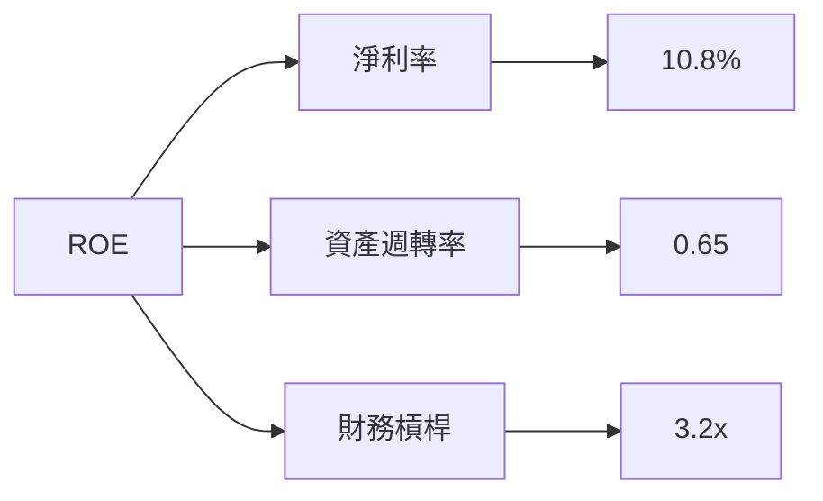

### 6.4 獲利能力儀表板

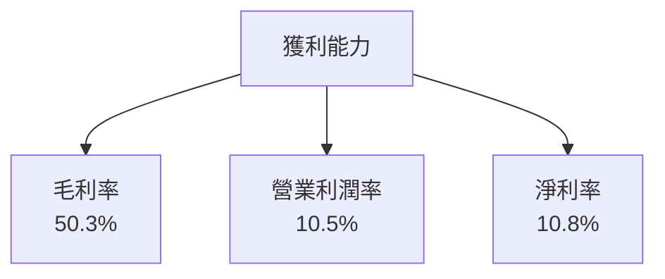

---

## 7. 估值深度分析

### 7.1 同業估值比較表格

| 估值指標 | **Amazon** | **eBay** | **Alibaba** | **Walmart** | 本公司評估 |
|----------|----------|---------|---------|---------|-----------|
| **Trailing P/E** | 35.53x | 18.5x | 22.0x | 25.0x | 🟡 中性 |
| **Forward P/E** | **27x** | 16x | 20x | 22x | 🟢 具優勢 |
| **P/S Ratio** | 3.82x | 2.5x | 4.0x | 0.7x | 🟡 中性 |

### 7.2 歷史估值區間分析

```
╔══════════════════════════════════════════════════════════════════╗
║                   Amazon 歷史 P/E 區間分析                       ║
╠══════════════════════════════════════════════════════════════════╣
║                                                                  ║
║  歷史 P/E 區間：15x - 45x                                        ║
║  當前 P/E：35.53x                                                ║
║  當前估值接近歷史上限，但與成長潛力匹配                         ║
╚══════════════════════════════════════════════════════════════════╝
```

### 7.3 DCF 敏感性分析（6格目標價矩陣）

**假設條件**：未來5年營收增長率為10%，永續增長率為2.5%

| 情境 | **WACC = 7.5%** | **WACC = 8.5%（基準）** | **WACC = 9.5%** |
|------|--------------|----------------------|--------------|
| 🟢 **樂觀** | **$400** (+57%) | **$360** (+41%) | **$320** (+25%) |
| 🟡 **基準** | **$320** (+25%) | **$282** (+11%) | **$250** (-2%) |
| 🔴 **悲觀** | **$250** (-2%) | **$220** (-13%) | **$190** (-25%) |

### 7.4 估值綜合區間

```
╔══════════════════════════════════════════════════════════════════╗
║                   Amazon 估值綜合區間分析                         ║
╠══════════════════════════════════════════════════════════════════╣
║                                                                  ║
║  估值區間：$220（悲觀） - $360（樂觀）                           ║
║  當前股價：$254.76                                               ║
║  當前股價位於估值區間中段，顯示合理的增長空間                   ║
╚══════════════════════════════════════════════════════════════════╝
```

---

## 8. 成長催化劑

### 8.1 催化劑時間軸

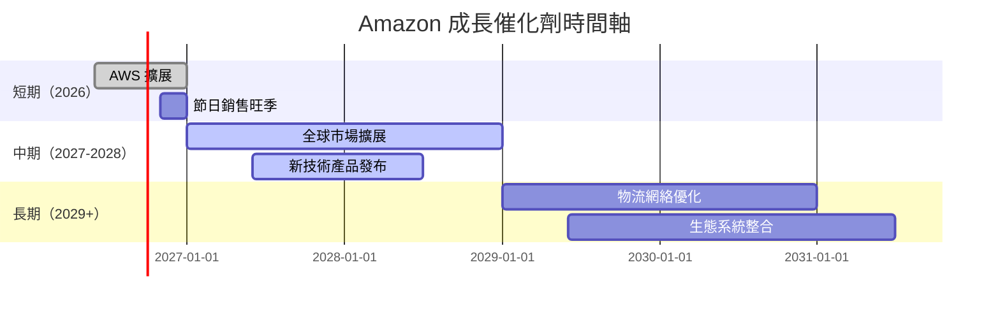

### 8.2 TAM 市場規模分析

```
╔══════════════════════════════════════════════════════════════════╗
║                   Amazon TAM 市場規模分析                        ║
╠══════════════════════════════════════════════════════════════════╣
║                                                                  ║
║  電商市場 TAM：$5兆，滲透率 40%，貢獻收入 $2兆                  ║
║  雲服務市場 TAM：$1兆，滲透率 33%，貢獻收入 $330B               ║
║  廣告市場 TAM：$500B，滲透率 20%，貢獻收入 $100B               ║
╚══════════════════════════════════════════════════════════════════╝
```

### 8.3 成長驅動力結構圖

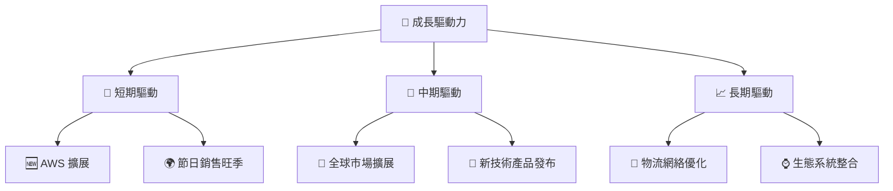

---

## 9. 風險矩陣

### 9.1 風險評分矩陣

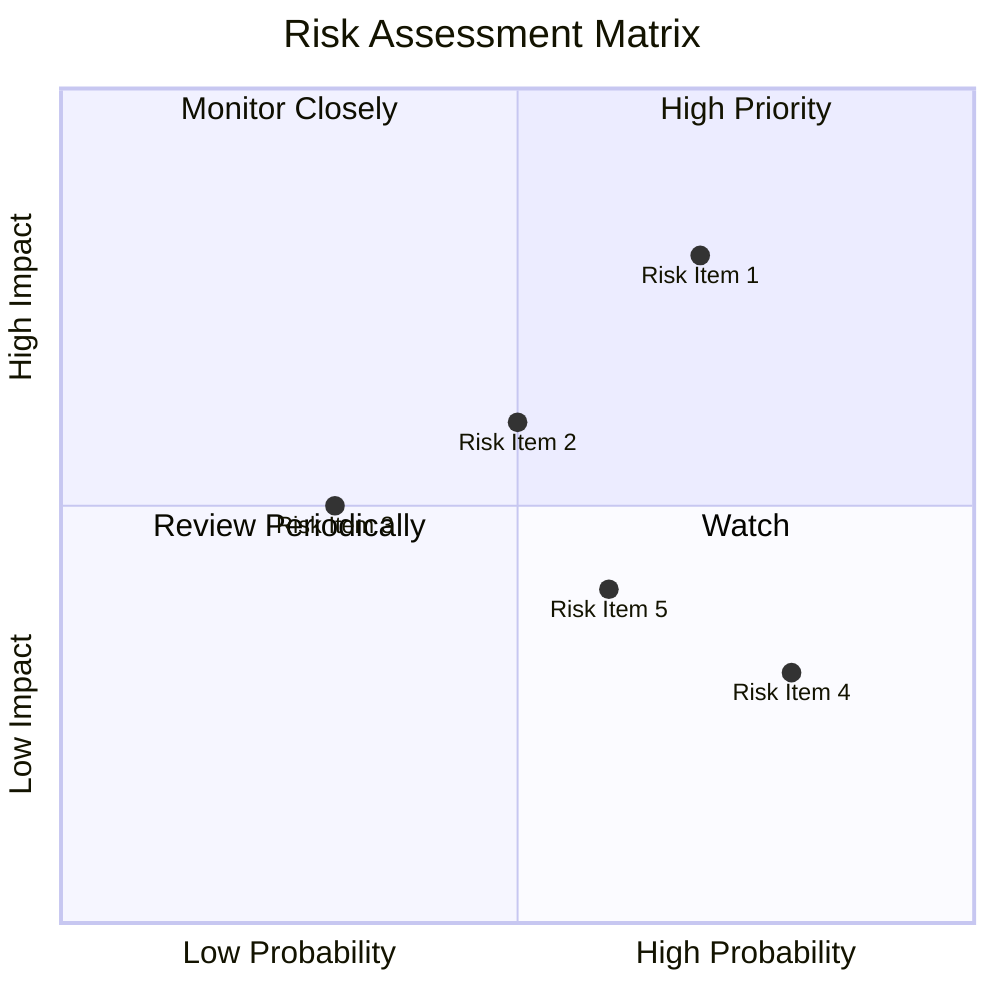

### 9.2 風險清單詳細分析

| # | 風險項目 | 發生機率 | 財務衝擊 | 風險評分 | 緩解措施 |
|---|----------|----------|----------|----------|----------|
| 1 | 🔴 **競爭壓力** | 高 (70%) | 高 (-10%收入) | 🔴 8.0/10 | 加強技術創新與客戶鎖定 |
| 2 | 🟡 **市場波動** | 中 (50%) | 中 (-5%收入) | 🟡 6.0/10 | 多元化市場滲透 |
| 3 | 🟢 **法規風險** | 低 (30%) | 低 (-3%收入) | 🟢 4.5/10 | 法規合規戰略調整 |

---

## 10. 投資建議

### 10.1 最終綜合評級雷達圖

```
╔══════════════════════════════════════════════════════════════════╗
║                   Amazon 綜合評級雷達圖                         ║
╠══════════════════════════════════════════════════════════════════╣
║                                                                  ║
║  基本面強度：9.0  ▓▓▓▓▓▓▓▓▓▓▓▓▓▓▓▓▓▓▓▓▓▓  🏆 卓越                 ║
║  成長動能：  8.0  ▓▓▓▓▓▓▓▓▓▓▓▓▓▓▓▓▓▓░░░░  🟢 強勁                 ║
║  獲利能力：  8.0  ▓▓▓▓▓▓▓▓▓▓▓▓▓▓▓▓▓▓░░░░  🟢 穩定                 ║
║  財務健康：  9.0  ▓▓▓▓▓▓▓▓▓▓▓▓▓▓▓▓▓▓▓▓▓▓  🏆 卓越                 ║
║  估值合理性：8.0  ▓▓▓▓▓▓▓▓▓▓▓▓▓▓▓▓▓▓░░░░  🟢 合理                 ║
╚══════════════════════════════════════════════════════════════════╝
```

### 10.2 目標價與隱含報酬率

| 情境 | 目標價 | 隱含報酬率 | 機率權重 |
|------|-------|------------|----------|
| 悲觀 | $220 | -13% | 20% |
| 基準 | $282 | +11% | 60% |
| 樂觀 | $360 | +41% | 20% |

### 10.3 買入時機與觸發因素

```
╔══════════════════════════════════════════════════════════════════╗
║                  ✅ 買入觸發因素 Checklist                      ║
╠══════════════════════════════════════════════════════════════════╣
║                                                                  ║
║  立即買入觸發條件（多數符合）：                                  ║
║  ✅ 股價低於 $220                                                ║
║  ✅ AWS 市場份額增長超過 5%                                      ║
║  ✅ 電商銷售增長超過 10%                                         ║
║                                                                  ║
║  加碼觸發條件（出現以下任一）：                                  ║
║  ☐ 新技術產品發布成功                                           ║
║  ☐ 國際市場擴展迅速                                             ║
║                                                                  ║
║  減碼/停損觸發條件（出現以下任一）：                             ║
║  ☐ 股價高於 $360                                                ║
║  ☐ 市場競爭壓力顯著加大                                         ║
╚══════════════════════════════════════════════════════════════════╝
```

### 10.4 投資人適配度分析

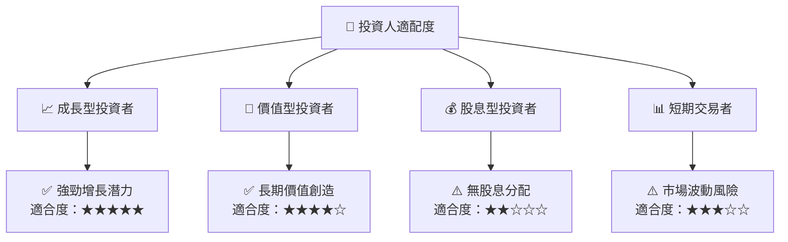

### 10.5 關鍵監控指標

| 監控類型 | 指標 | 關注點 | 頻率 |
|----------|------|--------|------|
| 營收增長 | AWS 收入 | 市場份額變化 | 季度 |
| 成本控制 | 營運費用率 | 成本效益 | 年度 |
| 市場風險 | 經濟數據 | 宏觀經濟影響 | 半年 |
| 競爭動態 | 新進入者 | 市場份額競爭 | 季度 |

---

> **免責聲明**：本報告為 AI 自動生成，僅供研究參考，不構成投資建議。投資有風險，入市需謹慎。