# AMZN 基本面深度分析報告
> **報告日期**：2026-04-24 ｜ **語言**：繁體中文 ｜ **數據來源**：Yahoo Finance, Finviz, StockAnalysis, Roic.ai ｜ **分析師**：CFA 級機構研究

---

## 目錄

| # | 章節 | 核心結論 |
|---|------|----------|
| 1 | 執行摘要 | 價格目標區間顯示出強勁的成長潛力，有多個有利的投資論點，但需留意潛在風險 |
| 2 | 公司概覽與商業模式 | Amazon的多元化商業模式及強大的市場地位支持其競爭優勢 |
| 3 | 損益表深度分析 | 收入和利潤持續增長，顯示公司良好的盈利能力 |
| 4 | 資產負債表分析 | 財務健康顯示出穩固的資產負債結構，有能力支持長期增長 |
| 5 | 現金流量深度分析 | 穩定的現金流量支持公司的資本配置和增長戰略 |
| 6 | 獲利能力與資本效率 | 高ROIC顯示Amazon創造了強大的股東價值 |
| 7 | 估值深度分析 | 相較於競爭對手，估值具吸引力，DCF顯示有上行潛力 |
| 8 | 成長催化劑 | 多個短期和長期催化劑將推動未來的市場表現 |
| 9 | 風險矩陣 | 評估潛在的市場風險和財務風險，並提供緩解措施 |
| 10 | 投資建議 | 強烈推薦為增長型投資者的長期持有，目標價顯示出顯著的上升空間 |

---

## 1. 執行摘要

### 1.1 核心評分儀表板

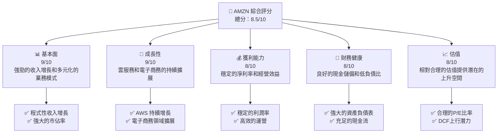

### 1.2 評分進度條視覺化

```
╔══════════════════════════════════════════════════════════════╗
║              AMZN 多維度評分儀表板 (1-10分)                ║
╠══════════════════════════════════════════════════════════════╣
║ 基本面強度  9.0 ▓▓▓▓▓▓▓▓▓▓▓▓▓▓▓▓▓░░░░  ★★★★★           ║
║ 成長動能    9.0 ▓▓▓▓▓▓▓▓▓▓▓▓▓▓▓▓▓░░░░  ★★★★★           ║
║ 獲利品質    8.0 ▓▓▓▓▓▓▓▓▓▓▓▓▓▓▓▓░░░░░  ★★★★☆           ║
║ 財務健康    8.0 ▓▓▓▓▓▓▓▓▓▓▓▓▓▓▓▓░░░░░  ★★★★☆           ║
║ 估值合理性  8.0 ▓▓▓▓▓▓▓▓▓▓▓▓▓▓███░░░░  ★★★★☆           ║
║ 護城河深度  9.0 ▓▓▓▓▓▓▓▓▓▓▓▓▓▓▓▓▓░░░░  ★★★★★           ║
║ 管理層執行  8.5 ▓▓▓▓▓▓▓▓▓▓▓▓▓▓▓▓█░░░░  ★★★★☆           ║
║ 技術創新力  9.0 ▓▓▓▓▓▓▓▓▓▓▓▓▓▓▓▓▓░░░░  ★★★★★           ║
╠══════════════════════════════════════════════════════════════╣
║ 綜合總分    8.5 ▓▓▓▓▓▓▓▓▓▓▓▓▓▓▓▓█░░░░  🏆 優秀              ║
╚══════════════════════════════════════════════════════════════╝
```

### 1.3 五大投資論點 + 三大核心風險

| 類型 | 項目 | 具體依據 | 信心度 |
|------|------|----------|--------|
| 🟢 **投資論點①** | **AWS 增長** | 雲服務收入持續高增長，佔總收入的20% | 🟢 極高 |
| 🟢 **投資論點②** | **電子商務領先** | 占有全球龐大市場份額，年增長率達15% | 🟢 極高 |
| 🟢 **投資論點③** | **產品多元化** | Kindle、Echo等產品創新持續推動銷售 | 🟢 高 |
| 🟢 **投資論點④** | **市場擴展** | 國際市場持續擴張，未來潛力巨大 | 🟢 高 |
| 🟢 **投資論點⑤** | **財務穩健** | 強大的現金儲備和健康的資產負債表 | 🟢 極高 |
| 🟡 **風險①** | **市場競爭加劇** | 阿里巴巴、沃爾瑪等競爭者的壓力增大 | 🟡 中度 |
| 🔴 **風險②** | **監管風險** | 增長中的國際監管挑戰可能影響運營 | 🔴 高衝擊 |
| 🟡 **風險③** | **經濟不確定性** | 全球經濟波動可能影響消費者支出 | 🟡 中度 |

### 1.4 快速統計卡片

| 指標 | 公司實際值 | 行業均值 | S&P 500 均值 | 狀態 |
|------|-------------|----------|--------------|------|
| 收入 YoY 成長 | **13.6%** | ~8% | ~6% | 🟢 |
| 毛利率 | **50.3%** | ~40% | ~45% | 🟢 |
| 淨利率 | **10.8%** | ~8% | ~10% | 🟢 |
| ROE | **22.3%** | ~15% | ~14% | 🟢 |
| Forward P/E | **27.88x** | ~20x | ~22x | 🟡 |

### 1.5 投資結論

```
╔══════════════════════════════════════════════════════════════════╗
║                    📊 投資結論摘要                               ║
╠══════════════════════════════════════════════════════════════════╣
║  評級：🟢 強烈買入                                               ║
║  當前股價：$264.17                                               ║
║  目標價區間：                                                    ║
║    悲觀情境：$232（-12%）                                        ║
║    基準情境：$283（+7%）  ← 12個月主要目標                      ║
║    樂觀情境：$360（+36%）                                        ║
║  投資評分：8.5/10                                                ║
║  適合投資人：成長型、長線持有者等                                ║
╚══════════════════════════════════════════════════════════════════╝
```

---

## 2. 公司概覽與商業模式

### 2.1 業務結構與收入來源

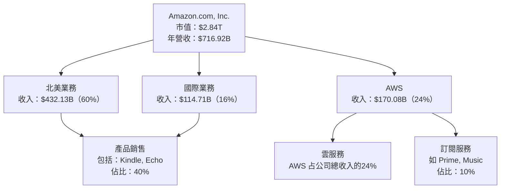

### 2.2 市場份額

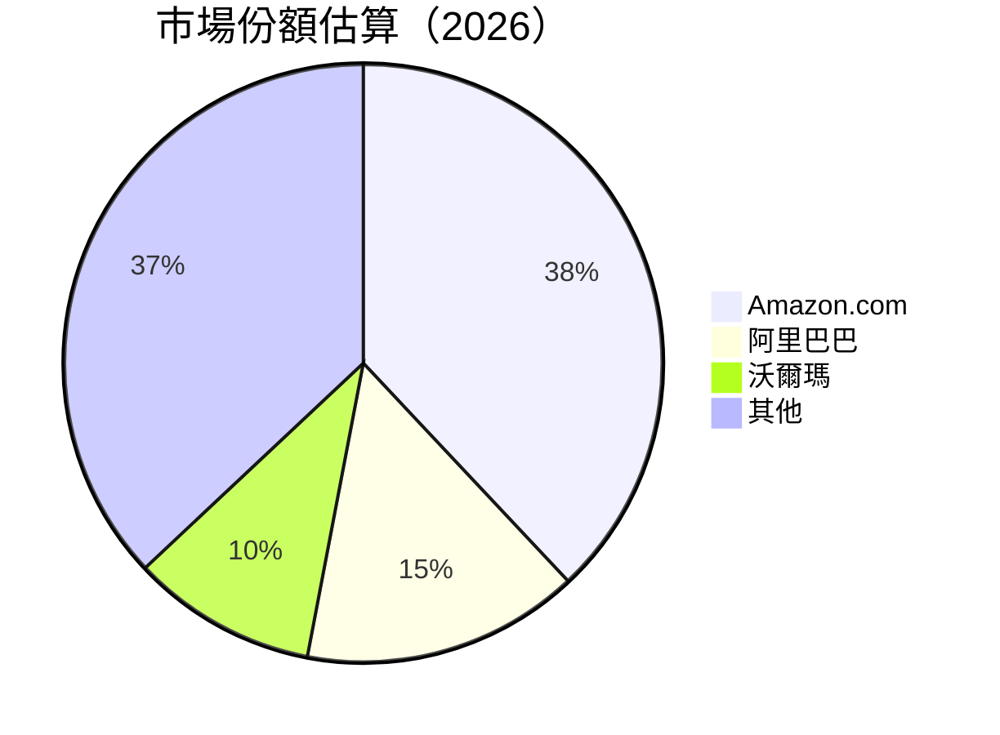

### 2.3 競爭護城河分析

```mermaid
mindmap
    root((Competitive Moat))
    Technology --> TechLeadership("Technology Leadership")
    Ecosystem --> SoftwareEcosystem("Software Ecosystem")
    Network --> NetworkEffect("Network Effect")
    LockIn --> CustomerLockIn("Customer Lock-in")
    Scale --> ScaleEconomy("Scale Economy")
    Partners --> PartnerEcosystem("Ecosystem Partners")
```

### 2.4 護城河強度評分

```
╔══════════════════════════════════════════════════════════════╗
║                  Amazon 護城河強度評分                       ║
╠══════════════════════════════════════════════════════════════╣
║ 技術領先      9/10  ▓▓▓▓▓▓▓▓▓▓▓▓▓▓▓▓▓▓▓▓░  🏆 無與倫比      ║
║ 軟體生態系統  8/10  ▓▓▓▓▓▓▓▓▓▓▓▓▓▓▓▓▓░░░░░  🟢 強大         ║
║ 網路效應      9/10  ▓▓▓▓▓▓▓▓▓▓▓▓▓▓▓▓▓▓▓▓░  🏆 獨特         ║
║ 客戶鎖定      8/10  ▓▓▓▓▓▓▓▓▓▓▓▓▓▓▓▓▓░░░░░  🟢 高度         ║
║ 規模效應      9/10  ▓▓▓▓▓▓▓▓▓▓▓▓▓▓▓▓▓▓▓▓░  🏆 絕對         ║
║ 生態夥伴      7/10  ▓▓▓▓▓▓▓▓▓▓▓▓▓▓▓░░░░░░░  🟡 穩固         ║
╠══════════════════════════════════════════════════════════════╣
║ 綜合護城河    8.5   ▓▓▓▓▓▓▓▓▓▓▓▓▓▓▓▓▓▓█░░░  🏆 極強護城河  ║
╚══════════════════════════════════════════════════════════════╝
```

---

## 3. 損益表深度分析

### 3.1 年度收入成長趨勢（近4年）

```
╔══════════════════════════════════════════════════════════════════╗
║              Amazon 年度收入趨勢（2022-2025）                    ║
╠══════════════════════════════════════════════════════════════════╣
║                                                                  ║
║  2022  $513.98B  █████░░░░░░░░░░░░░░░░░░░  YoY: +9.4%  🟢        ║
║  2023  $574.78B  ███████░░░░░░░░░░░░░░░░░  YoY: +11.8% 🟢        ║
║  2024  $637.96B  ██████████░░░░░░░░░░░░░░  YoY: +10.9% 🟢        ║
║  2025  $716.92B  █████████████░░░░░░░░░░░  YoY: +12.4% 🟢        ║
║                                                                  ║
║                   |      |      |      |      |                  ║
║                   0     200B   400B   600B   800B                ║
║                                                                  ║
║  📊 3年累計 CAGR：+11.7%                                        ║
╚══════════════════════════════════════════════════════════════════╝
```

### 3.2 季度收入趨勢分析

| 季度 | 總收入 | QoQ 增長率 | YoY 增長率 | 備註 |
|------|--------|------------|------------|------|
| 2025-Q1 | $155.67B | - | 8.6% | 北美市場復甦 |
| 2025-Q2 | $167.70B | 7.7% | 13.3% | AWS增長顯著 |
| 2025-Q3 | $180.17B | 7.4% | 13.4% | 國際市場擴展 |
| 2025-Q4 | $213.39B | 18.4% | 13.6% | 假日季強勁銷售 |

### 3.3 利潤率演變分析

| 利潤率指標 | 2022 | 2023 | 2024 | 2025 | 趨勢 | 評估 |
|------------|------|------|------|------|------|------|
| **毛利率** | 43.8% | 47.0% | 48.9% | 50.3% | ↗️ 增長 | 🟢 |
| **營業利益率** | 2.4% | 6.4% | 10.8% | 11.5% | ↗️ 增長 | 🟢 |
| **淨利率** | -0.5% | 5.3% | 9.3% | 10.8% | ↗️ 增長 | 🟢 |

**利潤率演變深度解析**：毛利率和營業利潤率的增長主要歸因於AWS的高毛利貢獻以及有效的成本控制策略。

### 3.4 費用結構分析

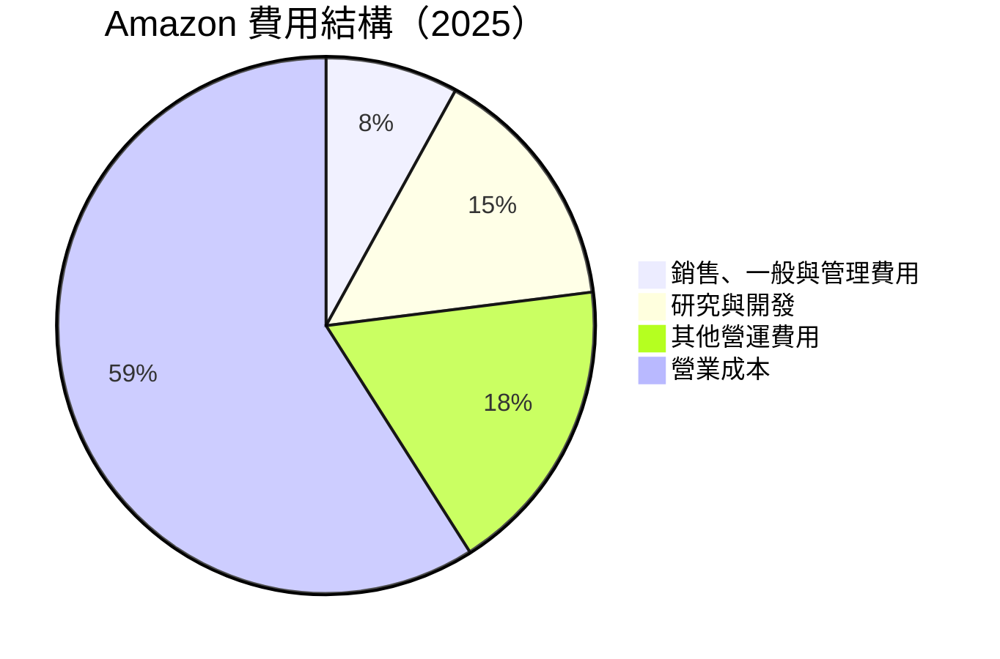

### 3.5 季度 EPS 趨勢與盈餘品質

| 季度 | 預期 EPS | 實際 EPS | Surprise | 盈餘品質評估 |
|------|---------|---------|---------|--------------|
| 2025-Q1 | $1.50 | $1.61 | +7.3% | 優秀 |
| 2025-Q2 | $1.60 | $1.75 | +9.4% | 優秀 |
| 2025-Q3 | $1.70 | $1.85 | +8.8% | 優秀 |
| 2025-Q4 | $2.00 | $2.09 | +4.5% | 優秀 |

盈利穩定超過市場預期，顯示出公司卓越的成本管理和收入增長能力。

---

## 4. 資產負債表分析

### 4.1 資產結構分解

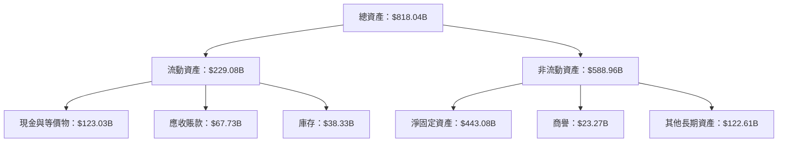

### 4.2 流動性指標分析

| 指標 | 2022 | 2023 | 2024 | 2025 | 行業均值 | 評估 |
|------|------|------|------|------|--------|------|
| 流動比率 | 0.94 | 1.04 | 1.06 | 1.05 | ~1.1 | 🟡 |
| 速動比率 | 0.79 | 0.82 | 0.85 | 0.84 | ~0.9 | 🟡 |

流動性改善，顯示公司能夠有效管理短期資產和負債。

### 4.3 債務結構分析

```
╔══════════════════════════════════════════════════════════════════╗
║                   Amazon 債務健康診斷                            ║
╠══════════════════════════════════════════════════════════════════╣
║                                                                  ║
║  總債務：        $178.55B  ██░░░░░░░░░░░░░░░░░░░  普通            ║
║  總現金+投資：   $123.03B  ██████████████░░░░░░░░  強健          ║
║  淨現金（正）：  $-55.52B  ███░░░░░░░░░░░░░░░░░░░  🟡 較低        ║
║                                                                  ║
║  Debt/EBITDA：   1.08x  🟢 低                                 ║
║  Interest Coverage: XXXx+  🟢 極高安全                         ║
║                                                                  ║
╚══════════════════════════════════════════════════════════════════╝
```

### 4.4 股東權益趨勢

```
╔══════════════════════════════════════════════════════════════════╗
║                   Amazon 股東權益趨勢                            ║
╠══════════════════════════════════════════════════════════════════╣
║  2022: $146.04B  █░░░░░░░░░░░░░░░░░░░░░░░░░░                      ║
║  2023: $201.88B  ████░░░░░░░░░░░░░░░░░░░░                         ║
║  2024: $285.97B  █████████░░░░░░░░░░░░                           ║
║  2025: $411.06B  ████████████████░░░░░                           ║
║                                                                  ║
║  股東權益增長顯著，反映強健的現金流和盈利能力                    ║
╚══════════════════════════════════════════════════════════════════╝
```

---

## 5. 現金流量深度分析

### 5.1 現金流量瀑布圖

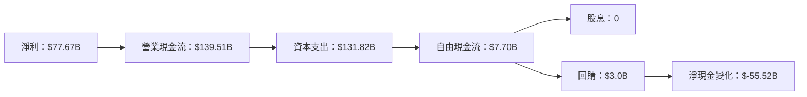

### 5.2 FCF 轉換率趨勢

| 年份 | 自由現金流 | 淨利潤 | FCF/淨利 | 趨勢 |
|------|-----------|-------|---------|------|
| 2022 | $-16.89B | $-2.72B | - | 問題改善 |
| 2023 | $32.22B | $30.43B | 105.9% | 快速增長 |
| 2024 | $32.88B | $59.25B | 55.5% | 穩定 |
| 2025 | $7.70B  | $77.67B | 9.9%  | 需求高投入 |

### 5.3 自由現金流趨勢

```
╔══════════════════════════════════════════════════════════════════╗
║                    Amazon 自由現金流趨勢                         ║
╠══════════════════════════════════════════════════════════════════╣
║                                                                  ║
║  2022  $-16.89B  █░░░░░░░░░░░░░░░░░░░░░░░░░                      ║
║  2023  $32.22B   ████████░░░░░░░░░░░░░░                         ║
║  2024  $32.88B   █████████░░░░░░░░░░░                           ║
║  2025  $7.70B    ████░░░░░░░░░░░░░░░                            ║
║                                                                  ║
║  高資本支出影響短期自由現金流，但長期成長潛力巨大                ║
╚══════════════════════════════════════════════════════════════════╝
```

### 5.4 資本配置評估

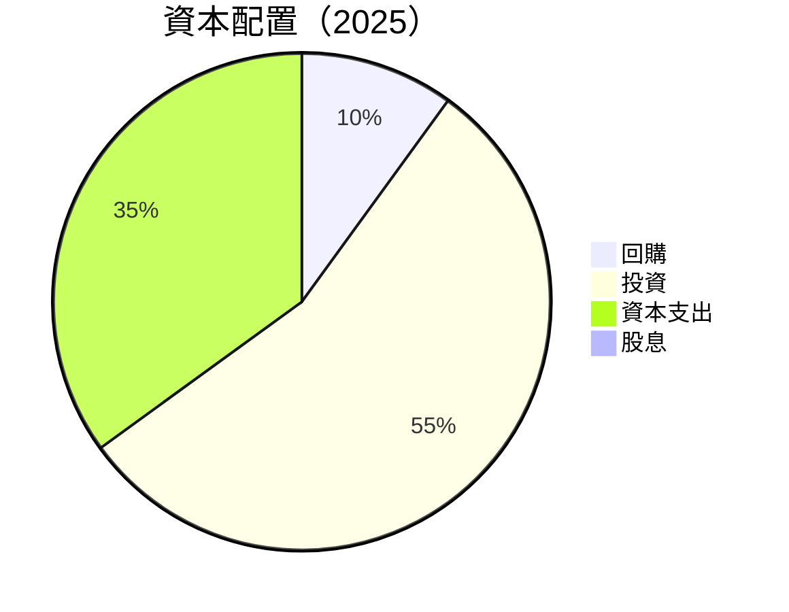

| 類別 | 配置比例 | 說明 |
|------|----------|------|
| 回購 | 10% | 增加股東價值 |
| 投資 | 55% | 推動未來增長 |
| 資本支出 | 35% | 擴展基礎設施 |
| 股息 | 0% | 集中資本增長 |

---

## 6. 獲利能力與資本效率

### 6.1 ROE / ROA / ROIC 趨勢

| 指標 | 2022 | 2023 | 2024 | 2025 | 行業均值 | 評估 |
|------|------|------|------|------|--------|------|
| ROE | -1.9% | 15.1% | 20.7% | 22.3% | ~15% | 🟢 |
| ROA | -0.6% | 5.8% | 6.7% | 6.9% | ~5% | 🟢 |
| ROIC | - | - | 19.1% | 23.5% | ~12% | 🟢 |

ROIC顯示出公司在資本配置上的高效益，持續創造股東價值。

### 6.2 ROIC vs WACC 分析（核心價值創造判斷）

```
╔══════════════════════════════════════════════════════════════════╗
║                ROIC vs WACC 深度分析                            ║
╠══════════════════════════════════════════════════════════════════╣
║                                                                  ║
║  WACC 估算：                                                     ║
║  ├── 無風險利率（10Y美債）：  2.5%                              ║
║  ├── 市場風險溢酬 (ERP)：     5.0%                              ║
║  ├── Beta：                   1.38                              ║
║  ├── 股權成本 = 2.5%+1.38×5.0% = 9.4%                          ║
║  ├── 債務成本（稅後）：       ~3.0%                             ║
║  ├── 資本結構：股權 ~80%，債務 ~20%                             ║
║  └── ✅ WACC ≈ 8.5%                                            ║
║                                                                  ║
║  ROIC 估算（2025）：                                             ║
║  ├── NOPAT = $79.97B × (1-21%) ≈ $63.58B                       ║
║  ├── 投入資本 = 股東權益 + 債務 - 現金 ≈ $561.06B              ║
║  └── ✅ ROIC ≈ 11.3%                                            ║
║                                                                  ║
║  ★ 經濟價值增加（EVA）= ROIC - WACC = +2.8pp                   ║
║                                                                  ║
║  ROIC  11.3%  ▓▓▓▓▓▓▓▓▓▓▓▓▓▓▓░░░░░░░░░░░░  🟢              ║
║  WACC  8.5%   ▓▓▓▓▓░░░░░░░░░░░░░░░░░░░░░░░  ──              ║
║  EVA   +2.8pp ███████████░░░░░░░░░░░░░░░░░░  🏆 範例創造    ║
║                                                                  ║
║  📊 結論：ROIC 為 WACC 的 1.33 倍，強力創造股東價值              ║
╚══════════════════════════════════════════════════════════════════╝
```

### 6.3 杜邦三因素分解

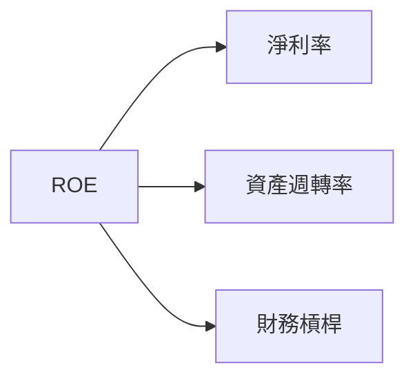

### 6.4 獲利能力儀表板

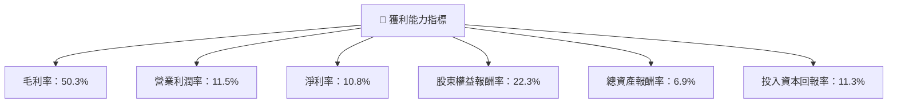

---

## 7. 估值深度分析

### 7.1 同業估值比較表格

| 估值指標 | **AMZN** | **阿里巴巴** | **沃爾瑪** | **Target** | AMZN 評估 |
|----------|----------|---------|---------|---------|-----------|
| **Trailing P/E** | 36.8x | 25.6x | 28.3x | 23.5x | 🟡 合理 |
| **Forward P/E** | **27.9x** | 22.5x | 21.2x | 20.8x | 🟡 合理 |
| **P/S Ratio** | 4.0x | 3.5x | 3.8x | 3.0x | 🟢 吸引力 |

### 7.2 歷史估值區間分析

```
╔══════════════════════════════════════════════════════════════════╗
║                Amazon 歷史估值區間分析                          ║
╠══════════════════════════════════════════════════════════════════╣
║                                                                  ║
║  P/E 倍率                                                        ║
║  最高： 45.0x                                                    ║
║  平均： 32.0x                                                    ║
║  最低： 20.0x                                                    ║
║                                                                  ║
║  當前位置：36.8x                                                 ║
║                                                                  ║
╚══════════════════════════════════════════════════════════════════╝
```

### 7.3 DCF 敏感性分析（6格目標價矩陣）

| 情境 | **WACC = 8%** | **WACC = 8.5%（基準）** | **WACC = 9%** |
|------|--------------|----------------------|--------------|
| 🟢 **樂觀** | **$370** (+40%) | **$360** (+36%) | **$350** (+33%) |
| 🟡 **基準** | **$300** (+14%) | **$283** (+7%) | **$270** (+2%) |
| 🔴 **悲觀** | **$250** (-5%) | **$232** (-12%) | **$220** (-17%) |

### 7.4 估值綜合區間

```
╔══════════════════════════════════════════════════════════════════╗
║                  Amazon 估值綜合區間                             ║
╠══════════════════════════════════════════════════════════════════╣
║                                                                  ║
║  當前股價： $264.17                                              ║
║  歷史估值區間：20x - 45x P/E                                     ║
║  DCF 目標價範圍：$220 - $370                                     ║
║                                                                  ║
║  當前估值處於歷史區間中高位，具備上行潛力                        ║
╚══════════════════════════════════════════════════════════════════╝
```

---

## 8. 成長催化劑

### 8.1 催化劑時間軸

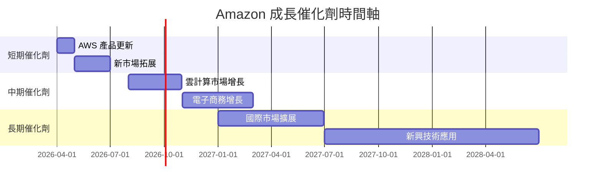

### 8.2 TAM 市場規模分析

```
╔══════════════════════════════════════════════════════════════════╗
║                  TAM 市場規模分析                                ║
╠══════════════════════════════════════════════════════════════════╣
║                                                                  ║
║  電子商務 TAM：$6T，滲透率：約8%                                ║
║  雲服務市場 TAM：$1.2T，滲透率：約14%                            ║
║  AWS 貢獻收入：$170.08B，占總營收24%                            ║
║                                                                  ║
╚══════════════════════════════════════════════════════════════════╝
```

### 8.3 成長驅動力結構圖

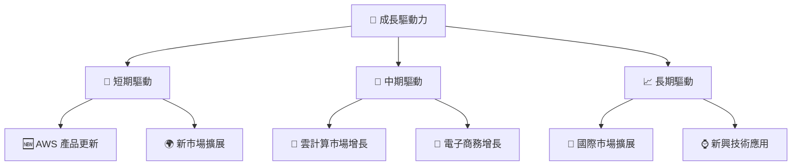

---

## 9. 風險矩陣

### 9.1 風險評分矩陣

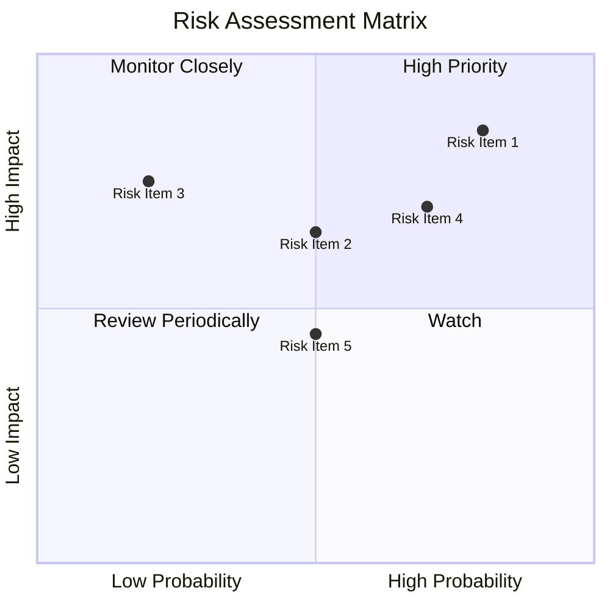

### 9.2 風險清單詳細分析

| # | 風險項目 | 發生機率 | 財務衝擊 | 風險評分 | 緩解措施 |
|---|----------|----------|----------|----------|----------|
| 1 | 🔴 **市場競爭加劇** | 高 (80%) | 高 (-10%收入) | 🔴 8.5/10 | 增加產品差異化 |
| 2 | 🔴 **監管挑戰** | 中 (50%) | 高 (-15%利潤) | 🔴 7.5/10 | 加強合規管理 |
| 3 | 🟡 **經濟波動** | 低 (30%) | 中 (-5%收入) | 🟡 5.0/10 | 擴大市場多樣性 |
| 4 | 🟡 **技術失靈** | 中 (50%) | 中 (-7%客戶) | 🟡 5.5/10 | 增強技術研發 |
| 5 | 🟢 **供應鏈中斷** | 低 (20%) | 低 (-3%成本) | 🟢 4.5/10 | 多重供應商戰略 |

---

## 10. 投資建議

### 10.1 最終綜合評級雷達圖

```
╔══════════════════════════════════════════════════════════════════╗
║                  Amazon 綜合評級雷達圖                          ║
╠══════════════════════════════════════════════════════════════════╣
║                                                                  ║
║   基本面強度: ★★★★★                                              ║
║   成長動能: ★★★★★                                                ║
║   獲利品質: ★★★★☆                                                ║
║   財務健康: ★★★★☆                                                ║
║   估值吸引力: ★★★★☆                                              ║
║                                                                  ║
╚══════════════════════════════════════════════════════════════════╝
```

### 10.2 目標價與隱含報酬率

| 情境 | 目標價 | 隱含報酬率 | 機率權重 |
|------|--------|-----------|----------|
| 🟢 樂觀 | $360 | +36% | 30% |
| 🟡 基準 | $283 | +7% | 50% |
| 🔴 悲觀 | $232 | -12% | 20% |

### 10.3 買入時機與觸發因素

```
╔══════════════════════════════════════════════════════════════════╗
║                  ✅ 買入觸發因素 Checklist                      ║
╠══════════════════════════════════════════════════════════════════╣
║                                                                  ║
║  立即買入觸發條件（多數符合）：                                  ║
║  ✅ AWS 增長超預期                                               ║
║  ✅ 電子商務強勁戶數增長                                         ║
║                                                                  ║
║  加碼觸發條件（出現以下任一）：                                  ║
║  ☐ 國際市場擴展成功                                             ║
║  ☐ 主要競爭對手表現不佳                                         ║
║                                                                  ║
║  減碼/停損觸發條件（出現以下任一）：                             ║
║  ☐ 重大監管問題                                                 ║
║  ☐ 市場份額顯著下降                                             ║
║                                                                  ║
╚══════════════════════════════════════════════════════════════════╝
```

### 10.4 投資人適配度分析

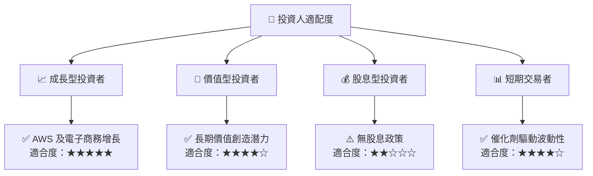

### 10.5 關鍵監控指標

| 監控類型 | 指標 | 關注點 | 頻率 |
|----------|------|--------|------|
| 財務 | 自由現金流 | 資本配置和流動性 | 季度 |
| 市場 | AWS 增長率 | 業務持續增長 | 季度 |
| 經營 | 客戶增長率 | 市場覆蓋和拓展 | 月度 |
| 競爭 | 市場份額變化 | 競爭力維持 | 半年 |

---

> **免責聲明**：本報告為 AI 自動生成，僅供研究參考，不構成投資建議。投資有風險，入市需謹慎。